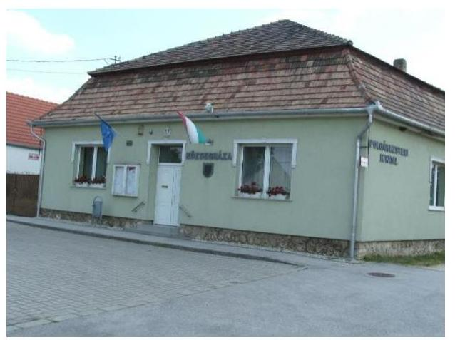
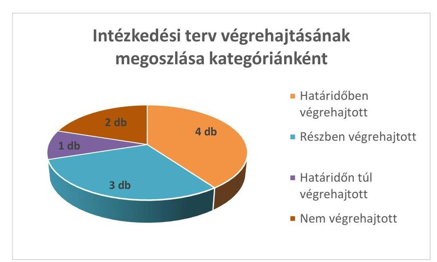
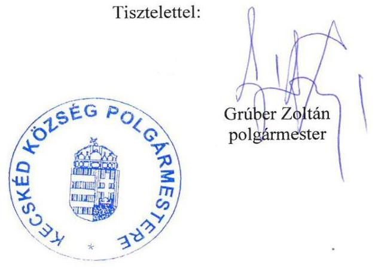
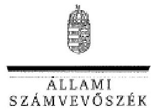
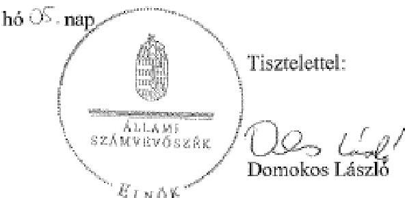

# Jelentés 

## Utóellenőrzések

Kecskéd Község Önkormányzata vagyongazdálkodás
szabályszerűségének utóellenőrzése 2016.

---

# Jelentés 

## Utóellenőrzések

Kecskéd Község Önkormányzata vagyongazdálkodás
szabályszerűségének utóellenőrzése
2016. 03. hó 16. nap

---

# AZ ELLENŐRZÉST FELÜGYELTE: 

HOLMAN MAGDOLNA felügyeleti vezető

## AZ ELLENŐRZÉST VEZETTE ÉS A VÉGREHAJTÁSÁÉRT FELELŐS:

FÉSŰS NÓRA ellenőrzésvezető

## A PROGRAM ÖSSZEÁLLÍTÁSÁÉRT FELELŐS:

JANIK JÓZSEF LÁSZLÓ osztályvezető

## A TÉMÁHOZ KAPCSOLÓDÓ KORÁBBI SZÁMVEVŐSZÉKI JELENTÉSEK:

- címe: Jelentés az önkormányzati vagyongazdálkodás szabályszerűségi ellenőrzéséről - Kecskéd
- sorszáma: 13108

Jelentéseink az Országgyűlés számítógépes hálózatán és az Interneten a www.asz.hu címen is olvashatóak.

IKTATÓSZÁM: V-0895-056/2016.
TÉMASZÁM: 1929
ELLENŐRZÉS-AZONOSÍTÓ SZÁM: V07170606

---

# TARTALOMJEGYZÉK 

■ ÖSSZEGZÉS ..... 5
■ AZ ELLENŐRZÉS CÉLJA ..... 6
■ AZ ELLENŐRZÉS TERÜLETE ..... 7
■ AZ ELLENŐRZÉS HÁTTERE, INDOKOLTSÁGA ..... 8
■ FÓKUSZKÉRDÉS ..... 9
■ ELLENŐRZÉS HATÓKÖRE ÉS MÓDSZEREI ..... 10
■ MEGÁLLAPÍTÁSOK ..... 12
■ MELLÉKLET ..... 15
I. SZ. MELLÉKLET: Az ÁSZ 13108 sz. jelentéséhez kapcsolódó intézkedési terv megvalósítása ..... 15
■ FÜGGELÉK: ÉSZREVÉTELEK ..... 19
■ RÖVIDÍTÉSEK JEGYZÉKE ..... 25

---

.

---

# ÖSSZEGZÉS 

Kecskéd Község Önkormányzata vagyongazdálkodásának szabályszerűségének 2007-2011. éveket érintő ellenőrzéséről 2013 októberében jelent meg az Állami Számvevőszék jelentése. A jelentésben foglalt megállapításokhoz kapcsolódóan az Önkormányzat által összeállított intézkedési terv megvalósítását utóellenőrzés keretében értékeltük. Az ellenőrzés során megállapítottuk, hogy az intézkedési tervben foglaltakat az Önkormányzat nem hajtotta végre teljes körűen. A megtett lépések az ÁSZ által korábban feltárt hiányosságok megszüntetése érdekében történtek. Az intézkedési tervben foglalt feladatok végrehajtásáról a jogszabály szerinti nyilvántartást hiányosan vezették.

## Az ellenőrzés társadalmi indokoltsága

Az Állami Számvevőszék stratégiájában célul tűzte ki a számvevőszéki munka hasznosulásának javítását. Ezzel összhangban ellenőrzi, hogy az ellenőrzött szervezetek megvalósították-e a korábbi ellenőrzései által feltárt hibák, hiányosságok és szabálytalanságok megszüntetése céljából kialakított intézkedési terveikben foglaltakat. A rendszeres utóellenőrzések hozzájárulnak a szükséges intézkedések tényleges végrehajtásához, ezáltal a közpénzügyek rendezettségének javulásához.

## Főbb megállapítások, következtetések, javaslatok

Az Önkormányzat által összeállított intézkedési tervet az ÁSZ törvényben rögzített határidőben küldték meg az ÁSZ-nak. Az intézkedési terv feladatait teljes körűen nem hajtották végre, a feladatok végrehajtásáról a jogszabály szerinti nyilvántartást hiányosan vezették.

---

# AZ ELLENŐRZÉS CÉLJA 

## Kecskéd Község Önkormányzata - vagyongazdálkodás szabályszerűségének utóellenőrzése

Az ellenőrzés célja annak értékelése, hogy a számvevőszéki jelentésben ${ }^{1}$ foglalt intézkedést igénylő megállapításokkal és javaslatokkal összhangban készített intézkedési tervben meghatározott feladatokat az ellenőrzött szervezet végrehajtotta-e.

---

# AZ ELLENŐRZÉS TERÜLETE 

## Kecskéd Község Önkormányzata

Kecskéd község Komárom-Esztergom megyében fekszik, állandó lakosainak száma 2015. január 1-jén 1990 fő* volt. Az Önkormányzat² 2014. december 31-én 740,8 millió Ft értékű eszközvagyonnal rendelkezett, amelyből 661,7 millió Ft volt a nemzeti vagyonba tartozó befektetett eszközök állománya ${ }^{1}$.

Az Önkormányzat vagyongazdálkodásának szabályszerűségének ellenőrzését az ÁSZ ${ }^{3}$ a 2007 - 2011. közötti időszakra végezte el, amely során megállapította, hogy az Önkormányzatnál a vagyongazdálkodás belső szabályozása hiányos, egyes vagyongazdálkodási feladatok végrehajtása a jogszabályoknak nem megfelelő. Az ÁSZ jelentése a Polgármesternek ${ }^{4}$ egy, a Jegyzőnek ${ }^{5}$ nyolc javaslatot tartalmazott.

Az Önkormányzat által összeállított intézkedési terv az ellenőrzés által feltárt hiányosságok kezelésére megfogalmazott intézkedést igénylő megállapításokkal és javaslatokkal összhangban volt és 10 feladatot tartalmazott.

Az utóellenőrzés ${ }^{6}$ a számvevőszéki jelentésekben megfogalmazott intézkedést igénylő megállapításokra és javaslatokra készített intézkedési tervben foglalt feladatok megvalósításának ellenőrzésére, illetve értékelésére fókuszál.

[^0]
[^0]:    * Forrás: Központi Statisztikai Hivatal, Magyarország Közigazgatási Helységnévkönyve, az Önkormányzat 2015. január 1-jei adatai
    ${ }^{1}$ Forrás: Magyar Államkincstár, az Önkormányzat 2014. december 31-ei könyvviteli mérleg szerinti adatai

---

# AZ ELLENŐRZÉS HÁTTERE, INDOKOLTSÁGA 

Az ÁSZ TÖRVÉNY ${ }^{7}$ 33. § (1) bekezdése értelmében a számvevőszéki jelentések intézkedést igénylő megállapításaihoz és javaslataihoz kapcsolódóan az ellenőrzött szervezet vezetője intézkedési tervet köteles összeállítani, és az Állami Számvevőszék részére megküldeni. Az intézkedési tervben foglaltak megvalósítását - az ÁSZ törvény 33. § (7) bekezdésében foglaltak alapján - az Állami Számvevőszék utóellenőrzés keretében ellenőrizheti. Az intézkedések megvalósulásának értékelése során az Állami Számvevőszék figyelembe veszi az ellenőrzött szervezetek működési feltételeiben, valamint a jogszabályi előírásokban bekövetkezett változásokat.

Az intézkedési tervekben foglalt feladatok hiányos, illetve késedelmes végrehajtása, valamint megvalósításának elmaradása azt mutatja, hogy az ellenőrzések során feltárt hibák, hiányosságok és szabálytalanságok megszüntetése nem kapott kellő hangsúlyt. Ez a szabályszerű működés és a felelős vezetői magatartás vonatkozásában kockázatot hordoz. E kockázatok feltárásával az Állami Számvevőszék utóellenőrzési rendszere fokozza a fegyelmet, és igazolja, hogy a közpénzzel való szabályos gazdálkodás felelőssége elől nem lehet kitérni.

## AZ UTÓELLENŐRZÉS négy szinten hasznosulhat:

- A társadalom szintjén az utóellenőrzés jelzi, hogy a számvevőszéki ellenőrzés megállapításainak van következménye: a hiányosságok megszüntetésére az ellenőrzött szervezet által meghatározott intézkedések végrehajtását is számon kéri az ÁSZ.
- Az ellenőrzött terület szintjén az utóellenőrzés tájékoztatást nyújt a terület döntéshozóinak a hiányosságok kiküszöbölésének jó gyakorlatairól, ezzel lehetőséget biztosítva arra, hogy az ÁSZ ellenőrzési megállapításai, javaslatai a terület nem ellenőrzött szervezeteinek a működése során is hasznosuljanak.
- Az ellenőrzött szervezet szintjén az utóellenőrzés feltárja, hogy a szervezet az intézkedések végrehajtásával hasznosította-e a korábbi ellenőrzési jelentésben a hiányosságok megszüntetése, illetve a kockázatok kezelése érdekében megfogalmazott javaslatokat.
- Az ÁSZ szintjén az utóellenőrzés visszacsatolást ad az ellenőrzési jelentések hasznosulásáról, az intézkedések elmaradása vagy részleges megvalósulása a további ellenőrzésekhez kockázati jelzésként szolgál.

---

# FÓKUSZKÉRDÉS 

1. Az ellenőrzött szervezet az intézkedési tervben foglaltakat - az előírt határidőben - végrehajtotta-e?

---

# ELLENŐRZÉS HATÓKÖRE ÉS MÓDSZEREI 

## Az ellenőrzés típusa

Szabályszerűségi ellenőrzés

## Az ellenőrzött időszak

Az ÁSZ jelentés közzétételének napjától (2013. október 29.) az utóellenőrzés megkezdésének napjáig (2015. június 19.) tartó időszak.

## Az ellenőrzés tárgya

Az Önkormányzat intézkedési tervében foglaltak végrehajtásának ellenőrzése

## Az ellenőrzött szervezet

Kecskéd Község Önkormányzata

## Az ellenőrzés jogalapja

Magyarország Alaptörvénye 43. cikk (1) bekezdése alapján az ÁSZ az Országgyűlés pénzügyi és gazdasági ellenőrző szerve. Az ÁSZ törvényben meghatározott feladatkörében ellenőrzi a központi költségvetés végrehajtását, az államháztartás gazdálkodását, az államháztartásból származó források felhasználását és a nemzeti vagyon kezelését.

Az ÁSZ törvény 1. § (3) bekezdése szerint az ÁSZ általános hatáskörrel végzi a közpénzekkel és az állami és önkormányzati vagyonnal való felelős gazdálkodás ellenőrzését.

Az ÁSZ törvény 33. § (7) bekezdése alapján az ÁSZ jelentésben foglalt megállapításokhoz kapcsolódóan összeállított intézkedési tervben foglaltak megvalósítását az ÁSZ utóellenőrzés keretében ellenőrizheti.

Az államháztartásról szóló 2011. évi CXCV. törvény 61. § (2) bekezdése szerint az államháztartás külső ellenőrzésével kapcsolatos feladatokat az ÁSZ látja el.

---

# Az ellenőrzés módszerei 

Az ellenőrzést az ellenőrzési program kérdései, az ellenőrzött időszakban hatályos jogszabályok, az ellenőrzés szakmai szabályai és módszertanai figyelembe vételével végeztük.

Az intézkedési tervben előírt feladatok végrehajtásának ellenőrzését értékelési kritériumok alapján végeztük. Az intézkedési tervekben foglalt feladatokat azok végrehajtása szempontjából az alábbiak szerint értékeltük:
$\longrightarrow$ „határidőben végrehajtott" a feladat, ha a teljesítés dokumentáltan, az intézkedési tervben előírt határidőben és tartalommal megtörtént;
$\longrightarrow$ „határidőn túl végrehajtott" a feladat, ha annak teljesítése az intézkedési tervben meghatározott módon, de az előírt határidőn túl történt meg;
$\longrightarrow$ „részben végrehajtott" a feladat, ha végrehajtása teljes körűen az intézkedési tervben előírt módon nem történt meg;
$\longrightarrow$ „nem végrehajtott" a feladat, ha a végrehajtás nem történt meg, vagy amennyiben a teljesítést nem dokumentálták;
$\longrightarrow$ „okafogyottá vált" a feladat, ha végrehajtására - meghatározott esemény bekövetkezése, továbbá külső körülmény, a működést érintő feltétel változása miatt - már nincs szükség, illetve lehetőség, és egyértelműen megállapítható, hogy az intézkedést szükségessé tevő körülmény a jövőben nem fordulhat elő;
$\longrightarrow$ „nem időszerű" az a feladat, amelynek ellenőrzési időszakon belüli végrehajtására azért nem került (kerülhetett) sor, mert az intézkedés alapjául szolgáló esemény nem következett be, de annak jövőbeni előfordulása lehetséges, a végrehajtása nem volt esedékes, vagy a végrehajtás határideje még nem járt le.
Az utóellenőrzésre az Önkormányzat elektronikus adatszolgáltatása alapján került sor, helyszínen ellenőrzést nem végeztünk. Az Önkormányzat által szolgáltatott adatok és dokumentumok valódiságát és teljes körűségét a Polgármester, valamint a Jegyző teljességi és hitelességi nyilatkozata igazolta.

A gazdálkodási jogkörök gyakorlására vonatkozó intézkedés megvalósítását mintavételes ellenőrzéssel értékeltük. Az utóellenőrzés jellege miatt a mintatételek ellenőrzésével nem az adott terület szabályszerűségéről mondtunk véleményt, hanem arról, hogy a működési hiányosságok felszámolására az Intézkedési tervben rögzítetteket végrehajtották-e az ellenőrzött tételek esetében.

---

# MEGÁLLAPÍTÁSOK 

## 1. Az ellenőrzött szervezet az intézkedési tervben foglaltakat - az előírt határidőben - végrehajtotta-e?

Összegző megállapítás

Az intézkedési terv feladatait nem hajtották végre teljes körűen. Az intézkedési terv végrehajtásáról a jogszabályban előírt nyilvántartást hiányosan vezették.
1.1. számú megállapítás

Az intézkedési terv feladatait nem hajtották végre teljes körűen.
Az intézkedési tervben foglalt feladatok végrehajtásának értékelését a következő ábra foglalja össze:

Forrás: ÁSZ

## HATÁRIDŐBEN VÉGREHAJTOTT feladat:

$\qquad$ 1. A Jegyző és a Polgármester a nemzetgazdasági szempontból kiemelt jelentőségű vagyonelemek kijelölése érdekében előterjesztést készítettek és gondoskodtak annak a Képviselő-testület elé terjesztéséről.
$\qquad$ 2. Az Önkormányzat a kétévenkénti leltározási kötelezettséget rendeletben szabályozta.
$\qquad$ 3. A Jegyző gondoskodott a vagyonkezelő 2011. évi beszámolójának pótlólagos Képviselő-testületi előterjesztéséről.
$\qquad$ 4. Az ÁSZ vonatkozó szabályainak megfelelően történő leltározás és leltározás kiértékelésének végrehajtása.

## RÉSZBEN VÉGREHAJTOTT feladat:

$\qquad$ 5. Az Önkormányzat kiadta a selejtezési és hasznosítási ${ }^{9}$, a bizonylati ${ }^{10}$, valamint a kötelezettségvállalásról, utalványozásról, érvényesítés és ellenjegyzés rendjéről szóló ${ }^{11}$ - Jegyző által aláírt - szabályzatokat. A gazdálkodási szabályzatban nem rögzítették a helyettesítés rendjét.
6. A Polgármester nem kezdeményezte teljes körűen és dokumentált módon az ÁSZ jelentésben megfogalmazott problémák kivizsgálását, az intézkedési tervben foglaltak maradéktalan végrehajtását.
7. Az Önkormányzat részben gondoskodott a gazdálkodási jogkörök jogszabályi előírásoknak megfelelő gyakorlásáról.

## HATÁRIDŐN TÚL VÉGREHAJTOTT feladat

8. A belső ellenőrzési javaslatokra az előírt intézkedési terv készítési kötelezettség teljesítése.

## NEM VÉGREHAJTOTT feladat:

9. Az ÁSZ 44/A. § (2)-(3) bekezdésben előírtaknak megfelelő vagyonkimutatás elkészítése.
10. Az Önkormányzat részben teremtette meg az önkormányzati ingatlanvagyon-kataszter, a földhivatali nyilvántartás és a számviteli nyilvántartás 147/1992. (XI. 6.) Korm. rendelet ${ }^{12}$ 1. § (2)-(3) bekezdésében és 4. § (1) bekezdésében foglaltak szerinti egyezőségét.
Az intézkedési tervben előírt 10 feladatot, az ÁSZ jelentés vonatkozó javaslatának címzettjét, a feladatok végrehajtásának határidejét, valamint a végrehajtás bemutatását és a teljesítés minősítését a melléklet tartalmazza.

### 1.2. számú megállapítás

Az intézkedési tervben rögzített feladatok végrehajtásáról hiányosan vezettek nyilvántartást.

Az intézkedési tervben rögzített feladatokat tartalmazta a külső ellenőrzések 2013-as nyilvántartása. A Bkr. ${ }^{13}$ 47. § (2) bekezdésében foglaltak ellenére ugyanakkor, nem tartalmazta az ÁSZ jelentésben szereplő javaslatot, a végrehajtás tényleges idejét, valamint a határidőben végre nem hajtott intézkedések okát és a nem teljesülés kapcsán tett lépéseket.

A végrehajtásért felelős személyek részére beszámolási kötelezettséget nem írtak elő.

---

.

---

# MELLÉKLET

- I. SZ. MELLÉKLET: AZ ÁSZ 13108 SZ. JELENTÉSÉHEZ KAPCSOLÓDÓ INTÉZKEDÉSI TERV MEGVALÓSÍTÁSA

|  Az intézkedési terv alapján elvégzendő feladat | Az ÁSZ 13108 sz. jelentése javaslatának címzettje | Az intézkedési tervben meghatározott határidő | A feladat végrehajtása  |
| --- | --- | --- | --- |
|  1. |

 2. | 3. | 4.  |
|  Határidőben végrehajtott feladatok |  |  |   |
|  1. Rendelet-tervezet elkészítése és a Polgármesternél annak Képviselő-testület elé terjesztésének kezdeményezése. Felelős: Polgármester, Jegyző | Jegyző | 2014. január 30. | A Polgármester előterjesztése alapján a Képviselő-testület a 2014. január 29-i ülése napirendjére tűzte a nemzetgazdasági szempontból kiemelt jelentőségű nemzeti vagyon meghatározását. A 10/2014. (I. 29.) számú határozatban 2014. január 29-én arról döntöttek, hogy - mivel az Önkormányzat nem rendelkezik nemzetgazdasági szempontból kiemelt jelentőségű nemzeti vagyontárggyal - nem minősítenek egyetlen vagyontárgyát sem nemzetgazdaságilag kiemelt jelentőségűnek.  |
|  2. Gondoskodni kell a kétévenkénti leltározás rendeleti szabályozásáról. Felelős: Jegyző | Jegyző | 2013. december 31. | A Jegyző a kétévenkénti leltározás szabályozásáról határidőben gondoskodott, mert a Polgármester előterjesztése alapján a Képviselő-testület 11/2013. (IX. 11.) számon 2013. november 11-én rendeletet alkotott az Önkormányzat és az általa fenntartott intézmények kétévenkénti leltározási kötelezettségről.  |
|  3. A vagyonkezelő 2011. évi beszámolóját pótlólag a Képviselő-testület elé kell terjeszteni. Felelős: Jegyző | Jegyző | Az intézkedési terv határidőt nem állapított meg. | A Jegyző helyett a Polgármester 2013. szeptember 9-én a Képviselő-testület elé terjesztette Kecskéd Község szennyvízelvezető és kezelőmű 2011. évi kezelésével kapcsolatos elszámolását, amit a Képviselő-testület a 118/2013. (IX. 11.) KT. számú határozatával 2013. szeptember 11-én elfogadott.  |
|  4. Gondoskodni kell, hogy a leltározás és a leltározás kiértékelése az Áhsz. vonatkozó szabályozása szerint készüljön el és annak kiértékelése történjen meg. Felelős: pénzügyi előadó | Jegyző | 2013. december 31. | A 2013. évi leltár az Áhsz. 37. § előírásai szerint tartalmazza az eszközök és források leltárát, valamint a leltárakon az összegeket és a mérlegsorokkal történt egyeztetést.  |

---

|  Az intézkedési terv alapján elvégzendő feladat | Az ÁSZ 13108 sz. jelentése javaslatának címzettje | Az intézkedési tervben meghatározott határidő | A feladat végrehajtása  |
| --- | --- | --- | --- |
|  1. | 2. | 3. | 4.  |
|  Részben végrehajtott feladatok |  |  |   |
|  5. | Selejtezési és hasznosítási, bizonylati, kötelezettségvállalásról, utalványozásról, érvényesítés és ellenjegyzés rendjéről szóló - Jegyző által aláírt - szabályzatok kiadása. A szabályzatokban rögzíteni kell a helyettesítés rendjét, a kijelölést az érvényesítési feladatok ellátásához. Felelős: Jegyző | Jegyző | 2014. május 30.  |
|  6. | Az ÁSZ jelentésben megfogalmazott „problémák" kivizsgálásának, az intézkedési tervben foglaltak maradéktalan végrehajtásának kezdeményezése. (1. Pénzügyi-számviteli szabályzatok felülvizsgálata, aktualizálása; 2. Vagyonrendelet ${ }^{12}$ felülvizsgálata; 3. Vagyonkimutatás Áhsz. szerinti elkészítése; 4. Ingatlanvagyon kataszter, földhivatali nyilvántartás és számviteli nyilvántartás egyezőségének biztosítása; 5. Áhsz. előírásainak betartása a leltározás végrehajtásakor.) Felelős: Polgármester | Polgármester | 2014. május 30.  |

---

|  7. | Kötelezettséget vállalni csak pénzügyi ellenjegyzés után a pénzügyi teljesítés esedékességét megelőzően, írásban lehet. A pénzügyi ellenjegyzőnek meg kell győződnie arról, hogy a szabad előirányzat rendelkezésre áll, a tervezett kifizetési időpontokban a pénzügyi fedezet biztosított, és a kötelezettségvállalás nem sérti a gazdálkodásra vonatkozó szabályokat. A teljesítés igazolása során ellenőrizhető okmányok alapján ellenőrizni és igazolni kell a kiadások teljesítésének jogosságát, összegszerűségét, ellenszolgáltatást is magában foglaló kötelezettségvállalás esetében - ha a kifizetés vagy annak egy része az ellenszolgáltatás teljesítését követően esedékes - annak teljesítését. Az érvényesítőnek ellenőriznie kell az összegszerűséget, a fedezet meglétét és azt, hogy a megelőző ügymenetben az Áht., az államháztartási számviteli kormányrendelet, és e rendelet előírásait, továbbá a belső szabályzatokban foglaltakat megtartották-e. Utalványozni készpénzes fizetési mód esetén az érvényesített pénztárbizonylatra rávezetett, más esetben külön írásbeli rendelkezéssel lehet. Felelős: Polgármester, Jegyző, gazdálkodási előadó, pénzügyi előadó | Jegyző | azonnal és folyamatosan | Nem végrehajtott feladatok a 10 elemű minta értékelése alapján: Az ellenőrzött mintatételek dokumentumai alapján a kötelezettségvállalás és a pénzügyi ellenjegyzés egy időben történt, nem az intézkedési tervben meghatározottak szerint. Mivel a kötelezettségvállalási bizonylatok hiányosak és nem tartalmazzák, hogy mely előirányzat terhére történik a kötelezettségvállalás, dokumentáltan nem bizonyított, hogy az intézkedési tervben meghatározott ellenőrzési feladatokat ellátták. Az érvényesítési feladatok ellátásának ellenőrzése során megállapítottuk, hogy egy mintatétel esetében az érvényesítő nem végezte el annak ellenőrzését, hogy a megelőző ügymenetben az Áht. és Ávr. előírásait, továbbá a belső szabályzatokban foglaltakat betartották-e, mivel a pénzügyi ellenjegyzés hiányosságait nem jelezte az utalványozónak. Határidőben végrehajtott feladatok a 10 elemű minta értékelése alapján: A teljesítésigazolások az intézkedési tervben foglaltak szerint történtek minden mintatétel esetében. Az utalványozások az intézkedési tervben foglaltak szerint történtek minden mintatétel esetében.  |
| --- | --- | --- | --- |
|  |   |   |   |

---

|  8. | Intézkedési terv készítési kötelezettség a Ber. ${ }^{18}$ 29. § alapján. Felelős: Jegyző | Jegyző | 2013. november 28. és ellenőrzések után | A Ber.-t hatályon kívül helyező 8kr. 28. § c) pontja és a 45. § (1)-(3) bekezdései tartalmazzák az intézkedési terv készítésének kötelezettségére, tartalmára és határidejére vonatkozó előírásokat. A 2013. évi belső ellenőrzéshez kapcsolódó intézkedési terv készítési kötelezettség határidőben teljesült. A 2014. évben lefolytatott két belső ellenőrzés alapján egy esetben az intézkedési tervet a 8kr. 45. § (3) bekezdésében megállapított határidőt követően készítette el az Önkormányzat.  |
| --- | --- | --- | --- | --- |
|  9. | Gondoskodni kell arról, hogy a vagyonkimutatás az Áhsz. 44/A. § (2)-(3) bekezdésben előírtaknak megfelelően készüljön el. Felelős: Jegyző, gazdálkodási előadó | Jegyző | 2014. április 30. zárszámadással egyidőben | Az Önkormányzat a vagyonkimutatás elkészítéséről nem az Áhsz. 44/A § (2)-(3) bekezdéseiben előírtak szerint gondoskodott. A 2013. évi zárszámadáshoz készített vagyonkimutatás nem felelt meg az Áhsz. 44/A § (2) bekezdésének, mert az Önkormányzat vagyonát nem törzsvagyon, illetve üzleti vagyon bontásban tartalmazta. A vagyonkimutatásban szereplő adatok nem voltak az Áhsz. 44/A § (3) bekezdésének megfelelően teljes körűek.  |
|  10. | Gondoskodni kell arról, hogy a 147/1992. (XI. 6.) Korm. rendelet 1. § (2) - (3) bekezdésében és 4. § (1) bekezdésében foglaltak szerinti egyezőséget meg kell teremteni. Felelős: Jegyző, gazdálkodási előadó | Jegyző | 2014. április 30. | Az Önkormányzat az ellenőrzött időszakban nem teremtette meg az intézkedési tervben hivatkozott jogszabály előírásai (a 147/1992. (XI. 6.) Korm. rendelet 1. § (2) bekezdés) szerint az ingatlanvagyon-kataszter és az ingatlanügyi hatóságként eljáró járási hivatal ingatlan-nyilvántartásának azonos tartalmú adataival való egyezőségét. Az ingatlanvagyon-kataszter nem törzsvagyon és egyéb vagyon szerinti bontásban tartalmazza az ingatlanokra vonatkozó adatokat, ezért nem teljesült a 147/1992. (XI. 6.) Korm. rendelet 1. § (3) bekezdésének erre vonatkozó előírása. A 147/1992. (XI. 6.) Korm. rendelet 4. § (1) bekezdésében foglaltak teljes körű teljesüléséről nem tudtunk meggyőződni az ingatlanvagyon-kataszter adatai alapján.  |

Formás: ÁSZ

---

# FÜGGELÉK: ÉSZREVÉTELEK 

A jelentéstervezetet a Számvevőszék 15 napos észrevételezésre megküldte az ellenőrzött szervezet vezetőjének az ÁSZ tv. 29. § (1) bekezdése előírásának megfelelően. Az elfogadott észrevételek alapján a Számvevőszék módosította a jelentést. A függelék tartalmazza az ellenőrzött észrevételeit, illetve az el nem fogadott észrevételek elutasításának indoklását.

- Kecskéd Község Önkormányzata Polgármesterének 115-1/2016. iktatószámú levele
- Tájékoztatás az el nem fogadott észrevételekről (V-0895-053/2016.)

## ${ }^{5}$ 29. § (1) Az Állami Számvevőszék az ellenőrzési megállapításait megküldi az ellenőrzött szervezet vezetőjének vagy az általa megbízott személynek, és annak, akinek személyes felelősségét állapította meg.

(2) Az ellenőrzött szervezet vezetője és a felelősként megjelölt személy az ellenőrzés megállapításaira tizenöt napon belül írásban észrevételt tehet.
(3) Az Állami Számvevőszék az észrevételre a beérkezésétől számított harminc napon belül írásban válaszol. A figyelembe nem vett észrevételeket köteles a jelentésben feltüntetni, és megindokolni, hogy azokat miért nem fogadta el.

---

# KECSKÉD KÖZSÉG POLGÁRMESTERÉTŐL 

$115-1 / 2016$.

Állami Számvevőszék
Domokos László
elnök
Budapest

Tisztelt Elnök Úr!
Tárgy: Jelentéstervezetre észrevétel
Hiv.sz: V-0895-047/2015

Az Utóellenőrzések -Kecskéd Község Önkormányzata- vagyongazdálkodás szabályszerűségének utóellenőrzése címủ számvevőszéki jelentéstervezettel kapcsolatban az alábbi észrevételeket teszem:

### 1.1. sz. megállapítás 5. pont.

A helyettesítés rendjét a Gazdálkodási szabályzat 5. oldala „A kötelezettségvállalási jogkör átruházása az akadályoztatás és az összeférhetetlenség eseteire terjed ki." valamint a szabályzat „Felhatalmazás" című mellékletei tartalmazzák kötelezettségvállalás, pénzügyi ellenjegyzés, érvényesítés esetében.

### 1.1. sz. megállapítás 6. és 7. pont

Milyen módon és milyen dokumentumokkal tudunk eleget tenni a 6. és 7. pontban foglalt kötelezettségnek? Lehet, hogy rendelkezünk a megfelelő bizonylatokkal, csak nem értjük a felvetést.

### 1.1. sz. megállapítás 9. pont

A vagyonkimutatást az ellenőrzés során megküldtük. A dokumentum neve: „Hiánypótlás 2es 4-es pontjához"
A vagyonkimutatás -leltárkiértékelés mérlegsorok szerinti táblázat és a csatolt további táblázatok a 249/2000.(XII.24.) Korm.r. 44/A §. (2) bek. 1.sz. melléklet szerinti csoportosításban tartalmazza a vagyont, az tény, hogy forgalomképes és korlátozottan forgalomképes bontás hiányzik.
A hivatkozott rendelet 44/A §. (3) bekezdésben szereplő kimutatásokat fenti dokumentumban megküldtük.

---

# 1.1. sz megállapítás 10. pont 

A Földhivataltól az Önkormányzat 2015. augusztus 13-án kapta meg a Földkönyvet, ezért az ingatlanvagyon-kataszter, a földhivatali nyilvántartás és a számviteli egyezőséget az ellenőrzés lezártáig nem tudtuk elkészíteni.

### 1.2. sz megállapítás

A megállapítás ezen pontjához mellékelem a Bkr. 47.§.(2) bekezdés szerinti nyilvántartást
A beszámoltatási kötelezettséggel kapcsolatban a Polgármester Úr nyilatkozatát korábban megküldtük.

Kérem észrevételeink szíves figyelembevételét a végleges jelentés elkészítésénél.
Segítő, munkánkat javító ellenőrzésüket köszönjük.
Kecskéd, 2016. január 28.

---

ELNÖK

Ikt.szám: V-0895-053/2016.

Grűher Zoltán úr
polgármester

Kecskéd Község Önkormányzata

Kecskéd

Tisztelt Polgármester Úr!

Az Utóellenőrzés – Kecskéd Község Önkormányzata vagyongazdálkodás szabályszerűségének utóellenőrzése című számvevőszéki jelentéstervezetre tett észrevételeit köszönettel megkaptam.

Az Állami Számvevőszék észrevételekre vonatkozó álláspontjáról a felügyeleti vezető által készített részletes tájékoztatást csatoltan megküldöm.

Tájékoztatom Polgármester urat, hogy a jelentésben – az Állami Számvevőszékről szóló 2011. évi LXVI. törvény 29. § (3) bekezdése alapján – az el nem fogadott észrevételeket szerepeltetjük az elutasítás indokának feltüntetésével együtt.

Budapest, 2016.

Melléklet: Tájékoztatás az el nem fogadott észrevételekről

1052 BUDAPEST, ÁRÓZÁN CSERE SÁNOS UTCA 10. 1304 Budapest 4. Pf. 54 telefon: 484 9501 fax: 484 9201

---

# Tájékoztatás az el nem fogadott észrevételekről 

Az Utóellenőrzés - Kecskéd Község Önkormányzata vagyongazdálkodás szabályszerűségének utóellenőrzése címủ számvevőszéki jelentéstervezetre a 115-1/2016. iktatószámú levelében tett észrevételeit áttekintettük, annak kezeléséről az alábbi tájékoztatást adom.
A jelentéstervezet 1.1. számú megállapítás 5. pontjára tett észrevételét nem fogadtuk el. Az Önkormányzat intézkedési tervében vállalt feladata szerint a szabályzatokban rögzíteni kell a helyettesítés rendjét. Az ellenőrzés megállapítása szerint a gazdálkodási jogkörök gyakorlásának eljárásrendjét szabályozó Gazdálkodási szabályzat a helyettesítés rendjéről nem rendelkezik, csak az Ávr. szerint kijelöléseket tartalmazza (érvényesítésre, pénzügyi ellenjegyzésre, utalványozásra, teljesítésigazolásra). Az Önkormányzat jelentéstervezetre tett észrevételében a Gazdálkodási szabályzat 5. oldalán szereplő rendelkezés kizárólag a kötelezettségvállalás átruházására, és nem a helyettesítésre vonatkozik. A szabályzat „Felhatalmazás" címủ mellékletei pedig az egyéb gazdálkodási jogkörök vonatkozásában az Ávr. szerinti kijelölések dokumentumai, melyek szintén nem rendelkeznek
 helyettesítésről.
A jelentéstervezet 1.1. számú megállapítás 6. és 7. pontjára tett észrevétele a jelentéstervezet megállapítását nem módosítja, az észrevétel a megtett megállapítást nem kifogásolja. Az ÁSZ megállapításait az ellenőrzött szervezet által rendelkezésre bocsátott dokumentumok alapján tette meg, melynek teljes körűségéről a Polgármester nyilatkozatot tett.
Nem fogadtuk el az 1.1. számú megállapítás 9. pontjára tett észrevételét. Az Önkormányzat által az intézkedési tervben vállalt feladat: „Gondoskodni kell arról, hogy a vagyonkimutatás az Áhsz. 44/A. § (2)-(3) bekezdésben előírtaknak megfelelően készüljön el.” Az ellenőrzés rendelkezésre bocsátott dokumentumok alapján - melynek teljes körűségéről a Polgármester nyilatkozatot tett - a 2013. évi zárszámadáshoz készített vagyonkimutatás az Önkormányzat vagyonát nem az Áhsz. 44/A § (2) bekezdése szerinti törzsvagyon, illetve üzleti vagyon szerinti bontásban tartalmazta. A vagyonkimutatásban szereplő adatok nem az Áhsz. 44/A § (3) bekezdésének megfelelő részletezettséggel tartalmazták az adatokat, ezért a jelentéstervezet megállapítása megalapozott. Ez a jelentéstervezetre tett észrevételben is megerősítésre került.

A jelentéstervezet 1.1. számú megállapítás 10. pontjára tett észrevételét nem fogadtuk el. A jelentéstervezet Ellenőrzés hatóköre és módszerei című fejezet részletesen tartalmazza az ellenőrzött időszakot, amely 2013. október 29. - 2015. június 19. volt. Az ingatlanvagyon-kataszter, a földhivatali nyilvántartás és a számviteli egyezőség elkészítéséhez a Földkönyv 2015. augusztus 13-ától áll rendelkezésükre, amely az ellenőrzött időszakon kívül esik. Így a jelentéstervezet megállapítását nem módosítja. Örömmel vettük azonban tájékoztatását a korábban feltárt hiányosság megszüntetéséről.

Nem fogadtuk el a jelentéstervezet 1.2. számú megállapításra tett észrevételét, mert az ellenőrzés megállapítása a külső ellenőrzések javaslatai alapján készült intézkedési tervek végrehajtásának nyilvántartására vonatkozik. A Bkr. 14. § (1) bekezdése szerinti külső ellenőrzések 2013. évi nyilvántartását az ellenőrzött szervezet az ellenőrzés rendelkezésére bocsátotta, azonban az

---

nem a Bkr. 47. § (2) bekezdése szerinti tartalommal készült. A megállapítás: „Az intézkedési tervben rögzített feladatokat tartalmazta a külső ellenőrzések 2013-as nyilvántartása. A Bkr. 47. § (2) bekezdésében foglaltak ellenére ugyanakkor, nem tartalmazta az ÁSZ jelentésben szereplő javaslatot, a végrehajtás tényleges idejét, valamint a határidőben végre nem hajtott intézkedések okát és a nem teljesülés kapcsán tett lépéseket.” Az Önkormányzat a jelentéstervezetre tett észrevételében a 47. § (2) bekezdés által előírt nyilvántartását küldte meg, mely az ellenőrzés megállapításait nem módosítja.

Budapest, 2016. 03. hó 05. nap

Holman Magdolna
felügyeleti vezető

---

# RÖVIDÍTÉSEK JEGYZÉKE 

${ }^{1}$ számvevőszéki jelentés
${ }^{2}$ Önkormányzat
${ }^{3}$ ÁSZ
${ }^{4}$ Polgármester
${ }^{5}$ Jegyző
${ }^{6}$ utóellenőrzés
${ }^{7}$ ÁSZ törvény
${ }^{8}$ Áhsz.
${ }^{9}$ selejtezési és hasznosítási szabályzat
${ }^{10}$ bizonylati szabályzat
${ }^{11}$ gazdálkodási szabályzat
${ }^{12}$ 147/1992. (XI.6.) Korm. rendelet
${ }^{13}$ Bkr.
${ }^{14}$ hasznosítási és selejtezési szabályzat
${ }^{15}$ bizonylati szabályzat
${ }^{16}$ gazdálkodási szabályzat
${ }^{17}$ vagyonrendelet
${ }^{18}$ Ber.

Az ÁSZ 13108 számú, Jelentés: Az önkormányzati vagyongazdálkodás szabályszerűségi ellenőrzéséről - Kecskéd című jelentése
Kecskéd Község Önkormányzata
Állami Számvevőszék
Kecskéd Község Önkormányzatának polgármestere
Kecskéd Község Polgármesteri Hivatalának jegyzője
az ÁSZ 13108 számú jelentésében foglalt megállapításokhoz kapcsolódóan az
Önkormányzat által összeállított és az ÁSZ által elfogadott intézkedési tervben
foglaltak végrehajtása megvalósításának ellenőrzése
az Állami Számvevőszékről szóló 2011. évi LXVI. törvény
2013. december 31-éig: az államháztartás szervezetei beszámolási és
könyvvezetési kötelezettségének sajátosságairól szóló 249/2000. (XII. 24.) Korm. rendelet
2014. január 1-jétől: az államháztartás számviteléről szóló 4/2013. (I. 11.) Korm. rendelet
Kecskéd Község Önkormányzata Felesleges vagyontárgyak hasznosításának, selejtezésének szabályzata (hatályos 2014. április 1-jétől)
Kecskéd Község Önkormányzata Bizonylati szabályzat (hatályos 2014. április 1-jétől)
Kecskéd Község Önkormányzata Gazdálkodási szabályzat a kötelezettségvállalás, pénzügyi ellenjegyzés, teljesítés igazolása, érvényesítés, utalványozás rendjéről (hatályos 2014. április 1-től)
az önkormányzatok tulajdonában lévő ingatlanvagyon nyilvántartási és adatszolgáltatási rendjéről szóló 147/1992. (XI.6.) Korm. rendelet
a költségvetési szervek belső kontrollrendszeréről és belső ellenőrzéséről szóló 370/2011 (XII. 31.) Korm. rendelet (hatályos 2012. január 1-jétől)
Felesleges vagyontárgyak hasznosításának, selejtezésének szabályzata (hatályos: 2014. április 1-től)
Kecskéd Község Önkormányzatának Bizonylati szabályzata (hatályos: 2014. április 1-től)
Kecskéd Község Önkormányzatának Gazdálkodási Szabályzata a
kötelezettségvállalás, pénzügyi ellenjegyzés, teljesítés igazolása, érvényesítés, utalványozás rendjéről (hatályos: 2014. április 1-jétől)
Kecskéd Község Önkormányzat Képviselő-testületének 3/2013. (III. 27.) sz. rendelete az Önkormányzat vagyonáról és vagyongazdálkodásáról
a költségvetési szervek belső ellenőrzéséről szóló 193/2003. (XI. 26.) Korm. rendelet (hatálytalan 2012. január 1-jétől)

---

# ÁLLAMI SZÁMVEVŐSZÉK 

1052 Budapest, Apáczai Csere János utca 10.
Levélcím: 1364 Budapest 4. Pf. 54
Telefon: +36 14849100 Telefax: +36 14849200
www.asz.hu
