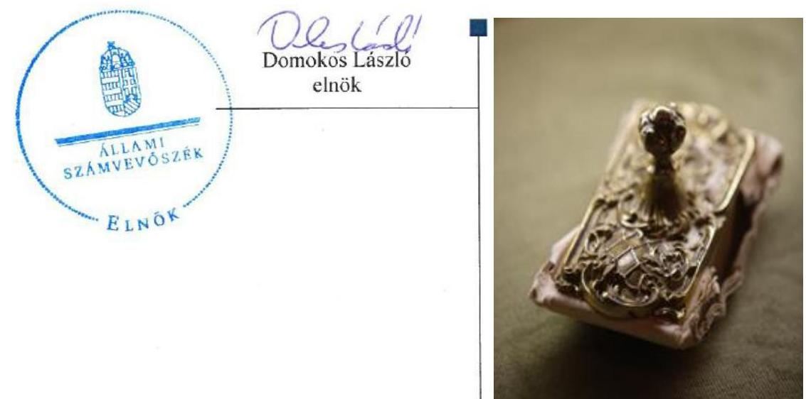
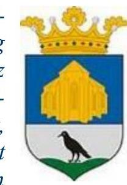
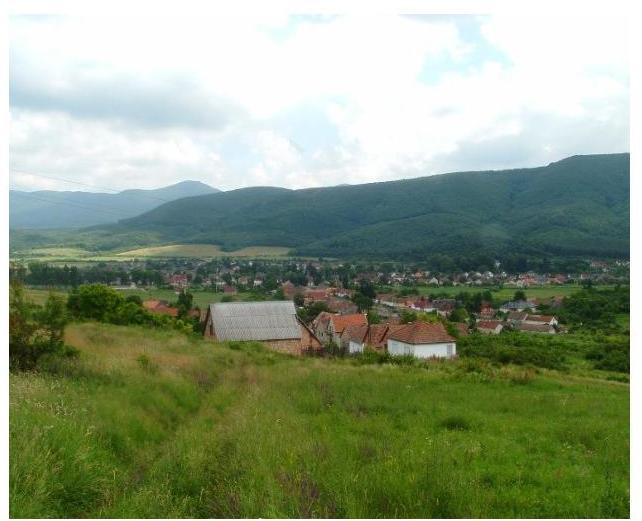
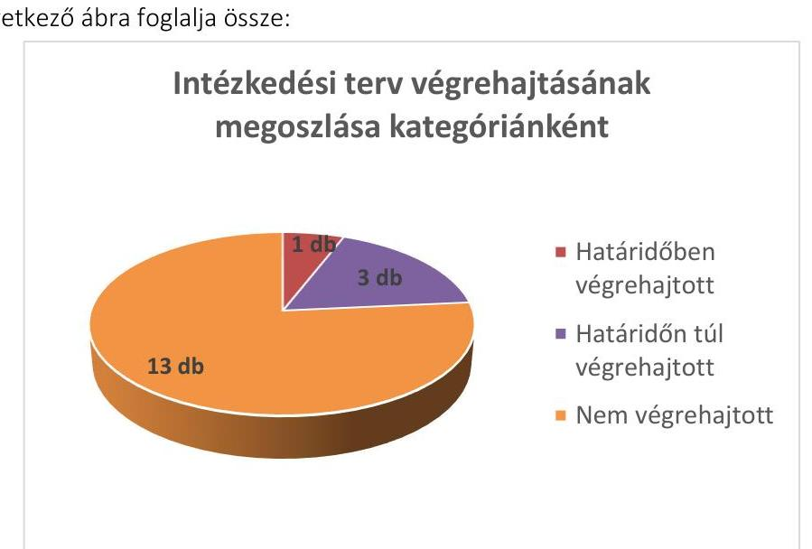

# Jelentés 

## Utóellenőrzések

Mátraverebély Község Önkormányzata vagyongazdálkodás
szabályszerűségének utóellenőrzése
2016.

---

# Jelentés 

## Utóellenőrzések

Mátraverebély Község Önkormányzata vagyongazdálkodás
szabályszerűségének utóellenőrzése
2016. 03. hó 23. nap

---

# AZ ELLENŐRZÉST FELÜGYELTE: 

HOLMAN MAGDOLNA felügyeleti vezető

## AZ ELLENŐRZÉST VEZETTE ÉS A VÉGREHAJTÁSÁÉRT FELELŐS:

FÉSŰS NÓRA ellenőrzésvezető

## A PROGRAM ÖSSZEÁLLÍTÁSÁÉRT FELELŐS:

JANIK JÓZSEF LÁSZLÓ osztályvezető

## A TÉMÁHOZ KAPCSOLÓDÓ KORÁBBI SZÁMVEVŐSZÉKI JELENTÉS:

- címe: Jelentés az önkormányzati vagyongazdálkodás szabályszerűségi ellenőrzéséről - Mátraverebély
- sorszáma: 13109

Jelentéseink az Országgyűlés számítógépes hálózatán és az Interneten a www.asz.hu címen is olvashatóak.

IKTATÓSZÁM: V-0894-068/2016.
TÉMASZÁM: 1928
ELLENŐRZÉS-AZONOSÍTÓ SZÁM: V07170601

---

# TARTALOMJEGYZÉK 

■ ÖSSZEGZÉS ..... 5
■ AZ ELLENŐRZÉS CÉLJA ..... 6
■ AZ ELLENŐRZÉS TERÜLETE ..... 7
■ AZ ELLENŐRZÉS HÁTTERE, INDOKOLTSÁGA ..... 8
■ FÓKUSZKÉRDÉSEK ..... 9
■ ELLENŐRZÉS HATÓKÖRE ÉS MÓDSZEREI ..... 10
■ MEGÁLLAPÍTÁSOK ..... 12
■ JAVASLATOK ..... 15
■ FÜGGELÉK: ÉSZREVÉTELEK ..... 16
■ MELLÉKLET ..... 17
I. sz. melléklet: Az ÁSZ 13109 sz. jelentéséhez kapcsolódó intézkedési terv megvalósítása ..... 17
■ RÖVIDÍTÉSEK JEGYZÉKE ..... 23

---

.

---

# ÖSSZEGZÉS 

Mátraverebély Község Önkormányzata vagyongazdálkodása szabályszerűségének 2007-2011. éveket érintő ellenőrzéséről 2013 októberében jelent meg az Állami Számvevőszék jelentése. A jelentésben foglalt megállapításokhoz kapcsolódóan az Önkormányzat által összeállított intézkedési terv megvalósítását utóellenőrzés keretében értékeltük. Az ellenőrzés során megállapítottuk, hogy az intézkedési tervben foglalt feladatok jelentős részét az Önkormányzat nem hajtotta végre, így nem tett megfelelő lépéseket az ÁSZ által korábban

feltárt, a vagyongazdálkodást és belső kontrollrendszert érintő hiányosságok megszüntetésére. Az intézkedések végrehajtásáról a jogszabály szerinti nyilvántartást nem vezették.

## Az ellenőrzés társadalmi indokoltsága

Az Állami Számvevőszék stratégiájában célul tűzte ki a számvevőszéki munka hasznosulásának javítását. Ezzel összhangban ellenőrzi, hogy az ellenőrzött szervezetek megvalósították-e a korábbi ellenőrzései által feltárt hibák, hiányosságok és szabálytalanságok megszüntetése céljából kialakított intézkedési terveikben foglaltakat. A rendszeres utóellenőrzések hozzájárulnak a szükséges intézkedések tényleges végrehajtásához, ezáltal a közpénzügyek rendezettségének javulásához.

## Főbb megállapítások, következtetések, javaslatok

Az Önkormányzat az ÁSZ jelentésben foglalt intézkedést igénylő megállapításokhoz kapcsolódóan összeállított intézkedési tervet az előírt határidőn belül megküldte az ÁSZ-nak. Az intézkedési terv 17 feladata közül 13-at nem hajtottak végre, így az ÁSZ által korábban a vagyongazdálkodás és belső kontroll működésének területén azonosított hiányosságok jelentős része továbbra is fennáll. Az intézkedési terv feladatainak végrehajtásáról a jogszabályban előírt nyilvántartást nem vezették.

---

# AZ ELLENŐRZÉS CÉLJA 

## Mátraverebély Község Önkormányzata vagyongazdálkodás szabályszerűségének utóellenőrzése

Az ellenőrzés célja annak értékelése, hogy az ÁSZ jelentésben ${ }^{1}$ foglalt intézkedést igénylő megállapításokkal és javaslatokkal összhangban készített intézkedési tervben meghatározott feladatokat az ellenőrzött szervezet vég-rehajtotta-e.

---

# AZ ELLENŐRZÉS TERÜLETE 

## Mátraverebély Község Önkormányzata

Mátraverebély község Nógrád megyében fekszik, állandó lakosainak száma 2015. január 1-jén 1934 fő* volt. Az Önkormányzat² 2014. december 31-én 1072,6 millió Ft értékű eszközvagyonnal rendelkezett, amelyből 1011,0 millió Ft volt a nemzeti vagyonba tartozó befektetett eszközök állománya ${ }^{1}$.

Az Önkormányzat vagyongazdálkodása szabályszerűségének ellenőrzését az ÁSZ ${ }^{3}$ a 2007 - 2011. közötti időszakra végezte el, amely során megállapította, hogy az Önkormányzat a vagyongazdálkodási tevékenységét hiányosan szabályozta, valamint az Önkormányzatnál a vagyongazdálkodás működésének szabályszerűségét nem biztosították. Az ÁSZ jelentés a Polgármesternek ${ }^{4}$ egy, a Jegyzőnek ${ }^{5}$ 11 javaslatot tartalmazott.

Az Önkormányzat által összeállított intézkedési terv az ellenőrzés által feltárt hiányosságok kezelésére megfogalmazott intézkedést igénylő megállapításokkal és javaslatokkal összhangban volt és 17 feladatot tartalmazott.

Az ÁSZ jelentés megjelenését és az intézkedési terv összeállítását követően a településen változott a polgármester és jegyző személye. Az Önkormányzat 2014 novemberében alakult újjá, az intézkedési tervben foglalt legkésőbbi határidő 2014. április 30. volt.

Az utóellenőrzés ${ }^{6}$ a számvevőszéki jelentésekben megfogalmazott intézkedést igénylő megállapításokra és javaslatokra készített intézkedési tervben foglalt feladatok megvalósításának ellenőrzésére, illetve értékelésére fókuszál.

[^0]
[^0]:    * Forrás: Központi Statisztikai Hivatal, Magyarország Közigazgatási Helységnév könyve, Mátraverebély község 2015. január 1-jei adatai
    ${ }^{\dagger}$ Forrás: Magyar Államkincstár, az Önkormányzat 2014. december 31-ei könyvviteli mérleg szerinti adatai

---

# AZ ELLENŐRZÉS HÁTTERE, INDOKOLTSÁGA 

Az ÁSZ TÖRVÉNY ${ }^{7}$ 33. § (1) bekezdése értelmében a számvevőszéki jelentések intézkedést igénylő megállapításaihoz és javaslataihoz kapcsolódóan az ellenőrzött szervezet vezetője intézkedési tervet köteles összeállítani, és az Állami Számvevőszék részére megküldeni. Az intézkedési tervben foglaltak megvalósítását - az ÁSZ törvény 33. § (7) bekezdésében foglaltak alapján - az ÁSZ utóellenőrzés keretében ellenőrizheti. Az intézkedések megvalósulásának értékelése során az ÁSZ figyelembe veszi az ellenőrzött szervezetek működési feltételeiben, valamint a jogszabályi előírásokban bekövetkezett változásokat.

Az intézkedési tervekben foglalt feladatok hiányos, illetve késedelmes végrehajtása, valamint megvalósításának elmaradása azt mutatja, hogy az ellenőrzések során feltárt hibák, hiányosságok és szabálytalanságok megszüntetése nem kapott kellő hangsúlyt. Ez a szabályszerű működés és a felelős vezetői magatartás vonatkozásában kockázatot hordoz. E kockázatok feltárásával az Állami Számvevőszék utóellenőrzési rendszere fokozza a fegyelmet, és igazolja, hogy a közpénzzel való szabályos gazdálkodás felelőssége elől nem lehet kitérni.

## AZ UTÓELLENŐRZÉS NÉGY SZINTEN HASZNOSULHAT:

- A társadalom szintjén az utóellenőrzés jelzi, hogy a számvevőszéki ellenőrzés megállapításainak van következménye: a hiányosságok megszüntetésére az ellenőrzött szervezet által meghatározott intézkedések végrehajtását is számon kéri az ÁSZ.
- Az ellenőrzött terület szintjén az utóellenőrzés tájékoztatást nyújt a terület döntéshozóinak a hiányosságok kiküszöbölésének jó gyakorlatairól, ezzel lehetőséget biztosítva arra, hogy az ÁSZ ellenőrzési megállapításai, javaslatai a terület nem ellenőrzött szervezeteinek a működése során is hasznosuljanak.
- Az ellenőrzött szervezet szintjén az utóellenőrzés feltárja, hogy a szervezet az intézkedések végrehajtásával hasznosította-e a korábbi ellenőrzési jelentésben a hiányosságok megszüntetése, illetve a kockázatok kezelése érdekében megfogalmazott javaslatokat.
- Az ÁSZ szintjén az utóellenőrzés visszacsatolást ad az ellenőrzési jelentések hasznosulásáról, az intézkedések elmaradása vagy részleges megvalósulása a további ellenőrzésekhez kockázati jelzésként szolgál.

---

# FÓKUSZKÉRDÉSEK 

1. Az ellenőrzött szervezet az intézkedési tervben foglaltakat - az előírt határidőben - végrehajtotta-e?

---

# ELLENŐRZÉS HATÓKÖRE ÉS MÓDSZEREI 

## Az ellenőrzés típusa

Szabályszerűségi ellenőrzés

## Az ellenőrzött időszak

Az ÁSZ jelentés közzétételének napjától (2013. október 29.) az utóellenőrzés megkezdésének napjáig (2015. június 19.) tartó időszak.

## Az ellenőrzés tárgya

Az Önkormányzat intézkedési tervében foglaltak végrehajtásának ellenőrzése

## Az ellenőrzött szervezet

Mátraverebély Község Önkormányzata

## Az ellenőrzés jogalapja

Magyarország Alaptörvénye 43. cikk (1) bekezdése alapján az ÁSZ az Országgyűlés pénzügyi és gazdasági ellenőrző szerve. Az ÁSZ törvényben meghatározott feladatkörében ellenőrzi a központi költségvetés végrehajtását, az államháztartás gazdálkodását, az államháztartásból származó források felhasználását és a nemzeti vagyon kezelését.

Az ÁSZ törvény 1. § (3) bekezdése szerint az ÁSZ általános hatáskörrel végzi a közpénzekkel és az állami és önkormányzati vagyonnal való felelős gazdálkodás ellenőrzését.

Az ÁSZ törvény 33. § (7) bekezdése alapján az ÁSZ jelentésben foglalt megállapításokhoz kapcsolódóan összeállított intézkedési tervben foglaltak megvalósítását az ÁSZ utóellenőrzés keretében ellenőrizheti.

Az Áht. ${ }^{8}$ 61. § (2) bekezdése szerint az államháztartás külső ellenőrzésével kapcsolatos feladatokat az ÁSZ látja el.

---

# Az ellenőrzés módszerei 

Az ellenőrzést az ellenőrzési program kérdései, az ellenőrzött időszakban hatályos jogszabályok, az ellenőrzés szakmai szabályok és módszertanok figyelembe vételével végeztük.

Az intézkedési tervben előírt feladatok végrehajtásának ellenőrzését értékelési kritériumok alapján végeztük. Az intézkedési tervekben foglalt feladatokat azok végrehajtása szempontjából az alábbiak szerint értékeltük:
$\longrightarrow$ „határidőben végrehajtott" a feladat, ha a teljesítés dokumentáltan, az intézkedési tervben előírt határidőben és tartalommal megtörtént;
$\longrightarrow$ „határidőn túl végrehajtott" a feladat, ha annak teljesítése az intézkedési tervben meghatározott módon, de az előírt határidőn túl történt meg;
$\longrightarrow$ „részben végrehajtott" a feladat, ha végrehajtása teljes körűen az intézkedési tervben előírt módon nem történt meg;
$\longrightarrow$ „nem végrehajtott" a feladat, ha a végrehajtás nem történt meg, vagy amennyiben a teljesítést nem dokumentálták;
$\longrightarrow$ „okafogyottá vált" a feladat, ha végrehajtására - meghatározott esemény bekövetkezése, továbbá külső körülmény, a működést érintő feltétel változása miatt - már nincs szükség, illetve lehetőség, és egyértelműen megállapítható, hogy az intézkedést szükségessé tevő körülmény a jövőben nem fordulhat elő;
$\longrightarrow$ „nem időszerű" az a feladat, amelynek ellenőrzési időszakon belüli végrehajtására azért nem került (kerülhetett) sor, mert az intézkedés alapjául szolgáló esemény nem következett be, de annak jövőbeni előfordulása lehetséges, a végrehajtása nem volt esedékes, vagy a végrehajtás határideje még nem járt le.
Az utóellenőrzésre az Önkormányzat elektronikus adatszolgáltatása alapján került sor, helyszínen ellenőrzést nem végeztünk. Az Önkormányzat által szolgáltatott adatok és dokumentumok valódiságát és teljes körűségét a Polgármester, valamint a Jegyző teljességi és hitelességi nyilatkozata igazolta.

A gazdálkodási jogkörök gyakorlására vonatkozó intézkedés megvalósítását mintavételes ellenőrzéssel értékeltük. Az utóellenőrzés jellege miatt a mintatételek ellenőrzésével nem az adott terület szabályszerűségéről mondtunk véleményt, hanem arról, hogy a működési hiányosságok felszámolására az Intézkedési tervben rögzítetteket végrehajtották-e az ellenőrzött tételek esetében.

---

# MEGÁLLAPÍTÁSOK 

## 1. Az ellenőrzött szervezet az intézkedési tervben foglaltakat - az előírt határidőben - végrehajtotta-e?

Összegző megállapítás

Az intézkedési tervben foglalt feladatok jelentős részét nem hajtották végre. Az intézkedési terv végrehajtásáról nem vezették a jogszabály szerinti nyilvántartást.
1.1. számú megállapítás

Az intézkedési tervben foglalt 17 feladat közül 13-at az Önkormányzat nem hajtott végre.

Az intézkedési tervben foglalt feladatok végrehajtásának értékelését a következő ábra foglalja össze:

## HATÁRIDŐBEN VÉGREHAJTOTT feladat:

$\qquad$ 1. A Jegyző gondoskodott a kötelezettségvállalások analitikus nyilvántartásának vezetéséről.

## HATÁRIDŐN TÚL VÉGREHAJTOTT feladatok:

$\qquad$ 2. A Jegyző a Hivatal ${ }^{9}$ számviteli rendjének kialakításáról, a számviteli politika ${ }^{10}$, a számlarend ${ }^{11}$, a pénzkezelési szabályzat ${ }^{12}$, valamint az eszközök és források értékelési szabályzata ${ }^{13}$ elkészítéséről a vállalt határidőn túl gondoskodott.
$\qquad$ 3. A Jegyző az intézkedési tervben meghatározott határidőn túl adta ki a Hivatal számlarendjét, amelyben meghatározta a főkönyvi könyvelés, az analitikus nyilvántartások és a bizonylatok adatai közötti egyeztetés és ellenőrzés lehetőségét annak érdekében, hogy a vonatkozó jogszabálynak megfelelő részletező nyilvántartások

---

vezetésével a beszámoló adatait a valóságnak megfelelően, áttekinthető módon alátámasszák.
4. A koncesszióba, vagyonkezelésbe adott eszközök leltározásának módját megfelelően tartalmazó leltározási szabályzatot ${ }^{14}$ a Jegyző az intézkedési tervben szereplő határidőn túl adta ki.

# NEM VÉGREHAJTOTT feladatok: 

5. A pénzügyi ellenjegyző, a teljesítést igazoló, az érvényesítő és az utalványozó a gazdálkodási jogkörök gyakorlása során nem teljesítették az Áht. 37. § (1) bekezdésében, valamint az Ávr. ${ }^{15}$ 57. § (1), 58.§ (1) és 59. § (2) bekezdéseinek előírásait.
6. Az Önkormányzat nem gondoskodott a könyvviteli mérlegben kimutatott eszközök és források 2013. évre vonatkozó leltározásáról, megsértve ezzel az Áhsz. ${ }^{16}$ 37. § (1) bekezdésének rendelkezéseit. Az Önkormányzat nem gondoskodott a könyvviteli mérlegben kimutatott eszközök és források 2014. évre vonatkozó leltározásáról, megsértve ezzel az Áhsz. ${ }^{17}$ 22. §-ának rendelkezéseit.
7. A Jegyző nem intézkedett arról, hogy a könyvviteli mérlegben kimutatott üzemeltetésre, vagyonkezelésbe adott eszközöket az üzemeltetést, kezelést végző szerv által elkészített, hitelesített leltárral támasszák alá, így nem teljesültek az Áhsz. ${ }_{1}$ 37. § (4) bekezdésében foglaltak.
8. A jegyző nem készített előterjesztést a nemzetgazdasági szempontból kiemelt jelentőségű nemzeti vagyonnak minősülő forgalomképtelen vagyonelemek kijelöléséről. A vagyonelemek kijelölése nem
 történt meg, így nem teljesült az Nvtv. ${ }^{18}$ 18. § (1) bekezdésében foglalt előírás.
9. Az ingatlanvagyon-kataszter adatai és a megyei kormányhivatal ingatlanügyi hatóságként eljáró hivatal ingatlan-nyilvántartásának azonos tartalmú adatai közötti egyezőséget, továbbá az ingatlan-vagyon-kataszter és a számviteli nyilvántartás adatai közötti egyezőséget nem biztosították a 147/1992. (XI.6.) Korm. rendelet ${ }^{19}$ 1. § (2) és (3) bekezdése szerint.
10. A Jegyző nem intézkedett a Mötv. ${ }^{20}$ 110. § (2) bekezdése szerinti vagyonkimutatás elkészítéséről, így a Polgármester a zárszámadásról szóló előterjesztés keretében az Áht. 91. § (2) bekezdés c) pontja szerint azt nem mutatta be.
11. A Polgármester nem terjesztette a Képviselő-testület ${ }^{21}$ elé a gazdasági programot, megsértve ezzel a Mötv. 116. § előírásait.
12. A Jegyző nem intézkedett az éves ellenőrzési jelentés elkészítéséről, ezáltal nem kezdeményezte a Bkr. ${ }^{22}$ 56. § (8) bekezdésének megfelelően a Polgármesternél a jelentés zárszámadással egyidejű Képviselő-testület elé történő terjesztését.
13. A Bkr. 29. § (1) bekezdése szerinti stratégiai ellenőrzési terv nem készült el.

---

14. A Bkr 29. § (1) bekezdés és a 31. § (1) bekezdés szerint előírt és a Bkr. 31. § (2) bekezdés előírásainak megfelelő, a stratégiai ellenőrzési terven, valamint a kockázatelemzés alapján felállított prioritásokon alapuló éves ellenőrzési tervek nem készültek.
15. Tekintettel arra, hogy a Jegyző, nyilatkozata szerint, a Mötv. 119. § (4) bekezdésében, az Áht. 70. § (1) bekezdésében és a Bkr. 15. § (1) bekezdésében foglalt előírások ellenére nem működtette a belső ellenőrzési rendszert és nem készült belső ellenőrzési jelentés, a belső ellenőrzési jelentésekben megfogalmazott javaslatok végrehajtása és intézkedési terv készítése a Bkr. 45. § (1)-(3) bekezdései szerint nem történt meg.
16. Az Önkormányzat nem tett eleget az Eisztv. ${ }^{23}$ 6. § (1) bekezdésében, mellékletében, valamint a 18/2005. (XII.27.) IHM rendelet ${ }^{24}$ 2. számú melléklete 3.2. és 3.3. pontjaiban előírt közzétételi kötelezettségének, mert az Önkormányzat honlapján nem érhetők el az éves elemi költségvetések és a költségvetés végrehajtásáról szóló beszámolók, valamint a céljellegű működési támogatások és a vagyongazdálkodással összefüggő - a nettó ötmillió Ft-ot elérő, vagy az azt meghaladó értékű - szerződések adatai.
17. A Polgármester az ÁSZ és a belső ellenőrzés által feltárt hiányosságokat, szabálytalanságokat nem vizsgálta ki és nem tette meg a szükséges intézkedéseket, az esetleges felelősségre vonást.
Az intézkedési tervben előírt 17 feladatot, az ÁSZ jelentés vonatkozó javaslatának címzettjét, a feladatok végrehajtásának határidejét, valamint a végrehajtás bemutatását és a teljesítés minősítését a melléklet tartalmazza.

# 1.2. számú megállapítás 

Az intézkedési tervben rögzített feladatok végrehajtásáról nem vezették a jogszabályban előírt nyilvántartást.

A Jegyző - a Bkr. 14. § (1) bekezdésében foglalt előírás ellenére - nem vezetett nyilvántartást az ÁSZ jelentés javaslatai alapján készült intézkedési terv végrehajtásáról.

---

# JAVASLATOK 

Az ÁSZ tv. ${ }^{25}$ 33. § (1) bekezdésében foglaltak értelmében az ellenőrzött szervezet vezetője köteles a jelentésben foglalt megállapításokhoz kapcsolódó intézkedési tervet összeállítani és azt a jelentés kézhezvételétől számított 30 napon belül az ÁSZ részére megküldeni. Amennyiben az intézkedési tervet az ellenőrzött szervezet vezetője nem küldi meg határidőben, vagy továbbra sem elfogadható intézkedési tervet küld, az ÁSZ elnöke az ÁSZ tv. 33. § (3) bekezdés a)-b) pontjaiban foglaltakat érvényesítheti.

## Mátraverebély Önkormányzat jegyzőjének

1. Intézkedjen, hogy a pénzügyi ellenjegyző, a teljesítést igazoló, az érvényesítő és az utalványozó végezze el a jogszabályokban előírt ellenőrzési feladatait.
(1.1 megállapítás 5. pontja alapján)
2. Intézkedjen a könyvviteli mérlegben kimutatott eszközök és források leltározásáról.
(1.1. megállapítás 6. pontja alapján)
3. Intézkedjen, hogy az ingatlanvagyon-kataszter adatai egyezzenek meg a megyei kormányhivatal ingatlanügyi hatóságként eljáró hivatal ingatlan-nyilvántartásának azonos tartalmú adataival, valamint biztosítsa az ingatlanvagyon-kataszter és a számviteli nyilvántartás adatai közötti egyezőséget.
(1.1. megállapítás 9. pontja alapján)
4. Intézkedjen a vagyonkimutatás elkészítésére a zárszámadásról szóló rendelet tervezetének előkészítése keretében annak érdekében, hogy azt a polgármester a képviselő-testület elé tudja terjeszteni.
(1.1. megállapítás 10. pontja alapján)
5. Intézkedjen stratégiai ellenőrzési terv és az éves ellenőrzési terv elkészítéséről, valamint elkészítésüket követően azokat hagyja jóvá.
(1.1. megállapítás 13., 14. pontja alapján)
6. Intézkedjen a jogszabályokban előírt adatok közzétételéről.
(1.1. megállapítás 16. pontja alapján)
7. Intézkedjen a Bkr. előírásainak megfelelő, a külső ellenőrzések javaslatai alapján készült intézkedési tervek végrehajtásáról szóló nyilvántartás vezetéséről.
(1.2. számú megállapítás alapján)

---

# FÜGGELÉK: ÉSZREVÉTELEK 

A jelentéstervezetet a Számvevőszék 15 napos észrevételezésre megküldte az ellenőrzött szervezet vezetőjének az ÁSZ tv. 29. §7 (1) bekezdése előírásának megfelelően.
A polgármester az ÁSZ tv. 29. § (2) bekezdésében foglalt észrevételezési jogával nem élt, a jelentéstervezetre észrevételt nem tett.

[^0]
[^0]:    ${ }^{5}$ 29. § (1) Az Állami Számvevőszék az ellenőrzési megállapításait megküldi az ellenőrzött szervezet vezetőjének vagy az általa megbízott személynek, és annak, akinek személyes felelősségét állapította meg.
    (2) Az ellenőrzött szervezet vezetője és a felelősként megjelölt személy az ellenőrzés megállapításaira tizenöt napon belül írásban észrevételt tehet.
    (3) Az Állami Számvevőszék az észrevételre a beérkezésétől számított harminc napon belül írásban válaszol. A figyelembe nem vett észrevételeket köteles a jelentésben feltüntetni, és megindokolni, hogy azokat miért nem fogadta el.

---

# MELLÉKLET

- I. SZ. MELLÉKLET: AZ ÁSZ 13109 SZ. JELENTÉSÉHEZ KAPCSOLÓDÓ INTÉZKEDÉSI TERV MEGVALÓSÍTÁSA

|  Sorszám | Az intézkedési terv alapján elvégzendő feladat | Az ÁSZ 13109. sz. jelentése javaslatának címzettje | Az intézkedési tervben meghatározott határidő | A feladat végrehajtása  |
| --- | --- | --- | --- | --- |
|   | 1. | 2. | 3. | 4.  |
|  Határidőben végrehajtott feladatok |  |  |  |   |
|  1. | Gondoskodjon az Ávr. 56. § (1) bekezdésének megfelelően a kötelezettségvállalások analitikus nyilvántartásának vezetéséről. Felelős: Jegyző | Jegyző | 2014. február 28. | A Jegyző az Ávr. 56. § (1) bekezdésének megfelelően 2014. január 1-jétől gondoskodott a kötelezettségvállalások analitikus nyilvántartásának vezetéséről azáltal, hogy az EPER Integrált Pénzügyi Rendszerben a kötelezettségvállalások nyilvántartására meghatározott főkönyvi számlákat alkalmazták és az államháztartásban felmerülő egyes gyakoribb gazdasági események kötelező elszámolási módjáról szóló 38/2013. (IX. 19.) NGM rendeletben előírt módon a kötelezettségvállalásokat nyilvántartásba vették.  |
|  Határidőn túl végrehajtott feladatok |  |  |  |   |
|  2. | Intézkedjen a Jegyző a Htv. ${ }^{26}$ 140. § (1) bekezdés c) pontjának előírása szerint a Polgármesteri Hivatal számviteli rendjének kialakításáról. Készítse el a Számv. tv. ${ }^{27}$ 14. § (3) bekezdésében és az Áhsz. ${ }_{1}$ 8. § (3) bekezdésében előírtaknak megfelelően a Polgármesteri Hivatal számviteli politikáját, a Számv. tv. 161. § (1) bekezdésében és az Áhsz. ${ }_{1}$ 49. § (1) bekezdésében előírt számlarendet, a Számv. tv. 14. § (5) bekezdés d) pontjában és az Áhsz. ${ }_{1}$ 8. § (4) bekezdés d) pontjában előírt pénzkezelési szabályzatot, valamint a Számv. tv. 14. § (5) bekezdés b) pontjában és az Áhsz. ${ }_{1}$ 8. § (4) bekezdés b) pontjában előírt eszközök és források értékelési szabályzatát.
Felelős: Jegyző | Jegyző | 2014. január 31. | A Jegyző a Polgármesteri Hivatal számviteli rendjét - a Htv. 140. § (1) bekezdés c) pontjában foglalt előírás alapján a gazdálkodási feladatába és hatáskörébe tartozóan - a 2015. évtől alakította ki.
Az intézkedési tervben meghatározott belső szabályzatok 2015. január 1-jén leptek hatályba:
- számviteli politika a Számv. tv. 14. § (3) bekezdésében és a 2014. január 1-jétől hatályos Áhsz. ${ }_{2}$ 50. § (1) bekezdése szerint;
- számlarend a Számv. tv. 161. § (1) bekezdésében és az Áhsz. ${ }_{2}$ 51. § (2) bekezdése szerint;
- pénzkezelési szabályzat az Áhsz. ${ }_{2}$ 50. § (1) bekezdésében foglaltak és a Számv. tv. 14. § (5) bekezdés d) pontjában előírtak szerint;
- eszközök és források értékelési szabályzata az Áhsz. ${ }_{2}$ 50. § (2) bekezdés szerint.  |

---

|  1. | Az intézkedési terv alapján elvégzendő feladat | Az ÁSZ 13109. sz. jelentése javaslatának címzettje | Az intézkedési tervben meghatározott határidő | A feladat végrehajtása  |
| --- | --- | --- | --- | --- |
|   | 1. | 2. | 3. | 4.  |
|  3. | Biztosítsa a Számv. tv. 165. § (4) bekezdésének megfelelően a főkönyvi könyvelés, az analitikus nyilvántartások és a bizonylatok adatai közötti egyeztetés és ellenőrzés lehetőségét annak érdekében, hogy az Áhsz.; 49. § (1) bekezdése szerint a nyilvántartások a beszámoló adatait a valóságnak megfelelően, áttekinthető módon alátámasszák.
Felelős: Jegyző | Jegyző | 2014. február 28. | A Jegyző a Hivatal számlarendjének hatályba léptetésével 2015. január 1-jétől biztosította a Számv. tv. 165. § (4) bekezdésének megfelelően a főkönyvi könyvelés, az analitikus nyilvántartások és a bizonylatok adatai közötti egyeztetés és ellenőrzés lehetőségét annak érdekében, hogy az Áhsz.; 5. § (1) bekezdése szerinti részletező nyilvántartások vezetésével a beszámoló adatait a valóságnak megfelelően, áttekinthető módon alátámasszák.  |
|  4. | Egészítse ki a leltározási szabályzatot az Áhsz.; 37. § (4) bekezdésében előírtak alapján az üzemeltetésre, kezelésre átadott, koncesszióba, vagyonkezelésbe adott eszközök leltározásának módjával.
Felelős: Jegyző | Jegyző | 2014. február 28. | A Jegyző a leltározási és leltárkészítési szabályzatot 2015. január 1-jei hatályba lépéssel adta ki. A szabályzat az Áhsz.; 22. § (2) bekezdés a) pontjában foglaltaknak megfelelően tartalmazza a koncesszióba, vagyonkezelésbe adott eszközök leltározásának módját.  |
|   |  | Nem végrehajtott feladatok |  |   |
|  5. | Intézkedjen, hogy a pénzügyi ellenjegyző, a teljesítést igazoló, az érvényesítő és az utalványozó - az Áht. 37. § (1), az Ávr. 57. § (1) és az Ávr. 59. § (2) bekezdései előírásainak megfelelően - végezze el ellenőrzési feladatait.
Felelős: Jegyző | Jegyző | 2013. november 30, majd folyamatos | A feladat végrehajtását 10 elemű minta ellenőrzésével értékeltük és megállapítottuk, hogy az Áht. 37. § (1), az Ávr. 57. § (1) és az Ávr. 59. § (2) bekezdései előírásainak való megfelelés a gazdálkodási jogkörök gyakorlása során nem teljesült.
A pénzügyi ellenjegyzés nem az intézkedési tervben rögzített Áht. 37. § (1) bekezdésében foglaltaknak megfelelően történt, mert a pénzügyi ellenjegyzők azon ellenőrzési feladatuknak, hogy a kötelezettségvállalás sérti-e a gazdálkodásra vonatkozó szabályokat kötelezettségvállalási dokumentumok hiányában nem tudtak eleget tenni.
A teljesítés igazolása nem az intézkedési tervben rögzített Ávr. 57. § (1) bekezdésében foglaltak szerint történt, mert a teljesítést igazolók kötelezettségvállalási, valamint átvételt igazoló dokumentumok hiányában nem tudták ellenőrizni és igazolni a kiadások
 teljesítésének jogosságát, összegszerűségét, az ellenszolgáltatás teljesítését.
Az érvényesítés nem az Ávr. 58. § (1) bekezdésében foglaltak szerint történt, mert az ellenőrzött mintatételek esetében a kifizetés annak ellenére érvényesítésre került, hogy a megelőző ügymenetben a jogszabályokban és a belső szabályzatban foglaltakat nem tartották be.  |

---

|  5. | Az intézkedési terv alapján elvégzendő feladat | Az ÁSZ 23109. sz. jelentése javaslatának címzettje | Az intézkedési tervben meghatározott határidő | A feladat végrehajtása  |
| --- | --- | --- | --- | --- |
|   | 1. | 2. | 3. | 4.  |
|   |  |  |  | Az utalványozás az ellenőrzött mintatételek 80 %-ánál nem az intézkedési tervben rögzített Ávr. 59. § (2) bekezdésében foglaltak szerint történt, mert az utalványozás dokumentumán nem minden esetben tüntették fel az „utalvány” szót, a költségvetési évet, a befizető címét, a kedvezményezett megnevezését és címét, a megterhelendő és a jóváírandó fizetési számla számát és megnevezését, a kötelezettségvállalás nyilvántartási számát és az utalványozás időpontját. Az utalványozás 40 %-át jogosultsággal nem rendelkező, illetve a dokumentumok alapján nem beazonosítható személy végezte, valamint az utalványozás 30 %-a – az Áht.2 38. § (1) bekezdésében foglaltak ellenére – teljesítés igazolás hiányában történt. Az utalványozó a kifizetést egy esetben – az Áht.2 38. § (1) bekezdésében foglaltakat figyelmen kívül hagyva – utólagosan, a bankszámlakivonathoz csatolt dokumentumon rendelte el, valamint egy részletfizetés esetén – az Ávr. 59. § (3) bekezdés g) pontjában előírtak ellenére – aláírását dátummal nem látta el.  |
|  6. | Gondoskodjon az Áhsz.; 37. § (1) bekezdésének megfelelően a könyvviteli mérlegben kimutatott eszközök és források leltározásáról. Felelős: Jegyző | Jegyző | 2014. február 28. | A Jegyző 2013. december 31-ei fordulónappal az Áhsz.; 37. § (1) bekezdésében előírtak ellenére nem gondoskodott az eszközök és források 2013. évre vonatkozó leltározásáról. A 2014. évi költségvetési beszámoló szintén nincs leltárral alátámasztva, megsértve ezzel az Áhsz.; 22. §-ának rendelkezéseit.  |
|  7. | Intézkedjen arról, hogy a könyvviteli mérlegben kimutatott üzemeltetésre, vagyonkezelésbe adott eszközöket az üzemeltetést, kezelést végző szerv által elkészített, hitelesített leltárral támasz-szák alá. Felelős: Jegyző | Jegyző | 2014. február 28. | A Jegyző nem intézkedett arról, hogy a könyvviteli mérlegben kimutatott üzemeltetésre, vagyonkezelésbe adott eszközöket az üzemeltetést, kezelést végző szerv által elkészített, hitelesített leltárral támasszák alá. Az intézkedés elmaradása miatt nem teljesültek az Áhsz.; 37 § (4) bekezdésének rendelkezései.  |
|  8. | Készítsen rendelettervezetet a nemzetgazdasági szempontból kiemelt jelentőségű nemzeti vagyonnak minősülő forgalomképtelen vagyonelemek kijelölése érdekében az Nvtv. 18. § (1) bekezdésében előírtak szerint és kezdeményezze a Polgármesternél a rendelettervezet Képviselő-testület elé terjesztését. Felelős: Jegyző | Jegyző | 2014. február 28. | A nemzetgazdasági szempontból kiemelt jelentőségű nemzeti vagyonnak minősülő forgalomképtelen vagyonelemek kijelölése érdekében a Képviselő-testület 2012. május 15-én elfogadta az 5/2012. (V. 15.) önkormányzati rendeletét a Mátraverebély Község közigazgatási területén lévő Nemzeti Vagyon részét képező értékekről. Ebben megjelölte, hogy az Önkormányzat forgalomképtelen törzsvagyona körébe tartoznak és nemzetgazdasági szempontból kiemelt jelentőségű nemzeti vagyonnak  |

---

|   | Az intézkedési terv alapján elvégzendő feladat | Az 452 13109. sz. jelentése javaslatának címzettje | Az intézkedési tervben meghatározott határidő | A feladat végrehajtása  |
| --- | --- | --- | --- | --- |
|   | 1. | 2. | 3. | 4.  |
|  9. | Intézkedjen a Jegyző, hogy a 147/1992. (XI. 6.) Korm. rendelet 1. § (2) bekezdésében foglaltaknak megfelelően az ingatlanvagyon-kataszter adatai egyezzenek meg a földhivatal ingatlan-nyilvántartásának azonos tartalmú adataival, továbbá az 1. § (3) bekezdésében foglaltaknak megfelelően biztosítsa az egyezőséget az ingatlanvagyon-kataszter és a számviteli nyilvántartás adatai között. Felelős: Jegyző | Jegyző | 2014. február 28. | minősülnek a rendelet 1. számú mellékletében felsorolt vagyonelemek. A melléklet, illetve a mellékletet tartalmazó, a Jegyző által készített előterjesztés azonban nem áll rendelkezésre, ezért a feladat nem végrehajtottnak minősül és nem teljesülnek az Nvtv. 18. § (1) bekezdésének előírásai.  |
|  10. | Intézkedjen a Mótv. 110. § (2) bekezdésében foglalt előírásoknak megfelelően a vagyonkimutatás elkészítéséről és annak a zárszámadásról szóló előterjesztés keretében az Áht. 91. § (2) bekezdés c) pontjában foglalt mérlegek és kimutatások közötti megjelenítéséről. Felelős: Jegyző | Jegyző | 2014. február 28. | A Jegyző a 147/1992. (XI. 6.) Korm. rendelet 1. § (2) bekezdésében foglaltak ellenére nem intézkedett arra vonatkozóan, hogy az ingatlanvagyon-kataszter adatai megegyezzenek a földhivatal – 2015. április 1-jétől a fővárosi és megyei kormányhivatal ingatlanügyi hatóságaként eljáró járási hivatal – ingatlan-nyilvántartásának azonos tartalmú adataival, továbbá nem biztosította az 1. § (3) bekezdésében foglaltaknak megfelelően az egyezőséget az ingatlanvagyon-kataszter és a számviteli nyilvántartás adatai között.  |
|  11. | A Polgármester terjessze a Képviselő-testület elé a gazdasági program, Jegyző által elkészített tervezetét a Mótv. 116. § (1) és (5) bekezdései alapján, a (3)-(4) bekezdésekben foglalt tartalommal. Felelős: Polgármester | Polgármester | 2013. december 31. | A Jegyző nem intézkedett az éves ellenőrzési jelentés elkészítéséről, ezáltal nem kezdeményezte a Polgármesternél a Bkr. 56. § (8) bekezdés előírásának megfelelően annak a zárszámadással egyidejűleg a Képviselő-testület elé terjesztését. Felelős: Jegyző  |
|  12. | Intézkedjen az éves ellenőrzési jelentés elkészítéséről és kezdeményezze a Polgármesternél a Bkr. 56. § (8) bekezdés előírásának megfelelően annak a zárszámadással egyidejűleg a Képviselő-testület elé terjesztését. Felelős: Jegyző | Jegyző | 2014. április 30. | A Jegyző nem intézkedett az éves ellenőrzési jelentés elkészítéséről, ezáltal nem kezdeményezte a Polgármesternél a Bkr. 56. § (8) bekezdés előírásának megfelelően annak a zárszámadással egyidejűleg a Képviselő-testület elé terjesztését. A Jegyző az ellenőrzött időszakban – a Mótv. 119. § (4) bekezdésében, az Áht. 70. § (1) bekezdésében és a Bkr. 15. § (1) bekezdésében foglalt előírások ellenére – nem gondoskodott az Önkormányzat belső ellenőrzésének kialakításáról és megfelelő működtetéséről.  |

---

|  13. | 1. | 2. | 3. | 4.  |
| --- | --- | --- | --- | --- |
|  14. | Gondoskodjon a Bkr. 29. § (1) bekezdésében foglalt előírás alapján stratégiai ellenőrzési terv készítéséről. Felelős: Jegyző | Jegyző | 2013. november 30. | A Jegyző a Bkr. 29. § (1) bekezdésében foglalt előírás ellenére nem gondoskodott stratégiai ellenőrzési terv készítéséről.  |
|  15. | Intézkedjen a Bkr. 28. § c) pontjának és a 45. § (1) bekezdésének megfelelően intézkedési terv készítéséről, illetve készíttetéséről a belső ellenőrzési jelentésekben megfogalmazott javaslatok végrehajtására a Bkr. 45. § (2)-(3) bekezdésében foglaltaknak megfelelő tartalommal és határidőn belül. Felelős: Jegyző | Jegyző | 2013. december 30. | A Jegyző nem gondoskodott a Bkr. 29. § (1) által előírt éves ellenőrzési terv elkészítéséről. A Bkr. 31. § (1)-(2) bekezdéseinek előírása ellenére nem gondoskodott a stratégiai ellenőrzési terven, valamint a kockázatelemzés alapján felállított prioritásokon alapuló éves ellenőrzési terv elkészítéséről.  |
|  16. | Az Eisztv. 6. § (1) bekezdésében, mellékletében, valamint a 18/2005. (XII.27.) IHM rendelet 2. számú melléklete 3.2. pontjában előírt közzétételi kötelezettségének tegyen eleget, és az Önkormányzat honlapján tegye közzé a 2008-2011. évek éves elemi költségvetését és a költségvetés végrehajtásáról szóló beszámolóit, az Áht. 15./A. §-ban és a 15/B §-ban előírtak szerinti céljellegű működési támogatások és a vagyongazdálkodással összefüggő - a nettó ötmillió Ft-ot elérő, vagy az azt meghaladó értékű - szerződések adatait. Intézkedjen az Info tv. ${ }^{28}$ 1. mellékletében meghatározott adatok közzétételéről. Felelős: Jegyző | Jegyző | 2014. január 31. | A Jegyző az Eisztv. 6. § (1) bekezdésében, mellékletében, valamint a 18/2005. (XII. 27.) IHM rendelet 2. számú melléklete 3.2. pontjában előírt közzétételi kötelezettségének nem tett eleget: az Önkormányzat honlapján a jogszabályi előírások ellenére nem tette közzé a 2008-2011. és az ezt követő évek éves elemi költségvetését és a költségvetés végrehajtásáról szóló beszámolóit, az Áht. 15/A. §-ban és a 15/B. §-ban előírtak szerinti céljellegű működési támogatások és a vagyongazdálkodással összefüggő - a nettó ötmillió Ft-ot elérő, vagy az azt meghaladó értékű - szerződések adatait, továbbá nem intézkedett az Info tv. 1. mellékletében meghatározott adatok közzétételéről.  |
|  17. | Vizsgálja ki a Polgármester az ÁSZ és a belső ellenőrzés által feltárt hiányosságokat, szabálytalanságokat, és amennyiben szükséges, tegye meg a szükséges intézkedéseket, az esetleges felelősségre vonást. Felelős: Polgármester | Polgármester | 2013. december 31. | A Polgármester az ÁSZ és a belső ellenőrzés által feltárt hiányosságokat, szabálytalanságokat nem vizsgálta ki, így nem állapította meg, hogy szükséges-e intézkedéseket tenni, esetleges felelősségre vonást kezdeményezni.  |

---

.

---

# RÖVIDÍTÉSEK JEGYZÉKE 

${ }^{1}$ ÁSZ jelentés
${ }^{2}$ Önkormányzat
${ }^{3}$ ÁSZ
${ }^{4}$ Polgármester
${ }^{5}$ Jegyző
${ }^{6}$ utóellenőrzés
${ }^{7}$ ÁSZ törvény
${ }^{8}$ Áht.
${ }^{9}$ Hivatal
${ }^{10}$ számviteli politika
${ }^{11}$ számlarend
${ }^{12}$ pénzkezelési szabályzat
${ }^{13}$ eszközök és források értékelési szabályzata
${ }^{14}$ leltározási szabályzat
${ }^{15}$ Ávr.
${ }^{16}$ Áhsz. 1
${ }^{17}$ Áhsz. 2
${ }^{18}$ Nvtv.
${ }^{19}$ 147/1992. (XI. 6.) Korm. rendelet
${ }^{20}$ Mötv.
${ }^{21}$ Képviselő-testület
${ }^{22}$ Bkr.
${ }^{23}$ Eisztv.
${ }^{24}$ 18/2005. (XII. 27.) IHM rendelet
${ }^{25}$ ÁSZ tv.

Az ÁSZ 13065 számú, Jelentés: Az önkormányzati vagyongazdálkodás szabályszerűségi ellenőrzéséről - Balatonboglár című jelentése
Mátraverebély Község Önkormányzata
Állami Számvevőszék
Mátraverebély Község Önkormányzatának polgármestere
2014. december 31-éig: Mátraverebély Község Polgármesteri Hivatalának
jegyzője
2015. január 1-jétől: Mátraverebélyi Közös Önkormányzati Hivatal jegyzője

Az ÁSZ 13109 számú jelentésében foglalt megállapításokhoz kapcsolódóan
összeállított intézkedési tervben foglaltak megvalósításának ellenőrzése
az Állami Számvevőszékről szóló 2011. évi LXVI. törvény
az államháztartásról szóló 2011. évi CXCV. törvény
Mátraverebély Község Polgármesteri Hivatala
Mátraverebélyi Községi Közös Önkormányzat Számviteli politika (hatályos: 2015.
január 1-jétől)
Mátraverebélyi Községi Közös Önkormányzati Hivatal Számlarend (hatályos:
2015. január 1-jétől)

Mátraverebélyi Közös Önkormányzati Hivatal Pénzkezelési szabályzat (hatályos:
2015. január 1-jétől)

Mátraverebély Községi Közös Önkormányzati Hivatal Eszközök és források
értékelési szabályzata (hatályos: 2015. január 1-jétől)
Mátraverebély Község
2012. január 1-jétől: az államháztartásról szóló törvény végrehajtásáról szóló 368/2011. (XII. 31.) Korm. rendelet
2013. december 31-éig: az államháztartás szervezetei beszámolási és
könyvvezetési kötelezettségének sajátosságairól szóló 249/2000. (XII. 24.) Korm.
rendelet
2014. január 1-jétől: az államháztartás számviteléről szóló 4/2013. (I. 11.) Korm.
rendelet
a nemzeti vagyonról szóló 2011. évi CXCVI. törvény
az önkormányzatok tulajdonában lévő ingatlanvagyon nyilvántartási és
adatszolgáltatási rendjéről szóló 147/1992. (XI. 6.) Korm. rendelet
Magyarország helyi önkormányzatairól szóló 2011. évi CLXXXIX. törvény
Mátraverebély Község Önkormányzatának Képviselő-testülete
a költségvetési szervek belső kontrollrendszeréről és belső ellenőrzéséről szóló
370/2011. (XII. 31.) Korm. rendelet
az elektronikus információszabadságról
 szóló 2005. évi XC. törvény (hatályos
2012. január 1-jéig)
a közzétételi listákon szereplő adatok közzétételéhez szükséges közzétételi
mintákról szóló 18/2005. (XII. 27.) IHM rendelet
2011. évi LXVI. törvény az Állami Számvevőszékről, hatályos 2011. július 1-jétől

---

${ }^{26}$ Htv.
${ }^{27}$ Számv. tv.
${ }^{28}$ Info tv.
a helyi önkormányzatok és szerveik, a köztársasági megbízottak, valamint egyes centrális alárendeltségű szervek feladat- és hatásköreiről szóló 1991. évi XX. törvény
a számvitelről szóló 2000. évi C. törvény
az információs önrendelkezési jogról és az információszabadságról szóló 2011. évi CXII. törvény

---

# ÁLLAMI SZÁMVEVŐSZÉK 

1052 Budapest, Apáczai Csere János utca 10.
Levélcím: 1364 Budapest Pf. 54
Telefon: +36 1 4849100 Telefax: +36 1 4849200
www.asz.hu
