# Jelentés 

## A Magyar Államkincstár ellenőrzése

A Magyar Államkincstár közigazgatási hatósági tevékenységének, valamint központosított illetmény-számfejtési rendszerének ellenőrzése
2016. 03. hó 30. nap

---

# Jelentés 

## A Magyar Államkincstár ellenőrzése

A Magyar Államkincstár közigazgatási hatósági tevékenységének, valamint központosított illetmény-számfejtési rendszerének ellenőrzése
2016. 03. 30.
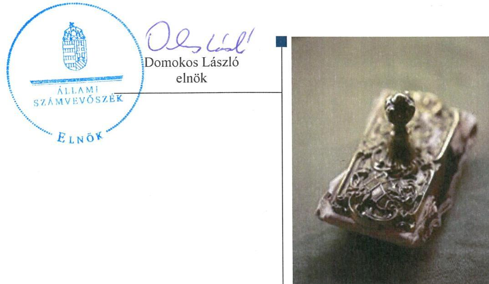

---

|   | AZ ELLENŐRZÉST FELÜGYELTE:  |
| --- | --- |
|   | HOLMAN MAGDOLNA felügyeleti vezető  |
|   | AZ ELLENŐRZÉST VEZETTE ÉS A VÉGREHAJTÁSÁÉRT FELELŐS:  |
|   | NEMESVÁRI-HORTHY ESZTER ellenőrzésvezető  |
|   | A PROGRAM ÖSSZEÁLLÍTÁSÁÉRT FELELŐS:  |
|   | JANIK JÓZSEF osztályvezető  |
|   | A TÉMÁHOZ KAPCSOLÓDÓ KORÁBBI SZÁMVEVŐSZÉKI JELENTÉSEK:  |
|   | - címe: A magyar államkincstár működésének és gazdálkodásának ellenőrzése  |
|   | - sorszáma: 14098  |
|  Jelentéseink az Országgyűlés számítógépes hálózatán és az Interneten a www.asz.hu címen is olvashatóak. | - címe: Jelentés Magyarország 2014. évi központi költségvetése végrehajtásának ellenőrzéséről  |
|   | - sorszáma: 15167  |
|   | IKTATÓSZÁM: V-0819-759/2016.  |
|   | TÉMASZÁM: 1853, 1918  |
|   | ELLENŐRZÉS-AZONOSÍTÓ SZÁM: V-0723, V-0732  |

---

# TARTALOMJEGYZÉK 

■ ÖSSZEGZÉS ..... 5
■ AZ ELLENŐRZÉS CÉLJA ..... 7
■ AZ ELLENŐRZÉS TERÜLETE ..... 8
■ AZ ELLENŐRZÉS HÁTTERE, INDOKOLTSÁGA ..... 10
■ FÓKUSZKÉRDÉSEK ..... 11
■ ELLENŐRZÉS HATÓKÖRE ÉS MÓDSZEREI ..... 13
■ MEGÁLLAPÍTÁSOK ..... 15
■ JAVASLATOK ..... 56
■ MELLÉKLETEK ..... 59
I. Sz. melléklet: Értelmező szótár. ..... 59
II. Sz. melléklet: a Magyar Államkincstár közigazgatási hatósági feladatait és a központosított illetményszámfejtéssel kapcsolatos feladatokat ellátó szervezeti egységei 2014. év ..... 62
III. Sz. melléklet: A Magyar Államkincstár közigazgatási hatósági ügyeinek alakulásáról a 2014. évben ..... 63
IV. Sz. melléklet: A Magyar Államkincstárnál az Áht. 14. § (3) bekezdése szerinti fejezetből igényelt költségvetési támogatásokról a 2014. évben ..... 65
V. Sz. melléklet: A Magyar Államkincstárnál a köznevelési és szociális feladatokat ellátó intézményi nem állami fenntartók részére nyújtott állami támogatások alakulásáról a 2014. évben ..... 67
VI. Sz. melléklet: A Magyar Államkincstár által vezetett törzskönyvi nyilvántartásban szereplő szervek számának alakulása 2014. évben ..... 68
VII. Sz. melléklet: A Magyar Államkincstárnál a központosított illetményszámfejtési körbe tartozó szervezetek jellemző adatairól a 2014-2015. év I. negyedévében (közfoglalkoztatottak és nem közfoglalkoztatottak együttesen) ..... 69
■ FÜGGELÉK: ÉSZREVÉTELEK ..... 71
■ RÖVIDÍTÉSEK JEGYZÉKE ..... 123

---

.

---

# ÖSSZEGZÉS 

A Magyar Államkincstárnál a közigazgatási hatósági feladatok ellátásához a családtámogatás, fogyatékossági ellátások, a törzskönyvi nyilvántartás, a jogorvoslati eljárások területén nem alakítottak ki megfelelő kontrollkörnyezetet. Ennek következtében nem volt biztosított az elszámoltathatóság, a feladatok végrehajtása nem felelt meg a jogszabályi előírásoknak. A nagycsaládos kedvezmény, az önkormányzati alrendszer, a nem állami fenntartói körbe tartozó humánszolgáltatók, a lakáscélú állami támogatások és a kampányfinanszirozás esetében a feladatokat a jogszabályi előírásoknak megfelelően látták el. 2014-ben a központosított illetmény-számfejtés belső szabályozása, a munkavállalók munkaköri leírása nem követte a jogszabályi változásokat, ezáltal ezen a területen sem volt biztosított az elszámoltathatóság. Az integritási és korrupciós kockázatok csökkentése érdekében tett intézkedések nem feleltek meg a jogszabályi előírásoknak. Az információbiztonsággal kapcsolatos törvényi előírásokat a Kincstár nem teljesítette.

## Az ellenőrzés társadalmi indokoltsága

A közigazgatási eljárásról szóló törvény alapelvként fogalmazza meg, hogy a közigazgatósági hatóság hatásköre gyakorlása során a szakszerűség, az egyszerűség és az ügyféllel való együttműködés követelményeinek megfelelően köteles eljárni. A Kincstár hatósági tevékenysége kiterjed az ügyfelek széles körére, érinti a lakossági ügyfeleket és a közszférát egyaránt.

## Főbb megállapítások, következtetések, javaslatok

A kontrollkörnyezet nem volt megfelelő a közigazgatási hatósági feladatok közül: a családtámogatási; fogyatékossági ellátások; a törzskönyvi nyilvántartás; a jogorvoslati eljárások; a nagycsaládos kedvezmény; az önkormányzati alrendszer 2014. évi támogatása; az adósságátvállalás; a jogalap nélkül igénybevett támogatások esetében. Ezt támasztja alá, hogy a feladatok ellátásához vagy nem adtak ki belső szabályzatot, vagy a kiadott belső szabályzatokat nem módosították a jogszabályváltozásokat követően, a belső szabályzatok a jogszabályban foglalt előírásokkal nem álltak összhangban.

A Kincstár elnöke utasításban határozta meg a belső szabályozó eszközök készítésének és kiadásának eljárásrendi szabályait, azonban az utasítás előírásait nem tartották be. Mindezek következtében a számon kérhetőség és a felelősség érvényesíthetősége magas kockázatot hordoz és az elszámoltathatóság sem volt biztosított. A feladatellátás nem felelt meg a jogszabályi előírásoknak a családtámogatási, a fogyatékossági ellátások, a törzskönyvi nyilvántartás, valamint a jogorvoslati eljárások vonatkozásában. Az ügyintézés

---

során a jogszabályok előírásainak nem megfelelő, hiányos adattartalmú kérelmeket is befogadták és a jogszabályi előírásokban meghatározott ügyintézési határidőket nem tartották be. A nagycsaládos kedvezménnyel, az önkormányzati alrendszerrel kapcsolatos közigazgatási hatósági feladatok, a nem állami fenntartói körbe tartozó humánszolgáltatást nyújtó fenntartókat érintő támogatásokkal, a kampányfinanszírozással, a jogalap nélkül felvett ellátásokkal, a jogosulatlanul igénybevett támogatásokkal kapcsolatos feladatok ellátása azonban megfelelt a jogszabályi előírásoknak.

A központosított illetmény-számfejtési feladat esetében sem a belső szabályozás, sem a munkaköri leírások nem voltak összhangban a feladatok végrehajtásakor hatályos jogszabályi előírásokkal. Ennek következtében a felelősség, az elszámoltathatóság sem érvényesült. 2014-ben a központosított illetmény-számfejtés során a társadalombiztosítási ellátások, az adók és járulékok megállapítása, folyósítása, az illetményből a levonások, letiltások elszámolása megfelelt a jogszabályi előírásoknak.

Az átutalási megbízások teljesítésével és a költségvetési szervek lejárt tartozásállományával kapcsolatos feladatok belső szabályzatait a jogszabályi változásokat követően nem módosították, azok a jogszabályokban meghatározott követelményeket nem tartalmazták. A nagy összegű átutalások előzetes bejelentésével kapcsolatos feladat ellátás nem felelt meg a jogszabályi előírásoknak, azonban az átutalási megbízások teljesítésével, a költségvetési szervek lejárt tartozásállományára vonatkozó kötelező adatszolgáltatásával kapcsolatos kincstári feladatellátás megfelelő volt.

A panaszok és közérdekű bejelentések kezelését nem szervezték meg. A Kincstár egészére kiterjedő szabályozást nem alakítottak ki és nem az SZMSZ-ben arra kijelölt szervezeti egységek jártak el.

Az integritási és a korrupciós kockázatok csökkentése érdekében a jogszabályi előírásokkal ellentétben nem tettek intézkedéseket, mert az integritás-irányítás belső eljárásrendi szabályzatát nem adták ki és az integritás tanácsadó kijelölésére sem került sor csak 2014. év végével.

A Kincstár a 2013. évi L. törvény előírásaival ellentétben az információbiztonsággal kapcsolatos követelményeket nem teljesítette. Az informatikai rendszereket nem teljes körűen és nem a jogszabályi előírásoknak megfelelően sorolták be és a Kincstár informatikai biztonsági szintjének meghatározása sem felelt meg a jogszabályi előírásoknak. Ezzel nem volt biztosított az informatikai rendszerekben kezelt adatok bizalmassága, sértetlensége és rendelkezésre állása, valamint az informatikai rendszerek zárt, teljes körű, folytonos és a kockázatokkal arányos védelme.

---

# AZ ELLENŐRZÉS CÉLJA 

## A Magyar Államkincstár ellenőrzése

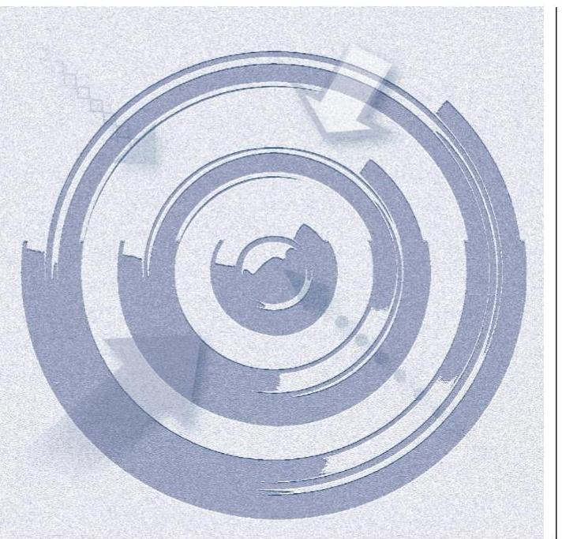

Az ellenőrzés célja annak megállapítása volt, hogy a Kincstár közigazgatási hatósági tevékenységének ellátása szabályozott és szabályszerű volt-e; megelőzték-e, illetve feltárták-e a jogosulatlan kifizetéseket, azok visszafizetéséről, beszedéséről intézkedtek-e; szabályszerűen alakították-e ki és működtették-e a jogorvoslati és panaszkezelési rendszereket; tettek-e intézkedéseket a korrupciós kockázat csökkentése érdekében; a központosított illetmény-számfejtési rendszer kialakítása és működtetése megfelelt-e az előírásoknak és az adatbiztonsági követelményeknek. Az ellenőrzéshez kapcsolódott a Kincstár átutalási megbízások teljesítésével, valamint a központi költségvetési szervek lejárt tartozásállományra vonatkozó adatszolgáltatásával összefüggő egyes feladatai ellátásának ellenőrzése. Ennek keretében az ellenőrzés célja annak megállapítása volt, hogy a Kincstár az államháztartás központi alrendszerébe tartozó költségvetési szervek lejárt tartozásállományra vonatkozó kötelező adatszolgáltatásához kapcsolódó feladatait és a kincstári rendszeren keresztül teljesített kifizetések előtti fedezet-vizsgálati tevékenységét, valamint a kincstári ügyfélkörön kívülre irányuló nagy összegű átutalások előzetes bejelentésével és teljesítésével összefüggő feladatait szabályszerűen látta-e el.

---

# **AZ ELLENŐRZÉS TERÜLETE**

## **Magyar Államkincstár**

### **ELSŐ FOKÚ ÉRDEMI DÖNTÉSEK FELADATONKÉNT 2014. (db)**

|  Feladat megnevezése | Első fokú érdemi döntések száma  |
| --- | --- |
|  Családtámogatási ellátások | 801 102  |
|  Fogyatékossági támogatások | 31 294  |
|  Nagycsaládos kedvezmény | 22 787  |
|  Önkormányzati alrendszer támogatásai | 3 559  |
|  Nem állami intézményfenntartók támogatása | 6 291  |
|  Törzskönyvi nyilvántartás | 32 589  |
|  Kampányfinanszírozás | 620  |
|  Lakáscélú állami támogatás | 2 922  |

*Forrás: Kincstár és ONYF tanúsítványi adatszolgáltatása*

**A MAGYAR ÁLLAMKINCSTÁR** (továbbiakban: Kincstár) az államháztartásért felelős miniszter irányítása alatt álló központi hivatalként működő központi költségvetési szerv. A Kincstár alaptevékenysége keretében ellátta az Áht.¹-ban, valamint az egyéb jogszabályokban számára meghatározott feladatokat.

**FŐ TEVÉKENYSÉGI KÖRE** kiterjedt a költségvetés végrehajtására, finanszírozási, ellenőrzési és felülvizsgálati feladatokra, pénzügyi szolgáltatásokra, család- és egyéb szociális támogatások folyósítására, energiaár-támogatás, lakástámogatás kezelésére, Start-számla vezetésére, a központi illetményszámfejtésre, pályázatos támogatásokra, követeléskezelésre, a törzskönyvi és egyéb nyilvántartások vezetésére.

Közigazgatási hatóságként a Kincstár számos esetben járt el és intézett hatósági ügyet. A Kincstár által a 2014. évben ellátott közigazgatási hatósági feladatok körében meghozott első fokú érdemi döntések számát és megoszlását az 1. táblázat mutatja be.

A 2014. évben a Kincstár hatósági tevékenysége kiterjedt az ügyfelek széles körére. Érintette a lakossági ügyfeleket (családtámogatási és fogyatékossági támogatások, lakáscélú állami támogatások, nagycsaládos kedvezmény, diákhitelhez nyújtott célzott kamattámogatás) és a közszférát (önkormányzatok állami támogatásának és az önkormányzati adósságátvállaláshoz kapcsolódó adatszolgáltatás felülvizsgálata, gépjárműadó megosztásához kapcsolódó ellenőrzés, humánszolgáltatást nyújtó intézmények nem állami fenntartóinak támogatása, törzskönyvi nyilvántartás vezetése, a választási kampány költségei elszámolásának ellenőrzése) egyaránt. A Kincstár közigazgatási hatósági feladatainak ellátását informatikai rendszerek támogatták, amelyek fejlesztésével, üzemeltetésével kapcsolatos feladatokat a KINCSINFO NKft. közreműködésével látta el. Az egyes közigazgatási hatósági feladatokkal kapcsolatos részletes adatokat a III. sz. melléklet mutatja be. A Kincstár által felülvizsgált költségvetési támogatások, a köznevelési és szociális feladatokat ellátó nem állami intézményfenntartók költségvetés támogatásának volumenét az IV. és V. sz. mellékletek mutatják be. A törzskönyvi nyilvántartásban szereplő szervek számával kapcsolatos adatok a VI. sz. mellékletben szerepelnek.

A Kincstár látta el az illetmény-számfejtési feladatokat a jogszabályokban meghatározott szervek esetében. A központosított illetményszámfejtés célja, hogy a közszolgálatban dolgozó munkavállalók illetményeinek egységes információs rendszerrel történő számfejtésének köszönhetően az államháztartás legjelentősebb kiadási tételeként megjelenő személyi juttatásokról és a közterhekről, illetve a létszámról megbízható információk álljanak rendelkezésre a tervezéshez, gazdálkodáshoz és beszámoláshoz. A központosított illetmény-számfejtési rendszerbe tartozó szervezetek jellemző adatait a VII. sz. melléklet tartalmazza.

---

SZERVEZETE központi szervből és 19 területi szervből állt, a teljes munkaidőben foglalkoztatottak engedélyezett létszáma 2014-ben 4212 fő volt. A központi szerv Elnöki Kabinetre és főosztályokra, ezen belül osztályokra, a területi szervei irodákra és osztályokra tagozódtak. A Kincstár szervezetének működését az Elnök irányította, annak egyszemélyi felelős vezetője volt. Az Elnök munkáját elnökhelyettesek segítették. A Kincstár szakmai tevékenységét a központi szerv főosztályain, valamint a területi szervek irodáin keresztül látta el. A főosztályok a szakmai irányítás mellett másodfokú, a területi szervek elsőfokú hatóságként jártak el, illetve végezték a központosított illetmény-számfejtési feladatot. A Kincstár 2014. évi közigazgatási hatósági feladatait és a központosított
 illetmény-számfejtési feladatokat ellátó szervezeti egységeket a II. sz. mellékletben elhelyezett ábra mutatja be.

JELENTŐS VÁLTOZÁS A FELADATOKBAN 2015. április 1-jétől következett be, amikortól a fővárosi és megyei kormányhivatalok szervezetébe integrálódtak a területi államigazgatási szervek meghatározott feladatai. A Kincstár területi szervei által ellátott - családtámogatási ellátásokkal, fogyatékossági támogatással, nagycsaládos kedvezménnyel, lakáscélú állami támogatással összefüggő - feladatok tekintetében a Kincstár területi szerveinek jogutódja a fővárosi és megyei kormányhivatalok lettek. A Kincstár központi szerve által ellátott családtámogatási ellátásokkal, fogyatékossági támogatással, nagycsaládos kedvezménnyel összefüggő feladatok, valamint másodfokú hatósági hatáskörök tekintetében a Kincstár jogutódja az ONYF² lett.

---

# AZ ELLENŐRZÉS HÁTTERE, INDOKOLTSÁGA 

## Objektiv kép kialakítása a Magyar Államkincstár közigazgatási hatósági feladatairól és a központosított illetmény-számfejtési rendszerről

## Hasznosulás

AZ ÁSZ³ STRATÉGIÁJÁBAN hangsúlyos szerepet szán annak, hogy szilárd szakmai alapon álló, értékteremtő ellenőrzéseivel előmozdítsa a közpénzügyek átláthatóságát, rendezettségét és javaslataival a közpénzek és a közvagyon szabályos, gazdaságos, hatékony és eredményes felhasználását segítse. Az ellenőrzések témaválasztásánál kiemelkedő szerepet játszik, hogy az ellenőrzések elért eredményei hozzáadott értéket teremtsenek, a közpénzek felhasználásában kimutatható megtakarításokat, a gazdálkodás javítását eredményezzék. Az ÁSZ szerepet vállal a korrupció és a csalás elleni küzdelemben is. Közreműködik a korrupciós kockázatok és a korrupció elleni fellépés hatékony és eredményes eszközeinek beazonosításában, alkalmazásában, továbbá használatuk elterjesztésében, az integritás alapú közigazgatási kultúra kialakításában.

AZ ELLENŐRZÉS EREDMÉNYEKÉNT képet kaphatunk arról, hogy a Kincstár hatósági feladatellátása szabályozott-e, eljárásait jogszerűen folytatja-e le, a Kincstár területi szervezetei által folytatott eljárások egységesek-e, a korrupciós kockázatokat kezeli-e. Az ellenőrzés a Kincstár hatósági tevékenységének értékelésével, a jogszabályi és a belső szabályozás esetleges hiányosságainak, valamint az alkalmazott nem szabályszerű eljárás feltárásával és a jó gyakorlatok bemutatásával, a fejlesztendő területek megjelölésével kíván hozzájárulni a szabályszerűbb, tervszerűbb és átláthatóbb feladatellátás elősegítéséhez, ezáltal a jó kormányzáshoz. Az ellenőrzéssel képet kaphatunk arról, hogy a Kincstár az átutalási megbízások teljesítésével kapcsolatos, ellenőrzött feladatainak ellátása, valamint a költségvetési szervek lejárt tartozásállományára vonatkozó adatszolgáltatással összefüggő feladatellátása szabályozott-e, tevékenységét jogszerűen végzi-e.

A Kincstár hatósági tevékenységének jogszerűsége rövidtávon hatással van az államigazgatás megítélésére, hosszabb távon növeli az államba vetett bizalmat, ösztönözheti a jogkövető magatartást. Az ellenőrzés megállapításaival, javaslataival hozzájárulhat a működés szabályozottságában esetlegesen fellépő hiányosságok kiküszöböléséhez, a Kincstár hatósági tevékenysége ügyfélbarátabbá tételéhez.

A központosított illetmény-számfejtési rendszer értékelésével képet kapunk kialakításának és működésének jogszabályi megfelelőségéről, az adatbiztonsági követelmények érvényesüléséről.

---

# FÓKUSZKÉRDÉSEK 

1.     - A közigazgatási hatósági tevékenységek ellátását a jogszabályi előírásokkal és a belső szabályozással összhangban alakították-e ki, illetve működtették-e?
2.     - A jogorvoslati rendszereket és az ellátások jogalap nélküli felvételét, a támogatások jogosulatlanul igénybevételét megelőző, feltáró rendszert és azok visszafizetését, beszedését szabályszerűen kialakították-e és működtették-e?
3.     - Szabályszerűen alakították-e ki és működtették-e a panasz és közérdekű bejelentések kezelésének rendszerét, tettek-e intézkedéseket a korrupciós kockázatok csökkentése érdekében?
4. A központosított illetmény-számfejtési rendszer kialakítása és működtetése megfelelt-e a jogszabályi előírásoknak és a belső szabályozásnak?
5. A közigazgatási hatósági és illetmény-számfejtési feladatokat támogató informatikai rendszerek esetében eleget tettek-e az elektronikus információ- és adatbiztonsági követelményeknek?

---

6. Az előírásoknak megfelelően látták-e el az átutalási megbízások teljesítésével, valamint a költségvetési szervek lejárt tartozásállományra vonatkozó adatszolgáltatásával összefüggő feladatokat?

---

# ELLENŐRZÉS HATÓKÖRE ÉS MÓDSZEREI 

## Az ellenőrzés típusa

Megfelelőségi ellenőrzés, az átutalási megbízások teljesítésével és a költségvetési szervek lejárt tartozásállományra vonatkozó kötelező adatszolgáltatásával összefüggő egyes feladatok esetében szabályszerűségi ellenőrzés.

## Az ellenőrzött időszak

2014. január 1-jétől 2014. december 31-e közötti időszak, az informatikai rendszerek vonatkozásában a 2013. évi L. törvény ${ }^{4}$ előírásainak betartását 2015. július 1-jéig értékeltük, a központosított illetmény-számfejtési rendszer informatikai fejlesztési projektje (KIRA) tekintetében 2015. június 11-ig bekövetkezett eseményeket, körülményeket, megtett intézkedéseket ellenőriztük. Az átutalási megbízások teljesítésével és a költségvetési szervek lejárt tartozásállományra vonatkozó kötelező adatszolgáltatásával összefüggő egyes feladatokat 2013. január 1-jétől 2015. június 30-ig ellenőriztük.

## Az ellenőrzés tárgya

A Kincstár közigazgatási hatósági feladatai és a központosított illetmény-számfejtési rendszer megfelelőségének, valamint az átutalási megbízások teljesítésével és a költségvetési szervek lejárt tartozásállományra vonatkozó kötelező adatszolgáltatásával összefüggő egyes feladatok szabályszerűségének ellenőrzése.

## Az ellenőrzött szervezet

Magyar Államkincstár, a KINCSINFO N. Kft., a családtámogatási és szociális ellátási, valamint lakáscélú állami támogatással összefüggő feladatellátásban a 2015. április 1-jétől kijelölt jogutód szervezetek - Fővárosi és Megyei Kormányhivatalok, Nemzetgazdasági Minisztérium, Országos Nyugdíjbiztosítási Főigazgatóság, a lakáscélú állami támogatással összefüggő feladatellátásban szakmai irányítóként a Nemzetgazdasági Minisztérium.

## Az ellenőrzés jogalapja

Az ellenőrzés elvégzésének jogszabályi alapját az Állami Számvevőszékről szóló 2011. évi LXVI. törvény 1. § (3) bekezdése, valamint az 5. § (2), (3) és (6) bekezdései képezték.

---

# Az ellenőrzés módszerei 

Az ellenőrzés kapcsolódott Magyarország 2014. évi költségvetése végrehajtásának ellenőrzéséhez.

Mintavétellel ellenőriztük az alábbi területek szabályszerűségét:
$\longrightarrow$ közigazgatási hatósági feladatok körében: családtámogatási ellátások, a fogyatékossági támogatások, a nagycsaládos kedvezmény, költségvetési támogatások önkormányzati alrendszer általi igénybevételének, felhasználásának és elszámolásának felülvizsgálata, a helyi önkormányzatok kötelező adatszolgáltatásának elmulasztása vagy késedelmes teljesítése miatti bírságkiszabás, a belföldi gépjárművek után - a települési önkormányzat által - beszedett adó megosztásának felülvizsgálata, az önkormányzati adósságátvállaláshoz kapcsolódó 2014. évi adatszolgáltatás felülvizsgálata, a nem állami intézményi fenntartói körbe tartozó humánszolgáltatást nyújtó fenntartókat érintő állami támogatásokkal, a törzskönyvi nyilvántartással, a kampányfinanszírozással, a lakáscélú állami támogatásokkal kapcsolatos közigazgatási hatósági feladatok;
$\longrightarrow$ a jogorvoslatok körében a családtámogatási ellátások, a fogyatékossági támogatások, a nem állami intézményi fenntartói körbe tartozó humánszolgáltatást nyújtó fenntartókat érintő állami támogatások felülvizsgálata, valamint a lakáscélú állami támogatások;
$\longrightarrow$ a jogalap nélkül felvett ellátásokkal, a jogosulatlanul igénybevett támogatásokkal kapcsolatos közigazgatási hatósági feladatokat: családtámogatási ellátások, a fogyatékossági támogatások, a költségvetési támogatások önkormányzati alrendszer általi igénybevételének, felhasználásának és elszámolásának felülvizsgálata, a nem állami intézményi fenntartói körbe tartozó humánszolgáltatást nyújtó fenntartókat érintő állami támogatások felülvizsgálata, a lakáscélú állami támogatások, valamint a kampányfinanszírozás;
$\longrightarrow$ a központosított illetmény-számfejtéssel kapcsolatos feladatokat a foglalkoztatottak vonatkozásában;
$\longrightarrow$ a Kincstár informatikai rendszerei változtatási kérelmei: TÉBA, KIR3;
$\longrightarrow$ az átutalási megbízásokkal és a költségvetési szervek lejárt tartozásállományra vonatkozó kötelező adatszolgáltatásával kapcsolatos kincstári feladatokat.
„Megfelelőnek" értékeltünk egy ellenőrzött területet, amennyiben 95%-os bizonyossággal a teljes sokaságban a hibaarány legfeljebb 10%, nem megfelelőnek, amennyiben 10%-nál magasabb arányt képviselt. Abban az esetben, ha a teljes sokaság tekintetében a 10%-os hibaarányhoz való viszony megítélésének megbízhatósága nem érte el a 95%-ot, annak elérése érdekében értékelésünket további szempontokkal egészítettük ki, és figyelembe vettük a mintában előforduló hibaarányt, valamint a feltárt hibák típusát.

---

# 1. A közigazgatási hatósági tevékenységek ellátását a jogszabályi előírásokkal és a belső szabályozással összhangban alakították ki, illetve működtették-e? 

Összegző megállapítás

1.1. számú megállapítás

### 1.1.1.

3. ábra
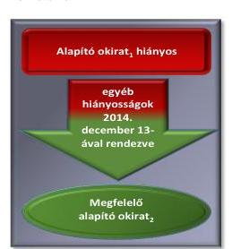
1.1.2.

A közigazgatási hatósági tevékenységek közül a családtámogatási és a fogyatékossági támogatásokkal kapcsolatos tevékenységek ellátását nem a jogszabályi előírásokkal összhangban alakították ki. A közigazgatási hatósági feladatok közül a családtámogatási, a fogyatékossági támogatásokkal és a törzskönyvi nyilvántartással kapcsolatos feladatok ellátása nem felelt meg a jogszabályi előírásoknak.

A Kincstár közigazgatási hatósági feladatait alapító okirata tartalmazta. SZMSZ-e azonban nem tartalmazta a törzskönyvi nyilvántartással és a fogyatékossági támogatásokkal kapcsolatos, az alapító okiratban és jogszabályban meghatározott részletes feladatait.

Az alapító okirat 2014. decembertől a jogszabályi előírásoknak megfelelően tartalmazta a Kincstár számára előírt feladatokat.

Az alapító okirat ${ }^{5}$ 2014. december 13-ig az alábbi jogszabályi előírásnak nem felelt meg, mert:
$\longrightarrow$ az Ávr. ${ }^{6}$ 5. § (1) bekezdés c) pont előírásaival ellentétben nem tartalmazta a szakmai tevékenységek megjelölését;
A 2014. december 13-ával hatályba lépett alapító okirat ${ }^{7}$ rögzítette a 2013. évi LXXXVII. törvény ${ }^{8}$ szerinti kampányfinanszírozással kapcsolatos, 2014-től a Kincstár számára előírt feladatokat.

Az SZMSZ nem tartalmazta a Kincstár alapító okiratában és a jogszabályokban a Kincstár részére meghatározott, a törzskönyvi nyilvántartással és a fogyatékossági támogatásokkal kapcsolatos feladatokat, a gazdasági szervezet megnevezését és az SZMSZ-ben nevesített osztályvezetői munkakört betöltők helyettesítésének rendjét és az ehhez kapcsolódó felelősségi szabályokat.

A 2014. évben a nemzetgazdasági miniszter által jóváhagyott két SZMSZ követte egymást.

Az SZMSZ, ${ }^{9}$ 2014. év január és szeptember között az Ávr. 13. § (1) bekezdés c) pontja előírásával ellentétben nem tartalmazta:
$\longrightarrow$ a Kincstár részére az egységes szociális nyilvántartás vezetésére 2015. március 31-ig meghatározott, az Áht. 106. § (1) bekezdése szerinti feladatokat;

---

4. ábra
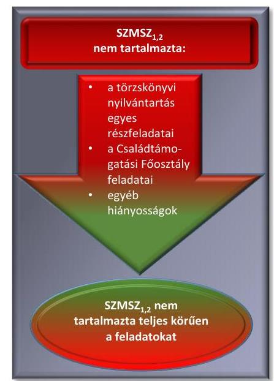
$\longrightarrow$ a természetben nyújtott családi pótlék kezelésére vonatkozó, a Cst. ${ }^{10}$ 37. § (5) bekezdése és a Gyvt. ${ }^{11}$ 68/B. § (5) bekezdése szerinti feladatokat;
$\longrightarrow$ a Kincstár részére előírt, nagycsaládos kedvezménnyel kapcsolatos, a 28/2009. (VI. 25.) KHEM rendelet ${ }^{12}$ 16/A-16/H. § szerinti feladatokat;
és a 2013. évi LXXXVII. törvény szerint a kampányfinanszírozással kapcsolatos feladatokat.
Az SZMSZ ${ }^{13}$ a 2014. évben - az Ávr. 13. § (1) c) pontjával ellentétben - az alábbi jogszabályban meghatározott feladatokat nem tartalmazta:
$\longrightarrow$ az Áht. 104. § (6) bekezdésében meghatározott, a törzskönyvi nyilvántartás adatait érintő nyilvánosságra hozatallal, a közzététellel kapcsolatos feladatokat;
a Családtámogatási Főosztálynak a feladatai között a fogyatékossági támogatásokkal kapcsolatos, a területi szervek szakmai és ellenőrzési tevékenységének szakmai vezetését, az informatikai rendszer fejlesztése szakmai követelményeinek meghatározását, a formanyomtatványok előkészítésével kapcsolatos feladatok elvégzését.
A 2014. év január-szeptember között az SZMSZ ${ }_{1}$ az alábbi hiányosság miatt nem volt megfelelő:
$\longrightarrow$ nem tartalmazta az Ávr. 13. § (1) bekezdés b) pontja ellenére a hatályos alapító okirat keltét, számát.
Az SZMSZ ${ }_{2}$ 2014. szeptembertől nem volt megfelelő, mert:
$\longrightarrow$ az Ávr. 13. § (1) bekezdés c) pont előírásaival ellentétben az alaptevékenységeket szabályozó jogszabályok megjelölését nem tartalmazta;
$\longrightarrow$ az Ávr. 13. § (1) bekezdés b) pontja előírásaival ellentétben a hatályon kívül helyezett alapító okirat ${ }_{1}$-ot nevezte meg hatályosnak;
$\longrightarrow$ az Áht. 69. § (2) és a Bkr. ${ }^{14}$ 7. § (1) bekezdése előírásaival ellentétben a kockázatkezelési rendszer működtetésének feladatait az SZMSZ ${ }_{2}$ 40. § j) pontja az Ellenőrzési Főosztály feladataként határozta meg, amely figyelmen kívül hagyta a Bkr. 19. § (2) bekezdésének a belső ellenőrzés funkcionális függetlenségére vonatkozó előírásait is.
Az SZMSZ ${ }_{1,2}$ az egész évben az alábbi hiányosságok miatt nem volt megfelelő:
$\longrightarrow$ az Ávr. 13. § (1) bekezdés e) pont előírása ellenére nem tartalmazta a gazdasági szervezet megnevezését és a szervezeti egységek szerinti engedélyezett létszámot;
$\longrightarrow$ az Ávr. 13. § (1) bekezdés g) pont előírása ellenére az osztályvezetői munkakört betöltők helyettesítésének rendjét és az ehhez kapcsolódó felelősségi szabályokat nem határozta meg.

---

### 1.2. számú megállapítás

Belső szabályzatokat a törzskönyvi nyilvántartás vezetésével, a nagycsaládos kedvezménnyel, az önkormányzati alrendszer részére nyújtott 2014. évi támogatások és a 2014. évi adósságátvállaláshoz nyújtott adatszolgáltatások felülvizsgálatával kapcsolatban nem készítettek. A közigazgatási hatósági feladatokat ellátó szervezeti egységek hatályos ügyrendjein, a kiadott belső szabályzatokon a jogszabályi előírások változását a Kincstár belső szabályozó eszközei készítésének és kiadásának szabályzatában
 foglalt határidőkhöz képest késedelmesen vezették át.

## A KÖZIGAZGATÁSI HATÓSÁGI TEVÉKENYSÉGEK

területén a Kincstár elnöke a Bkr. 6. § (1) bekezdésében meghatározott kontrollkörnyezet kialakítása érdekében intézkedett. Kiadta a 7/2013. sz. Elnöki Utasítást ${ }^{15}$ a Kincstár belső szabályozó eszközei készítésének és kiadásának szabályairól.

A közigazgatási hatósági feladatokat ellátó szervezeti egységek vezetői a szervezeti egységük ügyrendjét - a 7/2013. sz. Elnöki Utasítás 1.1. pontjában meghatározott, az ügyrend módosítását igénylő változások bekövetkezését követő 30, illetve 60 napos határidő ellenére - nem, vagy a határidőt túllépve aktualizálták. Az ügyrendek mellékletében elhelyezett ellenőrzési nyomvonalakat - a Bkr. 6. § (3) bekezdésében foglaltak ellenére - nem aktualizálták rendszeresen. Az ügyrendekkel kapcsolatos részletes megállapításokat az 1.2.1. pont tartalmazza.

Egyes közigazgatási hatósági feladatok esetében a belső szabályozó kiadásának elmaradása nem felelt meg a 7/2013. sz. Elnöki Utasítás 1.1. pontjában meghatározottaknak, mely szerint az egységes működési és eljárási rend alkalmazása érdekében és/vagy a feladatok azonos módon való elvégzése céljából utasítást kell kiadni. A belső szabályozók kiadásának elmaradása ellentétes volt az SZMSZ1 30. § (1) bekezdés és az SZMSZ2 31. § (1) bekezdés előírásaival is, mely szerint a Kincstár egészét vagy szervezeti egységét érintő kötelező rendelkezéseket, végrehajtási szabályokat a belső szabályozó eszközök állapítják meg. A 1.2.2. pont tartalmazza azon közigazgatási hatósági feladatok felsorolását, amelyek esetében a belső szabályzat kiadása elmaradt.

A szakmai területek vezetői a meglévő belső szabályzatokat a jogszabályokat követően - ellentétben a 7/2013. sz. Elnöki Utasítás 1.6. pontjában foglaltakkal - késedelmesen aktualizálták, mert nem gondoskodtak a hatályos utasítás jogszabályoknak, közjogi szervezetszabályozó eszközöknek, illetve egyéb körülményeknek megfelelő aktualizálásáról, valamint naprakész állapotáról. Az aktualizálás elmaradása miatt a belső szabályzatok nem feleltek meg a jogszabályi előírásoknak. A részletes megállapításokat az 1.2.3. , 1.2.4., 2.1.1. és 2.1.2. pontok tartalmazzák.

A belső szabályzatok elnöki vagy elnökhelyettesi utasítás, vagy a szakmai feladatellátást támogató útmutatók és segédletek elnökhelyettesi körlevél formájában történt kiadmányozása megfelelt az SZMSZ1 30. § (1)-(3) bekezdésében, az SZMSZ2 31. § (1)-(3) bekezdésében, valamint a 7/2013. sz. Elnöki Utasítás 1.2. és 2. pontjában meghatározott hatásköri szabályoknak.

---

1.2.1.

A közigazgatási hatósági feladatokat ellátó főosztályok és a területi szervek ügyrendjeit a jogszabályi változásokat követően a Kincstár belső szabályozó eszközei készítésének és kiadásának szabályzatában foglaltakkal ellentétben nem, vagy jelentős késedelemmel módosították. A Jogi és Törzskönyvi Főosztály 2014. október végéig nem rendelkezett ügyrenddel.

Ügyrendet a 2012. évben alakult Jogi és Törzskönyvi Főosztály részére - ellentétben az Ávr. 13. § (5) bekezdésével - nem adtak ki, csak 2014. októbertől rendelkezett ügyrenddel.

Az ügyrendeket a jogszabályi változásokat követően nem, vagy csak jelentős késedelemmel módosították, ezért azok nem feleltek meg a jogszabályi előírásoknak. Egyes szervezeti egységek által ellátott feladat- és hatásköröket sem az SZMSZ ${ }_{1,2}$ sem az adott szervezeti egység ügyrendje nem tartalmazza az Ávr. 13. § (5) bekezdésével ellentétben.

A Kincstár központ Támogatásokat Közvetítő Főosztályának ügyrendje az Ávr. 13. § (5) bekezdésében foglalt előírás ellenére 2014. december 29-ig nem volt megfelelő, mert nem tartalmazta:
— az országgyűlési képviselők választása kampányköltségeinek támogatásával kapcsolatos, a 2013. évi LXXXVII. törvény szerinti feladatokat. A Támogatásokat Közvetítő Főosztály 2014. december 30-ától hatályos ügyrendje a feladatot már tartalmazta.
A Kincstár központ Családtámogatási Főosztályának ügyrendje a 2014. évben nem felelt meg az Ávr. 13. § (5) bekezdésében foglaltaknak, mert nem tartalmazta:
— a 2015. március 31-ig a Kincstárnak meghatározott, az Áht. 106. § (1) bekezdése szerint az egységes szociális nyilvántartás vezetésével kapcsolatos feladatot, és a 28/2009. (VI. 29.) KHEM rendelet 16/A-16/H. §-aiban a nagycsaládos kedvezménnyel összefüggő, az SZMSZ ${ }_{2}$-ben a Családtámogatási Főosztályhoz delegált feladatokat;
— a fogyatékossági támogatások tekintetében a területi szervek szakmai és ellenőrzési tevékenységének szakmai vezetését, az informatikai rendszer fejlesztése szakmai követelményeinek meghatározását, a formanyomtatványok előkészítésével kapcsolatos feladatok elvégzését.
A területi szervek ügyrendjei a 2014. évben nem feleltek meg az Ávr. 13. § (5) bekezdésében foglalt előírásoknak, mert nem tartalmazták:
— a Bács-Kiskun Megyei Igazgatóság ügyrendje kivételével az országgyűlési képviselők választása kampányköltségeinek támogatásával kapcsolatos, a 2013. évi LXXXVII. törvény szerinti feladatokat;
— a 2015. március 31-ig a Kincstárnak meghatározott, az Áht. 106. § (1) bekezdése szerinti, az egységes szociális nyilvántartás vezetésével kapcsolatos feladatot;
— a természetben nyújtott családi pótlék kezelésével kapcsolatos, a Cst. 37. § (5), valamint a Gyvt. 68/B. § (5) bekezdése szerinti feladatok és eljárások meghatározását;
— a helyi önkormányzatok adatszolgáltatási kötelezettségének elmulasztása vagy késedelmes teljesítése esetén - az Áht. 108. § (4) be-

---

kezdésének 2014. január 5-től hatályos előírása szerint - alkalmazandó bírságkiszabás ügymenetét és az adatszolgáltatás teljesítése ellenőrzésének és nyilvántartásának - a hatósági határozathozatalt megalapozó - kötelezettségét.
1.2.2. A közigazgatási hatósági feladatok közül a törzskönyvi nyilvántartás vezetésével, a nagycsaládos kedvezménnyel, az önkormányzati alrendszer részére nyújtott 2014. évi támogatások és a 2014. évi adósságátvállaláshoz nyújtott adatszolgáltatások felülvizsgálatával kapcsolatban nem készítettek belső szabályzatot. A családtámogatási és a fogyatékossági támogatásokkal kapcsolatban kiadott szabályzatokat a jogszabályi előírások változását követően a Kincstár belső szabályozó eszközei készítésének és kiadásának szabályzatában foglaltakkal ellentétben jelentős késedelemmel módosították.

Belső szabályzatokat - ellentétben a 7/2013. sz. Elnöki Utasítás 1.1. pontjában foglaltakkal - az alábbi közigazgatási hatósági feladatok tekintetében nem adtak ki:
$\longrightarrow$ a törzskönyvi nyilvántartással kapcsolatos az Áht. 104. §-ában meghatározott feladatokra;
$\longrightarrow$ a nagycsaládos kedvezménnyel kapcsolatos, 28/2009. (VI. 29.) KHEM rendelet 16/A-16/H. §-aiban a Kincstár részére meghatározott feladatokra;
$\longrightarrow$ az önkormányzati alrendszer részére nyújtott 2014. évi támogatások igénylése, felhasználása és elszámolása az Áht. 58. és 59. §-ában meghatározott feladatai ellátására;
$\longrightarrow$ az önkormányzati adósságátvállaláshoz kapcsolódó adatszolgáltatás 2014. évi Kvtv. ${ }^{16}$ 68. §-ában meghatározott felülvizsgálatára.

A belső szabályzatok többségében 2014. év előtt léptek hatályba, módosításuk, illetve új szabályzatok kiadása a jogszabályi változásokat követően hónapokkal később történt meg. Így például a 2013. évi önkormányzati támogatások elszámolásának helyszíni ellenőrzésére vonatkozó szabályzat 2014. október 31-én, a fogyatékosok támogatásával kapcsolatos szabályzat 2014. december 30-án, a humán szolgáltatók támogatásának szociális, gyermekjóléti és gyermekvédelmi területet érintő felülvizsgálati szabályzata 2014. augusztus 12-én, a köznevelési szolgáltatók támogatásának felülvizsgálati és helyszíni ellenőrzési szabályzatai 2014. június 23-án és 24-én, a lakáscélú állami támogatásokkal kapcsolatos szabályzat 2014. december 10-én lépett hatályba. A szabályzatokban az aktualizálás késedelme miatt a Ket. ${ }^{17}$, az Áht., az Ávr. és a szakmai jogszabályok előírásai, illetve a 2014. január 1-jétől hatályba lépett módosításai hónapokon keresztül nem jelentek meg. A belső szabályzatok jogszabályokkal való összhangjára vonatkozó részletes megállapítások a következő 1.2.3.-1.2.4. pontokban szerepelnek.

---

1.2.3.

A családtámogatási ellátásokhoz kapcsolódó feladatokat meghatározó belső szabályzatot a 2014. évben nem, a fogyatékossági ellátásokhoz kapcsolódó feladatok belső szabályzatát a jogszabályi változás hatályba lépését követően majdnem egy évvel később módosították a Kincstár belső szabályozó eszközei készítésének és kiadásának szabályzatában foglaltakkal ellentétben. A belső szabályzatok nem feleltek meg a jogszabályi előírásoknak.

# A CSALÁDTÁMOGATÁSI ELLÁTÁSOK BELSŐ SZABÁLYZATA, a 13/2013. sz. Hálózatirányítási Elnökhelyettesi Utasítás ${ }^{18}$ volt. A hatályos jogszabályi előírásokkal összhangban tartalmazta a Cst. 15. §-ában, a 22. §-ában, a 43. § (5)-(6) bekezdésében, valamint a 223/1998. (XII. 30.) Korm. rendelet ${ }^{19}$ 23. §-ában foglaltak szerint az iskoláztatási támogatás tankötelezettség mulasztása miatti szüneteltetésére, a szüneteltetés megszüntetésére és a gyermekgondozási segély méltányossági jogkörben hozott döntéseire vonatkozó szabályokat.

A 13/2013. sz. Hálózatirányítási Elnökhelyettesi Utasítás az alábbiak miatt nem állt összhangban a 223/1998. (XII. 30.) Korm. rendelet előírásaival:
$\longrightarrow$ a 223/1998. (XII. 30.) Korm. rendelet 1. § (2) bekezdés b) és c) pontjában foglaltakkal ellentétben nem tartalmazta teljes körűen a kérelem benyújtásának helyére vonatkozó előírásokat (integrált ügyfélszolgálat (kormányablak), kérelmező munkahelyén működő társadalombiztosítási kifizetőhely);
$\longrightarrow$ egyes családtámogatási ellátásokhoz kapcsolódó kérelmek adattartalmának meghatározása, valamint a kérelem, a kérelmező által benyújtandó formanyomtatvány adattartalma, a kérelemhez csatolandó dokumentumok köre nem felelt meg a 223/1998. (XII. 30.) Korm. rendeletben foglalt előírásoknak:
$\longrightarrow$ a családi pótlék megállapítása iránti kérelem adattartalma nem felelt meg a 223/1998. (XII. 30.) Korm. rendelet 5. § (1) bekezdés a) pontjában és az 1. sz. mellékletében foglaltaknak;
$\longrightarrow$ a gyermekgondozási segélyre vonatkozó kérelem, a gyermekgondozási segély nagyszülő részére történő megállapítása iránti kérelem, a kérelmező által benyújtandó formanyomtatvány adattartalma, a gyermekgondozási segély megállapításához szükséges egyéb adatok és nyilatkozatok körének meghatározása nem felelt meg a 223/1998. (XII. 30.) Korm. rendelet 19. § (2) bekezdésében hivatkozott 3. sz. melléklet 3.8. pontjában foglaltaknak;
$\longrightarrow$ a gyermeknevelési támogatás iránti kérelem, kérelmező által benyújtandó formanyomtatvány adattartalma nem felelt meg a 223/1998. (XII. 30.) Korm. rendelet 21. § (1) bekezdésében hivatkozott 4. sz. melléklet 2.1. és 3.7. pontjában foglaltaknak;
$\longrightarrow$ az iskoláztatási támogatásra saját jogán jogosult személynek az ellátási kérelemhez, illetve a szülők által egyenlő időszakban felváltva gondozott gyermek után járó családi pótlék megosztására irányuló kérelemhez a szülői nyilatkozat, illetve jogerős bírósági döntés dokumentumának csatolását nem írta elő, amely nem felelt meg a 223/1998. (XII. 30.) Korm. rendelet 5/A. (1) bekezdésében és 5/B. §-ában foglaltakkal.

---

A 13/2013. sz. Hálózatirányítási Elnökhelyettesi Utasítás nem állt összhangban a Ket. előírásaival sem az alábbiak miatt:
$\longrightarrow$ a Ket. 33. § (1) bekezdésében 2014. január 1-jétől hatályos 21 napos ügyintézési határidő helyett 30 napos ügyintézési határidőt határozott meg;
$\longrightarrow$ a Ket. 33. § (7) bekezdésében az ügyintézési határidő kivételesen indokolt esetben egy alkalommal, legfeljebb 21 nappal meghosszabbítható, ehelyett az ügyintézési határidő kivételesen indokolt esetben egy alkalommal legfeljebb 30 nappal történő meghosszabbításáról rendelkezett;
$\longrightarrow$ a Ket. 37. § (3) bekezdésében a hiánypótlásra rendelkezésre álló idő 8 nap, ehelyett a hiánypótlásra rendelkezésre álló megfelelő idő, általában 15 nap szerepelt.

# A FOGYATÉKOSSÁGI TÁMOGATÁSOK BELSŐ 

SZABÁLYAIT a 6/2008. sz. Hálózatirányítási Igazgatói Utasítás ${ }^{20}$ és a 9/2014. sz. Hálózatirányítási Elnökhelyettesi Utasítás ${ }^{21}$ határozta meg. A jogszabályokkal való összhangot mindössze az év hátralévő két napján biztosították a 2014. december 30-ával kiadott 9/2014. sz. Hálózatirányítási Elnökhelyettesi Utasítással. A 9/2014. sz. Hálózatirányítási Elnökhelyettesi Utasítás a Fot. tv. ${ }^{22}$-ben foglaltak szerint tartalmazta a fogyatékossági támogatásra jogosultak körét, a fogyatékossági támogatás mértékét, a 141/2000. (VIII. 9.) Korm. rendelet ${ }^{23}$ 2. sz. mellékletének megfelelő adattartalommal a fogyatékossági támogatás iránti kérelmet. Az SZMSZ ${ }_{2}$-ben foglaltakkal összhangban határozta meg a fogyatékossági támogatás iránti igény elbírálásának hatásköri és illetékességi szabályait és a Ket. 72. § (1) bekezdése előírásaival összhangban rögzítette a határozat tartalmára vonatkozó előírásokat.

Ugyanakkor 2014. december 29-ig hatályos 6/2008. sz. Hálózatirányítási Igazgatói Utasítás nem állt összhangban a 2014. évben hatályos jogszabályi előírásokkal, mert:
$\longrightarrow$ a fogyatékossági támogatásra jogosultak köre, a fogyatékossági támogatás mértéke ellentétes volt a Fot. tv. 23. és 23/A. §-ával;
$\longrightarrow$ az igénybejelentésre vonatkozó nyomtatvány adattartalma a 141/2000. (VIII. 9.) Korm. rendelet 2009. október 1-től hatálytalan 4. számú melléklete
 szerinti nyomtatvány adattartalmával egyezett meg;
$\longrightarrow$ a fogyatékossági támogatás iránti kérelem adattartalma nem felelt meg a 141/2000. (VIII. 9.) Korm. rendelet 2. számú melléklete 2013. április 1-jétől hatályos előírásainak;
$\longrightarrow$ a 95/2012. (V. 15.) Korm. rendelet ${ }^{24}$ 1. § a) és b) pontjával ellentétesen határozta meg az első és másodfokú közigazgatási hatósági eljárásban rehabilitációs szakértői szervként kijelölt szervet;
$\longrightarrow$ az SZMSZ ${ }_{1,2}$ 73. §-ában foglaltakkal ellentétben határozták meg a fogyatékossági támogatás iránti igény elbírálásának hatásköri és illetékességi szabályait, mert a kérelmek elbírálására jogosult szervként a Kincstár Regionális Igazgatóságainak Családtámogatási és Szociális Ellátási Irodáit nevesítette, szemben a Kincstár Megyei Igazgatóságai Családtámogatási és Szociális Ellátási Irodáival.

---

1.2.4.

Az önkormányzati alrendszerhez kapcsolódó közigazgatási hatósági feladatok belső szabályzatait - a belföldi gépjárművek után beszedett adó megosztásának felülvizsgálata kivételével - a Kincstár belső szabályozó eszközei készítésének és kiadásának szabályzatában foglalt határidőn túl adták ki, vagy nem aktualizálták.

AZ ÖNKORMÁNYZATI TÁMOGATÁSOK FELÜLVIZSGÁLATÁNAK BELSŐ SZABÁLYZATA, a 2014. évben a 2013. december 19-ével hatályba lépett 16/2013. ${ }^{25}$ sz. Hálózatirányítási Elnökhelyettesi Utasítás volt, amelyet a jogszabályi változásokat követően nem aktualizáltak, így annak összhangja nem volt biztosított a Ket., az Áht. és az Ávr. 2014. évben hatályossá vált módosításaival. A 16/2013. sz. Hálózatirányítási Elnökhelyettesi Utasítás aktualizálásának elmaradása miatt:
$\longrightarrow$ a 2014. február 17-ével hatályon kívül helyezett 16/2002. (IV. 12.) PM rendelet ${ }^{26}$ előírásait tartalmazta;
$\longrightarrow$ a 2014. február 18-tól hatályba lépett 8/2014. (II. 17.) NGM rendelet ${ }^{27}$ előírásait nem tartalmazta.
A 2013. évi önkormányzati támogatások elszámolása helyszíni ellenőrzésére vonatkozó belső szabályzat a 8/2014. ${ }^{28}$ sz. Hálózatirányítási Elnökhelyettesi Utasítás volt, amelyet jelentős késéssel, 2014. október 31-ével adtak ki.

# A BíRSÁG KISZABÁSÁVAL KAPCSOLATOS BELSŐ 

SZABÁLYZAT, az 1/2014. sz. Hálózatirányítási Elnökhelyettesi Utasítás az év első negyedévének végén, 2014. március 28-ától lépett hatályba. Szabályozta a helyi önkormányzatok kötelező időközi költségvetési és időközi mérlegjelentés adatszolgáltatási kötelezettségének elmulasztása vagy késedelmes teljesítése miatti bírság Kincstár általi kiszabásának szabályzatát, összhangban az Áht. és a Ket. előírásaival.

## A GÉPJÁRMŰADÓ MEGOSZTÁS FELÜLVIZSGÁLATÁT a 14/2013. ${ }^{29}$ sz. Hálózatirányítási Elnökhelyettesi Utasítás szabályozta. A 14/2013. sz. Hálózatirányítási Elnökhelyettesi Utasítás jogszabályokkal való összhangja biztosított volt, a jogszabályi előírásoknak megfelelően szabályozta a Kincstár illetékes szervezeti egységeinek, ügyintézőinek feladatait. A 14/2013. sz. Elnökhelyettesi utasítás szabályozta az Áht. 59. § (1) bekezdésének és az Ávr. 144/A. § (3)-(4) bekezdéseinek megfelelően a hiánypótlásra, valamint az Áht. 83/A. § (2) bekezdésében és a Ket. 94. § (1) bekezdés b) pontjában foglaltaknak megfelelően a határozat meghozatalára, tartalmára, közlésére vonatkozó szabályokat.
1.2.5.

A nem állami fenntartói körbe tartozó humánszolgáltatást nyújtó fenntartókat érintő állami támogatásokkal kapcsolatos közigazgatási hatósági feladatok szabályzatai megfeleltek a jogszabályi előírásoknak.

A NEM ÁLLAMI FENNTARTÓI KÖRBE tartozó humánszolgáltatást nyújtó fenntartók esetében, a szociális igények elbírálására, az elszámolások felülvizsgálatára, a nyilvántartások vezetésére a 8/2012. ${ }^{30}$ és a 7/2014. ${ }^{31}$ sz., a köznevelési területen jelentkező feladatokra a 8/2013. ${ }^{32}$ és

---

a 6/2014. ${ }^{33}$ sz. Elnökhelyettesi utasításokkal kiadott szabályzatok vonatkoztak. Mindkét terület ellenőrzésére az 5/2013. ${ }^{34}$, illetve a 4/2014. sz. Elnökhelyettesi Hálózatirányítási Utasításokkal ${ }^{35}$ kiadott szabályzatok szolgáltak. Az ellenőrzések szempontrendszerét a szociális területen a 2/2014. ${ }^{36}$, illetve 7/2014. sz. Hálózatirányítási Elnökhelyettes Utasítással, a köznevelési területen pedig az 5/2013., illetve 9/2013. ${ }^{37}$ sz. Hálózatirányítási Elnökhelyettes Utasítással kiadott útmutató részletezte.

A nem állami intézményi fenntartókat érintő, a költségvetési támogatások igénybevételének, felhasználásának és elszámolásának felülvizsgálatával kapcsolatos hatósági feladatokhoz körlevelekkel iránymutatásokat és határozatmintákat adtak ki. Elkészítették és aktualizálták a Vhr. ${ }^{38} 37/C. § (2) bekezdésében, 37/L. § (1) bekezdésében, illetve a 489/2013. (XII. 18.) Korm. rendelet ${ }^{39}$ 3. §-ában meghatározott formanyomtatványokat, adatlapokat.
1.2.6.

# A kampányfinanszírozással és a lakáscélú állami támogatásokkal kapcsolatos belső szabályzatok megfeleltek a jogszabályi előírások-

nak. nak.

AZ ORSZÁGGYŰLÉSI KÉPVISELŐVÁLASZTÁSSAL KAPCSOLATOS FELADATOKRA az 5/2014. ${ }^{40}$ sz. Elnöki utasítás 2014. február 14-én lépett hatályba, majd a 31/2014. ${ }^{41}$ sz. Elnöki Utasítással 2014. július 15-én módosították. Ezt követően 2014. december 15-én lépett hatályba a 71/2014. ${ }^{42}$ sz. Elnöki Utasítás. Az 5/2014. sz. és 71/2014. sz. Elnöki Utasítás tartalma összhangban volt a 2013. évi LXXXVII. törvény és a 69/2013. (XII. 29.) NGM rendelet ${ }^{43}$, továbbá a Ket. előírásaival.

A LAKÁSCÉLÚ ÁLLAMI TÁMOGATÁSOKKAL kapcsolatos belső szabályzatokat, az 56/2013. ${ }^{44}$ és a 68/2014. sz. Elnöki Utasítást ${ }^{45}$ a jogszabályi előírásokkal és a belső szabályozással összhangban alakították ki a lakáscélú állami támogatásokkal kapcsolatos hatósági feladatellátáshoz. A szabályzatok összhangja a vonatkozó jogszabályokkal (12/2001. (I. 31.) Korm. rendelet ${ }^{46}$, 134/2009. (VI. 23.) Korm. rendelet ${ }^{47}$, 256/2011. (XII. 6.) Korm. rendelet ${ }^{48}$, 341/2011. (XII. 29.) Korm. rendelet ${ }^{49}$, 57/2012. (III. 30) Korm. rendelet ${ }^{50}$ ) biztosított volt.

A közigazgatási hatósági feladatok közül a családtámogatási ellátásokkal, a fogyatékossági támogatásokkal és a törzskönyvi nyilvántartással kapcsolatos feladatok ellátása nem volt megfelelő, mert az ügyfeleket nem hívták fel hiánypótlásra, a határozathozatalra, valamint a hiánypótlásra felhívásra rendelkezésre álló törvényi határidőket túllépték.
1.3.1.

A családtámogatási ellátásokkal, a fogyatékossági támogatásokkal kapcsolatos elsőfokú eljárások összességében nem voltak megfelelőek, mert a benyújtott kérelmeket nem ellenőrizték, hiányosan benyújtott kérelem esetén az ügyfeleket nem hívták fel hiánypótlásra és az ügyintézési határidőt sem tartották be.

A családtámogatás ellátásokkal és a fogyatékossági támogatásokkal kapcsolatban hozott elsőfokú érdemi döntések számát a 5. ábra mutatja be.

---

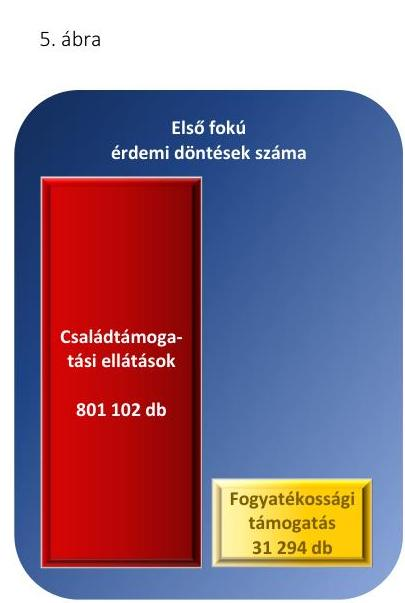

# A CSALÁDTÁMOGATÁSI ELLÁTÁSOKKAL kapcsolatos 

eljárás az alábbiak miatt nem volt megfelelő:
a benyújtott kérelmek adattartalma hiányos volt, mert nem tartalmazta a 223/1998. (XII. 30.) Korm. rendelet 1. számú melléklet 3.5., 2. számú melléklet 3.6., 4. számú melléklet 3.5., 5. számú melléklet 3.1. pontjában előírt nyilatkozatokat; melyeket - a Ket. 37.§ (2) bekezdés c) pontja és (3) bekezdése ellenére - nem ellenőriztek és nem hívták fel az ügyfelet hiánypótlásra;
a kérelmek ügyintézése során nem tartották be a Ket. 33. § (1) bekezdésében foglalt 21 napos ügyintézési határidőt, a Cst. 37. § (4) bekezdésében foglalt 8 napos ügyintézési határidőt;
a jogosultság megállapításáról szóló döntést a Ket. 78. § (1)-(2) bekezdése szerint az ügyféllel nem közölték, illetve a döntés közlésének módja nem felelt meg a Ket. 78. § (4) bekezdésében foglaltaknak és a postázás dátumát nem rögzítették a TÉBA rendszerben sem, így nem volt megállapítható az első fokú határozat Ket. 73/A. § (1) bekezdése szerinti jogerőre emelkedése;
a Ket. 22. § (1) és 30. § a) pontjában foglaltakkal ellentétben hivatalból nem vizsgálták a joghatóságot, és az eljárás iránti kérelmet nyolc napon belül érdemi vizsgálat nélkül nem utasították el, hiánypótlási felszólítás pedig a Ket. 37. § (3) bekezdésével ellentétben 8 napot meghaladóan történt meg;
a családi pótlék folyósítása esetében a folyósítás kezdő időpontja a Kincstár határozatában foglaltakkal nem volt összhangban, a 2014. novembertől megállapított ellátás folyósítása csak 2015. június 4-én és 8-án utólag történt ( $4+3$ havi ellátás folyósítása).
A családtámogatási ellátásokkal kapcsolatos eljárások során az alábbi területeken a jogszabályi előírásokat betartották:
A kérelmet befogadó hatóság a Ket. 22. § (2) bekezdése alapján ellenőrizte, hogy rendelkezik-e hatáskörrel az elbírálásra.
A benyújtott kérelmekhez alkalmazott formanyomtatványok tartalma megfelelt a 223/1998. (XII. 30.) Korm. rendeletben előírtaknak.
A kérelem elbírálása során ellenőrizték a jogosultságot, illetve elvégezték az ellenőrzést a Cst. 45. § (1) bekezdése szerint a többszörös kifizetés elkerülése érdekében.
Az ellátás folyósításának kezdő időpontját a Cst. 37. § (1) bekezdése értelmében meghatározták, a támogatás összegének meghatározása megfelelt a Cst. előírásainak.
A Kincstár döntésének tartalma megfelelt a Ket. 72. § (1) bekezdésében foglaltaknak, a döntés kiadmányozása a 7/2013. sz. Elnöki Utasítás szerint szabályszerűen történt.

A FOGYATÉKOSSÁGI TÁMOGATÁSOKKAL kapcsolatban a Kincstár eljárása azért nem volt megfelelő, mert nem tartották be a jogszabályok előírásait az alábbiakban:
a Ket. 37. § (2) bekezdés c) pontjával ellentétesen nem ellenőrizték a 141/2000. sz. (VIII. 9.) Korm. rendelet 5. § (1) bekezdése alapján a kérelemhez mellékelni szükséges dokumentumokat;

---

- hiányosan benyújtott kérelem esetében a Ket. 37. § (3) bekezdésével ellentétesen a hiánypótlásra való felhívásra nem került sor a kérelem beérkezésétől számított nyolc napon belül, vagy a Ket. 37. § (3) bekezdésével ellentétesen a hiánypótlásra történő felhívás a kérelem benyújtását követő nyolc napon túl történt;
- a Ket. 33. § (1) bekezdésével ellentétben a Kincstár a 21 napos ügyintézési határidőt az elsőfokú döntések, határozathozatal esetében nem tartotta be.
A fogyatékossági támogatásokkal kapcsolatos feladatok ellátása során az alábbiakban betartották a jogszabályi előírásokat, mert:
- a kérelmet befogadó hatóság a Ket. 22. § (2) bekezdése alapján ellenőrizte, hogy rendelkezik-e hatáskörrel az elbírálásra;
- a kérelmek adattartalmát, a szükséges mellékletek csatolását - figyelemmel a 141/2000. sz. (VIII. 9.) Korm. rendelet 2. és 5. sz. mellékletére - a Ket. 37. § (2) bekezdés c) pontja szerint ellenőrizték;
- amennyiben a rehabilitációs szakigazgatási szerv igazolása a kérelem benyújtásakor nem állt rendelkezésre, a Kincstár a 141/2000. sz. (VIII. 9.) Korm. rendelet 6. § (1) bekezdés alapján megkereste a rehabilitációs szakigazgatási szervet;
- a fogyatékossági támogatás kezdő időpontját a 141/2000. sz. (VIII. 9.) Korm. rendelet 9/E. § alapján, a támogatás összegét a Fot. tv. 23/A. § alapján meghatározták;
- a döntések megfeleltek a Ket. 72. § (1) bekezdésben foglalt tartalmi előírásoknak;
- a döntést a Ket. 78. § (1)-(2) bekezdésében foglaltaknak megfelelően közölték, a döntés közlésének módja megfelelt a Ket. 78. § (4) bekezdésében foglaltaknak;
- a fogyatékossági támogatások folyósítása a határozatok alapján megfelelő időpontban és összegben történt a 141/2000. sz. (VIII. 9.) Korm. rendelet 11. §-a szerint.
1.3.2. A nagycsaládos kedvezménnyel kapcsolatos feladatok ellátása összességében megfelelő volt.

A NAGYCSALÁDOS KEDVEZMÉNY kapcsán a közigazgatási hatósági tevékenység megfelelő volt, mert:

- a nagycsaládos kedvezményre való jogosultság megállapításának és fennállásának ellenőrzése megfelelt a 28/2009. (VI. 25.) KHEM rendelet 16/E. § (1) bekezdése és a Ket. 88. § előírásainak;
- a döntéshozatal során a döntések a 28/2009. (VI. 25.) KHEM rendelet 16/B. § (2) bekezdés előírásainak megfeleltek, a 28/2009. (VI. 25.) KHEM rendelet 16/B. § (1) bekezdésében előírt illetékességi előírásokat betartották;
- a nagycsaládos kedvezményre való jogosultságot a Kincstár a 28/2009. (VI. 25.) KHEM rendelet 16/B. § (1) bekezdésének megfelelően egyszerűsített határozattal állapította meg, a jogosultság megállapításáról a szolgáltatót a 16/D. § (1) bekezdésének megfelelően elektronikus úton értesítették;

---

$\longrightarrow$ a határozatok, a hiánypótlásra felhívó végzés tartalma megfelelt a Ket. 72. § (1) és (4) bekezdésében, illetve 72. § (2) bekezdésében foglaltaknak;
$\longrightarrow$ a határozatok - 28/2009. (VI. 25.) KHEM rendelet 16/C. § (1) bekezdés a) és b) pontjában előírtak szerint - tartalmazták a jogosultság elbírálásakor figyelembe vett gyermekek
 számát, a gyermekekre tekintettel adható kedvezmény felső határát;
$\longrightarrow$ a Kincstár megszüntette a kedvezményre vonatkozó jogosultságot, amennyiben a 28/2009. (VI. 25.) KHEM rendelet 16/E. § (2a) és (3) bekezdésében előírtaknak megfelelően ellenőrizte a jogosultság fennállását és megállapította, hogy a jogosultság feltételei nem álltak fenn;
$\longrightarrow$ a jogosultság megszüntetéséről hozott határozatok megfeleltek a Ket. 72. § (1) bekezdésében előírt tartalmi, formai követelményeknek;
$\longrightarrow$ a jogosultság megszüntetéséről a Kincstár a szolgáltatót a 28/2009. (VI. 25.) KHEM rendelet 16/E. § (3) bekezdésének megfelelően a határozat jogerőre emelkedését követően értesítette.
Esetileg előfordult, hogy a nagycsaládos kedvezménnyel kapcsolatos közigazgatási hatósági feladatok ellátása során nem tartották be a jogszabályi előírásokat:
$\longrightarrow$ a kérelmet nem a 28/2009. (VI. 25.) KHEM rendelet 16/B. § (6) bekezdésében meghatározott mellékletekkel nyújtották be és az ügyfelet a Ket. 37. § (3) bekezdése alapján nem szólították fel hiánypótlásra;
$\longrightarrow$ a Ket. 33. § (1) bekezdése szerinti 21 napos ügyintézési határidőhöz képest késedelmesen hoztak határozatot;
$\longrightarrow$ a jogosultak jogosultságának fennállását a 28/2009. (VI. 25.) KHEM rendelet 16/E. § (2a) bekezdésében előírt november 30-i határidőig nem ellenőrizték.
1.3.3. A költségvetési támogatások igénylése megalapozottságának, az évközi felhasználás és az elszámolás felülvizsgálatának feladatait a jogszabályi előírásoknak megfelelően végezték.

Az önkormányzati alrendszerrel kapcsolatos közigazgatási hatósági feladatok során hozott első fokú érdemi döntések számát és megoszlását az 6. ábra mutatja be.

---

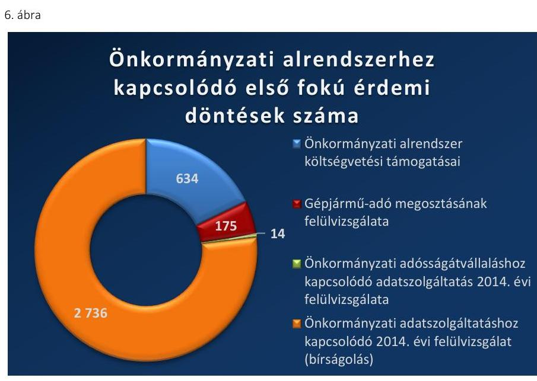

AZ ÖNKORMÁNYZATI ALRENDSZER részére nyújtott költségvetési támogatások igénylése megalapozottságának, az évközi felhasználás és az elszámolás felülvizsgálatának feladatait a jogszabályi előírásoknak megfelelően látták el, mert:
$\longrightarrow$ a mutatószám megalapozottságának felülvizsgálatát az Áht. 58. § (1) bekezdés és az Ávr. 108. § (1) bekezdés szerint a rendelkezésre álló adatok alapján, illetve a helyszínen elvégezték;
$\longrightarrow$ amennyiben a mutatószám eltérést az önkormányzat nem igazolta, a Kincstár a Ket. 33. § (1) bekezdésében előírt határidőben hozott határozatban kötelezte a mutatószám módosítására;
$\longrightarrow$ az Áht. 59. § (2) bekezdés alapján a tárgyév utolsó napjáig a költségvetési támogatás felhasználását ellenőrizték;
$\longrightarrow$ az Áht. 60. § (1) bekezdés szerint a költségvetési évet követő év december 31-éig megkezdték az önkormányzatoknál az Áht. 14. § (3) bekezdése szerinti költségvetési fejezetből származó bevételek felülvizsgálatát;
$\longrightarrow$ ha a Kincstár az elszámolás során közölt adatokhoz képest eltérést tárt fel - az Áht. 60. § (6) bekezdése előírásainak megfelelően - legfeljebb harminc napos határidő kitűzésével felhívást adott ki az elszámolás módosítására;
$\longrightarrow$ amennyiben a helyi önkormányzat adatszolgáltatása és a Kincstár álláspontja között eltérés maradt fenn, a Kincstár az Áht. 60. § (7) bekezdése szerint közigazgatási hatósági eljárást indított;
$\longrightarrow$ az első fokú határozatok tartalma minden esetben megfelelt az Ávr. 115. § előírásainak;
$\longrightarrow$ a döntések kiadmányozása szabályszerűen történt, a közlésének módja a Ket. 78. § előírásainak megfelelt.

---

1.3.4.

A belföldi gépjárművek után - a települési önkormányzat által - beszedett adó megosztásának felülvizsgálatával kapcsolatos feladatok ellátása megfelelő volt.

A BELFÖLDI GÉPJÁRMŰVEK UTÁN - a települési önkormányzat által - beszedett adó megosztásának felülvizsgálata során betartották az Áht. 83/A. § (1)-(4) bekezdéseiben, valamint az ezekhez kapcsolódó részletszabályokat tartalmazó Ávr. 144/A. § (1)-(10) bekezdéseiben foglalt, a gépjárműadó megosztás felülvizsgálatára vonatkozó előírásokat és Ket. előírásait, mert:
$\longrightarrow$ határidőn belül ellenőrizték az Ávr. 144/A. § (3) bekezdésének megfelelően a települési önkormányzat adatszolgáltatási kötelezettsége megfelelőségét;
$\longrightarrow$ szükség esetén hiánypótlásra hívták fel az önkormányzatot a Ket. 37. § (3) bekezdése szerint;
$\longrightarrow$ különbözet megállapítása esetén az Áht. 83/A. § (2) bekezdése szerint kamatot szabtak ki;
$\longrightarrow$ a határozat tartalma megfelelt a Ket. 72. § (1) bekezdésének;
$\longrightarrow$ a döntés közlésének módja a Ket. 78. §-ának megfelelő volt.
1.3.5.

Az önkormányzati adósságátvállaláshoz kapcsolódó adatszolgáltatás 2014. évi felülvizsgálatát megfelelően végezték.

## AZ ÖNKORMÁNYZATI ADÓSSÁGÁTVÁLLALÁSHOZ

kapcsolódó 2014. évi adatszolgáltatás felülvizsgálata során a 2014. évi Kvtv. és a Ket. előírásai szerint jártak el, mert:
$\longrightarrow$ a 2014. évi Kvtv. 68. § (2) bekezdésében foglaltak szerint 2014. január 20-áig településenkénti és hitelezőnkénti bontásban a rendelkezésre bocsátott adatokat továbbították az államháztartásért felelős miniszternek és az ÁKK Zrt.-nek;
$\longrightarrow$ a döntéseket a Ket. 33. § (1) bekezdése előírásai alapján határidőben hozták meg;
$\longrightarrow$ a határozatok tartalma megfelelt a Ket. 72. § (1) bekezdésének;
$\longrightarrow$ a döntés közlésének módja a Ket. 78. §-ának megfelelő volt;
$\longrightarrow$ amennyiben az önkormányzat kérte a kincstári határozat bírósági felülvizsgálatát, az első fokú hatóság a keresetlevelet és iratokat a Ket. 109. § (2) bekezdésében foglaltak szerint haladéktalanul továbbította a bíróságra.
1.3.6.

A helyi önkormányzatok kötelező adatszolgáltatási kötelezettségének elmulasztása vagy késedelmes teljesítése miatti bírságkiszabáshoz kapcsolódó közigazgatási hatósági feladatok ellátása megfelelt a jogszabályok előírásainak.

A HELYI ÖNKORMÁNYZATOK KÖTELEZŐ ADATSZOLGÁLTATÁSI KÖTELEZETTSÉGÉNEK elmulasztása vagy késedelmes teljesítése miatti bírságkiszabáshoz kapcsolódó közigazgatási hatósági feladatok ellátása megfelelt az Áht. és a Ket. előírásainak, mert:

---

$\longrightarrow$ az Áht. 108. § (4) bekezdése alapján az adatszolgáltatás elmulasztása, vagy késedelmes teljesítése esetén a bírságot határozatban szabták ki;
$\longrightarrow$ a határozat tartalma megfelelt a Ket. 72. § (1) bekezdésének;
$\longrightarrow$ a döntések közlésének módja a Ket. 78. § (1) bekezdés előírásainak megfelelt.
1.3.7. A nem állami fenntartói körbe tartozó humánszolgáltatást nyújtó fenntartókat érintő állami támogatásokkal kapcsolatos közigazgatási hatósági feladatokat megfelelően látták el.

# A NEM ÁLLAMI FENNTARTÓI KÖRBE TARTOZÓ humánszolgáltatást nyújtó fenntartókat érintő állami támogatásokkal kapcsolatos közigazgatási hatósági feladatok ellátása során az alábbiakban megfelelő volt a Kincstár eljárása:
$\longrightarrow$ a Ket. 37. § (2) bekezdés c) pontja alapján ellenőrizték az igénylési kérelmeket;
elvégezték a jogosultság jogszabályi feltételeinek, a költségvetési támogatás igénylési és módosítási kérelmet megalapozó mutatószámok ellenőrzését a Vhr. 37/O. § (2) bekezdése és a 489/2013. (XII. 18.) Korm. rendelet 19. § (1) bekezdésének megfelelően;
szükség esetén késedelmi pótlékot szabtak ki a Vhr. 37/N. § (3) bekezdésének megfelelően.
1.3.8. A törzskönyvi nyilvántartással kapcsolatos feladatellátás összességében nem volt megfelelő, mert nem tartották be az ügyintézési határidőt és a beérkezett kérelmeket és azok mellékleteit nem ellenőrizték.

A törzskönyvi nyilvántartásban szereplő szervek számának alakulását a VI. sz. melléklet mutatja be.

A TÖRZSKÖNYVI NYILVÁNTARTÁSSAL kapcsolatos feladatellátás nem volt megfelelő, az alábbiak miatt:
$\longrightarrow$ az Áht. 104. § (2) bekezdésének ellenére nem tartották be a 15 napos ügyintézési határidőt;
$\longrightarrow$ a beérkezett kérelmeket és azok mellékleteit a jogszabályi előírásoknak való megfelelőség szempontjából az Ávr. 167/F. §-ával összhangban nem vizsgálták meg, illetve azt nem dokumentálták.
Az Áht., az Ávr. és a Ket. alábbi előírásait azonban betartották a feladat ellátása során:
$\longrightarrow$ a hiánypótlásra felszólító végzést az Áht. 104. § (2) bekezdése szerinti legfeljebb 20 napos határidő megállapításával bocsátották ki;
$\longrightarrow$ a Kincstár honlapján elérhetővé tették a törzskönyvi nyilvántartás Ávr. 167/J. §-ában előírt adatait;
$\longrightarrow$ eleget tettek jogszabályban foglalt, a törzskönyvi nyilvántartáshoz köthető, a KSH felé történő adatszolgáltatási kötelezettségnek az Ávr. 167/H. §-ának megfelelően;
$\longrightarrow$ a törzskönyvi nyilvántartásból az Ávr. 167/K. §-nak megfelelően adtak ki hitelesített másolatot vagy kivonatot.

---

# 1.3.9. A kampányfinanszírozással kapcsolatos feladatellátás összességében megfelelő volt. 

## A KAMPÁNYFINANSZÍROZÁSSAL KAPCSOLATBAN megfelelő volt az eljárás, mert: a 2013. évi LXXXVII. törvény 2. § (2) bekezdésében előírt 5 munkanapon belül az illetékes területi szervek az egyéni jelöltekkel illetve a pártokkal megkötötték a megállapodásokat a 69/2013. (XII. 29.) NGM rendelet 2. § (4) bekezdésében foglalt tartalommal; a 2013. évi LXXXVII. törvény 2. § (2) bekezdése, illetve a 2/A. § (3) bekezdése szerint megnyitották a kincstári kártyafedezeti számlákat, intézkedtek a kincstári kártyák kibocsátásáról, azokat a jogosultak részére átadták; a választásokon indulók részére az utalásokra a 2013. évi LXXXVII. törvény 6. § (3) bekezdés b) pontja szerint, a pártok összes egyéni jelöltjének jogerős nyilvántartásba vétele után került sor, az NVI ${ }^{51}$ értesítése alapján; a 2013. évi LXXXVII. törvény 6. § (7) bekezdése szerint a közös pártlistát állító pártoknak az NVI elektronikus adatszolgáltatása alapján utalták a pártok egymás közti megállapodása alapján járó támogatást; az országos nemzetiségi önkormányzatoknak a 2013. évi LXXXVII. törvény 4. §-a alapján járó támogatást a 6. § (6) bekezdésében foglaltaknak megfelelően folyósították; az egyéni jelöltek, valamint a jelölő párt javára lemondott egyéni jelöltek után a pártnak folyósított támogatások felhasználásáról benyújtott elszámolásokat a 69/2013. (XII. 29.) NGM rendelet 8. § (1) bekezdésében előírt 20 napon belül ellenőrizték; az 5/2014. és 71/2014. számú Elnöki Utasítások 8. 2. pontjában előírtak szerint az elszámolást benyújtókat szükség esetén végzésben szólították fel hiánypótlásra; az elszámolások ellenőrzéséről a Ket. 72. § (1) bekezdésének megfelelő tartalommal határozatokat hoztak, amelyek kiadmányozása szabályszerűen történt; határozatban kötelezték a 2013. évi LXXXVII. törvény 8. § (3)-(4), a 8/A. § (3)-(4), illetve a 8/C. § (1)-(2) bekezdései alapján a támogatási összeg kétszeresének, vagy a felhasznált támogatási összegnek a visszafizetésére az egyéni jelölteket, illetve a jelölő párt javára lemondott egyéni jelöltek támogatását felhasználó pártokat.
Az alábbiakban nem tartották be a jogszabályi előírásokat, mert: pártok részére a 2013. évi LXXXVII. törvény 3. § szerinti támogatás első részletét nem a 6. § (3) bekezdés a) pontja szerinti határidőben, hanem a b) pont szerint a második részlettel egyidejűleg, egy összegben folyósították.

---

# 1.3.10. A lakáscélú állami támogatásokkal kapcsolatos feladatellátás összességében megfelelő volt. 

A LAKÁSCÉLÚ ÁLLAMI TÁMOGATÁSOKKAL kapcsolatos feladatellátás azért volt megfelelő, mert az eljárás során betartották az alábbi jogszabályi előírásokat, mert:
$\longrightarrow$ a döntés kiadmányozása az SZMSZ ${ }_{1,2}$ előírásainak megfelelően történt;
$\longrightarrow$ a szükséges pénzügyi és földhivatali eljárások iránt intézkedtek a 12/2001. (I. 31.) Korm. rendelet 18. § (6) bekezdése, illetve 20. § (8) bekezdés d) pontja, 134/2009. (VI. 23.) Korm. rendelet 8.§ (3) bekezdése, 256/2011. (XII. 6.) Korm. rendelet 17.§ (2) bekezdése, illetve 4. § (6) bekezdése, 341/2011. (XII. 29.) Korm. rendelet 15.§ (3) bekezdése, 57/2012. (III. 30) Korm. rendelet 15.§ (1) bekezdése alapján;
a kérelmek befogadása során ellenőrizték, hogy a kérelmet befogadó területi szerv rendelkezett-e hatáskörrel és jogkörrel az elbírálásra a Ket. 37. § (2) bekezdés a) pontjának megfelelően, illetve amennyiben nem rendelkezett hatáskörrel és illetékességgel, úgy a kérelem áttétele az eljáró hatóság felé nyolc napon belül a Ket. 22. § (2) bekezdése alapján megtörtént;
a kérelmek befogadásakor megtörtént a kérelem elbírálásához szükséges adatok, nyilatkozatok, az üggyel kapcsolatos alátámasztó dokumentumok meglétének ellenőrzése a Ket. 37. § (2) bekezdés c) pontjának megfelelően;
a döntés előtt a kérelmek jogosságának, jogszerűségének, a támogatási feltételek lakáscélú állami támogatásra vonatkozó jogszabályi feltételeinek ellenőrzése megtörtént (12/2001. (I. 31.) Korm. rendelet 18. § (1) bekezdése, 134/2009. (VI. 23.) Korm. rendelet 6. § (1) bekezdése, 256/2011. (XII. 6.) Korm. rendelet 10. § (8) bekezdése, 341/2011. (XII. 29.) Korm. rendelet 4. § (2) bekezdése, 57/2012. (III. 30) Korm. rendelet 9. § (4) bekezdése);
amennyiben szükséges volt, megkérték a hitelintézettől/pénzügyi intézménytől az elutasítást megalapozó iratok másolatát (12/2001. (I. 31.) Korm. rendelet 18. § (13) bek., 134/2009. (VI. 23.) Korm. rendelet 8. § (9) bek, 256/2011. (XII. 6.) Korm.
 rendelet 10. § (6) bek., 341/2011. (XII. 29.) Korm. rendelet 13. § (3) bek, 57/2012. (III. 30) Korm. rendelet 11. § (3));
$\longrightarrow$ hivatalból indult eljárás esetében az értesítés a Ket. 29. § (5) bekezdése előírásainak megfelelő volt;
a határozat vagy végzés tartalmi elemeit tekintve megfeleltek a Ket. 72. § (1) és (2) bekezdése előírásainak.

Eseti jellegű, de a minősítést nem befolyásoló hiba volt, hogy a Ket. előírásait nem tartották be:
a hitelintézet kezdeményezésére induló eljárást lefolytatták, saját hatáskörben döntöttek annak lezárásáról, azonban erről a Ket. 71. § (1) bekezdése ellenére határozatot nem hoztak, a Ket. 78. § (1) bekezdésben foglaltak ellenére a támogatottat nem értesítették;
a Ket. 29. § (3) bekezdése ellenére az ügyfelet hivatalból induló eljárás esetén nem értesítették;

---

1.4. számú megállapítás
1.4.1.
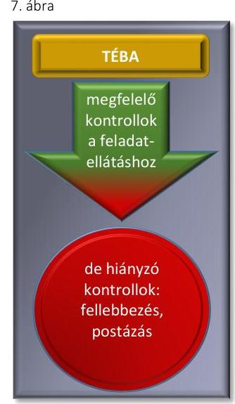
1.4.2.

A kérelem megérkezésétől - a Ket. 37. § (3) bekezdésében meghatározottak ellenére - a nyolc napos határidőn túl hívták fel az ügyfelet hiánypótlásra, előfordult, hogy a Ket. 33. § (1) bekezdése szerinti 21 napos ügyintézési határidőt nem tartották be.

A Kincstár közigazgatási hatósági feladatainak ellátását támogató informatikai rendszerek - a TÉBA rendszer kivételével - a jogszabályi előírásoknak megfelelően támogatták a feladatok ellátását.

A TÉBA informatikai rendszer a fellebbezés és a postázási folyamatok hiányzó kontrollja miatt nem támogatta maradéktalanul a jogszabályoknak megfelelő feladatellátást.

A TÉBA informatikai rendszert alkalmazták a családtámogatási ellátásokhoz és a fogyatékossági támogatásokhoz kapcsolódó feladatok támogatására. A TÉBA rendszer a családtámogatási ellátások kezelése során feltárt hibák és hiányosságok, a fellebbezés és postázási folyamatok során megállapított hiányosság alapján nem támogatta maradéktalanul a jogszabályoknak és belső szabályozóknak megfelelő feladatellátást.

A TÉBA rendszerrel kapcsolatban az alábbiakban hiányoztak a kontrollok:

- Az elsőfokú döntés elleni fellebbezéssel kapcsolatban az első fokon eljáró ügyintéző a felterjesztés során a „Felterjesztés szövege" szöveges mezőben tehette meg nyilatkozatát a Ket. 102. § (5) bekezdésében foglaltak szerint a fellebbezésről kialakított álláspontjára vonatkozóan. A mező kitöltöttségére vonatkozóan a rendszer nem végzett ellenőrzést és nem működött a „négy szem elve" szerinti ellenőrzés sem. Ennek következtében az első fokon eljáró ügyintéző nem tett eleget a Ket. 102. § (5) bekezdésében foglalt kötelezettségének, azaz a fellebbezésről kialakított álláspontjáról nem nyilatkozott.
- A családtámogatási ellátások elsőfokú döntései alkalmával 13/2013. sz. Hálózatirányítási Elnökhelyettesi Utasítás 6. sz. függeléke alapján - a „kézbesítés sima küldeményként" postai kiküldéskor a TÉBA rendszer a „Postázás dátuma" funkció kitöltését nem támogatta.
A TÉBA rendszeren ugyanakkor a felmerült igényeknek megfelelően a változási kérelmek alapján végrehajtották a változtatásokat. A Kincstár az Áht. 106. § (1) bekezdése szerinti egységes szociális nyilvántartás vezetésével kapcsolatos feladatait a CSTINFO informatikai rendszer segítségével látta el.

A nagycsaládos kedvezménnyel kapcsolatos feladatellátást a jogszabályoknak megfelelően támogatta a GATH programrendszer.

A GATH PROGRAMRENDSZER segítette a nagycsaládos kedvezménnyel kapcsolatos feladatok végrehajtását a G-elektra elektronikus irattár támogatásával. A GATH rendszer a nagycsaládos kedvezménnyel kapcsolatos közigazgatási hatósági feladatok ellátását - a nagycsaládos kedvezmény feladatellátáshoz kapcsolódó jogszabályi előírásoknak megfelelően - támogatta.

---

A GATH rendszerben az igénylések adatai, az adatok elemzése és az aktuálisan kinyomtatásra került iratok lekérdezhetők, illetve megjeleníthetők voltak. Az ellenőrzött időszakban a GATH programmal kapcsolatosan kezdeményezett alkalmazásfejlesztési változtatási kérelem alapján a programfrissítés megtörtént.
1.4.3. Az önkormányzati alrendszerhez kapcsolódó közigazgatási hatósági feladatok ellátását az informatikai rendszerek megfelelően támogatták.

AZ FPARTNER INFORMATIKAI RENDSZER a normatívák felülvizsgálatához szükséges adatok egy adatbázisban tárolására és a felülvizsgálati munka segítésére szolgált. Az FPARTNER a költségvetési támogatások önkormányzati alrendszer általi igénybevételének, felhasználásának és elszámolásának felülvizsgálatával kapcsolatos közigazgatási hatósági feladatellátást a jogszabályi előírásoknak megfelelően támogatta.

AZ ÖNEGM informatikai rendszer az önkormányzatok által beszedett gépjárműadó települési önkormányzat és a központi költségvetés közötti megosztásának ellenőrzéséhez használt informatikai rendszer, amely az ügyintézők részére az adatszolgáltatások befogadásával kapcsolatos munkafázishoz megfelelően nyújtott támogatást.

AZ EADAT RENDSZER segítségével biztosították az önkormányzati adósságátvállaláshoz kapcsolódó adatszolgáltatás 2014. évi felülvizsgálatával összefüggő közigazgatási hatósági feladatok ellátását. Az eAdat rendszeren keresztül történő adatszolgáltatás lehetőségét a Kincstár kialakította. A felülethez való hozzáférést meghatározott időintervallumban biztosították az adatszolgáltatást végző önkormányzatok és a kapcsolódó adatszolgáltatást végző pénzintézetek részére. A rendszer az önkormányzati adósságátvállaláshoz kapcsolódó adatszolgáltatás 2014. évi lebonyolításához a jogszabályoknak megfelelően támogatást nyújtott.

A KGR K11 informatikai rendszerben történő feladással teljesítették az önkormányzatok az adatszolgáltatásukat (tervezés, féléves, éves beszámoló, költségvetési jelentés, mérlegjelentés), a teljesítés dátuma a feladás dátuma volt. A helyi önkormányzatok késedelmes adatszolgáltatása miatti bírság kiszabásához a KGR K11 szolgáltatta az információkat a késedelemről, vagy a mulasztásról. A KGR K11 a helyi önkormányzatok adatszolgáltatása késedelme elmaradásának megállapításához a jogszabályoknak megfelelően nyújtott támogatást.
1.4.4. A nem állami fenntartói körbe tartozó humánszolgáltatást nyújtó fenntartókat érintő állami támogatásokkal, a törzskönyvi nyilvántartás vezetésével, a kampányfinanszírozással és a lakáscélú állami támogatásokkal kapcsolatos feladatok ellátását a rendelkezésre álló informatikai rendszerek megfelelően támogatták.

A NÁKINTOR ÉS A HUMÁNSZOC informatikai rendszerek a nem állami szociális és köznevelési intézmények esetén a fenntartókat megillető normatív állami hozzájárulásokkal és támogatásokkal összefüggő

---

adatszolgáltatási, folyósítási, nyilvántartási, elszámolási valamint az ellenőrzéssel, felülvizsgálattal kapcsolatos hatósági feladatok ellátását egyaránt támogatták. Az informatikai rendszerek a feladatok ellátását - a jogszabályi előírásoknak megfelelően - egyaránt támogatták.

A KTÖRZS informatikai rendszer a törzskönyvi nyilvántartás vezetésével kapcsolatos közigazgatási hatósági feladatok ellátását megfelelően támogatta, azonban a KTÖRZS, mint a Ket. 172. § j) pontja szerinti szabályozott elektronikus ügyintézési szolgáltatásokat végző rendszer esetében az információbiztonsági kontrolljainak kialakítása nem volt megfelelő. Az ezzel kapcsolatos megállapításainkat az 5.2. pont tartalmazza.

# A KAMPÁNYFINANSZÍROZÁSSAL KAPCSOLATOS 

FELADATOK ellátását a LOTUS NOTES dokumentumkezelő és csoportmunka szoftver megfelelően támogatta.

A LAK_HAT, LAKTAM, VALAMINT A LINA informatikai rendszerek nyújtottak támogatást a lakáscélú állami támogatással kapcsolatos feladatok ellátásához. A Lak_Hat rendszer tartalmazta a pénzintézetek által a Kincstár részére elektronikusan továbbított állami támogatási szerződéses adatokat, mint törzsadatokat, illetve támogatta a hatósági eljárás során az ügyviteli feladatokat. A Kincstár a lakáscélú állami támogatásokra vonatkozóan a hitelintézetek által átadott adatokat a LAKTAM informatikai rendszerben tartotta nyilván. A LINA lakástámogatási információs lekérdező alrendszer, amely a LAKTAM adatairól a hitelintézeti felhasználók és a Kincstár ügyintézői számára biztosított lekérdezést. A LAK_HAT, LAKTAM, VALAMINT A LINA informatikai rendszerek a szabályszerű feladatellátást megfelelően támogatták.

---

# 2. A jogorvoslati rendszereket és az ellátások jogalap nélküli felvételét, a támogatások jogosulatlanul igénybevételét megelőző, feltáró rendszert és azok visszafizetését, beszedését szabályszerűen kialakították-e és működtették-e? 

Összegző megállapítás

A jogorvoslati rendszereket és a jogosulatlanul igénybevett támogatások, a jogalap nélkül felvett ellátások megelőzésének rendszerét nem teljes körűen alakították ki, mert azok belső szabályzatait nem aktualizálták a Kincstár belső szabályozó eszközei készítésének és kiadásának szabályzatában foglaltak ellenére. A jogorvoslatok a fellebbezéseknél feltárt hiányosságok miatt összességében nem voltak megfelelőek. A jogosulatlanul igénybevett támogatások, a jogalap nélkül felvett ellátások megelőzése érdekében tett intézkedések összességében megfeleltek a jogszabályi előírásoknak.
2.1. számú megállapítás

A jogorvoslatokra és az ellátások jogalap nélküli felvételének, a támogatások jogosulatlan igénybevételének megelőzésére és feltárására vonatkozó belső szabályzatokat a Kincstár belső szabályozó eszközei készítésének és kiadásának szabályzatában foglaltak ellenére nem aktualizálták, ezért nem feleltek meg maradéktalanul a jogszabályi előírásoknak.
2.1.1. A családtámogatási, a fogyatékossági támogatások és a lakáscélú állami támogatások jogorvoslataira vonatkozó belső szabályzatok az önálló fellebbezéssel támadható végzés szerepeltetése miatt nem feleltek a jogszabályi előírásoknak.

BELSŐ SZABÁLYZATOK tartalmazták a családtámogatási ellátásokkal, a fogyatékossági támogatásokkal, a lakáscélú állami támogatásokkal és a nem állami intézményi fenntartókat érintő költségvetési támogatásokkal kapcsolatos jogorvoslati eljárásokra vonatkozó előírásokat.

A jogorvoslati eljárások belső szabályozása az alábbiakban felsorolt esetekben azonban nem állt összhangban a jogszabályi előírásokkal:

- A családtámogatási ellátásokkal kapcsolatban a 13/2013. sz. Hálózatirányítási Elnökhelyettesi Utasítás és a fogyatékossági támogatásokkal kapcsolatban a 9/2014. sz. Hálózatirányítási Elnökhelyettesi Utasítás jogorvoslati eljárásokkal kapcsolatos szabályai nem feleltek meg a Ket. előírásainak, mert a Ket. a 98. § (2)-(4) bekezdéseiben foglaltakon túl - a természetes személyazonosító adatok és a lakcím zárt kezelésére vonatkozó kérelemnek helyt adó, valamint a végrehajtás foganatosításáról rendelkező végzést is - önálló fellebbezéssel támadható végzésként határozta meg.
- A lakáscélú állami támogatásokkal kapcsolatos jogorvoslati eljárások belső szabályozása az 56/2013. és a 68/2014. sz. Elnöki Utasításokban nem felelt meg a Ket. előírásainak, mert a Ket 98. § (2)-(4) be-

---

kezdéseiben foglaltakon túl - a természetes személyazonosító adatok és a lakcím zárt kezelésére vonatkozó kérelemnek helyt adó, valamint a végrehajtás foganatosításáról rendelkező végzést is - önálló fellebbezéssel támadható végzésként határozta meg.
A szabályozások a Ket. előírásaival az alábbi területeken összhangban álltak, mert:
a családtámogatási ellátásokhoz kapcsolódó jogorvoslati eljárások szabályai a Ket. 95-123. §-aival és a Cst. 44. §-ával összhangban álltak;
a fogyatékossági támogatásokkal kapcsolatos jogorvoslati eljárások szabályai 2014. december 30-ával, a 9/2014. sz. Hálózatirányítási Elnökhelyettesi utasítás hatályba lépésével a Ket. 95-123. §-aiban foglaltakkal összhangban határozták meg az újrafelvételi, a felügyeleti eljárás, az ügyészi felhívásra és a semmisségre vonatkozó szabályokat;
a nem állami intézményi fenntartókat érintő költségvetési támogatások igénybevételének, felhasználásának és elszámolásának felülvizsgálatával kapcsolatos belső szabályok (3/2012. sz. ${ }^{52}$ 8/2012., 5/2013. sz., 8/2013. sz., 4/2014. sz., 6/2014. és 7/2014. sz Hálózatirányítási Elnökhelyettesi Utasítás) megfeleltek a Ket. 95-123. §-aiban foglaltaknak;
a lakáscélú állami támogatásokkal kapcsolatos jogorvoslati eljárások belső szabályozása az 56/2013 számú és a 68/2014 számú Elnöki Utasításokban megfelelt a Ket. 95-123. §-aiban foglalt előírásainak.
2.1.2.

Az ellátások jogalap nélküli felvételének és a támogatások jogosulatlan igénybevételének megelőzésére vonatkozó belső szabályrendszert a családtámogatási és a fogyatékossági támogatások vonatkozásában a Kincstár belső szabályozó eszközei készítésének és kiadásának eljárásrendjében foglaltak ellenére nem aktualizálták.

A CSALÁDTÁMOGATÁSI ELLÁTÁSOKNÁL a Cst. 49. § (1) bekezdésében meghatározott, az igényelbíráló szervek hatáskörébe tartozó ellátások megállapítására, folyósítására, továbbá az ezekkel összefüggő ügyviteli feladatok ellátására, valamint az ellátásra való jogosultságot megalapozó igazolás jogszabályi követelményeknek való megfelelőségének vizsgálatára vonatkozó előírásokat a 14/2005. sz. Elnöki Utasításban ${ }^{53}$ rögzítették, amelyet nem aktualizáltak. Az aktualizálás elmaradása miatt a 14/2005. sz. Elnöki Utasítás nem állt összhangban a jogszabályi előírásokkal, mert:
nem tartalmazta a 223/1998. (XII.30.) Korm. rendelet 4/B. § (4) bekezdése előírásaival összhangban a családtámogatási kifizetőhelyek megnevezését (honvédelemért felelős miniszter által vezetett minisztérium, az Információs Hivatal, az Alkotmányvédelmi Hivatal és a Nemzetbiztonsági Szakszolgálat), ezek ellenőrzésével kapcsolatos kötelezettség sem került aktualizálásra;
az ellenőrzések tervezését és a beszámolás rendjét a már megszűnt - SZMSZ ${ }_{1,2}$-ben és a területi szervek ügyrendjeiben sem található ellenőrzési szervezeti egység számára írta elő.

---

A 13/2013. sz. Hálózatirányítási Elnökhelyettesi Utasítás előírásai rögzítették, hogy az ügyintézést támogató informatikai rendszer interfész kapcsolatain keresztül biztosítják a TAJ és a személyi- és lakcímadatok ellenőrzését. A 13/2013. sz. Hálózatirányítási Elnökhelyettesi Utasítás a jogalap nélkül felvett ellátások visszafizetésére, visszakövetésére, elévülésére vonatkozó szabályokat a Cst., a Ket. és az Art. ${ }^{54}$ előírásaival összhangban tartalmazta.

A FOGYATÉKOSSÁGI TÁMOGATÁSOK tekintetében a Fot. tv. 23/E. §-ában meghatározott, jogalap
 nélkül felvett ellátások megelőzésére és feltárására vonatkozó előírásokat a 6/2008. sz. Hálózatirányítási Igazgatói Utasításban nem határoztak meg. A 9/2014. sz. Hálózatirányítási Elnökhelyettesi Utasítás azonban tartalmazta, hogy az ügyintézést támogató informatikai rendszer interfész kapcsolatain keresztül biztosítják a TAJ és a személyi- és lakcímadatok ellenőrzését. A 9/2014. sz. Hálózatirányítási Elnökhelyettesi Utasítás 2014. december 29-étől a jogalap nélkül felvett ellátások visszafizetésére, visszakövetésére, elévülésére vonatkozó szabályokat a Cst., a Ket. és az Art. előírásaival összhangban tartalmazta.

AZ ÖNKORMÁNYZATI ALRENDSZER által jogosulatlanul igénybevett támogatásokkal és jogkövetkezményeinek alkalmazásával kapcsolatos közigazgatási hatósági feladatokat a Kincstár a 11/2013. ${ }^{55}$ sz., 16/2013. sz. Hálózatirányítási Elnökhelyettesi utasításban, valamint a 8/2014. sz. Hálózatirányításért Felelős Elnökhelyettesi utasításban valamint a 37/2013. ${ }^{56}$ sz. Elnöki Utasításban az Áht. 57/A §-ának megfelelően szabályozta. Az ellenőrzés feladatait a hivatkozott szabályzatokban meghatározták.

# A KAMPÁNYFINANSZÍROZÁSSAL KAPCSOLATOS 

visszatérítendő támogatásokkal kapcsolatos ellenőrzés rendszerét és a visszakövetelésére vonatkozó előírásokat a 2013. évi LXXXVII. törvény és az 69/2013. (XII. 29.) NGM rendelet, a Ket. és az Art. előírásainak megfelelően szabályozták a 05/2014. sz. és 71/2014. sz. Elnöki Utasításokban.

A NEM ÁLLAMI HUMÁNSZOLGÁLTATÓK esetében az 5/2013. sz. és a 4/2014. sz. Hálózatirányítási Elnökhelyettesi Utasítás mind a köznevelési, mind a szociális, gyermekjóléti, gyermekvédelmi közfeladatot ellátó intézmények jogosulatlanul igénybevett támogatásával kapcsolatos előírásokat szabályozta Vhr. 37/M-N §-ainak és a 489/2013. (XII. 18.) Korm. rendelet 23-25. §-ainak megfelelően. A belső szabályzatok mind a helyszíni, mind a folyamatba épített ellenőrzések szabályait tartalmazták.

A LAKÁSCÉLÚ ÁLLAMI TÁMOGATÁSOK esetében a jogosulatlan igénybevétellel kapcsolatos feladatokat az 56/2013. sz. és 68/2014. számú Elnöki Utasításban a jogszabályi előírásoknak megfelelően szabályozta. A belső szabályzatok a folyamatba épített és az utólagos ellenőrzés feladatait is meghatározták.

---

### 2.2. számú megállapítás

2.2.1.
2. táblázat

JOGORVOSLATOK SZÁMA 2014. (db)

| Közigazgatási |
| :--: |
| hatósági |
| tevékenység |
| Családtámogatási |
| ellátások |
| Fogyatékossági |
| támogatások |
| Nem állami intézményfenntartók |
| Lakáscélú állami |
| támogatások |

A jogorvoslati eljárásoknál a feladatellátás nem volt megfelelő, a jogalap nélkül felvett ellátások, a jogosulatlanul igénybevett támogatások vonatkozásában tett intézkedések összességében megfeleltek a jogszabályi előírásoknak.

A jogorvoslati eljárás a fellebbezéseknél feltárt hiányosságok miatt összességében nem volt megfelelő, mert az első fokon eljáró ügyintéző a fellebbezésre vonatkozó álláspontjáról nem nyilatkozott és az ügyintézési határidőket sem tartották be.

A JOGORVOSLATI ELJÁRÁSOK SORÁN a 2014. évben a Kincstár által hozott másodfokú érdemi döntéseket a 2. táblázat foglalja össze.

A fellebbezések elbírálása során az eljárás nem volt megfelelő, mert a Ket. előírásait az alábbi esetekben nem tartották be:
$\longrightarrow$ az első fokon eljáró ügyintéző nem nyilatkozott a Ket. 102. § (5) bekezdése ellenére a fellebbezéssel kapcsolatos álláspontjáról;
$\longrightarrow$ nem tartották be a Ket. 33. § (1) bekezdésében meghatározott 21 napos ügyintézési határidőt.
A jogorvoslatok során az alábbiakban a jogszabályi előírásokat betartva jártak el:
$\longrightarrow$ a fellebbezéseknél a Ket. 99. § (1) bekezdése szerinti határidőt figyelembe vették;
$\longrightarrow$ fellebbezéseket a Ket. 102. § (5) bekezdésében foglalt határidő betartásával küldték meg a fellebbezés elbírálására jogosult szervhez;
$\longrightarrow$ a döntést a Ket. 105. § (5) bekezdésében foglaltak szerint közölték azzal, aki a fellebbezést benyújtotta és akivel az első fokú döntést is közölték;
$\longrightarrow$ a döntést és a megküldött iratokat a Ket. 105. § (7) bekezdése alapján visszaküldték az első fokú hatóság részére;
$\longrightarrow$ a megítélt családtámogatási ellátás és fogyatékossági támogatás folyósítása megfelelő időben és összegben, illetve a 141/2000. (VIII. 9.) Korm. rendelet 11. §-a szerinti időpontban megkezdődött;
$\longrightarrow$ a döntés kiadmányozása az SZMSZ ${ }_{1,2}$ szerint szabályszerűen történt;
$\longrightarrow$ bírósági felülvizsgálat esetében az első fokú hatóság a keresetlevelet és az iratokat haladéktalanul továbbította a Ket. 109. § (2) bekezdése szerint a bíróságnak.
2.2.2.

Az ellátások jogalap nélküli felvételének és a támogatások jogosulatlan igénybevételének megelőzésére ellenőrzési rendszert kialakítottak, a családtámogatási és a fogyatékossági támogatások esetében azonban ellenőrzést nem végeztek.

A CSALÁDTÁMOGATÁSI ELLÁTÁSOK vonatkozásában a Cst. 49. § (1) bekezdésének és a Ket. 88. §-ának, a fogyatékossági támogatások esetében a Ket. 88. §-ának megfelelő ellenőrzést nem végeztek. A Kincstár a Bkr. 8. § (2) bekezdése ellenére a folyamatba épített előzetes, utólagos és vezetői ellenőrzés keretében utólagos ellenőrzést a családtá-

---

mogatások és a fogyatékossági támogatások esetében nem végzett. A családtámogatási ellátásokkal és a fogyatékossági támogatásokkal kapcsolatban, az ellátások jogalap nélküli igénybevételének megelőzésére a TÉBA informatikai rendszer interfész kapcsolatokon keresztül a személyes és lakcím adatok mellett az elhalálozási adatok, a TAJ-szám és a tanulói jogviszony ellenőrzésének elvégzését biztosította.

Az önkormányzati alrendszer részére nyújtott támogatások, a kampányfinanszírozás, a nem állami humánszolgáltatók támogatása és a lakáscélú állami támogatások esetében az ellenőrzési feladatokat ellátták.

A jogalap nélkül felvett ellátásokból és a jogosulatlanul igénybevett támogatásokból származó követelések 2014. évi összegeit közigazgatási hatósági tevékenységenként a 3. táblázat mutatja be.
3. táblázat

JOGOSULATLANUL IGÉNYBE VETT TÁMOGATÁSOK 2014. ÉVBEN (M Ft)

| Közigazgatási hatósági tevékenység | Követelések összege |
| :-- | --: |
| Családtámogatási ellátások | 1665,61 |
| Fogyatékossági támogatások | 312,78 |
| Önkormányzati alrendszer költségvetési támogatásai | 353,79 |
| Nem állami fenntartói körbe tartozó humán szolgáltatók |  |
| költségvetési támogatásai | 956,58 |
| Kampányfinanszírozás | 753,20 |
| Lakáscélú állami támogatás | 31768,00 |

2.2.3.

Az ellátások jogalap nélküli felvételének és a támogatások jogosulatlan igénybevételének megelőzésére vonatkozó feladatellátás során a Kincstár eljárása összességében megfelelő volt.

Az ellátások jogalap nélküli felvételének és a támogatások jogosulatlan igénybevételének megelőzésére feltárására tett intézkedéseknél jogszabályi előírásokkal ellentétes gyakorlatot nem tárt fel ellenőrzésünk:
A jogalap nélkül felvett ellátások és a jogosulatlanul igénybe vett támogatások esetében a visszafizetés előírásáról a Kincstár a Ket. 72. § (1) bekezdése szerinti határozatot hozott.

- A Cst. 43. § (2) bekezdése alapján megkísérelték a jogalap nélkül felvett ellátást az igénybe vevő részére folyósított ellátásból levonni.
- A Fot. tv. 23/E. § (7) bekezdésének megfelelően a részletfizetési döntést megelőzően vizsgálták a kötelezett körülményeit.
- Lakáscélú állami támogatás esetében ügyfél kérelmére a részletfizetést a jogszabályi előírások alapján engedélyezték (12/2001. (I. 31.) Korm. rendelet 18. § (16) bekezdés, 134/2009. (VI. 23.) Korm. rendelet 8. § (12) bekezdés, 256/2011. (XII. 6.) Korm. rendelet 10. § (10) bekezdés, 341/2011. (XII.29.) Korm. rendelet 13. §. (8) bekezdés, 57/2012. (III. 30.) Korm. rendelet 13. § (4-5) bekezdés).
- A kampányfinanszírozással kapcsolatos és a lakáscélú állami támogatásokkal kapcsolatos, jogosulatlanul igénybe vett támogatás esetében a 2013. évi LXXXVII. törvény 8. § (7) bekezdése, illetve az Áht. 53. § (2) bekezdése, és az Art. 72. § (6) bekezdése előírásai alapján intézkedtek a követelés adók módjára történő behajtása iránt.

---

$\longrightarrow$ Az önkormányzati alrendszer támogatása esetében az Áht. 57/A. § (2) bekezdésének megfelelően beszedési megbízást nyújtottak be a kötelezett fizetési számlájával szemben, amennyiben az önkormányzat nem tett eleget visszafizetési kötelezettségének.
Eseti jellegű, a minősítést nem befolyásoló hiba volt, hogy a jogszabályok előírásait nem tartották be:
$\longrightarrow$ a Cst. 42. § (1) bekezdése ellenére a jogalap nélkül felvett ellátás visszafizetéséről nem hoztak határozatot, a visszafizetési kötelezettséget az ügyfél ennek ellenére teljesítette;
$\longrightarrow$ a Cst. 43. § (3) bekezdéssel ellentétben nem kísérelték meg a jogalap nélkül folyósított ellátást a határozat jogerőre emelkedését követően az ellátást igénybe vevő keresetéből levonni;
$\longrightarrow$ a Cst. 43. § (4) és a Ket. 127. § (2) bekezdésével ellentétben a követelés adók módjára történő behajtását - amennyiben a fizetésre kötelezett 15 napon belül fizetési kötelezettségét nem teljesítette - határidőn túl, vagy egyáltalán nem kezdeményezték;
$\longrightarrow$ a Fot. tv. 23/E. § (5)-(6) bekezdésében meghatározott határidőn túl került sor a jogalap nélkül igénybe vett ellátás visszakövetelésére;

# 3. Szabályszerűen alakították-e ki és működtették-e a panasz és közérdekú bejelentések kezelésének rendszerét, tettek-e intézkedéseket a korrupciós kockázatok csökkentése érdekében? 

## Összegző megállapítás

3.1. számú megállapítás

A panaszokat és közérdekű bejelentéseket kezelő rendszert a Kincstárnak a belső szabályozó eszközök készítésének és kiadásának szabályzatában foglalt előírások ellenére nem alakították ki egységesen. Az integritási és korrupciós kockázatok csökkentése érdekében tett intézkedések nem feleltek meg a jogszabályi előírásoknak.

A panaszokat és közérdekű bejelentéseket kezelő rendszert nem alakították ki, a feladat ellátását nem szabályozták és a feladat ellátása sem volt megfelelő.

Az egyes közigazgatási hatósági feladatokkal kapcsolatban felmerült panaszok és közérdekű bejelentések adatait a 4. táblázat mutatja be.
4. táblázat

PANASZOK ÉS KÖZÉRDEKŰ BEJELENTÉSEK 2014. (db ÉS M Ft)

| Érintett hatósági tevékenység megnevezése | Bejelentések   száma | Érintett összeg |
| :--: | :--: | :--: |
| Családtámogatási ellátások | 33 | 1028 |
| Fogyatékossági támogatás | 4 | 39 |
| Lakáscélú állami támogatások | 1 | - |
| Összesen | 38 | 1067 |

---

3.1.1. A panaszok és közérdekű bejelentések kezelésére - a kezelésükre hivatott szervezeti egységek kijelölése kivételével - nem adtak ki belső szabályzatot.

A PANASZOK ÉS KÖZÉRDEKŰ BEJELENTÉSEK BELSŐ SZABÁLYAIT a 7/2013. sz. Elnöki Utasítás 1.1. pontjában meghatározottak ellenére nem adták ki.

A Kincstár elnöke az SZMSZ ${ }_{1,2}$-ben kijelölte a panaszok és közérdekű bejelentések kezelésére hivatott szervezeti egységeket: az SZMSZ ${ }_{1}$ a Családtámogatási Főosztályt, a Pénzügyi és Koordinációs Irodát, valamint a Koordinációs Irodát, az SZMSZ ${ }_{2}$ az elnöki kabinetvezetőt.

A Kincstár központi szervezetének főosztályai közül a Támogatásokat Közvetítő Főosztály ügyrendjében - ellentétben az SZMSZ ${ }_{1}$ 66. § g) pontja, 75. § (7) bekezdés d) pontjában, 77. § (3) bekezdés d) pontjában és az SZMSZ ${ }_{2}$ 7. § (4) bekezdés f) pontjában foglaltaknak - a Lakástámogatási Osztályt jelölte ki a beérkező panaszok kivizsgálására és intézésére, annak ellenére, hogy a Támogatásokat Közvetítő Főosztály és a Lakástámogatási Osztály az SZMSZ ${ }_{1,2}$-ben a panaszok és közérdekű bejelentések kezelésére kijelölt szervként nem szerepelt.

Egységes szabályozás hiányában az egyes területi szervek saját hatáskörükben döntöttek a panaszok és közérdekű bejelentések intézésének szabályozásáról. Ez azonban 2014. szeptember 11-étől az SZMSZ ${ }_{2}$-ben foglaltakkal ellentétes volt, mert a területi szervek egyes szervezeti egységei - az SZMSZ ${ }_{2}$ 7. § (4) bekezdés f) pontjában foglaltakkal ellentétben - nem szerepeltek a panaszok és közérdekű bejelentések intézésére kijelölt szervezeti egységek között.
3.1.2. A panaszok és közérdekű bejelentések kezelése nem volt megfelelő, mert nem az SZMSZ-ben arra kijelölt szervezeti egységek jártak el a feladatellátás során.

A PANASZOKKAL ÉS KÖZÉRDEKŰ BEJELENTÉSEKKEL kapcsolatos feladatellátás nem volt megfelelő az alábbiak miatt:

- A panaszok és közérdekű bejelentések kivizsgálását végző szervezeti egységek - az SZMSZ ${ }_{1,2}$ 66. § g) pontja, 75. § (7) bekezdés d) pontja, 77. § (3) bekezdés d) pontjában és az SZMSZ ${ }_{2}$ 7. § (4) bekezdésében foglaltak ellenére - nem voltak jogosultak a feladat ellátására.
- Előfordult, hogy a panaszt és közérdekű bejelentést - a 2013. évi CLXV. törvény ${
 }^{57}$ 2. § (1) bekezdésében foglalt előírások ellenére – a beérkezésétől számított harminc napon belül nem bírálták el.
- Előfordult, hogy a közérdekű bejelentőt, illetve a panaszost 2013. évi CLXV. törvény 2. § (4) bekezdésében meghatározottak szerint nem értesítették.

A panaszok és közérdekű bejelentések kezelése során az alábbi, a 2013. évi CLXV. törvényben foglalt előírásokat betartva jártak el, mert:

- amennyiben a panasz a vizsgálat szerint megalapozottnak bizonyult, a 2013. évi CLXV. törvény 3. § (1) bekezdésében foglaltak szerint

---

gondoskodtak a jogszerű vagy a közérdeknek megfelelő állapot helyreállításáról, illetve az egyébként szükséges intézkedések megtételéről,
intézkedtek a feltárt hibák okainak megszüntetéséről, az okozott sérelem orvoslásáról és indokolt esetben a felelősségre vonás kezdeményezéséről;
amennyiben nem a Kincstár volt jogosult eljárni – összhangban a 2013. évi CLXV. törvény 1. § (5) bekezdésével – gondoskodtak az ügynek az eljárásra illetékes szervhez történő áttételéről.
3.2. számú megállapítás

Az integritási és korrupciós kockázatok csökkentése érdekében tett intézkedések a jogszabályi előírásoknak nem feleltek meg. Az integritás-irányítási rendszer belső szabályozását nem végezték el és csak 2014. év végén jelölték ki az integritás tanácsadót. A belső ellenőrzés – a jogszabályi előírások ellenére – a kockázatkezelési rendszer kialakításával kapcsolatos operatív feladatba, kockázatkezelési koncepció kidolgozásába került bevonásra.

# AZ INTEGRITÁSI ÉS KORRUPCIÓS KOCKÁZATOK 

csökkentése érdekében tett intézkedéseket az alábbi esetekben az 50/2013. (II. 25.) Korm. rendelet ${ }^{58}$ előírásaihoz képest késedelmesen teljesítették:

- Az 2013. március 27-én hatályba lépett 50/2013. (II.25.) Korm. rendelet 4. § (2) bekezdéséhez képest másfél évvel később, 2014. októberben adta ki a Kincstár integritás-irányítási rendszerének belső szabályzatát.
- A Kincstár elnöke az 50/2013. (II. 25.) Korm. rendelet 2013. március 27-ével hatályba lépett 5. § (3)-(4) bekezdéseiben foglaltak ellenére csak 2014. november 20-án jelölte ki az integritás tanácsadót.
Az integritási és korrupciós kockázatok csökkentése érdekében az alábbi esetekben betartották a jogszabályi előírásokat:
- Az 50/2013. (II. 25.) Korm. rendelet 3. § (1) bekezdésének megfelelően a 2014. évre és a 2015. évre felmérték a Kincstár működésével kapcsolatos integritási és korrupciós kockázatokat, és a felmérés alapján egyéves korrupció-megelőzési intézkedési tervet fogalmaztak meg a kockázatok kezelésére.
- A belső szabályzat az 50/2013. (II. 25.) Korm. rendelet 4. § (2) bekezdésével összhangban kiterjedt a bejelentések előzetes értékelésére, a bejelentés kivizsgálásához szükséges információk összegyűjtésére, az érintettek szükség esetén történő meghallgatására, a vonatkozó dokumentumok átvizsgálására, a szükséges intézkedések megtételére.
- Az integritás tanácsadó kijelöléséhez – összhangban az 50/2013. (II. 25.) Korm. rendelet 5. § (3) bekezdésével – rendelkeztek a felettes szerv vezetőjének és a rendészetért felelős miniszternek az előzetes írásbeli egyetértésével és a kijelölt integritás tanácsadó az 50/2013. (II. 25.) Korm. rendelet 7. § (1)-(2) bekezdéseknek megfelelően rendelkezett a szükséges végzettséggel, szakképzettséggel.

---

- Az 50/2013. (II. 25.) Korm. rendelet 5. § (2) bekezdésének megfelelően biztosították az integritás tanácsadó függetlenségét. Az integritás tanácsadó a feladatai ellátását az 50/2013. (II. 25.) Korm. rendelet 6. §-ában foglaltaknak megfelelően végezte, a 6. § (2) bekezdésnek megfelelően javaslatot tett a Kincstár hivatás-etikai és antikorrupciós témájú képzési tervére.
- A Kincstár elnöke – a Bkr. 6. § (1) bekezdés c) pontja előírásaival összhangban – meghatározta az etikai elvárásokat a szervezet minden szintjén, elrendelte a Magyar Kormánytisztviselői Kar Hivatásetikai Kódexének alkalmazását.
Az integritásirányítási rendszer kialakítása során az Ellenőrzési Főosztály – a Bkr. 19. § (2) bekezdés e) pontjában foglaltak ellenére – részt vett a Kincstár működésével kapcsolatos operatív feladatok ellátásában, részt vett a Kincstár Kockázatkezelési Szabályzat koncepciójának kidolgozásában.
3.3. számú megállapítás

A kormánytisztviselők vagyonnyilatkozat-tételi kötelezettsége, valamint – a törzskönyvi nyilvántartás kivételével – a mérlegelésen alapuló hatósági egyéni döntések szabályozása terén intézkedéseket tettek a korrupciós kockázatok csökkentése érdekében.
3.3.1. A közigazgatási hatósági jogkör gyakorlásában érintett munkavállalók részére – akik közigazgatási hatósági vagy szabálysértési ügyben javaslattételre, döntésre vagy ellenőrzésre jogosultak – a vagyonnyilatkozat-tételi kötelezettséget előírták, és a kötelezettek azt maradéktalanul teljesítették.

# A VAGYONNYILATKOZAT-TÉTELI KÖTELEZETTSÉG SZABÁLYAIT a 2014. évben – a 2007. évi CLII. törvény ${ }^{59}$ 4. § 

a) pontja előírásának megfelelően – az SZMSZ1 6. sz. függeléke és az SZMSZ 2 4. sz. függelékében meghatározták. Az SZMSZ${ }_{1,2}$-ben a javaslattételre, döntésre vagy ellenőrzésre jogosult, továbbá a vezető beosztású és a jogszabály alapján „C" típusú nemzetbiztonsági ellenőrzésre kötelezett fontos és bizalmas munkakört betöltő, vagyonnyilatkozat-tételre kötelezett kormánytisztviselők körét a 2007. évi CLII. törvény 3. § (1) bekezdés és (2) bekezdés d)-e) pontjai előírásainak megfelelően állapították meg.

KÖTELEZETTSÉGÜKET a vagyonnyilatkozat-tételre kötelezett kormánytisztviselők 2014. évben az SZMSZ${ }_{1,2}$-ben meghatározott szabályok szerint – a Kincstár központi szerve, megyei igazgatóságai, valamint a jogutódlással feladatokat átvett ONYF által készített tanúsítvány és név szerinti kimutatás szerint – maradéktalanul teljesítették. A vagyonnyilatkozatát az előírt határidőre le nem adó kormánytisztviselők esetében a 2007. évi CLII. törvény 10. § (1) bekezdése szerinti felszólítást követően, a 10. § (1) és (3) bekezdésében meghatározott 8 napon belül megtörtént a vagyonnyilatkozatok leadása.

---

3.3.2.

A mérlegelésen alapuló hatósági egyedi döntésekhez – a törzskönyvi nyilvántartással kapcsolatos döntések kivételével – belső szabályzatokat kialakítottak, a döntésekhez azonban részletes szempontokat nem határoztak meg.

A TÖRZSKÖNYVI NYILVÁNTARTÁSBA bejelentési, adatszolgáltatási kötelezettségét elmulasztó, hibásan, hiányosan teljesítővel szemben az Áht. 105. § (7) bekezdése szerint kiszabható bírság eljárási és mérlegelési szabályait, felelősségi és hatásköri viszonyait az SZMSZ; 30. §-a és az SZMSZ; 31. §-a ellenére, valamint a 7/2013. sz. Elnöki Utasítás 1.1. pontja ellenére nem szabályozták. A bírságkiszabási és mérlegelési hatáskör gyakorlásáról a 23/2011. sz. Elnöki Utasítás ${ }^{60}$, valamint a helyi kiadmányozási szabályokat megállapító megyei igazgatói utasítások szintén nem rendelkeztek.

A mérlegelésen alapuló hatósági egyéni döntésekhez az alábbiak szerint alakították ki a belső szabályokat:
A 13/2013. sz. Hálózatirányítási Elnökhelyettesi Utasításban, a Családtámogatási Főosztály és a területi szervek ügyrendjeiben a gyermekgondozási segély méltányosságból történő megállapításához kapcsolódó előírásokat a 223/1998. (XII. 30.) Korm. rendelet 23. § (4) bekezdésével összhangban állapították meg.

- A 14/2013. sz. Hálózatirányítási Elnökhelyettesi Utasítás a belföldi gépjárművek után beszedett adó önkormányzatok és a központi költségvetés közötti megosztása kincstári ellenőrzéséhez kapcsolódó adatszolgáltatási kötelezettség elmulasztása vagy késedelmes teljesítése esetén a bírság felső határát és kiszabását, a mérlegelési szempontokat az Áht. 83/A. § (1a), az Ávr. 144/A. § (6)-(7) bekezdésével összhangban állapította meg.
- Az önkormányzatok kötelező időközi költségvetési és időközi mérlegjelentés adatszolgáltatási kötelezettségének elmulasztása vagy késedelmes teljesítése miatti, az Áht. 108. § (4) bekezdésében előírt bírság mértékét, a bírság mérséklése és részletekben történő megfizetése engedélyezésének szabályait, az Ávr. 171. §-ában foglaltaknak megfelelően az 1/2014. ${ }^{61}$ sz. Elnökhelyettesi körlevél útmutatójában határozták meg.
- Az önkormányzati támogatások visszafizetési kötelezettségét megállapító hatósági eljárásokban, illetőleg a támogatásról történő lemondás eseteiben a 11/2013. sz., 8/2014. sz. és 16/2013. sz. Hálózatirányítási Elnökhelyettesi Utasítások, illetve a 37/2013. sz. Elnöki Utasítás az Áht. 57/A. § (3) és az Ávr. 104. § (6) bekezdésében meghatározottakkal összhangban tartalmazták a részletfizetéssel, a kérelem benyújtásával, fogadásával és elbírálásával kapcsolatos előírásokat.
- A szociális, gyermekjóléti és gyermekvédelmi, valamint a köznevelési szolgáltatást nyújtó egyházi és nem állami szolgáltatók fenntartói által igénybe vett támogatások legfeljebb 12 havi részletben történő visszafizetését a 7/2014. sz. és a 8/2012. sz. Hálózatirányítási Elnökhelyettesi Utasításokban, illetve a 6/2014. sz. és a 8/2013. sz. Hálózatirányítási Elnökhelyettesi Utasításokban, valamint az igazgatósági ügyrendekben a 489/2013. (XII. 18.) Korm. rendelet 25. §-ának és a Vhr. 37/N. § (4) bekezdés előírásának megfelelően szabályozták.

---

- A lakásépítéshez és -vásárláshoz igénybe vett állami támogatás visszafizetési kötelezettségénél alkalmazható részletfizetési kedvezmény engedélyezését a Kincstár az 56/2013. sz. és a 68/2014. sz. Elnöki Utasításban a vonatkozó jogszabályi előírásokkal összhangban szabályozták. A részletfizetés engedélyezésének szabályai a 12/2001. (I. 31.) Korm. rendelet 18. § (16) bekezdés, a 134/2009. (VI. 23.) Korm. rendelet 8. § (12) bekezdés, a 256/2011. (XII. 6.) Korm. rendelet 10. § (10) bekezdés, a 341/2011. (XII. 29.) Korm. rendelet 13. § (8) bekezdés és az 57/2012. (III. 30.) Korm. rendelet 13. § (4)(5) bekezdés előírásainak megfeleltek.

# 4. A központosított illetmény-számfejtési rendszer kialakítása és működtetése megfelelt-e a jogszabályi előírásoknak és a belső szabályozásnak? 

Összegző megállapítás

A központosított illetmény-számfejtési rendszer belső szabályait kialakították, a szabályozást azonban a Kincstár belső szabályozó eszközei készítésének és kiadásának szabályzatában foglaltak ellenére nem aktualizálták a jogszabályi változásokat követően. Az illetmény-számfejtési feladatok ellátása összességében megfelelő volt.
4.1. számú megállapítás

A központosított illetmény-számfejtési rendszer belső szabályzatát a Kincstár belső szabályozó eszközei készítésének és kiadásának szabályzatában foglaltak ellenére nem aktualizálták.

## A KÖZPONTOSÍTOTT ILLETMÉNY-SZÁMFEJTÉS

FELADATAIT a 14/2010. ${ }^{62}$ sz. Elnöki Utasítás szabályozta, amelyet a jogszabályváltozásokat követően nem módosítottak. A 14/2010. sz. Elnöki Utasítás aktualizálásának elmaradásával nem biztosították a Bkr. 6. § (1) bekezdés b) pontjában foglalt előírások teljesülését, mivel az illetményszámfejtési feladat tekintetében nem került kialakításra olyan kontrollkörnyezet, amelyben egyértelműek a felelősségi, hatásköri viszonyok, valamint a feladatok. A 14/2010. sz. Elnöki Utasítás és a munkaköri leírások hatályukat vesztett jogszabályi előírásokban foglalt feladatokat határozták meg, hatályos jogszabályi előírásban foglalt feladatokat azonban nem rögzítettek. A szakmai terület vezetője – ellentétben a 7/2013. sz. Elnöki Utasítás 1.6. pontjában foglaltak ellenére – nem gondoskodott a hatályos utasítás jogszabályoknak, közjogi szervezetszabályozó eszközöknek, illetve egyéb körülményeknek megfelelő aktualizálásáról, valamint naprakész állapotáról.

A számfejtési feladattal kapcsolatos adatokat az 5. táblázat mutatja be.

---

5. táblázat

| SZÁMFEJTETT FOGLALKOZTATOTTAK SZÁMA (fő) |  |  |  |
| :--: | :--: | :--: | :--: |
| A központosított módon végzett illetmény-számfejtés alanyai | 2014.01.01. | 2014.12. 31. | 2015.03.31. |
| Fejezetek, az irányításuk alá tartozó központi költségvetési szervek | 517012 | 516893 | 520355 |
| Helyi, helyi kisebbségi/nemzetiségi önkormányzatok, többcélú kistérségi társulások és az irányításuk alá tartozó költségvetési szervek | 347037 | 354428 | 341246 |
| Külön megállapodás alapján illetményszámfejtést igénybevevő szervek száma | 18043 | 17864 | 17573 |
| ÖSSZESEN | 882092 | 889185 | 879174 |

A 14/2010. sz. Elnöki Utasítás hatályba lépését követően az ellenőrzött időszak végéig nem aktualizálták, ennek következtében időközben hatályát vesztett jogszabályi előírásra tartalmazott hivatkozásokat, és nem állt összhangban az aktuális jogszabályok előírásaival, mert hivatkozásokat tartalmazott:
— a 2013. január 1-jétől hatálytalan Munka tv. ${ }^{63}$-re, és a 37/2001. (X. 25.) PM rendeletre ${ }^{64}$;
— a 2011. december 1-jétől hatálytalan Tbj. ${ }^{65}$ 19. § (2) bekezdés b) pontjában rögzített fizetendő magánnyugdíj-pénztári tagdíj mértékére;
— a Tny. ${ }^{66}$ 97. § (2)-(4) bekezdésében a nyugdíjjogosultság és a nyugellátás megállapításához kapcsolódó adatszolgáltatási kötelezettségének 2011. január 1-jétől hatálytalan előírásaira.
A 14/2010. sz. Elnöki Utasítás aktualizálásának elmaradásával nem volt biztosított az összhang a 422/2012. (XII. 29.) Korm. rendelet
 ${ }^{67}$ előírásaival, mert a szabályozás nem tartalmazta:
— a 9. § (4) bekezdésében foglaltakat, mert nem szerepelt benne, hogy hiba, hiányosság észlelése esetén az illetményszámfejtő helynek haladéktalanul kell tájékoztatnia a munkáltatót;
— a 10. § (5) bekezdésében foglalt azon kötelezettséget, amely szerint az illetményszámfejtő hely havonta könyvelési értesítőt készít, amelyet a tárgyhót követő hónap 16. napjáig megküld a munkáltatónak.
Az illetmény-számfejtés területére a Kincstár központ szakmai területének vezetője ugyanakkor a vezetői iránymutatás egyéb eszközeként - élve a 7/2013. sz. Elnöki Utasítás 2. pontjában foglalt felhatalmazással - tájékoztató jellegű, ajánlásokat tartalmazó körlevelekben adott vezetői iránymutatásokat, szakmai eligazítást. A 2014. évben rendszeresen adtak ki körleveleket az új államháztartási számvitelhez kapcsolódó feladatokról, változásokról, vagy az illetmény-számfejtési feladatok ellátásához kapcsolódó jogszabályi változásokról.

A Kincstár illetmény-számfejtési feladatokat ellátó munkavállalóinak ellenőrzött munkaköri leírásai nem voltak összhangban a vonatkozó jogszabályi előírásokkal, mert:

---

- tartalmaztak már hatályon kívül helyezett jogszabályi előírásokhoz kapcsolódó feladatokat: a Tny. 97. § (2)-(4) bekezdésében a nyugdíjjogosultság és a nyugellátás megállapításához kapcsolódó 2011. január 1-jétől hatálytalan adatszolgáltatási kötelezettségekhez kapcsolódó feladatokat;
nem tartalmazták például a 422/2012. (XII. 29.) Korm. rendelet 10. § (1) és (5) bekezdésében meghatározott határidőben a könyvelési értesítő megküldésére vonatkozó feladatot;
-hiba, hiányosság észlelése esetén 8 napos határidőn belül kellett a foglalkoztatót értesíteni, a 422/2012. (XII. 29.) Korm. rendelet 9. § (4) bekezdésében meghatározott „haladéktalanul" ellenére.
Az illetmény-számfejtéssel kapcsolatos feladatokat megfelelően ellátták.

AZ ILLETMÉNY-SZÁMFEJTÉS SORÁN az alábbi jogszabályi előírásoknak megfelelően jártak el:

- a 422/2012. (XII. 29.) Korm. rendelet 19. § (1), 20. § (2), 10. § (1) bekezdésével összhangban a tényleges munkateljesítés szerint járó személyi juttatásokat, valamint az egyéb személyi juttatásokat elszámolták, a személyi juttatásokat terhelő levonásokat megállapították;
- a 422/2012. (XII. 29.) Korm. rendelet 13. § (1) bekezdése szerinti társadalombiztosítási kifizetőhelyi feladatok keretében a táppénz, gyermekápolási táppénz, terhességi-gyermekágyi segély, gyermekgondozási díj és baleseti táppénz, foglalkozási megbetegedés tényének határidőben történő bejelentése esetén megállapította az ellátásra jogosultság időtartamát;
a bérszámfejtés során távolléti jelentésben szerepeltetett olyan távolléteket, amelyekre nem járt személyi juttatás - a 422/2012. Korm. rendelet 19. § (2) bekezdésében foglaltaknak megfelelően figyelembe vették a tárgyhónapban, vagy a tárgyhónapot követő hónapban;
a letiltásokat a 422/2012. Korm. rendelet 10. § (2) bekezdésében foglaltaknak megfelelően rögzítették a KIR3-ban;
a foglalkoztatott jogviszonya megszűnése esetén elkészítették a szükséges okiratokat és gondoskodtak azok foglalkoztatotthoz való eljuttatásáról a munkáltató útján a 422/2012. Korm. rendelet 11. § a)-g) pontjai szerint;
az év végi SZJA-val összefüggő feladatok körében - összhangban a 422/2012. (XII. 29.) Korm. rendelet 14. § a), b) pontjaival - a foglalkoztatott nyilatkozata alapján elkészítették a jövedelemigazolást és járulékigazolást, megállapították az összevont adóalapot, illetve az elszámolás során keletkezett adókülönbözetet levonták, illetve visszatérítették.

A KIR3 INFORMATIKAI RENDSZER támogatta a központosított illetmény-számfejtéssel kapcsolatos feladatok ellátását. A KIR3 esetében a változtatási kérelmekben jelzett módosítási igényeket végrehajtották. Az informatikai rendszer a 422/2012. (XII. 29.) Korm. rendelet előírásainak megfelelő feladatellátást támogatta.

---

# 4.3. számú megállapítás 

Az illetmény-számfejtés új informatikai rendszerének projektjét késedelmekkel ugyan, de a módosított támogatási szerződésnek megfelelően valósították meg.

EU-s TÁMOGATÁS KEDVEZMÉNYEZETTJEKÉNT új illetmény-számfejtési rendszer kialakításához nyert támogatást a Kincstár. Az Elektronikus Közigazgatás Operatív Program keretében, EKOP-1.2.16-2012-2012-001 szám alatt, 2012. október 30-án kötött támogatási szerződés tárgya a KIRA projekt finanszírozása volt, amelyet 1,5 Mrd Ft vissza nem térítendő támogatásból valósítottak meg.

A támogatási szerződés szerint a projekt megvalósításának kezdete 2012. augusztus 1-je, a tervezett befejezési határideje 2013. november 15. volt. A projekt megvalósításában a Magyar Állam egyszemélyi tulajdonában álló KINCSINFO NKft. konzorciumi tagként vett részt. A támogatási szerződést négy alkalommal módosították. A támogatási szerződés első módosítása alkalmával a projekt befejezési időpontját 2014. szeptember 30-ra változtatták. A 2014. évi második és harmadik módosítás alkalmával a támogatási összeget minimálisan csökkentették, illetve az EKOP 1. és 3. prioritása közötti megoszlást módosították. A legutolsó, 2014 szeptemberében kezdeményezett, a Miniszterelnökség által jóváhagyott módosítás szerint a projekt befejezési időpontját 2014. október 31-ére tolták ki.

A KIRA projekt lezárására 2014 novemberében került sor, a támogatási szerződés 3.3.3. pontja szerinti határidőben a záró beszámolót benyújtották, a projekt záró könyvvizsgálói jelentését elkészítették.

A hatályos támogatási szerződés mellékletében az éles működéshez kapcsolódó főbb indikátorok teljesítési határidejét 2015. október 31-én határozták meg. 2014. novemberben a Kincstár, a KINCSINFO Nkft. és az NGM illetékeseinek részvételével a Projekt Irányító Bizottság ülésen döntettek a projekt lezárásáról. Az ott elhangzottak szerint az éles indulás időpontját 2015. január hónapban jelölték meg.

A KIRA projekt lezárásakor a Miniszterelnökség záró helyszíni ellenőrzést tartott 2014. december 16-án. A záró helyszíni ellenőrzés jegyzőkönyvében azt rögzítették, hogy a projekt működik és üzemel és a projekt készültségi szintjét műszaki szempontból 98%-ban állapították meg. A projekt eredményeként megvalósított KIRA illetmény-számfejtési rendszer éles indulására 2015. júniusig nem került sor.

---

# 5. A közigazgatási hatósági és illetmény-számfejtési feladatokat támogató informatikai rendszerek esetében eleget tettek-e az elektronikus információ- és adatbiztonsági követelményeknek? 

Összegző megállapítás

A Kincstár a 2013. évi L. törvény ${ }^{68}$ előírásaival ellentétben az elektronikus információbiztonsággal kapcsolatos követelményeket nem teljesítette maradéktalanul, az informatikai rendszerekben kezelt adatok bizalmassága, sértetlensége és rendelkezésre állása, valamint az informatikai rendszerek zárt, teljes körű, folytonos és a kockázatokkal arányos védelme nem volt biztosított.
5.1. számú megállapítás

A Kincstár informatikai rendszereinek biztonsági osztályba sorolása és a szervezet biztonsági szintjének meghatározása nem volt megfelelő, mert a működő informatikai rendszereket nem teljes körűen sorolták be, a Kincstár biztonsági szintjének meghatározása nem volt megfelelő.

A MŰKÖDTETETT INFORMATIKAI RENDSZEREK
biztonsági osztályba sorolása az alábbiak miatt nem volt megfelelő:

- A 2013. évi L. törvény 7. § (1) bekezdése szerint nem sorolták be teljes körűen a 26. § (1) bekezdésében foglalt határidőig a Kincstár informatikai rendszereit, mert a 2014. május 12-én kelt jegyzőkönyv szerint 24 db , a 2015. március 30-án kelt jegyzőkönyv szerint 81 db informatikai rendszer besorolását végezték el. Ezzel szemben a 2015. május 6-án kiadott IBDR ${ }^{69} 4$. számú függeléke (Elektronikus információs rendszerek biztonsági osztályba sorolásának szabályozása) 1. számú melléklete 75 darab elektronikus információs rendszer osztályba sorolását, a 2015. évi alkalmazás leltár 131 alkalmazást tartalmazott.
- A 2014. novemberben lezárt projekt eredményeként a KIRA rendszert - ellentétben a 2013. évi L. törvény 7. § (1) bekezdésével - nem sorolták be.
- A 2014. évben elvégzett első besorolás alkalmával a besorolás elvégzése nem felelt meg a 2013. évi L. törvény 7. § (1) és (2) bekezdésében foglaltaknak, mert nem nevesítették informatikai rendszerenként az információs rendszerek, vagy az általuk kezelt adatok bizalmasságának, sértetlenségének, vagy rendelkezésre állásának kockázata alapján 1-től 5-ig számozott fokozatokat.

## A SZERVEZET INFORMATIKAI BIZTONSÁGI

SZINTJÉNEK meghatározásánál az alábbi jogszabályi hiányosságok voltak:

- A 2013. évi L. tv. 9. § (1) és 10. § (1) bekezdése szerinti, 2014. május 12-én elvégzett besorolás nem felelt meg a 2013. évi L. törvény 10. § (3) bekezdésében foglalt előírásoknak, mert nem rögzítették, hogy a Kincstár nem felel meg az 1. aktuális biztonsági szintnek sem, mert - ellentétben a 77/2013. (XII.19.) NFM rendelet ${ }^{70} 4$. számú melléklet

---

3.1.1. és 3.1.2. pontjaiban előírtakkal - nem rendelkezett informatikai biztonsági stratégiával, illetve kockázatelemzési eljárásrenddel.
A Kincstár 3. elvárt biztonsági szintjének meghatározása nem felelt a 77/2013. (XII. 19.) NFM rendeletben foglaltaknak, mert az elvárt biztonsági szint meghatározásánál a 77/2013. (XII. 19.) NFM rendelet 2. Biztonsági osztályok 2.6. pontja figyelembe vételével kellett volna eljárni.
A biztonsági szintbe sorolás elvégzését követő feladatok ellátása, az elektronikus információs rendszerek védelmét biztosító kötelezettségek körében az alábbi jogszabályi előírást nem tartották be
A biztonsági szintbe sorolás elvégzését követően - a 2013. évi L. tv. 10. § (2) bekezdésében foglaltakkal ellentétben - az ott előírt határidőt (a besorolás elvégzésének időpontjától számított 90 napon belül) 51 nappal túllépve készítették el az elvárt biztonsági szint elérése érdekében szükséges intézkedéseket tartalmazó cselekvési tervet, de a cselekvési terv nem tartalmazta az 1. biztonsági szint eléréséhez szükséges intézkedéseket.
A 2013. évi L. tv. 10. § (8) bekezdésében előírtaknak megfelelően a 2014. május 12-én kelt jegyzőkönyv szerint a szervezet biztonsági szintbe sorolását a Kincstár elnöke jóváhagyta ugyan, azonban a 10. § (8) bekezdés második mondatában foglaltakkal ellentétben a biztonsági szintbe sorolás eredménye nem került rögzítésre a szervezet IBSS${ }^{71}$-ében.
A 2013. évi L. tv. 11. § (1) bekezdés h) pontjában előírtakkal ellentétben, a Kincstár az elektronikus rendszereinek biztonsága, jogszabályoknak és kockázatoknak megfelelősége érdekében végrehajtott kockázatelemzéseket, auditokat nem végzett. Az Informatikai Biztonsági Főosztály 2014. évi ellenőrzési terve 7 darab ellenőrzés végrehajtását irányozta elő. A tervezett ellenőrzések közül három ellenőrzés végrehajtását dokumentálták.
Az alábbiakban megfelelő volt az informatikai biztonsággal kapcsolatos feladat ellátása, mert:
a 2013. évi L. tv. 11. § (1) bekezdés c) pontja szerint a Kincstár elnöke 2015 májusában az elektronikus információs rendszerek biztonságáért felelős személyt nevezett ki;
a 2013. évi L. tv. 11. § (1) bekezdés i) pontjában előírtaknak megfelelően az elektronikus rendszerei eseményeinek nyomon követhetőségéről 2015. májustól gondoskodott;
a 2013. évi L. tv. 11. § (1) bekezdés g) pontjában előírtaknak megfelelően gondoskodtak az elektronikus információs rendszerek védelmi feladatainak és felelősségi köreinek oktatásáról, a szervezet munkatársai információbiztonsági ismereteinek szinten tartásáról;
a 77/2013. (XII.19.) NFM rendelet 4. számú melléklet 3.1.1.7. pontjában előírt elektronikus információs rendszerek nyilvántartását vezették, és a 3.1.7.1. pontjában előírt képzési szabályzattal a Kincstár rendelkezett.

---

### 5.2. számú megállapítás

8. ábra
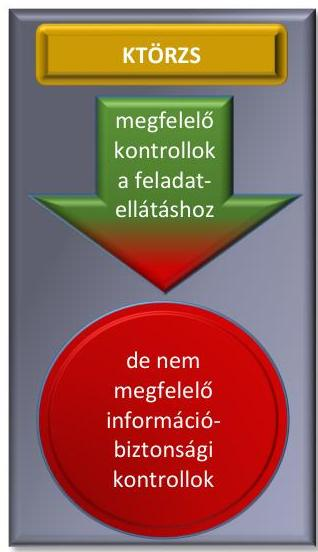

## A törzskönyvi nyilvántartással kapcsolatos hatósági feladatokat támogató informatikai rendszer, a KTÖRZS esetében nem volt megfelelő az információbiztonsági kontrollok kialakítása.

A KTÖRZS a közigazgatási hatósági feladatokat támogató informatikai rendszerek közül a törzskönyvi nyilvántartáshoz kapcsolódó feladatok ellátását biztosító informatikai rendszerként a Ket. 172. § j) pontja szerinti szabályozott elektronikus ügyintézési szolgáltatásokat végzett. A KTÖRZS megfelelően támogatta a szabályszerű feladatellátást, azonban a SZEÚSZ-re vonatkozó információbiztonsági kontrollok kialakítása nem volt megfelelő, mert a Kincstár, mint SZEÚSZ szolgáltató ellentétben a 83/2012. (IV. 21.) Korm. rendelettel ${ }^{72}$ :

- nem rendelkezett a SZEÚSZ működésével, működtetésével kapcsolatos panaszok, kérdések fogadására telefonos, illetve elektronikus ügyfélszolgálattal (5. § (1) bekezdés);
- nem jelölte ki a SZEÚSZ-ért felelős vezető személyét, a szolgáltatás ellenőrét és a szolgáltatás biztonsági felelősét (9. § (1) bekezdés), ebből adódóan nem végezték el a 10. §-ában előírt ellenőrzéseket;
- nem biztosította a SZEÚSZ nyújtásához alkalmazott informatikai rendszerében kezelt adatok esetében a törvényes adatkezelés, a bizalmasság, sértetlenség, rendelkezésre állás követelményeit, az informatikai rendszer vonatkozásában nem biztosította, hogy érvényesüljenek a zárt, teljes körű, folytonos és a kockázatokkal arányos védelem követelményei (11. § (1) bekezdés);
- nem rendelkezett az informatikai rendszer tervezésére, beszerzésére, megvalósítására (különösen fejlesztésére, testreszabására, paraméterezésére, telepítésére) és felülvizsgálatára kiterjedő minőségirányítással (11.
 § (2) bekezdés a) pontja);
- nem rendelkezett szolgáltatásműködési szabályzattal (11. § (2) bekezdés b) pontja);
- nem rendelkezett üzletmenet-folytonossági tervvel és szolgáltatásműködési szabályzattal (11. §. (2). bekezdés c) és d) pontjai);
- nem rendelkezett a biztonsági minimum követelmények teljesülésének igazolására irányuló audittal (11. § (2) bekezdés f) pontja);
- nem gondoskodott a rendszer működése szempontjából meghatározó folyamatok valamennyi kritikus eseményének naplózásáról (11. § (2) bekezdés g) pontja);
- nem rendelkezett a SZEÚSZ nyújtásával kapcsolatos rendszerének biztonsági mentési rendjével (11. § (2) bekezdés h) pontja);
- nem rendelkezett a SZEÚSZ nyújtásával kapcsolatos rendszerének rendkívüli üzemeltetési helyzetekre kidolgozott szabályzattal, illetve a rendkívüli helyzetekben folyamatos üzemelést biztosító tartalékberendezések működését alátámasztó dokumentumokkal (11. § (2) bekezdés i) pontja);
- nem jelentette be a felügyelet részére a szolgáltatás nyújtásának megkezdésére irányuló szándékát, valamint a megkezdés tervezett időpontját (18. §).

---

# 6. Az előírásoknak megfelelően látták-e el az átutalási megbízások teljesítésével, valamint a költségvetési szervek lejárt tartozásállományra vonatkozó adatszolgáltatásával összefüggő feladatokat? 

Összegző megállapítás

Az átutalási megbízások teljesítésével, valamint a költségvetési szervek lejárt tartozásállományára vonatkozó adatszolgáltatásával összefüggő feladatokat a nagy összegű átutalások előzetes bejelentésénél feltárt hiányosság kivételével szabályszerűen látták el.
6.1. számú megállapítás

A költségvetési szervek lejárt tartozásállományára vonatkozó kötelező adatszolgáltatással kapcsolatos egységes szabályozást 2014. júniustól alakították ki. A feladatellátás megfelelt a jogszabályi előírásoknak.

A lejárt tartozásállományra vonatkozó kötelező adatszolgáltatás, feldolgozás feladatait az SZMSZ-ben kijelölt főosztály ügyrendjében és belső szabályzatban csak 2013. áprilistól, illetve 2014. júniustól szabályozták. Ezen a területen 2014. júniustól alakítottak ki a Bkr. 6. § (1) bekezdés b) pontja szerint olyan kontrollkörnyezetet, amelyben egyértelműek a felelősségi, hatásköri viszonyok és feladatok.

A Kincstár alapító okiratában és az SZMSZ ${ }_{1-4}{ }^{7374}$-ben meghatározták a költségvetési szervek lejárt tartozásállományára vonatkozó kötelező adatszolgáltatásával és feldolgozásával kapcsolatos feladatokat az Áht. és az Ávr. előírásaival összhangban. A Költségvetési Fejezetek Főosztályának 2011-től hatályos ügyrendje a tartozásállománnyal kapcsolatos - az Ávr. 2013. augusztus 18-ig hatályos 167/A. § (1) és (3) bekezdése, valamint 7. melléklet 3. és 8. melléklet 3. pontja szerinti - feladatokat nem tartalmazta, de a 2013. április 24-étől hatályos ügyrendjében már e jogszabályi előírással összhangban rögzítették a feladatot. A 2013-tól hatályos ügyrend mellékleteként - a Bkr. 6. § (3) bekezdése szerinti ellenőrzési nyomvonalban - a tartozásállomány kezelésével kapcsolatos feladatokat meghatározták. Az érintett munkavállalók munkaköri leírásaiban szerepelt a központi költségvetési szervek lejárt tartozásállományára vonatkozó kötelező adatszolgáltatásával, feldolgozásával kapcsolatos feladatok megjelölése.

Az eljárásrendet első alkalommal 2014. június 28-ától rögzítették a 28/2014. ${ }^{75}$ sz. Elnöki Utasításban az Ávr. előírásaival összhangban.

A költségvetési szervek lejárt tartozásállományával kapcsolatos adatszolgáltatásához kapcsolódó feladatai során a Kincstár:
$\longrightarrow$ honlapján útmutatót tett közzé;
$\longrightarrow$ az adatszolgáltatás teljesítésének feltételrendszerét az eAdat rendszeren keresztül biztosította a kötelezettek részére;
$\longrightarrow$ az adatszolgáltatás teljesítésére a Kincstár nyomtatványt rendszeresített (AT-01);

---

$\longrightarrow$ az Ávr. 173 § (3) bekezdés (2013-2014. év) és 168. § (2015. év) előírásaiban meghatározott közzétételi kötelezettségének eleget téve, honlapján a tartozásállományra vonatkozó adatokat közzétette.

# 6.2. számú megállapítás 

A fedezetvizsgálattal kapcsolatos feladatok ellátása szabályozott és szabályszerű volt.

## A fedezetvizsgálatból adódó feladatokat az SZMSZ 1-4-ben - összhangban az Áht. 10. § (5) bekezdésével - rögzítették, amelyet a megyei állampénztári irodák feladatai között nevesítettek. A megyei állampénztári irodák ügyrendjeiben - az Ávr. 13. § (5) bekezdése alapján - a fedezetvizsgálattal kapcsolatos feladatokat rögzítették, a Bkr. 6. § (3) bekezdése szerinti ellenőrzési nyomvonalak a fedezetvizsgálattal kapcsolatos feladatokat nevesítették.
„A forintszámla-vezetés eljárásrendje" című szabályzatban - összhangban az Áht. 80. § (1) bekezdésében meghatározott feladatai ellátására szabályozta a fedezetvizsgálattal kapcsolatos feladatait, amelyet több alkalommal módosított (33/2012. ${ }^{76}$ sz., 21/2013. ${ }^{77}$ sz., 3/2014. ${ }^{78}$ sz., 18/2014. ${ }^{79}$ sz. 13/2015. ${ }^{80}$ sz. Elnöki Utasítás). A munkavállalók munkaköri leírásaiban a fedezetvizsgálat feladat elvégzését nem rögzítették, mert automatikusan, az informatikai rendszerbe beépítetten megvalósuló feladat.

A számlavezető rendszerben kétszintű fedezetvizsgálat történt. Először a számla likviditási fedezetvizsgálata, majd ezt követően meglévő fedezet esetén a kiemelt előirányzatonkénti fedezetvizsgálat. Az aktuális előirányzat elérhetőségét a kettős fedezetvizsgálathoz a $\mathrm{TSH}^{81}$ rendszer biztosította.

Amennyiben valamely kiadási tranzakció előirányzati vagy likvid fedezet hiányában nem került teljesítésre, az átutalás indítóját a számlakivonatban hibakód megadásával tájékoztatta a Kincstár. A hibakódokat, azok jelentését a Kincstár honlapján közzétették.

## 6.3. számú megállapítás

A nagy összegű átutalások előzetes bejelentésére, kezelésére, teljesítésére irányuló feladatellátás szabályozása nem állt összhangban a jogszabályok előírásaival, a feladatellátás nem felelt meg a jogszabályi előírásoknak.

A nagy összegű átutalások előzetes bejelentésének kezelésével, teljesítésével kapcsolatos feladatokat az alapító okiratban és SZMSZ 1-4-ben az Áht. és az Ávr. előírásaival összhangban határozták meg. A feladatellátással érintett főosztályok ügyrendjeiben a feladatokat meghatározták és a Bkr. 6. § (3) bekezdése szerinti ellenőrzési nyomvonalban rögzítették a felelősségi köröket és szinteket.

A Kincstár belső szabályzatban rögzítette a nagy összegű bejelentések, kezelésének rendjét: az 1/2012. ${ }^{82}$ sz. Általános Elnökhelyettesi Utasítást 2014. június 25-ével váltotta fel a 2/2014. sz. Általános Elnökhelyettesi Utasítás, amelyet 2015. március 4-ével az 01/2015. ${ }^{83}$ sz. Államháztartási ügyekért felelős Elnökhelyettesi Utasítás követett.

A 2/2014. sz. Általános Elnökhelyettesi Utasítás és a 01/2015. sz. Államháztartási ügyekért felelős Elnökhelyettesi Utasítások az alábbi jogszabályi előírásokkal ellentétes szabályozást tartalmaztak:

---

$\longrightarrow$ a 2/2014. sz. Általános Elnökhelyettesi Utasítás 6. pontja szerint a Kincstár határidőben történő bejelentésnek fogadta el - az Ávr. 167/A. § (1) bekezdése, 7. sz. melléklet 13. pontjának (2013. augusztus 18-ig), az Ávr. 167/M. § (1) bekezdése, 7. sz. melléklet 13. pontjának (2013. augusztus 19-től 2014. december 31-ig) és az Ávr. 167/M. § (1) bekezdése, 5. sz. melléklet 11. pontjának előírásával (2015. január 1-jétől) ellentétben - a nagy összegű átutalás bejelentését, amennyiben a terhelést megelőző második, illetve negyedik munkanappal jelentették azt be, szemben a hivatkozott jogszabályi előírások szerinti öt és három munkanappal;
a 2/2014. sz. Általános Elnökhelyettesi Utasítás és a 01/2015. sz. Államháztartási ügyekért felelős Elnökhelyettesi Utasítások 6. pontjában kivételes esetben lehetőséget biztosítottak a terhelés tárgynapon történő bejelentésére is ellentétben az Ávr. fentebb hivatkozott előírásaival.
A Kincstár feladatellátása szabályszerű volt az alábbi területen:
az Ávr. előírásainak megfelelően elkészítette a bejelentőlapot és annak kitöltési útmutatóját, amelyeket a 2/2014. sz. Általános Elnökhelyettesi Utasítás és az 01/2015. sz. Államháztartási ügyekért felelős Elnökhelyettesi Utasítások 1. sz. függelékében helyeztek el;
a nyomtatványt és annak kitöltési útmutatóját a 2/2014. sz. Általános Elnökhelyettesi Utasítás és a 01/2015. sz. Államháztartási ügyekért felelős Elnökhelyettesi Utasítás 3. pontjának megfelelően a Kincstár honlapján közzétették;
a nagy összegű átutalások bejelentésekor elvégezték a bejelentések iktatását és formai ellenőrzését, majd a likviditás ellenőrzését is, ezt követően hagyták jóvá az utalásokat;
a nagy összegű utalások teljesítésére abban az esetben volt lehetőség, ha azok előzetes bejelentéséről a szakfőosztályok által küldött értesítések és az átutalási megbízások adatai megegyeztek;
likviditási vagy előirányzati fedezethiány esetén az utalásokat a Kincstár csak a belső szabályozásában meghatározott, az Ávr. előírásaival összhangban álló kivételes esetekben (pl. társadalombiztosítási alapok ellátási számlái) teljesítette. A fedezethiány miatt nem teljesített átutalási megbízásokról a számlatulajdonost a kincstári számlakivonaton, a hibakód megadásával értesítették;
az illetékes főosztályok folyamatosan vezették az 1/2012. sz. Általános Elnökhelyettesi Utasításban, a 2/2014. sz. Általános Elnökhelyettesi Utasításban, valamint a 01/2015. sz. Államháztartási ügyekért felelős Elnökhelyettesi Utasításban előírt összesítő kimutatást a bejelentett nagy összegű átutalásokról, amelyek adattartalma megfelelt az utasítások 4. sz. függelékében előírtakkal. Az összesítő kimutatások felhasználásával került sor a havi prognózisok elkészítésére.
A Kincstár feladatellátása nem volt szabályszerű, mert:
a nagy összegű átutalások előzetes bejelentésénél határidőben érkezettnek tekintette - az Ávr. 167/A. § (1) bekezdése, 7. sz. melléklet 13. pontjának (2013. augusztus 18-ig), az Ávr. 167/M. § (1) bekezdése, 7. sz. melléklet 13. pontjának (2013. augusztus 19-től 2014. december 31-ig) és az Ávr. 167/M. § (1) bekezdése, 5. sz. melléklet

---

11. pontjának előírásával (2015. január 1-jétől) ellenére - a hivatkozott jogszabályi előírásban foglalt 3, illetve 5 munkanap helyett a 2, illetve 4 munkanappal előbb, vagy soron kívül beérkezett bejelentéseket is.

---

# JAVASLATOK 

Az ÁSZ tv. ${ }^{84}$ 33. § (1) bekezdésében foglaltak értelmében az ellenőrzött szervezet vezetője köteles a jelentésben foglalt megállapításokhoz kapcsolódó intézkedési tervet összeállítani és azt a jelentés kézhezvételétől számított 30 napon belül az ÁSZ részére megküldeni. Amennyiben az intézkedési tervet az ellenőrzött szervezet vezetője nem küldi meg határidőben, vagy továbbra sem elfogadható intézkedési tervet küld, az ÁSZ elnöke az ÁSZ tv. 33. § (3) bekezdés a)-b) pontjaiban foglaltakat érvényesítheti.

## a Kincstár elnökének

1. Intézkedjen a Kincstár alapító okiratában meghatározott feladatok belső szabályzatokban történő rögzítése során a jogszabályi előírások, az SZMSZ és a belső szabályozó eszközök készítésének és kiadásának eljárásrendjét meghatározó Elnöki Utasítás betartására, valamint a jogszabályok és a belső szabályzatok közötti összhang megteremtésére.
(1.1.2. megállapítás 3. bekezdés első pontja, 5. bekezdése és 6. bekezdése, 1.2.1. megállapítás 5. bekezdése, 1.2.2. megállapítás 1. bekezdés első, harmadik és negyedik pontja, 1.2.4. megállapítás 1. bekezdése, 2.1.1. megállapítás 2. bekezdés második pontja, 3.1.1. megállapítás 1. és 4. bekezdése, 3.3.2. megállapítás 1. bekezdése, 4.1. megállapítás 3-5. bekezdései, 6.3. megállapítás 3. bekezdése alapján)
2. Intézkedjen a törzskönyvi nyilvántartással kapcsolatos feladatellátás során a jogszabályi előírások és az abban foglalt határidők betartására.
(1.3.8. megállapítás 2. bekezdése alapján)
3. Intézkedjen, hogy a panaszok és közérdekű bejelentések kivizsgálását az SZMSZ-ben kijelölt szervezeti egység végezze, valamint az eljárás során tartsák be a jogszabályban rögzített határidőket.
(3.1.2. megállapítás 1. bekezdése alapján)
4. Intézkedjen a nagy összegű átutalások végrehajtása során a jogszabályi előírások betartására.
(6.3. sz. megállapítás 5. bekezdése alapján)
5. Intézkedjen, hogy a Kincstár elektronikus információs rendszereinek biztonsági osztályba sorolása, valamint a szervezet biztonsági szintjének meghatározása feleljen meg a törvényi előírásoknak.
(5.1. megállapítás 1-3. bekezdései alapján)
6. Intézkedjen a 2013. évi L. törvényben foglalt előírások, az elektronikus információs rendszerekben kezelt adatok és információk bizalmasságának, sértetlenségének és rendelkezésre állásának, valamint az elektronikus információs rendszer sértetlensége és rendelkezésre állása zárt, teljes körű, folyamatos és a kockázatokkal arányos védelmének biztosítására.
(5. sz. összegző megállapítás alapján)

---

# a Magyar Államkincstár feladatait jogutód szervezetként átvevő Országos Nyugdíjbiztosítási Főigazgatóság főigazgatójának 

1. Intézkedjen a családtámogatási ellátások esetében a Cst. és a Ket., a fogyatékossági támogatás esetében a Ket. szabályai szerinti ellenőrzés végrehajtásánál az ellenőrzés során feltártak figyelembevételére.
(2.2.2. megállapítás 1. bekezdése alapján)

## a Magyar Államkincstár feladatait jogutód szervezetként átvevő fővárosi és megyei kormányhivatalok vezetőjének

1. Intézkedjen a családtámogatási ellátásokhoz és a fogyatékossági támogatásokhoz kapcsolódó feladatok végrehajtása során az ellenőrzés megállapításaink figyelembevételére annak érdekében, hogy az első fokú döntés elleni fellebbezési határidő megállapítható legyen, valamint az első fokon döntést hozó hatóság a fellebbezésről alakítsa ki álláspontját.
(1.4.1. megállapítás 2. bekezdése alapján)
2. Intézkedjen a családtámogatási ellátásokkal, a fogyatékossági támogatásokkal kapcsolatos
 feladatellátás során az ellenőrzés megállapításainak figyelembevételére a jogszabályi előírások betartása érdekében.
(1.3.1. számozott megállapítás 2. és 4. bekezdése alapján)

---

.

---

# MELLÉKLETEK 

- I. SZ. MELLÉKLET: ÉRTELMEZŐ SZÓTÁR
bizalmasság
biztonsági osztály
biztonsági osztályba sorolás
biztonsági szint
biztonsági szintbe sorolás
eAdat rendszer
elektronikus információs rendszer biztonsága
ellenőrzési nyomvonal
humánszolgáltatást nyújtó nem állami fenntartó
illetményszámfejtő hely
információ
integritás
integritásirányítási rendszer

Az elektronikus információs rendszer azon tulajdonsága, hogy a benne tárolt adatot, információt csak az arra jogosultak és csak a jogosultságuk szintje szerint ismerhetik meg, használhatják fel, illetve rendelkezhetnek a felhasználásáról (Forrás: 2013. évi L. tv. 1. § (1) bekezdés 8. pont).
Az elektronikus információs rendszer védelmének elvárt erőssége (Forrás: 2013. évi L. tv. 1. § (1) bekezdés 11. pont).

A kockázatok alapján az elektronikus információs rendszer védelme elvárt erősségének meghatározása (Forrás: 2013. évi L. tv. 1. § (1) bekezdés 12. pont).
A szervezet felkészültsége az e törvényben és a végrehajtására kiadott jogszabályokban meghatározott biztonsági feladatok kezelésére (Forrás: 2013. évi L. tv. 1. § (1) bekezdés 13. pont).

A szervezet felkészültségének meghatározása az e törvényben és a végrehajtására kiadott jogszabályokban meghatározott biztonsági feladatok kezelésére (Forrás: 2013. évi L. tv. 1. § (1) bekezdés 14. pont).
A Magyar Államkincstár Internetes szolgáltatása. A Területi Igazgatóságok internetes ügyfél tájékoztató portálja. Magyar Államkincstár, valamint területi szervei és a velük kapcsolatban álló intézmények, szervezetek közötti rendszeres kétirányú, /fájlmásolás alapon működő/ elektronikus adatforgalmazás eszköze. (https://eadat.allamkincstar.gov.hu/)
Az elektronikus információs rendszer olyan állapota, amelyben annak védelme az elektronikus információs rendszerben kezelt adatok bizalmassága, sértetlensége és rendelkezésre állása, valamint az elektronikus információs rendszer elemeinek sértetlensége és rendelkezésre állása szempontjából zárt, teljes körű, folytonos és a kockázatokkal arányos (Forrás: 2013. évi L. tv. 1. § (1) bekezdés 15. pont).
A költségvetési szerv működési folyamatainak szöveges, táblázatokkal vagy folyamatábrákkal szemléltetett leírása, amely tartalmazza különösen a felelősségi és információs szinteket és kapcsolatokat, irányítási és ellenőrzési folyamatokat, lehetővé téve azok nyomon követését és utólagos ellenőrzését. (Forrás: Bkr. 6. § (3) bekezdés)
A humánszolgáltatást nyújtó nem állami fenntartóként szokás említeni azokat az egyházi jogi személyek, közalapítványok, civil szervezetek, nonprofit gazdasági társaságok, gazdasági társaságok és egyéni vállalkozók, akik köznevelési, szociális, gyermekvédelmi, gyermekjóléti ellátást nyújtó intézményt tartanak fenn. (Forrás: http://www.allamkincstar.gov.hu/hu/nem-lakossagi-ugyfelek/humantamogatas_) Általános hatáskörrel és illetékességgel a Magyar Államkincstár területi szervei (Megyei Igazgatóságok) és az illetményszámfejtésüket önállóan ellátó önkormányzatok. Bizonyos tényekről, tárgyakról vagy jelenségekről hozzáférhető formában megadott megfigyelés, tapasztalat vagy ismeret, amely valakinek a tudását, ismeretkészletét, annak rendezettségét megváltoztatja, átalakítja, alapvetően befolyásolja, bizonytalanságát csökkenti vagy megszünteti (Forrás: 2013. évi L. tv. 1. § (1) bekezdés 25. pont).
Az államigazgatási szerv működésének a rá vonatkozó szabályoknak, valamint a hivatali szervezet vezetője és az irányító szerv által meghatározott célkitűzéseknek, értékeknek és elveknek megfelelő működése (Forrás: 50/2013. (II. 25.) Korm. rendelet 2. § a) pont).
A vezetési és irányítási rendszernek a szervezet integritásának biztosítására irányuló, a belső kontrollrendszerbe illeszkedő funkcionális alrendszere, amelynek fő

---

interfész
jogalap nélkül felvett ellátás
jogosulatlanul igénybevett támogatás
kincstári ügyfél
kockázat
kockázatkezelési rendszer
kontrollkörnyezet
korrupciós kockázat
közérdekű bejelentés
közigazgatási hatósági ügy (továbbiakban: hatósági ügy)
központosított illetményszámfejtés
lejárt tartozásállomány
nagy összegű átutalások
elemei a követendő értékek meghatározása, az azok követésében való útmutatás, az értékek követésének nyomon követése és - szükség esetén - kikényszerítése (Forrás: 50/2013. (II. 25.) Korm. rendelet 2. § b) pont).
Az informatikai rendszerek közötti adatátadást megvalósító rendszerkomponens (Forrás: http://www.ekk.gov.hu/hu/emo/ekozigkeretrendszer/ek3-iopkovetelmenyek/EKK_ekozig_Kozig_Iratkezelesi_modell_080919_V1.docx). Jogalap nélkül veszi igénybe az ellátást az a személy, aki arra nem jogosult, vagy kevesebb összegre jogosult, mint amelyet számára folyósítottak.(Forrás: Cst. 41. § (1) bekezdés, Fot tv. 23/E. § (4) bekezdés).
A jogszabálysértően, nem rendeltetésszerűen, vagy szerződésellenes módon felhasznált költségvetési támogatás. (Forrás: Ávr. 1. § e) pont).
A kincstári körbe tartozó költségvetési szerv, előirányzat, elkülönített állami pénzalap, társadalombiztosítás pénzügyi alapjai, vagy pénzforgalmi számlatulajdonosnak minősülő más szervezet, amely számára jogszabály alapján a Kincstár számlát vezet (Forrás: 46/2009. (XII. 30.) PM rendelet 2. § g) pont, 2011. december 31-ig hatályos).
A fenyegetettség mértéke, amely egy fenyegetés bekövetkezése gyakoriságának (bekövetkezési valószínűségének) és az ez által okozott kár nagyságának a függvénye (Forrás: 2013. évi L. tv. 1. § 28. pont).
Olyan irányítási eszközök és módszerek összessége, melynek elemei a szervezeti célok elérését veszélyeztető tényezők (kockázatok) azonosítása, elemzése, csoportosítása, nyomon követése, valamint szükség esetén a kockázati kitettség mérséklése (Forrás: Bkr. 2. § m) pont)
A költségvetési szerv vezetője által kialakított világos szervezeti struktúra, egyértelmű felelősségi, hatásköri viszonyok és feladatok, meghatározott etikai elvárások a szervezet minden szintjén, és átlátható humánerőforrás-kezelés a szervezeten belül (Forrás: Bkr. 6. § (1) bekezdés)
A jogtalan előny nyújtásának vagy megszerzésének lehetősége. (Forrás: 50/2013. (II. 25.) Korm. rendelet 2. § d) pont).

Olyan körülményre hívja fel a figyelmet, amelynek orvoslása vagy megszüntetése a közösség vagy az egész társadalom érdekét szolgálja. (Forrás: 2013. évi CLXV. tv. 1. § (3) bekezdés).
Minden olyan ügy, amelyben a közigazgatási hatóság az ügyfelet érintő jogot vagy kötelezettséget állapít meg, adatot, tényt vagy jogosultságot igazol, hatósági nyilvántartást vezet, vagy hatósági ellenőrzést végez; továbbá a tevékenység gyakorlásához szükséges nyilvántartásba vétel és a nyilvántartásból való törlés - fegyelmi és etikai ügyek kivételével - ha a törvény valamely tevékenység végzését vagy valamely foglalkozás gyakorlását köztestületi vagy más szervezeti tagsághoz köti (Forrás: Ket. 12. § (2) bekezdés).

A központosított illetményszámfejtés biztosítja az állami, valamint az önkormányzati költségvetési szerveknél foglalkoztatottak személyi juttatásainak (illetmények és a jogviszony alapján járó egyéb juttatások), egészségbiztosítási ellátásainak (táppénz, GYED, terhességi gyermekágyi segély, baleseti táppénz), illetve a munkáltatókat terhelő közterheknek elszámolását.
(Forrás: http://www.allamkincstar.gov.hu/hu/koltsegvetesi-informaciok/kir)
A kincstári körbe tartozó költségvetési szerv költségvetési előirányzatait terhelő lejárt tartozásainak állományáról havonta köteles adatszolgáltatást teljesíteni a Kincstár részére. (Forrás: Ávr. 5. melléklet 4. pont).
A kincstári körön kívülre irányuló 500 millió Ft-ot elérő, vagy azt meghaladó átutalási megbízások (Forrás: Ávr. 5. melléklet 11. pont).

---

panasz

rendelkezésre állás

sértetlenség

SZEÜSZ

Olyan kérelem, amely egyéni jog- vagy érdeksérelem megszüntetésére irányul, és elintézése nem tartozik más - így különösen bírósági, közigazgatási - eljárás hatálya alá. (Forrás: 2013. évi CLXV. tv. 1. § (2) bekezdés)
Annak biztosítása, hogy az elektronikus információs rendszerek az arra jogosult személy számára elérhetőek és az abban kezelt adatok felhasználhatóak legyenek (Forrás: 2013. évi L. tv. 1. § 38. pont).
Az adat tulajdonsága, amely arra vonatkozik, hogy az adat tartalma és tulajdonságai az elvárttal megegyeznek, ideértve a bizonyosságot abban, hogy az az elvárt forrásból származik (hitelesség) és a származás ellenőrizhetőségét, bizonyosságát (letagadhatatlanságát) is, illetve az elektronikus információs rendszer elemeinek azon tulajdonságát, amely arra vonatkozik, hogy az elektronikus információs rendszer eleme rendeltetésének megfelelően használható (Forrás: 2013. évi L. tv. 1. § 39. pont).
szabályozott elektronikus ügyintézési szolgáltatás (Forrás: Ket. 172. § j) pont)

---

Mellékletek

II. SZ. MELLÉKLET: A MAGYAR ÁLLAMKINCSTÁR KÖZIGAZGATÁSI HATÓSÁGI FELADATAIT ÉS A KÖZPONTOSÍTOTT ILLETMÉNYSZÁMFEJTÉSSEL KAPCSOLATOS FELADATOKAT ELLÁTÓ SZERVEZETI EGYSÉGEI 2014. ÉV

|  |   |   |   |   |   |   |
| --- | --- | --- | --- | --- | --- | --- |
|  |   |   |   |   |   |   |
|  |   |   |   |   |   |   |
|  |   |   |   |   |   |   |
|  |   |   |   |   |   |   |
|  |   |   |   |   |   |   |
|  |   |   |   |   |   |   |
|  |   |   |   |   |   |   |
|  |   |   |   |   |   |   |
|  |   |   |   |   |   |   |
|  |   |   |   |   |   |   |
|  |   |   |   |   |   |   |
|  |   |   |   |   |   |   |
|  |   |   |   |   |   |   |
|  |   |   |   |   |   |   |
|  |   |   |   |   |   |   |
|  |   |   |   |   |   |   |
|  |   |   |   |   |   |   |
|  |   |   |   |   |   |   |
|  |   |   |   |   |   |   |
|  |   |   |   |   |   |   |
|  |   |   |   |   |   |   |
|  |   |   |   |   |   |   |
|  |   |   |   |   |   |   |
|  |   |   |   |   |   |   |
|  |   |   |   |   |   |   |
|  |   |   |   |   |   |   |
|  |   |   |   |   |   |   |
| 

 |   |   |   |   |   |   |
|  |   |   |   |   |   |   |
|  |   |   |   |   |   |   |

---

### *Mellékletek*

### III. SZ MELLÉKLET: A MAGYAR ÁLLAMKINCSTÁR KÖZIGAZGATÁSI HATÓSÁGI ÜGYEINEK ALAKULÁSÁRÓL A 2014. ÉVBEN

|  1. | 2. | 3. | 4. | 5. | 6. | 7. | 8. | 9. | 10. | 11. | 12. | 13. | 14.  |
| --- | --- | --- | --- | --- | --- | --- | --- | --- | --- | --- | --- | --- | --- |
|  1. | Családtámogatási ellátások | 801 102 | 328 131 | 6 643 | 0 | 0 | 0 | 0 | 0 | 1 995 | 2 075 | 52 | 0  |
|  2. | a családi pótlék | 483 589 | 232 731 | 6 096 | 0 | 0 | 0 | 0 | 0 | 1 767 | 1 796 | 47 | 0  |
|  3. | GYES | 201 657 | 49 158 | 448 | 0 | 0 | 0 | 0 | 0 | 172 | 199 | 4 | 0  |
|  4. | GYET | 26 313 | 5 873 | 77 | 0 | 0 | 0 | 0 | 0 | 31 | 41 | 1 | 0  |
|  5. | anyasági támogatás | 89 543 | 40 369 | 22 | 0 | 0 | 0 | 0 | 0 | 25 | 39 | 0 | 0  |
|  6. | Fogyatékossági támogatás | 31 294 | 55 214 | 93 | 0 | 0 | 0 | 0 | 0 | 54 | 4 543 | 122 | 0  |
|  7. | Nagycsaládosok földgáz árkedvezménye | 22 787 | 1 017 | 0 | 0 | 0 | 3 408 | 0 | 0 | 444 | 177 | 5 | 24 246  |
|  8. | Önkormányzati alrendszer költségvetési támogatásai | 634 | 963 | 3 | 0 | 1 | 91 | 0 | 0 | 3 | 7 | 3 | 10 465  |
|  9. | Igénylés megalapozottsága - mutatószám felülvizsgálat | 465 | 399 | 3 | 0 | 0 | 0 | 0 | 0 | 2 | 0 | 2 | 3 225  |
|  10. | felhasználás évközi felülvizsgálata | 28 | 267 | 0 | 0 | 0 | 1 | 0 | 0 | 0 | 0 | 0 | 4 490  |
|  11. | elszámolások évet követő felülvizsgálata | 141 | 297 | 0 | 0 | 1 | 90 | 0 | 0 | 1 | 7 | 1 | 2 750  |
|  12. | Gépjármű-adó megosztásának felülvizsgálata | 175 | 0 | 2 | 7 | 0 | 146 | 7 | 0 | 0 | 0 | 0 | 12 704  |
|  13. | Önkormányzati adósságátvállaláshoz kapcsolódó adatszolgáltatás 2014. évi felülvizsgálata | 14 | 29 | 0 | 0 | 0 | 7 | 0 | 0 | 1 | 0 | 0 | 158  |
|  14. | Önkormányzati adatszolgáltatáshoz kapcsolódó 2014. évi felülvizsgálat (büntetőeljárás) | 2 736 | 109 | 25 | 1 | 52 | 0 | 2 284 | 114 | 1 | 2 | 5 | 73 130  |

---

|  Kezdési |  |  |  |  |  |  |  |  |  |  |  |  |  |  |  |   |
| --- | --- | --- | --- | --- | --- | --- | --- | --- | --- | --- | --- | --- | --- | --- | --- | --- |
|  hatósági tevékenység megnevezése |  |  |  |  |  |  |  |  |  |  |  |  |  |  |  |   |
|   |  |  |  |  |  |  |  |  |  |  |  |  |  |  |  |   |
|   |  |  |  |  |  |  |  |  |  |  |  |  |  |  |  |   |
|   |  |  |  |  |  |  |  |  |  |  |  |  |  |  |  |   |
|  1. |  |  |  |  |  |  |  |  |  |  |  |  |  |  |  |   |
|  15. | Nem állami fenntartói körbe tartozó humán szolgáltatók költségvetési támogatásai |  |  |  |  |  |  |  |  |  |  |  |  |  |  |   |
|  16. | Köznevelés |  |  |  |  |  |  |  |  |  |  |  |  |  |  |   |
|  17. | Igénylés megalapozottsága - mutatószám felülvizsgálat |  |  |  |  |  |  |  |  |  |  |  |  |  |  |   |
|  18. | felhasználás évközi felülvizsgálata |  |  |  |  |  |  |  |  |  |  |  |  |  |  |   |
|  19. | elszámolások évet követő felülvizsgálata |  |  |  |  |  |  |  |  |  |  |  |  |  |  |   |
|  20. | Szociális, gyermekjóléti és gyermekvédelmi feladatok |  |  |  |  |  |  |  |  |  |  |  |  |  |  |   |
|  21. | Igénylés megalapozottsága - mutatószám felülvizsgálat |  |  |  |  |  |  |  |  |  |  |  |  |  |  |   |
|  22. | felhasználás évközi felülvizsgálata |  |  |  |  |  |  |  |  |  |  |  |  |  |  |   |
|  23. | felhasználás évközi felülvizsgálata |  |  |  |  |  |  |  |  |  |  |  |  |  |  |   |
|  24. | elszámolások évet követő felülvizsgálata |  |  |  |  |  |  |  |  |  |  |  |  |  |  |   |
|  25. | Törzskönyvi nyilvántartás |  |  |  |  |  |  |  |  |  |  |  |  |  |  |   |
|  26. | Kampányfinanszírozás |  |  |  |  |  |  |  |  |  |  |  |  |  |  |   |
|  27. | Lakáscélú állami támogatás |  |  |  |  |  |  |  |  |  |  |  |  |  |  |   |
|  28. | ÖSSZESEN |  |  |  |  |  |  |  |  |  |  |  |  |  |  |   |

|  V. Kezdési által hatósárokat elmenőrzések száma (dől) |  |  |  |  |  |  |  |  |  |  |  |  |  |  |  |   |
| --- | --- | --- | --- | --- | --- | --- | --- | --- | --- | --- | --- | --- | --- | --- | --- | --- |
|  Jogalap nélküli kifizetésekből, elszámolásokból, támogatásokból számok követelések összege M Ft |  |  |  |  |  |  |  |  |  |  |  |  |  |  |  |   |
|  |   |   |   |   |   |   |   |   |   |   |   |   |   |   |   |   |
|  |   |   |   |   |   |   |   |   |

   |   |   |   |   |   |   |   |
|  |   |   |   |   |   |   |   |   |   |   |   |   |   |   |   |   |
|  |   |   |   |   |   |   |   |   |   |   |   |   |   |   |   |   |
|  |   |   |   |   |   |   |   |   |   |   |   |   |   |   |   |   |
|  |   |   |   |   |   |   |   |   |   |   |   |   |   |   |   |   |
|  |   |   |   |   |   |   |   |   |   |   |   |   |   |   |   |   |
|  |   |   |   |   |   |   |   |   |   |   |   |   |   |   |   |   |
|  |   |   |   |   |   |   |   |   |   |   |   |   |   |   |   |   |
|  |   |   |   |   |   |   |   |   |   |   |   |   |   |   |   |   |
|  |   |   |   |   |   |   |   |   |   |   |   |   |   |   |   |   |
|  |   |   |   |   |   |   |   |   |   |   |   |   |   |   |   |   |
|  |   |   |   |   |   |   |   |   |   |   |   |   |   |   |   |   |
|  |   |   |   |   |   |   |   |   |   |   |   |   |   |   |   |   |
|  |   |   |   |   |   |   |   |   |   |   |   |   |   |   |   |   |
|  |   |   |   |   |   |   |   |   |   |   |   |   |   |   |   |   |
|  |   |   |   |   |   |   |   |   |   |   |   |   |   |   |   |   |
|  |   |   |   |   |   |   |   |   |   |   |   |   |   |   |   |   |
|  |   |   |   |   |   |   |   |   |   |   |   |   |   |   |   |   |
|  |   |   |   |   |   |   |   |   |   |   |   |   |   |   |   |   |
|  |   |   |   |   |   |   |   |   |   |   |   |   |   |   |   |   |
|  |   |   |   |   |   |   |   |   |   |   |   |   |   |   |   |   |
|  |   |   |   |   |   |   |   |   |   |   |   |   |   |   |   |   |
|  |   |   |   |   |   |   |   |   |   |   |   |   |   |   |   |   |
|  |   |   |   |   |   |   |   |   |   |   |   |   |   |   |   |   |
|  |   |   |   |   |   |   |   |   |   |   |   |   |   |   |   |   |
|  |   |   |   |   |   |   |   |   |   |   |   |   |   |   |   |   |
|  |   |   |   |   |   |   |   |   |   |   |   |   |   |   |   |   |
|  |   |   |   |   |   |   |   |   |   |   |   |   |   |   |   |   |
|  |   |   |   |   |   |   |   |   |   |   |   |   |   |   |   |   |
|  |  

---

■ IV. SZ. MELLÉKLET: A MAGYAR ÁLLAMKINCSTÁRNÁL AZ ÁHT 14. § (3) BEKEZDÉSE SZERINTI FEJEZETBŐL IGÉNYELT KÖLTSÉGVETÉSI TÁMOGATÁSOKRÓL A 2014. ÉVBEN

|  $\begin{gathered} \text { ㅇ } \ \text { ㅇ } \ \text { ㅇ } \end{gathered}$ | A 2013. évi CCOOL. tv (Kvts.) IV. fejezete szerinti jogcímei | Kivtv-ben tervezett kiadás MFt | Kiadás összesen MFt | érintett önkormányzatok száma |  |  |  |  |  |  |  |  |  |  |  |  |  |  |  |  |  |  |  |  |  |  |  |  |  |  |  |  |  |  |  |  |  |  |
 |
| --- | --- | --- | --- | --- | --- | --- | --- | --- | --- | --- | --- | --- | --- | --- | --- | --- | --- | --- | --- | --- | --- | --- | --- | --- | --- | --- | --- | --- | --- | --- | --- | --- | --- | --- | --- |
|   |  | 1. | 2. | 3. | 4. | 5. |  |  |  |  |  |  |  |  |  |  |  |  |  |  |  |  |  |  |  |  |  |  |  |  |  |  |   |
|  1. | A helyi önkormányzatok általános működésének és ágazati feladatainak támogatása (27. § (1) bek., IX. fejezet 1. cím, 2. sz. melléklet) | 574574 | 544820 | 3177 | 3177 | 3177 |  |  |  |  |  |  |  |  |  |  |  |  |  |  |  |  |  |  |  |  |  |  |  |  |  |  |   |
|  2. | A helyi önkormányzatok működésének általános támogatása, hozzájárulás a pénzbeli szociális feladatokhoz és beszámítás (27. § (1) bek., IX. fejezet 1. cím, 1. alcím, 2. sz. melléklet) | 170826 | 170844 | 3177 | 3177 | 3177 |  |  |  |  |  |  |  |  |  |  |  |  |  |  |  |  |  |  |  |  |  |  |  |  |  |  |   |
|  3. | A települési önkormányzatok működésének támogatása (I./1.) | 165796 | 165821 | 3177 | 3177 | 3177 |  |  |  |  |  |  |  |  |  |  |  |  |  |  |  |  |  |  |  |  |  |  |  |  |  |  |   |
|  4. | Önkormányzati hivatal működésének támogatása (I./1./a.) | 0 | 83289 | 3177 | 3177 | 3177 |  |  |  |  |  |  |  |  |  |  |  |  |  |  |  |  |  |  |  |  |  |  |  |  |  |  |   |
|  5. | Település-üzemeltetéshez kapcsolódó feladatok támogatása (I./1./b.) | 0 | 31365 | 3177 | 3177 | 3177 |  |  |  |  |  |  |  |  |  |  |  |  |  |  |  |  |  |  |  |  |  |  |  |  |  |  |   |
|  6. | Egyéb önkormányzati feladatok támogatása (I./1./c.) | 0 | 22393 | 3177 | 3177 | 3177 |  |  |  |  |  |  |  |  |  |  |  |  |  |  |  |  |  |  |  |  |  |  |  |  |  |  |   |
|  7. | Budapest Főváros Önkormányzatának kiegészítő támogatása (I./1./d.) | 2000 | 2000 | 3177 | 3177 | 3177 |  |  |  |  |  |  |  |  |  |  |  |  |  |  |  |  |  |  |  |  |  |  |  |  |  |  |   |
|  8. | Nem közművel összegyűjtött háztartási szennyvíz ártalmatlanítása (I./2.) | 140 | 132 | 3177 | 3177 | 3177 |  |  |  |  |  |  |  |  |  |  |  |  |  |  |  |  |  |  |  |  |  |  |  |  |  |  |   |
|  9. | Megyei önkormányzatok működésének támogatása (I./3.) | 4891 | 4891 | 19 | 19 | 19 |  |  |  |  |  |  |  |  |  |  |  |  |  |  |  |  |  |  |  |  |  |  |  |  |  |  |   |
|  10. | Beszámítás (V.) | 0 | 113667 | 3177 | 3177 | 3177 |  |  |  |  |  |  |  |  |  |  |  |  |  |  |  |  |  |  |  |  |  |  |  |  |  |  |   |
|  11. | A települési önkormányzatok egyes köznevelési feladatainak támogatása (27. § (1) bek., IX. fejezet 1. cím, 2. alcím, 2. sz. melléklet) | 155917 | 155253 | 3177 | 3177 | 3177 |  |  |  |  |  |  |  |  |  |  |  |  |  |  |  |  |  |  |  |  |  |  |  |  |  |  |   |
|  12. | Óvodapedagógusok és az ő nevelő munkáját közvetlenül segítők bértámogatása (II./1.) | 138596 | 138082 | 3177 | 3177 | 3177 |  |  |  |  |  |  |  |  |  |  |  |  |  |  |  |  |  |  |  |  |  |  |  |  |  |  |   |
|  13. | Óvoda működési támogatása (II./2.) | 16721 | 16625 | 3177 | 3177 | 3177 |  |  |  |  |  |  |  |  |  |  |  |  |  |  |  |  |  |  |  |  |  |  |  |  |  |  |   |
|  14. | Társulás által fenntartott óvodákba bejáró gyermekek utaztatásának támogatása (II./3.) | 600 | 545 | 3177 | 3177 | 3177 |  |  |  |  |  |  |  |  |  |  |  |  |  |  |  |  |  |  |  |  |  |  |  |  |  |  |   |
|  15. | A települési önkormányzatok egyes szociális, gyermekjóléti és gyermekétkeztetési feladatainak támogatása (27. § (1) bek., IX. fejezet 1. cím, 3. alcím, 2. sz. melléklet) | 218573 | 189467 | 3177 | 3177 | 3177 |  |  |  |  |  |  |  |  |  |  |  |  |  |  |  |  |  |  |  |  |  |  |  |  |  |  |   |
|  16. | Egyes jövedelempótló támogatások kiegészítése (III./1.) | 93223 | 64769 | 3177 | 102205 | 102205 |  |  |  |  |  |  |  |  |  |  |  |  |  |  |  |  |  |  |  |  |  |  |  |  |  |  |   |
|  17. | Hozzájárulás a pénzbeli szociális ellátásokhoz (III./2.) | 0 | 26774 | 3177 | 3177 | 3177 |  |  |  |  |  |  |  |  |  |  |  |  |  |  |  |  |  |  |  |  |  |  |  |  |  |  |   |
|  18. | Egyes szociális és gyermekjóléti feladatok támogatása (III./3.) | 51834 | 51621 | 3177 | 3177 | 3177 |  |  |  |  |  |  |  |  |  |  |  |  |  |  |  |  |  |  |  |  |  |  |  |  |  |  |   |
|  19. | Az idősek átmeneti és tartós, valamint a hajléktalan személyek részére nyújtott

 tartós szociális szakosított ellátási feladatok támogatása (III./4.) | 20876 | 20863 | 3177 | 3177 | 3177 |  |  |  |  |  |  |  |  |  |  |  |  |  |  |  |  |  |  |  |  |  |  |  |  |  |  |  |   |
|  20. | Gyermekétkeztetés támogatása (III./5.) | 52640 | 52214 | 3177 | 3177 | 3177 |  |  |  |  |  |  |  |  |  |  |  |  |  |  |  |  |  |  |  |  |  |  |  |  |  |  |  |   |
|  21. | A települési önkormányzatok egyes kulturális feladatainak támogatása (27. § (1) bek., IX. fejezet 1. cím, 4. alcím, 2. sz. melléklet) | 29257 | 29257 | 3177 | 3177 | 3177 |  |  |  |  |  |  |  |  |  |  |  |  |  |  |  |  |  |  |  |  |  |  |  |  |  |  |  |   |
|  22. | Könyvtári, közművelődési és múzeumi feladatok támogatása (IV./1.) | 17913 | 17912 | 3177 | 3177 | 3177 |  |  |  |  |  |  |  |  |  |  |  |  |  |  |  |  |  |  |  |  |  |  |  |  |  |  |  |   |

---

|  662 | A 2013. évi CCOIX. tv. (Netv.) IV. fejezete szerinti jogcíme | Kets-ben tervezett kiadás MFH | kiadás összesen MFH | érintett békümményistok száma | érintett igénylők száma | Kincstár által vizsgált igénylők száma  |
| --- | --- | --- | --- | --- | --- | --- |
|   |  | 2. | 3. | 4. | 5. | 6.  |
|  23. | A települési önkormányzatok által fenntartott, illetve támogatott előadó-művészeti szervezetek támogatása (IV./2.) | 11344 | 11344 | 3177 | 3177 | 3177  |
|  24. | A helyi önkormányzatok által felhasználható központosított előirányzatok (27. § (2/a) bek., IX. fejezet 2. cím, 3. sz. melléklet) | 94344 | 85242 | 0 | 0 | 0  |
|  25. | 1. Lakossági közműfejlesztési támogatás | 1350 | 39 | 215 | 215 | 215  |
|  26. | 2. Lakossági víz- és csatornaszolgáltatás támogatása | 4500 | 4499 | 832 | 832 | 832  |
|  27. | 3. E-útdíj bevezetése miatti bevételkiesés ellentételezése | 5000 | 1870 | 1455 | 1455 | 1455  |
|  28. | 4. Kompok, révek fenntartásának, felújításának támogatása | 192 | 192 | 41 | 41 | 41  |
|  29. | 5. Határátkelőhelyek fenntartásának támogatása | 85 | 85 | 64 | 0 | 0  |
|  30. | 6. Helyi szervezési intézkedésekhez kapcsolódó többletkiadások támogatása | 4214 | 597 | 214 | 214 | 214  |
|  31. | 7. Öző-martinsalak kártalanítása | 300 | 279 | 0 | 0 | 0  |
|  32. | 8. EU fejlesztési pályázati saját forrás kiegészítésének támogatása | 16900 | 11158 | 398 | 398 | 398  |
|  33. | 9. Gyermekszegénység elleni program - nyári étkezés támogatása | 2640 | 2593 | 1282 | 1282 | 1282  |
|  34. | 10. Önk feladatellátást szolgáló fejlesztések támogatása | 15120 | 20269 | 2348 | 2345 | 2345  |
|  35. | 11. "ART" mozihálózat támogatása | 100 | 100 | 10 | 10 | 10  |
|  36. | 12. Könyvtári, közművelődési érdekeltségnövelő- és múzeumok szakmai támogatása | 820 | 819 | 1329 | 1329 | 1329  |
|  37. | 13. 2013. évről áthúzódó bérkompenzáció támogatása | 1250 | 962 | 2674 | 0 | 0  |
|  38. | 14. Pécs Zsolnay negyed működési támogatása | 500 | 500 | 1 | 0 | 0  |
|  39. | 15. Üdülőhelyi feladatok támogatása | 11524 | 11523 | 3177 | 3177 | 3177  |
|  40. | 16. Köznevelési feladatok egyéb támogatása | 2500 | 2416 | 3177 | 3177 | 3177  |
|  41. | 17. Lakott külterületekkel kapcsolatos feladatok támogatása | 814 | 814 | 3177 | 3177 | 3177  |
|  42. | 18. Helyi közösségi közlekedés kötelező feladat támogatása | 24000 | 24000 | 1 | 0 | 0  |
|  43. | 19. Helyi közösségi közlekedés támogatása | 2013 | 2005 | 90 | 90 | 90  |
|  44. | 20. "Szombathely a segítés városa" támogatása | 22 | 22 | 1 | 0 | 0  |
|  45. | 21. Miskolctapolca strandfürdő fejlesztési támogatása | 500 | 500 | 1 | 0 | 0  |
|  46. | A helyi önkormányzatok kiegészítő támogatásai (27. § (4) bek., IX. fejezet 3. cím, 4. sz. melléklet) | 39237 | 21511 | 0 | 0 | 0  |
|  47. | 1. Önkormányzati fejezeti tartalék | 38637 | 20987 | 1679 | 1902 | 1902  |
|  48. | 2. Megyei önkormányzati tartalék | 500 | 500 | 19 | 19 | 19  |
|  49. | 3. Tartósan fizetésképtelen | 100 | 24 | 10 | 10 | 10  |
|  50. | Vis maior támogatás (27. § (2/b) bek., IX. fejezet 5. cím) | 7700 | 5025 | 394 | 0 | 0  |
|  51. | Önkormányzatok egyedi támogatása (IX. fejezet 6-40. cím) | 0 | 67042 | 0 | 0 | 0  |
|  52. | ÖSSZESEN | 715855 | 723641 | 3571 | 3177 | 3177  |

Forrás: A Kincstár tanúsítványi adatszolgáltatása

---

Mellékletek

- V. SZ. MELLÉKLET: A MAGYAR ÁLLAMKINCSTÁRNÁL A KÖZNEVELÉSI ÉS SZOCIÁLIS FELADATOKAT ELLÁTÓ INTÉZMÉNYI NEM ÁLLAMI FENNTARTÓK RÉSZÉRE NYÚJTOTT ÁLLAMI TÁMOGATÁSOK ALAKULÁSÁRÓL A 2014. ÉVBEN

|  ÉSZZA | A 2013. évi CCXXX. tv. (Kvtv.) XX. fejezete 20. fejezeti kezelésű előirányzat szerinti jogcímei | teljesített kiadások MFt | érintett fenntartók/ intézmények száma | beérkezett igénylések/ kérelmek száma | Kincstár által vizsgált igénylések száma | beérkezett elszámolások/ kérelmek száma | Kincstár által vizsgált elszámolások száma  |
| --- | --- | --- | --- | --- | --- | --- | --- |
|   | 1. | 2. | 3. | 4. | 5. | 6. | 7.  |
|  1. | Közoktatási célú humánszolgáltatás és kiegészítő támogatás | 179929 | 898 | 2298 | 2298 | 901 | 901  |
|  2. | Hit- és erkölcstan oktatás és tankönyvtámogatás | 2207 | 10 | 22 | 22 | 10 | 10  |
|  3. | Közoktatás összesen | 182136 | 908 | 2320 | 2320 | 911 | 911  |
|  4. | Szociális célú nem állami humánszolgáltatások támogatása | 76105 | 1117 | 1572 | 1572 | 1115 | 1115  |
|  5. | ÖSSZESEN | 258240 | 2025 | 3892 | 3892 | 2026 | 2026  |

Forrás: A Kincstár tanúsítványi adatszolgáltatása

---

|  ㅇ | Törzskönyvi szervek | Törzskönyvi jogi személyek száma (db) |  |  |   |
| --- | --- | --- | --- | --- | --- |
|   |  | 2014. január 1. | 2014. év |  | 2014. december 31.  |
|   |  | nyitó adat | Bejegyzés | Törlés | záró adat  |
|   | 1. | 2. | 3. | 4. | 5.  |
|  1. | Központi költségvetési szervek | 699 | 12 | 4 | 707  |
|  2. | Köztestületi költségvetési szervek | 27 | 0 | 0 | 27  |
|  3. | Helyi önkormányzatok | 3196 | 1 | 0 | 3197  |
|  4. | Helyi önkormányzatok költségvetési szervei | 4725 | 97 | 32 | 4790  |
|  5. | Helyi nemzetiségi önkormányzatok | 2183 | 328 | 319 | 2192  |
|  6. | Helyi nemzetiségi önkormányzatok költségvetési szervei | 9 | 10 | 0 | 19  |
|  7. | Országos nemzetiségi önkormányzatok | 12 | 1 | 0 | 13  |
|  8. | Országos nemzetiségi önkormányzatok költségvetési szervei | 69 | 2 | 0 | 71  |
|  9. | Társulások | 1127 | 43 | 66 | 1104  |
|  10. | Társulások költségvetési szervei | 784 | 11 | 39 | 756  |
|  11. | Térségi fejlesztési tanácsok | 8 | 1 | 0 | 9  |
|  12. | Egyéb törzskönyvi jogi személyek (jogszabály alapján a költségvetési szervek gazdálkodására vonatkozó szabályokat alkalmazó egyéb jogi személyek) | 5 | 0 | 0 | 5  |
|  13. | ÖSSZESEN | 12844 |  |  |   |

 | 506 | 460 | 12890  |

Forrás: A Kincstár tanúsítványi adatszolgáltatása

---

### *Mellékletek*

### **■ VII. SZ. MELLÉKLET: A MAGYAR ÁLLAMKINCSTÁRNÁL A KÖZPONTOSÍTOTT ILLETMÉNYSZÁMFEJTÉSI KÖRBE TARTOZÓ SZERVEZETEK JELLEMZŐ ADATAIRÓL A 2014-2015. ÉV I. NEGYEDÉVÉBEN (KÖZFOGLALKOZTATOTTAK ÉS NEM KÖZFOGLALKOZTATOTTAK EGYÜTTESEN)**

|  SZ. | A központosított módon végzett illetményszámfejtés alanyai | 2014. január 1-jén |  |  |  | 2014. december 31-én |  |  |  | 2015. március 31-én |  |  |   |
| --- | --- | --- | --- | --- | --- | --- | --- | --- | --- | --- | --- | --- | --- |
|   |  | a számfejtési körbe tartozó szervek száma (db) | a számfejtett foglalkoztatottak száma (fd) | a számfejtett kifizetések bruttó összege (millió Ft) | a számfejtett kifizetések bruttó összege (mezőtött létszám) (fd) | a számfejtési körbe tartozó szervek száma (db) | a számfejtett foglalkoztatottak száma (fd) | a számfejtett kifizetések bruttó összege (millió Ft) | a számfejtett kifizetések bruttó összege (mezőtött létszám) (fd) | a számfejtett foglalkoztatottak száma (fd) | a számfejtett kifizetések bruttó összege (millió Ft) | a számfejtett kifizetések bruttó összege (mezőtött létszám) (fd) |   |
|   | 1. | 2. | 3. | 4. | 5. | 6. | 7. | 8. | 9. | 10. | 11. | 12. | 13.  |
|  1. | Fejezetek, az irányításuk alá tartozó központi költségvetési szervek | 630 | 517 012 | 118 471 | 684 | 635 | 516 893 | 135 532 | 712 | 633 | 520 355 | 130 958 | 721  |
|  2. | Helyi, helyi kisebbségi/nemzetiségi önkormányzatok, többcélú közérségi társulások és az irányításuk alá tartozó költségvetési szervek | 8 940 | 347 037 | 44 947 | 459 | 8 961 | 354 428 | 50 830 | 487 | 8 942 | 341 246 | 48 107 | 473  |
|  3. | Külön megállapodás alapján illetményszámfejtést igénybevevő szervek száma | 311 | 18 043 | 3 339 | 24 | 312 | 17 864 | 3 958 | 25 | 310 | 17 573 | 3 597 | 24  |
|  4. | ÖSSZESEN | 9 881 | 882 092 | 166 757 | 1 167 | 9 908 | 889 185 | 190 320 | 1 224 | 9 885 | 879 174 | 182 662 | 1 218  |

*Forrás: A Kincstár tanúsítványi adatszolgáltatása*

---

.

---

# FÜGGELÉK: ÉSZREVÉTELEK 

A jelentéstervezetet a Számvevőszék 15 napos észrevételezésre megküldte az ellenőrzött szervezet vezetőjének az ÁSZ tv. 29. § (1) bekezdése előírásának megfelelően.
Az elfogadott észrevételek alapján a Számvevőszék módosította a jelentést.
A függelék tartalmazza az ellenőrzött észrevételeit, illetve az el nem fogadott észrevételek elutasításának indoklását.

- Magyar Államkincstár elnökének ELL/45-14/2016. iktatószámú levele
- Tájékoztatás az elfogadott és az el nem fogadott észrevételekről (V-0819-707/2016.)
- Budapest Főváros Kormányhivatala BP/0010/00012-2/2016. iktatószámú levele
- Tájékoztatás az elfogadott és az el nem fogadott észrevételekről (V-0819-710/2016.)
- Bács-Kiskun Megyei Kormányhivatal BKL-001/175-2/2016. iktatószámú levele
- Tájékoztatás az el nem fogadott észrevételekről (V-0819-712/2016.)
- Jász-Nagykun-Szolnok Megyei Kormányhivatal JAS-CST-5-49/2016. iktatószámú levele
- Tájékoztatás az el nem fogadott észrevételekről (V-0819-709/2016.)
- Békés Megyei Kormányhivatal BE/04/100-4/2016. iktatószámú levele
- Csongrád Megyei Kormányhivatal CSB-01/1804-3/2016. iktatószámú levele
- Fejér Megyei Kormányhivatal FE/07/293-2/2016. iktatószámú levele
- Komárom-Esztergom Megyei Kormányhivatal KEB/5/1339-3/2016. iktatószámú levele
- Vas Megyei Kormányhivatal VA/ÉHOTF03/88-2/2016. iktatószámú levele

[^0]
[^0]:    * 29. § (1) Az Állami Számvevőszék az ellenőrzési megállapításait megküldi az ellenőrzött szervezet vezetőjének vagy az általa megbízott személynek, és annak, akinek személyes felelősségét állapította meg.
    (2) Az ellenőrzött szervezet vezetője és a felelősként megjelölt személy az ellenőrzés megállapításaira tizenöt napon belül írásban észrevételt tehet.
    (3) Az Állami Számvevőszék az észrevételre a beérkezésétől számított harminc napon belül írásban válaszol. A figyelembe nem vett észrevételeket köteles a jelentésben feltüntetni, és megindokolni, hogy azokat miért nem fogadta el.

---

# Magyar   Államkincstár 

ELNÖK

## Domokos László úr részére

elnök

## Állami Számvevőszék

Budapest

Tárgy: „A Magyar Államkincstár közigazgatási hatósági tevékenységének, valamint központosított illetmény-számfejtési rendszerének ellenőrzése" tárgyú jelentéstervezethez észrevételek megküldése

## Tisztelt Elnök Úr!

„A Magyar Államkincstár közigazgatási hatósági tevékenységének, valamint központosított illetmény-számfejtési rendszerének ellenőrzése" tárgyú, V-0819668/2016. hivatkozási számú jelentéstervezetet köszönettel megkaptuk és áttekintettük. A megállapításokkal, valamint a javaslatokkal kapcsolatban észrevételeket fogalmaztunk meg, melyet kérünk, hogy egyetértésük esetén vegyenek figyelembe a jelentés véglegezésénél. Támogató együttműködésüket köszönjük.

A jelentéstervezettel kapcsolatban tett szakterületi észrevételeket és szövegjavaslatokat a levél 1. számú melléklete tartalmazza.

Kérem tájékoztatásom szíves elfogadását.

Budapest, 2016. február 11.
Tisztelettel:
Dr. Dancsó József

Mellékletek:

1. számú melléklet: A Magyar Államkincstár közigazgatási hatósági tevékenységének, valamint központosított illetmény-számfejtési rendszerének ellenőrzése" című vizsgálatról készített számvevőszéki jelentéstervezet észrevételezése

---

# „A Magyar Államkincstár közigazgatási hatósági tevékenységének, valamint központosított illetmény-számfejtési rendszerének ellenőrzése" című vizsgálatról készített számvevőszéki jelentéstervezet észrevételezése 

## Oldalszám: 5. oldal - Utolsó bekezdés

„A feladatellátás nem felelt meg a jogszabályi előírásoknak a családtámogatási, a fogyatékossági ellátások, törzskönyvi nyilvántartás, valamint a jogorvoslati eljárások vonatkozásában."

## Kincstár által megfogalmazott észrevétel:

A minta alapján minden eljárás rendben volt. A Jelentéstervezet e bekezdésében a következő, kifejtő mondat a törzskönyvi nyilvántartás esetében a minta alapján nem igazolható. Lásd: mellékelt táblázat. Ügyintézési határidő a jogszabályban előírt 15 napnál minden esetben kevesebb volt. 9 esetben 0 nap, ami azt jelenti, hogy aznap teljesítették a kérelmet. A minta átlagos ügyintézési ideje: 2,93 nap. A kérelmek a kitöltési útmutató szerintiek voltak. 2 esetben hiánypótlási felhívás kibocsátására is sort került.
Az ügyintézési határidőre vonatkozóan a számvevő kérésére 2015. augusztus 27-én megküldött, "TNYminta_bejegyzési dátumok.docx fileban lévő "Törzskönyvi nyilvántartás mintában kiválasztott tételeknél a bejegyzési dátum bemutatása" című képernyő képek jobb felső részében minden eljárási ügyre mutatja a számítógépes rendszer az elhasznált ügyintézési napok számát. Ez nem módosítható adat. Az átadott mintára vonatkozóan utólag is ellenőrizhető, hogy az minden esetben kevesebb, mint 15 nap.

## Módosítási javaslat:

Kérjük törölni a törzskönyvi nyilvántartást a következő mondatból:
„A feladatellátás nem felelt meg a jogszabályi előírásoknak a családtámogatási, a fogyatékossági ellátások, törzskönyvi nyilvántartás, valamint a jogorvoslati eljárások vonatkozásában."

## Oldalszám: 5. oldal - 1. ábra

## Kincstár által megfogalmazott észrevétel:

1. ábra javítását tartjuk szükségesnek. A törzskönyvi nyilvántartást a 2. csoportba indokolt áttenni: Szabályozás "nem megfelelő" és Feladatellátás "megfelelő" részbe, az előző pontban leírtak miatt.

## Módosítási javaslat:

Az 1. ábra javítása. A Törzskönyvi nyilvántartás áthelyezése a bal oldali 2. csoportba.
Oldalszám: 15. oldal - 1.1.1. részletező megállapítás 2. bekezdése

---

# 1. számú melléklet 

"--o az Ávr. 5. § (1) bek. c) pont, és (2) bek. a) pont ellentétben nem tartalmazza a szakmai tevékenységek megjelölését és valamennyi jogelőd szervezet megnevezését és székhelyét;"
"--o nem készült az Ávr. 5. § (4) bek. szerinti egységes szerkezetű alapító okirat a 2014. január 1-jével történt módosítást követően."

## Kincstár által megfogalmazott észrevétel:

A fenti pontok a 2014. december 12-ig érvényes kincstári alapító okiratra tett észrevételek voltak. Kérjük ezen megállapítások törlését az alábbiak miatt.
A kifogásolt alapító okirat kelte 2010. december 8. volt. Az alapító okirat tartalmi kellékeire a 2010. évben érvényes jogszabályi előírásokat kell figyelembe venni. Az alapító okirat tartalmáról a költségvetési szervek jogállásáról és gazdálkodásáról szóló 2008. évi CV. törvény 4. § (1)-(2) bekezdése rendelkezett. Az ezidőben hatályos az államháztartási szakfeladatok rendje használatának útmutatójáról és a szakfeladatok tartalmi meghatározásáról szóló 5/2009. (III. 27.) PM tájékoztató 7. § (1) bekezdés a) pontja, a 12. § (1) és (14) bekezdései tartalmaznak iránymutatást arra vonatkozóan, hogy az alapító okiratnak milyen formában kell tartalmaznia az alaptevékenységet. Államháztartási szakágazati és szakfeladati kódokkal kellett megjelölni. A 2010. december 8-i kincstári alapító okirat az alaptevékenység kifejtésén túl tartalmazta ezen kódokat.
Ennek az okiratnak a beolvadt jogelődőket még nem kellett tartalmaznia, ugyanis az elkészítésekor érvényes alapító okiratra vonatkozó rendelkezések (2008. évi CV. törvény 4. § (2) bek. a) pontja) még csak a „közvetlen jogelőd" feltüntetését írta elő. A közvetlen jogelőd körebe az alapításkori jogelődők tartoznak bele. A kincstár 2001. június 26-án jogelőd nélkül alakult meg. A beolvadt jogelődők felvételét az alapító okiratra az tette lehetővé, hogy változott a jogszabályi háttér, és a tartalmi elemek felsorolásánál már „jogelőd" megfogalmazás szerepel, mely magában foglalja a beolvadt költségvetési szerveket is. (Ávr. 5. § (2) bek. a) pontja 2012. január 1-jétől)

A 2014. január 1-jétől érvényes alapító okiratra az Ávr. 180. § átmeneti előírása vonatkozott. (Lásd: alább.) Ennek értelmében az alaptevékenység kormányzati funkció megadását a (3) bekezdésben említett, a kincstár által közzétett nyomtatvány alkalmazásával kellett elvégezni. Ez a kiegészítő lap a hatályos - jelen esetben a 2010. évi - alapító okirat részévé vált, mint ahogy arról az Alapító okirat kiegészítés záró szövege is rendelkezett. A régi és mögötte a kiegészítő lap együttesen képezte a kincstár 2014. január 1-jétől hatályos alapító okiratát. Jogszabályi háttér: Ávr. 180. § (5) bek.
Az Ávr. 180. § (4) bekezdése rendelkezett arról, hogy a kiegészítő lapon túl nem kell elkészíteni az Ávr. 5. § (4) bekezdésben előírt, egységes szerkezetbe foglalt alapító okiratot. A kiegészítő lapon szereplő módosítás adatait az alapító okirat soron következő módosításakor kell az egységes szerkezetbe foglalt okiraton átvezetni. Ez a soron következő módosítás 2014. december 8-i aláírási dátumú, 2014. január 13-tól hatályossá váló alapító okirat módosításkor következett be.

## Jogszabályi háttér:

5/2009. (III. 27.) PM tájékoztató

---

A költségvetési szervek tevékenységei
7. § (1) E törvény alkalmazásában a költségvetési szerv
a) alaptevékenysége: a létrehozásáról rendelkező jogszabályban (határozatban) és az alapító okiratban a költségvetési szerv szakmai alapfeladataként meghatározott közhatalmi vagy közszolgáltató tevékenység;
12. § (1) A költségvetési szerv alap-, kiegészítő, kisegítő és vállalkozási tevékenységét az államháztartási szakfeladatok rendje (a továbbiakban: szakfeladatrend) szerint - szakfeladat számmal és megnevezéssel - kell meghatározni.
(14) A költségvetési szervet - szakmai szempontból meghatározó - alaptevékenységének jellege szerint az irányító szerv a pénzügyminiszter által önálló tájékoztatóban kiadott államháztartási szakágazati rendben meghatározott szakágazatba - szakágazat számmal és megnevezéssel - sorolja be az alapító okiratban. E szakágazati rend nem azonos a szakfeladatrend szerinti szakágazati bontással.

# 2008. évi CV. törvény 

„4. § (1) Az alapító okirat tartalmazza a költségvetési szerv
a) nevét, székhelyét,
b) létrehozásáról rendelkező jogszabályra (határozatra) való hivatkozást,
c) jogszabályban meghatározott közfeladatát,

## d) alaptevékenységét,

e) illetékességét (közhatalmi tevékenység esetén), illetve működési körét (közszolgáltató tevékenység esetén),
f) irányító szervének nevét, székhelyét,
g) a 15-16. §, valamint 18. § szerinti besorolását,
h) vezetőjének (vezető szerve, testülete tagjainak) kinevezési, megbízási, választási rendjét, valamint
i) foglalkoztatottjaira vonatkozó foglalkoztatási jogviszony (jogviszonyok) megjelölését.
(2) Az alapító okirat - az (1) bekezdésben foglaltakon túl - az alábbiak fennállása esetén tartalmazza a költségvetési szerv
a) közvetlen jogelődjének megnevezését, székhelyét,
b) kisegítő és vállalkozási tevékenységei arányainak felső

 határát a szerv kiadásaiban,
c) jogi személyiségű szervezeti egységének a 14. § (2) bekezdésében meghatározott adatait,
d) megszűnésének időpontját, illetőleg pontos feltételét, ha határozott időre, illetőleg bizonyos feltétel bekövetkeztéig hozzák létre, valamint
e) a külön jogszabályban kötelező kellékként előírtakat."
„Ávr. 180. § (1) A 2014. január 1-jén a törzskönyvi nyilvántartásba bejegyzett költségvetési szervek alapító okiratának a szerv alaptevékenységei kormányzati funkciók szerinti besorolására vonatkozó, 2014. január 1-je előtt keletkezett bejegyzései tekintetében a (2)-(5) bekezdés szerint kell eljárni.
(2) A költségvetési szerv irányító szerve - a (3) és (4) bekezdésben foglaltak figyelembevételével - 2014. február 28-ig gondoskodik az (1) bekezdés szerinti költségvetési szerv alaptevékenységei kormányzati funkciók szerinti besorolására vonatkozó, jogszabályban meghatározott adatok alapító okiratban történő módosításáról.

---

(3) A (2) bekezdés szerinti adatok módosítása a Kincstár által 2014. január 5-ig közzétett formanyomtatványt kitöltve és azt a Kincstárnak megküldve is bejegyezhető a törzskönyvi nyilvántartásba.
(4) A (3) bekezdés szerinti esetben alapító okiratot módosító okirat nem készül, valamint az 5. § (4) bekezdését nem kell alkalmazni, azzal, hogy az így benyújtott nyomtatványban szereplő módosítás adatait az alapító okirat soron következő módosításakor kell az egységes szerkezetbe foglalt okiraton átvezetni.
(5) A költségvetési szerv alapító okiratának a (2)-(4) bekezdés szerinti módosítására vonatkozó törzskönyvi bejegyzések 2014. január 1-jétől hatályosak.
(6) Az (1)-(5) bekezdésben foglaltak az egyéb törzskönyvi jogi személyek tekintetében is alkalmazandók."

# Módosítási javaslat: 

Kérjük ezen megállapítások törlését a következők szerint:
"-o az Ávr. 5. § (19 bek. e) pont, és (2) bek. a) pont ellentétben nem tartalmazza a szakmai tevékenységek megjelölését és valamennyi jogelőd szervezet megnevezését és székhelyét;"
"-o nem készült az Ávr. 5. § (4) bek. szerinti egységes szerkezetű alapító okirat a 2014. január 1-jével történt módosítást követően."

Oldalszám: 16. oldal - 4. ábra
"SZMSZ ${ }_{1,2}$ nem tartalmazta: "

## Kincstár által megfogalmazott észrevétel:

Az ábrában a felső mező pontosítása szükséges a következők miatt:
Mindegyik SZMSZ tartalmazta a törzskönyvi nyilvántartás vezetéssel összefüggő feladatot, csupán az ÁSZ által hiányolt Áht. 104. § (6) bek. szerinti részfeladatot nem. $\rightarrow$ A felső mező pontosítása szükséges a következők szerint: "SZMSZ1,2 teljes körűen nem tartalmazza: "

## Módosítási javaslat:

Az 4. ábra pontosítása a felső mezőben: SZMSZ ${ }_{1,2}$ teljes körűen nem tartalmazta:

## Oldalszám: 16. oldal

„az Áht. 69. § (2) és a Bkr 7. § (1) bekezdése előírásaival ellentétben a kockázatkezelési rendszer működtetése feladatait az SZMSZ 40 § j) pontja az Ellenőrzési Főosztály feladataként határozza meg, amely figyelmen kívül hagyta a Bkr. 19. § (2) bekezdésének a belső ellenőrzés funkcionális függetlenségre vonatkozó előírásait is."

## Kincstár által megfogalmazott észrevétel:

Az Áht. 69. § (2) és a Bkr 7. § (1) bekezdése előírásainak figyelembevételével, a Magyar Államkincstár által működtetett kockázatkezelési rendszer a költségvetési szerv vezetőjének irányítása alá tartozó feladataként határozza meg a rendszer működtetését, melyet a Belső Kontrollok Osztály koordinációjával hajt végre. A Bkr. 19. § (2) bekezdésében nevesített funkcionális függetlenség nem sérül a feladatellátás során, tekintettel arra, hogy a Belső

---

Ellenőrzési Osztály munkatársai kizárólag a belső ellenőrzési munkaterv alátámasztásául szolgáló kockázatelemzésben vesznek részt, a kockázatkezelés koordinálásában nem érintettek, mely a munkatársak munkaköri leírásában és feladatvégzésében egyértelműen nyomon követhető. Belső ellenőr nem vesz részt a költségvetési szerv operatív működésével kapcsolatos feladatok ellátásában.

# Módosítási javaslat: 

Az Áht. 69. § (2) és a Bkr 7. § (1) bekezdése előírásainak figyelembevételével, a Magyar Államkincstár által működtetett kockázatkezelési rendszer a költségvetési szerv vezetőjének irányítása alá tartozó feladataként határozza meg a rendszer működtetését, melyet a Belső Kontrollok Osztály koordinációjával hajt végre.

## Oldalszám: 19. oldal

„A belső szabályzatok többségében 2014. év előtt léptek hatályba, módosításuk, illetve új szabályzatok kiadása a jogszabályi változásokat követően hónapokkal, esetenként közel egy évvel később történt meg. [...] a lakáscélú állami támogatásokkal kapcsolatos szabályzat 2014. december 10-én lépett hatályba".

## Kincstár által megfogalmazott észrevétel:

A lakáscélú állami támogatásokkal kapcsolatban 2008. február 1. napjától látott el feladatokat a Kincstár. A jogszabályi módosításokat követően a belső szabályzatok módosítása folyamatosan megtörtént: 34/2008. (08.28.), 27/2009. (08.14.), 22/2011. (08.12.), 56/2013. (12.23.), 68/2014. (12.10.).

## Módosítási javaslat:

A hivatkozott észrevétel törlése.

## Oldalszám: 19. oldal - 1.2.2. megállapítás

„A belső szabályzatok többségében 2014. év előtt léptek hatályba, módosításuk, illetve új szabályzatok kiadása a jogszabályi változásokat követően hónapokkal, esetenként közel egy évvel később történt meg. Így például a 2013. évi önkormányzati támogatások elszámolásának helyszíni ellenőrzésére vonatkozó szabályzat 2014. október 31-én......lépett hatályba."

## Kincstár által megfogalmazott észrevétel:

1.2.2. megállapítással kapcsolatban megjegyezzük, hogy annak ellenére, hogy a 2013. évi önkormányzati támogatások elszámolásának felülvizsgálatára és helyszíni ellenőrzésére vonatkozó eljárásrend 2014. október 31-én került kiadásra, továbbá a 2014. évi támogatásigénylések felülvizsgálatára nem került kiadásra eljárásrend, az Önkormányzati Főosztály az igazgatóságok felülvizsgálati munkájának egységes szempontok szerinti elvégzéséhez a szükséges információkat (elektronikus úton megküldött körlevelek, egyéb tájékoztatások formájában) folyamatosan biztosította.

---

A késedelem mértékének (közel egy éves) megállapítását túlzónak tartjuk, hiszen az önkormányzatok 2013. évi beszámolójukat 2014 márciusában adták be, majd ezt követően az igazgatóságok szabályszerűségi szempontok alapján ellenőrizték az. Az állami támogatások elszámolásának megalapozottságára irányuló felülvizsgálati munkát csak ezt követően május-június hónapokban tudták megkezdeni.

Továbbá az október 31-én kiadásra kerülő eljárásrend, tervezet formájában már 2014. júliusban az igazgatóságok rendelkezésére állt, kiadása a felülvizsgálatok eredményeként megállapításra kerülő visszafizetési kötelezettséget terhelő kamatok kiszámítási módjának, valamint egyes támogatási jogcímekre történő alkalmazásának - eltérő jogértelmezése miatt szükségessé váló - Nemzetgazdasági Minisztériummal folytatott egyeztetése miatt csúszott.

# Módosítási javaslat: 

„A belső szabályzatok többségében 2014. év előtt léptek hatályba, módosításuk, illetve új szabályzatok kiadása a jogszabályi változásokat követően hónapokkal, esetenként közel egy évvel később történt meg. Így például a 2013. évi önkormányzati támogatások elszámolásának helyszíni ellenőrzésére vonatkozó szabályzat 2014. október 31-én ..... lépett hatályba."

## Oldalszám: 19. oldal - 1.2.2. megállapítás

„..., a humánszolgáltatók támogatásának felülvizsgálati szabályzata..."

## Kincstár által megfogalmazott észrevétel:

1.2.2. megállapítás utolsó pontjában a humánszolgáltatókra vonatkozó szövegrész módosítását javasoljuk pontosítás céljából.

## Módosítási javaslat:

„..., a humánszolgáltatók támogatásának szociális, gyermekjóléti és gyermekvédelmi területet érintő felülvizsgálati szabályzata..."

## Oldalszám: 23. oldal - 1.3.megállapítás

"A közigazgatási hatósági feladatok közül a családtámogatási ellátásokkal, a fogyatékossági támogatásokkal és a törzskönyvi nyilvántartással kapcsolatos feladatok ellátása nem volt megfelelő, mert az ügyfeleket nem hívták fel hiánypótlásra, a határozathozatalra, valamint a hiánypótlási felhívásra rendelkezésre álló törvényi határidőket túllépték."

## Kincstár által megfogalmazott észrevétel:

A minta 2 esetben tartalmazott olyan ügyiratot, mely hiánypótlási végzés kiadása vált szükségessé. Ezeket a törvény szerinti 8 napos határidőn belül adták ki ( 3 és 4 nap). A minta 1/3 része törzskönyvi igazolás/kivonat kiadása vagy hivatalból indított eljárás volt, melyeknél hiánypótlási felhívás kiadása a Ket. alapján sem lehetséges. Ügyintézési határidő a jogszabályban előírt 15 napnál minden esetben kevesebb volt. 9 esetben 0 nap, ami azt jelenti, hogy aznap teljesítették a kérelmet. A minta átlagos ügyintézési ideje: 2,93 nap. Ebből

---

# 1. számú melléklet 

következőleg a határozat hozatali határidőt a mintában szereplő eljárásokban egy esetben sem lépték át. Lásd: mellékelt táblázat. Az 1.3. megállapítás a törzskönyvi nyilvántartásra nem érvényes.

## Módosítási javaslat:

A megállapításból kérjük törölni a törzskönyvi nyilvántartást a következők szerint:
"A közigazgatási hatósági feladatok közül a családtámogatási ellátásokkal, a fogyatékossági támogatásokkal és a törzskönyvi nyilvántartással kapcsolatos feladatok ellátása nem volt megfelelő, mert az ügyfeleket nem hívták fel hiánypótlásra, a határozathozatalra, valamint a hiánypótlási felhívásra rendelkezésre álló törvényi határidőket túllépték."

## Oldalszám: 29. oldal - 1.3.7. megállapítás

„az elsőfokú határozatot a Ket. 33. § (1) bekezdésében, illetve a 489/2013. (XII. 18.) Korm. rendelet 10. § (1) a) bekezdésében meghozott határidőn túl hozták meg."

## Kincstár által megfogalmazott észrevétel:

1.3.7. megállapítás utolsó előtti pontja szerinti megállapítás szerint a hatósági feladatok ellátása során esetenként előfordult, hogy a jogszabályi előírásokat a Kincstár nem tartotta be: ,,az elsőfokú határozatot a Ket. 33. § (1) bekezdésében, illetve a 489/2013. (XII. 18.) Korm. rendelet 10. § (1) a) bekezdésében meghozott határidőn túl hozták meg."

A megküldött iratanyagokat az Igazgatóságok átvizsgálták, és nem találtak olyan esetet, amelyben a vonatkozó jogszabályban előírt ügyintézési határidőt túllépték volna.

A mintavétellel érintett nem állami fenntartók közül, a szociális fenntartók esetében a Ket. 33. § (1) bekezdésében, illetve a 489/2013. (XII. 18.) Korm. rendelet 10. § (1) a) bekezdésében meghozott határidőn belül születtek meg az elsőfokú döntések. A köznevelési területen mintavétellel érintett fenntartók esetében az elsőfokú határozatok az Nkt. 96.§ (3) bekezdés szerinti 2 hónapos határidőn belül születtek meg.

## Módosítási javaslat:

Kérjük a megállapítás törlését, illetve szükség esetén a konkrét ügy megjelölésével egyeztetési lehetőséget kérünk.

## Oldalszám: 29. oldal - 1.3.7. megállapítás utolsó pontja

„a határozatban a 213/2009. (IX. 29.) Korm. rendeletre hivatkoztak, amely 2014. január 1-jétől már nem volt hatályban."

## Kincstár által megfogalmazott észrevétel:

1.3.7. megállapítás utolsó pontja szerinti megállapítás szerint a hatósági feladatok ellátása során esetenként előfordult, hogy a jogszabályi előírásokat a Kincstár nem tartotta be: „a határozatban a 213/2009. (IX. 29.) Korm. rendeletre hivatkoztak, amely 2014. január 1-jétől már nem volt hatályban."

---

A megküldött iratanyagokat az Igazgatóságok átvizsgálták, és az alábbi esetekben álláspontunk szerint a 489/2013. (XII. 18.) Korm. rendelet 31. §-a alapján jogszerűen került sor a már hatályon kívül helyezett 213/2009. (IX. 29.) Korm. rendeletre történő hivatkozás:

- A 2014. évi támogatás igénylésére vonatkozóan megküldött mintatételek esetében a határozatok a 489/2013. (XII. 18.) Korm. rendelet alapján kerültek meghozatalra. A támogatást megállapító határozatban a 213/2009. (IX. 29.) Kormányrendelet abban az értelemben került megemlítésre, hogy a Fenntartók a 2014. évi igénylésüket még a 2013. évben hatályos 2013/2009. (IX. 29.) Korm. rendelet hatályossága idején, 2013. november 30-áig kellett, hogy benyújtsák.
- A 2013. évet érintő elszámolásokra vonatkozóan megküldött mintatételek esetében szintén történt a 213/2009. (IX. 29.) Korm. rendeletre hivatkozás, mivel a 2014. január 1-jén hatályba lépő 489/2013. (XII. 18.) Korm. rendelet 31. §-a alapján a 2013. évi elszámolásokra még a 213/2009. (IX. 29.) Korm. rendelet rendelkezéseit kellett alkalmazni.
- A 2014. évet megelőző időszakra történő ellenőrzésekről szóló határozatokban a 489/2013. (XII. 18.) Korm. rendelet 31. §-a alapján szintén jogszerűen történik a 213/2009. (IX. 29.) Korm. rendeletre való hivatkozás.

489/2013. (XII. 18.) Korm. rendelet: „31. § (1) A 2014. évet megelőző időszakra járó normatív állami hozzájárulás, illetve támogatás igénylésére - ideértve a pótigényt és a lemondást is -, megállapítására, elszámolására, ellenőrzésére és - a részletfizetés kivételével - visszafizetésére, továbbá a kamatfizetésre és a késedelem jogkövetkezményeire az egyházi és nem állami fenntartású szociális, gyermekjóléti és gyermekvédelmi szolgáltatók normatív állami támogatásáról szóló 213/2009. (IX. 29.) Korm. rendelet 2014. január 1-jét megelőzően hatályos szabályait kell alkalmazni azzal az eltéréssel, hogy a fenntartó székhelyének megváltozása esetén az új
 székhely szerinti igazgatóság rendeli el az ellenőrzést.
(2) E rendelet szabályait a 2013. évi egyházi kiegészítő támogatás korrekciójára is alkalmazni kell.
(3) A 2014. január 1-jén hatályos 7. §-ban foglaltakat a 2013. december 31-ét követően benyújtott, 2014. évi támogatás iránti kérelmek esetén kell alkalmazni. A 2014. november 1-jén hatályos 7. §-ban foglaltakat először csak a 2015. évi támogatás iránti kérelmek esetén kell alkalmazni."

# Módosítási javaslat: 

Kérjük a megállapítás törlését, illetve szükség esetén a konkrét ügy megjelölésével egyeztetési lehetőséget kérünk.

Oldalszám: 29. oldal - 1.3.8. megállapítás
"A törzskönyvi nyilvántartással kapcsolatos feladatellátás összeségében nem volt megfelelő, mert nem tartották be az ügyintézési határidőt és a beérkezett kérelmeket és azok mellékleteit nem ellenőrizték."
"-o az Áht. 104. § (2) bekezdésének ellenére nem tartották be a 15 napos ügyintézési határidőt;"

---

# Függelék: Észrevételek 

1. számú melléklet
"-o a beérkezett kérelmeket és azok mellékleteit a jogszabályi előírásoknak való megfelelőség szempontjából az Ávr. 167/F. §-ával összhangban nem vizsgálták meg, illetve nem dokumentálták."

## Kincstár által megfogalmazott észrevétel:

Kérjük törölni a megállapítást, valamint a részletező megállapítások közül az első kettő törlését, vagy átfogalmazását.

Ügyintézési határidő a jogszabályban előírt 15 napnál minden esetben kevesebb volt. 9 esetben 0 nap, ami azt jelenti, hogy aznap teljesítették a kérelmet. A minta átlagos ügyintézési ideje: 2,93 nap. Lásd: mellékelt táblázat. Ebből következőleg a határozat hozatali határidőt a mintában szereplő eljárásokban egy esetben sem lépték át. Ezt igazolja a számvevő kérésére 2015. augusztus 27-én megküldött, "TNYminta_bejegyzési dátumok.docx" file-ban lévő "Törzskönyvi nyilvántartás mintában kiválasztott tételeknél a bejegyzési dátum bemutatása" című dokumentumban a képernyőképek jobb felső részében látható, az adott törzskönyv alany minden eljárási ügyénél az elhasznált ügyintézési napok száma is, amelyet a számítógépes rendszer a Ket. előírásainak figyelembe vételével számolt ki. Ez adatbázisban tárolt, és nem módosítható adat. Az átadott mintára vonatkozóan utólag is ellenőrizhető, hogy az minden esetben kevesebb, mint 15 nap.
Ebből következőleg az 1.3.8. megállapítás ügyintézési határidőre vonatkozó része a törzskönyvi nyilvántartásra nem alátámasztott.
Ugyanezen ok indokolja az első részmegállapítás törlését is.
Második részmegállapítás a következő volt:
"-o a beérkezett kérelmeket és azok mellékleteit a jogszabályi előírásoknak való megfelelőség szempontjából az Ávr. 167/F. §-ával összhangban nem vizsgálták meg, illetve nem dokumentálták."
Kérjük ezt az állítást is törölni, mivel a mintában szereplő ügyek esetében minden esetben megtörtént a jogszabályoknak való megfelelőség vizsgálata. A hatósági eljárás során, ha kérelem vagy annak melléklete nem felel meg a jogszabályi követelményeknek, akkor az ügyintéző hiánypótlási felhívást bocsát ki, ha, viszont, mindent rendben talál, akkor a kérelemnek helyt ad, határozatot hoz. A határozat szövegében is szerepel - határozat 1. bekezdés vége -, hogy „A beküldött okiratok a jogszabályi előírásnak megfelelnek.", vagyis dokumentálva van az Ávr. 167/F. § által előírt vizsgálat eredménye.
A hibátlanság és hiánytalanság megállapítását a számítógépes program is segíti, mivel az adatok rögzítésekor a KTŐRZS rendszer feltételrendszere, belső összefüggései segítik a törzskönyvezők munkáját. Ezen felül a KTŐRZS rendszerben van az alapító és megszüntető okiratok ellenőrzését segítő felülvizsgálati lap, mely szintén segíti a törzskönyvezőket. Használata nem kötelező, de a mintában több esetben is szerepelt. Az adategyeztető lista is a törzskönyvi munkatárs munkájának kontrollálására szolgál. A mintában azokban az esetekben, ahol kinyomtatásának volt értelme, szinte minden esetben becsatolásra került. Lásd: mellékelt táblázat (F és A betűvel jelölve).
Jogszabály nem írja elő, hogy milyen módon kell dokumentálni az eljárás során alkalmazott, a beadott dokumentumok ellenőrzési folyamatát. Ezt a 2015. szeptember 17-i aláírási dátummal

---

rendelkező, V-0819-420/2015 hiv.számú nyilatkozatban a következőről kértek nyilatkozatot: "1.5. Nyilatkozat arról, hogy a kérelmeket és a mellékleteit a jogszabályi előírásoknak megfelelően megvizsgálta, azonban a KTŐRZS programban ez a munkafolyamat nincs dokumentáltan rögzítve." A szükséges indoklásban kifejtésre kerültek az előzőekben leírtak.

# Módosítási javaslat: 

"A törzskönyvi nyilvántartással kapcsolatos feladatellátás összeségében nem volt megfelelő, mert nem tartották be az ügyintézési határidőt és a beérkezett kérelmeket és azok mellékleteit nem ellenőrizték."
"-o az Áht. 104. § (2) bekezdésének ellenére nem tartották be a 15 napos ügyintézési határidőt;"
"-o a beérkezett kérelmeket és azok mellékleteit a jogszabályi előírásoknak való megfelelőség szempontjából az Ávr. 167/F. §-ával összhangban nem vizsgálták meg, illetve nem dokumentálták."
Oldalszám: 31.-32. oldal

Eseti jellegű, de a minősítést nem befolyásoló hiba volt, hogy a Ket. előírásait nem tartották be:

- a Ket. 29. (3) bekezdése ellenére az ügyfelet hivatalból induló eljárás esetén nem értesítették".

## Kincstár által megfogalmazott észrevétel:

A lakáscélú állami támogatásokkal kapcsolatban hivatalból indított eljárások során az eljárások természetéből fakadóan esetenként a hatóság nem értesítette az ügyfelet, melyre azonban Ket. 29. § (4) bekezdése lehetőséget adott, és amelynek a hatóság általi alkalmazására az eljárás eredményessége miatt volt szükség.

## Módosítási javaslat:

Kérjük, a hivatkozott észrevétel törlését.

## Oldalszám: 36. oldal - 2.1.1. megállapítás második pontja

„A 2014. évben kibocsátott a nem állami intézményi fenntartókkal kapcsolatos 8/2013. sz. és a 6/2014. sz. Hálózatirányítási Elnökhelyettesi Utasításokban - ellentétben a Vhr. 37/F. § (2) bekezdésében foglalt előírásokkal - olyan jogorvoslati eljárási szabályokat is rögzítettek, amely az EMMI hatáskörébe tartoztak."

## Kincstár által megfogalmazott észrevétel:

A megállapítással nem értünk egyet, tekintettel arra, hogy az említett Utasításokban a fellebbezések EMMI részére történő felterjesztését megelőző, és ezt követő igazgatósági feladatok kerültek szabályozásra.

---

Megjegyezzük továbbá, hogy a megállapításban foglaltakkal ellentétben a 8/2013. sz. Hálózatirányítási Elnökhelyettesi Utasítás nem 2014. évben, hanem 2013. évben került kibocsátásra.

# Módosítási javaslat: 

Kérjük a megállapítás törlését.
A 2014. évben kibocsátott nem állami intézményi fenntartókkal kapcsolatos 8/2013. sz. és a 6/2014. sz. Hálózatirányítási Elnökhelyettesi Utasításokban ellentétben a Vhr. 37/F. § (2) bekezdésében foglalt előírásokkal olyan jogorvoslati eljárási szabályokat is rögzítettek, amelyek az EMMI hatáskörébe tartoztak.

Oldalszám: 39. oldal - 2.2.2. megállapítás 3. táblázat
„3. táblázat: Jogosulatlanul igénybe vett támogatások 2014. évben (M Ft) „Nem állami fenntartói körbe tartozó humán szolgáltatók költségvetési támogatása" sor

## Kincstár által megfogalmazott észrevétel:

2.2.2. megállapítás 3. táblázatában a ,,Nem állami fenntartói körbe tartozó humán szolgáltatók költségvetési támogatása" sorban a követelések összegének javítása szükséges, mivel az Igazgatóságok által megküldött 1. számú tanúsítványt M Ft-ban kellett kitölteni, azonban az adatokat a Borsod-Abaúj-Zemplén Megyei Igazgatóság és a Veszprém Megyei Igazgatóság Ft-ban adta meg, ennek következtében a jelentésben szereplő összesített adat helytelen.

## Módosítási javaslat:

Helytelen összeg: 96.156,23
Helyes összeg: 949,24

## Oldalszám: 40. oldal - 2.2.3. megállapítás utolsó pontja

„a nem állami humánszolgáltatók által jogosulatlanul igénybevett támogatás esetében nem állapítottak meg ügyleti kamatot, illetve igénybevételi kamatot ellentétben a 489/2013. (XII. 18.) Korm. rendelet 23. § (3)-(5) bekezdésében és a Vhr. 37/M. § (3)-(5) bekezdésében foglaltakkal."

## Kincstár által megfogalmazott észrevétel:

A megküldött iratanyagokat az Igazgatóságok átvizsgálták, és az alábbi esetekben álláspontunk szerint jogszerűen - nem állapítottak meg igénybevételi, vagy ügyleti kamatot:

- 2014. évet megelőző időszakra vonatkozó elszámolás során amennyiben a folyósított/igényelt összeg három százaléknál kisebb mértékben haladta meg a fenntartót ténylegesen megillető összeget (229/2012. (VIII. 28.) Korm. rendelet 50/B. § (3) bek. alapján 20/1997. (II. 13.) Korm. rendelet 16/A. § (1) bek., és 489/2013. (XII. 18.) Korm. rendelet 31. §-a alapján 213/2009. (IX. 29.) Korm. rendelet 10. § (3) bek.)

---

# Módosítási javaslat: 

Kérjük a megállapítás törlését, illetve szükség esetén a konkrét ügy megjelölésével egyeztetési lehetőséget kérünk.

## Oldalszám: 42. oldal - 3.2. számú megállapítás

„Az integritási és korrupciós kockázatok csökkentése érdekében tett intézkedések a jogszabályi előírásoknak nem feleltek meg. Az integritás-irányítási rendszer belső szabályozását nem végezték el és csak 2014. év végén jelölték ki az integritás tanácsadót."

## Kincstár által megfogalmazott észrevétel:

A megállapításban megfogalmazottakat a szövegjavaslat szerint kérjük javítani, valamint a megállapítás utolsó mondatát, miszerint: „A belső ellenőrzés - a jogszabályi előírások ellenére - a kockázatkezelési rendszer kialakításával kapcsolatos operatív feladatba, kockázatkezelési koncepció kidolgozásába került bevonásra" kérjük törölni. A törlés oka, hogy a belső ellenőrzés nem került bevonásra a kockázatkezelési rendszer kialakításával kapcsolatos operatív feladatba, tekintettel arra, hogy a koncepció kidolgozásába a Belső Kontrollok Osztályának munkatársai kerültek bevonásra, valamint a kockázatkezelési rendszerrel kapcsolatos koordinatív feladatban sem vettek részt a Belső Ellenőrzési Osztály munkatársai, kizárólag a Belső Kontrollok Osztály munkatársai.

## Módosítási javaslat:

Az integritási és korrupciós kockázatok csökkentése érdekében tett intézkedések a jogszabályi előírásoknak késedelmesen feleltek meg. Az integritás-irányítási rendszer belső szabályozását 2014. év végén léptették hatályba és 2014. év végén jelölték ki az integritás tanácsadót.

## Oldalszám: 45. oldal - 4.1. megállapítás

„A központosított illetmény-számfejtési rendszer belső szabályzatát a Kincstár belső szabályozó eszközei készítésének és kiadásának szabályzatában foglaltak ellenére nem aktualizálták."

## Kincstár által megfogalmazott észrevétel:

4.1. számú ÁSZ megállapításban szerepel, hogy a belső szabályozó eszközök nem voltak összhangban az aktuális jogszabályi előírásokkal. A szakmai főosztály rendszeres körlevelek útján tájékoztatta az illetmény-számfejtési irodákat az aktuális jogszabály-változásokról és az ehhez kapcsolódó feladatokról, mely az ÁSZ jelentésben is megállapításra került. A szakmai vezetés mindvégig a KIRA bevezetésével egyidejűleg látta célszerűnek a belső szabályozó eszközök átfogó, a KIRA logikájával is összhangban történő módosítását. A KIRA bevezetési idejének többszöri megváltoztatása eredményezte a belső szabályozó eszköz módosításának késedelmét, mely kiadásra és ezzel pótlásra került az ellenőrzési időszak lezártát követően.

## Módosítási javaslat:

---

# 4.1. számú ÁSZ megállapítást az alábbiakkal kérjük kiegészíteni: 

„A szakmai vezetés a KIRA bevezetésével egyidejűleg látta célszerűnek a belső szabályozó eszközök átfogó, a KIRA logikájával is összhangban történő módosítását. A KIRA bevezetési idejének többszöri megváltoztatása eredményezte a belső szabályozó eszköz módosításának késedelmét."

## Oldalszám: 47. oldal - Második bekezdés

,, nem tartalmazták például a 422/2012. (XII.29.) Korm. rendelet 10. § (1) és (5) bekezdésében meghatározott határidőben a könyvelési értesítő megküldésére vonatkozó feladatot;"

## Kincstár által megfogalmazott észrevétel:

A központosított illetményszámfejtés szabályairól szóló 422/2012. (XII. 29.) Korm. rendelet a központosított illetményszámfejtés feladatait a Kincstár területi szervéhez mint illetményszámfejtő helyhez telepítette. A területi szerveknél (a megyei igazgatóságoknál) a központosított illetményszámfejtés kincstári feladatainak többségét az illetmény-számfejtési irodák végzik, egyes feladatokat azonban (jellemzően a pénzügyi lebonyolítással kapcsolatos teendőket) a pénzügyi és koordinációs irodák. A megyei Igazgatóságokon a könyvelési értesítő elkészítése és más pénzügyi feladatok nem az Illetmény-számfejtési Iroda, hanem a Pénzügyi és Koordinációs Iroda feladatkörébe tartoznak, ezért nem szerepelnek az Illetményszámfejtési Iroda munkatársainak munkaköri leírásában.

## Módosítási javaslat:

## Oldalszám: 49. oldal - 1. bekezdés

„A 2013. évi L. törvény 7. § (1) bekezdése szerint nem sorolták be teljes körűen a 26. § (1) bekezdésében foglalt határidőig a Kincstár informatikai rendszereit, mert a 2014. május 12-én kelt jegyzőkönyv szerint 24 db, a 2015. március 30-án kelt jegyzőkönyv szerint 81 db informatikai rendszer besorolását végezték el. Ezzel szemben a 2015. május 6-án kiadott IBDR ${ }^{70}$ 4. számú függeléke (Elektronikus információs rendszerek biztonsági osztályba sorolásának szabályozása) 1. számú melléklete 75 darab elektronikus információs rendszer osztályba sorolását, a 2015. évi alkalmazás leltár 131 alkalmazást tartalmazott."

## Kincstár által megfogalmazott észrevétel:

A 2015. március 30-ai
 feljegyzés tartalmazza a Kincstár által üzemeltetett elektronikus információs rendszerek biztonsági osztályait. A 81 rendszer között szerepelnek a 2014-ben besorolt stratégiai rendszerek.

Az Informatikai Biztonsági Szabályzat (továbbiakban: IBDR) 4. számú függeléke (Elektronikus Információs Rendszerek Biztonsági Osztályba Sorolásának Szabályozása) nem tartalmazza a biztonságtechnikai rendszerekre vonatkozó besorolásokat, mert egy nyilvános

---

1. számú melléklet
szabályzatban nem kívántuk szerepeltetni ezeket az információkat. Az elnöki feljegyzés tartalmazza a biztonságtechnikai rendszerekre vonatkozó besorolásokat is. Ez okozza, hogy az Elnöki feljegyzésben 81 db alkalmazás szerepel, míg a 4. számú függelékben csak 75.

Az Alkalmazás leltár a biztonsági besorolástól függetlenül készült nyilvántartás, amely olyan rendszereket is tartalmaz (131 darabot), melyek nem a Kincstár üzemeltetésében vannak. Ezen rendszerek besorolása nem a Kincstár feladata.

# Módosítási javaslat: 

2015 márciusában megtörtént a 2014-ben be nem sorolt rendszerek osztályba sorolása.

## Oldalszám: 49. oldal - 1. bekezdés.

„2014. május 12-én kelt jegyzőkönyv szerint 24 db"

## Kincstár által megfogalmazott észrevétel:

Az informatikai rendszerek osztályba sorolása során 2014-ben az előzetesen kijelölt 24 db stratégiai rendszer besorolása történt meg.

## Módosítási javaslat:

„2014. május 12-én kelt jegyzőkönyv szerint 24 db" szövegrész helyett „2014. május 12-én kelt jegyzőkönyv 24 db stratégiai elektronikus információs rendszer"

## Oldalszám: 49. oldal - 3. bekezdés.

„A 2014. évben elvégzett első besorolás alkalmával a besorolás elvégzése nem felelt meg a 2013. évi L. törvény 7. § (1) és (2) bekezdésében foglaltaknak, mert nem nevesítették informatikai rendszerenként az információs rendszerek, vagy az általuk kezelt adatok bizalmasságának, sértetlenségének, vagy rendelkezésre állásának kockázata alapján 1-től 5-ig számozott fokozatokat."

## Kincstár által megfogalmazott észrevétel:

A 24 db stratégiai rendszer osztályba sorolása megtörtént, ennek az összesített eredménye került dokumentálásra egy feljegyzés formájában. A kérdéses stratégiai rendszerek nevesítve, rendszerenkénti bontásban bizalmasság, sértetlenség, rendelkezésre állás szerinti osztályba sorolása megküldésre kerültek a NEIH részére.

## Módosítási javaslat:

Kérjük a fent megfogalmazottak alapján a bekezdés törlését.

## Oldalszám: 49. oldal - 5.1 számú megállapítás

„A Kincstár informatikai rendszereinek biztonsági osztályba sorolása és a szervezet biztonsági szintjének meghatározása nem volt megfelelő, mert a működő informatikai

---

# 1. számú melléklet 

rendszereket nem teljes körűen sorolták be, a Kincstár biztonsági szintjének meghatározása nem volt megfelelő."

## Kincstár által megfogalmazott észrevétel:

2015 márciusában megtörtént a 2014-ben be nem sorolt rendszerek osztályba sorolása.

## Módosítási javaslat:

2015 márciusában megtörtént a 2014-ben be nem sorolt rendszerek osztályba sorolása. A szervezet aktuális biztonsági szintjének meghatározása 2014-ben nem volt megfelelő.

## Oldalszám: 49. oldal - 5. számú összegző megállapítás

„A kincstár a 2013. évi L. törvény ${ }^{69}$ előírásaival ellentétben az elektronikus információbiztonsággal kapcsolatos követelményeket nem teljesítette maradéktalanul, az informatikai rendszerekben kezelt adatok bizalmassága, sértetlensége és rendelkezésre állása, valamint az informatikai rendszerek zárt, teljes körű, folytonos és a kockázatokkal arányos védelme nem volt biztosított."

## Kincstár által megfogalmazott észrevétel:

A részletes megállapításokra tett észrevételek alapján kérem az összegző megállapítás aktualizálását.

## Módosítási javaslat:

A Kincstár a 2013. évi L. törvény előírásait 2014-ben nem teljesítette maradéktalanul. 2015-ben pótolta a hiányzó rendszerekre a biztonsági osztályba sorolást.

## Oldalszám: 50. oldal - 1. bekezdés

„A Kincstár 3. elvárt biztonsági szintjének meghatározása nem felelt meg a 77/2013. (XII.19.) NFM rendeletben foglaltaknak, mert az elvárt biztonsági szint meghatározásánál a 77/2013 (XII.19.) NFM rendelet 2. Biztonsági osztályok 2.6. pontja figyelembe vételével kellett volna eljárni."

A 2013. L. tv. 9. § (2) bekezdés b) pontja alapján a Kincstár informatikai biztonsági szintje 3-as. Az egyes elektronikus információs rendszerek biztonsági osztálya legfeljebb 3-as értékre került besorolásra. Ezek alapján a Kincstár biztonsági szintjét 3-asba kell sorolni, amitől a 2013. L. tv. 8. § (6) bekezdés alapján a hatóság eltérhet. A hatóság azonban eltérést sem a biztonsági osztályok, sem a szervezet biztonsági szintje esetében nem állapított meg.

A hivatkozott 2. Biztonsági osztályok 2.6. pontját nem vehettük volna figyelembe, mivel a pont az 5-ös biztonsági osztály - nem szint - besorolására vonatkozik.

## Módosítási javaslat:

A bekezdés törlését kérjük.
Oldalszám: 48. oldal - 2. bekezdés

---

# 1. számú melléklet 

„a Kincstár egyszemélyi tulajdonában álló KINCSINFO NKft."

## Kincstár által megfogalmazott észrevétel:

A KINCSINFO NKft. hatályos cégkivonata értelmében:

- a cég egyedüli tagja a Magyar Állam (II.1/2. rovatszám),
- a Magyar Állam tulajdonos (tag) esetén a tulajdonosi joggyakorló a Magyar Államkincstár (I. 54/1. rovatszám).

Az állami vagyonról szóló 2007. évi CVL tv. 29.§-a alapján

- az állami tulajdonban lévő gazdálkodó szervezetben a tulajdonosi jogok gyakorlására az állam nevében az MNV Zrt. jogosult,
- az MNV Zrt., mint a Magyar Állam nevében eljáró tulajdonosi joggyakorló évente meghatalmazza a Magyar Államkincstárt, hogy KINCSINFO mindenkori állami tulajdonú társasági részesedéséhez kapcsolódó tagsági jogokat az MNV Zrt. nevében és helyett meghatalmazottként gyakorolja.

## Módosítási javaslat:

Kérjük a megállapítás aktualizálását a fenti információk alapján.

## Oldalszám: 50. oldal - 3. bekezdés

„A 2013. évi L. tv. 10. § (8) bekezdésében előírtaknak megfelelően a 2014. május 12-én kelt jegyzőkönyv szerint a szervezet biztonsági szintbe sorolását a Kincstár elnöke jóváhagyta ugyan, azonban a 10. § (8) bekezdése második mondatában foglaltakkal ellentétben a biztonsági szintbe sorolás eredménye nem került rögzítésre a szervezet $\mathrm{IBSZ}^{72}$-ében."

## Kincstár által megfogalmazott észrevétel:

A 2015. május 6-án kiadott IBDR 4. számú függeléke tartalmazza a Kincstár elvárt biztonsági szintjét.

Az IBDR átadásra került az ÁSZ részére.

## Módosítási javaslat:

Kérjük a fent megfogalmazottak alapján a bekezdés törlését.

## Oldalszám: 50. oldal - 4. bekezdés

„A 2013. évi L. tv. 11. § (1) bekezdés h) pontjában előírtakkal ellentétben, a Kincstár az elektronikus rendszereinek biztonsága, jogszabályoknak és kockázatoknak megfelelősége érdekében végrehajtott kockázatelemzéseket, auditokat nem végzett. Az Informatikai Biztonsági Főosztály 2014. évi ellenőrzési terve 7 darab ellenőrzés végrehajtását irányozta elő. A tervezett ellenőrzések közül négy ellenőrzés végrehajtására nem került sor."

---

# 1. számú melléklet 

## Kincstár által megfogalmazott észrevétel:

2014-es évben történő osztályba sorolás a hatóság által kiadott excel tábla alapján történt meg, mely a hatóság állásfoglalása alapján kockázatértékelésnek tekinthető.

A hatóság állásfoglalásától függetlenül, 2015 évben az Informatikai Biztonsági Főosztály az Informatikai biztonsági kockázatértékelési stratégia és kockázatelemzési eljárásrend elkészítését és az Informatikai biztonsági kockázatértékelést megkezdte.

Az Informatikai Biztonsági Főosztály szervezeti egység 2015. január 1-én jött létre. 2015 évre vonatkozóan 21 ellenőrzést tartalmaz a főosztály ellenőrzési terve, mely ellenőrzések 2015-ben elvégzésre kerültek.

2014-ben az említett 7 ellenőrzést a Biztonsági Főosztály Biztonsági és Információvédelmi Osztálya végezte. A 7 ellenőrzés megvalósult, melyek közül 4 ellenőrzésről készült az ÁSZ számára elfogadható dokumentáció.

## Módosítási javaslat:

Kérem a megállapítás aktualizálását a fenti információk alapján.

## Oldalszám: 50. oldal - 5. bekezdés

„a 2013. évi L. tv. 11. § (1) bekezdés c) pontja szerint a Kincstár elnöke 2015 májusában az elektronikus információs rendszerek biztonságáért felelős személyt nevezett ki;"

## Kincstár által megfogalmazott észrevétel:

Az elektronikus információs rendszerek biztonságáért felelős személy kijelölése és a hatóság számára történő lejelentése 2013. szeptember hónapban megtörtént. 2015 májusában az elektronikus információs rendszerek biztonságáért felelős személy megváltozott.

## Módosítási javaslat:

A 2013. L. tv. 11§ (1) bekezdés c) pontja szerint a Kincstár elnöke 2013. szeptember hónapban az elektronikus információs rendszerek védelméért felelős személyt nevezett ki.

## Oldalszám: 51. oldal - 5.2. számú megállapítás

„A törzskönyvi nyilvántartással kapcsolatos hatósági feladatokat támogató informatikai rendszer, a KTÖRZS esetében nem volt megfelelő az információbiztonsági kontrollok kialakítása."

## Kincstár által megfogalmazott észrevétel:

A KTÖRZS esetében is - ahogy a többi kincstári alkalmazás esetében - egységesen az IBDR szerint jár el az informatika, ez vonatkozik az üzemeltetésre, mentésre, Informatikai biztonsági szabályok betartására.

## Módosítási javaslat:

---

# 1. számú melléklet 

„A KTÖRZS a közigazgatási hatósági feladatokat támogató informatikai rendszerek közül a törzskönyvi nyilvántartáshoz kapcsolódó feladatok ellátását biztosító informatikai rendszerként a Ket. 172. § j) pontja szerinti szabályozott elektronikus ügyintézési szolgáltatásokat végzett. A KTÖRZS megfelelően támogatta a szabályszerű feladatellátást, azonban a SZEÚSZ-re vonatkozó intézkedések nem voltak megfelelőek, mert a Kincstár mint SZEÚSZ szolgáltató ellentétben a 83/2012. (IV.21.) Korm. rendelettel:"

## Oldalszám: 53-55. oldal - 6.3. számú megállapítás

## 6.3. számú megállapítás

„A nagy összegű átutalások előzetes bejelentésére, kezelésére, teljesítésére irányuló feladatellátás szabályozása nem állt összhangban a jogszabályok előírásaival, a feladatellátás nem felelt meg a jogszabályi előírásoknak."
„A 2/2014.sz.Általános Elnökhelyettesi Utasítás és az 1/2015. sz. Államháztartási ügyekért felelős Elnökhelyettesi Utasítások az alábbi jogszabályi előírásokkal ellentétes szabályozást tartalmaztak:

- a 2/2014.sz.Általános Elnökhelyettesi Utasítás 6. pontja szerint a Kincstár határidőben történő bejelentésnek fogadta el - az Ávr. 167/A § (1) bekezdése, 7.sz. melléklet 13. pontjának (2013. augusztus 18-ig), az Ávr. 167/M § (1) bekezdése 7.sz. melléklet 13. pontjának (2013. augusztus 19-től 2014. december 31-ig) és az Ávr. 167/M § (1) bekezdése 5.sz. melléklet 11. pontjának előírásával (2015. január 1-jétől) ellentétben a nagyösszegű átutalás bejelentését, amennyiben a terhelést megelőző második, illetve negyedik munkanappal jelentették azt be, szemben a hivatkozott jogszabályi előírások szerinti öt és három munkanappal."

## Kincstár által megfogalmazott észrevétel:

A bejelentési kötelezettség teljesítésének határideje - az átutalás összegétől függően - a terhelést megelőző 3., illetve 5. munkanap. Ez került rögzítésre a 2/2014. sz. Általános Elnökhelyettesi Utasításban, valamint az 1/2015. sz. Államháztartási ügyekért felelős Elnökhelyettesi Utasításban is. A 2/2014. sz. Általános Elnökhelyettesi Utasításban a határidő oly módon került kiterjesztése, hogy határidőben történő bejelentésnek minősült a terhelés időpontját megelőző második, illetve negyedik munkanap 10:00 óráig (tehát nem egész nap) beérkező bejelentés. Ez nem jelentett számottevő különbséget a mérlegelés szempontjából ahhoz képest, mintha előző nap délután került volna sor a bejelentés benyújtására, de a fizetési kötelezettségek teljesítését elősegítette. A bejelentési fegyelem erősítése érdekében azonban ez a rész az 1/2015. sz. Államháztartási ügyekért felelős Elnökhelyettesi Utasításban már nem szerepelt.

- „2/2014.sz.Általános Elnökhelyettesi Utasítás és az 1/2015. sz. Államháztartási ügyekért felelős Elnökhelyettesi Utasítások 6. pontjában kivételes esetben lehetőséget biztosítottak a terhelés tárgynapon történő bejelentésére is ellentétben az Ávr. fentebb hivatkozott előírásaival."

## Kincstár által megfogalmazott észrevétel:

---

Az általánostól eltérő, kivételes esetek kezelésének lehetőségét az alábbiak indokolják:
A nagyösszegű kifizetések előzetes bejelentésének célja, hogy a Kincstárnak előzetes információja legyen a kincstári egységes számla (továbbiakban: KESZ) likviditását befolyásoló tényezőkről. Előfordulhat azonban, hogy egy átutalás adott időpontban történő teljesítése jogszabályi kötelezettség, illetve nemzetgazdasági érdek, de az átutalást kezdeményező fejezet, költségvetési szerv, illetve pénzforgalmi számlatulajdonos önhibáján kívüli okból nem tudott határidőben eleget tenni bejelentési kötelezettségének. Ilyen lehet például, amikor olyan késői időpontban jelenik meg kormányhatározat, amikor már nem áll rendelkezésre elegendő idő az előzetes bejelentés jogszabályban előírt határidőben történő megtételére, de az átutalást a kormányhatározatban előírt határidőben teljesíteni kell. (Ez különösen év végén jellemző, amikor a kifizetést még tárgyévben szükséges teljesíteni.) A kincstári szabályozás arra ad lehetőséget, hogy ilyen esetben a Kincstár Elnöke - a KESZ likviditását figyelembe véve - mérlegelje az azonnali terhelés engedélyezését.

A Kincstár Elnöke által engedélyezett, a jogszabályban előírt határidőtől eltérően bejelentett átutalásokkal nem
 sérül a jogszabályalkotói szándék megvalósulása, mivel ebben az esetben is csak akkor kerül sor engedélyezésre, amennyiben a KESZ likviditási helyzete azt megengedi. Az általános eljárástól eltérő, kivételes eljárás hiánya akadályozná a fejezetek, költségvetési szervek megfelelő működését, jogszabályi kötelezettségeik betartását, ami adott esetben nagyobb problémát jelenthet, mint a bejelentési határidő betartása.

# Módosítási javaslat: 

„A nagy összegű átutalások előzetes bejelentésére, kezelésére, teljesítésére irányuló feladatellátás szabályozása összhangban állt a jogszabályok előírásaival, a feladatellátás megfelelt a jogszabályi előírásoknak."

Törölni javasoljuk:
„A 2/2014.sz. Általános Elnökhelyettesi Utasítás és az 1/2015. sz. Államháztartási ügyekért felelős Elnökhelyettesi Utasítások az alábbi jogszabályi előírásokkal ellentétes szabályozást tartalmaztak:

- a 2/2014.sz. Általános Elnökhelyettesi Utasítás 6. pontja szerint a Kincstár határidőben történő bejelentésnek fogadta el - az Ávr. 167/A § (1) bekezdése, 7.sz. melléklet 13. pontjának (2013. augusztus 18-ig), az Ávr. 167/M § (1) bekezdése 7.sz. melléklet 13. pontjának (2013. augusztus 19-től 2014. december 31-ig) és az Ávr. 167/M § (1) bekezdése 5.sz. melléklet 11. pontjának előírásával (2015. január 1-jétől) ellentétben a nagyösszegű átutalás bejelentését, amennyiben a terhelést megelőző második, illetve negyedik munkanappal jelentették azt be, szemben a hivatkozott jogszabályi előírások szerinti öt és három munkanappal.
- 2/2014.sz. Általános Elnökhelyettesi Utasítás és az 1/2015. sz. Államháztartási ügyekért felelős Elnökhelyettesi Utasítások 6. pontjában kivételes esetben lehetőséget biztosítottak a terhelés tárgynapon történő bejelentésére is ellentétben az Ávr. fentebb hivatkozott előírásaival.

A Kincstár feladatellátása nem volt szabályszerű, mert:

- a nagy összegű átutalások előzetes bejelentésénél határidőben érkezettnek tekintette az Ávr. 167/A § (1) bekezdése, 7.sz. melléklet 13. pontjának (2013. augusztus 18-ig), az Ávr. 167/M § (1) bekezdése 7.sz. melléklet 13. pontjának (2013. augusztus 19-től 2014. december 31-ig) és az Ávr. 167/M § (1) bekezdése 5.sz. melléklet 11. pontjának előírásával (2015. január 1-jétől) ellenére - a hivatkozott jogszabályi előírásban foglalt 3, illetve 5 munkanap helyett a 2, illetve 4 munkanappal előbb, vagy soron kívül beérkezett bejelentéseket is."

---

1. számú melléklet
2014. december 31-ig) és az Ávr. 167/M § (1) bekezdése 5.sz. melléklet 11. pontjának előírásával (2015. január 1-jétől) ellenére - a hivatkozott jogszabályi előírásban foglalt 3, illetve 5 munkanap helyett a 2 , illetve 4 munkanappal előbb, vagy soron kívül beérkezett bejelentéseket is."

# Oldalszám: 56. oldal - 2. javaslat 

"2. Intézkedjen a törzskönyvi nyilvántartással kapcsolatos feladatellátás során a jogszabályi előírások és az abban foglalt határidők betartására."

## Kincstár által megfogalmazott észrevétel:

Kérjük a 2. számú, törzskönyvi nyilvántartásra vonatkozó javaslat törlését, mivel a határidők be nem tartása a mintavétel alapján nem bizonyított.
Ugyancsak nem bizonyított, hogy az eljárás során miért nem tartották be a törzskönyvezők a jogszabályi előírásokat. Arra nincs jogszabályi előírás, hogy a hatósági eljárás során dokumentálni kell, főleg az eljárást támogató számítógépes rendszerben, a kérelmek és mellékletek jogszabályi megfelelőségének vizsgálatát. Megítélésünk szerint a dokumentálás maga a kérelemnek helyt adás, illetve a hiánypótlási végzés kiadása, vagy a kérelem elutasítása.

## Módosítási javaslat:

"2. Intézkedjen a törzskönyvi nyilvántartással kapcsolatos feladatellátás során a jogszabályi előírások és az abban foglalt határidők betartására."

## Oldalszám: 56. oldal - 5. javaslat

„Intézkedjen, hogy a Kincstár elektronikus információs rendszereinek biztonsági osztályba sorolása, valamint a szervezet biztonsági szintjének meghatározása feleljen meg a törvényi előírásoknak."

## Kincstár által megfogalmazott észrevétel:

A részletes megállapításokra tett észrevételek alapján kérjük a bekezdés aktualizálását.

## Módosítási javaslat:

## Oldalszám: 56. oldal - 6. javaslat

„Intézkedjen a 2013. évi L. törvényben foglalt előírások, az elektronikus információs rendszerekben kezelt adatok és információk bizalmasságának, sértetlenségének és rendelkezésre állásának, valamint az elektronikus információs rendszer sértetlensége és rendelkezésre állása zárt, teljes körű, folytonos és a kockázatokkal arányos védelmének biztosítására."

---

# Kincstár által megfogalmazott észrevétel: 

A részletes megállapításra tett észrevételek, illetve az arra vonatkozó szövegjavaslatot figyelembe véve megállapítható, hogy a Kincstár a 2013. évi L. törvény előírásait alapvetően betartotta, az abból származó feladatokat kisebb hiányosságokkal teljesítette. Kincstár 2015-ben pótolta a 2014-ben be nem sorolt rendszerek osztályba sorolását, beépítette a szabályzataiba a törvényben szereplő elvárásokat és a törvényi előírásokkal összhangban intézkedik a hiányosságok pótlására a cselekvési terve alapján.

## Módosítási javaslat:

Kérjük a fent megfogalmazottak alapján a bekezdés törlését.

## Oldalszám: 62. oldal - II. sz. melléklet

„Állampénztári Iroda (valamennyi területi szerv vonatkozásában) elsőfokú hatósági jogkört gyakorol a lakáscélú állami támogatások ügyeiben"

## Kincstár által megfogalmazott észrevétel:

A megyei igazgatóságokon az Állampénztári Iroda esetében csak a lakáscélú állami támogatási ügyek jelennek meg, és nem került feltüntetésre az országgyűlési képviselők választásával, illetve a kampányfinanszírozással összefüggő hatósági ügy.

## Módosítási javaslat:

Elsőfokú hatósági jogkört gyakorol a kampányfinanszírozással kapcsolatos hatósági ügyekben.

## Oldalszám: 62. oldal - II. sz. melléklet

„ II. sz. Melléklet: A Magyar Államkincstár közigazgatási hatósági feladatait és a központosított illetményszámfejtéssel kapcsolatos feladatokat ellátó szervezeti egységei 2014. év"

## Kincstár által megfogalmazott észrevétel:

A megyei igazgatóságok tekintetében csak a Családtámogatási és Szociális Ellátási Iroda, az Állampénztári Iroda és az Államháztartási Iroda került feltüntetésre, nem szerepel az Illetmény-számfejtési Iroda, amely a társadalombiztosítási kifizetőhelyi feladatok tekintetében gyakorol elsőfokú hatósági jogkört.

## Módosítási javaslat:

Illetmény-számfejtési Iroda (valamennyi területi szerv vonatkozásában) elsőfokú hatósági jogkört gyakorol a társadalombiztosítási kifizetőhelyi feladatokban.

Függelékek:

---

# Függelék: Észrevételek 

1. számú függelék
2. számú függelék
3. számú függelék

---

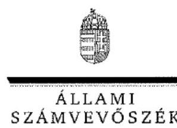

Ikt.szám: V-0819-707/2016.

Dr. Dancsó József úr
elnök
Magyar Államkincstár

# Budapest 

## Tisztelt Elnök Úr!

A Magyar Államkincstár közigazgatási hatósági tevékenységének, valamint központosított illetmény-számfejtési rendszerének ellenőrzése című számvevőszéki jelentéstervezetre tett észrevételeit köszönettel megkaptam.

Az Állami Számvevőszék észrevételekre vonatkozó álláspontjáról a felügyeleti vezető által készített részletes tájékoztatást csatoltan megküldöm.

Tájékoztatom Elnök urat, hogy a jelentésben - az Állami Számvevőszékről szóló 2011. évi LXVI. törvény 29. § (3) bekezdése alapján - az el nem fogadott észrevételeket szerepeltetjük az elutasítás indokának feltüntetésével együtt.

Budapest, 2016. 03.
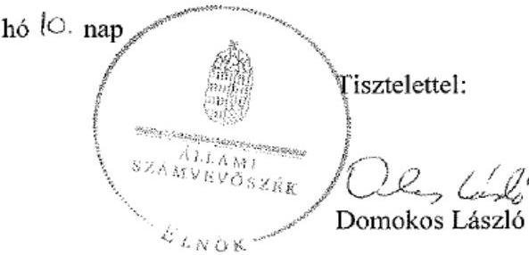

Melléklet: Tájékoztatás az elfogadott és az el nem fogadott észrevételekről

---

# Tájékoztatás az elfogadott és az el nem fogadott észrevételekről 

A Magyar Államkincstár közigazgatási hatósági tevékenységének, valamint központosított illetmény-számfejtési rendszerének ellenőrzése című számvevőszéki jelentéstervezetre az ELL/45-14/2016. iktatószámú levelében tett észrevételeit áttekintettük, annak kezeléséről az alábbi tájékoztatást adom.

## 1. számú észrevétel:

Nem fogadtuk el a jelentéstervezet 5. oldal utolsó bekezdésére tett észrevételét, melyben a nem megfelelő törzskönyvi nyilvántartásra vonatkozó megállapítás törlését kérik. A törzskönyvi nyilvántartás feladatellátását egyszerű véletlen mintavétellel kiválasztott mintatételek alapján értékeltük, melynek sokaságra történő kivetítését a számvevőszéki jelentés Az ellenőrzés módszerei című fejezete részletesen tartalmazza. Az ellenőrzés típusát tekintve megfelelőségi ellenőrzést végeztünk, amelynek keretében a Kincstár közigazgatási hatósági feladatai, ezen belül a törzskönyvi nyilvántartás vezetését a jogszabályi előírásokban, az Áht.-ban, a Ket.-ben és az Ávr.-ben meghatározott előírások alapján értékeltük. A jelentéstervezet 29. oldalán az 1.3.8. számozott megállapításhoz tartozó szövegrész 2. bekezdése részletesen tartalmazza, hogy mely jogszabályi rendelkezést nem tartotta be az ellenőrzött szervezet. A feladatellátás jogszabályi előírásoknak való megfelelőségét az Önök által rendelkezésre bocsátott dokumentumok alapján ellenőriztük, és ezen dokumentumokra alapozva állapítottuk meg, hogy az Ávr.-ben meghatározott ügyintézési határidőt nem tartottak be. Az észrevételhez csatolt 3. sz. függelékként csatolt táblázat adatait nem tudtuk figyelembe venni, mert az abban szereplő „hatkezd", „vegdat", és „keszdat" dátumokat az ügyben keletkezett és az ellenőrzésünk részére átadott dokumentumokon szereplő dátumokkal nem lehetett beazonosítani, illetve a csatolt táblázat első oszlopában megjelölt ügyintézési határidő (nap) sem egyezett az ellenőrzésünk részére átadott, a feladatellátás során keletkezett dokumentumokból megállapított ügyintézési idővel.

## 2. számú észrevétel:

Nem fogadtuk el a jelentéstervezet 5. oldal 1. ábra módosítására tett észrevételt, mert a törzskönyvi nyilvántartással kapcsolatos feladatellátásra vonatkozó megállapításunk megalapozott, az értékelés módosítása az előző bekezdésben rögzítettek alapján nem indokolt.

## 3. számú észrevétel:

A jelentéstervezet 15. oldal 1.1.1. részletes megállapításra tett észrevételt részben fogadtuk el. Ellenőrzésünk a 2014. évben hatályos alapító okiratra irányult, annak megfelelőségét az erre az időszakra szóló, alapító okiratok tartalmát szabályozó, hatályos jogszabályi előírások alapján ellenőriztük. Ebben az időszakban az észrevételben hivatkozott 5/2009. (III. 27.) PM tájékoztató nem volt hatályos, mert azt 2010. szeptember 10-ével visszavonta a nemzetgazdasági miniszter a 8/2010. (IX. 10.) NGM tájékoztatóval. Ugyancsak nem volt hatályban 2010. augusztus 15-étől a Kincstár észrevételében hivatkozott 2008. évi CV. törvény sem. Az ellenőrzött időszakban a törzskönyvi nyilvántartásba bejegyzett költségvetési szervek alapító okiratára vonatkozó szabályokat az államháztartásról szóló törvény végrehajtásáról szóló 368/2011. (XII.31.) Korm. rendelet tartalmazta.

A beküldött dokumentumok ismételt áttekintését követően az 1.1.1. részletes megállapítás első bekezdéséhez tartozó felsorolás második megállapítás törlésére irányuló, valamint az alapító okirat valamennyi jogelőd felsorolására vonatkozó észrevételét elfogadtuk, azt a számvevőszéki jelentés készítésénél figyelembe vesszük.

# 4. számú észrevétel: 

A jelentéstervezet 16. oldalán a 4. ábra módosítására tett javaslatot a beküldött dokumentumok ismételt áttekintését követően elfogadtuk, az ábrát a jelentéstervezet megállapításaival összhangban módosítjuk.

## 5. számú észrevétel:

Nem fogadtuk el a jelentéstervezet 16. oldalán az SZMSZ-ben az Ellenőrzési Főosztálynak adott feladattal kapcsolatos megállapításra tett észrevételt. A Kincstár SZMSZ-ének 40. §-a az Ellenőzési Főosztályt, mint a Bkr. 18. § szerinti, a költségvetési szerv vezetőjének közvetlenül alárendelt, belső ellenőrzési feladatokat ellátó szervezeti egység feladatait rögzíti. A feladatok között szerepel a területi szervek bevonásával a Kincstár kockázatkezelési és szabálytalanságkezelési rendszerének kialakítása és működtetése, mely feladat elvégzésében a Bkr. 19. § (2) bekezdés szerint - a funkcionális függetlenség biztosítása érdekében - a belső ellenőrzés nem vehet részt. A számvevőszéki megállapítás az SZMSZ jogszabályi előírásoknak való megfelelőségére vonatkozott, ezért nem fogadható el a Kincstárnak azon érvelése, miszerint a belső ellenőrök munkaköri leírásaiban kockázatkezeléssel kapcsolatos feladatuk kizárólag a belső ellenőrzési munkaterv alátámasztásául szolgáló kockázatelemzés elkészítésében való részvételre korlátozódik.

## 6. számú észrevétel:

Nem fogadtuk el a jelentéstervezet 19. oldalán a Kincstár 2014. december 10-én hatályba helyezett megállapításaira tett észrevételt. 2014. január 1-jétől változtak a lakáscélú állami támogatásokhoz kapcsolódó jogszabályok, a Ket., az Áht., az Ávr. és a szakmai jogszabályok előírásai, mely változásokat a belső szabályzatoknak követni kell. A Kincstár lakáscélú állami támogatásokkal kapcsolatos belső szabályzata 2014. december 10-ével lépett hatályba, az ezt megelőző hatályos szabályzat az ellenőrzés megállapítása szerint 2014. év előtti, mely a Kincstár észrevételében - 56/2013. (12.23.) számú szabályzat - is megerősítésre került.

## 7. számú észrevétel:

A jelentéstervezet 19. oldal - 1.2.2. megállapítására tett észrevételét a beküldött dokumentumok ismételt áttekintését követően elfogadtuk, a megállapítás módosításra került. Ez nem módosít azon megállapításunkon, hogy a szabályzatokat a Kincstár belső szabályozó eszközei készítésének és kiadásának szabályzatában foglaltakkal ellentétben jelentős késedelemmel, a jogszabályok módosítását követően hónapokkal később módosították.

# 8. számú észrevétel: 

A jelentéstervezet 19. oldal - 1.2.2. megállapításra tett észrevételét a beküldött dokumentumok ismételt áttekintését követően elfogadjuk, a számvevőszéki jelentésben a humánszolgáltatók támogatásának felülvizsgálati szabályzat elnevezését módosítjuk.

## 9. számú észrevétel:

Nem fogadtuk el a jelentéstervezet 23. oldal - 1.3. megállapításra tett, a törzskönyvi nyilvántartás feladat törlésére irányuló észrevételt az 1. számú észrevételre kifejtett indokok alapján.

## 10. számú észrevétel:

A beküldött dokumentumok ismételt áttekintését követően a 29. oldal - 1.3.7. megállapítás második bekezdésének első pontjában megfogalmazott megállapításra tett észrevételét a lényegességi szempontokat is figyelembe véve elfogadtuk és töröltük, azt a számvevőszéki jelentés készítésénél figyelembe vesszük.

## 11.
 számú észrevétel:

A beküldött dokumentumok ismételt áttekintését követően a 29. oldal - 1.3.7. megállapítás és az 1.3.7. megállapítás utolsó pontjában megfogalmazott megállapításra tett észrevételét a lényegességi szempontokat is figyelembe véve elfogadtuk és töröltük, a számvevőszéki jelentés készítésénél figyelembe vesszük.

## 12. számú észrevétel:

A jelentéstervezet 29. oldal - 1.3.8. számú, a törzskönyvi nyilvántartás feladatellátásra vonatkozó megállapítására tett észrevételt nem fogadtuk el. A Kincstár észrevételében a törzskönyvi nyilvántartással kapcsolatos megállapítás és annak alátámasztása elhagyását kérte. A Kincstár határidők betartására vonatkozó észrevétele nem fogadható el, ennek indoklását az 1. számú észrevétel kapcsán megtettük.

Az Ávr. 167/F. §-a előírása alapján végzett vizsgálat kapcsán a dokumentálás hiányára tett észrevételt nem fogadtuk el. Az Állami Számvevőszék ellenőrzéseit az ellenőrzött szervezet által rendelkezésre bocsátott dokumentumok alapján végzi. Azokban az esetekben, ahol az Ávr 167/F. § szerinti felülvizsgálat dokumentált volt, az elfogadásra került. A Kincstár által hivatkozott nyilatkozat, mely szerint a törzskönyvező helyeken a hatályos jogszabályok szerinti vizsgálat elvégzése „számukra evidens”, nem biztosítja az elszámoltathatóságot, a felelősség érvényesítését. Az Ávr. 167/F. §-a által előírt felülvizsgálat elvégzésének a dokumentálására vonatkozó előírást megyei igazgatóságok ügyrendjei tartalmazták. Az ellenőrzés rendelkezésre bocsátott dokumentumok közül több megyei igazgatóság ügyrendje mellékletét képező ellenőrzési nyomvonala tartalmazta a felülvizsgálat elvégzésének kimeneti dokumentumaként a felülvizsgálati lapot. Az ellenőrzésre került tételek közül ez több esetben nem készült el.

---

A törzskönyvi nyilvántartás feladatellátásának ellenőrzéséhez rendelkezésre bocsátott dokumentumok alapján ezen túl a benyújtott kérelmek és azok mellékletei több esetben nem feleltek meg a jogszabályi előírásoknak (pl. Ávr. 167/B. § (1) bekezdés a) pontja), vagy a benyújtott kérelem nem felelt meg az előírt tartalmi követelményeknek. A nem szabályszerűen benyújtott, illetve kitöltött kérelmek esetében az Ávr. 167/F. § előírásával ellentétben nem szólították fel az ügyfelet hiánypótlásra.

# 13. számú észrevétel: 

Nem fogadtuk el a jelentéstervezet 31-32. oldalán a lakáscélú állami támogatások eseti jellegű hibái közül a 2. felsorolásban feltüntetett hiányosság elhagyására tett észrevételt, miszerint a Ket. 29. § (3) bekezdése ellenére az ügyfelet hivatalból induló eljárásról nem értesítették. A Kincstár érvelése szerint előfordult olyan ügy, amely során az ügyfelet a hivatalból induló eljárás esetén a Ket. 29. § (4) bekezdésében foglalt lehetőséggel élve az eljárás eredményessége érdekében nem értesítették, melyre a Ket 29. § (4) bekezdés lehetőséget adott. Az ellenőrzés rendelkezésre bocsátott dokumentumok alapján nem volt megállapítható, hogy a Kincstár a Ket. 29. § (3) bekezdésében foglalt kötelezettségét a 29. § (4) bekezdésében biztosított mely lehetőség alapján mellőzte. Az ellenőrzés a Kincstár által hozott döntések tartalmi megítélésére nem terjedt ki. A Kincstár észrevétele a jelentéstervezetben tett tényszerű megállapításra nincs hatással, annak módosítása nem indokolt.

## 14. számú észrevétel:

A jelentéstervezet 36. oldal - 2.1.1. megállapítás második pontjára tett észrevételét a beküldött dokumentumok ismételt áttekintését követően elfogadtuk, azt a megállapítás második pontjának törlésével a számvevőszéki jelentés készítésénél figyelembe vesszük.

## 15. számú észrevétel

A beküldött dokumentumok ismételt áttekintését követően elfogadtuk a jelentéstervezet 39. oldal - 2.2.2. megállapítás 3. táblázatra tett észrevételét, azt a számvevőszéki jelentés készítésénél az adatok módosításával figyelembe vesszük.

## 16. számú észrevétel:

A jelentéstervezet 40. oldal - 2.2.3. megállapítás utolsó pontjára tett észrevételét a beküldött dokumentumok ismételt áttekintését követően elfogadtuk, azt a számvevőszéki jelentés készítésénél a megállapítás utolsó pontjának törlésével figyelembe vesszük.

## 17. számú észrevétel:

A jelentéstervezet 42. oldal - a 3.2. megállapításra tett észrevételét nem fogadtuk el, mivel az ellenőrzés által feltárt hiányosság az ellenőrzött időszakban döntő részében fennállt. Az integritás-irányítási rendszer belső szabályzatának hatályba léptetése és az integritási tanácsadó kijelölése is 2014. év végével történt.

Az Ellenőrzési Főosztály kockázatkezelési szabályzat koncepciójának kidolgozásában történő operatív feladatellátására tett megállapításunkat továbbra is fenntartjuk. Az észrevételben fog-

---

laltak szerint a Belső Kontrollok Osztály munkatársai kerültek bevonásra a kockázatkezelési rendszer kialakításában. A Belső Kontrollok Osztály azonban az Ellenőrzési Főosztály szervezeti egységeként közvetlenül a Kincstár elnökének irányítása alatt áll, ezáltal a két szervezeti egység esetében ugyanúgy érvényesülnie kell a Bkr. 19. § (2) bekezdés szerinti funkcionális függetlenségnek. E tekintetben nem releváns, hogy az Ellenőrzési Főosztály mely szervezeti egysége, osztálya, munkatársa vett részt a kockázatkezelési koncepció kialakításában.

# 18. számú észrevétel: 

A jelentéstervezet 45. oldal - 4.1. megállapításra tett észrevételt nem fogadtuk el. A jelentéstervezet megállapítása az ellenőrzés rendelkezésre bocsátott dokumentumok alapján történt. Ezen dokumentumok alapján a Kincstárnál 2014. év egészében egy 2010. április 15-étől hatályba helyezett belső szabályzat volt érvényben, amely az időközben bekövetkezett jogszabályi változásokat nem követte. Az észrevételben foglaltak, miszerint a KIRA bevezetésével egyidejűleg látják célszerűnek a belső szabályzó eszközök átfogó, a KIRA logikájával is összhangban történő módosítását az ellenőrzött időszakra tett megállapításunkat nem befolyásolja.

## 19. számú észrevétel:

Nem fogadtuk el a jelentéstervezet 47. oldal - második bekezdésére tett észrevételét. A jelentéstervezet megállapítása az illetmény-számfejtési feladatokat ellátó munkavállalók munkaköri leírásaira és nem szervezeti egységre vonatkozik. E tekintetben nem releváns, hogy a feladat mely szervezeti egységhez tartozik.

## 20. számú észrevétel:

Nem fogadtuk el a jelentéstervezet 49. oldal - 5.1. számozott megállapításhoz tartozó 1. bekezdésre tett észrevételét. Az észrevétel a jelentéstervezetben foglaltaknak nem mond ellent, mert a 2013. évi L. törvény 7. § (1) bekezdése alapján teljes körűen el kellett volna végezni az informatikai rendszerek biztonsági osztályba való besorolását. Első alkalommal 2014. május 12-ével mindösszesen 24 db elektronikus információs rendszer besorolása történt meg, ezt követően 2015-ben történt a további információs rendszerek osztályba sorolása, így a 2013. évi L. törvény 26. § (1) bekezdésében foglalt határidőig az osztályba sorolás nem volt teljes körű. Ezen túl a besorolásokra vonatkozó követelmény érvényesítését és valamennyi információs rendszer azonos módon való kezelését önmagában nem befolyásolja a Kincstár észrevételében jelzett indok, mely szerint nyilvános szabályzatban nem kívánták szerepeltetni a biztonságtechnikai rendszerek besorolására vonatkozó információkat.

## 21. számú észrevétel:

A jelentéstervezet 49. oldal - 1. bekezdésében a 24 db informatikai rendszer stratégiai elektronikus információs rendszerként történő megfogalmazásra tett javaslatot nem fogadtuk el, mert a 2013. évi L. törvény nem tesz különbséget stratégiai és nem stratégiai elektronikus információs rendszerek között.

## 22. számú észrevétel:

---

A jelentéstervezet 49. oldal - 3. bekezdésére tett észrevételét nem fogadtuk el. Az észrevételben hivatkozott, és az ellenőrzés rendelkezésre bocsátott jegyzőkönyvben összesített besorolás szerepel. Abban nem elektronikus információs rendszerenként határozták meg az információs rendszerek, vagy az általuk kezelt adatok bizalmasságának, sértetlenségének, vagy rendelkezésre állásának kockázata alapján 1-től 5-ig számozott fokozatokat, ezáltal az elektronikus információs rendszerek első besorolása nem felelt meg a 2013. évi L. törvény 7. § (1) és (2) bekezdésében foglalt előírásoknak. Az ellenőrzés rendelkezésre bocsátott jegyzőkönyvnek nem melléklete a Kincstár észrevételében hivatkozott, a NEIH részére megküldött osztályba sorolás. Az ellenőrzés részére rendelkezésre bocsátott dokumentumok teljes körűségéről a Kincstár nyilatkozott.

# 23. számú észrevétel: 

A 49. oldal - 5.1. megállapítás törlésére irányuló észrevételét nem fogadtuk el a 49. oldal 1. és 3. bekezdésére tett észrevételeire adott válaszok alapján.

## 24. számú észrevétel:

A jelentéstervezet 49. oldal - 5. számú összegző megállapítására tett észrevételét nem fogadtuk el, a 49. oldal - 5.1. megállapítás, a 49. oldal 1. és 3. bekezdésére tett észrevételekre adott válaszok alapján. Az összegző megállapítást az 5.1 és az 5.2 számú megállapítás és a hozzá tartozó részletes megállapítások alapján tettük meg.

## 25. számú észrevétel:

A jelentéstervezet 50. oldal - 1. bekezdésére tett észrevételét nem fogadtuk el. A szervezet elektronikus információs rendszereinek biztonsági osztályba sorolása és a biztonsági szint meghatározása között ugyanis szoros összefüggés van. Ezt támasztja alá a 2013. évi L. törvény 9. § (1) bekezdése is, amely kimondja, hogy „A kockázatokkal arányos, költséghatékony védelem kialakítása érdekében a szervezetet az elektronikus információs rendszerek védelmére való felkészültsége alapján a szervezetnek biztonsági szintekbe kell sorolni a jogszabályban meghatározott szempontok szerint.”

A Kincstár 3. elvárt biztonsági szintjének meghatározása azért nem felelt meg a 77/2013. (XII.19.) NFM rendeletben foglaltaknak, mert a 77/2013. (XII.19.) NFM rendelet 2. Biztonsági osztályok 2.6.1. pontjában foglaltak szerint a Kincstár működtetett 5. biztonsági osztályba sorolandó elektronikus információs rendszert (pl. kiemelten nagy tömegű különleges személyes adatok kezelésére), ezért a 77/2013. (XII.19.) NFM rendelet 2. számú mellékletének 2.5. pontja alapján a szervezet biztonsági szintje is legalább 5-ös kell, hogy legyen.

## 26. számú észrevétel:

A beküldött dokumentumok ismételt áttekintését követően elfogadtuk a jelentéstervezet 48. oldal - 2. bekezdésére tett észrevételét, azt a számvevőszéki jelentés készítésénél a megállapítás módosításával figyelembe vesszük.

## 27. számú észrevétel:

---

A jelentéstervezet 50. oldal - 3. bekezdésre tett észrevételét nem fogadtuk el. Az észrevétel a jelentéstervezetben foglalt megállapításnak nem mond ellent. Az Állami és önkormányzati szervek elektronikus információbiztonságáról szóló 2013. évi L. törvény 10. § (8) bekezdése szerint a biztonsági szintbe sorolás eredményét a szervezet informatikai biztonsági szabályzatában kell rögzíteni, valamint a 26. § (2) bekezdése szerint a törvény hatályba lépését követő egy éven belül kell elvégezni. A törvény 2013. július 1-jén lépett hatályba, ehhez képest a biztonsági szintbe való sorolást csak a 2015. május 6-án kiadott IBDR tartalmazza.

# 28. számú észrevétel: 

A jelentéstervezet 50. oldal - 4. pontozott bekezdéshez tett észrevételét részben fogadtuk el. A beküldött dokumentumok ismételt áttekintését követően elfogadtuk az Informatikai Biztonsági Főosztály 2014. évi ellenőrzési tervének végrehajtására tett megállapítással kapcsolatos észrevételét, melyet a számvevőszéki jelentés készítésénél a megállapítás módosításával figyelembe veszünk. Nem fogadtuk el a kockázatelemzésre tett észrevételét, mert a jelentéstervezetben szereplő megállapítás nem a kockázatértékelést kifogásolja, hanem a jogszabályoknak és a kockázatoknak való megfelelés érdekében végzett rendszer végrehajtott kockázatelemzéseket és auditokat.

## 29. számú észrevétel:

A jelentéstervezet 50. oldal - 5. bekezdésre tett észrevétele a jelentéstervezet megállapítását nem módosítja. A jelentéstervezet megállapítása szerint megfelelő volt a 2013. L. törvény betartása. Az ellenőrzés részére átadott dokumentumok között a Kincstár elnöke által 2015. májusban kiadott megbízás állt rendelkezésre.

## 30. számú észrevétel:

A jelentéstervezet 51. oldal - 5.2. számú megállapításra tett észrevételt nem fogadtuk el, mert a megállapítást alátámasztását tartalmazó, az 5.2 számú megállapítás első bekezdését követően 11 pontban részletesen kifejtésre (felsorolásra) kerültek a feltárt hiányosságok, a jogszabályi előírásoknak való nem megfelelés területei. Ezen megállapításokat az észrevétel nem kifogásolta. Az ellenőrzés során feltárt hibák, hiányosságok következtében a kontrollok kialakítása nem minősíthető megfelelőnek.

## 31. számú észrevétel:

A jelentéstervezet 53-55. oldal - 6.3. megállapításra tett észrevételét nem fogadtuk el. Az észrevétel a jelentéstervezetben foglalt megállapítást nem cáfolja, ahhoz csak kiegészítő információt, a feltárt tényekhez kapcsolódó indoklást tartalmaz. Örömmel vettük tájékoztatását, hogy az ellenőrzött időszakon túl már történtek lépések a bejelentési fegyelem erősítése érdekében, a jogszabályi előírások betartása
 a szabályos működés alapvető kritériuma.

---

# 32. -33-34. számú észrevételek: 

A jelentéstervezet 56. oldal - 2. és 6. javaslat törlésére, valamint az 5. javaslat módosítására vonatkozó észrevételeit nem fogadtuk el, mert a javaslatokat alátámasztó megállapításokra tett észrevételeket nem fogadtuk el.

## 35. és 36. számú észrevételek:

A beküldött dokumentumok ismételt áttekintését követően a jelentéstervezet 62. oldal - II. sz. mellékletére tett észrevételt elfogadtuk, azt a számvevőszéki jelentés készítésénél a táblázat módosításával figyelembe vesszük.

Budapest, 2016. 03. hó 10. nap

Holman Magdolna
felügyeleti vezető

---

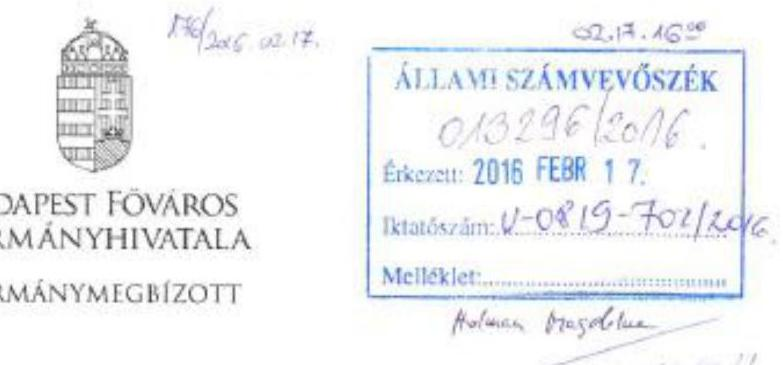

Iktatószám: BP/0010/00012-2/2016

Tárgy: A Magyar Államkincstár ellenőrzése – A Magyar Államkincstár közigazgatási hatósági tevékenységének, valamint központosított illetmény-számfejtési rendszerének ellenőrzése

Hiv.szám: V-0819-672/2016

Domokos László

elnök

Állami Számvevőszék

Tisztelt Elnök Úr!

Hivatkozással a fenti számon érkezett „A Magyar Államkincstár ellenőrzése – A Magyar Államkincstár közigazgatási hatósági tevékenységének, valamint központosított illetmény-számfejtési rendszerének ellenőrzése” című levelére a jelentéstervezetet áttekintettem és az alábbi észrevételeket teszem.

1.2.1 pont

A Budapesti és Pest Megyei Igazgatóság ügyrendje valóban nem tartalmazta az egységes szociális nyilvántartás vezetésével kapcsolatos feladatokat, tekintettel arra, hogy ezeket a feladatokat teljes körűen a Kincstár Központ látta el.

A természetben nyújtott családi pótlék kezelésével kapcsolatos a családok támogatásáról szóló 1998. évi LXXXIV. törvény (továbbiakban: Cst.) 37. § (5) bekezdésében leírt feladatokat felöleli az ügyrendben szereplő alábbi megfogalmazás: A Családtámogatási és Szociális Ellátási Iroda családtámogatási ellátásokkal kapcsolatos feladatai során ellátja illetékességi területén mindazokat a hatósági feladatokat, amelyeket a hatályos anyagi (a Cst., valamint annak végrehajtásáról szóló 223/1998. (XII. 30.) Korm. rendelet) és eljárási jogszabályok (a közigazgatási hatósági eljárás és szolgáltatás általános szabályairól szóló 2004. évi CXL. törvény) feladat és hatáskörébe utalnak.

1.3.1 pont

A családtámogatási ellátásokkal, fogyatékossági támogatásokkal kapcsolatos elsőfokú eljárások esetében a jelentéstervezet nem tartalmaz konkrét ügyeket. Erre vonatkozóan a Főosztály érdemi megállapítást nem tesz. A benyújtott kérelmek ellenőrzését, az ügyfelek hiánypótlására történő felhívást minden esetben elvégezték.

1139 Budapest, Teve u. 1/a-c. - 1364 Bp., Pf.: 234. - Telefon: +36 (1) 896-2433 - Fax: +36 (1) 237-4882
E-mail: kabinet.budapest@bfkh.hu - Honlap: www.kommune.hu

---

# Családtámogatási ellátásokkal kapcsolatos észrevételek: 

A 223/1998 (XII.30.) Korm. rendelet 1. számú melléklet 3.5. alpontjában, a 2. számú melléklet 3.6. alpontjában, a 4. számú melléklet 3.5. alpontjában és az 5. számú melléklet 3.1. alpontjában szereplő nyilatkozat hiánya nem indokolja az ügyfél hiánypótlásra történő felszólítását, amennyiben a jogszabályban előírt mellékletek rendelkezésre állnak és az ügy érdemben elbírálható. (Nyilatkozat a kérelemhez csatolt iratokról, illetve, amennyiben a kérelmező az anyakönyvi nyilvántartásban, gyámhatósági nyilvántartásban, illetve a jegyző vagy a fővárosi és megyei kormányhivatal járási (fővárosi kerületi) hivatala által vezetett szociális nyilvántartásban szereplő adatot nem igazolta, annak a hatóságnak a megnevezése és címe, amely az eljáró hatóság által adatszolgáltatási kérelemmel megkereshető.)

## Fogyatékossági támogatással kapcsolatos észrevételek:

A 141/2000. számú (VIII.9.) Korm. rendelet 5. § (1) bekezdés szerint a támogatás iránti kérelemhez mellékelni kell a kérelmező háziorvosa, bentlakásos szociális intézményben élő kérelmező esetén az intézmény orvosa (a továbbiakban: háziorvos) által kiállított orvosi beutalót, valamint a fogyatékosságot igazoló orvosi dokumentációt. A szükséges dokumentumok ellenőrzése minden esetben megtörtént, amennyiben hiányos kérelem érkezett hiánypótlásra történő felhívás került kiadásra. A háziorvosi beutaló és az orvosi dokumentáció hiányában fogyatékossági támogatás ügyben érdemi döntést nem lehet hozni.
A 141/2000. (VIII.9.) Korm. rendelet 6. § (1) bekezdése szerint a súlyos fogyatékosság megállapítása kérdésében szakhatósági állásfoglalás kiadása céljából meg kellett keresni a rehabilitációs szakigazgatási szervet. A szakhatósági állásfoglalások kiadásának időtartama minden esetben több hónapot vett igénybe, mely időtartam a Ket. 33. § (3) bekezdése szerint nem számított bele az ügyintézési határidőbe. A Nemzeti Rehabilitációs és Szociális Hivatalról, valamint a szakmai irányítása alá tartozó rehabilitációs szakigazgatási szervek feladat- és hatásköréről szóló 95/2012. (V.15.) Korm. rendelet 17. §-a alapján a rehabilitációs szakigazgatási szerv és a hivatal eljárására irányadó ügyintézési határidő - ha jogszabály másként nem rendelkezik - 30 nap. Az állásfoglalások elkészítésének, illetve az igényelbíráló szervhez történő megérkezésének késedelme miatt történt határidő túllépés.

### 1.4.1 pont

A TÉBA informatikai rendszerrel kapcsolatban az elsőfokú döntések elleni fellebbezések esetén a Családtámogatási Iroda munkatársai családtámogatási ügyekben minden esetben kitöltötték a felterjesztés során a „Felterjesztés szövege" mezőt. A felterjesztés során működött és jelenleg is működik a „négy szem elv", tekintettel arra, hogy a fellebbezést az ügyintéző először a felülvizsgálóhoz továbbítja, aki a szükséges ellenőrzéseket követően átteszi azt az osztályvezető részére. A fellebbezés felterjesztését az osztályvezető végzi a felügyeleti szerv felé. Fogyatékossági támogatás ügyben a kérelem elutasítása a rehabilitációs szakértői szerv szakvéleménye alapján történik, ezekben orvos szakmai kérdések képezik a fellebbezés tárgyát. Az első fokon eljáró ügyintéző nem rendelkezik orvos szakmai ismeretekkel, ezért nincs megalapozott álláspontja a fellebbezésben foglaltakról.

A TÉBA szakrendszer bevezetését követően a Családtámogatási Iroda többször jelezte egy olyan funkció szükségességét, amely a kimenő iratok nyomon követhetőségét biztosítja. A fejlesztés megvalósulásáig a „Postázás dátuma" funkció hiányában a Családtámogatási Iroda munkatársai a Kimenő dokumentum „Leírás" mezőben rögzítették a postázás dátumát. A 13/2013. sz. Hálózatirányítási Elnökhelyettesi Utasítás 6. sz. függelékében foglaltak szerint, „sima küldeményként" a kérelemnek teljes egészében helyt adó vagy a jogosultságot a törvény erejénél fogva megszüntető határozatok kerültek kipostázásra. A fellebbezésre nyitva álló határidő meghatározásánál a postázás dátuma irreleváns.

### 2.2.3 pont

A visszafizetésre kötelező határozat kiadása, amennyiben a jogalap nélkül utalt ellátás visszaérkezik, vagy az ügyfél a jogtalanul felvett ellátást önként visszafizeti, úgy szükségtelen és felesleges. A már visszafizetett vagy visszaérkezett összegről visszafizetésre kötelező határozat kiadása ügyféli panaszt eredményezne.
A vizsgált ügyről nincs tudomásunk, de a jogalap nélkül felvett ellátás keresetből történő levonatására a gyakorlat szerint nagyon minimális az esély, s mivel az önkormányzati adóhatóság is az ugyanazt az eljárásmenetet alkalmazza, mint a behajtást kérő szerv, ezért a duplikált eljárás a gyakorlatban

---

feleslegesnek bizonyult, főként azért, mert az adóhatóság szélesebb jogkörrel rendelkezik és a behajtásra átadás hatékonyabb és eredményesebb.
A fogyatékossági támogatás visszakövetelése során a határidő elmulasztására irányuló hiba nem az ügyintéző mulasztása miatt történhetett, bár a konkrét ügyet nem ismerjük. Mivel jogalap nélküli fogyatékossági támogatás kifizetés - az esetek túlnyomó részében - az ellátásra jogosult halála miatt történik, melyről a folyósító szerv általánosságban késedelmesen értesül, illetve annak feltárása, hogy a jogtalanul kifizetett ellátás visszafizetésére ki kötelezhető hosszas ügyintézői eljárást igényel.

Budapest, 2016. február $x^{1}$.
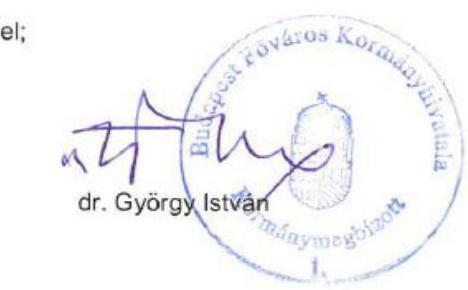

---

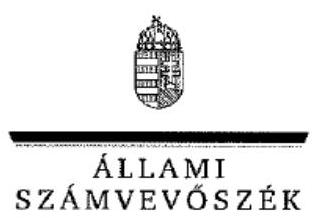

ELNÖK

# Dr. György István úr 

kormánymegbizott
Budapest Főváros Kormányhivatala

## Budapest

## Tisztelt Kormánymegbizott Úr!

A Magyar Államkincstár közigazgatási hatósági tevékenységének, valamint központosított illetmény-számfejtési rendszerének ellenőrzése című számvevőszéki jelentéstervezetre tett észrevételeit köszönettel megkaptam.

Az Állami Számvevőszék észrevételekre vonatkozó álláspontjáról a felügyeleti vezető által készített részletes tájékoztatást csatoltán megküldöm.

Tájékoztatom Kormánymegbízott urat, hogy a jelentésben - az Állami Számvevőszékről szóló 2011. évi LXVI. törvény 29. § (3) bekezdése alapján - az el nem fogadott észrevételeket szerepeltetjük az elutasítás indokának feltüntetésével együtt.

Budapest, 2016. 03. hó 17. nap
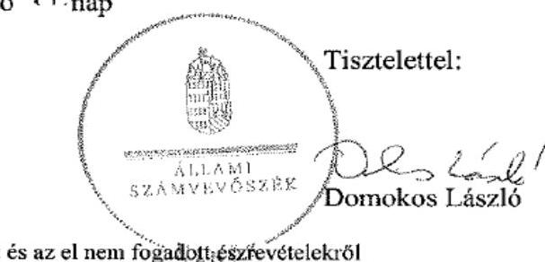

Melléklet: Tájékoztatás az elfogadott és az el nem fogadott észrevételekről

---

# Tájékoztatás az elfogadott és az el nem fogadott észrevételekről 

A Magyar Államkincstár közigazgatási hatósági tevékenységének, valamint központosított illetmény-számfejtési rendszerének ellenőrzése című számvevőszéki jelentéstervezetre az BP/0010/00012-2/2016. iktatószámú levelében tett észrevételeit áttekintettem, annak kezeléséről az alábbi tájékoztatást adom.
A jelentéstervezet 1.2.1. számú megállapítására tett észrevételt nem fogadtuk el, mert a jelentéstervezetben foglalt megállapítások a Kincstár központ Családtámogatási Főosztályának ügyrendjére és nem a Budapest és Pest Megyei Igazgatóság ügyrendjére vonatkoztak.
A jelentéstervezet 1.3.1. számú megállapítására tett észrevételeket nem fogadtuk el. A családtámogatási ellátások esetében a 223/1998. (XII.30.) Korm. rendelet 1. számú melléklet 3.5. alpontjában, a 2. számú melléklet 3.6. alpontjában, a 4. számú melléklet 3.5. alpontjában, és az 5. számú melléklet 3.1. számú alpontjában foglaltak szerint nyilatkozni kell a kérelemhez csatolt iratokról, illetve amennyiben a kérelmező az anyakönyvi nyilvántartásban, gyámhatósági nyilvántartásban szereplő adatot nem igazolta, annak a hatóságnak a megnevezését és címét kell megadni, amely az eljáró hatóság által adatszolgáltatási kérelemmel megkereshető. Az ellenőrzés rendelkezésére bocsátott dokumentumok (kérelmek) esetében sem nyilatkozat szerinti melléklet csatolására, sem az eljáró hatóság által adatszolgáltatási kérelemmel megkereshető hatóság megnevezésének és címének megjelölésére, sem azok ellenőrzésére nem került sor. Ezért a jelentéstervezetben foglalt megállapításunk helytálló.
Nem fogadtuk el a fogyatékossági támogatásokhoz kapcsolódó észrevételét, mert az ellenőrzés rendelkezésére bocsátott dokumentumok között nem szerepelt a kérelem mellékleteként megjelölt 141/2000. (VIII.9.) Korm. rendelet 5. § (1) bekezdése szerinti (pl. orvosi beutaló, valamint a fogyatékosságot igazoló orvosi dokumentáció) melléklet. Az ellenőrzés során a rendelkezésre bocsátott dokumentumok teljes körűségéről az ellenőrzött szervezet részéről a nyilatkozat kiállításra került. A határidő túllépésére tett észrevételét nem fogadtuk el, mert a Ket. rendelkezései egzakt módon meghatározzák a hatósági eljárások lefolytatására rendelkezésre álló határidőt, attól eltérni nem lehet. A szabályszerűségi ellenőrzés keretében a jogszabályoknak való megfelelést ellenőriztük.
A jelentéstervezet 1.4.1. számú megállapítására tett észrevételeket nem fogadtuk el, mert azok kiegészítő információt nyújtanak a jelentéstervezet megállapításaihoz. A Ket. 102. § (5) bekezdése az első fokú döntést hozó hatóság fellebbezésről kialakított álláspontjáról szóló nyilatkozat megtételét nem lehetőségként írja elő, a nyilatkozat megtételére vonatkozó mérlegelési lehetőséget nem tartalmaz. A TÉBA szakrendszer postázási folyamataira tett megállapításhoz kapcsolódó észrevételét részben fogadtuk el. Kormánymegbízott úr megerősítette megállapításunkat, mert szükségesnek tartja a kimenő iratok nyomon követhetőségének biztosítását, e tekintetben az észrevétel a jelentéstervezet megállapítását nem módosítja, ahhoz kiegészítő információt nyújt. Észrevétele alapján a jelentéstervezet 1.4.1. pontjához tartozó 2. bekezdés második pontjában a Ket. 99. § (1) bekezdésre való hivatkozást töröltük.

---

A jelentéstervezet 2.2.3. számú megállapítására tett észrevételeket nem fogadtuk el, mert azok kiegészítő információt nyújtanak a jelentéstervezet megállapításaihoz. Az ellenőrzés típusát tekintve megfelelőségi ellenőrzést végeztünk. Ennek keretében a Kincstár közigazgatási hatósági feladatait, ezen belül az ellátások jogalap nélküli felvételének és a támogatások jogosulatlan igénybevételének megelőzésére vonatkozó feladatellátást a jogszabályi előírásokban és belső szabályzatokban meghatározott előírásoknak való megfelelés szempontjából értékeltük.
Budapest, 2016. 03. hó 17. nap

Holman Magdolna felügyeleti vezető

---

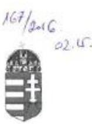

# BÁCS-KISKUN MEGYEI KORMÁNYHIVATAL

Hiv. szám: V-0819-673/2016. Ikt. szám: BKL-001/175-2/2016.

Domokos László

elnök

Állami Számvevőszék

Budapest

Apáczai Csere János utca 10.

1052

Tárgy: „A Magyar Államkincstár ellenőrzése - A Magyar Államkincstár igazgatási hatósági tevékenységének, valamint központosított illetmény-számfejtési rendszerének ellenőrzése” tárgyú számvevőszéki jelentéstervezet véleményezése

Tisztelt Elnök Úr!

Az Állami Számvevőszék fenti tárgyú, V-0819-667/2016. iktatószámú, 2016. január 27. napján érkezett számvevőszéki jelentéstervezetének megállapításaival és javaslataival kapcsolatban az észrevételeimet az alábbiak szerint adom meg:

A jelentéstervezet alapján a lakáscélú állami támogatással kapcsolatos feladatellátás összességében megfelelő volt (országosan legfeljebb 10%-os hiba arány), az ellenőrzés összegzése alapján a vonatkozó jogszabályi előírások a feladatellátást érintően betartásra kerültek, az adott tárgykört érintően a feladatellátásban érintett fővárosi és megyei kormányhivatalok vezetői számára további intézkedési javaslat nem került meghatározásra.

A közigazgatási hatósági tevékenységek ellátása körében kifogásolt, eseti jellegű, minősítést nem befolyásoló, elsődlegesen a közigazgatási hatósági eljárás és szolgáltatás
 általános szabályairól szóló 2004. évi CXL. törvény előírásait érintő eljárási hibák kiküszöbölésére, helytelen eljárási gyakorlat elkerülésére a Kormányhivatal – általánosságban és a jövőre nézve is – kiemelt figyelmet fordít.

A jelentéstervezetben megállapításra került, hogy a családtámogatási ellátások és a fogyatékossági támogatások esetében a kontrollkörnyezet nem került kialakításra. Sem a szabályozás, sem a feladatellátás nem volt megfelelő, nem felelt meg a jogszabályi előírásoknak.

Bács-Kiskun Megyei Kormányhivatal
6000 Kecskemét, Deák Ferenc tér 3.
tel.: 76/513-713, fax: 76/513-703, e-mail: kormanyhivatal@bkmkh.u

110

---

A családtámogatási ellátásokkal és a fogyatékossági támogatásokkal összefüggő feladatok végrehajtásához kapcsolódóan az első fokú döntés elleni fellebbezési határidő lejáratának megállapíthatósága érdekében a TÉBA informatikai rendszer – a rendszer üzemeltetője által – fejlesztése került, melynek során a TÉBA rendszerben megállapíthatóvá vált, hogy az első fokú döntés mikor került kiküldésre.

Az Állami Számvevőszék jelentéstervezete megállapítja, hogy az első fokon eljáró ügyintéző az első fokú döntés ellen érkező fellebbezés esetén a felterjesztésben nem nyilatkozott a fellebbezésről kialakított álláspontjáról. A Kormányhivatal esetében jellemzően ezek a „hiányosságok” a fogyatékossági támogatásokhoz kapcsolódó, az egészségi állapot mértékét vitató fellebbezések esetében fordulnak elő. Az első fokon eljáró ügyintéző az egészségi állapot mértékének megállapításában szakértelemmel nem bír, ebben nyilatkozni nem tud. Az egészségi állapot mértékét a rehabilitációs hatóság szakkérdésként vizsgálja.

A területi államigazgatási szervek 2015. április 01. napjával lezajlott integrációját követően a családtámogatási szakterületen is meghatározásra került az ellenőrzési nyomvonal és a kockázatkezelési szabályzat valamint összeállítársa került a vezetői ellenőrzési terv. A vezetői ellenőrzés keretében már 2015. évben is ellenőriztük a jogszabályi előírások, különös tekintettel a közigazgatási hatósági eljárás és szolgáltatás általános szabályairól szóló 2004. évi CXL. törvény 33. § (1) bekezdésében, továbbá a családok támogatásáról szóló 1998. évi LXXXIV. törvény 37. § (4) bekezdésében foglalt, a kérelmek ügyintézési határidejére vonatkozó előírások betartását, betartatását. 2016. évben is kiemelt figyelmet – mind a munkatársak részére meghatározott egyedi célkitűzések, mind a vezetői ellenőrzés során – fordítunk a jogszabályi előírások és határidők betartására.

Kérem a jelentéstervezetre adott válaszom szíves elfogadását.

Kecskemét, 2016. február 08.

Tisztelettel:

Kovács Ernő
kormánymegbízott

---

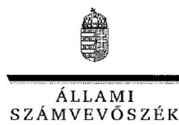

ELNÖK

# Kovács Ernő úr 

kormánymegbízott
Bács-Kiskun Megyei Kormányhivatal

## Kecskemét

## Tisztelt Kormánymegbízott Úr!

A Magyar Államkincstár közigazgatási hatósági tevékenységének, valamint központosított illetmény-számfejtési rendszerének ellenőrzése című számvevőszéki jelentéstervezetre tett észrevételeit köszönettel megkaptam.

Az Állami Számvevőszék észrevételekre vonatkozó álláspontjáról a felügyeleti vezető által készített tájékoztatást csatoltan megküldöm.

Tájékoztatom Kormánymegbízott urat, hogy a jelentésben – az Állami Számvevőszékről szóló 2011. évi LXVI. törvény 29. § (3) bekezdése alapján – az el nem fogadott észrevételeket szerepeltetjük az elutasítás indokának feltüntetésével együtt.

Budapest, 2016.
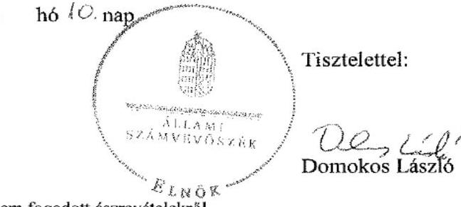

Melléklet: Tájékoztatás az el nem fogadott észrevételekről

---

# Tájékoztatás az el nem fogadott észrevételekről 

A Magyar Államkincstár közigazgatási hatósági tevékenységének, valamint központosított illetmény-számfejtési rendszerének ellenőrzése című számvevőszéki jelentéstervezetre az JASBKL-001/175-2/2016. iktatószámú levelében tett észrevételeit áttekintettem, annak kezeléséről az alábbi tájékoztatást adom.

A jelentéstervezetre tett észrevétel a jelentéstervezet megállapításait nem módosítja, ahhoz kiegészítő információt nyújt. Örömmel vettük, hogy a Kormányhivatal kiemelt figyelmet fordít az eljárási hibák kiküszöbölésére, az ügyintézési határidőkre vonatkozó előírások, a jogszabályi előírások betartására, a szabályos működés érvényesítése érdekében.

Budapest, 2016. 03. hó 10. nap

Holman Magdolna
felügyeleti vezető

---

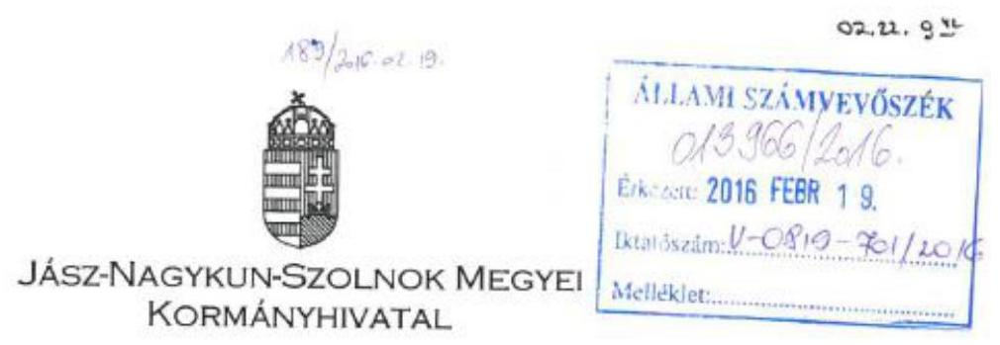

Ügyiratszám:JAS-CST-5-49/2016.
Ügyintéző: Till Gáborné
Telefon: 56/512-927

Tárgy: Észrevétel ÁSZ. részére.
Hiv. szám: V-819-682/2016.
Melléklet: -

# Állami Számvevőszék 

Domokos László
elnök részére

## Budapest

Apáczai Csere János utca 10. 1364

## Tisztelt Elnök Úr!

Az Állami Számvevőszéknek „A Magyar Államkincstár közigazgatási hatósági tevékenységének, valamint központosított illetmény-számfejtési rendszerének ellenőrzése” tárgyában készült jelentéstervezetének családtámogatási, fogyatékossági támogatási és nagycsaládos kedvezménnyel összefüggő ellenőrzési megállapításaira az alábbi észrevételeket teszem:

- A családtámogatási, fogyatékossági támogatási, valamint nagycsaládos gázárkedvezmény tárgyú ügyekben az ellenőrzés nem tárt fel olyan hiányosságot, amely jogosultság helytelen megállapítását vagy téves összegű kiutalást eredményezett volna.
A hatályos jogszabályi rendelkezések ismerete alapvető elvárás, a belső szabályozó eszközökön túl, körlevelek és szakmai értekezletek is biztosították a naprakész ismeretek alkalmazását.
- A hiányos adattartalmú kérelmek befogadására vonatkozóan megjegyzendő, hogy hiánypótlást csak akkor és azon kérdés tekintetében rendelt el a hatóság, ha az a döntéshozatal szempontjából releváns volt. Ezt a gyakorlatot az ügyfélbarát és rugalmas igény-elbírálási eljárás folytatása, illetve az eljárás időtartama felesleges 

---

elhúzódásának lehetőség szerinti megakadályozása indokolta. A feltárt hiányosság sem panaszhoz, sem jogszerűtlen döntéshez nem vezetett.
- A kérelemnek teljes egészében helyt adó döntések száma az összes ügyszám közel kétharmada.
- Fogyatékossági támogatás ügyek esetében a megállapításnál figyelemmel kellett lenni a rehabilitációs szakhatósági állásfoglalás beszerzésére, amelyre az irányadó határidő a 95/2012. (V.15.) Korm. rendelet 17. §-a szerint 30 nap volt. Megjegyezzük, hogy ezen ügyekhez szükséges orvosi szakvélemények elkészítése 2014. évben is és jelenleg is jelentős időigény szükségletet követel.
- Az ellenőrzés megállapította, hogy az első fokú határozatok ellen benyújtott fellebbezések felterjesztésekor az első fokú hatóságok nem adtak véleményt. A Ket. biztosítja, hogy a fellebbezés benyújtását követően az első fokú közigazgatási szerv a fellebbezésben foglaltak alapján a határozatot módosíthatja vagy visszavonhatja. Ennek elmaradása azt jelenti, hogy a fellebbezésben nem került olyan új tény megjelölésre, amelyre külön kellett volna reagálni a felterjesztéskor. A másodfokú eljárást ugyanakkor az I. fokú vélemény érdemben nem befolyásolja, a II. fokú döntéshozatalra kihatással nem bír.

Az ellenőrzési megállapítás a kormányhivatalok részére két pontban fogalmaz meg javaslatot. A javaslatot figyelembe véve a jövőben hangsúlyt helyezünk a leírtakra, összhangban a Ket. időközben bekövetkezett módosításával.

Szolnok, 2016. február „ ”

---

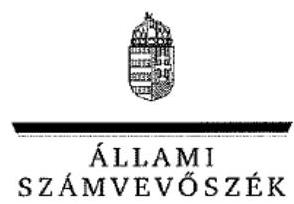

ELNÖK

Ikt.szám: V-0819-709/2016.

# Dr. Kállai Mária úrhölgy 

kormánymegbízott
Jász-Nagykun-Szolnok Megyei Kormányhivatal

## Szolnok

## Tisztelt Kormánymegbízott Úrhölgy!

A Magyar Államkincstár közigazgatási hatósági tevékenységének, valamint központosított illetmény-számfejtési rendszerének ellenőrzése című számvevőszéki jelentéstervezetre tett észrevételeit köszönettel megkaptam.

Az Állami Számvevőszék észrevételekre vonatkozó álláspontjáról a felügyeleti vezető által készített tájékoztatást csatoltan megküldöm.

Tájékoztatom Kormánymegbízott úrhölgyet, hogy a jelentésben – az Állami Számvevőszékről szóló 2011. évi LXVI. törvény 29. § (3) bekezdése alapján – az el nem fogadott észrevételeket szerepeltetjük az elutasítás indokának feltüntetésével együtt.

Budapest, 2016. 03. hó 10. nap
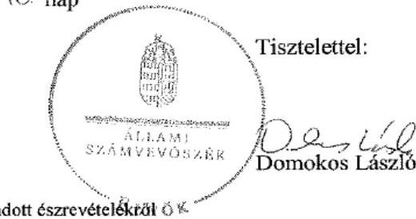

Melléklet: Tájékoztatás az el nem fogadott észrevételekről 0%

---

# Tájékoztatás az el nem fogadott észrevételekről 

A Magyar Államkincstár közigazgatási hatósági tevékenységének, valamint központosított illetmény-számfejtési rendszerének ellenőrzése című számvevőszéki jelentéstervezetre az JAS-CST-5-49/2016. iktatószámú levelében tett észrevételeit áttekintettem, annak kezeléséről az alábbi tájékoztatást adom.
A jelentéstervezetre tett 1-3. számú észrevétel a jelentéstervezet megállapításait nem kifogásolja, azokhoz kiegészítő információt nyújt. Az Állami Számvevőszék által lefolytatott ellenőrzés szabályszerűségi ellenőrzés volt, amely a jogszabályokban és a belső szabályzatokban előírtak betartására irányult.
A jelentéstervezetben a jogorvoslati eljárások ellenőrzése keretében az első fokon eljáró ügyintéző fellebbezéssel kapcsolatos feladataira tett megállapításra irányuló (4. számú) észrevételét nem fogadtuk el, mert az első fokú hatóság a Ket. 102. § (5) bekezdésben foglaltak szerint a fellebbezésről kialakított álláspontjáról is köteles nyilatkozni.
Örömmel vettem Kormánymegbízott úrhölgy tájékoztatását, mely szerint a feladataik végrehajtása során hangsúlyt helyeznek az ellenőrzés során feltárt hibák kiküszöbölésére.

Budapest, 2016. 03. hó 10. nap

Holman Magdolna felügyeleti vezető

---

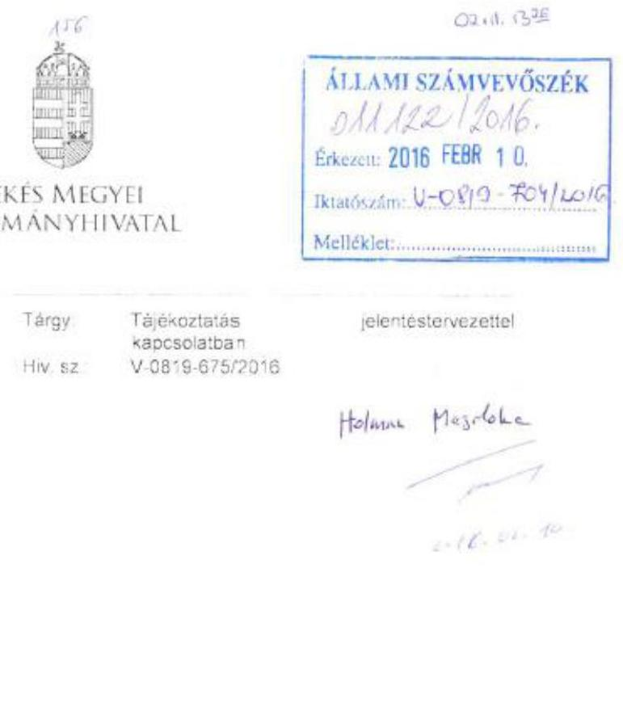

# Tisztelt Elnök Úr!

A Magyar Államkincstár közigazgatási hatósági tevékenységének valamint központosított illetmény-számfejtési rendszerének ellenőrzése című jelentéstervezettel kapcsolatban tájékoztatom, hogy annak tartalmához a Békés Megyei Kormányhivatal, mint az ellenőrzésben – jogutódlásra tekintettel – közreműködő szerv észrevételt nem kíván tenni.

Békéscsaba, 2016. február 4.

Tisztelettel:

Gajda Róbert
kormánymegbízott

---

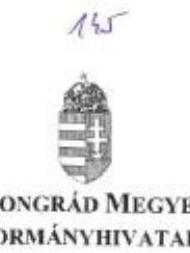

Ügyiratszám: CSB-01/80h-3/2016.
Ügyintéző: Schleining Ibolya
Telefon: 62/621-467

Állami Számvevőszék

Domokos László
elnök

Budapest
Apáczai Csere János u. 10.
1364

Tárgy: MÁK ellenőrzés
Hiv. sz: V-0819-677/2016
Melléklet: -

ÁLLAMI SZÁMVEVŐSZÉK
00961212016
Érkezé: 2016 FEBR 05
Telastazám: V-0819-703/2016
Melléklet:
Botvona kinyitotva
D3

Tisztelt Elnök Úr!
Az Állami Számvevőszék fenti hivatkozási számú levelével megküldött – A Magyar
Államkincstár közigazgatási hatósági tevékenységének, valamint központosított illetmény
számfejtési rendszerének ellenőrzése – számvevőszéki jelentéstervezetre válaszul
tájékoztatjuk, hogy annak megállapításaival kapcsolatosan a Csongrád Megyei
Kormányhivatal nem kíván észrevételt tenni.

A jelentéstervezetnek az általunk 2015. április 1-vel átvett feladatokkal kapcsolatos
megállapításaiban foglaltakat a helyi szabályzatok, eljárási rendek kialakítása, folyamatos
karbantartása során kiemelt figyelemmel kezeljük.

Szeged, 2016. február 1.

Tisztelettel:

Dr. Juhász Tünde
kormánymegbízott

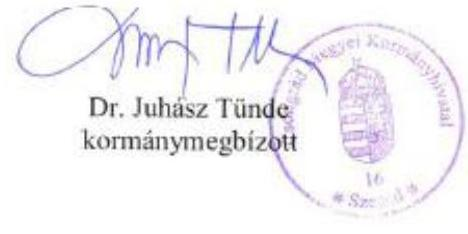

---

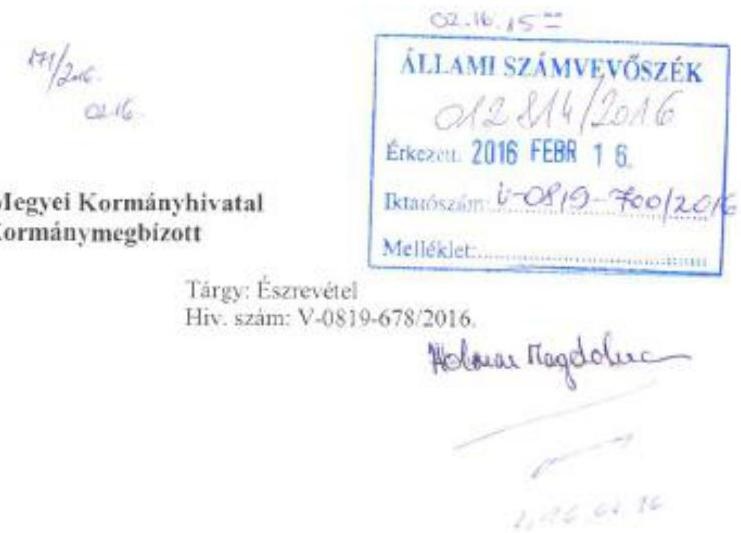

# Domokos László
## Elnök Úr

### Állami Számvevőszék

1052 Budapest
Apáczai Csere János u. 10.

Tisztelt Elnök Úr!

A Fejér Megyei Kormányhivatal Vezetőjeként "A Magyar Államkincstár közigazgatási hatósági tevékenységének, valamint központosított illetmény számfejtési rendszerének ellenőrzése" című számvevőszéki jelentéstervezetre nem kívánok észrevételt tenni.

Székesfehérvár, 2016. február 9.

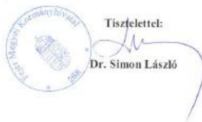

8000 Székesfehérvár, Szent István tér 9. Tel: 22/526-920 Fax: 22/514-769 e-mail: ponzugy@fejer.gov.hu

---

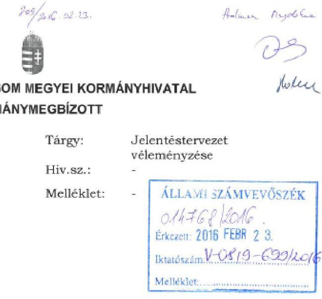

# Tisztelt Elnök Úr! 

A V-0819-683/2016 iktatószámú levelével megküldött A Magyar Államkincstár ellenőrzése – A Magyar Államkincstár közigazgatási hatósági tevékenységének, valamint központosított illetmény-számfejtési rendszerének ellenőrzése című számvevőszéki jelentéstervezetre vonatkozóan nem kívánok észrevételt tenni.

Kérem tájékoztatásom szíves tudomásulvételét.

Tatabánya, 2016. február 16.

Tisztelettel:
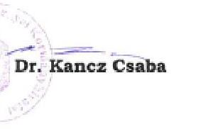

H-2800 Tatabánya, Bárdos L. u. 2.
Tel.: (+36) 34/515-100; Fax: (+36) 34/515-109; E-mail: hivatal@kemkh.hu

---

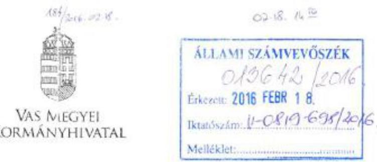

Iktatószám: VA/ÉHOTF03/88-2/2016.
Ügyintéző: dr. Magyar Rezső
Telefon: (94) 517-110

Domokos László Elnök Úr részére

Állami Számvevőszék

BUDAPEST
Apáczai Csere János utca 10.
1052

Tárgy: Állami Számvevőszék ellenőrzése
Hiv. szám: V-0819-688/2016.

Huska Bikó

Tisztelt Elnök Úr!

Hivatkozással a fenti tárgyú és számú megkeresésére tájékoztatom, hogy A Magyar Államkincstár ellenőrzése – A Magyar Államkincstár közigazgatási hatósági tevékenységének valamint központosított illetmény-számfejtési rendszerének ellenőrzése című számvevőszék jelentéstervezetét a kormányhivatal e témában érintett belső szervezeti egységeinek vezető munkatársai együtt áttanulmányozták.

A jelentéstervezetben foglaltakkal egyetértünk, a megállapításokra észrevételt nem kívánunk tenni.

A Vas Megyei Kormányhivatal – mint az e feladatkörökben a Magyar Államkincstár Vas Megyei Igazgatóságának jogutódja – a jelentéstervezetben összefoglalt megállapítások és intézkedési javaslatokat érvényesíteni fogja a jövőben a közigazgatási hatósági tevékenység ellátása során.

A számvevőszék vizsgálati anyagával kapcsolatban biztosított vélemény-nyilvánítási lehetőségeit megköszönöm.

Szombathely, 2016. február 19.

Tisztelettel:

Harisgöző Bertolák
kormánymegbízott

5700 Szombathely, Bergsényi tér 1, 3701 Szombathely, Ft. 265
Telefon: (06 94) 517 117 Fax: (06 94) 517 105

---

# RÖVIDÍTÉSEK JEGYZÉKE 

${ }^{1}$ Áht. ${ }^{2}$ ONYF ${ }^{3}$ ÁSZ ${ }^{4}$ 2013. évi L. törvény ${ }^{5}$ Alapító okirat ${ }_{1}$

${ }^{6}$ Ávr. ${ }^{7}$ Alapító okirat${ }_{2}$ ${ }^{8}$ 2013. évi LXXXVII. törvény ${ }^{9}$ SZMSZ ${ }_{1}$ ${ }^{10}$ Cst. ${ }^{11}$ Gyvt. ${ }^{12}$ 28/2009. (VI. 25.) KHEM rendelet ${ }^{13}$ SZMSZ ${ }_{2}$ ${ }^{14}$ Bkr. ${ }^{15}$ 7/2013. sz. Elnöki Utasítás ${ }^{16}$ 2014. évi Kvtv. ${ }^{17}$ Ket. ${ }^{18}$ 13/2013. sz. Hálózatirányítási Elnökhelyettesi Utasítás ${ }^{19}$ 223/1998. (XII. 30.) Korm. rendelet ${ }^{20}$ 6/2008. sz. Hálózatirányítási Igazgatói Utasítás

[^0]2011. évi CXCV. törvény az államháztartásról Országos Nyugdíjbiztosítási Főigazgatóság Állami Számvevőszék
az állami és önkormányzati szervek elektronikus információbiztonságáról a Magyar Államkincstár 2010. december 8-án kelt, 15.406/2/2010. számú egységes szerkezetű Alapító Okirata (Hatályos 2011. január 1-től 2014. december 12-ig)
368/2011. (XII. 31.) Korm. rendelet az államháztartásról szóló törvény végrehajtásáról
a Magyar Államkincstár 2014. december 8-án kelt, NGM/25557-3/2014. számú egységes szerkezetű Alapító Okirata (Hatályos 2014. december 13-tól) az országgyűlési képviselők választása kampányköltségeinek átláthatóvá tételéről 2/2011. (I. 14.) NGM utasítás a Magyar Államkincstár Szervezeti és Működési Szabályzatáról (Hatályos 2011. január 15-től 2014. szeptember 10-ig) 1998. évi LXXXIV. törvény a családok támogatásáról 1997. évi XXXI. törvény a gyermekek védelméről és a gyámügyi igazgatásról a földgázpiaci egyetemes szolgáltatáshoz kapcsolódó árszabások megállapításáról
24/2014. (IX. 10.) NGM utasítás a Magyar Államkincstár Szervezeti és Működési Szabályzatáról (Hatályos 2014. szeptember 11-től 2014. december 31-ig) 370/2011. (XII. 31.) Korm. rendelet a költségvetési szervek belső kontrollrendszeréről és belső ellenőrzéséről
a belső szabályozó eszközök készítésének és kiadásának eljárásrendjéről (Hatályos 2013. március 5-től)
2013. évi CCXXX.
 törvény a Magyarország 2014. évi központi költségvetéséről 2004. évi CXL. törvény a közigazgatási hatósági eljárás és szolgáltatás általános szabályairól
a családok támogatásáról szóló 1998. évi LXXXIV. törvény és a 223/1998. (XII. 30.) Korm. rendelet végrehajtásának eljárásrendjéről (hatályos 2013. szeptember 6-tól)
a családok támogatásáról szóló 1998. évi LXXXIV. törvény végrehajtásáról
a fogyatékos személyek jogairól és esélyegyenlőségük biztosításáról szóló 1998. évi XXVI. törvény (a továbbiakban: Fot.) és a súlyos fogyatékosság minősítésének és felülvizsgálatának, valamint a fogyatékossági támogatás folyósításának szabályairól szóló 141/2000. (VIII. 9.) Korm. rendelet (a továbbiakban: Vhr.) végrehajtásának eljárásrendjéről (hatályos: 2008. november 5-től 2014. december 30-ig)
a fogyatékos személyek jogairól és esélyegyenlőségük biztosításáról szóló 1998. évi XXVI. törvény (a továbbiakban: Fot.) és a súlyos fogyatékosság minősítésének és felülvizsgálatának, valamint a fogyatékossági támogatás folyósításának szabályairól szóló 141/2000. (VIII. 9.) Korm. rendelet (a továbbiakban: Vhr.) végrehajtásának eljárásrendjéről (hatályos 2014. december 30-tól)

[^0]:    ${ }^{21}$ 9/2014. sz. Hálózatirányítási
    Elnökhelyettesi Utasítás

---

${ }^{22}$ Fot. tv.
${ }^{23}$ 141/2000. (VIII. 9.) Korm. rendelet
${ }^{24}$ 95/2012. (V. 15.) Korm. rendelet
${ }^{25}$ 16/2013. sz. Hálózatirányítási
Elnökhelyettesi Utasítás
${ }^{26}$ 16/2002. (IV. 12.) PM rendelet
${ }^{27}$ 8/2014. (II. 17.) NGM rendelet
${ }^{28}$ 8/2014. sz. Hálózatirányításért felelős Elnökhelyettesi Utasítás
${ }^{29}$ 14/2013. sz. Hálózatirányítási
Elnökhelyettesi Utasítás
${ }^{30}$ 8/2012. sz. Hálózatirányítási
Elnökhelyettesi Utasítás
${ }^{31}$ 7/2014. sz. Hálózatirányítási
Elnökhelyettesi Utasítás
${ }^{32}$ 8/2013. sz. Hálózatirányítási
Elnökhelyettesi Utasítás
${ }^{33}$ 6/2014. sz. Hálózatirányítási
Elnökhelyettesi Utasítás
1998. évi XXVI. törvény a fogyatékos személyek jogairól és esélyegyenlőségük biztosításáról
a súlyos fogyatékosság minősítésének és felülvizsgálatának, valamint a fogyatékossági támogatás folyósításának szabályairól
a Nemzeti Rehabilitációs és Szociális Hivatalról, valamint a szakmai irányítása alá tartozó rehabilitációs szakigazgatási szervek feladat- és hatásköréről (Hatálytalan: 2015. április 1-jéig)
a helyi önkormányzatok, a helyi nemzetiségi önkormányzatok központi alrendszerből származó 2013. évi forrás igénylése és felhasználásának felülvizsgálatához készített eljárásrend (hatályos 2014. február 18-tól) a helyi önkormányzatok és a helyi kisebbségi önkormányzatok központi költségvetési kapcsolatokból származó forrásai igénybevétele és elszámolása szabályszerűségének felülvizsgálatáról
a helyi önkormányzatok támogatásai fejezetből származó források igénybevétele, felhasználása és elszámolása szabályszerűségének kincstári felülvizsgálatáról
a helyi önkormányzatok, a helyi nemzetiségi önkormányzatok és a többcélú kistérségi társulások 2013. évi központi költségvetési kapcsolatokból származó forrásai elszámolása szabályszerűségének felülvizsgálatához, továbbá az államháztartásról szóló 2011. évi CXCV. törvény 60. § (2)-(4) bekezdései szerinti helyszíni ellenőrzéséhez készített eljárásrendről (hatályos 2014. október 31-től)
a belföldi gépjárművek után beszedett adónak (továbbiakban: gépjárműadó) a települési önkormányzat és a központi költségvetés közötti megosztás szabályszerűségének kincstári ellenőrzéséről (hatályos 2013. október 2-tól)
a szociális, gyermekjóléti és gyermekvédelmi humán-szolgáltatást nyújtó egyházi és nem állami szolgáltatók fenntartóit megillető normatív állami hozzájárulások és támogatások igénylésének, folyósításának elszámolásának és munkafolyamatba épített ellenőrzésének 2012. évtől alkalmazandó szabályairól szóló eljárásrendjéről (Hatályos 2012. június 26-tól)
a szociális, gyermekjóléti és gyermekvédelmi humánszolgáltatást nyújtó egyházi és nem állami szolgáltatók fenntartóit megillető normatív állami hozzájárulások és támogatások igénylésének, folyósításának elszámolásának és munkafolyamatba épített ellenőrzésének 2014. évtől alkalmazandó szabályairól szóló eljárásrendjéről (Hatályos 2014. augusztus 12-től)
a köznevelési feladatot ellátó nem állami, nem helyi önkormányzati intézmények fenntartóit megillető költségvetési támogatásának igénylésének, folyósításának, elszámolásának és munkafolyamatba épített ellenőrzésének 2013. január 1-jétől alkalmazandó szabályairól (Hatályos 2013. május 21-től 2014. június 24-ig)
az egyházi, nemzetiségi önkormányzati és magán köznevelési intézményfenntartókat megillető költségvetési támogatások igénylésének, folyósításának, elszámolásának és munkafolyamatba épített ellenőrzésének 2014. január 1-jétől alkalmazandó szabályairól (Hatályos 2014. június 24-től)

---

${ }^{34}$ 5/2013. sz. Hálózatirányítási
Elnökhelyettesi Utasítás
${ }^{35}$ 4/2014. sz. Hálózatirányítási
Elnökhelyettesi Utasítás
${ }^{36}$ 2/2014. sz. Általános
Elnökhelyettesi Utasítás
${ }^{37}$ 9/2013. sz. Hálózatirányítási
Elnökhelyettesi Utasítás
${ }^{38}$ Vhr.
${ }^{39}$ 489/2013. (XII. 18.) Korm. rendelet
${ }^{40}$ 5/2014. sz. Elnöki Utasítás
${ }^{41}$ 31/2014. sz. Elnöki Utasítás
${ }^{42}$ 71/2014. sz. Elnöki Utasítás
${ }^{43}$ 69/2013. (XII. 29.) NGM rendelet
${ }^{44}$ 56/2013. sz. Elnöki Utasítás
${ }^{45}$ 68/2014. sz. Elnöki Utasítás
${ }^{46}$ 12/2001. (I. 31.) Korm. rendelet
${ }^{47}$ 134/2009. (VI. 23.) Korm. rendelet
${ }^{48}$ 256/2011. (XII. 6.) Korm. rendelet
${ }^{49}$ 341/2011. (XII. 29.) Korm. rendelet
${ }^{50}$ 57/2012. (III. 30.) Korm. rendelet
${ }^{51}$ NVI
eljárásrend a köznevelési, valamint a személyes gondoskodást nyújtó szociális, gyermekjóléti, gyermekvédelmi közfeladatot ellátó intézmények és szolgáltatók nem állami fenntartóit megillető támogatások igénylésének és elszámolásának 2013. január 1-jétől hatályos helyszíni ellenőrzéséhez (Hatályos 2013. április 30-tól 2014. június 23-ig)
a köznevelési, valamint a személyes gondoskodást nyújtó szociális, gyermekjóléti, gyermekvédelmi közfeladatot ellátó intézmények és szolgáltatók és hálózatok nem állami fenntartóit megillető támogatások igénylésének és elszámolásának 2014. január 1-jétől hatályos helyszíni ellenőrzéséhez (Hatályos 2014. június 23-tól)
a nagy összegű bejelentések kezelésének Kincstár Központban alkalmazott belső eljárásrendjéről (Hatályos 2014. június 25-től)

Útmutató a nem állami köznevelési intézményfenntartókat megillető 2013. évi költségvetési támogatás igénylése és elszámolása helyszíni ellenőrzéséhez (Hatályos 2013. május 21-től)
229/2012. (VIII. 28.) Korm. rendelet a nemzeti köznevelésről szóló törvény végrehajtásáról
az egyházi és nem állami fenntartású szociális, gyermekjóléti és gyermekvédelmi szolgáltatók, intézmények és hálózatok állami támogatásáról (Hatályos 2014. január 1-jétől)
az országgyűlési képviselők választása kampányköltségeinek támogatásához kapcsolódó feladatok eljárásrendjéről (hatályos 2014. február 14-től 2014. december 15-ig) Módosította a 31/2014. sz. Elnöki Utasítás 2014. július 15-i hatálybalépéssel
az országgyűlési képviselők választása kampányköltségeinek támogatásához kapcsolódó feladatok eljárásrendjéről szóló 5/2014. (02. 14.) számú Elnöki Utasítás 1. számú módosítása (Hatályos 2014. július 15-től 2014. december 15-ig)
az országgyűlési képviselők választása kampányköltségeinek támogatásához kapcsolódó feladatok eljárásrendjéről (hatályos 2014. december 15-től) az országgyűlési képviselők választása kampányköltségeinek támogatásáról az állami lakástámogatással kapcsolatos feladatok végrehajtásának eljárásrendjéről (hatályos 2013. december 23-tól 2014. december 10-ig) az állami lakástámogatással kapcsolatos feladatok végrehajtásának eljárásrendjéről (hatályos 2014. december 10-től)
a lakáscélú állami támogatásokról
a fiatalok, valamint a többgyermekes családok lakáscélú kölcsöneinek állami támogatásáról
a lakásépítési támogatásról
az otthonteremtési kamattámogatásról
a devizakölcsönök törlesztési árfolyamának rögzítését érintő megtérítésről és a közszférában dolgozók támogatásáról
Nemzeti Választási Iroda

---

${ }^{52}$ 3/2012. sz. Hálózatirányítási
Elnökhelyettesi Utasítás
${ }^{53}$ 14/2005. sz. Elnöki Utasítás
${ }^{54}$ Art.
${ }^{55}$ 11/2013. sz. Hálózatirányítási
Elnökhelyettesi Utasítás
${ }^{56}$ 37/2013. sz. Elnöki Utasítás
${ }^{57}$ 2013. évi CLXV. törvény
${ }^{58}$ 50/2013. (II. 25.) Korm. rendelet
${ }^{59}$ 2007. évi CLII. törvény
${ }^{60}$ 23/2011. sz. Elnöki Utasítás
${ }^{61}$ 1/2014. sz. Hálózatirányítási
Elnökhelyettesi Körlevél
${ }^{62}$ 14/2010. sz. Elnöki Utasítás melléklete
${ }^{63}$ Munka tv.
${ }^{64}$ 37/2001. (X. 25.) PM rendelet
${ }^{65}$ Tbj.
${ }^{66}$ Tny.
${ }^{67}$ 422/2012. (XII. 29.) Korm. rendelet
${ }^{68}$ 2013. évi L. törvény
${ }^{69}$ IBDR
a helyi önkormányzatokhoz, a helyi kisebbségi önkormányzatokhoz és a többcélú kistérségi társulásokhoz kapcsolódóan az államháztartásról szóló 2011. évi CXCV. törvény alapján lefolytatandó elsőfokú és jogorvoslati eljárások, továbbá az egyházi és nem állami szociális, valamint gyermekjóléti és gyermekvédelmi fenntartók által igényelt és igénybevett állami támogatásokhoz kapcsolódó elsőfokú és jogorvoslati eljárások általános eljárásrendje (Hatályos 2012. március 26-tól)
a családtámogatási ellátásokkal, az apákat megillető munkaidő kedvezménnyel összefüggő, a Magyar Államkincstár feladatkörébe tartozó ellátások ellenőrzési rendjének kiadásáról
2003. évi XCII. törvény az adózás rendjéről
a helyi önkormányzatok, a helyi nemzetiségi önkormányzatok és a többcélú kistérségi társulások 2012. évi központi költségvetési kapcsolatokból származó forrásai elszámolása szabályszerűségének felülvizsgálatához, továbbá az államháztartásról szóló 2011. évi CXCV. törvény 60. § (2)-(4) bekezdései szerinti helyszíni ellenőrzéséhez készített eljárásrendjéről (hatályos 2013. augusztus 26-tól)
az önkormányzatok és a többcélú kistérségi társulások állami támogatásra vonatkozó visszafizetési kötelezettségével kapcsolatos részletfizetés engedélyezésének eljárásrendjéről (Hatályos 2013. október 24-től)
a panaszokról és közérdekű bejelentésekről
az államigazgatási szervek integritásirányítási rendszeréről és az érdekérvényesítők fogadásának rendjéről
egyes vagyonnyilatkozat tételi kötelezettségekről
a képviselet, a kiadmányozás (aláírás), valamint a bélyegzők használatának és nyilvántartásának eljárásrendjéről (hatályos 2011. augusztus 16-tól, módosította: 40/2014. számú Elnöki Utasítás)
a helyi önkormányzat kötelező időközi költségvetési és időközi mérlegjelentés adatszolgáltatási kötelezettségének elmulasztása vagy késedelmes teljesítése miatti bírság, Kincstár általi kiszabásához kapcsolódó ajánlás (hatályos 2014. március 28-tól)
a Regionális Igazgatóságok Illetmény-számfejtési Irodáinak központosított illetmény-számfejtéssel összefüggő feladatai ellátásának eljárásrendjéről (Hatályos 2010. április 15-től)
1992. évi XXII. törvény a Munka Törvénykönyvéről (hatálytalan: 2013. január 1-jétől)
a központosított illetmény-számfejtési feladatokról, valamint a bér- és munkaügyi adatszolgáltatás rendjéről (Hatálytalan: 2013. január 1-jétől) 1997. évi LXXX. törvény a társadalombiztosítás ellátásaira és a magánnyugdíjra jogosultakról, valamint e szolgáltatások fedezetéről
1997. évi LXXXI. törvény a társadalombiztosítási nyugellátásról
a központosított illetményszámfejtés szabályairól (Hatálytalan: 2015. január 1-jétől)
az állami és önkormányzati szervek elektronikus információbiztonságáról
Informatikai Biztonsági Dokumentációs Rendszer

---

${ }^{70}$ 77/2013. (XII. 19.) NFM rendelet
${ }^{71}$ IBSZ
${ }^{72}$ 83/2012. (IV. 21.) Korm. rendelet
${ }^{73}$ SZMSZ${ }_{3}$
${ }^{74}$ SZMSZ${ }_{4}$
${ }^{75}$ 28/2014. sz. Elnöki Utasítás
${ }^{76}$ 33/2012. sz. Elnöki Utasítás
${ }^{77}$ 21/2013. sz. Elnöki Utasítás
${ }^{78}$ 3/2014. sz. Elnöki Utasítás
${ }^{79}$ 18/2014. sz. Elnöki Utasítás
${ }^{80}$ 13/2015. sz. Elnöki Utasítás
${ }^{81}$ TSH
${ }^{82}$ 1/2012. sz. Általános
Elnökhelyettesi Utasítás
${ }^{83}$ 01/2015. sz. Államháztartási ügyekért felelős Elnökhelyettesi utasítás
${ }^{84}$ ÁSZ tv.
az állami és önkormányzati szervek elektronikus információbiztonságáról szóló 2013. évi L. törvényben meghatározott technológiai biztonsági, valamint biztonságos információs eszközökre, termékekre vonatkozó, valamint a biztonsági osztályba és biztonsági szintbe sorolási követelményeiről (Hatálytalan: 2015. július 17-től)
Informatikai Biztonsági Szabályzat
a szabályozott elektronikus ügyintézési szolgáltatásokról és az állam által kötelezően nyújtandó szolgáltatásokról
27/2014. (XII. 12.) NGM utasítás a Magyar Államkincstár Szervezeti és Működési Szabályzatáról (hatályos 2015. január 1-jétől 2015. március 26-ig)
8/2015. (III. 26.) NGM utasítás a Magyar Államkincstár Szervezeti és Működési Szabályzatáról (hatályos 2015. március 27-től)
a központi költségvetés előirányzat-nyilvántartásának, finanszírozásának, nettó finanszírozásának, valamint a kincstári és elemi beszámoló egyeztetésének eljárásrendjéről (Hatályos 2014. június 26-tól)
a forintszámla-vezetés eljárásrendjéről (Hatályos 2012. december 4-től)
a forintszámla-vezetés eljárásrendjéről (Hatályos 2013. július 5-től)
a forintszámla-vezetés eljárásrendjéről (Hatályos 2014. január 29-től)
a forintszámla-vezetés eljárásrendjéről (Hatályos 2014. június 4-től)
a forintszámla-vezetés eljárásrendjéről (Hatályos 2015. május 4-től)
előirányzat-nyilvántartási rendszer
a nagy összegű bejelentések kezelésének Kincstár Központban alkalmazott belső eljárásrendjéről (Hatályos 2012. augusztus 27-től)
a nagy összegű bejelentések kezelésének Kincstár Központban alkalmazott belső eljárásrendjéről (Hatályos 2015. március 4-től)
2011. évi LXVI. törvény az Állami Számvevőszékről, hatályos 2011. július 1-jétől

---

# ÁLLAMI SZÁMVEVŐSZÉK 

1052 Budapest, Apáczai Csere János utca 10.
Levélcím: 1364 Budapest 4. Pf. 54
Telefon: +36 14849100 Telefax: +36 14849200
www.asz.hu
