# Jelentés 

## Utóellenőrzések

A vasúti közlekedés állami támogatási rendszerének ellenőrzéséről készült jelentés javaslatai hasznosulásának utóellenőrzése
2016. április 14. nap
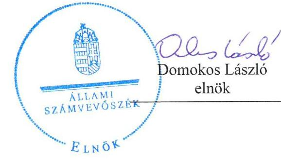
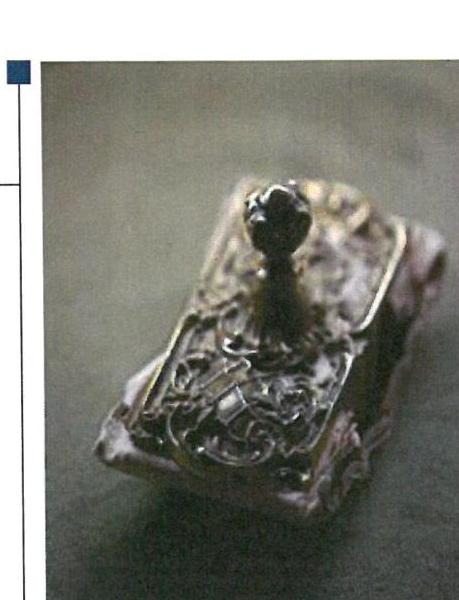

---

# AZ ELLENŐRZÉST FELÜGYELTE:

BÖRÖCZ IMRE felügyeleti vezető

## AZ ELLENŐRZÉST VEZETTE ÉS A VÉGREHAJTÁSÁÉRT FELELŐS:

VALASTYÁNNÉ DR. VÍZHÁNYÓ JÚLIA ellenőrzésvezető

## A PROGRAM ÖSSZEÁLLÍTÁSÁÉRT FELELŐS:

JANIK JÓZSEF osztályvezető

## A TÉMÁHOZ KAPCSOLÓDÓ KORÁBBI SZÁMVEVŐSZÉKI JELENTÉSEK:

- címe: Jelentés a vasúti közlekedés állami támogatási rendszerének ellenőrzéséről
- sorszáma: 1292

Jelentéseink az Országgyűlés számítógépes hálózatán és az Interneten a www.asz.hu címen is olvashatóak.

|  IKTATÓSZÁM: V-0880-098/2016. | |
| --- | --- |
|  TÉMASZÁM: 1914 | |
|  ELLENŐRZÉS-AZONOSÍTÓ SZÁM: V071702 | |

---

# TARTALOMJEGYZÉK 

■ ÖSSZEGZÉS ..... 5
■ AZ ELLENŐRZÉS CÉLJA ..... 6
■ AZ ELLENŐRZÉS TERÜLETE ..... 7
■ AZ ELLENŐRZÉS HÁTTERE, INDOKOLTSÁGA ..... 8
■ FÓKUSZKÉRDÉS ..... 9
■ ELLENŐRZÉS HATÓKÖRE ÉS MÓDSZEREI ..... 10
■ MEGÁLLAPÍTÁSOK ..... 13
■ MELLÉKLET ..... 19
I. sz. melléklet: Az ÁSZ 1292. számú jelentéséhez kapcsolódó intézkedési tervek végrehajtása ..... 19
■ FÜGGELÉK: ÉSZREVÉTELEK ..... 27
■ RÖVIDÍTÉSEK JEGYZÉKE ..... 37

---

.

---

# ÖSSZEGZÉS 

Az Állami Számvevőszék a vasúti közlekedés állami támogatási rendszerének utóellenőrzését a 2012. augusztus 14. és 2015. október 8. közötti időszakra végezte el. Az utóellenőrzés az ellenőrzött szervezetek által megküldött intézkedési tervekben foglaltak végrehajtására irányult. Az intézkedési tervekben foglaltakat a Nemzeti Fejlesztési Minisztérium teljes körűen, míg a MÁV Zrt. és a MÁV-START Zrt. egy-egy feladat kivételével teljes körűen hajtotta végre.

## Az ellenőrzés társadalmi indokoltsága

Az Állami Számvevőszék stratégiájában célul tűzte ki a számvevőszéki munka hasznosulásának javítását. Ezzel összhangban ellenőrzi, hogy az ellenőrzött szervezetek megvalósították-e a korábbi ellenőrzései által feltárt hibák, hiányosságok és szabálytalanságok megszüntetése céljából kialakított intézkedési terveikben foglaltakat. A rendszeres utóellenőrzések hozzájárulnak a szükséges intézkedések tényleges végrehajtásához, ezáltal a közpénzügyek rendezettségének javulásához.

## Főbb megállapítások, következtetések

Az ÁSZ jelentésben foglalt javaslatokra az elkészített intézkedési terveket a Nemzeti Fejlesztési Minisztérium, a MÁV Zrt. és a MÁV-START Zrt. határidőben küldték meg az ÁSZ részére. Az intézkedési tervekben foglaltakat a Nemzeti Fejlesztési Minisztérium teljes körűen, míg a MÁV Zrt. és a MÁV-START Zrt. egy-egy feladat kivételével teljes körűen hajtotta végre.

---

# AZ ELLENŐRZÉS CÉLJA 

## A vasúti közlekedés állami támogatási rendszerének ellenőrzéséről készült jelentés javaslatai hasznosulásának utóellenőrzése

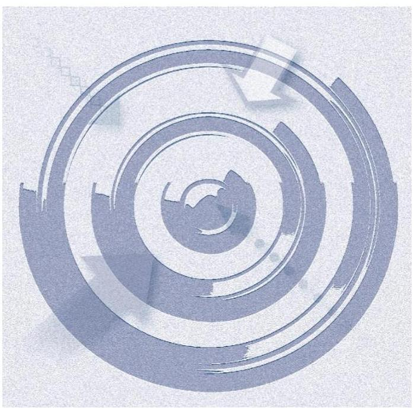

Az ellenőrzés célja annak értékelése, hogy a számvevőszéki jelentésben foglalt intézkedést igénylő megállapításokkal és javaslatokkal összhangban készített intézkedési tervben meghatározott feladatokat az ellenőrzött szervezet végrehajtotta-e.

---

# **AZ ELLENŐRZÉS TERÜLETE**

## **Nemzeti Fejlesztési Minisztérium, MÁV Zrt., MÁV-START Zrt.**

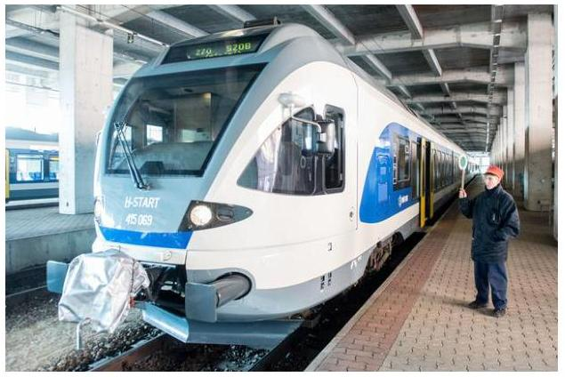

A vasúti közlekedés állami támogatási rendszerének ellenőrzését az ÁSZ¹ a 2008-2011. közötti időszakra végezte el. Az utóellenőrzés – a 2015. október 8-ig végrehajtott intézkedéseket figyelembe véve – a vasúti közlekedés állami támogatási rendszerének ellenőrzéséről készült ÁSZ jelentésben² megfogalmazott javaslatokra megküldött intézkedési tervekben foglalt feladatok hasznosulására irányult. Az ÁSZ jelentés a nemzeti fejlesztési miniszternek hat, a MÁV Zrt.³ elnök-vezérigazgatójának és a MÁV-START Zrt.⁴ vezérigazgatójának egy közös javaslatot tartalmazott.

---

# AZ ELLENŐRZÉS HÁTTERE, INDOKOLTSÁGA 

Az ÁSZ tv.⁵ 33. § (1) bekezdése értelmében a számvevőszéki jelentések intézkedést igénylő megállapításaihoz és javaslataihoz kapcsolódóan az ellenőrzött szervezet vezetője intézkedési tervet köteles összeállítani, és az Állami Számvevőszék részére megküldeni. Az intézkedési tervben foglaltak megvalósítását - az ÁSZ tv. 33. § (7) bekezdésében foglaltak alapján - az Állami Számvevőszék utóellenőrzés keretében ellenőrizheti. Az intézkedések megvalósulásának értékelése során az Állami Számvevőszék figyelembe veszi az ellenőrzött szervezetek működési feltételeiben, valamint a jogszabályi előírásokban bekövetkezett változásokat.

Az intézkedési tervekben foglalt feladatok hiányos, illetve késedelmes végrehajtása, valamint megvalósításának elmaradása azt mutatja, hogy az ellenőrzések során feltárt hibák, hiányosságok és szabálytalanságok megszüntetése nem kapott kellő hangsúlyt. Ez a szabályszerű működés és a felelős vezetői magatartás vonatkozásában kockázatot hordoz. E kockázatok feltárásával az Állami Számvevőszék utóellenőrzési rendszere fokozza a fegyelmet, és igazolja, hogy a közpénzzel való szabályos gazdálkodás felelőssége elől nem lehet kitérni.

## AZ ELLENŐRZÉS VÁRHATÓ HASZNOSULÁSA:

Az utóellenőrzés négy szinten hasznosulhat:

- A társadalom szintjén az utóellenőrzés jelzi, hogy a számvevőszéki ellenőrzés megállapításainak van következménye: a hiányosságok megszüntetésére az ellenőrzött szervezet által meghatározott intézkedések végrehajtását is számon kéri az ÁSZ.
- Az ellenőrzött terület szintjén az utóellenőrzés tájékoztatást nyújt a terület döntéshozóinak a hiányosságok kiküszöbölésének jó gyakorlatairól, ezzel lehetőséget biztosítva arra, hogy az ÁSZ ellenőrzési megállapításai, javaslatai a terület nem ellenőrzött szervezeteinek a működése során is hasznosuljanak.
- Az ellenőrzött szervezet szintjén az utóellenőrzés feltárja, hogy a szervezet az intézkedések végrehajtásával hasznosította-e a korábbi ellenőrzési jelentésben a hiányosságok megszüntetése, illetve a kockázatok kezelése érdekében megfogalmazott javaslatokat.
- Az ÁSZ szintjén az utóellenőrzés visszacsatolást ad az ellenőrzési jelentések hasznosulásáról, az intézkedések elmaradása vagy részleges megvalósulása a további ellenőrzésekhez kockázati jelzésként szolgál.

---

# FÓKUSZKÉRDÉS 

1. Az ellenőrzött szervezetek az intézkedési tervben foglaltakat az előírt határidőben végrehajtották-e?

---

# ELLENŐRZÉS HATÓKÖRE ÉS MÓDSZEREI 

## Az ellenőrzés típusa

Szabályszerűségi ellenőrzés

## Az ellenőrzött időszak

A számvevőszéki jelentés közzétételének napjától (2012. augusztus 18.) az utóellenőrzés megkezdésének napjáig (2015. október 8.) tartó időszak volt.

## Az ellenőrzés tárgya

Az ÁSZ tv. 2011. július 1-ei hatálybalépését követően az ÁSZ jelentésekben megfogalmazott javaslatokra az ellenőrzött által megküldött intézkedési tervekben foglaltak.

Az ellenőrzés kiterjedt minden olyan körülményre és adatra, amely az ÁSZ jogszabályban meghatározott feladatainak teljesítéséhez, valamint az ellenőrzési program végrehajtása folyamán felmerült újabb összefüggések feltárásához szükséges.

## Az ellenőrzött szervezet

Nemzeti Fejlesztési Minisztérium, MÁV Zrt., MÁV-START Zrt.

## Az ellenőrzés jogalapja

Az Alaptörvény⁶ 43. cikk (1) bekezdése alapján az ÁSZ az Országgyűlés⁷ pénzügyi és gazdasági ellenőrző szerve. Az ÁSZ tv.-ben meghatározott feladatkörében ellenőrzi a központi költségvetés végrehajtását, az államháztartás gazdálkodását, az államháztartásból származó források felhasználását és a nemzeti vagyon kezelését. Az ÁSZ tv. 1. § (3) bekezdése szerint az ÁSZ általános hatáskörrel végzi a közpénzekkel és az állami és önkormányzati vagyonnal való felelős gazdálkodás ellenőrzését. A 33. § (7) bekezdése alapján az ÁSZ tv. 33. § (1)-(2) bekezdései szerinti intézkedési tervben foglaltak megvalósítását az ÁSZ utóellenőrzés keretében ellenőrizheti. Az Áht.⁸ 61. § (2) bekezdése szerint az államháztartás külső ellenőrzésével kapcsolatos feladatokat az ÁSZ látja el.

---

# Az ellenőrzés módszerei 

Az ellenőrzést a nemzetközi standardokat irányadónak tekintve az ellenőrzési program ellenőrzési kérdései, az ellenőrzött időszakban hatályos jogszabályok, az ellenőrzés szakmai szabályok és módszertanok figyelembe vételével végeztük. Az utóellenőrzéseket ellenőrzéshez kapcsolódóan végeztük.

Az ellenőrzés ideje alatt az ellenőrzött szervezettel történő kapcsolattartást az ÁSZ SZMSZ⁹ vonatkozó előírásai alapján biztosítottuk.

Az utóellenőrzés megállapításait elsősorban az ÁSZ rendelkezésére álló, valamint az ellenőrzött szervezetektől elektronikusan bekért dokumentumok alapozzák meg, amely szükség esetén helyszíni ellenőrzéssel egészülhet ki. Az ÁSZ az ellenőrzés keretében egyes esetekben teljesítményellenőrzés tervezéséhez is kérhet adatokat.

Az ellenőrzés során adatszolgáltatásra kérjük fel az ÁSZ elnöke által - az utóellenőrzés tárgyához kapcsolódóan - korábban figyelmet felhívó levéllel megkeresett, nem ellenőrzött szervezetek vezetőit az utóellenőrzött ÁSZ jelentésben foglaltak hasznosulásának teljesebb felmérése érdekében.

Az ellenőrzési bizonyítékként felhasználható adatforrások közé tartoztak egyrészt a szakmai programban felsorolt adatforrások, másrészt minden - az ellenőrzés folyamán feltárt, az ellenőrzés szempontjából releváns információt tartalmazó - dokumentum.

Az ellenőrzés során értékeltük, hogy az ÁSZ jelentésben foglalt javaslatokra az elkészített intézkedési terveket határidőben megküldték-e, az intézkedési tervben foglaltakat végrehajtották-e.

A jóváhagyott intézkedési tervben előírt feladatok végrehajtásának ellenőrzését értékelési kritériumok alapján végeztük. Figyelembe vettük az intézkedési terv jóváhagyását követően hatályba lépett jogszabályi előírások változásából következő események, továbbá a feladat-ellátási és finanszírozási rendszer esetleges változásának hatásait. Az intézkedési tervekben előírt feladatokat azok végrehajthatósága, illetve végrehajtása szempontjából az alábbiak szerint értékeltük:
$\longrightarrow$ okafogyottá vált az előírt feladat, ha végrehajtására - meghatározott esemény bekövetkezése, továbbá külső körülmény, a működést érintő feltétel változása miatt - már nincs szükség, illetve lehetőség, és egyértelműen megállapítható, hogy az intézkedést szükségessé tevő körülmény a jövőben nem fordulhat elő;
$\longrightarrow$ nem időszerű az a feladat, amelynek ellenőrzési időszakon belüli végrehajtására azért nem került (kerülhetett) sor, mert az intézkedés alapjául szolgáló esemény nem következett be, de annak jövőbeni előfordulása lehetséges, a végrehajtása nem volt esedékes, vagy a végrehajtás határideje még nem járt le;
$\longrightarrow$ határidőben végrehajtott a feladat, ha a teljesítés dokumentáltan az intézkedési tervben előírt határidőben és tartalommal megtörtént;
$\longrightarrow$ határidőn túl végrehajtott a feladat, ha annak teljesítése az intézkedési tervben meghatározott módon, de az előírt határidőn túl történt meg;
$\longrightarrow$ részben végrehajtott az a feladat, amelynek végrehajtása teljes körűen az intézkedési tervben előírt módon nem történt meg;

---

- nem végrehajtott a feladat, ha a végrehajtás nem történt meg, vagy amennyiben a teljesítést nem dokumentálták.
Az ellenőrzés lefolytatásához az ellenőrzött szervezet a tanúsítványok elektronikus kitöltésével, valamint az ÁSZ által kért dokumentumok elektronikus megküldésével szolgáltatott adatokat, amelyek valódiságát és teljes körűségét az ellenőrzött szervezet vezetője által tett teljességi és hitelességi nyilatkozat igazolja. Az így rendelkezésre bocsátott adatok, információk kontrollja az ellenőrzés keretében megtörtént.

---

# MEGÁLLAPÍTÁSOK 

## 1. Az ellenőrzött szervezetek az intézkedési tervben foglaltakat az előírt határidőben végrehajtották-e?

Összegző megállapítás

Az intézkedési tervben foglalt kilenc feladatból az NFM¹⁰ három feladatot határidőn túl, de teljes körűen hajtott végre. A MÁV Zrt. az intézkedési tervben foglalt nyolc feladatot egy kivételével végrehajtotta, de hat esetben határidőn túl. A MÁVSTART Zrt. az intézkedési tervben foglalt öt feladatot egy esetben nem és kettő esetben határidőn túl hajtotta végre.

AZ NFM az intézkedési tervet határidőben megküldte az ÁSZ részére. Az 1. számú ábra szemlélteti az intézkedési terv végrehajtásának megoszlását kategóriánként.

1. számú ábra
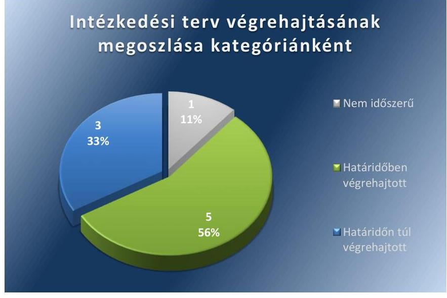

Forrás: ÁSZ
Az NFM által készített intézkedési tervben kilenc feladatot írtak elő. Ezekből egy nem időszerű, öt határidőben, továbbá három határidőn túl végrehajtott feladat volt.

## NEM IDŐSZERŰ FELADAT:

1. A tarifarendszer felülvizsgálatával összefüggő kedvezményrendszer szakmai felülvizsgálata megtörtént, azonban az ezzel kapcsolatos végleges döntések kormányzati hatáskörbe tartoztak.

---

# HATÁRIDŐBEN VÉGREHAJTOTT FELADATOK: 

2. A vasúti pályahálózat működtetésére kötött szerződés vonatkozásában az NFM áttekintette a működtetés költségeinek csökkentésére ösztönző elemek rendszerét.
3. A Megrendelői Teljesítésigazolás kiadási és ellenőrzési eljárásrendjét kidolgozták.
4. Az NFM a Megrendelői Teljesítésigazolások kiadásával kapcsolatos eljárásrendet a MÁV Zrt.-vel és a GYSEV Zrt.¹¹-vel kötött, a 2014-2023. közötti időszakban hatályos közszolgáltatási szerződésekben rögzítette.
5. A nemzeti fejlesztési miniszter határozatában felkérte az MNV Zrt.¹² Igazgatóságát, hogy vizsgálja meg a MÁV Csoport¹³ szervezeti átalakítása mellett is jelentkező veszteséges gazdálkodás okait és ennek alapján készítsen intézkedési tervet.
6. A nemzeti fejlesztési miniszter határozattal kérte fel az MNV Zrt.-t és az MFB Zrt.¹⁴ arra, hogy készítsen közös intézkedési tervet a NIF Zrt.¹⁵ által lebonyolított vasúti beruházások által létrejött, a MÁV Zrt. kezelésében lévő eszközök szerződéses átadásának lebonyolítására.

## HATÁRIDŐN TÚL VÉGREHAJTOTT

 FELADATOK:

7. A vasúti személyszállítási közszolgáltatás és pályahálózat működtetés felülvizsgálatát végző szakértői munkacsoport összehívására a vállalt 2012. október 3. határidő helyett 2013. február 20-án került sor. A végleges szakmai javaslatot a munkacsoport 2013. augusztus 14-ére készítette el az előírt 2013. július 1. helyett.
8. A vasúti személyszállítási közszolgáltatási költségtartalmak, továbbá a hatékonysági követelmények és mutatók a vállalt 2012. december 31. határidő helyett a 2014-től hatályos közszolgáltatási szerződésekben kerültek érvényesítésre, amelyeket a miniszter 2013. november 15-én fogadott el.
9. Az NFM a vállalt 2012. december 31. határidőt követően csak a 2013. évben tekintette át a vasúti közszolgáltatások finanszírozása mértékének és ütemezésének bizonytalanságából adódó késedelmi kamat fizetésének okait, ezzel kapcsolatos további intézkedés nem vált szükségessé.

Az NFM az intézkedési terv végrehajtásával kapcsolatos beszámolási kötelezettséget az SZMSZ-ben ${ }^{16}$, valamint az Ellenőrzési Főosztály ügyrendjében ${ }^{17}$ írta elő. A beszámolási kötelezettségnek a szakfőosztályok által közölt információk feldolgozását követően az Ellenőrzési Főosztály vezetője a nemzeti fejlesztési miniszter felé 2013. április 8-án, illetve a 2014-re áthúzódó feladatok tekintetében 2014. január 15-én eleget tett.

Az NFM Ellenőrzési Főosztálya az intézkedési tervben rögzített feladatok végrehajtásáról a Bkr. ${ }^{18}$ 14. §-ban előírt nyilvántartást vezette.

---

A MÁV ZRT. az intézkedési tervet határidőben megküldte az ÁSZ részére. A 2. számú ábra szemlélteti az intézkedési terv végrehajtásának megoszlását kategóriánként.
2. számú ábra
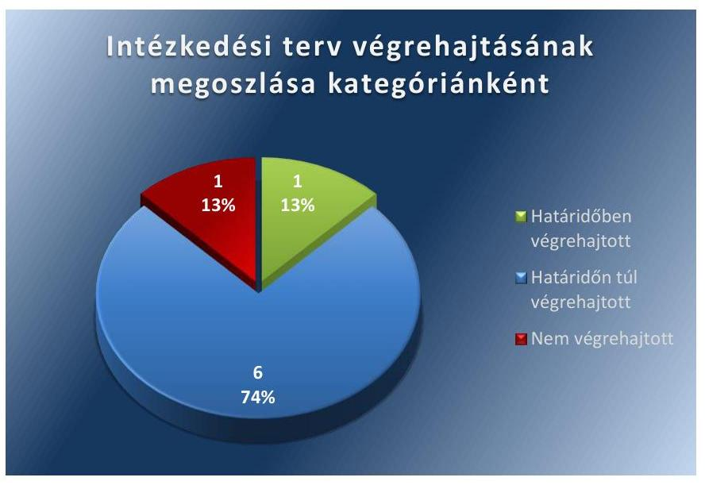

Forrás: ÁSZ
Az ÁSZ jelentésben megfogalmazott egy javaslatra a MÁV Zrt. által készített közös - MÁV-START Zrt.-re is vonatkozó - intézkedési tervben a MÁV Zrt.-nek nyolc feladatot írtak elő. Ezekből egy határidőben, hat határidőn túl, továbbá egy nem végrehajtott feladat volt.

# HATÁRIDŐBEN VÉGREHAJTOTT FELADAT: 

$\qquad$ 1. A 2012. évi negyedéves vasúti közlekedési tevékenység felügyeleti jelentéseiben rögzítésre kerültek a költségtérítés felhasználási jogcímei a pályaműködtetési szerződésben szereplő költségstruktúrához igazodóan.

## HATÁRIDŐN TÚL VÉGREHAJTOTT FELADATOK:

2. A kiemelt szolgáltatói pozíciójú, a költségtérítési igény szempontjából meghatározó tagvállalatok és az általuk a MÁV Zrt. részére nyújtott szolgáltatások azonosítását a vállalt 2012. október 31-ei határidőt követően, 2012 novemberében végezték el.
3. A MÁV FKG Kft. ${ }^{19}$ esetében a piaci szegmensekre vonatkozó fedezetszámítások negyedéves rendszerességgel a vállalt 2012. december 31-ei határidőt követően a 2013. évben kerültek átadásra a beszámolók és üzleti jelentések részeként a MÁV Zrt. részére.
4. Az átadott fedezet kimutatások felülvizsgálati kötelezettségét előírták, a felülvizsgálatot a vállalt 2012. december 31-ei határidőt követően, 2013. november 25-én, majd a felülvizsgálat alapján a szerződéses díjak fedezettartalmának újratárgyalását 2013. december 20-án végezték el.
5. A vállalt 2013. június 30-ai határidőt követően, 2013. október 29-én az MNV Zrt.-vel kötött megbízási szerződéssel

---

kezdeményezték a vagyonkezelésben álló egyes selejtezett vagyonelemek elidegenítését. A selejtezési folyamat átmeneti szabályozása 2015. január 1-én lépett hatályba.
6. A közszolgálati kötelezettségből kivont forgalomszüneteltetett vasúti vonalak ráfordításait 2012. május 31-én mutatták be. A ráfordítások függvényében a vasútvonalak státusz változását a vállalt 2013. március 31-ei határidőt követően, 2013. április 16-án kezdeményezték.
7. A közút-vasút szintbeli kereszteződések jelentős csökkentésére vonatkozó javaslatot a vállalt 2013. június 30-ai határidőt követően, 2013. december 3-án készítették el.

# NEM VÉGREHAJTOTT FELADAT: 

8. A MÁV Zrt. üzleti tervei, negyedéves és éves beszámolói, üzleti jelentései nem tartalmazták a fedezet-kimutatásokat.

A MÁV-START ZRT. a MÁV Zrt.-vel közösen készített intézkedési tervet, melyet a MÁV Zrt. határidőben megküldött az ÁSZ részére. A 3. számú ábra szemlélteti az intézkedési terv végrehajtásának megoszlását kategóriánként.
3. számú ábra
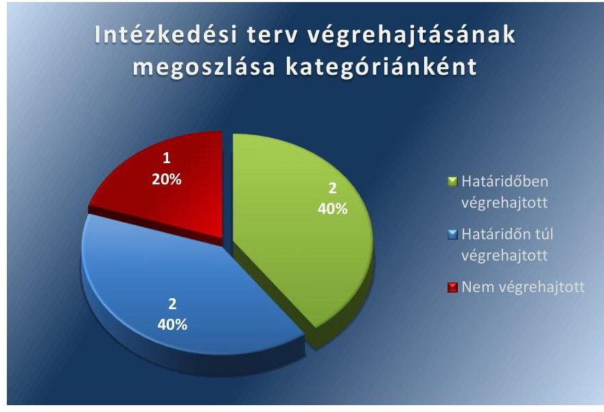

Forrás: ÁSZ
Az ÁSZ jelentésben megfogalmazott egy javaslatra a MÁV Zrt. által készített közös - MÁV-START Zrt.-re is vonatkozó - intézkedési tervben a MÁV-START Zrt.-nek öt feladatot írtak elő. Ezekből kettő határidőben, kettő határidőn túl, továbbá egy nem végrehajtott feladat volt.

## HATÁRIDŐBEN VÉGREHAJTOTT FELADATOK:

1. A 2011. évi közszolgáltatási jelentésben a közszolgáltatási szerződésben szereplő költségstruktúrához igazodóan rögzítették a költségtérítés felhasználási jogcímeit.
2. Kontrolling szolgáltatás nyújtására megbízási szerződést kötöttek, az utókalkulációkat elkészítették. Havi rendszerességgel gazdasági értékelő értekezlet keretében azok elemzésre kerültek.

---

# HATÁRIDŐN TÚL VÉGREHAJTOTT FELADATOK: 

3. A kiemelt szolgáltatói pozíciójú, a költségtérítési igény szempontjából meghatározó tagvállalatokat és az általuk a MÁV-START Zrt. részére nyújtott szolgáltatások azonosítását a vállalt 2012. október 31-ei határidőt követően, 2012 novemberében végezték el.
4. A MÁV-GÉPÉSZET Zrt. ${ }^{20}$ fedezet-kimutatásai vonatkozásában az elvégzett felülvizsgálat eredményeképpen a vállalt 2012. december 31-ei határidőt követően, 2013 márciusában került újratárgyalásra a szerződés.

## NEM VÉGREHAJTOTT FELADAT:

5. A MÁV-START Zrt. üzleti tervei, negyedéves és éves beszámolói, üzleti jelentései nem tartalmazták a fedezet-kimutatásokat.

---

.

---

# A Nemzeti Fejlesztési Minisztérium által készített intézkedési terv végrehajtása

|  Sorszám | Intézkedési terv alapján elvégzendő feladat | Az intézkedési tervben meghatározott határidő | Az intézkedés végrehajtása  |
| --- | --- | --- | --- |
|   | 1. | 2. | 3.  |
|  Nem időszerű intézkedés |  |  |   |
|  1. | A Tarifarendszer felülvizsgálata megtörtént, 2012.09.01-én lépett hatályba az új tarifarendszer. A kedvezményrendszer szakmai felülvizsgálata folyamatban van, ezzel kapcsolatos végleges döntések és azok lehetséges határideje kormányzati döntési hatáskörbe tartozik. | 2012. december 31. illetve 2013. március 31. | A tarifarendszer felülvizsgálatát az NFM a vállalt határidőn belül végrehajtotta, az ezzel kapcsolatos jogszabályok hatályba léptek. A személyszállítási szolgáltatásokról szóló 2012. évi XLI. tv. hatályba lépésével megszűnt a hatósági ár, a díjak a közszolgáltatási szerződésben kerültek meghatározásra. A 121/2012. (VI.26.) Kormányrendelet ezzel összefüggésben szabályozta a szociálpolitikai menetdíj-támogatás megállapításának és igénybevételének szabályait. A kedvezményrendszer szakmai felülvizsgálata végrehajtásra került, a tárca több munkaanyagot, tanulmányt készített, azonban az ezzel kapcsolatos végleges döntések kormányzati hatáskörbe tartoztak.  |
|  Határidőben végrehajtott intézkedések |  |  |   |
|  2. | A vasúti pályahálózat működtetésére kötött szerződést illetően áttekintésre kerül a működtetés költségeinek csökkentésére ösztönző elemek rendszere a vasúti közlekedésről szóló 2005. évi CLXXXIII. tv. 28. § (3) szerinti, jelenleg zajló éves felülvizsgálat során. |  | A Magyar Állam és a MÁV Zrt. között létrejött pályaműködtetési szerződés módosítását 2014. március 28-án írta alá a miniszter. A szerződésmódosítás rendelkezéseit visszamenőlegesen, 2013. június 28-tól alkalmazták. A szerződés 7.9 pontja (módosítás 27. pontja) újraszabályozta a hatékony működés ösztönzési rendszerét.  |
|  3. | A Megrendelői Teljesítésigazolás ellenőrzése és kiadása eljárásrendjének, valamint a KTI tevékenységével kapcsolatos követelményrendszer kidolgozása. | 2012. november 30. | A KTI Közlekedéstudományi Intézet Nonprofit Kft. által 2012/1900/001 iktató számon elkészített eljárásrendet az NFM 2012. november 30-án jóváhagyta és elrendelte annak végrehajtását.  |
|  4. | A 2014-2023. közötti időszakra kötendő közszolgáltatási szerződések előkészítése során az NFM felülvizsgálja a teljesítésigazolások kiadásával kapcsolatos előírásokat, és szükség esetén az eljárásrend módosításra kerül. | 2014-2023. közötti időszakra kötendő közszolgáltatási szerződés előkészítése során | Az NFM a MÁV Zrt.-vel és a GYSEV Zrt.-vel 2014-2023. közötti időszakra megkötött közszolgáltatási szerződések előkészítése során megvizsgálta a teljesítésigazolások kiadásával kapcsolatos előírásokat, a 2012. november 30-án kiadott eljárásrend módosítását nem tartotta indokoltnak.  |

---

|  1. | Intézkedési terv alapján elvégzendő feladat | Az intézkedési tervben meghatározott határidő | Az intézkedés végrehajtása  |
| --- | --- | --- | --- |
|  2. |  |  |   |
|  5 | A nemzeti fejlesztési miniszter tulajdonosi határozattal hívja fel a Magyar Nemzeti Vagyonkezelő Zrt.-t arra, hogy vizsgálja meg a MÁV Csoport szervezeti átalakítása mellett is jelentkező veszteséges gazdálkodás okait, ennek eredménye alapján készítsen intézkedési tervet a szükséges változtatásokra-figyelembe véve a közösségi közlekedés átalakítását célzó, jelenleg is folyamatban lévő szakértői tevékenység eredményeit is. | 2012. október 31. | 2012. október 29-én a nemzeti fejlesztési miniszter a 32/2012. (X.29.) részvényesi jogok gyakorlója határozatban felkérte az MNV Zrt. Igazgatóságát, hogy vizsgálja meg a MÁV Csoport 2010. évet megelőző szervezeti átalakítása mellett is jelentkező veszteséges gazdálkodás okait, majd a vizsgálat eredménye alapján készítsen intézkedési tervet a szükséges változtatásokra.  |
|  6. | A nemzeti fejlesztési miniszter tulajdonosi határozattal hívja fel a Magyar Nemzeti Vagyonkezelő Zrt.-t és a Magyar Fejlesztési Bank Zrt.-t arra, hogy a NIF Zrt. és a MÁV Zrt. bevonásával készítsen közös intézkedési tervet a beruházások átadásának lebonyolítására, melynek végrehajtása eredményeként az átadás és az ehhez kapcsolódó céltartalék-képzés megszüntetése 2013. december 31-ig megvalósul. | 2012. október 31. | 2012. október 29-én a nemzeti fejlesztési miniszter az MNV Zrt. esetében, mint a részvényesi jogok gyakorlója a 32/2012. (X.29.) számú határozattal, az MFB Zrt. esetében az 58/2012. (X.29.) számú alapítói határozattal felhívta az MNV Zrt.-t és az MFB Zrt.-t arra, hogy - a NIF Zrt. és a MÁV Zrt. bevonásával - készítsen közös intézkedési tervet a NIF Zrt. által lebonyolított vasúti beruházások révén létrejött, a MÁV Zrt. kezelésében lévő eszközök szerződéses átadásának lebonyolítására.  |
|  7. | Az NFM-NGM-MNV közös szakértői munkacsoport összehívása a hosszú távon államilag finanszírozható vasúti személyszállítási közszolgáltatás és pályahálózat működtetés felülvizsgálatára, a feladat végrehajtásához szükséges erőforrások rendelkezésre bocsátása érdekében, az eddigi tapasztalatok és az ÁSZ jelentés alapján. |  |   |

---

|  | Intézkedési terv alapján elvégzendő feladat | Az intézkedési tervben meghatározott határidő | Az intézkedés végrehajtása |
| :--: | :--: | :--: | :--: |
|  | 1. | 2. | 3. |
| 8. | A közszolgáltatási szerződés személyszállítási szolgáltatásokról szóló 2012. évi XLI. törvény alapján történő komplex felülvizsgálata keretében ismételten áttekintésre kerül az elszámolások egységes szabályozása érdekében a közszolgáltatási költségtartalmak, valamint a hatékonysági követelmények és mutatók egyértelmű meghatározása. | 2012. december 31. | Az egyeztetések elhúzódása miatt a közszolgáltatási szerződések (MÁV Zrt., GYSEV Zrt.) aláírására 2013. november 15-én került sor, amelyek 2014. január 1-jén léptek hatályba. |
| 9. | Fentiekre tekintettel az NFM megvizsgálja a kamatfizetés körülményeit és szükség esetén megteszi az ezzel kapcsolatban indokolt intézkedéseket. | 2012. december 31. | A késedelmi kamatfizetés körülményeit a 2013. évben vizsgálták ki, és megállapították, hogy a késedelem a tárca felelőségi körén kívül - az elfogadott kormányrendelet késedelmes kihirdetése miatt - következett be, így további intézkedés meghozatala nem vált szükségessé. |

A MÁV Zrt. által készített intézkedési terv végrehajtása a MÁV Zrt. vonatkozásában

|  | Intézkedési terv alapján elvégzendő feladat | Az intézkedési tervben meghatározott határidő | Az intézkedés végrehajtása |
| :--: | :--: | :--: | :--: |
|  | 1. | 2. | 3. |
| Határidőben végrehajtott intézkedés |  |  |  |
| 1. | Rögzíteni kell a költségtérítés felhasználási jogcímeit, a közszolgáltatási/pályaműködtetési szerződésekben szereplő költségstruktúrához igazodóan. |

 2012. december 31. | A MÁV Zrt. az 50/2007. (IV.26.) GKM-PM együttes rendelet és a MÁV Zrt. mindenkor hatályos számviteli elkülönítési szabályzata alapján a számvitelileg elkülönített vasúti tevékenységek előírt adatait a felügyeleti jelentésekben mutatta be negyedévenként, illetve éves szinten a beszámoló részeként.   A MÁV Zrt. az elkülönítési módszertan (24/2011. (VI.3. MÁV Ért. 13.) EVIG számú 2011. évtől hatályos számviteli elkülönítési szabályzat) alapján elkészítette a 2012. évi negyedéves felügyeleti jelentéseit, amelyekben az intézkedési tervben vállalt határidőn belül rögzítésre kerültek a pályaműködtetési szerződésben szereplő költségstruktúrához igazodóan a költségtérítés felhasználási jogcímei. |

---

|  1. | Intézkedési terv alapján elvégzendő feladat | Az intézkedési tervben meghatározott határidő | Az intézkedés végrehajtása |
| :--: | :--: | :--: | :--: |
|  | 1. | 2.   Határidőn túl végrehajtott intézkedések | 3. |
| 2. | El kell végezni a közszolgáltató, valamint a pályaműködtető társaság esetében a közfeladat ellátásával közvetlenül összefüggő leányvállalati szolgáltatások azonosítását a Csoport kiemelt szolgáltató pozíciójú, a költségvetési igény szempontjából meghatározó tagvállalatainál. | 2012. október 31. | A kiemelt szolgáltatói pozíciójú, a költségtérítési igény szempontjából meghatározó tagvállalatokat és az általuk a MÁV Zrt. részére nyújtott szolgáltatások azonosítását a MÁV Zrt. által a MÁV FKG Kft. részére 2012. novemberében küldött, ad. Gy. 9-231/2012. iktatószámú intézkedési tervben vállalt határidőt követően kelt, az intézkedési terv végrehajtását elrendelő ügyirat tartalmazta. A költségtérítési igény szempontjából meghatározó tagvállalatnak minősült a MÁV-TRAKCIÓ Zrt. ${ }^{21}$ és MÁV FKG Kft. Ennek alapján a közfeladat ellátásával közvetlenül összefüggő leányvállalati szolgáltatások voltak a MÁV-TRAKCIÓ Zrt. által nyújtott tolatási szolgáltatás és a MÁV FKG Kft. által nyújtott pályafelújítás és pályakarbantartás. |
| 3. | Ki kell dolgozni az elkülönítés módszertanát a szolgáltatást nyújtók esetében. A közfeladat-ellátásban résztvevő kiválasztott leányvállalati körnek el kell végezni a pályaműködtetést, illetve a közszolgáltató feladatot ellátó MÁV Zrt. és MÁV-START Zrt. részére nyújtott szolgáltatásból származó bevételeinek és az ehhez tartozó költségeinek, ráfordításainak rögzített módszertan szerinti utókalkulációját legalább az alábbi három fő szegmensre, és annak eredményét legalább negyedévente át kell adni a MÁV Zrt. és a MÁV-START Zrt. részére:   a. MÁV-START Zrt. számára végzett szolgáltatások   b. MÁV Zrt. számára végzett szolgáltatások   c. Egyéb társaságok számára végzett szolgáltatások | 2012. december 31. | Az érintett módszertanok és fedezet kimutatások teljes körűen az intézkedési tervben vállalt határidőt követően készültek el. Az intézkedés végrehajtása a 2014. évben kiadott Általános Szerződési Feltételek meghatározásával lett teljes. Ennek keretében a leányvállalati szolgáltatások egységes szerződéses módszertana kialakítása került, továbbá megteremtették a „cost + margin" alapú árképzést a cégcsoporton belüli szolgáltatásokra vonatkozóan. Az Általános Szerződési Feltételek egységes és kötelező alkalmazása teljes körűen szükségessé tette a fedezet kimutatások elkészítését és a túlzott fedezetek esetében az árkorrekciót.   A kiemelt szolgáltatói pozíciójú leányvállalatok - MÁV-TRAKCIÓ Zrt., MÁV FKG Kft. - esetében önköltség számítási szabályzatok kerültek kidolgozásra. A MÁV FKG Kft. esetében 2013. április 8-án, a MÁV-TRAKCIÓ Zrt. esetében az intézkedési tervet megelőzően - 2009. március 3-án - került kiadásra az önköltség számítási szabályzat, amely tartalmazta a piaci szegmensek (meghatározott, kiemelt megrendelők) szerinti elkülönítés módszertanát.   A MÁV Zrt. a fedezetszámítás elkészítését előírta a leányvállalati kör számára. A MÁV FKG Kft. esetében a piaci szegmensekre vonatkozó fedezetszámítások elkészítésre kerültek és negyedéves rendszerességgel a 2013. évben - az intézkedési tervben vállalt határidőt követően - átadásra kerültek a beszámolók, üzleti jelentések részeként a MÁV Zrt. részére. A MÁV-START Zrt. részére került előírásra a MÁV-TRAKCIÓ Zrt. esetében a végrehajtás, figyelemmel a kontrolling megbízási szerződésekre és a tervezett beolvadásra. A MÁV-TRAKCIÓ Zrt. vonatkozásában a fedezetszámítások nem kerültek átadásra a MÁV Zrt. számára, azokat a MÁV-START Zrt. havi gazdasági értékelő értekezletein tárgyalták, amelyen a MÁV Zrt. munkatársa is részt vett. |

---

|  Sorszám | Intézkedési terv alapján elvégzendő feladat | Az intézkedési tervben meghatározott határidő | Az intézkedés végrehajtása  |
| --- | --- | --- | --- |
|   | 1. | 2. | 3.  |
|  4. | Felül kell vizsgálni a MÁV Zrt. és a MÁV-START Zrt. részére átadott fedezet kimutatásokat, hogy az igénybe vett szolgáltatáson a szolgáltató fedezete összességében nem haladja-e meg az elvárható, indokolt mértéket. A felülvizsgálat eredményétől függően, indokolt mértéket meghaladó esetben kezdeményezni kell a szolgáltatási díjak újratárgyalását. | 2012. december 31. | A MÁV Zrt. részére 2013. I. félévében kerültek átadásra a fedezet kimutatások - kivétel a MÁV-TRAKCIÓ Zrt. vonatkozásában, amely esetében a havi gazdasági értékelő értekezleten tárgyalták a fedezet kimutatásokat. A MÁV-TRAKCIÓ Zrt. esetében a felülvizsgálat a 2012. évben megtörtént, amely alapján a MÁV-START Zrt., mint az intézkedés - korábban megjelölt MÁV-START Zrt. részére küldött, ad. Gy. 9-231/2012. iktatószámú levél alapján - végrehajtására kijelölt szervezet megállapította, hogy nem szükséges a szolgáltatási díjak újratárgyalása. A 2013. november 19-ei 187/2013. (11.19.) EVIG határozat tartalmazta a MÁV FKG Kft. fedezettartalmának felülvizsgálati kötelezettségét, amelyet a MÁV FKG Kft. az intézkedési tervben vállalt határidőt követően, 2013. november 25-én hajtott végre. A MÁV Zrt. és a MÁV FKG Kft. 2013. december 20-án a 187/2013. (11.19.) EVIG határozat alapján „a MÁV Zrt. által kezelt közforgalmú vasúti pályahálózaton a tervezhető felújítási és karbantartási tevékenységek elvégzésére 2012-2013. évekre létrejött vállalkozási szerződések 2013. évi díjképzéséhez kapcsolódóan" szerződésmódosítást kötöttek, amelyben rögzítették az ÁSZ jelentéshez kapcsolódóan a szerződéses díjak fedezetszámításon alapuló újratárgyalását. A 2014. IV. negyedéves felügyeleti jelentésben szerepelt, hogy a 2014. október 7-én kidolgozott Általános Szerződési Feltételek szerint köthetőek meg a cégcsoporton belüli szerződések, amelyeknek önköltségi alapú díjazást kellett tartalmazniuk, az Általános Szerződési Feltételek (2014. október 07.) a felülvizsgálati kötelezettséget tartalmazta.  |
|  5. | Kezdeményezni kell a használt vasúti szakanyagok (melyek építési, felújítási munkák során keletkeztek és mennyiségük eléri a 35 ezer tonnát) szabályozott körülmények közötti értékesítési feltételeinek soron kívüli kialakítását (vagyonkezelői szerződés módosításával és a szükséges számviteli szabályozással). | 2013. június 30. | A MÁV Zrt. a vagyonkezelésében álló egyes selejtezett vagyonelemek elidegenítésére 2013. október 29-én megbízási szerződést kötött az MNV Zrt.-vel, majd 2015. május 11-én elkészítette a Kincstári tételek értékesítési eljárásának elemzését, 2015. június 15-én pedig a betonaljak hasznosítására vonatkozó javaslatot. A selejtezési folyamat átmeneti szabályozása 2015. január 1-én lépett hatályba.  |
|  6. | Be kell mutatni a MÁV Zrt. tulajdonosi jogkörgyakorló MNV Zrt. részére a közszolgálati kötelezettségből kivont forgalomszüneteltetett vasúti vonalakra fordított különböző ráfordításokat (karbantartás, biztonsági kötelezettség, stb.). Kezdeményezni kell a ráfordítások függvényében az érintett vasútvonalak státuszának újragondolását, a költség elszámolás rendszerének felülvizsgálatát. | 2013. március 31. | A közszolgálati kötelezettségből kivont forgalomszüneteltetett vasúti vonalakra fordított különböző ráfordításokat a pályaműködtetési szerződéshez kapcsolódó 2011. évi elszámolásban 2012. május 31-én mutatták be. A ráfordítások függvényében a 83. számú Mátraszentimre, Mátranovák, Homokterenye vasútvonal státusz változásának kezdeményezése 2013. április 16-án az intézkedési tervben vállalt határidőt követően történt meg.  |

---

|  1. | 2. | 3.  |
| --- | --- | --- |
|  7. | Javaslatot kell készíteni és annak alapján a Nemzeti Közlekedési Hatóságnál kezdeményezni kell a közút-vasút szintbeli kereszteződések számának jelentős csökkentését. (Elsősorban azokra a nem biztosított, kis forgalmú útátjárókra vonatkozóan, melyeknél időszakos a közlekedés és viszonylag kis távolságra több átjáró is található egymás mellett.) | 2013. június 30.  |
|  8. | Kötelezően tartalmaznia kell a MÁV Zrt. és a MÁV-START Zrt. üzleti tervei, negyedéves beszámolói és az éves beszámoló üzleti jelentéseinek a kiválasztott szolgáltató leányvállalati kör elő, illetve utókalkulált bevétel-költség-fedezet kimutatását, főbb jogcímenkénti bontásban. | 2013. I. félév  |

A MÁV Zrt. az közút-vasút szintbeli kereszteződések jelentős (207 db) csökkentésére vonatkozó javaslatot az intézkedési tervben vállalt 2013. június 30-ai határidőt követően, 2013. december 3-án készítette el. Az közút-vasút szintbeli kereszteződések megszüntetésének a Nemzeti Közlekedési Hatóságnál való kezdeményezéséhez az érintett önkormányzatok hozzájáruló nyilatkozatára volt szükség. A nyilatkozatok beszerzése érdekében - az intézkedési tervben vállalt 2013. június 30-ai határidőt követően - levelezést folytattak az érintett önkormányzatokkal, a hozzájáruló nyilatkozatok birtokában kezdeményezték az érintett közút-vasút szintbeli kereszteződések megszüntetését a Nemzeti Közlekedési Hatóságnál.

# Nem végrehajtott intézkedés

2013. I. félév

A leányvállalati kör számára előírásra került a fedezetszámítás elkészítésének kötelezettsége 2013. I. félévi és a 2013-2014. évi beszámolók elkészítéséhez is. A MÁV FKG Kft. 2013-2014. évi üzleti tervei, üzleti jelentései és beszámolói a fedezetszámításokat főbb jogcímenkénti bontásban tartalmazták. A MÁV-TRAKCIÓ Zrt. esetében a fedezetszámítások nem a beszámolókban szerepeltek, hanem a havi gazdasági értékelő értekezlet keretében kerültek elemzésre. A fedezet-kimutatások a leányvállalatok beszámolási rendszerének részévé váltak, azonban a MÁV Zrt. üzleti tervei, negyedéves és éves beszámolói, üzleti jelentései a fedezet-kimutatásokat nem tartalmazták.

Forrás: ÁSZ

## A MÁV Zrt. által készített intézkedési terv végrehajtása a MÁV-START Zrt. vonatkozásában

|  1. | Intézkedési terv alapján elvégzendő feladat | Az intézkedési tervben meghatározott határidő | Az intézkedés végrehajtása  |
| --- | --- | --- | --- |
|   | 1. | 2. | 3.  |
|  Határidőben végrehajtott intézkedések |  |  |   |
|  1. | Rögzíteni kell a költségtérítés felhasználási jogcímeit, a közszolgáltatási/pályaműködtetési szerződésekben szereplő költség struktúrához igazodóan. | 2012. december 31. | A MÁV-START Zrt. az elkülönítési módszertan alapján elkészítette a 2011. évi közszolgáltatási jelentését, amelyben rögzítésre kerültek a közszolgáltatási szerződésekben szereplő költségstruktúrához igazodóan a költségtérítés felhasználási jogcímei.  |

---

|  | Intézkedési terv alapján elvégzendő feladat | Az intézkedési tervben meghatározott határidő | Az intézkedés végrehajtása |
| :--: | :--: | :--: | :--: |
|  | 1. | 2. | 3. |
| 2. | Ki kell dolgozni az elkülönítés módszertanát a szolgáltatást nyújtók esetében. A közfeladat-ellátásban résztvevő kiválasztott leányvállalati körnek el kell végezni a pályaműködtetést, illetve a közszolgáltató feladatot ellátó MÁV Zrt. és MÁV-START Zrt. részére nyújtott szolgáltatásból származó bevételeinek és az ehhez tartozó költségeinek, ráfordításainak rögzített módszertan szerinti utókalkulációját legalább az alábbi három fő szegmensre, és annak eredményét legalább negyedévente át kell adni a MÁV Zrt. és a MÁV-START Zrt. részére:   a. MÁV-START Zrt. számára végzett szolgáltatások   b. MÁV Zrt. számára végzett szolgáltatások   c. Egyéb társaságok számára végzett szolgáltatások | 2012. december 31. | A MÁV-START Zrt. 2012. november 30-án megbízási szerződést kötött kontrolling szolgáltatás nyújtására a kiemelt
 szolgáltatói pozíciójú tagvállalatokkal – MÁV-TRAKCIÓ Zrt., MÁV-GÉPÉSZET Zrt. –, amely lehetővé tette a számviteli nyilvántartások szerinti utókalkulációk saját szervezeten belüli elkészítését, nyomon követését, a havi gazdasági értékelő értekezlet keretében azok elemzésre kerültek. A kiemelt szolgáltatói pozíciójú leányvállalatok esetében az elkülönítést szolgáló önköltség-számítási szabályzatok rendelkezésre álltak az intézkedési terv elkészítését megelőzően, amelyek meghatározták a fedezetszámítások, utókalkulációk elkészítésének kereteit. A szabályzatok fedezetszámítások elvégzésére való alkalmasságát a 2012. év során felülvizsgálták. A bevételek és az ehhez tartozó költségek, ráfordítások utókalkulációjára, valamint a fedezetek piaci szegmensenként való elkülönítésére a társaságok számviteli nyilvántartásai a 2012. évben lehetőséget biztosítottak. |
|  | Határidőn túl végrehajtott intézkedések |  |  |
| 3. | El kell végezni a közszolgáltató, valamint a pályaműködtető társaság esetében a közfeladat ellátásával közvetlenül összefüggő leányvállalati szolgáltatások azonosítását a Csoport kiemelt szolgáltató pozíciójú, a költségvetési igény szempontjából meghatározó tagvállalatainál. | 2012. október 31. | A kiemelt szolgáltatói pozíciójú, a költségtérítési igény szempontjából meghatározó tagvállalatokat és az általuk a MÁV-START Zrt. részére nyújtott szolgáltatások azonosítását a MÁV Zrt. által a MÁV-START Zrt. részére 2012. novemberében kelt, az intézkedési terv végrehajtását elrendelő ügyirat tartalmazta. A költségtérítési igény szempontjából meghatározó anyavállalaton kívüli tagvállalatnak minősült a MÁV-TRAKCIÓ Zrt. és MÁV-GÉPÉSZET Zrt. A közfeladat ellátásával közvetlenül összefüggő leányvállalati szolgáltatások közé tartoztak a MÁV-TRAKCIÓ Zrt. által nyújtott vontatási szolgáltatás és a MÁV-GÉPÉSZET Zrt. által nyújtott karbantartás. |

---

|  | Intézkedési terv alapján elvégzendő feladat | Az intézkedési tervben meghatározott határidő | Az intézkedés végrehajtása |
| :--: | :--: | :--: | :--: |
|  | 1. | 2. | 3. |
| 4. | Felül kell vizsgálni a MÁV Zrt. és a MÁV-START Zrt. részére átadott fedezet-kimutatásokat, hogy az igénybe vett szolgáltatáson a szolgáltató fedezete összességében nem haladja-e meg az elvárható, indokolt mértéket. A felülvizsgálat eredményétől függően, indokolt mértéket meghaladó esetben kezdeményezni kell a szolgáltatási díjak újratárgyalását. | 2012. december 31. | A MÁV-START Zrt. kontrolling szolgáltatást nyújtott – a 2012. november 30-án megkötött kontrolling szerződések alapján – az érintett társaságoknak, amely lehetővé tette a számviteli nyilvántartások szerinti utókalkulációk saját szervezeten belüli elkészítését, nyomon követését, a havi gazdasági értékelő értekezlet keretében azok elemzésre kerültek.   A MÁV-TRAKCIÓ Zrt. esetében a felülvizsgálatot a vállalt határidőn belül, még a 2012. évben elvégezték, amelynek keretében megállapították, hogy nem szükséges a szolgáltatási díjak újratárgyalása. A MÁV-GÉPÉSZET Zrt. vonatkozásában a felülvizsgálat eredményeképpen az intézkedési tervben vállalt határidőt követően, 2013. márciusában a szerződés újratárgyalásra került. |
|  |  | Nem végrehajtott intézkedés |  |
| 5. | Kötelezően tartalmaznia kell a MÁV Zrt. és a MÁV-START Zrt. üzleti tervei, negyedéves beszámolói és az éves beszámoló üzleti jelentéseinek a kiválasztott szolgáltató leányvállalati kör elő-, illetve utókalkulált bevétel-költség-fedezet kimutatását, főbb jogcímenkénti bontásban. | 2013. I. félév | A MÁV-START Zrt.-nek a 2012. november 30-án megkötött kontrolling szerződések alapján saját szervezeten belül rendelkezésre álltak az elő-, illetve utókalkulált bevétel-költség-fedezet kimutatások főbb jogcímenkénti bontásban a szolgáltatást nyújtó, kiemelt leányvállalati kör – MÁV-TRAKCIÓ Zrt. és MÁV-GÉPÉSZET Zrt. – vonatkozásában. Az intézkedési tervben foglaltak ellenére azonban a MÁV-START Zrt. üzleti tervei, negyedéves és éves beszámolói, üzleti jelentései nem tartalmazták a fedezet-kimutatásokat. |

---

# FÜGGELÉK: ÉSZREVÉTELEK 

A jelentéstervezetet az Állami Számvevőszék 15 napos észrevételezésre megküldte az ellenőrzött szervezet vezetőjének az ÁSZ tv. 29. § (1) bekezdése előírásának megfelelően.
Az elfogadott észrevételek alapján véglegesíti az Állami Számvevőszék a jelentését.

A függelék tartalmazza az ellenőrzöttek észrevételeit, illetve az el nem fogadott észrevételek elutasításának indoklását.

- A MÁV Zrt. elnök-vezérigazgatójának írásban tett észrevétele.
- Tájékoztatás az el nem fogadott észrevételekről az elnök-vezérigazgatónak.
- A MÁV-START Zrt. vezérigazgatójának írásban tett észrevétele.
- Tájékoztatás az el nem fogadott észrevételekről a vezérigazgatónak.
- A Nemzeti Fejlesztési Minisztérium miniszterének levele.

[^0]
[^0]:    * 29. § (1) Az Állami Számvevőszék az ellenőrzési megállapításait megküldi az ellenőrzött szervezet vezetőjének vagy az általa megbízott személynek, és annak, akinek személyes felelősségét állapította meg.
    (2) Az ellenőrzött szervezet vezetője és a felelősként megjelölt személy az ellenőrzés megállapításaira tizenöt napon belül írásban észrevételt tehet.
    (3) Az Állami Számvevőszék az észrevételre a beérkezésétől számított harminc napon belül írásban válaszol. A figyelembe nem vett észrevételeket köteles a jelentésben feltüntetni, és megindokolni, hogy azokat miért nem fogadta el.

---

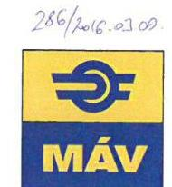

# ELNÖK-VEZÉRIGAZGATÓ 

Domokos László
elnök

Ikt. sz.: 30823-9/2015/MAV
Hiv. sz.: V-0880-082/2016.

## ÁLLAMI SZÁMVEVŐSZÉK

1364 Budapest 4.
Pf. 54.
Tárgy: Utóellenőrzés jelentés-tervezetének véleményezése

## Tisztelt Elnök Úr!

Az Állami Számvevőszék (továbbiakban ÁSZ) „Utóellenőrzések – A vasúti közlekedés állami támogatási rendszerének ellenőrzéséről készült jelentés javaslatai hasznosulásának utóellenőrzése” tárgyú ellenőrzési jelentéstervezetet a MÁV Zrt. kézhez vette, és az alábbi észrevételeket füzi hozzá.

A „Főbb megállapítások, következtetések” fejezet jelenlegi tömör formában félreértelmezésre adhat okot. Mind a MÁV Zrt., mind a MÁV-START Zrt. az intézkedési tervben foglalt minden feladatot, így a fedezetszámítások, fedezetkimutatások megfelelő dokumentumokban való szerepeltetését is végrehajtotta. Az ellenőrzés során a MÁV Zrt. közreműködéssel megbízott kollégái az ÁSZ helyszíni ellenőrzést végző munkatársaival ismertették a társaság álláspontját, melyet jelen levelemmel ismételten megerősítek. E szerint megalapozott szakmai mérlegelés után a MÁV Zrt. tudatos döntése, hogy az elkészített fedezet-kimutatásokat a Társaság Üzleti terveiben, negyedéves-, éves beszámolóiban és üzleti jelentéseiben az abban szereplő adatok szenzitív és bizalmas üzleti jellege miatt nem szerepelteti. A MÁV Zrt. ezeket az adatokat csak a megfelelő döntéshozó, illetve ellenőrzési (tulajdonosi, szakmai, ellenőrzési) fórumok számára tette és teszi elérhetővé. Kérem ezért, hogy e fejezet összefoglaló mondata is ezt a végrehajtást tükrözze, ellenben azzal a határozott állítással, hogy a MÁV Zrt. nem végezte el a feladatot.

Fentiek alapján szövegjavaslatom a következő: „Az intézkedési tervben foglaltakat a Nemzeti Fejlesztési Minisztérium teljes körűen, a MÁV Zrt. és a MÁV-START Zrt. egy-egy feladat esetében a végrehajtás során általuk szükségesnek tartott módosítással hajtotta végre.”

MÁV MAGYAR ÁLLAMVASUTAK
ZÁRTKÖRÜEN MŰKÖDŐ RÉSZVÉNYTÁRSASÁG
1087 Budapest, Könyves Kálmán körút 54-60. - Telefon: (1) 3515177 - Fax: (1) 3521560
A Fővárosi Bíróság, mint cégbíróság CG. 01-10042272

---

Fentiekkel összefüggésben kérem a „Megállapítások” fejezetben szereplő „Összegző megállapítás” módosítását/pontosítását is.

Statisztikai értelemben a jelentés-tervezetben a határidőn túli teljesítésre vonatkozó megállapításokkal egyetértek, azonban a végrehajtásra kitűzött feladatok nagysága, összetettsége, egymással való összefüggése és adott külső körülmények miatt a megcélzott teljesítési határidő a MÁV Zrt. minden igyekezete ellenére nem volt maradéktalanul betartható. Az elszenvedett határidő-csúszások nem a végrehajtás megkezdésénél, hanem befejezésénél következtek be. Kérem a megállapítás ilyen aspektusú árnyalását is a következők szerint: A MÁV Zrt. az intézkedési tervben foglalt nyolc feladat közül egy esetben módosítva, hat esetben határidő előtt megkezdve, de határidőn túli befejezéssel hajtotta végre. A MÁV-START Zrt. az intézkedési tervben foglalt öt feladat közül egy esetben módosítva, kettő esetben határidő előtt megkezdve, de határidőn túli befejezéssel hajtotta végre.”

Az Összegző megállapítások részletezésénél (MÁV Zrt. esetében 16. oldal 8. pont), amennyiben a jelentés-tervezet struktúrája engedi, a megállapítást kérem kiegészíteni a következőkkel: „a fedezet-kimutatásokat a felsorolt jelentésekhez/beszámolókhoz kapcsolódóan készített előterjesztések (EVIG, IG, tulajdonosi fórumok) és az árkorrekciós elszámolások tartalmazták, azaz a nem nyilvános felhasználási körbe tartozó valamennyi indokolt fórumnak a döntéshozatalhoz kellő időben és a kellő tartalommal rendelkezésre álltak ezek az adatok.”

Fentieken túlmenően javasolom a jelentés részeként szerepeltetni az utóellenőrzés következtetéseit, az ellenőrzöttekre vonatkozó esetleges következményeit is.

Bízva a módosítási javaslatok elfogadásában, köszönöm konstruktív ellenőrzési munkájukat!

Budapest, 2016. március 8.

Üdvözlettel:
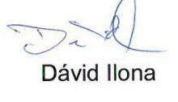
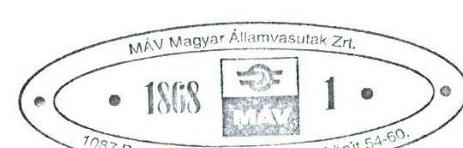

---

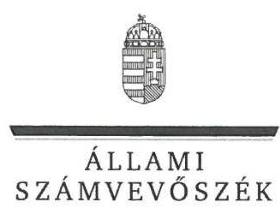

ELNÖK

Ikt.szám: V-0880-090/2016.

# Dávid Ilona úrhölgy 

elnök-vezérigazgató
MÁV Magyar Államvasutak Zrt.

## Budapest

## Tisztelt Elnök-vezérigazgató Úrhölgy!

Az „Utóellenőrzések – A vasúti közlekedés állami támogatási rendszerének ellenőrzéséről készült jelentés javaslatai hasznosulásának utóellenőrzése” címmel készített számvevőszéki jelentéstervezetre tett észrevételét köszönettel megkaptam.

Az Állami Számvevőszék észrevételekre vonatkozó álláspontjáról a felügyeleti vezető által készített részletes tájékoztatást mellékelten megküldöm.

Budapest, 2016. 03. 26.
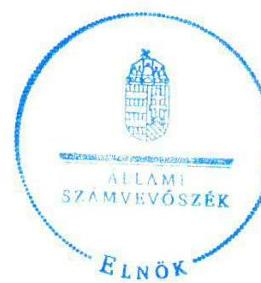

Tisztelettel:

Domokos László

Melléklet: Tájékoztatás az el nem fogadott észrevételekről

---

# Tájékoztatás   az el nem fogadott észrevételekről 

Az „Utóellenőrzések – A vasúti közlekedés állami támogatási rendszerének ellenőrzéséről készült jelentés javaslatai hasznosulásának utóellenőrzése” címü jelentéstervezetre 2016. március 8-án érkezett észrevételeit áttekintettük, azok kezelésével kapcsolatban a következő tájékoztatást adom.

Az észrevétel megerősíti, hogy az intézkedési tervben a fedezet-kimutatással kapcsolatban meghatározott feladat nem teljesült, mert a MÁV Zrt. üzleti tervei, negyedéves és éves beszámolói, üzleti jelentései nem tartalmazták a kiválasztott szolgáltató leányvállalati kör elő-, illetve utókalkulált bevétel-költség-fedezet kimutatását, főbb jogcímenkénti bontásban.

Az intézkedési tervben vállalt feladat nem a fedezetszámítás megfelelő fórumok számára elérhetővé tételére irányult – amire az észrevétel hivatkozik –, hanem a fent hivatkozott dokumentumokban történő szerepeltetésére. A korábbi ellenőrzés alapján az ellenőrzött szervezet jelölte ki az intézkedési terv konkrét feladatát, amelyet módosító dokumentum az ÁSZ-hoz nem érkezett. A saját maguknak korábban előírt feladatot utólag – az utóellenőrzéssel párhuzamosan – átértelmezték ugyan, de az nem változtatta meg a vonatkozó érvényes ellenőrzési kritériumot. A jelentéstervezetben az érvényes kritériumhoz viszonyított megállapítás helytálló, ezért a módosítása nem indokolt.

Az észrevétel a határidőn túli teljesítésre vonatkozó megállapításokat nem vitatja, a határidő-csúszások okaként a végrehajtás befejezésének késedelmét jelöli meg, amely miatt a jelentéstervezet módosítása nem indokolt.

Az észrevételben kért szöveg-kiegészítési javaslatokat a fentiek miatt nem áll módunkban elfogadni.

Az utóellenőrzés következtetései, eredményei rögzítését javasolta Elnök-vezérigazgató Úrhölgy a jelentéstervezetben. Az utóellenőrzés sajátosságaihoz igazodóan elegendőnek tartjuk a jelentéstervezet 5. oldalán az Összegzés főcím alatti lead és a Főbb megállapítások, következtetések cím alatti bekezdés szerepeltetését.

Tájékoztatom, hogy a számvevőszéki jelentés függelékeként szerepeltetjük a jelentéstervezethez tett észrevételeit, valamint az azokra adott válaszunkat.

Budapest, 2016. 03. 24.

Böröcz Imre
felügyeleti vezető

---

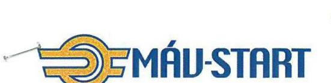

MÁV-START VASÚTI SZEMÉLYSZÁLLÍTÓ Zrt.
1087 Budapest, Könyves Kálmán krt. 54-60. - Postacím: 1940 Budapest
Telefon (1) 511-3160 - Fax: (1) 511-1364 - Webcím: www.mav-start.hu

## Domokos László

elnök

## 2479-1/2016/START

Tárgy: Utóellenőrzés jelentéstervezet észrevételei
Ügyintéző: Turkus Ágnes
Telefon: (1) 511-1353

ÁLLAMI SZÁMVEVŐSZÉK
1364 Budapest-4.
Pf. 54.

# Tisztelt Domokos László Úr! 

Hivatkozva a V-0880-083/2016. számú levelükre, valamint annak mellékleteként megküldött Utóellenőrzés Jelentéstervezetre, ezúton küldjük észrevételeinket szíves felhasználásra.
Fent jelzett Jelentéstervezet hiányosságként állapítja meg, illetve nem végrehajtott feladatként szerepelteti, hogy a MÁV-START Zrt. üzleti tervei, negyedéves és éves beszámolói, üzleti jelentései nem tartalmazták – az intézkedési tervben feladatként meghatározott – fedezetkimutatásokat.

Jelezni szeretnénk, hogy a fent jelzett fedezeti számítások elkészültek, azonban ahogy azt korábban is jeleztük, azok a vezetőség szerint üzleti titokként voltak kezelendőek, ezért nem kerültek bele üzleti terveinkbe, beszámolóinkba, üzleti jelentéseinkbe. A MÁV-START Zrt. havi gazdasági értékelő értekezletek keretében elemezte a fedezeti számításokat, ahol a MÁV Zrt. témafelelős vezetője is részt vett.
2014-ben a MÁV-TRAKCIÓ Zrt. és MÁV-GÉPÉSZET Zrt. (kiválasztott leányvállalatok) tevékenységei integrálásra kerültek a MÁV-START Zrt.-be, így a feladat okafogyottá vált. Fentiekre tekintettel
 ezen feladatot javasoljuk részben végrehajtottnak tekinteni.
A fentieken túlmenően javasolni szeretnénk a jelentéstervezet részeként az utóellenőrzés következtetéseit, illetve eredményeit is rögzíteni.
További észrevételeik esetén állunk szíves rendelkezésükre.

Budapest, 2016. március 2.
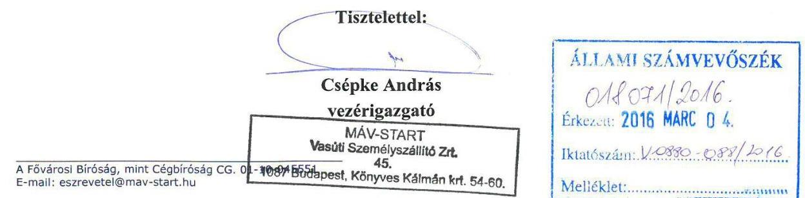

---

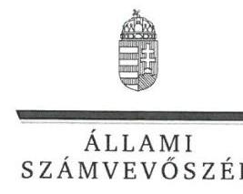

ELNÖK

Ikt.szám: V-0880-091/2016.

# Csépke András úr 

vezérigazgató
MÁV-START Vasúti Személyszállító Zrt.

## Budapest

## Tisztelt Vezérigazgató Úr!

Az „Utóellenőrzések - A vasúti közlekedés állami támogatási rendszerének ellenőrzéséről készült jelentés javaslatai hasznosulásának utóellenőrzése" címmel készített számvevőszéki jelentéstervezetre tett észrevételét köszönettel megkaptam.

Az Állami Számvevőszék észrevételekre vonatkozó álláspontjáról a felügyeleti vezető által készített részletes tájékoztatást mellékelten megküldöm.

Budapest, 2016. 03. 24.
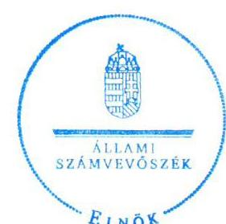

Tisztelettel:

Domokos László

Melléklet: Tájékoztatás az el nem fogadott észrevételekről

---

# Tájékoztatás   az el nem fogadott észrevételekről 

Az „Utóellenőrzések - A vasúti közlekedés állami támogatási rendszerének ellenőrzéséről készült jelentés javaslatai hasznosulásának utóellenőrzése" című jelentéstervezetre 2016. március 4-én érkezett észrevételeit áttekintettük, azok kezelésével kapcsolatban a következő tájékoztatást adom.

Az észrevétel megerősíti, hogy az intézkedési tervben a fedezet-kimutatással kapcsolatban meghatározott feladat nem teljesült, mert a MÁV-START Zrt. üzleti tervei, negyedéves és éves beszámolói, üzleti jelentései nem tartalmazták a kiválasztott szolgáltató leányvállalati kör elő-, illetve utókalkulált bevétel-költség-fedezet kimutatását, főbb jogcímenkénti bontásban.

Az intézkedési tervben vállalt feladat nem a fedezetszámítás elkészítésére és elemzésére irányult - amire az észrevétel hivatkozik -, hanem a fent hivatkozott dokumentumokban történő szerepeltetésére. A korábbi ellenőrzés alapján az ellenőrzött szervezet jelölte ki az intézkedési terv konkrét feladatát, amelyet módosító dokumentum az ÁSZ-hoz nem érkezett. A saját maguknak korábban előírt feladatot utólag - az utóellenőrzéssel párhuzamosan - átértelmezték ugyan, de az nem változtatta meg a vonatkozó érvényes ellenőrzési kritériumot. A jelentéstervezetben az érvényes kritériumhoz viszonyított megállapítás helytálló, ezért a módosítása nem indokolt.

Az észrevételében megjelölt, kiválasztott leányvállalatok (MÁV-TRAKCIÓ Zrt. és MÁVGÉPÉSZETI Zrt.) tevékenységének integrálására vonatkozó tájékoztatása nem befolyásolja a kitűzött feladat határidőn túli végrehajtásának tényét, ezért a vonatkozó megállapítás módosítása nem indokolt.

Vezérigazgató úr javasolta az utóellenőrzés következtetéseinek, eredményeinek rögzítését a jelentéstervezetben. Az utóellenőrzés sajátosságaihoz igazodóan elegendőnek tartjuk a jelentéstervezet 5. oldalán az Összegzés főcím alatti lead és a Főbb megállapítások, következtetések cím alatti bekezdés szerepeltetését.

Tájékoztatom, hogy a számvevőszéki jelentés függelékeként szerepeltetjük a jelentéstervezethez tett észrevételeit, valamint az azokra adott válaszunkat.

Budapest, 2016. 03. 21.

Böröcz Imre
felügyeleti vezető

---

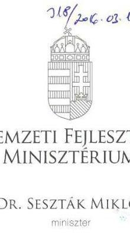

# Iktatószám: EFO/6588-2/2016-NFM 

Ügyintéző: Simonné Hábencius Gizella
Telefonszám: 79-54405
E-mail:gizella.habencius.simonne@nfm.gov.hu
Hiv. szám: V-0880-084/2016.

## Domokos László

elnök
részére
Állami Számvevőszék

## Budapest

Apáczai Csere János u. 10.
1052
Tárgy: Jelentéstervezet véleményezése

## Tisztelt Elnök Úr!

Köszönettel vettem kézhez ,,A vasúti közlekedés állami támogatási rendszerének ellenőrzéséről készült jelentés javaslatai hasznosulásának utóellenőrzése" címmel készített számvevőszéki jelentéstervezetet.

A jelentéstervezetre észrevételt nem teszek.
Budapest, 2016. március 2.

## Üdvözlettel:

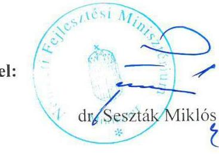

---

.

---

# RÖVIDÍTÉSEK JEGYZÉKE 

${ }^{1}$ ÁSZ
${ }^{2}$ ÁSZ jelentés
${ }^{3}$ MÁV Zrt.
${ }^{4}$ MÁV-START Zrt.
${ }^{5}$ ÁSZ tv.
${ }^{6}$ Alaptörvény
${ }^{7}$ Országgyűlés
${ }^{8}$ Áht.
${ }^{9}$ ÁSZ SZMSZ
${ }^{10}$ NFM
${ }^{11}$ GYSEV Zrt.
${ }^{12}$ MNV Zrt.
${ }^{13}$ MÁV CSOPORT
${ }^{14}$ MFB Zrt.
${ }^{15}$ NIF Zrt.
${ }^{16}$ SZMSZ
${ }^{17}$ ügyrend
${ }^{18} \mathrm{Bkr}$.
${ }^{19}$ MÁV FKG Kft.
${ }^{20}$ MÁV-GÉPÉSZET Zrt.
${ }^{21}$ MÁV-TRAKCIÓ Zrt.

Állami Számvevőszék
1292 ÁSZ jelentés a vasúti közlekedés állami támogatási rendszerének ellenőrzéséről (Iktatószám: V-2014-111/2011-2012., Témaszám: 1036, Vizsgálat-azonosító szám: V0566)
MÁV Magyar Államvasutak Zrt.
MÁV-START Vasúti Személyszállító Zrt.
Állami Számvevőszékről szóló 2011. évi LXVI. törvény
Magyarország Alaptörvénye (kihirdetve: 2011. április 25-én)
Magyarország Országgyűlése
2011. évi CXCV. törvény az államháztartásról (hatályos: 2012. január 1-jétől)

Állami Számvevőszék Szervezeti és Működési Szabályzata
Nemzeti Fejlesztési Minisztérium
Győr-Sopron-Ebenfurti Vasút Zrt.
Magyar Nemzeti Vagyonkezelő Zrt.
MÁV Zrt., MÁV-START Zrt., MÁV-TRAKCIÓ Zrt., MÁV-GÉPÉSZET Zrt.
Magyar Fejlesztési Bank Zrt.
Nemzeti Infrastruktúra Fejlesztési Zrt.
A Nemzeti Fejlesztési Minisztérium Szervezeti és Működési Szabályzatáról szóló 25/2012. (IX.17.) NFM utasítás (hatályos 2012. szeptember 19-től)
Ellenőrzési Főosztály 2012. október 24-én kelt, NFM/18428/1/2012. ikt. számú ügyrendje (hatályos 2012. október 20-tól)
370/2011. (XII.31.) Korm. rendelet a költségvetési szervek belső kontrollrendszeréről és belső ellenőrzéséről (hatályos 2012. január 1-jétől)
MÁV FKG Felépítménykarbantartó és Gépjavító Kft.
MÁV-GÉPÉSZET Vasútijármű Fenntartó és Javító Zrt.
MÁV-TRAKCIÓ Vasúti Vontatási Zrt.

---

ÁLLAMI SZÁMVEVŐSZÉK
1052 Budapest, Apáczai Csere János utca 10.
Levélcím: 1364 Budapest 4. Pf. 54
Telefon: +36 14849100 Telefax: +36 14849200
www.asz.hu
