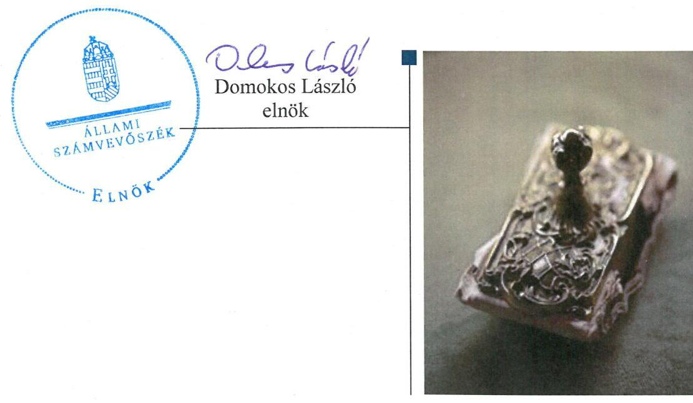
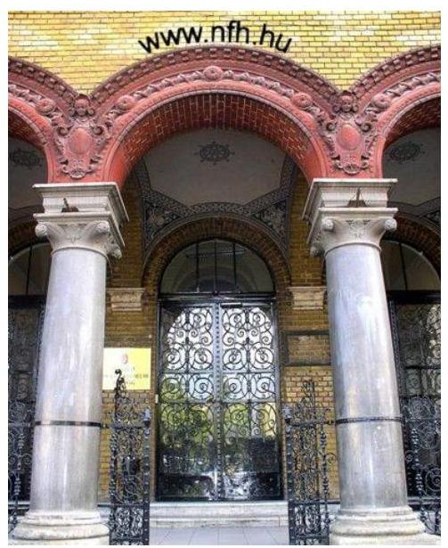
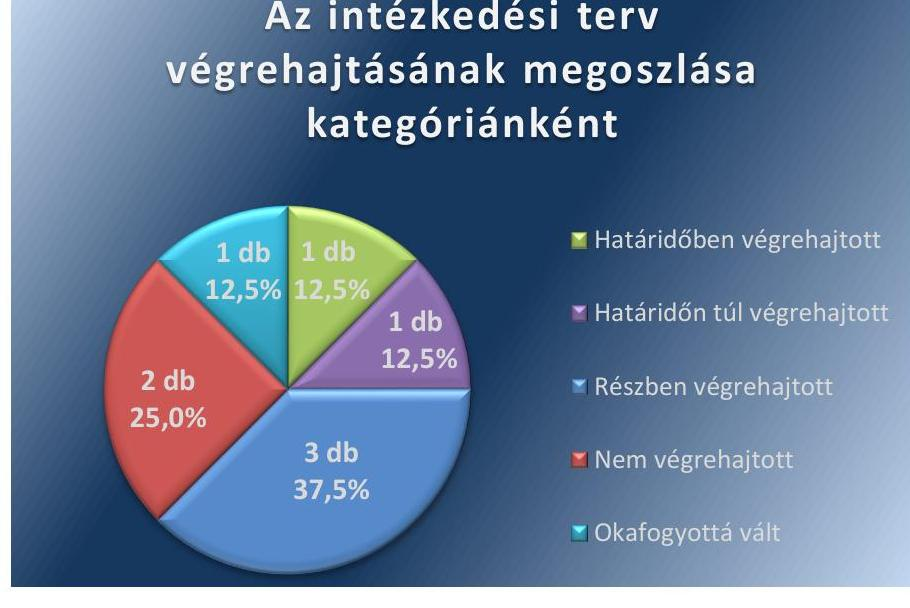
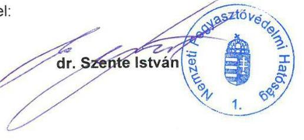
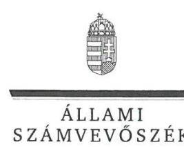
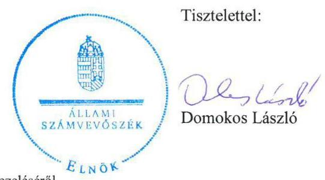
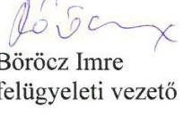

# Jelentés 

## Utóellenőrzések

A Nemzeti Fogyasztóvédelmi Hatóság ellenőrzéséről szóló jelentés utóellenőrzése
2016.

---

# Jelentés 

## Utóellenőrzések

A Nemzeti Fogyasztóvédelmi Hatóság ellenőrzéséről szóló jelentés utóellenőrzése
2016. június 20. nap

---

# AZ ELLENŐRZÉST FELÜGYELTE:

BÖRÖCZ IMRE felügyeleti vezető

AZ ELLENŐRZÉST VEZETTE ÉS A VÉGREHAJTÁSÁÉRT FELELŐS:

HORVÁTHNÉ HERBÁTH MÁRIA ellenőrzésvezető

A PROGRAM ÖSSZEÁLLÍTÁSÁÉRT FELELŐS:

JANIK JÓZSEF LÁSZLÓ osztályvezető

A TÉMÁHOZ KAPCSOLÓDÓ KORÁBBI SZÁMVEVŐSZÉKI JELENTÉS:

- címe: Jelentés a Nemzeti Fogyasztóvédelmi Hatóság ellenőrzéséről
- sorszáma: 1295

Jelentéseink az Országgyűlés számítógépes hálózatán és az Interneten a www.asz.hu címen is olvashatóak.

|  IKTATÓSZÁM: V-0879-069/2016. | |
| --- | --- |
|  TÉMASZÁM: 1913 | |
|  ELLENŐRZÉS-AZONOSÍTÓ SZÁM: V071707 | |

---

# TARTALOMJEGYZÉK 

■ ÖSSZEGZÉS ..... 5
■ AZ ELLENŐRZÉS CÉLJA ..... 6
■ AZ ELLENŐRZÉS TERÜLETE ..... 7
■ AZ ELLENŐRZÉS HÁTTERE, INDOKOLTSÁGA ..... 8
■ FÓKUSZKÉRDÉS ..... 9
■ ELLENŐRZÉS HATÓKÖRE ÉS MÓDSZEREI ..... 10
■ MEGÁLLAPÍTÁSOK ..... 12
■ MELLÉKLET ..... 15
AZ ÁSZ 1295. SZÁMÚ JELENTÉSÉHEZ KAPCSOLÓDÓ INTÉZKEDÉSI TERV VÉGREHAJTÁSA ..... 15
■ FÜGGELÉK: ÉSZREVÉTELEK ..... 17
■ RÖVIDÍTÉSEK JEGYZÉKE ..... 21

---

.

---

# ÖSSZEGZÉS 

Az Állami Számvevőszék a Nemzeti Fogyasztóvédelmi Hatóság utóellenőrzését a 2012. szeptember 10. és 2015. október 13. közötti időszakra vonatkozóan végezte el. Az utóellenőrzés megállapította, hogy az ellenőrzött szervezetnél a korábbi számvevőszéki jelentés javaslatai nem megfelelően hasznosultak. A hiányosságok kiküszöbölése érdekében az intézkedési tervben meghatározott feladatok közül egyet határidőben, egyet határidőn túl, hármat részben, kettőt nem hajtottak végre. A feladatok végrehajtásáról a jogszabályban előírt nyilvántartást nem vezették.

## Az ellenőrzés társadalmi indokoltsága

Az Állami Számvevőszék stratégiájában célul tűzte ki a számvevőszéki munka hasznosulásának javítását. Ezzel összhangban ellenőrzi, hogy az ellenőrzött szervezetek megvalósították-e a korábbi ellenőrzései által feltárt hibák, hiányosságok és szabálytalanságok megszüntetése céljából kialakított intézkedési terveikben foglaltakat. A rendszeres utóellenőrzések hozzájárulnak a szükséges intézkedések tényleges végrehajtásához, ezáltal a közpénzügyek rendezettségének javulásához.

## Főbb megállapítások, következtetések

A Nemzeti Fogyasztóvédelmi Hatóság az Állami Számvevőszék 2012. évi jelentésének javaslatai alapján elkészített, a jogszabályban rögzített határidőn belül megküldött intézkedési tervben meghatározott feladatokat nem hajtotta végre teljes körűen. A feladatok végrehajtásához kapcsolódó nyilvántartási kötelezettségüknek nem tettek eleget.

---

# AZ ELLENŐRZÉS CÉLJA 

## A Nemzeti Fogyasztóvédelmi Hatóság ellenőrzéséről szóló jelentés utóellenőrzése

Az ellenőrzés célja annak értékelése, hogy a számvevőszéki jelentésben ${ }^{1}$ foglalt intézkedést igénylő megállapításokkal és javaslatokkal összhangban készített intézkedési tervben meghatározott feladatokat az ellenőrzött szervezet végrehajtotta-e.

---

# AZ ELLENŐRZÉS TERÜLETE 

## A Nemzeti Fogyasztóvédelmi Hatóság

Az $\mathrm{NFH}^{2}$ a fogyasztóvédelemért felelős miniszter irányítása alá tartozó, központi hivatalként működő központi költségvetési szerv, amelynek vezetését a főigazgató* látja el.

A fogyasztóvédelmi törvény ${ }^{3}$ szerint a fogyasztóvédelmi hatóságok hivatottak ellenőrizni a kereskedelmi forgalomba kerülő termékek biztonságosságát, a fogyasztói alapjogok érvényesülését, valamint a fogyasztók részére nyújtott tájékoztatások megfelelőségét.

Hatósági feladatokat látnak el a kormányhivatalok szervezetén belül működő területi felügyelőségek. A szakmai irányítást a másodfokú hatóságként is eljáró NFH gyakorolja. Az NFH keretein belül fejti ki tevékenységét az Európai Fogyasztói Központ is, amely más uniós államban vásárolt árukkal kapcsolatos problémák megoldásában nyújt segítséget.

A korábbi ellenőrzéssel érintett 2011. évben az intézmény kiadásainak főösszege 1191,9 millió Ft, költségvetési támogatása 856,8 millió Ft volt. A 2015. évi költségvetési törvényben ${ }^{4}$ az NFH részére 1040,0 millió Ft kiadási és 1021,2 millió Ft támogatási előirányzatot hagytak jóvá.

Az NFH ellenőrzéséről szóló, 2012. szeptember 10-én közzétett számvevőszéki jelentés két javaslatot fogalmazott meg az intézmény főigazgatója számára. A javaslatok a gazdálkodással összefüggő szabályzatok módosítására, valamint a számviteli alapelvek érvényesítésére vonatkoztak.

A főigazgató a számvevőszéki jelentés javaslatai alapján elkészített intézkedési tervet ${ }^{5}$ az ÁSZ törvény ${ }^{6}$ 33. § (1) bekezdésében meghatározott határidőn belül küldte meg az ÁSZ ${ }^{7}$ részére.

[^0]
[^0]:    * A jelenlegi megbízott főigazgató 2014. november 24. óta látja el feladatát.

---

# AZ ELLENŐRZÉS HÁTTERE, INDOKOLTSÁGA 

Az ÁSZ törvény 33. § (1) bekezdése értelmében a számvevőszéki jelentések intézkedést igénylő megállapításaihoz és javaslataihoz kapcsolódóan az ellenőrzött szervezet vezetője intézkedési tervet köteles összeállítani, és az Állami Számvevőszék részére megküldeni. Az intézkedési tervben foglaltak megvalósítását - az ÁSZ törvény 33. § (7) bekezdésében foglaltak alapján - az Állami Számvevőszék utóellenőrzés keretében ellenőrizheti. Az intézkedések megvalósulásának értékelése során az Állami Számvevőszék figyelembe veszi az ellenőrzött szervezetek működési feltételeiben, valamint a jogszabályi előírásokban bekövetkezett változásokat.

Az intézkedési tervekben foglalt feladatok hiányos, illetve késedelmes végrehajtása, valamint megvalósításának elmaradása azt mutatja, hogy az ellenőrzések során feltárt hibák, hiányosságok és szabálytalanságok megszüntetése nem kapott kellő hangsúlyt. Ez a szabályszerű működés és a felelős vezetői magatartás vonatkozásában kockázatot hordoz. E kockázatok feltárásával az Állami Számvevőszék utóellenőrzési rendszere fokozza a fegyelmet, és igazolja, hogy a közpénzzel való szabályos gazdálkodás felelőssége elől nem lehet kitérni.

## AZ ELLENŐRZÉS VÁRHATÓ HASZNOSULÁSA:

Az utóellenőrzés négy szinten hasznosulhat:

- A társadalom szintjén az utóellenőrzés jelzi, hogy a számvevőszéki ellenőrzés megállapításainak van következménye: a hiányosságok megszüntetésére az ellenőrzött szervezet által meghatározott intézkedések végrehajtását is számon kéri az ÁSZ.
- Az ellenőrzött terület szintjén az utóellenőrzés tájékoztatást nyújt a terület döntéshozóinak a hiányosságok kiküszöbölésének jó gyakorlatairól, ezzel lehetőséget biztosítva arra, hogy az ÁSZ ellenőrzési megállapításai, javaslatai a terület nem ellenőrzött szervezeteinek a működése során is hasznosuljanak.
- Az ellenőrzött szervezet szintjén az utóellenőrzés feltárja, hogy a szervezet az intézkedések végrehajtásával hasznosította-e a korábbi ellenőrzési jelentésben a hiányosságok megszüntetése, illetve a kockázatok kezelése érdekében megfogalmazott javaslatokat.
- Az ÁSZ szintjén az utóellenőrzés visszacsatolást ad az ellenőrzési jelentések hasznosulásáról, az intézkedések elmaradása vagy részleges megvalósulása a további ellenőrzésekhez kockázati jelzésként szolgál.

---

# FÓKUSZKÉRDÉS 

1. Az ellenőrzött szervezet az intézkedési tervben foglaltakat — az előírt határidőben - végrehajtotta-e?

---

# ELLENŐRZÉS HATÓKÖRE ÉS MÓDSZEREI 

## Az ellenőrzés típusa

Szabályszerűségi ellenőrzés

## Az ellenőrzött időszak

A számvevőszéki jelentés közzétételének napjától (2012. szeptember 10.) az utóellenőrzés megkezdésének napjáig (2015. október 13.) tartó időszak.

## Az ellenőrzés tárgya

Az ÁSZ 1295. számú jelentésében megfogalmazott javaslatokra az ellenőrzött által megküldött intézkedési tervben foglaltak végrehajtása.

## Az ellenőrzött szervezet

Nemzeti Fogyasztóvédelmi Hatóság

## Az ellenőrzés jogalapja

Az Alaptörvény 43. cikk (1) bekezdése alapján az ÁSZ az Országgyűlés pénzügyi és gazdasági ellenőrző szerve. Az ÁSZ törvényben meghatározott feladatkörében ellenőrzi a központi költségvetés végrehajtását, az államháztartás gazdálkodását, az államháztartásból származó források felhasználását és a nemzeti vagyon kezelését.

Az ÁSZ törvény 1. § (3) bekezdése szerint az ÁSZ általános hatáskörrel végzi a közpénzekkel és az állami és önkormányzati vagyonnal való felelős gazdálkodás ellenőrzését.

Az ÁSZ törvény 33. § (7) bekezdése alapján a 33. § (1)-(2) bekezdései szerinti intézkedési tervben foglaltak megvalósítását az ÁSZ utóellenőrzés keretében ellenőrizheti.

Az államháztartáról szóló 2011. évi CXCV. törvény 61. § (2) bekezdése szerint az államháztartás külső ellenőrzésével kapcsolatos feladatokat az ÁSZ látja el.

---

# Az ellenőrzés módszerei 

Az ellenőrzést a nemzetközi standardokat irányadónak tekintve az ellenőrzési program ellenőrzési kérdései, az ellenőrzött időszakban hatályos jogszabályok, az ellenőrzés szakmai szabályok és módszertanok figyelembe vételével végeztük. Az utóellenőrzés megállapításait az ÁSZ rendelkezésére álló, valamint az ellenőrzött szervezettől elektronikusan bekért dokumentumok alapozták meg.

A jóváhagyott intézkedési tervben előírt feladatok végrehajtásának ellenőrzését értékelési kritériumok alapján végeztük. Figyelembe vettük az intézkedési terv jóváhagyását követően hatályba lépett jogszabályi előírások változásából következő események, továbbá a feladat-ellátási és finanszírozási rendszer esetleges változásának hatásait. Az intézkedési tervekben előírt feladatok értékelése azok végrehajthatósága, illetve végrehajtása szempontjából az alábbiak szerint történt:
$\longrightarrow$ okafogyottá vált az előírt feladat, ha végrehajtására - meghatározott esemény bekövetkezése, továbbá külső körülmény, a működést érintő feltétel változása miatt - már nincs szükség, illetve lehetőség, és egyértelműen megállapítható, hogy az intézkedést szükségessé tevő körülmény a jövőben nem fordulhat elő;
$\longrightarrow$ nem időszerű az a feladat, amelynek ellenőrzési időszakon belüli végrehajtására azért nem került (kerülhetett) sor, mert az intézkedés alapjául szolgáló esemény nem következett be, de annak jövőbeni előfordulása lehetséges, a végrehajtása nem volt esedékes, vagy a végrehajtás határideje még nem járt le;
$\longrightarrow$ határidőben végrehajtott a feladat, ha a teljesítés dokumentáltan az intézkedési tervben előírt határidőben és tartalommal megtörtént;
$\longrightarrow$ határidőn túl végrehajtott a feladat, ha annak teljesítése az intézkedési tervben meghatározott módon, de az előírt határidőn túl történt meg;
$\longrightarrow$ részben végrehajtott az a feladat, amelynek végrehajtása teljes körűen az intézkedési tervben előírt módon nem történt meg;
$\longrightarrow$ nem végrehajtott a feladat, ha a végrehajtás nem történt meg, vagy amennyiben a teljesítést nem dokumentálták.
Az ellenőrzés lefolytatásához az ellenőrzött szervezet tanúsítvány kitöltésével, valamint az ÁSZ által kért dokumentumok elektronikus megküldésével szolgáltatott adatokat, amelyek valódiságát és teljes körűségét az ellenőrzött szervezet vezetője által tett teljességi és hitelességi nyilatkozat igazolta. Az így rendelkezésre bocsátott adatok, információk kontrollja az ellenőrzés keretében történt.

---

# MEGÁLLAPÍTÁSOK 

## 1. Az ellenőrzött szervezet az intézkedési tervben foglaltakat — az előírt határidőben - végrehajtotta-e?

Összegző megállapítás

Az NFH az intézkedési tervben foglaltakat nem teljes körűen, illetve nem az előírt határidőben hajtotta végre, a feladatok végrehajtásáról a jogszabályban előírt nyilvántartást nem vezette.

### 1.1. számú megállapítás

Az intézkedési tervben foglalt feladatok végrehajtása két feladat kivételével elmaradt, illetve nem az intézkedési tervben meghatározott módon valósult meg.

A főigazgató a feltárt hiányosságok kijavítása, megszüntetése érdekében elkészítette és a jogszabályban rögzített határidőn belül megküldte az ÁSZ részére az intézkedési tervet. Ebben nyolc feladatot határozott meg, megjelölve a feladatok elvégzésének felelőseit és határidejét.

Az intézkedési tervben rögzített feladatok végrehajtásának értékelését az alábbi ábra szemlélteti:

1. ábra

## Az intézkedési terv végrehajtásának megoszlása kategóriánként

## HATÁRIDŐBEN VÉGREHAJTOTT FELADAT:

1. A függetlenített belső ellenőrzés 2013. évi munkatervébe beállították a bruttó elszámolás elve érvényesülésének ellenőrzését.

---

# HATÁRIDŐN TÚL VÉGREHAJTOTT FELADAT: 

2. Az aktualizált leltározási szabályzatot az intézkedési tervben vállalt 2012. október 15-ei határidőt követően, 2012. december 18-án léptették hatályba.

## RÉSZBEN VÉGREHAJTOTT FELADATOK:

3. A számviteli politikát és a számlarendet felülvizsgálatukat követően - az intézkedési tervben rögzített határidőn túl - módosították. A kiegészített számviteli politika és a számlarend módosítása nem volt minden tekintetben összhangban a jogszabályi előírásokkal, valamint az intézményi sajátosságokkal. A módosított számlarend egységes szerkezetben történő kiadása nem valósult meg.
4. Az önköltség-számítási szabályzatot aktualizálták, kiegészítették. Az intézkedési tervben vállalt határidőn túl kiadott új szabályzatban nem volt biztosított a rendelkezések összhangja, az előírások egyértelműsége és az nem felelt meg teljes körűen az intézményi sajátosságoknak.
5. Az Államkincstárral történő egyeztetések éves szinten megvalósultak. Havi gyakoriságú egyeztetés, az eltérések okainak megállapítása és azok rendezése dokumentáltan nem történt meg.

## NEM VÉGREHAJTOTT FELADATOK:

6. A költségvetési beszámolók készítéséhez kapcsolódóan a fokozott vezetői ellenőrzésről és a munkafolyamatba épített ellenőrzési pontok kibővítéséről nem gondoskodtak.
7. Az intézkedési tervben foglalt feladatok végrehajtásáról írásbeli beszámolók nem készültek.

## OKAFOGYOTTÁ VÁLT FELADAT:

8. Az intézkedési terv 1-3. pontjában foglalt feladatok végrehajtását az ÁSZ elnöke nem összesített írásbeli beszámoló kérésével, hanem utóellenőrzés elrendelésével, annak megállapításaira alapozva értékeli.
Az intézkedési tervben előírt feladatokat, azok végrehajtásának
 határidejét, az ÁSZ jelentés javaslatainak címzettjét, valamint az intézkedések végrehajtásának bemutatását a melléklet tartalmazza.

### 1.2. számú megállapítás

Az intézkedési tervben foglalt feladatok végrehajtásáról az intézménynél nem vezették a jogszabályban előírt nyilvántartást.

Az intézmény vezetője nem tett eleget a Bkr. ${ }^{8}$ 14. § (1) bekezdése szerinti kötelezettségének, mivel nem gondoskodott az intézkedési tervben foglalt feladatok végrehajtását érintően a jogszabályban rögzített nyilvántartás vezetéséről.

---

.

---

# MELLÉKLET

- AZ ÁSZ 1295. SZÁMÚ JELENTÉSÉHEZ KAPCSOLÓDÓ INTÉZKEDÉSI TERV VÉGREHAJTÁSA

|  1. | Intézkedési terv alapján elvégzendő feladat | Az intézkedési tervben meghatározott határidő | Az intézkedés végrehajtása  |
| --- | --- | --- | --- |
|  1. |  | 2. | 3.  |
|  Határidőben végrehajtott feladat |  |  |   |
|  1. | A függetlenített belső ellenőrzés 2013. évi munkatervébe be kell állítani a bruttó elszámolás elve érvényesülésének ellenőrzését. Felelős: a belső ellenőrzési vezető | 2012. november 30. | A függetlenített belső ellenőrzés 2013. évi munkatervébe beállították a bruttó elszámolás elve érvényesülésének ellenőrzését. A belső ellenőr a munkatervnek megfelelően elvégezte a 2012. évi mérleg vizsgálatát, a belső ellenőrzési jelentés a bruttó elszámolás elvének megsértésére vonatkozó megállapítást nem tartalmazott.  |
|  Határidőn túl végrehajtott feladat |  |  |   |
|  2. | A leltározási szabályzat aktualizálását el kell végezni az intézményi sajátosságok figyelembevételével. Felelős: a gazdasági főosztályvezető | 2012. október 15. | A főigazgató az intézményi sajátosságok figyelembevételével kibővített, aktualizált leltározási szabályzatot a vállalt 2012. október 15-ei határidőt követően, 2012. december 18-án a 40/2012. sz. Főigazgatói Utasítással adta ki.  |
|  Részben végrehajtott feladatok |  |  |   |
|  3. | A Számviteli politika és a számlarend felülvizsgálatát el kell végezni a jogszabályi- és a szervezeti változás figyelembevételével, szükség esetén visszamenőleges hatálylyal. Felelős: a gazdasági főosztályvezető | 2012. szeptember 30. | A számviteli politikát és a számlarendet -felülvizsgálatukat követően -módosították. A szabályzatok hatályba léptetése az intézkedési tervben rögzített 2012. szeptember 30-ei határidőn túl valósult meg. A 2012. október 29-én kiadott új, módosított számviteli politika nem volt minden tekintetben összhangban a hatályos jogszabályi előírásokkal, valamint az intézményi sajátosságokkal. A következetesség számviteli alapelvének érvényesítésére vonatkozó szabályozás nem volt összhangban az Áhsz. ${ }^{9}$ 9 § (11) bekezdésével. Hiányzott az immateriális javak és tárgyi eszközök üzembe helyezése dokumentálásának az Áhsz. 8 § (7) bekezdése szerinti szabályozása, továbbá a mérlegkészítés időpontjának az Áhsz. 8. § (8) bekezdésében rögzített meghatározása. A számviteli politika kialakítása - az Sztv. ${ }^{10}$ 14. § (4) bekezdésében és az Áhsz. 8. § (3) bekezdésében foglaltaktól eltérően - nem az NFH szakmai feladatai és sajátosságai figyelembevételével történt. A számlarend módosítására vonatkozó főigazgatói utasítást 2012. december 19-én léptették hatályba. A módosítás nem tükrözte az intézményi sajátosságokat, az immateriális javakra vonatkozóan ellentmondásos szabályozást tartalmazott. A szabályzat egységes szerkezetben történő kiadása a módosítást követően nem valósult meg.  |

---

|  4. | Az önköltség-számítási szabályzat aktualizálását el kell végezni az intézményi sajátosságok figyelembevételével, szükség esetén visszamenőleges hatállyal. Felelős: a gazdasági főosztályvezető, laboratóriumi vezetők | 2012. október 31. | Az önköltség-számítási szabályzatot aktualizálták, kiegészítették Az intézkedési tervben vállalt határidőt jóval meghaladóan - 2015. június 15-én - kiadott új szabályzat előírásai nem egyértelműek, nem felelnek meg az intézményi sajátosságoknak. Nem különül el a hivatalból indított és a megbízásból végzett vizsgálati díjakra vonatkozó szabályozás. Nem biztosított a rendelkezések összhangja, mivel a külső megbízás alapján elvégzett vizsgálatok - a szabályzat 1. sz. mellékletében szereplő - díjtételeinek meghatározása nem a szabályzatban rögzített kalkuláció alapján történt.  |
| --- | --- | --- | --- |
|  5. | Az Államkincstár és az intézményi számvitel egyeztetését el kell végezni, az eltérések okát meg kell állapítani és a rendezését havonta el kell végezni. Felelős: a gazdasági főosztályvezető | 2012. október 31. | Az Államkincstárral történő egyeztetések éves szinten - a beszámoló készítése során - megvalósultak, az eltérések okait megállapították. Az intézkedési tervben vállalt 2012. október 31-ei határidőt nem tartották be. A havi gyakoriságú egyeztetés, az eltérések okainak megállapítása és azok rendezése dokumentáltan nem történt meg.  |
|   |  | Végre nem hajtott feladatok |   |
|  6. | Gondoskodni kell a fokozott vezetői ellenőrzésről és a munkafolyamatba épített ellenőrzési pontok kibővítéséről. Felelős: a gazdasági főosztályvezető | 2012. október 15. | A költségvetési beszámoló készítéséhez kapcsolódóan a fokozott vezetői ellenőrzésről és a munkafolyamatba épített ellenőrzési pontok kibővítéséről nem gondoskodtak. Az NFH Belső Kontroll Kézikönyvéről 2015-ben kiadott szabályzat mellékleteként módosították a Gazdasági Főosztály munkafolyamatainak ellenőrzési nyomvonalát. Ebben a beszámoló készítéséhez kapcsolódó egyes tevékenységek végrehajtása során a résztvevők feladatait és a felelősségi szinteket nem határozták meg egyértelműen, az egyes munkafolyamatokhoz tartozó ellenőrzési pontokat nem rögzítették.  |
|  7. | Az intézkedési tervben foglalt feladatok végrehajtásáról írásos beszámolót kell készíteni. Felelősök: az érintett vezetők | 2012. november 30. | Az intézkedési tervben foglalt feladatok végrehajtásáról a felelősök által aláírt írásbeli beszámolók nem készültek.  |
|   |  | Okafogyottá vált feladat |   |
|  8. | Az intézkedési terv 1-3 pontjában foglalt feladatok végrehajtásáról készített összesített írásos beszámolót az ÁSZ Elnöke részére meg kell küldeni az általa meghatározott időpontig. Felelős: a gazdasági főosztályvezető | - | Az intézkedési terv 1-3. pontjában foglalt feladatok végrehajtását az ÁSZ elnöke nem összesített írásbeli beszámoló kérésével, hanem utóellenőrzés elrendelésével, annak megállapításaira alapozva értékeli.  |

---

# FÜGGELÉK: ÉSZREVÉTELEK 

A jelentéstervezetet az Állami Számvevőszék 15 napos észrevételezésre megküldte az ellenőrzött szervezet vezetőjének az ÁSZ törvény 29. § (1) bekezdése előírásának megfelelően.
Az elfogadott észrevételek alapján véglegesíti az Állami Számvevőszék a jelentését.

A függelék tartalmazza az ellenőrzött észrevételeit, illetve az el nem fogadott észrevételek elutasításának indoklását.

- A Nemzeti Fogyasztóvédelmi Hatóság főigazgatójának írásban tett észrevétele.
- Tájékoztatás az észrevétel kezeléséről a főigazgatónak.

[^0]
[^0]:    ${ }^{7}$ 29. § (1) Az Állami Számvevőszék az ellenőrzési megállapításait megküldi az ellenőrzött szervezet vezetőjének vagy az általa megbízott személynek, és annak, akinek személyes felelősségét állapította meg.
    (2) Az ellenőrzött szervezet vezetője és a felelősként megjelölt személy az ellenőrzés megállapításaira tizenöt napon belül írásban észrevételt tehet.
    (3) Az Állami Számvevőszék az észrevételre a beérkezésétől számított harminc napon belül írásban válaszol. A figyelembe nem vett észrevételeket köteles a jelentésben feltüntetni, és megindokolni, hogy azokat miért nem fogadta el.

---

# FŐIGAZGATÓ 

Iktatószám: GÜF-266-2/2016.
Úgyintéző: Bollókné Kovács Brigitta
Telefonszám: 459-4916
Domokos László
elnök úr részére

## ÁLLAMI SZÁMVEVŐSZÉK

Budapest
Apáczai Csere János utca 10.
1052

Tárgy: Jelentéstervezet észrevételezése

## Tisztelt Elnök Úr!

A Nemzeti Fogyasztóvédelmi Hatósághoz 2016. február 25-én beérkezett V-0879-056/2016 iktatószámú levelére hivatkozással, amelyben megküldi az „Utóellenőrzések - A Nemzeti Fogyasztóvédelmi Hatóság ellenőrzéséről szóló jelentés utóellenőrzése" címú számvevőszéki jelentéstervezetet, az alábbi észrevételeket teszem.

Álláspontom szerint a jelentéstervezet címéből nem állapítható meg, hogy az utóellenőrzés a 2012. szeptemberében történt ellenőrzést követően kialakított intézkedési tervben foglaltak megvalósításának utóellenőrzésére vonatkozik.

Fentiek alapján javaslom a jelentéstervezet címének kiegészítését, tekintettel arra, hogy a dokumentum a Nemzeti Fogyasztóvédelmi Hatóság ÁSZ 1295. számú 2012. szeptemberében történt ellenőrzés utóellenőrzésének jelentése.

A jelentéstervezetre vonatkozóan egyéb észrevételt nem kívánok tenni.
Kérem tájékoztatásom szíves fogadását.
Budapest, 2016. március 2.

---

ELNÖK

Ikt.szám: V-0879-062/2016.

# dr. Szente István úr 

főigazgató
Nemzeti Fogyasztóvédelmi Hatóság

## Budapest

## Tisztelt Főigazgató Úr!

Az „Utóellenőrzések - A Nemzeti Fogyasztóvédelmi Hatóság ellenőrzéséről szóló jelentés utóellenőrzése" címmel készített számvevőszéki jelentéstervezetre küldött észrevételét köszönettel megkaptam.

Az Állami Számvevőszék észrevételre vonatkozó álláspontjáról a felügyeleti vezető által készített részletes tájékoztatást mellékelten megküldöm.

Budapest, 2016. 01. hó 2. nap

Melléklet: Tájékoztatás az észrevétel kezeléséről

---

# Tájékoztatás   az észrevétel kezeléséről 

Az „Utóellenőrzések - A Nemzeti Fogyasztóvédelmi Hatóság ellenőrzéséről szóló jelentés utóellenőrzése" címû jelentéstervezetre 2016. március 7-én érkezett észrevételét áttekintettük, annak kezelésével kapcsolatban a következő tájékoztatást adom.
Az észrevétel szerint a jelentéstervezet címéből nem állapítható meg, hogy az utóellenőrzés a 2012. szeptemberében történt ellenőrzést követően kialakított intézkedési tervben foglaltak megvalósításának utóellenőrzésére vonatkozik.
Köszönettel vettük Főigazgató Úr javaslatát a cím kiegészítésére vonatkozóan - utalással az Állami Számvevőszék 2012. szeptemberében történt ellenőrzésére, melyről 1295. számmal jelent meg jelentés -, azonban ez alapján a jelentéstervezet módosítása nem indokolt.
A jelentéstervezeten szereplő cím megegyezik az Állami Számvevőszék elnöke által jóváhagyott, V-0879-011/2015. iktatószámú (témasorszám: 27, ellenőrzés-azonosító szám: V0717) ellenőrzési programban szereplő címmel, amelyet nem módosítunk.
A jelentéstervezetben a belső borító (2. oldal) „A témához kapcsolódó korábbi számvevőszéki jelentés" része utal a 2012. évi ÁSZ-ellenőrzésre, illetve „Az ellenőrzés tárgya" (10. oldal) rész tartalmazza, hogy a jelentéstervezet az Állami Számvevőszék 1295. számú jelentésében megfogalmazott javaslatokra az ellenőrzött által megküldött intézkedési tervben foglaltak végrehajtására irányult.

Tájékoztatom, hogy a számvevőszéki jelentés függelékeként szerepeltetjük a jelentéstervezethez tett észrevételét, valamint az arra adott válaszunkat.

Budapest, 2016. 03. hó 24. nap

---

# RÖVIDÍTÉSEK JEGYZÉKE 

${ }^{1}$ számvevőszéki jelentés
${ }^{2}$ NFH
${ }^{3}$ fogyasztóvédelmi törvény
${ }^{4}$ 2015. évi költségvetési törvény
${ }^{5}$ intézkedési terv
${ }^{6}$ ÁSZ törvény
${ }^{7}$ ÁSZ
${ }^{8}$ Bkr.
${ }^{9}$ Áhsz.
${ }^{10}$ Sztv.
az ÁSZ 2012. szeptember 10-én nyilvánosságra hozott, 1295. számú jelentése a Nemzeti Fogyasztóvédelmi Hatóság ellenőrzéséről
Nemzeti Fogyasztóvédelmi Hatóság
a fogyasztóvédelemről szóló 1997. évi CLV. törvény
Magyarország 2015. évi központi költségvetéséről szóló 2014. évi C. törvény
az NFH GFO-1421-5/2012. iktatószámú 2012. szeptember 27-én kelt intézkedési terve
az Állami Számvevőszékről szóló 2011. évi LXVI. törvény
Állami Számvevőszék
a költségvetési szervek belső kontrollrendszeréről és belső ellenőrzéséről szóló 370/2011. (XII.31.) Korm. rendelet (hatályos 2012. január 1-jétől)
az államháztartás szervezetei beszámolási és könyvvezetési kötelezettségének sajátosságairól szóló 249/2000. (XII. 24.) Korm. rendelet (hatálytalan 2014. január 1-jétől)
a számvitelről szóló 2000. évi C. törvény

---

ÁLLAMI SZÁMVEVŐSZÉK
1052 Budapest, Apáczai Csere János utca 10.
Levélcím: 1364 Budapest 4. Pf. 54
Telefon: +36 14849100 Telefax: +36 14849200
www.asz.hu

