# Jelentés 

## Pro Rekreatione Közhasznú Nonprofit Kft.

Az állami tulajdonban (résztulajdonban) lévő gazdálkodó szervezetek vagyonmegőrzési és gazdálkodási tevékenységének ellenőrzése 2016.

---

# Jelentés 

## Pro Rekreatione Közhasznú Nonprofit Kft.

Az állami tulajdonban (résztulajdonban) lévő gazdálkodó szervezetek vagyonmegőrzési és gazdálkodási tevékenységének ellenőrzése

Budapest, 2016. 04. hó 07. nap
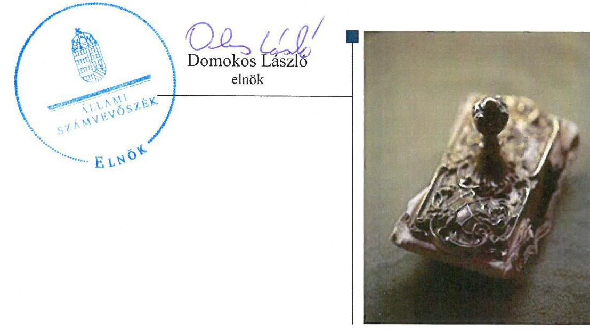

---

# AZ ELLENŐRZÉST FELÜGYELTE:

## MAKKAI MÁRIA felügyeleti vezető

## AZ ELLENŐRZÉST VEZETTE ÉS A VÉGREHAJTÁSÁÉRT FELELŐS:

### PONGRÁCZ ÉVA ellenőrzésvezető

## A PROGRAM ÖSSZEÁLLÍTÁSÁÉRT FELELŐS:

### LAJTERNÉ HUDÁK MAGDOLNA osztályvezető

---

**IKTATÓSZÁM: V-0853-356/2016.**

**TÉMASZÁM: 1887.**

**ELLENŐRZÉS-AZONOSÍTÓ SZÁM: V070905**

---

Jelentéseink az Országgyűlés számítógépes hálózatán és az Interneten a www.asz.hu címen is olvashatóak.

---

# TARTALOMJEGYZÉK 

■ ÖSSZEGZÉS ..... 5
■ AZ ELLENŐRZÉS CÉLJA ..... 7
■ AZ ELLENŐRZÉS TERÜLETE ..... 8
■ AZ ELLENŐRZÉS HÁTTERE, INDOKOLTSÁGA ..... 9
■ FÓKUSZKÉRDÉSEK ..... 10
■ ELLENŐRZÉS HATÓKÖRE ÉS MÓDSZEREI ..... 11
■ MEGÁLLAPÍTÁSOK ..... 13
■ JAVASLATOK ..... 24
■ MELLÉKLETEK ..... 27
I. Sz. melléklet: Értelmező szótár ..... 27
■ FÜGGELÉK: ÉSZREVÉTELEK ..... 31
■ RÖVIDÍTÉSEK JEGYZÉKE ..... 47

---

.

---

# ÖSSZEGZÉS 

Az Állami Számvevőszék a PR Kft.-t a 2011. január 1. - 2014. december 31. közötti időszakra vonatkozóan ellenőrizte. Az ellenőrzés fő célja volt, hogy értékelje a gazdálkodási feltételek kialakításának, a tulajdonosi jogok gyakorlásának, az elszámolásoknak, a vagyonváltozást eredményező döntéseknek és az információk átadásának szabályszerűségét.
A PR Kft. több szabálytalanságot követett el az ellenőrzött időszakban. Az állami vagyon hasznosítására kötött szerződések, a tulajdonosi joggyakorlás, az elszámolások, a vagyongazdálkodási feltételek kialakítása, a vagyongazdálkodás, illetve vagyonnyilvántartás, valamint az adatszolgáltatás nem volt szabályszerű. A Kbt. előírásait három esetben nem tartotta be a PR Kft. A Kft. tevékenysége nem támogatta az állami vagyonnal való szabályszerű gazdálkodást.

## Az ellenőrzés társadalmi indokoltsága

Magyarországon az intézmény-centrikus közfeladat-ellátás, közvagyon-gazdálkodás jellemző a költségvetésen kívüli feladatellátás térnyerése mellett. Ennek szereplői a nonprofit szervezetek, az önkormányzati tulajdonú gazdasági társaságok és az állami tulajdonú gazdálkodó szervezetek is.

Az Áht ${ }_{2}{ }^{1}$ 2. § I) pontja, az Európai Közösséget létrehozó szerződéshez csatolt, a túlzott hiány esetén követendő eljárásról szóló jegyzőkönyv alkalmazásáról szóló 2009. május 25-i 479/2009/EK rendelet szerint, illetve az ESA95 statisztikai módszertana alapján a kormányzati szektorba tartoznak "központi kormányzat alszektorba besorolt társaságok és egyéb szervezetek" is, amelyekkel szemben alapvető követelmény, hogy gazdálkodásuk, működésük szabályszerű, az általuk szolgáltatott adatok megbízhatóak legyenek.

Az állami tulajdonú gazdálkodó szervezetek a nemzeti vagyon részét képezik. Az állami vagyonnal való gazdálkodást illetően a tulajdonosi joggyakorlás és a vagyongazdálkodás feladata az állami vagyon átlátható, rendeltetésszerű és felelős felhasználásának biztosítása. Az állam meghatározza az ellátandó közszolgáltatással kapcsolatos feladatokat, amelyhez a vagyonnal kapcsolatos döntéseknek igazodniuk kell a nemzetgazdasági szempontból kiemelt jelentőségű nemzeti vagyonban tartandó állami tulajdonban álló társasági részesedést a nemzeti vagyonról szóló törvény határozza meg.

Minden közpénzt, közvagyont használó szervezettel szemben társadalmi igény, hogy tevékenységükről elszámoljanak. Ezt figyelembe véve és az Állami Számvevőszék Stratégiájával összhangban került sor az PR Kft. ellenőrzésére.

## Főbb megállapítások, következtetések, javaslatok

A PR Kft. feladatait saját, illetve a vagyonkezelésében lévő eszközökkel látta el. A tulajdonos számára fenntartott, vagyongazdálkodásra vonatkozó jogokat, a saját és a kezelésében lévő állami vagyonnal történő felelős gazdálkodáshoz szükséges követelményeket az Alapító Okiratban rögzítették. A PR Kft. kezelésében lévő állami vagyon hasznosítására kötött vagyonkezelési/használati szerződések azonban nem voltak szabályszerűek, nem rögzítették teljes körűen a jogszabályokban foglalt tartalmi előírásokat, nem támogatták a szabályszerű vagyongazdálkodást. Ebből következően a tulajdonosi jogok gyakorlása nem szabályszerűen történt. A tulajdonosi joggyakorló ellenőrzést nem végzett. Az ellenőrzött időszak első felében nem volt vagyonváltozást eredményező döntés, azt követően pedig a fejlesztések engedélyezésére terjedtek ki a döntések és szabályszerűen születtek.

A PR Kft.-nél a bevételek és ráfordítások elszámolása nem volt szabályszerű és nem felelt meg a jogszabályi és a tulajdonosi előírásoknak. A PR Kft. nem határozta meg a közfeladatok ráfordításainak és bevételeinek elhatárolásához szükséges előírásokat, az elkülönítést nem végezte el, az önköltségszámítás nem volt összhangban a társaság által

---

kialakított szabályozással. Mindezek következtében az elszámolások nem biztosították az átláthatóságot, elszámoltathatóságot.

A PR Kft. vagyongazdálkodási tevékenységének feltételeit nem az előírásoknak megfelelően alakította ki. A társaság vagyongazdálkodása nem felelt meg a jogszabályi előírásoknak és tulajdonosi elvárásoknak. A vagyonnyilvántartás sem a saját, sem a kezelt vagyon vonatkozásában nem volt összhangban a jogszabályi és a tulajdonosi joggyakorló által előírt követelményekkel.

A tulajdonosi joggyakorló felé megtörtént az információk átadása, de szabályozott keretek között működő információs rendszert nem hozott létre a társaság a tulajdonosi joggyakorló által előírtak ellenére. A PR Kft. által szolgáltatott adatok nem feleltek meg a valóságnak, nem adtak valós képet a Kft. vagyoni helyzetéről. A beszámolók jóváhagyása hiányos volt, azok letétbe helyezése nem az előírásoknak megfelelően történt.

A Kbt. előírásait a Kft. nem tartotta be, az értékhatárt meghaladó szerződések megkötéséhez nem folytattak le közbeszerzési eljárást. A törvény előírásait három esetben sértették meg.

A PR Kft. a kormányzati szektorba sorolt egyéb szervezetek közé tartozott, de adósságot keletkeztető ügylet nem volt.

---

# AZ ELLENŐRZÉS CÉLJA 

## Az állami tulajdonban (résztulajdonban) lévő gazdálkodó szervezetek vagyonmegőrzési és gazdálkodási tevékenységének ellenőrzése a PR Kft.-nél

Az ellenőrzés célja annak értékelése volt, hogy a tulajdonosi jogok gyakorlása szabályszerű volt-e; a gazdálkodó szervezet által ellátott feladat bevételei, ráfordításai elszámolásának, és vagyongazdálkodási tevékenységének szabályozása megfelelt-e a jogszabályi és a tulajdonosi előírásoknak és azok végrehajtása szabályszerű volt-e; biztosítva volt-e a közfeladatok átláthatósága és elszámoltathatósága érdekében a közszolgáltatás díjának megalapozottsága szabályszerű önköltségszámítással; a vagyonváltozást eredményező döntések esetében a tulajdonosi jogok gyakorlója és a gazdálkodó szervezet szabályszerűen jártak-e el; a gazdálkodó szervezet épített-e ki és működtetett-e információs rendszert a szabályszerű vagyongazdálkodás érdekében.

Az ellenőrzés célja annak értékelése is, hogy a kormányzati szektorba sorolt egyéb szervezetek gazdálkodásának a kormányzati szektor hiányára és az államadósságra befolyással bíró elemei a jogszabályi előírásoknak megfelelnek-e.

---

# AZ ELLENŐRZÉS TERÜLETE 

## A PR Kft.

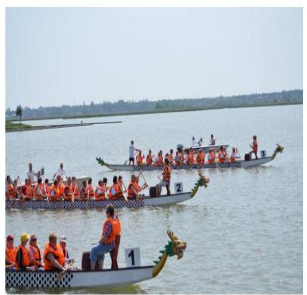

A PR Kft.-t az 1144/2011. (V.13.) Korm. határozat hozta létre a Pro Rekreatione Alapítvány általános jogutódjaként. A Kft. 100%-ban állami tulajdonban lévő egyszemélyes társaság.

A PR Kft. ${ }^{2}$ részesedésének tulajdonosi joggyakorlója az ellenőrzött időszakban a MNV Zrt. ${ }^{3}$ volt. Az MNV Zrt. a KIM-mel ${ }^{4}$ 2011. július 29.-2013. május 9. közötti időszakra vagyonkezelői szerződést kötött, az EMMI-vel ${ }^{5}$ pedig 2013. július 19-én kötötte meg a társasági részesedéshez kapcsolódó tulajdonosi jogok gyakorlására vonatkozó megbízási szerződést.

A Kft. által használt vagyonkezelt vagyonelemek tulajdonosi joggyakorlója az FMÖ6 volt a 2011. október 1.-2011. december 31. közötti időszakban. 2012. január 1.-2014. december 31. között a tulajdonosi jogokat az MNV Zrt. gyakorolta. A 2012. január 1.-2012. október 15. között a vagyonkezelésre vonatkozó szerződéses jogviszony nem volt. Az MNV Zrt. FMIK ${ }^{7}$ közötti szerződés aláírására az MNV Zrt. részéről 2012. szeptember 27-én, az FMIK részéről 2012. október 15-én került sor, visszamenőlegesen, 2012. január 1-ei hatállyal.

A Társaság célja a Velencei-tó partján fekvő létesítmények együttes üzemeltetése és fejlesztése, színvonalas működtetése az emberek egészségi rekreációja, különösen az ifjúság szabadidejének hasznos eltöltése, a fogyatékos emberek rehabilitációja és fejlesztése érdekében. A tevékenységükben fő szempont továbbá a környezet és természetvédelmi célok teljesítése. A Kft. feladatait közhasznú tevékenységként (többek között után-pótlás-képzési tevékenység, sporttábor működtetése, tömegsport- és versenyszervezés), és egyéb nem közhasznú tevékenységként (szállodai szolgáltatás, egyéb vendéglátás, építményüzemeltetés) látta el.

A PR Kft. mérlegében a 2014. év végén szereplő összes eszközvagyon 2261,9 M Ft, a kezelésbe átvett állami vagyon 1107,0 M Ft. A saját tőkéje a 2014. év végén 45,3 M Ft, a jegyzett tőke 3,0 M Ft volt. A PR Kft. összes bevétele a 2014. évben 336,6 M Ft, ezen belül az értékesítés nettó árbevétele 96,4 M Ft volt. A Társaság gazdálkodása 2011-2013. évek között nyereséges volt, 2014. évben veszteséget termelt, melynek összege 7,4 M Ft volt. A foglalkoztatottak átlagos statisztikai állományi létszáma 2014-ben 34 fő volt. Az ellenőrzött időszakban a képviseleti joggal rendelkező ügyvezető igazgató személyében 2011. november 23-tól nem volt változás.

A kormányzati szektorba sorolt egyéb szervezet többek között köteles adatszolgáltatást teljesíteni a központi költségvetésről szóló törvény elkészítéséhez, továbbá adósságot keletkeztető ügyletet csak az államháztartásért felelős miniszter előzetes egyetértésével köthet.

[^0]
[^0]:    * Magyarország gazdasági stabilitásáról szóló 2011. évi CXCIV. törvény 9. § alapján a 353/2011. (XII. 30.) Korm. rendeletben foglaltak szerint.

---

# AZ ELLENŐRZÉS HÁTTERE, INDOKOLTSÁGA 

Az ÁSZ ${ }^{8}$ alapvető célkitűzése, hogy az államháztartáson kívülre nyújtott költségvetési támogatások és ingyenes vagyonjuttatások ellenőrzésével hozzájáruljon ahhoz, hogy a közpénzeket az államháztartáson kívül működő szervezetek is átlátható módon használják fel a közfeladatok szerződésben vállalt ellátása érdekében. A közfeladatok ellátása elsősorban költségvetési szervek alapításával és működtetésével történik. Az államháztartáson kívüli szervezetek a közfeladatok ellátásában, jogszabályban meghatározott feltételekkel, közreműködhetnek. ${ }^{\dagger}$

Az ellenőrzés feladata a közvagyonnal biztosított közfeladat-ellátással kapcsolatban a közpénzek átláthatósága, nyilvánossága érdekében a jogszabályokban, belső szabályzatokban megfogalmazott előírások érvényesülésének az állami tulajdonban (résztulajdonban) lévő gazdálkodó szervezetek vagyonérték-megőrzési és gazdálkodási tevékenységének értékelése.

A nemzeti számlák nemzetközi és hazai statisztikai módszertana és szabványai elveket határoznak meg a statisztikai értelemben vett kormányzati szektorba tartozó szervezetek körére és besorolásuk módjára. A szervezetek megnevezését a nemzetgazdasági miniszter teszi közzé.

A Vtv. 3. § (1) 2013. június 27-ig hatályos szabályozása értelmében a tulajdonosi jogok és kötelezettségek összességét az állami vagyon tekintetében az állami vagyon felügyeletéért felelős miniszter gyakorolja, aki e feladatát az MNV Zrt., az MFB Zrt., illetve a jogszabályban rögzített egyéb tulajdonosi joggyakorló szervezetek útján látja el, míg 2014. július 15-ig tulajdonosi joggyakorlóként, ha törvény vagy miniszteri rendelet eltérően nem rendelkezik, az MNV. Zrt., a törvényben, vagy a miniszter által rendeletben kijelölt személy gyakorolja. 2014. július 15-t követően a rábízott állami vagyon felett az államot megillető tulajdonosi jogok és kötelezettségek összességét tulajdonosi joggyakorlóként - ha törvény vagy miniszteri rendelet eltérően nem rendelkezik - az MNV Zrt. gyakorolja.

Az ellenőrzés várható hasznosulásaként az ellenőrzés megállapításai a jogalkotás számára segítséget nyújthatnak az államháztartáson kívüli közfeladat-ellátás, közvagyonnal való gazdálkodás értékeléséhez, jogszabályi keretei pontosításához, az átláthatóságot biztosító szabályozáshoz. Az ellenőrzöttek számára visszajelzést ad a gazdálkodási tevékenységgel, az állami vagyon felhasználásával, a közszolgáltatási árképzés megalapozottságával és az éves elszámolással kapcsolatos szabálytalanságokról és kockázatokról. Az ellenőrzés tapasztalatai segítik és erősítik az ÁSZ hozzáadott értéket teremtő elemző tevékenységét és tanácsadó szerepét. Feltárjuk, hogy a kormányzati szektorba sorolt egyéb szervezetek milyen mértékben befolyásolják a költségvetési hiányt és az államadósságot. A kormányzati szektorba sorolt, költségvetési tervezésbe is bevont gazdálkodó szervezetek ellenőrzése fokozza a legfőbb ellenőrző szerv iránti figyelmet és közbizalmat.

[^0]
[^0]:    * Áht. 1. § (2)-(3) bekezdés

---

# FÓKUSZKÉRDÉSEK 

1.     - A tulajdonosi joggyakorló a vagyonnal való gazdálkodás feltételeit szabályszerűen alakította-e
 ki?
2.     - A Társaság vagyongazdálkodási tevékenységének szabályozása, kialakítása és a vagyon nyilvántartása megfelelt-e az előírásoknak?
3.     - A bevételek és ráfordítások elszámolásának szabályozása és végrehajtása, valamint az önköltségszámítás szabályszerű volt-e?
4.     - A vagyonnal való gazdálkodás, valamint a vagyonváltozást eredményező döntések megfeleltek-e a jogszabályi és a belső előírásoknak?
5.     - A gazdálkodó szervezet a szabályszerű vagyongazdálkodás érdekében teljesítette-e beszámolási kötelezettségét, kiépített-e és működtetett-e információs rendszert?
6.     - A kormányzati szektor hiányára és az államadósságra befolyást gyakorló elemek a jogszabályi előírásoknak megfeleltek-e?

---

# ELLENŐRZÉS HATÓKÖRE ÉS MÓDSZEREI 

## Az ellenőrzés típusa

Szabályszerűségi ellenőrzés

## Az ellenőrzött időszak

2011. január 1-jétől 2014. december 31-ig.

## Az ellenőrzés tárgya

Állami tulajdonban (résztulajdonban) lévő gazdálkodó szervezetek vagyonmegőrzési és gazdálkodási tevékenysége és a kormányzati szektor hiányára és adósságállományára hatást gyakorló elemek ellenőrzése.

## Az ellenőrzött szervezet

PR Kft. és az EMMI.

## Az ellenőrzés jogalapja

Az Állami Számvevőszékről szóló 2011. évi LXVI. törvény 5. § (3)-(5) bekezdése, valamint az állami vagyonról szóló 2007. évi CVI. törvény 3. § (4) bekezdése képezi.

## Az ellenőrzés módszerei

Az ellenőrzést a számvevőszéki ellenőrzés szakmai szabályai szerint, a szabályszerűségi ellenőrzés módszerével, a vonatkozó nemzetközi standardok figyelembevételével végeztük.

Az ellenőrzés lefolytatásához a PR Kft. tanúsítványok kitöltésével, valamint az ÁSZ által kért dokumentumok megküldésével szolgáltatott adatokat. A rendelkezésre bocsátott adatok, információk kontrollja és a munkalapok kitöltése a helyszíni ellenőrzés keretében történt.

A bevételek és ráfordítások elszámolása, valamint a vagyonnyilvántartás terén a szabályszerű működést véletlen mintavétellel ellenőriztük. Az ellenőrzöttnél mint a kormányzati szektorba sorolt gazdálkodó szervezetnél a személyi jellegű ráfordítások elszámolása mellett az egyéb ráfordítások, a pénzügyi műveletek ráfordításai, a rendkívüli ráfordítások, illetve az egyéb bevételek, a pénzügyi műveletek bevételei, a rendkívüli bevételek

---

elszámolásának szabályszerűségét szintén mintatételeken keresztül ellenőriztük. A mintavétellel ellenőrzött területek esetében minden egyes tétel vonatkozásában a szabályszerűségre vonatkozó kérdéseket tettünk fel, amelyek eredménye összesítésre került. A jogszabályoknak és a belső előírásoknak megfelelőnek tekintettük az adott területet, amennyiben a minta ellenőrzésének eredménye alapján 95%-os bizonyossággal a teljes sokaságban a hibaarány kisebb volt, mint 10%, nem megfelelőnek értékeltük, ha a hibaarány a 10%-ot meghaladta. Kockázatot, illetve magas kockázatot jeleztünk, amennyiben egy adott terület vonatkozásában a minta alapján a teljes sokaságban nem volt egyértelműen biztosított a jogszabályoknak és a belső szabályzatoknak megfelelő működés. A ráfordítások elszámolására és a vagyonnyilvántartásra vonatkozó véletlen mintavételt kockázati alapú kiválasztással egészítettük ki, amelynek során évente a három legnagyobb összegű tételt választottuk ki.

---

# 1. A tulajdonosi joggyakorló a vagyonnal való gazdálkodás feltételeit szabályszerűen alakította-e ki? 

Összegző megállapítás

1.1. számú megállapítás
1.2. számú megállapítás

A tulajdonosi jogok gyakorlói - a vagyonkezelési/használati szerződések hiányosságai miatt - nem szabályszerűen alakították ki a vagyonnal való gazdálkodás feltételeit.

A tulajdonosi joggyakorlók az Alapító Okiratban szabályszerűen meghatározták a tulajdonos számára fenntartott, vagyongazdálkodásra vonatkozó jogokat, rögzítették a saját és a kezelésében lévő állami vagyonnal történő felelős gazdálkodáshoz szükséges követelményeket.

A Társaság Alapító Okirata tartalmazta a vagyonnal történő felelős gazdálkodás követelményeit, meghatározta az alapító, az ügyvezető igazgató, a felügyelő bizottság, a könyvvizsgáló jogait, hatáskörét, feladatait.

Az MNV Zrt. a KIM-mel kötött, 2011. július 29.-2013. május 9. között hatályos részesedési vagyonkezelői szerződésben és az EMMI-vel 2013. július 19-én megkötött társasági részesedéshez kapcsolódó tulajdonosi jogok gyakorlására vonatkozó megbízási szerződésben meghatározta a tulajdonos számára fenntartott, vagyongazdálkodásra vonatkozó jogokat.

A PR Kft. kezelésében lévő állami vagyon hasznosítására kötött vagyonkezelési/használati szerződések - a 2011. évi kivételével - nem voltak szabályszerűek, nem rögzítették a jogszabályokban foglalt összes tartalmi előírást. A szerződés szerinti 2012. december 31-i vagyonérték nem volt helytálló.

Az FMÖ, mint önkormányzati vagyon tulajdonosi joggyakorlója (2011. október 1. - 2011. december 31.) vagyonkezelői szerződésében az Áht $_{1}^{9}$ 105/B. § (1) bekezdés c)-d) pontjaiban foglalt előírásoknak megfelelően szabályozta a PR Kft., mint vagyonkezelő kötelezettségeit.

A szabályozási környezet változása miatt bekövetkezett tulajdonosi joggyakorló váltásnál vagyonkezelői szerződés a 2012. január 1 - 2012. október 15. között nem volt, mivel az MNV Zrt.- FMIK közötti szerződés aláírására az MNV Zrt. részéről 2012. szeptember 27-én, az FMIK részéről 2012. október 15-én került sor, visszamenőlegesen, 2012. január 1-ei hatállyal.

A FMIK és a PR Kft. által megkötött 2012. október 15.-2013. május 2. között hatályos vagyonhasználati szerződés tartalma nem felelt meg a Vhr$^{10}$. 3.§ (1) bekezdés előírásának, mert nem rögzítette az állami vagyon megőrzéséhez, valamint a felelős gazdálkodáshoz szükséges követelményeket.

Az MNV Zrt. és a PR Kft. közötti 2013. július 26-tól hatályos vagyonkezelői szerződésnél, a szerződés szerinti 2012. december 31-i vagyonérték

---

nem volt helytálló, mivel a 2012. évben végzett beruházást a társaság nem aktiválta a vagyonkezelt eszközökre, hanem saját vagyonként tartotta nyilván, ezzel nem teljesítette a Vhr. 17. § (1) bekezdésének előírásait.

# 1.3. számú megállapítás 

A tulajdonosi joggyakorlók vagyon-nyilvántartási szabályzata megfelelt a jogszabályi előírásoknak.

A 2011. évben a FMÖ Vagyonrendeletében meghatározta az önkormányzat többségi tulajdoni részesedésével működő társaságok vagyonkezelési szabályait, ezen belül a nyilvántartási és adatszolgáltatási kötelezettséget. A 2012. évtől tulajdonosi joggyakorlóként az MNV Zrt. rendelkezett vagyon-nyilvántartási szabályzattal, amely megfelelt a Vhr. 14. § (1), (3) bekezdések előírásainak.

Az MNV Zrt. és a KIM által megkötött részesedési vagyonkezelői szerződés 5.2. pontja szerint az MNV Zrt. vagyon-nyilvántartási szabályzata része a szerződésnek, ami megfelel a Vhr. 14. § (3) bekezdésben foglaltaknak.

Az MNV Zrt. és EMMI közötti - részesedési jogok gyakorlására kötött megbízási szerződés az Nvtv$^{11}$. 8. § (7) bekezdése értelmében nem terjedt ki a vagyonkezelésre.

## 2. A Társaság vagyongazdálkodási tevékenységének szabályozása, kialakítása és a vagyon nyilvántartása megfelelt-e az előírásoknak?

Összegző megállapítás

## 2.1. számú megállapítás

A gazdálkodó szervezet vagyongazdálkodási feltételeinek kialakítása nem volt megfelelő. Vagyonnyilvántartása nem volt összhangban a jogszabályi és a tulajdonosi joggyakorló által előírt követelményekkel.

A gazdálkodó szervezet a vagyon értékének megőrzését, gyarapítását szolgáló vagyongazdálkodás feltételeit nem alakította ki megfelelően.

A PR Kft. az ellenőrzött időszakban rendelkezett a Számv. tv$^{12}$. 14. § (4)-(5) bekezdésében foglalt számviteli politikával, ezen belül a számlarenddel, az eszközök és források leltárkészítési és leltározási szabályzatával, az eszközök és források értékelési szabályzatával és pénzkezelési szabályzattal.

A belső szabályozás azonban nem felelt meg a Vhr. 17. § (1) bekezdés előírásának, mert nem biztosította a saját és a kezelésében lévő állami vagyon elkülönített nyilvántartását, a számviteli politikában ezt nem írták elő. A 2011. szeptember 27-től hatályos számviteli politikát nem aktualizálták a jogszabályi változások, illetve a tulajdonosi joggyakorló személyében és a vagyonkezelésben bekövetkezett változásokkal összhangban. Az eszközök és források leltárkészítési és leltározási szabályzatában nem határozták meg a mennyiségi leltárfelvétel gyakoriságát, ami a Számv. tv. 69. § (3) bekezdés előírásának nem felelt meg. A PR. Kft. számviteli politikájában az általános jellegű, a számvitel rendjét érintő, beszámolási, könyvvezetési előírásokat meghatározták, ugyanakkor hiányoztak a speciális jellegű, pl.

---

meghatározott vagyonelemre vagy döntés előkészítésre vonatkozó, az eszközök és kötelezettségek értékelésére, illetve a költség/haszon elv alkalmazásával összefüggő döntésekre vonatkozó előírások. A Vhr. 9. § (9) bekezdés b) pontja ellenére nem szabályozták a vagyonkezelésbe vett eszközök utáni terv szerinti - szükség esetén terven felüli - értékcsökkenés elszámolásának módját. A számlarend nem tartalmazta a ráfordítások és bevételek Civil tv$^{13}$. 20. § előírása szerinti alapcél szerinti és gazdasági-vállalkozási tevékenységenkénti elkülönítését. A számlarendben nem tartották be a Vhr. 17. § (1) bekezdésében foglaltakat. Nem írták elő az állami vagyonra olyan elkülönített nyilvántartás vezetését, amely tételesen tartalmazta volna ezen eszközök könyv szerinti bruttó és nettó értékét, az elszámolt értékcsökkenés összegét és az értékben bekövetkezett egyéb változásokat. A szabályozás nem volt összhangban a tulajdonosi joggyakorló által előírt, a saját és kezelt állami vagyon elkülönített nyilvántartására vonatkozó követelménnyel sem.

A PR Kft. a 2012. május 29-től hatályos SZMSZ$^{14}$-ében (addig SZMSZ-szel nem rendelkezett) meghatározta a vagyongazdálkodással kapcsolatos feladat- és hatásköröket, felelősségi viszonyokat. Az Alapító Okirat 2013. évi változásai (többek között az irányító szerv változása, a tevékenységi kör, a helyettesítési rend módosítása) miatt az SZMSZ-t 2014-ben módosították, amit az FB$^{15}$ 2/2014.(II. 5.) határozatában fogadtak el. A tulajdonosi joggyakorló nem tárgyalta és alapítói határozatot nem hozott az SZMSZ módosításáról, ami nem felelt meg az Alapító Okiratban foglaltaknak, mert a tulajdonosi joggyakorló kizárólagos elfogadásra vonatkozó hatáskörét nem gyakorolta. A PR Kft. a módosított, de a tulajdonosi joggyakorló által nem elfogadott SZMSZ szerint működött.

# 2.2. számú megállapítás 

## A gazdálkodó szervezet nem az előírások szerint tartotta nyilván a saját és a kezelésében lévő állami vagyont.

A PR Kft. a 2011. október 1.-2012. január 1. közötti időszakban kezelt önkormányzati vagyont - a 347/2010. (XII. 28.) Korm. rendelet 2. § (1) bekezdése, továbbá a vagyonkezelési szerződés 11.1. pontja előírása ellenére - nem különítette el a társaság saját vagyonától.

A PR Kft. a 2012-2014. években nyilvántartásában nem biztosította a Vhr. 14. § (1)-(3) bekezdésében előírtak szerint a kezelésében lévő állami, valamint a saját vagyon elkülönített nyilvántartását, mert az idegen eszközökön és a vagyonkezelt eszközökön végzett beruházást, felújítást saját vagyonként mutatta ki. A Vhr. 14. § (1) bekezdésében foglaltakkal ellentétben a nyilvántartások nem biztosították az adatszolgáltatás pontosságát és ellenőrizhetőségét.

A PR Kft. nyilvántartásából 2012. január 1-jével kivezették a vagyonkezelt állományt, de az ténylegesen - rendezetlen jogi háttérrel - továbbra is a PR Kft. használatában maradt. Az ingatlanokhoz kapcsolódóan beruházásokat, felújításokat végeztek, melyeket idegen tulajdonon végzett beruházásként számoltak el. A 2012-ben idegen tulajdonon végzett 34,7 M Ft értékű beruházást év végén saját vagyonként mutatták ki, így az MNV Zrt.-vel 2013. május 3-tól megkötött vagyonkezelési szerződésben a vagyonkezelésbe átvett eszközök 2012. év végi értéke nem volt helytálló, így a beszámolóban sem. A saját és vagyonkezelt eszközök alakulását az 1. számú ábra mutatja.

---

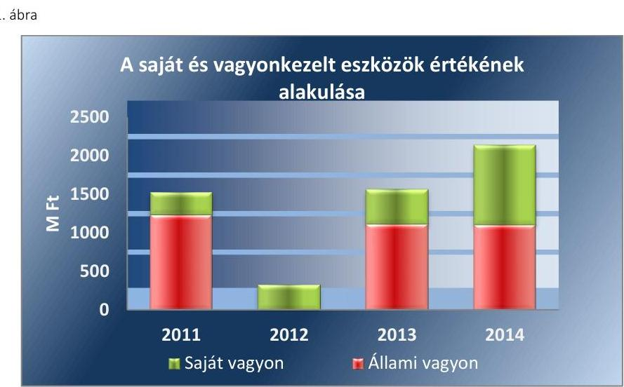

*Forrás: Tanúsítvány adatszolgáltatása*

A PR Kft. a 2012-2014. évek között idegen tulajdonon aktiválta felújításait, beruházásait, valamint a TIOP16 pályázat keretében 2013-2014-ben megvalósított beruházások főkönyvi számlán nyilvántartott eszközeit saját vagyonként tartotta nyilván és saját vagyonként szolgáltatott adatot az értékükről az MNV Zrt. felé. Ezáltal a kezelt vagyonról nyújtott adatszolgáltatás a 2013. és 2014. években sem a valós adatokat tartalmazta. A hibás számviteli gyakorlattal megsértette a Számv. tv. 15. § (3) bekezdése szerinti valódiság és a 15. § (4) bekezdése szerinti világosság számviteli alapelveket és a beszámoló helyességét.

A PR Kft. nem tett eleget a Vhr. 18. § (1) bekezdés előírásának, mely szerint a vagyonkezelési szerződést módosítani kell, ha a vagyonkezelő a vagyonkezelésében lévő állami vagyonon értéknövelő beruházást, felújítást hajt végre. Az MNV Zrt.-vel kötött vagyonkezelési szerződést a 2013. és
 2014. években nem módosították.

Az államháztartásról szóló 1992. évi XXXVIII. törvény és egyéb kapcsolódó törvények módosításáról szóló 2006. évi LXV. tv. 2. § (2) bekezdése ellenére, a Társaság az ellenőrzött időszakban az alapítványtól kapott vagyonelemeket nem alapítványi vagyon apportjaként kezelte, hanem alapítványi támogatásként tartotta nyilván. Ennek következtében az éves beszámolók nem a valós képet tükrözték, mellyel a PR Kft. megsértette a Számv. tv. 4. § (2) bekezdésében foglaltakat, valamint a 15. § (3) bekezdésében foglalt valódiság elvét és a 16. § (3) bekezdésében foglalt, a tartalom elsődlegessége a formával szemben elvét.

A részesedések (Rekreációért Kft.) és egyéb befektetett pénzügyi eszközök értékelésénél nem tartották be a Számv. tv. 54. § (1)-(3) bekezdésének előírásait, a részesedés piaci értékét nem ellenőrizték, értékvesztést nem számoltak el.

A 2012. évben megtörtént a mennyiségi leltárfelvétel. A beszámolóban lévő vagyontárgyak leltári alátámasztása nem volt megfelelő. A jegyzőkönyvben nem rögzítették a mennyiségi leltárfelvétel, valamint a főkönyvi könyvelés és az analitikus nyilvántartás egyezőségét, ami ellentétes a Számv. tv. 69. § (2) bekezdésével.

---

# 3. A bevételek és ráfordítások elszámolásának szabályozása és végrehajtása, valamint az önköltségszámítás szabályszerű volt-e? 

Összegző megállapítás

A bevételek és ráfordítások elszámolása nem volt szabályszerű és nem felelt meg a tulajdonosi előírásoknak.
3.1. számú megállapítás

A PR Kft. nem határozta meg a közfeladatok ráfordításainak és bevételeinek elhatárolásához szükséges előírásokat, az elkülönítést nem végezte el.

A PR Kft. nem határozta meg a közfeladatok ráfordításainak és bevételeinek elhatárolásához szükséges előírásokat. A számviteli politikájában, számlarendjében nem szabályozta a vagyonkezelésbe vett vagyon használatából származó bevételek, illetve ráfordítások elkülönítését. A gyakorlatban nem tett eleget ennek a kötelezettségének, így nem tartotta be az önkormányzati tulajdonban lévő vagyon kezelésénél az Áht. 105/A. § (12) bekezdését, az állami vagyon kezelésénél a Vhr. 9. § (3) bekezdését, valamint a vagyonkezelési szerződések elkülönítésre vonatkozó pontjainak (az FMÖvel kötött vagyonkezelési szerződés VII.11.3. pontja, az MNV Zrt.-vel kötött vagyonkezelői szerződés 12.1. pontja) előírásait.

A vagyonkezelt eszközök használatával kapcsolatos ráfordítások, illetve az eszközök használatából származó bevételek elkülönítésének hiánya miatt a ráfordítások és a bevételek elszámolása nem volt szabályszerű. Az anyagjellegű ráfordítások, valamint az egyéb, pénzügyi műveletek, rendkívüli ráfordítások elszámolása nem volt megfelelő, mert a közfeladattal kapcsolatos elkülönítést nem végezték el. Az értékesítés nettó árbevétele és az egyéb bevételek elszámolása szintén nem volt megfelelő, a vagyonkezelésbe vett vagyon használatából származó bevételek elkülönítésének hiánya miatt.

A személyi jellegű ráfordítások elszámolásánál a PR. Kft. a Civil tv. 27. § előírásainak figyelembe vételével elkülönítette a közfeladat ellátással kapcsolatos ráfordításokat. Az elszámolások azonban nem voltak megfelelőek, mert hiányoztak a havi bérelszámolásokat alátámasztó munkaidő elszámolások (aláírt jelenléti ívek), ezáltal nem teljesültek a Munka Törvénykönyvéről szóló 2012. évi I. törvény 134. §-ának előírásai.

A személyi jellegű ráfordítások, az összes ráfordítás és a mérleg szerinti eredmény alakulását a 2. számú ábra mutatja.

---

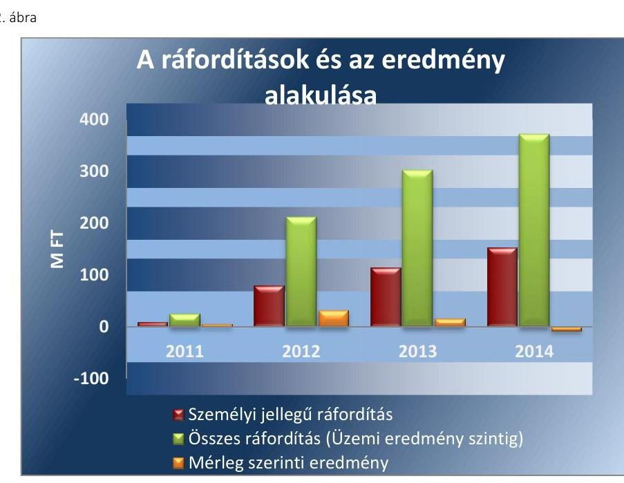

Forrás: Tanúsítvány adatszolgáltatása
A beruházási, felújítási kiadások és az értékcsökkenési leírás elszámolása nem volt szabályszerű. A vagyonkezelőt a vagyonkezelési szerződés aláírásának napjától, vagyis 2013. július 26-tól megillették a vagyonkezeléssel kapcsolatos jogok és kötelezettségek, értékcsökkenést a vagyonkezelt eszközökre azonban csak az átadás-átvétel (2013. augusztus 28.) napjától számolt el, így nem tartotta be a Vhr. 7. § (1) bekezdésének előírásait. Az eszközöknél a PR Kft. nem tartotta be a Számv. tv. 52. § (1) bekezdésének előírásait az értékcsökkenés elszámolásánál, mert nem vették figyelembe az eszközök valós élettartamát.

Az értékcsökkenési leírásból képzett források megfelelő mértékben kerültek felhasználásra az eszközök pótlására és felújítására. 2011-ben még valamivel alacsonyabb volt a pótlásra és felújításra szánt összeg, mint az elszámolt értékcsökkenés, az azt követő években azonban az elszámolt értékcsökkenés többszöröse került beruházási forrásként felhasználásra.

Az eredményt illetően az ellenőrzött időszakban osztalék engedélyezésére vonatkozó döntést nem hoztak, és kifizetésére sem került sor.

# 3.2. számú megállapítás 

## A PR Kft. önköltségszámítása nem volt szabályszerű.

A Számv. tv. 14. § (6) bekezdése értelmében a PR Kft.-nek nem volt önköltség-számítási szabályzatkészítési kötelezettsége, a Számv. tv. 14. § (7) bekezdésében foglalt értékeket (az értékesítésnek az eladott áruk beszerzési értékével, a közvetített szolgáltatások értékével csökkentett nettó árbevétele egy Mrd Ft vagy a költség nemek szerinti költségek együttes összege 500 M Ft) nem érte el. A Társaság azonban számviteli politikájában előírta, hogy az önköltségszámításnak utókalkulációval kell történnie, ami nem valósult meg.

---

# 4. A vagyonnal való gazdálkodás, valamint a vagyonváltozást eredményező döntések megfeleltek-e a jogszabályi és a belső előírásoknak? 

Összegző megállapítás

A PR Kft. vagyonnal való gazdálkodása nem felelt meg a jogszabályi és a tulajdonosi előírásoknak. Három esetben a társaság nem folytatott le közbeszerzési eljárást. A tulajdonosi jogok gyakorlója által a fejlesztésekre vonatkozóan meghozott döntések megfeleltek a jogszabályi előírásoknak.
4.1. számú megállapítás

A PR Kft. vagyongazdálkodása nem felelt meg a jogszabályi előírásoknak és tulajdonosi joggyakorló rendelkezéseinek.

A kötelezettségvállalásoknál - azáltal, hogy az Alapító Okiratban meghatározott értékhatár (nettó 20 M Ft) feletti szerződéseket (2012-ben a KIMA STUDIO Építészeti és Mérnöki Iroda Kft.-vel nettó 22,5 M Ft, a G.O.M.I Kft.-vel nettó 21 M Ft, 2013-ban az ADAPTIO-M Tanácsadó Kft.-vel nettó 24 M Ft, a KIMA Stúdió Kft.-vel nettó 24,5 M Ft) kötött a társaság vezetője az Alapító jóváhagyása nélkül - nem biztosították az alapító részére fenntartott jogokat. A PR Kft. vagyona a 2011-2014. közötti időszakban 45,5%-kal növekedett. A tárgyi eszközök értékének 46,2 %-os emelkedését a Kft. részére nyújtott fejlesztési támogatásból megvalósult beruházások jelentették. A fejlesztési támogatás alakulását az egyes években a 3. számú ábra szemlélteti.
3. ábra

A fejlesztési támogatás alakulása
M Ft
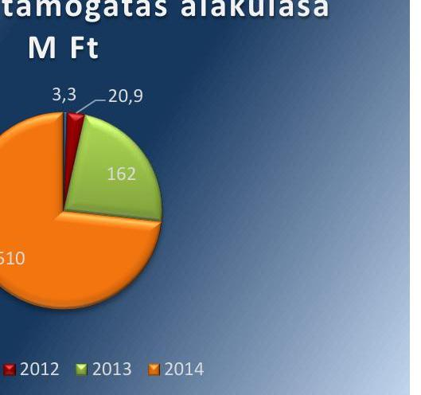

A Társaság a 2011-2014. évek között 696,2 M Ft fejlesztési célú támogatást kapott, ebből a hazai forrás 116,6 M Ft volt. A Társaság részére nyújtott támogatások növekvő tendenciát mutattak, 2014-ben 72,2 M Ft-tal több, a 2011. évi összeg 23-szorosát elérő hazai támogatásban részesültek.

Az ellenőrzött években a Befektetett eszközök állománya jelentős ingadozást mutatott. A Társaságnál 2011-ben az FMÖ-től vagyonkezelésre át-

---

vett eszközök értéke miatt, a mérlegfőösszeg 1557,9 M Ft volt (ebből tárgyi eszköz 1314,1 M Ft). 2012-ben, a tulajdonosi joggyakorlót érintő jogszabályi változások miatt az átvett eszközöket a könyvekből kivezették, melynek következtében, az eszközök 375,4 M Ft-ra (ebből tárgyi eszköz 112,8 M Ft), 76%-kal csökkentek. 2013-ban újra átadták a Társaság vagyonkezelésébe a korábban általa használt eszközállományt, amely az eszközök értékének 1676,5 M Ft-ra történő emelkedését okozta. A 2014. december 31-i eszköz mérlegfőösszeg 2261,9 M Ft volt.

A vagyonkezelt eszközöktől eltekintve a PR Kft. saját vagyonának szerkezetében jelentős átrendeződések nem voltak, alakulását a 4. számú ábra szemlélteti.
4. ábra
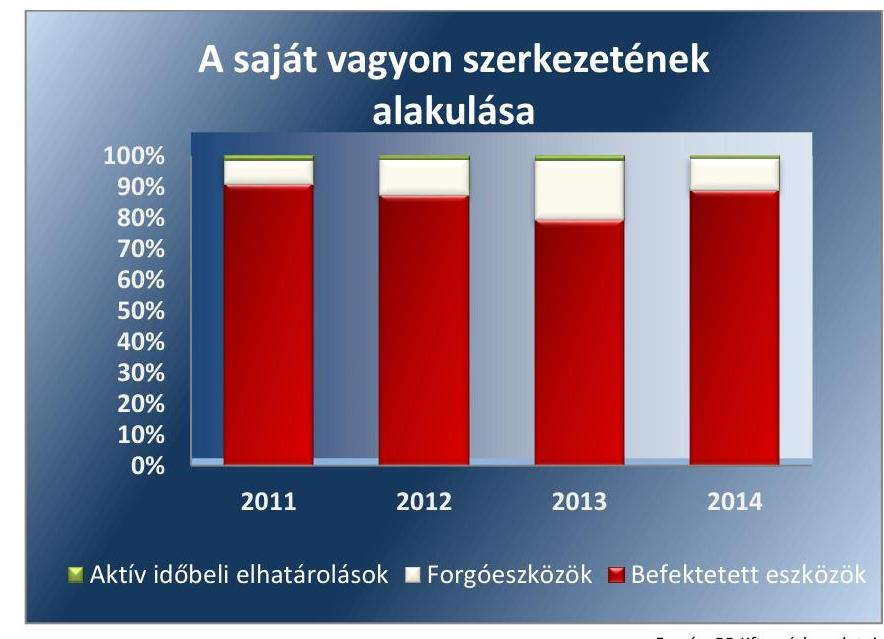

Forrás: PR Kft. mérlegadatai
Az előírt karbantartási, állagmegóvási kötelezettségét - a Vtv. 27. § (2) bekezdése, az Nvtv. 7. § (2) bekezdése előírásaival összhangban a PR Kft. teljesítette. A PR Kft.-nek a kezelésre átvett eszközökre 2011. október 1. és 2011. december 31. között volt visszapótlási kötelezettsége, mely kötelezettségnek - az Áht. 105/A. § (6) bekezdés előírása ellenére - nem tett eleget. 2013-ban a Vtv. 27. § (8) bekezdése értelmében a PR Kft. mentesült az eszközpótlási kötelezettség alól. A PR Kft.-nél vagyon elidegenítés, tulajdonjog átruházás nem történt. A PR Kft.-nél a Saját tőke/Jegyzett tőke aránya tükrözi a Kft. gazdálkodásában bekövetkezett változásokat (1. táblázat). A mutató értéke 2011-2013. évek között emelkedett, 2014-re jelentősen visszaesett, melynek oka a jegyzett tőke emelése és a folyamatban lévő TIOP beruházás miatt a saját bevétel kiesése.

# 1. táblázat 

## A SAJÁT TŐKE/JEGYZETT TŐKE ÉS AZ ÁRBEVÉTEL ALAKULÁSA

| Megnevezés | 2011 | 2012 | 2013 | 2014 |
| :-- | :--: | :--: | :--: | :--: |
|  |  |  |  |  |
| Saját tőke M Ft | 5,7 | 37,0 | 52,7 | 45,3 |
| Jegyzett tőke M Ft | 0,5 | 0,5 | 0,5 | 3,0 |
| Saját tőke/jegyzett tőke (%) | 11,4 | 74,0 | 105,4 | 15,1 |
| Árbevétel M Ft | 9,9 | 102,6 | 138,3 | 96,4 |

Forrás: Tanúsítvány adatszolgáltatása

---

A Jegyzett tőkét az ellenőrzött időszak alatt, a jogszabályi előírások változásával összefüggésben emelte fel az Alapító 0,5 M Ft-ról 3,0 M Ft-ra. Így a Saját tőke növekménye 2013-ig megegyezik az évente realizált Mérleg szerinti eredmény összegével, amelyet az 5. számú ábra mutat be.
5. ábra
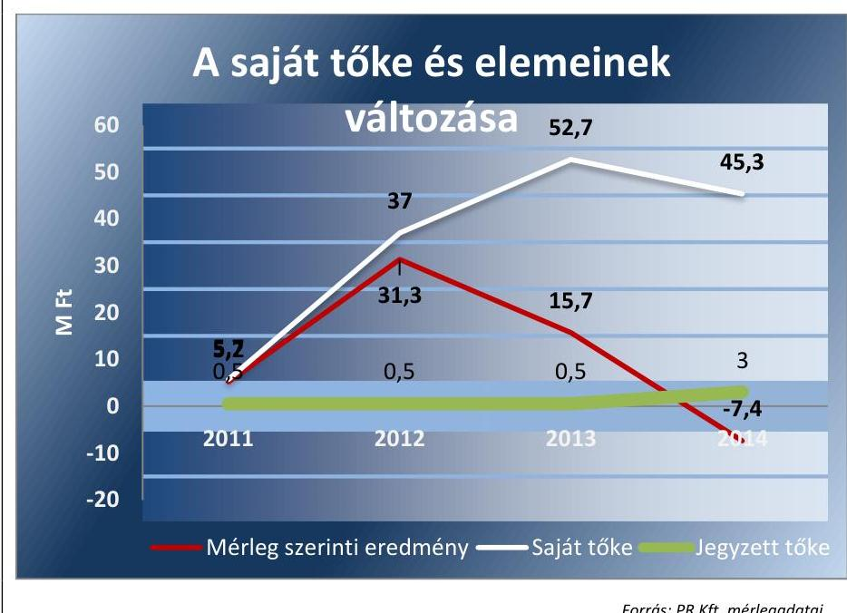

Forrás: PR Kft. mérlegadatai
4.2. számú megállapítás

A döntések Társaság általi előkészítése és megalapozása a jogszabályi előírásoknak nem felelt meg. A Kbt. előírásait nem tartották be, az értékhatárt meghaladó szerződések megkötését megelőzően nem folytattak le közbeszerzési eljárást.

A PR Kft. az MNV Zrt.-vel kötött vagyonkezelői szerződés részeként (annak 5. számú melléklete) elkészítette a Fejlesztési és Beruházási Tervét a 2013-2015. évekre vonatkozóan. Az MNV Zrt. a Vhr. 9. § (6) bekezdése előírásával összhangban a beruházási tervet elfogadta, aláírásával jóváhagyta. A Társaság az építési felújítási, beruházási munkák elvégzéséhez, a munkálatok megkezdése előtt legalább 30 nappal, a Vhr. 9. § (6)-(6a) bekezdésében foglaltak ellenére nem kért írásbeli engedélyt.

A Vhr. 18. § (1)-(3) bekezdések előírásainak a Kft. nem tett eleget, mert nem módosították a vagyonkezelési szerződést az állami vagyonon történt értéknövelő beruházások végrehajtásakor, illetve a Kft. nem szolgáltatott adatot a tulajdonosi joggyakorló felé a megvalósított értéknövelő beruházásról.

Három esetben megsértették a Kbt. 5. §-ában előírtakat, mert a szerződéseket a közbeszerzési eljárás lefolytatása nélkül kötötték meg. A Közbeszerzési Döntőbizottság összesen 1,4 M Ft bírság kiszabásáról rendelkezett.

# 4.3. számú megállapítás 

A tulajdonosi jogok gyakorlójának a fejlesztések jóváhagyására vonatkozó döntései megfeleltek a jogszabályi előírásoknak.

A 2011. és 2012. évben a tulajdonosi jogok gyakorlója nem hozott vagyonváltozást eredményező döntést. A 2013. és 2014. években a tulajdonosi

---

döntések a fejlesztések jóváhagyására vonatkoztak, azok megfeleltek a Vhr. 9. § (6) bekezdése előírásainak.

A vagyon tulajdonjogának ingyenes átruházására, értékesítésére, a vagyon apportjára, a befektetések, részesedések megszerzésére a tulajdonosi jogok gyakorlója nem hozott döntést.

# 5. A gazdálkodó szervezet a szabályszerű vagyongazdálkodás érdekében teljesítette-e beszámolási kötelezettségét, kiépített-e és működtetett-e információs rendszert? 

Összegző megállapítás

A PR Kft. nem teljesítette beszámolási és adatszolgáltatási kötelezettségét, nem a valóságnak megfelelő adatszolgáltatást nyújtott.
5.1. számú megállapítás

A tulajdonosi joggyakorló felé megtörtént az információk átadása, de annak kereteit a társaság nem szabályozta. A PR Kft. által szolgáltatott adatok nem adtak valós képet, a beszámolók jóváhagyása hiányos volt, azok letétbe helyezése nem az előírásoknak megfelelően történt.

A tulajdonosi joggyakorló előírta a PR Kft. számára a beszámolási, adatszolgáltatási és egyéb tájékoztatási kötelezettségek szabályozását, a társaság azonban a belső szabályzataiban nem tért ki a feladatokra.
Az éves számviteli beszámolókat elkészítették, de azok nem feleltek meg a
 Számv. tv. 4. § (2) bekezdésében foglaltaknak, nem adtak valós összképet a PR Kft. vagyoni helyzetéről.

Az FB és a könyvvizsgálói jelentések rendelkezésre álltak, de a beszámolókat az előírt határidőig a legfőbb döntést hozó szerv – a 2011. évi beszámoló kivételével – nem hagyta jóvá.

A 2012-2014. évekre vonatkozó beszámolók nyilvánosságra hozatala nem felelt meg a Számv. tv. 153. § (1) bekezdésében és a 154. § (1) bekezdésében foglaltaknak, mert nem a jóváhagyott beszámolókat helyezték letétbe, illetve tették közé.

A könyvvizsgáló a 2011-2014. évekre vonatkozó véleményében a vagyongazdálkodásra vonatkozóan figyelemfelhívó megjegyzést nem tett.

A közfeladatot ellátó PR Kft.-re bízott közvagyon védelme érdekében az FB, vagy a könyvvizsgáló nem kezdeményezte a gazdálkodó szervezet legfőbb döntést hozó szervének összehívását, illetve a legfőbb döntést hozó szerv ezzel kapcsolatban nem hozott döntést.

A PR Kft.-nél biztosított volt a közérdekű adatok nyilvánosságra hozatala. A társaság azonban nem készítette el az adatvédelmi és adatbiztonsági szabályzatát, ami ellentétes az Avtv ${ }^{19}$. 31/A. § (3) bekezdésében, illetve az Inf tv${ }^{20}$. 24. § (2) bekezdés d) pontjában foglaltakkal.

A PR Kft.-nek a 2014. évben volt az Ávr ${ }^{21}$. 7. számú melléklet 29. pontjában megfogalmazott adatszolgáltatási kötelezettsége, melynek eleget tett. A szolgáltatott adatok azonban nem adtak valós képet a Kft. vagyoni helyzetéről.

---

5.2. számú megállapítás

A PR Kft.-nél nem alakítottak ki és nem működtettek szabályozott keretek között belső, a tulajdonosi jogok gyakorlójával fenntartott, az előírásoknak megfelelő információs rendszert.

A PR Kft.-nél nem működtettek belső, a tulajdonosi jogok gyakorlójával fenntartott információs rendszert.

A PR Kft. nem biztosította a vagyon kezelését, hasznosítását érintő jogszabályoknak megfelelő, szerződésszerű kapcsolattartást, adatszolgáltatást és elszámolást, mert az adatszolgáltatás a Vhr. 13. § (3), 14. § (1) és a 9. § (3) bekezdések előírása ellenére pontatlan volt.

A vagyongazdálkodást érintően a PR Kft., illetve a tulajdonosi joggyakorló – ellentétben a Vhr. 20-23. §-ainak előírásaival – nem rendelt el belső, illetve külső szakértő általi ellenőrzéseket.
5.3. számú megállapítás

A PR Kft. nem írta elő a részesedések értékének védelme érdekében a kapcsolt vállalkozás vagyongazdálkodásának követelményeit, annak ellenőrzésére sem került sor.

A PR Kft. kapcsolt vállalkozása, a Rekreációért Kft. nem folytatott tevékenységet a 2011-2014. évek között.

A PR Kft. – a Gt. 60. §-ában és a Ptk ${ }_{2}$ 3:55.§-ában rögzített jogát nem gyakorolva – nem írta elő a Vtv 2.§-ban foglalt célkitűzések megvalósítását szolgáló vagyongazdálkodási követelményeket, a vagyongazdálkodással kapcsolatos adatszolgáltatás rendjét, tartalmát, gyakoriságát a Rekreációért Kft. részére.

A PR Kft. felé történő adatszolgáltatás a Rekreációért Kft. éves beszámolóinak átadására korlátozódott, amit határidőre teljesítettek.

# 6. A kormányzati szektor hiányára és az államadósságra befolyást gyakorló elemek a jogszabályi előírásoknak megfeleltek?

Összegző megállapítás

## A PR Kft.-nek nem volt a kormányzati szektor hiányát befolyásoló, adósságot keletkeztető ügylete.

A PR Kft. a 2013. december 16-i Hivatalos Értesítőben kiadott NGM ${ }^{22}$ miniszter közleménye alapján a kormányzati szektorba sorolt egyéb szervezetek közé tartozott, adósságot keletkeztető ügylete azonban nem volt. Az ellenőrzött időszakban – a 2014. év kivételével – nyereségesen gazdálkodott, a mérleg szerinti eredmény a 2011-2013. években pozitívan befolyásolta az államadósság mutató alakulását.

---

# JAVASLATOK

Az ÁSZ tv. ${ }^{23}$ 33. § (1) bekezdésében foglaltak értelmében az ellenőrzött szervezet vezetője köteles a jelentésben foglalt megállapításokhoz kapcsolódó intézkedési tervet összeállítani és azt a jelentés kézhezvételétől számított 30 napon belül az ÁSZ részére megküldeni. Amennyiben az intézkedési tervet határidőre nem küldi meg a szervezet, vagy amennyiben az nem elfogadható, az ÁSZ elnöke az ÁSZ tv. 33. § (3) bekezdés a)-b) pontjaiban foglaltakat érvényesítheti.

## az EMMI miniszternek

1. Tegyen intézkedéseket – munkáltatói jogkörében eljárva – a beszámolók letétbe helyezésével, közzétételével összefüggésben feltárt szabálytalanságok tekintetében a felelősség tisztázása érdekében, és szükség szerint intézkedjen a felelősség érvényesítéséről.
(5.1. sz. megállapítás 3. bekezdése alapján)

## A Pro Rekreatione Közhasznú Nonprofit Kft. ügyvezetőjének

1. Intézkedjen a számviteli politika, az eszközök és források leltárkészítési és leltározási szabályzata, valamint a számlarend módosításáról a hatályos jogszabályi előírásokkal való összhang megteremtése érdekében.
(2.1. sz. megállapítás 2. bekezdése alapján)
2. Intézkedjen a PR Kft. saját vagyonának, valamint a vagyonkezelésében lévő állami vagyonnak a jogszabályi előírásoknak megfelelő, elkülönített nyilvántartásáról.
(2.2. sz. megállapítás 2. bekezdése alapján)
3. Intézkedjen az MNV Zrt.-vel kötött vagyonkezelői szerződés módosításáról annak érdekében, hogy az a tényleges állapotot rögzítse és megfeleljen a hatályos jogszabályi előírásoknak.
(2.2. sz. megállapítás 5. bekezdése alapján)

---

4. Intézkedjen az alapítványtól kapott vagyonelemeknek az éves beszámolóban apportként történő kimutatásáról, továbbá az éves beszámoló mérlegének a jogszabályi előírások szerint elkészített leltárral történő alátámasztásáról.
(2.2. sz. megállapítás 6. és 8. bekezdései alapján)
5. Intézkedjen az MNV Zrt.-vel kötött vagyonkezelési szerződés és a vonatkozó jogszabályok betartása érdekében a vagyonkezelésbe vett vagyon kezeléséből származó bevételek és ráfordítások elkülönített nyilvántartásáról.
(3.1. sz. megállapítás 1. bekezdése alapján)
6. Intézkedjen a Társaság számviteli politikájában előírtaknak megfelelő önköltségszámítás elvégzésére.
(3.2. sz. megállapítás alapján)
7. Intézkedjen a jogszabályi előírásoknak megfelelő, a jóváhagyásra jogosult testület által elfogadott éves beszámolók közzétételéről és letétbe helyezéséről.
(5.1. sz. megállapítás 3. bekezdése alapján)
8. Intézkedjen a jogszabályi előírásoknak megfelelően az adatvédelmi és adatbiztonsági szabályzat elkészítéséről.
(5.1. sz. megállapítás 6. bekezdése alapján)
9. Intézkedjen a vagyonkezelői szerződések módosításának elmaradásával, az éves beszámolók tartalmával, leltárral történő alátámasztásával, valamint a közbeszerzési eljárások jogtalan mellőzésével kapcsolatban feltárt szabálytalanságok tekintetében a felelősség tisztázása érdekében, és szükség szerint intézkedjen a felelősség érvényesítéséről.
(2.2. megállapítás 5., 6. és 8. bekezdése, 4.2. számú megállapítás 3. bekezdése, 5.1. sz. megállapítás 3. bekezdése alapján)

---

.

---

# MELLÉKLETEK

|  | I. SZ. MELLÉKLET: ÉRTELMEZŐ SZÓTÁR |
| :--: | :--: |
| Állami vagyon | 2010. június 17-től   a) Az állam tulajdonában lévő dolog, valamint a dolog módjára hasznosítható természeti erő,   b) az a) pont hatálya alá nem tartozó mindazon vagyon, amely vonatkozásában törvény az állam kizárólagos   tulajdonjogát nevesíti,   c) az állam tulajdonában lévő tagsági jogviszonyt megtestesítő értékpapír, illetve az államot megillető egyéb   társasági részesedés,   d) az államot megillető olyan immateriális, vagyoni értékkel rendelkező jogosultság, amelyet jogszabály va-   gyoni értékű jogként nevesít.   Forrás: Vtv. 1. § (2) bekezdése   2012. november 10-től az állami vagyon fogalma kiegészül a következő ponttal: e) az állam tulajdonában   lévő pénzügyi eszközök   Forrás: Vtv. 1. § (2) bekezdése |
| Állami vagyon   hasznosítása | 2011. december 31-ig:   Az állami vagyont az MNV Zrt. maga kezeli, vagy szerződés - így különösen bérlet, haszonbérlet, szerződésen   alapuló haszonélvezet, vagyonkezelés, megbízás - alapján központi költségvetési szervnek, természetes vagy   jogi személynek, vagy jogi személyiséggel nem rendelkező gazdálkodó szervezetnek hasznosításra átengedi.   Forrás: Vtv. 23. § (1) bekezdése   2012. január 1-jétől:   Az állami vagyont az MNV Zrt. maga kezeli, vagy szerződés - így különösen bérlet, haszonbérlet, meg-bízás -   alapján központi költségvetési szervnek, természetes vagy jogi személynek, vagy jogi személyiséggel nem   rendelkező gazdálkodó szervezetnek hasznosításra átengedi. Forrás: Vtv. 23. § (1) bekezdése   2013. június 28-ától:   Az állami vagyonnal az MNV Zrt. maga gazdálkodik, vagy szerződés - így különösen bérlet, haszon-bérlet,   megbízás - alapján központi költségvetési szervnek, természetes vagy jogi személynek, vagy jogi személyi-   séggel nem rendelkező gazdálkodó szervezetnek hasznosításra átengedi, illetőleg vagyonkezelésbe, haszon-   élvezetbe adja.   Forrás: Vtv. 23. § (1) bekezdése |
| Állami vagyon   hasznosítására   kötött szerző-   dés | Az állami vagyonnal az MNV Zrt. maga gazdálkodik, vagy szerződés - így különösen bérlet, haszon-bérlet,   megbízás - alapján központi költségvetési szervnek, természetes vagy jogi személynek, vagy jogi személyi-   séggel nem rendelkező gazdálkodó szervezetnek hasznosításra átengedi, illetőleg vagyonkezelésbe, haszon-   élvezetbe adja.   Forrás: Vtv. 23. § (1) bekezdése   Az állami vagyon hasznosítására kötött szerződések elsődleges célja az állami vagyon hatékony működtetése, állagának védelme, értékének megőrzése, illetve gyarapítása, az állami és közfeladatok ellátásának elősegítése. Forrás: Vtv. 23. § (2) bekezdése |
| Állami vagyon   használója | 2011. január 1 - 2011. december 31-ig:   Az a természetes személy, jogi személy, illetve jogi személyiséggel nem rendelkező szervezet, amely, illetve   aki törvény vagy szerződés alapján, bármely jogcímen (pl. bérlet, haszonbérlet, vagyonkezelési szerződés,   használat stb.) állami vagyont birtokol, használ, szedi annak hasznait, hasznosít, ide nem értve a tulajdonosi   jogok gyakorlóját. Forrás: Vhr. 1. § (7) bekezdés a) pontja   2012. január 1-jétől:   Az a természetes vagy jogi személy, jogi személyiséggel nem rendelkező szervezet, aki, vagy amely törvény   vagy szerződés alapján, bármely jogcímen (bérlet, haszonbérlet, használat stb.) állami vagyont birtokol,   használ, szedi annak hasznait, hasznosít, ide nem értve a haszonélvezőt, a vagyonkezelőt és a tulajdonosi   jogok gyakorlóját.   Forrás: Vhr. 1. § (7) bekezdés a) pontja |

---

| Állami vagyon kezelője /vagyonkezelő | 2010. január 01.-2011. december 31. között:   Az állami vagyont az MNV Zrt. maga kezeli, vagy szerződés - így különösen bérlet, haszonbérlet, szerződésen alapuló haszonélvezet, vagyonkezelés, megbízás - alapján központi költségvetési szervnek, természetes vagy jogi személynek, illetőleg jogi személyiséggel nem rendelkező gazdasági társaságnak hasznosításra átengedi.   Vtv. 23. § (1) bekezdése   2012. január 1-jétől:   Az állami vagyont az MNV Zrt. maga kezeli, vagy szerződés - így különösen bérlet, haszonbérlet, meg-bizás - alapján központi költségvetési szervnek, természetes vagy jogi személynek, vagy jogi személyiséggel nem rendelkező gazdálkodó szervezetnek hasznosításra átengedi. Az állami vagyonra vonatkozóan az MNV Zrt. kizárólag az Nvtv-ben meghatározott személyekkel köthet vagyonkezelési szerződést. Forrás: Vtv. 23. § (1) bekezdés, 27. § (1) bekezdés   2013. június 28-ától:   Az állami vagyonnal az MNV Zrt. maga gazdálkodik, vagy szerződés - így különösen bérlet, haszon-bérlet, megbízás - alapján központi költségvetési szervnek, természetes vagy jogi személynek, vagy jogi személyiséggel nem rendelkező gazdálkodó szervezetnek hasznosításra átengedi, illetőleg vagyonkezelésbe, haszonélvezetbe adja. Az állami vagyonra vonatkozóan az MNV Zrt. kizárólag az Nvtv-ben meghatározott személyekkel köthet vagyonkezelési szerződést.   Forrás: Vtv. 23. § (1) bekezdés, 27. § (1) bekezdés |
| :--: | :--: |
| Állami vagyon értékesítése | Állami vagyon tulajdonjogának bármely jogcímen történő, visszterhes átruházása. Forrás: Vhr. 1. § (7) bekezdés d) pont) |
| Gazdálkodó szervezet | 2013. június 30-ig gazdálkodó szervezet:   Az állami vállalat, az egyéb állami gazdálkodó szerv, a szövetkezet, a lakásszövetkezet, az európai szövetkezet, a gazdasági társaság, az európai részvénytársaság, az egyesülés, az európai gazdasági egyesülés, az európai területi együttmüködési csoportosulás, az egyes jogi személyek vállalata, a leány-vállalat, a vízgazdálkodási társulat, az erdő birtokossági társulat, a

 végrehajtói iroda, az egyéni cég, továbbá az egyéni vállalkozó. Forrás: Ptk 24 685. § c) pontja   2013. július 1-jétől gazdálkodó szervezet:   Az állami vállalat, az egyéb állami gazdálkodó szerv, a szövetkezet, a lakásszövetkezet, az európai szövetkezet, a gazdasági társaság, az európai részvénytársaság, az egyesülés, az európai gazdasági egyesülés, az európai területi együttműködési csoportosulás, az egyes jogi személyek vállalata, a leányvállalat, a vízgazdálkodási társulat, az erdő birtokossági társulat, a végrehajtói iroda, az egyéni cég, továbbá az egyéni vállalkozó. Az állam, a helyi önkormányzat, a költségvetési szerv, az egyesület, a köztestület, valamint az alapítvány gazdálkodó tevékenységével összefüggő polgári jogi kapcsolataira is a gazdálkodó szervezetre vonatkozó rendelkezéseket kell alkalmazni, kivéve, ha a törvény e jogi személyekre eltérő rendelkezést tartalmaz; a 292/A-292/B. §, 301/A-301/B. §, 405. § (1) bekezdés, valamint a 407/A. § (1) bekezdés tekintetében nem minősül gazdálkodó szervezetnek az, aki a közbeszerzésekről szóló törvény értelmében ajánlatkérő (szerződő hatóság).Forrás: Ptk 1. 685. § c) pontja   2014. március 15-től gazdálkodó szervezet:   A gazdasági társaság, az európai részvénytársaság, az egyesülés, az európai gazdasági egyesülés, az európai területi együttműködési csoportosulás, a szövetkezet, a lakásszövetkezet, az európai szövetkezet, a vízgazdálkodási társulat, az erdő birtokossági társulat, az állami vállalat, az egyéb állami gazdálkodó szerv, az egyes jogi személyek vállalata, a közös vállalat, a végrehajtói iroda, a közjegyzői iroda, az ügyvédi iroda, a szabadalmi ügyvivői iroda, az önkéntes kölcsönös biztosító pénztár, a magánnyugdíjpénztár, az egyéni cég, továbbá az egyéni vállalkozó. Az állam, a helyi önkormányzat, a költségvetési szerv, az egyesület, a köztestület, valamint az alapítvány gazdálkodó tevékenységével összefüggő polgári jogi kapcsolataira is a gazdálkodó szervezetre vonatkozó rendelkezéseket kell alkalmazni. Forrás: Ppt. 396. § |
| Kormányzati szektorba sorolt egyéb szervezet | Az a szervezet, amely az Áht. alapján nem része az államháztartásnak, azonban az Európai Közösséget létrehozó szerződéshez csatolt, a túlzott hiány esetén követendő eljárásról szóló jegyzőkönyv alkalmazásáról szóló 2009. május 25-i 479/2009/EK rendelet szerint a kormányzati szektorba tartozik. A nemzetgazdasági miniszter 2013. június 26-án megjelent Közleményben tette közé ezen szervezetek listáját. |
| Korosító lista | Kintlévőségek lejárat szerint csoportosított kimutatása |
| MNV Zrt. | Az állami vagyon felett, a Magyar Államot megillető tulajdonosi jogok és kötelezettségek összességét - a hatályos szabályozás szerint - az állami vagyon felügyeletéért felelős miniszter (jelenleg a nemzeti fejlesztési miniszter) gyakorolja. A miniszter feladatát nagy részben az MNV Zrt., mint tulajdonosi joggyakorló szervezet útján látja el. |

---

| Nemzetgazdasági szempontból kiemelt jelentőségű nemzeti vagyon körébe tartozó társaságok | Az ÁSZ ellenőrzés szempontjából az Nvtv. 2. sz. mellékletében felsorolt társasági részesedések. |
| :--: | :--: |
| Nemzeti vagyon | 2012. január 1-jétől, g) pont módosult 2012. június 30-tól nemzeti vagyon:   a) az állam vagy a helyi önkormányzat kizárólagos tulajdonában álló dolgok,   b) az a) pont hatálya alá nem tartozó, állam vagy a helyi önkormányzat tulajdonában lévő dolog,   c) az állam vagy a helyi önkormányzat tulajdonában lévő pénzügyi eszközök, továbbá az államot vagy a helyi önkormányzatot megillető társasági részesedések,   d) az államot vagy a helyi önkormányzatot megillető bármely vagyoni értékkel rendelkező jogosultság, amelyet jogszabály vagyoni értékű jogként nevesít,   e) Magyarország határa által körbezárt terület feletti légtér,   f) az üvegházhatású gázok kibocsátási egységeinek kereskedelméről szóló törvény szerint kibocsátási egység és légiközlekedési kibocsátási egység, valamint az ENSZ Éghajlatváltozási Keretegyezménye és annak Kiotói Jegyzőkönyve végrehajtási keretrendszeréről szóló törvény szerinti kiotói egység,   g) állami vagy helyi önkormányzati fenntartású közgyűjtemény (muzeális intézmény, levéltár, közgyűjteményként működő kép- és hangarchívum, valamint könyvtár) saját gyűjteményében nyilvántartott kulturális javak körébe tartozó dolog,   h) a régészeti lelet,   i) a nemzeti adatvagyon körébe tartozó állami nyilvántartások fokozottabb védelméről szóló törvény szerinti nemzeti adatvagyon.   Forrás: Nvtv. 1. § (2) bekezdés |
| Tulajdonosi ellenőrzés | 2010. június 17-től:   Az MNV Zrt. „rendszeresen ellenőrzi a vele szerződéses jogviszonyban lévő személyek, szervezetek vagy más használók állami vagyonnal való gazdálkodását, megállapításairól az MNV Zrt. Felügyelő Bizottságát, az ellenőrzött szervet, szükség esetén a minisztert és az Állami Számvevőszéket tájékoztatja". Forrás: Vtv. 17. §   d) pont   A Vhr. alapján „a tulajdonosi ellenőrzés célja az állami vagyonnal való gazdálkodás vizsgálata, ennek keretében a rendeltetésellenes, jogszerűtlen, szerződésellenes, vagy a tulajdonos érdekeit sértő, illetve a központi költségvetést hátrányosan érintő vagyongazdálkodási intézkedések feltárása és a jogszerű állapot helyreállítása, továbbá a vagyonnyilvántartás hitelességének, teljességének és helyességének biztosítása". Forrás: Vhr. 20. § (2) bekezdés   2011. december 31-ig   Az állami vagyon kezelőjét, használóját megillető jogok gyakorlását, annak szabályszerűségét, célszerűségét az MNV Zrt. - szükség szerint területi szervei útján - ellenőrzi.   Forrás: Vhr. 20. § (1) bekezdés   2012. január 1-jétől:   Az állami vagyon kezelőjét, haszonélvezőjét, használóját megillető jogok gyakorlását, annak szabályszerűségét, célszerűségét az MNV Zrt. - szükség szerint területi szervei útján - ellenőrzi. Forrás: Vhr. 20. § (1) bekezdés |

---

| Tulajdonosi jogok gyakorlója | 2010. június 17-től:   Az állami vagyon felett a Magyar Államot megillető tulajdonosi jogok és kötelezettségek összességét - ha törvény eltérően nem rendelkezik - az állami vagyon felügyeletéért felelős miniszter (a továbbiakban: miniszter) gyakorolja, aki e feladatát a Magyar Nemzeti Vagyonkezelő Zártkörűen Működő Részvénytársaság (a továbbiakban: MNV Zrt.), a Magyar Fejlesztési Bank, illetve a tulajdonosi joggyakorló szervezet útján látja el. A miniszter miniszteri rendeletben, a törvényben meghatározott állami vagyoni kör tekintetében, meghatározott időtartamra, a joggyakorlás egyes szabályainak meghatározásával - az őt megillető tulajdonosi jogok és kötelezettségek összességének, illetve azok meghatározott részének gyakorlóját az Áht. szerinti központi költségvetési szervek, ezek intézménye, továbbá a 100%-ban állami tulajdonban álló gazdasági társaságok közül kijelölheti.   Forrás: Vtv. 3. § (1) bekezdés és (2) bekezdés   2013. június 28-ától:   A rábízott állami vagyon felett az államot megillető tulajdonosi jogok és kötelezettségek összességét tulajdonosi joggyakorlóként:   a) ha törvény vagy miniszteri rendelet eltérően nem rendelkezik, a Magyar Nemzeti Vagyonkezelő Zártkörűen Működő Részvénytársaság (a továbbiakban: MNV Zrt.),   b) törvényben kijelölt személy vagy   c) az állami vagyon felügyeletéért felelős miniszter (a továbbiakban: miniszter) által rendeletben kijelölt személy gyakorolja.   [...] A miniszter e törvény felhatalmazása alapján - a meghatározott célok hatékonyabb elérése érdekében, miniszteri rendeletben, az ott meghatározott állami vagyoni kör tekintetében, meghatározott időtartamra - e törvény keretei között, a joggyakorlás egyes szabályainak meghatározásával - az államot megillető tulajdonosi jogok és kötelezettségek összességének, illetve azok meghatározott részének gyakorlóját az Áht. szerinti központi költségvetési szervek, ezek intézménye, továbbá a 100%-ban állami tulajdonban álló gazdasági társaságok közül kijelölheti.   Forrás: Vtv. 3. § (1) bekezdés és (2) bekezdés |
| :--: | :--: |
| A tulajdonosi joggyakorlás és a vagyongazdálkodás feladata | 2010. június 17-től:   Az állami vagyon rendeltetésének megfelelő - az állami feladatok ellátásához, a társadalmi szükségletek kielégítéséhez, valamint a Kormány gazdaságpolitikája megvalósításának elősegítéséhez szükséges, egységes elveken alapuló, önálló ágazatként megjelenő - hatékony, költségtakarékos, értékmegőrző, értéknövelő felhasználásának biztosítása (közvetlen felhasználás), illetve közvetett hasznosítása (beleértve a vagyoni kör változását eredményező értékesítést), valamint az állami vagyon gyarapítása (ideértve a vagyoni kör bővítését is). Forrás: Vtv. 2. § (1) bekezdés |
| Vagyonkezelői jog | 2011. december 31-ig:   A vagyonkezelési szerződés alapján a vagyonkezelő jogosult meghatározott állami tulajdonba tartozó dolog birtoklására, használatára és hasznai szedésére. A vagyonkezelő köteles a vagyontárgy értékét megőrizni, állagának megóvásáról, jó karbantartásáról, működtetéséről gondoskodni, továbbá - a központi költségvetési szervek kivételével - díjat fizetni vagy a szerződésben előírt más kötelezettséget teljesíteni. A vagyonkezelői jog az erre irányuló szerződéssel - kivételesen törvény alapján - jön létre.   Forrás: Vtv. 27. § (2) bekezdés és (4) bekezdés   2012. január 1-jétől:   A vagyonkezelő köteles a vagyontárgy értékét megőrizni, állagának megóvásáról, jó karbantartásáról, működtetéséről gondoskodni, továbbá - a központi költségvetési szervek kivételével - díjat fizetni vagy a szerződésben előírt más kötelezettséget teljesíteni. Forrás: Vtv. 27. § (2) bekezdés   2013. június 28-ától:   A vagyonkezelő köteles a vagyontárgy állagának megóvásáról, jó karbantartásáról, működtetéséről gondoskodni, továbbá - a központi költségvetési szervek kivételével - díjat fizetni, jogszabályban és szerződésben előírt más kötelezettségét teljesíteni, valamint a vagyontárgyat jogszabályban vagy szerződésben meghatározott célnak megfelelően használni. Amennyiben a vagyonkezelő ezen kötelezettségének nem tesz eleget, a tulajdonosi joggyakorló jogosult a szerződést azonnali hatállyal felmondani.   Forrás: Vtv. 27. § (2) bekezdés |

---

# FÜGGELÉK: ÉSZREVÉTELEK 

A jelentéstervezetet a Számvevőszék 15 napos észrevételezésre megküldte az ellenőrzött szervezetek vezetőinek az ÁSZ tv. 29. §2 (1) bekezdése előírásának megfelelően.
Az elfogadott észrevételek alapján a Számvevőszék módosította a jelentést.

A függelék tartalmazza az ellenőrzöttek észrevételeit, illetve az el nem fogadott észrevételek elutasításának indoklását.

Az ÁSZ a jelentéstervezetet megküldte az Emberi Erőforrások Minisztériuma miniszterének és a Pro Rekreatione Közhasznú Nonprofit Kft. ügyvezetőjének észrevételezésre. Az Emberi Erőforrások Minisztériuma miniszterének nemleges észrevételét, valamint a Pro Rekreatione Közhasznú Nonprofit Kft. ügyvezetőjének észrevételét és az arra adott választ a függelék tartalmazza.

[^0]
[^0]:    2 29. § (1) Az Állami Számvevőszék az ellenőrzési megállapításait megküldi az ellenőrzött szervezet vezetőjének vagy az általa megbízott személynek, és annak, akinek személyes felelősségét állapította meg.
    (2) Az ellenőrzött szervezet vezetője és a felelősként megjelölt személy az ellenőrzés megállapításaira tizenöt napon belül írásban észrevételt tehet.
    (3) Az Állami Számvevőszék az észrevételre a beérkezésétől számított harminc napon belül írásban válaszol. A figyelembe nem vett észrevételeket köteles a jelentésben feltüntetni, és megindokolni, hogy azokat miért nem fogadta el.

---

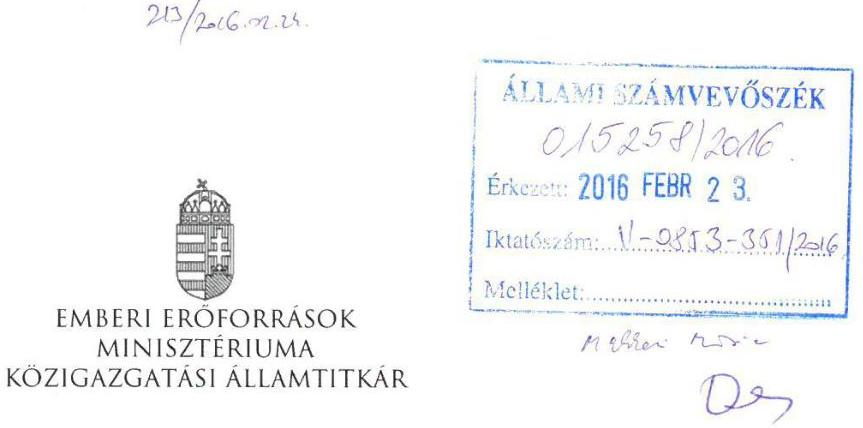

Iktatószám: 12209-1/2016/ELL
Hiv. szám: V-0853-347/2016.
Melléklet: -

# Domokos László részére 

elnök

Állami Számvevőszék

## Budapest

Apáczai Csere János u. 10.
1052

Tárgy: Észrevétel „Az állami tulajdonban (résztulajdonban) lévő gazdálkodó szervezetek vagyonmegőrzési és gazdálkodási tevékenységének ellenőrzése - Pro Rekreatione Közhasznú Nonprofit Kft." című számvevőszéki jelentéstervezethez

Tisztelt Elnök Úr!
„Az állami tulajdonban (résztulajdonban) lévő gazdálkodó szervezetek vagyonmegőrzési és gazdálkodási tevékenységének ellenőrzése - Pro Rekreatione Közhasznú Nonprofit Kft." című számvevőszéki jelentéstervezethez nem teszek észrevételt.

Budapest, 2016. február „?."

---

# Pro Rekreatione 

Közhasznú Nonprofit Kft.

## Domokos László úr

## Elnök

## Állami Számvevőszék

Budapest
Apáczai Csere János u. 10.
1052

Ikt. szám: K/25/2016
Hiv. szám: V-0853-346/2016.
Tárgy: Jelentéstervezetre észrevételek megtétele

| ÁLLAMI SZÁMVEVŐSZÉK |
| :--: |
| 015501/2016 |
| Érkezés: 2016. FEBRUÁR 25. |
| Iktatószám: 11-0853-3421 |
| Melléklet: |

Tisztelt Elnök Úr!
A Pro Rekreatione Közhasznú Nonprofit Korlátolt Felelősségű Társaság („PR Kft.") részére 2016. február 8-án kézbesítésre került

 az Állami Számvevőszék V-0853-345/2016. iktatószámú, „Pro Rekreatione Közhasznú Nonprofit Kft., Az állami tulajdonban (résztulajdonban) lévő gazdálkodó szervezetek vagyonmegőrzési és gazdálkodási tevékenységének ellenőrzése" című jelentéstervezete („Jelentéstervezet"). A PR Kft. az Állami Számvevőszékről szóló 2011. évi LXVI. törvény 29. § (2) bekezdése alapján az ott meghatározott határidőben a Jelentéstervezettel kapcsolatban a jelen levélben foglalt észrevételeket teszi.
A jelen levélben nagy kezdőbetűvel írt, külön meg nem határozott fogalmak a Jelentéstervezetben meghatározott jelentéssel rendelkeznek.

## 1 Észrevételek a Jelentéstervezet 1.2. számú megállapításával kapcsolatban

„A FMIK és a PR Kft. által megkötött 2012. október 15. - 2013. május 2. között hatályos vagyonhasználati szerződés tartalma nem felelt meg a Vhr. 3. § (1) bekezdése előírásainak, mert nem rögzítette az állami vagyon megőrzéséhez, valamint a felelős gazdálkodáshoz szükséges követelményeket."

A Vtv. 23. § (1) bekezdése alapján az állami vagyont a tulajdonosi joggyakorló jogosult szerződéssel hasznosításra másnak átengedni. A Vtv. 27. § (1) bekezdése alapján az állami vagyonra vonatkozóan a tulajdonosi joggyakorló kizárólag az Nvtv-ben meghatározott személyekkel köthet vagyonkezelési szerződést. A Vtv. ezen rendelkezései alapján megállapítható, hogy az állami vagyon hasznosítására vonatkozó szerződések („Hasznosítási Szerződések") megkötése a tulajdonosi joggyakorló kötelezettsége. Ezért a Hasznosítási Szerződések jogszerűségéért is a tulajdonosi joggyakorló felelős.

A Hasznosítási Szerződések és a vagyonkezelési szerződések megkötésének gyakorlata alátámasztja a Vtv. fentiekben hivatkozott rendelkezéseit. A Hasznosítási Szerződés és a vagyonkezelési szerződés tervezetét a tulajdonosi joggyakorló készíti el. Az állami vagyon használója vagy a vagyonkezelő a

---

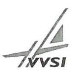

# Pro Rekreatione 

Közhasznú Nonprofit Kft.
szerződéshez észrevételeket, módosítási javaslatokat tehet. A szerződéssel kapcsolatos tárgyalások alapján a tulajdonosi joggyakorló készíti el a Hasznosítási Szerződés vagy a vagyonkezelési szerződés következő tervezeteit és végleges változatát. Ezért a Hasznosítási Szerződés vagy a vagyonkezelési szerződés szerkesztőjeként elsődlegesen a tulajdonosi joggyakorló felelős a szerződés jogszerűségéért.

A fentiekre tekintettel az FMIK és a PR Kft. között kötött vagyonhasználati szerződés jogszerűségével kapcsolatos esetleges problémákért a PR Kft-t nem terheli felelősség.

## 2 Észrevételek a Jelentéstervezet 2.1. számú megállapításával kapcsolatban

„A belső szabályozás azonban nem felelt meg a Vhr. 17. § (1) bekezdés előírásának, mert nem biztosította a saját és a kezelésében lévő állami vagyon elkülönített nyilvántartását, a számviteli politikában ezt nem írták elő. A 2011. szeptember 27-től hatályos számviteli politikát nem aktualizálták a jogszabályi változások, illetve a tulajdonosi joggyakorló személyében és a vagyonkezelésben bekövetkezett változásokkal összhangban. Az eszközök és a források leltárkészítési és leltározási szabályzatában nem határozták meg a mennyiségi leltárfelvétel gyakoriságát, ami a Számv. tv. 69. § (3) bekezdés előírásának nem felelt meg. A PR Kft. számviteli politikájában az általános jellegű, a számvitel rendjét érintő, beszámolási, könyvvezetési előírásokat meghatározták, ugyanakkor hiányoztak a speciális jellegű, pl. meghatározott vagyonelemre vagy döntés előkészítésre vonatkozó, az eszközök és a kötelezettségek értékelésére, illetve a költség/haszon elv alkalmazásával összefüggő döntésekre vonatkozó előírások. A Vhr. 9. § (9) bekezdés b) pontja ellenére nem szabályozták a vagyonkezelésbe vett eszközök utáni terv szerinti - szükség esetén terven felüli értékcsökkenés elszámolásának módját. A számlarend nem tartalmazta a ráfordítások és a bevételek Civil tv. 20. § előírása szerinti alapcél szerinti és gazdálkodási-vállalkozási tevékenységenkénti elkülönítését. A számlarendben nem tartották be a Vhr. 17. § (1) bekezdésében foglaltakat. Nem írták elő az állami vagyonra olyan elkülönített nyilvántartás vezetését, amely tételesen tartalmazta volna ezen eszközök könyv szerinti bruttó és nettó értékét, az elszámolt értékcsökkenés összegét és az értékben bekövetkezett egyéb változásokat. A szabályozás nem volt összhangban a tulajdonosi joggyakorló által előírt, a saját és a kezelt állami vagyon elkülönített nyilvántartására vonatkozó követelménnyel sem."

A PR Kft. a számviteli politikáját, a számlarendet, az eszközök és források leltárkészítési és leltározási szabályzatát, az eszközök és források értékelési szabályzatát, valamint a pénzkezelési szabályzatát a Jelentéstervezetben foglalt észrevételek figyelembevételével időközben módosította.

## 3 Észrevételek a Jelentéstervezet 2.2. számú megállapításával kapcsolatban

3.1. Észrevételek a Jelentéstervezet 2.2. számú megállapítás 2. bekezdésével kapcsolatban
„A PR Kft. a 2012-2014. években nyilvántartásában nem biztosította a VHR. 14.§ (1)-(3) bekezdésében előírtak szerint a kezelésében lévő állami, valamint a saját vagyon elkülönített nyilvántartását, mert az idegen eszközökön és a vagyonkezelt eszközökön végzett beruházást, felújítást saját vagyonaként mutatta ki."
2012. évben a PR Kft. nem rendelkezett vagyonkezelt eszközzel. A 2013. július 27-én a PR Kft. az ismét vagyonkezelésébe vett eszközökön végzett beruházások a 16-os Beruházások számlaosztályon szerepelnek a mai napig, tekintettel arra, hogy a TIOP 3.5.2-12/1-2013-0001 pályázathoz kapcsolódó

---

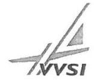

# Pro Rekreatione 

Közhasznú Nonprofit Kft.
beruházások üzembe helyezésére 2016. januárjában került sor, melyek a vagyonkezelt eszközökre kerülnek aktiválásra.

### 3.2 Észrevételek a Jelentéstervezet 2.2. számú megállapítás 3. bekezdésével kapcsolatban

„A PR Kft. nyilvántartásából 2012. január 1-jével kivezették a vagyonkezelt állományt, de az ténylegesen - rendezetlen jogi háttérrel - továbbra is a PR Kft. használatában maradt. Az ingatlanokhoz kapcsolódóan beruházásokat, felújításokat végeztek, melyeket idegen tulajdonon végzett beruházásként számoltak el. A 2012-ben idegen tulajdonon végzett 35,2 M Ft értékű beruházást év végén saját vagyonként mutatták ki, így az MNV Zrt.-vel 2013. május 3-tól megkötött vagyonkezelési szerződésben a vagyonkezelésbe átvett eszközök 2012. év végi értéke nem volt helytálló, így a beszámolóban sem."

A Fejér Megyei Önkormányzat, mint az eszközök tulajdonosa és a PR. Kft 2011. október 1-én a tulajdonában lévő eszközök vagyonkezelésére szerződést kötött. A PR Kft. a vagyonkezelt eszközöket külön nyilvántartásban mutatta ki a könyveiben a hosszúlejáratú kötelezettségekkel szemben. A megyei önkormányzatok konszolidációjáról, a megyei önkormányzati intézmények és a Fővárosi Önkormányzat egyes egészségügyi intézményeinek átvételéről szóló 2011. évi CLIV. törvény rendelkezett a megyei önkormányzatok konszolidációjáról. Ezen jogszabály alapján a PR Kft. vagyonkezelésében lévő eszközök visszaadásra kerültek a tulajdonos Fejér Megyei Önkormányzat részére. A megyei intézményfenntartó központokról, valamint a megyei önkormányzatok konszolidációjával, a megyei önkormányzati intézmények és a Fővárosi Önkormányzat egészségügyi intézményeinek átvételével összefüggő egyes kormányrendeletek módosításáról szóló 258/2011. (XII. 7.) Kormányrendelet alapján az eszközök vagyonkezelője az FMIK lett. Az FMIK és az MNV Zrt. közötti szerződés aláírására az MNV Zrt. részéről 2012. szeptember 27-én, az FMIK részéről 2012. október 15-én került sor visszamenőlegesen 2012. január 1-ei hatállyal. Az MNV Zrt. és a PR Kft. között kötött, 2013. július 26-án hatályba lépett vagyonkezelési szerződés alapján az eszközök vagyonkezelője újra a PR Kft. lett.

Tekintettel arra, hogy a vagyonkezelt eszközök többségében ingatlanok (földterület, tornaterem, kikötő, evezőspálya, sportszálló, tároló, stb.), ezért fizikai átadásról nem lehetett szó. A vagyonátadás tételes leltár alapján történt. A 2012. évi éves beszámoló könyvvizsgálata kapcsán a PR Kft. könyvvizsgálója a Szociális és Gyermekvédelmi Főigazgatóság (az FMIK általános jogutódja) Fejér Megyei Kirendeltségétől („SZGYF FMK") nyilatkozatot kért arra vonatkozóan, hogy az átadott eszközök az SZGYF FMK leltárában szerepelnek-e. Az SZGYF FMK a mérleg zárása előtt írásban nyilatkozott arról, hogy az eszközök az FMIK leltárában szerepelnek. A vagyonkezelt ingatlanok értékének a kivezetése szabályos volt.

Az FMIK és a PR Kft. közötti vagyonhasználati szerződés 8. pontja alapján a PR Kft. köteles volt elvégezni a szerződés hatálya alá tartozó ingatlanokon a szükséges állagmegóvó és karbantartó beruházásokat. A PR. Kft. a 2012. évben mindössze 6.000.897,- Ft (szemben a Jelentéstervezetben szereplő 35,2 millió Forinttal) értékben végzett a szerződés alapján használt ingatlanokon állagmegóvó beruházást. Tekintettel arra, hogy a szerződés hatálya alá tartozó ingatlanoknak a PR Kft. sem tulajdonosa, sem vagyonkezelője nem volt, ezért a PR Kft. az ingatlanokat a főkönyvben a külön nyilvántartás biztosítása érdekében idegen ingatlanon végzett beruházásként kezelte. Az idegen ingatlanon végzett beruházást ezért nem lehetett vagyonkezelésként nyilvántartani.

A vagyonkezelt eszközök átvételét követően a fenti, idegen ingatlanon végzett beruházások értéke a vagyonkezelt eszközre aktiválásra került (mellékletként csatoljuk a TE nyilvántartó kartonokat).

---

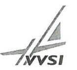

# Pro Rekreatione 

Közhasznú Nonprofit Kft.

A fentiekre alapján a PR Kft. nem ért egyet a Jelentéstervezet azon megállapításával, hogy a 2012. december 31-i vagyonérték nem volt helytálló, mivel a 2012. évben végzett beruházást a PR Kft. nem aktiválta, hanem saját vagyonként tartotta nyilván. Nem helytálló továbbá a Jelentéstervezetben szereplő, a 2012. évben idegen tulajdonon végzett beruházás 35,2 millió Ft-os összege sem, mert a 35,2 millió Ft értékű beruházás jelentős része saját tulajdonú eszközökön valósult meg.
3.2 Észrevételek a Jelentéstervezet 2.2. számú megállapítás 5. bekezdésével kapcsolatban
„A PR Kft. nem tett eleget a Vhr. 18. § (1) bekezdés előírásának, mely szerint a vagyonkezelési szerződést módosítani kell, ha a vagyonkezelő a vagyonkezelésében lévő állami vagyonon értéknövelő beruházást, felújítást hajt végre. Az MNV Zrt.-vel kötött vagyonkezelési szerződést a 2013. és 2014. években nem módosították."

Tekintettel arra, hogy a PR Kft. a TIOP projekt keretében az általa kezelt Gárdony belterület 5417 hrsz. alatti ingatlanon („Projektingatlanon") értéknövelő beruházást és felújítást hajtott végre, ezért a Vhr. 18. § (1) bekezdése értelmében a PR Kft-vel, mint egyéb vagyonkezelővel kötött vagyonkezelési szerződést valóban módosítani kell. A Vhr. 18. § (1) bekezdése azonban nem egyértelmű abban a tekintetben, hogy a vagyonkezelési szerződést (az ÁSZ álláspontjával összhangban) a beruházás megvalósítása során évenként vagy a beruházás megvalósítását követően kell-e módosítani.

A vagyonkezelési szerződés 12.5.2. és 12.6. pontjai alapján a vagyonkezelési szerződést az értéknövelő beruházás, felújítás üzembe helyezését követően (2016. január) kell módosítani. Ezért a PR Kft. nem ért egyet a Jelentéstervezet ezen megállapításával.

A PR Kft. a TIOP projekt keretében az általa kezelt Projektingatlanon meglévő épületeket újított fel és új épületet épített, amely épületekre a PR Kft. vagyonkezelői joga az Nvtv. 11. § (6a) bekezdése és a vagyonkezelési szerződés 3.3. pontja alapján a törvény erejénél fogva, a vagyonkezelési szerződés módosítása nélkül is kiterjed. Ezért komoly érv szól amellett, hogy a Vhr. 18. § (3c) bekezdése alapján a TIOP projekt keretében megvalósított értéknövelő beruházás és felújítás miatt egyáltalán nincs szükség a vagyonkezelési szerződés módosítására.

A TIOP projekt befejezését és üzembe helyezését követően a PR Kft. 2016. január 29-én kezdeményezte az MNV Zrt-nél a vagyonkezelési szerződés módosítását.
3.3 Észrevételek a Jelentéstervezet 2.2. számú megállapítás 6. bekezdésével kapcsolatban
„Az államháztartásról szóló 1992. évi XXXVIII. törvény és egyéb kapcsolódó törvények módosításáról szóló 2006. évi LXV. törvény 2. § (2) bekezdése ellenére, a Társaság az ellenőrzött időszakban az alapítványtól kapott vagyonelemeket nem az alapítványi vagyon apportjaként kezelte, hanem alapítványi támogatásként tartotta nyilván. Ennek következtében az éves beszámolók nem a valós képet tükrözték, mellyel a PR Kft. megsértette a Számv. tv. 4. § (2) bekezdésében foglaltakat, valamint a 15. § (3) bekezdésében foglalt valódiság elvét és a 16. § (3) bekezdésében foglalt, a tartalom elsődlegessége a formával szemben elvét."

Ugyan az államháztartásról szóló 1992. évi XXXVIII. törvény és egyes kapcsolódó törvények módosításáról szóló
 2006. évi LXV. törvény („Áht. módtv.") a vagyon átadása tekintetében apportról rendelkezik, a Pro Rekreatione Alapítvány („PR Alapítvány") közhasznú nonprofit gazdasági társasággá történő átalakításáról szóló 1144/2011. (V. 13.) Korm. határozat („Korm. határozat") 3. b) pontja szerint a közigazgatási és igazságügyi miniszternek gondoskodnia kell a PR Alapítvány

---

# Pro Rekreatione 

Közhasznú Nonprofit Kft.
vagyonának az Áht. módtv. 2 § (2) bekezdése szerinti, a PR Kft. részére történő térítésmentes átadásáról.

Az Áht. módtv. és a Korm. határozat értelmezése és a gazdasági esemény helyes lekezelése érdekében a PR Kft. sorozatos egyeztetéseket folytatott a KIM-mel, és a KIM jogi ügyeket intéző ügyvédi irodával.

A PR Kft. alapításakor hatályos, a gazdasági társaságokról szóló 2006. évi IV. törvény értelmében az apport nem pénzbeli hozzájárulás. Az Áht. módtv. 2. § (5) bekezdése alapján a PR Kft. alapítójának („Alapító") a PR Alapítvány megszüntetésének kezdeményezését megelőzően kellett intézkednie a PR Kft. megalapításáról. Ezért az Alapító 500 ezer Forint pénzbeli hozzájárulás rendelkezésre bocsátásával alapította meg a PR Kft-t. Az Alapító nem pénzbeli hozzájárulás a PR Kft. rendelkezésére bocsátásáról ezt követően sem döntött. Ezért az Alapító apportként nem adta át a PR Alapítvány vagyonát a PR Kft. részére.

Az Áht. hatályba lépését követően megszűnő közalapítvány esetében, annak vagyona nem száll vissza az alapítóra, ezért a Közalapítvány vagyonáról az alapító nem rendelkezhet, így azt apportként sem tudja a társaság rendelkezésére bocsátani.

A fentiekre tekintettel a Közalapítvány vagyonát a Magyar Állam - mint a PR Kft. alapítója - apportként nem tudta a PR Kft. rendelkezésére bocsátani, mivel egyrészt a PR Kft. tagjaként nem döntött a tőkeemelésről, másrészt pedig nem rendelkezett a Közalapítvány vagyonával. A Közalapítvány megszűnésekor annak vagyona az Áht. utaló szabálya és a Ptk. hatályos rendelkezései szerint nem szállt vissza az államra, így az állam nem jogosult a vagyonnal rendelkezni.

A fentiekre való tekintettel a PR Kft. a megszüntetett PR Alapítvány vagyonát a 2011-2014. években helyesen tartotta nyilván alapítványi támogatásként, így az éves beszámolók a valós képet tükrözik, valamint megfelelnek a Számv. tv-ben foglaltaknak.
3.4 Észrevételek a Jelentéstervezet 2.2. számú megállapítás 7. bekezdésével kapcsolatban
„A részesedések (Rekreációért Kft.) és egyéb befektetett pénzügyi eszközök értékelésénél nem tartották be a Számv. tv. 54. § (1) - (3) bekezdésének előírásait, a részesedés piaci értékét nem ellenőrizték, értékvesztést nem számoltak el."

A PR Kft. minden évben megállapította, hogy a Rekreációért Kft. saját tőkéje magasabb volt, mint a jegyzett tőkéje, vagyis vagyonvesztés nem történt. Az érintett ingatlanok a Velencei-tónál helyezkednek el, melynek környékén az elmúlt években számos jelentős beruházás történt, így az ingatlanok piaci értéke nőtt. Ezért a PR Kft. álláspontja szerint nem kellett értékvesztést elszámolnia.
3.5 Észrevételek a Jelentéstervezet 2.2. számú megállapítás 8. bekezdésével kapcsolatban
„A 2012. évben megtörtént a mennyiségi leltárfelvétel. A beszámolóban lévő vagyontárgyak leltári alátámasztása nem volt megfelelő. A jegyzőkönyvben nem rögzítették a mennyiségi leltárfelvétel, valamint a főkönyvi könyvelés és az analitikus nyilvántartás egyezőségét, ami ellentétes a Számv. tv. 69. § (2) bekezdésével."

A PR Kft. leltározási gyakorlatáról megállapítható, hogy a leltározás és a leltárak a Számv. tv. leltározásra vonatkozó előírásaival összhangban vannak. A PR Kft. a vizsgált időszakban olyan leltárt

2484 Agárd, Tópart utca 17.
telefonszám: (+22) 370052
vvsi.hu

---

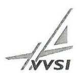

Pro Rekreatione
Közhasznú Nonprofit Kft.
állított össze, amely teljes körűen, tételesen ellenőrizhető módon tartalmazta a PR Kft. mérleg fordulónapján meglévő eszközeit és forrásait mennyiségben és értékben. A leltározás részben a folyamatos mennyiségi és értékbeli nyilvántartást vezető gazdálkodóknak megengedett módon egyeztetéssel, részben (a forgóeszközök egészére vonatkozóan) mennyiségi felvétellel történt.

A fizikai leltárfelvétel 2012-ben kizárólag a használatban (nem vagyonkezelésben) lévő eszközökről készült az SZGYF kérésére, melyről az SZGYF a beszámoló készítésekor könyvvizsgálói kérésre nyilatkozatot is kiadott arra vonatkozóan, hogy az eszközök az ő nyilvántartásában szerepelnek.

# 4 Észrevételek a Jelentéstervezet 3.1. számú megállapításával kapcsolatban 

4.1 Észrevételek a Jelentéstervezet 3.1. számú megállapítás 3. bekezdésével kapcsolatban
„A személyi jellegű ráfordítások elszámolásánál a PR Kft. a Civil tv. 27. § előírásainak figyelembe vételével elkülönítette a közfeladat ellátással kapcsolatos ráfordításokat. Az elszámolások azonban nem voltak megfelelőek, mert hiányoztak a havi bérelszámolásokat alátámasztó munkaidő elszámolások (aláírt jelenléti ívek), ezáltal nem teljesültek a Munka Törvénykönyvéről szóló 2012. évi I. törvény 134. §-ának előírásai."

A személyi jellegű ráfordítások elszámolásához a havi bérelszámolásokat alátámasztó munkaidő elszámolások (aláírt jelenléti ívek) a PR Kft-nél rendelkezésre állnak, ezeket az ellenőrzés során eljáró szakemberek nem kérték el. A munkaidő elszámolásokat a PR Kft. kérelemre az ÁSZ rendelkezésére bocsátja.
4.2 Észrevételek a Jelentéstervezet 3.1. számú megállapítás 5. bekezdésével kapcsolatban
„A beruházási, felújítási kiadások és az értékcsökkenési leírás elszámolása nem volt szabályszerű. A vagyonkezelőt a vagyonkezelési szerződés aláírásának napjától, vagyis 2013. május 3-tól megillették a vagyonkezeléssel kapcsolatos jogok és kötelezettségek, értékcsökkenést a vagyonkezelt eszközökre azonban csak az átadás-átvétel (2013. augusztus 28.) napjától számolt el, így nem tartotta be a Vhr. 7. § (1) bekezdésének előírásait. Az eszközöknél a PR Kft. nem tartotta be a Számv. tv. 52. § (1) bekezdésének előírásait az értékcsökkenés elszámolásánál, mert nem vették figyelembe az eszközök valós élettartamát."

A Vhr. 7. § (1) bekezdése és a vagyonkezelési szerződés 3.1. pontja alapján a PR Kft. vagyonkezelői joga a vagyonkezelési szerződés megkötésével keletkezett. A vagyonkezelési szerződés 14.5. pontja azonban úgy rendelkezik, hogy a vagyonkezelési szerződés a PR Kft. felett tulajdonosi jogokat gyakorló szervezet (azaz az EMMI) hozzájárulásával lép hatályba. A felek a vagyonkezelési szerződés hatályának beálltát egy bizonytalan jövőbeli eseménytől tették függővé, vagyis az EMMI hozzájárulása ún. felfüggesztő feltételnek minősül (lásd Ptk.: 228. § (1) bekezdés). Ameddig a vagyonkezelési szerződés hatálya nem állt be, a Társaság nem volt köteles a vagyonkezelési szerződést teljesíteni. Ezzel összhangban állapítja meg a vagyonkezelési szerződés 5.3. pontja, hogy a Társaság a vagyonkezelési szerződés hatálybalépésétől köteles viselni a kezelt vagyonnal kapcsolatos terheket és a kárveszélyt, illetve ezen naptól kezdve jogosult a hasznok szedésére is.

Az MNV Zrt. és a PR Kft. megállapodása szerint a vagyonkezelési szerződés megkötésének napjától az átadás-átvétel napjáig, vagyis 2013. augusztus 27-ig az MNV Zrt., 2013. augusztus 28-tól a PR Kft. számolt el értékcsökkenést a vagyonkezelt eszközökre.

## 5 Észrevételek a Jelentéstervezet 4.2. számú megállapításával kapcsolatban

---

# Pro Rekreatione 

Közhasznú Nonprofit Kft.
5.1 Észrevételek a Jelentéstervezet 4.2. számú megállapítás összegzésével kapcsolatban
„A döntések Társaság általi előkészítése és megalapozása a jogszabályi előírásoknak nem felelt meg. A Kbt. előírásait nem tartották be, az értékhatárt meghaladó szerződések megkötését megelőzően nem folytattak le közbeszerzési eljárást."

A 4.2. számú megállapítás összegzésének szövegéből úgy tűnik, hogy a PR Kft. a közbeszerzési értékhatárokat meghaladó értékű beszerzései esetében soha nem folytatott volna le közbeszerzési eljárást. Az ÁSZ kezdeményezésére a Közbeszerzési Döntőbizottság valóban megállapította, hogy a PR Kft. három esetben a Kbt. 5. §-ába ütközően közbeszerzési eljárás mellőzésével kötött szerződést. A PR Kft. 2,3 Mrd Ft értékben bonyolított le közbeszerzési eljárásokat, a kifogásolt eljárások összértéke 35.400.000 Ft, mely esetekben a Közbeszerzési Döntőbizottság által kiszabott bírságok összege 1.400.000 Ft volt. Ezért javasoljuk a megállapítás megfogalmazását úgy módosítani, hogy a PR Kft. egyes esetekben nem tartotta be a Kbt. előírásait és három esetben nem folytatott le közbeszerzési eljárást.
5.2 Észrevételek a Jelentéstervezet 4.2. számú megállapítás 1. bekezdésével kapcsolatban
„A PR Kft. az MNV Zrt.-vel kötött vagyonkezelői szerződés részeként (annak 5. számú melléklete) elkészítette a Fejlesztési és Beruházási Tervét a 2013-2015. évekre vonatkozóan. Az MNV Zrt. a Vhr. 9. § (6) bekezdése előírásával összhangban a beruházási tervet elfogadta, aláírásával jóváhagyta. A Társaság az építési, felújítási, beruházási munkák elvégzéséhez, a munkálatok megkezdése előtt legalább 30 nappal, a Vhr. 9. § (6)-(6a) bekezdésében foglaltak ellenére nem kért írásbeli engedélyt."

Mint ahogyan azt a Jelentéstervezet 4.3. számú megállapítás 1. bekezdése is rögzíti, a PR Kft. 2013-ban és 2014-ben tájékoztatta az Alapítót a TIOP projekt megvalósításáról, így erről az Alapító a projekt megvalósításának megkezdésekor tudomással bírt.
5.3 Észrevételek a Jelentéstervezet 4.2. számú megállapítás 2. bekezdésével kapcsolatban
„A Vhr. 18. § (1)-(3) bekezdések előírásainak a Kft. nem tett eleget, mert nem módosították a vagyonkezelési szerződést az állami vagyonon történt értéknövelő beruházások végrehajtásakor, illetve a Kft. nem szolgáltatott adatot a tulajdonosi joggyakorló felé a megvalósított értéknövelő beruházásról."

A 3.2 pontban írt észrevételeket a PR Kft. a Jelentéstervezet ezen megállapítása vonatkozásában is fenntartja.

## 6 Észrevételek a Jelentéstervezet 5.1. számú megállapításával kapcsolatban

6.1 Észrevételek a Jelentéstervezet 5.1. számú megállapítás 2. bekezdésével kapcsolatban
„Az éves számviteli beszámolókat elkészítették, de azok nem feleltek meg a Számv. tv. 4. § (2) bekezdésében foglaltaknak, nem adtak valós összképet a PR Kft. vagyoni helyzetéről."

A PR Kft. számára a beszámoló letétbe helyezési és közzétételi kötelezettségének határideje a tárgyévet követő év május 31. napja, melynek a PR Kft. minden vizsgált évben eleget tett. Az Alapító a beszámolót ugyanazzal a mérlegfőösszeggel fogadta el, mint amivel a beszámoló korábban letétbe helyezésre és közzétételre került. Amennyiben a PR Kft. nem tett volna eleget a tárgyévet követő

---

# Pro Rekreatione 

Közhasznú Nonprofit Kft.
május 31-ig a közzétételi kötelezettségének, a szigorú jogszabályi előírások (Az adózás rendjéről szóló 2003. évi XCII. törvény 174/A.§ (1) bekezdése) értelmében fennállt volna annak a veszélye, hogy a PR Kft. részére mulasztási bírság kerül kiszabásra, valamint a társaság adószáma törlésre kerül, melynek következtében nem tudta volna közhasznú tevékenységét ellátni. Ezért a PR Kft. álláspontja szerint az éves beszámolók valós összképet adtak a PR Kft. vagyoni helyzetéről.
6.2 Észrevételek a Jelentéstervezet 5.1. számú megállapítás 7. bekezdésével kapcsolatban
„A PR Kft.-nél biztosított volt a közérdekű adatok nyilvánosságra hozatala. A társaság azonban nem készítette el az adatvédelmi és adatbiztonsági szabályzatát, ami ellentétes az Avtv. 31/A. § (3) bekezdésében, illetve az Inf tv. 24. § (2) bekezdés d) pontjában foglaltakkal."

A PR Kft. időközben eleget tett az adatvédelmi és adatbiztonsági szabályzat elkészítésére vonatkozó kötelezettségének.

## 7 Észrevételek a Jelentéstervezet 5.2. számú megállapításával kapcsolatban

„A PR Kft.-nél nem működtettek belső, tulajdonosi jogok gyakorlójával fenntartott információs rendszert."

A PR Kft. számára nem egyértelmű, hogy a tulajdonosi joggyakorló felé milyen információs rendszert kellene fenntartania.

Kérjük a tisztelt Elnök urat, hogy a jelen levélben foglalt észrevételeinket legyenek szívesek figyelembe venni a végleges jelentés elkészítése során.

Kelt: Agárd, 2016. február 22.

Tisztelettel:

Deák Csaba
ügyvezető

Pro Rekreatione
Közhasznú Nonprofit Kft.
2484 Agárd, Tópart u. 17.
Adószám: 23497162-2-07
Cég: szám: 07-09-020967

---

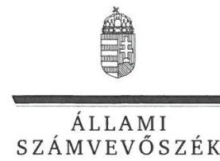

ELNÖK

Ikt.szám: V-0853-353/2016.

# Deák Csaba úr 

ügyvezető
Pro Rekreatione Közhasznú Nonprofit Kft.

## Agárd

## Tisztelt Ügyvezető Úr!

„Az állami tulajdonban (résztulajdonban) lévő gazdálkodó szervezetek vagyonmegőrzési és gazdálkodási tevékenységének ellenőrzése - Pro Rekreatione Közhasznú Nonprofit Kft." címmel készített számvevőszéki jelentéstervezetre tett észrevételét köszönettel megkaptam.

Az Állami Számvevőszék észrevételre vonatkozó álláspontjáról

 a felügyeleti vezető által készített részletes tájékoztatást csatoltan megküldöm.

Tájékoztatom Ügyvezető urat, hogy a számvevőszéki jelentésben - az Állami Számvevőszékről szóló 2011. évi LXVI. törvény 29. § (3) bekezdése alapján - a figyelembe nem vett észrevételeket szerepeltetjük az elutasítás indokának feltüntetésével.

Budapest, 2016. 03. hó 21. nap
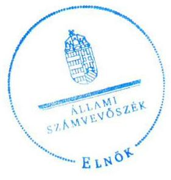

Tisztelettel:

Domokos László

Melléklet: Tájékoztatás az elfogadott és el nem fogadott észrevételekről

---

# Tájékoztatás   az elfogadott és el nem fogadott észrevételekról 

„Az állami tulajdonban (résztulajdonban) lévő gazdálkodó szervezetek vagyonmegőrzési és gazdálkodási tevékenységének ellenőrzése - Pro Rekreatione Közhasznú Nonprofit Kft." című jelentéstervezetre 2016. február 25-én érkezett észrevételét áttekintettük, annak kezelésével kapcsolatban a következő tájékoztatást adom.

## 1. Észrevételek a Jelentéstervezet 1.2. számú megállapításával kapcsolatban

Az észrevétellel érintett megállapítás a tulajdonosi joggyakorlóra vonatkozó megállapítások között szerepel, a PR Kft. felelősségét nem állapítja meg. A megállapítás módosítása nem szükséges.

## 2. Észrevételek a Jelentéstervezet 2.1. számú megállapításával kapcsolatban

A szabályzatok módosítására vonatkozó tájékoztatásukat köszönjük. Az észrevételben leírtak szerint a módosításokat a jelentéstervezetben foglalt megállapítások alapján végezték el, ami az ellenőrzött időszakot követően történt, ezért a megállapítások módosítása nem indokolt.

## 3. Észrevételek a Jelentéstervezet 2.2. számú megállapításával kapcsolatban

### 3.1. Észrevételek a Jelentéstervezet 2.2. számú megállapítás 2. bekezdésével kapcsolatban

A PR Kft. korábban vagyonkezelésében lévő eszközök a 2012. január 1-től már nem voltak a PR Kft. vagyonkezelésében, a használatba adási szerződést 2012. október 15-én írták alá. Az ellenőrzés rendelkezésére bocsátott dokumentumok alapján a PR Kft. 2012. január 1. és 2012. október 15. között a vagyonkezelésében és használatában jogszerűen nem lévő eszközökhöz kapcsolódóan 6000897 Ft összegben végzett állagmegóvó beruházást, valamint 28735020 Ft-ot fizetett ki a TIOP pályázattal összefüggő tervezési feladatokra. Az idegen eszközökön végzett beruházások a vagyonkezelt eszközök államnak történő átadásához kapcsolódóan nem kerültek átadásra, ezért azok a PR Kft. nyilvántartásaiban, beszámolójában szerepeltek a 2012. évben, majd a további 2013-2014. évi nyilvántartásokban is. Ezért a jelentéstervezet megállapítása helytálló, annak módosítása nem indokolt.

---

# 3.2.1. Észrevételek a Jelentéstervezet 2.2. számú megállapítás 3. bekezdésével kapcsolatban 

A vagyonkezelt eszközökre vonatkozó tájékoztatásukat és a beküldött tárgyi eszköz kartonokat köszönjük. Az ellenőrzés számára korábban rendelkezésére bocsátott dokumentumok alapján a PR Kft. 2012. január 1. és 2012. október 15. között összesen 34735917 Ft értékben végzett beruházást, felújítást idegen eszközökön. Az 5. számú tanúsítványban a 2012. évre vonatkozóan a PR Kft. kizárólag saját tulajdonon végzett beruházást, felújítást szerepeltetett, ami az ellenőrzés rendelkezésére bocsátott dokumentumok alapján nem helytálló. Az idegen eszközökön végzett beruházások a vagyonkezelt eszközök átadásához kapcsolódóan nem kerültek átadásra, azok a PR Kft. nyilvántartásaiban, beszámolójában szerepeltek a 2012. évben, ez azt eredményezte, hogy beszámolóban az eszközök 2012. év végi értéke nem volt helytálló. Emiatt a 2013. évben megkötött vagyonkezelési szerződésben is téves adat szerepelt az eszközök értékeként, mivel az nem tartalmazta a beruházások, felújítások értékét. A dokumentumok ismételt áttekintését követően a beruházás értékét a jelentéstervezetben 35,2 M Ft-ról 34,7 M Ft-ra módosítjuk, a megállapítás egyéb módosítása a fentiekre tekintettel nem indokolt.

### 3.2.2. Észrevételek a Jelentéstervezet 2.2. számú megállapítás 5. bekezdésével kapcsolatban

Az ellenőrzés rendelkezésére bocsátott dokumentumok alapján a PR Kft. az eszközök átadásátvételét követően a kezelt vagyonon értéknövelő beruházást, felújítást hajtott végre, például a 2013. évben a Kolonics szobor és emlékhely kialakítása, a céltorony modernizálása, a 2014. évben a Sukorói evezős pálya felújítása fejeződött be és került aktiválásra, ennek ellenére a vagyonkezelési szerződést nem módosították. Tehát a jelentéstervezet megállapításának módosítása nem indokolt.

## 3.3. Észrevételek a Jelentéstervezet 2.2. számú megállapítás 6. bekezdésével kapcsolatban

Az államháztartásról szóló 1992. évi XXXVIII. törvény és egyes kapcsolódó törvények módosításáról szóló 2006. évi LXV. törvény 2. § (2) bekezdése szerint a megszüntetett alapítvány (közalapítvány) vagyona - a megszüntetésre irányuló eljárás kezdő időpontjában lejárt tartozások kiegyenlítését követően - a kérelemben megjelölt jogi személyiséggel rendelkező nonprofit gazdasági társaság vagyonának részévé válik (apport). Tehát a jogszabály egyértelműen rendelkezik arról, hogy a vagyont apportként kell nyilvántartani. A PR Kft. az alapítványtól kapott vagyonelemeket nem apportként, hanem támogatásként tartotta nyilván, amit az észrevétel megerősít. A fentiek alapján a megállapítás módosítása nem indokolt.

## 3.4. Észrevételek a Jelentéstervezet 2.2. számú megállapítás 7. bekezdésével kapcsolatban

A számvitelről szóló 2000. évi C. törvény 54. § (2) bekezdés c) pontja szerint a befektetés piaci értékének meghatározásakor figyelembe kell venni a gazdasági társaság saját tőkéjéből a

---

befektetésre jutó részt. A Rekreációért Kft. saját tőkéje a 2011-2014. évi időszakban 214872 eFt-ról 180038 eFt-ra csökkent, a PR Kft. a beszámolóiban a tulajdoni részesedést a teljes időszakban 215000 eFt értéken szerepeltette. Az ellenőrzés rendelkezésére álló dokumentumok alapján a PR Kft. a befektetett pénzügyi eszközök értékelését dokumentáltan nem végezte el, értékvesztést nem számolt el. A fentiek alapján a megállapítás módosítása nem indokolt.

# 3.5. Észrevételek a Jelentéstervezet 2.2. számú megállapítás 8. bekezdésével kapcsolatban 

A leltározásra vonatkozó tájékoztatásukat köszönjük. Az észrevétel nem vitatja a jelentéstervezet megállapítását, miszerint a leltározás során a jegyzőkönyvben nem rögzítették a mennyiségi leltárfelvétel, a főkönyvi könyvelés és az analitikus nyilvántartás egyezőségét. A fentiek alapján a megállapítás módosítása nem indokolt.

## 4. Észrevételek a Jelentéstervezet 3.1. számú megállapításával kapcsolatban

## 4.1. Észrevételek a Jelentéstervezet 3.1. számú megállapítás 3. bekezdésével kapcsolatban

Az ÁSZ a személyi juttatások mintatételeinek ellenőrzéséhez kapcsolódó valamennyi olyan dokumentumot bekérte, mely az adott könyvelési tételt alátámasztja. Az aláírt jelenléti íveket a PR Kft. nem bocsátotta az ellenőrzés rendelkezésére. A jelentéstervezet megállapításának módosítása ezért nem indokolt.

## 4.2. Észrevételek a Jelentéstervezet 3.1. számú megállapítás 5. bekezdésével kapcsolatban

A vagyonkezelési szerződést a tulajdonosi jogokat gyakorló szervezet (EMMI) 2013. július 26-án írta alá, ezért a PR Kft. vagyonkezelői joga - a szerződés 3.1. és 14.5. pontja alapján - ettől az időponttól áll fenn. Az ellenőrzés rendelkezésére bocsátott szerződésben és a szerződés mellékletei között az MNV Zrt. és a PR Kft. közötti, az értékcsökkenés elszámolására vonatkozó megállapodás nem található. A dokumentumok ismételt áttekintése alapján a megállapítás helytálló. A jelentéstervezet 3.1. számú megállapítás 5. bekezdésének 2. mondatában a dátumot az alábbiak szerint pontosítjuk:
„A vagyonkezelőt a vagyonkezelési szerződés aláírásának napjától, vagyis 2013. július 26-tól megillették a vagyonkezeléssel kapcsolatos jogok és kötelezettségek, értékcsökkenést a vagyonkezelt eszközökre azonban csak az átadás-átvétel (2013. augusztus 28.) napjától számolt el, így nem tartotta be a Vhr. 7. § (1) bekezdésének előírásait."

---

# 5. Észrevételek a Jelentéstervezet 4.2. számú megállapításával kapcsolatban 

## 5.1. Észrevételek a Jelentéstervezet 4.2. számú megállapítás összegzésével kapcsolatban

Az észrevételezett megállapítás összefoglalás, annak részletes kifejtése - amely összhangban áll az észrevételben leírtakkal - az azt követő fejezetben található, ezért módosítása nem indokolt.

## 5.2. Észrevételek a Jelentéstervezet 4.2. számú megállapítás 1. bekezdésével kapcsolatban

Az észrevételben leírtak megerősítik, hogy a PR Kft. a Vhr. 9. § (6)-(6a) bekezdésében foglaltak ellenére 30 nappal a munkálatok megkezdése előtt nem kért írásbeli engedélyt az építési, felújítási, beruházási munkák elvégzésére. Ezért megállapításunk módosítása nem szükséges.

## 5.3. Észrevételek a Jelentéstervezet 4.2. számú megállapítás 2. bekezdésével kapcsolatban

Az észrevételre a válasz megegyezik a 3.2. észrevételre adott válasszal, annak alapján a megállapítás módosítása nem indokolt.

## 6. Észrevételek a Jelentéstervezet 5.1. számú megállapításával kapcsolatban

### 6.1. Észrevételek a Jelentéstervezet 5.1. számú megállapítás 2. bekezdésével kapcsolatban

Az éves beszámolónak a legfőbb döntést hozó szerv jóváhagyása nélküli letétbe helyezésére, illetve közzétételére vonatkozó tájékoztatást köszönjük. Az éves számviteli beszámolók azért nem adtak valós összképet a PR Kft. vagyoni helyzetéről, mert a többi között az idegen eszközökön végzett beruházásokat, felújításokat saját vagyonként mutatták be, az alapítványtól kapott vagyonelemeket apport helyett támogatásként tartották nyilván, a vagyonkezelt eszközökre értékcsökkenést nem a megfelelő időponttól számoltak el. Ezért a megállapítás módosítása nem szükséges.

### 6.2. Észrevételek a jelentéstervezet 5.1. számú megállapítás 7. bekezdésével kapcsolatban

Az adatvédelmi és adatbiztonsági szabályzat elkészítésére vonatkozó tájékoztatásukat köszönjük. A szabályzat az ellenőrzött időszakot követően készült el, ezért a megállapítás módosítása nem indokolt.

---

# 7. Észrevételek a Jelentéstervezet 5.2. számú megállapításával kapcsolatban 

A PR Kft. nem működtetett belső, a tulajdonosi jogok gyakorlójával fenntartott információs rendszert. Ez azt jelentette, hogy a PR Kft. nem biztosította a vagyon kezelését, hasznosítását érintő jogszabályoknak megfelelő, szerződéses kapcsolattartást, a megalapozott adatszolgáltatást és elszámolást a tulajdonosi joggyakorló felé.

Budapest, 2016. 08. hó 21. nap

Makkai Mária
felügyeleti vezető

---

# RÖVIDÍTÉSEK JEGYZÉKE 

${ }^{1}$ Áht $_{2}$
${ }^{2}$ PR Kft.
${ }^{3}$ MNV Zrt.
${ }^{4}$ KIM
${ }^{5}$ EMMI
${ }^{6}$ FMÖ
${ }^{7}$ FMIK
${ }^{8}$ ÁSZ
${ }^{9}$ Áht $_{1}$
${ }^{10}$ Vhr.
${ }^{11}$ Nvtv.
${ }^{12}$ Számv.tv.
${ }^{13}$ Civil tv.
${ }^{14}$ SZMSZ
${ }^{15} \mathrm{FB}$
${ }^{16}$ TIOP
${ }^{17}$ Vtv.
${ }^{18} \mathrm{Kbt}$
${ }^{19}$ Avtv.
${ }^{20}$ Inf tv.
${ }^{21}$ Ávr.
${ }^{22}$ NGM
${ }^{23}$ ÁSZ tv.
${ }^{24}$ Ptk. 1

Az államháztartásról szóló 2011. évi CXCV. törvény
Pro Rekreatione Közhasznú Nonprofit Kft.
Magyar Nemzeti Vagyonkezelő Zrt.
Közigazgatási és Igazságügyi Minisztérium
Emberi Erőforrások Minisztériuma
Fejér Megyei Önkormányzat
Fejér Megyei Intézményfenntartó Központ
Állami Számvevőszék
Az államháztartásról szóló 1992. évi XXXVIII. törvény (hatálytalan: 2012. I. 1-től)
Az állami vagyonnal való gazdálkodásról szóló 254/2007. (X. 4.) Korm. rendelet
A nemzeti vagyonról szóló 2011. évi CXCVI. törvény (hatályos 2011. XII. 31.-től)
A számvitelről szóló 2000. évi C. törvény
Az egyesülési jogról, a közhasznú jogállásról, valamint a civil szervezetek működéséről és támogatásáról szóló 2011. évi CLXXV. törvény (hatályos 2012.01.01-től)

Pro Rekreatione Közhasznú Nonprofit Kft. Szervezeti és Működési Szabályzata Felügyelő Bizottság
Társadalmi Infrastruktúra Operatív Program
Az állami vagyonról szóló 2007. évi CVI. törvény
A közbeszerzésekről szóló 2011. évi CVIII. törvény (hatályos 2011. VIII. 21.-től)
A személyes adatok védelméről és a közérdekű adatok nyilvánosságáról szóló 1992. évi LXIII. törvény

Az információs önrendelkezési jogról és az információszabadságról szóló 2011. évi CXII. törvény (hatályos 2011. VII. 27.-től)
Az államháztartásról szóló törvény végrehajtásáról szóló 368/2011. (XII. 31.) Kormány rendelet
Nemzetgazdasági Minisztérium
2011. évi LXVI. törvény az Állami Számvevőszékről, hatályos 2011. július 1-jétől A Polgári Törvénykönyvről szóló 1959. évi IV. törvény (hatálytalan 2014. III. 15-től)

---

# ÁLLAMI SZÁMVEVŐSZÉK 

1052 Budapest, Apáczai Csere János utca 10.
Levélcím: 1364 Budapest 4. Pf. 54
Telefon: +36 14849100 Telefax: +36 14849200
www.asz.hu
