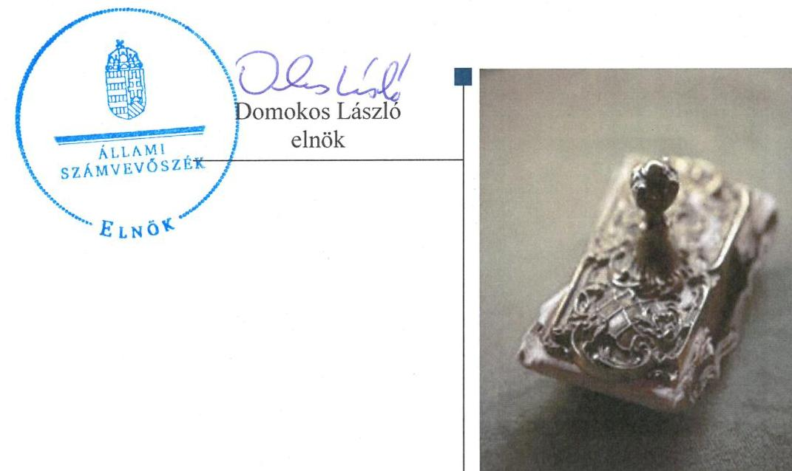
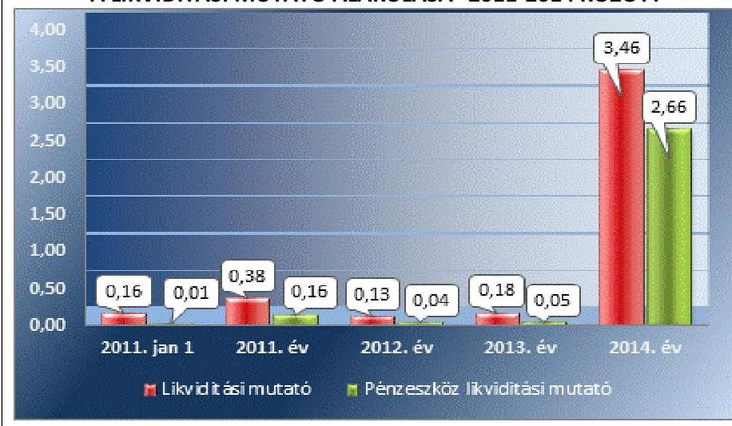
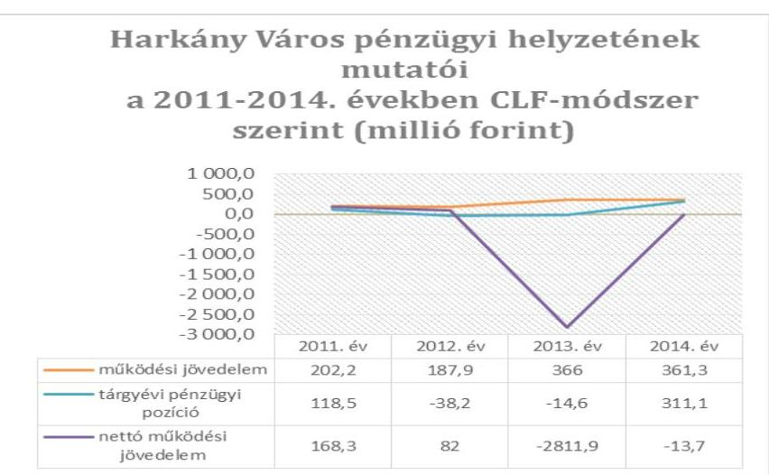
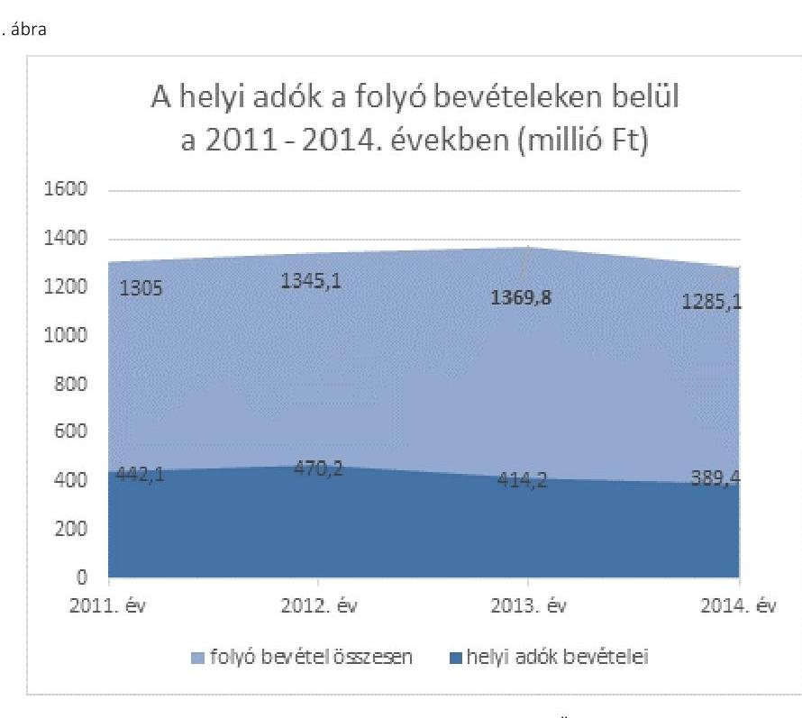
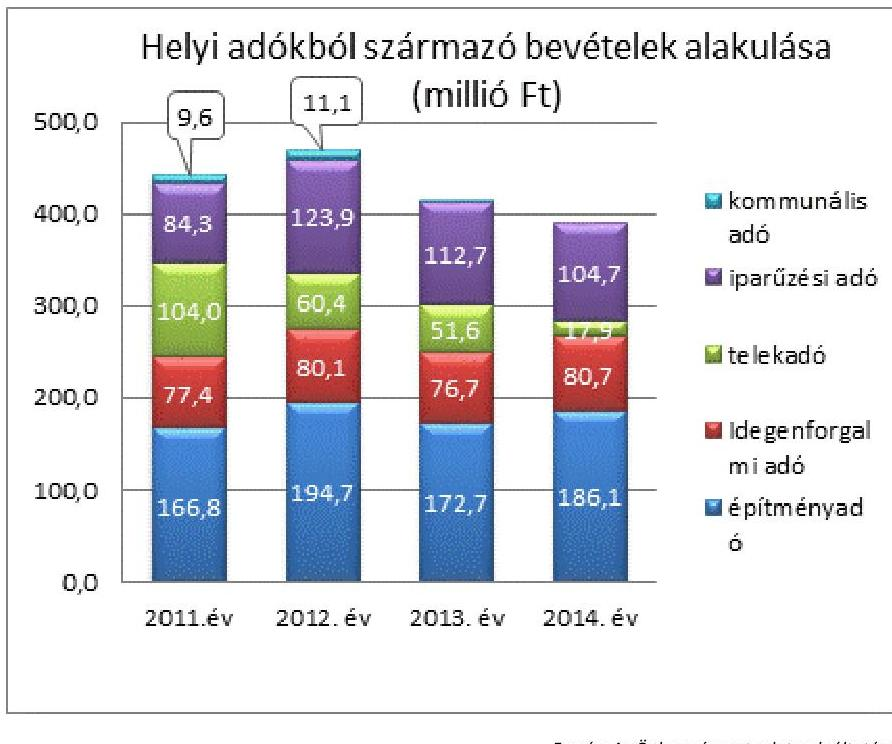
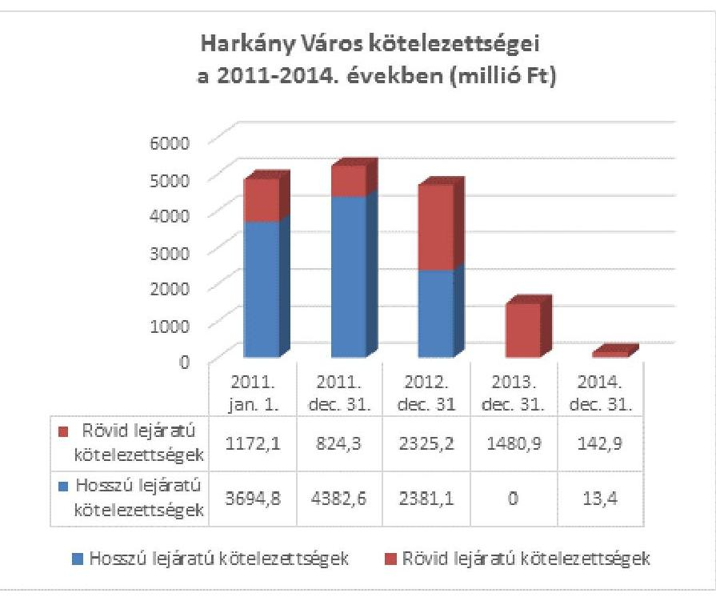
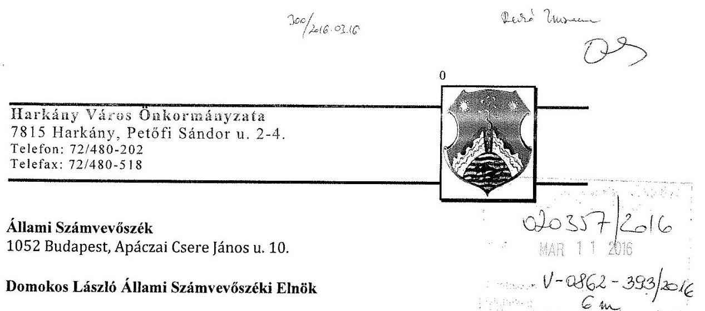
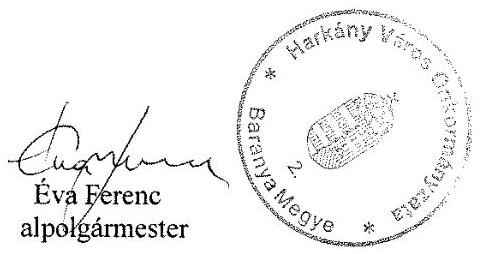

# Jelenetés 

## Önkormányzatok pénzügyi és vagyongazdálkodása

Az önkormányzatok pénzügyi és vagyongazdálkodása megfelelőségének ellenőrzése - Harkány
2016.

---

# Jelentés 

## Önkormányzatok pénzügyi és vagyongazdálkodása

Az önkormányzatok pénzügyi és vagyongazdálkodása megfelelőségének ellenőrzése - Harkány
2016. 04. hó 27. nap

---

# AZ ELLENŐRZÉST FELÜGYELTE:

- RENKŐ ZSUZSANNA felügyeleti vezető
- AZ ELLENŐRZÉST VEZETTE ÉS A VÉGREHAJTÁSÁÉRT FELELŐS:
  - DR. TIMÁR BALÁZS ellenőrzésvezető
  - A PROGRAM ÖSSZEÁLLÍTÁSÁÉRT FELELŐS:
    - JANIK JÓZSEF LÁSZLÓ osztályvezető

**IKTATÓSZÁM:** V-0862-397/2016

**TÉMASZÁM:** 1896

**ELLENŐRZÉS-AZONOSÍTÓ SZÁM:** V071503

Jelentéseink az Országgyűlés számítógépes hálózatán és az Interneten a www.asz.hu címen is olvashatóak.

---

# TARTALOMJEGYZÉK 

■ ÖSSZEGZÉS ..... 5
■ AZ ELLENŐRZÉS CÉLJA ..... 7
■ AZ ELLENŐRZÉS TERÜLETE ..... 8
■ AZ ELLENŐRZÉS HÁTTERE, INDOKOLTSÁGA ..... 9
■ FÓKUSZKÉRDÉSEK ..... 10
■ ELLENŐRZÉS HATÓKÖRE ÉS MÓDSZEREI ..... 12
■ MEGÁLLAPÍTÁSOK ..... 15
■ JAVASLATOK ..... 38
■ MELLÉKLETEK ..... 43
I. sz. melléklet: Értelmező szótár ..... 43
II. sz. melléklet: A pénzügyi egyensúlyi helyzet CLF módszer szerinti értékelése a 2011- 2014. években ..... 47
III. sz. melléklet: Az eszközök és források alakulása kiemelt mérlegsoronként a 2011-2014. években ..... 48
IV. sz. melléklet: Az önkormányzat feladatellátásában részt vevők és azok változása az ellenőrzött években ..... 49
V. sz. melléklet: Kimutatás az önkormányzat tulajdonában álló részesedésekről ..... 50
■ FÜGGELÉK: ÉSZREVÉTELEK ..... 51
■ RÖVIDÍTÉSEK JEGYZÉKE ..... 55

---

.

---

# ÖSSZEGZÉS 

Az Állami Számvevőszék (ÁSZ) Harkány Város Önkormányzata pénzügyi és vagyongazdálkodását 2011. január 1. és 2014. december 31. közötti időszakra vonatkozóan ellenőrizte. A pénzügyi gazdálkodás szabályozottsága a feltárt hiányosságok miatt nem felelt meg az előírásoknak. A vagyongazdálkodás és a vagyonkezelés nem volt teljes körüen szabályozott. A pénzügyi egyensúly a 2011 - 2012. években fennállt, a 2013 - 2014. években nem volt biztositott. Az önkormányzat vagyona 2011. január 1. és 2014. december 31. között 21,9 \%-kal növekedett, értéke a 2014. december 31-i mérleg-fordulónapon 9 501,7 millió Ft volt.

## Az ellenőrzés társadalmi indokoltsága

Az ÁSZ a stratégiájában hangsúlyos szerepet szán annak, hogy szilárd szakmai alapon álló, értékteremtő ellenőrzéseivel előmozdítsa a közpénzügyek átláthatóságát, rendezettségét és javaslataival a közpénzek és a közvagyon szabályos, gazdaságos, hatékony és eredményes felhasználását segítse. Az ÁSZ stratégiájában célul tűzte ki, hogy az önkormányzatok ellenőrzése során értékeli azok pénzügyi-gazdasági helyzetét, a kockázatokat feltárja, és az ellenőrzések helyszíneit kockázatelemzés alapján választja ki. Az ÁSZ szerepet vállal a korrupció és a csalás elleni küzdelemben. Közreműködik a korrupciós kockázatok és a korrupció elleni fellépés hatékony és eredményes eszközeinek beazonosításában, alkalmazásában, továbbá használatuk elterjesztésében, az integritás alapú közigazgatási kultúra kialakításában.

## Főbb megállapítások, következtetések, javaslatok

A Hivatal az ellenőrzött időszak egészében nem rendelkezett szervezeti és működési szabályzattal, ez a pénzeszközökkel való felelős gazdálkodásra nézve kockázatot jelentett, az elszámoltathatóság feltétele nem volt biztosított. Számviteli politikával és az ennek keretében kialakítandó szabályzatokkal rendelkeztek. A pénzügyi gazdálkodás szabályozásának keretében a jegyző nem alakította ki a pénzügyi kihatással bíró, jogszabályban nem szabályozott belső eljárásrendeket.

A vagyongazdálkodás és a vagyonkezelés hiányos szabályozottsága kockázatot jelentett az önkormányzati vagyon védelme szempontjából.

A költségvetési tervezésre vonatkozó ellenőrzési nyomvonallal a Hivatal nem rendelkezett. A költségvetési rendelettervezetek és az elfogadott költségvetési rendeletek megfeleltek az előírásoknak.

Az előirányzat-módosítások, valamint azok számviteli nyilvántartása, a kiemelt előirányzatok teljesítése megfelelt az előírásoknak. Az operatív gazdálkodási jogkörök szabályozása nem volt elfogadható és e jogkörök gyakorlása sem felelt meg a jogszabályi előírásoknak.

A beszámoló készítési kötelezettséget a jogszabályi előírásoknak megfelelően, a beszámolókkal kapcsolatos év végi államháztartási információs adatszolgáltatásokat azonban késedelemmel teljesítették.

A 2011-2012. évek beszámolóit könyvvizsgáló véleményezte, a 2012. évi beszámolóhoz csatolt véleményéhez - a kötelezettségek kimutatása során jelentkező lényeges hiba miatt - korlátozott záradékot fűzött. 2013. évtől - jogszabályváltozás miatt - az Önkormányzat beszámolóját nem volt köteles könyvvizsgálóval felülvizsgáltatni.

Az Önkormányzat az ellenőrzött időszakban készített likviditási tervet, azonban ennek havi aktualizálásáról 2012től nem gondoskodott. A pénzügyi egyensúly a 2013 - 2014. években nem állt fenn, a 2011 - 2012. években biztosított volt.

Az Önkormányzat a fizetési kötelezettségeit határidőben nem teljesítette. A lejárt követelések behajtása érdekében rendszeres és megfelelő intézkedéseket tettek. A pénzügyi egyensúlyi helyzet javítására tett bevételnövelő és kiadáscsökkentő intézkedések összhangban voltak a jogszabályi előírásokkal.

---

Az Önkormányzat az ellenőrzött időszakban az adósságot keletkeztető ügyletek megkötése során egy eset kivételével a vonatkozó jogszabályi előírásoknak megfelelően járt el.

Az adósságkonszolidációval és az adósságátvállalással összefüggő önkormányzati feladatok végrehajtása az előírásoknak megfelelően történt. Az Államadósság Kezelő Központ Zrt. az Önkormányzat tartozásának a Magyar Állam általi átvállalása révén megvalósult konszolidációs ügyletet 2014-ben, utóellenőrzés keretében ellenőrizte.

A vagyonkimutatás során az ingatlan-nyilvántartások jogszabályban előírt egyeztetését nem végezték el.
Mennyiségi leltárfelvételt a jogszabályban előírt gyakorisággal nem végeztek 2011-2013 között. A Hivatal a 2014. évben nem végzett leltárt megelőző selejtezést és mennyiségi leltározást, ezért a költségvetési beszámoló mérlegének alátámasztottsága nem volt megfelelő.

Az Önkormányzat a vízi közmű vagyona üzemeltetésre történő átadása során jogszabály által előírt közzétételi kötelezettségét nem teljesítette, továbbá egy térítésmentes vagyonátadást megelőzően nem győződött meg a vagyont átvevő szervezet átláthatóságáról.

Az Önkormányzat beruházásokat, felújításokat megalapozó döntései szabályszerűek voltak, a megvalósítás, az üzembe helyezés és az aktiválás során a jogszabályi előírásokat - a szerződések közzétételére vonatkozó előírások kivételével - érvényesítették, az önkormányzati feladatok ellátását szolgáló eszközök működtetéséhez, üzemeltetéséhez szükséges forrásokat az éves költségvetési rendeletekben biztosították.

Az önkormányzati vagyon értékesítése ellenőrzött mintatételei nem teljes körűen feleltek meg az előírásoknak, mivel az eladási árat nem értékbecslés útján határozták meg, ezáltal nem biztosították az önkormányzati vagyonnal való felelős gazdálkodást. A vagyon bérbeadás útján történő hasznosításának ellenőrzött mintatételei megfelelőek voltak.

A követelések elengedése szabályszerűen történt, a behajthatatlan követelések leírása azonban elmaradt, ezáltal a beszámoló mérlegében kimutatott eszközvagyon nem a valóságnak megfelelő vagyoni helyzetet mutatta.

Az Önkormányzat dokumentálható módon nem győződött meg a tulajdonában álló gazdasági társaságok átláthatóságáról.

Egy többségi tulajdonú gazdasági társaság veszteséges gazdálkodása esetén, illetve annak elkerülésére nem a jogszabályban előírt határidőn belül intézkedtek.

A tulajdonosi részesedések nyilvántartása, az értékvesztés elszámolása nem az előírásoknak megfelelően történt.
Az erőforrásokkal való szabályszerű gazdálkodással kapcsolatos feladatok körében nem alkották meg a szociális szolgáltatástervezési koncepciót, a környezetvédelmi programot, továbbá 2013. május 30-ig nem rendelkeztek vagyongazdálkodási tervvel. Az erőforrásokkal való szabályszerű gazdálkodás követelményeinek számonkérése és ellenőrzése nem minden esetben történt meg.

Az erőforrásokkal való hatékony gazdálkodás érvényesítését, számon kérését és ellenőrzését biztosító feltételeket nem teremtették meg.

Az Önkormányzatnál az integritás szemlélet érvényre jutása érdekében további intézkedések megtétele szükséges.

---

# AZ ELLENŐRZÉS CÉLJA 

## Harkány Város Önkormányzata pénzügyi és vagyongazdálkodásának ellenőrzése

AZ ELLENŐRZÉS CÉLJA az önkormányzat pénzügyi és vagyoni helyzetének, a gazdálkodás szabályosságának megítélése a költségvetési tervezés, a pénzügyi egyensúly megteremtése, az éves költségvetési beszámolás, a vagyongazdálkodás, a vagyon számbavétele, a gazdasági események elszámolása és a pénzgazdálkodás szabályszerűsége alapján; valamint annak értékelése, hogy kialakított-e az önkormányzat az erőforrásokkal való szabályszerű és hatékony gazdálkodáshoz szükséges követelményeket, megvalósította-e azok számon kérését, ellenőrzését.

---

# **AZ ELLENŐRZÉS TERÜLETE**

## **Harkány Város Önkormányzata**

Harkány Baranya megyében, a siklósi járásban Pécstől 25 km-re, a Villányi-hegység lábánál található nevezetes fürdőváros. A napsütötte déli vidéken fekvő város Magyarországon és külföldön is ismert és keresett gyógyüdülőhely. A település lakosainak száma 2015. január 1-jén 4219 fő volt.

Az ellenőrzött időszakban a Képviselő-testület tagjainak száma 7 fő, a bizottságok száma 2 volt.

Az ellenőrzött időszakban az Önkormányzat által fenntartott költségvetési intézmények száma 7-ről 4-re csökkent.

A többségi tulajdoni hányadú gazdasági társaságok száma a 2011-2012. évben három, a 2013. évben kettő, míg 2014. december 31-én egy volt. A gazdasági társaságok egyebek mellett művészeti kiegészítő tevékenységet, könyvtári, levéltári tevékenységet, egyéb szórakoztató tevékenységet (Tenkes Kultúrcentrum Nkft.); nyomdai tevékenységet (napilap kivételével), irodai papírárú, egyéb papír, kartontermékek gyártását, nyomdai előkészítő tevékenységet, hangfelvétel készítését és kiadását, egyéb kiegészítő üzleti szolgáltatást (Tenkes Dekor Kft.) végeztek. A Harkányi Gyógyfürdő Zrt. főtevékenysége egyéb humán egészségügyi ellátása volt.

A 2014. évi önkormányzati választásokat követően a polgármester és a jegyző személyében változás történt.

A Hivatal engedélyezett létszáma 2011. január 1-jén 38,5 fő volt (a szavai és a márfai körjegyzőséggel együtt), a Közös Önkormányzati Hivatal engedélyezett létszáma 2014. január 1-jén 31 fő volt. Az ellenőrzött időszak gazdálkodására jellemző főbb adatokat az 1. számú táblázat mutatja be:

1. táblázat

|  GAZDÁLKODÁSI ADATOK 2011.12.31. - 2014.12.31. (MILLIÓ FT) |  |  |  |  |   |
| --- | --- | --- | --- | --- | --- |
|  Év | Teljesített költségvetési
bevételek | Teljesített költségvetési
kiadások | Eszközvagyon | Követelések | Kötelezettségek  |
|  2011 | 1 406,7 | 1 246,6 | 7 795,8 | 184,6 | 5 216,0  |
|  2012 | 2 016,9 | 1 931,7 | 7 641,7 | 208,6 | 4 720,3  |
|  2013 | 4 329,2 | 1 166,8 | 9 262,5 | 191,7 | 1 485,1  |
|  2014 | 1 648,1 | 1 135,4 | 9 501,7 | 114,4 | 174,6  |

*Forrás: Önkormányzat beszámolói*

---

# AZ ELLENŐRZÉS HÁTTERE, INDOKOLTSÁGA 

Az államháztartás önkormányzati alrendszerének közpénz felhasználása, az önkormányzatok által ellátott közfeladatok és önként vállalt feladatok sokrétüsége, valamint a feladat ellátásához rendelt vagyon nagyságrendje indokolja, hogy az ÁSZ ellenőrzéseket folytasson a pénzügyi és vagyongazdálkodás területén.

## Az ellenőrzés várhatóan több szinten hasznosul

Az ÁSZ az önkormányzatok ellenőrzését a pénzügyi helyzet megítélésével indította el 2011-ben, és a nagy vagyonnal rendelkező, magas kockázatú önkormányzatok esetében a vagyongazdálkodás ellenőrzésével folytatta. Az elmúlt időszakban az önkormányzati gazdálkodás kockázatai beépítésre kerültek az ellenőrzött önkormányzatok kiválasztási rendszerébe. Az elmúlt négy év ellenőrzéseinek tapasztalatai megmutatták, hogy továbbra is indokolt az egyrészt elemző, értékelő, a pénzügyi helyzet kockázatát is minősítő, másrészt a pénzügyi és vagyongazdálkodási tevékenység szabályszerűségét értékelő ÁSZ ellenőrzések folytatása.

Ellenőrzéseink hozzájárulnak az önkormányzatok pénzügyi helyzetének pontosabb megítéléséhez azáltal, hogy a pénzügyi helyzetet a vagyoni helyzettel együtt értékeljük, amelyek együttesen határozzák meg az önkormányzatok fejlesztési képességét és gyakorolnak hatást a feladatellátásra. Feltárjuk az önkormányzati gazdálkodást meghatározó szabályozások összhangjának hiányosságait, a szabályozással nem érintett gazdálkodási területeket, valamint a pénzügyi és vagyongazdálkodás esetleges szabálytalanságait. Beazonosítjuk a pénzügyi egyensúlyi helyzet megbomlásakor a kiváltó okok mellett azok kialakulását is. Bemutatjuk az adósságkonszolidáció önkormányzat általi végrehajtásának szabályszerűségét, az adósságállomány újratermelődésének elkerülése érdekében hozott intézkedéseket. Az ellenőrzés kitér a gazdálkodáshoz kapcsolódó integritás kontrollok meglétének és működésének ellenőrzésére is.

A pénzügyi és vagyongazdálkodás szabályszerűségének ellenőrzése által a megállapításokkal összefüggő javaslatok hasznosítása esetén javul az önkormányzat gazdálkodásának szabályozottsága, valamint a „jó gyakorlatok" terjesztésén keresztül azok az önkormányzatok is átvehetik a pozitív példákat, ahol nem végez ellenőrzést az ÁSZ. Ellenőrzéseink eredményeképpen javaslatokat fogalmazhatunk meg az önkormányzatok pénzügyi egyensúlya fenntartásával kapcsolatos problémák rendszerszemléletű kezelésére, felszámolására.

---

# FÓKUSZKÉRDÉSEK 

1.     - A pénzügyi és vagyongazdálkodás szabályozása megfelelt-e az előírásoknak?
2.     - A költségvetési tervezés, az éves költségvetési beszámolás és a pénzgazdálkodás szabályszerü volt-e?
3.     - Biztositott volt-e a pénzügyi egyensúly, az adósságot keletkeztető ügyletek vállalására a jogszabályi előírásoknak megfelelően került-e sor?
4.     - A vagyonnyilvántartás, a költségvetési beszámoló mérlegének alátámasztottsága megfelelt-e a jogszabályokban és a belső szabályzatokban elöirt követelményeknek?
5.     - Szabályszerüek voltak-e a vagyon összetételének és nagyságának változását eredményező döntések és azok végrehajtása?
6.     - Felelősen gazdálkodott-e az önkormányzat a tartós részesedéseivel, élt-e tulajdonosi jogaival, teljesitette-e tulajdonosi kötelezettségeit?

---

7.     - Az önkormányzat az erőforrásokkal való szabályszerű gazdál- kodáshoz szükséges követelményeket kialakította-e, betartásu- kat számon kérte-e, ellenőrizte-e?
8.     - Az önkormányzat az erőforrásokkal való hatékony gazdálko- dáshoz szükséges követelményeket kialakította-e, betartásukat számon kérte-e, ellenőrizte-e?
9.     - Az önkormányzat intézkedett-e az integritás szemlélet érvényesitése érdekében?

---

# ELLENŐRZÉS HATÓKÖRE ÉS MÓDSZEREI 

## Az ellenőrzés típusa

Megfelelőségi ellenőrzés

## Az ellenőrzött időszak

A 2011. január 1-je és 2014. december 31-e közötti időszak. Az ellenőrzött időszakba beleértendő az ellenőrzött évekre vonatkozó tervezési feladatok, beszámolási kötelezettségek teljesítésének időszaka is. A vagyonnyilvántartások egyezőségét, a leltározás, selejtezés folyamatát a 2014. évre vonatkozóan értékeltük.

## Az ellenőrzés tárgya

Az önkormányzat pénzügyi és vagyongazdálkodása, a pénzügyi egyensúly megteremtése, a tulajdonosi és irányító szervi feladatok ellátása, az integritás szemlélet érvényesülése.

Az ellenőrzés kiterjed minden olyan körülményre és adatra, amely az ÁSZ jogszabályban meghatározott feladatainak teljesítéséhez, valamint a program végrehajtása folyamán felmerült újabb összefüggések feltárásához szükséges.

## Az ellenőrzött szervezet

Harkány Város Önkormányzata

## Az ellenőrzés jogalapja

Az ellenőrzés jogszabályi alapját az Állami Számvevőszékről szóló 2011. évi LXVI. törvény 1. § (3) bekezdésének, az 5. § (2)-(6) bekezdéseinek, valamint az államháztartásról szóló 2011. évi CXCV. törvény 61. § (2) bekezdésének előírásai képezik.

## Az ellenőrzés módszerei

Az ellenőrzést a nemzetközi standardokat irányadónak tekintve az ellenőrzési program kérdései, az adott időszakban hatályos jogszabályok, a szakmai szabályok és módszertanok figyelembe vételével végeztük.

---

A gazdálkodás hibáinak kijavítására, a közpénzekkel való felelős gazdálkodás segítésére irányuló javaslatok kidolgozásakor a hatályos jogszabályok voltak az irányadóak.

Az ellenőrzés ideje alatt az ellenőrzött szervezettel történő kapcsolattartást az ÁSZ SZMSZ²-ének vonatkozó előírásai alapján biztosítottuk.

Az ellenőrzési kérdések megválaszolásához szükséges bizonyítékok megszerzése az ellenőrzött által rendelkezésre bocsátott dokumentumokra, adatokra alapozva megfigyelés, szemle (szemrevételezés), kérdésfeltevés (információkérés), mintavételezés, valamint elemző eljárással történt.

Az ellenőrzési bizonyítékként felhasználható adatforrások közé tartoztak egyrészt a szakmai program részletes szempontjainál felsorolt adatforrások, másrészt minden - az ellenőrzés folyamán feltárt, az ellenőrzés szempontjából releváns információt tartalmazó - dokumentum.

Az ellenőrzés lefolytatásához az Önkormányzat a tanúsítványok elektronikus kitöltésével, valamint az ÁSZ által kért dokumentumok elektronikus megküldésével szolgáltatott adatokat. Az így rendelkezésre bocsátott adatok, információk, a tanúsítványok adatai valódiságának kontrollja az ellenőrzés keretében történt.

Az ellenőrzést az Önkormányzat működésével kapcsolatos feladatokat ellátó Hivatalban végezzük. Az Önkormányzat az intézményei és gazdasági társaságai ellenőrzéssel érintett dokumentumait, tanúsítványait a Hivatal útján bocsátotta az ellenőrzés rendelkezésére.

A pénzügyi és vagyongazdálkodás szabályozottságát az Önkormányzat rendeletei, határozatai, illetve a 2011. évben a Hivatal, a 2012. évtől az Önkormányzat (mint önálló éves költségvetési beszámolót készítő szerv) és a Hivatal belső szabályozásai alapján értékeltük. A költségvetési tervezési, végrehajtási és beszámolási feladatok ellenőrzése, a pénzügyi egyensúly, a vagyonnyilvántartás, a mérleg alátámasztottságának megítélése az önkormányzat összevont adatai alapján történt. A leltározási, értékelési és selejtezési folyamat szabályszerűségére a Hivatal által végzett 2014. évi leltározási folyamat ellenőrzése alapján tettünk megállapításokat.

Az Önkormányzat vagyonváltozást eredményező döntéseinek és azok végrehajtásának ellenőrzésére irányított, valamint véletlen mintavételi eljárással és tételes ellenőrzéssel került sor. A pénzforgalmi tételek ellenőrzése véletlen mintavételi eljárással - 2011. évben a Hivatal, 2012. évtől a Hivatal és az Önkormányzat (mint önálló éves költségvetési beszámolót készítő költségvetési szerv) főkönyvi állományából - kiválasztott minta alapján történt.

A részesedések értékelését tételesen ellenőriztük. Az ellenőrzött időszakban térítésmentes átadásra egy alkalommal került sor, ezért ennek ellenőrzése szintén tételesen történt. További tételes ellenőrzés alá esett az ellenőrzött időszakban hatályos két üzemeltetési szerződés és a követelések elengedése. Behajthatatlan követelés leírására, vagyonkezelési szerződés megkötésére, vagyonkezelői jog alapítására az ellenőrzött időszakban nem került sor.

A beruházások és felújítások elszámolásának, valamint a kapcsolódó kifizetések esetében a gazdálkodási jogkörök gyakorolásának, a vagyonértékesítéseknek és a vagyon bérbeadással történő hasznosításának szabályszerűségét véletlen mintavétellel ellenőriztük.

---

A véletlen minta alapján a sokaságra vonatkozó hibaarányt becsültük. „Megfelelőnek" értékeltük az ellenőrzött területet, amennyiben 95\%-os bizonyossággal a teljes sokaságban a hibaarány legfeljebb 10\%, „részben megfelelőnek" értékeltük, ha a hibaarány felső határa 10-30\% között volt, „nem megfelelőnek" pedig akkor, ha a mintavételi eredmények alapján a sokaságbeli hibaarány felső határa meghaladta a 30\%-ot.

Az ellenőrzési kérdésekre adott válaszok alapján értékeltük, hogy az Önkormányzat pénzügyi gazdálkodása megfelelt-e a jogszabályokban és a belső szabályzatokban meghatározottaknak, biztosított volt-e a pénzügyi egyensúly. Értékeltük a vagyongazdálkodás szabályszerűségét, a vagyonváltozást eredményező döntések és a tulajdonosi jogok gyakorlása szabályszerűségét. Értékelést adunk arról, hogy az Önkormányzatnál kialakítottáke az erőforrásokkal való szabályszerű és hatékony gazdálkodáshoz szükséges követelményeket, megvalósították-e azok számon kérését, ellenőrzését. Az integritás szemlélet érvényesülésének értékelése az önkormányzat által önbevallással kitöltött tanúsítvány alapján történt.

---

# 1. A pénzügyi és vagyongazdálkodás szabályozása megfelelt-e az elöírásoknak? 

Összegző megállapítás

1.1. számú megállapítás

A pénzügyi gazdálkodás szabályozottsága körében feltárt hiányosságok miatt a szabályszerű és átlátható múködés, továbbá az elszámoltathatóság nem volt biztosított. A vagyongazdálkodásra vonatkozó belső szabályozás hiányos volt, a jogszabályi előírásoknak teljes körűen nem felelt meg.

A jegyző nem alakította ki a pénzügyi kihatással bíró, jogszabályban nem szabályozott belső eljárásrendeket. A Hivatal az ellenőrzött időszakban nem rendelkezett szervezeti és múködési szabályzattal, ez a pénzeszközökkel való felelős gazdálkodásra nézve kockázatot jelentett.

Az ellenőrzött időszakban az Önkormányzat² rendelkezett a képviselő-testületi múködés részletes szabályait tartalmazó SZMSZ ${ }_{1,2}$-szel ${ }^{3}$. A Hivatal ${ }^{4}$ a 2011. évben hatályos Áht. ${ }^{5}$ 91. § (2) bekezdésében, valamint a 2012-2014. években hatályos Áht. ${ }^{6} 10 . \S$ (5) bekezdésében foglaltakkal ellentétben az ellenőrzés teljes időszakára vonatkozóan nem rendelkezett feladatai ellátásának részletes belső rendjét és módját szabályozó érvényes SZMSZ-szel, ezért az elszámoltathatóság feltétele nem volt biztosított.

A Hivatal a 2011. évben hatályos Áht ${ }_{1}$ 91. § (2) bekezdésében és az Ámr ${ }^{7}$. 15. § (6) bekezdésében, illetve a 2012-2014. években hatályos Áht ${ }_{2}$ 10. § (5) bekezdésében és az Ávr. ${ }^{8}$ 9. § (5) bekezdésében foglaltaknak megfelelően gondoskodott a gazdasági szervezet ügyrendjének kiadásáról és folyamatos aktualizálásáról.

A Hivatal a helyi sajátosságoknak megfelelően alakította ki számviteli politikáját ${ }_{1,2,3}{ }^{9}$, és ennek keretében elkészítette a számlarendet ${ }_{1,2,3}{ }^{10}$, az eszközök és források leltárkészítési és leltározási szabályzatát, az eszközök és források értékelési szabályzatát, pénzkezelési szabályzatot, valamint az önköltségszámítás rendjére vonatkozó belső szabályzatot.

Az Áht. ${ }_{2}$, és az ennek végrehajtásáról szóló Ávr. 2012. évi hatályba lépésének megfelelően, valamint 2014. évben az eredményszemléletű számvitelre való áttérés miatt valamennyi, gazdálkodással összefüggő szabályzat aktualizálása megtörtént. Az új, érvényben lévő számlarend tartalmi hiányosságaként állapítható meg azonban, hogy - az Áhsz. ${ }^{11} 51 . \S$ (3) bekezdésének előírása ellenére - nem rögzíti az analitikus nyilvántartások főkönyvi könyveléssel való egyeztetésének módját, technikai megvalósításának rendjét.

A kontrollrendszer lényeges elemét képező FEUVE ${ }^{12}$ szabályzatot 2007ben adták ki, évekkel a Bkr. ${ }^{13}$ hatályba lépése előtt, ezáltal tartalma nem felelt meg a hatályos előírásoknak. A Hivatal - a Bkr. 8. § (2) bekezdésében

---

foglaltak ellenére - a kontrolltevékenység részeként nem minden tevékenységre vonatkozóan biztosította a folyamatba épített, előzetes, utólagos és vezetői ellenőrzést. Nem alakította ki a FEUVE szabályait a pénzügyi kihatású döntések célszerűségi, gazdaságossági, hatékonysági és eredményességi szempontú megalapozottsága, illetve a pénzügyi döntések dokumentumainak elkészítése, jóváhagyása, ellenjegyzése, valamint a gazdasági események elszámolása vonatkozásában.

A pénzügyi kihatással bíró, jogszabályban nem szabályozott kérdések közül a jegyző nem rendezte
— a beszerzések lebonyolításával kapcsolatos eljárásrendet az Ámr. 20. § (3) bekezdése b) pontjában és az Ávr. 13. § (2) bekezdése b) pontjában foglaltak ellenére;
— a belföldi és külföldi kiküldetések elrendelésével és lebonyolításával, elszámolásával kapcsolatos kérdéseket az Ámr. 20. § (3) bekezdése c) pontjában és az Ávr. 13. § (2) bekezdése c) pontjában foglaltak ellenére;
— a reprezentációs kiadások felosztását, azok teljesítésének és elszámolásának szabályait az Ámr. 20. § (3) bekezdése f) pontjában és az Ávr. 13. § (2) bekezdése e) pontjában foglaltak ellenére;
— a gépjárművek igénybevételének és használatának rendjét az Ámr. 20. § (3) bekezdése g) pontjában és az Ávr. 13. § (2) bekezdése f) pontjában foglaltak ellenére;
— a vezetékes és rádiótelefonok használatát az Ámr. 20. § (3) bekezdése h) pontjában és az Ávr. 13. § (2) bekezdése g) pontjában foglaltak ellenére;
— a közérdekű adatok megismerésére irányuló kérelmek intézésének, továbbá a kötelezően közzéteendő adatok nyilvánosságra hozatalának rendjét az Ámr. 20. § (3) bekezdése i) pontjában és az Ávr. 13. § (2) bekezdése h) pontjában foglaltak ellenére.

# 1.2. számú megállapítás 

A vagyongazdálkodás és a vagyonkezelés hiányos szabályozottsága kockázatot jelentett az önkormányzati vagyon védelme szempontjából.

A Képviselő-testület ${ }^{14}$ az önkormányzati vagyonnal történő gazdálkodás szabályait a teljes vagyoni körre kiterjedően szabályozta. Meghatározta a törzsvagyon körét, elkülönítette a forgalomképtelen és a korlátozottan forgalomképes vagyonelemeket.

A leltározási ${ }^{15}$ és az értékelési szabályzat ${ }_{1,2}{ }^{16}$ megfelelő tartalmú volt, azonban a vagyonrendelet ${ }_{1,2}$ nem felelt meg maradéktalanul az előírásoknak, mert
—az Nvtv. ${ }^{17}$ 18. § (1) bekezdésében meghatározott határidőre - 2012. március 1-jéig - nem állapította meg, hogy az önkormányzatnak rendelete alapján forgalomképtelennek minősülő vagyonából van-e olyan vagyoneleme, amelyet nemzetgazdasági szempontból kiemelt jelentőségű nemzeti vagyonként forgalomképtelen törzsvagyonnak minősít;
—az Nvtv. 18. § (12) bekezdésében foglaltak ellenére nem vizsgálta felül a korlátozottan forgalomképes törzsvagyonát 2012. október 31-

---

ig, ennek felülvizsgálata az ellenőrzött időszak végéig nem történt meg;
nem határozta meg a vagyonkezelés ellenőrzésének részletes szabályait a 2011. évben hatályos Ötv. ${ }^{18}$ 80/B. §-a, illetve a Mötv. ${ }^{19}$ 109. § (4) bekezdése előírásainak megfelelően;
az Áht. 1 108. § (2) bekezdés és az Áht. 2 97. § (2) bekezdés rendelkezése ellenére nem határozták meg a követelésről való lemondás módját és eseteit.

# 2. A költségvetési tervezés, az éves költségvetési beszámolás és a pénzgazdálkodás szabályszerű volt-e? 

## Összegző megállapítás

2.1. számú megállapítás

A költségvetési tervezés, az éves költségvetési beszámolás a szabályozási hiányosságok ellenére megfelelő volt. A Hivatali SZMSZ hiánya miatt a gazdálkodási jogkörök szabályozottsága, és emellett ennek gyakorlása sem felelt meg a jogszabályi előírásoknak.

A költségvetési tervezésre vonatkozó ellenőrzési nyomvonallal a Hivatal nem rendelkezett. A költségvetési rendelettervezetek és az elfogadott költségvetési rendeletek megfeleltek az előírásoknak.

Az Önkormányzat a költségvetési tervezés folyamatának menetét a 2011. év tekintetében az Áht ${ }_{1}$ 91. § (2) bekezdésének, a 2012-2013. évek tekintetében az Áht ${ }_{2}$ 10. § (5) bekezdésének előírásaival ellentétben nem rendezte belső szabályzatban. Az ügyrendekben és a munkaköri leírásokban a teljes ellenőrzött időszakban rögzítették a költségvetési tervezéssel kapcsolatos feladatokat. A Hivatal a Bkr. 6. § (3) bekezdésében foglaltak ellenére költségvetési tervezésre vonatkozó ellenőrzési nyomvonallal nem rendelkezett.

A polgármester ${ }^{20}$ az Önkormányzat 2011-2012. évi költségvetési koncepcióit az Áht. 1 70. §-ában, 2013-2014. évi költségvetési koncepcióit pedig az Áht. 2 24. § (1) bekezdésében előírt határidőre benyújtotta a Képviselőtestület részére.

A 2012., illetve 2013. évi költségvetési koncepciót az Önkormányzat Pénzügyi, Gazdasági és Városüzemeltetési Bizottság, a 2014. évi koncepciót a Pénzügyi, Városfejlesztési és Szociális Bizottság véleményezte, az elfogadásukról határozatot hozott. A 2011. évi költségvetési koncepció véleményezéséről szóló pénzügyi bizottsági jegyzőkönyv, illetve határozat nem került átadásra. A Képviselő-testület a 2012., 2013. és 2014. évi koncepció tervezet megtárgyalását követően határozatot hozott a költségvetés-készítés további munkálatairól.

A 2013., illetve 2014. évi költségvetési rendelettervezeteket a polgármester az Áht. 2 24. § (3) bekezdésében előírt határidőig benyújtotta a Kép-viselő-testület részére, míg a 2011. és a 2012. évi rendelettervezet benyújtása az előírt határidőn túl történt.

A költségvetési rendelettervezet összeállítása, annak szerkezetét és tartalmát tekintve megfelelt a jogszabályi előírásoknak.

---

Az Önkormányzat az ellenőrzött időszakban az Áht.1,2 előírásainak megfelelően rendeletben állapította meg a költségvetését. A költségvetési rendeletek teljes körűen megfeleltek az Áht. ${ }_{1} 69$. §-ban és az Áht. 2 23. § (2) bekezdésében előírt tartalmi követelményeknek.

A költségvetési rendeletekben elkülönítetten szerepeltek az évközi többletigények, valamint az elmaradt bevételek pótlására szolgáló általános tartalék és céltartalék az Áht. ${ }_{1} 73 . \S$-nak, illetve az Áht. 2 23. § (3) bekezdésének megfelelően.

A költségvetési rendeletekben - a Mötv. 111. § (4) bekezdésével összhangban - múködési célú hiányt nem terveztek.

A 2011-2013. évi költségvetések előterjesztésekor az Áht. ${ }_{1} 71 . \S$ (2) bekezdése, illetve az Áht. 2 24. § (4) bekezdése értelmében a Képviselő-testület részére bemutatták az Önkormányzat költségvetési mérlegét közgazdasági tagolásban, a többéves kihatással járó döntések számszerűsítését évenkénti bontásban és összesítve. A 2014. évi költségvetés előterjesztésekor - ellentétben az Áht. ${ }_{1} 71 . \S$ (2) bekezdésében, illetve az Áht. ${ }_{2} 24 . \S$ (4) bekezdésében foglaltakkal - a költségvetési mérleg nem tartalmazta a több éves kihatással járó döntések számszerűsítését évenkénti bontásban és összesítve, valamint a közvetett támogatásokat tartalmazó kimutatást.

Az Önkormányzat a saját és az általa irányított költségvetési szervek elemi költségvetését elkészítette.

# 2.2. számú megállapítás 

Az előirányzat-módosítások, valamint azok számviteli nyilvántartása megfelelt az előírásoknak.

A bevételi és kiadási előirányzatok módosítása megfelelt a jogszabályokban és a belső szabályzatokban foglaltaknak.

Az Önkormányzatnál az előirányzatok, illetve azok módosítása főkönyvi könyvelésbe való feladása rendjének kialakítása - az Áhsz. 1 49. § (4) bekezdésével összhangban - a számlarend ${ }_{1,2,3}$ ben történt meg. Az előirányzatok könyvelésének rendjét az ügyrend ${ }_{1,2}$-ben ${ }^{21}$, továbbá a munkaköri leírásokban szabályozták, azonban a Bkr. 6. § (3) bekezdésében foglaltak ellenére előirányzat módosításra ellenőrzési nyomvonallal nem rendelkeztek.

Az ellenőrzött időszakban az előirányzatok átcsoportosítására vonatkozó döntéseket minden esetben az arra jogosultak hozták meg az Áht. 1 74. § (1) bekezdésében, illetve az Áht. 2 34. § (1) bekezdésében foglalt előírásoknak megfelelően.

A Képviselő-testület az Áht. 2 34. § (5) bekezdésében foglaltaknak megfelelően az előirányzat-módosítások, előirányzat-átcsoportosítások átvezetéseként a költségvetési rendeletét évközben negyedévente, vagy legkésőbb a költségvetési beszámoló készítésének határidejéig, december 31-ei hatállyal módosította.

A bevételi és kiadási előirányzatok módosításának nyilvántartásba vétele és elszámolása megfelelt a jogszabályi előírásoknak.

Az Önkormányzat és a Hivatal előirányzatainak módosításáról analitikus nyilvántartást vezettek. Az analitikus nyilvántartás kiemelt előirányzat szinten összhangban volt a költségvetési, valamint a zárszámadási rendelettel.

---

### 2.3. számú megállapítás

A kiemelt előirányzatok teljesítése összességében megfelelő volt. Az operatív gazdálkodási jogkörök szabályozása nem volt elfogadható és e jogkörök gyakorlása sem felelt meg a jogszabályi előírásoknak.

Az Önkormányzat a jóváhagyott összes kiadási előirányzatain belül gazdálkodott, azok túllépésére egyik évben sem került sor.

A kulcskontrollok - teljesítésigazolás és érvényesítés - múködésének szabályszerűsége a felhalmozási kiadási előirányzatok felhasználásához kapcsolódóan az ellenőrzött tételek esetében nem volt megfelelő. A kifizetéseket megalapozó kötelezettségvállalás (pénzügyi) ellenjegyzését az Ámr. 74. § (1) bekezdésének és az Ávr. 55. § (1) bekezdésének előírása ellenére nem gyakorolták. A kifizetéseket megelőzően a (szakmai) teljesítésigazolás az ellenőrzött tételek egy részében az Ámr. 76. § (3) bekezdésének, illetve az Ávr. 57.§ (3) bekezdésének előírása ellenére nem történt meg. Az érvényesítés nem történt meg, mivel az ellenőrzött tételek egy része az Ámr. 77. § (3) bekezdésének, illetve az Ávr. 58. § (3) bekezdésének előírása ellenére az érvényesítő aláírását nem tartalmazta. A kifizetések utalványozására az ellenőrzött mintatételek egy részénél az Ámr. 78.§ (2) bekezdésének, illetve az Ávr. 59. § (2) bekezdésének előírása ellenére nem került sor.

Az Önkormányzatnál a bevételek a módosított előirányzat mértékéig a 2011., és a 2014. évben nem teljesültek. A 2011. évben a felhalmozási bevételek módosított előirányzatától a teljesítés a tervezett részesedés-értékesítés elmaradása, és a tervezettnél alacsonyabb összegben realizálódott tárgyi eszközértékesítés miatt maradt el. A 2014. évben a múködési bevételek között tervezett közművagyon üzemeltetési díjának, valamint a felhalmozási célú bevételek és támogatások alacsony szintű teljesítése miatt nem realizálódott a tervezett bevétel.

A Képviselő-testület által a létszámgazdálkodással kapcsolatban támasztott, számszerűsített követelmények a költségvetési és zárszámadási rendeletekben engedélyezett létszámokra korlátozódtak. Az Önkormányzatnál az engedélyezett létszámot egyik évben sem lépték túl. Az álláshelyek száma a 2011. évi 239 főről 2014. évre 115 főre, 48,1 \%-kal csökkent. A létszámváltozások követték az ellátott feladatok számában, valamint a feladatellátás szervezeti formáiban bekövetkezett változásokat.
2.4. számú megállapítás

A beszámoló készítési kötelezettséget a jogszabályi előírásoknak megfelelően, a beszámolókkal kapcsolatos év végi államháztartási információs adatszolgáltatásokat azonban késedelemmel teljesítették.

Az elemi költségvetés és a költségvetési beszámolók adatainak összehasonlíthatóságát biztosították.

A polgármester a 2011-2013. években - Áht. 2 2014. szeptember 30-ig hatályos 87. § (1) bekezdésében foglaltakkal összhangban - az Önkormányzat gazdálkodásának első félévi helyzetéről szeptember 15-éig, a háromnegyed éves helyzetéről a költségvetési koncepció ismertetésekor írásban tájékoztatta a Képviselő-testületet. Az Önkormányzat az éves elemi beszámolóját az ellenőrzött években az Áhsz. ${ }^{22} 11 . \S$ (1) bekezdése, illetve az Áhsz. 2 6. § (2) bekezdése szerinti bontásban állította össze.

---

Az Önkormányzat az ellenőrzött években az éves költségvetési beszámolót egyetlen esetben sem az Áhsz.: 10. § (5) bekezdése, illetve az Áhsz.: 32. § (4) bekezdése szerinti határidőre nyújtotta be a Kincstár részére. A 2014. évi költségvetési beszámoló végleges feladása országos szinten kito lódott, űrlap javítási kérelem miatt.
2. táblázat

| KINCSTÁRI ADATSZOLGÁLTATÁSOK 2011-2013 |  |  |  |
| :--: | :--: | :--: | :--: |
| Költségvetési   beszámoló | Jogszabályi határidő | Tényleges teljesités | Késedelmi napok   száma |
| 2011. évi | 2012. március 10. | 2012. március 21. | 11 |
| 2012. évi | 2013. március 10. | 2013. március 25. | 15 |
| 2013. évi | 2014. március 10. | 2014. március 21. | 11 |
| Forrás: Az Önkormányzat adatszolgáltatása |  |  |  |

A jegyző ${ }^{23}$ a zárszámadási rendeletet az elfogadott költségvetéssel öszszehasonlítható módon készítette el. A polgármester a jegyző által elkészí tett zárszámadási rendelettervezetet a jogszabály szerinti tartalommal és általa előírt határidőre terjesztette a Képviselő-testület elé.

A zárszámadási rendelettervezethez valamennyi esetben csatolták az Áht.: 118. § (2) bekezdésében, az Áht.: 91. § (2) bekezdésében, illetve az Áhsz.: 44/A. §-ban meghatározott mérlegeket és kimutatásokat.

# 3. Biztosított volt-e a pénzügyi egyensúly, az adósságot keletkeztető ügyletek vállalására a jogszabályi előírásoknak megfelelően került-e sor? 

Összegző megállapítás

Az ellenőrzött időszakon belül a 2013-2014. években a pénzügyi egyensúly nem volt biztosított. A pénzügyi kockázatkezelési rendszert nem múködtették megfelelően. Az adósságot keletkeztető ügyletek vállalására nem a jogszabályi előírásoknak megfelelően került sor.

Az Önkormányzat az ellenőrzött időszakban készített likviditási tervet, azonban ennek havi aktualizálásáról 2012-től nem gondoskodott. A pénzügyi egyensúly a CLF módszerrel számítva a 2013-2014. években nem állt fenn, a 2011-2012. években biztosított volt.

AZ ÖNKORMÁNYZAT PÉNZÜGYI EGYENSÚLYÁ-
NAK biztosítása érdekében a bevételek beérkezésének és a kiadások teljesítésének ütemezéséről a 2011-2014. években az előírásoknak megfelelő tartalommal likviditási tervet készített. Az Önkormányzat a likviditási tervében havi bontásban bemutatta kiadásait, várható felmerülésüknek megfelelően, valamint a forrásul szolgáló bevételeket, az egyes hónapokban esetleg felmerülő hitelfelvételi igényt, a megállapított előző időszaki pénzmaradványának, ezáltal tulajdonképpen az év elején fennálló pénzkészletének havi ütemezés szerinti felhasználását. A 2012-2014. években a likviditási terv havonkénti felülvizsgálatára dokumentáltan - az Ávr. 122. § (3)

---

bekezdésében előírtak ellenére - nem került sor. A likviditási tervek - aktualizálásuk, felülvizsgálatuk elmaradása miatt - nem voltak alkalmasak az Önkormányzat pénzügyi egyensúlyának biztosítása érdekében a bevételek beérkezésének és a kiadások teljesítésének ütemezett bemutatására.

Az Önkormányzat pénzügyi gazdálkodása vonatkozásában a mérlegadatokból számított likviditási mutatószámok alakulását a következő ábra szemlélteti:

1. ábra

A LIKVIDITÁSI MUTATÓ ALAKULÁSA 2011-2014 KÖZÖTT

Forrás: Az Önkormányzat adatszolgáltatása
A likviditás elemzésére szolgáló mutatószámok szerint az Önkormányzat fizetőképessége a 2011-2013. években nem volt biztosított.

Az ellenőrzött időszakban az Önkormányzat - fizetőképessége részbeni fenntartása érdekében - kötvénykibocsátásból származó, valamint a Gyógyfürdő Zrt. által az Önkormányzatnak nyújtott hitel törlesztéséből adódó fizetési kötelezettsége teljesítését, továbbá a szállítói tartozásai teljesítését halasztotta.

Az Önkormányzat költségvetésének elemzését a CLF módszerrel - a beszámoló adatai alapján - számított mutatók alapján végeztük, melyek 2011-2014. év közötti változását a következő ábra mutatja be:
2. ábra

Forrás: Az Önkormányzat adatszolgáltatása

---

A CLF módszerrel számított nettó múködési jövedelem a 2013. évben - 2 811,9 millió Ft, a 2014. évben -13,7 millió Ft volt. Ennek oka a kötvénykibocsátásból származó, felhalmozási célú tőketörlesztési kötelezettségnek az adósságkonszolidáció első, illetve második ütemében kapott támogatásból történt teljesítése volt. Az adósságkonszolidáció pénzügyi hatásait kiszűrve, és az elhalasztott fizetési kötelezettség figyelembevételével számított nettó működési jövedelem a 2011-2012. évi pozitív összegét követően a 2013. évben -964,1 millió Ft lett volna, amely azt mutatja, hogy a 2013. évben képződött múködési jövedelem nem nyújtott volna fedezetet az adott évben esedékes hiteltörlesztésekre.

A felhalmozási költségvetés egyenlege 2011-2012. években negatív volt, a megkezdett beruházások és felújítások, a pénzeszköz átadások, a kamatkiadások és a nyújtott kölcsönök forrásigénye meghaladta a rendelkezésre álló felhalmozási bevételeket. A 2013. évi kiugróan magas, 2 796,4 millió Ft értéket az adósságkonszolidáció során kapott felhalmozási célú támogatás okozta.

A finanszírozási műveletek egyenlege 2011-2014 között folyamatosan negatív volt, az Önkormányzat a hitelei törlesztési kötelezettségének 2012ig hitelfelvétel nélkül csak részben tett eleget, azt a 2013-2014. években az adósságkonszolidáció II. ütemében kapott támogatással teljesítette.

Az Önkormányzat pénzügyi helyzete CLF-módszerrel történő értékeléséhez felhasznált részletes adatokat a II.sz. mellékletben mutatjuk be.
3. táblázat

| AZ ÖNKORMÁNYZAT PÉNZÜGYI HELYZETE A 2011-2014. ÉVEKBEN, MILLIÓ FT-BAN |  |  |  |  |
| :--: | :--: | :--: | :--: | :--: |
| Megnevezés | 2011 | 2012 | 2013 | 2014 |
| Folyó bevételek | 1305,0 | 1345,1 | 1369,8 | 1285,1 |
| Folyó kiadások | 1102,8 | 1157,2 | 1003,8 | 923,7 |
| Múködési jövedelem (folyó költségvetés egyenlege) | 202,2 | 187,9 | 366,0 | 361,4 |
| Felhalmozási bevételek | 97,6 | 95,7 | 2959,4 | 363,1 |
| Felhalmozási kiadások | 138,7 | 210,8 | 163,0 | 211,7 |
| Felhalmozási költségvetés egyenlege | $-41,1$ | $-115,1$ | 2796,4 | 151,4 |
| Finanszírozási múveletek nélkül (GFS) pozíció | 161,1 | 72,8 | 3162,3 | 512,8 |
| Finanszírozási múveletek egyenlege | $-42,5$ | $-111,1$ | $-3176,9$ | $-201,6$ |
| Tárgyévi pénzügyi pozíció | 118,5 | $-38,2$ | $-14,6$ | 311,1 |
| Nettó múködési jövedelem | 168,3 | 82,0 | $-2811,9$ | $-13,7$ |

Az Önkormányzat az ellenőrzött időszak valamennyi évében részesült ÖNHIKI, illetve a működőképesség megőrzését szolgáló támogatásban, összesen 309,4 millió Ft összegben, mely az időszak összes múködési jövedelmének (1152,5 millió Ft) 26,8\%-a. Ezen felül 2011., és 2014. évben öszszesen 222,1 millió Ft rendkívüli támogatásban részesült a rövidlejáratú hitelek törlesztése céljából.

Az ellenőrzött időszakban a helyi adóbevételek folyó bevételek közötti arányát a következő ábra mutatja be.

---

Forrás: Az Önkormányzat adatszolgáltatása
A helyi adók mértéke elérte a törvényben megállapított felső határt, újabb helyi adó bevezetésére nincs lehetősége az Önkormányzatnak.

A helyi iparűzési adó 75\%-át évente 15-40 adóalany fizette, ezért az Önkormányzatnak a helyi iparűzési adó tekintetében nem volt bevételi kitettsége.

Az Önkormányzat által az ellenőrzött időszakban kivetett helyi adókból származó bevételek adónemek közötti megoszlását a következő ábra mutatja be:
4. ábra

---

# 3.2. számú megállapítás 

## Az Önkormányzat a fizetési kötelezettségeit határidőben nem teljesítette.

A 2011-2013. években nem volt folyamatosan biztosított a pénzintézeti kötelezettségek, a szállítói számlák és egyéb fizetési kötelezettségek határidőben történő teljesítése.

Az Önkormányzat - a beszámolóban kimutatott - kötelezettségeinek 2011-2014. év közötti változását a következő ábra szemlélteti:
5. ábra

Forrás: Az Önkormányzat adatszolgáltatása

## A HOSSZÚ LEJÁRATÚ KÖTELEZETTSÉGEKBŐL a

2011-2012. években a kötvénykibocsátásból eredő tartozás a legjelentősebb, e kötelezettség 2011. év elején 96,7\%-át, 2011. év végén 96,6\%-át, 2012. év végén 100\%-át tette ki a hosszú lejáratú kötelezettségeknek. A hosszúlejáratú kötelezettségek értékének 2012. évi csökkenését - a rövidlejáratú kötelezettségek emelkedésével párhuzamosan - az okozta, hogy a beszámolóban a kötvénytartozásból a következő évben esedékes törlesztésre tévesen 1484,4 millió Ft-tal magasabb összeg került meghatározásra. A könyvvizsgáló a beszámoló auditálása során a hosszúlejáratú kötelezettségek összegét 3865,5 millió Ft-ban, a rövidlejáratú kötelezettségek összegét 840,8 millió Ft-ban állapította meg, a lényeges hiba miatt a 2012. évi költségvetési beszámolóról kiadott véleményéhez korlátozott záradékot füzött.

A 2014. évben az adósságátvállalás és konszolidáció miatt az Önkormányzatnak már nem állt fenn kötvénytartozása, azonban a 2015. évi állami támogatás összegéből 2014. évben 13,4 millió Ft előlegként folyósításra került, melynek összegét a költségvetési évet követően esedékes kötelezettségek között szabályszerűen kimutatták.

Az Önkormányzat a kötvénykibocsátásból adódó tőketörlesztési kötelezettségének 2011-2012. években nem tett eleget. A 2007. évben kibocsátott, 17,1 millió CHF összegű kötvény tőketörlesztési kötelezettsége 2011.

---

márciusban kezdődött volna, évente 2 alkalommal, 17 éven keresztül. Az Önkormányzat a 2011., és 2012. évi, összesen mintegy 477 millió Ft tőketörlesztési kötelezettségének forrás hiányában eleget tenni nem tudott, a kötvényből eredő fizetési halasztás érdekében tárgyalásokat folytatott a pénzintézettel, azonban ezzel kapcsolatban megállapodás nem keletkezett. Az adósságkonszolidáció nélkül az Önkormányzatnak a 2013. évben az Önkormányzat számítása alapján - 751,1 millió Ft elmaradt tőketörlesztési kötelezettsége állt fenn, mely reálisan nem lett volna teljesíthető.

A RÖVID LEJÁRATÚ PÉNZINTÉZETI HITELEI közül a 180 millió Ft összegű működési célú rövidlejáratú hitel 2011. évi tőketörlesztési kötelezettsége 60 millió Ft volt, melynek az Önkormányzat - a fizetési nehézségei miatti kölcsönszerződés módosítása alapján - csak részben, 30 millió Ft összeggel tett eleget. A rövidlejáratú hitelek kiegyenlítése az adósságkonszolidáció II. ütemében kapott 107,8 millió Ft müködési támogatásból a 2014. évben megtörtént.

A RÖVID LEJÁRATÚ KÖTELEZETTSÉGEK között a Gyógyfürdő Zrt.-től, az ellenőrzött időszakot megelőzően összesen 189,8 millió Ft összegben igénybevett kölcsönök határidőben történő törlesztési kötelezettségének sem tett eleget az Önkormányzat. A 2008-ban és 2009-ben több részletben igénybevett, éven belül lejáró kölcsönök teljes visszafizetése - a kölcsönszerződések 2014. évi módosítása után - csak 2014-ben, rendkívüli támogatás igénybevételével történt meg.

Az Önkormányzat szállítói kötelezettségeinek alakulását 2013. év végéig a következő táblázat szemlélteti:
4. táblázat

AZ ÖNKORMÁNYZAT SZÁLLÍTÓI KÖTELEZETTSÉGÉNEK ALAKULÁSA 2011-2013. KÖZÖTT, MILLIÓ FT-BAN

| Megnevezés | 2011.01 .01. | 2011.12 .31. | 2012.12 .31. | 2012.12 .31. |
| :-- | :--: | :--: | :--: | :--: |
| Szállítói kötelezettség | 370,8 | 189,6 | 53,3 | 31,1 |

A 2011. év elején a 90 napnál régebben lejárt szállítói tartozások összesen 320,3 millió Ft-ot $(86,9 \%)$ tettek ki. 2014. év végére e tartozások jelentősen, 1,1 millió Ft-ra, 1,3\%-ra csökkentek. A szállítókkal minden ellenőrzött év végén megtörténtek az egyeztetések a fennálló szállítói kötelezettségekkel kapcsolatban.

A 2011-2014. években az Önkormányzat PPP konstrukcióban nem vett részt. Az Önkormányzat készfizető kezességvállalása 2011-2014. években a Gyógyfürdő Zrt. hiteleihez kapcsolódott, az ellenőrzött időszakban kezességvállalás beváltása miatti fizetési kötelezettsége nem keletkezett.

# 3.3. számú megállapítás 

## A követelések behajtása érdekében rendszeres és megfelelő intézkedéseket tettek.

A folyamatos fizetőképesség biztosítása érdekében a követelések behajtására a jogszabályi előírásoknak megfelelően intézkedtek.

A hátralékok behajtása folyamatosan történt, fizetési felszólításokat rendszeresen küldtek. Az adóztatási tevékenységgel kapcsolatos és egyéb hátralékokat letiltással, ingatlan beterheléssel, illetve inkasszó benyújtásá-

---

val csökkentették. A saját behajtási tevékenységen túlmenően önálló bírósági végrehajtót is alkalmaztak, együttműködési megállapodás alapján adták át a hátralékos ügyeket.

Az ellenőrzött időszakban az önkormányzat követelésállománya kedvező irányban változott.

Az összes követelés összege az ellenőrzött időszak első három évében 200,0 millió Ft körül ingadozott, azonban 2014-re a felére esett vissza. Jelentősen csökkent az éven túli lejáratú vevőkövetelések állománya, amely a 2011. évi 31,7 millió Ft-ról 2014-re 2,1 millió Ft-ra mérséklődött. A határidőn túli vevőköveteléseken belül az arányok eltolódtak az éven túli lejáratú követelésektől az éven belül esedékessé váló követelések felé.

Az eszközök és források mérleg-fordulónapi értékeit a III. sz. melléklet tartalmazza.

# 3.4. számú megállapítás 

A pénzügyi egyensúlyi helyzet javítására tett bevételnövelő és kiadáscsökkentő intézkedések összhangban voltak a jogszabályi előírásokkal.

Az Önkormányzat a pénzügyi egyensúly biztosítása érdekében bevételnövelő és kiadáscsökkentő intézkedéseket hozott. Az ellenőrzött időszakban az önként vállalt és a kötelező feladatok körének és ellátási formájának változása befolyásolta az Önkormányzat pénzügyi egyensúlyi helyzetét.

Az Önkormányzat az Intézmény fenntartási tv. ${ }^{24}$ alapján állami fenntartásba vett iskola üzemeltetéséről nem mondott le, mivel az a számításuk alapján a központi fenntartási hozzájárulás összegénél olcsóbban üzemeltethető.

A 2011-2014. évekre kimutatott 584,9 millió Ft kiadáscsökkenés és a 454,5 M Ft bevételkiesés együttes hatása 130,4 millió Ft megtakarítás volt. Az ellenőrzött időszakban az adómérték emelésével, a helyi adóbevallások felülvizsgálata után kivetett adókkal, valamint egy településnek a Harkányi Közös Önkormányzati Hivatalhoz történt csatlakozásával az Önkormányzat az adatszolgáltatása szerint összességében 23 millió Ft tartós jellegű bevétel növekedést mutatott ki.

Az önként vállalt - bentlakásos szakosított szociális ellátás - feladatát ellátó intézménye átadásával 196,7 millió Ft, tartós jellegű kiadáscsökkentést mutatott ki.

Az önkormányzati feladatok ellátásában részt vevőket és ezek változásait az ellenőrzés időszakára vonatkozóan a IV. sz. mellékletben mutatjuk be.

### 3.5. számú megállapítás

A gazdálkodással összefüggő, pénzügyi egyensúlyt befolyásoló kockázatok mérséklésére nem működtették megfelelően a kockázatkezelési rendszert.

Az Önkormányzatnál a fizetőképességet veszélyeztető pénzügyi helyzethez az is hozzájárult, hogy a kockázatkezelési rendszere nem terjedt ki a gazdálkodással összefüggő, a pénzügyi egyensúlyt befolyásoló kockázatok mérséklésére. A 8kr. 7. § (2) bekezdésében foglalt előírások ellenére nem alakítottak ki és nem működtettek - a szervezet minden szintjén érvényesülő - megfelelő kockázatkezelési rendszert, illetve 2011-ben az Ámr. 157.

---

# 3.6. számú megállapítás 

§ (2)-(3) bekezdéseiben, a 2012-2014. években a Bkr. 7. § (1)-(2) bekezdéseiben foglalt előírások ellenére, kockázatelemzés során nem mérték fel az Önkormányzat tevékenységében, gazdálkodásában rejlő kockázatokat, nem határozták meg a kockázatokkal kapcsolatos intézkedéseket, valamint azok teljesítésének folyamatos nyomon követésének módját.

Az Önkormányzat az ellenőrzött időszakban az adósságot keletkeztető ügyletek megkötése során egy eset (rövid lejáratú hitel futamidejének két és fél hónappal történő, Kormány ${ }^{25}$ engedély nélküli meghosszabbítása) kivételével a vonatkozó jogszabályi előírásoknak megfelelően járt el.

Az Önkormányzat hitel- és kölcsön igénybevételéből, valamint kötvény-kibocsátásból származó adósságállománya 2011. január 1-jén összesen 4 466,1 millió Ft-ot tett ki. Az adósságállomány 2011. december 31-én volt a legmagasabb (4 999,5 millió Ft), azt követően évről évre csökkent, és a 2014. év végén adósságállománnyal már nem rendelkeztek. Az adósságállomány 2011. és 2012. évi változásában a 2007. évben kibocsátott deviza alapú kötvénnyel kapcsolatos tartozás alakulása volt a meghatározó. Az adósságállomány 2013. évi jelentős mértékű csökkenése, majd 2014. évi megszűnése döntően a központi adósságkonszolidációnak és adósságátvállalásnak tulajdonítható.

Az Önkormányzat az ellenőrzött időszakban adósságot keletkeztető ügyletek vállalásáról a 2012. és a 2013. évben döntött. A 2012. évben igénybe vett 197,5 millió Ft likviditási hitel futamidejének 2012. december 31-ről 2013. június 30-ig történő meghosszabbításához - a Stabilitási tv. ${ }^{26}$ 48. § (1) bekezdése alapján - az Önkormányzatnak nem kellett előzetes hozzájárulást kérnie a Kormánytól.

A 2013. évi csökkentett arányú, 70,0\%-os adósságkonszolidációt követően megmaradt kötvény- és hitelállománnyal (5 056967 CHF és 105,4 millió Ft) kapcsolatos szerződések - kedvezőbb törlesztési feltételeket eredményező - módosításához a Kormány nem járult hozzá. 2013. december 20-án a polgármester a pénzügyi osztályvezető pénzügyi ellenjegyzésével aláírta a Szigetvári Takarékszövetkezettel 2010-ben kötött kölcsönszerződés 1. számú módosítását, mellyel a hitel utolsó törlesztő részlete (30,0 millió Ft) megfizetésének szerződés szerinti időpontja 2013. október 10-ről 2013. december 30-ra változott. A Kormány hozzájárulása nélkül végrehajtott - a szerződés futamidejének meghosszabbítására irányuló szerződésmódosítással megsértették a Stabilitási tv. 10. § (13) bekezdésében előírtakat.

Az adósságkonszolidációval és az adósságátvállalással összefüggő önkormányzati feladatok végrehajtása az előírásoknak megfelelően történt.

Az Önkormányzat a hitelfelvételből és kötvénykibocsátásból származó adósságállománya és annak járulékai konszolidációjához 2013. május hónapban összesen 3 138,0 millió Ft vissza nem térítendő támogatásban részesült, melyből a tőketörlesztésre fordított összeg 3 127,3 millió Ft-ot tett ki. Az adósságkonszolidáció az Önkormányzat pénzügyi helyzetére kedvezően hatott, azonban - tekintettel arra, hogy az adósságátvállalás 2013ban 70 \%-ban teljesült az Önkormányzatnál - a fennmaradt adóssággal

---

kapcsolatos 2013. évi pénzügyi kötelezettségek teljesítéséhez szükséges önkormányzati források továbbra sem álltak rendelkezésre.

Az Önkormányzat a 2014. évi adósságátvállalás keretében az előírásoknak megfelelően kérelmezte a hitelfelvételekből és a kötvénykibocsátásból származó adósságai és azok járulékai megtérítését, illetve átvállalását. A Magyar Államkincstár a pénzintézetek részére összesen 107,8 millió Ft-ot utalt át, mellyel az Önkormányzat hiteltartozásai (járulékokkal együtt) teljes mértékben kiegyenlítésre kerültek. A kötvénnyel kapcsolatos 5097399 CHF fizetési kötelezettséget a Magyar Állam a 2014. február 24én kötött háromoldalú tartozásátvállalási szerződéssel átvállalta. Az Államadósság Kezelő Központ Zrt. a tartozásátvállalással konszolidált ügyletet a 2014. évben utóellenőrzés keretében ellenőrizte, ennek alapján a megkötött szerződés módosítása nem vált szükségessé.

# 4. A vagyonnyilvántartás, a költségvetési beszámoló mérlegének alátámasztottsága megfelelt-e a jogszabályokban és a belső szabályzatokban előírt követelményeknek? 

Összegző megállapítás

## 4.1. számú megállapítás

4.2. számú megállapítás

A vagyonnyilvántartás és a mérleg alátámasztottsága az ingatlanvagyon földhivatali egyeztetése, valamint kétévenkénti mennyiségi leltározás hiányában nem felelt meg az előírásoknak.

A vagyonkimutatás során az ingatlan-nyilvántartások bruttó értékbeli egyezőségét nem biztosították.

Az önkormányzat a 2014. évben megfelelő szerkezetben elkészítette vagyonkimutatását, amely az Áhsz. 2 30. § (2) bekezdésében előírt tagolásban tartalmazta a vagyonelemeket.

A vagyon nyilvántartása során az analitikus és főkönyvi nyilvántartás biztosította a törzsvagyon, ezen belül a forgalomképtelen és a korlátozottan forgalomképes, illetve az üzleti (forgalomképes) vagyon elkülönített nyilvántartását.

Egyeztetések hiányában a vagyonkimutatásban szereplő ingatlanvagyon számviteli nyilvántartás szerinti bruttó értékének és az ingatlan vagyonkataszteri nyilvántartásban szereplő ingatlanvagyon bruttó értékének egyezőségét - az Áhsz. 2 30. § (4) bekezdésében és a Gazdasági Szervezet ügyrendje 7.2. pontjában foglaltak ellenére - nem biztosították.

A jogszabályban előírt mennyiségi leltárfelvételt nem végezték el 2011-2013 között. A Hivatal a 2014. évben nem végzett leltárt megelőző selejtezést és mennyiségi leltározást, ezért a költségvetési beszámoló mérlegének alátámasztottsága nem volt megfelelő.

Az Önkormányzat - az Áhsz. 1 37. § (7) bekezdésében foglaltakkal ellentétesen - önkormányzati rendelet helyett a leltározási szabályzatban rögzítette, hogy az eszközök mennyiségben és értékben történő leltározását elegendő kétévente végrehajtani, ezért nem élhetett volna a kétévenkénti

---

#### Abstract

leltározás lehetőségével. A 2011-2013. évi könyvviteli mérlegeiben kimutatott, mennyiségben és értékben nyilvántartott eszközök mennyiségi felvétellel történő leltározását - az Áhsz. 1 37. § (3) bekezdésében foglaltak ellenére - évente nem végezték el. Az eszközöknek és a forrásoknak kizárólag egyeztetéssel végzett leltározásával sérült az Áhsz. 1 37. § (3) bekezdésének előírása.

A Hivatalnál 2014-re vonatkozóan - az Áhsz. 2 22. § (2) bekezdésének, valamint a leltározási szabályzat 2.3. pontjában foglaltak és a selejtezési szabályzat II.2. és IV. pontja előírásai ellenére - nem végeztek selejtezést és mennyiségi leltározást. A tárgyi eszközöket és a kötelezettségeket szabályosan - könyv szerinti értéken - mutatták ki.

#### Abstract

AZ EREDMÉNYSZEMLÉLETŰ SZÁMVITEL bevezetésével kapcsolatos feladatok végrehajtása során - a 36/2013. (IX. 13.) NGM rendelet előírásait megsértve - a rendező mérleget a 2014. március 31-i határidőre nem állították össze, az csak április 29-én készült el. Az előkészítő feladatok közül a rendelet 2. §-a szerinti teljes körű leltározást nem hajtották végre, a kötelezettségvállalásokat - azok meglétét igazoló dokumentumokkal egyeztetve és alátámasztva - nem leltározták. A függő, átfutó kiadásokat és bevételeket azonosították, illetve pénzügyileg rendezték. A rendező technikai tételek elszámolása során a 4922 Egyéb mérlegrendezési számlával szembeni kivezetések megtörténtek.

# 5. Szabályszerüek voltak-e a vagyon összetételének és nagyságának változását eredményező döntések és azok végrehajtása? 

Összegző megállapítás

### 5.1. számú megállapítás

A vagyon változását eredményező döntések és azok végrehajtása során nem teljes körűen tartották be a vonatkozó jogszabályi előírásokat.

Az Önkormányzat a vízi közmú vagyona üzemeltetésre történő átadása során jogszabály által előírt közzétételi kötelezettségét nem teljesítette, továbbá egy térítésmentes vagyonátadást megelőzően nem győződött meg a vagyont átvevő szervezet átláthatóságáról.

Az ellenőrzött időszakban az Önkormányzat vagyonkezelési szerződést nem kötött, vagyonkezelői jogot nem alapított.

Az Önkormányzat az ellenőrzött időszakban koncessziós szerződést nem kötött, a vízi- és szennyvízközmű vagyonát üzemeltetési szerződések alapján hasznosította. A szolgáltató cégekben az Önkormányzat tulajdoni hányada nem érte el a 25\%-ot, a társaságok tulajdonosai átlátható szervezetek (önkormányzatok) voltak.

Az Önkormányzat és a Tenkesvíz Kft. által 2002-ben kötött üzemeltetési szerződést a szerződő felek 2013. május 31. napjával közös megegyezéssel megszüntették, mivel a 2013. évi jogszabályi változások következtében a Tenkesvíz Kft. az üzemeltetéshez szükséges feltételeknek nem felelt meg. A szerződés megszűnésével az Önkormányzatnak a Tenkesvíz Kft-vel szem-

---

ben - az üzemeltetési jog átadásához kapcsolódóan - 88,5 millió Ft visszafizetési kötelezettsége keletkezett, melynek 2014. december 31-ig nem tett eleget.

A vízi közmű vagyon működtetését 2013. június 1-jétől bérleti-üzemeltetési szerződés alapján a Mohács-Víz Kft. végezte. A 2032. május 31-ig szóló szerződés megkötésére - a 2011. évi CCIX. törvény 15.§ (2) bekezdés c) pontjában és 29. § (1) bekezdésében foglaltak alapján - koncessziós eljárás lefolytatása nélkül került sor. A szerződés tartalma megfelelt az előírásoknak. A bérleti-üzemeltetési szerződéssel kapcsolatos - az Info tv. 37. § (1) bekezdésében és 1. számú mellékletének III/4. pontjában meghatározott - közzétételi kötelezettségét az Önkormányzat nem teljesítette.

A számviteli nyilvántartásokban az üzemeltetésre átadott eszközöket az előírásoknak megfelelően szerepeltették. Az eszközök pótlására, felújítására az elszámolt értékcsökkenésnél alacsonyabb összegeket fordítottak. Az üzemeltetők a beszámolási, tájékoztatási kötelezettségeiknek eleget tettek.

Az ellenőrzött időszakban az Önkormányzat a tulajdonából egy esetben adott át térítésmentesen vagyontárgyat, 2013-ban egy használaton kívüli, 0-ra leírt tűzoltó autót a MISINA Mentőcsoport Egyesületnek, a feladatellátása segítése céljából. A döntést megelőzően az Önkormányzat - az Nvtv. 13. § (2) és (3) bekezdéseiben foglaltak ellenére - nem vizsgálta, hogy a megajándékozandó szervezet átlátható szervezetnek minősül-e, továbbá - megsértve a vagyonrendelet; 13. § (6) bekezdését - nem gondoskodott az eszköz leselejtezéséről. A 2013. évben átadott eszköz számviteli nyilvántartásokból történő kivezetésére - a Számv. tv. 165. § (3) bekezdés b) pontjának előírásával ellentétesen - csak a 2014. évi zárlati feladatok keretében került sor.
5.2. számú megállapítás

Az Önkormányzat beruházásokat, felújításokat megalapozó döntései szabályszerűek voltak, a megvalósítás, az üzembe helyezés és az aktiválás során a jogszabályi előírásokat - a szerződések közzétételére vonatkozó előírások kivételével - érvényesítették, az önkormányzati feladatok ellátását szolgáló eszközök működtetéséhez, üzemeltetéséhez szükséges forrásokat az éves költségvetési rendeletekben biztosították.

Az ellenőrzött beruházások és felújítások összhangban voltak az Önkormányzat gazdasági programjában foglaltakkal, megvalósításuk az önkormányzati feladatok ellátását szolgálta. A fejlesztések megvalósítására vonatkozó döntéseket az arra jogosultak hozták meg. A közbeszerzési értékhatárt elérő beszerzések esetében a közbeszerzési eljárásokat a törvényi előírásoknak megfelelően lefolytatták. A 100 ezer Ft értékhatárt elérő beszerzésekre írásban vállaltak kötelezettséget. A nettó 5,0 millió Ft-ot elérő, vagy azt meghaladó értékű fejlesztésekkel kapcsolatos szerződések közzétételére vonatkozó kötelezettségüknek - 2011-ben az Eisztv. ${ }^{27}$ 6. § (1) bekezdésében, valamint az Áht.; 15/8. § (1) bekezdésében, a 2012-2014. években az Info tv. ${ }^{28}$ 37. § (1) bekezdésében és 1. mellékletének III/4. pontjában foglaltak ellenére - nem tettek eleget. A kivitelezési szerződésekben az Önkormányzat érdekeit védő garanciális elemeket - egy szerződés kivételével - rögzítették.

---

A befejezett beruházások, felújítások üzembe helyezése és aktiválása a jogszabályi előírásoknak megfelelő számviteli bizonylatok alapján történt, azonban a saját szabályzatban (Bizonylati Rend, II/1.2.2. pontja) 2012. január 1-jétől előírt állományba vételi bizonylatokat nem alkalmazták az eszközök nyilvántartásba vételénél. Az ingatlan vásárlásokat, létesítéseket az ingatlanvagyon-kataszterben átvezették, és a szükséges esetekben kezdeményezték a földhivatali nyilvántartás módosítását.

A beszerzett, illetve létesített eszközök múködtetéséhez, üzemeltetéséhez szükséges forrásokat az éves költségvetési rendeletekben előirányozták.

Az önkormányzati vagyon értékesítése ellenőrzött mintatételei nem teljes körűen feleltek meg az előírásoknak, mivel az eladási árat nem értékbecslés útján határozták meg, ezáltal nem biztosították az önkormányzati vagyonnal való felelős gazdálkodást. A vagyon bérbeadás útján történő hasznosításának ellenőrzött mintatételei részben megfelelőek voltak.

Az önkormányzati vagyon értékesítése az esetek többségében az arra jogosult által hozott döntések alapján, azonban nem minden esetben előkészítő dokumentumokkal alátámasztottan, részben szabályszerűen történt.

Az eladási árat számos mintatétel esetében nem a vagyonrendelet ${ }_{1,2^{-}}$ ben foglalt értékbecslés alapján határozták meg. A nem adásvétel jogcímen szerzett ingatlanok értékesítése során - a vagyonrendelet ${ }_{1,2}$ 9. § a) pontjának előírásaival ellentétben, mely szerint a vagyontárgy forgalmi értékét az értékesítést megelőző 3 hónapnál (vagyonrendelet ${ }_{1}{ }^{29}$ ), illetve 6 hónapnál (vagyonrendelet ${ }_{2}{ }^{30}$ ) nem régebbi összehasonlító értékbecslés alapján kell megállapítani - a sikertelen versenyeztetési eljárást követően a vételi ajánlattal egyezően, ingó vagyontárgyak értékesítésekor az aktuális piaci árak alapján került sor az eladási ár meghatározására.

A vevőt valamennyi esetben a vagyonrendelet ${ }_{1,2}$-ben foglaltak szerinti nyilvános eljárásban választották ki. Amennyiben versenyeztetési eljárás lefolytatására került sor, abban az esetben a szerződést a legkedvezőbb ajánlatot tevővel kötötték meg.

A vagyonelemek bérbeadása a versenyeztetési eljárás lefolytatásának mellőzése ellenére szabályszerű volt, mivel az önkormányzati vagyontárgyak értéke nem érte el a vagyonrendelet ${ }_{1,2} 12$. §-ban foglalt értékhatárt. Az ellenőrzött eszközbérlési kérelmekben, illetve a közterület használati engedélyre vonatkozó határozatban rögzítették az önkormányzat érdekeit védő garanciális elemeket.

A bevételt valamennyi esetben kiszámlázták. A kiszámlázott vételár az esetek túlnyomó hányadát tekintve határidőben befolyt.

Az amortizáció megtérülésének kérdése a földterületek esetében nem volt értelmezhető, egyéb bérbeadásoknál a megállapított bérleti díjak biztosították a bérbe adott eszközök amortizációjának időarányos részét.

A vagyonértékesítési és a bérbeadási mintatételek szerződéseihez kapcsolódóan az Önkormányzat az Nvtv. 3. § (2) bekezdésében foglalt nyilatkozatok bekéréséről nem gondoskodott, így nem tett eleget a jogszabály-

---

ban foglalt előírásnak, és nem győződött meg az átláthatóság követelményének előzőekben rögzítetteknek megfelelő módon való érvényesüléséről.
5.4. számú megállapítás

A követelés elengedés szabályszerűen történt, a behajthatatlan követelések leírása elmaradt, ezáltal a beszámoló mérlegében kimutatott eszközvagyon nem a valóságnak megfelelő vagyoni helyzetet mutatta.

Az ellenőrzött időszakban minimális összegben engedtek el követelést, összesen 5,6 millió Ft-ról mondtak le képviselő-testületi és polgármesteri engedélyek alapján.

A szabályozási hiányosságok ellenére az önkormányzati követelések elengedése a gyakorlatban az Áht. 2 97. § (2) bekezdésének megfelelően, megfelelő döntésekkel és dokumentumokkal alátámasztottan történt. Az elengedett összegeket a számviteli nyilvántartásokból kivezették.

A behajthatatlan követelésekről analitikus nyilvántartást vezettek, ennek ellenére az ellenőrzött időszak egyik évében sem írták le azokat hitelezési veszteségként, így nem tartották be az Áhsz. 1 34. § (10) bekezdésében és az Áhsz. 2 53. § (8) bekezdés e) pontjában foglaltakat. A nyilvántartás szerint 2014. december 31-re 12,8 millió Ft behajthatatlan követelés gyült össze. Ennek következtében az éves beszámolókban sem jelentek meg a tájékoztató adatok között a behajthatatlan követelésként leírt összegek, ezzel az Önkormányzat megsértette az Áhsz. 1 38. § (6) bekezdése n) pontjában és az Áhsz. 2 10. számú melléklete 10. pontjában foglalt előírást.

# 6. Felelősen gazdálkodott-e az önkormányzat a tartós részesedéseivel, élt-e tulajdonosi jogaival, teljesítette-e tulajdonosi kötelezettségeit? 

Összegző megállapítás

Az önkormányzati részesedéssel múködő gazdasági társaságoknál tulajdonosi jogok gyakorlására, a veszteséges gazdálkodás miatti kötelezettségek teljesítésére, az értékvesztés elszámolására nem a jogszabályban előírt módon került sor, ezért a tartós részesedésekkel való felelős gazdálkodás nem érvényesült.
6.1. számú megállapítás

Az Önkormányzat dokumentálható módon nem győződött meg a tulajdonában álló gazdasági társaságok átláthatóságáról.

Az Önkormányzat Képviselő-testülete a gazdasági társaságok feladatainak meghatározásáról, a tisztségviselők, tulajdonosi képviselők megválasztásáról, a gazdálkodás ellenőrzéséről nem teljes körűen gondoskodott.

Az Önkormányzat rendelkezett a tulajdonosi joggyakorlás során a többségi tulajdonában álló gazdasági társaságok esetében a létesítő okiratokban a feladatok meghatározásáról, a vagyoni hozzájárulás mértékéről, a rendelkezésre bocsátás módjáról és idejéről.

Az Önkormányzat - az Nvtv. 3. § (2) bekezdésének előírása ellenére nem gondoskodott az arra vonatkozó nyilatkozatok bekéréséről, hogy az

---

adott gazdasági társaság átlátható szervezetnek minősült-e. Az Önkormányzat szerint mindegyik gazdasági szervezet megfelelt az átlátható szervezet kritériumának.

Az Önkormányzat nem szabályozta a többségi tulajdonában lévő gazdasági társaságok által időszakonként elkészítendő adatszolgáltatások, elemzések, értékelések tartalmát, határidejét, és mindezek belső hasznosítását.

Az Önkormányzat -az Nvtv. 18. § (4) bekezdésének előírásait figyelmen kívül hagyva - nem intézkedett 2012. december 31-ig a nem kizárólagos tulajdonában lévő gazdasági társaságok társasági szerződéseinek felülvizsgálatára, annak megállapítása céljából, hogy az érintett társaságok az Nvtv. 3. § (1) bekezdés 1. pontja szerint átlátható szervezetnek minősül-nek-e.

# 6.2. számú megállapítás 

Egy többségi tulajdonú gazdasági társaság veszteséges gazdálkodása esetén, illetve annak elkerülésére nem a jogszabályban előírt határidőn belül intézkedtek.

A 2011. január 1-jei állapot szerint az Önkormányzat többségi tulajdonában három gazdasági társaság (Tenkes Dekorációs Műhely Kft., Tenkes Kultúrcentrum Nkft., Gyógyfürdő Zrt.) volt, számuk az ellenőrzött időszak végére egy társaságra - Gyógyfürdő Zrt. - csökkent. Az Önkormányzat a gazdasági társaságainak a 2011-2014. években tagi kölcsönt nem nyújtott.

A Képviselő-testület 280/2011. (XII. 21.) számú határozata alapján 2012. január 11-én az Önkormányzat Tenkes Dekorációs Műhely Kft-ben meglévő üzletrészét 150 ezer Ft vételárért a gazdasági társaság másik (magánszemély) tulajdonosának eladták. Az értékesítésre vonatkozó döntést nem indokolták.

A Tenkes Kultúrcentrum Kft. saját tőkéje már az ellenőrzött időszakot megelőzően a törzstőke (5,0 millió Ft) 50\%-a alá csökkent, ennek ellenére a Gt. 143. § (2)-(3) bekezdéseiben előírt intézkedéseket, az előírt határidőn belül nem tették meg. A többségi tulajdonos Önkormányzat a gazdasági társaságban 3,0 millió Ft névértékű törzsbetéttel rendelkezett, a társaság saját tőkéje 2010. december 31-én 1,6 millió Ft volt. A Képviselő-testület a 82/2011. (IV. 28.) számú határozatával a gazdasági társaság megszüntetéséről döntött, azonban a végelszámolás a 2014. évig elhúzódott. A gazdasági társaság a 2010-2012. évekre vonatkozó beszámoló készítési és közzétételi kötelezettségeinek csak a 2014. évben tett eleget. A társaság taggyűlése a 2014. február 1-jei ülésén határozott a két éve érdemi tevékenységet nem folytató szervezet végelszámolással történő megszüntetésének elindításáról. A végelszámolói zárójelentés, a vagyonfelosztási javaslat és a végelszámolói zárómérleg 2014. június 30-i fordulónappal készült, a felosztható vagyon a Nemzeti Adó- és Vámhivatallal szembeni adókövetelés jogcímen 36 ezer Ft volt.

A Gyógyfürdő Zrt. alaptőkéje 884,0 millió Ft, a gazdasági társaságban az Önkormányzat 99,9\%-os tulajdoni részaránnyal rendelkezik. A tulajdonosoknak az ellenőrzött időszakban nem keletkezett veszteségrendezéssel kapcsolatos kötelezettsége. A gazdasági társaság a 2010. évi veszteséges gazdálkodás után a 2011-2014. éveket pozitív eredménnyel zárta, a saját tőkéje mindegyik évben meghaladta a jegyzett tőke kétharmadát.

---

A Képviselő-testület a vagyonrendelet ${ }_{1,2}$ ben a tagsági jogok gyakorlásának hatáskörét a Mötv. 41. § (4) bekezdésével összhangban a polgármesterre ruházta át. A vagyonrendelet 2013. július 5-től azonban úgy módosult, hogy „a képviselő-testület által a tagjai közül határozattal megválasztott személy gyakorolja" a tagsági jogokat. A képviselő-testület tagjára történő hatáskör átruházás a Mötv. 41. § (4) bekezdésében foglaltaknak nem felelt meg.

Az Önkormányzat a Gyógyfürdő Zrt. múködéséhez, fejlesztéseihez szükséges hitelek felvételét elsősorban - a jogszabályi előírásoknak megfelelő és a Képviselő-testület határozataival jóváhagyott - kezességvállalásokkal segítette. Az ellenőrzött időszakban az Önkormányzatnak érvényesített, kezességvállalásból eredő fizetési kötelezettsége nem keletkezett. A kezességvállalások összege 2014. december 31-én 295,9 millió Ft volt.

A Stabilitási tv. 10. § (1) bekezdésének és (2) bekezdés e) pontjának 2013. július 1 - december 5. között hatályos előírásai alapján kérelmezte az Önkormányzat 2013. október 9-én a Kormány előzetes hozzájárulását a Gyógyfürdő Zrt. 170,0 millió Ft összegű forgóeszközhitel felvételéhez történő kezességvállaláshoz, azonban az 1988/2013. (XII. 29.) Korm. határozatban foglaltak alapján az ügylet megkötéséhez a kormányzati hozzájárulást nem kapta meg. A kezességvállalásra a 2013. december 6-tól módosult jogszabályi előírások betartásával, a 2014. január 13-i likviditási hitel felvételhez kapcsolódóan került sor.

# 6.3. számú megállapítás 

## A tulajdonosi részesedések nyilvántartása, az értékvesztés elszámolása nem az előírásoknak megfelelően történt.

A 2011-2014. évi beszámolók szöveges értékelésében - az Áhsz 1 40. § (9) bekezdésében foglalt előírások ellenére - nem mutatták be azon gazdasági társaságokat, amelyekben az Önkormányzat 25\%-ot meghaladó tulajdonosi részesedéssel rendelkezett.

A 2014. évben a részesedések részletező nyilvántartásának tartalma nem felelt meg az Áhsz. 14. melléklet VIII. 2-3. pontjaiban foglaltaknak, mivel az nem tartalmazta
$\longrightarrow$ a részesedés megszerzésének célját, számviteli besorolását,
$\longrightarrow$ a részesedés bekerülési értéke változásának okait, jellegét alátámasztó bizonylatok azonosításához szükséges adatokat,
$\longrightarrow$ gazdasági társaság esetén a részesedés minősítését,
$\longrightarrow$ gazdasági társaság esetén a társaság piaci megítélésének főbb mutatóit, és
$\longrightarrow$ a részesedés Nvtv. szerinti besorolását.
A részesedések értékeléséhez szükséges információk az értékelési szabályzat ${ }_{1,2}$ ben, illetve a 2014. évtől a számviteli politika ${ }_{3}$ ban rendelkezésre álltak. Az értékvesztés-elszámolás szükségességének vizsgálatával kapcsolatos előírások is megtalálhatóak voltak az előzőekben említett szabályzatokban, illetve „Részesedések, részvények értékelése" megnevezéssel évenkénti részletező kimutatást vezettek. A „Részesedések, részvények értékelése" című kimutatást utólag, a tárgyévet követő év május 31-éig leadott beszámolók tartalmával összhangban készítették el.

---

Az Önkormányzatnál fellelhető volt nyomdai úton előállított OTP részvény. Az OTP részvények benyújtására dematerializált értékpapírrá átalakítására 2002. március 8-ig volt lehetőség, ezt követően még öt évig a részvények pénzbeli ellenértékének átvételére. Az Önkormányzat a dokumentumok szerint az OTP Bank részvényeit nem alakíttatta át, illetve nem váltotta be.

Az Önkormányzat az ellenőrzött időszakban a tartós részesedések könyvviteli mérlegben szereplő értékét a Számv. tv. 69. §-ában és az Áhsz: 22. §-ában előírtaknak megfelelően egyeztetéssel végrehajtott leltározással alátámasztotta.

A Tenkes Thermál Kft-ben lévő részesedés után az ellenőrzött időszakot megelőzően 247.850 Ft értékvesztést számoltak el, amelyet a 2013. évi értékelés időpontjáig fenntartottak, azonban a saját tőke/jegyzett aránya miatt magasabb összegű értékvesztés elszámolása lett volna indokolt a 2011. 2012. években. A Tenkes Thermál Kft-ben lévő 9,4 millió Ft-os tulajdonrészt 2013. március 1-jén értékesítették.

A Számv. tv. 54. § (1) bekezdésében - mely szerint a befektetés piaci és könyv szerinti értéke között tartósnak mutatkozó és jelentős összegű negatív különbözet esetén értékveszést kell elszámolni -, valamint az értékelési szabályzat: 2.3. pontjában, az értékelési szabályzat: 9. pontjában, illetve a számviteli politika 36 . pontjában foglalt előírások alapján értékvesztés elszámolása lett volna indokolt a 2011. évtől kezdődően a 2013. évig a 2014. évben végelszámolással megszűnt Tenkes Kultúrcentrum Nkft-ben lévő részesedés esetében. A 2014. évben a Tenkesvíz Kft-ben fennálló részesedés után - az értékelési szabályzat: 9.1. a) pontjának előírása szerint - szintén értékvesztést kellett volna elszámolni a társaságok saját tőke/jegyzett tőke arányának egy alatti értéke miatt.

Értékvesztés visszaírása a 2013. évben történt, az ellenőrzött időszakot megelőzően, a Tenkes Thermál Kft-ben lévő részesedések után elszámolt, 247.850 Ft összegben.

Az Önkormányzat tartós részesedéseit az ellenőrzési időszak kezdő és befejező napjára vonatkozóan az V. sz. melléklet mutatja be.

# 7. Az önkormányzat az erőforrásokkal való szabályszerű gazdálkodáshoz szükséges követelményeket kialakította-e, betartásukat számon kérte-e, ellenőrizte-e? 

Összegző megállapítás

Az Önkormányzat az erőforrásokkal való szabályszerű gazdálkodáshoz szükséges követelmények kialakítását, betartásuk számonkérését, ellenőrzését nem teljes körűen látta el.

### 7.1. számú megállapítás

Az Önkormányzat nem rendelkezett szociális szolgáltatástervezési koncepcióval, Környezetvédelmi programmal, továbbá a 20112012. években vagyongazdálkodási tervvel.

Az Ötv. 91. §. (6) bekezdésében, valamint a Mötv. 116. § (4)-(5) bekezdéseiben előírtaknak megfelelően az Önkormányzat elkészítette a 2011-

---

2014. évekre szóló Gazdasági Programját, amelyben a költségvetési lehetőségekkel összhangban meghatározták az egyes közszolgáltatások biztosítására, színvonalának javítására vonatkozó fejlesztési elképzeléseket.

Az Önkormányzat az Nvtv. 9. § (1) bekezdésében előírtaknak megfelelően készítette el a közép- és hosszú távú Vagyongazdálkodási Tervét, melyet a Képviselő-testület 2013. május 30-án kelt határozatával fogadott el.

Az Önkormányzat a kötelező és önként vállalt feladatainak körét az SZMSZ1,3ben szabályozta. A Gazdasági Programban a kötelezően vállalt feladatok között szerepel a lakásgazdálkodás, amelyet az SZMSZ1,2 nem tartalmaz. Az önkormányzati tulajdonú gyógyfürdő üzemeltetés feladatellátás az SZMSZ1,3ben és a Gazdasági Programban sem szerepel, annak ellenére, hogy jelentősége meghatározó az Önkormányzat vagyoni és pénzügyi helyzetében. A 2014. évi költségvetési rendeletben - az Áht. 23. § (2) bekezdés a) és b) pontja előírásának megfelelően - az önkormányzat és intézményei vonatkozásában a kötelező és önként vállalt feladatokra tervezett bevételeket és kiadásokat elkülönítették.

Az ellenőrzött időszakban a szociális igazgatásról és szociális ellátásokról szóló 1993. évi III. tv. 92. §. (3) bekezdésében előírtaktól eltérően az Önkormányzat nem rendelkezett szociális szolgáltatástervezési koncepcióval, valamint az 1995. évi LIII. tv. 46. §. (1) bekezdés b) pontjában előírt környezetvédelmi programmal.

Az erőforrásokkal való gazdaságos, hatékony és eredményes gazdálkodás követelményeit az Önkormányzat általános jelleggel a Gazdasági Programban, a Vagyongazdálkodási Tervben, továbbá számszerúen az éves költségvetésben határozta meg.

Az Áht. 1 118. § (1) bekezdés és az Áht. 2 24. § (4) bekezdés a) pontjának megfelelően a 2011-2014. évre vonatkozó költségvetési rendeletek minden esetben tartalmazták az Önkormányzat éves előirányzat-felhasználási tervét.

# 7.2. számú megállapítás 

Az erőforrásokkal való szabályszerű gazdálkodás követelményeinek számonkérése és ellenőrzése nem minden esetben történt meg.

A stratégiai dokumentumokban - Gazdasági Programban, Vagyongazdálkodási Tervben - meghatározott célok megvalósulását, az azokhoz rendelt erőforrások szabályszerű felhasználását folyamatosan nyomon követték. A stratégiai dokumentumokban meghatározott feladatok teljesítéséről az éves zárszámadásról készített beszámolókban számoltak be, valamint a Pénzügyi, Gazdasági és Városüzemeltetési Bizottság, 2014-től Pénzügyi, Városfejlesztési és Szociális Bizottság a bizottsági üléseken tárgyalta meg azokat.

Az Önkormányzat előirányzat-felhasználási ütemtervét az előirányzat módosításokkal egyidejűleg nem minden esetben aktualizálták.

Az ellenőrzött időszakban a belső ellenőrzés elemezte, vizsgálta a rendelkezésre álló erőforrásokkal való gazdálkodást, a vagyon megóvását, gyarapítását, az elszámolások megfelelőségét, a beszámolók valódiságát. A belső ellenőrzés javaslata ellenére a megállapítások kezelésére a 20112013. években nem készített az Önkormányzat intézkedési tervet, a 2014. évi megállapításokra azt határidőn túl készítették el.

---

Az Ötv. 92.§ (13) bekezdés és a Mötv. 120.§ (1) bekezdésben előírtaknak megfelelően az ellenőrzött időszakban a Pénzügyi, Gazdasági és Városüzemeltetési Bizottság (2014-től Pénzügyi, Városfejlesztési és Szociális Bizottság) véleményezte a költségvetési javaslatot és az éves beszámolót, figyelemmel kísérte a költségvetési bevételek alakulását, a saját bevételeket, a vagyonváltozás alakulását, értékelte az előidéző okokat.

A pénzügyi bizottság minden évben bizottsági üléseken tárgyalta meg és véleményezte a költségvetési tervezetet, azok módosításait, az Önkormányzat gazdálkodásáról szóló éves és időszakos beszámolókat, ezáltal figyelemmel kísérte az Önkormányzat vagyonváltozását.

# 8. Az önkormányzat az erőforrásokkal való hatékony gazdálkodáshoz szükséges követelményeket kialakította-e, betartásukat számon kérte-e, ellenőrizte-e? 

## Összegző megállapítás

Az erőforrásokkal való hatékony gazdálkodás érvényesítését, számon kérését és ellenőrzését biztosító feltételeket nem teremtették meg.

Az Áht ${ }_{1}$ 49. § (5) bekezdésének f) pontja, valamint az Áht ${ }_{2}$ 9. § (1) bekezdésének f) pontja előírja az Önkormányzati költségvetési szerv által ellátandó közfeladatok ellátására vonatkozó, és az erőforrásokkal való szabályszerű és hatékony gazdálkodáshoz szükséges követelmények érvényesítését, számonkérését, ellenőrzését. Az Önkormányzat által az ellenőrzés részére átadott dokumentumok alapján megállapítható, hogy a gazdálkodás teljesítménykritériumainak meghatározása hiányában az Önkormányzat az közfeladatok ellátására vonatkozó teljesítmények mérésének, számonkérésének, ellenőrzésének feltételeit nem teremtette meg.

## 9. Az önkormányzat intézkedett-e az integritás szemlélet érvényesítése érdekében?

## Összegző megállapítás:

Az Önkormányzatnál az integritás szemlélet érvényre jutása érdekében további intézkedések megtétele indokolt.

Az Önkormányzat által kitöltött kérdőív értékelése alapján az Eredendő Veszélyeztetettség Tényező (EVT) alacsony (48,57\%), a Korrupciós Veszélyeztetettséget Növelő Tényező (KVNT) szintje közepes volt (20,95\%). A Kockázatokat Mérséklő Kontrollok Tényező (KMKT) szintje is közepes volt (48,67\%). Az integritás fejlesztése érdekében további intézkedések szükségesek az Önkormányzat részéről.

---

# JAVASLATOK 

Az ÁSZ tv. ${ }^{31}$ 33. § (1) bekezdésében foglaltak értelmében az ellenőrzött szervezet vezetője köteles a jelentésben foglalt megállapításokhoz kapcsolódó intézkedési tervet összeállítani és azt a jelentés kézhezvételétől számított 30 napon belül az ÁSZ részére megküldeni. Amennyiben az intézkedési tervet határidőre nem küldi meg a szervezet, vagy amennyiben az nem elfogadható, az ÁSZ elnöke az ÁSZ tv. 33. § (3) bekezdés a)-b) pontjaiban foglaltakat érvényesítheti.

## a polgármesternek:

1. Az erőforrásokkal való szabályszerű és hatékony gazdálkodás érdekében intézkedjen:
a) a Hivatal jogszabályi előirásoknak megfelelő tartalmú szervezeti és müködési szabályzatának jóváhagyásáról;
(1.1. sz. megállapítás 1. bekezdése alapján)
b) a vagyongazdálkodással kapcsolatos szabályok meghatározása érdekében a jogszabályi előirásoknak megfelelő rendelettervezet képviselő-testületi ülés napirendjére vételének kezdeményezéséről;
(1.2. sz. megállapítás 2. bekezdés 1-4 pontjai és a 6.2. sz. megállapítás 5. bekezdése alapján)
c) a jogszabályi előirásoknak megfelelő szociális szolgáltatástervezési koncepció képviselő-testületi ülés napirendjére vételének kezdeményezéséről;
(7.1. sz. megállapítás 4. bekezdése alapján)
d) a jogszabályi előirásoknak megfelelő környezetvédelmi program képviselő-testületi ülés napirendjére vételének kezdeményezéséről.
(7.1. sz. megállapítás 4. bekezdése alapján)
2. A pénzügyi gazdálkodás szabályszerűsége és a pénzügyi egyensúly biztosítása érdekében intézkedjen a jogszabályi előirásoknak megfelelően a költségvetés előterjesztésekor bemutatandó mérlegek és kimutatások képviselő-testületi ülésre történő beterjesztéséről.
(2.1. sz. megállapítás utolsó előtti bekezdése alapján)

---

3. A vagyongazdálkodás szabályszerűségének biztositása érdekében intézkedjen az önkormányzati vagyont érintő döntések során a jogszabályi előírások betartásáról.
(3.6. sz. megállapítás 3. bekezdése alapján)

# a jegyzőnek: 

1. Az erőforrásokkal való szabályszerű és hatékony gazdálkodás érdekében intézkedjen:
a) a Hivatal jogszabályi előírásoknak megfelelő tartalmú szervezeti és müködési szabályzata elkészitéséről;
(1.1. sz. megállapítás 1. bekezdése alapján)
b) a jogszabályi előírásoknak megfelelő tartalmú számlarend kiadásáról, valamint a FEUVE szabályainak kiegészitéséről;
(1.1. sz. megállapítás 4-5. bekezdései alapján)
c) a jogszabályban nem szabályozott, pénzügyi kihatással bíró belső szabályozások kiadásáról;
(1.1. sz. megállapítás 6. bekezdés 1-6 pontjai alapján)
d) a vagyongazdálkodással kapcsolatos szabályok meghatározása érdekében a jogszabályi előírásoknak megfelelő rendelettervezet elkészitéséről és beterjesztésének kezdeményezéséről;
(1.2. sz. megállapítás 2. bekezdés 1-4 pontjai és a 6.2. sz. megállapítás 5. bekezdése alapján)
e) a jogszabályi előírásoknak megfelelő ellenőrzési nyomvonal elkészitéséről;
(2.1 sz. megállapítás 1. bekezdése és a 2.2 sz. megállapítás 2. bekezdése alapján)
f) jogszabályi előírásoknak megfelelő szociális szolgáltatástervezési koncepció elkészitéséről és beterjesztésének kezdeményezéséről;
(7.1. sz. megállapítás 4. bekezdése alapján)

---

g) jogszabályi előírásoknak megfelelő környezetvédelmi program elkészitéséről és beterjesztésének kezdeményezéséről;
(7.1. sz. megállapítás 4. bekezdése alapján)
2. A pénzügyi gazdálkodás szabályszerűsége és a pénzügyi egyensúly biztositása érdekében intézkedjen:
a) a jogszabályi előírásoknak megfelelően a költségvetés előterjesztésekor bemutatandó mérlegek és kimutatások elkészitéséről és beterjesztésének kezdeményezéséről;
(2.1. sz. megállapítás utolsó előtti bekezdése alapján)
b) a belső kontrollrendszer - ennek keretében a pénzügyi folyamatokban kulcsszerepet betöltő teljesitésigazolás és érvényesités kontrollok, továbbá a pénzügyi ellenjegyzés és utalványozás - jogszabályi előírásoknak, illetve belső szabályzatoknak megfelelő müködtetéséről;
(2.3. sz. megállapítás 2. bekezdése alapján)
c) a likviditási terv jogszabályi előírásoknak megfelelő felülvizsgálatáról;
(3.1. sz. megállapítás 1. bekezdése alapján)
d) a pénzügyi egyensúlyt befolyásoló kockázatok kezelésére alkalmas kockázatkezelési rendszer müködtetéséről.
(3.5. sz. megállapítás 1. bekezdése alapján)
3. A vagyongazdálkodás szabályszerűségének biztositása érdekében intézkedjen:
a) a vagyonkimutatásban és a vagyonkataszteri nyilvántartásban szereplő ingatlanvagyon jogszabályi előírásoknak megfelelő egyezőségének biztosításáról;
(4.1. sz. megállapítás 3. bekezdése alapján)
b) a behajthatatlan követelések jogszabályi előírásoknak megfelelő leírásáról és az éves beszámolóban történő kimutatásáról;
(5.4 sz. megállapítás 3. bekezdése alapján)

---

c) a tulajdonosi részesedések jogszabályi előírásoknak megfelelő analitikus nyilvántartásáról, a beszámolóban való bemutatásáról, továbbá az elmaradt értékvesztések elszámolásáról;
(6.3 sz. megállapítás 1. bekezdés, a 2. bekezdés 1-5 pontjai és 7. bekezdése alapján)
d) az éves költségvetési beszámolók mérlegének a jogszabályi előírásoknak megfelelő alátámasztásáról, selejtezési feladatok belső szabályzatnak megfelelő teljesítéséről;
(4.2. sz. megállapítás 1-3. bekezdései alapján)
e) a közérdekü adatok jogszabályi előírásoknak megfelelő közzétételéről;
(5.1 sz. megállapítás 4. bekezdése és az 5.2. sz. megállapítás 1. bekezdése alapján)
f) az eszközök nyilvántartásba vételénél a belső szabályozásban foglalt bizonylatok használatáról;
(5.2 sz. megállapítás 2. bekezdése alapján)
g) az önkormányzati vagyont érintő döntések során a képviselő-testület által meghatározott szabályok és a jogszabályi előírások betartásáról.
(5.1 sz. megállapítás 6. bekezdése, az 5.3 sz. megállapítás 2. és utolsó bekezdése alapján)

---

.

---

# MELLÉKLETEK 

- I. SZ. MELLÉKLET: ÉRTELMEZŐ SZÓTÁR
adósságkonszolidáció
árfolyamkockázat
átlátható szervezet
beruházás
bevételi kitettség

CLF módszer
csődeljárás
elemi költségvetés
előirányzat átcsoportosítás
előirányzat-módosítás
érvényesítés
fejlesztés
felhalmozási bevétel

A helyi önkormányzatok adósságának állam által történő átvállalása.
Annak kockázata, hogy a külföldi devizában fennálló pénzügyi eszközök hazai fizetőeszközben kifejezett értéke az árfolyam elmozdulásával megváltozik.
Államigazgatási, egyházi, köztestületi, önkormányzati, nemzetközi szervezet vagy gazdálkodó szervezet, amely a törvényben meghatározott feltételek szerinti tulajdonosi szerkezettel rendelkezik, illetve azon civil szervezet vagy vízi társulat, amelynek a törvényben meghatározott feltételek szerint vezető tisztségviselői megismerhetők. (Forrás: Nvtv. 3. § (1) bekezdés 1. pontja)
A tárgyi eszköz beszerzése, létesítése, saját vállalkozásban történő előállítása, a beszerzett tárgyi eszköz üzembe helyezése. A beruházás a meglévő tárgyi eszköz bővítését, rendeltetésének megváltoztatását, átalakítását, élettartamának, teljesítőképességének közvetlen növelését eredményező tevékenység. (Forrás: Számv. tv. 3. § (4) bekezdés 7. pontja)
Olyan függőségi viszony, ahol egy szervezet pénzügyi helyzetét meghatározó bevételek nagysága külső körülmények hatására azonnal és kedvezőtlen irányba változhat.
Az önkormányzatok költségvetése elemzésének módszere, amely a pénzügyi kapacitás (nettó múködési jövedelem) fogalmát helyezi a középpontba. A módszer következetesen elkülöníti a folyó és a felhalmozási költségvetés bevételeit és kiadásait, azok költségvetési egyenlegeit. Bizonyos mértékig a vállalati gazdálkodás logikai elemeit érvényesíti az önkormányzatok pénzügyi, jövedelmi helyzetének vizsgálata során.
Külön törvényben szabályozott eljárás, amelynek során az adós - a csődegyezség megkötése érdekében - fizetési haladékot kezdeményez, illetve csődegyezség megkötésére tesz kísérletet. A csődeljárás polgári nem peres eljárás, amelyet az adós székhelye szerint illetékes törvényszék folytat le.
Az államháztartás központi alrendszerébe tartozó költségvetési szervek, a fejezeti kezelésű előirányzatok, az elkülönített állami pénzalapok, a társadalombiztosítás pénzügyi alapjai kincstári költségvetésben, a helyi önkormányzatok, nemzetiségi önkormányzatok, társulások, térségi fejlesztési tanácsok, valamint az általuk irányított költségvetési szervek költségvetési rendeletben, határozatban megállapított bevételei és kiadásai közgazdasági tartalom szerinti további részletezéséről készülő dokumentum.
(Forrás: Áht.; 28. § (3) bekezdés)
A kiadási előirányzatok főösszegének változatlansága mellett, a kiadási előirányzatok egyidejű csökkentésével és növelésével végrehajtott előirányzat módosítás.
(Forrás: Áht.; 2. § (1) bekezdés e) pont.)
A megállapított kiadási előirányzat növelése vagy csökkentése, a bevételi előirányzatok egyidejű növelése vagy csökkentése mellett.
(Forrás: Áht.; 2. § (1) f) pont)
Kifizetések esetén a teljesítés igazolása alapján az érvényesítőnek ellenőriznie kell az összegszerűséget, a fedezet meglétét és azt, hogy a megelőző ügymenetben az Áht., az államháztartási számviteli kormányrendelet előírásait, továbbá a belső szabályzatokban foglaltakat megtartották-e.
(Forrás: Ávr. 58. § (1) bekezdés)
Alapvetően felhalmozási kiadásokban megtestesülő tevékenység, amely új, vagy a korábbinál műszaki, technikai szempontból korszerűbb tárgyi eszköz létrehozására irányul, illetve meglévő tárgyi eszköz műszaki, technikai paramétereinek korszerűsítését valósítja meg. (Forrás: Ávr. 1. § b) pontja)
Az önkormányzatok tárgyévi felhalmozási célú költségvetési bevételei.

---

felhalmozási kiadás felújítás
folyó bevétel
folyó kiadás
folyó költségvetés egyenlege
garanciavállalás
hasznosítás
integritás
kezességvállalás
kiemelt kiadási előirányzatok
költségvetési beszámoló
kültségvetési koncepció
mutatószám

Az önkormányzatok tárgyévi felhalmozási célú költségvetési kiadásai.
Az elhasználódott tárgyi eszköz eredeti állaga (kapacitása, pontossága) helyreállítását szolgáló időszakonként visszatérő olyan tevékenység, melynek során az eszköz élettartama megnövekszik, minősége, használata jelentősen javul, így a pótlólagos ráfordításból a jövőben gazdasági előnyök származnak. (Forrás: Számv. tv. 3. § (4) bekezdés 8. pontja)
Az önkormányzatok tárgyévi múködési célú költségvetési bevételei.
Az önkormányzatok tárgyévi múködési célú költségvetési kiadásai.
A folyó költségvetés egyenlege, azaz a múködési jövedelem megmutatja, hogy az Önkormányzat éves folyó bevétele fedezetet biztosít-e a kötelező és önként vállalt feladatellátáshoz kapcsolódó éves folyó kiadására. A múködési jövedelem negatív értéke pénzügyileg fenntarthatatlan helyzetet jelez. A mutató pozitív értéke megtakarítást mutat, amely forrásul szolgálhat az Önkormányzat fennálló kötelezettségei megfizetéséhez, valamint fejlesztéseihez.
Olyan kötelezettségvállalás, ahol a garanciát vállaló valamely jövőbeni esemény bekövetkezésekor, a szerződésben meghatározott feltételek beálltakor a garancia kedvezményezettje számára meghatározott összegig, meghatározott időpontig, felszólításra azonnal fizet.
A nemzeti vagyon birtoklásának, használatának, hasznok szedése jogának bármely - a tulajdonjog átruházását nem eredményező - jogcímen történő átengedése, ide nem értve a vagyonkezelésbe adást, valamint a haszonélvezeti jog alapítását. (Forrás: Nvtv. 3. § (1) bekezdés 4. pontja)
Az „integritás" - egyik gyakran használt jelentése szerint - az elvek, értékek, cselekvések, módszerek, intézkedések konzisztenciáját jelenti, vagyis olyan magatartásmódot, amely meghatározott értékeknek megfelel. Integritás-irányítási rendszer bevezetése a szervezetben a szervezethez rendelt közfeladatok integritás szempontú ellátását, az érték alapú múködéssel (integritással) összefüggő szervezeti követelmények következetes érvényesítését jelenti. (Forrás: „Magyarországi államháztartási belső kontroll standardok Útmutató", kiadta az NGM 2012 decemberében)
Szerződésben vállalt olyan kötelezettség, amelyben a kezes arra vállal kötelezettséget, hogy ha a szerződés kötelezettje nem teljesít a kezes maga fog helyette teljesíteni a jogosultnak. (Forrás: Ptk.; 272. §, Ptk.: 6:416. §).
A múködési költségvetés a kiadási előirányzatokat személyi juttatások, munkaadókat terhelő járulékok és szociális hozzájárulási adó, dologi kiadások, ellátottak pénzbeli juttatásai, és egyéb múködési célú kiadások, a felhalmozási költségvetés intézményi beruházások, felújítások, kormányzati beruházások, lakástámogatás, lakásépítés, és egyéb felhalmozási kiadások szerinti bontásban tartalmazza.
(Forrás: Áht.: 6. § (3) bekezdés)
A könyvek zárását követően bizonylatokkal, szabályszerű könyvvezetéssel, folyamatosan vezetett részletező nyilvántartásokkal, a könyvviteli zárlat során készített főkönyvi kivonattal, valamint leltárral alátámasztott éves költségvetési beszámolót kell készíteni.
(Forrás: Áhsz.: 5. § (1) bekezdés)
A tervezés első szakasza a tervezés fő kereteit meghatározó költségvetési irányelvek - helyi önkormányzat, helyi kisebbségi önkormányzat esetén a költségvetési koncepció - összeállítása. A helyi önkormányzat költségvetési koncepcióját a helyben képződő tervévi bevételek, valamint az ismert kötelezettségek, továbbá a tervévre vonatkozó költségvetési törvényjavaslat figyelembevételével állítja össze.
(Forrás: Ámr. 25. § (1) és 35. § (1) bekezdései)
A feladatellátást jellemző kapacitás-, feladat-, teljesítmény- és eredménymutatók értékei
(Forrás: Ámr. 24. § (1) d) pont)

---

nettó múködési jövedelem

ÖNHIKI támogatás
önkormányzat
pénzügyi ellenjegyzés
pénzügyi kapacitás
polgármesteri hivatal
teljesítésigazolás
törzsvagyon
utalványozás
vagyongazdálkodás
vagyonkezelői jog

A nettó múködési jövedelem a jövedelemtermelő képességet méri. Megmutatja a múködési bevételekből a múködési kiadások és a hitelek tőketörlesztésének kifizetése után fennmaradó jövedelmet.
Az önkormányzatok müködőképességét szolgáló, önhibájukon kívül hátrányos helyzetben levő települési önkormányzatok támogatása.
A helyi önkormányzat jogi személy. Az önkormányzati feladatok ellátását a képvi-selő-testület és szervei biztosítják. A képviselőtestület szervei: a polgármester, a főpolgármester, a megyei közgyűlés elnöke, a képviselő-testület bizottságai, a részönkormányzat testülete, a polgármesteri hivatal, a megyei önkormányzati hivatal, a közös önkormányzati hivatal, a jegyző, továbbá a társulás. A képviselő-testület a feladatkörébe tartozó közszolgáltatások ellátására - jogszabályban meghatározottak szerint - költségvetési szervet, a Polgári perrendtartásról szóló 1952. évi III. törvény szerinti gazdálkodó szervezetet (a továbbiakban: gazdálkodó szervezet), nonprofit szervezetet és egyéb szervezetet (a továbbiakban együtt: intézmény) alapíthat, továbbá szerződést köthet természetes és jogi személlyel vagy jogi személyiséggel nem rendelkező szervezettel. (Forrás: Mötv. 41. § (1), (2), (6) bekezdései)
Kötelezettséget vállalni a Kormány rendeletében foglalt kivételekkel csak pénzügyi ellenjegyzés után, a pénzügyi teljesítés esedékességét megelőzően, írásban lehet. A pénzügyi ellenjegyzőnek meg kell győződnie arról, hogy a szabad előirányzat rendelkezésre áll, a tervezett kifizetési időpontokban a pénzügyi fedezet biztosított, és a kötelezettségvállalás nem sérti a gazdálkodásra vonatkozó szabályokat.
(Forrás: Áht.; 37. § (1) bekezdés)
A pénzügyi kapacitás az adósok hitelfelvételi képességének azon mértéke, ahol még növelni tudják az adósságot anélkül, hogy a fizetőképtelenség elkerülése érdekében csökkenteniük kellene akár az aktuális, akár a jövőben esedékes kiadásaikat.
A polgármesteri hivatal megnevezés alatt értjük a polgármesteri hivatalt, a főpolgármesteri hivatalt, a megyei önkormányzati hivatalt, a közös önkormányzati hivatalt.
A teljesítés igazolása során ellenőrizhető okmányok alapján ellenőrizni és igazolni kell a kiadások teljesítésének jogosságát, összegszerűségét, ellenszolgáltatást is magában foglaló kötelezettségvállalás esetében - ha a kifizetés vagy annak egy része az ellenszolgáltatás teljesítését követően esedékes - annak teljesítését.
(Forrás: Ávr. 57. § (1) bekezdés)
A törzsvagyon körébe tartozó tulajdon vagy forgalomképtelen, vagy korlátozottan forgalomképes. (Forrás: Ötv. 78. § és 79. §-ai)
A helyi önkormányzat tulajdonában lévő azon vagyon, amely közvetlenül a kötelező önkormányzati feladatkör ellátását vagy hatáskör gyakorlását szolgálja, és amelyet
a) az Nvtv. kizárólagos önkormányzati tulajdonban álló vagyonnak minősít;
b) törvény vagy a helyi önkormányzat rendelete nemzetgazdasági szempontból kiemelt jelentőségű nemzeti vagyonnak minősít;
c) törvény vagy a helyi önkormányzat rendelete korlátozottan forgalomképes vagyonelemként állapít meg. (Forrás: Nvtv. 5. § (2) bekezdése)
A kiadások teljesítésének és a bevételek beszedésének elrendelése.
A nemzeti vagyongazdálkodás feladata a nemzeti vagyon rendeltetésének megfelelő, az állam, az önkormányzat mindenkori teherbíró képességéhez igazodó, elsődlegesen a közfeladatok ellátásához és a mindenkori társadalmi szükségletek kielégítéséhez szükséges, egységes elveken alapuló, átlátható, hatékony és költségtakarékos müködtetése, értékének megőrzése, állagának védelme, értéknövelő használata, hasznosítása, gyarapítása, továbbá az állam vagy a helyi önkormányzat feladatának ellátása szempontjából feleslegessé váló vagyontárgyak elidegenítése. (Forrás: Nvtv. 7. § (2) bekezdése)
A vagyonkezelői szerződés alapján a vagyonkezelő jogosult meghatározott szervezeti tulajdonába tartozó dolog birtoklására és hasznai szedésére. A vagyonkezelő

---

köteles a vagyontárgy értékét megőrizni, állagának megóvásáról, karbantartásáról, müködtetéséről gondoskodni, továbbá díjat fizetni vagy a szerződésben előírt kötelezettséget teljesíteni.

---

## II. SZ. MELLÉKLET: A PÉNZÜGYI EGYENSÜLYI HELYZET CLF MÓDSZER SZERINTI ÉRTÉKELÉSE A 2011-2014. ÉVEKBEN

|   |  |  |  |  |  |  |  |  |  |  |  |  |  |  |  |  |  |  |  |  |  |  |  |  |  |  |  |  |  |  |  |  |  |  |   |
| --- | --- | --- | --- | --- | --- | --- | --- | --- | --- | --- | --- | --- | --- | --- | --- | --- | --- | --- | --- | --- | --- | --- | --- | --- | --- | --- | --- | --- | --- | --- | --- | --- | --- | --- | --- | --- | --- |
|   |  |  |  |  |  |  |  |  |  |  |  |  |  |  |  |  |  |  |  |  |  |  |  |  |  |  |  |  |  |  |  |  |  |  |  |  |   |
|   |  |  |  |  |  |  |  |  |  |  |  |  |  |  |  |  |  |  |  |  |  |  |  |  |  |  |  |  |  |  |  |  |  |  |  |  |   |
|   |  |  |  |  |  |  |  |  |  |  |  |  |  |  |  |  |  |  |  |  |  |  |  |  |  |  |  |  |  |  |  |  |  |  |  |  |   |
|   |  |  |  |  |  |  |  |  |  |  |  |  |  |  |  |  |  |  |  |  |  |  |  |  |  |  |  |  |  |  |  |  |  |  |  |  |  |   |
|   |  |  |  |  |  |  |  |  |  |  |  |  |  |  |  |  |  |  |  |  |  |  |  |  |  |  |  |  |  |  |  |  |  |  |  |  |  |   |
|   |  |  |  |  |  |  |  |  |  |  |  |  |  |  |  |  |  |  |  |  |  |  |  |  |  |  |  |  |  |  |  |  |  |  |  |  |  |   |
|   |  |  |  |  |  |  |  |  |  |  |  |  |  |  |  |  |  |  |  |  |  |  |  |  |  |  |  |  |  |  |  |  |  |  |  |  |  |   |
|   |  |  |  |  |  |  |  |  |  |  |  |  |  |  |  |  |  |  |  |  |  |  |  |  |  |  |  |  |  |  |  |  |  |  |  |  |  |   |
|   |  |  |  |  |  |  |  |  |  |  |  |  |  |  |  |  |  |  |  |  |  |  |  |  |  |  |  |  |  |  |  |  |  |  |  |  |  |   |
|   |  |  |  |  |  |  |  |  |  |  |  |  |  |  |  |  |  |  |  |  |  |  |  |  |  |  |  |  |  |  |  |  |  |  |  |  |  |   |
|   |  |  |  |  |  |  |  |  |  |  |  |  |  |  |  |  |  |  |  |  |  |  |  |  |  |  |  |  |  |  |  |  |  |  |  |  |  |   |
|   |  |  |  |  |  |  |  |  |  |  |  |  |  |  |  |  |  |  |  |  |  |  |  |  |  |  |  |  |  |  |  |  |  |  |  |  |  |   |
|   |  |  |  |  |  |  |  |  |  |  |  |  |  |  |  |  |  |  |  |  |  |  |  |  |  |  |  |  |  |  |  |  |  |  |  |  |  |   |
|   |  |  |  |  |  |  |  |  |  |  |  |  |  |  |  |  |  |  |  |  |  |  |  |  |  |  |  |  |  |  |  |  |  |  |  |  |  |   |
|   |  |  |  |  |  |  |  |  |  |  |  |  |  |  |  |  |  |  |  |  |  |  |  |  |  |  |  |  |  |  |  |  |  |  |  |  |  |   |
|   |  |  |  |  |  |  |  |  |  |  |  |  |  |  |  |  |  |  |  |  |  |  |  |  |  |  |  |  |  |  |  |  |  |  |  |  |  |   |
|   |  |  |  |  |  |  |  |  |  |  |  |  |  |  |  |  |  |  |  |  |  |  |  |  |  |  |  |  |  |  |  |  |  |  |  |  |  |   |
|   |  |  |  |  |  |  |  |  |  |  |  |  |  |  |  |  |  |  |  |  |  |  |  |  |  |  |  |  |  |  |  |  |  |  |  |  |  |   |
|   |  |  |  |  |  |  |  |  |  |  |  |  |  |  |  |  |  |  |  |  |  |  |  |  |  |  |  |  |  |  |  |  |  |  |  |  |  |   |
|   |  |  |  |  |  |  |  |  |  |  |  |  |  |  |  |  |  |  |  |  |  |  |  |  |  |  |  |  |  |  |  |  |  |  |  |  |  |   |
|   |  |  |  |  |  |  |  |  |  |  |  |  |  |  |  |  |  |  |  |  |  |  |  |  |  |  |  |  |  |  |  |  |  |  |  |  |  |   |
|   |  |  |  |  |  |  |  |  |  |  |  |  |  |  |  |  |  |  |  |  |  |  |  |  |  |  |  |  |  |  |  |  |  |  |  |  |  |   |
|   |  |  |  |  |  |  |  |  |  |  |  |  |  |  |  |  |  |  |  |  |  |  |  |  |  |  |  |  |  |  |  |  |  |  |  |  |  |   |
|   |  |  |  |  |  |  |  |  |  |  |  |  |  |  |  |  |  |  |  |  |  |  |  |  |  |  |  |  |  |  |  |  |  |  |  |  |  |   |
|   |  |  |  |  |  |  |  |  |  |  |  |  |  |  |  |  |  |  |  |  |  |  |  |  |  |  |  |  |  |  |  |  |  |  |  |  |  |   |
|   |  |  |  |  |  |  |  |  |  |  |  |  |  |  |  |  |  |  |  |  |  |  |  |  |  |  |  |  |  |  |  |  |  |  |  |  |  |   |
|   |  |  |  |  |  |  |  |  |  |  |  |  |  |  |  |  |  |  |  |  |  |  |  |  |  |  |  |  |  |  |  |  |  |  |  |  |  |   |
|   |  |  |  |  |  |  |  |  |  |  |  |  |  |  |  |  |  |  |  |  |  |  |  |  |  |  |  |  |  |  |  |  |  |  |  |  |  |   |
|   |  |  |  |  |  |  |  |  |  |  |  |  |  |  |  |  |  |  |  |  |  |  |  |  |  |  |  |  |  |  |  |  |  |  |  |  |  |   |
|   |  |  |  |  |  |  |  |  |  |  |  |  |  |  |  |  |  |  |  |  |  |  |  |  |  |  |  |  |  |  |  |  |  |  |  |  |  |   |
|   |  |  |  |  |  |  |  |  |  |  |  |  |  |  |  |  |  |  |  |  |  |  |  |  |  |  |  |  |  |  |  |  |  |  |  |  |  |   |
|   |  |  |  |  |  |  |  |  |  |  |  |  |  |  |  |  |  |  |  |  |  |  |  |  |  |  |  |  |  |  |  |  |  |  |  |  |  |   |
|   |  |  |  |  |  |  |  |  |  |  |  |  |  |  |  |  |  |  |  |  |  |  |  |  |  |  |  |  |  |  |  |  |  |  |  |  |  |   |
|   |  |  |  |  |  |  |  |  |  |  |  |  |  |  |  |  |  |  |  |  |  |  |  |  |  |  |  |  |  |  |  |  |  |  |  |  |  |   |
|   |

---

III. SZ. MELLÉKLET: AZ ESZKÖZÖK ÉS FORRÁSOK ALAKULÁSA KIEMELT MÉRLEGSORONKÉNT A 2011-2014. ÉVEKBEN

| Mérlegsor megnevezése | $\begin{gathered} 2011.01 .01 \\ (\mathrm{MFt}) \end{gathered}$ | $\begin{gathered} 2011.12 .31 \\ (\mathrm{MFt}) \end{gathered}$ | $\begin{gathered} 2012.12 .31 \\ (\mathrm{MFt}) \end{gathered}$ | $\begin{gathered} 2013.12 .31 \\ (\mathrm{MFt}) \end{gathered}$ | $\begin{gathered} 2014.12 .31 . \\ (\mathrm{MFt}) \end{gathered}$ |
| :--: | :--: | :--: | :--: | :--: | :--: |
| Immateriális javak | 1,7 | 1,2 | 1,8 | 2,2 | 2,3 |
| Tárgyi eszközök | 4967,8 | 4845,6 | 4699,4 | 4607,7 | 6831,9 |
| ebből: Ingatlanok | 4807,7 | 4703,6 | 4562,0 | 4476,8 | 6613,3 |
| Gépek, berendezések, felsz. | 81,2 | 69,3 | 64,1 | 56,5 | 105,9 |
| Beruházások, felújítások | 56 | 58,2 | 59,9 | 66,7 | 112,7 |
| Beruházásra adott előlegek | 0,0 | 0,0 | 0,0 | 0,0 | 0,0 |
| Befektetett pénzügyi eszközök | 2165,2 | 2164,4 | 2164,2 | 2154,4 | 2153,1 |
| ebből: Tartós részesedés | 2160,9 | 2160,9 | 2161,2 | 2152,4 | 2153,0 |
| Üzemeltetésre átadott eszközök | 462,7 | 453,8 | 449,8 | 2216,9 | 0,0 |
| BEFEKTETETT ESZKÖZÖK | 7597,5 | 7464,9 | 7315,1 | 8981,2 | 8987,3 |
| Készletek | 0,3 | 0,3 | 0,4 | 0,3 | 0,0 |
| Követelések | 180,7 | 184,6 | 208,6 | 191,7 | 114,4 |
| ebből: Vevők | 50,7 | 48,9 | 85,9 | 73,0 |  |
| Adósok | 92,0 | 87,4 | 87,3 | 93,4 |  |
| Pénzeszközök | 10,7 | 130,2 | 91,4 | 71,7 | 380,3 |
| Egyéb sajátos eszközoldali elsz. |  |  |  |  | 19,6 |
| Egyéb aktív pénzügyi elszámolások | 4,0 | 15,7 | 26,1 | 17,5 | 0,0 |
| ESZKÖZÖK ÖSSZESEN | 7793,3 | 7795,8 | 7641,7 | 9262,5 | 9501,7 |
| SAJÁT TÖKE | 2911,4 | 2442,7 | 2817,5 | 7692,0 | 9290,3 |
| TARTALÉKOK | 9,8 | 137 | 103,9 | 85,3 |  |
| KÖTELEZETTSÉGEK | 4872,0 | 5216,0 | 4720,3 | 1485,1 | 174,6 |
| Hosszú lejáratú kötelezettségek | 3694,8 | 4382,6 | 3865,5 | 0,0 | 13,4 |
| ebből: Tartozások kötvénykibocsátásból | 3573,5 | 4231,8 | 3865,5 | 0,0 |  |
| ebből: Hitel | 121,2 | 150,8 | 0,0 | 0,0 |  |
| Rövid lejáratú kötelezettségek | 1172,1 | 824,3 | 840,8 | 1480,9 | 142,9 |
| ebből: Szállítók | 370,8 | 189,6 | 53,3 | 31,1 |  |
| Egyéb passzív pénzügyi elszámolások | 5,1 | 9,2 | 13,9 | 4,2 | 36,8 |
| FORRÁSOK ÖSSZESEN | 7793,3 | 7795,8 | 7641,7 | 9262,5 | 9501,7 |

---

|   | 2011. év | Változás időpontja | 2014. év  |
| --- | --- | --- | --- |
|  Igazgatás | Polgármesteri Hivatal | 2013. január 1.
Az Okmányiroda, a Városi Gyámhivatal és az Építésügyi Hatóság megszűnik. | Közös Önkormányzati Hivatal  |
|  Alapfokú oktatás | Kitaibel Pál Általános- és Zeneiskola, Gimnázium és Alapfokú Művészetoktatási Intézmény | 2013. január 1. | Klebelsberg Intézményfenntartó Központ  |
|  Óvoda | Harkányi Óvoda |  | Harkányi Óvoda  |
|  Szociális | Harkány Szociális Gyógyotthon, Harkány Kistérségi Családsegítő Gyermekjóléti és Házi Gondozó Szolgálat |  | Harkány Szociális Gyógyotthon, Harkány Kistérségi Családsegítő Gyermekjóléti és Házi Gondozó Szolgálat  |
|  Sport | Harkányi Kulturális és Sport Központ |  | Harkányi Kulturális és Sport Központ  |
|  Közművelődés | Harkányi Könyvtár |  | Harkány Városi Könyvtár  |
|  Egyéb | Tourinform Iroda Harkány |  | Tourinform Iroda Harkány  |

---

Mellékletek

- V. SZ. MELLÉKLET: KIMUTATÁS AZ ÖNKORMÁNYZAT TULAJDONÁBAN ÁLLÓ RÉSZESEDÉSEKRŐL

|  A részesedés megnevezése/tevékenységi kör | Alapítás/Vásárlás | 2011.01.01 |  |  |  | 2014.12.31 |  |  |   |
| --- | --- | --- | --- | --- | --- | --- | --- | --- | --- |
|   |  | tulajdoni
részarány
(\%) | részesedés
összege
(millió Ft) | társaság saját
tőkéje (millió
Ft) | részesedés
könyv
szerinti
értéke
(millió Ft) | tulajdoni
részarány
(\%) | részesedés
összege (millió
Ft) | társaság saját
tőkéje (millió
Ft) | részesedés
könyv szerinti
értéke (millió
Ft)  |
|  Harkányi Gyógyfürdő Zrt. | 2011. év előtt | 100,0 | 2 131,3 | 855,5 | 2 131,3 | 100,0 | 2 131,3 | 883,3 | 2 131,3  |
|  Pannon Medicina Zrt. | 2011. év előtt | 0,1 | 1,0 | 708,2 | 1,0 | 0,1 | 1,0 | 882,4 | 1,0  |
|  Siklósi Kórház Kht. | 2011. év előtt | 2,9 | 0,5 | 30,5 | 0,5 | 2,9 | 0,5 | 302,0 | 0,5  |
|  Tenkes Dekor Kft | 2011. év előtt | 70,0 | 0,4 | 0,4 | 0,4 | - | - | - | -  |
|  Tenkes Thermál Kft | 2011. év előtt | 21,3 | 9,4 | 42,9 | 9,1 | - | - | - | -  |
|  Tenkes Kultúrcentrum Kht | 2011. év előtt | 60,0 | 3,0 | 2,0 | 3,0 | 60,0 | 3,0 | 1,8 | 3,0  |
|  Tenkesvíz Kft | 2011. év előtt | 18,1 | 15,4 | 233,2 | 15,4 | 18,1 | 15,4 | 168,8 | 15,4  |
|  Zsolnay Porcelánmanufaktúra Zrt | 2011. év előtt | 0,0 | 0,0 | 1 714,8 | 0,0 | 0,0 | 0,0 | 1 205,0 | 0,0  |
|  OTP Nyrt | 2011. év előtt | 0,1 | 0,1 | 1 308 928,0 | 0,1 | 0,1 | 0,1 | nincs adat | 0,1  |
|  Biokom Kft | 2011. év előtt | 0,0 | 0,1 | 0,1 | 0,1 | 0,0 | 0,1 | 2 714,8 | 0,1  |
|  Baranya-Víz Víziközmű Szolgáltató Kft | 2012. év | - | - | - | - | 12,3 | 1,6 | nincs adat | 1,6  |

---

# FÜGGELÉK: ÉSZREVÉTELEK 

A jelentéstervezetet a Számvevőszék 15 napos észrevételezésre megküldte az ellenőrzött szervezet vezetőjének az ÁSZ tv. 29. §* (1) bekezdése előírásának megfelelően.
A függelék tartalmazza az ellenőrzött észrevételét, amely szerint az ellenőrzés megállapításaival egyet értett.

[^0]
[^0]:    * 29. § (1) Az Állami Számvevőszék az ellenőrzési megállapításait megküldi az ellenőrzött szervezet vezetőjének vagy az általa megbízott személynek, és annak, akinek személyes felelősségét állapította meg.
    (2) Az ellenőrzött szervezet vezetője és a felelősként megjelölt személy az ellenőrzés megállapításaira tizenöt napon belül írásban észrevételt tehet.
    (3) Az Állami Számvevőszék az észrevételre a beérkezésétől számított harminc napon belül írásban válaszol. A figyelembe nem vett észrevételeket köteles a jelentésben feltüntetni, és megindokolni, hogy azokat miért nem fogadta el.

---

Tárgy: V-0862-389/2016. iktatószámon érkezett jelentéstervezetre tett észrevétel ikt.szám: 764-2/2016

Tisztelt Állami Számvevőszéki Elnök Úr!
Az Állami Számvevőszékről szóló 2011. évi LXVI. törvény (továbbiakban: ÁSZ tv.) 29. § (1) bekezdésében foglaltak alapján „Az önkormányzatok pénzügyi és vagyongazdálkodása megfelelőségének ellenőrzése - Harkány" című jelentéstervezete Önkormányzatunkhoz 2016. február 24-én érkezett meg.

Az ÁSZ tv. 29. § (2) bekezdése szerint az ellenőrzés megállapításaira Polgármester Úr 15 napon belül írásban észrevételt tehet. A jelentéstervezetben tett megállapításokkal egyet értünk, az alábbiakban leírtakkal kiegészítve annak tartalmára vonatkozóan nem kívánunk észrevételt tenni.

Dr. Markovics Boglárka, mint a Harkányi Közös Önkormányzati Hivatal vezetője 2015. január 5. napjától látja el feladatát. A Hivatal vezetésnek átvétele után legfőbb feladatának tartotta, hogy a jogszabályi előírásoknak megfelelő működéshez felmérje a Hivatal átvétele szerinti állapotot és a hiányosságok ismeretében elkészítse a fel nem lelhető rendeleteket, szabályzatokat. Az Állami Számvevőszéki ellenőrzés 2011-2014. évekre vonatkozott, így olyan hiányosságok is megállapításra kerültek, melyek a vizsgálat előtt már pótlásra kerültek. A jelentéstervezet ismeretében a végleges jelentés megküldést követően összeállítandó intézkedési terv során több megállapítás intézkedést már nem igényel, mert 2015. év során a szükséges intézkedés megtörtént.

A jelentéstervezetben megállapított, 2015. év során megvalósult intézkedések:
54/2015.(III.27.) sz. Önkormányzati határozat a Harkányi Közös Önkormányzati Hivatal Szervezeti- és Müködési Szabályzatának elfogadásáról (1.1. sz. megállapítás 1. bekezdés)

9/2015.(II.27.) sz. önkormányzati rendelet a követelés elengedésének eseteiről (1.2. sz. megállapítás 2. bekezdés 4. pontja)

A jogszabályban nem szabályozott, pénzügyi kihatással bíró belső szabályozások közül:

---

38/2015.(II.25.) sz. Önkormányzati határozat Harkány Város Önkormányzat Beszerzési Szabályzatának elfogadásáról, amely a 47/2015.(III.06.) Önkormányzati határozattal módosítása került
178/2015.(IX.17.) sz. Önkormányzati határozat a Gépjármú Üzemeltetési Szabályzat elfogadásáról

179/2015.(IX.17.) sz. Önkormányzati határozat a Vezetékes és Rádiótelefonok Használatának elfogadásáról

7/2015. (V.7.) számú jegyzői intézkedés a Harkányi Közös Önkormányzati Hivatal „A közérdekủ adatok megismerésére irányuló kérelmek intézésének, továbbá a kötelezően közzéteendő adatok nyilvánosságra hozatalának rendjéről" szóló szabályzatáról (1.1.sz. megállapítás 6. bekezdés 1.,4.,5., 6. pontja)

Az ÁSZ tv. 33. § (1) bekezdésében foglaltak szerint a végeleges jelentés kézhezvételétől számított 30 napon belül Harkány Város Önkormányzata elkészíti a jelentésben foglalt megállapításokhoz kapcsolódó intézkedési tervet és határidőre megküldi az ÁSZ részére.

Harkány, 2016. március 10.

---

.

---

# RÖVIDÍTÉSEK JEGYZÉKE 

${ }^{1}$ ÁSZ SZMSZ
${ }^{2}$ Önkormányzat
${ }^{3} \mathrm{SZMSZ}_{1}$

SZMSZ2
${ }^{4}$ Hivatal
${ }^{5}$ Áht $_{1}$
${ }^{6}$ Áht $_{2}$
${ }^{7}$ Ámr.
${ }^{8}$ Ávr.
${ }^{9}$ számviteli politika $_{1}$
számviteli politika2
számviteli politika3
${ }^{10}$ számlarend $_{1}$
számlarend2
számlarend3
${ }^{11}$ Áhsz. 2
${ }^{12}$ FEUVE
${ }^{13}$ Bkr.
${ }^{14}$ Képviselő-testület
${ }^{15}$ leltározási szabályzat
${ }^{16}$ értékelési szabályzat ${ }_{1}$
értékelési szabályzat2
${ }^{17}$ Nvtv.
${ }^{18}$ Ötv.

Állami Számvevőszék Szervezeti és Működési Szabályzata
Harkány Város Önkormányzata
Harkány Város Önkormányzatának 4/2007 (III.27.) számú rendelete a Szervezeti és Müködési Szabályzatról
Harkány Város Önkormányzat Képviselő-testületének 8/2011 (IV.13.) rendelete a Szervezeti és Müködési Szabályzatról
Harkány Város Önkormányzatának Polgármesteri Hivatala (2012. december 31ig)
Harkányi Közös Önkormányzati Hivatal (2013. január 1-től)
1992. évi XXXVIII. törvény az államháztartásról (hatálytalan 2012. január 1-jétől)
2011. évi CXCV. törvény az államháztartásról (hatályos 2012. január 1-jétől)

292/2009 (XII.19.) Korm. rendelet az államháztartás müködési rendjéről (hatálytalan 2012. január 1-jétől)
368/2011 (XII.31.) Korm. rendelet az államháztartásról szóló törvény végrehajtásáról
Harkány Város Önkormányzatának Számviteli Politikája a pénzügyi-gazdálkodási szabályzatokkal (hatályos 2011. január 1-től 2011. december 31-ig)
Harkány Város Önkormányzata, Harkány Város Önkormányzatának Polgármesteri Hivatala és a polgármesteri hivatalhoz rendelt költségvetési szervek Számviteli Politika (hatályos 2012. január 1-től 2013. december 31-ig)
Harkányi Közös Önkormányzati Hivatal Számviteli Politika (hatályos: 2014. január 1-től)
Számviteli Rend (hatályos 2011. január 1-től 2011. december 31-ig)
Önkormányzati Számlarend 2012 (hatályos 2012. január 1-től 2013. december 31-ig)
Harkányi Közös Önkormányzati Hivatal Számlarend 2014 (hatályos: 2014. január 1-től)
4/2013 (I.11.) Korm. rendelet az államháztartás számviteléről (hatályos: 2014. január 1-től)
folyamatba épített előzetes és utólagos vezetői ellenőrzés
370/2011 (XII.31.) Korm. rendelet a költségvetési szervek belső
kontrollrendszeréről és belső ellenőrzéséről (hatályos: 2012. január 1-től)
Harkány Város Önkormányzatának Képviselő-testülete
Harkány Város Önkormányzata, Harkány Város Önkormányzatának Polgármesteri Hivatala és a polgármesteri hivatalhoz rendelt költségvetési szervek Leltárkészítési és Leltározási Szabályzat (hatályos 2012. január 1-től)
Számviteli rend - eszközök és források értékelési szabályzata (hatályos 2011. január 1-től 2011. december 31-ig)
Harkány Város Önkormányzata, Harkány Város Önkormányzatának Polgármesteri Hivatala és a polgármesteri hivatalhoz rendelt költségvetési szervek Eszközök és Források Értékelési Szabályzata (hatályos: 2012. január 1-től)
2011. évi CXCVI. törvény a nemzeti vagyonról
1990. évi LXV. törvény a helyi önkormányzatokról

---

${ }^{19}$ Mötv.
${ }^{20}$ polgármester
${ }^{21}$ ügyrend: $\square$
ügyrend: $\square$
${ }^{22}$ Áhsz.:
${ }^{23}$ jegyző
${ }^{24}$ Intézmény fenntartási tv.
${ }^{25}$ Kormány
${ }^{26}$ Stabilitási tv.
${ }^{27}$ Eisztv.
${ }^{28}$ Info tv.
${ }^{29}$ vagyonrendelet:
${ }^{30}$ vagyonrendelet:
${ }^{31}$ ÁSZ tv.

Magyarország helyi önkormányzatairól szóló 2011. évi CLXXXIX. tör vény (hatályos 2012. január 1-jétől, kivéve a 144. § (2)-(5) bekezdéseiben meghatározott paragrafusok egyes bekezdéseit, pontjait, amelyek 2013. január 1-jén, illetve 2014. október 12-én léptek hatályba
Harkány Város Önkormányzatának polgármestere
Harkány Város Polgármesteri Hivatal Ügyrendje (hatályos: 2012. január 1. 2014. január 1.)
Harkányi Közös Önkormányzati Hivatal ügyrendje (hatályos: 2014. január 2-től)
249/2000 (XII.24.) Korm. rendelet az államháztartás szervezetei beszámolási és könyvvezetési kötelezettségeinek sajátosságairól
Harkány Város Önkormányzatának jegyzője
2012. évi CLXXXVIII. törvény a köznevelési feladatot ellátó egyes önkormányzati fenntartású intézmények állami fenntartásba vételéről
Magyarország Kormánya
2011. évi CXCIV. törvény Magyarország gazdasági stabilitásáról
1992. évi LXIII. törvény a személyes adatok védelméről és a közérdekú adatok nyilvánosságáról (hatálytalan: 2012. január 1-től)
2011. évi CXII. törvény az információs önrendelkezési jogról és az információszabadságról
Harkány Város Önkormányzat Képviselő-testületének 9/2006.(VIII.2.) önkormányzati rendelete az önkormányzat vagyonáról, és a vagyongazdálkodás szabályairól
Harkány Város Önkormányzat Képviselő-testületének 6/2012.(IV.6.) önkormányzati rendelete az önkormányzat tulajdonában álló nemzeti vagyonról és a vagyongazdálkodás szabályairól
2011. évi LXVI. törvény az Állami Számvevőszékről, hatályos 2011. július 1-jétől

---

# ÁLLAMI SZÁMVEVŐSZÉK 

1052 Budapest, Apáczai Csere János utca 10.
Levélcím: 1364 Budapest 4. Pf. 54
Telefon: +36 14849100 Telefax: +36 14849200
www.asz.hu