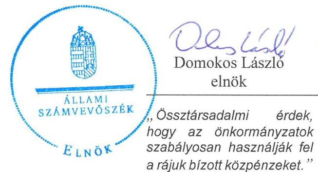
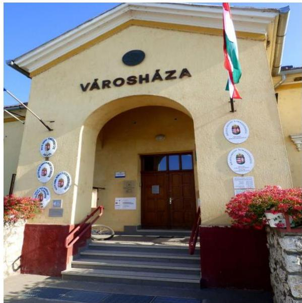
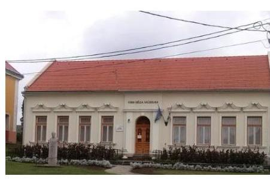

# Jelenetés 

## Önkormányzatok pénzügyi és vagyongazdálkodása

Az önkormányzatok pénzügyi és vagyongazdálkodása megfelelőségének ellenőrzése - Sellye
2016.

---

# Jelentés 

## Önkormányzatok pénzügyi és vagyongazdálkodása

Az önkormányzatok pénzügyi és vagyongazdálkodása megfelelőségének ellenőrzése - Sellye
2016. 04. hó 27. nap

---

# AZ ELLENŐRZÉST FELÜGYELTE:

- RENKŐ ZSUZSANNA felügyeleti vezető
- AZ ELLENŐRZÉST VEZETTE ÉS A VÉGREHAJTÁSÁÉRT FELELŐS:
  - DR. VERESS TIBORNÉ ellenőrzésvezető
- A PROGRAM ÖSSZEÁLLÍTÁSÁÉRT FELELŐS:
  - JANIK JÓZSEF LÁSZLÓ osztályvezető

**IKTATÓSZÁM:** V-856-382/2016.

**TÉMASZÁM:** 1890

**ELLENŐRZÉS-AZONOSÍTÓ SZÁM:** V071501

Jelentéseink az Országgyűlés számítógépes hálózatán és az Interneten a www.asz.hu címen is olvashatóak.

---

# TARTALOMJEGYZÉK 

■ ÖSSZEGZÉS ..... 5
■ AZ ELLENŐRZÉS CÉLJA ..... 7
■ AZ ELLENŐRZÉS TERÜLETE ..... 8
■ AZ ELLENŐRZÉS HÁTTERE, INDOKOLTSÁGA ..... 9
■ FÓKUSZKÉRDÉSEK ..... 10
■ ELLENŐRZÉS HATÓKÖRE ÉS MÓDSZEREI ..... 11
■ MEGÁLLAPÍTÁSOK ..... 14
■ JAVASLATOK ..... 35
■ MELLÉKLETEK ..... 39
I. Sz. melléklet: Értelmező szótár ..... 39
II. Sz. melléklet: Az önkormányzat feladatellátásában részt vevők 2011-2014. évek között ..... 41
III. Sz. melléklet: Az eszközök és források alakulása kiemelt mérlegsoronként a 2011-2013. években ..... 42
IV. Sz. melléklet: A pénzügyi egyensúlyi helyzet CLF módszer szerinti értékelése a 2011-2014. években (millió Ft) ..... 43
■ FÜGGELÉK: ÉSZREVÉTELEK ..... 45
■ RÖVIDÍTÉSEK JEGYZÉKE ..... 47

---

.

---

# ÖSSZEGZÉS 

Az Állami Számvevőszék Sellye Város Önkormányzat pénzügyi és vagyongazdálkodását 2011. január 1. és 2014. december 31. közötti időszakra vonatkozóan ellenőrizte. A pénzügyi szabályozás nem felelt meg a jogszabályoknak, a belső szabályzatokon a szervezeti változásokat nem vezették át. A vagyongazdálkodás szabályozásán belül a jogszabályi előírás ellenére rendeletben nem határozták meg a követelésről való lemondás módját, eseteit. A pénzügyi gazdálkodás keretében a gazdálkodási jogkörök gyakorlása nem volt megfelelő. A pénzügyi egyensúly a 2013. év kivételével nem volt biztosított. A vagyonváltozást eredményező döntéseket a jogszabályi és belső szabályozásnak megfelelően hozták meg, azonban azok végrehajtása során szabálytalanságokat tárt fel az ellenőrzés.

## Az ellenőrzés társadalmi indokoltsága

Az Állami Számvevőszék stratégiájában hangsúlyos szerepet szán annak, hogy szilárd szakmai alapon álló, értékteremtő ellenőrzéseivel előmozdítsa a közpénzügyek átláthatóságát, rendezettségét és javaslataival a közpénzek és a közvagyon szabályos, gazdaságos, hatékony és eredményes felhasználását segítse. Az ÁSZ stratégiájában célul tűzte ki, hogy az önkormányzatok ellenőrzése során értékeli azok pénzügyi-gazdasági helyzetét, a kockázatokat feltárja, és az ellenőrzések helyszíneit kockázatelemzés alapján választja ki. Az ÁSZ szerepet vállal a korrupció és a csalás elleni küzdelemben. Közreműködik a korrupciós kockázatok és a korrupció elleni fellépés hatékony és eredményes eszközeinek beazonosításában, alkalmazásában, továbbá használatuk elterjesztésében, az integritás alapú közigazgatási kultúra kialakításában.

## Főbb megállapítások, következtetések, javaslatok

A pénzügyi egyensúly a 2011-2012. és a 2014. években nem volt biztosított. A 2011-2012. évben a folyó költségvetés egyenlege az ÖNHIKI és egyéb kiegészítő költségvetési támogatások révén mutatott többletet, azonban a 2014. évben a folyó bevételek e támogatásokkal együtt sem nyújtottak fedezetet a folyó kiadásokra. A működési hiányt az előző évi maradványból finanszírozták. A saját hatáskörben megtett intézkedések a pénzügyi egyensúly helyreállításához, stabilizálásához nem voltak elégségesek. A bevételek és kiadások teljesítésének ütemezésére a likviditási terveket elkészítették, de annak felülvizsgálatát az előírások ellenére nem végezték el. A fizetőképesség fenntartása érdekében 2011. és 2012. években folyószámla és munkabér-megelőlegezési hitelt vettek igénybe, amelyekből eredő tartozás az adósságkonszolidáció eredményeként megszűnt. A követelések behajtására az előírásoknak megfelelően intézkedtek. A kockázatkezelési rendszert a gazdálkodással összefüggő, pénzügyi egyensúlyt befolyásoló kockázatok szempontjából nem működtették megfelelően. Az adósságot keletkeztető ügyletek vállalására a jogszabályi előírásoknak megfelelően került sor.

A számviteli szabályzatok a 2011-2012. években az előírásoknak nem feleltek meg, a 2013. évtől a hiányosságokat megszüntették, azonban a 2014. évtől a számviteli politika és a leltározási szabályzat előírásai közötti összhangot nem biztosították. A jogszabályokban előírtak közül nem készítették el a tervezéssel kapcsolatos belső előírásokra, feltételekre, valamint a belföldi és külföldi kiküldetések elrendelésére és lebonyolítására és elszámolására vonatkozó belső szabályzatokat, illetve a szabályzatok nem követték a szervezeti változásokat. A vagyongazdálkodás keretein belül a jogszabályi előírások ellenére nem szabályozták a vagyonkezelés ellenőrzésének részletes előírásait, valamint a követelésekről való lemondás módját és eseteit.

A költségvetési tervek, éves beszámolók készítése és az előirányzatok módosítása szabályszerű volt. A pénzgazdálkodás nem volt szabályszerű, a gazdálkodási jogköröket szabálytalanul gyakorolták. A 2012. évben az Önkormányzat vonatkozásában jogszabályi előírás ellenére nem rendelkeztek a gazdálkodási jogkörök szabályozásával, amelyet

---

a 2013. január 1-jétől hatályos szabályozás keretében rendeztek. 2013. január 1-jétől a pénzügyi ellenjegyzésre és érvényesítésre jogosult személyek kijelölését a jogszabályi előírás ellenére a jegyző helyett a pénzügyi osztályvezető feladat és hatásköreként szabályozták. A pénzügyi ellenjegyzés és érvényesítés kontrollok működése a beruházási, felújítási célú kifizetéseknél „nem megfelelő" volt.

A vagyonnyilvántartás szabálytalan volt, mivel a vagyonkezelésbe adott eszközöket a jogszabályi előírások ellenére a könyvekben nyilvántartották. Az önkormányzati vagyonkimutatás 2011-2013. években nem felelt meg a jogszabályi előírásoknak, a 2014. évben a mérlegen kívüli eszközök kimutatásának kivételével szabályszerű volt. A leltározásra vonatkozó két belső szabályozás nem volt összhangban. A 2014. évi leltározás során a belső előírásokat nem tartották be.

A vagyon változásával járó döntéseket szabályosan hozták, a végrehajtásban az ellenőrzés szabálytalanságokat tárt fel. A közérdekű adatok közzétételi kötelezettségét több esetben nem teljesítették.

A kizárólagos és többségi tulajdonban lévő két gazdasági társaság esetében élt az Önkormányzat a tulajdonosi jogaival. A tulajdonosi kötelezettséget nem teljesítették, mivel a jogszabályi előírás ellenére felügyelő bizottság létrehozásáról nem gondoskodtak. Az Önkormányzat által megtett intézkedés a veszteségesen gazdálkodó gazdasági társasága pénzügyi-vagyoni helyzetét nem stabilizálta. A részesedések egyedi értékelését a jogszabályi előírás ellenére nem végezték el.

Az erőforrásokkal való szabályszerű gazdálkodáshoz határoztak meg követelményeket, azonban aktualizálásukról, felülvizsgálatukról nem gondoskodtak. Az Önkormányzat által meghatározott, az erőforrásokkal való hatékony gazdálkodáshoz szükséges követelményeket nem kérték számon, nem ellenőrizték.

Az integritási szemlélet érvényesítése érdekében további intézkedések szükségesek.

---

# AZ ELLENŐRZÉS CÉLJA 

## Sellye Város Önkormányzat pénzügyi és vagyongazdálkodása megfelelőségi ellenőrzése

AZ ELLENŐRZÉS CÉLJA az Önkormányzat pénzügyi és vagyoni helyzetének, a gazdálkodás szabályosságának megítélése a költségvetési tervezés, a pénzügyi egyensúly megteremtése, az éves költségvetési beszámolás, a vagyongazdálkodás, a vagyon számbavétele, a gazdasági események elszámolása és a pénzgazdálkodás szabályszerűsége alapján; valamint annak értékelése, hogy kialakított-e az Önkormányzat az erőforrásokkal való szabályszerű és hatékony gazdálkodáshoz szükséges követelményeket, megvalósította-e azok számon kérését, ellenőrzését.

---

# **AZ ELLENŐRZÉS TERÜLETE**

## **Sellye Város Önkormányzat**

Sellye város Baranya megyében a Dráva folyó árterületén helyezkedik el. Az Ormánság legnagyobb települése, gazdag néphagyományokkal, az ország egyik legváltozatosabb élővilágával rendelkezik. Perifériális földrajzi fekvése miatt a régió a halmozottan hátrányos térségek közé tartozik, ipari kapacitása gyenge. Lakossága folyamatosan csökken. Sellye Város állandó lakosainak száma 2011. január 1-jén 2899 fő, 2014. január 1-jén 2819 fő volt.

Az Önkormányzat Képviselő-testülete hét fővel, kettő állandó bizottsággal látta el feladatait. A polgármester 2007 óta tölti be tisztségét. A jegyző személye az ellenőrzött időszakban egyszer – 2013. februárjában – változott. 2011. január 1-jéről 2014. december 31-ére az Önkormányzat által fenntartott költségvetési szervek száma háromról kettőre csökkent. A 2011. évről a 2014. évre a foglalkoztatott köztisztviselők száma 33 főről 28 főre, a közalkalmazottaké 17 főről 2 főre változott. Az Önkormányzat 2014. december 31-én egy kizárólagos, egy többségi tulajdonú és két 0,1%-ot meg nem haladó tulajdoni részesedésű gazdasági társaságban rendelkezett üzletrésszel. Az Önkormányzat 2011-2013. évi feladatellátásában részt vevőket a II. sz. melléklet szemlélteti.

A Hivatal öt szervezeti egységre tagolódott, elkülönített gazdasági szervezettel nem rendelkezett, a gazdálkodási feladatokat a Hivatal látta el. Sellye Város Önkormányzatának Hivatala 2011-2012-ben körjegyzőségként működött, majd a 2013. évtől közös önkormányzati hivatalként kilenc önkormányzat igazgatási tevékenységét végzi. Az Önkormányzat a 2014. évi költségvetési beszámolója szerint 989,8 millió Ft bevételt ért el, valamint 1011,8 millió Ft kiadást teljesített. Az eszközök és források állománya a 2011. január 1-jei 2635,1 millió Ft-ról 2013. december 31-re 2718,7 millió Ft-ra nőtt, amelyet a III. sz. melléklet szemléltet.

---

# AZ ELLENŐRZÉS HÁTTERE, INDOKOLTSÁGA 

Az államháztartás önkormányzati alrendszerének közpénz felhasználása, az önkormányzatok által ellátott közfeladatok és önként vállalt feladatok sokrétűsége, valamint a feladat ellátásához rendelt vagyon nagyságrendje indokolja, hogy az ÁSZ ellenőrzéseket folytasson a pénzügyi és vagyongazdálkodás területén.

## Az ellenőrzés több szinten hasznosul

Az ÁSZ az önkormányzatok ellenőrzését a pénzügyi helyzet megítélésével indította el 2011-ben, és a nagy vagyonnal rendelkező, magas kockázatú önkormányzatok esetében a vagyongazdálkodás ellenőrzésével folytatta. Az elmúlt időszakban az önkormányzati gazdálkodás kockázatai beépítésre kerültek az ellenőrzött önkormányzatok kiválasztási rendszerébe. Az elmúlt négy év ellenőrzéseinek tapasztalatai megmutatták, hogy továbbra is indokolt az egyrészt elemző, értékelő, a pénzügyi helyzet kockázatát is minősítő, másrészt a pénzügyi és vagyongazdálkodási tevékenység szabályszerűségét értékelő ÁSZ ellenőrzések folytatása.

Ellenőrzéseink hozzájárulnak az önkormányzatok pénzügyi helyzetének pontosabb megítéléséhez azáltal, hogy a pénzügyi helyzetet a vagyoni helyzettel együtt értékeljük, amelyek együttesen határozzák meg az önkormányzatok fejlesztési képességét és gyakorolnak hatást a feladatellátásra. Feltárjuk az önkormányzati gazdálkodást meghatározó szabályozások összhangjának hiányosságait, a szabályozással nem érintett gazdálkodási területeket, valamint a pénzügyi és vagyongazdálkodás esetleges szabálytalanságait. Beazonosítjuk a pénzügyi egyensúlyi helyzet megbomlásakor a kiváltó okok mellett azok kialakulását is. Bemutatjuk az adósságkonszolidáció önkormányzat általi végrehajtásának szabályszerűségét, az adósságállomány újratermelődésének elkerülése érdekében hozott intézkedéseket. Az ellenőrzés kitér a gazdálkodáshoz kapcsolódó integritás kontrollok meglétének és működésének ellenőrzésére is.

A pénzügyi és vagyongazdálkodás szabályszerűségének ellenőrzése által a megállapításokkal összefüggő javaslatok hasznosítása esetén javul az önkormányzat gazdálkodásának szabályozottsága, valamint a „jó gyakorlatok" terjesztésén keresztül azok az önkormányzatok is átvehetik a pozitív példákat, ahol nem végez ellenőrzést az ÁSZ. Ellenőrzéseink eredményeképpen javaslatokat fogalmazhatunk meg az önkormányzatok pénzügyi egyensúlya fenntartásával kapcsolatos problémák rendszerszemléletű kezelésére, felszámolására.

---

# FÓKUSZKÉRDÉSEK 

1.     - A pénzügyi és vagyongazdálkodás szabályozása megfelelt-e az előírásoknak?
2.     - A költségvetési tervezés, az éves költségvetési beszámolás és a pénzgazdálkodás szabályszerű volt-e?
3.     - Biztosított volt-e a pénzügyi egyensúly, az adósságot keletkeztető ügyletek vállalására a jogszabályi előírásoknak megfelelően került-e sor?
4.     - A vagyonnyilvántartás, a költségvetési beszámoló mérlegének alátámasztottsága megfelelt-e a jogszabályokban és a belső szabályzatokban előírt követelményeknek?
5.     - Szabályszerűek voltak-e a vagyon összetételének és nagyságának változását eredményező döntések és azok végrehajtása?
6.     - Felelősen gazdálkodott-e az önkormányzat a tartós részesedéseivel, élt-e tulajdonosi jogaival, teljesítette-e tulajdonosi kötelezettségeit?
7.     - Az önkormányzat az erőforrásokkal való szabályszerű gazdálkodáshoz szükséges követelményeket kialakította-e, betartásukat számon kérte-e, ellenőrizte-e?
8.     - Az önkormányzat az erőforrásokkal való hatékony gazdálkodáshoz szükséges követelményeket kialakította-e, betartásukat számon kérte-e, ellenőrizte-e?
9.     - Az Önkormányzat intézkedett-e az integritás szemlélet érvényesítése érdekében?

---

# ELLENŐRZÉS HATÓKÖRE ÉS MÓDSZEREI 

## Az ellenőrzés típusa

Megfelelőségi ellenőrzés

## Az ellenőrzött időszak

A 2011. január
 1. és 2014. december 31. közötti időszak. Az ellenőrzött időszakba beleértendő az ellenőrzött évekre vonatkozó tervezési feladatok, beszámolási kötelezettségek teljesítésének időszaka is. A vagyonnyilvántartások egyezőségét, a leltározás, selejtezés folyamatát a 2014. évre vonatkozóan értékeltük.

## Az ellenőrzés tárgya

A helyi önkormányzat pénzügyi és vagyongazdálkodása, a pénzügyi egyensúly megteremtése, a tulajdonosi és irányító szervi feladatok ellátása, az integritás szemlélet érvényesülése.

Az ellenőrzés kiterjed minden olyan körülményre és adatra, amely az ÁSZ jogszabályban meghatározott feladatainak teljesítéséhez, valamint a program végrehajtása folyamán felmerült újabb összefüggések feltárásához szükséges.

## Az ellenőrzött szervezet

Sellye Város Önkormányzat

## Az ellenőrzés jogalapja

Az ellenőrzés jogszabályi alapját az Állami Számvevőszékről szóló 2011. évi LXVI. törvény 1. § (3) bekezdésének, az 5. § (2)-(6) bekezdéseinek, valamint az államháztartásról szóló 2011. évi CXCV. törvény 61. § (2) bekezdésének előírásai képezik.

## Az ellenőrzés módszerei

Az ellenőrzést a nemzetközi standardokat irányadónak tekintve az ellenőrzési program ellenőrzési kérdései, az ellenőrzött időszakban hatályos jogszabályok, az ellenőrzés szakmai szabályok és módszertanok figyelembe vételével végeztük.

---

A gazdálkodás hibáinak kijavítására, a közpénzekkel való felelős gazdálkodás segítésére irányuló javaslatok kidolgozásakor a hatályos jogszabályok az irányadóak.

Az ellenőrzési kérdések megválaszolásához szükséges bizonyítékok megszerzése az ellenőrzött által rendelkezésre bocsátott dokumentumokra, adatokra alapozva megfigyelés, szemle (szemrevételezés), kérdésfeltevés (információkérés), mintavételezés, valamint elemző eljárással történt. Az ellenőrzési bizonyítékként felhasználható adatforrások közé tartoztak egyrészt a szakmai program részletes szempontjainál felsorolt adatforrások, másrészt minden az ellenőrzés folyamán feltárt, az ellenőrzés szempontjából releváns információt tartalmazó dokumentum.

Az ellenőrzés lefolytatásához az önkormányzat a tanúsítványok elektronikus kitöltésével, valamint az ÁSZ által kért dokumentumok elektronikus megküldésével szolgáltatott adatokat. Az így rendelkezésre bocsátott adatok, információk, a tanúsítványok adatai valódiságának kontrollja az ellenőrzés keretében történt.

Az ellenőrzést az Önkormányzat működésével kapcsolatos feladatokat ellátó Hivatalban végeztük. Az Önkormányzat az intézményei és gazdasági társaságai ellenőrzéssel érintett dokumentumait, tanúsítványait a Hivatal útján bocsátotta az ellenőrzés rendelkezésére.

A pénzügyi és vagyongazdálkodás szabályozottságát az Önkormányzat rendeletei, határozatai, illetve a 2011. évben a Hivatal, a 2012. évtől az Önkormányzat (mint önálló éves költségvetési beszámolót készítő szerv) és a Hivatal belső szabályozásai alapján értékeltük. A költségvetési tervezési, végrehajtási és beszámolási feladatok ellenőrzése, a pénzügyi egyensúly, a vagyonnyilvántartás, a mérleg alátámasztottságának megítélése az Önkormányzat összevont adatai alapján történt. A leltározási, értékelési és selejtezési folyamat szabályszerűségére a Hivatal által végzett 2014. évi leltározási folyamat ellenőrzése alapján tettünk megállapításokat.

Az Önkormányzat vagyonváltozást eredményező döntéseinek és azok végrehajtásának ellenőrzésére irányított, valamint véletlen mintavételi eljárással és tételes ellenőrzéssel került sor. A pénzforgalmi tételek ellenőrzése véletlen mintavételi eljárással - 2011. évben a Hivatal, 2012. évtől a Hivatal és az Önkormányzat (mint önálló éves költségvetési beszámolót készítő költségvetési szerv) főkönyvi állományából - kiválasztott minta alapján történt. Kockázatalapú mintavétel alapján az ellenőrzött időszakban, hatályban lévő öt legmagasabb könyv szerinti értéket képviselő üzemeltetési szerződést, az öt legnagyobb összegű behajthatatlan követelés leírást, valamint egy vagyonkezelői és térítésmentes vagyonátadást ellenőriztük. A részesedések értékelését tételesen ellenőriztük. A beruházások és felújítások elszámolásának, valamint a kapcsolódó kifizetések esetében a gazdálkodási jogkörök gyakorlásának, ezen túl a bérbeadással történő hasznosítás szabályszerűségét véletlen mintavétellel, a vagyonértékesítés szabályszerűségét tételesen ellenőriztük. A véletlen minta alapján a sokaságra vonatkozó hibaarányt becsültük. „Megfelelőnek" értékeltük az ellenőrzött területet, amennyiben 95%-os bizonyossággal a teljes sokaságban a hibaarány legfeljebb 10%, „részben megfelelőnek" értékeltük, ha a hibaarány felső határa 10-30% között volt, "nem megfelelőnek" pedig akkor, ha a mintavételi eredmények alapján a sokaságbeli hibaarány felső határa meghaladta a 30%-ot.

---

Az ellenőrzési kérdésekre adott válaszok alapján értékeltük, hogy az Önkormányzat pénzügyi gazdálkodása megfelel-e a jogszabályokban és a belső szabályzatokban meghatározottaknak, biztosított volt-e a pénzügyi egyensúly. Értékeltük a vagyongazdálkodás szabályszerűségét, a vagyonváltozást eredményező döntések és a tulajdonosi jogok gyakorlása szabályszerűségét. Értékelést adtunk arról, hogy az Önkormányzatnál kialakították-e az erőforrásokkal való szabályszerű és hatékony gazdálkodáshoz szükséges követelményeket, megvalósították-e azok számonkérését, ellenőrzését. Az integritás szemlélet érvényesülésének értékelése az Önkormányzat által önbevallással kitöltött tanúsítvány alapján történt.

---

# 1. A pénzügyi és vagyongazdálkodás szabályozása megfelelt-e az előírásoknak? 

## Összegző megállapítás

### 1.1. számú megállapítás

### 1.2. számú megállapítás

A pénzügyi és vagyongazdálkodás szabályozása nem felelt meg az előírásoknak.

A Hivatal SZMSZ-e a jogszabályi előírás ellenére nem tartalmazta a nevesített munkakörökhöz tartozó feladat- és hatásköröket.

A Képviselő-testület ${ }^{1}$ a 2011-2014. évek között rendelkezett a jogszabályi előírásoknak megfelelő, a működésének részletes szabályait meghatározó SZMSZ ${ }^{2}{ }_{1-3}$-szal.

A Hivatali SZMSZ a 2011-2014. években az Ámr. ${ }^{3}$ 20. § (2) bekezdés g) pontjában, illetve az Ávr. ${ }^{4}$ 13. § (1) bekezdés f) pontjában foglaltak ellenére nem tartalmazta azon ügyköröket, amelyek során a szervezeti egységek vezetői a Hivatal ${ }^{5}$ képviselőjeként járhatnak el. Nem tartalmazta továbbá az Ámr. 20. § (2) bekezdés h) pontjában, valamint az Ávr. 13. § (1) bekezdés g) pontjában foglaltak ellenére a Hivatali SZMSZ-ben nevesített munkakörökhöz tartozó feladat- és hatásköröket, a hatáskörök gyakorlásának módját, a helyettesítés rendjét, az ezekhez kapcsolódó felelősségi szabályokat.

## A számviteli szabályzatok 2011-2012. években nem feleltek meg, 2013. évtől megfeleltek a jogszabályi előírásoknak.

A 2011-2012. években a jegyző ${ }^{6}$ elkészítette a Hivatal, 2013-2014-ben a Hivatal Önkormányzatra ${ }^{7}$ is kiterjesztett számviteli politikáját ${ }^{8}{ }_{1-3}$, annak keretében az eszközök és források értékelési szabályzatát ${ }^{9}{ }_{1-3}$, a leltározási és leltárkészítési szabályzatot ${ }^{10}{ }_{1-2}$, az önköltség számítási szabályzatot ${ }^{11}{ }_{1,2}$ és a pénzkezelési szabályzatot ${ }^{12}{ }_{1,2}$. A 2011-2012. években hatályos számviteli politika keretében írásban nem rögzítették - a Számv.tv. ${ }^{13}$ 14. § (4), az Áhsz. ${ }_{1}$ 8. § (5) bekezdésében foglaltak ellenére - hogy mit tekintenek a számviteli elszámolás, az értékelés szempontjából lényegesnek, illetve nem lényegesnek. A szabályozás hiányosságát 2013. évtől megszüntették.

Az Önkormányzat a 2012. évben az Áhsz. 8.§ (3)-(4) bekezdéseinek előírása ellenére nem rendelkezett számviteli politikával, illetve az annak keretében elkészítendő szabályzatokkal.

A jegyző 2003. június 15-től 2012. december 31-ig a számlarend ${ }^{14}{ }_{1-3}$ szükséges módosítását - a Számv.tv. 161. § (5) bekezdésében foglaltak ellenére - a Számv.tv. változásának hatálybalépését követő 90 napon belül nem végezte el. A 2013. évtől a Hivatal és az Önkormányzatra is kiterjesztett számlarendje megfelelt a Számv.tv., az Áhsz. ${ }_{1,2}{ }^{15}$ előírásainak.

A kontrollkörnyezet kialakítása keretében a jegyző a jogszabályi előírásnak megfelelően elkészítette és rendszeresen aktualizálta az ellenőrzési nyomvonalat, amely a belső kontrollrendszer szabályzat ${ }^{16}$-ának mellékletét képezte.

---

1.3. számú megállapítás

A jogszabályokban előírtak ellenére belső szabályzatban nem rendezték a tervezéssel kapcsolatos belső előírásokat, feltételeket és a belföldi és külföldi kiküldetések elrendelését és lebonyolítását, elszámolását, illetve a hatályos szabályzatok nem követték a szervezeti változásokat.

A jegyző az Ámr., Ávr. előírásoknak megfelelően a működéshez kapcsolódó, pénzügyi kihatással bíró, jogszabályban nem szabályozott kérdéseket belső szabályzatban hiányosan rendezte, illetve a szervezeti változásokat követően azokat nem módosította (1. táblázat).

|  1. táblázat |  |  |   |
| --- | --- | --- | --- |
|  BELSŐ SZABÁLYZATOK HIÁNYOSSÁGAI |  |  |   |
|  Sorszám | Belső szabályozás | Jogszabályi előírás | Megjegyzés  |
|  1. | a tervezéssel kapcsolatos belső előírások, feltételek | Ávr. 13. § (2) bekezdés a) pont | nem készült  |
|  2. | a belföldi és külföldi kiküldetések elrendelésével és lebonyolításával és elszámolásával, | Ámr. 20. § (3) bekezdés c) pont, Ávr. 13. § (2) bekezdés c) pont | nem készült  |
|  3. | a reprezentációs kiadások felosztását, azok teljesítésének és elszámolásának szabályait | Ámr. 20. § (3) bekezdés f) pont, Ávr. 13. § (2) bekezdés e) pont | A 2011. január 3-tól hatályos szabályzatban a szervezeti változások átvezetése nem történt meg  |
|  4. | a gépjárművek igénybevételének és használatának rendjét | Ámr. 20. § (3) bekezdés g) pont, Ávr. 13. § (2) bekezdés f) pont | A 2010. január 1-jétől hatályos szabályzatban a szervezeti változások átvezetése nem történt meg  |
|  5. | a vezetékes és rádiótelefonok használatát | Ámr. 20. § (3) bekezdés h) pont, Ávr. 13. § (2) bekezdés g) pont; | A 2006-tól hatályos belső utasításban a szervezeti változások átvezetése nem történt meg  |
|  6. | a közérdekű adatok megismerésére irányuló kérelmek intézésének, továbbá a kötelezően közzéteendő adatok nyilvánosságra hozatalának rendjét | Ámr. 20. § (3) bekezdés i) pont, Ávr. 13. § (2) bekezdés h) pont; | A szabályzatot 2013. október 15-vel kiadták.  |

Forrás: ÁSZ által készített kimutatás.

# 1.4. számú megállapítás

A vagyongazdálkodás kereteinek kialakítása során nem határozták meg a vagyonkezelés ellenőrzésének részletes szabályait és a követelésről való lemondás módját és eseteit.

A jogszabályi előírásnak megfelelően a Képviselő-testület az önkormányzati vagyonnal való gazdálkodás szabályait a vagyonrendelet ${ }^{17}{ }_{1-2}$-ben és a lakásrendelet ${ }^{18}{ }_{1-2}$-ben szabályozta. Meghatározták az önkormányzati feladatellátást biztosító törzsvagyon körét, elkülönítették a forgalomképtelen és korlátozottan forgalomképes vagyonelemeket. Az Önkormányzat az Nvtv. 18. § (1) bekezdésében előírt határidőn túl - nyolc hónappal később - végezte el a forgalomképtelennek minősülő vagyonának felülvizsgálatát.

A Képviselő-testület annak ellenére nem szabályozta az Mötv. ${ }^{19}$ 109. § (4) bekezdésében előírtaknak megfelelően rendeletében a vagyonkezelés ellenőrzésének részletes szabályait, hogy 2013. január 1-jével törvényi rendelkezés alapján a köznevelési intézmény feladatainak ellátását szolgáló állami intézményfenntartó központot önkormányzati tulajdonon illette meg az ingyenes vagyonkezelői jog.

---

A követelés lemondás módját és eseteit az Áht. 2 97. § (2) bekezdés előírása ellenére a 2012. november 1-jétől hatályos vagyonrendelet2-ben nem szabályozták.

# 2. A költségvetési tervezés, az éves költségvetési beszámolás és a pénzgazdálkodás szabályszerű volt-e? 

## Összegző megállapítás

2.1. számú megállapítás
2.2. számú megállapítás

A költségvetési tervezés, az éves költségvetési beszámoló készítése szabályszerű volt. A pénzgazdálkodás nem volt szabályszerű, a gazdálkodási jogköröket nem megfelelően gyakorolták.

A költségvetési tervezést megalapozó, a 2012. és a 2013. évre vonatkozó költségvetési koncepciókat néhány napos késedelemmel terjesztették elő.

A költségvetési koncepciók ${ }^{20}{ }_{1-4}$ beterjesztésére a 2012. és 2013. évre vonatkozóan az Áht. 2 24. § (1)* bekezdésben előírt október 31-i határidőt követő 18, illetve 25 nappal került sor. A költségvetési koncepciókat a Pénzügyi Bizottság ${ }^{21}$ véleményezte.

A költségvetési rendeleteket a jogszabályi előírásoknak megfelelően hagyták jóvá, 2013. évtől működési hiányt nem terveztek, a költségvetési bevételeket és kiadásokat, kötelező-, önként vállalt és állami feladatok szerint megbontották. A költségvetések előterjesztésekor az előírások szerinti tájékoztatásokat bemutatták. A jóváhagyott elemi költségvetésekről a jogszabály által előírt határidőben adatot szolgáltattak a Kincstárhoz.

Az előirányzatok módosítása, számviteli nyilvántartása szabályszerű volt.

Az előirányzatok módosítására, átcsoportosítására vonatkozó döntéseket
 minden esetben az arra jogosult Képviselő-testület hozta meg. Az előirányzatok módosításának nyilvántartásba vétele, főkönyvi könyvelése és az éves elemi költségvetési beszámoló kiegészítő mellékletében való számszerű kimutatása a jogszabályi előírásoknak megfelelt. A 2011-2014. években a kiemelt módosított bevételi előirányzatokat teljesítették, a kiadások teljesítése a módosított kiemelt előirányzati kereten belül volt.

Az Önkormányzat a tervezett létszámot egyik évben sem lépte túl, az a feladatváltozásoknak megfelelően alakult.

## 2.3. számú megállapítás

A beszámoló készítési kötelezettség teljesítése az előírásoknak megfelelt.

A polgármester ${ }^{22}$ az előírtaknak megfelelően minden év szeptemberében írásos beszámolóban tájékoztatta a Képviselő-testületet az Önkormányzat gazdálkodásának első félévi és a költségvetési koncepciók ismertetésekor a három-negyedéves helyzetéről.

[^0]
[^0]:    * Hatálytalan: 2014.IX.30-tól

---

Az elemi költségvetési beszámolókat az előírásoknak megfelelő bontásban állították össze. A féléves, valamint éves költségvetési beszámolókat határidőben benyújtották a Kincstárnak.

A zárszámadási rendelettervezeteket a polgármester határidőben, az előírásnak megfelelő tartalommal a Képviselő-testület elé terjesztette, amelyekhez csatolták a jogszabályban meghatározott mérlegeket és kimutatásokat. Az elfogadott éves költségvetési beszámolók alapján, azokkal összehasonlítható módon, az év utolsó napján érvényes szervezeti, besorolási rendnek megfelelően elkészített zárszámadási rendeleteket ${ }^{23}$ a Képviselő-testület elfogadta.

A 2011. és 2012. évben a jogszabályi előírásnak megfelelően a polgármester könyvvizsgálói - minősítés nélküli - záradékkal ellátva terjesztette a Képviselő-testület elé a zárszámadási rendelettervezet mellékletét képező egyszerűsített éves költségvetési beszámolót.

# 2.4. számú megállapítás 

## A gazdálkodási jogkörök gyakorlása nem volt megfelelő.

A 2011-2012. években az operatív gazdálkodási jogkörökkel kapcsolatos előírásokat a 2004. évben kiadott gazdálkodási szabályzat ${ }_{1}$-ben határozták meg, amelyen a jogszabályi - Ámr., Ávr. - változásokat nem vezették át.

A 2012. évben belső szabályzatban - az Ávr. 13. § (2) bekezdés a) pontjában foglaltak ellenére - az Önkormányzat vonatkozásában nem rendelkeztek a kötelezettségvállalás, az ellenjegyzés, az utalványozás, a teljesítésigazolás és az érvényesítés gyakorlásának módjáról, eljárási és dokumentációs részletszabályairól, valamint az ezeket végző személyek kijelölésének rendjéről. Az Önkormányzat kiadási előirányzatai esetében 2012. évben - az Ávr. 55. § (2) bekezdés f) pontjában, valamint az Ávr. 58. § (4) bekezdésében foglaltak ellenére - a jegyző a pénzügyi ellenjegyzőket és az érvényesítőket, a polgármester az Ávr. 57. § (4) bekezdésében foglaltak ellenére a teljesítés igazolókat nem jelölte ki.

A 2013. január 1-jével hatályba helyezett gazdálkodási szabályzat ${ }_{2}$ III.IV. fejezetekben, az Ávr. 55. § (2) bekezdés f) pontjában, valamint az Ávr. 58. § (4) bekezdésében foglaltak ellenére a jegyző helyett a pénzügyi osztályvezető feladat és hatásköreként rögzítették a pénzügyi ellenjegyzésre és az érvényesítésre jogosult személyek kijelölését.

A kulcsszerepet betöltő pénzügyi ellenjegyzés és érvényesítés kontrollok működése a beruházási, felújítási célú kifizetéseknél „nem megfelelő" volt. A gazdálkodási jogkörök gyakorlásának ellenőrzése során tapasztalt hiányosságokat a 2. táblázat mutatja be.
2. táblázat

## GAZDÁLKODÁSI JOGKÖRÖK GYAKORLÁSÁNAK ELLENŐRZÉSE SORÁN TAPASZTALT HIÁNYOSSÁGOK

| Gazdálkodási jogkör | Megállapított szabálytalanság |
| :--: | :--: |
|  | A 2012. évben az önkormányzati kiadások vonatkozásában a pénzügyi ellenjegyzést szabálytalanul látták el, mivel azt, kijelöléssel nem rendelkező személyek végezték az Ávr. 55. § (2) bekezdés f) pontjában foglaltak ellenére. |
| pénzügyi ellenjegyzés | A 2011, 2013-2014. években, több esetben az Ámr. 74. § (1) bekezdése, illetve az Ávr. 55. § (1) bekezdésében foglaltak ellenére a kötelezettségvállalás dokumentumán a pénzügyi ellenjegyzés tényére történő utalás megjelölés hiányzott. A 2013-2014. években az önkormányzati és a hivatali kiadások tekintetében az Ávr. 55. § (2) bekezdés f) pontja ellenére a jegyző helyett a pénzügyi osztályvezető végezte el az ellenjegyzésre jogosult személyek kijelölését, ezért a pénzügyi ellenjegyzést szabálytalanul hajtották végre. |

---

|  Gazdálkodási jogkör | Megállapított szabálytalanság  |
| --- | --- |
|  érvényesítés | A 2011. évi szabálytalan pénzügyi ellenjegyzésű tételek esetében az érvényesítő az Ámr. 77. § (1) bekezdése, illetve az Ávr. 58. § (1) bekezdése ellenére nem ellenőrizte, hogy a megelőző ügymenetben az Áht. 1, az Ahsz.1 és az Ámr./Ávr. előírásait, továbbá a belső szabályzatokban foglaltakat megtartották-e.  |
|   | A 2012. évben az önkormányzati kiadások vonatkozásában az érvényesítést szabálytalanul látták el, mivel azt, kijelöléssel nem rendelkező személyek végezték az Ávr. 58. § (4) bekezdésben foglaltak ellenére.  |
|   | A 2013-2014. években az önkormányzati és a hivatali kiadások tekintetében az Ávr. 55. § (2) bekezdés f) pontja, valamint az Ávr. 58. § (4) bekezdésben ellenére a jegyző helyett a pénzügyi osztályvezető végezte el az érvényesítésre jogosult személyek kijelölését, ezért az érvényesítést szabálytalanul hajtották végre.  |

*Forrás: ÁSZ által készített kimutatás*

# 3. Biztosított volt-e a pénzügyi egyensúly, az adósságot keletkeztető ügyletek vállalására a jogszabályi előírásoknak megfelelően került-e sor?

|  Összegző megállapítás | A pénzügyi egyensúly a 2011-2012. és a 2014. években nem volt biztosított, a likviditási tervek felülvizsgálatát az előírások ellenére nem végezték el. Adósságot keletkeztető ügyletek vállalására a jogszabályi előírásoknak megfelelően került sor.  |
| --- | --- |
|  3.1. számú megállapítás | A likviditási tervek jogszabályi előírásoknak megfelelő felülvizsgálatát nem végezték el.  |
|  3. táblázat |   |
|  **LIKVIDITÁSI MUTATÓK** |   |
|  **Időpont** | **Likviditási**  |
|  2011.01.01. | 0,60  |
|  2011.12.31. | 0,43  |
|  2012.12.31. | 4,83  |
|  2013.12.31. | 2,55  |
|  2014.12.31. | 14,23*  |

*Forrás: Önkormányzati beszámolók* korrigált mutatók*

A bevételek beérkezésének és a kiadások teljesítésének ütemezésére a jogszabályi előírásoknak megfelelően a likviditási terveket elkészítették, azonban a 2012-2014. években az Ávr. 122. § (3) bekezdésében foglalt, a likviditási tervek havonkénti felülvizsgálatára vonatkozó előírásnak nem tettek eleget.

A likviditási mutatók értéke a 2011. évet kivéve 1,0 feletti volt, a pénzeszközök, illetve a forgóeszközök fedezetet nyújtottak a rövid lejáratú kötelezettségekre. A 2012. évi javulást egyrészt a szállítói állomány, másrészt az adósságkonszolidáció miatti rövid lejáratú hitelállomány csökkenés okozta. A mutatók értéke a 2014. évre a rövid lejáratú kötelezettségek további csökkenése, valamint a mérlegstruktúra 2014. évi változása miatt jelentősen megemelkedett, de a mérlegstruktúra változása hatásának kiszűrése után is növekedést mutatott. A likviditási mutatók alakulását a 3. táblázat tartalmazza.

### 3.2. számú megállapítás

A pénzügyi egyensúly a 2013. év kivételével nem volt biztosított. A feladatellátásban bekövetkezett változások és a saját hatáskörben megtett intézkedések a pénzügyi egyensúly helyreállításához nem voltak elégségesek.

A költségvetés elemzését CLF módszerrel végeztük, a főbb adatokat évenként a 4. táblázat mutatja be.

---

| A PÉNZÜGYI EGYENSÚLYI HELYZET FŐBB ADATAI (MILLIÓ FT) |  |  |  |  |  |  |  |
| :--: | :--: | :--: | :--: | :--: | :--: | :--: | :--: |
| Megnevezés | 2011. | 2012. | 2013. | 2014. | Adósságkonszolidáció nélkül |  |  |
|  |  |  |  |  | 2012. | 2013. | 2014. |
| Folyó bevételek | 525,6 | 586,0 | 797,5 | 920,1 | 524,1 | 797,5 | 920,1 |
| Folyó kiadások | 514,0 | 517,6 | 748,6 | 923,0 | 517,6 | 748,6 | 923,0 |
| Működési jövedelem | 11,6 | 68,4 | 48,9 | $-2,9$ | 6,5 | 48,9 | $-2,9$ |
| Működési jövedelem kiegészítő támogatások nélkül | $-68,2$ | 44,1 | 48,9 | $-7,0$ | $-17,8$ | 48,9 | $-7,0$ |
| Felhalmozási bevételek | 188,6 | 228,8 | 206,9 | 69,7 | 208,1 | 206,9 | 69,7 |
| Felhalmozási kiadások | 196,0 | 186,7 | 226,7 | 88,7 | 186,6 | 227,2 | 88,8 |
| Felhalmozási költségvetés egyenlege | $-7,4$ | 42,1 | $-19,8$ | $-19,0$ | 21,5 | $-20,3$ | $-19,1$ |
| Finanszírozási műveletek nélküli (GFS) pozíció | 4,2 | 110,5 | 29,1 | $-21,9$ | 28,0 | 28,6 | $-22,0$ |
| Finanszírozási műveletek egyenlege | 21,2 | $-89,7$ | $-11,5$ | 16,1 | $-71,4$ | $-20,3$ | 8,1 |
| Tárgyévi pénzügyi pozíció | 25,4 | 20,8 | 17,6 | $-5,8$ | $-43,4$ | 8,3 | $-13,9$ |
| Nettó működési jövedelem | $-59,9$ | $-51,8$ | 42,8 | $-2,9$ | $-95,3$ | 34,0 | $-10,9$ |

A MŰKÖDÉSI JÖVEDELEM a 2011-2013. években pozitív, míg a 2014. évben negatív egyenleget mutatott. A működési jövedelem pozitív értékei azonban a 2011. évben a 65,0 millió Ft ÖNHIKI támogatással, valamint a 60/2011. (XII. 23.) BM rendelet ${ }^{24}$ alapján folyósított 14,8 millió Ft hiteltörlesztési támogatással, a 2012. évben a 24,3 millió Ft ÖNHIKI támogatással volt biztosított. 2014-ben annak ellenére negatív volt a működési jövedelem egyenlege, hogy a 7/2014. (I. 31.) BM rendelet a rendkívüli önkormányzati támogatásokról (illetve a 2014. évi Kvtv. tv. 4. számú mellékletének 1. pont IV. alpont) alapján 4,1 millió Ft támogatásban részesültek. A működési hiányt előző évi működési célú pénzmaradványból finanszírozták.

A folyó bevételek alakulását a 2012. évben az adósságkonszolidáció során kapott törlesztési célú költségvetési támogatás, a 2013-2014. években a feladatalapú finanszírozási rendszerre történő áttérés miatti költségvetési támogatások növekedése határozta meg.

A folyó kiadások 2011-2014 között folyamatosan növekedtek. A személyi juttatások emelkedésének oka a közfoglalkoztatottak megnövekedett létszáma volt. Az államháztartáson belülre átadott pénzeszközök több mint hétszeres növekedése a 2013. január 1-jén megváltozott finanszírozási rendszer hatása volt. A Sellyei Kistérségi Többcélú Társulás alá tartozó intézmények és feladatok (óvoda, gyermekétkeztetés, óvodába utaztatás) központi támogatás előirányzatai átcsoportosításra kerültek az Önkormányzathoz, majd ezek az összegek kerültek átadásra a társulás részére.

A FELHALMOZÁSI KÖLTSÉGVETÉS egyenlege a 2012. évet kivéve negatív volt. A 2012. évi pozitív egyenleget a 2012. évi $\mathrm{Kvtv}^{25}$. 76/C. § alapján az Önkormányzat adósságállományának visszafizetéséhez folyósított felhalmozási célú 20,7 millió Ft költségvetési támogatás eredményezte. A felhalmozási forráshiányt 2011. és 2013. években működési többletből, 2014.-ben pénzmaradványból finanszírozták.

---

A FINANSZÍROZÁSI MŰVELETEK egyenlege a 2011. és a 2014. évben pozitív, a 2012. és a 2013. évben negatív volt. A 2011. évben a hitelfelvételek összege meghaladta a hiteltörlesztések összegét, amely a pozitív egyenleget eredményezte. A 2012. évi negatív egyenleg alakulását alapvetően az adósságkonszolidáció keretében végrehajtott hiteltörlesztés határozta meg. A 2013. évben egyrészt az egyéb finanszírozási kiadások meghaladták az egyéb finanszírozási bevételeket, másrészt a még fennálló hiteltörlesztés a hitelfelvételt, amely a negatív egyenleget okozta. 2014. évben az önkormányzat hitelt nem vett fel, törlesztési kötelezettsége nem volt.

A NETTÓ MŰKÖDÉSI JÖVEDELEM a 2013. év kivételével negatív volt, azaz az Önkormányzat pénzügyi egyensúlya a 2011., 2012. és 2014. években nem volt biztosított. A 2011. évi működési jövedelem nem nyújtott fedezetet a
 71,5 millió Ft-os hiteltörlesztési kötelezettségre, a működőképességet csak további hitelfelvétellel - 81,0 millió Ft - tudták biztosítani. A 2012. évben a hiteltörlesztés összegének finanszírozásához szükséges mértékű működési jövedelem nem képződött. A 2014. évi negatív működési jövedelem rámutatott arra, hogy a jelenlegi feladat-finanszírozási rendszer mellett az Önkormányzat gazdálkodásában változtatásokra van szükség. Az adósságkonszolidáció nélkül a 2012. évben 43,5 millió Ft-tal, a 2013. évben 8,8 millió Ft-tal, a 2014. évben 8,0 millió Ft-tal lett volna kevesebb a nettó működési jövedelem összege.

# A BEVÉTELNÖVELŐ ÉS KIADÁSCSÖKKENTŐ INTÉZKEDÉSEK a pénzügyi egyensúly helyreállításához, stabilizálásához nem voltak elégségesek. A 2011-2014. évi feladatátadások/átvételek az Önkormányzat adatszolgáltatása szerint - különös tekintettel a köznevelési feladatok államnak történő átadására - összesen 4,4 millió Ft megtakarítást eredményeztek. Az Önkormányzat bevételnövelő intézkedései eredményeképpen 90,2 millió Ft-ot mutatott ki. Eszközök hasznosításából 74,4 millió Ft, helyi adókkal kapcsolatos intézkedésekből (adó-hátralék behajtás) 7,2 millió Ft, intézményi térítési díjak emeléséből 6,6 millió Ft, egyéb szerződésmódosításhoz kapcsolódóan 2,0 millió Ft többletbevétel keletkezett. A kiadáscsökkentő intézkedések eredményeként az Önkormányzat 28,2 millió Ft-ot mutatott ki. A személyi jellegű kiadásokhoz kapcsolódó megtakarítás 9,6 millió Ft volt, amely a bérköltségek (vezetők illetménykiegészítésének eltörlése), valamint cafeteria juttatások csökkentéséből származott. Beszerzéseket érintő intézkedések miatt 4,2 millió Ft kiadáscsökkentést értek el. Civil szervezetek részére átadott pénzeszközök csökkentésével 3,2 millió Ft megtakarítást mutattak ki. Egyéb szerződésmódosításokhoz kapcsolódóan 11,2 millió Ft megtakarítás keletkezett.

### 3.3. számú megállapítás

Az Önkormányzat fizetési kötelezettségeit (szállítók) határidőn belül, illetve átütemezés szerint teljesítette.

Az Önkormányzat fizetési kötelezettségeit részben eredeti határidőben, részben átütemezés szerint teljesítette. Összes kötelezettsége a 2011. év eleji 184,6 millió Ft-ról a 2014. évre 27,2 millió Ft-ra csökkent. A hosszú és a rövid lejáratú kötelezettségek évenkénti alakulását az 5. táblázat tartalmazza.

---

5. táblázat

KÖTELEZETTSÉGEK ALAKULÁSA (MILLIÓ FT)

| Időpont | Hosszú   lejáratú | Rövid le-   járatú |
| :--: | :--: | :--: |
| 2011.01.01. | 4,2 | 180,4 |
| 2011.12.31. | 18,4 | 244,6 |
| 2012.12.31. | 0,0 | 22,8 |
| 2013.12.31. | 0,0 | 36,7 |
| 2014.12.31. | 26,4 | 0,8 |

A 2011. év végén a hosszú lejáratú kötelezettségek összegét ingatlan vásárlásra, illetve közoktatási intézmény fejlesztéséhez felvett hiteltartozás tette ki (18,4 millió Ft). A 2012. évi adósságkonszolidáció eredményeként az Önkormányzat hosszú lejáratú kötelezettségei megszűntek, és a 2014. év végéig újabb nem keletkezett.

A rövidlejáratú kötelezettségek alakulásában meghatározóak voltak a rövid lejáratú hitelek és a szállítói állomány változása:

- A 2011. év végi 86,8 millió Ft-os rövid lejáratú hitelek állománya a 2012. év végi adósságkonszolidáció eredményeként minimálisra (2,8 millió Ft) csökkent. A 2013-2014. év végén pénzintézetekkel szembeni tartozás nem volt.
- A szállítói kötelezettségeket az 6. táblázat mutatja be. A 2011. év végi kiugró értéket az Európai Uniós forrásból megvalósuló beruházáshoz kapcsolódó szállítói finanszírozás okozta. Az utófinanszírozás miatt több számlát határidőn túl egyenlítettek ki, ez okozta a 2011. év végi 45,1 millió Ft-os lejárt szállítói tartozás állományt. A 2014. év végére 0,4 millió Ft-ra csökkent a lejárt szállítói állomány. A 60 napot meghaladó szállítói tartozás 2011. év végén 30,3 millió Ft, 2014. év végén 0,02 millió Ft volt.
Az átmeneti likviditási problémák megoldása, a fizetőképesség folyamatos fenntartása érdekében a 2011. évben és a 2012. évben folyószámlahitel igénybevételére került sor, mindkét évben 50,0 millió Ft-os keret állt az Önkormányzat rendelkezésre. A napi szintű működéshez nélkülözhetetlen folyószámla-hitel napi átlagos állománya mindkét évben több mint 40,0 millió Ft volt. A 2011-2012. években munkabér-megelőlegezési hitelt vettek igénybe. Minden hónap elején megigényelték a szerződés szerint - 11,5 millió Ft-t - a személyi juttatások éves tervezett összegének egy havi mértékét meg nem haladó összegét, majd hónap végén, ugyanezen összeget visszafizették a pénzintézet részére. A 2012. évi adósságkonszolidáció eredményeként mindkét hiteltartozás megszűnt. A 2013. évben igénybe vett 3,3 millió Ft támogatás megelőlegezési hitelt éven belül, 30 napon belül visszafizetettek.

# 3.4. számú megállapítás 

## 7. táblázat

ADÓSOKKAL, VEVŐKKEL
SZEMBENI ÉS EGYÉB KÖVETELÉSEK ÁLLOMÁNYA (MILLIÓ FT)

| Időpont | Összeg |
| :-- | :--: |
| 2011.01.01. | 85,5 |
| 2011.12.31. | 70,3 |
| 2012.12.31. | 51,7 |
| 2013.12.31. | 22,7 |
| 2014.12.31. | 53,5 |

A követelések behajtására az előírásoknak megfelelően intézkedtek.

Az Önkormányzat mérleg szerinti követelése a 2011. év eleji 83,6 millió Ft-ról a 2014. év végére 53,5 millió Ft-ra változott, évenkénti alakulását a 7. táblázat mutatja be. A követelések 32%-át a vevők, 55%-át az adósok tették ki 2014. évben. A vevőkövetelések között a 2011., 2012 és 2014. év végén a 0-90 nap közötti, 2013. év végén a 91-180 nap között lejártak képviselték a legnagyobb arányt.

A követelések behajtása érdekében a szükséges, illetve jogszabályban lehetővé tett intézkedéseket megtették. Ezek keretében többek közt fizetési felszólításokat küldtek ki, végrehajtást kezdeményeztek. Továbbá a behajtások eredményessége érdekében egy követeléskezelő céggel kötöttek szerződést. A 2014. évi állomány változás oka, hogy a követelések számviteli nyilvántartása, tartalma megváltozott, amelyből kifolyólag az adatok nem összehasonlíthatók a korábbi évekkel.

---

# 3.5. számú megállapítás 

A kockázatkezelési rendszert a pénzügyi egyensúlyt befolyásoló kockázatok szempontjából nem a jogszabályi előírásoknak megfelelően működtették.

A kockázatkezelési rendszert a gazdálkodással összefüggő, pénzügyi egyensúlyt befolyásoló kockázatok szempontjából nem működtették megfelelően, 2011. évben az Áht. 121. § (2) bekezdés b) pont, az Ámr. 157. § (1)-(3) bekezdései a 2012. évtől a Bkr. 7. § (1)-(2) bekezdései ellenére. A Belső Kontrollrendszer szabályzat nem terjedt ki az Önkormányzatot egyedileg jellemző, gazdálkodásával összefüggő, a pénzügyi egyensúlyi helyzetét befolyásoló kockázatokra, valamint azok kezelésére, mérséklésére szolgáló módszerekre. Általános pénzügyi kockázatként rögzítették a csalás/lopás, a biztosítási és a felelősségvállalási kockázatokat, így a kockázatkezelési rendszerben a pénzügyi egyensúlyi helyzetet befolyásoló egyéb kockázatokat nem értékelték.

Banki kitettség miatti kockázatot jelentett a 2011. és 2012. évben a folyószámla és munkabér-megelőlegezési hitelek tartós igénybevétele. Nem azonosították a hitelek igénybevételéhez kapcsolódó kockázatokat, a polgármester és a jegyző valamennyi hitelfelvételről írásos előterjesztés alapján tájékoztatta a pénzügyi bizottságot, illetve a Képviselő-testületet. Működési jövedelemtermelő képesség miatti kockázatot jelentett, hogy a működési feladatok ellátását 2011. és 2012. években kiegészítő költségvetési támogatás és hitel igénybevételével tudták biztosítani, a 2014. évben azonban a rendkívüli kiegészítő támogatás ellenére is a folyó kiadások meghaladták a folyó bevételek összegét.

A kiegészítő költségvetési támogatások miatti bevételi kitettség kockázata a 2011-2012. években fennállt, amelyek nélkül a működési jövedelem negatív egyenleget mutatott volna. A helyi adók bevétele tekintetében nem jelentkezett bevételi kitettség miatti kockázat. Az iparűzési adó mértéke elérte a törvényi maximumot, az adóbevétel jelentős számú adóalanytól származott. A Helyi adó tv. ${ }^{26}$ szerint kivethető adók közül az építményadót és a telekadót a lakosság teherbíró képessége miatt nem vezették be. A magánszemélyek kommunális adója és az idegenforgalmi adó mértéke nem változott, a maximálisan kivethető adó mértékét nem érték el, amelyeket ugyancsak a magánszemélyek teherbíró képessége miatt nem módosítottak.
2011. évben 50,7 millió Ft kölcsönt nyújtottak egyik minősített gazdasági társasága részére, amelynek törlesztése 2011. december 31-én megtörtént. A Képviselő-testület határozatban döntött a kölcsön nyújtásáról, azonban a kölcsön folyósítását megelőzően írásbeli kölcsönszerződést nem kötöttek, megsértve ezzel az Ámr. 74. § (1) bekezdésében előírtakat, mivel előzetes írásbeli kötelezettségvállalásra nem került sor. Az Önkormányzat a 2011-2014. évek között összesen 85,6 millió Ft összeget biztosított a gazdasági társasága részére a működési kiadásainak részbeni finanszírozására, azonban a cél szerinti felhasználást nem ellenőrizték. Mérlegen kívüli tételek kockázatát jelentették a kezességvállalások, illetve a kizárólagos önkormányzati tulajdonban lévő gazdasági társaság veszteséges gazdálkodása miatt a tulajdonosi részesedésből adódó helytállási kötelezettség.

---

# 3.6. számú megállapítás 

Az Önkormányzat a jogszabályi előírásoknak megfelelően vállalt adósságot keletkeztető ügyleteket.

Az Önkormányzat költségvetési kiadásai fedezetére a jogszabályi előírásokkal összhangban vállalt adósságot keletkeztető ügyletet. A Sellye Kommunális Beruházó és Szolgáltató Kft. folyószámla hiteléhez kapcsolódóan 2011., 2013. és 2014. években 3,0-2,0-1,5 millió Ft összegű kezességet vállaltak. E kötelezettségvállalásából fizetési kötelezettség nem származott, a kötelezettség a 2014. év végén megszűnt. Az Ormánság Egészségéért Nonprofit Kft. folyószámlahiteléhez évről évre 4,5 millió Ft, gépjármű lízingjéhez 2011-ben 3,2 millió Ft kezességet vállaltak, valamint a 2011. év előtt, fejlesztési és beruházási hitelhez kapcsolódóan összesen 40,2 millió Ft kezességet vállaltak (amelyből 24,9 millió Ft lejárati határideje 2018. 12.31.). A kezességvállalásokból fizetési kötelezettség 2014. december 31-ig nem származott.

Az adósságkonszolidációval összefüggő feladatokat szabályszerűen hajtották végre.

A 2012. évi adósságkonszolidáció keretében - tekintettel, hogy 5000 fő népességszámot meg nem haladó önkormányzatról van szó - a 2012. évi Kvtv. 76/C. § alapján az Önkormányzat adósságállományának teljes visszafizetéséhez az állam 82,6 millió Ft vissza nem térítendő költségvetési támogatást nyújtott (ebből működési célú: 61,9 millió Ft, felhalmozási célú: 20,7 millió Ft), amely a 2012. december 12-én fennálló 80,9 millió Ft adósságállománynak teljes visszafizetését, valamint 1,7 millió Ft járulékainak megfizetését jelentette. A Kincstár az Önkormányzat adatszolgáltatása és a hitelező által a törlesztendő összegről kiállított igazolás ellenőrzésének során nem állapított meg hiányosságot. A 2012. évi adósságkonszolidáció pénzügyi helyzetre gyakorolt hatása pozitív volt.

## 4. A vagyonnyilvántartás, a költségvetési beszámoló mérlegének alátámasztottsága megfelelt-e a jogszabályokban és a belső szabályzatokban előírt követelményeknek?

Összegző megállapítás

A 2014. évben a vagyon számviteli nyilvántartása nem felelt meg jogszabályi előírásoknak.

A 1. számú megállapítás

A vagyonnyilvántartás a jogszabályi előírásnak nem felelt meg. A zárszámadás keretében elkészített vagyonkimutatás 2011-2013. években nem volt szabályszerű, a 2014. évben a mérlegen kívüli eszközök kimutatásának kivételével szabályszerű volt.

A vagyon nyilvántartása során a részletező nyilvántartások vezetésével a 2014. évben biztosították az Áhsz. 2 előírásaival összhangban a törzsvagyon, ezen belül a forgalomképtelen és a korlátozottan forgalomképes, illetve az üzleti vagyon elkülönített nyilvántartását. A KIK, mint államháztartáson belüli szervezet részére vagyonkezelésbe adott eszközöket az Áhsz. 2 47. § (3)

---

bekezdésben foglaltak ellenére a 2014. évben a könyvekben nyilvántartották, a mérlegben 16,9 millió Ft összegben kimutatták, megsértve ezzel a Számv.tv. 15. § (2) és (3) bekezdésében foglalt teljesség és valódiság alapelveket, valamint az Áhsz. 10. § (2) bekezdésének előírását. A hiba összege a Számv.tv.-ben, a számviteli politika3-ban meghatározott mérlegfőösszeg 2%-át nem haladta meg.

A főkönyvi számlák és a kapcsolódó analitikus nyilvántartások 2014. év végi értékadatai számszerűen - a függő kötelezettségek kivételével - megegyeztek. A Számv.tv. 3. § (8) bekezdés 14) pontjában és az Áhsz. 2 41. § (2) bekezdésében foglaltak ellenére 23,7 millió Ft összegű kezességvállalást a 04. számlacsoportban, a függő kötelezettségek között nem mutattak ki.

# 4.2. számú megállapítás 

A 2011-2013. évi
 vagyonkimutatások nem feleltek meg a jogszabályi előírásoknak, a 2014. évi vagyonkimutatás a mérlegen kívüli eszközök kimutatásának kivételével megfelelő volt.

A vagyongazdálkodással kapcsolatos belső szabályozásban a vagyonkimutatásra a jogszabályban előírtakon túli, további részletezést nem írtak elő. A 2011-2014. évi zárszámadásokhoz a polgármester által előterjesztett, az Önkormányzat vagyonállapotáról készített kimutatást a Képviselő-testület elfogadta.

A 2011-2013. évi vagyonkimutatások nem feleltek meg az Áhsz. 1 44/A. § (2) bekezdésében előírtaknak, mivel azok kizárólag a befektetett eszközöket tartalmazták forgalomképtelen, korlátozottan forgalomképes, valamint forgalomképes vagyon szerinti tagolásban, valamint nem tartalmazták a 44/A.§ (3) bekezdés szerinti értékkel nem szereplő kötelezettségeket. A 2014. évi vagyonkimutatás nem tartalmazta az Áhsz. 2 30. § (3) bekezdés a) pontjában („0"-ra leírt eszközök, a használatban lévő kis értékű immateriális javak, tárgyi eszközök) előírt eszközök állományát.

## 4.3. számú megállapítás

Az Önkormányzat számviteli nyilvántartásaiban szereplő ingatlanvagyon és az ingatlanvagyon-kataszter egyezőségét a 2014. évben biztosították.

A számviteli politika3-ban az önkormányzati gazdálkodással kapcsolatos egyéb feladatok keretében szabályozták az önkormányzati vagyonnyilvántartás és a vagyonkataszter vezetésével kapcsolatos feladatokat.

A Nemzeti Földalapkezelő Szervezet és az Önkormányzat a 2013. évben vagyonkezelési szerződést kötött, amelynek alapján a Sellye 021/12 hrsz. számú 0,1 millió Ft forgalmi értékű szántó az Önkormányzat vagyonkezelésébe került. A vagyonkezelői jog átadását a 2013. évben a földhivatali nyilvántartásban átvezették, a vagyonkatasztert ugyanakkor nem módosították. Ezáltal a 147/1992. (XI. 6.) Korm. rendelet ${ }^{27}$ 1. § (2) bekezdésében előírt egyezőséget nem biztosították.

A Képviselő-testület 2013. évben határozattal fogadta el a vagyonkataszter nyilvántartás felülvizsgálatáról, valamint a folyamatos karbantartásáról szóló megbízási szerződés megkötését, amelynek fedezetét a 2013. és a 2014. évi költségvetésben biztosították. A felülvizsgálat eredményeképpen a 2013. évben a vagyonkataszter nyilvántartásban szereplő ingatlanok forgalomképesség szerinti besorolását elvégezték. A 2014. évben negyedévente a vállalkozó teljesítette a szerződésben foglalt feladatokat, úgymint az aktuális műszaki, földhivatali és pénzügyi adatok megküldése.

---

# 4.4. számú megállapítás 

A 2014. évben biztosították a könyvviteli mérleg - analitikus nyilvántartás és kapcsolódó főkönyvi nyilvántartás egyeztetésével dokumentálva - a zárszámadáshoz készített vagyonkimutatás, valamint az önkormányzati ingatlanvagyon-kataszter adatainak egyezőségét.

## A leltározásra vonatkozó két belső szabályozás nem volt összhangban. A 2014. évi leltározás során a belső előírásokat nem tartották be.

Az eszközökről és azok állományváltozásairól folyamatosan részletező nyilvántartást vezettek mennyiségben és értékben. 2012. évben a belső szabályozással összhangban mennyiségi felvétellel a leltározást végrehajtották. A 2012. évben a részesedések analitikus nyilvántartás adata 2,5 millió Ft-tal eltért a főkönyvi és a mérlegadatoktól, mivel a Kommunális Kft-ben lévő részesedés nyilvántartási értékét 8,5 millió Ft helyett 6,0 millió Ft-ban tüntették fel, megsértve ezzel a Számv.tv. 69. § (2) bekezdéseiben foglaltakat.

A belső szabályozás összhangját 2014. évben nem biztosították, mivel a leltározási és leltárkészítési szabályzat ${ }_{2}$ alapján a tárgyi eszközök mennyiségi felvétellel történő leltározását kétévente, a számviteli politika3 alapján viszont három éves időszakonként kellett végrehajtani. A számviteli politika3-ban rögzített három évenkénti leltározási szabályra tekintettel 2014. évben a leltározást egyeztetéssel folytatták le.

A leltározási szabályzat2 II.4. pontja alapján a Hivatal pénzügyi vezetője, illetve az általa megbízott személyek részéről a 2014. évi leltározás megkezdése előtt kötelezően elkészítendő leltározási ütemterv nem készült, továbbá nem készítették el a leltározási utasítást, nem jelölték ki a leltározás vezetőjét, a leltározási bizottságokat, azok tagjait, továbbá a leltárellenőröket.

A 2014. évben a jogszabályi és belső szabályozásnak megfelelően a főkönyv és az analitika közötti egyeztetéseket végrehajtották. Az egyeztetéssel végrehajtott leltározás keretében a mérleget alátámasztó dokumentáció, az analitika, a főkönyv és a beszámoló között az egyezőséget biztosították.

## A közhatalmi bevételekkel összefüggő követelések értékelését a 2014. évben nem hajtották végre.

A közhatalmi bevételekre vonatkozó követelésekre - az Áhsz. 2 18. § (3) bekezdésében előírtakkal összhangban a számviteli politika3-ban az értékvesztés elszámolására - az egyszerűsített értékelési eljárást alkalmazását határozták meg. A 2014. évben a - 29,4 millió Ft összegű - közhatalmi bevételekkel összefüggő követelések esetében az értékvesztés elszámolásával kapcsolatos értékelést nem folytatták le, az értékvesztés elszámolásának szükségességét nem vizsgálták, ezért a mérlegben a követelések kimutatásánál a Számv. tv. 15. § (3) bekezdésében foglalt valódiság elve és az Áhsz. 2 21. § (8) bekezdésének előírása nem érvényesült.

Az értékelési eljárás lefolytatásának elmaradásával a hivatkozott jogszabályi helyen túl, egyidejűleg megsértették a számviteli politika3 6.1. és 6.3. pontjában, valamint az értékelési szabályzat 3.4. pontjában foglaltakat is.

---

# 4.6. számú megállapítás 

Az eredményszemléletű számvitel bevezetésével kapcsolatos feladatok ellátása nem volt szabályszerű a feltárt leltározási hiányosság és könyvvezetési hibák miatt.

Az eredményszemléletű számvitel bevezetése keretében a 2014. január 1-jei fordulónapra vonatkozó rendező mérleget határidőben elkészítették. A rendező mérleg elkészítését megelőzően - az NGM rendelet ${ }^{28}$ 2. § (1) bekezdésében foglaltak ellenére - a mennyiségben és értékben nyilvántartott eszközöket tényleges mennyiségi felvétellel nem leltározták. Az egyeztetéssel leltározandó eszközöket és forrásokat a 2013. évi mérleget alátámasztó leltár dokumentációjával alátámasztva leltározták. A kötelezettségvállalások leltározását az NGM rendelet 2. § (1) bekezdésében foglaltak ellenére nem hajtották végre. A rendező mérleg elkészítését megelőzően azonosították és pénzügyileg rendezték a függő, átfutó kiadásokat és bevételeket.

A rendező technikai tételek elszámolása során a könyvekből az NGM rendelet 5. § (1) bekezdés b) pontjában előírtak ellenére nem vezették ki a $\mathrm{KIK}^{29}$ részére vagyonkezelésbe adott eszközök bruttó értékét és elszámolt értékcsökkenését.

## 5. Szabályszerűek voltak-e a vagyon összetételének és nagyságának változását eredményező döntések és azok végrehajtása?

Összegző megállapítás

### 5.1. számú megállapítás

Az Önkormányzatnál a vagyon változásával járó döntéseket az arra jogosultak szabályosan hozták meg, azonban azok végrehajtása során az ellenőrzés szabálytalanságokat állapított meg.

A vagyonkezelési szerződésben előírt vagyonkezelői kötelezettség teljesítését az Önkormányzat nem követelte meg.

A nemzeti köznevelésről szóló 2011. évi CXC. törvény 74. § (1) bekezdése alapján 2013. január 1-jétől az állam gondoskodik a köznevelési alapfeladatok ellátásáról. Az állami köznevelési közfeladat ellátásában fenntartóként résztvevő szervként a KIK-et jelölték ki, amellyel az Önkormányzat vagyonkezelési szerződést kötött.

A vagyonkezelési szerződés az Nvtv. előírásaival összhangban tartalmazta a vagyonkezelő által kötelezően ellátandó közfeladatot; az ingyenesség tényét; a vagyonkezelésbe vett vagyonnal kapcsolatos nyilvántartási és adatszolgáltatási kötelezettségek teljesítésének módját és formáját, valamint az elszámolásra vonatkozó rendelkezéseket, a vagyonkezelési szerződés - határozatlan - időtartamát.

Az Önkormányzat a 2013. évben a nyilvántartásaiban a KIK-nek vagyonkezelésbe adott tárgyi eszközöket az Áhsz. 1-ben előírtakkal összhangban a vagyonkezelésbe adott eszközök közé átvezette.

A vagyonkezelési szerződés 10-11. pontjaiban meghatározottak ellenére a KIK a 2013-2014. években az előírt adatszolgáltatási kötelezettségének nem tett eleget, nem szolgáltatott adatot a vagyonkezelésbe vett

---

eszközök állapotában bekövetkezett változásokról. Az Önkormányzat a szerződés 25. pontjában foglalt tulajdonosi ellenőrzési jogával nem élt.

# 5.2. számú megállapítás 

Az üzemeltetésre átadott eszközöket a 2011-2013. években nem a jogszabályi előírásoknak megfelelően tartották nyilván, amely szabálytalanság a 2014. évi számviteli változásból adódóan már nem állt fenn.

Az Önkormányzatnál az üzemeltetésre átadott vagyonelemek könyv szerinti nettó értéke 2014. december 31-én 589,2 millió Ft volt, melyek a víziközmű, valamint a strand vagyonelemekhez kapcsolódtak. Az önkormányzati SZMSZ ${ }_{1-3}$-ban a fürdő- és strandszolgáltatást önként vállalt feladatként nevesítették. A vagyongazdálkodási tervben ${ }^{30}$ és a 2010-2014. választási ciklusra szóló gazdasági programban hosszú távú megoldandó feladatként szerepelt a termálfürdő működtetésének a rendezése.

A termálfürdővel kapcsolatosan - négy üzemeltetővel összesen öt megkötött - ellenőrzött üzemeltetési szerződésekben meghatározták az üzemeltető által ellátandó, az önkormányzati SZMSZ szerinti feladatot, a vagyonnal való vállalkozás feltételeit, az üzemeltetésbe adott vagyon állagának, értékének megőrzésére, és az elszámolásra vonatkozó rendelkezéseket. A szerződésekben nem írták elő az üzemeltető részére, hogy az Áhsz 37. § (4) bekezdésében rögzített leltárt, mely időpontra kell megküldeni. A szerződésekben meghatározták az üzemeltetés - határozott idejű - időtartamát. A termálfürdő üzemeltetésének, illetve az önkormányzati vagyon védelmének kockázatát jelenti, hogy az üzemeltetők évről évre változtak, az állandóságot nem tudták biztosítani. Az ellenőrzött üzemeltetési szerződések időtartamát a 8. táblázat tartalmazza.
8. táblázat

## AZ ÜZEMELTETÉSI SZERZŐDÉSEK HATÁLYA

| Üzemeltető megnevezése | A szerződés eredeti   hatálya | A szerződés módosított   hatálya |
| :--: | :--: | :--: |
| DOFA-MED KFT.. | 2011.06.01.-2012.03.31. | - |
| DOFA-MED KFT. | 2012.04.01-2017.03.31. | 2012.04.01.-2013.02.05. |
| POOL FOR YOU KFT. | 2013.02.06.-2017.03.31. | 2013.02.06.-2014.02.06. |
| SELPHIE INGATLANBERUHÁZÓ   KFT. | 2014.03.10.-2019.03.10. | 2014.03.10.-2014.11.05. |
| SELLYE KOMMUNÁLIS ÉS BE-   RUHÁZÓ KFT. | 2014.11.06.-2015.03.31. | - |

Forrás: ÁSZ által készített kimutatás
Az üzemeltetők az Önkormányzat részére szerződés szerint használati díjat nem fizettek. Az üzemeltetési szerződések tartalmazták, hogy a belépőjegyek árának megállapítása, beszedése, egyúttal a bevétel az üzemeltetőt illeti meg az üzemeltetési, karbantartási, állagmegóvási kötelezettség mellett.

Az üzemeltetésre átadott termálfürdővel kapcsolatos eszközök bruttó értékét (430,2 millió Ft) és az elszámolt értékcsökkenését (169,0 millió Ft) az Áhsz. 20. § (1) bekezdésében foglaltak ellenére a 2011-2013. években az üzemeltetésre átadott eszközök helyett a tárgyi eszközök között tartották nyilván, amely a mérleg főösszeget nem befolyásolta. Az új eredményszemléletű számvitel bevezetésével 2014. évtől a nyilvántartás szabályszerű.

---

Térítésmentes átadás az Önkormányzat többségi tulajdonában lévő „Az Ormánság Egészségéért Nonprofit" Kft. részére történt, 2012. december 31-én. A Képviselő-testület jóváhagyásával EU-s pályázat előkészítésével kapcsolatos, könyv szerinti 30,1 millió Ft értékű beruházás térítésmentes átadására, közfeladatok ellátásával összhangban került sor. Az „Ormánság Egészségéért Nonprofit" Kft. főtevékenysége a társasági szerződés szerint az általános járóbeteg-ellátás volt.

# 5.3. számú megállapítás 

A beruházásokat megalapozó döntések szabályszerűek voltak.

A 2011-2014. években a beruházásokkal és felújításokkal kapcsolatban 504,7 millió Ft kifizetés történt, amely teljesítés az alaptevékenység ellátásával kapcsolatosan merült fel. A beruházási és felújítási kiadások forrása központi költségvetési támogatásból és európai uniós támogatásból származott.

A beruházási, felújítási kiadások összhangban voltak az Önkormányzat 2010-2014. évek választási ciklusának gazdasági programjával és a vagyongazdálkodási tervével. Az Ötv.-ben és az Mötv.-ben, valamint a vagyongazdálkodási rendelet ${ }_{1,2}$-ben előírtaknak megfelelően a fejlesztések megvalósítására vonatkozó döntéseket az arra jogosult - Képviselő-testület - hozta meg. A fejlesztések az önkormányzati feladat-ellátással összhangban valósultak meg. A közbeszerzési eljárásokat lefolytatták, a kiválasztott és nyertes pályázókkal a szerződéseket a belső és külső szabályozással összhangban megkötötték.

### 5.4. számú megállapítás

A beruházások üzembe helyezése és aktiválása a 2012. év kivételével az előírtaknak megfelelő volt.

A beruházásokkal létrehozott, illetve felújított eszközök működtetéshez, üzemeltetéshez szükséges forrásokat az éves költségvetési rendeletekben biztosították.

A fejlesztési döntések végrehajtásának szabályszerűsége részben megfelelő volt. Az Európai uniós projektek keretében megvalósított építési beruházásoknál, felújításoknál a műszaki átadás-átvételek szabályszerűen megtörténtek. A Sziget-Víz Kft. által 2012. július 30-án, december 14-én és 2013. január 4-én kiállított, fejlesztéseket tartalmazó számlák és az Önkormányzat által kiállított bérleti díjakat tartalmazó számlák rendezését 2013. december 19-én kompenzálással hajtották végre (a bruttó elszámolás alapelvének megfelelő módon). A 2012. december havi közel 4 millió Ft összegű fejlesztést
 egy évvel később, helytelenül, az Áhsz. ${ }_{1}$ 28. § (5) bekezdésében foglaltak ellenére a használatba vétel helyett (jelen esetben 2012. július 16, december 14. és 28-án üzemeltetésre átadáskor) a kompenzáláskor, 2013. december 31-én aktiválták. Az Áhsz. ${ }_{1}$ 30. § (1)-(2) bekezdésében meghatározott terv szerinti értékcsökkenés elszámolása a 2011-2013. években nem történt meg, megsértve a Számv.tv. 15. § (2) bekezdésben meghatározott teljesség elvét. A 2014. évi ellenőrzött tételek esetében a kompenzálás a fizetési határidővel összhangban történt, és az aktiválás is szabályszerű volt.

Az ingatlanok vásárlása esetén a vagyonkataszter módosítását - a 147/1992. (XI. 6.) Korm. rendelet 4. § (1) bekezdésében előírtaknak megfelelően - elvégezték. A vásárolt ingatlanok esetében az Önkormányzat kezdeményezte a földhivatali nyilvántartás módosítását.

---

### 5.5. számú megállapítás

A vagyonértékesítésekkel kapcsolatos döntések az előírásoknak megfeleltek, azonban az értékesített eszközök számviteli nyilvántartásból való kivezetése több esetben nem a belső szabályozásban előírt bizonylat alapján történt.

Az ellenőrzött szerződések esetében a vagyonértékesítéssel kapcsolatos döntéseket az arra jogosult - Képviselő-testület - hozta meg. A forgalomképtelen és korlátozottan forgalomképes törzsvagyon elidegenítésére vonatkozó szabályokat betartották. Az önkormányzati SZMSZ 1-3 tartalmazta a vagyongazdálkodással kapcsolatos rendelkezéseket, amely alapján a korlátozottan forgalomképes vagyontárgyat szakértővel előzetesen fel kell értékeltetni.

A vagyonértékesítések szabályszerűsége részben megfelelő volt. Az értékesített tárgyi eszközök számviteli nyilvántartásból való kivezetése során nem a számlarend ${ }_{1}$-ben szabályozott tárgyi eszközök állománycsökkenési bizonylatot alkalmazták. A kivezetés alapja a kiállított számla és utalványrendelet voltak, amelyek nem tartalmazták a Számv.tv. 167. § (1) bekezdés h) pontjában előírt érintett könyvviteli számlákra történő hivatkozást.

Az értékesített ingatlanok értékével a 147/1992. (XI. 6.) Korm. rendeletben előírtaknak megfelelően a vagyonkatasztert módosították, az ingatlanok esetében a földhivatali nyilvántartásban történő módosítások átvezetését kezdeményezték.

### 5.6. számú megállapítás

A bérbeadás útján történő vagyonhasznosítási szerződés megkötésénél a jogszabályban előírt késedelmi kamat fizetés érvényesítését kizárták.

A bérbeadásból származó bevételek üzlethelyiségek és irodák bérleti díjaiból, a Sellyei Egészségügyi Központban feladat-ellátási szerződés keretében használt helyiségek bérleti díjaiból, a vízi-közművek használatáért fizetett eszközhasználati és egyéb bérleti díjaiból, haszonbérleti díjbevételekből származtak.

A bérbeadás útján történő vagyonhasznosítás szabályszerűsége részben megfelelő volt, mivel a Ptk. ${ }^{31}$-ban rögzített késedelmes fizetés esetében érvényesítendő szankció alkalmazását a bérleti szerződésben nem érvényesítették.

A bevételt minden esetben kiszámlázták, amely valamennyi esetben befolyt. A szerződésben előírt és kiszámlázott bérleti díjak kisebb késedelmekkel realizálódtak. A Sziget-Víz Kft.-vel 2012. év júniusában - öt éves határozott időre - kötött vízi-közművek üzemeltetésére vonatkozó szerződés alapján az Önkormányzatot a közművagyon használatáért évente nettó 14,0 millió Ft bérleti díj és nettó 4,0 millió Ft eszközhasználati díj illeti meg 2013. évtől, évente. A szerződést a Ptk. 301. § (1) bekezdésében előírtak alkalmazása nélkül kötötték meg, amelyben a Ptk. 301/A § (2) bekezdésében foglaltak ellenére kizárták a késedelmes kamatfizetés érvényesítését.

---

5.7. számú megállapítás

A közérdekű adatok közzétételi kötelezettségét több esetben nem teljesítették.

Az Önkormányzat a 2011. évben az Eisztv ${ }^{32}$. 6. § (1) bekezdésében és az Eisztv. melléklet III/4., az Áht. 1 15/B § (1) bekezdésében, a 2012. évtől az Info tv. 37. § (1) bekezdésében és az Info tv. 1. melléklet III/4. és III/8. pontban meghatározott adattartalommal közzétételi kötelezettségének több esetben nem tett eleget, mivel az ellenőrzött vagyonkezelői, térítésmentes vagyonátadási, üzemeltetési, beruházási, felújítási szerződéseket, közbeszerzési információkat a honlapon nem jelentette meg.
5.8. számú megállapítás

Az Önkormányzat a behajthatatlan követelések minősítését, valamint kivezetését 2013-ban egy esetet kivéve, szabályszerűen végezte.

Az Önkormányzatnál a 2011-2014. években követelés elengedésére nem került sor.

Behajthatatlan követelést a 2011. és a 2013. években 0,4-0,4 millió Ft értékben, összesen 20 esetben írtak le. A követelés behajthatatlannak minősítését a 2013. január 1-jétől hatályos számviteli politika 2-ben határozták meg, a kivezetés engedélyezését Képviselő-testületi, illetve pénzügyi vezetői hatáskörhöz rendelték. A követelés behajthatatlanná minősítésének oka az ellenőrzött tételek esetében az előírtaknak megfelelt. A 2013. évi tételek közül egynél - 131 ezer Ft-t összegű - a jegyző rendelte el a törlést, annak ellenére, hogy a számviteli politika 7.4. pontja szerint azt Képviselő-testületi engedélyezéshez kötötték.

Az Áhsz. 1 34. § (10) bekezdésében előírtaknak megfelelően a beszámoló nem tartalmazta a behajthatatlanná minősített tételeket.

# 6. Felelősen gazdálkodott-e az önkormányzat a tartós részesedéseivel, élt-e tulajdonosi jogaival, teljesítette-e tulajdonosi kötelezettségeit? 

Összegző megállapítás

Az Önkormányzat a kizárólagos és többségi tulajdonában lévő gazdasági társaságok esetében a pénzügyi lehetőségeinek megfelelően gazdálkodott a tartós részesedéseivel, tulajdonosi jogaival élt. A tulajdonosi kötelezettség keretében az önkormányzati tulajdonú gazdasági társaságoknál a jogszabályi előírás ellenére felügyelő bizottságot nem hoztak létre.
6.1. számú megállapítás

Az Önkormányzat jogszabályi előírás ellenére gazdasági társaságaiban felügyelő bizottságot nem hozott létre, a tulajdonosi ellenőrzést - egy ellenőrzés kivételével - nem gyakorolta.

Az Önkormányzat kizárólagos tulajdonát képezte a Kommunális Kft. ${ }^{33}$, és többségi - 75,8\% - tulajdonában volt az Ormánság Nonprofit Kft. ${ }^{34}$, amelyben minősített többségű befolyással rendelkezett. A részesedések alakulását a 9. táblázat tartalmazza.

---

9. táblázat

KIMUTATÁS A RÉSZESEDÉSEK ALAKULÁSÁRÓL (MILLIÓ FT)

|  |   |   |   |   |   |
| --- | --- | --- | --- | --- | --- |
|  Részesedés megnevezése | Alapítás | 2011.01.01. |  | 2014.12.31 |   |
|   |  | tulajdoni   részarány   (\%) | részese-   dés értéke | tulajdoni   részarány   (\%) | részese-   dés értéke  |
|  Kommunális Kft. |  | 100,0 | 8,5 | 100,0 | 6,0  |
|  Ormánság Nonprofit Kft. | 2011. év előtt | 75,8 | 1,1 | 75,8 | 1,1  |
|  Bikom Kft. |  | $0,0^{*}$ | 0,06 | $0,0^{*}$ | 0,06  |
|  Sziget-Víz Kft. |  | - | - | 0,001 | 0,1  |

Forrás: ÁSZ által készített kimutatás *Társaság jegyzett tőkéje: 653,7 millió Ft

Az Önkormányzat tulajdonosi jogaival élve, a társasági szerződésekben rendelkezett a vagyoni hozzájárulás értékéről, a rendelkezésre bocsátás módjáról és idejéről. Megnevezték az ügyvezetőt, mindkettő gazdasági társaság esetében a képviseletre jogosult személyként a polgármestert nevesítették. A Képviselő-testület a gazdasági társaságok gazdálkodásával kapcsolatban nem adott át döntési jogkört. A 2011-2014. évi munkatervekben beszámolási kötelezettséget írtak elő az ügyvezetők részére a gazdasági társaságok időarányos pénzügyi-, szakmai helyzetéről, amelynek eleget tettek.

A társaságok üzleti terveit és beszámolóit, illetve közhasznúsági jelentéseit a Képviselő-testület megtárgyalta és elfogadta. A gazdasági társaságok nem voltak könyvvizsgálatra kötelezettek, azonban a Képviselő-testület döntése alapján a Kommunális Kft-nek volt könyvvizsgálója a 2011. és a 2012. évben.

Az Önkormányzat gazdasági társaságainál a Taktv. ${ }^{35}$ 4. § (1) bekezdés előírása ellenére nem hoztak létre felügyelő bizottságot.

A Vagyongazdálkodási rendelet ${ }_{1-2}$ 9. § (1) bekezdésében rögzítették, hogy a vagyongazdálkodással kapcsolatos felügyeleti feladatokat (tulajdonosi ellenőrzés) a polgármester látja el a Hivatal, valamint a belső ellenőr és a könyvvizsgáló bevonásával, amelyre 2012. évben egy esetben került sor a Kommunális Kft. pénz és értékkezelésének ellenőrzése vonatkozásban.

# 6.2. számú megállapítás

10. táblázat

|  AZ ORMÁNSÁG NONPROFIT KFT. |  |   |
| --- | --- | --- |
|  EREDMÉNYE ÉS AZ ÖNKORMÁNYZATI |  |   |
|  PÉNZESZKÖZ-ÁTADÁS (MILLIÓ FT-BAN) |  |   |
|  Év | Eredmény | Pénzeszköz-átutalás |
|  2011. | $-2,9$ | 22,4  |
|  2012. | 3,1 | 37,7  |
|  2013. | 5,4 | 18,0  |
|  2014. | 25,4 | 7,5  |

Forrás: Önkormányzat adatszolgáltatása

Az Önkormányzat a társasági-, illetve feladat-ellátási szerződésben foglalt feltételeket figyelmen kívül hagyva teljesített működési célú pénzeszköz átadást az Ormánság Nonprofit Kft. részére.

Az Ormánság Nonprofit Kft. megalakulásakor az alapító 38 önkormányzat a társasági szerződésben rögzítette, hogy a „társaság működési költségeit és a veszteség finanszírozását Sellye Város Önkormányzata biztosítja". Az Önkormányzat és az Ormánság Nonprofit Kft. 2011. március 24-én feladatellátási szerződést kötött, amely értelmében „Az Ormánság Egészségéért Nonprofit Kft. működésének az OEP finanszírozással és saját bevételekkel nem fedezett költségeit, esetleges veszteségeit a járó beteg ellátó központ létrehozására és működtetésére kötött fejlesztési megállapodás, az ezt jóváhagyó képviselő-testületi határozatok, továbbá a Nonprofit Kft. társasági szerződésének 13.1 pontja alapján Sellye Város Önkormányzata viseli."

---

Az Ormánság Nonprofit Kft. ellenőrzött években kimutatott eredményét és az Önkormányzat általi átadott pénzeszközök alakulását a 10. táblázat szemlélteti. Az Ormánság Nonprofit Kft. a működési pénzeszköz átutalásának kérése során a feladat-ellátási szerződésre, a társasági szerződésre hivatkozással megjelölte a támogatási igény összegét.

Az Önkormányzat az Ormánság Nonprofit Kft.-vel kötött, a 65/2011. (III.24.) KT határozattal jóváhagyott feladat-ellátási szerződés I.3. és IV.3. pontjaiban, illetve a társasági szerződés 13. 1. pontjában rögzített feltételeket figyelmen kívül hagyva, az Ormánság Nonprofit Kft. részére - annak ellenére, hogy az a 2012. évtől már nem volt veszteséges - rendszeresen működési célú pénzeszközátadást folyósított.
6.3. számú megállapítás Az Önkormányzat által megtett intézkedés a veszteségesen gazdálkodó gazdasági társasága pénzügyi-vagyoni helyzetét nem stabilizálta.

A Kommunális Kft-nek a 2012. évben 6,8 millió Ft vesztesége volt, saját tőkéje a jegyzett tőke több mint felére csökkent a veszteség folytán. Ezért a Képviselő-testület a 104/2013. (V.29.) KT határozatával - a Gt. ${ }^{36}$ 143. § (3) bekezdés előírásának eleget téve - a törzstőkét 2,5 millió Ft-tal 6,0 millió Ft-ra leszállította, amely változást az Önkormányzat könyveiben átvezették. A vagyon megóvása érdekében a Képviselő-testület a Kommunális Kft. tevékenységét bővítette, azonban ennek ellenére a 2014. évben a saját tőke ismételten a jegyzett tőke alá csökkent 0,6 millió Ft-tal. Ennek alapvető oka volt, hogy 2014. évben a Kommunális Kft. fő tevékenységén, a közterületek- és a parkok karbantartásán 4,4 millió Ft összegű vesztesége keletkezett.
6.4. számú megállapítás A tulajdoni részesedések nyilvántartása a 2014. évben a jogszabályi előírásnak nem felelt meg.

Az Önkormányzatnak a 2011. évben három, 2012-2014. között négy gazdasági társaságban volt üzletrésze, amelyek közül kettőnél a tulajdoni részesedése 0,1%, illetve az alatti volt. 2011-2014. között a részesedések értéke 9,7 millió Ft és 7,3 millió Ft között alakult.

A részesedések részletező nyilvántartása a 2014. évben nem tartalmazta az Áhsz. 2 39. § (3) bekezdésben előírt, 14. számú melléklete VIII. 2. pont a), b), e), g) és i) alpontjaiban meghatározottakat.

A tartós részesedéseket 2011-2014. között az Áhsz. 1-2 előírásainak megfelelően - 2012. évben a Kommunális Kft. kivételével - bekerülési értéken vették nyilvántartásba. A tartós részesedések analitikus nyilvántartási-, főkönyvi- és mérlegadatai a 2011. évben, valamint a 2013-2014. években egyezőséget mutattak, a 2012. évi eltérés okát a 4.4. megállapítás tartalmazza.
6.5. számú megállapítás A részesedések egyedenkénti értékelését nem végezték
 el.

Az Önkormányzat a 2011-2014. években nem tett eleget a Számv.tv. 46. § (3), az Áhsz. 1 32. § (1) és az Áhsz. 2 20. § (1) bekezdéseiben, valamint a számviteli politika ${ }_{1-3}$-ban foglalt előírásnak, mivel tartós részesedéseit egyedenként nem értékelte, az értékvesztés elszámolásának szükségességét nem vizsgálta. A szabálytalansággal megsértették a

---

Számv.tv. 15. § (8) bekezdés óvatosság elvét és a 16. § (1) bekezdés egyedi értékelés elvét.

# 7. Az önkormányzat az erőforrásokkal való szabályszerű gazdálkodáshoz szükséges követelményeket kialakította-e, betartásukat számon kérte-e, ellenőrizte-e? 

Összegző megállapítás

Az erőforrásokkal való szabályszerű gazdálkodáshoz határoztak meg követelményeket, azonban aktualizálásukról, felülvizsgálatukról nem gondoskodtak.

A gazdasági programban határozták meg az egyes közszolgáltatások biztosítására, színvonalának javítására vonatkozó fejlesztési elképzeléseket, a jogszabályi előírásoknak megfelelően. Rendelkeztek Vagyongazdálkodási Koncepcióval, közép és hosszú távú Vagyongazdálkodási Tervvel. A Sellyei Kistérségi Többcélú Társulás a 2008. évben készíttetett „Szolgáltatástervezési koncepció"-t, mely a Sellyei kistérség egészére vonatkozott, de az 1993. évi III. tv. ${ }^{37}$ 92. § (3) bekezdésében előírtak szerint kétévente nem vizsgálták felül és nem aktualizálták. A 2011. évben hagyták jóvá a Környezetvédelmi Programot.

A belső ellenőrzést a 2011-2013. években Kistérségi Társulással, 2014-ben egyéni vállalkozóval biztosították. A belső ellenőrzés tevékenysége keretében nem látta el a Bkr. 21. § (2) bekezdésének b) pontban meghatározott elemzést, erőforrásokkal való gazdálkodás vizsgálatát, a vagyon megóvásának és gyarapításának, az elszámolások - kivéve a normatív támogatás igénylés és felhasználás ellenőrzését és a pénz- és értékkezelés szabályszerűségi ellenőrzése a Kommunális Kft.-nél - megfelelőségének, a beszámolók valódiságának ellenőrzését.

## 8. Az önkormányzat az erőforrásokkal való hatékony gazdálkodáshoz szükséges követelményeket kialakította-e, betartásukat számon kérte-e, ellenőrizte-e?

## Összegző megállapítás

Az Önkormányzat által meghatározott, az erőforrásokkal való hatékony gazdálkodáshoz szükséges követelményeket nem kérték számon, nem ellenőrizték.

Az Önkormányzat határozott meg az erőforrásokkal való gazdálkodáshoz hatékonysági követelményeket, azonban az Áht. 1 49. § (5) bekezdés f) pontja, az Áht. 2 9. § (1) bekezdés f) pontja ellenére azok ellenőrzése többségében nem történt meg. Nem követték nyomon a stratégiai dokumentumokban meghatározott célok megvalósulását. A feladatellátásra jellemző mutatószámokkal kapcsolatos követelményeket nem határoztak meg, hatékonysági számításokat nem alkalmaztak, így ennek hiányában az erőforrásokkal való gazdálkodás - 2014-től a teljesítményértékelés kivételével - hatékonysága nem volt értékelhető, minősíthető.

---

A 2011-2012. években a köztisztviselők vonatkozásában teljesítményértékelést nem végeztek. A 10/2013. (VI.30.) KIM rendelet ${ }^{38}$ hatályba lépését követően, meghatározták a teljesítményértékelés elemeit. A 2014. évtől kezdődően a hivatkozott rendelet előírásai szerint félévente értékelték köztisztviselőiket.

# 9. Az Önkormányzat intézkedett-e az integritás szemlélet érvényesítése érdekében? 

## Összegző megállapítás

Az Önkormányzatnak az integritási szemlélet érvényesítése érdekében további intézkedéseket kell tennie.

Az ÁSZ Integritás projektje keretében az integritás szemlélet érvényesülésének ellenőrzéséhez az Önkormányzat a korábbi években nem szolgáltatott adatokat, ezért jelen ellenőrzés keretében tanúsítványi adatszolgáltatás alapján értékeltük az integritás 2014. évi kontrollrendszerét. A tanúsítványon az Önkormányzat a 2014. évi működéssel (uniós támogatásokkal, közbeszerzésekkel, hatósági hatáskörökkel, a közvagyonnal való gazdálkodással és a közpénzek kezelésével, a közszolgáltatás nyújtásával, a humán erőforrással való gazdálkodással, a külső szabályozási környezettel és a belső szabályozottsággal, a korrupció ellenes- és a belső kontroll rendszerekkel, a külső ellenőrzöttséggel) kapcsolatban szolgáltatott adatokat.

Az értékelés az adatszolgáltatás alapján készült, amely az Önkormányzatnál az eredendő- és a korrupciós veszélyeztetettséget növelő tényezők színét magasnak, a kockázatokat mérséklő kontrolltényezők mértékét közepesnek minősítette. Az összesítés alapján az integritás kontrollrendszere fejlesztendő, melyet az ellenőrzés során tett megállapítások is alátámasztottak. Fejlesztendő az összeférhetetlenség és az etikai elvárások; a humán erőforrás-gazdálkodás; a vagyon megvédésére tett intézkedések; a nemkívánatos magatartás kezelésének kontrollszintje. Fejleszteni kell továbbá az integritást, annak tudatosítását, valamint a kockázatelemzések alkalmazását.

---

# JAVASLATOK 

Az ÁSZ tv. ${ }^{39}$ 33. § (1) bekezdésében foglaltak értelmében az ellenőrzött szervezet vezetője köteles a jelentésben foglalt megállapításokhoz kapcsolódó intézkedési tervet összeállítani és azt a jelentés kézhezvételétől számított 30 napon belül az ÁSZ részére megküldeni. Amennyiben az ellenőrzött szervezet vezetője nem küldi meg határidőben az intézkedési tervet, vagy továbbra sem elfogadható intézkedési tervet küld, az ÁSZ elnöke az ÁSZ tv. 33. § (3) bekezdés a)-b) pontjaiban foglaltakat érvényesítheti.

## a polgármesternek:

1. Az erőforrásokkal való szabályszerű és hatékony gazdálkodás érdekében intézkedjen:
a) a Hivatal jogszabályi előírásoknak megfelelő szervezeti és működési szabályzata jóváhagyásáról;
(1.1. sz. megállapítás 2. bekezdés alapján)
b) a vagyongazdálkodással kapcsolatos szabályok meghatározása érdekében szükséges rendelettervezet képviselő-testület elé terjesztéséről;
(1.4. sz. megállapítás 2-3. bekezdés alapján)
2. A pénzügyi egyensúly biztosítása érdekében intézkedjen a pénzügyi egyensúly hosszú távú fenntarthatósága érdekében szükséges intézkedésekről szóló döntési javaslatra vonatkozó előterjesztés képviselő-testület elé terjesztéséről.
(3.2. sz. megállapítás 7. bekezdés alapján)
3. A vagyongazdálkodás szabályszerűségének biztosítása érdekében intézkedjen:
a) az önkormányzati vagyont érintő döntések végrehajtása során a szerződésben, megállapodásban foglaltak érvényesítéséről, valamint a jogszabályi előírások betartásáról;
(5.1. sz. megállapítás 4. bekezdés, 5.6. sz. megállapítás 3. bekezdés, 6.2. sz. megállapítás 3. bekezdés alapján)
b) az önkormányzati tulajdonú gazdasági társaságok felügyelő bizottságainak létrehozásáról;
(6.1. sz. megállapítás 4. bekezdés alapján)

---

c) a kizárólagos önkormányzati tulajdonban lévő gazdasági társaság működési egyensúlyát megteremtő intézkedésekről szóló döntési javaslat képviselő-testület elé terjesztéséről.
(6.3. sz. megállapítás 1. bekezdés alapján)
4. Intézkedjen az Állami Számvevőszék ellenőrzése során feltárt hiányosságok és/vagy szabálytalanságok tekintetében a munkajogi felelősség tisztázására irányuló eljárás megindításáról, és ennek eredménye ismeretében tegye meg a szükséges intézkedéseket.
(3.1. sz. megállapítás 1. bekezdés, 4.5. sz. megállapítás 1-2. bekezdés, 5.7. sz. megállapítás 1. bekezdés, 6.5. sz. megállapítás 1. bekezdés alapján)

# a jegyzőnek: 

1. Az erőforrásokkal való szabályszerű és hatékony gazdálkodás érdekében intézkedjen:
a) a Hivatal jogszabályi előírásoknak megfelelő szervezeti és működési szabályzata elkészítéséről;
(1.1. sz. megállapítás 2. bekezdés alapján)
b) a pénzügyi és vagyongazdálkodással kapcsolatos jogszabályokban előírt belső szabályzatok - előírásoknak megfelelő tartalommal történő - kiadásáról, a belső szabályzatokban lévő előírások közötti összhang megteremtéséről;
(1.3. sz. megállapítás 1. sz. táblázat, 2.4. sz. megállapítás 3. bekezdés, 4.4. sz. megállapítás 2. bekezdés alapján)
c) a vagyongazdálkodással kapcsolatos szabályok meghatározása érdekében szükséges rendelettervezet elkészítéséről és beterjesztésének kezdeményezéséről.
(1.4. sz. megállapítás 2-3. bekezdés alapján)
2. A pénzügyi gazdálkodás szabályszerűsége és a pénzügyi egyensúly biztosítása érdekében intézkedjen:
a) a belső kontrollrendszer részét képező kontrolltevékenységek jogszabályi előírásoknak megfelelő működtetéséről;
(2.4. sz. megállapítás 2. táblázat alapján)

---

b) a likviditási terv jogszabályi előírásoknak megfelelő felülvizsgálatáról;
(3.1. sz. megállapítás 1. bekezdés alapján)
c) a pénzügyi egyensúly hosszú távú fenntarthatósága érdekében szükséges intézkedésekről szóló döntési javaslat elkészítéséről;
(3.2. sz. megállapítás 7. bekezdés alapján)
d) a pénzügyi egyensúlyt befolyásoló kockázatok kezelésére alkalmas kockázatkezelési rendszer működtetéséről.
(3.5. sz. megállapítás 1. bekezdés alapján)
3. A vagyongazdálkodás szabályszerűségének biztosítása érdekében intézkedjen:
a) az eszközök és források számviteli (főkönyvi és részletező) nyilvántartásokban történő jogszabályi előírásoknak megfelelő, szabályszerű számviteli bizonylatokon alapuló kimutatásáról;
(4.1. sz. megállapítás 1-2. bekezdés, 5.4. sz. megállapítás 2. bekezdés, 5.5. sz. megállapítás 2. bekezdés, 6.4. sz. megállapítás 2. bekezdés alapján)
b) az eszközök értékelésének jogszabályi előírásoknak és belső szabályzatnak megfelelő elvégzéséről;
(4.5. sz. megállapítás 1-2. bekezdés, 6.5. sz. megállapítás 1. bekezdés alapján)
c) a vagyonkimutatás jogszabályi előírásoknak megfelelő elkészítéséről;
(4.2. sz. megállapítás 2. bekezdés alapján)
d) a közérdekű adatok jogszabályi előírásoknak megfelelő közzétételéről.
(5.7. sz. megállapítás 1. bekezdés alapján)
4. Intézkedjen az Állami Számvevőszék ellenőrzése során feltárt hiányosságok és/vagy szabálytalanságok tekintetében a munkajogi felelősség tisztázására irányuló eljárás megindításáról, és ennek eredménye ismeretében tegye meg a szükséges intézkedéseket.
(2.4. sz. megállapítás 2. táblázat alapján)

---

.

---

# MELLÉKLETEK 

## I. SZ. MELLÉKLET: ÉRTELMEZŐ SZÓTÁR

adósságkonszolidáció
bevételi kitettség

CLF módszer
fejlesztés
felhalmozási bevétel
felhalmozási kiadás
felhalmozási kockázat
felújítás
folyó bevétel
folyó kiadás
folyó költségvetés egyenlege
kezességvállalás
kezességvállalás kockázata
likviditási mutató
mérlegen kívüli tétel kockázata
működési kockázat

A helyi önkormányzatok adósságának állam által történő átvállalása.
Olyan függőségi viszony, ahol egy szervezet pénzügyi helyzetét meghatározó bevételek nagysága külső körülmények hatására azonnal és kedvezőtlen irányba változhat.
Az önkormányzatok költségvetése elemzésének módszere, amely a pénzügyi kapacitás (nettó működési jövedelem) fogalmát helyezi a középpontba. A módszer következetesen elkülöníti a folyó és a felhalmozási költségvetés bevételeit és kiadásait, azok költségvetési egyenlegeit. Bizonyos mértékig a vállalati gazdálkodás logikai elemeit érvényesíti az önkormányzatok pénzügyi, jövedelmi helyzetének vizsgálata során.
Alapvetően felhalmozási kiadásokban megtestesülő tevékenység, amely új, vagy a korábbinál műszaki, technikai szempontból korszerűbb tárgyi eszköz létrehozására irányul, illetve meglévő tárgyi eszköz műszaki, technikai paramétereinek korszerűsítését valósítja meg. (Forrás: Ávr. 1. § b) pontja)
Az önkormányzatok tárgyévi felhalmozási célú költségvetési bevételei.
Az önkormányzatok tárgyévi felhalmozási célú költségvetési kiadásai.
Annak kockázata, hogy a folyamatban lévő felhalmozási feladatok finanszírozásához szükséges pénzügyi forrás nem fog rendelkezésre állni.
Az elhasználódott tárgyi eszköz eredeti állaga (kapacitása, pontossága) helyreállítását szolgáló időszakonként visszatérő olyan tevékenység, melynek során az eszköz élettartama megnövekszik, minősége, használata jelentősen javul, így a pótlólagos ráfordításból a jövőben gazdasági előnyök származnak. (Forrás: Számv.tv. 3. § (4) bekezdés 8. pontja)
Az önkormányzatok tárgyévi működési célú költségvetési bevételei.
Az önkormányzatok tárgyévi működési célú költségvetési kiadásai.
A folyó költségvetés egyenlege, azaz a működési jövedelem megmutatja, hogy az Önkormányzat éves folyó bevétele fedezetet biztosít-e a kötelező és önként vállalt feladatellátáshoz kapcsolódó éves folyó kiadására. A működési jövedelem negatív értéke pénzügyileg fenntarthatatlan helyzetet jelez. A mutató pozitív értéke megtakarítást mutat, amely forrásul szolgálhat az Önkormányzat fennálló kötelezettségei megfizetéséhez, valamint fejlesztéseihez.
Szerződésben vállalt olyan kötelezettség, amelyben a kezes arra vállal kötelezettséget, hogy ha a szerződés kötelezettje nem teljesít a kezes maga fog helyette teljesíteni a jogosultnak. (Forrás: Ptk.; 272. §, Ptk.; 6:416.§).
Annak kockázata, hogy a szerződés kötelezettje a szerződésben vállalt kötelezettségeit nem teljesíti a jogosultnak azokért a kezes köteles helytállni. A kezes kötelezettsége nem válhat terhesebbé, mint amit a szerződés megkötésekor elvállalt. Nem köteles helytállni a kezes a kötelezettségért, amíg a teljesítés a kötelezettől vagy olyan kezesektől behajtható, akik őt megelőzően, reá tekintet nélkül vállaltak kezességet. A kezes, amennyiben teljesíteni köteles, mintegy az eredeti kötelezett helyébe lép, érvényesítheti azokat a kifogásokat, amelyeket a kötelezett érvényesíthet a jogosulttal szemben. Amennyiben teljesít, a kezességgel biztosított jogok (ideértve a kezességvállalást megelőzően keletkezett jogokat és a végrehajtási jogot is) átszállnak a kezesre.
Forgóeszközök összesen/Rövid lejáratú kötelezettségek összesen
Annak kockázata, hogy a mérlegben ki nem mutatható kötelezettségvállalásból fizetési kötelezettség keletkezik.
Annak kockázata, hogy nem megfelelő működésből, emberi hibákból, rendszerhibákból vagy külső eseményekből adódik veszteség.

---

nemfizetési kockázat
nettó működési jövedelem

ÖNHIKI támogatás
önkormányzat
önkormányzat gazdasági társasága miatti kockázatot jelentő tényezők
pénzeszköz likviditási mutató
pénzügyi kapacitás
pénzügyi kockázat
polgármesteri hivatal
szállítói finanszírozás

Annak kockázata, hogy a kötelezett fennálló kötelezettségét átmenetileg vagy véglegesen nem tudja határidőre megfizetni.
A nettó működési jövedelem a jövedelemtermelő képességet méri. Megmutatja a működési bevételekből a működési kiadások és a hitelek tőketörlesztésének kifizetése után fennmaradó jövedelmet.
Az önkormányzatok működőképességét szolgáló, önhibájukon kívül hátrányos helyzetben levő települési önkormányzatok támogatása.
A helyi önkormányzat jogi személy. Az önkormányzati feladatok ellátását a képviselő-testület és szervei biztosítják. A képviselőtestület szervei: a polgármester, a főpolgármester, a megyei közgyűlés elnöke, a képviselő-testület bizottságai, a részönkormányzat testülete, a polgármesteri hivatal, a megyei önkormányzati hivatal, a közös önkormányzati hivatal, a jegyző, továbbá

 a társulás. A képviselő-testület a feladatkörébe tartozó közszolgáltatások ellátására - jogszabályban meghatározottak szerint - költségvetési szervet, a Polgári perrendtartásról szóló 1952. évi III. törvény szerinti gazdálkodó szervezetet (a továbbiakban: gazdálkodó szervezet), nonprofit szervezetet és egyéb szervezetet (a továbbiakban együtt: intézmény) alapíthat, továbbá szerződést köthet természetes és jogi személlyel vagy jogi személyiséggel nem rendelkező szervezettel. (Forrás: Mötv. 41. § (1), (2), (6) bekezdései)
Az önkormányzat gazdasági társaságának kedvezőtlen pénzügyi döntései következtében az önkormányzat pénzügyi egyensúlyi helyzetét veszélyeztető tényezők:
az önkormányzat az önként vállalt és/vagy a kötelező feladatot ellátó társaságának a tevékenység ellátásához pénzeszközt ad át;
az önkormányzat nem vizsgálja a feladatellátás választott szervezeti megoldásának hatékonyságát;
a kötelező feladatellátást biztosító gazdasági társaság tevékenységének ágazati szabályozása változik;
a kizárólagos vagy többségi tulajdonú társaságok pénzügyi helyzete nem stabil, amely az alapítóra kötelezettségeket háríthat;
az önkormányzat a társaságok tevékenységét nem kísérte figyelemmel, nem élt az alapítói (irányítói) jogok gyakorlásával, a társaságok gazdálkodásának önkormányzati szintű konszolidálása nem biztosított;
az önkormányzat garanciát, vagy kezességet vállal a gazdasági társaság kötelezettségeire;
a társaságoknak átadott pénzeszköz uniós elvárásoknak megfelelő kezelése.
Pénzeszközök összesen/Rövid lejáratú kötelezettségek
A pénzügyi kapacitás az adósok hitelfelvételi képességének azon mértéke, ahol még növelni tudják az adósságot anélkül, hogy a fizetőképtelenség elkerülése érdekében csökkenteniük kellene akár az aktuális, akár a jövőben esedékes kiadásaikat.
A pénzügyi kockázat magában foglalja mindazon kockázatokat, amelyek a szervezet pénzügyi helyzetére hatással vannak. Pl.: az adósságszolgálat miatti kockázatot, árfolyamkockázatot, felhalmozási kockázatot, fizetőképességi kockázatot, jövőbeni kötelezettségek kifizethetőségének kockázatát, kamatkockázatot, kezességvállalás kockázatát, likviditási kockázatot, mérlegen kívüli tételek kockázatát, nemfizetési kockázatot stb.
A polgármesteri hivatal megnevezés alatt értjük a polgármesteri hivatalt, a főpolgármesteri hivatalt, a megyei önkormányzati hivatalt, a közös önkormányzati hivatalt. A kedvezményezett nem fizeti ki a számláknak azt a részét a szállítónak, amelyet a támogatásból kíván finanszírozni, hanem benyújtja egy kifizetési igénylés keretében, és a számla támogatástartalmának megfelelő összeget a Közreműködő szervezet az ellenőrzést követően - egyenesen a szállító, a számla kibocsátójának pénzforgalmi számlájára utal.

---

|  Feladatok/tevékenységek | 2011. év | Változás időpontja | 2014. év  |
| --- | --- | --- | --- |
|  Igazgatási feladatok/
Okmányiroda
Gyámhivatal | Polgármesteri Hivatal Sellye | A járások kialakításáról, valamint egyes ezzel összefüggő törvények módosításáról szóló 2012. évi XCIII. törvényen alapulóan 2013. 01.01-től | Sellyei Járási Hivatal  |
|  Igazgatási feladatok/
Körjegyzőség | Körjegyzőség | Megszünés/ megalakulás
2012. 12. 31. / 2013. 01. 01. | Közös Önkormányzati Hivatal.  |
|  Járóbeteg szakellátás, orvosi ügyelet | Egészségügyi Központ | "Kiszervezés"
2011. 05.31. / 2011.06.01. | Ormánság Egészségéért Nonprofit Kft.
(Minden tevékenységet átvett.)  |
|  Közművelődési feladatok/
Könyvtár
Múzeum | Városi Könyvtár és Múzeum | Átszervezés
2012. 07.01. | Sellye Városi Művelődési ház,
Könyvtár és Muzeális Intézmény
(A Művelődési Házat külső üzemeltetőtől vették vissza.)  |

---

| Mérlegsor megnevezése | $\begin{gathered} 2011.01 .01 . \\ \text { (M Ft) } \end{gathered}$ | $\begin{gathered} 2011.12 .31 . \\ \text { (M Ft) } \end{gathered}$ | $\begin{gathered} 2012.12 .31 . \\ \text { (M Ft) } \end{gathered}$ | $\begin{gathered} 2013.12 .31 \\ \text { (M Ft) } \end{gathered}$ | Változás (\%) $\begin{gathered} 2013.12 .31 / \\ 2013.01 .01 . \end{gathered}$ |
| :--: | :--: | :--: | :--: | :--: | :--: |
| Immateriális javak | 0,8 | 6,2 | 5,5 | 4,2 | $531,8 \%$ |
| Tárgyi eszközök | 2153,7 | 2132,2 | 2193,7 | 2276,4 | 105,7\% |
| ebből: Ingatlanok | 2026,4 | 2035,9 | 2137,2 | 2086,9 | 103,0\% |
| Gépek, berendezések, felsz. | 13,3 | 12,0 | 32,7 | 42,4 | 317,9\% |
| Járművek | 0,9 | 5,9 | 4,9 | 31,7 | 3517,3\% |
| Beruházások, felújítások | 113,1 | 78,4 | 19,0 | 115,5 | 102,1\% |
| Beruházásra adott előlegek | 15,6 | 14,4 | 14,1 | 7,3 | 46,6\% |
| Befektetett pénzügyi eszközök | 9,7 | 9,7 | 9,8 | 7,3 | 75,2\% |
| Üzemeltetésre átadott eszközök | 356,0 | 338,8 | 323,6 | 336,9 | 94,6\% |
| BEFEKTETETT ESZKÖZÖK | 2526,1 | 2491,5 | 2536,9 | 2624,8 | 103,9\% |
| Készletek | 0,3 | 0,3 | 0,0 | 0,2 | 61,6\% |
| Követelések | 85,5 | 70,3 | 51,7 | 22,7 | 26,6\% |
| ebből: Vevők | 12,2 | 3,5 | 7,3 | 14,5 | 118,7\% |
| Adósok | 53,4 | 24,7 | 27,1 | 2,6 | 4,9\% |
| Pénzeszközök | 5,7 | 31,1 | 51,9 | 69,9 | 1227,6\% |
| Egyéb aktív pénzügyi elszámolások | 17,6 | 3,7 | 6,3 | 1,1 | 6,2\% |
| FORGÓESZKÖZÖK | 109,0 | 105,4 | 109,9 | 93,9 | 86,1\% |
| ESZKÖZÖK ÖSSZESEN | 2635,1 | 2596,9 | 2646,8 | 2718,7 | 103,2\% |
| SAJÁT TÖKE | 2497,1 | 2299,1 | 2565,9 | 2610,9 | 104,6\% |
| TARTALÉKOK | $-50,0$ | 33,6 | 41,7 | 68,4 | 136,7\% |
| Hosszú lejáratú köt. | 4,2 | 18,4 | 0,0 | 0,0 | 0,0\% |
| Rövid lejáratú köt. | 180,4 | 244,6 | 22,8 | 36,7 | 20,4\% |
| ebből: Szállítók | 68,7 | 150,8 | 12,1 | 6,9 | 10,1\% |
| Egyéb passzív pénzügyi elsz. | 3,4 | 1,2 | 16,5 | 2,6 | 76,1\% |
| KÖTELEZETTSÉGEK | 188,0 | 264,2 | 39,3 | 39,4 | 20,9\% |
| FORRÁSOK ÖSSZESEN | 2635,1 | 2596,9 | 2646,8 | 2718,7 | 103,2\% |

---

### IV. SZ. MELÍÉKLET: A PÉNZÜGYI EGYENSÚLYI HELYZET CLF MÓDSZER SZERINTI ÉRTÉKELÉSE A 2011-2014. ÉVEKBEN (MILLIÓ FT)

|  MEGNEVÉZÉS | 2011. | 2012. | 2013. | 2014. | Mószégbenyomlékolás támog |  |   |
| --- | --- | --- | --- | --- | --- | --- | --- |
|   |  |  |  |  |  | tás nélküli |   |
|   |  |  |  |  | 2012. | 2013. | 2014.  |
|  1. FOLYÓ KÖLTÉSZET |  |  |  |  |  |  |   |
|  1.1.1. Saját működési bevételek | 81,3 | 75,9 | 117,6 | 135,2 | 75,9 | 117,6 | 135,2  |
|  1.1.2. Költségvetési támogatások a működőképesség megőrzését szolgáló kiegészítő támogatások nélkül | 139,4 | 196,0 | 365,0 | 582,9 | 134,1 | 365,0 | 582,9  |
|  1.1.3. Átengedett bevételek | 100,5 | 97,6 | 6,5 | 6,8 | 97,6 | 6,5 | 6,8  |
|  1.1.4. Államháztartáson belülről kapott támogatások | 94,2 | 190,5 | 301,4 | 185,9 | 190,5 | 301,4 | 185,9  |
|  1.1.5. EU-tól és külföldről kapott bevételek | 28,2 | 0,0 | 0,0 | 0,0 | 0,0 | 0,0 | 0,0  |
|  1.1.6. Államháztartáson kívülről kapott bevételek | 1,8 | 0,5 | 0,2 | 2,2 | 0,5 | 0,2 | 2,2  |
|  1.1.7. Hozam- és kamatbevételek | 0,3 | 0,9 | 2,7 | 0,5 | 0,9 | 2,7 | 0,5  |
|  1.1.8. Kölcsönök visszatérülése, igénybevétele | 0,1 | 0,3 | 4,1 | 2,5 | 0,3 | 4,1 | 2,5  |
|  1.1.9. Előző év/ pénzmaradvány átvétel | 0,0 | 0,0 | 0,0 | 0,0 | 0,0 | 0,0 | 0,0  |
|  1.1.10. A működőképesség megőrzését szolgáló kiegészítő támogatások | 79,8 | 24,3 | 0,0 | 4,1 | 24,3 | 0,0 | 4,1  |
|  1.1. Folyó bevételek | 525,6 | 586,0 | 797,5 | 920,1 | 524,1 | 797,5 | 920,1  |
|  1.2.1. Működési kiadások kamatkiadások nélkül | 338,7 | 344,4 | 462,5 | 508,1 | 344,4 | 462,5 | 508,1  |
|  1.2.2. Államháztartáson belülre átadott pénzeszközök | 54,1 | 33,3 | 206,8 | 397,0 | 33,3 | 206,8 | 397,0  |
|  1.2.3.1. vállalkozásoknak | 0,0 | 0,0 | 0,0 | 0,0 | 0,0 | 0,0 | 0,0  |
|  1.2.3.2. EU-nak, illetve külföldre | 0,0 | 0,0 | 0,0 | 0,0 | 0,0 | 0,0 | 0,0  |
|  1.2.3.3. Hagancsomélyeknek | 88,6 | 89,5 | 56,2 | 0,3 | 89,5 | 56,2 | 0,3  |
|  1.2.3.4. non-profit szervezeteknek | 25,6 | 41,1 | 21,9 | 13,3 | 41,1 | 21,9 | 13,3  |
|  1.2.3. Transzferkiadások (+1.2.3.1+1.2.3.2+1.2.3.3.+1.2.3.4.) | 114,2 | 130,6 | 78,1 | 13,6 | 130,6 | 78,1 | 13,6  |
|  1.2.4. Kamatkiadások | 6,8 | 6,6 | 1,0 | 0,7 | 6,6 | 1,0 | 0,7  |
|  1.2.5. Kölcsönök nyújtása, törlesztése | 0,2 | 1,4 | 0,2 | 3,6 | 1,4 | 0,2 | 3,6  |
|  1.2.6. Előző év/ pénzmaradvány átadás | 0,0 | 1,3 | 0,0 | 0,0 | 1,3 | 0,0 | 0,0  |
|  1.2. Folyó kiadások | 514,0 | 517,6 | 748,6 | 923,0 | 517,6 | 748,6 | 923,0  |
|  1.3. Folyó költségvetés egyenlege, működési jövedelem (1.1. - 1.2.) | 11,6 | 68,4 | 48,9 | -2,9 | 6,5 | 48,9 | -2,9  |
|  2. FELHALMOZÁSI KÖLTÉSZET |  |  |  |  |  |  |   |
|  2.1.1. Saját tőkebevételek | 14,4 | 44,4 | 27,1 | 0,0 | 44,4 | 27,1 | 0,0  |
|  2.1.2. Költségvetési támogatások | 24,3 | 26,3 | 7,7 | 0,0 | 5,6 | 7,7 | 0,0  |
|  2.1.3. Államháztartáson belülről kapott támogatások | 18,3 | 142,2 | 171,8 | 65,5 | 142,2 | 171,8 | 65,5  |
|  2.1.4. EU-tól és külföldről kapott támogatások | 68,5 | 0,0 | 0,0 | 0,0 | 0,0 | 0,0 | 0,0  |
|  2.1.5. Államháztartáson kívülről kapott bevételek | 0,0 | 1,4 | 0,0 | 0,0 | 1,4 | 0,0 | 0,0  |
|  2.1.6. Hozam- és kamatbevételek | 0,0 | 0,0 | 0,0 | 0,0 | 0,0 | 0,0 | 0,0  |
|  2.1.7. Kölcsönök visszatérülése, igénybevétele | 63,1 | 14,5 | 0,3 | 4,2 | 14,5 |

 0,3 | 4,2  |
|  2.1.8. Előző év/ pénzmaradvány átvétel | 0,0 | 0,0 | 0,0 | 0,0 | 0,0 | 0,0 | 0,0  |
|  2.1. Felhalmozási bevételek | 188,6 | 228,8 | 206,9 | 69,7 | 208,1 | 206,9 | 69,7  |
|  2.2.1. Saját beruházási kiadás állva | 36,8 | 47,5 | 166,4 | 64,4 | 47,5 | 166,3 | 64,4  |
|  2.2.2. Saját felújítási kiadás átfava | 39,1 | 116,6 | 24,7 | 9,2 | 116,6 | 24,7 | 9,1  |
|  2.2.3. Államháztartáson belülre átadott pénzeszközök | 25,0 | 6,2 | 5,5 | 0,0 | 6,2 | 5,5 | 0,0  |
|  2.2.4. ÉU-nak és külföldnek adott pénzeszközök | 0,0 | 0,0 | 0,0 | 0,0 | 0,0 | 0,0 | 0,0  |
|  2.2.5. Államháztartáson kívülre adott pénzeszközök | 25,7 | 4,1 | 2,6 | 0,5 | 4,1 | 2,6 | 0,5  |
|  2.2.6. Befektetési célú tőkebefektetések vásárlása | 0,0 | 0,1 | 0,0 | 0,0 | 0,1 | 0,0 | 0,0  |
|  2.2.7. Kamatkiadások | 5,2 | 3,3 | 0,1 | 0,0 | 5,3 | 0,7 | 0,2  |
|  2.2.8. Kölcsönök nyújtása, törlesztése | 64,3 | 0,0 | 0,5 | 4,5 | 0,0 | 0,5 | 4,5  |
|  2.2.9. Előző év/ pénzmaradvány átadás | 0,0 | 0,0 | 0,0 | 0,0 | 0,0 | 0,0 | 0,0  |
|  2.2.10. ÁFA befordítása | 0,0 | 8,9 | 26,9 | 10,1 | 8,9 | 26,9 | 10,1  |
|  2.2. Felhalmozási kiadások | 196,0 | 186,7 | 226,7 | 88,7 | 186,6 | 227,2 | 88,8  |
|  2.3. Felhalmozási költségvetés egyenlege (2.1. - 2.2.) | -7,4 | 42,1 | -19,8 | -19,0 | 21,5 | -20,3 | -19,1  |
|  3. FINANSZÍROZÁSI MŰVELETEK MÚLTJÚLI (GFS) POZÍCIÓ (1.3.+2.3.) | 4,2 | 110,5 | 29,1 | -21,9 | 28,0 | 28,6 | -22,0  |
|  4. FINANSZÍROZÁSI MŰVELETEK |  |  |  |  |  |  |   |
|  4.1. Hitel felvétel | 81,0 | 17,9 | 3,3 | 0,0 | 17,9 | 3,3 | 0,0  |
|  4.2. Hiteltörlesztés | 71,5 | 120,2 | 6,1 | 0,0 | 101,9 | 14,9 | 8,0  |
|  4.3. Forgalmi és befektetési célú értékpapírok kibocsátása | 0,0 | 0,0 | 0,0 | 0,0 | 0,0 | 0,0 | 0,0  |
|  4.4. Forgalmi és befektetési célú értékpapírok beváltása | 0,0 | 0,0 | 0,0 | 0,0 | 0,0 | 0,0 | 0,0  |
|  4.5. Forgalmi és befektetési célú értékpapírok értékesítése | 0,0 | 0,0 | 0,0 | 0,0 | 0,0 | 0,0 | 0,0  |
|  4.6. Forgalmi és befektetési célú értékpapírok vásárlása | 0,0 | 0,0 | 0,0 | 0,0 | 0,0 | 0,0 | 0,0  |
|  4.7. Egyéb finanszírozási bevételek (függő, átfutó, kiegyenlítő) | -2,2 | 15,2 | -13,9 | 16,1 | 15,2 | -13,9 | 16,1  |
|  4.8. Egyéb finanszírozási kiadások (függő, átfutó, kiegyenlítő) | -13,9 | 2,6 | -5,2 | 0,0 | 2,6 | -5,2 | 0,0  |
|  4.9. Finanszírozási műveletek egyenlege | 21,2 | -89,7 | -11,5 | 16,1 | -71,4 | -20,3 | 8,1  |
|  5. TÁRGYÉVI/PÉNZÜGYI POZÍCIÓ (1.3.+ 2.3.+4.5.) | 25,4 | 20,8 | 17,6 | -5,8 | -43,4 | 8,3 | -13,9  |
|  6. NETTÓ MŰKÖDÉSI JÖVEDELEM = működési jövedelem (1.3.) - tőkefinanszírozási (4.2+4.4) | -59,9 | -51,8 | 42,8 | -2,9 | -95,3 | 34 | -10,9  |
|  TÁJÉKOZTATÓ ADATOK |  |  |  |  |  |  |   |
|  Összes kötelezettség | 263,0 | 22,8 | 36,7 | 27,2 | 52,4 | 46,1 | 35,4  |
|  ebből rövid lejáratú | 244,6 | 22,8 | 36,7 | 0,8 | 52,4 | 46,1 | 8,0  |
|  Összes szállítói kötelezettség | 150,8 | 12,1 | 6,9 | 3,2 | 12,1 | 6,9 | 3,2  |
|  ebből lejárt | 45,1 | 9,4 | 2,1 | 0,4 | 9,4 | 2,1 | 0,4  |
|  Pénz és tőkefinanszírozási kötelezettség (adósság) | 105,2 | 2,8 | 0,0 | 0,0 | 2,8 | 0,0 | 9,5  |
|  ebből rövid lejáratú | 78,0 | 2,8 | 0,0 | 0,0 | 2,8 | 0,0 | 8,0  |
|  hosszú lejáratú kötelezettségek következő évre terhelhető törlesztő részletei | 8,8 | 0,0 | 0,0 | 0,0 | 0,0 | 0,0 | 0,0  |
|  PPP szerződéses állomány jelenértéken | 0,0 | 0,0 | 0,0 | 0,0 | 0,0 | 0,0 | 0,0  |
|  ebből lejárt szolgáltatási díj miatti kötelezettség | 0,0 | 0,0 | 0,0 | 0,0 | 0,0 | 0,0 | 0,0  |
|  Finanszírozásban lévő eszközök napi átlagos állománya | 112,5 | 68,2 | 1,0 | 0,0 | 68,2 | 1,0 | 0,0  |
|  Kezesség és garanciavállalások | 40,2 | 50,9 | 34,6 | 32,6 | 50,9 | 34,6 | 32,6  |
|  Jogerős bírósági kötelezettségből adódó kötelezettségek | 0,0 | 0,0 | 0,0 | 0,0 | 0,0 | 0,0 | 0,0  |
|  Finanszírozásba bevont eszközök | 31,1 | 51,9 | 69,8 | 59,4 | 51,9 | 69,8 | 59,4  |
|  Tartós befektetést megtestesítő értékpapírok | 0,0 | 0,0 | 0,0 | 0,0 | 0,0 | 0,0 | 0,0  |
|  Hosszú lejáratú kamatbevételek | 0,0 | 0,0 | 0,0 | 0,0 | 0,0 | 0,0 | 0,0  |
|  Értékpapírok | 0,0 | 0,0 | 0,0 | 0,0 | 0,0 | 0,0 | 0,0  |
|  Pénzeszközök (idegen nélkül) | 31,1 | 51,9 | 69,8 | 59,4 | 51,9 | 69,8 | 59,4  |
|  Forgóeszközök összesen | 105,4 | 109,9 | 93,9 | 1,0 | 109,9 | 93,9 | 1,0  |

---

.

---

# FÜGGELÉK: ÉSZREVÉTELEK 

A jelentéstervezetet a Számvevőszék 15 napos észrevételezésre megküldte az ellenőrzött szervezet vezetőjének az ÁSZ tv. 29. § ${ }^{+}$(1) bekezdése előírásának megfelelően.

A polgármester az ÁSZ tv. 29. § (2) bekezdésében foglalt észrevételezési jogával nem élt, a jelentéstervezetre észrevételt nem tett.

[^0]
[^0]:    ${ }^{+}$29. § (1) Az Állami Számvevőszék az ellenőrzési megállapításait megküldi az ellenőrzött szervezet vezetőjének vagy az általa megbízott személynek, és annak, akinek személyes felelősségét állapította meg.
    (2) Az ellenőrzött szervezet vezetője és a felelősként megjelölt személy az ellenőrzés megállapításaira tizenöt napon belül írásban észrevételt tehet.
    (3) Az Állami Számvevőszék az észrevételre a beérkezésétől számított harminc napon belül írásban válaszol. A figyelembe nem vett észrevételeket köteles a jelentésben feltüntetni, és megindokolni, hogy azokat miért nem fogadta el.

---

.

---

# RÖVIDÍTÉSEK JEGYZÉKE 

${ }^{1}$ Önkormányzat Képviselő-testülete
${ }^{2}$ SZMSZ $_{1-3}$
${ }^{3}$ Ámr.
${ }^{4}$ Ávr.
${ }^{5}$ Hivatal
${ }^{6}$ jegyző
${ }^{7}$ Önkormányzat
${ }^{8}$ számviteli politika $_{1-3}$
${ }^{9}$ értékelési szabályzat ${ }_{1-3}$
${ }^{10}$ leltározási és leltárkészítési szabályzat ${ }_{1-2}$
${ }^{11}$ önköltségszámítási szabályzat ${ }_{1-2}$
${ }^{12}$ pénzkezelési szabályzat ${ }_{1-2}$
${ }^{13}$ Számv.tv.
${ }^{14}$ számlarend $_{1-3}$

Sellye Város Önkormányzatának Képviselő-testülete

1. Sellye Város Önkormányzata Képviselő-testületének 10/1995. (VI. 09.) számú rendelete a Szervezeti és Működési Szabályzatról
2. A Képviselő-testület a 10/1995. (VI. 09.) számú rendeletének 3. számú függeléke (hatályos: 2012. december 31-ig)
3. A Képviselő-testület 4/2013. (I. 10.) számú határozatával elfogadott Közös Önkormányzati Hivatali SZMSZ. (hatályos: 2013. január 1-től.)
292/2009. (XII. 19.) Korm. rendelet az államháztartás működési rendjéről (hatálytalan: 2012. január 1-jétől)
368/2011. (XII. 31.) Korm. rendelet az államháztartásról szóló törvény végrehajtásáról.
Sellyei Város Polgármesteri Hivatala, 2013.01.01-től Sellye Közös Önkormányzati Hivatala
Sellye Város Önkormányzata Polgármesteri Hivatalának jegyzője
Sellye Város Önkormányzata
4. Sellye Város Önkormányzatának Számviteli Politikája (hatályos: 2003. június 15-től, módosításokkal 2012. december 31-ig)
5. Sellye Közös Önkormányzati Hivatal Számviteli Politikája (hatályos: 2013. január 1. - 2013. december 31.)
6. Sellye Közös Önkormányzati Hivatal Számviteli Politikája (hatályos: 2014. január 1-jétől)
7. Sellye Város Önkormányzata Eszközök és Források Értékelési Szabályzata (hatályos: 2003. június 15. - 2012. december 31.)
8. Sellyei Közös Önkormányzati Hivatal Eszközök és Források Értékelési Szabályzata (hatályos: 2013. január 1. - 2013. december 31.)
9. Sellyei Közös Önkormányzati Hivatal Eszközök és Források Értékelési Szabályzata (hatályos: 2014. január 1.-től)
10. Sellye Város Önkormányzata Leltárkészítési és Leltározási Szabályzata (hatályos: 2002. október 21. - 2012. december 31.)
11. Sellyei Közös Önkormányzati Hivatal Leltározási és Leltárkészítési Szabályzata (hatályos: 2013. január 1-től)
12. Sellye Város Önkormányzata Önköltségszámítási Szabályzata (hatályos: 2008. január 1. - 2012. december 31.)
13. Sellyei Közös Önkormányzati Hivatal Önköltségszámítási Szabályzata (2013. január 1-től)
14. Sellye Város Önkormányzat Polgármesteri Hivatala Pénzkezelési Szabályzata (hatályos: 2003. június 15. - 2012. december 31.)
15. Sellyei Közös Önkormányzati Hivatal Pénzkezelési Szabályzata (hatályos: 2013. január 1-től)
16. évi C. törvény a számvitelről
17. Sellye Város Önkormányzata Számlarend (hatályos: 2003. június 15. - 2012. december 31.)
18. Sellyei Közös Önkormányzati Hivatal Számlarendje (hatályos: 2013. január 1. 2013. december 31)

---

${ }^{15}$ Áhsz.1-2
${ }^{16}$ belső kontrollrendszer szabályzat
${ }^{17}$ vagyongazdálkodási rendelet ${ }_{1-2}$
${ }^{18}$ lakásrendelet ${ }_{1-2}$
${ }^{19}$ Mötv.
${ }^{20}$ költségvetési koncepció1-4.
${ }^{21}$ Pénzügyi Bizottság
${ }^{22}$ polgármester
${ }^{23}$ zárszámadási rendelet ${ }_{1-4}$.
${ }^{24}$ 60/2011. (XII. 23.) BM. rendelet
${ }^{25}$ 2012. évi Kvtv.
${ }^{26}$ Helyi adó tv.
${ }^{27}$ 147/1992. (XI. 6.) Korm. rendelet
${ }^{28}$ NGM rendelet
${ }^{29}$ KIK
${ }^{30}$ vagyongazdálkodási terv
${ }^{31}$ Ptk.
${ }^{32}$ Eisztv.
3. Sellyei Közös Önkormányzati Hivatal Számlarendje (hatályos: 2014. január 1-jétől)
1. 249/2000. (XII. 24.) Korm. rendelet az államháztartás szervezetei beszámolási és könyvvezetési kötelezettségének sajátosságairól (hatálytalan 2014. január 1-jétől) 2. 4/2013. (I. 11.) Korm. rendelet az államháztartásról szóló törvény végrehajtásáról (hatályos 2014. január 1-jétől)
Sellye Város Önkormányzatának Belső Kontrollrendszere (hatályos: 2011. január 1. - 2011. december 31.; 2012. január 3. - 2012. december 31.; 2013. január 1. 2013. december 31.; 2014. január 1-jétől.)

1. Sellye Város Önkormányzata Képviselő-testületének 18/1999. (X.28.) számú rendelete az Önkormányzat vagyonáról és vagyongazdálkodásáról (Hatályos: 1999. november 1-jétől 2012. október 31-ig)
2. Sellye Város Önkormányzata Képviselő-testületének 27/2012. (XI.30.)
 számú rendelete az Önkormányzat vagyonáról és vagyongazdálkodásáról (Hatályos: 2012. november 1-jétől)
3. Sellye Város Önkormányzata Képviselő-testületének 8/1994. (VII.5.) számú rendelete az önkormányzat tulajdonában álló lakások és helyiségek bérletéről és elidegenítéséről (Hatályos: 1994. július 5-étől 2013. december 31-ig)
4. Sellye Város Önkormányzata Képviselő-testületének 26/2013. (XII.18.) számú rendelete az önkormányzat tulajdonában álló lakások és helyiségek bérletéről és elidegenítéséről (Hatályos: 2014. január 1-jétől)
5. évi CLXXXIX. törvény Magyarország helyi önkormányzatairól
6. Sellye Város Önkormányzatának 2011. évi költségvetési koncepciója
7. Sellye Város Önkormányzatának 2012. évi költségvetési koncepciója
8. Sellye Város Önkormányzatának 2013. évi költségvetési koncepciója
9. Sellye Város Önkormányzatának 2014. évi költségvetési koncepciója

Sellye Város Önkormányzata Képviselő-testületének Pénzügyi bizottsága
Sellye Város Önkormányzatának polgármestere
1. Sellye Város Önkormányzata Képviselő-testületének 7/2012. (IV. 18.) számú önkormányzati rendelete a 2011. évi költségvetési beszámolóról
2. Sellye Város Önkormányzata Képviselő-testületének 9/2013. (IV. 29.) számú önkormányzati rendelete a 2012. évi költségvetési beszámolóról
3. Sellye Város Önkormányzata Képviselő-testületének 7/2014. (IV. 30.) számú önkormányzati rendelete a 2013. évi költségvetés végrehajtásáról
4. Sellye Város Önkormányzata Képviselő-testületének 8/2015. (IV. 30.) számú önkormányzati rendelete a 2014. évi költségvetési terv végrehajtásáról
60/2011. (XII. 23.) BM. rendelet a helyi önkormányzatok rövid lejáratú hiteltörlesztési támogatásáról
2011. évi CLXXXVIII. törvény Magyarország 2012. évi központi költségvetéséről 1990. évi C. törvény a helyi adókról

147/1992. (XI. 6.) Korm. rendelet az önkormányzatok tulajdonában lévő ingatlanvagyon nyilvántartási és adatszolgáltatási rendjéről
36/2013. (IX. 13.) NGM rendelet az államháztartás számvitelének 2014. évi megváltozásával kapcsolatos feladatokról
Klebelsberg Intézményfenntartó Központ
Sellye Város Önkormányzat közép- és hosszú távú vagyongazdálkodási terve 1959. évi IV. törvény a polgári törvénykönyvről (hatálytalan 2014. március 15-től) 2005. évi XC. törvény az elektronikus információszabadságról (hatálytalan: 2012. január 1-jétől)

---

${ }^{33}$ Kommunális Kft
${ }^{34}$ Ormánság Nonprofit Kft
${ }^{35}$ Taktv.
${ }^{36} \mathrm{Gt}$.
${ }^{37}$ 1993. évi III. tv.
${ }^{38}$ 10/2013. (VI. 30.) KIM rendelet
${ }^{39}$ ÁSZ tv.

Sellye Kommunális Beruházó és Szolgáltató Korlátolt Felelősségű Társaság Az Ormánság Egészségéért Nonprofit Korlátolt Felelősségű Társaság
2009. évi CXXII. törvény a köztulajdonban álló gazdasági társaságok takarékosabb működéséről
2006. évi IV. törvény a köztulajdonban álló gazdasági társaságokról (hatálytalan: 2014. március 15-től)
1993. évi III. törvény a szociális igazgatásról és szociális ellátásokról 10/2013. (VI. 30.) KIM rendelet a közszolgálati tisztviselők egyéni teljesítményértékelésről
2011. évi LXVI. törvény az Állami Számvevőszékről, hatályos 2011. július 1-jétől

---

# ÁLLAMI SZÁMVEVŐSZÉK 

1052 Budapest, Apáczai Csere János utca 10.
Levélcím: 1364 Budapest 4. Pf. 54
Telefon: +36 14849100 Telefax: +36 14849200
www.asz.hu
