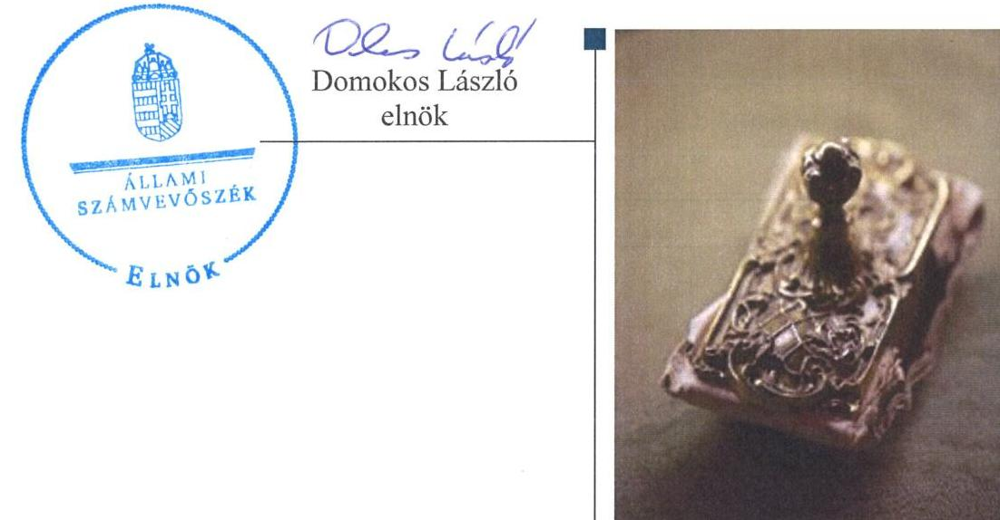
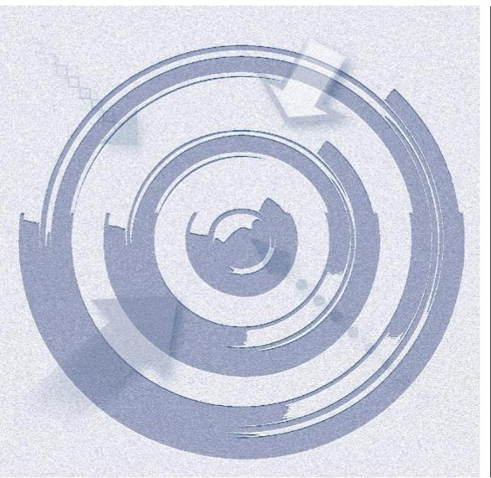
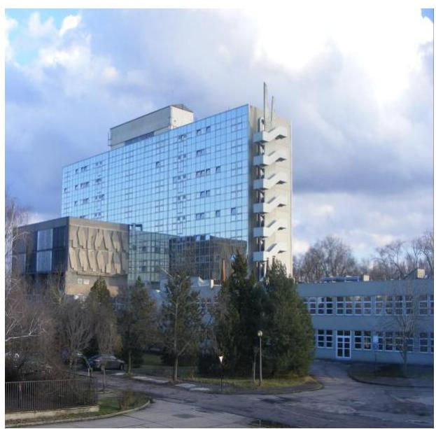
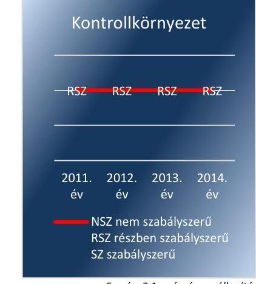
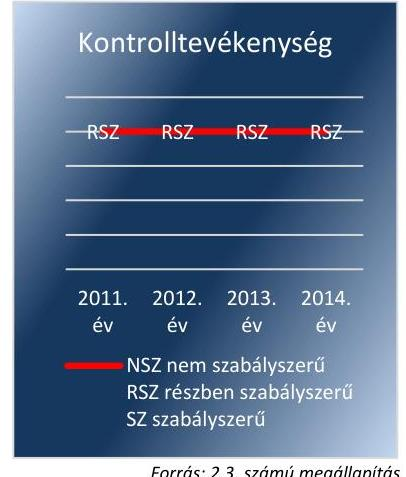
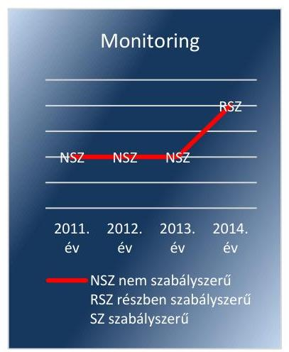
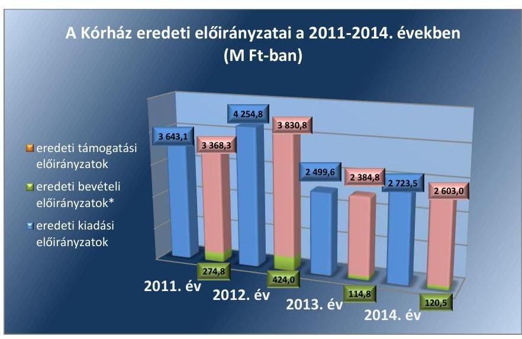
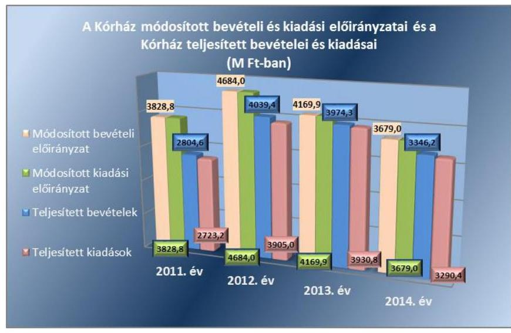
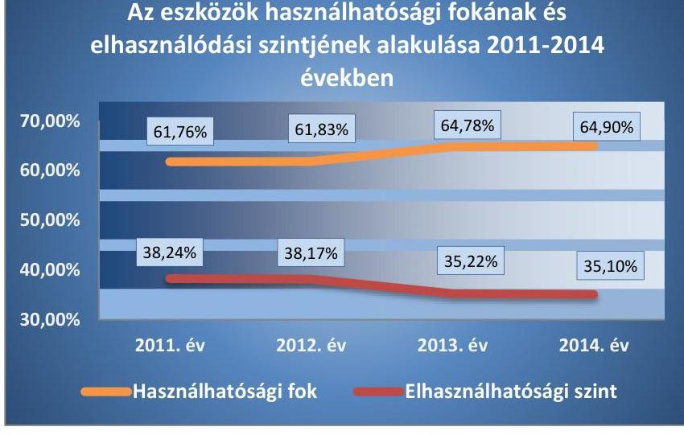

# Jelentés 

## A Kátai Gábor Kórház ellenőrzése

A központi alrendszer egyes intézményei pénzügyi és vagyongazdálkodásának ellenőrzése - Kátai Gábor Kórház 2016.

---

# Jelentés 

## A Kátai Gábor Kórház ellenőrzése

A központi alrendszer egyes intézményei pénzügyi és vagyongazdálkodásának ellenőrzése - Kátai Gábor Kórház
2016. május hónap

---

# AZ ELLENŐRZÉST FELÜGYELTE: 

DR. BENEDEK MÁRIA felügyeleti vezető

## AZ ELLENŐRZÉST VEZETTE ÉS A VÉGREHAJTÁSÁÉRT FELELŐS:

BIALKÓ ZSOLT GYULA ellenőrzésvezető

## A PROGRAM ÖSSZEÁLLÍTÁSÁÉRT FELELŐS:

JANIK JÓZSEF osztályvezető, BÖRÖCZ IMRE projektfelelős

IKTATÓSZÁM: V-0917-222/2016.
TÉMASZÁM: 27
ELLENŐRZÉS-AZONOSÍTÓ SZÁM: V-0713

---

# TARTALOMJEGYZÉK 

■ ÖSSZEGZÉS ..... 5
■ AZ ELLENŐRZÉS CÉLJA ..... 7
■ AZ ELLENŐRZÉS TERÜLETE ..... 8
■ AZ ELLENŐRZÉS HÁTTERE, INDOKOLTSÁGA ..... 9
■ FÓKUSZKÉRDÉSEK ..... 10
■ ELLENŐRZÉS HATÓKÖRE ÉS MÓDSZEREI ..... 11
■ MEGÁLLAPÍTÁSOK ..... 14
■ MELLÉKLETEK ..... 45
I. Sz. melléklet: Értelmező szótár. ..... 45
II. Sz. melléklet: Az integritás érvényesítése érdekében kialakított és működtetett kontrollrendszer ..... 49
III. Sz. melléklet: A Kátai Gábor Kórház pénzügyi és vagyongazdálkodásának teljesítmény-ellenőrzése ..... 50
IV. Sz. melléklet: Főbb mérlegadatok a 2011-2014. években (M Ft-ban) ..... 51
■ FÜGGELÉK: ÉSZREVÉTELEK ..... 59
■ RÖVIDÍTÉSEK JEGYZÉKE ..... 61

---

.

---

# ÖSSZEGZÉS 

Az ÁSZ ${ }^{1}$ a Kórház ${ }^{2}$ tekintetében a 2011-2014. évekre vonatkozóan ellenőrizte az irányító- és a középirányító szervi feladatellátás, a belső kontrollrendszer kialakítása és működtetése, a pénzügyi- és a vagyongazdálkodás, továbbá a szervezeti és szerkezeti átalakítások szabályszerűségét. Az ÁSZ értékelése alapján a középirányító szerv feladatellátása az SZMSZ GYEMSZI általi jóváhagyásának elmaradása miatt nem volt szabályszerű. A belső kontrollrendszer kialakítása és működtetése a 2011-2013. években nem volt szabályszerű, a 2014. évben már részben szabályszerű volt. Az ellenőrzött időszakban a pénzügyi gazdálkodás nem volt szabályszerű, a vagyongazdálkodás -tekintettel a leltározási szabálytalanságokra- részben volt szabályszerű.

## Az ellenőrzés társadalmi indokoltsága

Az ÁSZ Stratégiájának alapértéke, hogy ellenőrzései segítik az integritás alapú, átlátható és elszámoltatható közpénzfelhasználás megteremtését. Jelen ellenőrzés a 2012. májusáig az önkormányzati-, azt követően a központi alrendszer részét képező Kórház gazdálkodási tevékenységére terjedt ki. A Kórház pénzügyi és vagyongazdálkodásának alapvető rendeltetése a közfeladatok ellátásának biztosítása.

A közpénzek felhasználásában meghatározó, központi alrendszerbe tartozó intézmények pénzügyi és vagyongazdálkodási tevékenységük, feladatellátásuk súlya miatt jelentős hatást gyakorolnak a költségvetés egyensúlyának fenntartására. Hatással vannak továbbá az állami vagyonnal való gazdálkodás minőségére, a kormányzati (szak)politikák végrehajtására, illetve közfeladat ellátásuk vonatkozásában az állampolgárok életminőségére, jogaik és kötelezettségeik gyakorlására. Indokolt ezért, hogy az ÁSZ ezen intézmények pénzügyi és vagyongazdálkodását, az esetleges átalakulások szabályszerűségét ellenőrizze több évre kiterjedően.

## Főbb megállapítások, következtetések, javaslatok

Az EMMI alapító okirat módosítással kapcsolatos joggyakorlása - a módosításra előírt 45 napos határidő be nem tartása miatt - nem felelt meg teljes körűen a jogszabályi előírásoknak. Az SZMSZ GYEMSZI általi jóváhagyására 2012. májusát követően nem került sor.

A belső kontrollrendszer kialakítása és működtetése a 2011-2013. években nem volt szabályszerű, a 2014. évben részben volt szabályszerű. Ezen belül a kontrollkörnyezet, és a kontrolltevékenység kialakítása és működtetése, az információs és kommunikációs folyamatok kialakítása a 2011-2014. években, a kockázatkezelés és a monitoring rendszer működése a 2011-2013 között nem volt megfelelő, a 2014. évben összességében részben volt szabályszerű, mert a szabályozási környezet kialakítása egyes területeken elmaradt, a szabályozások hiányosak voltak, illetve azokon a jogszabályi változásokat az előírt határidőben nem vezették át. A 2011-2014. években nem tettek eleget az elektronikus közzétételi kötelezettségnek, nem alakították ki és nem működtették a Kórház tevékenységének, a célok megvalósításának folyamatos és eseti nyomon követését biztosító rendszerét, továbbá a vagyonnyilatkozatok kezelését nem szabályszerűen végezték.

A Kórház pénzügyi gazdálkodása nem volt szabályszerű, mivel az elemi költségvetések készítése, az előirányzatok megállapítása, valamint a bevételi és kiadási előirányzatok módosítása során nem tartották be maradéktalanul a jogszabályi előírásokat és a belső szabályzatokban foglaltakat. A Kórház a jóváhagyott kiadások előirányzatain belül gazdálkodott, azonban a kapcsolódó pénzgazdálkodási kontrollok nem működtek megfelelően, valamint nem tartották be maradéktalanul a közbeszerzési eljárásokra vonatkozó jogszabályi előírásokat. A bevételek teljesítése az előirányzattól minden évben elmaradt, azonban a 2012. évtől a működési bevételek előirányzatát a Kórház az előírások ellenére nem csökkentette. Az előirányzat maradvány megállapítása, felhasználása nem volt megfelelő. A 2014. évben

---

nem teljesítették a jogszabályban előírt kincstári bejelentési kötelezettséget. A Kórház által tett intézkedések nem biztosították a folyamatos fizetőképességet, továbbá a likviditását támogató likviditási tervet a központi alrendszerbe kerülését követően a vonatkozó előírások ellenére nem készített. Az eredményszemléletű számvitel bevezetésével kapcsolatos feladatokat végrehajtották, azonban a rendezőmérleget nem az előírt határidőben készítették el.

A Kórház vagyongazdálkodása az ellenőrzött időszakban részben volt szabályszerű. A vagyonkezelési szerződés nem felelt meg teljes körűen a jogszabályi előírásoknak, mivel az tartalmilag hiányos volt, továbbá a vagyonkezelési szerződés és módosításának egységes szerkezetbe foglalása nem történt meg. A mérlegben kimutatott eszközök és források nyilvántartása nem felelt meg a jogszabályok és a belső szabályzatok előírásainak, azok értékelése, leltározása - elsősorban a 2011. évben a vagyon megőrzésének biztonságát veszélyeztető - szabálytalanságok, selejtezésük eseti szabálytalanságok mellett történt. A jogszabályi és a vagyonkezelési szerződés előírásai szerint teljesítette a Kórház az értékmegőrzési, állagmegóvási kötelezettségeit. A vagyonelemek elidegenítése, hasznosítása nem felelt meg a jogszabályoknak és a belső szabályzatok előírásainak. Az irányító szerv átszervezéshez kapcsolódó alapítói, irányítói, felügyeleti szervi döntései összességében szabályszerűek voltak.

A Kórház szabályszerűen látta el az átszervezéshez kapcsolódó feladatait.
Az ÁSZ Integritás Projektje keretében a Kórház adatszolgáltatást teljesített az integritás szemlélet érvényesülése érdekében a 2014. évben tett intézkedéseiről, ezért az integritás kontrollrendszerének értékelése egyszerűsített kérdőív alapján történt. Az ÁSZ a Kórház adatszolgáltatása alapján az integritás szemlélet érvényesítése érdekében tett intézkedéseit fejlesztendőnek értékelte.

---

# AZ ELLENŐRZÉS CÉLJA 

## A Kátai Gábor Kórház ellenőrzése

## A KÓRHÁZ PÉNZÜGYI ÉS VAGYONGAZDÁLKODÁSÁNAK ELLENŐRZÉSE

annak megállapítására irányult, hogy a Kórházra vonatkozó irányító szervi feladatellátás a jogszabályi előírások betartásával történt-e, továbbá a Kórháznál a belső kontrollrendszer kialakítása és működtetése szabályszerű volt-e. Az ellenőrzés kiterjedt annak megítélésére is, hogy kialakították-e az erőforrásokkal való szabályszerű, gazdaságos, hatékony és eredményes gazdálkodáshoz szükséges követelményeket, megvalósították-e ezek számon kérését, ellenőrzését, a Kórház pénzügyi és vagyongazdálkodása megfelelt-e a jogszabályi előírásoknak és belső szabályzatokban foglaltaknak és arra, hogy a Kórház átalakításának vagy átszervezésének lebonyolítása szabályszerűen történt-e.

A Kórház korrupcióval szembeni veszélyeztetettségének csökkentése érdekében felmértük az integritási szemlélet érvényesülését a gazdálkodási folyamatokban.

## AZ ELLENŐRZÉS TELJESÍTMÉNY-ELLENŐRZÉSI PROGRAMMODULLAL EGÉ-

SZÜLT KI, amely a szabályszerűségi ellenőrzés programjára épült. A teljesítmény-ellenőrzési kiegészítő modul célja annak értékelése volt, hogy a gazdálkodás folyamatában a gazdaságossági, hatékonysági és eredményességi követelmények kialakítása megtörtént-e, azokat működtették-e, a célkitűzéseket elérték-e. A kiegészítő modul célja volt továbbá annak értékelése is, hogy a pénzügyi és vagyongazdálkodás folyamataira vonatkozóan a költségvetési szerv belső kontroll-rendszerének minőségéről a Kórház vezetője által kiadott vezetői nyilatkozatban a költségvetési szerv tevékenységében a hatékonyság, eredményesség, gazdaságosság követelményeinek érvényesítésére vonatkozó nyilatkozat helytálló volt-e.

---

# AZ ELLENŐRZÉS TERÜLETE

## A Kátai Gábor Kórház

A Kórház története az 1945. év elejére nyúlik vissza, amikor egy hadi kórházat telepítettek át Besztercéről Karcagra. A Kórház mai épületét 440 ággyal 1967-ben adták át, jelenleg 11 fekvőbeteg-osztállyal és 10 önálló szakrendeléssel rendelkezik. A Kórház közfeladata a működését meghatározó Eütv.3 alapján az ellátási területére vonatkozóan a járó és fekvőbetegek diagnosztikus és terápiás szakorvosi ellátása, rehabilitációja és követése, gondozása. A Kórház 2014-ben 451 db ággyal látta el a feladatait, melyből 247 db aktív és 204 db krónikus ágy volt. Az intézmény a járóbeteg-ellátásában hetente 1 219 szakorvosi órát teljesített a 2014. évben. A Kórházban 2014-ben 12 221 fekvőbeteget láttak el, míg a rendelőintézeteiben (járóbetegszakellátás, gondozó és labor összesen) az éves járóbeteg-forgalom 223 495 fő volt.

A Kórház az ellenőrzött időszakban önálló jogi személyiséggel rendelkező, önállóan működő és gazdálkodó, az előirányzatok felett teljes jogkörrel rendelkező költségvetési szerv volt. Az irányító szervi hatásköröket 2012. április 30-ig az Önkormányzat4 Képviselő-testülete5 gyakorolta. A Kórház állami tulajdonba és fenntartásba vételétől, 2012. május 1-jétől az irányító szervi hatásköröket az EMMI6, az egyes fenntartói, valamint az irányítási, középirányítói jogokat a GYEMSZI7 gyakorolta az EMMI által jóváhagyott SZMSZ-e szerint, melynek elnevezése 2015. március 1-jétől ÁEEK8-ra változott.

A Kórház főigazgatója és gazdasági igazgatója személyében is történt változás az ellenőrzött időszakban. A jelenlegi főigazgató megbízott főigazgatóként 2013. május 2-ától 2014. január 31-éig látta el feladatait, majd 2014. február 1-jétől kinevezett főigazgatóként vezeti az intézményt. Munkáját orvos igazgató, stratégiai igazgató, valamint 2011. május 31-ig és 2014. január 1-jétől kinevezett gazdasági igazgató segítette.

A Kórház feladatstruktúrája, illetve szervezeti felépítése az ellenőrzött időszakban módosult. A gazdálkodással kapcsolatos feladatokat a gazdasági igazgató irányítása alatt működő gazdasági-, anyag- és eszközbeszerzési-, leltározási-, humánerőforrás-gazdálkodási-, élelmezési- és műszaki csoportok látták el. A stratégiai igazgató irányítása alá tartozó kontrolling és finanszírozási csoport feladatának részét képezte a betegellátó egységek működésének fedezetelemzése. A Kórházban az engedélyezett létszám 2011-ben 621 fő, 2014-ben pedig 604 fő volt. Az ellenőrzött időszakban a végrehajtott beruházások következtében a könyvviteli mérleg szerinti mérlegfőösszeg a 2011. január 1-jei 3 166,4 millió Ft-ról 2014. december 31-ére 4 915,2 millió Ft-ra, több mint 55 %-kal nőtt. A kötelezettségek állománya közel 13 %-kal, 524,9 millió Ft-ról 592,3 millió Ft-ra emelkedett az ellenőrzött időszakban. A Kórház teljesített költségvetési bevétele a 2011. évi 2 804,6 millió Ft-ról a 2014. évre 3191,4 millió Ft-ra, 13,8 %-kal nőtt. A teljesített költségvetési kiadások a 2011. évi 2 723,2 millió Ft-ról a 2014. évre 3 290,4 millió Ft-ra, 20,8 %-kal emelkedtek.

---

# AZ ELLENŐRZÉS HÁTTERE, INDOKOLTSÁGA 

## A Kátai Gábor Kórház ellenőrzésének háttere

Az Alaptörvény ${ }^{9}$ rendelkezése szerint a nemzeti vagyon megőrzésének, védelmének és a nemzeti vagyonnal való felelős gazdálkodásnak a követelményeit sarkalatos törvény, az Nvtv. ${ }^{10}$ rögzíti. A tulajdonosi joggyakorlás és vagyonkezelés általános és speciális szabályait, az állami vagyon nyilvántartására és elszámolására vonatkozó eljárásokat, a vagyonkezelési szerződés feltételrendszerét, valamint az éves beszámoló készítési és könyvvezetési kötelezettségeket kormányrendeletek írják elő.

A központi alrendszer egyes intézményei átalakításának és megszüntetésének szabályait az Áht. ${ }^{11}$ 11. §-a, a közfeladat ellátásának változásait, a közfeladatok átadásából és átvételéből adódó módosításait, előirányzat gazdálkodására ható tényezőit az Ávr. ${ }^{12}$ 14. §-a írja elő. A közfeladatok megszűnéséből, az intézmény átszervezéséből, belső szerkezeti korszerűsítéséből vagy más hasonló okból adódó módosításai miatt szerepeltetendő szerkezeti változásokat, valamint a szerkezeti változásként beépült közfeladatok szintre hozásként történő számításba vételét az Ávr. 15. § (2)-(3) bekezdései határozzák meg.

A társadalmi igénnyel összhangban az Áht. ${ }^{13}$, az Áht. ${ }_{2}$, az Ámr. ${ }^{14}$ és a Bkr. ${ }^{15}$ is előírta a költségvetési szerv részére, hogy olyan szabályozásokat, eljárásokat, folyamatokat alakítson ki, amelyek biztosítják a működés, gazdálkodás, az erőforrások felhasználása során a
 gazdaságosság, hatékonyság és eredményesség érvényesülését. A gazdaságos, hatékony és eredményes gazdálkodáshoz szükség van a teljesítménymérés feltételeinek kialakítására, úgymint az egyértelmű és mérhető célokra, mutatószámokra és az ezekhez rendelt követelményekre. Az ÁSZ jelen ellenőrzéssel győződik meg arról, hogy a Kórháznál a teljesítménycélokat, mutatókat, követelményeket kialakították-e, azokat működtették-e, a kitűzött cél(ok) teljesültek-e.

Az ellenőrzés eredményeképpen nemcsak a Kórház gazdálkodása javulhat, hanem átfogó képet kaphatunk gazdálkodásának hiányosságairól és a jó gyakorlatokról is. Az ÁSZ javaslataival és megállapításaival elősegítheti a Kórház pénzügyi és vagyongazdálkodása szabályozásának javítását. A teljesítmény-ellenőrzés lefolytatása támogatást nyújt továbbá a törvényalkotás számára a nemzeti kulcsindikátorok rendszerének kialakításához. Az ellenőrzés a döntéshozók, ellenőrzöttek, irányító szervek és a társadalom számára az összehasonlítási, összemérési lehetőségek kihasználásával objektív visszajelzést ad a gazdálkodás területén végrehajtott szervezeti, szervezési, takarékossági és bürokráciacsökkentő intézkedések hatásairól, a közfeladat ellátásnak keretet adó pénzügyi és vagyongazdálkodásban mérhető teljesítménykövetelmények kialakításáról, azok alkalmazásáról. Irányt mutat a gazdálkodási és kapcsolódó adminisztratív folyamatok optimalizációjához. Segíti a központi költségvetési szervek átláthatóságát, felügyelhetőségét, a „jó gyakorlatok" elterjesztésével támogatja a „jó kormányzást".

---

# FÓKUSZKÉRDÉSEK 

1.     - Az irányító szerv Kórházra vonatkozó feladatellátása szabályszerű volt-e?
2.     - A Kórház belső kontrollrendszerének kialakítása és működtetése megfelelt-e a jogszabályi előírásoknak?
3.     - A Kórház pénzügyi gazdálkodása szabályszerű volt-e?
4.     - A Kórház vagyongazdálkodása szabályszerű volt-e?
5.     - Szabályszerűen hajtották-e végre az ellenőrzött időszakban a Kórházat érintő szervezeti, szerkezeti átalakításokat?
6.     - A Kórház intézkedett-e az integritás szemlélet érvényesítése érdekében?

---

# ELLENŐRZÉS HATÓKÖRE ÉS MÓDSZEREI 

## Az ellenőrzés típusa

Szabályszerűségi és teljesítmény-ellenőrzés.

## Az ellenőrzött időszak

A 2011. január 1-jétől 2014. december 31-ig terjedő időszak.

## Az ellenőrzés tárgya

Az ellenőrzés tárgya a Kórházra vonatkozó irányító szervi feladatok ellátása, a Kórház belső kontrollrendszerének kialakítása és működtetése, pénzügyi és vagyongazdálkodása, továbbá az erőforrásokkal való szabályszerű, gazdaságos, hatékony és eredményes gazdálkodáshoz szükséges követelmények kialakítása, a kialakított követelmények számonkérése, ellenőrzése, a kapcsolódó vezetői nyilatkozat helytállósága volt. A Kórház átalakítása, átszervezése lebonyolításának szabályszerűsége szintén az ellenőrzés tárgyát képezte.

## Az ellenőrzött szervezet

A Kátai Gábor Kórház és irányító szervei - Karcag Város Önkormányzata és az EMMI -, valamint a középirányító szerve, a GYEMSZI.

## Az ellenőrzés jogalapja

Az ellenőrzés jogszabályi alapját az Alaptörvény Állam fejezet 43. cikk (1) bekezdése, az ÁSZ tv. 1. § (3) bekezdése, 5. § (2) - (6) bekezdései, valamint az Áht. 2 61. § (2) bekezdésének előírásai képezték.

## Az ellenőrzés módszerei

Az ellenőrzést az ellenőrzési program szempontjai, az ellenőrzött időszakban hatályos jogszabályok, valamint az ellenőrzés szakmai szabályai és az ÁSZ módszertanok figyelembevételével végeztük, irányadónak tekintve a nemzetközi standardokat.

Az ellenőrzés lefolytatásához a Kórház, az EMMI, az ÁEEK valamint az Önkormányzat tanúsítványok kitöltésével és megküldésével, valamint az ÁSZ által kért dokumentumok - elsősorban elektronikus úton történő -

---

megküldésével szolgáltatott adatokat. Az így rendelkezésre bocsátott adatok, információk kontrollja helyszíni ellenőrzés keretében történt. Ellenőrzésszakmai szempontok alapján mintavételi eljárást alkalmaztunk, melynek során a minták kiválasztása elsősorban reprezentativitást biztosító véletlen mintavételi eljárással történt. A jelentésben használt fogalmak magyarázatát az I. számú melléklet, az integritás érvényesítése érdekében kialakított és működtetett kontrollrendszer szempontjait a II. számú melléklet, a kiegészítő teljesítmény-ellenőrzés megállapításait a III. számú melléklet tartalmazza.

A Kórház belső kontrollrendszere jogszabályi előírások szerinti kialakításának és működtetésének szabályszerűségét az erre irányuló ellenőrzési kérdésekre adott válaszok összesítése alapján, évenkénti bontásban pillérenként (kontrollkörnyezet, kockázatkezelési rendszer, kontrolltevékenységek, információs és kommunikációs rendszer, monitoring rendszer) és összesítetten is minősítettük. A belső kontrollrendszer egyes pilléreinek kialakítása és működtetése „szabályszerű" volt, amennyiben az értékelt területen az elért és elérhető pontok százalékban kifejezett, egész számra kerekített hányadosa meghaladta a 84%-ot. „Részben szabályszerű" volt, ha ez a hányados a 84%-ot nem haladta meg, de 60%-nál nagyobb volt, és „nem szabályszerű" volt, ha az nem haladta meg a 60%-ot. A Kórház belső kontrollrendszerének összesített értékelése megegyezik a pillérenként (kontrollterületenként) alkalmazott %-os értékelésekkel. A kontrollrendszer egésze esetében a „szabályszerű" értékelésnek a %-os értéken felül további feltétele volt, hogy egyik kontrollterület sem kaphatott „nem szabályszerű" értékelést, a „részben szabályszerű" értékelés további feltétele volt, hogy legfeljebb egy ellenőrzött kontrollterület lehetett „nem szabályszerű" értékelésű. Az összesített értékelés a %-os értéktől függetlenül „nem szabályszerű" értékelést kapott, ha az ellenőrzött kontrollterületek közül több mint egynek „nem szabályszerű" volt az értékelése.

A tárgyi eszközök nyilvántartásba vételének, a vagyonelemek hasznosításának, közbeszerzési eljárások lefolytatásának, az előírányzatok módosításának és az előirányzat maradvány megállapításának szabályszerűségét, valamint a gazdálkodási jogkörök gyakorlásának szabályszerűségét mintavétellel ellenőriztük. Megfelelőnek értékeltük a tárgyi eszközök nyilvántartásba vételét, a vagyonelemek hasznosítását, a közbeszerzési eljárás lefolytatását, az előirányzatok módosítását és az előirányzat maradvány megállapítását, amennyiben a minta ellenőrzésének eredménye alapján 95%-os bizonyossággal a teljes sokaságban a hibás tételek aránya kisebb volt, mint 10%, nem megfelelőnek értékeltük, ha a hibás tételek aránya a 10%-ot meghaladta.

A 2011. évet érintően a szakmai teljesítésigazolás és az utalvány ellenjegyzése kulcskontrollok, a 2012-2014. éveket érintően a teljesítésigazolás és az érvényesítés kulcskontrollok működését értékeltük. Megfelelőnek értékeltük a gazdálkodási jogkörök gyakorlását, amennyiben 95%-os bizonyossággal a teljes sokaságban a hibaarány legfeljebb 10% volt, részben megfelelőnek értékeltük, ha a hibaarány felső határa legfeljebb 30% volt, nem megfelelőnek értékeltük akkor, ha a sokaságbeli hibaarány felső határa meghaladta a 30%-ot.

---

A teljesítmény-ellenőrzés során a számvevőszéki ellenőrzés szakmai szabályai szerint, a szabályszerűségi ellenőrzést kiegészítve, a teljesítményellenőrzés módszerével, a vonatkozó nemzetközi standardok figyelembevételével értékeltük, hogy a költségvetési szerv vezetője kialakította-e a gazdaságossági, hatékonysági és eredményességi követelményeket, és azokat működtette-e, a célkitűzéseket elérte-e. Az ellenőrzés a gazdálkodási feladatokra terjedt ki, a szakmai feladatellátást nem értékelte.

---

# 1. Az irányító szerv Kórházra vonatkozó feladatellátása szabályszerű volt-e? 

Összegző megállapítás

Az Önkormányzat irányítószervi feladatellátása a Kórház tekintetében szabályszerű volt. Az EMMI irányítószervi, illetve a GYEMSZI középirányító szervi feladatellátása - az alapító okirat határidőn túli módosítása és az SZMSZ2 jóváhagyásának elmaradása miatt - nem volt szabályszerű.
1.1. számú megállapítás

Az irányító szerv alapító okirat módosítással kapcsolatos joggyakorlása nem felelt meg teljes körűen a jogszabályi előírásoknak, továbbá az SZMSZ₂ középirányító szerv általi jóváhagyására az állami fenntartásba vételt követően nem került sor.

## A KÓRHÁZ AZ ELLENŐRZÖTT IDŐSZAKBAN RENDELKEZETT az irányító szerv által kiadott jogszabályi előírásoknak megfelelő alapító okirattal ¹⁶. Az alapító okiratot 2012. április 30-ig a Képviselő-testület adta ki és módosította. A Kórház állami fenntartásba vételét követően az alapító okiratot és annak 2014. január 1-jétől hatályos kiegészítését az Áht. ₂-ben biztosított jogkörében eljárva az EMMI minisztere adta ki.

Az alapító okirat 2011-ben tartalmazta az Áht. ₁ és az Ámr., majd 2012-től az Áht. ₂ és az Ávr. által előírt tartalmi elemeket.

## A KÓRHÁZ RENDELKEZETT AZ ÖNKORMÁNYZAT

ÁLTAL JÓVÁHAGYOTT SZMSZ ₁,₂ ¹⁷-vel. Az SZMSZ₁ tartalma részben volt összhangban, az SZMSZ₂ tartalma ugyanakkor 2012. április 30-áig összhangban volt a hatályos alapító okirattal. A Kórház SZMSZ₂-ének és az alapító okiratának összhangja a Ttv. ¹⁸ alapján bekövetkezett változást követően azonban nem volt biztosított.

Az irányító és a középirányító szerv Kórházra vonatkozó feladatellátása az alábbiak tekintetében nem volt szabályszerű:
⟶ Az EMMI - a Ttv. 6. § (1) bekezdésében előírtak ellenére - a Kórház alapító okiratának módosítását az átvételt követő 45 napos határidőn túl, 2012. december 15-én készítette el.
⟶ Az SZMSZ₂ - az Áht₂ 9. § (1) bekezdés a) pontjában és az Ávr. 13. § (1) bekezdés b), c), e) és g) pontjában foglaltak ellenére nem tartalmazta a hatályos, egységes szerkezetbe foglalt alapító okirat keltét, számát, a 2014. február 27-én kiegészített alapító okiratban meghatározott kormányzati funkciók szerint besorolt alaptevékenységeket. Továbbá - tekintettel az állami tulajdonba vétellel kapcsolatos irányítószervi, vagyonhasznosítási jogkörökben bekövetkezett változásokra - nem tartalmazta a Kórház aktuális működési

---

rendjét és egyes nevesített munkakörökhöz - kiemelten a főigazgatói munkakörhöz - tartozó feladat-, hatás- és jogköröket. A Kórház a GYEMSZI 2013. november 15-én kelt, az SZMSZ₂ véglegesítésére és jóváhagyásra történő beterjesztésére vonatkozó felszólításának nem tett eleget, ezt a GYEMSZI nem kifogásolta, így nem járt el az 59/2011. (IV. 12.) Korm. rendelet 2/A. § n) pontja előírása alapján 2013. július 6-tól biztosított jogkörében, mely szerint középirányító szervként jóváhagyja az irányítása alá tartozó egészségügyi intézmények szervezeti és működési szabályzatát.
1.2. számú megállapítás

Az irányító szerv és a középirányító szerv az éves költségvetési beszámolót érintő követelmények előírásán túl nem érvényesített a közfeladatok ellátására vonatkozó, az erőforrásokkal való szabályszerű és hatékony gazdálkodáshoz szükséges követelményeket.

A KÖZFELADATOK ELLÁTÁSÁRA és a gazdálkodásra vonatkozóan a 2011. évre a Képviselő-testület, a 2012-2014 évekre az EMMI körlevelekben írta elő az éves költségvetési beszámoló és a szöveges indoklásának tartalmi követelményét, elkészítésének határidejét, valamint elvégezte a megküldött beszámolók ellenőrzését.

A GYEMSZI a Ttv. előírása alapján, mint a Magyar Állam tulajdonába került egészségügyi vagyon tulajdonosi jogának gyakorlója a Kórházzal 2012. május 1-jei hatállyal megkötötte a vagyonkezelési szerződést, azonban a szerződésben sem határozott meg az erőforrásokkal való szabályszerű és hatékony gazdálkodásra vonatkozóan konkrét követelményeket, kritériumokat. A GYEMSZI előírta ugyanakkor a vagyonról a naprakész nyilvántartás vezetésének, továbbá a vagyonhasznosításból származó bevételek közfeladat ellátására és a vagyonkezelésre kapott vagyon állag-és értékmegőrzésére, fenntartására fordíthatóságának kötelezettségét.

Az irányító- és a középirányító szerv a Kórházra vonatkozó, erőforrásokkal való szabályszerű és hatékony gazdálkodáshoz szükséges követelmények érvényesítése terén az alábbiak tekintetében szabálytalanul járt el:

- Az irányító szerv - 2011-ben az Áht. 1 49. § (5) bekezdés f) pontjában, míg az irányító szerv és a középirányító szerv a 2012-2014. években az Áht. 2 9. § (1) bekezdés f) pontjában előírtak ellenére - a Kórházra vonatkozóan nem érvényesített a közfeladatok ellátására vonatkozó és az erőforrásokkal való szabályszerű és hatékony gazdálkodáshoz szükséges követelményeket. (Az Áht. 1 2012. január 1-jétől hatályát vesztette, az Áht. 2 9. § (1) bekezdés f) pontjában előírt irányítószervi hatáskört 2015. január 1-jétől a 9. § eb) pontja szabályozta, mely 2015. június 19-étől hatálytalan.)
1.3. számú megállapítás

A Kórházzal kapcsolatos egyéb ellenőrzési, irányítási és felügyeleti jogokat az irányító- és a középirányító szerv szabályszerűen gyakorolta.

AZ IRÁNYÍTÓ SZERV RENDSZERESEN FIGYELEMMEL KÍSÉRTE az Áht. 1 és az Áht. 2 előírásainak megfelelően a Kórház bevételi és kiadási előirányzatokkal való gazdálkodását, az ellátandó feladatok teljesülését. 2012. májusát megelőzően a költségvetést, annak módosításait, illetve a költségvetés végrehajtásáról szóló beszámolót, a pénzmaradványt az előírtaknak megfelelően a Képviselő-testület fogadta el.

---

Az Önkormányzat a tartós likviditási gondok miatt 2009-ben
 az Áht. 1 felhatalmazása alapján önkormányzati biztost rendelt ki a Kórházhoz, aki 2012. májusáig, az irányító szervi változásig látta el a feladatát. A Kórház adósságállománya évről évre csökkenő bevétel mellett az önkormányzati biztosi feladatellátás eredményeként 2009-2012 között $406 \mathrm{M}^{19} \mathrm{Ft}$-tal csökkent.

AZ ÖNKORMÁNYZAT BESZÁMOLTATTATTA az Áht. 1, illetve az Áht. 2 előírásainak megfelelően a 2011-2012. években a Kórház vezetőjét a szakmai feladat ellátásáról. Az EMMI a 2012-2014. években a szakmai feladat ellátásáról szóló beszámolás kötelezettségét a költségvetési beszámoló szöveges indoklására vonatkozó rendelkezésben határozta meg. A GYEMSZI középirányító szervként 2012-2014. között évenként vezetői beszámoló megküldésének követelményét írta elő a Kórház belső ellenőrzési tevékenységéről.

# A KÓRHÁZ VEZETŐJÉNEK ÉS GAZDASÁGI VEZETŐJÉNEK KINEVEZÉSE, visszavonása, a vezetői megbízásuk és munkaviszonyuk megszűnése során az irányító szerv szabályszerűen járt el. A gazdasági igazgatói feladatokat 2011. május 31-ig munkaszerződéssel látták el. A gazdasági igazgatói munkakör szabályszerű betöltésére csak 2014. január 1-jétől került sor, ekkortól a gazdasági igazgatói pályázat eredményes lezárásáig a főigazgató az EMMI miniszter egyetértése mellett a gazdasági igazgatói feladatok ellátására átmeneti időre, megbízott gazdasági igazgatóként a Kórház megfelelő szakképzettséggel rendelkező alkalmazottját jelölte ki. 

AZ IRÁNYÍTÓ SZERV ELLENŐRIZTE a Kórház feladatellátásának különböző területeit. Az Önkormányzat ellenőrzést folytatott a 2011. évi normatív állami támogatás felhasználása mutatószámainak megalapozottságára, a 2012. január 1-jétől 2012. augusztus 31-ig terjedő időszakot érintő egészségügyi alapellátás átszervezésének pénzügyi elszámolására - mely az alapellátási feladat végleges átadásáig a Kórházat is érintette -, továbbá a 2011. január 1-je és 2012. február 4-e között egy ÉAOP ${ }^{20}$ pályázat dokumentációjának szabályosságára vonatkozóan. Az ellenőrzés megállapításai alapján a Kórház a szükséges intézkedéseket megtette és erről az Önkormányzatot tájékoztatta. A GYEMSZI 2013. évben adatbekéréssel ellenőrizte a jogszabályban előírt szabályzatok meglétét és megfelelőségét. Az ellenőrzés következményeként a GYEMSZI 2013. november 15-én az SZMSZ és egyéb szabályzatok véglegesítésére és jóváhagyásra történő beterjesztésre szólította fel a Kórházat. Az EMMI 2014-ben értékelte a Kórház belső ellenőrzési tevékenységét, megállapításai alapján javaslatot nem fogalmazott meg, a Kórháznak intézkedési kötelezettsége nem keletkezett.

A közérdekű és közérdekből nyilvános, valamint az irányítási jogkörök gyakorlásához szükséges személyes adatokat a Kórház vonatkozásában a GYEMSZI az előírásoknak megfelelően kezelte.

---

# 2. A Kórház belső kontrollrendszerének kialakítása és működtetése megfelelt-e a jogszabályi előírásoknak? 

Összegző megállapítás
2.1. számú megállapítás
1. ábra

A belső kontrollrendszer kialakítása és működtetése a 2011-2013. években nem volt szabályszerű, a 2014. évben részben szabályszerűvé vált.

A kontrollkörnyezet kialakítása az ellenőrzött időszakban - a hiányos szabályozás, valamint a jogszabályi változások előírt határidőn túl történt átvezetése miatt - részben szabályszerű volt.

A KONTROLLKÖRNYEZET KIALAKÍTÁSÁNAK értékelését az 1. számú ábra szemlélteti. A kontrollkörnyezet részeként a Kórház a 2011-2014. években rendelkezett SZMSZ-zel, azonban az nem felelt meg az Ámr., illetve az Ávr. előírásainak.

Az SZMSZ 2011-2014-ben tartalmazta azon ügyköröket, amelyek során a szervezeti egységek vezetői a Kórház képviselőjeként járhatnak el, a jogszabályban meghatározott kivétellel a munkáltatói jogok gyakorlásának rendjét és a szervezet működésével kapcsolatos feladatok munkafolyamatainak leírását. Az SZMSZ-ben rögzítették továbbá az abban nevesített munkakörökhöz tartozó feladat- és hatásköröket, a hatáskörök gyakorlásának módját, a helyettesítés rendjét, valamint az ezekhez kapcsolódó felelősségi szabályokat. Az SZMSZ tartalmazta a Kórház ellátandó és szakfeladatrend szerint szakfeladatszámmal és megnevezéssel besorolt alaptevékenységeit, az alaptevékenységeket szabályozó jogszabályok megjelölését, a gazdasági szervezet vezetőjének, alkalmazottainak feladat- és hatáskörét.

A vagyongazdálkodással kapcsolatos feladatokat 2011-től a közbeszerzési szabályzatban, 2012-től a feladatellátással érintett szervezeti egységek ügyrendjében rögzítették.

A Kórház a 2011. évtől a Számv. tv.-ben előírtaknak megfelelően kialakította a számviteli politika-t és annak keretében kiadta a leltározási és leltárkészítési; eszközök és források értékelési; pénzkezelési; önköltségszámítási szabályzatot, valamint bizonylati rendet. A számviteli politika az ellenőrzött időszakban tartalmazta a gazdálkodással, a könyvvezetéssel és az adatszolgáltatással kapcsolatos feladatok munkafolyamatainak leírását. A 2011. június 30-án kiadott gazdálkodási szabályzat mellékletként tartalmazta a pénzgazdálkodási jogköröket gyakorlókról és aláírás mintájukról vezetett nyilvántartást.

A számlarend a 2011. évben tartalmazta minden alkalmazásra kijelölt számla számjelét és megnevezését, valamint az ellenőrzés minden évében a főkönyvi számla és az analitikus nyilvántartások kapcsolatát.

A főigazgató a 2011. évtől gondoskodott megfelelő tartalmú közbeszerzési szabályzat, ellenőrzési nyomvonal és szabálytalanságok kezelésére vonatkozó eljárásrend kiadásáról.

A Kórház gazdasági szervezetének szabályszerűen kinevezett, illetve megbízott vezetője rendelkezett a feladatellátáshoz előírt végzettségekkel

---

és engedéllyel. A gazdálkodási feladatokat ellátó közalkalmazottak feladataikat, végzettségüket, és szakképzettségüket tartalmazó munkaköri leírással rendelkeztek.

A kontrollkörnyezet kialakítása a következők tekintetében nem volt szabályszerű:
$\longrightarrow$ Az SZMSZ - 2011-ben az Ámr. 20. § (2) bekezdés c)-e) pontjában és 2012-től az Ávr. 13. § (1) bekezdés c)-e) és g) pontjában foglaltak ellenére - nem tartalmazta azon gazdálkodó szervezetek részletes felsorolását, amelyek tekintetében a Kórház tulajdonosi jogokat gyakorolt, valamint a szervezeti egységek engedélyezett létszámát. Az SZMSZ-ben - az Ámr. 20. § (2) c) pontjában előírtak ellenére - nem kerültek meghatározásra az alaptevékenységet szabályozó jogszabályok és minden olyan alaptevékenység és szakfeladatszám, melyeket a Kórház ellátott és az alapító okiratában is rögzítettek. Az SZMSZ az Ávr. 13. § (1) bekezdés g) pontjában foglaltak ellenére - nem tartalmazta a nevesített összes munkakör esetében a helyettesítés rendjét. (Az SZMSZ 2012. április 26-tól tartalmazta az alaptevékenységet szabályozó jogszabályok megjelölését.)
$\longrightarrow$ 2011-ben - az Ámr. 20. § (7) bekezdésében előírtak ellenére - nem rögzítették szabályzatban a gazdasági szervezet vezetőinek, alkalmazottainak feladat- és hatáskörét, a vagyongazdálkodással kapcsolatos feladatok munkafolyamatainak leírását és a helyettesítés rendjét a gazdasági szervezet egészére vonatkozóan. 2012-től - az Ávr. 13. § (5) bekezdésében előírtak ellenére - nem határozták meg a gazdasági szervezet belső és külső kapcsolattartásának részletes szabályait és továbbra sem szabályozták a helyettesítés rendjét a gazdasági szervezet egészére vonatkozóan. (Az SZMSZ 2012. április 26-tól tartalmazta a gazdasági szervezet vezetőinek, alkalmazottainak feladat- és hatáskörét. 2012-től a vagyongazdálkodással kapcsolatos feladatok munkafolyamatainak leírását osztályos működési rendben rögzítették.)
$\longrightarrow$ A 2011-2014. években - a Számv. tv. ${ }^{26}$ 161. § (5) bekezdésében foglaltak ellenére - a számviteli politikán, valamint az annak keretében kiadott szabályzatokon az előírt 90 napos határidőn túl került sor a Számv. tv. változásainak átvezetésére (így 2011-ben a Számv. tv. 3. § (4) bekezdés 10. e) pontjában a behajthatatlan követelés fogalma, a 47. § (8) bekezdésben az eszközök bekerülési értékének meghatározása, 2012-ben a Számv. tv. 14. § (9) bekezdésében a napi készpénz záró állomány maximális mértékének meghatározása, 2013-ban a Számv. tv. 79. § (4) bekezdése a bérjárulékoknál, a 103. § (2) bekezdése által a pénzmozgáshoz nem kapcsolódó rövid lejáratú kötelezettségek kimutatásánál a társadalombiztosítási járulék fogalma helyett bevezetett szociális hozzájárulási adó fogalma, 2014-ben a Számv. tv. 44. § (3) bekezdésében a passzív időbeli elhatárolás fogalma). (2014. június 19-én kiadmányozott számviteli politika és annak keretében kiadott szabályzatok a Számv. tv. változásaival összhangban voltak.)
$\longrightarrow$ A számviteli politika - a Vtvr. ${ }^{27}$ 14. § (1) bekezdésében előírtak ellenére - nem biztosította a tulajdonosi joggyakorló felé teljesítendő adatszolgáltatás pontosságát és ellenőrizhetőségét, mivel a kezelt

---

vagyonnal kapcsolatos adatszolgáltatási kötelezettség teljesítésének szabályait abban nem rögzítették.

- A számviteli politika - a gazdálkodási szabályzat 3. pontjában előírtak ellenére - nem tartalmazta mellékletként a gazdálkodási jogkörök gyakorlóit, a megbízásokat, kijelöléseket tartalmazó nyilvántartást, valamint a megbízások, kijelölések eredeti dokumentumait. (2014-ben a számviteli politika melléklete tartalmazta a gazdálkodási jogkörökkel kapcsolatos nyilvántartást.)
- A 2014. évben a teljesítés igazolására jogosult személyek kijelölése - az Ávr. 57. § (4) bekezdésében előírtak ellenére - nem tartalmazta, hogy a kijelölés mely adott kötelezettségvállaláshoz, vagy a kötelezettségvállalások előre meghatározott csoportjaihoz kapcsolódóan történt.
- A Kórház 2011. június 30-ig - az Ámr. 20. § (3) bekezdés a) pontjában meghatározottak ellenére - a gazdálkodási jogkörökkel kapcsolatos hatályos szabályozással nem rendelkezett, továbbá 2011. december 30-ig - az Ámr. 80. § (3) bekezdésében foglaltak ellenére - a gazdálkodási jogköröket gyakorlókról és aláírás mintájukról nyilvántartást nem vezetett. A 2012-2014. években - az Ávr. 60. § (3) bekezdésében foglaltak ellenére - a főigazgató az előírt nyilvántartás naprakész vezetéséről nem gondoskodott, mivel a gazdálkodási jogkört gyakorlókról és aláírás mintájukról vezetett nyilvántartás nem tartalmazta az ellenjegyzési feladatokat, valamint az érvényesítési feladatokat helyettesítőként ellátók személyében bekövetkezett változásokat.
- A számlarend a 2011-2014. években - a Számv. tv. 161. § (2) bekezdés b) pontjában foglaltak ellenére - nem tartalmazta a könyvviteli számla értéke növekedésének, csökkenésének jogcímeit, valamint a 2012-2014. években - a Számv. tv. 161. § (2) bekezdés a) pontjában foglaltak ellenére - nem tartalmazta az alkalmazásra kijelölt számlák számjelét és megnevezését. Továbbá 2011-2013. években - az Áhsz. ${ }^{28}$ 49. § (3) bekezdése, a 2014. évben az Áhsz. 51. § (3) bekezdése előírásai ellenére - a számlarendben nem írták elő az analitikus, részletező nyilvántartásoknak a kapcsolódó könyvviteli és nyilvántartási számlákkal való egyeztetése dokumentálásának szabályait.
- A Kórház a 2011-2014. években - az Ámr. 20. § (3) bekezdés b) pontja, illetve az Ávr. 13. § (2) bekezdés b) pontja által előírtak ellenére - a Kbt. ${ }^{29}$ és Kbt. ${ }^{30}$ hatálya alá tartozó beszerzések lebonyolításának szabályozása kivételével nem rendelkezett a beszerzések lebonyolítását tartalmazó hatályos eljárásrenddel.
- A főigazgató - 2011-ben az Ámr. 156. § (1) bekezdés c) pontjában előírtak, a 2012-2014. években a Bkr. 6. § (1) bekezdés c) pontjában foglaltak ellenére - nem határozott meg a szervezet minden szintjére vonatkozó etikai elvárásokat.

---

### 2.2. számú megállapítás

A kockázatkezelési rendszer kialakítása és működtetése a 2011-2013. években - a szabályozási környezet kialakításának elmaradása és a vagyonnyilatkozatok kezelésével kapcsolatos szabálytalanságok miatt - nem volt szabályszerű, a 2014. évben részben szabályszerű volt.

A KOCKÁZATKEZELÉSI RENDSZER kialakításáról és működtetéséről a főigazgató 2014-től gondoskodott. A kockázatkezelési rendszer eljárásrendjét monitoring rendszer szabályzatban, valamint a kockázatelemzési szabályzatban határozták meg. A monitoring rendszer szabályzatban, valamint a kockázatelemzési szabályzatban a szervezet tevékenységében, gazdálkodásában rejlő kockázatok felmérését követően meghatározták az egyes kockázatokkal kapcsolatban szükséges intézkedések teljesítésének folyamatos nyomon követésének módját.

A kockázatkezelési rendszer kialakításának és működtetésének értékelését a 2. számú ábra szemlélteti.

Az SZMSZ-ben rögzítették a vagyonnyilatkozat-tételre kötelezettek körét. A vagyonnyilatkozat őrzésért felelős személy az ellenőrzött időszakban a vagyonnyilatkozatokat nyilvántartásba vette és egyéb iratoktól elkülönítetten kezelte. A vagyonnyilatkozatban foglalt személyes adatok védelmére vonatkozó szabályokat az adatvédelmi szabályzat tartalmazta. A főigazgató 2014. december 30-án kiadta a Kórház vagyonnyilatkozat-tételi szabályzatát.

A kockázatkezelési rendszer kialakításával és működtetésével kapcsolatban a következő szabálytalanságok kerültek megállapításra:
$\longrightarrow$ A főigazgató
 - 2011-ben az Ámr. 157. §-ában, 2012-2013-ban, illetve 2014. május 11-ig a Bkr. 7. §-ában előírtak ellenére – nem működtetett kockázatkezelési rendszert, továbbá – az Ámr. 157. § (2) bekezdése és a Bkr. 7. § (2) bekezdésének előírása ellenére – nem mérte fel, és nem állapította meg a Kórház tevékenységében, gazdálkodásában rejlő kockázatokat, valamint azok teljesítésének folyamatos nyomon követési módját. A főigazgató – 2011-ben az Ámr. 157. § (3) bekezdésében, 2012-től a Bkr. 7. § (2) bekezdésében foglaltak ellenére – nem határozta meg az egyes kockázatokkal kapcsolatban szükséges intézkedéseket. (2014. május 12-től a monitoring rendszer szabályzatban, illetve a kockázatelemzési szabályzatban meghatározták a kockázatkezelés rendjét és kialakították a Kórház tevékenységében, gazdálkodásában rejlő kockázatokat, valamint azok teljesítésének folyamatos nyomon követési módját.)
$\longrightarrow$ A főigazgató, mint a vagyonnyilatkozat őrzéséért felelős személy a 2011-2014. években – a Vnytv. ${ }^{35}$ 8. § (4) bekezdésében rögzítettek ellenére – nem tájékoztatta az érintetteket a vagyonnyilatkozat-tételi kötelezettségük fennállásáról és esedékességéről, továbbá a 2011-2014. években – a Vnytv. 10. § (1) bekezdésében foglaltak ellenére – a vagyonnyilatkozat-tétel elmulasztása esetén írásban nem szólította fel a kötelezetteket a kötelezettségük teljesítésére. A felszólítás elmaradásának következményeként az SZMSZ 2 4.4. pontjában meghatározott vagyonnyilatkozat-tételre kötelezettek közül a gazdasági-műszaki csoportvezetői, a pénztárosi, a főgyógyszerészi munkakört, valamint az érvényesítési és az ellenjegyzési jogköröket

---

betöltő személyek – egy kivétellel – a 2012-2014. években nem tettek eleget a vagyonnyilatkozat-tételi kötelezettségüknek.
A főigazgató a 2014. december 29-ig – a Vnytv. 11. § (6) bekezdésében foglaltak ellenére – a vagyonnyilatkozatok átadására, nyilvántartására vonatkozó szabályokat belső szabályzatban nem állapította meg. (A főigazgató 2014. december 30-ától a vagyonnyilatkozatok átadására, nyilvántartására vonatkozó szabályokat belső szabályzatban megállapította.)
A Kórház a Vnytv. előírásainak megfelelően az SZMSZ2-ben rögzítette a vagyonnyilatkozat-tételre kötelezettek körét, ugyanakkor a 2014. december 30-án kiadott vagyonnyilatkozat-tételi szabályzat 1. pontja az SZMSZ2 4.4. pontjában előírtakkal ellentétben nem tette kötelezővé a főgyógyszerész, a gazdasági-műszaki csoportvezetők, az érvényesítési jogkörrel rendelkezők valamint a pénztáros számára a vagyonnyilatkozat-tételt.
2.3. számú megállapítás

3. ábra

A kontrolltevékenységek kialakítása és működtetése a 2011-2014. években – a jogszabályi előírásokban bekövetkezett változások szabályzatokon történő átvezetésének késedelme és a pénzgazdálkodási jogkörök nem megfelelő működése miatt – részben szabályszerű volt.

## A KONTROLLTEVÉKENYSÉGEK KIALAKÍTÁSA ÉS

MŰKÖDTETÉSE céljából a 2011. évtől az ellenőrzési nyomvonalban, a számviteli politikában, az adatvédelmi szabályzatban, az iratkezelési szabályzat ${ }^{36}$-ban, 2013-tól az IBSZ-ben ${ }^{37}$ a felelősségi köröket meghatározták, szabályozták az engedélyezési, jóváhagyási és kontroll eljárásokat, a dokumentumokhoz, információkhoz való hozzáférést, a hozzáférés szintjeit, valamint a beszámolási eljárásokat.

A kontrolltevékenység kialakítása és működtetése értékelésének eredményét a 3. számú ábra szemlélteti.

A 2011. évben a kötelezettségvállalási és az utalványozási, a 2011-2013. években a teljesítésigazolási, a 2013-2014. években az ellenjegyzési és az érvényesítési feladatok elvégzésére történő kijelölésekkor az Ámr.-ben és az Ávr.-ben foglaltaknak megfelelően betartották a képesítési és az összeférhetetlenségi előírásokat.

A főigazgató a 2011. évtől az iratkezelési szabályzatban, az adatvédelmi szabályzatban, a 2013. évtől pedig az IBSZ-ben alakította ki az adatok biztonsága, az informatikai rendszer szabályozása érdekében az üzembiztonsági, adatvédelmi követelmények érvényre juttatásához szükséges eljárási szabályokat, továbbá meghatározta az egyes feladatokat, hatásköröket.

A kontrolltevékenység kialakításával és működtetésével kapcsolatban az alábbi szabálytalanságok kerültek megállapításra:
A főigazgató – 2011-ben az Áht. 1 121/A. § (4) bekezdésében, 2012-től a Bkr. 8. § (2) bekezdése (a)-(d) pontjában előírtak ellenére nem biztosította maradéktalanul a FEUVE rendszer érvényesülését, a számviteli politika és a keretében elkészített szabályzatok jogszabályokkal való folyamatos összhangjának hiánya miatt. (A belső szabályzatok és a kapcsolódó jogszabályi előírások közötti összhang

---

2.4. számú megállapítás
2014. december 31-ig megvalósult, ezzel a főigazgató a FEUVE rendszer érvényesülésének és a gazdálkodási folyamatok szabályszerű lebonyolításának kereteit biztosította.)
$\longrightarrow$ A Kórháznál az érvényesítési feladat ellátására szóló kijelölések 2011-ben az Ámr. 77.§ (4) bekezdésében, illetve 2012-ben az Ávr. 58.§ (4) bekezdésében foglalt előírásoknak nem feleltek meg minden esetben, mivel a főigazgató –2011-ben az Ámr. 17. § (10) bekezdésében, 2012-ben az Ávr. 11. § (8) bekezdésében előírtak ellenére – 2012. február 1-jétől 2012. június 30-ig a gazdasági igazgatói feladatok helyettesítéssel történő ellátására, nem a Kórház alkalmazásában álló személyt, hanem a Kórháznál megbízási szerződéssel foglalkoztatott gazdasági szakértőt bízott meg. (A 2013-2014. években az érvényesítő kijelölése a jogszabályban előírtaknak megfelelően történt.)
$\longrightarrow$ A kötelezettségvállalás pénzügyi ellenjegyzésére vonatkozó kijelölések 2012-ben nem feleltek meg minden esetben az Ávr. 55.§ (2) bekezdésében foglaltaknak, mivel a gazdasági szakértői/gazdasági igazgató helyettesítési feladatokra megbízási szerződéssel foglalkoztatott személy az Ávr. 11. § (8) bekezdésében foglaltak szerint ellenjegyzési feladatok ellátására nem volt jogosult kijelölést adni. (A 2013-2014. években az ellenjegyzési feladatok ellátására adott kijelölés az Ávr.-ben előírtaknak megfelelően történt.)

Az információs és kommunikációs rendszer kialakítása a 2011-2014. években egyes szabályzatok hiánya miatt részben felelt meg a jogszabályi előírásoknak.

# AZ INFORMÁCIÓS ÉS KOMMUNIKÁCIÓS FOLYAMATOKAT az SZMSZ1,2-ben, a számviteli politika 1,2,3-ban, az adatvédelmi szabályzatban, az iratkezelési szabályzatban, az ellenőrzési nyomvonalban, valamint a működéssel, feladatellátással kapcsolatos egyéb belső szabályzatokban a kapcsolattartás, információ és adatáramlás módjának meghatározásával rögzítették az ellenőrzött időszakban. Az információs és kommunikációs folyamatok kialakításának értékelését a 4. számú ábra szemlélteti.

A főigazgató a 2011-2014. években a beszámolási szinteket, a határidőket és a módokat a számviteli politika 1,2,3-ban meghatározta.

Adatvédelmi szabályzattal az ellenőrzés teljes időszakában rendelkeztek, az IBSZ kiadására 2013-ban került sor. A Kórház iratkezelési szabályzata a 2011-2014. években a vonatkozó jogszabályban előírt tartalmú volt.

Az információs és kommunikációs folyamatok kialakításával kapcsolatosan a következő szabálytalanságok merültek fel:
$\longrightarrow$ A főigazgató – 2011-ben az Ámr. 20. § (3) bekezdés i) pontjában, 2012-től az Info tv. ${ }^{38}$ 35. § (3) bekezdésében és az Ávr. 13. § (2) bekezdés h) pontjában foglaltak ellenére – a kötelezően közzéteendő adatok nyilvánosságra hozatalának rendjét belső szabályzatban nem állapította meg.
$\longrightarrow$ A Kórház – 2011-ben az Eitv. ${ }^{39}$ 3. § (2) bekezdésében, 2012-2014-ben az Info tv. 33. § (3) bekezdéseiben foglaltak ellenére – nem tett eleget az elektronikus közzétételi kötelezettségének.

---

2.5. számú megállapítás
5. ábra

A monitoring rendszer működése a 2011-2013. években nem felelt meg a jogszabályi előírásoknak és a belső szabályzatokban foglaltaknak, 2014-ben részben volt szabályszerű. A rendelkezésre álló források gazdaságos, hatékony és eredményes felhasználását biztosító követelmények kialakítására és alkalmazására nem került sor.

A SZERVEZET TEVÉKENYSÉGÉNEK, CÉLJAI megvalósításának nyomonkövetési rendszerét a főigazgató a monitoring rendszer szabályzat 2014. május 12-ei hatályba léptetésével alakította ki. Az ellenőrzött időszakban az ellenőrzési nyomvonalban meghatározták a folyamatba épített kontrollpontokat, a szervezeti egységek feladatait, a felelősöket, a határidőket. Az adatvédelmi szabályzatban rögzítették a kórházi és az osztályos adatvédelmi felelős ellenőrzési feladatait, az IBSZ-ben az informatikai rendszerek biztonságának védelmi szintjeit, meghatározták a biztonsági szabályokért felelősöket, feladataikat, és hatáskörüket. A 2011. évtől a Kórház teljes szervezetét átfogó ISO 9001:2008 minőségirányítási rendszert működtettek. A monitoring rendszer működése értékelésének eredményét az 5. számú ábra szemlélteti.
2011. január 1-je és 2012. április 30-a között a kirendelt önkormányzati biztos a gazdálkodás és a kötelezettségvállalás tekintetében folyamatos kontrollt gyakorolt.

A BELSŐ ELLENŐRZÉSI RENDSZERT a Kórház a 2011-2014. évekre vonatkozóan – a feltárt szabálytalanságok mellett – kialakította és működtette.

A főigazgató gondoskodott a Ber. ${ }^{42}$-ben, majd a Bkr.-ben, valamint az SZMSZ ${ }_{1,2}$-ben előírt független belső ellenőrzés működtetéséről. A 2012. április 26-án kiadott SZMSZ ${ }_{2}$-ben a belső ellenőr jogállását és feladatait rögzítették. A belső ellenőri megbízásoknál érvényesítették az összeférhetetlenségi előírásokat.

A Kórház a BEK ${ }^{43}$-et kétévente felülvizsgálta és szükség esetén módosította. A belső ellenőr minden évben elkészítette az éves ellenőrzési tervet ${ }^{44}$, amit a főigazgató jóváhagyott.

A 2011-2014. években az ellenőrzési tervekben előírt 37 ellenőrzésből 22 esetében folytatta le az ellenőrzést a belső ellenőr és foglalta a megállapításait jelentésekbe, melyekben többek között a szabályzatok aktualizálásának szükségességét, a kockázatkezelési szabályzat hiányát, a jogszabályi és szervezeti változások belső szabályzatokon történő naprakész átvezetésének elmaradását rögzítette. Az éves ellenőrzési tervek részleges végrehajtása miatt a belső ellenőrzés részben támogatta a gazdálkodás szabályszerű működését. A belső ellenőrzés által tett megállapítások, javaslatok hasznosulása nem volt teljes, mivel a belső ellenőri jelentések a 2011-2014. években 15 esetben rögzítették intézkedési terv készítésének szükségességét, azonban intézkedési terv készítésére kettő esetben – 2011-ben és 2013-ban – került sor.

A BELSŐ ÉS KÜLSŐ ELLENŐRZÉSEK által tett megállapításokra és javaslatokra készült intézkedési terveket, azok realizálását és hasznosítását teljes körűen nem követték nyomon.

A főigazgató a külső ellenőrzések javaslatai alapján a megtett intézkedések nyomon követéséről 2012-2014-ben a Bkr.-ben előírtak szerint éves bontásban vezetett nyilvántartást, azonban az tartalmilag hiányos volt. A GYEMSZI a középirányítása alatt álló intézmények szabályozottságának tárgyában 2013-ban végzett ellenőrzést követően a Kórház felé javaslatként fogalmazta meg az SZMSZ ${ }_{2}$ véglegesítésének és jóváhagyásra történő benyújtásának kötelezettségét.

A monitoring rendszer működésével és a rendelkezésre álló források gazdaságos, hatékony és eredményes felhasználását biztosító követelmények kialakításával és alkalmazásával kapcsolatban az alábbi szabálytalanságok kerültek megállapításra:
$\longrightarrow$ A főigazgató – 2011-ben az Ámr. 160. § (2) bekezdésében, 2012. január 1-je és 2014. május 11-e között a Bkr. 10. §-ban meghatározottak ellenére – nem alakított ki és nem működtetett a Kórház tevékenységét, céljai megvalósítását folyamatosan és esetileg nyomon követő rendszert, mivel az operatív tevékenység intézményi szintű szabályozásáról nem gondoskodott. (A 2014. május 12-én kiadott monitoring rendszer szabályzat a Bkr. 10. §-ában foglaltaknak megfelelően tartalmazta a Kórház tevékenységének, céljai megvalósításának nyomon követését biztosító operatív tevékenység részletes szabályait.)
$\longrightarrow$ A főigazgató – a 2011. évben az Áht.: 94. § (1) bekezdés b) és c) pontjában rögzített felelősségi körében eljárva, 2012-től az Áht.: 69. § (1) bekezdésében, valamint a Bkr. 6. § (2) bekezdésében foglaltak ellenére – a belső kontrollrendszer keretében nem alakított ki olyan, a kockázatok kezelése és tárgyilagos bizonyosság megszerzését biztosító folyamatrendszert, amely azt a célt szolgálja, hogy a működés és gazdálkodás során a tevékenységeket szabályszerűen, gazdaságosan, hatékonyan és eredményesen hajtsák végre, elszámolási kötelezettségüket teljesítsék és megvédjék az erőforrásokat a veszteségektől, károktól és a nem rendeltetésszerű használattól. A főigazgató – az Áht.: 121/A. § (1) bekezdésében és a Bkr. 6. § (2) bekezdésében foglaltak ellenére – a rendelkezésre álló források gazdaságos, hatékony és eredményes felhasználását biztosító követelményeket nem érvényesítette. Így 2011-ben az Áht.: 121. § (3) bekezdésében, 2012-2014-ben a Bkr. 11. §-ában előírtak alapján a belső kontrollrendszer értékeléséről készített vezetői nyilatkozatok – miszerint a főigazgató gondoskodott a Kórház tevékenységében a hatékonyság, az eredményesség és a gazdaságosság követelményeinek érvényesítéséről – nem voltak helytállóak.
$\longrightarrow$ Az SZMSZ ${ }_{1}$-ben – a Ber. 4. § (2) bekezdésében foglaltak ellenére – a
 belső ellenőrzést végző személy jogállását és feladatait nem írták

---

elő. (A 2012. április 26-án kiadott SZMSZ ${ }_{2}$ tartalmazta a belső ellenőrzést végző személy jogállását és feladatait.)
A főigazgató - 2011-ben a Ber. 22. § (1) bekezdésében, továbbá 2012-től a Bkr. 32. § (2) bekezdésében, továbbá a Bkr. 15. § (3) bekezdésének előírása ellenére - az ellenőrzött időszakban nem az előírt határidőben küldte meg a jegyző, illetve a GYEMSZI, mint az EMMI által a fejezetet irányító hatáskörben eljáró költségvetési szerv belső ellenőrzési vezetője részére az éves ellenőrzési tervet.
A Kórháznál - 2011-ben a Ber. 29. § (1) bekezdésében, 2012-től pedig a Bkr. 28. § c) pontjában és 45. § (1) bekezdésében foglaltak ellenére - nem készítettek intézkedési tervet minden olyan ellenőrzési jelentéshez, amelyek megállapításai, javaslatai alapján intézkedésre voltak kötelezettek.
Az ellenőrzött szervezeti egység vezetője a 2011. évben - a Ber. 29.§ (1)-(2) bekezdésében előírtak ellenére - az intézkedési tervet a meghatározott 10 napos határidőn túl és belső ellenőri vélemény nélkül készítette el. Továbbá a 2013. évben a főigazgató - a Bkr. 45.§ (4) bekezdésében foglaltak ellenére - az intézkedési terv kézhezvételétől számított 8 napon belül nem kérte ki a belső ellenőr véleményét és nem hagyta jóvá az intézkedési tervet.
A belső ellenőrzésekről vezetett nyilvántartások nem tartalmazták 2011-ben -a Ber. 29/A. § (1)-(2) bekezdésében foglaltak ellenére- az intézkedések rövid leírását, a végre nem hajtott intézkedések okát, illetve 2012-2014-ben - a Bkr. 47. § (1)-(2) bekezdéseiben előírtak ellenére - az elfogadott intézkedési tervet, az intézkedési terv alapján végrehajtott intézkedések rövid leírását és a végre nem hajtott intézkedések okát, továbbá az államháztartásért felelős miniszter által közzétett módszertani útmutatóban foglaltak ellenére nem rögzítették az intézkedési terv iktatószámát, jóváhagyásának időpontját, az intézkedés felelősét, az intézkedés végrehajtásának határidejét, a végrehajtás dátumát.
A 2011. évben - a Ber. 29/A. § (1) bekezdésében foglaltak ellenére - nem vezettek a külső ellenőrzési jelentésekben tett megállapítások, javaslatok hasznosulását és végrehajtását nyomon követő nyilvántartást, míg a 2012. évben a Bkr. 14.§ (1) bekezdésében előírt nyilvántartás nem tartalmazta a Karcag Város Önkormányzata Polgármesteri Hivatala által végzett ellenőrzés adatait. (A 2013-2014. években a külső ellenőrzésekről a Bkr.-ben előírtak szerint vezettek nyilvántartást.)
A főigazgató - a GYEMSZI által végzett ellenőrzés javaslatára megküldött III.97-14/2013. ikt. sz. intézkedési terv 1. pontjában leírtakat nem hajtotta végre.

---

# 3. A Kórház pénzügyi gazdálkodása szabályszerű volt-e? 

Összegző megállapítás

A Kórház pénzügyi gazdálkodása nem volt szabályszerű, mert a bevételi és kiadási előirányzatok módosításakor, a közbeszerzési eljárások lefolytatásakor nem tartotta be a jogszabályi előírásokat és a belső szabályzatokban foglaltakat, a gazdálkodási kontrollok nem megfelelően működtek, likviditási tervet a központi alrendszerbe kerülést követően a vonatkozó előírások ellenére nem készítettek. Az előirányzat maradvány megállapítása, felhasználása nem volt megfelelő.

A Kórház az elemi költségvetések készítése, az előirányzatok megállapítása során nem tartotta be maradéktalanul a jogszabályi és belső szabályzatokban foglalt előírásokat, mivel az elemi költségvetések kiadmányozása a 2011-2012. években nem volt szabályszerű, az ellenőrzött években a költségvetés tervezésével kapcsolatos dokumentumokkal nem rendelkezett hiánytalanul, valamint a 2011. és a 2013. évi költségvetést számításokkal nem támasztotta alá.

AZ ÉVES KÖLTSÉGVETÉSEK TERVEZÉSE során a Kórház az elemi költségvetéseit - a 2011. évi számítások és a 2013. évi tervezéssel kapcsolatos hiányzó adatszolgáltatás kivételével - tartalmilag az Ámr.-ben, az Ávr.-ben, továbbá az NGM ${ }^{45}$ által évenként közzétett tervezési köriratban és a belső szabályzatokban foglaltakra tekintettel állította össze. A 2013. és a 2014. évben az Áht. 2 és az Ávr. előírásainak megfelelően a kincstári költségvetés és az elemi költségvetés kiemelt előirányzatai megegyeztek.

AZ EREDETI BEVÉTELI ÉS KIADÁSI ELŐIRÁNYZATAIT - a 2012. és a 2014. évekre vonatkozóan - számításokkal alátámasztva határozta meg a Kórház. A 2012. évben a bevételek és a kiadások tervezése során az előirányzatok összegét számításokkal alátámasztották, a személyi juttatások megalapozásához a rendszeres személyi juttatásokban részesülő foglalkoztatottak illetményének munkakörönkénti és fizetési fokozatonkénti kimutatását elkészítették. A Kórház eredetileg tervezett bevételi és kiadási előirányzatai a 2012. évben növekedtek jelentősebb mértékben a tervezett támogatásértékű bevételek előző évhez viszonyított növekedése miatt. A tervezett bevételi és kiadási előirányzatok 2013. évi csökkenését az okozta, hogy eredeti előirányzatként támogatás értékű felhalmozási bevételt nem terveztek. A 2014. évi előirányzatok tervezése a GYEMSZI által közölt keretszámok alapján, a várható bevételekből kiindulva történt.

---

A Kórház eredeti előirányzatait a 6. számú ábra szemlélteti.
6. ábra

Forrás: a Kórház 2011-2014. évi költségvetési beszámolói
*Az eredeti bevételi előirányzatok nem tartalmazzák a támogatások előirányzatait.

# A TERVEZÉSSEL KAPCSOLATOS ADATSZOLGÁLTATÁSI KÖTELEZETTSÉGÉT a Kórház - a 2011. évben az Önkormányzat részére benyújtandó, valamint a 2013. évi költségvetés tervezés előmunkálatai keretében a 2012. év májusában a középirányító szerv GYEMSZI-nek benyújtott adatszolgáltatás kivételével - teljesítette. A Kórház a 2011. és a 2012. években az elemi költségvetését szabályszerűen eljárva megküldte az Önkormányzat részére. A Kórház a 2013-2014. években az Ávr. előírásainak megfelelően a GYEMSZI-nek az általa előírt határidőre küldte el az elemi költségvetését. A 2013. és a 2014. években a tervezés során előírt adatszolgáltatási kötelezettségét a Kórház a jogszabályi előírásokban foglaltaknak megfelelően, a középirányító szerv által előírt határidőben teljesítette.

A Kórház az egészségügyi alapellátási feladatot 2012. július 1-jével az Önkormányzat részére átadta, mely feladatátadás 20 fős létszámcsökkenést eredményezett. Az ellenőrzött időszakban a Kórház szakmai struktúrája is változott, a 2012. május 1-jei állami fenntartásba vétel után a kapacitása 99 aktív ággyal csökkent, ugyanakkor 30 krónikus fekvőbeteg ellátó ággyal növekedett, a 2013. évben pedig CT-MRI egészségügyi szolgáltatással bővült. A Kórház a 2013. évi tervezésnél a GYEMSZI által közölt keretszámok alapján az előirányzatok megállapításakor a szervezeti átalakításból, átszervezésből adódó szerkezeti változások és szintre hozások hatásait figyelembe vette.

A költségvetés összeállításával kapcsolatban az alábbi szabálytalanságok kerültek megállapításra:
$\longrightarrow$ A Kórház - az Ámr. 46. § (2) bekezdésében foglalt előírások ellenére - nem készítette el a 2011. évi várható bevételek és kiadások tervezéséhez szükséges, azokat alátámasztó számításokat, indoklást. (A 2012. és a 2014. évi elemi költségvetést számításokkal alátámasztották.)
$\longrightarrow$ A 2012. évi elemi költségvetés kiadományozása nem felelt meg az 5/2012. (III. 1.) NGM rendelet 1. számú mellékletében foglaltaknak,

---

mivel a megbízási szerződéssel foglalkoztatott és a költségvetést kiadmányozó gazdasági szakértő az Ávr. 11. § (8) bekezdésében foglalt előírások alapján nem minősült a Kórház gazdasági vezetőjének. (A 2013. évtől az elemi költségvetés kiadmányozása szabályszerűen, a hatályos NGM rendeletben előírtaknak megfelelve történt.)

# 3.2. számú megállapítás

A bevételi és kiadási előirányzatok módosítása nem felelt meg a jogszabályi előírásoknak és a belső szabályzatokban foglaltaknak, mivel az előirányzat módosításokat nem dokumentálták teljes körűen és a saját hatáskörben végrehajtott előirányzat módosításokról nem az előírt határidőben tájékoztatták a Kincstárt, illetve a jogszabályi előírások ellenére nem tájékoztatták az irányító szervet.

A KÓRHÁZ ELŐIRÁNYZATAI módosítására az ellenőrzött időszakban kormányzati, irányítószervi és intézményi saját hatáskörben került sor.

A 2012. május 1-jei állami fenntartásba vétellel kapcsolatosan a bevételi és kiadási előirányzatok változásában meghatározóak voltak az irányító szervi hatáskörben végrehajtott módosítások.

A Kórház bevételi előirányzatainak évközi módosításait hatásköri bontásban az 1. számú táblázat tartalmazza.

1. táblázat

A KÓRHÁZ BEVÉTELI ELŐIRÁNYZATAINAK ÉVKÖZI MÓDOSÍTÁSAI HATÁSKÖR SZERINT (M FT-BAN)

|  Év | országpvölési | kormányzati | irányító szervi | intézményi  |
| --- | --- | --- | --- | --- |
|  2011. | - | - | 185,7 | -  |
|  2012. évközi | - | - | $-2970,2$ | -  |
|  2012. | - | 40,6 | 3107,0 | 251,7  |
|  2013. | - | 52,5 | 0,6 | 1617,1  |
|  2014. | - | 48,0 | - | 907,6  |

Forrás: a Kórház 2011-2014. évi költségvetési beszámolói A Kórház kiadási előirányzatainak évközi módosításait hatásköri bontásban a 2. számú táblázat tartalmazza. 2. táblázat

A KÓRHÁZ KIADÁSI ELŐIRÁNYZATAINAK ÉVKÖZI MÓDOSÍTÁSAI HATÁSKÖR SZERINT (M-FT-BAN)

|  Év | országpvölési | kormányzati | irányító szervi | intézményi  |
| --- | --- | --- | --- | --- |
|  2011. | - | - | 185,7 | -  |
|  2012. évközi | - | - | $-2970,2$ | -  |
|  2012. | - | 40,6 | 3107,0 | 251,7  |
|  2013. | - | 52,5 | 0,6 | 1617,1  |
|  2014. | - | 48,0 | - | 907,6  |

Forrás: a Kórház 2011-2014. évi költségvetési beszámolói A Kórház eredeti bevételi és kiadási előirányzatai az ellenőrzött időszakban a 2011. év kivételével kiemelkedő mértékben változtak. A 2012. évben a bevételi és kiadási előirányzatok 2970,2 M Ft összegű csökkentésére önkormányzati (irányító szervi) hatáskörben az állami fenntartásba adás miatt került sor. A 2013. évben az egészségügyi szakdolgozók bértámogatása,

---

az előző évi előirányzat maradvány felhasználás és a támogatás értékű működési bevételekkel (adósságkonszolidáció, TÁMOP ${ }^{46}$ pályázati projekt) összefüggő évközi módosítások következtében a személyi juttatások eredetileg 1190,2 M Ft-ra tervezett összege 1463,3 M Ft-ra, a munkaadókat terhelő járulékok eredetileg 322,8 M Ft-ra tervezett összege 408,5 M Ft-ra, a dologi kiadások eredetileg 977,8 M Ft-ra tervezett összege 1302,6 M Ft-ra növekedett. A 2013. évben eredeti előirányzatként beruházási kiadásokat nem terveztek, ezzel szemben a támogatásértékű felhalmozási bevételekkel (TIOP ${ }^{47}$, ÉAOP pályázati projektek, hazai támogatások) összefüggő évközi módosítások következtében a beruházási kiadások tervezett összege 986,5 M Ft-ra növekedett. A 2014. évben az előirányzatok növekedésében az intézményi hatáskörben végrehajtott módosítások voltak a meghatározóak. Az egészségügyi szakdolgozók bértámogatásával a TÁMOP és ÉAOP pályázatokkal, működési támogatásokkal, előző évi maradvány felhasználásával összefüggő évközi módosítások következtében a személyi juttatások és járulékai tervezett előirányzatait 198,4 M Ft-tal, a dologi kiadások tervezett előirányzatát 341,2 M Ft-tal, a felhalmozási kiadások tervezett előirányzatát 368,3 M Ft-tal növelték. Az ellátottak pénzbeli juttatásai tervezett előirányzatból 0,6 M Ft-ot dologi kiadásokra csoportosítottak át.

Az előző évi előirányzat maradvány tárgyévi előirányzatként való nyilvántartása a 2013. és a 2014. években az EMMI által jóváhagyottaknak megfelelően történt.

Az előirányzatok módosítása során az alábbi szabálytalanságok merültek fel:
$\longrightarrow$ A 2011-2012. években - a Számv. tv. 165. § (2) bekezdésében foglalt előírás ellenére - előfordult, hogy az előirányzat módosítások részletes analitikájának, 2011-2014. években az előirányzat módosítások, átcsoportosítások teljes körű dokumentumainak hiányában jegyeztek be adatokat a könyvviteli nyilvántartásokba.
$\longrightarrow$ A Kórház a 2012-2014. években - az Ávr. 167. § (4) bekezdésében foglalt előírások ellenére - a saját hatáskörben végrehajtott előirányzat módosításokról, átcsoportosításokról az irányító szervet nem, a Kincstárt pedig az előírt öt
 munkanapon túl tájékoztatta.
$\longrightarrow$ Az előirányzat-nyilvántartás a 2014. évben - az Áhsz. 14. számú melléklet I. 2. b)-c) pontjaiban foglalt előírások ellenére - nem tartalmazta az eredeti előirányzatok módosításait, átcsoportosításait elrendelő dokumentum azonosításához szükséges adatokat, és az előirányzat módosítás, átcsoportosítás Kincstárhoz történő bejelentésének azonosításához szükséges adatokat.
3.3. számú megállapítás

A Kórház a jóváhagyott kiadási előirányzatokon belül gazdálkodott, azonban a kapcsolódó gazdálkodási kontrollok nem megfelelően működtek, valamint nem tartotta be maradéktalanul a közbeszerzési eljárásokra vonatkozó jogszabályi előírásokat. A bevételek teljesítése minden évben elmaradt az előirányzattól.

A KIADÁSOK TELJESÍTÉSE során a Kórház - kettő 2012. évi költségvetési kiadási előirányzat kivételével - betartotta a módosított kiemelt előirányzatokat. Az ellenőrzött időszakban a Kórház bevételeinek teljesülése az előirányzattól elmaradt.

---

A kiadási megtakarításokat elsősorban a tervezett beruházások egy részének tárgyévi elmaradása, vagy a tervezettnél alacsonyabb összegben történt megvalósulása eredményezte.

Az ellenőrzött időszakban a Kórház eredményes pályázati tevékenysége eredményeként jelentős forrásokhoz jutott. Ennek hatásaként a felhalmozási kiadások aránya a 2012-2013. években az összes kiadáshoz viszonyítva több mint 20\% volt. Meghatározóak voltak az $\mathrm{EU}^{48}$-s forrásból megvalósuló az infrastruktúra fejlesztését támogató TIOP-2.2.4. ${ }^{49}$ és a rehabilitációs szolgáltatások fejlesztéséhez kapcsolódó ÉAOP-4.1.2. ${ }^{50}$ pályázat kiadásai. Ezen túl az OEP és a GYEMSZI is támogatta a Kórház eszközeinek fejlesztését.

A BEVÉTELEK TELJESÍTÉSE az ellenőrzött időszak minden évében elmaradt a jóváhagyott módosított előirányzattól. Az elmaradásokat elsősorban az intézményi és támogatásértékű működési, felhalmozási bevételek elmaradása, valamint az előző évi jóváhagyott maradványokból adódó előirányzatok felhasználásának részbeni elmaradása okozta, amelyek az EU-s projektekhez, egyéb szállítói számlák kiegyenlítéséhez kapcsolódó kötelezettségvállalással terhelt maradványok felhasználásának elhúzódásával voltak összefüggésben.

A Kórház módosított bevételi és kiadási előirányzatait, valamint a teljesített bevételeit és kiadásait a 7. számú ábra tartalmazza.
7. ábra

Forrás: a Kórház 2011-2014. évi költségvetési beszámolói
A 2012. évi teljesített bevétel előző évhez viszonyított növekedésében a támogatásértékű működési bevételek emelkedésén túl a támogatásértékű felhalmozási bevételek növekedése volt a meghatározó.

# A KIADÁSI ELŐIRÁNYZATOK FELHASZNÁLÁSA során a Kórház nem tartotta be teljes körűen az Áht. 1 , az Áht. 2 , az Ámr. és az Ávr. előírásait, valamint a gazdálkodási szabályzatában foglaltakat. A gazdálkodáshoz kapcsolódó kulcskontrollok nem megfelelően működtek.

Az ellenőrzött időszak egyes éveiben az átlagos statisztikai állományi, illetve munkajogi létszámadatok nem haladták meg az engedélyezett létszámkereteket.

---

A Kórház a rendszeres és nem rendszeres személyi juttatások kifizetése mellett megbízási jogviszony keretében gyógytornászt; szakorvosokat; kazánházi felügyelőt; EU-s pályázatok műszaki tartalmának előkészítését, a műszaki teljesítés koordinálását, ellenőrzését végző személyt foglalkoztatott, mely feladatok ellátását az alkalmazásban lévő közalkalmazottakkal folyamatosan nem tudták biztosítani. A megbízási szerződésekben rögzítették a megbízottak feladatait, a teljesítési feltételeket, a felek jogait és kötelezettségeit, valamint a megbízási díjak összegeit és azok folyósítási feltételeit. A működési célú pénzeszköz átadásokkal kapcsolatos kifizetések szerződésekben, bírósági határozatokban, ügyvédi felszólításokban foglalt fizetési kötelezettségek teljesítéséből adódtak. A dologi kiadások elsősorban a szakmai feladatellátáshoz kapcsolódó gyógyszer-, vegyszer beszerzésekhez, karbantartásokhoz és a közüzemi szolgáltatásokhoz kapcsolódtak.

# SZABÁLYTALAN KÖZPÉNZFELHASZNÁLÁST a számvevőszéki ellenőrzés a 2011-2014. évi kiadásokhoz kapcsolódó kifizetésekkel összefüggésben rendelkezésre bocsátott dokumentumok alapján nem állapított meg. A kapcsolódó kötelezettségvállalásoknak és szerződéseknek megfelelően a kifizetések célhoz kötöttek voltak.

A felhalmozási kiadásokhoz kapcsolódóan a Kbt.1. és a Kbt.2. hatálya alá tartozó beszerzéseknél a Kórház a közbeszerzési eljárást a 2011-2014. években lefolytatta, a becsült értéket meghatározta és a szerződést a közbeszerzési eljárás nyertesével kötötte meg.

A kiadási előirányzatok felhasználásával kapcsolatban a következő szabálytalanságok merültek fel:

- A Kórház az intézményi működési bevételek elmaradása miatt a 2012. évtől - az Áht. 2 30. § (2), valamint az Áht. 2 4. § (3) bekezdésében foglaltak ellenére - a működési bevételek előirányzatát nem csökkentette.
- A 2012. január-április közötti időszakban a költségvetési kiadásokat - a támogatásértékű működési és a támogatásértékű felhalmozási kiadások esetében - Áht. 2 6. § (1) bekezdésében foglaltak ellenére túllépték. (2012. év májusától 2014. december 31-ig a költségvetési kiadási előirányzatok teljesítése során nem történt előirányzat túllépés.)
- Előfordult, hogy az utalványok nem tartalmazták - a 2011. évben az Ámr. 78 § (2) bekezdés g) pontjában, illetve a 2012-2014. években az Ávr. 59. § (3) bekezdés f) pontjában előírtak ellenére - a kötelezettségvállalás nyilvántartási számát.
- A Kórháznál - a 2011. évben az Ámr. 79. § (1) bekezdésében, a 2012-2013. években az Ávr. 58 § (4) bekezdésében foglaltak ellenére - a 2011. évben az utalvány ellenjegyzését rendszeresen, az érvényesítést 2012-2013-ban esetenként szabályos kijelöléssel nem rendelkező személy végezte.
- A 2011-2013. években rendszeresen előfordult, a 2014. évben előfordult, hogy a (szakmai) teljesítés igazolás dátumának megjelölése - a 2011. évben az Ámr. 76 § (3) bekezdésében, 2012-től az Ávr. 57. § (3) bekezdésében foglaltak ellenére - hiányzott az utalványról.

---

- A 2013. évben a személyi juttatások kifizetésénél előfordult, hogy az Ávr. 57. § (1) és (3) bekezdéseiben foglaltak ellenére - a teljesítés igazolása elmaradt. (A 2014. évben - az Ávr. 57. § (1) és (3) bekezdés előírásának megfelelően - minden esetben sor került a teljesítés igazolására.)
- A kifizetéseknél a 2011. évben - az Ámr. 76. §. (3) és (5) bekezdéseiben előírtak ellenére - előfordult, a 2012-2014. években - az Ávr. 57 § (3)-(4) bekezdésében előírtak ellenére - rendszeresen előfordult, hogy a (szakmai) teljesítésigazolást kijelöléssel nem rendelkező személy végezte.
- Előfordult, hogy a kötelezettségvállalás - a 2011. évben az Áht. 1 100/C. § (3) bekezdésében és az Ámr. 74. § (1) bekezdésében, a 2012-2014. években az Áht. 37 . § (1) bekezdésében, valamint az Ávr. 52.§ (1) bekezdés a) pontjában előírtak ellenére - nem írásban történt.
- A kötelezettségvállalás ellenjegyzésére a 2011. évben - az Áht. 1 100/C. § (3) bekezdésében és az Ámr. 17. § (9) és a 74. § (1) bekezdésében előírtak ellenére - esetenként, a kötelezettségvállalás pénzügyi ellenjegyzésekor a 2012-2014. években - az Áht. 37 . § (1) bekezdésében és az Ávr. 50 § (1) bekezdés d) pontjában, valamint az 55. § (1) bekezdésében foglaltak ellenére - a személyi juttatásoknál rendszeresen nem került sor.
- Előfordult, hogy a 2013. és 2014. években a kötelezettségvállalás pénzügyi ellenjegyzése - az Ávr. 55. § (1) bekezdésében foglaltak ellenére - nem tartalmazta annak dátumát.
- A 2014. évben a személyi juttatásoknál előfordult, hogy a teljesítés igazolására - az Ávr. 57. § (1) bekezdésében foglaltak ellenére - a kifizetést követően került sor.
- Rendszeresen előfordult, hogy a 2011. évben az utalvány ellenjegyzője, illetve a 2012-2014. években az érvényesítő - az Ámr. 79. § (3) bekezdésében, illetve az Ávr. 58. § (2) bekezdésében előírtak ellenére - nem jelezte az utalványozónak, hogy a megelőző ügymenetben nem tartották be a vonatkozó jogszabályi előírásokat és a belső szabályzatokban foglaltakat.
- A 2011-2013. években rendszeresen előfordult, míg a 2014. évben előfordult, hogy - az Ámr. 77. § (3) bekezdés és a 78. § (2) bekezdés a) pontjában előírtak ellenére, illetve az Ávr. 58. § (3) bekezdésében foglaltak ellenére - az utalvány nem tartalmazta az ellenjegyzést vagy annak dátumát, illetve az érvényesítés dátumát. (A személyi juttatásoknál a 2014. évtől az utalvány tartalmazta az érvényesítés dátumát.)
- Előfordult, hogy az érvényesítők a 2014. évben - az Ávr. 58.§ (3) bekezdésében foglaltak ellenére - az utalványozást követően végezték el az érvényesítést.
- Az ellenőrzött időszakban - a Számv. tv. 165. §. (2) bekezdésében foglalt előírások ellenére - előfordult, hogy a dologi és felhalmozási kiadásoknál a számviteli (könyvviteli) nyilvántartásokba szabályszerűen kiállított bizonylat hiányában jegyeztek be adatokat.
- Az illetményváltozásokkal kapcsolatos kifizetések során a 2014. évben - az Ávr. 60. § (1) bekezdésében foglalt összeférhetetlenségi

---

előírások ellenére - előfordult, hogy a kötelezettségvállaló és pénzügyi ellenjegyző azonos személy volt.

- A Kórháznál - a 2011. évben az Ámr. 80. § (3) bekezdésében, a 2012-2014. években az Ávr. 60. § (3) bekezdésében foglaltak ellenére nem vezettek naprakész nyilvántartást a gazdálkodási jogkörök gyakorlására jogosult személyekről és azok aláírás mintájáról.
- A 2014. évi utalvány - az Ávr. 59. § (3) bekezdése e) pontjában előírtak ellenére - nem tartalmazta a terheléssel érintett pénzeszköz államháztartási számviteli kormányrendelet szerinti könyvviteli számlájának számát és megnevezését.
- A Kórház a 2011. évben a Kbt. 1 5. §. (1) bekezdésében előírt közbeszerzési terv készítési kötelezettségének nem tett eleget. (A 2012-2014. évekre készítettek Kbt. 2-ben előírt közbeszerzési terveket.)
- A Kórháznál a 2011. évben - a Kbt. 1 40. § és 240. §-ban előírtak ellenére - a nemzeti értékhatárt meghaladó dologi kiadási előirányzatok felhasználásához kapcsolódó beszerzések esetében egybeszámítási és közbeszerzési eljárás lefolytatásának kötelezettségét nem tartották be. A 2012-2014. években a Kórház - a Kbt. 2 5.§-ában előírtak ellenére - a közbeszerzési eljárás lefolytatására vonatkozó kötelezettségét nem tartották be, mivel az ellenőrzött dologi kiadási előirányzatok felhasználásánál a közbeszerzési eljárást több esetben (gyógyszerbeszerzés, vegyszerbeszerzés, rendszerkövetési szoftver, járó- és fekvőbeteg ellátáshoz kapcsolódó orvosi ügyelet és egyéb ellátási feladatokra vonatkozóan) nem folytatták le. (2015. október 2-tól a Kbt. ${ }_{3}^{51}$ hatályos.)
3.4. számú megállapítás

Az előirányzat maradvány megállapítása, felhasználása a kötelezettségvállalási nyilvántartás tartalmi hiányossága és az előirányzat maradvány megállapításához szükséges dokumentumok hiánya miatt nem volt megfelelő. A 2014. évben nem teljesítették a jogszabályban előírt kincstári bejelentési kötelezettséget.

AZ ELŐIRÁNYZATOK FELHASZNÁLÁSÁHOZ KAPCSOLÓDÓ évközi - a 2012. május 1-jei fenntartó váltáshoz kapcsolódó, önkormányzati irányító szervi hatáskörben végrehajtott előirányzat csökkentés kivételével - korlátozó intézkedések, zárolás, maradványtartási kötelezettség nem keletkeztek.

A KÖLTSÉGVETÉSI TÖRVÉNYBEN meghatározott befizetési kötelezettség nem került előírásra, ezzel kapcsolatosan a Kórháznak kötelezettsége nem merült fel az ellenőrzött időszakban.

A TÁRGYÉVI ELŐIRÁNYZAT maradványra vonatkozó saját hatáskörű előirányzat módosítást a 2013-2014. években az irányító szerv által jóváhagyott összegben végezte el a Kórház.

A 2011. évi költségvetési beszámolóban kimutatott 81,3 M Ft összegű pénzmaradvány, valamint a 2012-2014. évi megállapított előirányzat maradványa a Kórház kimutatása szerint teljes egészében kötelezettségvállalással terhelt volt. A kötelezettségvállalással terhelt előirányzat maradvány a 2012. évben 133,8 M Ft, a 2013. évben 143,4 M Ft, a 2014. évben

---

141,4 M Ft volt, amelyen belül folyamatosan csökkent az Egészségbiztosítási Alapból folyósított pénzeszköz maradványa, a 2012. évi 103,8 M Ft-ról, a 2014. évben 27,7 M Ft-ra.

Az előirányzat maradvány megállapításával és felhasználásával kapcsolatban feltárt szabálytalanságok az alábbiak:
A Kórháznál az ellenőrzött években a 2011. évi elvont pénzmaradvány Önkormányzat részére történő befizetésének dokumentumát, a 2012-2013. években pedig a főkönyvi számlákon történő könyvviteli elszámolást alátámasztó maradvány elszámolás analitikus kimutatását - a Számv. tv. 169. § (2) bekezdésében előírtak ellenére nem őrizték meg. (A 2014. évre vonatkozó befizetési kötelezettség megállapítása az ellenőrzés befejezéséig nem történt meg.)
A Kórház
 az előző évi pénz- és előirányzat maradványáról - a 2012-2013. években az Áhsz. 10. § (1) bekezdésében, a 2014. évben az Áhsz. 32. § (1) bekezdésében rögzített előírás ellenére - a GYEMSZI felé az adatszolgáltatási kötelezettségét az előírt február 28-i határidőn túl teljesítette.
A Kórház 2011. évi pénzmaradvány megállapítása során - az Ámr. 213. § (4) bekezdésében foglaltak ellenére - a pénzmaradvány jóváhagyását követő nyolc napon belül a Kórházat meg nem illető 0,3 M Ft pénzmaradvány összegének Önkormányzat részére történő befizetése mellett nem csökkentette az érintett előirányzatot, így ezzel az összeggel meghaladta az Önkormányzat által jóváhagyott pénzmaradvány összegét. (2012-2014. években az irányítószerv által jóváhagyott összegben végezte a Kórház a tárgyévi előirányzat maradvány nyilvántartásba vételét.)
A Kórház az ellenőrzött időszakban - a 2011. évben az Ámr. 75. § (1) bekezdésében, a 2012-2013. években az Ávr. 56. § (1) bekezdésében, illetve az Áhsz. 9. számú melléklet 15. pontjában, valamint a 2014. évben az Áhsz. 14. melléklet II. 4-6. pontjában foglaltaknak megfelelő - kötelezettségvállalási nyilvántartással nem rendelkezett, ezért kötelezettségvállalással terhelt pénzmaradvány megállapítása - a 2011. évben az Ámr. 210. § (1) bekezdés b) pontjában, a 2012-2013. években az Ávr. 150. § b) pontjában, a 2014. évtől az Ávr. 150. § (1) bekezdés b) pontjában foglalt előírásoknak - nem felelt meg, mivel a feladattal terhelt maradvány összegének megállapításánál nem támasztották alá, hogy mely kötelezettségvállalásokat és milyen összegben vettek számításba.
A Kórháznál - a Számv. tv. 165. § (2) bekezdésében foglalt előírások ellenére - a 2011. és a 2013. évi maradvány felhasználása során előfordult, hogy a számviteli nyilvántartásokba úgy jegyeztek be adatokat, hogy a pénz- és előirányzat maradvány terhére vállalt feladattal terhelt kötelezettségvállalást és a maradvány felhasználását szerződésekkel, pályázati támogatás utólagos elszámolásának dokumentumaival nem támasztották alá teljes körűen.
A Kórház - a 2012-2013. években az Ávr. 150. § b), a 2014. évtől az Ávr. 150. § (1) bekezdés b) pontjában rögzített előírás ellenére - kötelezettségvállalással terhelt maradványként mutatott ki 2012-ben egy, 2014-ben több tárgyévben pénzügyileg teljesített kiadást, továbbá a 2013. évi előirányzat terhére vállalt kötelezettségként került

---

több olyan kiadás kimutatásra, amelyeknek a kötelezettségvállalására a 2014. évben került sor.

- A Kórháznál 2012. évi előirányzat maradvány felhasználás analitikus kimutatásában - az Ávr. 150. § b) pontjában foglaltak ellenére - 2013. június 30-ig megtörtént felhasználásúként mutattak ki olyan tételeket, amelyek pénzügyi rendezése ténylegesen 2014. évben történt meg.
- A Kórháznál a 2014. évben két esetben - az Ávr. 7. sz. melléklet 16. pontjában foglaltak ellenére - nem teljesítették a bruttó öt millió Ft összeget elérő, az előző év(ek) előirányzat-maradványa terhére vállalt kötelezettségekre vonatkozó - a kötelezettségvállalást követő öt munkanapon belüli - Kincstár felé előírt bejelentési kötelezettséget. (Az Ávr. 7. sz. melléklete 2015. január 1-jétől hatálytalan.)
3.5. számú megállapítás

A Kórház által tett intézkedések nem biztosították a folyamatos fizetőképességet, a likviditását támogató likviditási tervet központi alrendszerbe kerülését követően a vonatkozó előírások ellenére nem készített.

# A SZÁLLÍTÓI SZÁMLÁK ÉS AZ EGYÉB KÖTE- 

LEZETTSÉGEK határidőben történő kiegyenlítése az éves költségvetési beszámolók alapján nem volt biztosított. Az ellenőrzött időszakban a lejárt szállítói tartozás 31-61%-a 91-365. nap közötti és éven túli volt. A rövidlejáratú kötelezettségek év végi állománya a 2011. és a 2013. évben teljes egészében, a 2012. és a 2014. években döntően szállítói tartozás volt. A Kórház december 31-én fennálló lejárt szállítói tartozása a 2011. évben 247,9 M Ft, a 2012. évben 522,3 M Ft, a 2013. évben 148,2 M Ft, a 2014. évben 341,5 M Ft volt. A 2014. év végi lejárt szállítói tartozás állományból 231,5 M Ft volt a 91-365 nap közötti, és 12,5 M Ft az éven túli lejárt esedékességű szállítói tartozás állomány volt. A Kórház éven túli lejárt szállítói állománya csökkenő tendenciát mutatott, a 2011. év végi 20,0 M Ft-ról folyamatos csökkenés után 2014. év végén 12,5 M Ft-ra csökkent. A Kórháznak a 2011-2014. évi költségvetési beszámolói szerint hosszú lejáratú kötelezettsége nem volt.

A LIKVIDITÁS FENNTARTÁSA érdekében a 2011-2012. években a korábban bevezetett keretgazdálkodást folytatták. Az adósságállomány csökkentése érdekében a 2011. évben konszolidációs tervet készítettek. A Kórház a GYEMSZI-től a 2012. évben vis maior eljárás keretében 23,7 M Ft likviditási támogatást kapott az energia számlák kifizetésére és 7,0 M Ft vis maior támogatást az MKB Bank Zrt ${ }^{52}$. felé fennálló késedelmi kamat tartozásállomány rendezésére. A Kórház a kapott támogatásokkal elszámolt.

A likviditási mutatók (forgóeszközök összesen/rövid lejáratú kötelezettségek összesen, illetve pénzeszközök összesen/rövid lejáratú kötelezettségek összesen) értékeit a 3. számú táblázat tartalmazza.
3. táblázat

A KÓRHÁZ LIKVIDITÁSI MUTATÓI A 2011-2014. ÉVEK KÖZÖTT

| Mennévezés | 2011. év | 2012. év | 2013. év | 2014. év |
| :--: | :--: | :--: | :--: | :--: |
| Likviditási mutató | 0,67 | 0,23 | 0,83 | 1,44 |
| Pénzügyi likviditási mutató | 0,19 | 0,13 | 0,26 | 0,32 |

---

Az éves költségvetési beszámolók adatai alapján meghatározott likviditási mutató értéke az ellenőrzött időszakban a 2012. évi csökkenés után növekedett, a Kórház likviditása javulásának eredményeképpen. A pénzeszköz likviditási mutató minden évben kedvezőtlenül alakult, mivel a pénzeszközök egyik évben sem nyújtottak fedezetet a rövid lejáratú kötelezettségek teljesítésére, mindösszesen azok 20-30%-ának finanszírozására volt elegendő.

AZ ADÓSSÁGÁLLOMÁNY CSÖKKENTÉSÉHEZ a Kórház a 2013. évben a 438/2013. (XI. 19.) Korm. rendelet ${ }^{53}$ alapján 242,1 M Ft konszolidációs, a 2014. évben a 184/2014. (VII. 25.) Korm. rendelet ${ }^{54}$ 1. § (1)(2) és (4) bekezdése alapján a tartozások rendezésre fordítható 105,8 M Ft működési támogatásban részesült.

A FENNÁLLÓ KÖVETELÉSEINEK BEHAJTÁSA érdekében az ellenőrzött időszakban a Kórház intézkedéseket tett, az adósok felé felszólító leveleket küldtek, továbbá egy Kft-vel szemben 2012. április 12-én felszámolási eljárást kezdeményeztek, amely a 2013. évi szöveges beszámoló szerint felfüggesztésre került, így a követelés behajtására további egyeztetéseket folytattak.

A Kórháznak a december 31-én fennálló követelései a 2011-2013. években csak vevői, a 2014. évben 88,9%-ban vevői követelésből álltak. A vevőkövetelések december 31-én fennálló összege az évek sorrendjében 22,5 M Ft, 36,6 M Ft, 27,1 M Ft, 26,1 M Ft-ot tettek ki. A határidőn túli vevőkövetelések összege az előző évhez viszonyítva a 2012. évben nőtt, míg a 2013. és a 2014. évben csökkent. Míg a Kórháznak a 2011. évben nem volt éven túli vevő követelése, addig az éven túli vevőkövetelések összege a 2012. évben 0,3 M Ft, a 2013. és a 2014. években pedig minden év december 31-én - döntően a Kft-vel szemben 2012. év óta fennálló követelés miatt - 23,3 M Ft-ot tett ki.

A likviditás érdekében tett intézkedésekkel kapcsolatban az alábbi szabálytalanság került megállapításra:
$\longrightarrow$ A Kórház 2012. május 1-je és 2014. december 31-e között - az Áht. 78. § (2) és az Ávr. 122. § (1) és (3) bekezdésében előírtak ellenére - likviditási tervet nem készített.
3.6. számú megállapítás

Az eredményszemléletű számvitel bevezetésével kapcsolatos feladatokat végrehajtották, azonban a rendezőmérleget nem az előírt határidőben készítették el.

A RENDEZŐ MÉRLEG ELŐKÉSZÍTÉSÉT a Kórház az NGM rendelet ${ }^{55}$ előírásai alapján végezte.

A rendező, technikai tételek elszámolását a 2013. évi főkönyvi számlákon azok záró egyenlegéből kiindulva a rendező mérleg elkészítését megelőzően elvégezték. A közvetített szolgáltatások értékét kivezették. Az Áhsz. ${ }^{56}$ szerinti követeléseket és kötelezettségeket szerepeltették a mérlegben.

A RENDEZŐ MÉRLEGET a Kórház az NGM rendeletben előírt formátumban és tartalommal készítette el. A rendező mérleg fordulónapja

---

2014. január 1-je volt. A 2014. évi nyitómérleg megfelelt a rendező mérlegnek, azt a főigazgató és az elkészítéséért felelős személy a Kincstári felülvizsgálat és jóváhagyás után aláírta.

Az eredményszemléletű számvitel bevezetésékor a következő szabálytalanság merült fel:
A Kórház a rendező mérleget - az NGM rendelet 8. § (2) bekezdés a) pontjában előírtak ellenére - a 2014. március 31-ei határidőn túl, 2014. szeptember 22-én készítette el.

# 4. A Kórház vagyongazdálkodása szabályszerű volt-e? 

## Összegző megállapítás

### 4.1. számú megállapítás

A Kórház vagyongazdálkodása az ellenőrzött időszakban - különös tekintettel a leltározási szabálytalanságokra - részben szabályszerű volt.

A vagyonkezelési szerződés nem felelt meg teljes körűen a jogszabályi előírásoknak, mivel az tartalmilag hiányos volt, továbbá a vagyonkezelési szerződés és módosításának egységes szerkezetbe foglalása nem történt meg.

AZ ÁLLAMI VAGYON VAGYONKEZELÉSÉRE vonatkozó szerződés megkötése, tartalmának meghatározása a jogszabályi előírásoknak részben felelt meg.

A Kórház feladatellátásához használt vagyon tulajdonosa 2012. április 30-ig az Önkormányzat volt, közöttük vagyonkezelési szerződés nem jött létre, mely megfelelt az Ötv. ${ }^{57}$-ben és a Mötv. ${ }^{58}$-ben foglaltaknak. A vagyon feletti rendelkezési jogosultságokat az Önkormányzat által 2011. január 27-én egységes szerkezetben kiadott alapító okirat 11. pontja szabályozta.

A Kórház a Ttv. alapján 2012. május 1-jétől az államháztartás központi alrendszerébe tartozik. A Magyar Államot megillető tulajdonosi jogok és kötelezettségek összességének gyakorlására a Ttv. szerint a GYEMSZI volt jogosult. A GYEMSZI az Önkormányzattól átvett vagyonelemeket szerződéssel vagyonkezelésbe adta át a Kórháznak az alapító okiratában megjelölt egészségügyi közfeladatok ellátása érdekében. A vagyonkezelési szerződést a GYEMSZI és a Kórház az állami fenntartásba vétel napjával megegyező - 2012. május 1-jei - hatállyal kötötte meg.

Ingatlanra vonatkozó vagyonkezelői jog az ingatlan-nyilvántartásba történő bejegyzését a Kórház kezdeményezte, annak bejegyzése a Vtvr. ${ }^{59}$ előírásainak megfelelően megtörtént.

A vagyonkezelési szerződés tartalmazta a Vtvr. szerinti tulajdonosi joggyakorlás és vagyongazdálkodási feladatok szabályozott és átlátható módon történő végrehajtásának és a vagyonhasználat ellenőrzésének kötelezettségét. A vagyonkezelési szerződésben a Vtvr.-ben foglaltak alapján rögzítették a vagyonelemek rendeltetését és a vagyonkezelő ehhez kapcsolódó kötelezettségeit, az értéknövelő beruházás, felújítás, valamint a létrehozott új eszköz értékével kapcsolatos adatszolgáltatás módját és gyakoriságát, annak rendjét és tartalmát, valamint a tulajdonosi ellenőrzés eljárásrendjét és azt, hogy a felek jogait és kötelezettségeit a felek a szerződés részének tekintik.

---

A Kórház 2012-ben a GYEMSZI tulajdonosi hozzájárulásával a Karcagi Többcélú Kistérségi Társulás Idősek Otthona és Háziorvosi Intézménynek az átadott alapellátás működését biztosító eszközöket adott át. Az eszközök kivezetését a számviteli nyilvántartásokból a Kórház végrehajtotta, amely összesen 95 millió forint értékű változást gyakorolt a befektetett eszközökre.

Az Nvtv. 11. § (6) bekezdésének megfelelően a vagyonkezelési szerződés nélkül, adásvételi szerződéssel megszerzett vagyonelemek az állam tulajdonába és vagyonkezelésébe kerültek.

A vagyonkezeléssel kapcsolatban az alábbiak nem voltak szabályszerűek:
$\longrightarrow$ A Kórház vagyonkezelői jogának ingatlan-nyilvántartásba 2013. április 19-én történt bejegyzéséről szóló jogerős bejegyző határozatot a Vtvr. 7. § (2) bekezdésben leírtak ellenére - a kézhezvételt követően - nem küldte meg a tulajdonosi jogkör gyakorlójának, a GYEMSZI-nek.
$\longrightarrow$ A GYEMSZI és a Kórház által kötött vagyonkezelési szerződésben - a Vtvr. 14.
 § (3) bekezdésének előírása ellenére - nem rögzítették, hogy a Kórház a tulajdonosi jogkörgyakorló vagyon-nyilvántartási szabályzatát megismerte és magára nézve kötelező érvényűnek ismeri el.
$\longrightarrow$ A Kórház - a Vtvr. 8. § (2) bekezdésében foglaltak ellenére - a 2013. december 30-án kivezetett eszközök átadásával összefüggésben nem módosította és nem foglalta a módosításokkal egységes szerkezetbe a vagyonkezelési szerződést, a hatálya alá tartozó vagyontárgyak körének megváltozását követő hatvan napon belül. (A Vtvr. 8. § (2) bekezdését a 244/2015. (IX. 8.) Korm. rendelet 14. §-a hatályon kívül helyezte, ezzel 2015. szeptember 9-től megszűnt a vagyonkezelési szerződés módosításától, kiegészítésétől számított hatvan napon belüli egységes szerkezetbe foglalási kötelezettség.)

# 4.2. számú megállapítás 

A mérlegben kimutatott eszközök és források nyilvántartása nem felelt meg a jogszabályokban és a belső szabályzatokban előírtaknak, azok értékelése, leltározása jelentős - elsősorban a 2011. évben a vagyon megőrzésének biztonságát veszélyeztető - szabálytalanságokkal, selejtezésük eseti szabálytalanságokkal történt.

A KÖNYVVITELI MÉRLEGBEN KIMUTATOTT eszközök és források bekerülési értékének megállapítása, állományba vétele, nyilvántartása, valamint az eszközök és források év végi értékelése - az értékcsökkenés és az értékvesztés elszámolási szabálytalanságai mellett - megtörtént. Az eszközök és források nyilvántartására, a bekerülési érték megállapítására, állományba vételére, év végi értékelésére, az értékcsökkenés elszámolására vonatkozó szabályokat a számviteli politika 1, 2, 3 és annak részét képező eszközök és források értékelési szabályzatában rögzítették.

A Kórház az ellenőrzött időszakban az állami vagyont a Vtvr. előírásának megfelelően és a tulajdonosi joggyakorlóval egyeztetett módon tartotta nyilván, és eleget tett a Vtvr. előírásainak, valamint a vagyonkezelési szerződés szerinti adatszolgáltatási kötelezettségének.

---

AZ ÉVES KÖLTSÉGVETÉSI BESZÁMOLÓK mérlegtételeit a feltárt szabálytalanságok mellett leltárral 2012-2014-ben alátámasztották. Az éves költségvetési beszámolókhoz szöveges indokolást készítettek.

A költségvetési beszámolók összeállításához és a mérleg tételeinek az alátámasztásához a főigazgató a számlarendben meghatározta az év végi zárlati feladatokat. A 2011-2014. években meghatározták a számviteli politikában az analitikus, részletező nyilvántartások vezetésének módját.

A kötelezettségek/kötelezettségvállalások analitikus nyilvántartását azok hiányosságai ellenére - számviteli információs rendszerben vezették.

A LELTÁROZÁS ÉS A SELEJTEZÉS végrehajtásának szabályait a Kórház leltározási és leltárkészítési szabályzatában, valamint a selejtezési és hasznosítási szabályzatában rögzítette.

A Kórháznál az ellenőrzött időszakban - a Számv. tv., az Áhsz. 1 és az Áhsz. 2, valamint a leltározási és leltárkészítési szabályzat előírásait betartva - az eszközök és a források leltározására december 31-ei fordulónappal került sor. A leltározási feladatok elvégzésére a főigazgató minden évben készített leltározási ütemtervet, melyben kijelölte a leltározásért felelős személyeket és a leltározási bizottság tagjait.

A mérlegben kimutatott eszközöket a 2012-2014. években (kivéve az immateriális javakat, a követeléseket, a beruházási előleget, az aktív pénzügyi elszámolásokat) az előírásoknak megfelelően mennyiségi felvétellel, a követeléseket, a beruházási előleget, az aktív pénzügyi elszámolásokat és a forrásokat pedig egyeztetéssel leltározták.

A 2011-2012. években és a 2014. évben végrehajtott selejtezés során a selejtezendő eszközökről a selejtezési bizottság javaslatára a selejtezési jegyzőkönyvekben a főigazgató - esetenként az előírtak ellenére a felügyeleti szerv engedélye nélkül - döntött.

Az eszközök és források értékelésével, leltározásával, a vagyonnyilvántartással és a selejtezéssel kapcsolatban a következő szabálytalanságok merültek fel:
A Kórház - a Számv. tv. 169. §. (2) bekezdésében foglaltak ellenére - a 2011. évre vonatkozóan a leltározási dokumentumokat nem, a 2012-2014. évekre vonatkozóan egyes esetekben nem őrizte meg. Továbbá egyes esetekben - a 2012-2013. években az Áhsz. 1 37. § (1) és (2) bekezdése, a 2014. évben az Áhsz. 2 22. § előírása, továbbá a leltározási és leltárkészítési szabályzat 4. pontjában meghatározottak ellenére - a leltározási dokumentumok nem tartalmazták a leltározás dátumát és a leltározást végzők aláírását.
A Kórház a 2011. évben - a Számv. tv. 3. § (4) bekezdése 7. beruházás pontja és az eszközök és források értékelési szabályzat III. fejezet 1. pontja előírásai ellenére - a tervezési dokumentáció elkészítésének költségét nem a beruházás bekerülési értékébe, hanem vagyoni értékű jogként sorolta be. Ezt követően a Kórház a 2011. évben - az Áhsz. 1 30. § (2) bekezdés b) pontjában előírtak ellenére - értékcsökkenést számolt el a vagyoni értékű jogként tévesen besorolt tervezési dokumentációra, valamint jogszabályi felhatalmazás nélkül 0%-os leírási kulcsot határozott meg az idegen eszközként aktivált eszköz esetében.

---

- A 2011-2014. években a követelések és kötelezettségek értékelése során - a Számv. tv. 16. § (1) bekezdésében és a 46. § (3) bekezdésében foglaltakkal ellentétben - azok egyedi értékelését a mérlegtételek megállapítása során nem végezték el, a Számv. tv. 29. § (2) bekezdésében foglaltak ellenére a követelések adósok általi elismerését nem dokumentálták.
- A 2014. évben - a Számv. tv. 165. § (1) bekezdésében előírtak ellenére - a könyvelésben kimutatott gazdasági eseményről - tartós részesedések után elszámolt 0,3 M Ft értékvesztésről és 0,4 M Ft követelés behajthatatlanná minősítéséről - bizonylatot nem állítottak ki.
- A 2013. évben - az NGM rendelet 2. § (1) bekezdése és a (2) bekezdés c) pontjában előírtak ellenére - a leltárban a követeléseket, kötelezettségeket nem a költségvetési évben, illetve a költségvetési évet követő években esedékes bontásban szerepeltették, továbbá a kötelezettségvállalásokat nem leltározták. (Az NGM rendelet 2015. január 1-jétől hatálytalan.)
- A 2011-2012. években - a selejtezési és hasznosítási szabályzat $^{60}$ 3.4.5 b) alpontjában meghatározottak ellenére - a 100000 Ft-ot elérő és meghaladó értéket képviselő vagyonhasznosításhoz a Képviselő-testület döntését nem kérték ki. A 2014. évben - a vagyonkezelési szerződés 5.2 pontjában meghatározottak ellenére - az ott megjelölt, „az éves költségvetési törvényben előírt egyedi könyvszerinti bruttó érték" feletti értékesítéshez, megsemmisítéshez kapcsolódóan a GYEMSZI jóváhagyását nem kérték.

# 4.3. számú megállapítás 

A jogszabályi és a vagyonkezelési szerződés előírásai szerint teljesítette a Kórház az értékmegőrzési, állagmegóvási kötelezettségeit.

## AZ ÉRTÉKMEGŐRZÉSI, ÁLLAGMEGÓVÁSI KÖTE-

LEZETTSÉGÉNEK a Kórház eleget tett, a Vtv., az Nvtv., a Vtvr., valamint a vagyonkezelési szerződés előírásait betartotta. A 2012. május 1-jei hatályú vagyonkezelési szerződésben foglaltak alapján a Kórház viselte a terheket és gondoskodott a vagyon értékének megőrzéséről, karbantartásáról, felújítási munkák elvégzéséről. Az ehhez szükséges fedezetet - az éves költségvetések elfogadásával - a GYEMSZI biztosította. A Kórház a vagyonkezelt vagyon értékcsökkenéséről és az értéket növelő felújításokról, beruházásokról, pénzügyi forrásonként részletezve számolt be a GYEMSZI-nek.

Az ellenőrzött időszakban összesen 30,4 M Ft értékű vagyont üzemeltetésre, 32,2 M Ft értékű vagyont pedig térítésmentesen vett át a Kórház a feladatellátása zavartalanságának biztosítása érdekében. Az üzemeltetésre átvett vagyon egészségügyi szakellátást támogató eszközökből állt. Az átvételeket átadás-átvételi jegyzőkönyvekkel dokumentálták, az átvett eszközöket idegen eszközként nyilvántartásba vették, amelyekről szabályszerűen állománynövekedési bizonylatot állítottak ki.

A Kórház vagyonának alakulására jelentős hatással voltak a feladatváltozások - struktúraváltás, egészségügyi, rehabilitációs tevékenység fejlesztése -, az EU-s támogatással megvalósult beruházások, felújítások, valamint a selejtezések.

A Kórház főbb mérlegadatait a IV. számú melléklet tartalmazza.

---

A mérlegfőösszegek a 2011. évről a 2014. évre folyamatosan emelkedtek, elsősorban a tárgyi eszközök állományának növekedése miatt. A mérlegfőösszeg az ellenőrzött időszakban 55,2%-kal nőtt. A tárgyi eszközök állományának növekedése 48,2% volt, amelyet elsősorban az EU-s támogatással megvalósult projektek (TIOP-2.2.4., ÉAOP-4.1.2.) eredményeztek. Ezek döntően ingatlan felújítások és a szakmai eszköz beszerzések voltak.

A kötelezettségek állománya az ellenőrzött időszakban 37,6%-kal nőtt (592,3 M Ft-ra) a növekedett az áthúzódó kötelezettségvállalások -szállítói tartozások - miatt, azonban a mérlegfőösszegnek mindösszesen a 12,0%-át tették ki a 2014. évben. Az immateriális javak állományának csökkenését az elszámolt értékcsökkenés és a 2011. évi selejtezés okozta.

A Kórház által végzett tevékenységhez az eszközellátottság magas volt, eszközberuházásai jelentősek voltak, azonban a mérlegadataiból számított befektetett eszközök aránya mutató a 2014. évre csökkent a növekvő forgóeszköz értéke miatt.

A Kórház vagyoni helyzetének mutatóit a 4. számú táblázat tartalmazza. 4. táblázat

# A KÓRHÁZ VAGYONI HELYZETÉNEK MUTATÓI 

| Mutató megnevezése | 2011. év | 2012. év | 2013. év | 2014. év |
| :--: | :--: | :--: | :--: | :--: |
| Kötelezettségek és a saját tőke aránya mutató | 0,12 | 0,35 | 0,10 | 0.14 |
| Befektetett eszközök aránya mutató | 0,93 | 0,94 | 0,93 | 0,90 |
| Forgóeszközök aránya mutató | 0,07 | 0,06 | 0,07 | 0,07 |
| Ingatlanok és kapcsolódó vagyoni értékű jogok aránya mutató | 0,87 | 0,69 | 0,71 | 0,66 |
| Saját tőke aránya mutató | 0,85 | 0,71 | 0,86 | 0,85 |

A saját tőke aránya mutató a 2011. évhez viszonyítva a 2014. évre nem változott, a kötelezettségek és a saját tőke aránya mutató kis mértékben nőtt.

A Kórház eszközei használhatósági fokának és elhasználódási szintjének alakulását az 8. számú ábra szemlélteti.
8. ábra

Az eszközök használhatósági fokának és elhasználódási szintjének alakulása 2011-2014 években

Forrás: A Kórház 2011-2014. évi beszámolói

---

A beruházások hatásaként az eszközök használhatósági foka kis mértékben nőtt, a Kórház eszközeinek átlagos elhasználtsága csökkent, a használhatóságuk javult. Az új eszközök beszerzése az elhasználódási szintet csökkentette.

AZ ÁLLAMI TULAJDONÚ ESZKÖZÖKÖN végzett beruházás, felújítás során a Kórház betartotta a Vtv. az Nvtv., a Vtvr., valamint a vagyonkezelési szerződés előírásait.

Az ellenőrzött időszakban megvalósított TIOP-2.2.4. és az ÉAOP-4.1.2. projektek megvalósítása a feladatellátás színvonalát javította. A TIOP-2.2.4. projekt az infrastruktúra fejlesztését szolgálta, többek között az intenzív osztály, a központi laboratórium, patológiai egységek kerültek felújításra, a szakmai műszer cseréjével együtt. A felújítás 2012. december 31-én zárult le. Az ÉAOP-4.1.2. projekt a rehabilitációs szolgáltatásokhoz kapcsolódott, többek közt a pszichiátriai rehabilitációs járó-és fekvőbeteg ellátás és kapcsolódó szakrendelések fejlesztéséhez. A Kórház a 100%-os támogatás intenzitású projekt keretében 801,7 M Ft többletforráshoz jutott.

# 4.4. számú megállapítás 

A vagyonelemek elidegenítése, hasznosítása a jogszabályoknak és a belső szabályzatok előírásainak nem felelt meg.

A VAGYONELEM ÁTENGEDÉSÉBŐL, hasznosításából származó bevételt - a vagyonkezelési szerződésben meghatározottak alapján - a közfeladat ellátására, továbbá a vagyonkezelésbe kapott vagyon állag- és értékmegőrzésére, fenntartására fordíthatta a Kórház.

A Kórház az ellenőrzött időszakban kötött bérleti szerződések esetén biztosította a harmadik személy kárfelelősségének szerződésben való rögzítését, a Vtvr.-ben előírt vagyon feletti felelősség megállapítása, és indokolt esetben a GYEMSZI felé történő értesítés betartása érdekében.

A szerződés tartalmazta a bérbeadás célját és annak kötelezettségét, hogy a meghatározott hasznosítási célnak megfelelően használja a bérlő.

A vagyonelemek elidegenítésével és hasznosításával kapcsolatban a következő szabálytalanságok merültek fel:
$\longrightarrow$ A 2012. évben előfordult, hogy a Kórház - a Számv. tv. 169. §. (2) bekezdésében foglaltak ellenére - a vagyonhasznosítási bevétellel kapcsolatos dokumentációt nem őrizte meg.
$\longrightarrow$ A 2011-2012. években előfordult, hogy a Kórház - a Számv. tv. 165. § (2) bekezdésében foglaltak ellenére - a könyvviteli nyilvántartásaiban nem szabályszerűen kiállított bizonylat alapján jegyzett be bevételi adatokat, mivel az általa kiállított számlák nem tartalmazták a számlakibocsátás és a szolgáltatásnyújtás
 dátumát.
$\longrightarrow$ A 2013-2014. években kötött bérleti szerződéseknél - az Nvtv. 11. §. (11) bekezdésében foglaltak ellenére - előfordult, hogy nem tartalmaztak előírást a beszámolási, nyilvántartási, adatszolgáltatási kötelezettség teljesítésére, a vagyon tulajdonosi rendelkezéseknek megfelelő használatára, továbbá azt sem tartalmazták, hogy a hasznosításban kizárólag természetes személyek vagy átlátható szervezetek vesznek részt.

---

# 5. Szabályszerűen hajtották-e végre az ellenőrzött időszakban a Kórházat érintő szervezeti, szerkezeti átalakításokat? 

Összegző megállapítás

Az irányító szerv átszervezéshez kapcsolódó alapítói, irányítói, felügyeleti szervi döntései összességében szabályszerűek voltak.

Az ellenőrzött időszakban a Kórházat érintő szervezeti, szerkezeti átszervezés végrehajtása összességében szabályszerű volt.

Az irányító szerv átszervezéshez kapcsolódó alapítói, irányítói, felügyeleti szervi döntései összességében szabályszerűek voltak.

Az ellenőrzött időszakban a Kórházat érintően a Ttv. rendelkezése alapján fenntartói és tulajdoni jogban, valamint 2012-ben egészségügyi alapellátási feladatok ellátásában következett be változás.

## AZ IRÁNYÍTÓ SZERVEK KÖZÖTTI ÁTADÁSNÁL

fekvőbeteg-szakellátó intézményeknél a fenntartói jog és kötelezettség és az átvett feladat ellátásához, bármilyen jogcímen használt, önkormányzati tulajdonban lévő vagyon 2012. május 1-jével a Ttv. erejénél fogva a települési önkormányzattól a Magyar Államra szállt át. Az önkormányzati alrendszerből központi alrendszerbe kerülő Kórház átadással kapcsolatos alapítói, irányító szervi döntések és feladatellátások összességében megfeleltek a Ttv. és annak részletes szabályairól szóló Korm. rendelet ${ }^{81}$-ben előírtaknak. Az irányító szervek közötti átadás átvételről szabályosan 2012. május 1-jei hatállyal a Korm. rendeletnek megfelelő átadás-átvételi és birtokbaadási jegyzőkönyv és teljességi nyilatkozat készült. A jegyzőkönyvben a felek rögzítették, hogy külön erre vonatkozó megállapodás (pl. vagyonkezelési szerződés) megkötéséig a Kórház a jegyzőkönyv mellékletében részletezett vagyont használja, hasznosítja és birtokolja. Az EMMI határidőben intézkedett a Kincstárnál a Kórház kincstári költségvetése és számlanyitása tekintetében, a Kincstár az előirányzat-felhasználási keretszámlát 2012. május 1-jei időponttal megnyitotta. A GYEMSZI a főigazgatói és gazdasági igazgatói feladatok ellátására a törvény szerinti határidőn belül pályázatot írt ki, és az elbírálás során az Önkormányzat véleményét kikérte. A Képviselő-testület a pályázati anyagokat véleményezte, határozatában egyértelmű véleményt alakított ki a vezető kinevezéshez.

A Képviselő-testület 2012. április 26-án döntött az egészségügyi alapellátás további működtetéséről, tekintettel arra, hogy az egészségügyi alapellátás a Kórház feladatába integráltan került ellátásra, mely feladat ellátásáról az Eütv. 152. §-a előírása szerint a helyi önkormányzatok gondoskodnak. A Képviselő-testület határozatában arról döntött, hogy az egészségügyi alapellátással kapcsolatos feladatokat a Kistérségi Társulásnak ${ }^{82}$ adja át 2012. július 1-jétől, mely feladatokat a Kistérségi Társulás által fenntartott Idősek Otthona ${ }^{83}$ látja el.

Mivel a feladat ellátásához tartozó vagyon 2012. május 1-jétől a Magyar Állam tulajdonába került és a Ttv. felhatalmazása alapján a vagyon tekintetében tulajdonosi jogok és kötelezettségek gyakorlója a GYEMSZI lett, az Önkormányzat és a GYEMSZI határozatlan időre a járóbeteg szakellátási alapfeladat ellátásához szükséges ingatlan és ingóvagyonra Használatba

---

adási szerződést kötött. A GYEMSZI az Önkormányzatnak az állami tulajdonban lévő egészségügyi vagyont megállapodás alapján egészségügyi alapellátás közfeladat ellátása céljára ingyenesen adta használatba.
5.2. számú megállapítás

A Kórház a pénzforgalmi számla megszüntetéséhez kapcsolódó eljárás kivételével, szabályszerűen látta el az átszervezéshez kapcsolódó feladatait.

A KÓRHÁZ AZ ÁTSZERVEZÉSSEL KAPCSOLATOS feladatait a pénzforgalmi számlája megszüntetésének kivételével szabályszerűen látta el. A Kórház betartotta az elemi költségvetési beszámolóra vonatkozóan az Áhsz. ${ }_{1}$ előírásait, az átszervezés napjával a beszámolóját elkészítette. A feladatellátáshoz szükséges vagyonelemeket a Magyar Állam tulajdonába került egészségügyi vagyon tulajdonosi jogának gyakorlójaként a GYEMSZI vagyonkezelési szerződés keretében biztosította a Kórháznak.

A FELADATELLÁTÁS VÁLTOZÁSÁVAL KAPCSOLATBAN a Kórház az Önkormányzattal kötött feladatellátási szerződés alapján 2012. május 1-jétől 2012. június 30-ig vállalta az Idősek Otthonánál az Idősek Otthonához került fogorvosi alap-és szakellátás, iskola-és ifjúság-egészségügyi ellátás, védőnői ellátás, foglalkozás-egészségügyi alapellátás, anya-, gyermek-és csecsemővédelem és egészségügyi alapellátási feladatok további biztosítását változatlan formában és feltételekkel. Kötelezettséget vállalt arra, hogy az alapellátás területén foglalkoztatott közalkalmazottak jogviszonyát fenntartja és hozzájárult ahhoz, hogy jogviszonyuk azt követően az Idősek Otthonában folytatódjon. A feladatellátást az OEP a Kórházzal meglévő finanszírozási szerződés szerint közvetlenül finanszírozta. Az alapellátás által használt, annak működtetését biztosító eszközöket a GYEMSZI hozzájárulásával a feladatot ellátó Idősek Otthonának a Kórház átadta.

Az átszervezéssel kapcsolatban következő szabálytalanság merült fel:
$\longrightarrow$ A Kórház - az Áht. 7 79. § (1) bekezdésében foglaltak ellenére - 2012. június 30-ig rendelkezett Kincstáron kívüli pénzforgalmi számlával. (A Kincstáron kívüli pénzforgalmi számlát 2012. április 30-ig tarthatta fenn szabályszerűen a Kórház.)

# 6. A Kórház intézkedett-e az integritás szemlélet érvényesítése érdekében? 

## Összegző megállapítás

Az adatszolgáltatása alapján a Kórház integritás szemlélet érvényesítése érdekében tett intézkedéseit az ÁSZ fejlesztendőnek értékelte.

AZ ÁSZ INTEGRITÁS PROJEKTJE KERETÉBEN a Kórház adatszolgáltatást teljesített az integritás szemlélet érvényesülése érdekében a 2014. évben tett intézkedéseiről, ezért az integritás kontrollrendszerének értékelése egyszerűsített kérdőív alapján történt.

---

# MELLÉKLETEK 

I. SZ. MELLÉKLET: ÉRTELMEZŐ SZÓTÁR

| állami vagyon | Állami vagyonnak minősül:   a) az állam tulajdonában lévő dolog, valamint a dolog módjára hasznosítható természeti erő,   b) az a) pont hatálya alá nem tartozó mindazon vagyon, amely vonatkozásában törvény az állam kizárólagos tulajdonjogát nevesíti,   c) az állam tulajdonában lévő tagsági jogviszonyt megtestesítő értékpapír, illetve az államot megillető egyéb társasági részesedés,   d) az államot megillető olyan immateriális, vagyoni értékkel rendelkező jogosultság, amelyet jogszabály vagyoni értékű jogként nevesít   (Forrás: Vtv. 1. § (2) bekezdése) |
| :--: | :--: |
| állami vagyon értékesítése | Állami vagyon tulajdonjogának bármely jogcímen történő, visszterhes átruházása (Forrás: Vtvr. 1. § (7) bekezdés d) pontja) |
| állami vagyon használója | Az a természetes személy, jogi személy, illetve jogi személyiséggel nem rendelkező szervezet, amely, illetve aki törvény vagy szerződés alapján, bármely jogcímen (pl. bérlet, haszonbérlet, vagyonkezelési szerződés, használat stb.) állami vagyont birtokol, használ, szedi annak hasznait, hasznosít, ide nem értve a tulajdonosi jogok gyakorlóját.   (Forrás: Vtvr. 1. § (7) bekezdés a) pontja, hatályos 2011. január 1-jétől 2011. december 31-ig)   Az a természetes vagy jogi személy, jogi személyiséggel nem rendelkező szervezet, aki, vagy amely törvény vagy szerződés alapján, bármely jogcímen (bérlet, haszonbérlet, használat stb.) állami vagyont birtokol, használ, szedi annak hasznait, hasznosít, ide nem értve a haszonélvezőt, a vagyonkezelőt és a tulajdonosi jogok gyakorlóját.   (Forrás: Vtvr. 1. § (7) bekezdés a) pontja) |
| állami vagyon hasznosítása | Az állami vagyont az MNV Zrt. maga kezeli, vagy szerződés - így különösen bérlet, haszonbérlet, szerződésen alapuló haszonélvezet, vagyonkezelés, megbízás - alapján központi költségvetési szervnek, természetes vagy jogi személynek, vagy jogi személyiséggel nem rendelkező gazdálkodó szervezetnek hasznosításra átengedi.   (Forrás: Vtv. 23. § (1) bekezdése, hatályos 2011. december 31-ig)   Az állami vagyont az MNV Zrt. maga kezeli, vagy szerződés - így különösen bérlet, haszonbérlet, megbízás - alapján központi költségvetési szervnek, természetes vagy jogi személynek, vagy jogi személyiséggel nem rendelkező gazdálkodó szervezetnek hasznosításra átengedi.   (Forrás: Vtv. 23. § (1) bekezdése, hatályos 2012. január 1-jétől)   Az állami vagyonnal a tulajdonosi joggyakorló maga gazdálkodik, vagy szerződés - így különösen bérlet, haszonbérlet, megbízás - alapján hasznosításra átengedi, illetőleg vagyonkezelésbe, haszonélvezetbe adja.   (Forrás: Vtv. 23. § (1) bekezdése, hatályos 2013. június 28-ától) |
| állami vagyon hasznosítására kötött szerződés | Az állami vagyon hasznosítására kötött szerződések elsődleges célja az állami vagyon hatékony működtetése, állagának védelme, értékének megőrzése, illetve gyarapítása, az állami és közfeladatok ellátásának elősegítése.   (Forrás: Vtv. 23. § (2) bekezdése) |
| állami vagyon kezelője/vagyonkezelő | Az állami vagyont az MNV Zrt. maga kezeli, vagy szerződés - így különösen bérlet, haszonbérlet, szerződésen alapuló haszonélvezet, vagyonkezelés, megbízás - alapján központi költségvetési szervnek, természetes vagy jogi személynek, illetőleg jogi személyiséggel nem rendelkező gazdasági társaságnak hasznosításra átengedi (Forrás: Vtv. 23. § (1) bekezdése, hatályos 2010. január 01-jétől 2011. december 31-ig). |

---

|  | Az állami vagyont az MNV Zrt. maga kezeli, vagy szerződés - így különösen bérlet, haszonbérlet, megbízás - alapján központi költségvetési szervnek, természetes vagy jogi személynek, vagy jogi személyiséggel nem rendelkező gazdálkodó szervezetnek hasznosításra átengedi." Az állami vagyonra vonatkozóan az MNV Zrt. kizárólag az Nvtv-ben meghatározott személyekkel köthet vagyonkezelési szerződést.   (Forrás: Vtv. 27. § (1) bekezdése, hatályos 2012. január 1-jétől) |
| :--: | :--: |
| ÁSZ Integritás Projekt | Az ÁSZ 2009-ben indította el a „Korrupciós kockázatok feltérképezése - Integritás alapú közigazgatási kultúra terjesztése" című, európai uniós forrásból megvalósított kiemelt projektjét (Integritás Projekt). Az Integritás Projekt célja, hogy felmérje a közszféra intézményei korrupciós kockázatoknak való kitettségét, illetőleg az azok mérséklésére hivatott kontrollok szintjét. Az ÁSZ a projekt révén az integritás szemlélet minél szélesebb körrel történő megismertetését, gyakorlatba ültetését kívánja elérni. Az integritás követelményeinek megfelelő szervezeti működést előnyben részesítő közigazgatási kultúra elterjesztését és a korrupció elleni fellépést az ÁSZ önmagára nézve is stratégiai jelentőségű célként fogalmazta meg. A projekt a felmérésben résztvevő intézmények számára helyzetükről egyfajta „tükörképet" mutat be, ami alapot teremt a jövőbeni pozitív irányú elmozduláshoz. (Forrás: a http://integritas.asz.hu honlapon közzétett, a 2013. évi Integritás felmérés eredményeiről készült összefoglaló tanulmány) |
| befektetett eszközök aránya   mutató | A mutató a befektetett eszközök arányát határozza meg az összes eszközökön belül. Az arány évről-évre történő növekedése azt jelzi, hogy az intézmény által végzett tevékenység eszközellátottsága javul.   (Befektetett eszközök/Eszközök összesen) |
| belső ellenőrzés | Független, tárgyilagos bizonyosságot adó és tanácsadó tevékenység, amelynek célja, hogy az ellenőrzött szervezet működését fejlessze és eredményességét növelje, az ellenőrzött szervezet céljai elérése érdekében rendszerszemléletű megközelítéssel és módszeresen értékeli, illetve fejleszti az ellenőrzött szervezet irányítási és belső kontrollrendszerének hatékonyságát. (Forrás: Bkr. 2. § b) pontja) |
| belső kontrollrendszer | A belső kontrollrendszer a kockázatok kezelése és tárgyilagos bizonyosság megszerzése érdekében kialakított folyamatrendszer, amely azt a célt szolgálja, hogy a működés és gazdálkodás során a tevékenységeket szabályszerűen, gazdaságosan, hatékonyan, eredményesen hajtsák végre, az elszámolási kötelezettségeket teljesítsék, megvédjék az erőforrásokat a veszteségektől, károktól és nem rendeltetésszerű használattól. (Forrás: Áht.: 69. § (1) bekezdése) |
| belső kontrollrendszer területei | A kontrollkörnyezet, a kockázatkezelési rendszer, a kontrolltevékenységek, az információs és kommunikációs rendszer, valamint a nyomon követési (monitoring) rendszer. (Forrás: Bkr. 3. §-a) |
| elhasználódási szint | Tárgyi eszközök, immateriális javak elszámolt értékcsökkenése x 100 /Tárgyi eszközök, immateriális javak záró bruttó értéke |
| felújítás | Az elhasználódott tárgyi eszköz eredeti állaga (kapacitása, pontossága) helyreállítását szolgáló időszakonként visszatérő olyan tevékenység, melynek során az eszköz élettartama megnövekszik, minősége, használata jelentősen javul, így a pótlólagos ráfordításból a jövőben gazdasági előnyök származnak. (Forrás: Számv. tv. 3. § (4) bekezdés 8. pontja) |
| forgóeszközök aránya mutató | A mutató a forgóeszközök összes
 eszközértéken belüli arányát fejezi ki. (Forgóeszközök / Eszközök összesen) |
| használhatósági fok | A tárgyi eszközállomány állagának elemzéséhez használt mutató, amely megmutatja, hogy a le nem írt (nettó) érték milyen hányadát képezi az aktiválási (bekerülési) értéknek. Számításakor a tárgyi eszköz könyv szerinti nettó értékét viszonyítják a tárgyi eszköz bruttó (beszerzési/létesítési) értékéhez. |
| hasznosítás | A nemzeti vagyon birtoklásának, használatának, hasznok szedése jogának bármely - a tulajdonjog átruházását nem eredményező - jogcímen történő átengedése, ide nem |

---

|  | értve a vagyonkezelésbe adást, valamint a haszonélvezeti jog alapítását. (Forrás: Nvtv. 3. § (1) bekezdés 4. pontja) |
| :--: | :--: |
| információs és kommunikációs rendszer | A költségvetési szerv vezetője által kialakított és működtetett olyan rendszer, mely biztosítja, hogy a megfelelő információk a megfelelő időben eljutnak az illetékes szervezethez, szervezeti egységhez, illetve személyhez. (Forrás: Bkr. 9. § (1) bekezdés) |
| ingatlanok aránya mutató | Az ingatlanok befektetett eszközökön belüli részarányát fejezi ki.   (Ingatlanok/ Befektetett eszközök összesen) |
| integritás | Az integritás az elvek, értékek, cselekvések, módszerek, intézkedések konzisztenciáját jelenti, vagyis olyan magatartásmódot, amely meghatározott értékeknek megfelel. (Forrás: NGM64: Magyarországi államháztartási belső kontroll standardok Útmutató 1.6.1. pontja, 2012. december) |
| irányító szerv/felügyeleti szerv | A költségvetési szerv tekintetében az e törvényben meghatározott irányítási hatáskört gyakorló szerv. (Forrás: Áht. 11. § 9. pontja) |
| kincstári költségvetés | A központi költségvetésről szóló törvény elfogadását követően a fejezetet irányító szerv az államháztartás központi alrendszerébe tartozó költségvetési szerv és a fejezeti kezelésű előirányzat kiemelt előirányzatait, valamint az elkülönített állami pénzalapok és a társadalombiztosítás pénzügyi alapjai jogszabályi előírás szerinti bevételeit és kiadásait kincstári költségvetés kiadásával állapítja meg. (Forrás: Áht. 124. § (3) bekezdés, Áht. 228. § (2) bekezdés) |
| kockázat | A kockázat annak a valószínűségét jelenti, hogy egy vagy több esemény vagy intézkedés nem kívánt módon befolyásolja a rendszer működését, céljainak megvalósulását. (Forrás: Javaslatok a korrupciós kockázatok kezelésére - Kockázatkezelési és ellenőrzési módszertan 35. oldal, ÁSZ) |
| kockázatkezelési rendszer | Olyan irányítási eszközök és módszerek összessége, melynek elemei a szervezeti célok elérését veszélyeztető tényezők (kockázatok) azonosítása, elemzése, csoportosítása, nyomon követése, valamint szükség esetén a kockázati kitettség mérséklése. (Forrás: Bkr. 2. § m) pontja) |
| kontrollkörnyezet | A költségvetési szerv vezetője által kialakított olyan elvek, eljárások, belső szabályzatok összessége, amelyben világos a szervezeti struktúra, egyértelműek a felelősségi, hatásköri viszonyok és feladatok, meghatározottak az etikai elvárások a szervezet minden szintjén, átlátható a humánerőforrás-kezelés. (Forrás: Bkr. 6. § (1) bekezdés) |
| kontrolltevékenységek | A költségvetési szerv vezetője által a szervezeten belül kialakított (kontroll) tevékenységek, melyek biztosítják a kockázatok kezelését, hozzájárulnak a szervezet céljainak eléréséhez. (Forrás: Bkr. 8. § (1) bekezdés) |
| kommunikáció | Az a tevékenység, melynek során információ továbbítása valósul meg. A kommunikációs folyamat résztvevői között tájékoztatás történik, mely során tényeket, ezek magyarázatát közlik. |
| korrupció | Azok a cselekmények, amelyek során a köz érdekében való eljárással megbízott és döntéshozatali felelősséggel felruházott személy a köz érdeke helyett önös vagy részérdekeket követve, mástól jogtalan vagy etikátlan előnyt elfogadva és őt jogtalan vagy etikátlan előnyhöz juttatva jár el, illetve amikor valaki a köz érdekében való eljárással megbízott és döntéshozatali felelősséggel felruházott személynek jogtalan vagy etikátlan előnyt nyújtva vagy felajánlva jogtalan vagy etikátlan előnyt kér. (Forrás: A Kormány korrupció megelőzési programja 2012-2014.) |
| korrupciós kockázat | A jogtalan előny nyújtásának vagy megszerzésének lehetősége. (Forrás: 50/2013. (II. 25.) Korm. rendelet 2. § d) pontja) |
| középirányító szerv | A költségvetési szerv tekintetében törvény vagy kormányrendelet alapján meghatározott, átruházott irányítási hatásköröket gyakorló szerv. (Forrás: Áht. 29. § (4) bekezdés) |
| közfeladat | Jogszabályban meghatározott állami vagy önkormányzati feladat, amit az arra kötelezett közérdekből, a jogszabályban meghatározott követelményeknek és feltételeknek megfelelve végez, ideértve a lakosság közszolgáltatásokkal való ellátását, továbbá az állam |

---

|  | nemzetközi szerződésekben vállalt kötelezettségeiből adódó közérdekű feladatokat, valamint e feladatok ellátásakor szükséges infrastruktúra biztosítását is. (Forrás: Nvtv. 3. § (1) bekezdés 7. pontja) |
| :--: | :--: |
| kulcskontrollok | A kiadások utalványozását megelőző kötelező kontrolltevékenységek. Az Ámr. a 2011. évben a szakmai teljesítésigazolást és az utalvány ellenjegyzését, az Ávr. a 2012-2014. években a teljesítésigazolást és az érvényesítést írta elő egyenrangú kulcskontrollként. |
| monitoring | A monitoring általánosságban a különböző szintű szervezeti célok megvalósításának folyamatát kíséri figyelemmel, melynek során a releváns eseményekről és tevékenységekről (együtt: folyamatokról) rendszeres jelleggel, strukturált, döntéstámogató információkhoz jutnak a szervezet vezetői. (Forrás: NGM Útmutató a költségvetési szervek monitoring rendszeréhez 2011. november) |
| monitoring-rendszer | A költségvetési szerv vezetője köteles olyan monitoring rendszert működtetni, mely lehetővé teszi a szervezet tevékenységének, a célok megvalósításának nyomon követését. A költségvetési szerv monitoring rendszere az operatív tevékenységek keretében megvalósuló folyamatos és eseti nyomon követésből, valamint az operatív tevékenységektől függetlenül működő belső ellenőrzésből áll. (Forrás: Ámr. 160. §, Bkr. 10. §) |
| saját tőke aránya mutató | A mutató a saját tőke arányát fejezi ki az összes forráson belül. Minden évben az 1-et minél jobban megközelítő érték tekinthető kedvezőnek. A mutató évről-évre történő növekedése pozitív tendenciát fejez ki.   (Saját tőke összesen/Források összesen) |
| tulajdonosi joggyakorló | Aki a nemzeti vagyon felett az államot vagy a helyi önkormányzatot megillető tulajdonosi jogok és kötelezettségek összességének gyakorlására jogosult. (Forrás: Nvtv. 3. § (1) bekezdés 17. pontja) |
| vagyongazdálkodás | A nemzeti vagyongazdálkodás feladata a nemzeti vagyon rendeltetésének megfelelő, az állam, az önkormányzat mindenkori teherbíró képességéhez igazodó, elsődlegesen a közfeladatok ellátásához és a mindenkori társadalmi szükségletek kielégítéséhez szükséges, egységes elveken alapuló, átlátható, hatékony és költségtakarékos működtetése, értékének megőrzése, állagának védelme, értéknövelő használata, hasznosítása, gyarapítása, továbbá az állam vagy a helyi önkormányzat feladatának ellátása szempontjából feleslegessé váló vagyontárgyak elidegenítése. (Forrás: Nvtv. 7. § (2) bekezdése) |
| vezetői nyilatkozat | A költségvetési szerv vezetője köteles nyilatkozatban értékelni a költségvetési szerv belső kontrollrendszerének minőségét és azt az éves költségvetési beszámolóval együtt megküldeni az irányító szervnek. Ha év közben változás történik a szerv vezetője személyében, vagy a költségvetési szerv átalakul, megszűnik, a távozó vezető, illetve átalakuló, megszűnő költségvetési szerv vezetője köteles a nyilatkozatot az addig eltelt időszak vonatkozásában kitölteni, és az új vezetőnek, illetve a jogutód költségvetési szerv vezetőjének átadni, aki azt saját nyilatkozatához mellékeli. (Forrás: Ámr. 217. § c) pont, 226. § (3) bekezdés, 21. számú melléklet; Bkr. 11. § (1)-(2) és (4) bekezdései, 1. számú melléklet) |

---

A Kórház által nyújtott 2014. évre vonatkozó adatszolgáltatás alapján az integritási szemlélet érvényesülésének értékeléséhez öt értékelési szempont meghatározására került sor. Ezek a következők voltak:

Az Összeférhetetlenség és etikai elvárások értékelése, amely az összeférhetetlenség és annak fennállása esetén a követendő eljárás szabályozására, a munkavégzésre vonatkozó etikai elvárások meghatározására, kötelezettségszegés esetén etikai eljárás megindítására, valamint különféle ajándékok, meghívások, utaztatás elfogadása feltételeinek szabályozására kérdezett rá.

A Humánerőforrás-gazdálkodás értékelése, amely a humánpolitikai tevékenység szabályozására, munkaköri leírások meglétére, valamint új munkatársak kiválasztása objektív megítélést lehetővé tevő általánosan elfogadott módszerek alkalmazására kérdezett rá.

A Szervezet vagyonának megvédésére tett intézkedések értékelése, amely egyes eszközök használatának szabályozására, dokumentumok, pénzeszközök, kulcsok biztonságos tárolására, az információ biztonsága érdekében tett intézkedésekre, a külső személyekkel való kapcsolattartás szabályozására, valamint a „négy szem elvének" alkalmazására kérdezett rá.

A nemkívánatos dolgozói magatartással szembeni intézkedések és azok érvényesülésének értékelése, amely a nem kívánatos magatartás kezelésére, fegyelmi vagy büntető ügy indítására, közérdekű bejelentések eljárásrendjének meghatározására, a bejelentést tevők megfelelő védelmének biztosítására, valamint a szervezeten kívülről érkező panaszok és közérdekű bejelentések kezelése rendszerének működtetésére kérdezett rá.

Az integritás erősítésének, annak tudatosításának, valamint a kockázatelemzések alkalmazásának értékelése, amely az integritással kapcsolatos intézkedésekre, a mindennapi tevékenység során az integritás fontosságának hangsúlyozására, a korrupciós szempontból veszélyeztetett beosztásokban dolgozók figyelmének felhívására, a belső ellenőrzési tervek megalapozásához a kockázatelemzések elvégzésére, valamint rendszeres korrupciós kockázatelemzés végrehajtására kérdezett rá.

Az értékelési szempontok alapján az ÁSZ az integritási szemlélet Kórháznál való érvényesülését a következőképpen értékelte:

A Kórház humánerőforrás-gazdálkodás, valamint a szervezet vagyonának megvédésére tett intézkedései megfelelőek voltak. Az összeférhetetlenség és etikai elvárások, a nemkívánatos dolgozói magatartással szembeni intézkedések és azok érvényesülése, az integritás erősítése, annak tudatosítása, valamint a kockázatelemzések alkalmazása fejlesztendő szintet mutatott.

A Kórház adatszolgáltatása alapján a korrupciós kockázat az összeférhetetlenségi és az etikai elvárások során merülhetett fel, mivel munkatársaikat nem nyilatkoztatták gazdasági érdekeltségeikről, vagy egyéb, a szervezet tevékenysége szempontjából releváns összeférhetetlenségről. Továbbá nem határozták meg az összeférhetetlenség fennállása esetén követendő eljárásokat, nem rendelkeztek az etikai elvárásokat, eljárásrendet tartalmazó szabályzattal, valamint az ajándékok, meghívások elfogadásának szabályait sem rögzítették. Nem hangsúlyozták következetesen illetve nem tudatosították az alkalmazottakban az integritás fontosságát, nem szabályozták, illetve nem hívták fel a korrupciós szempontból veszélyeztetett beosztásban dolgozó alkalmazottak figyelmét a jellemző kockázatokra és a kockázatokat megelőző intézkedésekre, valamint nem végeztek rendszeres korrupciós kockázatelemzést. A Kórház nem írt ki pályázatot az új munkatársak kiválasztásakor minden jelölt esetében, a szervezeti egységek külső személyekkel való kapcsolattartása nem szabályozott. A szabályozatlanság hiánya a szervezeten belülről érkező közérdekű bejelentések, és a bejelentést tevők védelmének biztosítása területén, valamint a szervezeten kívülről érkező panaszokat és közérdekű bejelentéseket kezelő rendszer hiánya szintén korrupciós kockázatot jelenthetett.

A kérdőívben adott válaszok összhangban voltak jelen ellenőrzés azonos tartalmú ellenőrzési kérdéseire adott válaszokkal, az ellenőrzési megállapítások és az integritási kérdőív eredményei között ellentmondás nem merült fel. Az integritás szemlélet erősítését tapasztalta az ÁSZ jelen ellenőrzése során, a gazdasági területen megbízással foglalkoztatott gazdasági szakértő/gazdasági igazgató helyettes megbízási szerződésében rögzített titoktartásra vonatkozó szabályok tekintetében.

---

III. SZ. MELLÉKLET: A KÁTAI GÁBOR KÓRHÁZ PÉNZÜGYI ÉS VAGYONGAZDÁLKODÁSÁNAK TELJESÍTMÉNY-ELLENŐRZÉSE

Az ÁSZ a Kátai Gábor Kórház pénzügyi és vagyongazdálkodásának teljesítmény-ellenőrzése keretében ellenőrizte:

1. a gazdálkodás folyamatában gazdaságossági, hatékonysági és eredményességi követelmények kialakítása megtörtént-e és azokat működtették-e, a célkitűzéseket elérték-e,
2. a pénzügyi és vagyongazdálkodás folyamataira vonatkozóan a költségvetési szerv belső kontrollrendszerének minőségéről kiadott vezetői nyilatkozatban a költségvetési szerv tevékenységében a hatékonyság, eredményesség, gazdaságosság követelményeinek érvényesítésére vonatkozó nyilatkozat helytálló volt-e?

# MEGÁLLAPÍTÁSOK: 

A Kátai Gábor Kórház a gazdálkodás folyamatában a gazdaságossági, hatékonysági és eredményességi követelményeket nem alakított ki. A Kátai Gábor Kórház pénzügyi és vagyongazdálkodási folyamatai tekintetében a hatékonyság, eredményesség és gazdaságosság követelményeinek érvényesítéséről kiadott vezetői nyilatkozatok - a teljesítmény követelményrendszer dokumentált kialakításának és működtetésének hiányában - nem voltak helytállóak.

---

| Mégnevezés | 2011. | 2011. | 2012. | 2013. | 2014. |
| :--: | :--: | :--: | :--: | :--: | :--: |

 | :--: | :--: |
|  |  | december 31. | december 31. | december 31. | december 31. |
| Immateriális javak | 41,9 | 32,7 | 1,2 | 0,7 | 0,6 |
| Vagyoni értékű jogok | 41,9 | 32,5 | 1,1 | 0,7 | 0,6 |
| Szellemi termékek | 0,0 | 0,2 | 0,1 | 0,0 | 0,0 |
| Tárgyi eszközök | 2983,3 | 2909,4 | 3664,7 | 4344,7 | 4422,4 |
| Ingatlanok és kapcsolódó vagyonértékű jogok | 2768,9 | 2727,3 | 2681,9 | 3308,0 | 3220,9 |
| Gépek, berendezések, felszerelések | 213,8 | 181,6 | 530,7 | 695,8 | 581,3 |
| Készletek | 25,3 | 23,8 | 22,9 | 28,9 | 22,3 |
| Követelések | 14,3 | 22,5 | 36,6 | 27,1 | 29,4 |
| Pénzeszközök | 40,4 | 60,4 | 129,9 | 102,4 | 110,9 |
| Eszközök összesen | 3166,4 | 3150,2 | 3886,7 | 4667,7 | 4915,2 |
| Saját tőke | 2634,5 | 2678,9 | 2758,6 | 4012,7 | 4160,7 |
| Tartalékok* | 7,0 | 81,3 | 133,8 | 143,4 | 100,8 |
| Kötelezettségek | 430,5 | 309,8 | 967,1 | 389,0 | 592,3 |
| Források összesen | 3166,4 | 3150,2 | 3886,7 | 4667,7 | 4915,2 |

Forrás: 2011-2014. évi beszámolók
*2014-től a saját tőke része

---

.

---

# JAVASLATOK 

Az ÁSZ tv. ${ }^{65}$ 33. § (1) bekezdésében foglaltak értelmében az ellenőrzött szervezet vezetője köteles a jelentésben foglalt megállapításokhoz kapcsolódó intézkedési tervet összeállítani és azt a jelentés kézhezvételétől számított 30 napon belül az ÁSZ részére megküldeni. Amennyiben az ellenőrzött szervezet vezetője nem küldi meg határidőben az intézkedési tervet, vagy továbbra sem elfogadható intézkedési tervet küld, az ÁSZ elnöke az ÁSZ tv. 33. § (3) bekezdés a)-b) pontjaiban foglaltakat érvényesítheti.

## Az ÁEEK főigazgatójának:

1. Intézkedjen a pénzügyi és vagyongazdálkodás tekintetében a tevékenységek szabályszerű, gazdaságos, hatékony és eredményes végrehajtása, az elszámolási kötelezettségek teljesítése, valamint az erőforrások veszteségektől, károktól és a nem rendeltetésszerű használattól való megvédése biztosításához szükséges kontrollok kialakításával, a rendelkezésre álló források gazdaságos, hatékony és eredményes felhasználása követelményeinek érvényesítésével, továbbá a könyvviteli nyilvántartásokba történő bejegyzéssel kapcsolatban feltárt hiányosságok, szabálytalanságok tekintetében a munkajogi felelősség tisztázására irányuló eljárás megindításáról és ennek eredménye ismeretében tegye meg a szükséges intézkedéseket.
(2.5. számú megállapítás 24. oldal 6. bekezdése, 4.2. számú megállapítás 39. oldal 9. bekezdése, 4.4. számú megállapítás 42. oldal 10. bekezdése alapján)
2. Kezdeményezze az ÁEEK és a Kórház között létrejött vagyonkezelési szerződés módosítását és annak keretében a szerződésben rögzítsék a Vtvr. előírásainak megfelelően, hogy a Kórház az ÁEEK, mint tulajdonosi jogkör gyakorló vagyon-nyilvántartási szabályzatát megismerte és magára nézve kötelező érvényűnek ismeri el.
(4.1. számú megállapítás 38. oldal 5. bekezdése alapján)
3. Intézkedjen az Áht. előírásainak megfelelően - a főigazgató által elkészített - az Ávr.-ben foglalt valamennyi tartalmi elemet tartalmazó SZMSZ jóváhagyása érdekében.
(1.1. számú megállapítás 14. oldal 8. bekezdése és a 2.1. számú megállapítás 18. oldal 3. bekezdése alapján)

---

# A Kórház főigazgatójának: 

1. Intézkedjen az SZMSZ módosítás elkészítése érdekében, hogy az tartalmazza az Ávr-ben előírt valamennyi tartalmi elemet, továbbá kezdeményezze a módosított SZMSZ irányító szerv általi jóváhagyását.
(1.1. számú megállapítás 14. oldal 8. bekezdése és a 2.1. számú megállapítás 18. oldal 3. bekezdése alapján)
2. Módosítsa a Vtvr.-ben foglalt előírásnak megfelelően a Kórház számviteli politikáját a tulajdonosi joggyakorló (ÁEEK) részére teljesítendő, a kezelt vagyonnal kapcsolatos adatszolgáltatási kötelezettség teljesítése érdekében úgy, hogy az biztosítsa az adatszolgáltatás pontosságát és ellenőrizhetőségét.
(2.1. számú megállapítás 18. oldal 6. bekezdése alapján)
3. Intézkedjen a teljesítés igazolására jogosult személyek Ávr. előírásainak megfelelő kijelöléséről, továbbá a gazdálkodási jogkört gyakorlókról és aláírás mintájukról naprakész nyilvántartás vezetéséről.
(2.1. számú megállapítás 19. oldal 3. és 4. bekezdése alapján)
4. Intézkedjen annak érdekében, hogy a számlarend a Számv. tv.-ben és az Ahszz.-ben foglaltaknak megfelelően tartalmazza a könyvviteli számla értéke növekedésének, csökkenésének jogcímeit, az alkalmazásra kijelölt számlák számjelét és megnevezését, az analitikus, részletező nyilvántartásoknak a kapcsolódó könyvviteli és nyilvántartási számlákkal való egyeztetése dokumentálásának szabályait.
(2.1. számú megállapítás 19. oldal 5. bekezdése alapján)
5. Szabályozza - az Ávr. előírásainak megfelelően - a beszerzések lebonyolításának eljárásrendjét.
(2.1. számú megállapítás 19. oldal 6. bekezdése alapján)
6. Határozza meg - a Bkr. előírásainak megfelelően - a szervezet minden szintjére vonatkozó etikai elvárásokat.
(2.1. számú megállapítás 19. oldal 7. bekezdése alapján)

---

7. Tájékoztassa az érintetteket, mint a vagyonnyilatkozatok őrzéséért felelős személy - a Vnytv. előírásainak megfelelően - a vagyonnyilatkozat-tételi kötelezettségük fennállásáról és esedékességéről, továbbá a vagyonnyilatkozat-tétel elmulasztása esetén írásban szólítsa fel a kötelezetteket a kötelezettségük teljesítésére.
(2.2. számú megállapítás 20. oldal 7. bekezdése alapján)
8. Intézkedjen a vagyonnyilatkozat-tételi szabályzat előírásainak az SZMSZ rendelkezéseivel való összhangjának biztosítása érdekében.
(2.2. számú megállapítás 21. oldal 3. bekezdése alapján)
9. Szabályozza az Info tv. és az Ávr. előírásainak megfelelően a kötelezően közzéteendő adatok nyilvánosságra hozatalának és a közérdekű adatok megismerésére irányuló igények teljesítésének rendjét.
(2.4. számú megállapítás 22. oldal 9. bekezdése és 23. oldal 1. bekezdése alapján)
10. Intézkedjen az Info tv. előírásainak megfelelően a közérdekű adatok közzétételi kötelezettségének teljesítéséről.
(2.4. számú megállapítás 22. oldal 10. bekezdése alapján)
11. Kérje ki az Ltv. előírásainak megfelelően az illetékes közlevéltár iratkezelési szabályzatra vonatkozó egyetértését.
(2.4. számú megállapítás 23. oldal 2. bekezdése alapján)
12. Alakítson ki és működtessen a szervezeten belül a kockázatok kezelése és tárgyilagos bizonyosság megszerzése érdekében olyan folyamatrendszert, amely azt a célt szolgálja, hogy a működés és gazdálkodás során a tevékenységeket szabályszerűen, gazdaságosan, hatékonyan eredményesen hajtsák végre, elszámolási kötelezettségüket teljesítsék és megvédjék az erőforrásokat a veszteségektől, károktól és a nem rendeltetésszerű használattól. Érvényesítse a rendelkezésre álló források hatékony, gazdaságos és eredményes felhasználása követelményeit. Ennek figyelembe vételével tegye meg a Bkr.-ben előírtak szerinti nyilatkozatot a belső kontrollrendszer minőségének értékeléséről.
(2.5. számú megállapítás 24. oldal 6. bekezdése alapján)
13. Intézkedjen a Bkr.-ben foglalt előírásoknak megfelelően az éves ellenőrzési tervnek az irányító szerv belső ellenőrzési vezetője részére történő megküldéséről.
(2.5. számú megállapítás 25. oldal 2. bekezdése alapján)

---

14. Döntsön, mint az ellenőrzött szervezet vezetője a Bkr.-ben előírtaknak megfelelően az intézkedési terv jóváhagyásáról az intézkedési terv kézhezvételétől számított 8 napon belül a belső ellenőr véleményének kikérésével.
(2.5. számú megállapítás 25. oldal 4. bekezdése alapján)
15. Intézkedjen annak érdekében, hogy a belső ellenőrzésekről vezetett nyilvántartások tartalmazzák a Bkr.-ben és az államháztartásért felelős miniszter által közzétett módszertani útmutatóban foglaltaknak megfelelően az elfogadott intézkedési tervet, az intézkedési terv alapján végrehajtott intézkedések rövid leírását és a végre nem hajtott intézkedések okát.
(2.5. számú megállapítás 25. oldal 5. bekezdése alapján)
16. Intézkedjen a Bkr.-ben előírtaknak megfelelően az ellenőrzés megállapításai és javaslatai alapján intézkedési terv készítéséről, továbbá az intézkedési tervben foglaltak végrehajtásáról.
(2.5. számú megállapítás 25. oldal 3. és 7. bekezdése alapján)
17. Intézkedjen arra, hogy a Számv. tv-ben előírtaknak megfelelően a számviteli (könyvviteli) nyilvántartásokba szabályszerűen kiállított bizonylatok alapján jegyezzenek be adatokat.
(3.2. számú megállapítás 29. oldal 4. bekezdése, 3.3. számú megállapítás 32. oldal 10. bekezdése, 3.4. számú megállapítás 34. oldal 7. bekezdése, 4.2. számú megállapítás 40. oldal 2. bekezdése és a 4.4. számú megállapítás 42. oldal 10. bekezdése alapján)
18. Intézkedjen a Számv. tv. előírásait betartva arról, hogy a könyvviteli elszámolást közvetlenül vagy közvetetten alátámasztó számviteli bizonylatot legalább 8 évig olvasható formában, a könyvelési feljegyzések hivatkozása alapján visszakereshető módon megőrizzék.
(3.4. számú megállapítás 34. oldal 3. bekezdése, 4.2. számú megállapítás 39. oldal 9. bekezdése, valamint a 4.4. számú megállapítás 42. oldal 9. bekezdése)
19. Intézkedjen az Ávr. előírásainak megfelelően arról, hogy a saját hatáskörben végrehajtott előirányzat módosításokról, átcsoportosításokról az irányító szerv és a Kincstár tájékoztatása az előírt határidőben történjen meg.
(3.2. számú megállapítás 29. oldal 5. bekezdése alapján)

---

20. Intézkedjen az Áhszz.-ben előírt tartalmú előirányzat nyilvántartás vezetéséről.
(3.2. számú megállapítás 29. oldal 6. bekezdése alapján)
21. Intézkedjen annak érdekében, hogy
a) a kötelezettségvállalásra az Áht. 2, valamint az Ávr. előírásainak megfelelően írásban kerüljön sor;
b) az Ávr. előírásainak megfelelően végezzék el a kötelezettségvállalás pénzügyi ellenjegyzését;
c) az Ávr. előírásainak megfelelően az utalványrendeletek tartalmazzák az előírt tartalmi elemeket;
d) az Áht. és az Ávr. előírásainak megfelelően végezzék el a teljesítés igazolását és az érvényesítést;
e) az Ávr.-ben előírt összeférhetetlenségi szabályokat tartsák be.
(3.3. számú megállapítás 31. oldal 7-9. bekezdései, 32. oldal 1-9. bekezdései, 32. oldal 11. bekezdése, 33. oldal 3. bekezdése alapján)
22. Intézkedjen a Kbt.z-ban előírt közbeszerzési eljárások lefolytatásáról.
(3.3. számú megállapítás 33. oldal 5. bekezdése alapján)
23. Intézkedjen az Áhsz.z előírásainak megfelelően, hogy az előző évi beszámoló keretében a pénz- és előirányzat-maradványról szóló adatszolgáltatás a Kincstár által működtetett elektronikus adatszolgáltató rendszerbe az előírt határidőben feltöltésre kerüljön.
(3.4. számú megállapítás 34. oldal 4. bekezdése alapján)
24. Intézkedjen az Áhsz.z előírásainak megfelelő, olyan kötelezettségvállalás-nyilvántartás vezetéséről, amely biztosítja az Ávr. előírásainak megfelelően a feladattal terhelt maradvány összege megállapításának alátámasztását.
(3.4. számú megállapítás 34. oldal 6. bekezdése alapján)
25. Tartsa be a kötelezettségvállalással terhelt költségvetési maradvány megállapítása során az Ávr. előírásait.
(3.4. számú megállapítás 34. oldal 8. bekezdése és 35. oldal 2. bekezdése alapján)

---

26. Intézkedjen az Áht. 2-ben és az Ávr.-ben foglaltaknak megfelelően a bevételek beérkezésének és a kiadások teljesítésének ütemezését tartalmazó likviditási terv készítéséről.
(3.5. számú megállapítás 36. oldal 6. bekezdése alapján)
27. Intézkedjen a Vtvr.-ben foglaltaknak megfelelően a vagyonkezelői jog bejegyzéséről szóló jogerős bejegyző határozat kézhezvételét követő haladéktalan megküldéséről a tulajdonosi jogkör gyakorlója részére.
(4.1. számú megállapítás 38. oldal 4. bekezdése alapján)
28. Intézkedjen a Számv. tv.-ben foglaltak betartásáról a beruházások bekerülési értékének megállapításával és a követelések és kötelezettségek egyedi értékelésével összefüggésben.
(4.2. számú megállapítás 39. oldal 10. bekezdése és 40. oldal 1. bekezdése alapján)
29. Intézkedjen az Áhsz. 2-ben, valamint a leltározási és leltárkészítési szabályzatban foglaltaknak megfelelően arról, hogy a leltározási dokumentumok tartalmazzák a leltározás dátumát és a leltározást végzők aláírását.
(4.2. számú megállapítás 39. oldal 9. bekezdése alapján)
30. Intézkedjen a vagyonkezelői szerződésben foglaltak betartásáról annak érdekében, hogy az abban meghatározott, az éves költségvetési törvényben előírt egyedi könyvszerinti bruttó érték feletti értékesítéshez, megsemmisítéshez kapcsolódóan az ÁEEK jóváhagyása kerüljön kikérésre.
(4.2. számú megállapítás 40. oldal 4. bekezdése alapján)
31. Tartsa be a jövőben az Nvtv-ben foglaltakat, amelynek figyelembe vételével a bérleti szerződésekben írja elő a bérlő felé a beszámolási, nyilvántartási, adatszolgáltatási kötelezettség teljesítésére, a vagyon tulajdonosi rendelkezéseknek megfelelő használatára vonatkozó kötelezettséget, továbbá azt, hogy a hasznosításban kizárólag természetes személyek vagy átlátható szervezetek vehetnek részt.
(4.4. számú megállapítás 42. oldal 11. bekezdése alapján)

---

# FÜGGELÉK: ÉSZREVÉTELEK 

A jelentéstervezetet az ÁSZ 15 napos észrevételezésre megküldte az ellenőrzött szervezetek vezetői részére az ÁSZ tv. 29. § (1) bekezdése előírásának megfelelően.
Az ellenőrzött szervezetek vezetői az ÁSZ tv.

 29. § (2) bekezdésében foglalt észrevételezési jogukkal nem éltek, a jelentéstervezetre észrevételt nem tettek.

[^0]
[^0]:    * 29. § (1) Az Állami Számvevőszék az ellenőrzési megállapításait megküldi az ellenőrzött szervezet vezetőjének vagy az általa megbízott személynek, és annak, akinek személyes felelősségét állapította meg.
    (2) Az ellenőrzött szervezet vezetője és a felelősként megjelölt személy az ellenőrzés megállapításaira tizenöt napon belül írásban észrevételt tehet.
    (3) Az Állami Számvevőszék az észrevételre a beérkezésétől számított harminc napon belül írásban válaszol. A figyelembe nem vett észrevételeket köteles a jelentésben feltüntetni, és megindokolni, hogy azokat miért nem fogadta el.

---

.

---

# RÖVIDÍTÉSEK JEGYZÉKE 

${ }^{1}$ ÁSZ
${ }^{2}$ Kórház
${ }^{3}$ Eütv.
${ }^{4}$ Önkormányzat
${ }^{5}$ Képviselő-testület
${ }^{6}$ EMMI
${ }^{7}$ GYEMSZI
${ }^{8}$ ÁEEK
${ }^{9}$ Alaptörvény
${ }^{10}$ Nvtv.
${ }^{11}$ Áht. 2
${ }^{12}$ Ávr.
${ }^{13}$ Áht. 1
${ }^{14}$ Ámr.
${ }^{15}$ Bkr.
${ }^{16}$ alapító okirat
${ }^{17}$ SZMSZ 1
SZMSZ 2
${ }^{18} \mathrm{Ttv}$.
${ }^{19} \mathrm{M}$
${ }^{20}$ ÉAOP
${ }^{21}$ közbeszerzési szabályzat

Állami Számvevőszék
Kátai Gábor Kórház
1997. évi CLIV. törvény az egészségügyről
Karcag Város Önkormányzata
Karcag Városi Önkormányzat Képviselő-testülete
Emberi Erőforrások Minisztériuma (2012. május 14-től)
Nemzeti Erőforrás Minisztérium (2012. május 13-ig)
Gyógyszerészeti és Egészségügyi Minőség- és Szervezetfejlesztési Intézet (2015. február 28-ig)
Állami Egészségügyi Ellátó Központ (2015. március 1-jétől)
Magyarország Alaptörvénye (2011. április 25.) (hatályos: 2012. január 1-jétől)
2011. évi CXCVI. törvény a nemzeti vagyonról
2011. évi CXCV. törvény az államháztartásról

368/2011. (XII. 31.) Korm. rendelet az államháztartásról szóló törvény végrehajtásáról (hatályos: 2012. január 1-jétől)
1992. évi XXXVIII. törvény az államháztartásról (hatálytalan: 2012. január 1-jétől) 292/2009. (XII. 19.) Korm. rendelet az államháztartás működési rendjéről (hatálytalan: 2012. január 1-jétől)
370/2011. (XII. 31.) Korm. rendelet a költségvetési szervek belső kontrollrendszeréről és belső ellenőrzéséről (hatályos 2012. január 1-jétől)
1. Karcag Város Önkormányzata a Kátai Gábor Kórház alapító okiratának meghatározásáról szóló határozatokkal módosított 106/1993. (IV. 13.) sz. határozata 2011. január 27.-én egységes szerkezetben 2011. január 1-jétől hatályos
2. Karcag Város Önkormányzata a Kátai Gábor Kórház alapító okiratának meghatározásáról szóló határozatokkal módosított 106/1993. (IV. 13.) sz. határozata 2012. április 26.-én egységes szerkezetben
3. A Kátai Gábor Kórház Alapító Okirata egységes szerkezetben 2012. május 1-jétől hatályos
4. A Kátai Gábor Kórház Alapító Okiratának kiegészítése a 2014. január 1-jétől érvényes kormányzati funkció megadása miatt. (68/2013. (XII.29.) NGM rendelet)
A Kórház 2009. október 22-től 2012. április 25-ig hatályos szervezeti és működési szabályzata
A Kórház 2012. április 26-tól hatályos szervezeti és működési szabályzata
2012. évi XXXVIII. törvény a települési önkormányzatok fekvőbeteg-szakellátó intézményeinek átvételéről és az átvételhez kapcsolódó egyes törvények módosításáról
millió
Észak-Alföldi Operatív Program
Közbeszerzési szabályzat1: Kátai Gábor Kórház Közbeszerzési szabályzat (hatályos: 2010. szeptember 14-től 2011. december 31-ig)
Közbeszerzési szabályzat2: Kátai Gábor Kórház Közbeszerzési szabályzat (hatályos: 2012. január 1.-jétől 2013. szeptember 9-ig.)

---

Közbeszerzési szabályzat: Kótai Gábor Kórház Közbeszerzési szabályzat (hatályos: 2013. szeptember 10-től)
Számviteli politika: Kótai Gábor Kórház számviteli politikája (hatályos: 2011. január 1-jétől 2011. december 31-ig, kiadmányozva: 2011. június 30.)
Számviteli politika: Kótai Gábor Kórház számviteli politikája (hatályos: 2012. április 4-től 2013. december 31-ig, kiadmányozva: 2012. április 4.)

Számviteli politika: Kótai Gábor Kórház számviteli politikája (hatályos: 2014. január 1-től, kiadmányozva: 2014. június 19.)
A Számviteli politika Pénzgazdálkodással kapcsolatos kötelezettségvállalás, utalványozás, érvényesítés és ellenjegyzés hatásköri rendjéről szóló melléklete ellenőrzési nyomvonal: Kótai Gábor Kórház folyamatba épített, előzetes, utólagos és vezetői ellenőrzés (FEUVE) (hatályos: 2009. október 22-től 2014. június 30-ig)
ellenőrzési nyomvonal: Kótai Gábor Kórház folyamatba épített, előzetes, utólagos és vezetői ellenőrzés (FEUVE) (hatályos: 2014. július 1-től)
szabálytalanságok kezelésének eljárásrendje
szabálytalanságok kezelésének eljárásrendje: Kótai Gábor Kórház szabálytalanságok kezelésének eljárásrendje (hatályos: 2009. október 22-től 2014. június 30-ig)
szabálytalanságok kezelésének eljárásrendje: Kótai Gábor Kórház szabálytalanságok kezelésének eljárásrendje (hatályos: 2014. július 1-től)
2000. évi C. törvény a számvitelről
254/2007. (X. 4.) Korm. rendelet az állami vagyonnal való gazdálkodásról 249/2000.(XII.30.) Korm. rendelet az államháztartási szervek könyvvezetési és beszámolási kötelezettségeiről (
2003. évi CXXIX. törvény a közbeszerzésekről (hatálytalan: 2012. január 1-jétől) 2011. évi CVIII. törvény a közbeszerzésekről (hatályos: 2011. augusztus 21-től) Kótai Gábor Kórház monitoring rendszere (hatályos: 2014. május 12-től) Kótai Gábor Kórház Kockázatelemzési Szabályzat (hatályos: 2014. július 1-től) Adatvédelmi szabályzat: Kótai Gábor Kórház Adatvédelmi Szabályzat (hatályos: 2011. március 21-től 2014. február 18-ig)

Adatvédelmi szabályzat: Kótai Gábor Kórház Adatvédelmi Szabályzat (hatályos: 2014. február 19-től)

Kótai Gábor Kórház Vagyonnyilatkozat-tételi szabályzat (hatályos: 2014. december 30-tól)
2007. évi CLII. törvény az egyes vagyonnyilatkozat-tételi kötelezettségekről Kótai Gábor Kórház Iratkezelési Szabályzat (hatályos: 2011. március 17-től) Kótai Gábor Kórház Informatikai Biztonsági Szabályzata (hatályos: 2013. január 7-től)
2011. évi CXII. törvény az információs önrendelkezési jogról és az információszabadságról szóló (hatályos: 2011. július 27-től)
2005. évi XC. törvény az elektronikus információszabadságról (hatálytalan: 2012. január 1-jétől)
1992. évi LXIII. törvény a személyes adatok védelméről és a közérdekű adatok nyilvánosságáról (hatálytalan: 2012. január 1-jétől)
1995. évi LXVI. törvény a közokiratokról, közlevéltárakról és a magánlevéltári anyag védelméről
193/2003. (XI. 26.) Korm. rendelet a költségvetési szervek belső ellenőrzéséről (hatálytalan 2012. január 1-jétől)

---

| ${ }^{43}$ BEK | Belső Ellenőrzési Kézikönyv1: Kátai Gábor Kórház Belső Ellenőrzési Kézikönyve (hatályos: 2011. január 1-jétől 2013. március 31-ig) |
| :--: | :--: |
| ${ }^{44}$ éves ellenőrzési terv | Belső Ellenőrzési Kézikönyv2: Kátai Gábor Kórház Belső Ellenőrzési Kézikönyve Belső Ellenőrzési Kézikönyv (hatályos: 2013. április 1-jétől) |
| ${ }^{45}$ NGM | éves ellenőrzési terv ${ }_{1}$ |
| ${ }^{46}$ TÁMOP | Kátai Gábor Kórház 2011. évi belső ellenőrzési terve |
| ${ }^{47}$ TIOP | éves ellenőrzési terv ${ }_{2}$ |
| ${ }^{48}$ EU | Kátai Gábor Kórház 2012. évi belső ellenőrzési terve |
| ${ }^{49}$ TIOP-2.2.4. | éves ellenőrzési terv ${ }_{3}$ |
|  | Kátai Gábor Kórház 2013. évi belső ellenőrzési terve |
| ${ }^{50}$ ÉAOP-4.1.2 | éves ellenőrzési terv ${ }_{4}$ |
|  | Kátai Gábor Kórház 2014. évi belső ellenőrzési terve |
| ${ }^{51} \mathrm{Kbt}_{.3}$ | Nemzetgazdasági Minisztérium |
| ${ }^{52}$ MKB Bank Zrt. | Társadalmi Megújulás Operatív Program |
| ${ }^{53} 438 / 2013$. (XI. 19.) Korm. rendelet | Társadalmi Infrastruktúra Operatív Program |
| ${ }^{54} 184 / 2014$. (VII. 25.) Korm. rendelet | Európai Unió |
| ${ }^{55}$ NGM rendelet | Társadalmi Infrastruktúra Operatív Program „Struktúraváltoztatást támogató infrastruktúrafejlesztés a fekvőbeteg-szakellátásban" tárgyú pályázati felhíváshoz kapcsolódóan a Kórház „Kátai program - Kórházfejlesztés a Nagykunságiak egészségéért" című pályázata |
| ${ }^{56}$ Áhsz $_{2}$ | Észak-Alföldi Operatív Program „Egészségügyi alapellátás, egészségházak és járóbeteg szakellátás fejlesztése" tárgyú pályázati felhíváshoz kapcsolódóan a Kórház „Rehabilitációs szolgáltatások fejlesztése az Észak-Alföldi régióban" című pályázata |
| ${ }^{57}$ Ötv. | 2015. évi CXLIII. törvény a közbeszerzésekről |
| ${ }^{58}$ Mötv. | Magyar Külkereskedelmi Bank Zártkörűen Működő Részvénytársaság |
| ${ }^{59}$ Vtvr. | 438/2013. (XI. 19.) Korm. rendelet a finanszírozott egészségügyi szakellátást nyújtó egészségügyi szolgáltatók adósságának rendezésére fordítható konszolidációs támogatásról (hatályos 2013. december 20-tól) |
| ${ }^{60}$ selejtezési és hasznosítási szabályzat | 184/2014. (VII. 25.) Korm. rendelet a finanszírozott egészségügyi szakellátást nyújtó egészségügyi szolgáltatók adósságának rendezésére fordítható működési támogatásról (hatályos 2014. július 26-tól) |
| ${ }^{61}$ Korm. rendelet | 36/2013. (IX. 13.) NGM rendelet az államháztartás számvitelének 2014. évi megváltoztatásával kapcsolatos feladatokról. |
| ${ }^{62}$ Kistérségi Társulás | 4/2013. (I. 11.) Korm. rendelet az államháztartás számviteléről (hatályos: 2014. január 1-jétől) |
| ${ }^{63}$ Idősek Otthona | 1990. évi LXV. törvény a helyi önkormányzatokról |
| ${ }^{64}$ NGM | 2011. évi CLXXXIX. törvény Magyarország helyi önkormányzatairól |
| ${ }^{65}$ ÁSZ tv. | 254/2007. (X. 4.) Korm. rendelet az állami vagyonnal való gazdálkodásról a Kátai Gábor Kórház Selejtezési és hasznosítási szabályzata (hatályos: 2011. július 1-jétől) |
| ${ }^{66}$ NGM | 92/2012. (IV.27.) Korm. rendelet a települési önkormányzatok egészségügyi intézményei átvételének részletes szabályairól és egyes egészségügyi tárgyú kormányrendeletek módosításáról |
| ${ }^{67}$ Ötv. | Karcagi Többségi Kistérségi Társulás |
| ${ }^{68}$ Mötv. | Karcagi Többcélú Kistérségi Társulás Idősek Otthona |
| ${ }^{69}$ Vtvr. | Nemzetgazdasági Minisztérium |
| ${ }^{70}$ selejtezési és hasznosítási szabályzat | 2011. évi LXVI. törvény az Állami Számvevőszékről, hatályos 2011. július 1-jétől |

---

# ÁLLAMI SZÁMVEVŐSZÉK 

1052 Budapest, Apáczai Csere János utca 10.
Levélcím: 1364 Budapest 4. Pf. 54
Telefon: +36 14849100 Telefax: +36 14849200
www.asz.hu
