# Jelentés 

## A központi alrendszer egyes intézményei ellenőrzése

A központi alrendszer egyes intézményei pénzügyi és vagyongazdálkodásának ellenőrzése - Borsod-Abaúj-Zemplén Megyei Kórház és Egyetemi Oktató Kórház 2016.

---

.

---

# Jelentés 

## A központi alrendszer egyes intézményei ellenőrzése

A központi alrendszer egyes intézményei pénzügyi és vagyongazdálkodásának ellenőrzése - Borsod-Abaúj-Zemplén Megyei Kórház és Egyetemi Oktató Kórház 2016. 0 hó 26 nap
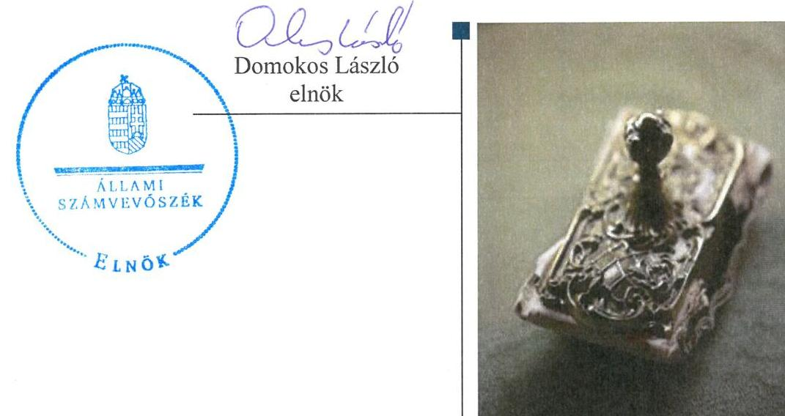

---

Jelentéseink az Országgyúlés számítógépes hálózatán és az Interneten a www.asz.hu címen is olvashatóak.

## AZ ELLENŐRZÉST FELÜGYELTE:

SALAMON ILDIKÓ felügyeleti vezető

## AZ ELLENŐRZÉST VEZETTE ÉS A VÉGREHAJTÁSÁÉRT FELELŐS:

KOVÁTS T. BALÁZS ellenőrzésvezető

## A PROGRAM ÖSSZEÁLLÍTÁSÁÉRT FELELŐS:

JANIK JÓZSEF osztályvezető
BÖRÖCZ IMRE projektfelelős

## A TÉMÁHOZ KAPCSOLÓDÓ KORÁBBI SZÁMVEVŐSZÉKI JELENTÉSEK:

- címe: Jelentés az egészségügyi szakellátások privatizációjának ellenőrzéséről
- sorszáma: 0609
- címe: Jelentés az egyes kórházi tevékenységek kiszervezésének ellenőrzéséről
- sorszáma: 0921
- címe: Jelentés az egynapos sebészeti ellátásra fordított pénzeszközök hasznosulásának ellenőrzéséről
- sorszáma: 1001
- címe: Jelentés a Borsod-Abaúj-Zemplén Megyei Önkormányzat pénzügyi helyzetének ellenőrzéséről $(43 / 2)$
- sorszáma: 1156

IKTATÓSZÁM: V-0771-128/2016.
TÉMASZÁM: 1805
ELLENŐRZÉS-AZONOSÍTÓ SZÁM: V067910

---

# TARTALOMJEGYZÉK 

■ ÖSSZEGZÉS ..... 5
■ AZ ELLENŐRZÉS CÉLJA ..... 7
■ AZ ELLENŐRZÉS TERÜLETE ..... 8
■ AZ ELLENŐRZÉS HÁTTERE, INDOKOLTSÁGA ..... 9
■ FÓKUSZKÉRDÉSEK ..... 10
■ ELLENŐRZÉS HATÓKÖRE ÉS MÓDSZEREI ..... 11
■ MEGÁLLAPÍTÁSOK ..... 14
■ JAVASLATOK ..... 38
■ MELLÉKLETEK ..... 43
I. sz. melléklet: Értelmező szótár ..... 43
II. sz. melléklet: Kiegészítő teljesítmény-ellenőrzési modul megállapításai ..... 48
III. sz. melléklet: A belső kontrollrendszer kialakításának és müködtetésének értékelése a 2011-2014. években ..... 49
IV. sz. melléklet: Az integritás szemlélet érvényesítésével kapcsolatos megállapítások ..... 50
V. sz. melléklet: A kiadási és bevételi előirányzatok és azok teljesítése a 2011-2014. években (M Ft-ban) ..... 51
VI. sz. melléklet: Mérlegadatok a 2011-2014. években (M Ft-ban) ..... 52
■ FÜGGELÉK: ÉSZREVÉTELEK ..... 53
■ RÖVIDÍTÉSEK JEGYZÉKE ..... 83

---

.

---

# ÖSSZEGZÉS 

Az Állami Számvevőszék a 2011-2014. évekre vonatkozóan ellenőrizte a Borsod-AbaújZemplén Megyei Kórház és Egyetemi Oktató Kórház pénzügyi és vagyongazdálkodásának szabályszerűségét.
Az ellenőrzés által feltártak alapján az irányítószervi feladatellátás, a belső kontrollrendszer kialakítása és müködtetése és a vagyongazdálkodás összességében részben szabályszerű volt, míg a pénzügyi gazdálkodás nem volt szabályszerű. A 2014. évben az alapító okirat módosításához nem kérték meg az államháztartásért felelős miniszter előzetes egyetértését, továbbá az SZMSZ nem tartalmazta az alapító okirat keltét, számát és az alapítás időpontját. Az ellenőrzés hiányosságokat tárt fel a közzétételi kötelezettség teljesítése, a kulcskontrollok és a belső ellenőrzés müködése területén. A bevételi és kiadási előirányzatok módosítása, a gazdálkodási jogkörök gyakorlása és a közbeszerzési szabályok betartása nem felelt meg a jogszabályi előírásoknak. A vagyonkezelési szerződés tartalma részben felelt meg a jogszabályi előírásoknak és a módosítására nem minden esetben az előirt határidőben került sor, továbbá a kétévenkénti mennyiségi leltározáshoz nem rendelkezett az irányítószerv engedélyével.

## Az ellenőrzés társadalmi indokoltsága

A közpénzek felhasználásában meghatározó, központi alrendszerbe tartozó intézmények pénzügyi és vagyongazdálkodási tevékenységük és/vagy feladatellátásuk súlya miatt jelentős hatást gyakorolhatnak a költségvetés egyensúlyának fenntartására. Hatással vannak továbbá az állami vagyonnal való gazdálkodás minőségére, a kormányzati (szak)politikák végrehajtására, illetve közfeladat ellátásuk vonatkozásában az állampolgárok életminőségére, jogaik és kötelezettségeik gyakorlására.

Az egészség és ezzel összefüggésben az egészségügyi ellátások színvonala és költsége folyamatosan a társadalmi érdeklődés középpontjában áll. A központi költségvetésből az egyik legjelentősebb kiadást az egészségügyi ellátásokra fordított adóforintok jelentik, amelyekből a kórházak kapják a legtöbb támogatást. Ezért indokolt, hogy az ÁSZ ${ }^{1}$ az egészségügyi intézmények pénzügyi és vagyongazdálkodását, az esetleges átalakulások szabályszerűségét rendszeresen több évre kiterjedően ellenőrizze.

## Főbb megállapítások, következtetések, javaslatok

A 2011. évben az Önkormányzat² Közgyűlése ${ }^{3}$ a jogszabályi előírásoknak megfelelően gyakorolta az irányítószervi feladatait. A 2012-2014. években az egészségügyért felelős miniszter ${ }^{4}$ az irányítószervi feladatait részben gyakorolta a jogszabályi előírásoknak megfelelően. Az egészségügyért felelős miniszter a 2014. évben az alapító okirat módosításához nem kérte meg az államháztartásért felelős miniszter ${ }^{5}$ előzetes egyetértését, továbbá az SZMSZ nem tartalmazta az alapító okirat keltét, számát és az alapítás időpontját.

A Kórház ${ }^{6}$ belső kontrollrendszerének kialakítása és működtetése összességében részben szabályszerű volt. Ezen belül a kontrollkörnyezet és a kockázatkezelési rendszer szabályszerű volt, a kontrolltevékenység, az információs és kommunikációs rendszer részben szabályszerű volt, míg a monitoring rendszer kialakítása és működése nem volt szabályszerű. A Kórház a közzétételi kötelezettségének nem teljes körűen tett eleget, illetve a kulcskontrollok ellenőrzése és a belső ellenőrzés működése során az ellenőrzés hiányosságokat tárt fel.

---

Az intézmény pénzügyi gazdálkodása nem volt szabályszerű. Az elemi költségvetés kialakítása és az előirányzatok megállapítása során betartották a jogszabályi előírásokat, azonban a bevételi és kiadási előirányzatok módosítása nem felelt meg a jogszabályi előírásoknak. A bevételi előirányzatok teljesítése és a kiadási előirányzatok felhasználása során a gazdálkodási jogkörök gyakorlása és a közbeszerzési szabályok betartása nem felelt meg a jogszabályi előírásoknak. Az előirányzat-maradvány megállapítása, felhasználása megfelelt a jogszabályi előírásoknak. A folyamatos fizetőképesség a 2011-2012. években a kapott póttámogatás révén volt biztosított, míg a 2013-2014. években figyelembe véve a lejárt szállítói tartozások nagymértékű növekedését - nem volt biztosított. A pénzügyi egyensúly a Kórház által hozott takarékossági intézkedések és esetenként kapott pótlólagos támogatás révén volt fenntartható. Az államháztartásért felelős miniszter ${ }^{7}$ a 2012. évben a jogszabályban foglaltak ellenére a Kórházhoz kincstári biztost nem jelölt ki.

A Kórház vagyongazdálkodása részben szabályszerű volt. A vagyonkezelési szerződés tartalma részben felelt meg a jogszabályi előírásoknak, a módosítására nem minden esetben az előírt határidőben került sor, aláírását követően a vagyonkezelői jog bejegyzését az ingatlan nyilvántartásba nem kezdeményezték határidőben. A mérlegben kimutatott eszközök és források nyilvántartása megfelelt, míg értékelése - a követelések után elszámolt értékvesztések hiányosságai miatt - részben felelt meg a jogszabályi előírásoknak. A leltárt az éves költségvetési beszámoló elkészítéséhez, a mérleg tételeinek alátámasztásához összeállították. A Kórház a leltározási szabályzatában meghatározott eszközcsoportok két évenkénti mennyiségi leltározásához nem kérte a felügyeleti szerv egyetértését. A Kórház a selejtezési feladatokat szabályszerűen hajtotta végre, továbbá az értékmegőrzési, állagmegóvási kötelezettségét a jogszabály, az intézményi megállapodás ${ }^{8}$, illetve a vagyonkezelői szerződés előírásai szerint teljesítette. A vagyonelemek hasznosítása során a 2012-2014. években az átláthatóság jogszabályi követelményének érvényesüléséről nem győződött meg. Az eredményszemléletű számvitel bevezetésével kapcsolatos feladatok végrehajtása részben felelt meg a jogszabályi előírásoknak.

A kórházak integrációjával, valamint a telephelyek és feladatok átadásával kapcsolatos irányítószervi döntések, az integrációkhoz és telephely átadásokhoz kapcsolódó intézményi feladatok végrehajtása megfelelt a jogszabályi előírásoknak.

A Kórház az integritás szemlélet érvényesítése érdekében több intézkedést is tett.
Az ÁSZ az emberi erőforrások miniszterének, az Állami Egészségügyi Ellátó Központ főigazgatójának, és a Kórház főigazgatójának fogalmazott meg javaslatokat, amelyekre 30 napon belül intézkedési tervet kell készíteniük.

---

# **AZ ELLENŐRZÉS CÉLJA**

## **Borsod-Abaúj-Zemplén Megyei Kórház és Egyetemi Oktató Kórház pénzügyi és vagyongazdálkodásának ellenőrzése**

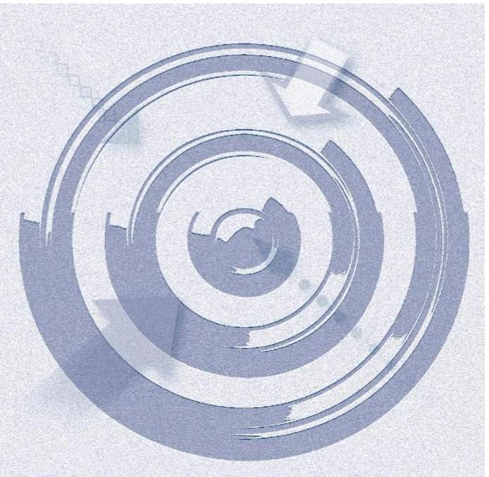

Az ellenőrzés célja annak megítélése volt, hogy az ellenőrzött intézményre vonatkozó irányító szervi feladatellátás a jogszabályi előírások betartásával történt-e; az intézménynél a belső kontrollrendszer kialakítása és működtetése szabályszerű volt-e; kialakították-e az erőforrásokkal való szabályszerű, gazdaságos, hatékony és eredményes gazdálkodáshoz szükséges követelményeket, megvalósították-e azok számonkérését, ellenőrzését; az intézmény pénzügyi és vagyongazdálkodása megfelelt-e a jogszabályi előírásoknak és belső szabályzatainak; az intézmény átalakításának vagy átszervezésének lebonyolítása szabályszerűen történt-e. Az intézmény korrupcióval szembeni veszélyeztetettségének csökkentése érdekében felmértük az integritási szemlélet érvényesülését a gazdálkodási folyamatokban.

A kiegészítő teljesítményellenőrzés célja annak értékelése volt, hogy a gazdálkodás folyamatában a gazdaságossági, hatékonysági és eredményességi követelmények kialakítása megtörtént-e, azokat működtették-e, a célkitűzéseket elérték-e; a pénzügyi és vagyongazdálkodás folyamataira vonatkozóan a költségvetési szerv belső kontrollrendszerének minőségéről kiadott vezetői nyilatkozatban a költségvetési szerv tevékenységében a hatékonyság, eredményesség, gazdaságosság követelményeinek érvényesítésére vonatkozó nyilatkozat helytálló volt-e.

---

# **AZ ELLENŐRZÉS TERÜLETE**

## **Borsod-Abaúj-Zemplén Megyei Kórház és Egyetemi Oktató Kórház**

A Kórház a régió legnagyobb ágyszámú és esetszámú egészségügyi intézménye, három városban (Miskolcon, Mezőkövesden és Szikszón) működtet fekvőbeteg ellátást. A Kórház közfeladata – a működését meghatározó Eütv.9 alapján – a járó és fekvőbetegek diagnosztikus és terápiás szakorvosi ellátása, rehabilitációja és követéses gondozása. A 2014. évben az összesített ágyszám 1434 aktív és 583 krónikus ágy volt, közel 70 ezer fekvőbeteget láttak el, míg a rendelőintézetekben az éves betegforgalom meghaladta az 1 millió főt.

A Kórház önálló jogi személyiséggel rendelkező, önállóan működő és gazdálkodó, az előirányzatok felett teljes jogkörrel rendelkező költségvetési szerv. Az irányító szervi hatásköröket 2011. december 31-éig a Közgyűlés, míg 2012. január 1-jétől a Minisztérium10, az egyes fenntartói, valamint az irányítási, középirányítói jogokat a GYEMSZI11 gyakorolta. A tulajdonosi jogkört 2011. január 1-je és 2011. december 31. között a Közgyűlés, 2012. január 1-je és 2012. április 30. között a z MNV Zrt., míg 2012. május 1. és 2014. december 31. között pedig a GYEMSZI gyakorolta.

A Kórház felépítése három alkalommal változott, a Közgyűlés 2011. május 1-jével a Kórházba olvasztotta a II. Rákóczi Ferenc Kórházat (Szikszó), a Szent Ferenc Rehabilitációs Kórházat (Miskolc), a Mozgásszervi Rehabilitációs Központot (Mezőkövesd), valamint a Pszichiátriai Szakkórházat és Betegotthont (Izsófalva). A Pszichiátriai Szakkórház és Betegotthon telephely 2012. november 1-jével, a Szent Ferenc Rehabilitációs Kórház telephely 2013. november 1-jével kivált a Kórházból. A főigazgató12 és a gazdasági igazgató13 személyében nem történt változás. A Kórház átlagos statisztikai állományi létszáma 2011-ben 2594 fő, 2014-ben pedig 2722 fő volt.

2011. december 31-től 2014. december 31-ig a Kórház könyvviteli mérleg szerinti vagyona (a "*Csillagpont Kórház*" projekt következtében) 12 044,4 M Ft-ról 24 881,1 M Ft-ra (több mint kétszeresére), a kötelezettségek állománya 1772,1 M Ft-ról 3612,8 M Ft-ra (szintén több mint kétszeresére) emelkedett. A teljesített költségvetési bevétele – irányító szervi támogatással, maradvány igénybevétele nélkül – a 2011. évi 19 841,3 M Ft-ról a 2014. évre 25 297,9 M Ft-ra, 27,5%-kal nőtt. A teljesített költségvetési kiadások a 2011. évi 19 235,1 M Ft-ról a 2014. évre 25 266,2 M Ft-ra, 31,4%-kal emelkedtek.

Az előző évi maradvány igénybevételét is figyelembe véve a Kórháznak a 2011. évben 1018,1 M Ft, a 2012. évben 783,5 M Ft, a 2013. évben 342,5 M Ft, a 2014. évben 374,2 M Ft költségvetési többlete keletkezett.

---

# AZ ELLENŐRZÉS HÁTTERE, INDOKOLTSÁGA 

A központi alrendszer egyes intézményei pénzügyi és vagyongazdálkodásának ellenőrzése.

## Hasznosulás

Az Alaptörvény ${ }^{14}$ rendelkezése szerint a nemzeti vagyon megőrzésének, védelmének és a nemzeti vagyonnal való felelős gazdálkodásnak a követelményeit sarkalatos törvény, az Nvtv. ${ }^{15}$ rögzíti. A tulajdonosi joggyakorlás és vagyonkezelés általános és speciális szabályait, az állami vagyon nyilvántartására és elszámolására vonatkozó eljárásokat, a vagyonkezelési szerződés feltételrendszerét, valamint az éves beszámoló készítési és könyvvezetési kötelezettségeket kormányrendelet írja elő.

A központi alrendszer egyes intézményei közfeladat-ellátásának változásait, a közfeladatok átadásából és átvételéből adódó módosításait, előirányzat gazdálkodására ható tényezőit az Áht. ${ }^{16}$ 11. §-a és az Ávr. ${ }^{17}$ 14. §a írja elő. A közfeladatok megszűnéséből, intézmény átszervezéséből, belső szerkezeti korszerűsítéséből, vagy más hasonló okból adódó módosításai miatt szerepeltetendő szerkezeti változásokat, valamint a szerkezeti változásként beépült közfeladatok szintre hozásként történő számításba vételét az Ávr. 15. § (2)-(3) bekezdései határozzák meg.

A társadalmi igénnyel összhangban az Áht. ${ }^{18}$ és Áht. ${ }_{2}$ az Ámr. ${ }^{19}$ és a Bkr. ${ }^{20}$ is előírja a költségvetési szerv részére, hogy olyan szabályozásokat, eljárásokat, folyamatokat alakítson ki, amelyek biztosítják a múködés, gazdálkodás, az erőforrások felhasználása során a gazdaságosság, hatékonyság és eredményesség érvényesülését.

AZ ELLENŐRZÉS EREDMÉNYEKÉPPEN nemcsak az ellenőrzött intézmények gazdálkodása javulhat, hanem átfogó képet kaphatunk a központi alrendszerbe tartozó költségvetési szervek gazdálkodásának hiányosságairól, de a jó gyakorlatokról is. Ellenőrzéseivel, javaslataival és megállapításaival az ÁSZ elősegítheti a költségvetési szervek pénzügyi és vagyongazdálkodása szabályozásának javítását és hozzájárulhat a jó kormányzáshoz.

---

# FÓKUSZKÉRDÉSEK 

1.     - Az irányító szerv ellenőrzött intézményre vonatkozó feladatellátása szabályszerű volt-e?
2.     - A belső kontrollrendszer kialakítása és müködtetése megfelelt-e a jogszabályi előírásoknak?
3.     - Az intézmény pénzügyi gazdálkodása szabályszerű volt-e?
4.     - Az intézmény vagyongazdálkodása szabályszerű volt-e?
5. Szabályszerűen hajtották-e végre az ellenőrzött időszakban az intézményt érintő szervezeti, szerkezeti átalakításokat?
6. Az intézmény intézkedett-e az integritás szemlélet érvényesítése érdekében?

---

# ELLENŐRZÉS HATÓKÖRE ÉS MÓDSZEREI 

## Az ellenőrzés típusa

Szabályszerúségi és teljesítmény ellenőrzés.

## Az ellenőrzött időszak

Az ellenőrzött időszak 2011. január 1-jétől 2014. december 31-ig tartott.

## Az ellenőrzés tárgya

Az ellenőrzött szervezetre vonatkozó irányító szervi feladatok ellátása. Az intézmény belső kontrollrendszerének kialakítása és múködtetése, valamint pénzügyi és vagyongazdálkodása. Az erőforrásokkal való szabályszerű, gazdaságos, hatékony és eredményes gazdálkodáshoz szükséges követelmények kialakítása, a kialakított követelmények számonkérése, ellenőrzése. Az intézmény átalakítása, átszervezése lebonyolításának szabályszerűsége. A gazdálkodás folyamatában a gazdaságossági, hatékonysági és eredményességi követelmények kialakítása és múködtetése, a célkitűzések elérésének értékelése, ezek érvényesítéséről kiadott vezetői nyilatkozat helytállósága a pénzügyi és vagyongazdálkodás folyamataira vonatkozóan.

Az ellenőrzés kiterjedt minden olyan körülményre és adatra, amely az ÁSZ jogszabályban meghatározott feladatainak teljesítéséhez, valamint a program végrehajtása folyamán felmerült újabb összefüggések feltárásához szükséges.

## Az ellenőrzött szervezet

Borsod-Abaúj-Zemplén Megyei Kórház és Egyetemi Oktató Kórház, Bor-sod-Abaúj-Zemplén Megyei Önkormányzat, Állami Egészségügyi Ellátó Központ (Gyógyszerészeti és Egészségügyi Minőség- és Szervezetfejlesztési Intézet), Emberi Erőforrások Minisztériuma (Nemzeti Erőforrás Minisztérium).

Az ellenőrzésre a központi alrendszer ellenőrzött intézményének és irányító/felügyeleti szervének, illetve középirányító szervének székhelyén, telephelyén, a gazdálkodási feladatait ellátó szervezetének székhelyén került sor.

---

# Az ellenőrzés jogalapja 

Az ellenőrzés jogszabályi alapját az ÁSZ tv ${ }^{21}$. 1. § (3) bekezdésének, az 5. § (2)-(7) bekezdéseinek, az Áht. 2 61. § (2) bekezdésének, valamint az Alaptörvény Állam fejezet 43. cikk (1) bekezdésének előírásai képezték.

## Az ellenőrzés módszerei

Az ellenőrzést az ellenőrzési program szempontjai, az ellenőrzött időszakban hatályos jogszabályok, az ellenőrzés szakmai szabályai, az egyes ellenőrzési típusokhoz kapcsolódó ÁSZ módszertanok és nemzetközi standardok figyelembevételével végeztük. A gazdálkodás hibáinak kijavítására, a közpénzekkel való felelős gazdálkodás segítésére irányuló javaslatok kidolgozásakor a hatályos jogszabályok az irányadóak.

Az ellenőrzés ideje alatt az ellenőrzött szervezettel történő kapcsolattartást az ÁSZ SZMSZ ${ }^{22}$-ének vonatkozó előírásai alapján biztosítottuk.

Az ellenőrzési kérdések megválaszolásához szükséges bizonyítékok megszerzése a következő ellenőrzési eljárások alkalmazásával történt: megfigyelés, szemle (szemrevételezés), kérdésfeltevés (információkérés), mintavételezés, valamint elemző eljárás. A minták kiválasztása során elsősorban reprezentativitást biztosító véletlen mintavételi eljárást alkalmaztunk.

Az ellenőrzési bizonyítékként felhasználható adatforrások közé tartoztak a szakmai program részletes szempontjainál felsorolt adatforrások.

Az ellenőrzés lefolytatásához az intézmény a tanúsítványok elektronikus kitöltésével, valamint az ÁSZ által kért dokumentumok elektronikus megküldésével szolgáltatott adatokat. A rendelkezésre bocsátott adatok, információk kontrollja az ellenőrzés keretében történt.

Az ellenőrzési kérdésekre adott válaszok alapján értékeltük, hogy az ellenőrzött időszakban az irányító szerv az ellenőrzött intézményre vonatkozó feladatainak szabályszerűen eleget tett-e, az intézmény pénzügyi és vagyongazdálkodása megfelelt-e az előírásoknak, az intézmény átalakításának vagy átszervezésének végrehajtása szabályszerű volt-e. Értékeltük, hogy az intézménynél kialakították-e az erőforrásokkal való szabályszerű és hatékony gazdálkodáshoz szükséges követelményeket, megvalósították-e azok számonkérését, ellenőrzését.

Az intézmény belső kontrollrendszere jogszabályi előírások szerinti kialakításának és működtetésének szabályszerűségét az erre irányuló ellenőrzési kérdésekre adott válaszok összesítése alapján, évente pillérenként (kontrollkörnyezet, kockázatkezelési rendszer, kontrolltevékenységek, információs és kommunikációs rendszer, monitoring rendszer) és összesítetten is minősítettük. Az intézmény belső kontrollrendszere egyes pilléreinek kialakítása és müködtetése „szabályszerü" volt, amennyiben az értékelt területen az elért és elérhető pontok százalékban kifejezett, egész számra kerekített hányadosa meghaladta a $84 \%$-ot, „részben szabályszerű" volt, ha a $84 \%$-ot nem haladta meg, de $60 \%$-nál nagyobb volt, „nem szabályszerű" volt, ha nem haladta meg a $60 \%$-ot. Az intézmény belső kontrollrendszerének összesített értékelése megegyezett a pillérenként (kontrollterületenként) alkalmazott \%-os értékelésekkel, a következő eltérésekkel.

---

A kontrollrendszer egésze esetében a „szabályszerü" értékelésnek a \%-os értéken felül további feltétele volt, hogy egyik kontrollterület sem kaphatott „nem szabályszerü" értékelést, a „részben szabályszerü" értékelés további feltétele volt, hogy legfeljebb egy ellenőrzött kontrollterület lehetett „nem szabályszerű" értékelésű. Az összesített értékelés a \%-os értéktől függetlenül „nem szabályszerű" volt, ha az ellenőrzött kontrollterületek közül több mint egynek „nem szabályszerű" volt az értékelése.

A Kórház a 2014. évben részt vett az ÁSZ integritás felmérésében. Az integritás szemlélet érvényesülésének értékelése az intézmény által kitöltött rövid kérdőív alapján történt.

A tárgyi eszközök nyilvántartásba vételének, a közbeszerzési eljárások lefolytatásának, a vagyonhasznosítási bevételi előirányzatok teljesítésének, az előirányzatok módosításának és az előirányzat-maradvány megállapításának, valamint a gazdálkodási jogkörök gyakorlásának szabályszerűségét mintavétellel ellenőriztük. A jogszabályoknak és a belső előírásoknak megfelelőnek, azaz szabályszerűnek tekintettük a tárgyi eszközök nyilvántartásba vételét, a közbeszerzési eljárások lefolytatását, a vagyonhasznosítási bevételi előirányzatok teljesítését, az előirányzatok módosítását és az előirányzat-maradvány megállapítását, amennyiben a minta ellenőrzésének eredménye alapján 95\%-os bizonyossággal a teljes sokaságban a hibás tételek aránya kisebb volt, mint 10\%, nem megfelelőnek értékeltük, ha a hibás tételek aránya a 10\%-ot meghaladta.

A 2011. évet érintően a szakmai teljesítésigazolás és az utalvány ellenjegyzése kulcskontrollok, a 2012-2014. éveket érintően a teljesítésigazolás és az érvényesítés kulcskontrollok működését értékeltük. Megfelelőnek értékeltük a gazdálkodási jogkörök gyakorlását, amennyiben 95\%-os bizonyossággal a teljes sokaságban a hibás tételek aránya legfeljebb 10\% volt, részben megfelelőnek, ha a hibás tételek arányának felső határa legfeljebb 30\% volt, nem megfelelőnek, ha a hibás tételek sokaságbeli arányának felső határa meghaladta a 30\%-ot.

---

# 1. Az irányító szerv ellenőrzött intézményre vonatkozó feladatellátása szabályszerű volt-e? 

## Összegző megállapítás

### 1.1. számú megállapítás

## Az irányító szervek feladatellátása részben felelt meg a jogszabályi előírásoknak.

Az intézményalapítással kapcsolatos jogosultságok gyakorlása részben felelt meg a jogszabályokban előírtaknak.

A Kórházat érintően az irányító szervi hatásköröket 2011. december 31-éig az Önkormányzat Közgyűlése gyakorolta. Az államháztartás önkormányzati alrendszeréből a központi alrendszerbe történt átsorolást követően, 2012. január 1-jétől az irányító szervi hatásköröket a Minisztérium, az egyes fenntartói, valamint az irányítási, középirányítói jogokat a GYEMSZI gyakorolta.

A Kórház rendelkezett a jogszabályi előírásoknak megfelelő alapító okirattal, melyet 2011-ben a Közgyűlés határozattal fogadott el, 20122014. években az egészségügyért felelős miniszter adott ki. Az alapító okirat tartalma megfelelő a jogszabályi előírásoknak, tartalmazta többek között az irányítói jogok gyakorlására jogosultak megjelölését. A Kórház 2009-ben kiadott alapító okiratát a Közgyűlés 2011-ben - a beolvadó intézmények miatt - határozattal módosította. Az egészségügyért felelős miniszter - az alrendszer váltást követően - 2012. január 1-jei hatállyal új alapító okiratot adott ki, majd 2014. január 1-jei hatállyal (a kormányzati funkció megjelölése miatt) sor került az alapító okirat módosítására. A Pszichiátriai Szakkórház 2012. november 1-jei és a Szent Ferenc Rehabilitációs Kórház 2013. november 1-jei átadását követően az alapító okirat - az Ávr. 5. § (1) bekezdés a) pontjában előírtak ellenére - továbbra is tartalmazta telephelyként a két intézményt.

Az egységes szerkezetű okiratot 2011-2013-ban elkészítették, azonban a 2014-es módosítást - az Ávr. 5. § (4) bekezdésében előírtak ellenére nem foglalták egységes szerkezetbe és nem csatolták a módosító okirathoz. Az alapító okirat 2014. évi módosításához - az Áht. 2 8. § (7) bekezdésében előírtak ellenére - nem kérték meg az államháztartásért felelős miniszter előzetes egyetértését.

A Kórház rendelkezett az irányító szervek által jóváhagyott SZMSZ ${ }^{23}$ szel. A 2011-ben végrehajtott intézményi összevonások (kórház beolvadások) miatt módosított SZMSZ-t - átruházott hatáskörben - az Önkormányzat Egészségügyi Bizottsága jóváhagyta. A 2012-2014. években a szervezeti és feladatváltozások, illetve a kormányzati funkció megjelölése miatt módosított SZMSZ-t a GYEMSZI jóváhagyta. Az SZMSZ a 2011. évben a jogszabályi előírásnak megfelelően tartalmazta az alapító okirat keltét, számát és az alapítás időpontját, azonban a 2012-2014. években - az Ávr. 13. § (1) bekezdés b) pontjában előírtak ellenére - az SZMSZ nem tartalmazta az alapító okirat keltét, számát és az alapítás időpontját.

---

### 1.2. számú megállapítás

A közfeladatok ellátására vonatkozó, az erőforrásokkal való szabályszerű gazdálkodáshoz szükséges követelményeket az irányítószervek érvényesítették és számon kérték. Azonban a hatékony gazdálkodáshoz szükséges követelményeket nem alakították ki és nem ellenőrizték.

A Közgyűlés és a GYEMSZI a közfeladatok ellátására vonatkozó, az erőforrásokkal való szabályszerű gazdálkodáshoz szükséges követelményeket érvényesítette, számon kérte. A szabályszerű gazdálkodáshoz szükséges követelmények kialakítása és számonkérése többek között a költségvetés tervezésének és a beszámoltatás rendjének biztosításával valósult meg. A Közgyűlés és a GYEMSZI a pénzügyi helyzetről rendszeres beszámolási kötelezettséget írt elő a Kórháznak. A Minisztérium a jogszabályban előírt ellenőrzési jogosultságait szabályszerűen gyakorolta, míg a Közgyűlés és a GYEMSZI részben gyakorolta szabályszerűen.

Az erőforrásokkal való gazdálkodás szabályszerűségi követelményeit az Önkormányzat Közgyűlése rendeletekben, határozatokban rögzítette. A Közgyűlés - a vagyongazdálkodási rendeletében - a Kórház részére vagyongazdálkodási követelményeket határozott meg. Az előirányzatok, pénzügyi erőforrások, létszám felhasználására vonatkozó követelményeket a Közgyűlés költségvetési rendelete tartalmazta. A GYEMSZI levélben tájékoztatta a Kórházat az állami fenntartásba kerüléssel kapcsolatos változásokról, a középirányító szerv feladatkörének bővüléséről, a vagyonkezelői feladatok ellátásáról, a stratégiai együttműködésről, az új adatszolgáltatási rendszer működtetéséről, a kapcsolattartás módjáról. További körleveleiben szabályokat határozott meg a gazdálkodás több területére vonatkozóan. A jóváhagyási jogkörök irányítószervi gyakorlása megfelelt a jogszabályi előírásoknak, az intézmény költségvetését és beszámolóját 2011-ben a Közgyűlés, 2012-2014. években a Minisztérium hagyta jóvá.

Az Önkormányzat belső ellenőrzése 2011-ben a gazdálkodás szabályszerűségével kapcsolatos témaellenőrzést végzett a Kórháznál. A GYEMSZI 2013-ban ellenőrizte a Kórház szabályzatainak meglétét, valamint a gazdálkodásra vonatkozó célellenőrzéseket végzett. Azonban az irányító szervek által lefolytatott külső ellenőrzések a közfeladatok ellátására, illetve az erőforrásokkal való hatékony gazdálkodás ellenőrzésére nem terjedtek ki. A Közgyűlés - az Áht. 149. § (5) bekezdés e) pontjában foglalt előírás ellenére - a 2011. évben nem ellenőrizte az államháztartással összefüggő közérdekű és közérdekből nyilvános adatok kötelező közzétételét, illetve igényre történő szolgáltatásának végrehajtását. A 2011. évben a Közgyűlés az Áht. 149 . § (5) bekezdés f) pontjában foglaltak ellenére, míg a 20122014. években a GYEMSZI az 59/2011. (IV. 12.) Korm. rendelet ${ }^{24}$ 2/A. § a) pontjában és az Áht. 2 9. § (1) bekezdés f) pontjában foglaltak ellenére nem érvényesítette, kérte számon és ellenőrizte az előirányzatokkal, létszámokkal és vagyonnal való hatékony gazdálkodás követelményeit, mivel a Kórháznál mérhető követelményeket nem határozott meg. A GYEMSZI 2014-ben ellenőrizte a „Csillagpont Kórház" projekt megvalósítását, melynél legfőbb hiányosságként a közbeszerzési szabályok megsértését állapította meg.

---

# 1.3. számú megállapítás 

A Kórházzal kapcsolatos egyéb ellenőrzési, irányítási és felügyeleti jogosultságok gyakorlása szabályszerűen történt.

Az Önkormányzat Közgyűlése és a GYEMSZI rendszeresen figyelemmel kísérte a Kórház bevételi és kiadási előirányzatokkal való gazdálkodását. A 2011. évben a Közgyűlés, a 2012-2014. években a Minisztérium jóváhagyta a Kórház beszámolóit (elemi költségvetési féléves és éves beszámolókat, az előirányzat teljesítéséről készített kimutatásokat). A Minisztérium az előirányzat módosításokról, a maradvány jóváhagyásokról, a létszám módosításokról, a bérkompenzáció elszámolásáról az ellenőrzött időszakban értesítő leveleket küldött a Kórháznak.

A főigazgató és gazdasági igazgató Közgyűlés általi kinevezése az ellenőrzött időszakot megelőzően történt, 2011-ben nem történt változás. A 2012. évben a Kórház korábbi főigazgatóját és gazdasági igazgatóját a jogszabályi előírásoknak megfelelően a Miniszter bízta meg. Az irányító szervek a szakmai tevékenységről önálló beszámolót nem kértek, az éves beszámolók szöveges indokolása tartalmazott szakmai beszámolót is, melyet felülvizsgáltak és jóváhagytak.

## 2. A belső kontrollrendszer kialakítása és múködtetése megfelelte a jogszabályi előírásoknak?

## Összegző megállapítás

2.1. számú megállapítás
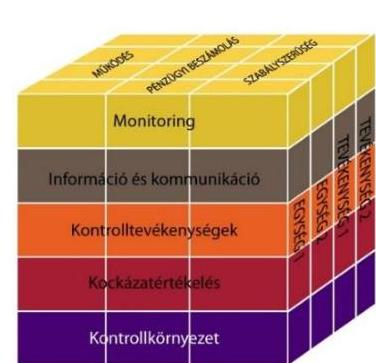

## A belső kontrollrendszer kialakítása és múködtetése részben felelt meg a jogszabályi előírásoknak.

A belső kontrollrendszer kialakítása és múködtetése szabályszerűségének értékelését a III. számú melléklet tartalmazza.

## A Kórház a kontrollkörnyezetét - a feltárt hiányosságoktól eltekintve - a jogszabályi előírásoknak megfelelően alakította ki.

A Kórház a vonatkozó előírások alapján elkészítette és folyamatosan aktualizálta az SZMSZ-t. A szabályzat azonban - az Ámr. 20. § (2) bekezdés e) pontjának, valamint az Ávr. 13. § (1) bekezdés e) pontjának előírása ellenére - nem tartalmazta a gazdasági szervezet megnevezését és a szervezeti egységek engedélyezett létszámát.

A Kórház gazdasági szervezete rendelkezett ügyrenddel, amely nem tartalmazta - az Ámr. 20. § (7) bekezdés, illetve az Ávr. 13. § (5) bekezdés előírása ellenére - az alkalmazottak hatáskörét, a belső kapcsolattartás módját és szabályait, valamint részben tartalmazta a külső kapcsolattartás módját, szabályait, mert az irányító szerveken és a Kincstáron ${ }^{25}$ kívül a többi külső gazdálkodó szervezettel való kapcsolattartás módját, szabályait nem határozta meg.

A Kórház a belső szabályzataiban - az alábbi hiányosságoktól eltekintve - a jogszabályi előírásoknak megfelelően határozta meg a pénz- és vagyongazdálkodással kapcsolatos folyamatokat, feladat- és hatásköröket, felelősségi viszonyokat. A Kórház számviteli politikáját a Sztv. ${ }^{26}$ előírásainak megfelelően évente felülvizsgálták, és szükség szerint aktualizálták, azonban a Sztv. 14. § (4) bekezdésének előírása ellenére nem rögzítették benne, hogy a számviteli elszámolás, az értékelés szempontjából mit tekintenek lényegesnek, nem lényegesnek. A Kórház rendelkezett a jogszabályi

---

# Megállapítások 

előírásoknak megfelelő és aktualizált számlarenddel, bizonylati renddel, leltározási szabályzattal, pénzkezelési szabályzattal, valamint önköltség számítási szabályzattal. A selejtezés végrehajtásának rendjét selejtezési szabályzatban határozták meg. Az eszközök és források értékelési szabályzata 2014. június 2 -ától - az Áhsz. ${ }^{27}$ 50. § (2) bekezdés b) pontjában foglaltak ellenére - nem tartalmazta követeléstípusonként a kisösszegű követelések év végi meghatározásának elveit, dokumentálásának szabályait.

A gazdálkodás részletes rendjét meghatározó gazdálkodási szabályzat megfelelt az Áht.1,2, az Ámr. és az Ávr. előírásainak. A Kórház közbeszerzési szabályzata megfelelt a Kbt. ${ }^{28}$-ben és Kbt. ${ }^{29}$-ben előírtaknak. A Kórház rendelkezett - az Ámr. és a Bkr. előírásainak megfelelő tartalmú - ellenőrzési nyomvonallal, valamint szabálytalanság kezelési eljárásrenddel.

## 2.2. számú megállapítás

## A kockázatkezelési rendszer kialakítása és múködtetése összességében szabályszerű volt.

A Kórházban az Ámr.-ben, valamint a Bkr.-ben foglaltaknak megfelelően meghatározták a kockázatkezelés rendjét.

Az SZMSZ előírása szerint a Kórház szervezeti egységeinek vezetői az irányításuk alá tartozó területen a kockázatkezelési rendszer kialakításához elkészítették kockázatkezelési szabályzataikat, meghatározták a kockázatok azonosításával, elemzésével, csoportosításával, kitettségük csökkentésével kapcsolatos szabályokat, felmérték a szervezeti egység tevékenységében, gazdálkodásában rejlő kockázatokat, azok lehetséges megnyilvánulását, hatását, valószínűségét és kezelésének tervezett módját. A kockázatkezelési rendszer múködtetése megfelelt a jogszabályi előírásoknak. Azonban a szervezeti egységenként meghatározott kockázatelemzések intézményi szintű összesítését, valamint az intézményi kockázatminősítési javaslatot és a hozzá kapcsolódó intézkedési tervet - az SZMSZ 10. sz. melléklet I/2. pontjában előírtak ellenére - nem készítették el, és nem terjesztették a főigazgató elé.

A vagyonnyilatkozat-tételre kötelezettek körét az SZMSZ-ben rögzítették, a Kórháznál alkalmazott eljárás a Vnytv. ${ }^{30}$-ben előírtaknak megfelelően történt.

## 2.3. számú megállapítás

## A kontrolltevékenységgel kapcsolatos szabályozási kereteket kialakították, azonban a kontrolltevékenységek részben feleltek meg a jogszabályi előírásoknak.

A Kórháznál kiadott gazdálkodási szabályzatban meghatározták a kötelezettségvállalás, a kötelezettségvállalás ellenjegyzése, a teljesítésigazolás, az érvényesítés, az utalványozás és az utalványozás ellenjegyzése gyakorlásának módjával, eljárási és dokumentációs részletszabályaival, valamint az ezeket végző személyek kijelölésének rendjével kapcsolatos belső előírásokat. Az operatív gazdálkodási jogkörökre a kijelöléseket, felhatalmazásokat az arra jogosultak írásban adták ki. Azonban az előirányzatok felhasználásánál a kulcskontrollok múködésének ellenőrzése során hiányosságokat tapasztaltunk, ami a folyamatba épített, illetve a vezetői ellenőrzés nem megfelelő múködésére vezethető vissza. Ezért a költségvetési gazdálkodás során az előzetes és utólagos pénzügyi ellenőrzés, a pénzügyi dön-

---

tések szabályszerűségi szempontból történő jóváhagyása, illetve ellenjegyzése - az Áht.: 121/A. § (4) bekezdés c) pontjában, valamint a Bkr. 8. § (2) bekezdés c) pontjában előírtak ellenére - nem volt megfelelő.

A Kórháznál iratkezelési szoftvert nem használtak. Az informatikai rendszer szabályozása során kialakították az adatok biztonságának, védelmének érvényre juttatásához szükséges eljárási szabályokat.

# 2.4. számú megállapítás 

Az információs és kommunikációs folyamatok kialakítása a jogszabályi előírásoknak összességében részben felelt meg.

A szervezeten belüli információáramlás rendszerét - az Ámr.-ben és a Bkr.ben előírtakkal összhangban - kialakították. A külső információáramlás biztosításával kapcsolatos feladatokat a szervezeti egységek múködési rendjében rögzítették. A Kórház rendelkezett az Avtv. ${ }^{31}$ és az Info tv. ${ }^{32}$ által előírt adatvédelmi és adatbiztonsági szabályzattal.

A 2011-2013. években - az Avtv. 20. § (8) bekezdésében, az Info tv. 30. § (6) bekezdésében és 35. § (3) bekezdésében, az Ámr. 20. § (3) bekezdés i) pontjában, az Ávr. 13. § (2) bekezdés h) pontjában előírtak ellenére - nem szabályozták a közérdekú adatok megismerésére irányuló kérelmek intézésének, továbbá a kötelezően közzéteendő adatok nyilvánosságra hozatalának rendjét. A hiányosságokat a 2014. évben megszüntették.

A Kórház a közérdekú adatok közzétételére vonatkozó kötelezettségének - az Eitv. ${ }^{33}$ 3. § (2) bekezdésében és az Info tv. 33. § (1) és (3) bekezdéseiben előírtak ellenére - nem tett eleget. A 2011. évben előfordult, hogy a Kórház az 5 M Ft-ot meghaladó értékű szolgáltatási szerződéseket - az Áht.: 15/B. § (1) bekezdésében, illetve az Eitv. tv. 1. mellékletében lévő általános közzétételi listának megfelelően a III. Gazdálkodási adatok 4. pontjában foglaltak ellenére - nem minden esetben tette közzé. A 20112014. években nem tette közzé - az Eitv. és az Info tv. 1. mellékletében lévő általános közzétételi listának megfelelően a III. Gazdálkodási adatok 1. pontjában foglaltak ellenére - az éves költségvetéseket.

A Kórház rendelkezett iratkezelési szabályzattal, amelyhez azonban az Ltv. ${ }^{34}$ 10. § (1) bekezdés a) pontjában foglaltak ellenére az illetékes közlevéltár egyetértésével nem rendelkezett.

A Kórház az iratok iktatásával, az iratforgalom dokumentálásával biztosította, hogy az ügyintézés folyamata, az iratok szervezeten belüli útja pontosan követhető és ellenőrizhető, az iratok holléte naprakészen megállapítható legyen.
2.5. számú megállapítás

A monitoring-rendszer múködése, a rendelkezésre álló források gazdaságos, hatékony és eredményes felhasználását biztosító követelmények kialakítása és alkalmazása a jogszabályi előírásoknak nem felelt meg.

A Kórház az operatív tevékenységek folyamatos és eseti nyomon követésére intézményi szintű, szabályozott rendszert nem alakított ki és nem múködtetett. A Kórháznál monitoring tevékenységet végző kontrolling csoport kizárólag a betegellátás területére vonatkozóan végzett monitoring tevékenységet, a többi - köztük a pénzügyi gazdálkodási - területen monitoring tevékenységet nem végeztek, a monitoring információk alapján jelentések, feljegyzések kizárólag a betegellátás területéről készültek. Ezért

---

az operatív tevékenységek folyamatos és eseti nyomon követési rendszerének kialakítása és működtetése részben felelt meg az Ámr. 160. § (2) bekezdésében és a Bkr. 10. §-ában foglaltaknak. A Kórházban 2001. december 28-tól - a működés egészét átfogó - ISO 9001:2000 minőségirányítási rendszert működtettek.

A Kórháznál a rendelkezésre álló források gazdaságos, hatékony és eredményes felhasználását biztosító teljesítmény célokat és követelményeket (szabályozásokat, folyamatokat) - az Áht.: 121/A. § (1) bekezdésében és a Bkr. 6. § (2) bekezdésében foglaltak ellenére - nem alakítottak ki.

Teljesítménymutatókat az OEP ${ }^{35}$ finanszírozáshoz kapcsolódóan dolgoztak ki (pl.: aktív osztályok súlyszám teljesítménye, aktív és krónikus osztályok ágykihasználtsága, járó beteg pont teljesítmény, betartandó gyógyszerkeretek), melyeket rendszeresen és folyamatosan figyelemmel kísértek, azonban ezek a mutatók nem kapcsolódtak előre meghatározott, az intézmény vezetője által kiadott éves munkatervben, feladattervben, vagy egyéb dokumentumban kitűzött teljesítmény célokhoz.

A 2011. évre vonatkozóan, az Ámr. 21. sz. mellékletében lévő belső kontrollrendszer minősítéséről szóló nyilatkozatot a költségvetési szerv vezetője - az Ámr. 217. § c) pontjában foglaltak ellenére - nem töltötte ki. A 2012-2014. években a belső kontrollrendszer kialakításáról szóló nyilatkozatok tartalmazták, hogy az intézmény vezetője gondoskodott a költségvetési szerv tevékenységében a hatékonyság, eredményesség és a gazdaságosság követelményeinek érvényesítéséről, amely nincs összhangban az ellenőrzés által feltártakkal.

A kiegészítő teljesítmény-ellenőrzés megállapításait a II. számú melléklet tartalmazza.

A BELSŐ ELLENŐRZÉSI rendszer kialakításáról a Kórháznál saját alkalmazottak foglalkoztatásával - a Ber. ${ }^{36}$-ben és a Bkr.-ben előírtak szerint gondoskodtak, jogállását és feladatait az SZMSZ-ben rögzítették, függetlensége biztosított volt, érvényesültek az összeférhetetlenségi követelmények. A főigazgató által 2010-ben jóváhagyott belső ellenőrzési kézikönyvet - a Ber. 5. § (3) bekezdésében előírt legalább évenkénti és a Bkr. 17. § (4) bekezdésében előírt legalább kétévenkénti felülvizsgálati kötelezettség ellenére - a belső ellenőrzési vezető nem vizsgálta felül. A felülvizsgálás hiányában a belső ellenőrzési kézikönyv a 2012-2014. években nem tartalmazta a Bkr. 17. (2) bekezdés a) pontja szerinti tanácsadó tevékenységre vonatkozó eljárási szabályokat.

A belső ellenőrzési vezető a jóváhagyott éves ellenőrzési tervekben foglalt ellenőrzések végrehajtásáról - a Ber. 12. § b) pontjában, valamint a Bkr. 22. § (1) bekezdés b) pontjában előírtak ellenére - nem gondoskodott, mivel a 2011-2013. években a tervezett ellenőrzésekből három-három ellenőrzés, 2014-ben két ellenőrzés nem valósult meg, az elmaradt ellenőrzéseket az ellenőrzött időszakban részben hajtották végre. A tervezett ellenőrzéseken felül soron kívüli ellenőrzéseket hajtottak végre.

A belső ellenőr az ellenőrzési jelentésében meghatározta a javaslatok elvégzésének határidejét és felelősét, amelyet a főigazgató megküldött az ellenőrzött szervezeti egység vezetőinek. A belső ellenőrzési jelentésekben megfogalmazott megállapításokra, javaslatokra - a Ber. 29. § (1) és (2) bekezdéseiben, valamint a Bkr. 28. § c) pontjában, továbbá a 45. § (1)-(3) bekezdéseiben foglaltak ellenére - 2011-ben nem készítettek, míg 2012-

---

2014-ben nem teljes körűen készítettek intézkedési tervet, azonban egyes esetekben azonnali intézkedéseket tettek a hibák, hiányosságok megszüntetésére. A Kórház főigazgatója a 2012-2014. években az intézkedési tervek jóváhagyásáról - a Bkr. 45. § (4) bekezdés előírása ellenére - nem döntött. A 2011-2013. években végzett belső ellenőri jelentések alapján megtett intézkedéseket - a Ber. 29/A. §(1) bekezdés, illetve a Bkr. 21. § (2) bekezdés d) pontjában előírtak ellenére - nem követték nyomon. A 2014. évi belső ellenőrzések, illetve az ellenőrzött időszakban végrehajtott külső ellenőrzések javaslatainak nyomon követése megfelelt a Ber., illetve a Bkr. előírásainak.

A belső ellenőrzésekről vezetett nyilvántartások - a Ber. 29/A. § (2) bekezdésében, illetve a Bkr. 47. § (2) bekezdésében foglaltak ellenére - a 2011-2013. években nem tartalmazták az intézkedési terv alapján végrehajtott intézkedések rövid leírását, a 2011-2014. években nem tartalmazták a végre nem hajtott intézkedések okát. A külső szervek által végzett ellenőrzések során feltárt hiányosságok figyelembevételével minden szükséges esetben intézkedési tervet készítettek.

A külső szervek által végzett ellenőrzésekről - a Ber.-ben, valamint a Bkr.-ben előírtak alapján - éves bontásban nyilvántartást vezettek, a jelentésekben tett megállapításokat, javaslatok hasznosulását és végrehajtását nyomon követték.

# 3. Az intézmény pénzügyi gazdálkodása szabályszerű volt-e? 

## Összegző megállapítás

3.1. számú megállapítás

A Kórház pénzügyi gazdálkodása összességében nem felelt meg a jogszabályokban és belső szabályzatokban előírtaknak.

Az elemi költségvetés készítése és az előirányzatok megállapítása során betartották a jogszabályi előírásokat és a belső szabályzatokban foglaltakat.

A KÉTKÖRÖS TERVEZÉS keretében az előzetes és végleges költségvetés készítésének folyamata az Ámr.-ben és Ávr.-ben foglaltaknak megfelelt. Az ellenőrzött időszakban az SZMSZ és az ügyrend a jogszabályi előírásoknak megfelelően tartalmazták az elemi költségvetés készítésével kapcsolatos feladatokat. Az ellenőrzési nyomvonal részletesen - a felelősök megjelölésével - meghatározta a költségvetés tervezésének folyamatát, a kapcsolódó tevékenységeket.

SZÁMÍTÁSOKKAL támasztották alá a Kórháznál az elemi költségvetés tervezése során a bevételek és kiadások összegét, amelyek a szervezeti egységek adatszolgáltatásán alapultak. A Kórház a költségvetésének tervezésével, elkészítésével kapcsolatos adatszolgáltatásokat az előírt határidőben teljesítette.

A Kórház az intézményi költségvetési javaslat elkészítése során az előirányzatok megállapításakor az intézményt érintő szervezeti átalakításokból, átszervezésekből, illetve az új feladatellátásból adódó szerkezeti változások és szintre hozások hatását a jogszabályi előírások szerint figyelembe vette.

---

# 3.2. számú megállapítás 

A bevételi és kiadási előirányzatok módosítása nem felelt meg a jogszabályi előírásoknak.

## AZ INTÉZMÉNYI HATÁSKÖRŰ ELŐIRÁNYZAT-MÓ-

DOSÍTÁSOK során - az Ámr. 71. § (6) bekezdésében és az Ávr. 167. § (4) bekezdésében előírtak ellenére - rendszeresen előfordult, hogy a végrehajtott előirányzat-módosításokról 5 munkanapon belül a Kórház nem tájékoztatta a Kincstárat, illetve a GYEMSZI-t. A Kórház a tervezett intézményi előirányzat-módosításokat előzetes jóváhagyásra megküldte a GYEMSZI-nek, továbbá a Kincstár részére tájékoztatásul. A jóváhagyás után a végrehajtott előirányzat-módosításokat utólag - jogszabályi előírások ellenére - nem küldték meg a Kincstárnak és a GYEMSZI-nek. Az előzetesen megküldött tervezett előirányzat módosítás minden esetben megegyezett az utólag ténylegesen lekönyvelt előirányzat-módosításokkal.

Az intézményi hatáskörű előirányzat-módosításokat az Ávr. előírása alapján a főigazgató által felhatalmazott személyek írták alá, azonban az Ávr. 44. § (2) bekezdés előírása ellenére azok ellenjegyzését nem végezték el. Az előirányzatok, és azok módosításainak főkönyvi könyvelése az Áhsz. ${ }^{37}$ és Áhsz. ${ }_{2}$ előírásainak megfelelően megtörtént.

A 2011. és a 2014. évi előirányzat-módosításokról vezetett nyilvántartások adatai megegyeztek az éves költségvetések és a főkönyvi könyvelés adataival. A 2012-2013. évi beszámolóban és a főkönyvi nyilvántartásban szereplő előirányzat-módosítások adatai - az Áhsz. ${ }_{1}$ 49. § (1) bekezdésének előírása ellenére - 2012-ben a fordított általános forgalmi adó összegének kétszeres szerepeltetése, 2013-ban a nyilvántartás hatáskörök szerinti vezetésének hibája miatt nem egyeztek meg az előirányzat-módosításról vezetett analitikus nyilvántartásban szereplő adatokkal.

A Kórház előirányzatait kormányzati, irányító szervi és intézményi hatáskörben többször módosították, a módosítások döntő hányada intézményi hatáskörben történt. Országgyűlési hatáskörű előirányzat-módosításra nem került sor.

Az előirányzat módosítások hatáskörönkénti bontását az alábbi táblázat tartalmazza:

1. táblázat

| ELŐIRÁNYZAT-MÓDOSÍTÁSOK (M FT-BAN) |  |  |  |  |  |
| :--: | :--: | :--: | :--: | :--: | :--: |
| Megnevezés | 2011. év | 2012. év | 2013. év | 2014. év | Összesen |
| Országgyưlési | - | - | - | - | - |
| Kormányzati | - | 306,9 | 245,1 | 227,1 | 779,1 |
| Irányító szervi | $-494,2$ | 843,7 | 1096,1 | 1612,5 | 3058,1 |
| Intézményi | - | 7602,5 | 7553,7 | 3935,3 | 19091,5 |
| Összesen | $-494,2$ | 8753,1 | 8894,9 | 5774,9 | 22928,7 |

A kormányzati hatáskörű előirányzat-módosítások bérkompenzáció és a prémium évek finanszírozásának támogatásaként emelték az egyes évek eredeti előirányzatát. Az irányító szervi hatáskörben végrehajtott előirány-zat-módosításokra a kórházi telephelyváltozások, rezidensek képzési költségeinek megtérítése, beruházások finanszírozásának támogatása, saját bevétel átcsoportosítása, valamint a kiszervezett tevékenységek költségeinek finanszírozása miatt került sor. Intézményi hatáskörben a személyi juttatások, a munkaadói járulékok, dologi és egyéb működési célú kiadások,

---

# 3.3. számú megállapítás 

az intézményi beruházási, felújítási kiadások előirányzatát emelték. Az előirányzat emelések forrását az előző évi jóváhagyott maradvány, a működési célú átvett pénzeszközök, a támogatásértékű felhalmozási és működési célú bevételek biztosították.

## A Kórház a bevételi előirányzatok teljesítése, valamint a kiadási előirányzatok felhasználása során nem tartotta be a jogszabályi előírásokat.

Az ellenőrzött időszakban a Kórház a bevételek teljesítése és kiadási előirányzatok felhasználása során az Áht. 1 , az Áht. 2 , az Ámr., az Ávr., a Kbt. 1 és a Kbt. 2 előírásait nem tartotta be.

A kiadások, bevételek és létszám részletes alakulását az V. számú melléklet mutatja be.

A BEVÉTELEK minden évben alulteljesültek, elmaradtak a módosított előirányzattól. Az intézményi működési bevételek esetében a teljesítés 2012-ben 8,7\%-kal, 2014-ben 10,5\%-kal maradt el a módosított előirányzattól. A támogatásértékű működési bevételek módosított előirányzathoz képest 2012-ben 94,0\%-ra, 2013-ban 94,6\%-ra, 2014-ben 95,3\%-ra teljesültek.

A Kórház bevételeinek és kiadásainak alakulását az 1. ábra mutatja.
1. ábra
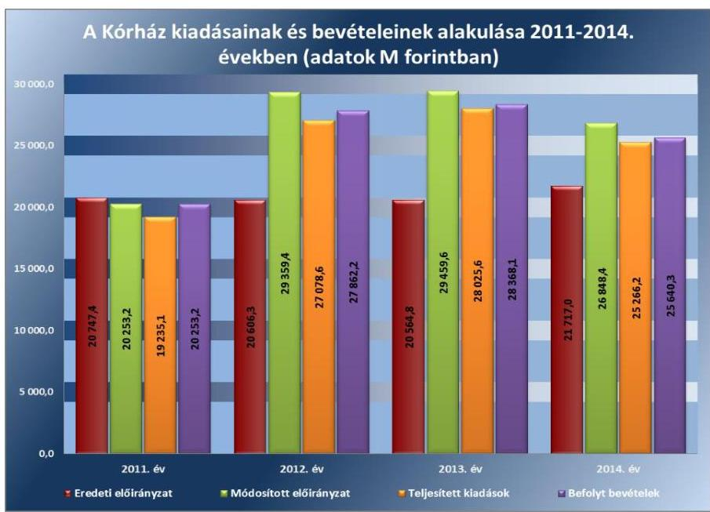

Forrás: Kórház 2011-2014. évi költségvetési beszámolói
A Kórház a gazdálkodás során az évközben a szükséges előirányzat-módosításokat nem végezte el. A módosított előirányzathoz viszonyított bevételi elmaradás miatt a Kórház nem tartotta be a bevételi előirányzat teljesítési kötelezettségére vonatkozóan az Áht. 112 . § (2) bekezdésében és Áht. 24 . § (2) bekezdésében előírtakat. A támogatás értékű működési bevétel alulteljesülésének hátterében az egészségügyi szakmai teljesítményfinanszírozás változása állt, az OEP ${ }^{38}$ a központilag megállapított TVK ${ }^{39}$ alatti teljesítményeket az adott egészségügyi szolgáltatásra kihirdetett díj 100\%-ában, a TVK feletti teljesítményeket egy határig degresszív módon, a

---

2. táblázat

KULCSKONTROLLOK
GYAKORLÁSÁNAK MINŐSÍTÉSE

| Ellenőrzött év | Minőátés |
| :--: | :--: |
| 2011. év | nem megfelelő |
| 2012. év | nem megfelelő |
| 2013. év | nem megfelelő |
| 2014. év | nem megfelelő |

határ felett pedig nem finanszírozta. A Kórház a 2011-2014. években költségvetési kiadásait a módosított előirányzat keretén belül teljesítette.

A KIADÁSI előirányzatok felhasználása során a Kórház a jogszabályi előírásokat nem tartotta be. A gazdálkodási jogkörök gyakorlása a személyi juttatások, a dologi és dologi jellegű (egyéb folyó) kiadások, a felhalmozási kiadások, a támogatásértékű kiadások, az átadott pénzeszközök és előirányzatainak felhasználása során összességében egyik évben sem felelt meg a jogszabályi előírásoknak (2. táblázat).

A Kórház - az Ámr. és az Ávr. előírásaival összhangban - gazdálkodási szabályzatában rendelkezett a gazdálkodási jogkörök gyakorlásáról, a szabályzatot és annak mellékleteit folyamatosan aktualizálta. A gazdálkodási jogkörök gyakorlásával történő megbízásra, illetve felhatalmazásra írásban került sor. A gazdálkodási jogkör gyakorlókról az egyéni megbízásokkal, felhatalmazásokkal összhangban levő, a gazdálkodási jogkörgyakorló aláírás mintáját is tartalmazó nyilvántartás állt rendelkezésre.

A PÉNZGAZDÁLKODÁSI BELSŐ KONTROLLOK múködésének szabályszerűsége a kiadási előirányzatok felhasználásához kapcsolódóan nem volt megfelelő.

Az ellenőrzés az alábbi hibákat tárta fel:

- A személyi juttatások kiadási előirányzatainak felhasználásánál rendszeresen előfordult, hogy a teljesítésigazolás - az Ámr. 76. § (3), illetve az Ávr. 57. § (3) bekezdésében előírtak ellenére - nem tartalmazta a teljesítésigazolás dátumát, a teljesítés tényére történő utalás megjelölését. A hiányos teljesítésigazolással rendelkező esetekben - az Ámr. 79. § (2) bekezdésében, valamint az Ávr. 58. § (1) bekezdésében foglaltak ellenére - a 2011. évben az ellenjegyző, a 2012-2014. években az érvényesítő nem ellenőrizte a teljesítésigazolás megtörténtét, illetve a megelőző ügymenetben a jogszabályi előírások betartását. Rendszeresen előforduló hiányosság volt, hogy az utalványozó a külön írásbeli rendelkezésként elkészített utalványon a kötelezettségvállalások nyilvántartási számát - az Ámr. 78. § (2) bekezdés g) pontjában, illetve az Ávr. 59. § (3) bekezdés f) pontjában előírtak ellenére - nem tüntette fel. A 2013. évben előfordult, hogy az érvényesítő - az Ávr. 58. § (2) bekezdésében foglaltak ellenére - nem jelezte az utalványozónak, hogy a megelőző ügymenetekben a szabályzatok megsértését tapasztalta, pedig a kötelezettségvállalásra - az Ávr. 55 § (1) bekezdésében foglaltak ellenére - pénzügyi ellenjegyzés nélkül került sor.
- A dologi és dologi jellegű kiadások, illetve a felhalmozási kiadások felhasználásánál rendszeresen előfordult, hogy a kifizetés bizonylatáról - az Ámr. 76. § (3) bekezdésében, illetve az Ávr. 57. § (3) bekezdésében előírtak ellenére - hiányzott a teljesítés igazolás dátuma. A hiányos teljesítésigazolással érintett esetekben - az Ámr. 79. § (2) bekezdésében, illetve az Ávr. 58. § (1) bekezdésében foglaltak ellenére - a 2011. évben az utalvány ellenjegyzője, a 20122014. években az érvényesítő nem ellenőrizte a teljesítésigazolás megtörténtét, illetve a megelőző ügymenetben a jogszabályi előírások betartását. Előfordult, hogy az utalványozó a külön írásbeli ren-

---

delkezésként elkészített utalványon - az Ámr. 78. § (2) bekezdés g) pontjában, illetve az Ávr. 59. § (3) bekezdés f) pontjában előírtak ellenére - a kötelezettségvállalások nyilvántartási számát nem tüntette fel. A közbeszerzési szabálytalansággal érintett esetekbenaz Ámr. 74. § (3) bekezdés c) pontjában és az Ámr. 77. § (2) bekezdésében, illetve az Ávr. 58. § (1)-(2) bekezdéseiben előírtak ellenére - a 2011. évben az utalvány ellenjegyzője, a 2012-2014. években az érvényesítő az utalványozónak nem jelezte a közbeszerzési szabályok megsértését.
A pénzeszköz átadások előirányzatának felhasználásánál előfordult, hogy az utalványozó a külön írásbeli rendelkezésként elkészített utalványon a kötelezettségvállalások nyilvántartási számát - az Ámr. 78. § (2) bekezdés g) pontjában, illetve az Ávr. 59. § (3) bekezdés f) pontjában előírtak ellenére - nem tüntette fel.

A KÖZBESZERZÉSI szabályok betartása a Kórháznál nem volt megfelelő. Az értékhatárt elérő dologi és dologi jellegű, illetve felhalmozási kiadásoknál több esetben előfordult, hogy - a Kbt. 1240 . § (1) bekezdésében, a Kbt. 2 5. §-ában, 19. § (1) bekezdésében és a 119. §-ában előírtak ellenére - elmaradt a közbeszerzési eljárás lefolytatása.

Az ellenőrzött kifizetésekkel összefüggésben a rendelkezésre bocsátott dokumentumok alapján pazarló gazdálkodást, kár bekövetkeztére utaló adatot, tényt az ellenőrzés nem állapított meg, azonban a nem megfelelően múködtetett belső kontrollok korrupciós kockázatot hordozhatnak.

# 3.4. számú megállapítás 

Az előirányzat-maradvány megállapítása, felhasználása megfelelt a jogszabályi előírásoknak, a Kórház teljesítette a befizetési kötelezettségeit.

## A KÖTELEZETTSÉGVÁLLALÁSSAL TERHELT MARADVÁNY megállapítása megfelelt az Ámr., illetve az Ávr. előírásainak. A főkönyvi számlák, az analitikus nyilvántartások és az éves beszámolók között az adategyezőség fennállt. A Kórháznál a 2011. évben keletkezett pénzmaradvány a GYEMSZI írásbeli utasítása alapján tárgyévi bevételként - támogatásértékű bevételként, maradvány átvételként - került elszámolásra.

Az intézmény előirányzat-maradványából a központi költségvetést megillető, elvonandó előirányzat-maradvány összege 2012. évben 4,5 M Ft, 2013. évben 1,8 M Ft volt. A Kórház az Ávr.-ben előírt határidőben teljesítette a központi költségvetést megillető összegek befizetését. A Kórház az előirányzat-maradványáról az elemi költségvetési beszámoló benyújtásával az előírt tartalommal, azonban - az Áhsz. 10. § (1) bekezdésében, illetve az Áhsz. 2 32. § (1) bekezdésében előírtak ellenére - nem a február 28 -ai határidőben teljesítette az irányító szerv felé az adatszolgáltatási kötelezettségét. A 2011. évi beszámolót 2012. március 9-én, a 2012. évi beszámolót 2013. április 9-én, a 2013. évi beszámolót 2014. április 11-én, a 2014. évi beszámolót 2015. május 28-án küldte meg a Kórház az irányító szerv felé. A kötelezettségvállalással terhelt maradvány felhasználása megfelelt az Ámr.-ben és az Ávr.-ben foglaltaknak, a kifizetések a következő év június 30 -áig megtörténtek. A Kórház rendelkezett az előirányzat-maradvány jóváhagyásáról kapott engedélyekkel.

---

# Megállapítások 

A Kórházat nem érintette az előirányzat felhasználáshoz kapcsolódóan évközi korlátozó intézkedés (zárolás, maradványtartás), valamint a korlátozó intézkedésekhez kapcsolódóan nem terhelte költségvetési törvényben meghatározott befizetési kötelezettség.

## 3.5. számú megállapítás

## A Kórház intézkedéseket tett az intézmény zavartalan feladatellátásához a fizetőképesség folyamatos fennállása, a likviditás javítása érdekében.

A FOLYAMATOS FIZETŐKÉPESSÉG, a pénzügyi egyensúly fenntartása a megtett intézkedések és esetenként kapott pótlólagos támogatások révén volt biztosítható a 2011-2012. években. A folyamatos fizetőképesség a 2013-2014. években - figyelembe véve a lejárt szállítói tartozások nagymértékű növekedését - nem volt biztosított. A Kórház az ellenőrzött időszakban likviditási hitelt nem vett igénybe, a finanszírozási tervtől eltérő, előrehozott támogatást nem igényelt, rendkívüli kormányzati intézkedés nem érintette.

A Kórház a 2011. évben az önkormányzati alrendszerbe tartozott és a jogszabály nem írt elő előirányzat-felhasználási terv készítési kötelezettséget.

LIKVIDITÁSI TERVKÉSZÍTÉSI kötelezettségét a Kórház - az Áht.; 78. § (2) bekezdésében előírtak ellenére - 2012. január-február hónapokban nem teljesítette. A likviditási terv - az Ávr. 122. § (1) bekezdésében előírtak ellenére - nem tartalmazott a tárgyhónap vonatkozásában a teljesíthető kiadásokra dekádonkénti ütemezést. A likviditási tervek a középirányító szerv által összeállított tartalmi szerkezetben készültek. A likviditási terveken túlmenően a Kórház a 2011-2014. évek közötti időszakra rendelkezett általa szerkesztett várható likviditási kimutatással, melyek egy hónapra előre tartalmazták a nyitó pénzkészleteket, a várható bevételeket és kiadásokat feladatra, szállítóra lebontva, valamint a várható záró pénzeszközöket. Azonban a kimutatások a kiadások kifizetését nem sürgősség szerint szerepeltette, így a fennálló kötelezettségek határidőben történő teljesítését nem biztosította. A Kórháznál előirányzat zárolásra, maradványtartási kötelezettségre nem került sor.

A LIKVIDITÁSI MUTATÓ (lásd 3. táblázat) alapján 2011-ben a Kórház forgóeszközei fedezni tudták a rövid lejáratú kötelezettségeiket, míg 2012-ben és 2013-ban már nem. A pénzeszköz likviditási mutató alapján a Kórház pénzeszközei a 2011-2013. években nem nyújtottak fedezetet a rövid lejáratú kötelezettségek kiegyenlítésére.
3. táblázat

A KÓRHÁZ LIKVIDITÁSI MUTATÓINAK ALAKULÁSA

| Megnevezés | 2011. év | 2012. év | 2013. év |
| :-- | :--: | :--: | :--: |
| Likviditási mutató | 1,07 | 0,56 | 0,20 |
| Pénzeszköz likviditási mutató | 0,004 | 0,32 | 0,06 |

Forrás: Kórház 2011-2014. évi költségvetési beszámolói

---

A likviditási mutatók romlásában és az adósság állomány újra termelődésében szerepet játszott, hogy
—2013. január 1-jétől az 55/2012. (XII. 28.) EMMI rendelettel ${ }^{40}$ módosították az egészségügyi finanszírozás mértékét, így a járóbeteg-ellátás teljesítmény volumen korlátjának 100\%-on felüli teljesítésén túl a degresszivitás miatt 20\% helyett 8\% illette meg a Kórházat, a fekvőbeteg ellátás esetén pedig 10\% helyett 4\%-ot finanszíroztak;
— az orvosi műszerbeszerzések nagy hányadát tette ki a dollár és euró árfolyamon történő beszerzés, a 2014. decemberi árfolyam 22,3 \%kal illetve 8,1\%-kal volt magasabb az egy évvel korábbinál.
A Kórházhoz 2011-ben önkormányzati biztost nem kellett kirendelni, mert a tartozásállománya nem érte el a jogszabályban előírt mértéket.

KINCSTÁRI BIZTOST az államháztartásért felelős miniszter - az Áht. 71. § (1) bekezdés előírásai ellenére - a Kórházhoz nem jelölt ki, pedig annak elismert, az esedékességet követő hatvan napon túli tartozásállománya a 2012. év februárban, áprilisban, augusztusban és szeptemberben meghaladta az 50,0 M Ft-ot.

A LIKVIDITÁS JAVÍTÁSA érdekében több intézkedést is tettek. A Kórház keretgazdálkodást vezetett be, a keretgazdák számát folyamatosan aktualizálta. A keretgazdák bontották szét a részükre megállapított pénzügyi kereteket főkönyvi számlákra, továbbá figyelemmel kisérték a felhasználást és erről folyamatos egyeztetéseket tartottak a gazdasági igazgatóval és helyettesével. A személyi juttatások esetében több korlátozó intézkedést is bevezettek: létszámstop elrendelésre, utazási költségmaximalizálására, vezető állású dolgozók esetében túlóra elszámolhatóságának korlátozására, rendezvények és tanulmányutak támogatásának megvonására került sor. A dologi kiadások esetében a konszignációs raktárak gazdálkodásának további szigorítására, a nem szorosan a betegellátáshoz kapcsolódó beszerzések befagyasztására, az árammal és ezzel összefüggésben a klímával való takarékossági intézkedések bevezetésére került sor.

A SZÁLLÍTÓI TARTOZÁSOK, valamint az egyéb kötelezettségek határidőben történő kifizetése részben volt biztosított. A szállítói kötelezettségállomány évenkénti alakulását a 4. táblázat tartalmazza.
4. táblázat

# A KÓRHÁZ 2011-2014. ÉVEK KÖZÖTTI LEJÁRT SZÁLLÍTÓI TARTOZÁSAI (M FT-BAN) 

| Megnevezés | 2011. XII. 31 | 2012. XII. 31 | 2013. XII. 31 | 2014. XII. 31 |
| :-- | :--: | :--: | :--: | :--: |
| Összes szállítói kötele-   zettség | 1772,1 | 2050,6 | 3257,3 | 2964,6 |
| Lejárt szállítói tartozás | 1495,7 | 0,0 | 797,7 | 1130,0 |
| Ebből: |  |  |  |  |
| 30 nap alatt | 757,7 | 0,0 | 645,8 | 544,0 |
| 31 és 60 nap közötti | 272,2 | 0,0 | 33,4 | 194,0 |
| 61 és 90 nap közötti | 319,1 | 0,0 | 12,1 | 101,0 |
| 91 és 365 nap közötti | 146,7 | 0,0 | 106,4 | 53,0 |
| Éven túli | 0,0 | 0,0 | 0,0 | 238,0 |

---

A lejárt szállítói állomány nagysága és összetétele jelentősen változott, míg a 2011-2013. évek végén nem volt éven túli tartozás, addig a 2014. év végén már jelentős éven túli tartozás volt. A lejárt szállítói állomány 2011ben az összes szállítói tartozás 84,4\%-a, 2013-ban 24,5\%-a, 2014-ban 38,1\%-a volt. A 2011. évben a lejárt szállítói állományon belül a 90 napon túli szállítói tartozás aránya 9,8\% volt, éven túli tartozás nem volt. A 2012. év végén a Kórház nem rendelkezett lejárt szállítói kötelezettségekkel, melynek hátterében a 2012. év végi OEP tárgyévi maradványfelosztásaiból elutalt 675,4 M Ft egyszeri támogatás állt. A 2013. évben a lejárt szállítói tartozás újratermelődött, azon belül a 90 napon túli szállítói tartozás aránya 13,3\%-ra nőtt, éven túli tartozás azonban nem volt. A 2014. évben az összes szállítói kötelezettség ugyan 292,7 M Ft-tal ( $9,0 \%$-kal) csökkent, azonban a lejárt szállítói állomány 332,3 M Ft-tal ( $41,7 \%$-kal) növekedett. A 2014. évben a lejárt szállítói tartozáson belül a 90 napon túli szállítói tartozás aránya $25,8 \%$-ra nőtt, ebből az egy éven túli tartozás aránya $21,1 \%$ volt.

A Kórház a gazdálkodásához, a szállítói számlák finanszírozásához az ellenőrzött időszakban az OEP gyógyító megelőző ellátás jogcímcsoport tárgyévi maradványfelosztásaiból 2011-ben 817,5 M Ft-ot, 2012-ben 675,4 M Ft-ot, 2013-ban 95,8 M Ft-ot, 2014-ben 269,3 M Ft-ot, összesen 1858,0 M Ft-ot kapott.

A jogszabályban előírt feltételekkel biztosított adósságkonszolidációs támogatásból a Kórház 2012-2014. években részesült:

- A 2012. január 3-i értéknappal a Kórház részére leutalt 780,8 M Ft támogatásból a Kórház a 337/2011. (XII. 29.) Korm. rendeletnek ${ }^{41}$ megfelelően 1,2 M Ft-ot használt fel a 2011. december 29-i lejárt határidejű szállítói állomány csökkentésére. A fel nem használt 779,6 M Ft támogatást az OEP 2012. év júniusában elvonta.
- A 438/2013. (XI. 19.) Korm. rendelet ${ }^{42}$ alapján a Kórház 2013. év novemberében 107,8 M Ft konszolidációs támogatásban részesült. A támogatást szabályszerűen a 2013. október 31-én lejárt szállítói tartozásra, adósságrendezésre használták fel.
- A 2014. évi gazdálkodási évre vonatkozóan a Kórház 2014. év júliusában 394,1 M Ft konszolidációs támogatásban részesült. A támogatást a 184/2014. (VII. 25) Korm. rendelet ${ }^{43}$ előírásainak megfelelően elsősorban a 2014. május 31-én lejárt szállítói tartozásra, adósságrendezésre használták fel.

A KÖVETELÉSEK behajtására a Kórház megfelelő intézkedéseket tett, a követelés állomány 2011. és 2014. év között folyamatosan változott, a 2011. év végi 115,9 M Ft, 2014. év végére 88,0 M Ft-ra csökkent. A Kórház egyéb követelése nem volt jelentős, értéke a vizsgált időszakban 4,4 M Ft és 6,9 M Ft között alakult. A követelésállomány kezelését az eszközök és források értékelési szabályzatának megfelelően végezték. A követelésállomány kezelésére a Kórház pénzgazdálkodási osztálya háromszori felszólítást követően behajtásra átadta a jogtanácsos részére a ki nem fizetett számlák listáját. Ezt követően a követelés behajtását - az ügyvéd közreműködésével - jogi útra terelték. A jogtanácsos tájékoztatta a pénzgazdálkodási osztályt a megtett intézkedésekről.

---

# 4. Az intézmény vagyongazdálkodása szabályszerű volt-e? 

## Összegző megállapítás

### 4.1. számú megállapítás

A Kórház vagyongazdálkodása a jogszabályi és belső szabályzatokban foglalt előírásoknak összességében részben felelt meg.

Az intézmény vagyonkezelési szerződése részben felelt meg a jogszabályi előírásoknak.

A Kórház a 2011. évben az államháztartás önkormányzati alrendszerébe tartozott, felügyeletét és irányítását az Önkormányzat Közgyűlése látta el. Az egészségügyi feladatellátást szolgáló vagyont az Önkormányzat a vagyongazdálkodási rendeletében és az alapító okiratban foglaltak szerint bocsátotta a Kórház rendelkezésére. A Kórház a feladatellátáshoz szükséges vagyont a vagyongazdálkodási rendelet előírásai alapján térítésmentesen használhatta, hasznosíthatta, illetve számviteli nyilvántartásaiban, mennyiségben és értékben nyilvántartotta.

A Kórház 2012. január 1-től az államháztartás központi alrendszerébe került át. Az egészségügyért felelős miniszter 2012. január 1-től - a NEFMI rendelet ${ }^{44}$ 1. §-ában - vagyonkezelői jogok gyakorlására a GYEMSZI-t jelölte ki. A jogszabályi előírások változása következtében 2012. május 1-jétől a GYEMSZI az állami egészségügyi feladatellátást szolgáló vagyon tekintetében, mint tulajdonosi joggyakorló jár el.

A VAGYONKEZELŐI SZERZŐDÉS ${ }^{45}$ megkötésére a GYEMSZI és a Kórház között 2012. május 1-jei hatállyal került sor. A szerződést a GYEMSZI 2013. január 28-án, míg a Kórház 2013. július 23-án írta alá. A Kórház 2012. január 1-jétől a vagyonkezelési szerződés aláírásáig, az intézményi átadás-átvételi megállapodás alapján, mint a vagyon használója, valamint a vagyonkezelő GYEMSZI belső körleveleiben foglaltak szerint járt el. A Kórház a vagyonkezelői szerződést a GYEMSZI-vel, mint középirányító szervével kötötte. A Kórház a működéséhez szükséges vagyonelemekről a GYEMSZI-t a Vtv. ${ }^{46}$-ben foglaltaknak megfelelően a vagyonkezelői szerződés megkötését megelőzően tételesen, az eszközök és források részletes kimutatásával tájékoztatta. A vagyonkezelői szerződés tartalma részben felelt meg a jogszabályi előírásoknak, mivel - a Vtvr. 14. § (3) bekezdésének előírása ellenére - nem tartalmazta, hogy a vagyonkezelő a tulajdonosi joggyakorló vagyon-nyilvántartási szabályzatát megismerte és magára nézve kötelező érvényűnek ismeri el. A vagyonkezelői szerződésben a Vtvr. előírásának megfelelően meghatározták a vagyonelemek rendeltetését, az értéknövelő beruházásokkal, felújításokkal kapcsolatos adatszolgáltatás módját, a tulajdonosi joggyakorlás és - vagyongazdálkodási feladatok szabályozott és átlátható végrehajtásának, vagyon használatának - ellenőrzés rendjét. Vagyonkezelési szerződés megszüntetésére az ellenőrzött időszakban nem került sor.

A Kórház a vagyonkezelői szerződés megkötésétől számított 30 napon belül - a Vtvr. 7. § (1)-(2) bekezdésében és a vagyonkezelői szerződés 1.2 pontjában foglaltak ellenére - nem kezdeményezte a vagyonkezelői jog bejegyzését az ingatlan nyilvántartásba.

---

A vagyontárgyak körének változása esetén a vagyonkezelői szerződés módosításokkal történő egységes szervezetbe foglalására nem minden esetben az előírt határidőben került sor. A Kórház által kezelt vagyonelemek köre a 2012-2013. évi telephely kiszervezések következtében több alkalommal is változott, azonban a vagyonkezelési szerződés, módosításokkal történő egységes szerkezetbe foglalására - a Vtvr. 8. § (2) bekezdésében foglaltak ellenére - 60 napon belül nem került sor, az átadott ingatlanokat a vagyonkezelői szerződés továbbra is tartalmazta.

Vagyonkezelési szerződés nélkül - adásvételi szerződéssel, illetve térítésmentes átvétellel - az intézmény vagyonkezelésébe került eszközök esetében betartották a jogszabályi előírásokat. A Kórház adásvételi szerződéssel vagyonkezelésébe került eszközöket a Vtv. előírásának megfelelően a Magyar Állam javára szerezte meg, a költségvetési törvényben meghatározott értékhatár - 25 M Ft - feletti beszerzésekhez, fejlesztésekhez a Vtvr. előírása szerinti tulajdonosi joggyakorlói hozzájárulással rendelkezett. A térítésmentesen átvett eszközöket a Kórház a jogszabályi előírásoknak megfelelően üzembe helyezte, a bevételezésről állományba vételi bizonylatot állított ki, egyedi nyilvántartó lapokat vett fel és belső könyvelési utasítás alapján főkönyvi nyilvántartásában is rögzítette.

# 4.2. számú megállapítás 

A mérlegben kimutatott eszközök és források nyilvántartása megfelelt, míg értékelése és leltározása részben felelt meg a jogszabályok és belső szabályozások által előírtaknak.

A NYILVÁNTARTÁSI kötelezettségének a Kórház a 2011. évben az Önkormányzat vagyongazdálkodási rendeletében, a 2012-2014. években a Vtvr. előírásának megfelelően eleget tett. A vagyon nyilvántartása biztosította az adatszolgáltatás pontosságát, ellenőrizhetőségét, tartalmazta a vagyonkezelő és a vagyonelemek azonosító adatait, a kapcsolódó jogokat, lényeges számviteli adatokat. A számlarendben meghatározásra került az analitikus, részletező nyilvántartások vezetésének módja, a kapcsolódó könyvviteli és nyilvántartási számlákkal való egyeztetése. A számlarend - az Áhsz. 1 49. § (3) bekezdésében és az Áhsz. 2 51. § (3) bekezdésében előírtak ellenére - nem határozta meg az analitikus, részletező nyilvántartásoknak a kapcsolódó könyvviteli és nyilvántartási számlákkal való egyeztetésének dokumentálását. A szabályozási hiányosság ellenére az egyeztetést elvégezték. A Kórház a beszámolási és adatszolgáltatási kötelezettségét a felügyeleti szerv felé minden évben teljesítette, az éves költségvetési beszámoló keretében múködéséről, feladatellátásáról, beruházási és fejlesztési tevékenységéről beszámolt. A Kórház saját vagyonnal nem rendelkezett.

A BEKERÜLÉSI ÉRTÉK MEGÁLLAPÍTÁSA, állományba vétel, üzembe helyezés és besorolás a Sztv., az Áhsz.1, illetve az Áhsz. ${ }_{2}$ előírásainak megfelelően történt. Az eszközök és források értékelése - a követelések minősítése és értékelése kivételével - megfelelt az Áhsz.1, valamint az Áhsz. ${ }_{2}$ előírásának. Az immateriális javakat és tárgyi eszközöket a mérlegben az Áhsz. ${ }_{1}$-nek és az Áhsz. ${ }_{2}$-nek megfelelően, az elszámolt terv szerinti és terven felüli értékcsökkenéssel csökkentett bekerülési értéken mutatták ki.

---

A Kórház a követelések állományát a 2011-2013. években az Áhsz. ${ }_{1}$, valamint a belső szabályzataiban foglaltak szerint mutatta ki analitikus és főkönyvi nyilvántartásaiban. A követelések állományi számláinak vezetése, a negyedévenkénti összegző kimutatás elkészítése és főkönyvi feladása megfelelit a jogszabályi előírásoknak. A 2014. évben a követelések állományának nyilvántartása - az Áhsz. ${ }_{2}$ előírásnak megfelelően - a számlarendben foglalt szabályozás szerint történt.

A Kórház az eszközök és források értékelési szabályzatában az éven túli és a 100 ezer Ft-ot meghaladó követelések esetében 100\%-os értékvesztés elszámolását határozta meg. A követeléseket - az eszközök és források értékelési szabályzat 5.9.3 pontjában foglaltak ellenére - minősítési szempontok alapján nem minősítették. Ezért az értékvesztés elszámolására - a Sztv. 55. § (1) bekezdésében, az Áhsz. ${ }_{1}$ 31. § (2) bekezdésében, valamint az Áhsz. ${ }_{2}$ 18. § (1) bekezdésében foglaltak ellenére - a vevő, adós minősítésének hiányában került sor, az elszámolt értékvesztés összege nem a követelések könyv szerinti értéke és a várhatóan megtérülő összeg különbözete volt. A kötelezettségek analitikus nyilvántartását az Áhsz. ${ }_{1}$ és az Áhsz. ${ }_{2}$ előírásának megfelelően, folyamatosan vezették. A kötelezettségek állományának főkönyvi számláit a Kórház a jogszabályi előírásoknak megfelelően vezette, készítette el a negyedévenkénti összegző kimutatást és adta fel a főkönyvi nyilvántartás részére.

A LELTÁRT az éves költségvetési beszámoló elkészítéséhez, a mérleg tételeinek alátámasztásához összeállították.

Az éves beszámoló mérlegét alátámasztó leltár összeállítása érdekében a Kórház leltározási szabályzatában rögzítette a leltározási tevékenység előkészítésének, elvégzésének, ellenőrzésének, kiértékelésének, a leltári különbözetek elszámolásának előírásait. A leltározásokat az arra kijelölt munkavállalók a leltározási ütemterv és leltározási utasítás alapján hajtották végre. A leltározók a leltározási tevékenység megkezdése előtt oktatásban részesültek, a feladataik megismeréséről írásban nyilatkoztak. A leltározás végrehajtását követően a leltárak az analitikus és főkönyvi nyilvántartásokkal egyeztetésre kerültek, a leltáreltéréseket kiértékelték, illetve a számviteli nyilvántartásokon átvezették.

A leltározás végrehajtása a 2011. és 2013. években részben felelt meg a jogszabályi előírásoknak. A leltározási szabályzat évenkénti mennyiségi leltározást írt elő az ingatlanok és a lealapozott gépek, berendezések és a járművek esetében. A le nem alapozott gépek, berendezések, valamint a kis értékű és használatra kiadott tárgyi eszközök vonatkozásában - „forgó rendszerben" történő - kétévenkénti mennyiségi leltározást határozott meg, azonban a kétévenkénti mennyiségi leltározás végrehajtásához - az Áhsz. ${ }_{1} 37 . \S$ (7) bekezdésében foglaltak ellenére - nem rendelkezett az irányító szerv egyetértésével, ezért évente mennyiségi leltárfelvételt kellett volna alkalmaznia. A 2011. év végén a Kórház az önkormányzati alrendszerből központi alrendszerbe kerülését megelőzően a zárómérleg készítésekor eszközeit - az Áhsz. ${ }_{1} 37 . \S$ (3) bekezdésében előírtak ellenére - menynyiségi felvétellel nem, csak egyeztetéssel leltározta. A 2011. és 2013. években a mérleg alátámasztásáról a részletező nyilvántartások és a főkönyv egyeztetésével gondoskodtak. A 2014. évben a leltározás végrehajtása megfelelt a jogszabályi előírásoknak.

---

# 4.3. számú megállapítás 

A SELEJTEZÉSI feladatokat a Kórház selejtezési szabályzatában foglaltaknak megfelelően hajtották végre, szükség esetén a 2011. évben az Önkormányzat Közgyűlése, a 2012-2014. évben a GYEMSZI engedélyével rendelkeztek.

A független könyvvizsgáló a Kórház beszámolóit minden évben elfogadó záradékkal látta el, leltározás hiányosságait nem kifogásolta.

## A Kórház a vagyontárgyai értékmegőrzési, állagmegóvási kötelezettségét a jogszabály, az intézményi megállapodás, illetve a vagyonkezelői szerződés előírásai szerint teljesítette.

ÁLLAGMEGÓVÁSI és értékmegőrzési kötelezettségének a Kórház a Vtv. -ben, az intézményi (használatba vételi) megállapodásban, illetve vagyonkezelési szerződésben foglaltak szerint tett eleget.

A 2011. év végéig a kórházi vagyon feletti tulajdonosi jogokat az Önkormányzat Közgyűlése gyakorolta. Az Önkormányzat a vagyongazdálkodási rendeletében a Kórház használatában levő vagyontárgyak rendeltetésszerű használatára, működtetésére, fenntartására, a vagyonhoz fűződő közterhek viselésére, és tevékenységükkel összefüggésben a hasznok szedésére, valamint a birtokvédelemhez fűződő jogok gyakorlására jogosultságokat és kötelezettségeket határozott meg. A vagyon értékének megőrzésére, állagmegóvására vonatkozó kötelezettségeket a vagyongazdálkodási rendelet és egyéb belső szabályzat nem tartalmazott. A Kórház 2011ben a vagyontárgyak állagmegóvása és értékének megőrzése érdekében beruházási fejlesztési tervet készített, melyet megküldött az Önkormányzat részére.

A Kórház számára 2012. évtől a vagyonkezelésbe vett eszközök működtetésével, állagának megóvásával, értékmegőrzésével kapcsolatos kötelezettségeket a Vtv. előírásai, az intézményi megállapodás, illetve megkötését követően a vagyonkezelési szerződés határozott meg. A vagyontárgyak állagmegóvása, a feladatellátáshoz szükséges fejlesztések megvalósítása érdekében évente beruházási és fejlesztési terveket készített, melyet megküldött a GYEMSZI részére. A kezelt vagyon értékcsökkenéséről és az értéket növelő beruházásokról, felújításokról utólag, évente tájékoztatta a GYEMSZI-t. A vagyonra vonatkozóan tűz és elemi kár elleni, a működtetéssel kapcsolatban felelősség biztosítást kötött. A Kórháznál az átszervezések és a folyamatosan végzett beruházási, felújítási és karbantartási tevékenységek hatására az ingatlanok, gépek berendezések és a befejezetlen beruházások együttes mérleg szerinti értéke folyamatosan növekedett. A Kórház - főtevékenységként közfeladatot ellátó vagyonkezelőként - a Vtv. erejénél fogva 2013. június 28 -tól mentesült a visszapótlási kötelezettség alól, amely a vagyonkezelési szerződésben - a Vtv. 27. § (9) bekezdésében előírtak ellenére - nem került rögzítésre.

A KÓRHÁZ VAGYONA a 2011. év végi 12 044,4 M Ft-ról a 2014. év végére 12 836,8 M Ft-tal (106,6\%-kal), 24 881,1 M Ft-ra növekedett. A vagyon túlnyomó részét kitevő befektetett eszközök állománya a 2011. év végi 10 154,9 M Ft-ról a 2014. év végére 20 176,6 M Ft-ra (98,7\%-kal) emelkedett. A befektetett eszközök értékének alakulásában meghatározó szerepe volt a pályázati forrásból létrehozott „Csillagpont Kórház" aktivált

---

értékének, de emellett folyamatos volt az elhasználódott orvosi gépek, berendezések, felszerelések pótlása, az új eszközök beszerzése és az ingatlanok felújítása.

A Kórház vagyonának alakulását a VI. számú melléklet mutatja be.
A 2014. évben az eszközök értékének változásában szerepet játszott a számviteli szabályok 2014. évi változása is (az eredményszemléletű számvitelre való áttérés), az eszközérték növekedésének túlnyomó többségét az időbeli elhatárolások és az egyéb sajátos eszközoldali elszámolások mérlegben való kimutatásának kötelezettsége okozta.

A befektetett eszközökön belül kiemelkedik a Kórház ingatlanvagyona, amely a 2011. évi 8269,2 M Ft-ról 2014. évre 16 020,9 M Ft-ra emelkedett. A befektetett eszközökön belüli arányuk azonban a 2011. évi 81,4\%-ról a 2014. év végére 79,4\%-ra csökkent.
2. ábra
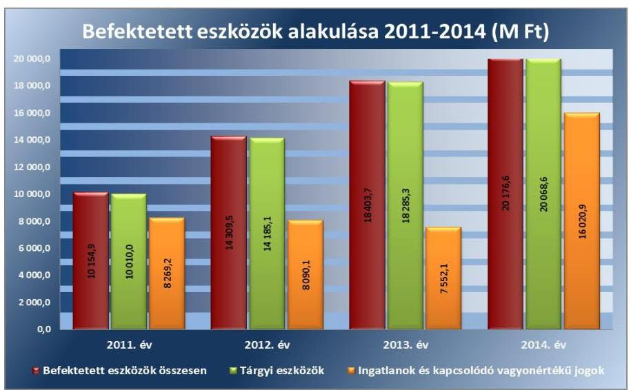

Forrás: Kórház 2011-2014. évi költségvetési beszámolói
A felhalmozási kiadásokat nagyrészt pályázati forrásból finanszírozták, a 2012-2014. évek felhalmozási kiadásában jelentős részarányt képviseltek a pályázati forrásból megvalósult beruházások. A Kórház 2009-ben indult beruházása a „Csillagpont Kórház" projekt, melynek tervezett összes beruházási értéke meghaladta a 11,0 Mrd Ft-ot, amely 90\%-ban pályázati (TIOP ${ }^{47}$ ) forrásból valósul meg.

A forgóeszközök év végi aránya a 2011. évi 15,7\%-ról 2013-ra 3,4\%-ra csökkent, melyet elsősorban az egyéb aktív pénzügyi elszámolások csökkenése határozott meg. A saját tőke részaránya mutató a 2011. évi 72,2\%-ról a 2012. év végére 81,6\%-ra nőtt, majd a 2013. év végére 81,1\%-ra csökkent. A számviteli változások miatt a 2014. évben a mutatók nem összehasonlíthatóak.

---

Az immateriális javak, tárgyi eszközök használhatóságát az alábbi diagram szemlélteti:
3. ábra
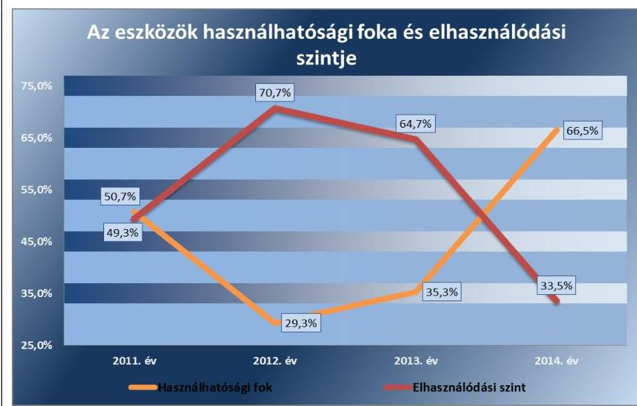

Forrás: Kórház 2011-2014. évi költségvetési beszámolói
Az eszközök használhatósági foka a 2011. évi 50,7\%-hoz képest a 2012ben jelentősen - 21,4 százalékponttal - 29,3\%-ra csökkent, azonban az elhasználódott eszközök folyamatos pótlása, illetve a jelentős mértékű ingatlan beruházás hatására 2013-ban 35,3\%-ra, majd és 2014-ben 66,5\%-ra nőtt. A mutatók kedvező változásában meghatározó szerepe volt a pályázati forrásból megvalósuló beruházásoknak. A Kórház az irányító szervtől felhalmozási célú támogatást nem kapott, a pályázati források mellett a saját intézményi bevételeiből finanszírozta megvalósított fejlesztéseit.

A vagyonkezelésében levő vagyontárgyakon végzett beruházásra, felújításra vonatkozó jogszabályi rendelkezéseket és a vagyonkezelői szerződésben előírt szabályokat betartották. Az Önkormányzat Közgyűlése a Kórház beruházási, felújítási kiadási előirányzatait a 2011. évi költségvetésében, illetve a 2011. évi előirányzat-módosítások alkalmával jóváhagyta, azok teljesítéséhez hozzájárult. A vagyon múködtetése, hasznosítása során a 2012. évtől figyelemmel voltak az Nvtv.-ben, az intézményi megállapodásban foglaltakra, továbbá a vagyonkezelői szerződés megkötését követően az abban foglaltak szerint járt el.

A megvalósult, üzembe helyezett beruházásokat és felújításokat a Kórház az Áhsz.1-ben és az Áhsz.2-ben meghatározott bekerülési értéken nyilvántartásba vette.

# 4.4. számú megállapítás 

A vagyonelemek elidegenítése megfelelt, a hasznosítása nem felelt meg a jogszabályokban előírtaknak.

AZ ÉRTÉKESÍTÉS során a Kórház a jogszabályi előírásokat betartotta. A Kórház 2011. évi bevétele az Önkormányzat engedélyével leselejtezett és értékesített gépjárművek eladásából származott. Vagyon értékesítésére a 2012. és a 2013. évben nem került sor. A 2014. évben a Kórház a költségvetési törvényben meghatározott értékhatár feletti nyilvántartási értékű eszközt nem értékesített.

---

A VAGYON HASZNOSÍTÁSÁBÓL (bérleti és szolgáltatási tevékenységből) befolyt bevételek a kiszámlázott összegnek megfelelően teljes összegükben - realizálódtak. Késedelmes fizetés esetén a tartozással érintettek részére fizetési felszólítást küldtek. A mérlegfordulónapon fennálló tartozások esetében a leltározási szabályzatában foglaltaknak megfelelően a követelés elismertetése érdekében egyenlegközlő levél küldésére került sor. A bérleti és szolgáltatási díjak beszedése, analitikus és főkönyvi nyilvántartásokban való rögzítése a szolgáltatást igénybe vevő felé kiállított számla alapján történt.

A Kórház a 2012-2014. években a bérbeadási folyamat során a bérleti szerződések időtartamát - az Nvtv.-ben foglalt előírásnak megfelelően határozatlan, vagy legfeljebb 15 éves időtartamban határozta meg. A Kórház a 2012. évtől a bérbeadási folyamatok során - az Nvtv. 11. § (11) bekezdésében előírtak ellenére - az átláthatósági követelmények érvényesüléséről nem győződött meg, az átláthatóságra vonatkozó nyilatkozatokkal - az Nvtv. 3. § (2) bekezdésében előírt - nem rendelkezett. A 2012-2014. években a bérleti szerződésekben - az Nvtv. 11. § (11) a) pontjában előírtak ellenére - nem került rögzítésre, hogy a bérbevevők vállalják az átengedett nemzeti vagyon vonatkozásában előírt beszámolási, nyilvántartási, adatszolgáltatási kötelezettségek teljesítését.

Az MNV Zrt. ${ }^{48}$, illetve irányító szerv engedélyéhez kötött értékesítés, vagyon elidegenítés gyakorlata a jogszabályoknak megfelelt, vagyon elidegenítésére térítésmentes átadás keretében került sor. A 2013. évben a Kórház egy „0"-ra leírt CT berendezést és kapcsolódó szoftvert adott át térítésmentesen, melyhez a GYEMSZI hozzájárulásával rendelkezett. A 2014. évben a Kórház az MNV Zrt. kezdeményezésére ingatlant adott át a görög katolikus egyház részére. A vagyonkezelői jog átruházása harmadik személy részére nem történt.

# 4.5. számú megállapítás 

Az eredményszemléletű számvitel bevezetésével kapcsolatos feladatok végrehajtása részben felelt meg a jogszabályi előírásoknak.

A RENDEZŐ MÉRLEG elkészítéséhez a leltározással kapcsolatos feladatokat - a nem lealapozott nagyértékű gépek, berendezések kivételével - szabályosan elvégezték. A 36/2013. (IX. 13.) számú NGM rendelet ${ }^{49}$ 2. § (1) bekezdésének előírása ellenére a mennyiségben és értékben is nyilvántartott nem lealapozott nagyértékű gépeket, berendezéseket nem leltározták tényleges mennyiségi felvétellel, mert a leltározást a korábbi évek gyakorlata alapján, a belső szabályozásban foglalt kétévenkénti gyakoriság szerinti ütemterv alapján hajtották végre.

A rendező mérleg elkészítését megelőző feladatok keretében azonosították a függő kiadásokat és bevételeket. Azokat a tételeket, amelyek azonosítása nem volt lehetséges, a jogszabályoknak megfelelően végleges kiadásként, ill. bevételként elszámolták. Az előírt könyvelési lépéseket a megfelelő számlák alkalmazásával elvégezték.

A rendező mérleget a Kórház szabályosan elkészítette, és a Kincstár felé a kapcsolódó, $\mathrm{KGR}^{50}$ rendszerben történő adatszolgáltatást - a 36/2013. (IX. 13.) számú NGM rendelet 8. § (2) bekezdés a) pontjában foglaltak ellenére - a 2014. március 31-ei határidőt követően, 2014. július 21én teljesítette. A rendező mérleg elkészítésekor a jogszabályokban előírt

---

feladatokat, a rendező technikai tételek elszámolását megfelelően végrehajtották. A rendező mérleg elkészítéséig a könyvvezetés nem a 36/2013. (IX. 13.) NGM rendelet 9. § (1) bekezdés előírásai szerint történt, mert az integrált könyvelési program az előírt január 31-éig nem tudta biztosítani a főkönyvi könyvelés lehetőségét. A nyitó állomány 2014. május 22-i feltöltését követően a megnyitott számlákon a 2014. január 1-jétől bekövetkezett gazdasági eseményeket elszámolták.

A független könyvvizsgáló a Kórház beszámolóit minden évben elfogadó záradékkal látta el.

# 5. Szabályszerűen hajtották-e végre az ellenőrzött időszakban az intézményt érintő szervezeti, szerkezeti átalakításokat? 

Összegző megállapítás

Az intézményt érintő szervezeti, szerkezeti változások végrehajtása összességében megfelelt a jogszabályi előírásoknak.
5.1. számú megállapítás

A kórházak integrációjával, valamint a telephelyek és feladatok átadásával kapcsolatos irányítószervi döntések, az integrációkhoz és telephely átadásokhoz kapcsolódó intézményi feladatok végrehajtása megfelelt a jogszabályi előírásoknak.

A 2011. évben az Önkormányzat Közgyűlése az Eütv.-ben biztosított jogkörében eljárva határozatban döntött a fenntartásában levő egészségügyi intézmények átszervezéséhez szükséges javaslatok kidolgozásáról, majd a javaslat alapján négy egészségügyi feladatot ellátó intézmény beolvadással történő megszüntetéséről döntött. A Kórházba olvadt 2011. május 1-jei hatállyal a szikszói II. Rákóczi Ferenc Kórház, a miskolci Szent Ferenc Rehabilitációs Kórház, a mezőkövesdi Mozgásszervi Rehabilitációs Központ, és az Izsófalva Pszichiátriai Szakkórház és Betegotthon. A Közgyűlési határozat az intézményi átalakítások megvalósítására, a kapcsolódó feladatok ütemezésére ütemterv készítési kötelezettséget írt elő, melynek a Kórház eleget tett. Az Önkormányzat Közgyűlése az Ávr. előírásának megfelelően rendelkezett a közfeladat ellátás szervezeti formájáról, meghatározta az eszközök és források leltározásáért, az éves költségvetési beszámoló elkészítéséért, a vagyonátadás lebonyolításért felelősöket, a megszüntető okiratot az előírt tartalommal elkészítette. A Közgyűlés meghatározta az átalakulás utáni intézmény szervezeti formáját, megszüntette a beolvadó kórházak bankszámláit, az Áht.-ben foglaltaknak megfelelően módosította az átszervezéssel érintett költségvetési szervek alapító okiratait, a megszűnő és átalakuló költségvetési szervek törzskönyvi nyilvántartásának módosítása érdekében intézkedett a Kincstár felé, továbbá elfogadta a Kórház átalakítását követően módosított szervezeti és múködési szabályzatát.

A 2012-2014. években a GYEMSZI két alkalommal hozott a Kórház szervezetét és feladatellátását érintő döntést, melyek nem jártak intézmény megszűnéssel. A telephelyek és feladatok átszervezéséről hozott döntések szabályszerűek voltak. A GYEMSZI 2012. november 1-jei hatállyal a Kórház Izsófalvai telephelyének Koch Róbert Kórház és Rendelőintézet számára történő átadásáról, továbbá 2013. november 1-jei hatállyal a Szent Ferenc Rehabilitációs Kórházi telephelyének a Miskolci Semmelweis Kórház és Egyetemi Oktató Kórház részére történő átadásáról döntött. A feladatok

---

#### Abstract

átadásáról hozott döntésekben az irányítószerv eleget tett az Ávr.-ben foglalt kötelezettségének, meghatározta a közfeladat ellátás módját, gondoskodott a vagyonátadás lebonyolításáért felelős személyek kijelöléséről, az átszervezéssel érintett foglalkoztatottakkal kapcsolatos munkáltatói intézkedések meghatározásáról, az eszközök, források leltár szerinti átadásáról, az ellátandó közfeladatok hatósági engedélyeinek rendezéséről.

A Kórház átszervezéssel, átalakulással kapcsolatos feladatainak végrehajtása megfelelt a jogszabályi előírásoknak. A vagyon átadására és a Kórház könyveiben való nyilvántartásba vételre a beolvadó intézmények mérlegében szereplő adatok alapján került sor. A Kórház a telephelyek átadását megelőzően a vagyontárgyakról mennyiségi felvétellel leltárt készített, a vagyontárgyak átadására, nyilvántartásból történő kivezetésére leltár alapján került sor. A feladatok és vagyontárgyak átadás-átvételéről - a GYEMSZI utasításának, illetve az Áhsz.1-ben foglaltaknak megfelelően jegyzőkönyvet, illetve megállapodást készítettek. A telephelyváltozást - a jogszabályi előírásoknak megfelelően - az adóhatóságnak bejelentették.

### 5.2. számú megállapítás

A Konsz. tv. ${ }^{51}$ által elrendelt alrendszer váltással kapcsolatos feladatok végrehajtása - az alábbi hiányosságoktól eltekintve - megfelelt a jogszabályi előírásoknak.

A Kórháznak az államháztartás önkormányzati alrendszeréből a központi alrendszerbe történő átsorolására a Konsz. tv rendelkezései alapján került sor. A Konsz. tv. 2. § (1) bekezdése értelmében a megyei önkormányzatok fenntartásában levő egészségügyi intézmények vagyona és vagyoni értékű joga a törvény erejénél fogva 2012. január 1-jén állami tulajdonba került, továbbá a vagyonnal és intézményekkel kapcsolatos alapítói, fenntartói jogok a törvényben meghatározott szervekre szálltak. A kórházi vagyon át-adás-átvételével kapcsolatos előkészítési feladatok végrehajtása érdekében - a Konsz. rendeletben ${ }^{52}$ foglaltaknak megfelelően - térségi egészségügyi munkacsoportot jelöltek ki, az előkészítő munkálatokat a munkacsoport végezte. A tulajdonosi és fenntartói jogutódláshoz kapcsolódó feladatok végrehajtásának részletkérdéseit - a Konsz. tv.-ben előírtaknak megfelelően - a Közgyűlés elnöke ${ }^{53}$, a GYEMSZI főigazgatója (mint az egészségügyért felelős miniszter által kijelölt központi államigazgatási szerv), az MNV Zrt. vezérigazgatója és a Nemzeti Földalapkezelő Szervezet elnöke között megkötendő átadás-átvételi megállapodásban kellett rendezni. Az átadás-átvételi megállapodást a Közgyűlés elnöke és a GYEMSZI főigazgatója a Konsz. tv. által előírt határidőn belül, 2011. december 30-án írta alá. A megállapodás - a Konsz. tv. 2. § (4) bekezdésében előírtak ellenére - az MNV Zrt. vezérigazgatója által nem került aláírásra. Az NFA tv. ${ }^{54}$ hatálya alá tartozó vagyontárgy átadásra nem került sor, ezért a megállapodás Nemzeti Földalap Kezelő Szervezet részéről való aláírására nem volt szükség. A GYEMSZI a megállapodás tőpéldányának elektronikus másolati példányát - a Konsz. rendelet 3. § (3) bekezdésében előírtak ellenére - 2012. március 31-ig nem küldte meg az Önkormányzat részére. A Minisztérium a Kórház alapító okiratát csak 2012. január 25-én adta ki, ezért a Kincstár az alapító okirat átszervezés miatti módosítását a törzskönyvi nyilvántartásba - a Konsz. tv. 8. § (1) bekezdésében foglaltak ellenére - nem az előírt 2011. december 28 -ai határidőig jegyezte be.

A Konsz. tv.-ben meghatározott átvett vagyon feletti vagyonkezelői jogokat 2012. január 1-jétől a törvényben kapott felhatalmazás alapján, az

---

egészségügyért felelős miniszter által a NEFMI rendeletben kijelölt GYEMSZI gyakorolta. A GYEMSZI, mint az Önkormányzattól átvett vagyon kezelője - a Konsz. rendeletben foglaltaknak megfelelően - 2011. december 30-án aláírt külön „intézményi átadás-átvételi megállapodásban" az átvett vagyont használatba, hasznosításba adta a Kórháznak. A megállapodás célja a Kórház múködését biztosító vagyonelemek rögzítése és az átadásátvételi eljárás lebonyolításához szükséges keretek meghatározása volt. A megállapodás tartalmazta a GYEMSZI részére átadandó dokumentumok körét, az átadás-átvétel lebonyolítására kijelölt munkacsoport tagjait, továbbá rögzítették benne, hogy 2012. január 1-jétől az állami vagyon kezelője a GYEMSZI lesz, és a megállapodás mellékletében meghatározott ingó és ingatlan vagyonelemeket 2012. január 1-jétől a Kórház részére birtokba, használatba adásra kerültek.

Az államot megillető tulajdonosi jogok és kötelezettségek összességének gyakorlására - a 2012. évi XXXVIII. törvény ${ }^{55}$ 13. § (1) bekezdése alapján - 2012. május 1-jétől GYEMSZI lett jogosult. A GYEMSZI, mint tulajdonosi joggyakorló és a Kórház, mint vagyonkezelő a Vtvr.-ben foglaltaknak megfelelően 2012. május 1-jei hatállyal vagyonkezelői szerződést kötött.

A Kórház a GYEMSZI által előírt - az önkormányzati alrendszerből a központi alrendszerbe történő átszervezéssel kapcsolatos - adatszolgáltatási kötelezettségének eleget tett. Az átszervezés napjára - 2011. december 31-ei fordulónappal - az éves költségvetési beszámolót - egyben záró beszámolót - és az átszervezéssel járó megszűnés „0"-ás beszámolóját elkészítették, az Önkormányzat és a GYEMSZI részére megküldték. A záró beszámoló tartalma megfelelt az Áhsz. 1-ben előírt követelményeknek. A Kórház a vagyonkezelésbe vett eszközöket - a 2011. évi záró értékkel azonos értékben - a 2012. évi nyitást követően egyéb növekedésként vette nyilvántartásba.

# 6. Az intézmény intézkedett-e az integritás szemlélet érvényesítése érdekében? 

## Összegző megállapítás

A Kórház intézkedett az integritás szemlélet érvényesítése érdekében.

A Kórház a 2014. évben részt vett az ÁSZ integritás felmérésében, ezért az integritás szemlélet érvényesülésének értékelése az intézmény által kitöltött rövid kérdőív alapján történt. Az integritás szemlélet érvényesítésével kapcsolatos megállapításokat a IV. számú melléklet tartalmazza.

---

# JAVASLATOK 

Az ÁSZ tv. 33. § (1) bekezdésében foglaltak értelmében az ellenőrzött szervezet vezetője köteles a jelentésben foglalt megállapításokhoz kapcsolódó intézkedési tervet összeállítani és azt a jelentés kézhezvételétől számított 30 napon belül az ÁSZ részére megküldeni. Amennyiben az ellenőrzött szervezet vezetője nem küldi meg határidőben az intézkedési tervet vagy továbbra sem elfogadható intézkedési tervet küld, az ÁSZ elnöke az ÁSZ tv. 33. § (3) bekezdés a)-b) pontjaiban foglaltakat érvényesítheti.

## az emberi erőforrások miniszterének

1. Intézkedjen a Kórház alapító okiratának módosítására annak érdekében, hogy az ne tartalmazza telephelyként a már átadott intézményeket.
(1.1. számú megállapítás 2. bekezdése alapján)
2. Biztosítsa, hogy a Kórház alapító okiratának módosítása esetén a jogszabályban elöirtaknak megfelelően
a) készítsék el és a módosító okirathoz csatolják az alapító okirat módosításokkal egységes szerkezetbe foglalt változatát;
b) kérjék meg az államháztartásért felelős miniszter előzetes egyetértését.
(1.1. számú megállapítás 3. bekezdése alapján)
3. Intézkedjen a jogszabályi elöírásnak megfelelően a hatékony gazdálkodásra irányuló ellenőrzések elvégzésére.
(1.2. számú megállapítás 3. bekezdése alapján)

## az Állami Egészségügyi Ellátó Központ főigazgatójának

1. Tegyen intézkedéseket a Kórháznál a rendelkezésre álló források gazdaságos, hatékony és eredményes felhasználását biztosító követelmények kialakításával és alkalmazásával kapcsolatban feltárt hiányosságok tekintetében a költségvetési szerv vezetőjének felelőssége tisztázása érdekében, és szükség szerint intézkedjen a felelősség érvényesítésére.
(2.5. számú megállapítás, és a 2-4. bekezdése, II. számú melléklet)

---

2. Intézkedjen, hogy a vagyonkezelői szerződés a jogszabályi előírásokkal összhangban tartalmazza, hogy a vagyonkezelő a tulajdonosi joggyakorló vagyon-nyilvántartási szabályzatát megismerte és magára nézve kötelező érvényünek ismeri el.
(4.1. számú megállapítás 3. bekezdése alapján)

# a Kórház föigazgatójának 

1. Intézkedjen, hogy a Kórház SZMSZ-e a jogszabályi előírásokkal összhangban tartalmazza
a) az alapító okirat keltét, számát és az alapítás időpontját;
b) a gazdasági szervezet megnevezését és a szervezeti egységek engedélyezett létszámát;
c) kezdeményezze az irányítói jogok gyakorlójánál a Kórház módosított SZMSZ-ének a jóváhagyását.
(1.1. számú megállapítás 4. bekezdése és a 2.1. számú megállapítás 1. bekezdése alapján)
2. Intézkedjen, hogy a gazdasági szervezet ügyrendje a jogszabályi előírásokkal összhangban tartalmazza az alkalmazottak hatáskörét, valamint a belső, és - teljes körüen - a külső kapcsolattartás módját, szabályait.
(2.1. számú megállapítás 2. bekezdése alapján)
3. Intézkedjen, hogy a Kórház belső szabályzatai megfeleljenek a jogszabályi előirásoknak:
a) a számviteli politika tartalmazza, hogy mit tekintenek a számviteli elszámolás, az értékelés szempontjából lényegesnek, nem lényegesnek;
b) az eszközök és források értékelési szabályzata tartalmazza követeléstípusonként a kisösszegü követelések év végi meghatározásának elveit, dokumentálásának szabályait;
c) a számlarend tartalmazza az analitikus, részletező nyilvántartásoknak a kapcsolódó könyvviteli és nyilvántartási számlákkal való egyeztetésének dokumentálását.
(2.1. számú megállapítás 3. bekezdése, 4.2. számú megállapítás 1. bekezdése alapján)

---

4. Intézkedjen, hogy a Kórház Szervezeti és Müködési Szabályzatában foglaltaknak megfelelően készítsék el és terjesszék elő a szervezeti egységenként meghatározott kockázatelemzések intézményi szintü összesítését, valamint az intézményi kockázatminősitési javaslatot és a hozzá kapcsolódó intézkedési tervet.
(2.2. számú megállapítás 2. bekezdése alapján)
5. Intézkedjen a közérdekü adatok teljes körü közzétételére a vonatkozó jogszabályi előirásokkal összhangban.
(2.4. számú megállapítás 3. bekezdése alapján)
6. Intézkedjen, hogy a Kórház iratkezelési szabályzatának kiadása a jogszabályban elöirtakkal összhangban az illetékes közlevéltár egyetértésével történjen.
(2.4. számú megállapítás 4. bekezdése alapján)
7. Intézkedjen a pénzügyi gazdálkodási területen az operatív tevékenységek folyamatos és eseti nyomon követésére alkalmas monitoring rendszer kialakítására és müködtetésére.
(2.5. számú megállapítás 1. bekezdése alapján)
8. Intézkedjen - a belső ellenőrzési vezető útján - a belső ellenőrzési kézikönyv jogszabályban elöirt kétévenkénti felülvizsgálatára és a jogszabályi változásokat követő módosítására.
(2.5. számú megállapítás 6. bekezdése alapján)
9. Intézkedjen a jóváhagyott éves belső ellenőrzési tervekben foglalt ellenörzések végrehajtására.
(2.5. számú megállapítás 7. bekezdése alapján)
10. Intézkedjen, hogy
a) a belső ellenőrzés megállapításai és javaslatai alapján minden esetben tegyenek eleget az intézkedési terv készitési kötelezettségnek;
b) az elkészített intézkedési tervek kerüljenek jóváhagyásra;
c) tartsák nyilván és kövessék nyomon a belső ellenőrzési jelentések alapján megtett intézkedéseket;
d) a belső ellenőrzésekről vezetett nyilvántartás tartalmazza a végre nem hajtott intézkedések okát.
(2.5. számú megállapítás 8-9. bekezdései alapján)

---

11. Tegyen eleget az intézkedés meghozatalát követő 5 munkanapon belül az intézményi hatáskörben végrehajtott előirányzat-módosításokról a Kincstár és az irányító szerv felé fennálló tájékoztatási kötelezettségnek.
(3.2. számú megállapítás 1. bekezdése alapján)
12. Intézkedjen, hogy az intézményi hatáskörü előirányzat-módosításra a jogszabályi előírásokkal összhangban a kijelölt pénzügyi ellenjegyzö ellenjegyzésével kerüljön sor.
(3.2. számú megállapítás 2. bekezdése alapján)
13. Intézkedjen a bevételi előirányzatok teljesitésének kötelezettségére vonatkozó jogszabályi előirás betartására.
(3.3. számú megállapítás 5. bekezdése alapján)
14. Intézkedjen, hogy a gazdálkodási jogkörök gyakorlására kijelölt teljesitést igazolók és érvényesitők a jogszabályi elöírásoknak megfelelően lássák el feladataikat.
(3.3. számú megállapítás 9. bekezdés 1-3. pontja alapján)
15. Intézkedjen
a) a jogszabályban meghatározott esetekben a közbeszerzési eljárások lefolytatására;
b) a feltárt szabálytalanságok tekintetében a felelősség tisztázása érdekében, és szükség szerint tegyen intézkedéseket a felelősség érvényesitésére.
(3.3. számú megállapítás 10. bekezdése alapján)
16. Intézkedjen, hogy a Kórház a jogszabályban elöirt határidőben tegyen eleget adatszolgáltatási kötelezettségének az éves költségvetési beszámoló irányító szerv felé történő megküldésével.
(3.4. számú megállapítás 2. bekezdése alapján)
17. Intézkedjen, hogy a kiadások teljesitésének ütemezéséről a likviditási tervet a jogszabályban elöirt tartalommal készitsék el.
(3.5. számú megállapítás 3. bekezdése alapján)

---

18. Kezdeményezze a jogszabályi előírásokkal összhangban a vagyonkezelői jog bejegyzését az ingatlan nyilvántartásba.
(4.1. számú megállapítás 4. bekezdése alapján)
19. Intézkedjen, hogy a követelések év végi értékelése során az értékvesztés elszámolására a vevő, adós minősitése alapján, a követelés könyv szerinti értéke és a követelés várhatóan megtérülő összege közötti - veszteségjellegü - különbözet összegében kerüljön sor.
(4.2. számú megállapítás 4. bekezdése alapján)
20. Tegyen intézkedéseket a leltározás kapcsán feltárt hiányosságok és szabálytalanságok tekintetében a felelősség tisztázása érdekében, és szükség szerint intézkedjen a felelősség érvényesitésére.
(4.2. számú megállapítás 7. bekezdése alapján)
21. Intézkedjen a bérbeadási folyamatok során a jogszabályi követelmények érvényesülésére
a) az átláthatóságra vonatkozó nyilatkozatok beszerzésével;
b) a bérleti szerződésekben annak rögzitésével, hogy a bérbevevők vállalják az átengedett nemzeti vagyon vonatkozásában elöirt beszámolási, nyilvántartási, adatszolgáltatási kötelezettségek teljesitését.
(4.4. számú megállapítás 3. bekezdése alapján)

---

# MELLÉKLETEK 

- I. SZ. MELLÉKLET: ÉRTELMEZŐ SZÓTÁR
állami vagyon
állami vagyonnak minősül:
a) az állam tulajdonában lévő dolog, valamint a dolog módjára hasznosítható természeti erő,
b) az a) pont hatálya alá nem tartozó mindazon vagyon, amely vonatkozásában törvény az állam kizárólagos tulajdonjogát nevesíti,
c) az állam tulajdonában lévő tagsági jogviszonyt megtestesítő értékpapír, illetve az államot megillető egyéb társasági részesedés,
d) az államot megillető olyan immateriális, vagyoni értékkel rendelkező jogosultság, amelyet jogszabály vagyoni értékű jogként nevesít
(Forrás: Vtv. 1. § (2) bekezdése)
állami vagyon értékesítése
állami vagyon használója
állami vagyon hasznosítása
állami vagyon hasznosítása
«íttő́ bekezdés d) pontja)
Az a természetes személy, jogi személy, illetve jogi személyiséggel nem rendelkező szervezet, amely, illetve aki törvény vagy szerződés alapján, bármely jogcímen (pl. bérlet, haszonbérlet, vagyonkezelési szerződés, használat stb.) állami vagyont birtokol, használ, szedi annak hasznait, hasznosít, ide nem értve a tulajdonosi jogok gyakorlóját.
(Forrás: Vtvr. 1. § (7) bekezdés a) pontja, hatályos 2011. január 1-jétől 2011. december 31-ig)
Az a természetes vagy jogi személy, jogi személyiséggel nem rendelkező szervezet, aki, vagy amely törvény vagy szerződés alapján, bármely jogcímen (bérlet, haszonbérlet, használat stb.) állami vagyont birtokol, használ, szedi annak hasznait, hasznosít, ide nem értve a haszonélvezőt, a vagyonkezelőt és a tulajdonosi jogok gyakorlóját".
(Forrás: Vtvr. 1. § (7) bekezdés a) pontja)
Az állami vagyont az MNV Zrt. maga kezeli, vagy szerződés - így különösen bérlet, haszonbérlet, szerződésen alapuló haszonélvezet, vagyonkezelés, megbízás - alapján központi költségvetési szervnek, természetes vagy jogi személynek, vagy jogi személyiséggel nem rendelkező gazdálkodó szervezetnek hasznosításra átengedi.
(Forrás: Vtv. 23. § (1) bekezdése, hatályos 2011. december 31-éig)
Az állami vagyont az MNV Zrt. maga kezeli, vagy szerződés - így különösen bérlet, haszonbérlet, megbízás - alapján központi költségvetési szervnek, természetes vagy jogi személynek, vagy jogi személyiséggel nem rendelkező gazdálkodó szervezetnek hasznosításra átengedi.
(Forrás: Vtv. 23. § (1) bekezdése, hatályos 2012. január 1-jétől)
Az állami vagyonnal a tulajdonosi joggyakorló maga gazdálkodik, vagy szerződés - így különösen bérlet, haszonbérlet, megbízás - alapján hasznosításra átengedi, illetőleg vagyonkezelésbe, haszonélvezetbe adja.
(Forrás: Vtv. 23. § (1) bekezdése, hatályos 2013. június 28-ától)
Az állami vagyon hasznosítására kötött szerződések elsődleges célja az állami vagyon hatékony működtetése, állagának védelme, értékének megőrzése, illetve gyarapítása, az állami és közfeladatok ellátásának elősegítése. (Forrás: Vtv. 23. § (2) bekezdése)
állami vagyon kezelője /vagyonkezelő
Az állami vagyont az MNV Zrt. maga kezeli, vagy szerződés - így különösen bérlet, haszonbérlet, szerződésen alapuló haszonélvezet, vagyonkezelés, megbízás - alapján

---

ÁSZ Integritás Projekt
átalakítás
belső ellenőrzés
belső kontrollrendszer
belső kontrollrendszer területei
előirányzat-maradvány
felújítás
központi költségvetési szervnek, természetes vagy jogi személynek, illetőleg jogi személyiséggel nem rendelkező gazdasági társaságnak hasznosításra átengedi (Forrás: Vtv. 23. § (1) bekezdése, hatályos 2010. január 01 - 2011. december 31-ig).
Az állami vagyont az MNV Zrt. maga kezeli, vagy szerződés - így különösen bérlet, haszonbérlet, megbízás - alapján központi költségvetési szervnek, természetes vagy jogi személynek, vagy jogi személyiséggel nem rendelkező gazdálkodó szervezetnek hasznosításra átengedi." Az állami vagyonra vonatkozóan az MNV Zrt. kizárólag az Nvtv-ben meghatározott személyekkel köthet vagyonkezelési szerződést.
(Forrás: Vtv. 27. § (1) bekezdése, hatályos 2012. január 1-jétől)
Az Állami Számvevőszék 2009-ben indította el a „Korrupciós kockázatok feltérképezése - Integritás alapú közigazgatási kultúra terjesztése" című, európai uniós forrásból megvalósított kiemelt projektjét (Integritás Projekt). Az Integritás Projekt célja, hogy felmérje a közszféra intézményei korrupciós kockázatoknak való kitettségét, illetőleg az azok mérséklésére hivatott kontrollok szintjét. Az Állami Számvevőszék a projekt révén az integritás szemlélet minél szélesebb körrel történő megismertetését, gyakorlatba ültetését kívánja elérni. Az integritás követelményeinek megfelelő szervezeti múködést előnyben részesítő közigazgatási kultúra elterjesztését és a korrupció elleni fellépést az ÁSZ önmagára nézve is stratégiai jelentőségű célként fogalmazta meg. A projekt a felmérésben résztvevő intézmények számára helyzetükről egyfajta „tükörképet" mutat be, ami alapot teremt a jövőbeni pozitív irányú elmozduláshoz. (Forrás: a http://integritas.asz.hu honlapon közzétett, a 2013. évi Integritás felmérés eredményeiről készült összefoglaló tanulmány)
Az általános jogutódlással történő megszüntetés átalakítással történhet. Az átalakítás lehet egyesítés vagy különválás. Az egyesítés lehet beolvadás vagy összeolvadás. (Forrás: Áht. 1 95. §-a, Áht. 2 11. §-a)
Független, tárgyilagos bizonyosságot adó és tanácsadó tevékenység, amelynek célja, hogy az ellenőrzött szervezet múködését fejlessze és eredményességét növelje, az ellenőrzött szervezet céljai elérése érdekében rendszerszemléletű megközelítéssel és módszeresen értékeli, illetve fejleszti az ellenőrzött szervezet irányítási és belső kontrollrendszerének hatékonyságát. (Forrás: Bkr. 2. § b) pontja)
A belső kontrollrendszer a kockázatok kezelése és tárgyilagos bizonyosság megszerzése érdekében kialakított folyamatrendszer, amely azt a célt szolgálja, hogy a múködés és gazdálkodás során a tevékenységeket szabályszerűen, gazdaságosan, hatékonyan, eredményesen hajtsák végre, az elszámolási kötelezettségeket teljesítsék, megvédjék az erőforrásokat a veszteségektől, károktól és nem rendeltetésszerű használattól. (Forrás: Áht. 2 69. § (1) bekezdése)
A kontrollkörnyezet, a kockázatkezelési rendszer, a kontrolltevékenységek, az információs és kommunikációs rendszer, valamint a nyomon követési (monitoring) rendszer. (Forrás: Bkr. 3. §-a)
Az államháztartás központi alrendszerébe tartozó költségvetési szerveknél a módosított bevételi és kiadási előirányzatok és azok teljesítésének a Kormány rendeletében meghatározott tételekkel korrigált különbözete az előirányzat-maradvány. (Forrás: Áht. 2 2. § (1) bekezdés m) pontja).
Az elhasználódott tárgyi eszköz eredeti állaga (kapacitása, pontossága) helyreállítását szolgáló időszakonként visszatérő olyan tevékenység, melynek során az eszköz élettartama megnövekszik, minősége, használata jelentősen javul, így a pótlólagos ráfordításból a jövőben gazdasági előnyök származnak. (Forrás: Számv. tv. 3. § (4) bekezdés 8. pontja)

---

használhatósági fok

hasznosítás
információs és kommunikációs rendszer
integritás
irányító szerv/felügyeleti szerv
kincstári biztos
kincstári költségvetés
kockázat
kockázatkezelési rendszer
kontrollkörnyezet
kontrolltevékenységek

A tárgyi eszközállomány állagának elemzéséhez használt mutató, amely megmutatja, hogy a le nem írt (nettó) érték milyen hányadát képezi az aktiválási (bekerülési) értéknek. Számításakor a tárgyi eszköz könyv szerinti nettó értékét viszonyítják a tárgyi eszköz bruttó (beszerzési/létesítési) értékéhez.
A nemzeti vagyon birtoklásának, használatának, hasznok szedése jogának bármely a tulajdonjog átruházását nem eredményező - jogcímen történő átengedése, ide nem értve a vagyonkezelésbe adást, valamint a haszonélvezeti jog alapítását. (Forrás: Nvtv. 3. § (1) bekezdés 4. pontja)
A költségvetési szerv vezetője által kialakított és múködtetett olyan rendszer, mely biztosítja, hogy a megfelelő információk a megfelelő időben eljutnak az illetékes szervezethez, szervezeti egységhez, illetve személyhez. (Forrás: Bkr. 9. § (1) bekezdés)
Az integritás az elvek, értékek, cselekvések, módszerek, intézkedések konzisztenciáját jelenti, vagyis olyan magatartásmódot, amely meghatározott értékeknek megfelel.
(Forrás: Nemzetgazdasági Minisztérium: Magyarországi államháztartási belső kontroll standardok Útmutató 1.6.1. pontja, 2012. december)
A költségvetési szerv tekintetében az e törvényben meghatározott irányítási hatáskört gyakorló szerv. (Forrás: Áht. 1. § 9. pontja)
A kincstári biztos kijelölését az államháztartásért felelős miniszternél a Kincstár kezdeményezi. A kincstári biztos köteles figyelemmel kísérni megbízatásának időpontjától kezdve a költségvetési szerv tervezését, gazdálkodását, beszámolását, a jogszabályokban előírt feladatainak ellátását, feltárni azokat az okokat, amelyek a tartós fizetésképtelenséghez vezettek, a szükséges intézkedések azonnali végrehajtására irányuló intézkedési tervet készíteni, azonnali intézkedéseket kezdeményezni és írásbeli utasításokat kiadni a tartozásállomány felszámolására, a gazdálkodás egyensúlyának biztosítására, a követelések behajtására. (Forrás: Ávr. 116-117. § hatályos 2013. augusztus 18-ig)
A központi költségvetésről szóló törvény elfogadását követően a fejezetet irányító szerv az államháztartás központi alrendszerébe tartozó költségvetési szerv és a fejezeti kezelésű előirányzat kiemelt előirányzatait, valamint az elkülönített állami pénzalapok és a társadalombiztosítás pénzügyi alapjai jogszabályi előírás szerinti bevételeit és kiadásait kincstári költségvetés kiadásával állapítja meg. (Forrás: Áht. 1 24. § (3) bekezdés, Áht. 2 28. § (2) bekezdés)
A kockázat annak a valószínűségét jelenti, hogy egy vagy több esemény vagy intézkedés nem kívánt módon befolyásolja a rendszer múködését, céljainak megvalósulását. (Forrás: Javaslatok a korrupciós kockázatok kezelésére - Kockázatkezelési és ellenőrzési módszertan 35. oldal, ÁSZ)
Olyan irányítási eszközök és módszerek összessége, melynek elemei a szervezeti célok elérését veszélyeztető tényezők (kockázatok) azonosítása, elemzése, csoportosítása, nyomon követése, valamint szükség esetén a kockázati kitettség mérséklése. (Forrás: Bkr. 2. § m) pontja)
A költségvetési szerv vezetője által kialakított olyan elvek, eljárások, belső szabályzatok összessége, amelyben világos a szervezeti struktúra, egyértelműek a felelősségi, hatásköri viszonyok és feladatok, meghatározottak az etikai elvárások a szervezet minden szintjén, átlátható a humánerőforrás-kezelés. (Forrás: Bkr. 6. § (1) bekezdés) A költségvetési szerv vezetője által a szervezeten belül kialakított (kontroll) tevékenységek, melyek biztosítják a kockázatok kezelését, hozzájárulnak a szervezet céljainak eléréséhez. (Forrás: Bkr. 8. § (1) bekezdés)

---

| kommunikáció | Az a tevékenység, melynek során információ továbbítása valósul meg. A kommunikációs folyamat résztvevői között tájékoztatás történik, mely során tényeket, ezek magyarázatát közlik. |
| :--: | :--: |
| korrupció | Azok a cselekmények, amelyek során a köz érdekében való eljárással megbízott és döntéshozatali felelősséggel felruházott személy a köz érdeke helyett önös vagy részérdekeket követve, mástól jogtalan vagy etikátlan előnyt elfogadva és őt jogtalan vagy etikátlan előnyhöz juttatva jár el, illetve amikor valaki a köz érdekében való eljárással megbízott és döntéshozatali felelősséggel felruházott személynek jogtalan vagy etikátlan előnyt nyújtva vagy felajánlva jogtalan vagy etikátlan előnyt kér. (Forrás: A Kormány korrupció megelőzési programja 2012-2014.) |
| költségvetési főfelügyelő, felügyelő | Az államháztartásért felelős miniszter a Kormány irányítása alá tartozó fejezetet irányító szervhez, a Kormány irányítása vagy felügyelete alá tartozó költségvetési szervhez, valamint az elkülönített állami pénzalapok és a társadalombiztosítás pénzügyi alapjai kezelő szerveihez költségvetési főfelügyelőt, felügyelőt rendelhet ki. A költségvetési főfelügyelő, felügyelő a gazdálkodás költségvetés-politikával való összhangja és a takarékos, szabályszerű, eredményes múködés érdekében a Kormány rendeletében meghatározott intézkedéseket tehet, így különösen előzetesen véleményezi a kötelezettségvállalásra irányuló eljárásokat és a nagy összegű kötelezettségvállalások tekintetében kifogással élhet. (Forrás: Áht. 3 39. § (1)-(2) bekezdés) |
| középirányító szerv | A költségvetési szerv tekintetében törvény vagy kormányrendelet alapján meghatározott, átruházott irányítási hatásköröket gyakorló szerv. (Forrás: Áht. 9 9. § (4) bekezdés) |
| közfeladat | Jogszabályban meghatározott állami vagy önkormányzati feladat, amit az arra kötelezett közérdekből, a jogszabályban meghatározott követelményeknek és feltételeknek megfelelve végez, ideértve a lakosság közszolgáltatásokkal való ellátását, továbbá az állam nemzetközi szerződésekben vállalt kötelezettségeiből adódó közérdekú feladatokat, valamint e feladatok ellátásakor szükséges infrastruktúra biztosítását is.   (Forrás: Nvtv. 3. § (1) bekezdés 7. pontja) |
| kulcskontroll | A 2011. évet érintően a szakmai teljesítésigazolás és az utalvány ellenjegyzése, a 2012-2014. éveket érintően a teljesítésigazolás és az érvényesítés gazdálkodási jogkör gyakorlása.   (Forrás: ellenőrzés módszerei) |
| likviditási mutató | Forgó eszközök összesen/Rövid lejáratú kötelezettségek összesen   A 2014. évi számviteli változások miatt a mutató összetétele megváltozott.   (Forrás: ellenőrzés módszerei) |
| monitoring | A monitoring általánosságban a különböző szintű szervezeti célok megvalósításának folyamatát kíséri figyelemmel, melynek során a releváns eseményekről és tevékenységekről (együtt: folyamatokról) rendszeres jelleggel, strukturált, döntéstámogató információkhoz jutnak a szervezet vezetői. (Forrás: NGM Útmutató a költségvetési szervek monitoring rendszeréhez 2011. november) |
| monitoring-rendszer | A költségvetési szerv vezetője köteles olyan monitoring rendszert múködtetni, mely lehetővé teszi a szervezet tevékenységének, a célok megvalósításának nyomon követését. A költségvetési szerv monitoring rendszere az operatív tevékenységek keretében megvalósuló folyamatos és eseti nyomon követésből, valamint az operatív tevékenységektől függetlenül múködő belső ellenőrzésből áll. (Forrás: Ámr. 160. §, Bkr. 10. §) |
| pénzeszköz likviditási mutató | Pénzeszközök összesen/Rövid lejáratú kötelezettségek összesen   A 2014. évi számviteli változások miatt a mutató összetétele megváltozott.   (Forrás: ellenőrzés módszerei) |

---

tulajdonosi joggyakorló
vagyongazdálkodás

Aki a nemzeti vagyon felett az államot vagy a helyi önkormányzatot megillető tulajdonosi jogok és kötelezettségek összességének gyakorlására jogosult. (Forrás: Nvtv. 3. § (1) bekezdés 17. pontja)

A nemzeti vagyongazdálkodás feladata a nemzeti vagyon rendeltetésének megfelelő, az állam, az önkormányzat mindenkori teherbíró képességéhez igazodó, elsődlegesen a közfeladatok ellátásához és a mindenkori társadalmi szükségletek kielégítéséhez szükséges, egységes elveken alapuló, átlátható, hatékony és költségtakarékos működtetése, értékének megőrzése, állagának védelme, értéknövelő használata, hasznosítása, gyarapítása, továbbá az állam vagy a helyi önkormányzat feladatának ellátása szempontjából feleslegessé váló vagyontárgyak elidegenítése. (Forrás: Nvtv. 7. § (2) bekezdése)

---

II. SZ. MELLÉKLET: KIEGÉSZÍTŐ TELJESÍTMÉNY-ELLENŐRZÉSI MODUL MEGÁLLAPÍTÁSAI

GAZDASÁGOSSÁGI, HATÉKONYSÁGI ÉS EREDMÉNYESSÉGI követelményeket a gazdálkodás folyamataiban a Kórház nem alakított ki.

A Kórház - dokumentumokkal igazoltan - mérhető gazdaságossági, hatékonysági és eredményességi célokat nem tűzött ki a pénzügyi és vagyongazdálkodás részfolyamatai tekintetében. Az ellenőrzött időszakban a Kórház belső utasításban, vezetői intézkedésben, egyéb dokumentumban nem alakított ki és nem alkalmazott mutatószámokat a pénzügyi és vagyongazdálkodási folyamatok gazdaságosságának, hatékonyságának, eredményességének mérésére.

A hatékonyság, eredményesség és gazdaságosság követelményeinek érvényesítéséről kiadott vezetői nyilatkozat a Kórház pénzügyi és vagyongazdálkodás folyamatai tekintetében nem volt helytálló. A Kórház főigazgatója a 2011. évre vonatkozóan - az Ámr. 21. sz. mellékletében lévő - belső kontrollrendszer minősítéséről szóló nyilatkozatot nem tett. A belső kontrollrendszer értékeléséről szóló 2012-2014. évre vonatkozó - Bkr. 11. § (1) bekezdésében előírt vezetői nyilatkozatokban rögzítésre került, hogy a főigazgató gondoskodott a költségvetési szerv tevékenységében a hatékonyság, eredményesség és a gazdaságosság követelményeinek érvényesítéséről. A Kórház azonban a pénzügyi és vagyongazdálkodás folyamatai tekintetében gazdaságossági, hatékonysági és eredményességi teljesítménycélokat és teljesítmény-követelményeket nem határozott meg, mutatószámokat, indikátorokat nem alakított ki, ezek számításához szükséges nyilvántartásokkal nem rendelkezett.

---

III. SZ. MELLÉKLET: A BELSŐ KONTROLLRENDSZER KIALAKÍTÁSÁNAK ÉS MŰKÖDTETÉSÉNEK ÉRTÉKELÉSE A 2011-2014. ÉVEKBEN

| Ssz. | Megnevezés | 2011. év | 2012. év | 2013. év | 2014. év | $\begin{gathered} 2011-2014 . \\ \text { évek } \end{gathered}$ |
| :--: | :--: | :--: | :--: | :--: | :--: | :--: |
| 1. | Kontrollkörnyezet | szabályszerű | szabályszerű | szabályszerű | szabályszerű | szabályszerű |
| 2. | Kockázatkezelési rendszer | szabályszerű | szabályszerű | szabályszerű | szabályszerű | szabályszerű |
| 3. | Kontrolltevékenység | részben   szabályszerű | részben   szabályszerű | részben   szabályszerű | részben   szabályszerű | részben   szabályszerű |
| 4. | Információs és kommunikációs rendszer | részben   szabályszerű | részben   szabályszerű | részben   szabályszerű | szabályszerű | részben   szabályszerű |
| 5. | Monitoring rendszer | részben   szabályszerű | nem   szabályszerű | nem   szabályszerű | nem   szabályszerű | nem   szabályszerű |
| A belsó kontrollrendszer összevont értékelése |  | szabályszerű | részben   szabályszerű | részben   szabályszerű | részben   szabályszerű | részben   szabályszerű |

---

# - IV. SZ. MELLÉKLET: AZ INTEGRITÁS SZEMLÉLET ÉRVÉNYESÍTÉSÉVEL KAPCSOLATOS MEGÁLLAPÍTÁSOK 

AZ INTEGRITÁS PROJEKT célja, hogy felmérje a közszféra intézményei korrupciós kockázatoknak való kitettségét, illetőleg az azok mérséklésre hivatott kontrollok szintjét. Az Integritás Projekt az integritás szemlélet, a megelőzésen alapuló korrupció elleni küzdelem, a kockázatokban való gondolkodás elterjesztését is célul tűzte ki.

Az ÁSZ Integritás Projektjében a Kórház először a 2012. évben vett részt. A felmérésben a Kórház által kitöltött elektronikus kérdőív válaszai alapján előzetesen definiált algoritmus segítségével három, százalékos formában kifejezett indexet számoltunk. A Kórháznál az eredendő veszélyeztetettségi szint alacsony, a korrupciós kockázatokat növelő tényezők szintje közepes, míg a kockázatokat mérséklő kontrollok szintje alacsony volt. A Kórház 2014-ben és 2015-ben is részt vett az Integritás Projekt felmérésében és a kitöltött kérdőívek válaszai alapján javulást tapasztaltunk, mivel a kockázatokat mérséklő kontrollok szintje alacsony szintről magas szintre növekedett.

A Kórház által az ellenőrzés során kitöltött integritás tanúsítvány alapján - öt kockázati területen - a kialakított kontrollokat értékeltük. Az intézménynél az integritás kontrollrendszer kialakítása összességében megfelelő volt. Az összeférhetetlenség és etikai elvárások kockázati területen a kontrollok kialakítása kiváló volt, szabályozták az összeférhetetlenség kérdését, melyről munkatársak kötelezően nyilatkoztak, továbbá szabályozták az összeférhetetlenség fennállása esetén követendő eljárásokat, a különféle ajándékok, meghívások, utaztatás elfogadásának feltételeit, azonban nem szabályozták a munkavégzésre irányuló etikai elvárásokat. A humánerőforrás-gazdálkodás kockázati területen a kontrollok kialakítása szintén kiváló volt. A vagyon megvédésére tett intézkedések kockázati területen a kontrollok kialakítása megfelelő volt, rendelkeztek az egyes eszközök használatára vonatkozó szabályokkal, intézkedtek a dokumentumok, pénzeszközök, kulcsok biztonságos tárolásának megteremtése, információ biztonsága érdekében, alkalmazták a "négy szem elvét", azonban nem szabályozták a külső személyekkel való kapcsolattartást. A nemkívánatos dolgozói magatartással szembeni intézkedések és azok érvényesülése kockázati területen a kontrollok kialakítása megfelelő volt, szabályozták a nemkívánatos magatartás kezelését, a szervezeten kívülről érkező panaszokat és közérdekú bejelentéseket kezelő rendszert múködtettek, azonban a szervezeten belülről érkező közérdekú bejelentések eljárásrendjével és a bejelentést tevők megfelelő védelmének biztosítását szolgáló szabályozással nem rendelkeztek. Az integritás erősítése, annak tudatosítása, valamint a kockázatelemzések alkalmazása kockázati területen a kontrollok kialakítása fejlesztendő volt, mert nem tettek az elmúlt egy évben integritással kapcsolatos intézkedést, következetesen nem hangsúlyozták, illetve tudatosították az alkalmazottakban az integritás fontosságát a mindennapi tevékenység során, továbbá nem végeztek rendszeresen korrupciós kockázatelemzést és nem hívták fel a korrupciós szempontból veszélyeztetett beosztásokban dolgozó alkalmazottak figyelmét a jellemző kockázatokra és a kockázatokat megelőző intézkedésekre. A Kórház által kitöltött integritás tanúsítvány kiértékelése alapján, az öt kockázati területen előforduló hiányosságok rontották az integritás szemlélet megvalósulását. Az integritási tanúsítvány eredményei jelen ellenőrzés megállapításaival összhangban vannak.

---

### *Mellékletek*

### **V. SZ. MELLÉKLET: A KIADÁSI ÉS BEVÉTELI ELŐÍRÁNYZATOK ÉS AZOK TELJESÍTÉSE A 2011-2014. ÉVEKBEN (M FT-BAN)**

|  SZ. | Megnevezés | 2011 év |  |  | 2012 év |  |  | 2013 év |  |  | 2014 év |  |  |  |   |
| --- | --- | --- | --- | --- | --- | --- | --- | --- | --- | --- | --- | --- | --- | --- | --- |
|   |  | Előirányzat |  |  | Előirányzat |  |  | Előirányzat |  |  | Előirányzat |  |  | Előirányzat |   |
|   |  | Éredes | Módosított | Teljesítés | Éredes | Módosított | Teljesítés | Éredes | Módosított | Teljesítés | Éredes | Módosított | Teljesítés | Éredes | Módosított  |
|  1. | KIADÁSOK | 20 747,4 | 20 253,2 | 19 235,1 | 20 606,3 | 29 359,4 | 27 078,6 | 20 564,8 | 29 459,6 | 28 025,6 | 21 717,0 | 26 848,4 | 25 266,2 | 6 096,1 | 31,4%  |
|  2. | Személyi juttatások | 4 580,6 | 5 857,8 | 5 710,9 | 6 387,0 | 7 862,8 | 7 558,4 | 6 387,0 | 8 222,2 | 8 056,1 | 7 573,2 | 7 838,4 | 7 806,2 | 2 095,3 | 36,7%  |
|  3. | Munkaadót terhelő járulékok | 1 301,4 | 1 589,7 | 1 550,0 | 1 743,6 | 2 146,2 | 2 033,1 | 1 743,6 | 2 240,9 | 2 142,3 | 2 065,2 | 2 374,6 | 2 363,5 | 813,5 | 52,5%  |
|  4. | Dologi kiadások | 9 611,6 | 11 583,5 | 11 583,5 | 11 314,7 | 13 815,2 | 12 395,2 | 11 321,1 | 12 747,1 | 12 280,2 | 10 965,5 | 13 340,4 | 12 199,3 | 615,8 | 5,3%  |
|  5. | Egyéb folyó kiadások | 45,0 | 65,0 | 65,0 | 47,9 | 131,5 | 131,5 | 0,0 | 0,0 | 0,0 | 0,0 | 0,0 | 0,0 | -- | --  |
|  6. | Támogatásértékű működési kiadások | 0,0 | 831,5 | 0,0 | 1 091,0 | 0,0 | 0,0 | 289,2 | 180,9 | 180,9 | 0,0 | 53,2 | 53,2 | 53,2 | --  |
|  7. | Támogatásértékű felhalmozási kiadások | 0,0 | 14,9 | 14,9 | 0,0 | 0,0 | 0,0 | 0,0 | 0,0 | 0,0 | 0,0 | 0,0 | 0,0 | -14,9 | --  |
|  8. | Előző évi előirányzat átadás | 0,0 | 0,0 | 0,0 | 0,0 | 0,0 | 0,0 | 0,0 | 0,0 | 0,0 | 0,0 | 0,0 | 0,0 | -- | --  |
|  9. | Működési célú pénzeszköz átadás | 12,5 | 16,9 | 16,9 | 19,1 | 24,7 | 23,1 | 23,9 | 9,5 | 9,5 | 313,1 | 0,0 | 0,0 | -16,9 | -100,0%  |
|  10. | Felhalmozási célú pénzeszköz átadás | 0,0 | 0,0 | 0,0 | 0,0 | 0,0 | 0,0 | 0,0 | 0,0 | 0,0 | 0,0 | 0,0 | 0,0 | 0,0 | --  |
|  11. | Elíátottak pénzbeli juttatásai | 0,0 | 0,0 | 0,0 | 0,0 | 0,0 | 0,0 | 0,0 | 0,0 | 0,0 | 0,0 | 0,0 | 0,0 | 0,0 | --  |
|  12. | Egyéb juttatás | 0,0 | 0,0 | 0,0 | 3,0 | 3,0 | 2,0 | 0,0 | 0,0 | 0,0 | 0,0 | 0,0 | 0,0 | 0,0 | --  |
|  13. | Felújítás | 106,5 | 93,2 | 93,2 | 0,0 | 148,6 | 94,2 | 0,0 | 985,7 | 870,1 | 0,0 | 915,0 | 915,0 | 821,8 | 881,7%  |
|  14. | Intézményi beruházási kiadások ÁFÁ-val | 5 089,9 | 200,7 | 200,7 | 0,0 | 5 227,3 | 4 841,3 | 800,0 | 5 073,2 | 4 486,5 | 800,0 | 2 326,8 | 1 929,0 | 1 728,2 | 861,0%  |
|  15. | Központi beruházási kiadások ÁFÁ-val | 0,0 | 0,0 | 0,0 | 0,0 | 0,0 | 0,0 | 0,0 | 0,0 | 0,0 | 0,0 | 0,0 | 0,0 | -- | --  |
|  16. | Lakásépítés kiadásai ÁFÁ-val | 0,0 | 0,0 | 0,0 | 0,0 | 0,0 | 0,0 | 0,0 | 0,0 | 0,0 | 0,0 | 0,0 | 0,0 | 0,0 | --  |
|  17. | BEVÉTELEK | 20 747,4 | 20 253,2 | 20 253,2 | 20 606,3 | 29 359,4 | 27 862,2 | 20 564,8 | 29 459,6 | 28 368,1 | 21 717,0 | 26 848,4 | 25 640,3 | 5 387,2 | 26,6%  |
|  18. | Közhatalmi bevételek | 0,0 | 0,0 | 0,0 | 0,0 | 0,0 | 0,0 | 0,0 | 0,0 | 0,0 | 0,0 | 0,0 | 0,0 | 0,0 | --  |
|  19. | Intézményi működési bevételek | 700,0 | 1 016,6 | 1 016,6 | 700,0 | 1 525,9 | 1 392,5 | 633,9 | 1 692,4 | 1 756,8 | 633,9 | 1 603,0 | 1 435,1 | 418,5 | 41,2%  |
|  20. | Működési célú pénzeszköz átvételek | 0,0 | 6,0 | 6,0 | 0,0 | 22,6 | 22,6 | 0,0 | 6,3 | 35,2 | 0,0 | 0,0 | 0,0 | -6,0 | -100,0%  |
|  21. | Felhalmozási bevételek | 0,0 | 0,5 | 0,5 | 0,0 | 0,0 | 0,0 | 0,0 | 0,0 | 0,0 | 0,0 | 0,0 | 0,0 | -0,5 | -99,0%  |
|  22. | Felhalmozási célú pénzeszköz átvételek | 0,0 | 5,0 | 5,0 | 0,0 | 0,0 | 0,0 | 0,0 | 7,9 | 7,9 | 0,0 | 12,8 | 12,8 | 7,8 | 156,7%  |
|  23. | Irányító szerelői kapott támogatás | 0,0 | 50,8 | 50,8 | 0,0 | 324,7 | 324,7 | 0,0 | 282,7 | 282,7 | 0,0 | 227,1 | 227,1 | 176,3 | 347,5%  |
|  24. | Támogatás értékű működési bevétel | 14 851,0 | 18 462,3 | 18 462,3 | 19 906,3 | 22 686,6 | 21 322,8 | 19 930,9 | 21 856,5 | 20 671,6 | 21 083,1 | 21 219,2 | 20 230,5 | 1 768,2 | 9,6%  |
|  25. | Támogatás értékű felhhalmozási bevétel | 5 196,4 | 300,3 | 300,3 | 0,0 | 4 561,5 | 4 561,5 | 0,0 | 4 830,4 | 4 830,4 | 0,0 | 3 443,9 | 3 392,4 | 3 092,1 | --  |
|  26. | Előző évi maradvány átvétele | 0,0 | 0,0 | 0,0 | 0,0 | 238,1 | 238,1 | 0,0 | 0,0 | 0,0 | 0,0 | 0,0 | 0,0 | -- | --  |
|  27. | Előirányzat maradvány felhasználás | 0,0 | 411,9 | 411,9 | 0,0 | 0,0 | 0,0 | 0,0 | 783,5 | 783,5 | 0,0 | 342,5 | 342,5 | -69,4 | -16,9%  |
|  28. | Átlagos statisztikai állományi létszám | 2 594 |  |  | 2 845 |  |  | 2 798 |  |  | 2 722 |  |  | 128 | 4,9%  |

---

|  Mérlegsor megnevezése | $\begin{gathered} 2013.12 .31 . \ \text { 01. uriap } \end{gathered}$ | $\begin{gathered} 2013.12 .31 . \ \text { 01. uriap } \end{gathered}$ | $\begin{gathered} 2013.12 .31 . \ \text { 01. uriap } \end{gathered}$ | $\begin{gathered} 2014.12 .31 . \ \text { 12. uriap } \end{gathered}$  |
| --- | --- | --- | --- | --- |
|  IMMATERIALIS JAVAK | 38,3 | 21,3 | 18,2 | 108,0  |
|  TÁRGYI ESZKÖZÖK | 10010,0 | 14185,1 | 18285,3 | 20068,6  |
|  Ingatlanok és kapcsolódó vagyonértékü jogok | 8269,2 | 8090,1 | 7552,1 | 16020,9  |
|  BEFEKTETETT PÉNZÜGYI ESZKÖZÖK | 1,0 | 1,0 | 1,0 | 0,0  |
|  ÜZEMELTETÉSRE KEZELÉSRE ÁTADOTT VAGYONKEZELÉSBE VETT ESZKÖZÖK (2014.01.01-jétől eszközfajtánként beolvadt az A és B fejezetbe tartozó eszközök közé)/ itt KONCESSZIÓBA, VAGYONKEZELÉSBE ADOTT ESZKÖZÖK | 105,6 | 102,1 | 99,3 | 0,0  |
|  KÉSZLETEK | 188,0 | 208,1 | 219,4 | 300,7  |
|  KÖVETELÉSEK (2014.01.01-től teljesen újrastrukturált, az összetétel nem összehasonlítható, a befektetett eszközök közül is kerültek át eszközök ide) | 120,3 | 145,8 | 84,4 | 155,4  |
|  ÉRTÉKPAPIROK | 0,0 | 0,0 | 0,0 | 0,0  |
|  PÉNZESZKÖZÖK (tartalma bővült, összetétele változott 2014.01.01-jétől) | 7,1 | 653,9 | 209,9 | 525,3  |
|  EGYÉB AKTÍV PÉNZÜGYI ELSZÁMOLÁSOK (2013.12.31-ig) | 1574,0 | 140,9 | 132,5 | -  |
|  EGYÉB SAJÁTOS ESZKÖZOLDALI ELSZÁMOLÁSOK (2014.01.01jétől) | - | - | - | 434,2  |
|  AKTÍV IDŐBELI ELHATÁROLÁSOK (2014.01.01-jétől) | - | - | - | 3288,9  |
|  ESZKÖZÖK ÖSSZESEN | 12044,4 | 15458,1 | 19050,0 | 24881,1  |
|  SAJÁT TÖKE (2014.01.01-jétől tartalma bővült, idetartoznak a Tartalékok is, szerkezete megváltozott) | 8691,1 | 12612,7 | 15450,2 | 17276,5  |
|  TARTALÉKOK (2014.01.01.-jétől a saját tőke része a III. Egyéb eszközök induláskori értéke és változásai mérlegsorba tartozik | 1007,6 | 783,5 | 342,5 | 209,9  |
|  KÖTELEZETTSÉGEK
(EGYÉB PASSZÍV PÜ-I ELSZ NÉLKÜL) | 1772,1 | 2050,6 | 3257,3 | 3612,8  |
|  EGYÉB PASSZÍV PÉNZÜGYI ELSZÁMOLÁSOK 2013.12.31-ig | 573,6 | 11,3 | 0,0 | -  |
|  EGYÉB SAJÁTOS FORRÁSOLDALI ELSZÁMOLÁSOK (2014.01.01jétől) | - | - | - | 0,0  |
|  KINCSTÁRI SZÁMLAVEZETÉSSEL KAPCSOLATOS ELSZÁMOLÁSOK (2014.01.01-jétől) | - | - | - | 0,0  |
|  PASSZÍV IDŐBELI ELHATÁROLÁSOK (2014.01.01-jétől) | - | - | - | 3991,8  |
|  FORRÁSOK ÖSSZESEN | 12044,4 | 15458,1 | 19050,0 | 24881,1  |

---

# FÜGGELÉK: ÉSZREVÉTELEK 

Az Állami Számvevőszék a jelentéstervezetet 15 napos észrevételezésre megküldte az ellenőrzött szervezetek vezetőinek az ÁSZ tv. 29. $\xi^{*}$ (1) bekezdése előírásának megfelelően.

Az Emberi Erőforrások Minisztériuma, valamint a Borsod-Abaúj-Zemplén Megyei Kórház és Egyetemi Oktató Kórház részéről az ellenőrzött szervezet vezetője az ellenőrzés megállapításaira írásban észrevételt tett. Az Állami Egészségügyi Ellátó Központ föigazgatója írásban jelezte, hogy nem tesz észrevételt. A Borsod-Abaúj-Zemplén Megyei Önkormányzat elnöke az ÁSZ tv. 29. § (2) bekezdésében foglalt észrevételezési jogával nem élt, a törvényes határidőn belül észrevételt nem tett.
Az elfogadott észrevételek alapján az Állami Számvevőszék módosította a jelentést.
A függelék tartalmazza az ellenőrzött szervezetek vezetőinek az észrevételeit és az azokra adott válaszokat, az elfogadott és az el nem fogadott észrevételekről, azok indokairól szóló tájékoztatásokat.

[^0]
[^0]:    * 29. § (1) Az Állami Számvevőszék az ellenőrzési megállapításait megküldi az ellenőrzött szervezet vezetőjének vagy az általa megbízott személynek, és annak, akinek személyes felelősségét állapította meg.
    (2) Az ellenőrzött szervezet vezetője és a felelősként megjelölt személy az ellenőrzés megállapításaira tizenöt napon belül írásban észrevételt tehet.
    (3) Az Állami Számvevőszék az észrevételre a beérkezésétől számított harminc napon belül írásban válaszol. A figyelembe nem vett észrevételeket köteles a jelentésben feltüntetni, és megindokolni, hogy azokat miért nem fogadta el.

---

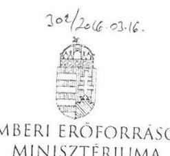

EMBERI ERÓFORRÁSOK MINISZTÉRIUMA
KÖZIGAZGATÁSI ÁLLAMTITKÁR

Iktatószám: 16415-2/2016/ELL

Hiv. szám: V-0771-111/2016.
Ügyintéző: Bánkné Simon Judit
Tel. szám: +36 (1) 795 4430
Melléklet: -

Domokos László részére
elnök

Állami Számvevőszék

Budapest
Apáczai Csere János u. 10.
1052

ÁLLAMI SZÁMVEVŐSZÉK
020477/2016.
Érkezett: 2016 MARC 1 1.
Iktatószám: V-0771-111/2016.
Melléklet:

Tárgy: Jelentéstervezethez észrevétel

Tisztelt Elnök Úr!

„A központi alrendszer egyes intézményei pénzügyi és vagyongazdálkodásának ellenőrzése – Borsod-Abaúj-Zemplén Megyei Kórház és Egyetemi Oktató Kórház” címmel készített számvevőszéki jelentéstervezethez az alábbi észrevételt teszem.

Az Állami Egészségügyi Ellátó Központról (a továbbiakban: ÁEEK) szóló 27/2015. (II. 25.) Korm. rendelet 4. és 5. §-ai értelmében a Borsod-Abaúj-Zemplén Megyei Kórház és Egyetemi Oktató Kórház tekintetében középirányító szervként az ÁEEK gyakorolja az irányítási hatásköröket, ennek keretében érvényesíti az előirányzatokkal, a létszámokkal és a vagyonnal való szabályszerű és hatékony gazdálkodás követelményeit, továbbá számon kéri és ellenőrzi e követelmények érvényre jutását.

Az előbbiek alapján indokoltnak tartom, hogy a jelentéstervezetben az emberi erőforrások miniszterének tett 3. számú javaslatot ne az emberi erőforrások minisztere részére, hanem az ÁEEK főigazgatója részére fogalmazza meg a jelentés.

Kérem Elnök Urat, hogy az észrevételt szíveskedjen elfogadni.

Budapest, 2016. március „/Ü.”

Üdvözlettel:

Dr. Lengyel Györgyi

Cím: 1054 Budapest Akadémiai utca 3. Tel: 36 1 795 1200 Fax: 36 1 795 0022
E-mail: info@cimmigy.uz.hu

---

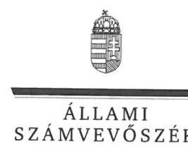

ELNÖK

Ikt.szám: V-0771-124/2016.

# Balog Zoltán úr 

emberi erőforrások minisztere
Emberi Erőforrások Minisztériuma

## Budapest

## Tisztelt Miniszter Úr!

Köszönettel megkaptam a 2016. március 11. napján az Állami Számvevőszékhez érkezett „A központi alrendszer egyes intézményei pénzügyi és vagyongazdálkodásának ellenőrzése -Borsod-Abaúj-Zemplén Megyei Kórház és Egyetemi Oktató Kórház" című számvevőszéki jelentéstervezetben foglalt javaslatokra a közigazgatási államtitkár asszony által tett észrevételeket.

Tájékoztatom Miniszter urat, hogy a jelentésben - az Állami Számvevőszékről szóló 2011. évi LXVI. törvény 29. § (3) bekezdése alapján - az el nem fogadott észrevételeket szerepeltetjük az elutasítás indokainak feltüntetésével együtt.

Az Állami Számvevőszék észrevételekre vonatkozó álláspontjáról a felügyeleti vezető által készített részletes tájékoztatást mellékelten megküldőm.

Budapest, 2016.
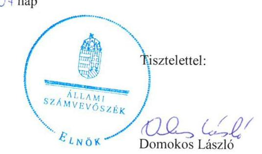

Melléklet: Tájékoztatás az el nem fogadott észrevételről

---

1. számú melléklet a V-0771-124/2016. ikt. számú levélhez

# Tájékoztatás   az el nem fogadott észrevételről 

| 1. | Észrevétel: | Az emberi erőforrások miniszterének címzett 3. számú javaslathoz, a javaslat címzettjére vonatkozóan. |
| :--: | :--: | :--: |
|  | Válasz: | Az Állami Számvevőszék az észrevételt nem fogadja el. |
|  | Indoklás: | Az államháztartásról szóló 2011. évi CXCV. törvény 9. § e) pontja szerint a költségvetési szerv tevékenységének törvényességi, szakszerűségi és hatékonysági ellenőrzése a költségvetési szerv irányítási hatáskörébe tartozik, amelyet az Állami Egészségügyi Ellátó Központról szóló 27/2015. (II. 25.) Korm. rendelet nem delegált az Állami Egészségügyi Ellátó Központ által gyakorolható irányítási jogkörök közé.   Az Állami Egészségügyi Ellátó Központról szóló 27/2015. (II.25.) Korm. rendelet 4. §-ában foglaltak szerint: „A MÖKtv., a Ttv., az Esztergom Város Önkormányzata egyes intézményeinek átvételéről szóló 2011. évi CLXXXVI. törvény, valamint az egészségügyi ellátórendszer fejlesztéséről szóló 2006. évi CXXXII. törvény alapján átvett, és a miniszter irányitása alá tartozó gyógyintézetek, valamint az Országos Vérellátó Szolgálat tekintetében középirányító szervként az ÁEEK gyakorolja az államháztartásról szóló 2011. évi CXCV. törvény 9. § b) és g)-j) pontja szerinti irányitási hatásköröket." |

Budapest, 2016. ơ hó 7 nap
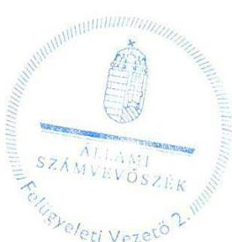

Salamon İldikó
felügyeleti vezető

---

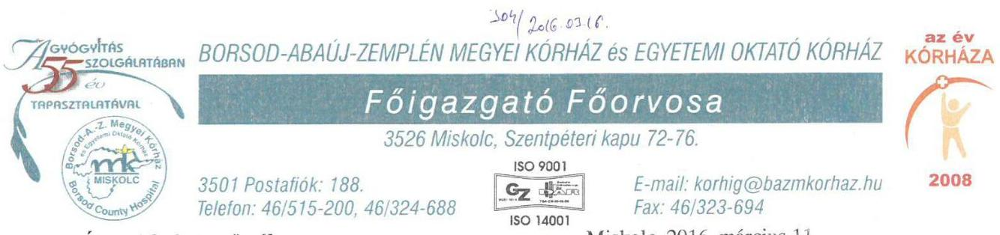

Állami Számvevőszék

Domokos László
elnök

1052 Budapest
Apáczai Csere János utca 10.

Miskolc, 2016. március 11.
Tárgy: Jelentéstervezetben szereplő
Javaslatokra tett észrevételek
Hiv. szám: V-0771-114/2016.
Iktatószám: 1004-107-2/2016.

## Tisztelt Elnök Úr!

Köszönettel vettem 2016. február 29-én érkezett V-0771-114/2016. iktatószám alatt nyilvántartott jelentéstervezetben szereplő javaslatokat és megállapításokat.

Köszönöm munkatársainak a pontos, gyors és korrekt munkavégzését. A vizsgálat ideje alatt munkatársai végezték feladatukat és a Kórház működési rendjéhez teljes mértékben alkalmazkodva tették kötelességüket.

Engedje meg, hogy a jelentéstervezethez az alábbi kiegészítéseket, kifogásokat, ellenvéleményeket fogalmazzam meg.

Bízom benne, hogy ezek egy része, vagy egésze felkelti az Ön és Kollégái figyelmét és beépül a jelentéstervezet végleges változatába.

## Jelentés tervezet Javaslatok a Kórház föigazgatójának 1. ponthoz:

A jelentéstervezet 1.1. pont 4. bekezdésében tett megállapítást elfogadjuk, mindemellett megjegyezni kívánjuk, hogy a fenntartóváltást követően a kórház alapító okirata az Égészségügyi Közlöny LXII évfolyamának 6. számában jelent meg 2012. március 30-án, mely nem tartalmazta az alapító okirat keltét, számát.

## Jelentés tervezet Javaslatok a Kórház föigazgatójának 2. ponthoz:

2. Intézkedjen, hogy a gazdasági szervezet ügyrendje a jogszabályi előírásokkal összhangban tartalmazza az alkalmazottak hatáskörét, valamint a belső, és - teljes körűen - a külső kapcsolattartás módját, szabályait.

Az észrevételt nem fogadjuk el, kérjük a jelentéstervezetből törölni a 2. számú javaslatot.
A jelentéstervezetben az ügyrenddel kapcsolatban behivatkozott Ámr. 20. §. (7) illetve Ávr. 13.§ (5) alapján előírt kötelezettség Kórházunkban az alábbi módon valósult meg.

---

Az ügyrend a gazdasági szervezetre vonatkozik, de Intézetünk más szabályzata, vagyis az osztályos Egységszintű Működési Szabályzatok tartalmazzák a fenti paragrafusban található követelményeket, továbbá a munkaköri leírások is megfogalmazzák a jogszabályban előírtakat. A fentiekről a helyszínen tájékoztatást nyújtottunk. (Pl. a Pénzgazdálkodási Osztály Egységszintű Müködési Szabályzata feltöltésre került az online felületre, a kórházi honlapon megtalálható minden szervezeti egységünk EMSZ-e.)

# Jelentés tervezet Javaslatok a Kórház föigazgatójának 3. a. ponthoz: 

3. Intézkedjen, hogy a Kórház belső szabályzatai megfeleljenek a jogszabályi előírásoknak:
a.) a számviteli politika tartalmazza, hogy mit tekintenek a számviteli elszámolás, az értékelés szempontjából lényegesnek, nem lényegesnek;

A fenti pontban megfogalmazottakkal részben értünk egyet, a szabályzatot módosítani visszamenőleg nem tartjuk célszerűnek, megjegyezni kívánjuk, hogy 2014. január 01-től jogszabály ((4/2013 (I. 11.) Ahsz.)) ennek a kérdésnek a szabályozását nem írja elő.
Kérjük a javaslatok közül törölni a 3. a.) pontot.

## Jelentés tervezet Javaslatok a Kórház föigazgatójának 3. b. ponthoz:

3. Intézkedjen, hogy a Kórház belső szabályzatai megfeleljenek a jogszabályi előírásoknak:
b.) az eszközök és források értékelési szabályzata tartalmazza az egyszerüsített értékelési eljárás alá vont követelések besorolásának elveit, dokumentálásának szabályait, továbbá követeléstípusonként a kisösszegü követelés év végi meghatározásának elveit, dokumentálásának szabályait;

Észrevételt nem fogadjuk el, kérjük a jelentéstervezetből törölni a 3. b.) számú javaslatot.
Az Eszközök és Források Értékelési Szabályzatába Intézetünk az Áhsz 8. § (18.), Ahsz 50.§ (2) c. pontja előírásait nem építette be az alábbiak miatt:
Intézetünknek adók módjára behajtható köztartozással kapcsolatos követelése nincs, a Számlarendünk sem tartalmazza a bevételi főkönyvi számot, ezért nem került be a szabályzatba. A szabályzatok speciálisak, az adott szerv feladatellátásának sajátosságaiboz igazodnak.
Az 50. § (2) bekezdés b.) pontjához: 2014. évben érvényes Értékelési Szabályzat 27. oldalán 5.9.3. pontban valamint a 30. oldalon az 5.10.3. pontban, továbbá a szabályzat M01, M02, M03 mellékleteiben találhatóak az ezzel kapcsolatos leírások. (Az egyszerüsített értékelési eljárást nem kell, hogy tartalmazza a szabályzatunk.)

## Jelentés tervezet Javaslatok a Kórház föigazgatójának 3. c ponthoz:

3. Intézkedjen, hogy a Kórház belső szabályzatai megfeleljenek a jogszabályi előírásoknak:
c.) a számlarend tartalmazza az analitikus, részletező nyilvántartásoknak a kapcsolódó könyvviteli és nyilvántartási számlákkal való egyeztetésének dokumentálását.

Elfogadjuk. Megjegyezzük, hogy a jelenlegi gyakorlat ennek megfelel. Kérjük ennek rögzitését a megállapítások között.

## Jelentés tervezet Javaslatok a Kórház föigazgatójának 4. ponthoz:

Elfogadjuk a 2.2 számú megállapítást, mely szerint a „Kockázatkezelési rendszer kialakítása és müködtetése összességében szabályszerű volt, azonban a szervezeti egységenként meghatározott kockázatelemzések intézményi szintű összesítését, valamint az intézményi kockázat minősítési

---

javaslatot és a hozzá kapcsolódó intézkedési tervet nem készítették el és nem terjesztették a föigazgató elé."

A kockázatelemzések intézményi szintű összesítéséről az elmúlt évben már gondoskodtunk a stratégiai terv elkészítésével párhuzamosan. Az intézet kockázatkezelési és monitoring gyakorlatát, példákkal alátámasztva a 2.5. pontban szereplő megállapításokhoz füzött észrevételeink között részletezzük.

# Jelentés tervezet Javaslatok a Kórház föigazgatójának 5. ponthoz: 

5. Intézkedjen a pénzügyi kihatású döntések célszerűségi, gazdaságossági, hatékonysági és eredményességi szempontú megalapozottságának kontrolljára.

Az észrevételt nem fogadjuk el, kérjük a jelentéstervezetből törölni az 5. számú javaslatot.
Véleményünk szerint a Bkr. 8. § (2) c, pontjának többek között az észrevételünkhöz becsatolt 2013. október 24 -én kiadott 1001-45/2013. föigazgató utasítás is megfelel, valamint az ezekhez kapcsolódó Megrendeléses, szerződéses információk.
A B.-A.-Z. Megyei Kórház és Egyetemi Oktató Kórházban a kötelezettségvállalók és a pénzügyi ellenjegyzők minden szerződéskötés és megrendelés esetén a témafelelősöktől és nagygazdálkodótól bekérik a döntést megalapozó gazdasági és jogi információt, javaslatot. Ezen dokumentációkat az ellenőrzés nem kérte ezért nem került átadásra. Mellékelten csatoljuk: 100145/2013 Föigazgatói Utasítást, valamint 3 db megrendelés, szerződéshez kapcsolódó információt. (intézeti szabályzataink tartalmazzák a fentiekhez kapcsolódó kontrollokat: ME-04-01 Szerződéskötések rendje, valamint a FIGU-018 Szabályzat a kötelezettségvállalás és adatszolgáltatás rendjéről)

## Jelentés tervezet Javaslatok a Kórház föigazgatójának 6. ponthoz:

A jelentéstervezet 2.4. pont 3. bekezdésében foglalt megállapítást elfogadjuk, a kórház 2014. július 1-jei hatállyal kiadta A közérdekủ és a közérdekből nyilvános adatok kezelésének rendje címủ Főigazgatói Utasítást (FIGU-011), mely tartalmazza a közérdekủ adatok teljes körű közzétételének intézeti szabályait, a vonatkozó jogszabályi előírásokkal összhangban. Fentiekre tekintettel kérjük a 6. számú, a közérdekủ adatok teljes körű közzétételére vonatkozó intézkedési javaslat törlését.

## Jelentés tervezet Javaslatok a Kórház föigazgatójának 7. ponthoz:

A jelentéstervezet 2.4. pont 4. bekezdése szerint:
„A kórház rendelkezett iratkezelési szabályzattal, amelyhez azonban az Ltv. 10.§ (1) bek. a.) pontjában foglaltak ellenére az illetékes közlevéltár egyetértésével nem rendelkezett."

A jelentéstervezet megállapítása nem tényszerű, ezért kérjük annak pontosítását.
A Borsod-Abaúj-Zemplén Megyei Kórház és Egyetemi Oktató Kórház Iratkezelési szabályzatát az ellenőrzött időszakot megelőzően, 2005. január 10-én a Borsod-Abaúj-Zemplén Megyei Levéltár jóváhagyta (észrevételezések mellett) és a levéltári szervdossziéban elhelyezte. Mellékelem a levéltári jóváhagyás dokumentumát, melyet a helyszíni ellenőrzés időszakában már átadtunk.
A kórház az iratkezelési szabályzatát rendszeresen felülvizsgálta, aktualizálta a hatályos jogszabályoknak való megfeleltetés céljából. A kórház az iratkezelési rendszerét 2005. óta nem változtatta meg, új, egyedi iratkezelési szabályzatot nem adott ki. Álláspontunk szerint a hatályos jogszabály előírásának figyelembevételével a vizsgált időszakban nem volt szükséges az illetékes közlevéltár egyetértésének megkérése.

---

# Jelentés tervezet Javaslatok a Kórház föigazgatójának 8. ponthoz: 

8. Intézkedjen a pénzügyi gazdálkodási területen az operatív tevékenységek folyamatos és eseti nyomon követésére alkalmas monitoring rendszer kialakítására és múködtetésére.

Az ellenőrzési jelentésben foglaltakat részben elfogadjuk. A kórháznál kialakított monitoring tevékenységben résztvevő Kontrolling Csoport jellemzően a betegellátás teljesítményének költség és bevétel adatait elemzi - a kórházi költségvetés $98 \%-99 \%$-át lefedő - bevétel és költség adatokat és folyamatokat követi nyomon. Való igaz, hogy a fennmaradó $1 \%-2 \%$ - köztük a pénzügyi gazdálkodási, monitoring tevékenység- csak részben van kialakítva (jelenleg is müködik: likviditás készítés szállítóállomány elemzése, várható bevételek kiadások alakulása) melyet ez évben tervezünk kialakítani és müködtetni. Az ellenőrzés jelentéstervezetben kérjük a monitoring tevékenység 98-99 \%-os lefedettségét hangsúlyozni. További indokainkat a 2.5. pontban irt megállapításokhoz füzött további észrevételeink között részletezzük.

## Jelentés tervezet Javaslatok a Kórház föigazgatójának 9. ponthoz:

A jelentéstervezet 2.5. számú megállapítás 6. bekezdése szerint:
„A föigazgató által 2010-ben jóváhagyott belső ellenőrzési kézikönyvet - a Ber. 5 § (3) bekezdésében elöirt legalább évenkénti és a Bkr. 17. § (4) bekezdésében elöirt legalább kétévenkénti felülvizsgálati kötelezettség ellenére - a belső ellenőrzési vezető nem vizsgálta felül."

Az alábbi észrevételre tekintettel kérjük a megállapítás pontositását, kiegészítését:
A föigazgató által 2010-ben jóváhagyott belső ellenőrzési kézikönyvet - a Ber. 5 § (3) bekezdésében elöirt legalább évenkénti és a Bkr. 17. § (4) bekezdésében elöirt legalább kétévenkénti felülvizsgálati kötelezettség ellenére - a belső ellenőrzési vezető nem vizsgálta felül."

Az alábbi észrevételre tekintettel kérjük a megállapítás pontosítását, kiegészítését:
A föigazgató által 2010-ben jóváhagyott belső ellenőrzési kézikönyvet - a Ber. 5 § (3) bekezdésében elöirt legalább évenkénti és a Bkr. 17. § (4) bekezdésében elöirt legalább kétévenkénti felülvizsgálati kötelezettségének megfelelően - a belső ellenőrzési vezető felülvizsgálta. A felülvizsgálatról az éves ellenőrzési jelentésekben (2011-2014) rendszeresen nyilatkozott, az éves ellenőrzési jelentéseket a fenntartó elfogadta és tudomásul vette.
A Nemzetgazdasági Minisztérium által 2013. februárjában (a Bkr. hatályba lépését követő évben) közzétett Belső Ellenőrzési Kézikönyv Minta alapján a jogszabályi követelményeknek megfeleltetett Belső Ellenőrzési Kézikönyv elkészült. Az észrevételben hivatkozott éves ellenőrzési jelentéseket mellékelve ismételten átadjuk.

## Jelentés tervezet Javaslatok a Kórház föigazgatójának 10. ponthoz:

A jelentéstervezet 2.5. számú megállapítás 7. bekezdése szerint:
„A belső ellenőrzési vezető a jóváhagyott éves ellenőrzési tervekben foglalt ellenőrzések végrehajtásáról - a Ber. 12. § b) pontjában, valamint a Bkr. 22. § (1) bekezdés b) pontjában elöirtak ellenére - nem gondoskodott, mivel a 2011-2013. években a tervezett ellenőrzésekből három-három ellenőrzés, 2014-ben két ellenőrzés nem valósult meg. A tervezett ellenőrzéseken felül soron kivüli ellenőrzéseket hajtottak végre."

Az alábbi észrevételre tekintettel kérjük a megállapítás kiegészítését, pontositását, mivel álláspontunk szerint az ellenőrzések elvégzésének hiánya nem róható a kórház terhére. A kórház szabályszerűen járt el, mivel a Nemzetgazdasági Minisztérium Útmutatójának elöírása szerint a fenntartó felé az éves ellenőrzési jelentéseiben az elmaradt ellenőrzésekről beszámolt, megjelölve és indokolással alátámasztva az egyes ellenőrzés elmaradásának, illetve elhalasztásának okát (soron

---

kívüli és terven felüli ellenőrzések elrendelése, a belső ellenőrök létszámának, illetőleg személyeinek gyakori változása, a vizsgálattal érintett szervezeti egység vezetőjének távolléte).
Kezdeményezzük továbbá a megállapítás kiegészítését azzal is, hogy az adott évben „elmaradt ellenőrzésként" nyilvántartott vizsgálat elvégzése, befejezése az azt követő évben, években csaknem teljes körűen megtörtént.
Fentiek alátámasztásául megküldjük a Belső Ellenőrzési Csoport létszámának változására vonatkozó adatokat, továbbá azon kimutatást, mely tartalmazza, hogy az adott évben „elmaradt ellenőrzésként" nyilvántartott vizsgálat elvégzésére mikor került sor, részletezve a soron kívüli és terven felüli ellenőrzéseket.

# Jelentés tervezet Javaslatok a Kórház föigazgatójának 11. ponthoz: 

A jelentéstervezet 2.5. pont 8-9. bekezdése szerint
„A belső ellenőr az ellenőrzött jelentésben meghatározta a javaslatok elvégzésének határidejét és felelőstét, amelyet a föigazgató megküldött az ellenőrzött szervezeti egység vezetőinek. A belső ellenőrzési jelentésekben megfogalmazott megállapításokra, javaslatokra - a Ber. 29. § (1) és (2) bekezdéseiben, valamint a Bkr. 28. § c) pontjában, továbbá a 45. § (1)-(3) bekezdéseiben foglaltak ellenére - 2011-ben nem készítettek, míg 2012-2014-ben nem teljes körüen készítettek intézkedési tervet, azonban egyes esetekben azonnali intézkedéseket tettek a hibák, hiányosságok megszüntetésére. A Kórház föigazgatója a 2012-2014. években az intézkedési tervek jóváhagyásáról - a Bkr. 45. § (4) bekezdése elöirása ellenére - nem döntött. A 2011-2013. években végzett belső ellenőri jelentések alapján tett intézkedéseket - a Ber. 29/A § (1) bekezdés, illetve a Bkr. 21. § (2) bekezdés d) pontjában elöirtak ellenére - nem követték nyomon. A 2014. évi belső ellenőrzések, illetve az ellenőrzött időszakban végrehajtott külső ellenőrzések javaslatainak nyomon követése megfelelit a Ber., illetve a Bkr. elöirásainak."

A kórházban kialakított gyakorlat alapján a belső ellenőr az ellenőrzési jelentésében javaslatként pontosan megjelölte az elvégzendő feladatot, feltüntetve az intézkedés javasolt határidejét és felelőstét. Véleményünk szerint azzal, hogy a főigazgató főorvos - az ellenőrzési jelentésben foglaltakkal egyetértve - a javaslat szerinti intézkedés végrehajtását rendelte el, szükségtelen volt utasítást adni intézkedési terv készítésére.
Az ÁSZ ellenőrzés időszakában csatolt 2. sz. tanúsítvány alapján a jelentéstervezet alábbi szövegszerű pontosítását kérjük: „számos esetben azonnali intézkedéseket tettek a hibák, hiányosságok megszüntetésére".

## Jelentés tervezet Javaslatok a Kórház föigazgatójának 12. ponthoz:

12. Tegyen eleget az intézkedés meghozatalát követő 5 munkanapon belül az intézményi hatáskörben végrehajtott előirányzat-módosításokról a Kincstár és az irányító szerv felé fennálló tájékoztatási kötelezettségnek.

Elfogadjuk, megjegyezni kívánjuk, hogy a bevételi előirányzatok egy részének módosításánál 5 napnál több időt vesz igénybe a bevételi jogcím beazonosítása.

---

# Jelentés tervezet Javaslatok a Kórház föigazgatójának 13. ponthoz: 

13. Intézkedjen, hogy az intézményi hatáskörü előirányzat-módosításra a jogszabályi előírásokkal összhangban a kijelölt pénzügyi ellenjegyző ellenjegyzésével kerüljön sor.

Elfogadjuk.

## Jelentés tervezet Javaslatok a Kórház föigazgatójának 14. ponthoz:

14. Intézkedjen a bevételi előirányzatok teljesítésének kötelezettségére vonatkozó jogszabályi előírás betartására.

Elfogadjuk. Megjegyezni kívánjuk, hogy a betegforgalom hektikussága és a többszöri átszervezések - kórházak egyesítése, kórházrészek átadása - miatt a teljesítés meghatározása a bevételi tervezést, teljesítést nehezítette. Kérjük, ezen tényt a jelentéstervezetben szerepeltetni.

## Jelentés tervezet Javaslatok a Kórház föigazgatójának 15. ponthoz:

15. Intézkedjen, hogy a gazdálkodási jogkörök gyakorlására kijelölt teljesítést igazolók és érvényesítők a jogszabályi előírásoknak megfelelően lássák el feladataikat.

Elfogadjuk.

## Jelentés tervezet Javaslatok a Kórház föigazgatójának 16. ponthoz:

## 16. Intézkedjen

a.) a jogszabályban meghatározott esetekben a közbeszerzési eljárások lefolytatására;
b.) a feltárt szabálytalanságok tekintetében a felelősség tisztázása érdekében, és szükség szerint tegyen intézkedéseket a felelősség érvényesítésére.

Nem fogadjuk el a jelentéstervezet ezen megállapítását. A jelentés 24. oldalán található 3.3. számú megállapítás 10. bekezdésében az alábbi szövegrészt rögzítették, miszerint:
„a közbeszerzési szabályok betartása a Kórháznál nem volt megfelelő."
Ezen megállapítást törölni kérjük az alábbiakban írtak alapján. A közbeszerzési szabályok betartásának vizsgálatához 79 dologi és 30 felhalmozásí mintatétel (összesen 109 mintatétel) került kiválasztásra. A helyszíni ellenőrzés alkalmával az Állami Számvevőszék ellenőrei 25 mintát ítéltek szabálytalannak különböző okok miatt. Ez - az ellenőrzési jelentéstervezetben rögzített (13. oldal) ellenőrzési módszertan alapján - 77,06\%-os szabályossági szintet jelent, mely alapján megállapítható lenne a nem szabályos közbeszerzési gyakorlat.
Az Állami Számvevőszék később 19 esetben indított jogorvoslati eljárást Intézményünkkel szemben a Közbeszerzési Döntőbizottságon, (ez 82,57 \%-os szabályossági szintet jelentene) mely eljárások időközben lezárultak. A jogorvoslatok eredményeképpen megállapítható, hogy a 19 indított jogorvoslati eljárásból 6 esetben állapított meg valóban jogsértést a Közbeszerzési Döntőbizottság. A jelentéskészítés közben ezen tények vélhetően nem kerültek figyelembevételre, és így került a fentebb írt megállapítás (nem megfelelő közbeszerzési gyakorlat) rögzítésre.

---

A vizsgált 109 mintatétel közül tehát 6 esetben állapítható meg a Közbeszerzési Törvény valamely elöirásának be nem tartása, melynek kapcsán - a jelentés tervezetben ismertetett ellenörzési módszer alapján - a vizsgált beszerzési eljárások szabályosságának aránya 94,5\%, mely egyértelmüen a szabályszerü kategóriába tartozik.
A fentebb irtakra tekintettel kérjük a jelentés ezen pontjának módosítását.

# Jelentés tervezet Javaslatok a Kórház föigazgatójának 17. ponthoz: 

17. Intézkedjen, hogy a Kórház a jogszabályokban elöirt határidőben tegyen eleget adatszolgáltatási kötelezettségének az éves költségvetési beszámoló irányító szerv felé történő megküldésével.

Az észrevételt nem fogadjuk el, kérjük a jelentéstervezetből törölni a 17. számú javaslatot.
Határidők és betartásuk a 2011 - 2014 Beszámolók tekintetében:

## 2011. Éves Költségvetési Beszámoló

A 2011. évi beszámoló leadási határidejéről a B.-A.-Z. Megyei Közgyűlés Főjegyzője által küldött II-749/2012. számú levélben tájékoztatta Intézetünket. Egyeztetés alapján az intézménytől a beszámolót a Borsod Abaúj Zemplén Megyei Önkormányzat 2012. március 9.-én vette át.
2012. évtől Központi Költségvetési szervként működik a Kórház, irányító szerve a GYEMSZI volt.

## 2012. Éves Költségvetési Beszámoló

A GYEMSZI 2013. április 5.-én kelt elektronikus üzenete szerint a beszámoló ellenőrzése a GYEMSZI és az EMMI részéről befejeződött kérték a beszámoló feladott állapotúvá tételét melyet az Intézmény a státusztörténet szerint a kért napon teljesített.

## 2013. Éves Költségvetési Beszámoló

A GYEMSZI 2014. április 9.-én kelt elektronikus üzenete szerint a beszámoló ellenőrzése a GYEMSZI és az EMMI részéről befejeződött kérték a beszámoló feladott állapotúvá tételét melyet az Intézmény a státusztörténet szerint a kért napon teljesített.

## 2014. Éves Költségvetési Beszámoló

- Az ÁEEK 2015. május 22 i elektronikus levele szerint a határidő 2015. május 27.-e mely az NGM-hez benyújtott javítási kérelemmel rendelkező intézmények esetében a kérelem feldolgozását követő három munkanapra módosul.
- 2015. május 27.-én az EMMI Költségvetési Főosztályától kapott elektronikus levél szerint „Azon intézmények tekintetében, akik a beszámoló javítására vonatkozóan NGM kérelmet nyújtottak be, úgy esetükben a fenti határidő a kérelem KGR-K11 rendszer feldolgozását követő három munkanapra módosul. Így a fentiek értelmében Önökre nem a május 27-i határidő vonatkozik."
- Az intézmény kérelmét a Kincstár a KGR-K11 rendszerben 2015. május 28.-án feldolgozta, mely napon a státusztörténet szerint az intézmény a beszámolót feladta. A Kincstári feldolgozás módosítás előtt a beszámoló nem adható be.

Fentiekből jól látható, hogy az Intézményre vonatkozó határidőt a javítási kérelem miatt az EMMI módosította, amit az intézménnyel írásban közölt.
A módosított határidőben az intézmény a beszámolót feladta.

---

# Összefoglalóan elmondható az alábbi: 

Az Áhsz. 32. § (1) szerint a költségvetési szerv éves költségvetési beszámolóját a költségvetési évet követő év február 28 -áig az irányító szerv vezetőjének jóváhagyásra megküldi.

Az Intézmény a vizsgált adatszolgáltatások tekintetében, vagyis a Beszámolókat minden évben a jogszabály valamint felügyeleti, irányító szerv által előirt határidőben a $K G R$-K11 rendszerbe berögzítette, abban az időpontban, amikor ez a rendszer erre alkalmassá vált, ezen rendszerben feltöltött adatokat a felügyeleti szerv megvizsgálta.
Tudvalevő, hogy a KGR K11 program minden évben határidöre hibásan készült el, rengeteg verzióváltása volt, (pl. 2013. évben 20 alkalommal volt verzióváltás) a programra intézetünknek nincs ráhatása.
Az online rendszerbe feltöltött dokumentumokból is kitűnik, hogy az intézmény a beszámolót abban az időpontban adta fel amikorra azt az irányító szerv kérte, vagyis amikor a beszámoló ellenőrzését befejezte, valamint annak függvényében, amikor a KGR K11 program arra alkalmassá vált.
A feladási határidő tehát az az időpont, amikor az irányító szerv az ellenőrzést már befejezte.
Tehát az intézményünk a jogszabályban elöirt határidöt minden esetben teljesitette a technikai feltételek függvényében.
Mellékletben csatoljuk a fentieket alátámasztó dokumentumokat. (52 darab)

## Jelentés tervezet Javaslatok a Kórház föigazgatójának 18. ponthoz:

18. Intézkedjen, hogy a kiadások teljesítésének ütemezéséről a likviditási tervet a jogszabályban elöirt gyakorisággal és tartalommal készitsék el.

Az észrevételt nem fogadjuk el, kérjük a jelentéstervezetben javítani a 18. számú javaslatot az alábbiak szerint: „2012. január-március hónapokban" helyett „2012. január-február hónapokban". Kérjük törölni: „valamint 2014. január-augusztus hónapokban nem teljesítette az Áht. 78. §. (2) bekezdésben elöírtakat" szövegrészt, mivel a likviditási terv elkészült és az online rendszerben feltöltésre került.
A jelentés tervezetből továbbá kérjük törölni a következő szövegrészt: „azonban a kimutatások a kiadások kifizetését nem sürgősség szerint szerepeltette, így a fennálló kötelezettségek határidőben történő teljesítését nem biztosította."
A likviditási tervekben a kiadások sürgősség, fontosság szerinti sorrendben szerepelnek. A likviditás összeállításának elsődleges szempontjai a betegbiztonság és a Kórház müködésének üzembiztonsága. A prioritások Kórházunkban a fentiek után: a munkabér kifizetés, a közterhek, valamint az üzemeltetés, rezsiköltségek kifizetése. A határidőben történő nem teljesítés a Kórház likviditási nehézségeire vezethető vissza.
Mellékletben csatoljuk a fentieket alátámasztó dokumentumokat. (11 darab levél)

## Jelentés tervezet Javaslatok a Kórház föigazgatójának 19. ponthoz:

19. Kezdeményezze a jogszabályi előírásokkal összhangban a vagyonkezelői jog bejegyzését az ingatlan nyilvántartásba.

Elfogadjuk, az ellenőrzött időszakban nem volt bejegyezve a vagyonkezelői jog, a vagyonkezelői jog bejegyzése az ingatlan nyilvántartásban időközben megtörtént.

---

# Jelentés tervezet Javaslatok a Kórház föigazgatójának 20. ponthoz: 

20. Intézkedjen, hogy a követelések év végi értékelése során az értékvesztés elszámolására a vevő, adós minősitése alapján, a követelés könyv szerinti értéke és a követelés várhatóan megtérülő összege közötti - veszteségjellegü - különbözet összegében kerüljön sor.

Az észrevételt nem fogadjuk el, kérjük a jelentéstervezetből törölni a 20. számú javaslatot.
A 2014. évben érvényes Értékelési Szabályzat 27. oldalán 5.9.3. pontban valamint a 30. oldalon az 5.10.3. pontban, továbbá a szabályzat M01, M02, M03 mellékleteiben találhatóak az ezzel kapcsolatos leírások. A szabályzat M02 melléklete szerint minősítjük a vevőket, adósokat, a meg nem térülő követelések összegét százalékos mértékben határoztuk meg, (egy éven túl 100\%) e melléklet alapján tételesen felsorakoztatásra kerültek az egy éven túli, nem fizető adósok, vevők. Mellékletben csatoljuk a fentieket alátámasztó dokumentumokat. (51darab)

## Jelentés tervezet Javaslatok a Kórház föigazgatójának 21. ponthoz:

21. Tegyen intézkedéseket a leltározás kapcsán feltárt hiányosságok és szabálytalanságok tekintetében a felelősség tisztázása érdekében, és szükség szerint intézkedjen a felelősség érvényesítésére.

A 4.2. számú megállapítás 7. bekezdésében (,Leltárhiány esetén a személyi felelősséget megvizsgálták") foglaltakat nem fogadjuk el, így kérjük a jelentéstervezetből törölni a 21. számú javaslatot: Leltározási szabályzatunk tartalmazza a teljes folyamatot.

A leltárakkal kapcsolatban minden évben egy leltárt töltöttünk fel az online felületre. A becsatolt leltárak között nem volt olyan leltár, amely bemutatja a felelősségre vonást.
Mellékleten becsatoljuk a Mezőkövesdi telephelyünk gyógytorna leltárát. (43 darab)
Megállapítható, hogy a szükséges intézkedés a leltárhiányok esetében megtörténik.

## Jelentés tervezet Javaslatok a Kórház föigazgatójának 22. ponthoz:

A jelentéstervezet 4.4. pont 3. bekezdésében foglalt megállapítást elfogadjuk, mindemellett kérjük a 22. számú, a bérbeadási folyamatokra vonatkozó intézkedési javaslat törlését. A kórház 2015 júliusától kötött bérleti szerződéseiben már rögzítésre kerül, hogy a bérbevevők vállalják az átengedett nemzeti vagyon vonatkozásában előírt beszámolási, nyilvántartási, adatszolgáltatási kötelezettségek teljesítését (, Bérlő nyilatkozik, hogy megfelel a nemzeti vagyonról szóló 2011. évi CXCV1. törvény 11.§-a (10)-(11) bekezdésben foglaltak feltételeknek és az elöirt kötelezettségeknek eleget tesz.")

## Egyéb észrevételek

## Észrevételek a jelentéstervezet Megállapítás cím alatt leírtakhoz

21. oldal 3.2. számú megállapítás FORDÍTOTT ÁFA-ra vonatkozóan az alábbiakat fogalmazzuk meg.
A fordított áfa intézetünkben pályázati beruházáshoz, ingatlanokhoz kapcsolódik. A számlák szállítói finanszírozásúak voltak, melyeket nettó összegre és áfára kellett iktatni. Ezeknek a számláknak a nettó összegét a szállítónak átutalta az Irányító Hatóság. Az Irányító Hatóság jelezte a

---

szállítónak történő kifizetést Intézetünk felé, ezzel egy időben került be könyveinkbe az alábbi módon: A nettó összeget kiadásként könyveltük az 1. számlaosztályban, a 12. számlacsoport megfelelő számláin, valamint az áfát az 1. számlaosztályban szereplő AFA kiadásra (18), valamint a hozzá kapcsolódó bevétel könyvelésre került támogatásértékủ felhalmozási bevételre (465). A fentiekhez saját hatáskörben megkértük az előirányzatot. A fordított áfa sajátosságát tekintve ezen áfát be kellett fizetni a NAV felé az áfa elszámolás alkalmával. A befizetést az 56. Müködési kiadásokra le kellett könyvelni. Ahhoz hogy a kiadásnak előirányzata legyen meg kellett kérni az előirányzatot irányítószervi hatáskörben a kiadás 56-ra valamint a 9. Müködési bevétel előirányzatát is növelni kell a fordított AFA soron. Tehát a fordított áfa helyesen szerepel 2012. évben a könyveinkben.

A fordított áfával kapcsolatos észrevételt „2012-ben a fordított általános forgalmi adó összegének kétszeres szerepeltetése" kérjük a jelentéstervezetböl törölni. 21. oldal 3.2. számú megállapítás 2013. évi előirányzat nyilvántartás 2013. évben az előirányzat módosításokról vezetett nyilvántartás adata megegyezett a költségvetési beszámoló adatával. Az online rendszerbe feltöltött nyilvántartásunk külön soron tartalmazza a dologi kiadás és a fordított áfa összegét, de a fordított áfa természetesen a dologi kiadások része.

Kérjük a jelentéstervezetből törölni a 2013. évre vonatkozó megállapítást: „2013-ban a nyilvántartás vezetésének hibája miatt nem egyeztek meg az előirányzat módosításáról vezetett analitikus nyilvántartásban szereplő adatokkal".

Az alábbiakban mutatjuk be a 2013. év előirányzat alakulását.

|  Jogcím | Költségvetési beszámoló |  | Analitikus nyilvántartás |   |
| --- | --- | --- | --- | --- |
|   | emeleti
előirányzat | módosítási
előirányzat | emeleti
előirányzat | módosítási
előirányzat  |
|  Személyi palatások | 6387000 | 6222245 | 6387000 | 6222245  |
|  Munkaadókat terhelő járulékok | 1743600 | 2240900 | 1743600 | 2240900  |
|  Dologi kiadások | 11321125 | 12747138 | 11321125 | 12188664  |
|  Fordított AFA |  |  | 0 | 558474  |
|  Dologi kiadások összesen: | 11321125 | 12747138 | 11321125 | 12747138  |
|  Egyéb müködési célú kiadások | 313100 | 190444 | 313100 | 190444  |
|  Felújítások | 0 | 985653 | 0 | 585653  |
|  Bénzhözések | 800000 | 5073243 | 800000 | 5073243  |
|  Költségvetési kiadások
összesen | 20564825 | 29459623 | 20564825 | 29459623  |

# 25. oldal 3.3. számú megállapítás utolsó bekezdése

Kérjük törölni a 25. oldal 3.3. számú megállapítás utolsó bekezdésének utolsó tagmondatát. Ellentmondás észlelhető a mondatrészben tett megállapítás és a jelentéstervezet IV. számú mellékletében foglaltak között, hiszen megállapításuk szerint a vizsgálat időszakában „a kockázatokat mérséklő kontrollok szintje alacsony színtről magas szintre növekedett"

## 35. oldal 4.5. megállapítás - rendezőmérleg

Rendezőmérleg elkészítésénél a leltározással kapcsolatos feladatok: „nem lealapozott nagy értékủ gépeket, berendezéseket nem leltározták tényleges mennyiségi felvétellel."

A fenti észrevételt nem fogadjuk el, kérjük a jelentéstervezetből törölni az alábbi indoklásainak alapján.

---

Az ÁSZ nem kérte a rendezőmérleghez kapcsolódó nem lealapozott nagy értékủ gépek, berendezések leltárát. Intézetünk a jogszabálynak megfelelően a leltározást elvégezte. Becsatolunk ehhez kapcsolódóan két külső és két intézeten belüli leltárt, Miskolci Patyolat Zrt. valamint az SZTSzínvonal Bt. leltárát, továbbá a F-O-G Audiológia és a Kultúrház leltározását.

# Észrevételek a jelentéstervezet Összegzés cím alatt leírtakhoz Az Összegzésben szerepel „a pénzügyi gazdálkodás nem volt szabályszerű". 

Kérjük, ezen megállapítás módosítását az alábbi észrevételezéseink miatt.
Az elemzésüknél vegyék figyelembe az Intézmény nagyságát, a fellelhető bizonylatok, tételek mennyiségét. A mintavételezés eredményéből kialakított százalékos meghatározás a kiindulási érték kialakítása, a költségvetési összegünk, valamint tételszámunk nagyságának függvényében kerüljön meghatározásra. A vizsgált időszakban a feldolgozott számláink száma meghaladja a 100.000 tételt. Az ellenőrzésre kiválasztott tételek száma $>250 \mathrm{db}$ volt. Amennyiben lehetséges, kérjük tájékoztatásukat, hogy a kiválasztott mintatételek közül hányat minősítettek hibásnak.
A módosított szövegrészben jobb minősités szerepeltetését kérjük, legalább a részben szabályszerű minősités megállapítását, hiszen a költségvetési tervezés, költségvetési maradvány elszámolása jogszabályi előírások szerint történt, azaz szabályszerű volt.

## További észrevételek

Az ellenőrzési jelentéstervezet 39. oldalán található, a fenntartó részére megfogalmazott 1. javaslati pontot és az ehhez kapcsolódó, 2.5. pontban írt megállapításokat nem tudjuk elfogadni az alábbiak miatt:
„ 2.5. számú megállapítás 1.-2. bekezdés szerint: „A Kórház az operativ tevékenységek folyamatos és eseti nyomon követésére intézményi szintü, szabályozott rendszert nem alakitott ki és nem müködtetett. A kórház monitoring tevékenységet végzö kontrolling csoport kizárólag a betegellátás területére vonatkozóan végzett monitoring tevékenységet, a többi - köztük a pénzügyi gazdálkodási - területen monitoring tevékenységet nem végeztek, a monitoring információk alapján jelentések, feljegyzések kizárólag a betegellátás területéről készültek. Ezért az operativ tevékenységek folyamatos és eseti nyomon követési rendszerének kialakítása és müködtetése részben felelt meg az Ámr. $160 \frac{1}{2}(2)$ bekezdésében és a Bkr. $10 \frac{1}{2}$-ában foglaltaknak. A kórházban 2001. december 28 -tól - a müködés egészét átfogó - ISO 9001:2000 minöségirányitási rendszert müködtettek.

A kórháznál a rendelkezésre álló források gazdaságos, hatékony, és eredményes felhasználását biztositó teljesitménycélokat és követelményeket (szabályozásokat, folyamatokat) - az Áht. 121/A § (1) bekezdés és a Bkr. $6 \frac{1}{2}(2)$ bekezdésében foglaltak ellenére - nem alakitottak ki."

A jelentéstervezet azt tényként rögzíti, hogy - a betegellátási folyamatok szintjén - müködik a monitoring rendszer. Leírja, hogy a kontrolling szervezeti egységünk a betegellátási folyamatokra fókuszál. Ennek magyarázata, hogy e folyamatokhoz egyébként a bevételeink és a kiadásaink 98-99 \%-a köthető, ezért a betegellátási tevékenységek kontrollja egy, az operatív folyamatoktól független, ellenőrző-elemző tevékenységet végző szervezeti egység (jelen esetben a kontrolling csoport) bevonásával történik. E területeken (betegellátás) végzett elemzések, folyamat újraszabályozások ugyanis az elérhető előnyöket tekintve ténylegesen érzékelhető nagyságrendben képesek az összintézeti - gazdasági értelemben is értelmezhető - hatékonyságot javítani. Ezek mellett természetesen a napi pénzügyi kihatással járó döntések előkészitéséhez is rendszeresen végeznek elemzéseket. Fontosnak tartjuk tehát hangsúlyozni - mint ahogyan azt a monitoring tevékenység kiegészítő ellenőrzéséhez készített M/1. számú tanúsítványon is jeleztük -, hogy az intézmény a napi müködése, és a gazdasági hatással is járó vezetői döntései során figyelembe veszi a gazdaságossági, hatékonysági, eredményességi szempontokat. Ezek bizonyitásául a vizsgálat ideje

---

alatt dokumentumokat, szabályzatokat, munkaköri leírásokat is csatoltunk. Téves az a feltételezés, és az ebből adódó megállapítás is, mely szerint a kontrolling csoportunk monitoring tevékenységet kizárólag a betegellátás területén végez. Álláspontunk szerint a megállapítás úgy pontos, hogy „a kontrolling csoportunk elsösorban, de nem kizárólag a betegellátás területén végez monitoring tevékenységet". Kérjük annak rögzítését is a megállapításokban, hogy „monitoring tevékenységet nem kizárólag a kontrolling csoport végez".

Áht. 121/A § (1) „A belső kontrollrendszer létrehozásáért, működtetéséért és fejlesztéséért a költségvetési szerv vezetője felelős az államháztartásért felelős miniszter által közzétett módszertani útmutatók figyelembevételével. A költségvetési szerv vezetője köteles olyan szabályzatokat kiadni, folyamatokat kialakítani és működtetni a szervezeten belül, amelyek biztosítják a rendelkezésre álló források szabályszerű, szabályozott, gazdaságos, hatékony és eredményes felhasználását."

Véleményünk szerint a 121./A (1) bekezdés szerint és a kiadott módszertani útmutató figyelembevételével alakítottuk ki és müködtetjük jelenleg is monitoring rendszerünket. Értelmezésünk és az útmutató bevezetőjében leírtak szerint is a módszertani útmutató csupán tájékoztatóul szolgál, melyet figyelembe vettünk.
A hivatkozott módszertani útmutató bevezetőjében ugyanis ez szerepel: „Jelen útmutató célja, hogy tájékoztatást nyújtson a költségvetési szervek vezetői, belső ellenôrei és a közszférában dolgozók részére a monitoring folyamatokról..."
Ugyanezen módszertani útmutató 7. oldalán az alábbiak szerepelnek: „A szervezet számos monitoring tevékenység közül választhat aszerint, hogy mely folyamat illeszkedik leginkább a szervezeti struktúrába, kultúrába. A monitoring megvalósulhat folyamatba épitett monitoring és egyedi vizsgálatok értékelések formájában... Folyamatba épitett monitoring olyan rutintevékenységek összessége, ahol a figyelemmel kisérés és az értékelés az operativ müködésbe beágyazott..."

Fentiekben írt, folyamatba épített monitoring tevékenységet az intézményünk valamennyi szervezeti egysége végez saját Egységszintú Müködési Szabályzatában meghatározott ellenőrzési nyomvonal mentén. Mind a betegellátó, mind a gazdasági területen müködő vezetők munkaköri leírása tartalmazza, hogy a „feladatkörébe tartozik az irányítása alá tartozó területen a folyamatba épített előzetes és utólagos vezetői ellenőrzési rendszer (FEUVE) működtetése, az ellenőrzési nyomvonal meghatározása, a kockázatkezelési rendszer kialakítása, koordinálása". (a pénzgazdálkodási osztályvezető és a pszichiátriai és neurológiai intézetvezető munkaköri leírása mellékelve) Kórházunkban a folyamatba épített ellenőrzés a szervezeti müködés lényeges eleme.

Előzőek alapján megállapítható, hogy a vizsgálat során hiányolt területen (pénzügyi gazdálkodás) is folytatunk monitoring tevékenysége(ke)t az ellenőrzési nyomvonal segítségével a napi operatív folyamatok során.

A monitoring tevékenység a szervezeti kultúrához igazodik, ahhoz szervesen kapcsolódik. Az intézményen belüli kapcsolattartás és információ áramlás gyakorlata, a folyamatok nyomon követése, a beszámoltatás rendszere föigazgatói kinevezésem óta müködik, az elmúlt évtizedekben folyamatosan fejlesztettük, új elemekkel bővítettük mind a formát, mind a vezetői szinteket illetően: hetente kerül sor a szűkebb menedzsment, az igazgatói szint részvételével vezetői megbeszélésre, mely a gyors reagálás lehetőségét biztosítja. Havonta tartjuk az intézetvezetői értekezleteket, melyek célja a betegellátás napi feladatainak való megfelelés, a tervezés, döntés előkészítés, az információ átadás, az optimális erőforrás gazdálkodás, a hibajavító operatív tevékenységek megvalósítása, biztosítva az egyes szervezeti egységek közötti hatékony együttműködést. Tagjai az igazgatók, igazgatóhelyettesek, az intézetvezető főorvosok, a jogtanácsos, az érdekképviseleti szervezetek helyi vezetői. Tagjai beszámolnak az általuk irányított szervezeti egység elmúlt

---

hónapban végzett tevékenységéről, gondoskodnak az eredményes müködéshez szükséges információ átadásáról. (havi értekezletről készített emlékeztető mellékelve)

Az intézetvezetői értekezleteket követő 3 napon belül az intézetvezető föorvosok intézeti értekezletet tartanak, melyen valamennyi osztályvezető főorvos, főnövér rövid időn belül értesül a teendőkről, elvárásokról, utasításokról. Ezen fórum alkalmas arra is, hogy az együttmüködést megalapozó egyeztetések megtörténjenek. A gazdasági terület szervezeti egységei hasonló eljárásrend szerint értesülnek a lényeges és aktuális információkról, feladatokról a gazdasági igazgató által tartott értekezleten.
2 havonta tartunk - részben - továbbképző, beszámoló jelleggel, de információ átadás céljából is osztályvezető főorvosi értekezleteket, továbbá főnövéri értekezleteket.
Az osztályvezetők az adott év munkájáról, következő évi terveikről az osztályonként megszervezett értékelő értekezleteken adnak számot, továbbá írásbeli beszámolójukat évente készítik el. Részben ez képezi alapját az összdolgozói beszámolónak, amelyet intézeti beszámoló formájában adunk közre. Mind az osztályos beszámolók, mind az összdolgozói beszámoló tartalmazza a következő évi terveinket is.
Minden évben sor került - évente egyszer - összdolgozói értekezletre, ahol szóban értékeltem az elmúlt esztendőt és felvázoltam a következő év feladatait.
Évente legalább egyszer - év elején - valamennyi szervezeti egység vezetőjével személyes egyéni elbeszélgetés során összegezzük az elmúlt évet és az adott év elvégzendő feladatait. (2013. évi emlékeztető mellékelve)

A vezetői feladat kiosztás és ellenőrzés napi, heti rendszerességgel megtörténik
A rendszeres és szúrópróbaszerű főigazgatói, orvosigazgatói, ápolási igazgatói vizitek lehetőséget adnak a váratlan ellenőrzésekre és a hibák feltárására. (2013. február 20-án tartott ápolási igazgatói vizit dokumentumai mellékelve)
A részletes módszertan kidolgozását követően rendszerünk továbbfejleszthető a fenntartó elvárásaihoz igazodóan.

Intézményünk azon kevés egészségügyi intézmény közé tartozik, amely bevezette és folyamatosan müködteti is az ISO 9000:2001 minőségirányitási rendszerét, mely a szabályozott és nyomon követhető belső müködés gyakorlatát jelzi, melyről a felülvizsgálati auditok (külső monitoringként is értelmezhető) során minden alkalommal visszaigazolást is kapunk. A tanúsítást megelőzően a hiányosságok megszüntetése céljából intézkedési terv születik, melynek megvalósítását ellenőrizzük és jelentjük az auditorok részére. A rendszerben - mind a betegellátó, mind a gazdasági területen - folyamatos ellenőrzés, és fejlesztés történt a folyamatok (újra) szabályozása révén, szem előtt tartva a gazdaságos, hatékony és eredményes müködés követelményét.

Az előbbiekben kifejtettek miatt a 2.5. számú megállapítás 3.-4. bekezdését sem tudjuk elfogadni, kérjük annak módosítását, törlését, miután értelmezésünk szerint müködik a jogszabályban foglalt követelményeket kielégitő belső kontrollrendszer. Ennek okán a monitoring - a hatályos jogszabályi előírásoknak megfelelően - előre kiadott éves munkatervekben, feladattervekben kitüzött mutatószámok segítségével meghatározott teljesítménycélok nélkül is szabályszerűen működtethető, továbbá nem állapítható meg az ellentmondás sem a működtetés és az Ámr. 21. számú mellékletében szereplő nyilatkozataimban foglaltak között. A hiányolt módszert az útmutató 1. számú melléklete valóban tartalmazza, de értelmezésünk szerint az útmutató ezen része kifejezetten csupán ajánlás és nem kötelezően alkalmazandó módszer.

Mindezek miatt sem értjük a III. számú melléklet 2012., 2013., 2014. évekre vonatkozó, a monitoring rendszer müködésére tett „nem szabályszerű" megállapítást. Kérjük tájékoztatásukat,

---

hogy ezen „nem szabályszerű" megállapítást mely dokumentumok, illetve annak hiánya miatt állapították meg.

Fenti értelmezésünkkel vélhetően a fenntartó is egyetért, hiszen a vizsgált időszak alatt - a 59/2011. (IV. 21.) Korm. rendelet 2/A § a.) pontja szerint - nem határozott meg számunkra az ellenőrzési jelentéstervezetben hiányolt tartalmú követelményeket.

Fontosnak tartjuk megemlíteni azt is, hogy a vizsgált gazdasági szervezeti egységek az ellenőrzött időszak alatt többször hajtottak végre átszervezések, uniós pályázatok, állami átvétel megvalósításával, a müködés pénzügyi folyamatainak alapjait módosító jogszabályváltozásokkal kapcsolatos többletfeladatokat, jelentős adminisztratív létszámfejlesztés és az általuk végzett tevékenység költségének növekedése nélkül. Ezt jómagam az adott tevékenység hatékonyság javulásaként és egyben az eredményesség kritériumának való megfelelésként értelmezem még akkor is, ha ezeket a feladatokat a jogszabály, fenntartói, főigazgatói utasítás és nem éves munkaterv, feladatterv formájában, továbbá nem mutatószámokat a feladathoz rendelve határozta meg számukra. Ezekben az esetekben a feladat elvégzését, mint eredményt tűztem ki célul az adott szervezeti egységek felé, melyeket elértünk, de valóban nem rögzítettük mutatószámok formájában az ellenőrzés által megjelölt módon. Ugyanakkor a kockázattal járó tevékenységek esetében minden esetben intézkedési terv készült, és az intézkedési tervbe foglalt feladatok ellátását folyamatosan figyelemmel kísértük, monitoroztuk. Alátámasztásul mellékeljük a 2011.évben megvalósított szervezeti integráció dokumentumait (intézkedési terv és nyomon követés), továbbá az uniós pályázatok megvalósításához kapcsolódó ütemterveket.

Tájékoztatni kívánjuk arról is, hogy intézményünk a tavalyi év során részt vett a TÁMOP 6.2 .5 B . projektben, melynek eredményeképpen kifejezetten a BSC modellre épített stratégiai tervünk is elkészült. Stratégiai tervünk a kitűzött célok eléréséhez már tartalmaz mutatószámokhoz rendelt teljesítménykövetelményeket, tovább fejlesztve a jelenleg - szerintünk szabályosan - müködtetett monitoring rendszerünket. A stratégiai tervünk, és ehhez kapcsolódó feladatkijelölések, operatív tervek folyamatos karbantartására, fejlesztésére a jövőben még nagyobb hangsúlyt fogunk fektetni, melyben - reményeim szerint - a fenntartó további módszertani segítséget is nyújt majd nemcsak intézményünk, hanem valamennyi irányítása alatt álló egészségügyi intézmény számára is.

Összegezve azonban - véleményünk szerint - az útmutatóban és a hivatkozott korábbi és hatályos jogszabályokban szereplő elöírásoknak a jelenleg müködtetett monitoring rendszerünk szabályzatok, folyamatleírások, ellenőrzési nyomvonalak kialakításával és felülvizsgálatával, valamint munkaköri leírások formájában és a különféle beszámolási rendszeren keresztül megfelel.

Fentiek miatt ismételten kérem a jelentéstervezet 2.5 számú megállapításait felülvizsgálni és a fentiek figyelembevételével az ehhez tartozó javaslatokat is módosítani szíveskedjenek.
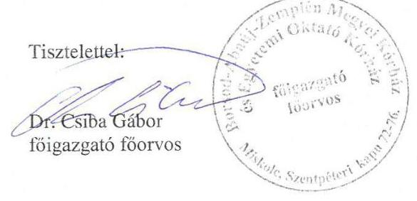

---

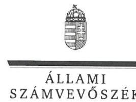

ELNÖK

Ikt.szám: V-0771-125/2016.

# Dr. Csiba Gábor úr 

föigazgató
Borsod-Abaúj-Zemplén Megyei Kórház
és Egyetemi Oktató Kórház

## Miskolc

## Tisztelt Föigazgató Úr!

Köszönettel megkaptam a 2016. március 11. napján az Állami Számvevőszékhez érkezett „A központi alrendszer egyes intézményei pénzügyi és vagyongazdálkodásának ellenőrzése - A Borsod-Abaúj-Zemplén Megyei Kórház és Egyetemi Oktató Kórház" című számvevőszéki jelentéstervezetben foglalt megállapításokra, javaslatokra tett észrevételeit.

Tájékoztatom Főigazgató urat, hogy a jelentésben - az Állami Számvevőszékről szóló 2011. évi LXVI. törvény 29. § (3) bekezdése alapján - az el nem fogadott észrevételeket szerepeltetjük az elutasítás indokainak feltüntetésével együtt.

Az Állami Számvevőszék észrevételekre vonatkozó álláspontjáról a felügyeleti vezető által készített részletes tájékoztatást csatoltan megküldőm.

Budapest, 2016.
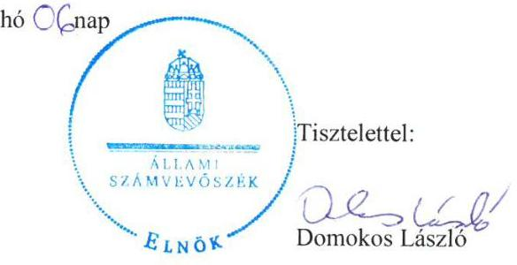

Melléklet: Tájékoztatás az elfogadott és el nem fogadott észrevételekről

---

# Tájékoztatás   az elfogadott és az el nem fogadott észrevételekról

| 2. | Észrevétel: | Javaslatokhoz kapcsolódó észrevétel
A Kórház föigazgatójának címzett 2. számú javaslathoz (2.1. számú megállapítás 2. bekezdése alapján)  |
| --- | --- | --- |
|   | Válasz: | Az Állami Számvevőszék az észrevételt nem fogadja el.  |
|   | Indoklás: | A megállapítás a gazdasági szervezetre vonatkozik, a megállapítással érintett gazdasági szervezeten kívüli osztályok szabályzatai a megállapítást nem módosítják. Az Ámr. 20. § (7) bekezdése, illetve az Ávr. 13. § (5) bekezdése az előírt követelmények rögzítésére - ha azokról a szervezeti és müködési szabályzat, vagy a költségvetési szerv más szabályzata, jelen esetben a gazdasági szervezet más szabályzata nem rendelkezik az ügyrendet írta elő, a munkaköri leírást nem. A helyszíni ellenőrzés során az Állami Számvevőszék rendelkezésére bocsátott, a gazdasági szervezet ellenőrzött időszakban hatályos ügyrendjei (Pénzgazdálkodási Osztály SGMU-F007-7 számú Speciális Gazdasági Munkautasítás - Ügyrendjei) konkrétan az alkalmazottak hatáskörét, a belső kapcsolattartás módját és szabályait nem tartalmazták, a külső kapcsolattartás módját és szabályait csak részben, egyes szervezetek vonatkozásában tartalmazták.  |
|  3.a. | Észrevétel: | Javaslatokhoz kapcsolódó észrevétel
A Kórház föigazgatójának címzett 3. a. számú javaslathoz (2.1. számú megállapítás 3. bekezdése alapján.  |
|   | Válasz: | Az Állami Számvevőszék az észrevételt nem fogadja el.  |
|   | Indoklás: | A javaslatot megalapozó megállapítást nem az észrevételben hivatkozott 4/2013. (I. 11.) Korm. rendelet, hanem a 2.1. számú megállapítás 3. bekezdésében hivatkozott, a számvitelről szóló 2000. évi C. törvény 14. §. (4) bekezdése alapozza meg. Erre tekintettel a megállapítás módosítása nem indokolt, a Kórház föigazgatójának címzett 3. a. számú javaslatot fenntartjuk.  |
|  3.b. | Észrevétel: | Javaslatokhoz kapcsolódó észrevételek
A Kórház föigazgatójának címzett 3. b. számú javaslathoz (2.1. számú megállapítás 3. bekezdése alapján)  |
|   | Válasz: | Az Állami Számvevőszék az észrevételt részben fogadja el.  |

---

|  | Indoklás: | A dokumentumok ismételt áttekintése alapján, az észrevételnek az egyszerúsített értékelési eljárásra vonatkozó részét elfogadva a 2.1. számú megállapítás 3. bekezdés 5. mondatát a következők szerint módosítjuk: „Az eszközök és források értékelési szabályzata 2014. június 2 -ától - az Áhsz.; 50. § (2) bekezdés b) pontjában foglaltak ellenére - nem tartalmazta követeléstípusonként a kisösszegü követelések év végi meghatározásának elveit, dokumentálásának szabályait."   A módosítással összhangban a Kórház föigazgatójának címzett 3. b. számú javaslatot a következők szerint pontosítjuk: „az eszközök és források értékelési szabályzata tartalmazza követeléstípusonként a kisösszegü követelések év végi meghatározásnak elveit, dokumentálásának szabályait."   Az észrevételnek az Áhsz.; 50. (2) bekezdés b) pontjában rögzített, a kisösszegű követelésekre vonatkozó részében hivatkozott szabályzatban foglaltakat a helyszíni ellenőrzés során figyelembe vettük, abban a jogszabályban foglalt előírások nem szerepeltek. |
| :--: | :--: | :--: |
| 5. | Észrevétel: | Javaslatokhoz kapcsolódó észrevételek   A Kórház föigazgatójának címzett 5. számú javaslathoz (2.3. számú megállapítás 1. bekezdése alapján). |
|  | Válasz: | Az Állami Számvevószék az észrevételt elfogadja. |
|  | Indoklás: | A dokumentumok ismételt áttekintése alapján, a 2.3. számú megállapítás 1. bekezdését, valamint ahhoz kapcsolódóan a Kórház föigazgatójának címzett 5. számú javaslatot töröljük. |
| 6. | Észrevétel: | Javaslatokhoz kapcsolódó észrevételek   A Kórház föigazgatójának címzett 6. számú javaslathoz (2.4. számú megállapítás 3. bekezdése alapján) |
|  | Válasz: | Az Állami Számvevőszék az észrevételt nem fogadja el. |
|  | Indoklás: | Az észrevétel a 2.4 pont 3. bekezdésében foglalt megállapítást elfogadja, ahhoz kapcsolódóan a szabályozásról adott tájékoztatást. A Kórház föigazgatójának címzett 6. számú javaslat törlése nem indokolt, mivel az nem a szabályozásra, hanem a közérdekủ adatok teljes körű közzétételére vonatkozik. |
| 7. | Észrevétel: | Javaslatokhoz kapcsolódó észrevételek   A Kórház föigazgatójának címzett 7. számú javaslathoz (2.4. számú megállapítás 4. bekezdése alapján) |
|  | Válasz: | Az Állami Számvevőszék az észrevételt nem fogadja el. |

---

|  | Indoklás: | A helyszíni ellenőrzés során az Állami Számvevőszék rendelkezésére bocsátott dokumentumok szerint a Kórház Iratkezelési szabályzata nemcsak módosításra került az ellenőrzött időszakban, hanem új iratkezelési szabályzat is kiadásra került. A módosítások jegyzéke szerint új kiadás történt 2011. június 1jétől, 2013. július 1 -jétől és 2014. február 1 -jétől, így az illetékes közlevéltár egyetértését indokolt lett volna beszerezni. Ennek következtében a Kórház föigazgatójának címzett 7. számú javaslat megalapozott. |
| :--: | :--: | :--: |
| 8. | Észrevétel: | Javaslatokhoz kapcsolódó észrevételek   A Kórház föigazgatójának címzett 8. számú javaslathoz (2.5. számú megállapítás 1 . bekezdése alapján). |
|  | Válasz: | Az Állami Számvevőszék az észrevételt nem fogadja el. |
|  | Indoklás: | Az észrevétel szerint a betegellátás területére vonatkozóan végzett monitoring tevékenységen kívül, a fennmaradó területen - köztük a pénzügyi gazdálkodási területen - a monitoring tevékenység csak részben van kialakítva, illetve ez évben tervezik kialakítani és múködetni. A megállapítás ezzel összhangban tartalmazza, hogy monitoring tevékenységet a betegellátás területén végeztek, a pénzügyi gazdálkodási területen nem, így az észrevétel a megállapításnak nem mond ellent. A megállapítás kiegészítése a monitoring tevékenység \%-os lefedettségére vonatkozóan - az ellenőrzési program alapján - nem indokolt. |
|  | Észrevétel: | Javaslatokhoz kapcsolódó észrevételek   A Kórház föigazgatójának címzett 9. számú javaslathoz (2.5. számú megállapítás 6 . bekezdése alapján). |
|  | Válasz: | Az Állami Számvevőszék az észrevételt nem fogadja el. |
| 9. | Indoklás: | Az észrevétel szerint a belső ellenőrzési vezető a belső ellenőrzési kézikönyv - Ber. 5. § (3) bekezdésében előírt legalább évenkénti és a Bkr. 17. § (4) bekezdésében elöírt legalább kétévenkénti felülvizsgálati kötelezettségének eleget tett, továbbá a felülvizsgálatról az éves ellenőrzési jelentésekben (2011-2014) nyilatkozott. Az észrevételhez megküldött éves ellenőrzési jelentések az ellenőrzés részére rendelkezésre álltak, azok a megállapítást megalapozzák. Az éves ellenőrzési jelentések nem tartalmazzák a belső ellenőrzési kézikönyv felülvizsgálatának végrehajtását, hanem azt rögzítik, hogy annak felülvizsgálata folyamatosan zajlik. Továbbá a 2014. éves ellenőrzési jelentésben az szerepel, hogy a Kézikönyv véglegesítése 2015. I. negyedévében realizálódni fog. A felülvizsgálat elmaradását támasztja alá továbbá az a tény is, hogy 2012-2014 években a belső ellenőrzési kézikönyv nem tartalmazta a jogszabályban előírt tanácsadó tevékenységre vonatkozó eljárási szabályokat. Erre tekintettel a megállapítás módosítása nem indokolt. |

---

|  |  | Javaslatokhoz kapcsolódó észrevételek |
| :--: | :--: | :--: |
| 10. | Észrevétel: | A Kórház föigazgatójának címzett 10. számú javaslathoz (2.5.   számú megállapítás 7. bekezdése alapján). |
|  | Válasz: | Az Állami Számvevőszék az észrevételt részben fogadja el. |
|  | Indoklás: | Az észrevétel a javaslatot megalapozó megállapítást nem vitatja,   az ellenőrzések elvégzésének elmaradásáról, annak okairól és a   későbbi években megvalósult ellenőrzésekről ad tájékoztatást.   Az észrevételben foglaltak alapján a 2.5. számú megállapítás 7.   bekezdésének utolsó előtti mondatát a következők szerint   kiegészítjük: „az elmaradt ellenőrzéseket az ellenőrzött   időszakban részben hajtották végre".   A megállapítás azon részét, amely tényként rögzíti a tervezett   ellenőrzések elmaradását, nem indokolt módosítani, azt az   ellenőrzés részére átadott dokumentumok megalapozzák. |
|  | Észrevétel: | Javaslatokhoz kapcsolódó észrevételek |
|  |  | A Kórház föigazgatójának címzett 11. számú javaslathoz (2.5.   számú megállapítás 8-9. bekezdése alapján). |
|  | Válasz: | Az Állami Számvevőszék az észrevételt nem fogadja el. |
|  | Indoklás: | Az észrevétel nem vitatja a 2.5. számú megállapítás 8-9.   bekezdésében foglaltakat, hanem azokat magyarázza. A   véleményben foglaltakkal ellentétben, az intézkedési terv   készítése indokolt, mivel azt jogszabály, a költségvetési szervek   belső kontrollrendszeréről és belső ellenőrzéséről szóló 370/2011.   (XII. 31.) Korm. rendelet 28. § c) pontja, 45. § (1)-(3) bekezdései   írják elő. Az észrevételben jelzett 2. számú tanúsítvány nem az   azonnali intézkedéseket tartalmazza, ezért nem indokolt az   észrevételezett szövegrész pontosítása. |
|  | Indoklás: | Az észrevétel elfogadja a Kórház föigazgatójának címzett 15.   számú javaslatot, módosítás nem indokolt. |
|  |  | Javaslatokhoz kapcsolódó észrevételek |
|  | Észrevétel: | A Kórház föigazgatójának címzett 16. számú javaslathoz (3.3.   számú megállapítás 10. bekezdése alapján). |
|  | Válasz: | Az Állami Számvevőszék az észrevételt nem fogadja el. |

---

|  | Indoklás: | Az észrevételben a közbeszerzési eljárásokról adott tájékoztatás nem mond ellent azon megállapításnak, miszerint több esetben előfordult, hogy elmaradt a közbeszerzési eljárás lefolytatása. Hat esetben pedig a Közbeszerzési Döntőbizottság is megállapította a jogsértést. Az észrevételben hivatkozott módszertani leírás nem a közbeszerzési jogorvoslati eljárásokra, hanem a mintavétel alapján értékelt tételek eredményére vonatkozik, amely szerint nem megfelelő, ha a hibás tételek aránya meghaladja a $10 \%$-ot, amely jelen esetben megvalósult. Mindezekre tekintettel a megállapítás és a javaslat módosítása nem indokolt. |
| :--: | :--: | :--: |
|  | Észrevétel: | Javaslatokhoz kapcsolódó észrevételek   A Kórház föigazgatójának címzett 17. számú javaslathoz (3.4. számú megállapítás 2 . bekezdése alapján). |
|  | Válasz: | Az Állami Számvevőszék az észrevételt nem fogadja el. |
| 17. | Indoklás: | Az észrevételben foglaltak nem megalapozottak, mivel az irányító szerv felé történő adatszolgáltatási kötelezettséget jogszabály - az államháztartás szervezetei beszámolási és könyvvezetési kötelezettségének sajátosságairól szóló 249/2000. (XII. 24.) Korm. rendelet 10. § (1) bekezdésében, valamint az államháztartás számviteléről szóló 4/2013. (I. 11.) Korm. rendelet 32. § (1) bekezdése - írta elő. A jogszabály szerint az éves költségvetési beszámolót a költségvetési évet követő év február 28-ig kell az irányító szerv vezetőjének jóváhagyásra megküldeni. A jogszabály a megküldés módjára nem tartalmaz rendelkezést, továbbá a beszámoló ellenőrzése a jogszabály szerint nem módosítja a jogszabályi határidőt. Mindezekre tekintettel a megállapítás és a javaslat módosítása nem indokolt. |
| 18. | Észrevétel: | Javaslatokhoz kapcsolódó észrevételek   A Kórház föigazgatójának címzett 18. számú javaslathoz (3.5. számú megállapítás 3. bekezdése alapján). |
|  | Válasz: | Az Állami Számvevőszék az észrevételt részben fogadja el. |

---

|  | Indoklás: | A dokumentumok ismételt áttekintése alapján, az észrevételnek a likviditási terv elkészitésére vonatkozó részét elfogadva a 3.5. számú megállapítás 3. bekezdésének 1. mondatát a következők szerint módosítjuk: „Likviditási tervkészitési kötelezettségét a Kórház - az Áht.; 78. § (2) bekezdésében elöirtak ellenére - 2012. január-február hónapokban nem teljesitette."   A módosítással összhangban a Kórház föigazgatójának címzett javaslatból a gyakoriságra vonatkozó részt töröljük: „Intézkedjen, hogy a kiadások teljesitésének ütemezéséről a likviditási tervet a jogszabályban elöirt tartalommal készitsék el. "   A kiadások kifizetésének a sürgősség szerinti szerepeltetésére vonatkozó észrevétele a megállapításokat nem módosítja, az ellenőrzés rendelkezésére bocsátott kimutatások a kiadások kifizetését nem sürgősség szerint tartalmazták. |
| :--: | :--: | :--: |
|  | Észrevétel: | Javaslatokhoz kapcsolódó észrevételek   A Kórház föigazgatójának címzett 20. számú javaslathoz (4.2. számú megállapítás 4. bekezdése alapján). |
|  | Válasz: | Az Állami Számvevőszék az észrevételt nem fogadja el. |
| 20. | Indoklás: | A dokumentumok ismételt áttekintése alapján a megállapítás és a kapcsolódó javaslat megalapozott. Az ellenőrzés rendelkezésére bocsátott dokumentumok szerint a követeléseket az értékelési szabályzat 5.9 .3 pontja szerinti minősitési szempontok alapján adós jövedelmi helyzete, fizetőképessége, likviditása, követelés realizálhatósága, illetve az adóssal szembeni csőd- és felszámolási eljárás - nem minősítették, éven túli követelések esetében egységesen $100 \%$-os értékvesztést számoltak el. |
|  | Észrevétel: | Javaslatokhoz kapcsolódó észrevételek   A Kórház föigazgatójának címzett 21. számú javaslathoz (4.2. számú megállapítás 7. bekezdése alapján). |
|  | Válasz: | Az Állami Számvevőszék az észrevételt részben fogadja el. |
| 21. | Indoklás: | A dokumentumok ismételt áttekintése alapján a 4.2. számú megállapítás 6. bekezdésének utolsó mondatát töröljük: „Leltárhiány esetén a személyi felelősséget megvizsgálták."   Kórház föigazgatójának címzett 21. számú javaslat törlése azonban nem indokolt, mivel azt nem a 6. bekezdésből előzőekben törölt megállapítás, hanem a 7. bekezdés támasztja alá. |
|  |  | Javaslatokhoz kapcsolódó észrevételek   A Kórház föigazgatójának címzett 22. számú javaslathoz (4.4. számú megállapítás 3. bekezdése alapján). |

---

|  | Válasz: | Az Állami Számvevöszék az észrevételt nem fogadja el. |
| :--: | :--: | :--: |
|  | Indoklás: | Az észrevétel elfogadja a javaslatot alátámasztó 4.4. számú megállapítás 3. bekezdésében foglaltakat. Az ellenőrzött időszakon túl, 2015. évben megtett intézkedésekről adott tájékoztatás nem indokolja a megállapítás módosítását, így a kapcsolódó javaslat törlését sem. |
| 23. | Észrevétel: | Egyéb észrevételek   A 21. oldal 3.2. számú megállapítás fordított ÁFÁ-ra vonatkozó részéhez kapcsolódóan (3. bekezdés). |
|  | Válasz: | Az Állami Számvevőszék az észrevételt nem fogadja el. |
|  | Indoklás: | Az észrevétel a fordított ÁFA kétszeres szerepeltetésének okát magyarázza, amely az ellenőrzés megállapítását nem módosítja. A megállapítás a 2012. évi beszámolóban és a fökönyvi nyilvántartásban, valamint az elöirányzat-módosításról vezetett analitikus nyilvántartásban szereplő elöirányzat-módosítások adatainak a különbségére vonatkozik, amely adatok eltértek egymástól, és a különbözet megegyezett a fordított ÁFA összegével. |
|  | Észrevétel: | Egyéb észrevételek   A 21. oldal 3.2. számú megállapítás 2013. évi elöirányzat nyilvántartásra vonatkozó részéhez kapcsolódóan (3. bekezdés). |
|  | Válasz: | Az Állami Számvevőszék az észrevételt nem fogadja el. |
| 24. | Indoklás: | Az észrevétel a 2013. évi elöirányzatok adatait kiemelt elöirányzatonként, illetve összesen mutatja be. A megállapítás - a dokumentumok ismételt áttekintése alapján - a 2013. évi analitikus nyilvántartásban a hatáskörök szerinti elöirányzatmódosításokra vonatkozott. A 3.2. számú megállapítás 3. bekezdés vonatkozó részét - a megállapítást egyértelművé téve a következők szerint pontosítjuk (a kiegészítés aláhúzással jelölve): „2013-ban a nyilvántartás hatáskörök szerinti vezetésének hibája miatt nem egyeztek meg az elöirányzatmódosításról vezetett analitikus nyilvántartásban szereplő adatokkal". |
| 25. | Észrevétel: | Egyéb észrevételek   A 25. oldal 3.3. számú megállapítás utolsó bekezdésére utolsó mondatához kapcsolódóan. |
|  | Válasz: | Az Állami Számvevőszék az észrevételt nem fogadja el. |

---

|  | Indoklás: | Az észrevételben hivatkozott megállapítás - 25. oldal 3.3. számú megállapítás utolsó bekezdés - az ellenőrzött kifizetésekkel összefüggésben rögzíti, hogy a nem megfelelően müködtetett belső kontrollok korrupciós kockázatokat hordozhatnak. A IV. sz. melléklet az integritás szemlélet érvényesítésével kapcsolatosan, a Kórház által kitöltött kérdőív értékelése alapján tartalmazza, hogy a kockázatokat mérséklő kontrollok szintje alacsony színtről magas szintre növekedett. A hivatkozott két szövegrész nincs ellentmondásban egymással, így a megállapítások módosítása nem indokolt. |
| :--: | :--: | :--: |
| 26. | Észrevétel: | Egyéb észrevételek   A 35. oldal 4.5. számú megállapítás, a rendezőmérleghez kapcsolódóan. |
|  | Válasz: | Az Állami Számvevőszék az észrevételt nem fogadja el. |
|  | Indoklás: | Az észrevétel nem megalapozott, mivel az Állami Számvevőszék nem csak a 2013. évi rendezőmérleghez kapcsolódóan, hanem valamennyi ellenőrzött évre vonatkozóan teljes körűen kérte a leltározási dokumentumokat. A helyszíni ellenőrzés lezárásakor a kért dokumentumok teljes körű rendelkezésre bocsátását teljességi nyilatkozattal igazolták. Mindemellett, a 4.2. számú megállapítás 7. bekezdésében foglaltak szerint a leltározás végrehajtása a 2013. évben részben felelt meg a jogszabályi előírásoknak, többek között a le nem alapozott gépek, berendezések „forgó rendszerü", kétévenkénti mennyiségi leltározása miatt, amely megállapítást az észrevétel nem kifogásolt. Mindezekre tekintettel a megállapítás módosítása nem indokolt. |
| 27. | Észrevétel: | Észrevételek a jelentéstervezet Összegzés cím alatt leírtakhoz   Az Összegzésben szerepel a „pénzügyi gazdálkodás nem volt szabályszerű." |
|  | Válasz: | Az Állami Számvevőszék az észrevételt nem fogadja el. |
|  | Indoklás: | Az észrevétel - az intézmény nagyságára tekintettel - a pénzügyi gazdálkodás minősítésének legalább részben szabályszerű minősítésre módosítását kéri. Az ellenőrzés megállapításai szerint a pénzügyi gazdálkodásnál feltárt hiányosságok megalapozzák minősítést, ezért a megállapítás módosítása nem indokolt. |
| 28. | Észrevétel: | További észrevételek a fenntartó részére címzett 1. számú javaslathoz és kapcsolódóan a 2.5. ponthoz |
|  | Válasz: | Az Állami Számvevőszék az észrevételt nem fogadja el. |

---

|  | Az észrevétel javaslatra vonatkozó része az Állami Egészségügyi Ellátó Központ föigazgatójának címzett javaslatra vonatkozik. Erre tekintettel, a javaslat módosítása nem indokolt.   A 2.5. számú megállapítás 1. bekezdésére tett észrevétel nem mond ellent - az ellenőrzés részére átadott dokumentumok alapján tett - megállapításnak, hanem azt magyarázza. A kontrolling csoport vonatkozásában - 12. oldal első bekezdés utolsó kettő mondata - tett észrevétele, miszerint a kontrolling csoport elsősorban, de nem kizárólag a betegellátás területén végez monitoring tevékenységet, ellentmond a Kórház föigazgatójának címzett 8. számú javaslatnál tett észrevételnek. Abban az szerepel, hogy a fennmaradó területen - köztük a pénzügyi gazdálkodási területen - a monitoring tevékenység csak részben van kialakítva, illetve ez évben tervezik kialakítani és müködetni.   A 2.5. számú megállapítás 2. bekezdésére tett észrevétel (12-13. oldal) a Kórház monitoring tevékenységről, a folyamatba épített ellenőrzésről, minőségirányítási rendszerről tájékoztat, nem mond   ellent a megállapításnak, miszerint a Kórháznál a rendelkezésre álló források gazdaságos, hatékony és eredményes felhasználását biztosító teljesítménycélokat és követelményeket a vonatkozó jogszabályi előirások ellenére nem alakítottak ki.   A 2.5. számú megállapítás 3-4. bekezdésére tett észrevétel nem mond ellent a megállapításnak, hanem megerősíti, hogy a teljesítménymutatók kialakításra kerültek, azokat rendszeresen figyelemmel kísérték, azonban a mutatók nem kapcsolódtak előre meghatározott kitűzött teljesítménycélokhoz. A teljesítménycélok nélkül kialakított mutatók figyelemmel kísérése nem biztosítja a rendelkezésre álló források gazdaságos, hatékony és eredményes felhasználást. Ebből adódóan a vezetői nyilatkozatra vonatkozó megállapítás is helytálló.   A Kórház monitoring tevékenységére vonatkozó minősítést az ellenőrzés rendelkezésére bocsátott dokumentumok évenként elvégzett, előre meghatározott szempontok szerinti ellenőrzése és minősítése alapozta meg.   Fentiekre tekintettel, a megállapítások módosítása nem indokolt. |
| :--: | :--: |

Észrevételének 1., 3.c., 4., 12., 13-15. és 19. pontjaiban nem a számvevőszéki javaslatokkal kapcsolatban tett észrevételt, hanem azokhoz kiegészítő magyarázatokat füzött, a jelenlegi gyakorlatról, illetve gyakorlati tapasztalatokról adott tájékoztatást, egyebekben elfogadta a jelentéstervezet hivatkozott javaslatait és az azokat megalapozó megállapításokat, amelyekre vonatkozó tájékoztatását köszönettel vettük.

Budapest, 2016. C. $1, \mathrm{hó} \mathrm{C}^{2} 6$ nap
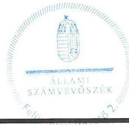

Salamon İldikó
felügyeleti vezető

---

Állami Egészségügyi Ellátó Központ

Állami Számvevőszék

Domokos László
Elnök Úr részére

Budapest
Apáczai Csere János utca 10.
1052

Tisztelt Elnök Úr!

Az Állami Számvevőszék által „A központi alrendszer egyes intézményei pénzügyi és vagyongazdálkodásának ellenőrzése - Borsod-Abaúj-Zemplén Megyei Kórház és Egyetemi Oktató Kórház" címmel készített számvevőszéki jelentéstervezetet megkaptam.

A jelentéstervezet megállapításaival kapcsolatban észrevételt nem kívánok tenni.

Budapest, 2016. március 07.
Tisztelettel:
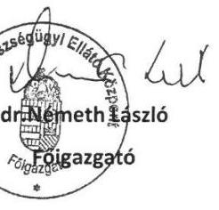

---

.

---

# RÖVIDÍTÉSEK JEGYZÉKE 

${ }^{1}$ ÁSZ
${ }^{2}$ Önkormányzat
${ }^{3}$ Közgyűlés
${ }^{4}$ Egészségügyért felelős miniszter
${ }^{5}$ Államháztartásért felelős miniszter
${ }^{6}$ Kórház, intézmény
${ }^{7}$ Államháztartásért felelős miniszter
${ }^{8}$ Intézményi megállapodás
${ }^{9}$ Eütv.
${ }^{10}$ Minisztérium
${ }^{11}$ GYEMSZI
${ }^{12}$ Főigazgató
${ }^{13}$ Gazdasági igazgató
${ }^{14}$ Alaptörvény
${ }^{15}$ Nvtv.
${ }^{16}$ Áht. 2
${ }^{17}$ Ávr.
${ }^{18}$ Áht. 1
${ }^{19}$ Ámr.
${ }^{20}$ Bkr.
${ }^{21}$ ÁSZ tv.
${ }^{22}$ ÁSZ SZMSZ
${ }^{23}$ SZMSZ
${ }^{24}$ 59/2011. (IV. 12.) Korm. rendelet
${ }^{25}$ Kincstár
${ }^{26}$ Sztv.
${ }^{27}$ Áhsz. 2
${ }^{28}$ Kbt. 1
${ }^{29}$ Kbt. 2
${ }^{30}$ Vnytv.
${ }^{31}$ Avtv.

Állami Számvevőszék
Borsod-Abaúj-Zemplén Megyei Önkormányzat
Borsod-Abaúj-Zemplén Megyei Önkormányzat Közgyűlése
Nemzeti erőforrás miniszter (2012. május 13-áig), Emberi erőforrások minisztere (2012. május 14-étől)
Nemzetgazdasági miniszter
Borsod-Abaúj-Zemplén Megyei Kórház és Egyetemi Oktató Kórház
Nemzetgazdasági miniszter
a GYEMSZI és a Kórház által 2011. december 30-án kötött „intézményi átadásátvételi megállapodás"
Az egészségügyről szóló 1997. évi CLIV. törvény
Nemzeti Erőforrás Minisztérium (2012. május 13-áig), Emberi Erőforrások Minisztériuma (2012. május 14-étől)
Gyógyszerészeti és Egészségügyi Minőség- és Szervezetfejlesztési Intézet (2015. február 28-áig)
Borsod-Abaúj-Zemplén Megyei Kórház és Egyetemi Oktató Kórház főigazgatója
Borsod-Abaúj-Zemplén Megyei Kórház és Egyetemi Oktató Kórház gazdasági igazgatója
Magyarország Alaptörvénye (hatályos 2012. január 1-től)
2011. évi CXCVI. törvény a nemzeti vagyonról (hatályos 2012. január 1-től)
2011. évi CXCV. törvény az államháztartásról (hatályos 2012. január 1-től)

368/2011. (XII. 31.) Korm. rendelet az államháztartásról szóló törvény végrehajtásáról (hatályos 2012. január 1-től)
1992. évi XXXVIII. törvény az államháztartásról (hatálytalan: 2012.január 1-jétől) 292/2009. (XII. 19.) Korm. rendelet az államháztartás működési rendjéről (hatálytalan: 2012. január 1-jétől)
370/2011. (XII. 31.) Korm. rendelet a költségvetési szervek belső
kontrollrendszeréről és belső ellenőrzéséről (hatályos 2012. január 1-jétől)
2011. évi LXVI. törvény az Állami Számvevőszékről, hatályos 2011. július 1-jétől

Állami Számvevőszék Szervezeti és Működési Szabályzata
Szervezeti és Múködési Szabályzat
59/2011. (IV. 12.) Korm. rendelet - a Gyógyszerészeti és Egészségügyi Minőségés Szervezetfejlesztési Intézetről
Magyar Államkincstár
2000. évi C. törvény a számvitelről (hatályos 2001. január 1-től)
4/2013. (I. 11.) Korm. rendelet az államháztartás számviteléről (hatályos: 2014. január 1-jétől)
2003. évi CXXIX. törvény a közbeszerzésekről (hatálytalan: 2012. január 1-jétől) 2011. évi CVIII. törvény a közbeszerzésekről (hatályos: 2011. augusztus 21-től) 2007. évi CLII. törvény egyes vagyonnyilatkozat-tételi kötelezettségekről 1992. évi LXIII. törvény a személyes adatok védelméről és a közérdekú adatok nyilvánosságáról

---

${ }^{32}$ Info tv.
${ }^{33}$ Eitv.
${ }^{34} \mathrm{Ltv}$.
${ }^{35}$ OEP
${ }^{36}$ Ber.
${ }^{37}$ Áhsz. 1
${ }^{38}$ OEP
${ }^{39}$ TVK
${ }^{40}$ 55/2012. (XII. 28.) EMMI rendelet
${ }^{41}$ 337/2011. (XII. 29.) Korm. rendelet
${ }^{42}$ 438/2013. (XI.19.) Korm. rendelet
${ }^{43}$ 184/2014. (VII.25) Korm. rendelet
${ }^{44}$ NEFMI rendelet
${ }^{45}$ Vagyonkezelési szerződés
${ }^{46} \mathrm{Vtv}$.
${ }^{47}$ TIOP
${ }^{48}$ MNV Zrt.
${ }^{49}$ 36/2013. (IX. 13.) NGM rendelet
${ }^{50}$ KGR
${ }^{51}$ Konsz. tv.
${ }^{52}$ Konsz. rendelet
${ }^{53}$ Közgyűlés elnöke
${ }^{54}$ NFA tv.
${ }^{55}$ 2012. évi XXXVIII. törvény
2011. évi CXII. törvény az információs önrendelkezési jogról és az információszabadságról (hatályos: 2011. július 27-étől)
2005. évi XC. törvény az elektronikus információszabadságról (hatálytalan: 2012. január 1-jétől)
1995. évi LXVI. törvény a köziratokról, a közlevéltárakról és a magánlevéltári anyag védelméről
Országos Egészségbiztosítási Pénztár
193/2003. (XI. 26.) Korm. rendelet a költségvetési szervek belső ellenőrzéséről (hatálytalan 2012. január 1-jétől)
249/2000. (XII. 24.) Korm. rendelet az államháztartás szervezetei beszámolási és könyvvezetési kötelezettségének sajátosságairól (hatálytalan: 2014. január 1jétől
Országos Egészségbiztosítási Pénztár
Teljesítményvolumen keret
55/2012. (XII. 28.) EMMI rendelet egyes egészségbiztosítási tárgyú miniszteri rendeletek módosításáról (hatálytalan 2014. április 2-ától)
337/2011. (XII. 29.) Korm. rendelet a Gyógyító-megelőző ellátás jogcím-csoportból finanszírozott egészségügyi szolgáltatók adósságának rendezésére fordítható konszolidációs támogatásról és az egészségügyi szolgáltatások Egészségbiztosítási Alapból történő finanszírozásának részletes szabályairól
438/2013. (XI.19.) Korm. rendelet a finanszírozott egészségügyi szakellátást nyújtó egészségügyi szolgáltatók adósságának rendezésére fordítható konszolidációs támogatásról
184/2014. (VII.25.) Korm. rendelet a finanszírozott egészségügyi szakellátást nyújtó egészségügyi szolgáltatók adósságának rendezésére fordítható működési támogatásról
72/2011. (XII. 27.) NEFMI rendelet az állam tulajdonába és fenntartásába került egészségügyi intézmények tekintetében vagyonkezelői joggal rendelkező államigazgatási szerv kijelöléséről
a GYEMSZI és a Kórház által kötött 2012. május 1-től hatályba lépett „vagyonkezelési szerződés"
2007. évi CVI. törvény az állami vagyonról

Társadalmi Infrastruktúra Operatív Program
Magyar Nemzeti Vagyonkezelő Zrt.
36/2013. (IX. 13.) számú NGM rendelet az államháztartás számvitelének 2014. évi megváltozásával kapcsolatos feladatokról
Költségvetés Gazdálkodási Rendszer
2011. évi CLIV. törvény a megyei önkormányzatok konszolidációjáról, a megyei önkormányzati intézmények és a Fővárosi Önkormányzat egyes egészségügyi intézményeinek átvételéről
372/2011. (XII. 31.) Korm. rendelet a megyei önkormányzat egészségügyi intézményei átvételének részletes szabályairól
Borsod-Abaúj-Zemplén Megyei Közgyűlés elnöke
2010. évi LXXXVII. törvény a Nemzeti Földalapról
2012. évi XXXVIII. törvény a települési önkormányzatok fekvőbeteg-szakellátó intézményeinek átvételéről és az átvételhez kapcsolódó egyes törvények módosításáról

---

.

---

# ÁLLAMI SZÁMVEVŐSZÉK 

1052 Budapest, Apáczai Csere János utca 10.
Levélcím: 1364 Budapest 4. Pf. 54
Telefon: +36 14849100 Telefax: +36 14849200
www.asz.hu