# Jelentés 

## A központi alrendszer egyes intézményei ellenőrzése

A központi alrendszer egyes intézményei pénzügyi és vagyongazdálkodásának ellenőrzése - Bács-Kiskun Megyei Kórház a Szegedi Tudományegyetem Általános Orvostudományi Kar Oktató Kórháza 2016.

---

.

---

# Jelentés 

## A központi alrendszer egyes intézményei ellenőrzése

A központi alrendszer egyes intézményei pénzügyi és vagyongazdálkodásának ellenőrzése - Bács-Kiskun Megyei Kórház a Szegedi Tudományegyetem Általános Orvostudományi Kar Oktató Kórháza 2016. 04. hó 26. nap
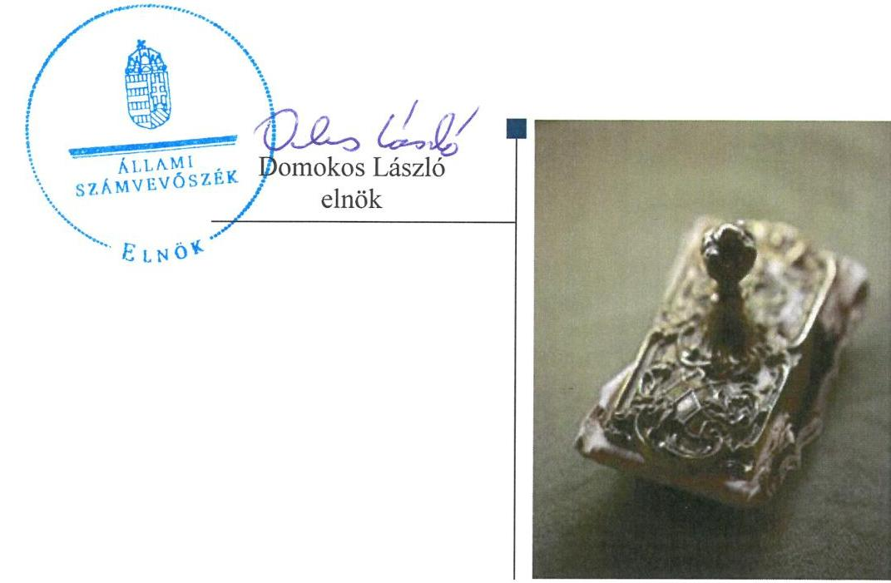

---

Jelentéseink az Országgyúlés számítógépes hálózatán és az Interneten a www.asz.hu címen is olvashatóak.

## AZ ELLENŐRZÉST FELÜGYELTE:

SALAMON ILDIKÓ felügyeleti vezető
AZ ELLENŐRZÉST VEZETTE ÉS A VÉGREHAJTÁSÁÉRT FELELŐS:
KOVÁTS T. BALÁZS ellenőrzésvezető
A PROGRAM ÖSSZEÁLLÍTÁSÁÉRT FELELŐS:
JANIK JÓZSEF osztályvezető
BÖRÖCZ IMRE projektfelelős
A TÉMÁHOZ KAPCSOLÓDÓ KORÁBBI SZÁMVEVŐSZÉKI JELENTÉSEK:

- címe: Jelentés az állami egészségügyi beruházásokra fordított pénzeszközök hasznosulásának ellenőrzéséről
- sorszáma: 0410
- címe: Jelentés az egészségügyi szakellátások privatizációjának ellenőrzéséről
- sorszáma: 0609
- címe: Jelentés az önkormányzati kórházak és bentlakásos szociális intézmények ápolásra, gondozásra fordított pénzeszközei felhasználásának ellenőrzéséről
- sorszáma: 0820
- címe: Jelentés a sürgősségi betegellátó rendszer kialakítására, fejlesztésére fordított pénzeszközök felhasználásának ellenőrzéséről
- sorszáma: 0924
- címe: Jelentés a Bács-Kiskun Megyei Önkormányzat pénzügyi helyzetének ellenőrzéséről (43/2)
- sorszáma: 1152
- címe: Jelentés Kalocsa Város Önkormányzata gazdálkodási rendszerének 2011. évi ellenőrzéséről
- sorszáma: 1276
- címe: Jelentés az önkormányzati vagyongazdálkodás szabályszerűségi ellenőrzéséről - Kiskunfélegyháza
- sorszáma: 13067

IKTATÓSZÁM: V-0772-150/2016.
TÉMASZÁM: 1806
ELLENŐRZÉS-AZONOSÍTÓ SZÁM: V067911

---

# TARTALOMJEGYZÉK 

■ ÖSSZEGZÉS ..... 5
■ AZ ELLENŐRZÉS CÉLJA ..... 7
■ AZ ELLENŐRZÉS TERÜLETE ..... 8
■ AZ ELLENŐRZÉS HÁTTERE, INDOKOLTSÁGA ..... 9
■ FÓKUSZKÉRDÉSEK ..... 10
■ ELLENŐRZÉS HATÓKÖRE ÉS MÓDSZEREI ..... 11
■ MEGÁLLAPÍTÁSOK ..... 14
■ JAVASLATOK ..... 37
■ MELLÉKLETEK ..... 43
I. sz. melléklet: Értelmező szótár ..... 43
II. sz. melléklet: Kiegészítő teljesítmény-ellenőrzési modul megállapításai ..... 48
III. sz. melléklet: A belső kontrollrendszer kialakításának és müködtetésének értékelése a 2011-2014. években ..... 49
IV. sz. melléklet: Az integritás szemlélet érvényesítésével kapcsolatos megállapítások ..... 50
V. sz. melléklet: A kiadási és bevételi előirányzatok és azok teljesítése a 2011-2014. években (M Ft-ban) ..... 51
VI. sz. melléklet: Mérlegadatok a 2011-2014. években (M Ft-ban) ..... 52
■ FÜGGELÉK: ÉSZREVÉTELEK ..... 53
■ RÖVIDÍTÉSEK JEGYZÉKE ..... 71

---

.

---

# ÖSSZEGZÉS 

Az Állami Számvevőszék a 2011-2014. évekre vonatkozóan ellenőrizte a Bács-Kiskun Megyei Kórház a Szegedi Tudományegyetem Általános Orvostudományi Kar Oktató Kórháza pénzügyi és vagyongazdálkodásának szabályszerűségét.
Az ellenőrzés által feltártak alapján az irányítószervi feladatellátás, a belső kontrollrendszer kialakítása és müködtetése, a pénzügyi és vagyongazdálkodás összességében részben szabályszerű volt. A 2011. évben jóváhagyott SZMSZ nem a hatályos alapító okirat keltét és számát tartalmazta, a 2013. évben az alapító okirat módosításához nem kérték meg az államháztartásért felelős miniszter előzetes egyetértését. Az ellenőrzés hiányosságokat tárt fel a kockázatkezelés, a közzétételi kötelezettség teljesítése, a kulcskontrollok és a belső ellenőrzés müködése területén. A pénzügyi gazdálkodás területén a gazdálkodási jogkörök gyakorlása részben, míg a bevételi és kiadási előirányzatok módosítása és a közbeszerzési szabályok betartása nem felelt meg a jogszabályi előirásoknak. A vagyonkezelési szerződés tartalma részben felelt meg a jogszabályi előirásoknak és a módosítására nem minden esetben az előirt határidőben került sor, továbbá a kétévenkénti mennyiségi leltározáshoz nem rendelkezett az irányítószerv engedélyével.

## Az ellenőrzés társadalmi indokoltsága

A közpénzek felhasználásában meghatározó, központi alrendszerbe tartozó intézmények pénzügyi és vagyongazdálkodási tevékenységük és/vagy feladatellátásuk súlya miatt jelentős hatást gyakorolhatnak a költségvetés egyensúlyának fenntartására. Hatással vannak továbbá az állami vagyonnal való gazdálkodás minőségére, a kormányzati (szak)politikák végrehajtására, illetve közfeladat ellátásuk vonatkozásában az állampolgárok életminőségére, jogaik és kötelezettségeik gyakorlására.

Az egészség és ezzel összefüggésben az egészségügyi ellátások színvonala és költsége folyamatosan a társadalmi érdeklődés középpontjában áll. A központi költségvetésből az egyik legjelentősebb kiadást az egészségügyi ellátásokra fordított adóforintok jelentik, amelyekből a kórházak kapják a legtöbb támogatást. Ezért indokolt, hogy az ÁSZ ${ }^{1}$ az egészségügyi intézmények pénzügyi és vagyongazdálkodását, az esetleges átalakulások szabályszerűségét rendszeresen több évre kiterjedően ellenőrizze.

## Főbb megállapítások, következtetések, javaslatok

A 2011. évben az Önkormányzat² Közgyűlése ${ }^{3}$, a 2012-2014. években az egészségügyért felelős miniszter ${ }^{4}$ az irányítószervi feladatait részben gyakorolta a jogszabályi előírásoknak megfelelően. A Közgyűlés által jóváhagyott SZMSZ a 2011. évben nem a hatályos alapító okirat keltét és számát tartalmazta. Az egészségügyért felelős miniszter a 2013. évben az alapító okirat módosításához nem kérte meg az államháztartásért felelős miniszter ${ }^{5}$ előzetes egyetértését.

A Kórház ${ }^{6}$ belső kontrollrendszerének kialakítása és működtetése összességében részben szabályszerű volt. Ezen belül a kontrollkörnyezet szabályszerű, míg a kockázatkezelési rendszer, a kontrolltevékenység, az információs és kommunikációs rendszer, a monitoring rendszer kialakítása és működése összességében részben szabályszerű volt. A Kórháznál intézményi szintű kockázatelemzés nem készült, a közzétételi kötelezettségének nem teljes körűen tettek eleget, illetve a kulcskontrollok ellenőrzése és a belső ellenőrzés működése során hiányosságokat tárt fel az ellenőrzés.

---

Az intézmény pénzügyi gazdálkodása összességében részben szabályszerű volt. Az elemi költségvetés kialakítása és az előirányzatok megállapítása során betartották a jogszabályi előírásokat, azonban a bevételi és kiadási előirányzatok módosítása nem felelt meg a jogszabályi előírásoknak. A bevételi előirányzatok teljesítése és a kiadási előirányzatok felhasználása során a gazdálkodási jogkörök gyakorlása részben, míg a közbeszerzési szabályok betartása nem felelt meg a jogszabályi előírásoknak. Az előirányzat-maradvány megállapítása, felhasználása megfelelt a jogszabályi előírásoknak. A folyamatos fizetőképesség a 2011-2012. években biztosított volt, míg a 2013-2014. években - figyelembe véve a lejárt szállítói tartozások nagymértékű növekedését - nem volt biztosított, a pénzügyi egyensúly a Kórház által hozott takarékossági intézkedések és esetenként kapott pótlólagos támogatás révén volt fenntartható. Az államháztartásért felelős miniszter a 2013. évben a jogszabályban foglaltak ellenére az intézményhez kincstári biztost nem jelölt ki.

A Kórház vagyongazdálkodása összességében részben szabályszerű volt. A vagyonkezelési szerződés tartalma részben felelt meg a jogszabályi előírásoknak és a módosítására nem minden esetben az előírt határidőben került sor, valamint az aláírását követően a vagyonkezelői jog ingatlan nyilvántartásba történő bejegyzését nem kezdeményezték a jogszabályban előírt határidőben. A mérlegben kimutatott eszközök és források nyilvántartása, értékelése megfelelt a jogszabályi előírásoknak. A leltárt az éves költségvetési beszámoló elkészítéséhez, a mérleg tételeinek alátámasztásához összeállították. A Kórház a meghatározott eszközcsoportok két évenkénti mennyiségi leltározásához nem kérte a felügyeleti szerv egyetértését. A Kórház a selejtezési feladatokat szabályszerűen hajtotta végre, továbbá az értékmegőrzési, állagmegóvási kötelezettségét a jogszabály, az intézményi megállapodás ${ }^{7}$, illetve a vagyonkezelői szerződés előírásai szerint teljesítette. A vagyonelemek hasznosítása során a 2012-2014. években az átláthatóság jogszabályi követelményének érvényesüléséről nem győződött meg. Az eredményszemléletű számvitel bevezetésével kapcsolatos feladatok végrehajtása részben felelt meg a jogszabályi előírásoknak.

A két kórház beolvadásával kapcsolatos irányítószervi döntések és az azokhoz kapcsolódó intézményi feladatok végrehajtása megfelelt a jogszabályi előírásoknak.

A Kórház az integritás szemlélet érvényesítése érdekében több intézkedést is tett.
Az ÁSZ az emberi erőforrások miniszterének, az Állami Egészségügyi Ellátó Központ főigazgatójának és a Kórház főigazgatójának fogalmazott meg javaslatokat, amelyre 30 napon belül intézkedési tervet kell készíteniük.

---

# AZ ELLENŐRZÉS CÉLJA 

## Bács-Kiskun Megyei Kórház a Szegedi Tudományegyetem Általános Orvostudományi Kar Oktató Kórháza pénzügyi és vagyongazdálkodásának ellenőrzése

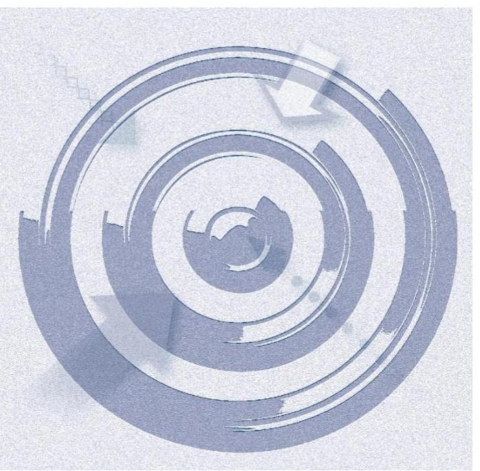

Az ellenőrzés célja annak megítélése volt, hogy az ellenőrzött intézményre vonatkozó irányító szervi feladatellátás a jogszabályi előírások betartásával történt-e; az intézménynél a belső kontrollrendszer kialakítása és múködtetése szabályszerű volt-e; kialakították-e az erőforrásokkal való szabályszerű, gazdaságos, hatékony és eredményes gazdálkodáshoz szükséges követelményeket, megvalósí-tották-e azok számonkérését, ellenőrzését; az intézmény pénzügyi és vagyongazdálkodása megfelelt-e a jogszabályi előírásoknak és belső szabályzatainak; az intézmény átalakításának vagy átszervezésének lebonyolítása szabályszerűen történt-e. Az intézmény korrupcióval szembeni veszélyeztetettségének csökkentése érdekében felmértük az integritási szemlélet érvényesülését a gazdálkodási folyamatokban.

A kiegészítő teljesítményellenőrzés célja annak értékelése volt, hogy a gazdálkodás folyamatában a gazdaságossági, hatékonysági és eredményességi követelmények kialakítása megtörtént-e, azokat múködtették-e, a célkitűzéseket elérték-e; a pénzügyi és vagyongazdálkodás folyamataira vonatkozóan a költségvetési szerv belső kontrollrendszerének minőségéről kiadott vezetői nyilatkozatban a költségvetési szerv tevékenységében a hatékonyság, eredményesség, gazdaságosság követelményeinek érvényesítésére vonatkozó nyilatkozat helytálló volt-e.

---

# AZ ELLENŐRZÉS TERÜLETE 

## Bács-Kiskun Megyei Kórház a Szegedi Tudományegyetem Általános Orvostudományi Kar Oktató Kórháza

A Kórház a dél-alföldi térség és az ország legnagyobb kórházai közé tartozik. A közfeladata - a működését meghatározó Eütv. ${ }^{8}$ alapján - a járó és fekvőbetegek diagnosztikus és terápiás szakorvosi ellátása, rehabilitációja és követéses gondozása. Az intézmény három városban (Kecskeméten, Kalocsán és Kiskunfélegyházán), négy telephelyen múködtet fekvőbeteg ellátást. Összesített ágyszáma 1220 aktív és 539 krónikus ágy. A Kórházban 2014-ben több mint 80 ezer fekvőbeteget láttak el, míg a rendelőintézeteiben az éves betegforgalom meghaladta a kétmillió főt.

A Kórház önálló jogi személyiséggel rendelkező, önállóan működő és gazdálkodó, az előirányzatok felett teljes jogkörrel rendelkező költségvetési szerv. Az irányító szervi hatásköröket 2011. december 31-éig a Közgyűlés, 2012. január 1-től a Minisztérium ${ }^{9}$, az egyes fenntartói, valamint az irányítási, középirányítói jogokat a GYEMSZI ${ }^{10}$ gyakorolta. A tulajdonosi jogkört 2011. január 1-je és 2011. december 31. között a Közgyűlés, 2012. január 1-je és 2012. április 30. között az MNV Zrt., míg 2012. május 1. és 2014. december 31. között pedig a GYEMSZI gyakorolta.

A Kórház szervezeti felépítése 2013. február 1-jén, egy alkalommal változott. A GYEMSZI által kidolgozott javaslat alapján az emberi erőforrás miniszter 2012. október 12-én döntött a Kalocsai Szent Kereszt Kórház, valamint a Kiskunfélegyházi Kórház-Rendelőintézet Gyógyfürdő és Rehabilitációs Központ beolvadásáról. A két intézmény 2013. február 1-jével olvadt be a Kórházba. A főigazgató ${ }^{11}$ és a gazdasági igazgató ${ }^{12}$ személyében nem történt változás. A Kórház átlagos statisztikai állományi létszáma 2011-ben 1728 fő, 2014-ben 2431 fő volt.

Az ellenőrzött időszakban történt átszervezések, valamint a végrehajtott beruházások következtében a Kórház könyvviteli mérleg szerinti vagyona több mint kétszeresére, a 2011. december 31-ei 7790,2 M Ft-ról 2014. december 31-ére 16 490,7 M Ft-ra nőtt. A kötelezettségek állománya az ellenőrzött időszakban több mint háromszorosára, 991,8 M Ft-ról 3403,8 M Ft-ra emelkedett. A Kórház teljesített költségvetési bevétele irányító szervi támogatással, maradvány igénybevétele nélkül - a 2011. évi 15 233,4 M Ft-ról a 2014. évre 22 637,5 M Ft-ra, 48,6\%-kal nőtt. A teljesített költségvetési kiadások a 2011. évi 15 099,3 M Ft-ról a 2014. évre 21 401,7 M Ft-ra, 41,7\%-kal emelkedtek.

A maradvány igénybevételt is figyelembe véve a Kórháznak a 2011. évben 365,0 M Ft, a 2012. évben 894,5 M Ft, a 2013. évben 311,5 M Ft, a 2014. évben 1547,3 M Ft költségvetési többlete keletkezett.

---

# AZ ELLENŐRZÉS HÁTTERE, INDOKOLTSÁGA 

A központi alrendszer egyes intézményei pénzügyi és vagyongazdálkodásának ellenőrzése.

## Hasznosulás

Az Alaptörvény ${ }^{13}$ rendelkezése szerint a nemzeti vagyon megőrzésének, védelmének és a nemzeti vagyonnal való felelős gazdálkodásnak a követelményeit sarkalatos törvény, az Nvtv. ${ }^{14}$ rögzíti. A tulajdonosi joggyakorlás és vagyonkezelés általános és speciális szabályait, az állami vagyon nyilvántartására és elszámolására vonatkozó eljárásokat, a vagyonkezelési szerződés feltételrendszerét, valamint az éves beszámoló készítési és könyvvezetési kötelezettségeket kormányrendelet írja elő.

A központi alrendszer egyes intézményei közfeladat-ellátásának változásait, a közfeladatok átadásából és átvételéből adódó módosításait, előirányzat gazdálkodására ható tényezőit az Áht. ${ }^{15}$ 11. §-a és az Ávr. ${ }^{16}$ 14. §a írja elő. A közfeladatok megszűnéséből, intézmény átszervezéséből, belső szerkezeti korszerűsítéséből, vagy más hasonló okból adódó módosításai miatt szerepeltetendő szerkezeti változásokat, valamint a szerkezeti változásként beépült közfeladatok szintre hozásként történő számításba vételét az Ávr. 15. § (2)-(3) bekezdései határozzák meg.

A társadalmi igénnyel összhangban az Áht. ${ }^{17}$ és Áht. ${ }_{2}$ az Ámr. ${ }^{18}$ és a Bkr. ${ }^{19}$ is előírja a költségvetési szerv részére, hogy olyan szabályozásokat, eljárásokat, folyamatokat alakítson ki, amelyek biztosítják a múködés, gazdálkodás, az erőforrások felhasználása során a gazdaságosság, hatékonyság és eredményesség érvényesülését.

AZ ELLENŐRZÉS EREDMÉNYEKÉPPEN nemcsak az ellenőrzött intézmények gazdálkodása javulhat, hanem átfogó képet kaphatunk a központi alrendszerbe tartozó költségvetési szervek gazdálkodásának hiányosságairól, de a jó gyakorlatokról is. Ellenőrzéseivel, javaslataival és megállapításaival az ÁSZ elősegítheti a költségvetési szervek pénzügyi és vagyongazdálkodása szabályozásának javítását és hozzájárulhat a jó kormányzáshoz.

---

# FÓKUSZKÉRDÉSEK 

1.     - Az irányító szerv ellenőrzött intézményre vonatkozó feladatellátása szabályszerű volt-e?
2.     - A belső kontrollrendszer kialakítása és müködtetése megfelelt-e a jogszabályi előírásoknak?
3.     - Az intézmény pénzügyi gazdálkodása szabályszerű volt-e?
4.     - Az intézmény vagyongazdálkodása szabályszerű volt-e?
5.     - Szabályszerűen hajtották-e végre az ellenőrzött időszakban az intézményt érintő szervezeti, szerkezeti átalakításokat?
6.     - Az intézmény intézkedett-e az integritás szemlélet érvényesítése érdekében?

---

# ELLENŐRZÉS HATÓKÖRE ÉS MÓDSZEREI 

## Az ellenőrzés típusa

Szabályszerúségi és teljesítmény ellenőrzés.

## Az ellenőrzött időszak

Az ellenőrzött időszak 2011. január 1-jétől 2014. december 31-ig tartott.

## Az ellenőrzés tárgya

Az ellenőrzött szervezetre vonatkozó irányító szervi feladatok ellátása. Az intézmény belső kontrollrendszerének kialakítása és múködtetése, valamint pénzügyi és vagyongazdálkodása. Az erőforrásokkal való szabályszerű, gazdaságos, hatékony és eredményes gazdálkodáshoz szükséges követelmények kialakítása, a kialakított követelmények számonkérése, ellenőrzése. Az intézmény átalakítása, átszervezése lebonyolításának szabályszerűsége. A gazdálkodás folyamatában a gazdaságossági, hatékonysági és eredményességi követelmények kialakítása és múködtetése, a célkitűzések elérésének értékelése, ezek érvényesítéséről kiadott vezetői nyilatkozat helytállósága a pénzügyi és vagyongazdálkodás folyamataira vonatkozóan.

Az ellenőrzés kiterjedt minden olyan körülményre és adatra, amely az ÁSZ jogszabályban meghatározott feladatainak teljesítéséhez, valamint a program végrehajtása folyamán felmerült újabb összefüggések feltárásához szükséges volt.

## Az ellenőrzött szervezet

Bács-Kiskun Megyei Kórház a Szegedi Tudományegyetem Általános Orvostudományi Kar Oktató Kórháza, Bács-Kiskun Megyei Önkormányzat, Állami Egészségügyi Ellátó Központ (Gyógyszerészeti és Egészségügyi Minőség- és Szervezetfejlesztési Intézet), Emberi Erőforrások Minisztériuma (Nemzeti Erőforrás Minisztérium).

Az ellenőrzésre a központi alrendszer ellenőrzött intézményének és irányító/felügyeleti szervének, illetve középirányító szervének székhelyén, telephelyén, a gazdálkodási feladatait ellátó szervezetének székhelyén került sor.

---

# Az ellenőrzés jogalapja 

Az ellenőrzés jogszabályi alapját az ÁSZ tv ${ }^{20}$. 1. § (3) bekezdésének, az 5. § (2)-(7) bekezdéseinek, az Áht. 2 61. § (2) bekezdésének, valamint az Alaptörvény Állam fejezet 43. cikk (1) bekezdésének előírásai képezték.

## Az ellenőrzés módszerei

Az ellenőrzést az ellenőrzési program szempontjai, az ellenőrzött időszakban hatályos jogszabályok, az ellenőrzés szakmai szabályai, az egyes ellenőrzési típusokhoz kapcsolódó ÁSZ módszertanok és nemzetközi standardok figyelembevételével végeztük. A gazdálkodás hibáinak kijavítására, a közpénzekkel való felelős gazdálkodás segítésére irányuló javaslatok kidolgozásakor a hatályos jogszabályok az irányadóak.

Az ellenőrzés ideje alatt az ellenőrzött szervezettel történő kapcsolattartást az ÁSZ SZMSZ ${ }^{21}$-ének vonatkozó előírásai alapján biztosítottuk.

Az ellenőrzési kérdések megválaszolásához szükséges bizonyítékok megszerzése a következő ellenőrzési eljárások alkalmazásával történt: megfigyelés, szemle (szemrevételezés), kérdésfeltevés (információkérés), mintavételezés, valamint elemző eljárás. A minták kiválasztása során elsősorban reprezentativitást biztosító véletlen mintavételi eljárást alkalmaztunk.

Az ellenőrzési bizonyítékként felhasználható adatforrások közé tartoztak a szakmai program részletes szempontjainál felsorolt adatforrások.

Az ellenőrzés lefolytatásához az intézmény a tanúsítványok elektronikus kitöltésével, valamint az ÁSZ által kért dokumentumok elektronikus megküldésével szolgáltatott adatokat. A rendelkezésre bocsátott adatok, információk kontrollja az ellenőrzés keretében történt.

Az ellenőrzési kérdésekre adott válaszok alapján értékeltük, hogy az ellenőrzött időszakban az irányító szerv az ellenőrzött intézményre vonatkozó feladatainak szabályszerűen eleget tett-e, az intézmény pénzügyi és vagyongazdálkodása megfelelt-e az előírásoknak, az intézmény átalakításának vagy átszervezésének végrehajtása szabályszerű volt-e. Értékeltük, hogy az intézménynél kialakították-e az erőforrásokkal való szabályszerű és hatékony gazdálkodáshoz szükséges követelményeket, megvalósították-e azok számonkérését, ellenőrzését.

Az intézmény belső kontrollrendszere jogszabályi előírások szerinti kialakításának és működtetésének szabályszerűségét az erre irányuló ellenőrzési kérdésekre adott válaszok összesítése alapján, évente pillérenként (kontrollkörnyezet, kockázatkezelési rendszer, kontrolltevékenységek, információs és kommunikációs rendszer, monitoring rendszer) és összesítetten is minősítettük. Az intézmény belső kontrollrendszere egyes pilléreinek kialakítása és müködtetése „szabályszerü" volt, amennyiben az értékelt területen az elért és elérhető pontok százalékban kifejezett, egész számra kerekített hányadosa meghaladta a $84 \%$-ot, „részben szabályszerű" volt, ha a $84 \%$-ot nem haladta meg, de $60 \%$-nál nagyobb volt, „nem szabályszerű" volt, ha nem haladta meg a $60 \%$-ot. Az intézmény belső kontrollrendszerének összesített értékelése megegyezett a pillérenként (kontrollterületenként) alkalmazott \%-os értékelésekkel, a következő eltérésekkel.

---

A kontrollrendszer egésze esetében a „szabályszerü" értékelésnek a \%-os értéken felül további feltétele volt, hogy egyik kontrollterület sem kaphatott „nem szabályszerü" értékelést, a „részben szabályszerü" értékelés további feltétele volt, hogy legfeljebb egy ellenőrzött kontrollterület lehetett „nem szabályszerű" értékelésű. Az összesített értékelés a \%-os értéktől függetlenül „nem szabályszerű" volt, ha az ellenőrzött kontrollterületek közül több mint egynek „nem szabályszerű" volt az értékelése.

A Kórház az ellenőrzést megelőzően az ÁSZ Integritás Projektjében nem vett részt. Az integritás szemlélet érvényesülésének értékelése az intézmény által kitöltött hosszú kérdőív alapján történt.

A tárgyi eszközök nyilvántartásba vételének, a közbeszerzési eljárások lefolytatásának, a vagyonhasznosítási bevételi előirányzatok teljesítésének, az előirányzatok módosításának és az előirányzat-maradvány megállapításának, valamint a gazdálkodási jogkörök gyakorlásának szabályszerűségét mintavétellel ellenőriztük. A jogszabályoknak és a belső előírásoknak megfelelőnek, azaz szabályszerűnek tekintettük a tárgyi eszközök nyilvántartásba vételét, a közbeszerzési eljárások lefolytatását, a vagyonhasznosítási bevételi előirányzatok teljesítését, az előirányzatok módosítását és az előirányzat-maradvány megállapítását, amennyiben a minta ellenőrzésének eredménye alapján 95\%-os bizonyossággal a teljes sokaságban a hibás tételek aránya kisebb volt, mint 10\%, nem megfelelőnek értékeltük, ha a hibás tételek aránya a 10\%-ot meghaladta.

A 2011. évet érintően a szakmai teljesítésigazolás és az utalvány ellenjegyzése kulcskontrollok, a 2012-2014. éveket érintően a teljesítésigazolás és az érvényesítés kulcskontrollok működését értékeltük. Megfelelőnek értékeltük a gazdálkodási jogkörök gyakorlását, amennyiben 95\%-os bizonyossággal a teljes sokaságban a hibás tételek aránya legfeljebb 10\% volt, részben megfelelőnek, ha a hibás tételek arányának felső határa legfeljebb 30\% volt, nem megfelelőnek, ha a hibás tételek sokaságbeli arányának felső határa meghaladta a 30\%-ot.

---

# 1. Az irányító szerv ellenőrzött intézményre vonatkozó feladatellátása szabályszerű volt-e? 

## Összegző megállapítás

### 1.1. számú megállapítás

Az irányító szervek feladatellátása részben felelt meg a jogszabályi előírásoknak.

Az intézményalapítással kapcsolatos jogosultságok gyakorlása részben felelt meg a jogszabályokban előírtaknak.

A Kórházat érintően az irányító szervi hatásköröket 2011. december 31-éig a Közgyűlés gyakorolta. Az államháztartás önkormányzati alrendszeréből a központi alrendszerbe történt átsorolást követően, 2012. január 1-jétől az irányító szervi hatásköröket a Minisztérium, az egyes fenntartói, valamint az irányítási, középirányítói jogokat a GYEMSZI gyakorolta.

A Kórház rendelkezett a jogszabályi előírásoknak megfelelő alapító okirattal, melyet 2011-ben a Közgyűlés határozattal fogadott el, 2012-2014. években az egészségügyért felelős miniszter adott ki. Az alapító okirat tartalma megfelelt a jogszabályi előírásoknak, többek között tartalmazta az irányítói jogok gyakorlására jogosultak megjelölését. Az Önkormányzat Közgyűlése a Kórház alapító okiratát 2011-ben módosította. Az alrendszer váltást követően az egészségügyért felelős miniszter 2012. január 1-jei hatállyal új alapító okiratot adott ki, melyet 2013-ban (a két kórház beolvadása miatt) és 2014-ben (a kormányzati funkció megjelölése miatt) módosítottak, melyhez a jogszabályi előírásnak megfelelően az egységes szerkezetű okiratot elkészítették. Az alapító okirat 2013. évi módosításához - az Áht. 2 8. § (7) bekezdésében foglalt előírás ellenére - nem kérték meg az államháztartásért felelős miniszter előzetes egyetértését.

A Kórház az ellenőrzött időszakban rendelkezett az irányító szerv által jóváhagyott SZMSZ ${ }^{22}$-szel. A 2010-ben hatályba lépett SZMSZ-t 2011-ben a Közgyűlés nem módosította annak ellenére, hogy az alapító okirat két ízben is módosult, ezért az SZMSZ 2011-ben - az Ámr. 20. § (2) bekezdés b) pontjában előírtak ellenére - nem a hatályos alapító okirat keltét és számát tartalmazta. Az SZMSZ 2012. évi és a 2013. évi módosításait a GYEMSZI jóváhagyta. A 2012-2014. években az SZMSZ és az alapító okirat közötti összhang biztosított volt. A 2012-2014. években az SZMSZ a jogszabályi előírásoknak megfelelően tartalmazta az alapító okirat keltét, számát és az alapítás időpontját.

---

### 1.2. számú megállapítás

A közfeladatok ellátására vonatkozó, az erőforrásokkal való szabályszerű gazdálkodáshoz szükséges követelményeket az irányítószervek érvényesítették és számon kérték. Azonban hatékony gazdálkodáshoz szükséges követelményeket nem alakítottak ki és nem ellenőrizték.

A Közgyűlés és a GYEMSZI a közfeladatok ellátására vonatkozó, az erőforrásokkal való szabályszerű gazdálkodáshoz szükséges követelményeket érvényesítette, számon kérte. A szabályszerű gazdálkodáshoz szükséges követelmények kialakítása és számonkérése többek között a költségvetés tervezésének és a beszámoltatás rendjének biztosításával valósult meg. A Közgyűlés és a GYEMSZI a pénzügyi helyzetről rendszeres beszámolási kötelezettséget írt elő a Kórháznak. A Minisztérium a jogszabályban előírt ellenőrzési jogosultságait szabályszerűen gyakorolta, míg a Közgyűlés és a GYEMSZI részben gyakorolta szabályszerűen.

Az Önkormányzat Közgyűlése az erőforrásokkal való gazdálkodás szabályszerűségi követelményeit rendeletekben, határozatokban rögzítette. A Közgyűlés - a vagyongazdálkodási rendeletében - a Kórház részére vagyongazdálkodási követelményeket határozott meg. Az előirányzatok, pénzügyi erőforrások, létszám felhasználására vonatkozó követelményeket a Közgyűlés költségvetési rendelete tartalmazta. A GYEMSZI levélben tájékoztatta a Kórházat az alrendszer váltással kapcsolatos változásokról, a középirányító szerv feladatkörének bővüléséről, a vagyonkezelői feladatok ellátásáról, a stratégiai együttműködésről, az új adatszolgáltatási rendszer működtetéséről, a kapcsolattartás módjáról, további körleveleiben szabályokat határozott meg a gazdálkodás több területére vonatkozóan. A jóváhagyási jogkörök irányítószervi gyakorlása megfelelt a jogszabályi előírásoknak, az intézmény költségvetését és beszámolóját 2011-ben a Közgyűlés, 2012-2014. években a Minisztérium hagyta jóvá.

Az Önkormányzat Közgyűlése 2011-ben pénzügyi és szabályszerűségi utóellenőrzést folytatott le a Kórháznál a korábbi ellenőrzéséhez kapcsolódó intézkedési tervében meghatározott feladatok végrehajtásáról. A GYEMSZI 2013-ban ellenőrizte a Kórház szabályzatainak meglétét. A Minisztérium ellenőrizte a Kórház 2012-2014. évi belső ellenőrzését. Azonban az irányító szervek által lefolytatott külső ellenőrzések a közfeladatok ellátására, illetve az erőforrásokkal való hatékony gazdálkodás ellenőrzésére nem terjedtek ki. Az Önkormányzat Közgyűlése - az Áht. 1 49. § (5) bekezdés e) pontjában foglalt előírás ellenére - a 2011. évben nem ellenőrizte az államháztartással összefüggő közérdekű és közérdekből nyilvános adatok kötelező közzétételét, illetve igényre történő szolgáltatásának végrehajtását. A 2011. évben a Közgyűlés az Áht. 1 49. § (5) bekezdés f) pontjában foglaltak ellenére, míg a 2012-2014. években a GYEMSZI az 59/2011. (IV. 12.) Korm. rendelet ${ }^{23}$ 2/A. § a) pontjában és az Áht. 2 9. § (1) bekezdés f) pontjában foglaltak ellenére nem érvényesítette, nem kérte számon és nem ellenőrizte az előirányzatokkal, létszámokkal és vagyonnal való hatékony gazdálkodás követelményeit, mivel a Kórháznál mérhető követelményeket nem határozott meg. A 2012-2014. években a GYEMSZI - az 59/2011. (IV. 12.) Korm. rendelet 2/A. § m) pontja szerint jogosult volt a Kórháznál lefolytatott közbeszerzési eljárásokkal kapcsolatban folyamatba épített, illetve utóellenőrzést végezni, de a jogosultság ellenére ilyet nem végzett.

---

# 1.3. számú megállapítás 

A Kórházzal kapcsolatos egyéb ellenőrzési, irányítási és felügyeleti jogosultságok gyakorlása szabályszerűen történt.

Az Önkormányzat Közgyűlése és a GYEMSZI rendszeresen figyelemmel kísérte a kórház bevételi és kiadási előirányzatokkal való gazdálkodását. A 2011. évben az Önkormányzat Közgyűlése, a 2012-2014. években a Minisztérium hagyta jóvá a Kórház beszámolóit (elemi költségvetési féléves és éves beszámolókat, az előirányzat teljesítéséről készített kimutatásokat). A Minisztérium az előirányzat módosításokról, a maradvány jóváhagyásokról, a létszám módosításokról, a bérkompenzáció elszámolásáról az ellenőrzött időszakban értesítő leveleket küldött a Kórháznak.

A főigazgató és gazdasági igazgató személyében nem történt változás. A 2012. évben a Kórház korábbi főigazgatóját és gazdasági igazgatóját a jogszabályi előírásoknak megfelelően a Miniszter bízta meg. Az irányító szervek a szakmai tevékenységről önálló beszámolót nem kértek, az éves beszámolók szöveges indokolása tartalmazott szakmai beszámolót is, melyet felülvizsgáltak és jóváhagytak.

## 2. A belső kontrollrendszer kialakítása és múködtetése megfelelte a jogszabályi előírásoknak?

## Összegző megállapítás

2.1. számú megállapítás
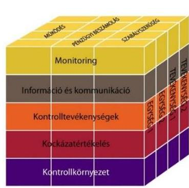

## A belső kontrollrendszer kialakítása és múködtetése részben felelt meg a jogszabályi előírásoknak.

A belső kontrollrendszer kialakítása és múködtetése szabályszerűségének értékelését a III. számú melléklet tartalmazza.

## A Kórház a kontrollkörnyezetét - a feltárt hiányosságoktól eltekintve - a jogszabályi előírásoknak megfelelően alakította ki.

A Kórház rendelkezett aktualizált SZMSZ-szel, amely a 2011. évben - az Ámr. 20. § (2) bekezdés i) pontjában előírtak ellenére - nem foglalta magában a költségvetési szerv szervezeti ábráját. A hiányosságot 2012-től megszüntettek, így a szabályzat megfelelt a jogszabályi előírásban foglaltaknak.

A Kórház gazdasági szervezete rendelkezett ügyrenddel, amelyben a vagyongazdálkodással kapcsolatos feladatok munkafolyamatainak leírását, valamint a külső kapcsolattartás módját - az Ámr. 20. § (7) bekezdésében, valamint az Ávr. 13. § (5) bekezdésében foglaltak ellenére - nem határozták meg.

Az intézményben határoztak meg etikai elvárásokat, rendelkeztek Etikai szabályzattal.

A Kórház rendelkezett a főigazgató által jóváhagyott számviteli politikával, amely tartalmazta a Sztv. ${ }^{24}$-ben, az Áhsz. ${ }^{25}$-ben és - a kezelt vagyon nyilvántartásával kapcsolatban - 2012-től a Vtvr. ${ }^{26}$-ben előírt feladatokat. A számviteli politika keretében elkészítették az eszközök és a források leltározási, leltárkészítési és értékelési szabályzatát, az önköltség-számítás rendjére és a pénzkezelésre vonatkozó szabályozásokat, melyeket aktualizáltak. A selejtezés lebonyolításának rendjét belső szabályzatban határozták meg.

---

Az értékelési szabályzat - az Áhsz. ${ }^{27}$ 8. § (17) bekezdés d) pontjában és (18) bekezdésében, illetve az Áhsz. 2 50. § (2) bekezdés b)-c) pontjai előírtak ellenére - nem tartalmazta követeléstípusonként a kisösszegű követelések év végi meghatározásának és az egyszerűsített értékelési eljárás alá vont követelések besorolásának elveit. A Kórház rendelkezett számlarenddel, amely azonban - a Sztv. 161. § (2) bekezdés d) pontjában előírtak ellenére - nem tartalmazta a számlarendben foglaltakat alátámasztó bizonylati rendet.

A gazdálkodás részletes rendjét a gazdálkodási szabályzatban határozták meg. A 2011-2012. évekre vonatkozó szabályozásban a 100 ezer Ft-ot el nem érő kifizetések előzetes írásbeli kötelezettségvállalás nélküli teljesítésének rendjét - az Ámr. 72. § (14) bekezdésében és az Ávr. 53. § (1)(2) bekezdésében foglaltak ellenére - nem szabályozták, a 2013-2014. években ezzel a lehetőséggel nem éltek.

Az intézmény rendelkezett közbeszerzési szabályzattal, a Kbt. ${ }^{28}$ és a Kbt. ${ }^{29}$ hatálya alá nem tartozó beszerzések lebonyolítására külön szabályozással, aktualizált ellenőrzési nyomvonallal és szabálytalanság kezelésére vonatkozó eljárásrenddel. Az ellenőrzési nyomvonal - a Bkr. 6. § (3) bekezdésében előírtak ellenére - a költségvetési beszámolásra, a mérlegjelentésre, az időközi költségvetési jelentésre és a kapcsolódó adatszolgáltatási kötelezettségre vonatkozó felelősségi és információs szinteket és kapcsolatokat, irányítási és ellenőrzési folyamatokat nem tartalmazott.

# 2.2. számú megállapítás 

## A kockázatkezelési rendszer kialakítása és múködtetése összességében részben felelt meg a jogszabályi előírásoknak.

A költségvetési szerv vezetője a kockázatkezelési rendszer Ámr.-ben és Bkr.-ben előírt kialakítása keretében a kockázatok kezelésére vonatkozóan belső szabályozást adott ki.

Intézményi szinten kockázatelemzés - az Ámr. 157. §-ában és a Bkr. 7. § (2) bekezdésében előírtak ellenére - nem készült. A Kórház egészére vonatkozóan nem mérték fel és nem állapították meg tevékenységben rejlő kockázatokat, nem határozták meg a kockázatokkal kapcsolatban szükséges intézkedéseket és azok teljesítése folyamatos nyomon követésének módját. A 2014. évben a Gazdasági Igazgatóság osztályai által készített utólagos kockázatelemzés mindössze a gazdálkodással kapcsolatos kockázatokat foglalta össze.

A vagyonnyilatkozat-tételre kötelezettek körét az SZMSZ-ben rögzítették, az alkalmazott eljárás a Vnytv. ${ }^{30}$-ben előírtaknak megfelelő volt.

### 2.3. számú megállapítás

## A kontrolltevékenységgel kapcsolatos szabályozási kereteket kialakították, azonban a kontrolltevékenységek részben feleltek meg a jogszabályi előírásoknak.

Az Áht. ${ }_{1}$ 121/A. § (4) bekezdés b) pontjában, valamint a Bkr. 8. § (2) bekezdés b) pontjában előírtak ellenére a pénzügyi kihatású döntések célszerűségi, gazdaságossági, hatékonysági és eredményességi szempontú megalapozottságának kontrollja nem volt biztosított.

A gazdálkodási jogkörök kialakítása megfelelt a jogszabályi előírásoknak, a kötelezettségvállaló a teljesítésigazolásra, a gazdasági vezető az ér-

---

vényesítésre jogosultakat kijelölte, az intézményvezető adott felhatalmazást kötelezettségvállalásra és utalványozásra. Azonban az előirányzatok felhasználásánál kulcskontrollok múködésének ellenőrzése során hiányosságokat tapasztaltunk, ami a folyamatba épített, illetve a vezetői ellenőrzés nem megfelelő múködésére volt visszavezethető. A feltárt hiányosságok miatt a költségvetési gazdálkodás során az előzetes és utólagos pénzügyi ellenőrzés, a pénzügyi döntések szabályszerűségi szempontból történő jóváhagyása, illetve ellenjegyzése - az Áht. 1 121/A. § (4) bekezdés c) pontjában, valamint a Bkr. 8. § (2) bekezdés c) pontjában előírtak ellenére részben megfelelő volt.

Az engedélyezési, jóváhagyási és kontrolleljárásokat, a dokumentumokhoz való hozzáférést, a hozzáférés szintjeit, az informatikai rendszerekhez való hozzáférés jogosultságait, a beszámolási eljárásokat a jogszabályi előírásoknak megfelelően kialakították. Az elektronikus iratkezelést 2013-ban vezették be, azonban - az lkr. ${ }^{31}$ 8. § (2) bekezdésében foglalt előírások ellenére - 2013-ban nem rendelkeztek az elektronikus iratkezelés speciális szabályait rögzítő szabályzattal, így az üzemeltetési feladatok szabályozása hiányos volt, azt csak 2014-ben adták ki.

# 2.4. számú megállapítás 

## Az információs és kommunikációs rendszer kialakítása és múködtetése részben felelt meg a jogszabályi előírásoknak.

A szervezeten belüli információ áramlás rendszerét - az Ámr.-ben és a Bkr.ben előírtakkal összhangban - kialakították. A külső információáramlás biztosításával kapcsolatos feladatokat a szervezeti egységek múködési rendjében rögzítették. A Kórház rendelkezett az Avtv. ${ }^{32}$ és az Info tv. ${ }^{33}$ által előírt adatvédelmi és adatbiztonsági szabályzattal.

A közérdekú adatok nyilvánosságra hozatalának rendjét - az Info tv., az Ámr. és az Ávr. előírásának megfelelően - belső szabályzatban rögzítették. A Kórház a közzétételére vonatkozó kötelezettségének - az Eitv. ${ }^{34}$ 3. § (2) bekezdésében és az Info tv. 33. § (1) és (3) bekezdéseiben előírtak ellenére - nem tettek eleget, mivel nem tették közzé az Eitv. mellékletében és az Info tv. 1. mellékletében lévő általános közzétételi listának megfelelően a III. Gazdálkodási adatok:

1. pontjában foglaltak ellenére a 2014. évi költségvetést, a 2013. éves költségvetési beszámolót;
2. pontban előírt létszámra és illetményre, juttatásokra, költségtérítésekre vonatkozó kiadási adatokat a 2011-2014. évekre vonatkozóan;
3. pontjában előírt a 2013. évben nyújtott támogatásokat;
4. pontjában előírt ötmillió Ft-ot elérő vagy azt meghaladó árubeszerzésre, építési beruházásra, szolgáltatás megrendelésre vonatkozó szerződések meghatározott adatait, illetve az azokban bekövetkezett változásokat a 2011-2014. évekre vonatkozóan.
A 2011-2013. években - az Avtv. 20. § (8) bekezdésében, az Info tv. 30. § (6) bekezdésében, az Ámr. 20. § (3) bekezdés i) pontjában, az Ávr. 13. § (2) bekezdés h) pontjában előírtak ellenére - nem szabályozták a közérdekú adatok megismerésére irányuló igények teljesítésének rendjét.

---

A Kórház rendelkezett iratkezelési szabályzattal, amelyhez azonban - az Ltv. ${ }^{35}$ 10. § (1) bekezdés a) pontjában foglaltak ellenére - az illetékes közlevéltár egyetértésével nem rendelkezett. A 2011-2013. években hatályos iratkezelési szabályzat - az lkr. 34. § (1) bekezdésében foglaltak ellenére nem tartalmazta a küldemények érkeztetése dokumentálásának módját. A papíralapú irat útja az osztályvezető általi átvételét követően dokumentáltan nem volt követhető, ezért a Kórháznál nem tartották be az lkr. 14. § (4) bekezdésében előírtakat.

# 2.5. számú megállapítás 

A monitoring-rendszer múködése, a rendelkezésre álló források gazdaságos, hatékony és eredményes felhasználását biztosító követelmények kialakítása és alkalmazása a jogszabályi előírásoknak és a belső szabályzatokban foglaltaknak összességében részben felelt meg.

Az intézményben az SZMSZ-ben előírtaknak megfelelően szakmai testületek, munkabizottságok múködtek, a vezetői irányítási feladatok végrehajtása keretében rendszeres vezetői értekezletek, éves munkaterv alapján történő beszámoltatások voltak. Azonban az operatív tevékenységek folyamatos és eseti nyomon követési rendszerének kialakítása és múködtetése részben felelt meg az Ámr. 160. § (2) bekezdésében és a Bkr. 10. §-ában foglaltaknak, mivel a Kórház intézményi szintű, az operatív tevékenységek teljes körét átfogó, szabályozott nyomon követési rendszert nem alakított ki és nem múködtetett. A Kórház ISO 9001:2008 minőségirányítási rendszert múködtetett.

A Kórháznál a 2012-2014. években a rendelkezésre álló források gazdaságos, hatékony és eredményes felhasználását biztosító teljesítmény célokat és követelményeket (szabályozásokat, folyamatokat) - a Bkr. 6. § (2) bekezdésében foglaltak ellenére - nem alakítottak ki.

Teljesítménymutatókat az OEP ${ }^{36}$ finanszírozáshoz kapcsolódóan dolgoztak ki (pl.: aktív osztályok súlyszám teljesítménye, aktív és krónikus osztályok ágykihasználtsága, járó beteg pont teljesítmény, betartandó gyógyszerkeretek), melyeket rendszeresen és folyamatosan figyelemmel kísértek, azonban ezek a mutatók nem kapcsolódtak előre meghatározott, az intézmény vezetője által kiadott éves munkatervben, feladattervben, vagy egyéb dokumentumban kitűzött teljesítmény célokhoz.

A 2011. évre vonatkozóan, az Ámr. 21. sz. mellékletében lévő belső kontrollrendszer minősítéséről szóló nyilatkozatot a költségvetési szerv vezetője - az Ámr. 217. § c) pontjában foglaltak ellenére - nem töltötte ki. A 2012-2014. években a belső kontrollrendszer kialakításáról szóló nyilatkozatok tartalmazták, hogy az intézmény vezetője gondoskodott a költségvetési szerv tevékenységében a hatékonyság, eredményesség és a gazdaságosság követelményeinek érvényesítéséről, amely nincs összhangban az ellenőrzés által feltártakkal.

A kiegészítő teljesítmény-ellenőrzés megállapításait a II. számú melléklet tartalmazza.

A BELSŐ ELLENŐRZÉSI rendszer kialakításáról a Kórháznál saját alkalmazottak foglalkoztatásával - a Ber. ${ }^{37}$-ben és a Bkr.-ben előírtak szerint gondoskodtak, jogállását és feladatait az SZMSZ-ben rögzítették,

---

függetlensége biztosított volt, érvényesültek az összeférhetetlenségi követelmények. A 2005-től hatályos belső ellenőrzési kézikönyvet - a vonatkozó jogszabályi, illetve szervezeti változás ellenére - csak 2013-ban vizsgálták felül és vezették át rajta a szükséges módosításokat, ezzel a Kórház belső ellenőrzési vezetője megsértette a Ber. 5. § (3) bekezdésében előírt legalább évenkénti és a Bkr. 17. § (4) bekezdésében előírt legalább kétévente elvégzendő felülvizsgálati kötelezettséget. A felülvizsgálat hiányában a belső ellenőrzési kézikönyv 2012-ben nem tartalmazta a Bkr. 17. (2) bekezdés a) pontja szerinti tanácsadó tevékenységre vonatkozó eljárási szabályokat. A belső ellenőrzési vezető a jóváhagyott éves ellenőrzési tervekben foglalt ellenőrzések végrehajtásáról - a Bkr. 22. § (1) bekezdés b) pontjában előírtak ellenére - nem gondoskodott, mivel a 2012. évben három, a 2013. évben egy ellenőrzés nem valósult meg. A tervezett ellenőrzéseken felül soron kívüli ellenőrzéseket hajtottak végre.

A belső ellenőrzések során tett megállapításokról - a Ber.-ben és Bkr.ben előírtak szerint - belső ellenőrzési jelentést készítettek. A 2013. évben előfordult, hogy a belső ellenőrzési jelentésekben megfogalmazott megállapításokra, javaslatokra - a Bkr. 28. § c) pontjában és a 45. § (1)-(3) bekezdéseiben előírtak ellenére - nem készítettek intézkedési tervet. A belső ellenőrzésekről vezetett nyilvántartás nem tartalmazta - a Ber. 29/A. § (1)(2) bekezdéseiben és a Bkr. 47. § (1)-(2) bekezdéseiben előírtak ellenére az elfogadott intézkedési terv alapján végrehajtott intézkedések rövid leírását és a végre nem hajtott intézkedések okát. A 2014. évi belső ellenőrzési nyilvántartás nem tartalmazta - a Bkr. 50. § (1) bekezdésében foglaltak ellenére - a Kórház kalocsai telephelyén végzett belső ellenőrzéseket. A külső ellenőrzések javaslataira készült intézkedési tervekben rögzítetteket nyilvántartották és nyomon követték.

# 3. Az intézmény pénzügyi gazdálkodása szabályszerű volt-e? 

## Összegző megállapítás

### 3.1. számú megállapítás

A Kórház pénzügyi gazdálkodása részben volt szabályszerű.
Az elemi költségvetés készítése és az előirányzatok megállapítása során betartották a jogszabályi előírásokat és a belső szabályzatokban foglaltakat.

A TERVEZÉSSEL kapcsolatos feladatokat az SZMSZ-ben, a részletes feladatokat az ezeket ellátó szervezeti egység működési rendjében határozták meg. A költségvetés-tervezéssel kapcsolatos folyamatokat továbbá az ellenőrzési nyomvonal is tartalmazta. A kétkörös tervezés keretében az előzetes és végleges költségvetés készítésének folyamata az Ámr.ben és Ávr.-ben foglaltaknak megfelelt.

SZÁMÍTÁSOKKAL támasztották alá a Kórháznál az elemi költségvetés tervezése során a bevételek és kiadások összegét, amelyek a szervezeti egységek adatszolgáltatásán alapultak. A Kórház a költségvetés elkészítésével kapcsolatos adatszolgáltatási kötelezettségét az Ámr.-ben és az irányító szerve által előírtaknak megfelelően teljesítette. A 2014. évben az elemi költségvetés irányító szerv részére történő (papír alapú, kinyomta-

---

tott formátumú) megküldése - az Ávr. 32. § (1) bekezdésében előírtak ellenére - nem az irányító szerv által meghatározott február 21-ei határidőre, hanem április 25 -én történt.

A Kórháznál - az Ámr.-ben és az Ávr.-ben foglaltak szerint - figyelembe vették az intézményi költségvetési javaslat elkészítése, az előirányzatok megállapítása során a szervezeti átalakításból, új feladat ellátásából adódó szerkezeti változások hatásait, a szintre hozás nem módosította a keretszámokat.

# 3.2. számú megállapítás 

A bevételi és kiadási előirányzatok módosítása - az alábbi hiányosság miatt - nem felelt meg a jogszabályi előírásoknak.

AZ ELŐIRÁNYZATOK MÓDOSÍTÁSA a 2011. évben szabályszerűen, míg a 2012-2014. években nem a jogszabályi előírásoknak megfelelően történt. A Kórház a 2012-2014. években az intézményi hatáskörben végrehajtott előirányzat-módosításokról, az intézkedés meghozatalát követően a Kincstárt a jogszabályban előírt határidőben tájékoztatta, azonban a GYEMSZI tájékoztatása - az Ávr. 167. § (4) bekezdésében előírtak ellenére - rendszeresen elmaradt. A Kórház az előirányzatok módosítása előtt az irányító szervnek jóváhagyásra megküldte az előirányzat-módosítást tartalmazó adatlapot.

Az előirányzat-módosítások elrendelése, az Ávr.-ben foglaltaknak megfelelően, a főigazgató által, a gazdasági igazgató ellenjegyzése mellett történt. A Kórház rendelkezett előirányzat-nyilvántartással, az előirányzat-változások dokumentálását az intézménynél erre rendszeresített adatlapon végezték, megjelölve a módosítás hatáskörét, okát, indokát, részletezve az érintett előirányzatokat és főkönyvi számlaszámokat. A főkönyvi könyvelésben a feladást - az Áhsz. ${ }_{1}$-ben és Áhsz. ${ }_{2}$-ben előírtak szerint - végrehajtották az előirányzat-változás jogcímeinek megfelelően. Az előirányzatmódosítások során - a tájékoztatási kötelezettség elmulasztásán kívül betartották az Ámr. és az Ávr. vonatkozó előírásait.

A Kórház előirányzatait kormányzati, irányító szervi és intézményi hatáskörben többször módosították, a módosítások döntő hányada intézményi hatáskörben történt. Országgyűlési hatáskörű előirányzat-módosításra nem került sor.

Az előirányzat módosítások hatáskörönkénti bontását az alábbi táblázat tartalmazza:

1. táblázat

| ELŐIRÁNYZAT-MÓDOSÍTÁSOK (M FT-BAN) |  |  |  |  |  |
| :--: | :--: | :--: | :--: | :--: | :--: |
| Megnevezés | 2011. év | 2012. év | 2013. év | 2014. év | Összesen |
| Országgyưlési | - | - | - | - | - |
| Kormányzati | 0,0 | 177,3 | 142,2 | 1270,3 | 1589,8 |
| Irányító szervi | 126,7 | 7,1 | 15,9 | 6,7 | 156,4 |
| Intézményi | 3056,8 | 1231,2 | 7865,9 | 2536,8 | 14690,7 |
| Összesen | 3183,5 | 1415,6 | 8024,0 | 3813,8 | 16436,9 |

A kormányzati és az irányító szervi előirányzat-módosítások rezidens orvosok képzésének, személyi juttatásainak, közalkalmazottak bérkompenzációjának ügyeleti-készenléti díjak, kereset-kiegészítések kiadásainak, pályázati önerő biztosítására szolgáltak.

---

### 3.3. számú megállapítás

A Kórház a bevételi előirányzatok teljesítése, valamint a kiadási előirányzatok felhasználása során részben tartotta be a jogszabályi előírásokat.

Az ellenőrzött időszakban a Kórház a bevételek teljesítése és kiadási előirányzatok felhasználása során az Áht.1-2, az Ámr., az Ávr., a Kbt.1-2, a Kjt. ${ }^{38}$ és az Eütev. tv. ${ }^{39}$ előírásait részben tartotta be.

A kiadások, bevételek és létszám alakulását az V. számú melléklet mutatja be.

A BEVÉTELEK minden évben alulteljesültek, elmaradtak a módosított előirányzattól. A Kórház bevételeinek és kiadásainak alakulását az 1. ábra mutatja.

1. ábra
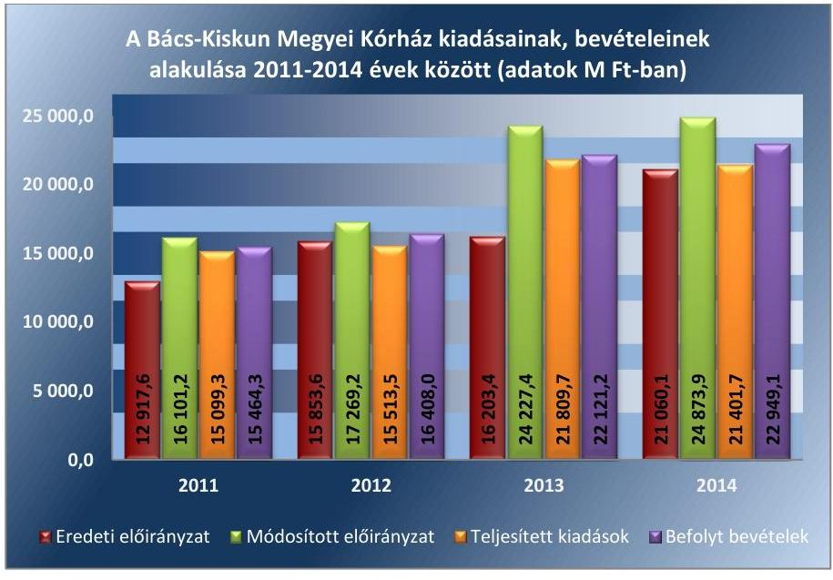

Forrás: a Kórház 2011-2014. évi költségvetési beszámolói
A bevételi előirányzatok teljesítése közül a 2011-2014. években az intézményi működési bevételek, a 2011-2013. években a támogatás értékű működési bevételek és a 2012-2014. években a működési célú pénzeszköz átvételek teljesültek alul és maradtak el a módosított előirányzattól, melylyel megsértették az Áht. 112 . § (2) bekezdésében és az Áht. 24 . § (2) bekezdésében előírtakat. A támogatás értékű működési bevétel alulteljesülésben közrejátszott az egészségügyi szakmai teljesítményfinanszírozás változása, az OEP a központilag megállapított TVK ${ }^{40}$ alatti teljesítményeket az adott egészségügyi szolgáltatásra kihirdetett díj 100\%-ában, a TVK feletti teljesítményeket egy meghatározott határig degresszív módon, a meghatározott határ felett pedig nem finanszírozta.

A KIADÁSI előirányzatok felhasználása során a Kórház a jogszabályi előírásokat összességében részben tartotta be. A gazdálkodási jogkörök gyakorlása a személyi juttatások, a dologi és dologi jellegű (egyéb folyó) kiadások, a felhalmozási kiadások, a támogatásértékű kiadások, az átadott pénzeszközök és előirányzatainak felhasználása során összességében részben felelt meg a jogszabályi előírásoknak (2. táblázat).

---

2. táblázat

KULCSKONTROLLOK
GYAKORLÁSÁNAK MINŐSÍTÉSE

| Ellenőrzött év | Megővítés |
| :--: | :--: |
| 2011. év | részben megfelelő |
| 2012. év | részben megfelelő |
| 2013. év | részben megfelelő |
| 2014. év | részben megfelelő |

A Kórház - az Ámr. és az Ávr. előírásaival összhangban - gazdálkodási szabályzatában rendelkezett a gazdálkodási jogkörök gyakorlásáról, a szabályzatot és annak mellékleteit folyamatosan aktualizálta. A gazdálkodási jogkörök gyakorlásával történő megbízásra, illetve felhatalmazásra írásban került sor. A gazdálkodási jogkör gyakorlókról az egyéni megbízásokkal, felhatalmazásokkal összhangban levő, a gazdálkodási jogkörgyakorló aláírás mintáját is tartalmazó nyilvántartás állt rendelkezésre. A Kórház kötelezettségvállalási nyilvántartása - az Ámr. 75. § (1) bekezdés és az Ávr. 56. § (1) bekezdés előírása ellenére - nem volt teljes körű, mert a 2011-2013. évekre nem tartalmazta a kötelezettségvállalási és teljesítési adatokat a személyi juttatások kiadási előirányzatát érintően. A személyi juttatásra vonatkozóan a Kórház „Rögzített Létszám és Bérnyilvántartást" vezetett, az aktuális üres álláshelyeket és a felhasználható illetményeket ebből állapították meg.

A PÉNZGAZDÁLKODÁSI BELSŐ KONTROLLOK múködésének szabályszerűsége a kiadási előirányzatok felhasználásához kapcsolódóan részben megfelelő volt.

Az ellenőrzés az alábbi hibákat tárta fel:

- A rendszeres személyi juttatásoknál a 2013. évben előfordult, hogy hiányzott - az Ávr. 55. § (1) bekezdésében előírtak ellenére - a kinevezésen a kötelezettségvállalás pénzügyi ellenjegyzése, melyet az érvényesítő - az Ávr. 58. § (1) bekezdésében előírtak ellenére - nem ellenőrzött.
- A dologi és dologi jellegű kiadások felhasználásánál a 2011-2013. években több esetben előfordult, hogy a kifizetés bizonylatáról - az Ámr. 76. § (1) és (3), illetve az Ávr. 57. § (1) és (3) bekezdéseiben előírtak ellenére - hiányzott a teljesítés igazolás dátuma, vagy a teljesítés tényére való utalás, vagy a teljesítésigazoló aláírása, vagy mindhárom. A hiányzó, illetve a hiányos teljesítésigazolással rendelkező és a közbeszerzési szabálytalansággal érintett esetekben a 2011. évben - az Ámr. 79. § (2) bekezdésében foglaltak ellenére - az utalványt ellenjegyző, míg a 2012. és 2013. években - az Ávr. 58. § (1) bekezdésében foglaltak ellenére - az érvényesítő nem ellenőrizte a teljesítésigazolás megtörténtét, illetve a megelőző ügymenetben a jogszabályi előírások betartását.
- A felhalmozási kiadások felhasználásánál a 2011. évben előfordult, hogy hiányzott - az Ámr. 76. § (1) bekezdésében foglaltak ellenére a teljesítés tényére való utalás, illetve a teljesítésigazoló aláírása. A hiányzó szakmai teljesítés igazolások esetében az utalvány ellenjegyzője - az Ámr. 79. § (2) bekezdésében előírtak ellenére - nem győződött meg a szakmai teljesítésigazolás megtörténtéről, nem jelezte annak hiányát. A 2012. évben előfordult, hogy az érvényesítő - az Ávr. 58. § (1) bekezdésében foglaltak ellenére - nem ellenőrizte és nem jelezte a közbeszerzési szabályok be nem tartását.
- A pénzeszköz átadások, támogatás értékű kiadások, kölcsönök nyújtása, ellátottak juttatásai esetében a 2011., a 2012. és a 2014. években előfordult, hogy a teljesítés igazolását - az Ámr. 76. § (1) bekezdésében és az Ávr. 57. § (1) bekezdésében előírtak ellenére - nem végezték el. A 2011. évben az utalvány ellenjegyzője, míg a 2012. és 2014. években az érvényesítő ezekben az esetekben - az

---

Ámr. 79. § (2) bekezdésében és az Ávr. 58. § (1) bekezdésben előírtak ellenére - nem győződött meg a szakmai teljesítésigazolás megtörténtéről, nem jelezte annak hiányát.
A nem rendszeres személyi juttatásoknál a 2011., 2013-2014. években előfordult, hogy - az Mt. ${ }^{41}$ 149. § a) pontjában, az Mt. ${ }_{2}$ 140. § (2) bekezdésben, az Eütev. tv. 13/B. § (2) bekezdés a) pontjában, a Kórházi KSZ. ${ }^{42} 1$. melléklet 3. § a) 1. pontjában és 5. §-ában előírtak ellenére - téves jogcímen, illetve rossz mértékben történt kifizetés.
A külső személyi juttatások kifizetése részben volt szabályszerű, mivel a saját dolgozóval kötött megbízási szerződések esetében előfordult, hogy a rögzített feladat mellett - az Ámr. 90. § (6) bekezdésben és az Ávr. 51. § (2) bekezdésében foglaltak ellenére - nem kötötték ki, hogy a díj kizárólag abban az esetben illeti meg, ha a munkakörébe tartozó feladatainak is maradéktalanul eleget tett.

A KÖZBESZERZÉSI szabályok betartása a Kórháznál nem volt megfelelő. Az értékhatárt elérő dologi és dologi jellegű, illetve felhalmozási kiadásoknál több esetben előfordult, hogy - a Kbt. ${ }_{1}$ 240. § (1) bekezdésében, a Kbt. ${ }_{2}$ 5. §-ában, 19. § (1) bekezdésében és a 119. §-ában előírtak ellenére - elmaradt a közbeszerzési eljárás lefolytatása.

Az ellenőrzött kifizetésekkel összefüggésben a rendelkezésre bocsátott dokumentumok alapján pazarló gazdálkodást, kár bekövetkeztére utaló adatot, tényt az ellenőrzés nem állapított meg, azonban a részben megfelelően működtetett belső kontrollok korrupciós kockázatot hordozhatnak.

# 3.4. számú megállapítás 

Az előirányzat-maradvány megállapítása, felhasználása megfelelt a jogszabályi előírásoknak.

## A KÖTELEZETTSÉGVÁLLALÁSSAL TERHELT MARADVÁNY megállapítása és felhasználása megfelelt az Ámr.-ben, illetve az Ávr.-ben foglaltaknak, a kifizetések a következő év június 30 -áig megtörténtek. Az intézmény előirányzat-maradványából a központi költségvetést megillető, elvonandó előirányzat-maradvány az ellenőrzött időszakban nem volt.

A kötelezettségvállalással terhelt maradvány megállapítása megfelelt az Ámr., illetve az Ávr. előírásainak. A főkönyvi számlák, az analitikus nyilvántartások és az éves beszámolók között az adategyezőség fennállt. A Kórháznál a 2011. évben keletkezett pénzmaradványt a GYEMSZI írásbeli utasítása alapján tárgyévi bevételként - támogatásértékű bevételként, maradvány átvételként - került elszámolásra. A Kórház rendelkezett az elő-irányzat-maradvány jóváhagyásáról kapott engedélyekkel. A Kórház az elő-irányzat-maradványáról az elemi költségvetési beszámoló benyújtásával az előírt tartalommal, azonban - az Áhsz. 10. § (1) bekezdésében, illetve az Áhsz. 2 32. § (1) bekezdésében előírtak ellenére - nem a február 28-ai határidőben, hanem 2012-ben március 20-án, 2013-ban április 9-én, 2014ben április 16-án és 2015-ben május 26-án teljesítette az irányító szerv felé az adatszolgáltatási kötelezettségét. Az előirányzat-maradvány felhasználása megfelelt a jogszabályi előírásoknak, a kötelezettségvállalás a tárgyévben megtörtént, a számlák kifizetése a következő év június 30 -áig megvalósult.

---

# 3.5. számú megállapítás 

A Kórházat nem érintette az előirányzat felhasználáshoz kapcsolódóan évközi korlátozó intézkedés, és nem terhelte költségvetési törvényben meghatározott befizetési kötelezettség.

## A Kórház az intézmény zavartalan feladatellátásához a fizetőképesség folyamatos fennállása, a likviditás javítása érdekében intézkedéseket tett.

A FOLYAMATOS FIZETŐKÉPESSÉG a 2011-2012. években biztosított volt, míg a 2013-2014. években - figyelembe véve a lejárt szállítói tartozások nagymértékű növekedését - nem volt biztosított. A kórház beolvadásokat követően (2013. február 1-től) a fizetőképességet a szállítói kötelezettségek határidőn túli rendezésével tudták csak biztosítani. A Kórház likviditási hitelt nem vett igénybe, a finanszírozási tervtől eltérő, előrehozott támogatást nem igényelt, rendkívüli kormányzati intézkedés nem érintette. A pénzügyi egyensúly fenntartása a megtett intézkedések és az irányító szervtől esetenként kapott pótlólagos támogatások révén volt biztosítható.

A Kórház a 2011. évben az önkormányzati alrendszerbe tartozott és a jogszabály nem írt elő előirányzat-felhasználási terv készítési kötelezettséget.

LIKVIDITÁSI TERVKÉSZÍTÉSI kötelezettségét a Kórház - az Áht. 2 78. § (2) bekezdésében előírtak ellenére - 2012. január-március hónapokban, valamint 2014. január-augusztus hónapokban nem teljesítette. A likviditási terv - az Ávr. 122. § (1) bekezdésében előírtak ellenére - nem tartalmazott a tárgyhónap vonatkozásában a teljesíthető kiadásokra dekádonkénti ütemezést. A likviditási tervek a középirányító szerv által összeállított tartalmi szerkezetben készültek. A Kórháznál előirányzat zárolásra, maradványtartási kötelezettségre nem került sor.

A LIKVIDITÁSI MUTATÓ (lásd 3. táblázat) alapján 2011-ben és 2012-ben a Kórház forgóeszközei fedezni tudták a rövid lejáratú kötelezettségeiket, míg 2013-ban már nem. A pénzeszköz likviditási mutató alapján a Kórház pénzeszközei a 2011-2013. években nem nyújtottak fedezetet a rövid lejáratú kötelezettségek kiegyenlítésére. A 2013. évben a két kórház beolvadását követően az általuk felhalmozott mintegy 1,6 Mrd Ft lejárt szállítói állomány is a Kórházat terhelte, az eladósodás mértékének növekedése folyamatos volt.
3. táblázat

## A KÓRHÁZ LIKVIDITÁSI MUTATÓINAK ALAKULÁSA

| Mennévezés | 2011. áv | 2012. áv | 2013. áv |
| :-- | :--: | :--: | :--: |
| Likviditási mutató | 1,18 | 1,02 | 0,38 |
| Pénzeszköz likviditási mutató | 0,35 | 0,51 | 0,12 |

A likviditási mutatók romlásában és az adósság állomány újra termelődésében szerepet játszott, hogy
2013. január 1-jétől az 55/2012. (XII. 28.) EMMI rendelettel ${ }^{43}$ módosították az egészségügyi finanszírozás mértékét, így a járóbeteg-ellátás teljesítmény volumen korlátjának 100\%-on felüli teljesítésén túl

---

a degresszivitás miatt 20\% helyett 8\% illette meg a Kórházat, a fekvőbeteg ellátás esetén pedig 10\% helyett 4\%-ot finanszíroztak;
a 2013. évi kórház beolvadásokkal jelentősen nőttek a lejárt szállítói tartozás állományok;
a 2013. évi kórházbeolvadásokkal többletköltségek merültek fel, például: a telephelyek közötti anyag- és személyszállítás költségei, valamint az átvett intézmények ellen több beszállító is indított peres eljárást és annak pénzügyi kihatása jelentős terhet rótt a Kórházra;
az orvosi műszerbeszerzések jelentős hányadát a dollár és euró árfolyamon történő beszerzés tette ki, a 2014. decemberi árfolyam 22,3 \%-kal illetve 8,1\%-kal volt magasabb az egy évvel korábbinál.
A Kórházhoz 2011-ben önkormányzati biztost nem kellett kirendelni, mert a tartozásállománya nem érte el a jogszabályban előírt mértéket.

KINCSTÁRI BIZTOST az államháztartásért felelős miniszter a 2013. február 1-jétől június 30 -áig terjedő időszakra - az Áht. 71. § (1) bekezdésében előírtak ellenére - a Kórházhoz nem jelölt ki, pedig annak elismert, az esedékességet követő hatvan napon túli tartozásállománya meghaladta az 50,0 M Ft-ot.

A LIKVIDITÁS JAVÍTÁSA érdekében több intézkedést is tettek. A 2009-2011. évekre kiadott takarékossági és konszolidációs intézkedési tervek határidő és felelősök megjelölésével készültek. A 2011. évben konszolidációs intézkedési tervben a főigazgató tovább szigorította a gazdálkodást. A 2013. évben a két kórház beolvadását követően „válságtervcselekvési terv"-et készítettek a szállítói adósságállomány kezelése érdekében. A terv bemutatta a Kórház által átvett adósságállomány nagyságát, részletezte a peres eljárások költség kihatását valamint javaslatokat fogalmazott meg a hiány csökkentésére, továbbá az egészségügyi tevékenység hatékonyságának növelésére.

A SZÁLLÍTÓI TARTOZÁSOK, valamint az egyéb kötelezettségek határidőben történő kifizetése a 2011-2012. években biztosított volt, míg a 2013-2014. években nem volt biztosított. A szállítói kötelezettségállomány évenkénti alakulását a 4. táblázat tartalmazza.
4. táblázat

# A KÓRHÁZ 2011-2014. ÉVEK KÖZÖTTI LEJÁRT SZÁLLÍTÓI TARTOZÁSAI (M FT-BAN) 

| Magyuvózás | 2011. 30. 31. | 2012. 30. 31. | 2013. 30. 31. | 2014. 30. 31. |
| :--: | :--: | :--: | :--: | :--: |
| Összes szállitói kötele-   zettség | 991,8 | 1613,1 | 1903,8 | 2813,1 |
| Lejárt szállítói tartozás | 9,7 | 181,8 | 462,4 | 1337,6 |
| Ebből: |  |  |  |  |
| 30 nap alatt | 4,9 | 178,1 | 102,1 | 459,6 |
| 31 és 60 nap közötti | 1,6 | 1,6 | 138,9 | 303,7 |
| 61 és 90 nap közötti | 0,0 | 0,5 | 0,1 | 159,1 |
| 91 és 365 nap közötti | 3,2 | 1,1 | 7,1 | 196,3 |
| Éven túli |  | 0,5 | 214,2 | 218,9 |

A lejárt szállítói állomány nagysága és összetétele a négy év alatt jelentősen átalakult, míg 2011. év végén nem volt éven túli tartozás, addig 2013-2014. évek végén már jelentős éven túli tartozás volt. A lejárt szállítói

---

tartozás a 2012. év végén 172,1 M Ft-tal, 2013. év végére az előző évhez képest 280,6 M Ft-tal, míg 2014. évben jelentősen, 875,2 M Ft nőtt az előző évhez képest. A szállítói kötelezettségállomány növekedését az egészségügyi finanszírozás változásai, az eseti jelleggel kapott támogatások valamint a 2013. évi kórház beolvadásokkal együtt járó feladatváltozások együttesen befolyásolták.

A Kórház a gazdálkodásához, a szállítói számlák finanszírozásához az ellenőrzött időszakban az OEP gyógyító megelőző ellátás jogcímcsoport tárgyévi maradványfelosztásaiból összesen 1298,5 M Ft-ot kapott.

A jogszabályban előírt feltételekkel biztosított adósságkonszolidációs támogatásból a Kórház 2011. évben és 2013-2014. években részesült:

- A Kórház 2011-ben 485,9 M Ft konszolidációs támogatásban részesült, melyből a 337/2011. (XII. 29.) Korm. rendeletnek ${ }^{44}$ megfelelően 1,9 M Ft-ot használt fel a 2011. december 29-i lejárt határidejű szállítói állomány csökkentésére. A fel nem használt 484,0 M Ft támogatás 2012. június hóban a havi OEP finanszírozásból visszavonásra került.
- A 438/2013. (XI. 19.) Korm. rendelet ${ }^{45}$ alapján 1141,0 M Ft adósságkonszolidációs támogatást fordíthatott a pénzügyi egyensúly helyreállítására, a támogatásból a 1084,7 M Ft-ot használták fel szabályszerűen a 2013. október 31-én lejárt szállítói tartozásra, adósságrendezésre. A KEHI ${ }^{46}$ ellenőrzés által feltártak alapján a nem szabályszerűen felhasznált összeggel, kamataival együtt összesen 59,5 M Ft-tal a Kórház részére járó OEP finanszírozást lecsökkentették.
- A 184/2014. (VII.25.) Korm. rendelet ${ }^{47}$ alapján az egészségügyi szolgáltatók adósságának rendezésére fordítható múködési támogatásból a Kórház 254,7 M Ft támogatásban részesült, amelyet a jogszabályi előírásoknak megfelelően a 2014. május 31-én lejárt szállítói tartozásra, adósságrendezésre használt fel.

A KÖVETELÉSEK behajtására a Kórház intézkedéseket tett, a követelés állomány 2011. és 2014. év között folyamatosan változott, a 2011. év végi 158,6 M Ft, 2014. év végére 63,3 M Ft-ra csökkent. A követelésállomány kezelését az eszközök és források értékelési szabályzatának megfelelően végezték. A ki nem fizetett számlák listáját a Közgazdasági osztály felszólítást követően behajtásra átadta a Jogi osztályon keresztül egy külső követeléskezelő cég részére. A Jogi osztály a megtett intézkedésekről tájékoztatta a Közgazdasági osztályt, aki a követeléseket egyenként értékelte, behajthatatlan, elévült követelés és behajtásra átadott tartozásokként minősítve azokat.

# 4. Az intézmény vagyongazdálkodása szabályszerű volt-e? 

## Összegző megállapítás

### 4.1. számú megállapítás

## A Kórház vagyongazdálkodása részben volt szabályszerű.

A vagyonkezelési szerződés részben felelt meg a jogszabályi előírásoknak.

A Kórház a 2011. évben az államháztartás önkormányzati alrendszerébe tartozott, felügyeletét és irányítását az Önkormányzat Közgyűlése látta el.

---

Az egészségügyi feladat ellátását szolgáló vagyont az Önkormányzat a vagyongazdálkodási rendeletében és az alapító okiratban foglaltak szerint bocsátotta a Kórház rendelkezésére. A Kórház a feladatellátáshoz szükséges vagyont a vagyongazdálkodási rendelet előírásai alapján térítésmentesen használhatta, hasznosíthatta, illetve számviteli nyilvántartásaiban, mennyiségben és értékben nyilvántartotta.

A Kórház 2012. január 1-től az államháztartás központi alrendszerébe került át. Az egészségügyért felelős miniszter 2012. január 1-től - a NEFMI rendelet ${ }^{48}$ 1. §-ában - vagyonkezelői jogok gyakorlására a GYEMSZI-t jelölte ki. A jogszabályi előírások változása következtében 2012. május 1jétől a GYEMSZI az állami egészségügyi feladatellátást szolgáló vagyon tekintetében, mint tulajdonosi joggyakorló jár el.

A VAGYONKEZELŐI SZERZŐDÉS ${ }^{49}$ megkötésére a GYEMSZI és a Kórház között 2012. május 1-jei hatállyal került sor. A szerződést a GYEMSZI 2013. január 28-án, míg a Kórház 2013. április 19-én írta alá. A Kórház 2012. január 1-jétől a vagyonkezelési szerződés aláírásáig, az intézményi átadás-átvételi megállapodás alapján, mint a vagyon használója, valamint a vagyonkezelő GYEMSZI belső körleveleiben foglaltak szerint járt el. A Kórház a vagyonkezelői szerződést a GYEMSZI-vel, mint középirányító szervével kötötte. A vagyonkezelői szerződés tartalma részben felelt meg a jogszabályi előírásoknak, mivel - a Vtvr. 14. § (3) bekezdésének előírása ellenére - nem tartalmazta, hogy a vagyonkezelő a tulajdonosi joggyakorló vagyon-nyilvántartási szabályzatát megismerte és magára nézve kötelező érvényűnek ismeri el. A vagyonkezelői szerződésben - a Vtvr. előírásának megfelelően - meghatározták a vagyonelemek rendeltetését, az értéknövelő beruházásokkal, felújításokkal kapcsolatos adatszolgáltatás módját, a tulajdonosi joggyakorlás és ellenőrzés rendjét. A megkötött vagyonkezelési szerződés előírta a Kórház részére az állagmegóvási, értékmegőrzési kötelezettséget, azonban részletes előírást a vagyon pótlására nem rögzített. A szerződés a megkötéskor a vagyonkezelt ingatlanokat és ingóságokat a 2012. május 1-jei állapotnak megfelelően tartalmazta. Vagyonkezelési szerződés megszüntetésére az ellenőrzött időszakban nem került sor.

A Kórház a vagyonkezelői szerződés megkötésétől számított 30 napon belül - a Vtvr. 7. § (1)-(2) bekezdésében és a vagyonkezelői szerződés 1.2 pontjában foglaltak ellenére - nem kezdeményezte a vagyonkezelői jog bejegyzését az ingatlan nyilvántartásba.

A vagyontárgyak körének változása esetén a vagyonkezelői szerződés módosításokkal történő egységes szerkezetbe foglalására nem minden esetben az előírt határidőben került sor. A Kalocsai és Kiskunfélegyházi kórházak 2013. február 1-jei beolvadását követően a vagyonkezelési szerződés, módosításokkal történő egységes szerkezetbe foglalására - a Vtvr. 8. § (2) bekezdésében meghatározott 60 napos határidőn túl - csak 2014. június 3-án került sor.

Vagyonkezelési szerződés nélkül - adásvételi szerződéssel, illetve térítésmentes átvétellel - az intézmény vagyonkezelésébe került eszközök esetében betartották a jogszabályi előírásokat. A Kórház az adásvételi szerződéssel vagyonkezelésébe került eszközöket a Vtv. ${ }^{50}$ előírásának megfelelően az állam javára szerezte meg. A térítésmentesen átvett eszközöket a

---

### 4.2. számú megállapítás

Kórház a jogszabályi előírásoknak megfelelően üzembe helyezte, a bevételezésről állományba vételi bizonylatot állított ki, egyedi nyilvántartó lapokat vett fel és belső könyvelési utasítás alapján főkönyvi nyilvántartásában is rögzítette.

## A mérlegben kimutatott eszközök és források nyilvántartása, értékelése megfelelt, míg leltározásuk részben felelt meg a jogszabályok és belső szabályozások által előírtaknak.

A NYILVÁNTARTÁSI kötelezettségének a Kórház a 2011. évben az Önkormányzat vagyongazdálkodási rendeletében, a 2012-2014. években a Vtvr. előírásának megfelelően eleget tett. A vagyon nyilvántartása biztosította az adatszolgáltatás pontosságát, ellenőrizhetőségét, tartalmazta a vagyonkezelő és a vagyonelemek azonosító adatait, a kapcsolódó jogokat, lényeges számviteli adatokat. A számlarendben meghatározásra került az analitikus, részletező nyilvántartások vezetésének módja, a kapcsolódó könyvviteli és nyilvántartási számlákkal való egyeztetése. A Kórház saját hatáskörben - az Áhsz. 49. § (3) bekezdésében és az Áhsz. 2 51. § (3) bekezdésében előírtak ellenére - nem határozta meg az analitikus, részletező nyilvántartásoknak a kapcsolódó könyvviteli és nyilvántartási számlákkal való egyeztetésének dokumentálását. A Kórház a beszámolási és adatszolgáltatási kötelezettségét a felügyeleti szerv felé minden évben teljesítette, az éves költségvetési beszámoló keretében múködéséről, feladatellátásáról, beruházási és fejlesztési tevékenységéről beszámolt. A Kórház saját vagyonnal nem rendelkezett.

A BEKERÜLÉSI ÉRTÉK MEGÁLLAPÍTÁSA, az állományba vétel, az üzembe helyezés és besorolás a Sztv., az Áhsz.1, illetve az Áhsz. 2 előírásainak megfelelően történt. Az eszközök és források értékelése megfelelt az Áhsz.1, valamint az Áhsz. 2 előírásának. Az immateriális javakat és tárgyi eszközöket a mérlegben - az Áhsz.1-nek és az Áhsz.2-nek megfelelően - az elszámolt terv szerinti és terven felüli értékcsökkenéssel csökkentett bekerülési értéken mutatták ki.

A Kórház a 2011-2013. években a követelések állományát az analitikus és főkönyvi nyilvántartásaiban az Áhsz.1, valamint a belső szabályzataiban foglaltak szerint mutatta ki. A követelések állományi számláinak vezetése, a negyedévenkénti összegző kimutatás elkészítése és főkönyvi feladása megfelelt a jogszabályi előírásoknak. A 2014. évben a követelések állományának nyilvántartása - az Áhsz. 2 előírásnak megfelelően - a számlarendben foglalt szabályozás szerint történt. A kötelezettségek analitikus nyilvántartását - az Áhsz. 1 és az Áhsz. 2 előírásának megfelelően - folyamatosan vezették. A Kórház a jogszabályi előírásoknak megfelelően vezette a kötelezettségek állományának főkönyvi számláit, készítette el a negyedévenkénti összegző kimutatást és adta fel a főkönyvi nyilvántartás részére.

A LELTÁRT az éves költségvetési beszámoló elkészítéséhez, a mérleg tételeinek alátámasztásához összeállították.

A Kórház leltározási szabályzata rögzítette a leltározási tevékenység előkészítésének, elvégzésének, ellenőrzésének, kiértékelésének, a leltári különbözetek elszámolásának előírásait. A leltározásokat évenkénti ütemterv és leltározási utasítás alapján hajtották végre, az eszközökről, valamint a mérlegben kimutatott forrásokról a vezető jóváhagyásával "Éves összesítő

---

jelentés" készült. A leltározás végrehajtását követően a leltárak az analitikus és főkönyvi nyilvántartásokkal egyeztetésre kerültek, a leltáreltéréseket kiértékelték, illetve a számviteli nyilvántartásokon átvezették.

A leltározás végrehajtása a 2011. és 2013. években részben felelt meg a jogszabályi előírásoknak. A Kórház a leltározási szabályzatában - az Áhsz.1-ben foglaltakat alkalmazva - meghatározott eszközcsoportok (ingatlanok, gépek, járművek) vonatkozásában a mennyiségi felvétellel történő leltározás végrehajtását csak kétévente írta elő, azonban a kétévenkénti mennyiségi leltározás végrehajtásához - az Áhsz. 1 37. § (7) bekezdésében foglaltak ellenére - nem rendelkezett az irányító szerv egyetértésével, ezért évente mennyiségi leltárfelvételt kellett volna alkalmaznia. A 2011. év végén a Kórház az önkormányzati alrendszerből központi alrendszerbe kerülését megelőzően a zárómérleg készítésekor az eszközeit - az Áhsz. 1 37. § (3) bekezdésében előírtak ellenére - mennyiségi felvétellel teljes körűen nem, csak egyeztetéssel leltározta. A 2011. és 2013. években a mérleg alátámasztásáról a részletező nyilvántartások és a főkönyv egyeztetésével gondoskodtak. A 2014. évben a leltározás végrehajtása megfelelt a jogszabályi előírásoknak.

A SELEJTEZÉSI feladatokat a Kórház selejtezési szabályzatában foglaltaknak megfelelően hajtották végre, szükség esetén a selejtezéshez a 2011. évben az Önkormányzat Közgyűlése, a 2012-2014. évben a GYEMSZI engedélyével rendelkeztek.

A független könyvvizsgáló a Kórház beszámolóit minden évben elfogadó záradékkal látta el, azonban 2014. évben a véleményük korlátozása nélkül figyelemfelhívó megjegyzést fűztek a könyvvizsgálói összefoglaló jelentésükhöz.

# 4.3. számú megállapítás 

A Kórház a vagyontárgyak értékmegőrzési, állagmegóvási kötelezettségét a jogszabály, az intézményi megállapodás, illetve a vagyonkezelői szerződés előírásai szerint teljesítette.

A VAGYONTÁRGYAK ÉRTÉKMEGŐRZÉSE, állagmegóvása tekintetében a Kórház a Vtv.-ben, az intézményi (használatba vételi) megállapodásban rögzítetteknek megfelelően gondoskodott a vagyonkezelésbe vett eszközök beszerzéséről, felújításáról, karbantartásáról, működtetéséről, azokat a vagyonkezelői szerződésben rögzített céloknak megfelelően használta.

A 2011. év végéig a kórházi vagyon használatára vonatkozóan az Önkormányzat vagyonrendelete határozott meg szabályokat, amely szerint a térítésmentes használatra átengedett vagyon fenntartása, állagának megóvása az azt ingyenesen használó Kórház feladata volt. A vagyonrendelet, illetve más szabályozás az értékmegőrzésre, állagmegóvásra részletes szabályokat nem tartalmazott. Az Önkormányzat Közgyűlése a 2011. évre a Kórház számára vagyonpótlásra vonatkozó előírást nem határozott meg.

A Kórház számára a 2012. évtől a használatba, vagyonkezelésbe vett eszközök működtetésével, állagának megóvásával, értékmegőrzésével kapcsolatos kötelezettségeket a Vtv., az intézményi megállapodás, illetve megkötését követően a vagyonkezelési szerződés határozott meg. Az intézményi megállapodásban a Kórház vagyonhasználatával kapcsolatos, a vagyonkezelői szerződésben a Kórház vagyonkezeléssel kapcsolatos jogait és kötelezettségeit határozták meg. A megkötött vagyonkezelési szerződés

---

előírta a Kórház részére az állagmegóvási, értékmegőrzési, vagyonpótlási kötelezettséget, azonban részletes előírást nem rögzített. A Kórház - főtevékenységként közfeladatot ellátó vagyonkezelőként - a Vtv. erejénél fogva 2013. június 28 -tól mentesült a visszapótlási kötelezettség alól, amely a vagyonkezelési szerződésben 2014. június 3 -án került rögzítésre.

A vagyontárgyak állagmegóvása, a feladatellátáshoz szükséges fejlesztések megvalósítása érdekében évente beruházási és fejlesztési terveket készített, melyet megküldött a GYEMSZI részére. A Kórház az épületei és eszközei védelmére az ellenőrzött időszakban rendelkezett - a GYEMSZI által is igényelt - vagyon és felelősségbiztosítással.

A vagyonkezelési szerződés szerint a vagyon értékcsökkenéséről, az értéknövelő felújításokról, beruházásokról évente utólag, a tárgyévet követő év május 31. napjáig összesített tájékoztatást kellett adnia a GYEMSZI részére, külön indokolva, ha az értékcsökkenés mértéke ingatlanonként meghaladja az értéknövekményt. A Kórház a vagyonkezelési szerződésben előírt tájékoztatási kötelezettségének - a Vtvr. 9. § (3) bekezdésében előírtak ellenére - a 2012-2014. években nem tett eleget.

A KÓRHÁZ VAGYONA a 2011. év végi 7790,2 M Ft-ról a 2014. év végére 8700,5 M Ft-tal (111,7\%-kal), 16 490,7 M Ft-ra növekedett. A vagyon túlnyomó részét kitevő befektetett eszközök állománya a 2011. év végi 6619,1 M Ft-ról a 2014. év végére 10 771,2 M Ft-ra (62,7\%-kal) emelkedett. A növekedés hátterében részben a kalocsai és a kiskunfélegyházi kórházak beolvadása állt. A 2014. évben az eszközök értékének változásában szerepet játszott a számviteli szabályok 2014. évi változása is (az eredményszemléletű számvitelre való áttérés), az eszközérték növekedésének túlnyomó többségét az időbeli elhatárolások és az egyéb sajátos eszközoldali elszámolások mérlegben való kimutatásának kötelezettsége okozta.

A Kórház vagyonának alakulását a VI. számú melléklet mutatja be.
A befektetett eszközökön belül kiemelkedett a Kórház ingatlanvagyona, amely a 2011. évi 5423,9 M Ft-ról (81,9\%-ról) 2014. évre 9659,3 M Ft-ra (89,7\%-ra) emelkedett.

A befektetett eszközök és azon belül az ingatlanok, valamint tárgyi eszközök értékének alakulását az alábbi diagram szemlélteti:
2. ábra
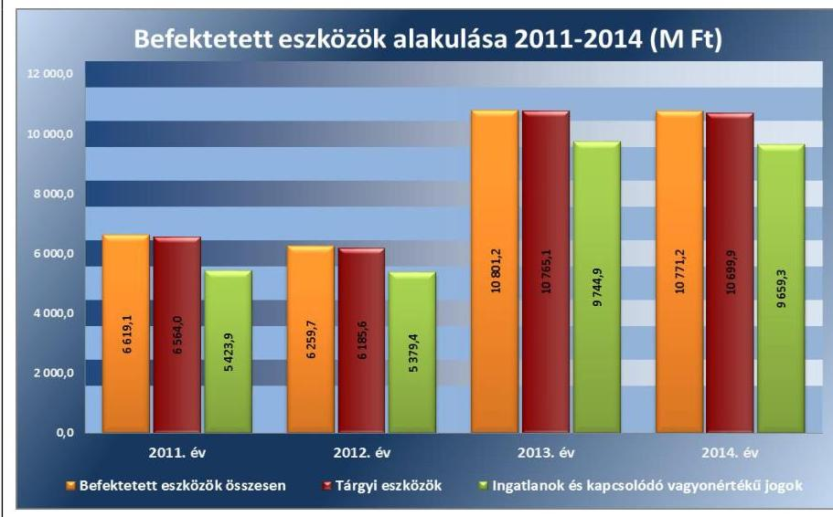

Forrás: a Kórház 2011-2014. évi költségvetési beszámolói

---

A Kórház az értéknövelő beruházásaihoz és felújításaihoz több európai uniós pályázatban (TIOP ${ }^{51}$, KEOP ${ }^{52}$ ) is részt vett, amelynek keretében energiafelhasználás racionalizálást, épülettömb megépítést, orvosi gép és műszerbeszerzést valósított meg.

A forgóeszközök év végi aránya a 2011. évi 15,0\%-ról 2013-ra 6,4\%-ra csökkent, melyet elsősorban a pénzeszközök záró állománya határozott meg. A pénzeszközök állománya a 2012. év végi 827,9 M Ft-ról 2013. év végére 596,6 M Ft-tal ( $72,1 \%$-ra) csökkent, elsősorban a két beolvadt kórház adósság állományának kifizetése miatt. A saját tőke részaránya mutató a 2011. évi $77,7 \%$-ról a 2012. év végére $68,3 \%$-ra csökkent, majd a 2013. év végére $80,5 \%$-ra nőtt, ami a 2013. évi kórház beolvadások következménye. A számviteli változások miatt a 2014. évben a mutatók nem összehasonlíthatóak.
3. ábra
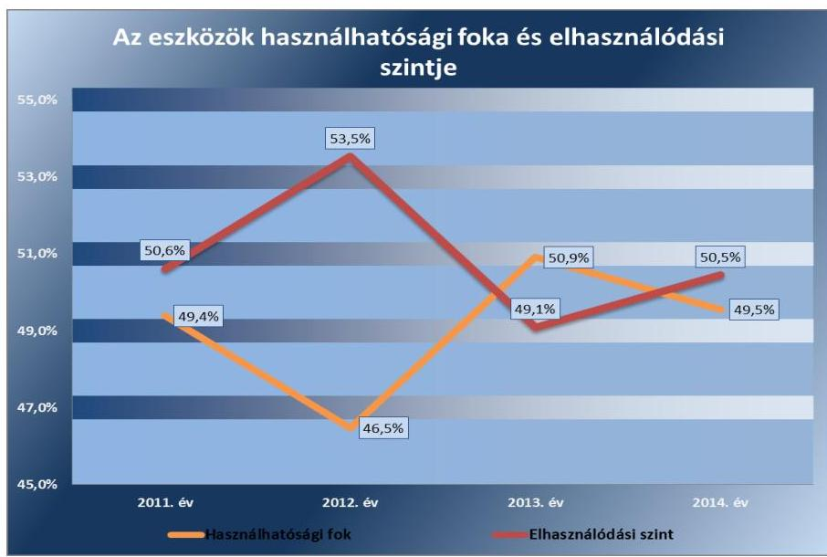

Forrás: a Kórház 2011-2014. évi költségvetési beszámolói
Az elhasználódott eszközök folyamatos pótlása, illetve a beruházások hatására az eszközök használhatósági mutatója az ellenőrzött években az 50\%-os érték körül alakult, 2012. évtől kis mértékben javult (3. ábra). Az elhasználódási szint 50\% körüli értéke az eszközök közel felének elhasználódását mutatja. Az arány szinten tartása azt jelzi, hogy a vagyon pótlása az elhasználódásnak megfelelő mértékű volt.
2011. évre vonatkozóan a Kórház az Önkormányzat vagyonrendeletében előírtak szerint végezte a beruházási és felújítási tevékenységét. A vagyon működtetése, hasznosítása során a 2012. évtől figyelemmel voltak az Nvtv.-ben, az intézményi megállapodásban foglaltakra, továbbá a vagyonkezelői szerződés megkötését követően az abban foglaltak szerint járt el.

A megvalósult, üzembe helyezett beruházásokat és felújításokat a Kórház az Áhsz. ${ }_{1}$-ben és az Áhsz. ${ }_{2}$-ben meghatározott bekerülési értéken nyilvántartásba vette.

---

# 4.4. számú megállapítás 

## A vagyonelemek hasznosítása megfelelt a jogszabályokban és belső szabályozásokban foglaltaknak.

A VAGYONTÁRGYAK BÉRBEADÁSA során - az alábbi hiányosságoktól eltekintve - betartották a jogszabályokban és a belső szabályzatokban foglaltakat.

A kiszámlázott bevételek teljes összegükben realizálódtak, a vagyonhasznosításból származó bevételek teljesítése a számlán rögzített fizetési határidőn belül történt. A bérleti és szolgáltatási díjak beszedése, analitikus és főkönyvi nyilvántartásokban való rögzítése a szolgáltatást igénybe vevő felé kiállított számlák alapján, a Sztv.-nek megfelelően történt.

A Kórház a 2012-2014. években a bérbeadási folyamat során a bérleti szerződések időtartamát - az Nvtv.-ben foglalt előírásnak megfelelően határozatlan, vagy legfeljebb 15 éves időtartamban határozta meg. A Kórház a 2012. évtől a bérbeadási folyamatok során - az Nvtv. 11. § (11) bekezdésében előírtak ellenére - az átláthatósági követelmények érvényesüléséről nem győződött meg, az átláthatóságra vonatkozó nyilatkozatokkal - az Nvtv. 3. § (2) bekezdésében előírt - nem rendelkezett. A 2012-2014. években a bérleti szerződésekben - az Nvtv. 11. § (11) bekezdés a) pontjában előírtak ellenére - nem került rögzítésre, hogy a bérbevevők vállalják az átengedett nemzeti vagyon vonatkozásában előírt beszámolási, nyilvántartási, adatszolgáltatási kötelezettségek teljesítését.
4.5. számú megállapítás

## Az eredményszemléletú számvitel bevezetésével kapcsolatos feladatok végrehajtása részben felelt meg a jogszabályi előírásoknak.

A RENDEZŐ MÉRLEG elkészítéséhez a Kórház az eszközeit és forrásait a 36/2013. (IX. 13.) NGM rendelet ${ }^{53}$ 2. § (1) bekezdése szerint 2013. december 31-ei mérleg-fordulónappal leltározta, de a leltárból a követelések közül hiányzott a 2013. novemberi és decemberi OEP támogatás, a kötelezettségek közül hiányzott a decemberi munkabér. A Kórház a követelések közé - a 36/2013. (IX. 13.) NGM rendelet 5. § (2) bekezdésében előírtak ellenére - a 2014 januárjában és februárjában megkapott 2013. november és december havi OEP finanszírozást, valamint a december havi bérköltséget nem emelte be.

A Kórház a rendező mérleget 2014. január 1-jei mérleg-fordulónappal, a 36/2013. (IX. 13.) NGM rendelet 8. § (2) bekezdés a) pontjában előírt 2014. március 31-i határidővel szemben 2014. május 20-ára készítette el, a végleges formátum 2014. szeptember 25-én került aláírásra.

A rendező mérleg elkészítéséig a könyvvezetés az előírásoknak megfelelően történt, a költségvetési számvitel nyilvántartási számlákat 2014. január 5-étől folyamatosan nyitották meg, a megnyitott számlákon a 2014. január 1-jétől bekövetkezett gazdasági eseményeket elszámolták.

A KÖNYVVIZSGÁLÓ a rendező mérleg hibája és a tájékoztatóban leírtak alapján a 2014. évben figyelemfelhívással élt azért, hogy a 2014. évi beszámoló eredmény-kimutatásában 14 havi finanszírozási bevétel és 13. havi bérköltség szerepelt, továbbá megállapította, hogy emiatt sérült Sztv. 15. § (7) bekezdésében előírt összemérés elve.

---

# 5. Szabályszerűen hajtották-e végre az ellenőrzött időszakban az intézményt érintő szervezeti, szerkezeti átalakításokat? 

Összegző megállapítás

Az intézményt érintő szervezeti, szerkezeti változások végrehajtása megfelelt a jogszabályi előírásoknak.

### 5.1. számú megállapítás

A kórházak beolvadásával kapcsolatos irányítószervi döntések és az azokhoz kapcsolódó intézményi feladatok végrehajtása megfelelt a jogszabályi előírásoknak.

A két városi - kiskunfélegyházi és kalocsai - kórház beolvadására az egészségügyért felelős miniszter döntése alapján, a beolvadásra meghatározott határidőhöz viszonyított egy hónapos késedelemmel, 2013. február 1-jén került sor. A GYEMSZI által kidolgozott javaslat alapján az egészségügyért felelős miniszter 2012. október 12-én - a jogszabályi előírásoknak megfelelően - döntött egyes egészségügyi intézmények beolvadásáról, melynek keretében a Kórházba olvadt a Kalocsai Szent Kereszt Kórház és a Kiskunfélegyházi Kórház-Rendelőintézet Gyógyfürdő és Rehabilitációs Központ. A feladatok átadásáról hozott döntésekben az irányítószerv eleget tett az Ávr.-ben foglaltaknak. A feladatok végrehajtására a Kórházzal ütemtervet készíttetett, amelyben meghatározták a közfeladat ellátás módját, kijelölték a vagyonátadás lebonyolításáért felelős személyeket, meghatározták az átszervezéssel érintett foglalkoztatottakkal kapcsolatos munkáltatói intézkedéseket és azok végrehajtásának határidejét, előírták az eszközök, források leltár szerinti átadását, az ellátandó közfeladathoz tartozó hatósági engedélyek rendezését.

A Kórház átszervezéssel, átalakulással kapcsolatos feladatainak végrehajtása megfelelt a jogszabályi előírásoknak. A kiskunfélegyházi és kalocsai kórház beolvadását 2012. december 31-ei határidővel kellett végrehajtani. A két városi kórház beolvadásának végrehajtása érdekében a Kórház 2012 novemberében - a GYEMSZI által előírtaknak megfelelően - ütemtervet készített, amelyben meghatározta az egyes végrehajtandó feladatokat, a határidőket és a felelősöket. A beolvadás teljes körű végrehajtása 2013. február 1-vel történt meg. A végrehajtás késedelmének oka az volt, hogy a beolvadó kórházak részére az OEP 2013. január 2-án kiutalta a teljesítménydíjat, az ún. „kasszasöprés" összegét, valamint a beolvadás megvalósítására biztosított összeget, mivel a Kincstár a központi költségvetési szervek megszűntetésének tényét -a 2013. január 30-án aláírt megszüntető okirat alapján - 2013. január 31-én vezette át. A GYEMSZI a kórházi dolgozók 2012. december havi bérének beolvadó kórházak számláiról való kiutalását engedélyezte. A számlán bonyolított forgalom következtében a beolvadás és az intézmények vagyonának átadása, lekönyvelése 2013. január 31-i határidővel került végrehajtásra. A végrehajtás késedelme miatt a Kórház főigazgatója és gazdasági igazgatója az átmeneti időszakra - a jogszabályoknak megfelelő működés és nyilvántartások, a gazdasági események egységes kezelése érdekében - utasítást adott ki a beolvadó két kórház részére. Az beolvadás végrehajtásának folyamatát a felelősök beszámoltatását a gazdasági igazgatóság folyamatosan figyelemmel kísérte, emlékeztetőkben dokumentálta.

---

### 5.2. számú megállapítás

A Konsz. tv. ${ }^{54}$ által elrendelt alrendszer váltással kapcsolatos feladatok végrehajtása - az alábbi hiányosságoktól eltekintve - megfelelt a jogszabályi előírásoknak.

A Kórháznak az államháztartás önkormányzati alrendszeréből a központi alrendszerbe történő átsorolására a Konsz. tv rendelkezései alapján került sor.

A Konsz. tv. 2. § (1) bekezdése értelmében a megyei önkormányzatok fenntartásában levő egészségügyi intézmények vagyona és vagyoni értékű joga a törvény erejénél fogva 2012. január 1-jén állami tulajdonba került, továbbá a vagyonnal és intézményekkel kapcsolatos alapítói, fenntartói jogok a törvényben meghatározott szervekre szálltak. A kórházi vagyon át-adás-átvételével kapcsolatos előkészítési feladatok végrehajtása érdekében - a Konsz. rendeletben ${ }^{55}$ foglaltaknak megfelelően - térségi egészségügyi munkacsoportot jelöltek ki, az előkészítő munkálatokat a munkacsoport végezte. A tulajdonosi és fenntartói jogutódláshoz kapcsolódó feladatok végrehajtásának részletkérdéseit - a Konsz. tv.-ben előírtaknak megfelelően - a Közgyűlés elnöke ${ }^{56}$, a GYEMSZI főigazgatója (mint az egészségügyért felelős miniszter által kijelölt központi államigazgatási szerv), az MNV Zrt. ${ }^{57}$ vezérigazgatója és a Nemzeti Földalapkezelő Szervezet elnöke között megkötendő átadás-átvételi megállapodásban kellett rendezni. Az átadás-átvételi megállapodást a Közgyűlés elnöke és a GYEMSZI főigazgatója a Konsz. tv. által előírt határidőn belül, 2011. december 30-án írta alá. A megállapodás - a Konsz. tv. 2. § (4) bekezdésében előírtak ellenére - az MNV Zrt. vezérigazgatója által nem került aláírásra. Az NFA tv. ${ }^{58}$ hatálya alá tartozó vagyontárgy átadásra nem került sor, ezért a megállapodás Nemzeti Földalap Kezelő Szervezet részéről való aláírására nem volt szükség. A Minisztérium a Kórház alapító okiratát csak 2012. január 25-én adta ki, ezért a Kincstár az alapító okirat átszervezés miatti módosítását a törzskönyvi nyilvántartásba - a Konsz. tv. 8. § (1) bekezdésében foglaltak ellenére - nem az előírt 2011. december 28-ai határidőig jegyezte be.

A Konsz. tv.-ben meghatározott átvett vagyon feletti vagyonkezelői jogokat 2012. január 1-jétől a törvényben kapott felhatalmazás alapján, az egészségügyért felelős miniszter által a NEFMI rendeletben kijelölt GYEMSZI gyakorolta. A GYEMSZI, mint az Önkormányzattól átvett vagyon kezelője - a Konsz. rendeletben foglaltaknak megfelelően - 2011. december 30-án aláírt külön „intézményi átadás-átvételi megállapodásban" az átvett vagyont használatba, hasznosításba adta a Kórháznak. A megállapodás célja a Kórház múködését biztosító vagyonelemek rögzítése és az átadásátvételi eljárás lebonyolításához szükséges keretek meghatározása volt. Tartalmazta a GYEMSZI részére átadandó dokumentumok körét, az átadásátvétel lebonyolítására kijelölt munkacsoport tagjait. A megállapodásban rögzítették, hogy 2012. január 1-jétől az állami vagyon kezelője a GYEMSZI lesz, és a megállapodás mellékletében meghatározott ingó és ingatlan vagyonelemeket 2012. január 1-jétől a Kórház részére birtokba, használatba adásra kerültek.

Az államot megillető tulajdonosi jogok és kötelezettségek összességének gyakorlására - a 2012. évi XXXVIII. törvény ${ }^{59}$ 13. § (1) bekezdése alapján - 2012. május 1-jétől GYEMSZI lett jogosult. A GYEMSZI, mint tulajdonosi joggyakorló és a Kórház, mint vagyonkezelő a Vtvr.-ben foglaltaknak megfelelően 2012. május 1-jei hatállyal vagyonkezelői szerződést kötött.

---

A Kórház a GYEMSZI által előírt - az önkormányzati alrendszerből a központi alrendszerbe történő átszervezéssel kapcsolatos - adatszolgáltatási kötelezettségének eleget tett.

A Kórház a 2011. december 31-ei fordulónappal leltárkészítési kötelezettségének eleget tett, az éves költségvetési beszámolóját, egyben záró beszámolóját és az átszervezéssel járó megszűnés „0"-ás beszámolóját elkészítette. A 2011. december 31-ei költségvetési beszámolóját az Önkormányzat és a GYEMSZI részére megküldte. A záró beszámoló tartalma megfelelt az Áhsz. ${ }_{1}$ által előírt követelményeknek. A Kórház a vagyonkezelésbe vett eszközöket - a 2011. évi záró értékkel azonos értékben - a 2012. évi nyitást követően egyéb növekedésként vette nyilvántartásba.

# 6. Az intézmény intézkedett-e az integritás szemlélet érvényesítése érdekében? 

## Összegző megállapítás

A Kórház intézkedett az integritás szemlélet érvényesítése érdekében.

A Kórház az ellenőrzést megelőzően az ÁSZ Integritás Projektjében nem vett részt, ezért az integritás szemlélet érvényesülésének értékelése az intézmény által kitöltött hosszú kérdőív alapján történt. Az integritás szemlélet érvényesítésével kapcsolatos megállapításokat a IV. számú melléklet tartalmazza.

---

# JAVASLATOK 

Az ÁSZ tv. 33. § (1) bekezdésében foglaltak értelmében az ellenőrzött szervezet vezetője köteles a jelentésben foglalt megállapításokhoz kapcsolódó intézkedési tervet összeállítani és azt a jelentés kézhezvételétől számított 30 napon belül az ÁSZ részére megküldeni. Amennyiben az ellenőrzött szervezet vezetője nem küldi meg határidőben az intézkedési tervet vagy továbbra sem elfogadható intézkedési tervet küld, az ÁSZ elnöke az ÁSZ tv. 33. § (3) bekezdés a)-b) pontjaiban foglaltakat érvényesítheti.

## az emberi erőforrások miniszterének

1. Biztosítsa, hogy a Kórház alapító okiratának módosítása a jogszabályban elöírtaknak megfelelően az államháztartásért felelős miniszter előzetes egyetértésével történjen.
(1.1. számú megállapítás 2. bekezdése alapján)
2. Intézkedjen a jogszabályi előírásnak megfelelően a hatékony gazdálkodásra irányuló ellenőrzések elvégzésére.
(1.2. számú megállapítás 3. bekezdése alapján)

## az Állami Egészségügyi Ellátó Központ főigazgatójának

1. Tegyen intézkedéseket a Kórháznál a rendelkezésre álló források gazdaságos, hatékony és eredményes felhasználását biztosító követelmények kialakításával és alkalmazásával kapcsolatban feltárt hiányosságok tekintetében a költségvetési szerv vezetőjének felelőssége tisztázása érdekében, és szükség szerint intézkedjen a felelősség érvényesítésére.
(2.5. számú megállapítás, és a 2-4. bekezdése, II. számú melléklet)
2. Intézkedjen, hogy a vagyonkezelői szerződés a jogszabályi előírásokkal összhangban tartalmazza, hogy a vagyonkezelő a tulajdonosi joggyakorló vagyon-nyilvántartási szabályzatát megismerte és magára nézve kötelező érvényünek ismeri el.
(4.1. számú megállapítás 3. bekezdése alapján)

---

# a Kórház föigazgatójának 

1. Intézkedjen, hogy a gazdasági szervezet ügyrendje a jogszabályi előírásokkal összhangban tartalmazza a vagyongazdálkodással kapcsolatos feladatok munkafolyamatainak leírását, valamint a gazdasági szervezet külső kapcsolattartásának módját.
(2.1. számú megállapítás 2. bekezdése alapján)
2. Intézkedjen, hogy a Kórház belső szabályzatai megfeleljenek a jogszabályi előírásoknak:
a. az eszközök és források értékelési szabályzata tartalmazza követeléstípusonként a kisösszegü követelések év végi meghatározásának és az egyszerüsített értékelési eljárás alá vont követelések besorolásának elveit;
b. a számlarend tartalmazza a számlarendben foglaltakat alátámasztó bizonylati rendet, továbbá az analitikus, részletező nyilvántartásoknak a kapcsolódó könyvviteli és nyilvántartási számlákkal való egyeztetésének dokumentálását.
(2.1. számú megállapítás 5. bekezdése
4.2. számú megállapítás 1. bekezdése alapján)
3. Intézkedjen a költségvetési beszámolásra, a mérlegjelentésre, az időközi költségvetési jelentésre és a kapcsolódó adatszolgáltatási kötelezettségre vonatkozó felelősségi és információs szinteket és kapcsolatokat, irányítási és ellenőrzési folyamatokat tartalmazó, azok nyomon követését és utólagos ellenőrzését biztositó ellenőrzési nyomvonal elkészitésére.
(2.1. számú megállapítás 7. bekezdése alapján)
4. Készítsen a jogszabályban foglaltaknak megfelelő kockázatelemzést. Ennek keretében mérje fel és állapítsa meg a Kórház tevékenységében rejlő kockázatokat, határozza meg az egyes kockázatokkal kapcsolatban szükséges intézkedéseket, valamint azok teljesitése folyamatos nyomon követésének módját.
(2.2. számú megállapítás 2. bekezdése alapján)
5. Intézkedjen a jogszabályi előírásnak megfelelően a pénzügyi kihatású döntések célszerüségi, gazdaságossági, hatékonysági és eredményességi szempontú megalapozottságának kontrolljára.
(2.3. számú megállapítás 1. bekezdése alapján)

---

6. Intézkedjen a közérdekü adatok teljes körü közzétételére a vonatkozó jogszabályi előirásokkal összhangban.
(2.4. számú megállapítás 2. bekezdése 1-4. pontja alapján)
7. Intézkedjen, hogy a Kórház iratkezelési szabályzatának kiadása a jogszabályban előirtakkal összhangban az illetékes közlevéltár egyetértésével történjen.
(2.4. számú megállapítás 4. bekezdése alapján)
8. Intézkedjen a jogszabályi előirásokkal összhangban az operatív tevékenységek folyamatos és eseti nyomon követésére alkalmas monitoring rendszer kialakítására és müködtetésére.
(2.5. számú megállapítás 1. bekezdése alapján)
9. Intézkedjen - a belső ellenőrzési vezető útján - a belső ellenőrzési kézikönyv jogszabályban elöirt kétévenkénti felülvizsgálatára és a jogszabályi változásokat követő módosítására.
(2.5. számú megállapítás 6. bekezdése alapján)
10. Intézkedjen a jóváhagyott éves belső ellenőrzési tervekben foglalt ellenőrzések végrehajtására.
(2.5. számú megállapítás 6. bekezdése alapján)
11. Intézkedjen, hogy a belső ellenőrzésekről vezetett nyilvántartás tartalmazza valamennyi telephelyen végzett belső ellenőrzéseket, az elfogadott intézkedési terv alapján végrehajtott intézkedések rövid leírását, valamint a végre nem hajtott intézkedések okát.
(2.5. számú megállapítás 7. bekezdése alapján)
12. Tegyen eleget az intézkedés meghozatalát követően az intézményi hatáskörben végrehajtott elöirányzat-módosításokról az irányító szerv felé fennálló tájékoztatási kötelezettségnek.
(3.2. számú megállapítás 1. bekezdése alapján)
13. Intézkedjen a bevételi elöirányzatok teljesitésének kötelezettségére vonatkozó jogszabályi előirás betartására.
(3.3. számú megállapítás 4. bekezdése alapján)

---

14. 

Tegyen intézkedéseket a közbeszerzések, valamint a leltározás kapcsán feltárt hiányosságok és szabálytalanságok tekintetében a felelősség tisztázása érdekében, és szükség szerint intézkedjen a felelősség érvényesitésére.
(3.3. számú megállapítás 8. bekezdése, 4.2. számú megállapítás 6. bekezdése alapján)
15. Intézkedjen a saját dolgozóval kötött megbizási szerződésekben annak elöírására, hogy a dij kizárólag abban az esetben illeti meg, ha a munkakörébe tartozó feladatainak is maradéktalanul eleget tett.
(3.3. számú megállapítás 7. bekezdés 6. pontja alapján)
16. Intézkedjen a kiadási elöirányzatok szabályszerű felhasználására, ennek érdekében, hogy a gazdálkodási jogkörök gyakorlására kijelölt teljesitést igazolók és érvényesitők a jogszabályi elöirásoknak megfelelően lássák el feladataikat.
(3.3. számú megállapítás 7. bekezdés 1-4. pontja alapján)
17. Intézkedjen a jogszabályban meghatározott esetekben a közbeszerzési eljárások lefolytatására.
(3.3. számú megállapítás 8. bekezdése alapján)
18. Intézkedjen, hogy a Kórház a jogszabályban elöirt határidőben tegyen eleget adatszolgáltatási kötelezettségének az éves költségvetési beszámoló irányító szerv felé történő megküldésével.
(3.4. számú megállapítás 2. bekezdése alapján)
19. Intézkedjen, hogy a kiadások teljesitésének ütemezéséről a likviditási tervet a jogszabályban elöirt gyakorisággal és tartalommal készitsék el.
(3.5. számú megállapítás 3. bekezdése alapján)
20. Kezdeményezze a jogszabályi elöírásokat betartva a vagyonkezelői jog bejegyzését az ingatlan nyilvántartásba.
(4.1. számú megállapítás 4. bekezdése alapján)
21. Tegyen eleget a vagyonkezelési szerzödésben elöirt, a vagyon értékcsökkenésére, az értéknövelő felújitásokra, beruházásokra vonatkozó tájékoztatási kötelezettségének.
(4.3. számú megállapítás 5. bekezdése alapján)

---

22. Intézkedjen a bérbeadási folyamatok során a jogszabályi követelményeinek érvényesülésére
a) az átláthatóságra vonatkozó nyilatkozatok beszerzésével;
b) a bérleti szerződésekben annak rögzítésével, hogy a bérbevevők vállalják az átengedett nemzeti vagyon vonatkozásában előirt beszámolási, nyilvántartási, adatszolgáltatási kötelezettségek teljesítését.
(4.4. számú megállapítás 3. bekezdése alapján)

---

.

---

# MELLÉKLETEK 

- I. SZ. MELLÉKLET: ÉRTELMEZŐ SZÓTÁR
állami vagyon
állami vagyonnak minősül:
a) az állam tulajdonában lévő dolog, valamint a dolog módjára hasznosítható természeti erő,
b) az a) pont hatálya alá nem tartozó mindazon vagyon, amely vonatkozásában törvény az állam kizárólagos tulajdonjogát nevesíti,
c) az állam tulajdonában lévő tagsági jogviszonyt megtestesítő értékpapír, illetve az államot megillető egyéb társasági részesedés,
d) az államot megillető olyan immateriális, vagyoni értékkel rendelkező jogosultság, amelyet jogszabály vagyoni értékű jogként nevesít
(Forrás: Vtv. 1. § (2) bekezdése)
állami vagyon értékesítése
állami vagyon használója
állami vagyon hasznosítása
állami vagyon hasznosítása
«íttő́ bekezdés d) pontja)
Az a természetes személy, jogi személy, illetve jogi személyiséggel nem rendelkező szervezet, amely, illetve aki törvény vagy szerződés alapján, bármely jogcímen (pl. bérlet, haszonbérlet, vagyonkezelési szerződés, használat stb.) állami vagyont birtokol, használ, szedi annak hasznait, hasznosít, ide nem értve a tulajdonosi jogok gyakorlóját.
(Forrás: Vtvr. 1. § (7) bekezdés a) pontja, hatályos 2011. január 1-jétől 2011. december 31-ig)
Az a természetes vagy jogi személy, jogi személyiséggel nem rendelkező szervezet, aki, vagy amely törvény vagy szerződés alapján, bármely jogcímen (bérlet, haszonbérlet, használat stb.) állami vagyont birtokol, használ, szedi annak hasznait, hasznosít, ide nem értve a haszonélvezőt, a vagyonkezelőt és a tulajdonosi jogok gyakorlóját".
(Forrás: Vtvr. 1. § (7) bekezdés a) pontja)
Az állami vagyont az MNV Zrt. maga kezeli, vagy szerződés - így különösen bérlet, haszonbérlet, szerződésen alapuló haszonélvezet, vagyonkezelés, megbízás - alapján központi költségvetési szervnek, természetes vagy jogi személynek, vagy jogi személyiséggel nem rendelkező gazdálkodó szervezetnek hasznosításra átengedi.
(Forrás: Vtv. 23. § (1) bekezdése, hatályos 2011. december 31-éig)
Az állami vagyont az MNV Zrt. maga kezeli, vagy szerződés - így különösen bérlet, haszonbérlet, megbízás - alapján központi költségvetési szervnek, természetes vagy jogi személynek, vagy jogi személyiséggel nem rendelkező gazdálkodó szervezetnek hasznosításra átengedi.
(Forrás: Vtv. 23. § (1) bekezdése, hatályos 2012. január 1-jétől)
Az állami vagyonnal a tulajdonosi joggyakorló maga gazdálkodik, vagy szerződés - így különösen bérlet, haszonbérlet, megbízás - alapján hasznosításra átengedi, illetőleg vagyonkezelésbe, haszonélvezetbe adja.
(Forrás: Vtv. 23. § (1) bekezdése, hatályos 2013. június 28-ától)
Az állami vagyon hasznosítására kötött szerződések elsődleges célja az állami vagyon hatékony működtetése, állagának védelme, értékének megőrzése, illetve gyarapítása, az állami és közfeladatok ellátásának elősegítése. (Forrás: Vtv. 23. § (2) bekezdése)
állami vagyon kezelője /vagyonkezelő
Az állami vagyont az MNV Zrt. maga kezeli, vagy szerződés - így különösen bérlet, haszonbérlet, szerződésen alapuló haszonélvezet, vagyonkezelés, megbízás - alapján

---

ÁSZ Integritás Projekt
átalakítás
belső ellenőrzés
belső kontrollrendszer
belső kontrollrendszer területei
előirányzat-maradvány
felújítás
központi költségvetési szervnek, természetes vagy jogi személynek, illetőleg jogi személyiséggel nem rendelkező gazdasági társaságnak hasznosításra átengedi (Forrás: Vtv. 23. § (1) bekezdése, hatályos 2010. január 01 - 2011. december 31-ig).
Az állami vagyont az MNV Zrt. maga kezeli, vagy szerződés - így különösen bérlet, haszonbérlet, megbízás - alapján központi költségvetési szervnek, természetes vagy jogi személynek, vagy jogi személyiséggel nem rendelkező gazdálkodó szervezetnek hasznosításra átengedi." Az állami vagyonra vonatkozóan az MNV Zrt. kizárólag az Nvtv.-ben meghatározott személyekkel köthet vagyonkezelési szerződést. (Forrás: Vtv. 27. § (1) bekezdése, hatályos 2012. január 1-jétől)
Az Állami Számvevőszék 2009-ben indította el a „Korrupciós kockázatok feltérképezése - Integritás alapú közigazgatási kultúra terjesztése" című, európai uniós forrásból megvalósított kiemelt projektjét (Integritás Projekt). Az Integritás Projekt célja, hogy felmérje a közszféra intézményei korrupciós kockázatoknak való kitettségét, illetőleg az azok mérséklésére hivatott kontrollok szintjét. Az Állami Számvevőszék a projekt révén az integritás szemlélet minél szélesebb körrel történő megismertetését, gyakorlatba ültetését kívánja elérni. Az integritás követelményeinek megfelelő szervezeti múködést előnyben részesítő közigazgatási kultúra elterjesztését és a korrupció elleni fellépést az ÁSZ önmagára nézve is stratégiai jelentőségű célként fogalmazta meg. A projekt a felmérésben résztvevő intézmények számára helyzetükről egyfajta „tükörképet" mutat be, ami alapot teremt a jövőbeni pozitív irányú elmozduláshoz. (Forrás: a http://integritas.asz.hu honlapon közzétett, a 2013. évi Integritás felmérés eredményeiről készült összefoglaló tanulmány)
Az általános jogutódlással történő megszüntetés átalakítással történhet. Az átalakítás lehet egyesítés vagy különválás. Az egyesítés lehet beolvadás vagy összeolvadás. (Forrás: Áht. 1 95. §-a, Áht. 2 11. §-a)
Független, tárgyilagos bizonyosságot adó és tanácsadó tevékenység, amelynek célja, hogy az ellenőrzött szervezet múködését fejlessze és eredményességét növelje, az ellenőrzött szervezet céljai elérése érdekében rendszerszemléletű megközelítéssel és módszeresen értékeli, illetve fejleszti az ellenőrzött szervezet irányítási és belső kontrollrendszerének hatékonyságát. (Forrás: Bkr. 2. § b) pontja)
A belső kontrollrendszer a kockázatok kezelése és tárgyilagos bizonyosság megszerzése érdekében kialakított folyamatrendszer, amely azt a célt szolgálja, hogy a múködés és gazdálkodás során a tevékenységeket szabályszerűen, gazdaságosan, hatékonyan, eredményesen hajtsák végre, az elszámolási kötelezettségeket teljesítsék, megvédjék az erőforrásokat a veszteségektől, károktól és nem rendeltetésszerű használattól. (Forrás: Áht. 2 69. § (1) bekezdése)
A kontrollkörnyezet, a kockázatkezelési rendszer, a kontrolltevékenységek, az információs és kommunikációs rendszer, valamint a nyomon követési (monitoring) rendszer. (Forrás: Bkr. 3. §-a)
Az államháztartás központi alrendszerébe tartozó költségvetési szerveknél a módosított bevételi és kiadási előirányzatok és azok teljesítésének a Kormány rendeletében meghatározott tételekkel korrigált különbözete az előirányzat-maradvány. (Forrás: Áht. 2 2. § (1) bekezdés m) pontja).
Az elhasználódott tárgyi eszköz eredeti állaga (kapacitása, pontossága) helyreállítását szolgáló időszakonként visszatérő olyan tevékenység, melynek során az eszköz élettartama megnövekszik, minősége, használata jelentősen javul, így a pótlólagos ráfordításból a jövőben gazdasági előnyök származnak. (Forrás: Számv. tv. 3. § (4) bekezdés 8. pontja)

---

használhatósági fok

hasznosítás
információs és kommunikációs rendszer
integritás
irányító szerv/felügyeleti szerv
kincstári biztos
kincstári költségvetés
kockázat
kockázatkezelési rendszer
kontrollkörnyezet
kontrolltevékenységek

A tárgyi eszközállomány állagának elemzéséhez használt mutató, amely megmutatja, hogy a le nem írt (nettó) érték milyen hányadát képezi az aktiválási (bekerülési) értéknek. Számításakor a tárgyi eszköz könyv szerinti nettó értékét viszonyítják a tárgyi eszköz bruttó (beszerzési/létesítési) értékéhez.
A nemzeti vagyon birtoklásának, használatának, hasznok szedése jogának bármely a tulajdonjog átruházását nem eredményező - jogcímen történő átengedése, ide nem értve a vagyonkezelésbe adást, valamint a haszonélvezeti jog alapítását. (Forrás: Nvtv. 3. § (1) bekezdés 4. pontja)
A költségvetési szerv vezetője által kialakított és múködtetett olyan rendszer, mely biztosítja, hogy a megfelelő információk a megfelelő időben eljutnak az illetékes szervezethez, szervezeti egységhez, illetve személyhez. (Forrás: Bkr. 9. § (1) bekezdés)
Az integritás az elvek, értékek, cselekvések, módszerek, intézkedések konzisztenciáját jelenti, vagyis olyan magatartásmódot, amely meghatározott értékeknek megfelel.
(Forrás: Nemzetgazdasági Minisztérium: Magyarországi államháztartási belső kontroll standardok Útmutató 1.6.1. pontja, 2012. december)
A költségvetési szerv tekintetében az e törvényben meghatározott irányítási hatáskört gyakorló szerv. (Forrás: Áht. 1. § 9. pontja)
A kincstári biztos kijelölését az államháztartásért felelős miniszternél a Kincstár kezdeményezi. A kincstári biztos köteles figyelemmel kísérni megbízatásának időpontjától kezdve a költségvetési szerv tervezését, gazdálkodását, beszámolását, a jogszabályokban előírt feladatainak ellátását, feltárni azokat az okokat, amelyek a tartós fizetésképtelenséghez vezettek, a szükséges intézkedések azonnali végrehajtására irányuló intézkedési tervet készíteni, azonnali intézkedéseket kezdeményezni és írásbeli utasításokat kiadni a tartozásállomány felszámolására, a gazdálkodás egyensúlyának biztosítására, a követelések behajtására. (Forrás: Ávr. 116-117. § hatályos 2013. augusztus 18-ig)
A központi költségvetésről szóló törvény elfogadását követően a fejezetet irányító szerv az államháztartás központi alrendszerébe tartozó költségvetési szerv és a fejezeti kezelésű előirányzat kiemelt előirányzatait, valamint az elkülönített állami pénzalapok és a társadalombiztosítás pénzügyi alapjai jogszabályi előírás szerinti bevételeit és kiadásait kincstári költségvetés kiadásával állapítja meg. (Forrás: Áht. 1 24. § (3) bekezdés, Áht. 2 28. § (2) bekezdés)
A kockázat annak a valószínűségét jelenti, hogy egy vagy több esemény vagy intézkedés nem kívánt módon befolyásolja a rendszer múködését, céljainak megvalósulását. (Forrás: Javaslatok a korrupciós kockázatok kezelésére - Kockázatkezelési és ellenőrzési módszertan 35. oldal, ÁSZ)
Olyan irányítási eszközök és módszerek összessége, melynek elemei a szervezeti célok elérését veszélyeztető tényezők (kockázatok) azonosítása, elemzése, csoportosítása, nyomon követése, valamint szükség esetén a kockázati kitettség mérséklése. (Forrás: Bkr. 2. § m) pontja)
A költségvetési szerv vezetője által kialakított olyan elvek, eljárások, belső szabályzatok összessége, amelyben világos a szervezeti struktúra, egyértelműek a felelősségi, hatásköri viszonyok és feladatok, meghatározottak az etikai elvárások a szervezet minden szintjén, átlátható a humánerőforrás-kezelés. (Forrás: Bkr. 6. § (1) bekezdés) A költségvetési szerv vezetője által a szervezeten belül kialakított (kontroll) tevékenységek, melyek biztosítják a kockázatok kezelését, hozzájárulnak a szervezet céljainak eléréséhez. (Forrás: Bkr. 8. § (1) bekezdés)

---

| kommunikáció | Az a tevékenység, melynek során információ továbbítása valósul meg. A kommunikációs folyamat résztvevői között tájékoztatás történik, mely során tényeket, ezek magyarázatát közlik. |
| :--: | :--: |
| korrupció | Azok a cselekmények, amelyek során a köz érdekében való eljárással megbízott és döntéshozatali felelősséggel felruházott személy a köz érdeke helyett önös vagy részérdekeket követve, mástól jogtalan vagy etikátlan előnyt elfogadva és őt jogtalan vagy etikátlan előnyhöz juttatva jár el, illetve amikor valaki a köz érdekében való eljárással megbízott és döntéshozatali felelősséggel felruházott személynek jogtalan vagy etikátlan előnyt nyújtva vagy felajánlva jogtalan vagy etikátlan előnyt kér. (Forrás: A Kormány korrupció megelőzési programja 2012-2014.) |
| költségvetési főfelügyelő, felügyelő | Az államháztartásért felelős miniszter a Kormány irányítása alá tartozó fejezetet irányító szervhez, a Kormány irányítása vagy felügyelete alá tartozó költségvetési szervhez, valamint az elkülönített állami pénzalapok és a társadalombiztosítás pénzügyi alapjai kezelő szerveihez költségvetési főfelügyelőt, felügyelőt rendelhet ki. A költségvetési főfelügyelő, felügyelő a gazdálkodás költségvetés-politikával való összhangja és a takarékos, szabályszerű, eredményes múködés érdekében a Kormány rendeletében meghatározott intézkedéseket tehet, így különösen előzetesen véleményezi a kötelezettségvállalásra irányuló eljárásokat és a nagy összegű kötelezettségvállalások tekintetében kifogással élhet. (Forrás: Áht. 3 39. § (1)-(2) bekezdés) |
| középirányító szerv | A költségvetési szerv tekintetében törvény vagy kormányrendelet alapján meghatározott, átruházott irányítási hatásköröket gyakorló szerv. (Forrás: Áht. 9. § (4) bekezdés) |
| közfeladat | Jogszabályban meghatározott állami vagy önkormányzati feladat, amit az arra kötelezett közérdekből, a jogszabályban meghatározott követelményeknek és feltételeknek megfelelve végez, ideértve a lakosság közszolgáltatásokkal való ellátását, továbbá az állam nemzetközi szerződésekben vállalt kötelezettségeiből adódó közérdekú feladatokat, valamint e feladatok ellátásakor szükséges infrastruktúra biztosítását is.   (Forrás: Nvtv. 3. § (1) bekezdés 7. pontja) |
| kulcskontroll | A 2011. évet érintően a szakmai teljesítésigazolás és az utalvány ellenjegyzése, a 2012-2014. éveket érintően a teljesítésigazolás és az érvényesítés gazdálkodási jogkör gyakorlása.   (Forrás: ellenőrzés módszerei) |
| likviditási mutató | Forgó eszközök összesen/Rövid lejáratú kötelezettségek összesen   A 2014. évi számviteli változások miatt a mutató összetétele megváltozott.   (Forrás: ellenőrzés módszerei) |
| monitoring | A monitoring általánosságban a különböző szintű szervezeti célok megvalósításának folyamatát kíséri figyelemmel, melynek során a releváns eseményekről és tevékenységekről (együtt: folyamatokról) rendszeres jelleggel, strukturált, döntéstámogató információkhoz jutnak a szervezet vezetői. (Forrás: NGM Útmutató a költségvetési szervek monitoring rendszeréhez 2011. november) |
| monitoring-rendszer | A költségvetési szerv vezetője köteles olyan monitoring rendszert múködtetni, mely lehetővé teszi a szervezet tevékenységének, a célok megvalósításának nyomon követését. A költségvetési szerv monitoring rendszere az operatív tevékenységek keretében megvalósuló folyamatos és eseti nyomon követésből, valamint az operatív tevékenységektől függetlenül múködő belső ellenőrzésből áll. (Forrás: Ámr. 160. §, Bkr. 10. §) |
| pénzeszköz likviditási mutató | Pénzeszközök összesen/Rövid lejáratú kötelezettségek összesen   A 2014. évi számviteli változások miatt a mutató összetétele megváltozott.   (Forrás: ellenőrzés módszerei) |

---

tulajdonosi joggyakorló
vagyongazdálkodás

Aki a nemzeti vagyon felett az államot vagy a helyi önkormányzatot megillető tulajdonosi jogok és kötelezettségek összességének gyakorlására jogosult. (Forrás: Nvtv. 3. § (1) bekezdés 17. pontja)

A nemzeti vagyongazdálkodás feladata a nemzeti vagyon rendeltetésének megfelelő, az állam, az önkormányzat mindenkori teherbíró képességéhez igazodó, elsődlegesen a közfeladatok ellátásához és a mindenkori társadalmi szükségletek kielégítéséhez szükséges, egységes elveken alapuló, átlátható, hatékony és költségtakarékos működtetése, értékének megőrzése, állagának védelme, értéknövelő használata, hasznosítása, gyarapítása, továbbá az állam vagy a helyi önkormányzat feladatának ellátása szempontjából feleslegessé váló vagyontárgyak elidegenítése. (Forrás: Nvtv. 7. § (2) bekezdése)

---

II. SZ. MELLÉKLET: KIEGÉSZÍTŐ TELJESÍTMÉNY-ELLENŐRZÉSI MODUL MEGÁLLAPÍTÁSAI

GAZDASÁGOSSÁGI, HATÉKONYSÁGI ÉS EREDMÉNYESSÉGI követelményeket a gazdálkodás folyamataiban a Kórház nem alakított ki.

A Kórház - dokumentumokkal igazoltan - mérhető gazdaságossági, hatékonysági és eredményességi célokat nem tűzött ki a pénzügyi és vagyongazdálkodás részfolyamatai tekintetében. Az ellenőrzött időszakban a Kórház belső utasításban, vezetői intézkedésben, egyéb dokumentumban nem alakított ki és nem alkalmazott mutatószámokat a pénzügyi és vagyongazdálkodási folyamatok gazdaságosságának, hatékonyságának, eredményességének mérésére.

A hatékonyság, eredményesség és gazdaságosság követelményeinek érvényesítéséről kiadott vezetői nyilatkozat a Kórház pénzügyi és vagyongazdálkodás folyamatai tekintetében nem volt helytálló. A Kórház főigazgatója a 2011. évre vonatkozóan - az Ámr. 21. sz. mellékletében lévő - belső kontrollrendszer minősítéséről szóló nyilatkozatot nem tett. A belső kontrollrendszer értékeléséről szóló 2012-2014. évre vonatkozó - Bkr. 11. § (1) bekezdésében előírt vezetői nyilatkozatokban rögzítésre került, hogy a főigazgató gondoskodott a költségvetési szerv tevékenységében a hatékonyság, eredményesség és a gazdaságosság követelményeinek érvényesítéséről. A Kórház azonban a pénzügyi és vagyongazdálkodás folyamatai tekintetében gazdaságossági, hatékonysági és eredményességi teljesítménycélokat és teljesítmény-követelményeket nem határozott meg, mutatószámokat, indikátorokat nem alakított ki, ezek számításához szükséges nyilvántartásokkal nem rendelkezett.

---

III. SZ. MELLÉKLET: A BELSŐ KONTROLLRENDSZER KIALAKÍTÁSÁNAK ÉS MŰKÖDTETÉSÉNEK ÉRTÉKELÉSE A 2011-2014. ÉVEKBEN

| Ssz. | Megnevezés | 2011. év | 2012. év | 2013. év | 2014. év | $\begin{gathered} 2011-2014 . \\ \text { évek } \end{gathered}$ |
| :--: | :--: | :--: | :--: | :--: | :--: | :--: |
| 1. | Kontrollkörnyezet | szabályszerű | szabályszerű | szabályszerű | szabályszerű | szabályszerű |
| 2. | Kockázatkezelési rendszer | részben   szabályszerű | részben   szabályszerű | részben   szabályszerű | részben   szabályszerű | részben   szabályszerű |
| 3. | Kontrolltevékenység | részben   szabályszerű | részben   szabályszerű | részben   szabályszerű | részben   szabályszerű | részben   szabályszerű |
| 4. | Információs és kommunikációs rendszer | részben   szabályszerű | részben   szabályszerű | részben   szabályszerű | szabályszerű | részben   szabályszerű |
| 5. | Monitoring rendszer | részben   szabályszerű | részben   szabályszerű | részben   szabályszerű | részben   szabályszerű | részben   szabályszerű |
| A belsó kontrollrendszer összevont értékelése |  | részben   szabályszerű | részben   szabályszerű | részben   szabályszerű | szabályszerű | részben   szabályszerű |

---

# - IV. SZ. MELLÉKLET: AZ INTEGRITÁS SZEMLÉLET ÉRVÉNYESÍTÉSÉVEL KAPCSOLATOS MEGÁLLAPÍTÁSOK 

AZ INTEGRITÁS PROJEKT célja, hogy felmérje a közszféra intézményei korrupciós kockázatoknak való kitettségét, illetőleg az azok mérséklésre hivatott kontrollok szintjét. Az Integritás Projekt az integritás szemlélet, a megelőzésen alapuló korrupció elleni küzdelem, a kockázatokban való gondolkodás elterjesztését is célul tűzte ki.

Az ÁSZ Integritás Projektjében a Kórház az ellenőrzést megelőzően nem vett részt. A felmérésben a Kórház által kitöltött tanúsítvány válaszai alapján előzetesen definiált algoritmus segítségével három, százalékos formában kifejezett indexet számoltunk. A kitöltött integritás tanúsítvány kiértékelése alapján az intézmény által az integritás érvényesítése érdekében kialakított és működtetett kontrollrendszere biztosította a megfelelő feltételeket a szervezet integritását veszélyeztető kockázatokkal szemben, a kontrollok szintje megfelelő volt.

A Kórháznál az eredendő veszélyeztetettségi szint közepes, míg a korrupciós kockázatokat növelő tényezők szintje magas, a kockázatokat mérséklő kontrollok szintje szintén magas volt. A kockázatok és a kontrollok szintje alapján megállapítható, hogy a szervezetnél jelenlévő korrupciós kockázatok, valamint az azok kezelésére kiépült kontrollok szintje között egyensúly van, ezért a kiépült kontrollok képesek kezelni a kockázatokat, valamint hatékonyan támogatni a szervezet feladatellátását.

---

### V. SZ. MELLÉKLET: A KIADÁSI ÉS BEVÉTELI ELŐIRÁNYZATOK ÉS AZOK TELJESÍTÉSE A 2011-2014. ÉVEKBEN (M FT-BAN)

|  Ssz. | Megnevezés | 2011. év |  |  | 2012. év |  |  | 2013. év |  |  | 2014. év |  |  | Változás a 2011. év(á) a 2014. év(ik) (kiadásoknál és bevételeknél a teljesítés változása)  |
| --- | --- | --- | --- | --- | --- | --- | --- | --- | --- | --- | --- | --- | --- | --- |
|   |  | Előirányzat |  |  | Előirányzat |  |  | Előirányzat |  |  | Előirányzat |  |  |   |
|   |  | Éredeti | Módosított | Teljesítés | Éredeti | Módosított | Teljesítés | Éredeti | Módosított | Teljesítés | Éredeti | Módosított | Teljesítés | Éredeti  |
|  1. | KIADÁSOK | 12 917,6 | 16 101,2 | 15 099,3 | 15 853,6 | 17 269,2 | 15 513,5 | 16 203,4 | 24 227,4 | 21 809,7 | 21 060,1 | 24 873,9 | 21 401,7 | 6 395,8  |
|  2. | Személyi juttatások | 4 096,9 | 4 383,6 | 4 002,2 | 3 966,3 | 5 120,9 | 4 817,1 | 4 658,9 | 8 277,8 | 6 857,0 | 7 003,6 | 7 468,4 | 7 389,4 | 3 387,2  |
|  3. | Munkaadótt terhelő járulékok | 1 137,0 | 1 207,5 | 1 072,5 | 1 042,2 | 1 428,1 | 1 295,1 | 1 304,9 | 2 281,9 | 1 866,9 | 1 943,4 | 2 123,1 | 2 098,7 | 1 026,1  |
|  4. | Dologi kiadások | 7 382,1 | 9 643,2 | 9 278,1 | 10 091,7 | 10 042,0 | 9 037,2 | 10 151,4 | 12 982,1 | 12 494,2 | 11 606,5 | 14 412,3 | 11 400,4 | 2 122,3  |
|  5. | Egyéb folyó kiadások | 81,6 | 89,3 | 93,4 | 112,0 | 112,2 | 106,8 | -- | -- | -- | -- | -- | -- | --  |
|  6. | Támogatásértékű működési kiadások | 0,0 | 0,1 | 0,1 | 641,4 | 0,0 | 0,0 | 0,0 | 0,0 | 0,0 | 85,7 | 0,0 | 0,0 | -0,1  |
|  7. | Támogatásértékű felhalmozási kiadások | 0,0 | 0,0 | 0,0 | 0,0 | 0,0 | 0,0 | 0,0 | 0,0 | 0,0 | 0,0 | 0,0 | 0,0 | 0,0  |
|  8. | Előző évi előirányzat átadás | 0,0 | 0,0 | 0,0 | 0,0 | 0,0 | 0,0 | -- | -- | -- | -- | -- | -- | --  |
|  9. | Működési célú pénzeszköz átadás | 3,0 | 4,9 | 1,2 | 0,0 | 26,1 | 21,2 | 0,0 | 20,3 | 10,1 | 0,0 | 17,9 | 10,3 | 9,1  |
|  10. | Felhalmozási célú pénzeszköz átadás | 0,0 | 0,0 | 0,0 | 0,0 | 0,0 | 0,0 | 0,0 | 0,5 | 0,5 | 308,9 | 4,7 | 1,0 | 1,0  |
|  11. | Előítottak pénzbeli juttatásai | 0,0 | 0,0 | 0,0 | 0,0 | 0,0 | 0,0 | 0,0 | 0,0 | 0,0 | 0,0 | 0,0 | 0,0 | 0,0  |
|  12. | Egyéb juttatás | 0,0 | 0,0 | 0,0 | 0,0 | 0,0 | 0,0 | 0,0 | 0,0 | 0,0 | 0,0 | 0,0 | 0,0 | 0,0  |
|  13. | Felújítás | 9,0 | 346,4 | 255,0 | 0,0 | 68,6 | 62,6 | 0,0 | 74,7 | 62,1 | 0,0 | 347,3 | 236,5 | -18,5  |
|  14. | Intézményi beruházási kiadások ÁFÁ-val | 208,0 | 426,2 | 396,8 | 0,0 | 471,3 | 173,6 | 88,1 | 590,0 | 518,9 | 112,0 | 500,3 | 265,5 | -131,3  |
|  15. | Központi beruházási kiadások ÁFÁ-val | 0,0 | 0,0 | 0,0 | 0,0 | 0,0 | 0,0 | -- | -- | -- | -- | -- | -- | --  |
|  16. | Lakásépítés kiadásai ÁFÁ-val | 0,0 | 0,0 | 0,0 | 0,0 | 0,0 | 0,0 | 0,0 | 0,0 | 0,0 | 0,0 | 0,0 | 0,0 | 0,0  |
|  17. | BEVÉTELEK | 12 917,6 | 16 101,2 | 15 464,3 | 15 853,6 | 17 269,2 | 16 408,0 | 16 203,4 | 24 227,4 | 22 121,2 | 21 060,1 | 24 873,9 | 22 949,1 | 7 484,8  |
|  18. | Közhatalmi bevételek | 0,0 | 0,0 | 0,0 | 0,0 | 0,0 | 0,0 | 0,0 | 0,0 | 0,0 | 0,0 | 0,0 | 0,0 | 0,0  |
|  19. | Intézményi működési bevételek | 2 267,2 | 2 904,2 | 2 740,9 | 2 880,1 | 2 880,1 | 2 204,9 | 3 229,9 | 3 229,9 | 1 989,3 | 3 715,9 | 3 715,9 | 1 854,6 | -886,3  |
|  20. | Működési célú pénzeszköz átvételek | 4,0 | 68,4 | 69,5 | 0,0 | 32,6 | 25,7 | 0,0 | 26,1 | 15,1 | 0,0 | 24,0 | 12,6 | -56,9  |
|  21. | Felhalmozási bevételek | 0,0 | 0,0 | 0,9 | 0,0 | 0,0 | 0,0 | 0,0 | 0,0 | 0,0 | 0,0 | 0,0 | 0,0 | -0,9  |
|  22. | Felhalmozási célú pénzeszköz átvételek | 0,0 | 439,8 | 451,9 | 0,0 | 0,0 | 0,0 | 0,0 | 2,0 | 2,0 | 0,0 | 6,9 | 6,9 | -445,0  |
|  23. | Irányító szervtől kapott támogatás | 0,0 | 126,7 | 126,7 | 0,0 | 184,4 | 184,4 | 0,0 | 158,1 | 158,1 | 0,0 | 1 276,2 | 1 276,2 | 1 149,5  |
|  24. | Támogatás értékű működési bevétel | 10 646,5 | 12 331,2 | 11 843,6 | 12 973,5 | 13 519,8 | 13 340,8 | 12 973,5 | 19 646,4 | 18 790,4 | 17 344,2 | 19 246,9 | 19 196,3 | 7 352,8  |
|  25. | Támogatás értékű felhhalmozási bevétel | 0,0 | 0,0 | 0,0 | 0,0 | 293,9 | 293,9 | 0,0 | 270,3 | 271,7 | 0,0 | 292,5 | 290,9 | 290,9  |
|  26. | Előző évi maradvány átvétele | 0,0 | 0,0 | 0,0 | 0,0 | 358,4 | 358,4 | -- | -- | -- | -- | -- | -- | --  |
|  27. | Előirányzat maradvány felhasználás | 0,0 | 230,9 | 230,9 | 0,0 | 0,0 | 0,0 | 0,0 | 894,5 | 894,5 | 0,0 | 311,5 | 311,5 | 80,6  |
|  28. | Átlagos statisztikai állományi létszám | 1 728 |  |  | 1 717 |  |  | 2 420 |  |  | 2 431 |  |  | 703  |

---

|  Mérlegsor megnevezése | $\begin{gathered} 2013.12 .31 . \ 01 . \text { (d } / \mathrm{ap} \end{gathered}$ | $\begin{gathered} 2013.12 .31 . \ 01 . \text { (d } / \mathrm{ap} \end{gathered}$ | $\begin{gathered} 2013.12 .31 . \ 01 . \text { (d } / \mathrm{ap} \end{gathered}$ | $\begin{gathered} 2014.12 .31 . \ 12 . \text { (d } / \mathrm{ap} \end{gathered}$  |
| --- | --- | --- | --- | --- |
|  IMMATERIALIS JAVAK | 45,3 | 67,7 | 30,1 | 71,2  |
|  TÁRGYI ESZKÖZÖK | 6564,0 | 6185,6 | 10765,1 | 10699,9  |
|  Ingatlanok és kapcsolódó vagyonértékü jogok | 5423,9 | 5379,4 | 9744,9 | 9659,3  |
|  BEFEKTETETT PÉNZÜGYI ESZKÖZÖK | 8,6 | 5,5 | 6,0 | 0,0  |
|  ÜZEMELTETÉSRE KEZELÉSRE ÁTADOTT VAGYONKEZELÉSBE VETT ESZKÖZÖK (2014.01.01-jétől eszközfajtánként beolvadt az A és B fejezetbe tartozó eszközök közé)/ itt KONCESSZIÓBA, VAGYONKEZELÉSBE ADOTT ESZKÖZÖK | 1,2 | 0,9 | 0,0 | 0,0  |
|  KÉSZLETEK | 278,9 | 606,8 | 328,2 | 330,1  |
|  KÖVETELÉSEK (2014.01.01-től teljesen újrastrukturált, az összetétel nem összehasonlítható, a befektetett eszközök közül is kerültek át eszközök ide) | 149,9 | 118,7 | 86,5 | 277,5  |
|  ÉRTÉKPAPIROK | 0,0 | 0,0 | 0,0 | 0,0  |
|  PÉNZESZKÖZÖK (tartalma bővült, összetétele változott 2014.01.01-jétől) | 344,8 | 827,9 | 231,3 | 1691,9  |
|  EGYÉB AKTÍV PÉNZÜGYI ELSZÁMOLÁSOK (2013.12.31-ig) | 397,6 | 88,0 | 88,7 | -  |
|  EGYÉB SAJÁTOS ESZKÖZOLDALI ELSZÁMOLÁSOK (2014.01.01jétől) | - | - | - | 431,1  |
|  AKTÍV IDŐBELI ELHATÁROLÁSOK (2014.01.01-jétől) | - | - | - | 2988,9  |
|  ESZKÖZÖK ÖSSZESEN | 7790,2 | 7901,1 | 11536,0 | 16490,7  |
|  SAJÁT TÖKE (2014.01.01-jétől tartalma bővült, idetartoznak a Tartalékok is, szerkezete megváltozott) | 6056,1 | 5393,4 | 9286,1 | 10722,9  |
|  TARTALÉKOK (2014.01.01.-jétől a saját tőke része a III. Egyéb eszközök induláskori értéke és változásai mérlegsorba tartozik | 365,0 | 894,5 | 311,5 | 0,0  |
|  KÖTELEZETTSÉGEK
(EGYÉB PASSZÍV PÜ-I ELSZ NÉLKÜL) | 991,8 | 1613,1 | 1933,3 | 3403,8  |
|  EGYÉB PASSZÍV PÉNZÜGYI ELSZÁMOLÁSOK 2013.12.31-ig | 377,3 | 0,1 | 5,0 | -  |
|  EGYÉB SAJÁTOS FORRÁSOLDALI ELSZÁMOLÁSOK (2014.01.01jétől) | - | - | - | 3,9  |
|  KINCSTÁRI SZÁMLAVEZETÉSSEL KAPCSOLATOS ELSZÁMOLÁSOK (2014.01.01-jétől) | - | - | - | 0,0  |
|  PASSZÍV IDŐBELI ELHATÁROLÁSOK (2014.01.01-jétől) | - | - | - | 2360,1  |
|  FORRÁSOK ÖSSZESEN | 7790,2 | 7901,1 | 11536,0 | 16490,7  |

---

# FÜGGELÉK: ÉSZREVÉTELEK 

Az Állami Számvevőszék a jelentéstervezetet 15 napos észrevételezésre megküldte az ellenőrzött szervezetek vezetőinek az ÁSZ tv. 29. $\xi^{*}$ (1) bekezdése előírásának megfelelően.

Az Emberi Erőforrások Minisztériuma, valamint a Bács-Kiskun Megyei Kórház a Szegedi Tudományegyetem Általános Orvostudományi Kar Oktató Kórháza részéről az ellenőrzött szervezet vezetője az ellenőrzés megállapításaira írásban észrevételt tett. Az Állami Egészségügyi Ellátó Központ föigazgatója írásban jelezte, hogy nem tesz észrevételt. A Bács-Kiskun Megyei Önkormányzat elnöke az ÁSZ tv. 29. § (2) bekezdésében foglalt észrevételezési jogával nem élt, a törvényes határidőn belül észrevételt nem tett.
Az elfogadott észrevételek alapján az Állami Számvevőszék módosította a jelentést.
A függelék tartalmazza az ellenőrzött szervezetek vezetőinek az észrevételeit és az azokra adott válaszokat, az elfogadott és az el nem fogadott észrevételekről, azok indokairól szóló tájékoztatásokat.

[^0]
[^0]:    * 29. § (1) Az Állami Számvevőszék az ellenőrzési megállapításait megküldi az ellenőrzött szervezet vezetőjének vagy az általa megbízott személynek, és annak, akinek személyes felelősségét állapította meg.
    (2) Az ellenőrzött szervezet vezetője és a felelősként megjelölt személy az ellenőrzés megállapításaira tizenöt napon belül írásban észrevételt tehet.
    (3) Az Állami Számvevőszék az észrevételre a beérkezésétől számított harminc napon belül írásban válaszol. A figyelembe nem vett észrevételeket köteles a jelentésben feltüntetni, és megindokolni, hogy azokat miért nem fogadta el.

---

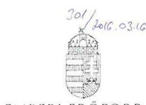

EMBERI ERÓFORRÁSOK MINISZTÉRIUMA KÖZIGAZGATÁSI ÁLLAMTITKÁR

Iktatószám: 16416-3/2016/ELL

Hiv. szám: V-0772-134/2016. Ügyintéző: Bánkné Simon Judit Tel. szám: +36 (1) 7954430 Melléklet: 1 db

# Domokos László részére 

elnök

Állami Számvevőszék

## Budapest

Apáczai Csere János u. 10. 1052

Tárgy: Jelentéstervezethez észrevétel

ÁLLAMI SZÁMVEVŐSZÉK
080481/2016
Erkezei: 2016. MARC 1.1.
Iktatószám: V-0772-134/2016
Melléklet:

Tisztelt Elnök Úr!
„A központi alrendszer egyes intézményei pénzügyi és vagyongazdálkodásának ellenőrzése Bács-Kiskun Megyei Kórház Szegedi Tudományegyetem Általános Orvostudományi Kar Oktató Kórház" címmel készített számvevőszéki jelentéstervezethez az alábbi észrevételeket teszem.

1) Mellékelten megküldöm a Nemzetgazdasági Minisztérium állambáztartásért felelős államtitkárának a Bács-Kiskun Megyei Kórház Szegedi Tudományegyetem Általános Orvostudományi Kar Oktató Kórház 2014. évi alapító okiratának módosításához szükséges előzetes egyetértését tartalmazó dokumentumot, amely alapján indokoltnak tartom az előzetes egyetértés hiányára vonatkozó megállapítás, valamint az emberi erőforrások miniszterének címzett 1. sz. javaslat törlését.
2) Az Állami Egészségügyi Ellátó Központról (a továbbiakban: ÁEEK) szóló 27/2015. (II. 25.) Korm. rendelet 4. és 5. §-ai értelmében a Borsod-Abaúj-Zemplén Megyei Kórház és Egyetemi Oktató Kórház tekintetében középirányító szervként az ÁEEK gyakorolja az irányítási hatásköröket, ennek keretében érvényesíti az előirányzatokkal, a létszámokkal és a vagyonnal való szabályszerű és hatékony gazdálkodás követelményeit, továbbá számon kéri és ellenőrzi e követelmények érvényre jutását.
Az előbbiek alapján indokoltnak tartom, hogy a jelentéstervezetben az emberi erőforrások miniszterének tett 3. számú javaslatot ne az emberi erőforrások minisztere részére, hanem az ÁEEK föigazgatója részére fogalmazza meg a jelentés.

Kérem Elnök Urat, hogy az észrevételeket szíveskedjen elfogadni.
Budapest, 2016. március „""
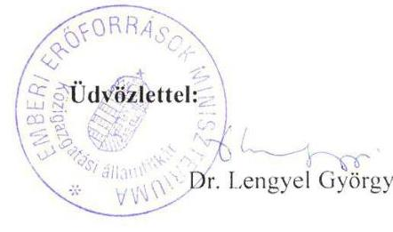

---

# NEMZETGAZDASÁGI MINISZTÉRIUM 

Államháztartásért Felelős Államútkár

Dr. Lengyel Györgyi asszony részére közigazgatási államtitkár

Emberi Eröforrások Minisztériuma

Budapest
Arany János u. 6-8.
1051

Iktatószám: NGM/24237/2/2014
Hivatkozási szám: 41377-2/2014/JOGI
Úgyintéző: Dr. Faragó Lajos
Telefonszám: 79-51794
Tárgy: egészségügyi intézmények alapító okiratainak kiadásához elózetes egyetértés megadása

Tisztelt Közigazgatási Államtitkár Asszony!

Hivatkozva a fenti számú levelére, az állambáztartásról szóló 2011. évi CXCV. törvény 8. § (7) bekezdésében foglaltak alapján, az alábbi egészségügyi intézmények alapító okiratának kiadásához és módosításához szükséges előzetes egyetértést delegált hatáskörömben eljárva megadom:

- Csongrád Megyei Mellkasi Betegségek Szakkórháza,
- Dombóvári Szent Lukács Kórház,
- Dorogi Szent Borbála Szakkórház és Szakorvosi Rendelő,
- Fejér Megyei Szent György Egyetemi Oktató Kórház,
- Gottsegen György Országos Kardiológiai Intézet,
- Gróf Tisza István Kórház,
- Heim Pál Gyemnekkórház,
- Hévizgyógyfürdő és Szent András Reumakórház,
- Jahn Ferenc Dél-pesti Kórház és Rendelőintézet,
- Jászberényi Szent Erzsébet Kórház,
- Károlyi Sándor Kórház,
- Kemenesaljai Egyesített Kórház Celldömölk,
- Kunhegyesi Szakorvosi és Ápolási Intézet,
- Országos Orvosi Rehabilitációs Intézet,
- Országos Reumatológiai és Fizıoterápiás Intézet,

Nemzetgazdasági Minisztérium 1051 Budapest, József nádor tér 2-4., 1369 Budapest, Pf. 481.

---

- Országos Sportegészségügyi Intézet,
- Soproni Erzsébet Oktató Kórház és Rehabilitációs Intézet,
- Árpád-házi Szent Erzsébet Szakkörház és Rendelőintézet,
- Bács-Kiskun Megyei Kórház a Szegedi Orvostudományi Egyetem Általános Orvostudományi Kar Oktató Kórháza.

Kérem tájékoztatásom szíves tudomásulvételét.
Budapest, 2014. szeptember , 24 ,"
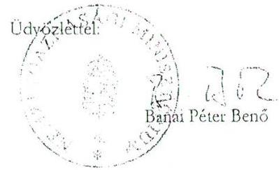

---

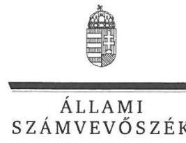

ELNÖK

Ikt.szám: V-0772-144/2016.

# Balog Zoltán úr 

emberi erőforrások minisztere
Emberi Erőforrások Minisztériuma

## Budapest

## Tisztelt Miniszter Úr!

Köszönettel megkaptam a 2016. március 11. napján az Állami Számvevőszékhez érkezett „A központi alrendszer egyes intézményeinek ellenörzése - A Bács-Kiskun Megyei Kórház a Szegedi Tudományegyetem Általános Orvostudományi Kar Oktató Kórháza pénzügyi és vagyongazdálkodásának ellenörzése" címủ számvevőszéki jelentéstervezetben foglalt javaslatokra a közigazgatási államtitkár asszony által tett észrevételeket.

Tájékoztatom Miniszter urat, hogy a jelentésben - az Állami Számvevőszékről szóló 2011. évi LXVI. törvény 29. § (3) bekezdése alapján - az el nem fogadott észrevételeket szerepeltetjük az elutasítás indokainak feltüntetésével együtt.

Az Állami Számvevőszék észrevételekre vonatkozó álláspontjáról a felügyeleti vezető által készített részletes tájékoztatást csatoltan megküldöm.

Budapest, 2016. 0 hó 0 nap
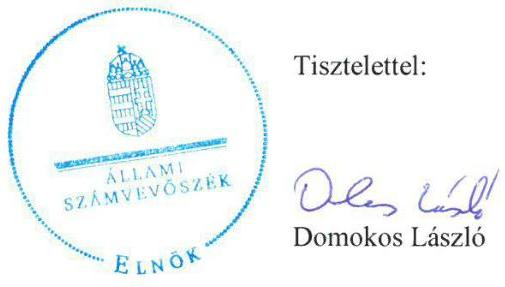

Melléklet: Tájékoztatás az elfogadott és el nem fogadott észrevételekről

---

# Tájékoztatás   az elfogadott és az el nem fogadott észrevételekről 

| 1. | Észrevétel: | Az emberi erőforrások miniszterének címzett 1. számú javaslathoz, és az azt megalapozó 1.1. számú megállapítás 2. bekezdéséhez. |
| :--: | :--: | :--: |
|  | Válasz: | Az Állami Számvevőszék az észrevételt részben fogadja el. |
|  | Indoklás: | Az észrevételhez megküldött dokumentum alapján az 1.1. számú megállapítás 2. bekezdés utolsó mondatából az „és 2014." szövegrészt töröltük. A megállapítás a 2013. évi alapító okirat módosításra - és így a javaslatra - vonatkozóan továbbra is megalapozott. |
| 2. | Észrevétel: | Az emberi erőforrások miniszterének címzett 2. számú javaslathoz, és az azt megalapozó 1.2. számú megállapítás 3. bekezdéséhez. |
|  | Válasz: | Az Állami Számvevőszék az észrevételt nem fogadja el. |
|  | Indoklás: | Az államháztartásról szóló 2011. évi CXCV. törvény 9. § e) pontja szerint a költségvetési szerv tevékenységének törvényességi, szakszerűségi és hatékonysági ellenőrzése a költségvetési szerv irányítási hatáskörébe tartozik, amelyet az Állami Egészségügyi Ellátó Központról szóló 27/2015. (II. 25.) Korm. rendelet nem delegált az Állami Egészségügyi Ellátó Központ által gyakorolható irányítási jogkörök közé.   Az Állami Egészségügyi Ellátó Központról szóló 27/2015. (II.25.) Korm. rendelet 4. §-ában foglaltak szerint: „A MÖKtv., a Trv., az Esztergom Város Önkormányzata egyes intézményeinek átvételéről szóló 2011. évi CLXXXVI. törvény, valamint az egészségügyi ellátórendszer fejlesztéséről szóló 2006. évi CXXXII. törvény alapján átvett, és a miniszter irányítása alá tartozó gyógyintézetek, valamint az Országos Vérellátó Szolgálat tekintetében középirányító szervként az AEEK gyakorolja az államháztartásról szóló 2011. évi CXCV. törvény 9. § b) és g)-j) pontja szerinti irányítási hatásköröket." |

Budapest, 2016. 0 h hó 37 nap
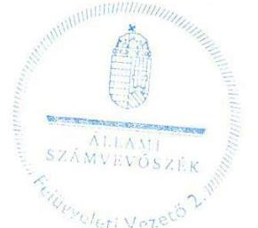

Salamon Ildikó
felügyeleti vezető

---

# 200/2015 0310 

## 77 BÁCS-KISKUN MEGYEI KÓRHÁZ

a Sorgedi Tudományegyelem Általános Orvostudományi Kar Oktató Kórháza 0000 Karakosok, Nyíre út 38.
Telefon: 76/516-700, Fax: 76/481-219; www.kmk.hu

## Domokos László

elnök

## Állami Számvevőszék

Budapest

## ÁLLAMI SZÁMVEVÖSZÉK

019924/2016
Erkezen: 2016 MARC 10
Tktatószám: 2-039 4-150/03
Melléklet:
Sedem 1604
Ees

Tisztelt Elnök Úr!
Köszönettel vettük a Bács-Kiskun Megyei Kórház pénzügyi és vagyongazdálkodási ellenőrzését (jelentéstervezetet), amit alaposan áttanulmányoztunk, és elkészítettük a mellékelt észrevételeket, amelyeket tisztelettel kérünk figyelembe venni a végleges vizsgálati anyag elkészítésénél.

Megkezdtük az előkészületeket a szükséges intézkedések meghozatalára is.
Köszönjük, hogy munkánk színvonalának emelése érdekében átvizsgálták kórházunkat, mivel igen nehéz és sok munkával terhelt időszakot éltünk meg 20112014. év között:

- 2012. évtől kórházunk állami irányítás alá került, mint központi költségvetési szerv. Ennek végrehajtásához kapcsolódóan számos feladatot kellett megoldanunk, az új elvárásoknak eleget téve.
- 2013. február 1-jétől intézményünkhöz integrálták az erősen eladósodott
- Kiskunfélegyházi és a
- Kalocsai kórházat.

A feladatellátás igen jelentős volt, mivel százas nagyságrendủ új, ill. módosított szabályzatot kellett készítenünk. Egységes költségvetést kellett készítenünk, a kötelezettségvállalás szabályrendszerét teljesen át kellett alakítanunk. Egységes beszerzési és közbeszerzési rendet kellett kialakítanunk - melyet természetesen igen nehéz volt végrehajtani az integrálódó kórházak eltérő szokásrendje, ill. érdekellentéte miatt. Rendkívül nagyszámú jogvita, ill. peres eljárás merült fel a két kórház 1,6 milliárdos adóssága miatt.

- A TIOP-2.2.7 Pólus pályázathoz kapcsolódóan új könyvelési szoftvert vezettünk be (CompuTrend), mely a számviteli elszámolás teljes körű átrendezését követelte meg.

---

- Az államháztartási jogszabályok 2014. évtől nagymértékben változtak, behozták a költségvetési és a pénzügyi-számviteli elszámolás új rendjét, amely jelentős többlet munkafeladatot rótt ránk, és a Kincstár elvárásainak is igen nehéz volt eleget tenni (nem csak Kecskeméten).

A jelzett körülmények között - értékelésük szerint is - több területen eredményes tevékenységet végeztünk, de számos területen további intézkedéseket kell hoznunk a felmerült hiányosságok megszüntetésére.

A következő időszakban is törekedünk tevékenységünk további javítására.

Kecskemét, 2016. március 8.

Tisztelettel:
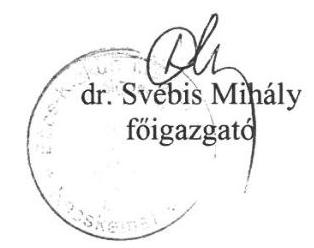

---

# Észrevételek az Állami Számvevőszék 2011-2014. időszakra vonatkozó ellenőrzéséhez 

Költségvetéssel összefüggő észrevételek

1) A dokumentum 21. oldalán (3.1. pontban) 2014. évi elemi költségvetés jogszabályban előírt február 21-i határidejének be nem tartására hívja föl a figyelmet. A költségvetésünk elfogadott, végleges aláír példányainak megküldésére 2014. április 25 -én került sor.

Kórházunk az elemi költségvetést határidőre elkészítette és betöltötte a KGR rendszerbe. A mellékelt 2014.02.21-i 12:15 perckor érkezett fenntartói értesítés után feladott állapotú elemi költségvetést rögzítettünk a KGR rendszerben. A 2014.02.21. 12:28. állapot szerinti időbélyegzővel ellátott példányt mellékeljük. Ebből a beszámoló verzióból. A 2014.évi elemi költségvetés az intézmény hibáján kívül központi értesítés alapján, hibajavítási céllal visszanyitásra került 2014. március 03án. A javítást haladéktalanul elvégeztük, majd a fenntartót e-mailben tájékoztattuk. A lezárt elemi költségvetés elektronikus úton megküldésre került 2014.03.03-án. További visszajelzést nem kaptunk, így a szükséges vezetői aláírások beszerzése a 2014.03.17-i dátummal pénzügyileg is jóváhagyott végleges papír alapú dokumentumokra csak ez után kezdődhetett meg. A postai küldés 2014.április 25 -én valósult meg.
A fenti folyamatból érzékelhető, hogy az intézmény rajta kívülálló okok miatt nem tudott a jogszabályban előírt 2014.02.21-i időpontra aláirt végleges elemi költségvetést megküldeni. (1. sz. melléklet)
2) A dokumentum 22. oldal alján (3.2 pontban) a költségvetési kiadásoknál előirányzat túllépés miatt marasztalja el intézményünket.
Az Áht 12/A § (1) bekezdése tartalmazza, hogy „fizetési kötelezettség a jóváhagyott kiadási előirányzatok mértékéig .... rendelhetők el"
Önkormányzati körbe tartozó Intézményünk költségvetése kiemelt előirányzatonként került jóváhagyásra és a módosítások is kiemelt előirányzati szinten történtek. Az Ámr 54. § (4) pontja szerint „, A jóváhagyott kiemelt előirányzatokon belül az egyes tételek előirányzatától .... a költségvetési szerv előirányzat-felhasználási hatáskörben az előirányzatok megváltoztatása nélkül is eltérhet.

A kifogásolt sor az egyéb folyó kiadások túllépése miatt marasztal el, mely sor nem kiemelt előirányzati szint. A dologi kiadásokon (kiemelt előirányzati szint) belül megjelenő sor. A 2011. évi dologi kiadások éves szinten összességében az előirányzatokon belül teljesültek, így nem történt jogsértés. (2. sz. melléklet)

---

3) 4.5 sz. megállapítás (dokumentum 33. old.), mely szerint a 2014. január 01-i rendezőmérleget Kórházunk 2014.03.01. határidő helyett 2014.05.20-ra készítette el, majd 2014.09.25-én került véglegesítésre az alábbi Intézményen kívüli okok miatt történt.

A mellékelt kronológia jól mutatja az intézmény adatszolgáltatási rendjét. A rendező mérleg rögzítésére a KGR rendszerben 03.31-én nyílt meg a lehetőség, majd a Kórház 04.04-én a fenntartói utasítás alapján mentett állapotban tartotta a betöltött rendezőmérleget. Az első feladás 05.14-én történhetett meg. Innentől kezdve többszöri visszanyitás és lezárás történt, míg a 2015.09.25-i végleges állapot ki nem alakult. A visszautasítások, mind fenntartói/EMMI utasítások alapján történt. A két utolsó (201509.24-i, majd az azt követő 10.13-i) utasítást mellékeljük.

A fenti folyamatból érzékelhető, hogy az intézmény rajta kívülálló okok miatt nem tudott a jogszabályban előírt 2014.03.01-i időpontra aláírt végleges rendezőmérleget küldeni. (3. sz. melléklet)

Közbeszerzéssel összefüggő észrevételek
4) Nem vitatható, hogy az ellenőrzés során bizonyos esetekben megállapítható volt, hogy nem indult közbeszerzés vagy az későn indult meg. Úgy gondolom nem hagyható figyelmen kívül az a számvevőszéki észrevétel, amely a közbeszerzés kapcsán a pazarló gazdálkodás vagy kár bekövetkeztére utaló adatot, tényt nem tárt fel.

Kórházunk beszerzései során igyekezett a közbeszerzési eljárás szabályait betartani, a rendelkezésre álló szűkös költségvetési forrás mellett a közpénz hatékonyabb felhasználása és a folyamatos betegellátás biztosítása érdekében.

Az Intézményünk az elmúlt 10 évben több mint 300 közbeszerzési eljárást folytatott le és a közbeszerzési törvény hatályba lépése óta eltelt 20 év alatt mindösszesen 3 jogorvoslati eljárást indult, ami bizonyítja, hogy Intézményünk messzemenőkig szem előtt tartotta, hogy a közbeszerzési szabályok betartása mellett történjenek a beszerzések. Néhány objektív akadály azonban közre hatott és ebből adódóan egyes esetekben átmenetileg közbeszerzési eljárás nélkül történtek beszerzések. Ezek okai részben, hogy a folyamatos betegellátás biztosítása érdekében az eredménytelen közbeszerzési eljárások után is szükség volt a beszerzések folytatására így az új közbeszerzési eljárás lefolytatásáig a régi közbeszerzési tendernyertesekkel kellett szerződést hosszabbítani. A gyógyszer közbeszerzések területén a saját lebonyolítású beszerzéseket sokszor hátráltatta, hogy nem mindig lehetett pontosan tudni, mely termékcsoport tartozik a központi közbeszerzés körébe, illetőleg a gyógyszer cégek következetesen érvényesítették a késedelmes fizetés miatti kamatterheket, így a betegellátás veszélyeztetésének elkerülése végett szükségessé vált, egyes esetekben a tenderen kívüli gyógyszer kedvezményes áron történő vásárlása.

---

Kórházunk igyekezett a becsült érték meghatározásánál kellő gondossággal, körültekintően eljárni, de néhány esetben különösen az új telephelyek beszerzési igényei miatt, volt, amikor a beszerzés túllépte a becsült értéket és így utólag szembesült a Kórház, hogy közbeszerzési eljárás lefolytatása lett volna szükséges. A közbeszerzési eljárások kapcsán szükséges azt is megjegyezni, hogy a Kórházak állami tulajdonba kerülésével a hatályba lépő központi és fenntartói ellenőrzések egyrészt meghosszabbították a közbeszerzési eljárások lefolytatásának időtartamát, másrészt jelentős adminisztrációs plusz terheket róttak az Intézményekre.

Leltározással összefüggő észrevételek
5) ÁSZ összegzés: a kétévenkénti mennyiségi leltározáshoz nem rendelkezett az irányítószerv engedélyével
Kérjük figyelembe venni, hogy a gyakorlatunkban nem kétévenként, hanem minden évben megtörtént a mérleg alátámasztását szolgáló, mennyiségi felvételen alapuló leltározás a bemutatott éves ütemterveknek és éves összesítő jelentéseknek megfelelően.

2011-ben a központi raktáron és a munkahelyeken levő tárgyi eszközök leltára történt, úgy hogy a leltárcsoport a mennyiségeket nem tartalmazó leltáríveket kiadta a központi raktárba és az alleltárkezelőknek, akik a mennyiségeket számba vették és visszaküldték a kitöltött íveket, a leltárcsoport ezt kiértékelve átadta a Közgazdasági osztálynak.

2012-ben két leltározás volt. Megtörtént a 2011. évnél leírt, az alleltárkezelők által végzett leltározás, továbbá a leltárcsoport mennyiségi felvétellel is ellenőrizte a készleteket az ez évre tervezett leltározási ütemterv szerint, ingatlanok, gépek, berendezések, felszerelések, járművek eszközcsoport megnevezéssel.

2013-ban a központi raktáron és a munkahelyeken levő tárgyi eszközök leltára történt, úgy hogy a leltárcsoport a mennyiségeket nem tartalmazó leltáríveket kiadta a központi raktárba és az alleltárkezelőknek, akik a mennyiségeket számba vették és visszaküldték a kitöltött íveket, a leltárcsoport ezt kiértékelve átadta a Közgazdasági osztálynak

2014-ben két leltározás volt. Megtörtént az alleltárkezelők által végzett leltározás továbbá leltárcsoport mennyiségi felvétellel is ellenőrizte a készleteket az ez évre tervezett leltározási ütemterv szerint, ingatlanok, gépek, berendezések, felszerelések, járművek eszközcsoport megnevezéssel.

A fentiek alátámasztásához rendelkezünk a megfelelő dokumentumokkal!

---

6) 4.2 számú megállapítás: 2011. év végén a Kórház az önkormányzati alrendszerből a központi alrendszerbe kerülését megelőzően .... mennyiségi felvétellel nem,csak egyeztetéssel leltározta.
Az átadást megelőző, mennyiségi felvétellel történő leltározás megtörtént, amit a Bács-kiskun Megyei Közgyűlés Hivatal Főjegyzője4978/-4/20011 levele alapján végeztünk el. A feladat elvégzést igazoló leltárfelvételi ívek rendelkezésre állnak.

Kockázatelemzéssel összefüggő észrevételek
7) 2.2 számú megállapítás: A 2014. évben a Gazdasági Igazgatás osztályai által készített utólagos kockázatelemzés mindössze a gazdálkodással kapcsolatos kockázatokat foglalta össze

Az általunk alkalmazott kockázatelemzés előzetes, általában egy beszerzési igény teljesítésének vagy nem teljesítésének a kockázatait mutatja be. Ebben a gazdálkodással kapcsolatos kockázaton túl azt is jeleztük, milyen betegellátási, működési kockázat jelentkezik.

Az intézkedési javaslatok alapján megkezdjük a hiányosságok felszámolását, azonban nagy segítség lenne, ha az ÁSZ néhány elvárását pontosítaná vagy ajánlást adna, mivel a jogszabályból nehezen kikövetkeztethető, hogy mi a helyes az ÁSZ által elfogadható gyakorlat az ÁSZ intézkedési javaslat alábbi pontjainál:
1.) „Intézkedjen, hogy a gazdasági szervezet ügyrendje a jogszabályi előírásokkal összhangban tartalmazza a vagyongazdálkodással kapcsolatos feladatok munkafolyamatainak leírását, valamint a gazdasági szervezet külső kapcsolattartásának módját. (2.1. számú megállapítás 2. bekezdése alapján)"

Véleményünk szerint a Gazdasági-műszaki Ellátás Szervezeti és Müködési Szabályzata és Ügyrendje, valamint a Gazdasági Osztály, Bér-munkaügyi Osztály, Közgazdasági Osztály, Döntéselőkészítő Osztály, Műszaki Osztály, Élelmezési Osztály ügyrendje tartalmazza részfeladatokra bontva a vagyongazdálkodással kapcsolatos teendőket, tartalmazza a szervezet felépítését, a hatásköri, engedélyezési, jóváhagyási, beszámolási jogköröket, a függelmi kapcsolatokat, a helyettesítés rendjét. A vagyongazdálkodás elemei közül pl. a leltározás, selejtezés a gazdasági osztályvezetőhöz rendelten jelenik meg.

A gazdasági szervezet külső kapcsolattartásának szabályozása a Gazdasági-műszaki Ellátás ügyrendjében, a Gazdasági-műszaki Ellátás osztályainak ügyrendjében, valamint a felelős vezetők munkaköri leírásában is szerepel.(pl. a gazdasági osztályvezető helyettes közvetlen kapcsolattartása a külső szolgáltatást végző mosodával.)

---

4.) A kórház tevékenységében rejlő kockázatok meghatározása.
8.) Az operatív tevékenységek folyamatos és eseti nyomon követésére alkalmas monitoring rendszer kialakítása és müködtetése.

---

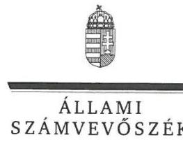

ELNÖK

Ikt.szám: V-0772-145/2016.

# Dr. Svébis Mihály úr 

fóigazgató
Bács-Kiskun Megyei Kórház

## Kecskemét

## Tisztelt Föigazgató Úr!

Köszönettel megkaptam a 2016. március 10. napján az Állami Számvevőszékhez érkezett „A központi alrendszer egyes intézményei pénzügyi és vagyongazdálkodásának ellenörzése - A Bács-Kiskun Megyei Kórház a Szegedi Tudományegyetem Általános Orvostudományi Kar Oktató Kórház" címủ számvevőszéki jelentéstervezetben foglalt megállapításokra írásban tett észrevételeit.

Tájékoztatom Főigazgató urat, hogy a jelentésben - az Állami Számvevőszékről szóló 2011. évi LXVI. törvény 29. § (3) bekezdése alapján - az el nem fogadott észrevételeket szerepeltetjük az elutasítás indokainak feltüntetésével együtt.

Az Állami Számvevőszék észrevételekre vonatkozó álláspontjáról a felügyeleti vezető által készített részletes tájékoztatást mellékelten megküldőm.

Budapest, 2016. 0 hó 0 nap
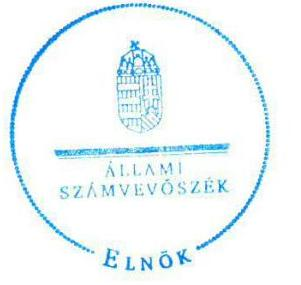

Tisztelettel:

## Dás Lásló

Domokos László

Melléklet: Tájékoztatás az elfogadott és el nem fogadott észrevételekről

---

# Tájékoztatás   az elfogadott és az el nem fogadott észrevételekről 

| 1. | Észrevétel: | A jelentéstervezet 3.1. számú megállapítását alátámasztó 2. bekezdéshez (21. oldal), a 2014. évi elemi költségvetés jogszabályban elöirt határidejének be nem tartására vonatkozóan. |
| :--: | :--: | :--: |
|  | Válasz: | Az Állami Számvevőszék az észrevételt nem fogadja el. |
|  | Indoklás: | Az elemi költségvetés készitésével kapcsolatos észrevétel nem mond ellent a megállapításnak, hanem azt magyarázza. Ezért a megállapítások módosítása nem indokolt. |
| 2. | Észrevétel: | A jelentéstervezet 3.3. számú megállapítását alátámasztó 4. bekezdéshez (22. oldal), a költségvetési kiadások előirányzat túllépésére vonatkozóan. |
|  | Válasz: | Az Állami Számvevőszék az észrevételt elfogadja. |
|  | Indoklás: | Az észrevétel alapján az ellenőrzési dokumentumokat ismételten áttekintettük és a 3.3. számú megállapítást alátámasztó 4. bekezdés utolsó mondatát töröltük. |
| 3. | Észrevétel: | A jelentéstervezet 4.5. számú megállapítását alátámasztó 2. bekezdéshez (33. oldal), a 2014. január 1-jei rendező mérleg elkészitésére vonatkozóan. |
|  | Válasz: | Az Állami Számvevőszék az észrevételt nem fogadja el. |
|  | Indoklás: | A rendező mérleg készítésével kapcsolatos tájékoztatás nem mond ellent a megállapításnak, hanem azt magyarázza. Ezért a megállapítások módosítása nem indokolt. |
| 4. | Észrevétel: | A jelentéstervezet 3.3. számú megállapítását alátámasztó 8. bekezdéshez (24. oldal), a közbeszerzési eljárások lefolytatásához kapcsolódóan. |
|  | Válasz: | Az Állami Számvevőszék az észrevételt nem fogadja el. |
|  | Indoklás: | A közbeszerzési eljárásokkal összefüggő tájékoztatás nem vitatja a közbeszerzésekkel kapcsolatos megállapításokat, hanem azt magyarázza. Ezért a megállapítások módosítása nem indokolt. |
| 5. | Észrevétel: | A jelentéstervezet 4.2. számú megállapítását alátámasztó 6. bekezdéshez (30. oldal), a kétévenkénti mennyiségi leltározás végrehajtásához, az ahhoz szükséges irányítószervi engedélyhez kapcsolódóan. |
|  | Válasz: | Az Állami Számvevőszék az észrevételt nem fogadja el. |

---

|  | Indoklás: | A leltározással kapcsolatos észrevétel nem vitatja a megállapításokat, arra hivatkozik, hogy a gyakorlatban minden évben történt mennyiségi felvételen alapuló leltározás. A megállapítás szerint a leltározás végrehajtása a 2011. és 2013. években részben felelt meg a jogszabályi előírásoknak. A helyszíni ellenőrzés során az ÁSZ rendelkezésére bocsátott dokumentumok szerint a 2011. és 2013. évben történt mennyiségi leltárfelvétel, az azonban nem terjedt ki a mennyiségi felvétellel leltározandó eszközök teljes körére. Ezért a megállapítások módosítása nem indokolt. |
| :--: | :--: | :--: |
| 6. | Észrevétel: | A jelentéstervezet 4.2. számú megállapítását alátámasztó 6. bekezdéshez (30. oldal), a 2011. év végi leltározáshoz kapcsolódóan. |
|  | Válasz: | Az Állami Számvevőszék az észrevételt részben fogadja el. |
|  | Indoklás: | A helyszíni ellenőrzés során az Állami Számvevőszék rendelkezésére bocsátott dokumentumok szerint a 2011. évben történt mennyiségi leltárfelvétel, az azonban nem terjedt ki a mennyiségi felvétellel leltározandó eszközök teljes körére. Ezért a 4.2. számú megállapítást alátámasztó 6. bekezdés 3. mondatát pontosítottuk, a következők szerint (kiegészítés aláhúzással jelölve).   „A 2011. év végén a Kórház az önkormányzati alrendszerhöl központi alrendszerbe kerülését megelőzően a zárómérleg készitésekor az eszközeit - az Ahsz.; 37. § (3) bekezdésében elöirtak ellenére - mennyiségi felvétellel teljes körüen nem, csak egyeztetéssel leltározta." |
| 7. | Észrevétel: | A jelentéstervezet 2.2. számú megállapítását alátámasztó 2. bekezdéshez (17. oldal), a Gazdasági Igazgatóság osztályai által készített kockázatelemzéshez kapcsolódóan. |
|  | Válasz: | Az Állami Számvevőszék az észrevételt nem fogadja el. |
|  | Indoklás: | A Kórház által alkalmazott kockázatelemzésről szóló tájékoztatás nem mond ellent a megállapításoknak. A helyszíni ellenőrzés során az az Állami Számvevőszék rendelkezésére bocsátott dokumentumok csak a gazdálkodáshoz kapcsolódó kockázatokat tartalmazzák. |

Az észrevételeken túl, köszönettel vettük tájékoztatását a hiányosságok felszámolására vonatkozóan. Ennek keretében tájékoztatást adott az egyes osztályok ügyrendjének tartalmi elemeiről. A helyszíni ellenőrzés során az Állami Számvevőszék rendelkezésére bocsátott, a gazdasági szervezet ellenőrzött időszakban hatályos ügyrendjei (Gazdasági-Müszaki Ellátás Szervezeti és Müködési Szabályzata és Ügyrendjei) konkrétan a vagyongazdálkodással kapcsolatos feladatok munkafolyamatainak leírását, valamint a külső kapcsolattartás módját nem tartalmazták, és azokat más szabályzat sem rögzítette.

---

Az „Észrevételek az Állami Számvevöszék 2011-2014. időszakra vonatkozó ellenőrzéséhez" 4-5. oldal 1., 4. és 8. pontjaiban nem a számvevőszéki javaslatokkal kapcsolatban tett észrevételt, hanem az Állami Számvevőszék támogatását, ajánlását kéri, ami nem tartozik az Állami Számvevőszékről szóló 2011. évi LXVI. törvény 29. § szerinti észrevételezési jog tárgykörébe.

Budapest, 2016. Ch hó 0 nap
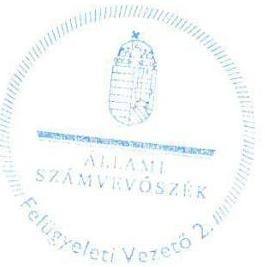

Salamon Ildikó
felügyeleti vezető

---

Állami Egészségügyi Ellátó Központ

Állami Számvevőszék

Domokos László
Elnök Úr részére

Budapest
Apáczai Csere János utca 10.
1052

Tisztelt Elnök Úr!

1125 Budapest, Diós árok 3.
Tel.: 1356 1522, Fax: 13757253
1525 Budapest 114 Pf. 32.

Iktatószám: 4EE4/1785-01/2016.
Úgyintéző: Szabó Krisztina
Telefon: 1/356-15-22/193

ÁLLAMI SZÁMVEVŐSZÉK
ORAGO: 1/2016.
Erkczci. 2016 MARC 18.
Iktatószám:
Melléklet:
Sekv. 11432
$\square$

Az Állami Számvevőszék által „A központi alrendszer egyes intézményei pénzügyi és vagyongazdálkodásának ellenőrzése - Bács-Kiskun Megyei Kórház Szegedi Tudományegyetem Általános Orvostudományi Kar Oktató Kórház" címmel készített számvevőszéki jelentéstervezetet megkaptam.

A jelentéstervezet megállapításaival kapcsolatban észrevételt nem kívánok tenni.

Budapest, 2016. március 07.
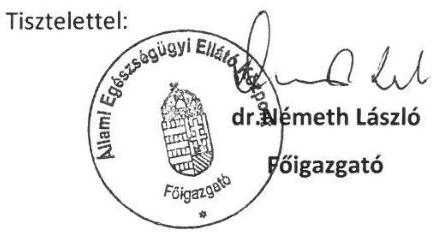

---

# RÖVIDÍTÉSEK JEGYZÉKE 

${ }^{1}$ ÁSZ
${ }^{2}$ Önkormányzat
${ }^{3}$ Közgyűlés
${ }^{4}$ Egészségügyért felelős miniszter
${ }^{5}$ Államháztartásért felelős miniszter
${ }^{6}$ Kórház, intézmény
${ }^{7}$ Intézményi megállapodás
${ }^{8}$ Eütv.
${ }^{9}$ Minisztérium
${ }^{10}$ GYEMSZI
${ }^{11}$ Főigazgató
${ }^{12}$ Gazdasági igazgató
${ }^{13}$ Alaptörvény
${ }^{14}$ Nvtv.
${ }^{15}$ Áht. 2
${ }^{16}$ Ávr.
${ }^{17}$ Áht. 1
${ }^{18}$ Ámr.
${ }^{19}$ Bkr.
${ }^{20}$ ÁSZ tv.
${ }^{21}$ ÁSZ SZMSZ
${ }^{22}$ SZMSZ
${ }^{23}$ 59/2011. (IV. 12.) Korm. rendelet
${ }^{24}$ Sztv.
${ }^{25}$ Áhsz. 2
${ }^{26}$ Vtvr.
${ }^{27}$ Áhsz. 1
${ }^{28} \mathrm{Kbt} .1$

Állami Számvevőszék
Bács-Kiskun Megyei Önkormányzat
Bács-Kiskun Megyei Önkormányzat Közgyűlése
Nemzeti erőforrás miniszter (2012. május 13-áig), Emberi erőforrások minisztere (2012. május 14-étől)
Nemzetgazdasági miniszter
Bács-Kiskun Megyei Önkormányzat Kecskeméti Kórház (2011. december 31-ig), Bács-Kiskun Megyei Kórház a Szegedi Tudományegyetem Általános Orvostudományi Kar Oktató Kórháza (2012. január 1-jétől)
a GYEMSZI és a Kórház által 2011. december 30-án kötött „intézményi átadásátvételi megállapodás"
az egészségügyről szóló 1997. évi CLIV. törvény
Nemzeti Erőforrás Minisztérium (2012. május 13-áig), Emberi Erőforrások Minisztériuma (2012. május 14-étől)
Gyógyszerészeti és Egészségügyi Minőség- és Szervezetfejlesztési Intézet (2015. február 28-áig)
Bács-Kiskun Megyei Kórház a Szegedi Tudományegyetem Általános Orvostudományi Kar Oktató Kórházának főigazgatója
Bács-Kiskun Megyei Kórház a Szegedi Tudományegyetem Általános Orvostudományi Kar Oktató Kórházának gazdasági igazgatója
Magyarország Alaptörvénye (hatályos 2012. január 1-től)
2011. évi CXCVI. törvény a nemzeti vagyonról (hatályos 2012. január 1-től)
2011. évi CXCV. törvény az államháztartásról (hatályos 2012. január 1-től)
368/2011. (XII. 31.) Korm. rendelet az államháztartásról szóló törvény végrehajtásáról (hatályos 2012. január 1-től)
1992. évi XXXVIII. törvény az államháztartásról (hatálytalan: 2012.január 1-jétől) 292/2009. (XII. 19.) Korm. rendelet az államháztartás működési rendjéről (hatálytalan: 2012. január 1-jétől)
370/2011. (XII. 31.) Korm. rendelet a költségvetési szervek belső kontrollrendszeréről és belső ellenőrzéséről (hatályos 2012. január 1-jétől) 2011. évi LXVI. törvény az Állami Számvevőszékről (hatályos 2011. július 1-jétől)

Állami Számvevőszék Szervezeti és Működési Szabályzata
Szervezeti és Müködési Szabályzat
59/2011. (IV. 12.) Korm. rendelet - a Gyógyszerészeti és Egészségügyi Minőségés Szervezetfejlesztési Intézetről (hatálytalan 2015. március 1-jétől)
2000. évi C. tv. a számvitelről (hatályos 2001. január 1-től)
4/2013. (I. 11.) Korm. rendelet az államháztartás számviteléről (hatályos 2014. január 1-jétől)
254/2007. (X. 4.) Korm. rendelet az állami vagyonnal való gazdálkodásról
249/2000. (XII. 24.) Korm. rendelet az államháztartás szervezetei beszámolási és könyvvezetési kötelezettségének sajátosságairól (hatálytalan 2014. január 1jétől)
2003. évi CXXIX. törvény a közbeszerzésekről (hatálytalan 2012. január 1-jétől)

---

${ }^{29}$ Kbt. 2
${ }^{30}$ Vnytv.
${ }^{31}$ lkr.
${ }^{32}$ Avtv.
${ }^{33}$ Info tv.
${ }^{34}$ Eitv.
${ }^{35}$ Ltv.
${ }^{36}$ OEP
${ }^{37}$ Ber.
${ }^{38} \mathrm{Kjt}$.
${ }^{39}$ Eütev. tv.
${ }^{40}$ TVK
${ }^{41} \mathrm{Mt}_{-1}$
${ }^{42}$ Kórházi KSZ.
${ }^{43}$ 55/2012. (XII. 28.) EMMI rendelet
${ }^{44}$ 337/2011. (XII. 29.) Korm. rendelet
${ }^{45}$ 438/2013. (XI. 19.) Korm. rendelet
${ }^{46}$ KEHI
${ }^{47}$ 184/2014. (VII. 25.) Korm. rendelet
${ }^{48}$ NEFMI rendelet
${ }^{49}$ Vagyonkezelési szerződés
${ }^{50}$ Vtv.
${ }^{51}$ TIOP
${ }^{52}$ KEOP
${ }^{53}$ 36/2013. (IX. 13.) NGM rendelet
2011. évi CVIII. törvény a közbeszerzésekről (hatályos 2011. augusztus 21-től)
2007. évi CLII. törvény egyes vagyonnyilatkozat-tételi kötelezettségekről

335/2005. (XII. 29.) Korm. rendelet a közfeladatot ellátó szervek iratkezelésének általános követelményeiről
1992. évi LXIII. törvény a személyes adatok védelméről és a közérdekű adatok nyilvánosságáról (hatálytalan: 2012. január 1-jétől)
2011. évi CXII. törvény az információs önrendelkezési jogról és az információszabadságról (hatályos: 2011. július 27-étől)
2005. évi XC. törvény az elektronikus információszabadságról (hatálytalan: 2012. január 1-jétől)
1995. évi LXVI. törvény a köziratokról, a közlevéltárakról és a magánlevéltári anyag védelméről
Országos Egészségbiztosítási Pénztár
193/2003. (XI. 26.) Korm. rendelet a költségvetési szervek belső ellenőrzéséről (hatálytalan 2012. január 1-jétől)
a közalkalmazottak jogállásáról szóló 1992. évi XXXIII. törvény
az egészségügyi tevékenység végzésének egyes kérdéseiről szóló 2003. évi LXXXIV. törvény
teljesítményvolumen keret
a Munka Törvénykönyvéről szóló 1992. évi XXII. törvény (hatálytalan 2012. július 1-jétől)
Bács-Kiskun Megyei Önkormányzat Kecskeméti Kórház Kollektív Szerződése (hatályos 2009. január 1-től)
55/2012. (XII. 28.) EMMI rendelet egyes egészségbiztosítási tárgyú miniszteri rendeletek módosításáról (hatálytalan 2014. április 2-ától)
337/2011. (XII. 29.) Korm. rendelet a Gyógyító-megelőző ellátás jogcímcsoportból finanszírozott egészségügyi szolgáltatók adósságának rendezésére fordítható konszolidációs támogatásról és az egészségügyi szolgáltatások Egészségbiztosítási Alapból történő finanszírozásának részletes szabályairól szóló 43/1999. (III. 3.) Korm. rendelet módosításáról (hatálytalan 2013. január 1-jétől) 438/2013. (XI. 19.) Korm. rendelet a finanszírozott egészségügyi szakellátást nyújtó egészségügyi szolgáltatók adósságának rendezésére fordítható konszolidációs támogatásról
Kormányzati Ellenőrzési Hivatal
184/2014. (VII. 25.) Korm. rendelet a finanszírozott egészségügyi szakellátást nyújtó egészségügyi szolgáltatók adósságának rendezésére fordítható működési támogatásról
72/2011. (XII. 27.) NEFMI rendelet az állam tulajdonába és fenntartásába került egészségügyi intézmények tekintetében vagyonkezelői joggal rendelkező államigazgatási szerv kijelöléséről
a GYEMSZI és a Kórház által kötött 2012. május 1-től hatályba lépett „vagyonkezelési szerződés"
2007. évi CVI. törvény az állami vagyonról

Társadalmi Infrastruktúra Operatív Program
Környezet és Energia Operatív Program
36/2013. (IX. 13.) NGM rendelet az államháztartás számvitelének 2014. évi megváltozásával kapcsolatos feladatokról

---

${ }^{54}$ Konsz. tv.
${ }^{55}$ Konsz. rendelet
${ }^{56}$ Közgyűlés elnöke
${ }^{57}$ MNV Zrt.
${ }^{58}$ NFA tv.
${ }^{59}$ 2012. évi XXXVIII. törvény
2011. évi CLIV. törvény a megyei önkormányzatok konszolidációjáról, a megyei önkormányzati intézmények és a Fővárosi Önkormányzat egyes egészségügyi intézményeinek átvételéről
372/2011. (XII. 31.) Korm. rendelet a megyei önkormányzat egészségügyi intézményei átvételének részletes szabályairól
Bács-Kiskun Megyei Közgyűlés elnöke
Magyar Nemzeti Vagyonkezelő Zrt.
2010. évi LXXXVII. törvény a Nemzeti Földalapról
2012. évi XXXVIII. törvény a települési önkormányzatok fekvőbeteg-szakellátó intézményeinek átvételéről és az átvételhez kapcsolódó egyes törvények módosításáról

---

.

---

.

---

.

---

ÁLLAMI SZÁMVEVŐSZÉK
1052 Budapest, Apáczai Csere János utca 10.
Levélcím: 1364 Budapest 4. Pf. 54
Telefon: +36 14849100 Telefax: +36 14849200
www.asz.hu