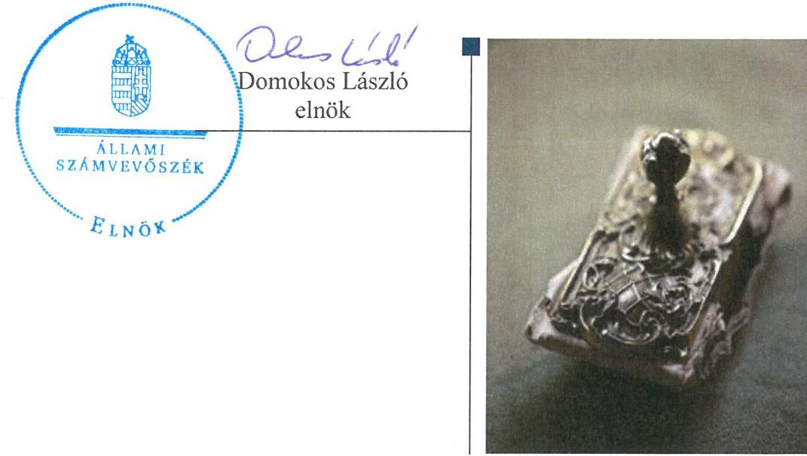
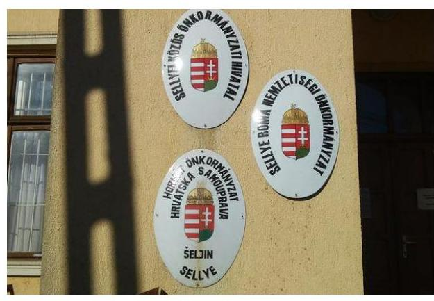

# Jelentés 

## A helyi nemzetiségi önkormányzatok gazdálkodása szabályszerűségének ellenőrzése

Sellye Roma Nemzetiségi Önkormányzat 2016.

---

# Jelenetés 

## A helyi nemzetiségi önkormányzatok gazdálkodása szabályszerűségének ellenőrzése

Sellye Roma Nemzetiségi Önkormányzat
2016. 05. hó 05. nap

---

# AZ ELLENŐRZÉST FELÜGYELTE:

- RENKŐ ZSUZSANNA felügyeleti vezető
- AZ ELLENŐRZÉST VEZETTE ÉS A VÉGREHAJTÁSÁÉRT FELELŐS:
  - DR. VERESS TIBORNÉ ellenőrzésvezető
  - A PROGRAM ÖSSZEÁLLÍTÁSÁÉRT FELELŐS:
    - JANIK JÓZSEF LÁSZLÓ osztályvezető

**IKTATÓSZÁM:** V-0858-109/2016

**TÉMASZÁM:** 1892

**ELLENŐRZÉS-AZONOSÍTÓ SZÁM:** V071401

Jelentéseink az Országgyűlés számítógépes hálózatán és az Interneten a www.asz.hu címen is olvashatóak.

---

# TARTALOMJEGYZÉK 

■ ÖSSZEGZÉS ..... 5
■ AZ ELLENŐRZÉS CÉLJA ..... 6
■ AZ ELLENŐRZÉS TERÜLETE ..... 7
■ AZ ELLENŐRZÉS HÁTTERE, INDOKOLTSÁGA ..... 8
■ FÓKUSZKÉRDÉSEK ..... 9
■ ELLENŐRZÉS HATÓKÖRE ÉS MÓDSZEREI ..... 10
■ MEGÁLLAPÍTÁSOK ..... 12
■ JAVASLATOK ..... 18
■ MELLÉKLETEK ..... 21
I. Sz. melléklet: Értelmező szótár. ..... 21
II. Sz. melléklet: Sellye Roma Nemzetiségi Önkormányzat 2014. évi gazdálkodási adatai ..... 23
■ FÜGGELÉK: ÉSZREVÉTELEK ..... 25
■ RÖVIDÍTÉSEK JEGYZÉKE ..... 27

---

.

---

# ÖSSZEGZÉS 

A Roma Nemzetiségi Önkormányzat Sellye Város Önkormányzattal megkötött, hatályos együttműködési megállapodással rendelkezett. Az együttműködési megállapodás felülvizsgálatára nem a jogszabályi előírásban foglaltak szerint került sor. A gazdálkodási jogkörök gyakorlása nem volt megfelelő. A belső ellenőrzés feltételeit biztosították, azonban 2014. évben ellenőrzést nem folytattak le. Az integritás szemlélet érvényesítése érdekében további intézkedések megtétele szükséges.

## Az ellenőrzés társadalmi indokoltsága

Az Állami Számvevőszék középtávra szóló stratégiájában megfogalmazta, hogy az államháztartás komplex folyamatainak átláthatósága érdekében rendszerszemléletű/holisztikus megközelítésű, egymásra épülő, a szinergiahatást kihasználó, összefoglaló értékelésre lehetőséget adó ellenőrzéseket végez. Az államháztartás önkormányzati alrendszerébe tartozó helyi nemzetiségi önkormányzatok ellenőrzése során az ÁSZ feltárja a működésükben rejlő kockázatokat előmozdítva a közpénzügyek átláthatóságát, rendezettségét.

Az ÁSZ a stratégiai céljával összhangban - az ÁSZ tv. felhatalmazása alapján - végzi a közpénzekkel és a nemzeti vagyonnal való felelős gazdálkodás, valamint a helyi önkormányzatok számviteli rendje betartásának és belső kontrollrendszere múködésének ellenőrzését, továbbá segíti az integritás alapú, átlátható és elszámoltatható közpénzfelhasználás megteremtését.

## Főbb megállapítások, következtetések, javaslatok

A Nemzetiségi Önkormányzat ${ }^{1}$ múködési feltételeinek és gazdálkodása végrehajtási feladatainak szabályozása a jogszabályi előírásoknak megfelelt. A Nemzetiségi Önkormányzat rendelkezett a Települési Önkormányzattal² megkötött, hatályos a jogszabályi előírásoknak megfelelő tartalmú együttműködési megállapodással. Az együttműködési megállapodást 2014. január 31-ig nem, a 2014. évi választásokat követően a jogszabályi előírás szerinti határidőben felülvizsgálták. A Nemzetiségi Önkormányzat Szervezeti és Működési Szabályzatának módosítását a jogszabályban előírt határidőben végrehajtották.

A Nemzetiségi Önkormányzat gazdálkodási feladatainak Közös Önkormányzati Hivatal általi ellátása során nem tartották be a jogszabályi előírásokat. A költségvetési határozattervezet előterjesztésekor a Nemzetiségi Képviselőtestületnek nem mutatták be az előirányzat felhasználási tervet és a költségvetési évet követő három év tervezett bevételi előirányzatainak és kiadási előirányzatainak keretszámait főbb csoportokban. A zárszámadási határozattervezet előterjesztésekor a pénzeszközök változását és a vagyonkimutatást a Nemzetiségi Képviselő-testületnek nem mutatták be. A kincstári adatszolgáltatásokat több alkalommal késedelmesen teljesítették. A Nemzetiségi Önkormányzat gazdálkodásának számviteli szabályozása megfelelt a jogszabályi előírásoknak. A jogszabályi előírás ellenére nem a jegyző jelölte ki a pénzügyi ellenjegyzőt és az érvényesítőt. A pénzügyi folyamatokban kulcsszerepet betöltő kontrollok (teljesítésigazolás, érvényesítés) múködése nem volt megfelelő.

Az együttműködési megállapodásnak megfelelően biztosított volt a Nemzetiségi Önkormányzat gazdálkodásának belső ellenőrzése, azonban a belső ellenőrzési tervet megalapozó kockázatelemzés nem készült. A Nemzetiségi Önkormányzat gazdálkodását érintően belső ellenőrzést nem terveztek és nem végeztek 2014. évben.

Az integritási szemlélet érvényesítése érdekében a Nemzetiségi Önkormányzat múködési és gazdálkodási kereteinek kialakításánál és múködésénél további intézkedések megtétele szükséges.

---

# **AZ ELLENŐRZÉS CÉLJA**

## **A Sellye Roma Nemzetiségi Önkormányzat működésének szabályszerűségi ellenőrzése**

**AZ ELLENŐRZÉS CÉLJA** annak megállapítása, hogy a helyi nemzetiségi önkormányzatok működési és gazdálkodási kereteinek kialakítása, a gazdálkodással kapcsolatos feladatok ellátása megfelelte a jogszabályoknak, továbbá a helyi nemzetiségi önkormányzat működési és gazdálkodási kereteinek kialakítása és működése erősítette-e az integritás szemlélet érvényesülését.

---

# AZ ELLENŐRZÉS TERÜLETE 

## Sellye Roma Nemzetiségi Önkormányzat

Sellye város Baranya megyében a Dráva folyó árterületén helyezkedik el, állandó lakosainak száma 2014. január 1-jén 2819 fő volt.

A Roma Nemzetiségi Önkormányzat 2002. évben alakult, azonban 2006-2010 között nem működött. A jelenlegi elnök 2014. október 12-től látja el feladatát, a korábbi elnök 2010. október 15-től 2014. október 11-ig volt hivatalban. A Nemzetiségi Önkormányzat gazdálkodási feladatait ellátó Közös Önkormányzati Hivatal jegyzője 2013. február 4-étől 2014. december 31-ig látta el feladatait. A 2011. évi népszámlálás során, önkéntes alapon 89 fő vallotta magát roma nemzetiségűnek Sellyén.

A 2010-2014. között négytagú, a 2014. évi nemzetiségi önkormányzati választásokat követően háromtagú Roma Nemzetiségi Önkormányzat Kép-viselő-testülete a munkája segítésére bizottságot nem hozott létre, intézményt, gazdasági társaságot és más szervezetet nem alapított, társulásban nem vett részt. A 2014. évi költségvetési beszámoló szerint a módosított bevételi és kiadási előirányzat 1162,0 ezer Ft, a teljesített bevétel 1162,0 ezer Ft, a teljesített költségvetési kiadás 1144,0 ezer Ft volt. A Nemzetiségi Önkormányzat a 2014. évben 401,0 ezer Ft általános müködési célú állami támogatást, valamint 609,0 ezer Ft feladatalapú támogatást kapott. A 2014. évi gazdálkodási adatokat részletesen a II. számú melléklet tartalmazza. A könyvviteli mérleg szerint a 2014. évi eszközvagyon 18 ezer Ft volt.

---

# AZ ELLENŐRZÉS HÁTTERE, INDOKOLTSÁGA 

Az országban élő nemzetiségek - Alaptörvényben biztositott - jogainak, valamint a helyi és országos önkormányzat létrehozási jogának általános intézményi kereteit sarkalatos törvényként a nemzetiségek jogairól szóló törvény szabja meg. A 2014-ben megtartott nemzetiségi önkormányzati választásokat követően 2143 települési nemzetiségi önkormányzat alakult meg. A szervezetek nagy számára, valamint az általuk felhasznált pénzeszközök, müködtetett vagyon összessége nagyságrendjére tekintettel szabályszerü müködésük ellenőrzéséhez kiemelt társadalmi érdek füzödik.

## Az ellenőrzés több szinten hasznosul

Az Alaptörvény Szabadság és felelősség rész, XXIX. cikk (1) bekezdése szerint a Magyarországon élő nemzetiségek államalkotó tényezők. Az országban élő nemzetiségek - Alaptörvényben biztosított - jogainak, valamint a helyi és országos önkormányzat létrehozási jogának általános intézményi kereteit sarkalatos törvényként a Nek tv. szabályozza. A nemzetiségi önkormányzatok jogi személyek és a Nek tv.-ben meghatározott önálló fel-adat- és hatáskörökkel rendelkeznek, az államháztartás részét, az önkormányzati alrendszer egyik elemét képezik. Az Mötv. 13. § (1) bekezdés 16. pontja alapján a települési önkormányzatok által - a helyi közügyek, valamint a helyben biztosítható közfeladatok körében - ellátandó helyi önkormányzati feladat a nemzetiségi ügyek ellátása. A helyi nemzetiségi önkormányzatok gazdálkodási feladatait jogszabályi előírás alapján a székhely települési önkormányzat polgármesteri (önkormányzati/közös) hivatala látja el.

A „helyi nemzetiségi önkormányzatok" gyűjtőfogalom, magában foglalja mind a települési nemzetiségi önkormányzatok, mint pedig a területi nemzetiségi önkormányzatok teljes körét. Gazdálkodásukra és támogatási rendszerükre vonatkozó jogszabályok az utóbbi években jelentős változásokon mentek át.

Az ellenőrzés hasznosulása több szinten várható. Az ellenőrzött szervezet szintjén az ellenőrzés feltárja a nemzetiségi önkormányzat müködésében, gazdálkodásában, belső kontrollrendszere müködtetésében és a belső ellenőrzés biztosításában lévő hiányosságokat. Az ellenőrzés javaslataival ezen a területen is hozzájárul a közpénzek szabályos felhasználásához. Az ellenőrzött terület szintjén az ellenőrzés, tájékoztatást nyújt a döntéshozóknak a hiányosságokról, ezzel lehetőséget biztosítva arra, hogy az ÁSZ ellenőrzési megállapításai, javaslatai a nem ellenőrzött szervezeteknek a müködése során is hasznosuljanak. A társadalom számára jelzi, hogy a jelentős számú nemzetiségi önkormányzat gazdálkodása, illetve müködéséhez felhasznált közpénz nem maradhat ellenőrizetlenül.

---

# FÓKUSZKÉRDÉSEK 

1. A helyi nemzetiségi önkormányzat müködési feltételeinek és a gazdálkodással összefüggő feladatoknak a szabályozása megfelel-e a jogszabályi elöírásoknak?
2. A jegyző és a helyi nemzetiségi önkormányzat betartotta-e a jogszabályi előírásokat a helyi nemzetiségi önkormányzat gazdálkodási feladatainak ellátása során?
3. Szabályszerüen biztositott volt-e a helyi nemzetiségi önkormányzat gazdálkodásának belső ellenőrzése?
4. A helyi nemzetiségi önkormányzat müködési és gazdálkodási kereteinek kialakítása és müködése erősítette-e az integritás szemlélet érvényesülését?

---

# ELLENŐRZÉS HATÓKÖRE ÉS MÓDSZEREI 

## Az ellenőrzés típusa

Szabályszerúségi ellenőrzés

## Az ellenőrzött időszak

A Nemzetiségi Önkormányzat múködési feltételeinek kialakításával és a Közös Önkormányzati Hivatal - Nemzetiségi Önkormányzat gazdálkodására vonatkozó - feladatellátásával kapcsolatos szabályozás megfelelőségét a 2014. évre vonatkozóan (a 2014. december 31-i állapotnak megfelelően) minősítettük. A Nemzetiségi Önkormányzat gazdálkodása szabályszerűségét, a múködési feltételeknek, a pénzügyi folyamatokban kulcsszerepet betöltő teljesítésigazolás és érvényesítés belső kontrollok múködésének megfelelőségét, valamint a belső ellenőrzés biztosítását a 2014. január 1. - december 31-e közötti időszakot figyelembe véve értékeltük.

## Az ellenőrzés tárgya

A Nemzetiségi Önkormányzat múködési kereteinek kialakítása, a Nemzetiségi Önkormányzat múködésével, gazdálkodásával kapcsolatos feladatok Közös Önkormányzati Hivatal, valamint Nemzetiségi Önkormányzat által történő ellátása.

Az ellenőrzés kiterjedt minden olyan körülményre és adatra, amely az ÁSZ jogszabályban meghatározott feladataiban, valamint a program végrehajtása folyamán felmerült újabb összefüggések feltárásához szükséges.

## Az ellenőrzött szervezet

A Sellye Roma Nemzetiségi Önkormányzat, valamint a Nemzetiségi Ön-kormányzat gazdálkodási feladatait ellátó Sellyei Közös Önkormányzati Hivatal.

## Az ellenőrzés jogalapja

Az ÁSZ tv. 1. § (3) bekezdésében foglaltak alapján az ÁSZ általános hatáskörrel végzi a közpénzekkel és az állami és önkormányzati vagyonnal való felelős gazdálkodás ellenőrzését, valamint az 5. § (2) bekezdése alapján a helyi nemzetiségi önkormányzatok gazdálkodásának és (6) be-kezdése alapján a helyi nemzetiségi önkormányzatok számviteli rendje betartásának és belső kontrollrendszere múködésének ellenőrzését.

---

# Az ellenőrzés módszerei 

Az ellenőrzést a nemzetközi standardokat irányadónak tekintve a program ellenőrzési kérdései, az ellenőrzött időszakban hatályos jogszabályok, az ellenőrzés szakmai szabályok és módszertanok figyelembe vételével végeztük el.

Az ellenőrzés ideje alatt az ellenőrzött szervezettel történő kapcsolattartást az ÁSZ Szervezeti és Múködési Szabályzatának vonatkozó előírásai alapján biztosítottuk.

Az ellenőrzési kérdések megválaszolásához szükséges bizonyítékok megszerzése a következő ellenőrzési eljárások alkalmazásával történt: megfigyelés, szemle (szemrevételezés), kérdésfeltevés (információkérés), mintavételezés, valamint elemző eljárás.

A 2014. évben a Nemzetiségi Önkormányzatnál személyi juttatásokkal, beruházási, felújítási, ellátottak pénzbeli juttatásaival és egyéb felhalmozási célú kiadásokkal kapcsolatos kifizetések nem merültek fel, dologi kiadásokkal és egyéb múködési célú kiadásokkal kapcsolatos kifizetésekre került sor. A gazdálkodás folyamatában kulcsszerepet betöltő két kulcskontroll - teljesítésigazolás, érvényesítés - múködésének megfelelőségét teljes körűen, azaz minden dologi és egyéb múködési célú kiadással kapcsolatos kifizetés esetében ellenőriztük. „Megfelelőnek" értékeltük a gazdálkodási jogkörök gyakorlását, amennyiben a hibaarány legfeljebb 10\%, „részben megfelelőnek" értékeltük, ha a hibaarány 10-30\% között volt, „nem megfelelőnek" pedig akkor, ha az eredmény alapján a hibaarány meghaladta a 30\%-ot.

Az integritás szemlélet érvényesülésének értékelése a gazdálkodási feladatokat ellátó Közös Önkormányzati Hivatal által kitöltött tanúsítvány alapján történt.

Az ellenőrzési bizonyítékok alapvetően dokumentum jellegűek. Az ellenőrzési bizonyítékként felhasználható adatforrások közé tartoznak egyrészt a szakmai program részletes szempontjainál felsorolt adatforrások, másrészt adatforrás volt még minden egyéb - az ellenőrzés folyamán feltárt, az ellenőrzés szempontjából releváns információt tartalmazó - dokumentum.

Az ellenőrzés lefolytatásához a Közös Önkormányzati Hivatal a tanúsítványok elektronikus kitöltésével, valamint az ÁSZ által kért dokumentumok elektronikus megküldésével szolgáltatott adatokat. A rendelkezésre bocsátott adatok, információk kontrollja az ellenőrzés keretében történt.

---

# 1. A helyi nemzetiségi önkormányzat müködési feltételeinek és a gazdálkodással összefüggő feladatoknak a szabályozása megfelel-e a jogszabályi előírásoknak? 

Összegző megállapítás

1.1. számú megállapítás

1.2. számú megállapítás

1.3. számú megállapítás

A Nemzetiségi Önkormányzat müködési feltételeinek és gazdálkodása végrehajtási feladatainak szabályozása a jogszabályi előírásoknak megfelelt.

A Nemzetiségi Önkormányzat rendelkezett hatályos együttmüködési megállapodás ${ }_{1,2}$-vel. Az együttmüködési megállapodás ${ }_{1}$-t 2014. január 31-ig nem, a 2014. évi választásokat követően határidőben felülvizsgálták.

A Nemzetiségi Önkormányzat rendelkezett a Települési Önkormányzattal megkötött és a Nemzetiségi és Települési Képviselő-testület által jóváhagyott, hatályos együttműködési megállapodással ${ }^{3}{ }_{1,2}$-vel.

A 2012. évben megkötött együttműködési megállapodás ${ }_{1}$-t a Nek. tv ${ }^{4}$. 80. § (2) bekezdésének előírása ellenére 2014. január 31-ig nem vizsgálták felül. Az együttműködési megállapodás ${ }_{1}$-t a felek a Nemzetiségi Önkormányzat 2014. október 27-én megtartott alakuló ülését követően a Nek. tv.-ben meghatározott - 30 napon belül felülvizsgálták.

Az együttműködési megállapodás ${ }_{1,2}$ részletesen tartalmazta a Nemzetiségi Önkormányzat gazdálkodásával kapcsolatos feladatokat, - költségvetés készítés, beszámolási kötelezettség teljesítése, költségvetési gazdálkodás bonyolítás rendje, számviteli nyilvántartás - amelyet a jegyző ${ }^{5}$ a Közös Önkormányzati Hivatal ${ }^{6}$ Pénzügyi Osztályán keresztül biztosított.

Az együttműködési megállapodás ${ }_{2}$ szerinti müködési feltételeket a Nemzetiségi Önkormányzat SZMSZ2-ben rögzítették

A Nemzetiségi Önkormányzat rendelkezett hatályos, a szervezete és müködése részletes szabályait rögzítő SZMSZ ${ }^{7}{ }_{1,2}$-vel.

A Nemzetiségi Önkormányzat SZMSZ2-t a 2014. november 17-i határozattal a Nemzetiségi Önkormányzat Képviselő-testülete elfogadta, amely tartalmazta az azzal egyidejűleg jóváhagyott együttműködési megállapodás ${ }_{2}$ szerinti müködési feltételeket.

A Közös Önkormányzati hivatali SZMSZ-ben a Pénzügyi Osztály tevékenységeként határozták meg a Nemzetiségi Önkormányzat gazdálkodásával kapcsolatos feladatok ellátását.

A Közös Önkormányzati Hivatali SZMSZ ${ }^{8}$-ben a Pénzügyi Osztály gazdálkodási feladatai között rögzítették „a helyi nemzetiségi önkormányzatok költségvetési és pénzgazdálkodásának lebonyolításával kapcsolatos pénzügyi

---

feladatok" ellátását az együttműködési megállapodás ${ }_{1,2}$ szerint. A Közös Önkormányzati Hivatalnál a Nemzetiségi Önkormányzat gazdálkodásával kapcsolatos feladatokat az azokat ellátó köztisztviselők munkaköri leírásai tartalmazták.

# 2. A jegyző és a helyi nemzetiségi önkormányzat betartotta-e a jogszabályi előírásokat a helyi nemzetiségi önkormányzat gazdálkodási feladatainak ellátása során? 

Összegző megállapítás

A Nemzetiségi Önkormányzat gazdálkodási feladatainak Közös Önkormányzati Hivatal általi ellátása során nem tartották be a jogszabályi előírásokat.

### 2.1. számú megállapítás

A Nemzetiségi Önkormányzat számviteli szabályozása megfelelt a jogszabályi előírásoknak.

A gazdálkodás végrehajtási feladatainak számviteli szabályozottsága biztosított volt, mivel a Közös Önkormányzati Hivatal 2014. évben hatályos számviteli politikáját ${ }^{9}$, leltározási és leltárkészítési szabályzatát ${ }^{10}$, értékelési szabályzatát ${ }^{11}$; pénzkezelési szabályzatát ${ }^{12}$ és számlarendjét ${ }^{13}$ a jegyző kiterjesztette a Nemzetiségi Önkormányzatra.

A Közös Önkormányzati Hivatal belső kontrollrendszer szabályzatát ${ }^{14}$ kiterjesztették a Nemzetiségi Önkormányzatra, amely a Bkr. ${ }^{15}$ előírásaival összhangban tartalmazta az ellenőrzési nyomvonalat; a szabálytalanságok kezelésének eljárásrendjét; valamint a folyamatba épített, előzetes, utólagos és vezetői ellenőrzés (FEUVE) rendszerét.

## 2.2. számú megállapítás

A költségvetési határozat-tervezet Nemzetiségi Képviselő-testület elé terjesztésekor az elnök nem mutatta be az előirányzat felhasználási tervet és a saját bevételek költségvetési évet követő három évre várható összegét.

A Nemzetiségi Önkormányzat elnöke ${ }^{16}$ az Áht. ${ }^{17}$-ban előírtaknak megfelelő határidőn belül benyújtotta a Nemzetiségi Képviselő-testület ${ }^{18}$ részére a jegyző által elkészített, a 2014. évre vonatkozó költségvetési koncepciót.

A jegyző által előkészített 2014. évi költségvetési határozat-tervezetet, az elnök a Nemzetiségi Képviselő-testületnek az Áht.-ban rögzített határidőn belül előterjesztette. A Nemzetiségi Képviselő-testület által elfogadott 2014. évi költségvetési határozat az Áht.-ben és az Ávr.-ben foglaltakat tartalmazta. Az előterjesztéssel a Nemzetiségi Képviselő-testület részére tájékoztatásul nem mutatták be az Áht. 24. § (4) bekezdés a), d) pontjában foglaltak ellenére az előirányzat felhasználási tervet és az Áht. 29/A.§ a) pontjában előírt saját bevételek költségvetési évet követő három évre várható összegét, mivel azokat a jegyző nem készítette el.

---

### 2.3. számú megállapítás

A zárszámadási határozat-tervezet Nemzetiségi Képviselő-testület elé terjesztésekor az elnök nem mutatta be a pénzeszközök változását és a vagyonkimutatást.

A jegyző előkészítette zárszámadási határozat-tervezetet, amelyet az elnök az Áht.-ban előírt határidőben a Nemzetiségi Képviselő-testület elé terjesztette. Tájékoztatásul bemutatták a közgazdasági tagolású költségvetési mérleget, a zárszámadást az Áht.-ban foglaltaknak megfelelően, az elfogadott költségvetéssel összehasonlítható módon készítették el.

A zárszámadási határozat-tervezet előterjesztésekor a jogszabályi előírás ellenére tájékoztatásul nem mutatták be:
— az Áht. 91. § (2) bekezdés a) pontban előírt pénzeszközök változását;
— az Áht. 91. § (2) bekezdés c) pont szerinti vagyonkimutatást, mivel a jegyző azokat nem készítette el.
A Nemzetiségi Önkormányzat a 2014. év vonatkozásában nem kötött adósságot keletkeztető ügyletet, nem rendelkezett irányított költségvetési szervvel, nem képzett általános- és céltartalékot, az Áht.-ben nevesített többéves kihatással járó döntést nem hozott, illetve közvetett támogatást nem nyújtott.

# 2.4. számú megállapítás 

## A jegyző az államháztartási információs adatszolgáltatásokat több alkalommal késedelmesen teljesítették.

Az együttműködési megállapodás ${ }_{1,2}$-nek megfelelően a költségvetéshez, a beszámolóhoz kapcsolódó feladatok végrehajtását a Közös Önkormányzati Hivatal, illetve a Pénzügyi Osztály közreműködésével látták el.

A költségvetéssel és a vagyonalakulásával kapcsolatos adatszolgáltatások időbeli teljesítéséről nem gondoskodott a jegyző. Rendszeresen, néhány napos késedelemmel teljesítették az 1. táblázatban felsorolt adatszolgáltatásokat.

1. táblázat

## ADATSZOLGÁLTATÁSOK TELJESÍTÉSE

| Sorszám | Adatszolgáltatás /ogszabályi elöírás | Határidő | Teljesítés |
| :--: | :--: | :--: | :--: |
| 1. | Elemi költségvetés / Ávr. 33. § (1)-(2) bekezdés | 2014.03.02. | 2014.03.17. |
| 2. | Időközi költségvetési jelentés/ Áht. 108. § (2) bekezdése, Ávr. 169. § (1)-(2) bekezdése | 2014.04.20. | 2014.04.25. |
| 3. | Időközi mérlegjelentés/ Áht. 108. § (2) bekezdése, Ávr. 170. § (1)-(2) bekezdései: |  |  |
|  | I. negyedév | 2014.04.22. | 2014.04.25. |
|  | IV. negyedév | 2015.02.09. | 2015.03.13. |
| 4. | Éves költségvetési beszámoló/ Ávr. 160. §ában, Áhsz. ${ }^{19}$ 32. § (1) bekezdése, Áhsz. 32. § (4) bekezdése | 2015.03.12. | 2015.03.13. |

Forrás: ÁSZ által készített kimutatás
2.5. számú megállapítás

A jogszabályi és együttmüködési megállapodás előírásainak ellenére a pénzügyi ellenjegyzőt és érvényesítőt nem a jegyző jelölte ki.

A Nemzetiségi Önkormányzat gazdálkodására, ezen belül az operatív gazdálkodási jogkörökre az együttmüködési megállapodás ${ }_{1,2}$ és a Nemzetiségi

---

# 2.6. számú megállapítás 

Önkormányzatra is kiterjesztett gazdálkodási szabályzat ${ }^{20}$ tartalmazott előírásokat. Az együttműködési megállapodás ${ }_{1,2}$-ben meghatározták az operatív gazdálkodási jogkörök gyakorlásának módját, eljárási és dokumentációs szabályait, valamint az ezeket végző személyek kijelölésének rendjét.

A teljesítés igazolására jogosult személyeket az Ávr.-nek és az együttműködési megállapodás ${ }_{1,2}$-nek megfelelően az elnök, mint kötelezettségvállaló írásban kijelölte. Az Ávr. 55. § (2) bekezdés g) pontjában, valamint az Ávr. 58. § (4) bekezdésében, valamint az együttműködési megállapodás 1,2 3.2. és 3.3. pontjaiban foglaltaktól eltérően nem a jegyző jelölte ki a Nemzetiségi Önkormányzat gazdálkodásával kapcsolatban a pénzügyi ellenjegyzési, illetve az érvényesítési feladatokra jogosultakat.

## A pénzügyi folyamatokban kulcsszerepet betöltő teljesítésigazolás és érvényesítés kontrollok nem múködtek megfelelően.

A 2014. évben a Nemzetiségi Önkormányzatnál dologi és egyéb múködési célú kiadásokkal kapcsolatos kifizetésekre került sor. E kifizetéseknél a kulcsszerepet betöltő teljesítésigazolás és az érvényesítés kontrollok múködése „nem megfelelő" volt. A gazdálkodási jogkörök gyakorlásának ellenőrzése során tapasztalt hiányosságokat, szabálytalanságokat a 2. táblázat részletezi.
2. táblázat

## A GAZDÁLKODÁSI JOGKÖRÖK GYAKORLÁSÁNAK ELLENŐRZÉSE SORÁN TAPASZTALT SZABÁLYTALANSÁGOK

| Sorszám | Gazdálkodási jogkör | Megállapított szabálytalanság |
| :--: | :--: | :--: |
| 1. | teljesítésigazolás | A 60 ezer Ft összegű egyéb múködési célú kiadás esetében nem történt meg a teljesítés igazolása az Ávr. 57. § (1) bekezdésben foglaltak ellenére, ezáltal nem volt igazolt a kiadások teljesítésének jogossága, a kiadások összegszerűsége és az ellenszolgáltatás teljesítése sem.   A kiadások többsége esetében a teljesítés igazolása - az Ávr. 57. § (1) bekezdése ellenére - ellenőrizhető okmányok hiányában történt, annak ellenére, hogy az együttműködési megállapodás ${ }_{1,2} 3.1$. pont harmadik bekezdésese 50 ezer Ft alatt is kötelezővé tette a kötelezettségvállalást. |
| 2. | érvényesítés | Az Ávr. 55. § (2) bekezdés g) pontja ellenére az érvényesítésre jogosult személyeket nem a jegyző jelölte ki. |

Forrás: ÁSZ által készített kimutatás

Az ellenőrzött kifizetésekkel kapcsolatban a rendelkezésre álló dokumentumok alapján kár bekövetkeztére utaló adatot, körülményt az ellenőrzés nem állapított meg. A gazdálkodásban kulcsszerepet betöltő teljesítésigazolás és érvényesítés kontrollok múködésében tapasztalt hiányosságok, szabálytalanságok miatt fennáll a hibák, szabálytalanságok bekövetkezésének kockázata.

---

# 3. Szabályszerűen biztosított volt-e a helyi nemzetiségi önkormányzat gazdálkodásának belső ellenőrzése? 

Összegző megállapítás Az együttműködési megállapodásnak megfelelően biztosított volt a Nemzetiségi Önkormányzat gazdálkodásának belső ellenőrzése. A 2014. évi ellenőrzési tervet kockázatelemzéssel nem támasztották alá, a Nemzetiségi Önkormányzatnál 2014. évben nem terveztek és nem végeztek belső ellenőrzést.

Az együttműködési megállapodás ${ }_{1,2}$-ben rögzítették, hogy „a belső ellenőrzésre vonatkozó szabályok vonatkoznak a nemzetiségi önkormányzat gazdálkodására."

A jegyző a 2014. évben a belső ellenőrzést polgári jogi szerződés keretében foglalkoztatott belső ellenőr alkalmazásával biztosította. A vállalkozási szerződést 2014. január 6-án írták alá, amelyben a belső ellenőrzési feladatok ellátásának kötelezettségét a Közös Önkormányzati Hivatal ellátási területén működő nemzetiségi önkormányzatokra is előírták. A Közös Önkormányzati Hivatal rendelkezett belső ellenőrzési kézikönyvvel, amelynek alkalmazási területét kiterjesztették a Nemzetiségi Önkormányzatra.

A 2014. évi ellenőrzési tervet a belső ellenőrzési vezető - a Bkr. 29. § (1) bekezdésben foglaltak ellenére - kockázatelemzéssel nem támasztotta alá annak ellenére, hogy a belső ellenőrzési kézikönyv tartalmazta a tervezés megalapozásához alkalmazandó kockázatelemzés módszertanának leírását. A 2014. évben a Nemzetiségi Önkormányzat gazdálkodására vonatkozó ellenőrzést nem terveztek és nem végeztek. Az ellenőrzési tervet megalapozó kockázatelemzés elmaradása miatt a Nemzetiségi Önkormányzat gazdálkodásában rejlő kockázatokat nem tárták fel, így a belső ellenőrzés hiánya miatt a gazdálkodási szabálytalanságokat sem.

## 4. A helyi nemzetiségi önkormányzat múködési és gazdálkodási kereteinek kialakítása és múködése erősítette-e az integritás szemlélet érvényesülését?

Összegző megállapítás Az integritás szemlélet érvényesítése érdekében a Nemzetiségi Önkormányzat múködési és gazdálkodási kereteinek kialakításánál és múködésénél további intézkedések megtétele szükséges.

A jelen ellenőrzés keretében a Közös Önkormányzati Hivatal által kitöltött tanúsítványi adatszolgáltatás alapján értékeltük az integritás 2014. évi kontrollrendszerét.

Az összesítés alapján az integritás kontrollrendszere fejlesztendő, melyet az ellenőrzés során tett megállapítások is alátámasztottak. Az operatív gazdálkodási jogkörök szabályozása és gyakorlása, Nemzetiségi Önkormányzat gazdálkodási feladatainak ellátása során feltárt hiányosságok és

---

hibák arra utaltak, hogy a Nemzetiségi Önkormányzat múködési és gazdálkodási kereteinek kialakításánál és múködésénél további intézkedések megtétele szükséges az integritás szemlélet érvényesülése érdekében.

---

# JAVASLATOK 

Az ÁSZ tv. ${ }^{21}$ 33. § (1) bekezdésében foglaltak értelmében az ellenőrzött szervezet vezetője köteles a jelentésben foglalt megállapításokhoz kapcsolódó intézkedési tervet összeállítani és azt a jelentés kézhezvételétől számított 30 napon belül az ÁSZ részére megküldeni. Amennyiben az ellenőrzött szervezet vezetője nem küldi meg határidőben az intézkedési tervet, vagy továbbra sem elfogadható intézkedési tervet küld, az ÁSZ elnöke az ÁSZ tv. 33. § (3) bekezdés a)-b) pontjaiban foglaltakat érvényesítheti.

## a jegyzőnek:

1. A Nemzetiségi Önkormányzat gazdálkodásának szabályszerűsége érdekében intézkedjen:
a) a jogszabályi előírásoknak megfelelően, a Nemzetiségi Képviselőtestület részére a költségvetési határozat-tervezet előterjesztésekor tájékoztatásul bemutatásra kerülő kimutatások elkészítéséről;
(2.2. sz. megállapítás 2. bekezdés alapján)
b) a jogszabályi előírásoknak megfelelően, a Nemzetiségi Képviselőtestület részére a zárszámadási határozat-tervezet előterjesztésekor tájékoztatásul bemutatásra kerülő kimutatások elkészítéséről;
(2.3. sz. megállapítás 2. bekezdés 1-2. pontja alapján)
c) a jogszabályi előírásoknak megfelelő határidőben az évközi és az éves államháztartási információs adatszolgáltatások teljesítéséről;
(2.4. sz. megállapítás 2. bekezdés és az 1. táblázat alapján)
d) a gazdálkodási jogkörök gyakorlásával kapcsolatos szabályok meghatározása érdekében a jogszabálynak megfelelően a pénzügyi ellenjegyzésre és érvényesítésre jogosultak kijelöléséről;
(2.5. sz. megállapítás 2. bekezdés alapján)
e) a pénzügyi folyamatokban kulcsszerepet betöltő teljesítésigazolás és érvényesítés belső kontrollok jogszabályi előírásoknak megfelelő müködtetéséről.
(2.6. sz. megállapítás 2. táblázat alapján)

---

2. Intézkedjen a belső ellenőrzési tervet megalapozó kockázatelemzés jogszabályi előírásoknak és a belső szabályozásnak megfelelő elvégzéséről.
(3. sz. megállapítás 3. bekezdés alapján)

# a Nemzetiségi Önkormányzat elnökének: 

1. A Nemzetiségi Önkormányzat gazdálkodásának szabályszerűsége érdekében intézkedjen:
a) a költségvetési határozat-tervezet előterjesztésekor a jogszabályi előírásban meghatározott kimutatások Nemzetiségi Képviselő-testület részére történő bemutatásáról;
(2.2. sz. megállapítás 2. bekezdés alapján)
b) a zárszámadási határozat-tervezet előterjesztésekor a jogszabályi előírásban meghatározott kimutatások Nemzetiségi Képviselő-testület részére történő bemutatásáról.
(2.3. sz. megállapítás 2. bekezdés 1-2. pontja alapján)

---

.

---

# MELLÉKLETEK 

- I. SZ. MELLÉKLET: ÉRTELMEZŐ SZÓTÁR
belső ellenőrzés
belső kontrollrendszer
együttműködési megállapodás
kockázat
költségvetési szerv vezetője
kontrolltevékenységek
kulcskontrollok

Független, tárgyilagos bizonyosságot adó és tanácsadó tevékenység, amelynek célja, hogy az ellenőrzött szervezet működését fejlessze és eredményességét növelje, az ellenőrzött szervezet céljai elérése érdekében rendszerszemléletű megközelítéssel és módszeresen értékeli, illetve fejleszti az ellenőrzött szervezet irányítási és belső kontrollrendszerének hatékonyságát. (Forrás: Bkr. 2. § b) pontja)
A belső kontrollrendszer a kockázatok kezelése és tárgyilagos bizonyosság megszerzése érdekében kialakított folyamatrendszer, amely azt a célt szolgálja, hogy a múködés és gazdálkodás során a tevékenységeket szabályszerűen, gazdaságosan, hatékonyan, eredményesen hajtsák végre, az elszámolási kötelezettségeket teljesítsék, megvédjék az erőforrásokat a veszteségektől, károktól és nem rendeltetésszerű használattól. (Forrás: Áht. 69. § (1) bekezdése)
Az Áht. 27. § (2) bekezdése és a Nek. tv. 80. § (1) bekezdése értelmében a helyi önkormányzat a helyi nemzetiségi önkormányzat részére - annak székhelyén - biztosítja az önkormányzati müködés személyi és tárgyi feltételeit, továbbá gondoskodik a müködéssel kapcsolatos végrehajtási feladatok ellátásáról. Az önkormányzati müködés feltételei és az ezzel kapcsolatos végrehajtási feladatok. A Nek. tv. 80. § (2) bekezdés szerinti a fenti kötelezettségének teljesítése érdekében a helyi önkormányzat harminc napon belül biztosítja a rendeltetésszerű helyiséghasználatot, valamint a helyiséghasználatra, a további feltételek biztosítására és a feladatok ellátására vonatkozóan megállapodást köt a helyi nemzetiségi önkormányzattal. A megállapodást minden év január 31. napjáig, általános vagy időközi választás esetén az alakuló ülést követő harminc napon belül felül kell vizsgálni. A helyi önkormányzat és a nemzetiségi önkormányzat szervezeti és müködési szabályzatában rögzíti a megállapodás szerinti müködési feltételeket, a megállapodás megkötését, módosítását követő harminc napon belül. A Nek. tv. 80. § (3) bekezdés írja elő a megállapodásban rögzítendőket.
A kockázat annak a valószínűségét jelenti, hogy egy vagy több esemény vagy intézkedés nem kívánt módon befolyásolja a rendszer müködését, céljainak megvalósulását. (Forrás: Javaslatok a korrupciós kockázatok kezelésére - Kockázatkezelési és ellenőrzési módszertan 35. oldal, ÁSZ)
A Bkr. 2. § nd) pont meghatározásában a települési/helyi önkormányzat, helyi nemzetiségi önkormányzat, illetve a fővárosi kerületi önkormányzat esetén a jegyző, körjegyző, főjegyző.
A kontrolltevékenységek azok a politikák és eljárások, amelyeket a kockázatok megoldására hoznak létre a szervezet céljainak teljesítése érdekében.
Az azonosított kockázatok mérséklése érdekében kialakított kontrollok közül azok, amelyek elégtelen müködése esetén a szervezetet jelentős veszteség érheti, vagy a müködésükben bekövetkező hiba/hiányosság más kontrollok eredményességét csökkenti. Ezek ellenőrzése, értékelése elegendő bizonyítékot szolgáltat adott területen a kontrollrendszer érté-

---

|  | keléséhez. Az önkormányzatok kontrollrendszere kialakításának ellenőrzése során a pénzügyi folyamatokban kulcsszerepet betöltő belső kontrollok a teljesítésigazolás és az érvényesítés. |
| :--: | :--: |
| nemzetiség | A Nek. tv. 1. § (1) bekezdése alapján nemzetiség minden olyan Magyarország területén legalább egy évszázada honos népcsoport, amely az állam lakossága körében számszerű kisebbségben van, tagjai magyar állampolgárok és a lakosság többi részétől saját nyelve és kultúrája, hagyományai különböztetik meg, egyben olyan összetartozás-tudatról tesz bizonyságot, amely mindezek megőrzésére, történelmileg kialakult közösségeik érdekeinek kifejezésére és védelmére irányul. |
| nemzetiségi önkormányzat | Az Nek. tv. 2. § 2. pontja szerint törvényben meghatározott nemzetiségi közszolgáltatási feladatokat ellátó, testületi formában múködő, jogi személyiséggel rendelkező, demokratikus választások útján e törvény alapján létrehozott szervezet, amely a nemzetiségi közösséget megillető jogosultságok érvényesítésére, a nemzetiségek érdekeinek védelmére és képviseletére, a feladat- és hatáskörébe tartozó nemzetiségi közügyek települési, területi vagy országos szinten történő önálló intézésére jön létre. |
| operatív gazdálkodási jogkör | kötelezettségvállalás; pénzügyi ellenjegyzés; utalványozás; érvényesítés; teljesítésigazolás jogkör. |
| szabályszerűségi ellenőrzés | A szabályszerűségi ellenőrzés a megfelelőségi ellenőrzés általánosan alkalmazott altípusa. A szabályszerűségi ellenőrzés az egyes kritériumok jogszabályi előírások, egyéb szabályok és megállapodások - teljesülésének ellenőrzését foglalja magában, ide értve a költségvetéssel kapcsolatos jogszabályokban foglaltak teljesülésének ellenőrzését is. |

---

II. SZ. MELLÉKLET: SELLYE ROMA NEMZETISÉGI ÖNKORMÁNYZAT 2014. ÉVI GAZDÁLKODÁSI ADATAI

|  Megnevezés | Eredeti | Módosított | Teljesítés  |
| --- | --- | --- | --- |
|   | aláirányzat (szer Ft-ban) |  |   |
|  BEVÉTELEK |  |  |   |
|  Működési bevételek | 5,0 | 8,0 | 8,0  |
|  Általános múködési támogatás | 270,0 | 401,0 | 401,0  |
|  Feladatalapú támogatás | 0,0 | 609,0 | 609,0  |
|  Települési Önkormányzat által nyújtott támogatás | 0,0 | 0,0 | 0,0  |
|  Múködési bevételek összesen | 275,0 | 1018,0 | 1018,0  |
|  Felhalmozási bevétel (immateriális javak értékesítése) | 0,0 | 0,0 | 0,0  |
|  Költségvetési bevételek összesen | 275,0 | 1018,0 | 1018,0  |
|  Előző évi pénzmaradvány felhasználása | 144,0 | 144,0 | 144,0  |
|  Tárgyévi bevételek összesen | 419,0 | 1162,0 | 1162,0  |
|  KIADÁSOK |  |  |   |
|  Személyi juttatások | 0,0 | 0,0 | 0,0  |
|  Munkaadókat terhelő járulékok és szociális hozzájárulási adó összesen | 0,0 | 0,0 | 0,0  |
|  Dologi kiadások | 127,0 | 1102,0 | 1084,0  |
|  Támogatásértékű múködési kiadások | 0,0 | 0,0 | 0,0  |
|  Egyéb múködési célú kiadás | 292,0 | 60,0 | 60,0  |
|  Múködési célú pénzeszközátadások államháztartáson kívülre | 0,0 | ,0 | 0,0  |
|  Múködési kiadások összesen | 419,0 | 1162,0 | 1144,0  |
|  Felhalmozási kiadások | 0,0 | 0,0 | 0,0  |
|  Költségvetési kiadások összesen | 419,0 | 1162,0 | 1144,0  |
|  Finanszírozási kiadások | 0,0 | 0,0 | 0,0  |
|  Tárgyévi kiadások összesen | 419,0 | 1162,0 | 1144,0  |

Forrás: Nemzetiségi Önkormányzat 2014. évi költségvetési beszámolája és adatszolgáltatása

---

.

---

# FÜGGELÉK: ÉSZREVÉTELEK 

A jelentéstervezetet a Számvevőszék 15 napos észrevételezésre megküldte a jegyzőnek és a Nemzetiségi Önkormányzat elnökének az ÁSZ tv. 29. §* (1) bekezdése előírásának megfelelően.
A jegyző és a Nemzetiségi Önkormányzat elnöke az ÁSZ tv. 29. § (2) bekezdésében foglalt észrevételezési jogával nem élt.

[^0]
[^0]:    * 29. § (1) Az Állami Számvevőszék az ellenőrzési megállapításait megküldi az ellenőrzött szervezet vezetőjének vagy az általa megbízott személynek, és annak, akinek személyes felelősségét állapította meg.
    (2) Az ellenőrzött szervezet vezetője és a felelősként megjelölt személy az ellenőrzés megállapításaira tizenöt napon belül írásban észrevételt tehet.
    (3) Az Állami Számvevőszék az észrevételre a beérkezésétől számított harminc napon belül írásban válaszol. A figyelembe nem vett észrevételeket köteles a jelentésben feltüntetni, és megindokolni, hogy azokat miért nem fogadta el.

---

.

---

# RÖVIDÍTÉSEK JEGYZÉKE 

${ }^{1}$ Nemzetiségi Önkormányzat
${ }^{2}$ Települési Önkormányzat
${ }^{3}$ együttműködési megállapodás ${ }_{1,2}$
${ }^{4}$ Nek.tv.
${ }^{5}$ jegyző
${ }^{6}$ Közös Önkormányzati Hivatal
${ }^{7}$ Nemzetiségi Önkormányzat SZMSZ ${ }_{1,2}$

[^0]Sellye Roma Nemzetiségi Önkormányzat
Sellye Város Önkormányzat

1. Együttműködési megállapodás a Sellye Város Önkormányzat és a Roma Nemzetiségi Önkormányzat között, amelyet a Sellye Város Önkormányzatának Képviselő-testülete a 103/2012. (VI. 01.) számú határozatával, a Nemzetiségi Önkormányzat Képviselő-testülete a 27/2012. (V. 29.) számú határozatával fogadott el
2. Együttműködési megállapodás a Sellye Város Önkormányzat és a Roma Nemzetiségi Önkormányzat között, amelyet a Sellye Város Önkormányzatának Képviselő-testülete a 190/2014. (XI. 10.) számú határozatával, a Nemzetiségi Önkormányzat Képviselő-testülete a 18/2014. (XI. 17.) számú határozatával fogadott el
a nemzetiségek jogairól szóló 2011. CLXXIX. törvény
Sellyei Közös Önkormányzati Hivatal jegyzője
Sellyei Közös Önkormányzati Hivatal
3. A Roma Nemzetiségi Önkormányzat Szervezeti és Müködési Szabályzata, amelyet a Nemzetiségi Önkormányzat Képviselő-testülete a 2/2012. (I. 30.) számú határozatával fogadott el (hatályos: 2012. január 30-tól 2014. november 16-ig).
4. A Roma Nemzetiségi Önkormányzat Sellye Szervezeti és Müködési Szabályzata, amelyet a Nemzetiségi Önkormányzat képviselő-testülete a 19/2014. (XI.17.) számú határozatával fogadott el (hatályos 2014. november 17-től).

A Képviselő-testület 4/2013. (I. 10.) számú határozatával elfogadott Közös Önkormányzati Hivatali Szervezeti és Müködési Szabályzata
Sellyei Közös Önkormányzati Hivatal Számviteli Politikája (hatályos: 2014. január 1-jétől)
Sellyei Közös Önkormányzati Hivatal Leltározási és Leltárkészítési Szabályzata (hatályos: 2013. január 1-jétől)
Sellyei Közös Önkormányzati Hivatal Eszközök és Források Értékelési Szabályzata (hatályos: 2014. január 1-jétől)
Sellyei Közös Önkormányzati Hivatal Pénzkezelési Szabályzata (hatályos: 2013. január 1-jétől)

Sellyei Közös Önkormányzati Hivatal Számlarendje (hatályos: 2014. január 1-jétől)
Sellyei Közös Önkormányzati Hivatal Belső Kontrollrendszere (hatályos: 2014. január 1-jétől)

370/2011. (XII.31.) Korm. rendelet a költségvetési szervek belső kontrollrendszeréről és belső ellenőrzéséről (hatályos: 2012. január 1-jétől)
Sellye Roma Nemzetiségi Önkormányzat elnöke
2011. évi CXCV. törvény az államháztartásról

Roma Nemzetiségi Önkormányzat Sellye Képviselő-testülete
4/2013. (I.11.) Korm. rendelet az államháztartás számviteléről (hatályos 2014. január 1-jétől)

[^0]:    ${ }^{8}$ Közös Önkormányzati hivatali SZMSZ
    ${ }^{9}$ számviteli politika
    ${ }^{10}$ leltározási és leltárkészítési szabályzat
    ${ }^{11}$ értékelési szabályzat
    ${ }^{12}$ pénzkezelési szabályzat
    ${ }^{13}$ számlarend
    ${ }^{14}$ belső kontrollrendszer szabályzat
    ${ }^{15}$ Bkr.
    ${ }^{16}$ elnök
    ${ }^{17}$ Áht.
    ${ }^{18}$ Nemzetiségi Képviselő-testület
    ${ }^{19}$ Áhsz.

---

${ }^{20}$ gazdálkodási szabályzat
${ }^{21}$ ÁSZ tv.

Sellyei Közös Önkormányzati Hivatal Gazdálkodási Szabályzata (hatályos: 2013. január 1-jétől)
2011. évi LXVI. törvény az Állami Számvevőszékről, hatályos 2011. július 1jétől

---

# ÁLLAMI SZÁMVEVŐSZÉK 

1052 Budapest, Apáczai Csere János utca 10.
Levélcím: 1364 Budapest 4. Pf. 54
Telefon: +36 14849100 Telefax: +36 14849200
www.asz.hu