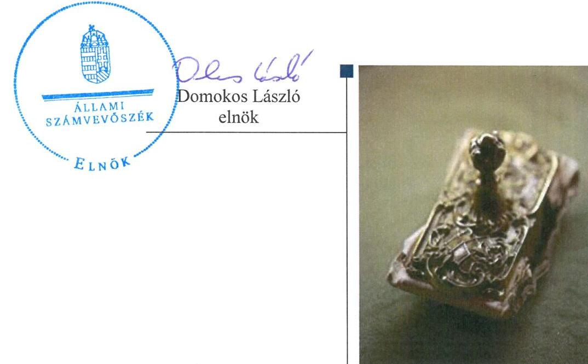

# Jelentés 

## A helyi nemzetiségi önkormányzatok gazdálkodása szabályszerűségének ellenőrzése

Gödöllői Roma Nemzetiségi Önkormányzat 2016.

---

# Jelentés 

## A helyi nemzetiségi önkormányzatok gazdálkodása szabályszerűségének ellenőrzése

Gödöllői Roma Nemzetiségi Önkormányzat
2016. 05. hó 11. nap

---

# AZ ELLENŐRZÉST FELÜGYELTE:

- RENKŐ ZSUZSANNA felügyeleti vezető
- AZ ELLENŐRZÉST VEZETTE ÉS A VÉGREHAJTÁSÁÉRT FELELŐS:
  - DR. VERESS TIBORNÉ ellenőrzésvezető
- A PROGRAM ÖSSZEÁLLÍTÁSÁÉRT FELELŐS:
  - JANIK JÓZSEF LÁSZLÓ osztályvezető

**IKTATÓSZÁM:** V-0870-087/2016

**TÉMASZÁM:** 1904

**ELLENŐRZÉS-AZONOSÍTÓ SZÁM:** V071408

Jelentéseink az Országgyűlés számítógépes hálózatán és az Interneten a www.asz.hu címen is olvashatóak.

---

# TARTALOMJEGYZÉK 

■ ÖSSZEGZÉS ..... 5
■ AZ ELLENŐRZÉS CÉLJA ..... 7
■ AZ ELLENŐRZÉS TERÜLETE ..... 8
■ AZ ELLENŐRZÉS HÁTTERE, INDOKOLTSÁGA ..... 9
■ FÓKUSZKÉRDÉSEK ..... 10
■ ELLENŐRZÉS HATÓKÖRE ÉS MÓDSZEREI ..... 11
■ MEGÁLLAPÍTÁSOK ..... 13
■ JAVASLATOK ..... 20
■ MELLÉKLETEK ..... 23
I. Sz. melléklet: Értelmező szótár ..... 23
II. Sz. melléklet: A Gödöllői Roma Nemzetiségi Önkormányzat 2014. évi gazdálkodási adatai ..... 25
■ FÜGGELÉK: ÉSZREVÉTELEK ..... 27
■ RÖVIDÍTÉSEK JEGYZÉKE ..... 29

---

.

---

# ÖSSZEGZÉS 

A Gödöllői Roma Nemzetiségi Önkormányzat Gödöllő Város Önkormányzatával megkötött, hatályos együttmüködési megállapodással rendelkezett, amely azonban a jogszabályban rögzített tartalmi követelményeknek nem felelt meg. Az együttmüködési megállapodás felülvizsgálata nem a jogszabályi előirásban foglaltak szerint történt. A gazdálkodási jogkörök gyakorlása nem volt megfelelő. A belső ellenőrzés feltételeit biztositották, a Nemzetiségi Önkormányzatnál kockázatelemzést követően, annak értékelése alapján a 2014. évben ellenőrzést nem végeztek. Az integritási szemlélet érvényesitése érdekében további intézkedések megtétele szükséges.

## Az ellenőrzés társadalmi indokoltsága

Az Állami Számvevőszék középtávra szóló stratégiájában megfogalmazta, hogy az államháztartás komplex folyamatainak átláthatósága érdekében rendszerszemléletű/holisztikus megközelítésű, egymásra épülő, a szinergiahatást kihasználó, összefoglaló értékelésre lehetőséget adó ellenőrzéseket végez. Az államháztartás önkormányzati alrendszerébe tartozó helyi nemzetiségi önkormányzatok ellenőrzése során az ÁSZ feltárja a működésükben rejlő kockázatokat előmozdítva a közpénzügyek átláthatóságát, rendezettségét.

Az ÁSZ a stratégiai céljával összhangban - az ÁSZ tv. felhatalmazása alapján - végzi a közpénzekkel és a nemzeti vagyonnal való felelős gazdálkodás, valamint a helyi nemzetiségi önkormányzatok számviteli rendje betartásának és belső kontrollrendszere múködésének ellenőrzését, továbbá segíti az integritás alapú, átlátható és elszámoltatható közpénzfelhasználás megteremtését.

## Főbb megállapítások, következtetések, javaslatok

A Nemzetiségi Önkormányzat ${ }^{1}$ múködési feltételeinek és a gazdálkodással összefüggő feladatoknak a szabályozása a jogszabályi előírásoknak nem felelt meg. A Nemzetiségi Önkormányzat a Települési Önkormányzattal² megkötött, hatályos együttműködési megállapodással rendelkezett, amely azonban a jogszabályban előírt tartalmi követelményeknek nem felelt meg. Az együttműködési megállapodást 2014. január 31-ig nem, a 2014. évi választásokat követően a jogszabályi előírás szerinti határidőben a Nemzetiségi Képviselő-testület felülvizsgálta, amelynek aláírása azonban határidőn túl történt. A Nemzetiségi Önkormányzat hatályos SZMSZ-szel rendelkezett, azonban abban az együttműködési megállapodás szerinti múködési feltételeket a jogszabályi előírás ellenére nem rögzítették. A Nemzetiségi Önkormányzat múködésével kapcsolatos, jogszabályban rögzített feladatokat a Polgármesteri Hivatal - SZMSZ-ében is rögzítve - látta el, amelyeket a Költségvetési Iroda részletes feladatai között határoztak meg.

A Nemzetiségi Önkormányzat gazdálkodási feladatainak Polgármesteri Hivatal általi ellátása során a jogszabályi előírásokat nem tartották be. A Nemzetiségi Önkormányzat gazdálkodási feladatainak számviteli szabályozottsága biztosított volt a Polgármesteri Hivatal hatályos számviteli szabályzatainak kiterjesztésével. A Nemzetiségi Önkormányzat a jogszabályi előírás ellenére nem rendelkezett az ellenőrzési nyomvonallal, a szabálytalanságok kezelésének eljárásrendjével és FEUVE szabályzattal. A költségvetési határozat-tervezetet az elnök a jogszabályban előírt határidőben terjesztette a Nemzetiségi Képviselő-testület elé, azonban annak keretében nem mutatta be az előirányzat felhasználási tervet, továbbá a jogszabályban meghatározott saját bevételek költségvetési évet követő három évre várható összegét. A zárszámadási határozat-tervezet előterjesztése keretében nem mutatták be a jogszabályban előírt vagyonkimutatást. A jegyző a kincstári adatszolgáltatást több esetben késedelemmel teljesítette. Az operatív gazdálkodási jogkörökkel kapcsolatos szabályozások, kijelölések nem feleltek meg a jogszabályi előírásoknak. A Nemzetiségi Önkormányzatnál a személyi juttatásokkal, a dologi, valamint a beruházási, felújítási kiadásokkal kapcsolatos kifizetések esetében a gazdálkodási jogkörök gyakorlása (a kulcsszerepet betöltő teljesítésigazolás és érvényesítés kontrollok múködése) „nem megfelelő" volt.

---

Az együttmúködési megállapodásnak megfelelően biztosított volt a Nemzetiségi Önkormányzat gazdálkodásának belső ellenőrzése. A belső ellenőrzési vezető elkészítette a Nemzetiségi Önkormányzatra is vonatkozó, kockázatelemzéssel alátámasztott éves ellenőrzési tervet. A kockázatelemzés alapján a Nemzetiségi Önkormányzat gazdálkodását nem minősítették kockázatos területnek, a 2014. évben belső ellenőrzést nem terveztek és nem is végeztek.

Az integritási szemlélet érvényesítése érdekében a Nemzetiségi Önkormányzat múködési és gazdálkodási kereteinek kialakításánál és múködésénél további intézkedések megtétele szükséges.

---

# AZ ELLENŐRZÉS CÉLJA 

## Gödöllői Roma Nemzetiségi Önkormányzat müködésének szabályszerűségi ellenőrzése

AZ ELLENŐRZÉS CÉLJA annak megállapítása, hogy a helyi nemzetiségi önkormányzatok múködési és gazdálkodási kereteinek kialakítása, a gazdálkodással kapcsolatos feladatok ellátása megfelelte a jogszabályoknak, továbbá a helyi nemzetiségi önkormányzat múködési és gazdálkodási kereteinek kialakítása és múködése erősí-tette-e az integritás szemlélet érvényesülését.

---

# **AZ ELLENŐRZÉS TERÜLETE**

## **Gödöllői Roma Nemzetiségi Önkormányzat**

Gödöllő város Pest megyében, a Gödöllő-dombság völgyében helyezkedik el, lakosainak száma 2014. január 1-jén 31 995 fő volt.

A Nemzetiségi Önkormányzat 1998. évben alakult. A 2014-ben hivatalban lévő elnök a 2010. évtől tölti be tisztségét. A Nemzetiségi Önkormányzat gazdálkodási feladatait ellátó Polgármesteri Hivatal jegyzője 1990. óta látja el feladatait. A 2011. évi népszámlálás során, önkéntes alapon 405 fő vallotta magát roma nemzetiségűnek Gödöllő városában.

A négytagú Nemzetiségi Képviselő-testület a munkája segítésére bizottságot nem hozott létre, intézményt, gazdasági társaságot és más szervezetet nem alapított, társulásban nem vett részt.

A 2014. évi költségvetési beszámoló szerinti módosított bevételi és kiadási előirányzat 601,0 ezer Ft, a teljesített bevétel 601,0 ezer Ft, a teljesített költségvetési kiadása 599,0 ezer Ft volt. A Nemzetiségi Önkormányzat a 2014. évben 271,0 ezer Ft általános működési célú állami támogatást, valamint 268,0 ezer Ft feladatalapú támogatást kapott. A 2014. évi gazdálkodási adatokat részletesen az II. Sz. melléklet tartalmazza. A könyvviteli mérleg szerint a 2014. évi eszközvagyon 2 ezer Ft volt.

---

# AZ ELLENŐRZÉS HÁTTERE, INDOKOLTSÁGA 

A 2014. évben megtartott nemzetiségi önkormányzati választásokat követően 2143 települési, 60 területi és 13 országos nemzetiségi önkormányzat alakult meg. A nemzetiségek helyzete, támogatása mind hazai, mind Európai Uniós szinten kiemelt figyelmet kap napjainkban. A helyi nemzetiségi önkormányzatok ellenőrzéseit az ÁSZ önálló ellenőrzésként, vagy a települési önkormányzatoknál végzett ellenőrzéseihez kapcsolódóan, arra épülve folytatja le.

## Az ellenőrzés több szinten hasznosul

Az Alaptörvény Szabadság és felelősség rész, XXIX. cikk (1) bekezdése szerint a Magyarországon élő nemzetiségek államalkotó tényezők. Az országban élő nemzetiségek - Alaptörvényben biztosított - jogainak, valamint a helyi és országos önkormányzat létrehozási jogának általános intézményi kereteit sarkalatos törvényként a Nek. tv. szabályozza. A nemzetiségi önkormányzatok jogi személyek és a Nek. tv.-ben meghatározott önálló fel-adat- és hatáskörökkel rendelkeznek, az államháztartás részét, az önkormányzati alrendszer egyik elemét képezik. Az Mötv. 13. § (1) bekezdés 16. pontja alapján a települési önkormányzatok által - a helyi közügyek, valamint a helyben biztosítható közfeladatok körében - ellátandó helyi önkormányzati feladat a nemzetiségi ügyek ellátása. A helyi nemzetiségi önkormányzatok gazdálkodási feladatait jogszabályi előírás alapján a székhely települési önkormányzat polgármesteri (önkormányzati/közös) hivatala látja el.

A „helyi nemzetiségi önkormányzatok" gyűjtőfogalom, magában foglalja mind a települési nemzetiségi önkormányzatok, mint pedig a területi nemzetiségi önkormányzatok teljes körét. Gazdálkodásukra és támogatási rendszerükre vonatkozó jogszabályok az utóbbi években jelentős változásokon mentek át.

Az ellenőrzés hasznosulása több szinten várható. Az ellenőrzött szervezet szintjén az ellenőrzés feltárja a nemzetiségi önkormányzat müködésében, gazdálkodásában, belső kontrollrendszere müködtetésében és a belső ellenőrzés biztosításában lévő hiányosságokat. Az ellenőrzés javaslataival ezen a területen is hozzájárul a közpénzek szabályos felhasználásához. Az ellenőrzött terület szintjén az ellenőrzés tájékoztatást nyújt a döntéshozóknak a hiányosságokról, ezzel lehetőséget biztosítva arra, hogy az ÁSZ ellenőrzési megállapításai, javaslatai a nem ellenőrzött szervezeteknek a müködése során is hasznosuljanak. A társadalom számára jelzi, hogy a jelentős számú nemzetiségi önkormányzat gazdálkodása, illetve müködéséhez felhasznált közpénz nem maradhat ellenőrizetlenül.

---

# FÓKUSZKÉRDÉSEK 

1.     - A helyi nemzetiségi önkormányzat müködési feltételeinek és a gazdálkodással összefüggő feladatoknak a szabályozása megfelel -e a jogszabályi elöírásoknak?
2.     - A jegyző és a helyi nemzetiségi önkormányzat betartotta-e a jogszabályi előírásokat a helyi nemzetiségi önkormányzat gazdálkodási feladatainak ellátása során?
3. Szabályszerüen biztositott volt-e a helyi nemzetiségi önkormányzat gazdálkodásának belső ellenőrzése?
4. A helyi nemzetiségi önkormányzat müködési és gazdálkodási kereteinek kialakítása és müködése erősítette-e az integritás szemlélet érvényesülését?

---

# ELLENŐRZÉS HATÓKÖRE ÉS MÓDSZEREI 

## Az ellenőrzés típusa

Szabályszerúségi ellenőrzés

## Az ellenőrzött időszak

A Nemzetiségi Önkormányzat működési feltételeinek kialakításával és a Polgármesteri Hivatal - Nemzetiségi Önkormányzat gazdálkodására vonatkozó - feladatellátásával kapcsolatos szabályozás megfelelőségét a 2014. évre vonatkozóan (a 2014. december 31-i állapotnak megfelelően) minősítettük. A Nemzetiségi Önkormányzat gazdálkodása szabályszerűségét, a működési feltételeknek, a pénzügyi folyamatokban kulcsszerepet betöltő teljesítésigazolás és érvényesítés belső kontrollok működésének megfelelőségét, valamint a belső ellenőrzés biztosítását a 2014. január 1. - december 31-e közötti időszakot figyelembe véve értékeltük.

## Az ellenőrzés tárgya

A Gödöllői Roma Nemzetiségi Önkormányzat működési kereteinek kialakítása, a működésével, gazdálkodásával kapcsolatos feladatok Gödöllői Polgármesteri Hivatal, valamint a Nemzetiségi Önkormányzat által történő ellátása.

Az ellenőrzés kiterjedt minden olyan körülményre és adatra, amely az ÁSZ jogszabályban meghatározott feladataiban, valamint a program végrehajtása folyamán felmerült újabb összefüggések feltárásához szükséges.

## Az ellenőrzött szervezet

A Gödöllői Roma Nemzetiségi Önkormányzat és a Nemzetiségi Önkormányzat gazdálkodási feladatait ellátó Gödöllői Polgármesteri Hivatal.

## Az ellenőrzés jogalapja

Az ÁSZ tv. 1. § (3) bekezdésében foglaltak alapján az ÁSZ általános hatáskörrel végzi a közpénzekkel és az állami és önkormányzati vagyonnal való felelős gazdálkodás ellenőrzését, valamint az 5. § (2) bekezdése alapján a helyi nemzetiségi önkormányzatok gazdálkodásának és (6) bekezdése alapján a helyi nemzetiségi önkormányzatok számviteli rendje betartásának és belső kontrollrendszere működésének ellenőrzését.

---

# Az ellenőrzés módszerei 

Az ellenőrzést a nemzetközi standardokat irányadónak tekintve a program ellenőrzési kérdései, az ellenőrzött időszakban hatályos jogszabályok, az ellenőrzés szakmai szabályok és módszertanok figyelembe vételével végeztük el.

Az ellenőrzés ideje alatt az ellenőrzött szervezettel történő kapcsolattartást az ÁSZ Szervezeti és Múködési Szabályzatának vonatkozó előírásai alapján biztosítottuk.

Az ellenőrzési kérdések megválaszolásához szükséges bizonyítékok megszerzése a következő ellenőrzési eljárások alkalmazásával történt: megfigyelés, szemle (szemrevételezés), kérdésfeltevés (információkérés), mintavételezés, valamint elemző eljárás.

A 2014. évben a Nemzetiségi Önkormányzatnál ellátottak pénzbeli juttatásaival, egyéb múködési és felhalmozási célú kiadásokkal kapcsolatos kifizetések nem merültek fel, csak személyi juttatásokkal, dologi és beruházási, felújítási kiadásokkal kapcsolatos kifizetésekre került sor. A gazdálkodás folyamatában kulcsszerepet betöltő két kulcskontroll - teljesítésigazolás, érvényesítés - múködésének megfelelőségét teljes körűen, azaz minden személyi juttatásokkal, dologi és beruházási, felújítási kiadásokkal kapcsolatos kifizetés esetében ellenőriztük. „Megfelelőnek" értékeltük a gazdálkodási jogkörök gyakorlását, amennyiben a hibaarány legfeljebb 10\%, „részben megfelelőnek" értékeltük, ha a hibaarány 10-30\% között volt, „nem megfelelőnek" pedig akkor, ha az eredmények alapján a hibaarány meghaladta a $30 \%$-ot.

Az integritás szemlélet érvényesülésének értékelése a Polgármesteri Hivatal által kitöltött tanúsítvány alapján történt.

Az ellenőrzési bizonyítékok alapvetően dokumentum jellegúek voltak. Az ellenőrzési bizonyítékként felhasználható adatforrások közé tartoztak egyrészt a szakmai program részletes szempontjainál felsorolt adatforrások, másrészt adatforrás lehetett még minden egyéb - az ellenőrzés folyamán feltárt, az ellenőrzés szempontjából releváns információt tartalmazó - dokumentum.

Az ellenőrzés lefolytatásához a Polgármesteri Hivatal a tanúsítványok elektronikus kitöltésével, valamint az ÁSZ által kért dokumentumok elektronikus megküldésével szolgáltatott adatokat. A rendelkezésre bocsátott adatok, információk kontrollja az ellenőrzés keretében történt.

---

# 1. A helyi nemzetiségi önkormányzat müködési feltételeinek és a gazdálkodással összefüggő feladatoknak a szabályozása megfelel-e a jogszabályi előírásoknak? 

Összegző megállapítás

### 1.1. számú megállapítás

A Nemzetiségi Önkormányzat müködési feltételeinek és a gazdálkodással összefüggő feladatoknak a szabályozása a jogszabályi előírásoknak nem felelt meg.

A Nemzetiségi Önkormányzat rendelkezett hatályos együttmüködési megállapodással, amely - a feltárt hiányosságok miatt - nem felelt meg a jogszabályi előírásnak. Az együttmüködési megállapodás felülvizsgálatát a törvényben előírt 2014. január 31-ig nem, a választásokat követően határidőben a Nemzetiségi Önkormányzat elvégezte.

A Nemzetiségi Önkormányzat rendelkezett a Települési Önkormányzattal megkötött, a Nemzetiségi és a Települési Képviselő-testület által jóváhagyott, hatályos együttműködési megállapodás ${ }^{3}{ }_{1,2}$-vel.

A 2013. évben megkötött együttműködési megállapodás ${ }_{1}$ felülvizsgálatát a Nek. ${ }^{4}$ tv. 80. § (2) bekezdésének előírása ellenére 2014. január 31-ig nem végezték el.

A 2014. évi önkormányzati választások után a Nemzetiségi Képviselőtestület ${ }^{5}$ a Nek. tv.-ben előírt határidőben, a 31/2014. (XI.10.) határozatával jóváhagyta az együttműködési megállapodás ${ }_{1}$ felülvizsgálatát, amelynek aláírására azonban a törvényben rögzített határidőt 29 nappal meghaladóan került sor. Az együttműködési megállapodás ${ }_{1,2}$ hiányosságait az 1. táblázat tartalmazza.

1. táblázat

EGYÜTTMŰKÖDÉSI MEGÁLLAPODÁS ${ }_{1,2}$ HIÁNYOSSÁGAI

| Sorszám | Nek.tv.-i   hivatko-   zás | Az együttmüködési megállapodás ${ }_{1,2}$-ben nem rögzítették |
| :--: | :--: | :--: |
| 1. | 80. § (3)   bekezdés   a) pont | A nemzetiségi önkormányzat törzskönyvi nyilvántartásba vételével és adószám igénylésével kapcsolatos feladatok ellátásához rendelt határidőket, együttmüködési kötelezettség és ezek felelőseinek konkrét kijelölését. |
| 2. | 80. § (3)   bekezdés   c) pont | A nemzetiségi önkormányzat kötelezettségvállalásának az SZMSZ-ben meghatározott szabályait, különösen a nyilvántartási kötelezettségeket. |
| 3. | 80. § (3)   bekezdés   d) pont | A nemzetiségi önkormányzat müködési feltételeinek és gazdálkodásának eljárási és dokumentációs részletszabályaival, valamint az ezeket végző személyek kijelölésének rendjével kapcsolatos előírásokat, feltételeket. |

---

| Sorszám | Nek.tv.-i   hivatko-   zás | Az együttmúködési megállapodás12-ben nem rögzítették |
| :--: | :--: | :--: |
| 4. | 80. § (4)   bekezdés | Annak rögzítését, hogy a jegyző vagy annak - a jegyzővel azonos képesítési előírásoknak megfelelő - megbízottja a helyi önkormányzat megbízásából és képviseletében részt vesz a nemzetiségi önkormányzat testületi ülésein és jelzi, amennyiben törvénysértést észlel. |

Forrás: ÁSZ által készített kimutatás
1.2. számú megállapítás

Az együttműködési megállapodás ${ }_{1,2}$ szerinti múködési feltételeket a törvényi előírás ellenére a Nemzetiségi Önkormányzat SZMSZ ${ }_{1,2}$ ben nem rögzítették.

A Nemzetiségi Önkormányzat rendelkezett a szervezete és múködése részletes szabályait rögzítő SZMSZ ${ }^{6}{ }_{1,2}$-vel.

A Nek.tv. 88. § (1) bekezdése, az SZMSZ ${ }_{1}$ VIII. fejezet 2. pontja szerint a Nemzetiségi Képviselő-testület az SZMSZ felülvizsgálatát és a szükséges módosításokat az együttmúködési megállapodás ${ }_{2}$-vel egyidejúleg elvégezte, az SZMSZ ${ }_{2}$-t a 20/2014. (XI.4.) határozatával elfogadta. Az együttmúködési megállapodás ${ }_{2}$ szerinti múködési feltételeket a Nek. tv. 80. § (2) bekezdésében foglaltak ellenére az SZMSZ ${ }_{2}$-ben nem rögzítették.

# 1.3. számú megállapítás 

A jegyző intézkedett a Nemzetiségi Önkormányzat múködési feltételei kialakításával és gazdálkodásával összefüggő végrehajtási feladatok szabályozására a Polgármesteri Hivatalnál.

A hivatali SZMSZ-ben rögzítették, hogy a Polgármesteri Hivatal ${ }^{8}$ látja el a Nek. tv.-ben meghatározott feladatokat. A Költségvetési Iroda ${ }^{9}$ feladatai között határozták meg a Nemzetiségi Önkormányzat adatszolgáltatásával, gazdálkodásával, számviteli nyilvántartásával, pénzkezelésével, költségvetési jelentés összeállításával kapcsolatos feladatokat.

A hivatali gazdálkodási szabályzat és ügyrendben ${ }^{10}$ meghatározták a helyi nemzetiségi önkormányzatokkal kapcsolatban ellátandó feladatokat és munkaköröket. A Polgármesteri Hivatalnál a Nemzetiségi Önkormányzat gazdálkodását támogató köztisztviselők rendelkeztek munkaköri leírással, amelyek tartalmazták a feladataikat, továbbá a helyettesítés rendjére és a felelősségi szabályokra vonatkozó előírásokat.

---

# 2. A jegyző és a helyi nemzetiségi önkormányzat betartotta-e a jogszabályi előírásokat a helyi nemzetiségi önkormányzat gazdálkodási feladatainak ellátása során? 

Összegző megállapítás

### 2.1. számú megállapítás

2.2. számú megállapítás

A Nemzetiségi Önkormányzat gazdálkodási feladatainak Polgármesteri Hivatal általi ellátása során nem tartották be a jogszabályi előírásokat.

A jegyző nem gondoskodott a Nemzetiségi Önkormányzat müködési folyamataira vonatkozó ellenőrzési nyomvonalnak, a szabálytalanságok kezelése eljárásrendjének, továbbá a folyamatba épített, előzetes, utólagos és vezetői ellenőrzésnek a szabályozásáról.

A gazdálkodási feladatok számviteli szabályozottsága biztosított volt, mivel a Polgármesteri Hivatal hatályos számviteli politikáját ${ }^{11}$, számlarendjét ${ }^{12}$, leltározási és leltárkészítési- ${ }^{13}$, értékelési ${ }^{14}$, valamint a pénzkezelési ${ }^{15}$ szabályzatait kiterjesztették a Nemzetiségi Önkormányzatra.

A Polgármesteri Hivatal ellenőrzési nyomvonalának és a szabálytalanságok kezelése eljárásrendjének, valamint a FEUVE ${ }^{16}$ szabályzatának hatálya nem terjedt ki a Nemzetiségi Önkormányzatra. A Bkr. ${ }^{17}$ 6. § (3)-(4) bekezdésének előírása ellenére a jegyző nem készítette el a Nemzetiségi Önkormányzatra vonatkozó ellenőrzési nyomvonalat, a szabálytalanságok kezelésének eljárásrendjét nem szabályozta és a Bkr. 8. § (2)-(4) bekezdései ellenére a FEUVE-t nem biztosította.

## A jegyző által előkészített költségvetési határozat-tervezet és annak előterjesztése nem felelt meg a jogszabályi előírásoknak.

Az együttműködési megállapodás ${ }_{1,2}$-ben rögzítették, hogy a Polgármesteri Hivatal látja el a Nemzetiségi Önkormányzat testületi üléseinek előkészítését (előterjesztések előkészítése), a költségvetéssel és a beszámolóval öszszefüggő adatszolgáltatási kötelezettségek teljesítését.

A 2014. évi költségvetés előkészítéséhez kapcsolódó feladatként, az elnök ${ }^{18}$ a jegyző által elkészített költségvetési koncepciót ${ }^{19}$ az Áht. ${ }^{20}$ 24. § (1) ${ }^{*}$ bekezdésében meghatározott határidőt túllépve - 2013. október 31. helyett december 11-én - terjesztette elő.

A jegyző által előkészített költségvetési határozat-tervezetet ${ }^{21}$ az elnök határidőben benyújtotta a Nemzetiségi Képviselő-testület részére. A Nemzetiségi Képviselő-testület által 1/2014. (II. 13.) számon elfogadott költségvetési határozat ${ }^{22}$ - néhány hiányosság ellenére - megfelelt a jogszabályi előírásoknak. A költségvetési határozatban az Áht. 23. § (2) bekezdés c) pontjában előírtak ellenére nem szerepeltették a költségvetési egyenleg összegét működési és felhalmozási cél szerinti bontásban, továbbá az Áht. 23. § (2) bekezdés h) pontja ellenére a költségvetés végrehajtásával kapcsolatos hatásköröket, így különösen az Mötv. ${ }^{23}$ 68. § (4) bekezdése szerinti értékhatárt, a finanszírozási bevételekkel és a finanszírozási kiadásokkal kapcsolatos hatásköröket, valamint az Áht. 34. § (2) bekezdésben előírt esetleges felhatalmazást.

[^0]
[^0]:    * 2014. IX. 30-tól hatályon kívül

---

# 2.3. számú megállapítás 

A 2014. évi költségvetés előterjesztésekor a Nemzetiségi Képviselő-testület részére a közgazdasági tagolású költségvetési mérlegen túl az Áht. 24. § (4) bekezdés a) pontjában előírtak ellenére előirányzat felhasználási tervet, továbbá az Áht. 29/A. § a) pontjában előírt, a saját bevételek költségvetési évet követő három évre várható összegét nem mutatták be, a jegyző általi előkészítés hiányában.

Az elemi költségvetés, valamint a jóváhagyott költségvetési határozat tartalmának egyezősége - az Ávr. ${ }^{24}$-nek megfelelően - biztosított volt.

## A jegyző által előkészített zárszámadási határozat-tervezet előterjesztésekor a Nemzetiségi Képviselő-testület részére az elnök nem mutatta be a vagyonkimutatást.

A jegyző előkészítette a zárszámadási határozat-tervezetet ${ }^{25}$, azt az elnök az előírt határidőben a Nemzetiségi Képviselő-testület elé terjesztette, amelynek keretében szöveges indokolással bemutatta a költségvetés mérlegét közgazdasági tagolásban, illetve a pénzeszközök változását bemutató előirányzat felhasználási tervet. A zárszámadási határozatban ${ }^{26}$ a Nemzetiségi Önkormányzat valamennyi bevételéről és kiadásáról számot adtak, azt az Áht.-ban foglaltaknak megfelelően az elfogadott költségvetéssel összehasonlítható módon készítették el.

A zárszámadási határozat-tervezet előterjesztésekor az Áht. 91. § (2) bekezdés c) pontja ellenére nem mutatták be a vagyonkimutatást, mivel a jegyző azt nem készítette elő.

A Nemzetiségi Önkormányzat a 2014. évre vonatkozóan adósságot keletkeztető ügyletet nem kötött, általános- és céltartalékot nem képzett, az Áht.-ben nevesített többéves kihatással járó döntést nem hozott, illetve közvetett támogatást nem nyújtott, valamint irányított költségvetési szervvel nem rendelkezett.

## A jegyző az időközi mérlegjelentések és az éves jelentés megküldését rendszeresen késedelmesen teljesítette.

A jegyző az elemi költségvetéssel és az időközi költségvetési jelentéssel kapcsolatos adatszolgáltatásokat az Ávr.-ben foglalt határidőnek megfelelően teljesítette.

Az együttműködési megállapodás ${ }_{1,2}$ III. 1. pontban rögzítették, hogy a Polgármesteri Hivatal ellátja a Nemzetiségi Önkormányzat bevételeivel és kiadásaival kapcsolatban az adatszolgáltatási és beszámolási feladatokat. Az eszközök és források alakulásáról készített időközi mérlegjelentéseket és az éves jelentést az Ávr. 170. § (2) bekezdésében meghatározott határidőt követően nyújtották be (2. táblázat).
2. táblázat

MÉRLEGJELENTÉSEK ADATSZOLGÁLTATÁSA

| Időszak | Határidő | Teljesítés |
| :--: | :--: | :--: |
| I. negyedév | 2014.04.22. | 2014.04.30. |
| II. negyedév | 2014.07.21. | 2014.07.25. |
| III. negyedév | 2014.10.20. | 2014.10.27. |
| IV. negyedév | 2015.02.09. | 2015.03.13. |
| éves | 2015.03.12. | 2015.03.13. |

---

# 2.5. számú megállapítás 

Az operatív gazdálkodási jogkörök szabályozása az együttmúködési megállapodásban az alkalmazandó szabályzat konkrét megnevezése nélkül történt. A jogosultsági kijelölések a jogszabályi előírásoknak nem feleltek meg.

A Nemzetiségi Önkormányzat költségvetési gazdálkodására, ezen belül az operatív gazdálkodási jogkörökre az együttműködési megállapodás ${ }_{1,2}$ és a hivatali, illetve a nemzetiségi pénzkezelési szabályzat ${ }^{27}$ tartalmazott előírásokat.

A 2014. évben az Ávr. 13. § (1) bekezdés e) pontjában foglaltak ellenére a gazdasági szervezet megnevezését, feladatait a hivatali SZMSZ-ben nem határozták meg az Ávr. 8. § ${ }^{\dagger}$ (1) bekezdés c) pont rendelkezése ellenére. Az Ávr. 55. § (2) bekezdés g) pontja alapján a pénzügyi ellenjegyzésre, illetve érvényesítésre jogosult, hivatali és nemzetiségi pénzkezelési szabályzatban - az 1. sz. melléklet módosításában szereplő érvényesítők kivételével - nevesített személyeket a jegyző kijelölte.

Az együttműködési megállapodás ${ }_{1,2}$ értelmében a gazdálkodási jogkörök gyakorlására a pénzkezelési szabályzat tartalmaz előírásokat, azonban a szabályzat konkrét megnevezését nem rögzítették. Így az egyaránt hatályos hivatali pénzkezelési szabályzat és nemzetiségi pénzkezelési szabályzat együttes alkalmazására került sor.

Az operatív gazdálkodási jogkörök szabályozásával kapcsolatos hiányosságokat, szabálytalanságokat a 3. táblázat mutatja be.
3. táblázat

## AZ OPERATÍV GAZDÁLKODÁSI JOGKÖRÖK SZABÁLYOZÁSÁVAL KAPCSOLATOS HIÁNYOSSÁGOK, SZABÁLYTALANSÁGOK

| Sorszám | Szabályozás területe | Megállapított hiányosság, szabálytalanság |
| :--: | :--: | :--: |
| 1. | kötelezettségvállalások pénzügyi ellenjegyzése | Az együttműködési megállapodás ${ }_{1,2}$-ben a jegyzőt is felhatalmazták a pénzügyi ellenjegyzés gyakorlására, mely nem felelt meg az Ávr. 55. § (2) bekezdés g) pont előírásának, ugyanis arra gazdasági szervezettel nem rendelkező önkormányzati hivatal esetén a jegyző által írásban kijelölt, az önkormányzati hivatal állományába tartozó köztisztviselő jogosult. |
| 2. | teljesítésigazolás | Az együttműködési megállapodás ${ }_{1,2}$-ben rögzítették, hogy a teljesítésigazolásra jogosultakat a pénzkezelési szabályzat tartalmazza, azonban a kötelezettségvállaló az Ávr. 57. § (4) bekezdésének előírása ellenére nem jelölt ki teljesítés igazolására jogosult személyt, és ezzel nem biztosította az Ávr. 60. § (2) bekezdésében előírt összeférhetetlenségi szabályok esetleges megsértésének megelőzését. |
| 3. | érvényesítésre jogosultak kijelölése | A nemzetiségi pénzkezelési szabályzat 1. számú mellékletének módosításában ${ }^{28}$ nevesített személyeket a jegyző az Ávr. 55. § (2) bekezdés g) pontban és az Ávr. 58. § (4) bekezdésében foglaltak ellenére írásban nem jelölte ki. |

Forrás: ÁSZ által készített kimutatás

### 2.6. számú megállapítás

A pénzügyi folyamatokban kulcsszerepet betöltő teljesítésigazolás és érvényesítés kontrollok múködése nem volt megfelelő.

A 2014. évben a Nemzetiségi Önkormányzatnál személyi juttatások, dologi kiadások, valamint beruházási és felújítási célú kiadásokkal kapcsolatos kifizetésekre került sor. E kifizetéseknél a kulcsszerepet betöltő teljesítésiga-

[^0]
[^0]:    ${ }^{\dagger}$ 2015. január 1-jétől hatálytalan

---

zolás és érvényesítés kontrollok múködése „nem megfelelő" volt. A gazdálkodási jogkörök gyakorlásának ellenőrzése során tapasztalt hiányosságokat, szabálytalanságokat az 4. táblázat mutatja be.
4. táblázat

# A GAZDÁLKODÁSI JOGKÖRÖK GYAKORLÁSÁNAK ELLENŐRZÉSE SORÁN TAPASZTALT HIÁNYOSSÁGOK, SZABÁLYTALANSÁGOK 

| Sorszám | Gazdálkodási jogkör | Megállapított szabálytalanság |
| :--: | :--: | :--: |
| 1. | teljesítésigazolás | A teljesítésigazolás az igazolást végző személy (Nemzetiségi Önkormányzat elnöke) aláírásán túl az Ávr. 57. § (3) bekezdésének előírása ellenére nem tartalmazta az igazolás dátumát és a teljesítés tényére történő utalást.   A teljesítés igazolását több alkalommal olyan személy végezte, akit a kötelezettségvállaló az Ávr. 57. § (4) bekezdésének előírása ellenére írásban nem jelölt ki. |
| 2. | érvényesítés | Az érvényesítő az esetek többségénél az Ávr. 55. § (2) bekezdés g) pontja és az Ávr. 58. § (4) bekezdésének előírása ellenére nem rendelkezett a jegyző írásbeli kijelölésével.   Előfordult, hogy a jegyző által kijelölt érvényesítő azonban:   - nem az Ávr. 58. § (1) bekezdésében előírtak szerint járt el, mivel nem ellenőrizte, hogy a megelőző ügymenetben az Áht., az államháztartási számviteli kormányrendelet és az Ávr. előírásait, valamint a belső szabályzatokban foglaltakat megtartották-e, az Ávr. 58. § (2) bekezdésében foglaltak ellenére nem jelezte az utalványozónak, hogy a pénzügyi ellenjegyzést az Ávr. 55. § (2) bekezdés g) pontjában foglaltak ellenére arra írásban ki nem jelölt személy végezte, továbbá hogy a teljesítésigazolás nem az Ávr. 57. § (3) bekezdésben előírtak szerint történt;   - az Ávr. 58. § (3) bekezdésében előírtak ellenére több esetben nem tüntette fel az érvényesítés keltezését. |

Fonrás: ÁSZ által készített kimutatás
Az ellenőrzött kifizetésekkel kapcsolatban a rendelkezésre álló dokumentumok alapján kár bekövetkeztére utaló adat, körülmény nem merült fel. A gazdálkodásban kulcsszerepet betöltő teljesítésigazolás és érvényesítés kontrollok múködésében tapasztalt hiányosságok miatt fennáll a hibák, szabálytalanságok bekövetkezésének kockázata.

## 3. Szabályszerüen biztosított volt-e a helyi nemzetiségi önkormányzat gazdálkodásának belső ellenőrzése?

Összegző megállapítás

Az együttműködési megállapodásnak megfelelően biztosított volt a Nemzetiségi Önkormányzat gazdálkodásának belső ellenőrzése. A kockázatelemzéssel alátámasztott 2014. évi ellenőrzési terv nem tartalmazott a Nemzetiségi Önkormányzatra vonatkozó belső ellenőrzést, és azt nem is végeztek.

Az együttműködési megállapodás ${ }_{1,2}$-ben rögzítették, hogy a Nemzetiségi Önkormányzat gazdálkodásának belső ellenőrzését a Polgármesteri Hivatal belső ellenőre útján látják el.

A Polgármesteri Hivatal rendelkezett a Bkr ${ }^{29}$. szerinti, aktualizált, a belső ellenőrzési vezető által elkészített és a jegyző által jóváhagyott belső ellenőrzési kézikönyvvel, mely tartalmazta az ellenőrzési tervek megalapozásához alkalmazott kockázatelemzési módszertant. A belső ellenőrzési kézikönyv a hatályára vonatkozóan rendelkezést nem tartalmazott, rögzítették azonban benne, hogy a belső ellenőrzést végző személy munkáját az alapján végzi.

---

A belső ellenőrzési vezető elkészítette a Nemzetiségi Önkormányzatra is vonatkozó, kockázatelemzéssel alátámasztott 2014. évi ellenőrzési tervet. A jóváhagyott éves ellenőrzési terv nem tartalmazott belső ellenőrzési feladatokat a Nemzetiségi Önkormányzat gazdálkodására vonatkozóan, mivel e terület nem minősült kockázatosnak az értékelés alapján. Ennek megfelelően a Nemzetiségi Önkormányzat gazdálkodását érintő belső ellenőrzést nem is végeztek.

# 4. A helyi nemzetiségi önkormányzat múködési és gazdálkodási kereteinek kialakítása és múködése erősítette-e az integritás szemlélet érvényesülését? 

Összegző megállapítás

Az integritási szemlélet érvényesítésének erősítése érdekében a Nemzetiségi Önkormányzat múködési és gazdálkodási kereteinek kialakításánál és múködésénél további intézkedések megtétele szükséges.

Jelen ellenőrzés keretében a Polgármesteri Hivatal által kitöltött tanúsítványi adatszolgáltatás alapján az integritási szemlélet érvényesítését fejlesztendőnek értékeltük.

A Polgármesteri Hivatal rendelkezett a jogszabályokban előírt szabályzatok többségével, azonban nem szabályozta a szervezeten belüli közérdekű bejelentők védelmét, illetve a különféle ajándékok, meghívások, utazások elfogadásainak feltételeit. Nem gondoskodtak rendszerszerű kockázatelemzésről, nem hívták fel a korrupciós szempontból veszélyeztetett dolgozók figyelmét a jellemző kockázatokra és a kockázatokat megelőző intézkedésekre, továbbá nem végeztek rendszeres korrupciós kockázatelemzést sem.

Az ÁSZ ellenőrzése megállapította, hogy a Nemzetiségi Önkormányzat múködési feltételeinek és a gazdálkodással összefüggő végrehajtási feladatoknak a szabályozása nem felelt meg a jogszabályi előírásoknak. Az operatív gazdálkodási jogkörök kialakításában, a kulcsszerepet betöltő teljesítésigazolás és érvényesítés belső kontrollok múködésében feltárt hiányosságok arra utalnak, hogy a Nemzetiségi Önkormányzat gazdálkodása szabályszerű múködése érdekében még további intézkedések szükségesek az integritás szemlélet érvényesítéséhez.

---

# JAVASLATOK 

Az ÁSZ tv. ${ }^{30}$ 33. § (1) bekezdésében foglaltak értelmében az ellenőrzött szervezet vezetője köteles a jelentésben foglalt megállapításokhoz kapcsolódó intézkedési tervet összeállítani és azt a jelentés kézhezvételétől számított 30 napon belül az ÁSZ részére megküldeni. Amennyiben az ellenőrzött szervezet vezetője nem küldi meg határidőben az intézkedési tervet, vagy továbbra sem elfogadható intézkedési tervet küld, az ÁSZ elnöke az ÁSZ tv. 33. § (3) bekezdés a)-b) pontjaiban foglaltakat érvényesítheti.

## a jegyzőnek:

1. A Települési és a Nemzetiségi Önkormányzat együttmüködésének szabályszerűsége érdekében intézkedjen:
a) a jogszabályi előirásoknak megfelelő együttmüködési megállapodás előkészitéséről;
(1.1. sz. megállapítás 1. táblázat,
2.5. sz. megállapítás 3. táblázat 1. sz. részmegállapítás alapján)
b) az együttmüködési megállapodás jogszabályi előírásnak megfelelő felülvizsgálata elvégzéséről szóló előterjesztés előkészitéséről.
(1.1. sz. megállapítás 2. bekezdés alapján)
2. A Nemzetiségi Önkormányzat gazdálkodásának szabályszerűsége érdekében intézkedjen:
a) a Nemzetiségi Önkormányzat gazdálkodási feladataira vonatkozó ellenőrzési nyomvonal elkészitéséről, a szabálytalanságok kezelésének eljárásrendje szabályozásáról és a FEUVE jogszabályi előírásoknak megfelelő biztositásáról;
(2.1. sz. megállapítás 2. bekezdés alapján)
b) a költségvetési határozat-tervezet jogszabályi előírásoknak megfelelő elkészitéséről;
(2.2. sz. megállapítás 3. bekezdés alapján)
c) a jogszabályi előírásoknak megfelelően, a Nemzetiségi Képviselőtestület részére a költségvetési határozat-tervezet előterjesztésekor tájékoztatásul bemutatásra kerülő kimutatások elkészitéséről;
(2.2. sz. megállapítás 4. bekezdés alapján)

---

d) a jogszabályi előírásoknak megfelelően, a Nemzetiségi Képviselőtestület részére a zárszámadási határozat-tervezet előterjesztésekor tájékoztatásul bemutatásra kerülő kimutatások elkészitéséről;
(2.3. sz. megállapítás 2. bekezdés alapján)
e) a jogszabályi előírásoknak megfelelő határidőben az évközi és az éves államháztartási információs adatszolgáltatások teljesítéséről;
(2.4. sz. megállapítás 2. bekezdés és 2. táblázat alapján)
f) a gazdálkodási jogkörök gyakorlásával kapcsolatos szabályok meghatározása érdekében az együttmüködési megállapodásban a jogszabályi előírásoknak megfelelő pénzügyi ellenjegyző meghatározásáról, továbbá az érvényesités jogkör gyakorlására a nemzetiségi pénzkezelési szabályzatban nevesített személyek kijelöléséről;
(2.5. sz. megállapítás 3. táblázat 1. és 3. részmegállapítás alapján)
g) a pénzügyi folyamatokban kulcsszerepet betöltő teljesítésigazolás és érvényesités belső kontrollok jogszabályi előírásoknak megfelelő müködtetéséről.
(2.6. sz. megállapítás 1. bekezdés és 4. táblázat alapján)

# a Nemzetiségi Önkormányzat elnökének: 

1. A Települési és a Nemzetiségi Önkormányzat együttmüködésének szabályszerűsége érdekében intézkedjen:
a) a jogszabályi előírásoknak megfelelő együttmüködési megállapodás Nemzetiségi Képviselő-testület elé terjesztéséről;
(1.1. sz. megállapítás 1. táblázat, 2.5. sz. megállapítás 3. táblázat 1. részmegállapítás alapján)
b) az együttmüködési megállapodás jogszabályi előírásnak megfelelő felülvizsgálatáról szóló előterjesztés Nemzetiségi Képviselő-testület elé terjesztéséről;
(1.1. sz. megállapítás 2. bekezdés alapján)
c) a Nemzetiségi Önkormányzat SZMSZ-ének jogszabályi előírásnak megfelelő kiegészítéséről szóló előterjesztés Nemzetiségi Képvi-selő-testület elé terjesztéséről.
(1.2. sz. megállapítás 2. bekezdés alapján)

---

2. A Nemzetiségi Önkormányzat gazdálkodásának szabályszerűsége érdekében intézkedjen:
a) a jogszabályi előirásoknak megfelelő költségvetési határozat-tervezet Nemzetiségi Képviselő-testület elé terjesztéséről;
(2.2. sz. megállapítás 3. bekezdés alapján)
b) a költségvetési határozat-tervezet előterjesztésekor a jogszabályi előírásban meghatározott kimutatások Nemzetiségi Képviselő-testület részére történő bemutatásáról;
(2.2. sz. megállapítás 4. bekezdés alapján)
c) a zárszámadási határozat-tervezet előterjesztésekor a jogszabályi előírásban meghatározott kimutatások Nemzetiségi Képviselő-testület részére történő bemutatásáról;
(2.3. sz. megállapítás 2. bekezdés alapján)
d) a gazdálkodási jogkörök gyakorlásával kapcsolatos szabályok meghatározása érdekében - figyelemmel az összeférhetetlenség fennállása esetére is - a teljesítés igazolására jogosult személy kijelöléséről.
(2.5. sz. megállapítás 3. táblázat 2. részmegállapítás alapján)

---

# MELLÉKLETEK 

- I. SZ. MELLÉKLET: ÉRTELMEZŐ SZÓTÁR
belső ellenőrzés
belső kontrollrendszer
együttműködési megállapodás
kockázat
kulcskontrollok
nemzetiség

Független, tárgyilagos bizonyosságot adó és tanácsadó tevékenység, amelynek célja, hogy az ellenőrzött szervezet működését fejlessze és eredményességét növelje, az ellenőrzött szervezet céljai elérése érdekében rendszerszemléletű megközelítéssel és módszeresen értékeli, illetve fejleszti az ellenőrzött szervezet irányítási és belső kontrollrendszerének hatékonyságát. (Forrás: Bkr. 2. § b) pontja)
A belső kontrollrendszer a kockázatok kezelése és tárgyilagos bizonyosság megszerzése érdekében kialakított folyamatrendszer, amely azt a célt szolgálja, hogy a múködés és gazdálkodás során a tevékenységeket szabályszerűen, gazdaságosan, hatékonyan, eredményesen hajtsák végre, az elszámolási kötelezettségeket teljesítsék, megvédjék az erőforrásokat a veszteségektől, károktól és nem rendeltetésszerű használattól. (Forrás: Áht. 69. § (1) bekezdése)
Az Áht. 27. § (2) bekezdése és a Nek. tv. 80. § (1) bekezdése értelmében a helyi önkormányzat a helyi nemzetiségi önkormányzat részére - annak székhelyén - biztosítja az önkormányzati müködés személyi és tárgyi feltételeit, továbbá gondoskodik a müködéssel kapcsolatos végrehajtási feladatok ellátásáról. Az önkormányzati müködés feltételei és az ezzel kapcsolatos végrehajtási feladatok. A Nek. tv. 80. § (2) bekezdés szerinti a fenti kötelezettségének teljesítése érdekében a helyi önkormányzat harminc napon belül biztosítja a rendeltetésszerű helyiséghasználatot, valamint a helyiséghasználatra, a további feltételek biztosítására és a feladatok ellátására vonatkozóan megállapodást köt a helyi nemzetiségi önkormányzattal. A megállapodást minden év január 31. napjáig, általános vagy időközi választás esetén az alakuló ülést követő harminc napon belül felül kell vizsgálni. A helyi önkormányzat és a nemzetiségi önkormányzat szervezeti és müködési szabályzatában rögzíti a megállapodás szerinti müködési feltételeket, a megállapodás megkötését, módosítását követő harminc napon belül. A Nek. tv. 80. § (3) bekezdés írja elő a megállapodásban rögzítendőket.
A kockázat annak a valószínűségét jelenti, hogy egy vagy több esemény vagy intézkedés nem kívánt módon befolyásolja a rendszer müködését, céljainak megvalósulását. (Forrás: Javaslatok a korrupciós kockázatok kezelésére - Kockázatkezelési és ellenőrzési módszertan 35. oldal, ÁSZ)
Az azonosított kockázatok mérséklése érdekében kialakított kontrollok közül azok, amelyek elégtelen müködése esetén a szervezetet jelentős veszteség érheti, vagy a müködésükben bekövetkező hiba/hiányosság más kontrollok eredményességét csökkenti. Ezek ellenőrzése, értékelése elegendő bizonyítékot szolgáltat adott területen a kontrollrendszer értékeléséhez. Az önkormányzatok kontrollrendszere kialakításának ellenőrzése során a pénzügyi folyamatokban kulcsszerepet betöltő belső kontrollok a teljesítésigazolás és az érvényesítés.
A Nek. tv. 1. § (1) bekezdése alapján nemzetiség minden olyan Magyarország területén legalább egy évszázada honos népcsoport, amely az állam lakossága körében számszerű kisebbségben van, tagjai magyar állampolgárok és a lakosság többi részétől saját nyelve és kultúrája, hagyományai

---

nemzetiségi önkormányzat
operatív gazdálkodási jogkör
szabályszerűségi ellenőrzés
különböztetik meg, egyben olyan összetartozás-tudatról tesz bizonyságot, amely mindezek megőrzésére, történelmileg kialakult közösségeik érdekeinek kifejezésére és védelmére irányul.
A Nek. tv. 2. § 2. pontja szerint törvényben meghatározott nemzetiségi közszolgáltatási feladatokat ellátó, testületi formában múködő, jogi személyiséggel rendelkező, demokratikus választások útján e törvény alapján létrehozott szervezet, amely a nemzetiségi közösséget megillető jogosultságok érvényesítésére, a nemzetiségek érdekeinek védelmére és képviseletére, a feladat- és hatáskörébe tartozó nemzetiségi közügyek települési, területi vagy országos szinten történő önálló intézésére jön létre.
kötelezettségvállalás; pénzügyi ellenjegyzés; utalványozás; érvényesítés; teljesítésigazolás jogkör
A szabályszerűségi ellenőrzés a megfelelőségi ellenőrzés általánosan alkalmazott altípusa. A szabályszerűségi ellenőrzés az egyes kritériumok - jogszabályi előírások, egyéb szabályok és megállapodások - teljesülésének ellenőrzését foglalja magában, ide értve a költségvetéssel kapcsolatos jogszabályokban foglaltak teljesülésének ellenőrzését is.

---

II. SZ. MELLÉKLET: A GÖDÖLLŐI ROMA NEMZETISÉGI ÖNKORMÁNYZAT 2014. ÉVI GAZDÁLKODÁSI ADATAI

|  Megnevezés | Eredeti
előirányzat (ezer Ft) | Módosított
ezer Ft-ban | Teljesítés |   |
| --- | --- | --- | --- | --- |
|  BEVÉTELEK |  |  |  |   |
|  Intézményi múködési bevételek | 0,0 | 0,0 | 0,0 | 0,0  |
|  Általános múködési támogatás | 271,0 | 271,0 | 271,0 | 100,0  |
|  Feladatalapú támogatás | 0,0 | 268,0 | 268,0 | 100,0  |
|  Települési Önkormányzat által nyújtott támogatás | 0,0 | 0,0 | 0,0 | 0,0  |
|  Múködési bevételek összesen | 271,0 | 539,0 | 539,0 | 100,0  |
|  Felhalmozási bevétel | 0,0 | 35 | 35,0 | 100,0  |
|  Költségvetési bevételek összesen | 271,0 | 574,0 | 574,0 | 100,0  |
|  Előző évi pénzmaradvány felhasználása | 0,0 | 27 | 27,0 | 100,0  |
|  Tárgyévi bevételek összesen | 271,0 | 601,0 | 601,0 | 100,0  |
|  KIADÁSOK |  |  |  |   |
|  Személyi juttatások | 71,0 | 109,0 | 109,0 | 100,0  |
|  Munkaadókat terhelő járulékok és szocális hozzájárulási adó összesen | 0,0 | 0,0 | 0,0 | 0,0  |
|  Dologi kiadások | 200,0 | 476,0 | 474,0 | 99,6  |
|  Támogatásértékű múködési kiadások | 0,0 | 0,0 | 0,0 | 0,0  |
|  Múködési célú pénzeszközátadások államháztartáson kívülre | 0,0 | 0,0 | 0,0 | 0,0  |
|  Múködési kiadások összesen | 271,0 | 585,0 | 583,0 | 99,7  |
|  Felhalmozási kiadások | 0,0 | 16,0 | 16,0 | 100,0  |
|  Költségvetési kiadások összesen | 271,0 | 601,0 | 599,0 | 99,7  |
|  Finanszírozási kiadások | 0,0 | 0,0 | 0,0 | 0,0  |
|  Tárgyévi kiadások összesen | 271,0 | 601,0 | 599,0 | 99,7  |
|   |  |  |  | Forrás: Nemzetiségi Önkormányzat 2014. évi költségvetési beszámolója és adatszolgáltatása  |

---

.

---

# FÜGGELÉK: ÉSZREVÉTELEK 

A jelentéstervezetet a Számvevőszék 15 napos észrevételezésre megküldte a jegyzőnek és a Nemzetiségi Önkormányzat elnökének az ÁSZ tv. 29. §² (1) bekezdése előírásának megfelelően.

A jegyző és a Nemzetiségi Önkormányzat elnöke az ÁSZ tv. 29. § (2) bekezdésében foglalt észrevételezési jogával nem élt.

[^0]
[^0]:    ${ }^{2}$ 29. § (1) Az Állami Számvevőszék az ellenőrzési megállapításait megküldi az ellenőrzött szervezet vezetőjének vagy az általa megbízott személynek, és annak, akinek személyes felelősségét állapította meg.
    (2) Az ellenőrzött szervezet vezetője és a felelősként megjelölt személy az ellenőrzés megállapításaira tizenöt napon belül írásban észrevételt tehet.
    (3) Az Állami Számvevőszék az észrevételre a beérkezésétől számított harminc napon belül írásban válaszol. A figyelembe nem vett észrevételeket köteles a jelentésben feltüntetni, és megindokolni, hogy azokat miért nem fogadta el.

---

.

---

# RÖVIDÍTÉSEK JEGYZÉKE 

${ }^{1}$ Nemzetiségi Önkormányzat
${ }^{2}$ Települési Önkormányzat
${ }^{3}$ együttműködési megállapodás ${ }_{1,2}$
${ }^{4}$ Nek.tv.
${ }^{5}$ Nemzetiségi Képviselő-testület
${ }^{6}$ SZMSZ ${ }_{1,2}$
${ }^{7}$ hivatali SZMSZ
${ }^{8}$ Polgármesteri Hivatal
${ }^{9}$ Költségvetési Iroda
${ }^{10}$ hivatali gazdálkodási szabályzat és ügyrend
${ }^{11}$ számviteli politika
${ }^{12}$ számlarend
${ }^{13}$ leltározási és leltárkészítési szabályzat
${ }^{14}$ értékelési szabályzat
${ }^{15}$ pénzkezelési szabályzat
${ }^{16}$ FEUVE szabályzat
${ }^{17}$ Bkr.
${ }^{18}$ elnök
${ }^{19}$ költségvetési koncepció
${ }^{20}$ Áht.

Gödöllői Roma Nemzetiségi Önkormányzat
Gödöllő Város Önkormányzata
1. Gödöllő Város Önkormányzat és a Gödöllői Roma Nemzetiségi Önkormányzat között kötött együttműködési megállapodás (jóváhagyva: Gödöllő Város Önkormányzat Képviselő-testülete 85/2013. (III. 14.) számú, a Gödöllői Roma Nemzetiségi Önkormányzat Képviselő-testülete 2/2013. (III. 6.) számú határozatával)
2. Gödöllő Város Önkormányzat és a Gödöllői Roma Nemzetiségi Önkormányzat között kötött együttműködési megállapodás (jóváhagyva: Települési Önkormányzat Képviselő-testülete 208/2014. (XII. 11.) számú, a Gödöllői Roma Nemzetiségi Önkormányzat Képviselő-testülete 22/2014. (XI. 17.) számú határozatával)
a nemzetiségek jogairól szóló 2011. CLXXIX. törvény
Gödöllői Roma Nemzetiségi Önkormányzat Képviselő-testülete
3. Gödöllői Roma Nemzetiségi Önkormányzat Szervezeti és Működési Szabályzata, amelyet a Nemzetiségi Önkormányzat Képviselő-testülete a 6/2012. (IV. 27.) számú határozatával fogadott el (hatályos 2014. november 4-ig)
2. Gödöllői Roma Nemzetiségi Önkormányzat Szervezeti és Működési Szabályzata, amelyet a Nemzetiségi Önkormányzat Képviselő-testülete a 19/2014. (X. 31.) számú határozatával fogadott el (hatályos 2014. november 5-től)
Polgármesteri Hivatal szervezeti és működési szabályzata (hatályos 2013. május 1-jétől)

Gödöllői Polgármesteri Hivatal
Polgármesteri Hivatal Költségvetési Irodája
Polgármesteri Hivatal gazdálkodási szabályzata és gazdasági szervezetének ügyrendje (hatályos 2013. május 1-jétől)
Polgármesteri Hivatal számviteli politikája (hatályos 2014. január 1-jétől)
Polgármesteri Hivatal számlarendje (hatályos 2014. január 1-jétől)
Polgármesteri Hivatal leltározási és leltárkészítési szabályzata (hatályos 2013. január 1-jétől)

Polgármesteri Hivatal eszközök és források értékelési szabályzata (hatályos 2014. január 1-jétől)

Polgármesteri Hivatal pénzkezelési szabályzata (hatályos 2013. március 1jétől)
Polgármesteri Hivatal belső kontrollrendszere, a folyamatba épített előzetes és utólagos vezetői ellenőrzés szabályzata (hatályos 2013. április 29-étől)
370/2011. (XII. 31.) Korm. rendelet a költségvetési szervek belső kontrollrendszeréről és belső ellenőrzéséről (hatályos 2012. január 1-jétől) Gödöllői Roma Nemzetiségi Önkormányzat elnöke
2014. évi költségvetési koncepció
2011. évi CXCV. törvény az államháztartásról (hatályos 2012. január 1-jétől)

---

${ }^{21}$ költségvetési határozat-tervezet
${ }^{22}$ költségvetési határozat
${ }^{23}$ Mötv.
${ }^{24}$ Ávr.
${ }^{25}$ zárszámadási határozat-tervezet
${ }^{26}$ zárszámadási határozat
${ }^{27}$ nemzetiségi pénzkezelési szabályzat
${ }^{28}$ 1. sz. melléklet módosítása
${ }^{29}$ Bkr.
${ }^{30}$ ÁSZ tv.

Gödöllői Roma Nemzetiségi Önkormányzat 2014. évi költségvetésitervezete
Gödöllői Roma Nemzetiségi Önkormányzat 1/2014. (II. 13.) számú határozata a Nemzetiségi Önkormányzat 2014. évi költségvetéséről
2011. évi CLXXXIX. törvény Magyarország helyi önkormányzatairól (hatályos 2012. január 1-jétől)
368/2011. (XII. 31.) Korm. rendelet az államháztartásról szóló törvény végrehajtásáról (hatályos 2012. január 1-jétől)
Gödöllői Roma Nemzetiségi Önkormányzat 2014. évi zárszámadási határozat-tervezete
Gödöllői Roma Nemzetiségi Önkormányzat 2014. évi költségvetésének végrehajtásáról szóló 5/2015. (III. 6.) számú határozat
Gödöllői Roma Nemzetiségi Önkormányzat pénzkezelési szabályzata (hatályos 2012. január 1-jétől)
Gödöllői Roma Nemzetiségi Önkormányzat pénzkezelési szabályzat 1. sz. mellékletének módosítása (kiadva: 2013. 12.13-ával, Elnök aláírásával)
370/2011. (XII.31.) Korm. rendelet a költségvetési szervek belső kontrollrendszeréről és belső ellenőrzéséről
2011. évi LXVI. törvény az Állami Számvevőszékről (hatályos 2011. július 1jétől)

---

# ÁLLAMI SZÁMVEVŐSZÉK 

1052 Budapest, Apáczai Csere János utca 10.
Levélcím: 1364 Budapest 4. Pf. 54
Telefon: +36 14849100 Telefax: +36 14849200
www.asz.hu