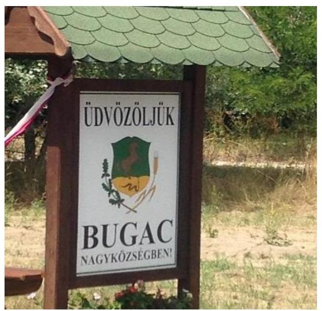
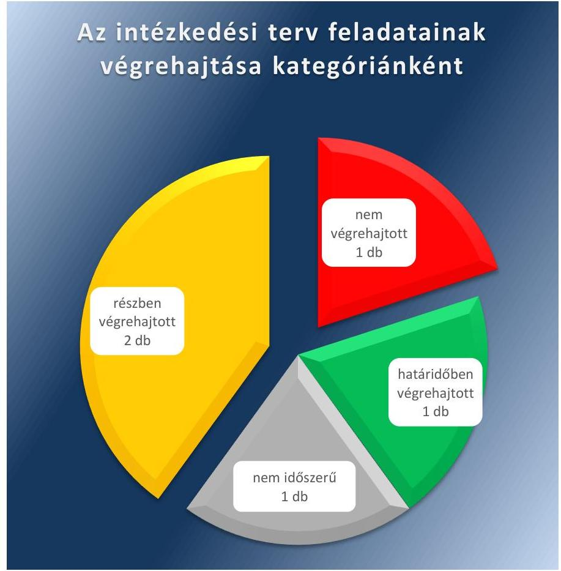

# Jelentés 

## Utóellenőrzések

Az önkormányzatok vagyongazdálkodása szabályszerűségének ellenőrzéséről szóló jelentések utóellenőrzése - Bugac 2016. május 17.

---

# AZ ELLENŐRZÉST FELÜGYELTE: 

RENKŐ ZSUZSANNA felügyeleti vezető

## AZ ELLENŐRZÉST VEZETTE ÉS A VÉGREHAJTÁSÁÉRT FELELŐS:

BALÁS ELEMÉR ATTILA ellenőrzésvezető

## A PROGRAM ÖSSZEÁLLÍTÁSÁÉRT FELELŐS:

JANIK JÓZSEF LÁSZLÓ osztályvezető
BÖRÖCZ IMRE projektfelelős

A TÉMÁHOZ KAPCSOLÓDÓ KORÁBBI SZÁMVEVŐSZÉKI JELENTÉSEK:

- címe: Jelentés az önkormányzati vagyongazdálkodás szabályszerűségi ellenőrzéséről - Bugac

Jelentéseink az Országgyűlés számítógépes hálózatán és az Interneten a www.asz.hu címen is olvashatóak.

- sorszáma: 13066

IKTATÓSZÁM: V-0901-060/2016.
TÉMASZÁM: 1935
ELLENŐRZÉS-AZONOSÍTÓ SZÁM: V07170608

---

# TARTALOMJEGYZÉK 

■ ÖSSZEGZÉS ..... 5
■ AZ ELLENŐRZÉS CÉLJA ..... 6
■ AZ ELLENŐRZÉS TERÜLETE ..... 7
■ AZ ELLENŐRZÉS HÁTTERE, INDOKOLTSÁGA ..... 8
■ FÓKUSZKÉRDÉSEK ..... 9
■ ELLENŐRZÉS HATÓKÖRE ÉS MÓDSZEREI ..... 10
■ MEGÁLLAPÍTÁSOK ..... 12
■ MELLÉKLETEK ..... 17
I. Sz. melléklet: Az ÁSZ 13066. számú jelentéséhez kapcsolódó intézkedési terv végrehajtása ..... 17
■ FÜGGELÉK: ÉSZREVÉTELEK ..... 21
■ RÖVIDÍTÉSEK JEGYZÉKE ..... 23

---

.

---

# ÖSSZEGZÉS 

Az Állami Számvevőszék Bugac Nagyközségi Önkormányzat vagyongazdálkodása szabályszerűségének utóellenőrzését a 2013. augusztus 29. és 2015. július 2. közötti időszakra vonatkozóan végezte el. Az utóellenőrzés célja annak megállapítása volt, hogy az ÁSZ¹ jelentésben foglalt intézkedést igénylő megállapításokra készített intézkedési tervben meghatározott feladatokat az ellenőrzött szervezet végrehajtotta-e.

Az Önkormányzat² az intézkedési tervet határidőben megküldte az Állami Számvevőszék részére. Az utóellenőrzés megállapítása szerint az intézkedési tervben foglaltak végrehajtásáról teljes körűen nem gondoskodtak. Az ellenőrzött időszakban esedékessé vált négy feladat közül egyet határidőben, kettőt részben, és egyet nem hajtottak végre. Egy további feladat végrehajtása nem volt időszerű.

## Az ellenőrzés társadalmi indokoltsága

Az Állami Számvevőszék stratégiájában célul tűzte ki a számvevőszéki munka hasznosulásának javítását. Ezzel összhangban ellenőrzi, hogy az ellenőrzött szervezetek megvalósították-e a korábbi ellenőrzései által feltárt hibák, hiányosságok és szabálytalanságok megszüntetése céljából kialakított intézkedési terveikben foglaltakat. A rendszeres utóellenőrzések hozzájárulnak a szükséges intézkedések tényleges végrehajtásához, ezáltal a közpénzügyek rendezettségének javulásához.

## Főbb megállapítások, következtetések

Az Önkormányzat a Képviselő-testület³ által elfogadott intézkedési tervet határidőben megküldte az ÁSZ részére.
Az intézkedési tervben foglaltak végrehajtásáról teljes körűen nem gondoskodtak. Az intézkedési tervben szereplő öt feladat közül egyet nem hajtottak végre, mivel nem teljesült a pénzügyi ellenjegyző és az érvényesítő jogszabályi előírásoknak megfelelő ellenőrzési feladatai maradéktalan ellátásának biztosítása. Két feladatot részben hajtottak végre: a szerződések közzététele nem felelt meg teljes körűen a jogszabályi előírásoknak, valamint Stratégiai ellenőrzési terv a 2015-2018. évi időszakra nem készült és a magas kockázatúnak minősített területek ellenőrzése maradéktalanul nem történt meg. Egy feladat, amely a befektetési célú életbiztosításokra, illetve az átmenetileg szabad pénzeszközök felhasználására vonatkozott, határidőben került végrehajtásra. Egy további feladat - az ingatlanértékesítések során a hatályban lévő vagyonrendelet forgalmi érték megállapításra vonatkozó előírásainak betartása - nem volt időszerű, mivel ingatlan értékesítés nem történt.

---

# AZ ELLENŐRZÉS CÉLJA 

## Bugac Nagyközségi Önkormányzat vagyongazdálkodása szabályszerűségének ellenőrzéséről szóló jelentés utóellenőrzése

Az ellenőrzés célja annak értékelése, hogy a számvevőszéki jelentésben foglalt intézkedést igénylő megállapításokkal és javaslatokkal összhangban készített intézkedési tervben meghatározott feladatokat az ellenőrzött szervezet végrehajtotta-e.

---

# **AZ ELLENŐRZÉS TERÜLETE**

## **Bugac Nagyközségi Önkormányzat**

Bugac Nagyközség Bács-Kiskun megyében fekszik, lakosainak száma 2014. december 31-én 2771 fő volt. Az Önkormányzat 1991. január 1-jétől Bugacpusztaháza Községi Önkormányzattal Társult Képviselő-testületet⁴ alakított, közösen tartják fenn az önállóan működő és gazdálkodó Bugaci Közös Önkormányzati Hivatalt⁵ és két önállóan működő intézményt.

A polgármester⁶ 2006. évtől látja el feladatait. A jegyző⁷ személye az ellenőrzött időszakban egy alkalommal változott. Az 1999. március 6-ától 2013. március 31-éig hivatalban lévő jegyző 2013. április 1-jétől 2014. május 3-áig aljegyzőként látta el a jegyzői feladatokat. A helyszíni ellenőrzés időszakában a munkakört betöltő jegyző 2014. május 4-étől végezte feladatait.

Az Önkormányzat a 2014. évi költségvetési beszámolója szerint 361,1 millió Ft költségvetési bevételt ért el és 328,5 millió Ft költségvetési kiadást teljesített, 2014. december 31-én a könyvviteli mérleg szerint 1680,8 millió Ft értékű vagyonnal rendelkezett, a követelések állományi értéke 32,4 millió Ft, a kötelezettségek állományi értéke 10,8 millió Ft volt.

Az Állami Számvevőszék 2013-ban ellenőrizte Bugac Nagyközségi Önkormányzat vagyongazdálkodása szabályszerűségét a 2007. január 1. és 2011. december 31. közötti időszak vonatkozásában (13066. számú ÁSZ jelentés⁷).

A jelenlegi utóellenőrzés az ÁSZ jelentés⁸ hasznosulása érdekében elfogadott intézkedési terv végrehajtására irányult, a 2013. augusztus 29-e és 2015. július 2.-a között végrehajtott intézkedéseket figyelembe véve. Az ÁSZ jelentés a polgármesternek egy, a jegyzőnek négy javaslatot tartalmazott.

⁴ Az ÁSZ 13066 számú jelentése. Az elkészített jelentés az Interneten, a www.asz.hu címen olvasható

---

# AZ ELLENŐRZÉS HÁTTERE, INDOKOLTSÁGA 

Az ÁSZ törvény 33. § (1) bekezdése értelmében a számvevőszéki jelentések intézkedést igénylő megállapításaihoz és javaslataihoz kapcsolódóan az ellenőrzött szervezet vezetője intézkedési tervet köteles összeállítani, és az Állami Számvevőszék részére megküldeni. Az intézkedési tervben foglaltak megvalósítását - az ÁSZ törvény 33. § (7) bekezdésében foglaltak alapján - az Állami Számvevőszék utóellenőrzés keretében ellenőrizheti. Az intézkedések megvalósulásának értékelése során az Állami Számvevőszék figyelembe veszi az ellenőrzött szervezetek működési feltételeiben, valamint a jogszabályi előírásokban bekövetkezett változásokat.

Az intézkedési tervekben foglalt feladatok hiányos, illetve késedelmes végrehajtása, valamint megvalósításának elmaradása azt mutatja, hogy az ellenőrzések során feltárt hibák, hiányosságok és szabálytalanságok megszüntetése nem kapott kellő hangsúlyt. Ez a szabályszerű működés és a felelős vezetői magatartás vonatkozásában kockázatot hordoz. E kockázatok feltárásával az Állami Számvevőszék utóellenőrzési rendszere fokozza a fegyelmet, és igazolja, hogy a közpénzzel való szabályos gazdálkodás felelőssége elől nem lehet kitérni.

## AZ ELLENŐRZÉS VÁRHATÓ HASZNOSULÁSA:

Az utóellenőrzés négy szinten hasznosulhat:

- A társadalom szintjén az utóellenőrzés jelzi, hogy a számvevőszéki ellenőrzés megállapításainak van következménye: a hiányosságok megszüntetésére az ellenőrzött szervezet által meghatározott intézkedések végrehajtását is számon kéri az ÁSZ.
- Az ellenőrzött terület szintjén az utóellenőrzés tájékoztatást nyújt a terület döntéshozóinak a hiányosságok kiküszöbölésének jó gyakorlatairól, ezzel lehetőséget biztosítva arra, hogy az ÁSZ ellenőrzési megállapításai, javaslatai a terület nem ellenőrzött szervezeteinek a működése során is hasznosuljanak.
- Az ellenőrzött szervezet szintjén az utóellenőrzés feltárja, hogy a szervezet az intézkedések végrehajtásával hasznosította-e a korábbi ellenőrzési jelentésben a hiányosságok megszüntetése, illetve a kockázatok kezelése érdekében megfogalmazott javaslatokat.
- Az ÁSZ szintjén az utóellenőrzés visszacsatolást ad az ellenőrzési jelentések hasznosulásáról, az intézkedések elmaradása vagy részleges megvalósulása a további ellenőrzésekhez kockázati jelzésként szolgál.

---

# FÓKUSZKÉRDÉSEK 

1. Az ellenőrzött szervezet az intézkedési tervben foglaltakat - az előírt határidőben - végrehajtotta-e?

---

# ELLENŐRZÉS HATÓKÖRE ÉS MÓDSZEREI 

## Az ellenőrzés típusa

Szabályszerűségi ellenőrzés.

## Az ellenőrzött időszak

A számvevőszéki jelentés közzétételének napjától (2013. augusztus 29.) az utóellenőrzés megkezdéséig (2015. július 2.) tartó időszak volt.

## Az ellenőrzés tárgya

Az Önkormányzat intézkedési tervében foglaltak végrehajtásának ellenőrzése.

## Az ellenőrzött szervezet

Bugac Nagyközségi Önkormányzat

## Az ellenőrzés jogalapja

Az Alaptörvény⁹ 43. cikk (1) bekezdése alapján az ÁSZ az Országgyűlés pénzügyi és gazdasági ellenőrző szerve. Az ÁSZ törvényben meghatározott feladatkörében ellenőrzi a központi költségvetés végrehajtását, az államháztartás gazdálkodását, az államháztartásból származó források felhasználását és a nemzeti vagyon kezelését. Az ÁSZ tv. 1. § (3) bekezdése szerint az ÁSZ általános hatáskörrel végzi a közpénzekkel és az állami és önkormányzati vagyonnal való felelős gazdálkodás ellenőrzését. A 33. § (7) bekezdése alapján az ÁSZ tv. 33. § (1)-(2) bekezdése szerinti intézkedési tervben foglaltak megvalósítását az ÁSZ utóellenőrzés keretében ellenőrizheti. Az Áht.¹⁰ 61. § (2) bekezdése szerint az államháztartás külső ellenőrzésével kapcsolatos feladatokat az ÁSZ látja el.

## Az ellenőrzés módszerei

Az ellenőrzést a nemzetközi standardokat irányadónak tekintve az ellenőrzési program ellenőrzési kérdései, az ellenőrzött időszakban hatályos jogszabályok, az ellenőrzés szakmai szabályok és módszertanok figyelembe vételével végeztük. A jóváhagyott intézkedési tervben előírt feladatok végrehajtásának ellenőrzését értékelési kritériumok alapján végeztük. Az intézkedési tervben előírt feladatok végrehajtásának értékelése során alkalmazott besorolási kategóriák:
$\longrightarrow$ okafogyottá vált az előírt feladat, ha végrehajtására - meghatározott esemény bekövetkezése, továbbá külső körülmény, a működést érintő feltétel változása miatt - már nincs szükség, illetve lehetőség, és egyértelműen megállapítható, hogy az intézkedést szükségessé tevő körülmény a jövőben nem fordulhat elő;
$\longrightarrow$ „nem időszerű" az a feladat, amelynek ellenőrzési időszakon belüli végrehajtására azért nem került (kerülhetett) sor, mert az intézkedés alapjául szolgáló esemény nem következett be, de annak jövőbeni előfordulása lehetséges, a végrehajtása nem volt esedékes, vagy a végrehajtás határideje még nem járt le;
$\longrightarrow$ határidőben végrehajtott a feladat, ha a teljesítés dokumentáltan az intézkedési tervben előírt határidőben és tartalommal megtörtént;
$\longrightarrow$ határidőn túl végrehajtott a feladat, ha annak teljesítése az intézkedési tervben meghatározott módon, de az előírt határidőn túl történt meg;
$\longrightarrow$ részben végrehajtott az a feladat, amelynek végrehajtása teljes körűen az intézkedési tervben előírt módon nem történt meg;
$\longrightarrow$ nem végrehajtott a feladat, ha a végrehajtás nem történt meg, vagy amennyiben a teljesítést nem dokumentálták.
Az utóellenőrzés megállapításait az ÁSZ rendelkezésére álló, valamint az ellenőrzött szervezetektől elektronikusan bekért dokumentumok alapozták meg. Az ellenőrzés lefolytatásához az ellenőrzött szervezet a tanúsítványok elektronikus kitöltésével, valamint az ÁSZ által kért dokumentumok elektronikus megküldésével szolgáltatott adatokat, amelyek valódiságát és teljes körűségét az ellenőrzött szervezet vezetője által tett teljességi és hitelességi nyilatkozattal igazolta.

---

# MEGÁLLAPÍTÁSOK 

## 1. Az ellenőrzött szervezet az intézkedési tervben foglaltakat - az előírt határidőben - végrehajtotta-e?

Összegző megállapítás

Az intézkedési tervben foglaltak végrehajtásáról teljes körűen nem gondoskodtak. A beszámolási kötelezettségnek eleget tettek, a külső ellenőrzésekről a jogszabályi előírásoknak megfelelő nyilvántartást vezettek.

Az intézkedési tervben foglaltak végrehajtásáról teljes körűen nem gondoskodtak. Az intézkedési tervben szereplő, az ellenőrzött időszakban esedékessé vált négy feladat közül egyet határidőben, kettőt részben és egyet nem hajtottak végre.

Az intézkedési tervben foglalt összesen öt feladat végrehajtási kategóriánkénti megoszlását az 1. ábra mutatja be. Az intézkedési tervben előírt feladatok végrehajtását, illetve a végrehajtás minősítését az I. számú melléklet tartalmazza.

1. ábra

---

# VÉGRE NEM HAJTOTT feladat: 

Az intézkedési terv II.4.2. pontjában foglaltakat a jegyző nem teljesítette. Az Intézkedési terv a jegyzőt nevezte meg felelősként a pénzügyi ellenjegyző és az érvényesítő jogszabályi előírásoknak megfelelő ellenőrzési feladatai maradéktalan ellátásának biztosítására, amely az ellenőrzés megállapítása szerint nem valósult meg:
A kötelezettségvállalás ellenjegyzőjének „pénzügyi vezető"-ként került feltűntetésre a beosztása, de ilyen kinevezést az ellenőrzött időszakban a munkatárs nem kapott. Továbbá a pénzgazdálkodással kapcsolatos hatásköri rend¹¹ mellékletei a kötelezettségvállalás ellenjegyzőjének kétféle (rövid és hosszú szignó) aláírás mintáját is tartalmazták.
A hivatali SZMSZ¹² nem volt összhangban sem az ügyrendben¹³, sem a munkaköri leírásban, sem pedig a pénzgazdálkodással kapcsolatos hatásköri rendben - illetve az annak mellékletei tartalmazta kijelölésekben - meghatározott beosztásokkal.
A kötelezettségvállalás ellenjegyzője négy eset kivételével megfelelően látta el a feladatát. Négy esetben az Ávr.¹⁴ 55. § (1)
 bekezdésében foglaltakkal ellentétben a pénzügyi ellenjegyzés dátuma nem volt megállapítható. Négy esetben az érvényesítő nem tartotta be az Ávr. 58. § (1) bekezdésében foglaltakat, mert nem kifogásolta a pénzügyi ellenjegyzés hiányzó dátumát, valamint azt, hogy a kötelezettségvállalás ellenjegyzése az aláírás-mintától eltérően teljes név kiírásával történt.

## HATÁRIDŐBEN VÉGREHAJTOTT feladat:

A polgármester határidőben végrehajtotta az intézkedési terv I.1.2. pontjában foglaltakat. A befektetési egységekhez kötött négy életbiztosítás esetében a biztosítótársaságokkal történő tárgyalások kezdeményezése és az éves díj minimalizálása megtörtént. Az ellenőrzés az átmenetileg szabad pénzeszközökkel kapcsolatban, (a 2013. augusztus 29. - 2015. július 2. közötti ellenőrzött időszakra vonatkozóan), nem tárt fel a jogszabályban előírt önkormányzati célokkal ellentétes, további pénzfelhasználást.

## RÉSZBEN VÉGREHAJTOTT feladatok:

Az intézkedési terv II.1.2. pontjában foglaltakat a jegyző részben teljesítette. Az Intézkedési terv a jegyzőt nevezte meg felelősként, „azonnali" határidő megjelöléssel a nettó ötmillió forintot elérő, vagy azt meghaladó értékű szerződések jogszabályban előírt tartalommal a honlapon történő közzétételének biztosítására.

Az ÁSZ az Önkormányzat honlapjának 2015. július 21-ei ellenőrzésekor megállapította, hogy a szerződések közzététele a 2013. évben teljes körűen megtörtént, 2014. és 2015. évek tekintetében azonban hiányos volt, nem felelt meg a jogszabályi előírásoknak, mivel:
Az Önkormányzat a 2014. és a 2015. években megszegte az Info tv. ${ }^{15}$ 37. § (1) bekezdésben és az Info tv. 1. számú melléklet III/4. pontjában, továbbá a közzétételi szabályzat ${ }^{16} 6.3$. pontjában foglalt előírásokat, mert nem teljes körűen és a frissítési határidőn belül tette közzé a nettó ötmillió forintot elérő vagy azt meghaladó értékű áru-

---

beszerzésre, építési beruházásra, szolgáltatás megrendelésre, vagyonértékesítésre, vagyon-hasznosításra, vagyon vagy vagyoni értékű jog átadására, valamint koncesszióba adásra vonatkozó szerződéseket.
$\longrightarrow$ Az Önkormányzat nem tartotta be a vagyonrendelet ${ }^{17}$ 18. § (2) bekezdésében és a vagyonrendelet ${ }^{18}$ 22. § (2) bekezdésében foglaltakat sem, mert nem tette közzé a nettó három millió forintot elérő vagy azt meghaladó értékű árubeszerzésre, építési beruházásra, szolgáltatás megrendelésre, vagyonértékesítésre, vagyonhasznosításra, vagyon vagy vagyoni értékű jog átadására, valamint koncesszióba adásra vonatkozó szerződéseket.

Az intézkedési terv II.3.2. pontjában foglaltakat a jegyző és a belső ellenőr részben teljesítette:
$\longrightarrow$ A Stratégiai ellenőrzési terv a 2015-2018. évi időszakra nem készült el.
$\longrightarrow$ Az évenként jóváhagyott ellenőrzési terv alapján magas kockázatúnak minősített öt terület közül csak négy került ellenőrzésre.

# NEM VOLT IDŐSZERŰ a következő feladat: 

Az intézkedési terv II.2.2. pontjában megfogalmazott feladat (az önkormányzati ingatlanok esetében a hatályban lévő vagyonrendelet forgalmi érték megállapítására vonatkozó előírásainak betartása) az ellenőrzött időszakban nem volt időszerű, mivel az intézkedés alapjául szolgáló esemény - önkormányzati ingatlan értékesítés - nem következett be.

HATÁRIDŐN TÚL VÉGREHAJTOTT, vagy okafogyottá vált feladat nem volt.

### 1.2. számú megállapítás

A polgármester és a jegyző beszámolt az intézkedési tervben meghatározott feladatok végrehajtásáról.

Az intézkedési terv nem tartalmazott sem a polgármester, sem a jegyző részére beszámolási kötelezettséget, ennek ellenére a polgármester a Képviselő-testületet tájékoztatta az intézkedési terv tartalmazta, felelősségi körébe eső intézkedések megtételéről, továbbá a FEUVE keretében a jegyző beszámolt a polgármesternek az intézkedési terv teljesítéséről:
$\longrightarrow$ A polgármester - az Önkormányzat Képviselő-testületi SZMSZ ${ }^{19}$-ének 22. § (4) bekezdésében foglaltakkal összhangban - a biztosító társaságoktól kapott információk alapján tájékoztatta a Képviselő-testületet a befektetési egységekhez kötött négy életbiztosítás éves díja minimalizálásának, vagy a díjmentesítésnek a lehetőségeiről. Bugac és Bugacpusztaháza Községek 2014. évi költségvetésének tárgyalása kapcsán terjesztette a polgármester a Képviselőtestület elé a befektetési egységekhez kötött négy életbiztosítás díjának csökkentését, amit a Képviselő-testület elfogadott.
$\longrightarrow$ A FEUVE szabályzat ${ }^{20}$ I.5. pontjában foglaltakkal összhangban a jegyző az intézkedési terv végrehajtásáról 2013. december 10-én és a jegyző 2014. december 10-én beszámolt a polgármesternek. A beszámolók szerint az intézkedési tervben foglaltakat a Hivatal végrehajtotta.

---

### 1.3. számú megállapítás

Az Önkormányzat a jogszabályi előírásoknak megfelelően nyilvántartást vezetett az intézkedési tervben rögzített feladatok végrehajtásáról.

A jegyző a Bkr. ${ }^{21}$ 14. § (1) bekezdésében foglaltak szerint gondoskodott a külső ellenőrzések koordinációjáról és éves bontásban nyilvántartást vezetett a külső ellenőrzések javaslatai alapján készült intézkedési tervek végrehajtásáról.

A nyilvántartás a Bkr. 47. § (2) bekezdése szerinti tartalommal, az államháztartásért felelős miniszter által közzétett módszertani útmutató figyelembevételével készült, tartalmazta az ellenőrzési jelentésben szereplő javaslatot, az elfogadott intézkedési tervet, az intézkedési terv alapján végrehajtott intézkedések rövid leírását, és a végre nem hajtott intézkedések okát.

---

.

---

# MELLÉKLETEK

I. SZ. MELLÉKLET: AZ ÁSZ 13066. SZÁMÚ JELENTÉSÉHEZ KAPCSOLÓDÓ INTÉZKEDÉSI TERV VÉGREHAJTÁSA

|  AZ ÁSZ 13066. SZÁMÚ JELENTÉSÉHEZ KAPCSOLÓDÓ INTÉZKEDÉSI TERV VÉGREHAJTÁSA |  |  |  |   |
| --- | --- | --- | --- | --- |
|  Sorszám | Az intézkedési terv alapján elvégzendő feladat | Az intézkedési tervben meghatározott határidő | Az ÁSZ 13066. sz. jelentése javaslatának címzettje | Az intézkedés végrehajtása  |
|  HATÁRIDŐBEN VÉGREHAJTOTT INTÉZKEDÉS |  |  |  |   |
|  1. | Tárgyalás kezdeményezése a biztosítóval, és az éves biztosítási díj összegének minimalizálására, vagy díjmentesítésére vonatkozó lehetőség keresése. Az átmenetileg szabad pénzeszközök felhasználása a jogszabályban előírt önkormányzati céloknak feleljen meg. | folyamatos | polgármester | A polgármester az ÁSZ jelentés kézhezvételét követően tárgyalást kezdeményezett a biztosító társaságokkal a befektetési egységekhez kötött életbiztosítások díj összegének minimalizálására, vagy a díjmentesítésére és képviselő-testületi ülésen adott tájékoztatást a biztosító társaságoktól kapott választ tartalmazta lehetőségekről. A Képviselő-testület a négy életbiztosítás díjának csökkentését határozattal elfogadta. A polgármester a biztosító társaságoktól a biztosítási évforduló időpontjától kérte a biztosítási díj minimális összegre történő csökkentését, amit mindkét biztosító társaság elfogadott. A 2014. évben az Önkormányzat a csökkentett díjakat fizette meg. Az Önkormányzat 2015. évi költségvetése a csökkentett biztosítási díjakat tartalmazta, a díjfizetés a helyszíni ellenőrzés lezárásakor folyamatban volt. Az Önkormányzatnál az átmenetileg szabad pénzeszközök jogszabályban előírt önkormányzati célokra történő felhasználása az ellenőrzött időszakban biztosított volt.  |
|  NEM VÉGREHAJTOTT INTÉZKEDÉS |  |  |  |   |
|  1 | A pénzügyi ellenjegyző és az érvényesítő a jogszabályok előírásainak megfelelően, maradéktalanul eleget kell tegyen ellenőrzési feladataiknak. | azonnal, illetve folyamatos | jegyző | A jegyző az Önkormányzat pénzgazdálkodásával kapcsolatos jogköröket pénzgazdálkodással kapcsolatos hatásköri rendben szabályozta. A pénzgazdálkodással kapcsolatos hatásköri rend mellékletei tartalmazták a kötelezettségvállalás ellenjegyzésére és az érvényesítésre történő kijelöléseket és a kijelöltek aláírás-mintáit. Az ellenőrzés megállapította, hogy a kötelezettségvállalás ellenjegyzőjének kétféle (rövid és hosszú szignó) aláírás mintáját is tartalmazták a mellékletek, továbbá „pénzügyi vezető"-ként került feltüntetésre a beosztása, de ilyen kinevezést az ellenőrzött időszakban a munkatárs nem kapott. A hivatali SZMSZ nem volt összhangban sem az ügyrendben, sem a munkaköri leírásban, sem pedig a pénzgazdálkodással kapcsolatos hatásköri rendben - illetve annak mellékletei tartalmazta kijelölésekben - meghatározott beosztásokkal. A jegyző a pénzügyi ellenjegyzésre és az érvényesítésre jogosult személyekről, valamint az aláírás-mintájukról naprakész nyilvántartást vezetett. A kötelezettségvállalás ellenjegyzője négy eset kivételével megfelelően látta el a feladatát.  |

---

|  AZ ÁSZ 13066. SZÁMÚ JELENTÉSÉHEZ KAPCSOLÓDÓ INTÉZKEDÉSI TERV VÉGREHAJTÁSA |  |  |  |   |
| --- | --- | --- | --- | --- |
|  Sorszám | Az intézkedési terv alapján elvégzendő feladat | Az intézkedési tervben meghatározott határidő | Az ÁSZ 13066. sz. jelentése javaslatának címzettje | Az intézkedés végrehajtása  |
|   |  |  |  | Négy esetében az Ávr. 55. § (1) bekezdésében foglaltakkal ellentétben a pénzügyi ellenjegyzés dátuma nem volt megállapítható. Az érvényesítés négy eset kivételével az Ávr. 58. § (1) bekezdésével összhangban történt. Érvényre jutottak az összeférhetetlenségi szabályok. Négy esetben az érvényesítő nem tartotta be az Ávr. 58. § (1) bekezdésében foglaltakat, mert nem kifogásolta, hogy a kötelezettségvállalás ellenjegyzése az aláírás-mintától eltérően teljes név kiírásával történt, valamint a pénzügyi ellenjegyzés hiányzó dátumát.  |
|   |  |  | RÉSZBEN VÉGREHAJTOTT INTÉZKEDÉSEK |   |
|  1. | Az önkormányzati honlapon közzé kell tenni az önkormányzat pénzeszközei felhasználásával, a vagyonnal történő gazdálkodással összefüggő, nettó 5 millió Ft-ot elérő, vagy azt meghaladó értékű árubeszerzésre, építési beruházásra, szolgáltatás megrendelésre, vagyonértékesítésre, vagyonhasznosításra, vagyon vagy vagyoni értékű jog átadására, valamint koncesszióba adásra vonatkozó szerződések a jogszabályban előírt tartalommal. | azonnal | jegyző | A 2013. év tekintetében a szerződések közzététele teljes körűen megtörtént, a 2014. év tekintetében az adatközlés hiányos volt, a 2015. év első féléves adatainak feltöltése elmaradt. A 2013. évben a közzétételi szabályzat nem volt összhangban az Info tv. 1. számú mellékletének III/4. pontjában foglaltakkal. A közzétételi szabályzat eltért a vagyonrendeletben foglaltaktól a közzétételi értékhatár és a közzétételért felelős személye tekintetében. Az Önkormányzat a 2014. és a 2015. években megszegte a vagyonrendelete nettó három millió forintot elérő vagy azt meghaladó értékű szerződések közzétételére vonatkozó előírását. Az Önkormányzat jegyzője nem gondoskodott arról, hogy az Info tv. 1. számú mellékletében meghatározott adatok teljes köre a frissítési határidőn belül közzétételre kerüljön. A vagyonrendeletben foglaltakkal ellentétben a polgármester nem gondoskodott arról, hogy a nettó három millió forintot elérő, vagy azt meghaladó szerződések közzétételre kerüljenek a szerződés létrejöttét követő 30 napon belül az Önkormányzat honlapján. A 2013. évi külső ellenőrzésekről készített önkormányzati nyilvántartás szerint az intézkedési terv végrehajtása 2013. október 31-én megtörtént. A jegyző az intézkedési terv teljesítéséről a polgármesternek beszámolt.  |
|  2. | A belső ellenőrnek a stratégiai és éves ellenőrzési terveket kockázatelemzéssel kell alátámasztani és a magas kockázatúnak minősített területeket ellenőrzés alá vonni, figyelemmel a 2013. éves ellenőrzési tervben foglaltakra. | azonnal, illetve folyamatos | jegyző | A stratégiai és éves ellenőrzési terveket a 2013-2014. évekre elkészítették, azt kockázatelemzéssel alátámasztották, de a következő négy éves időszakra stratégiai ellenőrzési terv nem készült. A magas kockázatúnak minősített területek ellenőrzését 2014. évben csak részben ellenőrizték. A 2014. évben öt területet minősítettek magas kockázatúnak, de az éves belső ellenőrzési terv csak négyet tartalmazott, a vagyongazdálkodási terület ellenőrzését kihagyták az éves ellenőrzési tervből. A feladatok végrehajtásáról a jegyző beszámolási kötelezettségének eleget tett. A külső és belső ellenőrzésekről évenkénti bontásban a jogszabályban előírt nyilvántartást vezettek.  |

---

|  AZ ÁSZ 13066. SZÁMÚ JELENTÉSÉHEZ KAPCSOLÓDÓ INTÉZKEDÉSI TERV VEGREHAJTÁSA |  |  |  |   |
| --- | --- | --- | --- | --- |
|  Az intézkedési terv alapján elvégzendő feladat | Az intézkedési tervben meghatározott határidő | Az ÁSZ 13066. sz. jelentése javaslatának címzettje |

  | Az intézkedés végrehajtása  |
|  AZ ELLENŐRZÖTT IDŐSZAKBAN NEM IDŐSZERŰ INTÉZKEDÉS |  |  |  |   |
|  1. Az önkormányzati ingatlanok értékesítését megelőzően minden esetben a hatályban lévő vagyonrendelet forgalmi érték megállapítására vonatkozó előírásainak betartása szükséges. | azonnal, illetve folyamatos | jegyző |  | Az Önkormányzat számviteli nyilvántartási adatai alapján megállapítható volt, hogy az ellenőrzött időszakban önkormányzati ingatlan értékesítés nem történt. Ingatlan értékesítés hiányában az értékesítéseket megelőzően a hatályban lévő vagyonrendelet forgalmi érték megállapítására vonatkozó előírások betartása az utóellenőrzés időszakában nem volt időszerű.  |

---

.

---

# FÜGGELÉK: ÉSZREVÉTELEK 

A jelentéstervezetet a Számvevőszék 15 napos észrevételezésre megküldte az ellenőrzött szervezet vezetőjének az ÁSZ tv. 29. § ${ }^{+}$(1) bekezdése előírásának megfelelően.

A polgármester az ÁSZ tv. 29. § (2) bekezdésében foglalt észrevételezési jogával nem élt, a jelentéstervezetre észrevételt nem tett.

[^0]
[^0]:    ${ }^{+}$29. § (1) Az Állami Számvevőszék az ellenőrzési megállapításait megküldi az ellenőrzött szervezet vezetőjének vagy az általa megbízott személynek, és annak, akinek személyes felelősségét állapította meg.
    (2) Az ellenőrzött szervezet vezetője és a felelősként megjelölt személy az ellenőrzés megállapításaira tizenöt napon belül írásban észrevételt tehet.
    (3) Az Állami Számvevőszék az észrevételre a beérkezésétől számított harminc napon belül írásban válaszol. A figyelembe nem vett észrevételeket köteles a jelentésben feltüntetni, és megindokolni, hogy azokat miért nem fogadta el.

---

.

---

# RÖVIDÍTÉSEK JEGYZÉKE 

${ }^{1}$ ÁSZ
${ }^{2}$ Önkormányzat
${ }^{3}$ Önkormányzat Képviselő-testülete
${ }^{4}$ Képviselő-testület
${ }^{5}$ Hivatal
${ }^{6}$ polgármester
${ }^{7}$ jegyző
${ }^{8}$ ÁSZ jelentés
${ }^{9}$ Alaptörvény
${ }^{10}$ Áht.
${ }^{11}$ pénzgazdálkodással kapcsolatos hatásköri rend
${ }^{12}$ hivatali SZMSZ
${ }^{13}$ ügyrend
${ }^{14}$ Ávr
${ }^{15}$ Info tv.
${ }^{16}$ közzétételi szabályzat
${ }^{17}$ vagyonrendelet

Állami Számvevőszék
Bugac Nagyközségi Önkormányzat
Bugac Nagyközségi Önkormányzat Képviselő-testülete
Bugac és Bugacpusztaháza Községek Társult Képviselő-testülete
Bugaci Közös Önkormányzati Hivatal
Bugac Nagyközségi Önkormányzatának polgármestere
Bugaci Közös Önkormányzati Hivatal jegyzői feladatait ellátó aljegyző 2013. április 1-jétől 2014. május 3-áig
Bugaci Közös Önkormányzati Hivatal jegyzője 2014. május 4-étől
az ÁSZ által készített, 13066. számú Jelentés az önkormányzatok vagyongazdálkodása szabályszerűségének ellenőrzéséről - Bugac (közzétéve: 2013. augusztus 29-én)

Magyarország Alaptörvénye (hatályos: 2011. április 25-től)
az államháztartásról szóló 1992. évi XXXVIII. törvény (hatályon kívül: 2012. január 1-jétől)
2011. évi CXCV. törvény az államháztartásról (hatályos: 2012. január 1-jétől)

Bugac és Bugacpusztaháza Községek Társult Önkormányzatának pénzgazdálkodásával kapcsolatos kötelezettségvállalás, utalványozás, érvényesítés és ellenjegyzés hatásköri rendjéről (hatályos. 2012. január 4-étől)
Bugac és Bugacpusztaháza Községek Társult Önkormányzatának pénzgazdálkodásával kapcsolatos kötelezettségvállalás, utalványozás, érvényesítés és ellenjegyzés hatásköri rendjéről (hatályos. 2014. május 12-étől)
Bugaci Közös Önkormányzati Hivatal Szervezeti és Működési Szabályzata (kiadta a jegyző; 2009. december 17-én)
Bugaci Közös Önkormányzati Hivatal Szervezeti és Működési Szabályzata (hatályos: 2014. október 1-jétől)

1. számú függelék Bugac és Bugacpusztaháza Községek Polgármesteri Hivatala Szervezeti és Működési Szabályzatához Ügyrend Bugac és Bugacpusztaháza Polgármesteri Hivatal gazdasági szervezetének gazdálkodással összefüggő feladataira (hatályos: 2011. január 1-jétől)
368/2011. (XII. 31.) Korm. rendelet az államháztartásról szóló törvény végrehajtásáról (hatályos: 2012. január 1-jétől)
2011. évi CXII. törvény az információs önrendelkezési jogról és az információszabadságról (hatályos: 2012. január 1-jétől)
Szabályzat a közérdekű adatok megismerésére irányuló kérelmek intézésének, továbbá a kötelezően közzéteendő adatok nyilvánosságra hozatalának rendjéről (hatályos: 2012. január 1-jétől)
Szabályzat a közérdekű adatok megismerésére irányuló kérelmek intézésének, továbbá a kötelezően közzéteendő adatok nyilvánosságra hozatalának rendjéről (hatályos: 2014. január 1-jétől)
Bugac Nagyközségi Önkormányzat Képviselő-testületének 1/2009. (VII. 1.) rendelete az Önkormányzat vagyonáról, a vagyontárgyak feletti tulajdonosi jogok gyakorlásáról (hatályos: 2009. július 1-jétől)

---

| 18 vagyonrendelet | Bugac Nagyközségi Önkormányzat Képviselő-testületének 4/2012. (XI. 29.) rendelete az Önkormányzat vagyonáról, a vagyontárgyak feletti tulajdonosi jogok gyakorlásáról (hatályos: 2012. november 29-étől) |
| :--: | :--: |
|  | Bugac Nagyközségi Önkormányzat Képviselő-testületének 1/2013. (IX. 27.) rendelete az Önkormányzat vagyonáról, a vagyontárgyak feletti tulajdonosi jogok gyakorlásáról 4/2012. (XI. 29.) önkormányzati rendelet módosításáról (hatályos: 2013. szeptember 27-étől) |
|  | Bugac Nagyközségi Önkormányzat Képviselő-testületének 3/2014. (X. 2.) rendelete az Önkormányzat vagyonáról, a vagyontárgyak feletti tulajdonosi jogok gyakorlásáról (hatályos: 2014. október 2-ától) |
|  | Bugac Nagyközségi Önkormányzat Képviselő-testületének 1/2015. (II. 27.) rendelete az Önkormányzat vagyonáról, a vagyontárgyak feletti tulajdonosi jogok gyakorlásáról (hatályos: 2015. február 27-étől) |
| ${ }^{19}$ Önkormányzat Képviselő-testületi SZMSZ | Bugac Nagyközségi Önkormányzat Képviselő-testületének 4/2014. (X. 23.) önkormányzati rendelete Bugac Nagyközségi Önkormányzat Szervezeti és Működési szabályzatáról |
| ${ }^{20}$ FEUVE szabályzat | A folyamatba épített, előzetes és utólagos vezetői ellenőrzés (FEUVE) szabályzata (hatályos: 2013. március 14-étől) |
| ${ }^{21}$ Bkr. | 370/2011. (XII. 31.) Korm. rendelet a költségvetési szervek belső kontrollrendszeréről és belső ellenőrzéséről (hatályos: 2012. január 1-jétől) |

---

# ÁLLAMI SZÁMVEVŐSZÉK 

1052 Budapest, Apáczai Csere János utca 10.
Levélcím: 1364 Budapest 4. Pf. 54
Telefon: +36 14849100 Telefax: +36 14849200
www.asz.hu

