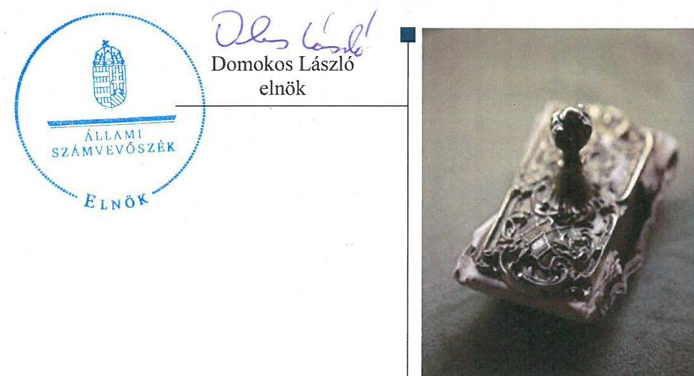
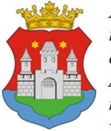
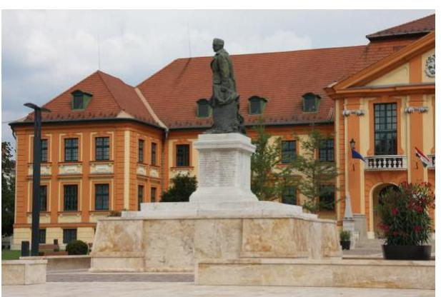
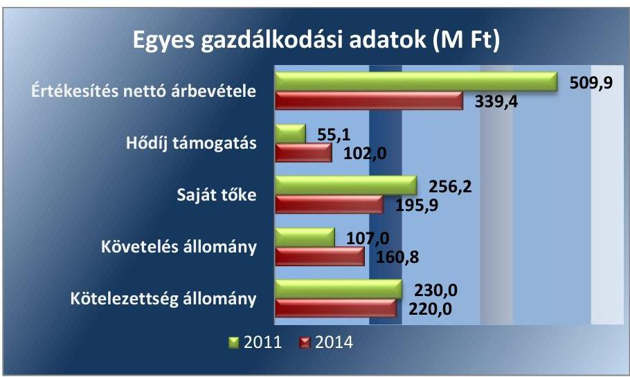
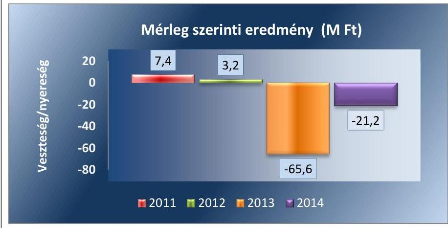
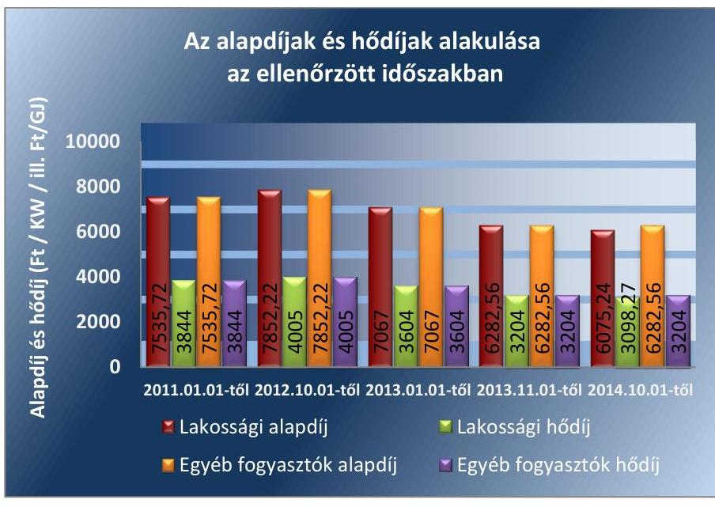

# Jelentés 

## Az önkormányzatok gazdasági társaságai

Az önkormányzatok többségi tulajdonában lévő gazdasági társaságok közfeladat ellátását érintő gazdálkodási tevékenysége szabályszerűségének ellenőrzése - Komáromi Távhőszolgáltató Kft.

2016

---

# Jelentés 

## Az önkormányzatok gazdasági társaságai

Az önkormányzatok többségi tulajdonában lévő gazdasági társaságok közfeladat ellátását érintő gazdálkodási tevékenysége szabályszerűségének ellenőrzése - Komáromi Távhőszolgáltató Kft.
2016. 2017. 2018. 2019. hó 12 nap

---

# AZ ELLENŐRZÉST FELÜGYELTE:

DR. HORVÁTH MARGIT felügyeleti vezető

## AZ ELLENŐRZÉST VEZETTE ÉS A VÉGREHAJTÁSÁÉRT FELELŐS:

VERTKOVCZI MÁRIA ellenőrzésvezető

## A PROGRAM ÖSSZEÁLLÍTÁSÁÉRT FELELŐS:

JANIK JÓZSEF osztályvezető

IKTATÓSZÁM: V-0841-145/2016

TÉMASZÁM: 1704

ELLENŐRZÉS-AZONOSÍTÓ SZÁM: V-070709

Jelentéseink az Országgyűlés számítógépes hálózatán és az Interneta a www.asz.hu címen is olvashatóak.

---

# TARTALOMJEGYZÉK 

■ ÖSSZEGZÉS ..... 5
■ AZ ELLENŐRZÉS CÉLJA ..... 7
■ AZ ELLENŐRZÉS TERÜLETE ..... 8
■ AZ ELLENŐRZÉS HÁTTERE, INDOKOLTSÁGA ..... 10
■ FÓKUSZKÉRDÉSEK ..... 11
■ ELLENŐRZÉS HATÓKÖRE ÉS MÓDSZEREI ..... 12
■ MEGÁLLAPÍTÁSOK ..... 14
■ JAVASLATOK ..... 29
■ MELLÉKLETEK ..... 31
I. Sz. melléklet: Értelmező szótár. ..... 31
II. Sz. melléklet: Múködés főbb jellemzői ..... 33
■ FÜGGELÉK: ÉSZREVÉTELEK ..... 35
■ RÖVIDÍTÉSEK JEGYZÉKE ..... 37

---

.

---

# ÖSSZEGZÉS 

Az Állami Számvevőszék a Komáromi Távhőszolgáltató Kft. ${ }^{1}$ távhőszolgáltatási közfeladat-ellátásának gazdálkodási tevékenységét ellenőrizte 2011-2014. évekre vonatkozóan, szabályszerűségi szempontok alapján. A közfeladat-ellátást az Önkormányzat szabályosan szervezte meg. A tulajdonosi jogok gyakorlása kisebb hiányosságok ellenére alapvetően szabályszerű volt, a Társaság Felügyelőbizottsága tevékenységét ügyrend hiánya ellenére elvégezte, a Jegyző nem tett eleget az üzletszabályzattal kapcsolatos előírásoknak. A Társaság közfeladat-ellátás árképzési gyakorlata a Távhőrendeletben előírt önköltségszámítás hiánya miatt nem volt szabályszerű, a miniszteri hatáskörben előírt árakat szabályszerűen alkalmazták. A belső szabályozás hiányosságai ellenére a Társaság vagyongazdálkodása szabályszerű volt. A távhőszolgáltatás közfeladattal kapcsolatos bevételei, költségei és a beruházások elszámolása megfelelő volt. A Társaság kötelezettségállománya a közfeladat-ellátásra nem jelentett kockázatot.

## Az ellenőrzés társadalmi indokoltsága

Az Állami Számvevőszék középtávra szóló stratégiájában megfogalmazta, hogy a helyi önkormányzatok gazdálkodásában rejlő pénzügyi kockázatok feltárásával, az államháztartáson kívülre nyújtott költségvetési támogatások és ingyenes vagyonjuttatások, valamint az államháztartáson kívül múködő közfeladat-ellátó rendszerek ellenőrzéseivel hozzájárul ahhoz, hogy a közpénzeket az államháztartáson kívül múködő szervezetek is átlátható, rendezett módon használják fel a közfeladatok szerződésben vállalt ellátása érdekében.

A Magyarországon az intézmény-centrikus közfeladat-ellátás jellemző, de egyre jelentősebb a költségvetésen kívüli feladatellátás térnyerése. Ennek legfontosabb szereplői - a nonprofit szervezetek mellett - az önkormányzati tulajdonú gazdasági társaságok. Az önkormányzatok szervezetalakítási szabadságának következménye, hogy a korábban is vállalati formában múködő közszolgáltatások mellett, mind a kötelező, mind az önként vállalt feladatok ellátásában a gazdasági társaságok kiemelt fontosságú szerephez jutottak.

## Főbb megállapítások, következtetések, javaslatok

Az Önkormányzat a közigazgatási területén a távhőszolgáltatás közfeladatának megszervezéséről az ellenőrzött időszakot megelőzően döntött, annak ellátásáról 100\%-os tulajdonában lévő gazdasági társasága útján gondoskodott. Az Önkormányzat a Tszt. szerinti távhőszolgáltatási rendeletalkotási kötelezettségségének a csatlakozási díjmegállapítását és a távhőszolgáltatási rendelet aktualizálását kivéve eleget tett. A Jegyző a Tszt-ben foglalt Üzletszabályzattal kapcsolatos kötelezettségeit nem teljesítette. Az Önkormányzat a közfeladat-ellátását a Távhőszolgáltatási rendeletben, az Üzletszabályzatban, illetve 2014-től létrejött Közszolgáltatási szerződésben szabályozta. Az Önkormányzatnak a Társaság feletti tulajdonosi joggyakorlása - az Alapító Okiratban, Gt.-ben, illetve Ptk.-ban előírt FB ügyrendjének hiánya, továbbá a Gt. és Ptk. által előírt éves beszámolót tárgyaló ülésekkel kapcsolatban a könyvvizsgáló meghívásának elmaradása ellenére - szabályszerű volt. A tulajdonosi joggyakorlás keretében rendszeres ellenőrzést az Önkormányzat az éves üzleti tervek, számviteli beszámolók és negyedéves pénzügyi beszámolók megtárgyalásával teljesítette. Az éves beszámolókat a Képviselő-testület az FB írásbeli javaslata alapján az ellenőrzött időszak minden évében elfogadta.

A Társaság elkészítette a jogszabályban előírt szabályzatokat, melyek a számlarendet, továbbá az önköltségszámítási szabályzatot kivéve megfeleltek az előírásoknak. A távhőszolgáltatásra vonatkozó Tszt. szerinti

---

szétválasztási szabályokat a számviteli politikában határozták meg, mely szabályozás számlarendet érintő változásaival a számlarendet nem aktualizálták.

A bevételek, ráfordítások és beruházások elszámolása szabályszerűen történt. A beruházások elszámolása megfelelő volt, azonban a felújításokhoz nem minden esetben kérték ki az Önkormányzat előzetes hozzájárulását. A Távhőrendeletben az árképzéshez előírt önköltségszámítási szabályzatát a Társaság az ellenőrzött időszak utolsó hét hónapjára vonatkozóan készítette el, azonban a szabályzat az árképzéshez nem rendelkezett kellő részletezettséggel, a gyakorlatban nem alkalmazták. A közfeladat-ellátással kapcsolatos díjakat önköltségszámítással nem támasztották alá, így a Társaság árképzése nem volt szabályszerű. A miniszteri hatáskörben előírt árakat a jogszabályi előírások szerint alkalmazták, a Rezsi tv.-ben foglaltakat a tv-i előírásoknak megfelelően szabályszerűen végrehajtották.

A Társaság vagyongazdálkodása a hiányosságok ellenére szabályszerű volt, kötelezettségállománya a múködésére, közfeladat ellátására nem jelentett kockázatot. A hátralékos követelések a díjcsökkenések ellenére növekedtek. A Társaság vagyona az ellenőrzött időszakban csökkent, amely csökkenést döntően az elszámolt értékcsökkenésnél alacsonyabb értékben megvalósított állagmegóvási beruházások és felújítások eredményezték az ellenőrzött időszakban. Az eszközök elhasználódása miatt azok használhatósági foka csökkent a 2011-2014. években.

A Társaságnak a Távhőszolgáltatáson és az azzal kapcsolatos távhőtermelésen kívül egyéb tevékenysége nem volt, a távhőszolgáltatást egy településen végezte. A könyvvizsgáló az éves beszámolókat hitelesítő záradékkal látta el, melyek tartalmazták a Tszt.-ben előírt távhőszolgáltatás és távhőtermelés közötti keresztfinanszírozást kizáró igazolást. Az Info.tv. -ben és az Avtv.-ben előírtak ellenére belső adatvédelmi felelőst nem neveztek ki, hatályos adatvédelmi szabályzattal a Társaság az ellenőrzött időszakban nem rendelkezett.

---

# AZ ELLENŐRZÉS CÉLJA 

## A Társaság közfeladat ellátását érintő gazdálkodási tevékenysége, továbbá az önkormányzat tulajdonosi joggyakorlása szabályszerűségének értékelése

Az ellenőrzés célja annak értékelése, hogy az önkormányzat a jogszabályi előírások figyelembevételével döntött-e az ellenőrzésre kerülő közfeladat megszervezéséről; az önkormányzat/tulajdonosi joggyakorló szabályszerűen gyakorolta-e a tulajdonosi jogokat; a gazdasági társaság közfeladat-ellátása bevételeinek,ráfordításainak elszámolása, és vagyongazdálkodási tevékenysége megfelelt-e a jogszabályi, illetve a közszolgáltatási/vagyonkezelési szerződésben foglalt tulajdonosi előírásoknak, azok végrehajtása szabályszerű volt-e; a gazdasági társaság kötelezettségállománya jelent-e kockázatot a múködésre, illetve a
közfeladat ellátására; a közfeladatok átláthatósága és elszámoltathatósága érdekében biztosítva volt-e a közszolgáltatás díjának megalapozottsága szabályszerű önköltségszámítással.

---

# **AZ ELLENŐRZÉS TERÜLETE**

## **Komárom Város Önkormányzata és a kizárólagos tulajdonában lévő Komáromi Távhőszolgáltató Kft.**

Komárom Város Önkormányzata² a kizárólagos tulajdonában álló Komáromi Távhőszolgáltató Kft.-t az ellenőrzött időszakot megelőzően képviselő-testületi határozatával³ hozta létre.

### **A KOMÁROMI TÁVHŐSZOLGÁLTATÓ KFT.**

főtevékenysége gőzellátás, légkondicionálás, mely tevékenységekkel kapcsolatban a Társaság rendelkezett a hőtermelés és szolgáltatás végzéséhez szükséges hatósági engedélyekkel.

A Társaság⁴ jegyzett tőkéjét az Önkormányzat az ellenőrzött időszakban két alkalommal, 2011. és 2012. években megemelte. A mindösszesen 15,8 M Ft összegben nyújtott pénzbeli hozzájárulás eredményeként a Társaság jegyzett tőkéje 209, 1 M Ft-ra nőtt 2012. év végére. A jegyzett tőke összegéből 108,6 M Ft nem pénzbeli hozzájárulásként (apport) állt rendelkezésre. A Társaságnak nem volt tulajdonosi részesedése más gazdasági társaságban.

A Társaság alaptevékenysége, az ellenőrzött időszakban a több, mint 19 ezer fő lakosságszámú Komárom Város közigazgatási területén a távhőszolgáltatás biztosítása, hőenergia termelése, értékesítése, fűtés és használati melegvíz szolgáltatás, valamint hőtermelő, hőelosztó és hőfelhasználó berendezések létesítése, fenntartása, javítása és üzemeltetése volt. Négy telephelyen 12 db saját tulajdonú hőközpont biztosította a fűtés ellátást 2113 lakossági fogyasztó 13 db különkezelt intézményi és egyéb felhasználó, valamint 92 db kisközületi fogyasztó részére. A Társaságnak, egyéb tevékenysége nem volt az ellenőrzött időszakban. Tevékenysége az ellenőrzött időszak első két évében nyereséges volt, a 2013-2014. éveket veszteséggel zárta. A Társaság távfűtéssel kapcsolatos egyes gazdálkodási adatait az alábbi ábra mutatja.

1. ábra

---

Az ellenőrzött időszakban a Társaság árbevétele 33,4\%-kal csökkent, melynek legfőbb oka a hatósági árak bevezetésére, illetve a fogyasztás csökkenésére vezethető vissza. A lakossági díjcsökkenés ellenére a követelés állomány és azon belül a hátralékos követelés állomány nőtt, a kötelezettségek állománya minimálisan emelkedett.

Önkormányzatnál a polgármester ${ }^{5}$ személye nem, a Jegyzó6 személye három alkalommal változott az ellenőrzött időszakban. A Társaságnál ügyvezető ${ }^{7}$ személyét illetően egyszer történt változás, a jelenlegi ügyvezető 2014.06.01. óta tölti be tisztségét. Gazdasági vezetője nem volt a Társaságnak az ellenőrzött időszakban, a könyvelést és a beszámoló összeállítását külső vállalkozóval végeztette.

---

# AZ ELLENŐRZÉS HÁTTERE, INDOKOLTSÁGA 

## A gazdasági társaságok a közfeladatok ellátásában kiemelt fontosságú szerephez jutottak

## AZ ÖNKORMÁNYZATI TULAJDONÚ GAZDASÁGI

TÁRSASÁGOK teljes körű ellenőrzésének lehetőségét az ÁSZ. tv. ${ }^{8}$ 2011. január 1-jétől hatályos módosítása teremtette meg. A közfeladatot ellátó gazdasági társaságok ellenőrzése kiemelten fontos a vagyon megőrzése, megóvása érdekében, valamint a kormányzati szektor elszámolásaiban megjelenő önkormányzati tulajdonú gazdálkodó szervezetek esetében, amelyekkel szemben alapvető követelmény, hogy gazdálkodásuk, müködésük szabályszerű, az általuk szolgáltatott adatok minél megbízhatóbbak legyenek. A közfeladat ellátás költségeinek, ráfordításainak alakulása, színvonala hatással van a lakosság elégedettségére.

A törvényalkotás számára - az észlelt problémák, szabálytalanságok, vagy egyéb nem kívánatos jelenségek felszínre kerülésével - az ellenőrzés megállapításai segítséget nyújthatnak az államháztartáson kívüli közfel-adat-ellátás értékeléséhez, jogszabályi keretei pontosításához, átláthatóságot biztosító szabályozásához. Meghatározhatóvá válnak a közfeladat ellátásban részt vevő államháztartáson kívüli szervezeteknek - az önkormányzat költségvetését, pénzügyi helyzetét is befolyásoló - kockázatai, lehetővé válik ezen kockázatok csökkentése. Ellenőrzéseink feltárhatják, hogy az önkormányzat közfeladat-ellátási kötelezettségének szabályszerűen tett-e eleget, a feladatellátáshoz rendelt közvagyon működtetését a tulajdonostól elvárható gondossággal, szabályszerűen szervezte-e meg és a tulajdonosi felügyelete hozzájárult-e a közfeladat-ellátásához. Az ellenőrzés rávilágíthat arra, hogy a gazdasági társaság a közszolgáltatási szerződésben foglaltak betartásával, a közvagyon használatával biztosította-e a szolgáltatás folyatatásának feltételeit, a közfeladat ellátását. Ezzel az ellenőrzöttek és a helyi döntéshozók számára visszajelzést ad feladatszervezési, feladat-ellátási kockázataikról, alapot ad a meglévő hibák megszüntetéséhez, a jobb közfeladat-ellátás biztosításához. Fokozza a fegyelmet, igazolja, hogy lejárt a következmények nélküli ellenőrzések időszaka. Az ÁSZ értékteremtő rend kialakításához és megőrzéséhez hozzájáruló tevékenysége pozitív hatással van a szervezetről kialakított összkép formálására.

---

# FÓKUSZKÉRDÉSEK 

1. Az Önkormányzat közfeladat megszervezéséről szóló döntése, valamint tulajdonosi joggyakorlása szabályszerű volt-e?
2. A gazdasági társaság vagyongazdálkodása szabályszerű volt-e, kötelezettségállománya jelentett-e kockázatot a müködésre, illetve a közfeladat ellátásra?
3. A gazdasági társaságnál az ellátott közfeladat bevételei és ráfordításai elszámolása, valamint az önköltségszámítás és árképzés szabályszerű volt-e?

---

# ELLENŐRZÉS HATÓKÖRE ÉS MÓDSZEREI 

## Az ellenőrzés típusa

Megfelelőségi ellenőrzés

## Az ellenőrzött időszak

2011. január 1-jétől 2014. december 31-ig tartó időszak.

## Az ellenőrzés tárgya

A közfeladatot gazdasági társaságokkal ellátó önkormányzatok tulajdonosi joggyakorlása, valamint gazdasági társaságok pénz- és vagyongazdálkodásának szabályozottsága és szabályszerűsége.

Az ellenőrzés kiterjed minden olyan körülményre és adatra, amely az ÁSZ jogszabályban meghatározott feladatainak teljesítéséhez, valamint a program végrehajtása folyamán felmerült újabb összefüggések feltárásához szükséges.

## Az ellenőrzött szervezet

- Komárom Város Önkormányzata
- Komáromi Távhőszolgáltató Kft.

## Az ellenőrzés jogalapja

Az ellenőrzés jogszabályi alapját az Állami Számvevőszékről szóló 2011. évi LXVI. törvény 5. § (3)-(4)-(5) be-kezdése képezte.

## Az ellenőrzés módszerei

Az ellenőrzést a nemzetközi standardokat irányadónak tekintve az ellenőrzési program ellenőrzési kérdései, az ellenőrzött időszakban hatályos jogszabályok, az ellenőrzés szakmai szabályok és módszertanok figyelembe vételével végezzük.

Az ellenőrzés ideje alatt az ellenőrzött szervezettel történő kapcsolattartást az ÁSZ Szervezeti és Müködési Szabályzatának vonatkozó előírásai alapján biztosítjuk.

---

Az ellenőrzés a kiválasztott, többségi tulajdonosi jogokat gyakorló önkormányzatra, illetve az ellenőrzésre kijelölt közfeladatot ellátó gazdasági társaság felett tulajdonosi jogokat gyakorló szervezetre és az ellenőrzött közfeladatot ellátó gazdasági társaságra terjed ki. Amennyiben a gazdasági társaságban több önkormányzat együttesen többségi tulajdonos, úgy az ellenőrzést a többségi tulajdonosi jogokat gyakorló önkormányzatnál kell lefolytatni. Az ellenőrzött gazdasági társaságnál, amennyiben az több közfeladatot is ellát, akkor az ellenőrzésre kiválasztott közfeladat-ellátást ellenőrizzük.

Az ellenőrzést a kérdésekre adott válaszok kiértékelésével, valamint a megjelölt adatforrások, a csatolt tanúsítványok felhasználásával, továbbá az adott időszakban hatályos jogszabályok figyelembe vételével kell lefolytatni. Az ellenőrzési kérdések megválaszolásához szükséges bizonyítékok megszerzése a következő ellenőrzési eljárások alkalmazásával történik: megfigyelés, kérdésfeltevés (információkérés), összehasonlítás, valamint elemző eljárás.

A bevételek és ráfordítások elszámolása, valamint a vagyonnyilvántartás terén a szabályszerű működést véletlen mintavétellel ellenőriztük. A jogszabályoknak és a belső előírásoknak megfelelőnek tekintettük az adott területet, amennyiben a minta ellenőrzésének eredménye alapján 95\%kos bizonyossággal a teljes sokaságban a hibaarány kisebb volt, mint 10\%, nem megfelelőnek, ha a hibaarány a 10\%-ot meghaladta. Kockázatot, illetve magas kockázatot jeleztünk, amennyiben egy adott terület vonatkozásában a minta alapján a teljes sokaságban nem volt egyértelműen biztosított a jogszabályoknak és a belső szabályzatoknak megfelelő működés. A ráfordítások elszámolására és a vagyonnyilvántartásra vonatkozó véletlen mintavételt kockázati alapú kiválasztással egészítettük ki, amelynek során a három legnagyobb összegű tételt választottuk ki.

---

# 1. Az Önkormányzat közfeladat megszervezéséről szóló döntése, valamint tulajdonosi joggyakorlása szabályszerű volt-e? 

Összegző megállapítás

Az Önkormányzat közfeladat-ellátását szabályszerűen szervezte meg, rendeletalkotási kötelezettségének hiányosságok mellett tett eleget, tulajdonosi jogainak gyakorlása a könyvvizsgáló meghívásának és az FB ügyrendjének hiánya ellenére szabályszerű volt, a Jegyző az üzletszabályzattal kapcsolatos kötelezettségeit nem látta el.

Az Önkormányzat közfeladat-ellátásának megszervezése szabályszerű volt. Az Önkormányzat rendeletalkotási kötelezettségségének -aktualizálását kivéve - eleget tett, a Jegyző a Társaság Üzletszabályzata tekintetében a jogszabályi előírásokat nem tartotta be.

Az Önkormányzat az Ötv. ${ }^{9}$ 91. § (6) bekezdése és a Mötv. ${ }^{10}$ 116.§ (3)-(4) bekezdései alapján 2007-2013. évekre vonatkozóan elkészítette gazdasági programját ${ }^{11}$. A gazdasági programot az Ötv. 91. § (7) bekezdésében előírtaknak megfelelően a Képviselőtestület felülvizsgálta és határozatával a ciklusidő végéig - 2014-ig - jóváhagyta. Az ellenőrzött időszakban a gazdasági program az Ötv. 91.§. (6) bekezdésének megfelelően tartalmazta a távfűtési rendszer korszerűsítésére, távvezeték és geotermikus rendszer bevezetésére vonatkozó elképzeléseket, terveket.

A távhőszolgáltatással ellátott létesítmények távhőellátásának engedéllyel rendelkezők útján történő biztosítása a Tszt. ${ }^{12}$ 6. § (1) bekezdése értelmében a területileg illetékes települési önkormányzat kötelező feladata. Az Önkormányzat - az Ötv. 9. § (4) bekezdésében foglalt lehetőséggel élve - az ellenőrzött időszakot megelőzően határozatával döntött a távhőszolgáltatás gazdasági társaság útján történő ellátásáról. Az távhőszolgáltatás biztosításához szükséges vagyont 108,6 M Ft értékben apportként bocsátotta a Társaság rendelkezésére. Az apportként szolgáltatott vagyonon felül üzemeltetésre, vagyonkezelésre nem bocsátott eszközöket a Társaság rendelkezésére.

A feladatellátás keretszabályait a Társaság Alapító Okiratában ${ }^{13}$, a Távhőszolgáltatási rendeletben ${ }^{14}$ - az Üzletszabályzatban ${ }^{15}$, illetve 2014-től a Társaság és az Önkormányzat között létrejött - jogszabály által nem kötelezően előírt - Közszolgáltatási szerződésben ${ }^{16}$ szabályozta.

AZ ALAPÍTÓ OKIRAT összhangban volt a Gt ${ }^{17}$. 12. § és 19. § előírásaival, illetve 2014. március 15-től a Ptk. ${ }^{18}$ 3:109. §-ban előírtaknak. Az alapítói Okirat az alapító kizárólagos hatáskörébe sorolta a törzstőke felemelését, a nyereség felosztását, az ügyvezető és a könyvvizsgáló ${ }^{19}$ megbízását és visszahívását, továbbá a távhőszolgáltatás és távhőtermelés fej-

---

lesztésével, felújításával, illetve ezen eszközök elidegenítésével kapcsolatos döntéseket. Az ügyvezető kötelezettségei között előírta az üzleti terv és az éves beszámoló elkészítésének és Képviselő-testület elé terjesztésének kötelezettségét, a gazdálkodás és működés feltételeinek biztosítását. Az alapító Okiratban az alapító a Társaság ellenőrzésére Felügyelőbizottságot ${ }^{20}$ hozott létre.

A TÁVHŐSZOLGÁLTATÁSI RENDELETBEN határozták meg a felhasználás feltételeit, a távhőszolgáltatási díjak (alapdíj, hődíj) alkalmazásának és fizetésének szabályait, a díjak mértékét, a korlátozási és szüneteltetési sorrendet.

Az Önkormányzat ármegállapítási jogköre a hatósági ár alá tartozó fogyasztók (lakossági fogyasztók és a külön kezelt intézmények) esetében a csatlakozási díjak kivételével - 2011. április 15. napjával a Tszt. 57/D. § (1) bekezdése értelmében megszűnt, mely változás a távhőszolgáltatási rendeletben nem vezették át.

A csatlakozás feltételeit előírták a Távhőszolgáltatási rendeletben, de a csatlakozási díj mértékét a Tszt. 6.§ (2) bekezdés b) pontjával ellentétesen nem határozták meg.

A Tszt. 6. § (2) bekezdés c) pontjában előírtaktól eltérően az üzletszabályzat és nem rendelet tartalmazta azokat a területeket, ahol a területfejlesztés, környezetvédelmi és levegőtisztasági szempontok alapján ésszerű a távhőszolgáltatás fejlesztése.

A távhőszolgáltatási rendeletben a távhőszolgáltatás alapdíját, a mért hő díját, valamint melegvíz hődíját utolsó alkalommal 2008. december 1jei hatállyal módosították.

TÁRSASÁG ÜZLETSZABÁLYZATÁT 2006. évben készítette el, amit 2014. június 6-án módosított. A Jegyző a 2014. június 5-ig hatályos Üzletszabályzatot 2011. június 16-án annak ellenére jóváhagyta, hogy a Tszt. 7. § (1) bekezdés a) pontja (2011. április 14-ig a Tszt. 7. § (1) c) pontja) alapján nem küldte meg véleményeztetésre a fogyasztóvédelmi hatóságnak. A 2014. június 6-án módosított Üzletszabályzat tekintetében sem járt el körültekintően, mivel a Tszt. 7. §. (1) bekezdés a)-b) pontjai ellenére nem küldte meg véleményezésre az illetékes fogyasztóvédelmi hatóságnak, így az nem került jóváhagyásra. A módosított Üzletszabályzat hiányossága, hogy nem követte a jogszabályi módosításokat (Tszt. szerinti hatósági árak és az ármegállapítás hatáskörét érintő változás), jogforrásként hatályon kívül helyezett jogszabályokat jelölt meg. A Jegyző nem tett eleget a Tszt. 7. § (1) bekezdés c) pontja szerinti kötelezettségének, mivel nem ellenőrizte a távhőszolgáltatói tevékenységre vonatkozó előírások betartását.

A KÖZSZOLGÁLTATÁSI SZERZŐDÉST 2014.június 01én határozatlan időre kötötte az Önkormányzat a Társasággal, mely szerződés megkötésére jogszabályi előírás nem kötelezte. A közszolgáltatási szerződés szerint a Társaság közszolgáltatási kötelezettsége kizárólag a távhőszolgáltatási és az azzal összefüggő távhőtermelői feladatokra terjedt ki Komárom város területén. A szerződés tartalmazta közszolgáltatás biztosítása feltételeként a működésre, a vagyonmegőrzésre, a gazdálkodásra és annak átláthatóságára, nyilvánosságára, valamint a díjmegállapítására

---

és érvényesítésére vonatkozó főbb előírásokat, illetve annak az Önkormányzat részéről történő ellenőrzési jogát. A szerződésben előírták a módosításának, megszűnésének szabályait is.

Az Önkormányzat a hatékonyságára, a gazdaságosságára, az ellátás színvonala értékelésére szolgáló mutatórendszert meghatározásának lehetőségével nem élt, azokkal kapcsolatban a Társaság a jelentéseiben nem számolt be.

# 1.2. számú megállapítás 

Az Önkormányzat a távhőszolgáltatással kapcsolatos tulajdonosi joggyakorlása, a könyvvizsgáló éves beszámolót tárgyaló ülésekre való meghívásának és az FB ügyrend hiányának ellenére szabályszerű volt.

A TULAJ DONOSI JOGOKAT és a taggyűlés jogait a Képviselőtestület gyakorolta, a tulajdonosi jogosítványok átadására nem került sor az ellenőrzött időszakban. A tulajdonosi joggyakorlás kereteit az Önkormányzat SZMSZ-e, vagyongazdálkodási rendelete ${ }^{21}$, valamint a Társaság Alapító Okirata szabályozta. A taggyűlés kizárólagos hatáskörébe tartozó kérdésekben az ügyvezető köteles volt az alapító döntését kérni.

AZ FB a Gt. 34. § (1) bekezdésében foglaltaknak megfelelően 20112012. években három tagból állt, 2013. évben a 42/2013 (III.27.) határozat alapján létszáma 5 főre módosult. Az FB tagjai közül az elnök és további egy fő a képviselőtestület tagja is.

Az FB az ellenőrzött időszakban nem rendelkezett ügyrenddel, ezzel nem tett eleget a Gt. 34. § (4) bekezdésében, a Ptk. 3:122. § (3) bekezdésben, valamint az Alapító Okirat 5.4 pontjában foglaltaknak, mely előírta az ügyrend szerinti múködését.

Az FB a Társaság ügyvezetőjét az éves ülésén a Társaság tevékenységéről, valamint a következő üzleti évre vonatkozó tevékenységéről beszámoltatta. Az FB a mérleg megtárgyalásával egy időben a prémiumfeltételek teljesülését is vizsgálta, döntött a prémiumfizetési javaslatról.

AZ ÉVES BESZÁMOLÓK elfogadása előtt a Képviselő-testület az FB írásos véleményét megismerte, elfogadta.

A Gt. 44. § (1) bekezdése, valamint a Ptk. 3:131. § (2) bekezdése ellenére az ellenőrzött időszakban az éves beszámolót tárgyaló képviselő-testületi ülésekre a könyvvizsgálót nem hívták meg, az üléseken nem vett részt. A Mötv. 81. § (1) bekezdés c) pontjában foglaltak alapján a Jegyző felelősségi körébe tartozik a Képviselő-testületi ülések előkészítése. Azzal, hogy nem gondoskodott a könyvvizsgáló meghívásáról, nem volt biztosított a tulajdonosi döntéshozatalt megelőzően a könyvvizsgáló meghallgatásának lehetősége, ezáltal az elszámoltathatóság és átláthatóság érvényesülése a tulajdonosi joggyakorlás során korlátozott volt.

A könyvvizsgáló a könyvvizsgálatot minden évre vonatkozóan elvégezte és kiadta a könyvvizsgálói záradékot, melynek figyelembevételével döntött a képviselő-testület a Társaság beszámolójának elfogadásáról. Az Önkormányzat - a jogszabályi előírásokon túl - a 2009. évi ÁSZ ${ }^{22}$ ellenőrzés kép-viselő-testületi határozatával elfogadott intézkedési terv végrehajtásával kapcsolatban hozott döntése alapján a Társaság negyedéves likviditási

---

helyzetéről történő beszámoltatásáról. A beszámolókat a Társaság elkészítette és a Képviselő Testület azokat elfogadta. Az alapító az ellenőrzött időszakban a Társaság fűtőműveinek és távhővezetékeinek felújításával, korszerűsítésével kapcsolatos kérdéseket az Alapító Okirat 1.5 pontjában foglaltak ellenére nem tárgyalta.

Osztalékfizetésre nem került sor, veszteség rendezését indokoló esemény nem történt, a társaság saját tőkéje két egymást követő lezárt évben nem csökkent a jegyzett tőkének a Gt. 51. § (1) bekezdésében meghatározott szintje alá.

A Társaság könyveit 2011. évben 7422 E Ft, 2012. évben 3216 E Ft mérleg szerinti nyereséggel, 2013. évben -65 593 E Ft, 2014. évben - 21184 E Ft mérleg szerinti eredménnyel (veszteséggel) zárta.
2. ábra

Forrás: Társaság beszámoló adatai
AZ ÜZLETI TERV TELJESÍTÉSÉT segítő anyagi ösztönzési rendszer a Társaság a Taktv. ${ }^{23}$ 5.§-nak megfelelően létrehozott Javadalmazási Szabályzatában meghatározásra került, amely az ügyvezető részére prémiumfizetést engedélyezett. A prémiumfeladatokat az alapító volt jogosult - az FB közremúködésével - meghatározni, illetve azok teljesülését értékelni. A következő évre meghatározott prémiumfeltételekről a Képviselőtestület az éves beszámoló, illetve az üzleti terv elfogadásakor döntött. A feltételek teljesülésének értékelését az előző évben meghatározott pré-mium-feltételek szempontjai alapján a Társaság éves beszámolója támasztotta alá. A prémium kifizethetőségéről a Képviselőtestület az éves beszámoló elfogadásakor, a Javadalmazási szabályzatban foglaltakkal összhangban döntött. A prémiumfeltételek az üzleti terv teljesítését, az üzemvitel zavartalanságának biztosítását, valamint az átalakítások, javítások sikeres bonyolítását foglalták magukban. 2014. évben új ügyvezető igazgatót választottak.

# A KÖZFELADAT-ELLÁTÁS RENDSZERES ELLEN- 

ÖRZÉSI KÖTELEZETTSÉGÉT az Önkormányzat az éves üzleti tervek, a számviteli beszámolók és a negyedéves pénzügyi helyzetről készült beszámolók megtárgyalásával és elfogadásával teljesítette.

Az Önkormányzat az ellenőrzött időszakban egy ellenőrzést végzett a Társaságnál belső ellenőrzés keretében az Áht. 2 70. § (1) pontjában előírtak megvalósítására. Az ellenőrzést a jóváhagyott, II/I-2012. nyilvántartás számú belső ellenőrzési „Program" alapján végezték. A belső ellenőrzést az

---

Önkormányzat által megbízott belső ellenőr végezte a 2012. évben, és a Társaság 2011. évi gazdálkodását, múködése szabályszerűségét ellenőrizte. A lefolytatott ellenőrzés hiányosságot nem tárt fel.

Az ellenőrzött időszakban az Önkormányzat hitelekhez kapcsolódó kezességvállalása szabályszerű volt. Kt. határozattal az Önkormányzat a Társaság - 2014-ben visszafizetett - 40 M Ft folyószámlahitel felvételéhez készfizető kezességet vállalt. Határozatában Komárom Város Önkormányzata Képviselőtestülete nyilatkozott arról, hogy a már meglévő hitelekből, kezességvállalásokból és a jelen kezességvállalásból adódó éves kötelezettségeit figyelembe véve nem esik a Magyarország gazdasági stabilitásáról szóló 2011. évi CXCIV. törvény 10. § (3) bekezdésében meghatározott korlátozás alá.

# 2. A gazdasági társaság vagyongazdálkodása szabályszerű volt-e, kötelezettségállománya jelentett-e kockázatot a múködésre, illetve a közfeladat ellátásra? 

Összegző megállapítás

A Társaság vagyongazdálkodása a belső szabályozási hiányosságok ellenére szabályszerű volt, kötelezettségállománya a múködésére, a közfeladat ellátására nem jelentett kockázatot, szabályzatai a számlarendet, az önköltségszámítást és az adatvédelmi szabályzatot kivéve megfeleltek az előírásoknak.
2.1. számú megállapítás

A Társaság elkészítette a jogszabályban előírt szabályzatokat, melyek a számlarendet és az önköltségszámítási szabályzatot érintő hiányosságokat kivéve, megfeleltek az előírásoknak.

ÜZLETI TERV készítést az Önkormányzat, illetve a Társaság belső szabályzatai nem írtak elő. Az ellenőrzött időszakban a Társaság minden év végén készített üzleti tervet és az FB írásbeli jelentése figyelembevételével, a Képviselő-testület határozattal döntött a tervek elfogadásáról. Az üzleti tervek a közfeladat-ellátás tervezett bevételeit, költségeit, ráfordításait, beruházási és fejlesztési terveit tartalmazták. Az üzleti tervekben meghatározták a tervezési irányokat, bemutatták a tervezett beruházások forrásait és felhasználásait. Az üzleti tervek tartalmazták továbbá a következő időszak kalkulált eredményét, és a zavartalan múködés biztosítása érdekében az indokolt karbantartási kalkulációkat is meghatározták benne.

A Társaság rendelkezett a Számv. tv. ${ }^{24}$ 14. § (3) bekezdésében előírt számviteli politikával, amely tartalmazta a 2012.01.01-től hatályos Tszt. 18/A. § (2) bekezdésében és (3) bekezdés b)-c) pontjaiban, továbbá a Számv. tv. 161/A. (1)-(2) bekezdéseiben előírt számviteli szétválasztásra vonatkozó szabályokat. A Társaság csak egy településen végzett távhőszolgáltatói tevékenységet. A szabályzat alapján a közvetlen költségek és a bevételek főkönyvi számlákon elkülönítetten kerültek kimutatásra. A közvetett ráfordítások és bevételek tekintetében a szabályzat távhőtermelés és távhőszolgáltatás szerinti elkülönítésére felosztási arányszámokat határozott meg. A tárgyi eszközök értékcsökkenési leírásának megosztására vonatkozóan a tárgyi eszközrendszerben használt kódok alkalmazását írták elő.

---

A Számv. tv. 14. § (5) bekezdése alapján a számviteli politika keretében elkészítette az eszközök és források leltárkészítési és leltározási ${ }^{25}$, értékelési ${ }^{26}$ és pénzkezelési szabályzatát ${ }^{27}$. Az értékelési szabályzat a Számv. tv. előírásaival és a számviteli politikával összhangban biztosította a vagyon értékének meghatározását. A pénzkezelési szabályzat és módosítása a Számv. tv. 14. § (8) bekezdésének előírásaival és a számviteli politikával összhangban meghatározta a készpénzzel való szabályos gazdálkodást.

SZÁMLARENDJÉT ${ }^{28}$ a Társaság Ügyvezetője a Számv. tv. 161. § (4)-(5) bekezdésében előírtak ellenére nem aktualizálta a Tszt. 18/A. § (2)(3) bekezdésében előírt 2012. január 1-től hatályos számviteli szétválasztásra vonatkozó, számlarendet is érintő változásokkal. A Társaság 2014. június 1-jén módosított számlarendje sem tartalmazza a szétválasztással kapcsolatos számlarendet érintő változásokat. A Társaság vezetése figyelmen kívül hagyta továbbá a Számv. tv. 161. § (1)-(3) bekezdésében előírtakat, mivel a számlarend nem tartalmazta az ellenőrzött időszakban alkalmazott 1, 2, 3, 4, 5, 8, 9-es számlaosztály számláinak tételes megnevezését, pontos tartalmát, növekedésének és csökkenésének jogcímeit, a főkönyvi számlák és az analitikus nyilvántartás kapcsolatát.

AZ ÁRKÉPZÉS SZABÁLYAIT részben a Távhőszolgáltatási rendelet, részben az Üzletszabályzat tartalmazta. Az üzletszabályzat nem tartalmazta a Tszt. szerinti hatósági árak és a Tszt. 57/D. § (1) bekezdésében meghatározott ármegállapítás hatáskörét érintő módosításokat. Az Önkormányzat a Távhőszolgáltatási rendeletében írta elő, hogy a fogyasztói árak megállapításához javasolt alapdíj és a hődíj mértékét a Társaság önköltségszámítással köteles meghatározni. Az Üzletszabályzatban rögzítette a Társaság, hogy az alaptevékenységéhez kapcsolódóan nyújtott szolgáltatások árait (pl. kiszállási, visszakapcsolási, szerelési díj, hőmennyiségmérő ára stb.) maga alakítja ki. 2011. április 15-től szűkített ármegállapítást alkalmaztak a Tszt. 57/D. § (1) bekezdésének megfelelően. Az alap és hődíjakra vonatkozóan Kt. döntés alapján meghatározott megoszlási arányszámot alkalmaztak, a lakossági és egyéb fogyasztók esetében egységes kezelést határoztak meg.

ÖNKÖLTSÉGSZÁMÍTÁSI SZABÁLYZAT ${ }^{29}$ készítésére a Társaság a Szám tv. alapján nem volt köteles. Ugyanakkor az Önkormányzat a Távhőszolgáltatási rendelet 13. § (2) bekezdésében elő írta az önköltség számítási szabályzat készítését.

Az önköltségszámítási szabályzatot több éves késéssel készítette el a Társaság (2014. június 1.). Azt a hatályba helyezését követően 2014. december 31-éig nem alkalmazták a gyakorlatban. A szabályzat tartalmában sem felelt meg a Számv. tv. 51. § (1)-(4) bekezdésében foglaltaknak. Hiányzott az önköltség összetevőinek tartalmára vonatkozóan előírás és nem tartalmazott konkrét önköltségszámítási módszereket sem. Így az ármegállapítás szabályozása az önköltségszámítási szabályzat hiánya, illetve hiányosságai miatt nem felelt meg a Távhőszolgáltatási rendeletben foglaltaknak.

---

### 2.2. számú megállapítás

A Társaság a tulajdonában lévő vagyonnal a szabályozási hiányosságok ellenére szabályszerűen gazdálkodott, a mérlegtételeket leltárral alátámasztotta.

A Társaság közfeladatát saját eszközeivel látta el, üzemeltetésre átvett, illetve vagyonkezelésbe vett eszköze nem volt. A Társaság vagyonát, annak értékét és változásait a Számv. tv. 161. § (1) bekezdés előírásának megfelelően tartotta nyilván. A beszámolóban és a számviteli nyilvántartásokban lévő vagyontárgyak állományát szabályszerűen - a leltározási szabályzatban foglaltak alapján - elkészített leltárral alátámasztották.

1. táblázat a kiemelt mérlegadatok alakulását mutatja be az ellenőrzött időszakban.
2. táblázat

| A TÁRSASÁG FŐBB MÉRLEGADATAI (M FT) |  |  |  |  |  |
| :--: | :--: | :--: | :--: | :--: | :--: |
|  | 2011. | 2011. | 2012. | 2013. | 2014. |
|  | 01.01 | 12.31. | 12.31. | 12.31. | 12.31. |
| I. Befektetett eszközök | 298,9 | 293,0 | 269,1 | 240,6 | 212,2 |
| - ebből: Tárgyi eszközök | 298,9 | 293,0 | 268,8 | 240,4 | 212,0 |
| II. Forgó eszközök | 110,4 | 159,4 | 119,9 | 137,3 | 162,2 |
| - ebből: Követelések | 107,0 | 159,4 | 113,4 | 133,9 | 160,8 |
| - ebből: Pénzeszközök | 3,2 | 1,0 | 6,0 | 3,0 | 1,0 |
| III. Aktív időbeli elhatárolások | 65,5 | 55,4 | 66,8 | 45,9 | 47,3 |
| Eszközök összesen | 474,8 | 507,8 | 455,8 | 423,8 | 421,7 |
| IV. Saját tőke | 256,2 | 274,2 | 282,6 | 217,0 | 195,9 |
| - ebből: Jegyzett tőke | 193,3 | 203,9 | 209,1 | 209,1 | 209,1 |
| - ebből: Tőketartalék | 23,2 | 23,2 | 23,2 | 23,2 | 23,2 |
| - ebből Mérleg szerinti eredmény | 24,5 | 7,4 | 3,2 | $-65,6$ | $-21,2$ |
| V. Céltartalékok | 0 | 0,0 | 0,0 | 0,0 | 0,0 |
| VI. Kötelezettségek | 215,6 | 230,0 | 169,0 | 204,4 | 220,0 |
| - ebből: szállítókkal szembeni kötelezettség | 130,9 | 107,5 | 77,4 | 62,9 | 88,2 |
| VII. Passzív időbeli elhatárol sok | 3 | 3,6 | 4,2 | 2,4 | 5,8 |
| Források összesen | 474,8 | 507,8 | 455,8 | 423,8 | 421,7 |

A TÁRSASÁG VAGYONA az ellenőrzött időszakban 11,2\%-kal, 53,1 M Ft-tal csökkent. A befektetett eszközök állománya 29\%-kal, 86,7 M Ft-tal csökkent, miközben a forgóeszközök állománya 46,9\%-kal emelkedett. A befektetett eszközökön belül a tárgyi eszközök 29,0\%-os csökkenése, míg a forgóeszközökön belül a követelések növekedése (50,3\%) okozta volumenében a változást.

A befektetett eszközök állományának csökkenését döntően a 20112014. évben az elszámolt értékcsökkenésnél alacsonyabb értékben megvalósított állagmegóvási beruházások és felújítások eredményezték. A 2011-2014. években a saját vagyon után elszámolt értékcsökkenés halmozott összege 118,3 M Ft volt, ugyanezen időszakban az eszközök pótlására mindössze 36,2 M Ft-ot fordítottak. A távfűtési szolgáltatás eszközállományának megoszlását a távhőtermelési és szolgáltatási tevékenységre a 2. táblázat tartalmazza.

---

A Társaság 2011. évtől nagyobb energetikai fejlesztést tervezett, melyhez az önerő mellett, pályázati forrást is igényelt. A Társaság a fejlesztésekre a pályázaton való előzetes jóváhagyást az Alapító Okirat II./1.5 pontjában leírtak szerint megkérte a tulajdonos Önkormányzat Képviselő-testületétől. A támogatási szerződést végül a magas önerő miatt nem kötötte meg a Társaság. A meglévő eszközökön csak a szükségszerű felújításokat és karbantartásokat végezték el. Ebből adódóan folyamatosan csökkent a befektetett eszközök átlagos életkora, nőtt az eszközök elhasználódása.

A Társaság a távhőellátás hőközpontjainak, távhővezetékeinek és fűtőműveinek műszaki állagának megóvásával, felújításával, korszerűsítésével kapcsolatos döntéseihez, melyeket 2011-2014-es üzleti tervei tartalmaztak és az Önkormányzat Képviselő-testülete is elfogadott, a tulajdonos hozzájárulás tekintetében a Társaság figyelembe vette az Alapító Okiratának II/1.5 pontjában előírtakat.

A forgóeszközök állománya 51,8 M Ft-tal nőtt az ellenőrzött időszakban, alapvetően a követelésállomány növekedése miatt. A követelések 2011. évben jelentősen - 52,4,0 M Ft-tal - nőttek, 2012. évben 46 M Ft-tal csökkentek az előző évhez képest, azonban a következő években ismét emelkedés következett be. Összességében a 2011. évi nyitó követelésállomány 53,8 M Ft-tal nőtt 2014. év végére.

A Társaság forrásain belül a saját tőke állománya 2011. év elejétől 2014. év végéig terjedő időszakban 60,3 M Ft-tal csökkent, döntően a 2013. és 2014. években keletkezett veszteség miatt, a jegyzett tőke 2011-ben és 2012-ben mindösszesen 15, 8 M Ft-os emelkedése mellett. Az ellenőrzött időszakban a Társaság negatív eredményének következtében a saját tőke összege nem csökkent a társasági formára előírt jegyzett tőke összege alá.

# 2.3. számú megállapítás 

A kötelezettségek állománya nem jelentett kockázatot a közfeladat ellátására, illetve a Társaság múködésére.

AZ ELADÓSODOTTSÁG mértéke és szerkezete kedvezőtlenül alakult az ellenőrzött időszakban, de nem jelentett kockázatot a közfeladat ellátására.

Az eladósodottság mértékének, szerkezetének alakulását szemlélteti a 3. táblázat.
3. táblázat

ELADÓSODOTTSÁGI MUTATÓK ALAKULÁSA TELJES TEVÉKENYSÉG (ARÁNY)

| Mutató megnevezése | 2011 | 2012 | 2013 | 2014 |
| :-- | :--: | :--: | :--: | :--: |
| Eladósodottsági mutató (idegen tőke/összes forrás) | 0,45 | 0,37 | 0,48 | 0,52 |
| Eladósodottság mértéke (kötelezettségek/saját tőke) | 0,84 | 0,6 | 0.94 | 1,12 |
| Nettó eladósodottság (kötelezettségek-követelések) / saját tőke | 0,26 | 0,20 | 0,32 | 0,30 |
| Adósságfedezeti mutató I. (befektetett eszközök+forgóeszközök)/idegen forrás | 1,97 | 2,30 | 1,85 | 1,70 |
| Árbevételre vetített eladósodottság (kötelezettségek-forgóeszközök)/ért. nettó árbevétele | 0,14 | 0,11 | 0,17 | 0.17 |

AZ ELADÓSODOTTSÁGI MUTATÓK értéke annak ellenére kedvezőtlenül alakultak az ellenőrzött időszakban, hogy az idegen tőke öszszes forráson belüli aránya egyik évben sem érte el a kritikus 0,6-es értéket. Az eladósodottság mértéke romlott. A nettó eladósodottság mutató arról nyújt információt, hogy a kintlévőségekkel csökkentett kötelezettségeket

---

milyen mértékben fedezi saját forrás, és azt feltételezi, hogy a kötelezettségek teljesítését megelőzi a követelések realizálása. A mutató értéke 2012. évben csökkent, de azt követő években nőtt, a kintlévőségek nem fedezték teljes mértékben a kötelezettségek összegét. Az eladósodás szintje azonban a múködést, a közfeladat ellátását nem veszélyeztette.

Az adósságfedezeti mutató I. értéke tendenciáját tekintve romlott, de a 2012. évi emelkedést követően 2014. év végére csökkent. Az árbevételre vetített eladósodottság mértéke kedvezőtlenül alakult, mivel a Társaság adósságaira a forgóeszközök csökkenő mértékben nyújtottak fedezetet, de mértéke nem jelentett múködési kockázatot.

Az Önkormányzat a közfeladat-ellátási kötelezettségére tekintettel folyamatosan figyelemmel kísérte a Társaság gazdálkodását. Képviselő-testületi határozatában előírtaknak megfelelően az ÁSZ javaslata alapján történt intézkedések 2012. június 30 -án követően negyedévente beszámoltatta pénzügyi helyzetéről.

A Társaság múködőképességének fenntartását részben tőkejuttatással, (15,8 M Ft) részben tulajdonosi kölcsönnel ( $80,0 \mathrm{M}$ Ft) biztosította az Önkormányzat. Szükségszerű fejlesztések miatt két alkalommal emelte meg a Társaság törzstőkéjét. 2011. évben 10,6 M Ft-ot, 2012. évben 5,2 M Ft-ot biztosított tőkeemelés formájában.

A kötelezettségek állománya 2012. évben 61,0,M Ft-tal (26,5\%-kal) csökkent 2011. évhez képest, 2013-2014. évben azonban nőtt. A 2014. évi záró állomány mindössze 4,3\%-kal maradt el a 2011. évi összegtől. A 4. táblázat szemlélteti a kötelezettségek alakulását 2011-2014. között.
4. táblázat

KÖTELEZETTSÉGEK ALAKULÁSA (M FT)

|  | 2011 | 2012 | 2013 | 2014 |
| :--: | :--: | :--: | :--: | :--: |
| Hosszú lejáratú kötelezettségek összesen | 73,3 | 73,3 | 0 | 0 |
| Ebből Önkormányzati kölcsön | 73,3 | 73,3 | 0 | 0 |
| Rövid lejáratú kötelezettségek összesen | 156,7 | 95,7 | 204,4 | 220,0 |
| Ebből Önkormányzat felé fennálló tartozás | 9,9 | 4,9 | 103,3 | 103,3 |
| Ebből tagi kölcsön | 9,9 | 4,9 | 54,8 | 54,8 |
| Ebből bérleti díjtartozás | 0 | 0 | 48,5 | 48,5 |
| Ebből Szállítói kötelezettség | 107,5 | 77,4 | 62,9 | 88,2 |
| Ebből nem lejárt kötelezettség | 78,2 | 77,4 | 62,8 | 86,7 |
| Ebből 0-30 napon belüli kötelezettség | 29,3 | 0 | 0,1 | 1,5 |
| Ebből 30 napon túli kötelezettség | 0 | 0 | 0 | 0 |
| Ebből rövidlejáratú hitel | 30,3 | 5,2 | 28,4 | 17,4 |
| Ebből egyéb rövidlejáratú kötelezettség | 9,0 | 8,2 | 9,8 | 11,1 |
| Kötelezettségek összesen | 230,0 | 169,0 | 204,4 | 220,0 |

A TÁRSASÁG HOSSZÚLEJÁRATÚ KÖTELEZETTSÉGET nem mutatott ki 2013-2014. évben. Az ellenőrzési időszakot megelőzően az Önkormányzattól kapott kölcsönt (20,0 M Ft tagi és 4,8 M Ft beruházás), valamint az ellenőrzési időszakot megelőzően keletkezett, folyamatosan görgetett, fútőművel kapcsolatos bérleti díj hátralé-

---

kát (48,5 M Ft), összesen 73,3 M Ft-ot 2011-2012. évben még hosszúlejáratú kötelezettségként tartotta nyilván, de azt átminősítette rövidlejáratú kötelezettségé 2013. évben. A Képviselő-testület a 101/B/2011. (V.19.) számú határozatában döntött a 73,3 M Ft visszafizetési határidejének 2014. december 31-ig történő meghosszabbításáról.

A pénzügyi válság okozta nehézségek áthidalására a Képviselő-testület határozat alapján az ellenőrzési időszakot megelőzően 88,5 M Ft kamatmentes kölcsönt nyújtott a Társaságnak az Önkormányzat 2011.06.30-ai visszafizetési határidővel, mely összegből 2011. január 01-ig 54,1 M Ft öszszeget visszafizetett a Társaság. A fennmaradó 34,4 M Ft összeg tekintetében a Társaság kérésére a képviselő-testület a visszafizetési határidőt egy évvel meghosszabbította. A fennmaradó összegből a Társaság 2011. évben 24,5 M Ft-tal csökkentette tartozását, és a továbbiakban is fennálló 9,9 M Ft tartozását két egyenlő részletben (a meghosszabbított visszafizetési határidőt követően) 2012. és 2013. évben fizette vissza az Önkormányzatnak.

A RÖVIDLEJÁRATÚ KÖTELEZETTSÉGEK állománya folyamatosan a 2011. évi 156,7 M Ft-ról 2014.év végére 63,3 M Ft-tal 220,0 M Ft-ra nőtt. A rövidlejáratú kötelezettségek meghatározó részét 2011 és 2012. években a szállítói állomány képezte, majd 2013-2014. években a meghatározó részészét az Önkormányzat felé fennálló tartozások határozták meg. Az ellenőrzött időszakban nem volt 30 napon túli szállítói a tartozása a Társaságnak, a szállítói tartozásait többnyire határidőben teljesítette.

A Társaság az ellenőrzött időszak végén 103,3 M Ft tartozást mutatott ki az Önkormányzat felé. A Képviselő-testület 2013. évi általános költségvetése tartaléka terhére 80,0 M Ft tagi kölcsön nyújtásáról döntött. A viszszafizetés határidejének 2014. április 30-át jelölte meg. A Társaság 50,0 M Ft-ot szerződésszerűen teljesített, de a fennmaradó összeg (30,0 M Ft) átütemezését kérte, mely kérelem alapján a Képviselő-testület a fizetési határidőt 2014. december 31-ére módosította. A későbbiekben a Képviselőtestület döntött egyrészt a 2013. évben adott tagi kölcsön fennmaradó részének (30,0 M Ft), és a hosszú lejáratú kötelezettségekből a rövid lejáratú kötelezettségek közé átsorolt tételek közül a 24.8 M Ft ( 20 M Ft + 4,8 M Ft) kölcsön visszafizetési határidejének 2015. december 31-ei meghosszabbításáról. A 48,5 M Ft előző időszakot érintő bérleti dí hátralék átütemezéséről nem döntöttek, de 2013-ban a hosszú lejáratú kötelezettségekből átsorolásra került a rövid lejáratú kötelezettségek közé, ahol 2014. december 31-én az továbbra is tartozásként mutatkozott. A Társaság a likviditását az Önkormányzat pénzügyi segítségével biztosította.

### 2.4. számú megállapítás

A Társaság az előírt beszámolási és adatszolgáltatási kötelezettségét teljesítette, hatályos adatvédelmi szabályzattal nem rendelkezet, továbbá adatvédelmi felelős kinevezésére nem került sor az ellenőrzött időszakban.

A Társaság beszámolási, adatszolgáltatási kötelezettségét Alapító Okirata, Számviteli politikája, Közszolgáltatási szerződése, továbbá a képviselő-testület szabályozta. Az éves üzleti terveket és annak végrehajtásáról szóló üzleti jelentéseket, és az Önkormányzat által előírt pénzügyi helyzetről

---

szóló negyedéves beszámolókat határidőben elkészítette a Társaság, melyet a Képviselő-testület elfogadott.

AZ ÉVES BESZÁMOLÓKAT a Társaság a Számv. tv. 19. § (1) bekezdésében előírt tartalommal elkészítette, azokat az Ügyvezető a Kép-viselő-testület elé terjesztette. Az éves beszámolók letétbe helyezése a Számv. tv. 153. § (1) bekezdésben előírtak szerint megtörtént. Az éves beszámolók elfogadásáról a Képviselő-testület az FB írásbeli jelentésének birtokában határozott.

Az Ügyvezető anyagi ösztönzéséről az FB javaslata figyelembevételével döntött a Képviselő-testület. A képviselő-testületi határozattal elfogadott Javadalmazási szabályzatban előírtakkal összhangban az Ügyvezető - aki munkaviszony keretében végezte tevékenységét - a teljesítések függvényében 2011. és 2012. nyereséges eredményű években prémiumban részesült. A 2013. 2014. veszteséggel záródó évekre vonatkozóan nem történt prémium kifizetés az ügyvezető részére.

A KÖNYVVIZSGÁLÓ az éves beszámolókat hitelesítő záradékkal látta el, írásbeli jelentését az ellenőrzött időszak minden évében eljuttatta a döntéshozóknak. A könyvvizsgáló nem adott korlátozó záradékot, figyelemfelhívással nem élt. A 2012-2014. évekre vonatkozóan a könyvvizsgálói jelentések tartalmazták a Tszt. 18/B. § (1) bekezdése szerinti távhőszolgáltatás és távhőtermelés szétválasztására vonatkozó igazolást, ugyanakkor a távhőtermelést illetően a kiegészítő melléklet nem tartalmazta a Tszt. 18/A. § (3) a) pontjában foglalt telephelyenkénti szétválasztást.

Az FB és a könyvvizsgáló a közvagyon védelme, illetve más okból a Kép-viselő-testület összehívását nem kezdeményezte.

ADATVÉDELMI FELELŐST a 2011. évben hatályos Avtv. ${ }^{30}$ 31/A. § (1) bekezdés c) pontjában, valamint a 2012. január 1-jétől hatályos Info tv ${ }^{31}$. 24. § (1) bekezdés c) pontjában foglaltak szerint a közüzemi szolgáltatónál kell kinevezni, amely kötelezettségének a Társaság nem tett eleget.

A Társaság 2012. január hónapban elkészítette az Info. tv. 24. § (3) bekezdésében előírt adatvédelmi és adatbiztonsági szabályzatát, mely szabályzat 1. pontjában foglaltak szerint az a Társaság legfőbb szervének jóváhagyását követő harmadik napon lép hatályba. A Társaság legfőbb szerve a szabályzatot nem hagyta jóvá, így az nem volt hatályos az ellenőrzött időszakban.

---

# 3. A gazdasági társaságnál az ellátott közfeladat bevételei és ráfordításai elszámolása, valamint az önköltségszámítás és árképzés szabályszerű volt-e? 

Összegző megállapítás

A bevételek, ráfordítások és beruházások elszámolása megfelelő volt, az árképzés önköltségszámítás hiányában nem volt szabályszerű, a miniszteri hatáskörben előírt árképzés, a Rezsi tv. előírásai szabályszerűen valósultak meg.
3.1. számú megállapítás

Az ellátott közfeladat bevételei és anyag jellegú ráfordításainak elszámolása megfelelő volt. A beruházások elszámolása megfelelő volt, de a felújításokhoz nem minden esetben kérték az Önkormányzat előzetes hozzájárulását. A hátralékos követelések a díjcsökkenések ellenére növekedtek.

2011-2014. évben a távhőtermelés, a távhőszolgáltatás és ahhoz szorosan kapcsolódó építési szerelési, karbantartási és javítási feladatokon kívül egyéb tevékenységet nem látott e Társaság. A Tszt. 18/A. § (3) bekezdés b) pontja szerinti távhőszolgáltatást érintő településenkénti szétválasztási kötelezettség nem állt fenn, mivel csak Komárom területén szolgáltatott hőt a Társaság. A bevételek és ráfordítások szétválasztásához szükséges előírásokat a számviteli politikában határozták meg, mely alapján a gyakorlatban a szétválasztást szabályszerűen végrehajtották, az éves beszámoló kiegészítő mellékletében bemutatták. A közvetlen bevételek és költségek főkönyvi számlákon kerültek elkülönítetten kimutatásra. A közvetett költségeket és ráfordításokat a távhőtermelés és távhőszolgáltatás tevékenységek között vetítési alapokkal utólag osztották fel a számviteli szabályzatokban meghatározottak szerint.

AZ ÉRTÉKESÍTÉS NETTÓ ÁRBEVÉTELE a 2011. évi 509,9 M Ft-ról a 2014. év végére 339,4 M Ft-ra, 33,4\%-kal csökkent Az árbevétel csökkentés több tényező együttes eredményeként következett be. Az éves hő felhasználás az ellenőrzött években folyamatosan csökkent, a 2011. évi 118292 GJ³2, 2014. évben már csak 88883 Gj volt ami árbevétel csökkenést okozott. További árbevétel csökkentő tényezőként szerepelt az alkalmazott díjcsökkentések hatása. Az árbevétel csökkenése által generált fedezet csökkenése mellett az állandó, fix költségek fennállása tovább rontotta a Társaság eredményét. Az állami intézkedések ellentételezésére biztosított támogatás mérsékelte a Társaság bevételkiesését és veszteségét 2013- és 2014. évben.

A távhőszolgáltatás során a miniszteri hatáskörben előírt díjak miatt elszenvedett veszteség kompenzálására a lakossági célú hő értékesítésével kapcsolatosan kapott állami támogatást és a Társaság mérlegszerinti eredményét az 5. táblázat mutatja.

---

5. táblázat

A MÉRLEGSZERINTI EREDMÉNY ÉS A TÁMOGATÁS KAPCSOLATA (M FT)

| Megnevezés | 2011 | 2012 | 2013 | 2014 |
| :-- | --: | --: | --: | --: |
| Értékesítés nettó árbevétele | 509,9 | 438,4 | 386,8 | 339,4 |
| Hődíj támogatás | 55,1 | 108,6 | 48,8 | 102,0 |
| Mérleg szerinti eredmény | 7,4 | 3,2 | $-65,6$ | $-21,2$ |
| Támogatás nélküli eredmény | $-47,7$ | $-105,4$ | $-114,4$ | $-123,2$ |

Forrás: Társaság 2011-2014. évi beszámolói, Fökönyvi kivonatok

# A BEVÉTELEK ELŐÍRÁSA, KISZÁMLÁZÁSA, ELSZÁMOLÁSA a Számviteli politika, és az Üzletszabályzat előírásainak megfelelően történt, azokat a megfelelő számlacsoportban számolták el. A számviteli nyilvántartásaiban elkülönülten került kimutatásra a közületek és a lakosság hődíj és melegvíz szolgáltatás árbevétele. A vevőknek havonta kiállított számlán megbontották a szolgáltatás diját alap és hődíra. A bevételek elszámolása megfelelő volt az ellenőrzött időszakban.

AZ ANYAGI JELLEGŰ RÁFORDÍTÁSOK elszámolása megfelelő volt. A költségelszámolást megalapozó kötelezettségvállalás, a költségnemre és közfeladatra történő elszámolása a jogszabályi előírásoknak, belső szabályozásnak megfelelően történt.

A BERUHÁZÁSOK, FELÚJÍTÁSOK elszámolása, a tárgyi eszközök állományba vétele, bekerülési értékének meghatározása főkönyvi és analitikus nyilvántartása megfelelt a Számviteli politika és annak részét képező számviteli szabályzatokban előírtaknak. Az értékcsökkenés elszámolása szabályos volt. A tárgyévi leltárban szerepeltek a tárgyi eszközök.

Az Alapító Okirat 1.5. a) pontja előírása alapján kizárólagos tulajdonosi jog a távhőszolgáltatással kapcsolatosan a távhőellátás központjainak, távhővezetékeinek és fűtőműveinek műszaki állaga megóvásával, felújításával és korszerűsítésével kapcsolatos döntések meghozatala, mely esetében nem határoztak meg értékhatárt. A Társaság belső kontroll rendszere nem tartalmazott olyan kontroll-pontokat, amelyek biztosították volna a távhőellátás központjainak, távhővezetékeinek és fűtőműveinek műszaki állaga megóvásával, felújításával és korszerűsítésével kapcsolatos döntésekhez a tulajdonos előzetes jóváhagyásának kezdeményezését.

Az ellenőrzött időszakban megvalósított felújításokhoz beszerzett eszközök és igénybevett szolgáltatások esetében több esetben az Alapító Okirat előírásai ellenére nem kérték ki a tulajdonos döntését, így nem tettek eleget az Alapító Okiratban előírtaknak.

A Társaság az ellenőrzött időszakban a Számviteli politikájának 16. pontja alapján határozta meg amortizációs politikáját, ami megfelelt a Számv.tv. vonatkozó előírásainak. Az értékcsökkenés elszámolása szabályszerű volt. Az értékcsökkenés elszámolása a számviteli politikában rögzített leírási kulcsok alkalmazásával a Számv.tv. 52. § (1) - (7) bekezdése szabályai szerint történt.

A közfeladat ellátását szolgáló eszközök használhatósági foka romlott az ellenőrzött időszakban. Forráshiány miatt a beruházásokra fordított öszszeg az ellenőrzött időszakban folyamatosan csökkent. A Társaság csak javítási, karbantartási, állagmegóvási beruházásokat tudott megvalósítani,

---

melyek nem érték el az amortizáció értékét. Ennek következtében az eszközök használhatósági foka folyamatosan csökkent. Az 6. táblázat mutatja be az amortizáció arányában megvalósult eszközpótlást.
6. táblázat

TÁVHŐTEVÉKENYSÉG EZKÖZPÓTLÁSÁSÁNAK ARÁNYA (M FT/\%)

| Megnevezés | 2011 | 2012 | 2013 | 2014 | Összesen |
| :--: | :--: | :--: | :--: | :--: | :--: |
| Elszámolt értékcsökkenés | 28,3 | 29,7 | 30,0 | 30,3 | 118,3 |
| A tárgyévben eszközpótlásra, karbantartásra, felújításra, beruházásra els-   számolt költség | 17,7 | 15,3 | 1,3 | 1,9 | 36,2 |
| Eszközpótlás az amortizáció arányában (\%) | 62,5 | 51,5 | 4,3 | 6,3 | 30,6 |

7. táblázat

HÁTRALÉKOS ÁLLOMÁNY
ALAKULÁSA (M Ft)
2011 2012 2013 2014
Lakossági fogyasztók
50,3 55,6 58,2 60,7
Ebből 180 napon túli
17,9 22,5 18,1 12,8
Ebből 360 napon túli
30,2 44,8 56,7 63,1
Nem lakossági fogyasztók
10,0 11,5 7,0 8,7
Forrás: Társaság adatszolgáltatása

Összességében az elszámolt amortizációnak mindössze 30,6\%-át fordították fejlesztésre, karbantartásra.

KÖVETELÉS ÁLLOMÁNY beszedését külön nem szabályozta a Társaság, azokat a gyakorlatban intézkedések útján kezelte. Az ellenőrzött időszakban nőttek a nem vitatott jogszerű követelések. A 360 napon túl lejárt kintlévőségek állománya a 2011. december 31-ei 30,2 M Ft-ról az ellenőrzési időszak végére több mint kétszeresére, 63,1 M Ft-ra nőtt. A lakossági felhasználók fizetőképessége romlott, a rezsicsökkentés sem eredményezett kedvező változást a hátralékok csökkentése terén. Az egyéb felhasználók tartozása azonban 13\%-kal csökkent az időszak végére. A hátralékos állomány alakulását lejárat és fogyasztók szerinti bontásban a 7. táblázat tartalmazza.

A Társaság jogi eljárás keretében, illetve követeléskezelő cég útján szerzett érvényt jogos követelésének. Havi rendszerességgel eljutatta az önkormányzati bérlakásban lakókkal szembeni követelés állomány alakulásáról szóló tájékoztatót az Önkormányzatnak. A Társaság a számviteli éves beszámolójában, annak kiegészítő mellékletében az ellenőrzött időszak minden évében bemutatta a követelés állományban bekövetkezett változásokat, lakossági és egyéb felhasználó megbontásban, továbbá bemutatta a vevő követelések után elszámolt értékvesztés összegét. A követelésekre elszámolt értékvesztést az értékelési Szabályzata 2.3.2 pontjában foglaltak, valamint a Számv.tv. 55.§ (1)-(2) bekezdései szerint számolták el.

A társaság adózás előtti eredménye az ármegállapítás során figyelembe vett bruttó eszközérték és a nyereségtényező szorzatának mértékét (nyereségkorlátot) nem érte el az ellenőrzött években.

Az önkormányzati hatáskörben megállapított távhődíjakat önköltségszámítással nem támasztották alá, így az árképzés nem volt szabályszerű, a miniszteri hatáskörben megállapított árakat, a Rezsi tvben foglaltakat szabályszerűen alkalmazták.

A TÁVHŐSZOLGÁLTATÁS ÁRÁT 2011. január 01. és 2011. április 14-e közötti időszakban a Távhőszolgáltatási rendeletben előírtakkal ellentétesen a Társaság önköltségszámítással nem támasztotta alá, így az árképzés nem volt szabályszerű. A díjak mértékét 2008. december 1-jén módosította utoljára az Önkormányzat, melyet az ellenőrzési időszakot megelőzően, az előírt önköltségszámítás nélkül határozott meg, így az alkalmazott díjak az előírt számításokkal nem voltak megalapozva. A Képvi-selő-testület döntése alapján a lakossági és az egyéb fogyasztók díjtételeit

---

egységesen kezelték. Az alap és hődíjak vonatkozásában a Kt. által meghatározott arányszámot alkalmazták.

A távhőszolgáltatás díjainak ármegállapítása az alapdíj és a hődíj vonatkozásában 2011. április 15-i hatállyal - a Tszt. 57/D. § (1) bekezdés alapján - Önkormányzati hatáskörből miniszteri hatáskörbe került. A lakossági távhő díjakat 2011. április 15-től - a 2011. március 31-én alkalmazott díjakon - befagyasztották, majd 2012. január 1-jétől hatályos az 50/2011. (IX. 30.) NFM rendelet 4. §-a alapján 4,2\%-kal megemelték.

A Rezsi tv ${ }^{33}$. 3. § (1) és az NFM rendelet 3. § (2) bekezdéseinek megfelelően több lépcsőben a lakossági felhasználóknál díjcsökkentést hajtott végre. 2013. január 1-től, (10\%), 2013. november 01-től (11,1\%), majd 2014. október 01-től további 3,3\% csökkentette távhő díját. Az 3. ábra szemlélteti az alap és hődíjak 2011-2014. évek közötti változását.
3. ábra

Forrás: Társaság adatszolgáltatása
A Társaság az 51/2011. (IX. 30.) NFM rendelet ${ }^{34}$ alapján távhőszolgáltatással összefüggő támogatásban 2011. évben 55,1 Ft, 2012. évben 108,6 M Ft, a 2013. évben 48,8 M Ft, a 2014. évben 102,0 M Ft összegben részesült, melyet számviteli nyilvántartásában az 51/2011. (IX.30.) NFM rendelet 7. § (1) bekezdésében előírtaknak megfelelően az egyéb bevételek között mutatott ki.

---

# JAVASLATOK 

Az ÁSZ tv. ${ }^{35}$ 33. § (1) bekezdésében foglaltak értelmében az ellenőrzött szervezet vezetője köteles a jelentésben foglalt megállapításokhoz kapcsolódó intézkedési tervet összeállítani és azt a jelentés kézhezvételétől számított 30 napon belül az ÁSZ részére megküldeni. Amennyiben az intézkedési tervet határidőre nem küldi meg a szervezet, vagy amennyiben az nem elfogadható, az ÁSZ elnöke az ÁSZ tv. 33. § (3) bekezdés a)-b) pontjaiban foglaltakat érvényesítheti.

Javaslataink célja a Komáromi Távhőszolgáltató Kft. gazdálkodása szabályozottságának erősítése annak érdekében, hogy a szabályozási környezet és a gazdálkodási gyakorlat megfelelően tudja támogatni az átlátható müködést.

## A Komáromi Távhőszolgáltató Kft. ügyvezetőjének

1. Aktualizálja a számlarendet, hogy az megfeleljen a Számv. tv.-ben a számlaosztályok számláira továbbá a Tszt.-ben a számviteli szétválasztásra vonatkozóan előirt követelményeknek
(2.1. sz. megállapítás 4. bekezdése alapján)
2. Intézkedjen az önköltségszámítási szabályzat Számv. tv.-nek megfelelő tartalmú módosítására, valamint az elöírások szerinti alkalmazására
(2.1. megállapítás 6., 7. bekezdései alapján)
3. Intézkedjen az adatvédelmi felelős kinevezéséről az Info tv-ben előirtaknak megfelelően.
(2.4. sz. megállapítás 6. bekezdése alapján)
4. Intézkedjen az adatvédelmi és adatbiztonsági szabályzatnak a Társaság legfőbb szerve részéről történő jóváhagyására
(2.4. sz. megállapítás 7. bekezdése alapján)
5. Egészítse ki a Társaság belső kontroll rendszerét olyan kontroll-pontokkal, amelyek biztositják a távhőellátás központjainak, távhővezetékeinek és fütőmüveinek müszaki állaga megóvásával, felújításával és korszerüsitésével kapcsolatos döntésekhez a tulajdonos elözetes jóváhagyásának kezdeményezését.
(3.1. sz. megállapítás 7., 8. bekezdései alapján)

---

# Javaslataink célja az Önkormányzat szabályszerű működésének elősegítése, továbbá az önkormányzati tulajdonosi joggyakorlás kontrolljainak erősítése. 

## Komárom Város Önkormányzata Polgármesterének

1. Hívja fel a tulajdonosi jogokat gyakorló figyelmét arra, hogy az FB szabályszerű müködésének feltétele ügyrendjének megállapítása, majd Képviselő-testület által történő elfogadása.
(1.2. sz. megállapítás 3. bekezdése)
2. Intézkedjen annak érdekében, hogy a könyvvizsgálót a Társaság beszámolóit tárgyaló képviselő-testületi ülésekre meghívják.
(1.2. sz. megállapítás 6. bekezdése alapján)
3. A jegyző által előkészített módosított távhőszolgáltatási rendelet kiadása érdekében tegye meg a szükséges intézkedéseket.
(1.1. sz. megállapítás 6.-8. bekezdései alapján)

## Komárom Város Önkormányzata Jegyzőjének

1. Készítse elő a távhőszolgáltatási rendelet aktuális jogszabályi környezetnek megfelelő módosítását, továbbá a távhő csatlakozási dij fizetési feltételeinek, valamint a távhőszolgáltatás területfejlesztési, környezetvédelmi és levegő-tisztaságvédelmi szempontok alapján szükségese fejlesztési területeinek szabályozását, majd kezdeményezze ezek rendeletben történő kiadását.
(1.1. sz. megállapítás 6.-8. bekezdései alapján)
2. Gondoskodjon a Társaság üzletszabályzatának elkészítéséről, majd küldje meg véleményezésre a fogyasztóvédelmi hatóságnak, a vélemény megérkezését követően hagyja jóvá és az abban foglaltakat ellenőrizze.
(1.1. sz. megállapítás 10. bekezdése alapján)
3. Egészítse ki az Önkormányzat belső kontroll rendszerét olyan kontrollpontokkal, amelyek biztositják a távhőellátás központjainak, távhővezetékeinek és fütőmúveinek müszaki állaga megóvásával, felújításával és korszerüsitésével kapcsolatos döntésekhez a Társaság kezdeményezése alapján a tulajdonos előzetes jóváhagyását.
(3.1. sz. megállapítás 7., 8. bekezdései alapján)

---

# MELLÉKLETEK 

- I. SZ. MELLÉKLET: ÉRTELMEZŐ SZÓTÁR
eladósodottságot jellemző mutatók
eladósodottsági mutató (tőkeáttétel): idegen tőke/összes forrás.
Egészségesnek mondható egy olyan mértékű áttétel, amelyet az üzleti tervek szerint és az elmúlt időszak tapasztalatai alapján a társaság megfelelő biztonsággal ki tud termelni. Nagy eszközberuházás-igényű iparágakban értéke magasabb, azaz magasabb eladósodottság is elfogadható, de 75-85\%-ot meghaladó értéknél már itt is erős, sőt túlzott külső finanszírozottságról beszélhetünk. Általánosságban véve kedvező, ha értéke kisebb, mint 0,6 .
eladósodottság mértéke: kötelezettségek / saját tőke.
Fontos szerepet játszik ez a mutató egy vállalat megítélésében. Azt mutatja, hogy a saját források a kötelezettségek hány százalékát fedezik. Törekedni kell, hogy a mutató tartósan (jelentősen) 1 alatti értéket érjen el.
nettó eladósodottság: (kötelezettségek-követelések) / saját tőke.
Azt mutatja, hogy a kintlévőségekkel csökkentett kötelezettségeket milyen mértékben fedezi a saját forrás. Ez feltételezi, hogy a követelések pénzügyileg előbb realizálódnak, mint ahogy a kötelezettségeket teljesíteni kell. A mutató minél kisebb, csökkenő értéke a kedvező.
adósságfedezeti mutató I.: (befektetett eszközök+forgó eszközök) / idegen forrás.
Azt mutatja, hogy 1 Ft adósságra hány Ft vagyon jut. Általánosságban véve kedvező, ha értéke 2 körül van, de nagy eszközberuházás-igényű iparágakban értéke kisebb is lehet.
adósságfedezeti mutató II.: működési cash flow / hosszú lejáratú kötelezettségek.
A mutató azt jelzi, hogy az adott gazdálkodási időszak működési pénzáramainak eredményeként realizált cash flow révén a vállalkozás mennyiben lenne képes valamenynyi hosszú lejáratú kötelezettségének eleget tenni. Ennek vizsgálatára viszonylag ritkán kerül sor, az elsősorban a veszélyhelyzetbe került vállalkozások esetében lehet érdekes. Általánosságban véve kedvező, ha a működési cash flow minél nagyobb arányban nyújt fedezetet a hosszú lejáratú kötelezettségre (értéke nagyobb, mint 1, nő az ellenőrzött időszakban).
árbevételre vetített eladósodottság: (kötelezettségek - forgóeszközök) / értékesítés nettó árbevétele.
Az árbevételre vetített eladósodottság azt mutatja, hogy az árbevétel mekkora fedezetet nyújt a kötelezettségeknek a forgóeszközökkel csökkentett részére. Általánosságban véve kedvező, ha az árbevétel minél nagyobb arányban nyújt fedezetet a forgóeszközökkel csökkentett kötelezettségekre (értéke kisebb, mint 1, csökken az ellenőrzött időszakban).
garancia
gazdasági társaság
gazdálkodó szervezet

A garancia olyan önálló, az önkormányzat nevében vállalt kötelezettség, amely alapján az önkormányzat az önkormányzati költségvetés terhére szerződésben meghatározott feltételek szerint, a kötelezett nem teljesítése esetén a jogosultnak fizetést teljesít az előzetesen rögzített összeghatárig.
Ptk2. 3.88. § (1) bekezdése szerint „a gazdasági társaságok üzletszerű közös gazdasági tevékenység folytatására, a tagok vagyoni hozzájárulásával létrehozott, jogi személyiséggel rendelkező vállalkozások, amelyekben a tagok a nyereségből közösen részesednek, és a veszteséget közösen viselik".
A Ptk. 685. § c) pontja szerint gazdálkodó szervezet: „az állami vállalat, az egyéb állami gazdálkodó szerv, a szövetkezet, a lakásszövetkezet, az európai szövetkezet, a gazdasági társaság, az európai részvénytársaság, az

---

# Mellékletek 

egyesülés, az európai gazdasági egyesülés, az európai területi együttműködési csoportosulás, az egyes jogi személyek vállalata, a leányvállalat, a vízgazdálkodási társulat, az erdő birtokossági társulat, a végrehajtói iroda, az egyéni cég, továbbá az egyéni vállalkozó." (2014. 03.15-ig hatályos)
keresztfinanszírozás tilalma A közszolgáltatás díját úgy kell megállapítani, hogy az maradéktalanul fedezetet nyújtson a közszolgáltatás indokolt költségeire és ráfordításaira, valamint a közszolgáltató e tevékenységével kapcsolatos ésszerű nyereségére; az ésszerű nyereség nem tartalmazhatja a közszolgáltatáson kívül eső egyéb gazdasági tevékenységei költségeinek, ráfordításainak fedezetét.
kezesség A kezességre vonatkozó előírásokat a Ptk. 2 6:416-430. §-ai tartalmazzák. Kezességi szerződéssel a kezes kötelezettséget vállal a jogosulttal szemben, hogyha a kötelezett nem teljesít, maga fog helyette a jogosultnak teljesíteni. Kezesség egy vagy több, fennálló vagy jövőbeli, feltétlen vagy feltételes, meghatározott vagy meghatározható összegű pénzkövetelés vagy pénzben kifejezhető értékkel rendelkező egyéb kötelezettség biztosítására vállalható.
A Ptk. szerint kezességet csak írásban lehet vállalni. A kezes kötelezettsége ahhoz a kötelezettséghez igazodik, amelyért kezességet vállalt. A kezes kötelezettsége nem válhat terhesebbé, mint amilyen elvállalásakor volt, kiterjed azonban a kötelezett szerződésszegésének jogkövetkezményeire és a kezesség elvállalása után esedékessé váló mellékkövetelésekre is.
közszolgáltatás A közszolgáltatás: „közcélú, illetőleg közérdekű szolgáltatást jelent, amely egy nagyobb közösség (állam, település) minden tagjára nézve megközelítőleg azonos feltételek mellett vehető igénybe, ezért valamilyen mértékig közösségi megszervezést, illetve szabályozást, ellenőrzést igényel." Az Ebktv. 3. § d) pontja a következőképpen határozza meg a közszolgáltatást: „szerződéskötési kötelezettség alapján a lakosság alapvető szükségleteinek ellátására irányuló szolgáltatás, így különösen a villamos energia-, gáz-, hő-, víz-, szennyvíz- és hulladékkezelési, köztisztasági, postai és távközlési szolgáltatás, továbbá a menetrend alapján közlekedő járművekkel végzett közforgalmú személyszállítás".

---

II. SZ. MELLÉKLET: MŰKÖDÉS FŐBB JELLEMZŐI

|  Sorszám | Megnevezés |  | 2011. | 2012. | 2013. | 2014.  |
| --- | --- | --- | --- | --- | --- | --- |
|   | A gazdasági társaság tulajdonosi összetétele: |  |  |  |  |   |
|  1. | Tulajdonos Önkormányzat megnevezése: |  |  | Komárom Város Önkormányzata |  |   |
|  2. | Önkormányzat tulajdoni részesedésének aránya | $\%$ |  | 100,0 |  |   |
|  3. | A gazdasági Társaságnál az ellenőrzött évek során múködése megszűnt-e? |  |  | nem |  |   |
|  3. | Önkormányzat tulajdoni részesedésének összege | MFt | 203,9 | 209,1 | 209,1 | 209,1  |
|  4. | A tárgyévben a gazdasági társaság saját vagyona után elszámolt értékcsökkenés összege teljes tevékenység | MFt | 28,3 | 29,7 | 30,0 | 30,3  |
|  5. | A tárgyévben a gazdasági társaság saját tulajdonú eszközök pótlására elszámolt költség (karbantartás) | MFt | 23,6 | 20,6 | 6,7 | 5,7  |
|  6. | Értékesítés nettó árbevétele teljes tevékenység | MFt | 509,9 | 438,4 | 386,8 | 339,4  |

---

.

---

# FÜGGELÉK: ÉSZREVÉTELEK 

A jelentéstervezetet a Számvevőszék 15 napos észrevételezésre megküldte az ellenőrzött szervezet vezetőjének az ÁSZ tv. 29. §* (1) bekezdése előírásának megfelelően.
Komárom Város Önkormányzata polgármestere és Komáromi Távhőszolgáltató Kft. ügyvezetője az ÁSZ részére megküldött levelében a jelentéstervezettel kapcsolatban észrevételt nem tett.

[^0]
[^0]:    * 29. § (1) Az Állami Számvevőszék az ellenőrzési megállapításait megküldi az ellenőrzött szervezet vezetőjének vagy az általa megbízott személynek, és annak, akinek személyes felelősségét állapította meg.
    (2) Az ellenőrzött szervezet vezetője és a felelősként megjelölt személy az ellenőrzés megállapításaira tizenöt napon belül írásban észrevételt tehet.
    (3) Az Állami Számvevőszék az észrevételre a beérkezésétől számított harminc napon belül írásban válaszol. A figyelembe nem vett észrevételeket köteles a jelentésben feltüntetni, és megindokolni, hogy azokat miért nem fogadta el.

---

.

---

# RÖVIDÍTÉSEK JEGYZÉKE 

${ }^{1}$ Komáromi Távhőszolgáltató Kft.
${ }^{2}$ Önkormányzat
${ }^{3}$ Képviselő-Testület (Kt.)
${ }^{4}$ Társaság
${ }^{5}$ Polgármester
${ }^{6}$ Jegyző
${ }^{7}$ Ügyvezető
${ }^{8}$ ÁSZ
${ }^{9}$ Ötv.
${ }^{10}$ Mötv.
${ }^{11}$ Gazdasági program
${ }^{12}$ Tszt.
${ }^{13}$ Alapító Okirat
${ }^{14}$ Távhőszolgáltatási rendelet
${ }^{15}$ Üzletszabályzat
${ }^{16}$ Közszolgáltatási szerződés
${ }^{17}$ Gt.
${ }^{18}$ Ptk.
${ }^{19}$ Könyvvizsgáló
${ }^{20}$ Felügyelőbizottság (FB)
${ }^{21}$ Vagyongazdálkodási rendelet
${ }^{22}$ ÁSZ
${ }^{23}$ Taktv.
${ }^{24}$ Számv.tv.
${ }^{25}$ Leltározási szabályzat
${ }^{26}$ Értékelési szabályzat
${ }^{27}$ Pénzkezelési szabályzat
${ }^{28}$ Számlarend
${ }^{29}$ Önköltségszámítási szabályzat
${ }^{30}$ Avtv.
${ }^{31}$ Info tv.

Komáromi Távhőszolgáltató Korlátolt Felelősségű Társaság
Komárom Város Önkormányzata
Komárom Város Önkormányzat Képviselő-testülete
Komáromi Távhőszolgáltató Korlátolt Felelősségű Társaság
Komárom Város Önkormányzat polgármestere
Komárom Város Önkormányzat jegyzője
Komáromi Távhőszolgáltató Kft. ügyvezetője
2011. évi LXVI. törvény az Állami Számvevőszékről, hatályos 2011. július 1-jétől
a helyi önkormányzatokról szóló 1990. évi LXV. törvény (hatálytalan:
2014.október 12-től)

Magyarország helyi önkormányzatairól szóló 2011. évi CXCV. törvény (hatályos: 2012. január 1-től)

Munka és gazdasági program 2010-2014. között
a távhőszolgáltatásról szóló 2005. évi XVIII. törvény
Komárom Távhőszolgáltató Kft. alapító okirata és módosításai
Komárom Város Képviselő-testülete a távhőszolgáltatásról és díjtételeiről szóló többször módosított 23/2005. (IX. 23.) rendelete, hatályos: 23/2005. (IX. 23.) évi 2005. október 1-től hatályos
Komáromi Távhőszolgáltató Kft. Üzletszabályzata (hatályos 2006. január 1-jétől, 2014 június 6.)
Komárom Város Önkormányzat és Komáromi Távhőszolgáltató Kft. között a közfeladat-ellátásra létrejött megállapodás (hatályos 2014. június 1-jétől)
2006. évi IV. törvény a gazdasági társaságokról (hatálytalan: 2014.március 15-től) 2013. évi V. törvény a Polgári Törvénykönyvről (hatályos 2014. március 15-től) Komáromi Távhőszolgáltató könyvvizsgálója az ellenőrzési időszak alatt Komáromi Távhőszolgáltató Kft. Felügyelőbizottság
Komárom Város Képviselő-testülete az Önkormányzat vagyonáról, a vagyonnal való rendelkezés és a vagyonkezelésről szóló többször módosított 33/2009. (XII.18.) sz. rendelete

Állami Számvevőszék
az állami tulajdonú gazdasági társaságok takarékosabb müködéséről szóló 2009. évi CXXII. törvény
2000. évi C. törvény a számvitelről (hatályos 2001. január 1-jétől)

Komáromi Távhőszolgáltató leltározási szabályzata
Komáromi Távhőszolgáltató értékelési szabályzata
Komáromi Távhőszolgáltató pénzkezelési szabályzata
Komáromi Távhőszolgáltató Kft. számlarendje és módosításai
Komáromi Távhőszolgáltató Kft. önköltségszámítási szabályzata (hatályos 2014. június 1-jétől)
a személyes adatok védelméről és a közérdekű adatok nyilvánosságáról szóló 1992. évi LXIII. törvény (hatálytalan 2012. január 1-jétől)

Az információs önrendelkezési jogról és az információszabadságról szóló 2011. évi CXII. törvény (hatályos: 2011. július 27-től)

---

${ }^{32} \mathrm{GJ}$
${ }^{33}$ Rezsi tv.
${ }^{34}$ 51/2011. (IX. 30.) NFM rendelet
${ }^{35}$ ÁSZ tv.

Giga Joule
a rezsicsökkentések végrehajtásáról szóló 2013. évi LIV. törvény (hatályos 2013. május 10-től)
a távhőszolgáltatás támogatásáról szóló 51/2011. (IX. 30.) NFM rendelet (hatályos: 2011. október 1-jétől)
az Állami Számvevőszékről szóló 2011. évi LXVI. törvény

---

# ÁLLAMI SZÁMVEVŐSZÉK 

1052 Budapest, Apáczai Csere János utca 10.
Levélcím: 1364 Budapest 4. Pf. 54
Telefon: +36 14849100 Telefax: +36 14849200
www.asz.hu