# Jelentés 

## Az önkormányzatok gazdasági társaságai

Az önkormányzatok többségi tulajdonában lévő gazdasági társaságok közfeladat ellátását érintő gazdálkodási tevékenysége szabályszerűségének ellenőrzése - Móri Hőtermelő- és Szolgáltató Kft.

2016

---

# Jelentés 

## Az önkormányzatok gazdasági társaságai

Az önkormányzatok többségi tulajdonában lévő gazdasági társaságok közfeladat ellátását érintő gazdálkodási tevékenysége szabályszerűségének ellenőrzése - Móri Hőtermelő- és Szolgáltató Kft.
2016. május hó 12. nap
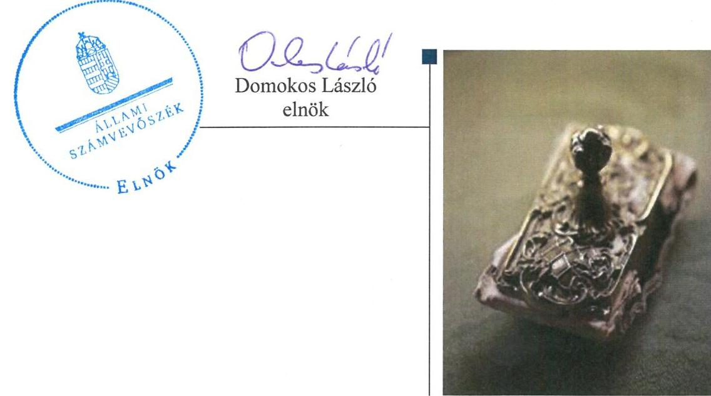

---

# AZ ELLENŐRZÉST FELÜGYELTE:

DR. HORVÁTH MARGIT felügyeleti vezető

## AZ ELLENŐRZÉST VEZETTE ÉS A VÉGREHAJTÁSÁÉRT FELELŐS:

VERTKOVCZI MÁRIA ellenőrzésvezető

## A PROGRAM ÖSSZEÁLLÍTÁSÁÉRT FELELŐS:

JANIK JÓZSEF LÁSZLÓ osztályvezető

IKTATÓSZÁM: V-0839-158/2016.

TÉMASZÁM: 1704

ELLENŐRZÉS-AZONOSÍTÓ SZÁM: V-070711

Jelentéseink az Országgyűlés számítógépes hálózatán és az Interneta a www.asz.hu címen is olvashatóak.

---

# TARTALOMJEGYZÉK 

■ ÖSSZEGZÉS ..... 5
■ AZ ELLENŐRZÉS CÉLJA ..... 7
■ AZ ELLENŐRZÉS TERÜLETE ..... 8
■ AZ ELLENŐRZÉS HÁTTERE, INDOKOLTSÁGA ..... 10
■ FÓKUSZKÉRDÉSEK ..... 11
■ ELLENŐRZÉS HATÓKÖRE ÉS MÓDSZEREI ..... 12
■ MEGÁLLAPÍTÁSOK ..... 14
■ JAVASLATOK ..... 31
■ MELLÉKLETEK ..... 33
I. Sz. melléklet: Értelmező szótár ..... 33
II. Sz. melléklet: Múködés főbb jellemzői ..... 36
■ FÜGGELÉK: ÉSZREVÉTELEK ..... 37
■ RÖVIDÍTÉSEK JEGYZÉKE ..... 51

---

.

---

# ÖSSZEGZÉS 

Az Állami Számvevőszék a Móri Hőtermelő- és Szolgáltató Kft. ${ }^{1}$ távhőszolgáltatási közfeladat ellátása gazdálkodási tevékenysége szabályszerűségét ellenőrizte a 2011-2014. években. Megállapította, hogy a közfeladat-ellátás önkormányzati megszervezése szabályszerű volt. A tulajdonosi jogait az Önkormányzat a hiányosságok ellenére szabályszerűen gyakorolta. A Társaság vagyongazdálkodása a belső szabályzatok hiányossága ellenére szabályszerűen valósult meg. A közfeladat-ellátás árképzési szabályzata hiányos, gyakorlata nem volt szabályszerű. A bevételek elszámolása kockázatos volt, a ráfordítások elszámolása megfelelően alakult, a beruházások elszámolása nem volt megfelelő. A kötelezettségek és a hátralékos vevőkövetelések a közfeladat-ellátásra nem jelentettek kockázatot.

## Az ellenőrzés társadalmi indokoltsága

Az Állami Számvevőszék középtávra szóló stratégiájában megfogalmazta, hogy a helyi önkormányzatok gazdálkodásában rejlő pénzügyi kockázatok feltárásával, az államháztartáson kívülre nyújtott költségvetési támogatások és ingyenes vagyonjuttatások, valamint az államháztartáson kívül múködő közfeladat-ellátó rendszerek ellenőrzéseivel hozzájárul ahhoz, hogy a közpénzeket az államháztartáson kívül múködő szervezetek is átlátható, rendezett módon használják fel a közfeladatok szerződésben vállalt ellátása érdekében.

A Magyarországon az intézmény-centrikus közfeladat-ellátás jellemző, de egyre jelentősebb a költségvetésen kívüli feladatellátás térnyerése. Ennek legfontosabb szereplői - a nonprofit szervezetek mellett - az önkormányzati tulajdonú gazdasági társaságok. Az önkormányzatok szervezetalakítási szabadságának következménye, hogy a korábban is vállalati formában múködő közszolgáltatások mellett, mind a kötelező, mind az önként vállalt feladatok ellátásában a gazdasági társaságok kiemelt fontosságú szerephez jutottak.

## Főbb megállapítások, következtetések, javaslatok

Az Önkormányzat a távhőszolgáltatás közfeladatának megszervezéséről az ellenőrzési időszakot megelőzően döntött, ellátásáról a 100 \%-os tulajdonában lévő gazdasági társasága útján gondoskodott. A társaság feletti tulajdonosi jogokat a Képviselő-testület gyakorolta. Az Alapító Okirat megfelelt a Gt. előírásainak, melyben az önkormányzat meghatározta a tulajdonosi joggyakorlás szabályait. A Képviselő-testület a könyvvizsgálóval kötendő szerződés tartalmi elemeinek meghatározását nem határozta meg. Az Önkormányzat az éves beszámolók alkalmával számoltatta be a Társaságot a tevékenységéről. Az Önkormányzat a Tszt. szerinti rendeletalkotási kötelezettségének a díjak szabályozási hiányosságai és a fejlesztendő területek kijelölésének hiánya ellenére eleget tett, tulajdonosi jogait a szabályozási hiányosságok ellenére megfelelően látta el.

A Jegyző a Tszt-ben előírt üzletszabályzatra vonatozó kötelezettségeit nem teljesítette. Az FB minden évben beszámoltatta az ügyvezetőt a Társaság tevékenységéről, gazdálkodásáról, üzleti tervéről, de a Gt. és a Ptk.-val ellentétesen nem készített Ügyrendet az ellenőrzött időszakban. Az üzleti terveket az ügyvezető az Alapító Okiratban előírt kötelezettsége alapján az ellenőrzött időszak minden évében elkészítette és a Képviselő-testület elé beterjesztette. A Képviselő-testület az éves beszámolókat minden évben megtárgyalta és elfogadta, a 2012. és 2013. években az FB írásbeli jelentésének hiányában. Az FB 2012-2013. években nem készített az éves beszámolókhoz írásbeli jelentést. A 2013-as évet érintő nyereségről az FB nem készített javaslatot és a Kt. nem döntött a felhasználásáról. A könyvvizs-

---

gáló az éves beszámolókat hitelesítő záradékkal látta el, 2014. évet kivéve eleget tett a Tszt.-ben előírt igazolási kötelezettségének, azonban a könyvvizsgáló a 2012-2013. években annak ellenére nyilatkozott a szétválasztási szabályozás megfelelősségéről, hogy a szabályzatok hiányosak voltak.

A Társaság rendelkezett a Számv.tv.-ben előírt számviteli és belső szabályzatokkal, azonban azok teljes körűen nem szabályozták a közfeladattal kapcsolatos Tszt. szerinti szétválasztást. A számlarend és a leltározás szabályzat Számv. tv-ben előírt aktualizálása a törvényben meghatározott időpontot követően történt. A bevételek, költségek és ráfordítások elkülönített nyilvántartását szabályozási hiányosságok ellenére a gyakorlatban biztosították. Az Avtv. és az Inf.tv előírások alapján az adatok védelméről és nyilvánosságra hozataláról és annak szabályozásáról részben gondoskodott a Társaság.

A Társaság a tulajdonában lévő vagyonnal a szabályozási hiányosságok ellenére alapvetően megfelelően gazdálkodott. A Társaság rendelkezett Számv. tv. szerinti leltározási szabályzattal, de az abban foglaltak ellenére a beruházások állományának évenkénti leltározását nem végezeték el. A kötelezettségek állománya nem jelentett kockázatot a közfeladat ellátásra, illetve a Társaság múködésére. A követelések behajtása érdekében az üzemeltetési szerződésben foglalt alapelveknek megfelelően intézkedéseket tettek.

A szabályozási hiányosságok ellenére a Társaságnál a távhőszolgáltatás közfeladattal kapcsolatos anyagjellegú ráfordítások elszámolása megfelelő volt, a bevételek elszámolása a 2012-ben előfordult nem megfelelő hődíj számlázása miatt kockázatot jelzett. A beruházások elszámolása a tulajdonosi jóváhagyások mellőzése, a nyilvántartások hiányossága és a helytelen értékcsökkenés alkalmazása miatt nem volt megfelelő. Az önkormányzati hatáskörben megállapított távhődíjakat önköltségszámítással nem támasztották alá, így az ármegállapítás nem volt szabályszerű. Az ellenőrzött időszakban a Rezsi. tv-ben foglalt távhődíjjal kapcsolatos növelést és csökkentéseket a jogszabályban foglaltaknak megfelelően végrehajtották.

---

# AZ ELLENŐRZÉS CÉLJA 

## Az Önkormányzat tulajdonosi joggyakorlása, továbbá a tulajdonában álló Társaság távhőszolgáltatással kapcsolatos közfeladat ellátását érintő gazdálkodási tevékenysége szabályszerűségének értékelése

AZ ELLENŐRZÉS CÉLJA annak értékelése, hogy az önkormányzat a jogszabályi előírások figyelembevételével döntött-e az ellenőrzésre kerülő közfeladat megszervezéséről; az önkormányzat/tulajdonosi joggyakorló szabályszerűen gyakorolta-e a tulajdonosi jogokat; a gazdasági társaság közfeladat-ellátása bevételeinek,ráfordításainak elszámolása, és vagyongazdálkodási tevékenysége megfelelt-e a jogszabályi, illetve a közszolgáltatási/vagyonkezelési szerződésben foglalt tulajdonosi előírásoknak, azok végrehajtása szabályszerű volt-e; a gazdasági társaság kötelezettségállománya jelent-e kockázatot a működésre, illetve a közfeladat ellátására; a közfeladatok átláthatósága és elszámoltathatósága érdekében biztosítva volt-e a közszolgáltatás dijának megalapozottsága szabályszerű önköltségszámítással.

---

# **Mór Város Önkormányzata és a kizárólagos tulajdonában lévő Móri Hőtermelő- és Szolgáltató Kft.**

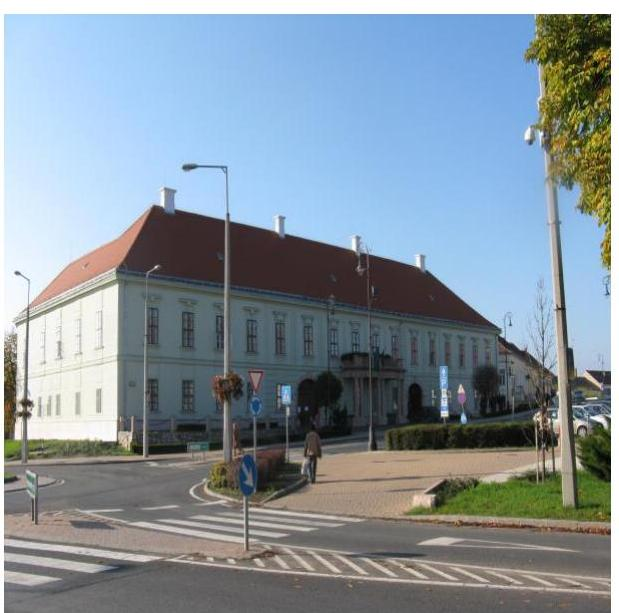

**MÓR VÁROS ÖNKORMÁNYZATA** a kizárólagos tulajdonában álló Móri Hőtermelő- és Szolgáltató Kft.-t az ellenőrzött időszakot megelőzően hozta létre. A Társaság alaptevékenysége Mór Város közigazgatási területén a távhőszolgáltatás biztosítása volt. Az ellenőrzött időszakban a Társaság a Távfűtési üzletágba tartozó távhőszolgáltatást, távhőtermelést, gázmotoros tevékenységet, továbbá egyéb tevékenység keretében a Wekerle Sándor Szabadidő Központ és Bérlemény Üzemeltetését látta el. A távhőszolgáltatási feladatok ellátásához szükséges közművagyont a Képviselő-testület apportként a Mórhő Kft. tulajdonába adta. Az Önkormányzat törzsbetétjének nagysága az ellenőrzött időszak végén 510,0 M Ft volt, amely 240,6 M Ft készpénzbetétből és 269,4 M Ft apportból állt.

A polgármester² a 2010. évi önkormányzati választások óta tölti be tisztségét, a jegyző személye 2013. január 1-én változott.

**A MÓRHŐ KFT.** a közel 14,6 ezer lakosú város közigazgatási területén 2014-ben 1202 lakossági és 52 közötti fogyasztó számára szolgáltatott fűtést és használati meleg vizet. A lakossági felhasználók száma az ellenőrzött időszakban nem változott, a közötti felhasználók száma hattal, 13,0%-kal bővült

A Társaság 2011. és 2014. évi adatait az 1. ábra mutatja.

1. ábra

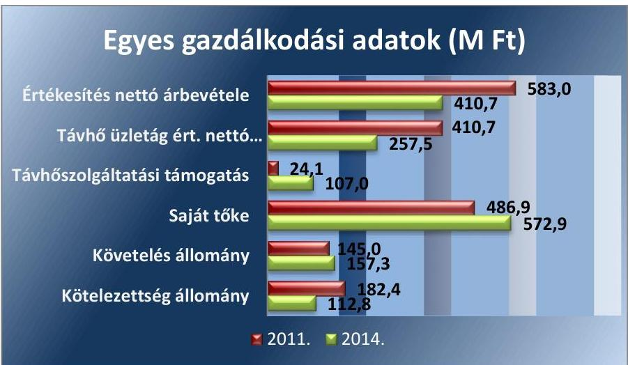

*Forrás: Mórhő Kft. éves beszámolói*

Az ellenőrzött időszakban a Társaság távhőszolgáltatással kapcsolatos nettó árbevétele a távhődíjak csökkentésének következtében 62,7%-kal

---

csökkent a 2011. és a 2014. év között. A követelések növekedtek, de nem jelentettek kockázatot a Társaság múködésére. A kötelezettség állományára az ellenőrzött időszakban a fedezet biztosított volt.

A TÁVFŰTÉSI ÜZLETÁG feladata volt a fűtőmú, az elosztó hálózat, valamint a hőfogadó állomások üzemeltetése, távhőszolgáltatás, díjak beszedése, hátralékok kezelése, villamosenergia termelés (gázmotoros tevékenység), a fűtési, valamint a hideg- és melegvizes rendszerek karbantartása, fejlesztése. A Társaság jelenlegi ügyvezetője ${ }^{3}$ 2012. június 1-től vezeti a társaságot, gazdasági vezetőt 2012. június 30 -át követően nem foglalkoztattak. A könyvvizsgálói feladatokat a Képviselő-testület által többször újra választott könyvvizsgáló látta el. A Felügyelőbizottság három taggal múködött.

---

# AZ ELLENŐRZÉS HÁTTERE, INDOKOLTSÁGA 

## A gazdasági társaságok a közfeladatok ellátásában kiemelt fontosságú szerephez jutottak

## AZ ÖNKORMÁNYZATI TULAJDONÚ GAZDASÁGI

TÁRSASÁGOK teljes körű ellenőrzésének lehetőségét az ÁSZ. tv. 2011. január 1-jétől hatályos módosítása teremtette meg. A közfeladatot ellátó gazdasági társaságok ellenőrzése kiemelten fontos a vagyon megőrzése, megóvása érdekében, valamint a kormányzati szektor elszámolásaiban megjelenő önkormányzati tulajdonú gazdálkodó szervezetek esetében, amelyekkel szemben alapvető követelmény, hogy gazdálkodásuk, müködésük szabályszerű, az általuk szolgáltatott adatok minél megbízhatóbbak legyenek. A közfeladat ellátás költségeinek, ráfordításainak alakulása, színvonala hatással van a lakosság elégedettségére.

A törvényalkotás számára - az észlelt problémák, szabálytalanságok, vagy egyéb nem kívánatos jelenségek felszínre kerülésével - az ellenőrzés megállapításai segítséget nyújthatnak az államháztartáson kívüli közfel-adat-ellátás értékeléséhez, jogszabályi keretei pontosításához, átláthatóságot biztosító szabályozásához. Meghatározhatóvá válnak a közfeladat ellátásban részt vevő államháztartáson kívüli szervezeteknek - az önkormányzat költségvetését, pénzügyi helyzetét is befolyásoló - kockázatai, lehetővé válik ezen kockázatok csökkentése. Ellenőrzéseink feltárhatják, hogy az önkormányzat közfeladat-ellátási kötelezettségének szabályszerűen tett-e eleget, a feladatellátáshoz rendelt közvagyon működtetését a tulajdonostól elvárható gondossággal, szabályszerűen szervezte-e meg és a tulajdonosi felügyelete hozzájárult-e a közfeladat-ellátásához. Az ellenőrzés rávilágíthat arra, hogy a gazdasági társaság a közszolgáltatási szerződésben foglaltak betartásával, a közvagyon használatával biztosította-e a szolgáltatás folyatatásának feltételeit, a közfeladat ellátását. Ezzel az ellenőrzöttek és a helyi döntéshozók számára visszajelzést ad feladatszervezési, feladat-ellátási kockázataikról, alapot ad a meglévő hibák megszüntetéséhez, a jobb közfeladat-ellátás biztosításához. Fokozza a fegyelmet, igazolja, hogy lejárt a következmények nélküli ellenőrzések időszaka. Az ÁSZ értékteremtő rend kialakításához és megőrzéséhez hozzájáruló tevékenysége pozitív hatással van a szervezetről kialakított összkép formálására.

---

# FÓKUSZKÉRDÉSEK 

1. Az Önkormányzat közfeladat megszervezéséről szóló döntése, valamint tulajdonosi joggyakorlása szabályszerű volt-e?
2. A gazdasági társaság vagyongazdálkodása szabályszerű volt-e, kötelezettségállománya jelentett-e kockázatot a müködésre, illetve a közfeladat ellátásra?
3. A gazdasági társaságnál az ellátott közfeladat bevételei és ráfordításai elszámolása, valamint az önköltségszámítás és árképzés szabályszerű volt-e?

---

# ELLENŐRZÉS HATÓKÖRE ÉS MÓDSZEREI 

## Az ellenőrzés típusa

Megfelelőségi ellenőrzés

## Az ellenőrzött időszak

2011. január 1-jétől 2014. december 31-ig.

## Az ellenőrzés tárgya

A közfeladatot gazdasági társaságokkal ellátó önkormányzatok tulajdonosi joggyakorlása, valamint gazdasági társaságok pénz- és vagyongazdálkodásának szabályozottsága és szabályszerűsége.

Az ellenőrzés kiterjed minden olyan körülményre és adatra, amely az ÁSZ jogszabályban meghatározott feladatainak teljesítéséhez, valamint a program végrehajtása folyamán felmerült újabb összefüggések feltárásához szükséges.

## Az ellenőrzött szervezet

Az ellenőrzött szervezetek:
Mór Város Önkormányzata
Móri Hőtermelő- és Szolgálató Kft.

## Az ellenőrzés jogalapja

Az ellenőrzés jogszabályi alapját az Állami Számvevőszékről szóló 2011. évi LXVI. törvény 5. § (3)-(4)-(5) bekezdései képezik.

## Az ellenőrzés módszerei

Az ellenőrzést a nemzetközi standardokat irányadónak tekintve az ellenőrzési program ellenőrzési kérdései, az ellenőrzött időszakban hatályos jogszabályok, az ellenőrzés szakmai szabályok és módszertanok figyelembe vételével végezzük.

Az ellenőrzés ideje alatt az ellenőrzött szervezettel történő kapcsolattartást az ÁSZ Szervezeti és Müködési Szabályzatának vonatkozó előírásai alapján biztosítjuk.

---

Az ellenőrzés a kiválasztott, többségi tulajdonosi jogokat gyakorló önkormányzatra, illetve az ellenőrzésre kijelölt közfeladatot ellátó gazdasági társaság felett tulajdonosi jogokat gyakorló szervezetre és az ellenőrzött közfeladatot ellátó gazdasági társaságra terjed ki. Amennyiben a gazdasági társaságban több önkormányzat együttesen többségi tulajdonos, úgy az ellenőrzést a többségi tulajdonosi jogokat gyakorló önkormányzatnál kell lefolytatni. Az ellenőrzött gazdasági társaságnál, amennyiben az több közfeladatot is ellát, akkor az ellenőrzésre kiválasztott közfeladat-ellátást ellenőrizzük.

Az ellenőrzést a kérdésekre adott válaszok kiértékelésével, valamint a megjelölt adatforrások, a csatolt tanúsítványok felhasználásával, továbbá az adott időszakban hatályos jogszabályok figyelembe vételével kell lefolytatni. Az ellenőrzési kérdések megválaszolásához szükséges bizonyítékok megszerzése a következő ellenőrzési eljárások alkalmazásával történik: megfigyelés, kérdésfeltevés (információkérés), összehasonlítás, valamint elemző eljárás. A bevételek és ráfordítások elszámolása, valamint a vagyonnyilvántartás terén a szabályszerű múködést véletlen mintavétellel ellenőriztük. A jogszabályoknak és a belső előírásoknak megfelelőnek tekintettük az adott területet, amennyiben a minta ellenőrzésének eredménye alapján 95\%-kos bizonyossággal a teljes sokaságban a hibaarány kisebb volt, mint 10\%, nem megfelelőnek, ha a hibaarány a 10\%-ot meghaladta. Kockázatot, illetve magas kockázatot jeleztünk, amennyiben egy adott terület vonatkozásában a minta alapján a teljes sokaságban nem volt egyértelmúen biztosított a jogszabályoknak és a belső szabályzatoknak megfelelő múködés. A ráfordítások elszámolására és a vagyonnyilvántartásra vonatkozó véletlen mintavételt kockázati alapú kiválasztással egészítettük ki, amelynek során a három legnagyobb összegű tételt választottuk ki.

---

# 1. Az Önkormányzat közfeladat megszervezéséről szóló döntése, valamint tulajdonosi joggyakorlása szabályszerű volt-e? 

Összegző megállapítás

Az Önkormányzat szabályszerűen gondoskodott a közfeladat gazdasági társaság útján történő ellátásáról, tulajdonosi jogait 2012-2013. években az FB írásbeli jelentésének hiánya, a díjak szabályozási és a fejlesztési területek kijelölési hiánya ellenére megfelelően gyakorolta, a Jegyző üzletszabályzattal kapcsolatos kötelezettségének nem tett eleget.
1.1. számú megállapítás

Az Önkormányzat az ellenőrzést megelőző időszakban döntött a közfeladat-ellátás megszervezéséről, a tulajdonosi joggyakorlás szabályait döntően az Alapító Okiratban határozta meg, rendeletalkotási kötelezettségének a díjak szabályozási hiányosságai és a fejlesztési területek kijelölésének hiánya ellenére a Képviselő-testület eleget tett, a Jegyző az üzletszabályzatra vonatozó kötelezettségeit nem teljesítette.

A távhőszolgáltatással ellátott létesítmények távhőellátásának távhőszolgáltatásra engedéllyel rendelkezők útján történő biztosítása a Tszt. ${ }^{4} 6$. § (1) bekezdésének értelmében a területileg illetékes települési önkormányzat kötelező feladata. Az Önkormányzat ${ }^{5}$ a 100\%-os tulajdonában lévő Társaság ${ }^{6}$ 1997. évi megalapításával, és folyamatos működtetésével biztosította a távhőszolgáltatási feladatok ellátását.

Az Önkormányzat az Nvtv. ${ }^{7}$ 9. § (1) bekezdése szerint megalkotta és elfogadta a Közép- és hosszú távú vagyongazdálkodási tervét ${ }^{8}$.

A gazdasági program ${ }^{9}$-ban az Ötv ${ }^{10}$. 91. § (6) bekezdésében és a Mötv. ${ }^{11}$ 116. § (3)-(4) bekezdésében foglaltak ellenére az Önkormányzat nem fogalmazta meg a távhőszolgáltatás, mint kötelezően ellátandó közfeladat fejlesztésével kapcsolatos elképzeléseket, a közszolgáltatás biztosítására, színvonalának javítására vonatkozó megoldásokat.

A TÁRSASÁG ALAPÍTÓ OKIRATA ${ }^{12}$ az ellenőrzött időszakban több alkalommal Képviselő-testület ${ }^{13}$ által módosításra került a törzsbetét emelése, ügyvezető, $\mathrm{FB}^{14}$ tagok személyében bekövetkezett változás, a tevékenységi kör pontosítása, könyvvizsgálói feladatok ellátása, illetve a jogszabályi előírások átvezetése következtében. A Gt. ${ }^{15}$ 12. § (1) bekezdésében, továbbá Ptk. ${ }^{16}$ 3:5 §-ában előírt tartalmi követelmények, továbbá a Gt. 19. § (2) bekezdése és a Ptk 3:109 §-a szerint tartalmazta az Alapító ${ }^{17}$ kizárólagos hatáskörébe tartozó feladatokat. Többek között a beszámoló elfogadása, az eredmény felosztása, ügyvezető, könyvvizsgáló, FB tagok megválasztása, ügyvezető elleni kártérítési igények érvényesítése, alapító Okirat módosítása, megszűnés, átalakulás elhatározása. A Képvi-

---

selő-testület a Gt. 41. § (1) bekezdésében foglaltakat betartva a könnyvizsgálóval kötendő szerződés lényeges elemeinek tartalmát a 76/2014. (IV.30.) Kt. határozatában előírta.

Az Önkormányzat és a Társaság 1997-ben Üzemeltetési szerződést ${ }^{18}$ kötött az Önkormányzat tulajdonában lévő fogyasztói hőközpontok, távhőés táv- melegvíz vezetékek, valamint a Móri Fútőmú berendezéseinek üzemeltetésére, karbantartására vonatkozóan. A közfeladattal kapcsolatos garanciális kötelezettségeket az üzemeltetési szerződésben rögzítették.

Társaság ellenőrzött időszakban hatályos Üzletszabályzatát ${ }^{19}$ és annak 2014-es módosítását (közüzemi szabályzatát ${ }^{20}$ ) a Jegyző ${ }^{21}$ a Tszt. 7. § (1) bekezdés a) pontját megsértve nem küldte meg a fogyasztóvédelmi hatóságnak véleményeztetésre, továbbá a Tszt. 7. § (1) bekezdés b) pontjában, valamint az Üzletszabályzatban és közüzemi szabályzatban foglaltak ellenére nem hagyta jóvá. A Tszt. 7. § (1) bekezdés c) pontját megsértve nem ellenőrizte a Társaság távhőszolgáltató tevékenységét az Üzletszabályzatban foglaltak betartása szempontjából.

RENDELET alkotási kötelezettségének az Önkormányzat a Tszt. 6. § (2) bekezdésében előírtaknak részben tett eleget. A távhőszolgáltatással kapcsolatos díjakra vonatkozó előírásokat a Távhő rendelet ${ }^{22}$ tartalmazta. A Távhő rendeletet azonban, a Tszt 57/D. § (1) bekezdése szerinti hatósági ár 2011. április 15-ei hatálybalépését követően, amely alapján az Önkormányzat ármegállapítási jogköre a lakossági felhasználónak és a külön kezelt intézménynek nyújtott távhőszolgáltatás (fűtés és használati melegvíz) díja tekintetében megszűnt, nem aktualizálták.

A Tszt. 6. § (2) bekezdés b) pontjában előírtak ellenére - 2011. október 1-jét követően - rendeletben nem határozták meg a távhő szolgáltatási csatlakozási díj fizetési feltételeit, a lakossági felhasználók és a külön kezelt intézményeknek nyújtott távhőszolgáltatásra vonatkozó, 50/2011. (IX. 30.) NFM rendeletben ${ }^{23}$ nem szabályozott díjalkalmazási és díjfizetési feltételeket.

A TSzt. 6. § (2) bekezdés c) pontjával ellentétesen a Képviselő-testület rendeletben nem jelölte ki azokat a területeket, ahol területfejlesztési, környezetvédelmi és levegőtisztaság-védelmi szempontok alapján célszerűnek tartja a távhőszolgáltatás fejlesztését.

A hatósági ár alá tartozó fogyasztók távhőszolgáltatás alapdíját, a fútési hődját, a mért energia díját, valamint a melegvíz hődíját - a hatósági árak bevezetését megelőzően - utolsó alkalommal 2008. október 15-ei hatállyal a határozattal módosította a Képviselő-testület. Az ármegállapításal kapcsolatban az ellenőrzött időszakban az Önkormányzat a hatályos Távhőrendeletében keretszabályokat jelölt meg, és a törvényi előírásnak megfelelő - a kalkulációs egységenkénti indokolt és szükséges költségek, ráfordítások körére, a fedezetszámítás módjára, az önköltség kalkuláció tartalmára vonatkozó - részletes szabályok kidolgozását írta elő, melynek a Társaság önköltségszámítási szabályzatában foglaltakkal tett eleget.

---

### 1.2. számú megállapítás

Tulajdonosi jogait az Önkormányzat az FB 2012-2013. éveket érintő írásbeli jelentésének, illetve az FB ügyrendjének és a javadalmazási szabályzat elkészítésének hiánya ellenére megfelelően gyakorolta. A Képviselő-testület a 2013. évi nyereség felosztásáról döntést nem hozott.

## A TÁRSASÁG FELETTI TULAJDONOSI JOGOKAT

Képviselő-testület gyakorolta, tulajdonosi joggyakorlással kapcsolatos jogosítványok átadásáról nem döntött, ezt figyelembe véve határozta meg az Alapító Okiratban az FB és az ügyvezető hatáskörét. Ennek megfelelően a Képviselő-testület hatáskörébe tartozott többek között a Társaság számviteli törvény szerinti beszámolójának elfogadása, az eredmény felhasználásra vonatkozó döntés, az ügyvezető és a könyvvizsgáló ${ }^{24}$ megválasztása, visszahívása és díjazása, az FB tagok megválasztása, az Alapító Okirat módosítása.

Az Alapító Okiratban foglaltaknak megfelelően a Társaság ügyvezetőjét, az FB tagjait, a könyvvizsgálót a Képviselő-testület választotta meg.

A FELÜGYELŐBIZOTTSÁG a Gt. 34. § (1) bekezdésében foglaltaknak megfelelően három tagból állt, akik közül az egyik tag önkormányzati képviselő volt. Feladatait, múködésének rendjét a Társaság Alapító Okiratában rögzítették.

A Gt. 34. § (4) bekezdésében, illetve a Ptk. 3:122. § (3) bekezdésében, valamint az Alapító Okirat 10/1/2 pontjában foglaltak ellenére az FB nem rendelkezett ügyrenddel.

A FB a Társaság ügyvezetőjét az éves ülésén a Társaság tevékenységéről, valamint a következő üzleti évre vonatkozó tevékenységéről beszámoltatta. Az FB minden évben értékelte a társaság gazdálkodását, beszámolóját, az üzleti terv koncepciókat valamint az üzleti terveket, melyeket a Kt. elé terjesztett.

A BESZÁMOLTATÁSI RENDSZER keretében a Társaság 2011-2014. évekre vonatkozó Üzleti terveit és üzleti terv koncepcióit a Képviselő-testület az ellenőrzött időszak minden évére vonatkozóan megtárgyalta és elfogadásáról határozattal döntött. Az üzleti tervek tartalmi követelményeire, a tulajdonos felé történő beterjesztés módjára, határidejére vonatkozó elvárásokat, szabályokat az Önkormányzat nem fogalmazott meg. A Számv. tv. ${ }^{25}$ 4. §-ában előírt éves számviteli beszámolón túl nem határoztak meg beszámolási kötelezettséget az üzleti terv végrehajtásával, közszolgáltatási tevékenység teljesítésével, a közvagyonnal való gazdálkodással kapcsolatosan, de az éves beszámoló elfogadásakor a tevékenységéről is beszámoltatta a Képviselő-testület a Társaságot. A Kt. üléseket megelőzően az Önkormányzat Pénzügyi Bizottsága ${ }^{26}$ megtárgyalta az éves beszámolókat, melyet a Képviselő-testületi ülésen ismertettek.

Az éves beszámolókat a Képviselő-testület a könyvvizsgáló jelentésének és a 2011., 2014. évi beszámolók esetében az FB írásos Jelentésének (jegyzőkönyvének) birtokában fogadta el.

A 2012. és a 2013. évi beszámolót a Gt. 35. § (3) bekezdés és a Ptk. 3:120. § (2) bekezdés, továbbá az Alapító Okirat 10/1/3. pontjában foglaltakkal ellentétesen az FB írásos Jelentése (jegyzőkönyve) hiányában szabálytalanul fogadta el a Képviselő-testület. A Jegyző nem tett eleget az

---

Mötv. 81. § (3) bekezdés e) pontjában előírt kötelezettségének, mivel nem jelezte a Képviselő-testületnek, hogy a döntésük jogszabálysértő.

A 2013. évi eredmény felhasználásáról az Alapító Okirat 11. pontjában és a Ptk. 3:109. § (2) bekezdésében foglaltak ellenére a Képviselő-testület nem döntött. Az ellenőrzött időszakban osztalékfizetésre nem került sor.

JAVADALMAZÁSI SZABÁLYZATOT a Taktv². 5. § (3) bekezdésében foglaltak ellenére a Képviselő-testület nem alkotta meg a Mórhő Kft. vezető tisztségviselőire, Felügyelőbizottság tagjaira, valamint a munkavállalók javadalmazására vonatkozóan, továbbá a jogviszony megszűnése esetére biztosított juttatások módjára vonatkozó, mértékének elveit tartalmazó rendszerét nem határozta meg.

Azonban a Képviselő-testület által elfogadott éves üzleti tervben a személyi jellegű kiadásokat megtervezték. A Képviselő-testület az ügyvezető prémium feltételit határozataiban rögzítette, a feltételek teljesítéséről, a jutalom kifizetéséről szintén határozataival döntött. A Képviselő-testület az az ügyvezető részére az előírt feltételek teljesítése alapján a 2013-2014. években prémium kifizetésekről döntött. Az ügyvezető tevékenységét munkaviszony keretében látta el.

Az Ötv. 92. § (11) bekezdés b) pontjában, valamint az Áht. 70. § (1) bekezdés d) pontjában foglalt belső ellenőrzés lefolytatásának lehetőségével a tulajdonos Önkormányzat az ellenőrzött évek alatt nem élt a Mórhő Kftnél.

A Mórhő Kft. az ellenőrözött időszakban - 2013. év kivételével - veszteségesen gazdálkodott, de a távfűtési üzletág tekintetében a 2012. és 2013. években pozitív eredményt mutatott. A veszteség rendezésére a Gt. 51. §-a előírása alapján az Önkormányzatnak intézkedési kötelezettsége nem keletkezett, mert a Társaság saját tőkéjének összege két egymást követő lezárt évben nem csökkent a jegyzett tőke - társasági formára - meghatározott szintje alá.

A Társaság és a Távfűtési üzletág adózás előtti eredményét a 2. ábra mutatja be.
2. ábra
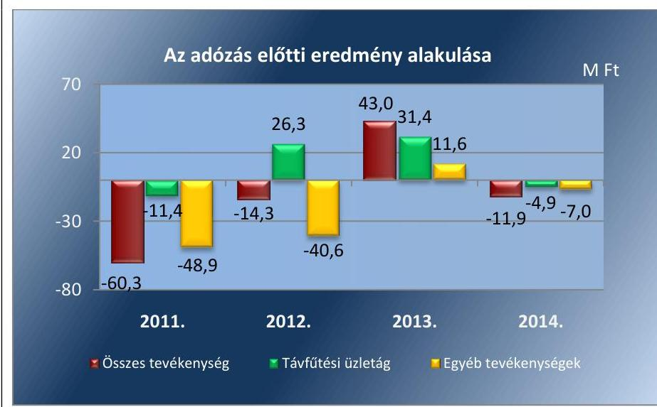

Forrás: a Társaság beszámolói

---

# 2. A gazdasági társaság vagyongazdálkodása szabályszerű volt-e, kötelezettségállománya jelentett-e kockázatot a múködésre, illetve a közfeladat ellátásra? 

Összegző megállapítás

2.1. számú megállapítás

A Társaság vagyongazdálkodása a szabályozási hiányosságok ellenére alapvetően szabályszerű volt, a beruházások leltározását nem végezték el, a kötelezettségállománya nem jelentett múködési, közfeladat-ellátási kockázatot.

A Társaság rendelkezett gazdálkodási szabályzatokkal, azonban azok nem minden esetben követték a jogszabályi változásokat, a szabályozás nem biztosította teljes körűen a közfeladat ellátás és az egyéb tevékenységek valamennyi bevételének és ráfordításának szabályszerű elkülönítését.

AZ ÜZLETI TERVEKET az ügyvezető az Alapító Okiratban előírt kötelezettsége alapján az ellenőrzött időszak minden évében elkészítette és a Képviselő-testület elé terjesztette. Az üzleti tervek üzletáganként tartalmazták a tárgyévre tervezett bevételeket és ráfordításokat, valamint az egyes üzletágak tervezett eredményét.

A Társaság rendelkezett a Számv. tv. 14. § (4) bekezdés előírásának megfelelő, hatályos számviteli politikával ${ }^{28}$ és a Számv. tv. 14. § (5) bekezdés a)-d) pontjai előírásának megfelelően leltározási szabályzattal ${ }^{29}$ az eszközök és források értékelési szabályzatával ${ }^{30}$, pénzkezelési szabályzattal ${ }^{31}$, amortizációs szabályzattal ${ }^{32}$ és az önköltségszámítás rendjére vonatkozó szabályzattal ${ }^{33}$. Rendelkezett a Társaság a Számv. tv. 161. § (1) bekezdésében előírt számlarenddel ${ }^{34}$, továbbá a selejtezés rendjét tartalmazó szabályzattal ${ }^{35}$.

A SZÁMVITELI POLITIKA a Számv. tv. 14. § (4) bekezdésében foglaltaknak megfelelően tartalmazta többek között a mérleg és eredmény kimutatás típusát, a mérlegkészítés időpontját, meghatározta az eszközök besorolását, a céltartalék képzés, valamint a beszámoló nyilvánosságra hozatalának szabályait.

Távhőtermelői és távhőszolgáltatói tevékenység számviteli szétválasztási szabályait részben a számlarend, a számlakeret és az önköltségszámítási szabályzat tartalmazta. A szabályozás azonban nem volt elég részletes az éves beszámoló kiegészítő mellékleteinek közvetlen alátámasztásához, így nem mindenben felelt meg a Tszt. 18/A. § (2) bekezdésében és a Számv. tv. 161/A. § (1) bekezdésében foglaltaknak.

A Társaság az ellenőrzött időszakban a számlatükörben meghatározott főkönyvi számlákra bontással írta elő az egyes tevékenységekhez, üzletágakhoz közvetlenül kapcsolódó árbevételek, ráfordítások főkönyvi számlánkénti szétválasztását, elkülönített kimutatását.

A közvetett költségek egy részének tevékenységek közötti szétbontásával kapcsolatos vetítési alapokat az önköltségszámítási szabályzat tartalmazta, a vetítési alapok évenkénti újraszámításának előírásával. Az önköltségszámítási szabályzatot a Társaság az alaptevékenység jellege kö-

---

vetkeztében 2007-ben készítette el, mely részben tartalmazott a szétválasztásra vonatkozóan szabályokat. Az ellenőrzött időszak végéig a szétválasztási szabályokkal kapcsolatosan az önköltségszámítási szabályzat nem került kiegészítésre, így a Tszt. 2012. január 1-jétől hatályos számviteli szétválasztásra vonatkozó szabályozását az ellenőrzött időszakban nem tartalmazta teljes körűen. Hiányzott a szabályozásból az egyéb-, pénzügyi- és rendkívüli ráfordítások és bevételek tevékenységek közötti felosztásának szabályozása, mely ellentétes a Tszt. 18/A. § (2)-(3) bekezdéseivel, mivel a kiegészítő mellékletben bemutatott önálló eredmény és mérleg-kimutatással az egyes tevékenységeket oly módon köteles bemutatni, mintha azt önálló vállalkozásként végezte volna. Ez esetben a Sztv. 161/A. § (1) bekezdésében foglaltak alapján a Társaságnak a szétválasztást a belső szabályzataiban minden költség nemre vonatkozóan szabályoznia kellett volna.

A számlarend a 2013. évben történt módosításig nem teljes körűen tartalmazta a számlatükörben szereplő szétválasztással kapcsolatos főkönyvi számlákat. A Társaság felelős vezetője ezzel nem tett eleget a Számv. tv. 161. § (5) bekezdésében foglaltaknak, mivel a módosításokat 90 napon belül nem vezette át a számlarendjén.

A Számv. tv. 69. § (3) bekezdésében foglalt 2012. január 1-jétől hatályos rendelkezését a Számv tv. 14. § (1) bekezdésében előírt 90 napos határidőt követően. 2012. április 1. helyett, 2012. július 1-jével vezették át a leltározási szabályzaton.

# 2.2. számú megállapítás 

A Társaság a tulajdonában lévő vagyonnal a szabályozási hiányosságok ellenére megfelelően gazdálkodott, azonban a mérlegtételeket a beruházások esetében leltárral nem támasztotta alá.

A Társaság a távhőszolgáltatási közfeladatát saját eszközivel látta el, üzemeltetésre átvett, illetve vagyonkezelésbe vett eszköze nem volt. Az immateriális javak és tárgyi eszközök nyilvántartása tevékenységenként elkülönített egyedi nyilvántartó kartokon történt, amely biztosította a távhőszolgáltatási közfeladat ellátását biztosító eszközállomány bruttó és nettó értékének, valamint értékcsökkenésének elkülönítését.

A Társaság a leltározási és selejtezési szabályzatban foglaltak alapján az ellenőrzési időszakban előírt selejtezést végrehajtotta, azonban a leltározási kötelezettségének nem teljes körűen tett eleget.

A beruházások tekintetében nem végezte el a leltározási szabályzatban előírt évenkénti leltározást.

A Társaság főbb mérlegadatait az 1. táblázat szemlélteti.

1. táblázat

A TÁRSASÁG FŐBB MÉRLEG ADATAI TELJES TEVÉKENYSÉG (MILLIÓ FT)

| Megnevezés | 2011. | 2011. | 2012. | 2013. | 2014. |
| :--: | :--: | :--: | :--: | :--: | :--: |
|  | 01.01 | 12.31. | 12.31. | 12.31. | 12.31. |
| I. Befektetett eszközök | 918,0 | 872,7 | 806,7 | 764,9 | 770,4 |
| - ebből: Tárgyi eszközök | 917,5 | 872,5 | 806,6 | 762,1 | 767,9 |
| ebből Távfútési üzletág | $x$ | $x$ | 320,6 | 285,4 | 311,6 |
| II. Forgó eszközök | 184,7 | 282,5 | 349,8 | 3434,3 | 355,2 |
| - ebből: Követelések | 72,1 | 144,7 | 137,5 | 171,8 | 157,3 |
| ebből Távfútési üzletág | $x$ | $x$ | 40,1 | 61,1 | 73,3 |
| - ebből: Pénzeszközök | 110,7 | 136,1 | 210,8 | 261,1 | 196,5 |

---

| Megnevezés | 2011. | 2011. | 2012. | 2013. | 2014. |
| :--: | :--: | :--: | :--: | :--: | :--: |
|  | 01.01 | 12.31 | 12.31 | 12.31 | 12.31 |
| III. Aktív időbeli elhatárolások | 55,4 | 19,3 | 20,5 | 17,0 | 13,6 |
| Eszközök összesen | 1158,1 | 1174,5 | 1177,0 | 1216,2 | 1139,2 |
| IV. Saját tőke | 486,9 | 498,6 | 544,0 | 586,0 | 572,9 |
| ebből Távfütési üzletág | $x$ | $x$ | 244,4 | 216,8 | 237,7 |
| - ebből: Jegyzett tőke | 498,0 | 510,0 | 510,0 | 510,0 | 510, |
| ebből Távfütési üzletág | $x$ | $x$ | 229,1 | 188,7 | 211,6 |
| - ebből: Tőketartalék | 0,0 | 60,0 | 119,7 | 119,7 | 119,7 |
| - ebből Mérleg szerinti eredmény | $-19,5$ | $-60,3$ | $-14,3$ | 42,0 | $-13,1$ |
| ebből Távfütési üzletág | $x$ | $x$ | $-6,4$ | 15,5 | $-5,4$ |
| V. Céltartalékok | 1,8 | 0,6 | 0,0 | 0,0 | 0,0 |
| VI. Kötelezettségek | 42,0 | 182,4 | 160,0 | 172,6 | 112,8 |
| ebből Távfütési üzletág | $x$ | $x$ | 46,5 | 63,9 | 46,8 |
| - ebből: szállítókkal szembeni kötelezettség | 3,9 | 159,3 | 143,1 | 150,8 | 98,0 |
| VII. Passzív időbeli elhatárol sok | 627,4 | 492,9 | 473,0 | 457,6 | 453,5 |
| Források összesen | 1158,1 | 1174,5 | 1177,0 | 1216,2 | 1139,2 |

2. táblázat

TÁVFÜTÉSI ÜZLETÁG ESZKÖZÁLLOMÁNYA (M FT/\%)

|  | 2012 | 2013 | 2014 |
| :--: | :--: | :--: | :--: |
| Összes eszközérték |  |  |  |
|  | 1177,0 | $\begin{gathered} 1216 \\ 2 \end{gathered}$ | 1139,2 |
| ebből Távhőtermelési üzletág |  |  |  |
| M Ft | 428,5 | 450,0 | 472,7 |
| \% | 36,4 | 37,0 | 41,5 |
| ebből távhőszolgáltatás |  |  |  |
| M Ft | 214,2 | 188,9 | 241,3 |
| \% | 18,2 | 15,5 | 21,2 |

Forrás: Társaság 2011-2014. évi beszámolói

AZ ESZKÖZÉRTÉK az ellenőrzött időszakban összességében 18,9 M Ft-tal, 1,6\%-kal csökkent. A befektetett eszközökön belül a tárgyi eszközök 149,6 M Ft-tal, 16,3\%-kal csökkentek, elsősorban az elszámolt értékcsökkenésnél kisebb összegben megvalósuló fejlesztések következtében.

A Távfütési üzletág esetében a 2012. évtől kezdődő tevékenységenkénti szétválasztás alapján rendelkezésre álló adatok szerint a tárgyi eszközök állománya 2012-2014. évek között 2,8\%-kal, 9,0 M Ft-tal csökkent a megvalósított fejlesztések és az elszámolt értékcsökkenés együttes hatásaként.

A távfütési üzletág eszközállományának alakulását a szétválasztási szabályok hatálybalépését követően 2012-2014. évekre vonatkozóan a 2. táblázat tartalmazza.

A forgóeszközök állománya 170,5 M Ft-tal 92,3\%-kal növekedett az ellenőrzött időszakban, melyből a követelések állománya kedvezőtlenül alakult, több mint a kétszeresére emelkedett. A távhőszolgáltatás követelésállománya a teljes követelésállomány 25,5\%-a, 40 M Ft volt 2014. december 31-én.

A távhőszolgáltatás valamint a további tevékenységek mérleg adatok szerinti szétválasztását a Tszt. 2012-től kezdődően írta elő, ezért az ellenőrzött időszakra vonatkozóan a követelésállományának alakulását a 3. ábra 2012. évtől kezdődően szemlélteti. 2012-ben a gázmotoros tevékenység adatai az egyéb tevékenységek között szerepelt.

---

3. táblázat

TÁVFŰTÉSI ÜZLETÁG NETTÓ ÁRBEVÉTELE (M FT)

|  év | Nettó árbevétele  |
| --- | --- |
|  2011 | 410,7  |
|  2012 | 366,1  |
|  2013 | 391,9  |
|  2014 | 257,5  |

Forrás: Társaság éves beszámoló kiegészítő melléklete 3. ábra

A 5AJÁT TÖKE nagysága az ellenőrzött időszakban 86 M Ft-tal, 17,7\%-kal emelkedett. A Jegyzett tőke összegét az Önkormányzat 2011ben 12 M Ft-tal 510,0 M Ft-ra emelte, a további években nem változott. A jegyzett tőke emelésével egyidejűleg - a Társaság müködéséhez - az Önkormányzat 60,0 M Ft-ot tőketartalékba helyezett. A Távfütési üzletág saját tőke nagysága 2012-2014. évek között kis mértékben, 2,7\%-kal csökkent, a 2012. évi 244,4 M Ft-ról 2014. december 31-re 237,7 M Ft-ra 6,7 M Ft-tal kevesebb lett.

Az értékesítés nettó árbevétele az ellenőrzött időszakban 29,6\%-kal csökkent. A Távfütési üzletág ${ }^{36}$ nettó árbevétele a Társaság értékesítési nettó árbevételének 70,4\%-át tette ki a 2011. évben, míg a 2014. évben már csak az 56,5\%-át. A Távfütési üzletág nettó árbevétele folyamatosan csökkent az ellenőrzési időszakban. A távhőszolgáltatás nettó árbevétele visszaesésének fő oka a távhőszolgáltatási díakat érintő hatósági ármegállapítás, valamint a rezsicsökkentés volt.

A hatósági áras távhő szolgáltatás miatt elszenvedett veszteség kompenzálására kapott állami támogatásokat, továbbá a Társaság és a távfütési üzletág eredményének alakulását a 4. táblázat mutatja:

## AZ EREDMÉNY ÉS A TÁMOGATÁS KAPCSOLATA (M FT)

|  Megnevezés | 2011 | 2012 | 2013 | 2014  |
| --- | --- | --- | --- | --- |
|  Hődíj támogatás | 24,1 | 93,6 | 130,4 | 107,0  |
|  Mérleg-szerinti eredmény | $-60,3$ | $-14,3$ | 42,0 | $-13,1$  |
|  Támogatás nélküli mérleg szerinti ered-
mény | $-84,4$ | $-107,9$ | $-88,4$ | $-120,1$  |
|  Távfütési üzletág adózás előtti eredménye | $-11,4$ | 26,3 | 31,4 | $-4,9$  |
|  Távfütési üzletág támogatás nélküli adó-
zás előtti eredménye | $-35,5$ | $-67,3$ | $-99,0$ | $-111,9$  |

Forrás: A Társaság 2011-2014. évi beszámolói, fékönyvi kivonatai

A 2013. évi pozitív mérleg szerinti eredmény nem került felosztásra, összege az eredménytartalékba került. Osztalék kifizetés nem történt. A 2011-2012. és a 2014. években a Társaság veszteségesen gazdálkodott, de

---

a távhőszolgáltatás tevékenysége 2012-ben és 2013-ban is nyereséges volt.

# 2.3. számú megállapítás 

## A kötelezettségek állománya nem jelentett kockázatot a közfeladat ellátásra, illetve a Társaság múködésére.

AZ ELADÓSODOTTSÁG mértéke és szerkezete nem jelentett kockázatot a közfeladat ellátására.

Az eladósodottság mértékét, szerkezetét jellemező mutatók az ellenőrzött években javultak, ezt az 5. táblázat szemlélteti.
5. táblázat

ELADÓSODOTTSÁGI MUTATÓK ALAKULÁSA TELJES TEVÉKENYSÉG (ARÁNY)

| Mutató megnevezése | 2011 | 2012 | 2013 | 2014 |
| :--: | :--: | :--: | :--: | :--: |
|  | 12.31 | 12.31 | 12.31 | 12.31 |
| Eladósodottsági mutató   (idegen tőke/összes forrás) | 0,16 | 0,14 | 0,14 | 0,10 |
| Eladósodottság mértéke (kötelezettségek/saját tőke) | 0,37 | 0,29 | 0,29 | 0,20 |
| Nettó eladósodottság (kötelezettségek-követelések) / saját tőke | 0,08 | 0,04 | 0,00 | 0,08 |
| Adósságfedezeti mutató I. (befektetett eszközök+forgóeszközök)/idegen forrás | 6,33 | 7,23 | 6,95 | 9,98 |
| Árbevételre vetített eladósodottság (kötelezettségek-forgóeszközök)/ért. nettó árbevétele | $-0,17$ | $-0,36$ | $-0,48$ | $-0,59$ |

Forrás: A Társaság 2011-2014- évi beszámolói

Az eladósodottsági mutató, amely a Társaság múködésébe bevont idegen tőke és az összes forrás arányát fejezi ki, kedvezően alakult, mivel 2011. évet követően az ellenőrzött években az összes forrásból a kötelezettségek aránya csökkenő tendenciát mutatott, valamint értéke 0,6-nál kisebb volt. A kötelezettségek és a saját tőke arányát jelző eladósodottság mértéke hasonlóan kedvező helyzetet mutatott, az év végén fennálló kötelezettségek a saját tőke egyre kisebb hányadát kötötték le. A mutató a 2011-2014. években nem érte el 1-es értéket, 2011. évet követően csökkent. A nettó eladósodottság mutató arról nyújt információt, hogy a kintlévőségekkel csökkentett kötelezettségeket milyen mértékben fedezi saját forrás, és feltételezi, hogy a kötelezettségek teljesítését megelőzi a követelések realizálása. A mutató értéke alapján a követelések nem teljes mértékben fedezték a kötelezettségeket, de arra a saját tőke fedezetet nyújtott. Az adósságfedezeti mutató I. kedvezően alakult, mivel 2011-ben 1 Ft adósságra 6,33 Ft, 2014-ben 9,98 Ft vagyon jutott. Az árbevételre vetített eladósodottság azt mutatja, hogy az árbevétel mekkora fedezet nyújt a forgóeszközökkel csökkentett kötelezettségekre. A mutató a nettó árbevétel csökkenése ellenére kedvezően alakult, mivel a forgóeszközök állománya minden évben meghaladta a kötelezettségeket.

A KÖTELEZETTSÉGEK állománya kedvezőtlenül alakult, az ellenőrzött időszakban 2011. évben 70,8 M Ft-tal, több mint háromszorosára emelkedett az előző évihez képest, azonban a 2011. évet követően csökkent. A 2011. december 31-ei állományhoz képest 2014. december 31-ére 38,2\%-kal, 69,6 M Ft-tal csökkent. A szállítókkal szembeni kötelezettség állománya a 2011. december 31-ei 159,3 M Ft-ról 2014. december 31-ére 98,0 M Ft-ra csökkent. A Távfűtési üzletág kötelezettség állománya

---

2014. december 31-én 46,8 M Ft volt, amely a Társaság teljes kötelezettségállományának 41,5\%-át jelentette.

A kötelezettségek alakulását szemlélteti a 6. táblázat.
6. táblázat

KÖTELEZETTSÉG ÁLLOMÁNY ALAKULÁSA (M FT)

|  | 2011 | 2011 | 2012. | 2013 | 2014 |
| :-- | --: | --: | --: | --: | --: |
|  | 01.01 | 12.31 | 12.31 | 12.31 | 12.31 |
| Rövid lejáratú kötelezettségek | 39,7 | 178,9 | 156,0 | 169,1 | 109,4 |
| ebből Távfütési üzletág | x | x | 46,5 | 63,9 | 46,8 |
| ebből szállítók | 3,9 | 159,3 | 143,1 | 150,8 | 98,0 |
| Hosszú lejáratú kötelezettségek | 2,3 | 3,5 | 4,0 | 3,5 | 3,4 |
| Kötelezettségek összesen | 42,0 | 182,4 | 160,0 | 172,6 | 112,8 |

A Társaság hosszú lejáratú kötelezettsége teljes mértékben az egyéb tevékenységéhez kapcsolódtak. A távhőszolgáltatás valamint az egyéb tevékenységek mérleg adatok szerinti számviteli szétválasztását a Tszt. 2012. évtől kezdődően írta elő, ezért az ellenőrzött időszakra vonatkozóan a kötelezettség alakulását tevékenységekre bontva a 4. ábra 2012. évtől kezdődően szemlélteti. 2012-ben még a gázmotoros tevékenységgel kapcsolatos kötelezettség nem került elkülönítetten kimutatásra.
4. ábra
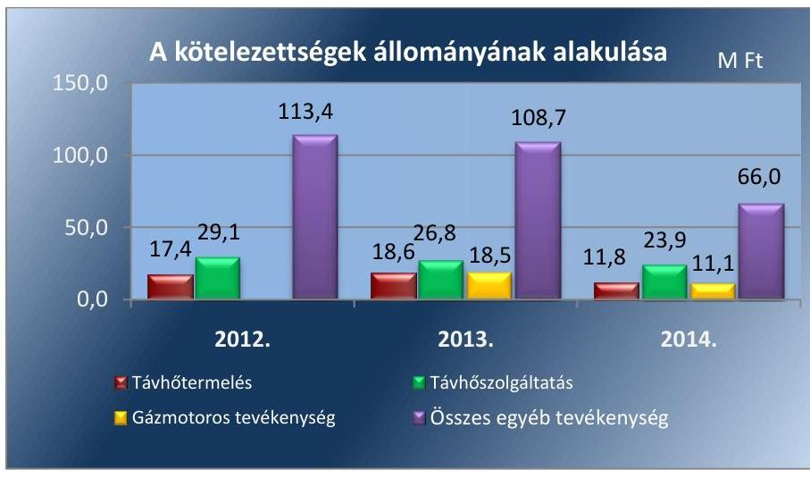

A Társaság hátrasorolt, valamint 30 napon túli kötelezettséggel nem rendelkezett. A 30 napon belüli lejárt szállítói kötelezettsége 2012-ben 1,4 M Ft, 2013-ban 0,7 M Ft, 2014-ben 0,6 M Ft volt, fokozatosa csökkent.
2.4. számú megállapítás

A Társaság az előírt beszámolási kötelezettségeit teljesítette, az FB a 2013. év eredményének felhasználásáról nem készített javaslatot, az adatok védelméről és nyilvánosságra hozataláról és annak szabályozásáról részben gondoskodott a Társaság.

AZ ÉVES BESZÁMOLÓKAT a Társaság a Számv. tv. 19. §(1) bekezdésében előírt taralommal elkészítette, azokat az ügyvezető a Képvi-selő-testület elé terjesztés céljából megküldte az Önkormányzatnak. A

---

Képviselő-testület az egyszerűsített éves beszámolókat megtárgyalta és elfogadta. A Társaság a beszámolókat a Számv. tv. 153. § (1) közzé tette, illetve a Tszt. 18/B. §. (2) bekezdésének megfelelően a MEKH ${ }^{37}$ részére megküldte, mely tartalmazta a Tsz. 18/A § (3) bekezdés előírása szerint elkészített kiegészítő mellékleteket és a 2014. évet kivéve a Tszt. 18/B § (1) bekezdése szerinti, keresztfinanszírozás mentességre vonatkozó könyvvizsgálói nyilatkozatot.

Az Alapító Okirat 10/1/3. pontjának előírása ellenére az FB nem tett javaslatot a 2013. évi 42,0 M Ft adózott eredmény felhasználásra vonatkozóan.

A KÖNYVVIZSGÁLÓ és a Társaság között megkötött szerződés alapján a könyvvizsgáló az ellenőrzött időszakban az éves beszámolón túl negyedévente könyvvizsgálói jelentéseket készített, melyeket az ügyvezető részére átadott. A jelentések az aktuális számviteli elszámolásokkal voltak kapcsolatosak. Az éves beszámolókat hitelesítő záradékkal látta el. A 2012-2013. évi egyszerűsített beszámolóhoz kapcsolódó jelentésében a könyvvizsgáló a szétválasztási szabályok hiányossága ellenére nyilatkozott a szétválasztási szabályok megfelelőségéről, a tevékenységek között ke-resztfinanszírozás-mentességről.

A 2014. évi beszámolójához kapcsolódó jelentésében a könyvvizsgáló nem tett eleget a Tszt. 18/B. § (1) bekezdéséven előírt igazolási kötelezettségének, mivel az éves beszámolóhoz kiadott független könyvvizsgáló jelentésben nem nyilatkozott a Mórhő Kft. által kidolgozott és alkalmazott számviteli szétválasztási szabályokról, valamint arról, hogy az egyes tevékenységek közötti tranzakciók árazása biztosítják-e a vállalkozás tevékenységei közötti keresztfinanszírozás-mentességet.

A 2014. évi könyvvizsgáló által elfogadott beszámoló kiegészítő mellékletében a tevékenységenként bemutatott mérlegek (Távhőtermelés, Távhőszolgáltatás, Gázmotoros, Egyéb) előző évi (2013. év) eszköz-forrás adatai során nem a 2013. évi mérleg adatok kerültek feltüntetésre. A hibát a könyvvizsgáló nem jelezte.

A könyvvizsgáló a 2012-2014. években a 2011-2013. évi beszámolókat tárgyaló Pénzügyi Bizottság üléséken részt vett. A 2014. évi beszámolót tárgyaló képviselő-testületi ülésen a Ptk. 3-131. § (2) bekezdés előírásának megfelelően jelen volt. A 2011-2013. évek beszámolói esetében a könyvvizsgáló a javasolt meghívottak között szerepelt, de nem vett részt az üléseken, amely ellentétes a Gt. 44. § (1) bekezdésében foglaltakkal. Az FB, illetve a könyvvizsgáló a közvagyon védelme, illetve más okból a Képviselőtestület összehívását nem kezdeményezte.

AZ ADATOK VÉDELMÉRE, NYILVÁNOSSÁGRA vonatkozóan a 2011. évben hatályban lévő Avtv. ${ }^{38}$ 31/A. § (1) bekezdése, valamint a 2012. január 1-jétől hatályos Info tv. ${ }^{39} 24 . \S$ (1) bekezdésében foglaltak szerint a közüzemi szolgáltatónál belső adatvédelmi felelőst kell kinevezni, amely kötelezettségének a Társaság nem tett eleget.

A 2012. január 1-jétől hatályos Info tv. 24. § (3) bekezdésében előírt adatvédelmi és adatbiztonsági szabályzatkészítési kötelezettségének 2012. június 27 -étől tett eleget.

---

Az Info tv 37. § (1) bekezdésében, valamint a Taktv. 2. §-ában előírt közzétételi kötelezettséget nem teljes körűen teljesítette. A közzé tett adatokat nem az Info tv. 37. § (1) bekezdés előírása szerinti közzétételi listákon tette közzé, továbbá nem tette közzé az Info tv. 1. számú mellékletében, valamint a Taktv. 2. §-ában előírt valamennyi adatot, valamint a közzétett adatok aktualizálásáról, frissítésről nem gondoskodtak. Többek között az Info tv. 1. számú melléket III/1. pontjával ellentétesen a Társaság a honlapján nem tette közzé a 2012. évet megelőző évekre vonatkozó számviteli beszámolókat. A Taktv. (3) bekezdésben foglaltak ellenére nem tette közzé a pénzeszközök felhasználásával, a társaság vagyonával történő gazdálkodással összefüggő árubeszerzésre, szolgáltatás megrendelésre vagyonértékesítésre, vagyonhasznosításra vonatkozó - az egyszerű közbeszerzési eljárás értékhatárát elérő, vagy meghaladó - szerződéseit. A Taktv. 2. § (1) bekezdés d) pontjában előírtaknak megfelelően közzétették a Felügyelő Bizottság tagjainak nevét, díjazását, egyéb juttatásait, azonban az adatok frissítéséről 2012.november 20 -át követően nem gondoskodtak.

# 3. A gazdasági társaságnál az ellátott közfeladat bevételei és ráfordításai elszámolása, valamint az önköltségszámítás és árképzés szabályszerű volt-e? 

Összegző megállapítás

### 3.1. számú megállapítás

A Társaságnál a távhőszolgáltatás közfeladat anyagjellegú ráfordításainak elszámolása megfelelő, a bevételek elszámolása kockázatos, a beruházás és az értékcsökkenés elszámolása nem volt megfelelő. Az árképzés nem volt szabályszerű, a hatósági ármegállapításra vonatkozó rendelkezéseket végrehajtották.

A bevételek, költségek és ráfordítások elkülönített nyilvántartását szabályozási hiányosságok ellenére biztosították, a jogszabályi és a belső szabályozás előírásait részben tartották be. A közfeladat anyagjellegú ráfordításinak elszámolása megfelelő, a bevételek elszámolása kockázatos, a beruházások elszámolása nem volt megfelelő.

A Mórhő Kft.nél - mivel a távhőszolgáltatási közfeladat mellett egyéb feladatokat is ellátott - a közfeladat átláthatósága és a keresztfinanszírozás elkerülése érdekében fennállt a Tszt. 18/A. (3) bekezdés c) pontjában foglalt előírás szerint a bevételek és ráfordítások tevékenységenkénti elkülönítésének kötelezettsége. A Társaság távhőszolgáltatási közfeladatot Mór város közigazgatási területén látta el, a távhőt egy telephelyen állította elő, ezért a Tszt 18/A. § a) pontja szerinti telephelyenkénti, valamint a 18/A. § b) pontja szerinti településenkénti szétválasztási kötelezettsége az ellenőrzött időszakban nem keletkezett.

A Társaság ellenőrzött időszakban realizált bevételeit, elszámolt ráfordításait és tevékenységének eredményét a 7. táblázat szemlélteti.

---

| A TÁRSASÁG BEVÉTELEI, RÁFORDÍTÁSAI, EREDMÉNYE (M FT) |  |  |  |  |
| :--: | :--: | :--: | :--: | :--: |
| Megnevezés | 2011 | 2012 | 2013 | 2014 |
| Összes bevétel | 651,1 | 669,6 | 774,0 | 610,6 |
| Ebből Távfütési üzletág | 445,9 | 471,8 | 532,6 | 377,6 |
| Összes ráfordítás | 711,4 | 683,9 | 731,0 | 622,5 |
| Ebből Távfütési üzletág | 457,3 | 445,5 | 501,2 | 382,5 |
| Adódás előtti eredmény | $-60,3$ | $-14,3$ | 43,0 | $-11,9$ |
| Ebből Távfütési üzletág | $-11,4$ | 26,3 | 31,4 | $-4,9$ |

Az ellenőrzés időszakában az elszámolások az anyagjellegú ráfordításoknál megfelelő, a bevételeknél a téves számlázások miatt kockázatos, míg a beruházások, felújítások és az értékcsökkenési leírás esetében nem volt megfelelő.

# AZ ÉRTÉKESÍTÉS NETTÓ ÁRBEVÉTELÉNEK ELSZÁMOLÁSA kockázatos volt, mivel nem minden esetben felelt meg a jogszabályoknak, belső szabályoknak. A bevételek számlázásával kapcsolatban. 2012. február hónapban előfordult, hogy 2011. évben érvényes fútési hődij került kiszámlázásra az 50/2011. (IX.30.) NFM rendelet 4. §-ban foglaltak ellenére. A következő hónaptól (2012. március) már a megfelelő fútési hődij került kiszámlázásra. A hibás díjtételek számlázása miatti díjkülönbözetet a Társaság az éves elszámolást tartalmazó hő-elszámolás során korrigálta. A tevékenységgel kapcsolatos bevételek elszámolása megfelelt a Számv. tv. 72-74. §-aiban foglaltaknak. Az egyéb-, pénzügyi-, és rendkívüli bevételek tekintetében a hiányzó szabályozások, továbbá a vetítési alapok évenkénti újraszámításának hiánya miatt a bevételek számviteli szétválasztása nem minden esetben feleltek meg a Tszt 18/A. § (2) bekezdésében előírtaknak.

## AZ ANYAGJELLEGÚ RÁFORDÍTÁSOK ELSZÁMOLÁSA a szabályozási hiányosságok ellenére megfelelő volt. A költségelszámolást megalapozó kötelezettségvállalás, a költségnemre történő elszámolás a jogszabályi előírásoknak, a számviteli politikának, a számlatükörnek megfelelően történt. A távhőszolgáltatás és további tevékenységek közvetlen ráfordításainak tevékenységenkénti elkülönítése tételesen történt a számlatükörben meghatározottak alapján. A felosztandó költségek esetében az önköltségszámítási szabályzatban foglalt vetítési alappal kalkuláltak a gyakorlatban, azonban az nem felelt meg az önköltségszámítási szabályzatban foglaltaknak, mivel az évenkénti újraszámításuk elmaradt. Az egyéb-, pénzügyi- és rendkívüli ráfordítások tekintetében vetítési alapokat nem szabályozták, a gyakorlatban alkalmazott számviteli szétválasztásuk nem felelt meg a Tszt. 18/A. § (2) bekezdésében foglaltaknak.

## A BERUHÁZÁSOK, FELÚJÍTÁSOK ÉS AZ ÉRTÉKCSÖKKENÉSI LEÍRÁS ELSZÁMOLÁSA nem volt megfelelő, mivel nem érvényesültek teljes körűen a jogszabályok, a belső szabályok, valamint az Önkormányzat előírásai az eszközök beszerzése, illetve nyilvántartása tekintetében.

---

8. táblázat

HÁTRAKLÉKOS ÁLLOMÁNY ALAKULÁSA TÁVFÜTÉSI ÜZLETÁG (M FT)

| Távbé | 2011 | 2012 | 2013 | 2014 |
| :--: | :--: | :--: | :--: | :--: |
| Lakossági fogyasztók |  |  |  |  |
|  | 13,5 | 15,7 | 13,6 | 14,0 |
|  | Ebből 180 napon túli |  |  |  |
|  | 2,1 | 2,4 | 2,0 | 2,1 |
|  | Ebből: 365 napon túli |  |  |  |
|  | 2,4 | 3,4 | 3,5 | 4,1 |
| Nem lakosság fogyasztók |  |  |  |  |
|  | 9,8 | 7,1 | 3,3 | 13,8 |
|  | Ebből: 180 napon túli |  |  |  |
|  | 1,2 | 0,0 | 0,0 | 4,2 |

Fonrás: Társaság adatszolgáltatása

Az ellenőrzött beszerzéseknél az eszközök állományba vétele nem volt szabályos, mivel több esetben az üzembe helyezés dátumát nem rögzítették az állományba vételi bizonylatokon, ezzel a sérült a Számv. tv. 52. § (7) és (2) bekezdéseinek, valamint a Számv. tv. 165. § (2) bekezdésének előírása.

Az amortizáció elszámolásával kapcsolatos eljárásrendet az amortizációs politikában ${ }^{40}$ rögzítették, ennek keretében lineáris elszámolás mellett döntöttek. Az értékcsökkenést az amortizációs politikában meghatározottak szerint negyedévente számolták el. Terven felüli értékcsökkenést 20112014. években nem számoltak el. Az ellenőrzött eszközöknél az alkalmazott leírási kulcs, illetve az egyösszegű értékcsökkenés elszámolása több esetben nem felelt meg az amortizációs políttikában foglaltaknak.

A Képviselő-testület 102/2011. (IV.27.) számú határozatában foglaltak ellenére a nettó 500 ezer Ft feletti - közbeszerzést nem igénylő - beszerzések esetében nem kérték meg az Önkormányzat Településfejlesztési Bizottságának előzetes írásbeli hozzájárulását.

A Társaság tárgyi eszközeinek használhatósági foka az ellenőrzött időszakban összességében 59,2\%-ról, 46,2\%-a csökkent, az elszámolt értékcsökkenés összegét el nem érő beruházások, felújítások miatt.

KÖVETELÉS ÁLLOMÁNY KEZELÉSÉNEK szabályait belső szabályzatban utasításban nem határozták meg, azonban az üzemeltetési szerződésben rögzített alapelvek figyelembevételével kialakított gyakorlat szerint a tartozás összegének függvényében normál, ajánlott, illetve tértivevényes felszólító leveleket küldtek az adósoknak, illetve behajtást kezdeményeztek. 2014-től kezdődően a kimenő számlákon feltűntették a fogyasztók fennálló tartozását.

## A TÁVHŐSZOLGÁLTATÁS HÁTRALÁKOS KÖVETELÉSÁLLOMÁNYA 2014. december 31-én 27,8 M Ft volt. A lakossági hátralékos állomány 2011. évről 2014. év végére 0,5 M Ft-tal növekedett, jelentőesen nem változott. A nem lakossági hátralékállomány a Kórház ${ }^{41}$ fizetőképességétől függően jelentős eltéréseket mutatott. A Kórház 2014. évi 11,1 M Ft hátralékából 4,2 M Ft 180 napon túli tartozás volt. A 365 napon túli hátralékok a lakossági fogyasztók tartozásaiból tevődtek össze. Kedvezőtlen tendencia, hogy az éven túli tartozások állománya az ellenőrzött időszakban folyamatosa, 1,7 szeresére emelkedett. A tulajdonosi joggyakorló előírásának hiánya ellenére, az alkalmazott eljárásrend normál felszólító levelek, ajánlott és tértivevényes felszólítások, és végül fizetési meghagyások indításával biztosította a követelés állomány csökkentését. A lakossággal szembeni követelésállomány a rezsicsökkentés következtében abszolút értékben érdemben nem változott, a lakossági kintlevőség a távhő-bevételhez viszonyítva pedig növekedett.

A számviteli politika keretében meghatározott értékelési szabályzatnak megfelelően a behajthatatlan követeléseket elszámolták, az értékvesztéseket minden évben megképezték. A Társaság az értékelési szabályzatában rögzítette a követelések után elszámolandó értékvesztés módját és mértékét. A szabályozásnak megfelelően számolta el a követelések utáni értékvesztést, melynek üzletágankénti záróállományát az egyszerűsített éves beszámolókban bemutatták. A távfűtési üzletág hátralékos állományát lejárat szerinti bontásban a 8. táblázat tartalmazza.

---

# 3.2. számú megállapítás 

NYERESÉGKORLÁTRA vonatkozó, a Tszt. 18/C. §-ában, valamint az NFM rendelet ${ }^{42}$ 5. §-ban rögzített előírások betartása érdekében a Társaság nem végzett számításokat, nyereség korlát feletti eredményt nem állapított meg, így az 50/2011 NFM rendelet 5. § (5) bekezdése szerinti éves beszámoló letétbehelyezését követő 15. napon belül távhőszolgáltatási beruházás vállalásával kapcsolatos visszafizetés alóli mentesítési kérelmet nem nyújtott be a MEKH ${ }^{43}$-hez. Az ellenőrzési időszakot követően a MEHK 4966/2015. számú határozatában 2012. és 2013. évekre vonatkozóan összesen 31,4 M Ft nyereségkorlát túllépést állapított meg, az ellenőrzést követő időszakra vonatkozó rendezési határidővel.

## Az önkormányzati hatáskörben alkalmazott árképzés az önköltségszámítás hiánya miatt nem volt szabályszerű, a miniszteri hatáskörben elrendelt árváltoztatásokat a jogszabályi előírások szerint alkalmazták.

AZ ÁRKÉPZÉS során a Mórhő Kft. 2011. április 15-ig a Tszt. 57. § (2) bekezdése árképzésre vonatkozó előírásaival ellentétben a távhőszolgáltatás díjakat nem a szolgáltatások költségkalkulációjának alapulvételével határozta meg, elő- és utókalkulációs önköltségszámítást nem készítettek. A közszolgáltatások önköltségi egységárat fútési és melegvíz hődíra, illetve alapdíjra lebontva nem kalkulálták ki, nem számították ki az önköltségszámítási szabályzat szerinti kalkulációs egységet.

A Tszt. 57. § ármegállatásra vonatkozó rendelkezéseinek teljesítéséhez az önköltségiszámítási szabályzat nem határozta meg a kalkulációs egységekre bontás módszerét, az árképzéshez szükséges elő- és utókalkuláció tartalmát és időszakát. Nem határozta meg a fedezet számítás módját, tartalmát, ezért nem felelt meg az Ámt ${ }^{44}$. 8. § (1) bekezdésében foglaltaknak, amely szerint a legmagasabb árat úgy kell meghatározni, hogy a hatékonyan múködő vállalkozó ráfordításaira és múködéséhez szükséges nyereséghez fedezetet nyújtson. A Társaság elő és utókalkulációs számításokat nem végzett. Az elszámoltathatóság ezzel nem volt biztosított, a Társaság által 2011. április 15-éig alkalmazott távhőszolgáltatással kapcsolatos árképzés nem volt szabályszerű.

A távhőszolgáltatás díját 2011. április 15-től a Tszt. 57/D. § (1) bekezdése alapján, mint legmagasabb hatósági árat a nemzeti fejlesztési miniszter rendeletben állapította meg. A lakossági távhő díjakat 2011. április 15től - a 2011. március 31-én alkalmazott díjakon - befagyasztották, majd 2012. január 1-jétől az 50/2011. (IX. 30.) NFM rendelet hatályos 4. §-a alapján 4,2\%-kal megemelték. A 2013. évben két lépcsőben - 2013. január 1jével az előző évihez képest 10,0\%-os, majd 2013. november 1-jétől további 11,1\%-os mértékben - csökkentették a Rezsi tv ${ }^{45}$. 3. § (1) bekezdésének, valamint az 50/2011. (IX. 30.) NFM rendelet ${ }^{46}$ 3. § (2) bekezdésének megfelelően. A Rezsi tv. 3. § (1) bekezdése az távhőszolgáltatás díjának további 3,3\%-kal történő csökkentését írta elő 2014. október 1-jétől. A Mórhő Kft. a jogszabályi rendelkezéseknek megfelelően az alapdíj és hődíj 2012. évi 4,2\%-os emelését, a 2013. évi két lépcsőben történő, valamint 2014. évi - előírt mértékű - csökkentését végrehajtotta.

---

Az alkalmazott alapdíjak alakulását az 5. ábra szemlélteti.
5. ábra
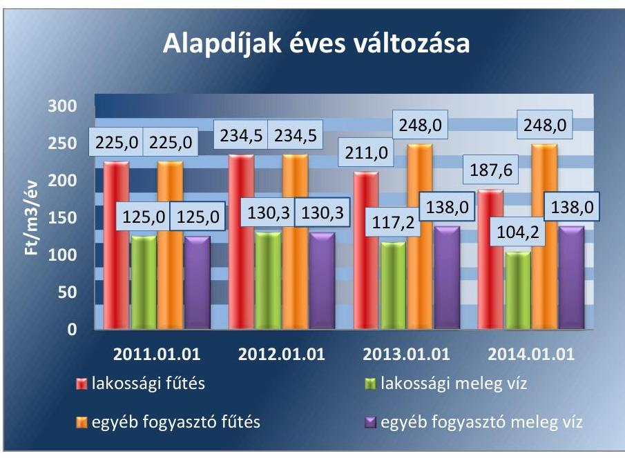

Forrás: A Társaság adatszolgáltatása
Az alkalmazott hődíjak változását a 6. ábra mutatja be.
6. ábra
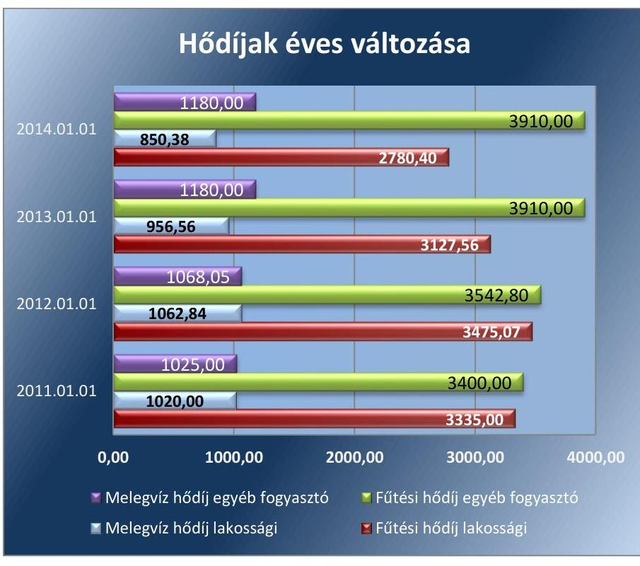

Forrás: A Társaság adatszolgáltatása
A nem lakossági fogyasztók díjai 2012. február 1. és 2014. december 31. között nem változtak. A lakossági fogyasztók díjai a jogszabályi előírásoknak megfelelően 2013. január 1-jével, november 1-jével, valamint 2014. október 1-jétől csökkentek.

---

A 2011. január 1-jei árakhoz viszonyítva 2014.december 31-én alkalmazott lakossági alapdíjak és hődíjak 19,4\%-kal csökkentek. Ugyanezen időszakban az egyéb fogyasztóknál az alapdíjak a fűtésénél 10,2\%-kal, a meleg víznél 10,4\%-kal, a hődíjak a fűtésnél 15,0\%-kal, a melegvíznél 15,7\%-kal növekedtek.

A Társaság az 51/2011. (IX. 30.) NFM rendelet ${ }^{47}$ alapján távhőszolgáltatással összefüggő támogatásban a 2011. évben 24,1 M Ft, a 2012. évben 93,6 M Ft, a 2013. évben 130,4 M Ft, a 2014. évben 107,0 M Ft összegben részesült. A támogatások összegeit az 51/2011. (IX. 30.) NFM rendelet 7. § (1) bekezdésében előírtaknak megfelelően az egyéb bevételek között külön főkönyvi számlán elkülönítetten kimutatták.

---

# JAVASLATOK 

Az ÁSZ tv. ${ }^{48}$ 33. § (1) bekezdésében foglaltak értelmében az ellenőrzött szervezet vezetője köteles a jelentésben foglalt megállapításokhoz kapcsolódó intézkedési tervet összeállítani és azt a jelentés kézhezvételétől számított 30 napon belül az ÁSZ részére megküldeni. Amennyiben az ellenőrzött szervezet vezetője nem küldi meg határidőben az intézkedési tervet, vagy továbbra sem elfogadható intézkedési tervet küld, az Állami Számvevőszék elnöke az ÁSZ tv. 33. § (3) bekezdése a) és b) pontjaiban foglaltakat érvényesítheti.
Javaslataink célja a Móri Hőtermelő- és Szolgáltató Kft. gazdálkodása szabályozottságának javítása annak érdekében, hogy a szabályozási környezet és a gazdálkodási gyakorlat megfelelően tudja támogatni az átlátható müködést.

## A Mórhő Kft. ügyvezető igazgatójának

1. Intézkedjen a Társaság tevékenységeire vonatkozóan a számviteli szétválasztás szabályainak belső szabályzatban történő kiegészítéséről az egyéb, a pénzügyi, a rendkívül bevételek és ráfordítások tevékenységek közötti szétválasztása és felosztása tekintetében annak érdekében, hogy az megfeleljen a Tszt. és a Számv. tv. előírásainak.
(2.1. sz. megállapítás 4., 6. bekezdései alapján)
2. Intézkedjen a beruházások tekintetében a leltározási szabályzatban foglaltak szerinti leltározásról.
(2.2. sz. megállapítás 3. bekezdése alapján)
3. Intézkedjen az adatvédelmi felelős kinevezéséről az elektronikusan kezelt adatállományok Info tv-ben előirt információ biztonsági védelme érdekében.
(2.4. sz. megállapítás 7. bekezdése alapján)
4. Intézkedjen az eszközök állományba vételénél a Számv. tv. előírásainak megfelelő tartalmú dokumentum elkészítéséről, továbbá a Társaság amortizációs politikájának megfelelően az eszközök terv szerinti értékcsökkenésének szabályszerű elszámolásáról.
(3. 1. sz. megállapítás 7., 8. bekezdései alapján)
5. Intézkedjen a jövőben a nettó 500 ezer Ft feletti - közbeszerzést nem igénylő - beszerzések esetében az Önkormányzat illetékes bizottságának előzetes jóváhagyása érdekében.
(3.1. sz. megállapítás 9. bekezdése alapján)

---

# Javaslataink célja az Önkormányzat szabályszerű működésének elősegítése, továbbá az önkormányzati tulajdonosi joggyakorlás kontrolljainak erősítése. 

## Mór Város Önkormányzata Polgármesterének

1. Intézkedjen a távhőszolgáltatás területfejlesztési, környezetvédelmi és levegő-tisztaságvédelmi szempontok alapján szükséges fejlesztési területeinek rendeletben történő meghatározására.
(1.1. sz. megállapítás 9. bekezdése alapján)
2. Hívja fel a tulajdonosi jogokat gyakorló Képviselő-testület figyelmét arra, hogy az FB nem rendelkezett ügyrenddel és kezdeményezze annak elkészitését
(1.2. sz. megállapítás 4. bekezdése alapján)
3. Intézkedjen a Társaság vezető tisztségviselői, illetve a Felügyelő Bizottsági tagok, valamint a munkavállalók juttatásaira vonatkozó javadalmazási szabályzat elkészítése és Képviselő-testület elé terjesztése érdekében.
(1.2. sz. megállapítás 10. bekezdése alapján)

## Mór Város Önkormányzata Jegyzőjének

1. Tegyen eleget a Tszt.-ben elöirtaknak, küldje meg a Társaság üzletszabályzatát véleményezésre a fogyasztóvédelmi hatóságnak, majd a vélemény megérkezését követően intézkedjen az üzletszabályzat jóváhagyásáról, valamint az abban foglaltak ellenőrzéséről.
(1.1. sz. megállapítás 6. bekezdése alapján)
2. Készítse elő a távhőszolgáltatási rendelet aktuális jogszabályi környezetnek megfelelő módosítását, majd intézkedjen a rendelet kiadása érdekében.
(1.1. sz. megállapítás 7., 8. bekezdései alapján)
3. Fordítson kiemelt figyelmet arra, hogy az Önkormányzat belső ellenőrzése az ellenőrzéseivel a távhőszolgáltatás, mint közfeladat-ellátás szabályszerű teljesítéséhez, valamint az önkormányzati vagyon megóvásához járuljon hozzá.
(1.2. sz. megállapítás 12. bekezdése alapján)

---

# MELLÉKLETEK 

- I. SZ. MELLÉKLET: ÉRTELMEZŐ SZÓTÁR
eladósodottságot jellemző mutatók
garancia
eladósodottsági mutató (tőkeáttétel): idegen tőke/összes forrás.
Egészségesnek mondható egy olyan mértékű áttétel, amelyet az üzleti tervek szerint és az elmúlt időszak tapasztalatai alapján a társaság megfelelő biztonsággal ki tud termelni. Nagy eszközberuházásigényű iparágakban értéke magasabb, azaz magasabb eladósodottság is elfogadható, de 75-85\%-ot meghaladó értéknél már itt is erős, sőt túlzott külső finanszírozottságról beszélhetünk. Általánosságban véve kedvező, ha értéke kisebb, mint 0,6 .
eladósodottság mértéke: kötelezettségek / saját tőke.
Fontos szerepet játszik ez a mutató egy vállalat megítélésében. Azt mutatja, hogy a saját források a kötelezettségek hány százalékát fedezik. Törekedni kell, hogy a mutató tartósan (jelentősen) 1 alatti értéket érjen el.
nettó eladósodottság: (kötelezettségek-követelések) / saját tőke. Azt mutatja, hogy a kintlévőségekkel csökkentett kötelezettségeket milyen mértékben fedezi a saját forrás. Ez feltételezi, hogy a követelések pénzügyileg előbb realizálódnak, mint ahogy a kötelezettségeket teljesíteni kell. A mutató minél kisebb, csökkenő értéke a kedvező.
adósságfedezeti mutató I.: (befektetett eszközök+forgó eszközök) / idegen forrás.
Azt mutatja, hogy 1 Ft adósságra hány Ft vagyon jut. Általánosságban véve kedvező, ha értéke 2 körül van, de nagy eszközberuházásigényű iparágakban értéke kisebb is lehet.
adósságfedezeti mutató II.: működési cash flow / hosszú lejáratú kötelezettségek.
A mutató azt jelzi, hogy az adott gazdálkodási időszak működési pénzáramainak eredményeként realizált cash flow révén a vállalkozás mennyiben lenne képes valamennyi hosszú lejáratú kötelezettségének eleget tenni. Ennek vizsgálatára viszonylag ritkán kerül sor, az elsősorban a veszélyhelyzetbe került vállalkozások esetében lehet érdekes. Általánosságban véve kedvező, ha a működési cash flow minél nagyobb arányban nyújt fedezetet a hosszú lejáratú kötelezettségre (értéke nagyobb, mint 1, nő az ellenőrzött időszakban). árbevételre vetített eladósodottság: (kötelezettségek - forgóeszközök) / értékesítés nettó árbevétele.
Az árbevételre vetített eladósodottság azt mutatja, hogy az árbevétel mekkora fedezetet nyújt a kötelezettségeknek a forgóeszközökkel csökkentett részére. Általánosságban véve kedvező, ha az árbevétel minél nagyobb arányban nyújt fedezetet a forgóeszközökkel csökkentett kötelezettségekre (értéke kisebb, mint 1, csökken az ellenőrzött időszakban).
A garancia olyan önálló, az önkormányzat nevében vállalt kötelezettség, amely alapján az önkormányzat az önkormányzati költségvetés terhére szerződésben meghatározott feltételek szerint, a kötelezett

---

gazdasági társaság
gazdálkodó szervezet
keresztfinanszírozás tilalma
kezesség
közszolgáltatás
nem teljesítése esetén a jogosultnak fizetést teljesít az előzetesen rögzített összeghatárig.
Ptk2. 3.88. § (1) bekezdése szerint „a gazdasági társaságok üzletszerű közös gazdasági tevékenység folytatására, a tagok vagyoni hozzájárulásával létrehozott, jogi személyiséggel rendelkező vállalkozások, amelyekben a tagok a nyereségből közösen részesednek, és a veszteséget közösen viselik".
A Ptk. 685. § c) pontja szerint gazdálkodó szervezet:
„az állami vállalat, az egyéb állami gazdálkodó szerv, a szövetkezet, a lakásszövetkezet, az európai szövetkezet, a gazdasági társaság, az európai részvénytársaság, az egyesülés, az európai gazdasági egyesülés, az európai területi együttmúködési csoportosulás, az egyes jogi személyek vállalata, a leányvállalat, a vízgazdálkodási társulat, az erdő birtokossági társulat, a végrehajtói iroda, az egyéni cég, továbbá az egyéni vállalkozó." (2014. 03.15-ig hatályos)
A közszolgáltatás díját úgy kell megállapítani, hogy az maradéktalanul fedezetet nyújtson a közszolgáltatás indokolt költségeire és ráfordításaira, valamint a közszolgáltató e tevékenységével kapcsolatos ésszerű nyereségére; az ésszerű nyereség nem tartalmazhatja a közszolgáltatáson kívül eső egyéb gazdasági tevékenységei költségeinek, ráfordításainak fedezetét.
A kezességre vonatkozó előírásokat a Ptk. 2 6:416-430. §-ai tartalmazzák. Kezességi szerződéssel a kezes kötelezettséget vállal a jogosulttal szemben, hogyha a kötelezett nem teljesít, maga fog helyette a jogosultnak teljesíteni. Kezesség egy vagy több, fennálló vagy jövőbeli, feltétlen vagy feltételes, meghatározott vagy meghatározható összegű pénzkövetelés vagy pénzben kifejezhető értékkel rendelkező egyéb kötelezettség biztosítására vállalható.
A Ptk. szerint kezességet csak írásban lehet vállalni. A kezes kötelezettsége ahhoz a kötelezettséghez igazodik, amelyért kezességet vállalt. A kezes kötelezettsége nem válhat terhesebbé, mint amilyen elvállalásakor volt, kiterjed azonban a kötelezett szerződésszegésének jogkövetkezményeire és a kezesség elvállalása után esedékessé váló mellékkövetelésekre is.
A közszolgáltatás: „közcélú, illetőleg közérdekű szolgáltatást jelent, amely egy nagyobb közösség (állam, település) minden tagjára nézve megközelítőleg azonos feltételek mellett vehető igénybe, ezért valamilyen mértékig közösségi megszervezést, illetve szabályozást, ellenőrzést igényel." Az Ebktv. 3. § d) pontja a következőképpen határozza meg a közszolgáltatást: „szerződéskötési kötelezettség alapján a lakosság alapvető szükségleteinek ellátására irányuló szolgáltatás, így különösen a villamos energia-, gáz-, hő-, víz-, szennyvíz- és hulladékkezelési, köztisztasági, postai és távközlési szolgáltatás, továbbá a menetrend alapján közlekedő járművekkel végzett közforgalmú személyszállítás".

---

nemzeti vagyon

Nvt. 1. § (2) bekezdése szerint:
„az állam vagy a helyi önkormányzat kizárólagos tulajdonában álló dolgok,
az a) pont hatálya alá nem tartozó, állam vagy a helyi önkormányzat tulajdonában lévő dolog,
az állam vagy a helyi önkormányzatot tulajdonában lévő pénzügyi eszközök, továbbá az államot vagy a helyi önkormányzatot megillető társasági részesedések,
az államot vagy a helyi önkormányzatot megillető bármely vagyoni értékkel rendelkező jogosultság, amelyet jogszabály vagyoni értékű jogként nevesít,
Magyarország határa által körbezárt terület feletti légtér, az üvegházhatású gázok kibocsátási egységeinek kereskedelméről szóló törvény szerint kibocsátási egység és légiközlekedési kibocsátási egység, valamint az ENSZ Éghajlat változási Keretegyezménye és annak Kiotói Jegyzőkönyve végrehajtási keretrendszeréről szóló törvény szerinti kiotói egység,
állami vagy helyi önkormányzati fenntartású közgyűjtemény (muzeális intézmény, levéltár, közgyűjteményként működő kép- és hangarchívum, valamint könyvtár) saját gyűjteményében nyilvántartott kulturális javak körébe tartozó dolog,
a régészeti lelet,
a nemzeti adatvagyon körébe tartozó állami nyilvántartások fokozottabb védelméről szóló törvény szerinti nemzeti adatvagyon." (hatályos 2012. január 1-jétől, g) pont módosult 2012. június 30-tól)

---

II. SZ. MELLÉKLET: MŰKÖDÉS FŐBB JELLEMZŐI

| A TÁRSASÁG MŰKÖDÉSÉNEK FŐBB JELLEMZŐI |  |  |  |  |  |  |
| :--: | :--: | :--: | :--: | :--: | :--: | :--: |
| Sorszám | Megnevezés |  | 2011. | 2012. | 2013. | 2014. |
|  | A gazdasági társaság tulajdonosi összetétele: |  |  |  |  |  |
| 1. | Tulajdonos Önkormányzat megnevezése: |  |  | Mór Város Önkormányzata |  |  |
| 2. | Önkormányzat tulajdoni részesedésének aránya | $\%$ |  | 100,0 |  |  |
| 3. | Önkormányzat tulajdoni részesedésének ösz-
szege | M Ft |  | 510,0 |  |  |
| 4. | A tárgyévben a gazdasági társaság vagyonkeze-   lésben lévő önkormányzati vagyon után elszá-   molt értékcsökkenés összege | M Ft |  | Nem kezelt Önkormányzati vagyont |  |  |
| 5. | A tárgyévben a gazdasági társaság saját vagyona   után elszámolt értékcsökkenés összege teljes te-   vékenység | M Ft | 83,3 | 69,6 | 63,0 | 60,9 |
| 6. | Értékesítés nettó árbevétele teljes tevékenység | M Ft | 583,0 | 531,1 | 550, | 410,7 |
| 7. | ebből: Távfütési üzletág | M Ft | 410,7 | 366,1 | 391,9 | 257,5 |
| 8. | Adózott eredmény teljes tevékenység | M Ft | $-60,3$ | $-14,3$ | 42,0 | $-13,1$ |
| 10. | Kifizetett osztalék teljes tevékenység | M Ft | $x$ | $x$ | 0,0 | $x$ |

---

# FÜGGELÉK: ÉSZREVÉTELEK 

A jelentéstervezetet a Számvevőszék 15 napos észrevételezésre megküldte az ellenőrzött szervezet vezetőjének az ÁSZ tv. 29. §* (1) bekezdése előírásának megfelelően.
Mór Városi Önkormányzat polgármestere és a Móri Hőtermelő- és Szolgáltató Kft. ügyvezető igazgatója egyaránt élt észrevételezési jogával.
Az elfogadott észrevételek alapján a Számvevőszék módosította a jelentést.
A függelék tartalmazza az ellenőrzöttek észrevételeit, illetve az el nem fogadott észrevételetek elutasításának indoklását.

[^0]
[^0]:    * 29. § (1) Az Állami Számvevőszék az ellenőrzési megállapításait megküldi az ellenőrzött szervezet vezetőjének vagy az általa megbízott személynek, és annak, akinek személyes felelősségét állapította meg.
    (2) Az ellenőrzött szervezet vezetője és a felelősként megjelölt személy az ellenőrzés megállapításaira tizenöt napon belül írásban észrevételt tehet.
    (3) Az Állami Számvevőszék az észrevételre a beérkezésétől számított harminc napon belül írásban válaszol. A figyelembe nem vett észrevételeket köteles a jelentésben feltüntetni, és megindokolni, hogy azokat miért nem fogadta el.

---

# MÓRI POLGÁRMESTERI HIVATAL 

Iktatószám: 1/292-5/2016.
Úgyintéző: dr. Klima Olga

## Domokos László

Elnök Úr
részére

Állami Számvevőszék
1364 Budapest, Pf. 54.
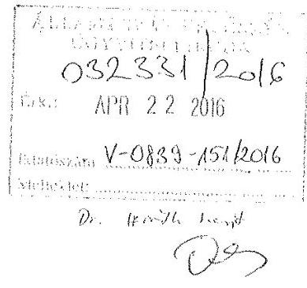

Tisztelt Elnök Úrl

A V-0839-139/2016. iktatószámú megkeresésére válaszolva, „Az önkormányzatok gazdasági társaságai- Az önkormányzatok többségi iulajdonában lévő gazdaságitársaságok közfeladat ellátását érintő gazdálkodási tevékenysége szabályszerűségének ellenőrzése - Móri Hőtermelő- és Szolgáltató Kft. 2016." című ellenőrzés Jelentéstervezete tárgyában az alábbi észrevételeket tesszük.

Az ellenőrzés területe tekintetében:

1. Önkormányzatunk törzskönyvi nyilvántartásban rögzített hivatalos elnevezése: Mór Városi Önkormányzat.
2. Fenyves Péter polgármester úr a 2006. évi önkormányzati választások óta tölti be tisztségét.

Megállapítások tekintetében:

1. Az 1.1. számú megállapítás negyedik bekezdése rögzíti, hogy „A Képviselőtestület Gt. 41. § (1) bekezdésében foglaltak ellenére a könyvvizsgálóval kötendő szerződés tartalmi elemeit nem határozta meg." A gazdasági társaságokról szóló 2006. évi IV. törvény 2014. március 14-ig hatályos 41. § (1) bekezdése szerint "... a gazdasági társaság legföbb szerve megválasztja a társaság könyvvizsgálóját és meghatározza a könyvvizsgálóval kötendő szerződés lényeges elemeinek tartalmát." Véleményünk szerint a vizsgált

---

időszakban a Képviselő-testület ennek a kötelezettségnek eleget tett, hiszen a 76/2014. (IV.30.) Kt. határozatában a szerződés lényeges elemeinek tartalmaként meghatározta a kiválasztott könyvvizsgáló céget, a személyében felelős könyvvizsgálót, a megbizás időtartamát, a megbizási dijat és a megbizás tartalmát, egyebekben pedig a már fennálló és hatályos könyvvizsgálói szerződés módosítását rendelte el az új adatoknak megfelelően.
2. A 1.2. számú megállapítás 8. bekezdése szerint „A 2012. és 2013. évi beszámolót a Gt. 35. § (3) bekezdés és a Ptk. 3:120. § (2) bekezdés, továbbá az Alapitó Okirat 10/1/3. pontjában foglaltakkal ellentétesen a FB írásos Jelentése (jegyzökönyve) hiányában szabálytalanul fogadta el a Képviselötestület."
Észrevételünk: A 2012. évi beszámolót megtárgyaló képviselő-testületi ülésen a felügyelő bizottság elnöke a bizottság véleményét szóban ismertette, azonban a 2013. évi beszámoló megtárgyalásakor a felügyelő bizottság jegyzőkönyv kiosztásra került és a beszámolót az FB jegyzőkönyv megismerését követően fogadta el a testület. Az FB jegyzőkönyv az előterjesztés részeként a testületi ülésről készült jegyzőkönyv részét képezi. A testületi ülés jegyzőkönyvéből készült kivonat jelen észrevétel mellékletét képezi.
3. A 2.4. számú megállapítás 6. bekezdése szerint „A 2011-2013. évek beszámolói esetében a könyvvizsgáló a javasolt meghívottak között szerepelt, de nem vett részt az üléseken, amely ellentétes a Gt. 44. § (1) bekezdésében foglaltakkal."
Észrevételünk: A gazdasági társaságokról szóló 2006. évi IV. törvény 2014. március 14-ig hatályos 44. § (1) bekezdése szerint „A gazdasági társaság könyvvizsgálóját a társaság legfőbb szervének a társaság számviteli törvény szerinti beszámolóját tárgyaló ülésére meg kell hívni. A könyvvizsgáló az ülésen köteles részt venni." A törvény 168. § (1) bekezdése azonban úgy rendelkezik, hogy „Az egyszemélyes társaságnál a taggyülési hatáskörbe tartozó kérdésekben az egyedüli tag dönt, és erről a vezető tisztségviselőket írásban köteles értesíteni." A jogszabályhelyek értelmezésének megfelelően az az álláspontunk, hogy a Mórhő Kft. egyszemélyes társaságnak minősül, egyszemélyes társaság esetében pedig nem értelmezhető a legfőbb szervi ülés, így az azon történő részvétel is fogalmilag kizárt.

---

# MÓRI POLGÁRMESTERI HIVATAL 

Kérjük Tisztelt Elnök urat, hogy az észrevételeket elfogadni és a jelentéstervezetet ennek megfelelően módosítani szíveskedjék!

Mór, 2016. április 18.

Tisztelettel:
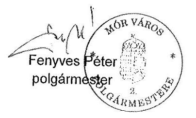

Dr. Pállá József jegyző helyett Dr. Taba Nikoletta aljegyzö

Melléklet:

- Kivonat Mór Városi Önkormányzat Képviselő-testületének 2014. május 28. napján megtartott ülése jegyzőkönyvéböl

---

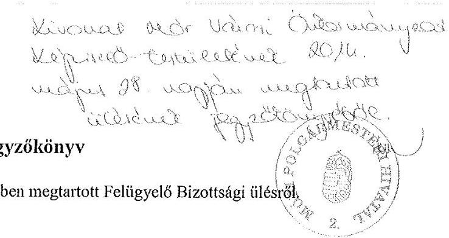

A MÓRHŐ Kft hivatalos helyiségében megtartott Felügyelő Bizottsági ülésről,
Ideje: 2014. május 26. 15. 30
Jelen vannak: Czachesz Gábor, FB tag
Gintner András, FB tag
Stolczenberger Róbert képviselő, FB elnök
Kovács Gábor ügyvezető
Napirend: 1. A 2013 évi beszámoló megvitatása, elfogadása. Határozathozatal.
2. Egyebek

A FB tagjai a napirendet elfogadták. A felügyelő bizottság elnöke hivatkozott az elkészített 2013 évi beszámolóra, a tagok a bennük foglaltakat megismerték. Kérte a Bizottságot, hogy véleményezzék a 2013 évi beszámolót.

1. Mórhő 2013 éves beszámoló megvitatása

Kovács Gábor rövid tájékoztatást adott a müködésről, az eredményes müködés lehetővé tette, hogy fejlesztési céltartalékot képezzenek, ez kedvezőbb a tulajdonos érdekében.

A beszámolóval kapcsolatosan a FEB tagjai kérdéseket intéztek az ügyvezetőhöz.
Czachesz Gábor: A bérleményeknél gyorsabb kivitelezést és ügyintézést kér az ügyvezetéstől.

Kovács Gábor: Mindig a tulajdonos által elvártaknak megfelelően járunk el.
Gintner András: Egyéb bevételeknél jelentős növekedés tapasztalható, ennek részletezésére kérte az ügyvezetőt.

Kovács Gábor: A korábbi évekhez képest változott a tulajdonostól kapott támogatás számviteli besorolásának módja, ez az 53 millió Ft szerepel itt, és a kormányzattól kapott hő-díj támogatás, amely 2012 decemberében az árcsökkenéssel párhuzamosan nőtt, így a 2012-es 97 millióval szemben 2013-ban 130 millió Ft-ot tett ki.
2. Egyebek:

Gintner András a Velegi úti központi fütéses lakásokkal kapcsolatban érdeklődött, hogy a fütésszolgáltatást át tudná-e venni a Mórhő?
Kovács Gábor: Tulajdonosi döntés kérdése, nyilván megfelelő előkészités után.
Az FB határozata:
2/2014. (2014.05.26.)
A Felügyelő Bizottság megtárgyalta az ügyvezetés 2013 évi beszámolóját, amelynek elfogadását a tulajdonosi testületnek egyhangúan javasolja.

---

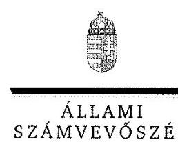

ELNÖK

Ikt.szám: V-0839-152/2016.

Fenyves Péter úr
polgármester
Mór Városi Önkormányzat

Mór

# Tisztelt Polgármester Úr! 

Köszönettel vettem a Móri Hőtermelő- és Szolgáltató Kft. ellenőrzéséről készített számvevőszéki jelentéstervezetre tett észrevételeit.

Az Állami Számvevőszék Polgármester úr észrevételére vonatkozó álláspontját a felügyeleti vezető által készített melléklet tartalmazza.

Tájékoztatom Polgármester urat, hogy az Állami Számvevőszék a figyelembe nem vett észrevételeket az Állami Számvevőszékről szóló 2011. évi LXVI. törvény 29. § (3) bekezdésében előírtak szerint köteles a jelentésében feltüntetni és megindokolni, hogy azokat miért nem fogadta el.

Budapest, 2016. 4. 4. 4. 4. hó
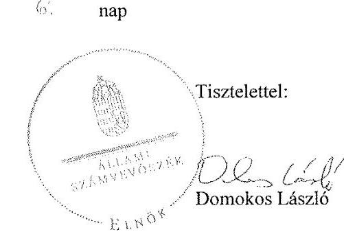

Melléklet: Tájékoztatás az észrevételek kezeléséről

---

# Tájékoztatás az észrevételek kezeléséről 

Megköszönöm Polgármester úrnak „Az önkormányzatok gazdasági társaságai - Az önkormányzatok többségi tulajdonában lévő gazdasági társaságok közfeladat-ellátását érintő gazdálkodási tevékenysége szabályszerűségének ellenőrzése - Móri Hőtermelő- és Szolgáltató Kft." címmel készített jelentéstervezetre tett észrevételeit. Az észrevételei kezeléséről az alábbi tájékoztatást adom:

A jelentéstervezet 1.1. számú megállapítása szerint a Könyvvizsgálóval kötött szerződés tartalmi elemeit a Gt. 41. § (1) bekezdésében foglaltak szerint nem határozták meg. A megállapítás kapcsán polgármester úr jelzi, hogy a MÓRHÓ Kft. legfőbb szerve, Mór Városi Önkormányzat Képviselőtestülete - az ellenőrzési dokumentumok közé is csatolt - 76/2014. (IV.30.) Kt. határozatában előírta a könyvvizsgálói szerződés lényeges elmeit. A vonatkozó észrevételét elfogadom, így a jelentéstervezet 1.1. 4. bekezdésének vonatkozó részét az alábbiak szerint pontosítom:
„[...]A Képviselö-testület a_Gt. 41. § (1) bekezdésében foglaltakat betartva ellenére a könnyvizsgálóval kötendő szerzödés lényeges elemeinek tartalmáti elemeit-a 76/2014. (IV.30.) Kt. határozatában elöirta."

A jelentéstervezet 1.2. számú megállapítása szerint a MÓRHÓ Kft. 2012. és 2013. évi beszámolóit a jogszabályi előírásokban foglaltak ellenére az Önkormányzat Képviselő-testülete a Társaság Felügyelő Bizottságának (FB) írásos jelentései nélkül fogadta el. Észrevételében jelzi, hogy a képviselő-testületi ülések jegyzőkönyvei és dokumentumai alapján az FB írásos jelentéseit mindkét évben megismerhették az önkormányzati képviselők. Az Ön által csatolt és az ellenőrzés során is rendelkezésre bocsátott 2/2014. FB jegyzőkönyv alapján megállapítható, hogy a 2013. évi beszámolóról az FB írásos jelentése elkészült. A 2013. évi beszámolót tárgyaló képviselő-testületi ülés előterjesztése és jegyzőkönyve tartalma alapján azonban egyértelműen nem jelenthető ki, hogy a 2013. évi beszámoló elfogadásakor a Társaság legfőbb testülete számára megismerhető volt az FB írásos - 2/2014. számú - jelentése, mivel az nem szerepelt az előterjesztés dokumentumai között, továbbá a jegyzőkönyv tanúsága szerint az FB képviseletében felszólaló csak szóban javasolta a beszámoló elfogadását, az írásos jelentésről nem nyilatkozott. A 2012. évi beszámolóról készült FB jelentés tartalmának megismerését sem az ellenőrzés dokumentumai, sem észrevétele mellékletében nem biztosította ellenőrzésünk számára, így azzal kapcsolatban kizárólag a beszámolót tárgyaló képviselő-testületi ülés jegyzőkönyve és a napirendi ponthoz tartozó előterjesztés ad támpontot. Az előterjesztésben leírták, hogy a Társaság 2012. évi beszámolójáról szóló FB írásos jelentése még nem állt rendelkezésre, azt az FB várhatóan május 22 -én tartott ülése után a Képviselő-testület tagjainak a beszámolót tárgyaló ülésen fogják kiosztani. A képviselő-testületi ülésről készült jegyzőkönyvben rögzítettek szerint az FB elnöke szóban jelezte, hogy az FB a 2012. évi beszámolót elfogadásra javasolja, az írásos jelentés megismertetéséről nem nyilatkozik, továbbá azt nem mellékelték a jegyzőkönyvhöz, így annak a Társaság legfőbb szervi megismeréséről igazolható módon nem lehet meggyőződni. A jelentéstervezet érintett megállapításának módosítására a fentiek miatt nincs lehetőségem.

A jelentéstervezet 2.4. számú megállapítása szerint a Társaság beszámolóját tárgyaló Képviselőtestületi ülésekre javasolták a könyvvizsgáló meghívását, de az üléseken nem vett részt. Észrevételében azt jelzi, hogy a MÓRHÓ Kft. egyszemélyes társaság, így nincs taggyűlése,

---

amelynek ülésén a könyvvizsgálónak megjelenési kötelezettsége lenne. Továbbá a Gt. 168. § (1) bekezdésében foglaltakra hivatkozva jelzi, hogy az egyszemélyes társaságnál a taggyűlési hatáskörbe tartozó kérdésekben az egyedüli tag dönt, és erről a vezető tisztségviselőket írásban köteles értesíteni. A Gt. 19. § (5) bekezdése szerint az egyszemélyes társaságnál valóban nem működik taggyűlés, ugyanakkor a jogszabály szerint az egyszemélyes társaság is rendelkezik legfőbb szervvel és legfőbb szervének törvényben, illetve a társasági szerződésben meghatározott hatáskörében az egyedüli tag jelen esetben a MÖRHŐ Kft. egyedüli tulajdonosa Mór Városi Önkormányzat, mint jogi személy írásban köteles határozni. Az Önkormányzat Képviselő-testületének a 38/2006. (XII. 18) rendeletében kiadott SZMSZ 6. § (1) bekezdése szerint: „Az önkormányzati feladat- és hatáskörök a képviselő-testületet illetik meg. " Ezáltal az Önkormányzat nevében tulajdonosi döntést a Képviselőtestület hozhat, amely mint legfőbb szerv a MÖRHŐ Kft. éves beszámolójának elfogadását az SZMSZ 1. számú melléklete szerint nem delegálta tovább, azt továbbra is saját hatáskörben gyakorolta, a beszámolókat képviselő-testületi határozattal fogadta el. A MÖRHŐ Kft. egyszemélyes tagja, azaz Mór Városi Önkormányzat a jogszabályban előírtaknak megfelelően írásban határozott a könyvvizsgáló személyéről. A Gt. 44. § (1) bekezdésében előírtak szerint a Társaság számviteli törvény szerinti beszámolóját tárgyaló legfőbb szervi ülésére a könyvvizsgálót meg kellett hívni, melyen a könyvvizsgáló köteles volt részt venni. Mindezek alapján kijelenthető, hogy a Társaság beszámolóját tárgyaló képviselő-testületi, mint legfőbb szervi ülésekre a könyvvizsgálót meg kellett hívni, melyen az köteles lett volna részt venni. A módosításra irányuló észrevételét ezek alapján nem tudom elfogadni.

Budapest, 2016. kud. yus hó (o. nap

Dr. Horváth Margit
felügyeleti vezető

---

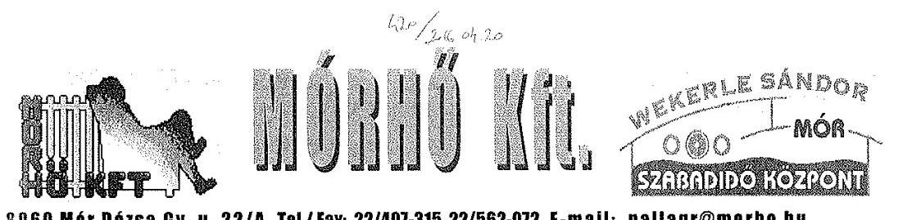

Állami Számvevőszék
1052 Budapest, Apáczai Csere János u. 10
Domokos László Úr
részére

Iktató
szám
Ügyintéző
Dátum:
Tárgy

Pallag Róbert
2016. április 15

Jelentéstervezet észrevételezése

# 031612/2016 

APR 202016

Tisztelt Domokos László Úr!

A MÓRHŐ KFT részére megküldött V-0839-140/2016. iktatószámú jelentéstervezetben foglaltakra az alábbi észrevételeket teszem.

- 1.1 számú megállapítás: „A Képviselő-testület Gt. 41. § (1) bekezdésében foglaltak ellenére a könyvvizsgálóval kötendő szerződés tartalmi elemeit nem határozta meg" Észrevétel: A Gt. 41. § (1) bekezdése „megválasztja a társaság könyvvizsgálóját és meghatározza a könyvvizsgálóval kötendő szerződés lényeges elemeinek tartalmát." A lényeges tartalmi elemeket a Képviselő-testület meghatározta.
- 1.2 számú megállapítás: „A 2012. és a 2013. évi beszámolót a Gt. 35. § (3) bekezdés és a Ptk. 3:120. § (2) bekezdés, továbbá az Alapító Okirat 10/1/3. pontjában foglaltakkal ellentétben az FB írásos jelentése (jegyzőkönyve) hiányában szabálytalanul fogadta el a Képvisleö-testület."
Észrevétel: A képviselő-testületi előterjesztések tartalmazzák az Fb írásos jegyzőkönyvét a fent jelzett időszakban a MÓRHỐ Kft beszámolóiról.
- 2.4 számú megállapítás: „A könyvvizsgáló a 2012-2014. években a 2011-2013. évi beszámolókat tárgyaló pénzügyi Bizottsági üléseken részt vett. A 2014. évi beszámolót tárgyaló képviselő testületi ülésen a Ptk 3-131 § (2) bekezdés előírásának megfelelően jelen volt. A 2011-2013. évek beszámolói esetében a könyvvizsgáló a javasolt meghívottak között szerepelt, de nem vett részt az üléseken, mely ellentétes a Gt. 44 § (1) bekezdésében foglaltakkal."
Észrevétel: A MÓRHŐ Kft egyszemélyes társaság. Az egyszemélyes társaságnál nincs taggyülés, az egyszemélyes tag alapítói rendelkezésben határoz, nincs legfőbb szervi ülés.
A Gt. 168. § (1) Az egyszemélyes társaságnál a taggyülési hatáskörbe tartozó kérdésekben az egyedüli tag dönt, és erről a vezető tisztségviselőket írásban köteles értesíteni.

---

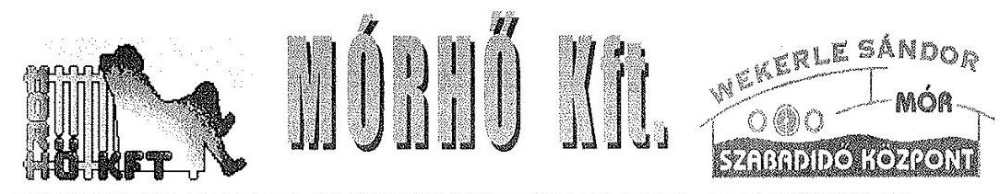

A Ptk. 3:109 § (4) (4) Egyszemélyes társaságnál a legfőbb szerv hatáskörét az alapító vagy az egyedüli tag gyakorolja. A legfőbb szerv hatáskörébe tartozó kérdésekben az alapító vagy az egyedüli tag írásban határoz és a döntés az ügyvezetéssel való közléssel válik hatályossá.

- 3.2 számú megállapítás: „a Társaság által 2015. április 15 -éig alkalmazott távhőszolgáltatással kapcsolatos árképzés nem volt szabályszerű"
Észrevétel: Elgépelés történt, a pontos keltezés 2011. április 15.

Együttműködését megköszönve:
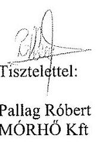

MÓRHÓ KFT.
Pallag Róbert MÓRHÓ Kft

MÓRHÓ KFT.
6000 Mór. Dózsa Gy. V. 22 /A
ENSTE BANK NYHT.
11887007-06717000-67000000
telefon/fax (22) 407-315
Adószám: 11456687-2-07

---

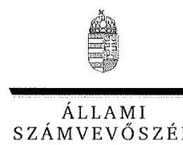

ELNÖK

Ikt.szám: V-0839-149/2016.

# Pallag Róbert úr 

ügyvezető igazgató
Móri Hőtermelő és Szolgáltató Kft.

## Mór

## Tisztelt Ügyvezető Igazgató Úr!

Köszönettel vettem a Móri Hőtermelő- és Szolgáltató Kft. ellenőrzéséről készített számvevőszéki jelentéstervezetre tett észrevételeit.

Az Állami Számvevőszék észrevételekre vonatkozó álláspontjáról a felügyeleti vezető által készített részletes tájékoztatásban kap választ, amelyet levelemhez mellékeltem.

Tájékoztatom Ügyvezető Igazgató urat, hogy az Állami Számvevőszék a figyelembe nem vett észrevételeket az Állami Számvevőszékről szóló 2011. évi LXVI. törvény 29. § (3) bekezdésében előirtak szerint köteles a jelentésében feltüntetni és megindokolni, hogy azokat miért nem fogadta el.

Budapest, 2016. 22. 2016. hó nap
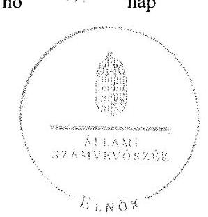

Tisztelettel:

Domokos László

Melléklet: Tájékoztatás az észrevételek kezeléséről

---

# Tájékoztatás az észrevételek kezeléséről 

„Az önkormányzatok gazdasági társaságai - Az önkormányzatok többségi tulajdonában lévő gazdasági társaságok közfeladat-ellátását érintő gazdálkodási tevékenysége szabályszerűségének ellenőrzése - Móri Hőtermelő- és Szolgáltató Kft." címmel készített jelentéstervezetre Ügyvezető Igazgató úr észrevételeit megköszönöm. Az észrevételek kezeléséről az alábbi tájékoztatást adom:

A jelentéstervezet 1.1. számú megállapítása szerint a Könyvvizsgálóval kötött szerződés tartalmi elemeit a Gt. 41. § (1) bekezdésében foglaltak szerint nem határozták meg. A megállapítás kapcsán Ügyvezető Igazgató úr jelzi, hogy a MÓRHÓ Kft. legfőbb szerve, az Önkormányzat Képviselőtestülete választotta meg a Társaság könyvvizsgálóját és a Társaság Alapító Okiratában is rögzítette személyét. Azzal, hogy a könyvvizsgálóval a szerződést megkötötték egyben meghatározták a könyvvizsgálóval kötendő szerződés lényeges elemeinek tartalmát is. A vonatkozó észrevételét elfogadom, így a jelentéstervezet 1.1. 4. bekezdésének vonatkozó részét az alábbiak szerint pontosítom:
„[...]A Képviselö-testület a Gt. 41. § (1) bekezdésében foglaltakat ellenére-betartva a könnyvizsgálóval kötendő szerzödés lényeges elemeinek tartalmáti elemeit-nem-határozta-meg-a 76/2014. (IV.30.) Kt. határozatában elöirta."

A jelentéstervezet 1.2. számú megállapítása szerint a MÓRHŐ Kft. 2012. és 2013. évi beszámolóit a jogszabályi előírásokban foglaltak ellenére az Önkormányzat Képviselő-testülete a Társaság Felügyelő Bizottságának írásos jelentése nélkül fogadta el. Észrevételében jelzi, hogy a képviselőtestületi előterjesztések mindkét évben tartalmazták az FB írásos jelentéseit. Az Ön által teljességi igazolással is ellátott ellenőrzési dokumentumok ismételt áttanulmányozása alapján megállapítottam, hogy a Képviselő-testületi ülések előterjesztései között a jelzett dokumentumok nem szerepeltek, illetőleg a 2012. évi beszámolóhoz tartozó jelentés hiányát az FB előzetesen jelezte, azzal, hogy a Képviselő-testületi ülés napjára csatolni fogják azt. A Képviselő-testületi ülések jegyzőkönyvei szerint az FB írásos véleményét a képviselők nem ismerték meg, ugyanakkor az FB üléséről az FB egy tagja a Képviselő-testület előtt a testületi ülés jegyzőkönyvében rögzítettek szerint szóban röviden beszámolt, a Társaság beszámolójának elfogadását javasolta. A dokumentumok jogszabályban előírt írásos bemutatása azonban nem történt meg, így észrevételét elfogadni továbbra sem tudom.

A jelentéstervezet 2.4. számú megállapítása szerint a Társaság beszámolóját tárgyaló Képviselőtestületi ülésekre javasolták a könyvvizsgáló meghívását, de az üléseken nem vett részt. Észrevételében azt jelzi, hogy a MÓRHŐ Kft. egyszemélyes társaság, így nincs taggyűlése, amelynek ülésén a könyvvizsgálónak megjelenési kötelezettsége lenne. A Gt. 19. § (5) bekezdése szerint az egyszemélyes társaság is rendelkezik legfőbb szervvel. Jelen esetben a MÓRHŐ Kft. egyedüli tulajdonosa Mór Város Önkormányzata, mint jogi személy. Az Önkormányzat nevében döntést a Képviselő-testület hozhat, amely nem delegálta tovább az éves beszámoló elfogadását, azt az SZMSZ szerint továbbra is gyakorolta [38/2006. (XII. 18) önk. rend. 1. sz. mell.]. Az egyszemélyes tag, azaz az Önkormányzat a jogszabályban elöírtaknak megfelelően írásban határozott a könyvvizsgáló személyéről, így a Gt. 44. § (1) bekezdésében előírtak szerint a Társaság számviteli

---

törvény szerinti beszámolóját tárgyaló ülésre a könyvvizsgálót meg kell hívni, melyen a könyvvizsgáló köteles részt venni. Észrevételét ezek alapján nem tudom elfogadni.

A jelentéstervezet 3.2. számú megállapításában elírt évszám javítására tett észrevételét elfogadom, az érintett 2. bekezdés szövegrészét az álabbiak szerint pontosítom:
„[...]a Társaság által 20151. április 15-éig alkalmazott [...]"

Budapest, 2016. n. a. yus hó 5. nap

Dr. Horváth Margit
felügyeleti vezető

---

.

---

# RÖVIDÍTÉSEK JEGYZÉKE 

${ }^{1}$ Mórhő Kft.
${ }^{2}$ polgármester
${ }^{3}$ ügyvezető
${ }^{4}$ Tszt.
${ }^{5}$ Önkormányzat
${ }^{6}$ Társaság
${ }^{7}$ Nvtv.
${ }^{8}$ Közép- és hosszú távú vagyongazdálkodási terv
a Képviselő-testület 27/2013. (II. 20.) számú határozatával elfogadott Közép- és hosszú távú vagyongazdálkodási terv
Mór Város Önkormányzata a 77/2011. (III. 30.) számú határozatával elfogadott 2011-2014, illetve a 88/2015. (IV.29.) számú határozatával elfogadott 20142019. évekre vonatkozó gazdasági programja
a helyi önkormányzatokról szóló 1990. évi LXV. törvény (hatálytalan: a 2014. évi általános önkormányzati választások napjától)
Magyarország helyi önkormányzatairól szóló 2011. évi CLXXXIX. törvény
Mórhő Kft. többször módosított alapító okirata
Mór Város Önkormányzat Képviselő-testülete
a Mórhő Kft felügyelőbizottsága
a gazdasági társaságokról szóló 2006. évi IV törvény (hatálytalan: 2014. március 15 -től)
2013. évi V. törvény a Polgári Törvénykönyvről (hatályos 2014. március 15-től)
Mór Város Önkormányzat Képviselő-testülete
a Képviselő-testület 184/1997. (VIII. 27.) határozatával elfogadott Fútőmú üzemeltetési és Karbantartási szerződés
a Mórhő Kft. Távfútési Üzletágának az ügyvezető által 2010. május 19-jén kiadott Távhőszolgáltatási Közüzemi Szabályzata
A Mórhő Kft. Távfútési Üzletágának az ügyvezető által 2014. január 1-jén kiadott Távhőszolgáltatási Közüzemi Szabályzata (üzletszabályzata)
Mór Város Önkormányzat jegyzője
Mór Város Önkormányzatának többször módosított 25/1999. (IX. 30.) rendelete a távhőszolgáltatásról, valamint annak dijáról és a dijalkalmazás feltételiről (hatályos: 2008. október 15 -jétől)
a távhőszolgáltatóknak értékesített távhő árának, valamint a lakossági felhasználónak és a külön kezelt intézménynek nyújtott távhőszolgáltatás dijának megállapításáról szóló 50/2011. (IX. 30.) NFM rendelet
SONYC Számviteli és Közgazdasági Szolgáltató Kft.
a számvitelről szóló 2000. évi C törvény
Mór Város Önkormányzata Pénzügyi Bizottsága
a köztulajdonban álló gazdasági társaságok takarékosabb múködéséről szóló 2009. évi CXXII. törvény

Mórhő Kft. Számviteli politikája és módosításai (hatályos: 2007. január 1-jétől, 2012 július 1., 2013. január 1.)

---

${ }^{29}$ leltározási szabályzat
${ }^{30}$ értékelési szabályzat
${ }^{31}$ Pénzkezelési szabályzat
${ }^{32}$ amortizációs politika
${ }^{33}$ önköltségszámítási szabályzat
${ }^{34}$ Számlarend
${ }^{35}$ Selejtezési szabályzat
${ }^{36}$ Távfütési üzletág
${ }^{37}$ MEKH
${ }^{38}$ Avtv.
${ }^{39}$ Info tv.
${ }^{40}$ Amortizációs politika
${ }^{41}$ Kórház
${ }^{42}$ NFM rendelet
${ }^{43}$ MEKH
${ }^{44}$ Ámt.
${ }^{45}$ Rezsi tv.
${ }^{46}$ 50/2011. (IX. 30.) NFM rendelet
${ }^{47}$ 51/2011. (IX. 30.) NFM rendelet
${ }^{48}$ ÁSZ tv.

Mórhő Kft. Leltározási szabályzata módosításokkal (hatályos: 2007. január 1jétől, 2012.július 1, 2013. január 1.-től)
Mórhő Kft. Eszközök és Források értékelési szabályzata és módosításai (hatályos: 2007. január 1-jétől, 2012. január 1., 2013. január 1.-től)

Mórhő Kft. pénzkezelési szabályzata (hatályos: 2008. január 1-jétől., 2013. január 1.)

Mórhő Kft. Amortizációs politikája és módosítása (hatályos: 2007. január 1-jétől, 2013. január 1.-től)

Mórhő Kft. Önköltségszámítási szabályzat és módosítása (hatályos: 2007. január 1-től, 2013. január 01.-től)
Mórhő Kft. számlarendje módosításokkal (hatályos 2002. június 1-jétől, 2013. január 1.)

Mórhő Kft. selejtezési szabályzata (hatályos: 2007.01.01-jétől, 2013.01.01.) a távhőszolgáltatás, a távhőtermelés, valamint a gázmotoros villamosenergia termelés együttese
Magyar Energetikai és Közmű-szabályozási Hivatal
a személyes adatok védelméről és a közérdekü adatok nyilvánosságáról szóló 1992. évi LXIII. törvény (hatálytalan 2012. január 1-jétől)

Az információs önrendelkezési jogról és az információszabadságról szóló 2011. évi CXII. törvény (hatályos: 2011. július 27-től)
a Mórhő Kft. amortizációs politikája (hatályos: 2007. január 1-jétől, 2012. január 1.)

Fejér Megyei Szent György Egyetemi Oktató Kórház
a távhőszolgáltatónak értékesített távhő árának, valamint a lakossági felhasználónak és a külön kezelt intézménynek nyújtott távhőszolgáltatás dijának megállapításáról szóló 50/2011. (IX. 30.) NFM rendelet
Magyar Energetikai és Közmű-szabályozási Hivatal
az árak megállapításáról szóló 1990. évi LXXXVII. törvény
a rezsicsökkentések végrehajtásáról szóló 2003. évi LIV. törvény (hatályos 2013. május 10 -jétől)
a távhőszolgáltatónak értékesített távhő árának, valamint a lakosság felhasználónak és a külön kezelt intézménynek nyújtott távhőszolgáltatás dijának megállapításáról (hatályos: 2011. október 1-jétől)
a távhőszolgáltatás támogatásáról szóló 51/2011. (IX. 30.) NFM rendelet (hatályos: 2011. október 1-jétől)
2011. évi LXVI. törvény az Állami Számvevőszékről, hatályos 2011. július 1-jétől

---

# ÁLLAMI SZÁMVEVŐSZÉK 

1052 Budapest, Apáczai Csere János utca 10.
Levélcím: 1364 Budapest 4. Pf. 54
Telefon: +36 14849100 Telefax: +36 14849200
www.asz.hu