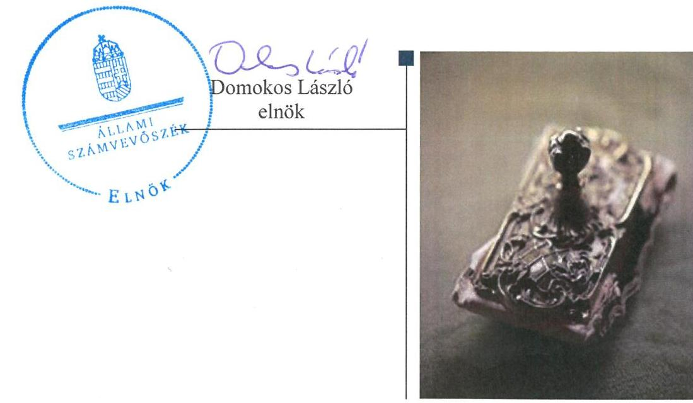
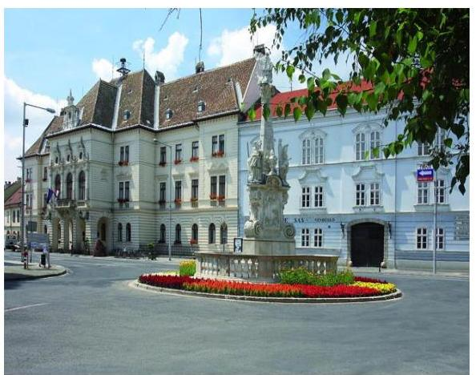
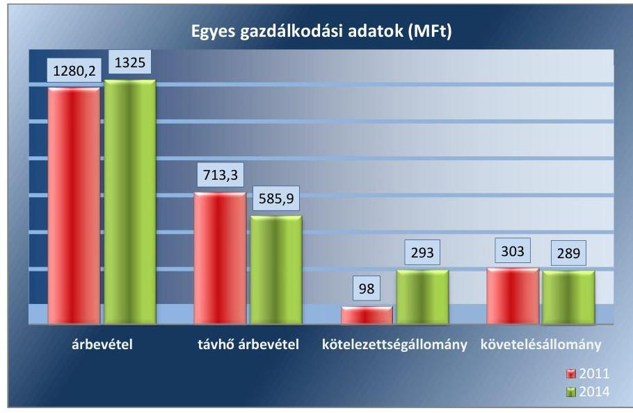
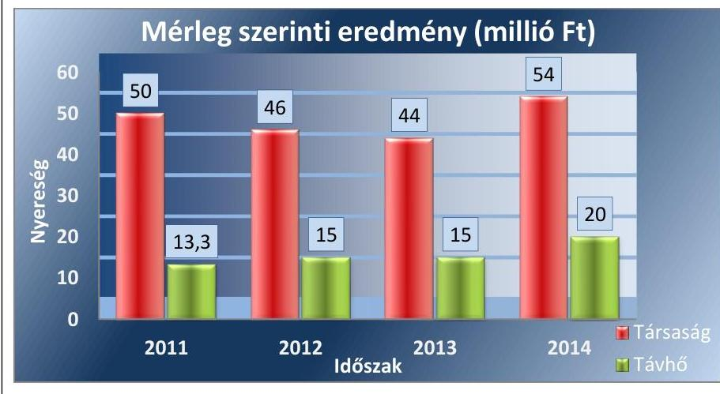
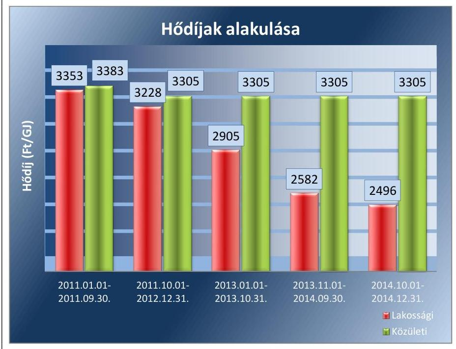
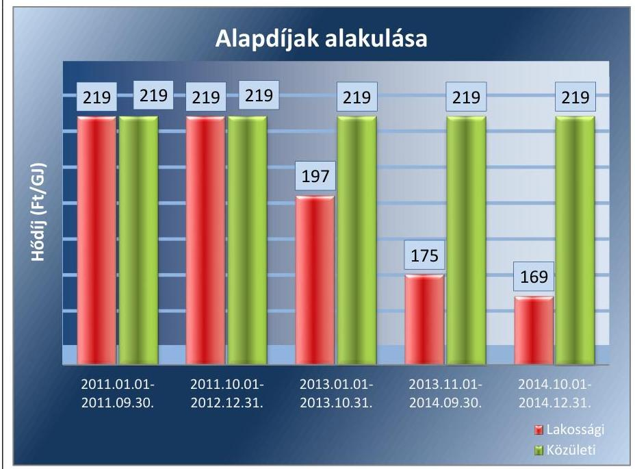
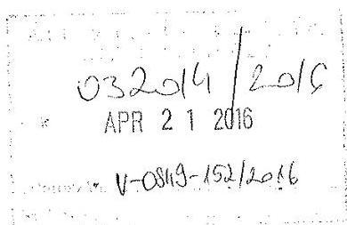
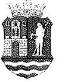
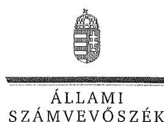

# Jelentés 

## Az önkormányzatok gazdasági társaságai

Az önkormányzatok többségi tulajdonában lévő gazdasági társaságok közfeladat ellátását érintő gazdálkodási tevékenysége szabályszerűségének ellenőrzése - Városüzemeltető és Fenntartó Kft. (Mosonmagyaróvár)

2016.

---

# Jelentés 

## Az önkormányzatok gazdasági társaságai

Az önkormányzatok többségi tulajdonában lévő gazdasági társaságok közfeladat ellátását érintő gazdálkodási tevékenysége szabályszerűségének ellenőrzése - Városüzemeltető és Fenntartó Kft. (Mosonmagyaróvár)
2016. múgins hó 12. nap

---

# AZ ELLENŐRZÉST FELÜGYELTE:

DR. HORVÁTH MARGIT felügyeleti vezető

## AZ ELLENŐRZÉST VEZETTE ÉS A VÉGREHAJTÁSÁÉRT FELELŐS:

GÁCSER JÓZSEF ellenőrzésvezető

## A PROGRAM ÖSSZEÁLLÍTÁSÁÉRT FELELŐS:

JANIK JÓZSEF LÁSZLÓ osztályvezető

IKTATÓSZÁM: V-0849-157/2016.

TÉMASZÁM: 1704

ELLENŐRZÉS-AZONOSÍTÓ SZÁM: V-070713

Jelentéseink az Országgyűlés számítógépes hálózatán és az Interneta a www.asz.hu címen is olvashatóak.

---

# TARTALOMJEGYZÉK 

■ ÖSSZEGZÉS ..... 5
■ AZ ELLENŐRZÉS CÉLJA ..... 7
■ AZ ELLENŐRZÉS TERÜLETE ..... 8
■ AZ ELLENŐRZÉS HÁTTERE, INDOKOLTSÁGA ..... 10
■ FÓKUSZKÉRDÉSEK ..... 11
■ ELLENŐRZÉS HATÓKÖRE ÉS MÓDSZEREI ..... 12
■ MEGÁLLAPÍTÁSOK ..... 14
■ JAVASLATOK ..... 30
■ MELLÉKLETEK ..... 33
I. Sz. melléklet: Értelmező szótár ..... 33
II. Sz. melléklet: Múködési adatok ..... 36
■ FÜGGELÉK: ÉSZREVÉTELEK ..... 37
■ RÖVIDÍTÉSEK JEGYZÉKE ..... 43

---

.

---

# ÖSSZEGZÉS 

Az Állami Számvevőszék a mosonmagyaróvári Városüzemeltető és Fenntartó Kft. távhőszolgáltatási közfeladat ellátását érintő gazdálkodási tevékenysége 2011-2014 közötti szabályszerűségét ellenőrizte. Megállapította, hogy a közfeladatellátás önkormányzati megszervezése szabályszerű volt, a tulajdonosi jogok gyakorlása összességében megfelelő az előírásoknak. A szabályszerű vagyongazdálkodás biztositása mellett a távhőszolgáltatás közfeladata bevételeinek, ráfordításainak elszámolása és elkülönítése megfelelő volt. Az önköltségszámitás rendjének előírásoknak megfelelő szabályozása támogatta a szabályszerű árképzést. A Társaság kötelezettségállománya a közfeladat ellátására nem jelentett kockázatot.

## Az ellenőrzés társadalmi indokoltsága

Az Állami Számvevőszék középtávra szóló stratégiájában megfogalmazta, hogy a helyi önkormányzatok gazdálkodásában rejlő pénzügyi kockázatok feltárásával, az államháztartáson kívülre nyújtott költségvetési támogatások és ingyenes vagyonjuttatások, valamint az államháztartáson kívül működő közfeladat-ellátó rendszerek ellenőrzéseivel hozzájárul ahhoz, hogy a közpénzeket az államháztartáson kívül működő szervezetek is átlátható, rendezett módon használják fel a közfeladatok szerződésben vállalt ellátása érdekében.

Magyarországon az intézmény-centrikus közfeladat-ellátás jellemző, de egyre jelentősebb a költségvetésen kívüli feladatellátás térnyerése. Ennek legfontosabb szereplői - a nonprofit szervezetek mellett - az önkormányzati tulajdonú gazdasági társaságok. Az önkormányzatok szervezetalakítási szabadságának következménye, hogy a korábban is vállalati formában működő közszolgáltatások mellett, mind a kötelező, mind az önként vállalt feladatok ellátásában a gazdasági társaságok kiemelt fontosságú szerephez jutottak.

## Főbb megállapítások, következtetések, javaslatok

Mosonmagyaróvár Város Önkormányzata közigazgatási területén a távhőszolgáltatás közfeladatának megszervezéséről a jogszabályi előírásoknak megfelelően döntött, annak ellátásáról a kizárólagos tulajdonában lévő gazdasági társasága útján gondoskodott. Az alapító okiratban, az önkormányzati SZMSZ1,2-ben és a vagyonrendeletben1,2 meghatározta a tulajdonosi joggyakorlás szabályait, melyeket összességében az előírásoknak megfelelően gyakorolt.

A Képviselő-testület beszámoltatási kötelezettségét, a társasági működés felügyeletét az FB-n keresztül az előírásoknak megfelelően gyakorolta. Az Önkormányzat az ellenőrzött időszakban ugyanakkor nem élt az Ötv.-ben rögzített lehetőségével és a Társaságnál a távhőszolgáltatással kapcsolatos tevékenységekre vonatkozóan nem végzett belső ellenőrzést. Az Önkormányzat nem határozott meg a szakmai feladat-ellátás objektív mérésére alkalmas kritériumrendszert, mutatószámokat, valamint az ellátás színvonalának értékeléséhez szükséges szakmai követelményeket. Az Önkormányzat a Társaság anyagi ösztönzési rendszerét a Taktv.-nek és a belső előírásoknak megfelelően működtette.

Az Önkormányzat a közfeladat ellátásához szükséges vagyonelemeket az ellenőrzött időszakot megelőzően apportként - a Városüzemeltető és Fenntartó Kft.-be 2008. augusztus 8-ától beolvadt JOULE Hőszolgáltató Kft. útján bocsátotta rendelkezésre.

A közfeladat-ellátást szolgáló vagyonnal való gazdálkodás, annak nyilvántartása szabályszerű volt. Az Önkormányzat a távhőszolgáltatásra vonatkozóan a Tszt. szerinti rendeletalkotási kötelezettségének eleget tett, annak tartalma megfelelt az előírásoknak. A Társaság rendelkezett a Számv. tv. előírásainak megfelelő számviteli szabályzatokkal, amelyek elősegítették a szabályszerű működést és vagyongazdálkodást. A Tszt. előírásainak megfelelően a közfeladat

---

bevételei és ráfordításai egyértelmű elhatárolásához szükséges szabályokat kidolgozta. Hiányosság a leltározási szabályzat kapcsán merült fel, amely ellentmondást tartalmazott a befektetett eszközök leltározás módjával és gyakoriságával összefüggésben. A Társaság üzletszabályzatát a jegyző jóváhagyta, ugyanakkor a Tszt.-ben előírtakkal szemben nem küldte meg véleményezésre a fogyasztóvédelmi hatóságnak.

A Társaság az éves beszámolóit elkészítette, a könyvvizsgálói záradékkal ellátott dokumentumok letétbe helyezése határidőben megtörtént. Adatvédelmi és közzétételi szabályozási kötelezettségét ugyanakkor a Társaság az ellenőrzött időszak alatt hiányosan teljesítette, 2011. január 1. és 2011. október 27. között az Avtv.-ben és az Info.tv.-ben előírt szabályzatokkal nem rendelkezett, illetve nem jelölt ki adatvédelmi felelőst.

Az ellenőrzött időszakban a Társaság vagyona folyamatosan emelkedett. A tárgyi eszköz állomány az ellenőrzött időszak eleji 712,0 millió Ft-ról 44,38\%-kal, 1028,0 millió Ft-ra emelkedett a 2014. év végére. Az állománynövekedés a közfeladat ellátásához biztosított vagyonelemeknél is megmutatkozott. A kötelezettségállomány szintje, összetétele, az ellenőrzött időszakban nem jelentett kockázatot a közfeladat ellátására, a fizetési kötelezettségek összességében határidőben teljesültek. A kötelezettségek állománya 2011-2014 között 182,0 millió Ft-tal nőtt, a növekedést elsődlegesen a rövid lejáratú, szállítói kötelezettségek emelkedése okozta. A rövid lejáratú kötelezettségállomány 2012. évi magas szintje a folyamatban lévő beruházások szállítói állományra gyakorolt hatásából, valamint a nyereségkorláton felüli eredmény elkülönítéséből eredt. A lakossági távhőszolgáltatáshoz kapcsolódó követelések állománya a rezsicsökkentési előírások végrehajtása, a behajtási intézkedések és a fizetési fegyelem javulása következtében csökkent, ennek ellenére a közfeladat követelésállománya az ellenőrzött időszak alatt számottevően nem változott. Ennek az volt az oka, hogy a közületi fogyasztókkal szembeni követelések növekedtek. Egy intézmény a csatlakozásától kezdve folyamatosan határidőn túl vagy nem fizetett. A hátralékos intézménnyel szembeni követelésállomány 2014. december 31-én 37,2 millió Ft volt, az összes követelés állomány 38,1\%-a.

A Társaság az ellenőrzött időszakban nyereségesen gazdálkodott, 2011-2014 között 194,0 millió Ft eredményt realizált. A távhőüzletág nyereségkorlát feletti eredménye az árbevétel csökkenésével párhuzamosan fokozatosan csökkent. A korlát feletti nyereséget a Társaság minden évben a MEH által jóváhagyott távhőhálózati fejlesztésekre fordította.

A Városüzemeltető és Fenntartó Kft. az üzleti tervek teljesítéséről, a gazdálkodásról, azon belül a távhőszolgáltatás közfeladatáról az éves és féléves beszámolók és üzleti jelentések keretében számolt be a tulajdonos felé a Számv. tv.-ben, az alapító okiratban és a közszolgáltatási szerződésben előírtaknak megfelelően. A Társaságnál a bevételek, költségek és ráfordítások elszámolása megfelelő volt, figyelembe véve a jogszabályok és a belső szabályozás előírásait. Az önköltségszámítás szabályozása megfelelt az előírásoknak, amely alapján az alkalmazott módszer biztosította a közszolgáltatás dijának megalapozottságát és a szabályszerű árképzést.

---

# AZ ELLENŐRZÉS CÉLJA 

## Az önkormányzatok gazdasági társaságai - Az önkormányzatok tulajdonában lévő gazdasági társaságok közfeladat-ellátását érintő gazdálkodási tevékenysége szabályszerűségének ellenőrzése - Városüzemeltető és Fenntartó Kft.

Az ellenőrzés célja annak értékelése, hogy az önkormányzat a jogszabályi előírások figyelembevételével döntött-e az ellenőrzésre kerülő közfeladat megszervezéséről; az önkormányzat/tulajdonosi joggyakorló szabályszerűen gyakorolta-e a tulajdonosi jogokat; a gazdasági társaság közfeladat-ellátása bevételeinek, ráfordításainak elszámolása, és vagyongazdálkodási tevékenysége megfelelt-e a jogszabályi, illetve a közszolgáltatási/vagyonkezelési szerződésben foglalt tulajdonosi előírásoknak, azok végrehajtása szabályszerű volt-e.

Értékeltük továbbá, hogy a gazdasági társaság kötelezettségállománya jelent-e kockázatot a múködésre, illetve a közfeladat ellátására; valamint hogy a közfeladatok átláthatósága és elszámoltathatósága érdekében biztosítva volt-e a közszolgáltatás dijának megalapozottsága szabályszerű önköltségszámítással.

---

# **Az Ellenőrzés Területe**

## **Mosonmagyaróvár Város Önkormányzata és a Városüzemeltető és Fenntartó Kft.**

Mosonmagyaróvár Város Önkormányzata a Városüzemeltető és Fenntartó Korlátolt Felelősségű Társaságot 1991. december 1-én kelt alapító okirattal hozta létre.

Az Önkormányzat 100%-os tulajdonában álló Társaság alaptevékenysége Mosonmagyaróvár közigazgatási területén távhőszolgáltatás biztosítása és városgazdálkodási feladatok ellátása volt az ellenőrzött időszakban.

A Társaság a több mint 30 ezer fő állandó lakossal rendelkező Mosonmagyaróvár távhőszolgáltatási közfeladatát saját tulajdonában lévő eszközökkel látta el. A közfeladat ellátásához szükséges vagyonelemeket az Önkormányzat az ellenőrzött időszakot megelőzően apportként – a Társaságba 2008. augusztus 8-ától beolvadt JOULE Hőszolgáltató Kft. útján – bocsátotta rendelkezésre. A lakosságszám emelkedésével párhuzamosan a távfűtéses lakások száma is növekedett, az ellenőrzött időszak végén 3658 db volt. A lakossági és közötti díjfizetők száma 2014. évben összesen 3870 volt.

A távhőszolgáltatáshoz használt távhővezeték hossza közel 9 km, a maximális távhőteljesítmény igénye 2011. évtől változatlanul 18 MW volt. A Társaságnál foglalkoztatottak átlagos statisztikai állományi létszáma az ellenőrzött időszakban számottevően nem változott, 2011. évben 86,8 fő, 2014. évben 89,4 fő volt.

**A Városüzemeltető és Fenntartó Kft.** gazdálkodására vonatkozó egyes adatokat a 2011. és a 2014. évek összehasonlításában az 1. ábra szemlélteti.

1. ábra

*Forrás: A Társaság adatszolgáltatása*

---

A távhődíjak az ellenőrzött időszakban végrehajtott rezsicsökkentési intézkedések hatására, fokozatosan csökkentek, melynek következtében az értékesítés nettó árbevétele 17,9\%-kal, 585,9 millió Ft-ra csökkent. A távhőszolgáltatáshoz kapcsolódó lakossági követelések állománya a rezsicsökkentési előírások végrehajtása, a fizetési fegyelem javulása és a behajtási intézkedések következtében csökkent. Ez hozzájárult a Társaság teljes követelésállományának 14,5 millió Ft összegű csökkenéséhez. Az ellenőrzött időszakban végrehajtott beruházásokhoz kapcsolódóan a kötelezettségállomány növekedett. A Társaság múködésének főbb adatait a II. számú melléklet mutatja be.

Az ellenőrzött időszakban a polgármester és a jegyző személye egyszer változott. A polgármester a 2014. évi önkormányzati választások óta, a jegyző 2012. évtől látja el feladatát. Az ügyvezető 2008. január 1. óta, a gazdasági igazgató 2010. január 1. óta tölti be tisztségét.

---

# AZ ELLENŐRZÉS HÁTTERE, INDOKOLTSÁGA 

## Az önkormányzatok közfeladat-ellátásában egyre jelentősebb a gazdasági társaságokon belüli feladatellátás térnyerése

Az önkormányzati tulajdonú gazdasági társaságok teljes körű ellenőrzésének lehetőségét az ÁSZ. tv. 2011. január 1-jétől hatályos módosítása teremtette meg. A közfeladatot ellátó gazdasági társaságok ellenőrzése kiemelten fontos a vagyon megőrzése, megóvása érdekében, valamint a kormányzati szektor elszámolásaiban megjelenő önkormányzati tulajdonú gazdálkodó szervezetek esetében, amelyekkel szemben alapvető követelmény, hogy gazdálkodásuk, múködésük szabályszerű, az általuk szolgáltatott adatok minél megbízhatóbbak legyenek. A közfeladat ellátás költségeinek, ráfordításainak alakulása, színvonala hatással van a lakosság elégedettségére.

A törvényalkotás számára - az észlelt problémák, szabálytalanságok, vagy egyéb nem kívánatos jelenségek felszínre kerülésével - az ellenőrzés megállapításai segítséget nyújthatnak az államháztartáson kívüli közfel-adat-ellátás értékeléséhez, jogszabályi keretei pontosításához, átláthatóságot biztosító szabályozásához. Meghatározhatóvá válnak a közfeladat ellátásban részt vevő államháztartáson kívüli szervezeteknek - az önkormányzat költségvetését, pénzügyi helyzetét is befolyásoló - kockázatai, lehetővé válik ezen kockázatok csökkentése. Ellenőrzéseink feltárhatják, hogy az önkormányzat közfeladat-ellátási kötelezettségének szabályszerűen tett-e eleget, a feladatellátáshoz rendelt közvagyon múködtetését a tulajdonostól elvárható gondossággal, szabályszerűen szervezte-e meg és a tulajdonosi felügyelete hozzájárult-e a közfeladat-ellátásához. Az ellenőrzés rávilágíthat arra, hogy a gazdasági társaság a közszolgáltatási szerződésben foglaltak betartásával, a közvagyon használatával biztosította-e a szolgáltatás folytatásának feltételeit, a közfeladat ellátását. Ezzel az ellenőrzöttek és a helyi döntéshozók számára visszajelzést ad feladatszervezési, feladat-ellátási kockázataikról, alapot ad a meglévő hibák megszüntetéséhez, a jobb közfeladat-ellátás biztosításához. Fokozza a fegyelmet, igazolja, hogy lejárt a következmények nélküli ellenőrzések időszaka. Az ÁSZ értékteremtő rend kialakításához és megőrzéséhez hozzájáruló tevékenysége pozitív hatással van a szervezetről kialakított összkép formálására.

---

# FÓKUSZKÉRDÉSEK 

1. Az önkormányzat közfeladat megszervezéséről szóló döntése, valamint tulajdonosi joggyakorlása szabályszerű volt-e?
2. A gazdasági társaság vagyongazdálkodása szabályszerű volt-e, kötelezettségállománya jelentett-e kockázatot a müködésre, illetve a közfeladat ellátásra?
3. A gazdasági társaságnál az ellátott közfeladat bevételei és ráfordításai elszámolása, valamint az önköltségszámítás és árképzés szabályszerű volt-e?

---

# ELLENŐRZÉS HATÓKÖRE ÉS MÓDSZEREI 

## Az ellenőrzés típusa

Megfelelőségi ellenőrzés

## Az ellenőrzött időszak

A 2011. január 1-jétől 2014. december 31-éig terjedő időszak.

## Az ellenőrzés tárgya

A közfeladatot gazdasági társaságokkal ellátó önkormányzatok tulajdonosi joggyakorlása, valamint gazdasági társaságok pénz- és vagyongazdálkodásának szabályozottsága és szabályszerűsége.

Az ellenőrzés kiterjed minden olyan körülményre és adatra, amely az ÁSZ jogszabályban meghatározott feladatainak teljesítéséhez, valamint a program végrehajtása folyamán felmerült újabb összefüggések feltárásához szükséges.

## Az ellenőrzött szervezet

Mosonmagyaróvár Város Önkormányzata és a Városüzemeltető és Fenntartó Kft.

## Az ellenőrzés jogalapja

Az ellenőrzés végrehajtásának jogszabályi alapját az Állami Számvevőszékről szóló 2011. évi LXVI. törvény 5. § (3)-(4)-(5) bekezdései képezték.

## Az ellenőrzés módszerei

Az ellenőrzést a nemzetközi standardokat irányadónak tekintve az ellenőrzési program ellenőrzési kérdései, az ellenőrzött időszakban hatályos jogszabályok, az ellenőrzés szakmai szabályok és módszertanok figyelembe vételével végezzük.

Az ellenőrzés ideje alatt az ellenőrzött szervezettel történő kapcsolattartást az ÁSZ Szervezeti és Müködési Szabályzatának vonatkozó előírásai alapján biztosítjuk.

---

Az ellenőrzés a kiválasztott, többségi tulajdonosi jogokat gyakorló önkormányzatra, illetve az ellenőrzésre kijelölt közfeladatot ellátó gazdasági társaság felett tulajdonosi jogokat gyakorló szervezetre és az ellenőrzött közfeladatot ellátó gazdasági társaságra terjed ki. Amennyiben a gazdasági társaságban több önkormányzat együttesen többségi tulajdonos, úgy az ellenőrzést a többségi tulajdonosi jogokat gyakorló önkormányzatnál kell lefolytatni. Az ellenőrzött gazdasági társaságnál, amennyiben az több közfeladatot is ellát, akkor az ellenőrzésre kiválasztott közfeladat-ellátást ellenőrizzük.

Az ellenőrzést a kérdésekre adott válaszok kiértékelésével, valamint a megjelölt adatforrások, a csatolt tanúsítványok felhasználásával, továbbá az adott időszakban hatályos jogszabályok figyelembe vételével kell lefolytatni. Az ellenőrzési kérdések megválaszolásához szükséges bizonyítékok megszerzése a következő ellenőrzési eljárások alkalmazásával történik: megfigyelés, kérdésfeltevés (információkérés), összehasonlítás, valamint elemző eljárás.

A bevételek és ráfordítások elszámolását, valamint a vagyonnyilvántartás területén a szabályszerű múködést véletlen mintavétellel ellenőriztük. A jogszabályoknak és a belső előírásoknak megfelelőnek tekintettük az adott területet, amennyiben a minta ellenőrzésének eredménye alapján $95 \%$-os bizonyossággal a teljes sokaságban a hibaarány kisebb volt, mint $10 \%$, nem megfelelőnek értékeltük, ha a hibaarány a $10 \%$-ot meghaladta. Kockázatot, illetve magas kockázatot jeleztünk, amennyiben egy adott terület vonatkozásában a minta alapján a teljes sokaságban nem volt egyértelmúen biztosított a jogszabályoknak és a belső szabályzatoknak megfelelő múködés. A ráfordítások elszámolására és a vagyonnyilvántartásra vonatkozó véletlen mintavételt kockázati alapú kiválasztással egészítettük ki, amelynek során évente a három legnagyobb összegű tételt választottuk ki.

---

# 1. Az önkormányzat közfeladat megszervezéséről szóló döntése, valamint tulajdonosi joggyakorlása szabályszerű volt-e? 

Összegző megállapítás

Az Önkormányzat közfeladat megszervezéséről szóló döntése szabályszerű volt. A tulajdonosi jogok gyakorlása összességében megfelelt az előírásoknak.

### 1.1. számú megállapítás

A közfeladat-ellátását az Önkormányzat szabályszerűen szervezte meg, a távhőszolgáltatásra vonatkozó rendeletalkotási kötelezettségét szabályszerűen teljesítette.

Az Ötv. ${ }^{3}$ 91. § (6) bekezdésében előírtak figyelembe vételével az Önkormányzat elkészítette a 2011-2014. évre vonatkozó gazdasági programját, melyet a Képviselő-testület ${ }^{4}$ jóváhagyott. A gazdasági programban a távhőszolgáltatás színvonalának a javítása, a távhővezeték rendszer rekonstrukciója szerepelt, amely megvalósítására pályázati forrásokat kívántak igénybe venni. Az Nvtv. ${ }^{5}$ 9. § (1) bekezdése alapján az Önkormányzat elkészítette a közép és hosszú távú vagyongazdálkodási tervét, amely azonban az Nvtv. 7. § (2) bekezdésében foglaltakkal szemben a távhőszolgáltatás közfeladattal kapcsolatban nem fogalmazott meg elvárásokat.

A Tszt ${ }^{6}$. 6. § (1) bekezdésében előírt közszolgáltatási kötelezettségének az Önkormányzat a kizárólagos tulajdonában álló Társaság útján tett eleget. A múködéséhez szükséges eszközöket az Önkormányzat apport formájában bocsátotta a Társaság rendelkezésére, kezelésre vagyont nem adott át. A vagyonkezelői szerződés alapján kezelésbe adott eszközök nem a távhőszolgáltatással kapcsolatos közfeladat ellátását szolgálták.

A Társaság feladatellátásának kereteit az alapító okiratban, a közfel-adat-ellátás szabályait a távhőszolgáltatási rendeletben ${ }^{7}$, a szolgáltatási díjak megállapításának szabályait a távhődíj rendeletben ${ }_{1}^{8}{ }_{2}{ }^{9}{ }_{3}{ }^{10}$, az üzletszabályzat ${ }_{1}{ }^{11}{ }_{2}{ }^{12}$-ban és a társasági SZMSZ ${ }^{13}$-ben határozták meg. 2011. április 1-jén az Önkormányzat és a Társaság a közfeladat ellátására, a Képviselőtestület hozzájárulásával közszolgáltatási szerződés ${ }^{14}$-t kötött. A szerződéskötés - a 2005/842/EK Bizottsági határozatnak megfelelően - a KEOP5.4.0. távhő szektor energetikai korszerűsítése tárgyban benyújtott pályázat feltétele volt.

AZ ALAPÍTÓ OKIRAT ${ }^{15}$ a Gt ${ }^{16}$. 12.§ (1) bekezdésének, valamint a Ptk ${ }^{17} 3: 4$ §-ának előírásaival összhangban szabályozta a tulajdonosi joggyakorlás kereteit. Az Önkormányzat kizárólagos hatáskörébe tartozott a mérleg megállapítása, a nyereség felosztása, a törzstőke felemelése, leszállítása. Az alapító jogosult volt többek között az ügyvezető, felügyelő bizottság, könyvvizsgáló megválasztására, a számviteli törvény szerinti beszámoló elfogadására, az adózott eredmény felhasználásáról való döntésre, a Társaság tulajdonában lévő ingatlanok elidegenítésére és megterhelésére.

---

Az alapító okirat módosítása a tulajdonos Önkormányzat kizárólagos hatáskörébe tartozott, valamint mindazon szerződések jóváhagyása, melyek a jegyzett tőke 10\%-át meghaladták.

A TÁVHŐSZOLGÁLTATÁSI RENDELET megalkotásával a Képviselő-testület eleget tett a Tszt. 6. § (2) bekezdésében foglalt rendeletalkotási kötelezettségének. A távhőszolgáltatási rendelet tartalmazta a szolgáltató és a felhasználó közötti jogviszony szabályait, a távhőrendszer fejlesztésére, a felhasznált hőmennyiség mérésére és elszámolására vonatkozó előírásokat, a szolgáltatási díjak (alapdíj, hődíj, csatlakozási díj) alkalmazási és fizetési feltételeit, valamint a díjképzési előírásokat.

TÁVHŐDIJ RENDELET $_{1}$-ét az Önkormányzat az Ár. tv ${ }^{18}$. 7. §-ban kapott felhatalmazás alapján és a Tszt. 6. § (2) bekezdésének b) pontjában foglaltaknak megfelelve - a távhőszolgáltatás legmagasabb díjtételeinek meghatározásával - elfogadta.

A Tszt. 57/D. § (1) bekezdése alapján 2011. április 15-étől a lakossági távhő díjakat, a távhőszolgáltatónak értékesített távhő árát, valamint a lakossági felhasználónak és a különkezelt intézményeknek nyújtott távhőszolgáltatás (fűtés, használati meleg víz) díját - mint legmagasabb hatósági árat -, a miniszter rendeletben állapította meg. A hivatkozott törvénnyel való harmonizáció érdekében az Önkormányzat a távhőszolgáltatási rendeletet 2012. január 1-jei hatálybalépéssel az 54/2011. (XII. 9.) számú önkormányzati rendelettel módosította.

A központi hatósági ár bevezetésével az Önkormányzat ármegállapítási jogköre - a csatlakozási díj kivételével - 2011. április 15. napjával megszűnt. Az Önkormányzat a távhődíj rendelet ${ }_{2,3}$-ét a csatlakozási díjszabási kötelezettségével összhangban fogadta el.

# 1.2. számú megállapítás 

A tulajdonosi jogok gyakorlása összességében szabályszerű volt. Az uniós pályázathoz kapcsolódó jelzálogjog bejegyzés menete és az FB ülésezési gyakorisága nem felelt meg az előírásoknak.

A TULAJ DONOSI JOGOK gyakorlásának rendjét az alapító okiratban, az önkormányzati SZMSZ ${ }_{1}{ }^{33}{ }_{2}{ }^{20}$-ben és a vagyonrendelet ${ }_{1}{ }^{21}{ }_{2}{ }^{22}$-ben írták elő. Az Önkormányzat tulajdonosi felügyeleti, ellenőrzési jogait az $\mathrm{FB}^{23}$-n keresztül gyakorolta. A vagyonrendelet ${ }_{1,2}$ mellékleteiben az FB részére feladatként előírták többek között a legfőbb szerv elé kerülő valamennyi üzleti jelentés vizsgálatát, az ügyvezetés szabályellenes tevékenysége esetén a legfőbb szerv ülésének összehívását, az üzleti terv véleményezését, a múködés szabályozottságának vizsgálatát, a mérlegbeszámoló és az adózott eredmény felhasználására tett javaslat írásbeli véleményezését, ügyrendjének összeállítását és előterjesztését, közszolgáltatások mennyiségi és minőségi szintjének vizsgálatát.

A tulajdonos Önkormányzat sem a közszolgáltatási szerződésben, sem az alapító okiratban nem határozta meg a szakmai feladat-ellátás mérésére alkalmas kritériumrendszerét, mutatószámait, valamint nem határozta meg az ellátás színvonala értékeléséhez szükséges szakmai követelmények (szabványok, teljesítménymérési mutatók) tartalmát.

---

A KEOP-5.4.0. távhő szektor energetikai korszerűsítési pályázat benyújtásához a Képviselő-testület hozzájárult és a 218/2010. (XII. 2.) számú határozatában megerősítette, hogy ismeri a pályázathoz kapcsolódó kötelezettségeket. A jelzálogjog bejegyzéssel kapcsolatos kötelezettség azonban a határozatban és annak előterjesztésében sem volt feltüntetve. A 2012. május 21-én megkötött támogatási szerződés biztosítékaként a 4/2011. (I. 28.) Korm. rendelet ${ }^{24}$ 33. § (1) bekezdés b) pontjának megfelelően a Társaság a tulajdonában álló ingatlanra jelzálogjogot jegyeztetett be. Az alapító okirat 14. pontjában rögzített kizárólagos alapítói hatáskör ellenére a Képviselő-testület az ingatlan megterhelésével összefüggésben nem hozott határozatot.

A FELÜGYELŐ BIZOTTSÁG az ellenőrzött időszakban a Gt. 34. § (1) bekezdésével összhangban öt, illetve hat főből állt. A Gt. 34. § (4) bekezdésében előírtaknak eleget téve az FB elkészítette ügyrendjét ${ }^{25}$, mely szerint évente legalább négy alkalommal volt köteles ülésezni. Ennek a kötelezettségnek az FB maradéktalanul nem tett eleget, mivel a 2012. és a 2014. években három-három alkalommal ülésezett, ez azonban nem befolyásolta a kötelező feladatok ellátását. A 2011-2014. évi beszámolókról a Gt. 35. § (3) bekezdése, illetve a Ptk. 3:120. § szerinti írásbeli jelentést az FB elkészítette, melyben a beszámoló elfogadását javasolta.

Ugyanakkor az FB a vagyonrendelet ${ }_{1}$ 4. számú illetve vagyonrendelet ${ }_{2}$ 5. számú mellékletében előírtak ellenére a közüzemi szolgáltatások ellátásának mennyiségi és minőségi szintjét a távhőszolgáltatási üzletág kapcsán az ellenőrzött időszakban nem vizsgálta, nem véleményezte, továbbá dokumentáltan nem ellenőrizte a Társaság múködésének szabályozottságát sem.

AZ ANYAGI ÖSZTÖNZÉSI RENDSZER kereteit a Taktv. ${ }^{26}$ 5. § (3) bekezdésében foglaltaknak megfelelően a Képviselő-testület által elfogadott javadalmazási szabályzatban ${ }_{1}{ }^{27} ;{ }^{28}$ rögzítették. A javadalmazási szabályzat ${ }_{1,2}$ előírásai szerint az ügyvezető prémiumfeladatát az FB megtárgyalta és elfogadta, melyet a polgármester elé terjesztett jóváhagyásra. Az ügyvezetői prémium megállapítása során teljesítménykövetelményként minden ellenőrzött évben előírták a pozitív üzleti eredményt és a távhőszolgáltatás kintlévőségeinek csökkentését. Az ügyvezető prémiumának mértéke legfeljebb az éves személyi juttatásának 80\%-a lehetett a javadalmazási szabályzat ${ }_{1,2}$ előírásai szerint. A polgármester az FB határozatai alapján engedélyezte az ellenőrzött időszakban az I. féléves 50\%-os, valamint azt követően a II. félévre jutó prémium kifizetését a javadalmazási szabályzat ${ }_{1,2}$-ben előírtaknak megfelelően.

AZ ÁRKÉPZÉS SZABÁLYAIT, az alapdíj és a hődíj számításának módszerét a távhőszolgáltatási rendeletben határozta meg az Önkormányzat. A díjak mértékét a távhődíj rendelet tartalmazta. Az éves alapdíj számítását a közfeladat üzemeltetési és fenntartási költségei figyelembevételével írták elő. A távhőszolgáltatási rendelet értelmében a hődíj egységárát többek között a felhasznált tüzelőanyag ára, illetve a vásárolt hő díja képezte. A 2011. évi önkormányzati hatósági díjakat meghatározó távhődíj rendelet ${ }_{1}$-et módosító 45/2008. (XII. 1.) számú képviselő-testületi

---

rendelet előterjesztését a díjak mértékét megalapozó számításokkal támasztották alá. 2011. évben az önkormányzati árszabályozási időszakban a legmagasabb hatósági ártól nem tértek el.
2011. április 15-től megszűnt az Önkormányzat díjmegállapítási jogosultsága, az árszabályozás miniszteri hatáskörbe került. Ezt követően a Társaság nem terjesztett a Képviselő-testület elé elfogadásra díj kalkulációt az alap és hődíj tételekkel kapcsolatban.

A BESZÁMOLTATÁSI RENDSZERT az Önkormányzat megfelelően működtette és évente beszámoltatta a Társaságot annak gazdálkodásáról és közszolgáltatási tevékenységéről. A beszámolási kötelezettség teljesítésére vonatkozó szabályokat az alapító okiratban, valamint a közszolgáltatási szerződésben rögzítették. A Társaság az ellenőrzött időszak alatt a közszolgáltatási tevékenységéről félévente írásos beszámolót készített az FB részére, melyben számot adott a közvagyonnal történő gazdálkodásról is. Az FB és a Képviselő-testület Gazdasági Bizottsága a féléves beszámolókat határozattal fogadta el. A Képviselő-testület a Társaság éves beszámolóit a Számv. tv. 19. § (1) bekezdése szerinti határozattal fogadta el, az FB, valamint a választott könyvvizsgáló írásos véleményének a birtokában a Gt. 35. § (3) bekezdésének, valamint a Ptk. 3:120. § (2) bekezdésének megfelelően.

BELSŐ ELLENŐRZÉST a Társaság távhőszolgáltatással kapcsolatos tevékenységére vonatkozóan az Önkormányzat nem végzett, annak ellenére, hogy arra az Ötv. 92.§ (11) bekezdés b) pontja alapján lehetősége lett volna. Az éves ellenőrzési tervek a Bkr. ${ }^{29}$ 19. (4) bekezdése alapján kockázatelemzések alapján készültek, azok azonban kizárólag a gazdálkodási folyamatokat értékelték, az ellenőrizendő szervezeteket nem.

A Társaság mérleg szerinti eredménye az ellenőrzött időszakban pozitív volt, 2011-2014 között összesen 194,0 millió Ft eredményt realizáltak. A Képviselő-testület határozataiban a 2011. és a 2012. évek nyereségének eredménytartalékba helyezéséről döntött. A 2013. és a 2014. években a Képviselő-testület a beszámoló elfogadása során a nyereség eredménytartalékba helyezéséről - az alapító okirat 14. pontjában foglaltakkal szemben - nem határozott, azonban az ellenőrzött években a nyereséget a közfel-adat-ellátás színvonalának emelésére fordították.

A mérleg szerinti eredmény összegét a 2. ábra mutatja be.
2. ábra

Forrás: A Társaság adatszolgáltatása

---

Az Önkormányzatnak nem volt a Társaság kötelezettségvállalásához kapcsolódó garancia-, illetve kezességvállalása, osztalék kifizetés nem történt az ellenőrzött időszakban.

# 2. A gazdasági társaság vagyongazdálkodása szabályszerű volt-e, kötelezettségállománya jelentett-e kockázatot a múködésre, illetve a közfeladat ellátásra? 

Összegző megállapítás

A Társaság vagyongazdálkodása szabályszerű volt, a kötelezettségállománya nem jelentett kockázatot a múködésre, illetve a közfeladat ellátására. Hiányosság a szabályozási kötelezettség teljesítése során jelentkezett.

### 2.1. számú megállapítás

A Társaság az előírt - gazdálkodási rendet meghatározó - szabályzatokkal rendelkezett, azok néhány kivétellel megfeleltek az előírásoknak. A leltározási szabályzat ellentmondást tartalmazott, az üzletszabályzatot pedig nem küldte meg a jegyző fogyasztóvédelmi hatóságnak véleményezésre.

A Társaság részére az éves üzleti terv készítésének kötelezettségét az Önkormányzat vagyonrendelete ${ }_{1,2}$ írta elő. A Társaság az ellenőrzött időszak minden évére készített üzleti tervet, amelyet a Képviselő-testület határozatban fogadott el.

AZ ÜZLETI TERVEK az ellenőrzött időszakban az Önkormányzat közfeladat ellátására vonatkozó szakmai tervekkel, a gazdasági programmal összhangban készültek. Társaság a tulajdonában lévő közfeladat ellátását szolgáló vagyonelemeken minden évben karbantartást, értéknövelő felújítást és beruházást tervezett.

A Társaság az ellenőrzött időszakban eleget tett a Számv. tv. 14. § (3)(5) bekezdéseiben előírt számviteli szabályozási kötelezettségének. A számviteli politikát és az annak keretében elkészített leltározási szabályzatot ${ }^{30}$, értékelési szabályzatot ${ }^{31}$, önköltségszámítási szabályzatot ${ }^{32}$, a pénzkezelési szabályzatot ${ }^{33}$, illetve a Számv. tv. 161. § (1)-(2) bekezdésében előírt - számlatükröt tartalmazó - számlarendet ${ }^{34}$ az ügyvezető hagyta jóvá.

## A SZÁMVITELI POLITIKÁN ÉS A SZABÁLYZATOKON a jogszabály módosításokat - a Számv. tv. 14. § (11) bekezdésének megfelelően - átvezették.

A leltározási szabályzat befektetett eszközök leltározásának módjára és gyakoriságára vonatkozó főszabálya ellentmondásban állt önmagával és a tárgyi eszközök leltározására vonatkozó részletszabályokkal. A főszabály a Számv. tv. 69. § (3)-(4) bekezdéseivel szemben háromévenkénti egyeztetéssel történő és háromévenkénti mennyiségi felvétellel felvett leltározást egyaránt előírt. A tárgyi eszköz leltározásának részletszabályai az előírásoknak megfelelően háromévenkénti mennyiségi felvételt, a köztes években egyeztetést írtak elő.

---

SZÉTVÁLASZTÁSI SZABÁLYZATÁVAL a Társaság 2012. január 1-jétől eleget tett a Tszt. 18/A. § (2) bekezdésében foglalt előírásnak. Olyan számviteli szétválasztási szabályokat dolgozott ki, amely hozzájárult az egyes tevékenységek átláthatóságának, és a diszkriminációmentesség biztosításához, a keresztfinanszírozást és a versenytorzítás kizárásához. Az önköltségszámítási szabályzatban, valamint a szétválasztási szabályzatban a közfeladat-ellátással kapcsolatos elszámolások (bevételek, illetve költségek és ráfordítások) elkülönített nyilvántartását előírta, a számviteli szétválasztás egyértelmú szabályait meghatározta. A Társaság a számlarendben rögzítette azokat a gyűjtőszámokat, amelyek a közfeladat ellátásához kapcsolódó költségek átlátható elkülönítését szolgálták.

ÜZLETSZABÁLYZAT ${ }_{1,2}$-VEL a Társaság rendelkezett, melyet a jegyző a Tszt. 7. § (1) bekezdés b) pontjának megfelelően jóváhagyott. A Tszt. 7. § (1) bekezdés a) pontja ellenére az üzletszabályzat ${ }_{2}$-t a jegyző nem küldte meg véleményezésre a fogyasztóvédelmi hatóságnak.
2.2. számú megállapítás

A Társaság vagyongazdálkodási tevékenysége - beleértve a vagyon kezelését, gyarapítását, hasznosítását —megfelelt a jogszabályi előírásoknak, és a tulajdonos Önkormányzat által meghatározott követelményeknek.

AZ ANALITIKUS ÉS FŐKÖNYVI NYILVÁNTARTÁSI
RENDSZER biztosította a Társaság vagyonának a számviteli politika ${ }^{35}$ és a számlarend szerinti nyilvántartását, a változások folyamatos nyomon követését. A Társaság szétválasztási szabályzatában megfogalmazott előírásainak megfelelően a saját és a közfeladat-ellátását szolgáló vagyon Tszt. 18/A. § (2) bekezdésének megfelelő - elkülönített nyilvántartása folyamatosan biztosított volt.

SAJÁT TULAJDONÚ VAGYONNAL látta el a Társaság a távhőszolgáltatási tevékenységet. A közfeladat-ellátással összefüggésben - az Ötv. 80/A. § (8) bekezdése szerinti - vagyonkezelést nem végzett. A főkönyvi könyvelés és analitikus nyilvántartások közötti egyezőség biztosított volt. Az ellenőrzött időszakban a mérleget - a leltározás szabályozásbeli ellentmondása ellenére - a Számv. tv. 69. § (1) bekezdésében foglaltaknak megfelelően elkészített leltárral támasztották alá.

A Képviselő-testület által elfogadott üzleti tervében évente meghatározta a távhő-vagyont érintő tervezett fejlesztéseket. A Társaság a tulajdonában lévő közfeladat ellátását szolgáló vagyonelemeken minden évben karbantartást, értéknövelő felújítást és beruházást hajtott végre. A Társaság a fejlesztéseket önerőből, eredmény terhére, illetve 66,5 millió Ft öszszegű KEOP-5. 4.0 pályázati forrásból, önkormányzati támogatás nélkül valósította meg.

A Társaságnál az ellenőrzési időszakban a közfeladatot érintő vagyon értékesítésére nem került sor.

A fejlesztések közül a legnagyobb a 2012. évben végrehajtott központi fogadóakna és távhő gerincvezeték korszerűsítés volt 80,0 millió Ft értékben, valamint a 2013. évben befejezett a távvezeték kiépítés (Ipartelep I. ütem) volt 84,9 millió Ft értékben. A fejlesztések eredményeképp a Társa-

---

ság saját tőkéje, vagyona minden évben emelkedett. Az összvagyonon belül a közfeladat ellátását szolgáló vagyon nettó mérlegértéke 2012. évről 2014. évre 174 millió Ft-tal emelkedett.

A Társaság könyvviteli mérleg szerinti főbb adatait a 2010-2014 közötti évek összehasonlításában az 1. táblázat mutatja be.

# 1. táblázat

|  KÖNYVITELI MÉRLEG SZERINTI FŐBB ADATOK (MILLO FT) |  |  |  |  |   |
| --- | --- | --- | --- | --- | --- |
|  Megnevezés | 2011.01.01 | 2011.12.31 | 2012.12.31 | 2013.12.31 | 2014.12.31  |
|  Befektetett eszközök | 724 | 877 | 889 | 979 | 1041  |
|  ebből tárgyi eszközök | 712 | 865 | 880 | 963 | 1028  |
|  Forgóeszközök | 578 | 527 | 883 | 769 | 908  |
|  ebből követelések | 196 | 303 | 464 | 338 | 289  |
|  Aktív időbeli elhatárolások | 1 | 167 | 85 | 97 | 103  |
|  ESZKÖZÖK ÖSSZESEN | 1303 | 1571 | 1857 | 1845 | 2052  |
|  Saját tőke | 1050 | 1100 | 1146 | 1191 | 1245  |
|  ebből mérleg szerinti eredmény | 23 | 50 | 46 | 44 | 54  |
|  Céltartalékok | 0 | 24 | 24 | 49 | 49  |
|  Kötelezettségek | 111 | 98 | 486 | 242 | 293  |
|  Passzív időbeli elhatárolások | 142 | 348 | 201 | 364 | 465  |
|  FORRÁSOK ÖSSZESEN | 1303 | 1571 | 1857 | 1845 | 2052  |

Forrás: A Társaság adatszolgáltatása

A TÁRSASÁG ESZKÖZÁLLOMÁNYA a 2011-2014. év közötti beszámolók adatai alapján jelentős növekedést mutatott. A tárgyi eszköz állomány az ellenőrzött időszak eleji 712,0 millió Ft-ról 44,38\%-kal, 1028,0 millió Ft-ra emelkedett 2014. év végére. A vagyonnövekedés oka az volt, hogy a Társaság 2011-2013 között összesen 587,3 millió Ft értékben aktivált beruházásokat. A befektetett eszközök nettó mérlegértéke a 2011. év eleji 724 millió Ft-ról 2014. év végére 1041 millió Ft-ra nőtt. A forgóeszközök értéke a 2011. évi 578 millió Ft-ról 2014. évre 908 millió Ft-ra emelkedett a pénzeszközök növekedése miatt. A növekedést a közfeladat nyereségkorlát feletti eredményének év végi elkülönítése okozta.

A követelésállomány szerkezete az ellenőrzött időszak alatt nem változott, legnagyobb részét, közel négyötödét folyamatosan a vevőállomány tette ki. Az ellenőrzött időszak végén a követelésállományon belül a vevők 230,6 millió Ft-tal, a kapcsolt vállalkozással szembeni követelések 2,2 millió Ft-tal, az egyéb követelések 56,6 millió Ft-tal részesedtek.

A kötelezettségállomány 2011. év eleji 111 millió Ft-ról 2014. év végére 293 millió Ft-ra növekedett, melyet elsődlegesen a rövid lejáratú, szállítói kötelezettségek emelkedése határozott meg. A rövid lejáratú kötelezettségek 2012. évi megemelkedése a szállítói állomány időszakos növekedéséből, valamint a nyereségkorláton felüli eredmény elkülönítéséből eredt. Az ellenőrzött időszakban a hosszú lejáratú kötelezettségek értéke számottevően nem változott.

---

### 2.3. számú megállapítás

A Társaság kötelezettség állománya a közfeladat ellátását nem veszélyeztette. A szerződésen és jogszabályon alapuló rövid lejáratú kötelezettségek határidőben történő teljesítése összességében biztosított volt.

AZ ELADÓSODÁS MÉRTÉKE, szerkezete nem jelentett kockázatot a közfeladat ellátására, a Társaság múködésére. Az adósság-mutatók ellenőrzött időszakon belüli alakulását a 2. táblázat részletezi.

Az adósságfedezeti mutató értéke az ellenőrzött időszakban meghaladta az elvárt, 2 Ft körüli értéket. 1,0 Ft adósságra az ellenőrzött időszak elején 14,29 Ft, a végén 6,66 Ft vagyon jutott. A csökkenő tendenciát a szállítói tartozások eszközökhöz viszonyított nagyobb mértékű növekedése eredményezte.

A nettó eladósodottság mutató értékének figyelembe vételével megállapítható, hogy a kintlévőségek nagymértékben fedezték a kötelezettségek összegét. Az eladósodás szintje a múködést, a közfeladat ellátását nem veszélyeztette.

Az eladósodottság mértéke az ellenőrzött időszakban kedvezően alakult, folyamatosan a 1,0-es referencia szint alatt maradt. A saját források teljes körűen fedezték a kötelezettségek értékét.

Az eladósodottsági mutató értéke is kedvezően alakult, az idegen tőke összes forráson belüli aránya egyik évben sem érte el a kritikus 0,6-es értéket.
2. táblázat

| ADÓSSÁG MUTATÓK ALAKULÁSA |  |  |  |  |  |
| :-- | :--: | :--: | :--: | :--: | :--: |
| Mutató | Referencia | 2011 | 2012 | 2013 | 2014 |
| adósságfedezeti   mutató | 2,0 | 14,29 | 3,65 | 7,24 | 6,66 |
| nettó eladósodott-   sági mutató | $<0$ | $-0,19$ | $-0,02$ | $-0,08$ | 0,00 |
| eladósodottság   mértéke | $<1$ | 0,09 | 0,42 | 0,2 | 0,24 |
| eladósodottsági   mutató (tőkeátté-   tel) | $<0,6$ | 0,06 | 0,26 | 0,13 | 0,14 |

A Társaság közfeladat-ellátása biztonságos finanszírozási körülmények mellett valósult meg, likviditása folyamatosan biztosított volt. A kötelezettségek szerkezete, összetétele nem jelentett kockázatot a közfeladat ellátására, a fizetési kötelezettségek összességében határidőben teljesültek.

A SAJÁT TÖKE összege 1050 millió Ft-ról 1245 millió Ft-ra növekedett az ellenőrzött időszakban. A Társaság a 2011-2014. között rendelkezett a Gt. 51. § (1) bekezdésében, valamint a Ptk. 3:133. § (2) bekezdésében előírt jegyzett tőkének megfelelő összegű saját tőkével.

HOSSZÚ LEJÁRATÚ KÖTELEZETTSÉG a Társaságnál az ellenőrzött időszakban a közfeladat ellátásával kapcsolatosan nem keletkezett. A Társaság összes hosszú lejáratú kötelezettségének állománya az

---

ellenőrzött időszak alatt számottevően nem változott, 29,9-29,1 millió Ft között mozgott.

A RÖVID LEJÁRATÚ KÖTELEZETTSÉGEK határidőben történő, a szerződésen és jogszabályon alapuló teljesítésének a Társaság összességében eleget tett. A vele szemben érvényesített késedelmi kamat, bírság, kötbér a rövid lejáratú kötelezettségek állományához és az árbevételhez viszonyítva is elhanyagolható volt. A késedelmes fizetés miatt felszámított befizetési kötelezettségek összege 2011. évben 501,6 ezer Ft, 2012. évben 2,9 ezer Ft, 2013. évben 38,9 ezer Ft, és 2014. évben 318,4 ezer Ft volt. Előfordult, hogy a szállítói kötelezettségét a Társaság néhány napos késedelemmel fizetette ki. Behajtási költségátalányt a Társasággal szemben az ellenőrzött időszakban nem érvényesítettek.

A hosszú lejáratú kötelezettségek, valamint a rövid lejáratú kötelezettségek alakulását, valamint azon belül a szállítói állomány alakulását a 3. táblázat mutatja be.
3. táblázat

# A KÖTELEZETTSÉGEK ALAKULÁSA (MILLIÓ FT) 

| Megnevezés | 2011 | 2012 | 2013 | 2014 |
| :-- | :--: | :--: | :--: | :--: |
| II. HOSSZÚ LEJÁRATÚ | 29,9 | 29,5 | 29,3 | 29,1 |
| KÖTELEZETTSÉGEK |  |  |  |  |
| III. RÖVID LEJÁRATÚ | 68,3 | 465,4 | 212,4 | 263,6 |
| KÖTELEZETTSÉGEK |  |  |  |  |
| ebből szállítók | 26,7 | 283 | 104,4 | 226,5 |

2.4. számú megállapítás

A Társaság az éves beszámolóit elkészítette, a könyvvizsgálói záradékkal ellátott dokumentumok letétbe helyezése határidőben megtörtént. Adatvédelmi és közzétételi szabályozási kötelezettségét a Társaság az ellenőrzött időszak alatt hiányosan teljesítette.

A Társaság az ellenőrzött időszak üzleti éveinek gazdasági adatairól - az alapító okirat 14. pontja, valamint a társasági SZMSZ II. 1.1. pontja alapján - az éves beszámoló keretében adott tájékoztatást a tulajdonosi jogokat gyakorló Önkormányzat részére. Ezen felül féléves üzleti értékelés megküldésével tett eleget tájékoztatási kötelezettségének.
2011. április 1-jén az Önkormányzat a Társasággal közszolgáltatási szerződést kötött, melynek 7.4. c) és d) pontjában adatszolgáltatási kötelezettséget írt elő az üzleti tervekre, és az éves beszámolókra vonatkozóan. A Társaság kötelezettségének folyamatosan, határidőben tett eleget, az üzleti tervekről az FB határozatot hozott az ellenőrzési időszak minden évére vonatkozóan.

A könyvvizsgáló gondoskodott a Számv. tv. 156. § és 157. §-aiban meghatározott könyvvizsgálat elvégzéséről, és a Társaság éves beszámolóját az ellenőrzési időszak minden évére hitelesítő záradékkal látta el. A könyvvizsgáló a 2012. évtől kezdődően minden évben a beszámolót elfogadó jelentésében - a Tszt. 18/B. § (1) bekezdésében foglalt kötelezettségének megfelelően - igazolta, hogy a Társaság által alkalmazott számviteli szétválasztási szabályok, valamint az egyes tevékenységek közötti tranzakciók árazása biztosították a tevékenységek közötti keresztfinanszírozás-mentességet.

---

A Képviselő-testület a Társaság alapító okiratának 14. pontja alapján az éves rendes közgyűlés keretében - az FB és a könyvvizsgáló írásbeli véleményének, jelentésének birtokában - az éves beszámolókat jóváhagyta. Az FB és a könyvvizsgáló a Gt. 35. § (4) bekezdésben és a Gt. 44. § (2) bekezdésben rögzített jogával nem élt, a közvagyon védelme érdekében nem kezdeményezték a Társaság legfőbb döntést hozó szervének összehívását és nem tettek észrevételt vagy javaslatot a vagyongazdálkodással kapcsolatban. A könyvvizsgálói záradékkal ellátott éves beszámolókat - a Számv. tv. 153. § (1) bekezdésében előírtak szerint - letétbe helyezték.

# ADATVÉDELMI ÉS KÖZZÉTÉTELI SZABÁLYOZÁSI 

KÖTELEZETTSÉGÉT a Társaság az ellenőrzött időszak alatt hiányosan teljesítette.

A Társaság az Avtv. ${ }^{36} 20$ §. (8) bekezdése alapján a közérdekú adatok megismerésére irányuló kérelmek intézésének, a kötelezően közzéteendő adatok nyilvánosságra hozatalának rendjét, a 2011. október 27-én hatályba lépett közzétételi szabályzat ${ }^{37}$-ban kialakította. 2011. január 1-je és 2011. október 27-e között közzétételi szabályzattal az előírás ellenére nem rendelkezett.

A Társaság az Avtv. 31/A.§ (3) bekezdésében foglaltak ellenére 2011. január 1-je és 2011. október 27-e között nem rendelkezett adatvédelmi és adatbiztonsági szabályzattal sem, illetve az Avtv. 31/A § (1) bekezdése ellenére nem nevezett ki adatvédelmi biztost. A 2011. október 27-én hatályba lépett adatvédelmi és adatbiztonsági szabályzat ${ }^{38}$-ban az Avtv. 31/A § (1) bekezdésének megfelelően a Társaság ügyvezetőjének a közvetlen felügyelete alá tartozó személyt neveztek ki adatvédelmi felelősnek. Az adatvédelmi felelős az adatvédelmi nyilvántartást folyamatosan vezette. A Társaság 2011. október 27. és 2014. december 31. között biztosította a különböző nyilvántartásokban elektronikusan kezelt adatállományok információ biztonsági védelmét.

A 2012. január 1-jétől hatályos Info tv. ${ }^{39}$ 30. § (6) bekezdésében a közfeladatot ellátó szervek számára előírt - a közérdekú adatok megismerésére irányuló igények teljesítésének rendjét rögzítő - szabályzat tartalmi követelményeinek a 2011. október 27-től hatályos közzétételi szabályzat megfelelt.

A Társaság az ellenőrzött időszakban az Info tv. 33. § (2) bekezdésében előírt közzétételi kötelezettségének eleget tett, a szervezet tevékenységére, múködésére, továbbá gazdálkodására vonatkozó adatokat honlapján közzétette.

---

# 3. A gazdasági társaságnál az ellátott közfeladat bevételei és ráfordításai elszámolása, valamint az önköltségszámítás és árképzés szabályszerű volt-e? 

Összegző megállapítás

Az ellenőrzött időszak alatt az ellátott közfeladat bevételeinek és ráfordításainak elszámolása, valamint az önköltségszámítás és az árképzés szabályszerű volt.
3.1. számú megállapítás

A bevételek, valamint a költségek és a ráfordítások elszámolása szabályszerű volt, azokat a közfeladat ellátással kapcsolatosan elkülönítették. A fejlesztések és a kapcsolódó értékcsökkenések elszámolása szabályszerű volt. A lakossági távhőszolgáltatáshoz kapcsolódó követelésállomány az ellenőrzött időszakban csökkent. A Társaság a nyereségkorláttal kapcsolatos kötelezettségeket folyamatosan teljesítette.

A Társaság főkönyvi nyilvántartási rendszerét a Számv. tv. 161/A. § (2) bekezdésében foglaltaknak megfelelően alakította ki. A Tszt. 18/A. § (3) bekezdés c) pontja alapján a távhőtermelő és távhőszolgáltató közfeladatát, valamint az egyéb tevékenységeit a számviteli éves beszámolója kiegészítő mellékletében az átláthatóság biztosítása és a keresztfinanszírozás elkerülése érdekében oly módon mutatta be, mintha azt önálló vállalkozás keretében végezte volna.

A Társaság a bevételeinek könyvviteli nyilvántartását elsődlegesen főkönyvi számlákon, másodlagosan az ellátott közfeladatoknak megfeleltetett külön részlegszámok alkalmazásával végezte.

A Társaság a távhőszolgáltató tevékenységét csak Mosonmagyaróváron látta el, ezért a Tszt. 18/A. § (3) bekezdés b) pontja szerinti, településenkénti szétválasztási kötelezettsége nem állt fenn.

A Társaság ellenőrzött időszakban realizált bevételeit, elszámolt ráfordításait és tevékenységének eredményét a 4. táblázat szemlélteti:
4. táblázat

A TÁRSASÁG BEVÉTELEI, RÁFORDÍTÁSAI, EREDMÉNYE (MILLIÓ FT)

| Mégnevezés | 2011 | 2012 | 2013 | 2014 |
| :-- | --: | --: | --: | --: |
| Összes bevétel | 1450,7 | 1770,9 | 1708,2 | 1688,6 |
| Összes ráfordítás | 1392,8 | 1750,3 | 1636,3 | 1633,0 |
| Aktivált saját teljesítmény | 4,5 | 25,8 | $-25,8$ | - |
| Adózás előtti eredmény | 53,4 | 46,6 | 46,4 | 55,6 |

A BEVÉTELEK ELSZÁMOLÁSA során a Társaság szabályszerűen járt el. Az értékesítés nettó árbevételének számlázása, beszedése és azok közfeladat-ellátással kapcsolatos elkülönítése szabályszerűen történt. A bevétel előírása, kiszámlázása az üzletszabályzat ${ }_{1,2}$-ban foglaltaknak megfelelően történt. A megfelelő számlacsoportba számolták el a bevételt, a részlegszám alkalmazásával biztosították a távhőszolgáltatás bevételeinek elkülönítését. Az alkalmazott szolgáltatási díjak megfeleltek a jogszabályi rendelkezéseknek, a belső előírásoknak és a tulajdonosi követelményeknek.

---

# A KÖLTSÉGEK ÉS A RÁFORDÍTÁSOK ELSZÁMOLÁSA 

LÁSA során a társaság szabályszerűen járt el. Érvényesültek a jogszabályok és a belső szabályzatok előírásai a költségek főkönyvi és feladatonkénti elszámolása tekintetében. A könyvviteli nyilvántartás a szerződés szerinti összeget tartalmazta, melyet a megfelelő költségnemre, számlára, feladatra számoltak el. A számlarend és számviteli politika előírásai szerint elkülönítetten könyvelték a különböző tevékenységek ráfordításait.

AZ ÉRTÉKCSÖKKENÉST a Társaság a 2011-2014. években a Számv. tv. 52. §-ban és a számviteli politikában leírtak szerint számolta el. Az ellenőrzött időszakban a távhőszolgáltatást biztosító eszközök értékcsökkenésére összesen 107,6 millió Ft-ot számoltak el, ezzel szemben az eszközök bruttó értéke 286,6 millió Ft-tal növekedett. A fejlesztések elszámolása szabályszerűen történt. A távhőszolgáltatást biztosító vagyonelemek bruttó értékének növekedése minden ellenőrzött évben meghaladta az éves elszámolt értékcsökkenés mértékét. Az ellenőrzött időszakban a távhő vagyonelemekhez kapcsolódó karbantartásra, beruházások és felújítások végrehajtására összesen 494,5 millió Ft-ot fordítottak. Az elszámolt értékcsökkenés mértékét meghaladóan a közfeladatnál képződött nyereségből is fordítottak fejlesztésre.

Az eszközök használhatósági foka a fejlesztések hatására a 2011. évi 41,8\%-ról a 2014. évre 49,4\%-ra nőtt, a 2011-2013. évek között a mutató értéke folyamatosan növekedett, a 2014. évben nem számottevően, 0,7 százalékponttal csökkent.

A KÖVETELÉSÁLLOMÁNY CSÖKKENTÉSÉRŐL az ellenőrzött időszakban a Társaság intézkedett. A lejárt követelések behajtásakor követendő eljárások rendjét a behajtások kezeléséről szóló ügyvezetői szabályozásban (Intézkedési Terv), valamint ügyvédi irodával kötött szerződésben határozta meg. 2011-2014 között folyamatosan és azonos eljárásrend szerint intézkedtek a lejárt követelések behajtásáról.

A lakossági követelések állománya a megtett intézkedések hatására, a rezsicsökkentési előírások végrehajtása és a fizetési fegyelem javulása következtében csökkent.

Az összes távhőszolgáltatásból származó követelésállomány összege ugyanakkor számottevően nem változott (3,1 millió Ft-tal csökkent) az ellenőrzött időszak alatt, melynek oka egy - a távhőszolgáltatáshoz 2013. évben csatlakozott - városi intézmény növekvő tartozása volt. Az intézmény csatlakozásától kezdve folyamatosan késve, határidőn túl vagy nem fizetett. A hátralékos intézménnyel szembeni követelésállomány 2013. december 31-én 14,2 millió Ft, 2014. december 31-én 37,2 millió Ft, az összes követelés állomány $17,2 \%$, illetve $38,1 \%$-a volt.

A követelésállomány szerkezete az ellenőrzött időszak alatt megváltozott. A távhőszolgáltatás lakossági követeléseinek összes követelésen belüli aránya 18,2 százalékponttal csökkent, míg a nem lakossági arányszám ugyanannyival nőtt.

---

6. táblázat

| MEH ÁLTAL JÓVÁHAGYOTT ÉS |  |  |  |
| :--: | :--: | :--: | :--: |
| MEGVALÓSÍTOTT FEJLESZTÉSEK |  |  |  |
| (MILLO FT) |  |  |  |
|  |  |  |  |
|  |  |  |  |
|  | 2012. |  |  |
| Központi fogadóakna rekonstrukció |  |  | 80,0 |
|  | 2013. |  |  |
|  | HMV ellátó rsz. korszerűsítés |  | 4,2 |
|  | Távfelügyeleti rsz. korszerűsítés |  | 9,5 |
|  | Karolina kórház távhőhál.integrálása |  | 25,7 |
|  | Bolyai Ált.lsk. távhőhál. integrálása |  | 11,1 |
|  | Ipartelepi távhő rsz. korszerűsítés |  | 84,9 |
|  | 2014. |  |  |
|  | Távhő energetikai racionalizálás |  | 53,9 |
|  | Forrás: A Társaság adatszolgáltatása |  |  |

A közfeladat-ellátáshoz kapcsolódó követelések alakulását fogyasztói csoportok és lejárat szerinti bontásban az 5. táblázat mutatja be:
5. táblázat

| TÁVHŐSZOLGÁLTATÁSI KÖVETELÉSEK (MILLIÓ FT) |  |  |  |  |
| :--: | :--: | :--: | :--: | :--: |
|  | 2011. év | 2012. év | 2013. év | 2014. év |
| Fogyasztók szerint |  |  |  |  |
| Lakossági | 76,0 | 66,0 | 62,9 | 55,9 |
| Nem lakossági | 24,7 | 12,3 | 19,5 | 41,7 |
| Összesen | 100,7 | 78,6 | 82,4 | 97,6 |
| Lejárat szerint |  |  |  |  |
| 0-90 nap | 50,4 | 27,9 | 34,6 | 37,4 |
| 91-180 nap | 4,5 | 3,9 | 11,7 | 35,1 |
| 181-360 nap | 13,9 | 11,7 | 9,6 | 20,2 |
| 361 naptól | 31,9 | 35,1 | 34,8 | 34,2 |

AzzértéKVESZTÉS elszámolása az ellenőrzött időszakban a Számv. tv. 54. §-ban foglaltak és számviteli politikában meghatározott mérték szerint történt. A 90-180 nap között lejárt távhőszolgáltatásból származó követelésekre 50\%-os, a 180 napnál régebben lejárt követelésekre 100\% értékvesztést kellett elszámolni. A 90 napon belüli követelésekre nem kellett elszámolni értékvesztést. Az éves beszámoló kiegészítő melléklete az elszámolt értékvesztések részletező adatait az ellenőrzött közfeladat vonatkozásában nem tartalmazta. A Társaság adatszolgáltatása szerint az ellenőrzött időszakban összesen 35,5 millió Ft értékvesztést számoltak el a távhőszolgáltatásból származó követelésekre.

A NYERESÉGKORLÁTRA vonatkozó előírást a Társaság betartotta.

Az 50/2011. (IX. 30.) NFM rendelet ${ }^{40}$ 5. § (2) bekezdés c) pontja szerint a könyv szerinti bruttó eszközérték 2\%-a jelentette a Társaság esetében nyereség korlátot. Az 50/2011. (IX. 30.) NFM rendelet 5. § (4) b) pontja szerint, a nyereségkorláton felüli nyereségtöbblet összegét a kapott távhőszolgáltatási támogatás erejéig kellett a - kapcsolt termelésszerke-zet-átalakítás finanszírozása céljából létrehozott - központi számlára befizetnie.

A távhőüzletág nyereségkorlát feletti eredménye az árbevétel csökkenésével párhuzamosan fokozatosan csökkent. A 2012. évben a nyereségkorlát feletti nyereség 129 millió Ft, 2013. évben 81,7 millió Ft, a 2014. évben 7,8 millió Ft volt, melyet a Társaság a számviteli nyilvántartásaiban a rövid lejáratú kötelezettségek között különített el. A MEH ${ }^{41}$, a számára megküldött kérelem alapján, mindhárom évben mentesítést adott a nyereségkorlát feletti eredmény befizetése alól. A tárgyévi nyereségkorlát feletti eredményt - további saját forrással kiegészítve - a Társaság a MEH által jóváhagyott, távhőszolgáltatást érintő rendszerfejlesztésekre fordította, a 6. táblázatban foglaltak szerint.

---

# 3.2. számú megállapítás 

A jogszabályoknak és belső előírásoknak megfelelő volt az önköltségszámítás és árképzés.

AZ ÖNKÖLTSÉGSZÁMÍTÁSI SZABÁLYZATOT a Társaság az előírásoknak megfelelően készítette el. Az önköltségszámítási szabályzat elkészítése során figyelembe vették a 36/2009. (VII. 22.) KHEM rendelet ${ }^{42}$ 4. § (3) bekezdésének rendelkezéseit. A távhőszolgáltatás díját úgy határozták meg, hogy az a távhőszolgáltató szükséges és indokoltan felmerült ráfordításaira és a múködéséhez szükséges nyereségre fedezetet biztosítson.

Az önköltségszámítási szabályzat megfelelt a Számv. tv. 51. § (1)-(4) bekezdéseiben előírt követelményeknek. Tartalmazta a költségek fajtáit, elszámolásának jellemzőit, az elő- és utókalkuláció rendjét, a kalkulációs egységeket (távhőtermelés, távhőszolgáltatás, egyéb tevékenység), a kalkulációs sémát, meghatározta a közvetlen költségek elszámolását, illetve az általános költségek felosztásának a módját, a felosztandó költségek vetítési alapjait. A kalkulációs egység az egyes alaptevékenységek alapján került kialakításra, melyek költséghatékonyságának vizsgálatához az utókalkulációt választották a Számv. tv. 14. § (7) bekezdésének megfelelően. A kalkuláció szempontjából a költségtényezőket két fő csoportba sorolták: közvetlen költségekbe és közvetett költségekbe.

A Társaság az önköltségszámítási szabályzatnak megfelelően, utókalkulációval határozta meg a közfeladat-ellátás és az egyéb tevékenységeinek elszámolható önköltségét, mely megfelelt a Számv. tv. 51. § (4) bekezdésében foglaltaknak, továbbá az előírásoknak megfelelően alkalmazta a köz-feladat-ellátás hatósági árképzésére vonatkozó szabályait.

A lakossági, valamint az intézményi fogyasztóknak nyújtott távhőszolgáltatás ármegállapítása 2011. április 15-ei hatállyal - a Tszt. 57 /D. §-a alapján - önkormányzati hatáskörből miniszteri hatáskörbe került. A MEH 2011. március 31-ét követően rögzítette minden távhő szolgáltatónál az érvényben lévő díjtételeit.

A Társaság, figyelembe véve a 2011. évre elvégzett utókalkulációt, a távhőszolgáltató tevékenység nyereségét, a 2012. január 1-től a módosított 50/2011. (IX. 30.) NFM rendelet szerinti 4,2\%-os díjemelést nem érvényesítette, díjtételeit a 2011. október 1-től érvényes szinten hagyta.

---

7. táblázat

TÁVHŐTÁMOGATÁS ALAKULÁSA (MILLIÓ FT)

|  Évek | Támogatás M Ft-ban  |
| --- | --- |
|  2011 | 99,7  |
|  2012 | 342,1  |
|  2013 | 374,4  |
|  2014 | 332,5  |
|  összesen | 1148,7  |

Fonrás: A Társaság adatszolgáltatása

A Társaság lakosságra és közületi fogyasztókra vonatkozó hődíjait és alapdíjait időszaki bontásban a 3. illetve a 4. ábra mutatja be.
3. ábra

Fonrás: A Társaság adatszolgáltatása
4. ábra

Fonrás: A Társaság adatszolgáltatása

Az 51/2011. (IX. 30) NFM rendelet ${ }^{43}$ alapján a Társaság 2011-2014 között összesen 1148,7 millió Ft távhőszolgáltatási támogatásban részesült, a 7. táblázatban foglaltak szerint. A Társaság távhőszolgáltatást igénybevevők terheinek csökkentése érdekében kapott támogatásokat a belső előírásainak megfelelően, szabályszerűen az egyéb bevételek között számolta el.

---

A Társaság végrehajtotta a 2013. január 1-től a Rezsi tv. 3. § (1) bekezdésének előírása szerinti, 10\%-os díjcsökkentést, valamint 2013. november 1-től előírt 11,1\%-os díjcsökkentést. A Rezsi tv. ${ }^{44}$ 3. § (1) bekezdése alapján 2014. október 1-től további 3,3\%-os díjcsökkenést hajtott végre a lakossági felhasználók körében.

---

# JAVASLATOK 

Az ÁSZ tv. ${ }^{45}$ 33. § (1) bekezdésében foglaltak értelmében az ellenőrzött szervezet vezetője köteles a jelentésben foglalt megállapításokhoz kapcsolódó intézkedési tervet összeállítani és azt a jelentés kézhezvételétől számított 30 napon belül az ÁSZ részére megküldeni. Amennyiben az intézkedési tervet határidőre nem küldi meg a szervezet, vagy amennyiben az nem elfogadható, az ÁSZ elnöke az ÁSZ tv. 33. § (3) bekezdés a)-b) pontjaiban foglaltakat érvényesítheti.

Javaslataink célja a Városüzemeltető és Fenntartó Kft. gazdálkodása szabályozottságának erősítése annak érdekében, hogy a szabályozási környezet és a gazdálkodási gyakorlat megfelelően tudja támogatni az átlátható müködést.

## A Városüzemeltető és Fenntartó Kft. ügyvezető igazgatójának

1. Intézkedjen a leltározási szabályzat módosításáról, abban a befektetett eszközök leltározási módjának és gyakoriságának szabályszerű meghatározásáról.
(2.1 sz. megállapítás 5. bekezdése alapján)

---

# Javaslataink célja az önkormányzati tulajdonosi joggyakorlás kontrolljainak erősítése. 

## Mosonmagyaróvár Város Önkormányzata Polgármesterének

1. Intézkedjen a közép- és hosszú távú vagyongazdálkodási terv módosításának Képviselő-testület elé történő beterjesztéséről.
(1.1. sz. megállapítás 1. bekezdése alapján)
2. Hívja fel az FB figyelmét a vagyonrendeletben foglalt véleményezési, ellenőrzési kötelezettségének teljesitésére, valamint az ügyrendjében foglaltaknak megfelelő számú ülések megtartására.
(1.2. sz. megállapítás 4., 5. bekezdései alapján)
3. Gondoskodjon a tulajdonosi joggyakorlás alapító okiratban elöirtak szerinti végrehajtásáról a Társaság nyereségének felosztása tekintetében.
(1.2. sz. megállapítás 11. bekezdése alapján)

## Mosonmagyaróvár Város Önkormányzata Jegyzőjének

1. Készítse el a közép- és hosszú távú vagyongazdálkodási terv módosítását a távhőszolgáltatás közfeladattal kapcsolatos elvárásokra vonatkozóan.
(1.1. sz. megállapítás 1. bekezdései alapján)
2. Gondoskodjon arról, hogy az Önkormányzat belső ellenőrzése ellenőrzéseivel járuljon hozzá a távhőszolgáltatás elöírások szerinti végrehajtásához, valamint az önkormányzati vagyon megóvásához.
(1.2. sz. megállapítás 10. bekezdése alapján)
3. Küldje meg a Társaság üzletszabályzatát véleményezésre a fogyasztóvédelmi hatóságnak, majd a vélemény megérkezését követően hagyja jóvá.
(2.1. sz. megállapítás 7. bekezdése alapján)

---

.

---

# MELLÉKLETEK 

## I. SZ. MELLÉKLET: ÉRTELMEZŐ SZÓTÁR

eladósodottságot jellemző
ellémző eladósodottsági mutató (tőkeáttétel): idegen tőke/összes forrás. mutatók

Egészségesnek mondható egy olyan mértékű áttétel, amelyet az üzleti tervek szerint és az elmúlt időszak tapasztalatai alapján a társaság megfelelő biztonsággal ki tud termelni. Nagy eszközberuházás-igényű iparágakban értéke magasabb, azaz magasabb eladósodottság is elfogadható, de 75-85\%-ot meghaladó értéknél már itt is erős, sőt túlzott külső finanszírozottságról beszélhetünk. Általánosságban véve kedvező, ha értéke kisebb, mint 0,6 .
eladósodottság mértéke: kötelezettségek / saját tőke.
Fontos szerepet játszik ez a mutató egy vállalat megítélésében. Azt mutatja, hogy a saját források a kötelezettségek hány százalékát fedezik. Törekedni kell, hogy a mutató tartósan (jelentősen) 1 alatti értéket érjen el.
nettó eladósodottság: (kötelezettségek-követelések) / saját tőke.
Azt mutatja, hogy a kintlévőségekkel csökkentett kötelezettségeket milyen mértékben fedezi a saját forrás. Ez feltételezi, hogy a követelések pénzügyileg előbb realizálódnak, mint ahogy a kötelezettségeket teljesíteni kell. A mutató minél kisebb, csökkenő értéke a kedvező.
adósságfedezeti mutató .: (befektetett eszközök+forgó eszközök) / idegen forrás.
Azt mutatja, hogy 1 Ft adósságra hány Ft vagyon jut. Általánosságban véve kedvező, ha értéke 2 körül van, de nagy eszközberuházás-igényű iparágakban értéke kisebb is lehet.
árbevételre vetített eladósodottság: (kötelezettségek - forgóeszközök) / értékesítés nettó árbevétele.

Az árbevételre vetített eladósodottság azt mutatja, hogy az árbevétel mekkora fedezetet nyújt a kötelezettségeknek a forgóeszközökkel csökkentett részére. Általánosságban véve kedvező, ha az árbevétel minél nagyobb arányban nyújt fedezetet a forgóeszközökkel csökkentett kötelezettségekre (értéke kisebb, mint 1, csökken az ellenőrzött időszakban).
garancia

A garancia olyan önálló, az önkormányzat nevében vállalt kötelezettség, amely alapján az önkormányzat az önkormányzati költségvetés terhére szerződésben meghatározott feltételek szerint, a kötelezett nem teljesítése esetén a jogosultnak fizetést teljesít az előzetesen rögzített összeghatárig.
gazdasági társaság
Ptk2. 3.88. § (1) bekezdése szerint „a gazdasági társaságok üzletszerű közös gazdasági tevékenység folytatására, a tagok vagyoni hozzájárulásával létrehozott, jogi személyiséggel rendelkező vállalkozások, amelyekben a tagok a nyereségből közösen részesednek, és a veszteséget közösen viselik".
gazdálkodó szervezet
A Ptk. 685. § c) pontja szerint gazdálkodó szervezet: „az állami vállalat, az egyéb állami gazdálkodó szerv, a szövetkezet, a lakásszövetkezet, az európai szövetkezet, a gazdasági társaság, az európai részvénytársaság, az egyesülés, az európai gazdasági egyesülés, az európai területi együttmúködési csoportosulás, az egyes jogi személyek vállalata, a leányvállalat, a vízgazdálkodási

---

keresztfinanszírozás tilalma

holding
kezesség
közszolgáltatás
meghatározó befolyás
társulat, az erdő birtokossági társulat, a végrehajtói iroda, az egyéni cég, továbbá az egyéni vállalkozó." (2014. 03.15-ig hatályos)
A közszolgáltatás diját úgy kell megállapítani, hogy az maradéktalanul fedezetet nyújtson a közszolgáltatás indokolt költségeire és ráfordításaira, valamint a közszolgáltató e tevékenységével kapcsolatos ésszerű nyereségére; az ésszerű nyereség nem tartalmazhatja a közszolgáltatáson kívül eső egyéb gazdasági tevékenységei költségeinek, ráfordításainak fedezetét.

A holding olyan gazdasági társaság, amely tartós részesedéssel rendelkezik egy vagy több jogilag önálló társaságban.

A kezességre vonatkozó előírásokat a Ptk.: 6:416-430. §-ai tartalmazzák. Kezességi szerződéssel a kezes kötelezettséget vállal a jogosulttal szemben, hogyha a kötelezett nem teljesít, maga fog helyette a jogosultnak teljesíteni. Kezesség egy vagy több, fennálló vagy jövőbeli, feltétlen vagy feltételes, meghatározott vagy meghatározható összegű pénzkövetelés vagy pénzben kifejezhető értékkel rendelkező egyéb kötelezettség biztosítására vállalható.

A Ptk. szerint kezességet csak írásban lehet vállalni. A kezes kötelezettsége ahhoz a kötelezettséghez igazodik, amelyért kezességet vállalt. A kezes kötelezettsége nem válhat terhesebbé, mint amilyen elvállalásakor volt, kiterjed azonban a kötelezett szerződésszegésének jogkövetkezményeire és a kezesség elvállalása után esedékessé váló mellékkövetelésekre is.

A közszolgáltatás: „közcélú, illetőleg közérdekű szolgáltatást jelent, amely egy nagyobb közösség (állam, település) minden tagjára nézve megközelítőleg azonos feltételek mellett vehető igénybe, ezért valamilyen mértékig közösségi megszervezést, illetve szabályozást, ellenőrzést igényel." Az Ebktv. 3. § d) pontja a következőképpen határozza meg a közszolgáltatást: „szerződéskötési kötelezettség alapján a lakosság alapvető szükségleteinek ellátására irányuló szolgáltatás, így különösen a villamos energia-, gáz-, hő-, víz-, szennyvíz- és hulladékkezelési, köztisztasági, postai és távközlési szolgáltatás, továbbá a menetrend alapján közlekedő járművekkel végzett közforgalmú személyszállítás".
A Ptk.: 8:2. § (2) bekezdése szerint „A befolyással rendelkező akkor rendelkezik egy jogi személyben meghatározó befolyással, ha annak tagja vagy részvényese, és
a) jogosult e jogi személy vezető tisztségviselői vagy felügyelőbizottsága tagjai többségének megválasztására, illetve visszahívására; vagy
b) a jogi személy más tagjai, illetve részvényesei a befolyással rendelkezővel kötött megállapodás alapján a befolyással rendelkezővel azonos tartalommal szavaznak, vagy a befolyással rendelkezőn keresztül gyakorolják szavazati jogukat, feltéve, hogy együtt a szavazatok több mint felével rendelkeznek."
minősített többséget biztosító részesedés

A minősített befolyásszerző az ellenőrzött társaságban a szavazatok legalább hetvenöt százalékával rendelkezik. (Ptk.: 3:324. §)

---

nemzeti vagyon

Nvt. 1. § (2) bekezdése szerint:
„az állam vagy a helyi önkormányzat kizárólagos tulajdonában álló dolgok, az a) pont hatálya alá nem tartozó, állam vagy a helyi önkormányzat tulajdonában lévő dolog,
az állam vagy a helyi önkormányzatot tulajdonában lévő pénzügyi eszközök, továbbá az államot vagy a helyi önkormányzatot megillető társasági részesedések,
az államot vagy a helyi önkormányzatot megillető bármely vagyoni értékkel rendelkező jogosultság, amelyet jogszabály vagyoni értékű jogként nevesít,
Magyarország határa által körbezárt terület feletti légtér,
az üvegházhatású gázok kibocsátási egységeinek kereskedelméről szóló törvény szerint kibocsátási egység és légiközlekedési kibocsátási egység, valamint az ENSZ Éghajlat változási Keretegyezménye és annak Kiotói Jegyzőkönyve végrehajtási keretrendszeréről szóló törvény szerinti kiotói egység,
állami vagy helyi önkormányzati fenntartású közgyűjtemény (muzeális intézmény, levéltár, közgyűjteményként működő kép- és hangarchívum, valamint könyvtár) saját gyűjteményében nyilvántartott kulturális javak körébe tartozó dolog,
a régészeti lelet,
a nemzeti adatvagyon körébe tartozó állami nyilvántartások fokozottabb védelméről szóló törvény szerinti nemzeti adatvagyon." (hatályos 2012. január 1-jétől, g) pont módosult 2012. június 30-tól)
nonprofit gazdasági társaság
Ctv. 9/F. § (2) bekezdése szerint „az a gazdasági társaság minősül nonprofit gazdasági társaságnak és cégnevében az a gazdasági társaság tüntetheti fel a nonprofit jelleget, amelynek létesítő okirata tartalmazza, hogy a gazdasági társaság tevékenységéből származó nyereség a tagok között nem osztható fel, hanem az a gazdasági társaság vagyonát gyarapítja." (hatályos 2014. március 15-től)
többségi befolyást biztosító részesedés

A Ptk. 2 8:2. § (1) bekezdése szerint „többségi befolyás az olyan kapcsolat, amelynek révén természetes személy vagy jogi személy (befolyással rendelkező) egy jogi személyben a szavazatok több mint felével vagy meghatározó befolyással rendelkezik."

---

# VÁROSÜZEMELTETŐ ÉS FENNTARTÓ KFT MŰKÖDÉSÉNEK FŐBB JELLEMZŐI (EZER FORINT / \%)

|  Sorszám | Megnevezés | 2011 | 2012 | 2013 | 2014  |
| --- | --- | --- | --- | --- | --- |
|  1. | Önkormányzat megnevezése: |  |  |  |   |
|  2. | Önkormányzat tulajdoni részesedésének aránya | $\%$ |  | 100 |   |
|  3. | Önkormányzat tulajdoni részesedésének összege | ezer Ft |  | 445970 |   |
|  4. | A gazdasági társaság müködése a vizsgált évek során megszűnt-e? (IGEN/NEM) |  |  | NEM |   |
|  5. | A tárgyévben a gazdasági társaság saját vagyona után elszámolt értékcsökkenés összege | ezer Ft | 81506 | 84039 | 74948  |
|  6. | A tárgyévben a saját tulajdonú eszközök pótlására (karbantartás) elszámolt költség | ezer Ft | 333135 | 175575 | 398719  |
|  7. | Értékesítés nettó árbevétele | ezer Ft | 1280186 | 1332580 | 1288383  |
|  8. | Müködési cash flow | ezer Ft | 97516 | 272885 | 209372  |

---

# FÜGGELÉK: ÉSZREVÉTELEK 

A jelentéstervezetet a Számvevőszék 15 napos észrevételezésre megküldte az ellenőrzött szervezet vezetőjének az ÁSZ tv. 29. §* (1) bekezdése előírásának megfelelően.
A jelentéstervezetre a Városüzemeltető és Fenntartó Kft. ügyvezető igazgatójától nem érkezett észrevétel. A Mosonmagyaróvár Város Önkormányzatának polgármesterétől érkezett észrevételeket és az azok alapján végrehajtott módosításokat a jelentés függeléke tartalmazza.

[^0]
[^0]:    * 29. § (1) Az Állami Számvevőszék az ellenőrzési megállapításait megküldi az ellenőrzött szervezet vezetőjének vagy az általa megbízott személynek, és annak, akinek személyes felelősségét állapította meg.
    (2) Az ellenőrzött szervezet vezetője és a felelősként megjelölt személy az ellenőrzés megállapításaira tizenöt napon belül írásban észrevételt tehet.
    (3) Az Állami Számvevőszék az észrevételre a beérkezésétől számított harminc napon belül írásban válaszol. A figyelembe nem vett észrevételeket köteles a jelentésben feltüntetni, és megindokolni, hogy azokat miért nem fogadta el.

---

# MOSONMAGYARÓVÁR VÁROS POLGÁRMESTERÉTŐL 

Ügyiratszám: ÖHO/165-3/2016.
Ügyintéző: dr. Csanádi Viktória
Telefon: $\quad 06-96 / 577-816$
Tárgy: Észrevételek ellenőrzés
megállapításaira
Hivatkozási szám: V-0849-144/2016.

## ÁLLAMI SZÁMVEVŐSZÉK

Budapest
Apáczai Csere János u. 10.
1052
Postacím: 1364 Budapest 4. Pf. 54

Tisztelt Állami Számvevőszék!

Hivatkozással a Tisztelt Állami Számvevőszék V-0849-144/2016. Ikt. számú, a Mosonmagyaróvár Város Önkormányzata ( 9200 Mosonmagyaróvár, Fő u. 11.; a továbbiakban: Önkormányzat) kizárólagos tulajdonában álló Városüzemeltető és Fenntartó Korlátolt Felelősségű Társaság (cégjegyzékszám: Cg.08-09-002406; székhely: 9200 Mosonmagyaróvár, Szent István király út 25.; a továbbiakban: gazdasági társaság) közfeladat ellátásának (a Magyarország helyi önkormányzatairól szóló 2011. évi CLXXXIX. törvény 13. § (1) bekezdés 20. pontjában meghatározott távhőszolgáltatás) gazdálkodási szabályszerűségi ellenőrzéséről (az Önkormányzat tulajdonosi joggyakorlásának ellenőrzéséről) készített számvevőszéki jelentéstervezetére - kiemelten a számvevőszéki javaslatokra - az Önkormányzat képviseletében eljárva az alábbi észrevételeket teszem:

Az Állami Számvevőszék megállapításaihoz javaslatokat füz, melyek célja az önkormányzati tulajdonosi joggyakorlás kontrolljainak erősítése.

A Jelentéstervezet Mosonmagyaróvár Város Önkormányzata Polgármesterének címezve a következőket emeli ki:

1. Intézkedjen a közép- és hosszú távú vagyongazdálkodási terv módosításának Képviselőtestület elé történő beterjesztéséről.

A nemzeti vagyonról szóló 2011. évi CXCVI. törvény (Nvt.) 9. § (1) bekezdésében foglalt kötelezettségnek eleget téve Mosonmagyaróvár Város Önkormányzat Képviselő-testülete 50/2013. (III.7.) Kt. határozatával fogadta el az Önkormányzat közép- és hosszú távú vagyongazdálkodási tervét.
Amint a Jelentéstervezet is megállapítja, a távhőszolgáltatásról szóló 2005. évi XVIII. törvény (Tszt.) 6. § (1) bekezdésében előírt közszolgáltatási kötelezettségének az Önkormányzat a kizárólagos tulajdonában álló társaság útján tett eleget. A gazdasági társaság Mosonmagyaróvár távhőszolgáltatási közfeladatát saját tulajdonában lévő eszközökkel látta el. A közfeladat ellátásához

---

# MOSONMAGYARÓVÁR VÁROS POLGÁRMESTERÉTÓL 

szükséges vagyonelemeket az Önkormányzat az ellenőrzött időszakot megelőzően apportként bocsátotta rendelkezésre, kezelésre vagyont nem adott át.

Figyelemmel azonban arra, hogy a Nvt. 5. § (5) bekezdés c) pontja szerint a helyi önkormányzat vagyonát (korlátozottan forgalomképes törzsvagyonát) képezi a helyi önkormányzat többségi tulajdonában álló, közszolgáltatási tevékenységet ellátó gazdasági társaságban fennálló társasági részesedés, indokolt a Nvt. 7. § (2) bekezdésében rögzített alapelvek mentén a vagyongazdálkodás körének bővítése, a távhőszolgáltatási közfeladattal kapcsolatos további elvárások, tervek vagyongazdálkodási tervben történő megfogalmazása.
2. Hívja fel az FB figyelmét a vagyonrendeletben foglalt véleményezési, ellenőrzési kötelezettségének teljesítésére, valamint az ügyrendjében foglaltaknak megfelelő számú ülések megtartására.

A megállapítással kapcsolatban észrevétel nincs, - mint tulajdonosi joggyakorló - a Polgári Törvénykönyvről szóló 2013. évi V. törvény (Ptk.) és a Mosonmagyaróvár Város Önkormányzata vagyonáról, a vagyon kezeléséről és hasznosításáról szóló 11/2012. (II.24.) önkormányzati rendeletben (Vagyonrendeletben) foglalt elvárások teljesítésére a Felügyelő Bizottság tagjainak figyelmét felhívom, a teljesítés ellenőrzése érdekében intézkedéseket teszek.

## 3. Gondoskodjon a tulajdonosi joggyakorlás alapító okiratban előirtak szerinti végrehajtásáról a Társaság nyereségének felosztása tekintetében.

A legfőbb szerv (alapító) kizárólagos hatáskörébe tartozik a számviteli törvény szerinti beszámoló jóváhagyása és a nyereség felosztásáról, az adózott eredmény felhasználásáról való döntés.
Mosonmagyaróvár Város Önkormányzat Képviselő-testülete formális határozattal nem döntött a 2013. és 2014. évi eredmény felhasználásáról (az eredmény eredménytartalékba helyezéséről), azonban a korábbi gazdasági évek gyakorlata szerint fejlesztésekre, a közfeladat-ellátás színvonalának emelésére fordította.
A Ptk. és a gazdasági társaság létesítő okirata alapján is indokolt a beszámoló jóváhagyásával egyidejűleg a nyereség felosztásáról szóló döntés meghozatala.

A Jelentéstervezet Mosonmagyaróvár Város Önkormányzata Jegyzőjének címezve a következőket emeli ki:

1. Készítse el a közép- és hosszú távú vagyongazdálkodási terv módosítását a távhőszolgáltatás közfeladattal kapcsolatos elvárásokra vonatkozóan.

A fentiekben előadottakra figyelemmel a módosítás kidolgozását folyamatba teszem.
2. Gondoskodjon arról, hogy az Önkormányzat belső ellenőrzése ellenőrzéseivel járuljon hozzá a távhőszolgáltatás előírások szerinti végrehajtásához, valamint az önkormányzati vagyon megóvásához.

Törvényi kötelezettségének eleget tesz a jegyző, amennyiben - a jogszabályok alapján meghatározott - belső kontrollrendszert müködtet, amely biztosítja a helyi önkormányzat rendelkezésére álló

## POLGÁRMESTERI HIVATAL

Cim: 9200 Mosonmagyaróvár, Fő utca 11. Fr.: 105 Tel.: 0696 / 577805 fax.: 0696 / 217406
t-MAD: arva:y.istvan@mosonmagyarovar.hu Wt:K www.mosonmagyarovar.hu

---

# MOSONMAGYARÓVÁR VÁROS POLGÁRMESTERÉTŐL

források szabályszerű, gazdaságos, hatékony és eredményes felhasználását. A Jelentéstervezet 5. oldalán hivatkozottakkal szemben belső ellenőrzésre az ellenőrzött időszakban is sor került a gazdasági társaságnál, az ellenőrzés azonban nem a távhőszolgáltatás üzletágra irányult, hanem egyéb, a gazdasági társaság által ellátott feladatok (gépjármű üzemeltetés, zöldfelület gondozás, parkfenntartás, keretszerződés szerinti elszámolások rendje) ellátására.

A belső ellenőrzés/kontrollrendszer a jövőben kiterjeszthető a távhőszolgáltatással kapcsolatos tevékenységre is.

## 3. Küldje meg a Társaság üzletszabályzatát véleményezésre a fogyasztóvédelmi hatóságnak, majd a vélemény megérkezését követően hagyja jóvá.

A jegyző a jövőben a Tszt. 7. § (1) bekezdés a) pontja szerint jár el.

### További észrevétel:

A Jelentéstervezet A Megállapítások rész 1.1. számú megállapítás Távhődíj rendelet szakaszában hibásan hivatkozik az Önkormányzat döntéshozatalára. A Tszt-vel való harmonizáció érdekében az Önkormányzat a távhőszolgáltatási rendeletet (a távhőszolgáltatásról szóló 32/2009. (X.26.) önkormányzati rendelet) 2012. január 1-jei hatálybalépéssel az 54/2011. (XII.9.) önkormányzati rendelettel (és nem képviselő-testületi határozattal) módosította. Ezzel egyidejűleg lépett hatályba a távhőszolgáltatás díjairól szóló 55/2011. (XII.9.) önkormányzati rendelet is.

Kérem a megtett észrevételek és a fentiekben foglaltak szíves tudomásulvételét.

Mosonmagyaróvár, 2016. április 15.

Tisztelettel,

Dr. Árvay István
polgármester

Jogi ellenjegyzés:

Fehérné dr. Bodó Mariánn
jegyző

POLGÁRMESTERI HIVATAL

Cím: 9200 Mosonmagyaróvár, Fő utca 11. Pr.: 105 TEL: 06 96 / 577 805 FAX: 06 96 / 217 406
F-MAIL: arvay.istvan@mosonmagyarovar.hu WIS: www.mosonmagyarovar.hu

---

ELNÖK

Ikt.szám: V-0849-153/2016.

Dr. Árvay István úr
polgármester
Mosonmagyaróvár Város Önkormányzata

Mosonmagyaróvár

Tisztelt Polgármester Úr!

Köszönettel vettem az Városüzemeltető és Fenntartó Kft. ellenőrzéséről készített
számvevőszéki jelentéstervezetre tett észrevételeit.

Az Állami Számvevőszék Polgármester úr észrevételére vonatkozó álláspontját a felügyeleti
vezető által készített melléklet tartalmazza.

Tájékoztatom Polgármester urat, hogy az Állami Számvevőszék a figyelembe nem vett
észrevételeket az Állami Számvevőszékről szóló 2011. évi LXVI. törvény 29. § (3)
bekezdésében előírtak szerint köteles a jelentésében feltüntetni és megindokolni, hogy azokat
miért nem fogadta el.

Budapest, 2016. o hó nap

Melléklet: Tájékoztatás az észrevételek kezeléséről

Tisztelettel:

Dómokos László

---

# Tájékoztatás az észrevételek kezeléséről 

Megköszönöm Polgármester úrnak „Az önkormányzatok gazdasági társaságai - Az önkormányzatok többségi tulajdonában lévő gazdasági társaságok közfeladat-ellátását érintő gazdálkodási tevékenysége szabályszerűségének ellenőrzése - Városüzemeltető és Fenntartó Kft." címmel készített jelentéstervezetre tett észrevételeit.

Az észrevételei a jelentéstervezet intézkedést igénylő megállapításaihoz kapcsolódó javaslatok kezelésére előzetesen tervezett intézkedéseket tartalmazzák, egy észrevétele alapján indokolt a jelentés kiegészítése, a további észrevételeiben Polgármester úr a leírt megállapításokat nem vitatja. Polgármester úr a jelentéstervezetben a Jegyzőnek címezett 2. számú javaslat alapjául hivatkozott intézkedést igénylő megállapítás kiegészítését tartja indokoltnak, mivel az önkormányzat belső ellenőrzésének ellenőrzései a távhőszolgáltatással kapcsolatos tevékenységekre az ellenőrzött időszakban ugyan nem terjedtek ki, de a Társaság által ellátott egyéb feladatokra igen. Észrevétele alapján a jelentés véglegezése során a Főbb megállapítások, következtetések, javaslatok megállapítások címủ rész (5.o) alatti 2. bekezdés 2. mondatát, továbbá az 1.2. megállapítás 11. bekezdését az alábbiak szerint módosítom:
„[...] és a Társaságnál a távhőszolgáltatással kapcsolatos tevékenységekre vonatkozóan nem végzett belső ellenőrzést."
„BELSŐ ELLENŐRZÉST a Társaság távhőszolgáltatással kapcsolatos tevékenységéresel kapesolatban-vonatkozóan az Önkormányzat nem végzett, annak ellenére, hogy arra az Ötv. 92.§ (11) bekezdés b) pontja alapján lehetősége lett volna. Az éves ellenőrzési tervek a Bkr. 19. (4) bekezdése alapján kockázatelemzések alapján készültek, azonban-azok azonban kizárólag a gazdálkodási folyamatokat értékelték, az ellenőrizendő szervezeteket nem."

Polgármester úr a levelében egy pontosító észrevételt is tett, melyet elfogadok:
A távhődíjrendelet módosítására vonatkozó dokumentum nem képviselő testületi határozat, hanem önkormányzati rendelet. Ennek megfelelően a 1.1. számú megállapítás 6. bekezdésének vonatkozó részét a következők szerint pontosítottam:
„[...] az 54/2011. (XII. 9.) számú képviselö-testületi-határozattal-önkormányzati rendelettel módosította."

Budapest, 2016. 04. hó 22. nap

Dr. Horváth Margit
felügyeleti vezetö

---

# RÖVIDÍTÉSEK JEGYZÉKE 

${ }^{1}$ Önkormányzat
${ }^{2}$ Társaság
${ }^{3}$ Ötv.
${ }^{4}$ Képviselő-testület
${ }^{5}$ Nvtv.
${ }^{6}$ Tszt.
${ }^{7}$ távhőszolgáltatási rendelet
${ }^{8}$ távhődíj rendelet ${ }_{1}$
${ }^{9}$ távhődíj rendelet ${ }_{2}$
${ }^{10}$ távhődíj rendelet ${ }_{3}$
${ }^{11}$ üzletszabályzat ${ }_{1}$
${ }^{12}$ üzletszabályzat ${ }_{2}$
${ }^{13}$ társasági SZMSZ
${ }^{14}$ közszolgáltatási szerződés
${ }^{15}$ alapító okirat
${ }^{16} \mathrm{Gt}$.
${ }^{17}$ Ptk.
${ }^{18}$ Ár. tv
${ }^{19}$ önkormányzati SZMSZ ${ }_{1}$
${ }^{20}$ önkormányzati SZMSZ ${ }_{2}$
${ }^{21}$ vagyonrendelet ${ }_{1}$
${ }^{22}$ vagyonrendelet ${ }_{2}$
${ }^{23} \mathrm{FB}$

Mosonmagyaróvár Város Önkormányzata
Városüzemeltető és Fenntartó Kft. (Mosonmagyaróvár)
a helyi önkormányzatokról szóló 1990. évi LXV. törvény (hatálytalan: 2014. október 12-től)
Mosonmagyaróvár Város Önkormányzatának Képviselő-testülete
a nemzeti vagyonról szóló 2011. évi CXCVI. törvény
a távhőszolgáltatásról szóló 2005. évi XVIII. törvény
Mosonmagyaróvár Város Önkormányzata Képviselő-testületének 32/2009. (X. 26.) rendelete a távhőszolgáltatásról, módosította 2012. január 1-jétől 54/2011. (XII. 9.) sz. rendelet (hatályos az ellenőrzési időszak végéig)
Mosonmagyaróvár Város Önkormányzata Képviselő-testületének 24/1999. (V. 30.) rendelete a távhőszolgáltatás díjairól, módosította 34/2006 (XII. 15.) és a 45/2008 (XII. 1.) rendelet (hatályos: 2009.január 1-jétől 2012. január 1-jéig)
Mosonmagyaróvár Város Önkormányzata Képviselő-testületének 55/2011. (XII. 9.) rendelete a távhőszolgáltatás díjairól (hatályos: 2012.január 1-jétől 2013. február 9-ig)
Mosonmagyaróvár Város Önkormányzata Képviselő-testületének 5/2013. (XII. 9.) rendelete a távhőszolgáltatás díjairól (hatályos: 2013. február 9-étől)
Városüzemeltető és Fenntartó Kft. Távhőszolgáltatási Üzemegység
Üzletszabályzata (hatályos: 2009. november 1-jétől 2014. november 20-ig)
Városüzemeltető és Fenntartó Kft. Távhőszolgáltatási Üzemegység
Üzletszabályzata (hatályos: 2014. november 20-tól)
Városüzemeltető és Fenntartó Kft. Szervezeti és Müködési Szabályzata (hatályos: 2008. augusztus 8-tól)
a Városüzemeltető és Fenntartó Kft. és Mosonmagyaróvár Város Önkormányzata által, 2011. április 1-jén kötött Közszolgáltatási Szerződés
Városüzemeltető és Fenntartó Kft. Alapító Okirata és annak módosításai (hatályos: 2010.október 26.-tól, módosítás: 2011. február 3., 2014. május 22., 2014. november 13.)
a gazdasági társaságokról szóló 2006. évi IV. törvény (hatálytalan: 2014. március 15 -től)
a Polgári Törvénykönyvről szóló 2013. évi V. törvény (hatályos: 2014. március 15től)
az árak megállapításáról szóló 1990. évi LXXXVII. törvény
Mosonmagyaróvár Város Önkormányzatának 6/2007. (III. 30.) rendelete (hatályos: 2007. április 1-jétől 2011. április 15-ig)
Mosonmagyaróvár Város Önkormányzatának 10/2011. (IV. 1.) rendelete az Önkormányzat Képviselő-testületének Szervezeti és Müködési Szabályzatáról (hatályos: 2011. április 15-től)
Mosonmagyaróvár Város Önkormányzatának 10/2000. (IV. 28.) számú rendelete az Önkormányzat tulajdonáról, és a vagyongazdálkodás főbb szabályairól
Mosonmagyaróvár Város Önkormányzatának 11/2012. (II. 24.) számú rendelete az Önkormányzat tulajdonáról, és a vagyongazdálkodás főbb szabályairól
Felügyelő Bizottság

---

${ }^{24}$ 4/2011. (I. 28.) Korm.rendelet
${ }^{25}$ ügyrend
${ }^{26}$ Taktv.
${ }^{27}$ javadalmazási szabályzat ${ }_{1}$
${ }^{28}$ javadalmazási szabályzat ${ }_{2}$
${ }^{29} \mathrm{Bkr}$.
${ }^{30}$ leltározási szabályzat
${ }^{31}$ értékelési szabályzat
${ }^{32}$ önköltségszámítási szabályzat
${ }^{33}$ pénzkezelési szabályzat
${ }^{34}$ számlarend
${ }^{35}$ számviteli politika
${ }^{36}$ Avtv.
${ }^{37}$ közzétételi szabályzat
${ }^{38}$ adatvédelmi szabályzat
${ }^{39}$ Info tv.
${ }^{40}$ 50/2011. (IX. 30.) NFM rendelet
${ }^{41}$ MEH
${ }^{42}$ 36/2009. (VII. 22.) KHEM rendelet
a 2007-2013 programozási időszakban az Európai Regionális Fejlesztési Alapból, az Európai Szociális Alapból és a Kohéziós Alapból származó támogatások felhasználásának rendjéről (hatályos: 2011. február 9-től)
a Városüzemeltető és Fenntartó Kft. felügyelő bizottságának ügyrendje (hatályos: 2010. november 17-től)
a köztulajdonban álló gazdasági társaságok takarékosabb múködéséről szóló 2009. évi CXXII. törvény

Mosonmagyaróvár Város Önkormányzata 263/2009 (X. 22.) képviselő-testületi határozatával elfogadott Javadalmazási Szabályzata (hatályos: 2009. november 1jétől 2012. december 1-jéig)
Mosonmagyaróvár Város Önkormányzata 275/2012 (XI. 29.) képviselő-testületi határozatával elfogadott Javadalmazási Szabályzata (hatályos 2012. december 1jétől
370/2011. (XII. 31.) Korm. rendelet a költségvetési szervek belső kontrollrendszeréről és belső ellenőrzéséről
Városüzemeltető és Fenntartó Kft. Leltározási és Selejtezési Szabályzata (hatályos: 2008. augusztus 8-tól)
Városüzemeltető és Fenntartó Kft. Értékelési Szabályzata (hatályos: 2008. augusztus 8-tól)
Városüzemeltető és Fenntartó Kft. Önköltségszámítási Szabályzata (hatályos: 2008. augusztus 8-tól)
Városüzemeltető és Fenntartó Kft. Pénzkezelési Szabályzata
(hatályos: 2008. augusztus 8-tól)
Városüzemeltető és Fenntartó Kft. Számlarendje (hatályos: 2008. augusztus 8tól)
Városüzemeltető és Fenntartó Kft. Számviteli Politikája (hatályos: 2008. augusztus 8-tól)
a személyes adatok védelméről és a közérdekú adatok nyilvánosságáról szóló 1992. évi LXIII. törvény (hatálytalan: 2012. január 1-jétől)

Városüzemeltető és Fenntartó Kft. Közzétételi Szabályzata (hatályos: 2011. október 27-től)
Városüzemeltető és Fenntartó Kft. Adatvédelmi és Adatbiztonsági Szabályzata (hatályos: 2011. október 27-től)
Városüzemeltető és Fenntartó Kft. Adatvédelmi és Adatbiztonsági Szabályzata (hatályos: 2013. augusztus 26-tól)
az információs önrendelkezési jogról és az információszabadságról szóló 2011. évi CXII. törvény (hatályos: 2012. január 1-jétől)
50/2011. (IX. 30.) NFM rendelet a távhőszolgáltatónak értékesített távhő árának, valamint a lakossági felhasználónak és a külön kezelt intézménynek nyújtott távhőszolgáltatás dijának megállapításáról (hatályos: 2011. október 1-jétől)
Magyar Energetikai és Közmú-szabályozási Hivatal (jogelődje: Magyar Energetikai Hivatal)
36/2009. (VII. 22.) KHEM rendelet a távhőszolgáltatás csatlakozási dijának és a lakossági távhőszolgáltatás dijának, valamint a hőenergia távhőtermelő és a távhőszolgáltató közötti szerződésben alkalmazott árának meghatározása során figyelembe veendő szempontokról, és a Magyar Energia Hivatal által lefolytatott eljárásban kötelezően benyújtandó adatok köréről (hatályos:2009. július 25-től)
51/2011. (IX. 30) NFM rendelet a távhőszolgáltatási támogatásról (hatályos: 2011. október 1-jétől)

---

${ }^{44}$ Rezsi tv.
${ }^{45}$ ÁSZ tv.
egyes törvényeknek a rezsicsökkentés végrehatásához szükséges módosításáról szóló 2013. évi CLXVII. törvény (hatályos: 2013. május 10-étől)
2011. évi LXVI. törvény az Állami Számvevőszékről (hatályos: 2011. július 1-jétől)

---

# ÁLLAMI SZÁMVEVŐSZÉK 

1052 Budapest, Apáczai Csere János utca 10.
Levélcím: 1364 Budapest 4. Pf. 54
Telefon: +36 14849100 Telefax: +36 14849200
www.asz.hu