# Jelentés 

## Az önkormányzatok gazdasági társaságai

Az önkormányzatok többségi tulajdonában lévő gazdasági társaságok közfeladat ellátását érintő gazdálkodási tevékenysége szabályszerűségének ellenőrzése - EVAT Egri Vagyonkezelő és Távfűtő Zrt.

2016

---

# Jelentés 

## Az önkormányzatok gazdasági társaságai

Az önkormányzatok többségi tulajdonában lévő gazdasági társaságok közfeladat ellátását érintő gazdálkodási tevékenysége szabályszerűségének ellenőrzése - EVAT Egri Vagyonkezelő és Távfűtő Zrt.
2016. május hó 12. nap
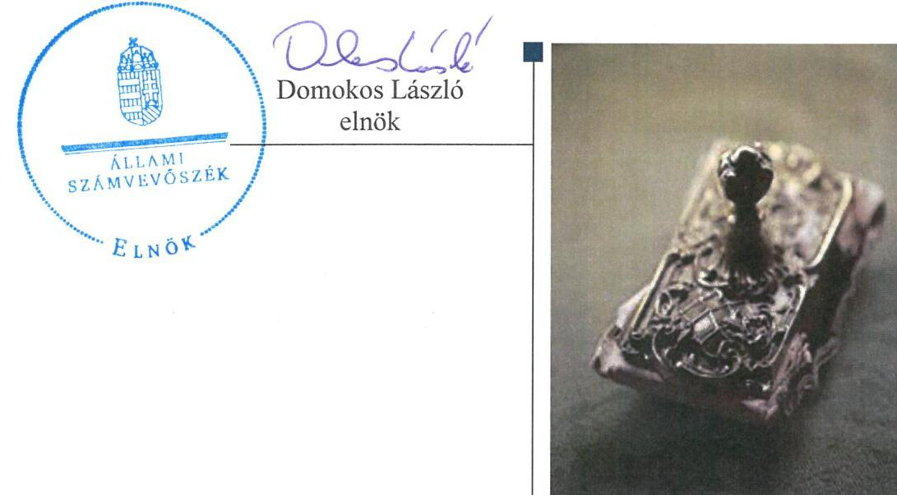

---

# AZ ELLENŐRZÉST FELÜGYELTE:

DR. HORVÁTH MARGIT felügyeleti vezető

## AZ ELLENŐRZÉST VEZETTE ÉS A VÉGREHAJTÁSÁÉRT FELELŐS:

SALAMIN VIKTOR ellenőrzésvezető

A PROGRAM ÖSSZEÁLLÍTÁSÁÉRT FELELŐS:

JANIK JÓZSEF LÁSZLÓ osztályvezető

IKTATÓSZÁM: V-0844-150/2016.

TÉMASZÁM: 1704

ELLENŐRZÉS-AZONOSÍTÓ SZÁM: V-070711

Jelentéseink az Országgyűlés számítógépes hálózatán és az Interneten a www.asz.hu címen is olvashatóak.

---

# TARTALOMJEGYZÉK 

■ ÖSSZEGZÉS ..... 5
■ AZ ELLENŐRZÉS CÉLJA ..... 7
■ AZ ELLENŐRZÉS TERÜLETE ..... 8
■ AZ ELLENŐRZÉS HÁTTERE, INDOKOLTSÁGA ..... 10
■ FÓKUSZKÉRDÉSEK ..... 11
■ ELLENŐRZÉS HATÓKÖRE ÉS MÓDSZEREI ..... 12
■ MEGÁLLAPÍTÁSOK ..... 14
■ JAVASLATOK ..... 26
■ MELLÉKLETEK ..... 29
I. sz. melléklet: Értelmező szótár ..... 29
II. sz. melléklet: Működési adatok ..... 31
III. sz. melléklet: Hődíjak alakulása ..... 32
IV. sz. melléklet: Mintavételi eljárások ellenőrzési területenként ..... 33
V. sz. melléklet: Eredménykimutatás ..... 34
■ FÜGGELÉK: ÉSZREVÉTELEK ..... 35
■ RÖVIDÍTÉSEK JEGYZÉKE ..... 65

---

.

---

# ÖSSZEGZÉS 

Az Állami Számvevőszék ellenőrzése a távhőszolgáltatási közfeladat ellátást érintő gazdálkodási tevékenysége szabályozottságát és szabályszerűségét értékelte a kizárólagos önkormányzati tulajdonú EVAT Egri Vagyonkezelő és Távfűtő Zrt.-nél 2011-2014. évekre vonatkozóan. Eger Megyei Jogú Város a közfeladat ellátását biztosította, tulajdonosi jogait szabályszerűen gyakorolta, a Társaság vagyongazdálkodása szabályszerű, a beruházások és felújítások elszámolása nem megfelelő, árképzése szabályos volt.

## Az ellenőrzés társadalmi indokoltsága

Az Állami Számvevőszék középtávra szóló stratégiájában megfogalmazta, hogy a helyi önkormányzatok gazdálkodásában rejlő pénzügyi kockázatok feltárásával, az államháztartáson kívülre nyújtott költségvetési támogatások és ingyenes vagyonjuttatások, valamint az államháztartáson kívül működő közfeladat-ellátó rendszerek ellenőrzéseivel hozzájárul ahhoz, hogy a közpénzeket az államháztartáson kívül működő szervezetek is átlátható, rendezett módon használják fel a közfeladatok szerződésben vállalt ellátása érdekében.

Magyarországon az intézmény-centrikus közfeladat-ellátás jellemző, de egyre jelentősebb a költségvetésen kívüli feladatellátás térnyerése. Ennek legfontosabb szereplői - a nonprofit szervezetek mellett - az önkormányzati tulajdonú gazdasági társaságok. Az önkormányzatok szervezetalakítási szabadságának következménye, hogy a korábban is vállalati formában működő közszolgáltatások mellett, mind a kötelező, mind az önként vállalt feladatok ellátásában a gazdasági társaságok kiemelt fontosságú szerephez jutottak.

## Főbb megállapítások, következtetések, javaslatok

Az Önkormányzat a közigazgatási területén a távhőszolgáltatás közfeladatának megszervezéséről a jogszabályi előírásoknak megfelelően döntött, annak ellátásáról a kizárólagos tulajdonában lévő gazdasági társasága útján gondoskodott. Az Önkormányzat a távhőszolgáltatásra vonatkozó Tszt. szerinti rendeletalkotási kötelezettségének a Távhő rendelet és a Díjrendelet megalkotásával eleget tett, azok tartalma megfelelt az előírásoknak. Az Önkormányzat a Díj rendeletet annak ellenére nem módosította, hogy a hatósági ár bevezetésével az Önkormányzat ármegállapítási jogköre - az alapdíj és hődíj vonatkozásában - 2011. április 15. napjával megszűnt. Az Önkormányzat a vagyongazdálkodási rendelet 1,2-ben és azok előírásaival összhangban lévő Alapító Okiratban meghatározta a tulajdonosi joggyakorlás szabályait. Tulajdonosi jogaikat az arra jogosultak az Alapító Okirat előírásainak betartásával, szabályszerűen gyakorolták. Az EVAT Zrt. Igazgatósága a közszolgáltatási tevékenységéről, valamint a gazdálkodásról negyedéves tájékoztatás, illetve az éves beszámolás keretében adott számot a Közgyűlés felé. A számviteli beszámolókról az FB írásbeli véleményt, a könyvvizsgáló jelentést készített. Az FB feladatait ügyrendben írták elő az Alapító Okiratban foglaltak, valamint a Gt. és Ptk. vonatkozó előírásai alapján. Az FB az ügyrendben előírtak ellenére a 2011-2012. évek adózott eredményének felhasználására vonatkozó írásbeli jelentést nem készített. Az EVAT Zrt. mérleg szerinti eredménye az ellenőrzött években pozitív volt, osztalék kifizetésére nem került sor. Az Önkormányzat - a Stabilitási tv. hatályba lépését megelőzően - két hitel felvételhez vállalt készfizető kezességet. Az EVAT Zrt. egyik hiteltartozását visszafizette, a 2011-ben felvett és 2023-ban lejáró hiteltartozáshoz (2014. év végén fennálló tőketartozás 103,2 M Ft) kapcsolódóan kezességvállalás beváltására az ellenőrzött időszak végéig nem került sor. Az Önkormányzat az Ötv.-ben, valamint az Áht.-ban biztosított lehetőséggel nem élt, a távhőszolgáltatás közfeladatának ellátását belső ellenőrzés keretében nem ellenőrizte.

A közfeladat-ellátást szolgáló vagyonnal való gazdálkodás szabályszerű volt. A Társaság rendelkezett a Számv. tv.-ben előírt számviteli szabályzatokkal. A Tszt. szerinti szétválasztási szabályokat a számviteli politikában és önköltségszámítási szabályzatban a Számv. tv.-ben előírt határidőn túl határozták meg. Az üzletszabályzatot a Tszt.-ben előírtak ellenére a jegyző nem küldte meg véleményezésre a fogyasztóvédelmi hatóságnak. A távhőszolgáltatás

---

ellátását szolgáló vagyonelemek elkülönített nyilvántartása biztosított volt. A Társaság vagyona az ellenőrzött időszakban 621,4 MFt-tal (25,7%-kal), a tárgyi eszközök mérlegértéke - a végrehajtott fejlesztések eredményeként 409,8 M Ft-tal (34,8%-kal) nőtt. Ugyanakkor a távhőszolgáltatás feladatellátását szolgáló eszközök pótlására fordított összeg (2,9 MFt) nem érte el az ezen eszközcsoport után elszámolt amortizáció (167,7 MFt) 2%-át. A Társaság kötelezettségeinek állománya a hiteltartozás csökkenésének és a rövid lejáratú kötelezettségek növekedésének együttes hatására 5,7 M Ft-tal csökkent. A kötelezettségek határidőben történő kifizetését az Önkormányzat felé fennálló tartozás határidejének folyamatos átütemezése mellett tudta teljesíteni a Társaság. A távhőszolgáltatáshoz kapcsolódó határidőn túli vevőkövetelések állománya folyamatosan csökkent, a lakosság által határidőre ki nem fizetett távhődíj 2014. december 31-én 153,3 M Ft volt.

A könyvvizsgáló az éves beszámolókat hitelesítő záradékkal látta el. A 2012-2014. évi könyvvizsgálói jelentésekben szereplő igazolások nem a Tszt.-ben előírt tartalommal készültek. A könyvvizsgáló a szétválasztás tényét állapította meg, azt nem igazolta, hogy a kidolgozott és alkalmazott szétválasztási szabályok, valamint az egyes tranzakciók árazása biztosította a vállalkozás tevékenységei közötti keresztfinanszírozás-mentességet. A 2013. évben kiadott, 2012. év gazdálkodására vonatkozó könyvvizsgálói jelentésben annak ellenére állapította meg a számviteli politikában és önköltségszámítási szabályzatban rögzített szétválasztási szabályok érvényesülését, hogy a szétválasztásra vonatkozó előírások 2012-ben hiányoztak. A Társaság az Eisztv.-ben és az Info tv.-ben előírt kötelezettségének teljes körűen nem tett eleget, mivel gazdálkodási adatait a honlapján hiányosan tette közzé.

A Társaságnál az értékesítés nettó árbevétele és az anyagjellegű ráfordítások elszámolása során érvényesültek a jogszabályok és a belső szabályok előírásai. A beruházások, felújítások kiadásainak, valamint az értékcsökkenési leírásnak az elszámolása nem volt megfelelő. Az önkormányzati hatáskörben megállapított távhődíjakat a Díjrendeletben rögzítettekkel összhangban, kalkulációval alátámasztották. A miniszteri hatáskörben megállapított távhőszolgáltatás hatósági árát az előírásoknak megfelelően alkalmazták.

---

# AZ ELLENŐRZÉS CÉLJA 

## A közfeladat ellátás szabály- és jogszerű biztosításának értékelése

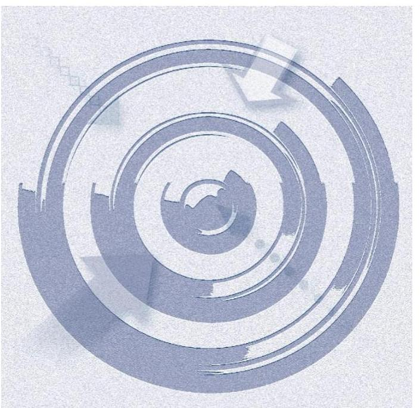

Az ellenőrzés célja annak értékelése, hogy:
az önkormányzat a jogszabályi előírások figyelembevételével döntött-e az ellenőrzésre kerülő közfeladat megszervezéséről;
az önkormányzat/tulajdonosi joggyakorló szabályszerűen gyakorolta-e a tulajdonosi jogokat;
a gazdasági társaság közfeladat-ellátása bevételeinek, ráfordításainak elszámolása, és vagyongazdálkodási tevékenysége megfelelt-e a jogszabályi, illetve a közszolgáltatási/vagyonkezelési szerződésben foglalt tulajdonosi előírásoknak, azok végrehajtása szabályszerű volt-e;
a gazdasági társaság kötelezettségállománya jelent-e kockázatot a működésre, illetve a közfeladat ellátására;
a közfeladatok átláthatósága és elszámoltathatósága érdekében biztosítva volt-e a közszolgáltatás díjának megalapozottsága szabályszerű önköltségszámítással.

---

# **AZ ELLENŐRZÉS TERÜLETE**

## **Eger Megyei Jogú Város Önkormányzata és a többségi tulajdonában lévő Evat Zrt.**

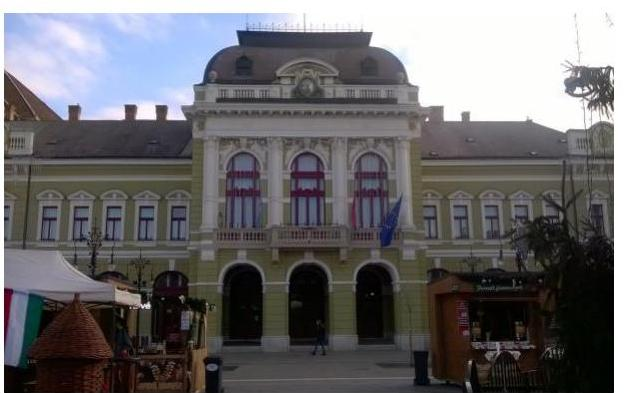

Eger Megyei Jogú Város Önkormányzata az EVAT Egri Vagyonkezelő és Távfűtő Zrt.-t az Egri Ingatlankezelő Közvetítő és Lakásberuházó Vállalat jogutódjaként hozta létre 1991. augusztus 1-jén. Az Önkormányzat a távhővagyont alapításkor apportba adta, kezelésre vagyont a távhőszolgáltatással kapcsolatosan a Társaságnak nem adott át.

Az EVAT Zrt. alaptevékenysége az ellenőrzött időszakban "gőzellátás, légkondicionálás" volt. A távhőszolgáltatást kizárólag Eger város közigazgatási határain belül végezték. A Társaság Eger Megyei Jogú Város Önkormányzatának kizárólagos tulajdonában volt az ellenőrzött időszakban.

Eger Megyei Jogú Város lakosságának száma 2014. január 1-jén meghaladta az 54 ezer főt, a lakások száma 26 265 db, ebből távfűtött lakások száma 4 825 db volt. Ipari fogyasztók az ellenőrzött időszak alatt nem voltak, az egyéb fogyasztók száma (óvodák, iskolák stb.) 1 220 db volt. Az értékesített hőmennyiség: a 2011. évi 195 634 GJ-ról, 2014-re 145 194 GJ-ra csökkent. A Társaságnál foglalkoztatott átlagos statisztikai állományi létszám az ellenőrzött időszak elején 105 fő, a végén 121 fő volt. Az Alapító Okiratban rögzítettek alapján 2011. január 1-je és 2011. május 26-a között a munkaszervezet élén ügyvezető állt, majd azt követően a tisztséget vezérigazgató látta el. Személyében változás nem történt.

A Társaság gazdálkodásának főbb adatait a 2011-2014. évek vonatkozásában a következő ábra szemlélteti.

1. ábra

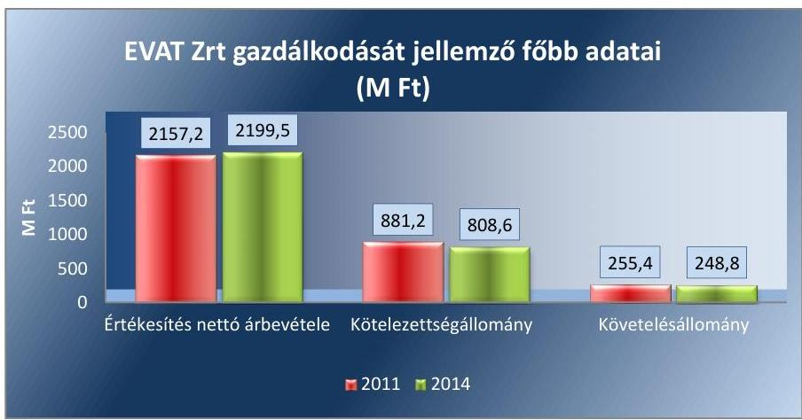

*Forrás: A Társaság 2011. és 2014. évi beszámolója*

A Társaság feladatait divíziókba szervezve látta el. A távhő divízió feladata volt a távhőszolgáltatás, a vagyonkezelő divízió feladatkörébe az önkormányzati lakások és nem lakás célú helyiségek bérbeadása, kezelése,

---

karbantartása, felújítása tartozott. A marketing, kulturális és szolgáltató divízió a múzeumok működtetésével, a gazdasági divízió az önkormányzati tulajdonú ingatlanok üzemeltetésével, pénzügyi és számviteli elszámolásainak bonyolításával foglalkozott. A távhőszolgáltatási díjak - ellenőrzött időszakban végrehajtott - csökkentése az értékesítés nettó árbevételében és a követelések állományában nem okozott változást. 2011. évről 2014. évre a Társaság értékesítési nettó árbevételében jelentős arány eltolódás volt a távfűtés és az egyéb tevékenységekből származó árbevétel között. Míg 2011. évben az összes nettó árbevétel 46,5%-át, addig 2014. évben már csak 33,5%-át tette ki a távfűtésből származó árbevétel. A kötelezettségek mérlegértéke 2011. évről 2014. évre jelentős maradt.

Az ellenőrzött időszakban a polgármester személye nem, a jegyző személye egy alkalommal változott. A polgármester a 2006. évi önkormányzati választások óta tölti be tisztségét, a helyszíni ellenőrzés időszakában a munkakört betöltő jegyző 2011. március 1-től látja el a feladatát.

Az ellenőrzés a kizárólagos tulajdonosi jogokat gyakorló önkormányzatra, illetve a közfeladatot ellátó gazdasági társaság felett tulajdonosi jogokat gyakorló szervezetre és az ellenőrzött közfeladatot ellátó gazdasági társaságra terjed ki.

---

# AZ ELLENŐRZÉS HÁTTERE, INDOKOLTSÁGA 

Objektív vélemény kialakítása Eger Megyei Jogú Város Önkormányzata távhőszolgáltatási közfeladatának megszervezéséről, tulajdonosi jogai gyakorlásáról, valamint a többségi tulajdonban lévő EVAT Zrt. közfeladat ellátását érintő gazdálkodási tevékenységének szabályszerűségéről.

## Az önkormányzatok közfeladat-ellátásában egyre jelentősebb a gazdasági társaságok útján történő feladatellátás térnyerése

AZ ÖNKORMÁNYZATI TULAJDONÚ GAZDASÁGI TÁRSASÁGOK teljes körű ellenőrzésének lehetőségét az ÁSZ. tv. 2011. január 1-jétől hatályos módosítása teremtette meg. A közfeladatot ellátó gazdasági társaságok ellenőrzése kiemelten fontos a vagyon megőrzése, megóvása érdekében, valamint a kormányzati szektor elszámolásaiban megjelenő önkormányzati tulajdonú gazdálkodó szervezetek esetében, amelyekkel szemben alapvető követelmény, hogy gazdálkodásuk, működésük szabályszerű, az általuk szolgáltatott adatok minél megbízhatóbbak legyenek. A közfeladat ellátás költségeinek, ráfordításainak alakulása, színvonala hatással van a lakosság elégedettségére.

A törvényalkotás számára - az észlelt problémák, szabálytalanságok, vagy egyéb nem kívánatos jelenségek felszínre kerülésével - az ellenőrzés megállapításai segítséget nyújthatnak az államháztartáson kívüli közfeladat-ellátás értékeléséhez, jogszabályi keretei pontosításához, átláthatóságot biztosító szabályozásához. Meghatározhatóvá válnak a közfeladat ellátásban részt vevő államháztartáson kívüli szervezeteknek - az önkormányzat költségvetését, pénzügyi helyzetét is befolyásoló - kockázatai, lehetővé válik ezen kockázatok csökkentése. Ellenőrzéseink feltárhatják, hogy az önkormányzat közfeladat-ellátási kötelezettségének szabályszerűen tett-e eleget, a feladatellátáshoz

 rendelt közvagyon működtetését a tulajdonostól elvárható gondossággal, szabályszerűen szervezte-e meg és a tulajdonosi felügyelete hozzájárult-e a közfeladat-ellátásához. Az ellenőrzés rávilágíthat arra, hogy a gazdasági társaság a közszolgáltatási szerződésben foglaltak betartásával, a közvagyon használatával biztosította-e a szolgáltatás folytatásának feltételeit, a közfeladat ellátását. Ezzel az ellenőrzöttek és a helyi döntéshozók számára visszajelzést ad feladatszervezési, feladat-ellátási kockázataikról, alapot ad a meglévő hibák megszüntetéséhez, a jobb közfeladat-ellátás biztosításához. Fokozza a fegyelmet, igazolja, hogy lejárt a következmények nélküli ellenőrzések időszaka. Az ÁSZ értékteremtő rend kialakításához és megőrzéséhez hozzájáruló tevékenysége pozitív hatással van a szervezetről kialakított összkép formálására.

---

# FÓKUSZKÉRDÉSEK 

1. Az önkormányzat közfeladat megszervezéséről szóló döntése, valamint tulajdonosi joggyakorlása szabályszerű volt-e?
2. A gazdasági társaság vagyongazdálkodása szabályszerű volt-e, kötelezettségállománya jelentett-e kockázatot a működésre illetve a közfeladat ellátására?
3. A gazdasági társaságnál az ellátott közfeladat bevételei és ráfordításai elszámolása, valamint az önköltségszámítás és árképzés szabályszerű volt-e?

---

# ELLENŐRZÉS HATÓKÖRE ÉS MÓDSZEREI 

## Az ellenőrzés típusa

Megfelelőségi ellenőrzés.

## Az ellenőrzött időszak

2011. január 1-jétől 2014. december 31-ig tart.

## Az ellenőrzés tárgya

A közfeladatot gazdasági társaságokkal ellátó önkormányzatok tulajdonosi joggyakorlása, valamint gazdasági társaságok pénz- és vagyongazdálkodásának szabályozottsága és szabályszerűsége.

Az ellenőrzés kiterjed minden olyan körülményre és adatra, amely az ÁSZ jogszabályban meghatározott feladatainak teljesítéséhez, valamint a program végrehajtása folyamán felmerült újabb összefüggések feltárásához szükséges.

## Az ellenőrzött szervezet

Az ellenőrzött szervezetek:
$\longrightarrow$ Eger Megyei Jogú Város Önkormányzata,
$\longrightarrow$ EVAT Egri Vagyonkezelő és Távfűtő Zrt.

## Az ellenőrzés jogalapja

Az ellenőrzés jogszabályi alapját az ÁSZ tv. 5. § (3)-(4)-(5) bekezdései képezik.

## Az ellenőrzés módszerei

Az ellenőrzést a nemzetközi standardokat irányadónak tekintve az ellenőrzési program ellenőrzési kérdései, az ellenőrzött időszakban hatályos jogszabályok, az ellenőrzés szakmai szabályok és módszertanok figyelembe vételével végezzük.

Az ellenőrzés ideje alatt az ellenőrzött szervezettel történő kapcsolattartást az ÁSZ Szervezeti és Működési Szabályzatának vonatkozó előírásai alapján biztosítjuk.

---

Az ellenőrzés a kiválasztott, többségi tulajdonosi jogokat gyakorló önkormányzatra, illetve az ellenőrzésre kijelölt közfeladatot ellátó gazdasági társaság felett tulajdonosi jogokat gyakorló szervezetre és az ellenőrzött közfeladatot ellátó gazdasági társaságra terjed ki. Amennyiben a gazdasági társaságban több önkormányzat együttesen többségi tulajdonos, úgy az ellenőrzést a többségi tulajdonosi jogokat gyakorló önkormányzatnál kell lefolytatni. Az ellenőrzött gazdasági társaságnál, amennyiben az több közfeladatot is ellát, akkor az ellenőrzésre kiválasztott közfeladat-ellátást ellenőrizzük.

Az ellenőrzést a kérdésekre adott válaszok kiértékelésével, valamint a megjelölt adatforrások, tanúsítványok felhasználásával, továbbá az adott időszakban hatályos jogszabályok figyelembe vételével kell lefolytatni. Az ellenőrzési kérdések megválaszolásához szükséges bizonyítékok megszerzése a következő ellenőrzési eljárások alkalmazásával történik: megfigyelés, kérdésfeltevés (információkérés), összehasonlítás, valamint elemző eljárás.

A szabályszerű működést a bevételek és ráfordítások elszámolása esetében mintavétellel, a vagyonnyilvántartás terén teljes körűen ellenőriztük. A jogszabályoknak és a belső előírásoknak megfelelőnek tekintettük az adott területet, amennyiben a minta ellenőrzésének eredménye alapján 95%-os bizonyossággal a teljes sokaságban a hibaarány kisebb volt, mint 10%, nem megfelelőnek értékeltük, ha a hibaarány a 10%-ot meghaladta. Kockázatot, illetve magas kockázatot jeleztünk, amennyiben egy adott terület vonatkozásában a minta alapján a teljes sokaságban nem volt egyértelműen biztosított a jogszabályoknak és a belső szabályzatoknak megfelelő működés. A ráfordítások elszámolására és a vagyon-nyilvántartásra vonatkozó véletlen mintavételt kockázati alapú kiválasztással egészítettük ki, amelynek során évente a három legnagyobb összegű tételt választottuk ki.

---

# 1. Az önkormányzat közfeladat megszervezéséről szóló döntése, valamint tulajdonosi joggyakorlása szabályszerű volt-e? 

Összegző megállapítás

Az Önkormányzat a jogszabályi előírásoknak megfelelően szervezte meg a távhőszolgáltatást, a tulajdonosi jogokat a jogszabályi előírásokon alapuló belső szabályozásban előírtaknak megfelelően érvényesítette.
1.1. számú megállapítás

A közfeladat ellátást az Önkormányzat szabályszerűen szervezte meg. A távhőszolgáltatásra vonatkozó rendeletalkotási kötelezettségének eleget tett.

Az Önkormányzat¹, az Ötv². 91. § (6) bekezdésében, 2013. január 1-jétől az Mötv³. 116. § (2)-(4) bekezdéseiben foglaltaknak megfelelően, a 2007-2014. évekre vonatkozóan gazdasági programot készített. A Közgyűlés⁴ által elfogadott gazdasági programban célul tűzték ki a távhő tekintetében a jelenlegi fogyasztói körön túlmenően a rákötések ösztönzését, a kapacitás kihasználtság javítását, a gerinchálózat, elosztóhálózat megőrzését, korszerűsítését, valamint a biomassza fűtőmű integrálását.

A távhőszolgáltatás a Tszt.⁵ 6. § (1) bekezdése alapján az Önkormányzat kötelezően ellátandó feladata. Az Önkormányzat, mint a távhőszolgáltatással ellátott létesítmények távhő ellátásáért felelős szervezete, a tulajdonában lévő EVAT Zrt.⁶-n keresztül látta el kötelezettségét. A távhő vagyon az EVAT Zrt. saját vagyona, melyet a közfeladat-ellátás biztosítására az Önkormányzat apport formájában bocsátott a rendelkezésre, kezelésre vagyont nem adott át. A távhőszolgáltatást az Önkormányzat az ellenőrzött időszakot megelőzően szervezte meg.

AZ ALAPÍTÓ OKIRAT a Gt². 19. §-ban - 2014. március 15-től a Ptk. 3:109. §-ban - előírtakkal összhangban döntési jogosultságokat határozott meg. A Közgyűlés hatáskörébe sorolta az Alapító Okirat módosítását, a Társaság működési formájának megváltoztatását, átalakulását és jogutód nélküli megszűnését, az Igazgatóság tagjainak, a vezérigazgatónak, az FB-nek a könyvvizsgálónak a megválasztását, visszahívását, díjazásának megállapítását. A Közgyűlés hatáskörébe tartozott a Számv. tv⁸. szerinti beszámoló jóváhagyása, döntés az osztalékelőleg fizetéséről, valamint az alaptőke felemeléséről, leszállításáról. Az Alapító Okiratban rögzítettek szerint az EVAT Zrt. ügyvezető szerve a részvényes alapító határozataival kijelölt Igazgatóság⁹. Feladatai a Társaság képviselete harmadik személlyel szemben, a Közgyűlés előkészítése és összehívása, a Társaság munkaszervezetének kialakítása, szervezeti és működési szabályzat elkészítése, munkáltatói jogok gyakorlása. Gondoskodás az üzleti könyvek vezetéséről, az üzleti terv és a beszámoló elkészítéséről és előterjesztéséről, javaslat készítés az

---

#### Abstract

adózott eredmény felhasználására. Az alapító részére történő jelentés készítési kötelezettséget írták elő az ügyvezetésről, a Társaság vagyoni helyzetéről, az üzletpolitika teljesüléséről. Az Alapító Okiratban az FB¹⁰ szervezetére, működésére, hatáskörére a Gt, 2014. március 15-től a Ptk¹¹. rendelkezéseit írták elő irányadónak. Az Alapító Okiratban az FB tagokat nevesítették, a személyeikben bekövetkezett változásokat átvezették.

A TÁVHŐ RENDELET megalkotásával az Önkormányzat eleget tett a Tszt. 6. § (2) bekezdésében előírt rendeletalkotási kötelezettségének. A Távhő rendelet tartalmazta a Tszt. 6. § (2) bekezdés a) pontjával összhangban a távhő szolgáltató és a fogyasztó közötti jogviszony részletes szabályait, valamint a bekezdés d) pontjában előírtaknak megfelelően a távhőszolgáltatás szüneteltetésének és korlátozásának feltételeit, szabályait. Kijelölte a Tszt. 6. § (2) bekezdés c) pontjának megfelelően azokat a területeket, ahol területfejlesztési, környezetvédelmi és levegő-tisztaságvédelmi szempontok szerint célszerű a távhőszolgáltatás fejlesztése. Az Önkormányzat a távhőszolgáltatás legmagasabb díjáról és a díjalmazás feltételeiről Díjrendeletet¹² alkotott. A rendeletben előírták a távhőszolgáltatási díjak (alapdíj, hődíj) tartalmát, elszámolását, a távhőszolgáltatás felfüggesztésének, a díjvisszafizetés és pótdíj fizetés szabályait. A távhőszolgáltatás alapdíj meghatározását a felmerült közvetlen és közvetett költségek, valamint maximum 8%-os bruttó eszközértékre vetített nyereség figyelembevételével írták elő. A Díjrendeletet az alapdíj és hődíj összegének vonatkozásában utolsó alkalommal 2011. január 1-jei hatállyal módosították.

A 2011. április 15-től hatályos Tszt. 57/D. § (1) bekezdése szerint a távhőszolgáltatónak értékesített távhő árát, valamint a lakossági felhasználónak és a külön kezelt intézménynek nyújtott távhőszolgáltatás legmagasabb hatósági árát miniszteri rendelettel kellett megállapítani. A hatósági ár bevezetésével az Önkormányzat ármegállapítási jogköre megszűnt, ennek ellenére a Díjrendeletet nem módosították.

## 1.2. számú megállapítás

A tulajdonosi joggyakorlás rendjét szabályosan alakították ki, a köz-feladat-ellátással kapcsolatos döntések esetében az arra jogosultak érvényesítették a tulajdonosi jogaikat. AZ FB működése - a 2011-2012. évi adózott eredmény felhasználásáról készített írásbeli vélemény készítés elmulasztásának kivételével - megfelelt az ügyrendjében rögzített előírásoknak. A közfeladat ellátással kapcsolatos ellenőrzést az Önkormányzat nem végzett.

## A TULAJDONOSI JOGOK GYAKORLÁSÁNAK

RENDJÉT, a vagyonrendelet¹³¹⁴-ben rögzítették. A Közgyűlés hatáskörébe tartozott, a Társaság Alapító Okiratának elfogadása és módosítása, a Számv. tv. szerint elkészített beszámoló elfogadása, az adózott eredmény felhasználására vonatkozó döntés, pótbefizetés elrendelése és visszatérítése, osztalékelőleg és osztalék fizetésének elhatározása, a társaság jogutód nélküli megszűnésének, átalakulásának elhatározása, a stratégiai terv jóváhagyása. A nem nevesített döntési hatáskörök gyakorlására a polgármester, vagy az általa megbízott személy kapott felhatalmazást. Az EVAT Zrt. vonatkozásában a tulajdonosi jogokat a vagyonrendelet¹,² előírásaival összhangban lévő Alapító Okirat előírásai alapján az arra jogosultak gyakorolták.

---

AZ IGAZGATÓSÁG az Alapítói Okiratban és az Igazgatóság ügyrendjében előírtak alapján, legalább évente négy alkalommal volt köteles ülésezni. A 2011-2014. években ezt a kötelezettséget teljesítették. Az Igazgatóság az Alapító Okiratban és az ügyrendjében foglalt kötelezettsége alapján, az EVAT Zrt. 2011-2014. évek üzleti terveit, Számv. tv. szerinti beszámolóit határozatokban jóváhagyta.

AZ FB az ellenőrzött időszakban az FB ügyrendjében¹⁵ rögzítettek alapján 5 tagból állt. Ez megfelelt az Alapító Okiratban meghatározottaknak és a Gt. 34. § (1) bekezdés, valamint a Ptk. 3:121. § (1) bekezdés rendelkezéseinek. Az FB az ellenőrzött időszak alatt teljesítette az ügyrendben előírt, az évente legalább négy ülés megtartására és a jegyzőkönyvkészítésre vonatkozó kötelezettségét. Az FB, a Társaság 2011-2014. évek közötti üzleti terveit és a Számv. tv. szerint elkészített beszámolóit az FB határozatok jegyzőkönyvei alapján a Közgyűlésnek előterjesztésre és elfogadásra javasolta. A 2011-2012. évek adózott eredményének felhasználására vonatkozóan azonban az FB az ügyrendjében foglaltak ellenére nem készített írásbeli jelentést.

AZ ANYAGI ÉRDEKELTSÉGI RENDSZERT a Taktv¹⁶. 5. § (3) bekezdésében foglaltaknak megfelelően a Közgyűlés által elfogadott javadalmazási szabályzat¹⁷¹⁸¹⁹-ben rögzítették. A javadalmazási szabályzatok előírásai szerint a gazdálkodó szervezetek vezető tisztségviselőinek éves prémiumfeladatait, a KGB²⁰ javaslatának ismeretében, az üzleti terv elfogadását követően a Közgyűlés állapította meg, a prémium mértékének egyidejű meghatározásával. A szabályzatokban foglaltak szerint, a Társaság FB elnökének és tagjainak díjazásáról a KGB javaslatának ismeretében, az FB előző évi munkájának értékelése, valamint a tárgyévi munkaterv elfogadásával egyidejűleg a Közgyűlés döntött.

AZ ÁRKÉPZÉS SZABÁLYAIT az Önkormányzat Díjrendeletben határozta meg. A rendeletben előírták, hogy az alapdíjak módosításához árkalkuláció benyújtása szükséges. Bemutatták az alapdíjváltozást befolyásoló tényezőket, költségeket, bemutatásra került a távhő divízió eredménykimutatása, átlagos nagyságú, átlagfogyasztású lakás havi számlájának módosulása, átlagos nagyságú lakás éves távhőszolgáltatási költségeinek alakulása, - a lakásméret függvényében - a távhőszolgáltatási alapdíjemelés előtti és utáni bruttó költségek. A hődíj esetében a Társaságnak nem kellett tételes kalkulációt benyújtani, a rendeletben jóváhagyott árképlet alapján történt a kiszámítás.

A BESZÁMOLTATÁSI RENDSZER keretein belül az EVAT Zrt. Igazgatósága a Társaság gazdálkodásáról, a közszolgáltatási tevékenységéről az ellenőrzött időszak alatt minden évben a Számv. tv. szerint elkészített éves beszámoló, valamint a negyedévenkénti gazdálkodásáról szóló tájékoztató beszámoló előterjesztésével számolt be az Közgyűlés felé. A negyedéves tájékoztatás a kialakult gyakorlat szerint és nem szabályozott keretek alapján történt. Az éves, valamint a negyedéves beszámolókról a könyvvizsgáló írásos jelentést készített. A Közgyűlés a Társaság 2011-2014. évi Számv. tv. előírása szerint készített beszámolóit határozatokban elfogadta.

---

Az Önkormányzat a 2011-2014. években nem élt az Ötv. 92. § (11) bekezdés b) pontjában, valamint az
 Áht ${ }^{21}$. 70. § (1) bekezdés d) pontjában biztosított lehetőséggel, mivel a távhőszolgáltatás közfeladatának ellátását belső ellenőrzés keretében nem ellenőrizte. A Társaságnál távhőszolgáltatásra vonatkozó külső ellenőrzést a Heves Megyei Kormányhivatal Fogyasztóvédelmi Felügyelősége végzett két alkalommal. Az üzletszabályzat tartalmának jogszabályi megfelelőségét és a rezsicsökkentés teljesülését ellenőrizték, jogsértést nem tártak fel.

Az EVAT Zrt. Számv. tv. szerinti elkészített éves beszámolóiban, az ellenőrzött években kimutatott mérleg szerinti eredmény pozitív volt. A Közgyűlés a 2011-2014. évi beszámolókat megtárgyalta és határozatokban elfogadta, osztalék kifizetésére nem került sor.

Az Önkormányzat az ellenőrzött időszakban - a Stabilitási tv²2. hatályba lépését megelőzően - két esetben vállalt kezességet a Társaság hitelfelvétele során. A kezességvállalásra szabályosan, a Közgyűlés jóváhagyásával került sor. Az Önkormányzat 2009. december 1. - 2012. december 1-ig tartó időszakra, az EVAT Zrt. OTP Bank Nyrt-nél történő 3 év futamidejű, 100,0 M Ft összegű likviditási hitel felvételét jóváhagyta és a hitelnek megfelelő összegben kezességet vállalt. 2011. évben az OTP Bank Nyrt-vel kötött hitelszerződést a Társaság felmondta. A 100,0 M Ft (370 ezer EU) és járuléka erejéig 2011. június 1-től 2014. június 15-ig tartó időszakra, a Társaság a CIB bankkal kötött hitelszerződést. A hiteltartozást 2014. évben kiegyenlítette a Társaság.

Az Önkormányzat készfizető kezességet vállalt 112,0 M Ft (420,0 ezer EU) erejéig, az EVAT Zrt. OTP Bank Nyrt-nél történő maximum 15 évre szóló beruházási hitel felvételéhez. A hitel keretösszegéből felhasználás nem történt. Az OTP Bank Nyrt-vel kötött szerződés felmondását követően az Önkormányzat jóváhagyta a Társaságnak a CIB Bank Zrt.-nél 112,0 M Ft (420,0 ezer EU) erejéig történő hitelfelvételét és 2011. június 1. - 2023. április 15-ig terjedő időszakra vonatkozóan készfizető kezességet vállalt. A 2014. december 31-én fennálló tartozás 103,2 M Ft volt. A készfizető kezességvállalás beváltására a 2011-2014. évek között nem került sor.

# 2. A gazdasági társaság vagyongazdálkodása szabályszerű volt-e, kötelezettségállománya jelentett-e kockázatot a működésre illetve a közfeladat ellátására? 

Összegző megállapítás

A szabályozási hiányosságok mellett a Társaság vagyongazdálkodása szabályszerű volt, kötelezettségállománya a működésre, közfeladat-ellátásra nem jelentett kockázatot, beszámolási kötelezettségének eleget tett.
2.1. számú megállapítás

A Társaság jogszabályok által előírt szabályzatokkal rendelkezett, a számviteli szétválasztás szabályainak kidolgozásáról azonban késve gondoskodott.

AZ ÜZLETI TERVEKET az EVAT Zrt. az ellenőrzött időszakban az Alapító Okiratban előírtak alapján elkészítette. Az Igazgatóság és az FB az

---

Alapító Okiratban, illetve az ügyrendekben előírt feladatukat teljesítve a 2011-2014. évek üzleti terveinek elfogadásáról határozatokkal döntött. A Közgyűlés a 2011-2014. évi üzleti terveket megtárgyalta és határozatokban elfogadta. Az üzleti tervek tartalmi és formai követelményeit, elkészítésének határidejét az Alapító Okiratban és a vagyonrendelet ${ }_{1,2}$-ben nem írták elő. Eredménykimutatás szerkezetben, árbevétel, költség, eredménybontásban mutatták be a Társaságnál a tárgyévi tervszámokat divíziónként is. Az üzleti tervek tartalmazták a beruházási tervek összegeit és legjelentősebb tételeit, valamint a karbantartási tervek keretösszegeit. Az üzleti tervekben a távhőszolgáltatásra vonatkozóan, - a tulajdonosi elvárással összhangban - a rendszerre kapcsolt lakások és középületek fűtéssel és meleg vízzel történő zavartalan ellátását és új lehetőségeket keresve a hátralék behajtás hatékonyságának növelését írták elő.

Az EVAT Zrt. rendelkezett a Számv. tv. 14. § (3) bekezdésében előírt számviteli politikával, valamint a Számv. tv. 14. § (5) bekezdése előírásainak megfelelően eszközök és források leltárkészítési és leltározási, illetve értékelési szabályzatával, önköltségszámítás rendjére vonatkozó szabályzattal, valamint pénzkezelési szabályzattal. Elkészítették továbbá a Számv. tv. 161. § (1) bekezdésében előírt számlarendet.

A SZÁMVITELI POLITIKA hiányossága volt, hogy a Tszt ${ }^{23}$ 2012. január 1-jétől hatályos 18/A. § (2) bekezdésében előírt számviteli szétválasztási szabályokat 2014. szeptember 22-i módosításáig nem tartalmazta. A számviteli politika kiegészítésére a Számv. tv. 14. § (11) bekezdésében előírt 90 napon túl került sor. Az eszközök és források leltárkészítési és leltározási szabályzata a leltárkészítés és leltározás előírásait a Számv. tv. 46. § (3) bekezdésében, valamint a 69. §-ban rögzítettekkel összhangban határozta meg. A 2010. szeptember 30-tól hatályban lévő eszközök és források értékelési szabályzatát az ellenőrzött időszakban nem aktualizálták, a számlarendet egy alkalommal módosították. A pénzkezelési szabályzat a Számv. tv. 14. § (8) bekezdés szerinti tartalommal készült. Rendelkeztek a pénzforgalom (házi pénztár és bankszámlák) lebonyolításának szabályairól, a kapcsolódó nyilvántartásokról és a bizonylati rendről. Az önköltségszámítási szabályzatot nem egészítették ki a Tszt. 18/A. § (2) bekezdésben rögzített, 2012. január 1-től hatályos számviteli szétválasztási szabályokkal a Számv. tv. 14. § (11) bekezdésében előírt 90 napon belül. A 2013. április 1-től hatályos önköltségszámítási szabályzat ${ }_{2}$ tartalma megfelelt a hivatkozott jogszabályi előírásoknak.

AZ ÜZLETSZABÁLYZAT ${ }_{1}{ }^{24} \cdot{ }^{25}$-t a Társaság a Tszt 3. § v) pontja szerinti tartalommal készítette el. A szabályzatokat a jegyző jóváhagyta, azonban az üzletszabályzat ${ }_{2}$-t a Tszt. 7. § (1) bekezdésének a) pontjában előírtak ellenére, nem küldte meg a fogyasztóvédelmi hatóságnak véleményezésre.
2.2. számú megállapítás

A Társaság a tulajdonában lévő vagyonával felelős módon, a jogszabályi és belső rendelkezéseknek megfelelően gazdálkodott.

# A KÖZFELADAT ELLÁTÁST SZOLGÁLÓ VAGYONELEMEK ELKÜLÖNÍTETT NYILVÁNTARTÁSÁT, a vagyonváltozások kimutatását, az analitikus és főkönyvi nyilvántartási rendszer biztosította.

---

Az Önkormányzat az EVAT Zrt. távhőszolgáltatás közfeladat ellátásához szükséges eszközeit apportként biztosította. A Társaságnak üzemeltetésre átvett vagy vagyonkezelésbe vett eszköze a közfeladat ellátáshoz kapcsolódóan nem volt.

A tárgyi eszközök és készletek fizikai mennyiségi felvétellel történő leltározását a leltárkészítési és leltározási szabályzatban előírt módon, a 2013. évi beszámoló alátámasztására végezték el. Az ellenőrzött időszak minden évére vonatkozóan rendelkezésre álltak, a Számv. tv. 46. § (3) bekezdésében, és a Számv. tv. 69. § bekezdésekben foglaltak alapján előírt, a mérlegtételek alátámasztását biztosító leltárak.

1. táblázat

|  AZ EVAT ZRT FŐBB MÉRLEG ADATAI (MILLIÓ FORINT) |  |  |  |  |   |
| --- | --- | --- | --- | --- | --- |
|  Megnevezés | $\begin{gathered} 2013 . \ 01 .01 \end{gathered}$ | $\begin{gathered} 2011 . \ 12 .31 . \end{gathered}$ | $\begin{gathered} 2012 . \ 12.31 . \end{gathered}$ | $\begin{gathered} 2013 . \ 12.31 . \end{gathered}$ | $\begin{gathered} 2014 . \ 12.31 . \end{gathered}$  |
|  I. Befektetett eszközök | 2004,0 | 2089,6 | 2516,0 | 2438,1 | 2444,2  |
|  - ebből: Tárgyi eszközök | 1177,2 | 1284,8 | 1709,7 | 1641,3 | 1587,0  |
|  II. Forgó eszközök | 280,1 | 444,7 | 434,1 | 443,8 | 425,9  |
|  - ebből: Követelések | 217,3 | 255,4 | 253,0 | 307,0 | 248,8  |
|  III. Aktív időbeli elhatárolások | 134,2 | 97,5 | 130,4 | 138,5 | 169,6  |
|  Eszközök összesen | 2418,3 | 2631,8 | 3080,5 | 3020,4 | 3039,7  |
|  IV. Saját tőke | 1504,0 | 1529,1 | 1586,3 | 1710,9 | 1764,9  |
|  - ebből: Jegyzett tőke | 1158,1 | 1186,1 | 1236,1 | 1356,1 | 1356,1  |
|  - ebből: Mérleg szerinti eredmény | 11,6 | 2,3 | 7,2 | 4,6 | 54,0  |
|  V. Céltartalékok | 30,1 | 33,0 | 25,0 | 19,8 | 24,5  |
|  VI. Kötelezettségek | 814,3 | 881,2 | 1055,2 | 855,1 | 808,6  |
|  VII. Passzív időbeli elhatárolások | 69,9 | 188,5 | 414,0 | 434,6 | 441,7  |
|  Források összesen | 2418,3 | 2631,8 | 3080,5 | 3020,4 | 3039,7  |

Az eszközérték 2011. január 1. és 2014. december 31-e közötti 621,4 M Ft-os (25,7%-os) növekedését, a befektetett eszközök 440,2 M Ft-os (21,9%-os), a forgóeszközök 145,8 M Ft-os (52,1%-os) ezen belül a követelések 31,5 M Ft-os (14,5%-os) - az aktív időbeli elhatárolások 35,4 M Ft-os (26,3%-os) emelkedése okozta. A befektetett eszközökön belül a tárgyi eszközök értéke 409,8 M Ft-tal (34,8%-kal) nőtt, mely az ellenőrzött időszakban az elszámolt értékcsökkenés értékénél magasabb összegű pótló beruházások felújítások hatására következett be.

A Társaság forrásainak az ellenőrzött időszakban keletkezett 621,4 M Ft-os összérték növekményén belül, a saját tőke értéke 260,9 M Ft-tal (17,4%-kal) nőtt a céltartalékok 5,6 M Ft-os és a kötelezettségek 5,7 M Ft-os csökkenése mellett. A saját tőke értékének emelkedését a mérleg szerinti eredmény elszámolásán túl a 198,0 M Ft értékű tőkeemelések és a lekötött tartalék 15,9 M Ft-os növekedése befolyásolták. A passzív időbeli elhatárolások állományváltozását - a távhőszolgáltatást nem érintő - halasztott bevételek elszámolása eredményezte.

# A TÁVHŐSZOLGÁLTATÁS VAGYONI HELYZETÉT

jellemző mutatók a számviteli szétválasztási kötelezettség bevezetését követően, a 2012-2014. évi beszámolók kiegészítő mellékleteiben álltak rendelkezésre. Ezen időszakban a távhőszolgáltatás tárgyi eszközeinek mérlegértéke 199,7 M Ft-ról 120,5 M Ft-ra (39,7%-kal) csökkent. A távhőszolgáltatás eszközcsoportjainál, 2011. január 1. és 2014. december 31. között összesen 167,7 M Ft amortizációt számoltak el, szemben a tárgyi eszközök bruttó értékének mindössze 2,9 M Ft összegű növekedésével. Az eszközök pótlására fordított összeg az amortizációs forrás 2%-át sem érte el, a távhőszolgáltatással kapcsolatos tárgyi eszközök gyarapítása nem történt meg. Az EVAT Zrt. az ellenőrzött időszakban nyereségesen gazdálkodott, azonban a távhőszolgáltatás mérleg szerinti eredménye negatív (2012-ben - 18,0 M Ft, 2013. évben: - 0,9 M Ft, 2014. évben: - 32,9 M Ft) volt.

# 2.3. számú megállapítás 

A kötelezettségek állománya a közfeladat ellátására, a Társaság működésére nem jelentett kockázatot.

## A TÁRSASÁG KÖTELEZETTSÉGEINEK ÁLLOMÁ-

NYA az ellenőrzött időszakban minimálisan (5,7 M Ft-tal) csökkent. A változást a hosszú lejáratú kötelezettségek 34,7 M Ft-os csökkenése és a rövid lejáratú kötelezettségek állományának 29,0 M Ft-os emelkedése együttesen eredményezte. A hosszú lejáratú kötelezettségek állományának visszaesését, a 2011. évben még fennálló, 2014 év végén azonban a Társaságot már nem terhelő, törlesztett hiteltartozások eredményezték. A rövid lejáratú kötelezettségek növekedését alapvetően a szállítókkal szembeni kötelezettség 48,6 M Ft-os emelkedése befolyásolta.

Az eladósodottsági mutató értéke kedvezően alakult, 2011. évben 0,33, 2014. évben 0,27 volt.

Az eladósodottság mértéke hasonló képet mutatott, az év végén fennálló kötelezettségek a saját tőke egyre kisebb hányadát kötötték le, a mutató csak 2012-ben nőtt, a 2011-2014. években nem érte el az 1-es értéket.

A nettó eladósodottság mutatója 2012. évet kivéve csökkent, a kintlévőségekkel csökkentett kötelezettségeket 32-51%-ban fedezte saját forrás.

Az adósságfedezeti mutató I. értéke, tendenciája kedvező volt, a 2,0 Ft küszöbértéket meghaladták, 1,0 Ft adósságra a 2011. évben 2,9 Ft, a 2012. évben 2,8 Ft, a 2013. évben 3,4 Ft, a 2014. évben 3,6 Ft vagyon jutott.

Az adósságfedezeti mutató II. mutatja, hogy a működési cash flow révén a vállalkozás
 mennyiben lenne képes valamennyi hosszú lejáratú kötelezettségének eleget tenni. A 2011-2012. években az érték a küszöbszám 1 felett figyelhető meg, míg a 2013-2014. években a küszöbszám 1 alatti kedvezőtlen értékeket mutatott.

Az árbevételre vetített eladósodottság mértéke a 2011-2014. években 0,20, 0,29, 0,20 és 0,17 volt, tehát az 1,0 Ft nettó árbevételre eső, forgóeszközökkel csökkentett kötelezettség valamennyi évben kevesebb volt, mint a nettó árbevétel.

A likviditási helyzetet jellemezte, hogy a növekvő követelésállomány mellett a kötelezettségek határidőben történő kiegyenlítését a Társaság csak úgy tudta teljesíteni, hogy az Önkormányzat felé fennálló - távhőszolgáltatáshoz nem kapcsolódó - kötelezettségeinek (pl: bérleti díjak) fizetési határidejét folyamatosan átütemeztette. Így teremtette meg a lehetőségét az egyéb kötelezettségek határidőben történő teljesítésének. A 2011-2014. évek beszámolóiban kimutatott - határidőn túli - kötelezettség az

---

Önkormányzattal szemben állt fenn. A Társaságnak az Önkormányzat felé fennálló tartozása 2014. december 31-én 42,0 M Ft volt.

# 2.4. számú megállapítás 

A Társaság az éves beszámolóit a jogszabályi előírásoknak megfelelően elkészítette és letétbe helyezte, közzétételi kötelezettségének azonban nem tett teljes körűen eleget. A könyvvizsgáló számviteli szétválasztási szabályok érvényesüléséről szóló igazolása nem felelt meg a jogszabályi követelményeknek.

Az éves beszámolókat a Társaság a Számv. tv. 19. § (1) bekezdésében előírt tartalommal elkészítette, azokat az Igazgatóság az Alapító Okiratban előírtaknak megfelelően megtárgyalta és jóváhagyásra a Közgyűlés elé terjesztette. Az éves beszámolók letétbe helyezése a Számv. tv. 153. § (1) bekezdésében előírt határidőben megtörtént.

Az éves beszámolók elfogadásáról a Közgyűlés a könyvvizsgáló jelentésének és az FB írásbeli jelentésének birtokában határozott. A könyvvizsgáló az éves beszámolókat hitelesítő záradékkal látta el. A letétbe helyezett 2012. évi beszámoló kiegészítő melléklete a MEKH észrevétele alapján módosításra került. A módosított beszámolót az elfogadást követően ismételten letétbe helyezték és közzétették.

A 2012-2014. évi könyvvizsgálói jelentésekben szereplő igazolások nem a Tszt. tv. 18/B. § (1) bekezdésében előírt tartalommal készültek. A könyvvizsgáló a szétválasztás tényét állapította meg, azt nem igazolta, hogy a Társaság által kidolgozott és alkalmazott szétválasztási szabályok, valamint az egyes tranzakciók árazása biztosította a vállalkozás tevékenységei közötti keresztfinanszírozás-mentességet. A 2013. évben kiadott, a 2012. év gazdálkodására vonatkozó könyvvizsgálói jelentés annak ellenére tett megállapítást a szabályzatokban előírtak teljesítésére, hogy a szétválasztási szabályokat a számviteli politikában 2014. szeptember 22-től, az önköltségszámítási szabályzatban csak 2013. április 1-jétől határozták meg.

Az FB és a könyvvizsgáló a közvagyon védelme, illetve más okból a Közgyűlés összehívását nem kezdeményezte.

Az Info. tv. ${ }^{26}$ 24. § (1) bekezdésének eleget tettek, mivel foglalkoztattak megfelelő szakképesítéssel rendelkező adatvédelmi felelőst. Az Info. tv. 24. § (3) bekezdésében foglaltak szerint elkészült adatvédelmi- és adatbiztonsági szabályzat biztosította az Info. tv. előírásainak megfelelő, az ügyfelek és az EVAT Zrt-vel kapcsolatba lépő más természetes személyek adatainak jogszerű keretek közötti kezelését. Az adatvédelmi felelős vezette a belső adatvédelmi nyilvántartást. Az elektronikusan kezelt adatállományok információ biztonsági védelmét a különböző nyilvántartásokban biztosították. A számítástechnikai adatok védelmét a számítástechnikai védelmi szabályzatban, illetve az Informatikai biztonsági szabályzatban foglaltak alapján biztosították. Az adatok biztonsági mentése rendszerezett és dokumentált módon történt.

A Társaság 2011-ben az Eisztv ${ }^{27}$. 6. § (1) bekezdésében, 2012-2014. években az Info tv. 37. § (1) bekezdésben előírt elektronikus közzétételi kötelezettségének részben tett eleget. Az Eisztv. mellékletének III. 1. pontja, valamint az Info tv. 1. melléklet III. 1. pontja (a közfeladatot ellátó szerv éves (elemi) költségvetése, számviteli törvény szerinti beszámolója; a költségvetés végrehajtásáról készített beszámolók) szerinti adatokat

---

honlapján hiányosan tette közzé. A számviteli beszámolók tekintetében, a honlapon nem tette közzé a 2011. és a 2012. évi mérleget és eredménykimutatást, a 2013. és a 2014. évi üzleti jelentést, a 2011-2014. évi könyvvizsgálói jelentéseket, továbbá a 2012. évi módosított éves beszámolót.

# 3. A gazdasági társaságnál az ellátott közfeladat bevételei és ráfordításai elszámolása, valamint az önköltségszámítás és árképzés szabályszerű volt-e? 

Összegző megállapítás

A távhőszolgáltatás nettó árbevételének és az anyagjellegű ráfordításainak az elszámolása megfelelő volt, a beruházások, felújítások kiadásainak és az értékcsökkenési leírásnak az elszámolása nem volt szabályszerű. Az önkormányzati hatáskörben megállapított díjak árképzése szabályosan történt, a távhőszolgáltatás hatósági árát az előírásoknak megfelelően alkalmazták.

A közfeladat bevételeinek és ráfordításainak elszámolása megfelelő volt, a beruházások, felújítások és az értékcsökkenési leírás elszámolása nem volt megfelelő.

Az EVAT Zrt. a Tszt 18/A. § (2)-(3) bekezdésekben előírt számviteli szétválasztási szabályok kidolgozására és az egyes tevékenységei vonatkozásában olyan elkülönült nyilvántartás vezetésére volt kötelezett 2012. január 1-jétől, amely a bevételek és ráfordítások elkülönítését, a közfeladat átláthatóságát, a diszkrimináció mentességét biztosította, valamint kizárta a keresztfinanszírozást és a versenytorzítást.

Az értékesítés nettó árbevételének és a ráfordításoknak közfeladat ellátással kapcsolatos elkülönítését a 2012. január 1-től alkalmazott főkönyvi számlák biztosították.

Az értékesítés nettó árbevételeinek elszámolása megfelelő volt. A bevételek előírása és kiszámlázása a belső szabályozásnak megfelelően történt, a bevételeket a megfelelő számlacsoportban, közfeladatonként elkülönítve számolták el. Az alkalmazott árak megfeleltek a belső szabályozásnak és a tulajdonosi követelményeknek.

Az anyagjellegű ráfordítások elszámolása megfelelő volt. A közfeladattal kapcsolatban elszámolt költségeket és ráfordításokat a megfelelő közfeladatra és költségnemre számolták el. A költségelszámolást megalapozó dokumentumok rendelkezésre álltak.

---

# A beruházások, felújítások kiadásainak és az értékcsökkenési leírásnak az elszámolása nem volt megfelelő. Az egyedileg 100 ezer forint alatti értéket képviselő tárgyi eszközök esetében - a Számv. tv. 52. § (2) bekezdésében előírtak ellenére - nem készültek az üzembe helyezést hitelt érdemlően dokumentáló üzembe helyezési jegyzőkönyvek. Egy, a távhőszolgáltatási tevékenységet közvetlenül szolgáló műszaki berendezést az egyéb berendezések, felszerelések, járművek eszközcsoporton belül, üzemi berendezésként, felszerelésként vették nyilvántartásba. Ezzel megsértették a Számv. tv. 26. § (4) bekezdésének előírását és a 2014. január 1. napjától hatályos számlarendet, mivel az eszközt a műszaki berendezések, gépek, járművek között kell nyilvántartani.

Az EVAT Zrt.-nél - a teljes eszközállomány vonatkozásában - 2011-ben és 2012-ben is jelentősen magasabb volt a pótló beruházások, felújítások összege (206,5 M Ft, illetve 513,5 M Ft), mint az elszámolt értékcsökkenés (78,6 M Ft, illetve 87,3 M Ft). Ezzel szemben 2013-ban és 2014-ben több forrás képződött (101,6 M Ft, illetve 96,4 M Ft), mint amit beruházási kiadásokra költöttek (50,4 M Ft és 61,3 M Ft). A távhő divízióban érvényesített beruházási kiadás a társasági szintű beruházások értékéhez képest alacsony (37,6 M Ft, 0,4 M Ft, 2,0 M Ft, 22,8 M Ft) volt. A 2011-es 37,6 M Ft beruházás forrása 28,0 M Ft összegben tőkeemelésből (apportból) származott.

A követelések kezelésére az EVAT Zrt. önálló szervezeti egységet hozott létre a „Vagyonkezelő divízió" belül, a hátralékkezelési tevékenységet szabályzatban rögzítették. Ennek alapján, első lépésként fizetési felszólítást küldtek azon ügyfeleknek, akiknek késedelme meghaladta a 30 napot. A fizetési felszólítás hatására sokan részletfizetési kérelemmel fordultak a Társasághoz, amelyeket egyedileg értékeltek. Részletfizetés a tárgyhavi számla megfizetése mellett volt lehetséges. Ha a fizetési felszólítás nem vezetett eredményre, a követelést behajtás útján (a Magyar Országos Közjegyzői Kamara és önálló bírósági végrehajtók igénybevételével) igyekeztek érvényesíteni. Ennek keretében ingóságok lefoglalása, munkabérből történő letiltás, végső esetben ingatlannal kapcsolatos végrehajtás történt. A befolyó tételekből először mindig a behajtási költségeket és kamattartozást egyenlítették ki, és ha még volt fedezet, akkor csökkentették a tőketartozást. A Tszt. 51. § (3) bekezdésének a) pontja alapján a 100 E Ft hátralékot felhalmozók esetében a melegvíz szolgáltatás felfüggesztését is alkalmazhatóvá tették. A követeléskezelés másik útjaként behajtó cégeket alkalmaztak. Kialakult gyakorlat volt az „adósságkezelési támogatás" intézménye. Egyéni jogosultság alapján az Önkormányzat határozatban döntött a támogatás odaítéléséről. Amennyiben az ügyfél a meglévő díjtartozásának 60%-át havi rendszerességgel fizette, a hivatal a fennmaradó 40%-ot havonta átutalta a szolgáltatónak.

---

2. táblázat

# A távhőszolgáltatáshoz kapcsolódó vevőkövetelések lejárat szerinti alakulása 2012. december 31. - 2014. december 31. között (M Ft)* 

|  | <90 nap | 91-180 nap | 181+ nap | Összesen |
| :--: | :--: | :--: | :--: | :--: |
| 2012. december 31. |  |  |  |  |
| Lakossági | 46,2 | 20,9 | 123,6 | 190,7 |
| Nem lakossági | 0,8 | -0,6 | 2,9 | 3,1 |
| Összesen | 47,0 | 20,3 | 126,5 | 193,8 |
| 2013. december 31. |  |  |  |  |
| Lakossági | 31,0 | 12,7 | 139,4 | 183,1 |
| Nem lakossági | -2,3 | 4,8 | 2,9 | 5,4 |
| Összesen | 28,7 | 17,5 | 142,3 | 188,5 |
| 2014. december 31. |  |  |  |  |
| Lakossági | 23,0 | 7,9 | 122,4 | 153,3 |
| Nem lakossági | 3,8 | 0,0 | 4,3 | 8,1 |
| Összesen | 26,8 | 7,9 | 126,7 | 161,4 |

* Megjegyzés: A 2011. évi követelésállomány lejárat szerinti alakulása a rendelkezésre álló nyilvántartásokból nem állapítható meg a távhő vonatkozásában.

Forrás: A Társaság adatszolgáltatása

## A távhőszolgáltatás hátralékos követelésállománya a 2012-2014. években 32,4 M Ft-tal, 16,7 %-kal csökkent. A hátralékos lakossági követelésállomány az ellenőrzött időszakban 37,4 M Ft-tal, 19,6 %-kal csökkent, kivéve a 2013. évi 180 napon túli esetén, az előző évhez képest 12,8 %-kal növekedett. A közületi kintlévőség a 2012. évi állományhoz képest 5,0 M Ft-tal több, mint két és félszeresére nőtt.

Az EVAT Zrt. a 2012-2014. években, a Tszt. 18/C. §-ában, illetve az NFM rendelet ${ }^{28}$ 5. § (2) bekezdés c) pontjában előírt nyereségkorlátot nem lépte túl, a távhőszolgáltatási közfeladat szétválasztás során bemutatott eredménye minden ellenőrzött évben veszteség volt. Az adózás előtti eredmények nem haladták meg a nyereségkorlát számításánál figyelembe vehető eszközérték 2%-át.
3.2. számú megállapítás

Az önkormányzati hatáskörben megállapított távhődíjak megfeleltek az önköltségszámítási szabályzat és a Díjrendelet előírásainak, 2011. április 15-től a miniszteri hatáskörben megállapított távhőszolgáltatás hatósági árát alkalmazták.

Az EVAT Zrt. önköltségszámítási szabályzatában meghatározták a távhőszolgáltatás vonatkozásában a közvetlen és közvetett költségek tartalmát, a közvetett költségek felosztásánál alkalmazandó vetítési alapot. Szabályozták az elő- és utókalkuláció lépéseit, az időszakokat és az adatok szolgáltatásáért, a kalkuláció ellenőrzéséért felelős személyeket is. A 2013. április 1-jei módosítás során meghatározták a számviteli szétválasztás alapelveit, a szétválasztási egységeket.

2011-ben a társaság tevékenységi köreibe olyan tevékenységek tartoztak, amelyek az akkor hatályos jogszabályok alapján jól elkülöníthetőek voltak egymástól (távhő divízió, illetve vagyonkezelő divízió). Az elkülönítés a közvetlen költségek vonatkozásában a 7. számlaosztályban, a közvetett költségek esetében a 6. számlaosztályban már megvalósult. Az általános

---

költségeket megfelelő jellemzők segítségével (pl. a kibocsátott számlák darabszáma, az árbevétel, a költségek, a létszám, stb.) osztották fel a divíziók között. Az ellenőrzött időszak alatt az egyes nehezen
 alkalmazható költségfelosztási módokat (pl. kimenő számlák darabszáma alapján történő költségfelosztást) megszüntették, de lényegében a pótlékoló költségfelosztás - a szétválasztási kötelezettségen túlmenően - nem változott. 2013. április 1. napjától, a közfeladat önköltségének megállapítása az önköltségszámítási szabályzatban leírtak szerint valósult meg.

A 2011. január 1-től hatályos alapdíjakat és hődíjakat a Díjrendelet 2011. január 1-jétől hatályos módosítása tartalmazta. A 2011. április 14-ig alkalmazott díjak a Díjrendeletben foglaltaknak megfeleltek. A Társaság lakossági fogyasztókra vonatkozó alapdíjait és hődíjait - fajlagos díjtételekkel - időszaki bontásban a 3. számú melléklet mutatja be.

A távhőszolgáltatás díját 2011. április 15-től a Tszt. 57/D. § (1) bekezdése alapján, mint legmagasabb hatósági árat, azok szerkezetét és alkalmazási feltételeit - a MEKH javaslatának figyelembevételével - a nemzeti fejlesztési miniszter rendeletben állapítja meg. A lakossági távhő díjakat 2011. április 15-től - a 2011. március 31-én alkalmazott díjakon - befagyasztották, majd 2012. január 1-jétől az 50/2011. (IX. 30.) NFM rendelet hatályos 4. §-a alapján 4,2%-kal megemelték. A 2013. évben két lépcsőben - 2013. január 1-jével az előző évihez képest 10,0%-os, majd 2013. november 1-jétől további 11,1%-os mértékben - csökkentették a Rezsi tv. 3. § (1) bekezdésének, valamint az 50/2011. (IX. 30.) NFM rendelet 3. § (2) bekezdésének megfelelően. A Rezsi tv. 3. § (1) bekezdése a távhőszolgáltatás díjának további 3,3%-kal történő csökkentését írta elő 2014. október 1-jétől. Az EVAT Zrt. a jogszabályi rendelkezéseknek megfelelően az alapdíj és hődíj 2012. évi 4,2%-os emelését, a 2013. évi két lépcsőben történő, valamint 2014. évi - előírt mértékű - csökkentését végrehajtotta.

---

# JAVASLATOK 

Az ÁSZ tv. ${ }^{29}$ 33. § (1) bekezdésében foglaltak értelmében az ellenőrzött szervezet vezetője köteles a jelentésben foglalt megállapításokhoz kapcsolódó intézkedési tervet összeállítani és azt a jelentés kézhezvételétől számított 30 napon belül az ÁSZ részére megküldeni. Amennyiben az intézkedési tervet határidőre nem küldi meg a szervezet, vagy amennyiben az nem elfogadható, az ÁSZ elnöke az ÁSZ tv. 33. § (3) bekezdés a)-b) pontjaiban foglaltakat érvényesítheti.

Javaslataink célja az EVAT Egri Vagyonkezelő és Távfűtő Zártkörűen Működő Részvénytársaság gazdálkodása szabályszerűségének javítása annak érdekében, hogy a szabályozási környezet és gazdálkodási gyakorlat megfelelően tudja támogatni az átlátható működést.

## Az EVAT Zrt. vezérigazgatójának

1. Intézkedjen az elektronikus közzétételi kötelezettség teljes körű teljesítése érdekében az Info tv. 1. sz. melléklet III. Gazdálkodási adatok vonatkozásában.
(2.4. sz. megállapítás 6. bekezdése alapján)
2. Biztosítsa a tárgyi eszköz beszerzés számviteli nyilvántartásba vétele, és az értékcsökkenési leírás elszámolása során a jogszabályi előírásoknak való megfelelést.
(3.1. sz. megállapítás 5. bekezdése alapján)

Javaslataink célja az Önkormányzat szabályszerű működésének elősegítése, továbbá az önkormányzati tulajdonosi joggyakorlás kontrolljainak erősítése.

## Eger Megyei Jogú Város Önkormányzata jegyzőjének

1. Készítse elő a Díjrendelet aktuális jogszabályi környezetnek megfelelő módosítását, majd intézkedjen a rendelet kihirdetése érdekében.
(1.1. sz. megállapítás 5. bekezdése alapján)

---

2. Fordítson kiemelt figyelmet arra, hogy az Önkormányzat belső ellenőrzése az ellenőrzéseivel a távhőszolgáltatás, mint közfeladat-ellátás szabályszerű teljesítéséhez, valamint az önkormányzati vagyon megőrzéséhez járuljon hozzá.
(1.2. sz. megállapítás 7. bekezdése alapján)
3. Tegyen eleget a Tszt.-ben előírtaknak és a Társaság üzletszabályzatát küldje meg véleményezésre a fogyasztóvédelmi hatóságnak.
(2.1. sz. megállapítás 4. bekezdése alapján)

---

.

---

# MELLÉKLETEK 

- I. SZ. MELLÉKLET: ÉRTELMEZŐ SZÓTÁR
adósságfedezeti mutató I.
adósságfedezeti mutató II.
árbevételre vetített eladósodottság
eladósodottság mértéke
eladósodottsági mutató (tőkeáttétel)
gazdasági társaság
kezesség
(befektetett eszközök + forgó eszközök) / idegen forrás
Azt mutatja, hogy 1 Ft adósságra hány Ft vagyon jut. Általánosságban véve kedvező, ha értéke 2 körül van, de nagy eszközberuházás-igényű iparágakban értéke kisebb is lehet.
működési cash flow / hosszú lejáratú kötelezettségek
A mutató azt jelzi, hogy az adott gazdálkodási időszak működési pénzáramainak eredményeként realizált cash flow révén a vállalkozás mennyiben lenne képes valamennyi hosszú lejáratú kötelezettségének eleget tenni. Ennek vizsgálatára viszonylag ritkán kerül sor, az elsősorban a veszélyhelyzetbe került vállalkozások esetében lehet érdekes. Általánosságban véve kedvező, ha a működési cash flow minél nagyobb arányban nyújt fedezetet a hosszú lejáratú kötelezettségre (értéke nagyobb, mint 1, nő az ellenőrzött időszakban).
(kötelezettségek - forgóeszközök) / értékesítés nettó árbevétele
Az árbevételre vetített eladósodottság azt mutatja, hogy az árbevétel mekkora fedezet nyújt a kötelezettségeknek a forgóeszközökkel csökkentett részére. Általánosságban véve kedvező, ha az árbevétel minél nagyobb arányban nyújt fedezetet a forgóeszközökkel csökkentett kötelezettségekre (értéke kisebb, mint 1, csökken az ellenőrzött időszakban).
kötelezettségek / saját tőke
Fontos szerepet játszik ez a mutató egy vállalat megítélésében. Azt mutatja, hogy a saját források a kötelezettségek hány százalékát fedezik. Törekedni kell, hogy a mutató tartósan (jelentősen) 1 alatti értéket érjen el.
idegen tőke / összes forrás
Egészségesnek mondható egy olyan mértékű áttétel, amelyet az üzleti tervek szerint és az elmúlt időszak tapasztalatai alapján a társaság megfelelő biztonsággal ki tud termelni. Nagy eszközberuházás-igényű iparágakban értéke magasabb, azaz magasabb eladósodottság is elfogadható, de 75-85%-ot meghaladó értéknél már itt is erős, sőt túlzott külső finanszírozottságról beszélhetünk. Általánosságban véve kedvező, ha értéke kisebb, mint 0.
Ptk. 2 3:88. § (1) A gazdasági társaságok üzletszerű közös gazdasági tevékenység folytatására, a tagok vagyoni hozzájárulásával létrehozott, jogi személyiséggel rendelkező vállalkozások, amelyekben a tagok a nyereségből közösen részesednek, és a veszteséget közösen viselik.
A kezességre vonatkozó előírásokat a Ptk. 2 6:416-430. §-ai tartalmazzák. Kezességi szerződéssel a kezes kötelezettséget vállal a jogosulttal szemben, hogyha a kötelezett nem teljesít, maga fog helyette a jogosultnak teljesíteni. Kezesség egy vagy több, fennálló vagy jövőbeli, feltétlen vagy feltételes, meghatározott vagy meghatározható összegű pénzkövetelés vagy pénzben kifejezhető értékkel rendelkező egyéb kötelezettség biztosítására vállalható. A Ptk. szerint kezességet csak írásban lehet vállalni. A kezes kötelezettsége ahhoz a kötelezettséghez igazodik, amelyért kezességet vállalt. A kezes kötelezettsége nem válhat terhesebbé, mint amilyen elvállalásakor volt, kiterjed azonban a kötelezett szerződésszegésének jogkövetkezményeire és a kezesség elvállalása után esedékessé váló mellékkövetelésekre is.

---

közfeladat
közszolgáltatás
meghatározó befolyás
nemzeti vagyon
nettó eladósodottság
többségi befolyás
tulajdonosi joggyakorló

Jogszabályban meghatározott állami vagy önkormányzati feladat, amit az arra kötelezett közérdekből, jogszabályban meghatározott követelményeknek és feltételeknek megfelelve végez, ideértve a lakosság közszolgáltatásokkal való ellátását, továbbá az állam nemzetközi szerződésekben vállalt kötelezettségeiből adódó közérdekű feladatokat, valamint e feladatok ellátásához szükséges infrastruktúra biztosítását is (Nvtv. 3. § (1) bekezdés 7. pont).
A közszolgáltatás: „közcélú, illetőleg közérdekű szolgáltatást jelent, amely egy nagyobb közösség (állam, település) minden tagjára nézve megközelítőleg azonos feltételek mellett vehető igénybe, ezért valamilyen mértékig közösségi megszervezést, illetve szabályozást, ellenőrzést igényel." Az Ebktv. ${ }^{30}$ 3. § d) pontja a következőképpen határozza meg a közszolgáltatást: „szerződéskötési kötelezettség alapján a lakosság alapvető szükségleteinek ellátására irányuló szolgáltatás, így különösen a villamos energia-, gáz-, hő-, víz-, szennyvíz- és hulladékkezelési, köztisztasági, postai és távközlési szolgáltatás, továbbá a menetrend alapján közlekedő járművekkel végzett közforgalmú személyszállítás"
A Ptk. 2 8:2. § (2) bekezdése szerint „A befolyással rendelkező akkor rendelkezik egy jogi személyben meghatározó befolyással, ha annak tagja vagy részvényese, és
a) jogosult e jogi személy vezető tisztségviselői vagy felügyelőbizottsága tagjainak többségének megválasztására, illetve visszahívásra; vagy
b) a jogi személy más tagjai, illetve részvényesei a befolyással rendelkezővel kötött megállapodás alapján a befolyással rendelkezővel azonos tartalommal szavaznak, vagy a befolyással rendelkezőn keresztül gyakorolják szavazati jogukat, feltéve, hogy együtt a szavazatok több mint felével rendelkeznek."
Az Nvtv. 1. § (2) bekezdés c) pontja szerint „az állam vagy a helyi önkormányzat tulajdonában lévő pénzügyi eszközök, továbbá az államot vagy a helyi önkormányzatot megillető társasági részesedések"
(kötelezettségek - követelések) / saját tőke
Azt mutatja, hogy a kintlévőségekkel csökkentett kötelezettségeket milyen mértékben fedezi saját forrás. Ez feltételezi, hogy a követelések pénzügyileg előbb realizálódnak, mint ahogy a kötelezettségeket teljesíteni kell. A mutató minél kisebb, csökkenő értéke kedvező.
A Ptk. 2 8:2. § (1) bekezdése szerint „többségi befolyás az olyan kapcsolat, amelynek révén természetes személy vagy jogi személy (befolyással rendelkező) egy jogi személyben a szavazatok több mint felével vagy meghatározó befolyással rendelkezik."
Aki a nemzeti vagyon felett az államot vagy a helyi önkormányzatot megillető tulajdonosi jogok és kötelezettségek összességének gyakorlására jogosult (Nvtv. 3. § (1) bekezdés 17. pont).

---

# II. SZ. MELLÉKLET: MŰKÖDÉSI ADATOK 

## EVAT ZRT. MŰKÖDÉSÉNEK FŐBB JELLEMZŐI (EZER FORINT / \%)

| Sor-   szám | Megnevezés |  | 2011. | 2012. | 2013. | 2014. |
| :--: | :--: | :--: | :--: | :--: | :--: | :--: |
| 1. | A gazdasági társaság tulajdonosi összetétele: |  |  |  |  |  |
| 2. | Önkormányzat megnevezése: |  | Eger Megyei Jogú Város Önkormányzata |  |  |  |
| 3. | Önkormányzat tulajdoni részesedésének aránya | \% | 100 | 100 | 100 | 100 |
| 4. | Önkormányzat tulajdoni részesedésének összege | ezer Ft | 1186130 | 1236130 | 1356130 | 1356130 |
| 5. | Más önkormányzatok, többcélú társulás megnevezése: |  |  |  |  |  |
| 6. | Más önkormányzatok, többcélú társulások tulajdoni részesedésének aránya | \% |  |  |  |  |
| 7. | Más önkormányzatok, többcélú társulások tulajdoni részesedésének összege | ezer Ft |  |  |  |  |
| 8. | Gazdasági társaság megnevezése: |  | Evat Egri Vagyonkezelő és Távfűtő Zrt. |  |  |  |
| 9. | Gazdasági társaságok tulajdoni részesedés aránya | \% |  |  |  |  |
| 10. | Gazdasági társaságok tulajdoni részesedés összege | ezer Ft |  |  |  |  |
| 11. | Egyéb tulajdonos megnevezése: |  |  |  |  |  |
| 12. | Egyéb tulajdonosok tulajdoni részesedés aránya | \% |  |  |  |  |
| 13. | Egyéb tulajdonosok tulajdoni részesedés összege | ezer Ft |  |  |  |  |
| 14. | A gazdasági társaságnál a vizsgált évek során működése megszűnt-e? (IGEN/NEM) |  | NEM |  |  |  |
| 15. | A tárgyévben a gazdasági társaság vagyonkezelésben lévő önkormányzati vagyon után elszámolt értékcsökkenés összege | ezer Ft | 0,0 | 0,0 | 0,0 | 0,0 |
| 16. | A tárgyévben az önkormányzati tulajdonú, gazdasági társaság által kezelt eszközök pótlására (karbantartás, felújítás, beruházás) elszámolt költség | ezer Ft | 0,0 | 0,0 | 0,0 | 0,0 |
| 17. | A tárgyévben a gazdasági társaság saját vagyona után elszámolt értékcsökkenés összege | ezer Ft | 59580 | 55355 | 48409 | 45748 |
| 18. | A tárgyévben a saját tulajdonú eszközök pótlására (karbantartás) elszámolt költség | ezer Ft
 | 69331 | 31871 | 46257 | 57902 |
| 19. | Értékesítés nettó árbevétele | ezer Ft | 985037 | 984423 | 875753 | 736214 |
| 20. | Működési cash flow | $\operatorname{ezer} F t$ | 270405 | 396488 | 105305 | 82133 |

---

II. SZ. MELLÉKLET: HŐDÍJAK ALAKULÁSA
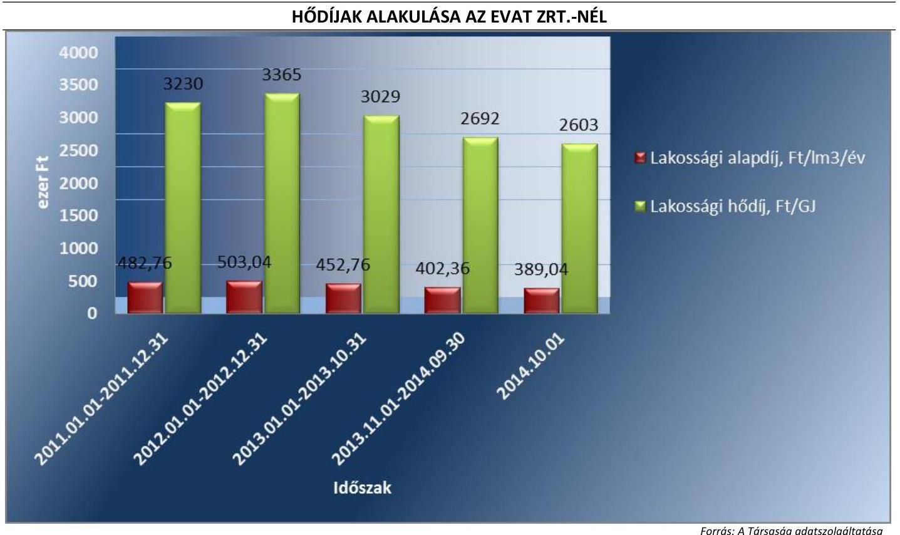

---

|  Ssz. | Mintavétel-   lellel ellenőr-   zendő terü-   letek | Főbb kérdés | Ellenőrzési kérdések | Adatforrások | Alapsokaság | Mintavételi eljárás  |
| --- | --- | --- | --- | --- | --- | --- |
|   | 1. | 2. | 3. | 4. | 5. | 6.  |
|  1. | Az ellátott közfeladat ráfordításainak elkülönített, szabályszerű elszámolása területén |  |  |  |  |   |
|  2. | Anyagjellegű ráfordítások | Az anyagjellegű ráfordítások elszámolása során betartották-e a belső szabályzatokban és a jogszabályokban foglaltakat és azokat a közfeladat-ellátással kapcsolatosan elkülönítették-e? | - a számlázott anyagjellegű ráfordításokra kötött szerződésnél betartották-e a Számv.tv. előírását, a költségelszámolást megalapozó dokumentum (szerződés, megrendelés) rendelkezésre áll?
- a beszerzett anyagok nyilvántartásba vétele megtörtént-e, azokat a közfeladat-ellátással kapcsolatosan elkülönítették-e a szabályozásnak megfelelően?
- a készlet bekerülési értékét a Számv.tv., a számviteli politika, illetve az értékelési szabályzat előírásai szerint vették-e számításba, azokat a közfeladat-ellátással kapcsolatosan elkülönítették-e?
- az anyagjellegű ráfordításokat a megfelelő költségnemre, illetve közfeladatra számolták-e el? | Az anyagjellegű ráfordítások közül az 51-53. főkönyvi számlacsoportokból vett minta esetében
- a költségelszámolást megalapozó dokumentumok (szerződések, megrendelések, stb.), költségelszámoláshoz benyújtott számlák, teljesítés megtörténtét alátámasztó egyéb dokumentumok, - analitikus nyilvántartások, anyagok nyilvántartásba vételét igazoló dokumentumok, ha a számviteli politika szerint nyilvántartásba kell venni azokat. | Éves bontásban a főkönyvi adatbázisból az 51-53. Anyagjellegű ráfordítások számlacsoportba tartozó ráfordítások, kivéve az ELÁBÉ és az eladott közvetített szolgáltatások értéke. | A mintavételt megelőzően a sokaságból ki kell emelni - tételes ellenőrzésre évente a 3-3 legnagyobb összegű tételt.
Véletlen mintavétel évenként elemszámmal arányos rétegzéssel.  |
|  3. | Beruházások, felújítások aktiválása és értékcsökkenési leírás | A közfeladatellátást szolgáló közvagyon állományba vételi, nyilvántartási és elszámolási kötelezettségének teljesítése kapcsán a felújítások, beruházások kiadások aktiválása és az értékcsökkenési leírás elszámolása megfelel-e az előírásoknak? | - A költségelszámolást megalapozó dokumentum (szerződés, megrendelés, stb.) megfelel-e az előírásoknak, továbbá be lett kérve a tulajdonosi jogok gyakorlójának előzetes, írásbeli engedélye - amennyiben előírták - az önkormányzati tulajdonban lévő eszközön elszámolt beruházáshoz/felújításhoz? - a beruházások, felújítások állományba vétele, besorolása, a bekerülési érték meghatározása, az üzembehelyezések (aktiválások) dokumentálása megfelel-e az Sztv., a számviteli politika, illetve az értékelési szabályzat előírásainak?
- az ellenőrzésre kiválasztott immateriális javak és tárgyi eszközök szerepelnek a mérleget alátámasztó leltárban? - az értékcsökkenés elszámolása a jogszabályban és a számviteli politikában meghatározott szabályozásnak megfelel-e? | A kiválasztott beruházásra vagy felújításra: szerződések, számlák, a befejezetlen beruházások, felújítások analitikus nyilvántartása, immateriális javak, tárgyi eszközök analitikus nyilvántartása, a beszerzett eszköz üzembehelyezési okmánya, állományba vételi bizonylata, egyedi eszköznyilvántartó kartonja - az értékcsökkenés elszámolása az egyedi eszköznyilvántartó kartonja, illetve analitikus nyilvántartása | Éves bontásban az immateriális javak, a tárgyi eszközök állománynövekedési tételei, amelyek összegének meg kell egyeznie a kiegészítő mérlegben az immateriális javak, a tárgyi eszközök növekedéseként bemutatott értékkel  |
|  4. | Az ellátott közfeladat bevételeinek elkülönített, szabályszerű elszámolása területén |  |  |  |  |   |
|  5. | Értékesítés nettó árbevétel | Az értékesítés nettó árbevétele elszámolása során betartották-e a belső szabályzatokban és a jogszabályokban foglaltakat és azokat a közfeladat-ellátással kapcsolatosan elkülönítették-e? | - a bevétel kiszámlázása a belső szabályozásnak megfelelően történt-e?
- a befolyt bevétel nyilvántartásba vétele (analitika, főkönyv) megtörtént-e, azokat a közfeladat-ellátással kapcsolatosan elkülönítették-e?
- a bevételek beszedése, elszámolása során betartották-e a szabályozásban foglaltakat és a megfelelő számlacsoportba számolták el a bevételt?
- a tulajdonosi követelményeknek, belső szabályozásnak megfelelő árat alkalmazták-e? | A kiválasztott értékesítés nettó árbevétel jogcímen befolyt bevételre:
- az egyes bevételek díjmegálapítása,
- a kibocsátott számla, befolyt bevétel analitikus nyilvántartása, behajtásra tett intézkedések dokumentumai,
- kapcsolódó főkönyvi számla tételes forgalma,
- bevétel beérkezését igazoló banki kivonat(rész). | Éves bontásban a főkönyvi adatbázisból a 91-94. számlacsoportok bevételei  |

---

# V. SZ. MELLÉKLET: EREDMÉNYKIMUTATÁS

|  EVAT ZRT. EREDMÉNYKIMUTATÁSAI (M Ft) |  |  |  |   |
| --- | --- | --- | --- | --- |
|  Tétel megnevezése | 2011 | 2012 | 2013 | 2014  |
|  I. Értékesítés nettó árbevétele | 2 157,2 | 2 117,0 | 2 098,3 | 2 199,5  |
|  II. Aktivált saját teljesítmények értéke | 4,1 | 9,1 | 0,0 | 0,0  |
|  III. Egyéb bevételek | 135,4 | 251,1 | 394,2 | 449,9  |
|  ebből Önkormányzati támogatás | 0,0 | 0,0 | 0,0 | 0,0  |
|  IV. Anyagjellegű ráfordítások | 1 653,5 | 1 710,9 | 1 798,8 | 1 903,4  |
|  V. Személyi jellegű ráfordítások | 430,2 | 430,4 | 473,1 | 521,3  |
|  VI. Értékcsökkenési leírás | 78,6 | 87,3 | 101,6 | 96,4  |
|  VII. Egyéb ráfordítások | 89,1 | 109,9 | 96,8 | 70,9  |
|  A. Üzemi (üzleti) tevékenység eredménye | 45,3 | 38,7 | 22,2 | 57,3  |
|  VIII. Pénzügyi műveletek bevételei | 8,5 | 15,3 | 4,6 | 18,7  |
|  IX. Pénzügyi műveletek ráfordításai | 52,0 | 46,4 | 21,9 | 21,4  |
|  B. Pénzügyi műveletek eredménye | -43,5 | -31,1 | -17,3 | -2,7  |
|  C. Szokásos Vállalkozási eredmény | 1,8 | 7,6 | 4,9 | 54,6  |
|  X. Rendkívüli bevételek | 0,9 | 0,0 | 15,2 | 15,8  |
|  XI. Rendkívüli ráfordítások | 0,4 | 0,4 | 15,5 | 16,4  |
|  D. Rendkívüli eredmény | 0,5 | -0,4 | -0,3 | -0,6  |
|  E. Adózás előtti eredmény | 2,3 | 7,2 | 4,6 | 54,0  |
|  XII. Adófizetési kötelezettség | 0,0 | 0,0 | 0,0 | 0,0  |
|  F. Adózott eredmény | 2,3 | 7,2 | 4,6 | 54,0  |
|  G. Mérleg szerinti eredmény | 2,3 | 7,2 | 4,6 | 54,0  |

*Forrás: A Társaság 2011-2014. évi Beszámolói*

---

# FÜGGELÉK: ÉSZREVÉTELEK 

A jelentéstervezetet a Számvevőszék 15 napos észrevételezésre megküldte az ellenőrzött szervezet vezetőjének az ÁSZ tv. 29. § (1) bekezdése előírásának megfelelően.
Eger Megyei Jogú Város Önkormányzatának polgármestere és az EVAT Egri Vagyonkezelő és Távfütő Zrt. vezérigazgatója egyaránt élt észrevételezési jogával.
Az elfogadott észrevételek alapján a Számvevőszék módosította a jelentést.
A függelék tartalmazza az ellenőrzött észrevételeit, illetve az el nem fogadott észrevételek elutasításának indoklását.

[^0]
[^0]:    * 29. § (1) Az Állami Számvevőszék az ellenőrzési megállapításait megküldi az ellenőrzött szervezet vezetőjének vagy az általa megbízott személynek, és annak, akinek személyes felelősségét állapította meg.
    (2) Az ellenőrzött szervezet vezetője és a felelősként megjelölt személy az ellenőrzés megállapításaira tizenöt napon belül írásban észrevételt tehet.
    (3) Az Állami Számvevőszék az észrevételre a beérkezésétől számított harminc napon belül írásban válaszol. A figyelembe nem vett észrevételeket köteles a jelentésben feltüntetni, és megindokolni, hogy azokat miért nem fogadta el.

---

# HABIS LÁSZLÓ POLGÁRMESTER 

3300 EGER, DOBÓ TÉR 2. TEL: +36 36523701 FAX: +36 36523 777, HABIS.LASZLO@PH.EGER.HU

Ikt.szám: 1885-5/2016.
Ügyintéző: Solymosné Füstös Zsuzsanna/ dr. Nagy-Holló Eszter
Tárgy: észrevétel a jelentéstervezetre
Melléklet: 2 db
Az Önök iktatószáma: V-0844-129/2016.

## Domokos László Elnök Úr

részére
Állami Számvevőszék

## Budapest-4

Pf. 54 .
1364

## Tisztelt Elnök Úr!

Köszönettel kézhez vettük „Az önkormányzatok gazdasági társaságai - az önkormányzatok többségi tulajdonában lévő gazdasági társaságok közfeladat ellátását érintő gazdálkodási tevékenysége szabályszerűségének ellenőrzése - EVAT Egri Vagyonkezelő és Távfűtő Zrt." vizsgálat számvevőszéki jelentéstervezetet.

Áttanulmányoztuk a megállapításaikat és a javaslataikat, amelyek Eger Megyei Jogú Város Önkormányzata szabályszerű működését és a tulajdonosi joggyakorlás kontrolljának erősödését segítik elő.

A jelentéstervezet 2.1. számú megállapítás 4. bekezdésében foglaltakhoz (,... a jegyző... az üzletszabályzatot a Tszt. 7. § (1) bekezdésének a) pontjában előírtak ellenére, nem küldte meg a fogyasztóvédelmi hatóságnak véleményezésre) a következő észrevételt teszem.

Eger Megyei Jogú Város főjegyzője, dr. Estefán Géza, az EVAT Zrt. Távhőszolgáltatási Üzletszabályzatát 2010. június 23-án megküldte a Heves Megyei Közigazgatási Hivatal Fogyasztóvédelmi Felügyelőségére véleményezés céljából. Ezt a tényt az elküldött és visszaérkezett dokumentumok bemutatásával már nem tudjuk alátámasztani, mert az iratokat az önkormányzati hivatalok egységes irattári tervének kiadásáról szóló 29/2009. (X.30.) ÖM rendelet alapján 5 év múltával, leselejteztük.
2016. április 05-én megkerestük a Heves Megyei Kormányhivatal Műszaki Engedélyezési és Fogyasztóvédelmi Főosztály Fogyasztóvédelmi Osztálya vezetőjét, aki a véleménykérés tényét dokumentumokkal alátámasztotta, amelyeket csatolunk.

Kérem Tisztelt Elnök Urat, hogy a fentiek méltánylásával szíveskedjenek jelentésüket összeállítani.
Eger, 2016. április 8.

Tisztelettel:
Habis László
Polgármester

---

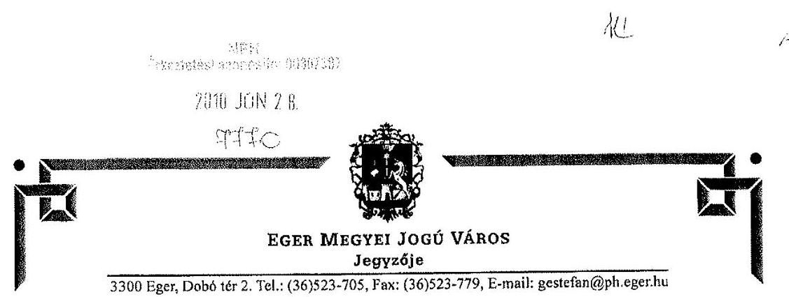

Iktatószám: 37424-3/2010.
Ügyintéző: Dr. Kelemen Sándorné

Heves Megyei Közigazgatási Hivatal
Fogyasztóvédelmi Felügyelősége
Pintér István Igazgató Úr
részére

Eger
Kossuth Lajos u. 9

Tisztelt Igazgató Úr!
A távhőszolgáltatásról szóló 2005. évi XVIII. számú törvény 7. §. (1) bekezdés c) pontja alapján kapott felhatalmazás alapján csatoltan megküldöm az Egri Vagyonkezelő és Távfűtő Zrt. által Eger Megyei Jogú Város Polgármesteri Hivatal Jegyzőjéhez benyújtott távhőszolgáltatási üzletszabályzatot véleményezésre.

A távhőszolgáltatásról szóló 2005. évi XVIII. számú törvény 37. §. alapján a távhőszolgáltató és a felhasználó közötti jogviszony általános szabályait a 157/2005. (VIII.15.) sz. Kormányrendelet 3. sz. melléklete tartalmazza. Az EVAT Zrt. által elkészített Távhőszolgáltatási Üzletszabályzat összhangban áll a kormányrendelettel.

Kérem, szíveskedjenek a levelem mellékleteként csatolt üzletszabályzatot véleményezni.

Intézkedését köszönöm.
Eger, 2010. június 23.
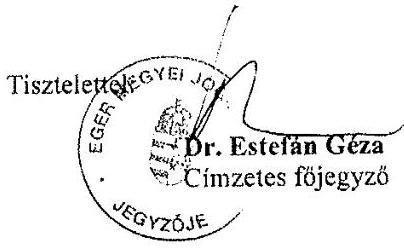

---

# Iktatószám: ÉMF-03071/00022010 

Eger Megyei Jogú Város
Jegyzője
Dr. Estefán Géza

Eger
Dobó tér 2.
3300

Tisztelt Főjegyző Úr!

Az EVAT ZRT. távhőszolgáltatási üzletszabályzatát áttanulmányoztuk. A szabályzathoz észrevételt, kiegészítést nem teszünk.

Eger, 2010. július 7.

Üdvözlettel:

Pintér István regionális igazgató nevében és megbízásából

Harsányiné István
Központiszervezet-vezető

---

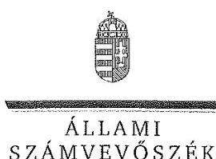

ELNÖK

Ikt.szám: V-0844-138/2016.

Habis László úr
polgármester
Eger Megyei Jogú Város Önkormányzata

Eger

# Tisztelt Polgármester Úr! 

Köszönettel vettem az EVAT Egri Vagyonkezelő és Távfütő Zrt. ellenőrzéséről készített számvevőszéki jelentéstervezetre tett észrevételét.

Az Állami Számvevőszék Polgármester úr észrevételére vonatkozó álláspontját a felügyeleti vezető által készített melléklet tartalmazza.

Tájékoztatom Polgármester urat, hogy az Állami Számvevőszék a figyelembe nem vett észrevételeket az Állami Számvevőszékről szóló 2011. évi LXVI. törvény 29. § (3) bekezdésében előírtak szerint köteles a jelentésében feltüntetni és megindokolni, hogy azokat miért nem fogadta el.

Budapest, 2016. 05. hó 01. nap

Tisztelettel:
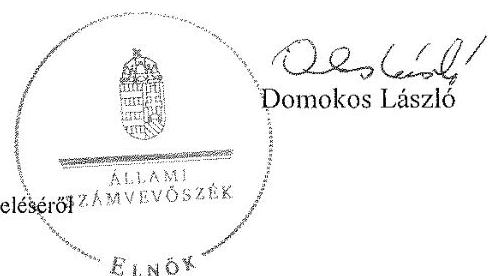

---

# Tájékoztatás az észrevétel kezeléséről 

Megköszönöm Polgármester úrnak „Az önkormányzatok gazdasági társaságai - Az önkormányzatok tulajdonában
 lévő gazdasági társaságok közfeladat-ellátását érintő gazdálkodási tevékenysége szabályszerűségének ellenőrzése - EVAT Egri Vagyonkezelő és Távfütő Zrt." című jelentéstervezetre adott észrevételét. Észrevételének kezeléséről az alábbi tájékoztatást adom.

Észrevétele, mely szerint a jegyző az EVAT Egri Vagyonkezelő és Távfütő Zrt. üzletszabályzatát megküldte a fogyasztóvédelmi hatóságnak a 2.1. számú megállapítás 4. bekezdésében foglalt alábbi megállapítást érinti:
„A szabályzatokat a jegyző jóváhagyta, azonban az üzletszabályzatot a Tsz. 7. § (1) bekezdésének a) pontjában előírtak ellenére nem küldte meg a fogyasztóvédelmi hatóságnak véleményezésre."

Az észrevételéhez csatolt, valamint az ellenőrzés során rendelkezésre bocsátott dokumentumok áttekintését követően az észrevételét elfogadni nem tudom, mivel a hivatkozott jogszabályi hely alapján a jegyző számára előírt feladat elmaradása megállapításunk szerint kizárólag az üzletszabályzatra vonatkozik. Az Ön által becsatolt dokumentumok ellenben a korábbi, a jelentéstervezetben üzletszabályzat, fogyasztóvédelmi hatóság részére történő megküldését támasztják alá, amelyet a jelentéstervezetben nem kifogásolunk.

Budapest, 2016. 05. hó ol. nap

Dr. Horváth Margit
felügyeleti vezető

---

# 464/2016 04 

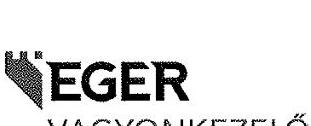

EVAT EGRI VAGYONKEZELŐ ÉS TÁVFÜTŐ ZÁRTKÖRÜEN MÜKÖDŐ RÉSZVÉNYTÁRSASÁG
H-3300 EGER, ZALÁR JÓZSEF ÚT 1-3., Pf.: 98, Tel.: (36) 511-777, Fax: (36) 516-017, www.evatzri.hu, evatzrt@evatzri.hu

Állami Számvevőszék
Domokos László
Elnök úr észére

Budapest
Apáczai Csere János utca 10.
1052

## Tisztelt Elnök úr!

Eger, 2016. április 12.
Iktatószám: 033-2/2016.
Úgyintéző: Csirke Józsefné
Tárgy: Számvevőszéki
jelentéstervezetre észrevétel.
030018/2-12
APR 14 2016
V-GRMA-14012016

Köszönettel kézhez vettük társaságunk az EVAT Egri Vagyonkezelő és Távfütő Zrt. ellenőrzéséről készült számvevőszéki jelentéstervezetüket.

Az Állami Számvevőszékről szóló 2011. évi LXVI. tv. 29. § (2) bekezdése szerint az ellenőrzés megállapításaira írásban észrevételt tehetünk, melyek az alábbiak:

- A jelentésben megfogalmazott hiányosságokat már az ellenőrzés ideje alatt részben pótoltuk, illetve a szabályozottságot rendeztük.
- A 3.1. sz. megállapítás 5. bekezdésében tett megállapítás miszerint „nem készült az üzembehelyezést hitelt érdemlően dokumentáló üzembehelyezési jegyzőkönyv, vagy egyéb használatbavételi okmányok" ilyen formában téves. A 100 ezer forint alatti értéket képviselő tárgyi eszközök esetében a B. 12-114/V.r.sz. Anyag (eszközök) kivételezési bizonylatát használtuk, tehát dokumentálása megtörtént. (1. sz. melléklet) Az intézkedési utasításban „üzembehelyezési okmány" használatát fogjuk meghatározni a jelentéstervezetben meghatározottak szerint.
- Kérjük, szíveskedjenek a hiányosságként feltüntetett egy db tárgyi eszköz leltári (nyilvántartási) számát megadni, hogy a kifogásolt üzembehelyezést módosítani tudjuk.
- A követeléskezelésre vonatkozó megállapítás, miszerint „szabályzatban nem rögzítették" szintén téves. A folyamatot az IE-751-3 „Hátralékkezelés végzése és ellenőrzése" Integrált Eljárás szabályozza, mely tartalmazza a jelentéstervezetben leírtak szerint, ennek folyamatát. (2. sz. melléklet)
Ehhez az eljáráshoz szorosan kapcsolódik az IE-751-10 „Távhőszolgáltatás felfüggesztése" Integrált Eljárás, mely a nem fizető vevők melegvíz szolgáltatás korlátozásának szabályozását tartalmazza. (3. sz. melléklet)

[^0]
[^0]:    Fütőmű: Eger, Malomárok u. 28. Tel.: (36)536-266, Fax: 536 - 277;
    Egri Törvényszék Cégbírósága Cg.10-10-020014

---

Kérjük észrevételeink szíves elfogadását.

# Mellékletek: 

- B. 12-114/V.r.sz. 544865 sorszámú Anyag (eszközök) kivételezési bizonylat másolata
- IE-751-3 „Hátralékkezelés végzése és ellenőrzése" Integrált Eljárás
- IE-751-10 „Távhőszolgáltatás felfüggesztése" Integrált Eljárás

Tisztelettel:
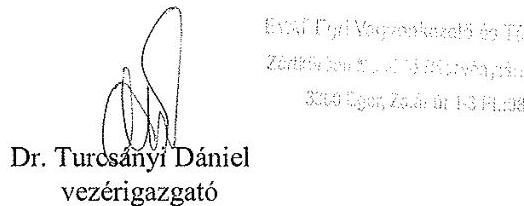

Csirke Józsefné
gazdasági divízióvezető

---

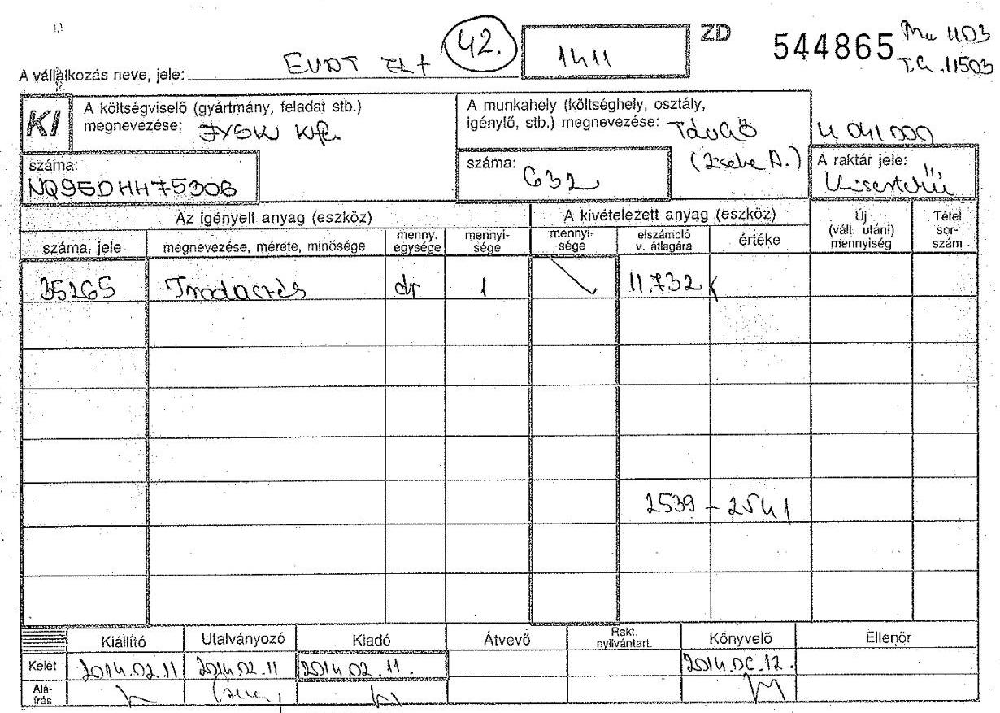
B. 12-114/X. r. oz. - Nyomell KR. - 13403 - 2004.5324 N. P.

---

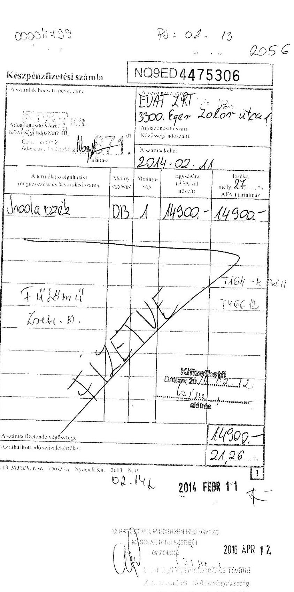

# FU: 02. 13 2056

---

# FVAT 

## Integrált Eljárás

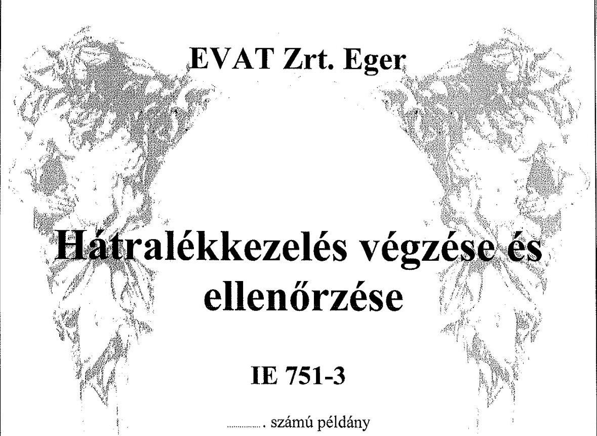

A kiadás sorszáma: 02.

Hatálybalépés időpontja: 2010. július 01.

Érvényes: a visszavonásig.

| Készítette: Fábryné Dobai Ilona | Ellenőrizte: Korsós Lajosné | Jóváhagyta: Várkonyi György |
| :--: | :--: | :--: |
| Beosztás: Integrált irányítási vezető | Beosztás: Vagyonkezelő divízióvezető | Beosztás: Ügyvezető igazgató |
| Dátum: 2010.07.01. | Dátum: 2010.07.01. | Dátum: 2010.07.01. |
| Aláirás: $\frac{\text { F }}{}$ | Aláirás: | Aláirás: |

---

# Hátralékkezelés végzése és ellenőrzése 

## 1. Célmeghatározás

Célunk a felhalmozódott hátralék kezelésére, behajtására vonatkozó tevékenység részletes szabályozása.

## 2. Területi érvényesség

Jelen eljárás hatálya kiterjed az alábbi tevékenységeink, szolgáltatásaink során keletkező hátralékokra:

- vagyonkezelési tevékenység,
- vagyonüzemeltetési tevékenység,
- hő- és melegvíz-szolgáltatási tevékenység,
- ingatlan értékbecslési tevékenység.

## 3. Illetékesség

A folyamatért, a nyilvántartások vezetéséért a Vagyonkezelő divízióvezető, az Ügyvéd és a Hátralékkezelő a felelős.

---

# Hátralékkezelés végzése és ellenőrzése 

## 4. Folyamat

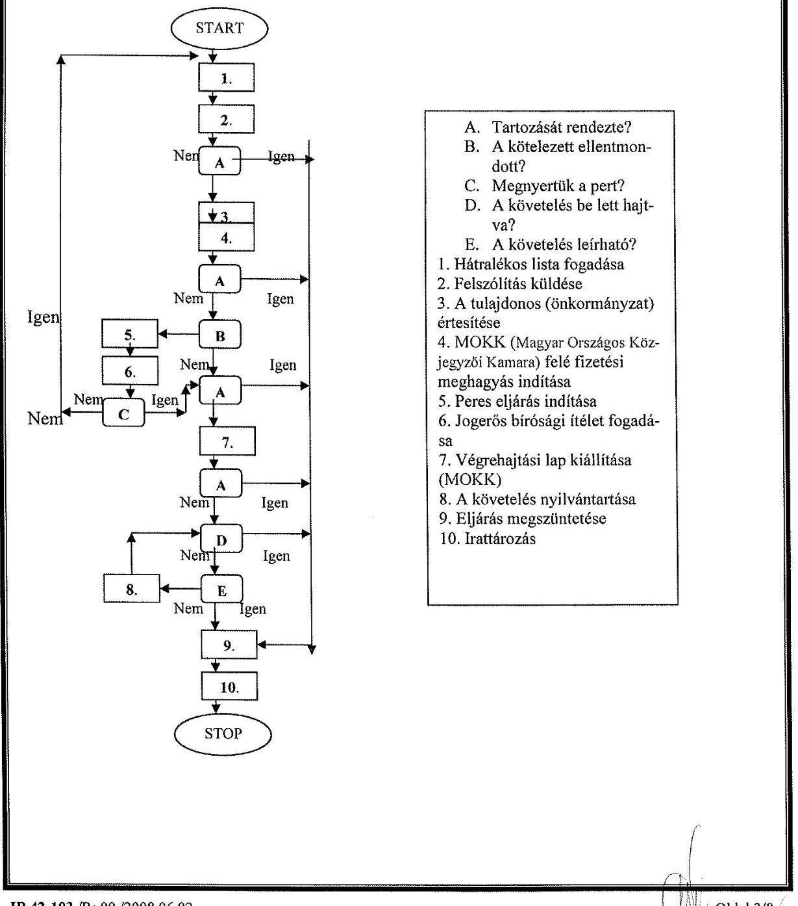

---

# Hátralékkezelés végzése és ellenőrzése 

## IE 751-3

A kiadás sorszáma: 02.

## 5. Ügyrendi szabályzat

|  |  | 1. | 2. | 3. |
| :--: | :--: | :--: | :--: | :--: |
|  | Megnevezés | Hátralékos lista fogadása | Felszólítás küldése | A tulajdonos (önkormányzat) értesítése |
| $\begin{aligned} & \text { T } \\ & \text { E } \\ & \text { V } \\ & \text { E } \\ & \text { K } \end{aligned}$ | Elvégzéséhez szükséges dokumentum | Számítógépes adatbázis | Hátralékos lista | Hátralékos lista, Felszólító levél |
|  | Végrehajtója | Számítástechnikus | Kezelő, Hátralékkezelő | Kezelő, Hátralékkezelő |
| $\begin{aligned} & \text { E } \\ & \text { N } \\ & \text { Y } \\ & \text { S } \\ & \text { E } \\ & \text { G } \end{aligned}$ | Elvégzésének   írásos   rögzítése | Hátralékos lista | Felszólító levél | Levél |
|  | Végrehajtásáért felelős | Kezelő, Hátralékkezelő | Kezelő, Hátralékkezelő | Vagyon-és hátralékkezelési csoportvezető, Ügyvéd |
| $\begin{aligned} & \text { E } \\ & \text { L } \\ & \text { L } \\ & \text { E } \\ & \text { N } \\ & \text { O } \\ & \text { R } \\ & \text { Z } \\ & \text { E } \\ & \text { S } \end{aligned}$ | Szempontjai | - | Tartalmi, formai megfelelőség | - |
|  | Végrehajtója | - | Ügyvéd | - |
|  | Végrehajtásának ideje | - | Minden esetben | - |
|  | Írásos   rögzítése | - | Felszólító levél szignálása | - |
| $\begin{aligned} & \text { B } \\ & \text { E } \\ & \text { A } \\ & \text { V } \\ & \text { A } \\ & \text { T } \\ & \text { K } \\ & \text { O } \\ & \text { Z } \\ & \text { A } \\ & \text { S } \end{aligned}$ | Szükségessége esetén értékel | - | Ügyvéd | - |
|  | Elvégzése során intézkedik | - | Kezelő, Hátralékkezelő | - |
|  | Írásos rögzítése | - | Módosított felszólító levél | - |

---

# Hátralékkezelés végzése és ellenőrzése 

## IE 751-3

A kiadás sorszáma: 02.

| Megnevezés |  | 4.   MOKK felé fizetési meghagyás indítása | 5.   Peres eljárás indítása | 6.   Jogerős bírósági ítélet fogadása |
| :--: | :--: | :--: | :--: | :--: |
| $\begin{aligned} & \text { T } \\ & \text { E } \\ & \text { V } \\ & \text { E } \\ & \text { K } \\ & \text { E } \\ & \text { N } \\ & \text { Y } \\ & \text { S } \\ & \text { E } \\ & \text { G } \end{aligned}$ | Elvégzéséhez szükséges dokumentum | Hátralékos lista, Felszólító levél | Felszólító levél, nyilvántartási adatok | Jogerős bírósági ítélet |
|  | Végrehajtója | Hátralékkezelő | Ügyvéd | Iktató |
|  | Elvégzésének írásos rögzítése | Fizetési meghagyás | Keresetlevél | Iktatókönyv,   Kézbesítő könyv |
|  | Végrehajtásáért felelős | Hátralékkezelő | Ügyvéd | Iktató |
| $\begin{aligned} & \text { E } \\ & \text { L } \\ & \text { L } \\ & \text { E } \\ & \text { N } \\ & \text { O } \\ & \text { R } \\ & \text { Z } \\ & \text { E } \\ & \text { S } \end{aligned}$ | Szempontjai | Tartalmi, formai megfelelőség | - | - |
|  | Végrehajtója | Ügyvéd | - | - |
|  | Végrehajtásának ideje | Minden esetben | - | - |
|  | $\begin{aligned} & \text { B } \\ & \text { E } \\ & \text { A } \\ & \text { V } \\ & \text { A } \\ & \text { T } \\ & \text { K } \\ & \text { O } \\ & \text { Z } \\ & \text { A } \\ & \text { S } \end{aligned}$ | Írásos rögzítése | Fizetési meghagyás aláírása | - | - |
|  | Szükségessége esetén értékel | Ügyvéd | - | - |
|  | Elvégzése során intézkedik | Hátralékkezelő | - | - |
|  | Írásos rögzítése | Módosított fizetési meghagyás | - | - |

---

# Hátralékkezelés végzése és ellenőrzése 

## IE 751-3

A kiadás sorszáma: 02.
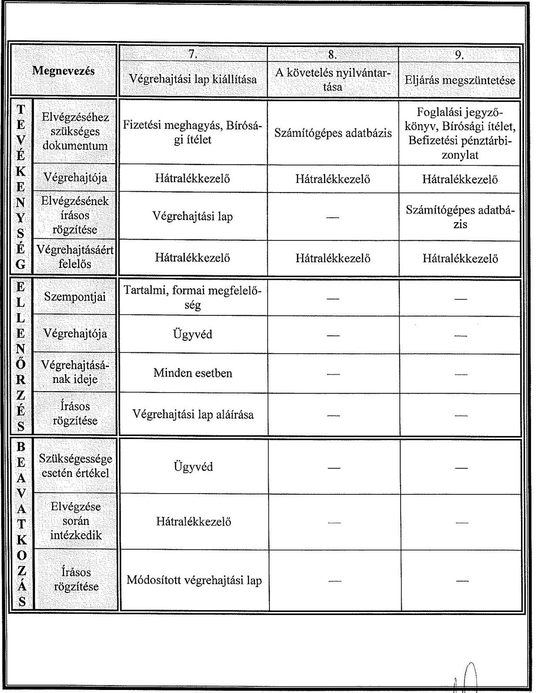

---

# Hátralékkezelés végzése és ellenőrzése 

IE 751-3
A kiadás sorszáma: 02.

| Megnevezés |  | 10. |
| :--: | :--: | :--: |
|  |  | Irattározás |
| $\begin{aligned} & \text { T } \\ & \text { E } \\ & \text { V } \\ & \text { E } \\ & \text { K } \\ & \text { E } \\ & \text { N } \\ & \text { Y } \\ & \text { S } \\ & \text { E } \\ & \text { G } \end{aligned}$ | Elvégzéséhez szükséges dokumentum | Foglalási jegyző-   könyv, Fizetési meg-   hagyás, Bírósági íté-   let, Végrehajtási lap |
|  | Végrehajtója | Hátralékkezelő |
|  | Elvégzésének   írásos   rögzítése | Irattári nyilvántartás |
|  | Végrehajtásáért felelős | Hátralékkezelő |
|  | Szempontjai | — |
|  | Végrehajtója | — |
|  | Végrehajtásának ideje | — |
|  | $\begin{aligned} & \text { Írásos } \\ & \text { rögzítése } \end{aligned}$ | — |
| $\begin{aligned} & \text { B } \\ & \text { E } \\ & \text { A } \\ & \text { V } \\ & \text { A } \\ & \text { T } \\ & \text { K } \\ & \text { O } \\ & \text { Z } \\ & \text { A } \\ & \text { S } \end{aligned}$ | Szükségessége esetén értékel | — |
|  | Elvégzése   során   intézkedik |

 — |
|  | $\begin{aligned} & \text { Írásos } \\ & \text { rögzítése } \end{aligned}$ | — |

---

# Hátralékkezelés végzése és ellenőrzése 

## 6. Specifikációk

A hátralékkezelés alapjául az Informatika és számítástechnika adatrögzítője által felvezetett számla és a befizetett összegek közötti különbségekből adódó, negyedévenként elvégzett és ellenőrzött hátralékos lista aktualizálása szolgál. A hátralékkezelők a divízióvezető által meghatározott limit szerint végzik el a szerződött felek befizetéséről szóló kimutatásokat, tartozásról szóló felszólításokat. A hátralékkezelő felszólító levelet csak fütési hátralék esetében ír, egyéb esetben ezt a kezelő írja.

Az ügyrendi táblázat 4. pontja MOKK (Magyar Országos Közjegyzői Kamara) felé fizetési meghagyás indítása, amely 4 havi díjat meghaladó összegnél történik meg.

A követelés behajtására a hátralékkezelés bármely fázisában részletfizetési megállapodás köthető. A követelés behajtása végrehajtói folyamat. A nem leírható követelés öt éves elévülését ismételt végrehajtói intézkedéssel lehet folyamatossá tenni.

Az ábrázolt folyamat a problémás felekkel történő jogi eljárást szabályozza. A hátralékkezelők a tevékenységük során az ügyfelekkel, a bírósági ügyintézővel, a bírósági végrehajtóval és a jogásszal napi kapcsolatban állnak.

A bármikor előforduló hátralék befizetés a legtöbb esetben, a folyamatban lévő eljárást megszakíthatja. A be nem hajtható követelések esetén vezetői döntés alapján, bizonyos időszakonként ismételt eljárással megkíséreljük a tartozás behajtását, illetve a sikertelen behajtás esetén a követelés leírását.

---

# Távhőszolgáltatás felfüggesztése 

## IE 751-10

$\qquad$ . számú példány

A kiadás sorszáma: 00.

Hatálybalépés időpontja: 2013.02.01.

Érvényes: a visszavonásig.

| Készítette: | Ellenőrizte: | Jóváhagyta: |
| :--: | :--: | :--: |
| Vargáné Kárpáti Ildikó | Zsebe Albert | Várkonyi György Olivér |
| Beosztás: mb. MGE irodavezető | Beosztás: Távhő divízióvezető | Beosztás: Vezérigazgató |
| Dátum: 2013.02.01. | Dátum: 2013.02.01. | Dátum: 2013.02.01. |
| Aláirás: Vangka | Aláirás: | Aláirás: |

---

# 1. Célmeghatározás 

Célunk a távhőszolgáltatási tevékenység felfüggesztésével kapcsolatos eljárások, tevékenységek szabályozása annak érdekében, hogy a szolgáltatói tevékenységünk felfüggesztése a jogszabályoknak, a szakmai, minőségi, munkabiztonsági, egészségvédelmi és a környezeti hatásokra vonatkozó követelményeinek megfelelően, az érdekelt felek (tulajdonosok, bérlők, Társaság) tudomásul vételével történjen.

## 2. Területi érvényesség

Jelen eljárás hatálya kiterjed:

- A számla ellenértékét határidőre meg nem fizető díjfizető helyekre.
- Vagyonkezelő divízióban végzett hátralékkezelési feladatokra, ezen belül:
- „Fizetési felszólító" kiküldése meghatározott hátralékos ügyfelek részére.
- „JAVASLAT TÁVHÓSZOLGÁLTATÁS FELFÜGGESZTÉSÉRE" (IB75201) dokumentum összeállítása, megküldése Távhő divízió részére.
- Sikertelen felfüggesztési eljárás esetén felhasználói helyre történő bejutást elrendelő Heves Megyei Kormányhivatal Egri Járási Hivatal határozatának kérésére.
- Távhő divíziójában végzett távhőszolgáltatás felfüggesztési feladatokra, ezen belül:
- „JAVASLAT TÁVHÓSZOLGÁLTATÁS FELFÜGGESZTÉSÉRE" dokumentum alapján műszaki megvalósítási ütemterv összeállítására.
- A hátralékos ügyfél, felhasználói közösség képviselőjének a felfüggesztés időpontjáról történő kiértesítésére.
- A felfüggesztés műszaki megvalósítására, „Jegyzőkönyv szolgáltatás felfüggesztéséről" dokumentum (IB75-203) felvételére és annak megküldésére Vagyonkezelő divízió részére.
- Felfüggesztés időszakára vonatkozó alapdíj számlázására.

---

# Távhőszolgáltatás felfüggesztése 

## 1E 751-10

A kiadás sorszáma: 00.

- Ellenőrzési feladatok végzésére, „Jegyzőkönyv a felfüggesztett szolgáltatás ellenőrzéséről" dokumentum (IB75-204) felvételére.
- Szabálytalan vételezés esetén pótdíj számla/értesítő kibocsátására.
- A felfüggesztés megszüntetésének műszaki megvalósítására, „Jegyzőkönyv szolgáltatás felfüggesztés megszüntetéséről" dokumentum (IB75-205) felvételére és annak megküldésére Vagyonkezelő divízió részére.
- Gazdasági divízióban végzett számlaérvényesítési, kiküldési, archiválási feladatokra.

## 3. Illetékesség

- A Vagyon-és hátralékkezelési csoport feladata a számla ellenértékét határidőre meg nem fizető díjfizető helyek listájának összeállítása, a távhőszolgáltatás felfüggesztésére vonatkozó javaslat elkészítése, a jogszabályi megfelelőség vizsgáltatása.
- A Vezérigazgató jogosult elrendelni a távhőszolgáltatás felfüggesztését a Vagyon-és hátralékkezelési csoport javaslata alapján.
- A szolgáltatás felfüggesztésével kapcsolatos műszaki tevékenységek végzéséért a Távhő divízióvezető, Műszaki-Gazdasági-Energetikai irodavezető és az Üzemeltetési részlegvezető a felelős.
- A Számítástechnikai csoport feladata számlaérvényesítés, számlakiküldés, számlaarchiválás.

---

# Távhőszolgáltatás felfüggesztése 

## 4. Folyamat

A. Keletkeztek díjtartozások?
B. A díjfizető rendezte a tartozását?
C. Érkezett felfüggesztési időpont módosítási kérelem?
D. Sikeres volt a felfüggesztés?
E. Találtak szabálytalanságot a felfüggesztés ellenőrzésekor?

1. Felszólító levelek kiküldése.
2. Célszemélyek / díjfizető helyek kijelölése, jóváhagyása.
3. Szolgáltatás felfüggesztési ütemterv készítése.
4. Felfüggesztés megvalósítása.
5. Határozat kérése (Heves Megyei Kormányhivatal Egri Járási Hivatal).
6. Felfüggesztés ellenőrzése.
7. Helyreállítás, pótdíj kiszabása.
8. Felfüggesztés megszüntetése.
9. Irattárba helyezés, archiválás.

---

# 5. Ügyrendi szabályzat 

| Megnevezés |  | 1.   Felszólító levelek kiküldése | 2.   Célszemélyek / díjfizető helyek kijelölése, jóváhagyása | 3.   Szolgáltatás felfüggesztési ütemterv készítése |
| :--: | :--: | :--: | :--: | :--: |
| $\begin{aligned} & \text { T } \\ & \text { E } \\ & \text { V } \\ & \text { E } \\ & \text { K } \\ & \text { E } \\ & \text { N } \\ & \text { Y } \\ & \text { S } \\ & \text { E } \\ & \text { G } \end{aligned}$ | Elvégzéséhez szükséges dokumentum | 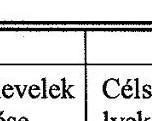 | Üzletszabályzat; Szerződés; Fizetési felszólítás átvételét igazoló dokumentum; Díjtartozás 8 napon belüli meg nem fizetése. | „Javaslat távhőszolgáltatás felfüggesztésére" dokumentum (IB 75201); Heves Megyei Kormányhivatal Egri Járási Hivatal határozata |
|  | Végrehajtója |  | Vagyon-és hátralékkezelési csoport | Műszaki ügyintéző;   Üzemeltetési részlegvezető |
|  | Elvégzésének írásos rögzítése |  | „Javaslat távhőszolgáltatás felfüggesztésére" (IB75-201) | Ütemterv; Célszemély kiértesítő levél; Felhasználói közösség képviselőjét kiértesítő levél; Vagyon-és hátralékkezelési csoport tájékoztatása; „Szolgáltatás felfüggesztéséről kiérteszthető díjfizetők listája" (IB 75-202) |
|  | Végrehajtásáért felelős |  | Vagyon-és hátralékkezelési csoportvezető | MGE irodavezető |
| $\begin{aligned} & \mathbf{E} \\ & \mathbf{L} \\ & \mathbf{L} \\ & \mathbf{E} \\ & \mathbf{N} \\ & \mathbf{O} \\ & \mathbf{R} \\ & \mathbf{Z} \\ & \mathbf{E} \\ & \mathbf{S} \end{aligned}$ | Szempontjai |  | Jogszabályi; Részletfizetési megállapodás; Adósságkezelési megállapodás | Célszemély időpont módosítási kérelme; Hátralék kiegyenlítés; Részletfizetési megállapodás |
|  | Végrehajtója |  | Vagyonkezelési divízióvezető; Vezérigazgató | Műszaki ügyintéző; Vagyon-és hátralékkezelési csoport; |
|  | Végrehajtásának ideje |  | „Javaslat szolgáltatás felfüggesztésére" lista elkészültét követő három nap | Felfüggesztést megelőző napon |
|  | $\begin{aligned} & \text { Í } \\ & \text { R } \\ & \text { Á } \\ & \text { S } \\ & \text { O } \\ & \text { S } \\ & \text { R } \\ & \text { Ö } \\ & \text { G } \\ & \text { Z } \\ & \text { Í } \\ & \text { T } \\ & \text { É } \\ & \text { S } \\ & \text { E } \end{aligned}$ | $\begin{aligned} & \text { Írásos } \\ & \text { rögzítése } \end{aligned}$ | „Javaslat szolgáltatás felfüggesztésére" lista elkészítése | Aktualizált ütemterv |
|  | Szükségessége esetén értékel |  | Vagyonkezelési divízióvezető; meghívott ügyvéd; Vezérigazgató | Vagyonkezelő divízióvezető Távhő divízióvezető |
|  | Elvégzése során intézkedik |  | Vagyon-és hátralékkezelési csoportvezető | Műszaki ügyintéző; |
|  | $\begin{aligned} & \text { Á } \\ & \text { L } \\ & \text { L } \\ & \text { A } \\ & \text { S } \end{aligned}$ | $\begin{aligned} & \text { Írásos } \\ & \text { rögzítése } \end{aligned}$ | „Javaslat szolgáltatás felfüggesztésére" lista véglegesítése | Távhő divízióvezető által jóváhagyott Ütemterv |

---

# Távhőszolgáltatás felfüggesztése 

## 1E 751-10

A kiadás sorszáma: 00.
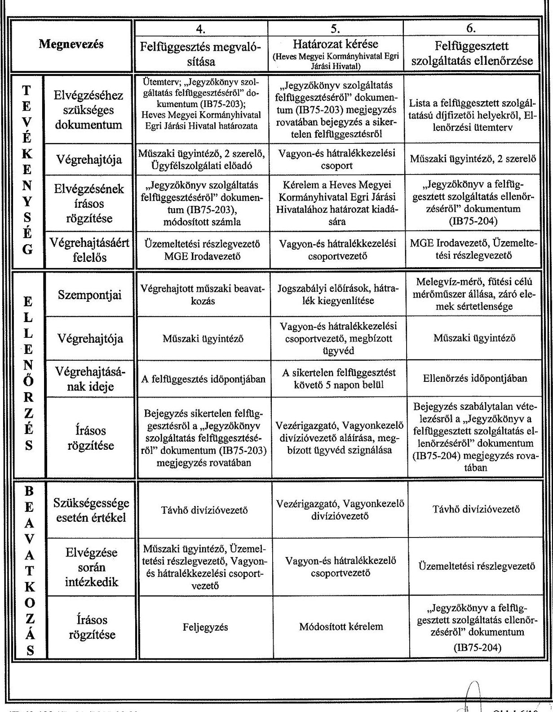

IB 42-103 / R: 01./2012.09.03.

---

# Távhőszolgáltatás felfüggesztése 

## IE 751-10

A kiadás sorszáma: 00.

| Megnevezés |  | 7. | 8. | 9. |
| :--: | :--: | :--: | :--: | :--: |
|  |  | Helyreállítás, pótdíj kiszabása | A felfüggesztés megszüntetése | Irattárba helyezés, archiválás |
| $\begin{aligned} & \text { T } \\ & \text { E } \\ & \text { V } \\ & \text { E } \\ & \text { K } \\ & \text { E } \\ & \text { N } \\ & \text { Y } \\ & \text { S } \\ & \text { E } \\ & \text { G } \end{aligned}$ | Elvégzéséhez szükséges dokumentum | „Jegyzőkönyv a felfüggesztett szolgáltatás ellenőrzéséről" dokumentum (IB75-204) | Feljegyzés a hátralék, a felfüggesztés és újraindítás díjának rendezéséről | Jegyzőkönyv, feljegyzés, lista, Heves Megyei Kormányhivatal Egri Járási Hivatal határozata, helyreállítási/pótdíj számla |
|  | Végrehajtója | Műszaki ügyintéző, 2 szerelő, ügyfélszolgálat | Vagyon- és hátralékkezelési csoport, ügyfélszolgálat, műszaki ügyintéző, 2 szerelő | Műszaki ügyintéző, ügyfélszolgálati előadó, vagyon-és hátralékkezelési csoport, informatikus |
|  | Elvégzésének írásos rögzítése | „Jegyzőkönyv a felfüggesztett szolgáltatás ellenőrzéséről" dokumentum (IB75-204) megjegyzés rovata, Értesítő pótdíjról | „Jegyzőkönyv szolgáltatás felfüggesztés megszüntetéséről" dokumentum (IB75205), a felhasználó képviselőjének tájékoztatása   Módosított számla | Irattári nyilvántartás   Digitális számlaarchiválás |
|  | Végrehajtásáért felelős | Üzemeltetési részlegvezető   MGE irodavezető | Vagyon-és hátralékkezelési csoportvezető, Üzemeltetési részlegvezető, MGE Irodavezető | MGE irodavezető, Vagyon-és hátralékkezelési csoportvezető, Számítástechnikai csoportvezető |
| $\begin{aligned} & \text { E } \\ & \text { L } \\ & \text { L } \\ & \text { E } \\ & \text { N } \\ & \text { O } \\ & \text { R } \\ & \text { Z } \\ & \text { E } \\ & \text { S } \end{aligned}$ | Szempontjai | 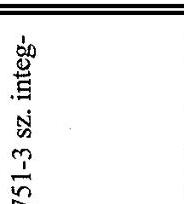 | Műszaki megfelelőség, jogszabályi megfelelőség | - |
|  | Végrehajtója |  | Távhő divízióvezető, Vagyonkezelő divízióvezető | - |
|  | Végrehajtásának ideje |  | Szükség szerint | - |
|  | Írásos   rögzítése |  | Szükség szerinti feljegyzés | - |
| $\begin{aligned} & \text { B } \\ & \text { E } \\ & \text { A } \\ & \text { V } \\ & \text { A } \\ & \text { T } \\ & \text { K } \\ & \text { O } \\ & \text { Z } \\ & \text { A } \\ & \text { S } \end{aligned}$ | Szükségessége esetén értékel |  | Távhő divízióvezető, Vagyonkezelő divízióvezető | - |
|  | Elvégzése   során   intézkedik |  | Műszaki ügyintéző, Üzemeltetési részlegvezető, Vagyonés hátralékkezelési csoportvezető | - |
|  | Írásos   rögzítése |  | Feljegyzés | - |

---

# 6. Specifikációk 

6.1. A felszólító levelek kiküldése a „Hátralékkezelés végzése és ellenőrzése" IE 751-3 sz. integrált eljárás részeként történik.
6.2. Célszemélyek / díjfizető helyek kijelölése a Vagyon-és hátralékkezelési csoport munkatársának feladata, miután meghatározott vizsgálati szempontok alapján, egyenként végigvizsgált minden díjfizető helyet. Szolgáltatás felfüggesztésére azon személyek/díjfizető helyek jelölhetők meg (vizsgálati szempontok):

- Akik a számla ellenértékét határidőre nem fizették meg,
- Akik a felszólítás ellenére 8 napon belül nem fizették meg

 a hátralékukat,
- Akik a felszólítás ellenére nem kötöttek részletfizetési megállapodást.

A szolgáltatás felfüggesztésére megjelölt díjfizető helyek listáját /„Javaslat távhőszolgáltatás felfüggesztésére"/ folyamatközi ellenőrzésként áttekinti és szignálja a vagyonkezelő divízióvezető.

A valamennyi szempont figyelembe vételével elkészült/ellenőrzött listát a vezérigazgató hagyja jóvá és ezzel rendeli el a távhőszolgáltatás felfüggesztését.

A vezérigazgató által jóváhagyott listát a Vagyon- és hátralékkezelési csoport munkatársa küldi meg a Távhő divízió részére a felfüggesztési tevékenység feladatainak irányítása, végzése céljából.
6.3. Szolgáltatás felfüggesztési ütemterv készítése és a célszemélynek, valamint a fütési célú szolgáltatás felfüggesztése esetén a felhasználói közösség képviselőjének levélben történő értesítése a felfüggesztés időpontjáról a műszaki ügyintéző feladata. A műszaki állomány rendelkezésre állásának biztosítása az üzemeltetési részlegvezető feladata. A „Szolgáltatás felfüggesztéséről kiértesített díjfizetők listája" dokumentum folyamatközi ellenőrzését a Vagyon- és hátralékkezelési csoport végzi.
A műszaki ügyintéző a Heves Megyei Kormányhivatal Egri Járási Hivatal határozata alapján kijelöli a felfüggesztés időpontját és tértivevényes levélben értesíti a célszemélyt.
6.4. Felfüggesztés megvalósításakor a helyszínen jegyzőkönyvet kell felvenni. A műszaki ügyintéző a felvett „Jegyzőkönyv szolgáltatás felfüggesztéséről" dokumentum 1 eredeti példányát megőrzi, 1-1 másolati példányát megküldi a Vagyon- és hátralékkezelési csoport és a Távhő divízió ügyfélszolgálata részére. Az ügyfélszolgálat módosítja a díjfizetőnek számlázott díjtételeket a felfüggesztéssel érintett időszakra a sikeresen végrehajtott felfüggesztésről készült jegyzőkönyv alapján. A módosítást a felfüggesztés műszaki megvalósítását követően kibocsátott első számlában kell végrehajtani.

Sikertelen felfüggesztésnek minősül és jegyzőkönyvben kell rögzíteni:

- ha a díjfizető nem tartózkodik otthon,
- ha megakadályozza a felfüggesztést.

---

# Távhőszolgáltatás felfüggesztése 

## IEGER

VAGYONKEZELŐ

## IE 751-10

A kiadás sorszáma: 00.

Az ismételt felfüggesztés végrehajtásra a Heves Megyei Kormányhivatal Egri Járási Hivatalának határozata alapján kerül sor.
6.5. Határozat kérése sikertelen felfüggesztés esetén. A Vagyon és hátralékkezelési csoport kérelmet nyújt be a Heves Megyei Kormányhivatal Egri Járási Hivatala felé a korlátozás tűrésére és kéri a határozat fellebbezésre tekintet nélkül végrehajthatóvá nyilvánítását. A kérelem jogszabályi megfelelőség szempontjából való vizsgálatát a megbízott ügyvéd ellenőrzi.
A Heves Megyei Kormányhivatal Egri Járási Hivatal határozatát a Vagyon és hátralékkezelési csoport a Távhő divízióhoz továbbítja.
6.6. A felfüggesztett szolgáltatás ellenőrzésekor a Távhő divízió előzetes értesítés alapján 90 naponta ellenőrzi a szolgáltatás felfüggesztésekor elvégzett műszaki beavatkozást, a plomba sértetlenségét vizsgálati szempont alapján.
Ellenőrzéskor a helyszínen jegyzőkönyvet kell felvenni. Szabálytalan vételezés esetén, az észlelt rendellenességet rögzíteni kell a „Jegyzőkönyv a felfüggesztett szolgáltatás ellenőrzéséről" dokumentumban. A Távhő divízió megbízott munkatársa az ellenőrzésekről nyilvántartást vezet.
6.7. Helyreállítás, pótdij kiszabása akkor történik, ha a felfüggesztett szolgáltatás időszaka alatt szabálytalan vételezés történt. A műszaki ügyintéző a „Jegyzőkönyv a felfüggesztett szolgáltatás ellenőrzéséről" dokumentum 1 másolati példányát nyomonkövetésre megküldi a Távhő divízió ügyfélszolgálatának. Az ügyfélszolgálat pótdíjat állapít meg, melyről értesítőt küld a díjfizetőnek.
6.8. A felfüggesztés megszüntetésére, és a szolgáltatás újraindítására azon személyek/díjfizető helyek jelölhetők meg (vizsgálati szempontok):

- ahol a díjfizető megfizette a teljes hátralékát,
- szabálytalan vételezés esetén a pótdíjat,
- és a felfüggesztéssel, újraindítással összefüggő költségeket.

A felfüggesztés és újraindítás díjáról a Vagyon- és hátralékkezelési csoport/ Távhő divízió ügyfélszolgálata számlát állít ki.
A Vagyon - és hátralékkezelési csoport megbízott munkatársa azonnal értesíti e-mailben a műszaki ügyintézőt a teljes hátralék, szabálytalan vételezés esetén a pótdíj, valamint a felfüggesztés és újraindítással összefüggő költségek megfizetéséről.
A műszaki ügyintéző az értesítés kézhezvételét követően haladéktalanul intézkedik a szolgáltatás 24 órán belüli visszaállításáról.
Felfüggesztett szolgáltatás megszüntetésekor a helyszínen jegyzőkönyvet kell felvenni. A műszaki ügyintéző a felvett "Jegyzőkönyv szolgáltatás felfüggesztés megszüntetéséről" dokumentum 1 eredeti példányát megőrzi, 1-1 másolati példányát megküldi a Vagyon- és hátralékkezelési csoport és a Távhő divízió ügyfélszolgálata részére.

A Távhő divízió ügyfélszolgálata a felfüggesztés megszüntetéséről készült jegyzőkönyv alapján módosítja a díjfizetőnek számlázott díjtételeket. A módosítást a műszaki megvalósítást követően kibocsátott első számlában kell végrehajtani.
A felfüggesztés, újraindítás költségeinek kiszámlázásakor az IE-751-6 Számlázási tevékenység végzése és ellenőrzése integrált eljárás vonatkozó szabályai szerint kell eljárni.

---

# Távhőszolgáltatás felfüggesztése 

6.9. Irattárba helyezéskor, archiváláskor valamennyi dokumentumot a dokumentumok/feljegyzések, számlák kezelésére vonatkozó szabályozás szerint kell eljárni. Alkalmazni kell az IE- 423-1 Dokumentumok kezelése, az IE 424-1 Feljegyzések kezelése címü integrált eljárásokat, az IU 751-6-1 „Csoportos készítésű" számlák elektronikus archiválása integrált utasítást, és az Iratkezelési és irattározási szabályzatot.

---

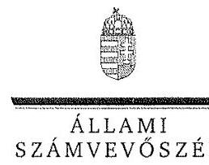

ELNÖK

Ikt.szám: V-0844-143/2016.

dr. Turesányi Dániel úr
vezérigazgató
EVAT Egri Vagyonkezelő és Távfűtő Zrt.

Eger

Tisztelt Vezérigazgató Úr!

Köszönettel vettem az EVAT Egri Vagyonkezelő és Távfűtő Zrt. ellenőrzéséről készített
számvevőszéki jelentéstervezetre tett észrevételeit.

Az Állami Számvevőszék észrevételekre vonatkozó álláspontjáról a felügyeleti vezető által
készített részletes tájékoztatásban kap választ, amelyet levelemhez mellékeltem.

Tájékoztatom Vezérigazgató urat, hogy a számvevőszéki jelentés véglegesítése az elfogadott
észrevételek figyelembevételével történik.

Budapest, 2016. 5. hó nap

Melléklet: Tájékoztatás az észrevételek kezeléséről 6 L M O 9

Tisztelettel:

Domokos László

1052 BUDAPEST, APACZAI CSERE JÁNOS UTCA 10. 1364 Budapest 4. Pf. 54 telefon: 484 9101 fax: 484 9201

---

# Tájékoztatás az észrevételek kezeléséről 

„Az önkormányzatok gazdasági társaságai - Az önkormányzatok tulajdonában lévő gazdasági társaságok közfeladat-ellátását érintő gazdálkodási tevékenysége szabályszerűségének ellenőrzése EVAT Egri Vagyonkezelő és Távfűtő Zrt." címmel készített jelentéstervezetre Vezérigazgató úr észrevételeit megköszönöm. Az észrevételek kezeléséről az alábbi tájékoztatást adom.

A 100 ezer Ft alatti értéket képviselő eszközök értékcsökkenési leírásának elszámolásával kapcsolatban tett észrevételét részben elfogadom és a jelentéstervezet 3.1. megállapítás 5. bekezdésében foglalt alábbi megállapítást az alábbiak szerint módosítom:
„Az egyedileg 100 ezer forint alatti értéket képviselő tárgyi eszközök esetében - a Számv. tv. 52. § (2) bekezdésében előírtak ellenére - nem készültek az üzembe helyezést hitelt érdemlően dokumentáló üzembe helyezési jegyzőkönyvek vagy egyéb használatbavételi okmányok."

Az észrevételéhez csatolt anyagigénylési dokumentum nem alkalmas a 100 ezer Ft alatti tárgyi eszközök üzembe helyezéséhez és az értékcsökkenés elszámolásához szükséges adatok igazolására. Ezáltal ezen eszközök esetében az üzembe helyezés és értékcsökkenési leírás dokumentálása nem felelt meg Számv. tv. 52. § (2) bekezdésében előírtaknak. Észrevételében továbbá Ön is elismeri a hiányosságot azzal, hogy továbbiakban üzembe helyezési okmány használatát kívánják előírni. Ezek alapján a megállapítást részben fenntartom, az egyéb használatbavételi okmányokra mondatrészt törlöm a megállapításból.

A 3.1 megállapítás 4. bekezdésében lévő megállapításunkat egy, a távhőszolgáltatási tevékenységet közvetlenül szolgáló műszaki berendezésnek az egyéb berendezések, felszerelések, járművek eszközcsoportba történt téves besorolása miatt tettük. A megállapítás a 35273 leltári számú, 95 E Ft bekerülési értékű hőmennyiségmérő nyilvántartásba vételére vonatkozik.

A követeléskezelés szabályozási hiányosságára vonatkozó észrevételét elfogadom. Az észrevétel mellékleteként a hátralékkezelésre és a szolgáltatás felfüggesztésére ismételten megküldött szabályzatok az ellenőrzési dokumentációban is megtalálhatók, ennek alapján a 3.1. megállapítás 7. bekezdés első két mondatát az alábbiak szerint módosítom.
„A követelések kezelésére az EVAT Zrt. önálló szervezeti egységet hozott létre a „Vagyonkezelő divízión" belül, a hátralékkezelési tevékenységet szabályzatban nem rögzítették. A kialakult gyakorlat szerint Ennek alapján, első lépésként fizetési felszólítást küldtek azon ügyfeleknek, akiknek a késedelme meghaladta a 30 napot."

Budapest, 2016. 0. hó c nap

Dr. Horváth Margit
felügyeleti vezető

---

# RÖVIDÍTÉSEK JEGYZÉKE 

${ }^{1}$ Önkormányzat
${ }^{2}$ Ötv.
${ }^{3}$ Mötv.
${ }^{4}$ Közgyűlés
${ }^{5}$ Tszt.
${ }^{6}$ EVAT Zrt.
${ }^{7}$ Gt.
${ }^{8}$ Számv. tv.
${ }^{9}$ Igazgatóság
${ }^{10} \mathrm{FB}$
${ }^{11}$ Ptk.
${ }^{12}$ Díjrendelet
${ }^{13}$ Vagyonrendelet ${ }_{1}$
${ }^{14}$ Vagyonrendelet ${ }_{2}$
${ }^{15}$ Ügyrend
${ }^{16}$ Taktv.
${ }^{17}$ Javadalmazási szabályzat ${ }_{1}$
${ }^{18}$ Javadalmazási szabályzat ${ }_{2}$
${ }^{19}$ Javadalmazási szabályzat ${ }_{3}$
${ }^{20} \mathrm{KGB}$
${ }^{21}$ Áht.
${ }^{22}$ Stabilitási tv.
${ }^{23}$ Tszt.
${ }^{24}$ üzletszabályzat ${ }_{1}$
${ }^{25}$ üzletszabályzat ${ }_{2}$

Eger Megyei Jogú Város Önkormányzata
A helyi önkormányzatokról szóló 1990. évi LXV. törvény (hatálytalan: 2014. október 12-től)
Magyarország helyi önkormányzatairól szóló 2011. évi CLXXXIX. törvény (hatályos: 2012. január 1-jétől)

Eger Megyei Jogú Város Önkormányzatának Közgyűlése
A távhőszolgáltatásról szóló 2005. évi XVIII. törvény (hatályos: 2005. július 1-jétől)
EVAT Egri Vagyonkezelő és Távfűtő Zártkörűen Működő Részvénytársaság
a gazdasági társaságokról szóló 2006. évi IV. törvény (hatálytalan: 2014. március 15-től)
a számvitelről szóló 2000. évi C. törvény
EVAT Egri Vagyonkezelő és Távfűtő Zártkörűen Működő Részvénytársaság Igazgatósága
EVAT Egri Vagyonkezelő és Távfűtő Zártkörűen Működő Részvénytársaság felügyelő bizottsága
a Polgári Törvénykönyvről szóló 2013. évi V. törvény (hatályos: 2014. március 15-től)
Eger Megyei Jogú Város Önkormányzatának többször módosított 43/2005. (XII. 16.) számú rendelete a távhőszolgáltatás legmagasabb díjáról és a díj alkalmazás feltételeiről
Eger Megyei Jogú Város Önkormányzatának 5/2008. (II. 01.) számú rendelete az Önkormányzat vagyonáról, és a vagyongazdálkodásról (hatályos: 2012. február 24-ig)
Eger Megyei Jogú Város Önkormányzatának 6/2012. (II. 24.) számú rendelete az Önkormányzat vagyonáról, és a vagyongazdálkodásról (hatályos: 2012. február 25-től)
EVAT Zrt. felügyelő bizottságának ügyrendje (hatályos: 2011. április 19-től)
a köztulajdonban álló gazdasági társaságok takarékosabb működéséről szóló 2009. évi CXXII. törvény

Eger Megyei Jogú Város Önkormányzatának 338/2005. (IV. 28.) számú Közgyűlési határozatával elfogadott javadalmazási szabályzata. Hatályos: 2013. március 31-ig.
Eger Megyei Jogú Város Önkormányzatának 171/2013. (III. 28.) számú Közgyűlési határozatával elfogadott javadalmazási szabályzata. Hatályos: 2014. június 30-ig.
Eger Megyei Jogú Város Önkormányzatának 302/2014.(VI. 26) számú Közgyűlési határozatával elfogadott javadalmazási szabályzata. Hatályos: 2014. július 1-jétől.
Eger Megyei Jogú Város Önkormányzatának Költségvetési és Gazdálkodási Bizottsága
az államháztartásról szóló 2011. évi CXCV. törvény (hatályos: 2011. december 31-től)
Magyarország gazdasági stabilitásáról szóló 2011. évi CXCIV. törvény (hatályos: 2012. január 1-jétől)
a távhőszolgáltatásról szóló 2005. évi XVIII. törvény (hatályos: 2005. július 1-jétől)
az EVAT Zrt. üzletszabályzata (hatályos: 2012. augusztus 14-ig)
az EVAT Zrt. üzletszabályzata (hatályos: 2012. augusztus 15-től)

---

${ }^{26}$ Info tv.
${ }^{27}$ Eisztv.
${ }^{28}$ NFM rendelet
${ }^{29}$ ÁSZ tv.
${ }^{30}$ Ebktv.
az információs önrendelkezési jogról és az információszabadságról szóló 2011. évi CXII. törvény (hatályos: 2011. július 27-től)
az elektronikus információszabadságról szóló 2005. évi XC. törvény (hatályos: 2011. december 31-jéig)
50/2011. (IX. 30.) NFM rendelet a távhőszolgáltatónak értékesített távhő árának, valamint a lakosság felhasználónak és a külön kezelt intézménynek nyújtott távhőszolgáltatás díjának megállapításáról (hatályos: 2011. október 1-jétől)
2011. évi LXVI. törvény az Állami Számvevőszékről, hatályos 2011. július 1-jétől az egyenlő bánásmódról és az esélyegyenlőség előmozdításáról szóló 2003. évi CXXV. törvény (hatályos: 2004. január 27-étől)

---

# ÁLLAMI SZÁMVEVŐSZÉK 

1052 Budapest, Apáczai Csere János utca 10.
Levélcím: 1364 Budapest 4. Pf. 54
Telefon: +36 14849100 Telefax: +36 14849200
www.asz.hu
