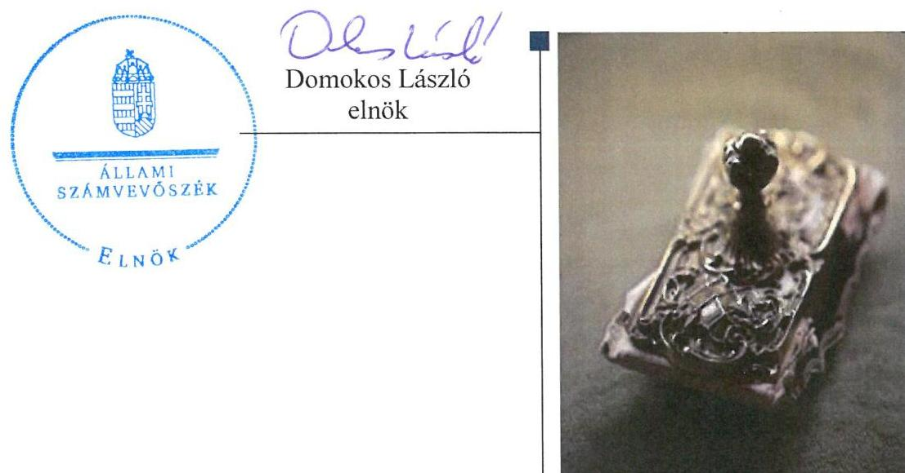
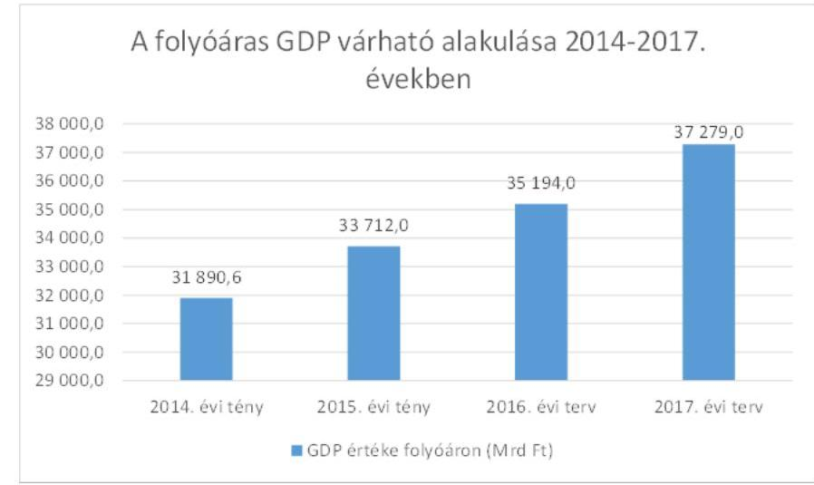
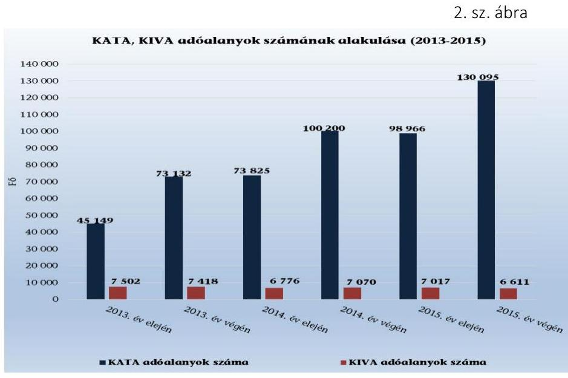
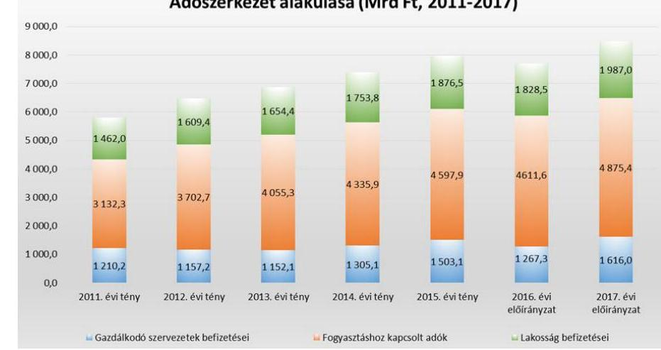
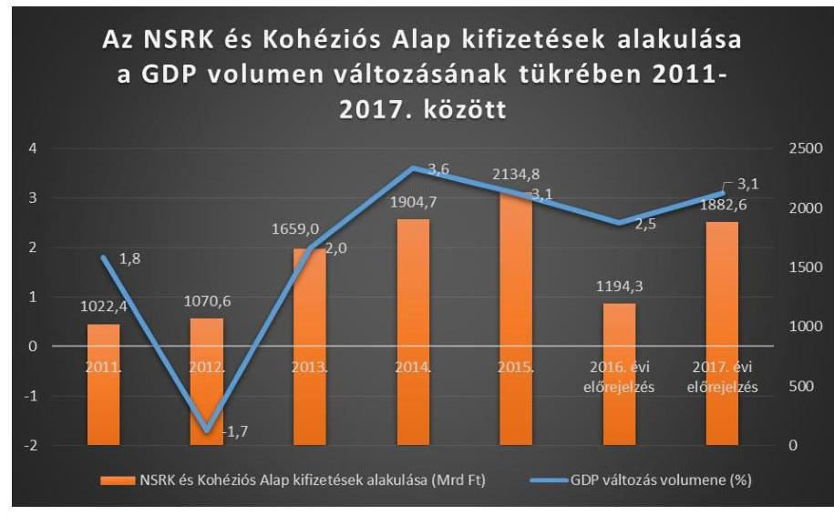

# Vélemény a 2017. évi költségvetésről 

Vélemény Magyarország 2017. évi központi költségvetéséről szóló törvényjavaslatról
2016.

---

.

---

# Vélemény a 2017. évi költségvetésről 

Vélemény Magyarország 2017. évi központi költségvetéséről szóló törvényjavaslatról
2016. 05. hó 04. nap

---

# AZ ELLENŐRZÉST FELÜGYELTE:

DR. PULAY GYULA ZOLTÁN felügyeleti vezető

## AZ ELLENŐRZÉST VEZETTE ÉS A VÉGREHAJTÁSÁÉRT FELELŐS:

DR. KÁDÁR KRISZTA ellenőrzésvezető

## A PROGRAM ÖSSZEÁLLÍTÁSÁÉRT FELELŐS:

JANIK JÓZSEF osztályvezető

IKTATÓSZÁM: V-1134-352/2016.

|  Jelentéseink az Országgyűlés számítógépes hálózatán és az Interneten a www.asz.hu címen is olvashatóak. | TÉMASZÁM: 2168  |
| --- | --- |
|   | ELLENŐRZÉS-AZONOSÍTÓ SZÁM: V0757  |

---

# TARTALOMJEGYZÉK 

■ ÖSSZEGZÉS ..... 5
■ AZ ELLENŐRZÉS CÉLJA ..... 7
■ AZ ELLENŐRZÉS TERÜLETE ..... 8
■ AZ ELLENŐRZÉS HÁTTERE, INDOKOLTSÁGA ..... 9
■ A JELENTÉS LÉNYEGES KÉRDÉSKÖREI ..... 10
■ ELLENŐRZÉS HATÓKÖRE ÉS MÓDSZEREI ..... 11
■ MEGÁLLAPÍTÁSOK ..... 13
■ MELLÉKLETEK ..... 49
I. Sz. melléklet: Értelmező szótár. ..... 49
II. Sz. melléklet: A részben megalapozott és kockázatos költségvetési bevételek ..... 51
III. Sz. melléklet: A költségvetés részben megalapozott, nem megalapozott és kockázatos kiadási előirányzatai ..... 52
IV. Sz. melléklet: Trendelemzés: Megfelelés a jó állammal szemben elvárt követelményeknek néhány kiválasztott mutató alapján ..... 53
■ RÖVIDÍTÉSEK JEGYZÉKE ..... 55

---

.

---

# ÖSSZEGZÉS 

Az Állami Számvevőszékről szóló 2011. évi LXVI. törvény 5. § (1) bekezdése alapján az ÁSZ ellenőrizte a 2017. évi központi költségvetés meghatározó előirányzatainak tervezését végző szerveknél a tervezés megalapozottságát és alátámasztottságát. A költségvetés kiadási föösszegének 82,8 százalékát kitevő kiadási előirányzatok és a bevételi föösszegének 90,0 százalékát elérő bevételi előirányzatok ellenőrzése alapján megállapította, hogy a költségvetési törvényjavaslat egésze megalapozott. A költségvetés tervezésénél figyelembe vett makrogazdasági előrejelzés megvalósulása esetén a bevételi előirányzatok teljesíthetőek. A költségvetési törvényjavaslat - egy előírás kivételével - megfelel az Alaptörvényben, a Magyarország gazdasági stabilitásáról szóló 2011. évi CXCIV. törvényben (Gst.) valamint az államháztartásról szóló 2011. évi CXCV. törvényben (Áht.) meghatározott követelményeknek.

## Az ellenőrzés társadalmi indokoltsága

Az ellenőrzés során súlyponti kérdésként kezeljük, hogy az ÁSZ törvényi kötelezettségének teljesítésével támogassa a megalapozott döntéshozatalt annak érdekében, hogy az Országgyűlés a követelményeknek megfelelő költségvetési törvényt fogadhasson el. Az ellenőrzés megállapításai támogathatják a költségvetés tervezésért felelős intézményeket és szervezeteket a megalapozott költségvetési tervek elkészítésében.

## Főbb megállapítások, következtetések

Az Állami Számvevőszék Magyarország 2017. évi központi költségvetési törvényjavaslata bevételi előirányzatai 90,0 százalékának, kiadási előirányzatai 82,8 százalékának megalapozottságát ellenőrizte az előirányzatok tervezését végző szervezetek által átadott dokumentáció alapján. Megállapította, hogy az ellenőrzött kiadási előirányzatok 99,2\%-a megalapozott, 0,5\%-a részben megalapozott és 0,3\%-a nem megalapozott. Az ellenőrzött bevételi előirányzatok 99,9\%-a megalapozott, 0,1\%-a részben megalapozott. Az ellenőrzés kockázatosnak ítéli meg 5,6 Mrd Ft összegű bevételi előirányzat teljesülését, valamint megállapította annak kockázatát, hogy egyes kiadások összesen 62,7 Mrd Ft összeggel meghaladják a tervezett előirányzataikat. Emellett az NFM fejezet Peres ügyek kiadási előirányzatához kapcsolódóan jelentős - jelenleg még nem számszerúsíthető - mértékű kockázatokat azonosított az ellenőrzés.

A költségvetési cél teljesülése szempontjából általános kockázatot jelent, hogy a kiadási előirányzatok 53,3 százaléka ún. felülről nyitott, azaz törvénymódosítás nélkül túlléphető előirányzat. Valamennyi ilyen előirányzat tételes ellenőrzése alapján az ÁSZ négy előirányzatról állapította meg, hogy azokat nem kellő megalapozottsággal tervezték meg.

A költségvetési törvényjavaslat előkészítése során a tervezést végző szervezetek a jogszabályi előírásoknak megfelelően jártak el. A törvényjavaslat szerkezete és tartalma megfelel az Áht. előírásainak. A törvényjavaslatban új - az átláthatóságot növelő elem - a bevételeknek és kiadásoknak a hármas csoportosítása (működési, hazai felhalmozási, uniós fejlesztési bevételek és kiadások).

A törvényjavaslat szerinti hiánycél elérése és a GDP-nek a törvényjavaslatban előre jelzett növekedése esetén a GDP arányos államadósságra és a hiányra vonatkozó, az Alaptörvényben és a Gst-ben megfogalmazott követelmények egy kivétellel teljesülnek. A kormányzati szektor strukturális egyenlegének számított mértéke kedvezőtlenebb a középtávú költségvetési hiánycélnál, azaz - a Gst. 3/A § (2) bekezdés a) pontjában előírtak ellenére - nincs összhangban a középtávú költségvetési cél elérésével. Ezért a következő években alacsonyabb hiánycél szükséges a középtávú költségvetési hiánycél eléréséhez.

---

A tartalékok több elemú rendszere, valamint a Kormány költségvetési átcsoportosítási lehetőségeinek az ez évtől hatályos további bővítése javítja a költségvetés végrehajtásának biztonságát és rugalmasságát. Az ellenőrzés által feltárt kockázatok e tartalékok felhasználásával, költségvetési átcsoportosítással kezelhetőek, vagy a költségvetési törvényjavaslat módosítása során szükséges a kezelésükhöz szükséges fedezetet megteremteni.

---

# AZ ELLENŐRZÉS CÉLJA 

Az ellenőrzés célja annak értékelése volt, hogy a központi költségvetési törvényjavaslat összeállítása megfelelt-e a jogszabályi előírásoknak, a törvényjavaslat bevételi és kiadási előirányzatait, valamint a költségvetési évet követő három év tervezett előirányzatainak keretszámait a makrogazdasági előrejelzéseket is figyelembe véve tervezték$\cdot$e meg; biztosították-e a tervezésnél alkalmazott módszerek, háttérszámítások, hatástanulmányok, valamint az állami szabályozó eszközök javasolt módosításai a törvényjavaslat megalapozottságát. Ellenőrizni kellett, hogy telje-sültek-e a Tervezési Tájékoztatóban megfogalmazott követelmények, az Alaptörvényben és a Gst-ben foglaltak alapján érvényesült-e az államadósság-szabály, biztosított-e az összhang a törvényjavaslat és a kormányzati programok részét képező tervek között; a tervezett előirányzatok tartalmazták-e a közfeladatok ellátásához szükséges kiadásokat, számításba vették-e az EU tagság pénzügyi, gazdasági hatásait.

---

# AZ ELLENŐRZÉS TERÜLETE 

Az ellenőrzés során az ÁSZ értékelte, hogy a központi költségvetési törvényjavaslat összeállítása szabályszerűen történt-e; Magyarország 2017. évi központi költségvetéséről szóló törvényjavaslat bevételi és kiadási előirányzatai, valamint a költségvetési évet követő három év tervezett előirányzatai keretszámainak megtervezése szabályszerű volt-e, az Alaptörvényben és a Gst-ben foglaltak alapján érvényesült-e az államadósság-szabály; a tervezett előirányzatok tartalmazták-e a közfeladatok ellátásához szükséges kiadásokat. Emellett az ÁSZ ellenőrizte öt, kockázati alapon kiválasztott kormányzati programmal, stratégiával összefüggésben (Egészséges Magyarország (2014-2020) Egészségügyi Ágazati Stratégia, Nemzeti Drogellenes Stratégia 2013-2020, Nemzeti Társadalmi Felzárkózási Stratégia 2011-2020, Nemzeti Korrupcióellenes Program (2015-2018), és Nemzeti Vidékstratégia 2012-2020), hogy a kapcsolódó költségvetési forrásokat a 2017-2020. évek vonatkozásában a felelős tárcák megfelelően tervezték$\mathrm{e} \mathrm{meg}$.

---

# AZ ELLENŐRZÉS HÁTTERE, INDOKOLTSÁGA 

Az ÁSZ tv 5. § (1) bekezdése szerinti véleményadási kötelezettsége teljesítése érdekében az ÁSZ ellenőrzés lefolytatásával állapítja meg, hogy a Magyarország tárgyévi központi költségvetési törvényjavaslata megalapo-zott-e, a bevételi előirányzatok teljesíthetőek-e. Az ÁSZ azt is ellenőrzi, hogy a költségvetés összeállítása szabályosan történt-e, és a törvényjavaslat szerkezete, tartalma megfelel-e a jogszabályi követelményeknek. Véleményének célja, hogy a költségvetés elfogadási folyamatának egy korai szakaszában felhívja az Országgyűlés figyelmét a költségvetési törvényjavaslat kockázataira, hiányosságaira, ezáltal támogatva az országgyűlési képviselőket a jogszabályi követelményeknek megfelelő, megalapozott költségvetési törvény elfogadásában.

A fenti ellenőrzés az ÁSZ egy másik feladatának a teljesítését is elősegíti. Az ÁSZ tv. 5. § (13) bekezdése értelmében az ÁSZ az elnökének a Költségvetési Tanács tagjaként ellátott feladataihoz kapcsolódóan elemzéseket és tanulmányokat készít, és ezek rendelkezésre bocsátásával segíti a Költségvetési Tanácsot feladatai ellátásában. A Költségvetési Tanácsnak a Gst. 23. § (1) bekezdés a), illetve b) pontjaiban meghatározott két feladata van a központi költségvetési törvényjavaslat elfogadása kapcsán. Először a Kormány számára véleményt ad a költségvetési törvényjavaslat tervezetéről (tehát nem magáról a költségvetési törvényjavaslatról, mivel azt a Kormány a Költségvetési Tanács véleményére figyelemmel terjeszti az Országgyűlés elé). Másodszor, a költségvetési törvényjavaslat országgyűlési vitájának lezárását követően a Költségvetési Tanács arról foglal állást, hogy a törvényjavaslatnak a zárószavazásra előkészített változata teljesíti-e a GDP-vel arányos államadósság csökkenésének az Alaptörvényben rögzített követelményét. Az ÁSZ mindkét feladata ellátásához elemzést ad át a Költségvetési Tanácsnak. E második feladat teljesítése érdekében az ÁSZ jelen véleményét megalapozó ellenőrzése a vélemény leadásával nem ér véget, hanem folytatódik a Költségvetési Tanács állásfoglalásának megszületéséig. Következésképpen az ÁSZ-nak módja van a 2017. évi költségvetési törvényjavaslattal, az államadósság alakulásával kapcsolatosan további adatokat bekérni, helyszíni ellenőrzést lefolytatni, egyéb ellenőrzési tevékenységet végezni.

Az ÁSZ tv. 1. § (4) bekezdése értelmében „Az Állami Számvevőszék az ellenőrzési tapasztalatain alapuló megállapításaival, javaslataival, tanácsaival segíti az Országgyűlést, annak bizottságait, és az ellenőrzött szervezetek munkáját, amellyel elősegíti a jól irányított állam működését." E tanácsadó funkciójához kapcsolódóan az ÁSZ a jelen vélemény kialakításának keretében azt is elemezte, hogy a költségvetésnek a törvényjavaslat szerinti elfogadása mennyiben járul hozzá Magyarország versenyképességének fokozásához, konkrétan három a gazdaság versenyképességét jellemző, a „Jó állam jelentésben" használt index javulásához. Az elemzés nem volt része az ellenőrzési programnak, ezért azt mellékletként csatoljuk a véleményhez (lásd a IV. számú mellékletet).

---

# A JELENTÉS LÉNYEGES KÉRDÉSKÖREI 

1.- A központi költségvetési törvényjavaslat összeállitása a jogszabályi előirásoknak megfelelően történt-e?
2.- A Magyarország 2017. évi költségvetési törvényjavaslata tervezetében foglalt bevételi és kiadási elöirányzatok megalapozottak-e és a bevételi elöirányzatok teljesithetőek-e?

---

# ELLENŐRZÉS HATÓKÖRE ÉS MÓDSZEREI 

## Az ellenőrzés típusa

Szabályszerúségi ellenőrzés.

## Az ellenőrzött időszak

A véleményadással érintett időszak: 2017.

## Az ellenőrzés tárgya

A 2017. évi központi költségvetésről szóló törvényjavaslat tervezete összeállításának szabályszerűsége, a tervezés megalapozottsága, az előirányzatok alátámasztottsága, megalapozottsága, teljesíthetősége valamint és az államadósság-szabály érvényesülése.

## Az ellenőrzött szervezet

Nemzetgazdasági Minisztérium, Belügyminisztérium, Emberi Erőforrások Minisztériuma, Földművelésügyi Minisztérium, Honvédelmi Minisztérium, Igazságügyi Minisztérium, Külgazdasági és Külügyminisztérium, Miniszterelnökség, Nemzeti Fejlesztési Minisztérium a Nemzeti Adó- és Vámhivatal, Országos Egészségbiztosítási Pénztár, Országos Nyugdíjbiztosítási Főigazgatóság, Államadósság Kezelő Központ Zrt., Magyar Államkincstár.

## Az ellenőrzés jogalapja

Az ÁSZ tv. 1. § (3), 5. § (1) bekezdéseiben foglaltak.

## Az ellenőrzés módszerei

Az ellenőrzést az ellenőrzési program kérdései, az ellenőrzött időszakban hatályos jogszabályok, az ellenőrzés szakmai szabályai, a jelen ellenőrzésre irányadó ÁSZ módszertan figyelembevételével végeztük (Módszertani útmutató a Magyarország központi költségvetéséről szóló törvényjavaslat véleményezését megalapozó ellenőrzéshez).

Az ellenőrzési kérdések megválaszolásához szükséges bizonyítékok megszerzése az ellenőrzött által rendelkezésre bocsátott dokumentu-

---

mokra, adatokra alapozva megfigyelés, szemle (szemrevételezés), kérdésfeltevés (információkérés), mintavételezés, valamint elemző eljárás útján történt..

Az ellenőrzés lefolytatásához az ellenőrzött szervezet a tanúsítványok kitöltésével, valamint az ÁSZ által kért dokumentumok megküldésével szolgáltatott adatokat. A költségvetési törvényjavaslat nyilvánosságra hozatalát követően a fejezeti tervezésért felelős szervezetek a tanúsítványokat aktualizálták a tervadatok módosulása esetén, a beküldött tanúsítványok adatai egyeznek a Magyarország 2017. évi költségvetéséről benyújtott T/2017 számú törvényjavaslat ellenőrzésre kijelölt előirányzataival.

---

# 1. A központi költségvetési törvényjavaslat összeállítása a jogszabályi előírásoknak megfelelően történt-e? 

Összegző megállapítás

1.1. számú megállapítás

A központi költségvetési törvényjavaslat előkészítése a jogszabályi előírásoknak megfelelően történt. A 2017. évi költségvetési törvényjavaslat a központi alrendszer hiányát 1166,4 Mrd Ft-ban állapítja meg, amely a nullszaldósan tervezett múködési költségvetés mellett a felhalmozási költségvetés 472,4 Mrd Ft-os és az európai uniós fejlesztési költségvetés 694,0 Mrd Ft-os tervezett hiányából tevődik össze. A 2017. évi költségvetési törvényjavaslat adatai szerint a Gst. 2. § (1) bekezdése alapján számított adósság mutató $71,9 \%$-ot ér el 2017. év végére, amely a 2016. év utolsó napján várható 73,5\%-hoz képest 1,6 százalékpontos csökkenést mutat, ennek megfelelően teljesíti az Alaptörvényben előírt adósságszabályt.

A központi költségvetési törvényjavaslat előkészítése a jogszabályi előírásoknak megfelelően történt. A központi költségvetés előkészítésének és összeállításának folyamata szabályszerű volt, a központi költségvetés tervezete megfelel a jogszabályi előírásoknak. A költségvetési törvényjavaslatban szereplő 2,1\%-os strukturális egyenleg nincs összhangban Magyarország aktuális Konvergencia Programjában a 2017. évre meghatározott középtávú költségvetési hiánycéllal.

A Kormány a Magyarország gazdasági stabilitásáról szóló 2011. évi CXCIV. törvénynek (Gst.) megfelelően 2016. április 13-án megküldte a Magyarország 2017. évi központi költségvetéséről szóló törvény tervezetét a Költségvetési Tanácsnak. A Költségvetési Tanács véleményezte a törvény tervezetét.

A véleményezési eljárást követően a Kormány a jogszabályi előírásoknak megfelelően 2017. április 26-án benyújtotta a Magyarország 2017. évi központi költségvetéséről szóló T/10377. számú törvényjavaslatot az Országgyűlésnek.

A 2017. évi költségvetési törvényjavaslat új szerkezetben mutatja be a 2017. évi költségvetési előirányzatokat, azokat múködési, felhalmozási és uniós fejlesztési kiadásokra és bevételekre bontva, ezáltal biztosítva a költségvetési előirányzatok jobb átláthatóságát.

A Kormány a Gst. 5/A. § és az Ávr. 14/A. § előírásainak megfelelően a honlapján közzétette a tervezéshez kapcsolódó ún. Dinamo (Dinamikus

---

Nemzeti számlák Alapú Modell) előrejelzési módszertant, mely a gazdaságpolitikai intézkedések makrogazdasági hatásai számszerűsítésének eljárásait tartalmazza.

Az államháztartásért felelős miniszter - az Áht. előírásának megfelelően - a 2017. évi költségvetés tervezéséhez kapcsolódóan kidolgozta a központi költségvetés tervezésének részletes ütemtervét, kereteit, tartalmi követelményeit tartalmazó tájékoztatót (Tervezési Tájékoztató), és azt a Kormány honlapján közzétette. A Kormány a központi költségvetés fejezeti szintű 2016-2018. évi bevételi és kiadási középtávú tervszámairól szóló 2019/2015. (XII. 29.) Korm. határozatban állapította meg a központi költségvetés bevételeinek, kiadásainak, egyenlegének a költségvetési évet követő három évre tervezett összegét. A Kormány az Európai Bizottság részére április 30-ig benyújtotta Magyarország 2016-2020. évekre vonatkozó, középtávú tervdokumentumnak tekinthető Konvergencia Programját. Ennek kidolgozása az előző évhez hasonlóan a költségvetési tervezéssel egyidejűleg zajlott.

A fejezeti indokolások az ellenőrzés lezárásnak időpontjáig - a későbbi elkészítési határidő okán - csak részben, tervezet szinten, néhány fejezet esetében álltak rendelkezésre. Az ÁSZ a rendelkezésre álló dokumentumok alapján ki tudta alakítani véleményét.

A 2017. évi költségvetési törvényjavaslatban összegszerűen meghatározásra került az államháztartás 2017. december 31. napjára tervezett adóssága, melynek 71,9\%-os mértéke a 2016. év végi tervhez képest 1,6 százalékpontos csökkenést jelent.

Az államháztartásért felelős miniszter az Áht. rendelkezéseinek megfelelően a fejezetet irányító szervekkel való egyeztetések és a kormányzati szektorba sorolt egyéb szervezetek, valamint a besorolás szempontjából statisztikai módszertani vizsgálat alá vett jogi személyek adatszolgáltatásai alapján készítette el a költségvetési törvényjavaslat tervezetét. A költségvetési törvényjavaslatban az Áht. előírásának megfelelően az Áht. 14. § (3) - (4) bekezdései alá tartozó fejezetek kizárólag központi kezelésű előirányzatokat tartalmaznak, továbbá az Áht. előírásának megfelelően a költségvetési szervek a fejezeteken belül címet alkotnak.

A Kormány az Áht. 22. § (3) bekezdés d) pontja előírásának megfelelően a központi költségvetésről szóló törvényjavaslat indokolásában ismerteti a kormányzati szektornak a Gst. 1. § c) pontja szerinti, az Európai Közösséget létrehozó szerződéshez csatolt, a túlzott hiány esetén követendő eljárásról szóló jegyzőkönyv alkalmazásáról szóló 2009. május 25-i 479/2009/EK tanácsi rendelet alapján számított egyenlegét és a Gst. 1. § e) pontja szerinti strukturális egyenleget. Eszerint a 2017. évre vonatkozóan a GDP-hez viszonyítva 2,4\% az európai uniós módszertan szerinti hiány, ezzel megfelelve a Gst. 3/A. § (2) bekezdés (a) pontjában foglaltaknak. A 2,4\%-os uniós módszertan szerinti hiánynak a költségvetési törvényjavaslat indokolásában foglaltak szerint 2,1\%-os strukturális egyenleg felel meg. Magyarország 2016-2020 évekre szóló (aktuális) Konvergencia Programja a középtávú költségvetési hiánycélt 2016-ig 1,7\%-ban, 2017-től 1,5\%-ban határozták meg. A 2017. évre tervezett 2,1\%-os strukturális egyenleg nincs összhangban a középtávú költségvetési hiánycéllal, ezáltal a Gst. 3/A § (2) bekezdés a) pontjában előírtak sérülhetnek.

A Kormány a költségvetési törvényjavaslatban - összhangban a Konvergencia Programmal - a 2017. évre 3,1\%-os gazdasági növekedést (GDP)

---

határozott meg. A 2016. évi tervezett 2,5\%-os gazdasági növekedéshez képest ez érdemben magasabb növekedési ütemet jelent, amelyhez nagymértékben hozzájárul a lakosság rendelkezésre álló jövedelmének emelkedése, annak fogyasztást élénkítő hatása. A Kormány előrejelzése szerint a 2017. évre tervezett növekedéshez - a Konvergencia Programmal összhangban - a legnagyobb mértékben a bruttó állóeszköz-felhalmozás 9,1\%os növekedése járul hozzá.

A folyóáras GDP alakulását a 1. sz. ábra szemlélteti:
1. sz. ábra

Forrás: ÁSZ számítás, NGM adatok alapján (2017. évi költségvetési törvényjavaslat, Konvergencia Program

A költségvetési törvényjavaslat (a 2016. évre előrejelzett 0,4\%-os inflációt figyelembe véve) a 2017. évre vonatkozóan mérsékelten magasabb, $0,9 \%$-os inflációval számolt.

# 1.2. számú megállapítás 

A 2017. évi költségvetési törvényjavaslat a központi alrendszer hiányát 1166,4 Mrd Ft-ban állapítja meg, amely a nullszaldósan tervezett múködési költségvetés mellett a felhalmozási költségvetés 472,4 Mrd Ft-os és az európai uniós fejlesztési költségvetés 694,0 Mrd Ft-os tervezett hiányából tevődik össze. A 2017. évi költségvetési törvényjavaslatban meghatározott hiánycél alapján teljesül a Gst. 3/A. § (2) bekezdés b) pontja szerinti követelmény.

A 2017. évi törvényjavaslat a központi alrendszer hiányát 1166,4 Mrd Ft-ban állapítja meg, amely a nullszaldósan tervezett múködési költségvetés mellett a felhalmozási költségvetés 472,4 Mrd Ft-os és az európai uniós fejlesztési költségvetés 694,0 Mrd Ft-os tervezett hiányából tevődik össze. Az előre jelzett GDP százalékában a központi alrendszer hiánya 3,1 százalék, amely teljes egészében a központi költségvetés hiánya, mivel az elkülönített állami pénzalapok esetében 0,1\%-os többletet, a TB alapok esetében pedig nullszaldós egyenleget tartalmaz a költségvetési törvényjavaslat. A törvényjavaslat indokolása értelmében az önkormányzati alrendszerben 0,1 százalékos hiánnyal, az államháztartáson kívüli szervezetek körében nullszaldós egyenleggel számolnak.

Az államháztartás fentiek szerint meghatározott 3,1 százalékos hiányából kiindulva a törvényjavaslat általános indokolásának V. fejezete részle-

---

tesen levezeti, hogy ebből az egyenlegből milyen összefüggések és mértékek alapján állapítható meg a kormányzati szektor hiánya, amelyet a 479/2009/EK rendelet szerint kell kiszámítani. A levezetés szerint a kormányzati szektor hiányának a bruttó hazai termék előre jelzett mértékének (37 279,2 Mrd Ft) a hányadosa százalékban kifejezve 2,4 százalék. Ez alatta marad a Gst. 3/A § (2) bekezdés b) pontjában meghatározott 3 százaléknak.

A 2017. évi költségvetési célok teljesüléséhez kedvező feltételt teremt a 2015. évi költségvetés hiány előirányzottnál kedvezőbb alakulása, valamint a 2016. évi költségvetés első negyedévi kedvező teljesítési adatai. Az év első három hónapjában a központi költségvetés hiánya (116,9 Mrd Ft) az éves (755,6 Mrd Ft-os) előirányzat 15,5\%-át tette ki. A 2015. év ugyanezen időszakában a központi költségvetés hiánya az éves tervezett összeg (826,5 Mrd Ft-os) 46,3\%-át érte el, amelyben szerepet játszott, hogy az adósságszolgálattal összefüggő kamatbevételek és kamatkiadások az év folyamán nem egyenletesen merültek fel. A kedvezően alakuló bevételek lehetőséget teremtenek a költségvetési kiadások több mint 400,0 Mrd forinttal történő növelésére is, anélkül, hogy 2,2\%-os (ESA módszertan szerin 2,0\%-os) hiánycél teljesíthetőségét veszélyeztetnék. Az erről szóló törvénymódosítást a 2017. évi költségvetési törvényjavaslattal párhuzamosan tárgyalja az Országgyűlés.

A 2016. évi hiány tavalyinál kedvezőbb alakulásában az 2016. évi magasabb adóbevételek és a mérsékeltebb kiadások játszottak szerepet. Ez utóbbi döntő mértékben a 2014-2020. programozási időszak felfutási szakaszban lévő programjaihoz kapcsolódó, előző időszaknál lassúbb kifizetési ütemével függ össze.

A kedvező bázis időszaki adatok ellenére a nem lehet kizárni, hogy a makrogazdasági folyamatok 2017-ben az előre jelzettnél kedvezőtlenebbül alakulnak. Ezért érzékenységi vizsgálatot végeztünk arra vonatkozóan, hogy az uniós módszertan szerint számított hiány a feltételek milyen változása esetén teljesíti még a Gst. 3/A (2) bekezdés b) pontja szerinti feltételt. Az érzékenység vizsgálat eredményét lásd az 1. sz. táblázatban. Ennek eredménye az, hogy az említett követelmény akkor nem teljesülne, ha az - a tervezett GDP növekedés mellett - a hiány további 223,7 Mrd Ft-ot meghaladó mértékben nőne, vagy pedig a nominális GDP - a tervezett hiány mellett - nem érné el a 29 823,3 Mrd Ft-ot. A hiány teljesülése szempontjából tehát a 2017. évi tervezett nominális GDP 7455,9 Mrd Ft tartalékot tartalmaz.

---

1. sz. táblázat

A hiánycél teljesülésének határai (Mrd Ft)

|  | 2016. év | 2017. év | 2017. év |  |  |
| :--: | :--: | :--: | :--: | :--: | :--: |
|  |  |  | Tervezett GDP | Tervezett hiány | Tervezett GDP-minimális GDP |
|  | Várható | Tervezett | Maximális hiány | Minimális nominális GDP | Maximális hiánytervezett hiány |
| Nominális GDP | 35194,2 | 37279,2 | 37279,2 | 29 823,3 | 7455,9 |
| Hiány | 704,5 | 894,7 | 1118,4 | 894,7 | 223,7 |

Forrás: ÁSZ számítás Magyarország 2017. évi központi költségvetéséről szóló törvényjavaslat adatai alapján

### 1.3. számú megállapítás

A 2017. évi költségvetési törvényjavaslat adatai szerint a Gst. 2. § (1) bekezdése alapján számított államadósság mutató 71,9\%-ot ér el 2017. év végére, amely a 2016. év utolsó napján várható 73,5\%hoz képest 1,6\% százalékpontos csökkenést mutat, ennek megfelelően teljesíti az Alaptörvényben előírt adósság-szabályt.

Az államadósság-mutató számításakor a Gst. 2. § (1) bekezdés a) pontja értelmében a konszolidált korrigált államadósságot vették figyelembe, amelynek 2016. december 31-ei várható értéke 26 820,6 Mrd Ft lesz. A mutató nevezőjében a Gst. 2. § (1) bekezdés b) pontja szerinti bruttó hazai termék összegét rögzítették, amelynek 2017. december 31-i tervezett értéke 37 279,2 Mrd Ft. Ebből következően a számított államadósság-mutató 2017. december 31-i várható mértéke 71,9\%. A mutató értéke az Alaptörvény 36. cikk (5) bekezdésében meghatározott követelménynek a 2016. évi 73,5\%-os érték-figyelembe vételével - eleget tesz, a csökkenés a 2016. év végi várható értékhez képest 1,6 százalékpontos.

Az infláció mértéke a 2017. évben előreláthatóan nem haladja meg a 3\%-ot, ezért a Gst. 4. § (2a) bekezdése alapján az államadósságot oly módon kellett meghatározni, hogy az államadósság-mutatónak a 2016. évhez viszonyított csökkenése legalább 0,1 százalékpontot érjen el. A kritériumnak a 2017. évi költségvetési törvényjavaslat tervezete megfelel.

Az államháztartás adósságának a költségvetési év utolsó napjára vonatkozó tervezett értékének meghatározásához a Gst. 2. § (1) bekezdés a) pontja által érintett szervezetek adatot szolgáltattak az államháztartásért felelős miniszter számára.

A központi költségvetés adósságát kezelő ÁKK Zrt. elkészítette a 2017. évi finanszírozási tervet megalapozó adattáblát és számításokat. 2017. év végére a központi alrendszer Gst. szerint korrigált adóssága várhatóan 26 449,8 Mrd Ft-ra nő.

A Tervezési Tájékoztató meghatározta azon 37 szervezetet, amelynek adatszolgáltatását az ESA 2010 alapján a hiány és adósságállomány megállapításánál a 2017. év költségvetése tervezésekor figyelembe kell venni. A szervezetek az adósság számításához szükséges adatokat rendelkezésre bocsátották.

---

A 2017. évi költségvetési törvényjavaslat szerint az önkormányzati alrendszer adósságának 2016. évi várható értéke 100,0 Mrd Ft, a 2017. évre vonatkozóan megtervezett adóssága 150,0 Mrd Ft, amely az előző évi várható érték 150\%-a. A változást az önkormányzati alrendszer Gst. 3. § (1) bekezdés a) pontja szerinti hitel, kölcsön összeg növekedése okozza. A 150,0 Mrd Ft-os tervezett adósság a teljes államadósság 0,5\%-a. A Gst. 2. § (4) bekezdése szerint a kormányzati szektorba sorolt egyéb szervezetek adósságának 2016. évi várható értéke 332,6 Mrd Ft, a 2017. december 31ére tervezett adóssága összesen 320,1 Mrd Ft összegű adósságából áll. Az összeget a rendszeres adatszolgáltatásra kötelezett szervezetek adatai alapozták meg.

A konszolidált, korrigált államadósság 2016. évi várható összege 25 855,1 Mrd Ft, amely a 2017. év végére a költségvetési törvényjavaslat tervezete alapján 26 820,6 Mrd Ft-ra fog emelkedni, ez a 2016. év végére prognosztizált összeget 3,6\%-kal haladja meg. A GDP 2016. év végi várható nagysága 35 194,2 Mrd Ft, a 2017. év végi várható értéke 37 279,2 Mrd Ft.

A 2017. évi költségvetési törvény előre hozott megalkotása magában hordozza annak kockázatát, hogy a makrogazdasági prognózisok - beleértve a külső tényezőket is, amellyel a költségvetési törvényjavaslat tervezete számol - az év végére aktualitásukat veszíthetik. Az esetleges makrogazdasági változásokat azonban ellensúlyozza az implicit tartalék.

Az implicit tartalék nagyságát az általunk elvégzett érzékenység vizsgálat szemlélteti, (lásd a 2. sz. táblázatot) amely megmutatja, hogy mekkora mozgásteret tartalmaz az államadósság-mutató összetevőire a prognózis, az államadósság-szabály teljesülése mellett. Az érzékenység vizsgálat elvégzéséhez a 2017. évi költségvetési törvényjavaslatban meghatározott adatokat használtuk fel, amely a 2016. év végére 73,5\%-os és a 2017. év végére 71,9\%-os adósságmutatót prognosztizál. Az adósságmutató a nominális GDP 5,9\%-os, az államadósság 3,6\%-os növekedésével számol. Az adósságmutató 1,6 százalékpontos javulása egyúttal 1,5 százalékpontnak megfelelő implicit tartalékot is jelent a makrogazdasági és költségvetési kockázatok kezelésére. Az érzékenység vizsgálat azt jelzi, hogy a 2016. év végi államadósság-mutató (73,5\%) 0,1\% százalékpontos csökkenése esetén, az 1,5 százalékpontos implicit tartalék milyen mértékű makrogazdasági (a GDP növekedési ütemében kifejeződő), illetve költségvetési (az államadósság nagyságában kifejeződő) kockázat kezelésére képes.
2. sz. táblázat

Az államadósság-szabály teljesülésének határai (Mrd Ft)

|  | 2016. év | 2017. év | 2017. év |  |  |  |
| :--: | :--: | :--: | :--: | :--: | :--: | :--: |
|  |  |  | Tervezett GDP | Tervezett államadósság |  | tervezett GDPminimális GDP maximális államadósságtervezett államadósság |
|  | Várható | Tervezett | Maximális államadósság | Minimális nominális GDP | Minimális reál GDP növekedés |  |
| Nominális GDP | 35 194,2 | 37279,2 | 37279,2 | 36540,3 | 1,6\% | 738,9 Mrd Ft |
| Államadósság | 25855,1 | 26 820,6 | 27362,9 | 26820,6 | 26820,6 | 542,3 Mrd Ft |

Forrás: ÁSZ számítás Magyarország 2017. évi központi költségvetéséről szóló törvényjavaslat adatai alapján

---

# 2. A Magyarország 2017. évi költségvetési törvényjavaslata tervezetében foglalt bevételi és kiadási előirányzatok megalapozottak-e és a bevételi előirányzatok teljesíthetőek-e? 

Összegző megállapítás

A fejezetek tervezéséért felelős szervezetek a tervezési eljárás során a jogszabályok vonatkozó rendelkezései, továbbá az államháztartásért felelős miniszter által közzétett szempontok figyelembevételével jártak el. Az ellenőrzött kiadási előirányzatok 99,2\%-a megalapozott, 0,5\%-a részben megalapozott és 0,3\%-a nem megalapozott, az ellenőrzött bevételi előirányzatok 99,9\%-a megalapozott, 0,1\%-a részben megalapozott. Az ellenőrzés kockázatosnak ítéli meg 5,6 Mrd Ft összegű bevételi előirányzat teljesülését, valamint megállapította annak kockázatát, hogy egyes kiadások - amelyből négy felülről nyitott előirányzat - összesen 62,7 Mrd Ft összeggel meghaladják a tervezett előirányzataikat. Emellett az NFM fejezet Peres ügyek kiadási előirányzatához kapcsolódóan jelentős - jelenleg még nem számszerűsíthető - mértékű kockázatokat azonosított az ellenőrzés
2.1. számú megállapítás

A fejezetek tervezéséért felelős szervezetek a tervezési eljárás során az Áht., az Ávr., valamint egyes fejezetek vonatkozásában az ágazati jogszabályok vonatkozó rendelkezései, továbbá az államháztartásért felelős miniszter által közzétett szempontok figyelembevételével jártak el. A költségvetési törvényjavaslat fejezeti kiadási tervszámai - öt fejezettől eltekintve - kisebb eltérésekkel megfelelnek a központi költségvetés 2016-2018. évi bevételi és kiadási középtávú fejezeti tervszámairól szóló 2019/2015. (XII. 29.) Korm. határozat szerinti tervszámoknak.

A fejezetek tervezéséért felelős szervezetek a tervezési eljárás során az Áht., az Ávr., valamint egyes fejezetek vonatkozásában az ágazati jogszabályok vonatkozó rendelkezései, továbbá az államháztartásért felelős miniszter által közzétett szempontok figyelembevételével jártak el.

A fejezetet irányító szervnek szeptember 30-áig kell megküldenie az államháztartásért felelős miniszternek a költségvetési évet követő három évre vonatkozó szakmai és költségvetési tervét, amely tartalmazza a közfeladatokban tervezett változásokat, az ehhez szükséges törvénymódosításokat és ezzel összefüggésben a tervezett bevételi és kiadási főösszeget. Az Ávr előírásai alapján a fejezetek 2015. szeptember 30. napjáig elkészítették a fejezet költségvetési évet követő három évre vonatkozó középtávú szakmai és költségvetési tervét, és azt a nemzetgazdasági miniszter részére megküldték.

A tervezett bevételeknek és a kiadásoknak az egyeztetése - a fejezetet irányító szervek és az államháztartásért felelős miniszter között - 2017. áp-

---

rilis első hetében megtörtént. Az egyeztetési folyamatot követően a tervezett bevételeket és kiadásokat a fejezetet irányító szervek véglegezték, az előirányzatokat a Költségvetési Adatcserélő Rendszerben rögzítették.

A 2017. évi költségvetési törvényjavaslatban a költségvetési szervek és fejezeti kezelésű előirányzatok tervezett kiadási összege 8227,6 Mrd Ft, a tervezett bevételek összege 2783,3 Mrd Ft, amely mintegy 30\%-os növekedést jelent a 2016. évi előirányzatokhoz képest. Ennek értékelésekor figyelembe kell venni, hogy az államháztartás bevételi főösszegének 16,0 \%a a költségvetési szervektől és fejezeti kezelésű előirányzatoktól származik

A költségvetési szervek és fejezeti kezelésű előirányzatok tervezett kiadása az államháztartás központi alrendszere tervezett kiadásai között 44,4 \%-os arányt képvisel.

A költségvetési törvényjavaslat fejezeti kiadási tervszámai-öt fejezettől eltekintve - nem jelentős eltérésekkel megfelelnek a központi költségvetés 2016-2018. évi bevételi és kiadási középtávú fejezeti tervszámairól szóló 2019/2015. (XII. 29.) Korm. határozat szerinti tervszámoknak. Jelentős eltérések a VI. Bíróságok (+27,6\%), a XI. Miniszterelnökség (+40,1\%), a XIV. Belügyminisztérium (+26,8\%), a XXXIII. Magyar Tudományos Akadémia $(+23,0 \%)$ és a XXXIV. Magyar Művészeti Akadémia (+62,8\%) fejezetek esetében tapasztalhatóak.

Az öt fejezet közül az ÁSZ ellenőrzése kettőre terjedt ki, a Miniszterelnökségre és a Belügyminisztériumra. A Miniszterelnökség kiadási főösszege 35\%-kal haladja meg a 2016. évi főösszeget. A középtávú tervezéstől való jelentős eltérés oka elsősorban a kormányzati intézkedések által beépült fejezeti kezelésű előirányzatok változása, aminek összege a 2016. évi 36,9 Mrd Ft-ról 239,2 Mrd Ft-ra változott a 2017. évi költségvetési tervben. A legnagyobb növekedés a 2017. évi tervszámokban a Modern Városok Program bevezetésének eredménye, melynek 2017. évre tervezett előirányzata 152,8 Mrd Ft. A Nemzeti Hauszmann Tervre fordítható kiadás 3,4 Mrd Ftról 18,3 Mrd Ft-ra nőtt, a Kormányablak program megvalósítására pedig 5,8 Mrd Ft-tal több kiadás megtervezésére került sor.

A Belügyminisztérium kiadási főösszege 2016-hoz képest 30\%-kal nőtt. A többletforrás 49,7\%-át, 79,3 Mrd Ft-ot jogszabályi rendelkezések alapján a rendvédelmi életpálya 2017. évre ütemezett illetményemelésére, illetve a BM oktatási intézményében foglalkoztatott pedagógusok életpályájához kapcsolódó bérfejlesztések finanszírozására kell fordítani.

A költségvetésben tervezett kiadások egy része módosítási kötelezettség nélkül túlteljesíthető, amelyeket a törvényjavaslat 4. számú melléklete tartalmaz. Ezen ún. felülről nyitott kiadási előirányzatok összege a költségvetési törvényjavaslatban 8822,9 Mrd Ft, ami a kiadási főösszeg 53,3\%-a. Ezen belül a külön szabályozás nélkül túlléphető előirányzatok összege 6301,9 Mrd Ft, a kiadási főösszeg 38,1\%-a.

A költségvetési törvényjavaslatban három típusú fejezeti tartalékot terveztek, általános tartalékot, a stabilitási tartalékot és céltartalékot.

A fejezeteknél tervezett általános tartalék tervszáma 2017-ben összesen 16,1 Mrd Ft, ami 0,8 Mrd Ft-tal haladja meg az előző évben elfogadott kiadási előirányzatokat. 2017-ben azoknál a fejezeteknél került sor stabilitási tartalék kiadási előirányzat tervezésére, ahol 2016-ban is volt előirányzat. Kivételt képeznek ez alól az Elkülönített Állami Pénzalapok, ahol megszűnik 2017-ben a fejezeti stabilitási tartalék előirányzata.

---

# 2.1. számú megállapítás 

A fejezeti céltartalékok előirányzata a fejezeteknél a 2016. évi 80,0 Mrd Ft-ról, 95,4 Mrd Ft-ra nőtt 2017-ben, a változás elsősorban az Egészségbiztosítási Alap fejezetét érinti.

## A XLII. Költségvetés közvetlen bevételei és kiadásai fejezet ellenőrzött bevételei összességében megalapozottak, alátámasztottak, kockázatot nem hordoznak.

A megküldött 2017. évi költségvetési törvényjavaslat-tervezetben az adóés adó jellegű bevételek tervezésénél az NGM figyelembe vette a 2016. évi várható teljesülési és a 2016. évi költségvetési törvény előirányzatainak bázisát képező 2015. évi bevételek előzetes teljesítési adatait. Az ÁSZ véleményét megalapozó ellenőrzés időszakában nem állt még rendelkezésünkre az egyes adótörvények és más kapcsolódó törvények, valamint a Nemzeti Adó- és Vámhivatalról szóló 2010. évi CXXII. törvény módosításáról szóló jogszabály-tervezet.

A 2015. évben az előzetes teljesítési adatok alapján befolyt 7978,0 Mrd Ft-ot kitevő adó- és adójellegű bevételek 383,0 Mrd Ft-tal (5,0\%-kal) haladták meg a módosított előirányzatot.

A 2016. év első negyedévi költségvetési folyamatai alapján az ellenőrzött bevételi előirányzatok körében jelentősebb elmaradást nem állapítottunk meg, a 2017. évi tervezés bázisául szolgáló 2016. évi várható teljesítések az NGM prognózisa szerint egyes adónemek esetében jelentősen meghaladják az eredetileg tervezett előirányzatot, ami szükségessé tette néhány közvetlen bevételi előirányzat módosítását. Az 2016. évi költségvetés módosítására vonatkozó törvényjavaslat szerint a 3. sz. táblázatban felsorolt közvetlen bevételi előirányzatok módosulnak.

Egyes közvetlen bevételi előirányzatok alakulása (Mrd Ft)
3. sz. táblázat

| Előirányzat megnevezése | 2016. évi   elöirányzat | Törvényjavaslat   szerinti módosítás   összege | Módosított   elöirányzat |
| :-- | :--: | :--: | :--: |
| Társaság adó | 400,5 | 289,4 | 689,9 |
| Általános forgalmi adó | 3351,8 | 37,0 | 3386,8 |
| Jövedéki adó | 952,2 | 29,0 | 981,2 |
| Személyi jövedelemadó | 1658,4 | 30,0 | 1686,4 |
| Lakossági illetékek | 121,7 | 16,1 | 137,8 |

A 2017. évi előirányzatok tervezése során az NGM a makrogazdasági mutatókkal összhangban biztosította a tervezett bevételek megalapozottságát, az ezt alátámasztó számítások, indoklások rendelkezésre álltak, a szerkezeti változásokat a tervezés során figyelembe vették. Számításba vették és értékelték az előirányzatot megalapozó előző évi várható és időarányos teljesítéseket. A bevételi előirányzatok teljesítését befolyásoló jogszabály módosítási javaslatokat előterjesztették, azokat indokolák. A 2017. évi költségvetés közvetlen bevételeinek előirányzata megalapozott, a kormányzat makrogazdaság előrejelzéseinek teljesülése esetén az előirányzott adóbevételek teljesülése nem hordoz kockázatot.

## Gazdálkodó szervezetek befizetései

A társasági adó 2016. évi törvényi előirányzata 400,5 Mrd Ft, az év első negyedévében társasági adó címén 124,7 Mrd Ft, a törvényi előirányzat 31,1\%-a teljesült, ami jelentősen, 45,8 Mrd Ft-tal meghaladja a 2015. évi 14,4\%-os időarányos teljesítést. A növekmény a 2015. évben igénybe vett 542,0 Mrd Ft növekedési adóhitel - melyet az érintett vállalkozásoknak

---

2016-2017. évben egyenlő arányban kell visszafizetni - 2016. évi várható 240,0 Mrd Ft befizetési kötelezettségből keletkezett, a 2016. évi előirányzat tervezése során ugyanis nem számoltak a növekedési adóhitel konstrukcióból várható bevételi többlettel. Ez szükségessé tette a 2016. évi társasági adó előirányzatának módosítását, ami a benyújtott költségvetési törvényjavaslat szerint 689,9 Mrd Ft-ra, 72,2\%-kal növekedett. A 2017. évi előirányzat 734,7 Mrd Ft, ami a 2016. évi várható teljesülést (687,8 Mrd Ft) 6,8\%-kal haladja meg. A tervszám kialakításában szerepet játszott a 2017. évre prognosztizált tartósan magas GDP bővülés, a tartós gazdasági növekedés hatására a vállalkozások jövedelmi helyzetének javulása, a gazdaság „fehérítésére" irányuló intézkedések hatása, adóbevétel növelő tényezőként került figyelembe vételre 10,0 Mrd Ft a jogdíjhoz és egyes immateriális jószágokhoz kapcsolódó adóalap-kedvezmények igénybevételének szigorításának következtében, valamint 15,0 Mrd Ft a hitelintézetek által a lakossági devizahitelek miatt igénybe vehető adókedvezmények folyamatos megszűnéséhez kapcsolódóan. A 2017. évi előirányzat tartalmazza a növekedési adóhitel hatását, várhatóan 240,0 Mrd Ft bevételi többletet. A bevételi előirányzat alátámasztott, a minisztérium felmérte a várható teljesítéseket, az előirányzat kialakítását a számítások, indoklás alátámasztják, jogszabályi háttere biztosított, megfelel a makrogazdasági előrejelzéseknek, az előirányzat nem hordoz kockázatot.

A pénzügyi szervezetek különadójának 2017. évi előirányzata 66,5 Mrd Ft, ami 12,0 Mrd Ft-tal (15,3\%-kal) alacsonyabb a 2016. évi várható teljesítési adatnál. A tervszám kialakítása az EBRD-vel kötött megállapodás szerinti 0,21 \%-os adómértékkel, és a 2015. évi folyamatokat figyelembe véve korrigált 2014. évi mérlegfőösszeg alapulvételével történt az adótörvények módosítására vonatkozó törvényjavaslatnak megfelelően. Az előirányzat tervezése megalapozott, teljesíthető, nem kockázatos.

A KATA 2017. évi előirányzata 75,5 Mrd Ft, ami a tervezett várható 2016. évi teljesítést $11,8 \%$-kal haladja meg. Az NGM az előirányzat tervezése során 10,4\%-os adózói létszám bővüléssel számolt, amit a korábbi tendencia megalapoz. A tervezés során az óvatosság elvének szem előtt tartásával figyelembe vették a mellékállású kisadózók arányának korábbi növekedési tendenciáját, ami az adókötelezettségben jelentős eltérést eredményezhet. Az előirányzat kialakítása megalapozott, nem hordoz kockázatot.

A KIVA 2017. évi előirányzata 13,5 Mrd Ft, 6,7\%-kal meghaladja a 2016. évi tervezett várható teljesülés (12,6 Mrd Ft) adatát, ami a stagnáló adózói szám mellett a bruttó bér és keresettömeg 2017-re tervezett növekedésével (6,9\%) összhangban van, mivel az adófizetési kötelezettség nagyságát döntő mértékben a bérköltségek alakulása határozza meg. Az előirányzat megalapozott, nem hordoz kockázatot.

Az adóalanyok számának alakulását a 2. sz. ábra szemlélteti:

---

Forrás: NAV adatszolgáltatás
Fogyasztáshoz kapcsolt adók
Az általános forgalmi adó 2017. évi előirányzata 3531,1 Mrd Ft, ami a 2016. évi várható teljesítést (3388,6 Mrd Ft) 4,2\%-kal haladja meg. Az NGM az előirányzat kialakítása során a tervezett makrogazdasági mutatóknak megfelelően a 3,1\%-os GDP bővülést, a fogyasztói árindex előre jelzett 0,7\%-os növekedését, a bruttó bér és keresettömeg 6,9\%-os tervezett növekedését valamint a foglalkoztatottak számának növekedését vette figyelembe. Az előirányzat a tervezett áfa csökkentő intézkedések, a tej, a tojás, a baromfihús, valamint az internet-szolgáltatás és az éttermi étkezés áfa kulcsának csökkenése miatti adócsökkentő hatást 71,5 Mrd Ft összegben, a feketegazdaság ellen tett további, a gazdaság „fehérítésére" irányuló kormányzati intézkedések bevételnövelő hatását 120,0-140,0 Mrd összegben tartalmazza. A 2017. évi előirányzat megalapozott, kockázatot nem hordoz.

A jövedéki adó 2017. évi előirányzata 1029,5 Mrd Ft, a 2016. évi várható teljesítést 48,8 Mrd Ft-tal (4,9\%-kal) haladja meg. Az előirányzat kialakítása során a gazdaság további élénkülésével, a lakossági bérkiáramlás és ezzel arányosan a lakossági fogyasztás várható növekedése miatt (3,1\%) az üzemanyagok, valamint az alkohol és egyéb termékek jövedéki bevétele emelkedésével számoltak. Ezen felül az előirányzat tartalmazza az üzemanyagok árában a környezetvédelmi szempontok fokozott érvényesítése miatti tervezett jövedéki adómérték növekedést. A jövedéki adó előirányzat számításokkal megalapozott, kockázatot nem hordoz.

A pénzügyi tranzakciós illeték 2017. évi tervezett előirányzat 205,7 Mrd Ft, ami a 2016. évi várható teljesítést 1,1\%-kal haladja meg. A tervezéskor a Kincstárnál az illetékalap változatlanságával, a piaci szolgáltatások esetében a 0,3\%-os illetékkulcs esetében 3,3\%-os, a 6\%-os illetékkulcs esetében 1\%-os illetékalap és bevétel növekedéssel számoltak. Az előirányzat jogszabályi háttere biztosított, az előirányzat megalapozott, nem minősül kockázatosnak.

A távközlési adó esetében a 2017. évi 54,4 Mrd Ft előirányzatot a 2016. évi időarányos teljesítés kismértékű elmaradásának figyelembevételével, az óvatosság elvének alapulvételével alakították ki. Az előirányzat megalapozott, kockázatot nem hordoz.

---

A megtett úttal arányos útdíj 2017. évi előirányzata 154,5 Mrd Ft, a 2016. évi várható teljesítést 9,5 Mrd Ft-tal (6,5\%-kal) haladja meg. A makrogazdasági előrejelzés reál GDP növekedési ütemét figyelembe véve, a 2015. évi és 2016. év I. negyedévi teljesítési adatok alapulvételével, a tényadatok előző évi azonos hónapjához viszonyított növekedési ütem, az ügyfelek és a gépjárművek számának folyamatos növekedése alapján az előirányzat meglapozott. Az előirányzat magasabb összegben történő meghatározásának alapjául szolgálhat, hogy a díjfizetés ellenében használható autópályákról, autóutakról és főutakról szóló 37/2007. (III.26.) GKM rendelet alapján 2016. január 1. napjától újabb útszakaszokra terjesztette ki az útdíj fizetését. Az előirányzat, megalapozott, teljesíthető, kockázatot nem tartalmaz.

# Lakossági befizetések 

A személyi jövedelemadó 2017. évi előirányzata 1787,4 Mrd Ft, ami a 2016. évi várható teljesítést 100,0 Mrd Ft-tal (5,9\%-kal) haladja meg. Az előirányzatot a 15\%-os adókulccsal, a kétgyermekes családok kedvezményének gyermekenként 15000 Ft-ra történő emelésének, az első házasok kedvezménye bővülésének figyelembevételével határozták meg. A tervezett kedvezmények adócsökkentő hatását 15,0 Mrd Ft-tal vették számításba. Az előirányzat tartalmazza a közszférában tervezett béremelések (pedagógusok, felsőoktatásban oktatók, rendvédelmi és honvédelmi dolgozók, állami tisztviselők valamint a NAV foglalkoztatottjai vonatkozásában) hatását, az 5,1\%-os bruttó átlagkereset növekedés, valamint 6,9\%-os bruttó bér- és keresettömeg növekedés bevételnövelő hatását. Az előirányzat megalapozott, teljesíthető, nem kockázatos.

Az illeték bevételek 2017. évi törvényi előirányzata 147,2 Mrd Ft, a 2016-os várható teljesítést 8,1 \%-kal haladja meg. Az előirányzat tervezésekor az ingatlanpiac fellendüléséből eredően 12,9\%-os mértékű vagyonátruházási illetéknövekedéssel számoltak, az öröklési és a gépjármú átruházási illeték kismértékű növekedése és az eljárási és az ajándékozási illeték változatlansága mellett. Az előre jelzett ingatlan áremelkedés és növekvő ingatlanforgalmazás illetékbevételekre gyakorolt további pozitív hatása az előirányzat teljesíthetőségét alátámasztja. Az előirányzat megalapozott, kockázatot nem tartalmaz.

A 2011-2017. közötti adószerkezet alakulását a 3. sz. ábra szemlélteti:
3. sz. ábra

Adószerkezet alakulása (Mrd Ft, 2011-2017)

Forrás:Kincstári adatszolgáltatás ÁSZ-szerkesztés.

---

### 2.2. számú megállapítás

## A XLII. Költségvetés közvetlen bevételei és kiadásai fejezet ellenőrzött kiadásai összességében megalapozottak, alátámasztottak, kockázatot nem hordoznak.

A 2016. februárjában bevezetett családi otthonteremtési kedvezmény (CSOK) a kormányzati új család- és szociálpolitikai stratégia részeként megközelítőleg 103,0 Mrd Ft többletkiadást jelentenek költségvetésnek. A gyermekek után igénybe vehető vissza nem térítendő állami támogatás éves kiadási többlete eléri a 72,0 Mrd Ft-ot, az új lakások építése során visszaigényelhető ÁFA a kalkulációk szerint éves szinten 28,0 Mrd Ft, a három vagy több gyermekesek lakáshitelei után járó állami kamattámogatás (a várható kamatpálya alapján) 3,0 Mrd Ft körül alakul. A 2016. évi eredeti előirányzathoz képest (104,0 Mrd Ft) a várható teljesítés a támogatások igénybevételében várható jelentős mértékű növekedésre tekintettel 198,2 Mrd Ft- ra prognosztizált, a tervezett 2016. évi módosított előirányzat öszszege 154,0 Mrd Ft. A 2017. évi 211,3 Mrd Ft-os kiadási tervben a 2016. várható jelentősen megemelkedett teljesítéshez képest további 6,6\%-os előirányzat növekedéssel számoltak, ami megalapozott, kockázatot nem hordoz.

A személyszállítási közszolgáltatásokhoz kapcsolódó szociálpolitikai menetdij támogatás teljesülésére a kedvezményes utazásra jogosultak által igénybevett szolgáltatások alapján kerül sor, ezért a költségvetési törvényjavaslat 4. számú mellékletben szerepel a felülről nyitott előirányzatok között. Az előirányzat számításokkal alátámasztott, az előző évi előirányzattal megegyező 104,0 Mrd Ft kiadási előirányzat megalapozott.

Az egyéb költségvetési kiadások előirányzata az előző évinél 27,5\%-kal magasabb összegben, 26,9 Mrd Ft összegben került megtervezésre. Ezen belül a felszámolással kapcsolatos kiadások előirányzatának 3,2 Mrd Ft-os, az 1\%-os SZJA közcélú felhasználásának összegét 8,2 Mrd Ft-os, a gazdálkodó szervezetek által befizetett termékdíj-visszaigénylést a korábbi évhez hasonlóan 1,7 Mrd Ft-os változatlan szinten tervezték, azonban az átmeneti hulladék-közszolgáltatással kapcsolatos kiadásokat 1,5 Mrd Ft-tal megemelték, illetve az egyéb vegyes kiadások korábbi összegét közel duplájára, 8,5 Mrd Ft-ra növelték a felmerülő felszámolási, kártérítési ügyek lezárása miatt. Összességében az egyéb költségvetési kiadások előirányzat kiadásai a jogcímcsoportonként megalapozottak.

Az Állam által vállalt kezesség és viszontgarancia érvényesítése kiadási előirányzatának 2017. évi tervezett összege 34,1 Mrd Ft, amely 7,6 Mrd Fttal $(28,7 \%)$ magasabb a 2016. évi eredeti előirányzatnál. Az alcímen történt növekedés hátterében részben a Garantiqa Hitelgarancia Zrt. növekvő hitelportfóliója (Növekedési Hitelprogram) alapján a magasabb szinten várt fizetési kötelezettségek állnak, illetve a növekedést az MFB Zrt. portfoliójában szereplő egyedi tételek 2017. év folyamán történő rendezése, lezárása okozza. Az egyes alcímeken tervezett előirányzatok számításokkal, becslésekkel és indokolásokkal megalapozottak.

A Pénzbeli kárpótlás előirányzaton tervezett 1,1 Mrd Ft és az 1947-es Párizsi Békeszerződésből eredő kárpótlás előirányzaton tervezett 2,2 Mrd Ft mindkét előirányzatnál 0,2 Mrd Ft-tal alacsonyabb az előző évi eredeti előirányzatnál. A tervszámot elemzésekkel, számításokkal alátámasztották, az előirányzatok alátámasztottak, megalapozottak.

---

A nemzetközi pénzügyi intézmények felé vállalt kötelezettségek kiadási előirányzatai 2017. évi tervezése során a nemzetközi szervezetekben fennálló tulajdoni részarányokhoz, illetve tagságokhoz, valamint az együttmúködési megállapodások alapján a programokhoz kapcsolódó hozzájárulások kiadásait vették figyelembe. A tervezett előirányzatok összegei összességében a 2016. év adataihoz képest a nemzetközi tagdíjak esetében a 34,5\%-kal és a nemzetközi multilaterális segélyezési tevékenység esetében 12,4\%-kal csökkentek. Az egyéb kiadások előirányzaton az EBRD (Európai Újjáépítési és Fejlesztési Bank) ország-csoport megállapodás szerinti magyarországi hozzájárulását tervezték meg, amely a 2015. és a 2016. évhez képest nem változott. Az előirányzatok tervezett összege alátámasztott, megalapozott.

A Központi Nukleáris Pénzügyi Alap támogatására a 2017. évre 3,2 Mrd Ft előirányzatot tervezetek, ami 31,1\%-kal kevesebb a 2016. évi 4,7 Mrd Ft összegű eredeti előirányzatnál és várható teljesítésnél. A támogatás 20152017. évek közötti csökkenő tendenciáját a jegybanki alapkamat csökkenése okozza. Az előirányzat számításokkal alátámasztott, megalapozott.

# 2.3. számú megállapítás 

A központi és fejezeti tartalékok tervezése szabályszerűen történt, az előirányzatok összességében megalapozottak, alátámasztottak, kockázatot nem hordoznak. Az Országvédelmi Alap előirányzata részben megalapozott.

A költségvetési törvényjavaslatban a központi alrendszer tartalék-előirányzatai a XI. Miniszterelnökség fejezetben kerültek megtervezésre. Az előirányzatok összege 375,2 Mrd Ft, mely a 2016. évi előirányzat 331,4 Mrd Ft-os összegét 13,2\%-kal haladja meg.

A Miniszterelnökség fejezet 110,0 Mrd Ft kiadást tartalmaz a rendkívüli kormányzati intézkedésekre, ami 10,0 Mrd Ft-tal magasabb a 2016. évi költségvetési törvényben elfogadottnál. A tervezett kiadás a 2017. évi költségvetési kiadási főösszegnek (18 541,3 Mrd Ft ) a 0,6\%-a, ami megfelel az előírásnak. Fentiek alapján a tervezett előirányzat összege alátámasztott.

Az Országvédelmi Alap kiadási előirányzatát 60,0 Mrd Ft összegben határozták meg, ami 10,0 Mrd Ft-os csökkenés az előző évi előirányzathoz képest. Felhasználhatóságáról a Kormány határozatban dönt az EDP jelentéshez kapcsolódó ütemezésben, az EDP hiány figyelembevételével, ami nem haladhatja meg a GDP 2,4\%-át, azaz a költségvetési hiánycélt. Az első jelentést követően (2017. március 31.) legfeljebb 30,0 Mrd Ft használható fel, a fenti feltételek teljesülése esetén. Az Országvédelmi Alap tervezése megítéléshez nem álltak rendelkezésre alátámasztó számítások, az ellenőrzés során nem volt ismert, hogy milyen jellegű és mértékű kockázattal számoltak a tervezéskor, ennek alapján az előirányzat részben megalapozott.

A Céltartalékok alcímen belül a közszférában foglalkoztatottak bérkompenzációjára a 2016. évi kiadási előirányzattal megegyező tervezés történt, a különféle kifizetésekre fordítható előirányzat pedig 1,4 Mrd Ft-tal csökkent. Jelentős mértékű, 33,3\%-os növekedéssel számol a tervezet az ágazati életpályák és bérintézkedések előirányzatánál. A tervezés során figyelembe vették az egyes ágazati életpályák várható kiadásait, valamint az 1902/2015. (XII.8.) Korm. határozat alapján megvizsgált NAV életpálya bevezetésével kapcsolatos várható kiadásokat. A tervezett összeg elegendő a közfeladat ellátásához, az előirányzat megalapozott.

---

| A tartalékok tervszámainak alakulását az 4.sz. táblázat mutatja be: |  |  |  |  |
| :--: | :--: | :--: | :--: | :--: |
| A tartalékok tervszámainak alakulása (Mrd Ft) |  |  |  |  |
| Megnevezés | 2015 | 2016 | 2017 | Eltérés   (2017-2016) |
| Rendkívüli Kormányzati Intézkedések | 100,0 | 100,0 | 110,0 | 10,0 |
| Országvédelmi Alap | 30,0 | 70,0 | 60,0 | $-10,0$ |
| Központi céltartalékok összesen | 155,7 | 161,4 | 205,2 | 43,8 |
| Fejezeti (általános) tartalék | 20,0 | 15,3 | 16,1 | 0,8 |
| Fejezeti stabilitási tartalék | - | 35,0 | 33,6 | $-1,4$ |
| Fejezeti céltartalékok összesen | 88,8 | 80,0 | 95,4 | 15,4 |
| Összesen | 394,5 | 461,7 | 520,3 | 58,6 |

Forrás: Költségvetési törvények és törvényjavaslat (2017)
Fejezeti stabilitási tartalékként összesen 33,6 Mrd Ft kiadási előirányzatot terveztek, ami 1,4 Mrd Ft-tal marad el az előző évinél. A csökkenés az alábbi fejezeteket érinti: XIX. Uniós fejlesztések fejezet esetében az előző évi kiadás csökkent, több alapnál pedig megszűnt, ezek: LXII. Nemzeti Kutatás, Fejlesztési és Innovációs Alap, LXIII. Nemzeti Foglalkoztatási Alap, LXV. Bethlen Gábor Alap, LXVI. Központi Nukleáris Pénzügyi Alap, LXVII. Nemzeti Kulturális Alap, LXVIII. Wesselényi Miklós Ár- és belvízvédelmi Kártalanítási Alap.

2017-ben 15,4 Mrd Ft-os előirányzat növekedés, azaz 95,4 Mrd Ft-os kiadási előirányzat szerepel a fejezeti céltartalékoknál. Ezt a növekedést az Egészségbiztosítási Alap fejezeténél a Gyógyító- megelőző ellátás céltartalék 12,4 Mrd Ft-ról 19,9 Mrd Ft-ra és a Gyógyszertámogatási céltartalék 58,0 Mrd Ft-ról 66,0 Mrd Ft-ra történő növekedése eredményezte.
2.4. számú megállapítás

Az európai uniós és EGT források tervezése a Tervezési Tájékoztató és a fejezet tervezését végző szervezetek tervezésre vonatkozó szabályzatainak betartásával, minden esetben a megfelelő előirányzaton történt, az Irányító Hatóságok és közremúködő szervezetek bevonásával. A 2017. évi tervezés során a hazai forrás előirányzatok a teljes finanszírozási időszakra szóló keret és/vagy az éves finanszírozási megállapodások alapján kerültek meghatározásra. Az EGT, Norvég Alap támogatásából megvalósuló 2009-2014. közötti projektekre tervezett előirányzatok felhasználhatósága és a Földművelésügyi Minisztérium Uniós programok kiegészítő támogatása jogcímcsoporton tervezett összeg betarthatósága kockázatos.

A Partnerségi Megállapodás alapján a 2014-2020. közötti programozási időszakban összességében 25,0 Mrd euró forrásallokációs fejlesztési kerettel számolhat Magyarország. A rendelkezésre álló összes forrás lehívása mellett elsődleges cél a versenyképes gazdasági szerkezet kialakítása.

---

A 2017. évi költségvetés tervezése során a tárcák a 2014-2020. évi költségvetési ciklus alatt felhasználható uniós és hazai forrás bevételeit és kiadásait a 2017. év vonatkozásában megtervezték. Az ÁSZ az UF, az FM, a BM, az NGM és az NFM fejezet kiválasztott előirányzatait, valamint a XLII. A költségvetés közvetlen bevételei és kiadásai fejezethez tartozó Hozzájárulás az EU költségvetéséhez cím előirányzatának költségvetési kiadását ellenőrizte.

Az uniós és EGT előirányzatok tervezése a Tervezési Tájékoztató és a fejezet tervezését végző szervezetek szabályozásának betartásával, minden esetben a megfelelő előirányzaton történt, az Irányító Hatóságok és közremúködő szervezetek bevonásával. A 2017. évi tervezés során a hazai forrás előirányzatok a teljes finanszírozási időszakra szóló keret és/vagy az éves finanszírozási megállapodások alapján kerültek meghatározásra.

A fejezet irányító szervek a vállalt nemzeti társfinanszírozás összegét a Kormány és az Európai Unió Bizottsága által jóváhagyott éves vagy több évre szóló szakmai programokban vállalt kötelezettségek figyelembevételével tervezték meg, továbbá a programok benyújtásakor megjelölt finanszírozási eszközt a költségvetés tervezésekor biztosították.

Az uniós kifizetések alakulását a GDP volumen változásának tükrében 2011-2017. között az 4. számú ábra szemlélteti:
4.sz. ábra

Forrás: Magyarország Konvergencia Programja 2015-2018..
A 2007-2013-as támogatási periódus elszámolhatósági időszakának 2015. év végi lezárása következtében a 2016. évi költségvetésben még együtt szerepeltek a 2007-2013-as és a 2014-2020-as programozási időszak forrásai, ezzel szemben a 2017. évi költségvetés már tisztán a 2014-2020-as időszak kifizetéseit jeleníti meg. A 2014-2020. programozási időszak uniós támogatással megvalósuló programjainak a kiadásai összesen 2170,0 Mrd Ft-ot tesznek ki, ami 2016. évi tervezett kiadási összegnél 54,8\%-kal magasabb. Az uniós támogatások nagymértékű felhasználásának elérése érdekében a 2017. évi tervezett bevételek még nagyobb arányú, 77,9\%-os növekedést mutatnak a megelőző évhez képest. Az uniós támogatásokhoz kapcsolódó hazai forrásként összesen 694,0 Mrd Ft-ot terveztek, ebből az UF fejezethez tervezett összeg 650,0 Mrd Ft.

---

Az UF fejezethez tervezett 650,0 Mrd Ft-ból 237,5 Mrd Ft az EU támogatások 2017. évi csúszása miatti hazai megelőlegezésre, 412,5 Mrd Ft annak a társfinanszírozásra és a hazai fejezeti kezelésű előirányzatokra jutó része. A hazai megelőlegezések főként az UF fejezet kohéziós politika programjainak tervezése kapcsán merülnek fel, a kedvezményezettek felé történő előleg kifizetések kapcsán, amit a társfinanszírozás keretein belül kell kiegyenlíteni. Az egyéb uniós fejezetek esetében az NGM ETE programok vonatkozásában szükséges az EU támogatások megelőlegezésével kapcsolatos kiadások tervezése, amelyet a 15\%-os társfinanszírozási összeggel együtt figyelembe vettek. Az EU támogatások csúszásával összefüggő 237,5 Mrd Ft-os tétel az államháztartás pénzfogalmi egyenlegének 2017. évre tervezett, a GDP 3,14\%-ában meghatározott hiányát - az ESA híd adatai szerint - a GDP 0,64\%-ának megfelelő mértékben csökkenti, a Gst. 6. § (2) bekezdés a) pontjában foglaltakkal összhangban. Az érintett OP-k a 2017. évi várható hazai megelőlegezések figyelembe vételével tervezték meg kiadásaikat. Az UF fejezet vonatkozásában a Kohéziós Politika programjainak részesedése a legnagyobb. A 2017-re tervezett programok kiadásának 88,74\%-át, 1882,6 Mrd Ft-ot tesz ki. A Kohéziós Politika programjai közül a VEKOP és az IKOP programok kifizetései lesznek 2017-ben a legjelentősebb nagyságrendűek, a tervezett kiadási előirányzatai némileg meghaladják (VÉKOP), illetve megközelítik (IKOP) az 500,0 Mrd Ft-ot.

Az uniós támogatások nagymértékű felhasználásának feltétele az, hogy a magyar forrásokból közel 700,0 Mrd forinttal, azaz a GDP több mint két százalékának megfelelő összeggel kiegészítsük az EU-tól származó bevételeket. Ez a kiadás értelemszerűen megnöveli a költségvetés pénzforgalmi hiányát. Ugyanakkor Magyarország versenyképessége, gazdasági növekedése szempontjából kiemelkedő jelentőségű, hogy az uniós források meghatározó hányadát már a ciklus középéig felhasználjuk. Ennek révén ugyanis egyfelől a következő években kiegyensúlyozottabbá tehető a gazdasági növekedés, másrészt hamarább megvalósulnak az infrastrukturális beruházások, korábban hozzájutnak a támogatásokhoz a hazai vállalkozások.

A 2014-2020. közötti kohéziós politikai operatív programoknál a 2016. évre 871,5 Mrd Ft kiadási és 736,6 Mrd Ft bevételi és 134,9 Mrd Ft támogatási előirányzatot hagytak jóvá. A 2017. évi tervezés során 1882,6 Mrd Ft kiadási és 1348,0 Mrd Ft bevételi előirányzatot terveztek. A 2016. évi adatokhoz képest a 2017. évi tervszámok 216,0\%-os kiadási és 183,0\%-os bevételi növekedést mutatnak. Az előirányzatok ilyen arányú növekedését a programidőszakon belüli ciklikusság indokolja, valamint hogy az operatív programokat az EU Bizottság a 2015. évben fogadta el teljes körűen. A 2017. évre az időarányos 964,4 Mrd Ft évenkénti támogatás összegének 195,2\%-a került megtervezésre. Ezzel összefüggésben a 2017. évi tervezés célja, hogy a 2014-2020. programozási időszakban rendelkezésre álló támogatások megközelítőleg fele kerüljön pályáztatásra, illetve, hogy a támogatások teljes része 2018. év végére felhasználásra kerüljön. A 2017. évi tervszámok összhangban vannak a tervezett felhasználással.

A Svájci Alap támogatásából megvalósuló projektek esetében a 2016. évre 7,2 Mrd Ft kiadási, 6,7 Mrd Ft bevételi és 0,5 Mrd Ft támogatási előirányzatot hagytak jóvá. A 2017. évre vonatkozóan a kiadási és bevételi előirányzat összege is csökkent. A 2017. évre 2,6 Mrd Ft kiadási, 2,5 Mrd Ft bevételi előirányzatot terveztek. A támogatás összege nem változott. A

---

Svájci Alap kiadási és bevételi előirányzatai megalapozottak, teljesülésük nem kockázatos.

Az EGT, Norvég Alap támogatásából megvalósuló 2009-2014. közötti projektekre a 2017. évre 11,5 Mrd Ft összegű kiadási előirányzatot, 8,5 Mrd Ft bevételi előirányzatot terveztek. A Magyarország és a donor országok között az intézményrendszeri változások el nem ismeréséből származó vitás helyzet vonatkozásában a 2015. évben hatályba lépett megállapodás nyomán a végrehajtás helyzetét jellemző bizonytalanság megszűnt, azonban a másfél évig tartó felfüggesztést követően az előirányzat tervezhetősége még mindig bizonytalan. Az újrainduló programterületeken még nem hozták meg a projektekhez kapcsolódó támogatói döntéseket. A fentiekben felsorolt bizonytalansági tényezők miatt a pontos, részletes számításokkal alátámasztható tervezés továbbra sem valósult meg, a 2017. évi előirányzat nem alátámasztott. A bevételi előirányzat teljesülése mérsékelten kockázatos, a számszerűsített kockázatot a 2. sz. melléklet tartalmazza.

Az UF és az NGM fejezetben megtervezett Európai Területi Együttmüködés 2014-2020. programok esetében a kiadási és a bevételi előirányzatok alátámasztottak, teljesítésük nem minősül kockázatosnak.

A Vidékfejlesztési és Halászati Programokat a 2014-2020. programozási időszakra vonatkozóan 110,5 Mrd Ft kiadási, 93,8 Mrd Ft bevételi, 16,7 Mrd Ft támogatási előirányzattal tervezték meg. Ebből a VP vonatkozásában 108,9 Mrd Ft a kiadási, 92,6 Mrd Ft a bevételi és 16,3 Mrd Ft a hazai társfinanszírozási előirányzat, a MAHOP esetében 1,6 Mrd Ft a kiadási 1,2 Mrd Ft a bevételi és 0,4 Mrd Ft a támogatási előirányzat. A 2017. évi tervezés során 204,9 Mrd Ft kiadási és 174,2 Mrd Ft bevételi előirányzattal számoltak. Az előirányzatok tervezett egyenlege 30,7 Mrd Ft. A VP, MAHOP 2017. évre tervezett kiadási és bevételi előirányzatok megalapozottságát tekintve kockázat nem áll fenn, az előirányzaton tervezett kiadások teljesíthetők, alátámasztottak és megalapozottak, a bevételek alátámasztottak és megalapozottak.

A Földművelésügyi Minisztérium Uniós programok kiegészítő támogatása jogcímcsoporton a 2017. évi költségvetési törvényjavaslatban 11,4 Mrd Ft kiadási előirányzatot terveztek. A jogcímcsoport előirányzatok tervszámai megalapozottak, a teljesítésük azonban a számítások szerint meghaladja az előirányzott összeget, így kockázatos, mert az Igyál tejet program esetében az FM részéről 1,8 Mrd Ft többletigény jelentkezik. A 2016. évi eredeti előirányzathoz képest az Igyál tejet program növekvő kiadásával terveztek. Az FM által megállapított forrásigény 6,0 Mrd Ft volt. Az NGM a benyújtott többletigényt részben fogadta el, az előirányzat vonatkozásában 4,2 Mrd Ft került rögzítésre a költségvetési törvényjavaslatban. Az eredetileg tervezett előirányzat és a költségvetési törvényjavaslatban rögzített előirányzat közötti eltérés 1,8 Mrd Ft. Az elmúlt három év tendenciája alapján az Igyál tejet program kiadási előirányzata minden évben túlteljesült, emellett 2017-től kikerül a felülről nyitott előirányzatok köréből, így év közben jogszabály-módosítás nélkül nem léphető túl. A kiadási összeg várhatóan nem elegendő a közfeladat ellátására.

A BM fejezet Európai Uniós és nemzetközi projektek/programok megvalósításához kapcsolódó kiadások és Belügyi Alapok 2017. évi kiadási és bevételi tervszámai megalapozottak, kockázatot nem hordoznak.

A CEF projektek (Európai Hálózatfinanszírozási Eszköz) keretében első körben tíz, a második körben húsz projekt megvalósítását tervezték meg a

---

2017. évre vonatkozóan. Az NFM elkészítette a harminc projekttel kapcsolatos - a 2017. évi előirányzatok tervezését megalapozó - számítását. Az NFM által készített számítások alapján a 94,5 Mrd Ft tervezett kiadási előirányzathoz és a 8,9 Mrd Ft bevételi előirányzathoz 85,6 Mrd Ft támogatási előirányzat került benyújtásra az NGM felé egyeztetésre. Az előirányzatokat megalapozó számítás alapján a tervezett CEF támogatások (30 projekt) összege 85,57 Mrd Ft lesz. A CEF projektek kiadási és bevételi előirányzat teljesítése nem minősül kockázatosnak, a tervezés megalapozott volt.

Az egyéb uniós bevételekre- a vám-, és a cukorágazati hozzájárulás beszedési költsége megtérítése, valamint az Uniós támogatások utólagos megtérülése - tervezett összeg a 2017. évre összesen 42,8 Mrd Ft-ot tett ki, amely a 2016. évi előirányzatot 63,1\%-al meghaladja. A nagyarányú emelkedést főként az uniós támogatások utólagos megtérülése jogcímen belül a Strukturális Alapokból származó bevételek 2016. évi bevételeihez viszonyított emelkedése ( 0,5 Mrd Ft-ról 30,9 Mrd Ft-ra) okozza.

A XLII. fejezet kiadásai között megjelenő Hozzájárulás az EU költségvetéséhez előirányzat 2016. évi teljesülését érintően az I. negyedévi adatok alapján valószínűsíthető, hogy a 2016. évi 314,9 Mrd Ft összegű befizetés teljesül. A 2017. évi kiadási előirányzat összege 317,0 Mrd Ft. Az előirányzat megalapozott, kockázatot nem hordoz.
2.5. számú megállapítás

Az állami vagyonnal és a Nemzeti Földalappal kapcsolatos bevételek és kiadások tervezése szabályszerűen történt, az előirányzatok összességében megalapozottak, alátámasztottak, teljesíthetőek, kockázatot nem hordoznak. Az állami tulajdoni részesedések változásával kapcsolatos kiadások előirányzata nem megalapozott.

A XLIII. fejezetben az állami vagyonnal kapcsolatos költségvetési bevételekből 21,4 Mrd Ft-ot terveztek ingatlanokkal és ingóságokkal kapcsolatos bevételekként, 33,6 Mrd Ft-ot a társaságokkal kapcsolatos bevételek esetében, és 7,5 Mrd Ft az egyéb bevételek tervezett összege.

Az ingatlanokkal és ingóságokkal kapcsolatos bevételek döntő hányada (71,5 \%-a) az ingatlanok értékesítéséből származik, melynek tervezett öszszege 15,3 Mrd Ft, ami a 2016. évi előirányzat 84,5\%-ának felel meg.

Az állami vagyonnal kapcsolatos költségvetési kiadások tervezett öszszege a 2017. évben 179,2 Mrd Ft, ebből az ellenőrzött kiadási előirányzatok összege 155,4 Mrd Ft. Az ingatlan-beruházások, ingatlanvásárlások előirányzat tervezett kiadása 80,0 Mrd Ft. A javaslat a 2016. évi várható adatok és az NFM forrásigénye alapján megalapozott, elegendő a közfeladat ellátására, kockázatot nem hordoz.

A társaságokkal kapcsolatos kiadások 2017. évre tervezett 47,5 Mrd Ft forint összegű kiadása alapvetően az állami tulajdoni részesedések változásával kapcsolatos kiadásokat, az állami tulajdonú társaságok támogatását és a tulajdonosi kölcsönök elszámolását foglalja magában. Az állami tulajdoni részesedések változásával kapcsolatos kiadásokra 2017. évben 13,7 Mrd Ft-ot terveztek, amelyből 12,7 Mrd Ft az MNV Zrt., tulajdonosi joggyakorlásával kapcsolatos kifizetésekre, az MNV Zrt. által egyes társaságoknál tervezett részesedésvásárlásokra, tőkeemelésekre, pótbefizetésekre terveznek fedezetet biztosítani. A további 1,0 Mrd Ft összegű előirányzat a Nemzeti Eszközkezelő Zrt. tulajdonosi joggyakorlásával kapcsolatos kifize-

---

tésekre szolgál. Az NFM szerint kimutatott forrásigény 39,7 Mrd Ft, a költségvetési törvényjavaslat szerinti tervezett érték 13,7 Mrd Ft. Az NFM szerinti becsült forrásigény 20,0 Mrd Ft-tal magasabb, mint a költségvetési törvényjavaslatban szereplő összeg. Az NGM megítélése szerint egyes tételeknél nem kellően indokolt, nem szükségszerű az NFM által javasolt nagyobb forrásigény. A költségvetésben tervezett összeg, a 2015. évi módosított előirányzat, a 2016. évi várható érték (2015. évi előzetes teljesítés: 32,0 Mrd Ft, 2016. évi várható teljesítés 30,5 Mrd Ft) alapján nem megalapozott, teljesítése kockázatos, a várható kiadáshoz viszonyítva alultervezett.

Az ingatlanok fenntartására, üzemeltetésére, ơrzésvédelmére 2017-ben tervezett kiadás összege 1,1 Mrd Ft-tal magasabb a 2016. évre tervezettnél, amelynek alapvető oka, hogy jelentős ingatlanállomány kerül az MNV Zrt. közvetlen kezelésébe (pl. központi költségvetési szervek által átadásra kerülő ingatlanok, MÁV ingatlanok). A javaslat az NFM forrásigénye alapján megalapozott, elegendő a közfeladat ellátására, kockázatot nem hordoz. A vagyongazdálkodás egyéb kiadásaira 2017. évben 22,7 Mrd Ft összegű előirányzat biztosít forrást. Az ezen belül ellenőrzött előirányzatok a 2016. évi terv és várható adatok továbbá az NFM forrásigénye alapján megalapozottak, elegendőek a közfeladat ellátására, kockázatot nem hordoznak.

A Nemzeti Földalappal kapcsolatos bevételek 2017. évre tervezett öszszege 8,6 Mrd Ft. A bevételi előirányzatok tervezését alátámasztotta megfelelően dokumentált, az NGM-el egyeztetett módszertan, számítás. Ez alapján a tervezett bevételek összege 3,2 Mrd Ft-tal csökken (8,6 Mrd Ft) a 2016. évi (11,8 Mrd Ft) bevételi tervhez viszonyítva. Ebből az ellenőrzött bevételi előirányzatok összege 2,9 Mrd Ft, a bevételek teljesíthetőek, megalapozottak, kockázatot nem hordoznak.

A 2,9 Mrd Ft összegű Haszonbérleti díj bevétel előirányzata tervezéséhez rendelkezésre álltak a számítások, érdemi indokolások, amelyek alapján az előirányzat alátámasztott, teljesíthető és megalapozott. Nem jelent kockázatot.

A Nemzeti Földalappal kapcsolatos költségvetési kiadásokra a 2017. évben 17,0 Mrd Ft-ot terveztek. Ebből az ellenőrzött kiadási előirányzatok összege 13,5 Mrd Ft, a kiadások megalapozottak, elegendőek a közfeladat ellátására, kockázatot nem hordoznak.

A Termőföld vásárlással kapcsolatos felhalmozási kiadások összege 2017-ben 2,0 Mrd Ft ( $80 \%$ a 2016-os előirányzathoz viszonyítva). A termőföld vásárlásra tervezett összegek előző évihez mért csökkenése döntően a 2015-ben megkezdett és 2016-ban lezajlott értékesítéssel magyarázható, az előirányzat megalapozott. Az Életjáradék a termőföldért, az Állami tulajdonú ingatlanvagyon jogi rendezésével kapcsolatos múködési kiadások és az Egyéb vagyonkezelési kiadások tervszámai megalapozottak.

### 2.6. számú megállapítás

A társadalombiztosítás pénzügyi alapjainál az ellenőrzött bevételek és kiadások tervezése szabályszerűen történt, az előirányzatok öszszességében megalapozottak, alátámasztottak, teljesíthetőek, kockázatot nem hordoznak.

A társadalombiztosítás pénzügyi alapjainak 2017. évi tervezett kiadási és bevételi főösszegeit 5177,9 Mrd Ft-ban állapították meg, amely a 2016. évi törvényi előirányzatot (5023,0 Mrd Ft) 3,0\%-kal, 155,0 Mrd Ft-tal haladja

---

meg. A beterjesztett törvényjavaslatban a TB alapok bevételei esetében a szociális hozzájárulási adó Ny. Alap és E. Alap közötti felosztási aránya a 2016. évi 79,43-20,57\% -ról 71,61-20,50\%-ra változik azzal, hogy az NFA 7,89\%-kal részesedik. A 2016. évi várható 1,7\%-os bevételi többletre tekintettel, már 2016. II. félévében tervezett a bevétel felosztásának módosítása a TB Alapok között 74,30-20,53\%-os arányban és az NFA 5,17\%-kal részesedik. (Lásd az 5. sz. táblázatban)

A Tervezési Tájékoztatóban megfogalmazott követelményeknek megfelelően szabályosan történt a TB Alapok tervezése, figyelembe vették a megadott tervezési paraméterek várható hatásait, az adó és járulékszabályozási sajátosságokat.

# Nyugdíjbiztosítási Alap 

Az Ny. Alap 2017. évre tervezett kiadási és bevételi főösszege 3118,8 Mrd Ft, nulla egyenleggel, amely 2016. évi törvényi előirányzatnál 1,95\%kal és 59,5 Mrd Ft-tal magasabb. Az Ny. Alap 2016. I-III. havi egyenlege 1,0 Mrd Ft. A 2016. április 21-én számított éves várható bevétel 3416,9 Mrd Ft, a kiadás 3038,4 Mrd Ft és 70,9 Mrd Ft pozitív egyenleg.

A 2017. évben is a bevételek 99,7\%-át a szociális hozzájárulási adó és a biztosítotti nyugdíjjárulék képezi. A bevételek között a Szociális hozzájárulási adó előirányzat 0,5\%-os mérséklődésével számoltak, amely a két társadalombiztosítási alap és az NFA járulék-megosztásának változását tükrözi (lásd az 5. sz. táblázatban.)

A Szociális hozzájárulási adó Ny. Alapot megillető része és munkáltatói nyugdíjbiztosítási járulék 2016. évi előirányzata 2014,7 Mrd Ft. A törvényjavaslat szerint az Ny. Alap részesedése a teljes bevételből a 2016. évi 79,43\%-ról - mely a VII. hónaptól 74,30\%-ra, majd a 2017. évben 71,61\%ra mérséklődik. Ennek megfelelően a tervezett keresettömeg növekedéssel számítva a 2017. évi bevételi előirányzat 1989,7 Mrd Ft, a véleményezés során alátámasztottnak, megalapozottnak, teljesíthetőnek minősítettük, kockázatot nem hordoz.

A Biztosítotti nyugdíjjárulék 2016. évi bevételi előirányzat 1015,8 Mrd Ft, várható értéke 1027,5 Mrd Ft. A 2017. évi tervezett előirányzat 1094,8 Mrd Ft amely a tervezett keresettömeg növekedés figyelembe vételével készült. Az előirányzat számításokkal alátámasztott, megalapozott.

A Nyugellátások kiadási jogcímei közül Korhatár felettiek öregségi nyugdíja 2501,1 Mrd Ft és a Nők korhatár alatti nyugellátása 234,0 Mrd Ft. A hozzátartozói nyugellátás 2017. évi tervezett kiadása 366,0 Mrd Ft, mely a tárgyévi 372,5 Mrd Ft 98,3\%-a, a népmozgalmi adatok trendjének figyelembe vételével készült.

A Nyugellátások előirányzatának tervezésénél a 2017. évi eredeti előirányzat 3106,5 Mrd Ft. A fogyasztói árnövekedés 0,9\%-os nagyságával kalkuláltak. A létszámnövekedés hatására 1,2\% és a létszámcserélődés hatására 0,7\% kiadásnövekedést kalkuláltak. A beáramlás szempontjából a legfontosabb, hogy 2017. második félévében az 1954-ben születtetek elérik a számukra 63,5 éves életkorban meghatározott nyugdíjkorhatárt. A 40 év jogosultsági idővel rendelkező nők esetében a nyugdíjkorhatár emelésének folyamata miatt 2017-ben 20,12\%-os létszámnövekedéssel terveztek, a jogosulatlan nyugdíjak visszaérkezése 5,0 Mrd Ft. A törvényjavaslatban a tervezett nyugdíjkiadás 3101,5 Mrd Ft, amelyre fedezetet nyújt az Alap.

---

Az Öregségi nyugdíj, (a Korhatár feletti és a Nők korhatár alatti nyugellátása) valamint a Hozzátartozói nyugellátás, és a Nyugdíjbiztosítás egyéb kiadásai előirányzatok felülről nyitottak, nem minősülnek kockázatosnak, mert számításokkal alátámasztottak, a tervezés során az óvatosság elvét érvényesítették, az összegek a közfeladatok ellátására elegendőek.

# Egészségbiztosítási Alap 

A törvényjavaslat tervszámai alapján az E. Alap 2017. évi kiadási és bevételi főösszege 2059,1 Mrd Ft, nulla egyenleggel. Az Alap előirányzatainak tervezése szabályosan történt, figyelembe vették a megadott tervezési paraméterek várható hatásait. Az Alap bevételi és kiadási főösszegét a 2016. évi törvényi előirányzathoz képest 3,1\%-kal és 62,8 Mrd Ft-tal nagyobb öszszegben tervezték meg. A bevételi oldalt érintő változás, hogy szociális hozzájárulási adó E. Alapot illető bevétele a 2016. évi 20,57\%-ról év közben júliustól 20,53\%-ra, majd a 2017. évben 20,50\%-ra változik.

A Szociális hozzájárulási adó E. Alapot megillető része és munkáltatói egészségbiztosítási járulék címen tervezett 2016. évi törvényi bevétel 521,8 Mrd Ft, várhatóan 1,7\%-kal magasabb összegben teljesül figyelembe véve az E. Alapot megillető szociális hozzájárulási adó tervezett mértékének 2016. júliustól várható 0,04 százalékpontos csökkenését. A 2017. évi tervezett előirányzat 565,2 Mrd Ft, meghatározásánál számoltak a megosztási arány 0,02 százalékpontos mérséklődésével, figyelembe vették a 2017. évre prognosztizált 6,9\%-os tervezett keresettömeg növekedés 35,5 Mrd Ft-os hatását és az adókedvezmények igénybevételéből eredő 0,8 Mrd Ftos csökkentő hatásokat. Az előirányzatot a véleményezés során alátámasztottnak, megalapozottnak és teljesíthetőnek minősítettünk.

A Biztosítotti egészségbiztosítási járulék bevételek 2017. évi előirányzata 738,5 Mrd Ft, amely teljesíthető, megalapozott és nem kockázatos.

Az egészségügyi hozzájárulás 2016. évi eredeti előirányzata 164,2 Mrd Ft, az év végi várható teljesítés 172,3 Mrd Ft. A 2017. évre tervezett jogszabály változások 3,6 Mrd Ft-os csökkentő hatását valamint az infláció 1,3 Mrd Ft-os bevételt növelő hatását figyelembe véve a 2017. évi tervezett bevételi előirányzat 170,0 Mrd Ft. Az előirányzat megalapozott, alátámasztott és teljesíthető.

A költségvetési hozzájárulások között a járulék címen átvett pénzeszköz 2017. évben 368,7 Mrd Ft. Az előirányzat számításokkal megalapozott, teljesíthető és nem minősül kockázatosnak.

Az E. Alap kiadásai 2017. évben 95,4 Mrd Ft-tal növekednek a 2016. évhez képest. A növekményből a pénzbeli ellátásokra 24,9 Mrd Ft-tal, 4,2\%kal terveztek többet, mint a 2016. évben.

A Csecsemőgondozási díj, terhességi-gyermekágyi segély 2016. évi törvényi előirányzata 45,9 Mrd Ft volt, amely a számítások alapján várhatóan 3,5\%-kal magasabb összegben teljesül. Az ellátás 2017. évi tervezett kiadási előirányzata 49,8 Mrd Ft, a bázis évi adatokhoz viszonyítva a 4,8\%kal magasabb, a tervezés során figyelembe vették a 2017. évre prognosztizált keresettömeg-, valamint a születésszám növekedést. A kiadás megalapozott, alátámasztott, és elegendő a közfeladat ellátására.

A Táppénz kiadások 2016. évre meghatározott 76,9 Mrd Ft kiadási előirányzata a számítások alapján várhatóan 12,7\%-kal magasabb összegben teljesül. A 2017. évre prognosztizált 6,9\%-os tervezett keresettömeg növe-

---

kedésének hatására az 1 napra jutó ellátások emelkedése is várható, valamint a foglalkoztatottak számának emelkedésével növekszik az ellátást igénybe vevők száma is, melynek hatására 2017-ben a Táppénz kiadások 6\%-os növekedésére számítanak. A tervezett előirányzat 5,2 Mrd Ft-tal magasabb, mint az előző időszak várható kiadása, összesen 91,9 Mrd Ft. A kiadási előirányzat alátámasztott, nem hordoz kockázatot.

A Baleseti járadék kiadási előirányzaton a 2016. évben meghatározott 8,3 Mrd Ft eredeti előirányzathoz képest a várható teljesítésnél 500,0 M Ft-os csökkenéssel számoltak, figyelemmel az ellátottak számának csökkenésére. 2017-ben ez az előirányzatot 7,9 Mrd Ft összegben határozták meg. A kiadás megalapozott, alátámasztott, és elegendő a közfeladat ellátására.

A Gyermekgondozási díj 2016. évi várható teljesítési összege az eredeti 116,3 Mrd Ft előirányzathoz képest 1,7\%-kal magasabb. A gyermekgondozási díj 2017. évi kiadásában 5,7\%-os a növekedés a 2016. évi várható teljesítési adatokhoz viszonyítva. Az előirányzat meghatározásánál a bruttó átlagkereset emelkedésére vonatkozó prognózist-, és a GYED - extra intézkedéscsomag hatását vették figyelembe, melynek következtében emelkedik az egy napra jutó ellátás összege, illetve az igénybevételi napok száma a számítások szerint 2\%-kal növekszik. A 2017. évi tervezett előirányzat 125,0 Mrd Ft. A kiadási előirányzat megalapozott, alátámasztott, elegendő a közfeladat ellátására.

A Rokkantsági, rehabilitációs ellátások várható teljesesítésénél 2016ban az eredeti 323,2 Mrd Ft előirányzathoz képest 2,3\%-kos csökkenés várható, amelyre hatást gyakorolt az ellátások felülvizsgálata során mutatkozó létszám csökkenés és a létszám cserélődése. 2017-ben a tervezett előirányzat 320,6 Mrd Ft, a 2016. évi várható teljesítés adatát 2,3\%-kal (7,2 Mrd Ft-tal) haladja meg, a növekedést a makrogazdasági hatások és az ellátásra jogosultak létszámának emelkedése indokolja. A kiadási előirányzat megalapozott, alátámasztott, elegendő a közfeladat ellátására.

Az egészségbiztosítás természetbeni kiadásaira tervezett összeg 2017ben 1441,4 Mrd Ft. Ez a 2016. évhez viszonyítva 22,0 Mrd Ft-os növekedést jelent. A 2016. évi eredeti előirányzat 1369,7 Mrd Ft volt, a várható teljesítés 1391,7 Mrd Ft.

A gyógyító-megelőző ellátások kiadásainak 2016. évi eredeti előirányzata 982,4 Mrd Ft volt, a várható teljesítés megegyezik ezzel. A 2017. évi tervezett kiadási előirányzat 57,4 Mrd Ft-tal (5,8\%-kal) magasabb, mint a bázis időszak előirányzata, 1039,8 Mrd Ft. A gyógyító-megelőző ellátásokon belül a törvénytervezetben az Otthoni szakápolás 1,0 Mrd Ft-tal, az Összevont szakellátás előirányzata 100,3 Mrd Ft-tal, a Laboratóriumi ellátás előirányzata 0,5 Mrd Ft-tal emelkedik a terv szerint. A gyógyító megelőző ellátás célelőirányzatai 68,8 Mrd Ft csökkentek, amely csökkentés a fedezetét képezi 2016-ban várható egészségügyi dolgozók béremelésének és mozgóbér elemeinek. Új jogcímként jelent meg 2017-ben az Alapellátás és népegészségügy fejlesztése melyre 4,5 Mrd Ft-ot terveztek. A gyógyító megelőző ellátásra 19,9 Mrd céltartalékot képeztek. Az előirányzat számításokkal alátámasztott.

A Gyógyfürdő és egyéb gyógyászati ellátások előirányzata számításokkal alátámasztott, megalapozott, elegendő a közfeladat teljesítésére az öszszeg.

---

A gyógyszertámogatások kiadásai 2017. évi tervezett előirányzata a 2016. évi bázishoz viszonyítva 2,6\%-kal alacsonyabb, 313,0 Mrd Ft. A speciális beszerzésú gyógyszerkiadás vonatkozásában 2017. évre nem terveztek előirányzatot, melynek az oka, hogy valamennyi közbeszerzett gyógyszerre vonatkozó kiadások új önálló soron történő jelenik meg a jövőben a költségvetésben. Az új költségvetési előirányzat az Összevont szakellátás jogcímen belül kerül kialakításra. Az előirányzat számításokkal megalapozott és alátámasztott, nem minősül kockázatosnak.
2.7. számú megállapítás

Az ellenőrzött költségvetési fejezetek bevételi és kiadási előirányzatainak tervezése szabályszerűen történt, az előirányzatok összességében megalapozottak, alátámasztottak, teljesíthetőek, kockázatot nem hordoznak. Az FM fejezet állat-, növény- és GMO kártalanítás előirányzata és az NFM fejezet Peres ügyek kiadási előirányzata kockázatos, a HM fejezet Hozzájárulás a hadigondozásról szóló törvényt végrehajtó közalapítványhoz fejezeti kezelésú előirányzata, az NGM fejezet, a Magyar Államkincstár múködési bevételek és dologi kiadások előirányzatai, az Adósságszolgálat bevételei és kiadásai fejezet állampapírok értékesítését támogató kommunikációs kiadások alcím részben megalapozott, az NFM fejezet Autóbusszal végzett személyszállítási közszolgáltatások költségtérítése előirányzata nem megalapozott.

# IX. Helyi önkormányzatok támogatásai 

A helyi önkormányzatok feladatainak ellátásához a 2017. évi központi költségvetési törvényjavaslat együttesen 668,4 Mrd Ft támogatást biztosít, amely $1 \%$-al ( $6,4 \mathrm{Mrd}$ Ft) haladja meg az előző évi 662,0 Mrd Ft összegű előirányzatot. A IX. Helyi önkormányzatok támogatásai fejezet 2017 -évi 636,0 Mrd Ft ellenőrzött előirányzatainak 100\%-a megalapozott.

A helyi önkormányzatok múködésének általános támogatására tervezett 155,8 Mrd Ft előirányzat 9,8 Mrd Ft-tal (6,7\%) haladja meg a 2016. évre tervezettet. A támogatásokat számításokra alapozva határozták meg, a törvényjavaslatban a támogatási feltételeket meghatározták, az előirányzat elegendő a közfeladat ellátásához, megalapozott.

A települési önkormányzatok egyes köznevelési feladatainak támogatásában szerkezeti változás nem következett be, a 2017. évre tervezett támogatás összege 186,9 Mrd Ft, 3,9\%-kal magasabb a 2016. évi 179,8 Mrd Ft összegű előirányzatnál. A növekedés indoka az óvodapedagógusok és közvetlen segítőknek az életpálya-rendszer alapján évente növekvő alapbére, illetve az óvodapedagógusok minősítéséből adódó többletbérek. Az előirányzat számításokkal alátámasztott, a közfeladatra elegendő, megalapozott.

A települési önkormányzatok egyes szociális, gyermekjóléti és gyermekétkeztetési feladatainak támogatása vonatkozásában a 2017. évre tervezett 198,5 Mrd Ft előirányzat a 2016. évi 187,7 Mrd Ft-hoz képest 5,8\%-kal emelkedett, és megegyezik a 2016. évi várható teljesítéssel, feltételezve a 2016. évi változások áthúzódó hatását. A pénzbeli szociális ellátások kiegészítésének támogatása nem ebből az előirányzatból, hanem az önkormányzati elszámolásokból kerül finanszírozásra, és $26 \%$-kal nőtt a rászo-

---

ruló gyermekek szünidei étkeztetésének támogatása a 2016. évi felhasználáshoz képest. A kiadási előirányzat tervezése dokumentumokkal alátámasztott, a közfeladat ellátásához elegendő, megalapozott.

A helyi önkormányzatok múködési és felhalmozási célú kiegészítő támogatásai előirányzat 2016-ban összevontan, a Helyi önkormányzatok kiegészítő támogatásai jogcímen 107,42 Mrd Ft szerepelt szerepelt a költségvetési törvényjavaslatban. A tartalmuk alapján a támogatások megoszthatók a két új cím között. A 2016. évi 75,1 Mrd Ft múködési célra felhasznált támogatás 17,3\%-kal csökkent az egyedi önkormányzati támogatások megszűnése, a múködési támogatások, és az önkormányzati elszámolások csökkenése miatt 2017-ben. A Vis major támogatást is magában foglaló 32,6 Mrd Ft múködési támogatás 2017-ben a 2016 évben felhalmozási célra felhasznált 32,2 Mrd Ft hoz képest 1,2\%-kal nőtt az egyedi támogatások változása miatt.

# XI. Miniszterelnökség 

Az Miniszterelnökség fejezet 2017. évi költségvetési kiadási főösszege 949,3 Mrd Ft, ami a 2016. évi 702,1 Mrd Ft kiadás 135,0\%-a. A tervezett bevételi főösszeg 46,6 Mrd Ft, a 2016. évi bevételek (53,1 Mrd Ft) 87,9\%a.

A Fővárosi, megyei kormányhivatalok és járási kormányhivatalok 2017. évre tervezett kiadási előirányzata 168,8 Mrd Ft. A cím költségvetésének beruházási során a kiadások a 2016. évi közel ötszörösére növekedtek az egyes járási hivatalok kialakításához szükséges többletforrások 2,2 Mrd Ftos összegéből adódóan. A kialakított költségvetési számok alátámasztottak a közfeladat ellátására fedezetet nyújtanak.

A tulajdonosi joggyakorlásával kapcsolatos kiadások (központi kezelésű) előirányzata tervezett kiadási összege 100,1 Mrd Ft. A tervszámok számítással megalapozottak, a feladat ellátására fedezetet nyújtanak.

## XII. Földmúvelésügyi Minisztérium

Az állat-, növény- és GMO kártalanítás előirányzat felhasználásának célja az élelmiszerláncról és hatósági felügyeletről szóló törvényben foglalt feladatok végrehajtásához szükséges források biztosítása. Az előirányzat a központi alrendszer azon előirányzatai közé tartozik, amelynek teljesülése előirányzat-módosítás nélkül eltérhet a törvényi előirányzattól (ún. „felülről nyitott" előirányzat). Az előirányzat jellegéből adódóan a bekövetkező káresemények száma és összegszerűsége előre nem látható, a tervezés menetében rögzített összegek az előző évek tapasztalataiból és azok felhasználási tapasztalatai alapján kerültek megtervezésre. A 2016. évi előirányzat 1000,0 M Ft, a módosított előirányzat 1042,5 M Ft volt, a várható teljesülés 3000,0 M Ft lesz. 2015. évi módosított kiadási előirányzat öszszege 1279,0 M Ft, a várható teljesítés 2955,4 M Ft. A korábbi tényadatok alapján 2017-ben is túlteljesítés várható a tervezetthez képest. Tekintettel arra, hogy az előirányzat felhasználása várhatóan meghaladja a tervezett összeget, valamint a tervezés a Tervezési Tájékoztatóban előírtak ellenére nem a várható teljesülés alapján történt, a vizsgált előirányzat kockázatosnak minősül.

## XIII. Honvédelmi Minisztérium

A 2017. évi költségvetési törvényjavaslatban a fejezet kiadási főösszege 353,7 Mrd Ft, ami a 2016. évi költségvetési tervszámokhoz képest 18,3\%-

---

os, a bevételi főösszeg 32,9 Mrd Ft, ami 2016-hoz képest 3,1\%-os emelkedést jelent. A kiadási főösszeg megemelése megfelel a 1046/2012. (II. 29.) Korm. határozat előírásainak, mely szerint a 2013-2022 közötti tervidőszakban a HM költségvetését 2016. évtől a GDP részarány évi legalább 0,1 százalékos növelésével kell meghatározni. A HM részére a 2017. évi költségvetése megtervezéséhez 53,7 Mrd Ft többletforrást biztosítottak, amiből 45,2 Mrd Ft-ot beruházási, felújítási, dologi kiadásokra terveznek fordítani. A honvédelmi dolgozók életpályamodelljének bevezetése kapcsán személyi juttatásokra, ennek közterheire és honvédelmi pótlékra 5 190,1 M Ft többletforrást terveztek.

Az Egyéb HM szervezetek alcím alá tartozó szervezetek előirányzatán 97 442,6 M Ft kiadási és 3839,5 M Ft bevételi összeget terveztek. A 2016. évi előirányzati összegekhez képest a dologi kiadásokra 2017. évben 4518,9 M Ft-tal, a felhalmozási kiadásokra 4324,3 M Ft-tal több forrást terveztek. Az alcímnél jelentkező kiadásokból fedezik a HM infrastrukturális kiadásainak jelentős részét, a Gripen bérleti díjat és egyéb járulékos költségeit, valamint a nemzetközi gyakorlatokra és kiképzésekre fordítandó keretösszeget. A kiadási előirányzat alátámasztott és megalapozott, a tervezett kiadások megfelelően dokumentáltak, a kiadási előirányzat összege elegendő a közfeladat ellátásához. Az előirányzat nem minősül kockázatosnak.

Az MH ÖHP és alárendelt szervezetei előirányzata alátámasztott és megalapozott, nem minősül kockázatosnak.

A Hozzájárulás a hadigondozásról szóló törvényt végrehajtó közalapítványhoz fejezeti kezelésű előirányzat 2017. évi kiadásainak összegét a költségvetési törvényjavaslat - a 2016. évi előirányzathoz, 3,1 Mrd Ft-hoz képest - jelentősen, 48,9\% -kal emelt összegben, 4,6 Mrd Ft-ban határozza meg. A hadigondozásról szóló 1994. évi XLV. törvény 2015. július 4-től, valamint 2016. január 1-től hatályos módosítása kiterjesztette a törvény személyi és területi hatályát. Az ebből adódó forrásszükségletet alátámasztó számítások nem készültek, ezért az előirányzat nem alátámasztott, részben megalapozott. Az előirányzat felülről nyitott, túlteljesülése esetén finanszírozása biztosított.

# XIV. Belügyminisztérium 

A fejezet 2017. évi költségvetési törvénytervezetében szereplő kiadási főösszeg 692,2 Mrd Ft, a tervezett bevételi főösszeg 26,9 Mrd Ft, ami a 2016. évi kiadási főösszeget 28,0\%-kal meghaladja, a 2016. évi bevételi főösszegnél azonban 2,0\%-kal kevesebb. A fejezet részére a 2017. évi költségvetése megtervezéséhez 160,6 Mrd Ft többletforrást biztosítottak. A többletforrást a rendvédelmi életpálya illetményemelésével, valamint a pedagógus életpálya bevezetésével kapcsolat kiadásokra, továbbá új és többlet feladatok ellátására tervezik felhasználni.

A Rendőrség cím 2017. évi tervezett kiadási összege 307,3 Mrd Ft, amelyhez 2016-hoz képest 53,5 Mrd Ft többletforrást biztosítottak. A 2016. évi kiadásokhoz képest jelentős növekedés - a rendvédelmi életpálya illetményemelésével összefüggésben - a személyi juttatások, valamint a munkáltatókat terhelő járulékok és szociális hozzájárulási adók tekintetében van. Az előirányzat bevételeit a 2016. évivel azonos összegben 5,3 Mrd Ft-ban tervezték meg. Az előirányzat alátámasztott és megalapozott, a tervezett kiadások és bevételek megfelelően dokumentáltak, a kiadási előirányzat összege elegendő a közfeladat ellátásához.
XV. Nemzetgazdasági Minisztérium

---

A Nemzetgazdasági Minisztérium az előző évinél jelentősebb mértékű bevétellel, illetve kiadással számol a 2017. évben. A kiadási oldalon a tervezett növekedés a 2016. évi 2,7-szerese, míg a bevételek esetében 2,3szorosa. A fejezetben tervezték a Nemzeti Akkreditáló Hatóság 351,4 M Ft kiadását, illetve 231,4 M Ft összegű bevételét, a Szakképzési Centrumok 138,9 Mrd Ft kiadását, illetve 2,5 Mrd Ft bevételét. A Területfejlesztési feladatok esetében 16,5 Mrd Ft kiadás terveztek 2017. évre, ez 16,0 Mrd Fttal több a 2016. évi tervnél. A többletet a Pest megyei fejlesztésekre tervezték a 2017. évben. A Turisztikai feladatok, illetve az Agrármarketing célelőirányzat (2016. évi terv 6221,9, illetve 846,9 M Ft) átkerült a NFM fejezetbe. NGM fejezetben a központi kezelésű előirányzatoknál jelennek meg a 2016. évi tervhez képest jelentős bevételnövelő tételek: légi közlekedési kibocsátási egységek értékesítési bevételére 92,4 M Ft-ot, az egyéb kibocsátási egységek értékesítési bevételére 29,8 Mrd Ft-ot, valamint a szerencsejáték koncessziós díjra 4,4 Mrd Ft-ot terveztek.

A felülről nyitott, jogszabály alapján túlléphető kárrendezési célelőirányzaton 3780,0 M Ft-ot terveztek. A tendenciákat tekintve a 2017. évre tervezett költségek túllépése nem várható 2017-ben. Az számítással alátámasztott, megfelelően dokumentált és a tervezett kiadásokra fedezetet nyújt.

A 2016. évi prognózisok alapján a nemzetgazdasági támogatások előirányzata teljes, 15,0 Mrd Ft-os lekötésével kalkuláltak 2016. év végéig. A 2017. évi támogatás mértékét - 15,0 Mrd Ft-ot - ugyanazon feltételek mentén tervezték meg a nagyvállalati beruházások támogatása célelőirányzaton. Az előirányzat alátámasztott, elegendő a közfeladat ellátásához, nem minősül kockázatosnak.

A Magyar Államkincstár előirányzat tervezésénél összességében 13,8\%kal magasabb kiadással, illetve 12,6\%-kal több bevétellel (EU-s bevételek: 3 164,1 M Ft; számlavezetési díj: 5 040,0 M Ft; értékpapír forgalmazási jutalék: 4 200,0 M Ft; TB 1 \% kifizetőhelyek költségtérítése + szakszervezeti díj: 600,0 M Ft; egyéb múködési bevételek (közvetített szolgáltatásokkal kapcsolatos bevételek, ÁFA bevételek): 115,1 M Ft) számolt az NGM. A dologi kiadások 2017. évi előirányzatát 6 056,5 M Ft-ban tervezték. A 2015. évben 5 586,0 M Ft értékben tervezett dologi kiadások előirányzatának összege 28007,3 M Ft-ban realizálódott, melynek 76,3\%-át tette ki a tranzakciós illeték. A 2016. évben a tervezett 5 124,2 M Ft dologi kiadások előirányzat 15 192,5 M Ft-tal történő túllépése várható. A dologi kiadások 2017. évi előirányzatban a MÁK saját tranzakciói után fizetendő pénzügyi tranzakciós illeték összegét 35 M Ft összegben - az Áhsz. előírásai szerint megtervezték - ugyanakkor a korábbi évekhez hasonlóan továbbra sem jelenik meg a MÁK költségvetésében bevételként és kiadásként a pénzügyi tranzakciós illeték azon része, amivel a MÁK a pénzügyi tranzakciós illetékről szóló törvény felhatalmazása alapján megterheli az általa vezetett fizetési számlákat, majd a továbbutal a NAV részére. Egy rendszeres bevétel és kiadás figyelmen kívül hagyása a költségvetés tervezése során rontja a költségvetés átláthatóságát. A MÁK dologi kiadások kiemelt előirányzata az államháztartásért felelős miniszter engedélyével túlléphető, felülről nyitott előirányzat. 2017-ben - az előző évi teljesítési és várható teljesítési tendenciákhoz hasonlóan - az előirányzat túllépése prognosztizálható és túlteljesülés várható a 2017. évi múködési bevételek esetében is, ezért az előirányzat nem kellően alátámasztott, részben megalapozott.

---

# XVI. Nemzeti Adó- és Vámhivatal 

A Nemzeti Adó és Vámhivatal igazgatása előirányzatnál a 2016. évi tervhez képest 5\%-kal nagyobb összegű kiadást 146,3 Mrd Ft-ot - terveztek a 2017. évre, bevételei főösszegét a 2016. évi költségvetéssel egyező szinten, 3245,7 M Ft összegben határozta meg a szervezet. A tervezés során számoltak a NAV szervezetrendszerét és szakmai irányításának korszerűsítését célzó kormányzati intézkedések 2017. évet érintő hatásaival. A kiadások tervezésénél figyelemmel volt a 2016. január 1-től fokozatosan történő szervezeten belüli összevonás illetve a Nemzetgazdasági Minisztérium részére történő feladatátadás miatti létszámváltozás személyi és dologi költségeinek alakulására. A tervezett kiadási és bevételi előirányzatok alátámasztottak és megalapozottak, várhatóan biztosítják a közfeladat ellátását, így nem minősülnek kockázatosnak.

## XVII. Nemzeti Fejlesztési Minisztérium

A minisztérium kiadási főösszegét a 2016. évi főösszeghez képest 22,0\%-kal magasabb összegben határozták meg, 1 201,1 Mrd Ft-ban.

Az NFM Kiemelt közúti projektek kiadási előirányzat a 2016. évinél 75\%kal magasabb összegben tervezték meg a központi költségvetésből finanszírozott kiemelt közúti beruházásokról szóló 1010/2015. (I. 20.) Korm. határozatban 7 nagy közútfejlesztési beruházásról született döntéssel összefüggésben. A 2017. évi tervezett 280,0 Mrd Ft-os összeg megalapozott és alátámasztott, elegendő a közfeladat ellátásához.

Az Autópálya rendelkezésre állási díj kiadási előirányzata nagyságrendileg megfelel a 2016-ban tervezett összegnek, a tervezése megalapozott, alátámasztott és elegendő a közfeladat ellátásához.

A vasúti pályahálózat múködtetésének költségtérítése kiadási előirányzata megalapozott, a tervezett kiadás 74,8 Mrd Ft-os összege alátámasztott és elegendő a közfeladat ellátásához. Az előirányzat célja a MÁV és GYSEV által működtetett országos vasúti pályahálózat működtetéséhez kapcsolódó költségtérítések biztosítása.

A Vasúti személyszállítási közszolgáltatások költségtérítése kiadási előirányzata megalapozott, alátámasztott és elegendő a közfeladat ellátásához.

Az Autóbusszal végzett személyszállítási közszolgáltatások költségtérítése kiadási előirányzat nem megalapozott, az előirányzat 42 000,0 M Ftos összege nem alátámasztott és nem elegendő a közfeladat ellátásához. Az autóbuszos személyszállítási szolgáltatás biztosításához kapcsolódó tényleges költségek (benzinárak) a biztosított kereteket meghaladták az elmúlt években. Az évről-évre növekvő, egyik évről a következőre áthúzódó kifizetetlen költségterhek hatása miatt a 2016. évi 41,0 Mrd Ft-ból hozzávetőlegesen 33,0 Mrd Ft a 2015. évi múködési kiadásokat fedezi, folyószámlahitelek felvételére kényszerítve a buszos társaságokat. A Volán társaságok 2016. évi üzleti tervei alapján történő adatszolgáltatás alapján, a várható költségtérítési igény 53,0-55,0 Mrd Ft-ot tesz ki. A probléma kezelése érdekében az NFM a 2017. évi költségvetés tervezése során 39,2 Mrd Ft összegű többletigényt jelzett az NGM-nek. Az előirányzat év közben túlléphető, azonban a tervezett költségtérítés a közfeladat ellátáshoz nem elegendő.

A Peres ügyek kiadási előirányzata kockázatos, felhasználása meghaladhatja a tervezettet. A tervezett 2017. évi kiadási előirányzat 1,5 Mrd Ft,

---

amely nem biztosítja Magyarország folyamatban lévő peres ügyében - az EDF International S.A kontra Magyarország perben - a kedvezőtlen döntés esetén várható kártérítési összeg (107,0 millió euró) fedezetét, ezért az előirányzat teljesülése kockázatot hordoz. A kockázat összege nem számszerűsíthető.

# XVIII. Külgazdasági és Külügyminisztérium 

A Külgazdasági és Külügyminisztérium 2017. évi kiadási főösszegét 177326,1 M Ft-ban, az előző év jóváhagyott tervezett kiadási előirányzatát 13,1\%-kal meghaladóan tervezte meg, Múködési és felhalmozási bevételre az előző évinél 1,5\%-kal kevesebbet 8092,2 M Ft-ot tervezett.

A fejezeti kezelésű előirányzatokon belül a beruházás ösztönzési célelőirányzaton a magyarországi székhellyel, fióktelephellyel rendelkező, kiemelt ágazatok beruházását preferáló támogatásokra 30,0 Mrd Ft kiadással számolt, mely közel 2,9-szerese az e jogcímen 2016. évi tervezett kiadásnak, illetve 2,4-szerese, 12 476,2 M Ft, a 2016. évi várható teljesítésnek. A tervezés során a 2017. évre a várható kifizetésekkel és 44,7 Mrd Ft összegű várható kötelezettségvállalási állománnyal számoltak. A forrásigényt a fejezet számításokkal alátámasztotta, megfelelően dokumentálta.

A beruházás ösztönzési célelőirányzaton a magyarországi székhellyel, fióktelephellyel rendelkező, kiemelt ágazatok beruházását preferáló támogatásokra 30,0 Mrd Ft-ot tervezett a tárca. A 2017. évre tervezett kiadás közel 2,9-szerese a 2016. évi tervezett kiadási előirányzatnak, a 2016. évi várható teljesítésnek - 12 476,2 M Ft - 2,4-szerese. A tervezés során a 2017. évre a várható kifizetésekkel és 44,7 Mrd Ft összegű várható kötelezettségvállalási állománnyal számoltak. A forrásigényt a fejezet számításokkal alátámasztotta, megfelelően dokumentálta.

A vállalkozások folyó támogatása alcím, Eximbank Zrt. kamatkiegyenlítése előirányzat kiadásaira 2015-ben 23,0 Mrd Ft-ot terveztek, amely várhatóan 21,6 Mrd Ft-ban, azaz 94\%-ban teljesül. A 2016-ban az előirányzat tervszámát 7,0 Mrd Ft-tal megemelték, amely várhatóan $86 \%$-ban, 25,9 Mrd Ft-ban teljesül. Az Eximbank Zrt. a tervezett növekvő forgalom és állomány ellenére a 2017. évi kamatkiegyenlítési igény csökkenésével számol, amelyet mérséklődő forrásköltségével és a tervezett aktivitásnál kisebb mértékben növekvő költségek miatti megtakarítással indokol. Erre tekintettel e jogcímen 2017. évre 25,0 Mrd Ft-kamatkiegyenlítést terveztek. Az előirányzat számításokkal alátámasztott, megfelelően dokumentált, a tervezett kifizetésekre fedezetet nyújt. Mindezek alapján nem minősülnek kockázatosnak.

## XX. Emberi Erőforrások Minisztériuma

A fejezet a 2017. évre 4,4 \%-kal több kiadást - 3161,6 Mrd Ft-ot - tervezett, mint a 2016. évben, tervezett bevételi főösszege 95,7 Mrd Ft, ami 4,7\%-kal haladja meg az előző évi bevételek tervezett összegét.

A Gyógyító-megelőző ellátás szakintézetei előirányzatot jelentős szervezeti, feladatellátással kapcsolatos változások nem érintették. A 2017. évre előirányzott 529 685,8 M Ft kiadás, illetve ezzel közel azonos összegű 528 490,2 Ft bevétel alátámasztott, összege elegendő a közfeladat ellátásához. A vizsgált előirányzat nem minősül kockázatosnak.

A Szociális és gyermekvédelmi, gyermekjóléti feladatellátás és irányítás intézményei előirányzaton 7\%-kal több kiadással - 114 445,7 M Ft - számoltak részben a pedagógus életpálya, illetve a szociális ágazatot érintő

---

egyes díjak, pótlékok emelkedése miatt. A tervezett kiadások, illetve bevételek -23 881,2 M Ft - teljesíthetők, megalapozottak, nem minősülnek kockázatosnak.

Az Egyetemek, főiskolák cím tervezett kiadási előirányzatai az ágazati támogatási többletek átvezetése miatt 92,0 Mrd Ft-tal emelkedtek meg a 2016. évre tervezett 527,8 Mrd Ft-hoz képest. Kiadásnövelő tételként szerepel az előirányzaton a pedagógus életpálya ütemezett bevezetéséből adódó többletkiadás. A tervezett bevételeknél is 14,2\%-os növekedéssel számol a tárca. Mind a kiadási, mind a bevételi előirányzatok alátámasztottak, nem minősülnek kockázatosnak.

A Klebelsberg Intézményfenntartó Központ 2017. évi kiadásaira 3,7\%-kal kevesebbet terveztek 2016. évhez képest, tekintve, hogy a szakképző intézetek átkerültek a Nemzetgazdasági Minisztérium irányítása alá. A 2018/2015. (XII.29.) Korm. határozatban előírt, szakképző intézményekre vonatkozó átadás kapcsán összesen 126 000,0 M Ft-tal csökkentek a bevételek. A KLIK által továbbra is ellátandó feladatokra 70 000,0 M Ft többlet támogatást kapott. A kiadási előirányzat mértékét befolyásolták továbbá a pedagógus életpályamodellel és a tankönyvbeszerzéssel kapcsolatos változások is. Az intézetek átadásának következménye a bevételek nagyarányú csökkenése. 2016. évben tervezett bevétel 12,0 Mrd Ft volt, a 2017. évre 1,9 Mrd Ft bevétellel számol a fejezet. A kiadási, illetve bevételi előirányzatok alátámasztottak, az előirányzatok nem minősülnek kockázatosnak.

A Nemzeti Család- és Szociálpolitikai Alap Családi támogatásainak 2017re tervezett kiadási előirányzata 413,8 Mrd Ft, ami a 2016. évi előirányzat 99,7\%-a. A tervezés a családstatisztikai adatok figyelembevételével történt, az előirányzatokat számításokkal alátámasztották, az előirányzat elegendő a közfeladat ellátására, megalapozott.

A családi támogatások között a legjelentősebb tételt adó családi pótlék esetében a 2017. évre 316,5 Mrd Ft előirányzatot terveztek, ami 0,8\%-kal alacsonyabb a 2016. évi előirányzatnál, és a várható teljesülésnél. A tervezés során a családstatisztikai adatok alapján az érintett létszám 1 \%-os csökkenésével számoltak, az ellátás összegének változatlansága mellett, mivel a családi támogatások rendszeréből az életkor miatt kikerülők száma várhatóan meghaladja a születésszám növekedéséből adódó új ellátottakét. A 2015. és 2016. évi statisztikai adatok alapján 8937 fő (az ellátásban részesülő gyermekek számának 0,8\%-a) eredő létszám-csökkenés feltételezhető a 2017. évre. A 2016. évi várható teljesüléshez képest 0,8 \%-os csökkenés a létszám-csökkenéssel arányos, ezért az előirányzat elegendő a közfeladat ellátására, megalapozott, nem tekinthető kockázatosnak.

A korhatár alatti ellátások 2017. évre tervezett összege 95,7 Mrd Ft, ami 17,2 Mrd Ft-tal (15,2\%) marad el a 2016. évi előirányzathoz képest. A korhatár alatti ellátások előirányzaton belül a 2017. évre tervezett Korhatár előtti ellátás, balettművészeti életjáradék előirányzat a 2016. évi 33,4 Mrd Ft-ról 19,6 Mrd Ft -ra (41,3\%-kal) csökkent. A támogatást igénybevevők a korhatár elérését követően nyugdíjban részesülnek, és így kikerülnek az ellátásból. Az előirányzat elegendő a közfeladat ellátására, megalapozott, nem tekinthető kockázatosnak.

A 2017. évre tervezett Jövedelempótló és jövedelemkiegészítő szociális támogatások 123,9 Mrd Ft előirányzata 6,9 \%-kal (9,2 Mrd Ft) alacsonyabb a 2016. évi 133,1 Mrd Ft összegű előirányzatnál, és 10,4 Mrd Ft-tal haladja

---

meg a várható teljesítést. Az előirányzat csökkenését az igénybevevők létszámának a csökkenése okozza.

A Járási szociális feladatok ellátása jogcímen a 2016. évi 70,6 Mrd Ft öszszegű előirányzatot 63,4 Mrd Ft-ra csökkentették. A támogatást igénybevevők létszámának várható csökkenése az ebből az előirányzatból finanszírozott Foglalkoztatást Helyettesítő Támogatás kormányzati szándéknak megfelelő csökkentéséből fakad. Az előirányzat számításokkal alátámasztott, elegendő a közfeladat ellátásához, megalapozott.

A Különféle jogcímen adott térítések 23,6 Mrd Ft-os kiadási előirányzata 2,6 \%-kal (0,6 Mrd Ft) magasabb a 2016. évi 23,0 Mrd Ft összegű előirányzatnál, és megegyezik a 2016. évi várható teljesítéssel. Az előirányzatból az ellenőrzésre kijelölt Közgyógyellátás 2017. évi 16,5 Mrd Ft-os előirányzata a 2016. évi teljesítéssel egyezik, a Folyósított ellátások utáni térítés 1,7 Mrd Ft előirányzata az inflációnak megfelelően nőtt a 2016. évi várható teljesítéshez képest. Az előirányzat számításokkal alátámasztott, elegendő a közfeladat ellátásához.

# XLI. Adósságszolgálattal kapcsolatos bevételek és kiadások 

A költségvetés adósságával kapcsolatos bruttó pénzforgalmi kamatkiadások előirányzata 2017-ben 955,1 Mrd Ft-ot tesz ki, ami 93,0 Mrd Ft-os csökkenést jelent a 2016. évi előirányzathoz képest. A nettó kamatkiadások is csökkennek, a 2017-re várható 912,3 Mrd Ft összegű kiadás 61,9 Mrd Ft-tal lesz alacsonyabb a megelőző évinél, és a GDP 2,4\%-át teszi ki. A nettó kamatkiadások csökkenése az elmúlt időszakban bekövetkezett piaci hozamcsökkenést mutatja, amely kompenzálja az adósság nominális nagyságának emelkedéséből adódó kiadásnövelő hatást. A nettó kamatkiadások a törvényjavaslat szerint 1009,9 Mrd Ft-ot tesznek ki 2017-ben. A forintban fennálló adósság bruttó pénzforgalmi kamatkiadása 2017-ben alacsonyabb lesz az előző évinél a kamatszint csökkenésének köszönhetően. A devizában fennálló adósság pénzforgalmi nettó kamatkiadása is mérséklődik a kedvezőbb kamatok, illetve a tervezett állománycsökkenés miatt.

A devizában és a forintban fennálló adósság és követelések kamatelszámolásai címek előirányzatainak megalapozott kialakítását támogatja az ÁKK Zrt. által alkalmazott tervezési informatikai rendszer. Az előirányzatok tervezése során az ÁKK Zrt. az államadósság kezelési stratégiának megfelelően járt el, a tervezett kiadások összegének kialakítása indokolt esetekben (pl. a hitelminősítők díja) bázis alapon, illetve a tervezési informatikai rendszer adatai alapján történt. A tervezést megalapozó, az ÁKK Zrt. Igazgatósága által elfogadott, a központi költségvetés 2017. évi finanszírozási terve, annak szöveges változata még nem állt rendelkezésre. A kiadási előirányzatok tervezése során a 2015. december 7-én kiadott, jelenleg aktuális államadósság kezelési stratégiában foglalt célkitűzéseket vették figyelembe. Az előirányzatokon tervezett kiadási összegek alátámasztottak és elegendőek a közfeladat ellátásához, a bevételi előirányzatok tervszámai alátámasztottak és teljesíthetők.

Az adóssággal kapcsolatos pénzforgalmi kamatbevételek a költségvetési törvényjavaslat szerint 2017-ben 42,8 Mrd Ft-ot tesznek ki. Ezen belül a Kincstári Egységes Számla után kapott kamatok összege várhatóan 4,9 Mrd Ft lesz. A 2016. évi 73,9 Mrd Ft-nál kisebb bevételt a lecsökkent kamatláb és a vártnál alacsonyabb átlagos állomány magyarázza. A bevételek összegét jelentősen meghatározza továbbá a hiányt finanszírozó államkötvé-

---

nyek aukciós értékesítése során realizált felhalmozott kamat és árfolyamnyereség, amely 2017-ben várhatóan 37,1 Mrd Ft-ot tesz ki. Az adóssággal kapcsolatos pénzforgalmi kamatbevételek 2016. évi tervezett összege 60,4 Mrd Ft volt, 7,3 Mrd Ft-tal kevesebb a 2015. évi előirányzatnál. Az előirányzat teljesülését a biztonsággal kalkulálható lejáratok és várható hozamok támogatják.

A devizában fennálló adósság és követelések kamatelszámolásainak költségvetési előirányzata csökkenő tendenciát mutat, a 2015. évi 311,0 Mrd Ft-os előirányzat 2016-ban 246,6 Mrd Ft, a 2017. évben 232,1 Mrd Ft-ot terveztek, a 2016. évi előirányzat 20,8\%-kal, a 2017. évi 5,9\%-kal alacsonyabb az előző évinél.

A forintban fennálló adósság és követelések kamatelszámolásainak költségvetési előirányzata is csökkenő mértékű, de a devizában fennálló adósság és követelések kamatelszámolásainál mérsékeltebb ütemben csökken. A 2016. évi 700,6 Mrd Ft-os előirányzat 2015. évinél 2,5\%-kal, a 2017. évi előirányzat az előző évinél 2,9\%-kal alacsonyabb.

Az adósság és követeléskezelés egyéb kiadásainak 2017. évi előirányzata 47,3 Mrd Ft, amely 50,4\%-kal magasabb a 2016. évi előirányzatnál. A növekedés a forint elszámolások egyéb kiadásai előirányzatának 63,9\%-os emelkedésével függ össze, amit a lakossági állampapír állomány bővülése indokol. A forint és a deviza elszámolásokkal kapcsolatos jutalékok kiadási előirányzatai alátámasztottak, azok tervezett összege elegendő a közfeladat ellátásához.

Az adósság és követeléskezelés egyéb kiadásain belül az állampapírok értékesítését támogató kommunikációs kiadások alcím 2,0 Mrd Ft összegű előirányzatának kialakítását dokumentáló számítások nem álltak rendelkezésre. A 2017. évi előirányzat az előző évihez viszonyítva 14,7\%-os növekedést mutat. A kiadási előirányzat részben alátámasztott, de elegendő a közfeladat ellátásához.

# LXIII. Nemzeti Foglalkoztatási Alap 

Az Alap bevételi főösszege a törvényjavaslatban 507,8 Mrd Ft, kiadási főösszege 489,8 Mrd Ft. A 2016. évi eredeti tervezett bevételi főösszege 463,7 Mrd Ft, kiadási főösszege 484,2 Mrd Ft. A 2015-2017. közötti időszakban az Alap egyenlege folyamatosan javuló tendenciát mutat.

A Tervezés Tájékoztatóban megfogalmazott követelményeknek megfelelően, szabályosan tervezték az Alap kiadásait és bevételeit, figyelembe vették a tervezési paraméterek várható hatásait. Az ellenőrzött kiadási előirányzatok összege elegendő a közfeladat ellátásához, az előirányzat számításokkal alátámasztott, és kialakítása a vonatkozó paraméterek, mutatószámok figyelembevételével történt.

Az Álláskeresési ellátások kiadási előirányzatának 2017. évi előirányzata 47,0 Mrd Ft, a 2016. évi előirányzattal egyezően. A 2017. évben havonta átlagosan 38 ezer fő részesül az ellátásban és az álláskeresési járadék átlagos havi összege a 2017. évben a tervek szerint 80 ezer Ft/fő/hó lesz. Az előző években a teljesített előirányzat összege nem haladta meg a tervezett előirányzatot és a 2016. évben várható teljesítés sem haladja meg.

A Bérgarancia kifizetések kiadási előirányzata 4,0 Mrd Ft a törvényjavaslat tervezetében, amely a 2016. évi kiadás 80\%-ának felel meg.

A Start-munkaprogram cím 2017. évi kiadási előirányzata 325,0 Mrd Ft, az Alap 489,9 Mrd Ft kiadási főösszegének 66,3\%-a, a 2016-ra tervezett

---

összeg 95,6\%-a. A Start-munkaprogram finanszírozása 2017. évben is a Nemzeti Foglalkoztatási Alapból valósul meg. A Start-munkaprogram a 2017. évben 325,0 Mrd Ft-ból közel 250 ezer fő éves, átlagos létszám közfoglalkoztatásának a megvalósítását tervezi. Az előző években a teljesített kiadások összege nem haladta meg a tervezett előirányzatot és 2016-ban várhatóan 20,0 Mrd Ft-tal alulteljesül.

Az Alap bevételei közül az Egészségbiztosítási és munkaerőpiaci járulék Nemzeti Foglalkoztatási Alapot megillető hányada cím 2016. évi eredeti bevételi előirányzata 150,5 Mrd Ft, a 2017. évre tervezett előirányzat ezt 10\%-kal haladja meg, összege 165,8 Mrd Ft. Az előirányzat tervezése során az NGM által meghatározott bruttó bértömeg index növekedést is figyelembe vették. A bevételi előirányzat az előző évi tendenciákkal és a várható 2016. évi értékkel összhangban van, továbbá a 2017. évi teljesíthetőséget erősíti, hogy a 2016. év előirányzata tekintetében túlteljesülés várható. A bevételi előirányzat számításokkal alátámasztott, kialakítása a tervezési paraméterek figyelembe vételével történt.

A Szociális hozzájárulási adó Nemzeti Foglalkoztatási Alapot megillető hányada cím új bevételi előirányzat az Alap fejezetén belül, 217,5 Mrd Ft összegben tervezték. A költségvetési törvényjavaslat 33. § (1) bekezdése szerint a szociális hozzájárulási adó 2017-ben megfizetett összegének 71,61\%-a az Ny. Alapot, 20,50\%-a az E. Alapot és 7,89\%-a a Nemzeti Foglalkoztatási Alapot illeti meg. A szociális hozzájárulási adó megfizetett öszszegéből az egyes alapokat megillető részeket a NAV állapítja meg és naponta utalja át a jogosultak számlájára. A bevételi előirányzat teljesíthető, megalapozott és nem minősül kockázatosnak.

Az adó alapok közti felosztási arányát az 5. sz. táblázatban ismertetjük:
5. sz. táblázat

| A szociális hozzájárulási adó összegéből az egyes alapokat megillető hányadok alakulása (2015-2017. évek, \%) |  |  |  |  |
| :--: | :--: | :--: | :--: | :--: |
|  | 2015. év | 2016. év | 2016. év július   1-jét követően | 2017. év |
| LXXI.   Nyugdíjbiztosítási   Alap | $86,91 \%$ | $79,43 \%$ | $74,30 \%$ | $71,61 \%$ |
| LXXII.   Egészségbiztosítási   Alap | $14,09 \%$ | $20,57 \%$ | $20,53 \%$ | $20,50 \%$ |
| LXIII. Nemzeti   Foglalkoztatási   Alap | - | - | $5,17 \%$ | $7,89 \%$ |

---

### 2.8. számú megállapítás

A kiválasztott stratégiák célkitűzéseire részben terveztek forrásokat a felelős intézmények. Az NGM, az ME és az IM nem tervezett forrásokat a 2017. évi fejezeti költségvetésekbe a célkitűzések kapcsán. A stratégiák hosszú távú célkitűzéseinek elérése tekintetében kockázatot jelent, hogy 2018-2020. évek vonatkozásában csak néhány célkitúzés esetében terveztek, jellemzően bázis alapon, öszszegeket. A 2017. évre kizárólag a Magyar nemzeti társadalmi felzárkózási stratégia II. végrehajtása vonatkozásában áll rendelkezésre intézkedési terv.

Az ÁSZ a 2017. évi költségvetés véleményezése keretében értékelte, hogy a 2017. évi költségvetési törvényjavaslatban milyen mértékben vették figyelembe a tervezés során a kiválasztott ágazati stratégiákban foglalt célkitűzéseket. Az ellenőrzés az alábbi öt nemzeti stratégiával összefüggésben tett megállapításokat:

- Nemzeti Drogellenes Stratégia 2013-2020
- Nemzeti Korrupcióellenes Program (2015-2018)
- Egészséges Magyarország (2014-2020) Egészségügyi Ágazati Stratégia
- Nemzeti Társadalmi Felzárkózási Stratégia II. 2011-2020
- Nemzeti Vidékstratégia 2012-2020

A stratégiai dokumentumok hosszú távú, irányadó koncepcióként szolgálnak és elsősorban alapelveket, alapértékeket, főbb cselekvési irányokat fektetnek le, amelyek hosszabb távon érvényes, átfogó szemléleti és értelmezési keretet nyújtanak.

A Nemzeti Drogellenes Stratégiát az Országgyűlés a 80/2013. (X. 16.) számú határozatában fogadta el. A stratégia célkitűzéseinek elérése érdekében a Kormány megalkotta a Nemzeti Drogellenes stratégia 2016. év végéig tartó szakpolitikai programját, az erről szóló 2010/2015. (XII. 29.) Korm. határozatban kijelölte a megvalósításában érintett miniszterek körét meghatározta a konkrét feladatokat és azok teljesítési határidejét. A feladatok felelőseként elsősorban az EMMI és a BM került kijelölésre, de az IM és az ME is érintett egyes feladatoknál. Stratégiai célkitűzéssekkel kapcsolatos forrásokat kizárólag a XX. EMMI és a XIV. BM fejezetben terveztek, összesen 924,9 M Ft összegben. A BM a számára meghatározott feladatokat döntő részben a Rendőrségen keresztül látja el, azonban a Rendőrség 2017. évi intézményi költségvetésében ezen feladatokra fordítandó források nem különülnek el, így azok nem számszerűsíthetők.

A Nemzeti Korrupcióellenes Program és az azzal összefüggő intézkedések 2015-2016. évre vonatkozó terve elfogadásáról szóló 1336/2015. (V. 27.) Korm. határozat előírja a nemzetgazdasági miniszternek, hogy az e határozatban és a Programban szereplő feladatok végrehajtásához szükséges költségvetési források rendelkezésre állásáról gondoskodjon. A Korm. határozat továbbá az államigazgatási szervek, a közszféra intézményei, a köztulajdonban álló gazdasági társaságok, és egyéb gazdasági társaságok, valamint a civil szervezetek tekintetében határoz meg a korrupció elleni küzdelem vonatkozásában feladatokat. A 2017. évre vonatkozóan intézkedési terv még nem készült, a program végrehajtásáról a belügyminiszternek 2017. március 31-ig kell jelentést készíteni a Kormány számára.

---

A XV. NGM fejezet fejezeti kezelésű előirányzatai a 2017. évre vonatkozóan külön nem tartalmaznak forrást ezen feladatokra, azokhoz kapcsolódó összegek meghatározására, elkülönítésére az intézmények elemi költségvetésében kerülhet sor.

Az Egészséges Magyarország 2014-2020 Egészségügyi Ágazati Stratégiát a Kormány 1039/2015. (II. 10.) Korm. határozatban fogadta el, melyben felhívja az emberi erőforrások miniszterét, hogy a stratégiában meghatározott célok elérését szolgáló eszközöket építse be a tárca szakpolitikai tevékenységeibe és tegye meg az e célok eléréséhez szükséges intézkedéseket. A stratégia célkitűzéseinek végrehatásával összefüggően az EMMI a XX. fejezet 2017. évi fejezeti költségvetésébe 1313,6 M Ft kiadást tervezett. A stratégia megvalósításában érintett további minisztériumok (ME, NGM) és az OEP a stratégia célkitűzéseivel kapcsolatosan forrásokat nem terveztek.

A Kormány a Nemzeti Vidékstratégiát az 1074/2012. (III.28.) Korm. határozattal fogadta el. A stratégiában foglalt célkitűzések megvalósításának a vidékfejlesztésért felelős minisztert jelölte ki, amely feladatot 2014. júniusától a Miniszterelnökséget vezető miniszter látja el. A Stratégia kiemeli, hogy annak megvalósításának elsődleges és közvetlen pénzügyi eszközét a Közös Agrárpolitika (KAP) keretében rendelkezésre álló források jelentik, amelyek 2014-2020 közötti időszakban elsődlegesen a XIX. Uniós Fejlesztések fejezeten belül a Vidékfejlesztési Program és a Magyar Halgazdálkodási Operatív Program keretében állnak a rendelkezésre. A két uniós program mellett a stratégia megvalósításával kapcsolatos további, jóval csekélyebb összegű forrásokat a XII. FM fejezet is tartalmaz, részben tisztán hazai forrásból megvalósuló, részben pedig uniós társfinanszírozású programok nemzeti hozzájárulásaként összesen 6 212,1 M Ft összegben.

A Magyar nemzeti társadalmi felzárkózási stratégia II. című stratégiai dokumentumot a Kormány a 1603/2014 (XI. 4.) Korm. határozattal fogadta el, amelyben előírja az emberi erőforrások miniszterének és a stratégiák megvalósításában érintett további minisztereknek, hogy a stratégiákban meghatározott célok elérését szolgáló eszközöket építsék be a szakpolitikai tevékenységeikbe és tegyék meg az e célok eléréséhez szükséges intézkedéseket.

Az öt stratégia közül ez a legátfogóbb, szinte az államigazgatás teljes vertikumát lefedi. Ezt tükrözi a stratégia végrehajtásának a 2015-2017. évekre szóló kormányzati intézkedési tervéről szóló 1672/2015. (IX. 22.) Korm. határozat, amiben az EMMI mellett további 6 minisztérium (ME, BM, IM, NGM, NFM, FM) is jelenik meg az egyes feladatoknál felelősként. A stratégiával kapcsolatosan számszerűsíthető módon összesen három fejezetben tervezetek forrásokat a 2017. évre vonatkozóan. A XX. fejezetben 1729,0 M Ft-ot, a XII. fejezetben 193,0 M Ft-ot, a IX. fejezetben 3000,9 M Ft-ot. A stratégia célkitűzései tekintetében a LXII. Nemzeti Foglalkoztatási Alap is tartalmaz forrásokat.

Az egyes stratégiák esetében azok hosszú távú (2018-2020. évek) célkitűzései elérése érdekében tervszámokat csak néhány esetben dolgoztak ki, jellemzően azok esetében is bázis alapon számoltak és a 2017. évre tervezett összeggel kalkuláltak.

---

.

---

# MELLÉKLETEK 

- I. SZ. MELLÉKLET: ÉRTELMEZŐ SZÓTÁR
államadósság-mutató
államadósság-szabály
előirányzatok alátámasztottsága
előirányzatok megalapozottsága
előirányzatok teljesíthetősége
felülről nyitott előirányzatok
infláció
Kincstári Egységes Számla
kockázatos előirányzat
konszolidált adósság

Konvergencia Program

Az államadósság-mutató olyan százalékban kifejezett, egy tizedesig kerekített hányados, amely számlálójában az államháztartás központi alrendszerének, az államháztartás önkormányzati alrendszerének, és a kormányzati szektorba sorolt egyéb szervezetek egymással szembeni kötelezettségek kiszűrésével számított (konszolidált) adósságának, nevezőjében a nemzeti és regionális számlák európai rendszeréről szóló tanácsi rendeletben meghatározottak szerint számított bruttó hazai terméknek a Gst. szerinti értéke szerepel
Az Országgyűlés nem fogadhat el olyan központi költségvetésről szóló törvényt, amelynek eredményeképpen az államadósság meghaladná a teljes hazai össztermék felét. Mindaddig, amíg az államadósság a teljes hazai össztermék felét meghaladja, az Országgyűlés csak olyan központi költségvetésről szóló törvényt fogadhat el, amely az államadósság a teljes hazai össztermékhez viszonyított arányának csökkentését tartalmazza. (Forrás: Alaptörvény, Az állam fejezet 36. cikk (4) és (5) bekezdése)
Egy előirányzat alátámasztott, amennyiben az irányító szerv vagy az előirányzatot kezelő szerv felmérte a várható teljesítéseket és előirányzat-maradványokat; az előirányzat kialakítását dokumentáló módszertan, modellek, számítások, hatástanulmányok, stratégia rendelkezésre állnak, a számítások alátámasztják a kialakított költségvetési előirányzatot; a jogszabályi háttere biztosított, valamint a szervezeti és szerkezeti változásoknak megfelelően alakították ki az előirányzatot; megfelel a makrogazdasági előrejelzéseknek, a gazdaságpolitikai céloknak. (Forrás: Módszertani útmutató a Magyarország központi költségvetéséről szóló törvényjavaslat véleményezését megalapozó ellenőrzéshez.)
Egy kiadási előirányzat megalapozottsága azt jelenti, hogy a tervezett kiadás öszszege alátámasztott és elegendő a közfeladat ellátásához. A bevételi előirányzat akkor megalapozott, ha összege alátámasztott és teljesíthető. (Forrás: Módszertani útmutató a Magyarország központi költségvetéséről szóló törvényjavaslat véleményezését megalapozó ellenőrzéshez.)
A bevételi előirányzat teljesíthető, ha az előirányzat az előző évi tendenciákkal és a várható értékkel összhangban van, vagy túlteljesülés várható. (Forrás: Módszertani útmutató a Magyarország központi költségvetéséről szóló törvényjavaslat véleményezését megalapozó ellenőrzéshez.)
A központi alrendszer azon - a költségvetési törvény mellékletében felsorolt - előirányzatai, amelyek telje-sülése módosítás nélkül eltérhet (felfelé) az előirányzattól. az árszínvonal tartós emelkedése, a pénz vásárlóerejének romlása mellett
A Magyar Államkincstár Magyar Nemzeti Bank által vezetett pénzforgalmi számlája a pénzellátás és a pénzforgalom lebonyolítására.
nincs szabályozási háttere, számítási háttere, stratégia, hatástanulmány; nem teljesíthető előirányzat
A Gst. 2. § (1) bekezdésének a) pontja értelmében az államháztartás központi alrendszerének, az államháztartás önkormányzati alrendszerének, és a kormányzati szektorba sorolt egyéb szervezetek egymással szembeni kötelezettségek kiszűrésével számított adóssága.
Az 1997. június 16-án és június 17-én elfogadott Stabilitási és Növekedési Paktum egyik fő célja a Gazdasági és Monetáris Unió megteremtésének további lépéseihez szükséges költségvetési fegyelem biztosítása. Az euró-övezeti tagállamok által készített stabilitási, illetve az egyéb tagállamok által beterjesztett konvergencia program

---

kormányzati szektor

Költségvetési Tanács

Középtávú Terv
makrogazdasági előrejelzések
megalapozott előirányzat
meghatározó előirányzat
nem megalapozott előirányzat
részben megalapozott előirányzat
Partnerségi Megállapodás strukturális egyenleg
teljesíthető előirányzat
Tervezési Tájékoztató
a tagállamok középtávú költségvetési stratégiáját ismerteti, azaz azt, hogy az egyes tagállamok a Paktummal összhangban miként kívánnak középtávon rendezett költségvetési egyenleget elérni vagy megőrizni.
Az uniós statisztika szerinti „kormányzati szektor" magában foglalja a „központi kormányzatot", a „tartományi kormányzatot", a „helyi önkormányzatot" és a „társadalombiztosítási alapokat". A magyar terminológia szerinti költségvetési szerveken kívül egyéb, meghatározott feltételeknek eleget tevő szervezetek is a kormányzati szektorhoz, azon belül meghatározott alszektorokba tartoznak.
Magyarországon az állami költségvetés készítésének folyamatát felügyelő független testület. A Költségvetési Tanácsnak nincs vétójoga költségvetési kérdésekben, de saját számításokat végez, javaslatokat tesz és feladata, hogy tekintélye súlyával őrködjön az állami költségvetések magalapozottsága és átláthatósága felett.
A Kormány december 31-éig egyedi határozatban megállapítja a központi költségvetés - a központi költségvetésről szóló törvényben megállapított fejezetek szerinti bontású - költségvetési bevételeinek és költségvetési kiadásainak, valamint költségvetési egyenlegének a költségvetési évet követő három évre tervezett összegét. (Forrás: Áht. 29. § (1) bekezdése)
A kormány által készített makrogazdasági előrejelzések.
teljesíthető és alátámasztott előirányzat
A költségvetési egyenlegcél betartására meghatározó hatást gyakorló, a központi alrendszer bevételi, illetve kiadási főösszegének 0,5\%-át elérő, vagy meghaladó öszszegű előirányzatok, amelyek körének kialakítását további szűrők támogatják. nem teljesíthető és nem alátámasztott előirányzat
teljesíthető és részben alátámasztott előirányzat
Magyarország Partnerségi Megállapodása a 2014-2020-as fejlesztési időszakra a kormányzati szektornak a gazdaság ciklikus hatásaitól és egyedi tételektől megtisztított egyenlege
az előző évi tendenciákkal és várható értékkel a kialakított előirányzat összhangban van
Az államháztartásért felelős miniszter által kidolgozott, a központi költségvetési tervezés részletes ütemtervét, kereteit, tartalmi követelményeit, így különösen a tervezés során érvényesítendő számszerű és szabályozási követelményeket, a tervezéshez használt dokumentumokat, módszertani elveket, feltevéseket és paramétereket, továbbá az előírt adatszolgáltatások teljesítésének módját meghatározó dokumentum. (Forrás: Áht. 13. § (1) bekezdése)

---

II. SZ. MELLÉKLET: A RÉSZBEN MEGALAPOZOTT ÉS KOCKÁZATOS KÖLTSÉGVETÉSI BEVÉTELEK

A részben megalapozott és kockázatos költségvetési bevételek (M Ft-ban)

| Megnevezés | 2017.évi   előirányzat | Részben meg-   alapozott | Kockázat |
| :-- | :--: | :--: | :--: |
| XIX. Uniós fejlesztések |  |  |  |
| EGT, Norvég Alap támogatá-   sával megvalósuló projektek   (2009-2014.) | 8506,5 | 8506,5 | 5626,5 |
| XV. Nemzetgazdasági Minisz-   térium |  |  |  |
| Magyar Államkincstár múkö-   dési bevétel | 13119,2 | 13119,2 |  |
| Összesen: | $\mathbf{2 1 6 2 5 , 7}$ | $\mathbf{2 1 6 2 5 , 7}$ | $\mathbf{5 6 2 6 , 5}$ |

A táblázat az ellenőrzött előirányzatok vonatkozásában készült.

---

III. SZ. MELLÉKLET: A KÖLTSÉGVETÉS RÉSZBEN MEGALAPOZOTT, NEM MEGALAPOZOTT ÉS KOCKÁZATOS KIADÁSI ELŐIRÁNYZATAI

# A költségvetés részben megalapozott, nem megalapozott és kockázatos kiadási előirányzatai (M Ft-ban) 

| Megnevezés | 2017. évi előirányzat | Részben megalapozott | Nem megalapozott | Tülteljesülés kockázata |
| :--: | :--: | :--: | :--: | :--: |
| XI. Miniszterelnökség |  |  |  |  |
| 32/2 Országvédelmi alap | 60000 | 60000 |  |  |
| XII. Földmóvelésügyi Minisztérium |  |  |  |  |
| 20/20/1/2 Igyál tejet program | 4200,0 | 4200,0 |  | 1800,0 |
| 20/16 Állat-, növény- és GMO kártalanítás | 1000,0 | 1000,0 |  | 1529,3 |
| XIII. Honvédelmi Minisztérium |  |  |  |  |
| 8/2/39/3 Hozzájárulás a hadigondozásról szóló törvényt végrehajtó közalapítványhoz | 4566,6 | 4566,6 |  |  |
| XV. Nemzetgazdasági Minisztérium |  |  |  |  |
| 8/1/3 Magyar Államkincstár dologi kiadások | 6056,5 | 6056,5 |  |  |
| XVII. Nemzeti Fejlesztési Minisztérium |  |  |  |  |
| 21/1/1/7 Autóbusszal végzett személyszállítási közszolgáltatások költségtérítése | 42000,0 |  | 42000,0 | 39 200,0 |
| 21/2 Peres ügyek | 1500,0 | 1500,0 |  |  |
| XIX. Uniós fejezet |  |  |  |  |
| 2/6/6 EGT, Norvég Alap támogatásából megvalósuló projektek 2009-2014 | 11500,0 | 11500,0 |  |  |
| XLI. Adósságszolgálattal kapcsolatos bevételek és kiadások |  |  |  |  |
| 3/2 Állampapírok értékesítését támogató kommunikációs kiadások | 1950,0 | 1950,0 |  | 123,9 |
| XLIII. Az állami vagyonnal kapcsolatos bevételek és kiadások |  |  |  |  |
| 2/2/1 Állami tulajdoni részesedések változásával kapcsolatos kiadások | 13 713,0 |  | 13 713,0 | 20 000,0 |
| Összesen (Mrd Ft-ban) | 146,5, | 90,8 | 55,7 | 62,7 |

A táblázat az ellenőrzött előirányzatok vonatkozásában készült.

---

# - IV. SZ. MELLÉKLET: TRENDELEMZÉS: MEGFELELÉS A JÓ ÁLLAMMAL SZEMBEN ELVÁRT KÖVETELMÉNYEKNEK NÉHÁNY KIVÁLASZTOTT MUTATÓ ALAPJÁN 

A 2017. évi költségvetési törvényjavaslat tervszámait összevetettük az adóbevételek GDP-hez viszonyított aránya, a GDP arányos bruttó államadósság, és a foglalkoztatottak, közfoglalkoztatottak aránya mutatókkal. Elemzésünk alapján az elmúlt évek költségvetési tervezése a jó állammal szemben elvárt követelmények teljesítése terén összességében javuló tendenciát mutat.

A Nemzeti Közszolgálati Egyetem Államtudományi Intézete létrehozott egy mérési, értékelési módszertant és adatbázist, amely alkalmazható a magyar állam viszonyaira, és azt méri, hogy az állam miként tudja funkcióit optimálisan ellátni, milyen ismérvek alapján tekinthető az állam működése „jónak." 2015-ben az intézet nyilvánosságra hozta a „Jó állam jelentés"-t. A jelentésben öt fő indikátorral kapcsolatban mérték, hogy a magyar állam mennyiben teljesíti a jó állammal szemben elvárt követelményeket. Ezek: biztonság és bizalom a kormányzatban, közösségi jóllét, pénzügyi stabilitás és gazdasági versenyképesség, fenntarthatóság, demokrácia, hatékony közigazgatás.
A mutatók közül elemzésünkben hármat vizsgáltunk meg és vetettünk össze a 2017. évi költségvetés tervszámaival. Ezek: az adóbevételek GDP-hez viszonyított aránya, a GDP arányos bruttó államadósság, és a foglalkoztatottak, közfoglalkoztatottak száma. Az alábbiakban értékeljük, hogy a 2017. évi költségvetési törvényjavaslat tervszámai miként viszonyulnak az egyes kiválasztott indikátorok tekintetében elvárható optimális értékekhez, illetve célokhoz.
GDP arányos bruttó államadósság: az államadósság csökkentése mind nominálisan, mind GDP arányosan alapvető fontosságú, mivel a magas adósságráta kamatterhei révén csökkenti a gazdaság versenyképességét. Az államadósság alakulását sok tényező befolyásolhatja. Magyarország államadósságának GDP-hez viszonyított értékében fokozatos csökkenés figyelhető meg. 2015-ben a GDP arányos bruttó államadósság 75,3 \% volt, 2016-ra ez 73,5 \%-ra csökkenhet, és 2017-re 71,9\% a tervezett GDP arányos bruttó államadósság. Az államadósság folyamatos GDP arányú csökkenése és a 2017-ben tervezett, az előző évhez képest csökkenő mutató értéke összhangban van az optimális állami működés kritériumaival.
Adóbevételek GDP-hez viszonyított aránya: A költségvetési kiadásokat megalapozó adóbevételek éves ingadozása számos tényezőtől függ, amelyek közül a gazdasági növekedés alakulását, az adópolitikai intézkedéseket, a fogyasztást, a bértömeg változását emeljük ki. Az adóbevételek GDP-hez viszonyított aránya csökkenő tendenciát mutat, a mutató 2015-ben 23,7\%, 2016-ban 23,3\%, 2017-ben várhatóan 22,7\% lesz. A csökkenő tendenciát okozza egyebek mellett, hogy a folyó áras GDP növekedési üteme meghaladja az adóbevételek növekedési ütemét.
Az állam adóbevételeket növelő, gazdaságfehérítő intézkedésekkel növelheti a költségvetés adóbevételei összegét. A 2015-2016-ban tervezett intézkedésekkel összhangban további gazdaságfehérítő intézkedések bevezetését tervezik 2017-ben is: ilyen az elektronikus közúti áruforgalom ellenőrző rendszerének továbbfejlesztése, az elektronikus számlarendszer beindítása, a hatékonyabb adóbeszedés erősítése és az online pénztárgépek újabb területen és tevékenységi körökben történő bevezetését. Ezekkel a gazdaságfehérítő intézkedésekkel várhatóan nő az adózók száma. Az adóhátralékok beszedési hatékonyságának javításával jelentősen fehéredhet a gazdaság: 2014-ben a NAV a társaságoktól 1132,4 Mrd Ft-ot, a magánszemélyektől 207,7 Mrd Ft-ot kísérelt meg behajtani, amelyből összesen 347,5 Mrd Ft teljesült.
Foglalkoztatottak száma: a KSH adatai szerint 2014-ben a foglalkoztatottak száma 4100,8 ezer volt, amely fokozatosan növekedve 2015-ben elérte a 4210,5 ezret (2,7\%-os növekedés). 2016-ban a foglalkoztatottak száma várhatóan eléri 4315,8 ezret, amely 2015-höz képest 2,5\%-os növekedésnek felel meg. 2016-hoz képest 2017-ben 1,7\%-os növekedés (4389,2 ezer fő) prognosztizálható a költségvetési törvényjavaslat A gazdasági fejlődés főbb jellemzői c. táblázata alapján.
A kormány a 2017. évi költségvetés megalkotásakor az általános indoklás szerint célul tűzte ki annak megvalósítását, hogy egyre kevesebb ember szoruljon foglalkoztatást helyettesítő támogatásra, minél többen tudjanak megélni jövedelmükből. 2015-ben havi átlagosan 192 ezer ember dolgozott közfoglalkoztatottként, ez a szám 2016-ban várhatóan 240 ezerre növekszik. 2017-ben 250 ezer személyt terveznek közfoglalkoztatás keretében foglalkoztatni az NFA tervezési dokumentumai alapján. A költségvetésben a START Munkaprogram előirányzata tartalmazza a közfoglalkoztatás kiadásait, amely a 2016-os költségvetési előirányzat 95,6\%-a. A tervezett kiadás összhangban van a kormány közfoglalkoztatást támogató céljaival

---

.

---

# RÖVIDÍTÉSEK JEGYZÉKE 

1046/2012. (II. 29.) Korm. határozat
1902/2015. (XII. 8.) Korm. határozat
80/2013. (X. 16.) OGY határozat
Áht.
ÁKK Zrt.
Alaptörvény
Ávr.
BM
E. Alap

EBRD
EDP
EGT
EMMI
EU
FM
GDP
GMO
GNI
Gst.
GYED
GYSEV
HM
IKOP
IM
KATA
KIVA
költségvetési törvényjavaslat
KSH
MAHOP
MÁV
ME
MFB Zrt.
MH ÖHP
NAV
NFA
NFM
NGM
NGM
NGM
NSRK
Ny. Alap
OEP
OP

1046/2012. (II. 29.) Korm. határozat a honvédelmi kiadások és a hosszú távú tervezés feltételeinek megteremtését szolgáló költségvetési források biztosításáról
1902/2015. (XII. 8.) Korm. határozat a Nemzeti Adó- és Vámhivatal szervezeti átalakításához és az adóigazgatási rendszer megújításához kapcsolódó egyes intézkedésekről 80/2013. (X. 16.) OGY határozat a Nemzeti Drogellenes Stratégiáról 2013-2020
2011. évi CXCV. törvény az államháztartásról

Államadósság Kezelő Központ Zártkörűen Működő Részvénytársaság
Magyarország Alaptörvénye
368/2011. (XII. 31.) Korm. rendelet az államháztartásról szóló törvény végrehajtásáról
Belügyminisztérium
Egészségbiztosítási Alap
European Bank for Reconstruction and Development (Európai Újjáépítési és Fejlesztési Bank)
Európai Unió Túlzott Hiány Eljárása (Excessive Deficit Procedure)
Európai Gazdasági Térség
Emberi Erőforrások Minisztériuma
Európai Unió
Földművelésügyi Minisztérium
bruttó hazai termék (Gross Domestic Product)
Genetikailag Módosított Organizmusok
bruttó nemzeti jövedelem
2011. évi CXCIV. törvény Magyarország gazdasági stabilitásáról
gyermekgondozási díj
Győr-Sopron-Ebenfurt Vasút
Honvédelmi Minisztérium
Integrált Közlekedésfejlesztési Operatív Program
Igazságügyi Minisztérium
kisadózó vállalkozások tételes adója
kisvállalati adó
T/10377. számú törvényjavaslat Magyarország 2017. évi központi költségvetéséről
Központi Statisztikai Hivatal
Magyar Halgazdasági Operatív Program
Magyar Államvasutak
Miniszterelnökség
Magyar Fejlesztési Bank Zártkörűen Működő Részvénytársaság
Magyar Honvédség Összhaderőnemi Parancsnokság
Nemzeti Adó- és Vámhivatal
Nemzeti Foglakoztatási Alap
Nemzeti Fejlesztési Minisztérium
Nemzetgazdasági Minisztérium
Nemzetgazdasági Minisztérium
Nemzeti Stratégiai Keretrendszer
Nyugdíjbiztosítási Alap
Országos Egészségbiztosítási Pénztár
Operatív Program

---

| TB | társadalombiztosítás |
| :-- | :-- |
| UF | Uniós Fejlesztések |
| VEKOP | Versenyképes Közép-Magyarország Operatív Program |

---

ÁLLAMI SZÁMVEVŐSZÉK
1052 Budapest, Apáczai Csere János utca 10.
Levélcím: 1364 Budapest 4. Pf. 54
Telefon: +36 14849100 Telefax: +36 14849200
www.asz.hu