# Jelentés 

## Magyar Nemzeti Filmalap Közhasznú Nonprofit Zrt.

Az állami tulajdonban (résztulajdonban) lévő gazdálkodó szervezetek vagyonmegőrzési és gazdálkodási tevékenységének ellenőrzése 2016.

16063
www.asz.hu

---

.

---

# Jelentés 

## Magyar Nemzeti Filmalap Közhasznú Nonprofit Zrt.

Az állami tulajdonban (résztulajdonban) lévő gazdálkodó szervezetek vagyonmegőrzési és gazdálkodási tevékenységének ellenőrzése
2016. O6 hó 02 nap
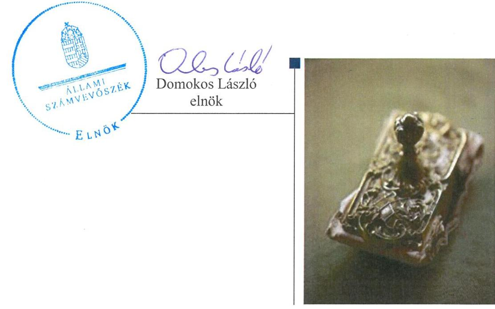

---

# AZ ELLENŐRZÉST FELÜGYELTE: 

SALAMON ILDIKÓ felügyeleti vezető

## AZ ELLENŐRZÉST VEZETTE ÉS A VÉGREHAJTÁSÁÉRT FELELŐS:

DR. SCHREIBER JUDIT ellenőrzésvezető

## A PROGRAM ÖSSZEÁLLÍTÁSÁÉRT FELELŐS:

LAJTERNÉ HUDÁK MAGDOLNA osztályvezető

IKTATÓSZÁM: V-0855-388/2016.
TÉMASZÁM: 1889
ELLENŐRZÉS-AZONOSÍTÓ SZÁM: V070904

---

# TARTALOMJEGYZÉK 

■ ÖSSZEGZÉS ..... 5
■ AZ ELLENŐRZÉS CÉLJA ..... 7
■ AZ ELLENŐRZÉS TERÜLETE ..... 8
■ AZ ELLENŐRZÉS HÁTTERE, INDOKOLTSÁGA ..... 9
■ FÓKUSZKÉRDÉSEK ..... 10
■ ELLENŐRZÉS HATÓKÖRE ÉS MÓDSZEREI ..... 11
■ MEGÁLLAPÍTÁSOK ..... 13
■ JAVASLATOK ..... 32
■ MELLÉKLETEK ..... 35
I. Sz. melléklet: Értelmező szótár ..... 35
II. Sz. melléklet: a Filmalap vagyonának alakulása 2011-2014. években (E Ft) ..... 38
III. Sz. melléklet: a Filmalap eredményének alakulása 2011-2014. években (M Ft) ..... 39
IV. Sz. melléklet: az értékvesztés alakulása (M Ft) ..... 40
V. Sz. melléklet: a Filmalap részesedései (M Ft) ..... 41
■ FÜGGELÉK: ÉSZREVÉTELEK ..... 43
■ RÖVIDÍTÉSEK JEGYZÉKE ..... 83

---

.

---

# ÖSSZEGZÉS 

Az Állami Számvevőszék a Magyar Nemzeti Filmalap Közhasznú Nonprofit Zrt. vagyonmegőrzési és gazdálkodási tevékenységét 2011. január 1. és 2014. december 31. közötti időszakra vonatkozóan ellenőrizte. Az MNV Zrt. mint tulajdonosi joggyakorló a vagyonnal való gazdálkodás feltételeit megfelelően alakította ki, a tulajdonosi döntések szabályosak voltak, hozzájárultak a vagyon értékének megőrzéséhez. A Filmalapnál a vagyongazdálkodás feltételeit meghatározó belső szabályozó rendszer kialakítása több területen nem felelt meg a jogszabályi előírásoknak, továbbá a számviteli nyilvántartásokban, valamint a közérdekü adatok közzétételénél is előfordultak hiányosságok. A Filmalap az éves beszámolási és adatszolgáltatási kötelezettségének szabályosan tett eleget, a vagyongazdálkodása és a vagyonváltozást eredményező döntések összességében szabályosak voltak.

## Az ellenőrzés társadalmi indokoltsága

Az állami tulajdonú gazdálkodó szervezetek a nemzeti vagyon részét képezik. Magyarországon az intézmény-centrikus közfeladat-ellátás, közvagyon gazdálkodás jellemző a költségvetésen kívüli feladatellátás térnyerése mellett. Ennek szereplői a nonprofit szervezetek, az önkormányzati tulajdonú gazdasági társaságok és az állami tulajdonú gazdálkodó szervezetek is. A tulajdonosi joggyakorlás és a vagyongazdálkodás feladata az állami vagyon rendeltetésének megfelelő, az állam mindenkori teherbíró képességéhez igazodó, elsődlegesen az állami feladatok ellátásához és a mindenkori társadalmi szükségletek kielégítéséhez, valamint a Kormány gazdaságpolitikája megvalósításának elősegítéséhez szükséges, egységes elveken alapuló, önálló ágazatként megjelenő - átlátható, hatékony és költségtakarékos működtetése, értékének megőrzése, állagának védelme, értéknövelő használata, hasznosítása és gyarapítása, továbbá az állam feladatának ellátása szempontjából feleslegessé váló vagyon-tárgyak elidegenítése. Az állami vagyonnal való gazdálkodást illetően a tulajdonosi joggyakorlás és a vagyongazdálkodás feladata az állami vagyon átlátható, rendeltetésszerű és felelős felhasználásának biztosítása. Az állam meghatározza az ellátandó közszolgáltatásokkal kapcsolatos feladatokat, amelyhez a vagyonnal kapcsolatos döntéseknek igazodniuk kell. A kormányzati szektorba sorolt, a költségvetési tervezésbe is bevont gazdálkodó szervezetek ellenőrzése fokozza a legfőbb ellenőrző szerv iránti figyelmet és közbizalmat. Az ellenőrzésünkkel feltárjuk, hogy a Filmalap, mint a kormányzati szektorba sorolt egyéb szervezet milyen mértékben befolyásolja a költségvetési hiányt és az államadósságot.

## Főbb megállapítások, következtetések, javaslatok

Az MNV Zrt. tulajdonosi joggyakorlása a Filmalap állami tulajdonú részesedése felett alapvetően szabályos volt. Kialakította a felelős gazdálkodáshoz szükséges követelményeket, meghatározta az állami vagyon értékmegőrzésére, gyarapítására vonatkozó előírásokat, valamint a tulajdonos számára fenntartott jogokat.

A vagyongazdálkodás feltételeit meghatározó belső szabályozó rendszer kialakítása több területen nem felelt meg a jogszabályi előírásoknak. A Filmalap a számviteli politika keretében elkészített szabályzatain jogszabályi változásokat nem vezetett át, továbbá csak a 2014. évtől rendelkezett Számlarenddel. Nem határozta meg a közhasznú és a vállalkozási tevékenysége bevételei és ráfordításai elkülönítésére vonatkozó belső szabályokat.

A Filmalap vagyongazdálkodása és a vagyonváltozást eredményező döntések szabályosak voltak. A filmszakmai támogatások nyújtására a nyertes pályázókkal kötött szerződések megfeleltek a Film tv., valamint a Támogatási Szabályzat előírásainak. Az állami forrásokból a filmszakmai támogatások finanszírozására és a saját müködésre kapott támogatásokra vonatkozóan kötött szerződések szabályosak voltak.

---

Az állami forrásból kapott támogatásokat a számviteli nyilvántartásokban keretösszegenként (filmszakmai támogatások nyújtására, múködésre kapott forrás) nem különítették el az erre vonatkozó szerződésekben foglaltak ellenére. A 2012. évben a részesedések, a 2013. évben a követelések értékvesztésének elszámolása nem felelt meg a Számv. tv. előírásainak. A közhasznú és a vállalkozási tevékenységek bevételeit és ráfordításait a jogszabályi rendelkezések szerint ugyan elkülönítették, belső szabályozás hiányában azonban nem volt megállapítható az elkülönítés tartalmának a megfelelősége, így nem volt biztosított az elszámolás átláthatósága. A Filmalap éves beszámolási és adatszolgáltatási kötelezettségének szabályosan tettek eleget, az éves beszámolók felügyelő bizottság és könyvvizsgáló általi felülvizsgálata megtörtént.

Az információs rendszer kialakítása megfelelő, annak múködtetése azonban hiányos volt, mivel az adatszolgáltatási és tájékoztatási kötelezettség keretében nem tették közzé a közérdekú adatok egyedi igénylésének szabályait, az igénybe vehető jogorvoslati lehetőségeket, valamint a megítélt támogatási összegeket.

A Filmalap a kapcsolt vállalkozásokban lévő részesedései értékének védelme érdekében meghatározta a vagyongazdálkodási követelményeket.

A Filmalapnál - a közvetlen Európai Uniós forrásból származó Media Desk támogatásokkal kapcsolatos visszafizetések (2,9 M Ft) kivételével - nem volt olyan gazdasági esemény, amely a kormányzati szektor hiányára hatást gyakorolt volna, adósságot keletkeztető ügyletet nem kötöttek, osztalékfizetésre nem került sor.

Az ÁSZ az MNV Zrt. vezérigazgatójának és a Magyar Nemzeti Filmalap NZrt. vezérigazgatójának fogalmazott meg javaslatokat, amelyekre 30 napon belül intézkedési tervet kell készíteniük.

---

# AZ ELLENŐRZÉS CÉLJA 

## A Magyar Nemzeti Filmalap Közhasznú Nonprofit Zrt. vagyonmegőrzési és gazdálkodási tevékenysége szabályszerűségének ellenőrzése

Jelen ellenőrzés célja annak értékelése volt, hogy a tulajdonosi jogok gyakorlása szabályszerű volt-e, a Filmalap által ellátott feladatok bevételei, ráfordításai elszámolásának és a vagyongazdálkodási tevékenységének a szabályozása megfelelt-e a jogszabályi és a tulajdonosi előírásoknak, valamint azok végrehajtása szabályszerű volt-e. Biztosítva volt-e a közfeladatok átláthatósága és elszámoltathatósága érdekében a közszolgáltatás dijának megalapozottsága szabályszerű önköltségszámítással. Az ellenőrzés kiterjedt továbbá arra is, hogy a vagyonváltozást eredményező döntések esetében a tulajdonosi jogok gyakorlója és a Filmalap szabályszerűen járt-e el, továbbá, hogy a Filmalap kiépítette-e és működtetett-e információs rendszert a szabályszerű vagyongazdálkodás érdekében. A Filmalapnak, mint kormányzati szektorba sorolt egyéb szervezet gazdálkodásának a kormányzati szektor hiányára és az államadósságra befolyással bíró elemei a jogszabályi előírásoknak megfeleltek-e.

---

# **AZ ELLENŐRZÉS TERÜLETE**

## **Magyar Nemzeti Filmalap Közhasznú Nonprofit Zrt.**

A Filmalap, mint kizárólagos állami tulajdonban lévő közhasznú nonprofit társaság 2011. június 1-jén jött létre. A Filmalap létrehozásának célja a magyar filmipar intézményi feltételrendszere megújításának, a magyar filmgyártás és filmforgalmazás állami feladatainak, továbbá a megszűnt Mozgókép Közalapítvány Kormány által meghatározott feladatainak ellátása. Az Alapítói jogokat az állami vagyon felügyeletéért felelős miniszter az MNV Zrt. útján gyakorolta. A Filmalap fő feladata az állami támogatási források, a saját forrásai felhasználásával befektetőként, illetve a mindenkori költségvetési törvényben a magyar filmgyártás támogatására szánt, meghatározott állami források elosztójaként támogatások nyújtásával és saját produkciók előállításával, vagy a legyártandó filmalkotás felhasználási jogainak előzetes megvásárlása útján a kulturális követelményeknek megfelelő, értékhordozó magyar, illetve a magyar részvételű nemzetközi koprodukciós filmalkotások megszületését támogassa.

A Filmalapnak, mint kormányzati szektorba sorolt egyéb szervezetnek az adósságot keletkeztető ügylete, gazdálkodásának eredménye befolyásolja a kormányzati szektor konszolidált adósságmutatóját, illetve a kormányzati hiányt.

A mozgóképszakmai támogatások nyújtása pályáztatás keretében közvetlen, vissza nem térítendő és közvetett, visszatérítendő pénzbeli támogatás formájában történt. A Filmalap 2014. december 31-ig 25 608,8 M Ft állami támogatást kapott. A filmszakmai támogatásra kapott összeg a 2011. évben nem került felhasználásra, a 2012. évben 797,1 M Ft, a 2013. évben 3800,7 M Ft, a 2014. évben 3335,6 M Ft került pályázat alapján folyósításra összesen 258 megkötött szerződés alapján. A 2014. év végén a még fel nem használt, kiosztható támogatások összege – az egyéb növelő bevételekkel együtt – 10 862,7 M Ft volt.

1. ábra

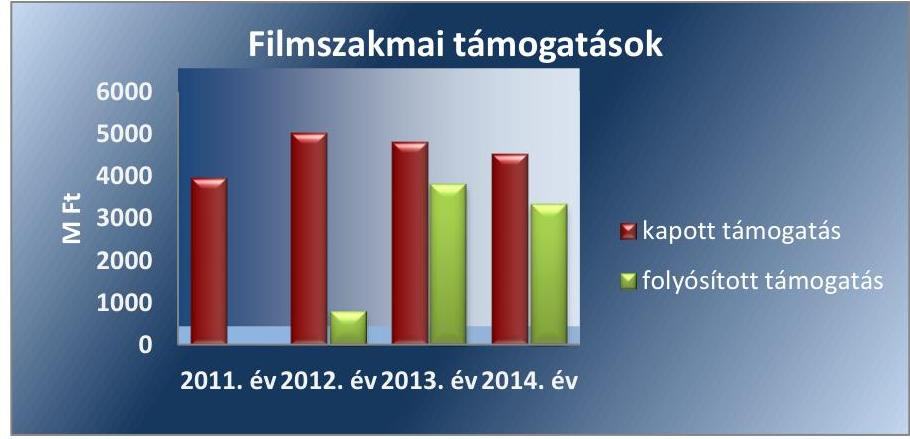

*Forrás: Filmalap 2011-2014. évi beszámolói*

---

# AZ ELLENŐRZÉS HÁTTERE, INDOKOLTSÁGA 

## A magyar filmipar intézményi feltételrendszere megújult

A magyar filmgyártás és filmforgalmazás állami feladatainak ellátására és a megszűnő Mozgókép Közalapítvány Kormány által meghatározott feladatainak átvétele érdekében a Magyar Állam létrehozta a Magyar Nemzeti Filmalap Közhasznú Nonprofit Zrt.-t. A Filmalap az állami támogatási források és a saját forrásai felhasználásával, mint a támogatások elosztója segíti elő a magyar filmalkotások megszületését, amely jogszabályi hátterét a Mozgóképről szóló 2004. évi II. törvény és az Európai Bizottság által jóváhagyott magyar állami filmtámogatási program adja. Az ÁSZ stratégiájában meghatározott célokkal összhangban, az államháztartáson kívülre nyújtott költségvetési támogatások és ingyenes vagyonjuttatások ellenőrzése keretében értékeltük a Filmalap vagyongazdálkodását és a közpénzek rendezett módon történő, átlátható felhasználását.

Az Áht2 2. § I) pontja, az Európai Közösséget létrehozó szerződéshez csatolt, a túlzott hiány esetén követendő eljárásról szóló jegyzőkönyv alkalmazásáról szóló 2009. május 25-i 479/2009/EK rendelet szerint, illetve az ESA95 statisztikai módszertana alapján a kormányzati szektorba tartoznak a "központi kormányzat alszektorba besorolt társaságok és egyéb szervezetek" is, amelyekkel szemben alapvető követelmény, hogy gazdálkodásuk, múködésük szabályszerű, az általuk szolgáltatott adatok megbízhatóak legyenek. A nemzeti számlák nemzetközi és hazai statisztikai módszertana és szabványai elveket határoznak meg a statisztikai értelemben vett kormányzati szektorba tartozó szervezetek körére és besorolásuk módjára. A nemzetgazdasági miniszter közzététele alapján a Filmalap is a kormányzati szektorba tartozó egyéb szervezetnek minősül.

A törvényalkotás számára - az észlelt problémák, szabálytalanságok, vagy egyéb nem kívánatos jelenségek felszínre kerülésével - az ellenőrzés megállapításai segítséget nyújthatnak az államháztartáson kívüli közfel-adat-ellátáshoz, a közvagyonnal való gazdálkodás értékeléséhez, a jogszabályi keretek pontosításához, továbbá elősegítik az átláthatóságot, a költségtakarékos múködtetést, az értékmegőrzést, az állagvédelmet, az értéknövelő használatot, valamint a hasznosítást és gyarapítást biztosító szabályozást. Meghatározhatóvá válnak a költségvetési hiányt befolyásoló szervezetek kockázatai, lehetővé válik ezen kockázatok csökkentése. Feltárjuk, hogy a kormányzati szektorba sorolt egyéb szervezetek milyen mértékben befolyásolják a költségvetési hiányt és az államadósságot. Az ellenőrzés rámutathat az államháztartásból származó források felhasználásával kapcsolatos jó gyakorlatokra és szabálytalanságokra. Felhívhatja a figyelmet a jogszabályi követelmények teljesítéséhez szükséges feltételek hiányosságaira, hozzájárulhat az államháztartáson kívüli, de (közvetlenül vagy közvetve) állami vagyont használó gazdálkodó szervezetek tevékenységének átláthatóságához. Az ÁSZ értékteremtő rend kialakításához és megőrzéséhez hozzájáruló tevékenysége pozitív hatással van a szervezetről kialakított összkép formálására is.

---

# FÓKUSZKÉRDÉSEK 

1.     - A tulajdonosi joggyakorló a Filmalap vagyonnal való gazdálkodásának feltételeit szabályszerűen alakította-e ki?
2.     - A Filmalap vagyongazdálkodási tevékenységének kialakítása, szabályozása, a vagyon nyilvántartása megfelelt-e az előírásoknak?
3.     - A Filmalap által ellátott közfeladatok bevételeinek és ráfordításainak elszámolása és szabályozása, valamint az önköltségszámítás szabályszerű volt-e?
4.     - A vagyonnal való gazdálkodás, valamint a vagyonváltozást eredményező döntések megfeleltek-e a jogszabályi és a belső előírásoknak?
5.     - A Filmalap a szabályszerű vagyongazdálkodás érdekében az adatszolgáltatási és beszámolási kötelezettséget teljesítette-e, kiépített-e és müködetett-e információs rendszert?
6.     - A kormányzati szektorba sorolt egyéb szervezetek gazdálkodásának a kormányzati szektor hiányára és az államadósságra befolyással bíró elemei a jogszabályi előírásoknak megfelel-tek-e?

---

# ELLENŐRZÉS HATÓKÖRE ÉS MÓDSZEREI 

## Az ellenőrzés típusa

Szabályszerúségi ellenőrzés

## Az ellenőrzött időszak

2011. január 1. - 2014. december 31. közötti időszak

## Az ellenőrzés tárgya

Az állami tulajdonban (résztulajdonban) lévő gazdálkodó szervezetek vagyonmegőrzési és gazdálkodási tevékenységének ellenőrzése, valamint a kormányzati szektor hiányára és adósságállományára hatást gyakorló elemek ellenőrzése

## Az ellenőrzött szervezet

Magyar Nemzeti Filmalap Közhasznú Nonprofit Zrt., Magyar Nemzeti Vagyonkezelő Zrt.

## Az ellenőrzés jogalapja

Az ellenőrzés alapját az Állami Számvevőszékről szóló 2011. évi LXVI. törvény 5. § (3)-(5) bekezdése, valamint az állami vagyonról szóló 2007. évi CVI. törvény 3. § (4) bekezdése képezi.

## Az ellenőrzés módszerei

Az ellenőrzés az INTOSAI által kiadott nemzetközi standardok figyelembevételével, az ÁSZ ellenőrzés szakmai szabályait tartalmazó belső szabályzatokban foglaltak, valamint az ellenőrzési programokban foglalt értékelési szempontok szerint történt. A bevételek és ráfordítások elszámolása, valamint a vagyonnyilvántartás terén a szabályszerű múködést mintavétellel ellenőriztük. A Filmalapnál, mint a kormányzati szektorba sorolt gazdálkodó szervezetnél a személyi jellegú ráfordítások elszámolása mellett az egyéb ráfordítások, pénzügyi műveletek ráfordításai, rendkívüli ráfordítások, illetve az egyéb bevételek, pénzügyi műveletek bevételei, rendkívüli bevételek elszámolásának szabályszerűségét szintén mintatételeken keresztül ellenőriztük. A véletlen mintavétellel (évenkénti elemszámmal ará-

---

nyos rétegezéssel) ellenőrzött területek esetében minden egyes tétel vonatkozásában a szabályszerűségre vonatkozó kérdéseket tettünk fel, amelyek eredményét összesítettük. A jogszabályoknak és a belső előírásoknak megfelelőnek tekintettük az adott területet, amennyiben a minta ellenőrzésének eredménye alapján 95\%-os bizonyossággal a teljes sokaságban a hibaarány kisebb volt, mint 10\%, nem megfelelőnek értékeltük, ha a hibaarány a 10\%-ot meghaladta. A személyi jellegű ráfordítások esetében az ellenőrzött mintatételeket értékeltük. A ráfordítások elszámolására és a vagyonnyilvántartásra vonatkozó véletlen mintavételt kockázati alapú kiválasztással egészítettük ki, amelynek során évente a három legnagyobb összegű tételt választottuk ki.

---

# 1. A tulajdonosi joggyakorló a Filmalap vagyonnal való gazdálkodásának feltételeit szabályszerűen alakította-e ki? 

Összegző megállapítás

Az MNV Zrt. ${ }^{1}$ - mint az állami tulajdonú részesedés feletti tulajdonosi joggyakorló - a Filmalap ${ }^{2}$ vagyongazdálkodásának feltételeit szabályszerűen alakította ki.
1.1. számú megállapítás

Az MNV Zrt. az állami vagyon értékmegőrzésére, gyarapítására vonatkozó előírásokat, valamint a felelős gazdálkodáshoz szükséges követelményeket meghatározta. A Filmalap - az MNV Zrt. által jóváhagyott - Stratégiai tervének ${ }^{3}$ egy pontja nem volt összhangban a Civil tv. ${ }^{4}$-ben foglaltakkal.

AZ MNV ZRT. A TULAJDONOSI JOGGYAKORLÁS KERETÉBEN a Filmalap Alapító Okiratában ${ }^{5}$ határozta meg a Vtv. ${ }^{6}$ 30. § (1) bekezdés előírásának megfelelően a közérdek érvényesülését biztosító vagyongazdálkodás érdekében a vállalkozási tevékenység korlátait, a nyereség felosztásának tilalmát, a befektetések eredményének közhasznú célokra történő felhasználási kötelezettségét, továbbá megtiltotta a váltó és hitelviszonyt megtestesítő értékpapír kibocsátását.

A FELELŐS GAZDÁLKODÁS ÉRDEKÉBEN az MNV Zrt. a Filmalap Alapító Okiratában követelményként fogalmazta meg az Európai Bizottság által jóváhagyott állami filmtámogatási programnak és az MNV Zrt. által jóváhagyott Támogatási Szabályzatnak ${ }^{7}$ való kötelező megfelelést.

A Filmalap Alapító Okiratában határozták meg tulajdonosi joggyakorló számára fenntartott vagyongazdálkodási jogokat, továbbá a vezető tisztségviselők feladatait, hatáskörét, beszámolási kötelezettségét, valamint az $\mathrm{FB}^{8}$-re és a könyvvizsgálóra vonatkozó előírásokat.

A SZABÁLYSZERŰ VAGYONGAZDÁLKODÁS ÉRDEKÉBEN az Alapító Okirat előírta az államháztartás alrendszereiből kapott támogatásokra vonatkozó szerződéskötési kötelezettséget, továbbá az állami támogatással való elszámolás határidejét, feltételeit és módját.

Az MNV Zrt. a közfeladat-ellátás finanszírozási és vagyoni hátterének megteremtésével biztosította a közfeladat-ellátás alapvető feltételeit. A Filmalap feladatellátását biztosító vagyont az alapításkor rendelkezésre bocsátott tőke, a gazdálkodás során szerzett vagyon, valamint a Mozgókép Közalapítvány ${ }^{9}$ konszolidációja során átvett vagyon alkotta.

---

1. táblázat

ADMINISZTRÁCIÓS DÍJAK MEGOSZLÁSA (M FT)

|  Év | Közhazing | Vállalkozás  |
| --- | --- | --- |
|  2011. | 0 | 0  |
|  2012. | 0 | 22,0  |
|  2013. | 5,0 | 139,7  |
|  2014. | 2,2 | 238,4  |

Forrás: Filmalap 2011-2014. évi beszámolói

### 1.2. számú megállapítás

A szabályszerű vagyongazdálkodás érdekében éves üzleti tervkészítési, valamint kötelező szabályzatkészítési kötelezettséget írt elő. Ennek keretében a Filmalap Alapító Okiratának 3.1. pontjában előírta a Támogatási Szabályzat, a 3.7. pontjában a Befektetési Szabályzat ${ }^{10}$, a 7.3. pont 14. szakaszában a Javadalmazási Szabályzat készítésének kötelezettségét. Az MNV Zrt. a szabályzatokat Alapítói Határozatokkal fogadta el. A vagyon változását eredményező döntések előkészítésével kapcsolatos követelményeket a Filmalap Alapító Okiratában, valamint a Befektetési Szabályzatában határozott meg.

Az MNV Zrt. eleget téve a Vtv. 2. § (1) bekezdésében és a 30. § (1) bekezdésében foglaltaknak, a 119/2011. (V. 23.) Alapítói Határozatában előírta az elvárásokkal, célokkal összhangban lévő Stratégiai terv készítésének kötelezettségét. A 2012-2014. évekre vonatkozó Stratégiai tervet a 234/2011. (VIII. 4.) számú Alapítói Határozattal elfogadta. A Stratégiai tervben meghatározott az adminisztrációs díjbevétel vállalkozási tevékenység bevételei közé sorolása nem felelt meg a Filmalap Alapító Okiratában és a Civil tv. 2. § 20. pontjában foglalt előírásnak, mert a filmszakmai támogatások nyújtása, folyósítása, azok felhasználásának ellenőrzése a forgalmazás támogatásáig a Filmalap közfeladatához kapcsolódott.

Az MNV Zrt. és a Filmalap között létrejött Támogatási Szerződések ${ }^{11}$ szabályosak voltak. A Filmalap és a nyertes pályázók közötti Támogatási Szerződések ${ }^{12}$ megfeleltek a Film tv. ${ }^{13}$, valamint az MNV Zrt. által jóváhagyott Támogatási Szabályzat ${ }^{14}$ előírásainak.

A Filmalap az NGM ${ }^{15}$-mel és az MNV Zrt.-vel kötött Támogatási Szerződések ${ }_{1}$ alapján 2011-2014. között $25608,8 \mathrm{M}$ Ft-ot kapott az állami költségvetésből. Ebből - az eredeti Támogatási Szerződések ${ }_{1}$-et figyelembe véve - 5970,0 M Ft-ot a Magyar Mozgókép Közalapítvány tartozásának rendezésére, megvásárlására, 15 884,6 M Ft-ot filmszakmai támogatásra, 2704,2 M Ft-ot saját múködésre, 1050,0 M Ft-ot pedig egyéb célokra használhatott fel. 2. ábra

## A Filmalap állami támogatásainak keretösszegenkénti eloszlása (M Ft)

$1050,0$ $5970,0$ $15884,6$ $2704,2$

- Egyéb célok
- MMK konszolidáció
- Saját működés
- Filmszakmai támogatás

Forrás: Filmalap 2011-2014. évi beszámolói Az MNV Zrt. az állami forrásból nyújtott támogatásokra vonatkozó Támogatási Szerződések ${ }_{1}$-ben meghatározta a folyósításra, elkülönítésre, elszámolásra, valamint az ellenőrzésre vonatkozó előírásokat. Meghatározta továbbá a Támogatási Szerződések ${ }_{1}$-ben a felhasználási keretösszegeket és időszakot.

---

A Filmalap a mozgóképszakmai célok támogatását a Film tv. 7. § (1) bekezdés a) pontja előírása szerinti közvetlen, és a Film tv. 7. § (1) bekezdés b) pontja előírása szerinti, kiegészítő támogatásból származó forrásból nyújtott közvetett támogatások biztosításával végezte.

A közvetett támogatások elosztásának szabályait a Film tv. 12. § (9)-(10) bekezdések előírásai rögzítették. A támogatás forrásának kezelésére vonatkozó szabályokat a Film tv. 31/D. § (7) bekezdése tartalmazta. A közvetlen támogatások elosztásának szabályairól a Film tv. 13-15. §-ai rendelkeztek.

Az ellenőrzött időszakban a Filmalap 7933,4 M Ft-ot fizetett ki filmszakmai támogatásra a pályázóknak.

A Filmalap a támogatások nyújtását a Támogatási Szabályzat és a Film tv. előírásainak betartásával végezte. A közvetlen támogatások a Film tv. 12. § (3) bekezdésében meghatározott mozgóképszakmai tevékenységekre irányultak, többek között filmterv-fejlesztésre, filmgyártásra, filmkópia felújításra és filmfesztiválon való részvételre. A pályázati és támogatási elveket, valamint a pályázatokra vonatkozó részletes szabályokat a Film tv.nek megfelelően az Alapító Okirat, valamint a Támogatási Szabályzat rögzítette. A támogatások pályázat vagy egyedi kérelem alapján történtek, visszatérítendő vagy vissza nem térítendő formában a Film tv. 13. §-a szerinti értékhatárokkal.
2. táblázat

FILMSZAKMAI TÁMOGATÁSOK FOLYÓSÍTÁSI ÖSSZEGEI

| Támogatás típusa | 2012 |  | 2013 |  | 2014 |  |
| :--: | :--: | :--: | :--: | :--: | :--: | :--: |
|  | szerző-   dések   (db) | támogatási összeg (MFT) | szerző-   dések   (db) | támogatási összeg (MFT) | szerző-   dések   (db) | támogatási összeg (MFT) |
| forgatókönyv fejlesztés | 40 | 85,5 | 23 | 85,0 | 31 | 93,9 |
| gyártás-előkészítés | 3 | 15,7 | 7 | 46,1 | 9 | 64,5 |
| filmgyártás | 5 | 571,0 | 20 | 3494,9 | 14 | 2949,0 |
| vizsgafilmek | 3 | 25,5 | 2 | 45,0 | 2 | 58,0 |
| egyéb támogatás | 45 | 99,4 | 18 | 129,7 | 36 | 170,2 |
| Összesen | 96 | 797,1 | 70 | 3800,7 | 92 | 3335,6 |

A nyertes pályázókkal a mozgóképszakmai támogatások nyújtására kötött Támogatási Szerződések2 megfeleltek a Film tv. 14-15. §-ban meghatározott támogatási elosztási szabályoknak, valamint a Film tv. 13. §-ban leírt támogatási értékhatároknak. A szerződések tartalmazták a Támogatási Szabályzat 24.3 pontjában leírt kötelező elemeket, így többek között a nyertes megnevezését, a támogatás célját, összegét, ütemezését, az elszámolás és ellenőrzés szabályait. A filmterv fejlesztésre nyújtott támogatások a Támogatási Szabályzat 8.1. pontjával összhangban történtek, a támogatási összegek nem haladták meg a szabályzatban megjelölt 7,5 M Ft-os értékhatárt. A filmgyártásra nyújtott támogatásokra kötött szerződések tartalmazták a Támogatási Szabályzat 10.3 pontjában meghatározott hasznosításból származó bevételek felosztását, valamint a 10.4 pont szerinti nemzetközi terjesztésre vonatkozó feltételeket.

---

# 1.3. számú megállapítás 

Az MNV Zrt. Vagyon-nyilvántartási Szabályzata ${ }^{16}$ megfelel a Vtv. és az Nvtv. előírásainak.

Az MNV Zrt. a Vtv. 17. § (1) bekezdés b) pontjában előírtak teljesítése érdekében elkészítette az állami vagyon nyilvántartására vonatkozó szabályzatát, amely megfelel a Vhr. ${ }^{17} 14 . \S(1)$-(3) bekezdései és a Nvtv. ${ }^{18} 10 . \S$ (1) bekezdés rendelkezéseinek, azonban a nyilvántartási szabályzat alkalmazása a Filmalapra vonatkozóan nem volt kötelező, mert a Filmalap nem volt állami vagyon vagyonkezelője, így vagyonkezelési szerződéssel sem rendelkezett.

Az MNV Zrt. az Alapító Okiratokban a szabályzattal összhangban határozta meg a Filmalap vagyon nyilvántartásának részletes tartalmát, formáját, valamint az adatszolgáltatás rendjét. Ennek keretében az MNV Zrt. előírta a filmszakmai támogatásokkal kapcsolatos nyilvántartási és adatszolgáltatási kötelezettségek Támogatási Szerződésben; történő rögzítését. Az MNV Zrt.-vel megkötött filmszakmai támogatásokra vonatkozó Támogatási Szerződések; előírták a támogatások elkülönített számlán tartását, keretösszegenkénti elkülönített számviteli nyilvántartását és a támogatással kapcsolatos adatszolgáltatási és elszámolási kötelezettséget.

## 2. A Filmalap vagyongazdálkodási tevékenységének kialakítása, szabályozása, a vagyon nyilvántartása megfelel-e az elóírásoknak?

Összegző megállapítás

A Filmalap a vagyona értékének megőrzését és gyarapítását biztosító vagyongazdálkodás feltételeit hiányosan alakította ki. A szabályzatokat - a Számviteli Politika ${ }^{19}$ és a Pénzkezelési Szabályzat ${ }^{20}$ kivételével - nem aktualizálták. A vagyon nyilvántartása az állami támogatások keretösszegenkénti elkülönítésének hiánya, valamint a 2012-2013. években az értékvesztések elszámolása tekintetében nem volt szabályszerű. A Stratégiai terv egy pontja nem volt szabályszerű.

A Filmalap a szabályszerű vagyongazdálkodás feltételeit hiányosan alakította ki, mert a 2011-2013. évre vonatkozó Számlarendet, a 2014. évre az Önköltség-számítási szabályzatot nem készítették el, a Számviteli Politika és a Pénzkezelési Szabályzat kivételével a szabályzatokat nem aktualizálták. Az MNV Zrt. által előírt szabályzatkészítési és tervkészítési kötelezettségnek eleget tettek. A Stratégiai tervben az adminisztrációs díjak elszámolását a vállalkozási tevékenységek bevételei körében írták elő, ami nem volt összhangban a Civil tv. 2 rendelkezéseivel.

Az MNV Zrt. által előírt szabályzatkészítési kötelezettségnek eleget téve a 2012-2014. évekre vonatkozó Stratégiai tervet a Filmalap elkészítette, amelyet az MNV Zrt. jóváhagyott. Az Alapító Okiratban megfogalmazott elvárásokkal, célokkal összhangban lévő Stratégiai terv tartalmazta a Film-

---

alap megalakításának előzményeit és tervezett szerepét, valamint a filmszakmai elképzeléseit, fő célkitűzéseit. Ezen belül meghatározták az új támogatási struktúra működtetését, a magyar filmek hazai és nemzetközi népszerűsítése és hasznosítása keretében végzendő feladatokat. A Filmalap a Stratégiai tervvel összhangban elkészítette az éves üzleti terveit, amelyeket az MNV Zrt. minden évben jóváhagyott.

A Filmalap, az Alapító Okirata szerint elkészítette az MNV Zrt. által a szabályszerű vagyongazdálkodás követelményei megteremtésének körében előírt Támogatási Szabályzatot, a Befektetési Szabályzatot, valamint a Javadalmazási Szabályzatot. Az MNV Zrt. a szabályzatokat Alapítói Határozatokkal elfogadta.

A Filmalap rendelkezett a Számv. tv. 14. § (3) bekezdés előírásának megfelelően Számviteli Politikával.

A Filmalap 2011-2013. években a Számv. tv. 161. § (1) bekezdés előírásától eltérően nem rendelkezett Számlarenddel, továbbá 2014. évtől nem készítették el a Számv. tv. 14. § (5) bekezdés c) pontjában előírt Önköltségszámítás rendjére vonatkozó szabályzatot. A 2014. január 1-jétől hatályos Számlarend, a Számv. tv. 161/A. § (2) bekezdésében foglaltaktól eltérően nem tartalmazta a Civil tv. 27. § (1) bekezdésében előírt vállalkozási és közhasznú tevékenységből származó bevételek és költségek, ráfordítások elkülönített nyilvántartásának alapját, felosztási elvét, eljárásrendjét.

A Filmalap rendelkezett Leltárkészítési és leltározási Szabályzattal a Számv. tv. 14. § (5) bekezdés a) pontjának megfelelően. A szabályzatban meghatározták a leltározási, a leltáregyeztetési kötelezettség módját és formáját. A szabályzatot a Számv. tv. 14. § (11) bekezdésben foglaltak ellenére nem aktualizálták. A szabályzat mennyiségi felvétellel történő leltározási kötelezettségre vonatkozó ötévenkénti előírása 2012. évtől nem felelt meg a Számv. tv. 69. § (3) bekezdésében foglalt, legalább háromévenkénti mennyiségi felvétellel történő leltározási kötelezettségnek.

A Filmalap elkészítette a Számv. tv. 14. § (5) bekezdés b) pontja alapján az Értékelési Szabályzatát. A szabályzat aktualizálására a Számv. tv. 14. § (11) bekezdésben foglaltak ellenére nem került sor. Ezért az immateriális javak bekerülési értékének és értékcsökkenésének elszámolásában történt 2012. évi jogszabályi változásokat a szabályzat nem tartalmazta.

A Filmalap a Számv. tv. 14. § (5) bekezdés d) pontjában foglalt előírásoknak eleget téve, rendelkezett Pénzkezelési Szabályzattal. A szabályzat a Számv. tv. 167. § (1) bekezdés c) pontjában, valamint a Számv. tv. 2012. december 1-jéig hatályos 14. § (9)-(10) bekezdéseiben, illetve a 2012. december 2-ától a 14. § (8) bekezdésében foglaltaknak megfelelően tartalmazta a pénzforgalom lebonyolításának rendjét, a pénzkezelés személyi és tárgyi feltételeit, felelősségi szabályait. Szabályozták továbbá a készpénzben és a bankszámlán tartott pénzeszközök közötti forgalmat, a készpénzállományt érintő pénzmozgások jogcímeit és eljárás rendjét, a napi készpénz záró állomány maximális mértékét, az ellenőrzés gyakoriságát, a pénzszállítás feltételeit, a pénzkezeléssel kapcsolatos bizonylatok rendjét és a pénzforgalommal kapcsolatos nyilvántartási szabályokat.

A Filmalap a Stratégiai tervben az általa nyújtott támogatások után felszámított (2,5\%) adminisztrációs díjból származó bevételek elszámolását teljes egészében a vállalkozási tevékenységek bevételei között írta elő azzal, hogy az a Filmalap által támogatott filmalkotások során a projektfej-

---

lesztéstől a marketing munkák lezárásáig betöltött szerepvállalás ellenértéke. Ez az előírás nem volt összhangban a Civil tv. 2 2. § 20. pontjával, amely szerint minden olyan tevékenység, amely az Alapító Okiratban megjelölt közfeladat teljesítését közvetlenül vagy közvetve szolgálja, az közhasznú tevékenység. A Filmalap Alapító Okirat 3. pontja tételesen meghatározta a közhasznú és a vállalkozási tevékenységeket. A filmszakmai támogatások nyújtása, folyósítása és azok felhasználásának ellenőrzése, valamint a forgalmazásának támogatása a Filmalap közfeladata, így a projektek lezárásáig végzett tevékenységek után felszámított adminisztrációs díj a közfeladathoz kapcsolódott.

A Filmalap a vagyongazdálkodással kapcsolatos feladat- és hatásköröket, felelősségi viszonyokat az Alapító Okirattal összhangban az SZMSZben $^{21}$ szabályozta.

# 2.2. számú megállapítás 

A Filmalap vagyonának számviteli nyilvántartása részben volt szabályszerű. A 2012. évben a részesedések után elszámolt értékvesztés bizonylati alátámasztottsága, a 2013. évben pedig a követelések értékvesztésének elszámolása nem felelt meg a Számv. tv. rendelkezéseinek. Az állami forrásból kapott támogatások könyvviteli nyilvántartása nem felelt meg a Támogatási Szerződésekben; előírt, keretösszegenkénti elkülönítési kötelezettségnek.

A Filmalap állami tulajdonú eszközt nem kezelt, ezért a Vhr. 17. § (1) bekezdésében foglaltak szerinti, az eszközök elkülönített nyilvántartására vonatkozó szabályokat nem kellett alkalmaznia.

A Filmalap a HUNNIA Kft. ${ }^{22}$ feletti tulajdonosi jogokat az MNV Zrt.-vel kötött Megbízási szerződés alapján gyakorolta, amely megfelelt az Nvtv. 8. $\S$ (7) bekezdés előírásának. Az Nvtv. 8. § (7) bekezdése alapján megkötött, a tulajdonosi jog átruházását tartalmazó Megbízási szerződésben az MNV Zrt. előírta a HUNNIA Kft. részesedése, mint állami vagyon vonatkozásában a Vtv. 23. § (2) bekezdés előírásának megfelelő, állami vagyonnal való gazdálkodás elvárt követelményeit. A Megbízási szerződésben az MNV Zrt. magánál tartott egyes, a HUNNIA Kft., mint állami vagyon vagyongazdálkodásával kapcsolatos döntéshozatali jogokat, továbbá szabályozták a vagyon értékének nyomon követéséhez szükséges adatszolgáltatás rendjét. Az MNV Zrt. a Megbízási szerződésben a Vtv. 17.§ (1) bekezdés d) pontja és a Vhr. 20. § (1) bekezdés előírásának megfelelően előírta a vagyon feletti tulajdonosi ellenőrzési jogot.

RÉSZESEDÉSEKKEL a Filmalap a 2011. évben nem rendelkezett, a 2012. évben két részesedést szerzett a Mozgókép közalapítvány konszolidációja során. A Mafilm ${ }^{23}$ Zrt. 100 \%-os tulajdoni részesedését 1555,0 M Ft értékben és a Filmlabor Kft. ${ }^{24} 100 \%$-os tulajdoni részesedését 113,0 M Ft értékben. A Filmalap a Cégbírósági bejegyzés alapján a két részesedést 2012. október 12-től mutatta ki a számviteli nyilvántartásában.

A Filmalap a 2012. december 31-ei számviteli értékelés során a két részesedésre összesen 438,4 M Ft értékvesztést számolt el. A Mafilm Zrt. 1555,0 M Ft tulajdoni részesedéshez kapcsolódóan 325,4 M Ft, a Filmlabor Kft. 113,0 M Ft tulajdoni részesedéshez 113,0 M Ft értékvesztést számolt el. Az értékvesztés elszámolását a Számv. tv. 165. § (1)-(2) bekezdése és a Számviteli Politika 2.1.3. pontja szerinti bizonylattal nem támasztották alá.

---

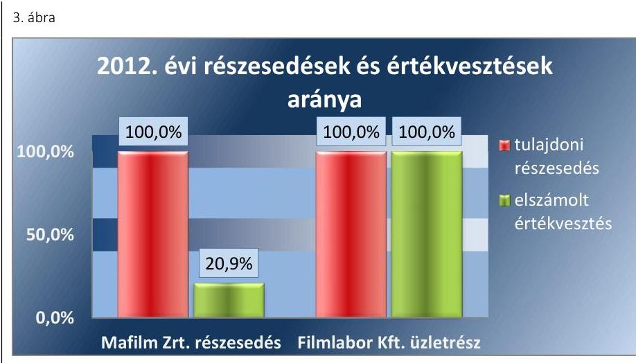

Fonrás: Filmalap 2011-2014. évi beszámolói
A részesedések belső szerkezete a 2013. évben megváltozott, amelynek oka, hogy a Mafilm Zrt., és a Filmlabor Kft. a 2013. június 26-án kelt Egyesülési Szerződés alapján a Filmalapba beolvadtak. A beolvadás dokumentumait független könyvvizsgáló véleményezte, továbbá az FB 2013. június 13-ai ülésén jóváhagyásra javasolta. A beolvadással kapcsolatos 315/2013. (VI. 25.) tulajdonosi döntést a 2013. június 25-ei MNV Zrt. Igazgatósági előterjesztése és a 461/2013. (VI. 25.) MNV Zrt. Igazgatósági Határozata előzte meg.

A beolvadást követően a Mafilm Zrt. és a Filmlabor Kft. tulajdoni részesedései a Filmalap befektetései közé kerültek.

A Filmalap részesedései és a részesedések aránya 2013. december 31-én:
—Mafilm Nonprofit Zrt. 100 \%
—Mafilm Szcentika Kft. f.a. 51,2 \%
—Mafilm Audió Kft. 41,6 \%
—Mafilmrent Kft. 100 \%
—Mafilm Invest Kft. f.a. 97,8 \%
—Mafilm Profilm Kft. 90,0 \%
—Filmlabor Services Kft. 100 \%
—KREATÍV Európa Nonprofit Kft. 100 \%
—Mafilm Média Center Egyesülés 100 \%
A beolvadást követően a Filmalaphoz került részesedések a Számv. tv. 27. § (1) bekezdés előírásának megfelelően a befektetett pénzügyi eszközök között szerepeltek. A Filmalap három befektetése (a Mafilm Szcenika Kft.-ben, a Mafilm Invest Kft.-ben és a Mafilm Profilm Kft.-ben meglévő részesedés) esetében felszámolási eljárás, illetve tevékenység megszűnése miatt 2013. évben 100 \%-os értékvesztést, 94 M Ft-ot számolt el, amely megfelelt a Számv. tv. 46. § (4) és az 54. § (1) bekezdésében foglalt, az értékvesztés elszámolására vonatkozó előírásnak.

A Filmalap 2013. december 11-én alapította meg a KREATÍV Európa Nonprofit Kft.-ét, amelynek $100 \%$-os tulajdonával rendelkezett, jegyzett tőkéje 0,5 M Ft volt. A tulajdoni részesedést a 2013. évi mérlegben a Számv. tv. 27. § (1) bekezdés előírásának megfelelően a befektetett pénzügyi eszközök között szerepeltette.

---

3. táblázat

| ELSZÁMOLT ÉRTÉKVESZTÉS ÉS |  |  |
| :--: | :--: | :--: |
| VISSZÁRÁS (M FT) |  |  |
| Én | Elszámolt értékvesztés | Értékvesztés visszaírása |
| 2011. | - | - |
| 2012. | 64,0 | - |
| 2013. | 271,0 | 135,0 |
| 2014. | - | 137,9 |
| Összesen | 335,0 | 272,9 |

Forrás: Filmalap 2011-2014. évi beszámolói

AZ ÉRTÉKVESZTÉSEK elszámolása során a Filmalap a követelések között kimutatott, a filmjogok vásárlására kifizetett összegek után 2011-2014. évek között összesen 335,0 M Ft-ot számolt el. Ebből 253,1 M Ft összegű értékvesztést 2013. szeptember 30-án számoltak el, amely nem felelt meg az Számv. tv. 55. § (1) bekezdés előírásának, mert arra nem a mérlegkészítés időpontjában rendelkezésre álló információk figyelembevételével került sor.

A 2013. év végén 135,0 M Ft értékvesztés visszaírása történt annak ellenére, hogy a 2012. évben az elszámolt értékvesztés összege 64,0 M Ft volt. A visszaírás összegéből megállapítható, hogy a 2013. évben elszámolt értékvesztést adott éven belüli értékvesztés visszaírásával csökkentették, így az elszámolt értékvesztés a 2013. évben nem felelt meg a Számv. tv. 55. § (1) bekezdésében foglalt azon előírásoknak, hogy értékvesztést akkor lehet elszámolni, ha a különbözet tartósnak mutatkozik.

Az MNV Zrt. által a Filmalap részére a filmszakmai támogatások nyújtásához biztosított állami források felhasználására vonatkozó Támogatási Szerződések; 4. pontja keretösszegenkénti elkülönítési köztelezettséget írt elő (filmszakmai támogatások nyújtása, saját múködés finanszírozása, konszolidáció, egyéb felhasználás), azonban a Filmalap a számviteli nyilvántartásában csak szerződésenkénti elkülönítést alkalmazott, amely nem felelt meg a szerződésekben foglaltaknak.

A Filmalap a leltározási kötelezettségének a Számv. tv. 69. § (3) bekezdésében foglalt előírásoknak megfelelően a 2013. évben eleget tett, az éves mérlegtételeket a Számv. tv. 69. § (1)-(2) bekezdéseiben foglaltaknak megfelelően leltárral alátámasztotta.

# 3. A Filmalap által ellátott közfeladatok bevételeinek és ráfordításainak elszámolása és szabályozása, valamint az önköltségszámítás szabályszerű volt-e? 

Összegző megállapítás

A Filmalap az ellátott közhasznú, valamint a vállalkozási tevékenység bevételeit és ráfordításait elkülönítetten számolta el, azonban szabályozás hiányában nem volt biztosított az elkülönítés átláthatósága. Önköltségszámítási szabályzatot nem készítettek.
3.1. számú megállapítás

A Filmalap a közhasznú, illetve a vállalkozási tevékenységének bevételeit és ráfordításait a Civil tv. 2 szerint elkülönítetten számolta el, azonban az elkülönítést belső szabályzataiban nem szabályozta, nem határozta meg az elkülönítés alapját, módját és eljárásrendjét, így nem volt megállapítható az elszámolás szabályszerűsége, nem volt biztosított az elkülönítés átláthatósága.

A Filmalap közhasznú bevétele 2011-2014 között összesen 11 314,7 M Ft, vállalkozási bevétele 2842,4 M Ft volt. A közhasznú tevékenység ráfordítása 10 817,1 M Ft-ot, míg a vállalkozási tevékenység összes ráfordítása 2385,9 M Ft-ot tett ki.

---

4. táblázat

| MÉRLEG SZERINTI EREDMÉNY |  |  |  |
| :--: | :--: | :--: | :--: |
| MEGOSZLÁSA (M FT) |  |  |  |
|  | 2012 | 2013 | 2014 |
| közhasznú tevékenység | 428,3 | 49,1 | 20,9 |
| vállalkozási tevékenység | 4,7 | 155,6 | 267,2 |
| Összesen | 433,0 | 204,8 | 288,1 |

A közhasznú tevékenységéből, illetve a vállalkozási tevékenységéből származó bevételei és ráfordításai elkülönítésének szabályait a Filmalap belső szabályzataiban nem határozta meg, így nem került rögzítésre az elkülönítés módja, eljárás rendje, a felosztás alapja. A Filmalap eleget tett a Civil tv. 27. § (1) bekezdésében előírtaknak, amikor a számviteli nyilvántartásaiban elkülönítve mutatta ki a Film tv. 9/B. §-ában meghatározott közfeladatai ellátásával kapcsolatos közhasznú tevékenységéből és a vállalkozási tevékenységéből származó bevételeit és ráfordításait, azonban a belső szabályozás hiánya miatt nem volt megállapítható az elszámolás tartalmának a szabályossága, ezért nem volt biztosított az elkülönítés átláthatósága.

A KÖNYVVITELI NYILVÁNTARTÁS vezetése keretében a bevételek elszámolása során a Filmalap a kapott támogatásokat a Számv. tv ${ }^{25}$. 77. § (2) bekezdés d) pontja előírásának megfelelően egyéb bevételként mutatta ki, azonban a támogatásokból a filmfelhasználási jog megszerzésére fordított összeget, mint fejlesztési célokra fordított felhasználást a Számv. tv. 86. § (4) bekezdés b) pontja előírásától eltérően nem vezették át a rendkívüli bevételek közé. A 2013-ban 215,0 M Ft, a 2014ben 218,0 M Ft összeget érintő átvezetés hiánya nem befolyásolta a Filmalap éves eredményét, mert a bevétel kategóriák közötti átvezetés maradt el.

A Filmalap a Támogatási Szabályzat 18.1 pontja alapján közvetlen filmszakmai támogatásokra, 2013 júliusától pedig a Film. tv. 31/D. § (10) bekezdés előírása alapján a közvetett támogatásokra is (a folyósított támogatás $2,5 \%$-ának megfelelő összegben) adminisztrációs díjat számított fel a támogatottak felé. A felszámított díjat a Filmalap a Civil tv. 2 szerint megosztotta a közhasznú és vállalkozási tevékenysége között, azonban - szabályozás hiányában - nem volt megállapítható a díjbevétel elkülönítésének megfelelősége.

A költségek elszámolása összességében megfelelő volt, azonban a Filmalap összesen 0,46 M Ft összegben az igénybevett szolgáltatást anyagkölt-

Forma: Filmalap 2011-2014. évi beszámolói

---

ségként számolta el, ami nem felelt meg a Számv. tv. 78. § (2) bekezdésének. A nem megfelelő költségnemekre történő könyvelés a Filmalap éves eredményét nem befolyásolta.

A Filmalap az értékcsökkenést a Számv. tv. 52. § (1) bekezdés előírását betartva a maradványértékkel csökkentett bekerülési érték alapján számolta el.

# 3.2. számú megállapítás 

A Filmalap a 2014. évtől az önköltségszámítás rendjére vonatkozó szabályzatkészítési kötelezettségének nem tett eleget.

A Filmalap a Számv. tv. 14. § (5) bekezdés c) pontjában foglaltaknak nem tett eleget, mert nem készítette el az önköltségszámítás rendjére vonatkozó szabályzatát annak ellenére, hogy 2014. évtől kezdődően a szabályzatkészítési kötelezettsége fennállt, mert a Számv. tv. 14. § (7) bekezdésében meghatározott, a költségnemek szerinti költségek együttes összege 2013. évben meghaladta az ötszázmillió forintos értékhatárt. A Filmalap által végzett szolgáltatások önköltségének meghatározása a 2014. évtől a Számv. tv. 14. § (7) bekezdés ellenére nem történt meg. A Filmalap közszolgáltatást nem végzett ezért ár-megállapítási kötelezettsége nem volt.

## 4. A vagyonnal való gazdálkodás, valamint a vagyonváltozást eredményező döntések megfeleltek-e a jogszabályi és a belső előírásoknak?

Összegző megállapítás

## 4.1. számú megállapítás

A Filmalap vagyongazdálkodása és a vagyonváltozást eredményező döntések előkészítése, megalapozása szabályszerű volt. Az MNV Zrt. vagyonváltozást eredményező döntései szabályosak voltak.

A Filmalap vagyongazdálkodási tevékenysége szabályszerű volt.
A Filmalap mérleg föösszege a 2011. évi 7592,2 M Ft-ról 2014. év végére 20 567,9 M Ft-ra emelkedett.
5. ábra
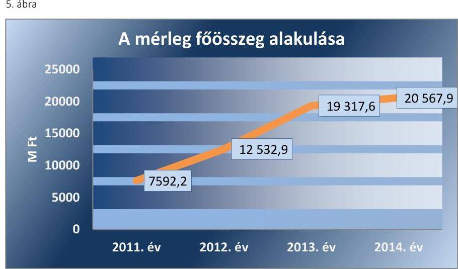

Forrás: Filmalap 2011-2014. évi beszámolói

---

A mérleg főösszeg változását a Mozgókép Közalapítvány konszolidációja keretében átvett eszközök (3 ingatlan, 2 tulajdoni részesedés, egyéb tárgyi eszközök és követelések) okozták. A növekedés további összetevője volt, hogy a filmszakmai támogatások nyújtására kapott források 2011. évben nem kerültek, 2012. évtől csak részben kerültek folyósításra.
6. ábra
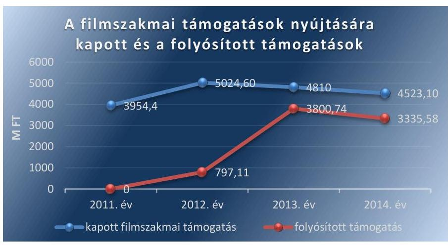

Forrás: Filmalap 2011-2014. évi beszámolói

A BEFEKTETETT ESZKÖZÖK növekedését a 2012. évben a Mozgókép Közalapítvány konszolidációja keretében átvett tárgyi eszközök okozták.

A vagyonváltozást eredményező döntések közül kiemelkedő volt a 3500 M Ft értékre tekintettel a Mozgókép Közalapítványhoz kapcsolódó konszolidáció. A konszolidációra vonatkozóan 2011-ben megjelent az 1202/2011. (VII. 21) ${ }^{26}$ Korm. határozat - módosítva az 1069/2012. (III. 20.) Korm. határozattal ${ }^{27}$ - amely elrendelte a Mozgókép Közalapítvány megszüntetését azzal, hogy a közfeladatokat a konszolidációt követően a Filmalap látja el. A kormányrendelet határozott arról is, hogy a Mozgókép Közalapítvány - a hitelezők kielégítése után fennmaradt - vagyona a Filmalaphoz kerüljön, amelynek felhasználása a Filmalap által a Mozgókép Közalapítvány céljához hasonló célra volt fordítható. A Filmalap konszolidációban történő részvétele a 2011. október 6-tól hatályos Alapító Okirat 3.3. pontjában rögzítésre került. A konszolidáció keretében a Filmalap részére az 1237/2011. (VII. 11.) ${ }^{28}$ Korm. határozat - és az azt módosító 1309/2011. (IX. 06.) ${ }^{29}$, Korm. határozat - alapján 2011. szeptember 22-én megkötött Támogatási Szerződés ${ }_{1}$ keretében 3500 M Ft-ot folyósított a Nemzetgazdasági Minisztérium. Az MNV Zrt. - a Nemzetgazdasági Minisztérium által biztosított 3500 M Ft felett - az 1238/2011. (VII. 11.) ${ }^{30}$, Korm. határozat alapján 2011. szeptember 14-én Támogatási Szerződést ${ }_{1}$ kötött a Filmalappal, amelyben további, 2470 M Ft átcsoportosítását rendelte el a Filmalap részére a Mozgókép Közalapítvány tartozásállományának megvásárlására. A Mozgókép Közalapítvány konszolidációja a kormányrendeletek szerint megtörtént, a 2470 M Ft nem került felhasználásra, így a vonatkozó Támogatási Szerződés ${ }_{1}$ 2012. augusztus 29-én módosításra került, és a Filmalap a módosított Támogatási Szerződésnek ${ }_{1}$ megfelelően az eredetileg a tartozásállomány megvásárlására biztosított támogatási összeg maradványát a filmszakmai támogatási keretösszeg növelésére fordította.

---

5. táblázat

|  | A FELÚJÍTÁSOK ÉS |  |
| :--: | :--: | :--: |
| ÉRTÉKCSÖKKENÉSEK (M FT) |  |  |
| Év | Elszámolt értékcsökkenés | Felújítások |
| 2011. | 0 | 0,4 |
| 2012. | 12,5 | 3,0 |
| 2013. | 68,3 | 58,0 |
| 2014. | 233,9 | 492,2 |

A FORGÓESZKÖZÖK között kimutatott értékpapírok 2012-2014. évi állományának növekedését a Filmalap filmszakmai támogatás elosztásra kapott, de kiosztásra nem került szabad pénzeszközök diszkontkincstárjegy formájában történt befektetése okozta. A Filmalap mérlegében 2012-ben 6485,1 M Ft, 2013-ban 5662,0 M Ft, és 2014-ben 7552,5 M Ft értékű diszkont kincstárjegy szerepelt. A filmszakmai támogatások nyújtására kapott, de fel nem használt pénzeszközöket a Filmalap diszkont kincstárjegyben tartotta az Államkincstárnál vezetett értékpapír számláján, amely nem biztosította a Támogatási Szerződések; Biztosítékok fejezetében előírt, az MNV Zrt. javára adott azonnali beszedési megbízás érvényesítésének lehetőségét a szerződés nem megfelelő teljesítése esetére.

A Filmalap a mozgóképszakmai támogatásokra kapott forrásokat elkülönített kincstári számlákon kezelte, azonban a múködése finanszírozására kapott támogatásokat kereskedelmi banknál vezetett számlán tartotta.

A forgóeszközök között kimutatott pénzeszközök 2013. évi növekedése a Film tv.31/D. § (10) bekezdés előírása szerinti letétkezelési tevékenységből származott.

A VAGYON ÁLLAGMEGÓVÁSA érdekében a Filmalap - a 2013. évben a konszolidáció során megszerzett eszközeire - 2014-ben az elszámolt értékcsökkenést meghaladó mértékben végzett felújításokat. A felújítások finanszírozására a Filmalap saját forrásai és az MNV Zrt.-vel kötött 39916. számú Támogatási Szerződés; alapján kapott forrás nyújtott fedezetet. A Filmalap a Támogatási Szerződés; 4.3. pont előírásának eleget téve, az MNV Zrt. felé a felújításra kapott támogatási összeggel elszámolt.

A Filmalap az Alapító Okirata 7.3. pont 12. alpontjában foglaltakat betartva állami vagyont nem idegenített el és nem terhelt meg.

A SAJÁT TÖKE értéke 923,0 M Ft-tal nőtt, 2014. év végén 973,0 M Ft volt. A változást a tőketartalék 532,0 M Ft értékű emelkedése, valamint 2012-2013. évi pozitív mérleg szerinti eredmény eredménytartalékba helyezése okozta.
6. táblázat

| A SAJÁT TÖKE ALAKULÁSA (M FT) |  |  |  |  |
| :--: | :--: | :--: | :--: | :--: |
| Megnevezés | 2011. év | 2012. év | 2013. év | 2014. év |
| Jegyzett tőke | 20 | 20 | 20 | 20 |
| Tóketartalék | 30 | 30 | 562 | 562 |
| Eredménytartalék | 0 | 0 | $-102$ | 103 |
| Mérleg szerinti eredmény | 0 | 433 | 205 | 288 |
| Összesen a saját tőke | 50 | 483 | 685 | 973 |

A Filmalap mérleg szerinti eredménye a 2011. évi megalakulást követően 2012. évben 433,0 M Ft volt, melyből a vállalkozási tevékenység adózott eredménye 4,7 M Ft, a közhasznú tevékenység eredménye 428,3 M Ft volt.
2013. évben a Filmalap éves működési eredménye, valamint a Mafilm Zrt. és a Filmlabor Kft. beolvadása során a társasághoz került leányvállalatok együttes eredménye 204,8 M Ft volt, amelyből a vállalkozói tevékenység adózás utáni eredménye 155,6 M Ft-ot, a közhasznú tevékenység eredménye 49,2 M Ft-ot tett ki.

---

2014. évben a tőketartalék változatlan összegű, a mérleg szerinti eredmény 288,1 M Ft volt, amelyből a vállalkozói tevékenység adózott eredménye 267,2 M Ft, a közhasznú tevékenység eredménye 20,9 M Ft volt.

A Filmalap vállalkozási tevékenység eredményének kiemelkedő növekedését a közhasznú tevékenységhez kapcsolódó adminisztrációs díj vállalkozási tevékenység bevételeként történő elszámolása okozta.
7. ábra
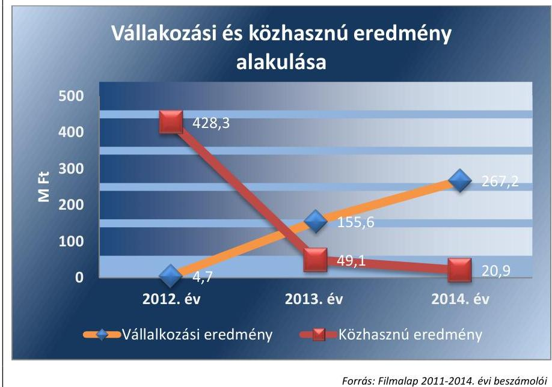

Fonrás: Filmalap 2011-2014. évi beszámolói

# 4.2. számú megállapítás 

## A Filmalap vagyonváltozást eredményező döntéseinek előkészítése és megalapozása megfelelő volt.

Az MNV Zrt. által a Filmalap Alapító Okirata 7.3. pontjának 3.,11.,12.,és 13. alpontjaiban előírt, és a 234/2011. (VIII. 4.) Alapítói Határozattal elfogadott Befektetési Szabályzatban meghatározott, a vagyon változását eredményező döntések előkészítésével kapcsolatos követelményeket a Filmalap betartotta.

A vagyonváltozást eredményező döntések előkészítése, a leányvállalatokat érintő beolvadás, valamint a Támogatási Szerződések; megkötése az Alapító Okiratban foglaltaknak megfelelően, az FB véleményét követően, tulajdonosi döntéssel történtek.

A Mafilm Zrt. és a Filmlabor Kft. 2012. évi tulajdonrészeinek megszerzésére irányuló döntést megelőzően külső szakértő által végzett üzleti értékelés készült. A két leányvállalat 2013. évi Filmalapba történt beolvadása a könyvvizsgálói vélemény és az FB javaslatának figyelembevételével meghozott 315/2013. (VI. 25.) tulajdonosi döntést követően, a 461/2013. (VI. 25.) MNV Zrt. Igazgatósági Határozat alapján, az Alapító Okirat 7.3. pont 3. bekezdésének megfelelően történt. A Filmalap vagyonváltozást eredményező döntései megfeleltek a belső szabályzatoknak.

A Filmalap kizárólag az Alapítói Okirat 7.3. pontjában meghatározott értékhatárt el nem érő értékesítéseket bonyolított le. A 2011-2014. évek között összesen 1,7 M Ft eszközértékesítés és 0,1 M Ft értékű selejtezés történt. Az immateriális javak és befektetett pénzügyi eszközök esetében értékesítésre nem került sor.

---

A Filmalapnál a 2011. és 2012. évben közbeszerzésre nem került sor. A 2013. évben összesen 10 db, míg 2014. évben külső közbeszerzési szakértő bevonásával 8 db közbeszerzési eljárást folytattak le. A közbeszerzéseket a Kbt. ${ }^{31}$ 22. § (2) bekezdés előírásainak megfelelő Felelősségi Rend keretében bonyolították le az MNV Zrt. által jóváhagyott éves közbeszerzési tervek alapján. A Felelősségi Rendben az adott eljárással kapcsolatban meghatározták az adott közbeszerzési eljárás előkészítésének és lefolytatásának felelősségi rendjét, a Kbt. 9. § g) pontja alapján a Filmalap nevében eljáró, az eljárásba bevont személyek, valamint szervezetek felelősségi körét és a közbeszerzési eljárás dokumentálási rendjét. A Filmalap a 2013. és a 2014. évre elkészítette a Közbeszerzési Hatóság Elnökének tájékoztatója alapján a statisztikai összegzést.

# 4.3. számú megállapítás 

Az MNV Zrt. vagyonváltozást eredményező döntései szabályosak voltak, a vonatkozó kormányhatározatoknak megfeleltek.

Az MNV Zrt. a vagyongazdálkodáshoz kapcsolódó, vagyonváltozást eredményező döntésekre vonatkozó, a tulajdonos számára fenntartott jogokat, valamint a döntések előkészítésével kapcsolatos követelményeket a Filmalap Alapító Okiratában meghatározta. Az MNV Zrt. vagyonváltozást eredményező döntései a Filmalap vagyonváltozásához kapcsolódó kormányhatározatoknak, a Filmalap Alapító Okiratának és a Film tv.-nek megfeleltek. Az MNV Zrt. a Filmalap által előzetesen megküldött vélemények és javaslatok alapján írásbeli engedélyét, hozzájárulását a vagyonváltozást eredményező döntésekhez megadta.

A Filmalap 2013. november 22-én fordult az MNV Zrt.-hez a KREATÍV Európa Kft. megalapítására vonatkozó kérelmével a 2013. június 17-étől hatályos Alapító Okirat 7.3. pontja 20. alpontjának megfelelően. Az FB az 52/2013. (XI. 15.) határozatában foglalt javaslata alapján az MNV Zrt. a 901/2013 (XII. 06.) számú határozatával elfogadta a leányvállalat létrehozását.

Az MNV Zrt. állami vagyon tulajdonjogának ingyenes átruházására vonatkozó döntést nem hozott, ingyenes vagyonátruházásra nem került sor.

A Filmalap a rábízott állami vagyont nem terhelte meg, biztosítékul nem adta, azokon osztott tulajdont nem létesített.

---

# 5. A Filmalap a szabályszerű vagyongazdálkodás érdekében az adatszolgáltatási és beszámolási kötelezettséget teljesítette-e, kiépített-e és múködetett-e információs rendszert? 

Összegző megállapítás

A Filmalap a szabályszerű vagyongazdálkodás érdekében a beszámolási és adatszolgáltatási kötelezettségét teljesítette, az információs rendszer kialakítása - a közérdekú adatok teljes körú nyilvánosságra hozatala kivételével - megfelelő volt.
5.1. számú megállapítás

A Filmalap az éves beszámolási és adatszolgáltatási kötelezettségének eleget tett. Az FB és a könyvvizsgáló a feladatát ellátta, azonban a könyvvizsgáló a 2012-2013. évi könyvvizsgálat során nem észrevételezte a számviteli elszámolásokhoz kapcsolódó szabálytalanságokat.

Az MNV Zrt. a Filmalap Alapító Okiratában kijelölte az FB-t és a könyvvizsgálót. Az FB és a könyvvizsgáló által készített jelentések ismeretében jóváhagyta és elfogadta a Filmalap stratégiai- és üzleti terveit, valamint az éves beszámolóit. Az MNV Zrt. év közbeni rendszeres adatszolgáltatási kötelezettséget is előírt a Filmalap részére, melyekből folyamatos információkhoz jutott a múködésről. Az Alapító Okiratban foglaltaknak megfelelően, azzal összhangban szabályozták az SZMSZ-ben a beszámolási, adatszolgáltatási és tájékoztatási kötelezettséget.

AZ ÉVES BESZÁMOLÓKAT és a hozzá kapcsolódó kiegészítő mellékleteket a Filmalap a múködéséről, vagyoni, pénzügyi és jövedelmi helyzetéről az üzleti év könyveinek zárását követően, minden ellenőrzött évre vonatkozóan elkészítette. A 2011. évre a Civil tv. ${ }^{32}$ 19. § (1) bekezdésében foglaltak alapján a közhasznúsági jelentés, a 2012-2014. évekre vonatkozóan pedig a Civil tv. 2 29. § (3) bekezdése előírásának megfelelően a közhasznúsági mellékletek kerültek elkészítésre. A könyvvizsgáló a Filmalap könyvvizsgálatát elvégezte, a beszámolókat minden évben hitelesítő záradékkal látta el, a 2012-2013. évi könyvvizsgálat során a számviteli elszámolásokhoz kapcsolódóan nem észrevételezett szabálytalanságot.

A Filmalap 2011. évi elfogadott éves beszámolója és a közzétett beszámolója között a vagyoni értékú jogok esetében 0,9 M Ft-os eltérés mutatkozott. Az eltérési hiba az immateriális eszközökön belül az üzleti vagy cégérték és a vagyoni értékú jogok sorokat érintette, a mérleg főösszegen nem változtatott.

Az FB az Alapító Okiratban előírt feladatait szabályszerűen látta el. Az éves beszámolókat, valamint az MNV Zrt. hatáskörébe tartozó döntéseket írásban véleményezte, azokhoz észrevételt nem tett.

Az MNV Zrt. az éves beszámolókat minden évben a FB és a könyvvizsgálói jelentés birtokában, az Alapító Okirat előírásainak megfelelően fogadta el. Az MNV Zrt. által elfogadott éves beszámolókat a Filmalap a Számv. tv. 153. § (1) bekezdés előírása szerint letétbe helyezte.

Az MNV Zrt. az irányítási, döntési és felelősségi köröket az SZMSZ-ben meghatározta, gyakorolta a vezérigazgató felett a munkáltatói jogokat.

---

### 5.2. számú megállapítás

A Filmalap a vagyongazdálkodását érintően kialakította az információs rendszert, azonban a múködtetés során az Info. tv. előírása ellenére a honlapján nem hozta nyilvánosságra a közérdekú adatok egyedi igénylésének szabályait, az igénybe vehető jogorvoslati lehetőségeket, az előírt honlapon a megítélt támogatási összegeket.

A Filmalap az Alapító Okiratával összhangban készített SZMSZ-ben szabályozta az információs rendszert. Az MNV Zrt. a vezérigazgatón, az FB-n és a könyvvizsgálón keresztül kapott információkat a Filmalap müködéséről, továbbá rendszeres adatszolgáltatási kötelezettséget írt elő, amelynek a Filmalap eleget tett. Az MNV Zrt. a filmszakmai támogatások felhasználását a Támogatási Szerződésekben; előírt elszámoltatáson és adatszolgáltatáson keresztül kísérte figyelemmel.

## A KÖZÉRDEKÚ ADATOK NYILVÁNOSSÁGRA HO-

ZATALA keretében az Avtv. ${ }^{33} 19$. § és az Info. tv ${ }^{34}$. 32-37. § előírásainak megfelelően a honlapon közzétették az éves beszámolókat illetve a közhasznúsági jelentéseket, valamint a Filmszakmai Döntőbizottságok határozatait. Az Info. tv. 34. § (3) bekezdés előírása ellenére a Filmalap a honlapján nem hozta nyilvánosságra a közérdekú adatok egyedi igénylésének szabályait, illetve az igénybe vehető jogorvoslati lehetőségeket. A Filmalap a 67/2008. ${ }^{35}$ (III. 29.) Korm. rendelet 2. § (4) bekezdés előírása ellenére nem tett eleget a megítélt támogatási összegre vonatkozó, a www.kozpenzpalyazat.gov.hu honlapon történő adatszolgáltatási és tájékoztatási kötelezettségének.

A Filmalap, mint a kormányzati szektorba sorolt egyéb szervezet, az Áht. ${ }^{36}$ 107. § (1) bekezdésében előírt adatszolgáltatási kötelezettségét az MNV Zrt.-n keresztül teljesítette.

Az MNV Zrt. a Vhr. 20. § (2) bekezdés előírása szerinti tulajdonosi ellenőrzéseit egyrészt az éves beszámolókon, másrészt a mozgóképszakmai célokra nyújtott támogatások elszámoltatásán keresztül végezte. Az MNV Zrt. a mozgóképszakmai támogatásokra és a müködésre szolgáló források felhasználásával történő elszámolási kötelezettséget a Támogatási Szerződésekben; előírta, azonban a vagyongazdálkodással kapcsolatban a Filmalapnál helyszíni ellenőrzést nem végzett. A Filmalap az elszámolási kötelezettségének szerződésenként eleget tett, az MNV Zrt. a pénzügyi és szakmai beszámolókat elfogadta.

A BELSŐ INFORMÁCIÓS RENDSZER szabályozása keretében az SZMSZ-ben meghatározták a döntések meghozatalához szükséges adatszolgáltatás folyamatát és a felelősségi szinteket. A monitoring jelentésekben és a vezetői értekezletekre készített előterjesztésekben tettek eleget a beszámolási kötelezettségnek, így biztosították a vezetői döntésekhez szükséges információk rendelkezésre állását és a döntések nyomon követését.

---

5.3. számú megállapítás

A Filmalap a kapcsolt vállalkozásokban lévő részesedések értékének védelme érdekében meghatározta a vagyongazdálkodási követelményeket.

A Filmalap a leányvállalatai vagyongazdálkodási követelményeit és a vagyongazdálkodással kapcsolatos adatszolgáltatások rendjét, a leányvállalatok Alapító Okirataiban és a leányvállalatai múködésének, gazdálkodásának ellenőrzési szabályzatában rögzítette. A leányvállalatok az adatszolgáltatásokat a szabályzatban előírt negyedéves megbontásban és tartalommal teljesítették. A leányvállalatok vagyongazdálkodását az adatszolgáltatásokon keresztül ellenőrizték, a leányvállalatok vagyonának alakulásáról a rendszeres adatszolgáltatásokon keresztül tájékozódtak.

# 6. A kormányzati szektorba sorolt egyéb szervezetek gazdálkodásának a kormányzati szektor hiányára és az államadósságra befolyással bíró elemei a jogszabályi előírásoknak megfelel-tek-e? 

Összegző megállapítás

A Filmalapnál - a közvetlen Európai Uniós forrásból származó Media Desk támogatásokkal kapcsolatos visszafizetések (2,9 M Ft) kivételével - nem volt olyan gazdasági esemény, amely a kormányzati szektor hiányára hatást gyakorolt volna.
6.1. számú megállapítás

A Filmalap nem kötött adósságot keletkeztető ügyletet. A Filmalap beszámolójában a Mafilm Zrt. és a Filmlabor Kft. társaságok beolvadása során átvett adósságot keletkeztető kötelezettségek szerepeltek. A Filmalap a 2013. és 2014. évi mérlegében a kölcsön és a lízing hitelként történő besorolása nem volt megfelelő.

A Filmalap nem kötött a Stabilitás tv. ${ }^{37}$ 3. § (1) bekezdése szerinti adósságot keletkeztető ügyletet, nem volt a Stabilitás tv. 9. § (1) bekezdése és 353/2011. (XII. 30.) Korm. rend. ${ }^{38}$ 11. § szerinti kérelem benyújtási kötelezettsége. A Filmalap 2013. évi beszámolójában szereplő hitelállomány a 2013. szeptember 30-ával beolvadt társaságok (Mafilm Zrt., Filmlabor Kft.) által a beolvadást megelőzően vállalt kötelezettségekből állt.
7. táblázat

HITELÁLLOMÁNY ALAKULÁSA (M FT)

| Megnevezés | 2013 | 2012 | 2013 | 2014 |
| :-- | :--: | :--: | :--: | :--: |
| Beruházási és fejlesztési hitelek | 0 | 0 | 1,6 | 1,2 |
| Egyéb hosszú lejáratú hitelek | 0 | 0 | 0,7 | 0 |
| Rövidlejáratú hitelek | 0 | 0 | 26,0 | 0,3 |
| Hitelállomány összesen | 0 | 0 | 28,3 | 1,5 |

A 2013. évben a Filmalap beszámolójában beruházási és fejlesztési hitelként - a Filmlabor Kft. által felvett - 1,6 M Ft összegű, gépkocsi vásárláshoz kapcsolódó kölcsön kötelezettség szerepelt. A kölcsön beruházási és fejlesztési hitelként történő szerepeltetése nem felelt meg a kölcsönszerződésnek, továbbá a Számv. tv. 42. § (2) bekezdésének.

---

Egyéb hosszú lejáratú hitelként - a Filmlabor Kft. által eszközbeszerzésre vállalt - 0,7 M Ft összegű lízingkötelezettségek kerültek bemutatásra. A Filmalap a 2013. évi beszámolójában a 0,7 M Ft összegű pénzügyi lízing kötelezettséget nem egyéb hosszú és rövid lejáratú kötelezettségként, hanem egyéb hosszú és rövid lejáratú hitelként mutatta be, ami nem felelt meg a Számv. tv. 42. § (5) bekezdésében előírtaknak. A hitel nem megfelelő besorolása a kötelezettségek összértékét nem befolyásolta.

A 2013. évi rövid lejáratú hitelek között a beolvadt társaságok éven belüli hiteleinek 26,0 M Ft-ot kitevő összege szerepelt.

A 2014. évi beszámolóban a rövid lejáratú hitel összegét a személygépkocsi hitel éven belül esedékes 0,3 M Ft-os összege alkotta. A rövid lejáratú hitelek, mint éven belüli hitelek nem esnek a kérelemhez kötött adósságot keletkeztető ügyletek hatálya alá.
6.2. számú megállapítás

A Filmalapnál nem volt olyan gazdasági esemény, amely a kormányzati szektor hiányára hatást gyakorolt volna az Európai Uniós forrásból származó Media Desk támogatásokkal kapcsolatban keletkezett 2,9 M Ft összegű visszafizetési kötelezettség kivételével. Az ellátott közfeladatok személyi jellegú és egyéb ráfordításai, valamint az egyéb bevételek elszámolása szabályszerű volt. A Filmalapnál osztalékfizetésre nem került sor.

A SZEMÉLYI RÁFORDÍTÁSOK ELSZÁMOLÁSA megfelelő volt. A kifizetett személyi juttatások megfelelő alapdokumentumokkal, munkaszerződésekkel, közfoglalkoztatási szerződésekkel, jelenléti ívekkel alátámasztottak voltak. A külszolgálat esetében a napidíj elszámolását külföldi kiküldetési utasítás, és vezetői jóváhagyás igazolta. A kiküldetésekről a Kiküldetési szabályzatnak megfelelően a vezérigazgató rendelkezett. A számfejtésre került bruttó bér megfelelt a munkavállalásról szóló szerződésben foglaltaknak. Az elszámolt túlóra megfelelőségét jelenléti ív és vezetői jóváhagyás igazolta. A jutalom megfelelően dokumentált vezérigazgatói döntés alapján, szabályszerűen került megállapításra.

A Filmalapnál a béren kívüli juttatások szabályait a Cafeteria Szabályzat tartalmazta, amely szerint a juttatás havi mértéke 25000 Ft volt. Béren kívüli juttatások elszámolására 2012 áprilisától kezdődően került sor. A Cafeteria Szabályzatban szereplő juttatások éves kerete megfelelt az Szja tv. ${ }^{39}$ 71. §-ában és az 1. sz. mellékletében szereplő előírásoknak. A mintavétel során ellenőrzött személyek az időszakban hatályos Cafeteria Szabályzat előírásainak megfelelően elkészítették nyilatkozatukat, azonban a Mafilm Zrt.-től átvett egy dolgozó esetében a Filmalapnál hatályos Cafeteria Szabályzatban előírtnál magasabb összegű - 28500 Ft - juttatás került feltüntetésre a nyilatkozatban, ami megfelelt a Mafilm Zrt.-nél a beolvadásig hatályos Cafeteria szabályzatnak, azonban a nyilatkozatot nem módosították a beolvadást követően, hogy az megfeleljen a Filmalapnál hatályos szabályzatnak. Az újonnan belépő munkavállalók próbaideje alatt a szabályozásnak megfelelően, nem került béren kívüli juttatás elszámolásra.

Az éves beszámolók - azok kiegészítő melléklete - valamint a főkönyvi nyilvántartás adatai alapján az egyéb ráfordítások, pénzügyi műveletek ráfordításai és a rendkívüli ráfordítások között nem szerepeltek olyan tételek, melyek a kormányzati szektor hiányára hatást gyakoroltak volna.

---

AZ EGYÉB BEVÉTELEK, pénzügyi műveletek bevételei és a rendkívüli bevételek között, a közvetlen Európai Uniós forrásból származó Media Desk támogatásokkal ${ }^{40}$ kapcsolatos visszafizetések (2,9 M Ft) kivételével, nem szerepeltek olyan tételek, melyek a kormányzati szektor hiányára hatást gyakoroltak volna. A Media Desk iroda múködési költségeinek támogatására a Filmalap két szerződést kötött, amelyek szerint összesen 33,8 M Ft támogatásban részesült. A Filmalapnak 2,9 M Ft visszafizetési kötelezettséget állapított meg a Támogató, amely kötelezettségének a Filmalap eleget tett.

OSZTALÉKFIZETÉS a Gt. ${ }^{41}$ 4. § (3) bekezdése és a 2014. március 15-étől hatályos Ctv. ${ }^{42}$ 9/F. § (1) bekezdése előírásainak, valamint az Alapító Okiratokban rögzített osztalékfizetési tilalomnak megfelelően a Filmalapnál nem történt.

---

# JAVASLATOK 

Az ÁSZ tv. ${ }^{43}$ 33. § (1) bekezdésében foglaltak értelmében az ellenőrzött szervezet vezetője köteles a jelentésben foglalt megállapításokhoz kapcsolódó intézkedési tervet összeállítani és azt a jelentés kézhezvételétől számított 30 napon belül az ÁSZ részére megküldeni. Amennyiben az ellenőrzött szervezet vezetője nem küldi meg határidőben az intézkedési tervet, vagy továbbra sem elfogadható intézkedési tervet küld, az Állami Számvevőszék elnöke az ÁSZ tv. 33. § (3) bekezdése a) és b) pontjaiban foglaltakat érvényesítheti.

## Magyar Nemzeti Vagyonkezelő Zrt. vezérigazgatójának

1. Vizsgálja felül a Filmalap által nyújtott támogatások után felszámított adminisztrációs dijból származó bevételre vonatkozó előírásokat, és biztosítsa, hogy azok bevételek közé sorolása a jogszabályban és az Alapitói Okiratban elöirtakkal összhangban legyen.
(1.1 számú megállapítás 7. bekezdése és a
2.1 számú megállapítás 8. bekezdése alapján)

## Magyar Nemzeti Filmalap Közhasznú Nonprofit Zrt. vezérigazgatójának

1. Kezdeményezze, hogy a Filmalap által nyújtott támogatások után felszámított adminisztrációs dijból származó bevétel elszámolása a jogszabályban és az Alapitói Okiratban foglaltakkal összhangban kerüljön elöírásra.
(1.1 számú megállapítás 7. bekezdése és a
2.1. számú megállapítás 8. bekezdése alapján)
2. Intézkedjen a Filmalap Számlarendjének módosítására, hogy az a jogszabályi elöírásokkal összhangban tartalmazza a közhasznú és a vállalkozási tevékenységéből származó bevételek és költségek, ráfordítások (kiadások) elkülönített nyilvántartásának szabályait (alapját, felosztási elvét, eljárásrendjét).
(2.1. számú megállapítás 4. bekezdése alapján)
3. Intézkedjen a Filmalap Leltárkészítési és leltározási Szabályzatának módosítására, hogy az a jogszabályban meghatározott gyakorisággal tartalmazza a mennyiségi felvétellel történő leltározási kötelezettséget.
(2.1 számú megállapítás 5. bekezdése alapján)

---

4. Intézkedjen a Filmalap Értékelési Szabályzatának módosítására, hogy az a jogszabályi változások figyelembevételével határozza meg az immateriális javak bekerülési értékének és értékcsökkenésének elszámolási szabályait.
(2.1 számú megállapítás 6. bekezdése alapján)
5. Intézkedjen, hogy az értékvesztések elszámolása a jövőben a jogszabályokban és a belső szabályzatokban előírtakkal összhangban történjen.
(2.2 számú megállapítás 4. és 10-11. bekezdései alapján)
6. Intézkedjen a jogszabályban előírt Önköltségszámítás rendjére vonatkozó szabályzat elkészitésére.
(2.1 számú megállapítás 4. bekezdése és a
3.2. számú megállapítás 1. bekezdése alapján)
7. Végeztesse el a szolgáltatások önköltségének meghatározását a jogszabályi előírásoknak megfelelően.
(3.2. számú megállapítás 1. bekezdése alapján)
8. Biztosítsa, hogy a számviteli nyilvántartások megfeleljenek a Támogatási Szerződések ${ }_{1}$-ben elöirt keretösszegenkénti elkülönitési kötelezettségnek.
(2.2. számú megállapítás 12. bekezdése alapján)
9. Intézkedjen a jogszabályokban előírt nyilvánosságra hozatali kötelezettségek teljesítésére
a) a Filmalap honlapján a közérdekü adatok egyedi igénylésének szabályait, valamint az igénybe vehető jogorvoslati lehetőségeket;
b) továbbá az erre a célra létrehozott honlapon a megitélt támogatási összegre vonatkozó adatszolgáltatást és tájékoztatást illetően.
(5.2. számú megállapítás 2. bekezdése alapján)
10. Tegyen intézkedéseket a Filmalap Cafeteria Szabályzatában előirtnál magasabb összegben kifizetett béren kivüli juttatással kapcsolatban a feltárt hiányosságok és szabálytalanságok tekintetében a felelősség tisztázása érdekében és szükség szerint intézkedjen a felelősség érvényesitéséről.
(6.2. számú megállapítás 2. bekezdése alapján)

---

.

---

# MELLÉKLETEK 

I. SZ. MELLÉKLET: ÉRTELMEZŐ SZÓTÁR

| Állami vagyon | 2010. június 17-től   a) Az állam tulajdonában lévő dolog, valamint a dolog módjára hasznosítható természeti erő,   b) az a) pont hatálya alá nem tartozó mindazon vagyon, amely vonatkozásában törvény az állam kizárólagos tulajdonjogát nevesíti,   c) az állam tulajdonában lévő tagsági jogviszonyt megtestesítő értékpapír, illetve az államot megillető egyéb társasági részesedés,   d) az államot megillető olyan immateriális, vagyoni értékkel rendelkező jogosultság, amelyet jogszabály vagyoni értékű jogként nevesít.   Forrás: Vtv. 1. § (2) bekezdése   2012. november 10-től az állami vagyon fogalma kiegészül a következő ponttal:   e) az állam tulajdonában lévő pénzügyi eszközök   Forrás: Vtv. 1. § (2) bekezdése |
| :--: | :--: |
| Állami vagyon értékesítése | Állami vagyon tulajdonjogának bármely jogcímen történő, visszterhes átruházása. Forrás: Vhr. 1. § (7) d) pont) |
| INTOSAI által kiadott nemzetközi standardok | ISSAI 100: A számvevőszéki ellenőrzés általános alapelvei; ISSAI 200: A pénzügyi ellenőrzés alapelvei; ISSAI 300: A teljesítményellenőrzés alapelvei; ISSAI 400: A megfelelőségi ellenőrzés alapelvei |
| Közfeladat | Jogszabályban meghatározott állami vagy önkormányzati feladat, amit a feladat címzettje közérdekből, haszonszerzési cél nélkül, jogszabályban meghatározott követelményeknek és feltételeknek megfelelve végez, ideértve a lakosság közszolgáltatásokkal való ellátását, valamint e feladatok ellátásához szükséges infrastruktúra biztosítását is;   Forrás: Civil tv. 2. § 19. pont (Hatályos 2011. december 22.) |
| Közhasznú tevékenység | Minden olyan tevékenység, amely a létesítő okiratban megjelölt közfeladat teljesítését közvetlenül vagy közvetve szolgálja, ezzel hozzájárulva a társadalom és az egyén közös szükségleteinek kielégítéséhez;   Forrás: Civil tv. 2. § 20. pont (Hatályos 2011. december 22.) |
| Kormányzati szektorba sorolt egyéb szervezet | Az a szervezet, amely az Áht. alapján nem része az államháztartásnak, azonban az Európai Közösséget létrehozó szerződéshez csatolt, a túlzott hiány esetén követendő eljárásról szóló jegyzőkönyv alkalmazásáról szóló 2009. május 25-i 479/2009/EK rendelet szerint a kormányzati szektorba tartozik. A nemzetgazdasági miniszter 2013. június 26-án megjelent Közleményben tette közé ezen szervezetek listáját. |
| Minősített többséget biztosító részesedés | A minősített befolyásszerző az ellenőrzött társaságban a szavazatok legalább háromnegyedével rendelkezik.   Forrás: 2014. március 14-ig: Gt. 52. § (2)   2014. március 15-től: Ptk2. 3:324. § (1) bekezdés |
| MNV Zrt. | Az állami vagyon felett, a Magyar Államot megillető tulajdonosi jogok és kötelezettségek összességét - a hatályos szabályozás szerint - az állami vagyon felügyeletéért felelős miniszter (jelenleg a nemzeti fejlesztési miniszter) gyakorolja. A miniszter feladatát nagy részben az MNV Zrt., mint tulajdonosi joggyakorló szervezet útján látja el. |

---

| Nemzetgazdasági szempontból kiemelt jelentőségű nemzeti vagyon körébe tartozó társaságok | Az ÁSZ ellenőrzés szempontjából az Nvtv. 2. sz. mellékletében felsorolt társasági részesedések. |
| :--: | :--: |
| Többségi befolyást biztosító részesedés | 2014. március 14-ig: Többségi befolyás: az olyan kapcsolat, amelynek révén természetes személy, jogi személy vagy jogi személyiség nélküli gazdasági társaság (a továbbiakban együtt: befolyással rendelkező) egy jogi személyben a szavazatok több mint ötven százalékával vagy meghatározó befolyással rendelkezik.   Forrás: $\mathrm{Ptk}_{1}$ 685/B. § (1)   2014. március 15-től: Többségi befolyás az olyan kapcsolat, amelynek révén természetes személy vagy jogi személy (befolyással rendelkező) egy jogi személyben a szavazatok több mint felével vagy meghatározó befolyással rendelkezik.   Forrás: $\mathrm{Ptk}_{2}$ 8:2. § (1) |
| Tulajdonosi ellenőrzés | 2010. június 17-től:   Az MNV Zrt. „rendszeresen ellenőrzi a vele szerződéses jogviszonyban lévő személyek, szervezetek vagy más használók állami vagyonnal való gazdálkodását, megállapításairól az MNV Zrt. Felügyelő Bizottságát, az ellenőrzött szervet, szükség esetén a minisztert és az Állami Számvevőszéket tájékoztatja".   Forrás: Vtv. 17. § d.   A Vhr. alapján „a tulajdonosi ellenőrzés célja az állami vagyonnal való gazdálkodás vizsgálata, ennek keretében a rendeltetésellenes, jogszerűtlen, szerződésellenes, vagy a tulajdonos érdekeit sértő, illetve a központi költségvetést hátrányosan érintő vagyongazdálkodási intézkedések feltárása és a jogszerú állapot helyreállítása, továbbá a vagyonnyilvántartás hitelességének, teljességének és helyességének biztosítása". Forrás: Vhr. 20. § (2)   2011. december 31-ig   Az állami vagyon kezelőjét, használóját megillető jogok gyakorlását, annak szabályszerűségét, célszerűségét az MNV Zrt. - szükség szerint területi szervei útján ellenőrzi.   Forrás: Vhr. 20. § (1)   2012. január 1-jétől:   Az állami vagyon kezelőjét, haszonélvezőjét, használóját megillető jogok gyakorlását, annak szabályszerűségét, célszerűségét az MNV Zrt. - szükség szerint területi szervei útján - ellenőrzi.   Forrás: Vhr. 20. § (1) |
| Tulajdonosi jogok gyakorlója | 2010. június 17-től:   Az állami vagyon felett a Magyar Államot megillető tulajdonosi jogok és kötelezettségek összességét - ha törvény eltérően nem rendelkezik - az állami vagyon felügyeletéért felelős miniszter (a továbbiakban: miniszter) gyakorolja, aki e feladatát a Magyar Nemzeti Vagyonkezelő Zártkörűen Működő Részvénytársaság (a továbbiakban: MNV Zrt.), a Magyar Fejlesztési Bank, illetve a tulajdonosi joggyakorló szervezet útján látja el. A miniszter miniszteri rendeletben, a törvényben meghatározott állami vagyoni kör tekintetében, meghatározott időtartamra, a joggyakorlás egyes szabályainak meghatározásával - az őt megillető tulajdonosi jogok és kötelezettségek összességének, illetve azok meghatározott részének gyakorlóját az Áht. szerinti központi költségvetési szervek, ezek intézménye, továbbá a 100\%-ban állami tulajdonban álló gazdasági társaságok közül kijelölheti.   Forrás: Vtv. 3. § (1) és (2) |

---

|  | 2013. június 28-ától:   A rábízott állami vagyon felett az államot megillető tulajdonosi jogok és kötelezettségek összességét tulajdonosi joggyakorlóként:   a) ha törvény vagy miniszteri rendelet eltérően nem rendelkezik, a Magyar Nemzeti Vagyonkezelő Zártkörűen Működő Részvénytársaság (a továbbiakban: MNV Zrt.),   b) törvényben kijelölt személy vagy   c) az állami vagyon felügyeletéért felelős miniszter (a továbbiakban: miniszter) által rendeletben kijelölt személy gyakorolja.   [...] A miniszter e törvény felhatalmazása alapján - a meghatározott célok hatékonyabb elérése érdekében, miniszteri rendeletben, az ott meghatározott állami vagyoni kör tekintetében, meghatározott időtartamra - e törvény keretei között, a joggyakorlás egyes szabályainak meghatározásával - az államot megillető tulajdonosi jogok és kötelezettségek összességének, illetve azok meghatározott részének gyakorlóját az Áht. szerinti központi költségvetési szervek, ezek intézménye, továbbá a 100\%-ban állami tulajdonban álló gazdasági társaságok közül kijelölheti. Forrás: Vtv. 3. § (1) és (2) |
| :--: | :--: |
| A tulajdonosi joggyakorlás és a vagyongazdálkodás feladata | 2010. június 17-től:   Az állami vagyon rendeltetésének megfelelő - az állami feladatok ellátásához, a társadalmi szükségletek kielégítéséhez, valamint a Kormány gazdaságpolitikája megvalósításának elősegítéséhez szükséges, egységes elveken alapuló, önálló ágazatként megjelenő - hatékony, költségtakarékos, értékmegőrző értéknövelő felhasználásának biztosítása (közvetlen felhasználás), illetve közvetett hasznosítása (beleértve a vagyoni kör változását eredményező értékesítést), valamint az állami vagyon gyarapítása (ideértve a vagyoni kör bővítését is).   Forrás: Vtv. 2. § (1) |

---

II. SZ. MELLÉKLET: A FILMALAP VAGYONÁNAK ALAKULÁSA 2011-2014. ÉVEKBEN (E FT)

|  ㄷ | Megnevezés | 2011.12.31. | 2012.12.31. | 2013.12.31. | 2014.12.31.  |
| --- | --- | --- | --- | --- | --- |
|  1 |  | 1 | 2 | 3 | 4  |
|  1. | Befektetett eszközök | 1263 | 3982326 | 5183920 | 5621020  |
|  2. | immateriális javak | 869 | 27941 | 146835 | 169778  |
|  3. | tárgyi eszközök | 394 | 2721683 | 4967467 | 5382665  |
|  4. | befektetett pénzügyi eszközök | 0 | 1232702 | 69618 | 68577  |
|  5. | Forgóeszközök | 7589823 | 8506065 | 14053811 | 14872663  |
|  6. | készletek | 0 | 0 | 26080 | 27894  |
|  7. | követelések | 3853824 | 541842 | 256586 | 358606  |
|  8. | értékpapírok | 0 | 6485096 | 6661982 | 7552553  |
|  9. | pénzeszközök | 3735999 | 1479127 | 7109163 | 6933610  |
|  10. | Aktív időbeli elhatárolások | 1116 | 44594 | 79861 | 74175  |
|  11. | ESZKÖZÖK ÖSSZESEN | 7592202 | 12532985 | 19317592 | 20567858  |
|  12. | Saját tőke | 50000 | 483007 | 684900 | 973041  |
|  13. | jegyzett tőke | 20000 | 20000 | 20000 | 20000  |
|  14. | tőketartalék | 30000 | 30000 | 562321 | 562321  |
|  15. | eredménytartalék | 0 | 0 | $-102195$ | 102579  |
|  16. | mérleg szerinti eredmény | 0 | 433007 | 204774 | 288141  |
|  17. | Kötelezettségek | 22010 | 369450 | 4883184 | 3906707  |
|  18. | hosszú lejáratú kötelezettségek | 0 | 0 | 2312 | 1241  |
|  19 | rövid lejáratú kötelezettségek | 22010 | 369450 | 4880872 | 3905466  |
|  20. | Passzív időbeli elhatárolások | 7520192 | 11680528 | 13749508 | 15688110  |
|  21. | FORRÁSOK ÖSSZESEN | 7592202 | 12532985 | 19317592 | 20567858  |

Fonrás: Filmalap 2011-2014. évi beszámolói

---

|  | Miegnevezés | 2011.12.31. | 2012.12.31. | 2013.12.31. | 2014.12.31. |
| :--: | :--: | :--: | :--: | :--: | :--: |
|  |  | 1. | 2. | 3. | 4. |
| 1. | Értékesítés nettó árbevétele | 1,4 | 80,1 | 419,3 | 1186,2 |
| 2. | Aktivált saját teljesítmények értéke | 0 | 0 | 14,5 | 4,1 |
| 3. | Egyéb bevételek | 106,1 | 1994,6 | 5 156,9 | 4799,2 |
| 4. | Anyagjellegú ráfordítások | 52,9 | 242,3 | 383,8 | 1063,5 |
| 5. | Személyi jellegú ráfordítások | 56,3 | 283,4 | 487,1 | 885,8 |
| 6. | Értékcsökkenési leírás | 0,02 | 12,5 | 68,3 | 233,9 |
| 7. | Egyéb ráfordítások | 0 | 902,5 | 4512,6 | 3569,4 |
| 8. | Üzemi (üzleti) tevékenység eredménye | $-1,8$ | 634,1 | 138,9 | 236,9 |
| 9. | Pénzügyi műveletek bevételei | 2,0 | 255,9 | 62,1 | 46,8 |
| 10. | Pénzügyi műveletek ráfordításai | 0,3 | 439,2 | 4,4 | 4,3 |
| 11. | Pénzügyi műveletek eredménye | 1,8 | $-183,2$ | 57,6 | 42,5 |
| 12. | Szokásos vállalkozási eredmény | 0 | 450,8 | 196,5 | 279,4 |
| 13. | Rendkívüli bevételek | 0 | 0 | 15,3 | 12,8 |
| 14. | Rendkívüli ráfordítások | 0 | 0 | 0 | 0,7 |
| 15. | Rendkívüli eredmény | 0 | 0 | 15,3 | 12,1 |
| 16. | Adózás előtti eredmény | 0 | 450,8 | 211,8 | 291,5 |
| 17. | Adófizetési kötelezettség | 0 | 17,8 | 7,0 | 3,3 |
| 18. | Adózott eredmény | 0 | 433,0 | 204,8 | 288,1 |
| 19 | Eredménytartalék igénybevétel osztalékra | 0 | 0 | 0 | 0 |
| 20. | Jóváhagyott osztalék, részesedés | 0 | 0 | 0 | 0 |
| 21. | Mérleg szerinti eredmény | 0 | 433,0 | 204,8 | 288,1 |

Forrás: Filmalap 2011-2014. évi beszámolói

---

|  | Megnevezés | 2011. év | 2012. év | 2013. év | 2014. év |
| :--: | :--: | :--: | :--: | :--: | :--: |
|  |  | 1. | 2. | 3. | 4. |
| 1. | Követelések elszámolt értékvesztése nyitó állomány |  | 0 | 159,4 | 294,3 |
| 2. | Követelés elszámolt értékvesztése |  | 95,5 | 25,3 | 6,2 |
| 3. | Immateriális javakra adott előleg értékvesztése |  | 64,0 | 271,0 |  |
| 4 | Követelés értékvesztésének visszaírása |  |  | $-13,6$ | $-2,2$ |
| 5. | Immateriális javakra adott előleg értékvesztés visszaírás |  |  | $-135,0$ | $-138,0$ |
| 6. | Követelések elszámolt értékvesztésének beolvadás miatt kivezetése |  |  | $-80,0$ |  |
| 7. | Követelések elszámolt értékvesztésebeolvadással hozott |  |  | 67,0 |  |
| 8. | Követelések elszámolt értékvesztése záró állomány | 0 | 159,4 | 294,3 | 94,0 |
| 9. | Készletek elszámolt értékvesztése nyitó állomány |  |  |  |  |
| 10. | Készletek elszámolt értékvesztése |  |  |  |  |
| 11. | Készletek értékvesztésének visszaírása |  |  |  |  |
| 12. | Készletek elszámolt értékvesztése záró állomány | 0 | 0 | 0 | 0 |
| 13. | Részesedések elszámolt értékvesztése nyitó állomány |  | 0 | 438,4 | 94,0 |
| 14. | Részesedések elszámolt értékvesztése |  | 438,4 |  |  |
| 15. | Részesedések elszámolt értékvesztésének beolvadás miatti kivezetése |  |  | $-438,4$ |  |
| 16. | Részesedések elszámolt értékvesz-tése- beolvadással hozott |  |  | 94,0 |  |
| 17. | Részesedések értékvesztésének viszszaírása |  |  |  |  |
| 18. | Részesedések elszámolt értékvesztése záró állomány | 0 | 438,4 | 94,0 | 94,0 |
| 19. | Egyéb befektetett pénzügyi eszközök értékvesztése nyitó állomány |  |  |  |  |
| 20. | Egyéb befektetett pénzügyi eszközök elszámolt értékvesztése |  |  |  |  |
| 21. | Egyéb befektetett pénzügyi eszközök értékvesztésének visszaírása |  |  |  |  |
| 22. | Egyéb befektetett pénzügyi eszközök értékvesztése záró állomány | 0 | 0 | 0 | 0 |

---

# V. SZ. MELLÉKLET: A FILMALAP RÉSZESEDÉSEI (M FT) 

| Részesedés megnevezése | Részesedés aránya | Részesedések kapcsolt vállalkozásban | 2012. év | 2013. év | 2014. év |
| :--: | :--: | :--: | :--: | :--: | :--: |
| MAFILM Nonprofit Zrt. | $100,0 \%$ | bruttó érték | 1555,0 | - | - |
|  |  | elszámolt értékvesztés | 325,4 | - | - |
|  |  | Részesedés mérlegértéke | 1229,6 | - | - |
| Magyar Filmlaboratórium Nonprofit Kft. | $100,0 \%$ | bruttó érték | 113,0 | - | - |
|  |  | elszámolt értékvesztés | 113,0 | - | - |
|  |  | Részesedés mérlegértéke | - | - | - |
| MAFILM Szcentika Kft. f.a. | $51,2 \%$ | bruttó érték | - | 80,0 | - |
|  |  | elszámolt értékvesztés | - | 80,0 | - |
|  |  | Részesedés mérlegértéke | - | - | - |
| MAFILM Audió Kft. | $41,06 \%$ | bruttó érték | - | 36,2 | - |
|  |  | elszámolt értékvesztés | - | - | - |
|  |  | Részesedés mérlegértéke | - | 36,2 | 36,2 |
| MAFILMRENT Kft. | $100,0 \%$ | bruttó érték | - | 30,1 | - |
|  |  | elszámolt értékvesztés | - | - | - |
|  |  | Részesedés mérlegértéke | - | 30,1 | 30,1 |
| MAFILM Invest Kft. f.a. | $97,80 \%$ | bruttó érték | - | 11,3 | - |
|  |  | elszámolt értékvesztés | - | 11,3 | - |
|  |  | Részesedés mérlegértéke | - | - | - |
| MAFILM Profilm Kft. | $90,0 \%$ | bruttó érték | - | 2,7 | - |
|  |  | elszámolt értékvesztés | - | 2,7 | - |
|  |  | Részesedés mérlegértéke | - | - | - |
| Filmlabor Services Kft. | $100,0 \%$ | bruttó érték | - | 05, | - |
|  |  | elszámolt értékvesztés | - | - | - |
|  |  | Részesedés mérlegértéke | - | 0,5 | 0,5 |
| KREATÍV Európa Nonprofit Kft. | $100,0 \%$ | bruttó érték | - | 0,5 | - |
|  |  | elszámolt értékvesztés | - | $-0$ | - |
|  |  | Részesedés mérlegértéke | - | 0,5 | 0,5 |
| Mafilm Média Center Egyesülés | $100,0 \%$ | bruttó érték | - | - | - |
|  |  | elszámolt értékvesztés | - | - | - |
|  |  | Részesedés mérlegértéke | - | - | - |
| Összesen |  | bruttó érték | 1668,0 | 161,3 | - |
|  |  | elszámolt értékvesztés | 438,4 | 94 | - |
|  |  | Részesedés mérlegértéke | 1229,6 | 67,3 | 67,3 |

---

.

---

# FÜGGELÉK: ÉSZREVÉTELEK 

Az Állami Számvevőszék a jelentéstervezetet 15 napos észrevételezésre megküldte az ellenőrzött szervezetek vezetőinek az ÁSZ tv. 29. §* (1) bekezdése előírásának megfelelően.
A Magyar Nemzeti Vagyonkezelő Zrt. és a Magyar Nemzeti Filmalap NZrt. részéről az ellenőrzött szervezet vezetője az ellenőrzés megállapításaira írásban észrevételt tett.
Az elfogadott észrevételek alapján az Állami Számvevőszék módosította a jelentést.
A függelék tartalmazza az ellenőrzött szervezetek vezetőinek az észrevételeit és az azokra adott válaszokat, az elfogadott és az el nem fogadott észrevételekről, azok indokairól szóló tájékoztatásokat.

[^0]
[^0]:    * 29. § (1) Az Állami Számvevőszék az ellenőrzési megállapításait megküldi az ellenőrzött szervezet vezetőjének vagy az általa megbízott személynek, és annak, akinek személyes felelősségét állapította meg.
    (2) Az ellenőrzött szervezet vezetője és a felelősként megjelölt személy az ellenőrzés megállapításaira tizenöt napon belül írásban észrevételt tehet.
    (3) Az Állami Számvevőszék az észrevételre a beérkezésétől számított harminc napon belül írásban válaszol. A figyelembe nem vett észrevételeket köteles a jelentésben feltüntetni, és megindokolni, hogy azokat miért nem fogadta el.

---

# 328/2016.04.11. 

## MNV   Magyar Nemzet   VagyonkezelóZrt   VEZÉRIGAZGATÓ

Állami Számvevőszék

## Domokos László

elnök

1052 Budapest
Apáczai Cs. J. u. 10.

ÁLLAMI SZÁMVEVÓSZÉK
024581/2016
Érkeze: 2016 APR 11.
Iktatószám: 11-0855-370/2016.
Melléklet: $\qquad$
Selena Védiés
Cee

Tisztelt Elnök Úr!
A 2016. március 25. napján „Az állami tulajdonban (résztulajdonban) lévő gazdálkodó szervezetek vagyonmegőrzési és gazdálkodási tevékenységének ellenőrzése - Magyar Nemzeti Filmalap Közhasznú Nonprofit Zrt. " tárgyában kézhez vett, V-0855-370/2016. ikt. sz. Jelentés-tervezetre az alábbi észrevételeket kívánjuk tenni:

Megállapítások / 14. old. 4. bekezdés, 15. oldal 1. bekezdés és 25 . oldal 2. bekezdés, továbbá Javaslatok / 33. oldal 1. Javaslat és 35 . oldal 10. Javaslat

Az MNV Zrt. információi alapján a Magyar Nemzeti Filmalap Közhasznú Nonprofit Zrt. (a továbbiakban: Társaság) 2015. december 31. napjáig megkapta az államháztartásról szóló 2011. évi CXCV. törvény 111. §-ának (15) bekezdése szerinti „határozott időre megadott felmentés" meghosszabbítására vonatkozó engedélyt, amelynek következtében a Társaság a vizsgált időszakban rendelkezhetett hitelintézetnél vezetett számlával.

Ennek megfelelően kérjük a Jelentés-tervezet hivatkozott bekezdéseiből a számlavezetéshez kapcsolódó rendelkezésekre vonatkozó megállapítások, továbbá a Jelentés-tervezet 1., valamint 10. Javaslatának törlését.

Kérem Elnök Urat, hogy a Jelentés véglegesítése során jelen észrevételeinket szíveskedjenek figyelembe venni.

Budapest, 2016. április ,,4".,,

Üdvözlettel:
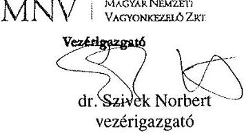

---

ELNÖK

Ikt.szám: V-0855-378/2016.

# dr. Szivek Norbert 

vezérigazgató
Magyar Nemzeti Vagyonkezelő Zrt.

## Budapest

## Tisztelt Vezérigazgató Úr!

Köszönettel megkaptam a 2016. április 11. napján az Állami Számvevőszékhez érkezett „Az állami tulajdonban (résztulajdonban) lévő gazdálkodó szervezetek vagyonmegőrzési és gazdálkodási tevékenységének ellenőrzése - Magyar Nemzeti Filmalap Közhasznú Nonprofit Zrt. " című számvevőszéki jelentéstervezetben foglalt megállapításra, javaslatra a vezérigazgató úr által tett észrevételt.

Az Állami Számvevőszék észrevételre vonatkozó álláspontjáról a felügyeleti vezető által készített részletes tájékoztatást mellékelten megküldöm.

Budapest, 2016. 06 hó 06 nap
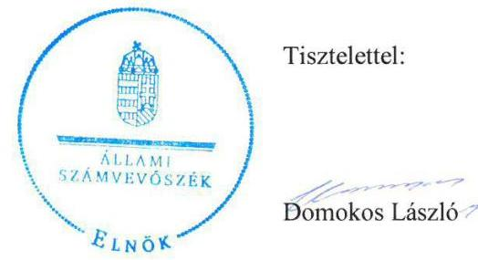

Melléklet: Tájékoztatás az elfogadott észrevételről

---

1. számú melléklet a V-0855-378/2016. ikt. számú levélhez

# Tájékoztatás 

az elfogadott észrevételről

|  | Észrevétel: | Az 1.2. számú megállapításhoz, valamint a 4.1. számú megállapításhoz kapcsolódóan, a kereskedelmi banknál történő számlavezetésre vonatkozóan. |
| :--: | :--: | :--: |
|  | Válasz: | Az Állami Számvevőszék az észrevételt elfogadja. |
| 1. | Indoklás: | A dokumentumok ismételt áttekintése alapján, a számlavezetéshez kapcsolódó megállapításokat töröltük, az alábbiak szerint.   Törlésre került   - a Főbb megállapítások, következtetések, javaslatok fejezet 3. bekezdés utolsó mondatából (6. oldal) „- a számlavezetéshez kapcsolódó rendelkezések kivételével -, szövegrész;   - az 1.2. számú megállapításból (14. oldal) a „- a számlavezetéshez kapcsolódó rendelkezés kivételével -, szövegrész;   - az 1.2. számú megállapítás 2. bekezdés 3. mondata (15. oldal) „4 Filmalap müködési támogatását is tartalmazó Támogatási Szerzödések; 3. pontja engedélyezte a müködési költség fedezetére szolgáló támogatás kereskedelmi banknál vezetett számlára történő átvezetését annak ellenére, hogy az Aht. 79. § (2)-(3) bekezdése alapján a Filmalap hitelintézetnél vezetett fizetési számlával - az általa foglalkoztatott személyek lakásépitésének, lakásvásárlásának munkáltatói támogatására szolgáló számla kivételével - nem rendelkezhetett.";   - a 4 pont Összegző megállapításból (23. oldal) „- a kereskedelmi banknál történő számlavezetés kivételével -" szövegezés;   - a 4.1. számú megállapításból (23. oldal) „- a kereskedelmi banknál történő számlavezetés kivételével -" szövegezés;   - a 4.1. számú megállapítás 6 . bekezdés utolsó mondatából az ,,amivel nem tartotta be az Aht. 79. § (2) bekezdés j) pontjában és a (3) bekezdésben foglalt elöirást, mely szerint hitelintézetnél forintban vezetett fizetési számlával - a foglalkoztatott személyek lakásépitésének, lakásvásárlásának munkáltatói támogatására szolgáló számla kivételével - nem rendelkezhetett" szövegezés.   A módosításokhoz kapcsolódóan az MNV Zrt. vezérigazgatójának címzett 1. számú javaslat, valamint a Magyar Nemzeti Filmalap NZrt. vezérigazgatójának címzett 10 . számú javaslat törlésre került. |

Budapest, 2016. 05 hó 05 nap
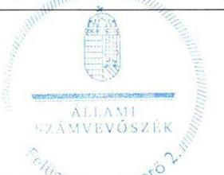

Salamon Ildikó
felügyeleti vezető

---

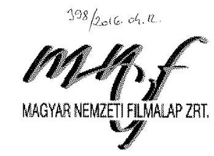

# Domonkos László 

elnök úr részére

## Állami Számvevőszék

H-1052 Budapest, Apáczai Csere János u. 10.
H-1364 Budapest, Pf. 54.
Tárgy: Számvevőszéki jelentéstervezet észrevételezése

Tisztelt Elnök Úr!

Ikt.sz: MNF/.. 12:29.14/2016

## ÁLLAMI SZÁMVEVÓSZÉK   129025/246   Érkeren: 2018 APR 12   Iktasiszám: U-0855-315/2016

Meltéklet: $\qquad$
Ezen: $\qquad$ Aek: $\qquad$
Közönettel vettük V-0855-371/2016 ikt. sz. alatt megküldött „Az állami tulajdonban (résztulajdonban) lévő gazdálkodó szervezetek vagyonmegőrzési és gazdálkodási tevékenységének ellenörzése - Magyar Nemzeti Filmalap Zrt. " címmel készített számvevőszéki jelentéstervezetet.

A tervezetthez az alábbi észrevételeket kívánjuk tenni:

## I. ÉSZREVÉTELEK A JELENTÉSTERVEZETBEN SZEREPLŐ MEGÁLLAPÍTÁSOKRA:

## 1.1. SZÁMÚ MEGÁLLAPÍTÁs:

„Az MNV Zrt. az állami vagyon értékmegőrzésére, gyarapitására vonatkozó elöírásokat, valamint a felelős gazdálkodáshoz követelményeket meghatározta, azonban az FB létszámát 2011-2012. évben a Takarékossági tv.-től eltérően írta elő. A Filmalap - az MNV Zrt. által jóváhagyott Stratégiai tervének egy pontja nem volt összhangban a Civil tv-ben foglaltakkal."

## Észrevételünk a megállapításhoz:

A köztulajdonban álló gazdasági társaságok takarékosabb müködéséről szóló 2009. évi CXXII. törvény 2011. július 15 -től hatályos rendelkezései a köztulajdonban álló cégek FB-inek összetételére vonatkozóan az alábbi rendelkezéseket tartalmazzák:
„4. § (2) A köztulajdonban álló gazdasági társaság felügyelöbizottsága - ha törvény eltérően nem rendelkezik - három természetes személy tagból áll, kétszáz millió forintot meghaladó jegyzett tökéjü gazdasági társaság esetében legalább három, legfeljebb hat természetes személy tagból áll. (3) A (2) bekezdésnek a felügyelő bizottság létszámkorlátjára vonatkozó rendelkezését nem kell alkalmazni olyan közhasznú szervezetnek minösülő jogi személyiséggel rendelkező nonprofit gazdasági társaság esetében, amely az államháztartásról szóló 1992. évi XXXVIII. törvény és egyes kapcsolódó törvények módosításáról szóló 2006. évi LXV. törvény alapján megszüntetett alapítvány (közalapitvány) céljainak megvalósítására, feladatának további ellátására az állami alapító többségi részesedésének biztositásával jött létre."

---

A Magyar Mozgókép Közalapítvány megszüntetéséről szóló 1202/2011. (VI. 21.) Korm. határozat alapján a Magyar Mozgókép Közalapítvány a 2006. évi LXV. törvény 1. § (6) bekezdése alapján került megszüntetésre. Feladatai egy részét a NEFMI-vel kötött megállapodás szerint ugyanezen kormányhatározat alapján a Filmalap vette át. A feladatok megosztása tárgyában megkötött megállapodást a 1203/2011. (VI. 21.) Korm. határozat hagyta jóvá.

# A fentiek alapján az FII létszámának átmenetileg 4 fóben való meghatározása nem volt ellentétes a Takarékossági tv. előírásaival, ezért kérjük a megállapítás első mondatának javítását, az FII létszámának meghatározására vonatkozó rész törlését. 

Egyebekben megjegyezzük, hogy a Filmalap felügyelő bizottsági tagjai közül a 2011. októberben kinevezett negyedik tag díjazást nem vett fel, így az FB 4 taggal való átmeneti müködése többlet költséggel nem járt.

Nem értünk egyet továbbá megállapítás azon bekezdésével sem, mely szerint a Filmalap nem felelt meg az egyesülési jogról, a közhasznú jogállásról, valamint a civil szervezetek müködéséről és támogatásáról szóló 2011. évi CLXXV. törvény (a továbbiakban: Civil tv.) 2. § 20. pontjában foglalt előírásnak. Álláspontunk szerint a Stratégiai Tervben meghatározott adminisztrációs díjat vállalkozási tevékenység bevételeként szükséges minősíteni, melyet a II. pont (javaslatokra tett észrevételek) 1. alpontjában leírtakkal kívánunk alátámasztani.

Kérjük, hogy a Filmalap vezérigazgatójának címzett 1. számú javaslatra tett észrevételünket elfogadni és az 1.1 számú megállapítás 6. bekezdésében foglalt Civil tv. szerinti nem megfelelőséget felülvizsgálni, az erre vonatkozó kijelentést a jelentéstervezet érintett pontjaiból törölni szíveskedjenek.

### 1.2. SZÁMÚ MEGÁLLAPÍTÁS:

„Az MNV Zrt. és a Filmalap között létrejött Támogatási Szerződések - a számlavezetéshez kapcsolódó rendelkezések kivételével - szabályosak voltak. A Filmalap és a nyertes pályázók közötti Támogatási Szerződések megfeleltek a Film tv., valamint az MNV Zrt. által jóváhagyott Támogatási Szabályzat elöírásainak."

## Észrevételünk a megállapításhoz:

A Filmalap az államháztartásról szóló 2011. évi CXCV. törvény (továbbiakban Áht.) 111. § (13) és (15) bekezdései szerinti kérelmeiben kezdeményezte a Magyar Államkincstáron kívüli számlavezetés engedélyezését, mely alapján a Nemzetgazdasági Minisztérium NGM/24538/24/2013, NGM/24538/25/2013 és NGM/26550/9/2012 ikt. leveleiben előbb 2013. december 31-ig, majd 2015. december 31-ig engedélyezte a Filmalap meglévő kereskedelmi számláinak használatát.

---

A nemzetgazdasági miniszter engedélye alapján tehát a Támogatási Szerződések számlavezetéshez kapcsolódó rendelkezései is szabályosak voltak, a jelentéstervezet ezzel ellentétes megállapítása megítélésünk szerint tévedésen alapul.
Fentiek alapján kérjük a jelentéstervezet összegzö részének, az 1.2. számú megállapításnak, valamint a jelentéstervezet egyéb vonatkozó részének módosítását.

Kérjük továbbá a megállapítás első bekezdésének pontositását az alábbiak szerint:
A Filmalap az NGM-mel és az MNV Zrt. - vel kötött Támogatási szerződések alapján 2011-2014. között $25608,8 \mathrm{M}$ Ft-ot kapot az állami költségvetésből. Ebből $5 \mathbf{9 7 0} \mathrm{M}$ Ft -ot a Magyar Mozgókép Közalapítvány tartozásának rendezésére, megvásárlására, 15 884,6 M Ft-ot filmszakmai támogatásra, $2 \mathbf{7 0 4 , 2} \mathrm{M}$ Ft-ot saját működésre, 1050 M Ft-ot pedig egyéb célokra használhatott fel.

# 1.3. SZÁMÚ MEGÁLLAPÍTÁs: 

„Az MNV Zrt. Vagyon-nyilvántartási Szabályzata megfelelı a Vtv. és az Nvtv. elöirásainak".

## Észrevételünk a megállapításhoz:

## A megállapításhoz észrevételünk nincs.

### 2.1. SZÁMÚ MEGÁLLAPÍTÁs:

„A Filmalap a szabályszerü vagyongazdálkodás feltételeit hiányosan alakította ki, mert a 20112013. évre vonatkozó Számlarendet, a 2014. évre az Önköltség-számitási szabályzatot nem készítették el, a Pénzeszközkezelési Szabályzat kivételével a szabályzatokat nem aktualizálták. Az MNV Zrt. által elöírt szabályzatkészitési és tervkészitési kötelezettségnek eleget tettek. A Stratégiai tervben az adminisztrációs dijak elszámolását a vállalkozási tevékenységek bevételei körébe irták elö, ami nem volt összhangban a Civil tv. rendelkezéseivel."

## Észrevételünk a megállapításhoz:

A Filmalap megalakulását követően 2011. augusztus 22. napjával hatályba helyezte Számviteli politikáját, melynek 1.6 pontja tartalmazta a számlarendet. A két leányvállalat 2013. szeptember 30. napjával történt beolvadása azonban a fökönyvi számlaszámok és a gazdasági események megsokszorozódását jelentette, így Filmalap a Számlarendjét külön szabályzatként 2014. január 1 napjával rögzítette írásba, melyet az ÁSZ ellenőrzés részére átadott.

A jelentéstervezetben szereplő észrevétellel ellentétben Filmalap a Számviteli politikáját 2014. január 1. napjával módosította, amely az ellenőrzés részére 2015. augusztus 14-én átadásra került, ezt az átadás-átvételi jegyzék 435. sora (13. oldal) is tartalmazza.
A szabályzat módosítás tartalmazza Számviteli törvény változásból eredő jelentős összegű hibára vonatkozó módosítást, valamint az eszközök könyv szerinti értéke és a piaci értéke közötti különbözet tartósságának megítélésére vonatkozó előírásokat.

---

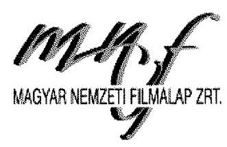

A Filmalap az önköltségszámítás során a belső vezetői utasítások figyelembevétele mellett a Filmalap Filmlabor Igazgatóság (jogelőd: Magyar Filmlaboratórium Kft.) által alkalmazott Önköltség-számítási Szabályzatban foglaltakat vette alapul és tekintette irányadónak annak ellenére, hogy a Magyar Filmlaboratórium Kft. 2013. szeptember 30. napján történő jogutódlással történő beolvadása után e szabályzat nem került újból kihirdetésre.

Kérjük, hogy a 2.1. számú megállapítás 4. bekezdésének Önköltségszámítás rendjére vonatkozó részét szíveskedjenek törölni, tekintettel arra, hogy a Filmalap az erre vonatkozó kötelezettségét teljesítette.

Álláspontunk szerint nem megalapozott a számvevőszéki jelentéstervezet 2.1. számú megállapításának 8. bekezdése sem, mely szerint a Stratégiai Terv nem felelt meg a Civil tv. 2. § 20. pontjában foglaltakkal, tekintettel arra, hogy az az adminisztrációs díjból származó bevételek elszámolását vállalkozási tevékenységek bevételei között írta elő. Álláspontunk szerint a Stratégiai Tervben meghatározott adminisztrációs díjat vállalkozási tevékenység bevételeként szükséges minősíteni, melyet a II. pont (javaslatokra tett észrevételek) 1. alpontjában leírtakkal kívánunk alátámasztani.

Kérjük, hogy a Filmalap vezérigazgatójának címzett 1. számú javaslatra tett észrevételünket elfogadni és a 2.1 számú megállapítás 8. bekezdésében foglalt Civil tv. szerinti nem megfelelóséget felülvizsgálni, az erre vonatkozó kijelentést törölni szíveskedjenek.

Felhívjuk a figyelmet továbbá arra, hogy a Filmalap a Leltárkészítési és leltározási szabályzatát és az Értékelési szabályzatát a megalakulását követően elkészítette és hatályba helyezte, a gyakorlatban követte a Számviteli törvény változásait, a mennyiségi felvétellel történő leltározást három évenként elvégezte.

# 2.2. SZÁMÚ MEGÁLLAPÍTÁS: 

„A Filmalap vagyonának számviteli nyilvántartása részben volt szabályszerű. A 2012. évben a részesedések után elszámolt értékvesztés bizonylati alátámasztottsága, a 2013. évben pedig a követelések értékvesztésének elszámolása nem felelt meg a Számv. tv. rendelkezéseinek. Az állami forrásból kapott támogatások könyvviteli nyilvántartása nem felelt meg a Támogatási szerződésekben elöirt, keretösszegenkénti elkülönités kötelezettségének."
Észrevételünk a megállapításhoz:
Részesedések értékvesztése:
A Társaság bemutatta az Állami Számvevőszék által lefolytatott ellenőrzés során a részesedések értékvesztésének bizonylatait, mely a főkönyvi kartonból, a vegyes bizonylatból valamint a Mafilm Igazgatóság 2013. évi időszaki beszámolójának, és a Filmlabor Igazgatóság 2012. évi beszámolójának másolatát tartalmazta, amely alapját képezte az értékvesztések elszámolásának.

---

Mivel mind a Mafilm, mind a Filmlabor esetében a veszteség tartós volt, az óvatosság elvét követve történt a részesedések értékvesztésének elszámolása.
A Mafilm és a Labor teljes 2012. évi beszámolója külön került lefúzésre, ezek nem az értékvesztés könyvelési bizonylatához tartoznak.

Követelések értékvesztése:
A követelések értékvesztésének részletezése előtt fontos kiemelni, hogy a Filmalapnak 2013. szeptember 30. napjára évközi beszámolót kellett készíteni a beolvadás ténye miatt.

A filmjogokra adott előlegek értékvesztése 2013. szeptember 30. napjával a beolvadás miatt került elszámolásra, a beolvadáshoz szükséges évközi beszámoló és a vagyonmérleg elkészítése érdekében készült. Az óvatosság elvét követve a filmjogokra adott előlegek értékvesztése a várható bevételek alapján került kiszámításra, a beszámoló készítésének időpontjában ismert adatok és állapot szerint.

A filmalkotások hivatalos magyarországi mozi bemutatásának napjával, a filmjogok aktiválására kerülnek. Amely előleg esetében értékvesztés elszámolása történt korábban, akkor az aktiválás napján az értékvesztés visszaírása megtörténik. A jelzett 135 millió forintból 115 millió forint ennek megfelelően került visszaírásra a 2013. szeptember 30 -án képzett értékvesztés összegéből, 20 millió forint a 2012. december 31. napjával képzett értékvesztésből.

A Magyar Mozgókép Közalapítvány adósság konszolidációjának végén, az egyezség keretén belül, 2012. október 12. napján Filmalap átvette a Közalapítvány követelés állományát is. Ennek behajtására tettünk intézkedéseket, jogi lépéseket, azonban 2013. szeptemberében láthatóvá vált a behajtások realitása. Ennek tükrében került a beolvadási beszámolóhoz az értékvesztések meghatározása.

A beolvadással három számviteli rendszer harmonizálását kellett elvégezni, ennek keretében a két beolvadó társaság hozott olyan követeléseket, amelyekre értékvesztést számoltak el korábban. Amennyiben történt befizetés ilyen követeléssel szemben, az értékvesztés visszaírása itt is megtörtént.
Mind a filmjogokra adott előlegek, mind az MMKA-tól átvett követelések értékelése egyedileg történt.

A folyamatos tulajdonosi következetes és konzekvens adatszolgáltatások miatt, 2013. október 1. napjával az értékvesztések technikai könyvelése nem került visszavezetésre.

Támogatások keretösszegenkénti nyilvántartása
A Filmalap Serpa könyvelési szoftverrel rendelkezik, amely a mai kor követelményeinek megfelelően többszintủ gyűjtést, csoportosítást, lekérdezést tesz lehetővé.
A program a fökönyvi szám mellett háromféle alábontást enged költséghely, témaszám és pozíciószám szerint.

---

A költséghely az egyes igazgatóságok megkülönböztetésére, és részlegeik elkülönítésére, a témaszám a produkciók, filmszakmai események tételeinek gyűjtésére, a pozíciószám a közhasznú és vállalkozási tevékenység elkülönítésére szolgál.
Társaságunk a kapott MNV támogatásokat az egyéb bevételek között szerződésenként tartja nyilván, főkönyvi szám szerinti bontásban. A filmszakmai támogatások nyújtásának az egyéb ráfordítások között történő könyvelése esetében a költséghely mező a támogatási szerződés azonosítására szolgál. A müködési költségek könyvelésekor a költséghely mező az egyes részlegek azonosítását biztosítja, amely meghatározza az előzetesen felszámított ÁFA levonhatóságát. Az adókötelezettségek minél pontosabb teljesítése érdekében ezt a mezőt nem használhatjuk más azonosításra.

A témaszámonkénti gyűjtés a tulajdonos által elfogadott üzleti tervnek való megfeleltetést és a következő évek mind pontosabb tervezését szolgálja.

A pozíciószám mező fő gyűjtőcsoport, további támogatási keretösszegenkénti bontása a könyvelés nehezebb átláthatóságát okozná, tekintettel arra is, hogy a beolvadás során korábbi leányvállalataink is hoztak folyamatban lévő fejlesztési támogatást.

A működési költségekről és a filmszakmai támogatások felhasználásról évente tételes elszámolás készül, amelyet a könyvvizsgáló auditál, könyvvizsgálói jelentéssel lát el, ezt követően a felügyelő bizottság és a tulajdonos MNV Zrt. igazgatósága elfogad.
2014. évtől a beolvadás miatt megnövekedett könyvelési tételszám és az egységes nyilvántartás kialakítása érdekében a főkönyvi számokat átstrukturáltuk. Az új számlatükörben a passzív időbeli elhatárolások között szereplő halasztott bevételek főkönyvi számait tovább bontottuk filmszakmai, müködési támogatási összeg és hozam szerint. Erre amiatt volt szükség, mert az évenkénti filmszakmai célú támogatási összeg az első években kisebb ütemben került felhasználásra, és a fennmaradó támogatási összegeket, valamint a hozamokat és a korábbi évek fennmaradó (müködési és MMKA) támogatásainak átcsoportosítását ilyen módon tudtuk kimutatni.

A lekérdezések kombinációival a támogatási szerződések előirása, szabályszerű elkülönítése biztosított, leltárral alátámasztott.

# Fentiekre tekintettel kérjük a 2.2. megállapítás és a jelentéstervezet összegzö részének felülvizsgálatát és módosítását. 

### 3.1. SZÁMÚ MEGÁLLAPÍTÁS:

„A Filmalap a közhasznú, illetve vállalkozási tevékenységének bevételeit és ráforditásait a Civil tv. szerint elkülönítetten számolta el, azonban az elkülönítést belső szabályzataiban nem szabályozta, nem határozta meg az elkülönités alapját, módját és eljárásrendjét, igy nem volt megállapítható az elszámolás szabályszerüsége, nem volt biztositott az elkülönités átláthatósága.

---

# MAGYAR NEMZETIPEMALAP ZRT. 

## Észrevételünk a megállapításhoz:

A 3.1. számú megállapításban leírtak álláspontunk szerint nem megalapozottak, melyet a következőkkel kívánunk alátámasztani:

A Filmalap az Alapszabályában (Alapító Okiratában) előírta, hogy a közhasznú, illetve a vállalkozási tevékenységét elkülönítetten kell kezelni, illetve rendelkezett az elválasztás alapjáról és módjáról is.

A Filmalap az MNV Zrt.-től megkapott filmszakmai támogatásra fordítható támogatás összegét a támogatás beérkezését követően passzív időbeli elhatárolásba helyezi, majd felhasználáskor a passzív elhatárolás csökkenésével egyéb ráfordításként mutatja ki. A támogatásokból forgalmazási bevételre jogosító jogok értékét is egyéb ráfordításként kezeljük, mivel ez a Filmalap esetében a normál üzletmenet része. Ezen jogok megszerzése a Filmalap esetében nem tekinthető fejlesztési célúnak.

Az Alapító Okirat 3.12 pontja expressis verbis kimondja, hogy „a társaságnak a cél szerinti közhasznú tevékenységéből (ld. alapító okirat 3.1.-3.6. pontjaiban említett tevékenységek), illetve a vállalkozási tevékenységéből származó bevételeit és ráfordításait elkülönítetten kell nyilvántartani." E szabály alapító okiratban történő rögzítésével nem csupán a közhasznú- és vállalkozási tevékenységek elválasztásának szükségszerűsége került deklarálásra, hanem meghatározásra került a közhasznú tevékenységek tényleges köre is. E kör lehatárolásából pedig egyértelműen következik, hogy azon feladatok, melyek nem kerültek nevesítésre a 3.1.- 3.6. pontokban kizárólag a közhasznú működést segítő vállalkozási tevékenység közé tartozhatnak.

Ezen kívül a Filmalap részéről az Alapító Okirat 3.8 pontjában taxatíve rögzítésre került, hogy mely feladatok minősülnek vállalkozási tevékenységnek, így a Filmalap rendelkezett a megállapításban megjelölt elkülönítés alapjáról és módjáról.

Az elkülönítés átláthatóságát illetően meg kívánjuk jegyezni azt is, hogy az éves üzleti tervekből egyértelműen kitűnik az elkülönítés, így megállapítható az elszámolás jogszabályi előírások szerinti megfelelősége.

Tekintettel arra, hogy kifejezett jogszabály hiányában, mely előírná külön szabályzat előírását az elkülönítésre vonatkozóan, a Filmalap eleget tett az erre irányuló kötelezettségének azzal, hogy az Alapszabályban (alapító okiratban) rendelkezett az elkülönítés alapjáról, módjáról, melynek megfelelőségét igazolják az MNV által jóváhagyott éves üzleti tervek és az elfogadott Alapszabály is, valamint a már lezárt Támogatási szerződések elszámolásainak Támogató általi elfogadása.

Az előzőek és a Filmalap vezérigazgatójának címzett 1. számú javaslatra tett észrevételünk alapján kérjük, hogy a 3.1. számú megállapítás 4. bekezdését és az összegző megállapítások vonatkozó részét szíveskedjenek felülvizsgálni és törölni.

---

A megállapítás 3.1 pont 5. bekezdésében leírt $0,46 \mathrm{M} \mathrm{Ft}$ összegủ költség megítélésének tisztázásához kérjük, jelöljék meg a kifogásolt tételeket, mert a jelentés tervezet alapján beazonosítani nem tudjuk. Erre a tételek megismerését követően tudunk érdemben válaszolni.

# 3.2. SZÁMÚ MEGÁLLAPÍTÁS: 

„A Filmalap a 2014. évtől az Önköltségszámítás rendjére vonatkozó szabályzatkészitési kötelezettségének nem tett eleget."

## Észrevételünk a megállapításhoz:

A Filmalap az önköltségszámítás során a belső vezetői utasítások figyelembevétele mellett a Filmalap Filmlabor Igazgatóság (jogelőd: Magyar Filmlaboratórium Kft.) által alkalmazott Önköltség-számítási Szabályzatban foglaltakat vette alapul és tekintette irányadónak annak ellenére, hogy a Magyar Filmlaboratórium Kft. 2013. október 1. napján történő beolvadása után kifejezett írásba foglalt vezérigazgatói utasítás alapján e szabályzat nem került újból kihirdetésre. Ez alapján a Filmalap a Számv. tv. 14. § (5) bekezdés c) pontjában foglaltakat megtartotta azzal, hogy rendelkezett az önköltségszámítás rendjéről.

Kérjük, hogy a 3.2. számú megállapításban foglaltakat szíveskedjenek törölni, tekintettel arra, hogy a Filmalap az erre vonatkozó kötelezettségét teljesítette.

### 4.1. SZÁMÚ MEGÁLLAPÍTÁS:

„A Filmalap vagyongazdálkodási tevékenysége - a kereskedelmi bankoknál történő számlavezetés kivételével - szabályszerü volt."

## Észrevételünk a megállapításhoz:

A Filmalap az államháztartásról szóló 2011. évi CXCV. törvény (továbbiakban Áht.) 111. § (13) és (15) bekezdései szerinti kérelmeiben kezdeményezte a Magyar Államkincstáron kívüli számlavezetés engedélyezését, mely alapján a Nemzetgazdasági Minisztérium NGM/24538/24/2013, NGM/24538/25/2013 és NGM/26550/9/2012 ikt. leveleiben előbb 2013. december 31-ig, majd 2015. december 31-ig engedélyezte a Filmalap meglévő kereskedelmi számláinak használatát. (lásd 4., 5. és 6. sz. mellékleteket)

A nemzetgazdasági miniszter engedélye alapján tehát a Filmalap kereskedelmi bankoknál történő számlavezetése szabályszerű volt, a jelentéstervezet ezzel ellentétes megállapítása megítélésünk szerint tévedésen alapul.

---

Fentiek alapján kérjük a jelentéstervezet összegző részének, a 4. fejezet összegző megállapításának, a 4.1. számú megállapításnak, valamint a jelentéstervezet 25. oldala vonatkozó részének módosítását.

Kérjük továbbá a megállapítások 4.1 pontjának 4. bekezdésének pontosítását az alábbi indokok alapján:

A Magyar Mozgókép Közalapítvány konszolidációjára a kormányrendelet alapján 2470 M Ft támogatást biztosított az MNV Zrt. Ez az összeg részben került felhasználásra, a maradvány összeget csoportosították át filmszakmai támogatásra.

A Filmalap és az MNV Zrt. között megkötött támogatási szerződés szerint Filmalapnak a „jogszabály alapján beszedési megbízással terhelhető - fizetési számlájára" kell azonnali beszedési megbízást engedni támogató részére.
Az értékpapír számla nem fizetési számla, arról közvetlen kifizetés csak a pénzforgalmi számlára indítható, amelyre a beszedési megbízás az MNV Zrt. részére biztosított.
A Magyar Államkincstár tájékoztatás szerint az értékpapírszámlát azonnali beszedési megbízással terhelni nem lehet.

A vagyon állagmegóvásával kapcsolatos szövegrész alábbi bevezető mondatára a következő észrevételt kívánjuk tenni:
„A vagyon állagmegóvása érdekében a Filmalap, bár éves karbantartási tervet és állagmegóvási tervet nem készített, a - 2013. évben a konszolidáció során megszerzett eszközeire - 2014-ben az elszámolt értékcsökkenést meghaladó mértékben végzett felújításokat."
A Filmalap mindenkori éves üzleti tervének részét képezi az éves beruházási terv, melyben a vagyon állagmegóvása érdekében szükséges beruházások tervezése is megtörténik, az üzleti terv egyéb részei pedig tartalmazzák a beruházásnak nem minősülő egyéb, a vagyon állagmegóvásához szükséges intézkedéseket és ezek költségeit.

# 4.2. SZÁMÚ MEGÁLLAPÍTÁS: 

„A Filmalap vagyonváltozást eredményező döntéseinek előkészítése és megalapozása megfelelő volt."

## Észrevételünk a megállapításhoz:

## A megállapítással egyetértünk.

### 4.3. SZÁMÚ MEGÁLLAPÍTÁS:

„Az MNV Zrt. vagyonváltozást eredményező döntései szabályosak voltak, a vonatkozó kormányhatározatoknak megfeleltek."

---

Észrevételünk a megállapításhoz:
A megállapításhoz észrevételt nem teszünk.

# 5.1. SZÁMÚ MEGÁLLAPÍTÁs: 

„A Filmalap az éves beszámolási és adatszolgáltatási kötelezettségének eleget tett. Az FB és a könyvvizsgáló a feladatát ellátta, azonban a könyvvizsgáló a 2012-2013. évi könyvvizsgálat során nem észrevételezte a számviteli elszámolásokhoz kapcsolódó szabálytalanságokat. "

## Észrevételünk a megállapításhoz:

## Az észrevétel első mondatával, illetve második mondata első részével egyetértünk.

A Filmalap könyvvizsgálója hivatalos levélben tett észrevételt a jelentéstervezet ezen megállapításához, melyben kijelentette az alábbiakat:
„Az Állami Számvevőszék 2016. március 23-án kelt jelentéstervezetében szereplő, a 2012. évi és 2013. évi éves beszámolóval kapcsolatban tett észrevételei véleményünk alapján a megbizható és valós képet nem befolyásolják, továbbá materiális hibát nem tartalmaznak." (A Filmalap könyvvizsgálójának levele a 7. mellékletben kerül csatolásra.)

A megállapításhoz kapcsolódó szövegrész azon észrevételéhez, miszerint a 2011. évi elfogadott beszámoló és a közzétett beszámoló között a vagyon értékủ jogok tekintetében $0,9 \mathrm{MFt}$-os eltérés mutatkozott megjegyezzük, hogy az egyszerű elírásból fakadó hibát a Filmalap észrevette, azonban a hiba javítása már nem volt lehetséges az éven túli feltárás miatt. A vonatkozó jogszabály - a számviteli törvény szerinti beszámoló elektronikus úton történő letétbe helyezéséről és közzétételéről szóló 11/2009. (IV. 28.) IRM-MeHVM-PM együttes rendelet - ugyanis az alábbiak szerint rendelkezik:
„3. § (...)
(7) Ha nem a legfőbb szerv által elfogadott beszámoló került benyújtásra és közzétételre, a cég erről szóló nyilatkozata alapján a céginformációs szolgálat a beszámolót passzív státuszba helyezi. A legfőbb szerv által elfogadott beszámoló közzétételének lehetőségét a céginformációs szolgálat a beszámoló benyújtását követő egy éven belül, kizárólag egy alkalommal biztositja, feltüntetve az utólagos közzététel napját és a változás tényét is. A passzív státuszú beszámoló a céginformációs szolgálat honlapján továbbra is megismerhető marad. A változás tényéről a céginformációs szolgálat elektronikus értesítést küld a beszámolót benyújtó személy ügyfélkapus tárhelyére, valamint az állami adóhatóságnak."

---

# 5.2. SZÁMÚ MEGÁLLAPÍTÁS: 

„A Filmalap a vagyongazdálkodását érintően kialakította az információs rendszert, azonban a müködtetés során az Info tv. elöirása ellenére a honlapon nem hozták nyilvánosságra a közérdekü adatok egyedi igénylésének szabályait, az igénybe vehető jogorvoslati lehetőségeket, a megitélt támogatási összegeket."

## Észrevételünk a megállapításhoz:

## E megállapításban foglaltakkal részben egyetértünk.

Az információs önrendelkezési jogról és információszabadságról szóló 2011. évi CXII. törvény 34. § (3) bekezdése előírja, hogy a közérdekủ adatok igénylésének szabályairól tájékoztatást kell adni a közzétételre szolgáló honlapon, illetve ugyanezen felületen ismertetni kell a jogorvoslati lehetőségekkel kapcsolatos információkat, mely közzétételi kötelezettségeknek a Filmalap mihamarabb eleget tesz. A Filmalap teljesíti továbbá a 67/2008. (III. 29.) Korm. rendelet 2. § (4) bekezdése szerinti adatszolgáltatási és tájékoztatási kötelezettségét is a jogszabályban meghatározott módon.

Meg kívánjuk jegyezni ugyanakkor, hogy a Filmalap hivatalos honlapján minden támogatási döntést, illetve kedvezményezettet és támogatási összeget közzétett, biztosítva a hozzáférhetőséget mindenki számára, eleget téve ezzel az átláthatóság és nyilvánosság általános követelményének. A Filmalap feltüntette továbbá hivatalos honlapján azokat az elérhetőségeket is, melyeken keresztül az adatigénylő tájékoztatást kérhetett a közérdekủ adatokról és jogorvoslati lehetőségekről is.

Kérjük, hogy fentiek alapján a megállapítást szíveskedjenek felülvizsgálni és pontosítani.

### 5.3. SZÁMÚ MEGÁLLAPÍTÁs:

„A Filmalap a kapcsolt vállalkozásokban lévő részesedések értékének védelme érdekében meghatározta a vagyongazdálkodási követelményeket."

## Észrevételünk a megállapításhoz:

## A megállapítással egyetértünk.

### 6.1. SZÁMÚ MEGÁLLAPÍTÁs:

„A Filmalap nem kötött adósságot keletkeztető ügyleter. A Filmalap beszámolójában a Mafilm Zrt. és a Filmlabor Kft. társaságok beolvadása során átvett adósságot keletkeztető kötelezettségek szerepeltek. A Filmalap a 2013. és 2014. évi mérlegében a kölcsön és a lizing hitelként történő besorolása nem volt megfelelő."

1145 Budapest, Róna u. 174. Telefon: +36 1 46-11-320, Fax: +36 1 46-11-332
Mail: filmalap@filmalap.hu, Web: www.filmalap.hu

---

# Észrevételünk a megállapításhoz: 

A megállapításban leírtakat és a beszámolóban szerepló adatokat átvizsgálva, a leírtakkal egyetértünk.

A 6.1 számú megállapítás 2. bekezdésében pontositás kérünk, az 1,6 M Ft összegủ gépkocsi vásárláshoz kapcsolódó kölesönt a Filmlabor Kft. vette fel.

### 6.2. SZÁMÚ MEGÁLLAPÍTÁs:

„A Filmalapnál nem volt olyan gazdasági esemény, amely a kormányzati szektor hiányára hatást gyakorolt volna az Európai Uniós forrásból származó Media Desk támogatásokkal kapcsolatban keletkezett 2.) MFt összegü visszafizetési kötelezettség kivételével. Az ellátott közfeladatok személyi jellegü és egyéb ráforditásai, valamint az egyéb bevételek elszámolása szabályszerű volt. A Filmalapnál osztalékfizetésre nem került sor."

## Észrevételünk a megállapításhoz:

A megállapítással egyetértünk. Megjegyezzük, hogy a vonatkozó jogszabályok és a Filmalap Alaptó Okirata nem teszi lehetóvé osztalék fizetését.

## A személyi jellegủ ráfordítások bekezdéshez az alábbi észrevételt tesszük:

A Filmalapnál a Cafeteria szabályzat havi keretösszeget határoz meg, de a kifizethető juttatási tételek között lehet hónapok közötti eltolódás, különösen a BKV bérletek esetében, amelyek nem feltétlenül az adott hónap első napjától az utolsó napjáig szólnak. A szabályzat szerint minden munkavállalónak az esélyegyenlőség alapján, ugyanakkora összeg jár.

Korábbi leányvállalataink engedték a különböző juttatási elemek közötti változtatást, azaz a munkavállalóknak nem kellett minden hónapban ugyanazokat a juttatási elemeket választaniuk. A beolvadást követően a Cafeteria rendszert egységesítettük, és havonta állandó juttatási elemek kerültek kifizetésre. A leányvállalatok jogutódja lett a Filmalap, a munkavállalók munkaviszonya jogfolytonos volt.

A megállapításban szereplő munkavállaló esetében, mivel a leányvállalati időszakban kevesebb cafeteria került kifizetésre, ezt a beolvadás utáni hónapokban pótoltuk, figyelembe véve az éves összeget.

---

Az említett munkavállaló juttatása a 2013. év eleji kifizetés eltolódása miatt nem volt havonta egységes, de összességében az adott évre kifizethető összeget nem haladta meg, a teljes éves cafeteria összege 300.000 Ft . volt, amely a 25.000 Ft . tizenkétszerese.

A Filmalapnak a cafeteria juttatás utalásából kára nem keletkezett, mivel a jogelőd társaságokért való helytállás esetén is a különbözet a munkavállalót megillette volna.

# II. Észrevételek a Filmalap VezérigazgatÓJa részére meGfOgalmazott JAVASLATOKRA: 

1. Kezdeményezze, hogy a Filmalap által nyújtott támogatások után felszámított adminisztrációs dijból származó bevétel elszámolása a jogszabályban és az Alapitói Okiratban foglaltakkal összhangban kerüljön elöírásra.

A javaslat e pontjában foglaltakkal nem értünk egyet, egyúttal jelezni kívánjuk, hogy továbbra is fenntartjuk azon álláspontunkat, miszerint a Magyar Nemzeti Filmalap Közhasznú Nonprofit Zrt. által felszámított adminisztrációs dijnak vállalkozási tevékenység bevételeként való minösitése a következök miatt indokolt.

## Jogszabályi háttér

A társasági adóról és osztalékadóról szóló 1996. évi LXXXI. törvény („Tao tv.") 1. § (1) bekezdése a vállalkozási tevékenységet a következőképpen határozza meg:
„Magyarországon a jövedelem- és vagyonszerzésre irányuló, vagy azt eredményezö gazdasági tevékenység (...)"

A közhasznú tevékenységgel kapcsolatban a Tao tv. 6. számú melléklet E) része a következőket tartalmazza (az alábbiakban kizárólag a Filmalap által felszámított adminisztrációs díjak minösítése szempontjából releváns részek kerülnek behivatkozásra):
„A közhasznú nonprofit gazdasági társaság és a szociális szövetkezet 1. § (1) bekezdése szerinti jövedelem- és vagyonszerzésre irányuló, vagy ezt eredményezö gazdasági tevékenységéből e törvény alkalmazásában nem minösül vállalkozási tevékenységnek:

1. a közhasznú tevékenységből származó bevételnek az a része, amely a társadalmi közös szükséglet kielégitéséért felelős szervvel - helyi önkormányzattal vagy a költségvetési törvényben meghatározott fejezettel, illetve a fejezeten belül önálló költségvetéssel rendelkező intézménnyel folyamatos szolgáltatás teljesitésére megkötött, a szolgáltatásért felszámítható dij mértékét és a dij változtatásának feltételeit is tartalmazó szerződés alapján folytatott tevékenységből származik;
2. az 1. pont szerinti tevékenységhez kapott támogatás, juttatás"

A fentiek értelmében egy tevékenység, illetve az ahhoz kapcsolódó bevétel az alábbi esetekben minősül közhasznú tevékenységnek, illetve közhasznú tevékenység bevételének:

---

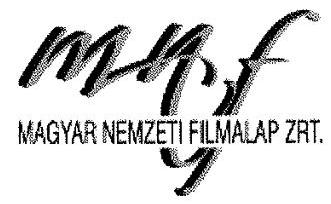

Egyrészt ha a következő három feltétel együttesen teljesül:

- a társaság a tevékenységet a társadalmi közös szükséglet kielégítéséért felelős szervvel ez lehet például a Magyar Nemzeti Vagyonkezelő Zrt. („MNV Zrt.") a támogatások elosztása kapcsán, vagy az Emberi Erőforrás Minisztérium („EMMI") a MEDIA Program keretében végzett tevékenységek kapcsán - megkötött szerződés alapján végzi
- a szerződés folyamatos szolgáltatás teljesítése érdekében megkötött
- a szerződés tartalmazza a szolgáltatásért felszámítható díj mértékét és a díj változásának feltételeit.

Másrészt közhasznú tevékenység bevételének minősül az előzőek szerinti tevékenységhez kapott támogatás, juttatás is.

A fenti szabályok, szempontok figyelembe vétele, valamint a Magyar Nemzeti Filmalap Közhasznú Nonprofit Zrt. Gyártási Igazgatósága által kifejtett tevékenységek, továbbá az MNV által jóváhagyott alapító okirat, a Filmalap adott év szerinti üzleti terve, a Filmalap támogatási szabályzata, a Filmalap és a társadalmi közös szükséglet kielégítésért felelős szerv között megkötött szerződések (pl. az MNV-vel kötött „Támogatási Szerződés", vagy a NEFMI-vel kötött „Együttmüködési Keretmegállapodás") (a továbbiakban az előzőek együttesen: „Háttéranyagok") alapján az adminisztrációs díjnak vállalkozási tevékenység bevételeként való minősítését a következőkkel kívánjuk alátámasztani.

# A Filmalap által ellátott közhasznú tevékenységek 

A Filmalap által ellátott közhasznú tevékenységek (melyek kapcsán az előző pontban bemutatott hármas feltétel együttesen teljesül) a Háttéranyagok alapján a következők:

- Az állami költségvetési forrásból biztosított, a mozgóképről szóló 2004. évi II. törvény („Mtv.") szerinti közvetlen filmszakmai támogatások és befektetések (azaz nem a letéti számlán gyüjtött, az Mtv. szerinti közvetett támogatások) felosztása, folyósítása, valamint a támogatások felhasználásának kizárólag adminisztratív (azaz nem szakmai szempontú) ellenőrzése (MNV Zrtvel kötött megállapodás alapján).
- A Magyar Mozgókép Kőzalapítvány konszolidációjával kapcsolatos feladatok ellátása, a tartozások rendezése (MNV Zrt-vel kötött megállapodás alapján).
- Egyéb filmszakmai feladatok ellátása (ideértve a MEDIA Desk fenntartását is) (EMMI-vel kötött megállapodás alapján).

Megjegyezzük, hogy az előbbiekben felsorolt tevékenységek közhasznú tevékenységként történő minősítését, kezelését támasztja alá a jelen anyag 1. számú mellékletét képező, az NGM által kiadott állásfoglalás is.
A fentiek egyben azt is jelentik, hogy a Filmalap a fenti felsorolásban nem szereplő tevékenységet, tevékenységeket vállalkozási tevékenységként kell, hogy kezelje tekintettel arra, hogy ezekben az esetekben nem teljesülnek a közhasznú tevékenység minősítésének feltételei.

A Filmalap által felszámított adminisztrációs díjakkal kapcsolatban ellátott tevékenységek

---

A Filmalap által felszámított adminisztrációs díjak a következő tevékenységeket, és az azok ellenértékeként meghatározott (adminisztrációs) díjakat foglalják magukban:
(i) a Filmalap Gyártási Igazgatósága által nyújtott általános, szakmai tartalmú támogató szolgáltatások (,„általános támogató szolgáltatások adminisztrációs díja")
(ii) a Filmalap Gyártási Igazgatóságának gyártási ellenőre és produkciós könyvelője által végzett ellenőrzési szolgáltatások („kirendelt munkatársak adminisztrációs díja"; az általános támogató szolgáltatások adminisztrációs díja és a kirendelt munkatársak adminisztrációs díja együttesen „Gyártási Igazgatóság adminisztrációs díja")

# Általános támogató szolgáltatások adminisztrációs díja 

A Filmalap megalakulása óta az Üzleti Terv minden esetben vállalkozási tevékenység bevételeként kezeli az általános támogató szolgáltatások adminisztrációs díját, mellyel kapcsolatban az Üzleti Terv a következőket határozza meg:
„2,5\% adminisztrációs dij: a Társaság által támogatott filmalkotások során, a projekt fejlesztésétől a marketing munkák lezárásátg betöltött aktív szerepvállalás ellenértéke. Az adminisztrációs dij a folyósitandó támogatásokból kerül visszatartásra, illetve áfával növelt értékben kiszámlázásra kerül a produkció részére."

A 2,5\% adminisztrációs díjként nyilvántartott tételről (általános támogató szolgáltatások adminisztrációs díja) a Támogatási Szabályzat 18.1 pontja is rendelkezik, mely szerint:
„Támogatott a támogatásként nyújtott összeg 2,5 \%-ának (áfa nélkül) megfelelő összegü adminisztrációs dijat köteles megfizetni a Támogató részére. Az adminisztrációs dij filmterjesztési (filmmarketing) célú támogatás esetén a támogatásként nyújtott összeg $10 \%$ -ának (áfa nélkül) megfelelő összeg. Az adminisztrációs dij a támogatási összegből levonásra kerül. Az adminisztrációs dijról Támogató áfával növelt értékben számlát állít ki.
Az adminisztrációs dij a Támogató által - a projekt fejlesztésétől a marketing munkák lezárásátig - kifejtett tevékenység ellenértékét képezi."

A 2,5\% adminisztrációs díjként számlázott összegek a gyakorlatban a Filmalap Gyártási Igazgatósága által kifejtett tevékenységek ellenértékét képezik. A Gyártási Igazgatóság által ellátott tevékenységek a következők:

- A Filmalap által fejlesztett könyvviteli szoftver és kontrolling rendszer bevezetése a támogatottnál.
- A filmirodai elszámolás megszervezése és ezzel kapcsolatos előzetes ellenőrzés.
- Finanszírozás megszervezésében történő közremüködés.
- Forgatókönyv fejlesztési pályázatok, egyedi támogatások, vizsgafilm támogatások esetében a pályázó által készített beszámoló szakmai szempontból történő ellenőrzése.
- Az utolsó pont esetében az ellenőrzés nemcsak a nyújtott támogatás összegéig történő ellenőrzésre terjed ki, hanem teljes körűen történik, megelőzve ezzel a pénzügyi és adózási kockázatokat.
- Aktív szerepet vállal a gyártás során a filmalkotások számára PR és marketing stratégia kialakításában.

---

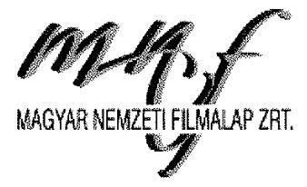

A fentiekkel összefüggésben az Alapító Okirat 3.7 pontja általános jelleggel megállapítja, hogy a Filmalap (egyéb tevékenységek mellett) a számviteli, könyvvizsgálói, adószakértői tevékenységet, valamint az információ technológiai szaktanácsadást vállalkozási tevékenységként végzi.

Kirendelt munkatársak adminisztrációs díja
Az általános támogató szolgáltatások adminisztrációs díja mellett az Üzleti Terv a kirendelt munkatársak adminisztrációs diját szintén minden esetben vállalkozási tevékenység bevételeként kezeli. Ezen adminisztrációs dijjal kapcsolatban az Üzleti Terv a következőket tartalmazza:
„Kirendelt munkatársak személyi jellegü ráfordítása: a Társaság pénzügyi ellenőrének, illetve gyártási ellenőrének munkájával közvetlenül is részt vesz, illetve segiti a produkciók lebonyolítását, pénzügyi elszámolását. A produkciókhoz igy kirendelt munkatársak költségeit a Társaság áfával növelten továbbszámlázza a filmgyártó projektcégeknek."

A Támogatási szabályzat az alábbiakat határozza meg a kirendelt munkatársak adminisztrációs dijával kapcsolatban:
„Filmgyártási és filmgyártás előkészitési támogatás esetén a gyártási ellenőr és a produkciós könyvelő költségeit a Támogató a támogatási szerződésben részletezettek szerint a Támogatottra terheli. E költségek összege a támogatási összeg 1 \%-a, filmgyártás esetén legalább 500.000,- Ft. Filmgyártás előkészités esetén a költségek ennél alacsonybab összegben is megállapíthatók. A fenti szakemberek tevékenysége a Támogató által nyújtott szolgáltatásnak minösül."

A Gyártási Igazgatóság által kirendelt munkatársak (gyártási ellenőr, produkciós könyvelő) a Filmalap adott szolgáltatásnyújtása kapcsán az alábbi feladatokat látják el:

- Gyártás előkészitési, gyártási pályázatok esetében a tételes könyvelés szakmai szempontból történő ellenőrzése a Filmalap által fejlesztett könyvviteli szoftver és kontrolling rendszerben.
- Ennek keretében a gyártási ellenőr szakmai szempontból ellenőrzi a támogatási szerződés teljesítését, azaz a támogatott cél megvalósulását, míg a produkciós könyvelő a támogatási szerződés teljesítésével kapcsolatban készített pénzügyi elszámolást ellenőrzi.
- Az általános támogató szolgáltatásokhoz hasonlóan ebben az esetben is az a célja a Filmalap általi teljes körű szolgáltatásnyújtásnak, hogy megelőzze a pénzügyi és adózási kockázatokat a támogatottak oldalán.

A fentiekkel összefüggésben szintén fontos figyelembe venni az Alapító Okirat 3.7 pontjában leírtakat, miszerint a Filmalap (egyéb tevékenységek mellett) a számviteli, könyvvizsgálói, adószakértői tevékenységet, valamint az információ technológiai szaktanácsadást vállalkozási tevékenységként végzi.

A leírtakat is figyelembe véve azok a tevékenységek, melyek kapcsán a Filmalap adminisztrációs díjak jogcímen állít ki számlát a támogatásban részesült filmalkotások számára, az alábbiak alapján vállalkozási tevékenységnek, illetve az azzal kapcsolatos bevételek (adminisztrációs díj) vállalkozási tevékenységből származó bevételnek minősülnek.

---

# MAGYAR NEMZETI FELMALAP ZRT. 

Gyártási Igazgatóság adminisztrációs díja

- A fenti pontokban részletesen bemutatott tevékenységek alapján a Gyártási Igazgatóság a gyakorlatban tevékenyen részt vesz az adott filmalkotás szakmai és pénzügyi lebonyolításában, ellenőrzésében.
- Ez egyben azt is jelenti, hogy a Gyártási Igazgatóság által kifejtett tevékenységek mind szakmai, mind pedig a tevékenység tényleges tartalmát tekintve túlmutatnak a támogatások felhasználásának adminisztratív ellenőrzésén, mely adminisztratív ellenőrzés a Filmalap közhasznú tevékenységei közé tartozik, és amit a Filmalap külön, a Gyártási Igazgatóság által ellátott tevékenységektől függetlenül végez.
- Az Alapító Okirat tételesen felsorolja a vállalkozási tevékenységeket, melyből a „Számviteli, könyvvizsgálói, adószakértői tevékenység", valamint az „Információ technológiai szaktanácsadás" megfelel a Gyártási Igazgatóság által ellátott feladatoknak.
- A Gyártási Igazgatóság által kifejtett tevékenységek olyan tevékenységnek minősülnek, melyeket a versenyszférában bármelyik gazdasági társaság elláthat, azaz ezeknek a tevékenységeknek a végzése (a támogatások és befektetések felosztásával, folyósításával, valamint a támogatások felhasználásának adminisztratív ellenőrzésével ellentétben) alapvetően nem tarozik a társadalmi közös szükséglet kielégítéséért felelős szervek, azaz az állami szféra feladatai közé.
- Ezzel összhangban megállapítható, hogy az adott filmalkotás a tárgy szerinti tevékenységeket más, a versenyszférában müködő gazdasági társaságtól (pl. könyvviteli, könyvvizsgálati és/vagy adótanácsadási tevékenységet ellátó cég(ek)) is megrendelheti, megrendelhette volna.
- A Gyártási Igazgatóság által végzett tevékenységek ellátásával kapcsolatban a Filmalap nem kötött szerződést egyik társadalmi közös szükséglet kielégítéséért felelős szervvel sem.
- Következésképpen egyik társadalmi közös szükséglet kielégítéséért felelős szervnek sincs ráhatása sem az ellátott tevékenységek körére, sem pedig az azokkal kapcsolatos díj mértékére; ezeket a Filmalap saját hatáskörén belül határozza meg.
- A Társaság megalakulása óta vállalkozási tevékenység bevételeként kezeli a Gyártási Igazgatóság adminisztrációs díját (azaz az általános támogató szolgáltatások adminisztrációs díja és a kirendelt munkatársak adminisztrációs díja), melyet az MNV által jóváhagyott Alapító Okirat, az Üzleti Terv, valamint a Támogatási Szabályzat is alátámaszt.

## Fentiek alapján kérjük a javaslat törlését.

2. Intézkedjen a Filmalap Számviteli Politikájának módosítására, hogy az a jogszabályi elöírásoknak megfelelöen tartalmazza a jelentős összegü hibára, az eszközök könyv szerinti értéke és a piaci értéke közötti különbözet tartósságának megítélésére vonatkozó elöírásokat.

A Filmalap vezérigazgatója intézkedett a Számviteli politika módosításáról, amely 2014. január 1én hatályba lépett. A szabályzat módosítás az ÁSZ ellenőrzés számára 2015. augusztus 14. napján átadásra került (ld. 8. sz. melléklet). A módosítás tartalmazza a jelentős összegű hibára, az

---

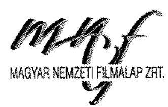
eszközök könyv szerinti értéke és a piaci értéke közötti különbözet tartósságának megítélésére vonatkozó előírásokat.

Fentiek alapján kérjük a javaslat törlését.
3. Intézkedjen a Filmalap Számlarendjének módosítására, hogy az a jogszabályi elöírásoknak megfelelöen tartalmazza a közhasznú és a vállalkozási tevékenységböl származó bevételek és költségek, ráforditások (kiadások) elkülönitett nyilvántartásának szabályait (alapját, felosztási elvét, eljárásrendjét).

A Számlarend megfelelőségét felülvizsgáljuk, az elkülönítésre használható egyéb zárt rendszerủ informatikai lehetőségek teljes kihasználását figyelembe véve pontosítjuk.
4. Intézkedjen a Filmalap a Leltárkészittési és leltározási Szabályzatának módosítására, hogy az a jogszabályban meghatározott gyakorisággal tartalmazza a mennyiségi felvétellel történő leltározási kötelezettséget.

A javaslat e pontjában foglaltakkal részben egyetértünk, a Leltárkészítési és leltározási Szabályzatot módosítjuk, a hatályos jogi előírások figyelembe vételével aktualizájuk. Meg kívánjuk jegyezni ugyanakkor, hogy a Filmalap a számvitelről szóló 2000. évi C. törvény 63. §ával összhangban végezte a mérlegtételek alátámasztására irányuló kötelezettségét, belső vezetői utasítás alapján a leltárba kerülő adatok valódiságáról leltározás során meggyőződött.
Álláspontunkat alátámasztja a számvevőszéki jelentéstervezet 2.2 számú megállapításának utolsó bekezdése is, miszerint „a Filmalap a leltározási kötelezettségének a Számv. tv. 69. § (1) - (3) bekezdésében foglalt elöírásoknak megfelelően a 2013. évben eleget tett, az éves mérlegtételeket a Számv. tv. 69 § (1)-(2) bekezdéseiben foglaltaknak megfelelően leltározással alátámasztotta", így a Filmalap leltározásra és mérlegtételek alátámasztására irányuló gyakorlata és működési rendje megfelelt az előírásoknak.

Fentiek alapján kérjük a javaslat módosítását.
5. Intézkedjen a Filmalap Értékelési Szabályzatának módosítására, hogy az a jogszabályi változások figyelembevételével határozza meg az immateriális javak bekerülési értékének és értékcsökkenésének elszámolási szabályait.

A Filmalap Értékelési szabályzata tartalmazza az eszközök bekerülési értékének és értékcsökkenésének elszámolási szabályait. A szabályzatot felülvizsgáljuk és szükség esetén pontosítjuk az immateriális javakra vonatkozóan.

---

# 6. Intézkedjen, hogy az értékvesztések elszámolása a jövöben a jogszabályoknak és a belsö szabályzatokban elöirtakkal összhangban történjen. 

Az értékvesztések elszámolása az óvatosság elvét figyelembe véve a jogszabályoknak és a belső szabályzatoknak megfelelően történt, a jövőben is a szabályok betartása az elsődleges szempont.

A 2.2 számú megállapításhoz tett észrevételünk alapján kérjük, hogy a javaslat e pontját szíveskedjenek törölni.

## 7. Intézkedjen a jogszabályban elöirt Önköltségszámítás rendjére vonatkozó szabályzat elkészitésére.

A javaslat e pontjában foglaltakkal részben egyetértünk. A Filmalap belső vezetői utasítások figyelembevételével és a jelen tájékoztató levél 3. számú mellékletét képező Önköltség-számítási Szabályzatban foglaltak szerint, valamint a Számv. tv.-ben előirtakra tekintettel megtartotta az önköltségszámítás rendjére vonatkozó szabályokat. A Filmalap az önköltségszámítás során a Filmalap Filmlabor Igazgatóság (jogelőd: Magyar Filmlaboratórium Kft.) által alkalmazott Önköltség-számítási Szabályzatban foglaltakat vette alapul és tekintette irányadónak annak ellenére, hogy a Magyar Filmlaboratórium Kft. 2013. október 1. napján történő beolvadása után kifejezett írásba foglalt vezérigazgatói utasítás alapján e szabályzat nem került újból kihirdetésre. A Filmalap rögzítette továbbá az önköltségszámítás rendjére vonatkozó alapvető előírásokat az Alapszabályban (alapító okirat) is, lefektetve ezzel azon általános normákat, melyek iránymutatásként szolgálnak az önköltségek meghatározása során.

A fentiek alapján a Filmalap a Számv. tv. 14. § (5) bekezdés c) pontjában foglaltakat megtartotta azzal, hogy szabályozta az önköltségszámítás rendjét - a Magyar Filmlaboratórium Kft.-től a jogutódlás következtében átvett - Önköltség-számítási Szabályzatban, másfelől - érvényére juttatva egyúttal az intézményi müködés belső szabályozásának koherenciáját - a Filmalap Alapszabályában (alapító okirat) is.

## Kérjük, hogy a javaslat e pontját szíveskedjenek törölni.

## 8. Végeztesse el a szolgáltatások önköltségének meghatározását a jogszabályi elöirásoknak megfelelöen.

A javaslat e pontjában foglaltakkal részben egyetértünk. A Filmalap a szolgáltatások önköltségének pontos meghatározását felülvizsgálja annak érdekében, hogy az valamennyi szolgáltatásra kiterjedjen.

---

# 9. Biztositsa, hogy a számviteli nyilvántartások megfeleljenek a Támogatási Szerzödésekben elöirt keretösszegenkénti elkülönités kötelezettségének. 

Álláspontunk szerint a támogatási szerződésekben előirt keretösszegenkénti elkülönítésre vonatkozó kötelezettségnek a Filmalap az alakulásától kezdve eleget tesz a könyvviteli program informatikai lehetőségeinek teljes kihasználásával.

Felmérjük ugyanakkor annak lehetőségét, hogy a könyvviteli rendszer jelenleg alkalmazott strukturális lekérdezései helyett egy szoftver fejlesztés által biztosítható-e egy jobb megfeleltetési környezet a támogatási szerződés előírásainak, figyelembe véve a költség hasznon elvét.

## A 2.2 számú megállapításhoz tett észrevételünk alapján kérjük, hogy a javaslat e pontját szíveskedjenek törölni.

10. Intézkedjen a kereskedelmi banknál vezetett pénzforgalmi számlák megszüntetésére, és biztositsa, hogy a Filmalap - a jogszabályban lehetővé tett kivételtöl eltekintve - hitelintézetnél forintban vezetett fizetési számlával ne rendelkezzen.

A javaslat e pontjában foglaltakkal nem értünk egyet, egyúttal a következő észrevételeket kívánjuk tenni:

Az államháztartásról szóló 2011. évi CXCV. törvény (Áht.) 79. § (2) bekezdés j) pontja alapján a Magyar Nemzeti Filmalap Közhasznú Nonprofit Zrt. kincstári körön kívüli számlatulajdonosnak minősül, melyre tekintettel a kincstárban fizetési számlát köteles vezetni. Az Áht. 2012 decemberben hatályos 111. § (13) bekezdése szerint a kincstári körön kívüli számlatulajdonosok 2013. június 30. napjáig voltak kötelesek a kincstárnál forint fizetési számlát nyitni, valamint a nem kincstárnál forintban vezetett fizetési számlákat - ide nem értve az Áht. 79. § (3) bekezdésében meghatározott eseteket - megszüntetni. Ugyanezen bekezdés azonban akként rendelkezett, hogy a kincstáron kívül vezetett fizetési számla megszüntetésének kötelezettsége alól az államháztartásért felelős miniszter a fizetési számla felett rendelkezni jogosult 2013. június 30. napjáig benyújtott kérelmére kivételesen felmentést adhatott. Figyelembe véve, hogy a Magyar Nemzeti Filmalap Közhasznú Nonpropfit Zrt. által vezetett fizetési számlákon keresztül bonyolított fizetési megbízások magas száma aránytalan járulékos költségeket eredményezett a közfeladatok ellátása során, így az illetékes miniszterhez benyújtott méltányossági kérelemben az Áht. 111. § (13) - (15) bekezdésekre való hivatkozással - kértük a kincstáron kívül vezetett fizetési számla megszüntetésének kötelezettsége alóli felmentést, valamint a Magyar Államkincstáron kívüli számlavezetés engedélyezését, melyet az államháztartásért felelős miniszter 2012. decemberében kelt tájékoztató levelében jóváhagyott (ld. 4. sz. melléklet).

---

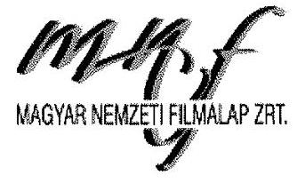

Az Áht. 111. § (13) bekezdése 2013. decemberében már úgy rendelkezett, hogy a kincstári körön kívüli számlatulajdonos - meghosszabbítva ezzel a korábban kitűzött határidőt - 2015. november 30. napjáig köteles a kincstárnál forint fizetési számlát nyitni, illetve a nem kincstárnál vezetett forint fizetési számlákat megszüntetni. Ugyanezen jogszabály lehetőség adott arra, hogy 2015. november 30 -ig benyújtott kérelemre az államháztartásért felelős miniszter felmentés adjon e megszüntetési kötelezettség alól, valamint a határozott időre megadott felmentések érvényességi időtartamának meghosszabbítására is.
Tekintettel arra, hogy a Magyar Nemzeti Filmalap Közhasznú Nonprofit Zrt. kérelmet intézett az illetékes minisztériumhoz a korábban hivatkozott a felmentés érvényességi idejének meghosszabbítása céljából és a Nemzetgazdasági Minisztérium 2013. december 21. napján kelt tájékoztató leveleiben (ld. 5. és 6. sz. melléklet) a kérelmünkben foglaltakhoz hozzájárult, a Magyar Nemzeti Filmalap Közhasznú Nonprofit Zrt. jogosult a tájékoztató levelekben megjelölt számlák használatára.

A fentiek alapján tehát a Magyar Nemzeti Filmalap Közhasznú Nonprofit Zrt. az Áht. által biztosított méltányossági kérelem kedvező elbírálása esetén nem volt köteles megszüntetni a pénzügyi- és hitelintézeteknél vezetett fizetési számláit.

Figyelemmel arra, hogy a felmentési kérelmeket az illetékes minisztérium jóváhagyta, kérjük, a javaslatot szíveskedjenek törölni.

# 11. Intézkedjen a jogszabályokban elöirt nyilvánosságra hozatali kötelezettségek teljesitésére   a) A Filmalap honlapján a közérdekü adatok egyedi igénylésének szabályait, valamint az igénybe vehető jogorvoslati lehetőségeket;   b) továbbá az e célra létrehozott honlapon a megitélt támogatási összegre vonatkozó adatszolgáltatást és tájékoztatást illetően. 

A javaslat e pontjában foglaltakkal részben egyetértünk. Az információs önrendelkezési jogról és információszabadságról szóló 2011. évi CXII. törvény 34. § (3) bekezdése előírja, hogy a közérdekủ adatok igénylésének szabályairól tájékoztatást kell adni a közzétételre szolgáló honlapon, illetve ugyanezen felületen ismertetni kell a jogorvoslati lehetőségekkel kapcsolatos információkat, mely közzétételi kötelezettségeknek a Filmalap mihamarabb eleget tesz. A Filmalap teljesíti továbbá a 67/2008. (III. 29.) Korm. rendelet 2. § (4) bekezdése szerinti adatszolgáltatási és tájékoztatási kötelezettségét is a jogszabályban meghatározott módon.

Meg kívánjuk jegyezni ugyanakkor, hogy a Filmalap hivatalos honlapján minden támogatási döntést, illetve kedvezményezettet és támogatási összeget közzétett, biztosítva a hozzáférhetőséget mindenki számára, eleget téve ezzel az átláthatóság és nyilvánosság általános követelményének.

---

A Filmalap feltüntette továbbá hivatalos honlapján azokat az elérhetőségeket is, melyeken keresztül az adatigénylő tájékoztatást kérhetett a közérdekủ adatokról és jogorvoslati lehetőségekről is.
12. Tegyen intézkedéseket a Filmalap Cafeteria Szabályzatában elöirtnál magasabb összegben kifizetett béren kivüli juttatással kapcsolatban a feltárt hiányosságok és szabálytalanságok tekintetében a felelösség tisztázása érdekében és szükség szerint intézkedjen a felelősség érvényesitéséröl

Felülvizsgáljuk a Cafeteria szabályzatban előírtak betartását, a kifizetések jogosságát, az egységes elvek betartását.
Amennyiben a jelentéstervezetben megfogalmazottakhoz tett észrevételünk alapján a javaslat nem kerül törlésre, a Filmalap meghozza a szükséges intézkedést a felelősség tisztázása és szükség szerint érvényesítése érdekében.

Kérjük fenti észrevételeink alapján a jelentéstervezetet, az összegző megállapításokat, az egyedi megállapításokat, illetve a javaslatokat módosítani szíveskedjenek.

Kérem továbbá, hogy amennyiben észrevételeink alapján nem tartják indokoltnak a kért módosítások teljes körű megtételét, biztosítsák a Filmalap munkatársai és szakértői számára - a végleges jelentés elkészítését megelőzően - az érdemi személyes konzultáció lehetőségét.

Budapest, 2016. április 8.
Üdvözlettel:
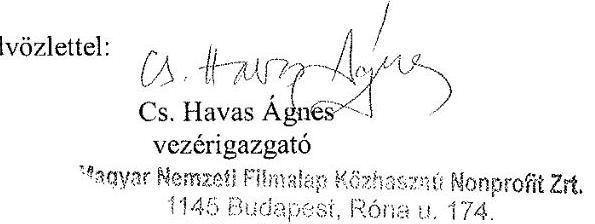

1. számú melléklet: Nemzetgazdasági Minisztérium által kiadott állásfoglalás
2. számú melléklet: Háttéronyagok
3. számú melléklet: Önköltség-számítási Szabályzat
4. számú melléklet: Nemzetgazdasági Minisztérium levele (NGM/26550/9/2012.)
5. számú melléklet: Nemzetgazdasági Minisztérium levele (NGM/24538/24/2013)
6. számú melléklet: Nemzetgazdasági Minisztérium levele (NGM/24538/25/2013.)
7. számú melléklet: Könyvvizsgáló levele
8. számú melléklet: ÁSZ részére átadott dokumentumok listája

---

ELNÖK

Ikt.szám: V-0855-377/2016.

# Cs. Havas Ágnes 

vezérigazgató
Magyar Nemzeti Filmalap Közhasznú Nonprofit Zrt.

## Budapest

## Tisztelt Vezérigazgató Asszony!

Köszönettel megkaptam a 2016. április 11. napján az Állami Számvevőszékhez érkezett „Az állami tulajdonban (résztulajdonban) lévő gazdálkodó szervezetek vagyonmegőrzési és gazdálkodási tevékenységének ellenőrzése - Magyar Nemzeti Filmalap Közhasznú Nonprofit Zrt." című számvevőszéki jelentéstervezetben foglalt megállapításokra, javaslatokra tett észrevételeit.
Tájékoztatom Vezérigazgató asszonyt, hogy a jelentésben - az Állami Számvevőszékről szóló 2011. évi LXVI. törvény 29. § (3) bekezdése alapján - a figyelembe nem vett észrevételeket szerepeltetjük az elutasítás indokainak feltüntetésével együtt.
Az Állami Számvevőszék észrevételekre vonatkozó álláspontjáról a felügyeleti vezető által készített részletes tájékoztatást mellékelten megküldőm.

Budapest, 2016. 05 hó 5 nap
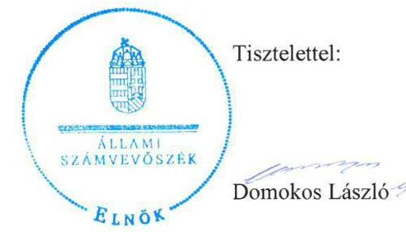

Melléklet: Tájékoztatás az elfogadott és el nem fogadott észrevételekről

---

# Tájékoztatás   az elfogadott és az el nem fogadott észrevételekről 

| I. AZ ELLENŐRZÉS MEGÁLLAPÍTÁSAIHOZ KAPCSOLÓDÓAN |  |  |
| :--: | :--: | :--: |
| 1. | Észrevétel: | Az 1.1. számú megállapításhoz, a Magyar Nemzeti Filmalap Nonprofit Zrt. (Filmalap) Felügyelő Bizottsága (FB) létszámának átmenetileg négy főben történt meghatározására vonatkozóan. |
|  | Válasz: | Az Állami Számvevőszék az észrevételt elfogadja. |
|  | Indoklás: | Az ellenőrzési dokumentumok ismételt áttekintése alapján az FB létszámára vonatkozó megállapítást töröltük, az alábbiak szerint.   Törlésre került   - a Főbb megállapítások, következtetések, javaslatok fejezet 1. bekezdés utolsó tagmondata (5. oldal), a „2012-ig azonban a felügyelő bizottság létszámát a jogszabályban elöirt három helyett négy föben határozta meg" szövegezés;   - az 1. számú összegző megállapításból „- az FB létszámának 2011-2012. évi meghatározása kivételével -" szövegezés;   - az 1.1. számú megállapítás 1. mondatából az „azonban az FB létszámát 2011-2012. évben a Takarékossági tv.-töl eltérően írta elö" szövegezés;   - az 1.1. számú megállapítás 8. bekezdése, ,,Az MNV Zrt. a 2011. október 6. és 2012. június 7. közötti időszakban hatályos Alapitó Okiratban az FB létszámát a három fö helyett négy taggal határosta meg, amely ellentétes volt a Takarékossági tv. 4. § (2) bekezdésében foglaltakkal. Az MNV Zrt. az Alapitó Okirat módosításáról szóló 216/2012. (V. 29.) számú Alapitói Határozatában törölte a negyedik FB tagot." |
| 2. | Észrevétel: | Az 1.1. számú megállapításhoz, az adminisztrációs díj vállalkozási tevékenység bevételeként történő minősitésére vonatkozóan (az 1.1. számú megállapítás 7. bekezdés), valamint a 2.1. számú megállapításhoz, a Stratégiai tervben az adminisztrációs díjak vállalkozási tevékenység bevételeként történő minősítésére és az egyesülési jogról, a közhasznú jogállásról, valamint a civil szervezetek müködéséről és támogatásáról szóló 2011. évi CLXXV. törvény (Civil tv.) elöírásainak való meg nem felelésre vonatkozóan (2.1. számú megállapítás 8 . bekezdés). |
|  | Válasz: | Az Állami Számvevőszék az észrevételt nem fogadja el. |

---

|  | Az észrevétel nem megalapozott, mivel az ellenőrzés rendelkezésére bocsátott dokumentumok nem támasztják alá az észrevételnek azt a következtetését, hogy a támogatások után felszámított adminisztrációs díjak csak és kizárólag a vállalkozási tevékenység bevételét képezik.   A Filmalap a Stratégiai tervben az általa nyújtott támogatások után felszámított $(2,5 \%)$ adminisztrációs dijból, azaz „a támogatott filmalkotások során, a projekt fejlesztésétől a marketing munkák lezárásátg betöltött aktiv szerepvállalás" ellenértékéből származó bevételek elszámolását teljes egészében a vállalkozási tevékenységek bevételei között írta elő, ami nem volt összhangban az Alapító Okiratában és a Civil tv. 2. § 20. pontjában foglalt elöirással.   A Filmalap Alapító Okirat 3. pontja tételesen meghatározta a közhasznú és a vállalkozási tevékenységeket. Az Alapító Okirat szerint általános közhasznú tevékenység ,,az állami költségvetési forrásokból biztositott filmszakmai támogatások és befektetések felosztása, folyósitása és támogatások, valamint befektetések felhasználásának ellenörzése, filmalkotások elökészitésének, gyártásának és forgalmazásának támogatása és elösegítése, filmmüvészek állami támogatása, valamint a filmgyártással és filmforgatással összefüggő szabadidős és kulturális tevékenységek szponzorálása", mely feladatok szükségszerűen részei a projekt fejlesztésétől a marketing munkák lezárásáig betöltött szerepvállalásnak.   A Civil tv. 2. § 20. pontja szerint „közhaseinú tevèkenység: minden olyan tevékenység, amely a létesitő okiratban megielölt közfeladat teljesitését közvetlenül vagy közvetve szolgálja, ezzel hozzájárulva a társadalom és az egyén közös szükségleteinek kielégitéséhez".   A mozgóképről szóló 2004. évi II. törvény (Film. tv.) 9/B. § (1) bekezdés szerint a Filmalap feladatai különösen „c) a támogatás odaítélésétől kezdődően a filmalkotások elkészültének, valamint az egyéb támogatott célok megvalósulásának folyamatos felügyelete és a támogatások felhasználásának ellenörzése, a filmalkotások nemzetközi terjesztésének és filmfesztiválokon való jelenlétének elősegítése".   Fentiek alapján, a filmszakmai támogatások nyújtása nem fejeződik be a támogatások kifizetésénél, a támogatásokkal való elszámolás, a gyártás és a forgalmazás elősegítése, a támogatásokkal való elszámolás ellenőrzése is része a közfeladatnak, utóbbinál nem téve különbséget az adminisztratív és a szakmai szempontú ellenőrzés között.   Előzöekben foglaltakat támasztja alá a Film. tv. 15. § (4) bekezdésében foglalt, a támogatások elosztására vonatkozó azon előírás, miszerint „...A támogató köteles a támogatott cél megvalósulását gyártási és pénzügyi ellenör közremüködésével folyamatosan figyelemmel kisérni és ellenőrizni, valamint az e törvénnyel összhangban álló mindazon intézkedéseket megtenni, amelyek biztositják a támogatott filmalkotások elöállitásának befejezését." |

---

|  | Mindezek alapján nem megalapozott az az észrevétel, miszerint az elszámoláshoz és az ellenőrzéshez kapcsolódó tevékenységet a Filmalap kizárólag vállalkozási tevékenység keretében végzi.   2013 júliusától a Filmalap a Film. tv. 31/D. § (10) bekezdés elöirása alapján ,,a támogatások gyüjtésével és kifizetésével kapcsolatos tevékenységeért" jogosult felszámítani a nyújtott támogatás legfeljebb $2,5 \%$-ának megfelelő adminisztrációs díjat.   A Filmalap a felszámított adminisztrációs díjat 2013 júliusától már megosztotta a közhasznú és vállalkozási tevékenysége között, azonban szabályozás hiányában nem volt megállapítható a közhasznú és a vállalkozási adminisztrációs tevékenységek megosztása, és ezáltal az adminisztrációs dijbevétel elkülönítésének a megfelelősége.   Az adminisztrációs díjak elszámolása szempontjából nem megalapozott a társasági adóról és az osztalékadóról szóló 1996. évi LXXXI. törvény 6. számú melléklet E) pontjára történő hivatkozás, mivel az az adózás szempontjából kedvezményezett tevékenységeket tartalmazza. Az észrevételhez mellékletként csatolt, a Nemzetgazdasági Minisztérium által kiadott állásfoglalás szintén adózási kérdésekről szól, továbbá az észrevételben vitatott bevételeket nem érinti.   Fentiek alapján, a megállapítások módosítása nem indokolt. |
| :--: | :--: | :--: |
|  | Észrevétel: | Az 1.2. számú megállapításhoz, valamint a 4.1. számú megállapításhoz kapcsolódóan, a kereskedelmi banknál történő számlavezetésre vonatkozóan. |
|  | Válasz: | Az Állami Számvevőszék az észrevételt elfogadja. |
| 3. | Indoklás: | A dokumentumok ismételt áttekintése alapján, a számlavezetéshez kapcsolódó megállapításokat töröltük, az alábbiak szerint.   Törlésre került   - a Főbb megállapítások, következtetések, javaslatok fejezet 3. bekezdés utolsó mondatából (6. oldal) ,,- a számlavezetéshez kapcsolódó rendelkezések kivételével -" szövegrész;   - az 1.2. számú megállapításból (14. oldal) a „- a számlavezetéshez kapcsolódó rendelkezés kivételével -" szövegrész;   - az 1.2. számú megállapítás 2. bekezdés 3. mondata (15. oldal) „A Filmalap müködési támogatását is tartalmazó Támogatási Szerződések: 3. pontja engedélyezte a müködési költség fedezetére szolgáló támogatás kereskedelmi banknál vezetett számlára történő átvezetését annak ellenére, hogy az Áht. 79. § (2)-(3) bekezdése alapján a Filmalap hitelintézetnél vezetett fizetési számlával - az általa foglalkoztatott személyek lakásépitésének, lakásvásárlásának munkáltatói támogatására szolgáló számla kivételével - nem rendelkezhetett."; |

---

|  |  | - a 4 pont Összegző megállapításból (23. oldal) „- a kereskedelmi banknál történő számlavezetés kivételével -; szövegezés;   - a 4.1. számú megállapításból (23. oldal) ,,- a kereskedelmi banknál történő számlavezetés kivételével -" szövegezés;   - a 4.1. számú megállapítás 6. bekezdés utolsó mondatából az „amivel nem tartotta be az Aht. 79. § (2) bekezdés j) pontjában és a (3) bekezdésben foglalt elöirást, mely szerint hitelintézetnél forintban vezetett fizetési számlával - a foglalkoztatott személyek lakásépitésének, lakásvásárlásának munkáltatói támogatására szolgáló számla kivételével - nem rendelkezhetett" szövegezés. |
| :--: | :--: | :--: |
| 4. | Észrevétel: | Az 1.2. számú megállapítás 1. bekezdéséhez, a számadatok pontositására vonatkozóan. |
|  | Válasz: | Az Állami Számvevőszék az észrevételt részben fogadja el. |
|  | Indoklás: | Az észrevétel és a dokumentumok ismételt áttekintése alapján az 1.2. számú megállapítás 1. bekezdés, valamint a 2. ábra adatait pontosítottuk, az adatoknál azonban jeleztük, hogy ezek az eredeti támogatási szerződések adatai alapján kerültek figyelembe vételre (kiegészitések, módosítások aláhúzással jelölve).   „A Filmalap az NGM-mel és az MNV Zrt.-vel kötött Támogatási Szerzödések, alapján 2011-2014. között 25 608,8 M Ft-ot kapott az állami költségvetésböl. Ebböl - az eredeti Támogatási Szerződések-et figyelembe véve - 3970 M Ft-ot a Magyar Mozgókép Közalapitvány tartozásának rendezésére, megvásárlására, 15884,6 M Ft-ot filmszakmai támogatásra, 2704,2 M Ft-ot saját müködésre, 1050,0 M Ft-ot pedig egyéb célokra használhatott fel." |
| 5 | Észrevétel: | A 2.1. számú megállapításhoz, a 2011-2013. évekre a Számlarend hiányára vonatkozóan (2.1. számú megállapítás 4. bekezdés). |
|  | Válasz: | Az Állami Számvevőszék az észrevételt nem fogadja el. |
|  | Indoklás: | A hivatkozott Számviteli politika ismételt áttekintése alapján a megállapítás módosítása nem indokolt.   Az észrevételben foglaltakkal ellentétben, a 2011. augusztus 22-tól hatályos Számviteli politika 1.6. pontja nem tartalmazta a Filmalap számlarendjét, mindössze a számlarend kialakításának a tényét rögzítette, valamint a számvitelről szóló 2000 . évi C. törvény (Számv. tv.) 161. § (2) bekezdésében foglaltakkal összhangban felsorolta, hogy a számlarendnek mit kell tartalmaznia. |
| 6. | Észrevétel: | A 2.1. számú megállapításhoz, valamint a 3.2. számú megállapításhoz kapcsolódóan, az Önköltségszámítási szabályzatra vonatkozóan. |
|  | Válasz: | Az Állami Számvevőszék az észrevételt nem fogadja el. |

---

|  | Indoklás: | Az észrevétel nem megalapozott, mivel az abban hivatkozott, és az   észrevétellel egyidejüleg megküldött „Magyar Filmlaboratórium Kft.   Önköltség-számítási szabályzat" hatálya - a dokumentumok ismételt   áttekintése alapján - nem terjedt ki a Filmalapra. Az Alapító Okirat az   önköltségszámításra vonatkozóan konkrét előírásokat nem tartalmaz,   mindössze azt rögzíti, hogy a cél szerinti közhasznú és a vállalkozási   tevékenységéből származó bevételeit és ráfordításait elkülönítetten   kell nyilvántartani. A Számv. tv. 14. § (5) bekezdés c) pontja szerint a   számviteli politika keretében el kell készíteni az önköltségszámítás   rendjére vonatkozó belső szabályzatot, a (12) bekezdésben foglaltak   szerint a számviteli politika elkészítéséért, módosításáért a gazdálkodó   képviseletére jogosult személy felelős.   Fentiek alapján a megállapítás módosítása nem indokolt. |
| :--: | :--: | :--: |
|  | Észrevételi | A 2.1. számú megállapításhoz, a Számviteli politika 2014. január 1.   napjával történt módosítására vonatkozóan. |
|  | Válasz: | Az Állami Számvevőszék az észrevételt elfogadja. |
| 7. | Indoklás: | A dokumentumok ismételt áttekintése alapján, a Számviteli politika   2014. január 1-jei módosításával összhangban a megállapításokat az   alábbiak szerint módosítottuk.   - A 2. számú megállapítást (17. oldal) kiegészítettük a   következők szerint (kiegészítés aláhúzással jelölve): „A   szabályzatokat - a Számviteli Politika és a Pénzkezelési   Szabályzat kivételével - nem aktualizálták."   - A 2.1. számú megállapítás (17. oldal) 1. mondatának utolsó   tagmondatát kiegészítettük a következők szerint (kiegészítés   aláhúzással jelölve): „.... a Számviteli Politika és a   Pénzkezelési Szabályzat kivételével a szabályzatokat nem   aktualizálták."   - A 2.1. számú megállapítás 3. bekezdés (17. oldal) 2-5.   mondatát törőttük „A szabályzat aktualizálására azonban a   Számv. tv. 14. § (11) bekezdés elöirása ellenére nem került   sor. Ebből adódóan a Számviteli Politikában nem rögzítették a   Számv. tv. 3. § (3) bekezdés 3. pontja szerinti 2013. évi   változásként megjelent jelentös összegü hibára vonatkozó   módosítást. Az aktualizálás hiánya miatt az eszközök könyv   szerinti értéke és a piaci értéke közötti különbözet   tartósságának megitélésére vonatkozó elöirás nem felelt meg   a Számv. tv. 46. § (4) bekezdésben elöirt tartósság   kritériumának. A szabályzat a tartósságot a két mérleg-   fordulónapi értékelésnél megállapított eltéréshez, illetve az   eszközök megrongálódásához kötötte, amely nem volt   összhangban a Számv. tv. 46. § (4) bekezdésében szereplő   tartósság követelményével." |

---

| 8. | Észrevétel: | A 2.1. számú megállapításhoz, a Leltárkészittési és leltározási szabályzatra, valamint az Értékelési szabályzatra vonatkozóan (2.1. számú megállapítás 5-6. bekezdés). |
| :--: | :--: | :--: |
|  | Válasz: | Az Állami Számvevőszék az észrevételt nem fogadja el. |
|  | Indoklás: | Az észrevétel a Leltárkészittési és leltározási szabályzat, valamint az Értékelési szabályzat jogszabályi változásnak megfelelő aktualizálása hiányát nem cáfolta, mindössze kiegészítette a gyakorlati végrehajtásra vonatkozó információval. Ennek következtében a megállapítás módosítása nem indokolt. |
| 9. | Észrevétel: | A 2.2. számú megállapításhoz, a részesedések után elszámolt értékvesztés bizonylati alátámasztottságára vonatkozóan (2.2. számú megállapítás 4. bekezdés). |
|  | Válasz: | Az Állami Számvevőszék az észrevételt nem fogadja el. |
|  | Indoklás: | A dokumentumok ismételt áttekintése alapján az észrevétel nem megalapozott.   Az észrevételben hivatkozott éves beszámolók az értékvesztés elszámolásának alapjául szolgálhattak, az értékvesztés elszámolását, az elszámolt értékvesztés összegét azonban közvetlenül nem támasztották alá. A részesedések elszámolásának bizonylataként a helyszíni ellenőrzés rendelkezésére bocsátott dokumentumok nem feleltek meg a Számv. tv. 165. § (1)-(2) bekezdésében, valamint a Számviteli Politika 2.1.3. pontjában foglaltaknak.   A Számv. tv. 165. § (1)-(2) bekezdésében foglaltak szerint „Minden gazdasági müveletről, eseményről, amely az eszközök, illetve az eszközök forrásainak állományát vagy összetételét megváltoztatja, bizonylatot kell kiállítani (készíteni)....Szabályszerü az a bizonylat, amely az adott gazdasági müveletre (eseményre) vonatkozóan a könyvevitelben rögzítendő és a más jogszabályban elöirt adatokat a valóságnak megfelelően, hiánytalanul tartalmazza".   A Számviteli Politika 2.1.3. pontjában foglaltak szerint „A részesedések értékvesztését számításokkal kell alátámasztani."   Tekintettel arra, hogy az ellenőrzés rendelkezésére bocsátott dokumentumok az adott gazdasági eseményt közvetlenül, számításokkal nem támasztották alá, így a megállapítás módosítása nem indokolt. |
| 10. | Észrevétel: | A 2.2. számú megállapításhoz, a 2013. évben a követelések értékvesztésének elszámolására vonatkozóan (2.2. számú megállapítás 10-11. bekezdés). |
|  | Válasz: | Az Állami Számvevőszék az észrevételt nem fogadja el. |
|  | Indoklás: | A dokumentumok ismételt felülvizsgálata alapján az észrevétel nem megalapozott, így a megállapítások módosítása nem indokolt. |

---

|  |  | Az észrevételben a követelések értékveszésének évközi, 2013.   szeptember 30. napjával történő elszámolását a MAFILM Zrt.-nek és a   Filmlabor Kft.-nek a Filmalapba történő beolvadásával, illetve azzal   összefüggésben a vagyonmérleg készitési kötelezettséggel, valamint a   Számv. tv. óvatosság elvére való hivatkozással indokolták.   A beolvadás kapcsán az értékvesztés évközi elszámolására a   Filmalapnak, mint a beolvadó társaságokat átvevő gazdasági   társaságnak a Számv. tv. 137. § (2) bekezdése alapján nem volt   lehetősége „Beolvadás esetében az átvevő gazdasági társaságnál,   kiválás esetében a változatlan társasági formában továbbmüködö   gazdasági társaságnál nem lehet az eszközöket és a kötelezettségeket   átértékelni", így értékvesztést elszámolni sem.   Az eszközök, kötelezettségek átértékelésére az átalakuló, beolvadó   gazdasági társaságoknak lett volna lehetőségük (Számv. tv. 137. § (1)   bekezdés), azonban a MAFILM Zrt. és a Filmlabor Kft. beolvadása a   Filmalapba könyvszerinti értéken történt a végleges vagyonmérlegek   könyvvizsgálatáról szóló könyvvizsgálói jelentés szerint.   A Magyar Mozgókép Közalapítvány adósság konszolidációjának   végén, 2012. október 12. napján a Filmalap által átvett követelés után,   a Filmalap által 2013. év közben történt értékvesztés elszámolások, és   értékvesztés visszairások nem feleltek meg a Számv. tv. 55. § (1)   bekezdésében foglalt előírásnak, mert arra nem a mérlegkészités   időpontjában rendelkezésre álló információk figyelembevételével   került sor.   A 2013. szeptember 30. napjával elszámolt, de év végén visszairásra   került értékvesztések nem feleltek meg továbbá a Számv. tv. 55. § (1)   bekezdésében foglalt, a követelés könyv szerinti értéke és a követelés   árhatóan megtérülő összege közötti - veszteségjellegü - különbözet   tartóssága kritériumának sem.   Számv. tv. 55. § (1) „A vevő, az adós minösitése alapján az üzleti év   mérlegfordulónapján fennálló és a mérlegkészités időpontjáig   pénzügyileg nem rendezett követelésnél (ideértve a hitelintézetekkel,   pénzügyi vállalkozásokkal szembeni követeléseket, a kölcsönként, az   elölegként adott összegeket, továbbá a bevételek aktív idöbeli   elhatárolása között lévő követelésjellegü tételeket is) értékvesztést kell   elszámolni - a mérlegkészités időpontjában rendelkezésre álló   információk alapján - a követelés könyv szerinti értéke és a követelés   várhatóan megtérülö összege közötti - veszteségjellegü - különbözet   összegében, ha ez a különbözet tartósnak mutatkozik és jelentős   összegü." |
|  |  | A 2.2. számú megállapításhoz, az állami támogatások   keretösszegenkénti nyilvántartása nem megfelelőségére vonatkozóan   (2.2. számú megállapítás 12. bekezdés). |
|  | Válasz: | Az Állami Számvevőszék az észrevételt nem fogadja el. |
|  | Indoklás: | A dokumentumok ismételt áttekintése alapján, az észrevétel nem   megalapozott, a megállapítás módosítása nem indokolt. |

---

|  |   |   |
| --- | --- | --- |
|   |  | A támogatási szerződések 4.2. pontja szerint a támogatott köteles az egyes támogatási szerződésekben foglalt „támogatási összeget elkülönítetten kezelni, a támogatás felhasználására nézve elkülönített, naprakész számviteli nyilvántartást vezetni", valamint a pénzügyi elszámoláshoz a „felmerült költségeknek a felhasználásai jogcíme szerint elkülönített számviteli nyilvántartást vezetni".  |
|   |  | Az észrevétel mindössze a bevételek elkülönített nyilvántartását, és a maradványösszegek átcsoportosítását részletezi, a támogatási összegek felhasználására vonatkozó elkülönített nyilvántartást nem.  |
|   |  | A helyszíni ellenőrzés során nem bocsátottak olyan dokumentumot rendelkezésre, amely a költséghely (egyes igazgatóságok), témaszám (produkciók, filmszakmai események) és a pozíciószám (közhasznú és vállalkozási tevékenység elkülönítése) kombinációival a támogatási keretösszegek elkülönített nyilvántartásához a lekérdezési lehetőség biztosítását bizonyította volna.  |
|   | Észrevétel: | A 3.1. számú megállapításhoz, a közhasznú és a vállalkozási tevékenységek elkülönített elszámolásainak szabályozására vonatkozóan (3.1. számú megállapítás 2. bekezdés).  |
|   | Válasz: | Az Állami Számvevőszék az észrevételt nem fogadja el.  |
|  12. | Indoklás: | A dokumentumok ismételt áttekintése alapján, a - közhasznú és vállalkozási - tevékenységek meghatározása nem feleltethető meg a felmerült bevételek, költségek, ráfordítások elkülönítése módja, eljárás rendje, a felosztás alapja meghatározásának. Erre tekintettel a megállapítás módosítása nem indokolt.  |
|   |  | A Filmalap Alapító Okiratában valóban meghatározásra került a közhasznú és vállalkozási tevékenységek felsorolása, amely azonban nem rendelkezik a bevételek, a költségek, a ráfordítások elkülönítése módjáról, eljárás rendjéről, a felosztás alapjáról.  |
|   |  | A Filmalap feladatainak ellátása, működése során olyan költségek és ráfordítások merülnek fel (bérköltségek, rezsiköltségek, fenntartási költségek, üzemanyag költségek, stb.) amely elkülönítése az Alapító Okiratban meghatározott feladatokból nem vezethető le, mivel pl. mind a közhasznú, mind a vállalkozási tevékenységhez kapcsolódnak.  |
|   |  | Ezek a tételek a gyakorlatban megosztottan kerültek elszámolásra, az elkülönítése módja, eljárás rendje, a felosztás alapja meghatározásának hiányában azonban az elkülönítés átláthatósága, az ellenőrzés lehetősége nem volt biztosított.  |
|  13. | Észrevétel: | A 3.1. számú megállapítás 5. bekezdéséhez, a $0,46 \mathrm{M}$ Ft összegủ költség megítélésének tisztázására vonatkozóan.  |
|   | Válasz: | Az Állami Számvevőszék az észrevételt nem fogadja el.  |

---

|  | Indoklás: | Az észrevétel kiegészítő tájékoztatást kért a megállapításban szereplő, összesen $0,46 \mathrm{M}$ Ft téves elszámoláshoz kapcsolódóan.   A dokumentumok ismételt áttekintése alapján, az összesen $0,46 \mathrm{M} \mathrm{Ft}$ összegủ téves elszámolás a 933 és a 3120 hivatkozási számú mintatételekhez kapcsolódott, amelyek esetében egy hődíj és egy nyomdai szolgáltatás tévesen, igénybevett szolgáltatás helyett anyagköltségként került elszámolásra, amely a megállapítás módosítását nem indokolja. |
| :--: | :--: | :--: |
| 14. | Észrevétel: | A 4.1. számú megállapítás 4. bekezdéséhez, a Magyar Mozgókép Közalapítvány konszolidációjára biztosított 2470 M Ft-ra vonatkozóan. |
|  | Válasz: | Az Állami Számvevőszék az észrevételt elfogadja. |
|  | Indoklás: | A dokumentumok ismételt áttekintése alapján, a 4.1. számú megállapítás 4. bekezdését az következők szerint pontositottuk (módosított részek aláhúzzással jelölve).   „Az MNV Zrt. - a Nemzetgazdasági Minisztérium által biztositott 3500 M Ft felett - az 1238/2011. (VII. 11.), Korm. határozat alapján 2011. szeptember 14-én Támogatási Szerződést; kötött a Filmalappal, amelyben további, 2470 M Ft átcsoportositását rendelte el a Filmalap részére a Mozgókép Közalapitvány tartozásállományának megvásárlására. A Mozgókép Közalapitvány konszolidációja a kormányrendeletek szerint megtörtént, a 2470 M Ft részben került felhasználásra, igy a vonatkozó Támogatási Szerződés; 2012. augusztus 29-én módosításra került, és a Filmalap a módositott Támogatási Szerződésnek; megfelelően az eredetileg a tartozásállomány megvásárlására biztositott támogatási ésszeg maradványát a filmszakmai támogatási keretösszeg növelésére forditotta." |
| 15. | Észrevétel: | A 4.1. számú megállapítás 5. bekezdéséhez, az értékpapír számla azonnali beszedési megbízással történő terhelésére vonatkozóan. |
|  | Válasz: | Az Állami Számvevőszék az észrevételt nem fogadja el. |
|  | Indoklás: | Az észrevétel a megállapítást nem cáfolja, hanem megerősíti, igy a megállapítás módosítása nem indokolt.   A támogatási szerződésekben a támogatások biztosítékaként a Filmalap összes bankszámlájára azonnali beszedési megbízás került biztosításra az MNV Zrt. részére. A megállapítás szerint azzal, hogy a Filmalap a kapott, de fel nem használt pénzeszközöket a Magyar Államkincstárnál vezetett értékpapír számlán tartotta, nem biztosította ezen biztosíték érvényesítésének a lehetőségét.   Az észrevétel megerősíti a megállapítást, amely szerint az MNV Zrt. visszafizetési kötelezettség esetén - az azonnali beszedési megbízással történő érvényesítési jogával nem tudna élni, mivel a Magyar Államkincstár értékpapír számláit azonnali beszedési megbízással nem lehet terhelni. |

---

| 16. | Észrevétel: | A 4.1. számú megállapítás 8. bekezdéséhez, a vagyon állagmegóvására vonatkozóan. |
| :--: | :--: | :--: |
|  | Válasz: | Az Állami Számvevőszék az észrevételt elfogadja. |
|  | Indoklás: | A dokumentumok ismételt áttekintése alapján, a 4.1. számú megállapítás 8. bekezdés 1. mondatából a „,bár éves karbantartási és állagmegóvási tervet nem készített, a" szövegrész törlésre került. |
| 17. | Észrevétel: | Az 5.1. számú megállapítás 2. mondat 2. tagmondatához, a könyvvizsgáló a 2012-2013. évi könyvvizsgálatára vonatkozóan. |
|  | Válasz: | Az Állami Számvevőszék az észrevételt nem fogadja el. |
|  | Indoklás: | Az észrevétel a megállapítást nem cáfolja, a könyvvizsgáló levelében foglaltakat idézi.   A Filmalap 2012-2013. évi éves beszámolóit auditáló könyvvizsgáló szerint „Az Állami Számvevőszék 2016. március 23-án kelt jelentéstervezetében szereplő, a 2012. évi és 2013. évi éves beszámolóra vonatkozó észrevételei véleményünk alapján a megbizható és valós képest nem befolyásolják, továbbá materiális hibát nem tartalmaztak.".   Az ellenőrzés megállapításai ezzel ellentétes véleményt, illetve a könyvvizsgáló levelében foglalt minősítéseket nem tartalmaznak, azok módosítása nem indokolt. |
| 18. | Észrevétel: | Az 5.2. számú megállapításhoz, a közérdekủ adatok egyedi igénylésének szabályaira, az igénybe vehető jogorvoslati lehetőségekre, a megítélt támogatási összegek nyilvánosságra hozatalára vonatkozóan (5.2. számú megállapítás 2. bekezdés). |
|  | Válasz: | Az Állami Számvevőszék az észrevételt nem fogadja el. |
|  | Indoklás: | Az észrevételben foglaltak nem cáfolják, hanem megerősítik az ellenőrzés megállapításaiban foglaltakat, így azok módosítása nem indokolt.   A Filmalap honlapján történő közzétételre vonatkozó tájékoztatás az ellenőrzés megállapításait nem módosítja, mivel a megállapítás nem erre, hanem a közpénzekből nyújtott támogatások átláthatóságáról szóló 2007. évi CLXXXI. törvény végrehajtásáról szóló 67/2008. (III. 29.) Korm. rendelet 2. § (4) bekezdésben előírt adatszolgáltatási és tájékoztatási kötelezettségre vonatkozott, amelynek a Filmalap az ellenőrzött időszakban nem tett eleget. |
| 19. | Észrevétel: | A 6.1. számú megállapítás 2. bekezdésében, a kölcsönt felvevő megnevezésére vonatkozóan. |
|  | Válasz: | Az Állami Számvevőszék az észrevételt elfogadja. |

---

|  | Indoklás: | A dokumentumok ismételt áttekintése alapján a 6.1. számú megállapítás 2. bekezdés 1. mondata pontositásra került a következők szerint (módosítás aláhúzással jelölve) „A 2013. évben a Filmalap beszámolójában beruházást és fejlesztési hitelként - a Filmlabor Kft. által felvett - 1,6 M Ft összegü, gépkocsi vásárláshoz kapcsolódó kölcsön kötelezettség szerepelt". |
| :--: | :--: | :--: |
| 20. | Észrevétel: | A 6.2. számú megállapítás 2. bekezdésében, a személyi ráfordítások (Cafetéria) elszámolására vonatkozóan. |
|  | Válasz: | Az Állami Számvevőszék az észrevételt nem fogadja el. |
|  | Indoklás: | Az észrevétel az ellenőrzés megállapítását nem cáfolja, így a megállapítás módosítása nem indokolt.   A Filmalapnál a Mafilm Zrt.-től átvett egy dolgozó esetében, még a Mafilm Zrt.-nél kiállított Cafeteria nyilatkozata alapján került kifizetésre a 2013. december hóra 28500 Ft juttatás. Ez a Mafilm Zrt. Cafeteria Szabályzatával összhangban volt, a Filmalap Cafeteria Szabályzatával azonban nem. Tekintettel arra, hogy a Mafilm Zrt.-nek a Filmalapba 2013. szeptember 30. napjával történt beolvadását követően a dolgozóra a Filmalap Cafeteria Szabályzata lett irányadó, a nyilatkozat módosítása szükséges lett volna. |

# II. A FILMALAP VEZÉRIGAZGATÓJA RÉSZÉRE MEGFOGALMAZOTT JAVASLATOKHOZ KAPCSOLÓDÓAN 

| 1. | Észrevétel: | A Filmalap vezérigazgatójának megfogalmazott 1. számú javaslathoz, az adminisztrációs dijból származó bevétel elszámolására. |
| :--: | :--: | :--: |
|  | Válasz: | Az Állami Számvevőszék az észrevételt nem fogadja el. |
|  | Indoklás: | A javaslatot alátámasztó intézkedést igénylő megállapítások nem kerültek módosításra (2. számú észrevétel), így a javaslat módosítása nem indokolt. |
| 2. | Észrevétel: | A Filmalap vezérigazgatójának megfogalmazott 2. számú javaslathoz, a Filmalap Számviteli politikájának módosítására vonatkozóan. |
|  | Válasz: | Az Állami Számvevőszék az észrevételt elfogadja. |
|  | Indoklás: | A javaslatot alátámasztó intézkedést igénylő megállapítások módosítása (7. számú észrevétel) alapján a 2. számú javaslat törlésre került. |
| 3. | Észrevétel: | A Filmalap vezérigazgatójának megfogalmazott 4. számú javaslathoz, a Leltárkészítési és leltározási Szabályzat módosítására vonatkozóan. |
|  | Válasz: | Az Állami Számvevőszék az észrevételt nem fogadja el. |

---

|  | Indoklás: | A javaslatot alátámasztó intézkedést igénylő megállapítások nem kerültek módosításra (8. számú észrevétel), így a javaslat módosítása nem indokolt.   Az észrevételben egyetértett a Leltárkészítési és leltározási Szabályzat módosításának a kötelezettségével, ugyanakkor észrevételezte, hogy a gyakorlatban a leltározási kötelezettségének eleget tett, amely tényt a megállapítás is tartalmazta. |
| :--: | :--: | :--: |
| 4. | Észrevétel: | A Filmalap vezérigazgatójának megfogalmazott 6. számú javaslathoz, az értékvesztések elszámolására vonatkozóan. |
|  | Válasz: | Az Állami Számvevőszék az észrevételt nem fogadja el. |
|  | Indoklás: | A javaslatot alátámasztó intézkedést igénylő megállapítások nem kerültek módosításra ( $9-10$. számú észrevétel), így a javaslat módosítása nem indokolt. |
| 5. | Észrevétel: | A Filmalap vezérigazgatójának megfogalmazott 7. számú javaslathoz, az Önköltségszámítás rendjére vonatkozó szabályzat elkészítésére. |
|  | Válasz: | Az Állami Számvevőszék az észrevételt nem fogadja el. |
|  | Indoklás: | A javaslatot alátámasztó intézkedést igénylő megállapítások nem kerültek módosításra (6. számú észrevétel), így a javaslat módosítása nem indokolt. |
| 6. | Észrevétel: | A Filmalap vezérigazgatójának megfogalmazott 8. számú javaslathoz, a szolgáltatások önköltségének meghatározására vonatkozóan. |
|  | Válasz: | Az Állami Számvevőszék az észrevételt nem fogadja el. |
|  | Indoklás: | A javaslatot alátámasztó intézkedést igénylő megállapítások nem kerültek módosításra, arra észrevételt nem tett, így a javaslat módosítása nem indokolt. |
| 7. | Észrevétel: | A Filmalap vezérigazgatójának megfogalmazott 9. számú javaslathoz, az állami támogatások keretősszegenkénti számviteli nyilvántartására vonatkozóan. |
|  | Válasz: | Az Állami Számvevőszék az észrevételt nem fogadja el. |
|  | Indoklás: | A javaslatot alátámasztó intézkedést igénylő megállapítások nem kerültek módosításra (11. számú észrevétel), így a javaslat módosítása nem indokolt. |
| 8. | Észrevétel: | A Filmalap vezérigazgatójának megfogalmazott 10. számú javaslathoz, a kereskedelmi banknál vezetett pénzforgalmi számlák megszüntetésére vonatkozóan. |
|  | Válasz: | Az Állami Számvevőszék az észrevételt elfogadja. |

---

|  | Indoklás: | A javaslatot alátámasztó intézkedést igénylő megállapítások   módosítása (3. számú észrevétel) alapján a 10. számú javaslat   törlésre került. |
| :-- | :-- | :-- |
|  |  | A Filmalap vezérigazgatójának megfogalmazott 11. számú   javaslathoz, a jogszabályban elöirt nyilvánosságra hozatali   kötelezettségre vonatkozóan. |
|  | Észrevétel: | Az Állami Számvevőszék az észrevételt nem fogadja el. |
|  |  | A javaslatot alátámasztó intézkedést igénylő megállapítások nem   kerültek módosításra (18. számú észrevétel), így a javaslat   módosítása nem indokolt. |
|  |  | A Filmalap vezérigazgatójának megfogalmazott 12. számú   javaslathoz, a Filmalap Cafeteria Szabályzatában elöirtnál   magasabb összegben kifizetett béren kívüli juttatás felülvizsgálatára   vonatkozóan. |
|  | Észrevétel: | Az Állami Számvevőszék az észrevételt nem fogadja el. |
|  |  | A javaslatot alátámasztó intézkedést igénylő megállapítások nem   kerültek módosításra (20. számú észrevétel), így a javaslat   módosítása nem indokolt. |

Az 1.3., a 4.2., a 4.3., az 5.3., a 6.1. és a 6.2. számú ellenőrzési megállapításokkal, valamint Filmalap vezérigazgatójának megfogalmazott 3. és 5. számú javaslattal kapcsolatban észrevételt nem tett, azokkal egyetértett, illetve a tervezett intézkedésekről tájékoztatott, amelyeket köszönettel vettünk.

Budapest, 2016. Cf. hó Cf. nap
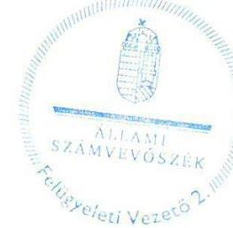

Salamon Ildikó
felügyeleti vezető

---

# RÖVIDÍTÉSEK JEGYZÉKE 

${ }^{1}$ MNV Zrt.
${ }^{2}$ Filmalap
${ }^{3}$ Stratégiai terv
${ }^{4}$ Civil tv. 2
${ }^{5}$ Alapító Okirat
${ }^{6}$ Vtv.
${ }^{7}$ Támogatási Szabályzat
${ }^{8}$ FB
${ }^{9}$ Mozgókép Közalapítvány
${ }^{10}$ Befektetési Szabályzat
${ }^{11}$ Támogatási Szerződések:
${ }^{12}$ Támogatási Szerződések:
${ }^{13}$ Film tv.
${ }^{14}$ Támogatási Szabályzat
${ }^{15}$ NGM
${ }^{16}$ Vagyon-nyilvántartási Szabályzat
${ }^{17}$ Vhr.
${ }^{18} \mathrm{Nvtv}$.
${ }^{19}$ Számviteli Politika
${ }^{20}$ Pénzkezelési Szabályzat
${ }^{21}$ SZMSZ
${ }^{22}$ Hunnia Kft.
${ }^{23}$ Mafilm Zrt.
${ }^{24}$ Filmlabor Kft.
${ }^{25}$ Számv. tv.
${ }^{26} 1202 / 2011$. (VI. 21.) Korm. határozat
${ }^{27} 1069 / 2012$. (III. 20.) Korm. határozat
${ }^{28} 1237 / 2011$. (VII. 11.) Korm. határozat
${ }^{29} 1309 / 2011$. (IX. 6.) Korm. határozat
${ }^{30} 1238 / 2011$. (VII. 11.) Korm. határozat
${ }^{31}$ Kbt.
${ }^{32}$ Civil tv. 1

Magyar Nemzeti Vagyonkezelő Zrt.
Magyar Nemzeti Filmalap Közhasznú Nonprofit Zrt.
Magyar Nemzeti Filmalap Közhasznú Nonprofit Zrt. 2012-2014. évi Stratégiai terv
2011. évi CLXXV. törvény az egyesülési jogról, a közhasznú jogállásról, valamint a civil szervezetek müködéséről és támogatásáról (hatályos 2011. XII. 22.)
Magyar Nemzeti Filmalap Közhasznú Nonprofit Zrt. Alapító Okirata
2007. évi CVI. törvény az állami vagyonról

A Magyar Nemzeti Filmalap Közhasznú Nonprofit Zrt. Támogatási Szabályzata
A Magyar Nemzeti Filmalap Közhasznú Nonprofit Zrt Felügyelőbizottsága
Magyar Mozgókép Közalapítvány
A Magyar Nemzeti Filmalap Befektetési Szabályzata
Az MNV Zrt. és a Filmalap között létrejött, a közfeladatok, az egyéb feladatok ellátását valamint a müködést biztosító forrásokhoz kapcsolódó Támogatási Szerződések
A Filmalap és a nyertes pályázók között létrejött Támogatási Szerződések 2004. évi II. törvény a mozgóképről (hatályos 2004. IV. 01.)

A Magyar Nemzeti Filmalap Közhasznú Nonprofit Zártkörűen Müködő Részvénytársaság Támogatási Szabályzata
Nemzetgazdasági Minisztérium
MNV Zrt. Vagyon-nyilvántartási Szabályzata
254/2007. (X. 4.) Korm. rendelet az állami vagyonnal való gazdálkodásról
2011. évi CXCVI. törvény a nemzeti vagyonról (hatályos 2011. XII. 31.)

A Magyar Nemzeti Filmalap Számviteli Politikája
Magyar Nemzeti Filmalap Közhasznú Nonprofit Zrt. 2011-2014. évi Pénzkezelési Szabályzata
Magyar Nemzeti Filmalap Közhasznú Nonprofit Zrt. Szervezeti és Müködési Szabályzata
Hunnia Filmstúdió Kft
Mafilm Nonprofit Zrt.
Magyar Filmlaboratórium Nonprofit Kft.
2000. évi C törvény a számvitelről

A Magyar Mozgókép Közalapítvány megszüntetéséről
1069/2012. (III. 20.) Korm. határozat a Magyar Mozgókép Közalapítvány megszüntetéséről
A Szervezetátalakítási alap előirányzatból a Magyar Nemzeti Filmalap Közhasznú Nonprofit Zrt. részére történő forrásbiztosításról
A 1237/2011. (VII. 11.) Korm. határozat visszavonásáról és a Szervezet-átalakítási alap előirányzatából a Magyar Nemzeti Filmalap Közhasznú Nonprofit Zrt. részére történő forrásbiztosításáról szóló 1309/2011. (IX. 6.) Korm. határozat 1238/2011. (VII. 11.) Korm. határozat a nemzeti filmipar megújítása érdekében szükséges feladatok kiegészítő támogatásáról
2011. évi CVIII. törvény a közbeszerzésekről (hatályos:2011. VIII. 21.-től)
1997. évi CLVI törvény a közhasznú szervezetekről

---

${ }^{33}$ Avtv
${ }^{34}$ Info tv.
${ }^{35}$ 67/2008. (III. 29.) Korm. rendelet
${ }^{36}$ Áht.
${ }^{37}$ Stabilitási tv.
${ }^{38}$ 353/2011. (XII. 30.) Korm. rendelet
${ }^{39}$ Szja tv.
${ }^{40}$ Media-Desk Támogatások
${ }^{41}$ Gt.
${ }^{42}$ Ctv.
${ }^{43}$ ÁSZ tv.
1992. évi LXIII. törvény a személyes adatok védelméről és a közérdekú adatok nyilvánosságáról (hatálytalan 2012. I. 1-jétől)
2011. évi CXII. törvény az információs önrendelkezési jogról és az információszabadságról (hatályos 2011. VII. 21-től)
67/2008. (III. 29.) Korm. rendelet a közpénzekből nyújtott támogatások átláthatóságáról szóló 2007. évi CLXXXI. törvény végrehajtásáról
2011. évi CXCV. törvény az államháztartásról
2011. évi CXCIV törvény Magyarország gazdasági stabilitásáról (hatályos: 2011. XII. 31-től)
353/2011. (XII. 30.) Korm. rendelet az adósságot keletkeztető ügyletekhez történő hozzájárulás részletes szabályairól
1995. évi CXVII. törvény a személyi jövedelemadóról

2012-1106-1134MD001041HU Media 2007 Programme (kelt: 2012. IV. 19.)
2013-0523-1236MD001019HU Media 2007 Programme (kelt: 2013. VI. 04.)
2006. évi IV törvény a gazdasági társaságokról (hatálytalan 2014. III. 15.)
2006. évi V. törvény a cégnyilvánosságról, a bírósági cégeljárásról és a végelszámolásról
2011. évi LXVI. törvény az Állami Számvevőszékről (hatályos 2011. VII. 1.)

---

.

---

.

---

.

---

# ÁLLAMI SZÁMVEVŐSZÉK 

1052 Budapest, Apáczai Csere János utca 10.
Levélcím: 1364 Budapest 4. Pf. 54
Telefon: +36 14849100 Telefax: +36 14849200
www.asz.hu