# Jelentés 

## A központi alrendszer egyes intézményei ellenőrzése

A központi alrendszer egyes intézményei pénzügyi és vagyongazdálkodásának ellenőrzése - Alkotmánybíróság

2016.

---

.

---

# Jelentés 

## A központi alrendszer egyes intézményei ellenőrzése

A központi alrendszer egyes intézményei pénzügyi és vagyongazdálkodásának ellenőrzése - Alkotmánybíróság
2016. 05. hó 24. nap
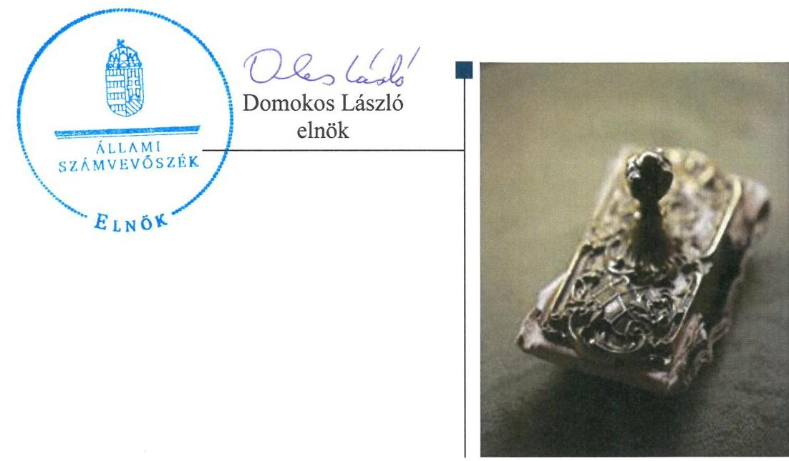

---

Jelentéseink az Országgyűlés számítógépes hálózatán és az Interneten a www.asz.hu címen is olvashatóak.

## AZ ELLENŐRZÉST FELÜGYELTE:

SALAMON ILDIKÓ felügyeleti vezető

## AZ ELLENŐRZÉST VEZETTE ÉS A VÉGREHAJTÁSÁÉRT FELELŐS:

HADNAGYNÉ PAPP ILDIKÓ ellenőrzésvezető

## A PROGRAM ÖSSZEÁLLÍTÁSÁÉRT FELELŐS:

JANIK JÓZSEF osztályvezető
BÖRÖCZ IMRE projektfelelős

## A TÉMÁHOZ KAPCSOLÓDÓ KORÁBBI SZÁMVEVŐSZÉKI JELENTÉSEK:

- címe: Magyarország 2014. évi központi költségvetése végrehajtásának ellenőrzéséről
- sorszáma: 15167
- címe: A 2013. évi zárszámadásról - Magyarország 2013. évi költségvetése végrehajtásának ellenőrzéséről
- sorszáma: 14207
- címe: Magyar Köztársaság 2011. évi költségvetése végrehajtásának ellenőrzéséről
- sorszáma: 1297

IKTATÓSZÁM: V-0887-220/2016.
TÉMASZÁM: 1921
ELLENŐRZÉS-AZONOSÍTÓ SZÁM: V071301

---

# TARTALOMJEGYZÉK 

■ ÖSSZEGZÉS ..... 5
■ AZ ELLENŐRZÉS CÉLJA ..... 6
■ AZ ELLENŐRZÉS TERÜLETE ..... 7
■ AZ ELLENŐRZÉS HÁTTERE, INDOKOLTSÁGA ..... 8
■ FÓKUSZKÉRDÉSEK ..... 9
■ ELLENŐRZÉS HATÓKÖRE ÉS MÓDSZEREI ..... 10
■ MEGÁLLAPÍTÁSOK ..... 13
■ JAVASLATOK ..... 29
■ MELLÉKLETEK ..... 31
I. sz. melléklet: Értelmező szótár ..... 31
II. sz. melléklet: Az integritás szemlélet érvényesítésével kapcsolatos megállapítások ..... 34
III. sz. melléklet: Főbb megállapítások összefoglalása ..... 35
IV. sz. melléklet: Az Alkotmánybíróság vagyona ..... 36
■ FÜGGELÉK: ÉSZREVÉTELEK ..... 37
■ RÖVIDÍTÉSEK JEGYZÉKE ..... 49

---

.

---

# ÖSSZEGZÉS 

Az Állami Számvevőszék az Alkotmánybíróság 2011-2014. évi pénzügyi és vagyongazdálkodását ellenőrizte. Az Alkotmánybíróság a gazdálkodás kereteit összességében szabályszerűen alakította ki, pénzügyi és vagyongazdálkodása - kisebb hiányosságok mellett - összességében megfelelő volt.

## Az ellenőrzés társadalmi indokoltsága

A közpénzek felhasználásában meghatározó, központi alrendszerbe tartozó intézmények pénzügyi és vagyongazdálkodási tevékenységük és/vagy feladatellátásuk súlya miatt jelentős hatást gyakorolhatnak a költségvetés egyensúlyának fenntartására. Hatással vannak továbbá az állami vagyonnal való gazdálkodás minőségére, a kormányzati (szak)politikák végrehajtására, illetve közfeladat ellátásuk vonatkozásában az állampolgárok életminőségére, jogaik és kötelezettségeik gyakorlására. Indokolt ezért, hogy az Állami Számvevőszék ezen intézmények pénzügyi és vagyongazdálkodását, az esetleges átalakulások szabályszerűségét rendszeresen ellenőrizze több évre kiterjedően.

## Főbb megállapítások, következtetések

Az Alkotmánybíróságnál az irányítószervi feladatellátás összességében szabályszerű volt, azonban az Alkotmánybíróság alapító okirata 2011. december 31-éig nem felelt meg az Alkotmánybíróság székhelyére vonatkozó törvényi rendelkezésnek. Az Alkotmánybíróság rendelkezett jogszabálynak megfelelő szervezeti és működési szabályzattal.

Az Alkotmánybíróság vagyongazdálkodása szabályszerű volt, azonban a 2011-2014. években a vagyonkezelési szerződése nem felelt meg a jogszabályi előírásoknak, mivel hatályon kívül helyezett jogszabályi hivatkozásokat tartalmazott, továbbá az Alkotmánybíróság által kezelt vagyonelemek többszöri változása ellenére nem tartották be a jogszabályi rendelkezést, amely szerint a vagyonkezelési szerződést 60 napon belül a módosításokkal egységes szerkezetbe kell foglalni. A mérlegében kimutatott eszközök és források nyilvántartása, értékelése, leltározása, a vagyonelemek elidegenítése, hasznosítása a jogszabályok és a belső szabályzatok előírásainak megfelelt. A folyamatos fizetőképesség biztosított volt. Lejárt kintlévőség, hosszú lejáratú kötelezettség nem volt.

A belső kontrollrendszer kialakítása és működtetése a megállapított hiányosságok mellett megfelelt a jogszabályi előírásoknak, a kialakítás és működtetés megfelelősége a 2013. évtől javuló tendenciát mutat. Szabályozási hiányosság, hogy a 2014. évben nem rögzítették a jogszabályban előírt egyszerűsített értékelési eljárás alá vont követelések dokumentálásának szabályait, továbbá a belső ellenőri jelentések a jogszabályban előírt kötelező tartalmi elemeket nem tartalmazták.

A pénzügyi gazdálkodás összességében szabályszerű volt. Az elemi költségvetés, az előirányzatok megállapítása, a bevételi és kiadási előirányzatok módosítása, valamint a bevételi előirányzatok teljesítése során betartották a jogszabályi előírásokat és a belső szabályzatokban foglaltakat. Az előirányzat maradvány megállapítása, felhasználása szabályszerű volt. A kiadási előirányzatok felhasználása során a személyi juttatásoknál a 2011. évben a szakmai teljesítésigazolás, 2012-2014-ben a teljesítésigazolás és az érvényesítés nem felelt meg a jogszabályi előírásoknak. Az Alkotmánybíróság pénzügyi- és vagyongazdálkodása ellenőrzésének főbb megállapításait a III. számú melléklet tartalmazza.

Az ÁSZ a költségvetési szerv vezetőjének (Alkotmánybíróság elnökének) fogalmazott meg javaslatokat, amelyekre 30 napon belül intézkedési tervet kell készítenie.

---

# **AZ ELLENŐRZÉS CÉLJA**

## **Alkotmánybíróság pénzügyi és vagyongazdálkodásának ellenőrzése**

Az ellenőrzés célja annak megítélése volt, hogy az ellenőrzött intézményre vonatkozó irányító szervi feladatellátás a jogszabályi előírások betartásával történt-e; az intézménynél a belső kontroll-rendszer kialakítása és működtetése szabályszerű volt-e; kialakították-e az erőforrásokkal való szabályszerű, gazdaságos, hatékony és eredményes gazdálkodáshoz szükséges követelményeket, megvalósították-e azok számon kérését, ellenőrzését; az intézmény pénzügyi és vagyongazdálkodása megfelelt-e a jogszabályi előírásoknak és belső szabályzatainak; az intézmény átalakításának vagy átszervezésének lebonyolítása szabályszerűen történt-e. Az intézmény korrupcióval szembeni veszélyeztetettségének csökkentése érdekében felmértük az integritási szemlélet érvényesülését a gazdálkodási folyamatokban.

---

# **AZ ELLENŐRZÉS TERÜLETE**

## **Alkotmánybíróság**

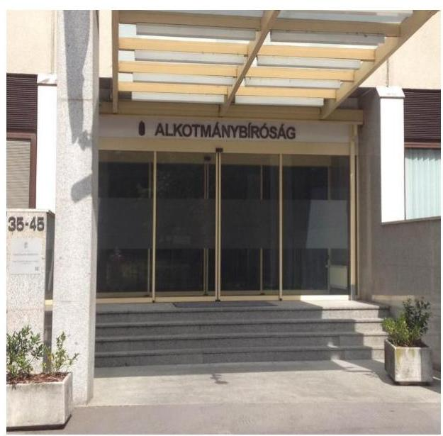

**AZ ALKOTMÁNYBÍRÓSÁG** az Alaptörvény1 védelmének legfőbb szerve. Az Országgyűlés az Alkotmánybíróságot 1989. október 30-án alapította. Feladata a demokratikus jogállam, az alkotmányos rend és az Alaptörvényben biztosított jogok védelme, a jogrendszer belső összhangjának megőrzése. Az Alkotmánybíróság hatáskörének, szervezetének, működésének részletes szabályait az Abtv.12 határozta meg.

Az Alkotmánybíróság költségvetése a központi költségvetés szerkezeti rendjében önálló fejezet. Az Alkotmánybíróság elnöke az Alkotmánybíróság, mint központi költségvetési fejezet tekintetében a fejezetet irányító szerv vezetője.

Az Alkotmánybíróság költségvetésére vonatkozó javaslatát és a költségvetésének végrehajtásáról szóló beszámolóját maga állítja össze, és azt a Kormány változtatás nélkül terjeszti be a központi költségvetésről, illetve az annak végrehajtásáról szóló törvényjavaslat részeként az Országgyűlésnek. Az Alkotmánybíróság költségvetését az Abtv.2 alapján úgy kell megállapítani, hogy ne legyen kevesebb az előző évi központi költségvetésben megállapított összegnél.

Az Alkotmánybíróság teljesített költségvetési kiadása a 2011. évre 1558,7 M Ft, a 2014. évben 1789,9 M Ft volt. A teljesített költségvetési és finanszírozási bevételek a 2011. évi 1637,7 M Ft-ról a 2014. évben 1888,6 M Ft-ra emelkedtek.

Az Alkotmánybíróság vagyona a 2011. évi 962,7 M Ft-ról a 2014. év végére 99,4 M Ft-tal, 863,3 M Ft-ra csökkent.

Az Alkotmánybíróság engedélyezett létszáma a 2011. évben 111 főről 136 főre emelkedett, a 2014. évben az átlagos statisztikai állományi létszáma 130 fő volt. Az ellenőrzött időszakban a gazdasági szervezetre a stabilitás volt jellemező, a gazdasági főigazgató személyében változás nem történt. Az Alkotmánybíróságnál az ellenőrzött időszakban szervezeti, szerkezeti átalakítás nem volt.

---

# AZ ELLENŐRZÉS HÁTTERE, INDOKOLTSÁGA 

AZ ALAPTÖRVÉNY RENDELKEZÉSE SZERINT a nemzeti vagyon megőrzésének, védelmének és a nemzeti vagyonnal való felelős gazdálkodásnak a követelményeit sarkalatos törvény, az Nvtv. ${ }^{4}$ rögzíti. A tulajdonosi joggyakorlás és vagyonkezelés általános és speciális szabályait, az állami vagyon nyilvántartására és elszámolására vonatkozó eljárásokat, a vagyonkezelési szerződés feltételrendszerét, valamint az éves beszámoló készítési és könyvvezetési kötelezettségeket kormányrendelet írja elő.

A társadalmi igénnyel összhangban az Áht. ${ }^{5}$ és ${ }^{6}$, az Ámr. ${ }^{7}$ és a Bkr. ${ }^{8}$ előírta a költségvetési szerv részére, hogy olyan szabályozásokat, eljárásokat, folyamatokat alakítson ki, amelyek biztosítják a működés, gazdálkodás, az erőforrások felhasználása során a gazdaságosság, hatékonyság és eredményesség érvényesülését. Az Ámr. és a Bkr. alapján az intézményvezetőnek évente nyilatkoznia is kell arról, hogy gondoskodott-e az intézmény tevékenységében a gazdaságosság, hatékonyság és eredményesség követelményeinek érvényesítéséről. A gazdaságos, hatékony és eredményes gazdálkodáshoz szükség van a teljesítménymérés feltételeinek kialakítására, úgymint az egyértelmű és mérhető célokra, mutatószámokra és az ezekhez rendelt követelményekre. Az ÁSZ ${ }^{9}$ jelen ellenőrzéssel győződött meg arról, hogy az Alkotmánybíróságnál a teljesítménycélokat, -mutatókat, -követelményeket kialakították-e, azokat működtették-e, a kitűzött cél(ok) teljesültek-e.

AZ ELLENŐRZÉS EREDMÉNYEKÉPPEN javulhat az Alkotmánybíróság gazdálkodása és átfogó képet kaphatunk a gazdálkodás hiányosságairól, valamint a jó gyakorlatokról is. Jelen ellenőrzésével az ÁSZ elősegítheti az Alkotmánybíróság pénzügyi és vagyongazdálkodása szabályozásának javítását.

---

# FÓKUSZKÉRDÉSEK 

1. Az irányító szerv ellenőrzött intézményre vonatkozó feladatellátása szabályszerű volt-e?
2. A belső kontrollrendszer kialakítása és működtetése megfelelt-e a jogszabályi előírásoknak?
3. Az intézmény pénzügyi gazdálkodása szabályszerű volt-e?
4. Az intézmény vagyongazdálkodása szabályszerű volt-e?
5. Az intézmény intézkedett-e az integritás szemlélet érvényesítése érdekében?

---

# ELLENŐRZÉS HATÓKÖRE ÉS MÓDSZEREI 

## Az ellenőrzés típusa

Szabályszerűségi ellenőrzés

## Az ellenőrzött időszak

2011. január 1-jétől 2014. december 31-éig

## Az ellenőrzés tárgya

Az ellenőrzött szervezetre vonatkozó irányító szervi feladatok ellátása. Az intézmény belső kontroll rendszerének kialakítása és működtetése, valamint pénzügyi és vagyongazdálkodása. Az erőforrásokkal való szabályszerű, gazdaságos, hatékony és eredményes gazdálkodáshoz szükséges követelmények kialakítása, a kialakított követelmények számonkérése, ellenőrzése.

## Az ellenőrzött szervezet

Alkotmánybíróság, mint költségvetési szerv

## Az ellenőrzés jogalapja

Az ellenőrzés jogszabályi alapját az Állami Számvevőszékről szóló 2011. évi LXVI. törvény 1. § (3) bekezdése, az 5. § (2)-(6) bekezdései, valamint az Áht. 2 61. § (2) bekezdésének előírásai képezték.

## Az ellenőrzés módszerei

Az ellenőrzést az ellenőrzési program szempontjai, az ellenőrzött időszakban hatályos jogszabályok, az ellenőrzés szakmai szabályai, az egyes ellenőrzési típusokhoz kapcsolódó ÁSZ módszertanok és nemzetközi standardok figyelembevételével végeztük. A gazdálkodás hibáinak kijavítására, a közpénzekkel való felelős gazdálkodás segítésére irányuló javaslatok kidolgozásakor a hatályos jogszabályok voltak az irányadóak.

Az ellenőrzési kérdések megválaszolásához szükséges bizonyítékok megszerzése a következő ellenőrzési eljárások alkalmazásával történt: kérdésfeltevés (információkérés), mintavételezés, valamint elemző eljárás. A minták kiválasztása során elsősorban reprezentativitást biztosító véletlen mintavételi eljárást alkalmaztunk. Az ellenőrzési bizonyítékként felhasznál-

---

ható adatforrások közé tartoztak a szakmai program részletes szempontjainál felsorolt adatforrások. Az ellenőrzés lefolytatásához az intézmény a tanúsítványok elektronikus kitöltésével, valamint az ÁSZ által kért dokumentumok elektronikus megküldésével szolgáltatott adatokat. A rendelkezésre bocsátott adatok, információk kontrollja az ellenőrzés keretében történt.

Az intézmény belső kontrollrendszere jogszabályi előírások szerinti kialakításának és működtetésének szabályszerűségét az erre irányuló ellenőrzési kérdésekre adott válaszok összesítése alapján, évente pillérenként (kontrollkörnyezet, kockázatkezelési rendszer, kontrolltevékenységek, információs és kommunikációs rendszer, monitoring rendszer) és összesítetten is minősítettük. Az intézmény belső kontrollrendszere egyes pilléreinek kialakítása és működtetése „szabályszerű" volt, amennyiben az értékelt területen az elért és elérhető pontok százalékban kifejezett, egész számra kerekített hányadosa meghaladta a 84%-ot, „részben szabályszerű", ha a 84%-ot nem haladta meg, de 60%-nál nagyobb, „nem szabályszerű", ha nem haladta meg a 60%-ot. Az intézmény belső kontrollrendszerének összesített értékelése megegyezett a pillérenként (kontrollterületenként) alkalmazott %-os értékelésekkel, a következő eltérésekkel. A kontrollrendszer egésze esetében a „szabályszerű" értékelésnek a %-os értéken felül további feltétele volt, hogy egyik kontrollterület sem kaphatott „nem szabályszerű" értékelést, a „részben szabályszerű" értékelés további feltétele, hogy legfeljebb egy ellenőrzött kontrollterület lehetett „nem szabályszerű" értékelésű. Az összesített értékelés a %-os értéktől függetlenül „nem szabályszerű" volt, ha az ellenőrzött kontrollterületek közül több mint egynek „nem szabályszerű" volt az értékelése.

A tárgyi eszközök nyilvántartásba vételének, a közbeszerzési eljárások lefolytatásának és a vagyonhasznosítási bevételi előirányzatok teljesítésének, az előirányzatok módosításának és az előirányzat-maradvány megállapításának szabályszerűségét, valamint a gazdálkodási jogkörök gyakorlásának szabályszerűségét mintavétellel ellenőriztük.

A jogszabályoknak és a belső előírásoknak megfelelőnek, azaz szabályszerűnek tekintettük a tárgyi eszközök nyilvántartásba vételét és a vagyonhasznosítási bevételi előirányzatok teljesítését, amennyiben a minta ellenőrzésének eredménye alapján 95%-os bizonyossággal a teljes sokaságban a hibás tételek aránya kisebb volt, mint 10%, nem megfelelőnek értékeltük, ha a hibás tételek aránya a 10%-ot meghaladta.

A közbeszerzési eljárások esetében az
 ellenőrzött mintatételek értékelését végeztük el.

A személyi juttatásoknál, dologi és felhalmozási kiadásoknál, pénzeszközátadásoknál a gazdálkodási jogkörök gyakorlását mintavétellel ellenőriztük. A 2011. évet érintően a szakmai teljesítésigazolás és az utalvány ellenjegyzése kulcskontrollok, a 2012-2014. éveket érintően a teljesítésigazolás és az érvényesítés kulcskontrollok működését értékeltük. Megfelelőnek értékeltük a gazdálkodási jogkörök gyakorlását, amennyiben 95%-os bizonyossággal a teljes sokaságban a hibás tételek aránya legfeljebb 10% volt, részben megfelelőnek, ha a hibás tételek arányának felső határa legfeljebb 30% volt, nem megfelelőnek, ha a hibás tételek sokaságbeli arányának felső határa meghaladta a 30%-ot.

---

Az Alkotmánybíróság az ellenőrzést megelőzően nem vett részt az ÁSZ integritás felmérésében. Az integritás szemlélet érvényesülésének értékelése az Alkotmánybíróság által az ellenőrzés keretében kitöltött kérdőív alapján történt.

---

# MEGÁLLAPÍTÁSOK 

## 1. Az irányító szerv ellenőrzött intézményre vonatkozó feladatellátása szabályszerű volt-e?

Összegző megállapítás

Az irányító szervi feladatellátás összességében szabályszerű volt, az alapító okirattal összefüggésben 2011. évben feltárt szabálytalanság ellenére. Az irányítószervi feladatokat a jogszabály alapján a költségvetési szerv vezetője, az AB elnöke végezte.

AZ ALKOTMÁNYBÍRÓSÁGRA VONATKOZÓ ÁLTALÁNOS RENDELKEZÉSEKET az Alkotmány ${ }^{10}$, majd 2012. január 1-jétől az Alaptörvény állapította meg. Az Alkotmány, majd az Alaptörvény előírásainak megfelelően az $\mathrm{AB}^{11}$ hatáskörének, szervezetének, működésének részletes szabályait az OGY ${ }^{12}$ az Abtv. ${ }_{1}$ ben, majd az Abtv. ${ }_{2}$-ben rögzítette. Az AB költségvetése a központi költségvetés szerkezeti rendjében önálló fejezet. Az irányítószervi feladatellátást meghatározó jogszabályokat, belső előírásokat tartalmazó dokumentumokat az 1. ábra mutatja.

AZ IRÁNYÍTÓSZERVI FELADATOKAT az ellenőrzött időszakban az AB elnöke látta el az alapító okirat ${ }^{13}$ és az Abtv. ${ }_{2}$ alapján. Az Abtv. 2. 17. § (2) bekezdése szerint az elnök az AB mint központi költségvetési fejezet tekintetében a fejezetet irányító szerv vezetője.

Az AB az Áht. ${ }_{1}$ és az Áht. ${ }_{2}$ előírásainak megfelelően rendelkezett alapító okirattal, amely az AB irányító szerveként magát az AB-t jelölte meg. Az alapító okiratot az AB elnöke hagyta jóvá az Áht. ${ }_{1}$ és az Áht. ${ }_{2}$ előírásaival összhangban. Az alapító okiratban szerepeltek az Áht. ${ }_{1}$-ben, majd az Ávr. ${ }^{14}$ ben meghatározott tartalmi elemek. Az ellenőrzött időszakban kétszer módosították az alapító okiratot, melyek egységes szerkezetbe foglalását az Ámr. és az Ávr. előírásainak megfelelően mindkét esetben elkészítették. A 2011. december 31-éig hatályos Abtv. ${ }_{1}$ 3. §-a szerint az AB székhelye Esztergom, ezzel szemben az AB ebben az időszakban - 2011. évben - érvényes és hatályos alapító okiratában az AB székhelyeként Budapest szerepel. Előzőek miatt az AB alapító okirata 2011. december 31-éig nem felelt meg az AB székhelyére vonatkozó törvényi rendelkezésnek. A 2012. január 1-jétől hatályos Abtv. ${ }_{2}$ 3. § alapján a székhely Budapest, az alapító okirat így ettől az időponttól kezdve összhangban van a törvényi rendelkezéssel az AB székhelye tekintetében.

Az Áht. ${ }_{1,2}$ előírásainak megfelelően az AB rendelkezett SZMSZ ${ }^{15}$-szel. A 2011-2014. évek között egy alkalommal kodifikálták újra az SZMSZ-t. Az SZMSZ-ek összhangban voltak a hatályos alapító okiratokkal.

---

Az AB elnöke a bevételi és kiadási előirányzatokkal való gazdálkodást, a közfeladatok ellátását rendszeresen figyelemmel kísérte az Áht. 1,2 előírásainak megfelelően.

Az ellenőrzött időszakban vezető, gazdasági vezető kinevezésére és felmentésére nem került sor. Az AB-nál az ellenőrzött időszakban nem volt szervezeti, szerkezeti átalakítás.

## 2. A belső kontrollrendszer kialakítása és működtetése megfelel-e a jogszabályi előírásoknak?

### Összegző megállapítás

A belső kontrollrendszer kialakítása és működtetése kisebb hiányosságokkal megfelel a jogszabályi előírásoknak a 2011-2014. években. A belső kontrollrendszer kialakításának és működtetésének szabályszerűsége a 2013. évtől javuló tendenciát mutat, melyet a 2. ábra szemléltet.

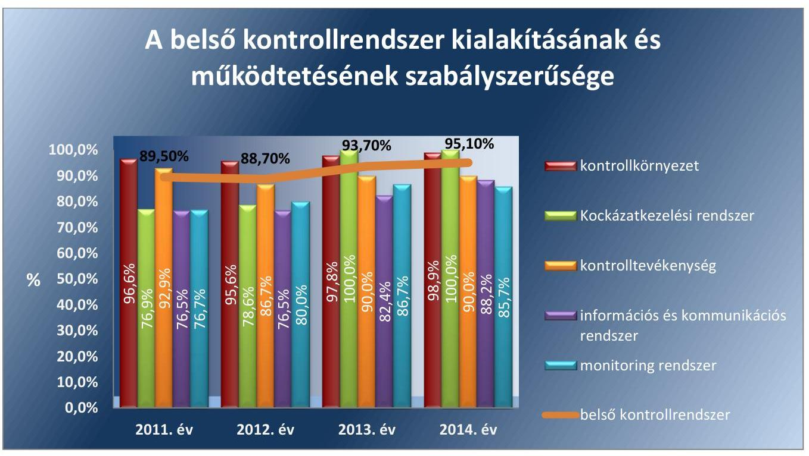

*Forrás: Ász, ellenőrzés megállapításai*

---

### 2.1. számú megállapítás

1. táblázat

| KONTROLLKÖRNYEZET |  |
| :--: | :--: |
| Évek | Minősítés |
| 2011 | szabályszerű |
| 2012 | szabályszerű |
| 2013 | szabályszerű |
| 2014 | szabályszerű |

A kontrollkörnyezet kialakítása összességében szabályszerű volt. A 2014. évben nem rögzítették az egyszerűsített értékelési eljárás alá vont követelések dokumentálásának szabályait.

## A KONTROLLKÖRNYEZET KIALAKÍTÁSÁNAK éven-

kénti minősítését az 1. táblázat, az ellenőrzés alá vont belső szabályzatokat a 3. ábra mutatja. Az AB rendelkezett SZMSZ-szel, a gazdasági szervezet ügyrendjével ${ }^{16}$, számviteli politikával ${ }^{17}$ és annak keretében készítendő belső és egyéb gazdálkodással kapcsolatos szabályzatokkal.

Az AB SZMSZ-ében az Áht. 1,2 előírásainak megfelelően meghatározták a feladatellátás részletes belső rendjét és módját.

Az AB gazdasági szervezetének ügyrendjét az Ámr., majd az Ávr. előírásainak megfelelően elkészítették, azt 2012-től a gazdálkodási szabályzat ${ }^{18}$ tartalmazta. Az AB gazdasági szervezetének vezetője rendelkezett az Ámr.-ben, illetve az Ávr.-ben előírt végzettséggel. Az intézményben dolgozó foglalkoztatottak rendelkeztek munkaköri leírással, amely tartalmazta a munkakörük betöltésével kapcsolatos követelményeket a Kttv. ${ }^{19}$-ben foglalt előírásoknak megfelelően.

Kialakították a számviteli politikát a Számv. tv. ${ }^{20}$-ben, az Áhsz. ${ }^{21}$-ben, illetve az Áhsz. ${ }^{22}$-ben szabályozottak szerint. A számviteli politika keretében elkészítették a leltározási szabályzatot ${ }^{23}$, az eszközök és források értékelési szabályzatát ${ }^{24}$, a pénzkezelési szabályzatot ${ }^{25}$, az önköltség számítási szabályzatot ${ }^{26}$. Rendelkeztek számlarenddel és bizonylati renddel ${ }^{27}$. A szabályzatok megfeleltek a jogszabályi előírásoknak.

A 2014. évtől a számviteli politikában határozták meg az egyszerűsített értékelési eljárás alá vont követelések besorolásának elveit, azonban a dokumentálás szabályait nem rögzítették az Áhsz. 2 50. § (2) bekezdés c) pontjának előírása ellenére.

A kötelezettségvállalás, az ellenjegyzés, a szakmai teljesítésigazolás, illetve 2012. évtől a teljesítésigazolás, az érvényesítés és az utalványozás gyakorlásának módjával kapcsolatos előírásokat 2013-tól a kötelezettségvállalási szabályzat ${ }^{28}$ tartalmazta az Áht. ${ }_{1}$, az Ámr., majd az Áht. ${ }_{2}$ és az Ávr. előírásainak megfelelően.

Az AB rendelkezett közbeszerzési szabályzattal a Kbt. ${ }^{29}$, majd a Kbt. ${ }^{30}$ előírásainak megfelelően. A Kbt. ${ }_{1,2}$ hatálya alá nem tartozó beszerzések lebonyolításának rendjét az Ámr.-ben, majd az Ávr.-ben foglaltaknak megfelelően szabályozták.

Elkészítették az ellenőrzési nyomvonalat az Ámr., illetve a Bkr. előírásainak megfelelően.

A Kttv. 231. § (1) bekezdésének előírása ellenére a 2012-2013. években nem állapították meg a hivatásetikai alapelvek részletes tartalmát, illetve az etikai eljárás szabályait. A hivatásetikai alapelvek részletes tartalmáról, illetve az etikai eljárás szabályairól szóló dokumentumot 2014-ben készítették el.

---

### 2.2. számú megállapítás

2. táblázat

| KOCKÁZATKEZELÉSI RENDSZER |  |
| :--: | :--: |
| Évek | Minősítés |
| 2011 | részben szabályszerű |
| 2012 | részben szabályszerű |
| 2013 | szabályszerű |
| 2014 | szabályszerű |

A 2011-2012. években a kockázatkezelési rendszer kialakítása és működtetése részben szabályszerű, a 2013-2014. években szabályszerű volt.

A KOCKÁZATKEZELÉSI RENDSZER évenkénti minősítését a 2. táblázat mutatja. Az AB kialakította a kockázatkezelési rendszerét - belső szabályzatban a jogszabályi előírásnak megfelelően meghatározta a kockázat fogalmát, azonosításával, elemzésével, csoportosításával, kapcsolatos szabályokat -, azonban a 2011-2012. években a kockázatkezelési rendszert az Ámr. 157. §-ának, illetve a Bkr. 7. §-ának előírásai ellenére nem működtették. A 2011-2012. években nem, a 2013. évtől a kockázatelemzés során felmérték a szervezet tevékenységében, gazdálkodásában rejlő kockázatokat, meghatározták az egyes kockázatokkal kapcsolatos intézkedéseket, illetve az intézkedések nyomon követésének módját.

A 2013. évtől a kockázatkezelési rendszer kialakítása és működtetése megfelelt a jogszabályi előírásoknak.

A Vnytv. ${ }^{31}$ 4. § a) pontjában megfogalmazott rendelkezésekkel összhangban az AB elnöke a 2011-2014. évekre vonatkozóan az SZMSZ-ben határozta meg a vagyonnyilatkozat tételre kötelezettek körét.

A vagyonnyilatkozatok őrzéséért felelős személy tájékoztatta az érintetteket a vagyonnyilatkozat-tételi kötelezettségről és annak esedékességéről a Vnytv.-ben foglalt rendelkezéseknek eleget téve. A vagyonnyilatkozatok határidőben átadásra kerültek az annak őrzéséért felelős személy részére, aki nyilvántartásba vette és az egyéb iratoktól elkülönítetten kezelte azokat.

## A kontrolltevékenységek kialakítása és működtetése 2011-2014. években összességében szabályszerű volt.

A kontrolltevékenységek részeként az Áht. ${ }_{1}$ 121/A. §, illetve a Bkr. 8. § (2) bekezdés előírásának megfelelően biztosították az előzetes, utólagos és vezetői ellenőrzést a pénzügyi döntések, a költségvetési gazdálkodás, a gazdasági események elszámolása kontrollja során.

A belső szabályzatokban meghatározásra kerültek az engedélyezési, jóváhagyási és kontrolleljárások, az informatikai rendszerekhez, dokumentumokhoz való hozzáférés jogosultságai, valamint a hozzáférés szintjei az Ámr.-nek, illetve a Bkr.-nek megfelelően.

A gazdálkodási jogköröket gyakorló személyeket az AB elnöke, illetve a gazdasági főigazgató írásban jelölte ki. A kulcskontrollok működtetése részben felelt meg a jogszabályi előírásoknak a 2011-2014. években (lásd 3.3. számú megállapításnál).

Az informatikai rendszer szabályozása során kialakították az AB informatikai rendszere vonatkozásában az adatok biztonságának, védelmének érvényre juttatásához szükséges eljárási szabályokat az Avtv. ${ }^{32}$ és az Info tv. ${ }^{33}$ előírásainak megfelelően.

A kontrolltevékenységek évenkénti minősítését a 3. táblázat tartalmazza.

---

### 2.4. számú megállapítás

4. táblázat

INFORMÁCIÓS ÉS KOMMUNIKÁCIÓS RENDSZER

|  Évek | Minősítés  |
| --- | --- |
|  2011 | részben szabályszerű  |
|  2012 | részben szabályszerű  |
|  2013 | részben szabályszerű  |
|  2014 | szabályszerű  |

Forrás: ÁSZ, ellenőrzés megállapításai

### 2.5. számú megállapítás

5. táblázat

## MONITORING RENDSZER

|  Évek | Minősítés  |
| --- | --- |
|  2011 | részben szabályszerű  |
|  2012 | részben szabályszerű  |
|  2013 | szabályszerű  |
|  2014 | szabályszerű  |

Forrás: ÁSZ, ellenőrzés megállapításai

A 2011-2013. években az információs és kommunikációs folyamatok kialakítása és működtetése részben szabályszerű, a 2014. évben szabályszerű volt. Az AB a 2011-2014. években nem rendelkezett adatvédelmi és adatbiztonsági szabályzattal.

Az AB elnöke a 2011-2013. években az Ámr. 159. § (1) bekezdésében és a Bkr. 9. § (1) bekezdésében foglaltak ellenére nem alakította ki az információk áramlásának rendszerét. Az információ átadás formáit a 2014. évtől hatályos belső kontrollrendszer szabályzatban ${ }^{34}$ szabályozták.

A 2011-2013. években az Ámr. 159. § (2) bekezdésében, illetve a Bkr. 9. § (2) bekezdésében előírtak ellenére az információs rendszerek keretében nem határozták meg a szervezeten belüli beszámolási szinteket, a 2014. évtől meghatározták.

Az Ltv. ${ }^{35}$-ben foglaltaknak megfelelően az AB a Magyar Nemzeti Levéltárral egyetértésben adta ki iratkezelési szabályzatát. Az iratok iktatásával, az iratforgalom dokumentálásával biztosították, hogy az iratok szervezeten belüli útja pontosan követhető és ellenőrizhető, az iratok holléte naprakészen megállapítható legyen.

Az AB az Avtv. 31/A. § (3) bekezdésének, illetve az Info tv. 24. § (3) bekezdésének előírása ellenére nem rendelkezett adatvédelmi és adatbiztonsági szabályzattal a 2011-2014. években.

Az AB elnöke meghatározta a kötelezően közzéteendő adatok nyilvánosságra hozatalának rendjét az Ámr., az Ávr., illetve az Info tv. előírásainak megfelelően. Az AB eleget tett az Eitv. ${ }^{36}$-ben, illetve az Info tv.-ben meghatározott elektronikus közzétételi kötelezettségének. Az intézménynél szabályozták a közérdekű adatok megismerésére irányuló igények teljesítésének rendjét az Ámr., az Avtv., illetve
 az Ávr. és az Infotv. előírásainak eleget téve.

Az információs és kommunikációs rendszer évenkénti minősítését a 4. táblázat tartalmazza.

A monitoring rendszer kialakítása és működtetése a 2011-2012. években részben szabályszerű, a 2013-2014. években szabályszerű volt. A belső ellenőri jelentések tartalmi elemei a jogszabályban előírt követelményeknek nem feleltek meg.

Az operatív tevékenységek folyamatos és eseti nyomon követési rendszerét az Ámr. 160. §-ában, illetve a Bkr. 10. §-ában meghatározott előírás ellenére a 2011-2012. években nem alakították ki és nem működtették. A 2013. évtől a belső kontrollrendszer szabályzatban is meghatározott monitoring rendszert működtették. A monitoring rendszer évenkénti minősítését az 5. táblázat tartalmazza.

Az Áht. ${ }_{1}$ 121/A. § (1) bekezdése, illetve a Bkr. 6. § (2) bekezdése értelmében a költségvetési szerv vezetője köteles olyan szabályzatokat kiadni, folyamatokat kialakítani és működtetni a szervezeten belül, amelyek biztosítják a rendelkezésre álló források szabályszerű, szabályozott, gazdaságos, hatékony és eredményes felhasználását. Az Áht. ${ }_{1}$ 121/A. § (2) bekezdés a) pontja értelmében a belső kontrollrendszernek biztosítania kell, illetve 2012-től a Bkr. 4. § a) pontja értelmében a belső kontrollrendszer tartalmazza mindazon elveket, eljárásokat és belső szabályzatokat, amelyek biz-

---

tosítják, hogy a költségvetési szerv valamennyi tevékenysége és célja összhangban legyen a gazdaságosság, hatékonyság és eredményesség követelményeivel.

A rendelkezésre álló források gazdaságos, hatékony és eredményes felhasználását biztosító követelmények kialakítása a 2011-2014. években nem felelt meg az Áht-1 121/A. § (2) bekezdés a) pontjában, illetve a Bkr. 4. § a) pontjában előírtaknak, mivel nem alakítottak ki olyan teljesítménycélokat, teljesítménymutatókat, amelyek biztosították volna a rendelkezésre álló források gazdaságos, hatékony és eredményes felhasználásának mérését.

A 2013. évtől a belső kontrollrendszer szabályzat 9. pontja tartalmaz feladatokat, általános indikátorokat az $A B$ szervezeti egységei számára meghatározandó mutatószámok kialakítására vonatkozóan, előírta azok értékelését, továbbá erről a Bkr. 1. sz. mellékletében előírt tartalmi követelményekkel összhangban készítendő beszámolást.

A belső kontrollrendszer szabályzat 9. pontja tartalmazza, hogy a gazdasági főigazgató a belső kontrollrendszer kialakításáról, működéséről, eredményeiről, hiányosságairól, hatékonyságáról nyilatkozatban részletes tájékoztatást ad a költségvetési szerv vezetőjének. A 2013-2014. években a gazdasági főigazgató a belső kontrollrendszer szabályzat 9. pontjában előírtak ellenére nem készített a belső kontrollrendszer kialakításáról, működéséről, eredményeiről, hiányosságairól, hatékonyságáról nyilatkozatot, illetve részletes tájékoztatást.

A BELSŐ ELLENŐRZÉS kialakításáról és működtetéséről az AB elnöke az Áht-1,2, a Ber. ${ }^{37}$, valamint a Bkr. előírásainak megfelelően gondoskodott. A belső ellenőrzési feladatokat megbízási jogviszony keretében látta el a belső ellenőr. Feladatait, jogállását az SZMSZ-ben meghatározták, a belső ellenőr szervezeti és funkcionális függetlensége biztosított volt.

Az AB rendelkezett belső ellenőrzési kézikönyvvel. A belső ellenőrzési vezető a 2010. évben hatályba lépett belső ellenőrzési kézikönyvet a Ber. 5. § (3) bekezdésében, illetve Bkr. 17. § (4) bekezdésében előírt kétévenkénti felülvizsgálat ellenére csak 2013-ban aktualizálta.

A belső ellenőr elkészítette az éves ellenőrzési terveket, és az abban foglalt ellenőrzéseket végrehajtotta. Az ellenőrzésekről készült jelentések a Ber. 27. § (2) bekezdésében, illetve a Bkr. 39. § (3) bekezdésében foglaltak ellenére nem tartalmazták az ellenőrzést végző szervezeti egység megnevezését, az ellenőrzésre vonatkozó jogszabályi felhatalmazás megjelölését, illetve a 2011. évben nem tartalmazták a helyszíni ellenőrzés kezdetét és végét.

A belső ellenőr javaslatainak végrehajtása érdekében a Ber. 29. § (1) bekezdésében foglaltak ellenére az ellenőrzött szervezeti egység vezetője egy esetben nem készített intézkedési tervet a 2011. évben, azonban a javasolt intézkedés végrehajtását dokumentálták. A 2012. évtől minden esetben készült intézkedési terv.

A belső ellenőr éves bontásban nyilvántartást vezetett a külső, illetve belső ellenőrzési jelentések alapján megtett intézkedésekről.

---

# 3. Az intézmény pénzügyi gazdálkodása szabályszerű volt-e? 

## Összegző megállapítás

### 3.1. számú megállapítás

### 3.2. számú megállapítás

## A pénzügyi gazdálkodás összességében szabályszerű volt.

Az elemi költségvetés és az előirányzatok megállapítása során betartották a jogszabályi előírásokat és a belső szabályzatokban foglaltakat.

A KIADÁSI ÉS A BEVÉTELI ELŐIRÁNYZATOK TERVEZÉSE során az $A B$ a jogszabályokban és az $N G M^{38}$ rendeleteiben foglaltak szerint járt el.

Az AB költségvetése a központi költségvetés szerkezeti rendjében önálló fejezetet alkotott. Az AB a költségvetésére vonatkozó javaslatát és a költségvetésének végrehajtásáról szóló beszámolóját maga állította össze, amelyet az OGY fogadott el a Kvtv.-ről ${ }^{39}$, illetve annak végrehajtásáról szóló törvényjavaslat részeként. A belső szabályzatokban (gazdasági szervezet ügyrendje, gazdálkodási szabályzat) rögzítették a költségvetés tervezésével kapcsolatos feladatokat. Az ellenőrzési nyomvonalat a költségvetés tervezési folyamatára kialakították.

Az intézmény elemi költségvetése, az előirányzatok megállapítása megfelelt az Áht.1,2, Ámr., Ávr. és a belső szabályzatokban foglalt előírásoknak.

A kiadások, bevételek, támogatások, a létszám és a mutatószámok értékeit számításokkal megalapozták és határidőben megküldték az NGM és a Kincstár ${ }^{40}$ részére. Az elemi költségvetések és a kincstári költségvetések megegyeztek.

A bevételi és kiadási előirányzatok módosítását a jogszabályi előírásoknak és a belső szabályzatokban foglaltaknak megfelelően hajtották végre.

A KIADÁSI ÉS BEVÉTELI ELŐIRÁNYZATOK MÓDOSÍTÁSA megfelelt az Áht.1,2, Ámr., Ávr. és a belső szabályzatok előírásainak.

Az előirányzat módosítással összefüggő feladatokat a belső szabályzatokban (a gazdasági szervezet ügyrendje, gazdálkodási szabályzat) meghatározták. Az ellenőrzési nyomvonalat az előirányzat-módosítás folyamatára kialakították.

Az előirányzat-módosítások hatáskör szerinti megoszlását a 6. táblázat mutatja.
6. táblázat

ELŐIRÁNYZAT-MÓDOSÍTÁSOK HATÁSKÖR SZERINT (M Ft)

| Évek | Kormányzati | Irányítószervi | Intézményi saját |
| :--: | :--: | :--: | :--: |
| 2011 | $+267,9$ | $-66,8$ | $+101,1$ |
| 2012 | $+6,9$ | $+3,7$ | $+80,1$ |
| 2013 | $+5,9$ | $-30,3$ | $+125,6$ |
| 2014 | $+5,2$ | $+6,1$ | $+122,7$ |
| Összesen | $+285,9$ | $-87,3$ | $+429,5$ |

---

Az AB-nál a 2011. évben a kormányzati hatáskörben végrehajtott elő-irányzat-módosítás 98,6 %-a (264,2 M Ft) az 1273/2011. (VIII. 31.) Korm. határozat ${ }^{41}$ alapján történt, melyet az indokolt, hogy az OGY a hatályos Alkotmányt módosítva ${ }^{42}$ 2011. szeptember 1-jei hatállyal az alkotmánybírák számát 11-ről 15-re emelte. A rendkívüli kormányzati intézkedések előirányzatából történt átcsoportosításra vonatkozóan az AB elszámolási kötelezettségének eleget tett.

Nem volt OGY hatáskörben előirányzat-módosítás a 2011-2014. években. Az irányító szervi hatáskörben történt előirányzat-módosítás az intézményt érintően a fejezeti tartalék létrehozásához kapcsolódott. A saját hatáskörű előirányzat-változtatások, az előirányzat-átcsoportosítások, a többletbevétel felhasználása szabályszerű volt. Az előirányzat-módosításokat a Kincstár részére határidőre bejelentették a jogszabályi előírásoknak megfelelően. Az előirányzat-változtatások számviteli nyilvántartásokon történő átvezetése összhangban volt a jogszabályi előírásokkal. A 2011-2014. években az éves költségvetési beszámolóban és az előirányzat nyilvántartásban szereplő előirányzat-módosítások adatai megegyeztek a főkönyvi könyvelés szerinti előirányzat-változásokkal az Áhsz.1,2-ben foglaltaknak megfelelően.
3.3. számú megállapítás

A bevételi előirányzatok teljesítése során betartották a jogszabályi előírásokat, azonban a kiadási előirányzatok felhasználása részben felelt meg a jogszabályi előírásoknak a személyi juttatások, a pénzeszköz átadások és a dologi kiadások esetében a kulcskontrollok működtetésében feltárt hiányosság miatt.

A 2011-2014. években nem került sor a bevételi előirányzatok alulteljesítésére, illetve a kiadási előirányzat túllépésére az Áht.1,2 előírásainak megfelelően. Az AB működését a költségvetési támogatások és az előző évi maradványok felhasználása és saját bevétel biztosította, a Kvtv. az AB részére a 2011-2014. években nem határozott meg saját bevételt. Az AB saját bevétele a selejtezett tárgyi eszközök értékesítéséből származott.

Az évközben módosított bevételi előirányzatok minden évben 100\%-ban teljesültek. A költségvetési támogatások eredeti előirányzatát a módosított előirányzat - és az azzal azonos mértékű teljesítés - a 2011. évben 15,1\%-kal, a 2012. évben 0,4\%-kal, a 2014. évben 0,3\%-kal haladta meg. A 2013. évben a költségvetési támogatások teljesítése - és az azzal azonos mértékű módosított előirányzat - 1,7\%-kal elmaradt az eredeti előirányzattól. Az AB bevételeinek költségvetési előirányzatait és teljesítését a 7. táblázat mutatja be.
7. táblázat

| AZ AB BEVÉTELEINEK KÖLTSÉGVETÉSI ELŐIRÁNYZATAI ÉS TELJESÍTÉSE (M Ft) |  |  |  |  |  |
| :--: | :--: | :--: | :--: | :--: | :--: |
| Megnevezés | Előirányzat | 2011. év | 2012. év | 2013. év | 2014. év |
|  | Eredeti | 0 | 0 | 0 | 0 |
| Saját bevétel | Módosított | 5,0 | 3,7 | 5,6 | 9,6 |
|  | Teljesítés | 5,0 | 3,7 | 5,6 | 9,6 |
|  | Eredeti | 1335,4 | 1690,1 | 1773,8 | 1754,6 |
| Támogatás | Módosított | 1537,0 | 1698,3 | 1744,2 | 1759,8 |
|  | Teljesítés | 1537,0 | 1698,3 | 1744,2 | 1759,8 |
| Maradvány-igénybevétel |  | 95,7 | 78,8 | 125,2 | 119,2 |
| Teljesített bevételek összesen |  | 1637,7 | 1780,8 | 1875,0 | 1888,6 |

Forrás: Az AB 2011-2014. évi költségvetési beszámolói

---

A 2011-2014. években a költségvetési kiadások Kvtv. szerinti eredeti előirányzatát minden évben megemelték. A 2011. évben a kiadások módosított előirányzata 22,8\%-kal, a 2012. évben 5,4\%-kal, a 2013. évben 5,7\%-kal, a 2014. évben 7,6\%-kal haladta meg az eredeti előirányzatot. A költségvetési kiadások teljesítése egyik ellenőrzött évben sem érte el a módosított előirányzat mértékét. A 2011. évben 4,8\%-kal, a 2012. évben 7,0\%-kal, a 2013. évben 6,4\%-kal, a 2013. évben 5,2\%-kal maradt el a teljesítés a kiadási előirányzat módosított értékétől. A kiadások eredeti és módosított előirányzata, valamint a teljesített kiadások alakulását a 4. ábra mutatja.
4. ábra
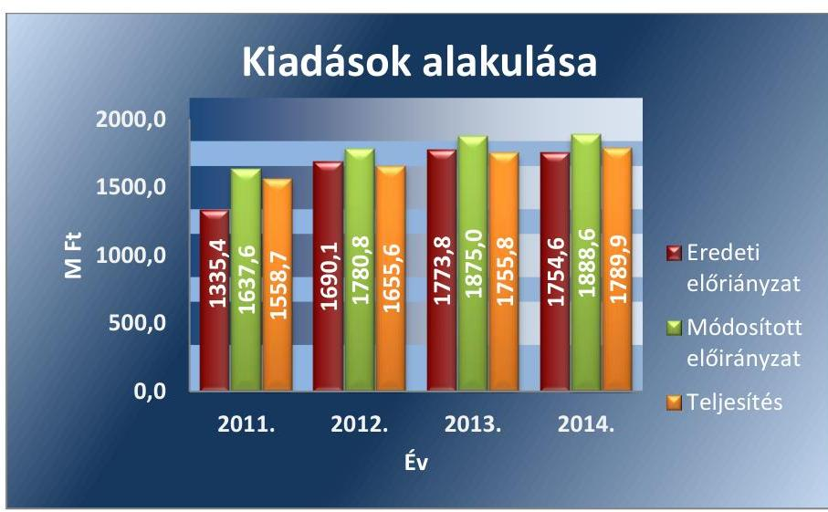

Forrás: Az AB 2011-2014. évi költségvetési beszámolói
A személyi juttatások a 2011. évhez képest jelentősen, 20,7\%-kal növekedtek a 2012. évben, melyet az alkotmánybírák számának és az AB összlétszámának emelkedése okozott. A személyi juttatások kiadásainak növekedése a dologi kiadások emelkedésével is együtt járt.

A teljesített kiadások főbb jogcímeinek alakulását az 5. ábra szemlélteti. 5. ábra
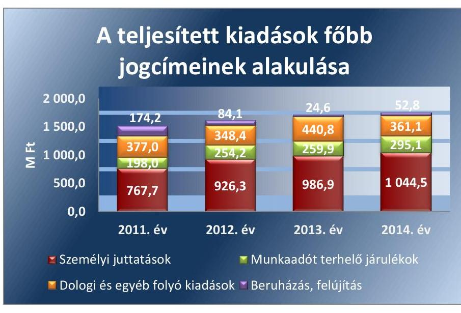

Forrás: Az AB 2011-2014. évi költségvetési beszámolói

---

8. táblázat

## A KULCSKONTROLLOK MŰKÖDTETÉSÉNEK ÖSSZESÍTETT ÉRTÉKELÉSE ÉVENKÉNT

| Évek | Minősítés |
| :--: | :--: |
| 2011 | részben megfelelő |
| 2012 | részben megfelelő |
| 2013 | részben megfelelő |
| 2014 | részben megfelelő |

A KULCSKONTROLLOK MŰKÖDTETÉSE a 2011-2014. években az előirányzatok felhasználása során összességében és évente részben megfelelő volt, melyet a 8. táblázat mutat.

A 2011. évben a szakmai teljesítésigazolás és az utalványellenjegyzés, a 2012-2014. években a teljesítésigazolás és érvényesítés megfelelőségét a személyi juttatások, a dologi és felhalmozási kiadások, a pénzeszközátadások mintatételei alapján értékeltük. Az ellenőrzött kulcskontrollokat a 9. táblázat mutatja.

## A SZEMÉLYI JUTTATÁSOKNÁL a következő hiányosságok

voltak:

- A rendszeres személyi juttatások esetében a 2011. évben a szakmai teljesítésigazoló az Ámr. 76. § (3) bekezdésének előírása ellenére, a 2012-2014. években a teljesítésigazoló az Ávr. 57. § (3) bekezdésének előírása ellenére a jelenléti íven az aláírása mellett nem tüntette fel az igazolás dátumát és a teljesítés tényét. A 2011. évben az utalvány ellenjegyzője az Ámr. 79. § (2) bekezdésének előírása ellenére, a 2012-2014. években az érvényesítő az Ávr.
 58. § (1)-(2) bekezdésének előírása ellenére nem kifogásolta a teljesítésigazolással kapcsolatos hiányosságokat.
- A 2011. évben a nem rendszeres személyi juttatás és a megbízási díj kifizetése esetében előfordult, hogy az Ámr. 79. § (2) bekezdésének előírása ellenére az utalvány ellenjegyzője nem kifogásolta, hogy az utalványrendeleten az Ámr. 77. § (3) bekezdésének előírása ellenére az érvényesítő aláírása mellett nem tüntette fel a dátumot.
- A külső személyi juttatások kifizetésénél a 2012. évben előfordult, hogy a megbízási díj kifizetése esetében az Ávr. 57. § (1) bekezdés előírása ellenére nem végezték el a teljesítésigazolást, azonban jogosulatlan kifizetés nem történt.

A PÉNZESZKÖZ-ÁTADÁSOKNÁL előfordult, hogy a 2012. évben az érvényesítés nem volt szabályszerű, az érvényesítő nem kifogásolta, hogy az Ávr. 55. § (1) bekezdése ellenére a kölcsönszerződések pénzügyi ellenjegyzése elmaradt.

## A DOLOGI KIADÁSOKNÁL

a 2011. és a 2014. évben előfordult, hogy a dologi kiadások kifizetéseinél nem állt rendelkezésre előzetes megrendelés. A 2011. évben a szakmai teljesítés igazolója, 2014. évben a teljesítés igazolója nem ellenőrizte az Ámr. 76. § (1) bekezdésében, illetve az Ávr. 57. § (1) bekezdésében előírtak ellenére a kiadás összegszerűségét, a kötelezettségvállalás teljesítését.
a 2011. évben az AB a Kbt. 140. § (2) bekezdésében előírt egybeszámítási kötelezettséget nem tartotta be. Az AB a Kbt. 1240. § (1) bekezdésében előírtak ellenére nem folytatott le közbeszerzési eljárást, miközben az AB részére ugyanazon szállító által a 2011. évben kiszámlázott szolgáltatások - a Kbt. 140. § (2) bekezdés szerinti - egybeszámított értéke (9,9 MFt) meghaladta a Magyar Köztársaság 2011. évi költségvetéséről szóló 2010. évi CLXIX. törvény 74. §-ában meghatározott nemzeti értékhatárt (8,0 MFt).

---

- az utalványellenjegyzés a 2011. évben megfelelt az Ámr., az érvényesítés 2012-2014. években az Ávr. előírásának.

A FELHALMOZÁSI KIADÁSOK esetében a 2011-2014. években a szakmai teljesítésigazolás, illetve a teljesítésigazolás, az utalványellenjegyzés és az érvényesítés megfelelt az Ámr. és az Ávr. előírásainak.

Az AB a Kbt. 1 és a Kbt. 2 alapján az OGY Nbb⁴³-től mentesítést kért a 2011. évben a létszámbővülés miatti eszközbeszerzésekre, az irodahelyiségek felújítására, a 2012-2013. években a személygépjárművek beszerzésére a közbeszerzési eljárások lefolytatása alól. Az OGY Nbb az AB kérelmében meghatározott körben a közbeszerzési eljárások lefolytatása alóli mentesítést határozatban megadta.

Az AB a Kbt. 1, a Kbt. 2, a Beszerzési⁴⁴ és a Közbeszerzési⁴⁵ szabályzatai előírásait betartotta a beruházásoknál és a felújításoknál. A felhalmozási kiadásoknál a kifizetések szabályszerűek, megfelelőek voltak.

Az AB az ellenőrzött mintatételeknél a közbeszerzési eljárásokat dokumentálta, a szerződéseket a közbeszerzési eljárás nyertesével kötötte meg. A jogszabályi előírásoknak megfelelően egy esetben egyszerű közbeszerzési eljárást alkalmaztak, egy esetben hirdetmény nélküli tárgyalásos közbeszerzési eljárást folytattak le. Az AB az Nbb határozatok alapján jóváhagyott összegeket nem lépte túl és az utólagos elszámolási kötelezettségének eleget tett.

A beruházásoknál és felújításoknál az üzembe helyezés, az állományba vétel megtörtént, a besorolás megfelelő volt. Az AB szabályosan határozta meg a bekerülési értéket és számolta el az értékcsökkenést.

Az ellenőrzött kifizetéseknél nem volt szabálytalan kifizetés, rendeltetésellenes, pazarló pénzfelhasználás és károkozás.

A BEVÉTELI ELŐIRÁNYZATOK teljesítése során a vagyonhasznosítási bevételek beszedése szabályszerű, megfelelő volt (lásd 4.4. számú megállapítás).

# 3.4. számú megállapítás 

Az AB működését nem érintették az előirányzat felhasználáshoz kapcsolódó évközi korlátozó intézkedések. Az előirányzat-maradvány megállapítása, felhasználása szabályszerű volt.

A 2011-2014. években az AB-nál az előirányzat felhasználáshoz kapcsolódó évközi korlátozó intézkedések nem voltak, nem történt előirányzat-zárolás, és maradványtartási kötelezettség előírása.

Az AB minden évben betartotta a jogszabályi előírásokat az előirányzatmaradvány megállapítása és az előző évi előirányzat-maradvány felhasználása során.

Az előirányzat-maradvány alakulását a 10. táblázat mutatja be.
10. táblázat

AZ ELŐIRÁNYZAT-MARADVÁNY ALAKULÁSA (M Ft)

| Előirányzat-maradvány | 2011. év | 2012. év | 2013. év | 2014. év |
| :--: | :--: | :--: | :--: | :--: |
| Kötelezettségvállalással terhelt | 77,7 | 75,8 | 79,2 | 72,1 |
| Szabad | 1,1 | 49,4 | 40,0 | 26,6 |
| Összesen | 78,8 | 125,2 | 119,2 | 98,7 |

Forrás: Az AB 2011-2014. évi költségvetési beszámolói

---

A 2011-2014. években az előirányzat-maradvány elszámolása szabályszerűen történt. Betartották az Áht. 1, 2 és a belső szabályzatok előírásait.

A kötelezettségvállalásokról analitikus nyilvántartást vezettek és az alátámasztó dokumentumok hiánytalanul rendelkezésre álltak. Az éves költségvetési beszámolókban kimutatott előirányzat-maradvány összege - az Áhsz.₁,₂ előírásának megfelelően - azonos volt a kapcsolódó főkönyvi számlákon szereplő adatokkal.

A kötelezettséggel terhelt és a szabad, a központi költségvetést megillető maradvány megállapítása megfelelt az Ámr.-ben, illetve az Ávr.-ben foglaltaknak. Az AB az előirányzat-maradvány elszámolásáról az előírt határidőben és tartalommal teljesítette az NGM felé az előírt adatszolgáltatási kötelezettségét. Az NGM a benyújtott elszámolás felülvizsgálatának eredményéről a 2011-2013. években az Ávr.-ben előírt határidőre, a 2014. évben határidőn túl tájékoztatta az AB-t. Az AB a jogszabályban előírt határidőre teljesítette a 2011-2013. évi előirányzat-maradványból a központi költségvetést megillető összeg befizetését.

Az előirányzat-maradvány felhasználása megfelelő volt, a kötelezettségvállalással terhelt maradvány kötelezettségvállalási dokumentumokkal alátámasztott volt.

# 3.5. számú megállapítás 

Az AB-nál a fizetőképesség folyamatos fennállása, a likviditás javítása érdekében nem volt szükség intézkedésre. Az AB-nál biztosított volt a folyamatos fizetőképesség.

Az AB-nál biztosított volt a folyamatos fizetőképesség, a szállítói számlákat, egyéb kötelezettségeket határidőben kiegyenlítették. Nem volt szükség a folyamatos fizetőképesség biztosítása érdekében intézkedésekre, előirányzat-előrehozásra nem került sor. Lejárt kintlévőségek nem voltak, így behajtásra sem kellett intézkedni. Az AB évközben figyelemmel kísérte az előirányzatok teljesülését.

Az AB likviditási helyzetének 2011-2013. évi mutatóit a 11. táblázat szemlélteti.
11. táblázat

## AZ AB LIKVIDITÁSI HELYZETÉNEK MUTATÓI

| Mutatószám | 2011-12-31 | 2012-12-31 | 2013-12-31 |
| :--: | :--: | :--: | :--: |
| likviditási mutató | 7,5 | 4,1 | 7,5 |
| pénzeszköz likviditási mutató | 7,5 | 4,0 | 7,4 |

Forrás: Az AB 2011-2014. évi költségvetési beszámolói
Az AB likviditási helyzet mutatói kedvezőek voltak, az AB forgóeszközei, illetve pénzeszközei fedezetet biztosítottak a rövid távú kötelezettségek kiegyenlítésére, hosszú lejáratú kötelezettsége pedig nem volt. A likviditási mutatók 4-7,5 értékek között alakultak.

### 3.6. számú megállapítás

Az AB végrehajtotta az eredményszemléletű számvitel bevezetésével kapcsolatos feladatokat.

Az AB a közpénzügyek átláthatóságát, rendezettségét elősegítő, eredményszemléletű államháztartási információs rendszer kialakítását elvégezte. Az AB az eredményszemléletű számvitel bevezetésével kapcsolatos, az NGM rendelet⁴⁶ által meghatározott feladatokat végrehajtotta.

---

A 2013. évi mérleg alapján elvégezték a rendező mérleg készítésével kapcsolatos előkészítő feladatokat, elszámolták - az előírásoknak megfelelően - a rendező, illetve a technikai tételeket. 2014. január 1-jei fordulónappal, az NGM rendelet előírásai szerint határidőben elkészítették a rendező mérleget, az NGM által előírt formában és tartalommal. A rendező mérleg elkészítéséhez, a mérlegsorok értékeinek megalapozásához a leltározási feladatokat elvégezték, leltáreltérés nem volt. A mennyiségben és értékben nyilvántartott eszközöket tényleges mennyiségi felvétellel leltározták. Az eszközök és források meglétét igazoló dokumentumokkal egyeztetve és alátámasztva végezték el az egyeztetéssel leltározandó eszközök, valamint a források leltározását.

# 4. Az intézmény vagyongazdálkodása szabályszerű volt-e? 

## Összegző megállapítás

### 4.1. számú megállapítás

Az intézmény vagyongazdálkodása szabályszerű volt.

## A vagyonkezelési szerződés nem felelt meg a jogszabályi előírásoknak.

Az AB vagyonkezelési szerződését⁴⁷ az ellenőrzött időszakban kettő alkalommal módosították. A 2012. és a 2013. évben az MNV Zrt. és az AB között létrejött vagyonkezelési szerződés módosításával kettő ingatlan esetében (lakás, garázs) megszűnt az AB vagyonkezelői joga. A 2014. évben az AB vagyonkezelésében egy ingatlan volt.

Az AB által kezelt vagyonelemek többszöri - 2012. és 2013. évben - változása ellenére a felek nem tartották be a Vtvr.⁴⁸ 8. § (2) bekezdésében előírtakat, amely szerint a vagyonkezelési szerződést 60 napon belül a módosításokkal egységes szerkezetbe kell foglalni. A vagyonkezelési szerződés módosításokkal történő egységes szerkezetbe foglalására az ellenőrzött időszak végéig nem került sor.

Az AB 2011-2014. évben hatályos vagyonkezelési szerződése hatályon kívül helyezett jogszabályi hivatkozásokat tartalmazott az Áht. 1 109/B. § (hatálytalan 2012. január 1-jétől), 109/G. § (hatálytalan 2007. szeptember 25-től) előírásai vonatkozásában.

A 2011-2014. években az AB az MNV Zrt. felé a Vtvr. előírása szerint az állami vagyonnal kapcsolatos éves adatszolgáltatási kötelezettségének eleget tett.

Az ellenőrzött időszakban az AB vagyonkezelésbe, üzemeltetésre nem adott és nem vett át vagyont.

## A jogszabályok és a belső szabályzatok előírásainak megfelelően történt a mérlegben kimutatott eszközök és források nyilvántartása, értékelése, leltározása.

A MÉRLEGBEN KIMUTATOTT eszközök és források nyilvántartását, értékének megállapítását az AB a Számv. tv., az Áhsz. 1, 2, és a belső szabályzatok rendelkezéseinek megfelelően és szabályszerűen végezte el.

A beszámolót és a mérleg tételeit a Számv. tv. és az Áhsz. 1, 2 előírásaival összhangban leltárakkal alátámasztották.

---

Az értékben kimutatott eszközök és források leltározása megfelelt a leltározási szabályzatok rendelkezéseinek, a mérlegtételeket dokumentáltan alátámasztották. Az AB az Áhsz. 1 alapján a kétévenkénti leltározást végezte el a mennyiségben nyilvántartott eszközöknél, amelyekre a 2012. és a 2013. években került sor. A 2013. évi leltározásra az eredményszemléletű számvitelre történt áttérés miatt került sor. A mennyiségi felvétellel végrehajtott leltározások során a leltározási szabályzatok előírásait betartották, leltáreltérés nem volt, amelyet dokumentáltak.

A selejtezések végrehajtása megfelelt az AB selejtezési és hasznosítási szabályzatai⁴⁹ előírásainak. A selejtezett eszközök számviteli rendezését, nyilvántartásból való kivezetését végrehajtották.

A beszerzett, létesített immateriális javak és tárgyi eszközök bekerülési értékének megállapítása, állományba vétele, az értékcsökkenés elszámolása megfelelt a jogszabályi előírásoknak. Az értékcsökkenés megállapítását, elszámolását a Számv. tv., az Áhsz. 1, 2 rendelkezései és az eszközök és források értékelési szabályzatában foglaltaknak megfelelően végezték el. Az AB nem élt az immateriális javak, tárgyi eszközök, továbbá a befektetett pénzügyi eszközök esetében a Számv. tv., az Áhsz. 1, 2 által biztosított piaci értékre történő átértékelés lehetőségével. Nem számolt el terven felüli értékcsökkenést és értékhelyesbítést sem alkalmazott.

Az AB a mérlegtételeknél értékvesztést nem számolt el. Követelésekről történő lemondásra nem került sor. A követelések és a kötelezettségek nyilvántartása, az egyeztetése, a számlák vezetése, a főkönyvi feladása megfelelt az Áhsz. 1, 2 előírásainak.

Az AB vagyoni helyzetét, az eszközök és források alakulását a IV. sz. melléklet mutatja. Az AB vagyonát és változását a 6. ábra szemlélteti.
6. ábra
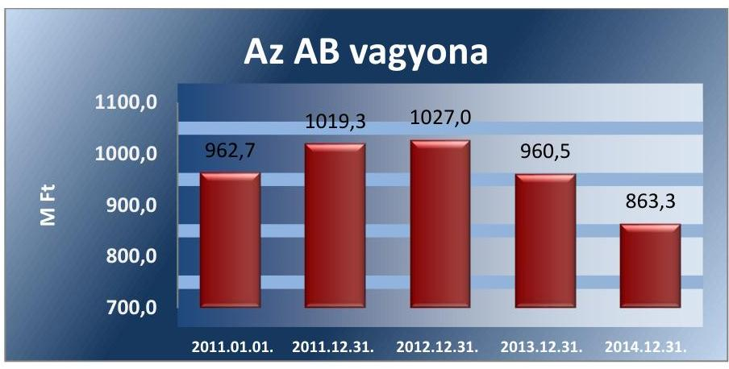

Forrás: Az AB 2011-2014. évi költségvetési beszámolói
Az intézmény összes eszközállománya 2011. január 1-jén 962,7 M Ft volt, ami a 2014. év végére 863,3 M Ft-ra, 10,3%-kal csökkent. A befektetett eszközök értéke 2011. január 1-jén 864,0 M Ft, ami 2014. december 31-én 758,8 M Ft volt, 12,2%-kal csökkent. Az eszközállomány változását a tárgyi eszközök 12,7%-os csökkenése okozta, amelyek 2011. január 1-jei nyitó értéke 840,8 M Ft volt, ami a 2014. év végére 734,4 M Ft-ra változott.

Az AB üzemeltetésre, kezelésre, koncesszióba nem vett át és nem
 adott át eszközöket, készletezési tevékenységet nem végzett, a mérlegsorokon nem mutatott ki értéket. Az AB mérlegét számottevően nem befolyásolta

---

a követelések nagysága, és nem rendelkezett értékpapírokkal. A forgóeszközök tartalma 2014. évtől szűkült, ami miatt az AB-nek az év végén kimutatott forgóeszköze nem volt.

A tárgyi eszközök és immateriális javak bruttó értéke 2014. év végén 49,9 M Ft-tal haladta meg a 2011. január 1-jei értéket. Az AB a 2011-2014. években összesen 154,5 M Ft értékcsökkenést számolt el, ami az eszközök elhasználódási szintjének emelkedését okozta.

A források alakulását, illetve 2014. évi kimutatását alapjaiban az eredményszemléletű számvitelre történt áttérés befolyásolta.

A 2011-2014. években a saját tőke a 2011. év végi 920,2 M Ft-ról a 2014. év végére 753,5 M Ft-ra csökkent. A tartalékok a 2011. év elejei 95,7 M Ft-ról 119,0 M Ft-ra emelkedtek a 2014. év végére. A források nagyságát lényegesen nem befolyásolta a kötelezettségállomány nagysága - amely az ellenőrzött időszakban 12,1-20,3 M Ft között volt - és a 2012. évtől folyamatos csökkenést mutat. A saját tőke forrásokhoz viszonyított aránya nem változott (a mutató 0,86-0,9 volt).

# 4.3. számú megállapítás 

A jogszabály és a vagyonkezelési szerződés előírásai szerint az AB teljesítette a 2011-2014. években az állagmegőrzési, a 2011-2012. években az értékmegőrzési kötelezettségét. A 2013-2014. években jogszabály alapján mentesült a visszapótlási kötelezettség alól.

Az AB részére az állagmegőrzési, értékmegőrzési kötelezettséget a vagyonkezelési szerződés és a Vtv. ${ }^{50}$ rögzítette. Az AB a Vtv. és a vagyonkezelési szerződés előírása szerint a 2011-2014. években állagmegőrzési kötelezettségét teljesítette. A dologi kiadások között a karbantartási kiadásokra a 2011-2014. években összesen 243,8 M Ft-ot fordítottak, mellyel biztosították az eszközök állagmegőrzését.

Az AB a Vtv. és a vagyonkezelési szerződés alapján a 2011-2012. években az értékmegőrzési kötelezettségét teljesítette. A befektetett eszközökön belül az immateriális javak és tárgyi eszközök együttes értéke a 2011. évi nyitó értékről a 2012. év végére 3,8%-kal növekedett, továbbá az eszközök pótlására fordított kiadások meghaladták az elszámolt értékcsökkenést.

A 2013. évtől az immateriális javak és tárgyi eszközök értékében az előző évi záró értékhez viszonyítva a 2013. év végére 6,7%-os, a 2014. év végére 9,3%-os volt a csökkenés. A 2013-2014. évben az eszközök nettó értéke és használhatósági foka is csökkent, azonban az AB - alaptevékenységeként közfeladatot ellátó vagyonkezelőként - a Vtv. 27. § (8) bekezdésében foglaltak alapján 2013. június 28-tól mentesült a visszapótlási kötelezettség alól.

Az AB beruházási és felújítási előirányzatának felhasználása a 2011. évben 174,2 M Ft (teljesítés a módosított előirányzathoz képest 93,6%), a 2012. évben 84,1 M Ft volt (teljesítés 89,5%), a 2013. évben 24,6 M Ft (teljesítés 38,6%), a 2014. évben 52,8 M Ft (teljesítés 63,5%) volt. A fel nem használt előirányzatok részben kötelezettségvállalással terheltek voltak.

Az AB a 2011-2014. években a beruházási és felújítási előirányzatot ingatlan felújításra, gépek, berendezések és felszerelések vásárlására, illetve

---

járművek beszerzésére használta fel. Az AB az Nvtv. alapján a működéséhez szükséges, a Számv. tv. szerinti immateriális javak, tárgyi eszközök (műszaki berendezés, gép, felszerelés stb.) megvásárlására adásvételi szerződéseket kötött, az eszközök az AB vagyonkezelésébe kerültek.

# 4.4. számú megállapítás 

## A vagyonelemek elidegenítése, hasznosítása a jogszabályok és a belső szabályzatok előírásainak megfelelően történt.

Az AB a Vtv. alapján értékesítette a működéséhez már nem szükséges és selejtezett tárgyi eszközöket. Az AB-nél a Vtv. előírásainak megfelelően nem kellett versenyeztetést lefolytatni az éves költségvetési törvényben meghatározott egyedi bruttó 25,0 M Ft forgalmi értéket el nem érő vagyontárgyak értékesítésénél. Az AB a vagyonelemek elidegenítését, hasznosítását a selejtezési és hasznosítási szabályzatai előírásainak megfelelően hajtotta végre.

Az értékesítéseknél a jogszabályban foglaltaknak megfelelően jártak el, a befolyt bevétel nyilvántartásba vétele az Áhsz.12 előírásai szerint megtörtént.

A vagyonhasznosítási bevételek jellemzően számítástechnikai eszközök (számítógépek, monitorok) értékesítéséből származtak. Az AB a gépjárműveket belső szabályzata alapján a legmagasabb árajánlatot adott külső cégek részére értékesítette.

Az AB a 2011., a 2013. és a 2014. években összesen 136,0 M Ft bruttó értékben selejtezett le tárgyi eszközöket. A 2012. évben selejtezésre nem került sor. Az AB gazdálkodásában nem jelentős a felhalmozási, illetve az értékesítésből realizált bevétel, ez utóbbi összesített nagysága bruttó 12,0 M Ft volt a négy év alatt.

MNV Zrt. engedélyéhez kötött értékesítésre nem került sor. Az AB vagyonkezelői jogot harmadik személyre nem ruházott át, bérbeadási tevékenységet nem végzett.

## 5. Az intézmény intézkedett-e az integritás szemlélet érvényesítése érdekében?

Összegző megállapítás

## Az AB nem tett erőfeszítéseket az integritás szemlélet érvényesítése érdekében.

Az ÁSZ Integritás Projektjében az AB az ellenőrzést megelőzően nem vett részt. Az AB az ellenőrzés során kitöltötte az integritás kérdőívet, amelyet az ÁSZ kiértékelt. A kérdőív kiértékelése szerint az AB által az integritás érvényesítése érdekében kialakított és működtetett kontrollrendszere biztosította a megfelelő feltételeket a szervezet integritását veszélyeztető kockázatokkal szemben, a kontrollok szintje megfelelő volt. Az integritás szemlélet érvényesítésével kapcsolatos megállapításokat a II. számú melléklet tartalmazza.

---

# JAVASLATOK 

Az ÁSZ tv. ${ }^{51}$ 33. § (1) bekezdésében foglaltak értelmében az ellenőrzött szervezet vezetője köteles a jelentésben foglalt megállapításokhoz kapcsolódó intézkedési tervet összeállítani és azt a jelentés kézhezvételétől számított 30 napon belül az ÁSZ részére megküldeni. Amennyiben az ellenőrzött szervezet vezetője nem küldi meg határidőben az intézkedési tervet vagy továbbra sem elfogadható intézkedési tervet küld, az ÁSZ elnöke az ÁSZ tv. 33. § (3) bekezdés a)-b) pontjaiban foglaltakat érvényesítheti.

## a költségvetési szerv vezetőjének (Alkotmánybíróság elnöke)

1. Intézkedjen, hogy a belső szabályzat tartalmazza az egyszerűsített értékelési eljárás alá vont követelések dokumentálásának szabályait.
(2.1. számú megállapítás 5. bekezdése alapján)
2. Készítsen adatvédelmi és adatbiztonsági szabályzatot a jogszabályi előírásokkal összhangban.
(2.4. számú megállapítás 4. bekezdése alapján)
3. Intézkedjen, hogy a belső ellenőrzésekről készült jelentések tartalmazzák a jogszabályban előírt tartalmi elemeket.
(2.5. számú megállapítás 8. bekezdése alapján)
4. Intézkedjen a rendszeres személyi juttatások esetében a teljesítményigazolás és az érvényesítés során a jogszabályi előírások betartására.
(3.3. számú megállapítás 8. bekezdése 1. pontja alapján)

---

.

---

# MELLÉKLETEK 

- I. SZ. MELLÉKLET: ÉRTELMEZŐ SZÓTÁR

ÁSZ integritás projekt
belső ellenőrzés
belső kontrollrendszer
belső kontrollrendszer területei
beruházás
eredendő veszélyeztetettségi tényező

Az Állami Számvevőszék 2009-ben indította el a „Korrupciós kockázatok feltérképezése - Integritás alapú közigazgatási kultúra terjesztése" című, európai uniós forrásból megvalósított kiemelt projektjét (Integritás Projekt). Az Integritás Projekt célja, hogy felmérje a közszféra intézményei korrupciós kockázatoknak való kitettségét, illetőleg az azok mérséklésére hivatott kontrollok szintjét. Az Állami Számvevőszék a projekt révén az integritás szemlélet minél szélesebb körrel történő megismertetését, gyakorlatba ültetését kívánja elérni. Az integritás követelményeinek megfelelő szervezeti működést előnyben részesítő közigazgatási kultúra elterjesztését és a korrupció elleni fellépést az ÁSZ önmagára nézve is stratégiai jelentőségű célként fogalmazta meg. A projekt a felmérésben résztvevő intézmények számára helyzetükről egyfajta „tükörképet" mutat be, ami alapot teremt a jövőbeni pozitív irányú elmozduláshoz. (Forrás: a http://integritas.asz.hu honlapon közzétett, a 2013. évi Integritás felmérés eredményeiről készült összefoglaló tanulmány)
Független, tárgyilagos bizonyosságot adó és tanácsadó tevékenység, amelynek célja, hogy az ellenőrzött szervezet működését fejlessze és eredményességét növelje, az ellenőrzött szervezet céljai elérése érdekében rendszerszemléletű megközelítéssel és módszeresen értékeli, illetve fejleszti az ellenőrzött szervezet irányítási és belső kontrollrendszerének hatékonyságát. (Forrás: Bkr. 2. § b) pontja)

A belső kontrollrendszer a kockázatok kezelése és tárgyilagos bizonyosság megszerzése érdekében kialakított folyamatrendszer, amely azt a célt szolgálja, hogy a működés és gazdálkodás során a tevékenységeket szabályszerűen, gazdaságosan, hatékonyan, eredményesen hajtsák végre, az elszámolási kötelezettségeket teljesítsék, megvédjék az erőforrásokat a veszteségektől, károktól és nem rendeltetésszerű használattól.
(Forrás: Áht.; 69. § (1) bekezdése)
A kontrollkörnyezet, a kockázatkezelési rendszer, a kontrolltevékenységek, az információs és kommunikációs rendszer, valamint a nyomon követési (monitoring) rendszer. (Forrás: Bkr. 3. §-a)
A tárgyi eszköz beszerzése, létesítése, saját vállalkozásban történő előállítása, a beszerzett tárgyi eszköz üzembe helyezése, rendeltetésszerű használatbavétele érdekében az üzembe helyezésig, a rendeltetésszerű használatbavételig végzett tevékenység; beruházás a meglévő tárgyi eszköz bővítését, rendeltetésének megváltoztatását, átalakítását, élettartamának, teljesítőképességének közvetlen növelését eredményező tevékenység is. (Forrás: Számv. tv. 3. § (4) bekezdés 7. pontja)

Az eredendő veszélyeztetettségi tényezők index a szervezetek jogállásától és feladatköreitől függő eredendő veszélyeztetettség összetevőit teszi mérhetővé. Olyan tényezők határozzák meg, amelyek alakítása az alapítószerv jogalkotási hatáskörébe tartozik, így például a hatósági jogalkalmazás, a (jogi) szabályozás, vagy a különféle (oktatási, egészségügyi, szociális és kulturális) közszolgáltatások nyújtása.

---

felújítás
információs és kommunikációs rendszer
integritás
kockázat
kockázatkezelési rendszer
kockázatokat mérséklő kontrollok tényezője
kontrollkörnyezet
kontrolltevékenységek
kommunikáció
korrupció

Az elhasználódott tárgyi eszköz eredeti állaga (kapacitása, pontossága) helyreállítását szolgáló időszakonként visszatérő olyan tevékenység, melynek során az eszköz élettartama megnövekszik, minősége, használata jelentősen javul, így a pótlólagos ráfordításból a jövőben gazdasági előnyök származnak. (Forrás: Számv. tv. 3. § (4) bekezdés 8. pontja)
A költségvetési szerv vezetője által kialakított és működtetett olyan rendszer, mely biztosítja, hogy a megfelelő információk a megfelelő időben eljutnak az illetékes szervezethez, szervezeti egységhez, illetve személyhez.
(Forrás: Bkr. 9. § (1) bekezdés)
Az integritás az elvek, értékek, cselekvések, módszerek, intézkedések konzisztenciáját jelenti, vagyis olyan magatartásmódot, amely meghatározott értékeknek megfelel.
(Forrás: Nemzetgazdasági Minisztérium: Magyarországi államháztartási belső kontroll standardok Útmutató 1.6.1. pontja, 2012. december)
A kockázat annak a valószínűségét jelenti, hogy egy vagy több esemény vagy intézkedés nem kívánt módon befolyásolja a rendszer működését, céljainak megvalósulását.
(Forrás: Javaslatok a korrupciós kockázatok kezelésére - Kockázatkezelési és ellenőrzési módszertan 35. oldal, ÁSZ)
Olyan irányítási eszközök és módszerek összessége, melynek elemei a szervezeti célok elérését veszélyeztető tényezők (kockázatok) azonosítása, elemzése, csoportosítása, nyomon követése, valamint szükség esetén a kockázati kitettség mérséklése. (Forrás: Bkr. 2. § m) pont)
A kockázatokat mérséklő kontrollok tényezője index azt tükrözi, hogy az adott szervezetnél léteznek-e intézményesült kontrollok, illetőleg, hogy ezek ténylegesen működnek-e, betöltik-e a rendeltetésüket. Ehhez az indexhez olyan faktorok tartoznak, mint a szervezet belső szabályozása, a belső ellenőrzés, valamint az egyéb integritás kontrollok,:etikai követelmények meghatározása, összeférhetetlenségi helyzetek kezelése, a bejelentések, panaszok kezelése, rendszeres kockázatelemzés és tudatos stratégiai menedzsment.
A költségvetési szerv vezetője által kialakított olyan elvek, eljárások, belső szabályzatok összessége, amelyben világos a szervezeti struktúra, egyértelműek a felelősségi, hatásköri viszonyok és feladatok, meghatározottak az etikai elvárások a szervezet minden szintjén, átlátható a humánerőforrás-kezelés. (Forrás: Bkr. 6. § (1) bekezdés)
A költségvetési szerv vezetője által a szervezeten belül kialakított (kontroll) tevékenységek, melyek biztosítják a kockázatok kezelését, hozzájárulnak a szervezet céljainak eléréséhez. (Forrás: Bkr. 8. § (1) bekezdés)
Az a tevékenység, melynek során információ továbbítása valósul meg. A kommunikációs folyamat résztvevői között tájékoztatás történik, mely során tényeket, ezek magyarázatát közlik.
Azok a cselekmények, amelyek során a köz érdekében való eljárással megbízott és döntéshozatali felelősséggel felruházott személy a köz érdeke helyett önös vagy részérdekeket követve, mástól jogtalan vagy etikátlan előnyt elfogadva és őt jogtalan vagy etikátlan előnyhöz juttatva jár el,
 illetve amikor valaki a köz érdekében való eljárással megbízott és döntéshozatali felelősséggel felruházott személynek jogtalan vagy etikátlan előnyt nyújtva vagy felajánlva jogtalan vagy etikátlan előnyt kér. (Forrás: A Kormány korrupció megelőzési programja 2012-2014.)

---

korrupciós veszélyeket növelő tényezők
likviditási mutató monitoring
monitoring-rendszer
pénzeszköz likviditási mutató
vagyongazdálkodás
zárolás

A korrupciós veszélyeket növelő tényezőket növelő index az egyes intézmények napi működésétől függő - az eredendő veszélyeztetettséget növelő összetevőket jeleníti meg. Leképezi a költségvetési szervek jogi/intézményi környezetének jellemzőit, működésük kiszámíthatóságát, stabilitását, továbbá az intézmények működtetése során jelentkező - alapvetően a mindenkori menedzsment döntéseitől befolyásolt - olyan változó tényezőket, mint a stratégiai célok meghatározása, a szervezeti struktúra és kultúra alakítása, valamint a személyi és költségvetési erőforrásokkal, illetve közbeszerzésekkel való gazdálkodás.
Forgóeszközök összesen/rövid lejáratú kötelezettségek összesen
A monitoring általánosságban a különböző szintű szervezeti célok megvalósításának folyamatát kíséri figyelemmel, melynek során a releváns eseményekről és tevékenységekről (együtt: folyamatokról) rendszeres jelleggel, strukturált, döntéstámogató információkhoz jutnak a szervezet vezetői. (Forrás: NGM Útmutató a költségvetési szervek monitoring rendszeréhez 2011. november)
A költségvetési szerv vezetője köteles olyan monitoring rendszert működtetni, mely lehetővé teszi a szervezet tevékenységének, a célok megvalósításának nyomon követését. A költségvetési szerv monitoring rendszere az operatív tevékenységek keretében megvalósuló folyamatos és eseti nyomon követésből, valamint az operatív tevékenységektől függetlenül működő belső ellenőrzésből áll. (Forrás: Ámr. 160. §, Bkr. 10. §)
pénzeszközök összesen/rövid lejáratú kötelezettségek összesen a tárgyévi záró értékre számítva
A nemzeti vagyongazdálkodás feladata a nemzeti vagyon rendeltetésének megfelelő, az állam, az önkormányzat mindenkori teherbíró képességéhez igazodó, elsődlegesen a közfeladatok ellátásához és a mindenkori társadalmi szükségletek kielégítéséhez szükséges, egységes elveken alapuló, átlátható, hatékony és költségtakarékos működtetése, értékének megőrzése, állagának védelme, értéknövelő használata, hasznosítása, gyarapítása, továbbá az állam vagy a helyi önkormányzat feladatának ellátása szempontjából feleslegessé váló vagyontárgyak elidegenítése. (Forrás: Nvtv. 7. § (2) bekezdése)
A költségvetési kiadási előirányzatok felhasználásának időlegesen, feltételhez kötötten történő korlátozása, felfüggesztése. (Forrás: Áht. 2 2. § (1) bekezdés q) pontja)

---

# II. SZ. MELLÉKLET: AZ INTEGRITÁS SZEMLÉLET ÉRVÉNYESÍTÉSÉVEL KAPCSOLATOS MEGÁLLAPÍTÁSOK

Az AB által kitöltött integritás kérdőív kiértékelése alapján az AB integritása megfelelő. Az eredendő veszélyeztetettség tényező, a korrupciós veszélyeztetettséget növelő tényező alacsony volt. A kockázatokat mérséklő kontrollok szintje a veszélyeztetettségi tényezők szintjéhez igazodott. A belső kontrollok kialakítása és működtetése támogatta az integritás szemlélet érvényesülését. Az integritás kontrollrendszerének értékelését az alábbi táblázat mutatja.

|  AZ INTEGRITÁS KONTROLLRENDSZERÉNEK ÉRTÉKELÉSE |  |   |
| --- | --- | --- |
|  Index neve | AB által kitöltött tanúsítvány alapján számított indexértékek (\%-ban) | AB indexértékeinek szintje (alacsony, közepes, magas)  |
|  Eredendő Veszélyeztetettség Tényező (EVT) | 10,00 | Alacsony  |
|  Korrupciós Veszélyeztetettséget Növelő Tényező (KVNT) | 11,15 | Alacsony  |
|  Kockázatokat Mérséklő Kontrollok Tényező (KMKT) | 71,68 | Alacsony  |
|  Összesítő értékelés | MEGFELELŐ |   |

---

III. SZ. MELLÉKLET: FŐBB MEGÁLLAPÍTÁSOK ÖSSZEFOGLALÁSA

AZ ALKOTMÁNYBÍRÓSÁG PÉNZÜGYI- ÉS VAGYONGAZDÁLKODÁSA ELLENŐRZÉSÉNEK FŐBB MEGÁLLAPÍTÁSAI

|  | FOKUSZTERÜLET | 2011. év | 2012. év | 2013. év | 2014. év |
| :--: | :--: | :--: | :--: | :--: | :--: |
| 1. | Irányító szervi tevékenység ellátása | szabályszerű | szabályszerű | szabályszerű | szabályszerű |
| 2. | Belső kontrollrendszer kialakítása és működtetése | szabályszerű | szabályszerű | szabályszerű | szabályszerű |
| 3. | Pénzügyi gazdálkodás | szabályszerű | szabályszerű | szabályszerű | szabályszerű |
| 4. | Vagyongazdálkodás | szabályszerű | szabályszerű | szabályszerű | szabályszerű |

Forrás: ÁSZ, ellenőrzés megállapításai

---

# IV. SZ. MELLÉKLET: AZ ALKOTMÁNYBÍRÓSÁG VAGYONA

## AZ ALKOTMÁNYBÍRÓSÁG VAGYONI HELYZETE (M Ft)

|  Megnevezés | 2011. 01.01. | 2011. 12.31. | 2012. 12.31. | 2013. 12.31. | 2014. 12.31.  |
| --- | --- | --- | --- | --- | --- |
|  IMMATERIÁLIS JAVAK | 22,6 | 34,4 | 42,5 | 31,3 | 24,4  |
|  Vagyoni értékű jogok | 19,9 | 33,0 | 39,2 | 30,7 | 23,4  |
|  Szellemi termékek | 2,7 | 1,4 | 3,3 | 0,6 | 1,0  |
|  TÁRGYI ESZKÖZÖK | 840,8 | 902,8 | 854,3 | 805,3 | 734,4  |
|  Ingatlanok és kapcsolódó vagyonértékű jogok | 707,7 | 743,6 | 698,9 | 683,4 | 624,7  |
|  Gépek, berendezések, felszerelések | 68,8 | 82,8 | 63,7 | 43,4 | 109,7  |
|  Járművek | 64,3 | 76,4 | 91,7 | 78,5 | -  |
|  Beruházások, felújítások | - | - | - | - | -  |
|  BEFEKTETETT PÉNZÜGYI ESZKÖZÖK | 0,6 | - | 2,1 | 1,4 | -  |
|  Tartósan adott kölcsön | 0,6 | - | 2,1 | 1,4 | -  |
|  BEFEKTETETT ESZKÖZÖK ÖSSZESEN | 864,0 | 937,2 | 898,9 | 838,1 | 758,8  |
|  KÉSZLETEK | - | - | - | - | -  |
|  KÖVETELÉSEK | 0,8 | 0,5 | 1,0 | 0,7 | 4,0  |
|  Rövid lejáratú adott kölcsönök | 0 | 0 | 1,0 | 0,7 | -  |
|  egyéb követelés | 0,8 | 0,5 | - | - | -  |
|  Költségvetési évben esedékes követelések | - | - | - | - | 0,1  |
|  Költségvetési évet követően esedékes követelések | - | - | - | - | 3,4  |
|  Követelés jellegű sajátos elszámolások | - | - | - | - | 0,5  |
|  ÉRTÉKPAPÍROK | - | - | - | - | -  |
|  PÉNZESZKÖZÖK | 97,8 | 81,6 | 127,0 | 121,5 | 96,0  |
|  Pénztárak, csekkek, betétkönyvek | 1,1 | 0,9 | 0,5 | 1,5 | -  |
|  Elszámolási számlák | 94,4 | 78,0 | 124,5 | 117,6 | -  |
|  Forintszámlák | - | - | - | - | 96,0  |
|  Idegen pénzeszközök | 2,3 | 2,7 | 1,9 | 2,5 | -  |
|  EGYÉB AKTÍV PÉNZÜGYI ELSZÁMOLÁSOK | 0,1 | - | 0,1 | 0,2 | -  |
|  EGYÉB SAJÁTOS ESZKÖZOLDALI ELSZÁMOLÁSOK | - | - | - | - | 1,7  |
|  AKTÍV IDŐBELI ELHATÁROLÁSOK | - | - | - | - | 2,8  |
|  FORGŐESZKÖZÖK ÖSSZESEN | 98,7 | 82,1 | 128,1 | 122,4 | 97,7  |
|  ESZKÖZÖK ÖSSZESEN | 962,7 | 1019,3 | 1027,0 | 960,5 | 863,3  |
|  SAJÁT TÖKE | 854,0 | 920,2 | 884,6 | 828,3 | 753,5  |
|  Tartós tőke | 882,0 | 882,0 | 882,0 | 882,0 | -  |
|  Ebből: kezelésbe vett eszközök tartós tőkéje | 882,0 | 882,0 | 882,0 | 882,0 | 1780,9  |
|  Tőkeváltozások | -28,0 | 38,1 | 2,6 | -53,7 | -954,9  |
|  Ebből: kezelésbe vett eszközök tőkeváltozása | -28,0 | 38,1 | 2,6 | -53,7 | -  |
|  Mérleg szerinti eredmény | - | - | - | - | -191,4  |
|  TARTALÉKOK | 95,7 | 78,8 | 125,2 | 119,2 | 119,0  |
|  Költségvetési tartalékok | 95,7 | 78,8 | 125,2 | 119,2 | -  |
|  KÖTELEZETTSÉGEK (EGYÉB PASSZÍV PÜ-I ELSZ NÉLKÜL) | 13,0 | 20,3 | 17,2 | 13,0 | 12,1  |
|  Rövid lejáratú kötelezettségek | 13,0 | 20,3 | 17,2 | 13,0 | 12,0  |
|  Kötelezettségek áruszállításból, szolgáltatásnyújtásból (szállítók) | 13,0 | 20,3 | 17,2 | 12,9 | -  |
|  Egyéb kötelezettségek | - | - | - | 0,1 | -  |
|  EGYÉB PASSZÍV PÉNZÜGYI ELSZÁMOLÁSOK | - | - | - | - | -  |
|  EGYÉB SAJÁTOS FORRÁSOLDALI ELSZÁMOLÁSOK | - | - | - | - | -  |
|  KINCSTÁRI SZÁMLAVEZETÉSSEL KAPCSOLATOS ELSZÁMOLÁSOK | - | - | - | - | -  |
|  PASSZÍV IDŐBELI ELHATÁROLÁSOK | - | - | - | - | 97,7  |
|  FORRÁSOK ÖSSZESEN | 962,7 | 1019,3 | 1027,0 | 960,5 | 863,3  |

Fonrás: Az AB 2011-2014. évi költségvetési beszámolói

---

# FÜGGELÉK: ÉSZREVÉTELEK 

Az Állami Számvevőszék a jelentéstervezetet 15 napos észrevételezésre megküldte az ellenőrzött szervezet vezetőjének az ÁSZ tv. 29. § (1) bekezdése előírásának megfelelően.
Az Alkotmánybíróság részéről az ellenőrzött szervezet vezetője az ellenőrzés megállapításaira írásban észrevételt tett.
Az elfogadott észrevételek alapján az Állami Számvevőszék módosította a jelentést.
A függelék tartalmazza az ellenőrzött szervezet vezetőjének az észrevételeit és az azokra adott válaszokat, az elfogadott és az el nem fogadott észrevételekről, azok indokairól szóló tájékoztatást.

[^0]
[^0]:    * 29. § (1) Az Állami Számvevőszék az ellenőrzési megállapításait megküldi az ellenőrzött szervezet vezetőjének vagy az általa megbízott személynek, és annak, akinek személyes felelősségét állapította meg.
    (2) Az ellenőrzött szervezet vezetője és a felelősként megjelölt személy az ellenőrzés megállapításaira tizenöt napon belül írásban észrevételt tehet.
    (3) Az Állami Számvevőszék az észrevételre a beérkezésétől számított harminc napon belül írásban válaszol. A figyelembe nem vett észrevételeket köteles a jelentésben feltüntetni, és megindokolni, hogy azokat miért nem fogadta el.

---

# ALKOTMÁNYBÍRÓSÁG 

ELNÖK

Telefon: (+36 1) 4883131
Fax: (+36 1) 4883139

Tárgy: A központi alrendszer egyes intézményei pénzügyi és vagyongazdálkodásának ellenőrzése Alkotmánybíróság
Úgyszám: XXV-12/00722-3/2016

## Domonkos László

elnök

## Állami Számvevőszék Budapest

## ÁLLAMI SZÁMVEVŐSZÉK

## Érkezett: 2016. ÁPR. 12

Iktatószám: V-0007205206
Melléklet:

## Tisztelt Elnök Úr!

„A központi alrendszer egyes intézményei pénzügyi és vagyongazdálkodásának ellenőrzése Alkotmánybíróság" című ellenőrzése során feltárt megállapításokról készült jelentéstervezetet áttanulmányoztuk, és az abban foglaltakra vonatkozó észrevételeinket mellékelten megküldjük.

Budapest, 2016. április 12.

Üdvözlettel:
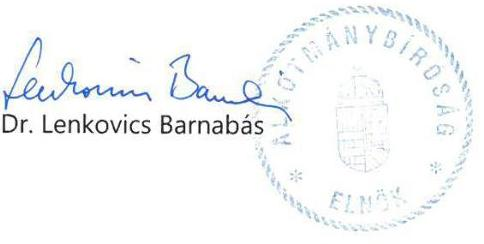

---

# ÉSZREVÉTEL 

az ÁSZ „A központi alrendszer egyes intézményei pénzügyi és vagyongazdálkodásának ellenőrzése Alkotmánybíróság" című ellenőrzésének jelentéstervezetére

A 2011-2014 éveket érintő átfogó jelentéstervezetre az alábbi észrevételeket kívánjuk tenni:

## 1. Főbb megállapítások, következtetések

A) Megállapítás:

Az Alapító okirat 2011. december 31-éig nem felelt meg az Alkotmánybíróság székhelyére vonatkozó törvényi rendelkezésnek.

## Észrevétel

A törvényi rendelkezés szerint Esztergom volt székhelyként megjelölve, azonban az alapító okirat valós tényeken alapult, mivel az intézmény ténylegesen, 1994. óta, jelenlegi helyén működött. (A törvényben
 foglalt székhely megváltoztatása folyamatosan napirenden volt.)

Az esztergomi Sándor palotát - műemlékvédelem alatt álló épület - 2001. november 8-án létrejött, háromoldalú megállapodás alapján (Kincstári Vagyon Igazgatóság, Esztergom Városi Önkormányzat és Alkotmánybíróság) a KVI 2002. június 26-án Esztergom város birtokába adta.
B) Megállapítás:

2011-2014. években a vagyonkezelési szerződések nem feleltek meg a jogszabályi előírásoknak - hatályon kívüli jogszabályi hivatkozás -, továbbá nem tartották be a jogszabályi rendelkezést - vagyonkezelési szerződést 60 napon belül a módosításokkal egységes szerkezetbe kell foglalni.

## Észrevétel

A Magyar Nemzeti Vagyonkezelő Zártkörűen működő Részvénytársaság minden évben (2008., 2009.10.19., 2010.02.01, 2010.03.23., 2010.11.22., 2011.03.11., 2011.10.20., 2012.02., 2012.10.20., 2014.01.31., 2015.03.11) kiküldte a vagyonkezelési szerződés tervezetét észrevételezésre.
Az Alkotmánybíróság minden esetben válaszolt a megkeresésre, melyekre válasz nem érkezett, így nem kerülhetett sor a szerződésmódosításra.
A helyszíni ellenőrzés ideje alatt a tervezetek bemutatásra kerültek.
Az új vagyonkezelési szerződés 2015. május 28. (MNV), illetve 2015. június 1. (Ab) került aláírásra.
C) Megállapítás:

Az eszközök és források értékelési szabályzata nem tartalmazta az egyszerűsített értékelési eljárás alá vont követelések dokumentálásának szabályait.

---

# Észrevétel 

2011-2013. évekre a 249/2000. (XII.24.) Kormányrendelet 8.§ (18) bekezdése szerint „Az államháztartás szervezete -_ha alkalmazza a 31/A. §-a (1) bekezdésében foglaltakat - értékelési szabályzatában köteles rögzíteni az egyszerűsített értékelési eljárás alá vont követelések negyedévenkénti besorolásának elveit, dokumentálásának szabályait (az egyes minősítési kategóriák meghatározásának szempontjait, az egyes minősítési kategóriákhoz rendelt százalékos mutatók meghatározásának módszerét, valamint az egyes minősítési kategóriák, illetve az azokhoz tételesen hozzárendelt százalékos mutatók felülvizsgálatának rendjét, felelőseit)."

Az Alkotmánybíróság sem központi, sem helyi adókkal, sem adók módjára behajtható köztartozásokkal kapcsolatos követelésekkel nem rendelkezett, és nem is fog rendelkezni, mert tevékenységét nem érinti. Ilyen jellegű követeléseket nem áll módjában előírni.
31/A. § (1) A központi, a helyi adókkal és az adók módjára behajtandó köztartozásokkal kapcsolatos követelések - ideértve az adó-, az adó jellegű, az illeték, a járulék-, a járulék jellegű, a vám-, a vám jellegű tételek - értékelése során a 31. § (2) bekezdés szerinti értékvesztés összege az adósok együttes minősítése alapján egyszerűsített értékelési eljárással (azok csoportos értékelésével) is meghatározható.
2014. évben a számviteli politikában került meghatározásra a 4/2013.(I.11.) Kormányrendelet 50. § (2) bekezdése szerinti előírás.

## D) Megállapítás:

A belső ellenőri jelentések a jogszabályban előírt kötelező tartalmi elemeket nem tartalmazzák.

- Nem tartalmazzák az ellenőrzést végző szervezeti egység megnevezését Észrevétel

Az Alkotmánybíróságon nem került kialakításra szervezeti egység a belső ellenőrzési feladatok ellátására, mert a 370/2011. (XII.31.) költségvetési szervek belső kontrollrendszeréről és belső ellenőrzéséről szóló Kormányrendelet 15.§ (5) bekezdésében foglaltak alapján, a fejezetet irányító szerv vezetőjének jóváhagyásával, a belső ellenőrzési tevékenységét külső szolgáltatóval valósíthatja meg.

A belső ellenőr
2011. évben a jelentések végén, aláírása alatt tüntette fel „belső ellenőr”, 2012-2014. években
a jelentések bevezető részében: az ellenőrzést végzi: a nevét írta a jelentések végén, aláírása alatt tüntette fel „belső ellenőr”.

---

# - Nem tartalmazzák az ellenőrzés tárgyát 

Észrevétel
2011-2014. években minden jelentés címe, valamint az első bekezdése tartalmazta az ellenőrzés tárgyát
„Jelentés
a. $\qquad$ elkészítéséről,
vizsgálatáról stb.”

- Nem tartalmazzák az ellenőrzésre vonatkozó jogszabályi felhatalmazás megjelölést
Észrevétel
2011. év: 1. jelentés 2) pont
2. jelentés 1) pont a) bekezdés, 2) pont, 5) pont
3. jelentés 2) pont, 8) pont
4. jelentés utóellenőrzés volt, munkaterv alapján
2012. év: 1. jelentés 1) pont, 5) pont
2. jelentés I. 1) pont, a jelentés 4. oldala, 3) pont
3. jelentés utóellenőrzés volt, munkaterv alapján
4. jelentés I. 1) pont, 3) pont
2013. év: 1. jelentés 3) pont, 3.1) pont
2. jelentés I. 1) pont
3. jelentés I. 1) pont
4. jelentés bevezető rész
2014. év: 1. jelentés bevezető rész és 2) pont
2. jelentés 2., 3., 4. és 8. oldal
3. jelentés 2. oldal, hivatkozás a belső szabályzatokra
4. jelentés I. 1) pont, 3. és 4. oldal
- Nem minden esetben tartalmazzák a helyszíni ellenőrzés kezdetét és végét Észrevétel

2011. évben előfordult, hogy nem szerepelt minden jelentésben a helyszíni ellenőrzés időpontja, illetve a programra történt hivatkozás „program szerint”. 2012. évtől a bevezető részben feltüntetésre kerültek a helyszíni ellenőrzések időpontjai.

A jelentések melléklete a vizsgálati program. A program II. pontja, minden vizsgálatnál tartalmazza egyebek mellett az ellenőrzést végző nevét és a helyszíni ellenőrzés időtartamát.

---

# 2. Megállapítások 

1. Irányítószervi feladatok

Az Alapító okirat 2011. december 31-éig nem felelt meg az Alkotmánybíróság székhelyére vonatkozó törvényi rendelkezésnek.

## Észrevétel

1. Főbb megállapítások / A) pontjánál
2.1 Eszközök és források értékelési szabályzata

Észrevétel

1. Főbb megállapítások / C) pontjánál
2.2 Kockázatkezelési rendszer
2012. március 1-jéig a hatályos SZMSZ nem tartalmazta a vagyonnyilatkozattételre kötelezettek körét.

## Észrevétel

2008. június 9.-én hatályba léptetett SZMSZ módosítás tartalmazza a vagyonnyilatkozat-tételre kötelezettek felsorolását.

Mellékletként csatolva.
2.5 Belső ellenőri jelentések tartalma nem felelt meg

Észrevétel

1. Főbb megállapítások / D) pontjánál
4.1 Vagyonkezelési szerződés nem felelt meg

Észrevétel

1. Főbb megállapítások / B) pontjánál

Budapest, 2016. április 12.
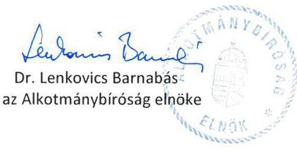

---

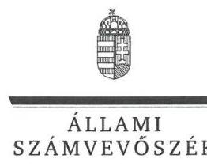

ELNÖK

Ikt.szám: V-0887-208/2016.

Dr. Sulyok Tamás úr
alelnök
Alkotmánybíróság

# Budapest 

## Tisztelt Alelnök Úr!

Köszönettel megkaptam a 2016. április 12. napján az Állami Számvevőszékhez érkezett „A központi alrendszer egyes intézményei pénzügyi és vagyongazdálkodásának ellenőrzése Alkotmánybíróság” címû számvevőszéki jelentéstervezetben foglalt megállapításokra írásban tett észrevételeket.

Tájékoztatom Alelnök urat, hogy a jelentésben - az Állami Számvevőszékről szóló 2011. évi LXVI. törvény 29. § (3) bekezdése alapján - az el nem fogadott észrevételeket szerepeltetjük az elutasítás indokainak feltüntetésével együtt.

Az Állami Számvevőszék észrevételekre vonatkozó álláspontjáról a felügyeleti vezető által készített részletes tájékoztatást mellékelten megküldöm.

Budapest, 2016. 05. hó 0. nap
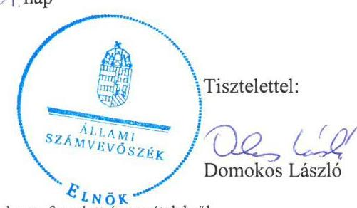

Melléklet: Tájékoztatás az elfogadott és el nem fogadott észrevételekről

---

# Tájékoztatás   az elfogadott és az el nem fogadott észrevételekről

| 1.A) | Észrevétel: | Megállapításokhoz kapcsolódó észrevételek   Főbb megállapítások, következtetések 1. bekezdésében (5. oldal) és az 1. számú megállapítás 3. bekezdésében (13. oldal) az alapító okiratnak az Alkotmánybíróság székhelye tekintetében 2011. december 31-ig a törvényi rendelkezésnek való meg nem feleléséhez kapcsolódóan.  |
| --- | --- | --- |
|   | Válasz: | Az Állami Számvevőszék az észrevételt nem fogadja el.  |
|   | Indoklás: | Az észrevétel a megállapítást nem vitatja, azt magyarázza.   Az Alkotmánybíróságról szóló 2011. december 31-ig hatályos 1989. évi XXXII. törvény 3. §-ában foglaltak szerint: „Az Alkotmánybíróság székhelye Esztergom.”   A helyszíni ellenőrzés során rendelkezésre bocsátott, az Alkotmánybíróság 2011. december 31-ig hatályos alapító okirata (2009. június 8 -án kelt 18./Eln./2005. számú egységes szerkezetű alapító okirat) 1. pontjában az intézmény székhelyeként Budapest szerepel. Ez alapján az Alkotmánybíróság székhelyére vonatkozó törvényi rendelkezés és az alapító okirat nem áll összhangban egymással.   A fentiekre tekintettel a megállapítás módosítása nem indokolt.  |
|  1.B) | Észrevétel: | Megállapításokhoz kapcsolódó észrevételek   Főbb megállapítások, következtetések 2. bekezdésében (5. oldal) és a 4.1. számú megállapítás 2-3. bekezdéseiben (25. oldal) a vagyonkezelési szerződéshez kapcsolódóan.  |
|   | Válasz: | Az Állami Számvevőszék az észrevételt nem fogadja el.  |
|   | Indoklás: | Az észrevétel az ellenőrzött időszakra vonatkozó megállapítást nem vitatja, annak körülményeit magyarázza. Az észrevétel szerint az MNV Zrt. minden évben kiküldte a vagyonkezelési szerződés tervezetét észrevételezésre. Az Alkotmánybíróság minden évben válaszolt a megkeresésre, melyekre az MNV Zrt. részéről nem érkezett válasz, így nem kerülhetett sor a szerződés módosítására.   Tekintettel arra, hogy az új vagyonkezelési szerződés aláírására az ellenőrzött időszakot követően, az MNV Zrt. részéről 2015. május 28 -án, az Alkotmánybíróság részéről 2015. június 1 -én került sor, az ellenőrzött időszakra vonatkozó megállapítás módosítása nem indokolt.  |

---

|  |  | Megállapításokhoz kapcsolódó észrevételek |
| :--: | :--: | :--: |
|  | Észrevétel: | Főbb megállapítások, következtetések 3. bekezdésében (5. oldal) és a 2.1. számú megállapítás 5. bekezdésében (15. oldal) az eszközök és források értékelési szabályzatához kapcsolódóan. |
|  | Válasz: | Az Állami Számvevőszék az észrevételt részben fogadja el. |
| 1.C) | Indoklás: | A dokumentumok ismételt áttekintése alapján, az észrevételnek a 2011-2013. évekre vonatkozó részét elfogadva, a 2.1. számú megállapítás 4. bekezdés utolsó mondatából „az eszközök és források értékelési szabályzata kivételével” szövegezést, valamint az 5. bekezdés 1. mondatát töröltük. Az 5. bekezdés 2. mondatát a következők szerint pontosítottuk (kiegészítés aláhúzással jelölve).   „A 2014. évtől a számviteli politikában határozták meg az egyszerűsített értékelési eljárás alá vont követelések besorolásának elveit, azonban a dokumentálás szabályait nem rögzítették az Ahsz.: 50. § (2) bekezdés c) pontjának előírása ellenére.”   A módosítással összhangban, a Főbb megállapítások, következtetések 3. bekezdés 2. mondat első felét a következők szerint pontosítottuk (,az eszközök és források értékelési szabályzatában” szövegezést töröltük, és a hiányosság évére vonatkozóan kiegészítettük, kiegészítés aláhúzással jelölve). „Szabályozási hiányosság, hogy a 2014. évben nem rögzítették a jogszabályban előírt egyszerűsített értékelési eljárás alá vont követelések dokumentálásának szabályait.”   A megállapítás pontosítása a költségvetési szerv vezetőjének címzett 1. számú javaslat módosítását nem indokolta. |
|  | Észrevétel: | Megállapításokhoz kapcsolódó észrevételek   Főbb megállapítások, következtetések 3. bekezdésében (5. oldal) és a 2.5. számú megállapítás 8. bekezdésében (18. oldal) a belső ellenőrzési jelentések tartalmához kapcsolódóan. |
|  | Válasz: | Az Állami Számvevőszék az észrevételt részben fogadja el. |
| 1.D) | Indoklás: | - Az észrevételnek az ellenőrzést végző szervezeti egység megnevezésére vonatkozó pontja nem megalapozott.   Az észrevétel szerint az Alkotmánybíróságon nem került kialakításra szervezeti egység a belső ellenőrzési feladatok ellátására, mert a költségvetési szervek belső kontrollrendszeréről és a belső ellenőrzéséről szóló 370/2011. (XII. 31.) Korm. rendelet (Bkr.) 15. § (5) bekezdésében foglaltak alapján a fejezetet irányító szerv jóváhagyásával, a belső ellenőrzési tevékenységet külső szolgáltatóval valósíthatja meg. A 2011. évben a belső ellenőr a belső ellenőrzési jelentések végén aláírása alatt tüntette fel „belső ellenőr”, a 2012-2014. években a jelentések bevezető részében az ellenőrzést végző a nevét feltüntette, a jelentés végén aláírása alatt tüntette fel „belső ellenőr”. |

---

|  |  | Megállapításokhoz kapcsolódó észrevételek |
| :--: | :--: | :--: |
|  | A dokumentumok ismételt áttekintése alapján az Alkotmánybíróság szervezeti és működési szabályzatában (SZMSZ) a költségvetési szervek belső ellenőrzéséről szóló 193/2003. (XI. 26.) Korm. rend. (Ber.) 4. § (2) bekezdésében, valamint a Bkr. 15. § (2) bekezdésében előírtakkal összhangban meghatározták a belső ellenőrzést végző személy (szervezeti egység) jogállását, feladatait.   A 2011-ben hatályos SZMSZ szerint a belső (külső) ellenőr „Külön megbizási szerződéssel alkalmazott, külső gazdaságipénzügyi szakember, aki közvetlenül az elnök irányítása mellett tevékenykedik”. A szervezeti ábra szerint a belső ellenőr az Elnöki titkárság szervezeti egységben látta el a feladatait (1/2007. (I. 9) elnöki utasítás 8. oldal 8.4. pont, 1. számú melléklet, szervezeti ábra).   A 2012. évtől hatályos SZMSZ szerint „A függetlenített belső ellenőr külön megbizási szerződéssel alkalmazott, külső gazdasági-pénzügyi szakember, aki közvetlenül az elnök irányítása alatt

 áll." A szervezeti ábra szerint a belső ellenőr szervezeti egysége az Elnöki kabinet (az AB teljes ülésének XVIII/2181/2012. számú határozata 19. oldal 17.2. pont, 1. számú melléklet, szervezeti ábra).   Tekintettel arra, hogy a jogszabályi előírások - a Ber. 27. § (2) bekezdés a) pontja és a Bkr. 39. § (3) bekezdés a) pontja - az ellenőrzési jelentések tartalmi elemeként kifejezetten az ellenőrzést végző szerv, illetve szervezeti egység megnevezését írták elő, amelyet a helyszíni ellenőrzés során rendelkezésre bocsátott belső ellenőrzési jelentések nem tartalmaztak, a megállapítás módosítása nem indokolt.   - Az észrevételnek az ellenőrzés tárgyára vonatkozó pontját az Állami Számvevőszék elfogadja. A dokumentumok ismételt áttekintése alapján a 2.5. számú megállapítás 8. bekezdés 2. mondatából töröltük ,,az ellenőrzés tárgyát" megállapítást.   - Az észrevételnek az ellenőrzésre vonatkozó jogszabályi felhatalmazás megjelölésére vonatkozó pontja nem megalapozott.   A dokumentumok ismételt áttekintése alapján, az ellenőrzési jelentések nem az ellenőrzésre vonatkozó jogszabályi felhatalmazást, hanem az éves munkatervre való hivatkozást tartalmazták.   Az észrevételben hivatkozott jogszabályi előírások nem az ellenőrzésre vonatkozó jogszabályi felhatalmazásra, hanem az ellenőrzött téma jogszabályi előírásoknak való megfelelőségére vonatkoztak. A Ber. 27. § (2) bekezdés c) pontja és a Bkr. 39. § (3) bekezdés c) pontja szerint „az ellenőrzési jelentésnek tartalmazni kell az ellenőrzésre vonatkozó jogszabályi felhatalmazás megjelölését." Erre tekintettel a megállapítás módosítása nem indokolt. |
| :--: | :--: |

---

|  | Indoklás: | - Az észrevételnek a helyszíni ellenőrzés kezdete és vége megjelölésére vonatkozó pontja nem megalapozott, mivel az ellenőrzésekről készített jelentések a 2011. évben nem tartalmazták - így az ellenőrzött időszakban nem minden esetben tartalmazták - a helyszíni ellenőrzés kezdetét és végét. A megállapítás egyértelműsége érdekében a 2.5. számú megállapítás 8. bekezdés 2. mondatát pontosítottuk a következők szerint „a 2011. évben nem tartalmazták a helyszíni ellenőrzés kezdetét és végét."   A helyszíni ellenőrzést végző nevének és a helyszíni ellenőrzés időtartamának vizsgálati programban szerepeltetése a megállapítást nem módosítja, mivel a Ber. 27. § (2) bekezdésének f) pontja és a Bkr. 39. § (3) bekezdésének h) pontja kifejezetten az ellenőrzési jelentések tartalmára határoztak meg előírásokat, továbbá a vizsgálati program a belső ellenőrzés „terv" állapotát, míg a jelentések a végrehajtott ellenőrzések tényadatait tartalmazzák.   Fentiek alapján a 2.5. számú megállapítás 8. bekezdés 2. mondatát az alábbiak szerint pontosítottuk: Az ellenőrzésekről készített jelentések a Ber. 27. § (2) bekezdésében, illetve a Bkr. 39. § (3) bekezdésében foglaltak ellenére nem tartalmazták az ellenőrzést végző szerv, szervezeti egység megnevezését, az ellenőrzésre vonatkozó jogszabályi felhatalmazás megjelölését, illetve a 2011. évben nem tartalmazták a helyszíni ellenőrzés kezdetét és végét. |
| :--: | :--: | :--: |
| 2. | Észrevétel: | Egyéb észrevételek   A 2.2. számú megállapítás 3. bekezdésében) (16. oldal) a vagyonnyilatkozat tételre kötelezettek SZMSZ-ben történő meghatározásához kapcsolódóan. |
|  | Válasz: | Az Állami Számvevőszék az észrevételt elfogadja. |
|  | Indoklás: | A dokumentumok ismételt áttekintése alapján, a 2.2. számú megállapítás 3. bekezdését az alábbiak szerint módosítottuk: „A Vnytv. 4. § a) pontjában megfogalmazott rendelkezésekkel összhangban az AB elnöke a 2011-2014. évekre vonatkozóan az SZMSZ-ben határozta meg a vagyonnyilatkozat tételre kötelezettek körét." |

Budapest, 2016. 06 hó 06 nap
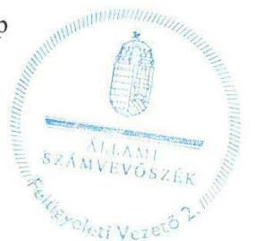

Salamon Ildikó
felügyeleti vezető

---

.

---

# RÖVIDÍTÉSEK JEGYZÉKE 

${ }^{1}$ Alaptörvény
${ }^{2}$ Abtv. 1
${ }^{3}$ Abtv. 2
${ }^{4}$ Nvtv.
${ }^{5}$ Áht. 1
${ }^{6}$ Áht. 2
${ }^{7}$ Ámr.
${ }^{8}$ Bkr.
${ }^{9}$ ÁSZ
${ }^{10}$ Alkotmány
${ }^{11} \mathrm{AB}$
${ }^{12}$ OGY
${ }^{13}$ alapító okirat
${ }^{14}$ Ávr.
${ }^{15}$ SZMSZ
${ }^{16}$ gazdasági szervezet ügyrendje
${ }^{17}$ számviteli politika
${ }^{18}$ gazdálkodási szabályzat

Magyarország Alaptörvénye (hatályos 2011. április 25-étől)
Az Alkotmánybíróságról szóló 1989. évi XXXII. törvény (hatályos 2011. december 31-ig)
Az Alkotmánybíróságról szóló 2011. évi CLI. törvény (hatályos 2012. január 1-jétől)
A nemzeti vagyonról szóló 2011. évi CXCVI. törvény (hatályos 2011. december 31-től)
Az államháztartásról szóló 1992. évi XXXVIII. törvény (hatályos 2011. december 31-éig)
Az államháztartásról szóló 2011. évi CXCV. törvény (hatályos 2012. január 1-jétől)
Az államháztartás működési rendjéről szóló 292/2009. (XII. 19.) Korm. rendelet (hatályos 2011. december 31-éig)
A költségvetési szervek belső kontrollrendszeréről és belső ellenőrzéséről szóló 370/2011. (XII. 31.) Korm. rendelet (hatályos 2012. január 1-jétől)
Állami Számvevőszék
A Magyar Köztársaság Alkotmányáról szóló 1949. XX. törvény (hatálytalan 2012. január 1-jétől)

Alkotmánybíróság
Országgyűlés
A Magyar Köztársaság Alkotmánybíróságának Alapító Okirata egységes szerkezetben 18/Eln./2005
Az Alkotmánybíróság Alapító okirata (módosításokkal egységes szerkezetbe foglalva) XXV-1/2346-1/2012.
Az Alkotmánybíróság alapító okiratának módosító okirata XXV-1/79-2/2014. Az Alkotmánybíróság alapító okirata (a módosításokkal egységes szerkezetbe foglalva) XXV-1/79-3/2014.
Az államháztartásról szóló törvény végrehajtásáról szóló 368/2011. (XII. 31.) Korm. rendelet (hatályos 2012. január 1-jétől)
Szervezeti és működési szabályzat
1/2007. (I. 9.) Elnöki utasítás a Magyar Köztársaság Alkotmánybírósága
Hivatalának szervezeti és működési szabályzata (hatálytalan 2012. március 1-jétől)
1003/2012. (III. 9.) AB Tü. határozat az Alkotmánybíróság szervezeti és működési szabályzatáról (hatályos 2012. március 1-jétől)
Gazdasági szervezet ügyrendje
(hatályos 2010. január 1-től 2011. december 31-ig)
Számviteli politika (hatályos: 2010. január 1-jétől)
Számviteli politika (hatályos: 2012. január 1-jétől)
Az Alkotmánybíróság számviteli politikája (hatályos: 2013. január 1-jétől)
Az Alkotmánybíróság számviteli politikája (hatályos: 2014. január 1-jétől)
Gazdálkodási szabályzat és a gazdasági szervezet ügyrendje (hatályos 2012. január 1-jétől)
Gazdálkodási szabályzat és a gazdasági szervezet ügyrendje (hatályos 2013. január 1-jétől)
Gazdálkodási szabályzat és a gazdasági szervezet ügyrendje (hatályos 2014. január 1-jétől)

---

${ }^{19}$ Kttv.
${ }^{20}$ Számv. tv.
${ }^{21}$ Áhsz. 1
${ }^{22}$ Áhsz. 2
${ }^{23}$ leltározási szabályzat
${ }^{24}$ eszközök és források értékelési szabályzata
${ }^{25}$ pénzkezelési szabályzat
${ }^{26}$ önköltségszámítási szabályzat
${ }^{27}$ számlarend és bizonylati rend
${ }^{28}$ kötelezettségvállalási szabályzat
${ }^{29} \mathrm{Kbt} .1$
${ }^{30} \mathrm{Kbt} .2$
${ }^{31}$ Vnytv.
${ }^{32}$ Avtv.
${ }^{33}$ Info tv.

A közszolgálati tisztviselőkről szóló 2011. évi CXCIX. törvény (hatályos 2012. március 1-jétől)
A számvitelről szóló 2000. évi C. törvény
Az államháztartás szervezetei beszámolási és könyvvezetési kötelezettségének sajátosságairól szóló 249/2000. (XII. 24.) Korm. rendelet (hatálytalan 2014. január 1-jétől)
Az államháztartás számviteléről szóló 4/2013. (I. 11.) Korm. rendelet (hatályos 2014. január 1-jétől)

Az Alkotmánybíróság leltárkészítési és leltározási szabályzata (hatályos 2010. január 1-jétől)
Az Alkotmánybíróság leltárkészítési és leltározási szabályzata (hatályos 2012. január 1-jétől)
Az Alkotmánybíróság leltárkészítési és leltározási szabályzata (hatályos 2013. január 1-jétől)
Az Alkotmánybíróság leltárkészítési és leltározási szabályzata (hatályos 2014. január 1-jétől)
Eszközök és források értékelési szabályzata egységes szerkezetben a módosításokkal (hatályos 2010. január 1-jétől)
Az Értékelési szabályzat módosítása, kiegészítése (hatályos 2011. január 1-jétől)
Eszközök és források értékelési szabályzata (hatályos 2012. január 1-jétől)
Az Alkotmánybíróság eszközök és források értékelési szabályzata (hatályos 2013. január 1-jétől)
Az Alkotmánybíróság eszközök és források értékelési szabályzata (hatályos 2014. január 1-jétől)
Pénzkezelési szabályzat (hatályos: 2010. január 1-jétől)
Pénzkezelési szabályzat (hatályos: 2012. január 1-jétől)
Az Alkotmánybíróság pénzkezelési szabályzata (hatályos 2013. január 1-jétől)
Az Alkotmánybíróság pénzkezelési szabályzata (hatályos 2014. január 1-jétől)
Önköltségszámítási szabályzat (hatályos: 2005. október 1-jétől)
Önköltségszámítási szabályzat (hatályos: 2012. január 1-jétől)
Az Alkotmánybíróság önköltség számítási szabályzata (hatályos: 2013. január 1-jétől)
Az Alkotmánybíróság önköltség számítási szabályzata (hatályos: 2014. január 1-jétől)
Számlarend (hatályos: 2011. január 1-jétől)
Számlarend (hatályos: 2012. január 1-jétől)
Az Alkotmánybíróság számlarendje (hatályos: 2013. január 1-jétől)
Az Alkotmánybíróság számlarendje (hatályos: 2014. január 1-jétől)
Az Alkotmánybíróság kötelezettségvállalási szabályzata
(hatályos 2013. január 1-jétől)
Az Alkotmánybíróság kötelezettségvállalási szabályzata
(hatályos 2014. január 1-jétől)
A közbeszerzésekről szóló 2003. évi CXXIX. törvény (hatálytalan 2012. január 1-jétől)
A közbeszerzésekről szóló 2011. évi CVIII. törvény (hatályos 2011. augusztus 21-étől)

Az egyes vagyonnyilatkozat-tételi kötelezettségekről szóló 2007. évi CLII. törvény
A személyes adatok védelméről és a közérdekű adatok nyilvánosságáról szóló 1992. évi LXIII. törvény (hatálytalan 2012. január 1-jétől)

Az információs önrendelkezési jogról és az információszabadságról szóló 2011. évi CXII. törvény (hatályos 2011. július 12-étől)

---

${ }^{34}$ belső kontrollrendszer szabályzat Az Alkotmánybíróság belső kontrollrendszerének szabályzata - XXV-1/015930/2013. számú (hatályos 2013. január 1-jétől)
Az Alkotmánybíróság belső kontrollrendszerének szabályzata - XXV-1/009210/2014. számú (hatályos 2014. január 1-jétől)
${ }^{35}$ Ltv.
${ }^{36}$ Eitv.
${ }^{37}$ Ber.
${ }^{38}$ NGM
${ }^{39} \mathrm{Kvtv}$.
${ }^{40}$ Kincstár
${ }^{41}$ 1273/2011. (VIII. 31.) Korm. határozat
${ }^{42}$ Alkotmány módosítás
${ }^{43}$ OGY Nbb
${ }^{44}$ beszerzési szabályzat
${ }^{45}$ közbeszerzési szabályzat
${ }^{46}$ NGM rendelet
${ }^{47}$ vagyonkezelési szerződés
${ }^{48}$ Vtvr.
${ }^{49}$ selejtezési és hasznosítási szabályzat
${ }^{50}$ Vtv.
${ }^{51}$ ÁSZ tv.

A közokiratokról, a közlevéltárakról és a magánlevéltári anyag védelméről szóló 1995. évi LXVI. törvény

Az elektronikus információszabadságról szóló 2005. évi XC. törvény (hatálytalan 2012. január 1-jétől)

A költségvetési szervek belső ellenőrzéséről szóló 193/2003. (XI. 26.) Korm. rendelet (hatálytalan 2012. január 1-jétől)
Nemzetgazdasági Minisztérium
A Magyar Köztársaság 2011. évi költségvetéséről szóló 2010. évi CLXIX. törvény Magyarország 2012. évi központi költségvetéséről szóló 2011. évi CLXXXVIII. törvény
Magyarország 2013. évi központi költségvetéséről szóló 2012. évi CCIV. törvény Magyarország 2014. évi központi költségvetéséről szóló 2013. évi CCXXX. törvény
Magyar Államkincstár
A rendkívüli kormányzati intézkedések előirányzatából történő átcsoportosításról szóló 1273/2011. (VIII. 10.) Korm. határozat
A Magyar Köztársaság Alkotmányáról szóló 1949. évi XX. törvénynek az Alaptörvénnyel összefüggő egyes átmeneti rendelkezések megalkotása érdekében szükséges módosításáról szóló 2011. évi LXI. törvény
Országgyűlés Nemzetbiztonsági bizottsága
Beszerzések lebonyolításának szabályzata (hatályos 2010. január 1-jétől)
Beszerzési szabályzat (hatályos 2012. február 1-jétől)
Beszerzési szabályzat (hatályos 2013. július 1-jétől)
Közbeszerzési szabályzat (hatályos 2011. július 1-jétől)
Az államháztartás számvitelének 2014. évi megváltozásával kapcsolatos feladatokról szóló 36/2013. (IX. 13.) NGM rendelet
Az Alkotmánybíróság és a Kincstári Vagyonkezelő Igazgatóság között 1997. december 11. napján megkötött vagyonkezelési szerződés, és a 2002. október 25-én megkötött vagyonkezelési szerződést módosító közös nyilatkozat
Az állami vagyonnal való gazdálkodásról szóló 254/2007 (X. 4.) Korm. rendelet (hatályos 2007. október 4-étől)
Felesleges vagyontárgyak hasznosításának és selejtezésének szabályzata (hatályos 2010. január 1-jétől)
Felesleges vagyontárgyak hasznosításának és selejtezésének szabályzata (hatályos 2013. január 1-jétől)
Az állami vagyonról szóló 2007. évi CVI. törvény
2011. évi LXVI. törvény az Állami Számvevőszékről, hatályos 2011. július 1-jétől

---

.

---

.

---

ÁLLAMI SZÁMVEVŐSZÉK
1052 Budapest, Apáczai Csere János utca 10.
Levélcím: 1364 Budapest 4. Pf. 54
Telefon: +36 14849100 Telefax: +36 14849200
www.asz.hu

