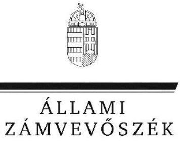

# Jelentés

**A központi alrendszer egyes intézményei pénzügyi és vagyongazdálkodásának ellenőrzése**

Központi Statisztikai Hivatal 2016.

16065 www.asz.hu

---

# Jelentés 

## A központi alrendszer egyes intézményei pénzügyi és vagyongazdálkodásának ellenőrzése

Központi Statisztikai Hivatal
2016. 05. 25.
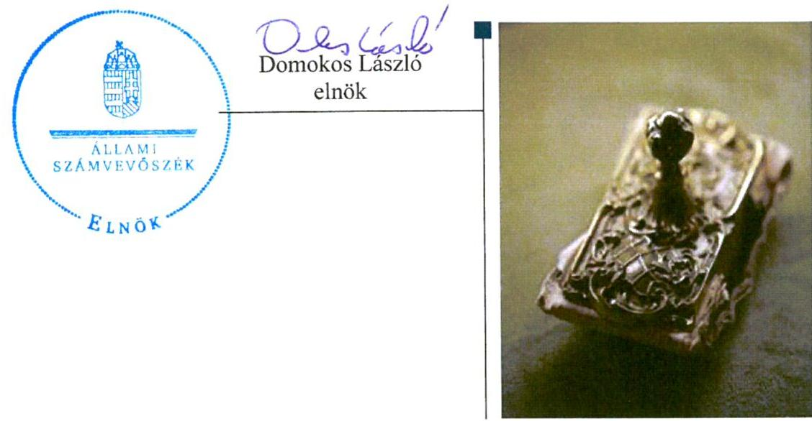

---

# AZ ELLENŐRZÉST FELÜGYELTE: 

HOLMAN MAGDOLNA felügyeleti vezető

## AZ ELLENŐRZÉST VEZETTE ÉS A VÉGREHAJTÁSÁÉRT FELELŐS:

BALKAY ATTILA ellenőrzésvezető
DR. JAKAB KORNÉL ellenőrzésvezető

## A PROGRAM ÖSSZEÁLLÍTÁSÁÉRT FELELŐS:

JANIK JÓZSEF osztályvezető
BÖRÖCZ IMRE projektfelelős

A TÉMÁHOZ KAPCSOLÓDÓ KORÁBBI SZÁMVEVŐSZÉKI JELENTÉSEK:

- címe: Magyarország 2011. évi központi költségvetése végrehajtásának ellenőrzéséről
Magyarország 2012. évi központi költségvetése végrehajtásának ellenőrzéséről
Magyarország 2013. évi központi költségvetése végrehajtásának ellenőrzéséről
Magyarország 2014. évi központi költségvetése végrehajtásának ellenőrzéséről
- sorszáma: 1297; 13080; 14207; 15167

IKTATÓSZÁM: V-0945-176/2016
TÉMASZÁM: 18
ELLENŐRZÉS-AZONOSÍTÓ SZÁM: V071311

---

# TARTALOMJEGYZÉK 

■ ÖSSZEGZÉS ..... 5
■ AZ ELLENŐRZÉS CÉLJA ..... 7
■ AZ ELLENŐRZÉS TERÜLETE ..... 8
■ AZ ELLENŐRZÉS HÁTTERE, INDOKOLTSÁGA ..... 10
■ FÓKUSZKÉRDÉSEK ..... 11
■ ELLENŐRZÉS HATÓKÖRE ÉS MÓDSZEREI ..... 12
■ MEGÁLLAPÍTÁSOK ..... 15
■ JAVASLATOK ..... 32
■ MELLÉKLETEK ..... 33
I. Sz. melléklet: Értelmező szótár ..... 33
II. Sz. melléklet: a KSH pénzügyi és vagyongazdálkodásának teljesítmény-ellenőrzése ..... 37
III. Sz. melléklet: A KSH kiadásainak, bevételeinek és létszámának alakulása ..... 38
IV. Sz. melléklet: A belső kontrollrendszer kialakításának és működtetésének értékelése a 2011-2014. években ..... 39
V. Sz. melléklet: Mérlegadatok a 2011-2014. években ..... 40
VI. Sz. melléklet: Az integritás kontrollrendszer értékelése ..... 41
■ FÜGGELÉK: ÉSZREVÉTELEK ..... 43
■ RÖVIDÍTÉSEK JEGYZÉKE ..... 51

---

.

---

# ÖSSZEGZÉS 

A belső kontrollrendszer kialakítása és működtetése a 2011-2012. közötti időszakban a kockázatkezeléshez kapcsolódó szabályozási hiányosságok következtében részben szabályszerű, a 2013-2014. években szabályszerű volt. A KSH pénzügyi gazdálkodása és vagyongazdálkodása szabályszerű volt az ellenőrzött időszakban. Az irányító szervi feladatellátás szabályszerű volt. A KSH zavartalan feladatellátásához szükséges fizetőképessége 2011-2014. között biztosított volt.

## Az ellenőrzés társadalmi indokoltsága

A közpénzek felhasználásában a központi alrendszerbe tartozó intézmények pénzügyi és vagyongazdálkodási tevékenységük, feladatellátásuk súlya miatt jelentős hatást gyakorolnak a költségvetés egyensúlyának fenntartására. Hatással vannak továbbá az állami vagyonnal való gazdálkodás minőségére, a kormányzati (szak)politikák végrehajtására, illetve közfeladat-ellátásuk vonatkozásában az állampolgárok életminőségére, jogaik és kötelezettségeik gyakorlására.

A KSH megbízható, jó működésének alapvető szerepe van abban, hogy a kormányzat és szélesebb körben a gazdasági, társadalmi szereplők valós és hiteles információk alapján hozhassák meg döntéseiket, mindez pedig a "jó kormányzás" feltétele.

## Főbb megállapítások, következtetések, javaslatok

A KSH érvényesítette a közfeladatainak ellátására vonatkozó, az erőforrásokkal való szabályszerű és hatékony gazdálkodáshoz szükséges követelményeket, valamint az egyéb ellenőrzési és irányítási jogosultságait szabályszerűen gyakorolta. A KSH felügyeletét ellátó KIM-et vezető miniszter (2011. január 1-jétől - 2014. június 5-éig), valamint Miniszterelnökséget vezető miniszter (2014. június 6-ától 2014. december 31-éig) az ellenőrzött intézményre vonatkozó feladatait a jogszabály előírásának megfelelően gyakorolta.

A KSH belső kontrollrendszerének kialakítása és működtetése részben volt szabályszerű a 2011-2012. években, mert nem rendelkezett a kockázatkezeléssel kapcsolatos szabályozással. 2013-tól a kockázatkezelési rendszer szabályszerűen működött. A 2013-2014. években a KSH belső kontrollrendszerének kialakítása és működtetése szabályszerű volt.

Az elemi költségvetés és az előirányzatok megállapítása során betartották a jogszabályi előírásokat és a belső szabályzatokban foglaltakat. A bevételi és kiadási előirányzat-módosítások végrehajtásának szabályszerűsége megfelelő volt. A KSH a jóváhagyott kiadási előirányzatokon belül gazdálkodott, azonban a kiadási előirányzatok felhasználása során a közbeszerzési eljárásokra (2012. évben) vonatkozó jogszabályi előírásokat nem tartotta be teljes körűen. A gazdálkodási jogkörök gyakorlása során a kulcskontrollok működése a 2011. és 2012. években nem volt megfelelő, tekintettel arra, hogy az utalványozás és az érvényesítés során az Ávr. rendelkezései ellenére az utalvány ellenjegyzése nélkül került sor kifizetésre, valamint az érvényesítésre a kifizetés után került sor. A 2013. és 2014. években a kulcskontrollok működése megfelelő volt. Az előirányzat felhasználáshoz kapcsolódó évközi előirányzat zárolási és maradványtartási kötelezettségeit végrehajtotta. A befizetési kötelezettségeket teljesítették. Az előirányzat maradvány megállapítása, felhasználása szabályszerű volt.

Az intézmény vagyongazdálkodása, a tartós bérleti szerződések esetében, a bérleti díj megállapításakor, és az átláthatóság követelményének megfelelőségével kapcsolatos feladatellátás kivételével megfelelt a jogszabályi előírásoknak.

A KSH-nál a gazdálkodás folyamatában a gazdaságossági, hatékonysági és eredményességi követelmények kialakítása és működtetése megtörtént.

---

Az intézmény zavartalan feladatellátása érdekében intézkedtek a fizetőképesség és a likviditás folyamatos biztosításáról. Ennek keretében a jogszabályi előírásoknak megfelelően előirányzat-felhasználási-, illetve likviditási tervet készítettek. Az eredményszemléletű számvitel bevezetésével kapcsolatos feladatok elvégzése, a rendező mérleg előkészítése és összeállítása megfelelt a jogszabályi előírásoknak.

Az ellenőrzött időszakban az intézmény intézkedett az integritás szemlélet érvényesítése érdekében.

---

# AZ ELLENŐRZÉS CÉLJA 

## A Központi Statisztikai Hivatal pénzügyi és vagyongazdálkodásának ellenőrzése

Az ellenőrzés célja annak megítélése, hogy az ellenőrzött intézményre vonatkozó irányító szervi feladatellátás a jogszabályi előírások betartásával történt-e; az intézménynél a belső kontrollrendszer kialakítása és működtetése szabályszerű volt-e; kialakították-e az erőforrásokkal való szabályszerű, gazdaságos, hatékony és eredményes gazdálkodáshoz szükséges követelményeket, megvalósították-e azok számon kérését, ellenőrzését; az intézmény pénzügyi és vagyongazdálkodása megfelelt-e a jogszabályi előírásoknak és belső szabályzatainak; az intézmény átalakításának vagy átszervezésének lebonyolítása szabályszerűen történt-e.
Az Intézmény korrupcióval szembeni veszélyeztetettségének csökkentése érdekében az ellenőrzés felmérte az integritási szemlélet érvényesülését a gazdálkodási folyamatokban.

A teljesítményellenőrzés célja annak értékelése volt, hogy a gazdálkodás folyamatában a gazdaságossági, hatékonysági és eredményességi követelmények kialakítása megtörtént-e, azokat működtették-e, a célkitűzéseket elérték-e; a pénzügyi és vagyongazdálkodás folyamataira vonatkozóan a költségvetési szerv belső kontrollrendszerének minőségéről kiadott vezetői nyilatkozatban a költségvetési szerv tevékenységében a hatékonyság, eredményesség, gazdaságosság követelményeinek érvényesítésére vonatkozó nyilatkozat helytálló volt-e.

---

# AZ ELLENŐRZÉS TERÜLETE

## A Központi Statisztikai Hivatal

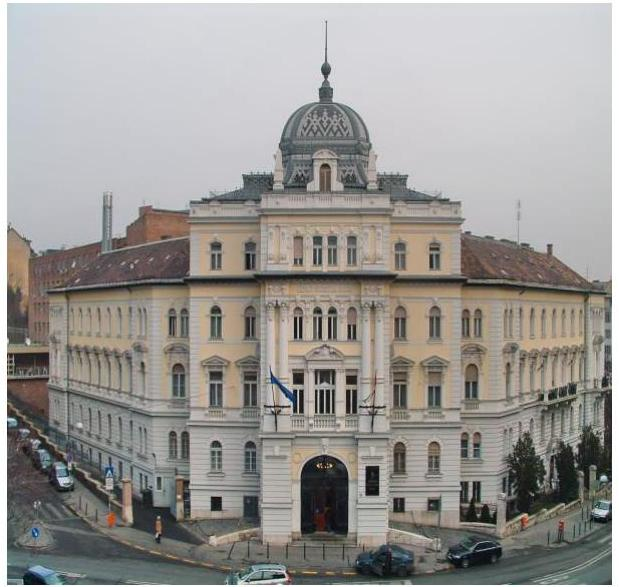

A KSH1-t az Országgyűlés alapította 1874. július 23-án. Az ellenőrzött időszakban a Kormány2 irányítása alatt álló, szakmailag önálló kormányhivatal3 volt.

A Központi Statisztikai Hivatal jogállását, közfeladatait, hatáskörét és területi illetékességét a statisztikáról szóló törvény4 és annak végrehajtása tárgyában kiadott Kormányrendelet5 határozza meg. E szerint a Központi Statisztikai Hivatal szakmailag önálló kormányhivatal, amelynek költségvetése önálló költségvetési fejezetet képez. A fejezetet irányító szerv a KSH, a fejezetet irányító szervnek címzett hatáskörök gyakorlását a KSH elnöke látta el. A Központi Statisztikai Hivatal felügyeletét 2014. június 5-ig a KIM6-et vezető miniszter, 2014. június 6-tól a Miniszterelnökséget vezető miniszter látta el.

A KSH a központi költségvetésben önálló fejezettel rendelkezett. Elnökét a Magyar Köztársaság miniszterelnöke nevezte ki 2010. június 11-ei hatállyal hat év időtartamra. Az elnök gyakorolta a fejezetet irányító szerv vezetőjének hatásköreit és vezette a KSH-t. Munkáját az ellenőrzött időszakban gazdaságstatisztikai elnökhelyettes és társadalomstatisztikai elnökhelyettes, továbbá a 2011. január 1. és 2012. október 27. közötti időszakban koordinációs elnökhelyettes, ezt követően jogi és gazdálkodási elnökhelyettes segítette. A gazdasági vezető személyében a 2014. évben történt változás.

A KSH az ellenőrzött időszakban országos illetékességgel rendelkezett, központi és területi szervezeti egységekből állt. Feladatkörébe tartozott az adatfelvételek, az adatgyűjtés, valamint a népszámlálás és egyéb országos összeírások végrehajtása; a statisztikai tevékenység összehangolása; az Országgyűlés és a Kormány évenkénti tájékoztatása az ország társadalmi, gazdasági, népesedési adatairól; valamint statisztikai adatok közzététele és szolgáltatása. A KSH intézményének gazdálkodásával kapcsolatos feladatokat a Gazdálkodási Főosztály végezte. A KSH az ellenőrzött időszakban vállalkozási tevékenységet nem végzett.

Az ellenőrzött időszakban az intézményt nem érintette szervezeti, szerkezeti átalakítás. Feladatok átadására a 2012-2014 közötti időszakban, feladat átvételére 2014-ben került sor, melyek jelentős része a statisztikai adatgyűjtésekkel kapcsolatos feladatok elvégzéséhez kapcsolódott. A változások a kiadási oldalon a személyi juttatásokat és járulékait, valamint a dologi kiadásokat, a bevételi oldalon a költségvetési támogatást érintették, a KSH létszámára és vagyonára nem gyakoroltak hatást.

A 2011-2014. évi éves költségvetési beszámolók alapján az ellenőrzött időszakban a KSH évente 9954,9 - 25 521,1 M Ft7 költségvetési bevételt,

---

9192,3 - 20 377,7 M Ft kiadást teljesített. A pénzügyi adatok évenkénti alakulását az 1. ábra mutatja be*:

1. ábra
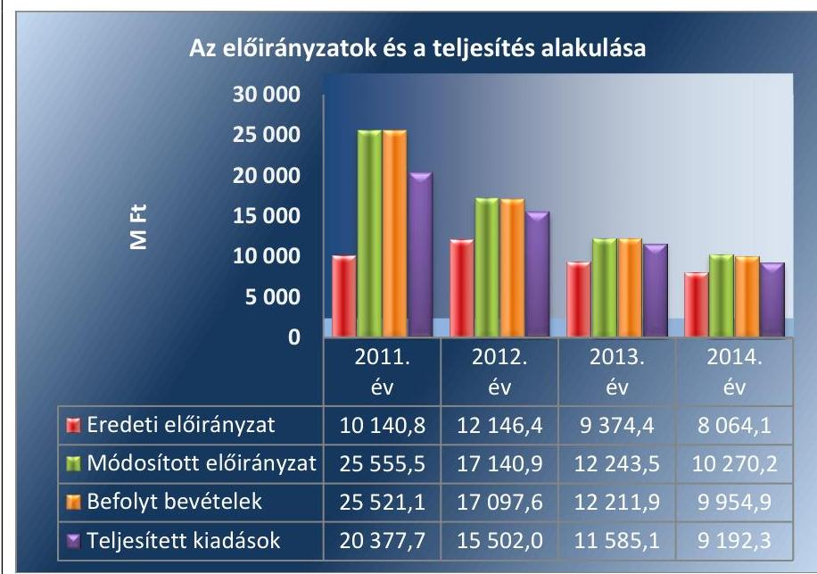

Forrás: KSH éves elemi költségvetési beszámolói
Az éves átlagos statisztikai állományi létszám a belső átszervezések hatására a 2011. évi 1290 főről a 2014. évre 125 fővel, 1165 főre csökkent. A létszám csökkenése a vezetői és a beosztotti munkaköröket is érintette. A költségvetési hiánycél biztosítása érdekében a KSH-tól a 2011-2013 közötti időszakban összesen 1407,0 M Ft forrás elvonására került sor.

A könyvviteli mérleg adatai alapján 2011. január 1-jéről 2014. december 31-ére a KSH vagyona 5256,1 M Ft-ról 0,8%-kal, 5215,9 M Ft-ra csökkent. A befektetett eszközök értéke 3052,9 M Ft-ról 4,9%-kal, 3202,6 M Ft-ra, a saját tőke 2744,0 M Ft-ról 4380,9 M Ft-ra emelkedett. A tartalékok 1863,4 M Ft-ról 634,8 M Ft-ra, a kötelezettségek 648,7 M Ft-ról 129,8 M Ft-ra csökkentek.

[^0]
[^0]:    * A részletes adatokat a III. sz. melléklet tartalmazza.

---

# AZ ELLENŐRZÉS HÁTTERE, INDOKOLTSÁGA 

## A központi alrendszer egyes intézményei pénzügyi és vagyongazdálkodásának ellenőrzése - Központi Statisztikai Hivatal

Az Alaptörvény rendelkezése szerint a nemzeti vagyon megőrzésének, védelmének és a nemzeti vagyonnal való felelős gazdálkodásnak a követelményeit sarkalatos törvény, az Nvtv ${ }^{8}$. rögzíti. A tulajdonosi joggyakorlás és vagyonkezelés általános és speciális szabályait, az állami vagyon nyilvántartására és elszámolására vonatkozó eljárásokat, a vagyonkezelési szerződés feltételrendszerét, valamint az éves beszámoló készítési és könyvvezetési kötelezettségeket kormányrendelet írja elő.

A központi alrendszer egyes intézményei közfeladat-ellátásának változásait, a közfeladatok átadásából és átvételéből adódó módosításait, előirányzat-gazdálkodására ható tényezőit az Áht. ${ }^{9} 11 . \S$-a és az Ávr. ${ }^{10}$ 14. §-a írja elő. A közfeladatok megszűnéséből, intézmény átszervezéséből, belső szerkezeti korszerűsítéséből, vagy más hasonló okból adódó módosításai miatt szerepeltetendő szerkezeti változásokat, valamint a szerkezeti változásként beépült közfeladatok szintre hozásként történő számításba vételét az Ávr. 15. § (2)-(3) bekezdései határozzák meg.

AZ ELLENŐRZÉS EREDMÉNYEKÉPPEN nemcsak az ellenőrzött intézmények gazdálkodása javulhat, hanem átfogó képet kaphatunk a központi alrendszerbe tartozó költségvetési szervek gazdálkodásának hiányosságairól, de a jó gyakorlatokról is. Ellenőrzéseivel, javaslataival és megállapításaival az ÁSZ elősegítheti a költségvetési szervek pénzügyi és vagyongazdálkodása szabályozásának javítását és hozzájárulhat a jó kormányzáshoz.

## A TELJESÍTMÉNY-ELLENŐRZÉSI KIEGÉSZÍTŐ

MODUL alapján elvégzett ellenőrzés a törvényalkotás számára támogatást nyújt a nemzeti kulcsindikátorok rendszerének kialakításához. A döntéshozók, ellenőrzöttek, irányító szervek, valamint a társadalom számára az összehasonlítási, összemérési lehetőségek kihasználásával objektív visszajelzést ad a gazdálkodás területén végrehajtott szervezeti, szervezési, takarékossági és bürokráciacsökkentő intézkedések hatásairól, a közfeladat-ellátásnak keretet adó pénzügyi és vagyongazdálkodásban mérhető teljesítménykövetelmények kialakításáról, azok alkalmazásáról.

---

# FÓKUSZKÉRDÉSEK 

1. Az irányító szerv ellenőrzött intézményre vonatkozó feladatellátása szabályszerű volt-e?
2. A belső kontrollrendszer kialakítása és működtetése megfelelt-e a jogszabályi előírásoknak?
3. Az intézmény pénzügyi gazdálkodása szabályszerű volt-e?
4. Az intézmény vagyongazdálkodása szabályszerű volt-e?
5. Az intézmény intézkedett-e az integritás szemlélet érvényesítése érdekében?

---

# ELLENŐRZÉS HATÓKÖRE ÉS MÓDSZEREI 

## Az ellenőrzés típusa

Szabályszerűségi ellenőrzés, amelyet teljesítmény-ellenőrzési modul egészített ki.

## Az ellenőrzött időszak

Az ellenőrzött időszak 2011. január 1-jétől 2014. december 31-ig tart.

## Az ellenőrzés tárgya

Az ellenőrzött szervezetre vonatkozó irányító szervi feladatok ellátása. Az intézmény belső kontroll rendszerének kialakítása és működtetése, valamint pénzügyi és vagyongazdálkodása. Az erőforrásokkal való szabályszerű, gazdaságos, hatékony és eredményes gazdálkodáshoz

 szükséges követelmények kialakítása, a kialakított követelmények számonkérésének, ellenőrzésének.

A teljesítmény-ellenőrzési kiegészítő modul esetében az intézmény gazdálkodási folyamatában a gazdaságossági, hatékonysági és eredményességi követelmények kialakítása és működtetése, a célkitűzések teljesítésének értékelése. A költségvetési szerv tevékenységében a hatékonyság, eredményesség, gazdaságosság követelményeinek érvényesítéséről kiadott vezetői nyilatkozat helytállósága a pénzügyi és a vagyongazdálkodási folyamatokra vonatkozóan.

Az ellenőrzés kiterjedt minden olyan körülményre és adatra, amely az ÁSZ jogszabályban meghatározott feladatainak teljesítéséhez, valamint a program végrehajtása folyamán felmerült újabb összefüggések feltárásához szükséges volt.

## Az ellenőrzött szervezet

A központi alrendszer intézménye: Központi Statisztikai Hivatal
Az intézmény felügyeleti szervei: KIM-et vezető miniszter 2014. június 5-ig, Miniszterelnökséget vezető miniszter 2014. június 6-tól

## Az ellenőrzés jogalapja

Az ellenőrzés jogszabályi alapját az ÁSZ tv. 11. § (3) bekezdése, 5. § (2)-(6) bekezdései, valamint Áht. 2. 61. § (2) bekezdésének előírásai, továbbá az Alaptörvény Állam fejezet 43. cikk (1) bekezdésének előírásai képezték.

---

# Az ellenőrzés módszerei 

Az ellenőrzést az ellenőrzési program szempontjai, az ellenőrzött időszakban hatályos jogszabályok, az ellenőrzés szakmai szabályai, az egyes ellenőrzési típusokhoz kapcsolódó ÁSZ módszertanok és nemzetközi standardok figyelembevételével végeztük. A gazdálkodási hibák kijavítására, a közpénzekkel való felelős gazdálkodás segítésére irányuló javaslatok kidolgozásakor a hatályos jogszabályok voltak az irányadóak.

Az ellenőrzés ideje alatt az ellenőrzött szervezettel történő kapcsolattartást az ÁSZ SZMSZ 12-ének vonatkozó előírásai alapján biztosítottuk.

Az ellenőrzési kérdésekre adott válaszok alapján értékeltük, hogy az ellenőrzött időszakban az irányító szerv az ellenőrzött intézményre vonatkozó feladatainak szabályszerűen eleget tett-e, az intézmény pénzügyi és vagyongazdálkodása megfelelt-e az előírásoknak. Értékeltük, hogy az intézménynél kialakították-e az erőforrásokkal való szabályszerű és hatékony gazdálkodáshoz szükséges követelményeket, megvalósították-e azok számonkérését, ellenőrzését.

Az intézmény belső kontrollrendszere jogszabályi előírások szerinti kialakításának és működtetésének szabályszerűségét az erre irányuló ellenőrzési kérdésekre adott válaszok összesítése alapján, évente pillérenként (kontrollkörnyezet, kockázatkezelési rendszer, kontrolltevékenységek, információs és kommunikációs rendszer, monitoring rendszer) és összesítetten is minősítettük. Az intézmény belső kontrollrendszere egyes pilléreinek kialakítása és működtetése „szabályszerű" volt, amennyiben az értékelt területen az elért és elérhető pontok százalékban kifejezett, egész számra kerekített hányadosa meghaladta a 84%-ot, „részben szabályszerű", ha a 84%-ot nem haladta meg, de 60%-nál nagyobb, „nem szabályszerű", ha nem haladta meg a 60%-ot. Az intézmény belső kontrollrendszerének összesített értékelése megegyezik a pillérenként (kontrollterületenként) alkalmazott %-os értékelésekkel, a következő eltérésekkel. A kontrollrendszer egésze esetében a „szabályszerű" értékelésnek a %-os értéken felül további feltétele, hogy egyik kontrollterület sem kaphatott „nem szabályszerű" értékelést, a „részben szabályszerű" értékelés további feltétele, hogy legfeljebb egy ellenőrzött kontrollterület lehetett „nem szabályszerű" értékelésű. Az összesített értékelés a %-os értéktől függetlenül „nem szabályszerű", ha az ellenőrzött kontrollterületek közül több mint egynek „nem szabályszerű" volt az értékelése.

A tárgyi eszközök nyilvántartásba vételének, a közbeszerzési eljárások lefolytatásának, a vagyonhasznosítási bevételi előirányzatok teljesítésének, az előirányzatok módosításának és az előirányzat-maradvány megállapításának szabályszerűségét, valamint a gazdálkodási jogkörök gyakorlásának szabályszerűségét mintavétellel ellenőriztük.

A jogszabályoknak és a belső előírásoknak megfelelőnek tekintettük a tárgyi eszközök nyilvántartásba vételét, a vagyonhasznosítási bevételi előirányzatok teljesítését, az előirányzatok módosítását és az előirányzat-maradvány megállapítását, amennyiben a minta ellenőrzésének eredménye alapján 95%-os bizonyossággal a teljes sokaságban a hibás tételek aránya kisebb volt, mint 10%, nem megfelelőnek értékeltük, ha a hibás tételek aránya a 10%-ot meghaladta.

---

A közbeszerzési eljárások esetében az ellenőrzött mintatételek értékelését végeztük el.

A 2011. évet érintően a szakmai teljesítésigazolás és az utalvány ellenjegyzése kulcskontrollok, a 2012-2014. éveket érintően a teljesítésigazolás és az érvényesítés kulcskontrollok működését értékeltük. Megfelelőnek értékeltük a gazdálkodási jogkörök gyakorlását, amennyiben 95%-os bizonyossággal a teljes sokaságban a hibás tételek aránya legfeljebb 10% volt, részben megfelelőnek, ha a hibás tételek arányának felső határa legfeljebb 30% volt, nem megfelelőnek, ha a hibás tételek sokaságbeli arányának felső határa meghaladta a 30%-ot.

Az integritás szemlélet érvényesülésének értékelése az intézmény önbevallás útján kitöltött tanúsítványa alapján történt.

Az alapprogram alapján ellenőriztük, hogy a költségvetési szerv vezetője megtette-e nyilatkozatát arról, hogy gondoskodott a költségvetési szerv tevékenységében a hatékonyság, eredményesség és a gazdaságosság követelményeinek érvényesítéséről. Ezt kiegészítve, a teljesítmény-ellenőrzési kiegészítő modul keretében - felhasználva az alapprogram szerinti ellenőrzés megállapításait - értékeltük, hogy a költségvetési szerv vezetője kialakította-e a gazdaságossági, hatékonysági és eredményességi követelményeket, és azokat működtette-e, a célkitűzéseket elérte-e.

A teljesítmény-ellenőrzési kiegészítő modul a gazdálkodási feladatokra terjedt ki, a szakmai feladatellátást nem értékelte.

---

# 1. Az irányító szerv ellenőrzött intézményre vonatkozó feladatellátása szabályszerű volt-e? 

Összegző megállapítás

1.1. számú megállapítás
1.2. számú megállapítás

A KSH elnökének az irányító szervi feladatellátása szabályszerű volt. A felügyeleti szervi tevékenységet ellátó miniszter az ellenőrzött intézményre vonatkozó feladatait a jogszabály előírásainak megfelelően gyakorolta.

Az Alapító Okirat megfelelt a jogszabály által támasztott követelményeknek, az SZMSZ a 2014. évben nem tartalmazta a KSH alaptevékenységének kormányzati funkciók szerinti besorolását.

Az Alapító okiratot a jogszabályi előírásnak megfelelően a miniszterelnök adta ki. A 2011-2013. években az Alapító okirat megfelelt a vonatkozó jogszabályi előírásoknak. 2014. június 6-tól a felügyeleti szervben a 152/2014. (VI. 6.) Korm. rendelet 13 alapján változás történt, amelyet nem vezettek át az Alapító okiraton, így nem tartották be az Ávr. 5. § (3) bekezdésébe foglalt jogszabályi előírást.

A kormányzati funkciók szerinti besorolással, illetőleg az államháztartási szakágazati renddel kapcsolatos 2014. évi változásoknak megfelelően az Alapító okirat kiegészítése megtörtént.

A KSH 2011. január 1-től - 2014. december 31-ig rendelkezett normatív utasításban kiadott SZMSZ1,2,314-el.

A 2011-2013. években az SZMSZ1,2,3 megfelelt a vonatkozó jogszabályi előírásoknak.

2014-ben az SZMSZ3 nem tartalmazta a 2014. január 1-jétől a KSH alaptevékenységének kormányzati funkciók szerinti besorolását, így az nem felelt meg az Ávr. 13. § (1) bekezdésének c) pontja rendelkezésének. A KSH az SZMSZ3 ilyen irányú módosítását nem készítette elő.

A KSH elnöke, mint az irányító szerv vezetője ellátta a jogszabályban meghatározott irányító szervi feladatokat. A felügyeleti szervi tevékenységet ellátó miniszter az ellenőrzött intézményre vonatkozó feladatait a jogszabály előírásainak megfelelően gyakorolta.

A KSH elnöke az irányító szervi feladatokat ellátva számon kérte és ellenőrizte a kiemelt célként megfogalmazott követelmények teljesülését, a bevételi és kiadási előirányzatokkal való szabályszerű gazdálkodást rendszeresen figyelemmel kísérte. Az új gazdasági vezetőt a 2014. évben a jogszabályi előírásoknak megfelelően nevezte ki a KSH elnöke.

Az ellenőrzött időszakban a KSH költségvetése önálló költségvetési fejezetet alkotott, a gazdálkodásával kapcsolatos feladatokat a KSH elnöke, mint a fejezetet irányító szervnek15 címzett hatáskörök gyakorlója látta el.

---

A felügyeletet ellátó miniszterek a jogszabályban meghatározott feladatoknak megfelelően intézkedtek az intézmény SZMSZ1,2,3-ának normatív utasításban történő kiadásáról, valamint a KSH-nak a Kormány és az Országgyűlés előtti képviseletéről.

# 2. A belső kontrollrendszer kialakítása és működtetése megfelel-e a jogszabályi előírásoknak? 

## Összegző megállapítás

2. ábra

Az egyes területek értékelésének kategóriái

| Nem volt   szabály-   szerű | Részben   volt szabály-   szerű | Szabály-   szerű volt |
| :--: | :--: | :--: |
| $<60 \%$ | $60 \%-84 \%$ | $84 \%<$ |

A 2011-2012. években a belső kontroll rendszer kialakítása és működtetése részben felelt meg a jogszabályi előírásoknak. A 2013. évtől a belső kontrollrendszer kialakítása és működtetése szabályszerű volt.
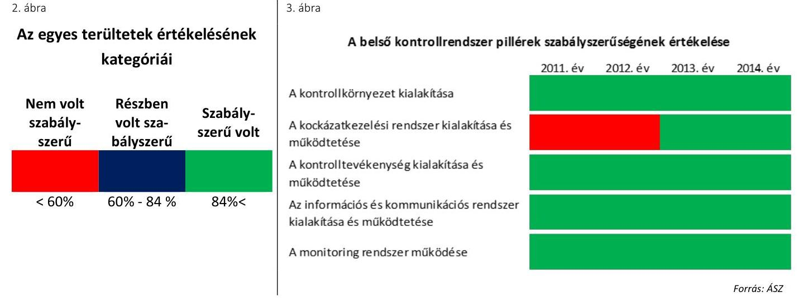

Forrás: ÁSZ
2.1. számú megállapítás

A kontrollkörnyezet kialakítása szabályszerű volt.
A KSH-nál kialakított kontrollkörnyezet a 2011-2014. években szabályszerű, a hatályos, vonatkozó jogszabályok előírásainak megfelelő volt. Az ellenőrzött időszakban az intézmény rendelkezett a Közigazgatási és Igazságügyi Minisztériumot vezető miniszter által kiadott hatályos SZMSZ1,2,3-el.
4. ábra

|  | A kontrollkörnyezet kialakítása |  |  |
| :--: | :--: | :--: | :--: |
| Időszak | Nem volt   szabályszerű | Részben volt   szabályszerű | Szabályszerű volt |
| 2011-2014. évek |  |  |  |
| 2011. év |  |  |  |
| 2012. év |  |  |  |
| 2013. év |  |  |  |
| 2014. év |  |  |  |

A KSH gazdasági szervezetének feladatait ügyrendben rögzítették, amelyet évente aktualizáltak. Az ügyrend16 tartalma részben felelt meg az Ámr.17 20. § (7) bekezdésének, illetve az Ávr. 13. § (5) bekezdésének előírásainak, mivel a

---

költségvetési szerv szervezeti egységei által ellátott feladatok munkafolyamatainak leírása esetében részben tartalmazta az adatszolgáltatással, illetve a vagyongazdálkodással kapcsolatos feladatok munkafolyamatainak leírását.

A hivatásetikai alapelvek tekintetében a KSH a Magyar Közigazgatási Kar Hivatásetikai Kódexének előírásait alkalmazta, mellyel a jogszabályi előírásoknak megfelelően meghatározták az etikai elvárásokat a szervezet minden szintjén.

A gazdasági szervezet vezetője vonatkozásában érvényesültek a végzettségre, szakképesítésre vonatkozó, illetve a könyvviteli szolgáltatás körébe tartozó tevékenység ellátására jogosító engedéllyel kapcsolatos előírások. A KSH-nál foglalkoztatottak rendelkeztek munkaköri leírással. A KSH elnöke 2014. január 15-én integritás tanácsadót jelölt ki az 50/2013. (II.25.) Korm. rendelet18 5. § előírása alapján.

A KSH rendelkezett az elnök által jóváhagyott, a jogszabályi előírásoknak megfelelő számviteli politikával19, melynek - és az ahhoz kapcsolódó szabályzatok - aktualizálását évente elvégezték. A KSH rendelkezett továbbá az elnök által jóváhagyott, évente aktualizált számlarenddel20, valamint leltározási és leltárkészítési szabályzattal21, az eszközök és források értékelési szabályzatával22, kötelezettségvállalási szabályzattal,23 önköltség-számítási szabályzattal24, közbeszerzési szabályzattal25, illetve pénzkezelési szabályzattal.26

A KSH elnöke a jogszabályi előírásoknak megfelelően intézkedett a kötelezettségvállalás ellenjegyzésére, pénzügyi ellenjegyzésre, utalvány ellenjegyzésére, valamint az érvényesítésre jogosultak kijelöléséről.

A kötelezettségvállalás és az ellenjegyzés, a (szakmai) teljesítésigazolás, valamint az érvényesítés gyakorlásának módjával, eljárási és dokumentációs részletszabályaival kapcsolatos belső előírásokat, feltételeket elnöki utasításokban a jogszabályi előírásoknak a 2011. és 2012. évben részben megfelelően szabályozták:

- Az Ámr. 20. § (3) bekezdés a) pontjában, illetve az Ávr. 13. § (2) bekezdés a) pontjában foglalt előírás ellenére a gazdálkodással így különösen az utalványozás gyakorlásának módjával, eljárási és dokumentációs részletszabályaival, valamint az ezeket végző személyek kijelölésének rendjével, és az adatszolgáltatási feladatok teljesítésével kapcsolatos belső előírásokat, feltételeket részben határozták meg a 2011. és 2012. évben. A szabályozás a személyi juttatások vonatkozásában nem vette figyelembe a központi illetmény-számfejtési rendszer alkalmazása következtében felmerülő sajátosságokat. Az átutalással teljesített kifizetésnél az Ámr. 79. § (2) bekezdésében foglaltakat be nem tartva 2011-ben nem történt meg az utalvány ellenjegyzése, 2012-ben az Ávr. 58. § (3) bekezdésében foglaltak ellenére az érvényesítés a kifizetés után történt. A 2013. évtől a pénzkezelési szabályzat figyelembe vette a központi illetmény-számfejtési rendszer alkalmazása következtében felmerülő sajátosságokat, az megfelelt a jogszabályi előírásoknak.
- A Pénzkezelési szabályzat - melyben az irányító szervi hatáskörű elő-irányzat-módosításokkal kapcsolatos intézkedések elrendelésére jogosult beosztásokat határozták meg - 2011. március 24-én lépett hatályba azzal, hogy
 azt 2011. január 1-jétől kell alkalmazni. A Pénzkezelési szabályzat - melyben továbbá az intézményi hatáskörű előirányzat-módosításokkal kapcsolatos intézkedések elrendelésére jogosult beosztásokat határozták meg - 2012. július 20-án lépett hatályba azzal, hogy azt 2012. január 1-jétől kell alkalmazni. Ezzel a szabályozási gyakorlattal nem tettek eleget a Bkr. 6. §-a (1) bekezdésének b) pontjába foglalt előírásnak.
A KSH rendelkezett az elnök által kiadott szabálytalanságkezelési eljárásrenddel, valamint az egyes szervezeti egységek rendelkeztek ellenőrzési nyomvonallal.

# 2.2. számú megállapítás 

A kockázatkezelési rendszer kialakítása és működtetése a 2011-2012. években nem volt szabályszerű. A 2013-2014. években a kockázatkezelési szabályzat kiadását követően a kockázatkezelési rendszer kialakítása és működtetése szabályszerű volt a KSH-nál.

A KSH a 2011-től 2013. március 11-éig terjedő időszakban nem tett eleget az Ámr. 157. §-ának (1)-(3) bekezdéseiben és a Bkr. ${ }^{27}$ 7. §-ának (1) bekezdésében előírt kockázatkezelési rendszer kialakítására és működtetésére vonatkozó kötelezettségének. Nem kerültek felmérésre és megállapításra a KSH tevékenységében, gazdálkodásában rejlő kockázatok, valamint nem kerültek meghatározásra az egyes kockázatokkal kapcsolatban szükséges intézkedések, valamint azok teljesítésének folyamatos nyomon követésének módja.
5. ábra
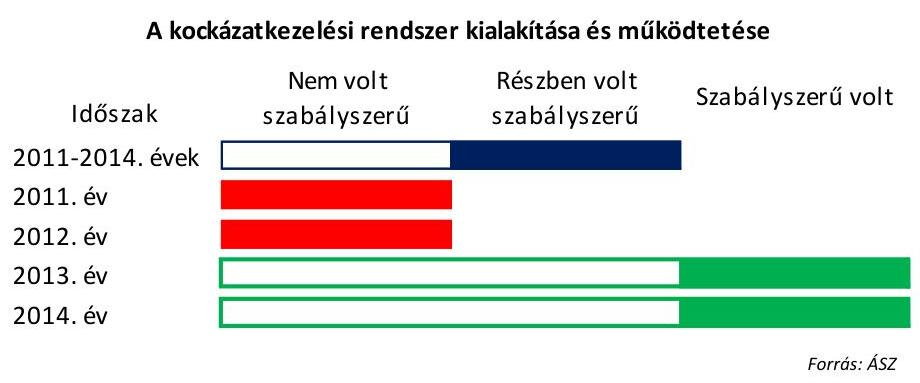
2013. március 12-én kockázatkezelési szabályzatot adott ki a KSH elnöke, mely tartalmazta és szabályozta a Bkr. hivatkozott előírásainak megfelelően a kockázat fogalmát, a kockázatok azonosításával, elemzésével, csoportosításával és a kockázati kitettség csökkentésével kapcsolatos szabályokat. A kockázatkezelési szabályzatban meghatározták a kockázatok kezelése érdekében szükséges intézkedések folyamatos nyomon követési módját. A KSH-nál a 2013. évben az Ellenőrzési osztály kivételével valamennyi szervezeti egységre vonatkozóan felmérésre és meghatározásra került a tevékenységben, gazdálkodásban rejlő kockázat.

## 2.3. számú megállapítás

A kontrolltevékenység kialakítása és működtetése összességében szabályszerű volt.

A KSH-ban a kontrolltevékenység részeként biztosították a folyamatba épített, előzetes, utólagos és vezetői ellenőrzés (FEUVE) működését a pénzügyi döntések dokumentumainak elkészítése, a pénzügyi kihatású döntések célszerűségi, gazdaságossági, hatékonysági és eredményességi szempontú megalapozottsága terén.

---

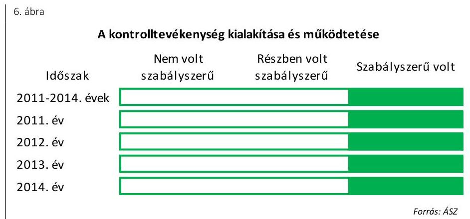

A 3.3. pontban bemutatásra kerülő a gazdálkodási jogkörök gyakorlásához kapcsolódó hiányosságok összességében nem befolyásolták a kontrolltevékenységek szabályszerű működését. 2011-ben és 2012-ben a gazdálkodási jogkörök gyakorlása, azon belül a szakmai teljesítésigazolás és teljesítésigazolás, valamint az utalvány ellenjegyzés és az érvényesítés kulcskontrollok működése nem volt megfelelő. 2013-ban, illetve 2014-ben a teljesítésigazolás és érvényesítés kulcskontrollok működése már megfelelő volt.

A felelősségi körök meghatározásával szabályozták az engedélyezési, jóváhagyási és kontroll eljárásokat, a dokumentumokhoz való hozzáférés szintjeit, illetve a beszámolási eljárásokat.

A KSH rendelkezett az elnök által jóváhagyott adatvédelmi és informatikai biztonsági szabályzattal.

# 2.4. számú megállapítás 

Az információs és kommunikációs rendszer kialakítása és működtetése a 2011-2014. években szabályszerű volt.

Szabályszerűen kialakították és működtették a szervezeten belüli, és a szervezeten kívüli információáramlás rendszerét, valamint a beszámolási szinteket, határidőket, módokat, melyeket az SZMSZ ${ }_{1,2,3}$, az ügyrendek és az ellenőrzési nyomvonalak tartalmaztak.
7. ábra

Az információs és kommunikációs rendszer kialakítása és működtetése

| Időszak | Nem volt   szabályszerű | Részben volt   szabályszerű | Szabályszerű volt |
| :-- | :--: | :--: | :--: |
| 2011-2014. évek |  |  |  |
| 2011. év |  |  |  |
| 2012. év |  |  |  |
| 2013. év |  |  |  |
| 2014. év |  |  |  |

Az intézmény rendelkezett adatvédelmi szabályzattal. Közzétételi szabályzatokban szabályozták a kötelezően közzéteendő adatok nyilvánosságra hozatalának rendjét, meghatározták a közérdekű adatok megismerésére irányuló igények teljesítésének rendjét. Kiadták a Magyar Nemzeti Levéltár szakmai egyetértésével, és a felügyeleti szerv jóváhagyásával ellátott iratkezelési szabályzatát. A KSH a honlapján a „Tevékenység, közérdekű adatok" menüpontjában tett eleget a jogszabályokban meghatározott elektronikus közzétételi kötelezettségének az ellenőrzött években.

# 2.5. számú megállapítás 

A 2011-2014. években a monitoring rendszer működése, a rendelkezésre álló források gazdaságos, hatékony és eredményes felhasználását biztosító követelmények kialakítása és alkalmazása megfelelte a jogszabályi előírásoknak és a belső szabályzatokban foglaltaknak.

A 2011-2014. években az operatív tevékenységek folyamatos és eseti nyomon követési rendszerének kialakítása és működtetése megfelelt a jogszabályi előírásoknak. A döntés előkészítést a monitoring információk alapján jelentések és feljegyzések alapozták meg.
8. ábra

A monitoring rendszer működése
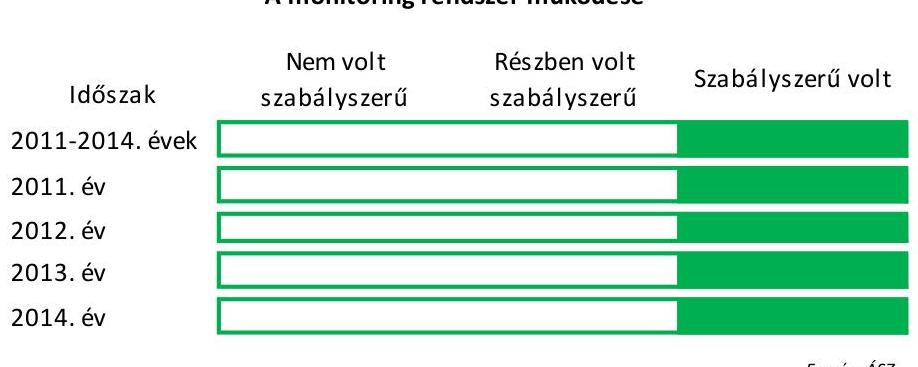

A KSH elnöke a 2011-2014. években a rendelkezésre álló források gazdaságos, hatékony és eredményes felhasználását biztosító szervezeti célok elérését szolgáló feladatok, folyamatok megvalósulását nyomon követő követelményeket alakított ki.

A KSH elnöke az ellenőrzött időszakban gondoskodott a belső ellenőrzés kialakításáról, továbbá biztosította az intézménynél a belső ellenőrzés szervezeti, funkcionális függetlenségét. A belső ellenőrzési feladatokat az Ellenőrzési osztály látta el, amely rendelkezett rendszeresen felülvizsgált és aktualizált belső ellenőrzési kézikönyvvel. A belső ellenőrzési vezető a tárgyévre vonatkozó éves ellenőrzési tervet megküldte a KSH elnökének jóváhagyásra, a jóváhagyott ellenőrzési tervben foglalt ellenőrzéseket végrehajtották.

A belső ellenőri jelentések javaslataihoz kapcsolódó megfelelő tartalmú intézkedési terveket az abban érintett szervezeti egységek elkészítették, jóváhagyásra megküldték a szervezeti egységek vezetőinek, illetőleg a belső ellenőrzési vezetőnek. A belső ellenőrzési vezető éves bontásban nyilvántartást vezetett a belső és külső ellenőrzésekről, mely megfelelt a jogszabályi előírásoknak.

Az Ámr. 217. § c) pontjának 226. §-ának és 21. mellékletének, valamint a Bkr. 11. § (1) és (4) bekezdésének és 1. sz. mellékletének előírásai értelmében a vezetői nyilatkozatok a költségvetési szerv teljes tevékenységére vonatkoznak. A KSH elnöke a nyilatkozatokat évente elkészítette, a szervezeti egységekre, egyénekre lebontott hivatali célok végrehajtását évente számon kérte, szükség esetén a kiigazító intézkedéseket megtette, a vállalásokat a hivatali célok tekintetében értékelte.

---

# 3. Az intézmény pénzügyi gazdálkodása szabályszerű volt-e? 

## Összegző megállapítás

3.1. számú megállapítás
3.2. számú megállapítás

A KSH pénzügyi gazdálkodása összességében szabályszerű volt.

Az elemi költségvetés és az előirányzatok megállapítása során betartották a jogszabályi előírásokat és a belső szabályzatokban foglaltakat.

A költségvetés tervezésével, illetve az elemi költségvetés elkészítésével kapcsolatos feladatokat az SZMSZ ${ }_{1,2,3}$-ben, valamint a szervezeti egységek ügyrendjeiben meghatározták. Az ellenőrzési nyomvonalat kialakították, a feladatokat a munkaköri leírások tartalmazták.

A KSH a tervezés során az NGM által kibocsátott Tervezési tájékoztatóban előírtaknak megfelelően végezte el a tervezéssel kapcsolatos feladatokat. A bevételek összegét számításokkal alátámasztották. A KSH a jogszabályi előírásokat betartva létszámot személyi juttatás előirányzat biztosításával tervezett. Közfeladat pénzügyi fedezet hiánya miatt történő megszüntetésére az ellenőrzött időszakban nem került sor. A tervezéssel kapcsolatos adatszolgáltatási kötelezettségeknek eleget tettek.

Az elemi költségvetést minden évben összeállították, azokat a KSH elnöke jóváhagyta. Az elemi költségvetés és a kincstári költségvetés adatai között az egyezőség fennállt.

A bevételi és kiadási előirányzat-módosítások végrehajtása szabályszerű volt.

Az előirányzat-módosításokat dokumentumokkal alátámasztották. Az érintett Kormány hatáskörű előirányzat-módosítások esetén a KSH a felhasználást cél szerint, az elszámolási kötelezettségét határidőben teljesítette. Az előirányzat-módosítások során az irányító szerv és a KSH a hatáskörének megfelelően járt el. Az előző évi maradványt érintő, intézményi hatáskörben végrehajtott előirányzat-módosítás összege megfelelt az irányító szerv által jóváhagyott maradvány összegének. Az intézményi hatáskörű előirányzat-átcsoportosítások során a jogszabályokban foglalt korlátozásokat betartották. A Kincstár értesítése szabályosan, határidőben megtörtént. A Kormány által előírt zárolási, előirányzatcsökkentési kötelezettséget teljesítették és szabályosan hajtották végre. Az előirányzat-módosításokról az analitikus nyilvántartást a jogszabályok szerinti követelményeknek megfelelően alakították ki és vezették. Az előirányzat-módosítások számviteli nyilvántartásokon történő átvezetése megfelelt az előírásoknak.

## 3.3. számú megállapítás

A bevételi előirányzatok teljesítése, valamint a kiadási előirányzatok felhasználása során a jogszabályi előírásokat részben tartották be.

A KSH-nál a módosított bevételi előirányzat egyik évben sem teljesült egészében. 2011-ben 34,4 M Ft, 2012-ben 43,3 M Ft, 2013-ban 31,6 M Ft,

---

1. táblázat

KULCSKONTROLLOK GYAKORLÁSÁNAK MINŐSÍTÉSE

| Ellenőrzött év | Minősítés |
| :--: | :--: |
| 2011. év | nem megfelelő |
| 2012. év | nem megfelelő |
| 2013. év | megfelelő |
| 2014. év | megfelelő |

2014-ben 315,3 M Ft bevételi elmaradás keletkezett. A 2011. és a 2012. évben a statisztikai szolgáltatások értékesítésével kapcsolatban tervezett bevételek egy része elmaradt, ugyanis nem igényeltek a várt mértékben statisztikai adatszolgáltatást. A 2013. és a 2014. évet érintően a támogatási szerződések szerinti bevételek részben a következő évben teljesültek a kifizetések áthúzódása következtében. A KSH az Áht. ${ }_{1}{ }^{28} 12 . \S$ (3) bekezdésében, illetve az Áht. ${ }_{2} 30 . \S$ (3) bekezdésében foglaltakat figyelmen kívül hagyva a bevételi és a kiadási előirányzatait a bevételi elmaradás összegével nem csökkentette. A kiemelt kiadási előirányzatokat nem lépték túl.

A bevételek és a kiadások alakulását a feladat átadás-átvételek mellett a rendkívüli feladatok, a létszám csökkenése és az elvonások határozták meg. A 2011. évi 15 414,7 M Ft előirányzat-módosításból 14 325,7 M Ft a 15. hivatalos magyar népszámláláshoz kapcsolódott, melynek felhasználása részben áthúzódott a 2012. évre. Ezen túlmenően a KSH 2012. évi eredeti előirányzatai további 3801,6 M Ft-ot tartalmaztak a népszámlálással kapcsolatos feladatokra. A gazdaságszerkezeti összeírásra 2013-ban 789,7 M Ft, az Országos Digitális Átállás Projekt kapcsán a 2013. évben 1000,0 M Ft, a 2014. évben 609,2 M Ft állt rendelkezésre.

A gazdálkodási jogkörök gyakorlása során a kulcskontrollok működése 2011-2012. között nem volt megfelelő. Az ellenőrzés az alábbi típusú hibákat, hiányosságokat tárta fel a gazdálkodási jogkörök gyakorlásának szabályszerűségéhez kapcsolódóan:

## A 2011-2012. ÉVEKBEN

$\longrightarrow$ az utalvány ellenjegyzője az Ámr. 79. § (2) bekezdésében előírt kötelezettségének nem tett eleget, mivel az utalvány ellenjegyzése a kifizetés után történt;
— kifizetés az Ámr. 79. § (2) bekezdés ellenére az utalvány ellenjegyzésének hiányában történt;
— az utalvány ellenjegyzője a kifizetés esetén nem tett eleget az Ámr. 79. § (2) bekezdésében foglaltaknak, mivel nem jelezte az utalványozónak, hogy az Ámr. 77. § (1) bekezdésben előírtak ellenére az érvényesítés nem teljesítésigazoláson alapult;
— az Ámr. 77. § (1) bekezdésében, 78. § (1) bekezdésében és 79. § (2) bekezdésében, illetve az Ávr. 58. § (1) bekezdésében foglalt előírások ellenére házipénztárból történt kifizetésnél nem került sor az érvényesítésre és az utalvány ellenjegyzésére;
— az Ávr. 59. § (3) bekezdés g) pontjában foglaltakat figyelmen kívül hagyva a külön írásbeli rendelkezésen nem került feltüntetésre az utalványozás kelte, így nem igazolt, hogy a kiadás utalványozása az Ávr. 59. § (1) bekezdése alapján az érvényesített okmány alapján történt-e;
— az érvényesítő az Ávr. 58. § (1) bekezdésében foglaltaknak nem tett eleget, mivel a kifizetést megelőzően nem ellenőrizte a teljesítésigazolás megtörténtét, az összegszerűséget, a fedezet meglétét, valamint a jogszabályban és belső szabályzatban foglalt előírások betartását. Az érvényesítés a kifizetés után történt;

---

$\longrightarrow$az érvényesítő a nem rendszeres személyi juttatás kifizetésénél az Ávr. 58. § (2) bekezdésében előírt kötelezettségének nem tett eleget, mivel nem jelezte az utalványozónak, hogy a saját dolgozóval kötött megbízási szerződés alapján elvégzett feladat teljesítésigazolása mellett a foglalkoztatott munkakörébe tartozó feladatainak teljesítését az Ávr. 51. § (2) bekezdés előírásainak ellenére nem igazolták.

A 2013-2014. ÉVEKBEN a gazdálkodási jogkörök gyakorlása során a kulcskontrollok működése megfelelő volt. A minősítést nem
 befolyásoló hibaként előfordult, hogy az érvényesítő az Ávr. 58. § (2) bekezdésében foglalt kötelezettségének nem tett eleget, mivel nem jelezte az utalványozónak a teljesítésigazoló jogosultságának hiányát. A teljesítésigazolást az Ávr. 57. § (3) bekezdésének előírása ellenére nem az a személy végezte el, akit arra a szerződésben kijelöltek. 2014. január 1-je előtt megkötött szerződés alapján az Áht. 241. § (6) bekezdés ellenére úgy teljesített kifizetést 2014. évben, hogy dokumentum hiányában nem volt biztosított, hogy átlátható szervezetnek történt a kifizetés.

A KSH, mint ajánlatkérő az ellenőrzött tételek esetében a közbeszerzési eljárásokat dokumentálta, a közbeszerzés tárgyának becsült értékét meghatározta és a szerződést a közbeszerzési eljárás nyertesével kötötte meg. Egy esetben - a Kbt. ${ }^{29}$ 5. és 18. §-ában foglalt előírásokat figyelmen kívül hagyva - közbeszerzési eljárás jogtalan mellőzésével kötöttek szerződést (2012. évben).

# 3.4. számú megállapítás 

Az előírányzat felhasználáshoz kapcsolódó évközi előirányzat zárolási és maradványtartási kötelezettségeit végrehajtotta. A befizetési kötelezettségeket teljesítették. A maradvány megállapítása, felhasználása szabályszerű volt.

A KSH az előirányzat felhasználáshoz kapcsolódó évközi előirányzat zárolási és maradványtartási kötelezettségeit végrehajtotta. A KSH a befizetési kötelezettségeit a központi költségvetés felé teljesítette. Az egyes évekhez kapcsolódó intézkedéseket az alábbi 9. ábra szemlélteti:
9. ábra
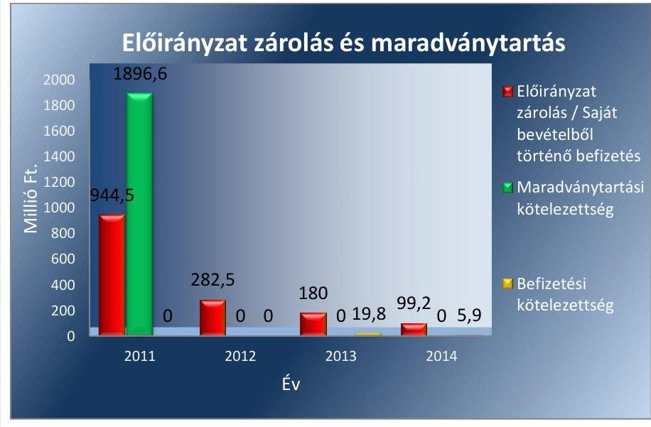

---

A KSH a tárgyévi előirányzat-maradvány megállapítása és az előző évi előirányzat-maradvány felhasználása során a jogszabályi előírásokat betartotta. A kötelezettséggel terhelt maradvány megállapítása, illetve a KSH előirányzat-maradványából a központi költségvetést megillető, elvonandó előirányzat-maradvány megállapítása megfelelt a vonatkozó jogszabályok rendelkezéseinek. A maradvány felhasználására a kötelezettségvállalások a jogszabályok előírásainak megfelelő módon és határidőben történtek.

Az előirányzat-maradványok évenkénti alakulását az alábbi 10. ábra mutatja be:
10. ábra
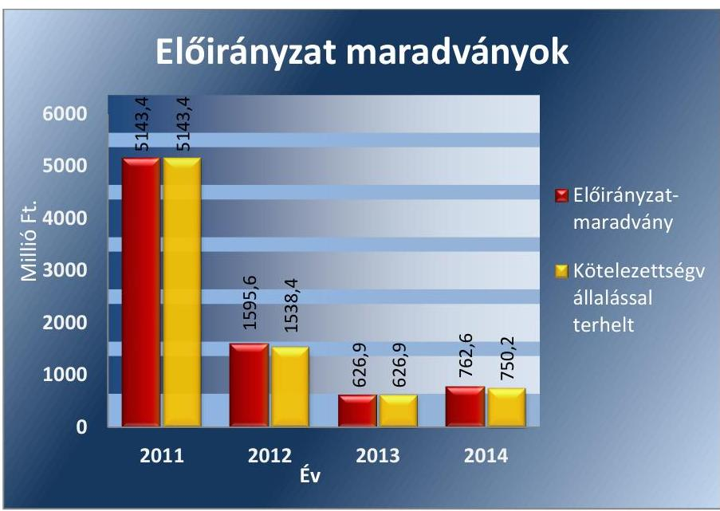

Forrás: KSH éves beszámolói
A KSH az előirányzat-maradványáról az előírt határidőben és tartalommal teljesítette az NGM felé az előírt adatszolgáltatási kötelezettségét. A KSH rendelkezett az NGM értesítésével az előirányzat-maradvány jóváhagyásáról.

A kötelezettségvállalással terhelt maradvány felhasználása megfelelt a jogszabályi előírásoknak.

A KSH tájékoztatta az NGM-et a tárgyévet követő év június 30-áig pénzügyileg nem teljesült, továbbá meghiúsult kötelezettségvállalás miatt szabaddá váló előirányzat-maradványról. A vonatkozó jogszabályokban meghatározott 5 M Ft-ot elérő dologi és felhalmozási kiadásokat, a működési és felhalmozási célra államháztartáson kívülre átadott pénzeszközöket terhelő, az előző évi előirányzat-maradvány terhére vállalt kötelezettségeket a KSH határidőben bejelentette a Kincstárhoz.

# 3.5. számú megállapítás 

A jogszabályi előírásoknak megfelelően 2011-ben előirányzat-felhasználási, illetve 2012-től likviditási tervet készítettek, melyekben figyelembe vették az évközi korlátozó intézkedéseket. Az intézmény zavartalan feladatellátása biztosított volt az ellenőrzött időszakban.

A KSH zavartalan feladatellátásához szükséges fizetőképessége 2011-2014. között biztosított volt. A jogszabályi előírásoknak megfelelően 2011-ben

---

előirányzat-felhasználási, illetve 2012-től likviditási tervet készítettek, melyekben figyelembe vették az évközi korlátozó intézkedéseket (zárolás, maradványtartás). A KSH-nál nem volt szükség előirányzat-keret előrehozására. Kincstári biztos kirendelése nem került sor.

A KSH az 1316/2011. (IX. 19.) Korm. határozat ${ }^{30}$ által előírt, tárgyieszköz-beszerzési tilalomra vonatkozó rendelkezéseket betartotta. A 2011. évi maradvány terhére történő gépjármű-beszerzést a Miniszterelnökség, illetve a Kincstár engedélye birtokában hajtotta végre.

A KSH a szállítói számlákat, egyéb kötelezettségeit többségében határidőben kiegyenlítette. A lejárt szállítói állomány a fizetési határidőt meghaladó 30 nap alatti volt, 2011. év végén szerepelt egy 0,4 M Ft összegű 30 napon túli, de 60 napnál nem régebben lejárt tartozás.

A KSH forgóeszközeinek értéke 2011. év végén 10,4-szerese (likviditási mutató), pénzeszközeinek értéke 10,1-szerese (pénzeszköz likviditási mutató) volt a rövid lejáratú kötelezettségek összegének. A likviditási mutató alakulását a következő 11. ábra mutatja be:
11. ábra
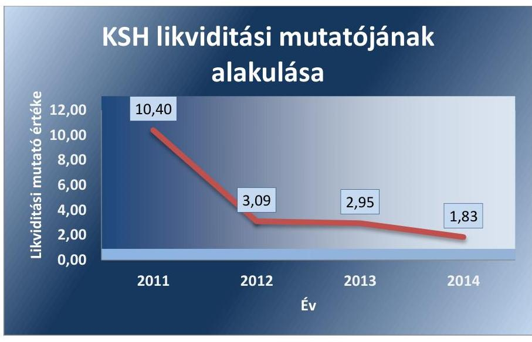

A KSH követeléseinek állománya az ellenőrzött időszakban folyamatosan növekedett, 2014. év végén több mint tízszerese (491,2 M Ft) volt a 2011. év eleji összegnek (43,1 M Ft). A követelések állománynövekedésben jelentős szerepe volt annak, hogy 2014-től a számviteli előírások változásával átrendezésre kerültek egyes mérlegtételek (pl. a befektetett eszközökből a követelések közé került át a munkáltatói lakáskölcsönök teljes összege, 153,0 M Ft, a lejárat időpontjától függetlenül). Ezen kívül a KSH az MNB részére statisztikai adatgyűjtést végzett, a 2014. évben elvégezett szolgáltatás ellenértékét (301,3 M Ft) leszámlázta, ami év végén a követelések között szerepelt (még nem volt határidőn túli). A határidőn túli követelések (kizárólag vevőkövetelések) összege, illetve az összes követelésen belüli aránya a KSH likviditási helyzetére nem gyakorolt jelentős hatást, likviditása biztosított volt.

A KSH fizetőképességének fenntartása érdekében intézkedett a fennálló követeléseinek behajtására. A határidőre nem fizető partnerek felé a fizetési felszólítások eredménytelenségét követően a Jogi és igazgatási osz-

---

tály behajtási cselekményeket kezdeményezett (fizetési meghagyás kibocsátása, végrehajtási kérelem). 2012-ben a KSH számára kedvező ítélettel zárult egy 11,9 M Ft-os követelés miatt folytatott peres eljárás, az összeghez azonban az adós felé indított végrehajtási eljárás ellenére a KSH nem jutott hozzá, mivel a cég felszámolás alá került.

A KSH a követelések év végi értékelését a Számv. tv., illetve a belső szabályzatok előírásainak megfelelően elvégezte. Értékvesztésként 2011-ben 0,3 M Ft-ot, 2012-ben 6,1 M Ft-ot (ebből egy peresített követelés behajthatóságának kockázata miatt 5,9 M Ft-ot) számoltak el. 2013-ban, illetve 2014-ben értékvesztés elszámolása nem volt indokolt. Az értékvesztések elszámolása szabályszerűen történt.

Behajthatatlan követelésként 2011-ben 0,1 M Ft, 2012-ben 0,8 M Ft, 2013-ban 12,4 M Ft került leírásra, mivel a behajtásra tett intézkedések nem voltak eredményesek, illetve a beszedéssel kapcsolatos költségek jelentősen meghaladták volna a várható bevételt. A behajthatatlanság miatti leírás a Számv. tv., illetve a belső szabályzatok előírásainak megfelelően történt.

# 3.6. számú megállapítás 

A KSH a jogszabályi előírásoknak megfelelően hajtotta végre az eredményszemléletű számvitel bevezetésével kapcsolatos feladatokat.

A rendező mérleg elkészítését megelőző, a 36/2013. (IX. 13.) NGM rendeletben ${ }^{31}$ előírt feladatokat elvégezték. 2013. december 31-i fordulónappal teljes körű leltározást hajtottak végre. A leltárban a követeléseket és a kötelezettségeket a költségvetési évben esedékes és a költségvetési évet követően esedékes megbontásban szerepeltették. A 36/2013. (IX. 13.) NGM rendelet 5. § (1) bekezdésének előírása szerint kivezették a támogatási program előlegek miatti kötelezettséget.

A KSH a rendező mérleget a 36/2013. (IX. 13.) NGM rendeletben előírtaknak megfelelően, a 8. § (2) bekezdésében foglalt határidőre, a 8. § (1) bekezdésében előírt formátumban és tartalommal, az előírt átrendezéseknek megfelelően elkészítette. A 36/2013. (IX. 13.) NGM rendelet 1. § előírásának megfelelően a rendező mérleg fordulónapja 2014. január 1-je volt, a 2014. évi nyitómérleg megfelelt a rendező mérlegnek. A 36/2013. (IX. 13.) NGM rendelet 8. § (3) bekezdése előírásának megfelelően a rendező mérleget aláírta a költségvetési szerv vezetője, a rendező mérlegen feltüntették az elkészítéséért felelős személy regisztrációs számát és az aláírások keltezését.

A rendező mérleg készítéséig a könyvvezetés a 36/2013. (IX. 13.) NGM rendelet 9. § előírásai szerint történt.

---

# 4. Az intézmény vagyongazdálkodása szabályszerű volt-e? 

## Összegző megállapítás

Az intézmény vagyongazdálkodása összességében szabályszerű volt.

### 4.1. számú megállapítás

A vagyonkezelési szerződések megfeleltek a jogszabályi előírásoknak.

A KSH az ellenőrzött időszakban rendelkezett az MNV Zrt. ${ }^{32}$-vel kötött vagyonkezelői szerződéssel. Az állami vagyon vagyonkezelésére vonatkozó szerződés megkötése, tartalmának meghatározása a vonatkozó jogszabályok - Vtv. ${ }^{33}$, az Nvtv. és a Vtvr. ${ }^{34}$ - előírásainak megfelelően történt.

A vagyonkezelői szerződést, a hatálya alá tartozó vagyontárgyak körének változása miatt a 2011-2014. években hét alkalommal módosították. A vagyonkezelői szerződéseket a Vtvr. 8. § (2) bekezdésében ${ }^{\dagger}$ előírtak ellenére a szerződő felek nem foglalták a módosításokkal egységes szerkezetbe.

Az ellenőrzött időszak alatt a KSH vagyonkezelésébe került ingatlanokra, ingatlanrészekre a KSH vagyonkezelői joga az ingatlan-nyilvántartásba bejegyzésre került. A KSH a jogerős bejegyző határozatokat a Vtvr. 7. § (2) bekezdésében foglaltak ellenére a tulajdonosi joggyakorló MNV Zrt.-nek elmulasztotta megküldeni. A KSH vagyonkezelői jogának megszüntetését az ellenőrzött időszakban öt megüresedett, állami feladatainak ellátásához továbbiakban nem szükséges ingatlan, ingatlanrész esetében kezdeményezte. A vagyonkezelői szerződés megszüntetése szabályszerűen történt.

A KSH a Vtvr. 14. § (1) bekezdésében és a vagyonkezelési szerződésekben előírt adatszolgáltatási kötelezettségének határidőben eleget tett. A KSH a vagyonkezelésében lévő állami vagyon tárgyév december 31-ei állapotáról évente határidőben beszámolt, míg a vagyonelemek évközi változásáról és az ingatlanok vagyonkezelésébe kerüléséről, illetve megszüntetéséről szóló bejelentéseket a KSH a Vtvr. melléklet II. 3. és 5-6. pontjaiban előírt határidőt követően teljesítette.

Az adásvételi szerződéssel a KSH tulajdonába került eszközök esetében 2014. évben nem tartották be a Nvtv. 11. § (6) bekezdésében előírtakat. A KSH a 2013. augusztus 21-én kötött vagyonkezelői szerződés III./5. pontjában előírtak ellenére a 2014. évi Kvtv. ${ }^{35}$ 6. § (5) bekezdés a) pontjában előírt - 25 M Ft egyedi bruttó forgalmi - értékhatárt meghaladó vagyonelem beszerzéséről az MNV Zrt.-t nem értesítette. A 2014. évben vásárolt bruttó 28,6 M Ft, illetve bruttó 27,8 M Ft értékű szellemi termékek beszerzéséről a KSH az MNV Zrt.-t nem értesítette, vagyonkezelési szerződés megkötését nem kezdeményezte. Az MNV Zrt. ennek következtében a vagyonelemek vagyonkezelésbe adásáról nem rendelkezett.

[^0]
[^0]:    * A jogszabályi rendelkezés 2015. szeptember 9-én hatályát vesztette.

---

# 4.2. számú megállapítás 

A mérlegben kimutatott eszközök és források nyilvántartása, értékelése, leltározása a jogszabályok előírásainak megfelelően történt.

A mérlegben kimutatott eszközök bekerülési értékének megállapítása, állományba vétele, nyilvántartása, év végi értékelése és az értékcsökkenés elszámolása a jogszabályi előírásoknak megfelelően történt. Az eszközök üzembe helyezését dokumentálták, azok a tárgy évi leltárban megtalálhatók voltak. A behajthatatlannak minősített követeléseket leírták, a mérleg fordulónapon ilyen állományt nem mutattak ki. Követelésről lemondásra nem került sor.

A KSH vagyonnyilvántartása biztosította az adatszolgáltatások pontosságát és ellenőrizhetőségét. Az analitikus, részletező nyilvántartásoknak a kapcsolódó könyvviteli és nyilvántartási számlákkal való év végi egyeztetése a leltározás keretében dokumentált módon megtörtént.

A leltározás, selejtezés végrehajtása a jogszabályok és belső szabályzatok előírásainak megfelelően történt. Az éves költségvetési beszámoló elkészítéséhez, a mérleg tételeinek alátámasztásához az előírt leltárt összeállították. A leltárak tételesen és ellenőrizhető módon tartalmazták az eszközöket mennyiségben és értékben és a forrásokat értékben. A leltározás tárgyi feltétele biztosított volt. Az ellenőrzött években a könyvviteli mérlegben kimutatott eszközök és források leltározását a leltározási utasításban és leltározási ütemtervben meghatározottaknak megfelelően végezték el. A leltár eltérések könyvviteli rendezése a mérlegkészítés időpontjáig megtörtént.

A selejtezés végrehajtása a jogszabályi előírásoknak megfelelően történt. A selejtezési bizottság tagjait a Leltárkészítési, leltározási és selejtezési szabályzatban meghatározottaknak megfelelően a selejtezési javaslat alapján az arra jogosult jelölte ki. A selejtezésekről jegyzőkönyv készült. A selejtezések végrehajtását az arra jogosult engedélyezte. A selejtezett eszközök nyilvántartásból való kivezetése megtörtént.
4.3. számú megállapítás

Az intézmény az értékmegőrzési, állagmegóvási kötelezettségeit a jogszabály és a vagyonkezelési szerződés előírásai szerint teljesítette.

A KSH éves költségvetési beszámolója szerint a vagyonmérleg főösszege a 2011. január 1-jei 5256,1 M Ft-ról 2014. év végére 0,8%-kal, 5215,9 M Ftra csökkent. A vagyon változását az alábbi 12. ábra mutatja be:

---

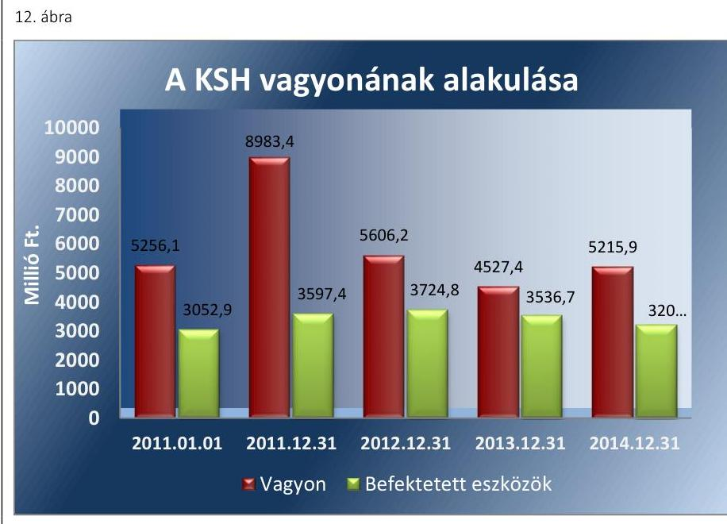

Forrás: KSH
 éves beszámolói
A KSH eszközállománya 2011. december 31-ére 3727,3 M Ft-tal, 70,9\%kal növekedett a 2011. január 1-jei nyitó állapothoz viszonyítva. A növekedés oka, hogy a pénzeszközök értéke 3379,6 M Ft-tal nőtt, valamint a befektetett eszközök esetében jelentős értékű informatikai eszköz és szoftver vásárlása, fejlesztése történt a népszámláláshoz kapcsolódó feladatok ellátása, az elektronikus adatgyűjtési rendszer és a mobileszközös összeírás megvalósítása érdekében.

A 2011-2014. években a KSH befektetett eszközeinek állománya 2699,1 M Ft-tal növekedett, a befektetett eszközök után 3657 M Ft értékcsökkenést számolt el. Az eszközpótlási mutató értéke az ellenőrzött évek átlagában 73,8\% volt. A KSH gondoskodott a vagyontárgyak állagának megóvásáról, karbantartásáról, működtetéséről.

Az eszközök használhatósági foka az ellenőrzött időszakban átlagosan 33,4\% volt. A használhatósági fok valamennyi eszközcsoportban 2012. évtől kezdődően csökkent. A tárgyi eszközök elhasználódási szintje átlagosan 66,6\% volt az ellenőrzött években. Az ellenőrzött időszak alatt végzett beruházások és felújítások, valamint a térítésmentesen átvett eszközök ellenére a KSH nem tudta az eszközcsoportok amortizálódását pótolni. Az eszközök használhatósági fokának változását az alábbi táblázat mutatja be:
2. táblázat

ESZKÖZÖK HASZNÁLHATÓSÁGI FOKA

|  | 2011 | 2012 | 2013 | 2014 |
| :-- | :--: | :--: | :--: | :--: |
| Immateriális javak | $24,9 \%$ | $24,2 \%$ | $23,4 \%$ | $19,3 \%$ |
| Ingatlanok és kapcsolódó vagyonértékű | $79,0 \%$ | $77,6 \%$ | $76,6 \%$ | $75,6 \%$ |
| jogok |  |  |  |  |
| Gépek, berendezések, felszerelések | $8,1 \%$ | $9,2 \%$ | $8,9 \%$ | $6,2 \%$ |
| (2014. évben járművek együtt) |  |  |  |  |
| Járművek | $36,2 \%$ | $37,6 \%$ | $31,9 \%$ |  |
| Eszközök összesen | $34,1 \%$ | $33,6 \%$ | $34,4 \%$ | $31,4 \%$ |

---

A saját tőke aránya a 2011. évi 37,0\%-ról a 2014. évre 84,0\%-ra nőtt, míg a kötelezettségek és a saját tőke aránya 15,6\%-ról 3,0\%-ra csökkent. A mutató kedvező alakulása arra utal, hogy az ellenőrzött időszakban a saját tőke fedezetet nyújtott a kötelezettségekre, és a KSH képes volt a kötelezettségeinek kiegyenlítésére.

Az ellenőrzött időszakban a KSH-nál a vagyon alakulására hatást gyakorló feladatváltozás nem volt, az eszközök értékében és arányában bekövetkezett változást a 2011-2014. évi beruházások és felújítások eredményezték. A KSH vagyonkezelésében lévő eszközökön végzett beruházások, felújítások során a jogszabályban és a vagyonkezelői szerződésben előírtakat betartották.

# 4.4. számú megállapítás 

A vagyonelemek elidegenítéséhez, hasznosításához kapcsolódóan a tartós bérleti szerződések esetében, a bérleti díj megállapításakor, és az átláthatóság követelményének megfelelőségével kapcsolatban nem a jogszabályok és a belső szabályzatok előírásainak megfelelően jártak el.

A vagyontárgyak eladási értékét a Leltárkészítési, leltározási és selejtezési szabályzatban előírt módon határozták meg. Az MNV Zrt. és az irányító szerv engedélyéhez kötött értékesítés az ellenőrzött időszakban nem történt.

A KSH a vagyonelemeinek bérbe adására - a jogszabályi előírásoknak megfelelően - bérleti szerződéseket kötött. A 2012. január 1-jét követően kötött bérleti szerződésekben a KSH nem írta elő a beszámolási, nyilvántartási, adatszolgáltatási kötelezettség teljesítését, mellyel nem tett eleget az Nvtv. 11. § (11) bekezdés a) pont rendelkezésének. Az ellenőrzött időszak alatt a KSH a Vtv. 24. § (1) bekezdésében előírtak ellenére versenyeztetés nélkül kötött tartós - 90 napot meghaladó - bérleti szerződést 2011. június 30-án és 2013. május 31-én. Az eseti, 90 napot meg nem haladó bérleti szerződések versenyeztetés mellőzésével történő megkötése szabályszerű volt.

A bérleti díj megállapítása - a lakásbérleti díj kivételével - az Önköltségszámítási szabályzat előírásai alapján került meghatározásra.

A lakások és helyiségek bérletére, valamint az elidegenítésükre vonatkozó egyes szabályokról szóló 1993. évi LXXVIII. törvény 87. § (1) bekezdésében foglalt felhatalmazás alapján a KSH felügyeletét ellátó miniszter volt jogosult meghatározni rendeletben a közszolgálati jogviszonyban vagy foglalkoztatásra irányuló más jogviszonyban álló személyek elhelyezéséhez szükséges állami lakásokra vonatkozóan a lakás és helyiség lakbérének mértékét és a lakbér megállapításának feltételeit. A miniszter az ellenőrzött időszakban rendeletben nem határozta meg ezeket a feltételeket. A KSH a vonatkozó rendelet hiányában a bérleti díjat az ingatlan értékcsökkenése és a térítéssel összefüggő ügyviteli költségek figyelembe vételével állapította meg.

A KSH a bérbeadás folyamata során az Nvtv. 11. § (10) bekezdésben foglaltakat nem tartotta be, mert nem győződött meg a szerződő fél átláthatóságáról.

---

# 5. Az intézmény intézkedett-e az integritás szemlélet érvényesítése érdekében? 

## Összegző megállapítás

Az ellenőrzött időszakban az intézmény intézkedett az integritás szemlélet érvényesítése érdekében.

A KSH az ellenőrzött években részt vett az ÁSZ integritás projektjének űrlapjának önkéntes alapon történő kitöltésében. A jelenlegi ellenőrzés a KSH által önbevallás útján kitöltött tanúsítvány adatai alapján megállapítható, hogy az intézmény megfelelő lépéseket tett az integritás szemlélet érvényesítésére. A kapcsolódó minősítéseket a VI. számú melléklet mutatja be.

---

# JAVASLATOK 

Az ÁSZ tv. ${ }^{36}$ 33. § (1) bekezdésében foglaltak értelmében az ellenőrzött szervezet vezetője köteles a jelentésben foglalt megállapításokhoz kapcsolódó intézkedési tervet összeállítani és azt a jelentés kézhezvételétől számított 30 napon belül az ÁSZ részére megküldeni. Amennyiben az intézkedési tervet az ellenőrzött szervezet vezetője nem küldi meg határidőben, vagy továbbra sem elfogadható intézkedési tervet küld, az ÁSZ elnöke az ÁSZ tv. 33. § (3) bekezdés a)-b) pontjaiban foglaltakat érvényesítheti.

## Központi Statisztikai Hivatal elnökének

1. Intézkedjen az SZMSZ módosításának előkészítéséről és a felügyeleti szerv részére történő benyújtásáról annak érdekében, hogy az SZMSZ a jogszabályi előírásoknak megfelelően tartalmazza az alaptevékenység kormányzati funkciók szerinti besorolását.
(1.1. számú megállapítás 5. bekezdése alapján)
2. Intézkedjen a Kbt. hatálya alá tartozó beszerzéseknél a közbeszerzési törvény előírásainak betartására.
(3.3. számú megállapítás 5. bekezdése alapján)
3. Intézkedjen a nemzeti vagyon hasznosítására vonatkozó szerződések megkötésekor az Nvtv. előírásainak betartásáról.
(4.4. számú megállapítás 2. és 5. bekezdése alapján)
4. Intézkedjen az állami vagyon használatára vonatkozó szerződések megkötésekor a Vtv. 24. § (1) bekezdésben foglalt előírások betartásáról.
(4.4. számú megállapítás 2. bekezdése alapján)

---

# MELLÉKLETEK 

- I. SZ. MELLÉKLET: ÉRTELMEZŐ SZÓTÁR
állami vagyon
állami vagyonnak minősül:
a) az állam tulajdonában lévő dolog, valamint a dolog módjára hasznosítható természeti erő,
b) az a) pont hatálya alá nem tartozó mindazon vagyon, amely vonatkozásában törvény az állam kizárólagos tulajdonjogát nevesíti,
c) az állam tulajdonában lévő tagsági jogviszonyt megtestesítő értékpapír, illetve az államot megillető egyéb társasági részesedés,
d) az államot megillető olyan immateriális, vagyoni értékkel rendelkező jogosultság, amelyet jogszabály vagyoni értékű jogként nevesít
(Forrás: Vtv. 1. § (2) bekezdése)
állami vagyon értékesítése
állami vagyon használója
állami vagyon hasznosítása
állami vagyon hasznosítása kötött szerződés
állami vagyon kezelője /vagyonkezelő

Állami vagyonnak minősül:
a) az állam tulajdonában lévő dolog, valamint a dolog módjára hasznosítható természeti erő,
b) az a) pont hatálya alá nem tartozó mindazon vagyon, amely vonatkozásában törvény az állam kizárólagos tulajdonjogát nevesíti,
c) az állam tulajdonában lévő tagsági jogviszonyt megtestesítő értékpapír, illetve az államot megillető egyéb társasági részesedés,
d) az államot megillető olyan immateriális, vagyoni értékkel rendelkező jogosultság, amelyet jogszabály vagyoni értékű jogként nevesít
(Forrás: Vtv. 1. § (2) bekezdése)
Állami vagyon tulajdonjogának bármely jogcímen történő, visszterhes átruházása (Forrás: Vtvr. 1. § (7) bekezdés d) pontja)
Az a természetes személy, jogi személy, illetve jogi személyiséggel nem rendelkező szervezet, amely, illetve aki törvény vagy szerződés alapján, bármely jogcímen (pl. bérlet, haszonbérlet, VSZ, használat stb.) állami vagyont birtokol, használ, szedi annak hasznait, hasznosít, ide nem értve a tulajdonosi jogok gyakorlóját. (Forrás: Vtvr. 1. § (7) bekezdés a) pontja, hatályos 2011. január 1-jétől 2011. december 31-ig)

Az a természetes vagy jogi személy, jogi személyiséggel nem rendelkező szervezet, aki, vagy amely törvény vagy szerződés alapján, bármely jogcímen (bérlet, haszonbérlet, használat stb.) állami vagyont birtokol, használ, szedi annak hasznait, hasznosít, ide nem értve a haszonélvezőt, a vagyonkezelőt és a tulajdonosi jogok gyakorlóját. (Forrás: Vtvr. 1. § (7) bekezdés a) pontja)
Az állami vagyont az MNV Zrt. maga kezeli, vagy szerződés - így különösen bérlet, haszonbérlet, szerződésen alapuló haszonélvezet, vagyonkezelés, megbízás - alapján központi költségvetési szervnek, természetes vagy jogi személynek, vagy jogi személyiséggel nem rendelkező gazdálkodó szervezetnek hasznosításra átengedi. (Forrás: Vtv. 23. § (1) bekezdése, hatályos 2011. december 31-éig)
Az állami vagyont az MNV Zrt. maga kezeli, vagy szerződés - így különösen bérlet, haszonbérlet, megbízás - alapján központi költségvetési szervnek, természetes vagy jogi személynek, vagy jogi személyiséggel nem rendelkező gazdálkodó szervezetnek hasznosításra átengedi. (Forrás: Vtv. 23. § (1) bekezdése, hatályos 2012. január 1-jétől)
Az állami vagyonnal a tulajdonosi joggyakorló maga gazdálkodik, vagy szerződés - így különösen bérlet, haszonbérlet, megbízás - alapján hasznosításra átengedi, illetőleg vagyonkezelésbe, haszonélvezetbe adja. Forrás: Vtv. 23. § (1) bekezdése, hatályos 2013. június 28-ától)

Az állami vagyon hasznosítására kötött szerződések elsődleges célja az állami vagyon hatékony működtetése, állagának védelme, értékének megőrzése, illetve gyarapítása, az állami és közfeladatok ellátásának elősegítése. (Forrás: Vtv. 23. § (2) bekezdése)
Az állami vagyont az MNV Zrt. maga kezeli, vagy szerződés - így különösen bérlet, haszonbérlet, szerződésen alapuló haszonélvezet, vagyonkezelés, megbízás - alapján központi költségvetési szervnek, természetes vagy jogi személynek, illetőleg jogi személyiséggel nem rendelkező gazdasági társaságnak hasznosításra átengedi (Forrás: Vtv. 23. § (1) bekezdése, hatályos 2010. január 01 - 2011. december 31-ig).

---

Az állami vagyont az MNV Zrt. maga kezeli, vagy szerződés - így különösen bérlet, haszonbérlet, megbízás - alapján központi költségvetési szervnek, természetes vagy jogi személynek, vagy jogi személyiséggel nem rendelkező gazdálkodó szervezetnek hasznosításra átengedi." Az állami vagyonra vonatkozóan az MNV Zrt. kizárólag az Nvtv-ben meghatározott személyekkel köthet vagyonkezelési szerződést.
(Forrás: Vtv. 27. § (1) bekezdése, hatályos 2012. január 1-jétől)
Az Állami Számvevőszék 2009-ben indította el a „Korrupciós kockázatok feltérképezése - Integritás alapú közigazgatási kultúra terjesztése" című, európai uniós forrásból megvalósított kiemelt projektjét (Integritás Projekt). Az Integritás Projekt célja, hogy felmérje a közszféra intézményei korrupciós kockázatoknak való kitettségét, illetőleg az azok mérséklésére hivatott kontrollok szintjét. Az Állami Számvevőszék a projekt révén az integritás szemlélet minél szélesebb körrel történő megismertetését, gyakorlatba ültetését kívánja elérni. Az integritás követelményeinek megfelelő szervezeti működést előnyben részesítő közigazgatási kultúra elterjesztését és a korrupció elleni fellépést az ÁSZ önmagára nézve is stratégiai jelentőségű célként fogalmazta meg. A projekt a felmérésben résztvevő intézmények számára helyzetükről egyfajta „tükörképet" mutat be, ami alapot teremt a jövőbeni pozitív irányú elmozduláshoz. (Forrás: a http://integritas.asz.hu honlapon közzétett, a 2013. évi Integritás felmérés eredményeiről készült összefoglaló tanulmány)
belső ellenőrzés
belső kontrollrendszer
Független, tárgyilagos bizonyosságot adó és tanácsadó tevékenység, amelynek célja, hogy az ellenőrzött szervezet működését fejlessze és eredményességét növelje, az ellenőrzött szervezet céljai elérése érdekében rendszerszemléletű megközelítéssel és módszeresen értékeli, illetve fejleszti az ellenőrzött szervezet irányítási és belső kontrollrendszerének hatékonyságát. (Forrás: Bkr. 2. § b) pontja)
A belső
 kontrollrendszer a költségvetési szerv által a kockázatok kezelésére és tárgyilagos bizonyosság megszerzése érdekében kialakított folyamatrendszer, amely azt a célt szolgálja, hogy a költségvetési szerv megvalósítsa a következő fő célokat: a tevékenységeket (műveleteket) szabályszerűen, valamint a megbízható gazdálkodás elveivel (gazdaságosság, hatékonyság és eredményesség) összhangban hajtsa végre; teljesítse az elszámolási kötelezettségeket; megvédje a szervezet erőforrásait a veszteségektől (károktól) és a nem rendeltetésszerű használattól. (Forrás: Áht. 1 120/B § (1) bekezdés, hatályos: 2009. január 1-jétől 2011. december 31-ig)

A belső kontrollrendszer a kockázatok kezelése és tárgyilagos bizonyosság megszerzése érdekében kialakított folyamatrendszer, amely azt a célt szolgálja, hogy megvalósuljanak a következő célok: a működés és gazdálkodás során a tevékenységeket szabályszerűen, gazdaságosan, hatékonyan, eredményesen hajtsák végre, az elszámolási kötelezettségeket teljesítsék, és megvédjék az erőforrásokat a veszteségektől, károktól és nem rendeltetésszerű használattól. (Forrás: Áht. 2 69. § (1) bekezdés, hatályos: 2012. január 1-jétől)
A belső kontrollrendszer területei: a kontrollkörnyezet, a kockázatkezelési rendszer, a kontrolltevékenységek, az információs és kommunikációs rendszer, valamint a nyomon követési (monitoring) rendszer. (Forrás: Bkr. 3. §-a)
felújítás
Az elhasználódott tárgyi eszköz eredeti állaga (kapacitása, pontossága) helyreállítását szolgáló időszakonként visszatérő olyan tevékenység, melynek során az eszköz élettartama megnövekszik, minősége, használata jelentősen javul, így a pótlólagos ráfordításból a jövőben gazdasági előnyök származnak. (Forrás: Számv. tv. 3. § (4) bekezdés 8. pontja)
használhatósági fok
A tárgyi eszközállomány állagának elemzéséhez használt mutató, amely megmutatja, hogy a le nem írt (nettó) érték milyen hányadát képezi az aktiválási (bekerülési) értéknek. Számításakor a tárgyi eszköz könyv szerinti nettó értékét viszonyítják a tárgyi eszköz bruttó (beszerzési/létesítési) értékéhez.

---

hasznosítás
információs és kommunikációs rendszer
irányító szerv/felügyeleti szerv
intézkedési terv
kockázatkezelési rendszer
kontrollkörnyezet
kötépsirányító szerv
közfeladat
kulcskontrollok
monitoring-rendszer
tulajdonosi joggyakorló
vagyongazdálkodás

A nemzeti vagyon birtoklásának, használatának, hasznok szedése jogának bármely a tulajdonjog átruházását nem eredményező jogcímen történő átengedése, ide nem értve a vagyonkezelésbe adást, valamint a haszonélvezeti jog alapítását. (Forrás: Nvtv. 3. § (1) bekezdés 4. pontja)
A költségvetési szerv vezetője által kialakított és működtetett olyan rendszer, mely biztosítja, hogy a megfelelő információk a megfelelő időben eljutnak az illetékes szervezethez, szervezeti egységhez, illetve személyhez. (Forrás: Bkr. 9. § (1) bekezdés)
A költségvetési szerv tekintetében az e törvényben meghatározott irányítási hatáskört gyakorló szerv. (Forrás: Áht. 1. § 9. pontja)
Az ellenőrzési javaslatok alapján az ellenőrzött szervezet, szervezeti egység által készített intézkedések végrehajtásának ütemezése a végrehajtásáért felelős személyek és a vonatkozó határidők megjelölésével. (Forrás: 370/2011. (XII. 31.) Korm. rendelet 2. § (k) pontja, hatályos 2012. január 1-jétől)

Olyan irányítási eszközök és módszerek összessége, melynek elemei a szervezeti célok elérését veszélyeztető tényezők (kockázatok) azonosítása, elemzése, csoportosítása, nyomon követése, valamint szükség esetén a kockázati kitettség mérséklése. (Forrás: Bkr. 2. § m) pontja)
A költségvetési szerv vezetője által kialakított olyan elvek, eljárások, belső szabályzatok összessége, amelyben világos a szervezeti struktúra, egyértelműek a felelősségi, hatásköri viszonyok és feladatok, meghatározottak az etikai elvárások a szervezet minden szintjén, átlátható a humánerőforrás-kezelés. (Forrás: Bkr. 6. § (1) bekezdés)
A költségvetési szerv vezetője által a szervezeten belül kialakított (kontroll) tevékenységek, melyek biztosítják a kockázatok kezelését, hozzájárulnak a szervezet céljainak eléréséhez. (Forrás: Bkr. 8. § (1) bekezdés)
A költségvetési szerv tekintetében törvény vagy kormányrendelet alapján meghatározott, átruházott irányítási hatásköröket gyakorló szerv. (Forrás: Áht. 2 9. § (4) bekezdés)
Jogszabályban meghatározott állami vagy önkormányzati feladat, amit az arra kötelezett közérdekből, a jogszabályban meghatározott követelményeknek és feltételeknek megfelelve végez, ideértve a lakosság közszolgáltatásokkal való ellátását, továbbá az állam nemzetközi szerződésekben vállalt kötelezettségeiből adódó közérdekű feladatokat, valamint e feladatok ellátásakor szükséges infrastruktúra biztosítását is.
(Forrás: Nvtv. 3. § (1) bekezdés 7. pontja)
A kiadások utalványozását megelőző kötelező kontrolltevékenységek.
A költségvetési szerv vezetője köteles olyan monitoring rendszert működtetni, mely lehetővé teszi a szervezet tevékenységének, a célok megvalósításának nyomon követését. A költségvetési szerv monitoring rendszere az operatív tevékenységek keretében megvalósuló folyamatos és eseti nyomon követésből, valamint az operatív tevékenységektől függetlenül működő belső ellenőrzésből áll. (Forrás: Ávr. 160. §, Bkr. 10. §)

Aki a nemzeti vagyon felett az államot vagy a helyi önkormányzatot megillető tulajdonosi jogok és kötelezettségek összességének gyakorlására jogosult. (Forrás: Nvtv. 3. § (1) bekezdés 17. pontja)

A nemzeti vagyongazdálkodás feladata a nemzeti vagyon rendeltetésének megfelelő, az állam, az önkormányzat mindenkori teherbíró képességéhez igazodó, elsődlegesen a közfeladatok ellátásához és a mindenkori társadalmi szükségletek kielégítéséhez szükséges, egységes elveken alapuló, átlátható, hatékony és költségtakarékos működtetése, értékének megőrzése, állagának védelme, értéknövelő használata, hasznosítása, gyarapítása, továbbá az állam vagy a helyi önkormányzat feladatának

---

vezetői nyilatkozat
ellátása szempontjából feleslegessé váló vagyontárgyak elidegenítése. (Forrás: Nvtv. 7. § (2) bekezdése)
a költségvetési szerv vezetője köteles - az előírt tartalmú - nyilatkozatban értékelni a költségvetési szerv belső kontrollrendszerének minőségét és azt az éves költségvetési beszámolóval együtt megküldeni az irányító szervnek. Ha a költségvetési szervnél év közben változás történik a szerv vezetője személyében, vagy a költségvetési szerv átalakul, megszűnik, a távozó vezető, illetve az átalakuló, megszűnő költségvetési szerv vezetője köteles az előírt tartalmú nyilatkozatot az addig eltelt időszak vonatkozásában kitölteni, és az új vezetőnek, illetve a jogutód költségvetési szerv vezetőjének átadni, aki azt saját nyilatkozatához mellékeli. Jelen ellenőrzés során vezetői nyilatkozaton a fentebb említett nyilatkozatokban tett következő résznyilatkozatot értjük, ennek helytállóságát értékeljük a pénzügyi és vagyongazdálkodási folyamatok tekintetében: „gondoskodtam... a költségvetési szerv tevékenységében a hatékonyság, eredményesség és a gazdaságosság követelményeinek érvényesítéséről, ...". (Forrás: Ámr. 217. § c) pontja, 226. § (3) bek., 21. számú melléklete; Bkr. 11. § (1) és (4) bek., 1. számú melléklete)

---

II. SZ. MELLÉKLET: A KSH PÉNZÜGYI ÉS VAGYONGAZDÁLKODÁSÁNAK TELJESÍTMÉNY-ELLENŐRZÉSE

A KSH a gazdálkodás folyamatában a gazdaságossági, hatékonysági és eredményességi követelményeket kialakította, célokat tűzött ki, de célértéket nem határoztak meg és a kialakított mérő és mutatószámokat nem értékelték.

A KSH az éves célkitűzéseiben, a minőségi irányelveiben, valamint a Költségtudatos erőforrás-gazdálkodási munkacsoport munkatervében tűzött ki a pénzügyi és vagyongazdálkodás részfolyamatában elérendő célokat. A KSH a pénzügyi és vagyongazdálkodás folyamatában a gazdaságosság, hatékonyság és eredményesség mérésére 13 mutatószámot alkalmazott, amelyből 12 volt mérhető teljesítménymutató. Ennek következtében a hatékonyság, eredményesség és gazdaságosság követelményeinek érvényesítéséről 2011-2014. években kiadott vezetői nyilatkozatok a KSH pénzügyi és vagyongazdálkodási folyamatai tekintetében helytállóak voltak.

Az intézmény kialakította a gazdálkodási tevékenység értékelésének mérését lehetővé tevő mérőszámok adatok gyűjtését. A rendelkezésre álló adatok alapján mutatószámokat, mérőszámokat határozott meg, azonban azok teljesülését nem értékelték. A kialakított mutatószámokhoz célértéket nem határozott meg.

---

|   |  |  |  |  |  |  |  |  |  |  |  |  |  |  |  |  |  |  |  |  |  |  |  |  |  |  |  |  |  |  |  |  |  |   |
| --- | --- | --- | --- | --- | --- | --- | --- | --- | --- | --- | --- | --- | --- | --- | --- | --- | --- | --- | --- | --- | --- | --- | --- | --- | --- | --- | --- | --- | --- | --- | --- | --- | --- | --- |
|   |  |  |  |  |  |  |  |  |  |  |  |  |  |  |  |  |  |  |  |  |  |  |  |  |  |  |  |  |  |  |  |  |  |   |
|   |  |  |  |  |  |  |  |  |  |  |  |  |  |  |  |  |  |  |  |  |  |  |  |  |  |  |  |  |  |  |  |  |  |   |
|   |  |  |  |  |  |  |  |  |  |  |  |  |  |  |  |  |  |  |  |  |  |  |  |  |  |  |  |  |  |  |  |  |  |   |
|   |  |  |  |  |  |  |  |  |  |  |  |  |  |  |  |  |  |  |  |  |  |  |  |  |  |  |  |  |  |  |  |  |  |   |
|   |  |  |  |  |  |  |  |  |  |  |  |  |  |  |  |  |  |  |  |  |  |  |  |  |  |  |  |  |  |  |  |  |  |   |
|   |  |  |  |  |  |  |  |  |  |  |  |  |  |  |  |  |  |  |  |  |  |  |  |  |  |  |  |  |  |  |  |  |  |   |
|   |  |  |  |  |  |  |  |  |  |  |  |  |  |  |  |  |  |  |  |  |  |  |  |  |  |  |  |  |  |  |  |  |  |

   |
|   |  |  |  |  |  |  |  |  |  |  |  |  |  |  |  |  |  |  |  |  |  |  |  |  |  |  |  |  |  |  |  |  |  |   |
|   |  |  |  |  |  |  |  |  |  |  |  |  |  |  |  |  |  |  |  |  |  |  |  |  |  |  |  |  |  |  |  |  |  |   |
|   |  |  |  |  |  |  |  |  |  |  |  |  |  |  |  |  |  |  |  |  |  |  |  |  |  |  |  |  |  |  |  |  |  |   |
|   |  |  |  |  |  |  |  |  |  |  |  |  |  |  |  |  |  |  |  |  |  |  |  |  |  |  |  |  |  |  |  |  |  |   |
|   |  |  |  |  |  |  |  |  |  |  |  |  |  |  |  |  |  |  |  |  |  |  |  |  |  |  |  |  |  |  |  |  |  |   |
|   |  |  |  |  |  |  |  |  |  |  |  |  |  |  |  |  |  |  |  |  |  |  |  |  |  |  |  |  |  |  |  |  |  |   |
|   |  |  |  |  |  |  |  |  |  |  |  |  |  |  |  |  |  |  |  |  |  |  |  |  |  |  |  |  |  |  |  |  |  |   |
|   |  |  |  |  |  |  |  |  |  |  |  |  |  |  |  |  |  |  |  |  |  |  |  |  |  |  |  |  |  |  |  |  |  |   |
|   |  |  |  |  |  |  |  |  |  |  |  |  |  |  |  |  |  |  |  |  |  |  |  |  |  |  |  |  |  |  |  |  |  |   |
|   |  |  |  |  |  |  |  |  |  |  |  |  |  |  |  |  |  |  |  |  |  |  |  |  |  |  |  |  |  |  |  |  |  |   |
|   |  |  |  |  |  |  |  |  |  |  |  |  |  |  |  |  |  |  |  |  |  |  |  |  |  |  |  |  |  |  |  |  |  |   |
|   |  |  |  |  |  |  |  |  |  |  |  |  |  |  |  |  |  |  |  |  |  |  |  |  |  |  |  |  |  |  |  |  |  |   |
|   |  |  |  |  |  |  |  |  |  |  |  |  |  |  |  |  |  |  |  |  |  |  |  |  |  |  |  |  |  |  |  |  |  |   |
|   |  |  |  |  |  |  |  |  |  |  |  |  |  |  |  |  |  |  |  |  |  |  |  |  |  |  |  |  |  |  |  |  |  |   |
|   |  |  |  |  |  |  |  |  |  |  |  |  |  |  |  |  |  |  |  |  |  |  |  |  |  |  |  |  |  |  |  |  |  |   |
|   |  |  |  |  |  |  |  |  |  |  |  |  |  |  |  |  |  |  |  |  |  |  |  |  |  |  |  |  |  |  |  |  |  |   |
|   |  |  |  |  |  |  |  |  |  |  |  |  |  |  |  |  |  |  |  |  |  |  |  |  |  |  |  |  |  |  |  |  |  |   |
|   |  |  |  |  |  |  |  |  |  |  |  |  |  |  |  |  |  |  |  |  |  |  |  |  |  |  |  |  |  |  |  |  |  |   |
|   |  |  |  |  |  |  |  |  |  |  |  |  |  |  |  |  |  |  |  |  |  |  |  |  |  |  |  |  |  |  |  |  |  |   |
|   |  |  |  |  |  |  |  |  |  |  |  |  |  |  |  |  |  |  |  |  |  |  |  |  |  |  |  |  |  |  |  |  |  |   |
|   |  |  |  |  |  |  |  |  |  |  |  |  |  |  |  |  |  |  |  |  |  |  |  |  |  |  |  |  |  |  |  |  |  |   |
|   |  |  |  |  |  |  |  |  |  |  |  |  |  |  |  |  |  |  |  |  |  |  |  |  |  |  |  |  |  |  |  |  |  |   |
|   |  |  |  |  |  |

  |  |  |  |  |  |  |  |  |  |  |  |  |  |  |  |  |  |  |  |  |  |  |  |  |  |  |  |   |
|   |  |  |  |  |  |  |  |  |  |  |  |  |  |  |  |  |  |  |  |  |  |  |  |  |  |  |  |  |  |  |  |  |  |   |
|   |

---

■ IV. SZ. MELLÉKLET: A BELSŐ KONTROLLRENDSZER KIALAKÍTÁSÁNAK ÉS MŰKÖDTETÉSÉNEK ÉRTÉKELÉSE A 2011-2014. ÉVEKBEN

|  Ssz. | Megnevezés | 2011. év | 2012. év | 2013. év | 2014. év | 2011-2014. évek  |
| --- | --- | --- | --- | --- | --- | --- |
|  1. | Kontrollkörnyezet | szabályszerű | szabályszerű | szabályszerű | szabályszerű | szabályszerű  |
|  2. | Kockázatkezelési rendszer | nem szabályszerű | nem szabályszerű | szabályszerű | szabályszerű | részben szabályszerű  |
|  3. | Kontrolltevékenység | szabályszerű | szabályszerű | szabályszerű | szabályszerű | szabályszerű  |
|  4. | Információs és kommunikációs rendszer | szabályszerű | szabályszerű | szabályszerű | szabályszerű | szabályszerű  |
|  5. | Monitoring rendszer | szabályszerű | szabályszerű | szabályszerű | szabályszerű | szabályszerű  |
|  A belső kontrollrendszer összevont értékelése |  | részben szabályszerű | részben szabályszerű | szabályszerű | szabályszerű | szabályszerű  |

---

### V. SZ. MELLÉKLET: MÉRLEGADATOK A 2011-2014. ÉVEKBEN

|  Mérlegtétel megnevezése | 2011-01-31. díjazó | 2011-12-31. díjazó | 2012-12-31. díjazó | 2013-12-31. díjazó | 2014-12-31. díjazó  |
| --- | --- | --- | --- | --- | --- |
|  **I** |  |  |  |  |   |
|  **IMMATERIÁLIS JAVAK** | 477 583 | 740 296 | 746 669 | 768 011 | 663 069  |
|  **TÁRVGYI ESZKÖZÖK** | 2 841 761 | 2 725 889 | 2 834 256 | 2 609 246 | 2 506 536  |
|  **Ingatlanok és kapcsolódó vagyonértékű jogok** | 2 250 164 | 2 359 267 | 2 344 655 | 2 259 622 | 2 276 488  |
|  **BEFEKTETETT PÉNZÜGYI ESZKÖZÖK** | 133 600 | 131 221 | 143 848 | 159 441 | 33 000  |
|  **ÜZEMELTETÉSRE KEZELÉSRE ÁTADOTT VAGYONKEZELÉSBE VETT ESZKÖZÖK (2014.01.01-jától eszközfajtánként beolvadt az A és B fejezetbe tartozó eszközök közül)** |  |  |  |  |   |
|  **KONCESSZIÓS, VAGYONKEZELÉSBE ADOTT ESZKÖZÖK** |  |  |  |  |   |
|  **BEFEKTETETT ESZKÖZÖK ÖSSZESEN (2014.01.01-jától csökkentett tartalommal)** |  |  |  |  |   |
|  **Nemzeti vagyonba tartozó befektetett eszközöknek felel meg!** | 3 052 944 | 3 597 406 | 3 724 773 | 3 536 698 | 3 202 615  |
|  **KÉSLELTETÉSEK** | 265 340 | 82 183 | 64 499 | 92 251 | 85 455  |
|  **KÖVETELÉSEK (2014.01.01-től teljesen újszerű struktúra, az összetétel nem összehasonlítható, a befektetett eszközök közül is kerültek át eszközök ide)** | 43 114 | 46 344 | 59 196 | 97 746 | 491 221  |
|  **ÉRTÉKPAPÍROK** |  |  |  |  |   |
|  **PÉNZESZKÖZÖK (tartalma bővült, összetétele változott 2014.01.01-jától)** | 1 873 983 | 5 253 533 | 1 753 456 | 799 886 |   |
|  **EGYÉB AKTÍV PÉNZÜGYI ELSZÁMOLÁSOK (2013.12.31-ig)** | 20 713 | 3 940 | 4 254 | 829 |   |
|  **EGYÉB SÍLÁTOS ESZKÖZÖLDALI ELSZÁMOLÁSOK (2014.01.01-jától)** |  |  |  |  | 8 832  |
|  **AKTÍV DŐBELI ELHATÁROLÁSOK** |  |  |  |  |   |
|  **(2014.01.01-jától)** |  |  |  |  | 622 322  |
|  **ESZKÖZÖK ÖSSZESEN** | 5 256 094 | 8 983 406 | 5 606 178 | 4 527 410 | 5 215 858  |
|  **SAJÁT TŐKE (2014.01.01-jától tartalma bővült, ide tartoznak a Tartalékok is, szerkezete megváltozott)** | 2 743 994 | 3 320 144 | 3 373 420 | 3 534 390 | 4 380 921  |
|  **TARTALÉKOK (2014.01.01-jától a saját tőke része)** |  |  |  |  |   |
|  **KÖTELEZETTSÉGEK ÉS VÁLTOZÁSA: mérlegben szereplő tartozások** | 1 863 429 | 5 143 411 | 1 595 580 | 626 873 | 634 756  |
|  **KÖTELEZETTSÉGEK** |  |  |  |  |   |
|  **EGYÉB PASSZÍV PÉNZÜGYI ELSZÁMOLÁSOK NÉLKÜL** | 647 685 | 517 990 | 608 048 | 336 023 | 129 813  |
|  **EGYÉB PASSZÍV PÉNZÜGYI ELSZÁMOLÁSOK 2013.12.31-ig** | 986 | 1 861 | 29 130 | 30 124 |   |
|  **EGYÉB SÍLÁTOS FORMÁSOLDALI ELSZÁMOLÁSOK (2014.01.01-jától)** |  |  |  |  | 45 454  |
|  **KINCSTÁRI SZÁMLAVEZETÉSHEZ KAPCSOLATOS ELSZÁMOLÁSOK (2014.01.01-jától)** |  |  |  |  |   |
|  **PASSZÍV DŐBELI ELHATÁROLÁSOK (2014.01.01-jától)** |  |  |  |  | 659 668  |
|  **FŐKÖNYVI ÖSSZESEN** | 5 256 094 | 8 983 406 | 5 606 178 | 4 527 410 | 5 215 858  |

---

# - VI. SZ. MELLÉKLET: AZ INTEGRITÁS KONTROLLRENDSZER ÉRTÉKELÉSE 

| Ssz. | Kontrollpillérek megnevezése | Értékelés |
| :--: | :--: | :--: |
| 1. | Összeférhetetlenség és etikai elvárások | KIVÁLÓ |
| 2. | Humánerőforrás-gazdálkodás | MEGFELELT |
| 3. | Szervezet vagyonának megvédésére tett intézkedések | KIVÁLÓ |
| 4. | A nemkívánatos dolgozói magatartással szembeni intézkedések és azok érvényesülése | MEGFELELT |
| 5. | Az integritás erősítésének, annak tudatosításának, valamint a kockázatelemzések alkalmazásának értékelése | KIVÁLÓ |
| Az integritás kontrollrendszer összesítő értékelése: |  | KIVÁLÓ |

---

.

---

# FÜGGELÉK: ÉSZREVÉTELEK 

A jelentéstervezetet a Számvevőszék 15 napos észrevételezésre megküldte az ellenőrzött szervezet vezetőjének az ÁSZ tv. 29. § (1) bekezdése előírásának megfelelően.
Az elfogadott észrevételek alapján a Számvevőszék módosította a jelentést.
A függelék tartalmazza az ellenőrzött észrevételeit, illetve az el nem fogadott észrevételek elutasításának indoklását.

- Központi Statisztikai Hivatal elnökének KSH/129-4/2016. iktatószámú levele
- Tájékoztatás az elfogadott és az el nem fogadott észrevételekről (V-0945-174/2016.)

## ${ }^{5}$ 29. § (1) Az Állami Számvevőszék az ellenőrzési megállapításait megküldi az ellenőrzött szervezet vezetőjének vagy az általa megbízott személynek, és annak, akinek személyes felelősségét állapította meg.

(2) Az ellenőrzött szervezet vezetője és a felelősként megjelölt személy az ellenőrzés megállapításaira tizenöt napon belül írásban észrevételt tehet.
(3) Az Állami Számvevőszék az észrevételre a beérkezésétől számított harminc napon belül írásban válaszol. A figyelembe nem vett észrevételeket köteles a jelentésben feltüntetni, és megindokolni, hogy azokat miért nem fogadta el.

---

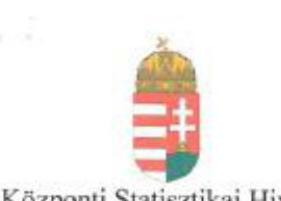

Központi Statisztikai Hivatal
Elnök

KSH/129-4/2016.

Domokos László úr
elnök
Állami Számvevőszék

Budapest

Tisztelt Elnök Úr!

Köszönettel vettük a V-0945-169/2016. számú levél mellékleteként megküldött jelentéstervezetet, amelyhez kapcsolódóan az alábbi észrevételeket tesszük.

1. A jelentéstervezet 5. oldalán az alábbi megállapítás szerepel:

"(...) azonban a kiadási előirányzatok felhasználása során a közbeszerzési eljárásokra (2012. évben) vonatkozó jogszabályi előírásokat nem tartotta be teljes körűen."

Fentiek alapján a jelentéstervezet 23. oldalán az alábbi megállapítás szerepel:

"Egy esetben – a Kbt. 5. és 18. §-ában foglalt előírásokat figyelmen kívül hagyva – közbeszerzési eljárás jogtalan mellőzésével kötöttek szerződést. A Közbeszerzési Döntőbizottság D.846/9/2015. számú határozatában az Állami Számvevőszék jogorvoslati eljárás kezdeményezésének helyt adva megállapította a Központi Statisztikai Hivatal jogsértését és 100.000 Ft bírság kiszabásáról rendelkezett."

Javasoljuk a Közbeszerzési Döntőbizottság határozatával összefüggő megállapítás törlését, mivel a Székesfehérvári Közigazgatási és Munkaügyi Bíróság 14.K.27.044/2016/9. számú, 2016. március 11. napján kelt ítéletében megállapította, hogy a Közbeszerzési Döntőbizottság D.846/9/2015. számú, 2016. január 8. napján kelt határozata jogszabálysértő, ezért azt hatályon kívül helyezte és a Közbeszerzési Döntőbizottságot új eljárás lefolytatására kötelezte.

Javasoljuk, hogy a jelentéstervezet 23. oldalán is kerüljön megjelölésre – hasonlóan az 5. oldalhoz –, hogy a megállapítás a 2012. évet érinti.

A jelentéstervezet által említett 2012. július 2-i szerződéskötéshez kapcsolódóan tájékoztatásul az alábbiakat jelezzük:

- A jelentéstervezetben hivatkozott szerződés már nem hatályos, mivel a KSH már megszüntette.
- Az ellenőrzéssel érintett időszakban (2014. évben) új közbeszerzési szabályzat került kiadásra, illetve a 2012. júliusi szerződéskötést követően a kötelezettségvállalások

---

eljárásrendjére vonatkozóan is új utasítás került közzétételre, amelynek alapján szigorúbbak lettek a szerződéskötést megelőző belső kontrollok a KSH-ban (például a szerződés aláírásához a gazdasági vezető előzetes egyetértése mellett a jogi és gazdálkodási elnökhelyettes előzetes jóváhagyása is szükséges). Jelentős részben a belső kontrollok további eredményes javításának következtében az Állami Számvevőszék a 2013. és a 2014. évi költségvetés végrehajtásának ellenőrzése során a 2013-2014. évek közbeszerzéseihez, egyéb kötelezettségvállalásaihoz kapcsolódóan szabályszerűségi hibát nem tárt fel.
2. A jelentéstervezet 30-31. oldalán az alábbi megállapítás szerepel:
„Az ellenőrzött időszak alatt a KSH a Vtv. 24. § (1) bekezdésében előírtak ellenére versenyeztetés nélkül kötött tartós - 90 napot meghaladó - bérleti szerződést 2011. június 30-án és 2013. május 31-én."

A megállapítást javasoljuk az alábbiak szerint kiegészíteni:
Az ellenőrzött időszak alatt a KSH a Vtv. 24. § (1) bekezdésében előírtak ellenére versenyeztetés nélkül kötött tartós - 90 napot meghaladó - bérleti szerződést 2011. június 30-án és 2013. május 31-én egy $17 \mathrm{~m}^{2}$-es, illetve egy $21,87 \mathrm{~m}^{2}$-es helyiség vonatkozásában.
Fenti megállapításhoz kapcsolódóan jelezzük, hogy a KSH a hivatkozott $17 \mathrm{~m}^{2}$-es, illetve $21,87 \mathrm{~m}^{2}$-es helyiségek bérleti szerződését megszüntette; a két említett helyiségre új bérleti szerződést nem kötött. A 2015. évi intézkedések következtében a KSH jelenleg nem rendelkezik olyan vagyonhasznosítási szerződéssel, amelynek aláírására a jogszabályban előírt versenyeztetés nélkül került volna sor.
3. A jelentéstervezet 31. oldalán az alábbi megállapítás
 szerepel:
„A KSH bérbeadás folyamata során az Nvtv. 11. § (10) bekezdésében foglaltakat nem tartotta be, mert nem győződött meg a szerződő fél átláthatóságáról."
Fenti megállapításhoz kapcsolódóan az alábbiakat jelezzük:
A KSH a hivatkozott bérleti szerződéseket megszüntette; a jelenleg hatályos bérleti szerződések az Nvtv. 11. § (10) bekezdésében foglalt előírások betartásával kerültek aláírásra.

A 30-31. oldalon szereplő megállapításokhoz kapcsolódóan tájékoztatásul jelezzük, hogy

- a KSH Gazdálkodási főosztályán időközben új ügyrend került kiadásra, mely külön nevesítve rögzíti az Nvtv. 11. § (10)-(11) bekezdéseiben, illetve a Vtv. 24. § (1) bekezdésében foglalt előírásokat;
- a KSH Ellenőrzési osztálya 2015. évben külön ellenőrzés keretében vizsgálta a KSH-nál az MNV Zrt-vel kötött vagyonkezelési szerződésből fakadó kötelezettségek teljesítését. A jelentésben az ellenőrzés intézkedést igénylő megállapítást nem tett, illetve azt állapította meg, hogy „az ellenőrzött területen a kontrollkörnyezet megfelelően kialakításra került, nem voltak olyan ellentmondások, gyenge pontok, amelyek alapján a kontrollrendszer egészére ható elfogadhatatlan szintű kockázat alakulhatott ki".

---

Fontosnak tartjuk még kiemelni, hogy az Állami Számvevőszék a 2011-2014. évek költségvetésének végrehajtását valamennyi évben külön ellenőrizte a KSH-nál. Az Állami Számvevőszék ennek során - a 2011-2014. időszak vonatkozásában - megállapította, hogy a kifizetések jogszerűek voltak és azok elszámolása szabályszerűen történt. Ennek következtében a számvevői jelentések alapján egy esetben sem terhelte intézkedési kötelezettség a KSH-t.

Budapest, 2016. április 6.

Üdvözlettel:

Dr. Vukovich Gabriella

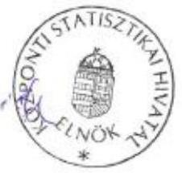

---

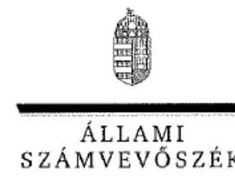

ELNÖK

# Dr. Vukovich Gabriella úrhölgy 

elnök
Központi Statisztikai Hivatal

## Budapest

## Tisztelt Elnök Úrhölgy!

A Központi alrendszer egyes intézményei pénzügyi és vagyongazdálkodásának ellenőrzésének Központi Statisztikai Hivatal című számvevőszéki jelentéstervezetre tett észrevételeit köszönettel megkaptam.

Az Állami Számvevőszék észrevételekre vonatkozó álláspontjáról a felügyeleti vezető által készített részletes tájékoztatást csatoltan megküldöm.

Tájékoztatom Elnök úrhölgyet, hogy a jelentésben - az Állami Számvevőszékről szóló 2011. évi LXVI. törvény 29. § (3) bekezdése alapján - a figyelembe nem vett észrevételeket szerepeltetjük az elutasítás indokának feltüntetésével együtt.

Budapest, 2016.
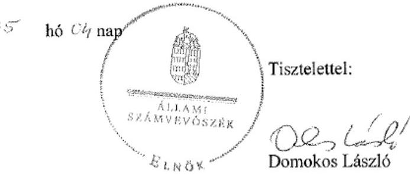

Melléklet: Tájékoztatás az elfogadott és az el nem fogadott észrevételekről

---

# Tájékoztatás az elfogadott és az el nem fogadott észrevételekről 

A Központi alrendszer egyes intézményei pénzügyi és vagyongazdálkodásának ellenőrzése Központi Statisztikai Hivatal című számvevőszéki jelentéstervezetre a KSH/129-4/2016. iktatószámú levelében tett észrevételeit áttekintettük, melyekről az alábbi tájékoztatást adom.

1. A jelentéstervezet 5. és 23. oldalára tett észrevételét elfogadtuk, ennek megfelelően a jelentéstervezet 23. oldalán is megjelöljük - hasonlóan az 5. oldalhoz -, hogy a megállapítás a 2012. évet érinti. „Egy esetben - a Kbt. 5. és 18. §-ában foglalt előírásokat figyelmen kívül hagyva - közbeszerzési eljárás jogtalan mellőzésével kötöttek szerződést. (2012. évben)."

A jelentéstervezet 23. oldalán szereplő, a Közbeszerzési Döntőbizottság határozatával összefüggő megállapításra tett észrevételét elfogadtuk. Észrevételében jelezte, hogy a Székesfehérvári Közigazgatási és Munkaügyi Bíróság (Bíróság) 14.K.27.044/2016/9. számú ítéletében a Közbeszerzési Döntőbizottság D.846/9/2015. számú határozatának hatályon kívül helyezéséről döntött, valamint a Közbeszerzési Döntőbizottságot új eljárás lefolytatására kötelezte. Mindezek alapján a Közbeszerzési Döntőbizottság D.846/9/2015. számú határozatára történő hivatkozást a számvevőszéki jelentésből töröljük.
2. A jelentéstervezet 30-31. oldalán szereplő megállapításra tett észrevételét nem fogadtuk el, mert a szabályszerűségi ellenőrzés keretében feltárt, a jogszabályi előírásoknak nem megfelelő bérbeadás tárgyát képező helyiségek mérete - egy $17 \mathrm{~m}^{2}$-es illetve egy 21,87 $\mathrm{m}^{2}$-es helyiség - a jelentés megállapítása szempontjából nem releváns információ.
3. A jelentéstervezet 31. oldalán szereplő megállapításra tett észrevételét nem fogadtuk el. A megállapítás szerint a bérbeadási folyamatban a KSH nem győződött meg a szerződő fél átláthatóságáról. A feltárt szabálytalanság megállapításra tett észrevételében arról tájékoztat, hogy a hivatkozott bérleti szerződéseket megszüntették, a hatályos szerződések pedig a jogszabályi előírások betartásával kerültek aláírásra. Az észrevétel a jelenleg hatályos bérleti szerződésekre, a jelentéstervezet megállapítása azonban az ellenőrzött időszakban (2011 - 2014.) fennálló szabálytalanságra vonatkozik.
Az észrevétel utolsó bekezdésében szerepeltetett kiegészítő információval kapcsolatban tájékoztatom Elnök úrhölgyet, hogy az Állami Számvevőszék az ÁSZ tv. felhatalmazása alapján maga alakítja ki az általa végzett ellenőrzések szakmai szabályait, módszereit. Az alkalmazott ellenőrzés-szakmai szabályok alapján végzett ellenőrzések során statisztikai szabályok szerint jár el, ennek megfelelően statisztikai mintavétellel kiválasztott, ellenőrzött tételek alapján tesz megállapítást a teljes sokaságra. A hivatkozott 2011-2014. időszak vonatkozásában, a költségvetés végrehajtása tárgyában végzett ellenőrzés célja és ezáltal az alkalmazott módszertana tekintetében is eltér a központi alrendszer egyes intézményei ellenőrzésétől.

---

Örömmel vettük Elnök úrhölgy tájékoztatását, mely szerint a feltárt szabálytalanságok megszüntetése céljából lépéseket tett, a szabálykövető magatartás érdekében a belső szabályzatait szigorította, módosította.

Budapest, 2016. 05 hó 04 nap

Holman Magdolna
felügyeleti vezető

---

.

---

# RÖVIDÍTÉSEK JEGYZÉKE 

${ }^{1}$ KSH
${ }^{2}$ Kormány
${ }^{3}$ 2010. évi XLIII. törvény
${ }^{4}$ Stattv.
${ }^{5}$ Stattv. vhr.
${ }^{6}$ KIM
${ }^{7} \mathrm{M} \mathrm{Ft}$
${ }^{8}$ Nvtv.
${ }^{9}$ Áht. 2
${ }^{10}$ Ávr.
${ }^{11}$ ÁSZ tv.
${ }^{12}$ ÁSZ SZMSZ
${ }^{13} 152 / 2014$. (VI. 6.)
${ }^{14}$ SZMSZ ${ }_{1,2,3}$
${ }^{15}$ fejezetet irányító szerv
${ }^{16}$ ügyrend
${ }^{17}$ Ámr.
${ }^{18} 50 / 2013$. (II.25.) Korm. rendelet
${ }^{19}$ számviteli politika
${ }^{20}$ számlarend

Központi Statisztikai Hivatal, mint központi költségvetési szerv
Magyar Köztársaság Kormánya
a központi államigazgatási szervekről, valamint a Kormány tagjai és az államtitkárok jogállásáról
1993. évi XLVI. törvény a statisztikáról
170/1993. (XII. 3.) Korm. rendelet a statisztikáról szóló 1993. évi XLVI. törvény végrehajtásáról
Közigazgatási és Igazságügyi Minisztérium
millió forint
2011. évi CXCVI. törvény a nemzeti vagyonról
2011. évi CXCV. törvény az államháztartásról (hatályos 2012. január 1-jétől) 368/2011. (XII. 31.) Korm. rendelet az államháztartásról szóló törvény végrehajtásáról
2011. évi LXVI. törvény az Állami Számvevőszékről, hatályos 2011. július 1-jétől

Állami Számvevőszék Szervezeti és Működési Szabályzata
a Kormány tagjainak feladat és hatásköréről
Szervezeti és Működési Szabályzat
SZMSZ: 16/2010. (VIII. 30.) KIM utasítás (hatályos 2010. augusztus 31-től)
SZMSZ: 11/2011. (II.25.) KIM utasítás (hatályos 2011. február 26-tól)
SZMSZ: 34/2012. (X.27.) KIM utasítás (hatályos 2012. október 28-tól)
a KSH, a fejezetet irányító szervnek címzett hatáskörök gyakorlója a KSH elnöke
a KSH Gazdálkodási és igazgatási főosztályának Ügyrendje érvényes 2011.08.01-től
292/2009. (XII. 19.) Korm. rendelet az államháztartás működési rendjéről
50/2013. (II. 25.) Korm. rendelet az államigazgatási szervek integritásirányítási rendszeréről és az érdekérvényesítők fogadásának rendjéről
a Központi Statisztikai Hivatal elnökének 10/2011. KSH utasítása a KSH számviteli politikájáról (hatályos 2011. március 24 - 2012. július 19.)
a Központi Statisztikai Hivatal elnökének 14/2012. KSH utasítása a KSH számviteli politikájáról (hatályos 2012. július 20 - 2013. április 14.)
a Központi Statisztikai Hivatal elnökének 10/2013. KSH utasítása a KSH számviteli politikájáról (hatályos 2013. április 15 - 2014. szeptember 7.)
a Központi Statisztikai Hivatal elnökének 23/2014. KSH utasítása a KSH számviteli politikájáról (hatályos 2014. szeptember 8-tól)
a Központi Statisztikai Hivatal elnökének 9/2011. utasítása a KSH számlarendjéről (hatályos 2011. március 24- 2012. július 19.)
a Központi Statisztikai Hivatal elnökének 11/2012. utasítása a KSH számlarendjéről (hatályos 2012. július 20 - 2013. április 15.)
a Központi Statisztikai Hivatal elnökének 13/2013. utasítása a KSH számlarendjéről (hatályos 2013. április 16 - 2014. augusztus 10.)
A Központi Statisztikai Hivatal elnökének 21/2014. utasítása a KSH fejezet számlarendjéről (hatályos 2014. augusztus 11-től)

---

${ }^{21}$ leltározási és leltárkészítési szabályzat a Központi Statisztikai Hivatal elnökének 6/2011. KSH utasítása a KSH Leltárkészítési, leltározási és selejtezési szabályzatáról (hatályos 2011. március 24 - 2012. július 19.)
a Központi Statisztikai Hivatal elnökének 10/2012. KSH utasítása a KSH Leltárkészítési, leltározási és selejtezési szabályzatáról (hatályos 2012. július 20 2013. április 14.)
a Központi Statisztikai Hivatal elnökének 11/2013. KSH utasítása a KSH Leltárkészítési, leltározási és selejtezési szabályzatáról (hatályos 2013. április 15 2014. szeptember 15.)
a Központi Statisztikai Hivatal elnökének 24/2014. KSH utasítása a Központi Statisztikai Hivatal, a KSH fejezet, Leltárkészítési, leltározási és selejtezési szabályzatáról (hatályos 2014. szeptember 16-tól)
${ }^{22}$ eszközök és források értékelési szabályzata a Központi Statisztikai Hivatal elnökének 8/2011. KSH utasítása a KSH eszközök és források értékelésének rendjéről (hatályos 2011. március 24 - 2012. július 19.)
a Központi Statisztikai Hivatal elnökének 12/2012. KSH utasítása a KSH eszközök és források értékelésének rendjéről (hatályos 2012. július 20 - 2013. április 15.)
a Központi Statisztikai Hivatal elnökének 12/2013. KSH utasítása a KSH eszközök és források értékelésének rendjéről (hatályos 2013. április 16 - 2014. szeptember 1.)
a Központi Statisztikai Hivatal elnökének 22/2014. KSH utasítása a KSH eszközök és források értékelésének rendjéről (hatályos 2014. szeptember 2-től)
23 kötelezettségvállalási szabályzat a Központi Statisztikai Hivatal elnökének 18/2010. KSH utasítása a KSH Gazdálkodásához Kapcsolódó Kötelezettségek Vállalási Rendjéről (hatályos 2010. szeptember 28 - 2011. május 9.)
a Központi Statisztikai Hivatal elnökének 13/2011. KSH utasítása a KSH Gazdálkodásához Kapcsolódó Kötelezettségek Vállalási Rendjéről (hatályos 2011. május 10 - 2012. október 4.)
a Központi Statisztikai Hivatal elnökének 19/2012. KSH utasítása a KSH Gazdálkodásához Kapcsolódó Kötelezettségek Vállalási Rendjéről (hatályos 2012. október 5 - 2013. január 17.)
a Központi Statisztikai Hivatal elnökének 1/2013. KSH utasítása a KSH gazdálkodásához kapcsolódó kötelezettségek vállalási rendjéről szóló 19/2012. KSH utasítás módosításáról (hatályos 2013. január 18 - 2013. április 16.)
a Központi Statisztikai Hivatal elnökének 14/2013. KSH utasítása a KSH gazdálkodásához kapcsolódó kötelezettségek vállalási rendjéről szóló 19/2012. KSH utasítás módosításáról (hatályos 2013. április 17 - 2014. április 14.)
a Központi Statisztikai Hivatal elnökének 9/2014. KSH utasítása a KSH gazdálkodásához kapcsolódó kötelezettségek vállalási rendjéről szóló 19/2012. KSH utasítás módosításáról (hatályos 2014. április 15-től)
24 önköltség-számítási szabályzat a Központi Statisztikai Hivatal elnökének 23/2010. KSH utasítása a KSH önköltségszámítási szabályairól hatályos 2010. december 31-től
a Központi Statisztikai Hivatal elnökének 19/2013. KSH utasítása a KSH önköltségszámítási szabályairól hatályos 2013. június 18-tól
a Központi Statisztikai Hivatal elnökének 22/2013. KSH utasítása a KSH önköltségszámítási szabályairól szóló 19/2013. KSH utasítás módosításáról hatályos 2013. augusztus 22-től
25 közbeszerzési szabályzat a Központi Statisztikai Hivatal elnökének 21/2010. KSH utasítása a KSH közbeszerzési szabályzatáról hatályos 2010. december 31-től
a Központi Statisztikai Hivatal elnökének 5/2013. KSH utasítása a KSH beszerzési szabályzatáról hatályos 2013. március 7-től

---

${ }^{26}$ pénzkezelési szabályzat
${ }^{27}$ Bkr.
${ }^{28}$ Áht ${ }_{1}$
${ }^{29}$ Kbt.
${ }^{30}$ 1316/2011. (IX. 19.) Korm. határozat
${ }^{31}$ 36/2013. (IX. 13.) NGM rendelet
${ }^{32}$ MNV Zrt.
${ }^{33}$ Vtv.
${ }^{34}$ Vtvr.
${ }^{35}$ 2014. évi Kvtv.
${ }^{36}$ ÁSZ tv.
a Központi Statisztikai Hivatal elnökének 25/2014. KSH utasítása a KSH beszerzési szabályzatról hatályos 2014. szeptember 22-től
a Központi Statisztikai Hivatal elnökének 7/2011. KSH utasítása a KSH Pénzkezelési eljárási rendjéről (hatályos 2011. március 24- 2012. július 19.)
a Központi Statisztikai Hivatal elnökének 13/2012. KSH utasítása a KSH Pénzkezelési eljárási rendjéről (hatályos 2012. július 20 -2012. december 20.)
a Központi Statisztikai Hivatal elnökének 30/2012. KSH utasítása a KSH Pénzkezelési eljárási rendjéről szóló 13/2012. KSH utasítás módosításáról (hatályos 2012. december 21 - 2013. április 16.)
a Központi Statisztikai Hivatal elnökének 15/2013. KSH utasítása a KSH Pénzkezelési Eljárási Rendjéről (hatályos 2013. április 17 - 2014. augusztus 10.)
a Központi Statisztikai Hivatal elnökének 32/2013. KSH utasítása a KSH Pénzkezelési eljárási rendjéről szóló 15/2013. KSH utasítás (hatályos 2013. december 23 - 2014. augusztus 10.)
a Központi Statisztikai Hivatal elnökének 20/2014. KSH

 Pénzkezelési Eljárási Rendjéről (hatályos 2014. augusztus 11-től)
370/2011. (XII. 31.) Korm. rendelet a költségvetési szervek belső kontrollrendszeréről és belső ellenőrzésről
1992. évi XXXVIII. törvény az államháztartásról
2011. évi CVIII. törvény a közbeszerzésekről
a 2011. évi költségvetési egyensúlyt megtartó intézkedésekről
az államháztartás számvitelének 2014. évi megváltozásával kapcsolatos feladatokról
Magyar Nemzeti Vagyonkezelő Zártkörűen Működő Részvénytársaság 2007. évi CVI. törvény az állami vagyonról

254/2007. (X. 4.) Korm. rendelet az állami vagyonnal való gazdálkodásról
2013. évi CCXXX. törvény Magyarország 2014. évi központi költségvetéséről
2011. évi LXVI. törvény az Állami Számvevőszékről, hatályos 2011. július 1-jétől

---

# ÁLLAMI SZÁMVEVŐSZÉK 

1052 Budapest, Apáczai Csere János utca 10.
Levélcím: 1364 Budapest Pf. 54
Telefon: +36 1 4849100 Telefax: +36 1 4849200
www.asz.hu
