# Jelentés 

## A központi alrendszer egyes intézményei pénzügyi és vagyongazdálkodásának ellenőrzése

Nyugat-dunántúli Vízügyi Igazgatóság 2016.

---

# A központi alrendszer egyes intézményei pénzügyi és vagyongazdálkodásának ellenőrzése 

Nyugat-dunántúli Vízügyi Igazgatóság
2016. 06. hó 21. nap
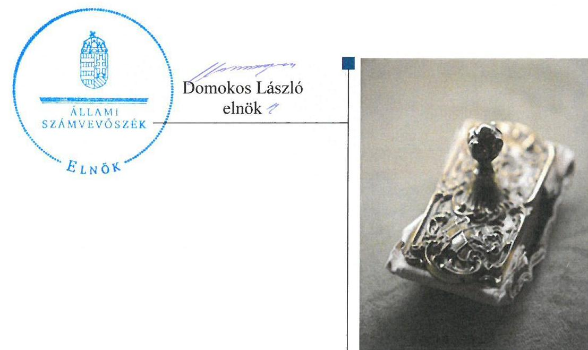

---

# AZ ELLENŐRZÉST FELÜGYELTE: 

PETŐ KRISZTINA felügyeleti vezető

## AZ ELLENŐRZÉST VEZETTE ÉS A VÉGREHAJTÁSÁÉRT FELELŐS:

ZAKAR LÁSZLÓ ellenőrzésvezető

## A PROGRAM ÖSSZEÁLLÍTÁSÁÉRT FELELŐS:

JANIK JÓZSEF LÁSZLÓ osztályvezető

IKTATÓSZÁM: V-0934-251/2016.
TÉMASZÁM: 1771

## ELLENŐRZÉS-AZONOSÍTÓ SZÁM: V071305

Jelentéseink az Országgyűlés számítógépes hálózatán és az Interneten a www.asz.hu címen is olvashatóak.

---

# TARTALOMJEGYZÉK 

■ ÖSSZEGZÉS ..... 5
■ AZ ELLENŐRZÉS CÉLJA ..... 7
■ AZ ELLENŐRZÉS TERÜLETE ..... 8
■ AZ ELLENŐRZÉS HÁTTERE, INDOKOLTSÁGA ..... 10
■ FÓKUSZKÉRDÉSEK ..... 12
■ ELLENŐRZÉS HATÓKÖRE ÉS MÓDSZEREI ..... 13
■ MEGÁLLAPÍTÁSOK ..... 17
■ JAVASLATOK ..... 33
■ MELLÉKLETEK ..... 35
I. Sz. melléklet: Értelmező szótár ..... 35
II. Sz. melléklet: Az integritás érvényesítése érdekében kialakított és működtetett kontrollrendszer ..... 40
III. Sz. melléklet: Teljesítmény-ellenőrzési kiegészítő modul megállapításai ..... 41
■ FÜGGELÉK: ÉSZREVÉTELEK ..... 43
■ RÖVIDÍTÉSEK JEGYZÉKE ..... 65

---

.

---

# ÖSSZEGZÉS 

Az Állami Számvevőszék a Nyugat-dunántúli Vízügyi Igazgatóság pénzügyi és vagyongazdálkodása szabályszerűségének ellenőrzését a 2011. január 1. és 2014. december 31. közötti időszakra végezte el. Az irányító szervek és a középirányító szerv Intézményre vonatkozó feladatellátása szabályszerű volt. A belső kontrollrendszer kialakítása és működtetése megfelelt a jogszabályi előírásoknak. Az Intézmény pénzügyi gazdálkodása részben volt szabályszerű, a vagyongazdálkodása szabályszerű volt. Az Intézmény megfelelően intézkedett az integritás szemlélet érvényesítése érdekében.

## Az ellenőrzés társadalmi indokoltsága

A közpénzek felhasználásában és az állami vagyonnal való gazdálkodásban a központi alrendszer egyes intézményei meghatározó súlyt képviselnek. E szervezetekkel szemben társadalmi igény, hogy tevékenységükről a döntéshozók és a nyilvánosság felé elszámoljanak. Ezzel a társadalmi igénnyel és az Állami Számvevőszék Stratégiájával összhangban, a közpénzügyek átláthatóságának előmozdítása, a közvagyon védelme érdekében került sor a Nyugat-dunántúli Vízügyi Igazgatóság pénzügyi- és vagyongazdálkodásának ellenőrzésére.

## Főbb megállapítások, következtetések, javaslatok

Az irányító szervek és a középirányító szerv Intézményre vonatkozó feladatellátása szabályszerű volt, mert irányítási jogosultságaikat a jogszabályoknak megfelelően gyakorolták. A szabályszerű gazdálkodás követelményeit rendszeresen számon kérték és ellenőrizték. Hiányosság volt, hogy a jogszabályi előírás ellenére az erőforrásokkal való hatékony gazdálkodáshoz szükséges követelményeket nem érvényesítették az Intézménynél. Az irányító szerv 2011. évben közvetlenül és 2012-2014. évek között a középirányító szerven keresztül a jogszabályban előírtaknak megfelelően beszámoltatta az Intézmény vezetőjét az éves szakmai feladatellátásról, továbbá az éves gazdálkodásról.

A belső kontrollrendszer kialakítása és működtetése megfelelt a jogszabályi előírásoknak, mert az öt kontrollpillér közül négy, a kontrollkörnyezet kialakítása, a kockázatkezelési rendszer kialakítása és működtetése, az információs és kommunikációs folyamatok kialakítása, valamint a monitoring rendszer működése szabályszerű volt. Egy pillér, a kontrolltevékenység kialakítása és működtetése részben volt szabályszerű. Ennek oka, hogy a kontrolltevékenységen belül nem volt megfelelő a gazdálkodási jogkörök gyakorlása. Az Intézmény vezetője a 2011-2014. években a jogszabályban foglaltaknak megfelelően kialakított és alkalmazott olyan követelményeket, amelyek biztosították a rendelkezésre álló források gazdaságos, hatékony és eredményes felhasználását.

Az Intézmény pénzügyi gazdálkodása részben volt szabályszerű. Az Intézménynél az elemi költségvetés és az előirányzatok megállapítása során betartották a jogszabályi előírásokat és a belső szabályzatokban foglaltakat. Az Intézmény a saját hatáskörben végrehajtott előirányzat-módosításokat nem a jogszabályi előírásoknak megfelelően hajtotta végre, mert néhány esetben a jogszabályban foglaltak ellenére nem őrizte meg a végrehajtott előirányzat-módosításának a Kincstárhoz történő bejelentését igazoló dokumentumát, valamint az előirányzat-módosítás elrendeléséről szóló dokumentumokat. A kiadási előirányzatok felhasználása során a jogszabályi előírásokat nem tartották be, emiatt a gazdálkodási jogkörök gyakorlása az ellenőrzött időszakban nem megfelelően történt. Az előirányzat maradvány szabályszerű megállapítása kockázatos volt, a felhasználása szabályszerűen történt. Az Intézmény az előirányzat-maradvány terhére vállalt egyes kötelezettségek kincstári bejelentését a 2011-2012. években nem, a 2013-2014. években határidőt követően teljesítette a Kincstár felé. Továbbá a 2012. évi előirányzat-maradvány terhére vállalt kötelezettséghez a kötelezettségvállalási dokumentumot nem őrizte meg. Az Intézmény a zavartalan feladatellátásához a fizetőképesség folyamatos fenntartása, a likviditás javítása érdekében intézkedett. Az eredményszemléletű számvitel bevezetésével kapcsolatos feladatokat szabályszerűen végrehajtotta.

---

Az Intézmény vagyongazdálkodása szabályszerű volt. Az Intézmény rendelkezett vagyonkezelési szerződéssel és a mérlegében kimutatott eszközök és források nyilvántartását, értékelését és leltározását szabályszerűen végezte el. A vagyonkezelési szerződésnek megfelelő értékmegőrzési, állagmegóvási kötelezettségét az Intézmény teljesítette, továbbá a vagyonelemek elidegenítése, hasznosítása során az előírásokat betartotta. Az Intézmény intézkedett az integritás szemlélet érvényesülése érdekében.

---

# **AZ ELLENŐRZÉS CÉLJA**

## **A Nyugat-dunántúli Vízügyi Igazgatóság pénzügyi és vagyongazdálkodásának ellenőrzése**

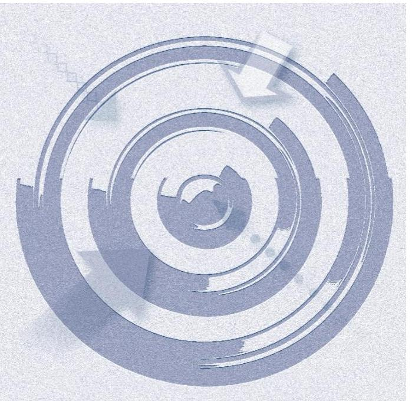

### **A SZABÁLYSZERŰSÉGI ELLENŐRZÉS**

célja annak megítélése volt, hogy az ellenőrzött Intézményre vonatkozó irányító szervi feladatellátás a jogszabályi előírások betartásával történt-e; az Intézménynél a belső kontrollrendszer kialakítása és működtetése szabályszerű volt-e; kialakították-e az erőforrásokkal való szabályszerű, gazdaságos, hatékony és eredményes gazdálkodáshoz szükséges követelményeket, megvalósították-e azok számon kérését, ellenőrzését; az Intézmény¹ pénzügyi és vagyongazdálkodása megfelelt-e a jogszabályi előírásoknak és belső szabályzatainak; az Intézmény átalakításának vagy átszervezésének lebonyolítása szabályszerűen történt-e.

Az Intézmény korrupcióval szembeni veszélyeztetettségének csökkentése érdekében az ÁSZ² felmérte az integritási szemlélet érvényesülését a gazdálkodási folyamatokban.

**A KIEGÉSZÍTŐ TELJESÍTMÉNY-ELLENŐRZÉSI MODUL** célja annak értékelése volt, hogy a gazdálkodás folyamatában a gazdaságossági, hatékonysági és eredményességi követelmények kialakítása megtörtént-e, azokat működtették-e, a célkitűzéseket elérték-e; a pénzügyi és vagyongazdálkodás folyamataira vonatkozóan a költségvetési szerv belső kontrollrendszerének minőségéről kiadott vezetői nyilatkozatban a költségvetési szerv tevékenységében a hatékonyság, eredményesség, gazdaságosság követelményeinek érvényesítésére vonatkozó nyilatkozat helytálló volt-e.

---

# **AZ ELLENŐRZÉS TERÜLETE**

## **Nyugat-dunántúli Vízügyi Igazgatóság**

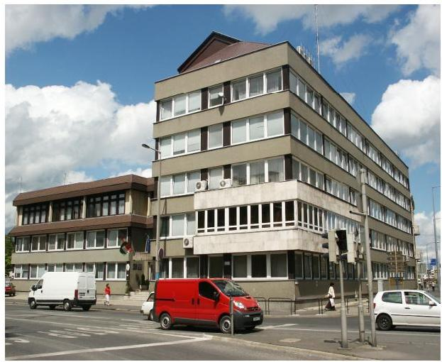

**AZ INTÉZMÉNY** a Kormány által kijelölt vízügyi igazgatási szerv, amelyet az OVF³ létrehozásáról szóló 1060/1953. (IX. 30.) MT⁴ határozattal 1953. október 1-jétől a vízügyi területi feladatok ellátására hoztak létre. Jogállását, közfeladatait, hatáskörét és területi illetékességét a VG tv.⁵, a vizek kártételei elleni védekezés szabályairól szóló Korm. rendelet⁶, valamint a vízügyi, vízvédelmi hatósági feladatokat ellátó szervek kijelöléséről szóló Korm. rendeletek⁷ határozták meg.

Az Intézmény önállóan működő és gazdálkodó központi költségvetési szerv. Az irányító szervi feladatokat 2011. december 31-ig a VM⁸, 2012. január 1-jétől a BM⁹ látta el, az irányítószervi hatásköröket a Miniszter gyakorolta. A középirányító szervi¹⁰ feladatokat 2012. március 23-ától a BM utasítás¹¹ alapján az OVF látta el.

Az Intézménynél az ellenőrzött időszakban az Intézmény vezetője személyében változás történt. Az Intézményt 2012. június 30-ig a VM által kinevezett Intézmény vezető, majd 2012. július 1. - 2012. szeptember 15. között a BM által megbízott, 2012. szeptember 16-tól a BM által kinevezett igazgató vezette. A gazdasági vezető személyében az ellenőrzött időszakban változás nem történt.

Az Intézmény feladatstruktúrája az ellenőrzött időszakban három alkalommal változott. A Korm. rendelet² 41/A. és 41/B. §-ai alapján a 2012. január 1-jétől létrejött NeKI¹²-nek a vízgyűjtő-gazdálkodással, a közműves vízellátással, szennyvízkezeléssel és egyéb vízgazdálkodási koncepcióval kapcsolatos nemzeti és regionális programok elkészítésével, a vizek állapotértékelésével, a vízgazdálkodási információs rendszer üzemeltetésével kapcsolatos feladatokat adtak át. A Korm. rendelet³ 14. § (2) bekezdés b) pontja alapján 2014. január 1-jétől a vízügyi hatósági feladatokat vették át a NyuDuKTVF¹³-től, melyeket a Korm. rendelet⁴ 19. §-a alapján 2014. szeptember 10-én továbbadásra került a VMKI¹⁴ részére. Az Intézményhez került továbbá 2014. szeptember 10-től a VG tv. 3. § (2) bekezdés alapján az állami tulajdonban lévő vizek és vízi létesítmények, a felszín alatti vizek víztartó képződményeinek és a felszíni vizek medreinek vagyonkezelése, az állami tulajdonban lévő vízi létesítmények üzemeltetése, fenntartása és fejlesztése.

Az Intézmény az éves költségvetési beszámolók alapján –az ellenőrzött időszakban – 12 810,8 M Ft összes bevételt teljesített, az összes kiadás 12 161,8 M Ft volt. Az Intézmény 2011. évi engedélyezett létszáma 224 fő volt, ami 2012. évre 202 főre, 2013. évre 207 főre, 2014. évre 221 főre módosult. Az ellenőrzött időszakban közfoglalkoztatás keretében 333-1326 fő alkalmazására is sor került.

---

A 2011-2014. évekre jóváhagyott eredeti, módosított és teljesített bevételi és kiadási előirányzatok alakulását az 1. ábra szemlélteti.
1. ábra
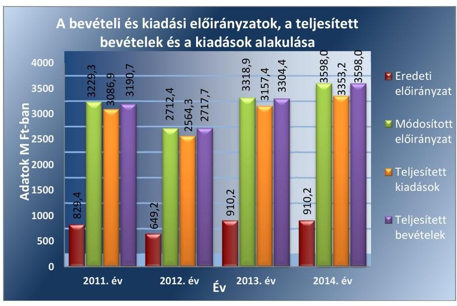

Forrás: éves költségvetési beszámolók (2011-2014.)
Az Intézmény az alapfeladat ellátásán túl védekezési feladatokra és közfoglalkoztatásra kapott előirányzatot, amit hazai és uniós programokból származó pályázati bevételekkel egészített ki.

Az Intézmény könyvviteli mérleg szerinti vagyona a 2011. év eleji 14 822,0 M Ft-ról, a 2014. év végére - 2,5%-kal - 14 455,9 M Ft-ra csökkent. Az ellenőrzött időszakban az Intézmény mérleg szerinti vagyonának alakulását a 2. ábra mutatja be.
2. ábra
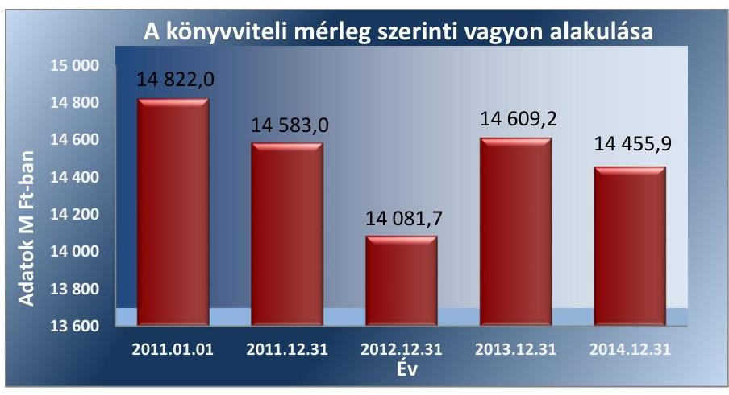

Forrás: éves költségvetési beszámolók (2011-2014.)
A befektetett eszközök állománya a 2011. év eleji 14 217,0 M Ft-ról 2014. évre 14 078,5 M Ft-ra - 1,0%-kal - csökkent. A 2011. év eleji értékről 2014. év végére a kötelezettségek összege 559,6 M Ft-ról 133,6 M Ft-ra csökkent. A saját tőke a 2011. év eleji 14 015,6 M Ft-ról 2013. év végére 14 128,5 M Ft-ra - 0,8%-kal - nőtt, 2014. év végén 13 768,6 M Ft volt.

---

# AZ ELLENŐRZÉS HÁTTERE, INDOKOLTSÁGA 

Az Alaptörvény rendelkezése szerint a nemzeti vagyon megőrzésének, védelmének és a nemzeti vagyonnal való felelős gazdálkodásnak a követelményeit sarkalatos törvény, az Nvtv. ¹⁵ rögzíti. A tulajdonosi joggyakorlás és vagyonkezelés általános és speciális szabályait, az állami vagyon nyilvántartására és elszámolására vonatkozó eljárásokat, a vagyonkezelési szerződés feltételrendszerét, valamint az éves beszámoló készítési és könyvvezetési kötelezettségeket kormányrendelet írja elő.

A központi alrendszer egyes intézményei közfeladat-ellátásának változásait, a közfeladatok átadásából és átvételéből adódó módosításait, előirányzat gazdálkodására ható tényezőit az Áht. ¹⁶ 11. §-a és az Ávr. ¹⁷ 14. §-a írja elő. A közfeladatok megszűnéséből, intézmény átszervezéséből, belső szerkezeti korszerűsítéséből, vagy más hasonló okból adódó módosításai miatt szerepeltetendő szerkezeti változásokat, valamint a szerkezeti változásként beépült közfeladatok szintre hozásként történő számításba vételét az Ávr. 15. § (2)-(3) bekezdései határozzák meg.

A társadalmi igénnyel összhangban az Áht. ¹⁸ és az Ámr. ¹⁹ és a Bkr. ²⁰ is előírja a költségvetési szerv részére, hogy olyan követelményeket alakítson ki, amelyek biztosítják a működés, gazdálkodás, az erőforrások felhasználása során a gazdaságosság, hatékonyság és eredményesség érvényesülését. Az Ámr. és a Bkr. alapján az Intézményvezetőnek évente nyilatkoznia is kell arról, hogy gondoskodott-e az Intézmény tevékenységében a gazdaságosság, hatékonyság és eredményesség követelményeinek érvényesítéséről. A gazdaságos, hatékony és eredményes gazdálkodáshoz szükség van a teljesítménymérés feltételeinek kialakítására, úgymint az egyértelmű és mérhető célokra, mutatószámokra és az ezekhez rendelt követelményekre. Az ÁSZ jelen ellenőrzéssel győződik meg arról, hogy az Intézménynél a teljesítménycélokat, -mutatókat, -követelményeket kialakították-e, azokat működtették-e, a kitűzött cél(ok) teljesültek-e.

AZ ELLENŐRZÉS EREDMÉNYEKÉPPEN nemcsak az ellenőrzött intézmények gazdálkodása javulhat, hanem átfogó képet kaphatunk a központi alrendszerbe tartozó költségvetési szervek gazdálkodásának hiányosságairól, de a jó gyakorlatokról is. Ellenőrzéseivel, javaslataival és megállapításaival az ÁSZ elősegítheti a költségvetési szervek pénzügyi és vagyongazdálkodása szabályozásának javítását és hozzájárulhat a jó kormányzáshoz. Az ellenőrzés az ellenőrzött számára visszajelzést ad a pénzügyi és vagyongazdálkodásában feltárt hiányosságokról,
 javaslataival hozzájárul azok kiküszöböléséhez, amely csökkentheti a későbbi ellenőrzések gyakoriságát. Az ellenőrzés megállapításait és javaslatait más szervezetek is hasznosíthatják a rendezett gazdálkodási keretek kialakításához.

## A TELJESÍTMÉNY-ELLENŐRZÉSI KIEGÉSZÍTŐ

MODUL alapján elvégzett ellenőrzés a törvényalkotás számára támogatást nyújt a nemzeti kulcsindikátorok rendszerének kialakításához. A döntéshozók, ellenőrzöttek, irányító szervek, a társadalom számára az összehasonlítási, összemérési lehetőségek kihasználásával objektív visszajelzést ad a gazdálkodás területén végrehajtott szervezeti, szervezési, takarékos-

---

sági és bürokráciacsökkentő intézkedések hatásairól, a közfeladat-ellátásnak keretet adó pénzügyi és vagyongazdálkodásban mérhető teljesítménykövetelmények kialakításáról, azok alkalmazásáról.

---

# FÓKUSZKÉRDÉSEK 

1.     - Az irányító szerv ellenőrzött intézményre vonatkozó feladatellátása szabályszerű volt-e?
2.     - A belső kontrollrendszer kialakítása és működtetése megfelelt-e a jogszabályi előírásoknak?
3.     - Az Intézmény pénzügyi gazdálkodása szabályszerű volt-e?
4.     - Az Intézmény vagyongazdálkodása szabályszerű volt-e?
5.     - Szabályszerűen hajtották-e végre az ellenőrzött időszakban az Intézményt érintő szervezeti, szerkezeti átalakításokat?
6.     - Az Intézmény intézkedett-e az integritás szemlélet érvényesítése érdekében?

---

# ELLENŐRZÉS HATÓKÖRE ÉS MÓDSZEREI 

## Az ellenőrzés típusa

Szabályszerűségi ellenőrzés, amelyet teljesítmény-ellenőrzési modul egészített ki.

## Az ellenőrzött időszak

Az ellenőrzött időszak 2011. január 1-jétől 2014. december 31-ig terjedő időszak volt.

## Az ellenőrzés tárgya

Az ellenőrzött szervezetre vonatkozó irányító szervi feladatok ellátása. Az Intézmény belső kontrollrendszerének kialakítása és működtetése, valamint pénzügyi és vagyongazdálkodása. Az erőforrásokkal való szabályszerű, gazdaságos, hatékony és eredményes gazdálkodáshoz szükséges követelmények kialakítása, a kialakított követelmények számonkérés, ellenőrzése. Az Intézmény átalakítása, átszervezése lebonyolításának szabályszerűsége.

A teljesítmény-ellenőrzési kiegészítő modul esetében az intézmény gazdálkodási folyamatában a gazdaságossági, hatékonysági és eredményességi követelmények kialakítása és működtetése, a célkitűzések teljesítésének értékelése. Az Intézmény tevékenységében a hatékonyság, eredményesség, gazdaságosság követelményei érvényesítéséről kiadott nyilatkozat helytállósága. A teljesítmény-ellenőrzés fókuszkérdéseire a III. számú melléklet ad választ.

Az ellenőrzés kiterjedt minden olyan körülményre és adatra, amely az ÁSZ jogszabályban meghatározott feladatainak teljesítéséhez, valamint a programok végrehajtása folyamán felmerült újabb összefüggések feltárásához voltak szükségesek.

## Az ellenőrzött szervezet

A Nyugat-dunántúli Vízügyi Igazgatóság, a 2011. évi irányítószervi feladatok vonatkozásában a Földművelésügyi Minisztérium, a 2012-2014. évi irányítószervi/középirányító szervi feladatok vonatkozásában a Belügyminisztérium és az Országos Vízügyi Főigazgatóság.

---

# Az ellenőrzés jogalapja 

Az ellenőrzés jogszabályi alapját az ÁSZ tv. ${ }^{21}$ 1. § (3) bekezdés, 5. § (2)-(7) bekezdései, valamint Áht. 2 61. § (2) bekezdésének előírásai képezték.

## Az ellenőrzés módszerei

Az ellenőrzést az ellenőrzési program szempontjai, az ellenőrzött időszakban hatályos jogszabályok, az ellenőrzés szakmai szabályai, az egyes ellenőrzési típusokhoz kapcsolódó ÁSZ módszertanok és nemzetközi standardok figyelembevételével végeztük. A gazdálkodás hibáinak kijavítására, a közpénzekkel való felelős gazdálkodás segítésére irányuló javaslatok kidolgozásakor a hatályos jogszabályok voltak az irányadóak.

Az ellenőrzés ideje alatt az ellenőrzött szervezettel történő kapcsolattartást az ÁSZ SZMSZ ${ }^{22}$-ének vonatkozó előírásai alapján biztosítottuk.

Az ellenőrzési kérdések megválaszolásához szükséges bizonyítékok megszerzése a következő ellenőrzési eljárások alkalmazásával történt: megfigyelés, szemle (szemrevételezés), kérdésfeltevés (információkérés), mintavételezés, valamint elemző eljárás. A minták kiválasztása során elsősorban reprezentativitást biztosító véletlen mintavételi eljárást alkalmaztunk.

Az ellenőrzési bizonyítékként felhasználható adatforrások közé tartoztak egyrészt a szakmai program részletes szempontjainál felsorolt adatforrások, másrészt adatforrás volt minden egyéb - az ellenőrzés folyamán feltárt, az ellenőrzés szempontjából releváns információt tartalmazó - dokumentum.

Az ellenőrzés lefolytatásához az intézmény a tanúsítványok elektronikus kitöltésével, valamint az ÁSZ által kért dokumentumok elektronikus megküldésével szolgáltatott adatokat. A rendelkezésre bocsátott adatok, információk kontrollja az ellenőrzés keretében történt.

Az ellenőrzési kérdésekre adott válaszok alapján értékeltük, hogy az ellenőrzött időszakban az irányítószervi feladatok vonatkozásában a Földművelésügyi Minisztérium és a BM, valamint a középirányító szervi feladatok vonatkozásában az OVF az ellenőrzött intézményre vonatkozó feladatainak szabályszerűen eleget tett-e, az Intézmény pénzügyi és vagyongazdálkodása megfelelt-e az előírásoknak, az Intézmény átalakításának vagy átszervezésének végrehajtása szabályszerű volt-e. Értékeltük, hogy az Intézménynél kialakították-e az erőforrásokkal való szabályszerű és hatékony gazdálkodáshoz szükséges követelményeket, megvalósították-e azok számonkérését, ellenőrzését.

Az Intézmény belső kontrollrendszere jogszabályi előírások szerinti kialakításának és működtetésének szabályszerűségét az erre irányuló ellenőrzési kérdésekre adott válaszok összesítése alapján, évente pillérenként (kontrollkörnyezet, kockázatkezelési rendszer, kontrolltevékenységek, információs és kommunikációs rendszer, monitoring rendszer) és összesítetten is minősítettük. Az Intézmény belső kontrollrendszere egyes pilléreinek kialakítását és működtetését „szabályszerű"-nek minősítettük, amennyiben az értékelt területen az elért és elérhető pontok százalékban kifejezett,

---

egész számra kerekített hányadosa meghaladta a 84%-ot, „részben szabályszerű"-nek minősítettük, ha a 84%-ot nem haladta meg, de 60%-nál nagyobb volt, „nem szabályszerű"-nek minősítettük, ha nem haladta meg a 60%-ot. Az Intézmény belső kontrollrendszerének összesített értékelése megegyezik a pillérenként (kontrollterületenként) alkalmazott %-os értékelésekkel, a következő eltérésekkel. A kontrollrendszer egésze esetében a „szabályszerű" értékelésnek a %-os értéken felül további feltétele volt, hogy egyik kontrollterület sem kaphatott „nem szabályszerű" értékelést, a „részben szabályszerű" értékelés további feltétele volt, hogy legfeljebb egy ellenőrzött kontrollterület lehetett „nem szabályszerű" értékelésű. Az összesített értékelés a %-os értéktől függetlenül „nem szabályszerű"-nek minősült, ha az ellenőrzött kontrollterületek közül több mint egy „nem szabályszerű" értékelést kapott.

A tárgyi eszközök nyilvántartásba vételének, a közbeszerzési eljárások lefolytatásának, a vagyonhasznosítási bevételi előirányzatok teljesítésének, az előirányzatok módosításának és az előirányzat-maradvány megállapításának szabályszerűségét, valamint a gazdálkodási jogkörök gyakorlásának szabályszerűségét mintavétellel ellenőriztük.

A jogszabályoknak és a belső előírásoknak megfelelőnek tekintettük a tárgyi eszközök nyilvántartásba vételét, a vagyonhasznosítási bevételi előirányzatok teljesítését, az előirányzatok módosítását és az előirányzat-maradvány megállapítását, amennyiben a minta ellenőrzésének eredménye alapján 95%-os bizonyossággal a teljes sokaságban a hibás tételek aránya kisebb volt, mint 10%, nem megfelelőnek értékeltük, ha a hibás tételek aránya a 10%-ot meghaladta. Kockázatot, illetve magas kockázatot jeleztünk, amennyiben egy adott terület vonatkozásában a minta alapján a teljes sokaságban nem volt egyértelműen biztosított a jogszabályoknak és a belső szabályzatoknak megfelelő működés.

A közbeszerzési eljárások esetében az ellenőrzött mintatételek értékelését végeztük el.

A 2011. évet érintően a szakmai teljesítésigazolás és az utalvány ellenjegyzése kulcskontrollok, a 2012-2014. éveket érintően a teljesítésigazolás és az érvényesítés kulcskontrollok működését értékeltük. Megfelelőnek értékeltük a gazdálkodási jogkörök gyakorlását, amennyiben 95%-os bizonyossággal a teljes sokaságban a hibás tételek aránya legfeljebb 10% volt, részben megfelelőnek, ha a hibás tételek arányának felső határa legfeljebb 30% volt, nem megfelelőnek, ha a hibás tételek sokaságbeli arányának felső határa meghaladta a 30%-ot.

Az integritás szemlélet érvényesülésének értékelése az Intézmény által kitöltött tanúsítványa alapján történt.

Az alapprogram alapján ellenőriztük, hogy a költségvetési szerv vezetője megtette-e nyilatkozatát arról, hogy gondoskodott a költségvetési szerv tevékenységében a hatékonyság, eredményesség és a gazdaságosság követelményeinek érvényesítéséről. Ezt kiegészítve, a teljesítmény-ellenőrzési kiegészítő modul keretében - felhasználva az alapprogram szerinti ellenőrzés megállapításait - értékeltük, hogy a költségvetési szerv vezetője kialakította-e a gazdaságossági, hatékonysági és eredményességi követelményeket, és azokat működtette-e, a célkitűzéseket elérte-e.

A teljesítmény-ellenőrzési kiegészítő modul a gazdálkodási feladatokra terjedt ki, a szakmai feladatellátást nem értékelte.

---

A gazdálkodási feladatok értékelése az alábbi területekre terjedt ki:
pénzügyi gazdálkodási (nem szakmai, adminisztratív) feladatok: költségvetés-, beszámoló-készítés, könyvvezetés, adatszolgáltatások, előirányzat-gazdálkodás, kötelezettségvállalások nyilvántartása, kezelése, bevételkezelés, bér- és illetményszámfejtés;
$\longrightarrow$ vagyongazdálkodási (logisztikai) feladatok: közbeszerzések és közbeszerzési értékhatárt el nem érő beszerzések, készletgazdálkodás, nyomtatók, fénymásolók üzemeltetése, épület- és ingatlanüzemeltetés, karbantartás, hibabejelentés, gépjármű és flottamenedzsment.
Az ellenőrzés során minden olyan körülményt és adatot is ellenőriztünk, amely a program végrehajtása kapcsán felmerült újabb összefüggéseknek az ellenőrzés céljaival összhangban lévő feltárásához szükséges. A teljesítmény-ellenőrzési kiegészítő programmodulban megfogalmazott ellenőrzési cél megválaszolásához az alapprogram végrehajtása során megfogalmazott megállapításokat is figyelembe vettük.

---

# 1. Az irányító szerv ellenőrzött intézményre vonatkozó feladatellátása szabályszerű volt-e? 

Összegző megállapítás

Az irányító szerv ${ }_{1,2}$ és a középirányító szerv Intézményre vonatkozó feladatellátása szabályszerű volt, kivéve, hogy az erőforrásokkal való hatékony gazdálkodáshoz szükséges követelmények érvényesítése, számon kérése és ellenőrzése nem valósult meg.
1.1. számú megállapítás

Az irányító szerveket megillető jogosultságok gyakorlása a jogszabályi előírásoknak megfelelően történt.

AZ INTÉZMÉNY IRÁNYÍTÓ SZERVE 2011. évben a VM volt. 2012. január 1-jétől a Kormányrendelet ${ }_{2}{ }^{23}$ hatálybalépésével az Intézmény irányító szerve a BM, valamint középirányító szerve az OVF lett.

Az Intézmény az ellenőrzött időszak alatt rendelkezett az irányító $\operatorname{szerv}_{1,2}{ }^{24}$ által az államháztartásért felelős miniszter előzetes egyetértésével kiadott, az Áht.1,2, az Ámr., illetve az Ávr. által előírtaknak megfelelő tartalmú Alapító okirat ${ }_{1-6}$-tal ${ }^{25}$.

Az ellenőrzött időszakban az Intézmény Alapító okirata öt alkalommal módosult. A módosítások a jogszabályi előírásoknak megfelelően történtek és az Alapító okirat ${ }_{2-6}$-ot - az Ámr.-ben, illetve az Ávr.-ben előírtaknak megfelelően - a módosításokkal egységes szerkezetbe foglalták.

Az irányító szerv ${ }_{2}$ a 2012 májusától érvényben lévő Alapító okirat ${ }_{3}$-ban jelölte meg az OVF-et középirányító szervként, és az Alapító okirat ${ }_{4}$-ben nevesítette először az Áht. 2 9. § (1) bekezdés f), g) és h) pontjait a középirányító szerv irányítási hatásköreként.

Az irányító szerv ${ }_{1,2}$ az Áht. 1 93. § (1) bekezdés (a) pont és az Áht. 2 9. § (1) bekezdés e) pont és 2013. január 1-jétől az a) pont szerinti - az Intézmény SZMSZ-ének jóváhagyására irányuló - irányítási jogát gyakorolta. Az Intézmény SZMSZ ${ }_{2}{ }^{26}$-e nem volt teljesen összhangban az alapító okirattal, mert az Ámr. 20. § (2) b) és az Ávr. 13. § (1) bekezdés b) pontok előírása ellenére az SZMSZ ${ }_{1}$ nem tartalmazta a hatályos, egységes szerkezetbe foglalt alapító okirat keltét, számát.

---

### 1.2. számú megállapítás

Az irányító szervek ${ }_{1-2}$ részéről a közfeladatok ellátására vonatkozó, az erőforrásokkal való szabályszerű gazdálkodáshoz szükséges követelményeket érvényesítették, számon kérték - és a 2011. év kivételével - ellenőrizték. Az irányító szerv ${ }_{1,2}$ és a középirányító szerv az erőforrásokkal való hatékony gazdálkodáshoz szükséges követelményeket nem érvényesített, így nem volt biztosított a számonkérhetőség és az ellenőrizhetőség.

AZ IRÁNYÍTÓ SZERV1 a 2011. évben a költségvetési gazdálkodás felügyeletén, az előirányzatok meghatározásán és számonkérésén túl -az Áht. ${ }_{1} 49 . \S$ (5) bekezdés f) pontjában előírtak ellenére - nem érvényesített további, a közfeladatok ellátására vonatkozó, az erőforrásokkal való hatékony gazdálkodással összefüggő követelményeket, a gazdálkodás szabályszerűségére és hatékonyságára vonatkozó ellenőrzést nem végzett.

## AZ IRÁNYÍTÓ SZERV2 ÉS A KÖZÉPIRÁNYÍTÓ

SZERV - az Áht. ${ }_{2}$ előírásának megfelelően - a 2012-2014. években szabályszerű gazdálkodás követelményeit érvényesítette, rendszeresen számon kérte és ellenőrizte. A számonkérés a költségvetési beszámolóknak, szöveges beszámolóknak, negyedéves mérlegjelentéseknek a középirányító szervnek történő megküldésével történt meg. Az irányító szerv ${ }_{2}$ és a középirányító szerv szabályszerűségi ellenőrzéseket a 2012-2014. évek alatt lefolytatott.

Az irányító szerv ${ }_{2}$ és a középirányító szerv a 2012-2014. években az Áht. ${ }_{2} 9 . \S$ (1) bekezdés f) pontjában előírt az Intézmény által ellátandó közfeladatok ellátására vonatkozó, erőforrásokkal való hatékony gazdálkodáshoz szükséges követelményeket nem érvényesített, aminek
 hiányában számonkérés és ellenőrzés sem történt.
1.3. számú megállapítás

Az irányító szervek és a középirányító szerv Intézménnyel kapcsolatos egyéb ellenőrzési, irányítási jogosultságait szabályszerűen gyakorolta.

## AZ IRÁNYÍTÓ SZERV1,2 ÉS A KÖZÉPIRÁNYÍTÓ

SZERV az Áht. 1,2-ben előírtaknak megfelelően rendszeresen figyelemmel kísérték az Intézmény bevételi és kiadási előirányzatokkal való gazdálkodását.

Az ellenőrzött időszakban az Intézmény vezetőjének megbízása és az Intézmény vezetőjének, valamint gazdasági vezetőjének az irányító szerv 1,2 általi kinevezési módosításai a jogszabályoknak megfelelően történtek.

Az irányító szerv 1,2 (2011. évben közvetlenül és 2012-2014. évek között a középirányító szerven keresztül) az Áht. 1-2-ben előírtaknak megfelelően beszámoltatta az Intézmény vezetőjét az éves szakmai feladatellátásról, továbbá az éves gazdálkodásról. Az Intézmény éves költségvetési beszámolóit, valamint a szakmai tevékenységről szóló jelentéseit az irányító szerv1,2 a 2011-2014. években elfogadta.

---

# 2. A belső kontrollrendszer kialakítása és működtetése megfelel-e a jogszabályi előírásoknak? 

## Összegző megállapítás

A belső kontrollrendszer kialakítása és működtetése összességében megfelelt a jogszabályi előírásoknak.

A belső kontrollrendszer kialakításának és működtetésének értékelését az 1. táblázat mutatja.

1. táblázat

## A BELSŐ KONTROLLRENDSZER KIALAKÍTÁSÁNAK ÉS MŰKÖDTETÉSÉNEK ÉRTÉKELÉSE

| Megnevezés | Kontrollkörnyezet | Kockázatkezelési rendszer | Kontrolltevékenységek | Információ és kommunikáció | Monitoring | ÖSSZÉSEN |
| :--: | :--: | :--: | :--: | :--: | :--: | :--: |
| 2011. | szabályszerű | szabályszerű | részben szabályszerű | szabályszerű | szabályszerű | szabályszerű |
| 2012. | szabályszerű | szabályszerű | részben szabályszerű | szabályszerű | szabályszerű | szabályszerű |
| 2013. | szabályszerű | szabályszerű | szabályszerű | szabályszerű | szabályszerű | szabályszerű |
| 2014. | szabályszerű | szabályszerű | szabályszerű | szabályszerű | szabályszerű | szabályszerű |
| 2011 - 2014 átlaga | szabályszerű | szabályszerű | részben szabályszerű | szabályszerű | szabályszerű | szabályszerű |

2.1. számú megállapítás

A kontrollkörnyezet kialakítása szabályszerű volt.

## AZ INTÉZMÉNY KONTROLLKÖRNYEZETÉNEK KIALAKÍTÁSA valamennyi év vonatkozásában és összességében is szabályszerű volt, megfelelt az Áht.1,2, a Kbt.1,2 27, a Számv. tv. 28, valamint az Áhsz. 1,229, az Ámr., az Ávr., és a Bkr. előírásainak.

Az Intézmény az ellenőrzött időszakban rendelkezett hatályos SZMSZ1-330-mal, amely a jogszabályi előírásoknak megfelelően tartalmazta az Intézmény szervezeti felépítését, működési rendjét, a szervezeti egységek ezen belül a gazdasági szervezet - megnevezését, engedélyezett létszámát, a költségvetési szerv szervezeti ábráját. Az SZMSZ1 az Ámr. 20. § (2) bekezdés c) pontjában, valamint az Ávr. 13. § (1) bekezdés c) pontjában foglaltak ellenére nem tartalmazta az ellátandó, és a szakfeladat rend szerint (szakfeladat számmal és megnevezéssel) besorolt alaptevékenységeket. A hiányosságot az SZMSZ2-ben megszüntették.

Az Intézmény rendelkezett Gazdasági ügyrend1-3-mal31, valamint az Intézmény vezetője32 által jóváhagyott Számviteli politika1-4-gyel33. A Számviteli politika1,2 az Áhsz.1 8. § (5) bekezdésben foglaltak ellenére nem tartalmazta, hogy mit tekint az Intézmény a számviteli elszámolás, az értékelés szempontjából nem lényegesnek, nem jelentősnek. Az Intézmény a Számviteli politika1-4 keretében elkészítette a Leltározási szabályzat1-4-et34, az Értékelési szabályzat1-4-et35, a Pénzkezelési szabályzat1-4-et36, valamint az Önköltségszámítás szabályzata1-3-at37.

Az Intézmény a jogszabályok szerint rendelkezett Számlarend1-4-gyel38, valamint az azt alátámasztó Bizonylati rend1-3-mal39.

Az Intézmény rendelkezett a jogosult vezető által aláírt, a gazdálkodás részletes rendjét meghatározó Gazdálkodási szabályzat1-4-gyel40. Az Intézmény vezetője 2011. január 1. - 2013. május 10. között a Gazdálkodási

---

szabályzat1,2-ben a kötelezettségvállalási jogkör átruházásának szabályozásakor figyelmen kívül hagyta az Ámr. 72. § (3) bekezdés a) pontjában, valamint az Ávr. 52. § (1) bekezdés a) pontjában foglaltakat, amikor nem kötötte írásbeliséghez a kötelezettségvállalási jogkör gyakorlására való felhatalmazást. (2013. május 10-étől a Gazdálkodási szabályzat3,4 már összhangban volt a jogszabállyal.)

Az Intézmény rendelkezett a jogosult vezető által aláírt a Kbt.1,2 előírásainak megfelelő Közbeszerzési szabályzat1-4-gyel41. A Kbt.1,2 hatálya alá nem tartozó beszerzések lebonyolításának rendjét a 2011. január 1-2013. április 1-je között a Készlet-gazdálkodási szabályzatban42, ezt követően a Közbeszerzési szabályzat3,4-ben szabályozták.

Az Intézmény vezetője 2011-2014. években elkészítette az Intézmény ellenőrzési nyomvonalát, amely a jogszabálynak megfelelően tartalmazta a pénzgazdálkodással és vagyongazdálkodással kapcsolatos információs, felelősségi szinteket és kapcsolatokat, illetve az irányítási, ellenőrzési, működési folyamatokat táblázatokkal szemléltetett formában.

Az Intézmény vezetője az etikai elvárásokat a 2011. évben az Ámr. 156. § (1) bekezdés c) pontjában foglaltakkal ellentétben nem alakította ki. Az Intézmény 2012. október 9-étől rendelkezett az alkalmazottakkal szemben támasztott magatartási és viselkedési követelményeket tartalmazó Etikai szabályzattal43.

# 2.2. számú megállapítás 

A kockázatkezelési rendszer kialakítása és működtetése szabályszerű volt.

AZ INTÉZMÉNY KOCKÁZATKEZELÉSI RENDSZERÉNEK KIALAKÍTÁSA ÉS MŰKÖDTETÉSE valamennyi ellenőrzött évben szabályszerű volt, megfelelt a jogszabályi előírásoknak.

Az Intézmény vezetője az Ámr. és a Bkr. előírásainak megfelelően kialakította és működtette az Intézmény kockázatkezelési rendszerét. Megfogalmazta a kockázat fogalmát, a kockázatok azonosításával, elemzésével, csoportosításával, a kockázati kitettség csökkentésével kapcsolatos szabályokat, a kockázatelemzés során felmérte, és meghatározta a szervezet tevékenységében, gazdálkodásában rejlő kockázatokat.

Az Intézmény az Ámr. 157. § (3) bekezdésében foglaltak ellenére 2011. évben nem határozta meg az egyes kockázatokkal kapcsolatban szükséges intézkedéseket. A 2012-2014. évben az Intézmény a Bkr.-ben foglaltak szerint meghatározta az egyes kockázatokkal kapcsolatban szükséges intézkedéseket, valamint a kockázatok kezelése érdekében szükséges intézkedések teljesítésének folyamatos nyomon követési módját.

A 2011-2012. években a vagyonnyilatkozat tételre kötelezettek körét az SZMSZ1 tartalmazta. A 2013-2014. években az Intézmény a Vnytv.44 4. § a) bekezdésében foglaltakat megsértve a vagyonnyilatkozat tételre kötelezettek körét nem az SZMSZ-ben, hanem az Ügyrend1,2-ben szabályozta.
2.3. számú megállapítás

A kontrolltevékenység kialakítása és működtetése részben volt szabályszerű.

A KONTROLLTEVÉKENYSÉG KIALAKÍTÁSA ÉS MŰKÖDTETÉSE a 2011-2012. években részben felelt meg, a 2013-2014. években megfelelt a jogszabályi előírásoknak.

---

A 2011. évben az Áht.1 121/A. § (4) bekezdés c) pontjában, a 2012-2014. években a Bkr. 8. § (2) bekezdés c) pontjában foglaltak ellenére részben biztosították a folyamatba épített, előzetes, utólagos és vezetői ellenőrzést (FEUVE) az előzetes és utólagos pénzügyi ellenőrzés, a pénzügyi döntések szabályszerűségi szempontból történő jóváhagyása, illetve ellenjegyzése vonatkozásában.

A gazdálkodási jogkörök 2011. évben a szakmai teljesítésigazolás és utalvány ellenjegyzése, a 2012. évtől teljesítésigazolás és érvényesítés működtetése nem felelt meg a jogszabályoknak. A feltárt hiányosságokat részletesen a 3.3. számú megállapítás tartalmazza.

Az Intézmény vezetője az Ámr. és a Bkr. előírásainak megfelelően a felelősségi körök meghatározásával a belső szabályzataiban szabályozta az engedélyezési, jóváhagyási és kontrolleljárásokat, a dokumentumokhoz, az informatikai rendszerekhez való hozzáférés jogosultságait, a hozzáférés szintjeit, valamint a beszámolási eljárásokat. Az Intézmény vezetője az alkalmazott iratkezelési szoftver által kezelt adatok biztonsága érdekében az lkr.45-ben foglaltakat figyelembe véve - az Iratkezelési szabályzat1-346 keretében kialakította az üzembiztonsági, adatvédelmi szabályok érvényre juttatásához szükséges eljárási szabályokat. Az adatok biztonságának, védelmének érvényre juttatásához szükséges eljárási szabályokat - az Avtv.47-ben és az Info. tv.-ben foglaltaknak eleget téve - az IB1-448 tartalmazta.

# 2.4. számú megállapítás 

Az információs és kommunikációs folyamatok kialakítása a jogszabályi előírásoknak megfelelt.

AZ INFORMÁCIÓS ÉS KOMMUNIKÁCIÓS FOLYAMATOK kialakítása az ellenőrzött valamennyi évben megfelelt a jogszabályi előírásoknak.

Az Intézmény vezetője az Ámr. és a Bkr. előírásainak megfelelően kialakította a szervezeten belüli, valamint a szervezeten kívülre történő információátadás rendszerét, amely biztosította a külső felek (illetékes szervezetek) részére a megfelelő információk, megfelelő időben történő eljutását.

Az Intézmény rendelkezett az Avtv. és az Info tv.49 előírásainak megfelelően a jogosult vezető által aláírt Adatvédelmi és adatbiztonsági szabályzat1,2-vel50. Az Intézmény a Közérdekű adatok szabályzata1-3-ban51 rendezte a közérdekű adatok megismerésének rendjét, valamint a kötelezően közzéteendő adatok nyilvánosságra hozatalának rendjét. Az Intézmény az Ltv.52 10. § (1) bekezdés b) pontjával ellentétben az Iratkezelési szabályzat1-3-at nem az illetékes szaklevéltárral egyetértésben adta ki.
2.5. számú megállapítás

A monitoring rendszer működése, a rendelkezésre álló források gazdaságos, hatékony és eredményes felhasználását biztosító követelmények kialakítása és alkalmazása a jogszabályi előírásoknak és a belső szabályzatokban foglaltaknak megfelelt.

A MONITORING RENDSZER MŰKÖDÉSE, a rendelkezésre álló források gazdaságos, hatékony és eredményes felhasználását biztosító követelmények kialakítása és alkalmazása az ellenőrzött években megfelelt az Áht.1,2, az Ámr., a Ber.53 és a Bkr. előírásainak.

---

A 2011-2014. években az Intézmény a belső szabályzataiban határozta meg azokat az operatív tevékenységeket illetve egyéb területeket, amelyekre a monitoring kiterjedt. A monitoring információk alapján a célok megvalósításának nyomon követését lehetővé tevő jelentések, feljegyzések az ellenőrzött időszak alatt készültek.

A 2011-2014. évekre vonatkozóan a belső kontrollrendszer működéséről kiadott éves vezetői nyilatkozatok a hatékonyság, eredményesség és gazdaságosság követelményeinek érvényesítése vonatkozásában megfelelőek voltak. Az Intézmény vezetője kialakított és alkalmazott olyan követelményeket (szabályozásokat, folyamatokat, indikátorokat) amelyek az Intézmény tevékenységében a rendelkezésre álló források szabályozott, gazdaságos, hatékony és eredményes felhasználását szolgálták.

Az Intézmény vezetője betartotta a jogszabályi előírásokat a belső ellenőrzési rendszer kialakítása és működtetése során. A belső ellenőrzés kialakításáról egy fő belső ellenőr alkalmazásával gondoskodott, továbbá az Intézménynél biztosította a belső ellenőrzés szervezeti és funkcionális függetlenségét. A belső ellenőri feladatellátásnál érvényesültek az összeférhetetlenségi előírások.

Az Intézmény rendelkezett a Ber. és a Bkr. szerinti rendszeresen felülvizsgált, aktualizált Belső Ellenőrzési Kézikönyv1-4-gyel54. Az Intézmény rendelkezett a Ber. és a Bkr. előírásainak megfelelően kockázatelemzésen alapuló az Intézmény vezetője által jóváhagyott stratégiai és éves ellenőrzési tervvel.

A belső ellenőr az éves ellenőrzési tervekben foglalt ellenőrzéseket végrehajtotta, az elvégzett ellenőrzések megállapításait, javaslatait a Ber. és a Bkr. szerinti jelentésekbe foglalta. A belső ellenőrzési vezető a jogszabály szerinti tartalommal 2011-2014. években elkészítette az éves ellenőrzési jelentést.

A belső ellenőrzés javaslatainak végrehajtása érdekében az ellenőrzött szervezeti egységek vezetői a Ber. és a Bkr. előírásainak megfelelően az ellenőrzések megállapításai, és javaslatai alapján intézkedési tervet készítettek. Az Intézmény vezetője az intézkedési terv jóváhagyásáról az intézkedési terv kézhezvételétől számított 8 napon belül - a belső ellenőrzési vezető véleményének kikérésével - döntött.

A 2011. évben az Intézmény vezetője a Ber. 29/A. § (1) és (7) bekezdésében foglaltak ellenére nem vezetett nyilvántartást a belső ellenőrzési jelentésekben tett megállapítások, javaslatok hasznosulásának és végrehajtásának nyomon követéséről, helyette a belső ellenőrzési vezető tett eleget a Ber. előírásai szerinti kötelezettségnek.

Az Intézmény vezetője a Bkr.-ben foglaltaknak megfelelően nyilvántartást vezetett a külső ellenőrzések javaslatai alapján készült intézkedési tervek végrehajtásáról.

---

# 3. Az Intézmény pénzügyi gazdálkodása szabályszerű volt-e? 

## Összegző megállapítás

Az Intézmény pénzügyi gazdálkodása
 részben volt szabályszerű.

### 3.1. számú megállapítás

Az Intézmény az elemi költségvetés és az előirányzatok megállapítása során betartotta a jogszabályi előírásokat és a belső szabályzatokban foglaltakat.

Az Intézmény az elemi költségvetéseinek elkészítésekor betartotta a felügyeleti szerv által meghatározott keretszámokat, az előirányzatok megállapítása megfelelt a jogszabályokban, az NGM rendelet ${ }_{1,2}{ }^{55}$-ben foglaltaknak, valamint a vonatkozó belső szabályozások előírásainak. Az Intézmény a költségvetés elkészítését az SZMSZ ${ }_{1-3}$-ban, valamint az Ügyrend ${ }_{1,2}{ }^{-}$ben $^{56}$ a gazdasági igazgatóhelyettes feladataként határozta meg. A költségvetés elkészítésének feladatát a gazdasági igazgatóhelyettes munkaköri leírásai ${ }_{1-4}{ }^{57}$ is rögzítették. A költségvetés elkészítésének részfeladatai, az ellenőrzési nyomvonal részét képezték a gazdasági igazgatóhelyettes felelősként való megjelölése mellett.

Az Intézmény a kiadási és bevételi előirányzatok tervezését a megalapozottság és a végrehajthatóság biztosítása érdekében számításokkal támasztotta alá.

A 2011-2014. évek mindegyikében fennállt az egyezőség a kincstári költségvetés és az elemi költségvetés kiemelt kiadási és bevételi előirányzat adatai között. Az Intézmény a jogszabályokban előírt adatszolgáltatási kötelezettségének eleget tett. Az irányító szerv ${ }_{1,2}$ elfogadta az Intézmény elemi költségvetését az érintett időszakban.
3.2. számú megállapítás

A bevételi és kiadási előirányzatok módosítását nem a jogszabályi előírásoknak és a belső szabályzatokban foglaltaknak megfelelően hajtották végre.

Az Intézmény előirányzatait a 2011-2014. években országgyűlési, kormány, irányító szervi, valamint Intézményi hatáskörben módosították.
2. táblázat

A 2011-2014. ÉVI ELŐIRÁNYZAT-MÓDOSÍTÁSOK HATÁSKÖRÖNKÉNT (M FT)

| Megnevezés | Országgyűlési | Kormány | Irányító-   szervi | Intézményi | Összesen |
| :-- | :--: | :--: | :--: | :--: | :--: |
| 2011. | -72,8 | 8,1 | 125,8 | 2338,8 | 2399,9 |
| 2012. | 0 | 152,1 | 250,2 | 1660,9 | 2063,2 |
| 2013. | 0 | 23,4 | 214,1 | 2171,2 | 2408,7 |
| 2014. | 0 | 192,6 | 103,4 | 2391,8 | 2687,8 |

A 2011-2014. ÉVI ELŐIRÁNYZAT-MÓDOSÍTÁSOK HATÁSKÖRÖNKÉNT (M FT)

Forrás: éves költségvetési beszámolók (2011-2014.)
Az Intézmény évenkénti előirányzat-módosításait hatásköri bontásban a 2. táblázat mutatja. Az Intézményi hatáskörű előirányzat-módosítások az előirányzat-maradványhoz, a közfoglalkoztatáshoz, hazai és uniós programokhoz kapcsolódtak.

---

Az Intézmény a bevételi és kiadási előirányzatok módosítását nem a jogszabályi előírásoknak megfelelően hajtotta végre. A 2011-2012. években a Számv. tv. 15. § (3) bekezdésében, és a 169. § (2) bekezdésében foglaltakat megsértve néhány esetben nem őrizte meg a saját hatáskörében végrehajtott előirányzat-módosításának a Kincstárhoz történő bejelentését igazoló dokumentumát, valamint az előirányzat-módosítás elrendeléséről szóló dokumentumot. A 2011. évben előfordult, hogy az Intézmény az Ámr. 71. § (6) bekezdésében foglaltak ellenére nem tájékoztatta az irányító szerv ${ }_{1}$-et az előirányzat-módosításról.

Az Intézmény a 2012-2014. években nem tett eleget az Ávr. 167. § (4) bekezdésében előírt - irányító szerv² részére történő - adatszolgáltatási kötelezettségének. A módosításokról nem az intézkedés meghozatalát követő öt munkanapon belül, hanem az OVF előírás alapján havonta teljesített adatszolgáltatást.

# 3.3. számú megállapítás 

A bevételi előirányzatok teljesítése során a jogszabályi előírásokat betartották. A kiadási előirányzatok felhasználása során a jogszabályi előírásokat nem tartották be.

A bevételi előirányzatok a módosított előirányzatokhoz képest 100%-ban vagy ahhoz közeli értékben teljesültek, a kiadási előirányzat túllépésére az ellenőrzött időszak alatt nem került sor.

Az előirányzat módosítások elsősorban a közmunkaprogramhoz, uniós pályázatokhoz, védekezési munkákhoz kapcsolódnak, melyek az Intézményi beruházások, valamint a dologi kiadások előirányzatát növelték.

A kiadási és bevételi előirányzat összegeit, azok módosítását és teljesülését az 3. táblázat mutatja be.
3. táblázat

## Az Intézmény bevételeinek, kiadásainak teljesülési adatai évenkénti bontásban (M Ft)

| Megnevezés | Kiadási előirányzatok teljesítése |  |  |  |
| :--: | :--: | :--: | :--: | :--: |
|  | Eredeti   előirányzat | Módosított   előirányzat | Teljesítés | Teljesítés/Módosított   előirányzat |
| 2011. | 829,4 | 3229,3 | 3086,9 | 95,6 |
| 2012. | 649,2 | 2712,4 | 2564,3 | 94,5 |
| 2013. | 910,2 | 3318,3 | 3157,4 | 95,1 |
| 2014. | 910,2 | 3598,0 | 3353,2 | 93,2 |
|  | Bevételi előirányzatok teljesítése |  |  |  |
| Megnevezés | Eredeti   előirányzat | Módosított   előirányzat | Teljesítés | Teljesítés/Módosított   előirányzat |
| 2011. | 829,4 | 3229,3 | 3190,7 | 98,8 |
| 2012. | 649,2 | 2712,4 | 2717,7 | 100,2 |
| 2013. | 910,2 | 3318,9 | 3304,4 | 99,6 |
| 2014. | 910,2 | 3598,0 | 3598,0 | 100,0 |

A gazdálkodási jogkörök gyakorlása (2011. évben a szakmai teljesítésigazolás és utalvány ellenjegyzése, a 2012. évtől teljesítésigazolás és érvényesítés) az ellenőrzött időszakban nem megfelelően történt. Az Intézmény a kiadási előirányzatok felhasználása során az alábbi jogszabályi előírásokat nem tartotta be:

---

- a 2011. évben a rendszeres és a nem rendszeres személyi jellegű kifizetések esetében rendszeresen hiányzott a kifizetés jogosságát alátámasztó dokumentumokról az Ámr. 76. § (3) bekezdésben előírt szakmai teljesítés tényére történő utalás; a 2012-2014. években a személyi jellegű kifizetéseket megelőzően az Ávr. 57. §. (1) bekezdés ellenére a teljesítésigazolást nem végezték el, vagy nem szabályszerűen történt, mert az Ávr. 57. §. (3) bekezdésében előírtak ellenére a dokumentumon nem tüntették fel a teljesítésigazolás dátumát;
- az utalvány ellenjegyzője a 2011. évben a rendszeres személyi jellegű kifizetéseihez kapcsolódóan az Ámr. 79. § (3) bekezdésében előírt kötelezettségének nem tett eleget, mert számos esetben nem jelezte az utalványozónak, hogy a kötelezettségvállalás dokumentuma az Ámr. 74. § (1) bekezdésében foglaltak ellenére nem tartalmazta a kötelezettségvállalás ellenjegyzését;
- a rendszeres személyi juttatások kifizetései során a 2012-2014. években az érvényesítő az Ávr. 58. § (1) bekezdésben foglaltak ellenére számos esetben nem ellenőrizte, hogy a megelőző ügymenetben betartották-e az Áht. ${ }_{2}$, az Áhsz. ${ }_{1,2}$ és az Ávr. előírásait és az Ávr. 58. § (2) bekezdésében foglaltak ellenére nem jelezte az utalványozónak a jogszabályok megsértését; számos esetben nem jelezte, hogy a szabálytalan kötelezettségvállalásra került sor, mert a pénzügyi ellenjegyzése - az Áht. 2 37. § (1) bekezdésében és az Ávr. 55. § (1) bekezdésében foglaltak ellenére - elmaradt;
- a 2012. évben a dologi kiadások megelőzően a teljesítésigazoló néhány esetben a kifizetés jogosságát alátámasztó dokumentumon az Ávr. 57. §. (3) bekezdésében foglaltak ellenére nem tüntette fel a teljesítésigazolás dátumát;
- a dologi kifizetéseket megelőzően a 2012. évben az érvényesítő az Ávr. 58. § (1) bekezdésben foglaltak ellenére nem ellenőrizte, hogy a megelőző ügymenetben betartották-e az Áht. 2. Áhsz. ${ }_{1}$ és az Ávr. előírásait, valamint az Ávr. 58. § (2) bekezdésében foglaltak ellenére nem jelezte az utalványozónak a jogszabályok megsértését;
- az érvényesítő a 2013. évben a felhalmozási kiadások kifizetéseit megelőzően nem látta el feladatát, mert esetenként az Ávr. 58. § (1) bekezdésében előírtak ellenére az érvényesítési kötelezettségét nem látta el, valamint esetenként nem szabályszerűen történt, mert az Ávr. 57. § (3) bekezdésben foglaltak ellenére az utalványról hiányzott az érvényesítés dátuma.
A pénzeszközátadással, támogatás értékű kiadással, kölcsönök nyújtásával, ellátottak juttatásaival kapcsolatos kifizetések elszámolása megfelelt a jogszabályi előírásoknak. Pénzeszköz átadás 2011. és 2012. évben történt: 2011-ben 1,5 M Ft, 2012-ben 2,0 M Ft összegben.

A dologi kiadások és a felhalmozási kiadások ellenőrzésre kiválasztott tételei esetében a közbeszerzési értékhatárt meghaladó kiadások esetében a közbeszerzési eljárást minden esetben lefolytatták, valamint az egybeszámítási szabályok megkerülésével kötelezettségvállalásra nem került sor.

---

### 3.4. számú megállapítás

Az Intézmény végrehajtotta az előirányzat felhasználáshoz kapcsolódó évközi korlátozó intézkedéseket, teljesítette a befizetési kötelezettségeket. Az előirányzat maradvány szabályszerű megállapítása kockázatos volt, a felhasználása szabályszerűen történt.

Az Intézményt a 2011. évben érintette előirányzat zárolási, illetve maradványtartási kötelezettség. A Korm. határozat ${ }^{58}$ a 2011. évben 331,4 M Ft zárolását rendelte el. Az Intézmény a zárolást 2011. december 31-ei dátummal könyvelte le a zárolt kiadási, illetve bevételi előirányzatok főkönyvi számláira.

A zárolás feloldását követően a Kvtv. ${ }_{1}$-et módosító 2011. évi CXIV. tv. alapján az Intézményt 72,8 M Ft összegű elvonás érintette. Az Intézmény szabályosan könyvelte az előirányzat elvonást.

Az Intézménynek a 2011. évi költségvetési egyensúlyt megtartó intézkedések keretében 40,0 M Ft maradványtartási kötelezettséget írtak elő, melynek az Intézmény eleget tett, 2011. évben 97,8 M Ft költségvetési tartalékkal zárt.

Az Intézménynek 2011-2014. években nem volt az éves költségvetési törvény ${ }_{1-4}$-ben ${ }^{59}$ előírt befizetési kötelezettsége.

Az éves előirányzat-maradványok alakulását a 4. számú táblázat mutatja.
4. táblázat

# Az Intézmény előirányzat maradvány adatai a 2011-2014. években (M Ft) 

| Megnevezés | 2011. év | 2012. év | 2013. év | 2014. év |
| :--: | :--: | :--: | :--: | :--: |
| Költségvetési maradvány | 97,8 | 138,3 | 92,5 | 244,8 |
| Vállalkozási maradvány | 6,0 | 15,2 | 54,5 | 0,0 |
| Összes maradvány | 103,8 | 153,5 | 147,0 | 244,8 |
| Vállalkozási tevékenységet terhelő adó | 0,0 | 1,5 | 0,0 | 0,0 |

A tárgyévi kötelezettségvállalással terhelt előirányzat-maradvány szabályszerű megállapítása kockázatos volt, mert 2012. évi előirányzat-maradvány terhére vállalt kötelezettséghez (összege 1,1 M Ft) tartozó kötelezettségvállalási dokumentumot az Intézmény nem őrzött meg, megsértve ezzel a Számv. tv. 15. § (3) bekezdésében foglaltakat.

Az Intézménynél az Ámr. és az Ávr. előírásai szerinti elvonandó költségvetési előirányzat-maradvány az ellenőrzött években nem volt. A maradványok jogszabályoknak megfelelő Intézményi hatáskörű előirányzatosítása a következő évben megtörtént.

Az Intézmény az elemi költségvetési beszámolóját az Áhsz. 1,2 az Ámr. és az Ávr. előírásai szerinti határidőben és tartalommal nyújtotta be az irányító szerv ${ }_{1,2}$ felé, eleget téve ezzel az előirányzat-maradványról/költségvetési maradványról teljesítendő adatszolgáltatási kötelezettségének.

Az Intézmény a 2012. évi vállalkozási maradványa után az Áht. ${ }_{2}$ előírásainak megfelelően eleget tett befizetési kötelezettségének a társasági adó általános mértékével megegyező hányad szerint.

---

Az Intézmény az irányító szerv ${ }_{1,2}$-n keresztül tájékoztatta az NGM-et a tárgyévet követő év június 30-áig pénzügyileg nem teljesült, továbbá meghiúsult kötelezettségvállalás miatt szabaddá váló előirányzat-maradványáról.

Az Intézmény a 2011. évben az Ámr. 235. § (1) bekezdésében, a 2012. évben az Ávr. 7. sz. melléklet 16. pontjában foglaltak ellenére az előirányzat-maradvány terhére belföldön vállalt bruttó öt millió Ft-ot elérő összegű kötelezettségeit nem jelentette be a Kincstárnak. Az Intézmény a 2013-2014. években az Ávr. 7. sz. melléklet 16. pontjában foglaltak ellenére nem minden esetben, határidőben (a kötelezettségvállalást követő öt munkanap) jelentette be a Kincstár felé a bruttó öt millió Ft-ot elérő összegű belföldön vállalt kötelezettségeit.

# 3.5. számú megállapítás 

Az Intézmény a zavartalan feladatellátásához a fizetőképesség folyamatos fennállása, a likviditás javítása érdekében intézkedett.

Az Intézmény a folyamatos fizetőképességének biztosítása érdekében az Áht ${ }_{1}$ 100/C. § (1) bekezdésének megfelelően előirányzat felhasználási tervet
 készített. A 2011. évi előirányzat felhasználási terv azonban az Ámr. 200. § (1) bekezdésével ellentétesen nem tartalmazta a tárgyhónap vonatkozásában dekádonkénti ütemezéssel a teljesíthető kiadásokat.

Az Intézmény az Áht. 2. 78. § (2) és az Ávr. 122. § (1) bekezdéseivel ellentétesen a 2012. február - 2014. július közötti időszakban a bevételek beérkezésének és a kiadások teljesítésének ütemezéséről nem készített likviditási tervet.

Az ellenőrzött időszakban az Intézménynél - 2013. év kivételével - nem volt biztosított a szállítói számlák határidőre történő kiegyenlítése. A 60 napon túli lejárt szállítói tartozások összege az ellenőrzött időszak alatt javuló tendenciát mutatott: a 2011. év végi 14,0 M Ft-ról 2014. év végére 0,9 M Ft-ra csökkent.

A lejárt szállítói tartozás állományát a szabad pénzeszközök hiánya okozta, a 2011-2013. évek között az elszámolási számlákon 92,2 M Ft-330,8 M Ft összeg között Európai Uniós pályázatokhoz kapcsolódó pénzeszközök voltak.

A likviditás javítása érdekében az Intézmény a 2011. évben a zárolás, a 2012. és 2013. évben a közfoglalkoztatással összefüggésben kért előirányzat-felhasználási keret-előrehozást, amelyet az irányító szerv jóváhagyott.

Az Intézmény követelés behajtási tevékenységét az Értékelési szabályzat ${ }_{1-4}{ }^{60}$-nek megfelelően látta el, az év végi zárlati teendők keretében a fennálló követelésállományról egyeztető levelet küldött a vevőknek, valamint az elismert, de lejárt követelések behajtása érdekében intézkedett.

Az Intézmény követelésállomány a 2011-2014. között 90,0 M Ft-ról 104,7 M Ft-ra nőtt, ezen belül a 90 napot meghaladó követelések értéke a 2011. évi 8,7 M Ft-ról a 2014. év végére 78,9 M Ft-ra nőtt.

---

# 3.6. számú megállapítás 

Az Intézmény az eredményszemléletű számvitel bevezetésével kapcsolatos feladatokat szabályszerűen végrehajtotta.

A RENDEZŐ MÉRLEG megfelelt az NGM rendeletben ${ }^{61}$ előírt tartalomnak. Az Intézmény végrehajtotta a rendező mérleg elkészítését megelőző, az eredményszemléletű számvitelre való áttérés NGM rendeletben előírt feladatait, a szükséges átrendezéseket.

A rendező mérleg az NGM rendeletben 8. § (2) bekezdésében megadott - 2014. március 31. - határidőt követően készült el, amely saját hatókörén kívül eső ok miatt következett be (a Költségvetés Gazdálkodási Rendszer K11 adatgyűjtő, beszámoló rendszerét 2014. március 31-én nyitották meg központilag az adatszolgáltatásra).

A rendező mérleg elkészítéséig a 2014. évi könyvvezetést részben végezték el az NGM rendelet 9. § előírásában foglaltak szerint, mivel a követelés és a kötelezettségvállalás számlákat határidőt (2014. január 31-ét) követően nyitották meg. A megnyitott számlákon a 2014. január 1-jétől a számlák nyitásáig bekövetkezett gazdasági eseményeket elszámolták. Az előirányzatok nyilvántartási számláinak nyitása az Áhsz-nek megfelelően - az elemi költségvetés elfogadását követően - történt meg.

## 4. Az Intézmény vagyongazdálkodása szabályszerű volt-e?

## Összegző megállapítás

### 4.1. számú megállapítás

## Az Intézmény vagyongazdálkodása szabályszerű volt.

## A vagyonkezelési szerződés részben felelt meg a jogszabályi előírásoknak.

Az Intézmény az ellenőrzött időszakban rendelkezett Vtv. ${ }^{62}$ által meghatározott hatályos vagyonkezelési szerződéssel (VSZ ${ }^{63}$-szel), amelyet a KVI ${ }^{64}$ vel kötött. Az ellenőrzés időszakában a VSZ tartalmát 2013. december 21-én, két helyen módosították ${ }^{65}$ azzal, hogy a vagyonkezelő Intézmény az MNV Zrt. ${ }^{66}$ tulajdonosi ellenőrzési eljárásrendjét és vagyon-nyilvántartási szabályzatát megismerte és magára nézve kötelező érvényűnek ismerte el.

Az VSZ-nek a módosításokkal nem érintett részeiben szereplő jogszabály hivatkozásokat, a mellékletekkel együtt nem aktualizálták a hatályos Vtv.-nek, a Vtvr. ${ }^{67}$-nek, Nvtv.-nek az előírásaival. Továbbá a VSZ-ben nem rögzítették a Natura 2000 területnek ${ }^{68}$ minősítését, rendeltetését és a vagyonkezelő ehhez kapcsolódó kötelezettségeit, ezzel az Intézmény megsértette a Vtvr. 9. § (8) bekezdésének előírásait.

Az ellenőrzött időszakban az Intézmény a VSZ hatálya alá tartozó vagyontárgyak körének változásai alkalmával nem foglalta egységes szerkezetbe a vagyonkezelői szerződést és ezzel megsértette a Vtvr. 8. § (2) bekezdést.

A hatályos VSZ nem tartalmazta a Vtvr. 18. § (3) bekezdésében meghatározott vagyonkezelői kötelezettségeket az értéknövelő beruházás, felújítás, valamint a létrehozott új eszköz értékével kapcsolatos adatszolgáltatás módjáról és gyakoriságáról, illetve annak rendjét és tartalmát.

VSZ-t az Nvtv. 11. § (6) bekezdés szerint nem igénylő vagyonkezelésébe került eszközök esetében az Intézmény betartotta az Nvtv., valamint a Vtv. előírásait.

---

A VSZ hatálya alá kerültek - 2014. január 1-jétől - a Vízgazdálkodási társulatoktól átvett vagyonelemek. Az Intézmény törvényi kijelöléséről, mint vagyonkezelő az érintett vagyoni kör megjelölésével az VG tv. 3. § (2) bekezdése rendelkezett. A törvény változása következtében az Intézmény a kormányhivataloktól 77 darab vízfolyást 471 km hosszban, a vízgazdálkodási társulatoktól pedig 774 darab vízfolyást, 2250 km hosszban vette át.

Az Intézmény a Nvtv. alapján írásbeli nyilatkozattal bejelentette a tulajdonosi joggyakorló felé a fennálló VSZ hatálya alá került, a nemzeti vagyon körébe tartozó új vagyonelemeket. A vagyonkezelői jog ingatlan-nyilvántartási bejegyzésére az Nvtv.-nek megfelelően - újabb szerződés megkötése nélkül - az Intézmény egyoldalú nyilatkozatát tartalmazó kérelme alapján történt. Az Intézmény az egyoldalú nyilatkozatokat tartalmazó kérelmeket eljutatta a területileg illetékes földhivatalokhoz.

Az Intézmény nem rendelkezett a Vtvr.-ben meghatározott saját vagyonnal és külföldi fekvésű ingatlanokkal az ellenőrzött időszakban.

# 4.2. számú megállapítás 

A mérlegben kimutatott eszközök és források nyilvántartása, értékelése, leltározása a jogszabályi előírásoknak és belső szabályzatoknak megfelelően történt.

A MÉRLEGBEN kimutatott eszközök és források bekerülési értékének megállapítása, állományba vétele, nyilvántartása, év végi értékelése, az értékcsökkenés elszámolása megfelelt a Számv. tv., Áhsz., 1. Vtvr., valamint a belső szabályzatok - Számviteli politika 2.4-ben és Számlarend 2.4-ben előírt követelményeknek. A követelések és kötelezettségek nyilvántartása megfelelt az Áhsz. 1, 2-ben rögzített előírásoknak. A főkönyvi könyvelés, az analitikus nyilvántartások és a kapcsolódó könyvviteli és nyilvántartási számlák év végi egyeztetését elvégezték.

Az Intézmény a Vtvr.-ben és a vagyonkezelési szerződésben előírt nyilvántartási kötelezettségét teljesítette. A vagyonnyilvántartás tartalmazta a Vtvr.-ben meghatározott adatokat. A kezelt vagyon nyilvántartása a tulajdonosi joggyakorlóval egyeztetett módon történt, amely a negyedéves és éves egyeztetések révén biztosította az adatszolgáltatás pontosságát és ellenőrizhetőségét. Az Intézmény a negyedéves vagyonjelentés keretében eleget tett a Vtvr.-ben rögzített kötelezettségének a tulajdonosi joggyakorló felé, amikor a szerződés tartalma alatt az annak tárgyát képező vagyontárgy az állam tulajdonából kikerült, illetve a szerződés tárgyát képező ingatlan, ingatlan-nyilvántartási adatai megváltoztak.

Az Intézmény az éves költségvetési beszámoló elkészítéséhez, a mérleg tételeinek alátámasztásához az előírt leltárt összeállította. Az eszközök és források számbavétele a Számv. tv.-ben foglaltak és az Áhsz. 1, 2 előírásainak megfelelően tételes mennyiségi felvétellel, illetve egyeztetéssel megtörtént. A Számv. tv, Áhsz. 1, 2 előírásai szerint az Intézmény elvégezte a mérlegben szereplő eszközök és források év végi értékelését.

A LELTÁROZÁS, selejtezés végrehajtása az előírásoknak megfelelően történt. A leltározást a Számv. tv., Áhsz. 1, 2 foglaltak szerint végezték el. Az Intézmény vezetője biztosította a leltározás személyi és tárgyi feltételeit. A Leltározási szabályzat ${ }^{70}{ }_{1-4}$ alapján minden évben kiadta igazgatói utasítást az éves leltár lebonyolításáról és annak időbeli ütemezéséről, valamint a leltározási bizottság összetételéről. Évente a december 31-i fordulónappal nyilvántartott eszközöket mennyiségi felvétellel, míg az immateriális javakat, követeléseket és az aktív pénzügyi elszámolásokat, továbbá a beruházási előlegeket, passzív pénzügyi elszámolásokat és a forrásokat egyeztetéssel leltározták. A 2011-2013. év között az intézmény az éves költségvetési beszámoló elkészítéséhez, a mérleg tételeinek alátámasztásához az Számv. tv.-ben előírt leltárt összeállította, mennyiségi és értékbeli leltározással. 2014-ben - figyelembe véve az Szám. tv. 69. § (3) bekezdésében foglaltakat - az eszközök és források leltározása egyeztetéssel történt.

A feleslegessé vált, illetve megrongálódott, használhatatlanná vált eszközöket a Selejtezési szabályzat ${ }^{71}$ 1-4 előírásai szerint szabályszerűen leselejtezték, amelyről selejtezési jegyzőkönyveket készítettek.

A rendező mérleg elkészítéséhez 2013. december 31-ei mérlegforduló nappal az NGM rendelet ${ }^{72}$ 2. § (1) bekezdésében meghatározott módon elvégezték a teljes körű leltározást. Megvizsgálták a selejtezés lehetőségét és szabályszerűen végrehajtották azoknál az eszközöknél, amelyek elhasználódásuk, lecsökkent funkcióik folytán már nem szolgálták megfelelően a szervezet tevékenységét. A leltárban szabályszerűen szerepeltették a követeléseket, a kötelezettségeket, a költségvetési évben és a költségvetési évet követően kimutatva. A függő, átfutó kiadások és bevételekkel kapcsolatos előírt kötelezettségeket az NGM rendelet 2. § (3) bekezdése szerinti módon szabályosan rendezték.

# 4.3. számú megállapítás 

Az Intézmény az értékmegőrzési, állagmegóvási kötelezettségeit a jogszabály és a vagyonkezelési szerződés előírásai szerint teljesítette.

Az Intézmény eleget tett a VSZ-ben és a jogszabályban előírt értékmegőrzési, állagmegóvási kötelezettségének. Az Intézmény a vagyonkezelésében lévő vagyon állagának megőrzése érdekében tervszerű és szabályozott árvíz-védekezési és karbantartási munkát végezett a középirányító szerv jóváhagyásával, figyelembe véve a KHVM rendelet ${ }^{73}$ és Korm. rendelet ${ }^{74}$ előírásait. Az Intézmény munkaterveket készített a szakmai tevékenységekre, a vízvagyon kezelésre, vagyongazdálkodási feladatokra, a közfoglalkoztatási feladatokra és ezekről beszámolt a középirányító szerv felé.

A beruházások, felújítások során az Intézmény betartotta a Vtv., Nvtv., Vtvr. előírásait és a VSZ-ben foglaltakat az állami tulajdonú eszközök tekintetében. Az Intézmény az MNV Zrt. meghatalmazása alapján tulajdonosi hozzájárulásokat adott ki az ingatlanokat érintő uniós és/vagy hazai támogatásból megvalósuló pályázatokhoz.

A 2011-2014. évi mérleg adataiból a vagyoni helyzetre vonatkozóan a kiszámított mutatók alakulását az 5. táblázat tartalmazza.

---

5. táblázat

# A VAGYONI HELYZET ELEMZÉSÉNEK MUTATÓI 

| Megnevezés | 2011. | 2012. | 2013. | 2014. |
| :-- | --: | --: | --: | --: |
| Befektetett eszközök aránya mutató75 | 95,8 | 96,2 | 96,3 | 97,4 |
| Forgóeszközök aránya76 | 4,2 | 3,8 | 3,7 | 0,2 |
| Ingatlanok aránya mutató77 | 91,4 | 91,1 | 88,8 | 98,4 |
| Saját tőke aránya mutató78 | 96,1 | 96,7 | 96,7 | 95,2 |
| Használhatósági fok mutató79 | 70,3 | 67,4 | 65,9 | 64,5 |
| Elhasználódási szint80 | 29,7 | 32,6 | 34,1 | 35,5 |

A befektetett eszközökön belül az ingatlanok aránya 91,4%-ról 98,4%-ra növekedett. A forgóeszközök aránya mutató 2011 és 2014 évek között csökkent az összes eszközértéken belül 4,2%-ról 0,2%-ra. Az ingatlanok aránya mutató szemlélteti, hogy az Intézmény vagyonában döntő hányadot tettek ki az ingatlanok - ezen belül is az árvízvédelmi védművek, földterületek, létesítmények. A 2014. évi emelkedés oka, hogy az Intézmény 2014. január 1-jétől a Kormányhivataloktól és Vízgazdálkodási társulatoktól átvett vagyonelemeket. A saját tőke aránya mutató az összes forráson belül negatív tendenciát mutat, mert 96,6%-ról 95,2%-ra csökkent. A használhatósági fok mutató kifejezi a tárgyi eszközök és az immateriális javak nettó értékének az arányát, vagyis a használhatóságot. A tárgyi eszközök használhatósági fok mutatója az ellenőrzött időszakban évről-évre csökkent, mert az Intézménynél az elszámolt értékcsökkenésnél kisebb összegű beruházás/felújítás történt.

### 4.4. számú megállapítás

## A vagyonelemek elidegenítése, hasznosítása a jogszabályok és a belső szabályzatok előírásainak megfelelően történt.

A vagyonhasznosítási bevételek - néhány esetet leszámítva - megfelelő összegben realizálódtak, határidőben befolytak és nyilvántartásba vételük megtörtént. Amikor a bevétel nem folyt be határidőre, akkor az Intézmény intézkedett a behajtásról.

A bérbeadás, a bérleti díj megállapítása, előírása
 a jogszabályokban az Áht. 1.2. és a belső szabályozásban előírtaknak megfelelően történt. A bérleti szerződések időtartamát az Nvtv.-ben foglalt előírások figyelembe vételével állapították meg.

A 2012. január 1-jét követően a vállalkozásokkal kötött bérbeadási és más vagyonhasznosítási szerződéseknél és megállapodásoknál az Intézmény néhány esetben nem győződött meg a bérbeadási folyamat során az Nvtv. 11. § (10)–(11) bekezdéseiben előírt átláthatóság követelményének érvényesüléséről. Továbbá a szerződés nem tartalmazta az Nvtv. 11. § (11) bekezdésében foglalt a hasznosításra vonatkozó szerződésben előírt beszámolási, nyilvántartási, adatszolgáltatási kötelezettségeket, és a hasznosításban – a hasznosítóval közvetlen vagy közvetett módon jogviszonyban álló harmadik félként – kizárólag természetes személyek vagy átlátható szervezetek részvételére vonatkozó korlátozást. Mulasztásával az Intézmény megsértette az Nvtv. 11. § (11) bekezdés a) és c) pontjaiban előírtakat.

Az ellenőrzött időszakban a jogszabályban meghatározott értékhatárt elérő, MNV Zrt., illetve az irányító szerv engedélyéhez kötött vagyoni elem

---

értékesítésére nem került sor. Az Intézménynél a vagyonkezelői jog harmadik személyre történő átruházására az ellenőrzött években nem került sor.

# 5. Szabályszerűen hajtották-e végre az ellenőrzött időszakban az Intézményt érintő szervezeti, szerkezeti átalakításokat? 

Összegző megállapítás Az ellenőrzött időszakban az Intézménynél átalakítás/átszervezés nem történt.

### 5.1. számú megállapítás

Az Intézménynél átalakítás/átszervezés nem történt.
Az Intézménynél az Áht. 95. §-ában, valamint az Áht. 11. §-ában meghatározott átalakítás/átszervezés nem volt.

## 6. Az Intézmény intézkedett-e az integritás szemlélet érvényesítése érdekében?

Összegző megállapítás Az Intézmény intézkedett az integritás szemlélet érvényesítése érdekében.

Az Intézmény az ellenőrzött időszak alatt részt vett az ÁSZ integritás projektjében. Az integritás szemlélet érvényesült, amelynek értékelését a II. számú melléklet tartalmazza.

---

# JAVASLATOK 

Az ÁSZ tv. 33. § (1) bekezdésében foglaltak értelmében az ellenőrzött szervezet vezetője köteles a jelentésben foglalt megállapításokhoz kapcsolódó intézkedési tervet összeállítani és azt a jelentés kézhezvételétől számított 30 napon belül az ÁSZ részére megküldeni. Amennyiben az intézkedési tervet határidőre nem küldi meg a szervezet, vagy amennyiben az nem elfogadható, az ÁSZ elnöke az ÁSZ tv. 33. § (3) bekezdés a)–b) pontjaiban foglaltakat érvényesítheti.

## a belügyminiszternek

1. Intézkedjen a hatékony gazdálkodásra irányuló ellenőrzések elvégzése érdekében.
(1.2. sz. megállapítás 3. bekezdése alapján)

## a Nyugat-dunántúli Vízügyi Igazgatóság igazgatójának

1. A belső kontrollrendszer szabályszerű kialakítása és működtetése érdekében intézkedjen:
a) a vagyonnyilatkozat-tételre kötelezettek körének feltüntetésére a szervezeti és működési szabályzatban;
(2.2. sz. megállapítás 4. bekezdés 2. mondata alapján)
b) a kontrolltevékenység részeként a folyamatba épített, előzetes, utólagos és vezetői ellenőrzés minden tevékenységre vonatkozó biztosítására;
(2.3. sz. megállapítás 2. bekezdése alapján)
c) a gazdálkodási jogkörök jogszabályi előírásoknak megfelelő gyakorlására;
(2.3. sz. megállapítás 3. bekezdés 1. mondata, 3.3. sz. megállapítás 4. bekezdés 1. mondata, 1. és 3. francia bekezdése alapján)
d) az iratkezelési szabályzat jogszabályi előírásoknak megfelelő kiadására.
(2.4. sz. megállapítás 3. bekezdés 3. mondata alapján)

---

2. A szabályszerű pénzügyi gazdálkodás érdekében intézkedjen előirányzat módosítása esetén a jogszabályi előírások betartására.
(3.2. sz. megállapítás 5. bekezdése alapján)
3. A vagyongazdálkodás szabályszerűsége érdekében intézkedjen:
a) vagyonkezelési szerződés módosítása kezdeményezésére a jogszabályi előírásoknak való megfelelés érdekében;
(4.1. sz. megállapítás 2., 4. bekezdése alapján)
b) a nemzeti vagyon hasznosítására vonatkozó szerződések megkötése előtt az átláthatósági követelmények érvényesülésére, valamint a jogszabályban előírt követelmények rögzítésére a szerződésekben.
(4.4. sz. megállapítás 3. bekezdése alapján)
4. Tegyen intézkedéseket a feltárt hiányosságok és/vagy szabálytalanságok tekintetében a felelősség tisztázása érdekében, és szükség szerint intézkedjen a felelősség érvényesítéséről.
(3.3. sz. megállapítás 4. bekezdés 1. mondata, 1. és 3. francia bekezdése, 4.4. sz. megállapítás 3. bekezdése alapján)

---

# MELLÉKLETEK 

- I. SZ. MELLÉKLET: ÉRTELMEZŐ SZÓTÁR
állami vagyon
állami vagyonnak minősül:
a) az állam tulajdonában lévő dolog, valamint a dolog módjára hasznosítható természeti erő,
b) az a) pont hatálya alá nem tartozó mindazon vagyon, amely vonatkozásában törvény az állam kizárólagos tulajdonjogát nevesíti,
c) az állam tulajdonában lévő tagsági jogviszonyt megtestesítő értékpapír, illetve az államot megillető egyéb társasági részesedés,
d) az államot megillető olyan immateriális, vagyoni értékkel rendelkező jogosultság, amelyet jogszabály vagyoni értékű jogként nevesít
(Forrás: Vtv. 1. § (2) bekezdése)
állami vagyon értékesítése
állami vagyon használója
állami vagyon hasznosítása
állami vagyon hasznosítása
állami vagyon hasznosítására kötött szerződés

Állami vagyonnak a (1) bekezdés d) pontja)
Az a természetes személy, jogi személy, illetve jogi személyiséggel nem rendelkező szervezet, amely, illetve aki törvény vagy szerződés alapján, bármely jogcímen (pl. bérlet, haszonbérlet, VSZ, használat stb.) állami vagyont birtokol, használ, szedi annak hasznait, hasznosít, ide nem értve a tulajdonosi jogok gyakorlóját. (Forrás: Vtvr. 1. § (7) bekezdés a) pontja, hatályos 2011. január 1-jétől 2011. december 31-ig)

Az a természetes vagy jogi személy, jogi személyiséggel nem rendelkező szervezet, aki, vagy amely törvény vagy szerződés alapján, bármely jogcímen (bérlet, haszonbérlet, használat stb.) állami vagyont birtokol, használ, szedi annak hasznait, hasznosít, ide nem értve a haszonélvezőt, a vagyonkezelőt és a tulajdonosi jogok gyakorlóját. (Forrás: Vtvr. 1. § (7) bekezdés a) pontja)
Az állami vagyont az MNV Zrt. maga kezeli, vagy szerződés – így különösen bérlet, haszonbérlet, szerződésen alapuló haszonélvezet, vagyonkezelés, megbízás – alapján központi költségvetési szervnek, természetes vagy jogi személynek, vagy jogi személyiséggel nem rendelkező gazdálkodó szervezetnek hasznosításra átengedi. (Forrás: Vtv. 23. § (1) bekezdése, hatályos 2011. december 31-éig)
Az állami vagyont az MNV Zrt. maga kezeli, vagy szerződés – így különösen bérlet, haszonbérlet, megbízás – alapján központi költségvetési szervnek, természetes vagy jogi személynek, vagy jogi személyiséggel nem rendelkező gazdálkodó szervezetnek hasznosításra átengedi. (Forrás: Vtv. 23. § (1) bekezdése, hatályos 2012. január 1-jétől)
Az állami vagyonnal a tulajdonosi joggyakorló maga gazdálkodik, vagy szerződés – így különösen bérlet, haszonbérlet, megbízás – alapján hasznosításra átengedi, illetőleg vagyonkezelésbe, haszonélvezetbe adja. Forrás: Vtv. 23. § (1) bekezdése, hatályos 2013. június 28-ától)

Az állami vagyon hasznosítására kötött szerződések elsődleges célja az állami vagyon hatékony működtetése, állagának védelme, értékének megőrzése, illetve gyarapítása, az állami és közfeladatok ellátásának elősegítése. (Forrás: Vtv. 23. § (2) bekezdése)

---

állami vagyon kezelője /vagyonkezelő

ÁSZ Integritás Projekt
átalakítás
belső ellenőrzés
belső kontrollrendszer
belső kontrollrendszer területei
ellenőrzési nyomvonal
előirányzat-maradvány

Az állami vagyont az MNV Zrt. maga kezeli, vagy szerződés – így különösen bérlet, haszonbérlet, szerződésen alapuló haszonélvezet, vagyonkezelés, megbízás – alapján központi költségvetési szervnek, természetes vagy jogi személynek, illetőleg jogi személyiséggel nem rendelkező gazdasági társaságnak hasznosításra átengedi (Forrás: Vtv. 23. § (1) bekezdése, hatályos 2010. január 01–2011. december 31-ig).
Az állami vagyont az MNV Zrt. maga kezeli, vagy szerződés – így különösen bérlet, haszonbérlet, megbízás – alapján központi költségvetési szervnek, természetes vagy jogi személynek, vagy jogi személyiséggel nem rendelkező gazdálkodó szervezetnek hasznosításra átengedi." Az állami vagyonra vonatkozóan az MNV Zrt. kizárólag az Nvtv.-ben meghatározott személyekkel köthet vagyonkezelési szerződést.
(Forrás: Vtv. 27. § (1) bekezdése, hatályos 2012. január 1-jétől)
Az Állami Számvevőszék 2009-ben indította el a „Korrupciós kockázatok feltérképezése – Integritás alapú közigazgatási kultúra terjesztése" című, európai uniós forrásból megvalósított kiemelt projektjét (Integritás Projekt). Az Integritás Projekt célja, hogy felmérje a közszféra intézményei korrupciós kockázatoknak való kitettségét, illetőleg az azok mérséklésére hivatott kontrollok szintjét. Az Állami Számvevőszék a projekt révén az integritás szemlélet minél szélesebb körrel történő megismertetését, gyakorlatba ültetését kívánja elérni. Az integritás követelményeinek megfelelő szervezeti működést előnyben részesítő közigazgatási kultúra elterjesztését és a korrupció elleni fellépést az ÁSZ önmagára nézve is stratégiai jelentőségű célként fogalmazta meg. A projekt a felmérésben résztvevő intézmények számára helyzetükről egyfajta „tükörképet" mutat be, ami alapot teremt a jövőbeni pozitív irányú elmozduláshoz. (Forrás: a http://integritas.asz.hu honlapon közzétett, a 2013. évi Integritás felmérés eredményeiről készült összefoglaló tanulmány)
Az általános jogutódlással történő megszüntetés átalakítással történhet. Az átalakítás lehet egyesítés vagy különválás. Az egyesítés lehet beolvadás vagy összeolvadás.(Forrás: Áht. 1. 95. §-a, Áht. 2. 11. §-a)
Független, tárgyilagos bizonyosságot adó és tanácsadó tevékenység, amelynek célja, hogy az ellenőrzött szervezet működését fejlessze és eredményességét növelje, az ellenőrzött szervezet céljai elérése érdekében rendszerszemléletű megközelítéssel és módszeresen értékeli, illetve fejleszti az ellenőrzött szervezet irányítási és belső kontrollrendszerének hatékonyságát. (Forrás: Bkr. 2. § b) pontja)
A belső kontrollrendszer a kockázatok kezelése és tárgyilagos bizonyosság megszerzése érdekében kialakított folyamatrendszer, amely azt a célt szolgálja, hogy a működés és gazdálkodás során a tevékenységeket szabályszerűen, gazdaságosan, hatékonyan, eredményesen hajtsák végre, az elszámolási kötelezettségeket teljesítsék, megvédjék az erőforrásokat a veszteségektől, károktól és nem rendeltetésszerű használattól. (Forrás: Áht. 2. 69. § (1) bekezdése)
A kontrollkörnyezet, a kockázatkezelési rendszer, a kontrolltevékenységek, az információs és kommunikációs rendszer, valamint a nyomon követési (monitoring) rendszer. (Forrás: Bkr. 3. §-a)
Az ellenőrzési nyomvonal a költségvetési szerv működési folyamatainak szöveges vagy táblázatba foglalt, vagy folyamatábrákkal szemléltetett leírása, amely tartalmazza különösen a felelősségi és információs szinteket és kapcsolatokat, továbbá irányítási és ellenőrzési folyamatokat, lehetővé téve azok nyomon követését és utólagos ellenőrzését. (Forrás: az NGM honlapjáról elérhető Belső Kontroll kézikönyv PM 2010. 35. oldal)

Az államháztartás központi alrendszerébe tartozó költségvetési szerveknél a módosított bevételi és kiadási előirányzatok és azok teljesítésének a Kormány rendeletében meghatározott tételekkel korrigált különbözete az előirányzat-maradvány.
(Forrás: Áht. 2. 2. § (1) bekezdés m) pontja).

---

előirányzat-módosítás

FEUVE
használhatósági fok
hasznosítás
információs és kommunikációs rendszer
integritás
irányító szerv/felügyeleti szerv
intézkedési terv
kockázat
kockázatkezelési rendszer
kontrollkörnyezet
kontrolltevékenységek

A megállapított kiadási előirányzat növelése vagy csökkentése, a bevételi előirányzatok egyidejű növelése vagy csökkentése mellett (Forrás: Áht. 2. § (1) bekezdés f) pontja).
Folyamatba épített, előzetes, utólagos és vezetői ellenőrzés. A FEUVE a szervezeten belül a gazdálkodásért felelős szervezeti egység által folytatott első szintű pénzügyi irányítási és ellenőrzési rendszer.
A folyamatba épített előzetes és utólagos vezetői ellenőrzésre vonatkozó szabályokat Áht.1,2, valamint az Ámr. határozza meg. Kidolgozására a pénzügyminisztérium költségvetési ellenőrzéssel kapcsolatban közzétett módszertani útmutatói, illetve ajánlásai figyelembevételével került sor. (Források: 2010. január 1.-jétől: Ámr. 155. § (1) bekezdés, 2012. január 1.-jétől: Bkr. 8. § (2) bekezdés)

A tárgyi eszközállomány állagának elemzéséhez használt mutató, amely megmutatja, hogy a le nem írt (nettó) érték milyen hányadát képezi az aktiválási (bekerülési) értéknek. Számításakor a tárgyi eszköz könyv szerinti nettó értékét viszonyítják a tárgyi eszköz bruttó (beszerzési/létesítési) értékéhez.
A nemzeti vagyon birtoklásának, használatának, hasznok szedése jogának bármely a tulajdonjog átruházását nem eredményező – jogcímen történő átengedése, ide nem értve a vagyonkezelésbe adást, valamint a haszonélvezeti jog alapítását. (Forrás: Nvtv. 3. § (1) bekezdés 4. pontja)
A költségvetési szerv vezetője által kialakított és működtetett olyan rendszer, mely biztosítja, hogy a megfelelő információk a megfelelő időben eljutnak az illetékes szervezethez, szervezeti egységhez, illetve személyhez. (Forrás: Bkr. 9. § (1) bekezdés)
Az integritás az elvek, értékek, cselekvések, módszerek, intézkedések konzisztenciáját jelenti, vagyis olyan magatartásmódot, amely meghatározott értékeknek megfelel.
(Forrás: Nemzetgazdasági Minisztérium: Magyarországi államháztartási belső kontroll standardok Útmutató 1.6.1. pontja, 2012. december)
A költségvetési szerv tekintetében az e törvényben meghatározott irányítási hatáskört gyakorló szerv. (Forrás: Áht. 1. § 9. pontja)
Az ellenőrzési javaslatok alapján az ellenőrzött szervezet, szervezeti egység által készített intézkedések végrehajtásának ütemezése a végrehajtásáért felelős személyek és a vonatkozó határidők megjelölésével.
 (Forrás: 370/2011. (XII. 31.) Korm. rendelet 2. § (k) pontja, hatályos 2012. január 1-jétől)

A kockázat annak a valószínűségét jelenti, hogy egy vagy több esemény vagy intézkedés nem kívánt módon befolyásolja a rendszer működését, céljainak megvalósulását. (Forrás: Javaslatok a korrupciós kockázatok kezelésére - Kockázatkezelési és ellenőrzési módszertan 35. oldal, ÁSZ)
Olyan irányítási eszközök és módszerek összessége, melynek elemei a szervezeti célok elérését veszélyeztető tényezők (kockázatok) azonosítása, elemzése, csoportosítása, nyomon követése, valamint szükség esetén a kockázati kitettség mérséklése. (Forrás: Bkr. 2. § m) pontja)
A költségvetési szerv vezetője által kialakított olyan elvek, eljárások, belső szabályzatok összessége, amelyben világos a szervezeti struktúra, egyértelműek a felelősségi, hatásköri viszonyok és feladatok, meghatározottak az etikai elvárások a szervezet minden szintjén, átlátható a humánerőforrás-kezelés. (Forrás: Bkr. 6. § (1) bekezdés)
A költségvetési szerv vezetője által a szervezeten belül kialakított (kontroll) tevékenységek, melyek biztosítják a kockázatok kezelését, hozzájárulnak a szervezet céljainak eléréséhez. (Forrás: Bkr. 8. § (1) bekezdés)

---

| kommunikáció | Az a tevékenység, melynek során információ továbbítása valósul meg. A kommunikációs folyamat résztvevői között tájékoztatás történik, mely során tényeket, ezek magyarázatát közlik. |
| :--: | :--: |
| korrupció | Azok a cselekmények, amelyek során a köz érdekében való eljárással megbízott és döntéshozatali felelősséggel felruházott személy a köz érdeke helyett önös vagy részérdekeket követve, mástól jogtalan vagy etikátlan előnyt elfogadva és őt jogtalan vagy etikátlan előnyhöz juttatva jár el, illetve amikor valaki a köz érdekében való eljárással megbízott és döntéshozatali felelősséggel felruházott személynek jogtalan vagy etikátlan előnyt nyújtva vagy felajánlva jogtalan vagy etikátlan előnyt kér. (Forrás: A Kormány korrupció megelőzési programja 2012-2014.) |
| középirányító szerv | A költségvetési szerv tekintetében törvény vagy kormányrendelet alapján meghatározott, átruházott irányítási hatásköröket gyakorló szerv. (Forrás: Áht. 9. § (4) bekezdés) |
| közfeladat | Jogszabályban meghatározott állami vagy önkormányzati feladat, amit az arra kötelezett közérdekből, a jogszabályban meghatározott követelményeknek és feltételeknek megfelelve végez, ideértve a lakosság közszolgáltatásokkal való ellátását, továbbá az állam nemzetközi szerződésekben vállalt kötelezettségeiből adódó közérdekű feladatokat, valamint e feladatok ellátásakor szükséges infrastruktúra biztosítását is.   (Forrás: Nvtv. 3. § (1) bekezdés 7. pontja) |
| kulcskontrollok/gazdálkodási jogkörök | A kiadások utalványozását megelőző kötelező kontrolltevékenységek. Az Ámr. a 2011. évben a szakmai teljesítésigazolást és az utalvány ellenjegyzését, az Ávr. a 2012-2013. években a teljesítésigazolást és az érvényesítést írta elő egyenrangú kulcskontrollként. |
| monitoring | A monitoring általánosságban a különböző szintű szervezeti célok megvalósításának folyamatát kíséri figyelemmel, melynek során a releváns eseményekről és tevékenységekről (együtt: folyamatokról) rendszeres jelleggel, strukturált, döntéstámogató információkhoz jutnak a szervezet vezetői. (Forrás: NGM Útmutató a költségvetési szervek monitoring rendszeréhez 2011. november) |
| monitoring-rendszer | A költségvetési szerv vezetője köteles olyan monitoring rendszert működtetni, mely lehetővé teszi a szervezet tevékenységének, a célok megvalósításának nyomon követését. A költségvetési szerv monitoring rendszere az operatív tevékenységek keretében megvalósuló folyamatos és eseti nyomon követésből, valamint az operatív tevékenységektől függetlenül működő belső ellenőrzésből áll. (Forrás: Ámr. 160. §, Bkr. 10. §) |
| tulajdonosi joggyakorló | Aki a nemzeti vagyon felett az államot vagy a helyi önkormányzatot megillető tulajdonosi jogok és kötelezettségek összességének gyakorlására jogosult. (Forrás: Nvtv. 3. § (1) bekezdés 17. pontja) |
| vagyongazdálkodás | A nemzeti vagyongazdálkodás feladata a nemzeti vagyon rendeltetésének megfelelő, az állam, az önkormányzat mindenkori teherbíró képességéhez igazodó, elsődlegesen a közfeladatok ellátásához és a mindenkori társadalmi szükségletek kielégítéséhez szükséges, egységes elveken alapuló, átlátható, hatékony és költségtakarékos működtetése, értékének megőrzése, állagának védelme, értéknövelő használata, hasznosítása, gyarapítása, továbbá az állam vagy a helyi önkormányzat feladatának ellátása szempontjából feleslegessé váló vagyontárgyak elidegenítése. (Forrás: Nvtv. 7. § (2) bekezdése) |
| vezetői nyilatkozat | A költségvetési szerv vezetője köteles - az előírt tartalmú - nyilatkozatban értékelni a költségvetési szerv belső kontrollrendszerének minőségét és azt az éves költségvetési beszámolóval együtt megküldeni az irányító szervnek. Ha a költségvetési szervnél év közben változás történik a szerv vezetője személyében, vagy a költségvetési szerv átalakul, megszűnik, a távozó vezető, illetve az átalakuló, megszűnő költségvetési |

---

szerv vezetője köteles az előírt tartalmú nyilatkozatot az addig eltelt időszak vonatkozásában kitölteni, és az új vezetőnek, illetve a jogutód költségvetési szerv vezetőjének átadni, aki azt saját nyilatkozatához mellékeli. Jelen ellenőrzés során vezetői nyilatkozat on a fentebb említett nyilatkozatokban tett következő résznyilatkozatot értjük, ennek helytállóságát értékeljük a pénzügyi és vagyongazdálkodási folyamatok tekintetében: „gondoskodtam... a költségvetési szerv tevékenységében a hatékonyság, eredményesség és a gazdaságosság követelményeinek érvényesítéséről, ...".
(Forrás: Ámr. 217. § c) pontja, 226. § (3) bek., 21. számú melléklete; Bkr. 11. § (1) és (4) bek., 1. számú melléklete)

---

# - II. SZ. MELLÉKLET: AZ INTEGRITÁS ÉRVÉNYESÍTÉSE ÉRDEKÉBEN KIALAKÍTOTT ÉS MŰKÖDTETETT KONTROLLRENDSZER 

Az Állami Számvevőszék a korrupció visszaszorítása érdekében egy nemzetközileg elismert módszertan adaptációjára épülő tevékenységgel kívánja növelni a korrupció-ellenes tevékenység tudatosulását a költségvetési intézmények körében. A közszféra szereplői 2014. évben is lehetőséget kaptak részvételre egy, az ÁSZ által szervezett kérdőíves kutatásban, amelynek során a kérdőívek kitöltése segíthet a hazai korrupció ellenes küzdelemben, és egyben visszajelzést is nyújt az egyes közintézményeknek arról, hogy milyen mértékű a korrupciós veszélyeztetettségük. A kérdőív kitöltése opcionális volt, a résztvevő intézmények listája nyilvános. Az Intézmény az ÁSZ Integritás Projekt keretében az ellenőrzést megelőzően kitöltötte a 2014. évi integritás kérdőívet.

Az Intézmény által a saját helyzetértékelése alapján kitöltött integritás tanúsítvány értékelése megfelelő volt. Az Intézmény által kialakított és működtetett integritás-kontrollrendszert az alábbi öt területen értékeltük:

Az összeférhetetlenség és etikai elvárások és a humánerőforrás gazdálkodás kontrollszintje kiváló volt. Az Intézmény megfelelően szabályozta az összeférhetetlenség kérdését, továbbá a humánpolitikai tevékenységét. Az új munkatársak kiválasztására minden esetben álláspályázat alapján kerül sor.

A szervezet vagyonának megvédésére tett intézkedések értékelése megfelelő volt, azonban a külső személyekkel történő kapcsolattartást nem szabályozták.

A nemkívánatos dolgozói magatartással szembeni intézkedések és azok érvényesülésére tett intézkedések kontrollszintje fejlesztendő volt, mert nem rendelkeztek eljárásrenddel vagy szabályzattal a nemkívánatos magatartás kezelésére, nem határozták meg a szervezeten belülről érkező közérdekű bejelentések eljárásrendjét és nem rendelkeztek szabályozással a bejelentést tevők megfelelő védelmének biztosítására.

Az integritás erősítése, annak tudatosítása, valamint a kockázatelemzések alkalmazása szintén fejlesztendő volt, mert a szervezet nem tett integritással kapcsolatos intézkedést az elmúlt egy évben, nem tudatosította az alkalmazottakban az integritás fontosságát, a korrupciós szempontból veszélyeztetett beosztásban dolgozók figyelmét nem hívták fel a jellemző kockázatokra, továbbá nem végeztek rendszeresen korrupciós kockázatelemzést.

---

# ■ III. SZ. MELLÉKLET: TELJESÍTMÉNY-ELLENŐRZÉSI KIEGÉSZÍTŐ MODUL MEGÁLLAPÍTÁSAI 

Az Intézménynél a 2011-2014. években a gazdálkodás folyamatában a gazdaságossági, hatékonysági és eredményességi követelmények kialakítása megtörtént, munkatervekben ${ }^{81}$ és belső szabályzatokban ${ }^{82}$ határozták meg teljesítménymutatókat és hozzájuk kapcsolódó követelményeket.

A pénzügyi gazdálkodást illetően a költségvetés-készítés és a létszámgazdálkodás folyamatában határozták meg célértéket, a vagyongazdálkodás folyamatában az épület- és ingatlanüzemeltetésre (energiafelhasználásra), a gépjármű- és flottamenedzsmentre és az egyéb vagyontárgyakra (mobiltelefon-használatra) terjedtek ki követelmények.

Az Intézmény a gazdaságossági, hatékonysági és eredményességi célok teljesülését a kötelezettség- és követeléskezelés, bér- és illetményszámfejtés, az éves költségvetési beszámolók, energiafelhasználási jelentések, gépjármű használati kimutatások és havi mobiltelefon használati kimutatások alapján követte nyomon, és indokolt esetben az Intézményi vezetés a szükséges döntéseket meghozta.

A kitűzött célok részben teljesültek, mert a gépjármű- és flottamenedzsment költségei jelentősen csökkentek, a mobiltelefon használat költségei a tervezett kereten belül maradtak, az energiafelhasználás racionalizálása ellenére az épületfenntartás költségei azonban minden telephelyen emelkedtek.

---

.

---

# FÜGGELÉK: ÉSZREVÉTELEK 

A jelentéstervezetet a Számvevőszék 15 napos észrevételezésre megküldte az ellenőrzött szervezet vezetőjének az ÁSZ tv. 29. § (1) bekezdése előírásának megfelelően.
A Nyugat-dunántúli Vízügyi Igazgatóság, a Belügyminisztérium, valamint az Országos Vízügyi Főigazgatóság részéről az ellenőrzött szervezet vezetője az ellenőrzés megállapításaira írásban észrevételt tett. A földművelésügyi miniszter az ÁSZ tv. 29. § (2) bekezdésében foglalt észrevételezési jogával nem élt, a törvényes határidőn belül észrevételt nem tett.
Az elfogadott észrevételek alapján a Számvevőszék módosította a jelentést.
A függelék tartalmazza az ellenőrzött szervezetek vezetőinek észrevételeit, illetve az el nem fogadott észrevételek elutasításának indoklását.

[^0]
[^0]:    * 29. § (1) Az Állami Számvevőszék az ellenőrzési megállapításait megküldi az ellenőrzött szervezet vezetőjének vagy az általa megbízott személynek, és annak, akinek személyes felelősségét állapította meg.
    (2) Az ellenőrzött szervezet vezetője és a felelősként megjelölt személy az ellenőrzés megállapításaira tizenöt napon belül írásban észrevételt tehet.
    (3) Az Állami Számvevőszék az észrevételre a beérkezésétől számított harminc napon belül írásban válaszol. A figyelembe nem vett észrevételeket köteles a jelentésben feltüntetni, és megindokolni, hogy azokat miért nem fogadta el.

---

# NYUGAT-DUNÁNTÚLI VÍZÜGYI IGAZGATÓSÁG 

Szombathely, Vörösmarty u. 2.
GPS: $\dagger 47.2329, \rightarrow 16.6290$
$\boxtimes 9701$ Szombathely, Pf. 52.
E-mail: vezetes@nyuduvizig.hu
(94) 521-280 Fax (94) 316-866

VEZ-0008-043/2016.
Tárgy: Észrevétel a vizsgálati anyaghoz

## Domonkos László Úr elnök   Állami Számvevőszék

Tisztelt Elnök Úr!

ÁLLAMI SZÁMVEVŐSZÉK
03922212016
Érkezése: 2016. ÁPR. 26.
Iktatószám: $V-0934-24012016$
Melléklet: $\qquad$
A Nyugat-dunántúli Vízügyi Igazgatóság hivatkozva a V-0934-217/2016. sz. levélre, „A központi alrendszer egyes intézményei pénzügyi és vagyongazdálkodásának ellenőrzése -Nyugat-dunántúli Vízügyi Igazgatóság" jelentéstervezethez az alábbi észrevételeket teszi:

## Észrevétel (2.1. sz. megállapítás alapján)

„A Számviteli Politika ${ }_{1,2}$ az Áhsz. ${ }_{1} 8$ § (5) bekezdésében foglaltak ellenére nem tartalmazta, hogy mit tekint az Intézmény a számviteli elszámolás, az értékelés szempontjából nem lényegesnek, nem jelentősnek."
2011. és 2012. évben a Számviteli Politika a számviteli elszámolás, az értékelés szempontjából lényeges és jelentősnek tekinthető fogalmakat határozta meg az Igazgatóságon.
2013. évben az OVF utasítása alapján a szabályzatok egységesítése céljából ágazati szinten meghatározta többek között a Számviteli Politika tartalmát is, amelytől lényegesen az Igazgatóság nem térhetett el. A 33/2013 és 28/2014. sz. igazgatói utasítással kiadott - OVF által elfogadott - Számviteli politika a 7. és 8. oldalán, a „Számviteli Politika irányelvei" fejezeten belül a „Lényeges, nem lényeges, jelentős, nem jelentős kategória" alfejezet a lényeges és jelentős kategórián kívül már tartalmazza a nem lényeges és nem jelentős kategóriákat is, amely megfelel ágazati szinten is, Áhsz. 8.§ (5) bekezdésében foglaltaknak.
„Az Intézmény vezetője 2011. január 1. - 2013. május 10. között a Gazdálkodási szabályzat ${ }_{1,2}$-ben a kötelezettségvállalási jogkör átruházásának szabályozásakor figyelmen kívül hagyta az Ámr. 72. (3) bekezdés a) pontjában foglaltakat, valamint az Ávr. 52§ (1) bekezdés a) pontjában foglaltakat, amikor nem kötötte írásbeliséghez a kötelezettségvállalási

---

jogkör gyakorlására való felhatalmazást. (2013. május 10-étől a Gazdálkodási szabályzat ${ }_{3.4}$ már összhangban volt a jogszabállyal.)"
2011.01.01.-2013.05.10. között a Gazdálkodási szabályzat mellékleteként nem szerepelt írásbeli megbízás a kötelezettségvállalási jogkör gyakorlására vonatkozóan. Azonban 2012. novemberben a munkaköri leírások felülvizsgálatra kerültek, és kiegészültek „Aláirási és utalványozási jogosultság" ponttal, amelyben az aláírási jogkörök a Gazdálkodási szabályzatban
 meghatározott jogkörökre hivatkozva, nevesítve lettek. A munkaköri beosztás változásakor, amennyiben az aláírási jogkört is érintette, annak megfelelően az aláírásminták módosításra kerültek, amely megfelel az Ávr. 52.§ (1) bekezdés a) pontjában foglaltaknak.

# Észrevétel (2.2. sz. megállapítás 4. bekezdés 2. mondata alapján) 

„A 2013-2014. években az Intézmény a Vnytv. 4. § a) bekezdésében foglaltakat megsértve a vagyonnyilatkozat tételre kötelezettek körét nem az SZMSZ-ben, hanem az Úgyrendben szabályozta."

A 2012. december 17. napján jóváhagyott, 2013. január 10. napjától hatályos SZMSZ az Igazgatóság felettes szerve által kiadott, kötelezően alkalmazandó mintaszabályzat alapján került kiadásra, amelynek szövegezésétől nem lehetett eltérni. A mintaszabályzat nem tartalmazta a vagyonnyilatkozat tételre kötelezettek körére utalást, amely következtében Igazgatóságunk a szabályozásról az Úgyrendben rendelkezett. Igazgatóságunk 2016. januárjában megkereséssel fordult az OVF irányába az SZMSZ módosításának szükségessége okán, amelyre válasz mindezidáig nem érkezett. A SZMSZ módosítására az Igazgatóságunk saját hatáskörben nem jogosult, amelynek következtében Igazgatóságunk a nem megfelelő helyen történő szabályozásért nem felelős.

## Észrevétel (2.4. sz. megállapítás 3. bekezdés 3. mondata alapján)

„Az Intézmény az Ltv. 10. § (1) bekezdés a) pontjával ellentétben az Iratkezelési szabályzatát nem az illetékes közlevéltárral egyetértésben adta ki."

A jelentéstervezet ezen megállapítása nem helytálló.
Az Ltv. 10. § (1) bekezdés a) pontja alóli kivételek körét az Ltv. 19. § határozza meg:
"19. § (2) A szaklevéltár illetékességi köre - az Állambiztonsági Szolgálatok Történeti Levéltára és a VERITAS Történetkutató Intézet levéltára kivételével -
c) a Környezetvédelmi és Vízügyi Levéltár esetében a környezetvédelemért felelős miniszter és a vízgazdálkodásért felelős miniszter felügyelete alá tartozó szervek,
levéltári anyagára, továbbá mindezek jogelődeinek működése során keletkezett levéltári anyagára terjed ki."

---

Az Igazgatóság levéltáros végzettségű dolgozója aktualizálja jelenleg az Iratkezelési szabályzatot, amely az illetékes Környezetvédelmi és Vízügyi Levéltár egyetértésével kerül majd kiadásra.

# Észrevétel (3.2. sz. megállapítás alapján) 

„Az intézmény bevételi és kiadási előirányzatok módosítását nem jogszabályi előírásoknak megfelelően hajtotta végre. A 2011-2012. években a Számv.tv. 15.§ (3) bekezdésében, és a 169. § (2) bekezdésében foglaltakat megsértve néhány esetben nem őrizte meg a saját hatáskörben végrehajtott előirányzat-módosításának a Kincstárhoz történő bejelentését igazoló dokumentumát, valamint az előirányzat módosítás elrendeléséről szóló dokumentumot."

2011-2012. években a saját hatáskörben végrehajtott előirányzat módosítások Kincstárhoz történő benyújtása a Kincstár internetes adattovábbítási rendszerén az ún. EADAT felületen keresztül történt. (Előtte években papír alapon történt.) A Kincstár az előirányzat-módosítás kincstári nyilvántartásban történő átvezetését az EADAT rendszerben „Feldolgozott" státusszal, a visszautasítást „Hibás" státusszal, a hiba okának megjelölésével igazolja vissza. Az ellenőrzéskor derült ki, hogy a NYUDUVIZIG 2011-2012. években figyelmen kívül hagyta, hogy az előirányzat-módosítási bizonylatok a kincstári nyilvántartásban történt átvezetés előtt, „Feldolgozásra átadva" státusszal kerültek letöltésre, és megőrzésre. Az ellenőrzéskor, 2015. évben azonban már nem volt lehetőség a Kincstár EADAT felületéről történő letöltésre, mert a rendszeren csak 2013. évtől voltak elérhetőek a bizonylatok. A Kincstár felé is jeleztük, hogy szeretnénk hozzáférni a 2013. évi bizonylatokhoz, de válaszként csak azt kaptuk, hogy „99000034 előtti bizonylatok már nincsenek meg az eAdaton". A Kincstárral történt elektronikus levelezést is átadtuk az ellenőrzést végző személynek.
„Az intézmény 2012-2014. években nem tett eleget az Ávr. 167.§ (4) bekezdésében előírt irányító szerv${ }_{2}$ részére történő adatszolgáltatási kötelezettségének. A módosításokról nem az intézkedés meghozatalát követő öt munkanapon belül, hanem az OVF előírás alapján havonta teljesített adatszolgáltatást. "

2012-2014. évben nem Ávr. 167.§ (4) bekezdésében előírt határidőre, de irányító szerv${ }_{2}$ részére történő adatszolgáltatási kötelezettségének eleget tett az. Az irányító szerv részére az általa megadott formában, és az általa megadott határidőre teljesült az adatszolgáltatás. Az irányító szerv a 2014. évi zárszámadásról készült 2015.08.07-én kézhez kapott ÁSZ jelentéstervezetet követően értesült, hogy az adatszolgáltatás nem felel meg az Ávr. 167.§ (4) bekezdésében foglaltaknak. Ezt követően, 2015.08.24-én az OVF a 07730-0001/2015. sz. iktatószámú levélben elrendelte 2015.08.26-tól az intézményi hatáskörű előirányzat módosítások és átcsoportosítások vonatkozásában a levélhez mellékletként csatolt minta alapján az előirányzat módosítások elrendelésének elkészítését, és azoknak az aláírástól számított 2 munkanapon belül az Országos Vízügyi Főigazgatósághoz aláírt, pdf formátumban a levélben meghatározott e-mail címekre történő megküldését. Az elrendelést követően a NYUDUVIZIG az adatszolgáltatásokat határidőre teljesítette.

---

# Észrevétel (3.3. sz. megállapítás alapján) 

## 4. bekezdés 1. mondata, 1. francia bekezdés:

A személyi jellegű kifizetések vonatkozásában a teljesítésigazolás 2011-től 2013.07.31-ig a Gazdálkodási szabályzat mellékletében szereplő igazolólapon, 2013.08.01-től hatályos Gazdálkodási szabályzat 15. sz. mellékletében szereplő utalványrendeleten történt, a dátum megjelölésével. A közfoglalkoztatottak tekintetében teljesítés igazoló által aláírt jelenléti ív is került becsatolásra. A bérszámfejtés alapjául szolgáló távolléti íveket az illetékes egységvezetők - mint teljesítésigazolók - által aláírásra kerültek. A 2014. évi zárszámadásról készült 2015.08.07-én kézhez kapott ÁSZ jelentéstervezetben már megállapításra került, hogy ez a forma nem felel meg az Ávr. 57.§ (1) illetve (3) bekezdésének. A teljesítésigazolás rendszerén a jogszabálynak megfelelően változtattunk.

## 4. bekezdés 1. mondata, 2-3. francia bekezdés:

Rendszeres személyi juttatások kifizetései tekintetében a kötelezettségvállalás dokumentuma, a kinevezés, átsorolás ellenjegyző által aláírásra került a közalkalmazottak esetében. 2015. évben az ÁSZ ellenőrzéssel egyidejűleg 2015. II. negyedévre vonatkozóan belső ellenőrzés történt a belső kontrollrendszerrel kapcsolatosan. A vizsgálat célja annak vizsgálata és igazolása volt, hogy az igazgatóság a kötelezettségvállalásra, teljesítésigazolásra, utalványozásra, ellenjegyzésre és érvényesítésre vonatkozó jogszabályi előírásokat betartja-e, a pénzügyi kontrollok működése megfelelő-e. A belső ellenőr az ellenőrzési jelentésben javasolta a szabályzat felülvizsgálatát, abban meghatározni a bérjellegű kifizetések kötelezettségvállalására vonatkozóan a kötelezettségvállalás dokumentumait és a kötelezettségvállalásban résztvevőket. A kötelezettségvállalás, pénzügyi ellenjegyzés, teljesítésigazolás, érvényesítés, utalványozás, valamint a jogi ellenjegyzés rendjéről és a gazdálkodási jogkörök gyakorlásáról szóló szabályzat 2015.09.14-én a személyi juttatások kötelezettségvállalására vonatkozóan kiegészítéssel módosításra kerültek.

## Észrevétel (3.4. sz. megállapítás alapján)

„Az Intézmény a zárolást az Áhsz. 9. sz. melléklet 9. pont f) bekezdésében, valamint 14. pont e) bekezdésében foglaltak ellenére nem vezette át a zárolt kiadási, illetve bevételi előirányzatok főkönyvi számláira."

Az intézmény a zárolást, nem a zárolás elrendelésekor, de a 2011. évi költségvetési beszámoló elkészítéséig átvezette a zárolt kiadási, illetve bevételi előirányzatok főkönyvi számláira. A kincstár és a főkönyv egyezőség teljesült az előirányzatok könyvelését tekintve 2011. évben is. A Forrás Sql programból lekérdezett előirányzatok könyveléséről összesítő bizonylatot átadtuk az ellenőrzést végző személynek.
„A tárgyévi kötelezettségvállalással terhelt előirányzat-maradvány szabályszerű megállapítása kockázatos volt, mert a 2012. évi előirányzat-maradvány terhére vállalt

---

kötelezettséghez (összege 1,1 MFt) tartozó kötelezettségvállalási dokumentumit az Intézmény nem őrizte meg, megsértve ezzel a Számv. tv. 15.§ (3) bekezdésében foglaltakat."

A tárgyévi kötelezettségvállalással terhelt előirányzat-maradvány szabályszerű megállapítása nem tekinthető kockázatosnak. A 2012. évi előirányzat-maradvány terhére vállalt kötelezettség a GDF SUEZ Energia Magyarországi Zrt. számlája volt. A mintatételek feltöltésekor kötelezettségvállalás alátámasztásaként nem állt rendelkezésre a szerződés, azonban a számla és a hatályban lévő Gazdálkodási szabályzatban előírt Gazdínfo programból előállított, kötelezettségvállalást alátámasztásaként szolgáló Kötelezettségvállalási utalvány is mellékelve lett. A feltöltés során - tekintve, hogy nagy mennyiségű adatot kellett beszkennelni, és az internetre felcsatolni - nem jutott kellő idő a szerződés utánajárásának. A feltöltés lezárását követően előkerült a határozat, melyben az ÉGÁZ-DÉGÁZ Zrt. GDF SUEZ Energia Magyarországi Zrt.-re módosul a számlán feltüntetett fogyasztási helyett illetően. Azonban az ellenőrzést végző személy már ezt nem tudta figyelembe venni.

# Észrevétel (3.6. sz. megállapítás alapján) 

A rendező mérleg elkészítéséig a 2014. évi könyvvezetést részben végezték el az NGM rendelet 9. § előírásában foglaltak szerint, mivel a követelést és a kötelezettségvállalás számlákat határidőt (2014. január 31-ét) követően nyitották meg. A megnyitott számlákon a 2014. január 1-jétől a számlák nyitásáig bekövetkezett gazdasági eseményeket elszámolták.

A 2013. évi költségvetési beszámoló 2014. január 31-ig nem készült el, nem is készülhetett, mivel 2014. január 31-ig lehetőség volt korrekciós tételek könyvelésére. Mivel éltünk ezzel a lehetőséggel, nem kerülhetett sor a végleges főkönyv elkészítésére, a 2013. év zárására, valamint a 2014. év nyitására sem. Az új számviteli rendszerre való áttérés miatt több problémával kellett megküzdenünk, de ez országos szinten okozott problémát. Ehhez még hozzájáruló programhibák miatt a 36/2013. NGM rendelet 9.§ (1) bekezdése szerinti 2014. január 31-i határidőt nem tudtuk tartani.

A rendező mérleg egyébként a K11 rendszerben 2014. március 31-én került publikálásra. Törvény szerint a rendező mérleg elkészítésének határideje: 2014. március 31. lett volna.

## Észrevétel (4.1. sz. megállapítás 2., 4. bekezdése alapján)

„A VSZ-nek a módosításokkal nem érintett részeiben szereplő jogszabály hivatkozásokat, a mellékletekkel együtt nem aktualizálták a hatályos Vtv-nek, Nvtv-nek az előírásaival. Továbbá a VSZ-ben nem rögzítették a Natura 2000 területnek minősítését, rendeltetését és a vagyonkezelő ehhez kapcsolódó kötelezettségeit, ezzel az Intézmény megsértette a Vtvr. 9. § (8) bekezdésének előírásait."
„A hatályos VSZ nem tartalmazta a Vtvr. 18. § (3) bekezdésében meghatározott vagyonkezelői kötelezettségeket az értéknövelő beruházás, felújítás, valamint a létrehozott új eszköz

---

értékével kapcsolatos adatszolgáltatás módjáról és gyakoriságáról, illetve annak rendjét és tartalmát."

Igazgatóságunk álláspontja szerint a megállapítás nem a valós képet tükrözi.
Az állami vagyonról szóló 2007. évi CVI. törvény 27. § alapján az MNV Zrt. jogosultsága és egyben kötelezettsége a vagyonkezelési szerződés megkötése a vagyonkezelővel. A tulajdonosi joggyakorlóval az ellenőrzési időszakban és azt követően a tárgyban folytatott levelezés az alábbi:
2010. december 13-ai levél - MNV Zrt. megkeresése
2011. január 7-ei levél - Igazgatóság válasza
2011. március 19-ei e-mail - Felettes szerv elektronikus levele, amely az MNV Zrt. ágazati megkeresését továbbítja
2011. március 23-ai levél - Igazgatóság válasza
2013. március 19-ei e-mail - Felettes szerv elektronikus levele, amely az MNV Zrt. ágazati megkeresését továbbítja
2013. április 8-ai levél - Igazgatóság válasza
2015. június 29-ei e-mail - Felettes szerv elektronikus levele, amely az MNV Zrt. 2015. június 16-án kelt megkeresését továbbítja,
2015. július 9-ai levél - Igazgatóság válasza
2015. szeptember 25-ei e-mail - Felettes szerv elektronikus levele, amely az MNV Zrt. 2015. augusztus 12-ei ágazati megkeresését továbbítja
2015. szeptember 29-ei e-mail - Felettes szerv elektronikus levele

Az MNV Zrt. 2015. augusztus 12-én az OVF-nek címzett levelében kifejtette, hogy Igazgatóságunk „már rendelkezik hatályos jogszabályi előírásokhoz igazodó, Nvtv. hatályba lépését követően aláírt Vagyonkezelési szerződés módosító szerződéssel, mely szerződéses rendelkezése az itt említett vízügyi igazgatóságok által vagyonkezelt valamennyi vagyonelemre vonatkoznak." Felettes szervünk tájékoztatása szerint az MNV Zrt. ezen módosító szerződés alatt az SZT-41377. számú 2013. december 21. napján kelt vagyonkezelési szerződés módosítást érti.

A nemzeti földalapba tartozó ingatlanok vonatkozásában Igazgatóságunk 2014. szeptember 24-én kelt levelében kezdeményezte az NFA-nál, mint tulajdonosi joggyakorlónál új vagyonkezelési szerződés kötését, azonban az NFA 2014. november 6-án kelt válaszlevelében kezdeményezésünket elutasította.

Valamennyi fenti dokumentum az ellenőrzés során becsatolásra került.

---

Igazgatóságunk valamennyi fent hivatkozott jogszabályi kötelezettségeknek az általa kezelt vagyonelemek vonatkozásában eleget tesz, a vagyonelemeket tételesen nyilvántartja, az azokat érintő
 változásokat folyamatosan vezeti, Natura 2000-es területekről nyilvántartást vezet, az értéknövelő beruházások, felújítások, valamint a létrehozott új eszközök értékével kapcsolatos adatszolgáltatást teljesíti.

Fentiek alapján Igazgatóságunkat nem terheli mulasztás, Igazgatóságunk a kialakult helyzetért, az új egységes vagyonkezelési szerződések megkötésének elmaradásáért nem felelős.

# Észrevétel (4.4. sz. megállapítás 3. bekezdése alapján) 

„A 2012. január 1-jét követően a vállalkozásokkal kötött bérbeadási és más vagyonhasznosítási szerződéseknél és megállapodásoknál az Intézmény néhány esetben nem győződött meg a bérbeadási folyamat során az Nvtv. 11. § (10)-(11) bekezdéseiben előírt átláthatóság követelményének érvényesüléséről. Továbbá a szerződés nem tartalmazza az Nvtv. 11. § (11) bekezdésében foglalt a hasznosításra vonatkozó szerződésben előírt beszámolási, nyilvántartási, adatszolgáltatási kötelezettségeket, és a hasznosításban - a hasznosítóval közvetlen vagy közvetett módon jogviszonyban álló harmadik félként - kizárólag természetes személyek vagy átlátható szervezetek részvételére vonatkozó korlátozást. Mulasztásával az Intézmény megsértette az Nvtv. 11. § (11) bekezdés a) és c) pontjaiban előírtakat."

Igazgatóságunk gyakorlatában természetes személlyel vagy az Nvtv. 3. § (1) bekezdésében nevesített átlátható szervezettel köt szerződést. A jelenleg hatályos hasznosítási szerződéseink nem tartalmaznak hivatkozást a kifogásolt Nvtv. 11. § (11) bekezdésére. Ugyanakkor szeretnénk megjegyezni, hogy némely iroda bérlettel kapcsolatos szerződés esetén nem tudunk olyan „beszámolási, nyilvántartási, adatszolgáltatási kötelezettséget", illetve igényt azonosítani, amelynek szerződésbe foglalása szükséges lenne. A javaslatnak megfelelően mind a jelenleg hatályban lévő, mind a jövőben megkötésre kerülő szerződések esetében alkalmazzuk kötelező jelleggel a vonatkozó előírást.

Kérem a fentiek szíves figyelembevételét a vizsgálati jelentés véglegesítése során.
Szombathely, 2016. április 22.
Üdvözlettel:
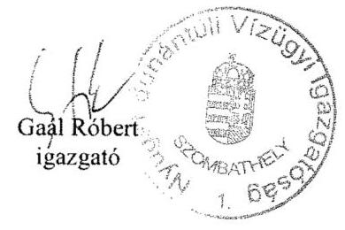

---

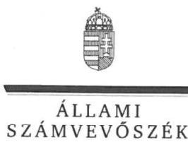

ELNÖK

Ikt.szám: V-0934-241/2016.

# Gaál Róbert úr 

igazgató
Nyugat-dunántúli Vízügyi Igazgatóság

## Szombathely

## Tisztelt Igazgató Úr!

„A központi alrendszer egyes intézményei pénzügyi és vagyongazdálkodásának ellenőrzése Nyugat-dunántúli Vízügyi Igazgatóság" címmel készített számvevőszéki jelentéstervezetre tett észrevételét köszönettel megkaptam.
Az Állami Számvevőszék észrevételre vonatkozó álláspontjáról a felügyeleti vezető által készített részletes tájékoztatást csatoltan megküldöm.
Tájékoztatom Igazgató urat, hogy a számvevőszéki jelentésben - az Állami Számvevőszékről szóló 2011. évi LXVI. törvény 29. § (3) bekezdése alapján - az el nem fogadott észrevételeket szerepeltetjük az elutasítás indokának feltüntetésével együtt.

Budapest, 2016. augusztus 11.
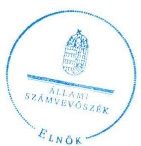

Tisztelettel:

Domokos László

Melléklet: Tájékoztatás az elfogadott és az el nem fogadott észrevételekről

---

# Tájékoztatás az elfogadott és az el nem fogadott észrevételekról 

„A központi alrendszer egyes intézményei pénzügyi és vagyongazdálkodásának ellenőrzése -Nyugat-dunántúli Vízügyi Igazgatóság 2016." címú számvevőszéki jelentéstervezetre a VEZ-0008-043/2016. iktatószámú levelében tett észrevételeit áttekintettük, annak kezeléséről az alábbi tájékoztatást adom.

## Észrevétel (2.1. sz. megállapítás alapján)

a) Az ellenőrzött időszakban hatályos számviteli politikára tett tájékoztatását köszönöm. Észrevétele a számviteli politika $_{1,2}$ tartalmi hiányosságait tartalmazó megállapítást nem kifogásolta, ezért az észrevételében hivatkozott megállapítást nem módosítja.
b) Tájékoztatásában a gazdálkodási jogkörökre történő felhatalmazások gyakorlata került bemutatásra, ezzel szemben a hivatkozott megállapítás a szabályozás hiányosságát tárta fel. Ezért az észrevételében hivatkozott, a kötelezettségvállalási jogkör átruházása hiányos szabályozására tett megállapítást nem módosítja.

## Észrevétel (2.2. sz. megállapítás 4. bekezdés 2. mondata alapján)

Köszönettel vettem tájékoztatását, hogy az SZMSZ módosítását kezdeményezték az OVF felé. Észrevétele az ellenőrzött időszakban megállapított hiányosságot nem cáfolta, az az ellenőrzött időszakon túlmutat, ezért a megállapítást nem módosítja.

## Észrevétel (2.4. sz. megállapítás 3. bekezdés 3. mondata alapján)

A megállapításban hivatkozott jogszabályhelyre tett észrevételét az ismételt felülvizsgálatot követően elfogadtuk és a jogszabályhely hivatkozást módosítjuk.

## Észrevétel (3.2. sz. megállapítás alapján)

a) Köszönettel vettem tájékoztatását, amely a 2011-2012. években a saját hatáskörben végrehajtott előirányzat-módosításokhoz kapcsolódnak. Észrevétele az ellenőrzött időszakban megállapított hiányosságot nem cáfolta, ezért a megállapítást nem módosítja.
b) Köszönettel vettem tájékoztatását, hogy a 2014. évi zárszámadás ellenőrzése során, az előirányzat-módosítással összefüggő adatszolgáltatással kapcsolatban tett Állami Számvevőszék megállapítás megismerését követően az OVF írásban rendelte el az adatszolgáltatás határidejére szóló új követelményeit. A hivatkozott megállapítás azonban nem az OVF felé történő

---

adatszolgáltatást kifogásolja, hanem az irányító szerv $_{2}$ részére történő adatszolgáltatási kötelezettség teljesítésére vonatkozik, amely szerint „Az Intézmény a 2012-2014. években nem tett eleget az Ávr. 167. § (4) bekezdésében előírt - irányító szerv $_{2}$ részére történő - adatszolgáltatási kötelezettségének." Észrevétele ezért a megállapítást nem módosítja.

# Észrevétel (3.3. sz. megállapítás alapján) 

## 4. bekezdés 1. mondata, 1. francia bekezdés

Köszönettel vettem tájékoztatását, hogy a 2014. évi zárszámadás ellenőrzése során tett ÁSZ megállapítás megismerését követően már változtattak a teljesítésigazolás rendszerén a jogszabályi előírásoknak megfelelően. Észrevétele az ellenőrzött időszakban megállapított hiányosságot nem cáfolta, ezért a megállapítást nem módosítja.

## 4. bekezdés 1. mondata, 2-3. francia bekezdés

Köszönettel vettem tájékoztatását, hogy a kötelezettségvállalás, pénzügyi ellenjegyzés, teljesítésigazolás, érvényesítés, utalványozás, valamint a jogi ellenjegyzés rendjéről, a gazdálkodási jogkörök gyakorlásáról szóló szabályzat módosításra került. Észrevétele az ellenőrzött időszakban megállapított hiányosságot nem cáfolta, az az ellenőrzött időszakon túlmutat, ezért a megállapítást nem módosítja.

## Észrevétel (3.4. sz. megállapítás alapján)

a) A jelentéstervezet 26. oldal - 3.4. számú megállapítás első bekezdés harmadik - megállapítására tett észrevételét a dokumentumok ismételt áttekintését követően elfogadtuk, a megállapítás módosításra került.
b) Nem fogadtuk el a jelentéstervezet 21. oldal első bekezdésére tett észrevételét. Észrevétele az ellenőrzött időszakban megállapított hiányosságot megerősítette, amely szerint a kötelezettségvállalás alátámasztásaként szolgáló szerződés nem állt rendelkezésre, a szerződést az ellenőrzés részére nem küldték meg. Ezért észrevétele a megállapítást nem módosítja.

## Észrevétel (3.6. sz. megállapítás alapján)

Köszönettel vettem tájékoztatását, hogy milyen problémák merültek fel a rendező mérleg elkészítéséig. Észrevétele az ellenőrzött időszakban megállapított hiányosságot megerősítette, hogy a 2014. január 31-i határidőt nem tudták tartani. Ezért észrevétele a megállapítást nem módosítja.

## Észrevétel (4.1. sz. megállapítás 2., 4. bekezdése alapján)

Köszönettel vettem tájékoztatását az új vagyonkezelési szerződés-tervezettel kapcsolatos levelezésekről, valamint az MNV Zrt. levelében foglaltakról. A jelentéstervezet 29. oldal - 4.1. számú megállapítás második és negyedik bekezdés megállapításaira tett észrevételeit - a dokumentumok ismételt áttekintését követően - nem fogadtuk el, a megállapításban rögzített hiányosságok továbbra is megalapozottak.

---

# Észrevétel (4.4. sz. megállapítás 3. bekezdése alapján) 

Köszönettel vettem tájékoztatását, hogy a javaslatnak megfelelően a jövőben megkötésre kerülő szerződéseik esetében alkalmazzák kötelező jelleggel a vonatkozó előírást. Észrevétele az ellenőrzött időszakban megállapított hiányosságot nem cáfolta, az az ellenőrzött időszakon túlmutat, ezért a megállapítást nem módosítja.

Budapest, 2016.  hó 11. nap
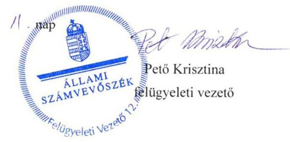

---

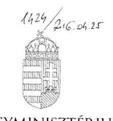

BELÜGYMINISZTÉRIUM

DR. PINTÉR SÁNDOR

Domokos László úrnak
elnök

Iktatószám: BM/7134-2/2016.

Állami Számvevőszék

Budapest

Tisztelt Elnök Úr!

A Nyugat-dunántúli Vízügyi Igazgatóság ellenőrzéséről készült számvevőszéki jelentéstervezet 1.2. számú megállapítása hiányosságot fogalmaz meg az irányító szerv tevékenységével kapcsolatosan, amely szerint az irányító szerv és a középirányító szerv az erőforrásokkal való hatékony gazdálkodáshoz szükséges követelményeket nem érvényesített, így nem volt biztosított a számon kérhetőség és az ellenőrizhetőség.

A fenti megállapításra vonatkozóan a mellékelt feljegyzésben foglaltak szerint észrevételt teszek. A Belügyminisztérium részére meghatározott intézkedési kötelezettséget a hatékony gazdálkodásra irányuló ellenőrzések elvégzése érdekében nem tartom indokoltnak.

Budapest, 2016. április 22.

Üdvözlettel:

*Pintér Sándor*

Dr. Pintér Sándor

ÁLLAMI SZÁMVEVŐSZÉK
033022/2016.
Érkezett: 2016. ÁPR. 25.
Iktatószám: U-0934-236/2016
Melléklet: 82 cop.

1051 Budapest, József Attila utca 2-4. Telefon: (06 1) 441 1717 Fax: (06 1) 441 1720 E-mail: miniszter@tzm.gov.hu

---

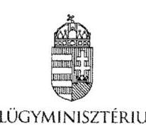

Iktatószám: BM/7134-3/2016.

# Feljegyzés   Dr. Pintér Sándor belügyminiszter úr részére 

Miniszter úrnak jelentem, hogy az Állami Számvevőszék megküldte „A központi alrendszer egyes intézményei pénzügyi és vagyongazdálkodásának ellenőrzése - Nyugat-dunántúli Vízügyi Igazgatóság" címú ellenőrzésről készült számvevőszéki jelentéstervezetet, amelynek 1.2. számú megállapításával kapcsolatosan az Állami Számvevőszékről szóló 2011. évi LXVI. törvény (a továbbiakban: ÁSZ tv.) 29. § (2) bekezdése alapján az alábbi észrevételt teszem:

A megállapítás rögzíti, hogy az irányító szerv (BM) és a középirányító szerv (OVF) a 2012-2014. években az Áht. 9. § (1) bekezdés f) pontjában előírt az ellenőrzött intézmény által ellátandó közfeladatok ellátására vonatkozó, erőforrásokkal való hatékony gazdálkodáshoz szükséges követelményeket nem érvényesített, aminek hiányában számonkérés és ellenőrzés sem történt.

Az ellenőrzés során az ÁSZ részére átadott, az irányító szervi tevékenység értékeléséhez szükséges 1. számú tanúsítvány 5.1., 7.1., 7.2., 8.1. és 9.1. pontjai alapján az irányító szerv vezetője:

- írásban rögzítette az ellenőrzött intézménynél az erőforrásokkal való szabályszerű és hatékony gazdálkodáshoz szükséges követelményeket (a Belügyminisztérium fejezet költségvetési gazdálkodásának rendjéről szóló 18/2012. (IV. 27.) BM utasítás),
- beszámoltatta az ellenőrzött intézményt a szakmai feladatellátásról, éves gazdálkodásról (éves értékelő jelentés, zárszámadások, beszámoló szöveges indoklása),
- illetve ellenőrizte az intézménynél a gazdálkodás szabályszerűségét, hatékonyságát (ellenőrzési jelentés).

A Belügyminisztérium tekintetében rögzíteni szükséges továbbá, hogy a Belügyminisztérium fejezethez tartozó egyes költségvetési szervek középirányító szervként történő kijelöléséről, az irányítási jogok gyakorlásának módjáról szóló 13/2011. (V. 23.) BM utasításban az Országos Vízügyi Főigazgatóság részére feladatok kerültek meghatározásra, többek között, hogy szervezik, irányítják és ellenőrzik a költségvetési szervek által ellátandó szakmai alapfeladatok végrehajtásához szükséges pénzügyi, anyagi feltételeket, amelynek keretében például a belső ellenőrzési tevékenység ellátása során szabályszerűségi, pénzügyi, rendszer- és teljesítmény-ellenőrzéseket, informatikai rendszerellenőrzéseket, valamint megbízhatósági ellenőrzéseket végeznek a jogszabályokban, illetve az irányító szerv által előírt belső szabályozásnak megfelelően.

---

Tényként rögzítendő továbbá az is, hogy a Belügyminisztérium Ellenőrzési Főosztálya a költségvetési szervek belső kontrollrendszeréről és belső ellenőrzéséről szóló 370/2011. (XII. 31.) Korm. rendelet alapján két olyan tárgyú ellenőrzést (belső kontrollrendszer ellenőrzése, központi ellátási tevékenység ellenőrzése) is lefolytatott, amely a teljes fejezetet érintette. Kiemelt feladatként kezelte valamennyi szerv tekintetében a belső kontrollrendszer kialakítását és működtetését, amelyben szakmai iránymutatást nyújtott. A középirányító szervek belső ellenőrzési szervezeteinek beszámoltatásával (éves ellenőrzési terv, éves ellenőrzési jelentés, végrehajtott ellenőrzésekről készített jelentések és intézkedési tervek bekérése) folyamatosan nyomon követi a szervezetek ellenőrzési tevékenységét, működését, többek között az Országos Vízügyi Főigazgatóság és a felügyelete alá tartozó igazgatóságok tevékenységét.

A fent megfogalmazottak alapján a Belügyminisztérium részére meghatározott intézkedési kötelezettséget a hatékony gazdálkodásra irányuló ellenőrzések elvégzése érdekében nem tartom indokoltnak.

A fenti megállapításra vonatkozóan az ÁSZ tv. 29. § (2) bekezdése alapján a Gazdasági Helyettes Államtitkársággal egyeztetve a mellékelt választervezetet készítettük elő.

Kérem Tisztelt Miniszter urat, hogy egyetértése esetén a levéltervezetet aláírásával ellátni szíveskedjen.

Budapest, 2016. április 27.
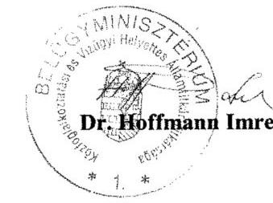

Egyetértek:
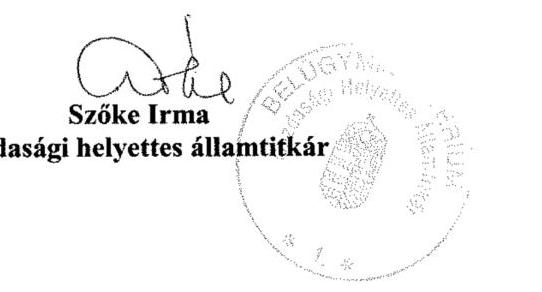

Készült: 2 példány/1 oldal
Kapják: 1. sz. pld: Belügyminisztérium, dr. Pintér Sándor miniszter úr
2. sz. pld: Irattár

Melléklet: 2 pld.: BM/7134-2/2016. sz. levéltervezet

---

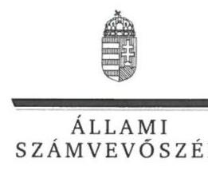

ELNÖK

Ikt.szám: V-0934-237/2016.

# Dr. Pintér Sándor úr 

miniszter
Belügyminisztérium

## Budapest

## Tisztelt Miniszter Úr!

„A központi alrendszer egyes intézményei pénzügyi és vagyongazdálkodásának ellenőrzése -Nyugat-dunántúli Vízügyi Igazgatóság" címmel készített számvevőszéki jelentéstervezetre tett észrevételét köszönettel megkaptam.
Az Állami Számvevőszék észrevételre vonatkozó álláspontjáról a felügyeleti vezető által készített részletes tájékoztatást csatoltan megküldöm.
Tájékoztatom Miniszter urat, hogy a számvevőszéki jelentésben - az Állami Számvevőszékről szóló 2011. évi LXVI. törvény 29. § (3) bekezdése alapján - a figyelembe nem vett észrevételeket szerepeltetjük az elutasítás indokának feltüntetésével.
Budapest, 2016. október 11.
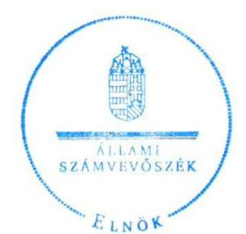

Tisztelettel:

Domokos László

Melléklet: Tájékoztatás az el nem fogadott észrevételekről

---

# Tájékoztatás az el nem fogadott észrevételekről 

„A központi alrendszer egyes intézményei pénzügyi és vagyongazdálkodásának ellenőrzése -Nyugat-dunántúli Vízügyi Igazgatóság 2016." című számvevőszéki jelentéstervezetre a BM/7134-2/2016. iktatószámú levelében tett észrevételeit áttekintettük, annak kezeléséről az alábbi tájékoztatást adom.

### 1.2. számú
 megállapításra tett észrevétel kapcsán

Köszönjük a Belügyminisztérium (továbbiakban: BM) fejezethez tartozó költségvetési szerveknél végzett, a belső kontrollrendszer vizsgálatáról, a belső kontrollrendszer utóvizsgálatáról, a Büntetés-végrehajtási Országos Parancsnokság és a felügyelet alá tartozó gazdasági társaságok központi ellátási kötelezettségének vizsgálatáról, valamint a büntetés-végrehajtáshoz kapcsolódó gazdasági társaságok kapacitásainak kihasználását, a fogvatartottak foglalkoztatását célzó Kormány, illetve a Belügyminiszter rendelete hatásának vizsgálatáról szóló jelentéseiket. A hivatkozott jelentések a 2012-2014. évek tekintetében az ellenőrzött Nyugat-dunántúli Vízügyi Igazgatóságra (továbbiakban: Intézmény) vonatkozóan, az államháztartásról szóló 2011. évi CXCV. törvény 9. § (1) bekezdés f) pontjában előírt, az Intézmény által ellátandó közfeladatok ellátására vonatkozó, erőforrásokkal való hatékony gazdálkodáshoz szükséges követelmények érvényesítésével, számonkérésével és ellenőrzésével kapcsolatos információkat nem tartalmaztak.
A jelentéstervezet 18. oldal 1.2. számú megállapításra tett észrevételét nem fogadtuk el, a megállapításban rögzített hiányosságok továbbra is megalapozottak, mert a hivatkozott BM utasításban részletesen meghatározott és szabályozott folyamatok, feladatok rendszere nem tartalmazza a közfeladatok ellátására vonatkozó, az erőforrásokkal való hatékony gazdálkodáshoz szükséges követelményeket, így azok érvényesítéséről, számonkéréséről és ellenőrzéséről sem rendelkezik. A dokumentumok ismételt áttekintését követően, az Intézmény által az irányító szerv részére megküldött költségvetési beszámolók és szöveges beszámolók sem tartalmaztak információkat a 2012-2014. években a BM részéről - az államháztartásról szóló 2011. évi CXCV. törvény 9. § (1) bekezdés f) pontjában előírt - az Intézmény által ellátandó közfeladatok ellátására vonatkozó, erőforrásokkal való hatékony gazdálkodáshoz szükséges követelmények érvényesítésével, számonkérésével és ellenőrzésével kapcsolatban. Ezért észrevételei a megállapítást nem módosítják.
Budapest, 2016.
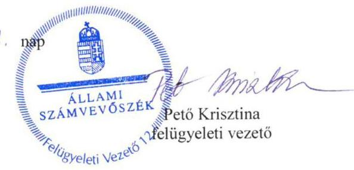

---

# ORSZÁGOS VÍZÜGYI FŐIGAZGATÓSÁG GAZDASÁGI FŐIGAZGATÓ-HELYETTES 

1012 Budapest, Márvány utca 1/d.
C2 1251 Bp. Pf. 56
E-mail: toth.laszlo@ovf.hu

Úgyiratszám: 09529-0002/2016
Előadó: Csíkós Attila

## Észrevétel

az Állami Számvevőszék V-0934-220/2016. iktatószámú levéllel megkapott, a Nyugat-dunántúli Vízügyi Igazgatóságnál lefolytatott pénzügyi és vagyongazdálkodásának ellenőrzési jelentéstervezetéhez

Az Állami Számvevőszék jelentéstervezet 1.2 számú megállapítása rögzíti, hogy az irányító szerv (BM) és a középirányító szerv (OVF) a 2012-2014. években az Áht. 9. § (1) bekezdés f) pontjában előírt az ellenőrzött intézmény által ellátandó közfeladatok ellátására vonatkozó, erőforrásokkal való hatékony gazdálkodáshoz szükséges követelményeket nem érvényesítette, aminek hiányában számonkérés és ellenőrzés sem történt.

Tekintettel arra, hogy a Belügyminisztérium Ellenőrzési Főosztálya a költségvetési szervek belső kontrollrendszeréről és belső ellenőrzéséről szóló 370/2011. (XII. 31.) Korm. rendelet alapján két olyan tárgyú ellenőrzést (belső kontrollrendszer ellenőrzése, központi ellátási tevékenység ellenőrzése) is lefolytatott, mely a teljes fejezetet érintette - beleértve a Nyugat-dunántúli Vízügyi Igazgatóságot is - az OVF-nek külön ellenőrzést erre vonatkozóan nem volt indokolt elvégeznie. Az irányító szerv kiemelt feladatként kezelte valamennyi szerv tekintetében a belső kontrollrendszer kialakítását és működtetését.

A Nyugat-dunántúli Vízügyi Igazgatóság önállóan működő és gazdálkodó költségvetési intézmény, saját döntési és felelősségi hatáskörrel a szakmai tevékenységük és a gazdálkodásuk vonatkozásában. Az OVF, mint középirányító szerv a hatályos belső szabályzatai alapján gyakorolta a 13/2011. (V. 23.) BM utasításban meghatározott feladatokat.

Az OVF az ÁSZ tárgyi ellenőrzésének időszakában az alábbi szabályozók alapján látta el a középirányítói feladatait.

A 47/2012. (IX.30) BM utasítás, SZMSZ 18. §-a szerint
A Főigazgatóság a közgazdasági tevékenység területén:

---

a) ellátja a vízügyi költségvetési szervek költségvetési tervezésének végrehajtásával, finanszírozásának előkészítésével kapcsolatos feladatokat; javaslatot készít a finanszírozás területén felmerülő problémák megoldására,
b) részt vesz az ágazati célelőirányzatok felhasználására, a vízkárelhárítási munkák finanszírozására vonatkozó közgazdasági feladatokban, közreműködik a finanszírozási feladatok megoldásában,
c) részt vesz a vízügyi költségvetési szervek költségvetési támogatásával kapcsolatos feladatokban, ellátja ennek pénzügyi, számviteli feladatainak irányítását,
d) közreműködik a vízügyi költségvetési szervek gazdálkodását érintő előirányzat-módosításokkal összefüggő feladatok végrehajtásában,
e) ellátja a vízgazdálkodási kormányzati beruházások éves zárszámadásával kapcsolatos feladatokat,
f) felügyeli és koordinálja a beszámolási és könyvvezetési kötelezettségből eredő intézményi (vízügyi igazgatóságok) feladatok ellátását, ennek keretében az intézményi éves költségvetéseket és az intézményi beszámolókat összeállíttatja, továbbá végzi azok összesítését és ellenőrzését,
g) koordinálja és ellenőrzi a vízügyi igazgatóságok éves feladatterveinek összeállítását, felülvizsgálatát; a vízügyi igazgatóságokkal történő (jóváhagyást célzó) egyeztetést,
h) közreműködik az ágazati gazdaságpolitikai célok megvalósításában, irányításában és értékelésében,
i) koordinálja és felügyeli a vízügyi igazgatóságok gazdálkodását és pénzügyi tevékenységét,
j) végzi a vízügyi igazgatóságok számviteli munkájának irányítását, felügyeletét.

A fentiek alapján 2012-2014. években a Vízügyi Igazgatóság gazdálkodásának vonatkozásban az OVF:

1. a BM fejezet 17. Vízügyi Igazgatóságok cím tekintetében az egyedi elemi költségvetések leosztását tervtárgyalások után megtette;
2. az időszaki és az éves költségvetési beszámolók és jelentések pénzügyi és számviteli ellenőrzését elvégezte és a címszintű összesítéseket a fejezet felé benyújtotta;
3. tételes (bizonylati mélységű) műszaki és pénzügyi ellenőrzést folytatott az alábbi területeken:

- a BM fejezet 20/1/48, 49, és 50 fejezeti kezelésű sorok támogatási szerződései által biztosított források felhasználása tekintetében;
- az elemi költségvetés felhalmozási kiadások kiemelt előirányzatának felhasználása tekintetében;
- Kormánydöntés alapján megkapott többletforrások felhasználása tekintetében.

A támogatási szerződéssel megkapott többletforrásokhoz kapcsolódó kötelezettségvállalások kizárólag az OVF által végzett előzetes műszaki-szakmai engedély birtokában voltak megtehetők.

---

A fent megfogalmazottak alapján az OVF részére meghatározott intézkedési kötelezettséget a hatékony gazdálkodásra irányuló ellenőrzések elvégzése érdekében nem tartom indokoltnak.

Budapest, 2016. április 22.

Tisztelettel:
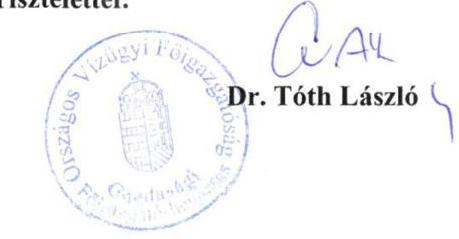

---

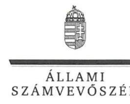

ELNÖK

Ikt.szám: V-0934-239/2016.

# Somlyódy Balázs úr 

főigazgató
Országos Vízügyi Főigazgatóság

## Budapest

## Tisztelt Főigazgató Úr!

..A központi alrendszer egyes intézményei pénzügyi és vagyongazdálkodásának ellenőrzése -Nyugat-dunántúli Vízügyi Igazgatóság" címmel készített számvevőszéki jelentéstervezetre tett észrevételét köszönettel megkaptam.
Az Állami Számvevőszék észrevételre vonatkozó álláspontjáról a felügyeleti vezető által készített részletes tájékoztatást csatoltan megküldöm.
Tájékoztatom Főigazgató urat, hogy a számvevőszéki jelentésben - az Állami Számvevőszékről szóló 2011. évi LXVI. törvény 29. § (3) bekezdése alapján - a figyelembe nem vett észrevételeket szerepeltetjük az elutasítás indokának feltüntetésével.
Budapest, 2016.
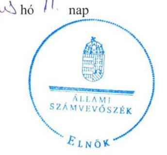

Tisztelettel:

Domokos László

Melléklet: Tájékoztatás az el nem fogadott észrevételekről

---

# Tájékoztatás az el nem fogadott észrevételekről 

„A központi alrendszer egyes intézményei pénzügyi és vagyongazdálkodásának ellenőrzése -Nyugat-dunántúli Vízügyi Igazgatóság 2016." című számvevőszéki jelentéstervezetre a 09529/0002/2016. iktatószámú levelében tett észrevételeit áttekintettük, annak kezeléséről az alábbi tájékoztatást adom.

### 1.2. számú megállapításra tett észrevétel kapcsán

Köszönettel vettem tájékoztatását, hogy az ellenőrzött időszakban az Országos Vízügyi Főigazgatóság (továbbiakban: OVF) mely szabályozók alapján, továbbá a Nyugat-dunántúli Vízügyi Igazgatóság (továbbiakban: Intézmény) gazdálkodása vonatkozásában mely feladatokat látta el. A levélben hivatkozott, a Belügyminisztérium fejezethez tartozó egyes költségvetési szervek középirányító szervként történő kijelöléséről, az irányítói jogok gyakorlásának módjáról szóló 13/2011. (V. 23.) BM utasítás nem tartalmazza a közfeladatok ellátására vonatkozó, az erőforrásokkal való hatékony gazdálkodáshoz szükséges követelményeket, így azok érvényesítéséről, számonkéréséről és ellenőrzéséről sem rendelkezik. Észrevétele sem tartalmazza a 2012-2014. években az OVF részéről - az államháztartásról szóló 2011. évi CXCV. törvény 9. § (1) bekezdés f) pontjában előírt - az Intézmény által ellátandó közfeladatok ellátására vonatkozó, erőforrásokkal való hatékony gazdálkodáshoz szükséges követelmények érvényesítésével, számonkérésével és ellenőrzésével kapcsolatos információkat, tényeket. Az észrevétele alapján a megállapítás módosítása nem indokolt.

Budapest, 2016.
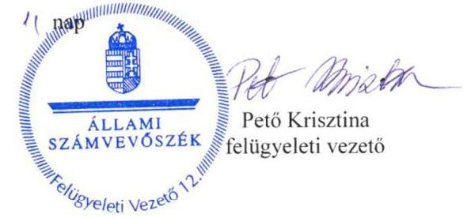

---

# RÖVIDÍTÉSEK JEGYZÉKE 

${ }^{1}$ Intézmény
${ }^{2}$ ÁSZ
${ }^{3}$ OVF
${ }^{4}$ MT
${ }^{5}$ VG tv.
${ }^{6}$ Korm. rendelet ${ }_{1}$
${ }^{7}$ Korm.rendelet ${ }_{2-4}$
Korm.rendelet ${ }_{2}$

Korm.rendelet ${ }_{3}$

Korm.rendelet ${ }_{4}$
${ }^{8}$ VM
${ }^{9}$ BM
${ }^{10}$ középirányító szerv
${ }^{11}$ BM utasítás
${ }^{12}$ NEKI
${ }^{13}$ NyuDuKTVF
${ }^{14}$ VMKI
${ }^{15}$ Nvtv.
${ }^{16}$ Áht. 2
${ }^{17}$ Ávr.
${ }^{18}$ Áht. 1
${ }^{19}$ Ámr.
${ }^{20}$ Bkr.
${ }^{21}$ ÁSZ tv.
${ }^{22}$ ÁSZ SZMSZ
${ }^{23}$ Kormányrendelet ${ }_{5}$
${ }^{24}$ irányítószerv ${ }_{1}$
irányítószerv ${ }_{2}$

Nyugat-dunántúli Vízügyi Igazgatóság
Állami Számvevőszék
Országos Vízügyi Főigazgatóság
Minisztertanács
1995. évi LVII. törvény a vízgazdálkodásról

232/1996. (XII. 26.) Korm. rendelet a vizek kártételei elleni védekezés szabályairól
vízügyi, vízvédelmi hatósági feladatokat ellátó szervek kijelöléséről szóló kormányrendeletek
347/2006. (XII. 23.) Korm. rendelet a környezetvédelmi, természetvédelmi, vízügyi hatósági és igazgatási feladatokat ellátó szervek kijelöléséről (hatálytalan: 2014. január 1-jétől)

482/2013. (XII. 17.) Korm. rendelet a vízügyi igazgatási, valamint vízügyi hatósági feladatokat ellátó szervek kijelöléséről (hatályos: 2013. december 18-tól)
223/2014. (IX. 4.) Korm. rendelet a vízügyi igazgatási és a vízügyi, valamint a vízvédelmi hatósági feladatokat ellátó szervek kijelöléséről (hatályos 2014. szeptember 5-től)
Vidékfejlesztési Minisztérium
Belügyminisztérium
Országos Vízügyi Főigazgatóság (feladatait ellátta: 2012. március 23-tól)
13/2011. (V. 23.) BM utasítás a Belügyminisztérium fejezethez tartozó egyes költségvetési szervek középirányító szervként történő kijelöléséről, az irányítói jogok gyakorlásának módjáról szóló (hatályos: 2011. május 24-től, az OVF-re vonatkozó módosítás hatálya: 2012. március 23.)
Nemzeti Környezetügyi Intézet
Nyugat-dunántúli Környezetvédelmi, Természetvédelmi és Vízügyi Felügyelőség
Vas Megyei Katasztrófavédelmi Igazgatóság
2011. évi CXCVI. törvény a nemzeti vagyonról
2011. évi CXCV. törvény az államháztartásról (hatályos 2012. január 1-jétől)
368/2011. (XII. 31.) Korm. rendelet az államháztartásról szóló törvény végrehajtásáról
1992. évi XXXVIII. törvény az államháztartásról (hatálytalan: 2012.január 1-jétől) 292/2009. (XII. 19.) Korm. rendelet az államháztartás működési rendjéről (hatálytalan: 2012. január 1-jétől)
370/2011. (XII. 31.) Korm. rendelet a költségvetési szervek belső kontrollrendszeréről és belső ellenőrzéséről (hatályos: 2012. január 1-jétől) 2011. évi LXVI. törvény az Állami Számvevőszékről, hatályos 2011. július 1-jétől

Állami Számvevőszék Szervezeti és Működési Szabályzata
300/2011. (XII. 22.) Korm. rendelet a vízügyi igazgatási szervek irányításának átalakításával összefüggésben egyes kormányrendeletek módosításáról
Vidékfejlesztési Minisztérium 2011. december 31-ig
Belügyminisztérium 2012. január 1-jétől

---

${ }^{25}$ Alapító okirat ${ }_{1}$

Alapító okirat ${ }_{2}$

Alapító okirat ${ }_{3}$

Alapító okirat ${ }_{4}$

Alapító okirat ${ }_{5}$

Alapító okirat ${ }_{6}$
${ }^{26}$ SZMSZ ${ }_{1}$
${ }^{27} \mathrm{Kbt} .{ }_{1}$
Kbt. ${ }_{2}$
${ }^{28}$ Számv. tv.
${ }^{29}$ Áhsz. ${ }_{1}$

Áhsz. ${ }_{2}$
${ }^{30}$ SZMSZ ${ }_{2}$

SZMSZ ${ }_{3}$
${ }^{31}$ Gazdasági ügyrend ${ }_{3}$

Gazdasági ügyrend ${ }_{2}$

Gazdasági ügyrend ${ }_{3}$
${ }^{32}$ Költségvetési szerv vezetője
${ }^{33}$ Számviteli politika ${ }_{1}$
Számviteli politika ${ }_{2}$
Számviteli politika ${ }_{3}$
Számviteli politika ${ }_{4}$
${ }^{34}$ Leltározási szabályzat ${ }_{1}$

Leltározási szabályzat ${ }_{2}$
a Nyugat-dunántúli Vízügyi Igazgatóság 2010. november 22-én módosított (XX/1130/9/2010.) Alapító okirata
a Nyugat-dunántúli Vízügyi Igazgatóság 2011. december 23-án módosított (A223/1/2011/M) Alapító okirata
a Nyugat-dunántúli Vízügyi Igazgatóság 2012. május 8-án módosított (A-223/1/2012/M) Alapító okirata
a Nyugat-dunántúli Vízügyi Igazgatóság 2013. december 12-én módosított (A-223/1/2013/M) Alapító okirata
a Nyugat-dunántúli Vízügyi Igazgatóság 2014. február 5-én módosított (A-223/1/2014/M) Alapító okirata
a Nyugat-dunántúli Vízügyi Igazgatóság 2014. december 23-án módosított (A-223/2/2014/M) Alapító okirata
Nyugat-dunántúli Környezetvédelmi és Vízügyi Igazgatóság Szervezeti és Működési Szabályzata (hatályos: 2011. január 1-jétől 2013. január 09-ig)
2003. évi CXXIX. törvény a közbeszerzésekről (hatálytalan: 2012. január 1-jétől)
2011. évi CVIII. törvény a közbeszerzésekről (hatályos: 2011. augusztus 21-től)
2000. évi C. törvény a számvitelről

249/2000. (XII. 24.) Korm. rendelet az államháztartás szervezetei beszámolási és könyvvezetési kötelezettségének sajátosságairól (hatálytalan: 2014. január 1-jétől)
4/2013. (I. 11.) Korm. rendelet az államháztartás számviteléről (hatályos: 2014. január 1-jétől)
Nyugat-dunántúli Vízügyi Igazgatóság Szervezeti és Működési Szabályzata (hatályos: 2013. január 10-től)
Nyugat-dunántúli Vízügyi Igazgatóság Szervezeti és Működési Szabályzata egységes szerkezetben, Nyugat-dunántúli Vízügyi Hatóság működési rendje (hatályos: 2014. január 1-jétől)
Nyugat-dunántúli Környezetvédelmi és Vízügyi Igazgatóság Szervezeti és Működési Szabályzat 5. sz. melléklete (hatálytalan: 2013. január 10-től 2013. március 25-ig)
5/2013. sz. igazgatói utasítással kiadott a Nyugat-dunántúli Vízügyi Igazgatóság Ügyrendjének 2. sz. melléklete (hatályos: 2013. március 25-től 2014. március 3-ig)
7/2014. sz. igazgatói utasítással kiadott a Nyugat-dunántúli Vízügyi Igazgatóság Ügyrendjének 2. sz. melléklete (hatályos: 2014. március 3-tól)
Az Intézmény (NYUDUVIZIG) igazgatója
Nyugat-dunántúli Környezetvédelmi és Vízügyi Igazgatóság Számviteli politika (hatálytalan: 2012. január 1-jétől)
19/2012. sz. igazgatói utasítás a Nyugat-dunántúli Vízügyi Igazgatóság Számviteli politikájáról (hatályos: 2012. január 1-jétől 2013. május 10-ig)
33/2013.
 sz. igazgatói utasítás a Nyugat-dunántúli Vízügyi Igazgatóság Számviteli politikájáról (hatályos: 2013. május 10-től 2014. szeptember 11-ig)
28/2014. sz. igazgatói utasítás a Nyugat-dunántúli Vízügyi Igazgatóság Számviteli politikájáról (hatályos: 2014. szeptember 11-től)
Nyugat-dunántúli Környezetvédelmi és Vízügyi Igazgatóság Eszközök, források leltározási, leltárkészítési és selejtezési szabályzata (hatálytalan: 2012. január 1-jétől)
17/2012. sz. igazgatói utasítás a Nyugat-dunántúli Vízügyi Igazgatóság Eszközök, források leltározási, leltárkészítési és selejtezési szabályzatáról (hatályos: 2012. január 1-jétől 2013. május 10-ig)

---

| Leltározási szabályzat ${ }^{3}$ | 29/2013. sz. igazgatói utasítás a Nyugat-dunántúli Vízügyi Igazgatóság Eszközök és források leltározási és leltárkészítési szabályzatáról (hatályos: 2013. május 10-től) |
| :--: | :--: |
| ${ }^{35}$ Értékelési szabályzat ${ }_{1}$ | Nyugat-dunántúli Környezetvédelmi és Vízügyi Igazgatóság Eszközök és források értékelésének szabályai (hatálytalan: 2012. január 1-jétől) |
| Értékelési szabályzat ${ }_{2}$ | 15/2012. sz. igazgatói utasítás a Nyugat-dunántúli Vízügyi Igazgatóság Eszközök és források értékelésének szabályairól (hatályos: 2012. január 1-jétől 2013. május 10-ig) |
| Értékelési szabályzat ${ }_{3}$ | 28/2013. sz. igazgatói utasítás a Nyugat-dunántúli Vízügyi Igazgatóság Eszközforrás értékelési szabályzatáról (hatályos: 2013. május 10-től 2014. szeptember 11-ig) |
| ${ }^{36}$ Pénzkezelési szabályzat ${ }_{1}$ | 32/2014. sz. igazgatói utasítás a Nyugat-dunántúli Vízügyi Igazgatóság Eszközforrás értékelési szabályzatáról (hatályos: 2014. szeptember 11-től) |
| Pénzkezelési szabályzat ${ }_{2}$ | 2/10097. sz. igazgatói utasítás A pénzkezelés és az utalványozási jog gyakorlásának szabályozásáról (hatálytalan: 2012. január 1-jétől) |
| Pénzkezelési szabályzat ${ }_{3}$ | 16/2012. sz. igazgatói utasítás a Nyugat-dunántúli Vízügyi Igazgatóság Pénz- és értékkezelés szabályzatáról (hatályos: 2012. január 1-jétől 2013. május 10-ig) |
| Pénzkezelési szabályzat ${ }_{3}$ | 32/2013. sz. igazgatói utasítás a Nyugat-dunántúli Vízügyi Igazgatóság Pénzforgalmi és pénztári pénzkezelési szabályzat kiadásáról (hatályos: 2013. május 10-től 2014. december 10-ig) |
| ${ }^{37}$ Önköltségszámítási szabályzat ${ }_{1}$ | 60/2014. sz. igazgatói utasítás a Nyugat-dunántúli Vízügyi Igazgatóság Pénzforgalmi és pénztári pénzkezelési szabályzat kiadásáról (hatályos: 2014. december 10-től) |
| Önköltségszámítási szabályzat ${ }_{2}$ | Nyugat-dunántúli Környezetvédelmi és Vízügyi Igazgatóság Önköltségszámítási szabályzat (hatálytalan: 2012. január 1-jétől) |
| Önköltségszámítási szabályzat ${ }_{3}$ | 18/2012. sz. igazgatói utasítás a Nyugat-dunántúli Vízügyi Igazgatóság Önköltségszámítási szabályzat (hatályos: 2012. január 1-jétől 2013. július 1-ig) |
| ${ }^{38}$ Számlarend ${ }_{1}$ | 44/2013. sz. igazgatói utasítás a Nyugat-dunántúli Vízügyi Igazgatóság Önköltségszámítási rendje (hatályos: 2013. július 1-jétől) |
| Számlarend ${ }_{2}$ | Nyugat-dunántúli Környezetvédelmi és Vízügyi Igazgatóság Számlarendje (hatálytalan: 2012. január 1-jétől) |
| Számlarend ${ }_{3}$ | 21/2012. sz. igazgatói utasítás a Nyugat-dunántúli Vízügyi Igazgatóság Számlarend és számlatükör (hatályos: 2012. január 1-jétől 2013. május 10-ig) |
| Számlarend ${ }_{4}$ | 34/2013. sz. igazgatói utasítás a Nyugat-dunántúli Vízügyi Igazgatóság Számlarendje (hatályos: 2013. május 10-től 2014. november 7-ig) |
| ${ }^{39}$ Bizonylati rend ${ }_{1}$ | 45/2014. sz. igazgatói utasítás a Nyugat-dunántúli Vízügyi Igazgatóság Számlarendje (hatályos: 2014. november 7-től) |
| Bizonylati rend ${ }_{2}$ | Nyugat-dunántúli Környezetvédelmi és Vízügyi Igazgatóság Bizonylati rend (hatályos: 2012. november 30-ig) |
| Bizonylati rend ${ }_{3}$ | 45/2012. sz. igazgatói utasítás a Nyugat-dunántúli Vízügyi Igazgatóság Bizonylati rendjéről (hatályos: 2012. november 30-tól 2013. május 10-ig) |
| ${ }^{40}$ Gazdálkodási szabályzat ${ }_{1}$ | 27/2013. sz. igazgatói utasítás a Nyugat-dunántúli Vízügyi Igazgatóság Bizonylati szabályzat és Bizonylati Album (hatályos: 2013. május 10-től) |
| Gazdálkodási szabályzat ${ }_{2}$ | 1/2006. sz. igazgatói utasítás a kötelezettségvállalás, érvényesítés és utalványozás szabályairól (hatálytalan: 2012. szeptember 15-től) |
| Gazdálkodási szabályzat ${ }_{3}$ | 20/2012. sz. igazgatói utasítás a kötelezettségvállalás, érvényesítés és utalványozás szabályairól (hatályos: 2012. szeptember 25-től 2013. május 10-ig) |
|  | 31/2013. sz. igazgatói utasítás a kötelezettségvállalás, a pénzügyi ellenjegyzés, teljesítésigazolás, érvényesítés, utalványozás, valamint a jogi ellenjegyzés rendjéről és a gazdálkodási jogkörök gyakorlásáról szóló szabályzat kiadásáról (hatályos: 2013. május 10-től 2013. augusztus 8-ig) |

---

Gazdálkodási szabályzat ${ }_{4}$

Közbeszerzési szabályzat ${ }_{1}$

Közbeszerzési szabályzat ${ }_{3}$

Közbeszerzési szabályzat ${ }_{4}$

Készletgazdálkodási szabályzat
${ }^{43}$ Etikai szabályzat
${ }^{44}$ Vnytv.
${ }^{45}$ Ikr.
${ }^{46}$ Iratkezelési szabályzat ${ }_{1}$

Iratkezelési szabályzat ${ }_{2}$
Iratkezelési szabályzat ${ }_{3}$
${ }^{47}$ Avtv.
${ }^{48}$ IBSZ ${ }_{1}$

IBSZ ${ }_{2}$

IBSZ ${ }_{3}$

IBSZ ${ }_{4}$
${ }^{49}$ Info tv.
${ }^{50}$ Adatvédelmi szabályzat ${ }_{1}$

Adatvédelmi szabályzat ${ }_{2}$
${ }^{51}$ Közérdekú adatok szabályzata ${ }_{1}$

48/2013. sz. igazgatói utasítás a kötelezettségvállalás, a pénzügyi ellenjegyzés, teljesítésigazolás, érvényesítés, utalványozás, valamint a jogi ellenjegyzés rendjéről és a gazdálkodási jogkörök gyakorlásáról szóló szabályzat kiadásáról (hatályos: 2013. augusztus 8-tól)
7/2010. sz. igazgatói utasítás a Nyugat-dunántúli Környezetvédelmi és Vízügyi Igazgatóság Közbeszerzési szabályzata (hatálytalan: 2012. január 1-jétől kivéve a folyamatban lévő ügyek esetén)
1/2012. sz. igazgatói utasítás a Nyugat-dunántúli Vízügyi Igazgatóság Közbeszerzési szabályzata (hatályos: 2012. január 1-jétől 2013. április 1-jéig, kivéve a folyamatban lévő ügyek esetén)
25/2013. sz. igazgatói utasítás a Nyugat-dunántúli Vízügyi Igazgatóság Közbeszerzési és Beszerzési szabályzata (hatályos: 2013. április 1-jétől 2014. november 18-ig, kivéve folyamatban lévő ügyek esetén)
46/2014. sz. igazgatói utasítás a Nyugat-dunántúli Vízügyi Igazgatóság Közbeszerzési és Beszerzési szabályzata (hatályos: 2014. november 18-tól, kivéve folyamatban lévő ügyek esetén)
5/1997. sz. igazgatói utasítás az Igazgatóság Készletgazdálkodásáról (hatálytalan: 2013. április 1-jétől)

40/2012. számú igazgatói utasítás a Nyugat-dunántúli Vízügyi Igazgatóság Etikai kódexe (hatályos: 2012. október 9-től)
2007. évi CLII. törvény az egyes vagyonnyilatkozat-tételi kötelezettségekről 335/2005. (XII. 29.) Korm. rendelet a közfeladatot ellátó szervek iratkezelésének általános követelményeiről
7/2009. sz. igazgatói utasítás a Nyugat-dunántúli Környezetvédelmi és Vízügyi Igazgatóság Iratkezelési szabályzat kiadásáról (hatálytalan: 2013. március 1-jétől) 4/2013. sz. igazgatói utasítás a Nyugat-dunántúli Vízügyi Igazgatóság Iratkezelési szabályzat kiadásáról (hatályos: 2013. március 1-jétől 2014. november 10-ig) 44/2014. sz. igazgatói utasítás a Nyugat-dunántúli Vízügyi Igazgatóság Iratkezelési szabályzata (hatályos: 2014. november 10-től)
1992. évi LXIII. törvény a személyes adatok védelméről és a közérdekű adatok nyilvánosságáról (hatálytalan: 2012. január 1-jétől)
5/2007. sz. igazgatói utasítás a Nyugat-dunántúli Környezetvédelmi és Vízügyi Igazgatóság Informatikai Biztonsági Szabályzat (hatálytalan: 2012. október 9-től)
22/2012. sz. igazgatói utasítás a Nyugat-dunántúli Vízügyi Igazgatóság Informatikai Biztonsági Szabályzata (hatályos: 2012. október 9-től 2013. november 14-ig)
68/2013. sz. igazgatói utasítás a Nyugat-dunántúli Vízügyi Igazgatóság Informatikai Biztonsági Szabályzata (2013. november 14-től 2014. június 30-ig) 18/2014. sz. igazgatói utasítás a Nyugat-dunántúli Vízügyi Igazgatóság Informatikai Biztonsági Szabályzata (hatályos: 2014. június 30-tól)
2011. évi CXII. törvény az információs önrendelkezési jogról és az információszabadságról
8/2004. (K.V. Ért. 5.) KvVM utasítás a Környezetvédelmi és Vízügyi Minisztérium adatvédelmi és adatbiztonsági szabályzatáról (hatálytalan: 2012. május 23-tól)
46/2012. igazgatói utasítás a Nyugat-dunántúli Vízügyi Igazgatóság Adatvédelmi és Adatbiztonsági Szabályzatának kiadásáról (hatályos: 2012. december 18-tól)
4/2006. igazgatói utasítás A közérdekű adatok megismerésére irányuló igények teljesítésének rendjéről szóló szabályzat kiadásáról (hatálytalan: 2012. október 15-től)

---

Közérdekű adatok szabályzata ${ }_{2}$

Közérdekű adatok szabályzata ${ }_{3}$
${ }^{52}$ Ltv.
${ }^{53}$ Ber.
${ }^{54}$ Belső Ellenőrzési Kézikönyv1

Belső Ellenőrzési Kézikönyv2

Belső Ellenőrzési Kézikönyv3

Belső Ellenőrzési Kézikönyv4
${ }^{55}$ NGM rendelet ${ }_{1-2}$
${ }^{56}$ Ügyrend ${ }_{1}$

Ügyrend ${ }_{2}$
${ }^{57}$ Munkaköri leírások ${ }_{1-4}$
${ }^{58}$ 1025/2011. (II. 11.) Korm. határozat
${ }^{59}$ Kvtv. 1
Kvtv. 2
Kvtv. 3
Kvtv. 4
${ }^{60}$ Értékelési szabályzat ${ }_{1}$

Értékelési szabályzat ${ }_{2}$

Értékelési szabályzat ${ }_{3}$

Értékelési szabályzat ${ }_{4}$
${ }^{61}$ 36/2013. (IX. 13.) NGM rendelet
${ }^{62}$ Vtv
${ }^{63}$ VSZ
${ }^{64}$ KVI
${ }^{65}$ VSZ módosítás
${ }^{66}$ MNV Zrt.
${ }^{67}$ Vtvr.

30/2012. igazgatói utasítás A közérdekű adatok megismerésére irányuló igények teljesítésének rendjéről szóló szabályzatról (hatályos: 2012. október 15-től 2014. március 3-ig)
5/2014. igazgatói utasítás A közérdekű adatok megismerésére irányuló igények teljesítésének rendjéről szóló szabályzatról (hatályos: 2014. március 3-tól) 1995. évi LXVI. törvény a köziratokról, a közlevéltárakról és a magánlevéltári anyag védelméről
193/2003. (XI. 26.) Korm. rendelet a költségvetési szervek belső ellenőrzéséről (hatálytalan: 2012. január 1-jétől)
2/2010. sz. igazgatói utasítás az Igazgatóság Belső ellenőrzési Szabályzatának kiadásáról (hatálytalan: 2012. március 8-tól)
2/2012. sz. igazgatói utasítás a Nyugat-dunántúli Vízügyi Igazgatóság Belső ellenőrzési Szabályzatának kiadásáról (hatályos: 2012. március 8-tól 2013. március 29-ig)
24/2013. sz. igazgatói utasítás Belső Ellenőrzési Kézikönyv Nyugat-dunántúli Vízügyi Igazgatóság (hatályos: 2013. március 29-től 2013. december 23-ig)
72. sz. igazgatói utasítás Belső Ellenőrzési Kézikönyv Nyugat-dunántúli Vízügyi Igazgatóság (hatályos: 2013. december 23-tól)
az elemi költségvetésről szóló 5/2012. (III.1.) NGM rendelet (hatályos 2012. március 2-től 2013. március 14-ig) és a 10/2013. (III.13.) NGM rendelet (hatályos 2013. március 14-től 2013. december 31-ig)

5/2013. sz. igazgatói utasítással kiadott a Nyugat-dunántúli Vízügyi Igazgatóság Ügyrendje (hatályos: 2013. március 25-től 2014. március 3-ig)
7/2014. sz. igazgatói utasítással kiadott a Nyugat-dunántúli Vízügyi Igazgatóság Ügyrendje (hatályos: 2014. március 3-tól)
Gazdasági igazgatóhelyettes munkaköri leírásai 2011-2014 között
1025/2011. (II. 11.) Korm. határozat az államháztartási egyensúly megőrzéséhez szükséges intézkedésekről
CLXIX törvény a Magyar Köztársaság 2011. évi költségvetéséről
2011. évi CLXXXVIII. törvény Magyarország 2012. évi központi költségvetéséről
2012. évi CCIV. törvény Magyarország 2013. évi központi költségvetéséről
2013. évi CCXXX. törvény Magyarország 2014. évi központi költségvetéséről

Nyugat-dunántúli Környezetvédelmi és Vízügyi Igazgatóság Eszközök és források értékelésének szabályai (hatálytalan: 2012. január 1-jétől)
15/2012. sz. igazgatói utasítás a Nyugat-dunántúli Vízügyi Igazgatóság Eszközök és források értékelésének szabályairól (hatályos: 2012. január 1-jétől 2013. május 10-ig)
28/2013. sz. igazgatói utasítás a Nyugat-dunántúli Vízügyi Igazgatóság Eszközforrás értékelési szabályzatáról (hatályos: 2013. május 10-től 2014. szeptember 11-ig)
32/2014. sz. igazgatói utasítás a Nyugat-dunántúli Vízügyi Igazgatóság Eszközforrás értékelési szabályzatáról (hatályos: 2014. szeptember 11-től)
36/2013. (IX. 13.) NGM rendelet az államháztartás számvitelének 2014. évi megváltozásával kapcsolatos feladatokról (hatálytalan 2015. január 1-jétől) 2007. évi CVI. törvény az állami vagyonról (23. § (1)-(3) bekezdéseiben)

Vagyonkezelési szerződés (száma: 290535/1998/0100)
Kincstári Vagyoni Igazgatóság
szerződés vagyonkezelési szerződés módosítására SZT-41377
Magyar Nemzeti Vagyonkezelő Zártkörű részvénytársaság
254/2007. (X. 4.) Korm. rendelet az állami vagyonnal való gazdálkodásról

---

${ }^{68}$ Natura 2000 egyes területei (példák) a VSZ 7. számú mellékletéből
${ }^{69}$ Tulajdonosi joggyakorló
${ }^{70}$ Leltározási szabályzat ${ }_{1}$

Leltározási szabályzat ${ }_{2}$

Leltározási szabályzat ${ }_{3}$

Leltározási szabályzat ${ }_{4}$
${ }^{71}$ Selejtezési szabályzat ${ }_{1}$

Selejtezési szabályzat ${ }_{2}$

Selejtezési szabályzat ${ }_{3}$

Selejtezési szabályzat ${ }_{4}$
${ }^{72}$ NGM rendelet
${ }^{73}$ KHVM rendelet
${ }^{74}$ Korm. rendelet ${ }_{6}$
${ }^{75}$ Befektetett eszközök aránya mutató
${ }^{76}$ Forgóeszközök aránya mutató
${ }^{77}$ Ingatlanok aránya mutató
${ }^{78}$ Saját tőke aránya mutató
${ }^{79}$ Használhatósági fok mutatója
${ }^{80}$ Elhasználódási szint
${ }^{81}$ munkatervek
${ }^{82}$ belső szabályzatok

Alsószölnök 027/11 hrsz., Felsőjánosfa 03 hrsz., Hegyhátszentjakab 015/4 hrsz.

Magyar Nemzeti Vagyonkezelő Zártkörű részvénytársaság
Nyugat-dunántúli Környezetvédelmi és Vízügyi Igazgatóság Eszközök, források leltározási, leltárkészítési és selejtezési szabályzata (hatálytalan: 2012. január 1-jétől)
17/2012. sz. igazgatói utasítás a Nyugat-dunántúli Vízügyi Igazgatóság Eszközök, források leltározási, leltárkészítési és selejtezési szabályzatáról (hatályos: 2012. január 1-jétől 2013. május 10-ig)
29/2013. sz. igazgatói utasítás a Nyugat-dunántúli Vízügyi Igazgatóság Eszközök és források leltározási és leltárkészítési szabályzatáról (hatályos: 2013. május 10-től 2014. szeptember 11-ig)
30/2014. sz. igazgatói utasítás Nyugat-dunántúli Vízügyi Igazgatóság az Eszközök és források leltározási és leltárkészítési szabályzatáról (hatályos: 2014. szeptember 11-től)
Nyugat-dunántúli Környezetvédelmi és Vízügyi Igazgatóság Eszközök, források leltározási, leltárkészítési és selejtezési szabályzata (hatálytalan: 2012. január 1-jétől)
Nyugat-dunántúli Környezetvédelmi és Vízügyi Igazgatóság Eszközök, források leltározási, leltárkészítési és selejtezési szabályzata (hatályos: 2012. január 1-jétől 2013. május 10-ig)
30/2013 igazgatói utasítás a felesleges vagyontárgyak hasznosításának és selejtezésének
 szabályzata (hatályos: 2013. május 10-től 2014. szeptember 11-ig) 29/2014. igazgatói utasítás a felesleges vagyontárgyak hasznosításának és selejtezésének szabályzata (hatályos: 2014. szeptember 11-től)
az államháztartás számvitelének 2014. évi megváltozásával kapcsolatos feladatokról szóló 36/2013. (IX. 13.) NGM rendelet
10/1997. (VII. 17.) KHVM rendelet az árvíz- és belvízvédekezésről
120/1999. (VIII. 6.) Korm. rendelet a vizek és a közcélú vízi létesítmények fenntartási feladatairól szóló
A mutató a befektetett eszközök arányát határozza meg az összes eszközön belül. Az arány évről évre történő növekedése jelzi, hogy az intézmény által végzett tevékenység eszközellátottsága javul.
(Befektetett eszközök / Eszközök összesen)
A mutató a forgóeszközök összes eszközértéken belüli arányát fejezi ki. (Forgóeszközök / Eszközök összesen)
Az ingatlanok befektetett eszközön belüli részarányát fejezi ki. (Ingatlanok / Befektetett eszközök összesen)
A mutató saját tőke arányát fejezi ki az összes forráson belül. Minden évben az 1-et minél jobban megközelítő érték tekinthető kedvezőnek. A mutató évről évre történő növekedése pozitív tendenciát fejez ki.
(Saját tőke összesen / Források összesen)
A mutató növekedése azt jelzi, hogy az intézmény eszközeinek átlagos elhasználtsága csökken, a használhatóságuk javul.
(Tárgyi eszközök, immateriális javak nettó értéke * 100 / Tárgyi eszközök, immateriális javak bruttó értéke)
(Tárgyi eszközök, immateriális javak elszámolt értékcsökkenése * 100 / Tárgyi eszközök, immateriális javak záró bruttó értéke)
az Intézmény (NYUDUVIZIG) 2012-2014. évi munkatervei
Igazgatói utasítások formájában kiadott Bkr. (Belső ellenőrzési) szabályzat ${ }_{1-8}$, Gépjármű-használati szabályzat ${ }_{1-10}$, Telefon szabályzat ${ }_{1-4}$

---

| Bkr. szabályzat ${ }_{1}$ | 2/2010. számú Igazgatói utasítás az Igazgatóság Belső ellenőrzési szabályzatának a kialakításáról (hatályos: 2010. március 15-től) |
| :--: | :--: |
| Bkr. szabályzat ${ }_{2}$ | 32/2012. számú Igazgatói utasítás a Nyugat-dunántúli Vízügyi Igazgatóság Belső kontrollrendszere (hatályos: 2012. október 11-től 2013. április 30-ig) |
| Bkr. szabályzat ${ }_{3}$ | 22/2013. számú Igazgatói utasítás a Nyugat-dunántúli Vízügyi Igazgatóság Belső kontrollrendszeréről szóló Szabályzata (hatályos: 2013. április 30-tól 2013. június 11-ig) |
| Bkr. szabályzat ${ }_{4}$ | 41/2013. számú Igazgatói utasítás a 22/2013. számú Igazgatói utasítás módosításáról (hatályos: 2013. június 11-től 2013. augusztus 15-ig) |
| Bkr. szabályzat ${ }_{5}$ | 54/2013. sz. Igazgatói utasítás a 22/2013. számú Igazgatói utasítás módosításáról (hatályos: 2013. augusztus 15-től 2013. szeptember 18-ig) |
| Bkr. szabályzat ${ }_{6}$ | 63/2013. sz. Igazgatói utasítás a 22/2013. számú Igazgatói utasítás módosításáról (hatályos: 2013. szeptember 18-tól 2013. október 10-ig) |
| Bkr. szabályzat ${ }_{7}$ | 66/2013. sz. Igazgatói utasítás a 22/2013. számú Igazgatói utasítás módosításáról (hatályos: 2013. október 10-től 2014. augusztus 28-ig) |
| Bkr. szabályzat ${ }_{8}$ | 27/2014. sz. Igazgatói utasítás a Nyugat-dunántúli Vízügyi Igazgatóság Belső kontrollrendszeréről szóló Szabályzata (hatályos: 2014. augusztus 28-tól) |
| Gépjármű szabályzat ${ }_{1}$ | 8/1996. sz. Igazgatói utasítás hivatali személygépkocsik használatáról (hatályos: 1996. november 11-től, hatálytalan: 2011. július 1-jétől) |
| Gépjármű szabályzat ${ }_{2}$ | 4/2004. sz. Igazgatói utasítás hivatali gépjárművek magáncélra történő használatáról (hatályos: 2004. április 1-jétől 2011. november 1-jéig) |
| Gépjármű szabályzat ${ }_{3}$ | 7/2006. sz. Igazgatói utasítás a magángépjármű hivatalos célú igénybe vételéről (hatályos: 2006. július 1-jétől 2011. március 1-jéig) |
| Gépjármű szabályzat ${ }_{4}$ | 3/2011. sz. Igazgatói utasítás a magángépjármű hivatalos célú igénybe vételéről (hatályos: 2011. március 1-jétől) |
| Gépjármű szabályzat ${ }_{5}$ | 8/2011. sz. Igazgatói utasítás a hivatali személygépkocsik használatáról (hatályos: 2011. június 1-jétől) |
| Gépjármű szabályzat ${ }_{6}$ | 10/2011. sz. Igazgatói utasítás a hivatali gépjárművek magáncélra történő használatáról (hatályos: 2011. november 1-jétől) |
| Gépjármű szabályzat ${ }_{7}$ | 3/2012. sz. Igazgatói utasítás a magángépjármű hivatalos célra történő használatáról (hatályos: 2012. március 1-jétől) |
| Gépjármű szabályzat ${ }_{8}$ | 4/2012. sz. Igazgatói utasítás gépjárművek használatáról (hatályos: 2012. június 11-től) |
| Gépjármű szabályzat ${ }_{9}$ | 13/2013. számú Igazgatói utasítás a Nyugat-dunántúli Vízügyi Igazgatóság tulajdonában és üzemeltetésében lévő járművek üzemeltetéséről (hatályos: 2013. április 1-jétől 2014. január 1-jéig) |
| Gépjármű szabályzat ${ }_{10}$ | 14/2013. számú Igazgatói utasítás a Nyugat-dunántúli Vízügyi Igazgatóság tulajdonában és üzemeltetésében lévő járművek üzemeltetéséről (hatályos: 2014. január 1-jétől) |
| munkaterv $_{12}$ | NYUDUVIZIG 2012. évi munkaterve |
| munkaterv $_{13}$ | NYUDUVIZIG 2013. évi munkaterve |
| munkaterv $_{14}$ | NYUDUVIZIG 2014. évi munkaterve |
| Telefon szabályzat ${ }_{1}$ | 4/2005. számú Igazgatói utasítás a személyi használatú mobiltelefonok üzemeltetéséről (hatályos: 2005. június 16-tól 2012. szeptember 26-ig) |
| Telefon szabályzat ${ }_{2}$ | 14/2012. számú Igazgatói utasítás a személyi használatú mobiltelefonok üzemeltetéséről (hatályos: 2012. szeptember 26-tól 2013. április 1-jéig) |
| Telefon szabályzat ${ }_{3}$ | 16/2013. számú Igazgatói utasítás a Nyugat-dunántúli Vízügyi Igazgatóság Szabályzata a személyi használatú rádiótelefonok üzemeltetéséről (hatályos: 2013. április 1-től 2014. április 1-jéig) |
| Telefon szabályzat ${ }_{4}$ | 56/2014. sz. Igazgatói utasítás a személyi használatú vezetékes és mobiltelefonok üzemeltetéséről (hatályos: 2014. április 1-jétől) |

---

# ÁLLAMI SZÁMVEVŐSZÉK 

1052 Budapest, Apáczai Csere János utca 10.
Levélcím: 1364 Budapest 4. Pf. 54
Telefon: +36 14849100 Telefax: +36 14849200
www.asz.hu
