# Jelentés 

## A központi alrendszer egyes intézményei ellenőrzése

A Központi alrendszer egyes intézményei pénzügyi és vagyongazdálkodásának ellenőrzése - Nemzeti Közlekedési Hatóság 2016.

---

.

---

# Jelentés 

## A központi alrendszer egyes intézményei ellenőrzése

A Központi alrendszer egyes intézményei pénzügyi és vagyongazdálkodásának ellenőrzése - Nemzeti Közlekedési Hatóság 2016. 66 hó 01 nap
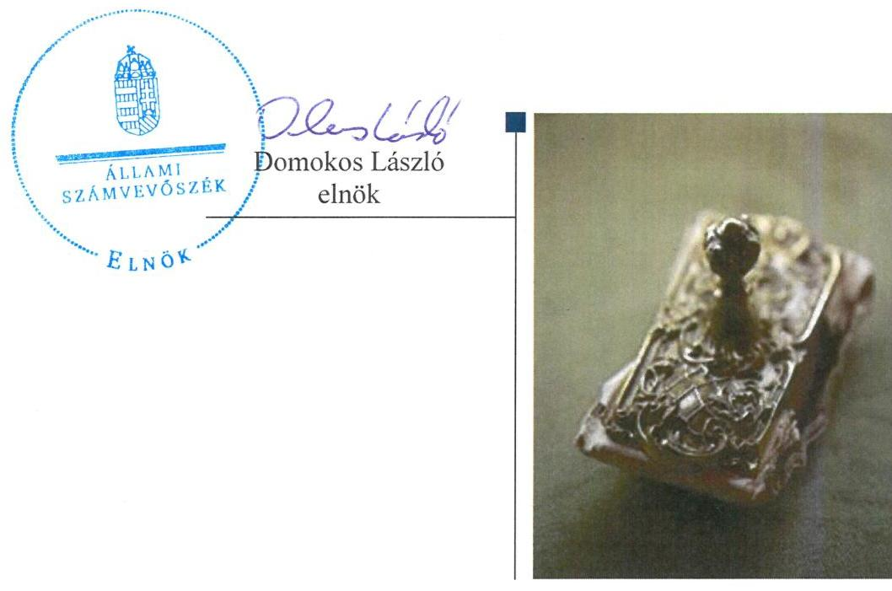

---

Jelentéseink az Országgyúlés számítógépes hálózatán és az Interneten a www.asz.hu címen is olvashatóak.

AZ ELLENŐRZÉST FELÜGYELTE:
SALAMON ILDIKÓ felügyeleti vezető

AZ ELLENŐRZÉST VEZETTE ÉS A VÉGREHAJTÁSÁÉRT FELELŐS:
HADNAGYNÉ PAPP ILDIKÓ ellenőrzésvezető

A PROGRAM ÖSSZEÁLLÍTÁSÁÉRT FELELŐS:
JANIK JÓZSEF osztályvezető
BÖRÖCZ IMRE projektfelelős

A TÉMÁHOZ KAPCSOLÓDÓ KORÁBBI SZÁMVEVŐSZÉKI JELENTÉSEK:

- címe: Magyarország 2014. évi központi költségvetése végrehajtásának ellenőrzéséről
- sorszáma: 15167
- címe: A 2013. évi zárszámadásról - Magyarország 2013. évi költségvetése végrehajtásának ellenőrzéséről
- sorszáma: 14207
- címe: Magyarország 2012. évi központi költségvetése végrehajtásának ellenőrzéséről
- sorszáma: 13801
- címe: Magyar Köztársaság 2011. évi költségvetése végrehajtásának ellenőrzéséről
sorszáma: 1297

IKTATÓSZÁM: V-0778-219/2016.
TÉMASZÁM: 1812
ELLENŐRZÉS-AZONOSÍTÓ SZÁM: V067921

---

# TARTALOMJEGYZÉK 

■ ÖSSZEGZÉS ..... 5
■ AZ ELLENŐRZÉS CÉLJA ..... 7
■ AZ ELLENŐRZÉS TERÜLETE ..... 8
■ AZ ELLENŐRZÉS HÁTTERE, INDOKOLTSÁGA ..... 10
■ FÓKUSZKÉRDÉSEK ..... 12
■ ELLENŐRZÉS HATÓKÖRE ÉS MÓDSZEREI ..... 13
■ MEGÁLLAPÍTÁSOK ..... 16
■ JAVASLATOK ..... 36
■ MELLÉKLETEK ..... 39
I. számú melléklet: Értelmező szótár ..... 39
II. számú melléklet: Kiegészítő teljesítmény-ellenőrzési modul megállapításai ..... 43
III. számú melléklet: Az NKH pénzügyi- és vagyongazdálkodása ellenőrzésének főbb megállapításai ..... 44
IV. számú melléklet: Az integritás szemlélet érvényesítésével kapcsolatos megállapítások ..... 45
V. számú melléklet: Az NKH vagyona 2011 - 2014. években ..... 46
■ FÜGGELÉK: ÉSZREVÉTELEK ..... 49
■ RÖVIDÍTÉSEK JEGYZÉKE ..... 79

---

.

---

# ÖSSZEGZÉS 

Az Állami Számvevőszék a Nemzeti Közlekedési Hatóság 2011-2014. évi pénzügyi és vagyongazdálkodását ellenőrizte. A Nemzeti Közlekedési Hatóság a gazdálkodás kereteit a vagyongazdálkodás kivételével összességében szabályszerűen alakította ki, pénzügyi és vagyongazdálkodása - kisebb hiányosságok mellett - megfelelő volt.

## Az ellenőrzés társadalmi indokoltsága

A közpénzek felhasználásában és az állami vagyonnal való gazdálkodásban a központi alrendszer egyes intézményei meghatározó súlyt képviselnek. E szervezetekkel szemben társadalmi igény, hogy tevékenységükről a döntéshozók és a nyilvánosság felé elszámoljanak. Ezzel a társadalmi igénnyel és az Állami Számvevőszék Stratégiájával összhangban, a közpénzügyek átláthatóságának előmozdítása, a közvagyon védelme érdekében került sor az „Intézmény neve" pénzügyi- és vagyongazdálkodásának ellenőrzésére.

## Főbb megállapítások, következtetések, javaslatok

A Nemzeti Fejlesztési Minisztérium (NFM), mint a Nemzeti Közlekedési Hatóság (NKH) irányító szerve irányítószervi feladatellátása összességében szabályszerű volt. Az NKH rendelkezett jogszabálynak megfelelő alapító okirattal és az irányítószerv által jóváhagyott szervezeti és működési szabályzattal. Az NFM a jogszabályi előírás ellenére a közfeladatok ellátására vonatkozó az erőforrásokkal való hatékony gazdálkodáshoz szükséges követelményeket nem érvényesítette. Az NFM a 2011. évben a jogszabályi előírás ellenére az államháztartással összefüggő közérdekű és közérdekből nyilvános adatok kötelező közzétételének, illetve igényre történő szolgáltatásának végrehajtásával kapcsolatos ellenőrzést az NKH-nál nem végzett.

A belső kontrollrendszer kialakítása és működtetése kisebb hiányosságok mellett összességében megfelelt a jogszabályi előírásoknak. A gazdálkodással kapcsolatos belső szabályzatok megfeleltek a jogszabályi előírásoknak. A 2014. évtől határozták meg a jogszabályban előírt etikai elvárásokat, a 2013. évtől a kötelezően közzéteendő adatok nyilvánosságra hozatalának rendjét.

Az NKH 2010. december 31-éig működő területi szervei törvényi előírás alapján 2011. január 1-jével megszűntek. Az NKH regionális igazgatóságai jogutódlással a Kormányhivatalok közlekedési szakigazgatási szervei lettek. Az átadott feladatokhoz tartozó vagyon ütemezetten a 2011-2012. években, kétoldalú megállapodás alapján térítésmentesen került át a feladatot átvevő Kormányhivatalhoz. Az NKH átalakításából, átszervezéséből adódó feladatok ellátása a megállapodások határidőben történő megkötése kivételével szabályszerű volt. Az NKH és a Kormányhivatalok közötti kétoldalú megállapodások megkötése elhúzódott, a jogszabályban előírt határidőre nem kötötték meg. Az NFM gondoskodott az átalakulást előíró jogszabályok alapján az NKH-nál a vagyonátadás lebonyolításáért felelős személyek kijelöléséről. Meghatározta az átalakulással kapcsolatos feladatokat, határidőket, továbbá teljesítette az NKH vonatkozásában a Kincstár felé a jogszabályban előírt bejelentési kötelezettségét.

Az NKH vagyongazdálkodása részben felelt meg a jogszabályi előírásoknak. A vagyonkezelési szerződés nem felelt meg a jogszabályi előírásoknak. Az NKH által kezelt vagyonelemek többszöri változása ellenére nem tartották be a jogszabályban előírt vagyonkezelési szerződés 60 napon belül, a módosításokkal egységes szerkezetbe foglalására vonatkozó rendelkezést. A térítésmentesen átadott vagyontárgyak könyvviteli elszámolása a jogszabályban foglaltaknak megfelelő volt. A vagyonátadásra az NKH mérlegében szereplő adatok, valamint a mérleget alátámasztó leltár alapján, a tényleges vagyonátadás napjára aktualizálva történt. A mérlegben kimutatott eszközök és források nyilvántartása, értékelése, leltározása a jogszabályok és a belső szabályzatok előírásainak megfelelt. A vagyonelemek elidegenítése, hasznosítása a jogszabályoknak és a belső szabályzatok előírásainak nem felelt meg. Az NKH egy társasággal a 2013-2014. évre vonatkozó kettő bérleti szerződés megkötésénél a vagyonkezelési szerződésben előírtak ellenére

---

nem rendelkezett az MNV Zrt. hozzájárulásával, továbbá a bérleti díjak megállapítását az NKH gazdálkodási szabályzatában előírtak ellenére díjkalkulációval nem támasztották alá. A 100000 Ft egyedi nyilvántartási árat meghaladó vagyontárgyak értékesítése esetén az eladási ár meghatározásához a gazdálkodási szabályzat előírása ellenére nem állt rendelkezésre értékbecslés. Az NKH a jogszabályban és a vagyonkezelési szerződésben előírtaknak megfelelően gondoskodott az állagmegóvási kötelezettségének teljesítéséről.

A pénzügyi gazdálkodás kisebb hiányosságokkal összességében szabályszerű volt. Az elemi költségvetés, az előirányzatok megállapítása, a bevételi és kiadási előirányzatok módosítása megfelelt a jogszabályi és belső szabályzatokban foglalt előírásoknak. Az előirányzat maradvány megállapítása és felhasználása szabályszerű volt. A kiadási előirányzatok felhasználása a 2011. évben részben felelt meg a jogszabályi előírásoknak a személyi juttatások, a pénzeszköz átadások, a dologi és felhalmozási kiadások esetében feltárt hibák miatt. A 2011. évben több esetben előfordult, hogy a jogszabályban foglaltak ellenére a pénzügyi teljesítést követően került sor az utalvány ellenjegyzésére, hiányzott az utalvány ellenjegyzésének dátuma, a 2014. évben a jogszabályban foglaltak ellenére nem minden esetben történt meg a teljesítés igazolása, valamint az érvényesítés. A 2012-2014. években kisebb hiányosság ellenére a kiadási előirányzatok felhasználása megfelelt a jogszabályi előírásoknak.

Az NKH pénzügyi- és vagyongazdálkodása ellenőrzésének főbb megállapításait a III. számú melléklet tartalmazza.
Az ÁSZ a nemzeti fejlesztési miniszter és a Nemzeti Közlekedési Hatóság elnöke részére fogalmazott meg javaslatokat, amelyekre 30 napon belül intézkedési tervet kell készíteniük.

---

# AZ ELLENŐRZÉS CÉLJA 

## Nemzeti Közlekedési Hatóság pénzügyi és vagyongazdálkodásának ellenőrzése

Az ellenőrzés célja annak megítélése volt, hogy az ellenőrzött intézményre vonatkozó irányító szervi feladatellátás a jogszabályi előírások betartásával történt-e; az intézménynél a belső kontrollrendszer kialakítása és múködtetése szabályszerű volt-e; kialakították-e az erőforrásokkal való szabályszerű, gazdaságos, hatékony és eredményes gazdálkodáshoz szükséges követelményeket, megvalósították-e azok számon kérését, ellenőrzését; az intézmény pénzügyi és vagyongazdálkodása megfelelt-e a jogszabályi előírásoknak és belső szabályzatainak; az intézmény átalakításának vagy átszervezésének lebonyolítása szabályszerűen történt-e. Az intézmény korrupcióval szembeni veszélyeztetettségének csökkentése érdekében az ÁSZ felmérte az integritás szemlélet érvényesülését a gazdálkodási folyamatokban.

A KIEGÉSZÍTŐ TELJESÍTMÉNY-ELLENŐRZÉSI MODUL CÉLJA annak értékelése volt, hogy a gazdálkodás folyamatában a gazdaságossági, hatékonysági és eredményességi követelmények kialakítása megtörtént-e, azokat működtették-e, a célkitűzéseket elérték-e, a pénzügyi és vagyongazdálkodás folyamataira vonatkozóan a költségvetési szerv belső kontrollrendszerének minőségéről kiadott vezetői nyilatkozatban a költségvetési szerv tevékenységében a hatékonyság, eredményesség, gazdaságosság követelményeinek érvényesítésére vonatkozó nyilatkozat helytálló volt-e.

---

# AZ ELLENŐRZÉS TERÜLETE 

## Nemzeti Közlekedési Hatóság

A Magyar Köztársaság Kormánya 2007. január 1-jén megalakította a NKH ${ }^{1}$-t, melynek irányító szerve az NFM².

Az NKH-t a közlekedésért felelős miniszter hívta életre a Közlekedési Főfelügyelet, a Központi Közlekedési Felügyelet, a megyei (fővárosi) közlekedési felügyeletek és a Polgári Légiközlekedési Hatóság jogutódjaként. 2007. július 1-jén az NKH-ba integrálták a Katonai Légügyi Hivatalt, majd 2008. július 1-jétől a Magyar Vasúti Hivatalt is. Az NKH ónállóan gazdálkodó költségvetési szerv volt, majd 2014. szeptembertől központi hivatalként működő központi költségvetési szerv.

Az NKH a 2011. évet megelőzően működő területi szervei a Khtv. ${ }^{3}$ alapján 2010. december 31-én megszűntek. A vonatkozó jogszabályok alapján az NKH területi képviseletei a megyei és fővárosi közlekedési felügyelőségek - (egyesítéssel) összeolvadással - 2011. január 1-jétől a Kormányhivatalok ${ }^{4}$ területi közlekedési szakigazgatási szervévé váltak. Az átalakítás és az átszervezés az ellenőrzött időszakot megelőzően megtörtént, az ezzel összefüggő térítésmentes vagyonátadások húzódtak át az ellenőrzött időszakra. Az ellenőrzött időszakban kettő alkalommal változott az NKH elnöke és kettő alkalommal a gazdasági vezető személye.

Az NKH Magyarországon egyedüliként látja el a közlekedéshez kapcsolódó valamennyi hatósági, felügyeleti tevékenységet. Az NKH a közlekedésigazgatás központi hatóságaként szabályozza, felügyeli és ellenőrzi a piaci szereplők tevékenységét és múködését. Az NKH alaptevékenysége általános közigazgatás, ellátja a jogszabály által a feladat- és hatáskörébe utalt első- és másodfokú közúti közlekedési hatósági, légiközlekedési hatósági, katonai légügyi hatósági, vasúti közlekedési hatósági, vasúti igazgatási, hajózási hatósági és egyéb feladatokat. Az NKH alaptevékenysége körében ellátja a közlekedési, légiközlekedési, katonai légügyi, a repülőtérrel, a repülőtér területén lévő légiközlekedési rendeltetésű építményekkel és leszállóhellyel kapcsolatos, vasúti közlekedési, hajózási, autóbuszos személyszállítási piacfelügyeleti eljárásokhoz kapcsolódó, közúti jármű előzetes eredetiségvizsgálata során közreműködő szervezetek engedélyezésével kapcsolatos hatósági feladatokat. Az NKH továbbá vasúti igazgatási, közlekedési sajátos építményfajták építésfelügyeletével kapcsolatos hatósági és egyéb jogszabályban hatáskörébe utalt feladatokat is végez.

Az NKH könyvviteli mérleg szerinti vagyona a 2011. évi 19 799,7 M Ftos nyitó értékről a 2014. év végére 8802,6 M Ft-ra, 55,5\%-kal csökkent. Az NKH a 2011. évben 32 163,9 M Ft, a 2012. évben 32 029,2 M Ft, a 2013. évben 33 762,5 M Ft, a 2014. évben 35 717,6 M Ft bevételt ért el, ami 11,0\%-os növekedést jelentett az ellenőrzött időszakban. A teljesített kiadások a 2011. évi 30 680,7 M Ft-ról a 2014. évre 3,1\%-kal 31 646,0 M Ftra emelkedtek. Engedélyezett létszáma a 2014. évben 502 fő volt, ami 25 fővel magasabb a 2011. évinél.

---

AZ NFM SZMSZ²-e alapján a közlekedésért felelős helyettes államtitkár közvetlenül irányítja a szakterületén múködő önálló szervezeti egységek vezetőinek tevékenységét, ellenőrzi szakterületén a miniszter irányítása vagy felügyelete alá tartozó szervek, illetve intézmények feladatainak végrehajtását, rendszeresen beszámoltatja ezek vezetőit és meghatározza tevékenységük irányát.

---

# AZ ELLENŐRZÉS HÁTTERE, INDOKOLTSÁGA 

AZ ALAPTÖRVÉNY RENDELKEZÉSE SZERINT a nemzeti vagyon megőrzésének, védelmének és a nemzeti vagyonnal való felelős gazdálkodásnak a követelményeit sarkalatos törvény, az Nvtv. ${ }^{6}$ rögzíti. A tulajdonosi joggyakorlás és vagyonkezelés általános és speciális szabályait, az állami vagyon nyilvántartására és elszámolására vonatkozó eljárásokat, a vagyonkezelési szerződés feltételrendszerét, valamint az éves beszámoló készítési és könyvvezetési kötelezettségeket kormányrendelet írja elő.

A központi alrendszer egyes intézményei közfeladat-ellátásának változásait, a közfeladatok átadásából és átvételéből adódó módosításait, előirányzat gazdálkodására ható tényezőit az Áht. ${ }^{7}$ 11. §-a és az Ávr. ${ }^{8}$ 14. §-a írja elő. A közfeladatok megszűnéséből, intézmény átszervezéséből, belső szerkezeti korszerűsítéséből, vagy más hasonló okból adódó módosításai miatt szerepeltetendő szerkezeti változásokat, valamint a szerkezeti változásként beépült közfeladatok szintre hozásként történő számításba vételét az Ávr. 15. § (2)-(3) bekezdései határozzák meg.

A társadalmi igénnyel összhangban az Áht. ${ }^{9}$ és Áht. ${ }_{2}$, az Ámr. ${ }^{10}$ és a Bkr. ${ }^{11}$ előírta a költségvetési szerv részére, hogy olyan szabályozásokat, eljárásokat, folyamatokat alakítson ki, amelyek biztosítják a múködés, gazdálkodás, az erőforrások felhasználása során a gazdaságosság, hatékonyság és eredményesség érvényesülését. Az Ámr. és a Bkr. alapján az intézményvezetőnek évente nyilatkoznia is kell arról, hogy gondoskodott-e az intézmény tevékenységében a gazdaságosság, hatékonyság és eredményesség követelményeinek érvényesítéséről. A gazdaságos, hatékony és eredményes gazdálkodáshoz szükség van a teljesítménymérés feltételeinek kialakítására, úgymint az egyértelmú és mérhető célokra, mutatószámokra és az ezekhez rendelt követelményekre. Az ÁSZ ${ }^{12}$ jelen ellenőrzéssel győződött meg arról, hogy az NKH-nál a teljesítménycélokat, - mutatókat, - követelményeket kialakították-e, azokat müködtették-e, a kitűzött cél(ok) teljesültek-e.

A teljesítmény-ellenőrzési kiegészítő modul alapján elvégzett ellenőrzés a törvényalkotás számára támogatást nyújt a nemzeti kulcsindikátorok rendszerének kialakításához. A döntéshozók, ellenőrzöttek, irányító szervek, a társadalom számára az összehasonlítási, összemérési lehetőségek kihasználásával objektív visszajelzést ad a gazdálkodás területén végrehajtott szervezeti, szervezési, takarékossági és bürokráciacsökkentő intézkedések hatásairól, a közfeladat-ellátásnak keretet adó pénzügyi és vagyongazdálkodásban mérhető teljesítménykövetelmények kialakításáról, azok alkalmazásáról. Az ÁSZ értékteremtő elemzéseivel, tanácsadó szerepét erősítve támogatja a szervezetek önértékelő, alkalmazkodó (öntanuló) tevékenységét. Irányt mutat az ellenőrzött intézmények gazdálkodási és kapcsolódó adminisztratív folyamatainak optimalizációjához. Segíti a központi költségvetési szervek átláthatóságát, felügyelhetőségét, a „jó gyakorlatok" elterjesztésével támogatja a „jó kormányzást".

AZ ELLENŐRZÉS EREDMÉNYEKÉPPEN javulhat az NKH gazdálkodása és átfogó képet kaphatunk a gazdálkodás hiányosságairól,

---

valamint a jó gyakorlatokról is. Jelen ellenőrzésével az ÁSZ elősegítheti az NKH pénzügyi és vagyongazdálkodása szabályozásának javítását.

---

# FÓKUSZKÉRDÉSEK 

1.     - Az irányító szerv ellenőrzött intézményre vonatkozó feladatellátása szabályszerű volt-e?
2.     - A belső kontrollrendszer kialakítása és müködtetése megfelelt-e a jogszabályi előírásoknak?
3.     - Az intézmény pénzügyi gazdálkodása szabályszerű volt-e?
4.     - Az NKH vagyongazdálkodása szabályszerű volt-e?
5.     - Szabályszerűen hajtották-e végre az ellenőrzött időszakban az intézményt érintő szervezeti, szerkezeti átalakításokat?
6.     - Az intézmény intézkedett-e az integritás szemlélet érvényesítése érdekében?

---

# ELLENŐRZÉS HATÓKÖRE ÉS MÓDSZEREI 

## Az ellenőrzés típusa

Szabályszerűségi ellenőrzés, melyet a Nemzeti Közlekedési Hatóság pénzügyi és vagyongazdálkodására vonatkozó teljesítmény-ellenőrzés egészített ki.

## Az ellenőrzött időszak

2011. január 1-jétől 2014. december 31-ig

## Az ellenőrzés tárgya

Az ellenőrzött szervezetre vonatkozó irányító szervi feladatok ellátása. Az intézmény belső kontrollrendszerének kialakítása és múködtetése, valamint pénzügyi és vagyongazdálkodása. Az erőforrásokkal való szabályszerű, gazdaságos, hatékony és eredményes gazdálkodáshoz szükséges követelmények kialakítása, a kialakított követelmények számonkérése, ellenőrzése. Az intézmény átalakítása, átszervezése lebonyolításának szabályszerűsége.

A teljesítmény-ellenőrzés esetében, az NKH-ra vonatkozóan a gazdálkodás folyamatában a gazdaságossági, hatékonysági és eredményességi követelmények kialakítása és múködtetése, a célkitűzések elérésének értékelése. A költségvetési szerv tevékenységében a hatékonyság, eredményesség, gazdaságosság követelményei érvényesítéséről kiadott vezetői nyilatkozat helytállósága a pénzügyi és vagyongazdálkodás folyamataira vonatkozóan.

## Az ellenőrzött szervezet

Nemzeti Közlekedési Hatóság és a Nemzeti Fejlesztési Minisztérium

## Az ellenőrzés jogalapja

Az ellenőrzés jogszabályi alapját az Állami Számvevőszékről szóló 2011. évi LXVI. törvény (ÁSZ tv. ${ }^{13}$ ) 1. § (3) bekezdése, az 5. § (2)-(7) bekezdései, valamint az Áht. 2 61. § (2) bekezdésének előírásai képezték.

---

# Az ellenőrzés módszerei 

Az ellenőrzést az ellenőrzési program szempontjai, az ellenőrzött időszakban hatályos jogszabályok, az ellenőrzés szakmai szabályai, az egyes ellenőrzési típusokhoz kapcsolódó ÁSZ módszertanok és nemzetközi standardok figyelembevételével végeztük. A gazdálkodás hibáinak kijavítására, a közpénzekkel való felelős gazdálkodás segítésére irányuló javaslatok kidolgozásakor a hatályos jogszabályok voltak az irányadóak.

Az ellenőrzés ideje alatt az ellenőrzött szervezettel történő kapcsolattartást az ÁSZ SZMSZ-ének vonatkozó előírásai alapján biztosítottuk.

A teljesítmény-ellenőrzést a számvevőszéki ellenőrzés szakmai szabályai szerint, az alapprogram szerinti ellenőrzést kiegészítve, a teljesítményellenőrzés módszerével, a vonatkozó nemzetközi standardok figyelembevételével végeztük.

Az ellenőrzési kérdések megválaszolásához szükséges bizonyítékok megszerzése a következő ellenőrzési eljárások alkalmazásával történt: megfigyelés, szemle (szemrevételezés), kérdésfeltevés (információkérés), mintavételezés, valamint elemző eljárás. A minták kiválasztása során elsősorban reprezentativitást biztosító véletlen mintavételi eljárást alkalmaztunk. Az ellenőrzési bizonyítékként felhasználható adatforrások közé tartoztak a szakmai program részletes szempontjainál felsorolt adatforrások. Az ellenőrzés lefolytatásához az intézmény a tanúsítványok elektronikus kitöltésével, valamint az ÁSZ által kért dokumentumok elektronikus megküldésével szolgáltatott adatokat. A rendelkezésre bocsátott adatok, információk kontrollja az ellenőrzés keretében történt. A teljesítmény-ellenőrzést a kérdésekre adott válaszok kiértékelésével, a csatolt tanúsítvány-rendszer felhasználásával, továbbá az adott időszakban hatályos jogszabályok figyelembe vételével folytattuk le.

Az intézmény belső kontrollrendszere jogszabályi előírások szerinti kialakításának és működtetésének szabályszerűségét az erre irányuló ellenőrzési kérdésekre adott válaszok összesítése alapján, évente pillérenként (kontrollkörnyezet, kockázatkezelési rendszer, kontrolltevékenységek, információs és kommunikációs rendszer, monitoring rendszer) és összesítetten is minősítettük. Az intézmény belső kontrollrendszere egyes pilléreinek kialakítása és működtetése „szabályszerü" volt, amennyiben az értékelt területen az elért és elérhető pontok százalékban kifejezett, egész számra kerekített hányadosa meghaladta a 84\%-ot, „részben szabályszerű", ha a 84\%-ot nem haladta meg, de 60\%-nál nagyobb, „nem szabályszerű", ha nem haladta meg a 60\%-ot. Az intézmény belső kontrollrendszerének öszszesített értékelése megegyezett a pillérenként (kontrollterületenként) alkalmazott \%-os értékelésekkel, a következő eltérésekkel. A kontrollrendszer egésze esetében a „szabályszerű" értékelésnek a \%-os értéken felül további feltétele volt, hogy egyik kontrollterület sem kaphatott „nem szabályszerű" értékelést, a „részben szabályszerű" értékelés további feltétele, hogy legfeljebb egy ellenőrzött kontrollterület lehetett „nem szabályszerű" értékelésű. Az összesített értékelés a \%-os értéktől függetlenül „nem szabályszerű"volt, ha az ellenőrzött kontrollterületek közül több mint egynek „nem szabályszerű" volt az értékelése.

---

A tárgyi eszközök nyilvántartásba vételének, a közbeszerzési eljárások lefolytatásának, az előirányzatok módosításának és az előirányzat-maradvány megállapításának szabályszerűségét, valamint a gazdálkodási jogkörök gyakorlásának szabályszerűségét mintavétellel ellenőriztük. A vagyonhasznosítási bevételi előirányzatok teljesítésének szabályszerűségét tételes mintavétellel ellenőriztük.

A jogszabályoknak és a belső előírásoknak megfelelőnek, azaz szabályszerűnek tekintettük a tárgyi eszközök nyilvántartásba vételét és a vagyonhasznosítási bevételi előirányzatok teljesítését, amennyiben a minta ellenőrzésének eredménye alapján 95\%-os bizonyossággal a teljes sokaságban a hibás tételek aránya kisebb volt, mint 10\%, nem megfelelőnek értékeltük, ha a hibás tételek aránya a 10\%-ot meghaladta.

A közbeszerzési eljárások esetében az ellenőrzött mintatételek értékelését végeztük el.

A személyi juttatásoknál, dologi és felhalmozási kiadásoknál, pénzeszközátadásoknál a gazdálkodási jogkörök gyakorlását mintavétellel ellenőriztük. A 2011. évet érintően a szakmai teljesítésigazolás és az utalvány ellenjegyzése kulcskontrollok, a 2012-2014. éveket érintően a teljesítésigazolás és az érvényesítés kulcskontrollok múködését értékeltük. „Megfelelőnek" értékeltük a gazdálkodási jogkörök gyakorlását, amennyiben 95\%os bizonyossággal a teljes sokaságban a hibás tételek aránya legfeljebb 10\% volt, „részben megfelelőnek", ha a hibás tételek arányának felső határa legfeljebb 30\% volt, „nem megfelelőnek", ha a hibás tételek sokaságbeli arányának felső határa meghaladta a 30\%-ot.

Az NKH részt vett az ÁSZ integritás felmérésében. Az integritás szemlélet érvényesülésének értékelése az NKH által az ellenőrzés során kitöltött egyszerűsített kérdőív alapján történt.

---

# 1. Az irányító szerv ellenőrzött intézményre vonatkozó feladatellátása szabályszerű volt-e? 

## Összegző megállapítás

### 1.1. számú megállapítás

1. táblázat

## ALALPÍTÓ OKIRAT ÉS SZMSZ

Alapító okirat
és kiadás időpontja

Alapító okirat 2010. december 29.

23/2014. (V. 30.) NFM utasítás

2014. május 1.
Alapító okirat 2014. május 23.

Forrás: NKH alapító okiratok és SZMSZ-ek

Az irányító szerv ellenőrzött intézményre vonatkozó feladatellátása a hiányosságok ellenére szabályszerű volt.

Az intézményalapítással kapcsolatos jogosultságok gyakorlása a jogszabályi előírásoknak megfelelő volt.

## AZ INTÉZMÉNYALAPÍTÁSSAL KAPCSOLATOS JO-

GOSULTSÁGOK gyakorlását az NKH esetében az NFM, mint az NKH irányító szerve a jogszabályi - az Áht.1, Áht.2, Ámr. és az Ávr. - előírásoknak megfelelően látta el.

Az NFM kiadta az NKH esetében a jogszabályi előírásoknak megfelelő alapító okiratot ${ }^{14}$. A 2011. január 1-jétől hatályos alapító okiratot az ellenőrzött időszakban kettő alkalommal módosították, illetve foglalták egységes szerkezetbe az Ámr. és az Ávr. előírásainak megfelelően. A módosításokhoz az államháztartásért felelős miniszter előzetes egyetértése a jogszabályban foglaltaknak megfelelően rendelkezésre állt. Az NKH hatályos alapító okirataiban szerepeltek az Áht.1-ben, majd az Áht.2-ben meghatározott tartalmi elemek. Tartalmazta többek között a közfeladatát, alaptevékenységét, gazdálkodási besorolását továbbá az irányító szerv nevét és székhelyét.

Az Áht.1,2 előírásainak megfelelően az NKH rendelkezett SZMSZ ${ }^{15}$-szel. A 2011. január 1-jén hatályos SZMSZ-t az ellenőrzött időszakban három alkalommal módosították és foglalták egységes szerkezetbe. Az SZMSZ-eket az NFM, mint irányító szerv minden esetben jóváhagyta. Az SZMSZ-ekben meghatározták az NKH szervezeti felépítését, működési rendjét, szervezeti ábráját, a szervezeti egységek feladatait, valamint a szervezet és a szervezeti egységek engedélyezett létszámát. Az SZMSZ-ek az Áht. 1 91. § (2) bekezdésének, illetve az Áht. 2 10. § (5) bekezdésének megfelelően tartalmazták a feladatellátás részletes belső rendjét és módját, továbbá az Ámr. 20. § (2) bekezdésében, majd az Ávr. 13. § (1) bekezdésében meghatározott tartalmi elemeket.

Az SZMSZ-eket az alapító okirattokkal összhangban, a jogszabályi előírásoknak - Áht.1, Áht.2, Ámr. és Ávr. - megfelelő tartalommal készítették el. Az NFM nem ruházott át irányítói jogok gyakorlására vonatkozó jogosultságokat középirányító szervre. Az alapító okirat és az SZMSZ módosítását az 1. táblázat mutatja.

---

### 1.2. számú megállapítás

Az NFM a közfeladatok ellátására vonatkozó, az erőforrásokkal való szabályszerű gazdálkodáshoz szükséges követelményeket érvényesítette. Az NFM a közfeladatok ellátására vonatkozó, az erőforrásokkal való hatékony gazdálkodáshoz szükséges követelményeket nem érvényesítette, nem kérte számon és nem ellenőrizte.

Az NFM, mint irányító szerv az Áht. 1 49. § (5) bekezdés f) pontja, illetve az Áht. 2 9. § (1) bekezdés f) pontja szerinti, az NKH által ellátandó közfeladatok ellátására vonatkozó az erőforrásokkal való szabályszerű gazdálkodáshoz szükséges követelményeket érvényesítette. Az NFM az erőforrásokkal való szabályszerű követelményeket meghatározta, a követelmények betartását számon kérte. Az NFM az NKH-nak évente az elemi költségvetés elkészítéséről szóló levelekben a közfeladatok ellátására vonatkozóan előírt feladatokat, melyről az éves beszámoló keretében beszámoltatta az NKH vezetőjét. Az NFM az ellenőrzött időszakban minden évben jóváhagyta az Áht. 1.2 előírása szerint az NKH éves költségvetési tervét és az éves gazdálkodásáról szóló költségvetési beszámolót.

Az NFM a 2011-2014. években az NKH részére a közfeladatok ellátására vonatkozó, az erőforrásokkal való hatékony gazdálkodáshoz szükséges követelményeket az Áht. 1 49. § (5) bekezdésének f) pontjában és az Áht. 2 9. § (1) bekezdésének f) pontjában előírtak ellenére nem érvényesítette, nem kérte számon és nem ellenőrizte.
1.3. számú megállapítás

Az NFM NKH-val kapcsolatos egyéb ellenőrzési, irányítási és felügyeleti jogosultságai gyakorlása összességében szabályszerű volt, a 2011 évben feltárt szabálytalanság ellenére. A 2011. évben a jogszabályi előírás ellenére, az államháztartással összefüggő közérdekú és közérdekből nyilvános adatok kötelező közzétételének, illetve igényre történő szolgáltatásának végrehajtásával kapcsolatos ellenőrzést az NFM nem végzett.

Az NFM rendszeresen figyelemmel kísérte az NKH bevételi és kiadási előirányzatokkal való gazdálkodását. Az NFM az NKH részére a Számv. tv. ${ }^{16}$, az Áhsz. ${ }^{17}$ és az Áhsz. ${ }^{18}$ által előírt beszámolókon kívül, külön havi beszámoló készítését írta elő, melyet az NKH teljesített. Az NFM az Áht. 1,2 előírásainak megfelelően beszámoltatta az NKH vezetőjét az éves gazdálkodásról, szakmai feladatellátásról.

Az NKH-nál a 2011. és 2012. évben kettő alkalommal került sor elnök és kettő alkalommal a gazdasági vezető kinevezésére, illetve felmentésére. Mindkettő esetben az elnök és a gazdasági vezető kinevezése és felmentése az Áht. 1,2 előírásainak megfelelt.

Az ellenőrzött időszakban az NFM az NKH-val kapcsolatos egyéb ellenőrzési jogosultságait összességében megfelelően gyakorolta, a 2011. évben feltárt szabálytalanság ellenére. Az NFM a 2011. évben az Áht. 1 49. § (5) bekezdés e) pontja szerinti előírás ellenére, az államháztartással összefüggő közérdekú és közérdekből nyilvános adatok kötelező közzétételének, illetve igényre történő szolgáltatásának végrehajtásával kapcsolatos ellenőrzést nem végzett.

Az NKH költségvetése tervezésének és végrehajtásának ellenőrzésén túl az NFM Ellenőrzési Főosztálya megbízhatósági és szabályszerűségi ellenőr-

---

zéseket végzett. Az éves beszámolók megbízhatósági ellenőrzésén kívül ellenőrizte a 2014. évi új számviteli rendszer bevezetéséhez kapcsolódó szabályozási és elszámolási feladatok végrehajtását. Az ellenőrzés kiterjedt a költségvetési beszámolójának pénzügyi (szabályszerűség) ellenőrzésére és a belső kontrollrendszer és a belső ellenőrzés szabályszerűségének ellenőrzésére is.

Az NKH kezelésében levő a 2012. január 1-jétől hatályos Áht. 2-ben előírt közérdekű és közérdekből nyilvános adatok, valamint az irányítási jogkörök gyakorlásához szükséges személyes adatok kezelésének kialakítása szabályszerű volt. Az NFM 2014. évben ellenőrizte az NKH kezelésében levő közérdekű és közérdekből nyilvános adatok, valamint az irányítási jogkörök gyakorlásához szükséges személyes adatok kezelésének kialakítását és megfelelőnek értékelte.

# 2. A belső kontrollrendszer kialakítása és múködtetése megfelel-e a jogszabályi előírásoknak? 

Összegző megállapítás

A belső kontrollrendszer kialakítása és múködtetése az ellenőrzött időszakban - a feltárt hiányosságok ellenére - összességében szabályszerű volt.

A belső kontrollrendszeren belül az egyes területek ÁSZ általi minősítését a 1. ábra mutatja be.

1. ábra

A BELSŐ KONTROLLRENDSZER EGYES TERÜLETEINEK MINŐSÍTÉSE
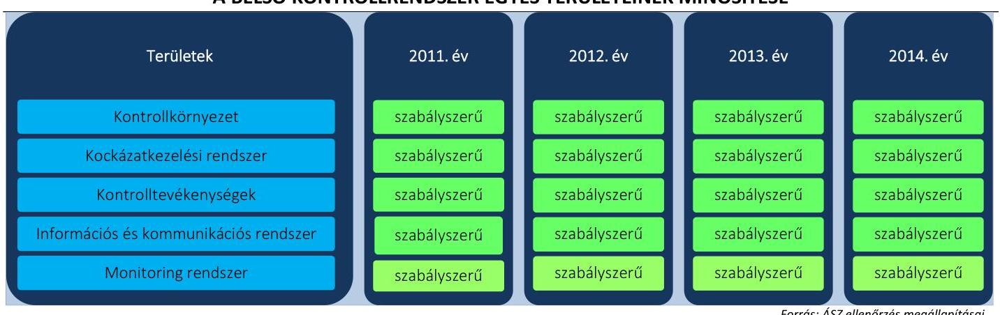

### 2.1. számú megállapítás

Az NKH kontrollkörnyezetét - kisebb hiányosságokkal - szabályszerűen alakította ki.

Az NKH rendelkezett SZMSZ-szel, gazdasági szervezet ügyrendjével ${ }^{19}$ és a gazdálkodással kapcsolatos belső szabályzatokkal.

Az NKH SZMSZ-ében az Áht.1,2 előírásainak megfelelően meghatározták a feladatellátás részletes belső rendjét és módját.

Az ügyrendet az Ámr., majd az Ávr. előírásainak megfelelően készítették el. Az ügyrend tartalmazta a gazdasági szervezet által ellátott feladatok munkafolyamatainak leírását, a feladat- és hatásköröket, a helyettesítés

---

rendjét, illetve a kapcsolattartás módját. Az ellenőrzött időszakban a gazdasági szervezetnél kinevezett vezető rendelkezett az Ámr.-ben, illetve az Ávr.-ben előírt végzettséggel. A munkaköri leírások tartalmazták a munkakör betöltésével kapcsolatos követelményeket a Kttv. ${ }^{20}$ előírásainak megfelelően.

Az NKH gazdálkodási szabályzata ${ }^{21}$ 2012. júniusig tartalmazta az önköltségszámítás rendjére vonatkozó szabályokat, 2014. szeptemberig tartalmazta a Számv.tv. 14. § (3) és (4) bekezdésében előírt számviteli politikát, továbbá az eszközök és források leltárkészítési és leltározási, az eszközök és források értékelési szabályait, a számlarendet, a bizonylati rendet és az eszközökre vonatkozó selejtezési szabályokat, valamint 2014. decemberig a pénzkezeléssel kapcsolatos szabályokat.

Az NKH 2012. júliustól külön szabályzatban adta ki az önköltségszámítási szabályzatot ${ }^{22}$, 2014. szeptembertől a számviteli politikát ${ }^{23}$, a leltározási és selejtezési szabályzatot ${ }^{24}$, az eszközök és források értékelési szabályzatot ${ }^{25}$, a számlarend és bizonylati rendet ${ }^{26}$.

Az Áhsz. ${ }_{1}$, illetve az Áhsz. ${ }_{2}$ előírásainak megfelelt az NKH számviteli politikája. A Számv. tv.-ben előírtaknak megfelelően tartalmazta, hogy mit tekint a számviteli elszámolás, és értékelés szempontjából lényegesnek, jelentősnek, nem lényegesnek, nem jelentősnek. A számviteli politikában meghatározták az általános költségek szakfeladatokra és az általános kiadások tevékenységekre történő felosztásának módját az Áhsz. ${ }_{1,2}$ előírásainak eleget téve.

A leltározás és leltárkészítés szabályozása során a Számv. tv., illetve az Áhsz. ${ }_{1}$, majd az Áhsz. ${ }_{2}$ előírásai alapján rögzítették a használt, de a mérlegben értékkel nem szereplő immateriális javak, tárgyi eszközök, készletek leltározásának módját, illetve a mennyiségi felvétellel történő leltározás gyakoriságát.

Az eszközök és források értékelésének szabályai a Számv. tv., illetve az Áhsz. ${ }_{1}$, majd az Áhsz. ${ }_{2}$ előírásainak megfelelt, előírták a követelések értékelésének elveit, szempontjait, a kis összegű követelések év végi meghatározásának elveit, dokumentálásának szabályait.

Az NKH számlarendje megfelelt az Áhsz. ${ }_{1,2}$ előírásainak, abban szerepeltek a Számv. tv.-ben meghatározott tartalmi elemek. A bizonylati rendet a Számv. tv., illetve az Áhsz. ${ }_{2}$ előírásainak megfelelően készítették el.

A pénzkezelés szabályai a Számv. tv., az Áhsz. ${ }_{1}$, illetve az Áhsz. ${ }_{2}$ előírásainak megfelelt. Az önköltségszámítás szabályai összhangban voltak a Számv. tv., az Áhsz. ${ }_{1}$, illetve az Áhsz. ${ }_{2}$ előírásaival.

A gazdálkodási szabályzat megfelelt az Áht. ${ }_{1}$, az Áht. ${ }_{2}$, az Ámr. és az Ávr. előírásainak. A gazdálkodási szabályzat tartalmazta a 100 ezer Ft alatti kifizetések előzetes írásbeli kötelezettségvállalás nélküli teljesítésének rendjét az Ámr. és az Ávr. előírásainak megfelelően.

A gazdálkodási szabályzat tartalmazta a Kbt. ${ }_{1}{ }^{27}$, illetve a Kbt. ${ }_{2}{ }^{28}$ előírásainak megfelelően a közbeszerzési eljárás előkészítésének, lefolytatásának, belső ellenőrzésének felelősségi rendjét, az adatfelelős nevében eljáró, illetve az eljárásba bevont személyek, szervezetek felelősségi körét, a közbeszerzési eljárás dokumentálási rendjét, valamint az eljárás során hozott döntésekért felelős személy megnevezését. A gazdálkodási szabályzat tartalmazta a Kbt. ${ }_{1,2}$ hatálya alá nem tartozó beszerzések lebonyolításának rendjét, amely az Ámr., illetve az Ávr. előírásainak megfelelt.

---

Ellenőrzési nyomvonallal, szabálytalanságkezelési eljárásrenddel az Ámr. -ben, illetve a Bkr. -ben előírtaknak megfelelően az NKH rendelkezett.

A Bkr. ${ }^{29}$ 6. § (1) bekezdés c) pontjában foglaltak ellenére az NKH a 20122013. évre vonatkozóan nem határozta meg az etikai elvárásokat. A 2014. évben a Hivatásetikai Kódex alkalmazásával tettek eleget az etikai elvárások előírásának.

# 2.2. számú megállapítás 

## A kockázatkezelési rendszer kialakítása és múködtetése szabályszerű volt.

Az NKH kialakította a szervezet kockázatkezelési rendszerét, a kockázatkezelési szabályzatban ${ }^{30}$ meghatározta a kockázat fogalmát, illetve a kockázatok azonosításával, elemzésével, csoportosításával és a kockázati kitettség csökkentésével kapcsolatos szabályokat. A kialakított kockázatelemzési és kockázatkezelési rendszert az Ámr., illetve a Bkr. előírásainak megfelelően működtették, az NKH tevékenységében, gazdálkodásában rejlő kockázatokat felmérték. A kockázatkezelési rendszer kialakítása és múködtetése megfelelt a jogszabályi előírásoknak.

A Vnytv. ${ }^{31}$-ben megfogalmazott rendelkezéseknek megfelelően meghatározták az SZMSZ-ekben a vagyonnyilatkozat tételre kötelezettek körét. A vagyonnyilatkozatok őrzéséért felelős személy, írásban tájékoztatta az érintetteket a vagyonnyilatkozat-tételi kötelezettségről és annak esedékességéről a Vnytv.-ben foglalt kötelezettségének megfelelően. A vagyonnyilatkozatok határidőben átadásra kerültek az annak őrzéséért felelős személy részére, aki nyilvántartásba vette és az egyéb iratoktól elkülönítetten kezelte a Vnytv. előírásainak megfelelően.

## 2.3. számú megállapítás

## A kontrolltevékenység kialakítása és múködtetése szabályszerű volt.

A kontrolltevékenységek részeként az Áht. ${ }_{1}$ és a Bkr. előírásainak megfelelően biztosították a folyamatba épített, előzetes, utólagos és vezetői ellenőrzést a pénzügyi döntések, a költségvetési gazdálkodás kontrollja, a gazdasági események elszámolása során.

Belső szabályzataikban a felelősségi körök meghatározásával szabályozták az engedélyezési, jóváhagyási és kontrolleljárásokat, a dokumentumokhoz és az informatikai rendszerekhez való hozzáférést, azok szintjeit és a beszámolási eljárásokat az Ámr. és a Bkr. előírásainak megfelelően.

A gazdálkodási jogköröket gyakorló személyeket az Ámr.-ben, illetve az Ávr.-ben foglaltaknak megfelelően írásban jelölték ki. A kulcskontrollok működtetése a 2011. évben részben megfelelő, a 2012-2014. években megfelelő volt.

Az informatikai rendszer szabályozása során kialakították az adatok biztonságának, védelmének érvényre juttatásához szükséges eljárási szabályokat az Avtv. ${ }^{32}$ és az Info. tv. ${ }^{33}$ előírásainak megfelelően.

Az NKH-ban szabályozták ${ }^{34}$ a közszolgálati jogviszony megszűnése esetén a munkakör átadásának rendjét a Kttv. és az lkr. előírásainak megfelelően. A kulcskontrollok működtetésének összesített értékelését a 3. táblázat mutatja.

---

### 2.4. számú megállapítás

Az információs és kommunikációs folyamatok kialakítása és múködtetése kisebb hiányosságok ellenére szabályszerű volt. A 20112012. évben a kötelezően közzéteendő adatok nyilvánosságra hozatalának rendjét nem szabályozták. A hiányosságot 2013. évtől megszüntették.

Az NKH kialakította a belső és külső információáramlás rendszerét az Ámr. és a Bkr. előírásai szerint. Az ellenőrzött időszakra vonatkozóan rendelkezett az Avtv. és az Info tv. előírásainak megfelelő adatvédelmi és adatbiztonsági szabályzattal.

Az NKH nem szabályozta a kötelezően közzéteendő adatok nyilvánosságra hozatalának rendjét a 2011-2012. évben az Ámr. 20. § (3) bekezdés i) pontja, az Info tv. 35. § (1) és (3) bekezdése, valamint az Ávr. 13. § (2) bekezdés h) pontja előírásaiban foglaltak ellenére. A szabályozási hiányosságot 2013. évtől megszüntették. Az elektronikus közzétételi kötelezettségnek az NKH a szabályozási hiányosság ellenére - egy bérbeadási szerződés kivételével - az ellenőrzött időszakban eleget tett az Info.tv.-ben és az Eitv.-ben ${ }^{35}$-ben előírtaknak megfelelően.

Az NKH-nál szabályozták a közérdekú adatok megismerésére irányuló igények teljesítésének rendjét az Avtv., az Ávr. és az Info tv. előírásai szerint.

Az Ltv. ${ }^{36}$-ben foglaltaknak megfelelően az NKH a Magyar Nemzeti Levéltárral egyetértésben adta ki iratkezelési szabályzatát ${ }^{37}$. Az iratkezelési szabályzat tartalmazta a küldemények átvételével, felbontásával, érkeztetésével, szignálásával, továbbításával, iktatásával, kiadmányozásával és elhelyezésével kapcsolatos szabályokat. Az iratok iktatásával, az iratforgalom dokumentálásával biztosították, hogy az iratok szervezeten belüli útja pontosan követhető és ellenőrizhető, az iratok holléte naprakészen megállapítható legyen.
2.5. számú megállapítás

A monitoring-rendszer kialakítása és múködtetése szabályszerű volt. A rendelkezésre álló források gazdaságos, hatékony és eredményes felhasználását biztosító követelmények kialakítása nem felelt meg a jogszabályi előírásoknak.

Az operatív tevékenységek folyamatos és eseti nyomon követési rendszerének kialakítása és múködtetése megfelelt az Ámr. és a Bkr. előírásainak, melyek keretében készültek az ellenőrzött időszakban jelentések, feljegyzések a döntések előkészítéséhez.

Az Áht.: 121/A. § (2) bekezdés a) pontja értelmében a belső kontrollrendszernek biztosítania kell, illetve 2012-től a Bkr. 4. § a) pontja értelmében a belső kontrollrendszer tartalmazza mindazon elveket, eljárásokat és belső szabályzatokat, amelyek biztosítják, hogy a költségvetési szerv valamennyi tevékenysége és célja összhangban legyen a gazdaságosság, hatékonyság és eredményesség követelményeivel. A rendelkezésre álló források gazdaságos, hatékony és eredményes felhasználását biztosító követelményeket - az Áht.: 121/A. § (2) bekezdés a) pontjában, illetve a Bkr. 4. § a) pontjában előírtak ellenére - nem alakítottak ki.

A 2011-2014. években a belső kontrollrendszer kialakításáról szóló nyilatkozatok tartalmazták, hogy az NKH vezetője gondoskodott a költségve-

---

tési szerv tevékenységében a hatékonyság, eredményesség és a gazdaságosság követelményeinek érvényesítéséről, amely nincs összhangban az ellenőrzés által feltártakkal. A teljesítmény-ellenőrzési modul megállapításait a II. sz. melléklet tartalmazza.

Az NKH-nál gondoskodtak a belső ellenőrzés kialakításáról a vonatkozó jogszabály előírásainak megfelelően. Meghatározták a Ber. ${ }^{38}$-ben, illetve a Bkr.-ben foglaltak alapján az NKH SZMSZ-ében a belső ellenőrzést végző szervezeti egység jogállását, feladatait. Biztosították a belső ellenőrök szervezeti és funkcionális függetlenségét, a belső ellenőri tevékenységnél érvényesültek az összeférhetetlenségi előírások. Az NKH rendelkezett rendszeresen felülvizsgált, aktualizált belső ellenőrzési kézikönyvvel ${ }^{39}$.

Az NKH az ellenőrzési időszak éveire vonatkozó jóváhagyott ellenőrzési tervvel rendelkezett, a tárgyévi ellenőrzési tervben foglalt ellenőrzéseket végrehajtották. Az elvégzett ellenőrzésekről a jelentéseket elkészítették.

A belső ellenőr javaslatainak végrehajtása érdekében a szervezeti egységek vezetői a Ber. és a Bkr. előírásainak megfelelő tartalmú intézkedési terveket készítettek. A belső ellenőrzési vezető által vezetett nyilvántartás biztosította a belső ellenőrzési jelentésekben tett megállapítások, javaslatok, a megtett intézkedések nyomon követését a Ber. és a Bkr. előírásainak megfelelően.

# 3. Az intézmény pénzügyi gazdálkodása szabályszerű volt-e? 

## Összegző megállapítás

Az NKH pénzügyi gazdálkodása kisebb hiányosságokkal öszszességében szabályszerű volt.
3.1. számú megállapítás

Az elemi költségvetés és az előirányzatok megállapítása során a jogszabályi előírásokat és a belső szabályzatokban foglaltakat betartották.

Az NKH elemi költségvetését a jogszabályi előírásoknak és a belső szabályzatokban foglaltaknak megfelelően állította össze. A költségvetés tervezésével és végrehajtásával kapcsolatos feladatokat a belső szabályzatokban (gazdálkodási szabályzat, illetve az ügyrend) rögzítették. Az NKH-nál az előirányzatok megállapítása az ellenőrzött időszakban az Áht.1.2, az Ámr. valamint az Ávr., az 5/2012. (III. 1.) NGM rendelet, a 10/2013. (III. 13.) NGM rendelet, az irányító szerv által kiadott tervezési szempontok, és a belső szabályzatokban foglalt előírások alapján történt. A költségvetés tervezését számításokkal alátámasztották, költségvetés kidolgozása során figyelembe vették a szintrehozások és egyéb változások (létszámváltozás, bírságok jogszabályi változása, díjtétel növekedés) módosító hatását.

Az NKH az előírt adatszolgáltatásokat teljesítette, az éves költségvetési javaslatát a felügyeleti szerv által megadott tervezési szempontok figyelembevételével, a kiküldött táblák kitöltésével készítette el. A költségvetési adatok rögzítését és az irányító szerv részére történő megküldését határidőben teljesítette. A kincstári költségvetés és az elemi költségvetés adatai megegyeztek.

---

### 3.2. számú megállapítás

A bevételi és kiadási előirányzatok módosítását - kisebb hiányosság mellett - a jogszabályokban és a belső szabályzatokban foglaltak szerint hajtották végre.

A bevételi és kiadási előirányzatok módosítása, azok nyilvántartása az ellenőrzött időszakban kisebb hiányosságok mellett megfelelt az Ámr. és az Ávr., valamint az irányító szerv előírásainak, illetve a belső szabályzatban foglaltaknak. Az NKH évenkénti előirányzat-módosításait a 2. táblázat mutatja.
2. táblázat

A 2011-2014. ÉVI ELŐIRÁNYZAT-MÓDOSÍTÁSOK HATÁSKÖR SZERINT (M Ft-ban)

|  |  |  |  |  |  |  |
| :--: | :--: | :--: | :--: | :--: | :--: | :--: |
| évek | Eredeti előirányzat | Módosított előirányzat | Összes előirányzat változás | Előirányzat módosítások |  |  |
|  |  |  |  | Országgyúlás | Kor-   miny | Irányító szerv |
| 2011. | 27453,5 | 32151,4 | 4697,9 | 0 | 14,1 | 750,0 |
| 2012. | 27443,5 | 31927,8 | 4484,3 | 0 | 15,7 | 1645,0 |
| 2013. | 28970,3 | 33767,1 | 4796,8 | 0 | 9,6 | 1616,4 |
| 2014. | 29 196,9 | 35696,5 | 6499,6 | 0 | 6,2 | 2333,3 |
| összesen |  |  | 20478,6 | 0 | 45,6 | 6344,7 |

Az NKH-nál, Országgyűlési hatáskörben előirányzat-módosítást nem hajtottak végre a 2011-2014. években, a kormányzati hatáskörben végrehajtott előirányzat-módosítások a bérkompenzációhoz kapcsolódtak. Az irányító szervi előirányzat-módosításokat döntően a közhatalmi díjak változásai (igazgatási szolgáltatási díjak, felügyeleti díjak) indokolták. Az intézményi hatáskörű előirányzat-módosítások alapvetően az előző évi maradvány, valamint különféle programok (KKBAP ${ }^{40}$, KÖZOP ${ }^{41}$, ÁROP $^{42}$ ) miatti támogatásértékű bevétel növekedéséhez kapcsolódtak.

A 2011-2014. években az előirányzat-módosításokról naprakész analitikus nyilvántartást vezettek, az előirányzat-nyilvántartásban kimutatott elő-irányzat-módosítások megegyeztek a főkönyvi könyvelésben nyilvántartott értékkel. Az előirányzatok, valamint azok módosításainak főkönyvi könyvelése - a 2011. évi irányítószervi előirányzat módosítás kivételével - az Áhsz. 1 9. számú mellékletében, valamint az Áhsz. 2 53. § (2) bekezdésében illetve a gazdálkodási szabályzatban előírtaknak megfelelően, szabályszerűen történt. A 2011. évi irányítószervi előirányzat módosítás téves könyvelését az okozta, hogy az irányító szerv által az Áht. ${ }_{1}$ 100/B. § (1) bekezdése alapján közhatalmi bevétel soron jóváhagyott előirányzat-módosítást az intézményi múködési bevételek soron módosították.

A NKH az előirányzat-módosításokat az ellenőrzött időszakban összességében szabályszerűen hajtotta végre. Az intézményi hatáskörében végrehajtott előirányzat-módosításokat a Kincstár és a fejezetet irányító szerv részére határidőre bejelentették a jogszabályi előírásoknak megfelelően.

A kormányzati hatáskörű előirányzat módosítás összegével 2011-2014. években elszámoltak, az elszámolás alapján kimutatott visszafizetési kötelezettségnek eleget tettek.

---

### 3.3. számú megállapítás

A bevételi előirányzatok teljesítése során - a 2011-2012. években az intézményi múködési bevételi előirányzatok teljesítését kivéve - betartották a jogszabályi előírásokat. A kiadási előirányzatok felhasználása 2011. évben részben felelt meg a jogszabályi előírásoknak az előirányzat túllépés és a kulcskontrollok múködésénél feltárt hiányosság miatt. A 2012-2014. években a kiadási előirányzatok felhasználása során összességében a kulcskontrollok múködésénél feltárt kisebb hiányosságok mellett a jogszabályi előírások érvényesültek.

A 2011-2014. években - a költségvetési beszámolók alapján - a költségvetési előirányzatok, a teljesített bevételek és a kiadások alakulását a 2. ábra mutatja.
2. ábra
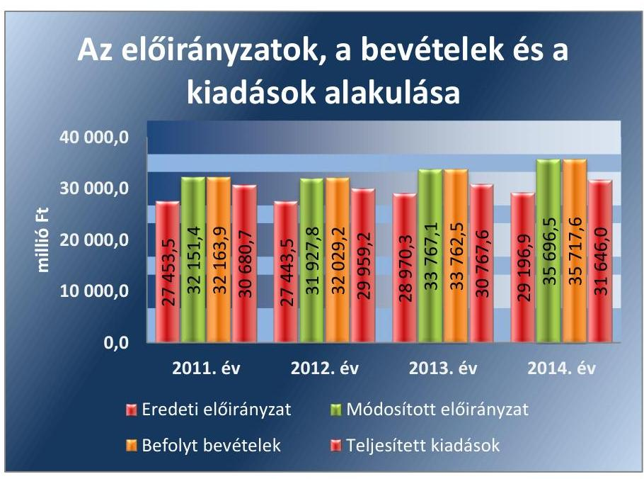

Forrás: Az NKH 2011-2014. évi költségvetési beszámolói
Az eredeti bevételi előirányzathoz viszonyítva az előirányzat-módosítások eredményeként a bevételi előirányzatok az ellenőrzött években 16-22\%-kal növekedtek, elsősorban a támogatási értékű bevételek évközi növekedése következtében.

A teljesített kiadások a 2012-2014. években nem érték el a módosított előirányzatok összegét, főként a dologi kiadások felhasználása és a beszerzési tilalom következtében a felhalmozási kiadások csökkenése miatt.

A 2011. évben a kiemelt egyéb múködési és felhalmozási célú kiadások módosított előirányzatát 3,1\%-kal túllépték az Áht. 12. § (2) bekezdésében előírtak ellenére. A 2012-2014. évben előirányzat túllépés nem történt, a kiadási előirányzaton belül gazdálkodtak.

Az Áht. 12. § (2) bekezdése, illetve az Áht. 2 4. § (2) bekezdése a költségvetési bevételek teljesítésének kötelezettségét írja elő, mely kettő esetben nem teljesült, mivel 2011. és 2012. évben az intézményi múködési bevételek nem érték el a módosított bevételi előirányzat összegét. A 2011. évben a módosított előirányzathoz képest a lemaradást döntően a hibásan könyvelt előirányzat-módosítás (lásd. 3.2 pontban) okozta.

---

3. táblázat

| A KULCSKONTROLLOK |  |
| :--: | :--: |
| MŰKÖDTETÉSÉNEK ÖSSZESÍTETT |  |
| ÉRTÉKELÉSE ÉVENKÉNT |  |
| Évek | Minősítés |
| 2011 | részben megfelelő |
| 2012 | megfelelő |
| 2013 | megfelelő |
| 2014 | megfelelő |

4. táblázat

| ELLENŐRZÖTT |  |
| :--: | :--: |
| KULCSKONTROLLOK |  |
| 2011 év | 2012-2014 év |
| szakmai teljesítés igazolás | teljesítés-igazolás |
| utalvány ellenjegyzés | érvényesítés |

A teljesített adatok alapján az éves bevételek 88-90\%-a az ellenőrzött években a közhatalmi bevételekből származott, míg a közhatalmi bevételek $88 \%$-át a közúti gépjármú közlekedéssel kapcsolatos bevételek jelentették. Ebben meghatározó a gépjármú vizsgáztatás, amelynek esetszáma a 2011. évi 1904,9 ezer db-ról a 2014. évre 2016,7 ezer db-ra növekedett. Jelentősebb bevételi tényező volt az előző évi maradvány felhasználása, valamint a különféle programokhoz kötődő támogatásértékű bevételek.

A kulcskontrollok múködése a kiadási előirányzatok felhasználása során összességében és évente értékelve, a 2011. évben részben megfelelő, a 2012-2014. években megfelelő volt, melyet a 3. táblázat mutat.

A 2011. évben a szakmai teljesítésigazolás és az utalványellenjegyzés, a 2012-2014. években a teljesítésigazolás és érvényesítés megfelelőségét a személyi juttatások, a dologi és felhalmozási kiadások, a pénzeszközátadások mintatételei alapján értékeltük. Az ellenőrzött kulcskontrollokat az 4. táblázat mutatja.

## A SZEMÉLYI JUTTATÁSOKNÁL

a rendszeres személyi juttatások esetében a 2011. évben több esetben előfordult, hogy az Áht. 1 100/C. § (6) bekezdésében foglaltak ellenére a pénzügyi teljesítést követően került sor az érvényesítésre, néhány esetben az Ámr. 78. § (2) bekezdés a) pontjában foglaltak ellenére hiányzott az utalvány ellenjegyzésének keltezése.
a nem rendszeres személyi juttatások esetében 2011. évben néhány esetben az Áht. 1 100/C. § (6) bekezdésében foglaltak ellenére a pénzügyi teljesítést követően került sor az utalvány ellenjegyzésre, továbbá az Ámr. 78. § (2) bekezdés a) pontjában előírtak ellenére hiányzott az utalvány ellenjegyzésének keltezése.
a külső személyi juttatások kifizetéseinél 2011. évben előfordult, hogy az Áht. 1 100/C. § (6) bekezdésében foglaltak ellenére a pénzügyi teljesítést követően került sor az utalvány ellenjegyzésre, továbbá az Ámr. 78. § (2) bekezdés a) pontjában előírtak ellenére hiányzott az utalvány ellenjegyzésének keltezése.

A PÉNZESZKÖZ ÁTADÁSNÁL 2011. évben előfordult, hogy az Ámr. 78. § (2) bekezdés a) pontjában előírtak ellenére hiányzott az utalvány ellenjegyzésének keltezése, a 2014. évben nem minden esetben történt meg az Ávr. 57. § (1) bekezdésében foglaltak ellenére a teljesítés igazolása, valamint az Ávr. 58. § (1) bekezdésben előírt érvényesítés.

## A DOLOGI KIADÁSOKNÁL

a 2011. évben több esetben az Ámr. 78. § (2) bekezdés a) pontjában foglaltak ellenére hiányzott az utalvány ellenjegyzésének keltezése.
a 2013. évben eseti hiba volt, hogy a főkönyvi számla kijelölése nem az Áhsz. 1 9. számú melléklet 4. h) pontban megadott előírás szerint történt, mivel a túlfizetés visszautalását tévesen a dologi kiadások között számolták el.

---

# A FELHALMOZÁSI KIADÁSOKNÁL 

a 2011. évben esetenként előfordult, hogy az Ámr. 78. § (2) bekezdés a) pontjában foglaltak ellenére hiányzott az utalványozás ellenjegyzőjének keltezéssel ellátott aláírása.
A Kbt. ${ }_{1}$, Kbt. ${ }_{2}$ hatálya alá tartozó dologi és felhalmozási mintatételek esetében az NKH a közbeszerzési eljárást dokumentálta, a közbeszerzés tárgyának becsült értékét meghatározták a Kbt. ${ }_{1}$, Kbt. ${ }_{2}$ előírásait figyelembe véve. A szerződést a közbeszerzési eljárás nyertesével kötötték meg.

Az ellenőrzött kifizetéseknél szabálytalan közpénzfelhasználás nem volt.

Elöirányzat felhasználást korlátozó évközi intézkedések nem történtek, az előírt befizetési kötelezettségek teljesítése megvalósult, az előirányzat-maradvány megállapítása és felhasználása szabályszerű volt.

Az előirányzat felhasználást korlátozó intézkedések nem voltak, az előírt befizetési kötelezettségeket az NKH teljesítette.

A Kvtv. ${ }^{43}$ az NKH részére bevételeiből a központi költségvetés részére a 2011. évre 17 652,0 M Ft, a Kvtv. ${ }^{44}$ a 2012. évre 20 730,5 M Ft, a Kvtv. ${ }^{45}$ a 2013. évre 21 118,0 M Ft, Kvtv. ${ }^{46}$ a 2014. évre 21 118,0 M Ft költségvetési befizetési kötelezettséget határozott meg, amelyek teljesítése szabályszerűen megtörtént. A Kvtv ${ }_{1,2,3,4}$ alapján az NFM évente utasításban előírta a negyedévi befizetési kötelezettségek teljesítésének időpontját és összegét, aminek az NKH határidőben eleget tett. A felügyeleti szerv a költségvetési egyensúly biztosítása érdekében az NKH részére a bevételek terhére további befizetési kötelezettségeket határozott meg, amelyet az NKH teljesített.

A tárgyévi előirányzat-maradványok megállapítására és az előző évi elő-irányzat-maradvány felhasználására vonatkozóan az Ámr. és az Ávr.-ben foglaltakat betartották. Az előirányzat-maradványok évenkénti alakulását az 5. táblázat szemlélteti.
5. táblázat

A 2011-2014. ÉVI ELŐIRÁNYZAT-MARADVÁNYOK (M Ft-ban)

| évek | összes   előirányzat-maradvány | kötelezettségvállalással   terhelt | szabad |
| :--: | :--: | :--: | :--: |
| 2011. | 1499,7 | 1250,9 | 248,8 |
| 2012. | 2069,7 | 1968,3 | 101,4 |
| 2013. | 2994,9 | 2951,9 | 43,0 |
| 2014. | 4071,6 | 3955,1 | 116,5 |

Forrás: Az NKH 2011-2014. évi költségvetési beszámolói
Az NKH-nál az év végi előirányzat maradvány növekedését az ellenőrzött időszakban alapvetően a bevételek folyamatos emelkedése, valamint a felhalmozási kiadások visszaesése eredményezte.

A kötelezettséggel terhelt maradvány, illetve az előirányzat-maradványból a központi költségvetést megillető maradvány megállapítása és befizetése az Ámr. és az Ávr. előírásai szerint történt. Az NKH az előirány-zat-maradványáról az előírt határidőben és tartalommal teljesítette az irányító szerv felé előírt adatszolgáltatási kötelezettségét. A tárgyévet követő

---

# 3.5. számú megállapítás 

év június 30 -áig pénzügyileg nem teljesült, illetve meghiúsult kötelezettségvállalás miatt szabaddá vált előirányzat-maradványról a felügyeleti szerv felé az adatszolgáltatást teljesítették.

A kötelezettséggel terhelt maradvány megállapítása, felhasználása szabályszerű volt, a 2011-2014. évi előirányzat-maradvány felhasználása megfelelő az Ámr. és Ávr. előírásainak.

Az NKH-nál a fizetőképesség folyamatos fennállása, a likviditás javítása érdekében nem volt szükség intézkedésre. Az NKH-nál biztosított volt a folyamatos fizetőképesség.

A folyamatos fizetőképesség biztosítása érdekében előirányzat-felhasználási tervet, illetve 2012. évtől likviditási tervet készítettek, amely részben felelt meg a jogszabályi előírásoknak. A 2012-2014. évekre az Áht.; 78. § (2) bekezdése alapján készített likviditási terv az Ávr. 122. § (1) bekezdésében foglaltak ellenére nem tartalmazta a tárgyhónapra vonatkozóan a dekádonkénti ütemezést, illetve az időszak elején rendelkezésre álló készpénz és számlaállomány összegét. Az NKH likviditási helyzete az ellenőrzött időszakban megfelelő volt, a pénzeszközök és a forgóeszközök többszörös fedezetet nyújtottak a rövid lejáratú kötelezettségek fedezetére, amit a likviditási mutatók is alátámasztanak. A pénzügyi stabilitás és likviditás biztosított volt. Az NKH likviditási helyzetének 2011-2013. évi mutatóit a 3. ábra szemlélteti.
3. ábra
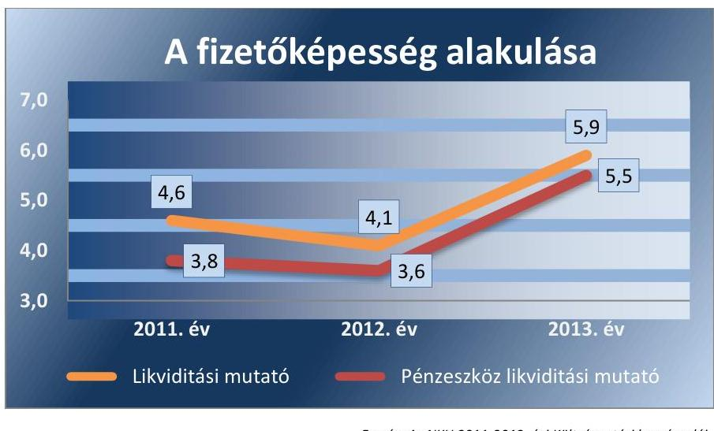

Forrás: Az NKH 2011-2013. évi Költségvetési beszámolói

Az NKH-nál az ellenőrzött években a szállítói számlák és egyéb kötelezettségek határidőben történő kiegyenlítése biztosított volt. Az NKH év végi pénzeszköz állománya többszörös fedezetet nyújtott a szállítói kötelezettségek összegére. Az NKH a takarékosság, a költségek csökkentése érdekében 2011-2014. években hozott intézkedéseket, azonban annak hatását nem számszerűsítették.

A KÖVETELÉSÁLLOMÁNY, annak nagyságrendje és összetétele a fizetőképesség alakulására negatív hatással nem volt. Az NKH vevői követelés állománya nem jelentős, az adott évi bevételekhez viszonyított mértéke az egy százalékot (1,2\%) csak a 2011. év végén haladta meg. Éven túli vevő követelése nem volt.

---

# 3.6. számú megállapítás 

Az NKH végrehajtotta az eredményszemléletú számvitel bevezetésével kapcsolatos feladatokat.

AZ EREDMÉNYSZEMLÉLETŰ SZÁMVITEL bevezetését a jogszabályi előírásoknak megfelelően előkészítették. A rendező, technikai tételek elszámolását megelőzően a 36/2013. (IX. 13.) NGM rendeletben foglaltak alapján az átkönyvelést, valamint az átvezetéseket elvégezték.

Az eredményszemléletű számvitelre történő áttérés feladatait szabályszerűen végrehajtották. A 36/2013. (IX. 13.) NGM rendelet előírásainak megfelelően a 2014. január 1-jei fordulónappal, határidőben, az előírt formátumban és tartalommal állították össze a rendező mérleget. A 2014. évi nyitómérleg és a rendező mérleg adatai - 7596,1 M Ft mérleg főösszeggel - egyezőek voltak. A leltárfelvétellel kapcsolatos feladatokat elvégezték. A rendező mérleg elkészítéséhez 2013. december 31-i mérleg fordulónappal teljes körű leltározást végeztek. Ennek keretében a mennyiségben nyilvántartott eszközöket tényleges mennyiségi felvétellel, az értékben nyilvántartott észközöket, forrásokat egyeztetéssel leltározták.

## 4. Az NKH vagyongazdálkodása szabályszerű volt-e?

## Összegző megállapítás

Az NKH vagyongazdálkodása részben felelt meg jogszabályi előírásokban és a belső szabályozásban foglaltaknak.

### 4.1. számú megállapítás

A vagyonkezelési szerződés nem felelt meg a jogszabályi előírásoknak.

Az ellenőrzött időszakban az NKH az MNV Zrt. ${ }^{47}$-vel 2010. április 9-én kötött vagyonkezelési szerződéssel ${ }^{48}$ rendelkezett, melyet a felügyeleti szerv jóváhagyott. Az NKH, mint vagyonkezelő az ellenőrzött időszakban a rábízott állami vagyonon túlmenően saját vagyonnal nem rendelkezett.

A 2011-2013 években az NKH által kezelt vagyonelemek körében többször történt változás. A 263/2006. (XII. 27.) Korm. rendelet ${ }^{49}$ 2011. január 1-jétől hatályos 3/A. § (1) bekezdése szerint 2011. január 1-től az NKH megyei és fővárosi közlekedési felügyelőségei a Khtv. alapján 2011. január 1. napjával létrejött Kormányhivatalok közlekedési szakigazgatási szervei lettek. Ezzel összefüggésben a 288/2010. (XII. 21.) Korm. rendelet 29. § (8) bekezdése előírta a feladatellátáshoz kapcsolódó vagyoni jogok, ingó és ingatlan állomány térítésmentes átadását a jogutód Kormányhivatal részére. A 2011-2012. évben a 2011. évi jogszabály szerinti szervezeti- és feladatváltozással összefüggésben az NKH vagyona bruttó 16 522,2 M Ft-tal (nettó 7293,0 M Ft) csökkent. A 2013. évben további feladatváltozással a centralizált tartományvezérlés és szakmai rendszerek központosított kialakítása feladat Kormányhivatalok részére történő átadásával - összefüggésben az NKH vagyona bruttó 51,9 M Ft-tal (nettó értéke 0 Ft ) csökkent.

Az NKH a vagyonkezelésében lévő vagyonelemeket (ingatlanok, tárgyi eszközök, járművek, informatikai eszközök) a jogszabály, illetve a Kormányhivatalokkal kötött kétoldalú megállapodások alapján 2011-2013. években térítésmentesen átadta a Kormányhivatalok részére, azonban a vagyonváltozás ellenére a Vagyonkezelési szerződést a Vtvr. 8. § (2) és (6) bekezdésében előírtak szerint nem módosították, illetve nem foglalták 60 napon

---

belül módosításokkal egységes szerkezetbe. A vagyonkezelési szerződés hatályon kívül helyezett - Ámr., Áht. 1 - jogszabályi hivatkozásokat tartalmazott. Az NKH elnöke 2012. évben, levélben jelezte az MNV Zrt. részére a vagyonkezelési szerződés módosításának szükségességét, azonban a vagyonkezelési szerződés módosítására az ellenőrzött időszakban nem került sor. Az NKH, a Kormányhivatalok részére térítésmentesen átadott vagyontárgyak könyvviteli elszámolását - a megállapodások alapján - a Számv. tv.ben foglaltaknak megfelelően végezte.

A Vtvr. ${ }^{50}$-ben foglaltaknak megfelelően a vagyonkezelési szerződésben rögzítették az értéknövelő beruházás, felújítás, valamint a létrehozott új eszköz értékével kapcsolatos adatszolgáltatás módját és gyakoriságát, annak rendjét és tartalmát.

Az NKH az MNV Zrt. felé a Vtvr.-ben és a vagyonkezelési szerződésben előírtak szerint az állami vagyonnal kapcsolatos éves adatszolgáltatási kötelezettségét teljesítette.

# 4.2. számú megállapítás 

A jogszabályok és a belső szabályzatok előírásainak megfelelően történt a mérlegben kimutatott eszközök és források nyilvántartása, értékelése, leltározása.

A Számv.tv.-ben foglalt előírásoknak megfelelően történt a mérlegben kimutatott eszközök bekerülési értékének megállapítása, állományba vétele, nyilvántartása, év végi értékelése, az értékcsökkenés elszámolása.

Az ellenőrzött időszakban a jogszabályi előírásoknak és a belső szabályzatokban foglaltaknak megfelelően elvégezték a mérlegben szereplő eszközök és források év végi értékelését. A mérlegtételek értékelése során a 2011. évben az adósok és a vevők, a 2012-2014. években a vevők esetében számoltak el értékvesztést az Áhsz.1,2-ben foglaltaknak megfelelően. Az NKH követelésről nem mondott le.

Az NKH az éves költségvetési beszámoló elkészítéséhez, a könyvviteli mérlegben kimutatott eszközök és források valódiságát a 2011-2014. évekre vonatkozóan leltárakkal alátámasztották, melyek tételesen tartalmazták az eszközöket mennyiségben és értékben, a forrásokat értékben a Számv. tv., valamint Áhsz.1,2 alapján.

A LELTÁROZÁS ÉS A SELEJTEZÉS végrehajtása a jogszabályi előírásoknak és a belső szabályozásnak megfelelően történt. A leltározást a Számv. tv. az Áhsz.1,2 valamint a belső szabályozás előírásainak megfelelően hajtották végre.

A 2011-2014. évek közötti időszakban minden évben teljes körűen leltározták a mennyiségben nyilvántartott eszközöket, egyeztetéssel leltározták a forrásokat és az értékben nyilvántartott eszközöket az NKH valamenynyi szervezeti egységénél. A leltározások szervezését, végrehajtását, dokumentálását a belső szabályozás alapján végezték el. A leltárak kiértékelése megtörtént, a leltárkülönbözeteket a záró jegyzőkönyvben rögzítették, az eltéréseket a könyvekben rendezték.

A selejtezések 2012-2014. évi végrehajtása és dokumentálása a belső szabályozásban foglaltaknak megfelelően történt. A selejtezett eszközök számviteli rendezését, nyilvántartásokból való kivezetését végrehajtották.

Az NKH, mint vagyonkezelő a Vtvr. 9. § (3) bekezdésében és a vagyonkezelési szerződésben előírt nyilvántartási kötelezettségét teljesítette.

---

### 4.3. számú megállapítás

6. táblázat

2011-2013. ÉVEKBEN AZ NKH ÁLTAL TÉRÍTÉSMENTESEN ÁTADOTT VAGYONELEMEK (M FT-BAN)

|  Megnevezés | Bruttó ér-   tek | Nettó ér-   tek  |
| --- | --- | --- |
|  Immateriális   javak | 1304,3 | 92,2  |
|  Ingatlan | 8307,0 | 6638,7  |
|  Gépek, beren-   dezések, fel-   szerelések | 5012,4 | 380,8  |
|  jármúvek | 1950,4 | 181,3  |
|  Összesen | 16574,1 | 7293,0  |

Az NKH a jogszabályok és a vagyonkezelési szerződés előírásai szerint a 2011-2014. években az állagmegóvási kötelezettségét teljesítette, a 2011-2012. évben az értékmegőrzési kötelezettségét nem teljesítette. A 2013-2014. években jogszabály alapján mentesült a visszapótlási kötelezettség alól.

Az NKH részére, mint vagyonkezelő az állagmegóvási, értékmegőrzési kötelezettséget a vagyonkezelési szerződés és a Vtv. ${ }^{51}$ rögzítette. Az NKH, mint vagyonkezelő a Vtv. és a vagyonkezelési szerződés előírásának megfelelően gondoskodott a vagyontárgyak állagának megóvásáról. Az NKH az éves karbantartási előirányzataiból finanszírozta az állami vagyon állagának megóvását. Karbantartásra, kisjavításra az ellenőrzött időszakban öszszesen 258,7 M Ft-ot fordítottak, amely a módosított előirányzat 90,4 \%-a.

Az NKH 2011 - 2013. években a vagyonkezelésében lévő vagyonelemekből (ingatlan, gépek, berendezések, felszerelések, járművek, immateriális javak) térítésmentes átadással a számviteli nyilvántartásából bruttó értékben összesen 16 574,1 M Ft-ot (nettó értékben 7293,0 M Ft) vezetett ki. A Számv. tv.-nek megfelelően a bruttó érték kivezetése mellett elvégezték az értékcsökkenések kivezetését. A 2011-2013. években az NKH által térítésmentesen átadott vagyonelemek bruttó és nettó értékét a 6. táblázat mutatja.

Az NKH a Vtv. és a vagyonkezelési szerződés alapján 2011-2014. években nem teljesítette az értékmegőrzési kötelezettségét, azonban az NKH alaptevékenységeként közfeladatot ellátó vagyonkezelőként a Vtv. 27. § (8) bekezdése alapján 2013. június 28-tól mentesült a visszapótlási kötelezettség alól. A 2011-2014. években az elszámolt - az eszközök térítésmentes átadásával összefüggő értékcsökkenéssel korrigált - értékcsökkenés meghaladta az eszközök pótlására fordított kiadásokat. A 2011-2014. években az NKH költségvetéseiben eredeti előirányzatként összesen 4015,7 M Ft felhalmozási kiadást (beruházási, felújítás) tervezett, amely a módosítást követően 4789,7 M Ft-ra változott, a teljesítés 2763,1 M Ft volt. A felhalmozási kiadásokból beruházásra 2550,1 M Ft-ot, felújításra 213,0 Ft-ot fordítottak. Az NKH 2011-2014. évi összesített teljesített költségvetési kiadási főösszegének (123 063,7 M Ft) 2,2\%-át fordította felhalmozási kiadásokra. A beruházási, eszközbeszerzési kiadások tervezett szintű elmaradásához hozzájárult, hogy kormányhatározatokkal elrendelt beszerzési korlátozás volt érvényben az ellenőrzött időszakban. Az NKH-ra bízott állami tulajdonú eszközökön végzett beruházás, felújítás elszámolása során a jogszabályi előírásokat betartották.

Az ellenőrzött időszakban a 2011. évhez képest a 2014. évre az NKH vagyonelemeinek használhatósága évről évre csökkent (36,6\%-ról 13,5\%ra), az elhasználódási szint (63,4\%-ról 86,5\%-ra) emelkedett.

Az NKH eszközei elhasználódásának alakulását a 4. ábra mutatja be.

---

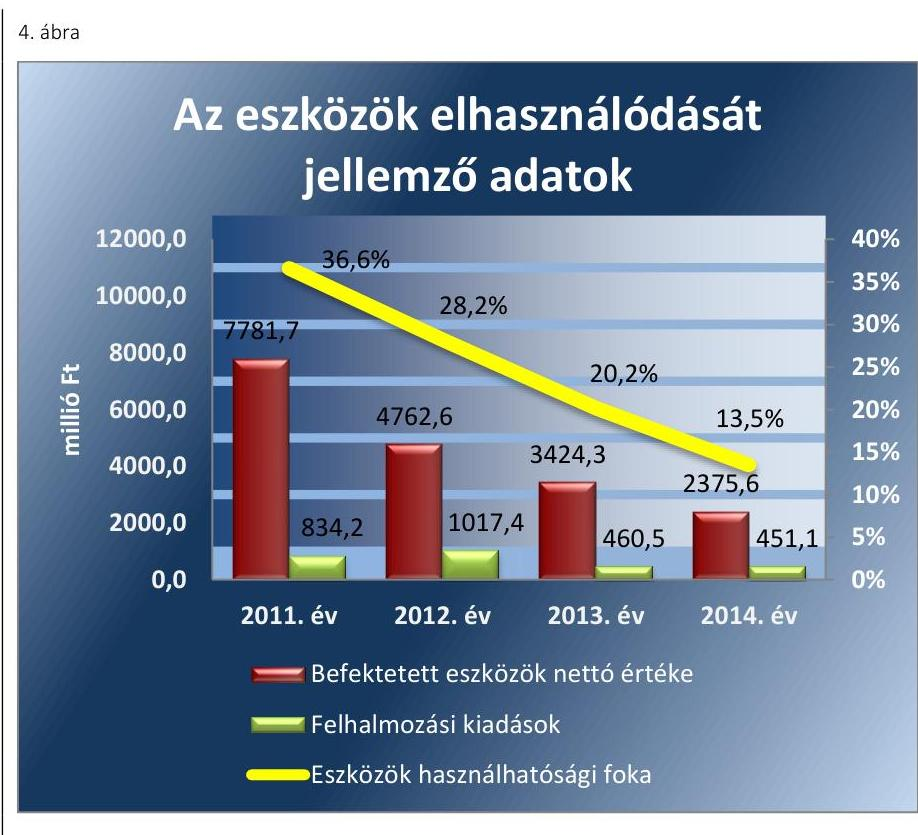

Forrás: Az NKH 2011-2014. évi költségvetési beszámolói
Az NKH-nál a 2011. évi 19 799,7 M Ft-os nyitó értékről a 2014. év végére a 10 997,1 M Ft vagyoncsökkenést a 2011. évi szervezeti- és feladatváltozáshoz kapcsolódó - nettó 7293,0 M Ft összegű - térítésmentes vagyonátadás, az évente elszámolt terv szerinti értékcsökkenés és selejtezés okozta. A térítésmentes vagyonátadás következtében a legmagasabb 56,0\%-os vagyoncsökkenés a 2011 évi nyitó értékről 2012. év végére történt. A térítésmentes vagyonátadás hatására a befektetett eszközök állományának 2011. évi nyitó értéke 2012. év végére 66,1\%-kal, ezen belül a tárgyi eszközök állománya 87,3\%-kal, az immateriális javak állománya 34,2\%-kal csökkent. A tárgyi eszközökön belül az ingatlanok és kapcsolódó vagyoni értékű jogok állományának értéke 87,8\%-kal, a gépek berendezések, felszerelések állományának értéke 85,3\%-kal, a járművek állományának értéke 88,4\%-kal csökkent. A 2012. évet követően a tárgyi eszközök és immateriális javak állománya a 2012. évi 4665,2 M Ft-ról 2013. év végére 28,5\%-kal, a 2014. év végére 28,6\%-kal csökkent.

Az NKH vagyonának alakulását a IV. számú melléklet mutatja be.

# 4.4. számú megállapítás 

A vagyonelemek elidegenítése, hasznosítása a jogszabályoknak és a belső szabályzatok előírásainak nem felelt meg, döntően a bérbeadás feladatellátása miatt nem volt szabályszerű.

Az NKH bevételei között a 2011-2012. években 12,0 M Ft felhalmozási bevételt realizált tárgyi eszközök értékesítéséből. A 2013-2014. években felhalmozási bevétel nem folyt be. Bérleti és lízingdíj jogcímen a 2011-2014. években, növekvő évsorrendben 9,7 M Ft, 8,4 M Ft, 7,7 M Ft, 7,1 M Ft bevétel folyt be az NKH-hoz.

Eszközértékesítésekre - mobiltelefon, notebook, GPS - az ellenőrzött időszakban jellemzően nyugdíjazás miatt, továbbá a működéséhez már

---

nem szükséges tárgyi eszközök - személygépkocsik, leltározó gépek, klíma berendezések, bútor - értékesítése miatt került sor.

Az értékesítéseknél a bevételeket kiszámlázták az Áfa. tv. szerint, amelyek a kiszámlázott összegben folytak be az Áht. 1 és az Áht. 2 előírásának megfelelően. A befolyt bevétel jóváírása - néhány eset ( $0,2 \mathrm{M}$ Ft összeg) kivételével - határidőben megtörtént, továbbá a nyilvántartásba vétele (analitika, főkönyv) az Áhsz.1,2 előírásainak megfelelő volt.

Az NKH-nak a 2011-2012. évi eszközértékesítéseknél a Vtv. előírásainak megfelelően nem kellett versenyeztetést lefolytatni az éves költségvetési törvényben meghatározott egyedi bruttó $25,0 \mathrm{M}$ Ft forgalmi értéket el nem érő vagyontárgyak értékesítésénél. A müködéséhez már nem szükséges tárgyi eszközöket a Vtv. 33. § (2) bekezdése alapján értékesítették.

A 100000 Ft egyedi nyilvántartási ár alatti vagyontárgyak eladási árát a gazdálkodási szabályzat előírásainak megfelelően határozták meg. A 100000 Ft egyedi nyilvántartási árat meghaladó vagyontárgyak eladási árát a gazdálkodási szabályzat ${ }_{1,2}$ 6.2.3.2. pontjának előírása ellenére dokumentumokkal nem támasztották alá. A vagyontárgyak (leltározó gépek, klímaberendezések) értékesítése esetén hivatásos értékelő cég, illetve azonos profilú eszközforgalmazó cég értékbecslését - mint az eladási árat megalapozó, alátámasztó dokumentumot - a gazdálkodási szabályzatban előírtak ellenére nem kérték be.

A BÉRBEADÁS nem felelt meg a jogszabályokban és a belső szabályozásban előírtaknak. A Magyar Állam tulajdonában, az NKH vagyonkezelésében levő vagyonelemek használatát (hasznosítás bérbeadással) az Áht. 1 109. § (7) bekezdése, valamint az Áht. 2 45. § (4) bekezdése alapján adták bérbe HungaroControll Légiforgalmi Szolgálat Zártkörűen Müködő Részvénytársaság részére. A bérleti szerződések időtartamát az Nvtv. ${ }^{52}$ ben foglaltak szerint állapították meg. A bérbevevő a szerződésekben azt vállalta, hogy az előírt beszámolási, nyilvántartási, adatszolgáltatási kötelezettségeket teljesíti, továbbá hogy az átengedett nemzeti vagyont a szerződési előírásoknak és a tulajdonosi rendelkezéseknek, valamint a meghatározott hasznosítási célnak megfelelően használja. Az átengedett nemzeti vagyon hasznosítására vonatkozó kettő szerződésben az Nvtv. 11. § (11) bekezdés c) pontjában foglaltakat ellenére nem szerepelt, hogy a hasznosításban - a hasznosítóval közvetlen vagy közvetett módon jogviszonyban álló harmadik félként - kizárólag természetes személyek vagy átlátható szervezetek vesznek részt.

Az NKH a HungaroControll Magyar Légiforgalmi Szolgálat Zártkörűen Müködő Részvénytársasággal a 2013-2014. évre vonatkozó kettő bérleti szerződés megkötésénél nem tartotta be a vagyonkezelési szerződés 4.10 pontjában előírtakat, mivel a bérbeadáshoz nem rendelkezett az MNV Zrt. hozzájárulásával. A vagyonkezelési szerződés 4.10 pontja előírta, hogy ingatlan bérbeadása esetén az MNV Zrt. hozzájárulása szükséges. A 20132014. évi bérleti díjak megállapítását a gazdálkodási szabályzat 6.2.3.3. pontjában előírtak ellenére díjkalkulációval nem támasztották alá.

Az Info tv. 33. § (1)-(2) bekezdéseiben, a 37. § (1) bekezdésében, az 1. számú melléklet III/4. pontjában foglaltak ellenére a parkoló 2013-2014. évi bérleti szerződései esetében az NKH közzétételi kötelezettségének honlapján ${ }^{53}$ nem tett eleget.

---

Az NKH a vagyonelemek elidegenítése tekintetében az MNV Zrt. és az irányító szerv engedélyéhez kötött - Vtvr. szerinti - értékesítés a 20112014. években nem volt. Vagyonkezelői jogot az ellenőrzött időszakban harmadik személyre nem ruházott át, figyelemmel az Nvtv.-ben foglaltakra.

# 5. Szabályszerúen hajtották-e végre az ellenőrzött időszakban az intézményt érintő szervezeti, szerkezeti átalakításokat? 

Összegző megállapítás

Szabályszerúen hajtották végre az ellenőrzött időszakban az NKH-t érintő szervezeti, szerkezeti változásokat, ugyanakkor a vagyonátadás alapjául szolgáló megállapodások megkötése időben elhúzódott, nem kötötték meg a jogszabályban előírt határidőre.
5.1. számú megállapítás

Az ellenőrzött időszakban az NFM átszervezéshez, átalakításhoz kapcsolódó alapítói, irányító, felügyeleti szervi döntései szabályszerűek voltak.

Az NKH területi szerveit érintő 2011. január 1-jei átalakulásával összefüggésben az NFM gondoskodott az átalakulást előíró jogszabályok alapján az NKH-nál a vagyonátadás lebonyolításáért felelős személyek kijelöléséről. Meghatározta az átalakulással kapcsolatos feladatok határidejét, foglalkoztatottakkal kapcsolatos munkáltatói intézkedéseket, a munkáltatói intézkedések végrehajtásának a határidejét, a közfeladatokat a továbbiakban ellátó szervek részéről történő továbbfoglalkoztatás lehetőségét.

Az NFM előírta az eszközök és a források leltározását, az éves költségvetési beszámoló elkészíttetését, az ellátandó közfeladatokhoz tartozó hatósági engedélyeknek - az átalakuló költségvetési szerv kérelmére történő - visszavonását, az ellátandó közfeladatokhoz tartozó hatósági engedélyeknek - az átalakulás utáni költségvetési szerv számára történő - előkészítését, a díjbeszedési jogosultság átadásának előkészítését, az átalakulás utáni NKH szervezeti formáját.

Az NFM az Áhsz. alapján biztosította az átadás-átvétel alapját képező éves elemi költségvetési beszámoló, illetve a vagyonátadás-átvételről készített jegyzőkönyv egy-egy aláírt példányának megőrzését.

Az NFM teljesítette a bejelentési és átvezetési kötelezettségét a törzskönyvi nyilvántartásban a Kincstárnál, az általa irányított NKH vonatkozásában. Az átalakítást elrendelő okirat tartalmazta Ávr.-ben meghatározott tartalmi elemeket.

---

### 5.2. számú megállapítás

Az NKH átalakításából, átszervezéséből adódó feladatok ellátása a megállapodások határidőben történő megkötése kivételével szabályszerű volt. A vagyonátadás alapjául szolgáló megállapodások megkötése időben elhúzódott, nem kötötték meg a jogszabályban előírt határidőre.

Az NKH területi szervei jogszabályban előírt átalakulásával összefüggésben a 288/2010. (XII. 21.) Korm. rendelet 29. § (8) bekezdése előírta a feladatellátáshoz kapcsolódó vagyoni jogok, ingó és ingatlan állomány térítésmentes átadását a jogutód Kormányhivatal részére. A feladat és hatáskörök és az ahhoz kapcsolódó jogviszonyok tekintetében a jogszabály, az átalakulásban érintett szervek részére előírta a jogutódlás egyes kérdéseinek megállapodásban történő rögzítését.

A feladat átadás 2011. január 1-jén megtörtént. Az NKH és a Kormányhivatalok közötti - a feladatátadáshoz kapcsolódó jogutódlás egyes kérdéseit rögzítő - megállapodások a 288/2010. (XII. 21.) Korm. rendelet 34. § (1) bekezdésében foglalt - 2010. december 28. - határidőn túl 2011. január 1. és 2012. június 30 közötti időszakban, különböző időpontokban kerültek megkötésre.

Az NKH az Áhsz.1 előírásainak megfelelő adattartalommal 2011. évben az alapító szerv által meghatározott fordulónappal - 2010. december 31el - elkészítette a beszámolóját. Az NKH által elkészített beszámoló tartalmazta az Áhsz.1-ben előírtaknak megfelelően a könyvviteli mérleget, a pénzforgalmi jelentést/költségvetési jelentést, az előirányzat maradványkimutatást, a vállalkozási maradvány-kimutatást, a kiegészítő mellékletet, a szöveges indoklást.

Az NKH a 2011. január 1-jei szervezeti- és feladatváltozáshoz kapcsolódó vagyont 2011. és 2012. évben térítésmentesen átadta - a törvényi előírás és megállapodás alapján - a feladatot átvevő fővárosi és megyei Kormányhivatalok részére. A vagyonátadásra az NKH mérlegében szereplő adatok, valamint a mérleget alátámasztó leltár alapján került sor. A vagyonátadás a 2010. december 31-ei fordulónappal készült mérleget alátámasztó leltár alapján a tényleges vagyonátadás napjára aktualizálva történt. A vagyonátadás leltárral és egyéb dokumentummal (megállapodás, jegyzőkönyvek, tételes összesítő kimutatások) alátámasztott volt.

Az NKH-t 2012-2014. években további feladat átvétel és átadás is érintette. A 2012. év január 1-jén az NKH átvette az IRIS Europe II Projekt Folyami Információs Szolgáltatások megvalósítása (WLAN hálózatok telepítése) feladatot. Az NKH a 2013. szeptember 10-én a 2011 EU-70001-S számú döntés alapján megkapta az IRIS Europe III. TENT Projekt - számítástechnikai eszközöket (2,0 M Ft), 2014.július 29-én ECDIS térkép-megjelenítő szoftvereket (58,1 M Ft). Továbbá az NKH 2013-ban a Kormányhivatalok részére átadta (bruttó 51,9 M Ft) a Centralizált tartományvezérlés és szakmai rendszerek központosított kialakítása feladatot. A 2012-2014. évi feladat átvétel és átadás szabályszerű volt.

---

# 6. Az intézmény intézkedett-e az integritás szemlélet érvényesítése érdekében? 

## Összegző megállapítás

Az NKH intézkedett az integritás szemlélet érvényesítése érdekében.

Az NKH részt vett az ÁSZ integritás projektjében, a 2014. évben kitöltötte az ÁSZ integritás kérdőívet. Az NKH intézkedéseket tett az integritás szemlélet érvényesítése érdekében. Az integritás kontrollrendszerének értékelése az ellenőrzés során kitöltött egyszerűsített kérdőív alapján történt. Az integritás szemlélet érvényesítésével kapcsolatos megállapításokat a IV. számú melléklet tartalmazza.

---

# JAVASLATOK 

Az ÁSZ tv. 33. § (1) bekezdésében foglaltak értelmében az ellenőrzött szervezet vezetője köteles a jelentésben foglalt megállapításokhoz kapcsolódó intézkedési tervet összeállítani és azt a jelentés kézhezvételétől számított 30 napon belül az ÁSZ részére megküldeni. Amennyiben az ellenőrzött szervezet vezetője nem küldi meg határidőben az intézkedési tervet, vagy továbbra sem elfogadható intézkedési tervet küld, az ÁSZ elnöke az ÁSZ tv. 33. § (3) bekezdés a)-b) pontjaiban foglaltakat érvényesítheti.

## a nemzeti fejlesztési miniszternek

1. Intézkedjen a jogszabályi előírásokkal összhangban az NKH tevékenységének hatékonysági ellenőrzésére.
(1.2. számú megállapítás 2. bekezdése alapján)
2. Intézkedjen a NKH-nál rendelkezésre álló források gazdaságos, hatékony és eredményes felhasználását biztosító követelmények kialakításával kapcsolatban feltárt hiányosságok tekintetében a költségvetési szerv vezetőjének munkajogi felelőssége tisztázására irányuló eljárás megindításáról, és ennek eredménye ismeretében tegye meg a szükséges intézkedéseket.
(2.5. számú megállapítás 2-3. bekezdése alapján)

## a Nemzeti Közlekedési Hatóság elnökének

1. Intézkedjen a jogszabályban elöirtaknak megfelelően a rendelkezésre álló források gazdaságos, hatékony és eredményes felhasználását biztosító követelmények kialakítására.
(2.5. számú megállapítás 2. bekezdése alapján)
2. Intézkedjen, hogy a pénzeszköz átadások esetében a gazdálkodási jogkörök gyakorlására kijelölt teljesítésigazolók és érvényesitők a jogszabályi elöírásoknak megfelelően lássák el feladataikat.
(3.3. számú megállapítás 10. bekezdése alapján)

---

3. Intézkedjen, hogy a likviditási terv tartalmazza a jogszabályi elöirással összhangban a várható bevételek között az időszak elején rendelkezésre álló készpénz és számlaállomány együttes összegét, továbbá a teljesíthető kiadásokat a tárgyhónap vonatkozásában dekádonkénti ütemezéssel.
(3.5. számú megállapítás 1. bekezdése alapján)
4. Kezdeményezze a jogszabályi elöirással összhangban a vagyonkezelési szerződés módosítását annak érdekében, hogy az ne tartalmazza a jogszabályból eredő feladatváltozás következtében 2011-2013. években már átadott vagyonelemeket.
(4.1. számú megállapítás 3. bekezdése alapján)
5. Intézkedjen annak érdekében, hogy a 100000 Ft egyedi nyilvántartási árat meghaladó vagyontárgyak eladási árát dokumentumokkal támasszák alá a belső szabályzatban foglaltakkal összhangban.
(4.4. számú megállapítás 5. bekezdése alapján)
6. Intézkedjen, hogy
a) az átengedett nemzeti vagyon hasznosítására vonatkozó szerződések a jogszabályi elöírásokkal összhangban tartalmazzák, hogy a hasznosításban - a hasznosítóval közvetlen vagy közvetett módon jogviszonyban álló harmadik félként - kizárólag természetes személyek vagy átlátható szervezetek vehetnek részt.
b) a feltárt szabálytalanság tekintetében a munkajogi felelősség tisztázására irányuló eljárás induljon, és ennek eredménye ismeretében tegye meg a szükséges intézkedéseket.
(4.4. számú megállapítás 6. bekezdése alapján)
7. Intézkedjen, hogy
a) a bérleti szerződések megkötésére a vagyonkezelési szerződésben elöírtaknak megfelelően az MNV Zrt. hozzájárulásával kerüljön sor;
b) a bérleti díjak megállapítását a belső szabályzatban elöírtaknak megfelelően díjkalkulációval támasszák alá.
(4.4. számú megállapítás 7. bekezdés alapján)
8. Intézkedjen közérdekü adatok nyilvánosságára vonatkozó jogszabályi elöirással összhangban a bérleti szerződések NKH honlapján történő közzétételére.
(4.4. számú megállapítás 8. bekezdése alapján)

---

.

---

# MELLÉKLETEK 

## I. SZÁMÚ MELLÉKLET: ÉRTELMEZŐ SZÓTÁR

állami vagyon
állami vagyonnak minősül:
a) az állam tulajdonában lévő dolog, valamint a dolog módjára hasznosítható természeti erő,
b) az a) pont hatálya alá nem tartozó mindazon vagyon, amely vonatkozásában törvény az állam kizárólagos tulajdonjogát nevesíti,
c) az állam tulajdonában lévő tagsági jogviszonyt megtestesítő értékpapír, illetve az államot megillető egyéb társasági részesedés,
d) az államot megillető olyan immateriális, vagyoni értékkel rendelkező jogosultság, amelyet jogszabály vagyoni értékű jogként nevesít
(Forrás: Vtv. 1. § (2) bekezdése)
állami vagyon értékesítése
állami vagyon használója
állami vagyon hasznosítása
állami vagyon hasznosítása kötött szerződés

Állami vagyonnak minősül:
a) az állam tulajdonában lévő dolog, valamint a dolog módjára hasznosítható természeti erő,
b) az a) pont hatálya alá nem tartozó mindazon vagyon, amely vonatkozásában törvény az állam kizárólagos tulajdonjogát nevesíti,
c) az állam tulajdonában lévő tagsági jogviszonyt megtestesítő értékpapír, illetve az államot megillető egyéb társasági részesedés,
d) az államot megillető olyan immateriális, vagyoni értékkel rendelkező jogosultság, amelyet jogszabály vagyoni értékű jogként nevesít
(Forrás: Vtv. 1. § (2) bekezdése)
Állami vagyon tulajdonjogának bármely jogcímen történő, visszterhes átruházása (Forrás: Vtvr. 1. § (7) bekezdés d) pontja)
Az a természetes személy, jogi személy, illetve jogi személyiséggel nem rendelkező szervezet, amely, illetve aki törvény vagy szerződés alapján, bármely jogcímen (pl. bérlet, haszonbérlet, vagyonkezelési szerződés, használat stb.) állami vagyont birtokol, használ, szedi annak hasznait, hasznosít, ide nem értve a tulajdonosi jogok gyakorlóját.
(Forrás: Vtvr. 1. § (7) bekezdés a) pontja, hatályos 2011. január 1-jétől 2011. december 31-ig)
Az a természetes vagy jogi személy, jogi személyiséggel nem rendelkező szervezet, aki, vagy amely törvény vagy szerződés alapján, bármely jogcímen (bérlet, haszonbérlet, használat stb.) állami vagyont birtokol, használ, szedi annak hasznait, hasznosít, ide nem értve a haszonélvezőt, a vagyonkezelőt és a tulajdonosi jogok gyakorlóját".
(Forrás: Vtvr. 1. § (7) bekezdés a) pontja)
Az állami vagyont az MNV Zrt. maga kezeli, vagy szerződés - így különösen bérlet, haszonbérlet, szerződésen alapuló haszonélvezet, vagyonkezelés, megbízás - alapján központi költségvetési szervnek, természetes vagy jogi személynek, vagy jogi személyiséggel nem rendelkező gazdálkodó szervezetnek hasznosításra átengedi.
(Forrás: Vtv. 23. § (1) bekezdése, hatályos 2011. december 31-éig)
Az állami vagyont az MNV Zrt. maga kezeli, vagy szerződés - így különösen bérlet, haszonbérlet, megbízás - alapján központi költségvetési szervnek, természetes vagy jogi személynek, vagy jogi személyiséggel nem rendelkező gazdálkodó szervezetnek hasznosításra átengedi.
(Forrás: Vtv. 23. § (1) bekezdése, hatályos 2012. január 1-jétől)
Az állami vagyonnal a tulajdonosi joggyakorló maga gazdálkodik, vagy szerződés - így különösen bérlet, haszonbérlet, megbízás - alapján hasznosításra átengedi, illetőleg vagyonkezelésbe, haszonélvezetbe adja.
(Forrás: Vtv. 23. § (1) bekezdése, hatályos 2013. június 28-ától)
Az állami vagyon hasznosítására kötött szerződések elsődleges célja az állami vagyon hatékony működtetése, állagának védelme, értékének megőrzése, illetve gyarapítása, az állami és közfeladatok ellátásának elősegítése.
(Forrás: Vtv. 23. § (2) bekezdése)

---

állami vagyon kezelője /vagyonkezelő

ÁSZ Integritás Projekt
átalakítás
belső ellenőrzés
belső kontrollrendszer
belső kontrollrendszer területei
felújítás

Az állami vagyont az MNV Zrt. maga kezeli, vagy szerződés - így különösen bérlet, haszonbérlet, szerződésen alapuló haszonélvezet, vagyonkezelés, megbízás - alapján központi költségvetési szervnek, természetes vagy jogi személynek, illetőleg jogi személyiséggel nem rendelkező gazdasági társaságnak hasznosításra átengedi (Forrás: Vtv. 23. § (1) bekezdése, hatályos 2010. január 01 - 2011. december 31-ig).
Az állami vagyont az MNV Zrt. maga kezeli, vagy szerződés - így különösen bérlet, haszonbérlet, megbízás - alapján központi költségvetési szervnek, természetes vagy jogi személynek, vagy jogi személyiséggel nem rendelkező gazdálkodó szervezetnek hasznosításra átengedi." Az állami vagyonra vonatkozóan az MNV Zrt. kizárólag az Nvtv.-ben meghatározott személyekkel köthet vagyonkezelési szerződést.
(Forrás: Vtv. 27. § (1) bekezdése, hatályos 2012. január 1-jétől)
Az Állami Számvevőszék 2009-ben indította el a „Korrupciós kockázatok feltérképezése - Integritás alapú közigazgatási kultúra terjesztése" című, európai uniós forrásból megvalósított kiemelt projektjét (Integritás Projekt). Az Integritás Projekt célja, hogy felmérje a közszféra intézményei korrupciós kockázatoknak való kitettségét, illetőleg az azok mérséklésére hivatott kontrollok szintjét. Az Állami Számvevőszék a projekt révén az integritás szemlélet minél szélesebb körrel történő megismertetését, gyakorlatba ültetését kívánja elérni. Az integritás követelményeinek megfelelő szervezeti múködést előnyben részesítő közigazgatási kultúra elterjesztését és a korrupció elleni fellépést az ÁSZ önmagára nézve is stratégiai jelentőségű célként fogalmazta meg. A projekt a felmérésben résztvevő intézmények számára helyzetükről egyfajta „tükörképet" mutat be, ami alapot teremt a jövőbeni pozitív irányú elmozduláshoz. (Forrás: a http://integritas.asz.hu honlapon közzétett, a 2013. évi Integritás felmérés eredményeiről készült összefoglaló tanulmány)
Az általános jogutódlással történő megszüntetés átalakítással történhet. Az átalakítás lehet egyesítés vagy különválás. Az egyesítés lehet beolvadás vagy összeolvadás.
(Forrás: Áht. 1 95. §-a, Áht. 2 11. §-a)
Független, tárgyilagos bizonyosságot adó és tanácsadó tevékenység, amelynek célja, hogy az ellenőrzött szervezet múködését fejlessze és eredményességét növelje, az ellenőrzött szervezet céljai elérése érdekében rendszerszemléletű megközelítéssel és módszeresen értékeli, illetve fejleszti az ellenőrzött szervezet irányítási és belső kontrollrendszerének hatékonyságát.
(Forrás: Bkr. 2. § b) pontja)
A belső kontrollrendszer a kockázatok kezelése és tárgyilagos bizonyosság megszerzése érdekében kialakított folyamatrendszer, amely azt a célt szolgálja, hogy a múködés és gazdálkodás során a tevékenységeket szabályszerűen, gazdaságosan, hatékonyan, eredményesen hajtsák végre, az elszámolási kötelezettségeket teljesítsék, megvédjék az erőforrásokat a veszteségektől, károktól és nem rendeltetésszerű használattól. (Forrás: Áht. 2 69. § (1) bekezdése)
A kontrollkörnyezet, a kockázatkezelési rendszer, a kontrolltevékenységek, az információs és kommunikációs rendszer, valamint a nyomon követési (monitoring) rendszer.
(Forrás: Bkr. 3. §-a)
Az elhasználódott tárgyi eszköz eredeti állaga (kapacitása, pontossága) helyreállítását szolgáló időszakonként visszatérő olyan tevékenység, melynek során az eszköz élettartama megnövekszik, minősége, használata jelentősen javul, így a pótlólagos ráfordításból a jövőben gazdasági előnyök származnak. (Forrás: Számv. tv. 3. § (4) bekezdés 8. pontja)

---

használhatósági fok

hasznosítás
információs és kommunikációs rendszer
integritás
irányító szerv/felügyeleti szerv
kockázat
kockázatkezelési rendszer
kontrollkörnyezet
kontrolltevékenységek
kommunikáció
korrupció
középirányító szerv
közfeladat

A tárgyi eszközállomány állagának elemzéséhez használt mutató, amely megmutatja, hogy a le nem írt (nettó) érték milyen hányadát képezi az aktiválási (bekerülési) értéknek. Számításakor a tárgyi eszköz könyv szerinti nettó értékét viszonyítják a tárgyi eszköz bruttó (beszerzési/létesítési) értékéhez.
A nemzeti vagyon birtoklásának, használatának, hasznok szedése jogának bármely a tulajdonjog átruházását nem eredményező - jogcímen történő átengedése, ide nem értve a vagyonkezelésbe adást, valamint a haszonélvezeti jog alapítását. (Forrás: Nvtv. 3. § (1) bekezdés 4. pontja)
A költségvetési szerv vezetője által kialakított és múködtetett olyan rendszer, mely biztosítja, hogy a megfelelő információk a megfelelő időben eljutnak az illetékes szervezethez, szervezeti egységhez, illetve személyhez. (Forrás: Bkr. 9. § (1) bekezdés)
Az integritás az elvek, értékek, cselekvések, módszerek, intézkedések konzisztenciáját jelenti, vagyis olyan magatartásmódot, amely meghatározott értékeknek megfelel.
(Forrás: Nemzetgazdasági Minisztérium: Magyarországi államháztartási belső kontroll standardok Útmutató 1.6.1. pontja, 2012. december)
A költségvetési szerv tekintetében az e törvényben meghatározott irányítási hatáskört gyakorló szerv. (Forrás: Áht. 1. § 9. pontja)
A kockázat annak a valószínúségét jelenti, hogy egy vagy több esemény vagy intézkedés nem kívánt módon befolyásolja a rendszer múködését, céljainak megvalósulását. (Forrás: Javaslatok a korrupciós kockázatok kezelésére - Kockázatkezelési és ellenőrzési módszertan 35. oldal, ÁSZ)
Olyan irányítási eszközök és módszerek összessége, melynek elemei a szervezeti célok elérését veszélyeztető tényezők (kockázatok) azonosítása, elemzése, csoportosítása, nyomon követése, valamint szükség esetén a kockázati kitettség mérséklése. (Forrás: Bkr. 2. § m) pontja)
A költségvetési szerv vezetője által kialakított olyan elvek, eljárások, belső szabályzatok összessége, amelyben világos a szervezeti struktúra, egyértelmúek a felelősségi, hatásköri viszonyok és feladatok, meghatározottak az etikai elvárások a szervezet minden szintjén, átlátható a humánerőforrás-kezelés. (Forrás: Bkr. 6. § (1) bekezdés)
A költségvetési szerv vezetője által a szervezeten belül kialakított (kontroll) tevékenységek, melyek biztosítják a kockázatok kezelését, hozzájárulnak a szervezet céljainak eléréséhez. (Forrás: Bkr. 8. § (1) bekezdés)
Az a tevékenység, melynek során információ továbbítása valósul meg. A kommunikációs folyamat résztvevői között tájékoztatás történik, mely során tényeket, ezek magyarázatát közlik.
Azok a cselekmények, amelyek során a köz érdekében való eljárással megbízott és döntéshozatali felelősséggel felruházott személy a köz érdeke helyett önös vagy részérdekeket követve, mástól jogtalan vagy etikátlan előnyt elfogadva és őt jogtalan vagy etikátlan előnyhöz juttatva jár el, illetve amikor valaki a köz érdekében való eljárással megbízott és döntéshozatali felelősséggel felruházott személynek jogtalan vagy etikátlan előnyt nyújtva vagy felajánlva jogtalan vagy etikátlan előnyt kér. (Forrás: A Kormány korrupció megelőzési programja 2012-2014.)
A költségvetési szerv tekintetében törvény vagy kormányrendelet alapján meghatározott, átruházott irányítási hatásköröket gyakorló szerv.
(Forrás: Áht. 2 9. § (4) bekezdés)
Jogszabályban meghatározott állami vagy önkormányzati feladat, amit az arra kötelezett közérdekből, a jogszabályban meghatározott követelményeknek és feltételeknek megfelelve végez, ideértve a lakosság közszolgáltatásokkal való ellátását, to-

---

Likviditási mutató monitoring
monitoring-rendszer

Pénzeszköz likviditási mutató
tulajdonosi joggyakorló
vagyongazdálkodás
vábbá az állam nemzetközi szerződésekben vállalt kötelezettségeiből adódó közérdekú feladatokat, valamint e feladatok ellátásakor szükséges infrastruktúra biztosítását is.
(Forrás: Nvtv. 3. § (1) bekezdés 7. pontja)
Forgóeszközök összesen/rövid lejáratú kötelezettségek összesen
A monitoring általánosságban a különböző szintű szervezeti célok megvalósításának folyamatát kíséri figyelemmel, melynek során a releváns eseményekről és tevékenységekről (együtt: folyamatokról) rendszeres jelleggel, strukturált, döntéstámogató információkhoz jutnak a szervezet vezetői. (Forrás: NGM Útmutató a költségvetési szervek monitoring rendszeréhez 2011. november)
A költségvetési szerv vezetője köteles olyan monitoring rendszert múködtetni, mely lehetővé teszi a szervezet tevékenységének, a célok megvalósításának nyomon követését. A költségvetési szerv monitoring rendszere az operatív tevékenységek keretében megvalósuló folyamatos és eseti nyomon követésből, valamint az operatív tevékenységektől függetlenül múködő belső ellenőrzésből áll. (Forrás: Ávr. 160. §, Bkr. 10. §)

Pénzeszközök összesen/rövid lejáratú kötelezettségek összesen a tárgyévi záró értékekre számítva
Aki a nemzeti vagyon felett az államot vagy a helyi önkormányzatot megillető tulajdonosi jogok és kötelezettségek összességének gyakorlására jogosult. (Forrás: Nvtv. 3. § (1) bekezdés 17. pontja)

A nemzeti vagyongazdálkodás feladata a nemzeti vagyon rendeltetésének megfelelő, az állam, az önkormányzat mindenkori teherbíró képességéhez igazodó, elsődlegesen a közfeladatok ellátásához és a mindenkori társadalmi szükségletek kielégítéséhez szükséges, egységes elveken alapuló, átlátható, hatékony és költségtakarékos múködtetése, értékének megőrzése, állagának védelme, értéknövelő használata, hasznosítása, gyarapítása, továbbá az állam vagy a helyi önkormányzat feladatának ellátása szempontjából feleslegessé váló vagyontárgyak elidegenítése. (Forrás: Nvtv. 7. § (2) bekezdése)

---

# - II. SZÁMÚ MELLÉKLET: KIEGÉSZÍTŐ TELJESÍTMÉNY-ELLENŐRZÉSI MODUL MEGÁLLAPÍTÁSAI 

Gazdaságossági, hatékonysági és eredményességi követelményeket a gazdálkodás folyamataiban az NKH nem alakított ki.

Az NKH nem határozott meg gazdaságossági, hatékonysági és eredményességi célokat a pénzügyi- és vagyongazdálkodási részfolyamatainak tekintetében. Nem alakított ki célokhoz kapcsolódó gazdaságossági, hatékonysági, eredményességi mutatószámokat a 2011-2014. években.

---

III. SZÁMÚ MELLÉKLET: AZ NKH PÉNZÜGYI- ÉS VAGYONGAZDÁLKODÁSA ELLENŐRZÉSÉNEK FŐBB MEGÁLLAPÍTÁSAI

# AZ NKH PÉNZÜGYI- ÉS VAGYONGAZDÁLKODÁSA ELLENŐRZÉSÉNEK FŐBB MEGÁLLAPÍTÁSAI

|   | MEGNEVESÉS | 2011. év | 2012. év | 2013. év | 2014. év  |
| --- | --- | --- | --- | --- | --- |
|  1. | Irányító szervi tevékenység ellátása | szabályszerű | szabályszerű | szabályszerű | szabályszerű  |
|  2. | Belső kontrollrendszer kialakítása és
működtetése | szabályszerű | szabályszerű | szabályszerű | szabályszerű  |
|  3. | Pénzügyi gazdálkodás | részben
szabályszerű | szabályszerű | szabályszerű | szabályszerű  |
|  4. | Vagyongazdálkodás | részben
szabályszerű | részben
szabályszerű | részben
szabályszerű | részben
szabályszerű  |

Forrás: ÁSZ ellenőrzés megállapításai

---

# IV. SZÁMÚ MELLÉKLET: AZ INTEGRITÁS SZEMLÉLET ÉRVÉNYESÍTÉSÉVEL KAPCSOLATOS MEGÁLLAPÍTÁSOK 

Az NKH által az ellenőrzés során kitöltött egyszerűsített kérdőív alapján - öt kockázati területen - a kialakított kontrollokat értékeltük. Az NKH-nál az integritás kontrollrendszer kialakítása összességében megfelelő volt. Az integritás kontrollrendszerének értékelést a 7. táblázat tartalmazza.
7. táblázat

| AZ INTEGRITÁS KONTROLLRENDSZERÉNEK ÉRTÉKELÉSE |  |  |  |  |
| :--: | :--: | :--: | :--: | :--: |
| Sorszám | Megnevezés | Maximum elérhető pontszámok | Elért   pontszámok | Ertékelés   (fejlesztendő,   megfelelő, kiváló) |
| 1. | Összeférhetetlenség és etikai elvárások | 5 | 2 | Megfelelt |
| 2. | Humánerőforrás-gazdálkodás | 5 | 2 | Megfelelt |
| 3. | Szervezet vagyonának megvédésére tett intézkedések | 5 | 2 | Megfelelt |
| 4. | A nemkívánatos dolgozói magatartással szembeni intézkedések és azok érvényesülése | 5 | 2 | Megfelelt |
| 5. | Az integritás erősítése, annak tudatosítása, valamint a kockázatelemzések alkalmazása | 5 | 2 | Megfelelt |
| Összestő értékelés |  | 25 | 10 | MEGFELELT |

Az összeférhetetlenség és etikai elvárások kockázati területen a kontrollok kialakítása megfelelő volt. Szabályozták az összeférhetetlenség kérdését, meghatározták az összeférhetetlenség fennállása esetén követendő eljárásokat, azonban nem szabályozták a munkavégzésre vonatkozó etikai elvárásokat és a különféle ajándékok, meghívások, utaztatások elfogadásának feltételeit.
A humánerőforrás-gazdálkodás kockázati területen a kontrollok kialakítása megfelelő volt, szabályozták a humánpolitikai tevékenységet, azonban az új munkatársak kiválasztásakor az NKH nem ír ki minden esetben álláspályázatot és új munkatársak kiválasztására szolgáló eljárást nem minden jelölt esetében alkalmaz.
A vagyon megvédésére tett intézkedések kockázati területen a kontrollok kialakítása megfelelő volt, rendelkeztek az egyes eszközök használatára vonatkozó szabályokkal, intézkedtek a dokumentumok, pénzeszközök, kulcsok biztonságos tárolásának megteremtése, információ biztonsága érdekében, alkalmazták a "négy szem elvét", azonban nem szabályozták a külső személyekkel való kapcsolattartást.
A nemkívánatos dolgozói magatartással szembeni intézkedések és azok érvényesülése kockázati területen a kontrollok kialakítása megfelelő volt. A szervezeten kívülről érkező panaszokat és közérdekű bejelentéseket kezelő rendszert működtettek, a szervezeten belülről érkező közérdekű bejelentések eljárásrendjét és a bejelentést tevők megfelelő védelmének biztosítását szolgáló szabályozással rendelkeztek, azonban nem rendelkeztek eljárásrenddel a nemkívánatos magatartás kezelésére.
Az integritás erősítése, annak tudatosítása, valamint a kockázatelemzések alkalmazása kockázati területen a kontrollok kialakítása szintén megfelelő értékelést kapott. Az NKH rendszeresen végzett korrupciós kockázatelemzést, továbbá kockázatelemzést a belső ellenőrzési tervek megalapozásához, azonban nem hívta fel a korrupciós szempontból veszélyeztetett beosztásokban dolgozó alkalmazottak figyelmét a jellemző kockázatokra és a kockázatokat megelőző intézkedésekre.

---

# A NEMZETI KÖZLEKEDÉSI HATÓSÁG VAGYONI HELYZETE (M FT)

|  Mégnevezés | 2011.01.01. | 2011.12.31. | 2012.12.31. | 2013.12.31. | 2014.12.31.  |
| --- | --- | --- | --- | --- | --- |
|  IMMATERIÁLIS JAVAK | 5320,3 | 3904,4 | 3498,4 | 2244,2 | 1301,4  |
|  Vagyoni értékú jogok | 4577,2 | 3542,4 | 2602,2 | 1670,3 | 890,9  |
|  Szellemi termékek | 743,1 | 362,0 | 896,2 | 573,9 | 410,5  |
|  TÁRGYI ESZKÖZÖK | 9209,0 | 3823,7 | 1166,8 | 1087,3 | 1074,2  |
|  Ingatlanok és kapcsolódó vagyonértékű jogok | 7498,8 | 3200,1 | 914,2 | 899,7 | 880,5  |
|  Gépek, berendezések, felszerelések | 1284,2 | 452,9 | 188,1 | 165,9 | 159,2  |
|  Jármúvek (2014.01.01-től gépek, berendezés, felszerelés soron) | 319,3 | 117,1 | 37,0 | 21,7 |   |
|  Beruházások, felújítások | 106,7 | 53,6 | 27,5 | 0,0 | 34,5  |
|  BEFEKTETETT PÉNZÜGYI ESZKÖZÖK | 49,8 | 42,2 | 148,0 | 130,4 | 0,0  |
|  Tartósan adott kölcsön | 49,8 | 42,2 | 148,0 | 130,4 | 0,0  |
|  ÜZEMELTETÉSRE KEZELÉSRE ÁTADOTT VAGYONKEZELÉSBE VETT ESZKÖZÖK | 3,9 | 107,2 | 125,0 | 92,8 | 0,0  |
|  BEFEKTETETT ESZKÖZÖK ÖSSZESEN | 14583,0 | 7877,5 | 4938,1 | 3554,7 | 2375,6  |
|  KÉSZLETEK | 344,2 | 46,4 | 208,8 | 161,3 | 198,6  |
|  KÖVETELÉSEK | 137,5 | 462,5 | 211,6 | 57,4 | 386,5  |
|  Követelések áruszállításból és szolgáltatásból (2013.12.31-ig) | 114,9 | 400,8 | 179,8 | 33,6 |   |
|  Adósok (2013.12.31-ig) | 1,0 | 26,1 | 0,0 | 0,0 |   |
|  Rövid lejáratú adott kölcsönök (2013.12.31-ig) | 0,0 | 0,0 | 24,4 | 22,1 |   |
|  egyéb követelés | 21,6 | 35,6 | 7,4 | 1,7 |   |
|  Költségvetési évben esedékes követelések (2014.01.01-től) |  |  |  |  | 41,0  |
|  Költségvetési évet követően esedékes követelések (2014.01.01-től) |  |  |  |  | 323,8  |
|  Követelés jellegú sajátos elszámolások (2014.01.01-től) |  |  |  |  | 21,7  |
|  ÉRTÉKPAPÍROK | 0,0 | 0,0 | 0,0 | 0,0 | 0,0  |
|  PÉNZESZKÖZÖK (tartalma bővült, összetétele változott 2014.01.01-jétől) | 4654,5 | 2826,4 | 3289,0 | 3773,4 | 5801,3  |
|  Hosszú lejáratú betétek (2014.01.01-jétől) |  |  |  |  | 0,0  |
|  Pénztárak, csekkek, betétkönyvek | 0,0 | 0,0 | 0,0 | 0,0 | 0,0  |
|  Költségvetési pénzforgalmi számlák (2013.12.31-ig) | 0,0 | 0,0 | 0,0 | 0,0 |   |
|  Elszámolási számlák (2013.12.31-ig) | 4652,9 | 2826,4 | 3288,7 | 3765,5 |   |
|  Forintszámlák (2014.01.01-től) |  |  |  |  | 5801,3  |
|  Devizaszámlák (2014.01.01-től) |  |  |  |  | 0,0  |
|  Idegen pénzeszközök | 1,6 | 0,0 | 0,3 | 7,9 | 0,0  |
|  EGYÉB AKTÍV PÉNZÜGYI ELSZÁMOLÁSOK (2013.12.31-ig) | 80,5 | 38,6 | 55,6 | 90,8 |   |
|  EGYÉB SAJÁTOS ESZKÖZOLDALI ELSZÁMOLÁSOK (2014.01.01-től) |  |  |  |  | 27,9  |
|  AKTÍV IDŐBELI ELHATÁROLÁSOK (2014.01.01-től) |  |  |  |  | 12,7  |
|  FORGÓESZKÖZÖK ÖSSZESEN (2014.01.01-től tartalma szükült) | 5216,7 | 3373,9 | 3765,0 | 4082,8 | 198,6  |
|  ESZKÖZÖK ÖSSZESEN | 19799,7 | 11251,4 | 8703,1 | 7637,6 | 8802,6  |
|  SAJÁT TÖKE (2014.01.01-ől tartalma, szerkezete változott) | 14081,2 | 7656,5 | 4444,2 | 3092,0 | 5298,9  |
|  Tartós tőke 2013.12.31-ig | 16458,9 | 16458,9 | 16458,9 | 16458,9 |   |
|  Ebből: kezelésbe vett eszközök tartós tőkéje 2013.12.31-ig | 16458,9 | 16458,9 | 16458,9 | 16458,9 | 17069,9  |
|  Nemzeti vagyon változásai (2014.01.01-jétől) |  |  |  |  | 0,0  |

---

| Megnevezés | 2011.01.01 | 2011.12.31 | 2012.12.31 | 2013.12.31 | 2014.12.31 |
| :--: | :--: | :--: | :--: | :--: | :--: |
| Tökeváltozások 2013.12.31-ig, 2014.01.01-től IV. Felhalmozott eredmény | $-2377,7$ | $-8802,4$ | $-12014,7$ | $-13366,9$ | $-14743,8$ |
| Ebből: kezelésbe vett eszközök tőkeváltozása 2013.12.31-ig | $-2377,7$ | $-8802,4$ | $-12014,7$ | $-13366,9$ |  |
| Mérleg szerinti eredmény (2014.01.01-től) |  |  |  |  | $-792,7$ |
| TARTALÉKOK (2014.01.01.-től a saját tőke része) | 3631,4 | 1499,7 | 2069,9 | 2994,9 | 3765,5 |
| Költségvetési tartalékok 2013.12.31-ig | 3631,4 | 1499,7 | 2069,9 | 2994,9 |  |
| KÖTELEZETTSÉGEK   (EGYÉB PASSZÍV PÜ-I ELSZ NÉLKÜL) | 985,0 | 729,9 | 914,6 | 689,3 | 2248,9 |
| Hosszú lejáratú kötelezettségek | 0,0 | 0,0 | 0,0 | 0,0 | 0,4 |
| Rövid lejáratú kötelezettségek | 985,0 | 729,9 | 914,6 | 689,3 | 477,1 |
| Kötelezettségek áruszáll.   szolg. (szállítók) | 985,0 | 728,0 | 906,9 | 642,4 |  |
| Egyéb kötelezettségek | 0,0 | 1,9 | 7,7 | 46,9 |  |
| Kötelezettségjellegú sajátos elszámolások 2014.01.01-től |  |  |  |  | 1771,3 |
| EGYÉB PASSZÍV PÉNZÜGYI   ELSZÁMOLÁSOK 2013.12.31-ig | 1102,0 | 1365,4 | 1274,4 | 861,4 |  |
| EGYÉB SALÁTOS FORRÁSOLDALI ELSZÁMOLÁSOK (2014.01.01-től) |  |  |  |  | 0,0 |
| KINCSTÁRI SZÁMLAVEZETÉSSEL KAPCSOLATOS ELSZÁMOLÁSOK   (2014. 01.01.-től) |  |  |  |  | 0,0 |
| PASSZÍV IDŐBELI ELHATÁROLÁSOK (2014.01.01-től) |  |  |  |  | 1254,8 |
| FORRÁSOK ÖSSZESEN | 19799,7 | 11251,4 | 8703,1 | 7637,6 | 8802,6 |

Forrás: az NKH 2011-2014. évi költségvetési beszámolói

---

.

---

# FÜGGELÉK: ÉSZREVÉTELEK 

Az Állami Számvevőszék a jelentéstervezetet 15 napos észrevételezésre megküldte az ellenőrzött szervezetek vezetőinek az ÁSZ tv. 29. $\xi^{*}$ (1) bekezdése előírásának megfelelően.

A Nemzeti Fejlesztési Minisztérium és a Nemzeti Közlekedési Hatóság részéről az ellenőrzött szervezet vezetője az ellenőrzés megállapításaira írásban észrevételt tett.
Az elfogadott észrevételek alapján az Állami Számvevőszék módosította a jelentést.
A függelék tartalmazza az ellenőrzött szervezetek vezetőinek észrevételeit és az azokra adott válaszokat, az elfogadott és az el nem fogadott észrevételekről, azok indokairól szóló tájékoztatásokat.

[^0]
[^0]:    * 29. § (1) Az Állami Számvevőszék az ellenőrzési megállapításait megküldi az ellenőrzött szervezet vezetőjének vagy az általa megbízott személynek, és annak, akinek személyes felelősségét állapította meg.
    (2) Az ellenőrzött szervezet vezetője és a felelősként megjelölt személy az ellenőrzés megállapításaira tizenöt napon belül írásban észrevételt tehet.
    (3) Az Állami Számvevőszék az észrevételre a beérkezésétől számított harminc napon belül írásban válaszol. A figyelembe nem vett észrevételeket köteles a jelentésben feltüntetni, és megindokolni, hogy azokat miért nem fogadta el.

---

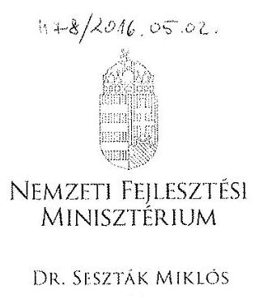

ÁLLAMI SZÁMVEVŐSZÉK 123500512046 .

Érkezen: 2016 MAJ 02.
Iktatószám: V-078-201/2016
Melléblet:

Iktatószám: EFO/10433-1/2014-NFM

Ügyintéző: Simonné Hábencius Gizella
Telefonszám: 79-54405
E-mail: gizella.habencius.simonne@nfm.gov.hu
Hiv. szám: V-0778-200/2016.

Domokos László
elnök
részére
Állami Számvevőszék

Budapest
Apáczai Csere János u. 10.
1052

Tárgy: Jelentéstervezet véleményezése

# Tisztelt Elnök Úr! 

Köszönettel megkaptam a „A Központi alrendszer egyes intézményei pénzügyi és vagyongazdálkodásának ellenőrzése- Nemzeti Közlekedési Hatóság 2016." címủ jelentéstervezetüket, melyre az alábbi észrevételeket teszem:

Az NFM álláspontja szerint helytelen az ÁSZ jelentés 21. oldal 2.5. pont második bekezdésében megfogalmazott azon megállapítás, amely szerint „a rendelkezésre álló források gazdaságos, hatékony és eredményes felhasználását biztosító követelményeket az államháztartásról szóló törvény végrehajtásáról szóló 368/2011. (XII. 31.) Korm. rendelet (Áht.) 121/A. § (2) bekezdés a) pontjában, illetve a költségvetési szervek belső kontrollrendszeréről és belső ellenőrzéséről szóló 370/2011. (XII. 31.) Korm. rendelet (Bkr.) 4. § a) pontjában elöírtak ellenére - nem alakítottak ki.

Az Áht. 2011. január 1. napjától hatályos 121/A. § rendelkezései szerint:
„(1) A belső kontrollrendszer létrehozásáért, müködtetéséért és fejlesztéséért a költségvetési szerv vezetője felelős az államháztartásért felelős miniszter által közzétett módszertani útmutatók figyelembe vételével. A költségvetési szerv vezetője köteles olyan szabályzatokat kiadni, folyamatokat kialakítani és müködtetni a

---

szervezeten belül, amelyek biztositják a rendelkezésre álló források szabályszerű, szabályozott, gazdaságos, hatékony és eredményes felhasználását.
(2) A belső kontrollrendszernek biztosítania kell, hogy
a) a költségvetési szerv valamennyi tevékenysége és célja összhangban legyen a szabályszerűséggel, szabályozottsággal és a 91. § (1) bekezdésében meghatározott követelményekkel (gazdaságosság, hatékonyság és eredményesség."

A Bkr. 4. § rendelkezései szerint "a belső kontrollrendszer tartalmazza mindazon elveket, eljárásokat és belső szabályzatokat, melyek biztositják, hogy
a) a költségvetési szerv valamennyi tevékenysége és célja összhangban legyen a szabályszerűséggel, szabályozottsággal, valamint a gazdaságosság, hatékonyság és eredményesség követelményeivel."

A jelentés ugyanezen pontjának harmadik bekezdése és a II. számú melléklet szerint az NKH nem alakított ki a teljesítményértékelési-modulban foglaltak szerinti "gazdaságossági, hatékonysági és eredményességi" követelményeket a gazdálkodási folyamataiban, amely nincs összhangban a 2011-2014. években a kontrollrendszer kialakítására vonatkozó nyilatkozattal.

Az NKH által 2011-2014. között kiadott nyilatkozatok az alábbiakat tartalmazzák: "Az egyes szervezeti egységek részére a mennyiségi és minőségi mutatók elöre meghatározottak. A teljesülés rendszeres idöközönként (havonta, negyedévente) kiértékelésre kerül." Az ÁSZ ellenőrzése a teljesítményértékelési modul kapcsán kizárólag az intézmény gazdaságossági ellenőrzésére terjedt ki. Az Áht. és a Bkr. vonatkozó rendelkezései szerint a gazdaságossági, hatékonysági és eredményességi követelményeket az államháztartásért felelős miniszter által kiadott útmutató alapján kell elkészíteni.

A mutatószámok hiányával kapcsolatban szükséges a következőket rögzíteni:
A Kormány honlapján elérhető, a Nemzetgazdasági Miniszter által kiadott „Magyarországi államháztartási belső kontroll standardok útmutató 2012." 1.2.2. pontja szerint ajánlott (azaz nem kötelező) a mérhetőség és számon kérhetőség érdekében a költségvetési szerven belül az alapvető célok teljesítésének előrehaladását jelző indikátorrendszer kialakítása. Az indikátor rendszer útmutatóban megfogalmazott paramétereinek megfelelő alkalmazása tehát nem volt kötelező az intézményekre, és nem határozott meg olyan indikátorokat, amelyet az ÁSZ az általa kiadott Ellenőrzési program teljesítmény-ellenőrzési kiegészítő moduljában meghatároz.

---

A közigazgatási szerveknél az általános útmutatókban foglalt teljesítmény mérőszámok nem értelmezhetők. A nem saját nyereségre törekvő, hatósági díjbeszedésből bevételt szerző közigazgatási szerveknél egyedileg szükséges meghatározni a teljesítmény követelményeket, tekintettel arra, hogy a fő gazdaságossági mutató - a bevétel növelésében nincs a költségvetési szervnek ráhatása, és nem is lehet olyan tevékenységet folytatni, amely arra törekszik, hogy az állampolgárok anyagi jólétét csorbítsa.

A hatósági tevékenység tekintetében, miután gyakorlatilag nem összehasonlítható, heterogén ügyekről beszélünk, a gazdaságosság és a hatékonyság követelményeinek való megfeleltetés komoly szakmai akadályokba ütközik. Például ugyanazon ügy vonatkozásában egy pár soros lakossági panasz és a 4-es metró engedélyezésének teljes menete összehasonlíthatatlan a minőség és a bonyolultság szempontjából is, nem is beszélve a közremüködő ügyintézők munkaidejéről.

Kérem az észrevételek szíves elfogadását és megjegyzéseink figyelembevételét a jelentés véglegesítése során.

Budapest, 2016. április „23.„

# Üdvözlettel: 

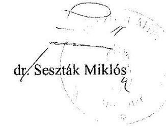

---

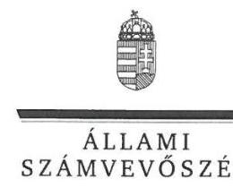

ELNÖK

Ikt.szám: V-0778-209/2016.

# Dr. Seszták Miklós úr 

nemzeti fejlesztési miniszter
Nemzeti Fejlesztési Minisztérium

## Budapest

## Tisztelt Miniszter Úr!

Köszönettel megkaptam a 2016. május 2. napján az Állami Számvevőszékhez érkezett „A központi alrendszer egyes intézményei pénzügyi és vagyongazdálkodásának ellenőrzése Nemzeti Közlekedési Hatóság" címủ számvevőszéki jelentéstervezetben foglalt megállapításokra írásban tett észrevételeket.

Tájékoztatom Miniszter urat, hogy a jelentésben - az Állami Számvevőszékről szóló 2011. évi LXVI. törvény 29. § (3) bekezdése alapján - a figyelembe nem vett észrevételeket szerepeltetjük az elutasítás indokainak feltüntetésével együtt.

Az Állami Számvevőszék észrevételekre vonatkozó álláspontjáról a felügyeleti vezető által készített részletes tájékoztatást mellékelten megküldőm.

Budapest, 2016. 06 hó 16 nap
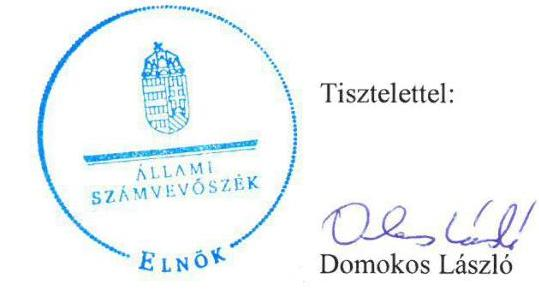

Melléklet: Tájékoztatás az el nem fogadott észrevételről

---

# Tájékoztatás   az el nem fogadott észrevételről 

|  | Észrevétel: | Megállapításokhoz kapcsolódó észrevételek |
| :--: | :--: | :--: |
|  |  | A 2.5. számú megállapítás 2. bekezdésében (21. oldal) a rendelkezésre álló források gazdaságos, hatékony és eredményes felhasználását biztosító követelmények kialakításával kapcsolatban. |
|  | Válasz: | Az Állami Számvevőszék az észrevételt nem fogadja el. |
|  | Indoklás: | Az Állami Számvevőszék - amint azt „A központi alrendszer egyes intézményei pénzügyi és vagyongazdálkodásának ellenörzése" ellenőrzési programban is rögzítette -, az ellenőrzést az ellenőrzési program szempontjai, az ellenőrzött időszakban hatályos jogszabályok, az ellenőrzés szakmai szabályai, az egyes ellenőrzési típusokhoz kapcsolódó ÁSZ módszertanok és nemzetközi standardok figyelembevételével végezte.   Az észrevételben hivatkozott, a „Magyarországi államháztartási belső kontroll standardok útmutató 2012." valóban nem tette kötelezővé az indikátorrendszer kialakítását, és az Állami Számvevőszék ellenőrzési programjai sem ezen a dokumentumon alapultak.   Az észrevételben hivatkozott megállapítások a V-0821-003/2016. iktatószámú „Teljesitmény-ellenőrzési kiegészitő modul" (II. számú melléklet megállapításai), továbbá a V-0737-005/2016. iktatószámú „A központi alrendszer egyes intézményei ellenörzése" címü, szabályszerűségi ellenőrzésre irányuló alapprogram alapján, együttesen történt. Utóbbihoz kapcsolódóan, az adatbekérés tartalmazta „az intézmény tevékenységének mérésére kialakított követelmények, és ezek figyelembe vételével készített jelentések, beszámolók, adatszolgáltatások dokumentumai"-t. Ennek alapján az Állami Számvevőszék figyelembe vette az ellenőrzött szervezetnél már meglévő, a teljesítmény mérésére alkalmas és releváns kritériumokat is, amennyiben az kialakításra és alkalmazásra került.   A helyszíni ellenőrzés során rendelkezésre bocsátott, valamint az észrevétel során megküldött dokumentumok (szabályzatok, ellenőrzési és egyéb dokumentációk) szerint az NKH tett ugyan főként szabályozásbeli - lépéseket annak érdekében, hogy a gazdaságosság, hatékonyság és eredményesség elveit a kontrollrendszer kialakítása során figyelembe vegye, azonban a konkrét követelmények meghatározása nem történt meg. A kontrollrendszer kiépítése alapvetően szabályszerűségi szempontok alapján történt. |

---

|  | Előzőeket erősíti meg az NKH elnökének a helyszíni ellenőrzés során tett azon nyilatkozata is, amely szerint „Gazdaságossági, hatékonysági felméréseinket a 1036/2012. (II. 21.) Korm. határozatban foglalt beszerzési engedélyezésre tekintettel nem tudtuk érvényre juttatni. A Hatóság belső utasitásban, egyéb dokumentált vezetői intézkedésben nem alakitott ki komplex rendszerben célokhoz kapcsolódóan gazdaságossági, hatékonysági, eredményességi mutatószámokat, tekintettel arra, hogy ilyen átfogó elemzések készitésére eröforrás hiányában nem volt lehetőség. ... Fentiekben leirtakból fakadóan követelmény és mutatószám nem volt hozzárendelhető a célkitüzéseinkhez, azok egyedi jelleggel, sajátos formában kerültek megvalósitásra a pénzügyi és vagyongazdálkodás folyamatában." A gazdaságossági, hatékonysági és eredményességi követelményekről, azok egyedi jelleggel, sajátos formában történő megvalósulásáról azonban sem a gazdálkodási, sem az egyéb folyamatokban nem bocsátottak rendelkezésre dokumentumokat a helyszíni ellenőrzés során.   Ugyanakkor a belső kontrollrendszer értékeléséről kiadott vezetői nyilatkozatok mindegyike azt tartalmazta, hogy a vezető gondoskodott az NKH „tevékenységében a hatékonyság, eredményesség és a gazdaságosság érvényesitéséről".   Észrevételében foglaltakkal ellentétben, a gazdaságossági - továbbá a hatékonysági és eredményességi - követelmények is meghatározhatók nem csak a szüken vett pénzügyi - pl. az idézett bevétel - mutatókban, hanem a költségvetési szerv valamennyi erőforrásával (pl. többek között a humán erőforrásokkal) való gazdálkodásban is.   Fentiek következtében az ellenőrzési megállapítások módosítása nem indokolt. |
| :--: | :--: |

Budapest, 2016. C6 hó 14 nap
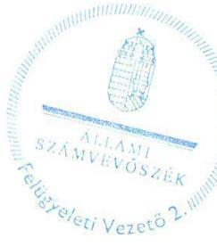

Salamon lidikó felügyeleti vezető

---

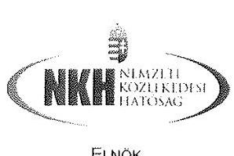

# Domokos László elnök úr részére 

Állami Számvevőszék

## Budapest

Apáczai Csere János u. 10. 1052

Tárgy: Jelentéstervezet észrevételezése

## Tisztelt Elnök Úr!

Ezúton tájékoztatom, hogy a V-0778-201/2016. iktatószámú, „A központi alrendszer egyes intézményei pénzügyi és vagyongazdálkodásának ellenörzése - Nemzeti Közlekedési Hatóság" címmel készített számvevőszéki jelentéstervezetét megismertem, azzal kapcsolatban az alábbi észrevételeket, megállapításokat teszem.

Budapest, 2016. április 20.

Tisztelettel,
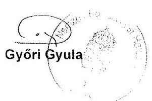

Melléklet: - 1 db CD melléklet

---

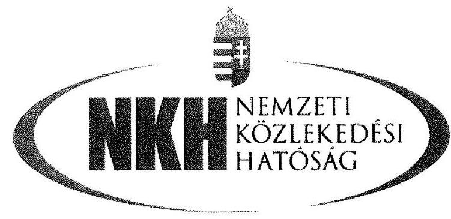

Az Állami Számvevőszék V-0778-201/2016 iktatószámú jelentéstervezetének észrevételezése

---

I. Megállapításokra és javaslatokra tett észrevételek összesitése

1. A MEGÁLLAPÍTÁSOK 1.3. számú megállapítás utolsó sorában tévesen NKH szerepel, kérem NFM-re módosítani szíveskedjen. (4. oldal)
2. A Nemzeti Fejlesztési Miniszternek tett 2. számú javaslati pont „Intézkedjen az NKH-nál rendelkezésre álló források gazdaságos, hatékony és eredményes felhasználását biztosító követelmények kialakításával kapcsolatban feltárt hiányosságok tekintetében a költségvetési szerv vezetőjének munkajogi felelőssége tisztázására irányuló eljárás megindításáról, és ennek eredménye ismeretében tegye meg a szükséges intézkedéseket." A Nemzeti Közlekedési Hatóság elnökének tett 1. számú javaslati pont „Intézkedjen a jogszabályban elöírtaknak megfelelően a rendelkezésre álló források gazdaságos, hatékony és eredményes felhasználását biztosító követelmények kialakítására."
Az NKH álláspontja szerint helytelen az ÁSZ jelentés 21. oldal 2.5. pont második bekezdésében megfogalmazott azon megállapítás, amely szerint „a rendelkezésre álló források gazdaságos, hatékony és eredményes felhasználását biztosító követelményeket - az Áht. 121/A. § (2) bekezdés a) pontjában, illetve a Bkr. 4. § a) pontjában elöírtak ellenére - nem alakítottak ki", így az abban foglaltakat nem áll módomban elfogadni. (4. oldal)
3. A Nemzeti Közlekedési Hatóság elnökének tett 2. javaslati pont, illetve kapcsolódóan a Megállapítások fófejezet 3.3. számú megállapítás pénzeszköz átadás részhez és az Összegzés fejezet Főbb megállapítások, következtetések, javaslatok pontjához 6. oldal 2. bekezdéshez (a pénzeszköz átadások esetében a gazdálkodási jogkörök gyakorlására kijelölt teljesítésigazolók és érvényesitők a jogszabályi elöírásoknak megfelelően lássák el feladataikat)
A fentiekkel egyetértek, azzal kapcsolatban kiegészítést teszek (10. oldal)
4. A Nemzeti Közlekedési Hatóság elnökének tett 3. javaslati pont „Intézkedjen, hogy a likviditási terv tartalmazza a jogszabályi elöirással összhangban a várható bevételek között az időszak elején rendelkezésre álló készpénz és számlaállomány együttes összegét, továbbá a teljesíthető kiadásokat tárgy hónap vonatkozásában dekádonkénti ütemezéssel"
A fentiekkel kapcsolatban észrevételt nem teszek, a leírtakkal egyetértek (10. oldal)
5. A Nemzeti Közlekedési Hatóság elnökének tett 4. javaslati pont „Kezdeményezze a jogszabályi elöirással összhangban a vagyonkezelési szerződés módosítását annak érdekében, hogy az ne tartalmazza a jogszabályból eredő feladatváltozás következtében 2011-2013. években már átadott vagyonelemeket."
A fentiekben foglaltakkal részben értek egyet, azzal kapcsolatban észrevételt teszek (11. oldal)

---

6. A Nemzeti Közlekedési Hatóság elnökének tett 5. javaslati pont „Intézkedjen annak érdekében, hogy a nettó 100000 Ft egyedi nyilvántartási árat meghaladó vagyontárgyak eladási árát dokumentumokkal támasszák alá a belsö szabályzatban foglaltakkal összhangban"
A fentiekben foglaltakkal nem értek egyet, azzal kapcsolatban észrevételt teszek (11. oldal)
7. A Nemzeti Közlekedési Hatóság elnökének tett 6. javaslati pont „Intézkedjen, hogy
a) az átengedett nemzeti vagyon hasznositására vonatkozó szerződések a jogszabályi elölrásokkal összhangban tartalmazzák, hogy a hasznosításban - a hasznosítóval közvetlen vagy közvetett módon jogviszonyban álló harmadik félként - kizárólag természetes személyek vagy átlátható szervezetek vehetnek részt
b) a feltárt szabálytalanság tekintetében a munkajogi felelösség tisztázására irányuló eljárás induljon, és ennek eredménye ismeretében tegye meg a szükséges intézkedéseket"
A fentiekkel kapcsolatban részben értek egyet, kiegészitést teszek (12. oldal)
8. A Nemzeti Közlekedési Hatóság elnökének tett 7. javaslati pont „Intézkedjen, hogy
a) a bérleti szerződések megkötésére a vagyonkezelési szerződésben elölrtaknak megfelelően az MNV Zrt. hozzájárulásával kerüljön sor b) a bérleti díjak megállapítását a belsö szabályzatban elöirtaknak megfelelően dijkalkulációval támasszák alá"
A fentiekkel kapcsolatban részben egyet értek, kiegészitést teszek (12. oldal)
9. A Nemzeti Közlekedési Hatóság elnökének tett 8. javaslati pont „Intézkedjen közérdekü adatok nyilvánosságára vonatkozó jogszabályi elöirással összhangban a bérleti szerződések NKH honlapján történő közzétételére"
A fentiekkel kapcsolatban egyet értek, észrevételt nem teszek. (13. oldal)

---

II. Jogszabályokkal és belsö normákkal alátámasztott részletes észrevételek

# 1. A MEGÁLLAPÍTÁSOK 1.3. számú megállapítás (17. oldal) utolsó sorában tévesen NKH szerepel, kérem NFM-re módosítani szíveskedjen. 

„Az NFM NKH-val kapcsolatos egyéb ellenőrzési, irányitási és felügyeleti jogosultságai gyakorlása összességében szabályszerű volt, a 2011. évben feltárt szabálytalanság ellenére. A 2011. évben jogszabályi elöírás ellenére, az államháztartással összefüggő közérdekü és közérdekböl nyilvános adatok kötelező közzétételének, illetve igényre történő szolgáltatásának végrehajtásával kapcsolatos ellenőrzést az NFM nem végzett."
2. A Nemzeti Fejlesztési Miniszternek tett 2. számú javaslati pont „Intézkedjen az NKH-nál rendelkezésre álló források gazdaságos, hatékony és eredményes felhasználását biztosító követelmények kialakításával kapcsolatban feltárt hiányosságok tekintetében a költségvetési szerv vezetőjének munkajogi felelőssége tisztázására irányuló eljárás megindításáról, és ennek eredménye ismeretében tegye meg a szükséges intézkedéseket." A Nemzeti Közlekedési Hatóság elnökének tett 1. számú javaslati pont „Intézkedjen a jogszabályban elöírtaknak megfelelően a rendelkezésre álló források gazdaságos, hatékony és eredményes felhasználását biztosító követelmények kialakítására."

Az NKH álláspontja szerint helytelen az ÁSZ jelentés 21. oldal 2.5. pont második bekezdésében megfogalmazott azon megállapítás, amely szerint „a rendelkezésre álló források gazdaságos, hatékony és eredményes felhasználását biztosító követelményeket - az Áht. 121/A. § (2) bekezdés a) pontjában, illetve a Bkr. 4. § a) pontjában elöírtak ellenére - nem alakítottak ki.

Az Áht. 2011. január 1. napjától hatályos 121/A. § rendelkezései szerint:
„(1) A belső kontrollrendszer létrehozásáért, müködtetéséért és fejlesztéséért a költségvetési szerv vezetője felelős az államháztartásért felelős miniszter által közzétett módszertani útmutatók figyelembevételével. A költségvetési szerv vezetője köteles olyan szabályzatokat kiadni, folyamatokat kialakítani és müködtetni a szervezeten belül, amelyek biztosítják a rendelkezésre álló források szabályszerű, szabályozott, gazdaságos, hatékony és eredményes felhasználását.
(2) A belső kontrollrendszernek biztosítania kell, hogy
a) a költségvetési szerv valamennyi tevékenysége és célja összhangban legyen a szabályszerűséggel, szabályozottsággal és a 91. § (1) bekezdésében meghatározott követelményekkel (gazdaságosság, hatékonyság és eredményesség."

A BKR. 4. § rendelkezései szerint "a belső kontrollrendszer tartalmazza mindazon elveket, eljárásokat és belső szabályzatokat, melyek biztosítják, hogy
a) a költségvetési szerv valamennyi tevékenysége és célja összhangban legyen a szabályszerűséggel, szabályozottsággal, valamint a gazdaságosság, hatékonyság és eredményesség követelményeivel."

---

A jelentés ugyanezen pontjának harmadik bekezdése és a II. számú melléklet szerint az NKH nem alakított ki a teljesítményértékelési-modulban foglaltak szerinti "gazdaságossági, hatékonysági és eredményességi követelményeket a gazdálkodás folyamataiban, amely nincs összhangban a 2011-2014. években a kontrollrendszer kialakítására vonatkozó nyilatkozattal.

Az NKH által 2011-2014. között kiadott nyilatkozatok az alábbiakat tartalmazzák: "Az egyes szervezeti egységek részére a mennyiségi és minöségi mutatók elöre meghatározottak. A teljesülés rendszeres időközönként (havonta, negyedévente) kiértékelésre kerül."
Az ÁSZ ellenőrzése a teljesítményértékelési modul kapcsán kizárólag az intézmény gazdaságossági ellenőrzésére terjedt ki. Az Áht. és a Bkr. vonatkozó rendelkezései szerint a gazdaságossági, hatékonysági és eredményességi követelményeket az államháztartásért felelős miniszter által kiadott útmutató alapján kell elkészíteni.

# A mutatószámok hiányával kapcsolatban az NKH a következőket rögzíti. 

A Kormány honlapján elérhető, a Nemzetgazdasági Miniszter által kiadott „Magyarországi államháztartási belső kontroll standardok útmutató 2012." http://allamhaztartas kormány.hu/download/d/1b/01000/bkstand12k\%C3\%B6zz\%C3 \%A9.pdf) 1.2.2. pontja szerint ajánlott (azaz nem kötelező) a mérhetőség és számonkérhetőség érdekében a költségvetési szerven belül az alapvető célok teljesítésének előrehaladását jelző indikátorrendszer kialakítása. Az indikátor rendszer útmutatóban megfogalmazott paramétereinek megfelelő alkalmazása tehát nem volt kötelező az intézményekre, és nem határozott meg olyan indikátorokat, amelyet az ÁSZ az általa kiadott Ellenőrzési program teljesítmény-ellenőrzési kiegészítő moduljában meghatároz.
Ezzel összefüggésben jelzem, hogy az NKH beszerzéseinek jelentős része determinált, mert azokat a központosított közbeszerzés formáinak megfelelően (KEFen, BVOP-n) keresztül, meghatározott áron, a KEF esetében közbeszerzési eljárásban előre kiválasztott, a BVOP esetében előre kijelölt ajánlattevőkkel kell megkötni, így ezen szerződések tekintetében a mutatószámok meghatározása nem is értelmezhető.

A központosított informatikai és elektronikus hírközlési szolgáltatásokat egyedi szolgáltatási megállapodás útján igénybe vevő szervezetekről, valamint a központi szolgáltató által üzemeltetett vagy fejlesztett informatikai rendszerekről szóló 7/2013. (II. 26.) NFM rendelet alapján a Nemzeti Infokommunikációs Szolgáltató Zrt. egyedi szerződéssel jogszabályi kijelölés alapján üzemelteti és fejleszti az NKH-nál müködő KÖKIR-t és kapcsolódó szakrendszereit.

Annak ellenére, hogy konkrét gazdálkodási feladatokra kiterjedő mutatószámok rögzítése nem történt, a belső ellenőrzés és az intézményi munkatervekhez kapcsolódó beszámolók keretében a kitűzött céloknak megfelelő működés ellenőrzése megtörtént, egyrészt az NKH belső ellenőrzése, másrészt az NFM által elrendelt és lefolytatott ellenőrzések keretében.

---

# Fenti ellenőrzések az alábbiak szerint alakultak: 

## NKH BEF ellenőrzések:

- 1/2011. számú ellenőrzés: a Nemzeti Közlekedési Hatóság 2010. évi költségvetési beszámolójának pénzügyi (szabályszerüségi) ellenőrzéséről - NKH BEF és NFM EF közös ellenőrzés NFM/3440/3/2011. számú jelentés
- 8/2011. számú, a szakértői, tanácsadói és egyéb megbízási szerződések 2011. évi ellenőrzéséről,- EL/BF/NS/B/37/17/2011
- 2/2012. számú A Nemzeti Közlekedési Hatóság gépjárműveinek használata, üzemeltetése - EL/BF/NS/B/14/13/2012
- 7/2012-es számú, A tárgyi eszközök és immateriális javak leltározásának ellenőrzéséről - EL/BF/NS/B/85/7/2012
- 8/2012. számú "Alapító Okirat, SZMSZ, Ügyrendek, munkaköri leírások megléte, összhangja, jogszabályi megfelelősége és készítésének folyamata EL/BF/NS/A/6/10/2013 - NKH BEF és NFM EF közös ellenőrzés
- 9/2012-es számú, A képzéssel, továbbképzéssel kapcsolatos tevékenységek szabályozása, gyakorlati megvalósulásának soron kívüli ellenőrzése L/BF/NS/B/42/19/2012
- 10/2012-es számú, Követelések behajthatatlanná minősítése EL/BF/NS/B/60/5/2012
- 12/2012. számú, a Dessewffy utcai mélygarázs telephelyen tárolt szolgálati gépkocsik munkaidőn túli mozgásának ellenőrzése - EL/BF/NS/B/69/6/2012
- 1/2013-as számú, A 2012. évi selejtezési eljárás és a megállapított leltárkülönbözetek ellenőrzése EL/BF/NS/A/24/16/2013
- 2/2013. számú „A takarékossági intézkedések és vonatkozó jogszabályok betartása ellenőrzése - EL/BF/NS/A/48/17/2013 NKH BEF és NFM EF közös ellenőrzés,
- 4/2013. számú, a Közbeszerzési törvény hatálya alá tartozó beszerzések folyamatának vizsgálata - EL/BF/NS/A/56/23/2013
- 5/2013. számú, a 2012. évi előirányzat-maradvány meghatározása, nyilvántartásba vétele, felhasználása és elszámolása - EL/BF/NS/A/55/9/2013
- 6/2013. számú, a nyomda müködésének, nyomdai termékek előállításának vizsgálata - EL/BF/NS/A/1/2/2014
- 3/2014. számú, A Pályaalkalmassági Vizsgálati Főosztály hátralékok behajtására tett intézkedések vizsgálata - EL/BF/NS/A/34/18/2014
- 5/2014. számú, Az útügyi engedélyezési tevékenységek, az útügyi ellenőrzési bírságolási tevékenységek vizsgálata - EL/BF/NS/A/44/9/2014
- 7/2014. számú, A 2013. évi aktív és passzív pénzügyi elszámolások rendezése, analitikus nyilvántartása az államháztartási számvitelt érintő változások alkalmazása során - EL/BF/NS/A/60/16/2014
- 10/2014. számú, A Nemzeti Közlekedési Hatóság szervezeti egységeinél hatályban lévő megbízási és vállalkozási szerződések felülvizsgálata - EL/BF/NS/A/19/69/2014
- 12/2014. számú, a Nemzeti Közlekedési Hatóság gépjárműveinek tárolásával, használatával kapcsolatos soron kívüli ellenőrzéshez - EL/BF/NS/A/69/4/2014

---

# NFM ellenörzések: 

- 24/2014. számú, A 2014. évi új számviteli rendszer bevezetéséhez kapcsolódó szabályozási és elszámolási feladatok végrehajtásának vizsgálata - EFO/19354-19/2014-NFM
- A belső kontrollrendszer és a belső ellenőrzés szabályszerűségének ellenőrzése a nemzeti fejlesztési miniszter által irányított és felügyelt költségvetési szerveknél -EFO/423-6/2014-NFM
- A Nemzeti Fejlesztési Minisztérium (és jogelődjei) és a fontosabb háttérintézményei (különösen az NKH, NHH (NMHH) MNV Zrt., MFB Zrt., NFÜ, Országos Atomenergetikai Hivatal, Magyar Energia Hivatal) 2007- 2010. években megkötött és havi fix díjas szerződéseinek felülvizsgálata - NFM/8213/2012
Az NKH fentiekre tekintettel a nyilatkozatban foglaltak szerint az ellenőrzött időszakban egyedi, sajátos formában határozta meg a célkitűzéseihez igazodó követelményrendszert és annak monitoring rendszerét.

Megjegyzem továbbá, hogy az ÁSZ által kiadott teljesítményellenőrzés alapelveiben a számvevőszék "figyelembe veheti a felelős feleknél már meglévő, a teljesítmény mérésére alkalmas és releváns kritériumokat is", amelyet az NKH esetében a vizsgálat alkalmával a rendelkezésre bocsátott anyagok ellenére nem vettek figyelembe.

Előadom továbbá, hogy az ellenőrzéssel érintett időszak alatt az ÁSZ több alkalommal tartott éves ellenőrzése keretében nem kifogásolta a monitoring rendszer által a jelen jelentésben hivatkozottak szerinti hiányát. Az NFM a vizsgált időszakban nem tartott az NKH-nál hatékonysági ellenőrzést.

Az egyedi, belső monitoring rendszert az NKH - az 1. mellékletben foglalt nyilatkozat kitöltési útmutatójában leírtak figyelembe vételével - az alábbiak szerint alkalmazta:

1. A rendelkezésre álló források gazdaságos, hatékony és eredményes felhasználását biztosító követelményeket a következőkben felsorolt dokumentumok állapították meg az érintett időszakban.

A belső szabályozók:
a) 4/2011. Elnöki Szabályzat a Nemzeti Közlekedési Hatóság beszerzéseinek, szerződéskötéseinek és megrendeléseinek folyamata és felelősségi rendje (csatolva)
aa) 1.2 pont gazdaságossági és szükségességi vizsgálat, ellenőrzés,
ab) 1.3.1. beszerzés tervezés,
ac) 2.2 pont beszerzések lebonyolítása bruttó 1.000 .000 ,- Ft feletti beszerzések esetén - 3 érvényes ajánlat;
b) 8/2012. Elnöki Szabályzat az NKH Gazdálkodási Szabályzata (csatolva), melynek 9. pontja tartalmazza a beszámoltatás eljárásrendjét. A beszámoltatás eljárásrendje taglalja a Hatóság különböző szervezeti egységei bevételeinek, kiadásainak alakulását, eredményességét, gazdaságos müködését. A jelentések eredeti, módosított előirányzatokat valamint tényadatokat tartalmazó mezői a FORRÁS SQL rendszerből, valamint a

---

Költségvetési Elemzési és Monitoring Modulból (KEMM) paraméterezett lekérdezések és a költségvetés alapján kerülnek összeállításra a Hatóság összes szakterülete vonatkozásában. Így az egyes szervezeti egységekre mennyiségi és minőségi mutatók állnak rendelkezésre havonta, negyedévente a vezetői információs igények kielégítésére.
c) 10/2012. Elnöki Utasítás a költségvetési-gazdálkodási és egyéb folyamatokba épített előzetes, utólagos és vezetői ellenőrzésekről (csatolva)
ca) bevezető rész kontrolltevékenység részeként ellenőrzés biztosítása,
d) 16/2012. Elnöki Utasítás a Nemzeti Közlekedési Hatóság beszerzéseinek, szerződéskötéseinek és megrendeléseinek folyamatáról és felelősségi rendjéről (csatolva)
da) 3. § gazdaságossági vizsgálat,
db) 6. § (3) bekezdés c) pont a MEF gazdaságossági felülvizsgálati feladata,
dc) 9. § beszerzések lebonyolítása bruttó 1.000.000,- Ft feletti beszerzések esetén 3 érvényes ajánlat;
e) 12/2013. (VI. 21.) Elnöki Utasítás a Nemzeti Közlekedési Hatóság Gazdálkodási Szabályzatáról, melynek 9. pontja tartalmazza a beszámoltatás eljárásrendjét, ugyanúgy, mint a 8/2012. Elnöki Szabályzatban (lásd a b) pontban leírtakat).
f) 12/2015. (IX.16.) Elnöki Utasítás a Nemzeti Közlekedési Hatóság közbeszerzési eljárásainak rendjéről rendelkezéseinek betartása érdekében a közbeszerzési eljárások megindítását meg szokta előzni valamilyen árbecslés a közbeszerzési eljárás típusának kiválasztásához.
Az ÁSZ rendelkezésére bocsátott fentiekben felsorolt belső szabályozókban megfogalmazott alapelvek érvényesülését az NKH belső ellenőrzési rendszere rendszeresen nyomon követte, az ellenőrzések alapján intézkedési tervek készültek a rendszer hatékonyabbá tétele érdekében.
2. Az 1) pontban felsorolt belső szabályozókon túlmenően a kormányzati stratégiai irányításról szóló 38/2012. (III. 12.) Korm. rendelet rendelkezéseinek megfelelően az NKH által készített munkatervekben minden esetben megtörténtek az egyes szervezeti egységek vonatkozásában, így a gazdasági elnökhelyettes által irányított szervezeti egységek tekintetében is a minőségcélok kitűzése. A kontrollpontokat a munkaterv melléklete (2012. II. félévére és 2013. I. félévére vonatkozóan a 6. és 9. melléklet) határozta meg.

Az NKH célkitűzéseit a 2011-2013 év között elfogadott Intézményi stratégia tartalmazta. A stratégiában megfogalmazott alapelveknek megfelelően minden évben szakterületenként kitűzésre kerültek az adott évre vonatkozó feladatok, amelynek mennyiségi és minőségi végrehajtását félévente az NKH folyamatosan nyomon követte az Intézményi munkatervek értékelése során.

Itt jelzem azt is, hogy a nemzeti fejlesztési miniszter által is jóváhagyott a Nemzeti Közlekedési Hatóság Intézményi Stratégiája 2014-2020 elnevezésű dokumentum már tartalmazza a Hatóság (így a gazdasági terület) részletes céltérképét és az ahhoz kapcsolódóan mutatókat is rögzít (táblázat utolsó oszlop).

---

Az ÁSZ által alkalmazott monitoring rendszertől eltérve az NKH egyes szakterületeinél belső szakmai monitoring mutatók és azok értékelései folyamatosan készültek.

A célkitűzések végrehajtásának értékelését a kormánytisztviselők teljesítményértékelési rendszere is biztosítja, amely értékeléseket az NKH a jogszabályoknak megfelelően elvégzett.
3. A gazdaságossági, eredményességi és hatékonysági célokat szem előtt tartva az érintett időszakban 2012-ben elnöki utasításra a Jogi Főosztály felmérte az NKH által megkötött szerződéseket és a költségvetési pénzeszközökkel való felelős gazdálkodás elvét szem előtt tartva javaslatot tett a szerződéskötésekkel kapcsolatos eljárások és maguknak a szerződéskötéseknek a racionalizálására. Elnöki jóváhagyást követően minden szervezeti egység részére megküldésre kerültek a javaslatok, hogy annak megfelelően hajtsák végre a szükséges intézkedéseket (pl. a szerződések határozott időre szóljanak, a költségvetési évhez igazodóan és annak érdekében, hogy ne jelentsenek szükségtelen hosszú távú kötelezettségvállalást, s keretösszegeket tartalmazó szerződések felülvizsgálata a keretösszeg megfelelőségének felülvizsgálata tekintetében).

Szintén a gazdaságossági, eredményességi és hatékonysági célokat szem előtt tartva valamennyi szervezeti egység vezetője részére szóló 2013. február 12-én kelt tájékoztató anyagban felhívtam a figyelmet az NKH beszerzéseinek, szerződéskötéseinek és megrendeléseinek folyamatáról és felelősségi rendjéről szóló 16/2012. Elnöki utasításban rögzítettek maradéktalan betartására, így például a szerződések előkészítésének megfelelő határidőben történő megkezdésére, a szerződéskötések indokolásának szükségességére, továbbá arra, hogy határozatlan időre nem köthető megbízási szerződés, valamint szükséges szem előtt tartani az 1700/2012. (XII. 19.) Korm. határozatban foglaltakat,).

Az NKH álláspontja szerint a nyilatkozatok és az ellenőrzésre bocsátott anyagok nem tartalmaznak ellentmondásokat.

# Észrevételek az ÁSZ M/1-5 számú tanúsítványaival kapcsolatosan: 

Az M/5 számú tanúsítvány került tartalmilag kitöltésre, mivel az M/1-M/4-ig számozott tanúsítványok a fentiekben részletezettek szerint nem voltak értelmezhetők az NHK szempontjából. Ezen nyilatkozatok ezért nemleges válaszokat tartalmaznak.

## Egyéb észrevétel:

A közigazgatási szerveknél az általános útmutatókban foglalt teljesítmény mérőszámok nem értelmezhetők. A nem saját nyereségre törekvő, hatósági díjbeszedésből bevételt szerző közigazgatási szerveknél egyedileg szükséges meghatározni a teljesítmény követelményeket, tekintettel arra, hogy a fő gazdaságossági mutató - a bevétel - növelésében nincs a költségvetési szervnek ráhatása, és nem is lehet olyan tevékenységet folytatni, amely arra törekszik, hogy az állampolgárok anyagi jólétét csorbítsa.

---

Általános európai ellenőrzési modellek szerint a teljesítmény értékelését az határozza meg, hogy az adott ellenőrzést végző szervezet ellenőrzési programjában meghatározott szempontok miként érvényesülnek az ellenőrzött szervezetnél.

Az NKH az ÁSZ által ellenőrzött 2011-2014. évben eltelt időszakban maradéktalanul eleget tett az ellenőrzési tervben foglaltaknak, az intézkedési tervben foglaltak nyomon követése, azok végrehajtatása megtörtént.

A fentiek szerint az NKH álláspontja, hogy az ÁSZ jelentés megállapításainak kiegészítése lenne szükséges a fentiek - ellenőrzés során is elmondottak figyelembe vételével.
3. A Nemzeti Közlekedési Hatóság elnökének tett 2. javaslati pont, illetve kapcsolódóan a Megállapítások főfejezet 3.3. számú megállapítás pénzeszköz átadás részhez és az Összegzés fejezet Föbb megállapítások, következtetések, javaslatok pontjához 6. oldal 2. bekezdéshez (a pénzeszköz átadások esetében a gazdálkodási jogkörök gyakorlására kijelölt teljesitésigazolók és érvényesitők a jogszabályi elöírásoknak megfelelően lássák el feladataikat)

A Megállapítások főfejezet 3.3. számú megállapítás pénzeszköz átadás rész „előírtak ellenére hiányzott az utalvány ellenjegyzésének keltezése" helyett „előírtak ellenére a lakásépítési támogatásoknál két esetben hiányzott az utalvány ellenjegyzésének keltezése" megállapítást kérem szerepeltetni.
Továbbá a 2. javaslathoz kapcsolódóan az Összegzés fejezet Főbb megállapítások, következtetések, javaslatok pontjához 6. oldal 2. bekezdés „...a 2014. évben a jogszabályban foglaltak ellenére nem történt meg a teljesités igazolás és az érvényesités" általános és a tények tükrében túl erős megállapítás helyett „a 2014. évben a jogszabályban foglaltak ellenére két esetben - lakásépitési támogatás nyújtás esetén - nem történt meg a teljesités igazolás és az érvényesités." megállapítást kérem szerepeltetni.
4. A Nemzeti Közlekedési Hatóság elnökének tett 3. javaslati pont „intézkedjen, hogy a likviditási terv tartalmazza a jogszabályi elöirással összhangban a várható bevételek között az időszak elején rendelkezésre álló készpénz és számlaállomány együttes összegét, továbbá a teljesithető kiadásokat tárgy hónap vonatkozásában dekádonkénti ütemezéssel"

Az NKH a likviditási tervét a törvényi elöírásoknak megfelelően - a 368/2011. (XII.31.) Korm. rendelet 122. § (1), illetve a 2015.01.01-étől a 397/2014. (XII.31.) Korm. rendelet 28. § jogszabályok - rendelkezésnek megfelelően készítette el.
Az adott időszakban a kimutatás a dekádonkénti ütemezést, a készpénz és számlaállomány összegét nem tartalmazta. A megállapítást elfogadom.

---

5. A Nemzeti Közlekedési Hatóság elnökének tett 4. javaslati pont „Kezdeményezze a jogszabályi elöirással összhangban a vagyonkezelési szerzödés módosítását annak érdekében, hogy az ne tartalmazza a jogszabályból eredő feladatváltozás következtében 2011-2013. években már átadott vagyonelemeket."

A 254/2007. (X.4.) Kormányrendelet 11. § (2) bekezdése szerint „Az Nvtv. 11. § (9) bekezdése szerinti esetben az átruházással a tulajdonosi joggyakorlóval kötött vagyonkezelési szerződésben az új vagyonkezelő a régi vagyonkezelő helyébe lép. Az új vagyonkezelő a jogutódlásról annak hatálybalépésétől számított tizenöt napon belül írásban értesíti a tulajdonosi joggyakorlót. A tulajdonosi joggyakorló az értesítés kézhezvételétől számított hatvan napon belül elkészíti a vagyonkezelési szerződés módosítását." A jogszabály alapján tehát a kormányhivatalok részére átadott vagyonelemekkel kapcsolatban a tulajdonosi joggyakorlónak kell a szerződéseket elkészítenie. Mivel a szerződések az NKH információi szerint a legtöbb kormányhivatal vonatkozásában az elmúlt 4 évben sem kerültek még megkötésre, így az NKH vagyonkezelési szerződésének módosítása és egységes szerkezetbe foglalása sem valósulhat meg. Az NKH ismételten kezdeményezi a szerződés egységes szerkezetbe foglalását, mint ahogy az ÁSZ által is elismerten megtette ezt 2012. évben is.
6. A Nemzeti Közlekedési Hatóság elnökének tett 5. javaslati pont „Intézkedjen annak érdekében, hogy a nettó 100000 Ft egyedi nyilvántartási árat meghaladó vagyontárgyak eladási árát dokumentumokkal támasszák alá a belsö szabályzatban foglaltakkal összhangban"

A tárgyi pontot javaslom törölni az alábbiak alapján, mivel a részletes megállapítások (32. oldal) szerint : „A nettó 100000 Ft egyedi nyilvántartási ár alatti vagyontárgyak eladási árát a gazdálkodási szabályzat elöírásainak megfelelően határozták meg. „A nettó 100000 Ft egyedi nyilvántartási árat meghaladó vagyontárgyak eladási árat a gazdálkodási szabályzat 6.2.3.2. pontjának elölrása ellenére dokumentumokkal nem támasztották alá. A vagyontárgyak (leltározó gépek, klimaberendezések, személygépkocsi) értékesítése esetén a hivatásos értékelö cég, illetve azonos profilú eszközforgalmazó cég értékbecslését - mint az eladási árat megalapozó, alátámasztó dokumentumot - a gazdálkodási szabályzatban elöirtak ellenére nem kérték be."
A vizsgált vagyontárgyak (leltározó gépek, klimaberendezés) egyedi nyilvántartási ára nem éri el a 100000 Ft -ot, tehát a szabályzat alapján nem kell hivatásos értékelö céget igényben venni az eladási ár meghatározásához.

Az államháztartás szervezetei beszámolási és könyvvezetési kötelezettségének sajátosságairól szóló 249/2000. (XII. 24.) Kormányrendelet 17.§ (3) bekezdése rendelkezik a 100 ezer forint egyedi bekerülési értékhatárról, amely alapján a szabályzatban a Hatóság saját döntése volt, hogy ezt az értékhatárt vette figyelembe a tárgyi eszközök értékesítésénél is.

---

A személygépkocsi az Allianz Hungária Zrt. Nem-életbiztosítási lakossági kárrendezési Központ Gépjámú-kárrendezési részlege (hivatásos értékelő cég) által megállapított maradványértéken lett értékesítve. A szabályzatban foglaltakkal összhangban történt az értékesítés, melynek alátámasztó dokumentumai levelem mellékletét képezik. Tájékoztatásul csatolom a hivatalos dokumentumokat.
7. A Nemzeti Közlekedési Hatóság elnökének tett 6. javaslati pont „Intézkedjen, hogy
a) az átengedett nemzeti vagyon hasznosítására vonatkozó szerződések a jogszabályi elöírásokkal összhangban tartalmazzák, hogy a hasznosításban - a hasznosítóval közvetlen vagy közvetett módon jogviszonyban álló harmadik félként - kizárólag természetes személyek vagy átlátható szervezetek vehetnek részt
b) a feltárt szabálytalanság tekintetében a munkajogi felelösség tisztázására irányuló eljárás induljon, és ennek eredménye ismeretében tegye meg a szükséges intézkedéseket"

A feltárt szabálytalanság megszűnt, 2014-ben FEUVE keretében megállapításra kerültek a szerződéskötéssel kapcsolatos hiányosságok, így a 2014-ben megkötött (2015. évre vonatkozó) és a 2015-ben megkötött (2016-ra vonatkozó) szerződésben az Nvtv. rendelkezései szerepeltek.
A munkajogi felelősségre vonás nem indokolt, mivel
a) a probléma kiküszöbölése - az ÁSZ ellenőrzéstől függetlenül - megtörtént, a szerződések a hivatkozott rendelkezést tartalmazzák,
b) - bár a szerződésben nem szerepelt - a bérlő folyamatosan teljesítette mindhárom törvényi kritériumot: az adatszolgáltatási kötelezettségeket teljesítette, a bérleményt a szerződésben foglaltaknak megfelelően kizárólag parkolási célokra használta, a bérlemény hasznosításában a bérlőn kívül más nem vett részt és mivel a bérlő egyedüli részvényese a Magyar Állam, így az átláthatósági kritériumoknak is eleget tett,
igy az NKH a Vtv.-ben foglaltak szerint járt el, annak ellenére, hogy az irásos kötelezettség vállalásban külön ez nem került feltüntetésre.
8. A Nemzeti Közlekedési Hatóság elnökének tett 7. javaslati pont „Intézkedjen, hogy
a) a bérleti szerződések megkötésére a vagyonkezelési szerződésben elöirtaknak megfelelően az MNV Zrt. hozzájárulásával kerüljön sor b) a bérleti dijak megállapítását a belső szabályzatban elöirtaknak megfelelően dijkalkulációval támasszák alá"

# A javaslatban foglaltak 2014 évtől megvalósultak: 

## ad a)

A műszaki és ellátási főosztályvezető 2014-ben FEUVE keretében észlelte az engedély hiányát, ezért írásban fordult az MNV Zrt.-hez és egyeztetést

---

kezdeményezett. Miután az MNV Zrt. még 2014-ben megerősítette az engedély szükségességét, a jóváhagyáskérés megtörtént, a szerződéskötés ellen az MNV Zrt. nem emelt kifogást, tehát a mulasztás kiküszöbölésre került mind a 2015., mind pedig a 2016. évre vonatkozóan. Ezt a tényt az ellenőrzés során az NKH jelezte is az ÁSZ részére, a megfelelő dokumentumok bemutatásra kerültek.
ad.b)
A hivatkozott Szabályzat szerint a kalkulációt a Számviteli és Kontrolling Főosztály állítja össze a tárgyévet megelőző év beszámolójában lévő adatok alapján. A bérleti díjat úgy kell megállapítani, hogy az legalább az üzemeltetési közvetlen költséget és a felosztható általános költségeket fedezze.

Tekintettel arra, hogy a bérlemény egy beépítetlen földterület, így azzal kapcsolatban költség jellemzően nem merül fel, ez alapján tehát a bérleti díj nem határozható meg, a Szabályzat rendelkezése erre a vagyonelemre nem alkalmazható. A bérleti díj feltehetően az ellenőrzött időszakot megelőző években a felek képviselői által kölcsönösen kialkudott piaci ár volt és mivel időközben nem merült fel újabb költség, sőt a bérlő értéknövelő beruházást hajtott végre (térkövezés, kerítésépítés), az ár módosításának szükségessége a szerződések megkötésekor nem merült fel.

2014-ben az MNV Zrt. az engedélyében kifejezetten elöírta, hogy „a bérleti díjat a helyben szokásos piaci átlagár alapján köteles az NKH megállapítani.", így a díj megállapítására álláspontom szerint nem az NKH belső szabályzata, hanem az MNV Zrt. állásfoglalása az irányadó. 2015-ben ennek figyelembe vételével készült kalkuláció, melynek során a bérleti díjon csak minimális korrekciót kellett végrehajtani annak érdekében, hogy igazodjon a helyi piaci viszonyokhoz.
9. A Nemzeti Közlekedési Hatóság elnökének tett 8. javaslati pont „intézkedjen közérdekü adatok nyilvánosságára vonatkozó jogszabályi előirással összhangban a bérleti szerződések NKH honlapján történő közzétételére"

Az ellenőrzéssel érintett bérleti szerződések NKH honlapján történő közzétételére az intézkedés időközben megtörtént, a szerződések a honlapon elérhetőek.

---

# III. Észrevételek alátámasztásával kapcsolatos mellékletek 

1. Számú melléklet: A Nemzeti Közlekedési Hatóság beszerzéseinek, szerződéskötéseinek folyamata és felelösségi rendjéröl szóló 4/2011. számú Elnöki Szabályzat
2. Számú melléklet: A Nemzeti Közlekedési Hatóság Gazdálkodási Szabályzatáról szóló 8/2012. számú Elnöki Szabályzat
3. Számú melléklet: A költségvetési- gazdálkodási és egyéb folyamatokba épített elözetes utólagos és vezetői ellenőrzésekröl szóló 10/2012. Elnöki Utasítás
4. Számú melléklet: A Nemzeti Közlekedési Hatóság beszerzéseinek szerződéskötéseinek és megrendeléseinek folyamatáról és felelösségi rendjéröl
5. Számú melléklet: A Nemzeti Közlekedési Hatóság Gazdálkodási Szabályzatának kiadásáról
6. Számú melléklet: EH/JF/NS/B/930/7/2012. iktatószámú feljegyzés
7. Számú melléklet: EH/JF/NS/A/274/1/2013. iktatószámú feljegyzés
8. Számú melléklet: A Nemzeti Közlekedési Hatóság Intézményi Stratégiája 2014-2020
9. Számú melléklet: A VBA11-00863 számú számla
10. Számú melléklet: A Nemzeti Közlekedési Hatóság 2012. II. félévi munkaterve
11. Számú melléklet: A Nemzeti Közlekedési Hatóság 2013. I. félévi munkaterve

A mellékletek CD-re írva kerülnek csatolásra.
Kérem fentiekben leírtak szíves figyelembevételét.

Budapest, 2016. április 20.

Tisztelettel,
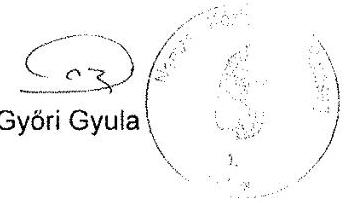

ELNÖKI HIVATAI
H-1066 Budapest, Teréz Krt. 62., Pf. 102 ・ t: +36 1373 1410 $\cdot$ f: +36 1373 1453 $\cdot$ e: elnok@nkh.gov.hu www.nkh.hu

---

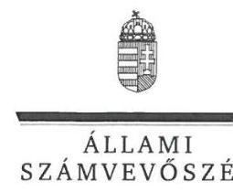

ELNÖK

Ikt.szám: V-0778-205/2016.

# Győri Gyula úr 

elnök
Nemzeti Közlekedési Hatóság

## Budapest

## Tisztelt Elnök Úr!

Köszönettel megkaptam a 2016. április 21. napján az Állami Számvevőszékhez érkezett „A központi alrendszer egyes intézményei pénzügyi és vagyongazdálkodásának ellenörzése Nemzeti Közlekedési Hatóság" címủ számvevőszéki jelentéstervezetben foglalt megállapításokra és javaslatokra írásban tett észrevételeket.

Tájékoztatom Elnök urat, hogy a jelentésben - az Állami Számvevőszékről szóló 2011. évi LXVI. törvény 29. § (3) bekezdése alapján - a figyelembe nem vett észrevételeket szerepeltetjük az elutasítás indokainak feltüntetésével együtt.

Az Állami Számvevőszék észrevételekre vonatkozó álláspontjáról a felügyeleti vezető által készített részletes tájékoztatást mellékelten megküldőm.

Budapest, 2016.
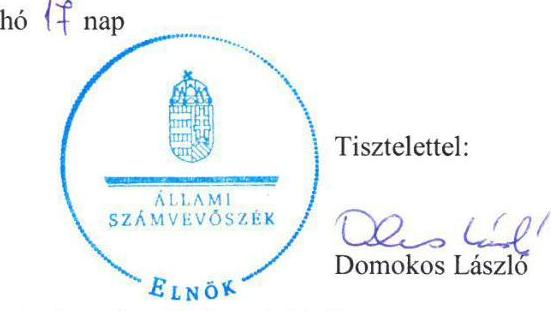

Melléklet: Tájékoztatás az elfogadott és el nem fogadott észrevételekről

---

# Tájékoztatás   az elfogadott és az el nem fogadott észrevételekról 

| 1.) | Észrevétel: | Megállapításokhoz kapcsolódó észrevétel   Az 1.3. számú megállapítás (17. oldal) utolsó sorában tévesen   NFM helyett NKH szerepel. |
| :--: | :--: | :--: |
|  | Válasz: | Az Állami Számvevőszék az észrevételt elfogadja. |
|  | Indoklás: | A dokumentumok ismételt áttekintése alapján, az észrevételt   elfogadva, az 1.3. számú megállapítás utolsó sorát a következők   szerint pontosítottuk (pontosítás aláhúzással jelölve).   „A 2011. évben a jogszabályi elöirás ellenére, az   államháztartással összefüggő közérdekü és közérdekböl   nyilvános adatok kötelező közzétételének, illetve igényre történő   szolgáltatásának végrehajtásával kapcsolatos ellenörzést az   NFM nem végzett." |
|  | Észrevétel: | Javaslatokhoz kapcsolódó észrevétel   A nemzeti fejlesztési miniszternek tett 2. számú javaslathoz (2.5.   számú megállapítás 2-3. bekezdése alapján) és az NKH   elnökének tett 1. számú javaslathoz (2.5. számú megállapítás 2.   bekezdése alapján), a rendelkezésre álló források gazdaságos,   hatékony és eredményes felhasználását biztosító követelmények   kialakításával kapcsolatban. |
|  | Válasz: | Az Állami Számvevőszék az észrevételt nem fogadja el. |
| 2.) | Indoklás: | Az Állami Számvevőszék - amint azt „A központi alrendszer   egyes intézményei pénzügyi és vagyongazdálkodásának   ellenörzése" ellenőrzési programban is rögzítette -, az   ellenőrzést az ellenőrzési program szempontjai, az ellenőrzött   időszakban hatályos jogszabályok, az ellenőrzés szakmai   szabályai, az egyes ellenőrzési típusokhoz kapcsolódó ÁSZ   módszertanok és nemzetközi standardok figyelembevételével   végezte.   Az észrevételben hivatkozott, a „Magyarországi államháztartási   belső kontroll standardok útmutató 2012." valóban nem tette   kötelezővé az indikátorrendszer kialakítását, és az Állami   Számvevőszék ellenőrzési programjai sem ezen a   dokumentumon alapultak. |

---

Az észrevételben hivatkozott megállapítások - az észrevételben foglaltakkal ellentétben - nem csak a V-0821-003/2016. iktatószámú „Teljesitmény-ellenörzési kiegészitő modul" (II. számú melléklet megállapításai), hanem a V-0737-005/2016. iktatószámú „A központi alrendszer egyes intézményei ellenörzése" címủ, szabályszerűségi ellenőrzésre irányuló alapprogram alapján, együttesen történt. Utóbbihoz kapcsolódóan, az adatbekérés tartalmazta „az intézmény tevékenységének mérésére kialakított követelmények, és ezek figyelembe vételével készitett jelentések, beszámolók, adatszolgáltatások dokumentumai"4. Ebből látható, hogy az Állami Számvevőszék figyelembe vette az ellenőrzött szervezetnél már meglévő, a teljesítmény mérésére alkalmas és releváns kritériumokat is, amennyiben az kialakításra és alkalmazásra került.

A helyszíni ellenőrzés során rendelkezésre bocsátott, valamint az észrevétel során megküldött dokumentumok (szabályzatok, ellenőrzési és egyéb dokumentációk) szerint az NKH tett ugyan főként szabályozásbeli - lépéseket annak érdekében, hogy a gazdaságosság, hatékonyság és eredményesség elveit a kontrollrendszer kialakítása során figyelembe vegye, azonban a konkrét követelmények meghatározása nem történt meg. A kontrollrendszer kiépítése alapvetően szabályszerűségi szempontok alapján történt.

Fentieket erősíti meg az NKH elnökének a helyszíni ellenőrzés során tett azon nyilatkozata is, amely szerint „Gazdaságossági, hatékonysági felméréseinket a 1036/2012. (II. 21.) Korm. határozatban foglalt beszerzési engedélyezésre tekintettel nem tudtuk érvényre juttatni. A Hatóság belsö utasitásban, egyéb dokumentált vezetői intézkedésben nem alakitott ki komplex rendszerben célokhoz kapcsolódóan gazdaságossági, hatékonysági, eredményességi mutatószámokat tekintettel arra, hogy ilyen átfogó elemzések készitésére eröforrás hiányában nem volt lehetőség. ... Fentiekben leirtakból fakadóan követelmény és mutatószám nem volt hozzárendelhető a célkitüzéseinkhez, azok egyedi jelleggel, sajátos formában kerültek megvalósitásra a pénzügyi és vagyongazdálkodás folyamatában." A gazdaságossági, hatékonysági és eredményességi követelményekről, azok egyedi jelleggel, sajátos formában történő megvalósulásáról azonban sem a gazdálkodási, sem az egyéb folyamatokban nem bocsátottak rendelkezésre dokumentumokat a helyszíni ellenőrzés során.
Ugyanakkor a belső kontrollrendszer értékeléséről kiadott vezetői nyilatkozatok mindegyike azt tartalmazta, hogy a vezető gondoskodott az NKH „tevékenységében a hatékonyság, eredményesség és a gazdaságosság érvényesitéséről".

---

|  |  | Észrevételében foglaltakkal ellentétben, a gazdaságossági továbbá a hatékonysági és eredményességi - követelmények is meghatározhatók nem csak a szüken vett pénzügyi - pl. az idézett bevétel - mutatókban, hanem a költségvetési szerv valamennyi erőforrásával (pl. többek között a humán erőforrásokkal) való gazdálkodásban is.   Az ÁSZ ellenőrzés rendelkezésére bocsátott dokumentumok szerint az NKH-nál végzett belső ellenőrzések a szabályszerűségre irányultak, azok között a költségvetési szervek belső ellenőrzéséről szóló 193/2003. (XI. 26.) Korm. rendelet 2. § d) pontja szerinti teljesítmény-ellenőrzés, illetve a költségvetési szervek belső kontrollrendszeréről és belső ellenőrzéséről szóló 370/2011. (XII. 31.) Korm. rendelet 21. § (2) bekezdése szerinti, a belső kontrollrendszer müködésének gazdaságosságát, hatékonyságát és eredményességét elemző, vizsgáló, értékelő ellenőrzés nem volt. Továbbá - amint azt az észrevételében is jelezte - az NFM sem végzett az NKH-nál hatékonysági ellenőrzést.   Fentiek következtében az ellenőrzési megállapítások, valamint az azok alapján tett javaslatok módosítása nem indokolt. |
| :--: | :--: | :--: |
|  | Észrevétel: | Javaslatokhoz kapcsolódó észrevétel   Az NKH elnökének tett 2. számú javaslathoz (3.3. számú megállapítás 10. bekezdése alapján), és a Főbb megállapítások következtetések, javaslatok 6. oldal 2. bekezdéséhez, a pénzeszközátadások esetében a teljesítésigazolók és az érvényesítők feladatellátásához kapcsolatban. |
|  | Válasz: | Az Állami Számvevőszék az észrevételt részben fogadja el. |
| 3.) | Indoklás: | Az észrevétel a pénzeszközátadások esetében a gazdálkodási jogkörök gyakorlásával kapcsolatos megállapítással és javaslattal egyetért, azzal kapcsolatban azonban kiegészítést tett.   A dokumentumok ismételt áttekintése alapján, az észrevételnek a 2014. évre vonatkozó részét elfogadva, a 3.3. számú megállapítás 10. bekezdésének második részét a következők szerint pontosítottuk (kiegészítés aláhúzással jelölve) ,,a 2014. évben nem minden esetben történt meg az Avr. 57. § (1) bekezdésében foglaltak ellenére a teljesités igazolása, valamint az Avr. 58. § (1) bekezdésben elöirt érvényesités."   A módosítással összhangban, a Főbb megállapítások, következtetések (6. oldal) 2. bekezdés 5. mondatának második felét a 2014. évre vonatkozóan következők szerint pontosítottuk (kiegészítés aláhúzással jelölve) ,, a 2014. évben a jogszabályban foglaltak ellenére nem minden esetben történt meg a teljesités igazolása, valamint az érvényesités."   A megállapítás pontosítása a költségvetési szerv vezetőjének címzett 2. számú javaslat módosítását nem indokolta. |

---

| 5.) | Észrevétel: | Javaslatokhoz kapcsolódó észrevétel   Az NKH elnökének tett 4. számú javaslathoz (4.1. számú megállapítás 3. bekezdése alapján) a vagyonkezelési szerződés módosításával kapcsolatban. |
| :--: | :--: | :--: |
|  | Válasz: | Az Állami Számvevőszék az észrevételt nem fogadja el. |
|  | Indoklás: | Az észrevétel a javaslatot megalapozó megállapítást nem vitatja, a vagyonkezelési szerződés módosításának elmaradásáról, annak okairól ad tájékoztatást.   A vagyonkezelési szerződés módosítása jogszabályi előírás alapján indokolt, azt az állami vagyonnal való gazdálkodásról szóló 254/2007. (X. 4.) Korm. rendelet (Vtvr.) 8. § (6) bekezdése írja elő. A Vtvr. 8. § (6) bekezdése alapján „Amennyiben a vagyonkezelöi jog létrejöttéröl törvény rendelkezik, a tulajdonosi joggyakorló és a vagyonkezelö e rendelet szabályainak megfelelö alkalmazásával vagyonkezelési szerzödést kötnek, vagy a meglévő szerzödést módosittük.   A Vtvr. 11. § (2) bekezdése rendelkezései szerint a vagyonkezelési szerződés módosítását valóban a tulajdonosi joggyakorlónak kell elkészítenie, a valós vagyonkezelői állapotot nem tükröző vagyonkezelési szerződés módosítását - amint azt az NKH már korábban is megtette, továbbá észrevételében is jelezte - ismételten indokolt kezdeményeznie annak érdekében, hogy hatályos vagyonkezelői szerződése az általa ténylegesen kezelt, a mérlegében is kimutatott vagyont tartalmazza. Mindezekre tekintettel a javaslat módosítása nem indokolt. |
| 6.) | Észrevétel: | Javaslatokhoz kapcsolódó észrevétel   Az NKH elnökének tett 5. számú javaslathoz (4.4. számú megállapítás 5. bekezdése alapján) a 100000 Ft egyedi nyilvántartási árat meghaladó vagyontárgy értékesítéséhez kapcsolódóan. |
|  | Válasz: | Az Állami Számvevőszék az észrevételt részben fogadja el. |
|  | Indoklás: | A dokumentumok ismételt áttekintése alapján, az észrevételnek a személygépkocsi értékesítésére vonatkozó részét elfogadva a 4.4. számú megállapítás 5. bekezdés 3. mondatából a „személygépkocsi" szövegezést töröltük.   Az észrevételnek a leltározó gépekre, illetve a klímaberendezésekre vonatkozó része nem került elfogadásra, az alábbiak miatt.   A helyszíni ellenőrzés során az Állami Számvevőszék rendelkezésére bocsátott, az értékesítéssel érintett időszakban hatályos gazdálkodási szabályzatok (gazdálkodási szabályzat ${ }_{1,2}$ ) 6.2.3.2. pont 5. bekezdésében foglaltak szerint: „Értékesitéshez a 100000 Ft egyedi nyilvántartási árat meghaladó vagyontárgy esetében - hivatásos értékelö cég, illetve azonos profilú eszközforgalmazó cég értékbecslését kell beszerezni helyi szinten az értékesitésre felterjesztö szakterületnek." |

---

|  |  | A helyszíni ellenőrzés rendelkezésére bocsátott Eszköz törzslapok szerint az ellenőrzött 3 db klímaberendezés esetében az egyedi nettó, illetve egyedi bruttó nyilvántartási ár egyaránt meghaladta a 100000 Ft -ot (darabonként 416569 Ft bruttó, illetve 328695 Ft nettó érték).   A helyszíni ellenőrzés rendelkezésére bocsátott tételes állomány csökkenési bizonylatok szerint az ellenőrzött 12 db leltározó gép konfiguráció esetében az egyedi bruttó nyilvántartási ár meghaladta a 100000 Ft -ot (konfigurációnként bruttó 670440 Ft ).   A Gazdálkodási szabályzat ${ }_{1,2}$ 6.2.3.2 pont 5. bekezdésében foglaltak nem tartalmazták, hogy az egyedi nyilvántartási ár esetében a „bruttó" vagy a „nettó" értéket kell figyelembe venni. Erre tekintettel a 4.4. számú megállapítás 5. bekezdés 1. és 2. mondatából, valamint a Főbb megállapítások, következtetések, javaslatok fejezet 4. bekezdés 9. mondatából a „nettó" kifejezést törölttük. Továbbá a gazdálkodási szabályzat hibásan szerepeltetett indexét (gazdálkodási szabályzat ${ }_{4}$ ) az értékesítéssel érintett időszakban hatályos gazdálkodási szabályzat indexére helyesbítettük (gazdálkodási szabályzat ${ }_{1,2}$ ).   Fentiek alapján a 4.4. számú megállapítás 5. bekezdését az alábbiak szerint pontositottuk: „A 100000 Ft egyedi nyilvántartási ár alatti vagyontárgyak eladási árát a gazdálkodási szabályzat elöírásainak megfelelően határozták meg. A 100000 Ft egyedi nyilvántartási árat meghaladó vagyontárgyak eladási árát a gazdálkodási szabályzat ${ }_{1,2}$ 6.2.3.2. pontjának elöírása ellenére dokumentumokkal nem támasztották alá. A vagyontárgyak (leltározó gépek, klimaberendezések) értékesítése esetén hivatásos értékelö cég, illetve azonos profilá eszközforgalmazó cég értékbecslését - mint az eladási árat megalapozó, alátámasztó dokumentumot - a gazdálkodási szabályzatban elöirtak ellenére nem kérték be."   A módosítással összhangban a Nemzeti Közlekedési Hatóság elnökének címzett 5. számú javaslat szövegezéséből a „nettó" kifejezést törölttük. |
| :--: | :--: | :--: |
| 7.) | Észrevétel: | Javaslatokhoz kapcsolódó észrevétel   Az NKH elnökének tett 6. számú javaslathoz (4.4. számú megállapítás 6. bekezdése alapján) a nemzeti vagyon hasznosítására vonatkozó szerződéshez kapcsolódóan. |
|  | Válasz: | Az Állami Számvevőszék az észrevételt nem fogadja el. |
|  | Indoklás: | Az észrevételben foglaltak az ellenőrzött időszakra vonatkozó megállapításokat nem módosítják, azt kiegészítik, mivel részben az ellenőrzött időszakban megtett intézkedésekről, de az ellenőrzött éveket követő időszakra vonatkozóan adnak tájékoztatást. |

---

|  |  | A 2014-ben megkötött (a 2015. évre vonatkozó) és a 2015-ben   megkötött (a 2016. évre vonatkozó) szerződésekben foglaltak az   ellenőrzött időszakra vonatkozó megállapítást, így a kapcsolódó   javaslatot nem módosítják. |
| :--: | :--: | :--: |
|  | Észrevétel: | Javaslatokhoz kapcsolódó észrevétel   Az NKH elnökének tett 7. számú javaslathoz (4.4. számú   megállapítás 7. bekezdése alapján) a bérleti szerződéshez   kapcsolódóan. |
|  | Válasz: | Az Állami Számvevőszék az észrevételt nem fogadja el. |
| 8.) | Indoklás: | Az ad a) alszámú észrevételben foglaltak az ellenőrzött időszakra   vonatkozó megállapításokat nem módosítják, azt kiegészítik,   mivel - részben az ellenőrzött időszakban megtett   intézkedésekről, de - az ellenőrzött éveket követő időszakra   vonatkozóan adnak tájékoztatást.   Tekintettel arra, hogy a mulasztás a 2015. és a 2016. évre   vonatkozóan került megszüntetésre, a megtett intézkedések az   ellenőrzött 2011-2014. évi időszakra vonatkozó ellenőrzési   megállapításokat nem módosítják.   Az ad b) alszámú észrevételben foglaltakhoz kapcsolódóan a   helyszíni ellenőrzés során rendelkezésre bocsátott gazdálkodási   szabályzatok a díjkalkuláció elkészítésének a kötelezettségét   elöírták, az alól mentességet nem engedélyeztek, beépítetlen   földterület, illetve MNV Zrt. eltérő véleménye esetében sem. A   Nemzeti Közlekedési Hatóságra vonatkozóan Elnöki Utasítással   kiadott belső szabályzatban foglalt, érintett rendelkezések   betartása - annak szintén Elnöki Utasítással történő, eltérő   módosításáig - kötelező.   Fentiek alapján, az ellenőrzött időszakra vonatkozó megállapítás,   így a kapcsolódó javaslat módosítása nem indokolt. |

Az NKH elnökének megfogalmazott 3. és 8. számú javaslattal kapcsolatban észrevételt nem tett, azokkal egyetértett, továbbá a tervezett, illetve a megtett intézkedésekről tájékoztatott, amelyeket köszönettel vettünk.

Budapest, 2016. 05 hó 14 nap
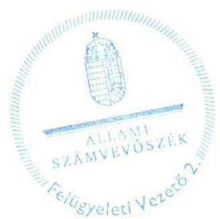

Salamon Ildikó
felügyeleti vezető

---

.

---

# RÖVIDÍTÉSEK JEGYZÉKE 

${ }^{1}$ NKH
${ }^{2}$ NFM
${ }^{3}$ Khtv.
${ }^{4}$ Kormányhivatal
${ }^{5}$ NFM SZMSZ
${ }^{6}$ Nvtv.
${ }^{7}$ Áht. 2
${ }^{8}$ Ávr.
${ }^{9}$ Áht. 1
${ }^{10}$ Ámr.
${ }^{11}$ Bkr.
${ }^{12}$ ÁSZ
${ }^{13}$ ÁSZ tv.
${ }^{14}$ Alapító okirat
${ }^{15}$ SZMSZ
${ }^{16}$ Számv. tv.

Nemzeti Közlekedési Hatóság
Nemzeti Fejlesztési Minisztérium
A fővárosi és megyei kormányhivatalokról, valamint a fővárosi és megyei kormányhivatalok kialakításával és a területi integrációval összefüggő törvény módosításáról szóló 2010. évi CXXVI. törvény
Fővárosi és megyei Kormányhivatal (19 megyei Kormányhivatal és Budapest Főváros Kormányhivatala)
4/2010. (VII. 8.) NFM utasítás a Nemzeti Fejlesztési Minisztérium Szervezeti és Múködési Szabályzatáról (hatályos 2011. december 15-ig)
9/2011. (XII. 15.) NFM utasítás a Nemzeti Fejlesztési Minisztérium Szervezeti és Múködési Szabályzatáról (hatályos: 2012. december 17-ig)
25/2012. (IX. 17.) NFM utasítás Nemzeti Fejlesztési Minisztérium Szervezeti és Múködési Szabályzatáról (hatályos 2013. július 12-ig)
24/2013. (VII. 12.) NFM utasítás a Nemzeti Fejlesztési Minisztérium Szervezeti és Múködési Szabályzatáról (hatályos 2014. október 10-ig)
33/2014. (X. 10.) NFM utasítás a Nemzeti Fejlesztési Minisztérium Szervezeti és Múködési Szabályzatáról (hatályos 2014. október 11-től)
A nemzeti vagyonról szóló 2011. évi CXCVI. törvény (hatályos 2011. december 31-től)
Az államháztartásról szóló 2011. évi CXCV. törvény (hatályos 2012. január 1-től)
Az államháztartásról szóló törvény végrehajtásáról szóló 368/2011. (XII. 31.) Korm. rendelet (hatályos 2012. január 1-től)
Az államháztartásról szóló 1992. évi XXXVIII. törvény (hatályos 2011. december 31-éig)
Az államháztartás működési rendjéről szóló 292/2009. (XII. 19.) Korm. rendelet (hatályos 2011. december 31-ig)
A költségvetési szervek belső kontrollrendszeréről és belső ellenőrzéséről szóló 370/2011. (XII. 31.) Korm. rendelet (hatályos 2012. január 1-től)
Állami Számvevőszék
2011. évi LXVI. törvény az Állami Számvevőszékről (hatályos 2011. VII. 1.)

NFM/10814/2/2010. számú alapító okirat
(hatályos: 2011. január 1-től 2013. december 31-ig)
ISZF/2542-1/2014-NFM számú alapító okirat
(hatályos: 2014. január 1-től 2014. május 22-ig)
ISZF/1493-2/2014-NFM számú alapító okirat
(hatályos: 2014. május 23-tól)
a Nemzeti Közlekedési Hatóság Szervezeti és Múködési Szabályzatáról (SZMSZ ${ }_{1}$ ) szóló 31/2009. (V. 22.) KHEM utasítás
(hatályos 2009. május 22-től 2011. április 15-ig)
a 22/2011. (IV. 15.) NFM utasítással kiadott SZMSZ ${ }_{2}$
(hatályos 2011. április 16-tól 2012. augusztus 14-ig)
a 24/2012. (VIII. 14.) NFM utasítással kiadott SZMSZ ${ }_{3}$
(hatályos 2012. augusztus 15-től 2014. május 30-ig)
a 23/2014. (V. 30.) NFM utasítással kiadott SZMSZ ${ }_{4}$
(hatályos 2014. május 31-től)
A számvitelről szóló 2000. évi C. törvény

---

17 Áhsz. 1

18 Áhsz. 2
19 Ügyrend

20 Kttv.
${ }^{21}$ gazdálkodási szabályzat
${ }^{22}$ önköltségszámítási szabályzat
${ }^{23}$ számviteli politika
${ }^{24}$ leltározási és selejtezési szabályzat
${ }^{25}$ eszközök és források értékelési szabályzata
${ }^{26}$ számlarend és bizonylati rend
${ }^{27} \mathrm{Kbt} .1$
${ }^{28} \mathrm{Kbt} .2$
${ }^{29} \mathrm{Bkr}$.
${ }^{30}$ Kockázatkezelési szabályzat

Az államháztartás szervezetei beszámolási és könyvvezetési kötelezettségének sajátosságairól szóló 249/2000. (XII. 24.) Korm. rendelet (hatálytalan 2014.január 1-től)
Az államháztartás számviteléről szóló 4/2013. (I. 11.) Korm. rendelet (hatályos 2014. január 1-től)

A többször módosított 15/2007. számú Elnöki utasítással kiadott Nemzeti Közlekedési Hatóság Gazdasági Főosztályának ügyrendje
Ügyrend: (hatályos 2007. február 28-tól 2014. június 30-ig),
A Műszaki és Ellátási Főosztály ügyrendje (Ügyrend: 2014. július 1-től)
A Pénzügyi és Hatósági Bevétel-beszedési Főosztály ügyrendje
(Ügyrends 2014. július 1-től)
A Számviteli és Kontrolling Főosztály ügyrendje
(Ügyrends 2014. július 1-től)
A közszolgálati tisztviselőkről szóló 2011. évi CXCIX. törvény (hatályos 2012. március 1-től)
Gazdálkodási szabályzat: 10/2009. Elnöki utasítás
(hatálytalan 2011.június 13-tól)
Gazdálkodási szabályzat: 6/2011. Elnöki utasítás
(hatálytalan: 2012. március 30-tól)
Gazdálkodási szabályzat: 8/2012. Elnöki utasítás
(hatálytalan 2013. június 2-től)
Gazdálkodási szabályzat: 12/2013. Elnöki utasítás
(hatálytalan 2014. szeptember 1-jétől)
Gazdálkodási szabályzat: 14/2014. Elnöki utasítás
(hatályos 2014. szeptember 1-jétől)
11/2012. Elnöki utasítás a Nemzeti Közlekedési Hatóság Önköltségszámítási szabályzatáról (hatályos 2012. július 1-től - 2014. január 7-ig)
1/2014. (I. 8.) Elnöki utasítás a Nemzeti Közlekedési Hatóság Önköltségszámítási szabályzatáról (hatályos 2014. szeptember 9-ig)
20/2014. (IX.10.) Elnöki utasítás a Nemzeti Közlekedési Hatóság Önköltségszámítási szabályzatáról (hatályos 2014. szeptember 10-től)
21/2014. (IX. 10) Elnöki utasítás a Nemzeti Közlekedési Hatóság számviteli politikájáról (hatályos 2014. szeptember 10-től)
22/2014. (XI. 10) Elnöki utasítás a Nemzeti Közlekedési Hatóság eszközök és források leltározási és leltárkészítési, valamint a feleslegessé vált eszközök feltárásának hasznosításának és selejtezésének szabályozásáról (hatályos 2014. szeptember 10-től)
24/2014. (IX. 10.) Elnöki utasítás a Nemzeti Közlekedési Hatóság eszközök és források értékelési szabályai, valamint az eszközgazdálkodási szabályokról (hatályos 2014. szeptember 10-től)
23/2014. (IX. 10.) Elnöki utasítás a Nemzeti Közlekedési Hatóság számlarend és bizonylati rendjéről (hatályos 2014. szeptember 11-től)
A közbeszerzésekről szóló 2003. évi CXXIX. törvény (hatálytalan 2012. január 1től)
A közbeszerzésekről szóló 2011. évi CVIII. törvény (hatályos: 2011. augusztus. 21től)
A költségvetési szervek belső kontrollrendszeréről és belső ellenőrzésről 370/2011. (XII. 31.) Korm. rendelet (hatályos: 2012. január 1-től)
A Nemzeti Közlekedési Hatóság Kockázatkezelési Szabályzatáról szóló 12/2009. számú Elnöki utasítás (Kockázatkezelési szabályzat:)
(hatályos 2009. december 1-jétől 2014. október 3-ig)

---

Kockázatkezelési szabályzat2: 29/2014. Elnöki utasítás (hatályos 2014. október 4-től)
Az egyes vagyonnyilatkozat-tételi kötelezettségekről szóló 2007. évi CLII. törvény
A személyes adatok védelméről és a közérdekú adatok nyilvánosságáról szóló 1992. évi LXIII. törvény (hatálytalan: 2012. január 1-jétől)

Az információs önrendelkezési jogról és az információszabadságról szóló 2011. évi CXII. törvény (hatályos: 2011. július 27-től)
21/2008. Elnöki utasítás a Nemzeti Közlekedési Hatóság Humánpolitikai kézikönyvéről (hatályos 2011. július 21-ig)
a többször módosított 9/2011. Elnöki utasítás a Nemzeti Közlekedési hatóság Humánpolitikai kézikönyvéről (hatályos 2011. július 22-től)
Az elektronikus információszabadságról szóló 2005. évi XC törvény (hatálytalan 2012. január 1-től)

A köziratokról, a közlevéltárakról és a magánlevéltári anyag védelméről szóló 1995. évi LXVI. törvény

4/2009. Elnöki utasítás a Nemzeti Közlekedési Hatóság egyedi iratkezelési szabályzatáról (hatályos 2009. május 1-től 2012. május 10-ig)
1/2012. Elnöki utasítás a Nemzeti Közlekedési Hatóság egyedi iratkezelési szabályzatáról (hatályos 2012. május 11-től)
A költségvetési szervek belső ellenőrzéséről szóló 193/2003. (XI. 26.) Korm. rendelet (hatálytalan 2012. január 1-től)
a 20/2008. számú Elnöki utasítással kiadott Nemzeti Közlekedési Hatóság Belső Ellenőrzési Kézikönyve (BEK)
BEK1 (hatályos: 2008. december 1-től 2011. december 31-ig)
BEK2: 13/2012. Elnöki utasítás (hatályos: 2012. december 31-ig)
BEK3: 16/2013. Elnöki utasítás (hatályos: 2013. január 1-től)
Közúti Közlekedésbiztonsági Akcióprogram
Közlekedés Operatív Program
Államfejlesztési Operatív Program
A Magyar Köztársaság 2011. évi költségvetéséről szóló 2010. évi CLXIX törvény
Magyarország 2012. évi központi költségvetéséről szóló 2011. évi CLXXXVIII törvény
Magyarország 2013. évi költségvetéséről szóló 2012. évi CCIV. törvény
Magyarország 2014. évi központi költségvetéséről szóló 2013. évi CCXXX törvény
Magyar Nemzeti Vagyonkezelő Zrt.
Vagyonkezelési szerződés egységes szerkezetben (SZT-33245, hatályos 2010. év április 9-től)
A Nemzeti Közlekedési Hatóságról szóló 263/2006. (XII.27.) Korm. rendelet
Az állami vagyonnal való gazdálkodásról szóló 254/2007. (X. 4.) Korm. rendelet (hatályos 2007. október 4-től)
Az állami vagyonról szóló 2007. évi CVI. törvény
A nemzeti vagyonról szóló 2011. évi CXCVI. törvény
www.nkh.hu

---

.

---

.

---

# ÁLLAMI SZÁMVEVŐSZÉK 

1052 Budapest, Apáczai Csere János utca 10.
Levélcím: 1364 Budapest 4. Pf. 54
Telefon: +36 14849100 Telefax: +36 14849200
www.asz.hu