# Jelentés 

## A központi alrendszer egyes intézményei ellenőrzése

A központi alrendszer egyes intézményei pénzügyi és vagyongazdálkodásának ellenőrzése - Csongrád Megyei Egészségügyi Ellátó Központ 2016.

---

.

---

# Jelentés 

## A központi alrendszer egyes intézményei ellenőrzése

A központi alrendszer egyes intézményei pénzügyi és vagyongazdálkodásának ellenőrzése - Csongrád Megyei Egészségügyi Ellátó Központ
2016. 06. hó 07. nap
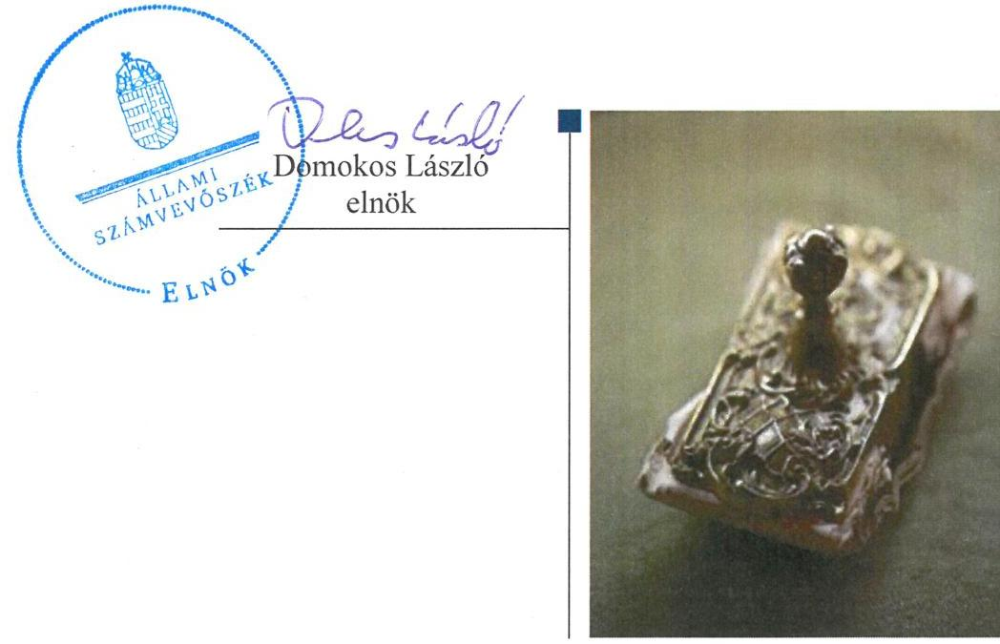

---

|   | AZ ELLENŐRZÉST FELÜGYELTE:  |
| --- | --- |
|   | SALAMON ILDIKÓ felügyeleti vezető  |
|   | AZ ELLENŐRZÉST VEZETTE ÉS A VÉGREHAJTÁSÁÉRT FELELŐS:  |
|   | NIKLAI HELÉNA ellenőrzésvezető  |
|   | A PROGRAM ÖSSZEÁLLÍTÁSÁÉRT FELELŐS:  |
|   | JANIK JÓZSEF osztályvezető  |
|   | BÖRÖCZ IMRE projektfelelős  |
|   | A TÉMÁHOZ KAPCSOLÓDÓ KORÁBBI SZÁMVEVŐSZÉKI JELENTÉSEK:  |
|  J | - címe: Magyarország 2014. évi központi költségvetése végrehajtásának ellenőrzéséről  |
|  J | - sorszáma: 15167  |
|  |   |
|   | IKTATÓSZÁM: V-0915-494/2016  |
|   | TÉMASZÁM: 1771  |
|   | ELLENŐRZÉS-AZONOSÍTÓ SZÁM: V071302  |

---

# TARTALOMJEGYZÉK 

■ ÖSSZEGZÉS ..... 5
■ AZ ELLENŐRZÉS CÉLJA ..... 7
■ AZ ELLENŐRZÉS TERÜLETE ..... 8
■ AZ ELLENŐRZÉS HÁTTERE, INDOKOLTSÁGA ..... 10
■ FÓKUSZKÉRDÉSEK ..... 11
■ ELLENŐRZÉS HATÓKÖRE ÉS MÓDSZEREI ..... 12
■ MEGÁLLAPÍTÁSOK ..... 16
■ JAVASLATOK ..... 41
■ MELLÉKLETEK ..... 47
I. Sz. melléklet: Értelmező szótár ..... 47
II. Sz. melléklet: Az integritás érvényesítése érdekében kialakított és működtetett kontrollrendszer ..... 52
III. Sz. melléklet: A teljesítmény-ellenőrzési kiegészítő modul megállapításai - Csongrád Megyei Egészségügyi Ellátó Központ ..... 53
IV. Sz. melléklet: A Kórház bevételi és kiadási előirányzatai és azok teljesítése 2011-2014. években (M Ft) ..... 54
V. Sz. melléklet: Mérlegadatok a 2011-2014. években (E Ft) ..... 55
■ FÜGGELÉK: ÉSZREVÉTELEK ..... 57
■ RÖVIDÍTÉSEK JEGYZÉKE ..... 69

---

.

---

# ÖSSZEGZÉS 

Az Állami Számvevőszék Csongrád Megyei Egészségügyi Ellátó Központnál a 2011-2014. közötti időszak tekintetében elvégzett ellenőrzése megállapította, hogy a Kórház belső kontrollrendszerének kialakítása és működtetése nem felelt meg a jogszabályi előírásoknak, pénzügyi és vagyongazdálkodása nem volt szabályszerű. A Kórház az átalakításához, átszervezéséhez kapcsolódó feladatait - a beszámolási kötelezettség teljesítésével és a beszámolók alátámasztásával kapcsolatban feltárt hibákat, hiányosságokat kivéve - szabályszerűen hajtotta végre. A Kórház nem megfelelően intézkedett az integritás szemlélet érvényesítése érdekében.
Az irányító szervek és a középirányító szerv Kórházra vonatkozó feladatellátása - az alapító okirat kiadása, az SZMSZ alapító okirattal való összhangja, valamint az erőforrásokkal való hatékony gazdálkodáshoz szükséges követelmények érvényesítése, számonkérés és ellenőrzése területén feltárt hibákat, hiányosságokat kivéve - szabályszerű volt.

## Az ellenőrzés társadalmi indokoltsága

A kórházak közfeladatot ellátó, egészségügyi szolgáltatást nyújtó, közpénzt felhasználó, közvagyont kezelő szervezetek. Működésükhöz szükséges finanszírozás biztosítása elsősorban a fenntartók, irányító szervek feladata. A kórházak többsége évek óta pénzügyi, likviditási problémákkal áll szemben, lejárt szállítói tartozásaik és likviditással kapcsolatos problémáik rendezésére a költségvetésből több alkalommal támogatásban részesültek.

Az önkormányzatok tulajdonában és fenntartásában lévő egészségügyi intézmények 2012. évben kerültek átszervezésre a központi alrendszerbe. A közpénzek felhasználásában és az állami vagyonnal való gazdálkodásban a központi alrendszer egyes intézményei meghatározó súlyt képviselnek. E szervezetekkel szemben társadalmi igény, hogy tevékenységükről a döntéshozók és a nyilvánosság felé elszámoljanak. Ezzel a társadalmi igénnyel és az Állami Számvevőszék Stratégiájával összhangban, a közpénzügyek átláthatóságának előmozdítása, a közvagyon védelme érdekében került sor a Csongrád Megyei Egészségügyi Ellátó Központ pénzügyi- és vagyongazdálkodásának ellenőrzésére.

## Főbb megállapítások, következtetések, javaslatok

Az ellenőrzés megállapította, hogy az irányító szervek és a középirányító szerv Kórházra vonatkozó feladatellátása a feltárt hibákat, hiányosságokat kivéve szabályszerű volt. A központi alrendszerbe történt átszervezést követően a Kórház módosított alapító okiratának kiadása 2012. évben késedelemmel történt meg, továbbá az SZMSZ tartalma az alapító okirattal 2012-2014. években nem volt összhangban. Az erőforrásokkal való hatékony gazdálkodáshoz szükséges követelményeket az irányító szervek és a középirányító szerv nem érvényesítettek, nem kértek számon és nem ellenőriztek. Az intézménnyel kapcsolatos egyéb ellenőrzési, irányítási és felügyeleti jogosultságok gyakorlása összességében szabályszerűen történt.

A Kórház belső kontrollrendszerének kialakítása és működtetése nem felelt meg a jogszabályok előírásainak.
A Kórház pénzügyi gazdálkodása nem volt szabályszerű. Az előirányzatok módosítását nem a jogszabályi előírásoknak megfelelően hajtották végre. 2011. évben a bevételi előirányzatok teljesítése, valamint az ellenőrzött időszakban a kiadási előirányzatok felhasználása során a jogszabályi előírásokat nem tartották be. Az ellenőrzött gazdálkodási jogkörök - a 2011. évet érintően a szakmai teljesítésigazolás és az utalvány ellenjegyzése, a 2012-2014. éveket érintően a teljesítésigazolás és az érvényesítés kulcskontrollok - gyakorlása nem felelt meg a jogszabályi előírásoknak. A Kórház az ellenőrzött időszakban árubeszerzés, illetve szolgáltatás megrendelésre teljesített kifizetéseihez kapcsolódóan nem folytatott le közbeszerzési eljárást, ezzel megsértette a közbeszerzésekről szóló törvény előírásait. A

---

zavartalan feladatellátáshoz a fizetőképesség folyamatos fennállása, a likviditás javítása érdekében tettek intézkedéseket, azonban a megtett intézkedések nem biztosították a pénzügyi egyensúly fenntartását. 2012. február és 2012. április között a Kórház lejárt esedékességű elismert tartozásállományának mértéke folyamatosan elérte a százötven millió forintot, azonban az Önkormányzat a jogszabályban előírtak ellenére a Kórházhoz önkormányzati biztost nem jelölt ki.

A Kórház vagyongazdálkodása nem felelt meg a jogszabályokban előírtaknak. Az állami vagyon vagyonkezelésére vonatkozó szerződés megkötése, tartalmának meghatározása a jogszabályi előírásoknak megfelelően történt, azonban a vagyonkezelési szerződést a jogszabályi előírások ellenére nem foglalták a módosításokkal egységes szerkezetbe. Egy beszerzésnél elmulasztották vagyonkezelési szerződés megkötését. A vagyonelemek hasznosítása nem a jogszabályok előírásainak megfelelően történt. A mérlegben kimutatott eszközök és források nyilvántartása, értékelése, leltározása, valamint a vagyonelemek bérbeadása során nem tartották be a jogszabályi előírásokat. A Kórház nem a jogszabályi előírásoknak megfelelően hajtotta végre az eredményszemléletű számvitel bevezetésével kapcsolatos feladatokat.

A Kórház átszervezéséhez, átalakításához kapcsolódó alapítói, irányító, felügyeleti szervi döntések szabályszerűek voltak. A Kórház az átalakításához, átszervezéséhez kapcsolódó feladatait - a központi alrendszerbe történt átszervezéshez kapcsolódó beszámolási kötelezettség teljesítésével és a 2012-2013. évek tekintetében a beszámolók alátámasztásával kapcsolatban feltárt hibákat, hiányosságokat kivéve - szabályszerűen hajtotta végre.

A Kórház nem megfelelően intézkedett az integritás szemlélet érvényesítése érdekében.
Az ÁSZ az emberi erőforrások miniszterének és a Kórház főigazgatójának fogalmazott meg javaslatokat, amelyekre 30 napon belül intézkedési tervet kell készíteniük.

---

# **A SZABÁLYSZERŰSÉGI ELLENŐRZÉS**

Célja annak megítélése volt, hogy az ellenőrzött intézményre vonatkozó irányító szervi feladatellátás a jogszabályi előírások betartásával történt-e; az intézménynél a belső kontrollrendszer kialakítása és működtetése szabályszerű volt-e; kialakították-e az erőforrásokkal való szabályszerű, gazdaságos, hatékony és eredményes gazdálkodáshoz szükséges követelményeket, megvalósították-e azok számonkérését, ellenőrzését; az intézmény pénzügyi és vagyongazdálkodása megfelelt-e a jogszabályi előírásoknak és belső szabályzatainak; az intézmény átalakításának vagy átszervezésének lebonyolítása szabályszerűen történt-e.

Az intézmény korrupcióval szembeni veszélyeztetettségének csökkentése érdekében az ÁSZ¹ felmérte az integritási szemlélet érvényesülését a gazdálkodási folyamatokban.

**A KIEGÉSZÍTŐ TELJESÍTMÉNY-ELLENŐRZÉSI MODUL** célja annak értékelése volt, hogy a gazdálkodás folyamatában a gazdaságossági, hatékonysági és eredményességi követelmények kialakítása megtörtént-e, azokat működtették-e, a célkitűzéseket elérték-e; a pénzügyi és vagyongazdálkodás folyamataira vonatkozóan a költségvetési szerv belső kontrollrendszerének minőségéről kiadott vezetői nyilatkozatban a költségvetési szerv tevékenységében a hatékonyság, eredményesség, gazdaságosság követelményeinek érvényesítésére vonatkozó nyilatkozat helytálló volt-e.

---

# **A Z ELLENŐRZÉS TERÜLETE**

## **Csongrád Megyei Egészségügyi Ellátó Központ**

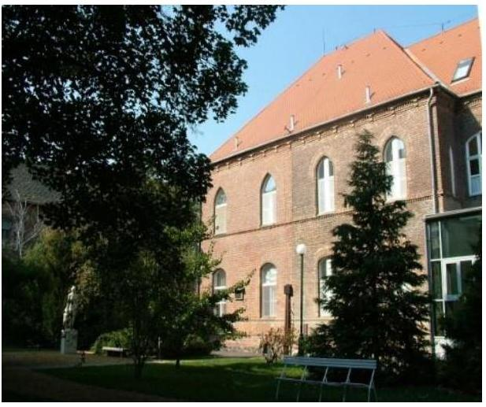

**A KÓRHÁZ** önállóan működő és gazdálkodó központi költségvetési szerv. A működését meghatározó Eütv.³ alapján közfeladata ellátási területére kiterjedően a járó és fekvőbetegek diagnosztikus és terápiás szakorvosi ellátása, rehabilitációja és követéses gondozása. 2014. évben a Kórház összesített ágyszáma 235 aktív és 385 krónikus ágy volt, az aktív ágyak közül 124 Hódmezővásárhelyen, 111 Makón, a krónikus ágyak közül 238 Hódmezővásárhelyen, 147 Makón működött. A járó beteg ellátásban az esetek száma 2014. évben 593 313 volt, amelyből 351 322 a hódmezővásárhelyi, 241 991 a makói betegellátáshoz kapcsolódott. Egynapos sebészeti ellátásban 1556 esetet láttak el.

A Kórház szervezeti felépítésében az ellenőrzött időszakban – az Alapító Okirat módosításával, a feladatváltozással összhangban – történt változás. A Ttv.⁴ alapján 2012. május 1-jétől a Kórház az önkormányzati alrendszerből a központi alrendszerbe került átszervezésre. A Kórház irányító szervei az ellenőrzött időszakban változtak. 2012. április 30-ig a fenntartó és irányító szerv – az Ötv.⁵ 9. § (5) bekezdése alapján – az Önkormányzat⁶ volt, az irányító szervi hatásköröket a Közgyűlés⁷ gyakorolta. 2012. május 1-jétől az irányító szervi hatásköröket a Minisztérium⁸, az egyes fenntartói, valamint középirányítói jogokat a GYEMSZI⁹ gyakorolta. 2013. évben a Kórház átalakult, a Miniszter¹⁰ 2013. február 1-jével a Kórházba integrálta a makói kórházat¹¹. A Kórház feladatstruktúrája, illetve szervezeti felépítése az ellenőrzött időszakban – az integráció kivételével – nem változott jelentősen.

A Kórházat az ellenőrzött időszakban főigazgató vezette, a főigazgató munkáját gazdasági igazgató, orvos igazgató, telephely igazgató és ápolási igazgató segítette. Az ellenőrzött időszakban a főigazgató és a gazdasági igazgató személyében nem történt változás. A gazdálkodással kapcsolatos feladatokat a gazdasági igazgató közvetlen irányítása alatt működő pénzügyi-számviteli osztály, humánpolitikai osztály, üzemeltetési osztály, valamint informatikai osztály látta el.

A Kórház engedélyezett létszáma 2011-ben 491 fő, 2012-ben 502 fő, 2013-ban és 2014-ben 936 fő volt. A 2011-2014. évi éves költségvetési beszámolók alapján az ellenőrzött időszakban a Kórház 3036,1 M Ft és 6930,3 M Ft közötti költségvetési bevételt, és 2981,5 M Ft és 6422,1 M Ft közötti kiadást teljesített. A bevételek és kiadások alakulását az ellenőrzött időszakban a IV. számú melléklet mutatja. A Kórház az ellenőrzött időszakban vállalkozási tevékenységet nem végzett, vállalkozási tevékenységből bevétele nem keletkezett.

Az ellenőrzött időszakban a Kórház könyvviteli mérleg szerinti vagyona a 2011. év eleji 354,8 M Ft-ról 2012. év végére 3305,4 M Ft-ra, 2013. év végére 5553,9 M Ft-ra, 2014. év végére 6 111,0 M Ft-ra emelkedett. A vagyonérték növekedését befolyásolta a központi alrendszerbe történt átszervezéssel, valamint az integrációval a Kórház vagyonkezelésébe került

---

vagyon nagysága. A kötelezettségek állománya az ellenőrzött időszakban folyamatosan emelkedett -2011. év végén 381,7 M Ft, 2014. év végén 1692,7 M Ft volt. A Kórház mérlegadatait az ellenőrzött időszakban az V. számú melléklet mutatja be.

---

# AZ ELLENŐRZÉS HÁTTERE, INDOKOLTSÁGA 

Az Alaptörvény rendelkezése szerint a nemzeti vagyon megőrzésének, védelmének és a nemzeti vagyonnal való felelős gazdálkodásnak a követelményeit sarkalatos törvény, az Nvtv. ¹² rögzíti. A tulajdonosi joggyakorlás és vagyonkezelés általános és speciális szabályait, az állami vagyon nyilvántartására és elszámolására vonatkozó eljárásokat, a vagyonkezelési szerződés feltételrendszerét, valamint az éves beszámoló készítési és könyvvezetési kötelezettségeket kormányrendelet írja elő.

A központi alrendszer egyes intézményei közfeladat-ellátásának változásait, a közfeladatok átadásából és átvételéből adódó módosításait, előirányzat gazdálkodására ható tényezőit az Áht. ¹³ 11. §-a és az Ávr. ¹⁴ 14. §-a írja elő. A közfeladatok megszűnéséből, intézmény átszervezéséből, belső szerkezeti korszerűsítéséből, vagy
 más hasonló okból adódó módosításai miatt szerepeltetendő szerkezeti változásokat, valamint a szerkezeti változásként beépült közfeladatok szintre hozásként történő számításba vételét az Ávr. 15. § (2)-(3) bekezdései határozzák meg.

AZ ELLENŐRZÉS EREDMÉNYEKÉPPEN nemcsak az ellenőrzött intézmények gazdálkodása javulhat, hanem átfogó képet kaphatunk a központi alrendszerbe tartozó költségvetési szervek gazdálkodásának hiányosságairól, de a jó gyakorlatokról is. Ellenőrzéseivel, javaslataival és megállapításaival az ÁSZ elősegítheti a költségvetési szervek pénzügyi és vagyongazdálkodása szabályozásának javítását és hozzájárulhat a jó kormányzáshoz.

Az Áht. ${ }^{15}{ }_{2}$ az Ámr. ${ }^{16}$ és a Bkr. ${ }^{17}$ előírja a költségvetési szerv részére, hogy olyan követelményeket alakítson ki, amelyek biztosítják a működés, gazdálkodás, az erőforrások felhasználása során a gazdaságosság, hatékonyság és eredményesség érvényesülését. Az Ámr. és a Bkr. alapján a költségvetési szerv vezetőjének évente nyilatkoznia is kell arról, hogy gondoskodott-e az intézmény tevékenységében a gazdaságosság, hatékonyság és eredményesség követelményeinek érvényesítéséről. A gazdaságos, hatékony és eredményes gazdálkodáshoz szükség van a teljesítménymérés feltételeinek kialakítására, úgymint az egyértelmű és mérhető célokra, mutatószámokra és az ezekhez rendelt követelményekre. Az ÁSZ jelen ellenőrzés keretében győződött meg arról is, hogy az intézménynél a teljesítménycélokat, -mutatókat, -követelményeket kialakították-e, azokat működtették-e, a kitűzött célok teljesültek-e.

## A TELJESÍTMÉNY-ELLENŐRZÉSI KIEGÉSZÍTŐ

MODUL alapján elvégzett ellenőrzés a törvényalkotás számára támogatást nyújt a nemzeti kulcsindikátorok rendszerének kialakításához. A döntéshozók, ellenőrzöttek, irányító szervek, a társadalom számára az összehasonlítási, összemérési lehetőségek kihasználásával objektív visszajelzést ad a gazdálkodás területén végrehajtott szervezeti, szervezési, takarékossági és bürokráciacsökkentő intézkedések hatásairól, a közfeladat-ellátásnak keretet adó pénzügyi és vagyongazdálkodásban mérhető teljesítménykövetelmények kialakításáról, azok alkalmazásáról.

---

# FÓKUSZKÉRDÉSEK 

1. Az irányító szerv ellenőrzött intézményre vonatkozó feladatellátása szabályszerű volt-e?
2. A belső kontrollrendszer kialakítása és működtetése megfelelt-e a jogszabályi előírásoknak?
3. Az intézmény pénzügyi gazdálkodása szabályszerű volt-e?
4. Az intézmény vagyongazdálkodása szabályszerű volt-e?
5. Szabályszerűen hajtották-e végre az ellenőrzött időszakban az intézményt érintő szervezeti, szerkezeti átalakításokat?
6. Az intézmény intézkedett-e az integritás szemlélet érvényesítése érdekében?

---

# ELLENŐRZÉS HATÓKÖRE ÉS MÓDSZEREI 

## Az ellenőrzés típusa

Szabályszerűségi ellenőrzés, amelyet teljesítmény-ellenőrzési modul egészített ki.

## Az ellenőrzött időszak

Az ellenőrzött időszak a 2011. január 1-jétől 2014. december 31-ig tartó időszak volt.

## Az ellenőrzés tárgya

Az ellenőrzött szervezetre vonatkozó irányító szervi feladatok ellátása. A Kórház belső kontroll rendszerének kialakítása és működtetése, valamint pénzügyi és vagyongazdálkodása. Az erőforrásokkal való szabályszerű, gazdaságos, hatékony és eredményes gazdálkodáshoz szükséges követelmények kialakítása, a kialakított követelmények számonkérés, ellenőrzése. A Kórház átalakítása, átszervezése lebonyolításának szabályszerűsége.

A teljesítmény-ellenőrzési kiegészítő modul esetében a Kórház gazdálkodás folyamatában a gazdaságossági, hatékonysági és eredményességi követelmények kialakítása és működtetése, a célkitűzések teljesítésének értékelése. A költségvetési szerv tevékenységében a hatékonyság, eredményesség, gazdaságosság követelményei érvényesítéséről kiadott nyilatkozat helytállósága a pénzügyi és a vagyongazdálkodás folyamataira vonatkozóan. A teljesítmény-ellenőrzési kiegészítő modul fókuszkérdéseire a III. számú melléklet ad választ.

Az ellenőrzés kiterjedt minden olyan körülményre és adatra, amely az ÁSZ jogszabályban meghatározott feladatainak teljesítéséhez, valamint a program végrehajtása folyamán felmerült újabb összefüggések feltárásához szükséges volt.

## Az ellenőrzött szervezet

Csongrád Megyei Egészségügyi Ellátó Központ Hódmezővásárhely-Makó (2013. január 31-ig Hódmezővásárhelyi Erzsébet Kórház-Rendelőintézet), Hódmezővásárhely Megyei Jogú Város Önkormányzata, az Emberi Erőforrások Minisztériuma (Nemzeti Erőforrás Minisztérium) és az Állami Egészségügyi Ellátó Központ (Gyógyszerészeti és Egészségügyi Minőség- és Szervezetfejlesztési Intézet).

---

Az ellenőrzésre a központi alrendszer ellenőrzött intézményének és irányító/felügyeleti szervének, illetve középirányító szervének székhelyén került sor.

# Az ellenőrzés jogalapja 

Az ellenőrzés jogszabályi alapját az ÁSZ tv. ${ }^{18}$ 1. § (3) bekezdésének, 5. § (2)-(7) bekezdéseinek, valamint az Áht. 2 61. § (2) bekezdésének előírásai képezték.

## Az ellenőrzés módszerei

Az ellenőrzést az ellenőrzési program szempontjai, az ellenőrzött időszakban hatályos jogszabályok, az ellenőrzés szakmai szabályai, az egyes ellenőrzési típusokhoz kapcsolódó ÁSZ módszertanok és nemzetközi standardok figyelembevételével végeztük. A gazdálkodás hibáinak kijavítására, a közpénzekkel való felelős gazdálkodás segítésére irányuló javaslatok kidolgozásakor a hatályos jogszabályok voltak az irányadóak.

Az ellenőrzés ideje alatt az ellenőrzött szervezetekkel történő kapcsolattartást az ÁSZ SZMSZ ${ }^{19}$-ének vonatkozó előírásai alapján biztosítottuk.

Az ellenőrzési kérdések megválaszolásához szükséges bizonyítékok megszerzése a következő ellenőrzési eljárások alkalmazásával történt: megfigyelés, szemle (szemrevételezés), kérdésfeltevés (információkérés), mintavételezés, valamint elemző eljárás. A minták kiválasztása során elsősorban reprezentativitást biztosító véletlen mintavételi eljárást alkalmaztunk.

Az ellenőrzési bizonyítékként felhasználható adatforrások közé tartoztak egyrészt a szakmai program részletes szempontjainál felsorolt adatforrások, másrészt minden egyéb - az ellenőrzés folyamán feltárt, az ellenőrzés szempontjából releváns információt tartalmazó - dokumentum.

Az ellenőrzés lefolytatásához az ellenőrzött szervezetek a tanúsítványok elektronikus kitöltésével, valamint az ÁSZ által kért dokumentumok elektronikus megküldésével szolgáltattak adatokat. A rendelkezésre bocsátott adatok, információk kontrollja az ellenőrzés keretében történt.

Az ellenőrzési kérdésekre adott válaszok alapján értékeltük, hogy az ellenőrzött időszakban az irányító szervek és a középirányító szerv az ellenőrzött intézményre vonatkozó feladatainak szabályszerűen eleget tett-e, az intézmény pénzügyi és vagyongazdálkodása megfelelt-e az előírásoknak, az intézmény átalakításának vagy átszervezésének végrehajtása szabályszerű volt-e. Értékeltük, hogy az intézménynél kialakították-e az erőforrásokkal való szabályszerű és hatékony gazdálkodáshoz szükséges követelményeket, megvalósították-e azok számonkérését, ellenőrzését.

Az intézmény belső kontrollrendszere jogszabályi előírások szerinti kialakításának és működtetésének szabályszerűségét az erre irányuló ellenőrzési kérdésekre adott válaszok összesítése alapján, évente pillérenként (kontrollkörnyezet, kockázatkezelési rendszer, kontrolltevékenységek, információs és kommunikációs rendszer, monitoring rendszer) és összesítetten is minősítettük. Az intézmény belső kontrollrendszere egyes pilléreinek

---

kialakítását és működtetését „szabályszerű"-nek minősítettük, amennyiben az értékelt területen az elért és elérhető pontok százalékban kifejezett, egész számra kerekített hányadosa meghaladta a 84%-ot, „részben szabályszerű"-nek minősítettük, ha a 84%-ot nem haladta meg, de 60%-nál nagyobb volt, „nem szabályszerű"-nek minősítettük, ha nem haladta meg a 60%-ot. Az intézmény belső kontrollrendszerének összesített értékelése megegyezik a pillérenként (kontrollterületenként) alkalmazott %-os értékelésekkel, a következő eltérésekkel. A kontrollrendszer egésze esetében a „szabályszerű" értékelésnek a %-os értéken felül további feltétele volt, hogy egyik kontrollterület sem kaphatott „nem szabályszerű" értékelést, a „részben szabályszerű" értékelés további feltétele volt, hogy legfeljebb egy ellenőrzött kontrollterület lehetett „nem szabályszerű" értékelésű. Az összesített értékelés a %-os értéktől függetlenül „nem szabályszerű"-nek minősült, ha az ellenőrzött kontrollterületek közül több mint egy „nem szabályszerű" értékelést kapott.

A tárgyi eszközök nyilvántartásba vételének, a közbeszerzési eljárások lefolytatásának, a vagyonhasznosítási bevételi előirányzatok teljesítésének, az előirányzatok módosításának és az előirányzat-maradvány megállapításának szabályszerűségét, valamint a gazdálkodási jogkörök gyakorlásának szabályszerűségét mintavétellel ellenőriztük.

A jogszabályoknak és a belső előírásoknak megfelelőnek tekintettük a tárgyi eszközök nyilvántartásba vételét, a közbeszerzési eljárások lefolytatását, a vagyonhasznosítási bevételi előirányzatok teljesítését, az előirányzatok módosítását, amennyiben a minta ellenőrzésének eredménye alapján 95%-os bizonyossággal a teljes sokaságban a hibás tételek aránya kisebb volt, mint 10%, nem megfelelőnek értékeltük, ha a hibás tételek aránya a 10%-ot meghaladta. Kockázatot, illetve magas kockázatot jeleztünk, amennyiben egy adott terület vonatkozásában a minta alapján a teljes sokaságban nem volt egyértelműen biztosított a jogszabályoknak és a belső szabályzatoknak megfelelő működés.

Az előirányzat-maradvány esetében az ellenőrzött mintatételek értékelését végeztük el.

A 2011. évet érintően a szakmai teljesítésigazolás és az utalvány ellenjegyzése kulcskontrollok, a 2012-2014. éveket érintően a teljesítésigazolás és az érvényesítés kulcskontrollok működését értékeltük. Megfelelőnek értékeltük a gazdálkodási jogkörök gyakorlását, amennyiben 95%-os bizonyossággal a teljes sokaságban a hibás tételek aránya legfeljebb 10% volt, részben megfelelőnek, ha a hibás tételek arányának felső határa legfeljebb 30% volt, nem megfelelőnek, ha a hibás tételek sokaságbeli arányának felső határa meghaladta a 30%-ot.

Az integritás szemlélet érvényesülésének értékelése az intézmény által kitöltött tanúsítvány alapján történt.

Az alapprogram alapján ellenőriztük, hogy a költségvetési szerv vezetője megtette-e nyilatkozatát arról, hogy gondoskodott a költségvetési szerv tevékenységében a hatékonyság, eredményesség és a gazdaságosság követelményeinek érvényesítéséről. Ezt kiegészítve, a teljesítmény-ellenőrzési kiegészítő modul keretében - felhasználva az alapprogram szerinti ellenőrzés megállapításait - értékeltük, hogy a költségvetési szerv vezetője kialakította-e a gazdaságossági, hatékonysági és eredményességi követelményeket, és azokat működtette-e, a célkitűzéseket elérte-e.

---

A teljesítmény-ellenőrzési kiegészítő modul a gazdálkodási feladatokra terjedt ki, a szakmai feladatellátást nem értékelte.

A gazdálkodási feladatok értékelése az alábbi területekre terjedt ki:
pénzügyi gazdálkodási (nem szakmai, adminisztratív) feladatok: költségvetés-, beszámoló-készítés, könyvvezetés, adatszolgáltatások, előirányzat-gazdálkodás, kötelezettségvállalások nyilvántartása, kezelése, bevételkezelés, bér- és illetményszámfejtés;
$\longrightarrow$ vagyongazdálkodási (logisztikai) feladatok: közbeszerzések és közbeszerzési értékhatárt el nem érő beszerzések, készletgazdálkodás, nyomtatók, fénymásolók üzemeltetése, épület- és ingatlanüzemeltetés, karbantartás, hibabejelentés, gépjármű és flottamenedzsment.
A teljesítmény-ellenőrzési kiegészítő programmodulban megfogalmazott ellenőrzési cél megválaszolásához az alapprogram végrehajtása során megfogalmazott megállapításokat is figyelembe vettük.

---

# 1. Az irányító szerv ellenőrzött intézményre vonatkozó feladatellátása szabályszerű volt-e? 

Összegző megállapítás

Az irányító szervek és a középirányító szerv Kórházra vonatkozó feladatellátása - az alapító okirat kiadása, az SZMSZ alapító okirattal való összhangja, valamint az erőforrásokkal való hatékony gazdálkodáshoz szükséges követelmények érvényesítése, számonkérés és ellenőrzése területén feltárt hibákat, hiányosságokat kivéve - szabályszerű volt.
1.1. számú megállapítás

Az irányító szervet megillető jogosultságok gyakorlása - a feltárt hibák, hiányosságok kivételével - a jogszabályi előírásoknak megfelelően történt. A Kórház módosított alapító okiratának kiadása 2012. évben késedelemmel történt meg, továbbá az SZMSZ tartalma az alapító okirattal a 2012-2014. években nem volt összhangban.

AZ ÖNKORMÁNYZAT 2011. január 1-jétől az irányító funkció 2012. április 30-ai megszűnéséig irányító szervi jogosultságot nem adott át, az irányító szervi hatásköröket az érintett időszakban a Közgyűlés gyakorolta.

Az Önkormányzat az irányítói jogosítványai körében a Kórház alapító okiratát szabályszerűen kiadta és módosította. Az ellenőrzött időszak kezdetén a Közgyűlés által 2010. november 11-én jóváhagyott alapító okirat volt hatályban, amelyet 2012. április 30-ig (elsősorban a szakfeladatok változása miatt) több alkalommal módosítottak.
2012. MÁJUS 1-JÉTŐL - a Ttv. alapján az államháztartás önkormányzati alrendszeréből a központi alrendszerbe történt átsorolást követően - a Kórház irányító szerve a Minisztérium lett. A GYEMSZI, mint a Kórház középirányító szerve gyakorolta az Eütv. szerint miniszteri hatáskörbe nem tartozó fenntartói, valamint az 59/2011. (IV.12.) Korm. rendelet ${ }^{20}$ 2/A. $\S$-ában meghatározott középirányító szervi jogokat.

A Miniszter a Kórház alapító okiratait az Áht. 2 8. §-ában foglaltak szerint kiadta, aktualizálta, azonban a központi alrendszerbe átszervezést követően a Kórház módosított alapító okiratának kiadása 2012. december 15-én, késedelemmel történt. Az intézkedés nem volt összhangban a Ttv. 6. § (1) bekezdésében foglaltakkal, amely szerint a költségvetési szervként működő egészségügyi szolgáltató alapító okiratának módosítását az alapítói jogokat gyakorló szervnek az átvételt követő 45 napon belül kell elkészítenie és benyújtania a Kincstár által vezetett törzskönyvi nyilvántartáshoz. A módosítás 2012. május 1-jei, visszamenőleges hatállyal irányító

---

szervként a Minisztériumot, az alapítói jogok gyakorlójaként a Minisztert jelölte meg.

A Miniszter a 2013. január 30-ai keltezéssel 2013. február 1-jei hatályba lépéssel kiadott, egységes szerkezetbe foglalt alapító okirat módosítással a Kórházba integrálta a makói kórházat. (A Miniszter 2013. január 30-ával adta ki a makói kórház január 31-i, beolvadással történő megszűnéséről szóló megszüntető okiratot. A makói kórház a Konszolidációs tv. ${
 }^{21}$ alapján az integrációt megelőzően, 2012. május 1-jével állami tulajdonba került.)

Az alaptevékenységi kód 2014. január 1-jei változása miatt a Miniszter 2014. február 27-én - visszamenőleges, 2014. január 1-jei hatállyal - kiegészítette az alapító okirat alaptevékenységek kormányzati funkciók szerinti besorolását.

Az ellenőrzött időszakban kiadott alapító okirat-módosítások és kiegészítések az Áht. 1 90. §-ában és az Ávr. 5. § (1)-(3) bekezdéseiben foglaltaknak megfelelően tartalmazták az intézmény nevét, székhelyét, telephelyét, illetékességi és működési körét, az irányító szerv nevét, székhelyét, vezetőjének kinevezési rendjét, a foglalkoztatottak foglalkoztatási jogviszonyának megjelölését. Tartalmazták az intézmény gazdálkodási besorolását, közfeladatát, alaptevékenységét, a szakágazati kódokat és megnevezésüket, az államháztartási szakfeladat-rend szerinti megjelöléseket. Az alapító okirat-módosítások alkalmával az irányító szervek kiadták az egységes szerkezetű alapító okiratokat is.

A Kórház az ellenőrzött időszakban rendelkezett az irányító szervek által jóváhagyott SZMSZ ${ }^{22}$-ekkel. Az SZMSZ 2011. évben nem felelt meg az Ámr. 20. § (2) bekezdés c), e), g), i) pontjainak, mivel nem tartalmazta az ellátandó, és a szakfeladatrend szerint (szakfeladat számmal és megnevezéssel) besorolt alaptevékenységek, valamint az alaptevékenységet szabályozó jogszabályok megjelölését, a gazdasági szervezet engedélyezett létszámát; a szervezeti egységek vezetőjének azon jogosítványait, amelyek körében a költségvetési szerv képviselőjeként járhat el; valamint a költségvetési szerv szervezeti ábráját. Az SZMSZ 2012-2014. években nem felelt meg az Ávr. 13. § (1) bekezdés e), f) pontjai előírásainak, mivel nem tartalmazta a gazdasági szervezet engedélyezett létszámát, a költségvetési szerv szervezeti ábráját, valamint azon ügyköröket, amelyek során a szervezeti egységek vezetői a költségvetési szerv képviselőjeként járhatnak el.

Az ellenőrzött időszak kezdetén az Önkormányzat polgármestere által 2010. december 29-én jóváhagyott, 2011. január 1-jével hatályba léptetett SZMSZ volt hatályban. Az SZMSZ tartalma az alapító okirattal a 2011. évben összhangban volt. A 2012. évben az SZMSZ módosítását március 1-jén hagyta jóvá az Önkormányzat polgármestere, és a módosítás visszamenőlegesen, 2012. február 20-tól lépett hatályba. Az SZMSZ további módosítására 2012. május 1. és 2014. június 12. közötti időszakban nem került sor. Ennek következtében az SZMSZ a 2012. május 1. és 2014. június 12. közötti időszakban nem volt összhangban az alapító okirattal, mivel az Ávr. 13. § (1) bekezdés b) pont előírásai ellenére nem tartalmazta a hatályos, egységes szerkezetbe foglalt alapító okirat keltét és számát.

Az önkormányzati alrendszerből a központi alrendszerbe történő átszervezést és az integrációt követően a Kórház működését szabályozó SZMSZ - Eütv. 155. § (1) bekezdés f) pontja és az Áht. 2 9. § (1) bekezdés a) pontja előírásai szerint - jóváhagyása a GYEMSZI részéről 2014. június 12-én történt meg. A GYEMSZI által jóváhagyott SZMSZ-módosítás - az

---

Ávr. 13. § (1) bekezdés c) pontja előírásai ellenére - nem tartalmazta a kormányzati funkciók, államháztartási szakfeladatok és szakágazatok osztályozási rendjéről szóló 68/2013. (XII. 29.) NGM rendeletben kihirdetett, 2014. január 1-jétől érvényes, az ellátandó, és a kormányzati funkció szerint besorolt alaptevékenységek megjelölését és így nem volt összhangban a 2014. február 27-én kiadott alapító okirattal.

# 1.2. számú megállapítás 

Az irányító szervek és a középirányító szerv a közfeladatok ellátására vonatkozó, az erőforrásokkal való szabályszerű gazdálkodáshoz szükséges követelményeket érvényesítették, számon kérték és ellenőrizték. Az erőforrásokkal való hatékony gazdálkodáshoz szükséges követelményeket nem érvényesítettek, nem kérték számon és nem ellenőrizték.

A közfeladatok ellátására vonatkozó, az erőforrásokkal való szabályszerű gazdálkodáshoz szükséges követelményeket 2011. évben az irányító szerv, 2012-2014. években a középirányító szerv érvényesítette. Az Önkormányzat az erőforrásokkal való gazdálkodás szabályszerűségi követelményeit rendeletekben rögzítette. A GYEMSZI a vagyonkezelési szerződésben a Kórház részére vagyongazdálkodási követelményeket határozott meg.

Az irányító szervek és a középirányító szerv a költségvetési beszámolókon, a beszámolók elkészítéséhez adott iránymutatásokon, tájékoztatásokon, jelentéseken keresztül kísérték figyelemmel a közfeladatok ellátásának megfelelőségét és a TVK ${ }^{23}$ érvényesülését.

Az irányító szervek és a középirányító szerv a főigazgatót beszámoltatták az éves szakmai feladatellátásról, a gazdálkodásról, továbbá a költségvetési beszámolók bekérése, a beszámolók, tájékoztatók adatai és kötelező kiegészítései, a negyedéves mérlegjelentések, a rendszeres adatszolgáltatások, az éves ellenőrzési jelentések bekérésével, a jóváhagyásokra, engedélyezésekre bemutatott dokumentumok útján tettek eleget az Áht. 1 49. § (5) bekezdés f) pontja, valamint az Áht. 2 9. § (1) bekezdés f) pontja szerinti beszámoltatási és ellenőrzési kötelezettségüknek. A központi alrendszerbe történt átszervezéssel és az integrációval kapcsolatosan készített intézkedési tervek végrehajtásáról az irányító szerv és a középirányító szerv további beszámolási, tájékoztatási kötelezettséget írt elő a Kórház számára. A Kórház költségvetését 2011-2012. években a Közgyűlés, 2013-2014. években a Minisztérium jóváhagyta.

A GYEMSZI 2013-ban ellenőrizte a Kórház szabályozottságát. A Minisztérium 2014. évben ellenőrizte a Kórháznál a belső ellenőrzési feladatok ellátását a 2012-2014. évek tekintetében.

## AZ ERŐFORRÁSOKKAL VALÓ HATÉKONY GAZ-

DÁLKODÁSHOZ szükséges követelményeket a 2011. évben az Önkormányzat az Áht. 1 49. § (5) bekezdés f) pontjának, a 2012-2014. években a GYEMSZI az Áht. 2 9. § (1) bekezdés f) pontjának és az 59/2011. (IV. 12.) Korm. rendelet 2/A. § a) pontjának előírásai ellenére nem érvényesített, nem kért számon és azok tekintetében ellenőrzést nem végzett a Kórháznál.

---

1.3. számú megállapítás

Az intézménnyel kapcsolatos egyéb ellenőrzési, irányítási és felügyeleti jogosultságok gyakorlása összességében szabályszerűen történt.

Az irányító szervek figyelemmel kísérték a bevételi és kiadási előirányzatokkal való gazdálkodást, az ellenőrzött időszakban nem állapították meg a bevételi és kiadási előirányzatok teljesülésének, a közfeladatok ellátásának veszélybe kerülését, így az Áht. 1 49. § (5) bekezdésének i) pontja, illetve az Áht. 2 9. § (1) bekezdés d) pontja szerinti irányító szervi intézkedésre nem került sor.

Az irányító szervek rendelkeztek a jogkörük gyakorlásához szükséges közérdekű és közérdekből nyilvános adatokkal. Az Önkormányzat a közérdekű adatok megismerésére irányuló igények teljesítésének rendjét, a Minisztérium a közérdekű adatok közzétételének rendjét belső szabályzatában rögzítette. A GYEMSZI, mint középirányító szerv webes ügymenetkezelő (ügyköri) rendszert vezetett be az irányításhoz szükséges ügyek kezelésére, a rendszer működtetéséről és fejlesztéséről folyamatosan tájékoztatta az irányított szerveket.

# A KÓRHÁZ FŐIGAZGATÓJA ÉS GAZDASÁGI VEZETŐJE az ellenőrzött időszakban folyamatosan látták el feladataikat, kinevezésük az ellenőrzött időszakot megelőzően történt. A főigazgatóval az Önkormányzat polgármestere, mint kinevezésre jogosult kötött munkaszerződést, munkaszerződése a Ttv. 11. § (4) bekezdése előírásainak értelmében 2012. november 30-ával megszűnt. Újabb pályázata elfogadását követően, a GYEMSZI javaslatának figyelembevételével a főigazgatót 2012. december 1-jétől a jogszabályi előírásoknak megfelelően a Miniszter nevezte ki, a főigazgatóval határozott időre új munkaszerződést kötött. A gazdasági vezető - több alkalommal meghosszabbított ideiglenes - megbízását a főigazgató adta ki. A főigazgató által a gazdasági vezető részére 2012. december 27-én kiadott megbízás nem felelt meg a jogszabályi előírásoknak, mivel az Eütv. 155. § (4) bekezdésének a 2011. évi CLXXVI. törvény 52. § szerinti módosításával gazdasági vezetői megbízás adására csak a Miniszternek volt jogosultsága. A gazdasági vezető megbízatását a Miniszter 2013. január 19-ével szüntette meg, ezzel egyidejűleg a gazdasági vezetővel 2013. január 20. napjától határozott idejű munkaszerződést kötött.

## 2. A belső kontrollrendszer kialakítása és működtetése megfelelte a jogszabályi előírásoknak?

Összegző megállapítás
2.1. számú megállapítás

A belső kontrollrendszer kialakítása és működtetése nem felelt meg a jogszabályi előírásoknak.

A kontrollkörnyezet kialakítása nem volt szabályszerű.
A KÓRHÁZ a gazdasági szervezet gazdálkodással összefüggő feladatairól szóló, érvényes ügyrenddel 2011. január 1. és 2012. augusztus 31. közötti időszakban nem rendelkezett, amellyel megsértette az Ámr. 20. § (7) bekezdését, illetve az Ávr. 9. § (5) és 13. § (5) bekezdését elő-

---

írásait. A 2012. szeptember 1-jével hatályba léptetett ügyrend nem tartalmazta teljes körűen az Ávr. 13. § (5) bekezdésében előírt tartalmi elemeket, a szervezeti egységek által ellátott feladatok munkafolyamatainak leírását, a szervezeti egység költségvetési szerven belüli kapcsolattartásának módját és a helyettesítés rendjét a szervezeti egységek alkalmazottainak tekintetében nem szabályozta. Az ügyrendet a 2013. évi integrációval bekövetkezett változásokkal nem aktualizálták.

A Kórház az ellenőrzött időszakban - az Ámr. 156. § (1) bekezdés c) pontjában, illetve a Bkr. 6. § (1) bekezdés c) pontjában előírtak ellenére nem határozta meg az etikai elvárásokat a szervezet minden szintjén.

A Kórház (2011. évben módosított) számviteli politikája az ellenőrzött időszakban nem tartalmazta a Számv. tv. ${ }^{24}$ 14. § (4) bekezdésében előírt szabályozást, a gazdálkodóra jellemző szabályokat, előírásokat, módszereket, amelyekkel meghatározza, hogy mit tekint a számviteli elszámolás, az értékelés szempontjából lényegesnek, jelentősnek, nem lényegesnek, nem jelentősnek, továbbá meghatározza azt, hogy a törvényben biztosított választási, minősítési lehetőségek közül melyeket, milyen feltételek fennállása esetén alkalmaz, az alkalmazott gyakorlatot milyen okok miatt kell megváltoztatni.

A számviteli politikán, illetve a számviteli politika keretében elkészített szabályzatokon, az eszközök és források értékelési szabályzatán, a leltározási és leltárkészítési szabályzaton, az önköltségszámítás rendjére vonatkozó belső szabályzaton - a Számv. tv. 14. § (11) bekezdésében foglaltak ellenére - a 2011-2014. években hatályba lépett törvénymódosítással kapcsolatos változásokat azok hatályba lépését követően nem vezették át.

Továbbá a Kórház 2014. évben a Számv. tv. 14. § (3)-(5), valamint az Áhsz. ${ }^{25}$ 50. § (1) bekezdéseiben rögzített előírásokat megsértve, a költségvetési és a pénzügyi számvitel alkalmazásával kapcsolatos sajátos szabályokat, előírásokat, módszereket a számviteli politikában, illetve a Számv. tv. 14. § (5) bekezdése szerint a számviteli politika keretében elkészített szabályzatokban - az eszközök és a források értékelési szabályzatában, a leltározási és leltárkészítési szabályzatban, az önköltségszámítás rendjére vonatkozó belső szabályzatban és a pénzkezelési szabályzatban - nem rögzítette. Ennek következtében:
A számviteli politika 2014. január 1-jétől nem felelt meg az Áhsz. 250. § (1) bekezdése előírásainak, mivel nem tartalmazta a költségvetési és a pénzügyi számvitel alkalmazásával kapcsolatos sajátos szabályokat, előírásokat, módszereket. Nem felelt meg továbbá az Áhsz. 250. § (7) bekezdése előírásainak, mivel nem tartalmazta az általános költségek szakfeladatokra és az általános kiadások tevékenységekre történő felosztásának módját, a felosztáshoz alkalmazott mutatókat, vetítési alapokat.
Az eszközök és források értékelési szabályzata 2014. január 1-jétől nem felelt meg az Áhsz. 250. § (2) bekezdés d) pontjában foglalt előírásoknak, mivel nem tartalmazta a tulajdonosnak (tulajdonosi joggyakorló szervezetnek) a vagyonkezelésbe adott eszközök vagyonértékelése során alkalmazott értékelési eljárás elveit, módszerét, dokumentálásának szabályait, felelőseit.
A Kórház számlarendje az ellenőrzött időszakban - a Számv. tv. 161. § (4) bekezdésének előírásai ellenére - nem került folyamatos karbantartásra.

---

A Kórház (2012-ben módosított) pénzkezelési szabályzata - a Számv. tv. 14. § (8) bekezdése előírásai ellenére - nem rendelkezett a készpénz állományt érintő pénzmozgások jogcímeiről és eljárási rendjéről, a készpénzállomány ellenőrzésekor követendő eljárásról, valamint a készpénzállomány ellenőrzésének gyakoriságáról.

Az ellenőrzött időszakban - az Áht. 1 91. § (2) bekezdésében, az Áht. 2 10. § (5) bekezdésében előírtak ellenére - a gazdálkodás részletes rendjét belső szabályzatban nem határozták meg.

A Kórház (2014-ben módosított) kötelezettségvállalási szabályzatában meghatározott belső
 előírások nem feleltek meg az Ámr. 20. § (3) bekezdés a) pontjában, valamint az Ávr. 13. § (2) bekezdés a) pontjában előírtaknak, mivel az ellenőrzött időszak egészében nem tartalmazták a kötelezettségvállalás, ellenjegyzés, teljesítés igazolása, érvényesítés, utalványozás gyakorlásának módjával, eljárási és dokumentációs részletszabályaival, valamint az ezeket végző személyek kijelölésének rendjével, 2011-ben az adatszolgáltatási feladatok teljesítésével kapcsolatos belső előírásokat, feltételeket, valamint 2012. január 1-jétől nem tartalmazták az ellenőrzési adatszolgáltatási és beszámolási feladatok teljesítésével kapcsolatos belső előírásokat, feltételeket.

A kötelezettségvállalásra jogosult személyek felhatalmazása, az érvényesítésre, az utalványozásra jogosult személyek kijelölése és a teljesítésigazolásra jogosult személyek írásbeli kijelölése a Kórháznál az ellenőrzött időszakban - a 2011. évben az Ámr. 72. § (3) bekezdés a) pontja, 77. § (4), 76. § (5) és 78. § (1) bekezdéseiben, illetve a 2012-2014. években az Ávr. 52. § (1) bekezdés a) pontja, 58. § (4), 57. § (4) és 59. § (1) bekezdéseiben foglalt előírások ellenére - nem történt meg.

A Kórház az ellenőrzött időszakban az Ámr. 80. § (3) bekezdésében és az Ávr. 60. § (3) bekezdésében foglaltak szerinti nyilvántartást a gazdálkodási jogkörök gyakorlására jogosult személyekről és az aláírás-mintájukról nem vezetett.

A Kórház 2011-ben az Ámr. 75. § (1) bekezdésében, 2012-2014. években az Ávr. 56. § (1) bekezdésében foglalt előírások ellenére kötelezettségvállalási nyilvántartást nem vezetett.

A Kórház nem tartotta be az Ámr. 72. § (14) bekezdésének és az Ávr. 53. § (2) bekezdésének rendelkezéseit és az előzetes írásbeli kötelezettségvállalást nem igénylő kifizetések rendjét belső szabályzatban nem rögzítette.

A Kórház 2012. június 1. előtt rendelkezett beszerzési, ezt követően közbeszerzési szabályzattal. A főigazgató 2012. június 1-jétől - az Ávr. 13. § (2) bekezdés b) pontja előírásai ellenére - belső szabályzatban nem rendezte a közbeszerzési törvény hatálya alá nem tartozó beszerzések lebonyolításával kapcsolatos eljárásrendet.

A Kórház 2011. évben nem rendelkezett az Ámr. 156. § (2) bekezdésében előírt, 2012-2013. évben és 2014. első félévben nem rendelkezett a Bkr. 6. § (3) bekezdésében előírt ellenőrzési nyomvonallal. A 2014. július 1-jétől kiadott ellenőrzési nyomvonal megfelelt a Bkr. 6. § (3) bekezdése előírásainak.

A Kórház az ellenőrzött időszakban nem rendelkezett az Ámr. 156. § (3) bekezdésében, illetve a Bkr. 6. § (4) bekezdésében szerinti, a szabálytalanságok kezelésének eljárásrendjével.

---

# 2.2. számú megállapítás 

## A kockázatkezelési rendszer kialakítása és működtetése nem volt szabályszerű.

A FŐIGAZGATÓ az ellenőrzött időszakban az Ámr. 157. § (1) bekezdés és a Bkr. 7. § (1) bekezdés előírásai ellenére kockázatkezelési rendszert nem működtetett. Az Ámr. 157. § (2)-(3) bekezdései és a Bkr. 7. § (2) bekezdése előírásai ellenére a kockázatkezelési tevékenység során nem mérte fel és nem állapította meg a költségvetési szerv tevékenységében, gazdálkodásában rejlő kockázatokat, nem határozta meg az egyes kockázatokkal kapcsolatban szükséges intézkedéseket, valamint 2012. január 1-jétől nem határozta meg a szükséges intézkedések teljesítése folyamatos nyomon követésének módját.

## A kontrolltevékenység kialakítása és működtetése nem volt szabályszerű.

A KÓRHÁZ 2011. évben az Áht.: 121/A. § (4) bekezdés, 2012-2014. években a Bkr. 8. § (2) bekezdés előírásai ellenére a folyamatba épített, előzetes, utólagos és vezetői ellenőrzést a kontrolltevékenység részeként, rendszerszerűen nem biztosította a pénzügyi döntések dokumentumainak elkészítése, a pénzügyi kihatású döntések célszerűségi, gazdaságossági, hatékonysági és eredményességi szempontú megalapozottsága, a költségvetési gazdálkodás során az előzetes és utólagos pénzügyi ellenőrzés, a pénzügyi döntések szabályszerűségi és szabályozottsági szempontból történő jóváhagyása, illetve ellenjegyzése, valamint a gazdasági események elszámolása kontrollja vonatkozásában.

A belső szabályzatokban 2011-ben - az Ámr. 158. § (2) bekezdés előírásai ellenére - az engedélyezési és jóváhagyási eljárásokat, az információkhoz való hozzáférést, továbbá a beszámolási eljárásokat nem szabályozták, 2012-től - a Bkr. 8. § (4) bekezdés előírásai ellenére - az engedélyezési, jóváhagyási és kontrolleljárásokat, a dokumentumokhoz és információkhoz való hozzáférést, továbbá a beszámolási eljárásokat a felelősségi körök meghatározásával nem szabályozták.

A KÓRHÁZ informatikai szabályzatát a 2012. évben módosította. A Kórház az lkr. $^{26}$ 8. § (1) bekezdés előírásai ellenére nem megfelelően gondoskodott az iratkezelési szoftver által kezelt adatok biztonságáról, nem alakította ki azokat az eljárási szabályokat, amelyek az üzembiztonsági, adatvédelmi szabályok érvényre juttatásához szükségesek. Az lkr. 8. § (2) bekezdés előírásai ellenére az üzemeltetés és adatbiztonság szabályozása során a feladatokat és hatásköröket nem határozták meg.
2.4. számú megállapítás

## Az információs és kommunikációs folyamatok kialakítása a jogszabályi előírásoknak nem felelt meg.

A KÓRHÁZ - az Ámr. 159. § (1) bekezdés, illetve a Bkr. 9. § (1) bekezdés előírásai ellenére - a 2011-2014. években a szervezeten belüli, a 2011-2012. években a szervezeten kívüli információáramlás rendszerét nem alakította ki, továbbá az információs rendszerek keretében - az Ámr. 159. § (2) bekezdés és a Bkr. 9. § (2) bekezdés előírásai ellenére - nem szabályozták a beszámolási szinteket, határidőket és módokat.

---

A kötelezően közzéteendő adatok nyilvánosságra hozatalának rendjét az Ámr. 20. § (3) bek. i) pontjának, az Info tv. $^{27}$ 35. § (3) bekezdésének, továbbá az Ávr. 13. § (2) bekezdés h) pontja előírásai ellenére - nem szabályozták. A Kórház 2011. évben nem tett eleget az Eitv. $^{28}$ 3. § (1) és (2) bekezdéseiben, 2012-2013. években nem tett eleget az Info tv. 33. § (1) és (3) bekezdéseiben előírt elektronikus közzétételi kötelezettségnek. A Kórház 2014. évben - az Info tv. 37. § (1) bekezdés előírásai ellenére - az internetes honlapján az Info. tv. 1. melléklete szerinti általános közzétételi listában meghatározott adatokat hiányosan jelentette meg.

A közérdekű adatok megismerésére irányuló igények teljesítésére - az Avtv. $^{29}$ 20. § (8) bekezdésének, az Info tv. 30. § (6) bekezdésének és az Ávr. 13. § (2) bekezdés h) pontja előírásai ellenére - nem készítettek belső szabályozást az ellenőrzött időszakban.
2.5. számú megállapítás

A monitoring rendszer működése a jogszabályi előírásoknak nem felelt meg. A rendelkezésre álló források gazdaságos, hatékony és eredményes felhasználását biztosító követelmények kialakítása és alkalmazása a jogszabályi előírásoknak megfelelt.

AZ OPERATÍV TEVÉKENYSÉGEK folyamatos és eseti nyomon követési rendszerét 2011. évben az Ámr. 160. §, 2012-2014. években a Bkr. 10. § előírásai ellenére a főigazgató nem alakította ki.

A FŐIGAZGATÓ a Bkr. 6. § (2) bekezdésének előírásai szerint alakított ki és működtetett olyan folyamatokat a szervezeten belül, amelyek biztosították a rendelkezésre álló források gazdaságos, hatékony és eredményes felhasználását. A Kórház az egészségügyi feladatellátással összefüggésben alkalmazott mutatószámrendszert, amelyet a tevékenysége során folyamatosan figyelemmel kísért (osztályos ágykihasználtság, az aktív/egynapos ellátás súlyszám teljesítménye, a járó beteg/laboratóriumi ellátás pont teljesítménye, az aktív fekvőbeteg ellátás/egynapos sebészeti ellátás teljesítményének TVK-hoz viszonyított aránya).

A FŐIGAZGATÓ az Áht.: 121/A § (1) bekezdés, valamint a Bkr. 6. § (2) bekezdésének előírásai ellenére - nem adott ki olyan szabályzatokat, nem alakított ki és nem működtetett olyan folyamatokat a szervezeten belül, amelyek biztosítják a rendelkezésre álló források szabályszerű, szabályozott felhasználását. A 2012-2014. évekre vonatkozóan a Bkr. 11. § (1) bekezdés alapján a Kórház belső kontrollrendszerének minőségéről kiadott - a Bkr. 1. sz. melléklete szerinti - vezetői nyilatkozatokban foglaltak ezért a költségvetési szerv tevékenységében a szabályszerűség, szabályozottság követelményének érvényesítése tekintetében nem voltak helytállóak.

A Kórház a 2011. évi belső kontrollrendszerének működéséről szóló Ámr. 21. sz. melléklete szerinti - vezetői nyilatkozattal nem rendelkezett.

A főigazgató az ellenőrzött időszakban az Áht.: 121/B. § (4) bekezdésében, az Áht.: 70. § (1) bekezdésében, valamint a Bkr. 15. § (1)-(2) és 16. § (2) bekezdéseiben előírt belső ellenőrzés kialakításáról a belső ellenőrzési feladatok ellátásának az Önkormányzathoz történt kiszervezésével gondoskodott. A Kórház belső ellenőrzését az ellenőrzött időszakban az Önkormányzat megállapodás alapján végezte. A megállapodás 2012. június 26-ig nem tartalmazta a belső ellenőrzési feladat ellátásának módjára

---

vonatkozó szabályokat, ezért 2012-ben a GYEMSZI, 2014-ben a Minisztérium a Kórházat az ellenőrzött időszak kezdetét megelőzően megkötött megállapodás kiegészítésére kötelezte. 2014. június 27-étől a felek kiegészítették az alap-megállapodást azzal, hogy a belső ellenőrzés megszervezését és lebonyolítását az Önkormányzat belső ellenőrzési vezetője az önkormányzati belső ellenőrzésre vonatkozó előírások szerint látja el.

A belső ellenőrzési tevékenység külső szolgáltató (Önkormányzat) bevonásával történő ellátása 2011. évben megfelelt a Ber. $^{30}$ 4/A. § (1) bekezdés, 2013-2014. években a Bkr. 15. § (5) bekezdés előírásainak.

A 2012. évben - a Bkr. 15. § (5) bekezdés előírásai ellenére - a költségvetési szervekre előírt legalább 1 fő belső ellenőr foglalkoztatásától való eltéréshez a Kórház csak decembertől rendelkezett a GYEMSZI jóváhagyásával.

A belső ellenőrzést végző személy, illetve szervezeti egység jogállását, feladatait a Kórház SZMSZ-ében a Ber. 4. § (2) bekezdés, illetve a Bkr. 15. § (2) bekezdés előírásai ellenére nem határozták meg, a belső ellenőrzési tevékenység végrehajtására vonatkozó, a költségvetési szerv vezetője által jóváhagyott - a Ber. 5. § (1) bekezdésének és a Bkr. 17. § (1) bekezdésének megfelelő - ellenőrzési kézikönyvet a Kórház nem készített. Az SZMSZ - a Ber. 6. § (1) bekezdésében, illetve a Bkr. 18. §-ában foglalt rendelkezések figyelmen kívül hagyásával - írta elő az intézményvezető belső ellenőrzéssel kapcsolatos feladatát, amely szerint a főigazgató "együttműködik" a belső ellenőrzés folyamatos működésének megszervezésében. Ellentmond a függetlenség elvének, hogy a gazdasági igazgató "részt vesz" a belső ellenőrzés folyamatában.

Az elvégzett belső ellenőrzések alapján készült belső ellenőri jelentésekben megtett javaslatokra a Kórház az intézkedési terveket a Ber. 29. § (1) és (2) bekezdéseiben, illetve a Bkr. 28. § c) pontjában és 45. § (1)-(3) bekezdéseiben foglaltak szerint elkészítette. A főigazgató egy eset kivételével - a Bkr. 45. § (4) bekezdésében foglaltaknak megfelelően, az intézkedési terv kézhezvételétől számított 8 napon belül döntött az intézkedési terv jóváhagyásáról. Az intézményi térítés-köteles szolgáltatások 2014. évi ellenőrzését követően az intézkedési terv jóváhagyása határidőn túl történt.

A belső ellenőrzési jelentésekben tett megállapításokat, javaslatokat tartalmazó nyilvántartásokat a belső ellenőrzés 2011. évben nem a Ber. 29/A. § (2) bekezdésében és 2012-2013. években nem a Bkr. 21. § (2) bekezdésének d) pontjában előírt éves bontásban vezette, így a vonatkozó intézkedési tervek és azok végrehajtása csak részben volt nyomon követhető. A Kórház és az Önkormányzat belső ellenőrzés ellátására vonatkozó alap-megállapodása annak 2014. június 27-i kiegészítéséig nem tért ki a nyilvántartások vezetésének kötelezettségére. A megállapodás kiegészítése alapján 2014. június 27-től a nyilvántartással kapcsolatos feladatokat az Önkormányzat belső ellenőrzési vezetőjének kellett ellátnia. A 2014. évi nyilvántartást a Kórház készítette el.

A Kórház belső ellenőrzési feladatai ellátásának módját a Minisztérium a belső ellenőrzési feladatok ellátásának 2014-ben lefolytatott szabályszerűségi ellenőrzése során nem kifogásolta.

---

# 3. Az intézmény pénzügyi gazdálkodása szabályszerű volt-e? 

Összegző
 megállapítás

A Kórház pénzügyi gazdálkodása nem volt szabályszerű. Az ellenőrzés a bevételi és kiadási előirányzatok módosításánál, a 2011. évi bevételi előirányzatok teljesítésénél, az ellenőrzött időszakot érintően a kiadási előirányzatok felhasználásánál, valamint az eredményszemléletű számvitel bevezetésével kapcsolatos feladatok végrehajtásánál tárt fel hibákat, hiányosságokat. A zavartalan feladatellátáshoz a fizetőképesség folyamatos fennállása, a likviditás javítása érdekében a Kórház által megtett intézkedések nem biztosították a pénzügyi egyensúly fenntartását.
3.1. számú megállapítás

Az elemi költségvetés és az előirányzatok megállapítása során betartották a jogszabályi előírásokat.

A KÓRHÁZ elemi költségvetéseinek elkészítésekor betartották a felügyeleti szerv által meghatározott keretszámokat, az előirányzatok megállapítása megfelelt az Áht. 1, 2, az Ámr. és az Ávr. előírásainak. A bevételek és a kiadások tervezése során a felügyeleti szervek által meghatározott keretszámokat és az irányító szervek útmutatásait a Kórház betartotta.

A Kórház a költségvetési tervezés főbb szabályait és felelőseit SZMSZ-ében a főigazgató és a gazdasági igazgató feladatai között határozta meg. A Kórház költségvetési javaslatának véglegesítése a főigazgató hatás- és jogköre volt. A végleges költségvetési tervezetet a gazdasági szervezet pénzügyi és számviteli vezetője, valamint a gazdasági igazgató készítette el.

A Kórház 2011. és 2012. évi éves költségvetése az Önkormányzat irányítása, felügyelete alatt készült, az intézményi költségvetéseket a Közgyűlés jóváhagyta. A 2013-2014. éves intézményi költségvetéseket a Minisztérium irányítása, felügyelete alatt készítették. A Kórház költségvetésének elkészítéséhez a tervezett saját bevételekről szolgáltatott adatokat a GYEMSZI-n keresztül a Minisztérium részére. A Minisztérium az érintett időszakban a Kórház költségvetését elfogadta.

A BEVÉTELEK ÉS A KIADÁSOK TERVEZÉSE során az előirányzatok összegét számításokkal támasztották alá. Az ellenőrzött időszak alatt a bevételek költségvetési jogcím szerinti tervezésénél az OEP-től kapott támogatás, az önkormányzati fenntartás időszakában az önkormányzati támogatás mellett az intézményi működési bevételek és a működési célú kölcsön visszatérülések előirányzataira számításokat végeztek. Egyéb saját bevételek között tervezték - minden évben az előző évi forgalmi adatok alapján - a vérkészítmények értékesítését, az intézeti gyógyszertár közforgalmat lebonyolító részlegének gyógyszer értékesítéséből származó bevételét, a belföldi- és külföldi járó-, és fekvőbeteg ellátásért fizetett díjakat, valamint a bérleti díjakat. A kiadásoknál kiemelt előirányzatonként a tervezéskor a tárgyévi várható tényadatokból, illetve a tervezett időszak vonatkozó változásokat a számításoknál figyelembe vették.

---

A Kórház a tervezés során a jogszabályban előírt adatszolgáltatási, egyeztetési kötelezettségét teljesítette.

A Kórház az Ámr. és az Ávr. előírásainak megfelelően a költségvetési javaslat elkészítése során az előirányzatok megállapításakor az intézményt érintő szervezeti átalakításból, átszervezésből, illetve (évközi) új feladatellátásból adódó szerkezeti változások és szintre hozások hatásait figyelembe vette.

# 3.2. számú megállapítás 

Az előirányzatok módosítását nem a jogszabályi előírásoknak megfelelően hajtották végre.

AZ ELŐIRÁNYZATOK MÓDOSÍTÁSA az ellenőrzött időszakban nem volt megfelelő. A Kórház az intézményi hatáskörben végrehajtott előirányzat-módosításoknál 2013-2014. években nem tartotta be az Ávr. 43. § (4) bekezdése előírásait, mely szerint 2013. évben a költségvetési szerv alaptevékenysége körében szellemi tevékenység szerződéssel, számla ellenében történő igénybevételére szolgáló kiadási előirányzat csak a személyi juttatások terhére növelhető, illetve 2014. évben a szakmai tevékenységet segítő szolgáltatások rovat előirányzata csak a személyi juttatások rovatai előirányzatai terhére növelhető. Az előirányzat módosítások elrendelésének dokumentumait a 2013., 2014. évekre vonatkozóan a Kórház nem készítette el, megsértve ezzel az Ávr. 44. § (2) bekezdésében foglalt előírásokat. Az Ávr. 167. § (4) bekezdésében foglalt előírásokkal ellentétesen az irányító szervet öt munkanapon belül az előirányzat módosításáról nem tájékoztatták.

A Kórháznál az ellenőrzött időszakban
$\longrightarrow$ Kormányzati hatáskörben előirányzat-módosítás 2013-ban 69,3 M Ft, 2014-ben 62,3 M Ft összegben történt, a költségvetési és az egyházi jogi személyek foglalkoztatottjainak kompenzációjával kapcsolatos támogatásokkal összefüggően.
$\longrightarrow$ Az irányító szervi hatáskörű előirányzat-módosítások összege 2011-ben 540,1 M Ft, 2012-ben az önkormányzati fenntartásból történt kikerülés miatt -1509,4 M Ft, ezt követően az állami fenntartásba kerülés miatt 2445,4 M Ft, 2013-ban 82,7 M Ft és 2014-ben 5,4 M Ft volt.
$\longrightarrow$ Intézményi hatáskörben 2011. évben nem történt előirányzat-módosítás, a központi alrendszerbe történt átszervezést követően 2012-ben 311,6 M Ft, 2013-ban 3093,9 M Ft, 2014-ben 2754,8 M Ft összegben került sor előirányzat-módosításra. Az intézményi hatáskörben végrehajtott kiadási előirányzat-növelések forrása többletbevétel, illetve előző évi előirányzat maradvány volt.
A Kórház 2014. évben az Áhsz. 2 39. § (3) bekezdés előírásai ellenére az előirányzatok nyilvántartását nem az Áhsz. 2 14. mellékletében megállapított kötelező minimum tartalommal vezette.

---

### 3.3. számú megállapítás

2011. évben a bevételi előirányzatok teljesítése, valamint az ellenőrzött időszakban a kiadási előirányzatok felhasználása során a jogszabályi előírásokat nem tartották be.

A BEVÉTELEK ÉS KIADÁSOK alakulását az ellenőrzött időszakban az 1. ábra mutatja. 2011. évben a Kórház eredeti bevételi és kiadási előirányzata 2903,1 M Ft volt, amely az évközi módosítások következtében 3433,2 M Ft-ra emelkedett. 2011. évben a bevételek alulteljesültek, elmaradtak a módosított előirányzattól, a Kórház nem tett eleget az Áht. 1 12.§ (2) és (3) bekezdésében előírt, a bevételi előirányzatok teljesítési és a bevételi elmaradások esetén fennálló módosítási kötelezettségének. A kiadások 2981,5 M Ft összegben teljesültek.
2012. évben az eredeti bevételi és kiadási előirányzat 3064,4 M Ft volt, amely az évközi módosítások következtében 4000,4 M Ft-ra emelkedett. Az Önkormányzat irányítói hatásköre megszüntetése miatt az eredeti előirányzatokat 2012. április végéig 1509,4 M Ft-tal csökkentette. 2012. május 1-jétől a Kórház központi alrendszerbe történt átszervezését követően a Minisztérium az előirányzatokat 2445,4 M Ft-tal megemelte. A bevételek 4335,5 M Ft, a kiadások 3621,5 M Ft összegben teljesültek. 2012. évben a támogatási kölcsönök nyújtása előirányzaton a módosított előirányzatot az Áht. 2. 6. § (1) bekezdésében foglalt előírások ellenére túllépték.
2013. évben a Kórház eredeti bevételi és kiadási előirányzata 2911,8 M Ft volt, amely az évközi módosítások következtében 6157,7 M Ft-ra emelkedett, az előirányzatok az integráció következtében módosultak. A költségvetési engedélyezett nyitó létszám 501 fő volt, amely év végére 935 főre növekedett. A bevételek 6372,8 M Ft összegben, a kiadások 5962,8 M Ft összegben teljesültek.
2014. évben az eredeti bevételi és kiadási előirányzat 4175,6 M Ft volt, amely az évközi módosítás következtében 6930,3 M Ft-ra emelkedett. Az átalakítással összefüggő feladat átadás-átvételhez kapcsolódó előirányzat változás 1358,9 M Ft volt. A bevételek a módosított előirányzattal megegyező összegben, a kiadások 6422,1 M Ft összegben teljesültek.

1. ábra
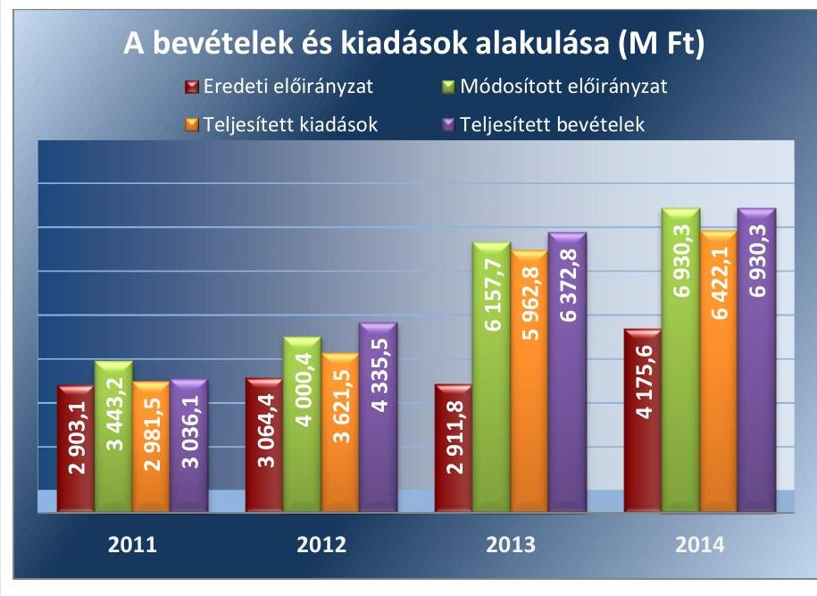

Adatforrás: Kórház 2011-2014. évi éves költségvetési beszámolói, ÁSZ saját szerkesztés

---

# A KIADÁSI ELŐIRÁNYZATOK FELHASZNÁLÁSA 

SORÁN a Kórház a jogszabályi előírásokat nem tartotta be. Az ellenőrzött időszakban elmaradt a kötelezettségvállalásra jogosult személyek felhatalmazása, az érvényesítésre, az utalványozásra jogosult személyek kijelölése és a teljesítésigazolásra jogosult személyek írásbeli kijelölése. Továbbá 2011. évet érintően a szakmai teljesítésigazolás és az utalvány ellenjegyzése, a 2012-2014. éveket érintően a teljesítésigazolás és az érvényesítés kulcskontrollok gyakorlása nem felelt meg a jogszabályi előírásoknak. Az ellenőrzés a kulcskontrollok működtetésével összefüggésben az alábbi hibákat, hiányosságokat állapította meg:
A személyi juttatások esetében 2011-ben az Ámr. 76. § (1) bekezdésében előírt szakmai teljesítésigazolást nem hajtották végre. Az utalvány ellenjegyzését az Ámr. 79. § (2) bekezdésében foglaltak ellenére a teljesítésigazolás és az érvényesítés megtörténte nélkül végezték el. 2012-2014. években az Ávr. 57. § (1) bekezdésében előírt teljesítésigazolást nem hajtották végre, az Ávr. 58. § (1) bekezdésben előírt érvényesítési feladatokat nem végezték el.
A felhalmozási kiadások esetében 2011-ben az Ámr. 76. § (1) bekezdésében előírt szakmai teljesítésigazolást nem hajtották végre. A Kórház több esetben nem rendelkezett kötelezettségvállalási dokumentummal, ezzel megsértette az Ámr. 72. § (1) bekezdés a) pontjában, illetve az Ávr. 52. § (1) bekezdés a) pontjában foglaltakat. Az utalvány ellenjegyzést - az Ámr. 79. § (2) bekezdésében foglaltak ellenére - a teljesítésigazolás és az érvényesítés megtörténtének hiányában végezte el a gazdasági igazgató. A 2012-2014. években az Ávr. 57. § (1) bekezdésében előírt teljesítésigazolást nem hajtották végre, az Ávr. 58. § (1) bekezdésben előírt érvényesítési feladatokat nem végezték el. Továbbá 2013-2014. években elfordult, hogy az érvényesítés az Ávr. 58. § (4) bekezdésben foglaltak ellenére írásbeli kijelölés nélkül történt. A kötelezettségvállalási dokumentumok pénzügyi ellenjegyzése az Ávr. 55. § (1) bekezdésében foglaltakat figyelmen kívül hagyva nem történt meg.
A dologi és dologi jellegű kiadásokhoz kapcsolódóan 2011-ben az Ámr. 76. § (1) bekezdésében előírt szakmai teljesítésigazolást nem hajtották végre. Az utalvány ellenjegyzést - az Ámr. 79. § (2) bekezdésében foglaltak ellenére - a teljesítésigazolás és az érvényesítés megtörténtének hiányában végezte el a gazdasági igazgató. 2012-2014. években az Ávr. 57. § (1) bekezdésében előírt teljesítésigazolást nem hajtották végre, továbbá előfordult, hogy a teljesítésigazolás az Ávr. 57. § (4) bekezdésben foglaltak ellenére írásbeli kijelölés nélkül történt. Az Ávr. 58. § (1) bekezdésben előírt érvényesítési feladatokat nem végezték el, 2013-2014. években az érvényesítés esetenként az Ávr. 58. § (4) bekezdésben foglaltak ellenére írásbeli kijelölés nélkül történt.

---

A pénzeszközátadások, támogatásértékű kiadások, kölcsönök nyújtása és ellátottak juttatásaival kapcsolatos kiadások esetében 2011-ben az Ámr. 76. § (1) bekezdésében előírt szakmai teljesítésigazolást nem hajtották végre, illetve azt az Ámr. 76. § (3) bekezdésében előírtak ellenére nem az arra jogosult személy végezte el. Az utalvány ellenjegyzését az Ámr. 79. § (2) bekezdésében foglaltak ellenére a teljesítésigazolás és az érvényesítés megtörténte nélkül végezték el. 2012. évben a teljesítésigazolást az Ávr. 57. § (1) bekezdésében foglaltak ellenére nem végezték el. Az érvényesítés az Ávr. 58. § (1) bekezdésében foglaltak ellenére nem történt meg.
A Kórház a dologi kiadásokból az ellenőrzött időszakban árubeszerzés, illetve szolgáltatás megrendelésre teljesített kifizetéseihez kapcsolódóan nem folytatott le közbeszerzési eljárást, a beszerzéseket egyedi megrendeléssel végezte annak ellenére, hogy a beszerzett termékekhez, szolgáltatásokhoz hasonló beszerzésekkel egybeszámítva azok értéke meghaladta a közbeszerzési értékhatárt. Ezzel 2011. évben - a Kbt. $^{31}$ 40. §-ában meghatározott egybeszámítási szabályokra figyelemmel - megsértette a Kbt. 1 2. § (1) bekezdésében és a Kbt. 1 21. §-ában előírt közbeszerzési eljárás lefolytatására vonatkozó kötelezettséget, 2012-2014. években - a Kbt. $^{32}$ 18. §-ában meghatározott egybeszámítási szabályokra figyelemmel - megsértette a Kbt. 2 5. §-ában és a Kbt. 2 19. §-ában előírt közbeszerzési eljárás lefolytatására vonatkozó kötelezettséget, valamint a Kbt. 2 132. §-ának (1) bekezdésében előírtakat.

# 3.4. számú megállapítás 

Az előirányzat felhasználáshoz kapcsolódó évközi korlátozó intézkedések nem voltak, befizetési kötelezettség nem keletkezett. Az előirányzat maradvány megállapítása, felhasználása szabályszerű volt.

AZ IRÁNYÍTÓ SZERVEK előirányzat felhasználáshoz kapcsolódó évközi korlátozó intézkedése a Kórház előirányzatait a 2011-2014. években nem érintette. Költségvetési törvényben meghatározott befizetési kötelezettsége a Kórháznak az ellenőrzött időszakban nem keletkezett.

A KÓRHÁZ tárgyévi előirányzat-maradványának és kötelezettségvállalással terhelt maradványának megállapítása az ellenőrzött mintatételek alapján megfelelt az Ámr.-ben, illetve az Ávr.-ben foglalt előírásoknak.

A 2011. évi beszámoló adatai szerint a tárgyévi helyesbített előirányzat maradvány 128,8
 M Ft, a költségvetési kiutalás kiutalatlan támogatása miatti korrekció 33,0 M Ft, a módosított maradvány 161,8 M Ft volt. Előirányzat-maradványt terhelő elvonások nem voltak, a kötelezettségvállalással terhelt maradvány 161,8 M Ft, szabad pénzmaradvány nem volt. A maradvány összegét a Közgyűlés 2012. április 26-i határozatában jóváhagyta.

A beszámolók adatai alapján a 2012. évi maradvány 184,1 M Ft, kötelezettségvállalással terhelt, a 2013. évi felhasználható előirányzat-maradványból 535,3 M Ft kötelezettségvállalással terhelt és 6,0 M Ft szabad előirányzat-maradvány, a 2014. évi 508,3 M Ft kötelezettségvállalással terhelt maradvány volt. Az ellenőrzött időszakban az éves beszámolókban és a kapcsolódó főkönyvi számlákon a kimutatott előirányzat-maradvány megegyezett.

---

A Kórház az előző évi előirányzat-maradvány felhasználása során a jogszabályi előírásokat betartotta.

A Kórház 2012-2014. években a jogszabályi előírásoknak megfelelően az irányító szerven keresztül tájékoztatta a NGM-et a tárgyéveket követő év június 30-ig a pénzügyileg nem teljesült, továbbá meghiúsult kötelezettségvállalás miatt szabaddá váló előirányzat-maradványról.
3.5. számú megállapítás

A Kórház zavartalan feladatellátásához a fizetőképesség folyamatos fennállása, a likviditás javítása érdekében tettek intézkedéseket, azonban a megtett intézkedések nem biztosították a pénzügyi egyensúly fenntartását.

A Kórház 2011. évben az önkormányzati alrendszerbe tartozott, előirányzat-felhasználási terv-készítési kötelezettsége nem volt. 2012-2014. években - az Áht. 78. § (2) bekezdésében foglaltak ellenére - a bevételek beérkezésének és a kiadások teljesítésének ütemezéséről likviditási tervet nem készített.

A likviditási mutató 2011-2013. években 1 alatti értéket mutat, amely alapján a Kórház forgóeszközei 2011-2013. években nem nyújtottak fedezetet a rövid lejáratú kötelezettségekre. A 2012. évi enyhe emelkedést pályázatokhoz, projektekhez kötődően beérkezett, azonban nem szabad felhasználású pénzeszközök növekedése okozta. A pénzeszköz-likviditási mutató alapján a Kórház pénzeszközei 2011-2013. években nem nyújtottak fedezetet a rövid lejáratú kötelezettségek kiegyenlítésére. A likviditási mutató és a pénzeszköz-likviditási mutató alakulását az ellenőrzött időszakban a 2. ábra mutatja be.
2. ábra
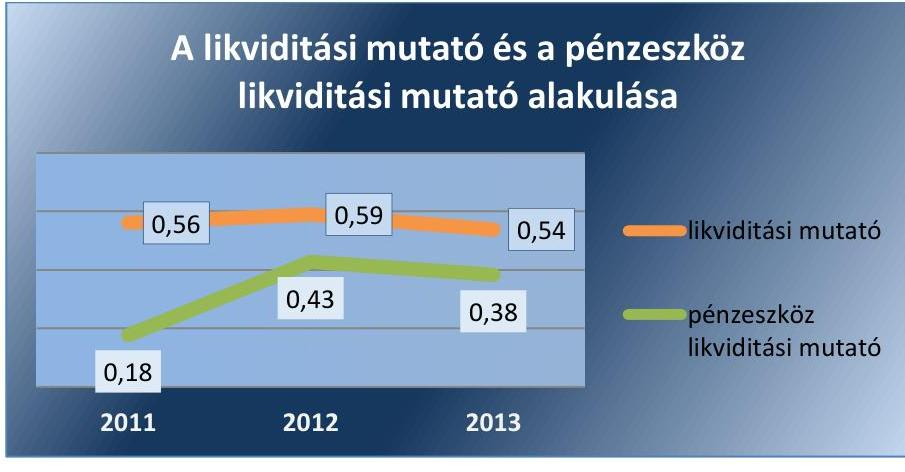

Adatforrás: Kórház 2011-2013. évi éves költségvetési beszámolói, ÁSZ saját számítás
A Kórház pénzügyi helyzete az ellenőrzött időszakban nem volt stabil, nem volt biztosított a szállítói számlák, egyéb kötelezettségek határidőben történő kiegyenlítése. A lejárt szállítói állomány csökkentésére 2011. évben a 337/2011. (XII. 29.) Korm. rendelet ${ }^{33}$ alapján és 2013. évben a 438/2013. (XI. 19.) Korm. rendelet ${ }^{34}$ kapott konszolidációs, illetve 2014. évben a 184/2014. (VII. 25.) Korm. rendeletben ${ }^{35}$ foglaltak alapján kapott működési támogatás ellenére a Kórház szállítói tartozásait nem finanszírozta. (2012. évben a lejárt szállítói állomány csökkentésére támogatást a Kórház nem kapott, a 259/2012 (IX. 14) Korm. rendelet ${ }^{36}$

---

alapján struktúra-átalakítással kapcsolatosan felmerülő költségekre nyert el 29,3 M Ft összegű támogatást.) 2011. évben a Kórház forrásainak 85,2%-át tették ki a kötelezettségei 381,6 M Ft összegben, melyek rövid lejáratú, 100%-ban a szállítókkal szembeni, tárgyévi kötelezettségek voltak. A Kórház lejárt szállítói állománya 2011. december 31-én 125,1 M Ft volt, amely 2012. év végére - a 2011. évi konszolidációs támogatás és a 2011. november 20-i 73,0 M Ft összegű ún. „kasszasöprés" ellenére - 427,7 M Ft-ra nőtt.

# A KÓRHÁZ LEJÁRT ESEDÉKESSÉGŰ ELISMERT TARTOZÁSÁLLOMÁNYÁNAK MÉRTÉKE 2012. FEBRUÁR 

és 2012. április között folyamatosan elérte a 150 M Ft-ot, azonban az Önkormányzat - az Áht. 271. § (1) bekezdésében foglaltak ellenére - nem jelölt ki önkormányzati biztost a Kórházhoz. A Kórház elismert, az esedékességet követő hatvan napon túli tartozásállománya 2012. februárban 181,1 M Ft, márciusban 220,6 M Ft, áprilisban 182,0 M Ft volt.

A szállítókon belül a lejárt kötelezettségek aránya az ellenőrzött időszakban folyamatosan növekedett, a 2012. évi 59,7%-ról 2013-ban 64,9%-ra, 2014. évben 73,6%-ra. 2014. év végére a szállítói kötelezettségek összege 1139,0 M Ft, azon belül a lejárt szállítói állomány 838,2 M Ft volt. Az ellenőrzött időszakban a szállítói kötelezettségek késedelmes fizetése miatt a Kórháznak 2011. évben 4,3 M Ft, 2012. évben 5,0 M Ft, 2013. évben 11,7 M Ft, 2014. évben 15,7 M Ft késedelmi kamatfizetési kötelezettsége keletkezett. A Kórház összes szállítói állományának és azon belül a lejárt szállítói állomány alakulását az ellenőrzött időszakban a 3. ábra, lejárt szállítói tartozások alakulását és a Kórház részére az ellenőrzött időszakban folyósított támogatásokat az 1. táblázat mutatja be.
3. ábra

A lejárt szállítói állomány alakulása az összes szállítói állományon belül (M Ft)
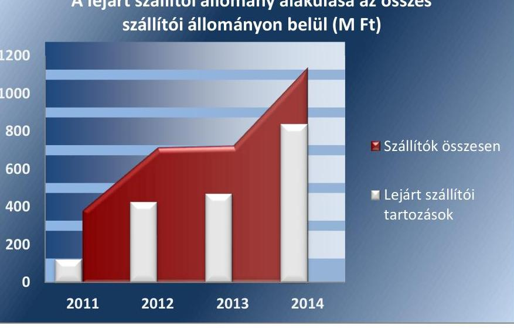

Adatforrás: Kórház 2011-2014. évi éves költségvetési beszámolói, ÁSZ saját szerkesztés

---

1. táblázat

# A LEJÁRT SZÁLLÍTÓI TARTOZÁS ALAKULÁSA ÉS A KÓRHÁZ RÉSZÉRE AZ ELLENŐRZÖTT IDŐSZAKBAN FOLYÓSÍTOTT KONSZOLIDÁCIÓS, STRUKTÚRA-ÁTALAKÍTÁSSAL KAPCSOLATOS ÉS MŰKÖDÉSI TÁMOGATÁSOK (M FT)

|   | Lejárt szállítói
tartozás | Konszolidációs
támogatás | Struktúra
támogatás | Működési
támogatás  |
| --- | --- | --- | --- | --- |
|  2011 | 125,1 | 91,3 | 0 | 0  |
|  2012 | 427,7 | 0 | 29,3 | 0  |
|  2013 | 471,0 | 517,3 | 0 | 0  |
|  2014 | 838,2 | 0 | 0 | 234,8  |
|  Összesen |  | 608,6 | 29,3 | 234,8  |

A likviditás javítása érdekében a Kórház a lejárt szállítói kötelezettségei teljesítése érdekében 1-6 hónapra átütemezést kért a szállítóitól, melyeket a partnerek többnyire elfogadtak, valamint takarékossági intézkedéseket tett. Az ellenőrzött időszakban a Kórház a követelések behajtása céljából fizetésre felszólítás, fizetési meghagyás, végrehajtásra átadás, letiltás útján intézkedéseket tett.

## AZ ÖNKORMÁNYZATI ALRENDSZERBŐL A KÖZPONTI ALRENDSZERBE TÖRTÉNŐ ÁTSZERVEZÉS

fordulónapjáig - az NGM által kiadott, „Az államháztartás szervezetei 2011. évi éves elemi költségvetési beszámoló összeállítására szolgáló Módszertani Útmutató" 2/bb. 7. pontja alapján - rendezni kellett az önkormányzati irányító szervvel kapcsolatos alul- vagy túlfinanszírozást. Erre tekintettel az Önkormányzat, mint irányító szerv és a Kórház 2012. április 27-én megállapodást kötött, melyben az Önkormányzat Kórház felé fennálló 318,0 M Ft összegű tartozását kamatmentes működési célú kölcsönné átminősítette az ellenőrzött időszakon túli fizetési határidővel. Az Önkormányzat részére nyújtott kölcsönből a megtérülés 2014. december 31-ig összesen 109,2 M Ft volt.

Az integrációval a Kórház átvette a makói kórháznak a Csongrád Megyei Közgyűlés által folyósított visszatérítendő támogatás miatt 477,3 M Ft összegben fennálló rövid lejáratú kötelezettségeit (amely az integrációt megelőzően is lejárt tartozás volt), valamint a makói kórház HURO/0802/013_AF/01 európai uniós projektje számláinak fenntartó által történt előfinanszírozásához kapcsolódóan 128,0 M Ft összegű hosszú lejáratú kötelezettségét.

### 3.6. számú megállapítás

Nem a jogszabályi előírásoknak megfelelően hajtották végre az eredményszemléletű számvitel bevezetésével kapcsolatos feladatokat.

Nem végezték el a rendező mérleg elkészítését megelőző, jogszabályban előírt feladatokat. 2013. december 31-i mérleg fordulónappal a Kórház a mennyiségben és értékben nyilvántartott eszközöket teljes körűen tényleges mennyiségi felvétellel nem leltározta, az egyeztetéssel leltározandó eszközök, a források, a kötelezettségvállalások leltározását dokumentumokkal nem támasztotta alá, ezzel nem tett eleget a

---

36/2013. (IX. 13.) NGM rendelet ${ }^{37}$ 2. § (1) bekezdésében foglalt előírásoknak. A követeléseket és a kötelezettségeket éven belüli és éven túli bontásban - a 36/2013. (IX. 13.) NGM rendelet 2. § (2) bekezdés c) pontjában foglalt előírások ellenére - nem szerepeltette a leltárban.

# NEM A JOGSZABÁLYBAN ELŐÍRTAKNAK MEGFE-

LELŐEN KÉSZÍTETTÉK EL a rendező mérleget. A rendező mérlegen a 36/2013. (IX. 31.) NGM rendelet 8. § (3) bekezdésében foglaltak ellenére nem szerepelt a Kórház vezetőjének és az elkészítésért felelős személynek keltezéssel ellátott aláírása, továbbá nem tartalmazta az elkészítésért felelős személy regisztrációs és kamarai tagsági számát sem.

A Kórház a rendező mérleget 2014. január 1-jei fordulónappal - a 36/2013. (IX. 13.) NGM rendelet 8. § (2) bekezdésében előírt 2014. március 31-i határidőt túllépve - 2014. május 26-án készítette el, a pénzügyi jóváhagyásra 2014. június 4-én került sor. A késedelmet az okozta, hogy a Költségvetés-Gazdálkodási Rendszer K11 adatgyűjtő, beszámoló rendszerét 2014. március 31-én nyitották meg központilag az adatszolgáltatásra.

A 36/2013. (IX. 31.) NGM rendelet 9. § (1) bekezdésében foglaltak ellenére költségvetési számvitel nyilvántartási számlái közül a követelések, a kötelezettségvállalások és a más fizetési kötelezettségek és teljesítések nyilvántartási számlái, valamint a 01-04. számlacsoport nyilvántartási számlái 2014. január 31-ig nem kerültek megnyitásra. Egyéb eszköz- és forrás-számlák nyitására - a 36/2013. (IX. 13.) NGM rendelet 9. § (3) bekezdésében foglaltak ellenére - sor került a rendező mérleg elkészítését megelőző időszakban is. A számlákon a 2014. január 1-jét követően bekövetkezett gazdasági eseményeket a megnyitást követően elszámolták.

## 4. Az intézmény vagyongazdálkodása szabályszerű volt-e?

Összegző megállapítás

## 4.1. számú megállapítás

A Kórház vagyongazdálkodása nem volt szabályszerű. A vagyonkezelési szerződést a jogszabályi előírások ellenére nem foglalták a módosításokkal egységes szerkezetbe. Egy beszerzésnél elmulasztották a vagyonkezelési szerződés megkötését. A mérlegben kimutatott eszközök és források nyilvántartása, értékelése, leltározása, valamint a vagyonelemek bérbeadása során nem tartották be a jogszabályi előírásokat.

A vagyonkezelési szerződést a módosítást követően a jogszabályi előírások ellenére nem foglalták egységes szerkezetbe. Egy beszerzésnél elmulasztották vagyonkezelési szerződés megkötését.

A Ttv. alapján állami tulajdonba került, állami egészségügyi feladatellátást szolgáló vagyon tekintetében a magyar államot megillető tulajdonosi jogok és kötelezettségek összességének gyakorlására a Ttv. 13. § (1) bekezdés b) pontja alapján 2012. május 1-jétől a GYEMSZI jogosult. A vagyonkezelési szerződés ${ }^{38}$ megkötésére a Ttv. alapján a GYEMSZI és a Kórház között a vagyonkezelési tevékenység megkezdését követően, 2013. május 2-án került sor. A GYEMSZI, mint tulajdonosi joggyakorló a vagyonkezelési szerződés-

---

sel visszamenőlegesen 2012. május 1-jei hatállyal a Kórház vagyonkezelésébe adta a szerződés mellékletében szereplő vagyonelemeket, így a szerződés rendezte a 2012. május 1. és 2013. május 2. közötti időszakot is. Az állami vagyon vagyonkezelésére vonatkozó szerződés megkötése, tartalmának meghatározása a jogszabályi előírásoknak megfelelően történt. A Kórház 2012. május 1-től kezdődően 2013. május 2-ig vagyonkezelői tevékenységét jogalappal végezte, az érintett időszakban vagyonhasznosítási szerződéseket kötött, illetve módosított.

Az ellenőrzött időszakban a vagyonkezelési szerződést a Miniszter, mint az alapítói jogok gyakorlója döntése alapján módosították. A vagyonkezelési szerződés módosítására az integráció, valamint egyes ingatlanok vagyonkezelési szerződésből való törlése miatt került sor. A vagyonkezelési szerződés módosítását ${ }^{39}$ a Vtvr. ${ }^{40}$ 8. § (2) bekezdésében foglaltak ellenére nem foglalták 60 napon belül a módosításokkal egységes szerkezetbe, ezért a vagyonkezelési szerződés módosítása nem volt szabályszerű.
2013. évben bruttó 52,8 M Ft értékű számítástechnikai eszköz beszerzése esetében elmulasztották a vagyonkezelési szerződés megkötését a GYEMSZI-vel mint tulajdonosi joggyakorlóval, annak ellenére, hogy a Kórház vagyonkezelésébe került vagyonelem értéke meghaladta a 2012. évi CCIV. törvény 6. § (5) a) pontjában meghatározott 25 M Ft-os értékhatárt, amellyel megsértették a Vtv. ${ }^{41}$ 2. § (2) bekezdésében és az Nvtv. 11. § (6) bekezdésében foglalt előírásokat.

# 4.2. számú megállapítás 

A mérlegben kimutatott eszközök és források
 nyilvántartása, értékelése, leltározása nem a jogszabályok előírásainak megfelelően történt.

A kórház vagyonnyilvántartása 2013-2014. években a Vtvr. 14. § (2) bekezdésében előírtak ellenére nem tartalmazta a vagyonkezelő azonosító adatait, a kapcsolódó jogokat és jogi szempontból jelentős tényeket. A Kórház az ellenőrzött időszakra vonatkozóan a követelésekről - a hosszú lejáratú kölcsönök kivételével - és a kötelezettségekről analitikus nyilvántartást nem vezetett, mellyel megsértette az Áhsz. 1. 9. számú melléklet 2. ca) és 4. da) pontjában és az Áhsz. 14. számú melléklet II. és III. fejezetében foglalt előírásokat. Emiatt nem volt megállapítható, hogy a követelések és a kötelezettségek állományát rögzítő számlák vezetése, a negyedévenkénti összegző kimutatás elkészítése, főkönyvi feladása megfelelt-e az előírásoknak.

A követelések értékelését a Kórház az ellenőrzött időszakban a deviza, valuta követelések tekintetében minden év végén elvégezte. 2011-2014. években a vevőket és adósokat nem minősítette, a követelésekre értékvesztést nem számolt el, ezzel megsértette az Áhsz. 1. 31. § (2) bekezdésében, illetve az Áhsz. 2. 18. § (1) bekezdésében előírtakat.

A 2014. év végi követelések összege az éves költségvetés beszámoló szerint 656,0 M Ft volt. Az Önkormányzatnak nyújtott működési kölcsönből 2014. évben 65,0 M Ft megtérült, azonban a Kórház a törlesztés, mint gazdasági esemény bizonylatának adatait - a Számv. tv. 165. § (1) bekezdésének előírása ellenére - a könyvviteli nyilvántartásában nem rögzítette, megsértve ezzel a Számv. tv. 15. § (2) és (3) bekezdéseiben foglalt számviteli alapelveket, a teljesség és a valódiság elvét.

---

A Kórház az ellenőrzött időszakban a mérlegtételek alátámasztásához a leltárakat összeállította, azonban a 2012. és a 2013. években az egyéb aktív pénzügyi elszámolások és egyéb passzív pénzügyi elszámolások, a 2014. évben a passzív időbeli elhatárolások mérlegsorokat leltárral nem támasztotta alá, ezzel megsértette a 2012-2013. években az Áhsz. $_{1}$ 37.§ (1)-(4) bekezdéseiben, a 2014. évben az Áhsz. $_{2}$ 22.§ (1), (2) bekezdéseiben foglalt előírásokat. A 2012. évben a bizonylati szabályzatban előírtak ellenére nem készítettek leltárösszesítőt.

A 2011-2012. években a Kórház az Áhsz. $_{1}$ 37. § (1)-(3) bekezdéseiben, 2014. évben az Áhsz. $_{2}$ 22. § (1)-(2) bekezdéseiben előírtak ellenére - december 31-i fordulónappal az eszközöket - a készletek kivételével - nem leltározta mennyiségi felvétellel. Mennyiségi felvétellel történő leltárt az állami fenntartásba vételt megelőzően a 2012. április 30-i, valamint a 2013. december 31-i fordulónappal felvettek, azonban a Kórház - a Számv. tv. 169. § (2) bekezdése előírásai ellenére - a leltározási ütemtervet, megbízóleveleket, záró jegyzőkönyvet, az eltérések rendezéséről bizonylatot legalább nyolc évig visszakereshető módon nem őrizte meg. Ennek következtében nem volt megállapítható, hogy a leltárak kiértékelésének módja megfelelt-e az Áhsz. $_{1}$ 32.-36. §-ai és az Áhsz. $_{2}$ 20-21. §-ai előírásainak, illetve 2012. márciustól a leltározási szabályzat előírásainak, valamint, hogy a leltározás és a könyvvitel adatainak egyeztetése, az eltérések könyvviteli rendezése a mérlegkészítés időpontjáig megtörtént-e.

A felhalmozási kiadások ellenőrzése alapján a tárgyi eszközök nyilvántartásba vétele kockázatosnak minősült, mivel a tárgyi eszközök a tárgyévi leltárban hiányosan voltak fellelhetőek. A Kórház - 2011-2012. években az Áhsz. $_{1}$ 37. § (1)-(3) bekezdéseiben, 2014. évben az Áhsz. $_{2}$ 22. § (1)-(2) bekezdéseiben előírtak ellenére - december 31-i fordulónappal a tárgyi eszközöket mennyiségi felvétellel nem leltározta. Az eszközkartonok, állományba vételi és üzembe helyezési bizonylatok alapján a bekerülési érték megállapítása, a tárgyi eszközök állományba vétele, nyilvántartása, az értékcsökkenés elszámolása a felhalmozási kiadásoknál megfelelt az Áhsz $_{1,2}$ előírásainak.

Az üzemeltetésre átadott eszközökről a Kórház - a 2011-2012. évekre vonatkozóan az Áhsz. $_{1}$ 37. § (4) bekezdésében, valamint a 2014. évre vonatkozóan az Áhsz. $_{2}$ 22. § (2) bekezdés a) pontjában előírtakkal ellentétben - a december 31-i fordulónapra vonatkozó leltárral nem rendelkezett.

A Kórház - a 2014. év kivételével - minden évben feltárta a feleslegessé, használhatatlanná vált eszközöket és a selejtezést végrehajtották, azonban 2012. évben három selejtezési jegyzőkönyvvel nem rendelkezett, mellyel megsértette a Számv. tv. 169. § (2) bekezdésében előírtakat.

## 4.3. számú megállapítás

A Kórház az értékmegőrzési, állagmegóvási kötelezettségeit a jogszabály és a vagyonkezelési szerződés előírásai szerint teljesítette.

A vagyonkezelési szerződés előírta a Kórház számára, hogy a vagyonkezelő köteles a használatában lévő állami vagyonnal összefüggő terheket viselni, a vagyon értékét megőrizni, állagának megóvásáról, jó karbantartásáról, működtetéséről gondoskodni, a szükséges karbantartási, felújítási munkákat elvégeztetni. A Kórház az ellenőrzött időszakban a Vtv. és a vagyonkezelési szerződés 3.4. pontjában előírt értékmegőrzési, állagmegóvási kötelezettségének eleget tett. A Kórház visszapótlási kötelezettsége alól a Vtv. 27. § (8) bekezdése alapján 2013. június

---

28-tól mentesült. A Kórháznál a 2011. évben 43,4 M Ft, a 2012. évben 108,7 M Ft, a 2013. évben 478,3 M Ft és 2014. évben 738,3 M Ft összegben, összesen 1368,7 M Ft összegben történt beszerzés, felújítás. A Kórház a kezelésébe került vagyon működtetéséről gondoskodott, az összes karbantartásra fordított összeg 2011. évben 14,8 M Ft, 2012. évben 9,3 M Ft, 2013. évben 72,2 M Ft, 2014. évben 75,8 M Ft volt.

A Kórház könyvviteli mérleg szerinti vagyona a 2011. év eleji 354,8 M Ft-ról 2014. év végére 17,2-szeresére, 6111,0 M Ft-ra nőtt. A vagyonérték növekedését befolyásolta a központi alrendszerbe történt átszervezéssel, valamint az integrációval a Kórház vagyonkezelésébe került vagyon nagysága. A Kórház mérleg szerinti vagyona 2012. április 30-án az Önkormányzat által átadott eszközök miatt 2314,4 M Ft-ra nőtt, és év végére tovább növekedett 3305,4 M Ft-ra. A makói kórháztól a 2013. február 1-jei integrációval átvett vagyon 1997,4 M Ft volt. 2013. évről a 2014. évre a Kórház vagyona 557,0 M Ft-tal növekedett, melyet a korábbi évekhez hasonlóan a befektetett eszközök növekedése okozott. Az integrációt követően a Kórház vagyonkezelésében levő ingatlanok állománya közel kétszeresére nőtt. A Kórház vagyonának alakulását, azon belül az integrációval a Kórház vagyonkezelésébe került vagyon nagyságát a 4. ábra mutatja be.
4. ábra
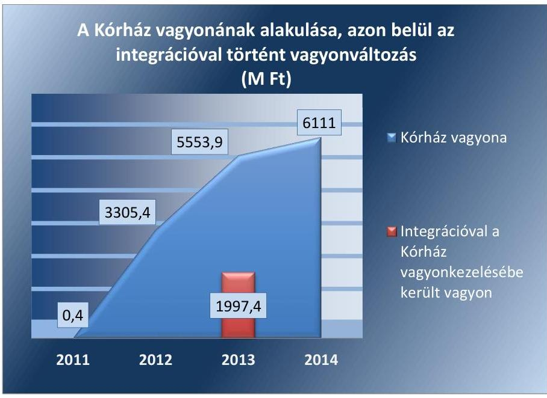

Adatforrás: Kórház 2011-2014. évi éves költségvetési beszámolói, ÁSZ saját szerkesztés
A Kórház éves költségvetési beszámolóinak mérlegadataiból számított, a vagyoni helyzetre vonatkozó mutatók a 2011. év végi adatokból számított értékhez képest 2013. év végéig többségében javultak.
A befektetett eszközök aránya az összes eszközön belül 52,3\%-ról 88,3\%-ra, az ingatlanok aránya a befektetett eszközökön belül 0,0\%-ról 74,1\%-ra nőtt, a kötelezettségek aránya 85,2\%-ról 24,0\%-ra, a forgóeszközök aránya az összes eszközön belül 47,7\%-ról 11,7\%-ra csökkent.
Az összes eszköz használhatósági foka a 2011-2013. közötti időszakban (főként EU-s támogatásokból saját erő nélkül) végrehajtott fejlesztések és az elszámolt értékcsökkenés együttes hatása eredményeként 7,6\%-ról 53,6\%-ra nőtt (ezzel fordítottan az elhasználódási szint 92,45-ről 44,3\%-ra csökkent).
A Kórház az állami tulajdonú eszközökön végzett beruházás, felújítás során betartotta a jogszabályi előírásokat. A Kórház az állami vagyonra vonatkozó, GYEMSZI felé fennálló adatszolgáltatási kötelezettségét - a Vtvr. 9. § (3) és 14. § (1) bekezdésében, valamint a vagyonkezelési szerződésben foglalt előírások ellenére - 2013-2014. években nem teljesítette.

# 4.4. számú megállapítás 

## A vagyonelemek hasznosítása nem a jogszabályok előírásainak megfelelően történt.

## A vagyonelemek hasznosításával kapcsolatos szabályokat az önkormányzati fenntartás időszakában az Önkormányzat vagyonrendelete, az ezt követő időszakban a vagyonkezelési szerződés és a GYEMSZI által kiadott iránymutatás rögzítette. A Kórház az integrációt követően a helyiségekkel való gazdálkodás feltételeit - az Ávr. 13. § (2) d) pontjában foglalt előírások ellenére - nem szabályozta.

A vagyonhasznosítási bevételi előirányzatok teljesítése magas kockázatúnak minősült. A Kórház vagyonhasznosítási gyakorlata az ellenőrzött időszakban nem felelt meg a jogszabályi előírásoknak. A vagyonhasznosítási bevételekhez a Kórház több esetben nem rendelkezett kötelezettségvállalási dokumentummal, ezzel megsértette az Ámr. 72. § (1) bekezdés a) pontjában, illetve az Ávr. 52. § (1) bekezdés a) pontjában foglaltakat. A vagyonhasznosításra kötött szerződésekben a fizetendő díjakat bérleti díj és a közüzemi költségek, vagy rezsiátalány (1 m³-re jutó átlagos költség) bontásban határozták meg. A Kórház a bérleti díjak, vagy rezsiátalány kalkulációjához költségszámítást nem végzett, így nem volt megállapítható, hogy a bérleti díjak fedezték-e a bérbe adott eszközök üzemeltetésére, fenntartására fordított kiadásokat, illetve biztosították-e a bérbe adott eszközök amortizációjának időarányos részét, és ezzel a hasznosítások megfeleltek-e a Vtv. 2. § (1) bekezdésében, az Nvtv. 7. § (2) és a Vtv. 23. § (3) bekezdésében foglalt előírásoknak.

A Kórház a bérbeadás során 2012. január 1-jétől nem tett eleget az Nvtv. 11. § (11) bekezdésében az átláthatóság követelményeinek érvényesüléséhez előírt feltételeknek. Az átláthatóságra vonatkozó nyilatkozatokkal - az Nvtv. 3. § (2) bekezdése előírásai ellenére - a Kórház nem minden esetben rendelkezett. A 2012. január 1-jét követően megkötött bérleti szerződésekben - az Nvtv. 11. § (11) bekezdésében előírtak ellenére - nem került rögzítésre, hogy
$\longrightarrow$ a bérbevevők vállalják az átengedett nemzeti vagyon vonatkozásában előírt beszámolási, nyilvántartási, adatszolgáltatási kötelezettségek teljesítését,
az átengedett nemzeti vagyont a szerződési előírásoknak és a tulajdonosi rendelkezéseknek, valamint a meghatározott hasznosítási célnak megfelelően használják, továbbá
a hasznosításban - a hasznosítóval közvetlen vagy közvetett módon jogviszonyban álló harmadik félként - kizárólag természetes személyek vagy átlátható szervezetek vesznek részt.

---

A 2012. évben a Közgyűlés április 5-i határozata alapján az addig a Kórház által végzett - a járó- és fekvőbeteg szakellátások keretébe tartozó definitív klinikai onkológiai ellátásokat 2012. április 30-ától a Szegedi Tudományegyetem Szent-Györgyi Albert Klinikai Központja vette át. A Közgyűlés kötelezettséget vállalt arra, hogy a forráshiányból adódó többletterhek enyhítésére, valamint a telephelyi minőségből adódó többletköltségek csökkentése érdekében az átadásra kerülő egészségügyi közszolgáltatások működtetéséhez történő hozzájárulásként a Szegedi Tudományegyetem Szent-Györgyi Albert Klinikai Központnak pénzügyi támogatást biztosít, amelynek mértéke legfeljebb évi 12 M Ft. Az Önkormányzat továbbá a klinikai onkológiai szakellátás biztosítása céljából a Tudományegyetemnek ingyenes használatba adta a Kórház 306,5 m² alapterületű ingatlanrészét. Az ellátási szerződésben rögzítették az ingatlan fenntartásával és a működtetésével kapcsolatos költségeket. A vagyonbiztosítási, felújítási, karbantartási, javítási és internet használati költség a Kórházat, míg a használatarányos villamos-, gázenergia, melegvíz- és távhő-, víz- és csatornadíj, telefondíj a Tudományegyetemet terhelte. Az ellátási szerződés a jogszabályi előírásoknak megfelelt.

Az ellenőrzött időszakban a Kórház nem értékesített vagyonelemeket.

# 5. Szabályszerűen hajtották-e végre az ellenőrzött időszakban az intézményt érintő szervezeti, szerkezeti átalakításokat? 

Összegző megállapítás

Az ellenőrzött időszakban a Kórházat érintő szervezeti, szerkezeti átalakításokhoz kapcsolódó alapítói, irányító, felügyeleti szervi döntések szabályszerűek voltak. A Kórház az átalakításához, átszervezéséhez kapcsolódó feladatait - a beszámolási kötelezettség teljesítésével és a beszámolók alátámasztásával kapcsolatban feltárt hibákat, hiányosságokat kivéve - szabályszerűen hajtotta végre.
5.1. számú megállapítás

Az ellenőrzött időszakban a Kórház központi alrendszerbe történt átszervezéséhez, valamint az integrációhoz kapcsolódó alapítói, irányító, felügyeleti szervi döntései szabályszerűek voltak.

A Kórház 2012.
 MÁJUS 1-JÉN A KÖZPONTI ALRENDSZERBE TÖRTÉNT ÁTSZERVEZÉSÉVEL összefüggő feladatok operatív végrehajtását a Ttv., illetve a 92/2012. (IV. 27.) Korm. rendelet ${ }^{42}$ alapján a GYEMSZI szervezte, irányította. A Ttv. 3. § (1) bekezdése előírásai szerinti átvételt a Kórház, az Önkormányzat és a GYEMSZI 2012. június 7-én átadási-átvételi jegyzőkönyvben rögzítette. Az állami átvétellel járó irányító-felügyeleti, fenntartói, alapítói joggyakorlói változást a Törzskönyvbe 2012. július 9-én a Kincstár bejegyezte.

A GYEMSZI és a Kórház között megkötött vagyonkezelési szerződéssel kapcsolatos megállapításokat a 4.1. számú megállapítás tartalmazza.

AZ INTEGRÁCIÓRA vonatkozó, GYEMSZI által kidolgozott javaslat alapján a Miniszter 2012. október 12-én döntött egyes egészségügyi intézmények integrációjáról, melynek keretében a Kórházba integrálódott a

---

5.2. számú megállapítás

makói kórház. A döntést a két kórház teljes tevékenységi, szervezeti-működési körére és gazdálkodására kiterjedő hatástanulmány alapozta meg.

A miniszteri döntés szerint az integráció végrehajtásának határideje 2012. december 31. volt, az integráció a határidőig nem valósult meg.

A Kórház az átalakításához, átszervezéséhez kapcsolódó feladatait - 2012. évben a beszámolási kötelezettség teljesítésével és 2012-2013. években a beszámolók alátámasztásával kapcsolatban feltárt hibákat, hiányosságokat kivéve - szabályszerűen hajtotta végre.

A KÖZPONTI ALRENDSZERBE TÖRTÉNT ÁTSZERVEZÉST követően a Kórház 2012. január 1. és április 30. közötti időszakra elkészítette évközi beszámolóját és 2012. április 30-i fordulónappal leltárkészítési kötelezettségének eleget tett, azonban - az Áhsz.: 13/A. § (7a) bekezdése előírásai ellenére - az átszervezés fordulónapja (2012. május 1.) és 2012. december 31. közötti időszakra fennálló költségvetési beszámoló készítési kötelezettségének nem tett eleget.

A 2012. évi éves költségvetési beszámolót a Kórház elkészítette, a beszámoló tartalma megfelelt az Áhsz.: előírásainak, azonban az egyéb aktív pénzügyi elszámolások és egyéb passzív pénzügyi elszámolások mérlegsorokat leltárral nem támasztotta alá és záró főkönyvi kivonatot nem készített. A Kórház az Áhsz.: 37. § (1)-(3) bekezdéseiben előírtak ellenére 2012. december 31-i fordulónappal a mennyiségben és értékben nyilvántartott eszközöket tényleges mennyiségi felvétellel teljes körűen nem leltározta.

AZ INTEGRÁCIÓT követően a Kórház a 2013. évi éves költségvetési beszámolót 2014. április 23-án elkészítette, amelyet a Minisztérium 2014. június 19-én hagyott jóvá. A beszámoló tartalmazta a 2013. január 1. és 2013. január 31. közötti, az átszervezés időpontja előtti működésére vonatkozó adatokat is. A beszámoló tartalma megfelelt az Áhsz.: előírásainak, az azonban leltárral csak részben volt alátámasztott, mivel Kórház az Áhsz.: 37. § (1)-(3) bekezdéseiben előírtak ellenére 2013. december 31-i fordulónappal az eszközöket tényleges mennyiségi felvétellel teljes körűen nem leltározta és a mérlegtételeket hiányosan támasztotta alá. A záró főkönyvi kivonatot elkészítették.

Az integrációval létrejött költségvetési szerv 2013. január 30-án került a Kincstár törzskönyvi nyilvántartásába. A makói kórház és a Kórház közötti átadás-átvételről jegyzőkönyvet - az integrációs eljárások elhúzódása folytán - 2013. május 15-én írták alá, a 2013. február 1-jén hatályos állapotról. Ugyanezzel a dátummal külön jegyzőkönyvben rögzítették a folyamatban lévő pályázatok, projektek, az EU-s társfinanszírozású projektek átadás-átvételét is.

# 6. Az intézmény intézkedett-e az integritás szemlélet érvényesítése érdekében? 

Összegző megállapítás

A Kórház nem megfelelően intézkedett az integritás szemlélet érvényesítése érdekében.

A KÓRHÁZ 2014. évben részt vett az ÁSZ Integritás Projektjében.

---

Az integritás szemlélet érvényesülésének értékelését a II. számú melléklet tartalmazza.

---

# JAVASLATOK 

Az ÁSZ tv. 33. § (1) bekezdésében foglaltak értelmében az ellenőrzött szervezet vezetője köteles a jelentésben foglalt megállapításokhoz kapcsolódó intézkedési tervet összeállítani és azt a jelentés kézhezvételétől számított 30 napon belül az ÁSZ részére megküldeni. Amennyiben az ellenőrzött szervezet vezetője nem küldi meg határidőben az intézkedési tervet, vagy továbbra sem elfogadható intézkedési tervet küld, az ÁSZ elnöke az ÁSZ tv. 33. § (3) bekezdés a)-b) pontjaiban foglaltakat érvényesítheti.

## az emberi erőforrások miniszterének

1. Intézkedjen a jogszabályi előírásnak megfelelően a hatékony gazdálkodásra irányuló ellenőrzések elvégzésére.
(1.2. számú megállapítás 5. bekezdése alapján)

## a Kórház főigazgatójának

1. Intézkedjen, hogy a Kórház SZMSZ-e a jogszabályi előírásoknak megfelelően tartalmazza
a) a költségvetési szerv szervezeti ábráját, valamint azon ügyköröket, amelyek során a szervezeti egységek vezetői a költségvetési szerv képviselőjeként járhatnak el;
b) az ellátandó, és a kormányzati funkciók szerint besorolt alaptevékenységek megjelölését az alapító okiratban foglaltakkal összhangban;
c) a belső ellenőrzést végző személy vagy szervezet, vagy szervezeti egység feladatait.
Kezdeményezze az irányítói jogok gyakorlójánál a Kórház előző a-c. pontokban foglaltakkal módosított SZMSZ-ének jóváhagyását.
(1.1. számú megállapítás 8. és 10. bekezdése, 2.5. számú megállapítás 8. bekezdése alapján)
2. Intézkedjen, hogy a gazdasági szervezet ügyrendje teljes körűen tartalmazza a jogszabályban előírt tartalmi elemeket, és aktualizálásra kerüljön a bekövetkezett változásokkal.
(2.1. számú megállapítás 1. bekezdése alapján)

---

3. Intézkedjen a jogszabályi előírásoknak megfelelően
a) az etikai elvárások meghatározására;
b) a gazdálkodás részletes rendjét meghatározó szabályzat elkészítésére;
c) az előzetes írásbeli kötelezettségvállalást nem igénylő kifizetések rendjére vonatkozó szabályozás elkészítésére;
d) a közbeszerzési törvény hatálya alá nem tartozó beszerzések lebonyolításával kapcsolatos eljárásrend szabályozására;
e) a szabálytalanságok kezelésének eljárásrendje elkészítésére;
f) az engedélyezési, jóváhagyási és kontroll eljárások, a dokumentumokhoz és információkhoz való hozzáférés rendje, továbbá a beszámolási eljárások szabályozására a felelősségi körök meghatározásával;
g) az információs rendszerek keretében a beszámolási szintek, határidők és módok meghatározására;
h) a kötelezően közzéteendő adatok nyilvánosságra hozatalának rendjére vonatkozó szabályozás elkészítésére;
i) a közérdekű adatok megismerésére irányuló igények teljesítésére vonatkozó szabályozás elkészítésére;
j) a helyiségekkel való gazdálkodás feltételeinek szabályozására.
(2.1. számú megállapítás 2, 8, 13, 14. és 16. bekezdése, 2.3. számú megállapítás 2. bekezdése, 2.4. számú megállapítás 1-3. bekezdése, 4.4. számú megállapítás 1. bekezdése alapján)
4. Intézkedjen a számviteli politika, illetve annak keretében elkészített szabályzatok - az eszközök és a források értékelési szabályzata, a leltározási és leltárkészítési szabályzat, az önköltségszámítás rendjére vonatkozó szabályzat, valamint a pénzkezelési szabályzat - jogszabályi előírásoknak megfelelő módosítására.
(2.1. számú megállapítás 3-5. és 7. bekezdései alapján)
5. Intézkedjen a jogszabályban foglaltaknak megfelelően a számlarend folyamatos karbantartására.
(2.1. számú megállapítás 6. bekezdése alapján)
6. Intézkedjen a kötelezettségvállalási szabályzat jogszabályi előírásoknak megfelelő módosítására.
(2.1. számú megállapítás 9. bekezdése alapján)

---

7. Intézkedjen a jogszabályban foglaltaknak megfelelően a kötelezettségvállalásra jogosult személyek felhatalmazására, továbbá az érvényesítésre, az utalványozásra és a teljesítésigazolásra jogosult személyek írásbeli kijelölésére.
(2.1. számú megállapítás 10. bekezdése alapján)
8. Intézkedjen a gazdálkodási jogkörök gyakorlására jogosult személyekről és az aláírás-mintájukról a jogszabályban előírt nyilvántartás vezetésére.
(2.1. számú megállapítás 11. bekezdése alapján)
9. Intézkedjen a jogszabályi előírásnak megfelelő kötelezettségvállalási nyilvántartás vezetésére.
(2.1. számú megállapítás 12. bekezdése alapján)
10. Intézkedjen a jogszabályban foglaltaknak megfelelő kockázatkezelési rendszer működtetésére.
(2.2. számú megállapítás 1. bekezdése alapján)
11. Intézkedjen a kontrolltevékenység részeként a folyamatba épített, előzetes, utólagos és vezetői ellenőrzés jogszabályban foglaltak szerinti biztosítására.
(2.3. számú megállapítás 1. bekezdése alapján)
12. Intézkedjen a jogszabályi előírásoknak megfelelően
a) az üzemeltetés és adatbiztonság szabályozása során a feladatok és hatáskörök meghatározására;
b) az üzembiztonsági, adatvédelmi rendelkezések érvényre juttatására, az iratkezelési szoftver által kezelt adatok biztonságára.
(2.3. számú megállapítás 3. bekezdése alapján)
13. Intézkedjen a szervezeten belüli információáramlás rendszerének kialakítására.
(2.4. számú megállapítás 1. bekezdése alapján)
14. Intézkedjen a jogszabályban előírt közzétételi kötelezettség teljesítésére.
(2.4. számú megállapítás 2. bekezdése alapján)

---

15. Intézkedjen a jogszabályi előírásokkal összhangban az operatív tevékenységek folyamatos és eseti nyomon követésére alkalmas monitoring rendszer kialakítására és működtetésére.
(2.5. számú megállapítás 1. bekezdése alapján)
16. Intézkedjen olyan szabályzatok kiadására, folyamatok kialakítására és működtetésére, amelyek biztosítják a rendelkezésre álló források szabályszerű, szabályozott felhasználását.
(2.5. számú megállapítás 3. bekezdése alapján)
17. Intézkedjen a jogszabályi előírásoknak megfelelő belső ellenőrzési kézikönyv elkészítésére.
(2.5. számú megállapítás 8. bekezdése alapján)
18. Intézkedjen, hogy
a) az intézményi hatáskörben végrehajtott előirányzat-módosítások megfeleljenek jogszabályi előírásoknak;
b) készítsék el az előirányzat módosítások elrendelésének dokumentumait;
c) tegyen eleget az intézkedés meghozatalát követően az irányító szerv felé fennálló tájékoztatási kötelezettségnek.
(3.2. számú megállapítás 1. bekezdése alapján)
19. Intézkedjen, hogy az előirányzatok nyilvántartását a jogszabályban előírtaknak megfelelően vezessék.
(3.2. számú megállapítás 3. bekezdése alapján)
20. A belső kontrollrendszer szabályszerű működtetése érdekében intézkedjen a gazdálkodási jogkörök gyakorlása jogszabályi előírásoknak megfelelő elvégzésére.
(3.3. számú megállapítás 5. bekezdés és annak 1-4.pontja alapján)
21. Intézkedjen
a) a jogszabályban meghatározott esetekben a közbeszerzési eljárások lefolytatására;
b) tegyen intézkedéseket a feltárt szabálytalanságok tekintetében a felelősség tisztázása érdekében, és szükség szerint intézkedjen a felelősség érvényesítésére.
(3.3. számú megállapítás 6. bekezdése alapján)

---

22. Intézkedjen a jogszabályban előírt likviditási terv elkészítésére.
(3.5. számú megállapítás 1. bekezdése alapján)
23. Kezdeményezze a jogszabályi előírásoknak megfelelően a Kórház által beszerzett eszköz vonatkozásában a vagyonkezelési szerződés megkötését az Állami Egészségügyi Ellátó Központtal (GYEMSZI jogutódjával) mint tulajdonosi joggyakorlóval.
(4.1. számú megállapítás 3. bekezdése alapján)
24. Intézkedjen, hogy a Kórház vagyonnyilvántartása a jogszabályi előírással összhangban tartalmazza a vagyonkezelő azonosító adatait, a kapcsolódó jogokat és jogi szempontból jelentős tényeket.
(4.2. számú megállapítás 1. bekezdése alapján)
25. Intézkedjen, hogy a jogszabályban előírtaknak megfelelően a követelésekről és a kötelezettségekről teljes körűen analitikus nyilvántartást vezessenek.
(4.2. számú megállapítás 1. bekezdése alapján)
26. Intézkedjen a vevők és az adósok jogszabályi előírásoknak megfelelő minősítésére, a jogszabályban meghatározott esetekben az értékvesztés elszámolására, valamint a megtérült követelések nyilvántartásokból történő kivezetésére.
(4.2. számú megállapítás 2-3. bekezdése alapján)
27. Intézkedjen a jogszabályokban előírtaknak megfelelő leltározás elvégzésére és a mérleg tételeinek teljes körű leltárral való alátámasztására.
(4.2. számú megállapítás 4-7. bekezdése alapján)
28. Intézkedjen, hogy a vagyon hasznosítása során a jogszabályi előírásoknak megfelelően
a) minden esetben álljon rendelkezésre a kötelezettségvállalási dokumentum;
b) a bérleti díjak, vagy rezsiátalány kalkulációjához költségszámítást készítsenek;
c) az előírt nyilatkozatokkal minden esetben rendelkezzenek;
d) a bérleti szerződésekben rögzítsék a jogszabály által előírtak teljesítési kötelezettségét.
(4.4. számú megállapítás 2-3. bekezdése alapján)

---

29. 

Intézkedjen az állami vagyonra vonatkozó, jogszabályban előírt adatszolgáltatási kötelezettség teljesítésére.
(4.3. számú megállapítás 4. bekezdése alapján)

---

# MELLÉKLETEK 

- I. SZ. MELLÉKLET: ÉRTELMEZŐ SZÓTÁR
állami vagyon

Állami vagyonnak minősül:
a) az állam tulajdonában lévő dolog, valamint a dolog módjára hasznosítható természeti erő,
b) az a) pont hatálya alá nem tartozó mindazon vagyon, amely vonatkozásában törvény az állam kizárólagos tulajdonjogát nevesíti,
c) az állam tulajdonában lévő tagsági jogviszonyt megtestesítő értékpapír, illetve az államot megillető egyéb társasági részesedés,
d) az államot megillető olyan immateriális, vagyoni értékkel rendelkező jogosultság, amelyet jogszabály vagyoni értékű jogként nevesít
(Forrás: Vtv. 1. § (2) bekezdése)
állami vagyon értékesítése
állami vagyon használója
állami vagyon hasznosítása
állami vagyon hasznosítása
állami vagyon hasznosítására kötött szerződés
állami vagyon kezelője /vagyonkezelő

Állami vagyonnak a (1) bekezdése a) pontja)
Az állami vagyont az MNV Zrt. maga kezeli, vagy szerződés - így különösen bérlet, haszonbérlet, szerződésen alapuló haszonélvezet, vagyonkezelés, megbízás - alapján központi költségvetési szervnek, természetes vagy jogi személynek, vagy jogi személyiséggel nem rendelkező gazdálkodó szervezetnek hasznosításra átengedi. (Forrás: Vtv. 23. § (1) bekezdése, hatályos 2011. december 31-éig)
Az állami vagyont az MNV Zrt. maga kezeli, vagy szerződés - így különösen bérlet, haszonbérlet, megbízás - alapján központi költségvetési szervnek, természetes vagy jogi személynek, vagy jogi személyiséggel nem rendelkező gazdálkodó szervezetnek hasznosításra átengedi. (Forrás: Vtv. 23. § (1) bekezdése, hatályos 2012. január 1-jétől)
Az állami vagyonnal a tulajdonosi joggyakorló maga gazdálkodik, vagy szerződés - így különösen bérlet, haszonbérlet, megbízás - alapján hasznosításra átengedi, illetőleg vagyonkezelésbe, haszonélvezetbe adja. Forrás: Vtv. 23. § (1) bekezdése, hatályos
 2013. június 28-ától)
Az állami vagyon hasznosítására kötött szerződések elsődleges célja az állami vagyon hatékony működtetése, állagának védelme, értékének megőrzése, illetve gyarapítása, az állami és közfeladatok ellátásának elősegítése. (Forrás: Vtv. 23. § (2) bekezdése)
Az állami vagyont az MNV Zrt. maga kezeli, vagy szerződés – így különösen bérlet, haszonbérlet, szerződésen alapuló haszonélvezet, vagyonkezelés, megbízás – alapján központi költségvetési szervnek, természetes vagy jogi személynek, illetőleg jogi személyiséggel nem rendelkező gazdasági társaságnak hasznosításra átengedi (Forrás: Vtv. 23. § (1) bekezdése, hatályos 2010. január 01. – 2011. december 31-ig).

---

Az állami vagyont az MNV Zrt. maga kezeli, vagy szerződés – így különösen bérlet, haszonbérlet, megbízás – alapján központi költségvetési szervnek, természetes vagy jogi személynek, vagy jogi személyiséggel nem rendelkező gazdálkodó szervezetnek hasznosításra átengedi. Az állami vagyonra vonatkozóan az MNV Zrt. kizárólag az Nvtv.-ben meghatározott személyekkel köthet VSZ-t. (Forrás: Vtv. 27. § (1) bekezdése, hatályos 2012. január 1-jétől)
Az Állami Számvevőszék 2009-ben indította el a „Korrupciós kockázatok feltérképezése – Integritás alapú közigazgatási kultúra terjesztése” című, európai uniós forrásból megvalósított kiemelt projektjét (Integritás Projekt). Az Integritás Projekt célja, hogy felmérje a közszféra intézményei korrupciós kockázatoknak való kitettségét, illetőleg az azok mérséklésére hivatott kontrollok szintjét. Az Állami Számvevőszék a projekt révén az integritás szemlélet minél szélesebb körrel történő megismertetését, gyakorlatba ültetését kívánja elérni. Az integritás követelményeinek megfelelő szervezeti működést előnyben részesítő közigazgatási kultúra elterjesztését és a korrupció elleni fellépést az ÁSZ önmagára nézve is stratégiai jelentőségű célként fogalmazta meg. A projekt a felmérésben résztvevő intézmények számára helyzetükről egyfajta „tükörképet” mutat be, ami alapot teremt a jövőbeni pozitív irányú elmozduláshoz. (Forrás: a http://integritas.asz.hu honlapon közzétett, a 2013. évi Integritás felmérés eredményeiről készült összefoglaló tanulmány)
átalakítás
befektetett eszközök aránya mutató
belső ellenőrzés
belső kontrollrendszer
ellenőrzési nyomvonal

Az általános jogutódlással történő megszüntetés átalakítással történhet. Az átalakítás lehet egyesítés vagy különválás. Az egyesítés lehet beolvadás vagy összeolvadás. (Forrás: Áht. 195. §-a, Áht. 111. §-a)
A mutató a befektetett eszközök arányát határozza meg az összes eszközökön belül. (Forrás: ellenőrzés módszerei)
Független, tárgyilagos bizonyosságot adó és tanácsadó tevékenység, amelynek célja, hogy az ellenőrzött szervezet működését fejlessze és eredményességét növelje, az ellenőrzött szervezet céljai elérése érdekében rendszerszemléletű megközelítéssel és módszeresen értékeli, illetve fejleszti az ellenőrzött szervezet irányítási és belső kontrollrendszerének hatékonyságát. (Forrás: Bkr. 2. § b) pontja)
A belső kontrollrendszer a költségvetési szerv által a kockázatok kezelésére és tárgyilagos bizonyosság megszerzése érdekében kialakított folyamatrendszer, amely azt a célt szolgálja, hogy a költségvetési szerv megvalósítsa a következő fő célokat: a tevékenységeket (műveleteket) szabályszerűen, valamint a megbízható gazdálkodás elveivel (gazdaságosság, hatékonyság és eredményesség) összhangban hajtsa végre; teljesítse az elszámolási kötelezettségeket; megvédje a szervezet erőforrásait a veszteségektől (károktól) és a nem rendeltetésszerű használattól. (Forrás: Áht. 1120/B § (1) bekezdés, hatályos: 2009. január 1-jétől 2011. december 31-ig)

A belső kontrollrendszer a kockázatok kezelése és tárgyilagos bizonyosság megszerzése érdekében kialakított folyamatrendszer, amely azt a célt szolgálja, hogy megvalósuljanak a következő célok: a működés és gazdálkodás során a tevékenységeket szabályszerűen, gazdaságosan, hatékonyan, eredményesen hajtsák végre, az elszámolási kötelezettségeket teljesítsék, és megvédjék az erőforrásokat a veszteségektől, károktól és nem rendeltetésszerű használattól. (Forrás: Áht. 169. § (1) bekezdés, hatályos: 2012. január 1-jétől)
A belső kontrollrendszer területei: a kontrollkörnyezet, a kockázatkezelési rendszer, a kontrolltevékenységek, az információs és kommunikációs rendszer, valamint a nyomon követési (monitoring) rendszer. (Forrás: Bkr. 3. §-a)
Az ellenőrzési nyomvonal a költségvetési szerv működési folyamatainak szöveges vagy táblázatba foglalt, vagy folyamatábrákkal szemléltetett leírása, amely tartalmazza különösen a felelősségi és információs szinteket és kapcsolatokat, továbbá irá-

---

előirányzat-maradvány
előirányzat-módosítás
felújítás

FEUVE
használhatósági fok
hasznosítás
információs és kommunikációs rendszer
irányító szerv/felügyeleti szerv
integritás
intézkedési terv
nyítási és ellenőrzési folyamatokat, lehetővé téve azok nyomon követését és utólagos ellenőrzését. (Forrás: az NGM honlapjáról elérhető Belső Kontroll kézikönyv PM 2010. 35. oldal)

Az államháztartás központi alrendszerébe tartozó költségvetési szerveknél a módosított bevételi és kiadási előirányzatok és azok teljesítésének a Kormány rendeletében meghatározott tételekkel korrigált különbözete az előirányzat-maradvány.
(Forrás: Áht. 22. § (1) bekezdés m) pontja).
Az előirányzat-módosítás: a megállapított kiadási, bevételi, támogatási kiemelt előirányzat, létszám-előirányzat növelése vagy csökkentése. (Forrás Áht. 12/A. § (3) bekezdés k) pont, hatályos: 2011. december 31-ig)
Előirányzat-módosítás: a megállapított kiadási előirányzat növelése vagy csökkentése, a bevételi előirányzatok egyidejű növelése vagy csökkentése mellett. (Forrás: Áht. 22. § (1) bekezdés f) pontja, hatályos: 2012. január 1-jétől).
Az elhasználódott tárgyi eszköz eredeti állaga (kapacitása, pontossága) helyreállítását szolgáló időszakonként visszatérő olyan tevékenység, melynek során az eszköz élettartama megnövekszik, minősége, használata jelentősen javul, így a pótlólagos ráfordításból a jövőben gazdasági előnyök származnak. (Forrás: Számv. tv. 3. § (4) bekezdés 8. pontja)
Folyamatba épített, előzetes, utólagos és vezetői ellenőrzés. A FEUVE a szervezeten belül a gazdálkodásért felelős szervezeti egység által folytatott első szintű pénzügyi irányítási és ellenőrzési rendszer.
A folyamatba épített előzetes és utólagos vezetői ellenőrzésre vonatkozó szabályokat Áht. 1,2, valamint az Ámr. határozza meg. Kidolgozására a pénzügyminisztérium költségvetési ellenőrzéssel kapcsolatban közzétett módszertani útmutatói, illetve ajánlásai figyelembevételével került sor. (Források: 2010. I. 1.-jétől: Ámr. 155. § (1) bekezdés, 2012. I. 1.-jétől: Bkr. 8. § (2) bekezdés)
A tárgyi eszközállomány állagának elemzéséhez használt mutató, amely megmutatja, hogy a le nem írt (nettó) érték milyen hányadát képezi az aktiválási (bekerülési) értéknek. Számításakor a tárgyi eszköz könyv szerinti nettó értékét viszonyítják a tárgyi eszköz bruttó (beszerzési/létesítési) értékéhez.
A nemzeti vagyon birtoklásának, használatának, hasznok szedése jogának bármely a tulajdonjog átruházását nem eredményező jogcímen történő átengedése, ide nem értve a vagyonkezelésbe adást, valamint a haszonélvezeti jog alapítását. (Forrás: Nvtv. 3. § (1) bekezdés 4. pontja)
A költségvetési szerv vezetője által kialakított és működtetett olyan rendszer, mely biztosítja, hogy a megfelelő információk a megfelelő időben eljutnak az illetékes szervezethez, szervezeti egységhez, illetve személyhez. (Forrás: Bkr. 9. § (1) bekezdés)
A költségvetési szerv tekintetében az e törvényben meghatározott irányítási hatáskört gyakorló szerv. (Forrás: Áht. 21. § 9. pontja)
Az integritás az elvek, értékek, cselekvések, módszerek, intézkedések konzisztenciáját jelenti, vagyis olyan magatartásmódot, amely meghatározott értékeknek megfelel. (Forrás: NGM Útmutató: Magyarországi államháztartási belső kontroll standardok 1.6.1. pont, 2012. december)
Az államigazgatási szerv működésére vonatkozó szabályoknak, valamint a hivatali szervezet vezetője és az irányító szerv által meghatározott célkitűzéseknek, értékeknek és elveknek megfelelő működés. (Forrás: 50/2013. (II. 25.) Korm. rendelet 2. § a) pont.)
Az ellenőrzési javaslatok alapján az ellenőrzött szervezet, szervezeti egység által készített intézkedések végrehajtásának ütemezése a végrehajtásáért felelős személyek

---

kockázat
kockázatkezelési rendszer
kontrollkörnyezet
kontrolltevékenységek
kommunikáció
korrupció
középirányító szerv
közfeladat
kulcskontrollok
likviditási mutató
monitoring
és a vonatkozó határidők megjelölésével. (Forrás: 370/2011. (XII. 31.) Korm. rendelet 2. § (k) pontja, hatályos 2012. január 1-jétől)

A kockázat annak a valószínűségét jelenti, hogy egy vagy több esemény vagy intézkedés nem kívánt módon befolyásolja a rendszer működését, céljainak megvalósulását. (Forrás: Javaslatok a korrupciós kockázatok kezelésére – Kockázatkezelési és ellenőrzési módszertan 35. oldal, ÁSZ)
Olyan irányítási eszközök és módszerek összessége, melynek elemei a szervezeti célok elérését veszélyeztető tényezők (kockázatok) azonosítása, elemzése, csoportosítása, nyomon követése, valamint szükség esetén a kockázati kitettség mérséklése. (Forrás: Bkr. 2. § m) pontja)
A költségvetési szerv vezetője által kialakított olyan elvek, eljárások, belső szabályzatok összessége, amelyben világos a szervezeti struktúra, egyértelműek a felelősségi, hatásköri viszonyok és feladatok, meghatározottak az etikai elvárások a szervezet minden szintjén, átlátható a humán-erőforráskezelés. (Forrás: Bkr. 6. § (1) bekezdés) A költségvetési szerv vezetője által a szervezeten belül kialakított (kontroll) tevékenységek, melyek biztosítják a kockázatok kezelését, hozzájárulnak a szervezet céljainak eléréséhez. (Forrás: Bkr. 8. § (1) bekezdés)
Az a tevékenység, melynek során információ továbbítása valósul meg. A kommunikációs folyamat résztvevői között tájékoztatás történik, mely során tényeket, ezek magyarázatát közlik.
Azok a cselekmények, amelyek során a köz érdekében való eljárással megbízott és döntéshozatali felelősséggel felruházott személy a köz érdeke helyett önös vagy részérdekeket követve, mástól jogtalan vagy etikátlan előnyt elfogadva és őt jogtalan vagy etikátlan előnyhöz juttatva jár el, illetve amikor valaki a köz érdekében való eljárással megbízott és döntéshozatali felelősséggel felruházott személynek jogtalan vagy etikátlan előnyt nyújtva vagy felajánlva jogtalan vagy etikátlan előnyt kér. (Forrás: A Kormány korrupció megelőzési programja 2012-2014.)
A költségvetési szerv tekintetében törvény vagy kormányrendelet alapján meghatározott, átruházott irányítási hatásköröket gyakorló szerv. (Forrás: Áht. 9. § (4) bekezdés)
Jogszabályban meghatározott állami vagy önkormányzati feladat, amit az arra kötelezett közérdekből, a jogszabályban meghatározott követelményeknek és feltételeknek megfelelve végez, ideértve a lakosság közszolgáltatásokkal való ellátását, továbbá az állam nemzetközi szerződésekben vállalt kötelezettségeiből adódó közérdekű feladatokat, valamint e feladatok ellátásakor szükséges infrastruktúra biztosítását is.
(Forrás: Nvtv. 3. § (1) bekezdés 7. pontja)
A kiadások utalványozását megelőző kötelező kontrolltevékenységek. Az Ámr. a 2011. évben a szakmai teljesítésigazolást és az utalvány ellenjegyzését, az Ávr. a 2012-2013. években a teljesítésigazolást és az érvényesítést írta elő egyenrangú kulcskontrollként.
A mutató kifejezi, hogy a szervezet forgóeszközei milyen mértékben nyújtanak fedezetet a rövid lejáratú kötelezettségekre az éves könyvviteli mérleg adatai alapján. Számítása: Forgóeszközök összesen/ Rövid lejáratú kötelezettségek összesen.
A monitoring a különböző szintű szervezeti célok megvalósításának folyamatát kíséri figyelemmel, melynek során a releváns eseményekről és tevékenységekről (együtt: folyamatokról) rendszeres jelleggel, strukturált, döntéstámogató információkhoz jutnak a szervezet vezetői. (Forrás: Nemzetgazdasági Minisztérium útmutató a költségvetési szervek monitoring rendszeréhez 3. oldal, 2011. november)

---

monitoring rendszer

A költségvetési szerv vezetője köteles olyan monitoring rendszert működtetni, mely lehetővé teszi a szervezet tevékenységének, a célok megvalósításának nyomon követését. A költségvetési szerv monitoring rendszere az operatív tevékenységek keretében megvalósuló folyamatos és eseti nyomon követésből, valamint az operatív tevékenységektől függetlenül működő belső ellenőrzésből áll. (Forrás: Ámr. 160. §, Bkr. 10. §)
pénzeszköz likviditási mutató

Pénzeszközök összesen/Rövid lejáratú kötelezettségek összesen
A 2014. évi számviteli változások miatt a mutató összetétele megváltozott.
(Forrás: ellenőrzés módszerei)
teljesítmény volumen korlát

A járóbeteg-szakellátásra és az aktív fekvőbeteg-szakellátásra vonatkozóan szolgáltatónként, éves szinten, havi bontásban meghatározott elszámolható teljesítmény mennyiség.
tulajdonosi joggyakorló

Aki a nemzeti vagyon felett az államot vagy a helyi önkormányzatot megillető tulajdonosi jogok és kötelezettségek összességének gyakorlására jogosult. (Forrás: Nvtv. 3. § (1) bekezdés 17. pontja)
vagyongazdálkodás

A nemzeti vagyongazdálkodás feladata a nemzeti vagyon rendeltetésének megfelelő, az állam, az önkormányzat mindenkori teherbíró képességéhez igazodó, elsődlegesen a közfeladatok ellátásához és a mindenkori társadalmi szükségletek kielégítéséhez szükséges, egységes elveken alapuló, átlátható, hatékony és költségtakarékos működtetése, értékének megőrzése, állagának védelme, értéknövelő használata, hasznosítása, gyarapítása, továbbá az állam vagy a helyi önkormányzat feladatának ellátása szempontjából feleslegessé váló vagyontárgyak elidegenítése. (Forrás: Nvtv. 7. § (2) bekezdése)

vezetői nyilatkozat

A költségvetési szerv vezetője köteles – az előírt tartalmú – nyilatkozatban értékelni a költségvetési szerv belső kontrollrendszerének minőségét és azt az éves költségvetési beszámolóval együtt megküldeni az irányító szervnek. Ha a költségvetési szervnél év közben változás történik a
 szerv vezetője személyében, vagy a költségvetési szerv átalakul, megszűnik, a távozó vezető, illetve az átalakuló, megszűnő költségvetési szerv vezetője köteles az előírt tartalmú nyilatkozatot az addig eltelt időszak vonatkozásában kitölteni, és az új vezetőnek, illetve a jogutód költségvetési szerv vezetőjének átadni, aki azt saját nyilatkozatához mellékeli. Jelen ellenőrzés során vezetői nyilatkozaton a fentebb említett nyilatkozatokban tett következő résznyilatkozatot értjük, ennek helytállóságát értékeljük a pénzügyi és vagyongazdálkodási folyamatok tekintetében: „gondoskodtam (...) a költségvetési szerv tevékenységében a hatékonyság, eredményesség és a gazdaságosság követelményeinek érvényesítéséről". (Forrás: Ámr. 217. § c) pontja, 226. § (3) bekezdés, 21. számú melléklet; Bkr. 11. § (1) és (4) bekezdés, 1. számú melléklet)

---

II. SZ. MELLÉKLET: AZ INTEGRITÁS ÉRVÉNYESÍTÉSE ÉRDEKÉBEN KIALAKÍTOTT ÉS MŰKÖDTETETT KONTROLLRENDSZER

AZ INTEGRITÁS tanúsítvány kiértékelésének eredménye alapján a Kórháznál jelenlévő kockázatok és az azokat növelő tényezők szintje meghaladta a kezelésükre alkalmazott kontrollok szintjét, a Kórháznál kiépített kontrollok nem voltak képesek megfelelően kezelni a kockázatokat, ezért integritási tevékenysége fejlesztendő.

Az Eredendő Veszélyeztetettségi Tényezők (EVT) körében az ÁSZ olyan kockázatokat vizsgált, amelyek alakítása az alapító szerv jogalkotói hatáskörébe tartozik, mértéke pedig az adott intézmény mindenkori jogállásától és feladataitól függ. A Kórház EVT veszélyeztetettségi indexe közepes.

A Korrupciós Veszélyeket Növelő (KVNT) tényezők között az intézmény környezetének kiszámíthatósága, stabilitása és a vezetés döntéseitől befolyásolt változó tényezők (pl. közbeszerzés, pályázatok, erőforrásokkal való gazdálkodás, működési dinamika) kerültek felmérésre. A Kórház a közepes kitettségű intézmények közé tartozik.

A Kockázatokat Mérséklő Kontrollok Tényezője (KMKT) olyan faktorok vizsgálatát jelentette, mint a szervezeti belső szabályozottság, a külső és belső ellenőrzés, az etikai követelmények meghatározása, összeférhetetlenségi helyzetek, bejelentések és panaszok kezelése, a rendszeres kockázatelemzés és a tudatos stratégiai irányítás. E tényezők hatékonyságát a felmérés a Kórháznál alacsonynak ítélte.

---

- III. SZ. MELLÉKLET: A TELJESÍTMÉNY-ELLENŐRZÉSI KIEGÉSZÍTŐ MODUL MEGÁLLAPÍTÁSAI - CSONGRÁD MEGYEI EGÉSZSÉGÜGYI ELLÁTÓ KÖZPONT
A KÓRHÁZ A PÉNZÜGYI ÉS VAGYONGAZDÁLKODÁSI FOLYAMATAI TEKINTETÉBEN gazdaságossági, hatékonysági és eredményességi teljesítménycélokat és teljesítménykövetelményeket nem határozott meg, mutatószámokat, indikátorokat nem alakított ki.

Az ellenőrzött időszakot megelőző időponttól kezdődően a gazdaságossági és a hatékonysági elvárások megvalósítására a Kórház struktúra-átalakításhoz kapcsolódóan takarékossági intézkedéseket hajtott végre (létszámcsökkentés, a mosoda és a saját konyha üzemeltetésének megszüntetése és a tevékenységek kiszervezése, gépjárműpark optimális kihasználása, valamint európai uniós támogatások igénybevételével megvalósított, energia-megtakarítási célú fejlesztések végrehajtása).

---

| Bevételi előirányzatok | 2011 | | 2012 | | 2013 | | 2014 | |
| :--: | :--: | :--: | :--: | :--: | :--: | :--: | :--: | :--: |
|  | Eredeti | Módosított | Teljesítés | Eredeti | Módosított | Teljesítés | Eredeti | Módosított | Teljesítés |
|  |  |  |  |  |  |  |  |  |  |
| Közhatalmi bevételek | 0,0 | 0,0 | 0,0 | 0,0 | 0,0 | 0,0 | 0,0 | 0,0 | 0,0 |
| Intézményi működési bevételek | 203,4 | 215,5 | 198,4 | 216,6 | 209,4 | 165,4 | 214,5 | 287,5 | 293,5 |
| Működési célú pénzeszköz átvételek | 0,0 | 5,4 | 5,4 | 0,0 | 0,0 | 0,0 | 0,0 | 0,0 | 0,1 |
| Felhalmozási bevételek | 0,0 | 0,0 | 0,6 | 0,0 | 0,0 | 0,0 | 0,0 | 0,0 | 0,0 |
| Felhalmozási célú pénzeszköz átvételek | 0,0 | 36,8 | 36,8 | 0,0 | 0,0 | 0,0 | 0,0 | 0,0 | 0,0 |
| Irányító szervtől kapott támogatás | 26,7 | 37,5 | 4,5 | 127,5 | 83,1 | 83,1 | 0,0 | 79,0 | 79,0 |
| Támogatás értékű működési bevétel | 2673,0 | 3015,1 | 2680,7 | 2720,3 | 3089,2 | 3044,8 | 2697,3 | 4949,4 | 4982,3 |
| Támogatás értékű felhalmozási bevétel | 0,0 | 0,0 | 0,0 | 0,0 | 144,8 | 223,3 | 0,0 | 583,0 | 759,1 |
| Előző évi maradvány átvétele | 0,0 | 0,0 | 0,0 | 0,0 | 0,0 | 345,0 | 0,0 | 0,0 | 0,0 |
| Előirányzat maradvány felhasználás | 0,0 | 132,9 | 109,7 | 0,0 | 473,9 | 473,9 | 0,0 | 258,8 | 258,8 |
| Összesen | 2903,1 | 3443,2 | 3036,1 | 3064,4 | 4000,4 | 4335,5 | 2911,8 | 6157,7 | 6372,8 |
| Kiadási előirányzatok | 2011 |  |  | 2012 |  |  | 2013 |  |  | 2014 |  |  |
|  | Eredeti | Módosított | Teljesítés | Eredeti | Módosított | Teljesítés | Eredeti | Módosított | Teljesítés | Eredeti | Módosított | Teljesítés |
| Személyi juttatások | 989,7 | 1001,9 | 902,7 | 1112,9 | 1251,8 | 1063,8 | 1112,9 | 2015,3 | 2154,3 | 2260,6 | 2645,1 | 2349,6 |
| Munkaadót terhelő járulékok | 268,7 | 271,9 | 243,1 | 300,3 | 338,4 | 289,8 | 300,2 | 558,5 | 568,1 | 601,4 | 735,1 | 662,8 |
| Dologi kiadások | 1624,3 | 1779,1 | 1448,2 | 1463,5 | 1733,0 | 1657,0 | 1428,7 | 2933,5 | 2586,3 | 1313,6 | 2599,5 | 2459,9 |
| Egyéb folyó kiadások | 16,8 | 16,8 | 20,4 | 19,3 | 30,3 | 20,5 | 0,0 | 0,0 | 0,0 | 0,0 | 0,0 | 0,0 |
| Támogatásértékű működési kiadások | 0,0 | 318,0 | 318,0 | 100,0 | 358,0 | 395,2 | 70,0 | 0,0 | 0,0 | 0,0 | 12,5 | 12,5 |
| Támogatásértékű felhalmozási kiadások | 0,0 | 0,0 | 0,0 | 0,0 | 0,0 | 0,0 | 0,0 | 0,0 | 0,0 | 0,0 | 0,0 | 0,0 |
| Előző évi előirányzat átadás | 0,0 | 0,0 | 0,0 | 0,0 | 0,0 | 0,0 | 0,0 | 0,0 | 0,0 | 0,0 | 0,0 | 0,0 |
| Működési célú pénzeszköz átadás | 0,0 | 0,0 | 0,0 | 0,0 | 0,0 | 0,0 | 0,0 | 0,0 | 0,0 | 0,0 | 0,0 | 0,0 |
| Felhalmozási célú pénzeszköz átadás | 0,0 | 0,0 | 0,0 | 0,0 | 0,0 | 0,0 | 0,0 | 0,0 | 0,0 | 0,0 | 51,7 | 51,7 |
| Ellátottak pénzbeli juttatásai | 0,0 | 0,0 | 0,0 | 0,0 | 0,0 | 0,0 | 0,0 | 0,0 | 0,0 | 0,0 | 0,0 | 0,0 |
| (Egyéb juttatás,) Tartalék, Elszámolások | 0,0 | 0,0 | -5,0 | 0,0 | 0,0 | -26,3 | 0,0 | 0,0 | 47,1 | 0,0 | 0,0 | 0,0 |
| Felújítás | 0,0 | 0,4 | 0,4 | 0,0 | 134,5 | 134,5 | 0,0 | 272,2 | 221,8 | 0,0 | 760,7 | 759,8 |
| Intézményi beruházási kiadások ÁFÁ-val | 3,6 | 55,0 | 53,7 | 68,4 | 154,4 | 87,0 | 0,0 | 378,2 | 385,2 | 0,0 | 125,7 | 125,8 |
| Központi beruházási kiadások ÁFÁ-val | 0,0 | 0,0 | 0,0 | 0,0 | 0,0 | 0,0 | 0,0 | 0,0 | 0,0 | 0,0 | 0,0 | 0,0 |
| (Lakásépítés kiadásai ÁFÁ-val) | 0,0 | 0,0 | 0,0 | 0,0 | 0,0 | 0,0 | 0,0 | 0,0 | 0,0 | 0,0 | 0,0 | 0,0 |
| Lakástámogatás |  |  |  |  |  |  |  |  |  |  |  |  |
| Összesen | 2903,1 | 3443,2 | 2981,5 | 3064,4 | 4000,4 | 3621,5 | 2911,8 | 6157,7 | 5962,8 | 4175,6 | 6930,3 | 6422,1 |

---

#### ▪ V. SZ. MELLÉKLET: Mérlegadatok a 2011-2014. években (E FT)

| Mérlegsor megnevezése | 2011.12.31. Út. ühap | 2012.12.31. Út. ühap | 2013.12.31. Út. ühap | 2014.12.31. Lv. ühap  |
| --- | --- | --- | --- | --- |
| IMMATERIALIS JAVAK | 2 974 | 14 456 | 25 470 | 42 145  |
| TÁRVESZKÖZÖK | 3 079 | 2 275 647 | 4 315 429 | 4 911 778  |
| Ingatlanok és kapcsolódó vagyonértékű jogok | 0 | 1 870 120 | 3 668 297 | 3 670 432  |
| REFEKTETETT PÉNZÜGYI ESZKÖZÖK | 228 111 | 591 262 | 564 529 | 0  |
| ÜZEMELTETÉSRE KEZELÉSRE ÁTADOTT VAGYONKEZELÉSBE VETT ESZKÖZÖK (2014.01.01-jétől eszközfajtánként beolvadt az A és B fejezetbe tartozó eszközök közé)/ itt KONCESSZIÓBA, VAGYONKEZELÉSBE ADOTT ESZKÖZÖK | 0 | 0 | 0 | 0  |
| REFEKTETETT ESZKÖZÖK ÖSSZESEN (2014.01.01-jétől csökkentett tartalommal A Nemzeti vagyonba tartozó befektetett eszközöknek felel meg) | 234 164 | 2 881 365 | 4 905 428 | 4 953 923  |
| KÉSZLETEK | 28 394 | 27 000 | 51 904 | 54 503  |
| KÖVETELÉSEK (2014.01.01-től teljesen újrastrukturált, az összetétel nem összehasonlítható, a befektetett eszközök közül is kerültek át eszközök ide) | 56 455 | 54 114 | 53 023 | 655 982  |
| ÉRTÉKPAPÍROK | 0 | 0 | 0 | 0  |
| PÉNZESZKÖZÖK (tartalma bővült, összetétele változott 2014.01.01-jétől) | 67 438 | 307 645 | 461 252 | 362 311  |
| EGYÉB AKTÍV PÉNZÜGYI ELSZÁMOLÁSOK (2013.12.31-ig) | 61 527 | 35 258 | 82 340 | 0  |
| EGYÉB SAJÁTOS ESZKÖZOLDALI ELSZÁMOLÁSOK (2014.01.01-jétől) |  |  |  | 84 279  |
| AKTÍV IDŐBELI ELHATÁROLÁSOK (2014.01.01-jétől) |  |  |  | 0  |
| ESZKÖZÖK ÖSSZESEN | 447 978 | 3 305 382 | 5 553 947 | 6 110 998  |
| SAJÁT TŐKE (2014.01.01-jétől tartalma bővült, idetartoznak a Tartalékok is, szerkezete megváltozott) | -62 605 | 2 242

 997 | 3 677 518 | 4 169 204  |
|  TARTALÉKOK (2014.01.01-jétől a saját tőke része a III. Egyéb eszközök induláskori
értéke és változási mérlegsorba tartozik | 128 835 | 258 820 | 541 127 | 461 357  |
|  KÖTELEZETTSÉGEK
(EGYÉB PASSZÍV PÜ-I ELSZÁMOLÁSOK NÉLKÜL) | 381 618 | 719 482 | 1 332 837 | 1 692 647  |
|  EGYÉB PASSZÍV PÉNZÜGYI ELSZÁMOLÁSOK 2013.12.31-ig | 130 | 84 083 | 2 465 | 0  |
|  EGYÉB SAJÁTOS FORRÁSOLDALI ELSZÁMOLÁSOK (2014.01.01-jétől) |  |  |  | 1 032  |
|  KINCSTÁRI SZÁMLAVEZETÉSSEL KAPCSOLATOS ELSZÁMOLÁSOK (2014.01.01-jétől) |  |  |  | 0  |
|  PASSZÍV IDŐBELI ELHATÁROLÁSOK (2014.01.01-jétől) |  |  |  | 248 115  |
|  FORRÁSOK ÖSSZESEN | 447 978 | 3 305 382 | 5 553 947 | 6 110 998  |

---

.

---

# FÜGGELÉK: ÉSZREVÉTELEK 

Az Állami Számvevőszék a jelentéstervezetet 15 napos észrevételezésre megküldte az ellenőrzött szervezetek vezetőinek az ÁSZ tv. 29. § (1) bekezdése előírásának megfelelően.

A Csongrád Megyei Egészségügyi Ellátó Központ főigazgatója az ellenőrzés megállapításaira írásban észrevételt tett. Az Emberi Erőforrások Minisztériuma és az Állami Egészségügyi Ellátó Központ részéről az ellenőrzött szervezetek vezetője írásban jelezte, hogy nem tesz észrevételt. Hódmezővásárhely Megyei Jogú Város Önkormányzata polgármestere az ÁSZ tv. 29.§ (2) bekezdésében foglalt észrevételezési jogával nem élt, a törvényes határidőn belül észrevételt nem tett.
A függelék tartalmazza az ellenőrzött szervezetek vezetőinek az észrevételeit és az azokra adott válaszokat, az el nem fogadott észrevételekről, azok indokairól szóló tájékoztatásokat.

[^0]
[^0]:    * 29. § (1) Az Állami Számvevőszék az ellenőrzési megállapításait megküldi az ellenőrzött szervezet vezetőjének vagy az általa megbízott személynek, és annak, akinek személyes felelősségét állapította meg.
    (2) Az ellenőrzött szervezet vezetője és a felelősként megjelölt személy az ellenőrzés megállapításaira tizenöt napon belül írásban észrevételt tehet.
    (3) Az Állami Számvevőszék az észrevételre a beérkezésétől számított harminc napon belül írásban válaszol. A figyelembe nem vett észrevételeket köteles a jelentésben feltüntetni, és megindokolni, hogy azokat miért nem fogadta el.

---

# CSongrád Megyei Egészségügyi Ellátó Központ 

Hódmezővásárhely-Makó
Levelezési cím
6800. Hódmezővásárhely, Dr. Imre József u. 2.

Tel.: (62) 532-222
Fax: (62) 242-786
e-mail: igazgatas@erzsebetkorhaz.hu
Válaszában kérjük, szíveskedjen iktatószámunkra hivatkozni!

Állami Számvevőszék
Domokos László
elnök
részére

Budapest
Apáczai Csere János utca 10.
1052

Ikt.szám.: 1055-3-2/2016.

## ÁLLAMI SZÁMVEVŐSZÉK   03h06112016.   Érkezési időpont: 2016. ÁPR. 28.   Iktatószám: V-0915-466/2016.   Melléklet:   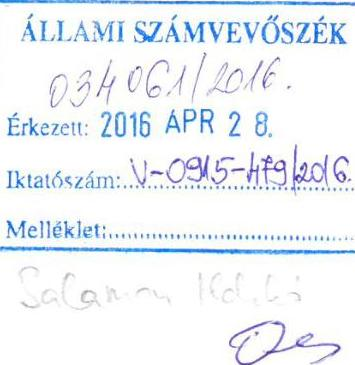

Tisztelt Elnök Úr!

Hivatkozással a V-0915-466/2016. iktatószám alatt megküldött számvevőszéki jelentés tervezet összefoglaló megállapításaira tájékoztatom, hogy az összefoglaló megállapítások és javaslatok alapján elkészítjük a jogszabályi határidőn belül a feltárt hiányosságok kiküszöbölésére az intézkedési tervünket, továbbá az megállapításokra az alábbi észrevételeket tesszük:

- 2. A belső kontrollrendszer kialakítása és működtetése pont 2.1 megállapításában foglaltakra: (21. oldal)

Az ellenőrzött időszakban ugyan nem rendelkeztünk aláírás-mintákkal gazdálkodási jogkörök szerinti bontásban, azonban az ellenőrzés során becsatolt szignólista álláspontunk szerint valamennyi jogosult aláírás-mintája szerepelt.

A közbeszerzési értékhatárt el nem érő, a nettó 500.000.-Ft alatti beszerzésekre, 2012-2014 évek vonatkozásában a közbeszerzési értékhatárt el nem érő beszerzésekre, valamint a 100.000.-Ft alatti, előzetes írásbeli kötelezettségvállalást nem igénylő kifizetések rendjére kötelező érvényű szabályozás nem történt, azonban a beszerzéseknél fokozott figyelmet fordítunk az árban legkedvezőbb, szakmailag megfelelő termékek beszerzésére.

- 2.2 számú megállapításban az került rögzítésre, hogy nem mérte fel az intézmény tevékenységében, gazdálkodásában rejlő kockázatokat.

Tájékoztatom, hogy a belső ellenőrzés az ellenőrzés alá vont időszakban elkészítette a kockázatelemzéseket, melyek közül a 2011, 2012. év vonatkozásában az anyag megküldésre került a funkcionális e-mail címre, 2013-2014 év vonatkozásában az anyag feltöltésre került a https://adatokbekerese.asz.hu/kozpalrint-V0713/dokumentum-mappak alatt, a webes felületre.

---

- 3.3. megállapítás - kiadási előirányzatok felhasználására megállapított hiányosságok esetén kérjük pontosítani, mely esetekben nem hajtottuk végre a személyi juttatások, felhalmozási, dologi- és dologi jellegű kiadásokhoz, pénzeszköz-átadásokhoz kapcsolódóan teljesítés-igazolásokat.
- 3.6 megállapításban rögzítésre került, hogy a rendezőmérlegen nem szerepeltettük a kórház vezetőjének, és az elkészítésért felelős személynek keltezéssel ellátott aláírását, továbbá nem tartalmazta az elkészítésért felelős személy regisztrációs számát sem.

Meg kívánom jegyezni, hogy a 2015. október 27-én kiadott Főigazgatói nyilatkozatban erre vonatkozóan jeleztük, hogy ezen adatok a Fenntartó részére megküldött fedőlapon szerepeltek, azonban annak, a Fenntartó által aláírt példányával nem rendelkeztünk.

# - 4.1. számú megállapítás: 

a vagyonkezelői szerződés megszövegezése, megszerkesztése álláspontunk szerint kizárólagos fenntartói hatáskör, ezt az eddigiekben is a fenntartó végezte. Ennek megfelelően az egységes szerkezetbe foglalás hiánya nem intézményünk terhére esik.

## - 4.4. számú megállapítás:

Átláthatósági követelmények érvényesítése részhez: általánosságban kimondja, hogy a 2012. január 01-jét követően kötött szerződésekben nem kerültek rögzítésre a Nvtv. 11.§ (11) bekezdésében előírtak. A mintatételek közül emlékezetünk szerint kettő darab (Zoloxi és Cselebinke) volt ami nem felelt meg az Nvtv 11.§ (11) bekezdésében foglaltaknak, melyek közül az egyiket (Cselebinke) még jogelődünk a Dr. Diósszilágyi Sámuel Kórház-rendelőintézet kötött meg, így annak szövegezésére ráhatásunk sem lehetett (2012. december 17-én jött létre). A Zoloxival kötött szerződés pedig 2014. február 28. napjával megszüntetésre került. A minták közül emlékezetem szerint a fenti két szerződésen kívül, mind 2012. január 01. előtt jött létre, így nem is kellett benne lennie ennek a kitételnek. A két előbb említett szerződésben valóban nem voltak benne az NVTV 11.§ (3) bekezdésben írott feltételek, azonban, így általánosságban mégsem helytálló, az a kijelentés hogy a fenti rendelkezések nem voltak benne a szerződésekben, mert egyrészről mintákból dolgoztak, másrészről van rá ellenpélda 2014-ből (Fodor Ferencné ev. büfés szerződése), csak ez nem volt benne a mintatételekben.

A vagyonhasznosítási bevételek teljesítésére tett megállapítások esetén kérjük pontosítani, hogy mely bevételek esetén nem rendelkeztünk a kötelezettségvállalás dokumentumával.

Tájékoztatom, hogy a térítési díjak megállapításának módszerét APEH ellenőrzés kapcsán tisztáztuk, a díjak minden egyes esetben Energetikus, Sterilizáló vezető és Veszélyes hulladék gazdálkodó kalkulációja alapján kerültek megállapításra, azonban a mellékszámítások iktatása nem történt meg.

## - 5.2 megállapítás:

„Az átszervezés fordulónapja (2012. május 01.) és 2012. december 31. közötti időszakra fennálló költségvetési beszámoló készítési kötelezettségének nem tett eleget"

Tájékoztatom, hogy a jelzett számszaki beszámoló feltöltésre került a https://adatokbekerese.asz.hu/kozpalrint-V0713/letoltes/2012-eves-beszamolo-2012-evesbeszamolo.pdf, míg annak szöveges kiegészítése a

---

https://adatokbekerese.asz.hu/kozpalrint-V0713/letoltes/a-csongrad-megyei-egeszsegugyi-ellato-kozpont-hodmezovasarhely-mako-feladatkorenek-tevekenysegenek-ismertetese-2012-majus-december-kozotti-idoszakban-a-csongrad-megyei-egeszsegugyi-ellato-kozpont-hodmezovascularhely-mako-feladatkorenek-tevekenysegenek-ismertetese-2012-majus-december-kozotti-idoszakban.pdf alatt, a webes felületre.

A fentiekre tekintettel kérem, szíveskedjék az általam tett észrevételeket a véglegesített jelentés elkészítésénél figyelembe venni.

Hódmezővásárhely, 2016. április 23.

Tisztelettel:
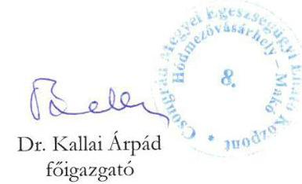

---

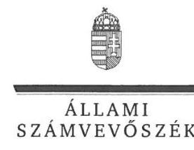

ELNÖK

Ikt.szám: V-0915-482/2016.

# Dr. Kallai Árpád 

főigazgató
Csongrád Megyei Egészségügyi Ellátó Központ

## Hódmezővásárhely

## Tisztelt Főigazgató Úr!

Köszönettel megkaptam a 2016. április 25. napján az Állami Számvevőszékhez érkezett „A központi alrendszer egyes intézményei pénzügyi és vagyongazdálkodásának ellenőrzése Csongrád Megyei Egészségügyi Ellátó Központ" című számvevőszéki jelentéstervezetben foglalt megállapításokra tett írásbeli észrevételeit.
Tájékoztatom Főigazgató urat, hogy a jelentésben - az Állami Számvevőszékről szóló 2011. évi LXVI. törvény 29. § (3) bekezdése alapján - a figyelembe nem vett észrevételeket szerepeltetjük az elutasítás indokainak feltüntetésével együtt.
Az Állami Számvevőszék észrevételekre vonatkozó álláspontjáról a felügyeleti vezető által készített részletes tájékoztatást mellékelten megküldöm.

Budapest, 2016. 05. 16.
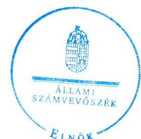

Tisztelettel:

Domokos László

Melléklet: Tájékoztatás az el nem fogadott észrevételekről

---

# Tájékoztatás   az el nem fogadott észrevételekről

| 1. | Észrevétel: | A 2.1. számú megállapításhoz, a gazdálkodási jogkörök gyakorlására jogosult személyek aláírás-mintáira vonatkozóan.  |
| --- | --- | --- |
|   | Válasz: | Az Állami Számvevőszék az észrevételt nem fogadja el.  |
|   | Indoklás: | Az észrevétel az ellenőrzött időszakra vonatkozó megállapításokat (2.1. számú megállapítás 11. bekezdés) nem módosítja.
Az „ellenőrzés során becsatolt szignólista" nem helyettesíti az ellenőrzött 2011-2014. évekre vonatkozóan a jogszabályban előírt, a gazdálkodási jogkörök gyakorlására jogosult személyekről és az aláírás-mintájukról történő nyilvántartás vezetését. A dokumentumok ismételt áttekintése alapján, az ellenőrzés részére nem adtak át olyan dokumentumot, amely megfelelő volna az állambáztartás működési rendjéről szóló 292/2009. (XII. 19.) Korm. rendelet (Ámr.) 80. § (3) bekezdésében és az állambáztartásról szóló törvény végrehajtásáról szóló 368/2011. (XII. 31.) Korm. rendelet (Ávr.) 60. § (3) bekezdésében foglalt, a gazdálkodási jogkörök gyakorlására jogosult személyekről és az aláírás-mintájukról vezetendő nyilvántartásnak.  |
|   | Észrevétel: | A 2.1. számú megállapításhoz, a közbeszerzési értékhatárt el nem érő beszerzésekre, valamint az előzetes írásbeli kötelezettségvállalást nem igénylő kifizetések rendjének szabályozására vonatkozóan.  |
|   | Válasz: | Az Állami Számvevőszék az észrevételt nem fogadja el.  |
|  2. | Indoklás: | Az észrevétel a vonatkozó ellenőrzési megállapításokat (2.1. számú megállapítás 13-14. bekezdései) nem cáfolja, hanem megerősíti a szabályozások hiányát, így a megállapítások módosítása nem indokolt.
A tájékoztatását, mely szerint - a kötelező érvényű szabályozás hiánya ellenére - a beszerzéseknél fokozott figyelmet fordítanak az árban kedvezőbb, szakmailag megfelelő termékek beszerzésére, köszönettel vettük.  |
|  3. | Észrevétel: | A 2.2. számú megállapításhoz, amely szerint a Kórház nem mérte fel a tevékenységében, gazdálkodásában rejlő kockázatokat.  |
|   | Válasz: | Az Állami Számvevőszék az észrevételt nem fogadja el.  |
|   | Indoklás: | Az észrevétel nem megalapozott. Észrevételében a belső ellenőrzés által - a 2011. évben a költségvetési szervek belső ellenőrzéséről szóló 193/2003. (XI. 26.) Korm. rendelet (Ber.) 6. § (4) bekezdésében, a 2012-2014. években a költségvetési szervek belső kontrollrendszeréről és belső ellenőrzéséről szóló 370/2011. (XII. 31.) Korm. rendelet  |

---

|  |  | (Bkr.) 19. § (4) bekezdésében foglaltak alapján -, az ellenőrzési tervek összeállításához készített kockázatelemzések dokumentumaira hivatkozott. Ezek a kockázatelemzések nem felelnek meg az ellenőrzési megállapításban szereplő, a 2011. évben az Ámr. 157. § (2)-(3) bekezdéseiben, a 2012-2014. években a Bkr. 7. § (2) bekezdésében előírt kockázatkezelési rendszer működtetésének. Utóbbi a költségvetési szerv egészének a tevékenységére, gazdálkodására vonatkozó kockázatkezelési rendszert foglalja magában.   Mindezek következtében az ellenőrzési megállapítás (2.2. számú megállapítás 1. bekezdés) módosítása nem indokolt. |
| :--: | :--: | :--: |
| 4. | Észrevétel: | A 3.3. számú megállapításhoz, a kiadási előirányzatok felhasználásához kapcsolódóan megállapított teljesítés igazolások hiányára vonatkozóan. |
|  | Válasz: | Az Állami Számvevőszék az észrevételt nem fogadja el. |
|  | Indoklás: | Az észrevétel a vonatkozó ellenőrzési megállapításokat (3.3. számú megállapítás 5. bekezdés 1-4. pontja) nem vitatja, a megállapítások módosítása nem indokolt.   Az ellenőrzési megállapítások hasznosulásának elősegítése érdekében tájékoztatom, hogy a személyi juttatások esetében az alábbi sorszámú mintatételekhez kapcsolódóan nem történt meg a teljesítésigazolás:   - a 2011. évben a személyi külső kiadások 2-4., 6-7. sorszámú;   - a 2011. évben a személyi nem rendszeres 2-3., 6. sorszámú;   - a 2011. évben a személyi rendszeres 2., 4-7. sorszámú;  

 - a 2012. évben a személyi külső 1-4., 6-7. sorszám;   - a 2012. évben a személyi nem rendszeres 2-7. sorszám;   - a 2012. évben a személyi rendszeres 1-6. sorszám;   - a 2013. évben a személyi külső 6. sorszám;   - a 2013. évben a személyi nem rendszeres 6. sorszám;   - a 2013. évben a személyi rendszeres 1-6. sorszám;   - a 2014. évben a személyi külső 1-6. sorszám;   - a 2014. évben a személyi nem rendszeres 1-7. sorszám;   - a 2014. évben a személyi rendszeres 1., 3-7. sorszám.   A felhalmozási kiadások esetében az ellenőrzött időszakban a mintatételekhez kapcsolódóan - a 2013. évi 3-4. és a 2015. évi 1., 5. sorszámú tételek kivételével - nem történt meg a teljesítésigazolás.   A dologi- és dologi jellegű kiadások esetében az ellenőrzött időszakban a mintatételekhez kapcsolódóan - a 2014. évi 4. és 17. sorszámú tételek kivételével - nem történt meg a teljesítésigazolás.   A pénzeszközátadások esetében az ellenőrzött időszakban a 2011. év 1-5. sorszámú, valamint a 2012. évben az 1-2. sorszámú mintatételekhez kapcsolódóan nem történt meg a teljesítésigazolás. |
| 5. | Észrevétel: | A 3.6. számú megállapításhoz, a rendezőmérlegre vonatkozóan. |
|  | Válasz: | Az Állami Számvevőszék az észrevételt nem fogadja el. |

---

|  | Indoklás: | Az észrevételben nem vitatta, hogy az ellenőrzés részére átadott rendezőmérlegen a jogszabályi előírás ellenére nem szerepelt a Kórház vezetőjének és az elkészítésért felelős személynek az aláírása, továbbá az elkészítésért felelős személy regisztrációs és kamarai tagsági száma.   Az észrevételben leírtak, mely szerint a hiányzó adatok a Fenntartó részére megküldött fedőlapon szerepeltek, de a Fenntartó által aláírt rendezőmérleg példánnyal nem rendelkeztek, az ügykövetés hiányosságát, továbbá a számvitelről szóló 2000. évi C. törvényben (Számv. tv.) előírt megőrzési kötelezettség be nem tartását mutatják.   A Számv. tv. 169. § (1) bekezdése szerint „A gazdálkodó az üzleti évtől készített beszámolót, az üzleti jelentést, valamint az azokat alátámasztó leltárt, értékelést, főkönyvi kivonatot, továbbá a naplófőkönyvet, vagy más, a törvény követelményeinek megfelelő nyilvántartást olvasható formában legalább 8 évig köteles megőrizni.”   Mindezek következtében az ellenőrzési megállapítások (3.6. számú megállapítás 2. bekezdés) módosítása nem indokolt. |
| :--: | :--: | :--: |
| 6. | Észrevétel: | A 4.1. számú megállapításhoz, a vagyonkezelési szerződés és annak módosítása egységes szerkezetbe foglalására vonatkozóan. |
|  | Válasz: | Az Állami Számvevőszék az észrevételt nem fogadja el. |
|  | Indoklás: | Az észrevétel, mely szerint a vagyonkezelési szerződés egységes szerkezetbe foglalásának hiánya nem a Kórház „terhére esik”, a vonatkozó ellenőrzési megállapítást (4.1. számú megállapítás 2. bekezdés) nem módosítja, azt nem cáfolja. A megállapítás a jogszabályi előírással összhangban mindkét szerződő félre vonatkozóan megállapítja a mulasztást.   A 4.1. számú megállapítás 2. bekezdés szerint „A vagyonkezelési szerződés módosítását a Vtvr. 8. § (2) bekezdésében foglaltak ellenére nem foglaltak 60 napon belül a módosításokkal egységes szerkezetbe, ezért a vagyonkezelési szerződés módosítása nem volt szabályszerű.”   Vtvr. 8. § (2) „Amennyiben a felek ugyanabban a szerződésben több állami tulajdonba tartozó vagyonelem vagyonkezeléséről rendelkeztek, a szerződés hatálya alá tartozó vagyontárgyak körének változása esetén kötelesek a szerződést hatvan napon belül a módosításokkal egységes szerkezetbe foglalni.” |
| 7. | Észrevétel: | A 4.4. számú megállapításhoz, az átláthatósági követelmények érvényesítésére vonatkozóan. |
|  | Válasz: | Az Állami Számvevőszék az észrevételt nem fogadja el. |
|  | Indoklás: | A dokumentumok ismételt áttekintése alapján az észrevétel nem megalapozott, ezért a - vagyonhasznosítási bevételi előirányzatok teljesítése, és ennek keretében az átláthatósági követelményekre vonatkozó - 4.4. számú megállapítás 3. bekezdését nem módosítja. |

---

|  |  | Az ellenőrzés hatóköre és módszerei fejezetben leírtaknak megfelelően, az ellenőrzés mintavétel alapján történt, a „minták kiválasztása során elsősorban reprezentativitást biztosító véletlen mintavételi eljárást alkalmaztunk”. Az ellenőrzési módszernek megfelelően, a vagyonhasznosítási bevételi előirányzatok ellenőrzése során ,,A jogszabályoknak és a belső előírásoknak megfelelőnek tekintettük ......... a vagyonhasznosítási bevételi előirányzatok teljesítését ... amennyiben a minta ellenőrzésének eredménye alapján 95%-os bizonyossággal a teljes sokaságban a hibás tételek aránya kisebb volt, mint 10%, nem megfelelőnek értékeltük, ha a hibás tételek aránya a 10%-ot meghaladta. Kockázatot, illetve magas kockázatot jeleztünk, amennyiben egy adott terület vonatkozásában a minta alapján a teljes sokaságban nem volt egyértelműen biztosított a jogszabályoknak és a belső szabályzatoknak megfelelő működés.”   A vagyonhasznosítási bevételi előirányzatok teljesítésének ellenőrzése során két mintatétel vonatkozásában megállapításra került, hogy „Az átláthatóságra vonatkozó nyilatkozatokkal - az Nvtv. 3. § (2) bekezdése előírásai ellenére - a Kórház nem minden esetben rendelkezett.” Ezen túlmenően, a 2013-2014. évi mintatételek közül 13 esetben - az Nvtv. 11. § (11) bekezdése szempontjából releváns mintatételek egyikénél sem - rögzítették a bérleti szerződésekben az Nvtv. 11. § (11) bekezdésében előírtakat. Az észrevétellel ellentétben, az Nvtv. 11. § (3) bekezdésére vonatkozóan nem volt ellenőrzési megállapítás.   Fentiekben foglaltak alapján, az Állami Számvevőszék megállapításait a kiválasztott mintatételek ellenőrzésének eredményei, a vonatkozó jogszabályok, és az ellenőrzés-szakmai szabályok alapján tette meg. |
| :--: | :--: | :--: |
| 8. | Észrevétel: | A 4.4. számú megállapításhoz, a vagyonhasznosítási bevételek teljesítésénél a kötelezettségvállalási dokumentumra vonatkozóan. |
|  | Válasz: | Az Állami Számvevőszék az észrevételt nem fogadja el. |
|  | Indoklás: | Az észrevétel - amely szerint a vagyonhasznosítási bevételek teljesítésére tett megállapítások pontosítását kérik, hogy mely bevételek esetén nem rendelkeztek a kötelezettségvállalás dokumentumával - nem módosítja a vonatkozó, 4.4. számú megállapítás 2. bekezdésében foglalt ellenőrzési megállapítást.   Az ellenőrzési megállapítások hasznosulásának elősegítése érdekében tájékoztatom, hogy a vagyonhasznosítási bevételeknél a Kórház a 2011. évben a 3. és a 2014. évben a 32. sorszámú mintatételek esetében nem rendelkezett kötelezettségvállalási dokumentummal. |
| 9. | Észrevétel: | A 4.4. számú megállapításhoz, a térítési díjak kalkulációjához készítendő számításokra vonatkozóan. |
|  | Válasz: | Az Állami Számvevőszék az észrevételt nem fogadja el. |

---

|  | Indoklás: | Az észrevétel nem módosítja az ellenőrzési megállapítást (4.4. számú megállapítás 2. bekezdés 5. mondat), hanem megerősíti. Az észrevételben adott tájékoztatás - mely szerint a mellékszámítások iktatása nem történt meg, így azok visszakereshető módon nem kerültek megőrzésre - a bizonylatok megőrzésének hiányosságára utal.   Az ellenőrzési dokumentumok ismételt áttekintése alapján, az ellenőrzés részére nem került átadásra a bérleti díjak vagy rezsiátalány kalkulációjához költségszámítás. |
| :--: | :--: | :--: |
|  | Észrevétel: | Az 5.2. számú megállapításhoz, ,,Az átszervezés fordulónapja (2012. május 01.) és 2012. december 31. közötti időszakra fennálló költségvetési beszámoló készítési kötelezettségének nem tett eleget” megállapításra vonatkozóan. |
|  | Válasz: | Az Állami Számvevőszék az észrevételt nem fogadja el. |
| 10. | Indoklás: | A dokumentumok ismételt felülvizsgálata alapján, az észrevételben foglaltakkal szemben, az ellenőrzés részére nem került átadásra az átszervezés fordulónapja, a 2012. május 1. és 2012. december 31. közötti időszakra vonatkozó, az államháztartás szervezetei beszámolási és könyvvezetési kötelezettségének sajátosságairól szóló 249/2000. (XII. 24.) Korm. rendelet (Áhsz.) 13/A. § (7a) bekezdésében foglaltaknak megfelelő, hiteles és aláírt elemi költségvetési beszámoló. Az észrevételben hivatkozott 2012. éves beszámoló nem az átszervezés fordulónapjától év végéig, hanem a 2012. év teljes időszakára vonatkozott.   „A Csongrád Megyei Egészségügyi Ellátó Központ Hódmezővásárhely-Makó feladatkörének, tevékenységének ismertetése 2012 május-december közötti időszakban” című, 1465-56-1/2013. iktatószámmal ellátott dokumentum az Áhsz.; 10. § (1) bekezdésében az elemi költségvetési beszámoló készítésére előírt február 28-i határidőn túl, 2013. április 22-én készült, továbbá tartalma nem felel meg az 13/A. § (7a) bekezdésében foglaltaknak.   Fentiek alapján, az ellenőrzési megállapítás (5.2. számú megállapítás 1. bekezdés) módosítása nem indokolt. |

Budapest, 2016. 0. hó 1. nap
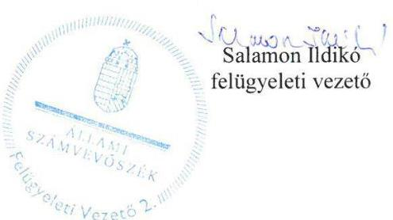

---

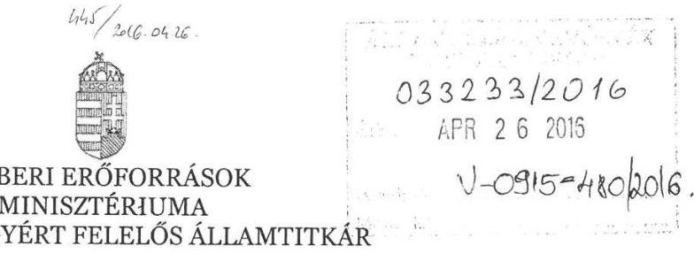

Iktatószám: 24186 - 2 /2016/EIFF

Sülem: 126 E.

D.

# Domokos László részére

elnök

Állami Számvevőszék

## Budapest

Apáczai Csere János u. 10.
1052

Tárgy: „A központi alrendszer egyes intézményei pénzügyi és vagyongazdálkodásának ellenőrzése - Csongrád Megyei Egészségügyi Ellátó Központ” című számvevőszéki jelentés tervezet véleményezése

Tisztelt Elnök Úr!

Hivatkozással a V-0915-468/2016. iktatószámon továbbított „A központi alrendszer egyes intézményei pénzügyi és vagyongazdálkodásának ellenőrzése - Csongrád Megyei Egészségügyi Ellátó Központ” című jelentés-tervezetre, az alábbiakról tájékoztatom.

A jelentéstervezet az Emberi Erőforrások Minisztériuma által áttekintésre került, mellyel kapcsolatban észrevételt nem kívánok tenni.

Budapest, 2016. 0. hó 19.

Üdvözlettel:

Dr. Önodi Szűcs Zoltán

---

Állami Egészségügyi Ellátó Központ

Állami Számvevőszék

Domokos László
Elnök Úr részére

Budapest
Apáczai Csere János utca 10.
1052

Tisztelt Elnök Úr!

Iktatószám: A88813453-212016
Ügyintéző: Szabó Krisztina
Telefon: 1/356-15-22/193
E-mail: szabo.krisztina@aeek.hu

1125 Budapest, Diós árok 3.
Tel.: 1356 1522, Fax: 13757253
1525 Budapest 114 Pf. 32.

03160312016
ÁPR 20 2016
V-0915-481/2016.

Szeptember 16. 2016

Az Állami Számvevőszék által „A központi alrendszer egyes intézményei pénzügyi és vagyongazdálkodásának ellenőrzése - Csongrád Megyei Egészségügyi Ellátó Központ" címmel készített számvevőszéki jelentéstervezetet megkaptam.

A jelentéstervezet megállapításaival kapcsolatban észrevételt nem kívánok tenni.

Budapest, 2016. április 13.

Tisztelettel:
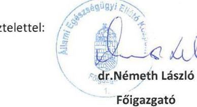

Főigazgató

---

# RÖVIDÍTÉSEK JEGYZÉKE 

${ }^{1}$ Kórház, intézmény
${ }^{2}$ ÁSZ
${ }^{3}$ Eütv.
${ }^{4}$ Ttv.
${ }^{5}$ Ötv.
${ }^{6}$ Önkormányzat
${ }^{7}$ Közgyűlés
${ }^{8}$ Minisztérium
${ }^{9}$ GYEMSZI
${ }^{10}$ Miniszter
${ }^{11}$ makói kórház
${ }^{12}$ Nvtv.
${ }^{13}$ Áht. 2
${ }^{14}$ Ávr.
${ }^{15}$ Áht. 1
${ }^{16}$ Ámr.
${ }^{17}$ Bkr.
${ }^{18}$ ÁSZ tv.
${ }^{19}$ ÁSZ SZMSZ
${ }^{20}$ 59/2011. (IV. 12.) Korm. rendelet
${ }^{21}$ Konszolidációs tv.
${ }^{22}$ SZMSZ
${ }^{23}$ TVK
${ }^{24}$ Számv. tv.
${ }^{25}$ Áhsz. 2
${ }^{26}$ Ikr.
2011. január 1-2013. január 31. között hódmezővásárhelyi Erzsébet Kórház Rendelőintézet, 2013. február 1-jétől Csongrád Megyei Egészségügyi Ellátó Központ Hódmezővásárhely-Makó
Állami Számvevőszék
Az egészségügyről szóló 1997. évi CLIV. törvény
2012. évi XXXVIII. törvény a települési önkormányzatok fekvőbeteg-szakellátó intézményeinek átvételéről és az átvételhez kapcsolódó egyes törvények módosításáról
1990. évi LXV. törvény a helyi önkormányzatokról
Hódmezővásárhely Megyei Jogú Város Önkormányzata
Hódmezővásárhely Megyei Jogú Város Önkormányzat Közgyűlése
Nemzeti Erőforrás Minisztérium, 2012. május 15-étől Emberi Erőforrások Minisztériuma
Gyógyszerészeti és Egészségügyi Minőség- és Szervezetfejlesztési Intézet (2015. február 28-áig), (jogutód szervezete 2015. március 1-jétől az Állami Egészségügyi Ellátó Központ)
Nemzeti erőforrás miniszter (2012. május 13-áig), Emberi erőforrások minisztere (2012. május 14-étől)
dr. Diósszilágyi Sámuel Kórház- Rendelőintézet, Makó (beolvadással megszűnt 2013. január 31-én)
2011. évi CXCVI. törvény a nemzeti vagyonról
2011. évi CXCV. törvény az államháztartásról (hatályos 2012. január 1-jétől)

368/2011. (XII. 31.) Korm. rendelet az államháztartásról szóló törvény végrehajtásáról
1992. évi XXXVIII. törvény az államháztartásról (hatálytalan: 2012.január 1-jétől) 292/2009. (XII. 19.) Korm. rendelet az államháztartás működési rendjéről (hatálytalan: 2012. január 1-jétől)
370/2011. (XII. 31.) Korm. rendelet a költségvetési szervek belső
kontrollrendszeréről és belső ellenőrzéséről (hatályos 2012. január 1-jétől)
2011. évi LXVI. törvény az Állami Számvevőszékről, hatályos 2011. július 1-jétől

Állami Számvevőszék Szervezeti és Működési Szabályzata
59/2011. (IV. 12.) Korm. rendelet a Gyógyszerészeti és Egészségügyi Minőség- és Szervezetfejlesztési Intézetről
2011.
 évi CLIV. törvény a megyei önkormányzatok konszolidációjáról, a megyei önkormányzati intézmények és a Fővárosi Önkormányzat egyes egészségügyi intézményeinek átvételéről
Szervezeti és Működési Szabályzat
Teljesítmény-volumen korlát
2000. évi C. törvény a számvitelről

4/2013. (I. 11.) Korm. rendelet az államháztartás számviteléről (hatályos: 2014. január 1-jétől)
335/2005. (XII. 29.) Korm. rendelet a közfeladatot ellátó szervek iratkezelésének általános követelményeiről

---

${ }^{27}$ Info tv.
${ }^{28}$ Eitv.
${ }^{29}$ Avtv.
${ }^{30}$ Ber.
${ }^{31} \mathrm{Kbt} .1$
${ }^{32} \mathrm{Kbt} .2$
${ }^{33}$ 337/2011. (XII. 29.) Korm. rendelet
${ }^{34}$ 438/2013. (XI. 19.) Korm. rendelet
${ }^{35}$ 184/2014. (VII. 25.) Korm. rendelet
${ }^{36}$ 259/2012. (IX. 14.) Korm. rendelet
${ }^{37}$ 36/2013. (IX. 13.) NGM rendelet
${ }^{38}$ Vagyonkezelési szerződés
${ }^{39}$ Vagyonkezelési szerződés-módosítás
${ }^{40}$ Vtvr.
${ }^{41}$ Vtv.
${ }^{42}$ 92/2012. (IV. 27.) Korm. rendelet
2011. évi CXII. törvény az információs önrendelkezési jogról és az információszabadságról (hatályos 2011. július 26-tól)
2005. évi XC. törvény az elektronikus információszabadságról
1992. évi LXIII. törvény a személyes adatok védelméről és a közérdekű adatok nyilvánosságáról (hatálytalan: 2012. január 1-jétől)
193/2003. (XI. 26.) Korm. rendelet a költségvetési szervek belső ellenőrzéséről
2003. évi CXXIX. törvény a közbeszerzésekről (hatálytalan 2012. január 1-jétől)
2011. évi CVIII. törvény a közbeszerzésekről (hatályos: 2011. augusztus 21-től, hatálytalan: 2015. november 1-jétől)
337/2011. (XII. 29.) Korm. rendelet a Gyógyító-megelőző ellátás jogcím-csoportból finanszírozott egészségügyi szolgáltatók adósságának rendezésére fordítható konszolidációs támogatásról és az egészségügyi szolgáltatások Egészségbiztosítási Alapból történő finanszírozásának részletes szabályairól szóló 43/1999. (III. 3.) Korm. rendelet módosításáról (hatálytalan: 2013. január 1-jétől)
438/2013. (XI. 19.) Korm. rendelet a finanszírozott egészségügyi szakellátást nyújtó egészségügyi szolgáltatók adósságának rendezésére fordítható konszolidációs támogatásról
184/2014. (VII. 25.) Korm. rendelet a finanszírozott egészségügyi szakellátást nyújtó egészségügyi szolgáltatók adósságának rendezésére fordítható működési támogatásról
az egészségügyi szolgáltatások Egészségbiztosítási Alapból történő finanszírozásának részletes szabályairól szóló 43/1999. (III. 3.) Korm. rendelet módosításáról (hatálytalan: 2012. október 3-tól)
36/2013. (IX. 13.) NGM rendelet az államháztartás számvitelének 2014. évi megváltozásával kapcsolatos feladatokról
a GYEMSZI és a Kórház között megkötött, GYEMSZI/012861/2013. számú 2013. május 2-án kelt vagyonkezelési szerződés
A GYEMSZI és a Kórház között megkötött, GYEMSZI/015597/2014. számon 2014. május 19-én kelt 1. számú vagyonkezelési szerződés-módosítás
254/2007. (X. 4.) Korm. rendelet az állami vagyonnal való gazdálkodásról
2007. évi CVI. törvény az állami vagyonról

92/2012. (IV. 27.) Korm. rendelet a települési önkormányzatok egészségügyi intézményei átvételének részletes szabályairól és egyes egészségügyi tárgyú kormányrendeletek módosításáról

---

.

---

.

---

.

---

ÁLLAMI SZÁMVEVŐSZÉK
1052 Budapest, Apáczai Csere János utca 10.
Levélcím: 1364 Budapest 4. Pf. 54
Telefon: +36 14849100 Telefax: +36 14849200
www.asz.hu
