# Jelentés 

## A központi alrendszer egyes intézményei ellenőrzése

A központi alrendszer egyes intézményei pénzügyi és vagyongazdálkodásának ellenőrzése - Észak-dunántúli Vízügyi Igazgatóság
2016.

---

.

---

# J elentés 

## A központi alrendszer egyes intézményei ellenőrzése

A központi alrendszer egyes intézményei pénzügyi és vagyongazdálkodásának ellenőrzése - Észak-dunántúli Vízügyi Igazgatóság
2016. O6 hó 21 nap
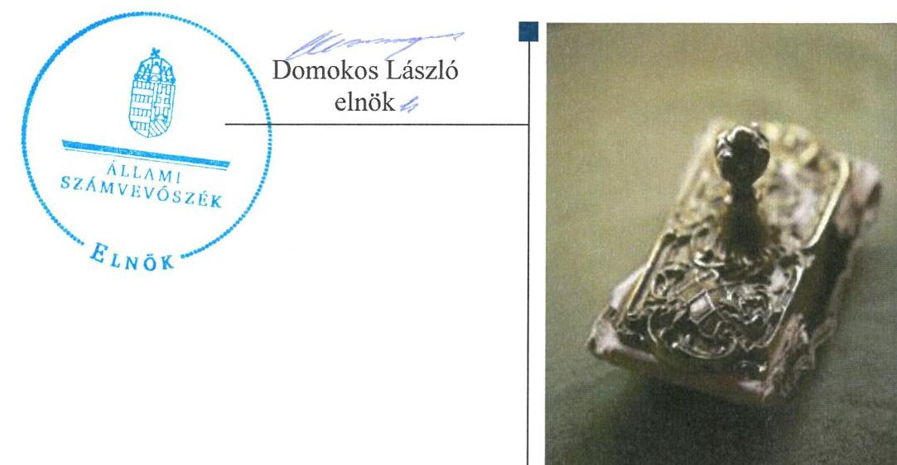

---

|   | AZ ELLENŐRZÉST FELÜGYELTE:  |
| --- | --- |
|   | SALAMON ILDIKÓ felügyeleti vezető  |
|   | AZ ELLENŐRZÉST VEZETTE ÉS A VÉGREHAJTÁSÁÉRT FELELŐS:  |
|   | NIKLAI HELÉNA ellenőrzésvezető  |
|   | A PROGRAM ÖSSZEÁLLÍTÁSÁÉRT FELELŐS:  |
|   | JANIK JÓZSEF osztályvezető  |
|   | BÖRÖCZ IMRE projektfelelős  |
|   | A TÉMÁHOZ KAPCSOLÓDÓ KORÁBBI SZÁMVEVŐSZÉKI JELENTÉSEK:  |
|  J | - címe: Magyarország 2014. évi központi költségvetése végrehajtásának ellenőrzéséről  |
|  J | - sorszáma: 15167  |
|  |   |
|   | IKTATÓSZÁM: V-0916-324/2016  |
|   | TÉMASZÁM: 1771  |
|   | ELLENŐRZÉS-AZONOSÍTÓ SZÁM: V071303  |

---

# TARTALOMJEGYZÉK 

■ ÖSSZEGZÉS ..... 5
■ AZ ELLENŐRZÉS CÉLJA ..... 7
■ AZ ELLENŐRZÉS TERÜLETE ..... 8
■ AZ ELLENŐRZÉS HÁTTERE, INDOKOLTSÁGA ..... 10
■ FÓKUSZKÉRDÉSEK ..... 11
■ ELLENŐRZÉS HATÓKÖRE ÉS MÓDSZEREI ..... 12
■ MEGÁLLAPÍTÁSOK ..... 16
■ JAVASLATOK ..... 34
■ MELLÉKLETEK ..... 37
I. sz. melléklet: Értelmező szótár ..... 37
II. sz. melléklet: Az integritás érvényesítése érdekében kialakított és múködtetett kontrollrendszer ..... 42
III. sz. melléklet: A teljesítmény-ellenőrzési kiegészítő modul megállapításai - Észak- dunántúli Vízügyi Igazgatóság ..... 43
IV. sz. melléklet: Mérlegadatok a 2011-2014. években (E FT) ..... 44
■ FÜGGELÉK: ÉSZREVÉTELEK ..... 45
■ RÖVIDÍTÉSEK JEGYZÉKE ..... 85

---

.

---

# ÖSSZEGZÉS 

Az Állami Számvevőszék a 2011-2014. közötti időszak tekintetében az Észak-dunántúli Vízügyi Igazgatóság pénzügyi és vagyongazdálkodását ellenőrizte.
Az ellenőrzés megállapította, hogy az ÉDUVÍZIG belső kontrollrendszerének kialakítása és müködtetése megfelelt a jogszabályi előírásoknak. A pénzügyi gazdálkodás, vagyongazdálkodás az ellenőrzött időszakban nem volt szabályszerű. Az irányító szervek ÉDUVÍZIG-re vonatkozó feladatellátása összességében szabályszerű volt.

## Az ellenőrzés társadalmi indokoltsága

A közpénzek felhasználásában és az állami vagyonnal való gazdálkodásban a központi alrendszer egyes intézményei meghatározó súlyt képviselnek. E szervezetekkel szemben társadalmi igény, hogy tevékenységükről a döntéshozók és a nyilvánosság felé elszámoljanak. Ezzel a társadalmi igénnyel és az Állami Számvevőszék Stratégiájával összhangban, a közpénzügyek átláthatóságának előmozdítása, a közvagyon védelme érdekében került sor az Észak-dunántúli Vízügyi Igazgatóság pénzügyi- és vagyongazdálkodásának ellenőrzésére.

## Főbb megállapítások, következtetések, javaslatok

Az irányító szervek ÉDUVÍZIG-re vonatkozó feladatellátása összességében szabályszerű volt. Az irányító szervek részéről az alapító okiratok kiadása a jogszabályi előírásoknak megfelelően történt. Az SZMSZ tartalma az alapító okirattal 2011-2012. években nem volt összhangban. Az irányító szervek a közfeladatok ellátására vonatkozó, az erőforrásokkal való szabályszerű gazdálkodáshoz szükséges követelményeket érvényesítették, számon kérték és - 2011. év kivételével - ellenőrizték. 2011. évben az irányító szerv, 2012-2014. években a középirányító szerv az erőforrásokkal való hatékony gazdálkodáshoz szükséges követelményeket az ÉDUVÍZIG felé nem érvényesített, így nem volt biztosított a számon kérhetőség és az ellenőrizhetőség. Az irányító szervek és a középirányító szerv az intézménnyel kapcsolatos egyéb ellenőrzési, irányítási és felügyeleti jogosultságokat szabályszerűen gyakorolta.

Az ÉDUVÍZIG belső kontrollrendszerének kialakítása és müködtetése megfelelt a jogszabályi előírásoknak. A kontrollkörnyezet kialakítása, a kontrolltevékenység kialakítása és működtetése - a szabályozás területén feltárt hibák, hiányosságok kivételével - szabályszerű volt. A kockázatkezelési rendszer kialakítása és működtetése, valamint az információs és kommunikációs folyamatok kialakítása, a monitoring rendszer működése a jogszabályi előírásoknak megfelelt.

Az ÉDUVÍZIG pénzügyi gazdálkodása nem volt szabályszerű. Az előirányzatok módosítását nem a jogszabályi előírásoknak megfelelően hajtották végre. Az ellenőrzött időszakban a kiadási előirányzatok felhasználása során a jogszabályi előírásokat nem tartották be. Az ellenőrzött gazdálkodási jogkörök - a 2011. évet érintően a szakmai teljesítésigazolás és az utalvány ellenjegyzés, a 2012-2014. éveket érintően a teljesítésigazolás és az érvényesítés kulcskontrollok - gyakorlása nem felelt meg a jogszabályi előírásoknak. Az ÉDUVÍZIG a dologi, illetve a felhalmozási kiadásoknál az ellenőrzött időszakban árubeszerzés, illetve távközlési szolgáltatás megrendelésre teljesített, ellenőrzött kifizetéseihez kapcsolódóan nem folytatott le közbeszerzési eljárást, ezzel megsértette a közbeszerzésekről szóló törvény előírásait. A kötelezettségvállalással terhelt maradvány megállapítása az ellenőrzött időszakban nem volt szabályszerű. Az ÉDUVÍZIG zavartalan feladatellátásához a fizetőképesség folyamatos fennállása, a likviditás javítása érdekében intézkedtek.

Az ÉDUVÍZIG vagyongazdálkodása nem volt szabályszerű. A vagyonkezelési szerződést a jogszabályi előírások ellenére a módosítást követően nem foglalták a módosításokkal egységes szerkezetbe. A mérlegben kimutatott eszközök és források nyilvántartása, értékelése, leltározása a jogszabályok előírásainak megfelelően történt. A vagyonelemek hasznosítása részben felelt meg a jogszabályok előírásainak, mivel az ÉDUVÍZIG a bérbeadási folyamat során

---

nem győződött meg az átláthatóság követelményének érvényesüléséről. Az eredményszemléletű számvitel bevezetésével kapcsolatos feladatokat a jogszabályi előírásoknak megfelelően hajtották végre.

Az ÉDUVÍZIG az integritás érvényesítése érdekében tett intézkedéseket.
Az ÁSZ az Észak-dunántúli Vízügyi Igazgatóság igazgatójának fogalmazott meg javaslatokat, amelyekre 30 napon belül intézkedési tervet kell készítenie.

---

# **AZ ELLENŐRZÉS CÉLJA**

## **Észak-dunántúli Vízügyi Igazgatóság pénzügyi és vagyongazdálkodásának ellenőrzése**

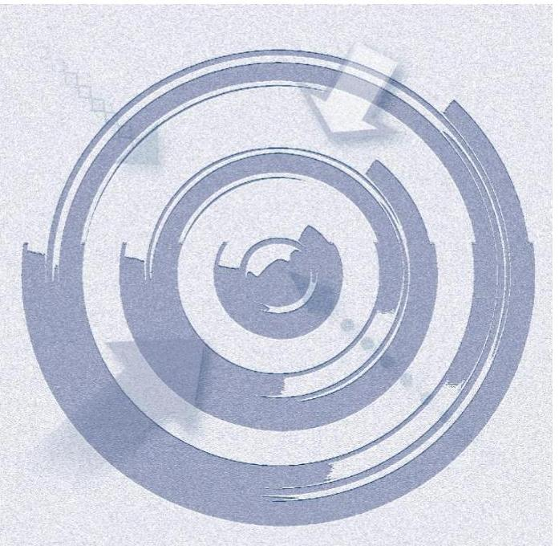

### **A SZABÁLYSZERŰSÉGI ELLENŐRZÉS**

célja annak megítélése volt, hogy az ellenőrzött intézményre vonatkozó irányító szervi feladatellátás a jogszabályi előírások betartásával történt-e; az intézménynél a belső kontrollrendszer kialakítása és működtetése szabályszerű volt-e; kialakították-e az erőforrásokkal való szabályszerű, gazdaságos, hatékony és eredményes gazdálkodáshoz szükséges követelményeket, megvalósították-e azok számon kérését, ellenőrzését; az intézmény pénzügyi és vagyongazdálkodása megfelelt-e a jogszabályi előírásoknak és belső szabályzatainak; az intézmény átalakításának vagy átszervezésének lebonyolítása szabályszerűen történt-e.

Az intézmény korrupcióval szembeni veszélyeztetettségének csökkentése érdekében az ÁSZ1 felmérte az integritás érvényesülését a gazdálkodási folyamatokban.

**A KIEGÉSZÍTŐ TELJESÍTMÉNY-ELLENŐRZÉSI MODUL** célja annak értékelése volt, hogy a gazdálkodás folyamatában a gazdaságossági, hatékonysági és eredményességi követelmények kialakítása megtörtént-e, azokat működtették-e, a célkitűzéseket elérték-e; a pénzügyi és vagyongazdálkodás folyamataira vonatkozóan a költségvetési szerv belső kontrollrendszerének minőségéről kiadott vezetői nyilatkozatban a költségvetési szerv tevékenységében a hatékonyság, eredményesség, gazdaságosság követelményeinek érvényesítésére vonatkozó nyilatkozat helytálló volt-e.

---

# AZ ELLENŐRZÉS TERÜLETE

## Észak-dunántúli Vízügyi Igazgatóság

**AZ ÉDUVÍZIG2** önállóan működő és gazdálkodó központi költségvetési szerv. Jogállását, közfeladatait, hatáskörét és működési területét a 1995. évi LVII. törvény3, a 232/1996. (XII. 26.) Korm. rendelet4, a 347/2006. (XII. 23.) Korm. rendelet5, valamint a vízügyi igazgatási, valamint a vízügyi hatósági feladatokat ellátó szervek kijelöléséről szóló Korm. rendeletek6 határozzák meg. Az ÉDUVÍZIG alaptevékenysége körében ellátja a vizek kártételei elleni védelemmel, vízkárelhárítással összefüggő, jogszabályban előírt feladatokat. Ennek keretében többek között üzemelteti és fejleszti a vízrajzi észlelőhálózatot, ennek részeként vízrajzi adatokat gyűjt, feldolgoz, értékel és tárol. Ellátja a működési területén lévő vizek felhasználható állapotban tartásával, állapotértékelésével kapcsolatos feladatokat, a közműves vízellátással és szennyvízkezeléssel kapcsolatos nemzeti és regionális programok elkészítésével a feladatkörébe utalt feladatokat. Működési területe magába foglalja Komárom-Esztergom-, Győr-Moson-Sopron megye, illetve Vas- és Veszprém megye egyes részeit. Területén négy (a Hansági, a Rábai, a Szigetközi és a Tatai) szakaszmérnökség működik.

Az ÉDUVÍZIG átalakítására, átszervezésére az ellenőrzött időszakban nem került sor. Az ÉDUVÍZIG feladatstruktúrájában az ellenőrzött időszakban jogszabályi előírás alapján történtek változások:

- 2012. január 1-jei hatállyal az ÉDUVÍZIG részéről a NeKI7 részére átadásra kerültek környezetvédelmi feladatok;
- 2014. január 1-jei hatállyal az ÉDUVÍZIG feladatokat vett át a NeKI-től, vagyonelemeket (ingatlanokat) a Győr-Moson-Sopron Megyei Kormányhivataltól és a Vas Megyei Kormányhivataltól; illetve
- 2014. szeptember 10-ei hatállyal az ÉDUVÍZIG-től a Győr-Moson-Sopron Megyei Katasztrófavédelmi Igazgatósághoz kerültek át elsőfokú vízügyi hatósági és szakhatósági feladatok.

Az ÉDUVÍZIG irányító szervei az ellenőrzött időszakban változtak. 2011. december 31-ig az irányító szervi feladatokat a VM8, 2012. január 1-jétől a BM9 látta el, az irányító szervi hatásköröket a Miniszter10 gyakorolta. 2012. január 1-jétől a középirányító szervi feladatokat az OVF11 látta el.

Az ellenőrzött időszakban az ÉDUVÍZIG igazgatójának személyében 2012. évben történt változás. A korábbi igazgató megbízatása 2012. június 30-ával megszűnt, az új igazgatót 2012. szeptember 16-ával nevezte ki a Miniszter, az átmeneti időszakban az igazgatói feladatokat a műszaki igazgatóhelyettes látta el. A gazdasági vezető személyében az ellenőrzött időszakban változás nem történt, 2011. január 1-jei hatállyal, illetve az irányító szerv változásával egyidejűleg 2012. január 1-jei hatállyal korábbi feladatköre változatlan ellátására új kinevezést kapott.

Az ÉDUVÍZIG létszáma a 2011. évben foglalkoztatott 350 főről 2014. évre 358 főre nőtt. Az ellenőrzött időszakban a közalkalmazottak mellett

---

2011-ben 193, 2012-ben 547, 2013-ban 432, 2014-ben pedig 432 fő közfoglalkoztatására is sor került.

A 2011-2014. évi éves költségvetési beszámolók alapján az ellenőrzött időszakban az ÉDUVÍZIG 4332,9 M Ft és 16 360,7 M Ft közötti összegű bevételt, és 4061,7 M Ft és 14 503,9 M Ft közötti összegű kiadást teljesített, az 1. ábrában bemutatottak szerint. (A teljesítési adatok a vállalkozási tevékenységből teljesített bevételek és kiadások összegeit, a 2011. évi teljesítési adatok a vállalkozási tevékenység elszámolt bevételi, illetve kiadási maradványának összegét is tartalmazzák.) Az ÉDUVÍZIG-nek vállalkozási tevékenységből 2011-ben 395,5 M Ft, 2012-ben 369,8 M Ft, 2013-ban 119,4 M Ft, 2014-ben 179,8 M Ft bevétele keletkezett.
1. ábra
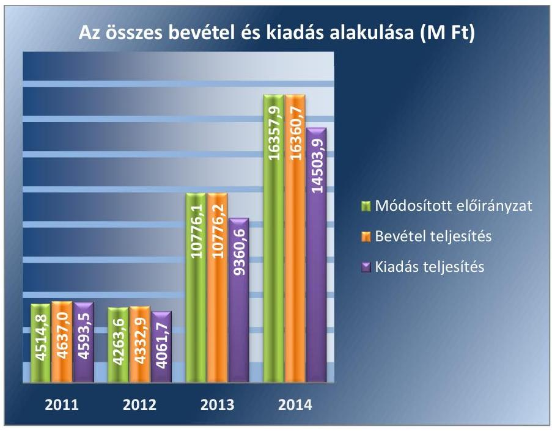

Adatforrás: ÉDUVÍZIG 2011-2014. évi éves költségvetési beszámolói, ÁSZ saját szerkesztés
Az ÉDUVÍZIG könyvviteli mérleg szerinti vagyona a 2011. év eleji 30 152,6 M Ft-ról 2014. év végére 41 929,6 M Ft-ra nőtt. A növekedést a beruházások 4586,7 M Ft összegről 15 315,8 M Ft-ra történt emelkedése okozta. A kötelezettségek összege a 2011. év eleji 620,5 M Ft-ról 2014. év végére 2930,1 M Ft-ra növekedett. Az ÉDUVÍZIG mérlegadatait az ellenőrzött időszakban a IV. sz. melléklet mutatja be.

---

# AZ ELLENŐRZÉS HÁTTERE, INDOKOLTSÁGA 

Az Alaptörvény rendelkezése szerint a nemzeti vagyon megőrzésének, védelmének és a nemzeti vagyonnal való felelős gazdálkodásnak a követelményeit sarkalatos törvény, az Nvtv ${ }^{12}$. rögzíti. A tulajdonosi joggyakorlás és vagyonkezelés általános és speciális szabályait, az állami vagyon nyilvántartására és elszámolására vonatkozó eljárásokat, a vagyonkezelési szerződés feltételrendszerét, valamint az éves beszámoló készítési és könyvvezetési kötelezettségeket kormányrendelet írja elő.

A központi alrendszer egyes intézményei közfeladat-ellátásának változásait, a közfeladatok átadásából és átvételéből adódó módosításait, előirányzat gazdálkodására ható tényezőit az Áht. ${ }^{13} 11 . \S$-a és az Ávr. 14. §- a írja elő. A közfeladatok megszűnéséből, intézmény átszervezéséből, belső szerkezeti korszerűsítéséből, vagy más hasonló okból adódó módosításai miatt szerepeltetendő szerkezeti változásokat, valamint a szerkezeti változásként beépült közfeladatok szintre hozásként történő számításba vételét az Ávr. 15. § (2)-(3) bekezdései határozzák meg.

Az Áht. ${ }^{14}{ }_{2}$ az Ámr. ${ }^{15}$ és a Bkr. ${ }^{16}$ is előírja a költségvetési szerv részére, hogy olyan követelményeket alakítson ki, amelyek biztosítják a múködés, gazdálkodás, az erőforrások felhasználása során a gazdaságosság, hatékonyság és eredményesség érvényesülését. Az Ámr. és a Bkr. alapján az intézményvezetőnek évente nyilatkoznia is kell arról, hogy gondoskodotte az intézmény tevékenységében a gazdaságosság, hatékonyság és eredményesség követelményeinek érvényesítéséről. A gazdaságos, hatékony és eredményes gazdálkodáshoz szükség van a teljesítménymérés feltételeinek kialakítására, úgymint az egyértelmú és mérhető célokra, mutatószámokra és az ezekhez rendelt követelményekre. Az ÁSZ jelen ellenőrzéssel győződik meg arról, hogy az intézménynél a teljesítménycélokat, -mutatókat, -követelményeket kialakították-e, azokat múködtették-e, a kitűzött cél(ok) teljesültek-e.

AZ ELLENŐRZÉS EREDMÉNYEKÉPPEN nemcsak az ellenőrzött intézmények gazdálkodása javulhat, hanem átfogó képet kaphatunk a központi alrendszerbe tartozó költségvetési szervek gazdálkodásának hiányosságairól, de a jó gyakorlatokról is. Ellenőrzéseivel, javaslataival és megállapításaival az ÁSZ elősegítheti a költségvetési szervek pénzügyi és vagyongazdálkodása szabályozásának javítását és hozzájárulhat a jó kormányzáshoz.

## A TELJESÍTMÉNY-ELLENŐRZÉSI KIEGÉSZÍTŐ

MODUL alapján elvégzett ellenőrzés a törvényalkotás számára támogatást nyújt a nemzeti kulcsindikátorok rendszerének kialakításához. A döntéshozók, ellenőrzöttek, irányító szervek, a társadalom számára az összehasonlítási, összemérési lehetőségek kihasználásával objektív visszajelzést ad a gazdálkodás területén végrehajtott szervezeti, szervezési, takarékossági és bürokráciacsökkentő intézkedések hatásairól, a közfeladat-ellátásnak keretet adó pénzügyi és vagyongazdálkodásban mérhető teljesítménykövetelmények kialakításáról, azok alkalmazásáról.

---

# FÓKUSZKÉRDÉSEK 

1. Az irányító szerv ellenőrzött intézményre vonatkozó feladatellátása szabályszerű volt-e?
2. A belső kontrollrendszer kialakítása és müködtetése megfelelt-e a jogszabályi előírásoknak?
3. Az intézmény pénzügyi gazdálkodása szabályszerű volt-e?
4. Az intézmény vagyongazdálkodása szabályszerű volt-e?
5. Szabályszerüen hajtották-e végre az ellenőrzött időszakban az intézményt érintő szervezeti, szerkezeti átalakításokat?
6. Az intézmény intézkedett-e az integritás szemlélet érvényesitése érdekében?

---

# ELLENŐRZÉS HATÓKÖRE ÉS MÓDSZEREI 

## Az ellenőrzés típusa

Szabályszerűségi ellenőrzés, amelyet teljesítmény-ellenőrzési modul egészített ki.

## Az ellenőrzött időszak

Az ellenőrzött időszak a 2011. január 1-jétől 2014. december 31-ig tartó időszak volt.

## Az ellenőrzés tárgya

Az ellenőrzött szervezetre vonatkozó irányító szervi feladatok ellátása. Az intézmény belső kontroll rendszerének kialakítása és múködtetése, valamint pénzügyi és vagyongazdálkodása. Az erőforrásokkal való szabályszerű, gazdaságos, hatékony és eredményes gazdálkodáshoz szükséges követelmények kialakítása, a kialakított követelmények számonkérése, ellenőrzése. Az intézmény átalakítása, átszervezése lebonyolításának szabályszerűsége.

A teljesítmény-ellenőrzési kiegészítő modul esetében az intézmény gazdálkodása folyamatában a gazdaságossági, hatékonysági és eredményességi követelmények kialakítása és múködtetése, a célkitűzések teljesítésének értékelése. A költségvetési szerv tevékenységében a hatékonyság, eredményesség, gazdaságosság követelményei érvényesítéséről kiadott nyilatkozat helytállósága. A teljesítmény-ellenőrzési kiegészítő modul fókuszkérdéseire a III. sz. melléklet ad választ.

Az ellenőrzés kiterjedt minden olyan körülményre és adatra, amely az ÁSZ jogszabályban meghatározott feladatainak teljesítéséhez, valamint a programok végrehajtása folyamán felmerült újabb összefüggések feltárásához voltak szükségesek.

## Az ellenőrzött szervezet

Észak-dunántúli Vízügyi Igazgatóság (2011. december 31-ig Északdunántúli Környezetvédelmi és Vízügyi Igazgatóság), Földművelésügyi Minisztérium (2011. évben Vidékfejlesztési Minisztérium), Belügyminisztérium és az Országos Vízügyi Főigazgatóság.

---

# Az ellenőrzés jogalapja 

Az ellenőrzés jogszabályi alapját az ÁSZ tv ${ }^{17}$. 1. § (3) bekezdés, 5. § (2)-(7) bekezdései, valamint az Áht. 2 61. § (2) bekezdésének előírásai képezték.

## Az ellenőrzés módszerei

Az ellenőrzést az ellenőrzési program szempontjai, az ellenőrzött időszakban hatályos jogszabályok, az ellenőrzés szakmai szabályai, az egyes ellenőrzési típusokhoz kapcsolódó ÁSZ módszertanok és nemzetközi standardok figyelembevételével végeztük. A gazdálkodás hibáinak kijavítására, a közpénzekkel való felelős gazdálkodás segítésére irányuló javaslatok kidolgozásakor a hatályos jogszabályok voltak az irányadóak.

Az ellenőrzés ideje alatt az ellenőrzött szervezettel történő kapcsolattartást az ÁSZ SZMSZ ${ }^{18}$-ének vonatkozó előírásai alapján biztosítottuk.

Az ellenőrzési kérdések megválaszolásához szükséges bizonyítékok megszerzése a következő ellenőrzési eljárások alkalmazásával történt: megfigyelés, szemle (szemrevételezés), kérdésfeltevés (információkérés), mintavételezés, valamint elemző eljárás. A minták kiválasztása során elsősorban reprezentativitást biztosító véletlen mintavételi eljárást alkalmaztunk.

Az ellenőrzési bizonyítékként felhasználható adatforrások közé tartoztak egyrészt a szakmai program részletes szempontjainál felsorolt adatforrások, másrészt adatforrás volt minden egyéb - az ellenőrzés folyamán feltárt, az ellenőrzés szempontjából releváns információt tartalmazó - dokumentum.

Az ellenőrzés lefolytatásához az ellenőrzött szervezetek a tanúsítványok elektronikus kitöltésével, valamint az ÁSZ által kért dokumentumok elektronikus megküldésével szolgáltattak adatokat. A rendelkezésre bocsátott adatok, információk kontrollja az ellenőrzés keretében történt.

Az ellenőrzési kérdésekre adott válaszok alapján értékeltük, hogy az ellenőrzött időszakban az irányító szervek és a középirányító szerv az ellenőrzött intézményre vonatkozó feladatainak szabályszerűen eleget tett-e, az intézmény pénzügyi és vagyongazdálkodása megfelelt-e az előírásoknak, az intézmény átalakításának vagy átszervezésének végrehajtása szabályszerű volt-e. Értékeltük, hogy az intézménynél kialakították-e az erőforrásokkal való szabályszerű és hatékony gazdálkodáshoz szükséges követelményeket, megvalósították-e azok számonkérését, ellenőrzését.

Az intézmény belső kontrollrendszere jogszabályi előírások szerinti kialakításának és működtetésének szabályszerűségét az erre irányuló ellenőrzési kérdésekre adott válaszok összesítése alapján, évente pillérenként (kontrollkörnyezet, kockázatkezelési rendszer, kontrolltevékenységek, információs és kommunikációs rendszer, monitoring rendszer) és összesítetten is minősítettük. Az intézmény belső kontrollrendszere egyes pilléreinek kialakítását és működtetését „szabályszerü"-nek minősítettük, amennyiben az értékelt területen az elért és elérhető pontok százalékban kifejezett, egész számra kerekített hányadosa meghaladta a $84 \%$-ot, „részben sza-bályszerü"-nek minősítettük, ha a $84 \%$-ot nem haladta meg, de $60 \%$-nál nagyobb volt, „nem szabályszerü"-nek minősítettük, ha nem haladta meg

---

a 60\%-ot. Az intézmény belső kontrollrendszerének összesített értékelése megegyezik a pillérenként (kontrollterületenként) alkalmazott \%-os értékelésekkel, a következő eltérésekkel. A kontrollrendszer egésze esetében a „szabályszerü" értékelésnek a \%-os értéken felül további feltétele volt, hogy egyik kontrollterület sem kaphatott „nem szabályszerü" értékelést, a „részben szabályszerü" értékelés további feltétele volt, hogy legfeljebb egy ellenőrzött kontrollterület lehetett „nem szabályszerü" értékelésű. Az öszszesített értékelés a \%-os értéktől függetlenül „nem szabályszerű"-nek minősült, ha az ellenőrzött kontrollterületek közül több mint egy „nem szabályszerű" értékelést kapott.

A tárgyi eszközök nyilvántartásba vételének, a közbeszerzési eljárások lefolytatásának, a vagyonhasznosítási bevételi előirányzatok teljesítésének, az előirányzatok módosításának és az előirányzat-maradvány megállapításának szabályszerűségét, valamint a gazdálkodási jogkörök gyakorlásának szabályszerűségét mintavétellel ellenőriztük.

A jogszabályoknak és a belső előírásoknak megfelelőnek tekintettük a tárgyi eszközök nyilvántartásba vételét, a vagyonhasznosítási bevételi előirányzatok teljesítését, az előirányzatok módosítását és az előirányzat-maradvány megállapítását, amennyiben a minta ellenőrzésének eredménye alapján 95\%-os bizonyossággal a teljes sokaságban a hibás tételek aránya kisebb volt, mint 10\%, nem megfelelőnek értékeltük, ha a hibás tételek aránya a 10\%-ot meghaladta. Kockázatot, illetve magas kockázatot jeleztünk, amennyiben egy adott terület vonatkozásában a minta alapján a teljes sokaságban nem volt egyértelműen biztosított a jogszabályoknak és a belső szabályzatoknak megfelelő működés.

A közbeszerzési eljárások esetében az ellenőrzött mintatételek értékelését végeztük el.

A 2011. évet érintően a szakmai teljesítésigazolás és az utalvány ellenjegyzése kulcskontrollok, a 2012-2014. éveket érintően a teljesítésigazolás és az érvényesítés kulcskontrollok működését értékeltük. Megfelelőnek értékeltük a gazdálkodási jogkörök gyakorlását, amennyiben 95\%-os bizonyossággal a teljes sokaságban a hibás tételek aránya legfeljebb 10\% volt, részben megfelelőnek, ha a hibás tételek arányának felső határa legfeljebb $30 \%$ volt, nem megfelelőnek, ha a hibás tételek sokaságbeli arányának felső határa meghaladta a 30\%-ot.

Az integritás érvényesülése érdekében alkalmazott kontroll-rendszer elemek értékelése az intézmény által kitöltött tanúsítvány alapján történt.

Az alapprogram alapján ellenőriztük, hogy a költségvetési szerv vezetője megtette-e nyilatkozatát arról, hogy gondoskodott a költségvetési szerv tevékenységében a hatékonyság, eredményesség és a gazdaságosság követelményeinek érvényesítéséről. Ezt kiegészítve, a teljesítmény-ellenőrzési kiegészítő modul keretében - felhasználva az alapprogram szerinti ellenőrzés megállapításait - értékeltük, hogy a költségvetési szerv vezetője kialakította-e a gazdaságossági, hatékonysági és eredményességi követelményeket, és azokat működtette-e, a célkitűzéseket elérte-e.

A teljesítmény-ellenőrzési kiegészítő modul a gazdálkodási feladatokra terjedt ki, a szakmai feladatellátást nem értékelte.

A gazdálkodási feladatok értékelése az alábbi területekre terjedt ki:
pénzügyi gazdálkodási (nem szakmai, adminisztratív) feladatok: költségvetés-, beszámoló-készítés, könyvvezetés, adatszolgáltatások,

---

előirányzat-gazdálkodás, kötelezettségvállalások nyilvántartása, kezelése, bevételkezelés, bér- és illetményszámfejtés;
$\longrightarrow$ vagyongazdálkodási (logisztikai) feladatok: közbeszerzések és közbeszerzési értékhatárt el nem érő beszerzések, készletgazdálkodás, nyomtatók, fénymásolók üzemeltetése, épület- és ingatlanüzemeltetés, karbantartás, hibabejelentés, gépjármú és flottamenedzsment.
A teljesítmény-ellenőrzési kiegészítő programmodulban megfogalmazott ellenőrzési cél megválaszolásához az alapprogram végrehajtása során megfogalmazott megállapításokat is figyelembe vettük.

---

# 1. Az irányító szerv ellenőrzött intézményre vonatkozó feladatellátása szabályszerű volt-e? 

Összegző megállapítás

Az irányító szervek ÉDUVÍZIG-re vonatkozó feladatellátása összességében szabályszerű volt.

### 1.1. számú megállapítás

Az irányító szervek részéről az alapító okiratok kiadása a jogszabályi előírásoknak megfelelően történt. Az SZMSZ tartalma az alapító okirattal 2011-2012. években nem volt összhangban.

AZ ÉDUVÍZIG IRÁNYÍTÓ SZERVE 2011. évben a VM volt, irányító szervi jogosultságot ebben az időszakban nem adtak át. 2012. január 1-jétől a 300/2011. (XII. 22.) Korm. rendelet ${ }^{19}$ hatálybalépésével - az ÉDUVÍZIG irányító szerve a BM, középirányító szerve az OVF lett. Az OVF, mint középirányító szerv az Áht. 2 9. § (1) bekezdés f), g) és h) pontjaiban meghatározott irányítói jogosultságokat gyakorolta. Az OVF középirányítói feladatait a BM az Áht. 2 és az Ávr. előírásainak megfelelően a 13/2011. (V. 23.) BM utasításban ${ }^{20}$, a 47/2012. (XI. 30.) BM utasításban ${ }^{21}$, valamint a 2013. december 13-tól hatályos alapító okiratban részletesen meghatározta. Az irányító szervi hatásköröket az ellenőrzött időszakban a Miniszter gyakorolta.

Az ÉDUVÍZIG folyamatosan rendelkezett az irányító szervek által az Áht.1,2 előírásainak megfelelően kiadott alapítói okirattal. Az ellenőrzött időszak kezdetén a Miniszter által 2010. november 22-én jóváhagyott alapító okirat volt hatályban. Az ellenőrzött időszakban az alapító okiratot öt alkalommal módosították. Az alapító okirat és módosításai tartalmazták az Áht. 1 90. §-ban és az Ávr. 5. §-ban előírt tartalmi kellékeket. Az alapító okirat kiadásához az államháztartásért felelős miniszter előzetes egyetértésével az irányító szervek az Áht. 1 89. § (1) bekezdésének, illetve az Áht. 2 8. § (7) bekezdése előírásainak megfelelően rendelkeztek, az egységes szerkezetű alapító okiratot az Ámr. 10. § (10) bekezdésének, illetve az Ávr. ${ }^{22}$ 5. § (4) bekezdésének megfelelően elkészítették.

Az ellenőrzött időszakban az ÉDUVÍZIG rendelkezett az irányító szervek által jóváhagyott SZMSZ ${ }^{23}$-szel. Az ellenőrzött időszak kezdetén a 2009. évben kiadott SZMSZ volt hatályban, amelyet 2012. decemberben és 2014. januárban módosítottak. A 2011-2012. évi SZMSZ-ek nem voltak összhangban az alapító okirattal, mivel az az Ámr. 20. § (2) bekezdés b) pontja, illetve az Ávr. 13. § (1) bekezdés b) pontja előírásai ellenére nem tartalmazták a hatályos, egységes szerkezetbe foglalt alapító okirat keltét és számát. 2013-ban és 2014-ben az SZMSZ tartalma megfelelt az alapító okirat tartalmának.

---

### 1.2. számú megállapítás

Az irányító szervek a közfeladatok ellátására vonatkozó, az erőforrásokkal való szabályszerű gazdálkodáshoz szükséges követelményeket érvényesítették, számon kérték és - 2011. év kivételével ellenőrizték. 2011. évben az irányító szerv, 2012-2014. években a BM és a középirányító szerv az erőforrásokkal való hatékony gazdálkodáshoz szükséges követelményeket az ÉDUVÍZIG felé nem érvényesített, és így nem biztosította a számon kérhetőséget és az ellenőrizhetőséget.
2011. évben a közfeladatok ellátásának módjára vonatkozó, és az erőforrásokkal való szabályszerű gazdálkodáshoz szükséges követelményeket a VM, mint irányító szerv érvényesítette, az intézmény felé kiadott utasításokban írta elő.
2011. évben a VM eleget tett az Áht. 1 49. § (5) bekezdés f) pontja szerinti számon kérési kötelezettségének, beszámoltatta az intézményt az éves szakmai feladatellátásról, a gazdálkodásról.

Az erőforrásokkal való szabályszerű gazdálkodáshoz szükséges követelmények ellenőrzése 2011. évben az Áht. 1 49. § (5) bekezdés f) pont előírásai ellenére a VM részéről nem valósult meg.

Az erőforrásokkal való hatékony gazdálkodáshoz szükséges követelményeket 2011. évben a VM az Áht. 1 49. § (5) bekezdés f) pontjának előírásai ellenére az ÉDUVÍZIG felé nem érvényesített és így nem biztosította a számon kérhetőséget és az ellenőrizhetőséget.

2012-2014. KÖZÖTTI IDŐSZAKRA a közfeladatok ellátásának módjára vonatkozó, és az erőforrásokkal való szabályszerű gazdálkodáshoz szükséges követelményeket a BM, mint irányító szerv érvényesítette, utasításokban írta elő.

2012-2014. években a BM és az OVF eleget tett az Áht.2. 9. § (1) bekezdés f) pontja szerinti számon kérési kötelezettségének, beszámoltatta az intézményt az éves szakmai feladatellátásról, a gazdálkodásról.

Az erőforrásokkal való szabályszerű gazdálkodáshoz szükséges követelmények tekintetében a BM, illetve az OVF 2012-2014. években az ÉDUVÍZIG-nél ellenőrzéseket végzett.

Az erőforrásokkal való hatékony gazdálkodáshoz szükséges követelményeket 2012-2014. években a BM, illetve az OVF mint középirányító szerv az Áht. 2 9. § (1) bekezdés f) pontjának előírásai ellenére az ÉDUVÍZIG felé nem érvényesített, és így nem biztosította a számon kérhetőséget és az ellenőrizhetőséget.
1.3. számú megállapítás

Az irányító szervek és a középirányító szerv az intézménnyel kapcsolatos egyéb ellenőrzési, irányítási és felügyeleti jogosultságokat szabályszerűen gyakorolta.

A BEVÉTELI ÉS KIADÁSI ELŐIRÁNYZATOKKAL VALÓ GAZDÁLKODÁST az irányító szerv 2011. évben közvetlenül, 2012-2014. években a középirányító szerven keresztül figyelemmel kísérte. Az irányító szervek és a középirányító szerv az ellenőrzött időszakban nem állapították meg a bevételi és kiadási előirányzatok teljesülésének, a

---

közfeladatok ellátásának veszélybe kerülését, így az Áht. 1 49. § (5) bekezdésének i) pontja, illetve az Áht. 2 9. § (1) bekezdésének d) pontja szerinti irányító szervi intézkedésre nem került sor.

# AZ INTÉZMÉNY VEZETŐJÉNEK ÉS GAZDASÁGI 

VEZETŐJÉNEK megbízása, kinevezése, illetve az intézmény vezetője esetében a megbízás-visszavonása az irányító szervek részéről a jogszabályi előírásoknak megfelelően történt.

AZ ÉDUVÍZIG KEZELÉSÉBEN LEVŐ KÖZÉRDEKŰ ÉS KÖZÉRDEKBŐL NYILVÁNOS ADATOK, valamint az irányítási jogkörök gyakorlásához szükséges személyes adatok kezelésének kialakítása az irányító szerveknél szabályszerű volt.

## 2. A belső kontrollrendszer kialakítása és múködtetése megfelel-t-e a jogszabályi elöírásoknak?

Összegző megállapítás

A belső kontrollrendszer kialakítása és múködtetése megfelelt a jogszabályi előírásoknak. A kontrollkörnyezet kialakítása, a kontrolltevékenység kialakítása és múködtetése - a szabályozás területén feltárt hibák, hiányosságok kivételével - szabályszerű volt. A kockázatkezelési rendszer kialakítása és múködtetése, valamint az információs és kommunikációs folyamatok kialakítása, a monitoring rendszer múködése a jogszabályi előírásoknak megfelelt.

A kontrollkörnyezet kialakítása a feltárt hibák, hiányosságok kivételével szabályszerű volt.

AZ ÉDUVÍZIG az ellenőrzött időszakban rendelkezett SZMSZ-szel. A szabályzat 2011. évben megfelelt az Ámr. 20. § (2) bekezdése előírásainak, 2012. évben az Ávr. 13. § (1) bekezdése előírásainak. Az Ávr. 13. § (1) bekezdése c) pontjának előírása ellenére a 2013-ban hatályos SZMSZ nem nevesítette az ÉDUVÍZIG által ellátott konkrét vállalkozási tevékenységeket. A 2013-ban és 2014-ben hatályos SZMSZ - az Ávr. 13. § (1) bekezdése e) pontjának előírása ellenére - nem szabályozta az egyes szervezeti egységek feladatait. Továbbá az Ávr. 13. § (1) bekezdése f) pontjának előírása ellenére 2013-ban az SZMSZ nem szabályozta azokat az ügyköröket, amelyek során a szervezeti egységek vezetői az ÉDUVÍZIG képviselőjeként járhatnak el.

Az Ávr. 9. § (5) bekezdése előírása ellenére a 2012. december 17. és 2013. március 4. közötti időszakban az ÉDUVÍZIG nem rendelkezett érvényes szervezeti ügyrendi szabályzattal ${ }^{24}$, azon belül gazdasági ügyrenddel. A 2011. január 1. és 2012. december 17., illetve a 2013. március 4. és 2014. december 31. közötti időszakban hatályban levő gazdasági ügyrend az Ámr. 20. § (7) bekezdése és az Ávr. 13. § (5) bekezdése előírásai ellenére nem tartalmazta a gazdasági szervezet alkalmazottainak feladat- és hatás-

---

körét. Továbbá a 2013. március 4. és 2014. december 31. közötti időszakban hatályban levő gazdasági ügyrend az Ávr. 13. § (5) bekezdése előírása ellenére a helyettesítés rendjét a szervezeti egységek alkalmazottainak tekintetében nem szabályozta.

Az ÉDUVÍZIG az ellenőrzött időszakot megelőzően kiadott, 2012. évben módosított Etikai Kódex ${ }^{25}$-ben meghatározta az etikai elvárásokat.

Az ÉDUVÍZIG gazdasági vezetője rendelkezett az Ámr.-ben és Ávr.-ben előírt képzettséggel, a munkatársak rendelkeztek a Munka tv. ${ }_{1,2}{ }^{26}$ által előírt munkaköri leírással.

Az ÉDUVÍZIG számviteli politikája 2011-2013. években megfelelt a Számv. tv. ${ }^{27}$ és az Áhsz. ${ }_{1}$ előírásainak. A számviteli politika ${ }^{28}$ 2014. évben nem teljesítette az Áhsz. ${ }_{2} 50 . \S$ (1) bekezdésének a költségvetési és a pénzügyi számvitel alkalmazásával kapcsolatos sajátos szabályok, előírások, módszerek rögzítésére vonatkozó előírását.

Az ÉDUVÍZIG a Számv. tv. 14. § (5) bekezdésének megfelelően elkészítette a leltározási és leltárkészítési szabályzatot, az eszközök és források értékelési szabályzatát, a pénzkezelési szabályzatot, az önköltségszámítási szabályzatot, valamint a Számv. tv. 161. § (1)-(2) bekezdéseiben előírt számlarendet és bizonylati rendet.

Az ÉDUVÍZIG leltározási és leltárkészítési szabályzata az Áhsz. ${ }^{29}$ 37. § (6) és (7) bekezdésének és az Áhsz. ${ }^{30}$ 22. § (2) bekezdés b) pontjának megfelelően tartalmazta a mérlegben értékkel nem szereplő, használt és használatban levő készletek, kis értékű immateriális javak, tárgyi eszközök leltározásának módját és a mennyiségi felvétellel történő leltározás gyakoriságát.

2011-2012. években az eszközök és források értékelési szabályzata ${ }^{31}$ az Áhsz. ${ }_{1} 8 . \S$ (17) bekezdés d) pontja előírásai ellenére a kisösszegű követelések év végi, követeléstípusonként történő meghatározásának elveit és dokumentálásának szabályait nem tartalmazta. Az eszközök és források értékelési szabályzatán 2011-2012. években a Számv. tv. 14. § (11) bekezdése előírásai ellenére a 2011-2012. évben történt törvénymódosítással kapcsolatos változásokat azok hatályba lépését követően nem vezették át. Az eszközök és források értékelési szabályzata a követelések értékelésének elveit, szempontjait 2013-2014. években megfelelően szabályozta.
2014. évben a pénzkezelési szabályzat ${ }^{32}$ nem teljesítette az Áhsz. ${ }_{2} 50 . \S$ (6) bekezdésének a napi készpénz záró állomány maximális mértékének meghatározására vonatkozó előírását.

2014-ben a számviteli politika, a leltározási és leltárkészítési szabályzat ${ }^{33}$, az eszközök és források értékelési szabályzata ${ }^{34}$, a bizonylati rend ${ }^{35}$ és az önköltségszámítási szabályzat ${ }^{36}$ hatályba léptetése a Számv. tv. 14. § (11) bekezdésében meghatározott 90 napos határidőn túl történt.

A számlarend az ellenőrzött időszakban megfelelt a Számv. tv. 161. § (2) bekezdésben előírt követelményeknek. 2014. évben a számlarend ${ }^{37}$ módosítását a Számv. tv. 161. § (5) bekezdésében előírtak ellenére a törvényi változás hatálybalépését követő 90 napon belül nem végezték el.

Az ÉDUVÍZIG az ellenőrzött időszakban rendelkezett az Áht.1,2-ben, az Ámr.-ben és az Ávr.-ben előírt, a gazdálkodás részletes rendjét meghatá-

---

rozó gazdálkodási szabályzattal, amely az Ámr. és az Ávr. előírásainak megfelelően tartalmazta a gazdálkodási jogkörök gyakorlásának szabályait és az előzetes írásbeli kötelezettségvállalást nem igénylő kifizetések rendjét.

# A KÖTELEZETTSÉGVÁLLALÁSRA JOGOSULT 

SZEMÉLYEK felhatalmazása, az érvényesítésre, az utalványozásra jogosult személyek kijelölése és a teljesítésigazolásra jogosult személyek írásbeli kijelölése az Ámr. és az Ávr. előírásai szerint történt. A pénzügyi ellenjegyzést és az érvényesítést végző munkatársak rendelkeztek az Ámr. és az Ávr. által előírt végzettséggel.

Az ellenőrzött időszakban hatályos közbeszerzési szabályzat megfelelt a Kbt. ${ }^{38} 6 . \S$ (1) bekezdése és a Kbt. ${ }^{39} 22 . \S$ (1) bekezdése előírásainak, továbbá tartalmazott részletes előírásokat a Kbt. ${ }_{1} 8 . \S$ (3) bekezdése és a Kbt. ${ }_{2} 22 . \S$ (4)-(5) bekezdései szerint felállítandó közbeszerzési bíráló bizottság múködésére vonatkozóan. A Kbt. ${ }_{1}$ hatálya alá nem tartozó beszerzésekre vonatkozó, az Ámr. 20. § (3) bekezdés b) pontja által előírt szabályzattal az ÉDUVÍZIG a 2011. május 1.-2011. december 9. közötti időszakban nem rendelkezett.

Az ÉDUVÍZIG rendelkezett ellenőrzési nyomvonallal az ellenőrzött időszakban, azonban a 2012. október 17-ig hatályos ellenőrzési nyomvonal ${ }^{40}$ nem felelt meg az Ámr. 156. § (2) bekezdése és a Bkr. 6. § (3) bekezdése előírásainak, mivel nem tartalmazta a költségvetési szerv múködési folyamatainak bemutatását.

Az ÉDUVÍZIG az ellenőrzött időszakban rendelkezett az Ámr. 156. § (3) bekezdésében és a Bkr. 6. § (4) bekezdésében előírt, a szabálytalanságok kezelésének eljárásrendjével.

## 2.2. számú megállapítás

A kockázatkezelési rendszer kialakítása és múködtetése szabályszerű volt.

AZ ÉDUVÍZIG a szervezeti kockázatok kezelésének rendszerét az ellenőrzött időszakban az Ámr. 157. §-nak és a Bkr. 7. §-nak megfelelően kialakította a kockázatkezelési szabályzatban. A kockázat fogalmát, a kockázatok azonosításával, elemzésével, csoportosításával kapcsolatos szabályokat a kockázatkezelési szabályzat a Bkr. és az Ámr. előírásainak megfelelően tartalmazta.

Az ÉDUVÍZIG az Ámr. 157. § (2) és (3) bekezdésével, valamint a Bkr. 7. § (2) bekezdésével összhangban az ellenőrzött időszakban felmérte és megállapította az intézmény tevékenységében, gazdálkodásában rejlő kockázatokat és meghatározta az egyes kockázatokkal kapcsolatos intézkedéseket.

A Vnytv. ${ }^{41} 4 . \S$ a) és d) pontjainak megfelelően az SZMSZ-ben rögzítették a vagyonnyilatkozatra kötelezettek körét, a vagyonnyilatkozat-tételre vonatkozó szabályokat a belső szabályozásban az SZMSZ-szel összhangban alakították ki.

A vagyonnyilatkozatok őrzéséért és a vagyonnyilatkozat-tételi értesítések, felszólítások kiküldéséért felelős személyek kijelölésénél betartották a Vnytv. 7. § a) pontjának és 8. § (4) bekezdésének előírásait. A beérkezett vagyonnyilatkozatokról nyilvántartást vezettek és azokat a Vnytv. 11. § (4) bekezdésének megfelelően elkülönítetten kezelték. A vagyonnyilatkozatokat a kötelezettek a június 30-i határidőre benyújtották.

---

### 2.3. számú megállapítás

2.4. számú megállapítás

A kontrolltevékenység kialakítása és múködtetése a szabályozás területén, valamint a gazdálkodási jogkörök gyakorlásánál feltárt hibák, hiányosságok kivételével szabályszerű volt.

AZ ÉDUVÍZIG-NÉL a pénzügyi döntések dokumentumai elkészítésének szabályozása, a gazdasági események elszámolása kontrolljának kialakítása megfelelt az Áht. 1 121/A. § (4) bekezdés a) és d) pontja és a Bkr. 8. § (2) bekezdés a) és d) pontja előírásainak. Az Áht. 1 121/A. § (4) bekezdés b) pont, valamint a Bkr. 8. § (2) bekezdés b) pont FEUVE-re vonatkozó előírásai ellenére a pénzügyi kihatású döntések célszerűségi, gazdaságossági, hatékonysági és eredményességi szempontú megalapozottságára az ÉDUVÍZIG szabályozása 2013. augusztus 8. előtti időszakban nem terjedt ki.

Az ellenőrzés a gazdálkodási jogkörök gyakorlásával, a kulcskontrollok működtetésével összefüggésben állapított meg hibákat, hiányosságokat, a 3.3. számú megállapításban leírtak szerint.

Az ÉDUVÍZIG elektronikus és papír alapú dokumentumaival és azok kezelésével kapcsolatos adatvédelmi, adatbiztonsági előírásokat az informatikai biztonsági szabályzat ${ }^{42}$ és az iratkezelési szabályzat ${ }^{43}$ az lkr. ${ }^{44}$, az Avtv. ${ }^{45}$ és az Info tv. ${ }^{46}$ előírásainak megfelelően tartalmazta.

Az információs és kommunikációs folyamatok kialakítása a jogszabályi előírásoknak megfelelt.

AZ ÉDUVÍZIG az Ámr. 159. § (1) bekezdés és Bkr. 9. § (1) bekezdés előírásaival összhangban kialakította a szervezeten belüli információáramlás és a szervezeten kívülre történő információátadás rendszerét. 2011. január 1. és 2013. augusztus 7. közötti időszakban - az Ámr. 159. § (2) bekezdés és a Bkr. 9. § (2) bekezdés előírásai ellenére - az intézményen belüli beszámolás szintjeit, módjait nem alakították ki, határidőit nem szabályozták.

Az Avtv. 31/A. § (3) bekezdése és az Info tv. 24. § (3) bekezdése által előírt, hatályos adatvédelmi és adatbiztonsági szabályzattal ${ }^{47}$ az ÉDUVÍZIG csak 2013. április 1-jétől rendelkezett.

Az ÉDUVÍZIG a kötelezően közzéteendő adatok nyilvánosságra hozatalának rendjét az Ámr., az Info tv. és az Ávr. előírásainak megfelelően szabályozta. Az ÉDUVÍZIG az Eitv.-ben, illetve az Info tv.-ben előírt elektronikus közzétételi kötelezettségének az ellenőrzött időszakban eleget tett.

A közérdekú adatok megismerésére irányuló igények teljesítésére vonatkozó szabályozással az ÉDUVÍZIG az ellenőrzött időszakban az Avtv., az Info. tv. és az Ávr. előírásainak megfelelően rendelkezett.

Az ellenőrzött időszakban az ÉDUVÍZIG rendelkezett az iratkezelésre vonatkozó szabályozással, amely az lkr. 17. § (1) bekezdés, 18-54. és 59-64. § előírásaival összhangban szabályozta a küldemények átvételét, felbontását, érkeztetését, az iratok szignálását, továbbítását, iktatásának rendjét, kiadmányozásának rendjét, irattárban történő elhelyezését, irattári kezelést, selejtezését és megsemmisítését. Az iratkezelésre vonatkozó szabályzat ÉDUVÍZIG részéről történő kiadása az Ltv. ${ }^{48}$ előírásának megfelelően az illetékes közlevéltár egyetértésével történt.

---

### 2.5. számú megállapítás

A monitoring rendszer múködése, a rendelkezésre álló források gazdaságos, hatékony és eredményes felhasználását biztosító követelmények kialakítása és alkalmazása a jogszabályi előírásoknak megfelelt.

AZ OPERATÍV TEVÉKENYSÉGEK folyamatos és eseti nyomon követési rendszerét az ÉDUVÍZIG az ellenőrzött időszakban az Ámr. és a Bkr. rendelkezéseinek megfelelően kialakította és múködtette. Az intézmény 2012. október 19-től rendelkezett monitoring stratégiával.

AZ ÉDUVÍZIG vezetője az intézménynél a jogszabályi előírásoknak megfelelően kiadott olyan szabályzatokat, kialakított és múködtetett olyan folyamatokat, amelyek biztosították a rendelkezésre álló források gazdaságos, hatékony és eredményes felhasználását. A 2011. évre vonatkozóan az az ÉDUVÍZIG belső kontrollrendszerének múködéséről az Áht. 1 121. § (3) bekezdése alapján kiadott, az Ámr. 21. sz. melléklete szerinti, valamint a 2012-2014. évekre vonatkozóan a Bkr. 11. § (1) bekezdése alapján kiadott, a Bkr. 1. sz. melléklete szerinti vezetői nyilatkozatok ezzel összhangban voltak.

A BELSŐ ELLENŐRZÉS rendszerét az ÉDUVÍZIG az Áht.1,2, a Ber. ${ }^{49}$ és a Bkr. előírásainak megfelelően kialakította és múködtette. Az ellenőrzött időszakban az ÉDUVÍZIG egy belső ellenőrt alkalmazott, a belső ellenőrzési tevékenység ellátásába külső felet nem vont be. A Ber.-ben és a Bkr.-ben foglaltak szerinti belső ellenőrzésre vonatkozó összeférhetetlenségi előírások érvényesültek. Az SZMSZ rendelkezett a belső ellenőrzési egységről, és annak jogállásáról, feladatairól, szervezeti és funkcionális függetlenségéről.

A Ber. és a Bkr. előírásaival összhangban az ellenőrzött időszakban az ÉDUVÍZIG folyamatosan rendelkezett hatályos belső ellenőrzési kézikönyvvel, a kézikönyv aktualizálására vonatkozó előírásokat teljesítette. Az ÉDUVÍZIG vezetője a jogszabályi előírásoknak megfelelően jóváhagyta az éves belső ellenőrzési terveket, és a Ber.-ben, illetve a Bkr.-ben rögzített határidőn belül tájékoztatásul megküldte azokat az irányító szerveknek, illetve 2012-ben és 2013-ban a középirányító szervnek.

Az éves belső ellenőrzési tervben foglalt belső ellenőrzéseket az ÉDUVÍZIG minden évben végrehajtotta, és terven felüli ellenőrzéseket is végzett. A Ber. és a Bkr. előírásaival összhangban minden belső ellenőrzésről jelentés készült.

Intézkedési terv-készítési kötelezettségének az ÉDUVÍZIG eleget tett. Az intézmény vezetője a Bkr.-ben rögzített határidőn belül jóváhagyta az intézkedési terveket.

A belső ellenőrzési megállapításokkal kapcsolatos intézkedéseket az ÉDUVÍZIG 2012-2014. években a Bkr. előírásainak megfelelően nyilvántartotta és végrehajtásukat az ellenőrzött időszakban nyomon követte. A belső ellenőrzések hasznosulásáról készült 2011. évi nyilvántartás vezetését - a Ber. 29/A § (1) és (7) bekezdése előírásai ellenére - az ÉDUVÍZIG vezetője átruházta a belső ellenőrzést ellátókra.

---

# 3. Az intézmény pénzügyi gazdálkodása szabályszerű volt-e? 

## Összegző megállapítás

### 3.1. számú megállapítás

Az ÉDUVÍZIG pénzügyi gazdálkodása nem volt szabályszerű. Az előirányzatok módosítását nem a jogszabályi előírásoknak megfelelően hajtották végre. Az ellenőrzött időszakban a kiadási előirányzatok felhasználása során a jogszabályi előírásokat nem tartották be. A kötelezettségvállalással terhelt maradvány megállapítása az ellenőrzött időszakban nem volt szabályszerű.

Az elemi költségvetés és az előirányzatok megállapítása során betartották a jogszabályi előírásokat.

AZ ÉDUVÍZIG a költségvetés tervezésével kapcsolatos feladatokat SZMSZ-ében és 2013 márciusától az ügyrendi szabályzatban meghatározta. Ellenőrzési nyomvonala tartalmazta a költségvetés tervezésének folyamatát, a felelősök és a határidők megjelölését.

Az ÉDUVÍZIG elemi költségvetése, az előirányzatok megállapítása megfelelt az Áht. 1,2, az Ámr. és az Ávr. előírásainak, az irányító szerv által kiadott tervezési szempontoknak, keretszámoknak és az ÉDUVÍZIG belső szabályzataiban foglaltaknak. Az elemi költségvetés elkészítését az irányító szervek és az ÉDUVÍZIG közötti egyeztetési folyamat előzte meg, az ÉDUVÍZIG költségvetésének elkészítéséhez a tervezett saját bevételekről adatokat szolgáltatott az irányító szervek részére. Az ÉDUVÍZIG elemi költségvetését az irányító szervek az érintett időszakban elfogadták.

2012-2014. években az ÉDUVÍZIG az Ávr. 31. § (1) bekezdésben megadott határidőig elkészítette előzetes kincstári költségvetését. 2011. évben az Ámr. 41. § (2) bekezdésben foglaltak ellenére előzetes kincstári költségvetés nem készült. A kincstári költségvetés és az elemi költségvetés közötti egyezőség biztosított volt.

A BEVÉTELEK ÉS A KIADÁSOK TERVEZÉSE során az előirányzatok összegét számításokkal alátámasztották. A tervezés során a jogszabályban előírt adatszolgáltatási, egyeztetési kötelezettségét az ÉDUVÍZIG teljesítette. Az ÉDUVÍZIG a költségvetési javaslat elkészítése során az előirányzatok megállapításakor az intézményt érintő feladatátadásokból, illetve feladatátvételekből adódó szerkezeti változások és szintre hozások hatásait figyelembe vette.

Az előirányzatok módosítását nem a jogszabályi előírásoknak megfelelően hajtották végre.

AZ ELŐIRÁNYZATOK MÓDOSÍTÁSA az ellenőrzött időszakban nem volt megfelelő. Az intézményi hatáskörben végrehajtott elő-irányzat-módosításoknál 2011. évben az Ámr. 71. § (6), 2012-2014. években az Ávr. 167. § (4) bekezdése előírásai ellenére az irányító szervet az intézkedést követő öt napon belül nem tájékoztatták.

Előirányzat módosításra országgyűlési hatáskörben 2011. évben, kormányzati, irányító szervi, valamint intézményi hatáskörben az ellenőrzött időszak minden évében sor került.

---

- 2011. évben az országgyűlési hatáskörben végrehajtott előirányzat módosítás a költségvetési törvény módosításához (2011. évi CXIV. törvény ${ }^{30}$ ) kapcsolódott és az intézményt 116,8 M Ft összegű előirányzat elvonással érintette.
- A kormányzati hatáskörben (2011. évben 13,4 M Ft, 2012. évben 379,3 M Ft, 2013. évben 53,2 M Ft, 2014. évben 343,6 M Ft összegben) előírt előirányzat módosítások zárolást, a vízügyi közfeladatok biztonságos ellátásának érdekében, illetve európai uniós projekt előkészítésére vonatkozó támogatáshoz szükséges önrész biztosítása érdekében előirányzat átcsoportosítást rendeltek el.
- Az intézményi hatáskörű (2011. évben 2906,2 M Ft, 2012. évben 2476,4 M Ft, 2013. évben 8669,1 M Ft, 2014. évben 14 306,9 M Ft összegű) előirányzat módosítások főként a közfoglalkoztatásra kapott támogatáshoz, az európai uniós projektekre átvett pénzeszközökhöz, illetve az előző évi előirányzat maradványhoz kötődtek.
Az évközi előirányzat módosítások során érvényesítették a feladatváltozáshoz kapcsolódó finanszírozási változásokat.

# 3.3. számú megállapítás 

A bevételi előirányzatok teljesítése megfelelt a jogszabályi előírásoknak. A kiadási előirányzatok felhasználása során a jogszabályi előírásokat nem tartották be.

Az ÉDUVÍZIG az ellenőrzött időszakban az alapító okiratában meghatározott kiadási korlátok mellett vállalkozási tevékenységet végzett, vállalkozási tevékenységét az SZMSZ-ben szabályozta. A vállalkozási tevékenységből teljesített bevételek és kiadások alakulását az ellenőrzött időszakban a 2. ábra mutatja. Az ÉDUVÍZIG vállalkozási tevékenységéből származó bevételei minden évben fedezetet nyújtottak a vállalkozási tevékenység érdekében felmerült kiadásaira.
2. ábra
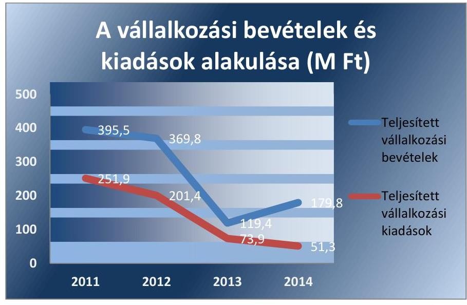

Adatforrás: ÉDUVÍZIG 2011-2014. évi éves költségvetési beszámolói, ÁSZ saját szerkesztés
Az ÉDUVÍZIG-nek vállalkozási kiadási megtakarításából és vállalkozási bevétele túlteljesüléséből 2011. évben 143,7 M Ft, 2012. évben 168,4 M Ft, 2013. évben 45,5 M Ft és 2014. évben 128,5 M Ft pénzfor-

---

galmi vállalkozási maradványa keletkezett. A 2011. évi és az előző évi vállalkozási maradványokból 2011. évben 125,2 M Ft-ot, 2012. évi pénzforgalmi vállalkozási maradványából 2012. évben 67,1 M Ft-ot használt fel alaptevékenysége ellátására. A vállalkozási maradványa utáni adófizetési kötelezettségének az ÉDUVÍZIG eleget tett.

# A KIADÁSI ELŐIRÁNYZATOK FELHASZNÁLÁSA 

SORÁN az ÉDUVÍZIG a jogszabályi előírásokat nem tartotta be. Az ellenőrzés a - 2011. évet érintően a szakmai teljesítésigazolás és az utalvány ellenjegyzések, a 2012-2014. éveket érintően a teljesítésigazolás és az érvényesítés - kulcskontrollok működtetésével összefüggésben az alábbi hibákat, hiányosságokat állapította meg:

A személyi juttatások esetében 2011. évben az utalványrendeleteken nem szerepelt az utalványozás ellenjegyzésének dátuma, amely nem felelt meg az Ámr. 78. § (2) bekezdés a) pontjában előírtaknak. 2011-ben előfordult, hogy az Ámr. 76. § (1) bekezdésében előírt szakmai teljesítésigazolást nem hajtották végre. 2012-2014. években előfordult, hogy az Ávr. 57. § (1) bekezdésében előírt teljesítésigazolást nem hajtották végre, illetve az Ávr. 58. § (1) bekezdésben előírt érvényesítési feladatokat nem végezték el. 2012-2014. években az utalványrendeleteken nem szerepelt az érvényesítés dátuma, amely nem felelt meg az Ávr. 58. § (3) bekezdésében foglaltaknak. 2011., illetve 2014. évben az ÉDUVÍZIG nem tartotta be az Ámr. 90. § (6) bekezdése, illetve az Ávr. 51. § (2) bekezdése előírásait, mivel a költségvetési szerv állományába tartozó személyekkel kötött megbízási szerződésben nem kötötték ki, hogy a megbízási díj kizárólag abban az esetben illeti meg a költségvetési szerv állományába tartozó személyt, ha a szerződésben rögzített feladat mellett a munkakörébe tartozó feladatainak is maradéktalanul eleget tett.

- A felhalmozási kiadások esetében 2011. évben az utalványrendeleteken nem szerepelt az utalványozás ellenjegyzés dátuma, amely nem felelt meg az Ámr. 78. § (2) bekezdés a) pontjában előírtaknak. 2011-ben előfordult, hogy az Ámr. 76. § (1) bekezdésében előírt szakmai teljesítésigazolást nem hajtották végre. 2012-2014. években előfordult, hogy az Ávr. 57. § (1) bekezdésében előírt teljesítésigazolást nem hajtották végre, az Ávr. 58. § (1) bekezdésben előírt érvényesítési feladatokat nem végezték el. 2012-2014. években az utalványrendeleteken nem szerepelt az érvényesítés dátuma, amely nem felelt meg az Ávr. 58. § (3) bekezdésében foglaltaknak.
- A dologi kiadásokhoz kapcsolódóan 2011. évben az utalványrendeleteken nem szerepelt az utalványozás ellenjegyzés dátuma, amely nem felelt meg az Ámr. 78. § (2) bekezdés a) pontjában előírtaknak. Előfordult, hogy az utalvány ellenjegyzését - az Ámr. 79. § (2) bekezdésében foglaltak ellenére - a szakmai teljesítésigazolás megtörténtének hiányában végezték el. 2012. évben az Ávr. 57. § (3) bekezdés előírásai ellenére nem szerepelt dátum a teljesítésigazolásokon. A kiküldetések esetében 2012-2013. években az Ávr. 58. § (1) bekezdésben előírt érvényesítési feladatokat nem végezték el. 2012-2014. években előfordult, hogy az Ávr. 57. § (1) bekezdésében előírt teljesítésigazolást nem hajtották végre, az Ávr. 58. § (1) bekezdésben elő-

---

írt érvényesítési feladatokat nem végezték el. 2013. évben az utalványrendeleteken nem szerepelt az érvényesítés dátuma, amely nem felelt meg az Ávr. 58. § (3) bekezdésében foglaltaknak. 20132014. években az Ávr. 57. § (3) bekezdés előírásai ellenére nem szerepelt dátum a teljesítésigazolásokon.
A pénzeszközátadásoknál a munkáltatói kölcsönök esetében a 2011. évben az Ámr. 76. § (1) bekezdése előírásai ellenére a szakmai teljesítésigazolást, valamint az Ámr. 78. § (2) bekezdés a) pontjában előírtak ellenére az utalvány ellenjegyzését az arra kijelölt (jogosult) személyek nem hajtották végre. A 2012-2014. éveket érintően az Ávr. 57. § (1) bekezdésében előírtak ellenére a teljesítésigazolást, valamint az Ávr. 58. § (1) bekezdésében előírtak ellenére az érvényesítést az arra kijelölt (jogosult) személyek nem végezték el.
Az ÉDUVÍZIG a dologi, illetve a felhalmozási kiadásoknál az ellenőrzött időszakban árubeszerzés, illetve távközlési szolgáltatás megrendelésére teljesített, ellenőrzött kifizetéseihez kapcsolódóan nem folytatott le közbeszerzési eljárást. A beszerzéseket egyedi megrendeléssel végezte annak ellenére, hogy a beszerzett termékekhez, szolgáltatásokhoz hasonló beszerzésekkel egybeszámítva azok értéke meghaladta a közbeszerzési értékhatárt. Ezzel 2011. évben - a Kbt..1 40. §-ában meghatározott egybeszámítási szabályokra figyelemmel - megsértette a Kbt..1 2. § (1) bekezdésében és a Kbt..1 21. §-ában előírt közbeszerzési eljárás lefolytatására vonatkozó kötelezettséget, 2012-2014. években - a Kbt. 1 18. §-ában meghatározott egybeszámítási szabályokra figyelemmel - megsértette a Kbt. 2 5. §-ában és a Kbt. 1 119. §-ában előírt közbeszerzési eljárás lefolytatására vonatkozó kötelezettséget. A 2011. évi közmunkaprogramhoz kapcsolódó eszközbeszerzésekkel megsértette a Kbt. 1 240. § (1) bekezdésében előírt közbeszerzési eljárás lefolytatásának kötelezettségét.

# 3.4. számú megállapítás 

Az intézmény bevételi és kiadási előirányzatának felhasználásához kapcsolódó évközi korlátozó intézkedéseket végrehajtották. A befizetési kötelezettségeket teljesítették. A kötelezettségvállalással terhelt maradvány megállapítása az ellenőrzött időszakban nem volt szabályszerű. Az előző évi maradvány felhasználása szabályszerű volt.

AZ IRÁNYÍTÓ SZERV előirányzat felhasználáshoz kapcsolódó évközi korlátozó intézkedése az intézményt 2011. évben és 2013. évben érintette. 2011. évben a 1025/2011. (II. 11) Korm. határozat 1. számú melléklete a VM előirányzatának 18 749,0 M Ft összegű zárolását írta elő. A VM a Korm. határozat alapján 2011. márciusban 489,9 M Ft összegű előirányzat zárolását rendelte el, amelyet 2011. augusztusban a 1282/2011. (VIII. 10.) Korm. határozat értelmében feloldottak. Ezzel egy időben az intézménytől a 2011. évi CXIV. törvény alapján 116,8 M Ft összegű előirányzatot elvontak. 2011. évben a vízügyi ágazgat működőképességének további fenntartása érdekében támogatás átcsoportosításra került sor, amely az ÉDUVÍZIG-et 54,5 M Ft költségvetési támogatás soron kívüli elvonásával érintette. 2013. évben a BM felügyeleti szervi hatáskörben előirányzat módosításról döntött, amely alapján az intézménytől 12,6 M Ft összegű előirányzatot elvontak. Az előirányzat-felhasználáshoz kapcsolódó évközi korlátozó intézkedéseket az ÉDUVÍZIG végrehajtotta.

---

2011. évben az ÉDUVÍZIG-nek 24,5 M Ft összegű kötelezettségvállalással terhelt és 0,6 M Ft összegű kötelezettségvállalással nem terhelt maradványa keletkezett. A kötelezettségvállalással nem terhelt maradvány befizetéséről az ÉDUVÍZIG a jogszabályi előírásoknak megfelelően gondoskodott. A 2012. évben 169,9 M Ft, 2013. évben 1370,1 M Ft, 2014. évben 1728,3 M Ft összegben keletkezett maradványt az ÉDUVÍZIG kötelezettségvállalással terhelt maradványként mutatta ki. A kötelezettségvállalással terhelt maradvány megállapítása az ellenőrzött időszakban nem felelt meg az Ámr. 210. § b) pontja, az Ávr. 150. § (1) bekezdés b) pontja és 46. § (1) bekezdése előírásainak. A tárgyévi kötelezettségvállalással terhelt maradványként kimutatott összegeket - az Ámr. 72. § (1) bekezdés a) pontjában, illetve az Ávr. 52. § (1) bekezdés a) pontjában előírtak ellenére - megfelelő dokumentumokkal nem támasztották alá. Előfordult, hogy a kötelezettségvállalás összege elérte az Ávr. 7. számú melléklete 16. pontjában meghatározott bruttó 5 M Ft-os értéket, azonban az ÉDUVÍZIG a Kincstár felé történő bejelentési kötelezettségének a kötelezettségvállalást követő öt munkanapon belül nem tett eleget.

# AZ ELŐZŐ ÉVI MARADVÁNY FELHASZNÁLÁSA 

megfelelt a jogszabályi előírásoknak.
Az ÉDUVÍZIG az irányító szervek felé eleget tett az előirányzat maradvánnyal kapcsolatos adatszolgáltatási kötelezettségének. Az NGM ${ }^{51}$-et a középirányító szerven keresztül tájékoztatta a tárgyéveket követő év június 30-ig a pénzügyileg nem teljesült, továbbá meghiúsult kötelezettségvállalás miatt szabaddá váló előirányzat maradványról.

## 3.5. számú megállapítás

Az intézmény zavartalan feladatellátásához a fizetőképesség folyamatos fennállása, a likviditás javítása érdekében intézkedtek.

AZ ÉDUVÍZIG 2012-2013. években - az Áht. 2 78. § (2) bekezdésében foglaltak ellenére - a bevételek beérkezésének és a kiadások teljesítésének ütemezéséről likviditási tervet nem készített. A likviditás fenntartása, figyelése érdekében likviditási tervet 2011-ben és 2014-ben készítettek.

AZ ÉDUVÍZIG LIKVIDITÁSI MUTATÓINAK alakulását az ellenőrzött időszakban az 1. táblázat mutatja be. Az ÉDUVÍZIG forgóeszközei fedezetet nyújtottak a rövid lejáratú kötelezettségekre. A pénzeszköz likviditási mutató az ellenőrzött időszakon belül a 2011. évi értékhez képest 2012-ben és 2013-ban kétszeresére nőtt, ami a pénzeszközállomány hasonló arányú növekedésének volt betudható.

1. táblázat

AZ ÉDUVÍZIG LIKVIDITÁSI MUTATÓI 2011-2013. ÉVEKBEN

|  | 2011. | 2012. | 2013. |
| :-- | :--: | :--: | :--: |
| Likviditási mutató | 3,08 | 4,53 | 2,97 |
| Pénzeszköz   likviditási mutató | 1,27 | 2,59 | 2,33 |

Adatforrás: ÉDUVÍZIG 2011-2013. évi éves költségvetési beszámolói, ÁSZ saját szerkesztés
A szállítói számlák, egyéb kötelezettségek határidőben történő kiegyenlítése részben volt biztosított. Az ÉDUVÍZIG szállítói kötelezettség állománya az ellenőrzött időszakban a 2. táblázatban bemutatott adatok szerint növekedett, ami a beruházások emelkedésével volt összefüggésben. Az

---

ÉDUVÍZIG a tartozásállomány jelentését minden hónapban megküldte a Kincstárnak, figyelemmel kísérte a szállítói tartozásokat.
2. táblázat

A SZÁLLÍTÓI KÖTELEZETTSÉGEK ÁLLOMÁNYA ÉS A LEJÁRT SZÁLLÍTÓI TARTOZÁS (M FT)

|  | 2011 | 2012 | 2013 |
| :-- | --: | --: | --: |
| Szállítói kötelezettség összesen | 177,4 | 119,5 | 402,1 |
| Lejárt szállítói tartozás | 20,0 | 3,0 | 128,0 |

Adatforrás: ÉDUVÍZIG 2011-2013. évi éves költségvetési beszámolói, ÁsZ saját szerkesztés
A LIKVIDITÁS JAVÍTÁSA ÉRDEKÉBEN az ÉDUVÍZIG 2011. évben az előirányzat-elvonások miatt kiadáscsökkentő intézkedéseket tett, amelyeket a zárolás feloldását követően is fenntartott. A takarékossági intézkedések elsősorban a telefonköltségek, az üzemanyagköltségek, az épület-üzemeltetés, karbantartás költségeinek csökkentésére irányultak, az alaptevékenység ellátása, illetve a vagyon állagának működési szinten tartása mellett. Az ÉDUVÍZIG-nek keret előrehozási kérelme 2011. évben 251,2 M Ft összegben volt. A keret-előrehozási kérelmet az intézmény támogatásának 44,8\%-ának zárolása miatt az intézmény dolgozóinak, valamint a 240-280 fő közmunkásként foglalkoztatottak munkabére kifizetésének likviditási problémájának megoldására nyújtotta be. Az intézménynek maradványtartási kötelezettsége az ellenőrzött időszakban nem volt.

A vevőkövetelések a 2011. évi 35,0 M Ft-ról 2012. évre 25,0 M Ft-ra csökkentek, azonban 2013-ra 57,0 M Ft-ra növekedtek. A 2014-ben fennálló vevőkövetelések összege 50,0 M Ft volt. A határidőn túli követelések állományának aránya 2013-ban 42,1\%-t, 2014-ben 84,0\%-ot tett ki. Az ÉDUVÍZIG-nek egyéb követelései 2011. évben voltak 2,0 M Ft összegben. A követelések jelentős részét, mintegy 50,0 M Ft értékben két partnerrel szembeni követelés tette ki. Fennálló követeléseinek behajtására az ÉDUVÍZIG tett intézkedéseket, egy esetben felszámolási eljárást kezdeményezett, egy esetben fizetési meghagyásos eljárást indított. A behajthatatlan követelésekre 100\% értékvesztést számoltak el, az értékvesztés elszámolása megfelelt a Számv. tv. 55. §. (2) bekezdése előírásainak.
3.6. számú megállapítás

A jogszabályi előírásoknak megfelelően hajtották végre az eredményszemléletű számvitel bevezetésével kapcsolatos feladatokat.

ELVÉGEZTÉK a rendező mérleg elkészítését megelőző, jogszabályban előírt feladatokat. A rendező mérleg elkészítéséhez 2013. december 31-ei mérleg fordulónappal az 36/2013. (IX. 13.) NGM rendelet ${ }^{52}$ 2. § (1) bekezdésében előírtak szerint elvégezték a teljes körű leltározást, a leltárfelvételt a 36/2013. (IX. 13.) NGM rendelet 2. § (2) bekezdése szerint hajtották végre.

# A JOGSZABÁLYBAN ELŐÍRTAKNAK MEGFELE- 

LŐEN KÉSZÍTETTÉK EL a rendező mérleget. A rendező mérleget az ÉDUVÍZIG az igazgató és a gazdasági vezető aláírásával, 2014. január 1-je fordulónappal, a 36/2013. (IX. 13.) NGM rendelet 8. §-ának megfelelő formátumban és tartalommal - az előírt átrendezéseknek megfelelően határidőben elkészítette. A rendező mérleg elkészítéséig a könyvvezetés a 36/2013. (IX. 13.) NGM rendelet 9. § előírásai szerint történt.

---

Az Áhsz. ${ }_{1}$ szerinti költségvetési számvitel nyilvántartási számlái közül legkésőbb 2014. január 31-ig megnyitották a 2013. december 31-ei fordulónappal felvett leltár alapján a követelések, kötelezettségvállalások, és a más fizetési kötelezettségek és teljesítések nyilvántartási számláit, valamint a 01-04. számlacsoport nyilvántartási számláit. A megnyitott számlákon a 2014. január 1-jétől a számlák nyitásáig bekövetkezett gazdasági eseményeket elszámolták. A 2014. évi nyitást követő rendezési feladatokat a 36/2013. (IX. 13.) NGM rendelet 10. § előírásai szerint elvégezték.

# 4. Az intézmény vagyongazdálkodása szabályszerű volt-e? 

## Összegző megállapítás

Az ÉDUVÍZIG vagyongazdálkodása nem volt szabályszerű. A vagyonkezelési szerződést a jogszabályi előírások ellenére nem foglalták a módosításokkal egységes szerkezetbe. A vagyonelemek bérbeadása során nem tartották be az átláthatóság követelményének érvényesülésére vonatkozó jogszabályi előírásokat.

### 4.1. számú megállapítás

A vagyonkezelési szerződést a jogszabályi előírások ellenére a módosítást követően nem foglalták a módosításokkal egységes szerkezetbe.

A KVI ${ }^{53}$ és az ÉDUVÍZIG között az ellenőrzött időszak megkezdését megelőzően megkötött vagyonkezelési szerződést ${ }^{54}$ 2011-ben három, 2012-ben öt, 2013-ban egy és 2014-ben öt alkalommal kiegészítették, illetve módosították. A szerződés-módosítások a jogutód MNV Zrt.-vel történtek. A szerződés hatálya alá tartozó vagyontárgyak körében változás történt, azonban a vagyonkezelési szerződést a módosításokkal a Vtvr. ${ }^{55}$ 8. § (2) bekezdésének előírásai ellenére nem foglalták egységes szerkezetbe.

A Vtvr. 8. § (3) bekezdésének és a Vtv. ${ }^{56}$ 2. § (1) bekezdésének megfelelően a szerződésben rögzítették, hogy a vagyonkezelő a vagyonkezelői jogot versenyeztetés (pályázat útján), ellenérték fejében átruházhatja, de azt megelőzően a felügyeletét ellátó szerv vezetőjének nyilatkozata szükséges, hogy az átruházással érintett tárgy nem szükséges a feladatai ellátásához. A vagyonkezelési szerződésben foglaltak szerint a vagyonkezelő bérleti, vagy haszonbérleti szerződésben hasznosíthatja a kezelt vagyont, de a 10 évnél hosszabb időre szóló bérleti, haszonbérleti szerződést csak a tulajdonosi joggyakorlóval (MNV Zrt.) való írásbeli előzetes egyeztetés alapján köthet.

A vagyonkezelési szerződés a Vtvr. 3. § (1) bekezdése szerint tartalmazta, hogy a tulajdonosi joggyakorló jogosult a vagyonkezelést ellenőrizni, különösen a fenntartásra és üzemeltetésre vonatkozó előírásokat, valamint a kincstári vagyonnal való gazdálkodás eredményességét. Az ellenőrzött időszakban az MNV Zrt. volt a tulajdonosi joggyakorló, minden egyes szerződésmódosítás, kiegészítés tartalmazta, hogy a jogutód MNV Zrt. joga és kötelezettsége a KVI-vel kötött alapszerződés szerint érvényes, a kezelésbe adott vagyon használatának ellenőrzése.

Az ÉDUVÍZIG a Vtvr. 7. § (1)-(2) bekezdései, és az Nfatv. ${ }^{57}$ 20. § (6) bekezdésének megfelelően az ingatlanokra vonatkozó vagyonkezelési szerződés módosítások megkötésétől számított harminc napon belül az ingatlan-

---

nyilvántartásba való bejegyzési kérelmet az adott földhivatalokba beadta. A kisajátítással szerzett ingatlan bejegyzési kérelmét a kormányhivatal, az adásvétellel szerzett vagyontárgy bejegyzési kérelmét az ÉDUVÍZIG nyújtotta be. A vagyonkezelési szerződésekben, illetve módosításokban szereplő ingatlanok bejegyzési kérelmeinek benyújtása az ingatlanok területi elhelyezkedése szerint illetékes földhivatalaiban történt.

A vagyonkezelési szerződésben Vtvr. 9. § (8) bekezdése, a 18. § (3) bekezdése, és a 20. § (1) bekezdése szerint rögzítették a kincstári erdőkre, a védett természeti területekre és értékekre, a termőföldekre, a műemlékekre és műemlék jellegű ingatlanokra vonatkozó védettségi, valamint az értéknövelő beruházás, felújítás, valamint a létrehozott új eszköz értékével kapcsolatos adatszolgáltatási kötelezettséget.

A Vtvr. 9. § (8) bekezdésének előírásai ellenére a vagyonkezelési szerződésben nem rögzítették a Natura 2000 terület minősítését, rendeltetését és a vagyonkezelő ehhez kapcsolódó kötelezettségeit.

Az ellenőrzött időszakban az MNV Zrt.-vel kötött szerződésmódosításokba foglalták, hogy a vagyonkezelő - figyelemmel a Vhr. 14. § (3) bekezdésében foglaltakra - az MNV Zrt. vagyon nyilvántartási szabályzatát megismerte és annak hatályos változatát magára nézve kötelező érvényűnek ismerte el, amelyben rögzítették az ellenőrzés eljárásrendjét.

Az ÉDUVÍZIG új vagyonkezelési szerződést ${ }^{58}$ az NFA-val kötött 2013. szeptember 3-án ingatlan vagyonkezelésbe adására állami alapfeladat ellátása céljából.

A szerződésmódosításokhoz, kiegészítésekhez, illetve az új vagyonkezelési szerződés megkötéséhez a Vtvr. 8. § (3) bekezdésének megfelelően a felügyeletet ellátó szerv vezetőjének egyetértése minden esetben rendelkezésre állt.

Adásvételi szerződéssel az ÉDUVÍZIG vagyonkezelésébe került eszközök esetében betartották a Vtv. 2. § (2) bekezdésében és az Nvtv. 11. § (6) bekezdésében előírtakat.

# 4.2. számú megállapítás 

A mérlegben kimutatott eszközök és források nyilvántartása, értékelése, leltározása a jogszabályok előírásainak megfelelően történt.

Az ÉDUVÍZIG a vagyonkezelésében lévő ingatlan vagyonról ingatlan nyilvántartást az MNV Zrt. által biztosított informatikai programmal vezette, a vagyonkezelésében lévő vagyontárgy állam tulajdonából bármely módon történt kikerülése, illetve a szerződés tárgyát képező ingatlan ingatlan-nyilvántartási adatainak bármely okból történt megváltozása esetében a Vtvr. 14. § (6) bekezdésében foglaltak szerint a változást az ÉDUVÍZIG harminc napon belül bejelentette a tulajdonosi joggyakorlónak.

AZ ÉDUVÍZIG VAGYONNYILVÁNTARTÁSA tartalmazta a Vtvr. 14. § (2) bekezdésében és a Vtvr. 17. § (1) bekezdésében meghatározott adatokat. A nyilvántartási kötelezettség teljesítése az eszközökre, a készletekre vonatkozóan megfelelt a Vtvr. 9. § (3) bekezdésében és az egyéb jogszabályokban, a belső szabályzatokban, valamint a vagyonkezelési szerződésben előírtaknak.

---

Az ÉDUVÍZIG számlarendje az Áhsz. 149 §-a, (3) bekezdésének és az Áhsz. 2 51. §-a (3) bekezdésének megfelelően előírta az analitikus, részletező nyilvántartások formáját, tartalmát és vezetésének módját. Év végén az Áhsz. 1 32-36. §-aiban, az Áhsz. 2 20-21. §-aiban és az eszközök és források értékelési szabályzatában előírtak szerint határozták meg a mérlegben szereplő eszközök és források bekerülési értékét.

Az ÉDUVÍZIG leltározási és leltárkészítési szabályzata és a leltározási ütemtervek meghatározták, hogy mely eszközöket kell mennyiségi felvétellel, illetve egyeztetéssel leltározni. Az intézményvezető biztosította a leltározás személyi és tárgyi feltételeit, az ellenőrzött időszak minden évében utasításban szabályozta az éves leltár lebonyolítását és annak időbeli ütemezését, valamint a leltározási bizottság összetételét, a bizottság tagjainak részére írásos megbízást adott.

Az ÉDUVÍZIG az ellenőrzött időszakban a mérlegtételek alátámasztásához a jogszabályban előírt leltározást a jogszabályi előírásoknak megfelelően elvégezte, a leltárakat összeállította. A jogszabályi előírásokban és az értékelési szabályzatban foglaltaknak megfelelően egyes mérlegsorokhoz kapcsolódóan elvégezte a szükséges értékeléseket és az analitikus, részletező nyilvántartásoknak a kapcsolódó könyvviteli és nyilvántartási számlákkal való év végi egyeztetését. A leltárakban a költségvetési évben és költségvetési évet követő években esedékes bontásban szabályszerűen szerepeltették a követeléseket, a kötelezettségeket.

A KÖVETELÉSEK állományáról negyedévenként kimutatást készítettek a főkönyvi feladáshoz. A követelések nyilvántartása megfelelt az Áhsz.1-2 előírásainak és a számlarendnek. A főkönyvi könyvelés, az analitikus nyilvántartások és a kapcsolódó könyvviteli és nyilvántartási számlák év végi egyeztetését elvégezték. Az ÉDUVÍZIG 2011-ben 60,0 M Ft, 2012ben 69,0 M Ft, 2013-ban 70,1 M Ft, 2014-ben 69,9 M Ft értékvesztést számolt el követelései után. Követelésről lemondásra az Áht. 1 108. § (2) bekezdése, Áht. 2 97. § (1) bekezdése értelmében nem került sor az ellenőrzött időszakban. Behajthatatlan követelés hitelezési veszteségként való leírására kis összegű vevői tartozás esetében került sor, a kis összegű vevői tartozást meghaladó tartozás esetében az ÉDUVÍZIG bírósági behajtással élt.

A KÖTELEZETTSÉGEK állományáról negyedévenként kimutatást készítettek a főkönyvi feladáshoz, az Áhsz. 1 51. § (1) bekezdés b) pontjában és az Áhsz. 2 51. § (3) bekezdésében foglaltaknak megfelelően. A kötelezettségek nyilvántartása megfelelt az Áhsz. 1 9. számú melléklet 4. d pontban foglaltaknak, illetve az Áhsz. 2 14. számú melléklet II. pontjában foglaltaknak.

Az ÉDUVÍZIG az ellenőrzött időszakban vagyonkezelésre, üzemeltetésre, használatba nem adott vagyont.

A feleslegessé vált, illetve megrongálódott, használhatatlanná vált eszközöket a felesleges vagyontárgyak hasznosításának és selejtezésének szabályzata előírásai szerint, szabályszerűen selejtezték, amelyről selejtezési jegyzőkönyveket készítettek.

---

### 4.3. számú megállapítás

Az ÉDUVÍZIG az értékmegőrzési, állagmegóvási kötelezettségeit a jogszabály és a vagyonkezelési szerződés előírásai szerint teljesítette.

A VAGYONKEZELÉSI SZERZŐDÉS a Vtvr. 3. § (1) bekezdésének megfelelően tartalmazta, hogy a vagyonkezelő a vagyonnal köteles felelős módon, rendeltetésszerűen gazdálkodni, a vagyon állagát és értékét megőrizni, továbbá értékét növelni. Az ÉDUVÍZIG az ellenőrzött időszakban a Vtv.-ben és a vagyonkezelési szerződésben előírt értékmegőrzési, állagmegóvási kötelezettségének eleget tett. Az állagmegőrzés érdekében tervszerű és szabályozott karbantartási munkát végeztek, amelyről szakmai beszámolót készítettek a középirányító szerv részére. Az ÉDUVÍZIG a Vtv. 27. § (8) bekezdése alapján 2013. június 28-tól a visszapótlási kötelezettség teljesítése alól mentesült.

Az ÉDUVÍZIG könyvviteli mérleg szerinti vagyona a 2011. év eleji 30 152,6 M Ft-ról 2014. év végére 39,1 \%-kal 41 929,6 M Ft-ra, a befektetett eszközök mérlegértéke a 2011. év eleji 29 283,3 M Ft-ról 33,7 \%-kal 39 153,6 M Ft-ra nőtt az ellenőrzött időszakban. A Győr-Moson-Sopron Megyei Kormányhivataltól 2014. március 18-tól átvett feladattal átvett vagyon 161,3 M Ft volt.
4.4. számú megállapítás

A vagyonelemek hasznosítása részben felelt meg a jogszabályok előírásainak. Az ÉDUVÍZIG a bérbeadási folyamat során nem győződött meg az átláthatóság követelményének érvényesüléséről.

A VAGYONHASZNOSÍTÁSI BEVÉTELI előirányzatok teljesítése kockázatosnak minősült. Az ÉDUVÍZIG vagyonhasznosítási gyakorlata az ellenőrzött időszakban részben felelt meg a jogszabályi előírásoknak. A 2012. január 1-jét követően a vállalkozásokkal kötött bérbeadási és más vagyonhasznosítási szerződéseknél és megállapodásoknál az ÉDUVÍZIG nem győződött meg a bérbeadási folyamat során az Nvtv. 11. § (10) bekezdése szerint az átláthatóság követelményének érvényesüléséről. A hasznosításra vonatkozó szerződések nem tartalmazták az Nvtv. 11. § (11) bekezdés a) pontjában előírt beszámolási, nyilvántartási, adatszolgáltatási kötelezettségeket.

A befolyt bevétel nyilvántartásba vétele az Áhsz. 1 51. § (1) bekezdése és az Áhsz. 2 52. § szerint megtörtént. Az előírt bevétel nem minden esetben folyt be határidőben és a megfelelő összegben. (Ezekben az esetekben intézkedtek a behajtás teljesülés érdekében.)

A bérbeadás, a bérleti díj megállapítása, előírása a jogszabályokban és a belső szabályozásban előírtaknak megfelelően történt. A bérleti szerződések időtartamát az Nvtv. 11. § (10) bekezdésében foglalt előírásoknak megfelelő időtartamban állapították meg.

Az ellenőrzött időszakban a jogszabályban meghatározott értékhatárt elérő, az MNV Zrt., illetve az irányító szerv engedélyéhez kötött vagyonelem értékesítésére nem került sor.

Az Nvtv. 11. § (8) bekezdésében biztosított vagyonkezelői jog harmadik személyre történő átruházására nem került sor.

---

# 5. Szabályszerűen hajtották-e végre az ellenőrzött időszakban az intézményt érintő szervezeti, szerkezeti átalakításokat? 

Összegző megállapítás Az ellenőrzött időszakban az ÉDUVÍZIG-nél átalakítás, átszervezés nem történt.

Az ÉDUVÍZIG-et az ellenőrzött időszakban az Áht. 95-96. §-aiban, valamint az Áht. 2 11. §-ában meghatározott átalakítás nem érintette. Az ellenőrzött időszakban feladatátadásokra, -átvételekre került sor jogszabályi előírások alapján.

- A 300/2011. (XII. 22.) Korm. rendelettel módosított 347/2006. (XII. 23.) Korm. rendelet 33/A. § (1) bekezdés a-g, i pontjai, (2) bekezdés 1., 3. és 5. pontjai, valamint 41/A-B. §-ai alapján 2012. január 1-jei hatállyal az ÉDUVÍZIG részéről a NeKI részére átadásra kerültek környezetvédelmi feladatok.
- A 221/2004. (VII. 21.) Korm. rendelet 3. § (3) bekezdése, a 482/2013. (XII. 17.) Korm. rendelet 9. § (1) bekezdés c-f, h, j pontjai, 9. § (5) bekezdés b pontja, 9. § (6) bekezdés c-e pontjai, 7. §-a, 15. §-a, valamint az 1995. évi LVII. törvény 3. § (2) bekezdése alapján 2014. január 1-jei hatállyal az ÉDUVÍZIG feladatokat vett át a NeKI-től, vagyonelemeket (ingatlanokat) a Győr-Moson-Sopron Megyei Kormányhivataltól és a Vas Megyei Kormányhivataltól.
- A 223/2014. (IX.4.) Korm. rendelet 10. és 19. §-ai alapján 2014. szeptember 10-ei hatállyal az ÉDUVÍZIG-től a Győr-Moson-Sopron Megyei Katasztrófavédelmi Igazgatósághoz kerültek át elsőfokú vízügyi hatósági és szakhatósági feladatok.

## 6. Az intézmény intézkedett-e az integritás szemlélet érvényesítése érdekében?

## Összegző megállapítás

Az ÉDUVÍZIG az integritás érvényesítése érdekében tett intézkedéseket.

AZ ÁSZ INTEGRITÁS PROJEKTJÉBEN az ÉDUVÍZIG jelen ellenőrzést megelőzően részt vett, ezért az integritás kontrollrendszerének értékelése egyszerűsített kérdőív alapján történt. Az integritás érvényesítése érdekében alkalmazott kontroll-rendszer elemek értékelését a II. sz. melléklet tartalmazza.

---

# JAVASLATOK 

Az ÁSZ tv. ${ }^{59}$ 33. § (1) bekezdésében foglaltak értelmében az ellenőrzött szervezet vezetője köteles a jelentésben foglalt megállapításokhoz kapcsolódó intézkedési tervet összeállítani és azt a jelentés kézhezvételétől számított 30 napon belül az ÁSZ részére megküldeni. Amennyiben az ellenőrzött szervezet vezetője nem küldi meg határidőben az intézkedési tervet, vagy továbbra sem elfogadható intézkedési tervet küld, az ÁSZ elnöke az ÁSZ tv. 33. § (3) bekezdés a)-b) pontjaiban foglaltakat érvényesítheti.

## az Észak-dunántúli Vízügyi Igazgatóság igazgatójának

1. Intézkedjen, hogy a jogszabályi előírásnak megfelelően a Szervezeti és Müködési Szabályzat tartalmazza az egyes szervezeti egységek feladatait.
(2.1. számú megállapítás 1. bekezdése alapján)
2. Intézkedjen, hogy a jogszabályi előírásoknak megfelelően a gazdasági ügyrend tartalmazza a gazdasági szervezet alkalmazottainak feladités hatáskörét, valamint a helyettesítés rendjét a szervezeti egységek alkalmazottainak tekintetében is.
(2.1. számú megállapítás 2. bekezdése alapján)
3. Intézkedjen a jogszabályi előírással összhangban a számviteli politikában a költségvetési és a pénzügyi számvitel alkalmazásával kapcsolatos sajátos szabályok, előírások, módszerek rögzítésére.
(2.1. számú megállapítás 5. bekezdése alapján)
4. Intézkedjen, hogy a pénzkezelési szabályzat a jogszabályi előírással összhangban tartalmazza a napi készpénz záró állomány maximális mértékét.
(2.1. számú megállapítás 9. bekezdése alapján)
5. Tegyen eleget az intézményi hatáskörben végrehajtott előirányzat-módosításokról az intézkedés meghozatalát követően az irányító szerv felé fennálló tájékoztatási kötelezettségnek.
(3.2. számú megállapítás 1. bekezdése alapján)

---

6. Intézkedjen, hogy a gazdálkodási jogkörök gyakorlása megfeleljen a jogszabályi előírásoknak.
(3.3. számú megállapítás 3. bekezdés 1-4. pontja alapján)
7. Intézkedjen, hogy a költségvetési szerv állományába tartozó személlyel kötött megbizási szerződésben elöirják, hogy a dij kizárólag abban az esetben illeti meg a költségvetési szerv állományába tartozó személyt, ha a szerzödésben rögzített feladat mellett a munkakörébe tartozó feladatainak is maradéktalanul eleget tett.
(3.3. számú megállapítás 3. bekezdés 1. pontja alapján)
8. Intézkedjen
a) a jogszabályban meghatározott esetekben a közbeszerzési eljárások lefolytatására;
b) tegyen intézkedéseket a feltárt szabálytalanságok tekintetében a felelösség tisztázása érdekében, és szükség szerint intézkedjen a felelösség érvényesitésére.
(3.3. számú megállapítás 4. bekezdése alapján)
9. Intézkedjen, hogy
a) a kötelezettségvállalással terhelt maradvány megállapítása feleljen meg a jogszabályi elöírásoknak;
b) a kötelezettségvállalással terhelt maradványként kimutatott összegeket jogszabályi előírásnak megfelelő dokumentumokkal támaszszák alá;
c) tegyen eleget a Kincstár felé történő bejelentési kötelezettségének a kötelezettségvállalást követő öt munkanapon belül.
(3.4. számú megállapítás 2. bekezdése alapján)
10. Kezdeményezze, hogy a vagyonkezelési szerződésben a jogszabályi előirással összhangban rögzitésre kerüljön a Natura 2000 terület minösitése, rendeltetése és a vagyonkezelőként ehhez kapcsolódó kötelezettségei.
(4.1. számú megállapítás 6. bekezdése alapján)
11. Intézkedjen, hogy a vagyon hasznosítása során
a) az átláthatósági követelményt a jogszabályi előírásoknak megfelelően érvényesitsék;
b) a vagyon hasznosítására vonatkozó szerződések tartalmazzák a jogszabályban elöirt beszámolási, nyilvántartási, adatszolgáltatási kötelezettségeket.
(4.4. számú megállapítás 1. bekezdése alapján)

---

.

---

# MELLÉKLETEK 

- I. SZ. MELLÉKLET: ÉRTELMEZŐ SZÓTÁR
állami vagyon
állami vagyonnak minősül:
a) az állam tulajdonában lévő dolog, valamint a dolog módjára hasznosítható természeti erő,
b) az a) pont hatálya alá nem tartozó mindazon vagyon, amely vonatkozásában törvény az állam kizárólagos tulajdonjogát nevesíti,
c) az állam tulajdonában lévő tagsági jogviszonyt megtestesítő értékpapír, illetve az államot megillető egyéb társasági részesedés,
d) az államot megillető olyan immateriális, vagyoni értékkel rendelkező jogosultság, amelyet jogszabály vagyoni értékű jogként nevesít
(Forrás: Vtv. 1. § (2) bekezdése)
állami vagyon értékesítése
állami vagyon használója
állami vagyon hasznosítása
állami vagyon hasznosítására kötött szerződés
állami vagyon kezelője /vagyonkezelő

Állami vagyonnak a (Forrás: Vtvr. 1. § (7) bekezdés d) pontja)
Az a természetes személy, jogi személy, illetve jogi személyiséggel nem rendelkező szervezet, amely, illetve aki törvény vagy szerződés alapján, bármely jogcímen (pl. bérlet, haszonbérlet, VSZ, használat stb.) állami vagyont birtokol, használ, szedi annak hasznait, hasznosít, ide nem értve a tulajdonosi jogok gyakorlóját. (Forrás: Vtvr. 1. § (7) bekezdés a) pontja, hatályos 2011. január 1-jétől 2011. december 31-ig)

Az a természetes vagy jogi személy, jogi személyiséggel nem rendelkező szervezet, aki, vagy amely törvény vagy szerződés alapján, bármely jogcímen (bérlet, haszonbérlet, használat stb.) állami vagyont birtokol, használ, szedi annak hasznait, hasznosít, ide nem értve a haszonélvezőt, a vagyonkezelőt és a tulajdonosi jogok gyakorlóját. (Forrás: Vtvr. 1. § (7) bekezdés a) pontja)
Az állami vagyont az MNV Zrt. maga kezeli, vagy szerződés - így különösen bérlet, haszonbérlet, szerződésen alapuló haszonélvezet, vagyonkezelés, megbízás - alapján központi költségvetési szervnek, természetes vagy jogi személynek, vagy jogi személyiséggel nem rendelkező gazdálkodó szervezetnek hasznosításra átengedi. (Forrás: Vtv. 23. § (1) bekezdése, hatályos 2011. december 31-éig)
Az állami vagyont az MNV Zrt. maga kezeli, vagy szerződés - így különösen bérlet, haszonbérlet, megbízás - alapján központi költségvetési szervnek, természetes vagy jogi személynek, vagy jogi személyiséggel nem rendelkező gazdálkodó szervezetnek hasznosításra átengedi. (Forrás: Vtv. 23. § (1) bekezdése, hatályos 2012. január 1jétől)
Az állami vagyonnal a tulajdonosi joggyakorló maga gazdálkodik, vagy szerződés - így különösen bérlet, haszonbérlet, megbízás - alapján hasznosításra átengedi, illetőleg vagyonkezelésbe, haszonélvezetbe adja. Forrás: Vtv. 23. § (1) bekezdése, hatályos 2013. június 28 -ától)
Az állami vagyon hasznosítására kötött szerződések elsődleges célja az állami vagyon hatékony működtetése, állagának védelme, értékének megőrzése, illetve gyarapítása, az állami és közfeladatok ellátásának elősegítése. (Forrás: Vtv. 23. § (2) bekezdése)
Az állami vagyont az MNV Zrt. maga kezeli, vagy szerződés - így különösen bérlet, haszonbérlet, szerződésen alapuló haszonélvezet, vagyonkezelés, megbízás - alapján központi költségvetési szervnek, természetes vagy jogi személynek, illetőleg jogi személyiséggel nem rendelkező gazdasági társaságnak hasznosításra átengedi (Forrás: Vtv. 23. § (1) bekezdése, hatályos 2010. január 01 - 2011. december 31-ig).

---

ÁSZ Integritás Projekt
átalakítás
belső ellenőrzés
belső kontrollrendszer
ellenőrzési nyomvonal

Az állami vagyont az MNV Zrt. maga kezeli, vagy szerződés - így különösen bérlet, haszonbérlet, megbízás - alapján központi költségvetési szervnek, természetes vagy jogi személynek, vagy jogi személyiséggel nem rendelkező gazdálkodó szervezetnek hasznosításra átengedi." Az állami vagyonra vonatkozóan az MNV Zrt. kizárólag az Nvtv.-ben meghatározott személyekkel köthet VSZ-t. (Forrás: Vtv. 27. § (1) bekezdése, hatályos 2012. január 1-jétől)
Az Állami Számvevőszék 2009-ben indította el a „Korrupciós kockázatok feltérképezése - Integritás alapú közigazgatási kultúra terjesztése" című, európai uniós forrásból megvalósított kiemelt projektjét (Integritás Projekt). Az Integritás Projekt célja, hogy felmérje a közszféra intézményei korrupciós kockázatoknak való kitettségét, illetőleg az azok mérséklésére hivatott kontrollok szintjét. Az Állami Számvevőszék a projekt révén az integritás szemlélet minél szélesebb körrel történő megismertetését, gyakorlatba ültetését kívánja elérni. Az integritás követelményeinek megfelelő szervezeti működést előnyben részesítő közigazgatási kultúra elterjesztését és a korrupció elleni fellépést az ÁSZ önmagára nézve is stratégiai jelentőségű célként fogalmazta meg. A projekt a felmérésben résztvevő intézmények számára helyzetükről egyfajta „tükörképet" mutat be, ami alapot teremt a jövőbeni pozitív irányú elmozduláshoz. (Forrás: a http://integritas.asz.hu honlapon közzétett, a 2013. évi Integritás felmérés eredményeiről készült összefoglaló tanulmány)
Az általános jogutódlással történő megszüntetés átalakítással történhet. Az átalakítás lehet egyesítés vagy különválás. Az egyesítés lehet beolvadás vagy összeolvadás. (Forrás: Áht.1 95. §-a, Áht. 1 11. §-a)
Független, tárgyilagos bizonyosságot adó és tanácsadó tevékenység, amelynek célja, hogy az ellenőrzött szervezet múködését fejlessze és eredményességét növelje, az ellenőrzött szervezet céljai elérése érdekében rendszerszemléletű megközelítéssel és módszeresen értékeli, illetve fejleszti az ellenőrzött szervezet irányítási és belső kontrollrendszerének hatékonyságát. (Forrás: Bkr. 2. § b) pontja)
A belső kontrollrendszer a költségvetési szerv által a kockázatok kezelésére és tárgyilagos bizonyosság megszerzése érdekében kialakított folyamatrendszer, amely azt a célt szolgálja, hogy a költségvetési szerv megvalósítsa a következő fő célokat: a tevékenységeket (műveleteket) szabályszerűen, valamint a megbízható gazdálkodás elveivel (gazdaságosság, hatékonyság és eredményesség) összhangban hajtsa végre; teljesítse az elszámolási kötelezettségeket; megvédje a szervezet erőforrásait a veszteségektől (károktól) és a nem rendeltetésszerű használattól. (Forrás: Áht. 1 120/B § (1) bekezdés, hatályos: 2009. január 1-jétől 2011. december 31-ig)

A belső kontrollrendszer a kockázatok kezelése és tárgyilagos bizonyosság megszerzése érdekében kialakított folyamatrendszer, amely azt a célt szolgálja, hogy megvalósuljanak a következő célok: a müködés és gazdálkodás során a tevékenységeket szabályszerűen, gazdaságosan, hatékonyan, eredményesen hajtsák végre, az elszámolási kötelezettségeket teljesítsék, és megvédjék az erőforrásokat a veszteségektől, károktól és nem rendeltetésszerű használattól. (Forrás: Áht. 2 69. § (1) bekezdés, hatályos: 2012. január 1-jétől)
A belső kontrollrendszer területei: a kontrollkörnyezet, a kockázatkezelési rendszer, a kontrolltevékenységek, az információs és kommunikációs rendszer, valamint a nyomon követési (monitoring) rendszer. (Forrás: Bkr. 3. §-a)
Az ellenőrzési nyomvonal a költségvetési szerv működési folyamatainak szöveges vagy táblázatba foglalt, vagy folyamatábrákkal szemléltetett leírása, amely tartalmazza különösen a felelősségi és információs szinteket és kapcsolatokat, továbbá irányítási és ellenőrzési folyamatokat, lehetővé téve azok nyomon követését és utólagos ellenőrzését. (Forrás: az NGM honlapjáról elérhető Belső Kontroll kézikönyv PM 2010. 35. oldal)

---

előirányzat-maradvány Az államháztartás központi alrendszerébe tartozó költségvetési szerveknél a módosított bevételi és kiadási előirányzatok és azok teljesítésének a Kormány rendeletében meghatározott tételekkel korrigált különbözete az előirányzat-maradvány. (Forrás: Áht. 2 2. § (1) bekezdés m) pontja).
előirányzat-módosítás Az előirányzat-módosítás: a megállapított kiadási, bevételi, támogatási kiemelt előirányzat, létszám-előirányzat növelése vagy csökkentése. (Forrás Áht. 1 2/A. § (3) bekezdés k) pont, hatályos: 2011. december 31-ig)
Előirányzat-módosítás: a megállapított kiadási előirányzat növelése vagy csökkentése, a bevételi előirányzatok egyidejű növelése vagy csökkentése mellett. (Forrás: Áht. 2 2. § (1) bekezdés f) pontja, hatályos: 2012. január 1-jétől).
felújítás Az elhasználódott tárgyi eszköz eredeti állaga (kapacitása, pontossága) helyreállítását szolgáló időszakonként visszatérő olyan tevékenység, melynek során az eszköz élettartama megnövekszik, minősége, használata jelentősen javul, így a pótlólagos ráfordításból a jövőben gazdasági előnyök származnak. (Forrás: Számv. tv. 3. § (4) bekezdés 8. pontja)
FEUVE
Folyamatba épített, előzetes, utólagos és vezetői ellenőrzés. A FEUVE a szervezeten belül a gazdálkodásért felelős szervezeti egység által folytatott első szintű pénzügyi irányítási és ellenőrzési rendszer.
A folyamatba épített előzetes és utólagos vezetői ellenőrzésre vonatkozó szabályokat Áht.1,2, valamint az Ámr. határozza meg. Kidolgozására a pénzügyminisztérium költségvetési ellenőrzéssel kapcsolatban közzétett módszertani útmutatói, illetve ajánlásai figyelembevételével került sor. (Források: 2010. I. 1.-jétől: Ámr. 155. § (1) bekezdés, 2012. I. 1.-jétől: Bkr. 8. § (2) bekezdés)
hasznosítás
információs és kommunikációs rendszer
irányító szerv/felügyeleti szerv
integritás
intézkedési terv
kockázat

A nemzeti vagyon birtoklásának, használatának, hasznok szedése jogának bármely a tulajdonjog átruházását nem eredményező - jogcímen történő átengedése, ide nem értve a vagyonkezelésbe adást, valamint a haszonélvezeti jog alapítását. (Forrás: Nvtv. 3. § (1) bekezdés 4. pontja)
A költségvetési szerv vezetője által kialakított és múködtetett olyan rendszer, mely biztosítja, hogy a megfelelő információk a megfelelő időben eljutnak az illetékes szervezethez, szervezeti egységhez, illetve személyhez. (Forrás: Bkr. 9. § (1) bekezdés)
A költségvetési szerv tekintetében az e törvényben meghatározott irányítási hatáskört gyakorló szerv. (Forrás: Áht. 2 1. § 9. pontja)
Az integritás az elvek, értékek, cselekvések, módszerek, intézkedések konzisztenciáját jelenti, vagyis olyan magatartásmódot, amely meghatározott értékeknek megfelel. (Forrás: NGM Útmutató: Magyarországi államháztartási belső kontroll standardok 1.6.1. pont, 2012. december)
Az államigazgatási szerv múködésére vonatkozó szabályoknak, valamint a hivatali szervezet vezetője és az irányító szerv által meghatározott célkitűzéseknek, értékeknek és elveknek megfelelő múködés. (Forrás: 50/2013. (II. 25.) Korm. rendelet 2. § a) pont.)
Az ellenőrzési javaslatok alapján az ellenőrzött szervezet, szervezeti egység által készített intézkedések végrehajtásának ütemezése a végrehajtásáért felelős személyek és a vonatkozó határidők megjelölésével. (Forrás: 370/2011. (XII. 31.) Korm. rendelet 2. § (k) pontja, hatályos 2012. január 1-jétől)
A kockázat annak a valószínűségét jelenti, hogy egy vagy több esemény vagy intézkedés nem kívánt módon befolyásolja a rendszer múködését, céljainak megvalósulását. (Forrás: Javaslatok a korrupciós kockázatok kezelésére - Kockázatkezelési és ellenőrzési módszertan 35. oldal, ÁSZ)

---

kockázatkezelési rendszer

kontrollkörnyezet
kontrolltevékenységek
kommunikáció
korrupció
középirányító szerv
közfeladat
kulcskontrollok
likviditási mutató
monitoring
monitoring rendszer

Olyan irányítási eszközök és módszerek összessége, melynek elemei a szervezeti célok elérését veszélyeztető tényezők (kockázatok) azonosítása, elemzése, csoportosítása, nyomon követése, valamint szükség esetén a kockázati kitettség mérséklése. (Forrás: Bkr. 2. § m) pontja)
A költségvetési szerv vezetője által kialakított olyan elvek, eljárások, belső szabályzatok összessége, amelyben világos a szervezeti struktúra, egyértelműek a felelősségi, hatásköri viszonyok és feladatok, meghatározottak az etikai elvárások a szervezet minden szintjén, átlátható a humán-erőforráskezelés. (Forrás: Bkr. 6. § (1) bekezdés) A költségvetési szerv vezetője által a szervezeten belül kialakított (kontroll) tevékenységek, melyek biztosítják a kockázatok kezelését, hozzájárulnak a szervezet céljainak eléréséhez. (Forrás: Bkr. 8. § (1) bekezdés)
Az a tevékenység, melynek során információ továbbítása valósul meg. A kommunikációs folyamat résztvevői között tájékoztatás történik, mely során tényeket, ezek magyarázatát közlik.
Azok a cselekmények, amelyek során a köz érdekében való eljárással megbízott és döntéshozatali felelősséggel felruházott személy a köz érdeke helyett önös vagy részérdekeket követve, mástól jogtalan vagy etikátlan előnyt elfogadva és őt jogtalan vagy etikátlan előnyhöz juttatva jár el, illetve amikor valaki a köz érdekében való eljárással megbízott és döntéshozatali felelősséggel felruházott személynek jogtalan vagy etikátlan előnyt nyújtva vagy felajánlva jogtalan vagy etikátlan előnyt kér. (Forrás: A Kormány korrupció megelőzési programja 2012-2014.)
A költségvetési szerv tekintetében törvény vagy kormányrendelet alapján meghatározott, átruházott irányítási hatásköröket gyakorló szerv. (Forrás: Áht.; 9. § (4) bekezdés)
Jogszabályban meghatározott állami vagy önkormányzati feladat, amit az arra kötelezett közérdekből, a jogszabályban meghatározott követelményeknek és feltételeknek megfelelve végez, ideértve a lakosság közszolgáltatásokkal való ellátását, továbbá az állam nemzetközi szerződésekben vállalt kötelezettségeiből adódó közérdekű feladatokat, valamint e feladatok ellátásakor szükséges infrastruktúra biztosítását is.
(Forrás: Nvtv. 3. § (1) bekezdés 7. pontja)
A kiadások utalványozását megelőző kötelező kontrolltevékenységek. Az Ámr. a 2011. évben a szakmai teljesítésigazolást és az utalvány ellenjegyzését, az Ávr. a 2012-2013. években a teljesítésigazolást és az érvényesítést írta elő egyenrangú kulcskontrollként.
A mutató kifejezi, hogy a szervezet forgóeszközei milyen mértékben nyújtanak fedezetet a rövid lejáratú kötelezettségekre az éves könyvviteli mérleg adatai alapján. Számítása: Forgóeszközök összesen/ Rövid lejáratú kötelezettségek összesen.
A monitoring a különböző szintű szervezeti célok megvalósításának folyamatát kíséri figyelemmel, melynek során a releváns eseményekről és tevékenységekről (együtt: folyamatokról) rendszeres jelleggel, strukturált, döntéstámogató információkhoz jutnak a szervezet vezetői. (Forrás: Nemzetgazdasági Minisztérium útmutató a költségvetési szervek monitoring rendszeréhez 3. oldal, 2011. november)
A költségvetési szerv vezetője köteles olyan monitoring rendszert működtetni, mely lehetővé teszi a szervezet tevékenységének, a célok megvalósításának nyomon követését. A költségvetési szerv monitoring rendszere az operatív tevékenységek keretében megvalósuló folyamatos és eseti nyomon követésből, valamint az operatív tevékenységektől függetlenül működő belső ellenőrzésből áll. (Forrás: Ámr. 160. §, Bkr. 10. §)

---

pénzeszköz likviditási mu- Pénzeszközök összesen/Rövid lejáratú kötelezettségek összesen tató

A 2014. évi számviteli változások miatt a mutató összetétele megváltozott. (Forrás: ellenőrzés módszerei)
tulajdonosi joggyakorló Aki a nemzeti vagyon felett az államot vagy a helyi önkormányzatot megillető tulajdonosi jogok és kötelezettségek összességének gyakorlására jogosult. (Forrás: Nvtv. 3. § (1) bekezdés 17. pontja)
vagyongazdálkodás A nemzeti vagyongazdálkodás feladata a nemzeti vagyon rendeltetésének megfelelő, az állam, az önkormányzat mindenkori teherbíró képességéhez igazodó, elsődlegesen a közfeladatok ellátásához és a mindenkori társadalmi szükségletek kielégítéséhez szükséges, egységes elveken alapuló, átlátható, hatékony és költségtakarékos múködtetése, értékének megőrzése, állagának védelme, értéknövelő használata, hasznosítása, gyarapítása, továbbá az állam vagy a helyi önkormányzat feladatának ellátása szempontjából feleslegessé váló vagyontárgyak elidegenítése. (Forrás: Nvtv. 7. § (2) bekezdése)
vezetői nyilatkozat A költségvetési szerv vezetője köteles - az előírt tartalmú - nyilatkozatban értékelni a költségvetési szerv belső kontrollrendszerének minőségét és azt az éves költségvetési beszámolóval együtt megküldeni az irányító szervnek. Ha a költségvetési szervnél év közben változás történik a szerv vezetője személyében, vagy a költségvetési szerv átalakul, megszűnik, a távozó vezető, illetve az átalakuló, megszűnő költségvetési szerv vezetője köteles az előírt tartalmú nyilatkozatot az addig eltelt időszak vonatkozásában kitölteni, és az új vezetőnek, illetve a jogutód költségvetési szerv vezetőjének átadni, aki azt saját nyilatkozatához mellékeli. Jelen ellenőrzés során vezetői nyilatkozaton a fentebb említett nyilatkozatokban tett következő résznyilatkozatot értjük, ennek helytállóságát értékeljük a pénzügyi és vagyongazdálkodási folyamatok tekintetében: „gondoskodtam (...) a költségvetési szerv tevékenységében a hatékonyság, eredményesség és a gazdaságosság követelményeinek érvényesítéséről". (Forrás: Ámr. 217. § c) pontja, 226. § (3) bekezdés, 21. számú melléklet; Bkr. 11. § (1) és (4) bekezdés, 1. számú melléklet)

---

# AZ ÉDUVÍZIG ÁLTAL KITÖLTÖTT INTEGRITÁS TANÚSÍTVÁNY KIÉRTÉKELÉ- 

SÉNEK EREDMÉNYE ALAPJÁN integritási tevékenysége megfelelő.

Az „Összeférhetetlenség és etikai elvárások", a „Nemkívánatos dolgozói magatartással szembeni intézkedések és azok érvényesülése" kontrollrendszer-elemek értékelése „kiváló", a „Humánerőforrás-gazdálkodás", a „Szervezet vagyonának megvédésére tett intézkedések" és az „Integritás erősítése, annak tudatosítása, valamint a kockázatelemzések alkalmazása" kontroll-rendszer elemek az e területeken feltárt, alábbi hiányosságok következtében „megfelelő" minősítést kaptak:
—_ Az új munkatársak kiválasztásakor nem minden esetben írtak ki álláspályázatot.
—_ Nem szabályozták a külső személyekkel való kapcsolattartást.
—_ Az ÉDUVÍZIG a korrupciós szempontból érzékeny területen dolgozók figyelmét nem hívta fel a jellemző kockázatokra és a kockázatokat megelőző intézkedésekre, az integritással kapcsolatos intézkedéseket nem szabályozta és nem végzett rendszeres korrupciós kockázatelemzést.

---

# - III. SZ. MELLÉKLET: A TELJESÍTMÉNY-ELLENŐRZÉSI KIEGÉSZÍTŐ MODUL MEGÁLLAPÍTÁSAI - ÉSZAK-DUNÁNTÚLI VÍZÚGYI IGAZGATÓSÁG 

A PÉNZÜGYI ÉS VAGYONGAZDÁLKODÁS FOLYAMATÁBAN a gazdaságossági és eredményességi követelmények kialakítása az ÉDUVÍZIG részéről megtörtént. A pénzügyi és vagyongazdálkodás folyamatában az ellenőrzött időszakban hatékonysági követelményeket nem határoztak meg.

Az ÉDUVÍZIG a monitoring stratégiában és az éves feladattervekben, illetve munkatervekben tűzött ki a pénzügyi és vagyongazdálkodás részfolyamatában elérendő célokat, azonban azokhoz nem minden esetben rendelte hozzá az elérendő követelményeket. Az ÉDUVÍZIG rendelkezett gyűjtött mutatókkal, amely mutatók alkalmazása a gazdálkodás során meghozott döntéseket alátámasztására alkalmasak voltak. Az ÉDUVÍZIG a pénzügyi és vagyongazdálkodás ellenőrzéssel érintett részterületeiből négynél (az előirányzat gazdálkodásban a szakágazati kiadások értékelésére, a vagyongazdálkodás esetében a gépjármú állomány cseréjére, a létszám tekintetében a közfoglalkoztatottak számának alakulására, valamint a szakmai feladat ellátáshoz szükséges többlet létszám alakulására) alakított ki mutatószámokat.

Az ellenőrzött időszakban az ÉDUVÍZIG függetlenített belső ellenőrzése teljesítményellenőrzéseket végzett a szervezetben gyűjtött és rendelkezésre álló adatok felhasználásával, értékelésével. Elemzést végzett a közbeszerzési eljárások megvalósítása, az elnyert európai uniós források felhasználása; a gépjárművek, kisgépek és berendezések üzemeltetése, állagmegóvása; a vezetékes telefonok lemondásából származó költségmegtakarítások alakulása; a hivatali gépjárművek használatának, karbantartási terveinek ellenőrzése; az üzemanyagkártyák használata, az üzemeltetési költségek mértéke és elszámolása; a megfogalmazott minőségügyi célok teljesítése tárgyában.

A gazdaságosság érdekében az ÉDUVÍZIG 2011-ben, az irányító szerv 2012-ben és 2013-ban takarékossági intézkedéseket tett.

2013-2014. években a gépjárművek és a számítástechnikai eszközök tervezett cseréjét biztosították. A többletlétszámra vonatkozóan meghatározott mutató adatok nem teljesültek. A 2013. évben a közfoglalkoztatottak száma nem érte el a tervezett értéket. A szakmai feladatellátáshoz 2013-2014. évben igényelt 20-30 fős létszámtöbbletet az irányító szerv nem engedélyezte, annak pénzügyi feltételeit nem biztosította.

A szakmai feladatellátást a minőségbiztosítási rendszer, valamint a szakmai beszámolási rendszer keretében értékelték.

---

|  Mérlegsor megnevezése | 2011.12.31.
U1. ühap | 2012.12.31.
U1. ühap | 2013.12.31.
U1. ühap | 2014.12.31.
U2. ühap  |
| --- | --- | --- | --- | --- |
|  IMMATERIAUS JAVAK | 1 246 779 | 1 272 863 | 1 408 378 | 1 579 636  |
|  TÁRGYI ESZKÖZÖK | 27 970 909 | 25 363 176 | 28 511 144 | 37 573 968  |
|  Ingatlanok és kapcsolódó vagyonértékű jogok | 22 641 596 | 20 102 985 | 19 223 017 | 21 571 417  |
|  BEFEKTETETT PÉNZÜGYI ESZKÖZÖK | 6 288 | 11 147 | 9 529 | 0  |
|  ÜZEMELTETÉSRE KEZELÉSRE ÁTADOTT VAGYONKEZELÉSBE VETT ESZKÖZÖK (2014.01.01-jétől eszközfajtánként beolvadt az A és B fejezetbe tartozó eszközök közél/ itt KONCESSZIÓBA, VAGYONKEZELÉSBE ADOTT ESZKÖZÖK | 366 171 | 351 887 | 337 604 | 0  |
|  BEFEKTETETT ESZKÖZÖK ÖSSZESEN (2014.01.01-jétől csökkentett tartalommal A) beosztó vagyonba tartozó befektetett eszközök nek felel meg) | 29 590 147 | 26 999 073 | 30 266 655 | 39 153 608  |
|  KÉSZLETEK | 244 974 | 378 260 | 456 566 | 469 850  |
|  KÖVETELÉSEK (2014.01.01-től teljesen újrastrukturált, az összetétel nem összehasonlítható, a befektetett eszközök közül is kerültek át eszközök ide) | 36 795 | 27 145 | 58 577 | 1 415 135  |
|  ÖTTÉKPAPÍROK | 0 | 0 | 0 | 0  |
|  PÉNZESZKÖZÖK (tartalma bővült, összetétele változott 2014.01.01-jétől) | 224 606 | 551 811 | 1 889 701 | 886 824  |
|  EGYÉB AKTÍV PÉNZÜGYI ELSZÁMOLÁSOK (2013.12.31-ig) | 39 257 | 7 322 | 3 914 | 0  |
|  EGYÉB SAJÁTOS ESZKÖZOLDALI ELSZÁMOLÁSOK (2014.01.01-jétől) |  |  |  | 0  |
|  AKTÍV IDŐBELI ELHATÁROLÁSOK (2014.01.01-jétől) |  |  |  | 4 141  |
|  ESZKÖZÖK ÖSSZESEN | 30 135 779 | 27 963 611 | 32 675 413 | 41 929 554  |
|  SAJÁT TŐKE (2014.01.01-jétől tartalma bővült, idetartoznak a Tartalékok is, szerkezete megváltozott) | 29 703 367 | 27 195 056 | 29 975 605 | 31 044 780  |
|  TARTALÉKOK (2014.01.01.-jétől a saját tőke része a III. Egyéb eszközök indulásban értéke és változása) mérlegsorba tartozik |  |  |  | 1 883 578  |
|  KÖTELEZETTSÉGEK (EGYÉB PASSZÍV PÚJ I ELSZ NÉLKÜL) | 177 417 | 213 069 | 812 317 | 2 930 138  |
|  EGYÉB PASSZÍV PÉNZÜGYI ELSZÁMOLÁSOK 2013.12.31-ig | 133 819 | 188 158 | 274 468 | 0  |
|  EGYÉB SAJÁTOS FORRÁSOLDALI ELSZÁMOLÁSOK (2014.01.01-jétől) |  |  |  | 0  |
|  KINCSTÁRI SZÁMLAVEZETÉSSEL KAPCSOLATOS ELSZÁMOLÁSOK (2014.01.01-jétől) |  |  |  | 0  |
|  PASSZÍV IDŐBELI ELHATÁROLÁSOK (2014.01.01-jétől) |  |  |  | 7 954 636  |
|  FORRÁSOK ÖSSZESEN | 30 135 779 | 27 963 611 | 32 675 413 | 41 929 554  |

---

# FÜGGELÉK: ÉSZREVÉTELEK 

Az Állami Számvevőszék a jelentéstervezetet 15 napos észrevételezésre megküldte az ellenőrzött szervezetek vezetőinek az ÁSZ tv. 29. $\xi^{*}$ (1) bekezdése előírásának megfelelően.

A Belügyminisztérium, az Országos Vízügyi Főigazgatóság, valamint az Észak-dunántúli Vízügyi Igazgatóság részéről az ellenőrzött szervezet vezetője az ellenőrzés megállapításaira írásban észrevételt tett. A földmüvelésügyi miniszter az ÁSZ tv. 29. § (2) bekezdésében foglalt észrevételezési jogával nem élt, a törvényes határidőn belül észrevételt nem tett.

Az elfogadott észrevételek alapján az Állami Számvevőszék módosította a jelentést.
A függelék tartalmazza az ellenőrzött szervezetek vezetőinek az észrevételeit és az azokra adott válaszokat, az elfogadott és az el nem fogadott észrevételekről, azok indokairól szóló tájékoztatásokat.

[^0]
[^0]:    * 29. § (1) Az Állami Számvevőszék az ellenőrzési megállapításait megküldi az ellenőrzött szervezet vezetőjének vagy az általa megbízott személynek, és annak, akinek személyes felelősségét állapította meg.
    (2) Az ellenőrzött szervezet vezetője és a felelősként megjelölt személy az ellenőrzés megállapításaira tizenöt napon belül írásban észrevételt tehet.
    (3) Az Állami Számvevőszék az észrevételre a beérkezésétől számított harminc napon belül írásban válaszol. A figyelembe nem vett észrevételeket köteles a jelentésben feltüntetni, és megindokolni, hogy azokat miért nem fogadta el.

---

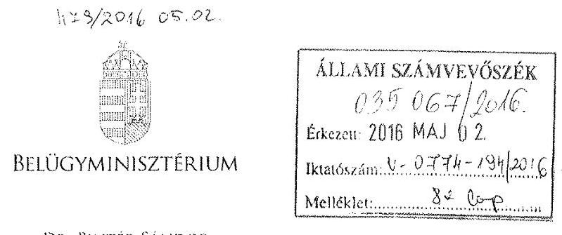

DR. PINTÉR SÁNDOR

Domokos László úrnak
elnök

Állami Számvevőszék

## Budapest

## Tisztelt Elnök Úr!

Az Alsó-Tisza-vidéki Vízügyi Igazgatóság, az Észak-dunántúli Vízügyi Igazgatóság, a Felső-Tisza-vidéki Vízügyi Igazgatóság és a Közép-Tisza-vidéki Vízügyi Igazgatóság ellenőrzéséről készült számvevőszéki jelentéstervezetek 1.2. számú megállapítása hiányosságot fogalmaz meg az iránytó szerv tevékenységével kapcsolatosan, amely szerint az irányító szerv és a középirányító szerv az erőforrásokkal való hatékony gazdálkodáshoz szükséges követelményeket nem érvényesített, így nem volt biztosított a számon kérhetőség és az ellenőrizhetőség.

A fenti megállapításra vonatkozóan a mellékelt feljegyzésben foglaltak szerint észrevételt teszek. A Belügyminisztérium részére meghatározott intézkedési kötelezettséget a hatékony gazdálkodásra irányuló ellenőrzések elvégzése érdekében nem tartom indokoltnak.

Budapest, 2016. április „23."

Üdvözlettel:

Dr. Pintér Sándor

---

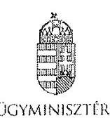

Iktatószám: BM/7134-5/2016.

# Feljegyzés 

## Dr. Pintér Sándor belügyminiszter úr részére

Miniszter úrnak jelentem, hogy az Állami Számvevőszék megküldte „A központi alrendszer egyes intézményei pénzügyi és vagyongazdálkodásának ellenörzése" címủ számvevőszéki jelentéstervezeteket az alábbi vízügyi igazgatóságok vonatkozásában:

- Alsó-Tisza-vidéki Vizügyi Igazgatóság,
- Észak-dunántúli Vizügyi Igazgatóság,
- Felső-Tisza-vidéki Vizügyi Igazgatóság és
- Közép-Tisza-vidéki Vizügyi Igazgatóság.

A jelentéstervezetek 1.2. számú megállapításával kapcsolatosan az Állami Számvevőszékről szóló 2011. évi LXVI. törvény (a továbbiakban: ÁSZ tv.) 29. § (2) bekezdése alapján az alábbi észrevételt teszem:

A megállapítások rögzítik, hogy az irányító szerv (BM) és a középirányító szerv (OVF) a 2012-2014. években az Áht. 9. § (1) bekezdés f) potjában előírt az ellenőrzött intézmény által ellátandó közfeladatok ellátására vonatkozó, erőforrásokkal való hatékony gazdálkodáshoz szükséges követelményeket nem érvényesített, aminek hiányában számonkérés és ellenőrzés sem történt.

Az ellenőrzés során az ÁSZ részére átadott, az irányító szervi tevékenység értékeléséhez szükséges 1. számú tanúsítványok 5.1., 7.1., 7.2., 8.1. és 9.1. pontjai alapján az irányító szerv vezetője:

- írásban rögzítette az ellenőrzött intézménynél az erőforrásokkal való szabályszerű és hatékony gazdálkodáshoz szükséges követelményeket (a Belügyminisztérium fejezet költségvetési gazdálkodásának rendjéről szóló 18/2012. (IV. 27.) BM utasítás),
- beszámoltatta az ellenőrzött intézményt a szakmai feladatellátásról, éves gazdálkodásról (éves értékelő jelentés, zárszámadások, beszámoló szöveges indoklása),
- illetve ellenőrizte az intézménynél a gazdálkodás szabályszerűségét, hatékonyságát (ellenőrzési jelentés).

A Belügyminisztérium tekintetében rögzíteni szükséges továbbá, hogy a Belügyminisztérium fejezethez tartozó egyes költségvetési szervek középirányító szervként történő kijelöléséről, az irányítási jogok gyskorlásának módjáról szóló 13/2011. (V. 23.) BM utasításban az Országos Vízügyi Föigazgatóság részére feladatok kerültek

---

meghatározásra, többek között, hogy szervezik, irányítják és ellenőrzik a költségvetési szervek által ellátandó szakmai alapfeladatok végrehajtásához szükséges pénzügyi, anyagi feltételeket, amelynek keretében például a belső ellenőrzési tevékenység ellátása során szabályszerűségi, pénzügyi, rendszer- és teljesítmény- ellenőrzéseket, informatikai rendszerellenőrzéseket, valamint megbízhatósági ellenőrzéseket végeznek a jogszabályokban, illetve az irányító szerv által előírt belső szabályozásnak megfelelően.

Tényként rögzítendő továbbá az is, hogy a Belügyminisztérium Ellenőrzési Főosztálya a költségvetési szervek belső kontrollrendszeréről és belső ellenőrzéséről szóló 370/2011. (XII. 31.) Korm. rendelet alapján két olyan tárgyú ellenőrzést (belső kontrollrendszer ellenőrzése, központi ellátási tevékenység ellenőrzése) is lefolytatott, amely a teljes fejezetet érintette. Kiemelt feladatként kezelte valamennyi szerv tekintetében a belső kontrollrendszer kialakítását és múködtetését, amelyben szakmai iránymutatást nyújtott. A középirányító szervek belső ellenőrzési szervezeteinek beszámoltatásával (éves ellenőrzési terv, éves ellenőrzési jelentés, végrehajtott ellenőrzésekről készített jelentések és intézkedési tervek bekérése) folyamatosan nyomon követi a szervezetek ellenőrzési tevékenységét, müködését, többek között az Országos Vízügyi Főigazgatóság és a felügyelete alá tartozó igazgatóságok tevékenységét.

A fent megfogalmazottak alapján a Belügyminisztérium részére meghatározott intézkedési kötelezettséget az Alsó-Tisza-vidéki Vízügyi Igazgatóság, a Felső-Tisza-vidéki Vízügyi Igazgatóság és a Közép-Tisza-vidéki Vízügyi Igazgatóság hatékony gazdálkodásra irányuló ellenőrzések elvégzése érdekében nem tartom indokoltnak.

A fenti megállapításra vonatkozóan az ÁSZ tv. 29. § (2) bekezdése alapján a Gazdasági Helyettes Államtitkársággal egyeztetve a mellékelt választervezetet készítettük elő.

Kérem Tisztelt Miniszter urat, hogy egyetértése esetén a levéltervezetet aláírásával ellátni szíveskedjen.

Budapest, 2016. április , 2."
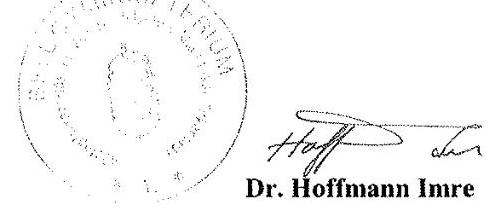

# Egyetértek: 

## Szöke Irma

gazdasági helyettes államtitkár

Készült: 2 példány/1 oldal
Kapják: 1. sz. pld: Belügyminisztérium, dr. Pintér Sándor miniszter úr
2. sz. pld: Irattár

Melléklet: 2 pld.: BM/7134-6/2016. sz. levéltervezet

---

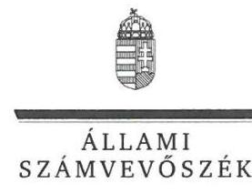

# Dr. Pintér Sándor úr 

miniszter
Belügyminisztérium

## Budapest

## Tisztelt Miniszter Úr!

Köszönettel megkaptam a 2016. május 2. napján az Állami Számvevőszékhez érkezett „A központi alrendszer egyes intézményei pénzügyi és vagyongazdálkodásának ellenörzése -Észak-dunántúli Vizügyi Igazgatóság" címmel készített számvevőszéki jelentéstervezetben foglalt megállapításokra írásban tett észrevételét.

Tájékoztatom Miniszter urat, hogy a jelentésben - az Állami Számvevőszékről szóló 2011. évi LXVI. törvény 29. § (3) bekezdése alapján - a figyelembe nem vett észrevételeket szerepeltetjük az elutasítás indokainak feltüntetésével együtt.

Az Állami Számvevőszék észrevételekre vonatkozó álláspontjáról a felügyeleti vezető által készített részletes tájékoztatást mellékelten megküldöm.

Budapest, 2016.
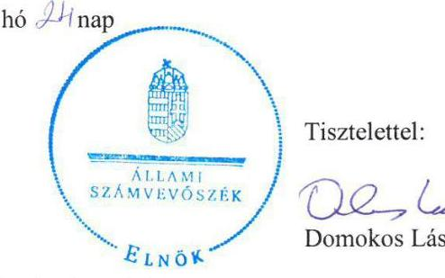

Tisztelettel:
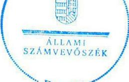

Tisztelettel:

Melléklet: Tájékoztatás az el nem fogadott észrevételről

---

# Tájékoztatás 

az el nem fogadott észrevételről

| 1.) | Észrevétel: | Megállapításokhoz kapcsolódó észrevételek   Az 1.2. számú megállapításhoz, az erőforrásokkal való hatékony gazdálkodáshoz szükséges követelmények érvényesítésére vonatkozóan. |
| :--: | :--: | :--: |
|  | Válasz: | Az Állami Számvevőszék az észrevételt nem fogadja el. |
|  | Indoklás: | Az észrevétel nem megalapozott. A 18/2012. (IV. 27.) BM utasításban részletesen meghatározott és szabályozott folyamatok, feladatok rendszere a közfeladatok ellátására vonatkozó, az erőforrásokkal való hatékony gazdálkodáshoz szükséges követelményeket nem tartalmaz, így azok érvényesítéséről, számonkéréséről és ellenőrzéséről sem rendelkezik.   A dokumentumok ismételt áttekintése alapján, az Északdunántúli Vízügyi Igazgatóság (Intézmény) által az irányító szerv részére megküldött költségvetési beszámolók és szöveges beszámolók sem tartalmaztak információkat a 2012-2014. években a Belügyminisztérium részéről - az államháztartásról szóló 2011. évi CXCV. törvény 9. § (1) bekezdés f) pontjában előírt - az Intézmény által ellátandó közfeladatok ellátására vonatkozó, az erőforrásokkal való hatékony gazdálkodáshoz szükséges követelmények érvényesítésével, számonkérésével és ellenőrzésével kapcsolatban.   Az észrevétel mellékleteként megküldött, a Belügyminisztérium fejezethez tartozó költségvetési szerveknél végzett, a belső kontrollrendszer vizsgálatáról, a belső kontrollrendszer utóvizsgálatáról, a Büntetés-végrehajtási Országos Parancsnokság és a felügyelet alá tartozó gazdasági társaságok központi ellátási kötelezettségének vizsgálatáról, valamint a büntetés végrehajtáshoz kapcsolódó gazdasági társaságok kapacitásainak kihasználását, a fogvatartottak foglalkoztatását célzó Kormány, illetve a Belügyminiszter rendelete hatásának vizsgálatáról szóló jelentések a 2012-2014. évek tekintetében az ellenőrzött Intézményre vonatkozóan, az államháztartásról szóló 2011. évi CXCV. törvény 9. § (1) bekezdés f) pontjában előírt, az Intézmény által ellátandó közfeladatok ellátására vonatkozó, az |

---

| eröforrásokkal való hatékony gazdálkodáshoz szükséges   követelmények érvényesítésével, számonkérésével és   ellenőrzésével kapcsolatos információkat nem tartalmaztak.   Fentiek következtében az ellenőrzési megállapításban (1.2.   számú megállapítás 8. bekezdés) rögzített hiányosságok továbbra   is megalapozottak, a megállapítás módosítása nem indokolt. |
| :-- | :-- | :-- |

Budapest, 2016. 05 hó 2 h nap
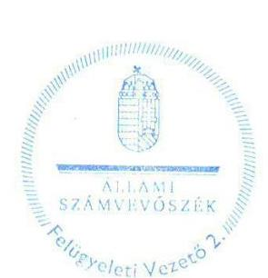

Salamon Ildikó
felügyeleti vezető

---

# ORSZÁGOS VÍZÜGYI FŐIGAZGATÓSÁG FŐIGAZGATÓ 

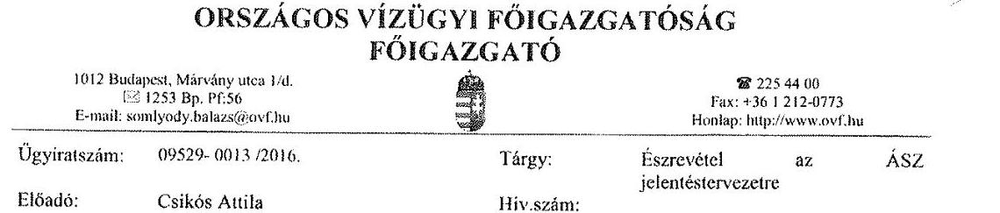

Állami Számvevőszék
Domokos László elnök részére

## Budapest

Apáczai Csere János utca 10. 1052

## Tisztelt Elnök Úr!

Az Állami Számvevőszék V-0916-310/2016. iktatószámú levéllel megkapott, az Északdunántúli Vízügyi Igazgatóságnál lefolytatott pénzügyi és vagyongazdálkodásának ellenőrzési jelentéstervezetéhez az alábbi észrevétel tesszük.

Az Állami Számvevőszék jelentéstervezet 1.2 számú megállapítása rögzíti, hogy az irányító szerv (BM) és a középtrányító szerv (OVF) a 2012-2014. években az Áht. 9. § (1) bekezdés f) pontjában előírt az ellenőrzött intézmény által ellátandó közfeladatok ellátására vonatkozó, erőforrásokkal való hatékony gazdálkodáshoz szükséges követelményeket nem érvényesített, aminek hiányában számonkérés és ellenőrzés sem történt.

Tekintettel arra, hogy a Belügyminisztérium Ellenőrzési Főosztálya a költségvetési szervek belső kontrollrendszeréről és belső ellenőrzéséről szóló 370/2011. (XII. 31.) Korm. rendelet alapján két olyan tárgyú ellenőrzést (belső kontrollrendszer ellenőrzése, központi ellátási tevékenység ellenőrzése) is lefolytatott, mely a teljes fejezetet érintette - beleértve a Közép-Tisza-vidéki Vízügyi Igazgatóságot is - az OVF-nek külön ellenőrzést erre vonatkozóan nem volt indokolt elvégeznie. Az irányító szerv kiemelt feladatként kezelte valamennyi szerv tekintetében a belső kontrollrendszer kialakítását és müködtetését.

A vízügyi igazgatóságok müködési területe vízgyűjtőkre lett meghatározva, amely a szakmai müködésüket teljesen specifikussá, egyedivé teszi. Az egyedi jelleg (eltérő csapadék eloszlás, vízfolyások nagysága és jellege, eltérő domborzati viszonyok, a müködési területen kiépült műtárgyak nagysága és azok fontossága) nem tette (és nem teszi) lehetővé a müködés és annak pénzügyi feltételeit biztosító gazdálkodás egységes elvek, azonos mutatószámok szerinti mérését és értékelését.

Az Észak-dunántúli Vízügyi Igazgatóság önállóan müködő és gazdálkodó költségvetési intézmény, saját döntési és felelősségi hatáskörrel a szakmai tevékenységük és a gazdálkodásuk vonatkozásában. Az OVF, mint középirányító szerv a hatályos belső szabályzatai alapján gyakorolta a 13/2011. (V. 23.) BM utasításban meghatározott feladatokat.

---

Az OVF az ÁSZ tárgyi ellenőrzésének időszakában az alábbi szabályozók alapján látta el a középirányítói feladatait.

A 47/2012. (IX.30) BM utasítás, SZMSZ 18. §-a szerint
A Főigazgatóság a közgazdasági tevékenység területén:
a) ellátja a vízügyi költségvetési szervek költségvetési tervezésének végrehajtásával, finanszírozásának előkészítésével kapcsolatos feladatokat; javaslatot készít a finanszírozás területén felmerülő problémák megoldására,
b) részt vesz az ágazati célelóirányzatok felhasználására, a vízkár elhárítási munkák finanszírozására vonatkozó közgazdasági feladatokban, közreműködik a finanszírozási feladatok megoldásában,
c) részt vesz a vízügyi költségvetési szervek költségvetési támogatásával kapcsolatos feladatokban, ellátja ennek pénzügyi, számviteli feladatainak irányítását,
d) közreműködik a vízügyi költségvetési szervek gazdálkodását érintő előirányzat-módosításokkal összefüggő feladatok végrehajtásában,
e) ellátja a vízgazdálkodási kormányzati beruházások éves zárszámadásával kapcsolatos feladatokat,
f) felügyeli és koordinálja a beszámolási és könyvvezetési kötelezettségből eredő intézményi (vízügyi igazgatóságok) feladatok ellátását, ennek keretében az intézményi éves költségvetéseket és az intézményi beszámolókat összeállíttatja, továbbá végzi azok összesítését és ellenőrzését,
g) koordinálja és ellenőrzi a vízügyi igazgatóságok éves feladatterveinek összeállítását, felülvizsgálatát; a vízügyi igazgatóságokkal történő (jóváhagyást célzó) egyeztetést,
h) közreműködik az ágazati gazdaságpolitikai célok megvalósításában, irányításában és értékelésében,
i) koordinálja és felügyeli a vízügyi igazgatóságok gazdálkodását és pénzügyi tevékenységét,
j) végzi a vízügyi igazgatóságok számviteli munkájának irányítását, felügyeletét.

A fentiek alapján 2012-2014. években a Vízügyi Igazgatóság gazdálkodásának vonatkozásban az OVF:

1. a BM fejezet 17. Vízügyi Igazgatóságok cím tekintetében az egyedi elemi költségvetések leosztását tervtárgyalások után megtette;
2. az időszaki és az éves költségvetési beszámolók és jelentések pénzügyi és számviteli ellenőrzését elvégezte és a címszintủ összesítéseket a fejezet felé benyújtotta;
3. tételes (bizonylati mélységủ) műszaki és pénzügyi ellenőrzést folytatott az alábbi területeken:

- a BM fejezet 20/1/48, 49, és 50 fejezeti kezelésű sorok támogatási szerződései által biztosított források felhasználása tekintetében;
- az elemi költségvetés felhalmozási kiadások kiemelt előirányzatának felhasználása tekintetében;
- Kormánydöntés alapján megkapott többletforrások felhasználása tekintetében.

---

A támogatási szerződéssel megkapott többletforrásokhoz kapcsolódó kötelezettségvállalások kizárólag az OVF által végzett elózetes műszaki-szakmai engedély birtokában voltak megtehetők.

A fent megfogalmazottak alapján az OVF részére meghatározott intézkedési kötelezettséget a hatékony gazdálkodásra irányuló ellenőrzések elvégzése érdekében nem tartom indokoltnak.

Budapest, 2016. április 28.
Tisztelettel:

---

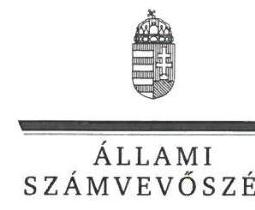

ELNÖK

Ikt.szám: V-0916-319/2016.

# Somlyódy Balázs úr 

föigazgató
Országos Vízügyi Főigazgatóság

## Budapest

## Tisztelt Föigazgató Úr!

Köszönettel megkaptam a 2016. május 4. napján az Állami Számvevőszékhez érkezett „A központi alrendszer egyes intézményei pénzügyi és vagyongazdálkodásának ellenörzése -Észak-dunántúli Vízügyi Igazgatóság" címmel készített számvevőszéki jelentéstervezetben foglalt megállapításokra írásban tett észrevételét.

Tájékoztatom Főigazgató urat, hogy a jelentésben - az Állami Számvevőszékről szóló 2011. évi LXVI. törvény 29. § (3) bekezdése alapján - a figyelembe nem vett észrevételeket szerepeltetjük az elutasítás indokainak feltüntetésével együtt.

Az Állami Számvevőszék észrevételekre vonatkozó álláspontjáról a felügyeleti vezető által készített részletes tájékoztatást mellékelten megküldöm.

Budapest, 2016.
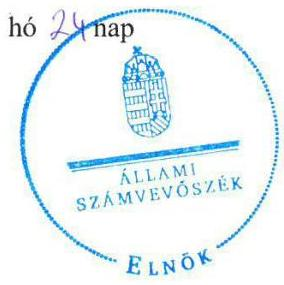

Tisztelettel:
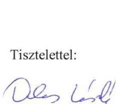

Melléklet: Tájékoztatás az el nem fogadott észrevételről

---

# Tájékoztatás   az el nem fogadott észrevételről 

| 1. | Észrevétel: | Megállapításokhoz kapcsolódó észrevételek   Az 1.2. számú megállapításhoz, az erőforrásokkal való hatékony gazdálkodáshoz szükséges követelmények érvényesítésére vonatkozóan. |
| :--: | :--: | :--: |
|  | Válasz: | Az Állami Számvevőszék az észrevételt nem fogadja el. |
|  | Indoklás: | Az észrevétel nem megalapozott. Az észrevételben hivatkozott, a Belügyminisztérium fejezethez tartozó egyes költségvetési szervek középirányító szervként történő kijelöléséről, az irányitói jogok gyakorlásának módjáról szóló 13/2011. (V. 23.) BM utasítás nem tartalmaz a közfeladatok ellátására vonatkozó, az erőforrásokkal való hatékony gazdálkodáshoz szükséges követelményeket, így azok érvényesítéséről, számonkéréséről és ellenőrzéséről sem rendelkezik. Észrevétele sem tartalmaz a 2012-2014. években az Országos Vízügyi Föigazgatóság (OVF) részéről - az államháztartásról szóló 2011. évi CXCV. törvény (Áht.) 9. § (1) bekezdés f) pontjában előírt -, az Észak-dunántúli Vízügyi Igazgatóság (Intézmény) tekintetében a közfeladatok ellátására vonatkozó, az erőforrásokkal való hatékony gazdálkodáshoz szükséges követelmények érvényesítésével, számonkérésével és ellenőrzésével kapcsolatos információkat, tényeket.   Arra vonatkozó tájékoztatása, hogy az ellenőrzött időszakban az OVF mely szabályozók alapján, illetve az Intézmény gazdálkodása vonatkozásában mely feladatokat látta el, az ellenőrzési megállapításokat nem módosítja. A Belügyminisztérium Ellenőrzési Főosztálya által elvégzett ellenőrzések nem helyettesítik a jogszabály által meghatározott feladatnak az OVF - mint középirányító szerv - által történő elvégzését.   Az egyes vízügyi igazgatóságok - észrevételében hivatkozott eltérő müködési területe, egyedi jellege nem adott felmentést a törvényben - az Áht. 9. § (1) bekezdés f) pontjában - előírt, az erőforrásokkal való hatékony gazdálkodáshoz szükséges követelmények érvényesítésével, számonkérésével és ellenőrzésével kapcsolatos feladatok ellátása alól. |

---

|  | Fentiek következtében az ellenőrzési megállapításban (1.2.   számú megállapítás 8. bekezdés) rögzített hiányosságok továbbra   is megalapozottak, a megállapítás módosítása nem indokolt. |
| :-- | :-- |

Budapest, 2016. 65 hó 21 nap
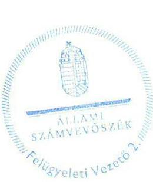

Salamon Ildikó
felügyeleti vezető

---

# 477/2016 05.02 

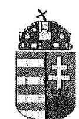

Észak-dunántúli Vízügyi Igazgatóság
9021 Győr, Árpád út 28-32.
Levélcím: 9002 Győr, Pf.: 101.
Telefon: (36) (96) 500-000
Telefax: (36) (96) 315-342
Internet-cím: http://www.eduvizig.hu
Adószám: 15308373-2-08

Úgyiratszám: 7647-064/2016 Hivatkozási szám: V-0916309/2016
Előadó: Fülöp Péter Melléklet: 1 pld.

Állami Számvevőszék
Domokos László Úr
elnök
Budapest 4.
Pf. 54
1364

Tárgy: Jelentéstervezet észrevételezése

## Tisztelt Elnök Úr!

A V-0916-315/2016 iktatószámú, „A központi alrendszer egyes intézményei pénzügyi és vagyongazdálkodásának ellenőrzése - Észak-dunántúli Vízügyi Igazgatóság" címủ jelentéstervezetre az alábbi észrevételeket teszem.
Észrevételeink során a rövidítéséket a számvevőszéki jelentésben használt rövidítésekkel egyezően használtuk.

### 2.1. sz. megállapítás

- A megállapítás szerint a 2013-2014. években az SZMSZ nem szabályozta az egyes szervezeti egységek feladatait, nem szabályozta azokat az ügyköröket, amelyek során a szervezeti egységek vezetői az ÉDUVIZIG képviselőiként járhatnak el. Észrevételezzük, hogy az Országos Vízügyi Főigazgatóság a 01061/7/2012. számú, 2012. október 18. napján kelt levelével megküldte a vízügyi igazgatóságok számára a vízügyi igazgatóságok szervezeti és müködési szabályzatának mintáját, amelyet a struktúra megváltoztatása nélkül a helyi sajátosságokkal, a szervezeti egységek elnevezéseivel és létszámokkal kiegészítve kellett felterjeszteni jóváhagyásra. Ennek a szabályzatnak a jóváhagyására 2012. december 17. napján került sor.
Az Országos Vízügyi Főigazgatóság a 03317-0004/2013. számú, 2013. december 23. napján kelt levelével küldte meg a - jogszabályi változásokra tekintettel - a vízügyi igazgatóságok elvárt szervezeti felépítését. Ennek megfelelően a szervezeti és müködési szabályzatot 2013. január 06. napjáig kellett jóváhagyásra felterjeszteni.
Az Országos Vízügyi Főigazgatóság a 03317-0013/2013. számú, 2013. december 30. napján az igazgatósági vélemények összegzése alapján pontosította a vízügyi igazgatóságok szervezeti felépítésére vonatkozó javaslatot.
Az Országos Vízügyi Főigazgatóság 2014. január 07. napján kelt felhívása alapján 2014. január 10. napjáig át kellett dolgozni a felterjesztett szervezeti és müködési szabályzatokat az alapító okirat tervezett változásaira tekintettel.
Az Országos Vízügyi Főigazgatóság a 2014. január 30. napján kelt levelében tájékoztatat igazgatóságunkat arról, hogy a felterjesztett szabályzatban pontosításokat, egységesítést, javításokat eszközölt.

---

Ennek a szabályzatnak a jóváhagyására 2014. január 01. napi hatályba lépéssel került sor.
A szervezeti és müködési szabályzat előkészítése a fentiek alapján a felettes szerv által megadott szempontok és mintaszabályzat alapján történt. Fentiek alapján kérjük a megállapítás kiegészitését azzal, hogy az SZMSZ a felettes szerv által kiadott mintaszabályzat alapján készült és annak jóváhagyásával került kiadásra!

- A megállapítás szerint az ÉDUVIZIG nem rendelkezett érvényes ügyrendi szabályzattal 2012. december 17. és 2013. március 4-e között. Ezzel kapcsolatban észrevételezzük, hogy az Országos Vízügyi Főigazgatóság a 01061-0027/2012. számú, 2012. december 20. napján kelt levelében tájékoztatta Igazgatóságunkat arról, hogy a belügyminiszter 2012. december 17. napján jóváhagyta a vízügyi igazgatóságok szervezeti és müködési szabályzatát, így azok ettől a naptól léptek hatályba.
A szabályzat záró rendelkezései között szerepelt, hogy az ügyrendet a hatályba lépéstől számított 30 napon belül el kell készíteni. A jóváhagyás érdekében 2013. január 09. napjáig kellett az ügyrendi szabályzatot az Országos Vízügyi Főigazgatóság részére megküldenünk.
Az Országos Vízügyi Főigazgatóság a 01592/0009/2012. számú, 2013. március 04. napján kelt levelével küldte meg igazgatóságunknak az általa jóváhagyott ügyrendet, amelyet ezt követően tudott igazgatóságunk hatályba léptetni. Kérjük a megállapítás kiegészitését!
- A megállapítás szerint a gazdasági ügyrend nem tartalmazta a gazdasági szervezet feladat és hatáskörét, helyettesítés rendjét. Észrevételezzük, hogy az Ámr. 20. § (7) ill. Ávr. 13. § (5) bekezdése szerint a költségvetési szerv szervezeti egységei által ellátott feladatok munkafolyamatainak leírását, a szervezeti egység vezctőinek és alkalmazottainak feladat- és hatáskörét, a helyettesítés rendjét, továbbá a szervezeti egység költségvetési szerven belüli belső és azon kívüli külső kapcsolattartásának módját, szabályait - ha azokról a szervezeti és müködési szabályzat vagy a költségvetési szerv más szabályzata nem rendelkezik - a szervezeti egységek ügyrendje tartalmazza.
Az ügyrendi szabályzat az adott szervezeti egység, így a Gazdasági Osztály egészére vonatkozóan tartalmazza a feladat- és hatásköröket. Ebben megjelenik a vezető és az alkalmazott feladata is. A vezetőkre vonatkozó általános szabályokat (ideértve a feladatot és a helyettesítést is) a szervezeti és müködési szabályzat tartalmazza. Ezen kívül az egyes részfeladatokra vonatkozóan számos pénzügyi tárgyú szabályzattal rendelkezik az igazgatóság, továbbá az alkalmazottak rendelkeznek munkaköri leírással, amely az adott munkakörre vonatkozóan tartalmazza a feladatokat, továbbá a helyettesítés rendjét. Kérjük a megállapítás törlését a fenti indokok alapján!
- A megállapítás szerint az ÉDUVIZIG vezetője az államigazgatási szervek integritásirányítási rendszeréről és az érdekérvényesítők fogadásának rendjéről szóló 50/2013. (II. 25.) Korm. rendelet 5. § szerinti integritási tanácsadó kijelöléséről nem intézkedett. Észrevételezzük, hogy a hivatkozott rendelet 1. § szerint e rendelet hatálya a Kormány irányítása vagy felügyelete alatt álló államigazgatási szervekre, és azok munkatársaira terjed ki, a rendvédelmi szervek és a Katonai Nemzetbiztonsági Szolgálat kivételével. A központi államigazgatási szervekről, valamint a Kormány tagjai és az államtitkárok jogállásáról szóló 2010. évi XLIII. törvény 1. §-a alapján a vízügyi igazgatóság nem minősül államigazgatási szervnek, ezért nem terjed ki rá az 50/2013. (II. 25.) Korm. rendelet hatálya, így az integritás tanácsadó kijelölésének kötelezettsége nem vonatkozik az ÉDUVIZIG vezetőjére. Kérjük a megállapítás törlését!

---

- A megállapítás szerint az ÉDUVIZIG számviteli politikája 2014. évben nem tartalmazta a 4/2013. (1. 11.) Kormányrendelet (Áhsz.) 50. § (1) bekezdésének előírásai szerint a költségvetési és pénzügyi számvitel alkalmazásával kapcsolatos sajátos szabályokat, előírásokat, módszereket. 2014. évben a 3000-19/2014. számú igazgatói utasításban kiadott számviteli politika mellett kiadásra került a 300015/2014. sz igazgatói utasítással az igazgatóság számlarendje, amelynek könyvvezetés szabályai c. része tartalmazza az Áhsz. 50. § (1) bekezdésében előírtakat. Kérjük a megállapítás fentiek szerinti kiegészitését!
- A jelentéstervezet megállapítja, hogy a 2014. évi pénzkezelési szabályzat nem tartalmazza a napi készpénz záró állomány maximális mértékének meghatározására vonatkozó előírást az Áhsz. 50 §. (6) bek-nek megfelelően. A 3000-14/2014. számú igazgatói utasításban kiadott pénzforgalmi és pénztári pénzkezelési szabályzat 19 és 20. oldala tartalmazza a házipénztár napi készpénz záró állományának értékét, melyet nem lehet túllépni, ezért az a maximális mértéket jelenti. A szabályzat elkészítésekor az igazgatóság költségvetése rendelkezésre állt, az elemi költségvetés kiadási előirányzat 1.502 .500 ezer Ft, a napi készpénz állomány felső mértéke a hivatkozott jogszabály alapján 18.030 ecer Ft lehetne, melynél az igazgatóság lényegesen alacsonyabb összegben, 500 ezer Ft-ban határozta meg. A napi készpénz záró állomány meghatározásánál figyelembe vételre került, hogy a közfoglalkoztatáshoz napi szinten kis összegủ készpénzes vásárlások merülnek fel, továbbá a 4 megyére kiterjedő müködési területünkön levő telephelyeken nincs házipénztár, csak az Igazgatóság központjában müködik a pénztár. Ezen indokokat is tartalmazza a szabályzat hivatkozott oldala. A napi zárókészlet megállapításánál figyelembe vételre került az is, hogy a kiadásoknál elsősorban készpénzkímélő fizetési módot kell alkalmazni. Kérjük a megállapítás törlését!
- A 20. oldal 2. bek-ben az Ász megállapítja, hogy az érvényesítésre, utalványozásra, teljesítésigazolásra jogosult személyek kijelölése a munkáltatói kölcsön kivételével megtörtént, és a kijelöltek rendelkeztek a jogszabályokban előírt végzettséggel. Az Igazgatóság a kötelezettségvállalásra, érvényesítésre, utalványozásra, pénzügyi ellenjegyzésre, teljesítésigazolásra adott felhatalmazása valamennyi kiadásra vonatkozik és nem különíti el a felhatalmazásnál, hogy azok kizárólag müködési kiadásra, vagy felhalmozási kiadásra, vagy lakásépítési kölcsönre vonatkoznak, a felhatalmazás általános, minden kiadásra vonatkozik. Jogszabályi előírás sem rendelkezik arról, hogy a munkáltatói kölcsönök vonatkozásában külön kellene kijelölni az érvényesítésre, utalványozásra és teljesítésigazolásra jogosultakat. Kérjük a megállapítás törlését!
- A jelentés kifogásolja, hogy az 5/2007. Ig. Rendelettel kiadott ellenőrzési nyomvonal nem tartalmazza a költségvetési szerv müködési folyamatainak bemutatását.
A jelentés közelebbről nem határozza meg, hogy a müködés mely elemeit hiányolja, az ellenőrzési nyomvonal ugyanis tartalmazza az alábbiakat:
- A tervezés és előirányzat felhasználási tevékenység ellenőrzési nyomvonala
- A végrehajtás ellenőrzési nyomvonala
- A féléves és az éves „Intézményi beszámolás" ellenőrzési nyomvonala
- ezeken belül összesen 29 feladatot.

Kérjük a megállapítás módosítását!

# 2.2 számú megállapítás 

- A megállapítás szerint a a kockázatkezelési szabályzat nem tartalmazta a kockázati kitettség csökkentésével, valamint a kockázatokkal kapcsolatos intézkedések

---

folyamatos nyomon követésével kapcsolatos szabályokat. A megállapításban hivatkozott jogszabályok:

- Az Ámr. 157. § (3) bekezdése szerint a kockázatkezelés keretében meg kell határozni az egyes kockázatokkal kapcsolatos intézkedéseket és megtételük módját.
- A Bkr. 7. § (2) bekezdése szerint az (1) bekezdésben elöírt tevékenység során fel kell mérni és meg kell állapítani a költségvetési szerv tevékenységében, gazdálkodásában rejlő kockázatokat, valamint meg kell határozni az egyes kockázatokkal kapcsolatban szükséges intézkedéseket, valamint azok teljesítésének folyamatos nyomon követésének módját.
- A Bkr. 7. § (2) bekezdése visszautal az (1) bekezdésre, amely az alábbiakat tartalmazza: A költségvetési szerv vezetője köteles kockázatkezelési rendszert müködtetni.

Észrevételezzük, hogy a hivatkozott előírások nem írják elő, hogy a kockázatkezelési szabályzatnak kell tartalmaznia a kockázatokkal kapcsolatos intézkedések nyomon követésével kapcsolatos szabályokat. A hivatkozott előírásokban arról van szó, hogy a kockázatkezelés keretében kell meghatározni az intézkedéseket, és kockázatkezelési rendszert kell müködtetni. A kifogásolt szabályzat éppen ennek a folyamatát írja le, a határidők meghatározásával. A kockázatkezelés a kockázatkezelési szabályzatban elöírtakon alapul. A szabályzatban meghatározott határidőkön belül elkészített önértékelés, minősítés, kockázatkezelés aktuális helyzetének meghatározása és az ezen alapuló éves ellenőrzési terv elkészítése jelenti a hivatkozott jogszabályban elöírt kockázatkezelést, kockázatkezelési rendszer müködtetését. Kérjük a megállapítás törlését!

- „A 2012. június 30-i vagyonnyilatkozat-tételi határidőt túllépő kötelezettet az őrzésért felelős a Vnyiv. 10.§ (1) bekezdés előírásai ellenére nem szólította fel írásban arra, hogy vagyonnyilatkozat-tételi kötelezettségét a felszólítást kézhezvételétől számított nyolc napon belül teljesítsen". 2012. évben valamennyi vagyonnyilatkozat tételre kötelezett munkavállaló az előírt határidőre (június 30.) leadta vagyonnyilatkozatát, ahogy azt az erről az ÁSZ-nak átadott kimutatás is mutatja. Ez alól kivétel Szabó Gábor munkavállaló, aki 2012. november 1-jén adta le vagyonnyilatkozatát, ami a jogszabályi előírásoknak megfelelő, tekintettel arra, hogy 2012. november 1- jén került az ÉDUVIZIG állományába. Kérjük a megállapítás törlését!

# 2.3. sz. megállapítás 

- A megállapítás szerint az ÉDUVIZIG szabályozása nem terjedt ki a pénzügyi kihatású döntések célszerűségi, gazdaságossági, hatékonysági és eredményességi szempontú megalapozottságára. Ezzel szemben a 2.5. sz. megállapítás szerint az igazgatóság a vizsgált időszakban kialakított és müködtetett a források gazdaságos, hatékony és eredményes felhasználására vonatkozó szabályzatokat és folyamatokat.
- A megállapítás a munkakör átadással kapcsolatban hivatkozik arra, hogy a közszolgálati tisztviselőkről szóló 2011. évi CXCIX. törvény 74. § (1) bekezdése ellenére igazgatóságunk 2011. évben nem szabályozta a szervezeti és müködési szabályzatban teljes körűen a munkakörátadás rendjét.
Észrevételezzük, hogy igazgatóságunk nem tartozik a közszolgálati tisztviselőkről szóló 2011. évi CXCIX. törvény hatálya alá, alkalmazottai pedig nem kormánytisztviselők, köztisztviselők.
A jelentés hivatkozik továbbá a közfeladatot ellátó szervek iratkezelésének általános követelményeiről szóló 335/2005. (XII. 29.) Korm. rendelet 15. §-ára, mely szerint az iratkezelési folyamat szereplőit (szervezeti egység, szignáló, kiadmányozó, ügyintéző,

---

ügykezelő) megszűnés, átszervezés és személyi változás esetén a kezelésükben lévő iratokkal a nyilvántartások alapján tételesen el kell számoltatni, arról átadás-átvételi jegyzőkönyvet kell felvenni és gondoskodni kell az iratok további kezeléséről.
Ez az előírás szintén nem rögzíti, hogy ennek szabályait szervezeti és müködési szabályzatban kellene rögzíteni.
Az iratok kezeléséről a megszűnés, átszervezés, személyi változás esetén az igazgatóság ügyiratkezelési szabályzatában rendelkezett.
Kérjük a megállapítás törlését!

# 2.5. sz. megállapítás 

A megállapítás szerint 2012-ben az évközbeni két vezetőváltás során a korábbi vezetők nem tettek eleget a Bkr. 11. § (4) bekezdésében előírt nyilatkozattételi kötelezettségüknek. Ezzel kapcsolatban észrevéhelezzük, hogy 2012. évben egy vezetőváltás történt. Janák Emil igazgató vezetői megbízását 2012. június 30 -ával vonta vissza a belügyminiszter, július 1-jével az igazgatói feladatok ellátására átirányította Németh József müszaki igazgatóhelyettest, majd 2012. szeptember 16-ától igazgató magasabb vezetői megbízást adott Németh Józsefnek. Janák Emil fenti előírásoknak megfelelő nyilatkozatot tett az igazgatói tevékenysége időszakáról, amelyet az átadott vezetői nyilatkozat-2012.pdf megnevezésű fájl szkennelési hiba miatt nem tartalmaz. A nyilatkozat másolatát jelen levelünkhöz csatoljuk. Kérjük a megállapítás törlését!

## 3.2. sz. megállapítás

A megállapítás szerint az intézményi hatáskörben végrehajtott előirányzat-módosításoknál 2011. évben az Ámr. 71. § (6), 2012-2014 években az Ávr. 167. § (4) bekezdése előírásai ellenére az irányító szervet az intézkedést követő öt napon belül nem tájékoztatta az ÉDUVIZIG.
Az ÉDUVIZIG az irányító szerv kifejezetten erre irányuló utasítása alapján küldte meg havonta összesített kimutatással együtt az intézményi hatáskörben végrehajtott előirányzat módosításokról az EG031 dokumentumokat az irányító szerv részére, az öt napon belüli tájékoztatás helyett. Az irányító szerv levelét „BM utasítás előirányzatok megküldéséről" címen az ellenőrzés rendelkezésére bocsátottuk. Kérjük a megállapítás módosítását!

## 3.3. sz. megállapítás

- A megállapítás szerint 2011. évben az ÉDUVIZIG nem tett eleget az Áht. 12. § (2) és (3) bekezdése előírásainak, az év során 24,1 M Ft költségvetési kiadás túllépés és 76,0 M Ft költségvetési bevételi elmaradás keletkezett. 2014. évben a pénzeszközök, támogatás értékủ kiadások, kölcsönök nyújtása és ellátottak juttatásaival kapcsolatos kiadásoknál 2,3 M Ft összegben a módosított előirányzatot az Áht. 6. § (1) bekezdésében foglalt előírások ellenére túllépte az igazgatóság.
A megállapítás 2011. évre vonatkozó része figyelmen kívül hagyja, hogy a 2011. évi éves beszámoló 42 -es űrlapján jól látható, hogy az intézmény módosított tárgyévi kiadási megtakarítása 25.103 ezer Ft, melyből a központi költségvetést megillető befizetés utáni előirányzat-maradvány 24.523 ezer Ft. Az intézmény az alaptevékenység finanszírozására 125.206 ezer Ft összeget használt fel a vállalkozási maradványából, vagyis az alaptevékenység körében keletkezett bevételi lemaradás finanszírozása megtörtént, tehát nem volt szükség az előirányzatok csökkentésére és a kiadási előirányzatok túllépése sem valósult meg.
A megállapítás 2014. évre vonatkozó része szintén téves, mivel a 2014. évi éves költségvetési beszámoló 01-es űrlap 245 -ös sora tartalmazza az érintett előirányzatot, melyből jól látható, hogy a K86 Felhalmozási célú visszatérítendő támogatások, kölcsönök nyújtása államháztartáson kívülre rovat módosított előirányzata 8.696 ezer

---

Ft a teljesítés 2.308 ezer Ft, a különbözet pedig kötelezettségvállalásként jelentkezik. Az érintett rovaton nem előirányzat túllépés volt, hanem elöirányzat-maradvány keletkezett. Kérjük a megállapitás törlését!

- A jelentéstervezet szerint „A felhalmozási kiadások esetében ... 2011.-ben elöfordult, hogy az Ámr. 76. § (1) bekezdésében elöirt szakmai teljesitésigazolást nem hajtották végre. 2012-2014 években elöfordult, hogy az Ávr. 57. § (1) bekezdésében előirt teljesítésigazolást nem hajtották végre, az Ávr. 58. § (1) bekezdésben elöirt érvényesitési feladatokat nem végezték el."
A felhalmozási kiadások esetében az ellenőrzés rendelkezésére bocsátott dokumentumokat áttekintve megállapítottuk, hogy minden tétel esetében megtörtént a teljesítésigazolás. Előfordult olyan tétel ahol nem a szakmai igazoló lapon történt meg a teljesítésigazolás, hanem a számlához csatolt teljesitésigazolási dokumentumon. Az érvényesités igazolása a pénztári kifizetést érintő tételek esetében pótlólagosan került megküldésre, de annak tényét minden mintatétel esetében igazoltuk. Kérjük a megállapítás törlését!
- „A dologi kiadásokhoz kapcsolódóan ... előfordult, hogy az utalvány ellenjegyzését az Ámr. 79. § (2) bekezdésében foglaltak ellenére - a szakmai teljesítésigazolás megtörténtének hiányában végezték el. ... A kiküldetések esetében 2012-2013 években az Ávr. 58. § (1) bekezdésében előirt érvényesitési feladatokat nem végezték el.
A dologi kiadások tekintetében az ellenőrzésre átadott dokumentumokat áttekintve megállapítottuk, hogy a szakmai teljesítésigazolás 2012-2014 években a vizsgált tételek közül a Magyar Államkincstár által leterhelt számlavezetési díjak esetében hiányzott, ami az összes dologi mintatétel $2 \%$-a. Ezen tételek esetében nincs lehetőség terhelés előtti leigazolásra, érvényesítésre, ellenjegyzésre vagy utalványozásra.
A kiküldetések kifizetése az illetmények utalásával együtt történik, így ezen tételek érvényesitésére is a bérek utalását megelőzően, azzal egy időben kerül sor.
2012-2013 években a pénztári okmányokhoz kapcsolódó érvényesitési dokumentumokat pótlólag bocsátottuk az ellenőrzés rendelkezésére, ezzel az érvényesités tényét igazoltuk. Kérjük a megállapítás törlését!
- a munkáltatói kölcsönökkel kapcsolatos gazdálkodási jogkörökre vonatkozó megállapítást a 2.1. sz. megállapításnál észrevételeztük
- a 3.3. sz. megállapítás utolsó bekezdése (27. oldal) szerint a dologi és felhalmozási kiadások esetében árubeszerzés, illetve a 2011. évi közfoglalkoztatási program esetében az igazgatóság nem folytatott le közbeszerzési eljárást, figyelmen kívül hagyva a Kbt. cgybeszámításra vonatkozó előírásait.
A kérdéses esetekben az ellenőrzés nyomán az ÁSZ kezdeményezte a Közbeszerzési Döntőbizottság hivatalból indított eljárását a vélelmezett jogsértésekkel kapcsolatban (összesen hat esetben).
A hat esetből háromban a Döntőbizottság megállapította a jogsértés hiányát az alábbi számú és keltủ határozataiban:
- „Áru- és szolgáltatás beszerzése (Axiál Kft.) 2013. évben"
- jogsértés hiányát megállapító határozat
- iktatószám: D/937/10/2015
- kelt: 2016. február 8.
- „Áru- és szolgáltatás beszerzés, bérleti díj, védekezési tevékenységgel kapcsolatos szolgáltatás (Hard-Tech Bt.) 2013. évben"
- jogsértés hiányát megállapító határozat
- iktatószám:D/938/10/2015

---

- kelt: 2016. február 8 .
- „Különböző tárgyi eszközök beszerzése 2012. évben"
- jogsértés hiányát megállapító határozat
- iktatószám: D/35/16/2016
- kelt: 2016. március 16.

A hat esetből további két esetben a Döntőbizottság végzéssel rendelkezett az eljárás megszüntetéséről a hivatalbóli kezdeményezés elkésettsége miatt:

- „Áru- és szolgáltatás beszerzése (Axiál Kft.) 2014. évben"
- jogorvoslati eljárást megszüntető végzés
- iktatószám: D.939/10/2015
- kelt: 2016. február 8 .
- „Szolgáltatás beszerzése (Solvex Kft.) 2014. évben"
- jogorvoslati eljárást megszüntető végzés
- iktatószám: D.940/8/2015
- kelt: 2016. február 8 .

A végzésekből kitűnik, hogy az ÁSZ a hivatalbóli kezdeményezéssel elkésett, mert a kérdéses eljárásokat a „2014. évi zárszámadás - Magyarország központi költségvetése végrehajtásának ellenőrzése" c. ellenőrzése során már vizsgálta, így a vonatkozó tények már ezen ellenőrzés kapcsán, 2015. májusában az ÁSZ számára ismertté váltak. Ezen ellenőrzés során is kifejezetten vizsgált az ÁSZ közbeszerzési szempontokat, azonban a benyújtott dokumentumok alapján szabályszerűnek ítélte a beszerzési eljárásokat, elfogadva a beszerzésekhez kapcsolódó nyilatkozatunkat, amelyeket az egybeszámítási szabályok figyelembe vételéről és a közbeszerzési eljárás erre alapozott, jogszerű mellőzéséről tettünk. A beszerzési eljárásokkal kapcsolatban jelen ellenőrzés során semmilyen új tény, információ nem jutott az ÁSZ tudomására.

A fenti határozatokat és végzéseket az ÁSZ, mint az eljárások kezdeményezője is megkapta a jelentéstervezet összeállítását megelőzően.
Fentiekből látható, hogy a jelentéstervezetben szereplő esetekben a jelentéstervezet megállapításával ellentétben az ÉDUVIZIG nem követett el jogsértést azzal, hogy nem folytatott le közbeszerzési eljárást, ezért kérjük a jelentéstervezet ezekre az esetekre vonatkozó megállapításainak törlését!

# 3.4. számú megállapítás 

- A jelentéstervezet szerint az előirányzat-felhasználáshoz kapcsolódó évközi korlátozó intézkedéseket az ÉDUVIZIG végrehajtotta, azonban 2013. évben a módosított bevételi és kiadási előirányzatok közül a zárolt bevétel és kiadási előirányzatok közé történő átvezetési kötelezettségének az Áhsz. 9. számú melléklet 9/f pontja szerinti előirással ellentétben nem tett eleget.
Észrevételezzük, hogy intézményünknek 2013. évben nem volt zárolt előirányzata, a 12,6 M Ft azonnali elvonásra került. Az Áhsz 9. számú melléklet 9/f pontja szerint „A zárolt kiadási előirányzatok között jogszabály, illetve irányító szerv által elvont kiadási előirányzat nem mutatható ki." Kérjük a megállapítás törlését!
- A jelentéstervezet szerint a tárgyévi kötelezettségvállalással terhelt maradványként kimutatott összegeket megfelelő dokumentumokkal nem támasztotta alá az ÉDUVIZIG.
Észrevételezzük, hogy a megállapítás erre vonatkozóan semmilyen konkrétumot nem jelöl meg. Megítélésünk szerint az előirányzat maradványhoz kapcsolódóan átadott tételek mindegyike kellően dokumentált, az átadott dokumentumok tartalmazzák a

---

szabályos kötelezettségvállalásokat. A számlavezető Magyar Államkincstár által terhelt számlavezetési díjak esetében pedig az Ámr. 72. § (13) bek. b) pont ill. az Ávr. 53. § (1) bek. b) pont előírásai szerint nem szükséges előzetes írásbeli kötelezettségvállalás. Kérjük a megállapítás törlését!

# 4.1. számú megállapítás 

- A megállapítás arra hivatkozik, hogy a Vtv. 23. § (1) bekezdése alapján került sor a KVI és az igazgatóság között a vagyonkezelési szerződés megkötésére. Ez a hivatkozás téves, a szerződés megkötésére az állami vagyonról szóló 2007. évi CVI. törvény hatályba lépését több évvel megelőzően került sor. A jelentés a szerződés létrejöttének dátumát is tévesen határozza meg, a vagyonkezelési szerződés megkötésére a jelentésben hivatkozott 1998. november 20. napja helyett 1998. december 16. napján került sor, a KVI akkor írta alá a szerződést, a szerződés mindkét fél általi aláírásával jött létre.
A jelentés kifogásolja, hogy a Vtvr. 8. § (2) bekezdésének ellenére a vagyonkezelési szerződést a módosításokkal nem foglalták egységes szerkezetbe.
Észrevételezzük, hogy a vagyonkezelési szerződés módosításait a gyakorlat szerint a tulajdonosi joggyakorló szerv készíti elő, amely - feltehetően gazdaságossági, észszerűségi szempontból - nem látta szükségességét minden egyes módosításánál egységes szerkezetbe foglalni a vagyonkezelési szerződést. A jogalkotó is észlelte az irracionális előírást, ugyanis a jelentésben hivatkozott, a Vtvr. 8. § (2) bekezdését a 244/2015. (IX. 8.) Korm. rendelet 14. §-a hatályon kívül helyezte 2015. szeptember 09. napjától. Kérjük a megállapítás módosítását illetve kiegészitését!
- A megállapítás szerint a vagyonkezelési szerződés nem tartalmazza a Natura 2000 terület minősítését, rendeletetését és a vagyonkezelő kapcsolódó kötelezettségét. Észrevételezzük, hogy a Vtvr. 9. § (8) bekezdése 2011. január 01. napjától tartalmazza a Natura 2000 területekkel kapcsolatos előírásokat (megállapította a 348/2010. (XII. 28.) Korm. rendelet 8. §-a).

A vagyonkezelési szerződés módosításait a gyakorlat szerint a tulajdonosi joggyakorló szerv készíti elő, a szerződés szövegébe ezeket a rendelkezéseket nem építette be. A vagyonkezelésbe adáshoz miniszteri egyetértő nyilatkozatok beszerzése is szükséges, amennyiben a védettség jellege szerint felelős miniszter valamilyen feltételt szab, azt a hozzájáruló nyilatkozatában adja meg. Kérjük a megállapítás kiegészitését!

- A jelentés hivatkozik arra, hogy a vagyonkezelési szerződésmódosításokhoz, kiegészítésekhez, új vagyonkezelési szerződés megkötéséhez az MNV Zrt. hozzájárulása rendelkezésre állt. Ez a megfogalmazás félreérthető, az MNV Zrt. ugyanis a szerződéshez nem hozzájárul, hanem maga is szerződő fél. Kérjük a megállapítás módosítását!

## 4.4. számú megállapítás

A megállapítás szerint a vagyonhasznosítás csak részben felelt meg az előírásoknak, mivel 2012. január 1. után a vállalkozásokkal kötött bérbeadási és más vagyonhasznosítási szerzőseknél, megállapodásoknál az igazgatóság nem győződött meg az Nvtv. 11. § szerinti átláthatóságról, valamint nem tartalmazzák az Nvtv. 11. § (11) bekezdésben foglalt kötelezettség előírását.
Észrevételezzük, hogy a 2012. január 1. utáni bevételi mintatételekhez kapcsolódó megállapodások részben 2012. január 1. előttiek, vagy a jogszabály erejénél fogva átlátható szervezetnek minősülő önkormányzattal, magánszeméllyel köttettek. Az Nvt. 17. § (1) bekezdése szerint e törvény hatálybalépését megelőzően jogszerűen és jóhiszeműen szerzett jogokat és kötelezettségeket e törvény rendelkezései nem érintik.
A 2012. január 1. után kötött megállapodásokban nem szerepel az Nvtv. 11. § (11) bekezdés szerinti kötelezettség, mivel a vagyonhasznosítási szerződések nem írnak elő beszámolási,

---

nyilvántartási, adatszolgáltatási kötelezettséget. A vizsgált vagyonhasznosítási szerződések, megállapodások (vízfelület bérlete, földterület bérlet, szállásdíj) jellegüknél fogva nem keletkeztetnek beszámolási, nyilvántartási, adatszolgáltatási kötelezettséget.
A bevételi mintatételek emellett számos esetben nem vagyonhasznosítási bevételek, hanem szolgáltatásnyújtásból származó, ill. vagyonkezelői hozzájárulás kiadásáért fizetett dij, amely az állami területen végrehajtani kívánt infrastruktúra fejlesztéshez kapcsolódó hozzájárulás kiadásának eljárási díja, így az azokra vonatkozó megállapodások, szerződések nem kell, hogy tartalmazzák az Nvtv. hivatkozott előírásait.
Kérjük a megállapítás módosítását!

# 5. sz. megállapítás 

A megállapításhoz kapcsolódóan észrevételezzük az alábbiakat:

- A NeKI részére nem vízvédelmi feladatok kerültek átadásra, hanem környezetvédelmi feladatok (a 347/2006. (XII.23.) Korm. rendelet szerint környezetvédelmi igazgatási szerv).
- Az Igazgatóság nem vett át feladatokat 2014. január 01. napjától a Győr-MosonSopron Megyei Kormányhivataltól és a Vas Megyei Kormányhivataltól. Ezen szervektől vagyonelemeket (ingatlanokat) vett át, a feladat ezzel nem változott, a vagyonkezelt ingatlanok köre bővült. Az Észak-dunántúli Környezetvédelmi és Vízügyi Igazgatóság pedig az igazgatóság korábbi neve, nem külön szervezet, amelytől feladatot lehetett volna átvenni, csak névváltozás történt.
- Az elsőfokú vízügyi hatósági és szakhatósági feladatok nem az Országos Katasztrófavédelmi Föigazgatósághoz kerültek, hanem a Győr-Moson-Sopron Megyei Katasztrófavédelmi Igazgatósághoz, és nem 2014. szeptember 4-i hatállyal, hanem 2014. szeptember 10. napjától (a vízügyi igazgatási és a vízügyi, valamint a vízvédelmi hatósági feladatokat ellátó szervek kijelöléséről szóló 223/2014. (IX. 4.) Korm. rendelet 15. § (2) Az I-III. Fejezet, a 16-18. §, a 21. §, az 1. melléklet és a 2. melléklet 2014. szeptember 10 -én lép hatályba.)
Kérjük a megállapítás módosítását!

## 6. sz. megállapítás

A jelentés II. sz. mellékletében tett megállapításokat az alábbiakban észrevételezzük:

- Az új munkatársak kiválasztásakor nem minden esetben kötelező a pályázat kiírása a közalkalmazottak jogállásáról szóló 1992. évi XXXIII. tv. ill. a 37/2011. (X. 28.) BM rendelet előírásai szerint
- a külső személyekkel való kapcsolattartást a vizsgált időszakban szabályozta:
- az 5/2009. igazgatói rendelettel kiadott Szervezeti, Müködési és Úgyrendi Szabályzat IX. fejezete
- 25006/2006. igazgatói utasítás az írott és elektronikus sajtó tájékoztatásának rendjéről
- 100-7/2012. igazgatói utasítás a sajtóval történő kapcsolattartásról
- 100-11/2013. igazgatói utasítás a közérdekủ adatok nyilvánosságra hozatalának, a sajtó tájékoztatásának, a hivatalos honlap müködtetésének rendjéről

Kérjük a fenti megállapítások törlését!

## Általános jellegü észrevételeink:

- Az Állami Számvevőszék „2013. évi zárszámadás - Magyarország központi költségvetése végrehajtásának ellenőrzése" c. ellenőrzése és „2014. évi zárszámadás Magyarország központi költségvetése végrehajtásának ellenőrzése" c. ellenőrzése során vizsgálta a jelen ellenőrzéssel is érintett 2013. és 2014. évi gazdálkodásunkat. A két ellenőrzés során 147 db felhalmozási, 97 db dologi ill. egyéb müködési kiadási,

---

107 db bevételi, 10 db előirányzat módosítási és 10 db előirányzat maradvány mintatételt ellenőriztek.
A két ellenőrzés az említett 371 mintatétellel kapcsolatban nem tett megállapítást az ellenőrzési jelentésben, ennek és a fentiekben tett észrevételek alapján a jelen ellenőrzési jelentésben az intézmény pénzügyi és vagyongazdálkodására tett, a nem szabályszerű müködést generálisan megállapító megfogalmazások módosítását kérjük.

- A jelentéstervezet több helyütt (pl. 2.1. sz., 2.3. sz. megállapítás) hivatkozik a közszolgálati tisztviselőkről szóló 2011. évi CXCIX tv-re, azonban ennek hatálya a vízügyi igazgatóságokra nem terjed ki.
- Az ellenőrzés területe fejezethez:
- A vízügyi igazgatóságnak nem illetékességi területe van, hanem müködési területe (illetékességi területe hatóságnak van).
- A NeKI részére nem vízvédelmi feladatok kerültek átadásra, hanem környezetvédelmi feladatok (a 347/2006. (XII.23.) Korn. rendelet szerint környezetvédelmi igazgatási szerv).
- Az Igazgatóság nem vett át feladatokat 2014. január 01. napjától a Győr-MosonSopron Megyei Kormányhivataltól és a Vas Megyei Kormányhivataltól. Ezen szervektől vagyonelemeket (ingatlanokat) vett át, a feladat ezzel nem változott, a vagyonkezelt ingatlanok köre bővült. Az Észak-dunántúli Környezetvédelmi és Vízügyi Igazgatóság pedig az igazgatóság korábbi neve, nem külön szervezet, amelytől feladatot lehetett volna átvenni, csak névváhozás történt.
- Az elsőfokú vízügyi hatósági és szakhatósági feladatok nem az Országos Katasztrófavédelmi Föigazgatósághoz kerültek, hanem a Győr-Moson-Sopron Megyei Katasztrófavédelmi Igazgatósághoz, és nem 2014. szeptember 4-i hatállyal, hanem 2014. szeptember 10. napjától (a vízügyi igazgatási és a vízügyi, valamint a vízvédelmi hatósági feladatokat ellátó szervek kijelöléséről szóló 223/2014. (IX. 4.) Korn. rendelet 15. § (2) Az I-III. Fejezet, a 16-18. §, a 21. §. az 1. melléklet és a 2. melléklet 2014. szeptember 10-én lép hatályba.)
- Az átmeneti időszakban az igazgatói feladatokat nem a vízgyűjtő-gazdálkodási osztály vezetője látta el.

Kérjük, hogy észrevételeink alapján a vonatkozó ellenőrzési összegző megállapításokat, megállapításokat és kapcsolódó intézkedési javaslatokat törölni/módosítani szíveskedjenek.

Győr, 2016. április 27.
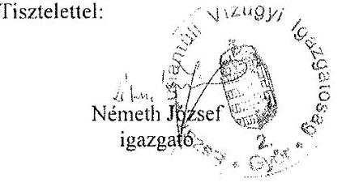

---

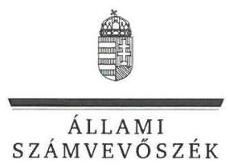

ELNÖK

Ikt.szám: V-0916-320/2016.

# Németh József úr 

igazgató
Észak-dunántúli Vízügyi Igazgatóság

Győr

## Tisztelt Igazgató Úr!

Köszönettel megkaptam a 2016. május 2. napján az Állami Számvevőszékhez érkezett „A központi alrendszer egyes intézményei pénzügyi és vagyongazdálkodásának ellenőrzése -Észak-dunántúli Vízügyi Igazgatóság" címmel készített számvevőszéki jelentéstervezetben foglalt megállapításokra írásban tett észrevételét.

Tájékoztatom Igazgató urat, hogy a jelentésben - az Állami Számvevőszékről szóló 2011. évi LXVI. törvény 29. § (3) bekezdése alapján - a figyelembe nem vett észrevételeket szerepeltetjük az elutasítás indokainak feltüntetésével együtt.

Az Állami Számvevőszék észrevételekre vonatkozó álláspontjáról a felügyeleti vezető által készített részletes tájékoztatást mellékelten megküldőm.

Budapest, 2016. 06 hó 30 nap
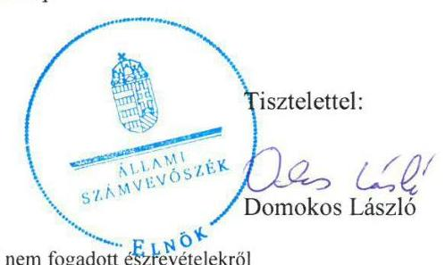

Melléklet: Tájékoztatás az elfogadott és el nem fogadott észrevételekről

---

# Tájékoztatás   az elfogadott és az el nem fogadott észrevételekról 

| 1. | Észrevétel: | Megállapításokhoz kapcsolódó észrevételek   a 2.1. számú megállapítást alátámasztó 1. bekezdéshez (18. oldal) a szervezeti és müködési szabályzat (SZMSZ) tartalmának megfelelőségére vonatkozóan. |
| :--: | :--: | :--: |
|  | Válasz: | Az Állami Számvevőszék az észrevételt nem fogadja el. |
|  | Indoklás: | Az észrevétel az ellenőrzött időszakra vonatkozó megállapítást nem vitatja, annak körülményeit mutatja be, illetve magyarázza. Az SZMSZ jóváhagyásának körülményei az ellenőrzési megállapítást nem módosítják, azokkal a megállapítás kiegészítése nem indokolt. |
| 2. | Észrevétel: | Megállapításokhoz kapcsolódó észrevételek   a 2.1. számú megállapítást alátámasztó 2. bekezdéshez (18. oldal) az ügyrendi szabályzathoz kapcsolódóan. |
|  | Válasz: | Az Állami Számvevőszék az észrevételt nem fogadja el. |
|  | Indoklás: | Az észrevétel az ellenőrzött időszakra vonatkozó megállapítást nem vitatja, annak körülményeit mutatja be, illetve magyarázza.   Az ügyrendi szabályzat jóváhagyásának körülményei az ellenőrzési megállapítást nem módosítják. A megállapításban hivatkozott, az államháztartásról szóló törvény végrehajtásáról szóló 368/2011. (XII. 31.) Korn. rendelet (Ávr.) 9. § (5) bekezdése szerint a gazdasági szervezetnek ügyrenddel kell rendelkeznie, amely az Észak-dunántúli Vízügyi Igazgatóság (ÉDUVÍZIG) esetében a 2012. december 17. és 2013. március 4. közötti időszakban nem volt. A 2013. március 4 -tól hatályos ügyrend jóváhagyásának a körülményeivel az ellenőrzési megállapítás kiegészítése nem indokolt. |
| 3. | Észrevétel: | Megállapításokhoz kapcsolódó észrevételek   a 2.1. számú megállapítást alátámasztó 2. bekezdéshez (18-19. oldal) a gazdasági ügyrend tartalmához kapcsolódóan. |
|  | Válasz: | Az Állami Számvevőszék az észrevételt nem fogadja el. |

---

|  | Indoklás: | Az észrevétellel ellentétben, az ellenôrzési megállapítás a gazdasági szervezet ügyrendjének tartalmi elemei közül nem a „gazdasági szervezet feladat és hatáskörét, helyettesités rendjét" hiányolta, hanem a 2011. jamár 1. és 2012. december 17. valamint a 2013. március 4. és 2014. december 31. közötti időszakban a „gazdasági szervezet alkalmazottainak feladat- és hatáskörét", továbbá a 2013. március 4. és 2014. december 31. közötti időszakban a helyettesités rendjét az alkalmazottak tekintetében.
A dokumentumok ismételt áttekintése alapján, az észrevétel nem megalapozott. Az ügyrend - amint azt az észrevétel is megerősíti - a Gazdasági Osztály egészére tartalmazta a feladat- és határköröket, ezen belül azonban az alkalmazottak feladat- és hatáskörét nem tartalmazta, és azokról más, a helyszíni ellenőrzés rendelkezésére bocsátott szabályzatok sem rendelkeztek. Az észrevételben hivatkozott munkaköri leírásokban foglaltak a megállapítást nem módosítják, mivel az államháztartás müködési rendjéről szóló 292/2009. (XII. 19.) Korm. rendelet (Ámr.) 20. § (7) bekezdése és az Ávr. 13. § (5) bekezdése az előírt követelmények rögzítésére - ha azokról a szervezeti és müködési szabályzat, vagy a költségvetési szerv más szabályzata nem rendelkezik - az ügyrendet írta elő, a munkaköri leírást nem.
A fentiekre tekintettel az ellenőrzési megállapítás, valamint a hozzá kapcsolódó, az ÉDUVÍZIG igazgatójának címzett 2. számú javaslat módosítása nem indokolt. |
| :--: | :--: | :--: |
| 4. | Észrevétel: | Megállapításokhoz kapcsolódó észrevételek   a 2.1. számú megállapítást alátámasztó 5. bekezdéshez (19. oldal) az integritási tanácsadó kijelölésével kapcsolatban. |
|  | Válasz: | Az Állami Számvevöszék az észrevételt elfogadja. |
|  | Indoklás: | A dokumentumok ismételt áttekintése alapján, a 2.1. számú megállapítás 5. bekezdését töröltük.   A módosítással összhangban az ÉDUVÍZIG igazgatójának címzett 3. számú javaslatot töröltük. |
| 5. | Észrevétel: | Megállapításokhoz kapcsolódó észrevételek   a 2.1. számú megállapítást alátámasztó 6. bekezdéshez (19. oldal) a számviteli politika tartalmához kapcsolódóan. |
|  | Válasz: | Az Állami Számvevőszék az észrevételt nem fogadja el. |

---

|  | Indoklás: | Az észrevétel nem megalapozott, mivel az államháztartás számviteléről szóló 4/2013. (1. 11.) Korm. rendelet (Áhsz.) 50. § (1) bekezdése szerint „A költségvetési és a pénzügyi számvitel alkalmazásával kapcsolatos sajátos szabályokat, előírásokat, módszereket a számviteli politikában kell rögziteni." Így az ezzel kapcsolatos szabályok számlarendben történő rögzítése nem felel meg a jogszabályi előírásoknak.   A fentiekre tekintettel az ellenőrzési megállapítás kiegészítése nem indokolt. |
| :--: | :--: | :--: |
| 6. | Észrevétel: | Megállapitásokhoz kapcsolódó észrevételek   a 2.1. számú megállapítást alátámasztó 10. bekezdéshez (19. oldal) a pénzkezelési szabályzathoz kapcsolódóan. |
|  | Válasz: | Az Állami Számvevöszék az észrevéteit nem fogadja el. |
|  | Indoklás: | Az ellenőrzés az Önök által rendelkezésre bocsátott dokumentumokon alapult. A dokumentumok ismételt áttekintése alapján, az ellenőrzésnek nincs információja a 3000-14/2014. számú igazgatói utasításban kiadott pénzforgalmi és pénzkezelési szabályzat tartalmáról, mivel azt nem bocsátották az Állami Számvevőszék rendelkezésére. Az ellenőrzés befejezésekor, a 7647/2015. iktatószámú irattal megküldött, 2015. december 17én tett teljességi nyilatkozat mellékleteként felsorolt, az Állami Számvevőszék rendelkezésére bocsátott dokumentumok, adatok jegyzéke az ellenőrzött időszakra vonatkozóan öt pénzkezelési szabályzatot tartalmaz, de azok között az észrevételben hivatkozott 3000-14/2014. számú igazgatói utasításban kiadott pénzforgalmi és pénzkezelési szabályzat nem szerepel.   Az ellenőrzés során az Állami Számvevőszék rendelkezésére bocsátott pénzkezelési szabályzatok kerültek minősitésre, amelyek alapján a megállapítás módosítása, törlése nem indokolt.   A fentiekre tekintettel az ÉDUVÍZIG igazgatójának címzett 5. számú javaslat módosítása nem indokolt. |
| 7. | Észrevétel: | Megállapitásokhoz kapcsolódó észrevételek   a 2.1. számú megállapítást alátámasztó 14. bekezdéshez (20. oldal) a munkáltatói kölcsönökkel kapcsolatos gazdálkodási jogkörökre vonatkozóan, valamint kapcsolódóan a 3.3. számú megállapítást alátámasztó 4. bekezdés 4. pontjához (26. oldal) a munkáltatói kölcsönökkel kapcsolatos gazdálkodási jogkörök gyakorlására vonatkozóan. |
|  | Válasz: | Az Állami Számvevőszék az észrevételt elfogadja. |

---

|  | Indoklás: | A munkáltatói kölcsönökkel kapcsolatos gazdálkodási jogköröket gyakorlók (érvényesitésre, utalványozásra és teljesités igazolásra jogosult személyek) kijelölésére vonatkozó észrevételt elfogadva, a 2.1. számú megállapítás 14. bekezdés 1. mondatából „- a munkáltató kölcsönök kivételével "szövegezést, valamint a 2. mondatot töröltük. Töröltük továbbá a 2. számú összegző megállapítás (18. oldal) 2. mondatából, valamint a Főbb megállapítások, következtetések, javaslatok fejezet (5. oldal) 2. bekezdés 2. mondatából az , illetve a gazdálkodási jogkörök gyakorlásánál" szövegezést.   A módosítással összhangban az ÉDUVÍZIG igazgatójának címzett 6. számú javaslatot törölttük.   Az elfogadott észrevétel alapján felülvizsgáltuk a pénzeszközátadásoknál a munkáltatói kölcsönökkel kapcsolatosan Önök által az ellenőrzés során az ÁSZ rendelkezésére bocsátott dokumentumokat, és megállapítottuk, hogy ezen kiadások esetében a kijelölt gazdálkodási jogköröket gyakorlók sem végezték el a 2011. évben az utalvány ellenjegyzést és a szakmai teljesitésigazolást, a 2012-2014. évben a teljesítésigazolást és az érvényesítést. Ez alapján a 3.3. számú megállapítást alátámasztó 4. bekezdés 4. pontját a következők szerint pontositottuk:   „A pénzeszközátadásoknál a munkáltatói kölcsönök esetében a 2011. évben az Ámr. 76. § (1) bekezdése elöirásai ellenére a szakmai teljesitésigazolást, valamint az Amr. 78. § (2) bekezdés a) pontjában elöirtak ellenére az utalvány ellenjegyzését az arra kijelölt (jogosult) személyek nem hajtották végre. A 2012-2014. éreket érintően az Árr. 57. § (1) bekezdésében elöirtak ellenére a teljesitésigazolást, valamint az Arr. 58. § (1) bekezdésében elöirtak ellenére az érvényesitést az arra kijelölt (jogosult) személyek nem végezték el."   A megállapításhoz kapcsolódó, az ÉDUVÍZIG igazgatójának címzett 9. számú javaslat módosítása nem indokolt. |
| :--: | :--: | :--: |
| 8. | Észrevétel: | Megállapitásokhoz kapcsolódó észrevételek   a 2.1. számú megállapítást alátámasztó 16. bekezdéshez (20. oldal) az ellenőrzési nyomvonallal kapcsolatban. |
|  | Válasz: | Az Állami Számvevőszék az észrevételt nem fogadja el. |

---

|  | Indoklás: | A dokumentumok ismételt felülvizsgálata alapján, az 5/2007. Igazgatói rendelettel kiadott Ellenőrzési nyomvonal - amint azt az észrevétel is tartalmazza - a tervezés és elöirányzat felhasználási tevékenység, a végrehajtás, a féléves és az éves „Intézményi beszámolás" 29 feladatát íjam, a müködés folyamait azonban nem tartalmazza. Az Ámr. 156. § (2) bekezdés, valamint a Bkr 6. § (3) bekezdése szerint az ellenőrzési nyomvonal a „költségvetési szerv müködési folyamatainak ... leírása, amely tartalmazza különösen a felelősségi és információs szinteket és kapcsolatokat, irányitási és ellenörzési folyamatokat, lehetővé téve azok nysimon követését és utólagos ellenörzését."   Fentiek következtében az észrevétel nem megalapozott, az ellenőrzési megállapítás módosítása nem indokolt. |
| :--: | :--: | :--: |
| 9. | Észrevétel: | Megállapításokhoz kapcsolódó észrevételek   a 2.2. számú megállapítást alátámasztó 1. bekezdéshez (20. oldal) a kockázatkezelési szabályzat tartalmával kapcsolatban. |
|  | Válasz: | Az Állami Számvevőszék az észrevételt elfogadja. |
|  | Indoklás: | A dokumentumok ismételt áttekintése alapján a 2.2. számú megállapítás 1. bekezdésének következők szerinti 3. mondatát töröltük: „A kockázati kitettség csökkentésével, valamint a kockázatokkal kapcsolatos intézkedések folyamatos nymmon követésével kapcsolatos, az Amr. 157. § (3) bekezdés és a Bkr. 7. § (2) bekezdés szerinti szabályokat a 2012. július 30-ig hatályos kockázatkezelési szabályzat nem tartalmazta." |
| 10. | Észrevétel: | Megállapításokhoz kapcsolódó észrevételek   a 2.2. számú megállapítást alátámasztó 4. bekezdéshez (21. oldal) a vagyonnyilatkozat-tételi kötelezettséggel kapcsolatban. |
|  | Válasz: | Az Állami Számvevőszék az észrevételt elfogadja. |
|  | Indoklás: | A dokumentumok ismételt áttekintése alapján a 2.2. számú megállapítás 4. bekezdésének 3. mondatából a „2012. év kivételével" szövegrészt, valamint a 4. mondatát töröltük. „A 2012. június 30-i vagyonnyilatkozat-tételi határiköt túllépö kötelezettet az örzésért felelös a Vnytr. 10. § (1) bekezdés elöírása ellenére nem szólította fel írásban arra, hogy arra, hogy vagyonnyilatkozat-tételi kötelezettségét a felszólitás kézhezvételétől számított nyolc napon belül teljesitve." |
| 11. | Észrevétel: | Megállapításokhoz kapcsolódó észrevételek   a 2.3. számú megállapítást alátámasztó 1. bekezdéséhez (21. oldal) a pénzügyi kihatású döntések, célszerűségi, gazdaságossági, hatékonysági és eredményességi szempontú megalapozottságának szabályozásával kapcsolatban. |
|  | Válasz: | Az Állami Számvevőszék az észrevételt nem fogadja el. |

---

|  | Indoklás: | Az észrevétel nem megalapozott, mivel a hivatkozott két megállapítás nincs ellentmondásban. A 2.3. számú megállapítás 1. bekezdése a „pénzügyi, kihatású döntések célszerüségi, gazdaságossági, hatékonysági és eredményességi szempontú megalapozottságára" vonatkozik. A 2.5. számú megállapítás 2. bekezdése pedig az intézmény egészére - de nem teljes körűen állapította meg, hogy az intézmény vezetője „kiadott olyan szabályzatokat, kialakított és müködtetett olyan folyamatokat, amelyek biztosították a rendelkezésre álló források gazdaságos, hatékony és eredményes felhasználását".   Fentiek következtében a megállapítás módosítása nem indokolt. |
| :--: | :--: | :--: |
| 12. | Észrevétel: | Megállapításokhoz kapcsolódó észrevételek   a 2.3. számú megállapítást alátámasztó 4. bekezdéshez (21. oldal) a munkakör átadás rendjének szabályozásával kapcsolatban. |
|  | Válasz: | Az Állami Számvevőszék az észrevételt elfogadja. |
|  | Indoklás: | A dokumentumok ismételt felülvizsgálata alapján, a 2.3. számú megállapítás 4. bekezdését törölttük. |
| 13. | Észrevétel: | Megállapításokhoz kapcsolódó észrevételek   a 2.5. számú megállapítást alátámasztó 3. bekezdéshez (22. oldal) a belső kontrollrendszer működtetéséhez kapcsolódó vezetői nyilatkozattal kapcsolatban. |
|  | Válasz: | Az Állami Számvevőszék az észrevételt elfogadja. |
|  | Indoklás: | A dokumentumok ismételt áttekintése alapján, a 2.5. számú megállapítás 3. bekezdését törölttük. |
| 14. | Észrevétel: | Megállapításokhoz kapcsolódó észrevételek   a 3.2. számú megállapítást alátámasztó 1. bekezdéshez (24. oldal) az intézményi hatáskörben végrehajtott előirányzat módosításokról az irányító szerv tájékoztatásával kapcsolatban. |
|  | Válasz: | Az Állami Számvevőszék az észrevételt nem fogadja el. |
|  | Indoklás: | Az ellenőrzött időszakban kormányrendeletek - a 2011. évben az Ámr. 71. § (6) bekezdése, a 2012-2014. években az Ávr. 167. § (4) bekezdése - írta elő, hogy az állambáztartás központi alrendszerébe tartozó költségvetési szervnek a saját hatáskörében végrehajtott előirányzat-módosításokról, átcsoportosításokról az intézkedés meghozatalát követő öt munkanapon belül tájékoztatnia kell a fejezetet irányító szervet. A rendelkezés alól az irányító szerv nem volt jogosult felmentést adni, és az alól az észrevételben hivatkozott adatszolgáltatáshoz csatolt 25/2011. (IX. 9.) BM utasítás szerint - felmentést nem adott. |

---

|  |   |   |
| --- | --- | --- |
|   |  | A Belügyminisztérium fejezet költségvetési gazdálkodásának rendjéről szóló 25/2011. (IX. 9.) BM utasítás 12. § (3) bekezdése szerint „A költségvetési szervek hatáskörébe tartozó elöirányzatmegráltoztatásokról az elrendelésre jogosult személy az EG03i adatlap megküldésével a középtrányitó szerv útján a BM PEF-et egyidejüleg tájékoztatja." A fentiekre tekintettel a megállapítás, valamint az ahhoz kapcsolódó, az ÉDUVÍZIG igazgatójának címzett 7. számú javaslat módosítása nem indokolt.  |
|  15. | Észrevétel: | Megállapításokhoz kapcsolódó észrevételek  |
|   |  | a 3.3. számú megállapítást alátámasztó 1. bekezdéshez (25. oldal) a kiadási előirányzatok túllépéséhez és a bevételi elmaradáshoz kapcsolódóan.  |
|   | Válasz: | Az Állami Számvevőszék az észrevételt elfogadja.  |
|   | Indoklás: | A dokumentumok ismételt felülvizsgálata alapján, a 3.3. számú megállapításból a „- 2011. év kivételével -" szövegezés, valamint a 3.3. számú megállapítást alátámasztó 1. bekezdés törlésre került. A módosítás következtében törlésre került a megállapításhoz kapcsolódó, az ÉDUVÍZIG igazgatójának címzett 8. számú javaslat.  |
|   | Észrevétel: | Megállapításokhoz kapcsolódó észrevételek  |
|   |  | a 3.3. számú megállapítást alátámasztó 4. bekezdés 2. pontjához (26. oldal) a felhalmozási kiadásoknál a gazdálkodási jogkörök gyakorlására vonatkozóan.  |
|   | Válasz: | Az Állami Számvevőszék az észrevételt nem fogadja el.  |
|  16. | Indoklás: | A gazdálkodási jogkörök gyakorlásának szabályszerűségét mintavétellel ellenőriztük, amelynek módszertanát „Az ellenörzés módszerei" fejezet részletesen bemutatja. A felhalmozási kiadásokkal kapcsolatos mintatételek ellenőrzésének ismételt felülvizsgálata szerint előfordult, hogy a 2011-ben a szakmai teljesítésigazolást, a 2012-2014. években a teljesítésigazolást és az érvényesítést nem a jogszabályi előírásoknak megfelelően hajtották végre.
A felhalmozási kiadások esetében 2011-ben előfordult, hogy a szakmai teljesítést igazoló nem volt jogosult a szakmai teljesítésigazolásra, illetve a kiadások teljesítésének a jogosságát, vagy összegszerűségét nem igazolták. A 2012-2014. években előfordult, hogy a teljesítést igazoló a kiadások teljesítésének a jogosságát, vagy összegszerűségét nem igazolta. A 2012-2014. években előfordult, hogy az érvényesítő az összegszerűséget, a fedezet meglétét, a jogszabályokban, vagy a belső szabályzatokban foglaltak betartását nem ellenőrizte.  |

---

|  |   |   |
| --- | --- | --- |
|   |  | A fentiekre tekintettel a megállapítás, valamint az ahhoz kapcsolódó ÉDUVÍZIG igazgatójának címzett 9. számú javaslat módosítása nem indokolt.  |
|  17. | Észrevétel: | Megállapításokhoz kapcsolódó észrevételek  |
|   |  | a 3.3. számú megállapítást alátámasztó 4. bekezdés 3. pontjához (26. oldal) a dologi kiadásoknál a gazdálkodási jogkörök gyakorlására vonatkozóan.  |
|   | Válasz: | Az Állami Számvevőszék az észrevételt nem fogadja el.  |
|   | Indoklás: | A gazdálkodási jogkörök gyakorlásának szabályszcrűségét mintavétellel ellenőriztük, amelynek módszertanát „Az ellenőrzés módszerei" fejezet részletesen bemutatja. A dologi kiadásokkal kapcsolatos mintatételek ellenőrzésének ismételt felülvizsgálata szerint az utalvány ellenjegyzését, a szakmai teljesítésigazolást, illetve a teljesítésigazolást, valamint az érvényesítést nem a jogszabályi előírásoknak megfelelően végezték el.
A dologi kiadások esetében a 2011. évben előfordult, hogy az utalvány ellenjegyzését a szakmai teljesítésigazolás (kifizetés jogosságának, összegszerűségének ellenőrzése), az érvényesítés megtörténtének, és a gazdálkodásra vonatkozó szabályok betartásának ellenőrzése hiányában végezték el (pl. hiányzott a dátum, a keltezés az ellenjegyzésről, az érvényesítésről, nem volt írásbeli kötelezettségvállalás, a pénzügyi teljesítés megelőzte a teljesítésigazolást). A dologi kiadások esetében a 2012-2014. években előfordult, hogy a teljesítést igazoló a kiadások teljesítésének a jogosságát, vagy összegszerűségét nem igazolta. A 2012-2014. években rendszeresen előfordult, hogy az érvényesítő az összegszerűséget, a fedezet meglétét, a jogszabályokban, vagy a belső szabályzatokban foglaltak betartását nem ellenőrizte (pl. a pénzügyi teljesítés megelőzte a teljesítésigazolást, nem volt dátum az érvényesítésen, hibás volt az összeg, a számlán a fizetési határidő időpontja más (korábbi) volt, mint az utalványrendeleten). A pótlólag becsatolt dokumentumok a mintatételek ellenőrzése során figyelembe vételre kerültek.
A fentiekre tekintettel a megállapítás, valamint az ahhoz kapcsolódó ÉDUVÍZIG igazgatójának címzett 9. számú javaslat módosítása nem indokolt.  |
|  18. | Észrevétel: | Megállapításokhoz kapcsolódó észrevételek  |
|   |  | a 3.3. számú megállapítást alátámasztó 5. bekezdéshez (27. oldal) a közbeszerzési eljárás lefolytatásával kapcsolatban.  |
|   | Válasz: | Az Állami Számvevőszék az észrevételt nem fogadja el.  |
|   | Indoklás: | Az észrevételben a közbeszerzési eljárásokról adott tájékoztatás nem mond ellent azon megállapításnak, miszerint több esetben előfordult, hogy elmaradt a közbeszerzési eljárás lefolytatása.  |

---

|  | A kezdeményezett jogorvoslati eljárásokból három esetben valóban a jogsértés hiányát állapította meg a Közbeszerzési Döntóbizottság. Az ellenőrzési megállapításokban ezeket a határozatokat figyelembe vettük.   A jogorvoslati eljárás elkésettség miatti megszüntetésével érintett esetek - elözőekhez hasonlóan - szintén nem képezték az ellenőrzési megállapítások alapját, mivel a jogorvoslati eljárás elkésettség miatti megszüntetése nem jelenti sem a jogsértés megtörténtét, sem annak ellenkezőjét, jogi alátámasztásra nem alkalmas.   Az észrevételnek a 2014. évi záxszámadásra vonatkozó része nem megalapozott. Jelen ellenőrzés területe - a 2014. évi záxszámadás ellenőrzésétől eltérően - kifejezetten „A központi airendszer egyes intézményei ellenörzése - az Eszak-dunántúli Vizüget Igazgatóság pénzügyi és vagyongazdálkodásának ellenörzése" volt. Ellenőrzési megállapításait a jelen ellenőrzés során, Önök által rendelkezésre bocsátott dokumentumok alapozták meg, amelyek alapján a jelentés a V0737-005/2015. számú - az ellenőrzött szervezetek rendelkezésére bocsátott ellenőrzési program kérdéseire adott válaszokat. Megállapításai nem hasonlíthatók össze más ellenőrzési program alapján lefolytatott ellenőrzések alapján készült jelentések megállapításaival.   Az észrevételében foglaltakon túl előfordult, hogy a Közbeszerzési Döntóbizottság határozatában rögzítette a közbeszerzési eljárás mellőzését, és többek között megállapította, hogy ,,a beszerzö megsértette a közbeszerzésekröl szóló 2011. évi CVIII. törvény (továbbiakban: Kbt.) 119. §-ára tekintettel a Kbt. 3. §-át."   A fentieken túl elöfordult az is, hogy az ellenőrzött mintatételek alapján az ellenőrzés megállapította, hogy a közbeszerzési eljárást mellőzték, de - a közbeszerzésekről szóló 2003. évi CXXIX. törvény 327. § (2) bekezdése szerinti objektív jogvesztó határidő letelte miatt - az Állami Számvevőszék nem indított jogorvoslati eljárást.   A dokumentumok ismételt áttekintése alapján, a 3.3. számú megállapítást alátámasztó 5. bekezdés 3. mondatában a „Kbt.: 19. §"-ára hivatkozást „Kbt.: 119. §"-ára pontositottuk. A megállapítás, valamint az ahhoz kapcsolódó ÉDUVÍZIG igazgatójának címzett 11. számú javaslat törlése nem indokolt. |
| :--: | :--: | :--: |
| 19. | Észrevétel: | Megállapitásokhoz kapcsolódó észrevételek   a 3.4. számú megállapítást alátámasztó 1. bekezdéshez (27. oldal) a 2013. évi elöirányzat elvonáshoz kapcsolódóan. |
|  | Válasz: | Az Állami Számvevőszék az észrevételt elfogadja. |

---

|  | Indoklás: | A dokumentumok ismételt áttekintése alapján, a 3.4. számú megállapítás 1. bekezdésének 7. mondatából a következő szövegezést töröltük: „azonban 2013. évben a módositott bevételi és kiadási elöirányzatok közül a zárolt bevételi és kiadási elöirányzatok közé történő átvezetési kötelezettségének az Absz. 1 9. számú melléklet 9/f pontja szerinti elöirással ellentétben nem tett eleget". |
| :--: | :--: | :--: |
|  | Észrevétel: | Megállapításokhoz kapcsolódó észrevételek   a 3.4. számú megállapítást alátámasztó 2. bekezdéshez (28. oldal) a kötelezettségvállalással terhelt maradvány megállapításához kapcsolódóan. |
|  | Válasz: | Az Állami Számvevőszék az észrevételt nem fogadja el. |
| 20. | Indoklás: | A kötelezettségvállalással terhelt maradvány megállapítása nem felelt meg az ellenőrzési megállapításban hivatkozott jogszabályi elöírásoknak, mivel a kötelezettségvállalással terhelt maradványként kimutatott összegeket megfelelő dokumentumokkal nem támasztották alá (hiányoztak dátumok a szerződésekről, nem állt rendelkezésre a díj kiszámlázásának alapját képező szerződésmódosítás, a szállítólevélen és a megrendelön eltért egymástól a megrendelés kelte, az alapszerződés nem volt érvényes a kötelezettségvállalás idején, hiányzott a szerződés utolsó oldala). Az elöirányzat-maradvány megállapításával kapcsolatos egyes hibákat helyszíni ellenőrzéshez kapcsolódóan tett, 7647/2015. számú nyilatkozat is tartalmaz.   Fentiekre tekintettel - a dokumentumok ismételt áttekintése alapján -, az ellenőrzési megállapítás, valamint az ahhoz kapcsolódó ÉDUVÍZIG igazgatójának címzett 12. számú javaslat módosítása nem indokolt. |
|  | Észrevétel: | Megállapításokhoz kapcsolódó észrevételek   a 4.1. számú megállapítást alátámasztó 1. bekezdéshez (30. oldal) a vagyonkezelési szerződéssel kapcsolatban. |
|  | Válasz: | Az Állami Számvevőszék az észrevételt részben fogadja el. |
| 21. | Indoklás: | A dokumentumok ismételt áttekintése alapján, az észrevételnek a téves jogszabályi hivatkozásra és dátumra vonatkozó részét elfogadva, a 4.1. számú megállapítás 1. bekezdés 1-2. mondatát a következők szerint módositottuk (módosított részek aláhúzással jelölve): „A KVI és az ÉDUVÍZIG között az ellenőrzött idöszak megkezdését megelözöen megkötött vagyonkezelési szerzödést 2011-ben három, 2012-ben öt, 2013-ben egy és 2014-ben öt alkalommal kiegészitették, illetve módositották". A vagyonkezelési szerződéshez kapcsolódó végjegyzetben a szerződés megkötésének a dátumát (1998. december 16.) javitottuk. |

---

|  |   |   |
| --- | --- | --- |
|   |  | Az észrevételnek a vagyonkezelési szerződés egységes szerkezetbe foglalására vonatkozó részét az Állami Számvevőszék nem fogadja el. Az állami vagyonnal való gazdálkodásról szóló 254/2007. (X. 4.) Korm. rendelet (Vtvr.) 8. § (2) bekezdése az ellenőrzött 2011-2014. években hatályban volt, így a módosításokkal történő egységes szerkezetbe foglalási kötelezettség fennállt. Ennek következtében a megállapítás módosítása nem indokolt.  |
|  22. | Észrevétel: | Megállapításokhoz kapcsolódó észrevételek
a 4.1. számú megállapítást alátámasztó 6. bekezdéshez (31. oldal) a vagyonkezelési szerződés - NATURA 2000 területre vonatkozó - tartalmához kapcsolódóan.  |
|   | Válasz: | Az Állami Számvevőszék az észrevételt nem fogadja el.  |
|   | Indoklás: | Az észrevétel nem megalapozott, mivel a Vtvr. 9. § (8) bekezdésének az ellenőrzött 2011-2014. években hatályos előírása szerint „A vagyonkezelési szerzödésben rögzíteni kell az érintett vagyonclem esetleges védettségét, illetve Natura 2000 területnek minösitését, rendelhetését és a vagyonkezelö ebbes kapcsolódó kötelezettségeit." Az előírásnak az ÉDUVÍZIG vagyonkezelési szerződése 2011-től folyamatosan nem tett eleget. A vagyonkezelési szerződés módosításainak az észrevételben leírt gyakorlata nem tartozott az ellenőrzési program kérdéseibe, így azzal a megállapítás kiegészítése nem indokolt.  |
|   |  | Fentiek alapján az ellenőrzési megállapítás, valamint az ahhoz kapcsolódó ÉDUVÍZIG igazgatójának címzett 13. számú javaslat módosítása nem indokolt.  |
|  23. | Észrevétel: | Megállapításokhoz kapcsolódó észrevételek
a 4.1. számú megállapítást alátámasztó 9. bekezdéshez (31. oldal) a vagyonkezelési szerződés módosításához, kiegészítéséhez, új vagyonkezelési szerződéshez kapcsolódóan az MNV Zrt. hozzájárulására vonatkozóan.  |
|   | Válasz: | Az Állami Számvevőszék az észrevételt elfogadja.  |
|   | Indoklás: | A dokumentumok áttekintése alapján, a 4.1. számú megállapítás 9. bekezdéséből „az MNV Zrt. hozzájárulása," szövegezést töröltük.  |
|  24. | Észrevétel: | Megállapításokhoz kapcsolódó észrevételek
a 4.4. számú megállapítást alátámasztó 1. bekezdéshez (33. oldal) a vagyonhasznosítási tevékenységgel kapcsolatban.  |
|   | Válasz: | Az Állami Számvevőszék az észrevételt nem fogadja el.  |

---

|  | Indoklás: | A vagyonhasznosítási bevételi elöirányzatok teljesítése szabályszerűségét mintavétellel ellenőriztük, amelynek módszertanát „Az ellenörzés módszerei" fejezet részletesen bemutatja. A feladatellátás jogszabályi elöírásoknak való megfelelőségét az Önök által rendelkezésre bocsátott dokumentumok alapján értékeltük, amelyek alapján a 2012. utáni bevételi mintatételekhez kapcsolódó szerződések között elöfordultak 2012. után, nem a nemzeti vagyonról szóló 2011. évi CXCVI. törvény (Nvt.) 11. § (10) bekezdésében megjelölt szervezetekkel kötött szerződések is. Ezekhez a szerződésekhez kapcsolódóan az Nvt. 10-11. §-ában elöírt, az átláthatósági követelmények érvényesítésüléséről szóló dokumentumot egy esetben sem csatoltak az ellenőrzési dokumentációhoz, továbbá a (11) bekezdésben megjelölt feltételek egy ellenőrzött szerződésben sem szerepeltek. Tájékoztatom, hogy az Nvt. 11. § (11) bekezdés a)-c) pontjaiban elirtaknak a vagyon hasznosítására vonatkozó szerződésekben történő szerepeltetését valamennyi - az Nvt. 11. § (10) bekezdésében megjelölt szervezetekkel kötött - szerződésekben elöírta az Nvt. 11. §-a. Így az ellenőrzött vagyonhasznosítási szerződések az észrevételében hivatkozott ,,jellegüknél fogva" ugyan nem, de a jogszabályban elöírtak szerinti esetekben keletkeztethetnek beszámolási, nyilvántartási, adatszolgáltatási kötelezettséget.   Az ellenőrzött mintatételek az Önök által rendelkezésre bocsátott könyvelési adatbázisból kerültek kiválasztásra, Önök által vagyonhasznosítási bevételnek minősítve. Ezért az ellenőrzés során nem merült fel annak a lehetősége, hogy az ellenőrzött tételek nem vagyonhasznosítási, hanem más bevételeknek minősülnek.   Fentiek alapján az ellenőrzési megállapítás, valamint az ahhoz kapcsolódó ÉDUVÍZIG igazgatójának címzett 14. számú javaslat módosítása nem indokolt. |
| :--: | :--: | :--: |
| 25. | Észrevétel: | Megállapításokhoz kapcsolódó észrevételek   az 5. számú megállapítást alátámasztó 1. bekezdés 1. pontjához (34. oldal) a Nemzeti Környezetügyi Intézet (NeKI) részére átadott feladatokhoz kapcsolódóan. |
|  | Válasz: | Az Állami Számvevőszék az észrevételt elfogadja. |
|  | Indoklás: | A dokumentumok felülvizsgálata alapján, az 5. számú megállapítás 1. bekezdés 1. pontját pontosítottuk (módosítás aláhúzással jelölve): „2012. jannár 1-jci hatállyal az ÉDUVÍZIG részéről a NeKI részére átadásra kerültek környezetvédelmi feladatok." |

---

| 26. | Észrevétel: | Megállapításokhoz kapcsolódó észrevételek   az 5. számú megállapítást alátámasztó 1. bekezdés 2. pontjához (34. oldal) a 2014. január 1-jci hatállyal átvett feladatokhoz kapcsolódóan. |
| :--: | :--: | :--: |
|  | Válasz: | Az Állami Számvevőszék az észrevételt elfogadja. |
|  | Indoklás: | A dokumentumok felülvizsgálata alapján, az 5. számú megállapítás 1. bekezdés 2. pontját pontositottuk (módosítás aláhúzással jelölve): „2014. január 1-jci hatállyal az ÉDUVÍZIG feladatokat vett át a NeKI-tól, vagyonelemeket (ingatlanokat) a Győr-Moson-Sopron Megyei Kormányhivataltól és a Vas Megyei Kormányhivataltól.", továbbá az „és az Észak-Dunántúli Környezetvédelmi és Vizügyi Igazgatóságtól" szövegrészt töröltük |
| 27. | Észrevétel: | Megállapításokhoz kapcsolódó észrevételek   az 5. számú megállapítást alátámasztó 1. bekezdés 3. pontjához (34. oldal) az elsőfokú vízügyi hatósági és szakhatósági feladatok változásához kapcsolódóan. |
|  | Válasz: | Az Állami Számvevőszék az észrevételt elfogadja. |
|  | Indoklás: | A dokumentumok felülvizsgálata alapján, az 5. számú megállapítás 1. bekezdés 3. pontját pontosítottuk (módosítás aláhúzással jelölve): „A 223/2014. (IX.4.) Korm. rendelet 10. és 19. §-ai alapján 2014. szeptember 10-ei hatállyal az ÉDUVÍZIGtól a Győr-Moson-Sopron Megyei Katasztróforédeimi Igazgatósághoz kerültek át elsőfokú vízügyi hatósági és szakhatósági feladatok." |
| 28. | Észrevétel: | Megállapításokhoz kapcsolódó észrevételek   a 6. számú megállapításhoz (II. számú melléklet, 44. oldal) az integritás érvényesítése érdekében kialakított és müködtetett kontrollrendszerrel kapcsolatban. |
|  | Válasz: | Az Állami Számvevőszék az észrevételt nem fogadja el. |
|  | Indoklás: | A 6. számú megállapítás és a II. számú mellékletben foglaltak amint azt a II. számú melléklet 1. mondata is tartalmazza - az ÉDUVÍZIG által kitöltött, az igazgató által aláirt integritás tanúsítvány kiértékelésének eredményét tartalmazzák. Az integritás kontrollrendszerének értékelése alapját képező tanúsítvány helyénvalósági kérdéseket tartalmaz, és a kiértékelés sem tartalmazott megállapítást a jogszabályi előírások be nem tartására vonatkozóan. Az észrevételben szereplő két kérdés vonatkozásában az ÉDUVÍZIG igazgatója a 2015. augusztus 25én kitöltött tanúsítványban úgy nyilatkozott, hogy azok szervezetükre vonatkozóan nem igazak (az állítás mellett „x" jelet nem szerepeltettek, és azokhoz kapcsolódóan dokumentumokat sem jelöltek meg). |

---

|  |   |   |
| --- | --- | --- |
|   |  | Fentiek következtében a megállapítások törlése nem indokolt.  |
|  29. | Észrevétel: | Általános jellegü észrevétel  |
|   |  | A 2013. évi és a 2014. évi zárazámadás ellenőrzése során az intézmény vonatkozásában tett megállapításokhoz kapcsolódóan.  |
|   | Válasz: | Az Állami Számvevőszék az észrevételt nem fogadja el.  |
|   | Indoklás: | Jelen ellenőrzés területe - a 2013. és a 2014. évi zárazámadás ellenőrzésektől eltérően - kifejezetten „A központi alrendszer egyes intézményei ellenörzése - az Észak-dunántúli Vizügyi Igazgatóság pénzügyi és vagyongazdálkodásának ellenörzése" volt. Ellenőrzési megállapításait a jelen ellenőrzés során, Önök által rendelkezésre bocsátott dokumentumok alapozták meg, amelyek alapján a jelentés a V0737-005/2015. számú - az ellenőrzött szervezetek rendelkezésére bocsátott - ellenőrzési program kérdéseire adott válaszokat. Megállapításai nem hasonlíthatók össze más ellenőrzési program alapján lefolytatott ellenőrzések alapján készült jelentések megállapításaival.  |
|   |  | Fentiek következtében az ellenőrzési megállapítások módosítása nem indokolt.  |
|  30. | Észrevétel: | Általános jellegü észrevétel  |
|   |  | A közszolgálati tisztségviselőkről szóló 2011. évi CXCIX törvény (Kttv.) hivatkozásaihoz kapcsolódóan.  |
|   | Válasz: | Az Állami Számvevőszék az észrevételt elfogadja.  |
|   | Indoklás: | A dokumentumok ismételt felülvizsgálata alapján a 2.1. számú megállapítás 4. bekezdését a következők szerint pontosítottuk, a bekezdésből a Kttv.-re vonatkozó megállapítást töröltük: ,,Az ÉDUVIZIG gazdasági vezetője rendelkezett az Ámr.-ben és Avr.ben elöirt képzettséggel, a munkatársak rendelkeztek a Munka tr.1.; által elöirt munkaköri leirással. "  |
|   |  | A 2.3. számú megállapításban szereplő téves hivatkozás a 12. számú észrevétel kapcsán törlésre került.  |
|  31. | Észrevétel: | Az ellenőrzés területe fejezethez (8. oldal), a vizügyi igazgatóság illetékességi területére vonatkozóan.  |
|   | Válasz: | Az Állami Számvevőszék az észrevételt elfogadja.  |
|   | Indoklás: | A dokumentumok alapján az Ellenőrzés területe (8. oldal) 1. bekezdésében a „területi illetékességét" szövegezést „müködési területét" szövegezésre pontosítottuk.  |
|  32. | Észrevétel: | Az ellenőrzés területe fejezet 4. bekezdéséhez (8. oldal), az igazgatói feladatok átmeneti időszakban történt ellátáshoz kapcsolódóan.  |
|   | Válasz: | Az Állami Számvevőszék az észrevételt elfogadja.  |

---

|  | Indoklás: | A dokumentumok alapján az Ellenőrzés területe (8. oldal) 4.   bekezdés 2. mondatát a következők szerint pontositottuk   (módosítás aláhúzással jelölve): „az átmeneti idöszakban az   igazgatói feladatokat a müszaki igazgatóhelyettes látta el." |
| :-- | :-- | :-- |

Budapest, 2016. 05 hó 5 nap
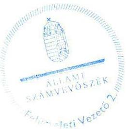

Salamon Tídikó
felügyeleti vezető

---

.

---

# RÖVIDÍTÉSEK JEGYZÉKE 

${ }^{1}$ ÁSZ
${ }^{2}$ ÉDUVÍZIG, intézmény
${ }^{3}$ 1995. évi LVII. törvény
${ }^{4}$ 232/1996. (XII. 26.) Korm. rendelet
${ }^{5}$ 347/2006. (XII. 23.) Korm. rendelet
${ }^{6}$ Korm. rendeletek
${ }^{7} \mathrm{NeKl}$
${ }^{8}$ VM
${ }^{9}$ BM
${ }^{10}$ Miniszter
${ }^{11}$ OVF
${ }^{12}$ Nvtv.
${ }^{13}$ Áht. 2
${ }^{14}$ Áht. 1
${ }^{15}$ Ámr.
${ }^{16}$ Bkr.
${ }^{17}$ ÁSZ tv.
${ }^{18}$ ÁSZ SZMSZ
${ }^{19}$ 300/2011. (XII. 22.) Korm. rendelet
${ }^{20}$ 13/2011. (V. 23.) BM utasítás
${ }^{21}$ 47/2012. (XI. 30.) BM utasítás
${ }^{22}$ Ávr.
${ }^{23}$ SZMSZ

Állami Számvevőszék
Észak-dunántúli Vízügyi Igazgatóság, (2011. december 31-ig Észak-dunántúli Környezetvédelmi és Vízügyi Igazgatóság)
1995. évi LVII. törvény a vízgazdálkodásról

232/1996. (XII. 26.) Korm. rendelet a vizek kártételei elleni védekezés szabályairól
347/2006. (XII. 23.) Korm. rendelet a környezetvédelmi, természetvédelmi, vízvédelmi hatósági és igazgatási feladatokat ellátó szervek kijelöléséről (hatálytalan: 2014. január 1-től)
a vízügyi hatósági feladatokat ellátó szervek kijelöléséről szóló 482/2013. (XII. 17.) Korm. rendelet (hatálytalan: 2014. szeptember 10-től), valamint a vízügyi hatósági feladatokat ellátó szervek kijelöléséről szóló 223/2014. (IX.4.) Korm. rendelet
A 347/2006. (XII. 23.) Korm. rendelet 41/A §-a alapján a Vízügyi és Környezetvédelmi Központi Igazgatóságból 2012. január 1-ével létrehozott Nemzeti Környezetügyi Intézet
Vidékfejlesztési Minisztérium
Belügyminisztérium
2011. december 31-ig Vidékfejlesztési Miniszter, 2012. január 1-től Belügyminiszter
Országos Vízügyi Főigazgatóság
2011. évi CXCVI. törvény a nemzeti vagyonról
2011. évi CXCV. törvény az államháztartásról (hatályos 2012. január 1-jétől)
1992. évi XXXVIII. törvény az államháztartásról (hatálytalan: 2012.január 1-jétől)
292/2009. (XII. 19.) Korm. rendelet az államháztartás múködési rendjéről (hatálytalan: 2012. január 1-jétől)
370/2011. (XII. 31.) Korm. rendelet a költségvetési szervek belső kontrollrendszeréről és belső ellenőrzéséről (hatályos 2012. január 1-jétől) 2011. évi LXVI. törvény az Állami Számvevőszékről, hatályos 2011. július 1-jétől

Állami Számvevőszék Szervezeti és Múködési Szabályzata
300/2011. (XII. 22.) Korm. rendelet a vízügyi igazgatási szervek irányításának átalakításával összefüggésben egyes kormányrendeletek módosításáról
A BM fejezethez tartozó egyes költségvetési szervek középirányító szervként történő kijelöléséről, az irányítói jogok gyakorlásának módjáról szóló 13/2011. (V. 23.) BM utasítás

Az OVF Szervezeti és Múködési Szabályzatáról szóló 47/2012. (XI. 30.) BM utasítás
368/2011. (XII. 31.) Korm. rendelet az államháztartásról szóló törvény végrehajtásáról
Szervezeti és Múködési Szabályzat
ÉDUVÍZIG 5/2009. Igazgatói Rendelet (hatályban 2009. október 13-tól 2012. december 16-ig)
ÉDUVÍZIG 200-3/2013. Igazgatói Rendelet (hatályban 2012.12.17-től 2014. január 1-ig)

---

ÉDUVÍZIG 3000-12/2014 sz. Igazgatói Utasítás (hatályban 2014. január 1-től)
24 ügyrendi szabályzat
ÉDUVÍZIG 5/2009. Igazgatói Rendelettel kiadott Szervezeti, Működési és
Ügyrendi Szabályzata (hatályos 2009.október 13-tól 2012. december 17-ig)
ÉDUVÍZIG 200-4/2013 Igazgatói Rendelettel kiadott Ügyrendi Szabályzata
(hatályos 2013. március 4-től 2014. március 31-ig)
ÉDUVÍZIG 3000-20/2014. Igazgatói Utasítással kiadott Ügyrendi Szabályzata
(hatályos 2014. április 1-től)
ÉDUVÍZIG 25177/2006. sz. dokumentum
ÉDUVÍZIG 100-48/2012. sz. Igazgatói Utasítás
26 Munka tv. 1,2
1992. évi XXII. törvény a munka törvénykönyvéről (hatálytalan: 2013. január 1-
jétől) és 2012. évi I. törvény a munka törvénykönyvéről (hatályos: 2012. július 1-
jétől)
27 Számv. tv.
2000. évi C. törvény a számvitelről
ÉDUVÍZIG 3000/19/2014. sz. Igazgató Utasítás (hatályos 2014. május 6-tól)
28 számviteli politika
249/2000. (XII. 24.) Korm. rendelet az államháztartás szervezetei beszámolási és
29 Áhsz. 1
könyvvezetési kötelezettségének sajátosságairól (hatálytalan: 2014. január 1-
jétől)
30 Áhsz. 2
4/2013. (I. 11.) Korm. rendelet az államháztartás számviteléről (hatályos: 2014.
január 1-jétől)
31 eszközök és források értékelési szabályzata ÉDUVÍZIG 69010/2007. sz. Igazgatói Utasítás (hatályos 2007. július 5-től)
ÉDUVÍZIG 646/2012. sz. szabályozás (hatályban 2012. január 1-től)
32 pénzkezelési szabályzat
ÉDUVÍZIG 100-70/2013. sz. Igazgatói Utasítás (hatályos 2013 december 2-től)
33 leltározási és leltárkészítési szabályzat
ÉDUVÍZIG 3000-18/2014. sz. Igazgatói Utasítás (hatályos 2014. május 6-tól)
34 eszközök és források értékelési szabályzata ÉDUVÍZIG 3000-17/2014. sz. Igazgatói Utasítás (hatályos 2014. május 6-tól)
35 bizonylati rend
ÉDUVÍZIG 3000-16/2014 .sz. Igazgatói Utasítás (hatályos 2014. május 6-tól)
36 önköltségszámítási szabályzat
ÉDUVÍZIG 100-13/2014. sz. szabályozás (hatályos 2014. május 6-tól)
37 számlarend
ÉDUVÍZIG 3000-15/2014. sz. Igazgatói Utasítás (hatályos 2014. május 6-tól)
38 Kbt. 1
2003. évi CXXIX. törvény a közbeszerzésekről (hatálytalan: 2012. január 1-jétől)
39 Kbt. 2
2011. évi CVIII. törvény a közbeszerzésekről (hatályos: 2011. augusztus 21-től)
40 ellenőrzési nyomvonal
ÉDUVÍZIG 5/2007 Igazgatói Rendelet (hatályban 2007. július 15-től 2012. október
17-ig)
41 Vnytv.
2007. évi CLII. törvény az egyes vagyonnyilatkozat-tételi kötelezettségekről
ÉDUVÍZIG 100-9/2010 sz. Igazgatói Utasítás (hatályos 2010. szeptember 1-től)
ÉDUVÍZIG 100-45/2012 sz. Igazgatói Utasítás (hatályos 2012. október 18-tól)
43 iratkezelési szabályzat
ÉDUVÍZIG 5010/2009 sz. Igazgatói Utasítás (hatályos 2009. október 1-től)
ÉDUVÍZIG 190-13/2011. sz. Igazgatói Utasítás (hatályos 2012. január 1-től)
44 lkr.
335/2005. (XII. 29.) Korm. rendelet a közfeladatot ellátó szervek iratkezelésének
45 Avtv.
általános követelményeiről
1992. évi LXIII. törvény a személyes adatok védelméről és a közérdekű adatok
nyilvánosságáról (hatálytalan: 2012. január 1-jétől)
46 Info tv.
2011. évi CXII. törvény az információs önrendelkezési jogról és az
információszabadságról (hatályos 2011. július 26-tól)
47 adatvédelmi és adatbiztonsági szabályzat
ÉDUVÍZIG 100-8/2013. sz. Igazgatói Utasítás (hatályban 2013. április 1-től)
48 Ltv.
1995. évi LXVI. törvény a köziratokról, a közlevéltárakról és a magánlevéltári
anyag védelméről
49 Ber.
193/2003. (XI. 26.) Korm. rendelet a költségvetési szervek belső ellenőrzéséről
(hatálytalan 2012. január 1-jétől)

---

${ }^{50}$ 2011. évi CXIV. törvény
${ }^{51}$ NGM
${ }^{52}$ 36/2013. (IX. 13.) NGM rendelet
${ }^{53} \mathrm{KVI}$
${ }^{54}$ vagyonkezelési szerződés
${ }^{55}$ Vtvr.
${ }^{56} \mathrm{Vtv}$.
${ }^{57}$ Nfatv.
${ }^{58}$ új vagyonkezelési szerződés
${ }^{59}$ ÁSZ tv.
2011. évi CXIV. törvény a Magyar Köztársaság 2011. évi költségvetéséről szóló 2010. évi CLXIX. törvény módosításáról

Nemzetgazdasági Minisztérium
36/2013. (IX. 13.) NGM rendelet az államháztartás számvitelének 2014. évi megváltozásával kapcsolatos feladatokról
Kincstári Vagyoni Igazgatóság
A Kincstári Vagyoni Igazgatóság és az intézmény között megkötött, 290549/1998/0100 ikt. számú, 1998. december 16-án kelt vagyonkezelési szerződés
254/2007. (X. 4.) Korm. rendelet az állami vagyonnal való gazdálkodásról 2007. évi CVI. törvény az állami vagyonról
2010. évi LXXXVII. törvény a Nemzeti Földalapról

Az ÉDUVIZIG és az NFA között VK2013-429 ikt. számon, 2013. szeptember 3-án ingatlan vagyonkezelésbe adására, állami alapfeladat ellátása céljából megkötött vagyonkezelési szerződés
2011. évi LXVI. törvény az Állami Számvevőszékről, hatályos 2011. július 1-jétől

---

.

---

.

---

# ÁLLAMI SZÁMVEVŐSZÉK 

1052 Budapest, Apáczai Csere János utca 10.
Levélcím: 1364 Budapest 4. Pf. 54
Telefon: +36 14849100 Telefax: +36 14849200
www.asz.hu