# ÁLLAMI   SZÁMVEVŐSZÉK 

## JELENTÉS

a Szellemi Tulajdon Nemzeti Hivatala pénzügyi és vagyongazdálkodásának, a HIPAvilon Nkft-vel fennálló szerződéses kapcsolatai szabályszerűségének és a közös jogkezelő szervezetekkel kapcsolatos feladatellátásának ellenőrzéséről

---

# Állami Számvevőszék 

Iktatószám: V-0625-389/2016.
Témaszám: 1659
Vizsgálat-azonosító szám: V0679

## Az ellenőrzést felügyelte:

Dr. Benedek Mária
felügyeleti vezető

## Az ellenőrzés végrehajtásáért felelős:

Preller Zsuzsanna
ellenőrzésvezető

## Az ellenőrzést vezette:

Preller Zsuzsanna
ellenőrzésvezető

## Az összefoglaló jelentést készítette:

Preller Zsuzsanna
ellenőrzésvezető

## Az ellenőrzést végezték:

Dr. Babos János
számvevő főtanácsos
Lipták Terézia Éva
számvevő
Dr. Schreiber Judit Zsuzsanna
számvevő főtanácsos

## Jenei Zoltán Béláné

számvevő tanácsos
Dr. Lőrincz Zoltán
számvevő főtanácsos
Uram Ferenc
számvevő tanácsos

## A témához kapcsolódó eddig készített számvevőszéki jelentés:

## címe

Jelentés Magyarország 2013. évi költségvetése végrehajtásának ellenőrzéséről
Jelentés Magyarország 2012. évi központi költségvetése végrehajtásának ellenőrzéséről
Jelentés a belső kontrollrendszer és a belső ellenőrzés szabályszerűségének a zárszámadási ellenőrzésbe bevont központi költségvetési intézményeknél lefolytatott ellenőrzéséről
Jelentés a Magyar Köztársaság 2011. évi költségvetése végrehajtásának ellenőrzéséről
Jelentés a Magyar Köztársaság 2010. évi költségvetése végrehajtásának ellenőrzéséről
sorszáma
14207
13080
1298

1297

1117

---

Vélemény a Magyar Köztársaság 2011. évi költségvetési javasla- 1025 tához
Jelentés a Magyar Köztársaság 2009. évi költségvetése végrehaj- 1016 tásának ellenőrzéséről
Jelentés a Magyar Köztársaság 2008. évi költségvetése végrehaj- 0928 tásának ellenőrzéséről
Vélemény a Magyar Köztársaság 2009. évi költségvetési javasla- 0836 tához
Vélemény a Magyar Köztársaság 2008. évi költségvetési javasla- 0736 tához

---

# TARTALOMJEGYZÉK 

BEVEZETÉS ..... 3
I. ÖSSZEGZŐ MEGÁLLAPÍTÁSOK, KÖVETKEZTETÉSEK, JAVASLATOK ..... 10
II. RÉSZLETES MEGÁLLAPÍTÁSOK ..... 20

1. A Hivatalra vonatkozó irányító szervi feladatellátás ..... 20
2. A belső kontrollrendszer és az integritás kontrollok kialakítása és múködtetése a Hivatalnál ..... 21
3. A Hivatal pénzügyi gazdálkodása ..... 24
3.1. Az előirányzatok megállapítása és módosítása ..... 24
3.2. A kiadási előirányzatok felhasználása és a bevételi előirányzatok teljesítése ..... 26
3.3. Az előirányzat-maradványok kezelése ..... 28
3.4. A fizetőképesség alakulása ..... 28
4. A Hivatal vagyongazdálkodása ..... 30
4.1. A vagyongazdálkodás szabályozottsága ..... 30
4.2. Az eszközök és források értékének kimutatása, az eszközök visszapótlása ..... 30
4.3. A vagyonátadás- és átvétel, a vagyonelemek hasznosítása ..... 32
4.4. Az eredményszemléletű számvitel bevezetésével kapcsolatos feladatok végrehajtása ..... 33
5. A korábbi ÁSZ ellenőrzések során tett javaslatok hasznosulása érdekében tett intézkedések ..... 33
6. A Hivatal és a HIPAvilon Nkft. szerződéses kapcsolatainak szabályszerűsége ..... 35
6.1. A Hivatal döntése, valamint a HIPAvilon Nkft-vel létrejött megállapodások alapján ellátandó feladatok jogszabályi megfelelősége ..... 35
6.1.1. A megállapodások alapján ellátott feladatok ..... 35
6.1.2. A szabadalmi bejelentés dokumentumaiba való betekintésre vonatkozó jogszabályi előírások betartása ..... 38
6.1.3. Az alapító okirat és a szervezeti és múködési szabályzat megfelelősége ..... 38
6.1.4. A Hivatal munkavállalói részére a további jogviszony létesítésének engedélyezése ..... 38

---

6.2. A HIPAvilon Nkft. által a Hivatal döntése, vagy a vele kötött megállapodásokban foglaltak végrehajtása érdekében megkötött szerződések tartalmának, elszámolásának megfelelősége ..... 39
6.2.1. A szerződések elszámolása ..... 39
6.2.2. A szerződések tárgya ..... 40
6.2.3. A titokvédelmi előírások érvényesítése a szerződésekben ..... 41
6.2.4. A HIPAvilon Nkft saját és a Hivatal munkavállalóival kötött szerződései ..... 41
7. A Hivatal közös jogkezeléssel kapcsolatos feladatellátásának szabályszerűsége ..... 42
7.1. A Hivatal közös jogkezeléssel kapcsolatos feladatainak ellátását támogató kontrollkörnyezet jogszabályi megfelelősége ..... 42
7.1.1. A közös jogkezeléssel kapcsolatos feladatok rögzítése az SZMSZ-ben ..... 42
7.1.2. A közös jogkezeléssel kapcsolatos feladatok rögzítése a belső szabályzatokban ..... 43
7.2. A Hivatal közös jogkezelő szervezetekkel kapcsolatos feladatellátásának szabályszerűsé ..... 44
7.2.1. A közös jogkezelő szervezetek nyilvántartásának kialakítása, vezetése ..... 44
7.2.2. A közös jogkezelő szervezetek által benyújtott díjszabások jóváhagyásának előkészítése ..... 45
7.2.3. A közös jogkezelő szervezetek által benyújtott támogatási politikák és a bevétel felhasználására vonatkozó miniszteri döntés előkészítése ..... 46
7.2.4. A Hivatal közös jogkezelő szervezetek felett gyakorolt felügyeleti tevékenység ..... 46
MELLÉKLETEK

1. számú A Hivatal belső kontrollrendszere kialakításának és múködtetésének érté- kelése
2. számú A Hivatal kiadásainak, bevételeinek és létszámának alakulása
3. számú A Hivatal eszközeinek és forrásainak alakulása
4. számú A Hivatal tárgyi eszközeivel kapcsolatos mutatószámok alakulása
5. számú Az IM minisztere, a Hivatal elnöke és a HIPAvilon Nkft. ügyvezető igazga- tója által tett észrevételek
6. számú Az észrevételekre adott válaszok

# FÜGGELÉKEK 

1. számú Rövidítések jegyzéke
2. számú Értelmező szótár
3. számú A gazdaságossági, hatékonysági és eredményességi követelmények kiala- kítása és múködtetése a gazdálkodás folyamatában, valamint a vezetői nyilatkozat helytállósága

---

# JELENTÉS 

## a Szellemi Tulajdon Nemzeti Hivatala pénzügyi és vagyongazdálkodásának, a HIPAvilon Nkftvel fennálló szerződéses kapcsolatai szabályszerűségének és a közös jogkezelő szervezetekkel kapcsolatos feladatellátásának ellenőrzéséről

## BEVEZETÉS

A közpénzek felhasználásában és az állami vagyonnal való gazdálkodásban a központi alrendszer egyes intézményei meghatározó súlyt képviselnek. Pénz-ügyi- és vagyongazdálkodásuk rendszeres ellenőrzésével az ÁSZ - stratégiájával összhangban - hozzájárul a hatékony közigazgatás megteremtéséhez, a közfeladatot ellátó szervezetek átláthatóságának biztosításához, a közvagyon védelméhez az elszámoltatható közpénzfelhasználás megteremtéséhez.

A Hivatal a szellemi tulajdon védelméért felelős kormányhivatal, amely a találmányi szabadalmakról szóló 1895. évi XXXVII. törvény 23. §-a alapján jött létre 1896-ban. Feladatait az Szt. állapította meg. Feladatkörében az alábbi közfeladatokat látja el: iparjogvédelmi hatósági vizsgálatok és eljárások lefolytatása, a szerzői és a szerzői joghoz kapcsolódó jogokkal összefüggő egyes feladatok ellátása, az állami dokumentációs és információs tevékenység a szellemi tulajdon területén, nemzetközi szakmai feladatok ellátása, a kutatás-fejlesztési tevékenység minősítésével kapcsolatos hatósági és szakértői feladatok. Az ellenőrzött időszakban feladatstruktúrája három alkalommal változott, amelynek során az árva művek felhasználásának engedélyezési feladataival és jogkörével, a szerzői jogi közös jogkezelő szervezetekről való nyilvántartás vezetésével, és a közös jogkezelői tevékenység felügyeletével, valamint a kutatás-fejlesztési tevékenység minősítésével kapcsolatos hatósági és szakértői feladatok ellátásával bővült.

A Hivatal önállóan múködő és gazdálkodó jogkörrel rendelkező közhatalmi költségvetési szerv. A Hivatal költségvetése a felügyeletet ellátó miniszter által vezetett minisztérium költségvetési fejezetén belül önálló címet képez. A Hivatal felügyeletét 2008. május 15-e előtt a gazdasági és közlekedési miniszter, 2009. április 15-ig a kutatás-fejlesztésért felelős tárca nélküli miniszter, 2010. május 29ig az igazságügyi és rendészeti miniszter, 2014. június 5 -ig a közigazgatási és igazságügyi miniszter, 2014. június 6 -ától az igazságügyi miniszter látta el. A Hivatal átalakítására, vagy pénzügyi és vagyongazdálkodására hatást gyakorló átszervezésére nem került sor, 2011. január 1-jével névváltozás történt. A Hivatalt az ellenőrzéssel érintett időszakban az elnök vezette, aki a felügyeleti szerv

---

vezetőjének, illetve 2009. január 1-jétől a fejezetet irányító szerv vezetőjének minősült, munkáját a műszaki és jogi elnökhelyettesek segítették.

A Hivatal önfinanszírozó módon gazdálkodik, a jogszabályban rögzített iparjogvédelmi, igazgatási, szolgáltatási, felügyeleti és a nemzetközi eljárási díjakból származó bevételekből biztosította a feladatainak ellátásához szükséges kiadások fedezetét, az eredeti előirányzatai költségvetési támogatást nem tartalmaztak. Teljesített költségvetési kiadásai a 2008. évi 3785,7 millió Ft-ról a 2013. évre 13,3\%-kal, 4287,8 millió Ft-ra emelkedtek. A kiadások növekedését a dologi és dologi jellegű (egyéb folyó) kiadások, a támogatásértékű kiadások és a felhalmozási kiadások emelkedése határozta meg. A teljesített bevételek a 2013. évben 457,4 millió Ft-tal, 10,2\%-kal haladták meg a 2008. évi 4464,0 millió Ft-ot, a közhatalmi bevételek, az intézményi múködési bevételek, illetve az előirányzat maradvány felhasználásának növekedése eredményeként.

1. ábra

Az előirányzatok, a bevételek és a kiadások alakulása (millió Ft)
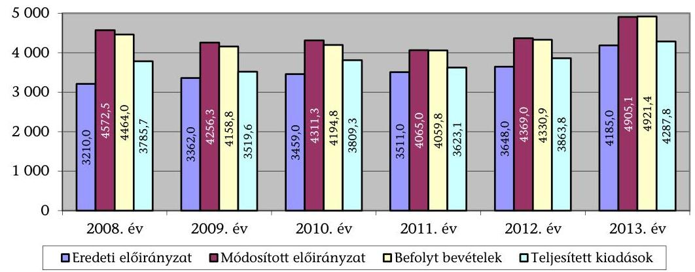

A Hivatal vagyona - a könyvviteli mérlegben nyilvántartott eszközök értéke - a 2008. január 1-jei 2928,0 millió Ft-ról a 2013. évre 3295,6 millió Ft-ra, 12,6\%-kal nőtt. A vagyonelemek összetételi aránya megváltozott, míg a befektetett eszközök állománya a 2008. évi 1952,3 millió Ft-ról a 2013. évre 1792,8 millió Ft-ra, 8,2\%-kal csökkent, addig a forgóeszközök állománya 2008. és 2013. között 527,1 millió Ft-tal, 54,0\%-kal nőtt a követelések és a pénzeszközök állománynövekedésének hatására. A források körében a saját tőke összege a befektetett eszközökkel arányosan 7,8\%-kal, 154,1 millió Ft-tal csökkent, míg a tartalékok összege 62,1\%-kal, 242,7 millió Ft-tal nőtt.

A Hivatal költségvetési engedélyezett létszámkerete a 2008. évi 219 fơről a 2013. évre 6,8\%-kal, 204 főre csökkent a központilag elrendelt létszámcsökkentés hatására.

A KIM a közalapítványokkal és alapítványokkal kapcsolatos intézkedések keretében 2012. február 21-én alapította a Tudományos és Technológiai Közhasznú Nonprofit Korlátolt Felelősségű Társaságot, melynek elnevezése 2012. április 20ától HIPAvilon Magyar Szellemi Tulajdon Ügynökség Nonprofit Korlátolt Felelősségű Társaságra változott. A társaság tevékenysége a névváltozással és profilváltással hozzáigazítható volt a Hivatal feladataihoz kapcsolódó, a Hivatal által

---

gazdasági társasági formában ellátni tervezett feladatokhoz, ezért 2012. április 11-től a vagyonkezelői jogok gyakorlására a Hivatal vált jogosulttá. Az Alapító Okirat ${ }_{1}$ szerint a HIPAvilon Nkft. célja a Hivatal által ellátott közfeladatok hatékonyabb végrehajtásának támogatása, valamint szolgáltatások nyújtása, a Hivatal belföldi hatósági és szakpolitikai tevékenységének támogatása, a Hivatal belföldi és nemzetközi szolgáltatásaiban való közremúködés, szellemitulajdonalapú innovációmenedzsment a közfinanszírozású innováció és modernizáció megvalósítása során.

A Hivatal 2011. január 1-jétől látta el a közös jogkezelő szervezetek felügyeletével, nyilvántartásával, díjszabás jóváhagyásának, valamint támogatási politikájának és a bevétel jogosultak érdekében történő felhasználására vonatkozó döntésük miniszteri jóváhagyásának előkészítésével kapcsolatos feladatokat. A közös jogkezelés felett gyakorolt felügyelettel összefüggésben a felmerült költségek fedezése érdekében a közös jogkezelő szervezetek a Hivatal javára évente felügyeleti díjat kötelesek fizetni. Ennek összege a közös jogkezelő szervezet előző évi nettó árbevételének 0,3\%-a, 2013-ban 52,9 millió Ft, 2014-ben 54,6 millió Ft volt. Az ellenőrzést a 2013-2014. évekre vonatkozóan folytattuk le. Az ellenőrzés során az ÁSZ értékelte, hogy a közös jogkezeléssel kapcsolatos feladatok ellátását támogató kontrollkörnyezet kialakítása, a közös jogkezelő szervezetek nyilvántartásának kialakítása, vezetése megfelelt-e az előírásoknak, a közös jogkezelő szervezetek által benyújtott díjszabások, támogatási politikák, illetve a bevétel felhasználására vonatkozó miniszteri döntés előkészítése a jogszabályi előírásoknak megfelelően történt-e. Értékelte továbbá az SZTNH közös jogkezelő szervezetek felett gyakorolt felügyeleti tevékenységének szabályszerűségét.

# Az ellenőrzés célja annak megállapítása volt, hogy 

- a Hivatalra vonatkozó irányító szervi feladatellátás a jogszabályi előírások betartásával történt-e;
- a Hivatalnál a belső kontrollrendszer kialakítása és múködtetése szabályszerű volt-e;
- kialakították-e az erőforrásokkal való szabályszerű és hatékony gazdálkodáshoz szükséges követelményeket, megvalósították-e azok számon kérését, ellenőrzését;
- a Hivatal pénzügyi és vagyongazdálkodása megfelelt-e a jogszabályi előírásoknak és belső szabályzatainak;
- a Hivatal átalakításának vagy átszervezésének lebonyolítása szabályszerűen történt-e;
- az integritási kontrollokat kialakították-e, szabályszerűen működtetik-e;
- az ÁSZ korábbi ellenőrzései során megfogalmazott javaslatok végrehajtása érdekében a Hivatal a szükséges intézkedéseket megtette-e;
- a Hivatal döntése, valamint a HIPAvilon Nkft.-vel létrejött megállapodások alapján a HIPAvilon Nkft. által ellátandó feladatok köre összhangban állt-e jogszabályi előírásokkal;

---

- a HIPAvilon Nkft. által, a Hivatal döntése, vagy a vele kötött megállapodásokban foglaltak végrehajtása érdekében megkötött szerződések tartalma, elszámolása megfelelő volt-e;
- a Hivatal közös jogkezelőkkel kapcsolatos feladatellátása szabályszerű volt-e;
- a közös jogkezeléshez kapcsolódó kontrollkörnyezet kialakítása megfelelt-e az előírásoknak.

A belső kontrollrendszer államháztartási törvényben rögzített célja a múködés és gazdálkodás során a tevékenységek szabályszerű, gazdaságos, hatékony és eredményes végrehajtása. Az ÁSZ a központi intézmények ellenőrzését teljesítményellenőrzési modullal egészítette ki. A Hivatal teljesítmény-ellenőrzésének célja annak értékelése volt, hogy a gazdálkodás folyamatában a gazdaságossági, hatékonysági és eredményességi követelmények kialakítása megtörténte és azokat múködtették-e; a költségvetési szerv belső kontrollrendszerének minőségéről kiadott vezetői nyilatkozatban a költségvetési szerv tevékenységében a hatékonyság, eredményesség, gazdaságosság követelményeinek érvényesítése helytálló volt-e. A teljesítmény-ellenőrzés a gazdálkodási feladatokra terjedt ki, a szakmai feladatellátást nem értékelte.

Az ellenőrzés várható hasznosulása: A központi alrendszerbe tartozó intézmények jelentős hatást gyakorolhatnak a költségvetés egyensúlyának fenntartására, az állami vagyonnal való gazdálkodás minőségére, a kormányzati (szak)politikák végrehajtására, illetve közfeladat ellátásuk vonatkozásában az állampolgárok életminőségére, jogaik és kötelezettségeik gyakorlására. Az ellenőrzés a Hivatal pénzügyi és vagyongazdálkodása szabályosságának javításával előmozdítja a közpénzügyek átláthatóságát, rendezettségét.

A közintézmények integritás alapú kultúrája meghatározó a belső kontrollrendszer múködése szempontjából. Hozzájárulhat az elszámoltathatóság és átláthatóság érvényesítéséhez, egyben támogathatja a szervezet védettségét a korrupciós kitettséggel szemben. Az integritási kontrollok ellenőrzése az integritási szemlélet terjedését, az integritás kultúra erősítését támogatja.

Az államháztartáson kívül múködő közfeladat-ellátó rendszerek ellenőrzéseivel az ÁSZ hozzájárul ahhoz, hogy a közpénzeket az államháztartáson kívül múködő szervezetek is átlátható, rendezett módon használják fel a közfeladatok szerződésben vállalt ellátása, továbbá a közvagyon szerződésben vállalt átlátható, hatékony, költségtakarékos múködtetése, értékének megőrzése, állagának védelme, értéknövelő használata, hasznosítása és gyarapítása érdekében. Az ellenőrzéssel az ÁSZ feltárja, hogy a Hivatal a jogszabályokkal összhangban ha-tározta-e meg a HIPAvilon Nkft.-vel kötött megállapodásokban az állami tulajdonban lévő gazdálkodó szervezet által ellátandó feladatok körét. Az ellenőrzés rámutathat az állami tulajdonú gazdálkodó szervezetek gazdálkodási tevékenységével, valamint az államháztartásból származó források felhasználásával kapcsolatos jó gyakorlatokra és szabálytalanságokra. Felhívhatja a figyelmet a jogszabályi követelmények teljesítéséhez szükséges feltételek hiányosságaira, hozzájárulhat az államháztartáson kívüli, de (közvetlenül vagy közvetve) állami vagyont használó gazdálkodó szervezetek tevékenységének átláthatóságához.

---

Hozzájárulhat a közfeladat-ellátás minőségének javulásához. Az ÁSZ értékteremtő rend kialakításához és megőrzéséhez hozzájáruló tevékenysége pozitív hatással van a szervezetről kialakított összkép formálására is.

Az ellenőrzés rámutathat a közös jogkezelő szervezetek nyilvántartásának vezetésével, díjszabásának, támogatáspolitikájának jóváhagyási eljárásával, felügyeletével kapcsolatos jó gyakorlatokra és szabálytalanságokra. Felhívhatja a figyelmet a jogszabályi követelmények teljesítéséhez szükséges feltételek hiányosságaira. Hozzájárulhat a közfeladat-ellátás minőségének javulásához. Az ÁSZ ellenőrzése a törvényalkotás számára támogatást nyújt a közös jogkezelőkkel kapcsolatos előírások finomításához. A döntéshozók, a Hivatal és irányító szerve, a közös jogkezelők és a társadalom számára objektív visszajelzést ad a közös jogkezelést érintő, 2011-2013. években hatályba lépett intézkedések hatásairól. Az ÁSZ értékteremtő rend kialakításához és megőrzéséhez hozzájáruló tevékenysége pozitív hatással van a szervezetről kialakított összkép formálására is.

A teljesítmény-ellenőrzéssel az ÁSZ a törvényalkotás számára támogatást nyújt a nemzeti kulcsindikátorok rendszerének kialakításához. A döntéshozók, ellenőrzöttek, irányító szervek, a társadalom számára az összehasonlítási, összemérési lehetőségek kihasználásával objektív visszajelzést ad a gazdálkodás területén végrehajtott szervezeti, szervezési, takarékossági és bürokráciacsökkentő intézkedések hatásairól, a közfeladat-ellátásnak keretet adó pénzügyi és vagyongazdálkodásban mérhető teljesítménykövetelmények kialakításáról, azok alkalmazásáról. Az ÁSZ értékteremtő elemzéseivel, tanácsadó szerepét erősítve támogatja a szervezetek önértékelő, alkalmazkodó (öntanuló) tevékenységét. Irányt mutat az ellenőrzött intézmények gazdálkodási és kapcsolódó adminisztratív folyamatainak optimalizációjához. Segíti a központi költségvetési szervek átláthatóságát, felügyelhetőségét, a „jó gyakorlatok" elterjesztésével támogatja a „jó kormányzást".

Az ellenőrzés típusa szabályszerűségi ellenőrzés, amelyet a Hivatalra vonatkozó teljesítmény-ellenőrzés egészített ki.

# Az ellenőrzött időszak: 

- a pénzügyi és vagyongazdálkodás szabályszerűségi és teljesítmény ellen-őrzése vonatkozásában 2008. január 1-jétől - 2013. december 31-ig;
- a HIPAvilon Nkft-vel való szerződéses kapcsolatok szabályszerűségének ellenőrzése vonatkozásában 2012. január 1-jétől- 2014. december 31-ig;
- a közös jogkezelő szervezetekkel kapcsolatos feladatellátás ellenőrzése vonatkozásában 2013. január 1-jétől- 2014. december 31-ig.

Az ellenőrzéssel érintett szervezetek: a szabályszerűségi ellenőrzés tekintetében a Hivatal és a Hivatal felügyeleti szervi feladatait ellátó Minisztérium, valamint a HIPAvilon Nkft., a teljesítményellenőrzés esetében a Hivatal.

Az ellenőrzés jogszabályi alapját az ÁSZ tv. 1. § (3) bekezdés, 5. § (2)(6) bekezdései, valamint Áht. 2 61. § (2) bekezdésének előírásai képezik.

---

A központi alrendszer intézményei pénzügyi és vagyongazdálkodásának ellenőrzése során a belső kontrollrendszer tekintetében a hangsúlyt az egyes kontrollterületek (kontrollkörnyezet, kockázatkezelési rendszer, kontrolltevékenységek, információs és kommunikációs rendszer, monitoring rendszer) kialakításának és az intézmény működési folyamataiba való beépülésének szabályszerűségére helyeztük, amelyet kizárólag jogszabályokból és intézményi belső szabályozásokból levezethető kritériumrendszer alapján ítéltünk meg.

A belső kontrollrendszer jogszabályi előírások szerinti kialakításának és működtetésének szabályszerűségét az erre irányuló ellenőrzési kérdésekre adott válaszok összesítése alapján kontrollterületenként egyedileg és összesítetten is értékeltük. A belső kontrollrendszer egyes kontrollterületei kialakítása és múködtetése „szabályszerü volt", tehát a feltárt hiányosságok nem gyakoroltak lényeges hatást a kontrollok kialakítására és működtetésére, amennyiben az értékelt területen az elért és elérhető pontok százalékban kifejezett hányadosa elérte a $85 \%$-ot, „nem volt szabályszerü", ha nem haladta meg a $60 \%$-ot, és „részben szabályszerü volt", ha 61-84\% között volt.

A belső kontrollrendszer összesített értékelése megegyezett a kontrollterületenként alkalmazott \%-os értékelésekkel, a következő kiegészítéssel. A kontrollrendszer egésze esetében a „szabályszerü" értékelésnek a \%-os értéken felül további feltétele volt, hogy egyik kontrollterületen sem kaphatott „nem volt szabályszerü" értékelést. A „részben szabályszerü" értékelés további feltétele volt, hogy legfeljebb egy ellenőrzött kontrollterület lehetett „nem volt szabályszerü" értékelésű. Az öszszesített értékelés a \%-os kiértékelés eredményétől függetlenül „nem volt szabályszerű", ha az ellenőrzött kontrollterületek közül több mint egynek „nem volt szabályszerü" az értékelése.

A személyi juttatások, a dologi kiadások és dologi jellegű (egyéb folyó) kiadások, a támogatásértékű kiadások, az átadott pénzeszközök és a felhalmozási kiadások előirányzatai felhasználásának, valamint a vagyonhasznosítási bevételi előirányzatok teljesítésének szabályszerűségét és a gazdálkodási jogkörök gyakorlását mintavétellel ellenőriztük. A jogszabályoknak és a belső előírásoknak megfelelőnek, azaz szabályszerűnek tekintettük az ellenőrzött kiadási előirányzatok felhasználását, illetve bevételi előirányzatok teljesítését, amennyiben a minta ellenőrzésének eredménye alapján $95 \%$-os bizonyossággal a teljes sokaságban a hibás tételek aránya kisebb volt, mint $10 \%$, nem megfelelőnek értékeltük, ha a hibás tételek aránya a 10\%-ot meghaladta. A 2008-2011. éveket érintően a szakmai teljesítésigazolás és az utalvány ellenjegyzése kulcskontrollok, a 2012-2013. éveket érintően a teljesítésigazolás és az érvényesítés kulcskontrollok múködését értékeltük. Megfelelőnek értékeltük a gazdálkodási jogkörök gyakorlását, amennyiben $95 \%$-os bizonyossággal a teljes sokaságban a hibaarány legfeljebb $10 \%$, részben megfelelőnek értékeltük, ha a hibaarány felső határa legfeljebb $30 \%$ volt, nem megfelelőnek pedig akkor, ha a sokaságbeli hibaarány felső határa meghaladta a $30 \%$-ot.

Az ellenőrzés felölelte a Hivatal, valamint az irányítása alatt álló HIPAvilon Nkft. között, a Hivatal döntése, valamint a HIPAvilon Nkft.-vel kötött megállapodások alapján létrejött feladatmegosztás megfelelőségének ellenőrzését. A közpénzekkel való szabályszerű gazdálkodás jegyében a HIPAvilon Nkft. esetében az ÁSZ ellenőrzés kitért arra is, hogy az általa kötött szerződések tartalma,

---

elszámolása megfelelt-e a jogszabályi előírásoknak és a közpénz átlátható, rendezett és helyénvaló felhasználásának.

A Hivatal és a HIPAvilon Nkft. szerződéses kapcsolatainak ellenőrzése mintavételt nem tartalmazott, minden a Hivatal és a HIPAvilon Nkft. között létrejött megállapodásra és minden a megállapodások végrehajtása érdekében a HIPAvilon Nkft. által kötött szerződésre és ezen szerződésekhez kapcsolódó valamennyi kifizetésre kiterjedt. A megállapodások végrehajtása érdekében a HIPAvilon Nkft. által kötött szerződések elszámolásának megfelelősége keretében értékeltük, hogy a szerződéseket a kötelezettség vállalására jogosult személy írta-e alá, a szerződésekben vállalt feladatok teljesítésigazolása a belső szabályozás és/vagy a szerződés szerint történt-e, a kifizetések alapjául szolgáló bizonylatok és a kifizetések főkönyvi könyvelésben történő elszámolása megfelelt-e a Számv. tv. és a belső szabályzatok előírásainak.

Az ellenőrzés a közös jogkezelő szervezetek felett gyakorolt felügyeleti tevékenység, a közös jogkezelő szervezetek által benyújtott díjszabások jóváhagyásának, valamint a támogatás politika és a bevétel felhasználására vonatkozó döntés jóváhagyásának előkészítésével kapcsolatos feladatellátás értékelése esetében mintavételt nem tartalmazott. Az összes felügyeleti eljárásra és valamennyi döntés előkészítő tevékenységre kiterjedt. A közös jogkezelő szervezetek nyilvántartás vezetésének szabályszerűségét évente egy-egy felvétel, adatmódosítás és törlés szúrópróbaszerű kiválasztásával és ellenőrzésével értékeltük.

Az ellenőrzés az INTOSAI által kiadott nemzetközi standardok (ISSAI) figyelembe vételével történt.

Az Ász tv. 29. § (1) bekezdésében foglaltak alapján a jelentéstervezetet megküldtük az ellenőrzött szervezetek részére, akik az ÁSZ tv. 29. § (2) bekezdésében foglalt észrevételezési jogukkal éltek, a jelentéstervezetre észrevételt tettek (5. számú melléklet). Az ÁSZ tv. 29. § (3) bekezdésében előírtaknak megfelelően a figyelembe nem vett észrevételeket és annak indokairól szóló tájékoztatást a jelentés tartalmazza (6. számú melléklet).

---

# I. ÖSSZEGZŐ MEGÁLLAPÍTÁSOK, KÖVETKEZTETÉSEK, JAVASLATOK 

A Hivatalra vonatkozó irányító szervi feladatellátás megfelelő volt. Az alapítói jogosultságok gyakorlása szabályszerűen történt, a Miniszter az ellenőrzött időszakban felügyeleti hatásköreit - a Hivatal SZMSZ-ének jóváhagyását és a vezetői kinevezési jogosítványait kivéve - nem gyakorolta.

A belső kontrollrendszer kialakítása és múködtetése az ellenőrzött időszak összesített értékelése alapján szabályszerű volt. A kontrollkörnyezet, a kockázatkezelési rendszer, az információs és kommunikációs rendszer, valamint a monitoring rendszer kialakítása és múködtetése szabályszerű volt, a feltárt hiányosságok nem gyakoroltak lényeges hatást a kontrollrendszer kialakítására és múködésére. A kontrolltevékenység kialakítása és múködtetése azonban részben volt szabályszerű, mert a gazdálkodási jogkörgyakorlók szabályszerű kijelölésének hiánya miatt a kulcskontrollok múködése az ellenőrzött időszakban nem volt megfelelő. A gazdálkodás folyamatában a gazdaságossági, hatékonysági és eredményességi követelményeket nem alakították ki és nem alkalmazták. A Hivatal kialakította és múködtette a kontrollrendszert az integritás érvényesítése érdekében.

Az ellenőrzött időszakban a Hivatal pénzügyi- és vagyongazdálkodása részben megfelelő volt. Az elemi költségvetés, az előirányzatok megállapítása és módosítása, az előirányzat-maradványok meghatározása és felhasználása során a jogszabályi előírásokat betartották. A kiadások előirányzatainak felhasználása, és a bevételi előirányzatok teljesítése megfelelt a jogszabályi előírásoknak, de a bevételek és kiadások teljesítéséhez kapcsolódó kulcskontrollok múködése - a jogkörgyakorlók szabályszerű kijelölésének hiányosságai következtében - nem volt megfelelő. A mérlegben kimutatott eszközök és források állományának valódiságát mennyiségben és értékben kimutatott leltárral alátámasztották. A leltározás és selejtezés végrehajtása a jogszabályi előírásoknak és a belső szabályzatokban előírt követelményeknek megfelelően történt. A Hivatal vagyongazdálkodási tevékenységéhez kapcsolódó belső kontrollok kialakítása részben felelt meg a jogszabályokban előírtaknak. A beszerzett, létesített immateriális javak és tárgyi eszközök bekerülési értékének megállapítása, állományba vétele, az év végi értékelése és az értékcsökkenésének elszámolása szabályosan történt, a felhalmozási kiadások azonban nem érték el a szinten tartáshoz szükséges mértéket. A Hivatal folyamatos fizetőképessége - a korlátozó intézkedések végrehajtása mellett is - az ellenőrzött időszakban biztosított volt, lehetővé tette a feladatok zavartalan ellátását.

Az ÁSZ korábbi ellenőrzései során tett javaslatok alapján a Hivatal a szükséges intézkedéseket megtette, az ellenőrzött időszak egészét tekintve hasznosultak az ÁSZ javaslatai.

A HIPAvilon Nkft. által a Hivatallal létrejött megállapodások alapján ellátott feladatok köre összhangban volt a jogszabályi előírásokkal. Azonban a

---

Hivatal és a HIPAvilon Nkft. között a létrejött megállapodásokban a HIPAvilon Nkft. által ellátandó nemzetközi kapcsolattartással, valamint újdonságkutatással összefüggő feladatai nem voltak egyértelmúen elkülöníthetők az Szt.-ben előírt, kizárólag a Hivatal által ellátható nemzetközi és európai együttmúködési, illetve hatósági újdonságkutatási feladatoktól. Továbbá a 2013. április 1-jét követően megkötött megállapodásokban a Hivatal az Szt. előírásai ellenére bízta meg a HIPAvilon Nkft-t újdonságkutatási tevékenység végzésével. Minden, a Hivataltól a HIPAvilon Nkft. felé irányuló kifizetés megállapodáson alapult. A HIPAvilon Nkft. a közhasznú szolgáltatási megállapodások keretében ellátott hatósági eljárással összefüggő dokumentációs és ügyiratkezelési, és a szolgáltatás keretében végzett újdonságkutatási feladatok ellátása során nem jutott hozzá olyan információkhoz és nem kezelt olyan adatokat, amelyekbe a szabadalmi bejelentés közzétételéig csak az Szt. szerinti jogosultak tekinthettek be. Azonban a megállapodásokban a HIPAvilon Nkft. által ellátandó adatkezelési feladatok tekintetében nem voltak egyértelmúen rögzítve, hogy azok nem a Hivatal által ellátott hatósági feladataihoz kapcsolódnak. A HIPAvilon Nkft. által ellátott nemzetközi kapcsolattartási, újdonságkutatási, dokumentációs és ügyiratkezelési feladatai az Alapító Okirat ${ }_{1-3}$-ban meghatározott tevékenységi körökkel összhangban voltak. A Hivatalnál a kormánytisztviselők a HIPAvilon Nkft.-vel kötött megbízási szerződéseik vonatkozásában a Kttv. előírásai szerinti előzetes engedélyezési eljárást kezdeményezték, a munkáltatói jogkör gyakorlója általi engedélyezés - egy kivételével - megtörtént. A munkáltatói jogkör gyakorlója mindegyik esetben nyilatkozott arról is, hogy a további jogviszony létesítése a fennálló kormánytisztviselői jogviszonnyal nem összeférhetetlen, annak ellenére, hogy a kormánytisztviselők részére megbízást adó HIPAvilon Nkft. 2013. április 1-jétől kezdődően az Szt. 115/E pontjában foglaltak alapján a megbízás tárgyát képező feladatot nem végezhette volna.

A Hivatal és a HIPAvilon Nkft. közötti megállapodások végrehajtása érdekében a HIPAvilon Nkft. által harmadik személlyel kötött szerződéseinek tartalma - az újdonságkutatásra kötött megbízási szerződések kivételével - összhangban voltak a jogszabályok és az Alapító Okirat ${ }_{1-3}$ előírásaival. Az újdonságkutatás feladatra 2013. április 1-jétől kötött megbízási szerződések tárgya azonban az Szt. előírása ellenére olyan feladat elvégzésére irányult, amely feladat végzésére a HIPAvilon Nkft. 2013. április 1-jét követően nem volt jogosult. A szerződések elszámolása - kisebb hiányosságok ellenére - megfelelt a Számv. tv. és a HIPAvilon belső szabályzataiban foglaltaknak, azonban a kifizetéseket megelőző teljesítésigazolás egy esetben nem történt meg, illetve nem minden esetben a szerződésekben meghatározottaknak megfelelően történt meg. A kifizetés bizonylatai több esetben nem feleltek meg a Számv. tv. előírásának, mert nem tartalmazták az utalványozó személy aláírását. A főkönyvi számlakijelölés több esetben nem a gazdasági esemény tartalmának megfelelően történt. A HIPAvilon Nkft. a jogszabályban előírt kötelezettségét betartva harmadik személynek nem adott át olyan feladatot vagy információt a szerződéses jogviszonya keretében, amelyet kizárólag az Szt. szerinti személyi kör ismerhetett meg. A HIPAvilon Nkft. által újdonságkutatási feladatra kötött megbízási szerződései a saját alkalmazottai esetében az Mt. előírásainak, a Hivatal személyi állományába tartozó kormánytisztviselők esetében a Kttv. előírásainak megfeleltek, azonban 2013. április 1-jétől olyan tevékenységre irányultak, amely tevékenység végzésére a HIPAvilon Nkft. 2013. április 1-jét követően nem volt jogosult.

---

A Hivatal - kisebb hiányosságok ellenére - megfelelően alakította ki a közös jogkezeléssel kapcsolatos feladatai ellátását támogató kontrollkörnyezetet az ellenőrzött időszakban. Az SZMSZ ${ }_{3}$ a Hivatal közös jogkezelő szervezetekkel kapcsolatos feladatai ellátásának rendjét és módját - a közös jogkezelő szervezetek támogatási politikáira és a bevétel jogosultak érdekében történő felhasználására vonatkozó döntések miniszteri jóváhagyásának előkészítésével összefüggő feladatok kivételével - a jogszabályi előírásoknak megfelelően tartalmazta. A közös jogkezeléssel kapcsolatos feladatokat ellátó szervezeti egység SZMSZ ${ }_{3}$-ban meghatározott feladatköre az Szjt. és az Szt. előírásai ellenére nem tartalmazta a közös jogkezelő szervezetek támogatási politikáira és a bevétel jogosultak érdekében történő felhasználására vonatkozó döntések miniszteri jóváhagyásának előkészítésével összefüggő feladatokat a 2012. január 1-je és 2013. december 31-e közötti időszakra vonatkozóan. Az Ávr. előírása ellenére nem készült munkafolyamat leírás a díjszabás és a közös jogkezelő szervezetek támogatási politikája miniszteri jóváhagyására irányuló eljárás munkafolyamataira. A Hivatal belső szabályzataiban a 2014. évben nem az Áhsz. ${ }_{2}$ előírásainak megfelelően rögzítették a felügyeleti díjbevételhez kapcsolódó elszámolási és nyilvántartási feladatokat.

A Hivatal közös jogkezelő szervezetekkel kapcsolatos feladatellátása kisebb hiányosságok ellenére - szabályszerű volt. A közös jogkezelő szervezetek nyilvántartásának kialakítása, vezetése - egy-egy tartalmi hiba és egy esetben a nyilvántartásba vételről szóló közlemény megjelentetésének elmulasztása ellenére - megfelelt az Szjt. és a Kormányrendelet előírásainak. A Hivatal a díjszabások jóváhagyásának előkészítésére vonatkozó eljárásokat az Szjt.-ben foglalt eljárási szabályoknak megfelelően, elektronikus kapcsolattartás formájában folytatta le. A Hivatal az ellenőrzött időszakban az Szjt. előírásainak megfelelően készítette elő a közös jogkezelő szervezetek által benyújtott támogatási politikát és a bevétel felhasználására vonatkozó döntést miniszteri jóváhagyásra. A közös jogkezelő szervezetek felett gyakorolt felügyeleti tevékenység - a felügyeleti díjakkal kapcsolatos késedelmi pótlék kezelésének kivételével - szabályszerű volt. A Hivatal a felügyelet körében az Szjt., és a Kormányrendelet előírásainak megfelelően végzett évente, illetve szükség szerint ellenőrzéseket, a közös jogkezelő szervezetek felügyeletével kapcsolatos ügyekben elektronikus úton tartotta a kapcsolatot, azonban a Kormányrendelet előírása ellenére nem minden esetben figyelmeztette a közös jogkezelő szervezeteket a hiányosan megfizetett felügyeleti díjakkal kapcsolatos késedelmi pótlékfizetési kötelezettségre. A késedelmi pótlék felszámításáról, valamint a felszámított késedelmi pótlék összegének végrehajtásáról a Ket.-ben előírtak ellenére a Hivatal nem intézkedett.

Az ÁSZ tv. 33. § (1) bekezdésében foglaltak értelmében az ellenőrzött szervezet vezetője köteles a jelentésben foglalt megállapításokhoz kapcsolódó intézkedési tervet összeállítani, és azt a jelentés kézhezvételétől számított 30 napon belül az ÁSZ részére megküldeni. Amennyiben az intézkedési tervet határidőre nem küldi meg a szervezet, vagy az ÁSZ tv. 33. § (2) bekezdésében foglalt póthatáridő elteltével megküldött intézkedési terv továbbra sem elfogadható, az ÁSZ elnöke a hivatkozott törvény 33. § (3) bekezdés a)-b) pontjaiban foglaltakat érvényesítheti.

---

A helyszíni ellenőrzés megállapításainak hasznosítása mellett javasoljuk:

# a Miniszternek 

1. A Hivatal - 2013. április 1-jét követően - az Szt. előírásai ellenére - újdonságkutatási feladatokat adott át a HIPAvilon Nkft. részére. Továbbá a Hivatalnál a munkáltatói jogkör gyakorlója a kormánytisztviselők további jogviszonyának létesítését engedélyezte a HIPAvilon Nkft. által az Szt. előírása ellenére ellátott feladat elvégzése érdekében kötött megbízásokhoz.

Javaslat
Intézkedjen a feltárt hiányosságok, szabálytalanságok tekintetében az esetleges munkajogi felelősség tisztázására irányuló eljárás megindításáról, és ennek eredménye ismeretében tegye meg a szükséges intézkedéseket.

## a Hivatal Elnökének

A Hivatal pénzügyi és vagyongazdálkodásának ellenőrzésével összefüggésben

1. A Hivatalnál a gazdasági szervezet ügyrend ${ }_{2}$-jét nem aktualizálták a változásokhoz igazodva, mert az 2010-től a hatálytalan Ámr. ${ }_{1}$-re vonatkozó hivatkozásokat tartalmazott, valamint a Hivatal 2011. január 1-jén történt névváltozásának átvezetése nem történt meg.

Javaslat
Intézkedjen a Hivatal gazdasági szervezete ügyrendjének aktualizálásáról.
2. A Hivatalnál a kontrollkörnyezet kialakításának keretében a 2009. évtől nem határozták meg az Ámr. ${ }_{1} 145 /$ D. § c) pontjában, az Ámr. ${ }_{2} 156 . \S$ (1) bekezdés c) pontjában, valamint a Bkr. 6. § (1) bekezdés c) pontjában előírt - a szervezet minden szintjére vonatkozó - etikai elvárásokat.

Javaslat
Intézkedjen a szervezet minden szintjére vonatkozó etikai elvárások meghatározásáról.
3. A 2008-2013. években - a 2011-2013. évek között a „work-flow" rendszerben kezelt tételek kivételével - a teljesítésigazolókat a kötelezettségvállaló írásban nem jelölte ki, így nem tartották be az Ámr. ${ }_{1} 135 . \S$ (2) bekezdése alapján készített Kötelezettségvállalási szabályzat ${ }_{1} 8$. pont (2) bekezdésének, a Kötelezettségvállalási szabályzat ${ }_{2} 10 . \S$ (2) bekezdésének, valamint az Ámr. ${ }_{2}$ 77. § (4) bekezdése, a 2010. 08. 15-től hatályos 76. § (5) bekezdése és az Ávr. 57. § (4) bekezdésének előírásait.

A 2010-2012. év augusztusáig a Hivatalnál nem tartották be az Ámr. ${ }_{2} 80 . \S$ (3) és az Ávr. 60. § (3) bekezdésében foglaltakat, mert a Kötelezettségvállalási szabályzat ${ }_{1}$-ben nem rendelkeztek a gazdálkodási jogkörök gyakorlóiról és az aláírás-mintájukról vezetendő nyilvántartásról, a 2010-2013. években az ellenjegyzésre és az érvényesítésre jogosult személyekről és aláírás-mintájukról naprakész nyilvántartást nem vezettek.

---

# Javaslat 

Intézkedjen a teljesítésigazolók írásban történő kijelöléséről, valamint a gazdálkodási jogkörök gyakorlására jogosultak és azok aláírás-mintájának nyilvántartásáról.
4. A kockázatkezelési szabályzat hatályon kívül helyezését követően - a 2010. augusztus 1-jétől - hatályban levő, az integrált irányítási rendszer keretében kiadott információbiztonsági kockázatok kezelésére vonatkozó szabályzat nem terjedt ki a Hivatal minden tevékenységére, ezért a 2012. év második felében és a 2013. évben szabályzat hiányában nem tettek eleget a Bkr. 7. § (1) bekezdésében foglaltaknak.

Javaslat
Intézkedjen a Hivatal minden tevékenységére kiterjedő kockázatkezelési rendszer kialakításáról és múködtetéséről.
5. A 2008-2013. évekre vonatkozóan az érvényesítőket, a 2012-2013. évben a pénzügyi ellenjegyzőket a gazdasági vezető írásban nem jelölte ki az Ámr. 135. § (4) bekezdése, 137. § (1) bekezdése, az Ámr. 2 77. § (4) bekezdése, 79. § (1) bekezdése, az Ávr. 55. § (2) bekezdés a) pontja és az 58. § (4) bekezdése előírásainak ellenére.

Javaslat
Intézkedjen a pénzügyi ellenjegyzők és az érvényesítők - a Hivatal gazdasági vezetője általi - írásban történő kijelöléséről.
6. A 2012. és a 2013. évben az Ávr. 58. § (1)-(3) bekezdése rendelkezéseit figyelmen kívül hagyva az érvényesítő a teljesítésigazolás szabályszerűségét nem ellenőrizte és nem jelezte az utalványozónak, hogy a teljesítésigazolást arra szabályszerű kijelöléssel nem rendelkező személy jogosulatlanul végezte, valamint az érvényesítés nem tartalmazta az érvényesítésre utaló megjelölést.

Javaslat
Intézkedjen, hogy az érvényesítő a vonatkozó jogszabályi előírásnak megfelelően tegyen eleget kötelezettségeinek, továbbá intézkedjen az érvényesítő tevékenységével összefüggésben a feltárt hiányosságok és szabálytalanságok tekintetében a munkajogi felelősség kivizsgálására irányuló eljárás megindítása iránt, és az eljárás eredményének ismeretében tegye meg a szükséges intézkedéseket.
7. A Hivatal vezetője nem gondoskodott arról, hogy tevékenységében és céljaiban a gazdaságosság, a hatékonyság és az eredményesség követelményei érvényesüljenek, mivel azokat az Áht. 94. § (1) bekezdés b) pontjában, az Áht. 2 61. § (1) bekezdésben, az Áht. 2 69. § (1) bekezdés a) pontjában és a Bkr. 4. § a) pontjában foglaltak ellenére nem alakította ki és nem alkalmazta.

Javaslat
Intézkedjen a Hivatal tevékenységére és céljára vonatkozó hatékonysági, eredményességi és gazdaságossági mérhető követelmények kialakítására és érvényesítésére.
8. A gazdálkodási jogkörgyakorlók kijelölése nem felelt meg az Amr. 135. § (2) bekezdése alapján készített Kötelezettségvállalási szabályzat ${ }_{1}$ 8. pont (2) bekezdésének, a

---

Kötelezettségvállalási szabályzat ${ }_{2}$ 10. § (2) bekezdésének, valamint az Ámr. 7 77. § (4) bekezdése és 79. § (1) bekezdése, a 2010. 08. 15-től hatályos 76. § (5) bekezdése, az Ávr. 55. § (2) bekezdés a) pontja, 57. § (4) bekezdése és 58. § (4) bekezdése előírásainak. A teljesítésigazoló, az utalvány ellenjegyző, az érvényesítő és a pénzügyi ellenjegyző szabályszerű kijelölés hiányában jogosulatlanul látta el feladatát.

Javaslat
Intézkedjen
a) a gazdálkodási jogkörgyakorlók szabályszerű kijelölésének elmaradásával,
b) a teljesítésigazoló, az utalvány ellenjegyző, az érvényesítő és a pénzügyi ellenjegyző jogosulatlan jogkörgyakorlásával
kapcsolatosan feltárt hiányosságok és szabálytalanságok tekintetében a munkajogi felelősség kivizsgálására irányuló eljárás megindítása iránt, és az eljárás eredményének ismeretében tegye meg a szükséges intézkedéseket.

A Hivatal és a HIPAvilon Nkft. szerződéses kapcsolataival összefüggésben
9. A Hivatal 2013. április 1-jét követően több megállapodásban olyan feladat (újdonságkutatás) ellátásába vonta be HIPAvilon Nkft-t, amelybe az Szt. 115/E. §-ában foglaltak alapján nem vonhatta volna be.

Javaslat
a) Intézkedjen, hogy a Hivatal csak az Szt.-ben előírt feladatok ellátásával bízza meg a HIPAvilon Nkft.-t.
b) Intézkedjen a HIPAvilon Nkft.-vel újdonságkutatási feladat elvégzésre kötött szerződésekkel összefüggésben a jogszerű állapot helyreállítása érdekében.
10. A HIPAvilon Nkft. nem jutott hozzá olyan információkhoz és nem kezelt olyan adatokat, amelyekbe a szabadalmi bejelentés közzétételéig csak az Szt. 53. § (1) bekezdésében meghatározott jogosultak tekinthetnek be. Ugyanakkor a Hivatal és a HIPAvilon Nkft.-vel között létrejött szerződésekben nem volt egyértelműen meghatározva, hogy az abban rögzített adatkezelési feladatok nem a Hivatal hatósági feladataihoz kapcsolódtak.

Javaslat
Intézkedjen arról, hogy a Hivatal és a HIPAvilon Nkft.-vel között létrejött szerződésekben egyértelműen kerüljön meghatározásra, hogy az ellátandó adatkezelési feladatok a Hivatal hatósági feladataihoz nem kapcsolódnak.
11. A HIPAvilon Nkft. Alapító Okirat ${ }_{1-3}$-ban és a HIPAvilon SZMSZ ${ }_{1-2}$-ben foglalt, a szervezetre vonatkozó tevékenységi körei nem voltak ellentétesek az Szt. és a 287/2010. (XII.16.) Korm. rendelet előírásaival, azonban a HIPAvilon Nkft. által - a Hivatallal az Szt. előírásai ellenére 2013. április 1-jét követően újdonságkutatás ellátására kötött szerződés alapján ellátott feladatok ellentétesek voltak az Szt.-ben és a 287/2010. (XII.16.) Korm. rendeletben foglalt előírásokkal.

---

Javaslat
Intézkedjen annak érdekében, hogy a Hivatal és a HIPAvilon Nkft. között létrejött megállapodásokban szereplő feladatok feleljenek meg az Szt. és a 287/2010. (XII.16.) Korm. rendelet előírásaival.
12. Az ellenőrzött időszakban a HIPAvilon Nkft. a Hivatallal újdonságkutatási feladatok elvégzésére - megkötött megállapodások végrehajtása érdekében - 33 fő a Hivatal személyi állományába tartozó, nem vezető beosztású kormánytisztviselővel kötött megbízási szerződést újdonságkutatás elvégzésére. A Kttv. 6. § 32. pontjában a további jogviszony létesítésére vonatkozó, a Kttv. 85. § (2) bekezdésében előírt rendelkezés szerint kormánytisztviselő további jogviszonyt csak a munkáltatói jogkör gyakorlójának előzetes engedélyével létesíthet. A Hivatalnál az érintett kormánytisztviselők a HIPAvilon Nkft.-vel kötendő szerződés aláírása előtt a Kttv. előírásai szerint írásban jelezték a munkáltatói jogkör gyakorlójának a további jogviszony létesítésére irányuló szándékukat és kérték a további jogviszony létesítésének előzetes engedélyezését. A munkáltatói jogkör gyakorlója általi engedélyezés - egy kivételével - megtörtént, a munkáltatói jogkör gyakorlója mindegyik esetben nyilatkozott arról is, hogy a további jogviszony létesítése a fennálló kormánytisztviselői jogviszonnyal nem összeférhetetlen. Ugyanakkor a Hivatal személyi állományába tartozó kormánytisztviselőkkel 2013. április 1-jétől kötött megbízási szerződések olyan feladatok (újdonságkutatási) végrehajtására vonatkoztak, amelyeket a HIPAvilon Nkft. az Szt. 115/E. § előírása ellenére látott el.

Javaslat
a) A Hivatalnál a munkáltatói jogkör gyakorlója a kormánytisztviselők további jogviszonyának engedélyezése során a további jogviszonyban végzendő feladat tekintetében legyen figyelemmel az Szt. előírásaira.
b) Intézkedjen a Hivatal kormánytisztviselőinek a HIPAvilon Nkft.-vel újdonságkutatási feladatok elvégzésére 2013. április 1-jét követően kötött megbízási szerződéseihez kapcsolódóan a további jogviszony létesítésére vonatkozó, a Kttv.-ben előírt munkáltató általi engedélyek visszavonására és egyidejűleg kezdeményezze a Hivatal köztisztviselőinél a HIPAvilon Nkft.-vel e tárgyban kötött megbízási szerződésekkel összefüggésben a jogszerű állapot helyreállítását.

A Hivatal közös jogkezelőkkel kapcsolatos feladatellátásának ellenőrzése tekintetében
13. Az Ávr. 13. § (5) bekezdésében foglalt előírás ellenére nem készítették el az Szt. 115/H. § (4) bekezdés d) pontja szerinti közös jogkezelő szervezetek díjszabásaira vonatkozó döntések miniszteri jóváhagyásának előkészítésével kapcsolatos feladatok munkafolyamatainak leírását.

Javaslat
Készítse el az Ávr. előírásainak megfelelően a közös jogkezelő szervezetek díjszabásaira vonatkozó döntések miniszteri jóváhagyásának előkészítésével kapcsolatos feladatok munkafolyamatainak leírását.
14. Az eredményszemléletű számvitel 2014. január 1-jével történő bevezetését követően a költségvetési és pénzügyi számvitel alkalmazásával kapcsolatos sajátos szabályokat,

---

előírásokat, módszereket - az Áhsz. 50 . § (1) bekezdése előírása ellenére - nem rögzítették a Számviteli Politika ${ }_{2}$-ben. Ennek keretében - az Áhsz. 51 . § (2) bekezdésében előírt kötelezettség ellenére - nem készítették el a számlarendet az Áhsz. 16 . számú melléklete szerinti egységes számlakeret alapján.

Javaslat
Intézkedjen a Számviteli Politika ${ }_{2}$ módosításáról annak érdekében, hogy az az Áhsz. ${ }_{2}$ ben foglalt előírásoknak megfelelően tartalmazza a költségvetési és pénzügyi számvitel alkalmazásával kapcsolatos sajátos szabályokat, előírásokat, módszereket, ennek keretében készítse el a számlarendet.
15. Egy szervezet (REPROPRESSZ) esetében a közös jogkezelő szervezetnek - az Szjt. 90. § (2) bekezdés d) pontjában és a Kormányrendelet 1. § (2) bekezdés e) pontjában foglaltak ellenére - a rövidített neve nem az alapszabályában foglaltak szerint szerepelt a nyilvántartásban.

Javaslat
Intézkedjen, az Szjt.-ben és a Kormányrendeletben foglalt előírásoknak megfelelően, hogy a közös jogkezelő szervezetek nevei az alapszabályban foglaltak szerint szerepeljenek a nyilvántartásban,
16. Egy szervezet (EJI) esetében - az Szjt. 90. § (4) bekezdésében foglalt előírás ellenére a nyilvántartás archívuma nem tartalmazta a Kormányrendelet 1. § (2) bekezdés c) pontja szerinti nyilvántartásból törölt, a 2014. októberben megszüntetett pénzforgalmi számlára, valamint a pénzforgalmi szolgáltató nevére és székhelyére vonatkozó adatokat.

Javaslat
Intézkedjen az Szjt.-ben foglalt előírásnak megfelelően, hogy a nyilvántartás archívuma minden esetben tartalmazza a nyilvántartásból törölt adatokat is.
17. A Hivatal - az Szjt. 92/E. § (4) bekezdésében foglalt előírás ellenére - az új jogkezelési tevékenység közös jogkezelő szervezetek nyilvántartásába történő bejegyzéséről szóló határozathozatalt követően egy esetben (EJI) nem intézkedett az új jogkezelési tevékenység Hivatalos Értesítőben, közlemény formájában történő megjelentetéséről.

Javaslat
Gondoskodjon az Szjt.-ben foglalt előírásnak megfelelően az új jogkezelési tevékenység közös jogkezelő szervezetek nyilvántartásába történő bejegyzéséről szóló határozathozatalt követően az új jogkezelési tevékenység Hivatalos Értesítőben, közlemény formájában történő megjelentetéséről.
18. A Hivatal valamennyi, a felügyeleti díjat hiányosan vagy határidőre meg nem megfizető közös jogkezelő szervezetet a Kormányrendelet 19. § (1) bekezdése előírásának megfelelően felhívta az elmaradt díffizetés pótlására, akik a felhívásnak megfelelően eleget tettek fizetési kötelezettségüknek. Három közös jogkezelő szervezet esetében (MAHASZ, FILMJUS, MISZJE) a Hivatal a felhívásban - a Kormányrendelet 19. § (1)

---

bekezdése előírása ellenére - nem figyelmeztette a szervezeteket a mulasztás jogkövetkezményére, a Kormányrendelet 19. § (2) bekezdésében foglalt, késedelmi pótlékfizetési kötelezettségre.

Javaslat
Intézkedjen, hogy a hiányosan vagy határidőre meg nem fizetett felügyeleti díj esetén az elmaradt díjfizetés pótlására való felhívásban - a Kormányrendeletben előírtaknak megfelelően - figyelmeztesse a közös jogkezelő szervezeteket a mulasztás jogkövetkezményére, a késedelmi pótlékfizetési kötelezettségre.
19. A határidőre meg nem fizetett felügyeleti díj után az érintett közös jogkezelő szervezeteknek az Art. 165-167. §-ában foglalt mértékű késedelmi pótlékfizetési kötelezettségük keletkezett. A késedelmi pótlékfizetési kötelezettségnek az érintett közös jogkezelő szervezetek nem tettek eleget (és nem is kezdeményezték a Kormányrendelet 16. §. (2) bekezdésében foglalt, a késedelmi pótlék megfizetése alóli mentességet). A késedelmi pótlék felszámításáról, valamint a felszámított késedelmi pótlék összegének végrehajtásáról a Ket.-ben előírtak ellenére a Hivatal nem intézkedett.

Javaslat
Intézkedjen a Ket. előírásainak megfelelően a határidőre meg nem fizetett felügyeleti díjak miatt keletkezett késedelmi pótlék felszámításáról, valamint a felszámított késedelmi pótlék összegének végrehajtásáról az érintett közös jogkezelő szervezetek felé.

# a HIPAvilon Nkft. Ügyvezető igazgatójának 

A Hivatal és a HIPAvilon Nkft. szerződéses kapcsolatainak ellenőrzésével összefüggésben

1. Az ellenőrzött időszakban a HIPAvilon Nkft. két fő saját, és 33 fő hivatali kormánytisztviselővel kötött megbízási szerződést újdonságkutatás elvégzésére, amellyel összefüggésben díjazásban részesültek. A HIPAvilon Nkft. azon saját munkavállalói között, akikkel megbízási szerződést kötöttek nem volt vezető beosztású, így azokra az Mt. vezetőkre előírt összeférhetetlenségi szabályai nem vonatkoztak. A Hivatal kormánytisztviselői közül azokkal kötött újdonságkutatás ellátására szerződést, akik a Kttv. előírásainak megfelelően rendelkeztek - egy kivételével - a munkáltatói jogkörgyakorló hozzájárulásával és az összeférhetetlenségre vonatkozó nyilatkozattal a további jogviszony létesítéséhez, azonban az Szt. előírásai alapján a HIPAvilon Nkft. a Hivatallal megkötött szerződésekben foglalt feladatok (újdonságkutatás) végzésére nem volt jogosult. A HIPAvilon Nkft. által - a Hivatallal az Szt. előírásai ellenére kötött megállapodásai alapján újdonságkutatási feladatellátása 2013. április 1-jétől ellentétesek voltak az Szt.-ben és a 287/2010. (XII.16.) Korm. rendeletben foglalt előírásokkal.

Javaslat
a) Intézkedjen arról, hogy a HIPAvilon Nkft. által a feladatai ellátása érdekében harmadik személyekkel kötött szerződései kizárólag olyan tevékenység elvégzésére irányuljanak, amelyeket az Szt. előírásai alapján a HIPAvilon Nkft. jogszerűen elláthat.
b) Kezdeményezze a Hivatallal újdonságkutatási feladatok elvégzésére kötött szerződésekkel összefüggésben a jogszerű állapot helyreállítását.

---

c) Kezdeményezze a Hivatal kormánytisztviselőivel újdonságkutatási feladat elvégzésére kötött megbízási szerződésekkel összefüggésben a jogszerű állapot helyreállítását.
2. A szerződésekben foglalt előírások ellenére a kifizetéseket megelőzően egy esetben nem volt teljesítésigazolás, egy esetben a teljesítésigazolás a szerződésben kikötött ellenjegyzés hiányában történt meg, egy esetben annak ellenére történt kifizetés, hogy a szerződésben előírt informatikai fejlesztés egy részfolyamatának tesztelése nem történt meg, egy esetben pedig nem a szerződésben előírt módon történt a teljesítés igazolása, mert az elvégzett feladathoz, az előírás ellenére a teljesítés időtartamát (óraszámát) nem adták meg.

Javaslat
Intézkedjen arról, hogy a kifizetések előtt a teljesítésigazolást a szerződésekben előírtaknak megfelelően elvégezzék, a teljesítésigazolás esetében kikötött ellenjegyzés történjen meg, továbbá, hogy a teljesítésigazolást a konkrét feladatok teljesítésének igazolására előírt módon végezzék el.
3. A kifizetés bizonylatai nem minden esetben feleltek meg a Számv. tv. 167. § (1) bekezdés c) pontjában foglaltaknak, mert nem tartalmazták az utalványozó személy aláírását.

Javaslat
Intézkedjen a Számv. tv. -ben foglaltaknak megfelelően, hogy a kifizetési bizonylatok tartalmazzák az utalványozó személy aláírását.
4. A Számlarend ${ }_{1-3}$-ban előírtak ellenére a főkönyvi számlakijelölés több esetben nem a gazdasági esemény tartalmának megfelelően történt.

Javaslat
Intézkedjen arról, hogy a főkönyvi számlák kijelölése a Számlarend ${ }_{3}$-ban foglaltak figyelembe vételével történjen.

---

# II. RÉSZLETES MEGÁLLAPÍTÁSOK 

## 1. A Hivatalra vonatkozó irányító szERVI feladATELLÁTÁs

A Hivatalra vonatkozó irányító szervi feladatellátás megfelelő volt. Az alapítói jogosultságok gyakorlása szabályszerűen történt. Az alapító okirat ${ }_{1-3}$-at a felügyeletet ellátó miniszter, az alapító okirat ${ }_{4-7}$-et a jogszabályi előírásoknak megfelelően a miniszterelnök adta ki, az alapító okiratok alakilag és tartalmilag megfeleltek az Áht. ${ }_{1,2}$, a Kt. és az Ávr. előírásainak. Ugyanezen jogszabályok alapján a tevékenységi formák leírása, az államháztartás szakfeladatrendje szerinti bontásban történő szakágazati besorolása, a vezetők kinevezési rendje és a foglalkoztatottakra vonatkozó jogszabályok megjelölése szabályszerűen, aktualizált módon történt. A miniszterelnök, illetve a Miniszter a Hivatal alapító okiratában a változásokat - a felügyeletet ellátó Miniszter kijelölésének változása, a tevékenységi kör részleges módosulásai, a Hivatal átnevezése, valamint a pénzügyi-gazdálkodási szabályozási környezetben bekövetkezett változások - átvezette.

A Miniszter az ellenőrzött időszakban a Ksztv. 4. § (1) bekezdésében, illetve a Ksztv. 4. § (1) és (2) bekezdései, valamint a 2012. január 1-jétől hatályos 4. § a)c) pontja szerinti felügyeleti hatásköréből adódó jogosítványait - a Hivatal SZMSZ-ének jóváhagyását és a vezetői kinevezési jogosítványait kivéve nem gyakorolta, a Hivatalnál törvényességi, szakszerűségi, hatékonysági és pénzügyi ellenőrzést nem végzett. A Ksztv ${ }_{1,2}$, az ezek alapján alkotott rendeletek ${ }^{1}$, illetve az alapító okirat ${ }_{1-7}$ értelmében a Hivatal felügyelete az ellenőrzött időszakban három alkalommal változott. A Hivatal az ellenőrzött időszak egészében rendelkezett SZMSZ-szel, amelyek kiadásuk idején megfeleltek az Ámr. ${ }_{1,2}$ által előírt alaki és tartalmi követelményeknek, továbbá az Info. tv. és az Einfo. tv. szerinti jóváhagyási és közzétételi eljárás szabályainak.

A felügyeletet ellátó Miniszter jogszerűen gyakorolta vezetői kinevezési jogosítványát, 2010. október 1-jén a korábbi felmentésével új elnökhelyettest nevezett ki.

A Hivatal szakmai feladatai a 2008. és 2013. közötti években több alkalommal - 2009-ben az árva művek felhasználásának engedélyezési feladataival és jogkörével, 2011-ben a szerzői jogi közös jogkezelő szervezetekről való nyilvántartás vezetésével, és a közös jogkezelői tevékenység felügyeletével, 2012-ben a kutatásfejlesztési tevékenység minősítésével kapcsolatos hatósági és szakértői feladatok ellátásával - bővültek. A közös jogkezelői tevékenység felügyeleti joga a Hivatalhoz a kultúráért felelős miniszter feladatköréből került át. A feladatellátáshoz szükséges, valamennyi rendelkezésre álló irat átadása megfelelt a jogszabályi előírásoknak. A NEFMI és a Hivatal közötti iratátadás - a Kktv. előírásainak figyelembe vételével - átadás-átvételi jegyzőkönyv felvételével 2011. március 31-

[^0]
[^0]:    ${ }^{1}$ 8/2006. (XII. 23.) ME rendelet 1. § f) pontja és az 5/2010. (XII. 23.) ME rendelet 1. § d) pontja

---

ig megtörtént. Ezen feladatbővüléseknek nem volt közvetlen hatása a kiadási vagy bevételi előirányzatokra, illetve a Hivatal vagyonának alakulására.

# 2. A BELSŐ KONTROLLRENDSZER ÉS AZ INTEGRITÁS KONTROLLOK KIALAKÍTÁSA ÉS MŰKÖDTETÉSE A HIVATALNÁL 

A belső kontrollrendszer kialakítása és múködtetése az ellenőrzött időszak összesített értékelése alapján szabályzzerű volt ${ }^{2}$. A Hivatal vezetője évente nyilatkozatban értékelte a belső kontrollrendszer kialakítását és múködését.

A kontrollkörnyezet kialakítása és múködtetése szabályszerű volt. A Hivatal múködésére vonatkozó belső szabályozottság kialakítása a szervezeti felépítésnek megfelelt, minden területre kiterjedt és lefedte a múködési folyamatokat. A hivatali feladatköröket, valamint az azokhoz tartozó felelősségi- és hatásköröket az Ügyrend ${ }_{1,2}$-ban, az SZMSZ ${ }_{1,2,3}$-ban, a munkaköri leírásokban, a Jogosultságkezelési eljárásrendben, a Jogosultsági kézikönyv ${ }_{1,2}$-ben, az Informatikai Biztonsági szabályzat ${ }_{1,2}$-ban, valamint az Integrált Irányítási kézikönyv ${ }_{1,2}$-ben az Ámr. ${ }_{1,2}$ és a Bkr. előírásainak megfelelően szabályozták.

A Hivatalnál a Számv. tv, az Ámr. ${ }_{1,2}$ az Ávr. és az Áhsz. ${ }_{1}$ előírásai szerint alakították ki a feladatellátásához, a múködéshez, valamint a gazdálkodáshoz szükséges szabályzati és szabályozási kereteket. Rendelkeztek számviteli politikával, számlarenddel, valamint leltárkészítési és leltározási, selejtezési, eszközök és források értékelési, önköltség-számítási, pénzkezelési, kötelezettségvállalási és 2013. június 25 -ei hatályon kívül helyezéséig - közbeszerzési szabályzattal. A Közbeszerzési szabályzat hatályon kívül helyezését követően a Hivatalnál - a Kbt. 22. § (2) bekezdésében biztosított lehetőség alapján - a közbeszerzési eljárások előkészítése az eljárásonként egyedi felelősségi rendben határozták meg az adott eljárás körülményeit, részvevőit, megfelelve az integrált irányítási rendszerben szabályozott folyamatoknak.

A kontrollkörnyezet kialakítása és múködtetése vonatkozásában azonban a jogszabályi előírások nem érvényesültek maradéktalanul, de az alábbi feltárt hiányosságok nem gyakoroltak lényeges hatást a kontrollkörnyezet kialakítására:

- 2012. augusztus 1-jétől - 2013. szeptember 1-jéig nem rendelkezett a Hivatal a Bkr. 6. § (3)-(4) bekezdésében előírt ellenőrzési nyomvonallal és szabálytalanságkezelési eljárásrenddel;
- a Hivatalnál az ügyrend ${ }_{2}$-t nem aktualizálták a változásokhoz igazodva, mert az 2010-től a hatálytalan Ámr. ${ }_{1}$-re vonatkozó hivatkozásokat tartalmazott, valamint a Hivatal 2011. január 1-jén történt névváltozásának átvezetése nem történt meg;

[^0]
[^0]:    ${ }^{2}$ A belső kontrollrendszer elemeinek évenkénti alakulását az 1. számú melléklet mutatja be.

---

- a kontrollkörnyezet kialakításának keretében a 2009. évtől nem határozták meg az Ámr. ${ }_{1}$ 145/D. § c) pontjában, az Ámr. ${ }_{2}$ 156. § (1) bekezdés c) pontjában, valamint a Bkr. 6. § (1) bekezdés c) pontjában előírt - a szervezet minden szintjére vonatkozó - etikai elvárásokat;
- a 2008-2013. években - a 2011-2013. évek között a „work-flow" rendszerben kezelt tételek kivételével - a teljesítésigazolókat a kötelezettségvállaló írásban nem jelölte ki, így nem tartották be az Ámr. ${ }_{1}$ 135. § (2) bekezdése alapján készített Kötelezettségvállalási szabályzat ${ }_{1}$ 8. pont (2) bekezdésének, a Kötelezettségvállalási szabályzat ${ }_{2} 10 . \S$ (2) bekezdésének, valamint az Ámr. ${ }_{2} 77 . \S$ (4) bekezdése, a 2010. 08. 15-től hatályos 76. § (5) bekezdése és az Ávr. 57. § (4) bekezdése előírásait;
- a 2008-2011. évekre vonatkozóan az utalvány ellenjegyzésére jogosultakat, a 2008-2013. évekre vonatkozóan az érvényesítőket, a 2012-2013. évben a pénzügyi ellenjegyzőket a gazdasági vezető írásban nem jelölte ki az Ámr. ${ }_{1}$ 135. § (4) bekezdése, 137. § (1) bekezdése, az Ámr. ${ }_{2}$ 77. § (4) bekezdése, 79. § (1) bekezdése, az Ávr. 55. § (2) bekezdés a) pontja és az 58. § (4) bekezdése előírásainak ellenére;
- 2010-2012. év augusztusáig a Hivatalnál nem tartották be az Ámr. ${ }_{2}$ 80. § (3) és az Ávr. 60. § (3) bekezdésében foglaltakat, mert a Kötelezettségvállalási sza-bályzat ${ }_{1}$-ben nem rendelkeztek a gazdálkodási jogkörök gyakorlóiról és az aláírás-mintájukról vezetendő nyilvántartásról, a 2010-2013. években az ellenjegyzésre és az érvényesítésre jogosult személyekről és aláírás-mintájukról naprakész nyilvántartást nem vezettek.

A kockázatkezelési rendszer kialakítása és működtetése az ellenőrzött időszak egészére vonatkozó értékelés alapján szabályzzerú volt, a feltárt hiányosságok nem gyakoroltak lényeges hatást a rendszer kialakítására és múködésére. A Hivatal 2008. 01. 01. és 2012. 07. 30-a között rendelkezett a hivatali tevékenység egészét lefedő Kockázatkezelési szabályzattal, azonban az Ámr. ${ }_{1}$ 145/C. § (3) bekezdés, az Ámr. ${ }_{2}$ 157. § (3) bekezdés és a Bkr. 7. § (2) bekezdés előírásai ellenére a kockázatkezelés rendjének kialakítása során nem határozták meg az egyes kockázatokkal kapcsolatos intézkedéseket, illetve 2012-től az intézkedések teljesítése folyamatos nyomon követésének módját. A Kockázatkezelési szabályzat hatályon kívül helyezését követően - a 2010. augusztus 1jétől - hatályban levő az integrált irányítási rendszer keretében kiadott információbiztonsági kockázatok kezelésére vonatkozó szabályzat nem terjedt ki a Hivatal minden tevékenységére, ezért a 2012. év második felében és a 2013. évben szabályzat hiányában nem tettek eleget a Bkr. 7. § (1) bekezdésében foglaltaknak. A megállapított szabályozási hiányosságok miatt a 2012-2013. években részben volt szabályszerű a kockázatkezelési rendszer kialakítása. A kockázatkezelés során az ellenőrzött időszak minden évében négy területen (a külső, a pénzügyi, a tevékenységi és az emberi kockázatok területén) felmérték és megállapították a Hivatal tevékenységében rejlő kockázatokat és elvégezték a kockázatok értékelését.

A kontrolltevékenység keretében a pénzügyi és vagyongazdálkodási folyamatokhoz kapcsolódó jogosultságok és jogkörök kialakítása és múködtetése részben volt szabályszerú.

---

A Hivatalnál biztosítottak voltak a gazdálkodási folyamatokhoz kapcsolódó engedélyezési-, jóváhagyási- és kontrolleljárások. Az SAP rendszer biztosította a pénzügyi és gazdálkodási folyamatok zártságát, a pénzügyi döntések dokumentumainak elkészítésére, a pénzügyi kihatású döntések megalapozottságára, a pénzügyi döntések jóváhagyására és a gazdasági események elszámolására vonatkozó ellenőrzést, az analitikus nyilvántartás és a főkönyvi könyvelés egyezőségét. A gazdálkodási jogkörgyakorlók kijelölése azonban nem felelt meg az Amr. ${ }_{1}$ 135. § (2) bekezdése alapján készített Kötelezettségvállalási szabályzat ${ }_{1} 8$. pont (2) bekezdésének, a Kötelezettségvállalási szabályzat ${ }_{2} 10 . \S$ (2) bekezdésének, valamint az Ámr. ${ }_{2} 77 . \S$ (4) bekezdése és 79. § (1) bekezdése, a 2010. 08. 15-től hatályos 76. § (5) bekezdése, az Ávr. 55. § (2) bekezdés a) pontja, 57. § (4) bekezdése és 58. § (4) bekezdése előírásainak. A teljesítésigazoló, az utalvány ellenjegyző, az érvényesítő és a pénzügyi ellenjegyző szabályszerű kijelölés hiányában jogosulatlanul látta el feladatát. A kulcskontrollok múködése az ellenőrzött időszakban nem volt megfelelő. A kontrolltevékenység müködtetésének hiányossága, hogy sem a folyamatba épített ellenőrzés, sem a kontrollok nem tárták fel az érvényesítők, utalvány ellenjegyzők és a teljesítésigazolók kijelölésével, aláírás-mintájuk nyilvántartásával és jogosulatlan jogkörgyakorlásával kapcsolatos hiányosságokat.

Az információs és kommunikációs rendszer kialakítása szabályszerú volt. A Hivatal a jogszabályi előírásoknak megfelelően szabályozta ${ }^{3}$ az információátadás formáit. A Hivatalnál az intranet kötelező alkalmazásával biztosították mind a horizontális, mind a vertikális információ átadást.

A monitoring-rendszer kialakítása és müködtetése szabályszerú volt. A Hivatal monitoring folyamatait a FEUVE szabályzatban és 2010-től az integrált irányítási rendszer keretében szabályozták. Az Ellenőrzési nyomvonalban és az Integrált Irányítási kézikönyv ${ }_{1,2}$-ben meghatározták az intézmény tevékenységére és feladatellátására vonatkozó, a célok megvalósításának nyomon követését biztosító folyamatokat, a felelősségi köröket, valamint a folyamatgazdákat. A Hivatal vezetője azonban nem gondoskodott arról, hogy tevékenységében és céljaiban a gazdaságosság, a hatékonyság és az eredményesség követelményei érvényesüljenek, mivel azokat az Áht. ${ }_{1} 94 . \S$ (1) bekezdés b) pontjában, az Áht. ${ }_{2} 61 . \S$ (1) bekezdésben, az Áht. ${ }_{2} 69 . \S$ (1) bekezdés a) pontjában és a Bkr. 4. § a) pontjában foglaltak ellenére nem alakította ki és nem alkalmazta.

A vezetői információs rendszer kialakítása és müködtetése szabályszerű volt. Az SAP keretében meghatározták a döntések meghozatalához szükséges információk rendelkezésre állásának és az adatszolgáltatásnak a folyamatát, a felelősségi szinteket, a szabályzatokban ${ }^{4}$ rögzítették a különböző információs szintekhez tartozó jogosultságokat és hozzáféréseket. Az egyes főosztályok az éves munkatervi beszámolókban, a monitoring jelentésekben és a vezetői ér-

[^0]
[^0]:    ${ }^{3}$ Integrált Irányítási kézikönyv ${ }_{1,2}$ mellékleteként kiadott Dokumentumok és Feljegyzések kezelésének folyamata eljárásrendje, Iratkezelési szabályzat ${ }_{1-3}$, Sajtó számára adható tájékoztatás szabályairól szóló utasítás ${ }_{1,2}$
    ${ }^{4}$ Jogosultsági kézikönyv ${ }_{1,2}$, Jogosultságkezelési eljárásrend

---

tekezletekre készített előterjesztésekben tettek eleget a beszámolási kötelezettségüknek, biztosították a vezetői döntésekhez szükséges információk rendelkezésre állását és a döntések nyomon követését, valamint ellenőrzését.

A belső ellenőrzési rendszer kialakítása és múködtetése során a Hivatal betartotta a Ber. és a Bkr. előírásait. Az ellenőrzött időszak alatt a belső ellenőrzési tevékenységet független külső megbízott, közvetlenül a Hivatal elnökének alárendelten végezte, az ellenőrzési tevékenységen kívül más hivatali tevékenységet nem látott el. Az összeférhetetlenségre és képzettségre vonatkozó követelményeket betartották. A belső ellenőrzések során biztosították a betekintési és hozzáférési jogosultságokat. A belső ellenőrzési tervek kockázatelemzésen alapultak, amit a Hivatal elnöke az ellenőrzött időszak minden évében jóváhagyott. A belső ellenőrzésekről ellenőrzési jelentések és összefoglaló éves jelentések készültek.

A Hivatalnál nyomon követték a belső és külső ellenőrzések által tett megállapításokra és javaslatokra készült intézkedési terveket, azok realizálódását és hasznosulását. A belső ellenőr évente összefoglaló belső ellenőrzési jelentésben számolt be a Hivatal elnökének a belső ellenőrzésekről és a megtett intézkedésekről. A belső ellenőrzési jelentésekben foglalt javaslatokra az ellenőrzött időszak alatt a javaslattal érintett szervezeti egységek vezetői hét esetben a Ber. 29. § (1) bekezdésében és a Bkr. 45. § (3) bekezdésében erre vonatkozóan előírt határidőt túllépve - késedelmesen készítették el az intézkedési terveket. A külső és belső ellenőrzések által tett megállapításokra készített intézkedési tervek realizálódásáról és hasznosulásról az éves belső ellenőrzési jelentésekben és az Előrehaladási jelentésekben számoltak be.

A Hivatal kialakította és múködtette a kontrollrendszert az integritás érvényesítése érdekében. Az integritás kérdőív kitöltésével a Hivatal önértékelése alapján megállapítható, hogy a Hivatalnál a korrupció kockázata alacsony, a feladatellátás és a múködés területén a megfelelő kontrollok kiépítése megtörtént. A korrupcióval szembeni veszélyeztetettség csökkentése érdekében a humánerőforrás-gazdálkodás, a kockázatelemzés, a vagyon megvédésére tett intézkedések az integritási szemlélet érvényesülését biztosították, azonban a kontrollkörnyezet kialakítása és múködése keretében a gazdálkodói jogkörgyakorlók jogszabályi előírásoknak megfelelő kijelölése és a szervezet minden szintjére vonatkozó etikai elvárások kialakítása területén további intézkedések megtétele szükséges.

# 3. A Hivatal PÉNZÜGYI GAZDÁlKODÁSA 

Az ellenőrzött időszakban a Hivatal pénzügyi gazdálkodása részben megfelelő volt.

### 3.1. Az előirányzatok megállapítása és módosítása

A Hivatal elemi költségvetése, az előirányzatok megállapítása és módosítása megfelelt a jogszabályi előírásoknak és a belső szabályzatokban foglaltaknak.

---

A Hivatal a költségvetési tervezéssel kapcsolatos feladatokat munkaköri leírásokban határozta meg, valamint a 2008. évtől a tervezés rendjét gazdasági vezetői utasítás szabályozta ${ }^{5}$. Az éves költségvetési javaslathoz szükséges adatszolgáltatásokat a Hivatal minden évben az előírt határidőre teljesítette, azokat mellékszámításokkal alátámasztotta, az éves elemi költségvetéseit a Minisztérium által meghatározott keretszámok betartásával készítette el. A kincstári és az elemi költségvetések adatai közötti egyezőség az ellenőrzött időszakban biztosított volt.

A Kormány hatáskörében történt módosítások eredményeként a Hivatal előirányzatai az ellenőrzött időszakban összesen 196,7 millió Ft-tal növekedtek. Az előirányzat-módosításokat elrendelő kormányhatározatok ${ }^{6}$ egyedi elszámolási kötelezettséget nem írtak elő, minden esetben tartalmazták az előirányzat növelésének vagy csökkentésének okát, a támogatás felhasználásának módját és határidejét.

A Hivatal által fejezeti hatáskörben végrehajtott, összesen 558,3 millió Ft öszszegű előirányzat-változtatások szabályszerűek voltak, dokumentálásuk teljes körűen megtörtént, megjelölve a módosítások okát, jogcímét és összegét. Az ellenőrzött időszakban az intézményi hatáskörben végrehajtott előirányzat átcsoportosítások összértéke 4349,3 millió Ft volt, minden esetben megjelölték a módosítás szükségességének okait. A kiadási előirányzat-növelések forrása többletbevétel, illetve előirányzat-maradvány volt. A Hivatal előirányzat-módosításaihoz kapcsolódó intézkedései alátámasztottak voltak, melyekről a Kincstárt és a Minisztériumot az Ámr. ${ }_{1,2}$ és az Ávr.-ben meghatározott határidőben értesítették. A Hivatal az ellenőrzött időszak minden évére vonatkozóan rendelkezett elő-irányzat-nyilvántartással. Az alapdokumentumok, az előirányzat-nyilvántartás és az éves költségvetési beszámolók adatai megegyeztek, az előirányzat-változtatások átvezetése a számviteli nyilvántartásokon megtörtént. A Kormány, illetve a KIM által az előirányzat felhasználásához kapcsolódó évközi korlátozó intézkedések (zárolás, maradvány-tartási kötelezettség) végrehajtása a jogszabályi előírásoknak megfelelően megtörtént ${ }^{7}$. A zárolt bevételi és kiadási előirányzat számlának év végén nem maradt egyenlege. A Hivatal - a 2013. év kivételével - nem tett eleget az Áht. ${ }_{1} 12 . \S$ (2) és (3) bekezdésében és az Áht. ${ }_{2} 4 . \S$ (2) és 30. § (3) bekezdésében előírt, a bevételi előirányzatok teljesítési és a bevételek elmaradása esetén módosítási kötelezettségének. A közhatalmi, a vagyonhasznosítási és intézményi múködési bevételek előirányzattól való elmaradásának oka a nemzetközi megállapodás alapján végzett hatósági kutatási díjbevételek és a belföldi bejelentőktől származó szabadalmi oltalmi fenntartási

[^0]
[^0]:    ${ }^{5}$ Az Intézményi költségvetés tervezésének rendjéről szóló 2/2008. sz. gazdasági vezetői utasítás.
    ${ }^{6}$ 2016/2008. (II. 21.) Korm. határozat, 2062/2008. (V. 16.) Korm. határozat, 2103/2008. (VIII. 5.) Korm. határozat, 1005/2009. (I. 20.) Korm. határozat, 1175/2009. (X. 20.) Korm. határozat, 1217/2009. (XII. 21.) Korm. határozat, 1035/2010. (II. 12.) Korm. határozat, 1120/2010. (V. 13.) Korm. határozat, 1185/2011. (VI. 6.) Korm. határozat, 1445/2011. (XII. 20.) Korm. határozat, 1133/2012. (IV. 26.) Korm. határozat, 1594/2012. (XII. 17.) Korm. határozat, 1159/2013. (III. 28.) Korm. határozat
    ${ }^{7}$ 2011/2009. (X. 28.) Korm. határozat, 1132/2010. (VI. 18.) Korm. határozat, 1316/2011. (IX. 19). Korm. határozat, 1036/2012. (II. 21.) Korm. határozat, 1156/2012. (V. 16.) Korm. határozat

---

díjak, a védjegy bejelentési és megújítási díjak, valamint az iparjogvédelmi hatósági eljárási díjak elmaradása volt. Jelentős elmozdulás történt 2013-ban a szabadalmi fenntartási hajlandóság területén, aminek következtében a szabadalmi fenntartási és bejelentési díjak teljesítése meghaladta az előirányzatot.

# 3.2. A kiadási előirányzatok felhasználása és a bevételi előirányzatok teljesítése 

A Hivatalnál a kiadási előirányzatok teljesítése az ellenőrzött időszakban - a kulcskontrollok nem megfelelő múködése miatt -részben volt szabályszerű. A kiadások teljesítése során a kiemelt előirányzatainak mértékét az ellenőrzött időszak egyetlen évében sem lépte túl. Az ellenőrzött időszakban a személyi juttatások, a dologi kiadások és dologi jellegű (egyéb folyó) kiadások, a támogatásértékű kiadások, az átadott pénzeszközök és a felhalmozási kiadások előirányzatainak felhasználása - az ellenőrzött tételek alapján megfelelt az Ámr. 1,2 és az Ávr. előírásainak.

A kiadási előirányzatok felhasználásához kapcsolódó kulcskontrollok múködése - a jogkörgyakorlók szabályszerű kijelölésének hiányosságai következtében - a 2008-2013. közötti időszakban nem volt megfelelő. Az ellenőrzés az alábbi hiányosságokat tárta fel:

- az ellenőrzött időszakban a rendszeres személyi juttatások, a dologi és dologi jellegű, valamint a felhalmozási kiadások ellenőrzött tételei esetében - a 2011-2013. években a „work-flow" rendszerben kezelt tételek kivételével - a teljesítésigazolást az Ámr. ${ }_{1}$ 135. § (2) bekezdése alapján készített a Kötelezettségvállalási szabályzat ${ }_{1}$ 8. fejezet (2) pontja, valamint az Ámr. ${ }_{2}$ 77. § (4), a 2010. 08. 15-től hatályos 76. § (5), illetve az Ávr. 57. § (4) bekezdésének előírása szerinti kijelöléssel nem rendelkező személy, jogosulatlanul végezte, ezért nem szabályszerűen történt a kiadások jogosságának, összegszerűségének ellenőrzése;
- a nem rendszeres személyi juttatások esetében 2010-ben és 2013-ban egy-egy tétel esetében - ellentétben az Ámr. ${ }_{2}$ 76. § (5) bekezdésében és az Ávr. 57. § (4) bekezdésében előírtakkal - nem a teljesítésigazolásra jogosult személy igazolta a teljesítést, a külső személyi juttatások mintatételeinél a 2013. évi kifizetésekkel összefüggésben egy esetben a Hivatalban nem volt fellelhető a külső személyi juttatásokat érintő megbízási szerződés, a teljesítésigazolást pedig az ellenőrzött tételek 22,2\%-ában nem az arra jogosult végezte;
- valamennyi ellenőrzött mintatétel esetében az utalvány ellenjegyzését, illetve az érvényesítést az arra nem jogosult, Ámr. ${ }_{1}$ 137. § (1) bekezdése, az Ámr. ${ }_{2} 79$. § (1) bekezdése és az Ávr. 58. § (4) bekezdése szerinti szabályszerű kijelöléssel nem rendelkező személy végezte;
- 2008-2011 közötti időszakban - ellentétesen az Ámr. ${ }_{1}$ 137. § (3) bekezdése és az Ámr 2 79. § (2) bekezdése előírásaival - az utalvány ellenjegyzője nem ellenőrizte a szakmai teljesítésigazolás megtörténtét. A 2012. és a 2013. évben az Ávr. 58. § (1)-(3) bekezdése rendelkezéseit figyelmen kívül hagyva az érvényesítő a teljesítésigazolás szabályszerűségét nem ellenőrizte és nem jelezte az utalványozónak, hogy a teljesítésigazolást arra szabályszerű kijelöléssel nem

---

rendelkező személy, jogosulatlanul végezte, valamint az érvényesítés nem tartalmazta az érvényesítésre utaló megjelölést;

- a dologi és dologi jellegű (egyéb folyó) kiadások területén 2013-ban egy esetben a kötelezettségvállalás dokumentumán és a számlán szereplő szerződő fél, illetve szállító megnevezése eltérő volt, így a teljesítésigazoló nem tett eleget az Ávr. 57. § (1) bekezdésében előírt ellenőrzési kötelezettségének.

A gazdálkodási jogkörök gyakorlása során az összeférhetetlenségre vonatkozó követelményeket érvényesítették, a SAP-ban és a „work-flow" rendszerben a gazdasági események nyomon követhetők voltak.

A bevételi előirányzatok teljesítése megfelelt a jogszabályi előírásoknak. A Hivatal az ellenőrzött időszakban az összes bevétele (26 381,4 millió Ft) $0,1 \%$-át kitevő, 21,9 millió Ft összegű vagyonhasznosítási bevételt realizált. A vagyonhasznosítási bevételi előirányzatok teljesítése az ellenőrzött időszakban szabályszerű volt. A tárgyi eszközök értékesítésével összefüggő vagyonhasznosítási gyakorlat megfelelt a FEUVE szabályzatnak, illetve a 2013. évi FEUVE kézikönyvének, a kapcsolódó pénzgazdálkodási belső kontrollok múködése azonban a 2008-2009. években ${ }^{8}$ - a szakmai teljesítésigazolásra jogosultak kijelölésének hiányában - nem felelt meg az Ámr. ${ }_{1} 135$. § előírásainak.

A Hivatal az ellenőrzött időszakban a Kormány és a KIM évközi korlátozó intézkedéseit betartotta, a maradványtartási kötelezettségének eleget tett, az elvont zárolt összeget határidőben, az előírt mértékben befizette. Az előirányzat felhasználáshoz kapcsolódó évközi korlátozó intézkedések összesen 1101,1 millió Ft-ban érintették a Hivatalt. Zárolásra két esetben került sor, összesen 173,9 millió Ft értékben, ebből 98,1 millió Ft befizetési kötelezettsége keletkezett. Maradványtartási kötelezettséget szintén két alkalommal írtak elő a Hivatal részére, összesen 927,2 millió Ft értékben. A Hivatal az egyes eszközcsoportokra vonatkozó beszerzési tilalmat betartotta.

A Hivatal az ellenőrzött időszakban összesen 2366,3 millió Ft befizetést teljesített az évenkénti költségvetési törvényekben előírt kötelezettség alapján, mely az összes különféle költségvetési befizetés (2552,1 millió Ft) 92,7\%-át tette ki. A költségvetési törvényekben meghatározott befizetési kötelezettségek teljesítése összegszerűen megfelelt, határidejét tekintve részben felelt meg a jogszabályi ${ }^{9}$ előírásoknak, mert a befizetési időpontot hat alkalommal nem tartották be, a késedelem egytől négy napig terjedt.

[^0]
[^0]:    ${ }^{8}$ A 2010. évtől a bevételek teljesítésigazolására vonatkozóan a jogszabály nem tartalmazott kötelezettséget, ezt belső szabályzatban sem írták elő.
    ${ }^{9}$ A 2007. évi CLXIX. tv. 11. § (4), a 2008. évi CII. tv. 11. § (4), a 2009. évi CXXX. tv. 14. § (4), a 2010. évi CLXIX. tv. 11. § (3) és a 2011. évi CLXXXVIII. tv. 10. § (3) bekezdése.

---

# 3.3. Az előirányzat-maradványok kezelése 

A Hivatal a tárgyévi előirányzat-maradvány megállapítása és az előző évi előirányzat-maradvány felhasználása során az Ámr. ${ }_{1,2}$ és az Ávr. előírásait betartotta. Az előző évi előirányzat-maradvány felhasználással kapcsolatos adatokat a 2. számú melléklet tartalmazza.

A tárgyévi előirányzat-maradvány összegének alakulását az ellenőrzött időszak egyes éveiben az 1. számú táblázat mutatja

1. táblázat

A tárgyévi előirányzat maradvány összege (millió Ft)

| MESSGÉVEZÉS | 2008. ÉV | 2009. ÉV | 2010. ÉV | 2011. ÉV | 2012. ÉV | 2013. ÉV |
| :--: | :--: | :--: | :--: | :--: | :--: | :--: |
| STADAT   MEGYÁKANITÁs | 786,8 | 736,8 | 502,0 | 441,9 | 505,2 | 617,4 |
| BEVÉTELTE   ELMARADÁs | 108,5 | 97,6 | 116,5 | 5,2 | 38,2 |  |
| BEVÉTELTE   TÖLTÉLÉSZTÉs |  |  |  |  |  | 16,3 |
| EGÓRÁNYZAT   MÁKONVÁNT | 678,3 | 639,2 | 385,5 | 436,7 | 467,0 | 633,7 |

A Hivatalban alkalmazott SAP rendszer a beszámoló készítésekor az alkalmazott főkönyvi számlákból automatikusan állította elő a megfelelő űrlapokat, valamint a mérlegsorokat, az analitikus és főkönyvi nyilvántartások egyezősége biztosított volt. A 2008-2013. években az előirányzat-maradvány levezetése szabályszerű, a kötelezettségvállalással terhelt maradvány dokumentálása megfelelő volt. Az előirányzat-maradványból a központi költségvetést megillető, elvonandó előirányzat-maradvány megállapítása megfelelt az Áht. ${ }_{1}$ az Ámr. ${ }_{1,2}$ és az Ávr. előírásainak. A Hivatal az adott év június 30 -áig pénzügyileg nem teljesült tételekről, továbbá a meghiúsult kötelezettségvállalás miatt szabaddá váló elő-irányzat-maradványról az előírt adatszolgáltatási kötelezettséget teljesítette, a tételek visszahagyását a jogszabályi előírások betartásával kérelmezte, az előírt befizetési kötelezettségének minden évben határidőre eleget tett. A Hivatal az ellenőrzött időszak minden évében rendelkezett a Minisztérium értesítésével az előirányzat-maradvány jóváhagyásáról.

### 3.4. A fizetőképesség alakulása

A Hivatal folyamatos fizetőképessége az ellenőrzött időszakban biztosított volt. A Hivatal az éves tervezéssel egyidejúleg előirányzat-felhasználási és a 2012. évtől kezdődően likviditási tervet készített az Ámr. ${ }_{1,2}$ és az Ávr. előírásainak megfelelően. A terveket az elnöki értekezlet minden esetben jóváhagyta. A Hivatal a likviditás figyelemmel kísérését havi monitoring rendszer múködtetésével biztosította. A havi monitoring során a bevételek és kiadások jogcím-csoportonkénti alakulását figyelemmel kísérte, ami lehetővé tette a likviditás fenntartásához szükséges intézkedések haladéktalan megtételét. Az ehhez kapcsolódó feladatokat és felelősségeket a munkaköri leírásokban rögzítették.

Az ellenőrzött időszakban tett kormányzati intézkedések (zárolás, rendkívüli kormányzati intézkedésekre szolgáló tartalék-felhasználása, maradványtartási

---

kötelezettség, előirányzat-csökkentés, beszerzési tilalom) a szakmai feladatellátásra nem voltak hatással. A kiadási előirányzatok és az azok teljesítését befolyásoló főbb tényezők alapján megállapítható, hogy a kormányzati intézkedések nem fejtettek ki negatív hatást a Hivatal gazdálkodására, feladatellátására, így az előirányzat-felhasználási, illetve a likviditási terveket nem kellett évközben módosítani.

A likviditási terv alapján a kötelezettségek határidőben történő kiegyenlítése a szállítói számlák és az egyéb kötelezettségek esetében biztosított volt, a Hivatalnak az ellenőrzött időszakban nem volt lejárt határidejú szállítói tartozása, előirányzat-keret előrehozást nem kért, érdemi követelésállománya, kintlévősége nem volt. A törvényi rendelkezésekkel és a felügyeletet ellátó Miniszter rendeleteivel szabályozott iparjogvédelmi igazgatási szolgáltatási díjak és a Hivatalt megillető hasonló nemzetközi eljárási díjakból származó bevételek megfelelő forrásul szolgáltak a hatósági feladatkörök ellátásához szükséges kiadások teljesítésére.

A Hivatal stabil likviditását a pénzügyi helyzet elemzésének mutatói is alátámasztják. A likviditási szempontból legkedvezőtlenebb évben (2010. év) is négyszerese volt a forgóeszközök állománya a rövid lejáratú kötelezettségek összegének, a mutatók értéke 2010-től folyamatosan növekedett.
2. ábra

A pénzügyi helyzet mutatói az év utolsó napján
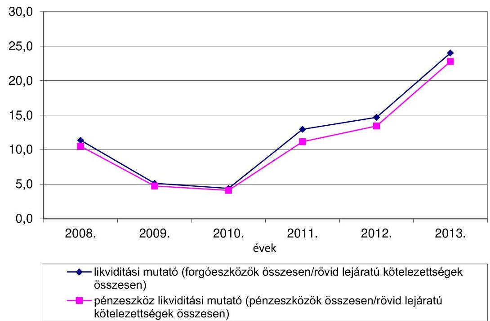

---

# 4. A Hivatal VAGYONGAZDÁlKODÁSA 

A Hivatal vagyongazdálkodásának szabályszerűsége az ellenőrzött időszakban részben megfelelő volt.

### 4.1. A vagyongazdálkodás szabályozottsága

Az ellenőrzött időszakban a Hivatal vagyongazdálkodási tevékenységének szabályozottsága megfelelő, a kapcsolódó belső kontrollok kialakítása részben megfelelő volt. A Hivatal elkészítette a vagyongazdálkodással kapcsolatos szabályzatait, azonban a selejtezett vagyontárgyak értékesítéséből származó bevételek esetében a pénzgazdálkodási belső kontrollok szabályozása a 2008-2009. évben nem volt összhangban az Ámr. 1 135. § (1)-(2) bekezdésében foglaltakkal. A tárgyi eszközök értékesítéséből származó bevételek beszedésének elrendelése előtti szakmai teljesítés igazolására a Kötelezettségvállalási szabályzat ${ }_{1}$ nem tartalmazott rendelkezést, valamint az erre jogosult személyeket nem jelölték ki.

### 4.2. Az eszközök és források értékének kimutatása, az eszközök visszapótlása

A 2013. december 31-i 3295,6 millió Ft eszközvagyon 367,6 millió Ft-tal, 12,6\%kal haladta meg a 2008. január 1-jei értéket, meghatározóan a követelések és a pénzeszközök emelkedéséből adódóan ${ }^{10}$.
3. ábra

A vagyonnal kapcsolatos mutatószámok alakulása
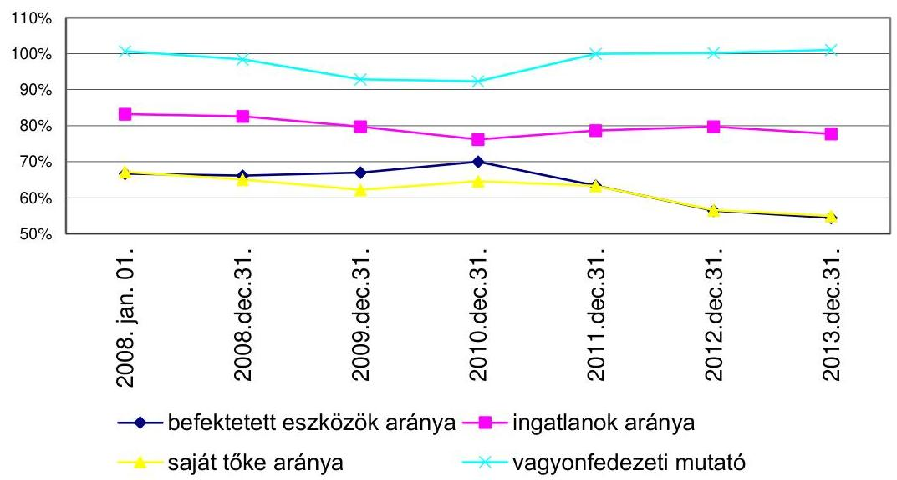

[^0]
[^0]:    ${ }^{10}$ A részletes adatokat a 3. számú melléklet tartalmazza.

---

A vagyonfedezeti mutató ${ }^{11}$ alapján a Hivatalnál a saját tőke az ellenőrzött időszak egészében teljes mértékben biztosította a fedezetet az immateriális javakra, a tárgyi eszközökre és a befektetett pénzügyi eszközökre. Az ingatlanok arányának ${ }^{12}$ csökkenése az elszámolt értékcsökkenés és egy ingatlan hivatali vagyonkezelésből történő kivonásának a következménye. A befektetett eszközök arányának ${ }^{13}$ és a saját tőke arányának ${ }^{14}$ közel azonos irányú és intenzitású változását az okozta, hogy míg a befektetett eszközök, illetve a saját tőke mértéke a 2013. év kivételével folyamatosan csökkent, addig az eszközök, illetve a források összértéke növekedett.

A mérlegben kimutatott eszközök és források értékének megállapítása, nyilvántartása szabályszerú volt. Az eszközök és források állományának valódiságát mennyiségben és értékben kimutatott leltárral támasztották alá, az egyes mérlegsorokhoz kapcsolódóan elvégezték a szükséges értékeléseket a Számv. tv. előírásai és az Értékelési szabályzat ${ }_{1,2}$ alapján.

A beszámolóban kimutatott követelések és kötelezettségek összege megegyezett az analitikus nyilvántartás összegével. A 2012. évben 0,7 millió Ft el nem ismert követelés elévülés miatti leírása hitelezési vesztességként az Áhsz. ${ }_{1}$-ben foglaltak szerint történt. Az egyéb aktív és passzív pénzügyi elszámolások leltárral alátámasztottak voltak, a leltár szerinti érték megegyezett az éves beszámoló mérlegtételeinek összegével. Az elszámolások mérlegtétel tartalma, besorolása megfelelő volt.

A leltározás és selejtezés végrehajtása szabályszerúen történt. A Hivatal a leltározást az ellenőrzött időszakban a Leltározási és leltárkészítési szabály-zat ${ }_{1,2}$-ben foglaltaknak megfelelően végezte el, az évente készített leltározási ütemterv alapján. Kijelölték a leltározási bizottságot és a leltárellenőrt, megbízták a leltározásért felelős személyeket. A leltár kiértékelését az ellenőrzött években elvégezték.

A beszerzett, létesített immateriális javak és tárgyi eszközök bekerülési értékének megállapítása, állományba vétele, az év végi értékelése és az értékcsökkenésének elszámolása szabályosan történt, de a felhalmozási kiadásokhoz kapcsolódó belső kontrollok nem megfelelően múködtek a jogkörgyakorlók szabályszerű kijelölésének hiányosságai miatt ${ }^{15}$.

A tárgyi eszközök, berendezések bruttó állománynövekedésének és halmozott értékcsökkenésének elszámolása a számviteli szabályoknak megfelelő volt. Az értékcsökkenési leírást a bekerülési érték alapján az Áhsz. 1 30. § (2) bekezdésében

[^0]
[^0]:    ${ }^{11}$ Vagyonfedezeti mutató=(Saját tőke összesen/Befektetett eszközök összesen)*100.
    ${ }^{12}$ Ingatlanok aránya=(Ingatlanok/Befektetett eszközök összesen)*100.
    ${ }^{13}$ Befektetett eszközök aránya=(Befektetett eszközök összesen/Eszközök mindösszesen)*100.
    ${ }^{14}$ Saját tőke aránya=(Saját tőke összesen/Források mindösszesen)*100.
    ${ }^{15}$ A felhalmozási kiadások ellenőrzött tételeit érintően a kontrollok múködésére vonatkozó részletes megállapításokat a jelentés 3.2. pontja tartalmazza.

---

meghatározott leírási kulcsok figyelembevétel számolták el. Az eszközök aktiválását üzembe helyezési okmánnyal támasztották alá.

A beruházások eredeti előirányzata a 2008. (147,9\%), a 2009. (184,1\%) és a 2010. (123,8\%) években jelentősen túlteljesült, míg a 2011. (40,7\%), a 2012. $(33,0 \%)$ és a 2013. (66,2\%) években a tényleges beruházási kiadások nem érték el a tervezett szintet. A felújításra tervezett előirányzat a 2010. (261,8\%) év kivételével minden évben, 2011. (15,4\%), 2012. (17,5\%), 2013. (82,4\%) a tervezett előirányzat alatt teljesült.

A Hivatal a 2012. évtől hatályba lépett beszerzési korlátozás ${ }^{16}$ miatt - gépjármú, mobiltelefon, bútor és számítástechnikai eszköz - beruházásait (a kért és kapott korlátozás alóli mentességek ellenére) nem a tervezettnek megfelelően tudta megvalósítani.

# A felhalmozási kiadások nem érték el a szinten tartáshoz szükséges mértéket, ami kockázatot jelent a vagyongazdálkodásra, a vagyon megőrzésére vonatkozóan. 

Az elszámolt értékcsökkenésnek megfelelő összegű visszapótlási kötelezettséget az ellenőrzött időszakban hatályos jogszabályok a Hivatalt érintően nem írtak elő. A Hivatal az ellenőrzött időszakban 1414,1 millió Ft összegű értékcsökkenést számolt el és 1230 millió Ft összegben teljesített eszköz-visszapótlást ${ }^{17}$, így összesen 184,1 millió Ft-tal kevesebbet fordítottak eszköz-visszapótlásra hat év alatt. Az ellenőrzött időszakban a tárgyi eszközök használhatósági foka - a járművek kivételével - csökkent ${ }^{18}$.

### 4.3. A vagyonátadás- és átvétel, a vagyonelemek hasznosítása

A Hivatal a 2009. évben 0,7 millió Ft, a 2011. évben 15 millió Ft, a 2012. évben 152,8 millió Ft, a 2013. évben 97,1 millió Ft bruttó értékű gépet, informatikai eszközt adott át üzemeltetésre. Az átadás szabályszerűen, a közfeladatok ellátásának változásával összhangban, a Hivatal feladatellátása érdekében történt a HIPAvilon Nonprofit Kft. részére megállapodás alapján.

A vagyonelemek tulajdonjogának térítésmentes átadás-átvétele megfelelő volt, amelyre a 2008., a 2009. és a 2011. években került sor. A Hivatal az MNV Zrt. részére jóléti épületet szolgáltatott vissza 14,1 millió Ft bruttó értékben, az átadásnak megfelelően a vagyonkezelési szerződést módosították. Selejtezett eszközök 2,7 millió Ft bruttó értékben egy alapítvány részére kerültek átadásra. A 2008. és a 2009. években a Magyar Formatervezési díj tárgyjutalma szerepelt térítésmentes átadásként. A fenti vagyonátadások a közfeladatok ellá-

[^0]
[^0]:    ${ }^{16}$ 1036/2012. (II. 21) Korm. határozat 6. pont
    ${ }^{17}$ A Hivatal nyilatkozata szerint.
    ${ }^{18}$ A Hivatal tárgyi eszközeivel kapcsolatos mutatószámok alakulását a 4. számú melléklet tartalmazza.

---

tásának változásával nem voltak összefüggésben. A vagyonelemek tulajdonjogának térítésmentes átvételére a 2013. évben került sor. A Hivatal 0,4 millió Ft értékben kapott képzőművészeti alkotást dekorációs célra.

A vagyonhasznosítási tevékenység részben volt szabályszerű az ellenőrzött időszakban. Az ellenőrzött időszakban tárgyi eszközértékesítés az előzetes engedélyhez nem kötött, selejtezett eszközökből történt a Hivatal dolgozói részére. Az értékesítés feltételeit szabályozták, az értékesített vagyontárgyak ára meghaladta azok nyilvántartási értékét. A vevők a dolgozók részére rendezett nyilvános „börze" keretében kerültek kiválasztásra. Az értékesítéshez kapcsolódó belső kontrollok működése azonban a 2008. és a 2009. években nem volt megfelelő, mert a vagyontárgyak értékesítéséből származó bevételek beszedésének elrendelése előtt - az Ámr. 1 135. § (1)-(2) bekezdésével ellentétesen - a szabályszerű szakmai teljesítésigazolás nem történt meg, erre vonatkozó rendelkezést a Kötelezettségvállalási szabályzat ${ }_{1}$ nem tartalmazott.

# 4.4. Az eredményszemléletú számvitel bevezetésével kapcsolatos feladatok végrehajtása 

Az eredményszemléletú számvitel bevezetésével kapcsolatos feladatok végrehajtása megfelelt az államháztartás számviteléről szóló 4/2013. (I. 11.) Korm. rendelet előírásainak. A Hivatal az eszközeit és forrásait 2013. december 31-ei fordulónappal leltározta. A rendező mérleget a jogszabályban előírt határidőben ${ }^{19}$ elkészítették és a Kincstár felé a kapcsolódó elektronikus adatszolgáltatást teljesítették. A raktáron lévő elfekvő készletek beazonosítását, feltárását elvégezték. A pénzügyileg nem rendezett függő, átfutó tételeket bevételként elszámolták és az egyéb rövid lejáratú kötelezettségek között kimutatták. Kiadással kapcsolatos azonosítatlan tétel nem volt. A kötelezettségvállalásokat a jogszabályi előírásoknak megfelelő bontásban mutatták ki. A támogatási program előlegeket és az előfinanszírozás miatti követeléseket, azok értékvesztését, illetve a kötelezettségeket kivezették. A rendező mérleg készítésekor kimutatták azokat a követeléseket, amelyeket a 2014. évtől hatályos számviteli szabályok alapján a mérlegben szerepeltetni kell.

## 5. A KORÁBBI ÁSZ ELLENŐRZÉSEK SORÁN TETT JAVASLATOK HASZNOSULÁSA ÉRDEKÉBEN TETT INTÉZKEDÉSEK

Az ÁSZ ellenőrzései során tett javaslatok alapján a Hivatal a szükséges intézkedéseket megtette, az ellenőrzött időszak egészét tekintve hasznosultak az ÁSZ javaslatai.

Az ellenőrzött időszakban az ÁSZ tíz alkalommal végzett ellenőrzést a Hivatalnál. Pénzügyi (szabályszerúségi) ellenőrzés keretében évenként ellenőrizte a költségvetés végrehajtását, 2008-ban, 2009-ben és 2011-ben a Hivatal költségvetési javaslatát, a tervezés irányszámainak, szöveges indokolásának szabályszerűségét, 2012-ben a költségvetés végrehajtásának ellenőrzése mellett a Hivatal belső

[^0]
[^0]:    ${ }^{19}$ 36/2013.(IX.13.) NGM rendelet 8. § (2) bekezdés a) pontja

---

kontrollrendszere és belső ellenőrzése szabályozottsága és múködése is ellenőrzésre került.

Az ÁSZ ismétlődő hibákat és hiányosságokat - 2007-2010 között a Hivatal éves költségvetése végrehajtásának ellenőrzései kapcsán - elsősorban a szabályzatok folyamatos aktualizálásának elmaradásával, illetve a kötelezettségvállalások és a megbízási szerződések nyilvántartásával, kezelésével kapcsolatban tárt fel.

Az ÁSZ által feltárt szabálytalanságok, hibák és hiányosságok kiküszöbölésére az ÁSZ tv. ${ }_{1,2}$ rendelkezéseinek ${ }^{20}$ megfelelően évenként - 2008. július 16-án, 2009. augusztus 19-én, 2010. augusztus 16-án és 2011. augusztus 16-án - részletes, határidőket és felelősöket tartalmazó intézkedési tervek készültek. Ezek alapján a technikai jellegü könyvelési, nyilvántartási, pénzkezelési hiányosságok többségét - határidőben, vagy a határidő nem jelentős túllépésével - felszámolták, illetve kezelésüket megoldották.

A 2011. évi költségvetés végrehajtásának ellenőrzése kapcsán az ÁSZ felhívta a figyelmet arra, hogy a Hivatalnál 2011 decemberében a vezető beosztású dolgozók részére rendkívüli munkavégzés címen a Ktv. 40. § (7) bekezdésében foglalt rendelkezések ellenére fizettek ki pénzbeli juttatást. Az ÁSZ javasolta a törvényi és a helyi szabályozás, valamint az alkalmazott gyakorlat összhangjának áttekintését a vezetői juttatásra vonatkozóan.

A Hivatal elnöke a Közszolgálati szabályzat ${ }_{2}$-ban rendelkezett a Hivatal vezető munkakört betöltő kormánytisztviselői részére a rendkívüli munkaidő teljesítése esetén járó szabadidőről és a szabadidő pénzbeli kifizetésének feltételeiről. A szabályzat 9. § (6) bekezdése szerint a vezetői munkakört betöltő kormánytisztviselő részére a rendkívüli munkaidő teljesítése esetén járó szabadidő kiadásáról a Hivatal elnöke dönt. A teljesített rendkívüli munka ellenértéke pénzben akkor váltható meg, ha a szabadidő kiadását a Hivatal elnöke nem engedélyezi, vagy az engedélyezett szabadidő a Hivatal oldalán felmerülő okból mégsem adható ki.

Nem oldották meg azonban az intézkedési tervekben kijelölt határidőben több szabályzat módosítását vagy újraszabályozását. Annak ellenére, hogy a 2008. júliusi intézkedési terv tartalmazta már a közszolgálati szabályzat, az új önkölt-ség-számítási szabályzat és az iratkezelési szabályzat aktualizálásának szükségességét, ezeket jelentős késedelemmel, a Közszolgálati szabályzat ${ }_{2}$-t 2009. május 1-jével, az Önköltség-számítási szabályzat ${ }_{2}$-t 2009. november 15 -ével, illetve az Iratkezelési szabályzat ${ }_{2}$-t 2010. január 1-jével léptették hatályba. A kötelezettségvállalások nyilvántartásával és megbízási szerződésekkel kapcsolatos, ismétlődően megállapított hiányosságok megszüntetése nem történt meg teljes körűen, mert a 2012. évi központi költségvetés végrehajtásának ellenőrzése alkalmával az ÁSZ a megbízási szerződések kapcsán ismét megállapította, hogy egyes szerződések teljesítésének kezdő időpontja megelőzte a kötelezettségvállalás időpontját. A Közbeszerzési szabályzatot a 2013. június 27 -ei hatályon kívül helyezéséig nem aktualizálták.

[^0]
[^0]:    ${ }^{20}$ ÁSZ tv. ${ }_{1}$ 25. § (1) bekezdés, ÁSZ tv. ${ }_{2}$ 33. § (1) bekezdés

---

Az intézkedési tervek végrehajtásának nyomon követésére 2010-től bevezették az előrehaladási jelentések készítését. Az ÁSZ ellenőrzések megállapításait a belső ellenőrzés feladatainak tervezése és ellátása során figyelembe vették. A 2009., 2010. és 2011. évi belső ellenőrzések kiterjedtek az ÁSZ által folytatott ellenőrzések megállapításainak realizálására, a hiányosságok felszámolására.

# 6. A Hivatal És a HIPAvilon Nkft. SZERZŐDÉSES KAPCSOLATAINAK SZABÁLYSZERŰSÉGE 

### 6.1. A Hivatal döntése, valamint a HIPAvilon Nkft-vel létrejött megállapodások alapján ellátandó feladatok jogszabályi megfelelősége

A HIPAvilon Nkft. által a Hivatallal létrejött megállapodások alapján ellátott feladatok köre, az ellenőrzött időszakban nem volt teljes körüen összhangban a jogszabályi előirásokkal.

### 6.1.1. A megállapodások alapján ellátott feladatok

A Hivatal és a HIPAvilon Nkft. között 2013. április 1-jét követően létrejött megállapodásokban a Hivatal az Szt.-ben és a 287/2010. (XII.16.) Korm. rendeletben foglalt előirások ellenére újdonságkutatási, feladatok ellátásával bízta meg a HIPAvilon Nkft-t. Az ellenőrzött időszakban a Hivatal és a HIPAvilon között létrejött megállapodásokban a nemzetközi kapcsolattartási feladatok tekintetében nem voltak egyértelmúen elkülöníthetők az Szt. 115/L. §-ában foglaltak szerinti, a Hivatal által ellátható, illetve a HIPAvilon Nkft. által ellátható feladatok.

A Hivatal évente megállapodásokat kötött a HIPAvilon Nkft.-vel az ellátandó feladatokról. A megállapodások - az Integrált Irányítási kézikönyv ${ }_{1-2} 8$. mellékletének megfogalmazása szerint - alapvetően négy csoportba voltak sorolhatók.

- A közszolgáltatási megállapodások azokat a feladatokat tartalmazták, amelyek végrehajtásával a HIPAvilon Nkft. együttmúködött a Hivatal közfeladatainak (de nem hatósági feladatainak) ellátásában. Ilyenek voltak az oktatással-képzéssel kapcsolatos, a tudatosság növeléssel összefüggő, a promóciós feladatok. A közszolgáltatási megállapodásokhoz nem kapcsolódott a Ptk. ${ }_{1}$ 387-388. §-ában szabályozott közüzemi szerződéssel összefüggő, illetve a Ptk. 2 6:256. §-ában szabályozott közszolgáltatási szerződéssel összefüggő, szolgáltatót terhelő szerződéskötési kötelezettség, hanem tartalmilag közfeladat ellátására irányultak.
- A közhasznú szolgáltatási megállapodásokban foglalt (közhasznú) feladatok ellátásával a HIPAvilon Nkft. közvetetten támogatta a Hivatal közszolgáltatási megállapodások körén kívül eső - közfeladatainak ellátását. A közhasznú szolgáltatási feladatok körébe tartoztak a különböző rendezvények szervezésével kapcsolatos, a (nemzetközi) pályázatok

---

dokumentációjával összefüggő, a szakkönyvtári támogató és szerkesztőségi, nyomdai tevékenységgel kapcsolatos és dokumentációs, ügyiratkezelési feladatok. Ezen megállapodások keretében a HIPAvilon Nkft. nemzetközi kapcsolattartási feladatokat is végeztek, azonban az nem volt egyértelmúen elkülöníthető a kizárólag a Hivatal által az Szt. 115/L. §-ában foglalt nemzetközi feladatoktól.

- A 2013. április 1-jét követően kötött vállalkozási megállapodásokban foglalt feladatok végrehajtásával a HIPAvilon Nkft. a Hivatal az Szt. előírásai ellenére kötött megállapodásaihoz kapcsolódó feladatok ellátásában (újdonságkutatás) múködött közre.
- Az egyéb megállapodások közé a bizományi szerződések, valamint ingatlanés eszközhasználati szerződések tartoztak. Ezeket a szerződéseket csak a releváns (elszámolás szabályszerűsége) ellenőrzési szempont esetében ellenőrizte az ÁSZ.

4. ábra

A megállapodások megoszlása jellegük szerint
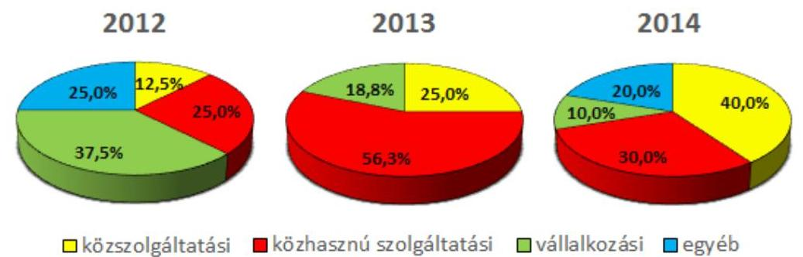

A megállapodások alapján a HIPAvilon Nkft. közremúködött az újdonságkutatásra irányuló, a dokumentációs és ügyiratkezelési (iratkezelési, iktatási, postázási, adatrögzítési, digitalizálási), a szakmai programok, események, kiállítások szervezési (kiemelten: a Design-hét), a külföldi és hazai szakmai szervezetekkel való kapcsolattartási, a pályázatok lebonyolítási, a szellemitulajdon-védelemmel és az innovációval kapcsolatos ismeretek terjesztési, a képzési, szakképzési, a szakkönyvtári (ide értve a lap- és egyéb dokumentumok szerkesztését is) a szellemi vagyon értékeléssel és felkutatással kapcsolatos adatszolgáltatások előkészítési, készítési, gazdálkodási, bizományosi, ingatlan- és eszközhasználati szerződésből adódó és az ISO belső audit tevékenységével kapcsolatos feladatok ellátásában.

A Hivatal részére a HIPAvilon Nkft. által ellátható tevékenységek körét 2013. április 1-jét megelőzően külön jogszabályban nem szabályozták. Ezt követően a 287/2010. (XII.16.) Korm. rendelet 6/A. § (2)-(4) bekezdésében tételes felsorolással meghatározták a HIPAvilon Nkft. feladatait. Ezek a tevékenységek a Hivatal állami dokumentációs és információs tevékenységével, valamint a szellemi tulajdon védelmére irányuló kormányzati stratégia kidolgozása és érvényesítése,

---

illetve végrehajtása érdekében ellátott tevékenységével összefüggő feladatok ellátásához, továbbá a Hivatal múködési és gazdálkodási feladatai ellátásához kapcsolódtak. Az Szt. rendelkezései alapján a HIPAvilon Nkft. 2013. április 1-jét követően nem végezhetett volna a Hivatal részére magánjogi természetú megállapodás keretében sem újdonságkutatási tevékenységet.

A Hivatal és a HIPAvilon Nkft között létrejött megállapodások alapján végzett tevékenységek közül az újdonságkutatás, a dokumentációs feladatok, valamint a nemzetközi kapcsolattartás tekintetében a feladatok nagyságrendjére és jellegére tekintettel részletesen értékeltük a feladatellátás jogszabályoknak való megfelelőségét.

# A Hivatal 2013. április 1-jét követően az Szt. 115/E. § előírásai ellenére több megállapodásban újdonságkutatási feladatok ellátásával bízta meg a HIPAvilon Nkft-t. 

Az ellenőrzött időszakban a megállapodások keretében a HIPAvilon Nkft. a hatósági eljárással összefüggő dokumentációs és ügyiratkezelési (iratkezelési, iktatási, postázási, adatrögzítési, digitalizálási) feladatokat is végzett a Hivatal részére. A HIPAvilon Nkft. által végzett adatrögzítési, digitalizálási feladatok nem hatósági eljárás részeként ellátott adminisztrációs feladatok, azokhoz nem kapcsolódott a Ket. 12. § (2) bekezdése szerinti jog-, és kötelezettség megállapítása. A Ket. és az Szt. együttes értelmezése alapján tehát a dokumentációs és ügyirat-kezelési tevékenység nem hatósági tevékenység, így az a HIPAvilon Nkft. által is ellátható volt.

A Hivatal megbízta a HIPAvilon Nkft.-t nemzetközi kapcsolattartási feladattal a 2012. május 16. és 2013. december 31. közötti időszakban érvényben levő megállapodásokban. Azonban a megállapodásokban nem voltak egyértelmúen elkülöníthetők a nemzetközi kapcsolattartás feladatai az Szt. 115/L. $\S$-ában foglalt, kizárólag a Hivatal által ellátható nem nemzetközi feldatoktól. A 2014. évre vonatkozóan nemzetközi kapcsolattartási feladat ellátásával a Hivatal további megállapodásban nem bízta meg a HIPAvilon Nkft-t.

Minden, a Hivataltól a HIPAvilon Nkft. felé irányuló kifizetés megállapodáson alapult. A HIPAvilon Nkft. a megállapodások szerint teljesített feladatokra, legfeljebb az azokban szereplő összeg mértékéig kapott díjazást a Hivataltól, ezek számszakilag egyeztek a Hivatal számviteli nyilvántartásában szereplő összegekkel. A keretjellegú megállapodások esetében a megállapodásban foglalt egységár és az igazolt teljesítmény volumene függvényében történt az elszámolás és a pénzeszköz átutalás. Az ellenőrzött időszakban a HIPAvilon Nkft. által a Hivatal részére ellátott feladatok végrehajtásának ellenőrzése szabályozott volt. A feladatok végrehajtásának teljesítésigazolására és elszámolására vonatkozó szabályokat az Integrált Irányítási kézikönyv ${ }_{2} 8$. fejezete tartalmazta. A szabályozás szerint a HIPAvilon Nkft. tevékenységét és múködését az Alapító Okirat ${ }_{1-3}$ szerinti három tagú felügyelőbizottság, valamint a folyamatba épített ellenőrzés részeként a Hivatal feladatellátásért felelős vezetője is ellenőrizte. A közszolgáltatási megállapodásokban foglalt feladatok végrehajtásáról a HIPAvilon Nkft. az ellenőrzött időszakban évente két beszámolót készített, melyekhez a kifizetés bizonylatait is tartalmazó, részletező pénzügyi

---

beszámoló is kapcsolódott. A Hivatal elnöke - figyelemmel a felügyelőbizottság határozataira is - a beszámolókat elfogadta.

# 6.1.2. A szabadalmi bejelentés dokumentumaiba való betekintésre vonatkozó jogszabályi elöírások betartása 

A HIPAvilon Nkft. a közhasznú szolgáltatási megállapodások keretében az Szt. és a Ket. előírásai figyelembe vételével nem látott el hatósági eljárással öszszefüggő dokumentációs és ügyiratkezelési, valamint újdonságkutatási feladatokat, így jogosulatlanul nem jutott hozzá olyan információkhoz és nem kezelt olyan adatokat, amelyekbe a szabadalmi bejelentés közzétételéig csak az Szt. 53. § (1) bekezdésében meghatározott jogosultak tekinthettek be. Azonban a megállapodásokban a HIPAvilon Nkft. által ellátandó adatkezelési feladatok tekintetében nem voltak egyértelmúen rögzítve, hogy azok nem a Hivatal által ellátott hatósági feladataihoz kapcsolódnak.

### 6.1.3. Az alapító okirat és a szervezeti és múködési szabályzat megfelelősége

A HIPAvilon Nkft. Alapító Okirat ${ }_{1-3}$-ban és a HIPAvilon SZMSZ ${ }_{1-2}$-ben foglalt, a szervezetre vonatkozó tevékenységi körei nem voltak ellentétesek az Szt. és a 287/2010. (XII.16.) Korm. rendelet előírásaival, azonban a közszolgáltatási szerződések tartalma tekintetében a HIPAvilon Nkft által ellátandó feladatoknak az Szt.-ben foglalt, kizárólag a Hivatal által végezhető feladatoktól való egyértelmú elhatárolása nem történt meg. Továbbá a HIPAvilon Nkft. 2013. április 1-jétől úgy végzett újdonságkutatási feladatokat, hogy azt az Szt. előírásai alapján nem végezhette volna, mivel a Hivatal e tevékenysége ellátásába az Szt. és a 287/2010. (XII.16.) Korm. rendelet előírásai alapján nem vonhatta volna be. A HIPAvilon Nkft. úgy értékesített - a Hivatallal 2012. október 10-én kötött bizományosi szerződés alapján - könyveket, hogy ez a tevékenység nem szerepelt az Alapító Okirat ${ }_{1}$-ben. Az Alapító Okirat ${ }_{2}$-ben a tevékenységi körök közé 2013. augusztus 22 -től bekerült a könyv kiskereskedelmi tevékenység.

### 6.1.4. A Hivatal munkavállalói részére a további jogviszony létesítésének engedélyezése

Az ellenőrzött időszakban a HIPAvilon Nkft. a Hivatallal újdonságkutatási feladatok elvégzésére -2013. április 1-jétől az Szt. előírásai ellenére megkötött megállapodások végrehajtása érdekében - 33 fő, a Hivatal személyi állományába tartozó, nem vezető beosztású kormánytisztviselővel kötött megbízási szerződést újdonságkutatás elvégzésére. A Kttv. 6. § 32. pontjában a további jogviszony létesítésére vonatkozó, a Kttv. 85. § (2) bekezdésében előírt rendelkezés szerint kormánytisztviselő további jogviszonyt csak a munkáltatói jogkör gyakorlójának előzetes engedélyével létesíthet. A Hivatalnál az érintett kormánytisztviselők a HIPAvilon Nkft.-vel kötendő szerződés aláírása előtt a Kttv. előírásai szerint írásban jelezték a munkáltatói jogkör gyakorlójának a további jogviszony létesítésére irányuló szándékukat és kérték a további jogviszony létesítésének előzetes engedélyezését. A munkaáltatói jogkör gyakorlója általi engedélyezés - egy kivételével - megtörtént, a munkáltatói jogkör gyakorlója mindegyik esetben nyi-

---

latkozott arról is, hogy a további jogviszony létesítése a fennálló kormánytisztviselői jogviszonnyal nem összeférhetetlen, annak ellenére, hogy a kormánytisztviselők részére megbízást adó HIPAvilon Nkft. 2013. április 1-jétől kezdődően az Szt. 115/E pontjában foglaltak alapján a megbízás tárgyát képező feladatot (újdonságkutatást) nem végezhette volna.

# 6.2. A HIPAvilon Nkft. által a Hivatal döntése, vagy a vele kötött megállapodásokban foglaltak végrehajtása érdekében megkötött szerződések tartalmának, elszámolásának megfelelősége 

A Hivatal és a HIPAvilon Nkft. közötti megállapodások végrehajtása érdekében a HIPAvilon Nkft. által harmadik személlyel kötött szerződések tartalma - a 2013. április 1-jét követően újdonságkutatásra kötött megbízási szerződések kivételével - összhangban volt a jogszabályok és az Alapító Okirat ${ }_{1-3}$ előírásaival, a szerződések elszámolása - kisebb hiányosságok ellenére megfelelt a jogszabályi és a belső szabályzatokban foglaltaknak.

### 6.2.1. A szerződések elszámolása

Az ellenőrzött időszakban a HIPAvilon Nkft. és a Hivatal között létrejött megállapodások végrehajtása érdekében a HIPAvilon Nkft. 191 darab szerződést kötött harmadik személyekkel (alvállalkozókkal és magánszemélyekkel). A szerződések többsége a Design-hét szervezéséhez, valamint az újdonságkutatáshoz kapcsolódott.
5. ábra

A HIPAvilon Nkft. harmadik személyekkel kötött szerződései (db)
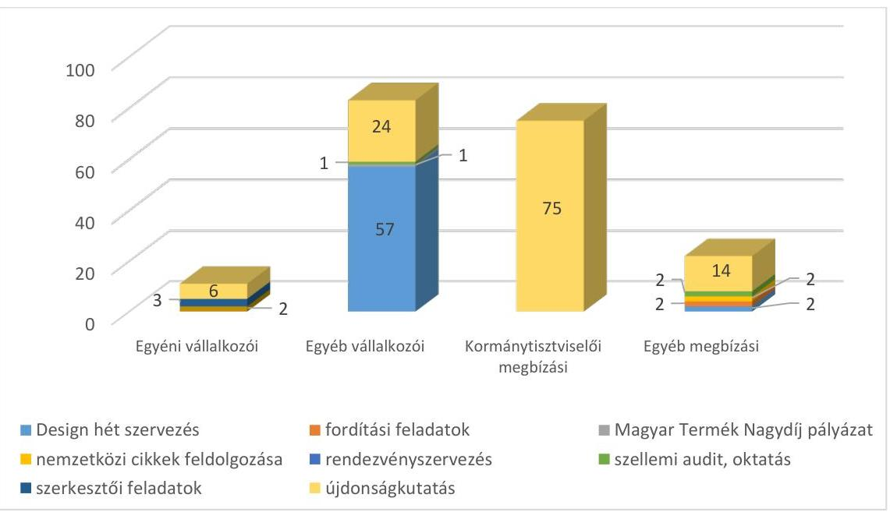

A HIPAvilon Nkft. által kötött szerződések elszámolása - kisebb hiányosságok mellett - összhangban volt a Számv. tv. és a HiPAvilon Nkft.

---

belső előírásaival. Valamennyi szerződést az Alapító Okirat 1-3 11.1. pontban foglalt módon és a 10.3.1. pontban foglalt képviseleti jogkörében eljárva vagy az ügyvezető igazgató vagy a cégvezető írta alá. A teljesítésigazolás módját mindegyik szerződés tartalmazta. A teljesítés igazolására minden esetben a cégvezetői pozíciót betöltő iparjogvédelmi igazgató volt jogosult.

A teljesítésigazolást az arra jogosult személy végezte, azonban a kifizetéseket megelőző teljesítésigazolás nem minden esetben történt meg, illetve nem minden esetben a szerződésekben meghatározottaknak megfelelően történt. Az ellenőrzés az alábbi hibákat állapította meg:

- egy esetben nem volt teljesítésigazolás, azonban a kifizetés megtörtént;
- egy esetben a teljesítésigazolás a szerződésben kikötött ellenjegyzés hiányában történt meg;
- egy esetben annak ellenére történt kifizetés, hogy a szerződésben előírt informatikai fejlesztés egy részfolyamatának tesztelése nem történt meg;
- egy esetben nem a szerződésben előírt módon történt a teljesítés igazolása, mert az elvégzett feladathoz, az előírás ellenére a teljesítés időtartamát (óraszámát) nem adták meg.

A kifizetések alapjául szolgáló számviteli bizonylatok nem minden esetben feleltek meg a Számv. tv. 167. § (1) bekezdés c) pontjában foglaltaknak, mert a kifizetés bizonylatai több esetben (2012-ben 35, 2013-ban 28, 2014-ben 4 esetben) nem tartalmazták az utalványozó személy aláírását.

A szerződések alapján teljesített kifizetések főkönyvi számlakijelölése során több esetben eltértek a Számlarend ${ }_{1-3}$-ban foglaltaktól. A számlakijelölés nem a gazdasági esemény tartalmának megfelelően történt, mert a természetes személyek megbízási szerződései alapján történő kifizetéseket 2012-ben olyan főkönyvi számlára könyvelték, ami a Számlarend ${ }_{1-2}$-ben nem szerepelt. A Számlarend ${ }_{3}$ előírásai ellenére 2013-ban a szállítói számlákat a hosszú lejáratú kölcsönöket tartalmazó főkönyvi számlára, a webtárhely bérlésére vonatkozó kifizetéseket az utazási és kiküldetési költségek számlára, a bizományi könyvértékesítéssel kapcsolatos tételeket az adó és járulék költségek számlára könyvelték.

A nem megfelelő kiadási jogcímen könyvelt tételek aránya az ellenőrzött időszakon belül 15,4 százalék volt és a lekönyvelt összeg 7,84 százalékát érintette, a gazdálkodó szervezet mérlegét és eredménykimutatását azonban nem befolyásolta.

# 6.2.2. A szerződések tárgya 

A HIPAvilon Nkft. által harmadik személlyel kötött szerződéseinek tárgya a 2013. április 1-jét követően újdonságkutatás elvégzésére irányuló megbízási szerződések kivételével - összhangban volt az Szt. és az Alapító Okirat $_{1-3}$ szerint végezhető tevékenységekkel, célokkal. A HIPAvilon Nkft. által harmadik személyekkel az újdonságkutatás feladatra kö-

---

tött megbízási szerződések tárgya 2013. április 1-jét követően olyan feladat elvégzésére irányult, amely feladat végzésére a HIPAvilon Nkft. nem volt jogosult, mivel a Hivatal az Szt. előírásai ellenére kötött megállapodást a HIPAvilon Nkftvel az újdonságkutatási feladatok elvégzésére. Dokumentációs és ügyiratkezelési, valamint nemzetközi kapcsolattartási feladatokra nem kötött a HIPAvilon Nkft. harmadik személlyel megbízási szerződést.

# 6.2.3. A titokvédelmi előírások érvényesítése a szerződésekben 

A HIPAvilon Nkft. a jogszabályban előírt kötelezettségét betartotta, mert a harmadik személlyel kötött szerződéseiben szereplő vállalkozók és megbízottak részére nem adott át olyan feladatot, vagy információt, amelyet kizárólag az Szt. 53. § (1) bekezdésében előírt személyi kör ismerhetett meg. A HIPAvilon Nkft. az általa kötött szerződések tárgyától függetlenül valamennyi, üzleti titok megismerésének lehetőségével járó szerződésében rögzítették a titokvédelmi előírásokat, ezzel eleget tettek a szerződésekben az integritás szemlélet érvényesítésének.

### 6.2.4. A HIPAvilon Nkft saját és a Hivatal munkavállalóival kötött szerződései

A HIPAvilon Nkft. által újdonságkutatási feladatra kötött megbízási szerződések a saját alkalmazottai esetében az Mt. előírásainak, a Hivatal személyi állományába tartozó kormánytisztviselők esetében a Kttv. előírásainak megfeleltek, azonban a HIPAvilon Nkft. az újdonságkutatási feladatokat a Ket. és az Szt. előírásai ellenére végezte, ezért a megbízási szerződések olyan tevékenységre irányultak, amely tevékenység végzésére a HIPAvilon Nkft. nem volt jogosult.

Az ellenőrzött időszakban a HIPAvilon Nkft. két fő saját, és 33 fő hivatali kormánytisztviselővel kötött megbízási szerződést újdonságkutatás elvégzésére, amellyel összefüggésben díjazásban részesültek. A HIPAvilon Nkft. azon saját munkavállalói között, akikkel megbízási szerződést kötöttek nem volt vezető beosztású, így azokra az Mt. vezetőkre előírt összeférhetetlenségi szabályai nem vonatkoztak. A Hivatal kormánytisztviselői közül azokkal kötött újdonságkutatás ellátására szerződést, akik a Kttv. előírásainak megfelelően rendelkeztek egy kivételével - a munkáltatói jogkörgyakorló hozzájárulásával és az összeférhetetlenségre vonatkozó nyilatkozattal a további jogviszony létesítéséhez, azonban az Szt. előírásai alapján a HIPAvilon Nkft. a Hivatallal 2013. április 1-jét követően megkötött szerződésekben foglalt feladatok (újdonságkutatás) végzésére nem volt jogosult.

---

# 7. A Hivatal KÖZÖS JOGKEZELÉSSEL KAPCSOLATOS FELADATELLÁTÁSÁNAK SZABÁLYSZERŰSÉGE 

7.1. A Hivatal közös jogkezeléssel kapcsolatos feladatainak ellátását támogató kontrollkörnyezet jogszabályi megfelelősége

Az ellenőrzött időszakban a Hivatal - kisebb hiányosságok ellenére - megfelelően alakította ki a közös jogkezeléssel kapcsolatos feladatai ellátását támogató kontrollkörnyezetet.

### 7.1.1. A közös jogkezeléssel kapcsolatos feladatok rögzítése az SZMSZben

Az SZMSZ ${ }_{3}$ a Hivatal közös jogkezelő szervezetekkel kapcsolatos feladatai ellátásának rendjét és módját - a közös jogkezelő szervezetek támogatási politikáira és a bevétel jogosultak érdekében történő felhasználására vonatkozó döntések miniszteri jóváhagyásának előkészítésével összefüggő feladatok kivételéve - a jogszabályi előirásoknak megfelelően tartalmazta.

A Hivatal 2011. január 1-jétől az Szt.-ben foglaltak alapján ellátta a közös jogkezelési tevékenységek feletti felügyeletet, valamint a közös jogkezelő szervezetek díjszabásainak miniszteri jóváhagyásával kapcsolatos előkészítési feladatokat. Az SZMSZ ${ }_{3}$-at az Szt.-ben foglalt feladatokkal összhangban a Közigazgatási és igazságügyi miniszter 2011. május 6-án adta ki. 2012. január 1-je és 2013. december 31-e között az Szjt. 89. § (11) bekezdésében foglaltak alapján a Hivatal feladatkörébe tartozott a közös jogkezelő szervezetek támogatási politikájának és a bevétel jogosultak érdekében történő felhasználására vonatkozó döntések miniszteri jóváhagyásának előkészítése is, amely feladatot 2013. április 1-jétől az Szt. 115/H. § (4) bekezdés d) pontja is a Hivatal alapvető feladatai között rögzítette.

Az SZMSZ ${ }_{3}$ az Áht. ${ }_{2}$ és az Ávr. előírásainak megfelelően tartalmazta a Hivatal Szt. 115/H. § (4) bekezdés c) és d) pontjaiban meghatározott közös jogkezeléssel kapcsolatos feladat- és hatásköreire vonatkozó jogszabályi hivatkozásokat, valamint az ellátott feladatok szakfeladatrend szerinti felsorolását.

A közös jogkezeléssel kapcsolatos feladatokat ellátó szervezeti egység SZMSZ ${ }_{3}{ }^{-}$ ban meghatározott feladatköre az Szjt. 89. § (11) bekezdésében és a 92/H. § (3) bekezdésében, valamint az Szt. 115/H. § (4) bekezdés d) pontjában foglalt előírások ellenére azonban nem tartalmazta a közös jogkezelő szervezetek támogatási politikáira és a bevétel jogosultak érdekében történő felhasználására vonatkozó döntések miniszteri jóváhagyásának előkészítésével összefüggő feladatokat a 2012. január 1-je és 2013. december 31-e közötti időszakra vonatkozóan.

---

# 7.1.2. A közös jogkezeléssel kapcsolatos feladatok rögzítése a belső szabályzatokban 

A közös jogkezeléssel kapcsolatos feladatot ellátó Szerzői jogi főosztály szervezeti egységnek az SZMSZ ${ }_{3}$-ban és egyéb belső szabályzatban rögzített közös jogkezeléssel kapcsolatos feladata - egy hiányosság ellenére - összhangban volt az Szjt. 89. § (11) bekezdése és a 92/H. § (3) bekezdése, valamint az Szt. 115/H. § (4) bekezdés d) pontjában foglaltakkal. A Hivatal közös jogkezelő szervezetekkel kapcsolatos feladatait a Szerzői jogi főosztály látta el az ellenőrzött időszakban, amely szervezeti egység ügyrenddel nem rendelkezett, részletes feladatainak felsorolását az SZMSZ ${ }_{3} 2$. számú függeléke tartalmazta. Az Szjt. 89. § (11) bekezdése 2012. január 1-jétől 2013. december 31-éig tartalmazta a támogatási politikák miniszteri jóváhagyásának előkészítésével kapcsolatos feladatot, amit 2013. április 1-jétől az Szt. 115/H. § (4) bekezdés d) pontja is előírt a Hivatal számára. Ennek ellenére a Szerzői jogi főosztálynak az SZMSZ ${ }_{3}$ 2. számú függelékében meghatározott részletes feladatait a 2012. január 1-je és 2013. december 31-e közötti időszakra vonatkozóan nem módosították, így az nem tartalmazta a támogatási politikák miniszteri jóváhagyásának előkészítésével kapcsolatos feladatokat. A közös jogkezelési feladatot ellátó Szerzői jogi főosztály 2013. április 1-jét megelőzően az Ávr. 13. § (5) bekezdése előírásának ellenére - nem rendelkezett a közös jogkezeléssel kapcsolatos feladatok munkafolyamatainak leírásával. 2013. április 1-jétől az ISO integrált irányítási rendszerének részeként a Szerzői jogi főosztály által ellátott közös jogkezelő szervezetekkel kapcsolatos nyilvántartási és felügyeleti eljárások munkafolyamatinak leírását elkészítették. Azonban az Ávr. 13. § (5) bekezdésében foglalt előírás ellenére nem készítették el az Szt. 115/H. § (4) bekezdés d) pontja és az Szjt. 92/H. § (3) bekezdése szerinti közös jogkezelő szervezetek díjszabásaira, valamint támogatási politikájának és a bevétel jogosultak érdekében történő felhasználására vonatkozó döntések miniszteri jóváhagyásának előkészítésével kapcsolatos feladatok munkafolyamatainak leírását. A Szerzői jogi főosztályon dolgozó kormánytisztviselők munkaköri leírásaiban rögzítették a közös jogkezelő szervezetekkel kapcsolatos feladat- és hatásköröket, valamint a helyettesítés rendjét.

A közös jogkezelési tevékenységgel összefüggésben a Szerzői jogi főosztály Hivatalon belüli belső és azon kívüli külső kapcsolattartásának módját, szabályait az Ávr.-ben foglaltaknak megfelelően az SZMSZ ${ }_{3}$ szabályozta.

## A Hivatal belső szabályzataiban nem az Áhsz. ${ }_{3}$ előírásainak megfelelően rögzítették a felügyeleti díjbevételhez kapcsolódó elszámolási és nyilvántartási feladatokat a 2014. évben.

A 2013-ban hatályos Számviteli Politika ${ }_{2}$-t Hivatal az Áhsz. 8. § (3)-(5) bekezdései előírása szerint alakította ki. A Pénzkezelési Szabályzat ${ }_{2}$ megfelelt az Áhsz. ${ }_{1}$ és a Számv. tv. előírásainak. A Hivatali Számlarend megfelelt a Számv. tv. 161. § (1)-(4) bekezdésében, valamint az Áhsz ${ }_{1}$ 49. §-ában foglaltaknak, az Szjt. 92/M. $\S$-ában foglalt felügyeleti díjjal kapcsolatos bevételek elszámolását az Áhsz. ${ }_{1}$ előírásainak megfelelően az intézményi működési bevételeken belül, a közhatalmi bevételek számlacsoportban írták elő.

Az eredményszemléletű számvitel 2014. január 1-jével történő bevezetését követően a költségvetési és pénzügyi számvitel alkalmazásával kapcsolatos sajátos

---

szabályokat, előírásokat, módszereket - az Áhsz. ${ }_{2} 50 . \S$ (1) bekezdése előírása ellenére - nem rögzítették a Számviteli Politika ${ }_{2}$-ben. Ennek keretében - az Áhsz. ${ }_{2}$ 51. § (2) bekezdésében előírt kötelezettség ellenére - nem készítették el a számlarendet az Áhsz. ${ }_{2} 16$. számú melléklete szerinti egységes számlakeret alapján. A Pénzkezelési szabályzat ${ }_{2}$ megfelelt a Számv. tv. előírásainak.

A Hivatal rendelkezett a Bkr. 6. § (3) bekezdésében foglaltaknak megfelelő ellenőrzési nyomvonallal, amely tartalmazta a bevételek kezelésével, a felügyeleti díjbevételekkel kapcsolatos múködési folyamatokat.

# 7.2. A Hivatal közös jogkezelő szervezetekkel kapcsolatos feladatellátásának szabályszerűsé 

A Hivatal közös jogkezelő szervezetekkel kapcsolatos feladatellátása - kisebb hiányosságok ellenére - szabályszerű volt.

### 7.2.1. A közös jogkezelő szervezetek nyilvántartásának kialakítása, vezetése

A közös jogkezelő szervezetek nyilvántartásának kialakítása, vezetése - egy-egy tartalmi hiba és egy esetben a nyilvántartásba vételről szóló közlemény megjelentetésének elmulasztása ellenére - megfelelt az Szjt. és a Kormányrendelet előírásainak.

A Hivatal közös jogkezelő szervezetekről kialakított nyilvántartásának felépítése, tartalma - a kisebb hibáktól eltekintve - megfelelt az Szjt. 90. § (2) és (5) bekezdéseiben, valamint a Kormányrendelet 1. § (2) bekezdésében foglalt előírásoknak, a nyilvántartás a fenti jogszabályokban meghatározott adatokat tartalmazta, illetve az előírt dokumentumok eléréséhez hozzáférést biztosított.

Egy szervezet (REPROPRESSZ) esetében a közös jogkezelő szervezetnek - az Szjt. 90. § (2) bekezdés d) pontjában és a Kormányrendelet 1. § (2) bekezdés e) pontjában foglaltak ellenére - a rövidített neve nem az alapszabályában foglaltak szerint szerepelt a nyilvántartásban.

Egy szervezet (EJI) esetében - az Szjt. 90. § (4) bekezdésében foglalt előírás ellenére - a nyilvántartás archívuma nem tartalmazta a Kormányrendelet 1. § (2) bekezdés c) pontja szerinti nyilvántartásból törölt, a 2014 októberében megszüntetett pénzforgalmi számlára, valamint a pénzforgalmi szolgáltató nevére és székhelyére vonatkozó adatokat.

Az ÁSZ által ellenőrzött nyilvántartásba való felvételre, valamint a nyilvántartás módosítására irányuló eljárások során a Hivatal betartotta az Szjt. 91-92/F. §, valamint a Kormányrendelet 2-6. §-aiban előírt rendelkezéseket, az ellenőrzött eljárások alapján a közös jogkezelő szervezetek nyilvántartásának vezetése a jogszabályi előírásoknak megfelelően történt. A Hivatal a nyilvántartásba való felvétellel, és az adatmódosítással kapcsolatos eljárása megfelelt az Szjt. 92/B. § (1) bekezdésében, valamint a Kormányrendelet 7. §-ában fog-

---

lalt elektronikus úton történő kapcsolattartási követelményeknek. Az elektronikus kapcsolattartás a Kormányrendelet 9. §-ában előírtaknak megfelelően a Kormány által biztosított azonosítási szolgáltatáson keresztül történt.

A Hivatal - az Szjt. 92/E. § (4) bekezdésében foglaltaknak megfelelően - mindkét ellenőrzött évben egy alkalommal előkészítette és - a Hivatalos Értesítőben történő megjelentetés céljából - a KIM részére megküldte a közös jogkezelő szervezetek nyilvántartási adatait. Ugyanakkor a Hivatal - az Szjt. 92/E. § (4) bekezdésében foglalt előírás ellenére - az új jogkezelési tevékenység közös jogkezelő szervezetek nyilvántartásába történő bejegyzéséről szóló határozathozatalt követően egy esetben (EJI) nem intézkedett az új jogkezelési tevékenység Hivatalos Értesítőben közlemény formájában történő megjelentetéséről.

# 7.2.2. A közös jogkezelő szervezetek által benyújtott díjszabások jóváhagyásának előkészítése 

A Hivatal a díjszabások jóváhagyásának előkészítésére vonatkozó eljárásokat az Szjt. 92/H. § (5)-(9a) bekezdésében foglalt eljárási szabályok szerint, az Szjt. 92/I. § (2) bekezdésében előírt elektronikus kapcsolattartás formájában folytatta le.

Az ellenőrzött időszakban a közös jogkezelő szervezetek az Szjt. 92/H. § (1) bekezdésében foglalt határidőig ${ }^{21}$ benyújtották a díjszabás jóváhagyására vonatkozó kérelmeiket. A Hivatal eleget téve az Szjt. 92/H. § (5)-(6) bekezdésében foglalt kötelezettségének az egyes díjszabások beérkezését követően haladéktalanul véleményt kért a jelentős felhasználóktól és a felhasználók érdek-képviseleti szervezetitől, valamint a kultúráért felelős minisztertől, illetve a hatáskörébe tartozó díjszabások tekintetében a nemzetgazdasági minisztertől. A Hivatal mindegyik véleményezésre jogosult és véleményezési szándékát bejelentő szervezetet felkérte az érintett díjszabások véleményezésére. A beérkezett vélemények áttekintését követően a Hivatal a miniszteri döntést előkészítő javaslatokban bemutatta a hatályos díjszabásokban a közös jogkezelő szervezetek által javasolt változásokat, a véleményezési eljárás folyamatát és ennek részeként a beérkezett véleményeket, valamint a Hivatal álláspontját az egyes véleményekkel kapcsolatban, majd a díjszabásokat jóváhagyásra javasolta. Az ellenőrzött időszakban a Hivatal valamennyi díjszabás jóváhagyására vonatkozó véleményezési eljárást - az Szjt. 92/H. § (5) bekezdésében előírt 60 napos határidőn belül lefolytatta és az Szjt 92/H. § (3) bekezdésében foglaltak alapján a véleményezési eljárást követően a díjszabásra vonatkozó javaslatát megküldte az igazságügyért felelős miniszternek.

[^0]
[^0]:    ${ }^{21}$ Legkésőbb minden év szeptember 1-jéig.

---

# 7.2.3. A közös jogkezelő szervezetek által benyújtott támogatási politikák és a bevétel felhasználására vonatkozó miniszteri döntés előkészítése 

A Hivatal 2013-ban az Szt. 115/H. § (4) bekezdés d) pontban foglalt feladatkörében eljárva és az Szjt. 89. § (11) bekezdésében foglalt elöírásnak megfelelően készítette elő a közös jogkezelő szervezetek által benyújtott támogatási politikát és a bevétel jogosultak érdekében történő felhasználására vonatkozó döntést miniszteri jóváhagyásra. A 2014. évre vonatkozóan a támogatáspolitikák miniszteri jóváhagyásával kapcsolatosan feladat ellátási kötelezettsége nem volt a Hivatalnak.

Az Szjt. 89. § (11) bekezdése - 2012. január 1-jétől 2013. december 31-ig - előírta, hogy a közös jogkezelő szervezetek támogatási politikájának és a bevétel jogosultak érdekében történő felhasználására vonatkozó döntésének igazságügyi miniszter általi jóváhagyása a Hivatal javaslatára történik.

Az ellenőrzött időszakban négy szervezet (ARTISJUS, MASZRE, MISZJE, EJI) nyújtotta be a támogatási politikáját és az erről szóló döntést a Hivatalhoz, aki - az Szjt. 89. § (11) bekezdésében foglaltak alapján - a támogatási politikák véleményezésére kérte fel a kultúráért felelős minisztert. A Hivatal az igazságügyért felelős miniszter elé terjesztett javaslatában bemutatta a támogatási politika jóváhagyási eljárásának korábbi gyakorlatát és a közös jogkezelő szervezetek által 2013-ban végrehajtott módosításokat, majd a kultúráért felelős államtitkár támogatási politikákkal kapcsolatos véleményét és saját állásfoglalását.

A közös jogkezelő szervezetek támogatási politikájának és a bevétel jogosultak érdekében történő felhasználására vonatkozó döntések miniszteri jóváhagyásához kapcsolódó javaslattételt az Szjt. 89. § (11) bekezdése mellett 2013. április 1-jétől az Szt. 115/H. § (4) bekezdés d) pontja általános hivatkozásként előírta a Hivatal részére. Ugyanakkor az Szjt. 89. § (11) bekezdésének 2014. január 1-jétől hatályos módosítása már nem írta elő a miniszteri jóváhagyási eljárás kötelezettségét. A módosítás a jóváhagyási eljárás elhagyásával, a Nemzeti Kulturális Alapról szóló 1993. évi XXIII. törvényben meghatározott támogatási célokkal való összhang előírásával és az átadási határidő meghatározásával az NKA-nak való átadás eljárásának egyszerűsítését és kiszámíthatóságát szolgálta.

### 7.2.4. A Hivatal közös jogkezelő szervezetek felett gyakorolt felügyeleti tevékenység

A Hivatal közös jogkezelő szervezetek felett gyakorolt felügyeleti tevékenysége - a hiányosan megfizetett felügyeleti díjak miatti késedelmi pótlékok felszámítása és a felszámított késedelmi pótlék összegének végrehajtása kivételével - szabályszerű volt.

A Hivatal a felügyelet körében az Szjt. és a Kormányrendelet előírásainak megfelelően évente, illetve szükség szerint ellenőrizte, hogy a nyilvántartásba vétel feltételei a közös jogkezelő szervezetnél folyamatosan megvalósulnak-e, valamint hogy az alapszabály, a felosztási szabályzat és más belső szabályzat rendelkezései nem ütköznek-e a szerzői jogi jogszabályokba.

---

A Hivatal az ellenőrzött időszakban összesen 30 felügyeleti eljárást indított a közös jogkezelő szervezetek múködésével kapcsolatban. Az éves felügyeleti eljárások mindkét ellenőrzött évben az összes közös jogkezelő szervezetet érintették és ezzel a Hivatal eleget tett az Szjt. 92/K. § (1) bekezdésében foglalt ellenőrzési kötelezettségének. Ezen kívül a Hivatal a jogszabályban biztosított lehetőséggel élve, indokoltság alapján döntött szükség szerinti felügyeleti eljárások lefolytatásáról, így 2013-ban a FILMJUS-t három, a HUNGART-ot kettő, a többi közös jogkezelő szervezetet egy-egy szükség szerinti felügyeleti eljárás során is ellenőrizte.

# 2. táblázat 

A Hivatal által indított felügyeleti eljárások számának bemutatása (db)

| felügyeleti eljárások | éves | szükség   szerinti | összesen |
| :--: | :--: | :--: | :--: |
| 2013 | 9 | 12 | $\mathbf{2 1}$ |
| 2014 | 9 | 0 | $\mathbf{9}$ |
| összesen | $\mathbf{1 8}$ | $\mathbf{1 2}$ | $\mathbf{3 0}$ |

A Hivatal 2013-ban és 2014-ben az éves felügyeleti eljárások során - a közös jogkezelő szervezetek éves beszámolóinak benyújtását követően - az Szjt. 92/K. § (1) bekezdése előírásának megfelelően ellenőrizte, hogy a nyilvántartásba vétel feltételei közös jogkezelő szervezeteknél folyamatosan megvalósultak-e, valamint, hogy az alapszabály, a felosztási szabályzat és más belső szabályzat rendelkezései nem ütköznek-e a szerzői jogi jogszabályokba. Emellett 2013-ban a közös jogkezelő szervezetek beszámoló-készítési kötelezettségét, valamint az Szjt. 2012. január 1-jével módosított rendelkezéseinek érvényesülését is ellenőrizte.

A Hivatal 2013-ban szükség szerinti felügyeleti eljárás keretében mindegyik közös jogkezelő szervezetnél ellenőrizte, hogy az Szjt. 89. § (3) bekezdés h) pontja értelmében a közös jogkezelő szervezet saját honlapján 2013. április 1-jét követően közzétette-e az Szjt. 20. § (4)-(5) bekezdésében, a 21. § (7) bekezdésében, valamint a 28. § (4) bekezdésben előírt megállapodásokat. Továbbá egy közös jogkezelő szervezet (FILMJUS) esetében egy utóellenőrzést, illetve egy felügyeleti díjjal kapcsolatos ellenőrzést hajtott végre, és egy közös jogkezelő szervezettől (HUNGART) szükség szerinti ellenőrzés keretében kérte a küldöttgyűlésének napirendi pontjaihoz kapcsolódó iratok megküldését. A Hivatal 2014. évben nem végzett szükség szerinti felügyeleti eljárást.

A Hivatal az Szjt. 92/K. § (6) bekezdésében meghatározott felügyeleti intézkedések közül az ellenőrzött időszakban a jogkövetkezményekre történő figyelmeztetés melletti felhívást alkalmazta. Az éves felügyeleti eljárások közül 2013ban nyolc, a 2014-ben hét, a szükség szerinti felügyeleti eljárások közül nyolc zárult le az Szjt. 92/K. § (6) bekezdés a) pontjában foglalt, a szerzői jogi jogszabályoknak megfelelő múködés helyreállítására felhívó intézkedéssel. A Hivatal négy szükség szerinti eljárás esetében nem észlelt jogsértést, ezért az eljárásokat a Kormányrendelet 14. § (2) bekezdésében foglaltaknak megfelelően végzéssel megszüntette.

---

6. ábra

A Hivatal felügyeleti eljárásai eredményének bemutatása (db)
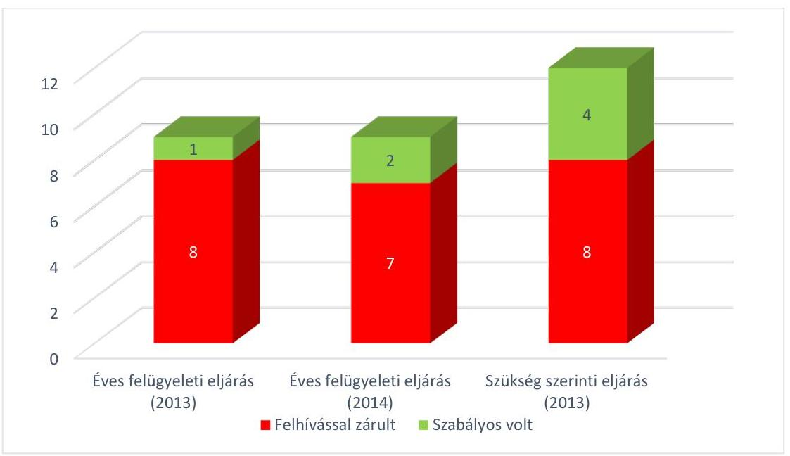

A Hivatal az ellenőrzött időszakban lefolytatott összesen 30 felügyeleti eljárás során egyszer tartott a Kormányrendelet 12. § (1) bekezdés b) pontjában foglalt helyszíni ellenőrzést és egy alkalommal (ugyanazon eljárás keretében) kért a Kormányrendelet 12. § (1) bekezdés c) pontjában foglalt szakértői véleményt.

Az eljárások során a Hivatal a közös jogkezelő szervezetekkel az Szjt. 92/O. §-ában, valamint a Kormányrendelet 7-9. §-ában foglaltaknak megfelelő módon, elektronikus úton tartotta a kapcsolatot a közös jogkezelő szervezetek felügyeletével kapcsolatos ügyekben.

A felügyeleti díjakkal kapcsolatos ügyintézési, elszámolási és nyilvántartási feladatok ellátása - a késedelmi pótlékok kezelésének kivételével - megfelelt a Kormányrendeletben foglaltaknak.

A Hivatal mindkét ellenőrzött évben az éves felügyeleti eljárás keretében ellenőrizte a felügyeleti díj megállapításával és befizetésével kapcsolatos dokumentumokat. A közös jogkezelő szervezetek közül 2013-ban öt szervezet határidőben és hiánytalanul, négy szervezet - a felügyeleti díj mértékének a közös jogkezelő szervezet általi téves megállapítása miatt - hiányosan fizette meg a felügyeleti díjat. A 2014. évben hét közös jogkezelő szervezet határidőben és hiánytalanul, egy késve, de hiánytalanul, míg egy közös jogkezelő szervezet hiányosan fizette meg a felügyeleti díjat. A Hivatal valamennyi, a felügyeleti díjat hiányosan vagy határidőre meg nem fizető közös jogkezelő szervezetet a Kormányrendelet 19. § (1) bekezdése előírásának megfelelően felhívta az elmaradt díjfizetés pótlására, akik a felhívásnak megfelelően eleget tettek fizetési kötelezettségüknek. Három közös jogkezelő szervezet esetében (MAHASZ, FILMJUS, MISZJE) a Hivatal a felhívásban - a Kormányrendelet 19. § (1) bekezdése előírása ellenére - nem figyelmeztette a szervezeteket a mulasztás jogkövetkezményére, a Kormányrendelet 19. § (2) bekezdésében foglalt, késedelmi pótlékfizetési kötelezettségre, mely előírás alapján a határidőre meg nem

---

fizetett felügyeleti dij után az érintett közös jogkezelő szervezeteknek az Art. 165167. §-ában foglalt mértékủ késedelmi pótlékfizetési kötelezettségük keletkezett. A késedelmi pótlékfizetési kötelezettségnek az érintett közös jogkezelő szervezetek nem tettek eleget (és nem is kezdeményezték a Kormányrendelet 16. §. (2) bekezdésében foglalt, a késedelmi pótlék megfizetése alóli mentességet). A késedelmi pótlék felszámítására, valamint a felszámított késedelmi pótlék összegének végrehajtására a Ket.-ben elöirtak ellenére a Hivatal nem intézkedett.

A Hivatal a befizetett felügyeleti dijakat 2013-ban a hatályos Hivatali Számlarendnek megfelelően számolta el. Az eredményszemléletű számvitel 2014. január 1-jei bevezetését követően - a Hivatali Számlarend módosításának elmulasztása ellenére - fökönyvi könyvelési rendszer átalakítása megtörtént az Áhsz. ${ }_{2}$ szabályainak megfelelően. A felügyeleti díjak elszámolása az Áhsz. ${ }_{2}$ előírásainak megfelelően történt.

Budapest, 2016.
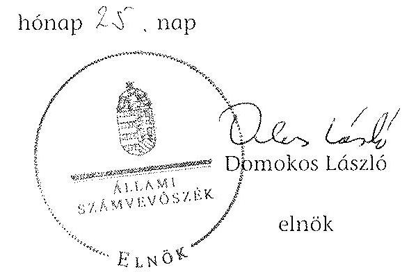

Melléklet: $\quad 6 \mathrm{db}$
Függelék: $\quad 3 \mathrm{db}$

---

A Hivatal belső kontrollrendszere kialakításának és müködtetésének értékelése

|  Ssz. | Megnevezés | 2008. év | 2009. év | 2010. év | 2011. év | 2012. év | 2013. év | 2008-2013. évek együttesen  |
| --- | --- | --- | --- | --- | --- | --- | --- | --- |
|  1. | Kontrollkörnyezet | szabályszerű | szabályszerű | szabályszerű | szabályszerű | szabályszerű | szabályszerű |   |
|  2. | Kockázatkezelési rendszer | szabályszerű | szabályszerű | szabályszerű | szabályszerű | részben
szabályszerű | részben
szabályszerű |   |
|  3. | Kontrolltevékenységek | részben
szabályszerű | részben
szabályszerű | részben
szabályszerű | részben
szabályszerű | részben
szabályszerű | részben
szabályszerű |   |
|  4. | Információs és kommunikációs rendszer | szabályszerű | szabályszerű | szabályszerű | szabályszerű | szabályszerű | szabályszerű |   |
|  5. | Monitoring rendszer | szabályszerű | szabályszerű | szabályszerű | szabályszerű | szabályszerű | szabályszerű |   |
|  A belső kontrollrendszer összevont értékelése |  | szabályszerű | szabályszerű | szabályszerű | szabályszerű | szabályszerű | szabályszerű |   |

---

|   |  |  |  |  |  |  |  |  |  |  |  |  |  |  |  |  |  |  |  |  |  |  |  |  |  |  |  |  |  |  |  |  |  |  |  |  |  |  |  |  |  |  |  |  |  |  |  |  |  |  |  |  |  |  |  |  |  |  |  |  |  |  |  |  |  |  |  |  |  |  |  |  |  |  |  |  |  |  |  |  |  |  |  |  |  |  |  |  |  |  |  |  |  |  |  |  |  |  |  |  |  | 

---

A Hivatal eszközeinek és forrásainak alakulása

|  Megnevezés | Állományi érték |  |  |  |  |  |  | Változás  |
| --- | --- | --- | --- | --- | --- | --- | --- | --- |
|   | 2008. | 2008. | 2009. | 2010. | 2011. | 2012. | 2013. | (2013. XII. 31. - 2008.  |
|   | I. 1. | XII. 31. | XII. 31. | XII. 31. | XII. 31. | XII. 31. | XII. 31. | I. 1.)  |
|   |  |  |  | (millió Ft) |  |  |  | %  |
|  I. Immateriális javak összesen | 131,8 | 155,3 | 201,8 | 266,0 | 276,7 | 267,7 | 321,1 | 189,3  |
|  II. Tárgyi eszközök összesen | 1 802,0 | 1 720,1 | 1 715,3 | 1 573,6 | 1 464,8 | 1 405,5 | 1 458,0 | -344,0  |
|  III. Befektetett pénzügyi eszközök összesen | 18,5 | 14,5 | 12,7 | 13,5 | 7,0 | 7,1 | 4,6 | -13,9  |
|  IV. Üzemeltetésre, kezelésre átadott, koncesszióba, vagyonkezelésbe adott, illetve vagyonkezelésbe vett eszközök |  |  |  |  | 0,6 | 4,6 | 9,1 | 9,1  |
|  A) BEFEKTETETT ESZKÖZÖK ÖSSZESEN | 1 952,3 | 1 889,9 | 1 929,8 | 1 853,1 | 1 749,1 | 1 684,9 | 1 792,8 | -159,5  |
|  I. Készletek összesen | 23,1 | 21,3 | 13,9 | 11,4 | 11,4 | 9,5 | 15,1 | -8,0  |
|  II. Követelések összesen | 15,5 | 14,6 | 10,9 | 6,7 | 43,0 | 59,0 | 38,6 | 23,1  |
|  III. Értékpapírok összesen |  |  |  |  |  |  |  | 0,0  |
|  IV. Pénzeszközök összesen | 930,1 | 894,4 | 874,4 | 740,8 | 871,6 | 1 191,1 | 1 426,6 | 496,5  |
|  V. Egyéb aktív pénzügyi elszámolások összesen | 7,0 | 37,1 | 50,7 | 35,7 | 86,9 | 41,8 | 22,5 | 15,5  |
|  B) FORGÓESZKÖZÖK ÖSSZESEN | 975,7 | 967,4 | 949,9 | 794,6 | 1 012,9 | 1 301,4 | 1 502,8 | 527,1  |
|  ESZKÖZÖK ÖSSZESEN | 2 928,0 | 2 857,3 | 2 879,7 | 2 647,7 | 2 762,0 | 2 986,3 | 3 295,6 | 367,6  |
|  I. Tartós tőke | 225,5 | 225,5 | 225,5 | 1 791,3 | 1 791,3 | 1 791,3 | 1 791,3 | 1 565,8  |
|  II. Tőkeváltozások | 1 740,4 | 1 634,3 | 1 565,9 | -80,6 | -42,7 | -102,6 | 20,5 | -1 719,9  |
|  III. Értékelési tartalék |  |  |  |  |  |  |  | 0,0  |
|  D) SAJÁT TŐKE ÖSSZESEN | 1 965,9 | 1 859,8 | 1 791,4 | 1 710,7 | 1 748,6 | 1 688,7 | 1 811,8 | -154,1  |
|  I. Költségvetési tartalékok összesen | 391,0 | 678,3 | 639,2 | 385,5 | 436,7 | 467,0 | 633,7 | 242,7  |
|  II. Vállalkozási tartalékok összesen |  |  |  |  |  |  |  | 0,0  |
|  E) TARTALÉKOK ÖSSZESEN | 391,0 | 678,3 | 639,2 | 385,5 | 436,7 | 467,0 | 633,7 | 242,7  |
|  I. Hosszú lejáratú kötelezettségek összesen |  |  |  |  |  |  |  | 0,0  |
|  II. Rövid lejáratú kötelezettségek összesen | 37,3 | 85,0 | 184,5 | 180,3 | 78,1 | 88,6 | 62,6 | 25,3  |
|  III. Egyéb passzív pénzügyi elszámolások összesen | 533,8 | 234,2 | 264,6 | 371,2 | 498,6 | 742,0 | 787,5 | 253,7  |
|  F) KÖTELEZETTSÉGEK ÖSSZESEN | 571,1 | 319,2 | 449,1 | 551,5 | 576,7 | 830,6 | 850,1 | 279,0  |
|  FORRÁSOK ÖSSZESEN | 2 928,0 | 2 857,3 | 2 879,7 | 2 647,7 | 2 762,0 | 2 986,3 | 3 295,6 | 367,6  |

---

A Hivatal tárgyi eszközeivel kapcsolatos mutatószámok alakulása

|  Ssz. | Megnevezés | Számítási mód | A mutató értéke |  |  |  |  |  | Változás 2008-ról 2013-ra (százalékpont)  |
| --- | --- | --- | --- | --- | --- | --- | --- | --- | --- |
|   |  |  | 2008.
XII.
31. | 2009.
XII.
31. | 2010.
XII.
31. | 2011.
XII.
31. | 2012.
XII.
31. | 2013.
XII.
31. |   |
|  1. | Eszközök használhatósági foka |  |  |  |  |  |  |  |   |
|  2. | - épületek és kapcsolódó vagyoni értékủ jogok | (Nettó érték : Bruttó érték) *100 | 77,1% | 75,3% | 73,1% | 71,3% | 69,4% | 68,9% | -8,2  |
|  3. | - építmények és kapcsolódó vagyoni értékű jogok |  | - | - | - | - | - | - | -  |
|  4. | - gépek, berendezések és felszerelések |  | 12,9% | 16,6% | 16,9% | 8,5% | 5,3% | 4,4% | -8,5  |
|  5. | - számítástechnikai és ügyvitel technikai eszközök |  | 11,6% | 7,5% | 4,9% | 3,5% | 3,6% | 4,7% | -6,9  |
|  6. | - járművek |  | 5,3% | 3,2% | 1,4% | 20,8% | 31,6% | 22,8% | 17,5  |
|  7. | Eszközök elhasználódási szintje |  |  |  |  |  |  |  |   |
|  8. | - épületek és kapcsolódó vagyoni értékủ jogok | 100% - Elhasználódási fok (%) | 22,9% | 24,7% | 26,9% | 28,7% | 30,6% | 31,1% | 8,2  |
|  9. | - építmények és kapcsolódó vagyoni értékű jogok |  | - | - | - | - | - | - | -  |
|  10. | - gépek, berendezések és felszerelések |  | 87,1% | 83,4% | 83,1% | 91,5% | 94,7% | 95,6% | 8,5  |
|  11. | - számítástechnikai és ügyvitel technikai eszközök |  | 88,4% | 92,5% | 95,1% | 96,5% | 96,4% | 95,3% | 6,9  |
|  12. | - járművek |  | 94,7% | 96,8% | 98,6% | 79,2% | 68,4% | 77,2% | -17,5  |
|  13. | 0-ra leírt eszközök aránya | (0-ra leírt immateriális javak és tárgyi eszközök | 1,0% | 1,0% | 2,1% | 2,1% | 2,1% | 2,0% | 1,0  |
|  14. | - épületek és kapcsolódó vagyoni értékủ jogok | bruttó értéke : immateriális javak és tárgyi eszközök bruttó értéke összesen) * 100 | - | - | - | - | - | - | -  |
|  15. | - építettek és kapcsolódó vagyoni értékű jogok |  | 78,8% | 69,5% | 59,5% | 68,4% | 81,6% | 90,7% | 11,9  |
|  16. | - gépek, berendezések és felszerelések |  | 65,7% | 73,3% | 81,3% | 89,8% | 93,1% | 91,9% | 26,2  |
|  17. | - számítástechnikai és ügyvitel technikai eszközök |  | 89,8% | 89,8% | 88,3% | 31,4% | 55,9% | 55,9% | -33,9  |
|  18. | - járművek |  | 89,8% | 89,8% | 88,3% | 31,4% | 55,9% | 55,9% | -33,9  |
|  19. | Átlagos életkor (év) |  |  |  |  |  |  |  |   |
|  20. | - épületek és kapcsolódó vagyoni értékủ jogok | Eszközök elhasználódási szintje (%) : értékcsökkenési leírási kulcs (%) | 11,5 | 12,4 | 13,5 | 14,4 | 15,3 | 15,6 | 4,1  |
|  21. | - építmények és kapcsolódó vagyoni értékű jogok |  | - | - | - | - | - | - | -  |
|  22. | - gépek, berendezések és felszerelések |  | 2,6 | 2,5 | 2,5 | 2,8 | 2,9 | 2,9 | 0,3  |
|  23. | - számítástechnikai és ügyvitel technikai eszközök |  | 6,1 | 6,4 | 6,6 | 6,7 | 6,6 | 6,6 | 0,5  |
|  24. | - járművek |  | 4,7 | 4,8 | 4,9 | 4,0 | 3,4 | 3,9 | -0,9  |

---

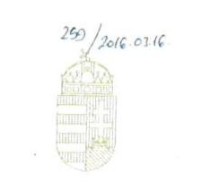

IGAZSÁGÜGYI MINISZTER

Domokos László elnök úr részére
Állami Számvevőszék

Budapest
Apárzai Csere János u. 10.
1052

2016 MARE 17. 931

ÁLLAMI SZÁMVEVŐSZÉK
020-610/2016
Érkezen: 2016 MARE 16.
Iktarószám: V-0625-384/2016
Melléklet:

A "Budapest" tízze

Tárgy: „A Szellemi Tulajdon Nemzeti Hivatala pénzügyi és vagyongazdálkodásának, a HIPAvilon Nkft.-vel fennálló szerződéses kapcsolatai szabályszerűségének és a közös jogkezelő szervezetekkel kapcsolatos feladatellátásának ellenőrzése" című számvevőszéki jelentéstervezet

Tisztelt Elnök Úr!

„A Szellemi Tulajdon Nemzeti Hivatala pénzügyi és vagyongazdálkodásának, a HIPAvilon Nkft.-vel fennálló szerződéses kapcsolatai szabályszerűségének és a közös jogkezelő szervezetekkel kapcsolatos feladatellátásának ellenőrzése" című számvevőszéki jelentéstervezetet megkaptam.

Mindenekelőtt meg szeretném köszönni Elnök úrnak és munkatársainak az ellenőrzés alapos lefolytatását és az ellenőrzés megállapításait tartalmazó jelentés tervezetének összeállítását.

Elnök urat a levelében foglaltakkal kapcsolatban az alábbiakról tájékoztatom, illetve a jelentéstervezettel összefüggésben az alábbi észrevételeket teszem:

*A jelentéstervezet egyes megállapításainak nemzetbiztonsági szempontból történő értékelése*

1. Elnök úr levelében kérte arra vonatkozó nyilatkozatomat, hogy hordoznak-e nemzetbiztonsági kockázatot a jelentéstervezet azon ellenőrzési megállapításaiban (38. oldal 2-3. bekezdés, 39. oldal 2. bekezdés) leírtak, miszerint a HIPAvilon Nkft. a hatósági eljárással összefüggő dokumentációs és ügykezelési, valamint újdonságkutatási feladatok ellátása során jogosulatlanul jutott hozzá olyan információkhoz és kezelt olyan adatokat, amelyekbe a szabadalmi bejelentés közzétételéig csak a szabadalmi találmányok oltalmáról szóló törvény 53. § (1) bekezdésében meghatározott jogosultak tekinthettek be.

2. Tájékoztatom tisztelt Elnök Urat, hogy a levelében felvetett nemzetbiztonsági kockázat fennállása kérdésében Dr. Molnár Zoltán közigazgatási államtitkár úr 2016. március 7-én kelt levelében megkereste dr. Kiss Zoltán nb. dandártábornok urat, az Alkotmányvédelmi Hivatal főigazgatóját, aki a nemzetbiztonsági szolgálatokról szóló törvény 53. § (1) bekezdésében meghatározott jogosultak tekinthettek be.

---

1995. évi CXXV. törvény értelmében a kérdés megválaszolására hatáskörrel rendelkezik.

# A Hivatal és a hazai innovációs folyamatok 

1. A jelentéstervezetet megküldő levelében Elnök úr jelezte, hogy a Szellemi Tulajdon Nemzeti Hivatalának (a továbbiakban: Hivatal) szakmai tevékenységét ugyan nem ellenőrizte az Állami Számvevőszék, azonban szükségesnek ítéli a figyelmet felhívni arra, az ellenőrzés által feltárt szabálytalanságok, hiányosságok hozzájárulhatnak ahhoz, hogy a Hivatal nem a legeredményesebben és leghatékonyabban támogatta a hazai innovációs folyamatokat és ezen keresztül a magyar gazdaság versenyképességének fokozását.
2. Köszönöm Elnök úr jelzését, az abban foglaltakra az elkövetkezendőkben az Igazságügyi Minisztérium kiemelt figyelmet fog fordítani.
3. Szeretném hangsúlyozni, hogy a Kormány kiemelt feladatának tekinti a hazai vállalkozásokhoz kapcsolódó innováció támogatását. A Kormány - amellett, hogy a 1414/2013. (VII. 4.) Korm. határozatban elfogadta a Nemzeti Kutatás-fejlesztési és Innovációs Stratégiát - létrehozta a Nemzeti Kutatási Fejlesztési és Innovációs Hivatalt, annak érdekében, hogy a közfinanszírozású támogatások intézményrendszerét koordináltabbá, átláthatóbbá és hatékonyabbá tegye, ezzel átalakítva az innovációs folyamatok állami támogatásának intézményrendszerét. A Kormány a kutatás-fejlesztés és innováció közfinanszírozású támogatásával kapcsolatos feladatokat elsődlegesen a Nemzeti Kutatási Fejlesztési és Innovációs Hivatal és az általa kezelt források útján látja el, így biztosítva a kutatás-fejlesztés és innováció egységes joggyakorlaton alapuló felügyeletét és a rendelkezésre álló források kutatás-fejlesztésre és innovációra történő hatékony felhasználását.
4. Megjegyzem továbbá, hogy az iparjogvédelmi hatósági díjak mértéke 2012 óta nem emelkedett, s azokkal kapcsolatban kedvezmények és mentességek is érvényesülnek. A szabadalmak számának alakulása kapcsán az sem hagyható figyelmen kívül, hogy a szabadalmi oltalom igénybevételének lehetősége nem egyedüli eszköz az innovatív tevékenységek eredményeként született szellemi eredmények védelmére, s a vállalkozások más megoldást is választhatnak érdekeik védelmében.

## A jelentéstervezetben megfogalmazott javaslat

1. A jelentéstervezet részemre egy javaslatot fogalmaz meg:
„A Hivatal a Ket. és az Szt. elöírásai ellenére hatósági feladatokat újdonságkutatási és a hatósági feladatokhoz elválaszthatatlanul kapcsolódó dokumentációs és ügyiratkezelési feladatokat - adott át a HIPAvilon Nkft. részére. Továbbá a Hivatalnál a munkáltatói jogkör gyakorlója a HIPAvilon Nkft. által megbizott kormánytisztviselők további jogviszonyának létesitését engedélyezte, ugyanakkor - az Ávr. 51. § (2) bekezdésében foglalt elöírás ellenére - a Hivatal személyi állományába tartozó kormánytisztviselökkel kötött megbizási szerződések olyan feladatok (újdonságkutatás) végrehajtására

---

vonatkoztak, amelyek a munkaköri leírásukban elö voltak irva, vagy elöírhatók lettek volna, annak elvégzéséért dijazásban részesültek.

# Javaslat 

Intézkedjen a feltárt hiányosságok, szabálytalanságok tekintetében a munkajogi felelősség tisztázására irányuló eljárás megindításáról, és ennek eredménye ismeretében tegye meg a szükséges intézkedéseket."
2. A javaslatot köszönöm, a jelentés véglegesítését követően haladéktalanul a javaslatnak megfelelően fogok eljárni, megvizsgálva a felelősség kérdését és ennek eredményét szem előtt tartva meghozva a szükséges intézkedéseket.
3. Tájékoztatom Elnök urat, hogy az Igazságügyi Minisztérium az ellenőrzött időszakot követően bekövetkezett változások feltárása érdekében már a jelentéstervezet kézhezvételét követően megkereste a Hivatalt, a jelentéstervezetnek a Hivatal és a HIPAvilon Nkft. viszonyával kapcsolatos megállapításai kapcsán kérve annak ismertetését, hogy a vizsgált időszakhoz képest történtek-e változások, így különösen módosult-e a Hivatal által a HIPAvilon Nkft.-vel, illetve a HIPAvilon Nkft. által a Hivatal kormánytisztviselőivel kötött szerződések tartalma.
Dr. Bendzsel Miklós elnök úr válaszában kifejtette, hogy a vizsgált időszakhoz képest a Hivatal és a HIPAvilon Nkft. szerződéses kapcsolatában nem történtek változások, ugyanis álláspontja szerint a Hivatal és a HIPAvilon Nkft. közötti hatályos szerződések változatlanul összhangban vannak törvényi és más jogszabályi előírásokkal.
4. Az elkövetkezendőkben az Igazságügyi Minisztérium folyamatosan figyelemmel kívánja kísérni, hogy a Hivatal és a HIPAvilon Nkft. milyen intézkedéseket hoz a jelentéssel összefüggésben, miként tesznek eleget az Állami Számvevőszék által részükre megfogalmazott azon ajánlásoknak, amelyek teljesítését az Igazságügyi Minisztérium is elő kívánja segíteni a rendelkezésére álló eszközökkel.
5. A Hivatal és a HIPAvilon Nkft. kapcsolatrendszere kapcsán továbbá tájékoztatom, hogy a 2015. és a 2016. évben az Igazságügyi Minisztérium e téren többször jelezte aggályait a Hivatal felé.

- A Hivatal 2015. évi munkatervével összefüggésben felmerült a hatósági feladatkörök - szolgáltatások - hatósági szolgáltatások nyújtásának nem világos elhatárolása. Az ezzel kapcsolatos észrevételeket és kérdéseket az Igazságügyi Minisztérium a 2015. március 17-i, XX-3/ID/48/9/2015 iktatószámú levelében ismertette, pontosítást kérve a Szingapúri Szellemi Tulajdonvédelmi Hivatal és más országok szabadalmi hivatalai (Brunei Szultánság, Ausztria, Makedónia és Szlovénia) számára végzett szabadalmi kutatások és vizsgálatok nyújtása kapcsán, azzal, hogy ezek esetében a szolgáltatások helyett inkább iparjogvédelmi hatósági feladatokról van szó (a feladatok végterméke, a kutatási, vizsgálati jelentés, a hagyományos hatósági feladatkör), illetőleg kérve a munkaterv átdolgozását a kutatási és más szabadalmi szolgáltatások nemzetközi szerződések és hazai együttműködési megállapodások alapján történő nyújtása vonatkozásában. A Hivatal 2015. március 20. napján kelt Eln. 7/3-4/2015 számú válaszlevelében úgy nyilatkozott, hogy az Igazságügyi Minisztérium tévesen értelmezi a jogszabályt.

---

- 2015 októberében az Igazságügyi Minisztérium a Hivatal Szervezeti és Müködési Szabályzatának (a továbbiakban: SZMSZ) észrevételezése során az XX/3/432/4/2015. számú levélben kérte annak indokolását, hogy miért mutatkozik szükségesnek az SZMSZ kiegészítése a HIPAvilon Nkft.-re történő utalással, illetve miért állandó meghívottja a Hivatal Elnöki Értekezletének a HIPAvilon Nkft. képviselője.
- A Hivatal 2016. évi munkaterve tárgyában az Igazságügyi Minisztérium részéről 2016. február 15-én küldött XX-3/28/3/2015. számú levél ismételten felvetette a Szingapúri Szellemi Tulajdonvédelmi Hivatal, illetve más országok szabadalmi hivatalai (Brunei Szultánság, Ausztria, Makedónia és Szlovénia) számára nyújtott szabadalmi kutatások és vizsgálatok kapcsán (amelyeknél közremüködőként a HIPAvilon Nkft. került megjelölésre), hogy bár a Hivatal feladatai ellátásába a HIPAvilon Nkft.-t bevonhatja, ezekben az esetekben a dokumentációs és tájékoztató szolgáltatások nyújtásán túlmenő, inkább hivatali iparjogvédelmi hatósági jellegű feladatokról van szó, miután azok végterméke, a kutatási, vizsgálati jelentés a hagyományos hatósági feladatkörhöz kapcsolható, mely feladatokba a jogszabály alapján nem vonható be a HIPAvilon Nkft.
Dr. Bendzsel Miklós elnök úr 2016. február 18-án kelt válaszlevelében ismét kifejtette, hogy az Igazságügyi Minisztérium által aggályosnak tartott, a munkatervben szereplő, külföldi iparjogvédelmi hatóságnak nyújtott szolgáltatások (szabadalmi kutatások és vizsgálatok nyújtása) során a Hivatal semmilyen hatósági jogkört nem gyakorol, ezért ezen feladatokba jogszerủen vonja be a HIPAvilon Nkft-t.

# A jelentéstervezettel kapcsolatos észrevételek 

1. A jelentéstervezet 1. oldalának utolsó bekezdése rögzíti a felügyeleti jogkört gyakorló szervezet felügyeleti jogkörének időtartamát, amellyel kapcsolatban az alábbi pontosító észrevételeket teszem:

- az igazságügyi és rendészeti miniszter 2010. május 29 -ig gyakorolta;
- a közigazgatási és igazságügyi miniszter 2014. június 5 -ig gyakorolta;
- az igazságügyi miniszter 2014. június 6 -tól gyakorolja
a felügyeleti jogköröket a Hivatal tevékenysége felett.

2. A jelentéstervezet 4. oldalának utolsó bekezdése ismerteti a HIPAvilon Nkft. alapításának történetét. Ezzel kapcsolatban az alábbi pontosító észrevételeket teszem:

A jelenleg a Hivatal tulajdonosi joggyakorlása alatt álló HIPAvilon Nkft. létrehozására nem a Hivatal jogszabályokban meghatározott közfeladatai hatékonyabb ellátásának támogatása érdekében került sor. A Tudományos és Technológiai Alapítvány közhasznú nonprofit gazdasági társasággá történő átalakításáról szóló 1150/2011. (V. 18.) Korm. határozat, valamint a Kormány által alapított közalapítványokkal és alapítványokkal kapcsolatos időszerü intézkedésekről szóló 1159/2010. (VII. 30.) Korm. határozat által előírt felülvizsgálati eljárás megállapításai alapján szükséges intézkedésekről szóló 1316/2010. (XII. 27.) Korm. határozat 1.4., 2. és 3.1.4. pontjaiban foglaltak végrehajtása érdekében, a Tudományos és Technológiai Alapítvány (a továbbiakban: Alapítvány) céljainak megvalósítására, feladatának további ellátása érdekében kezdődött meg a $100 \%$-os állami részesedésű, közhasznú

---

jogállással rendelkező Tudományos és Technológiai Közhasznú Nonprofit Kft. megalapítása. A 2012. február 21-én létrejött Kft. vagyonkezelője - a Korm. határozatban foglaltaknak megfelelően - a közigazgatási és igazságügyi miniszter lett. 2012. február 15-én azonban hatályba lépett a Tudományos és Technológiai Alapítvány közhasznú nonprofit gazdasági társasággá történő átalakításáról szóló 1150/2011. (V. 18.) Korm. határozat módosításáról szóló 1026/2012. (II. 14.) Korm. határozat, amely már azt rögzítette, hogy az Alapítvány által ellátott feladatokat - a szintén a közigazgatási és igazságügyi miniszter vagyonkezelése alatt álló - Bay Zoltán Alkalmazott Kutatási Közhasznú Nonprofit Kft. veszi át. Ezen Korm. határozat előírásaira figyelemmel a Hivatal és a Közigazgatási és Igazságügyi Minisztérium vezetői megállapodtak abban, hogy mivel a létrehozott társaság tevékenysége névváltozással és profilváltással - hozzáigazítható a Hivatal feladataihoz kapcsolódó, a Hivatal által gazdasági társasági formában ellátni tervezett feladatokhoz, így kezdeményezik a Magyar Nemzeti Vagyonkezelő Zrt.-nél a Kft. feletti tulajdonosi joggyakorló személyének megváltoztatását. A kezdeményezés eredményeképpen létrejött megállapodás szerint 2012. április 11-től a Kft. feletti vagyonkezelői jogok gyakorlására a Hivatal vált jogosulttá.

Budapest, 2016. március „?"
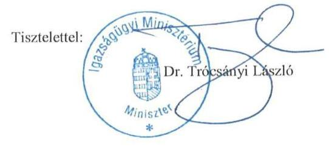

---

# Észrevételek 

## az Állami Számvevőszék V-0625/2016. számú jelentéstervezetében foglaltakra

Tárgy: a Szellemi Tulajdon Nemzeti Hivatala pénzügyi és vagyongazdálkodásának, a HIPAvilon Nkft.-vel fennálló szerződéses kapcsolatai szabályszerűségének és a közös jogkezelő szervezetekkel kapcsolatos feladatellátásának ellenőrzése kapcsán megküldött 2016. február 22-én kelt jelentéstervezetben foglaltak véleményezése

Az Állami Számvevőszék (a továbbiakban: ÁSZ) megküldött jelentéstervezete a Szellemi Tulajdon Nemzeti Hivatalánál (a továbbiakban: SZTNH vagy Hivatal) a tárgyban nevesített három témaellenőrzés megállapításait foglalja össze a maga 50 oldalas szövegében (és mellékleteiben). Az ellenőrzés jellemzője volt, hogy egymástól valamelyest független témakörök, eltérő időpontokban elrendelt és eltérő időszakokra vonatkozó ellenőrzésére került sor. A jelentéstervezet már a terjedelméből adódóan is rengeteg megállapítást tartalmaz, amelyekből kiindulva 24 javaslatot fogalmaz meg (egyet a miniszternek, 19-et az SZTNH elnökének, négyet a HIPAvilon Nonprofit Kft. ügyvezető igazgatójának).

A jelentéstervezet megállapításait tekintve látható, hogy pozitív és negatív értékelésű, jelentős és jelentéktelen elemek egyaránt találhatók benne. Az SZTNH álláspontja szerint ugyanakkor a jelentéstervezet számos kérdésben megalapozatlanul jutott negatív véleményre, annak ellenére, hogy a helyszíni ellenőrzési szakaszban a tények bemutatása, azok körültekintő értelmezésének egyeztetése megtörtént és az ezeket alátámasztó dokumentumok becsatolásra kerültek. A téves értelmezésből kiindulva igen jelentős kérdések tekintetében is hibás következtetések szerepelnek az anyagban és ezekből megalapozatlan javaslatok kerültek megfogalmazásra.

Kiemelendő, hogy a jelentéstervezet által javasolt intézkedések között három esetben munkajogi felelősség tisztázását is indítványozza a tervezet (a miniszternek tett javaslatban, valamint a Hivatal elnökének tett, a 6. és 8. pontok szerinti javaslatokban). Mindhárom megállapítás megalapozatlan, a levont következtetés hibás, a személyi intézkedés kezdeményezése minden jogalapot nélkülöző.

A tervezet ezen túlmenően is tartalmaz olyan - kisebb jelentőségű - megállapításokat, kijelentéseket, amelyek a tényekkel nincsenek összhangban.

A leírtak alapján két kiemelt témát kíván az SZTNH mindenekelőtt észrevételezni azok súlyosan megalapozatlan tartalma miatt, majd ezt követően, immár a jelentéstervezet egyes pontjainak sorrendjét követve reagál az SZTNH a további megállapításokra, ahol elengedhetetlennek tartja az észrevételek megtételét.

---

# I. Az SZTNH és a HIPAvilon Nonprofit Kft. szerződéses kapcsolatrendszere 

Kiemelt hangsúllyal szerepelnek a jelentéstervezetben az SZTNH és a HIPAvilon Nonprofit Kft. szerződéses kapcsolatai (jelentéstervezet 11., 12., 15-16., 19., 36-42. oldalak).

Ebben a tekintetben a jelentéstervezet a tételes jogszabályi előírásokat figyelmen kívül hagyva, illetve azokkal ellentétesen megalapozatlan állításokat tartalmaz és azokból téves következtetéseket von le az SZTNH és a HIPAvilon Nonprofit Kft. terhére.

A jelentéstervezet 11. oldalán az „I. Összegző megállapítások, következtetések, javaslatok" részében kerültek leírásra az ÁSZ által megfogalmazott kifogások.

Ezen összegző kritikus megállapításokat a tervezet a későbbiekben jogszabályhelyekre utalásokkal egészíti ki, így hivatkozik a Ket. 12. § (3) bekezdésére, az Szt. 44-45. §-aira, 53. § (1) bekezdésére, 69-69/A. §-aira és 115/H. § (1) bekezdésére, továbbá a HIPAvilon Nkft. által megkötött megbízási szerződésekkel összefüggésben az Ávr. 51. § (2) bekezdésére.

A jelentéstervezet ezen része tévesen azt tartalmazza, hogy:

1) a HIPAvilon Nkft. jogosulatlan nemzetközi kapcsolattartási tevékenységet végzett,
2) a HIPAvilon Nkft. által ellátott újdonságkutatás hatósági tevékenységnek minősül, ezért abba az SZTNH nem vonhatta volna be a HIPAvilon Nkft.-t,
3) az SZTNH hatósági adatokat adott át a HIPAvilon Nkft.-nek betekintésre, adatkezelésre
4) az SZTNH kormánytisztviselői tekintetében jogsértés történt annak ellenére, hogy a Kttv. összeférhetetlenségi szabályai a tervezet szerint is betartásra kerültek
5) a HIPAvilon Nkft. által ténylegesen ellátott tevékenységek és az alapító okiratában felsorolt tevékenységi köröket tartalmazó TEÁOR kódok nem voltak összhangban.

Ezen téves megállapításokból pedig hibás következtetéseket von le a jelentéstervezet.

Ezzel szemben az adott pontok tekintetében a tények a következők:

1) A HIPAvilon Nonprofit Kft. az SZTNH nevében, vagy megbízásából semmilyen nemzetközi kapcsolattartást nem végzett az Szt. 115/L. §-a szerint, az SZTNH az Szt. 115/L. §-a szerinti nemzetközi tevékenységébe a HIPAvilon Nkft.-t nem vonta be, kizárólag az Szt. 115/L §-a szerinti állami dokumentációs és információs tevékenysége keretében müködtek a felek együtt a 2012. és 2013. évben tájékoztató szolgáltatásokkal összefüggésben.
2) A HIPAvilon Nkft. részéről végzett „újdonságkutatási tevékenység" semmilyen szempontból nem tekinthető közhatalmi jogkörben gyakorolt hatósági

---

tevékenységnek, sem az Szt., sem a Ket. alapján, hanem az egy külföldi hatósággal megkötött nemzetközi intézményközi - magánjogi természetű megállapodás alapján végzett szolgáltatás. Így annak teljesitésébe az SZTNH az Szt. 115/E. § (7) bekezdése, 115/I. § d) pontja és a 287/2010. (XII. 16.) Korm. rendelet szabályai alapján jogszerűen vonhatta és vonhatja be a HIPAvilon Nkft.-t.
3) Az SZTNH semmilyen hatósági adatot nem adott át a HIPAvilon Nonprofit Kft. részére, hanem kizárólag kisegítő feladatok ellátásával, azaz bizonyos dokumentumok és ábrák digitalizálásával, szkenneléssel, leírásgyártással, tértivevények, határozatok, szerelőlapok, akták, stb. helyszíni írattári kezelésével bízta meg a társaságot.
4) Az SZTNH és a HIPAvilon Nkft. is az SZTNH kormánytisztviselői tekintetében jogszerűen, valamennyi jogszabályi előírás betartásával jártak el akkor, amikor az összeférhetetlenségi szabályok betartása mellett a HIPAvilon Nkft. a hivatali érintett kormánytisztviselőkkel megbízási szerződést kötött a nem hatósági feladatnak minősülő újdonságkutatások saját szabadidejükben külön díjazás fejében történő elvégzésére.
5) A HIPAvilon Nkft. az alapító okirata szerinti tevékenységeket látta el üzletszerűen.

# A jelentéstervezetben írtak cáfolatának részletes kifejtése 

1) A HIPAvilon Nonprofit Kft. az SZTNH nevében, vagy megbízásából semmilyen nemzetközi kapcsolattartást nem végzett az Szt. 115/L. §-a szerint, az SZTNH Szt. 115/L. §-a szerinti nemzetközi tevékenységébe a HIPAvilon Nkft.-t nem vonta be, kizárólag az Szt. 115/I. §-a szerinti állami dokumentációs és információs tevékenysége keretében müködtek a felek együtt a 2012. és 2013. évben tájékoztató szolgáltatásokkal összefüggésben.

A jelentéstervezet 38. oldalának negyedik bekezdése megalapozatlanul és minden alap nélkül állítja, hogy az SZTNH ,... az Szt. elöírásai ellenére bízta meg a HIPAvilon Nkft.-t nemzetközi kapcsolattartási feladattal a 2012. május 16. és 2013. december 31. közötti időszakban érvényben lévő megállapodásokban, mivel az Szt. 2013. március 31-éig hatályos 115/L. §-a alapján a Hivatal kizárólag ,,az érintett államigazgatási szervekkel" müködhetett közre a nemzetközi kapcsolattartási feladatokban, ...".

Az SZTNH számára eleve érthetetlen, hogy a jelentéstervezet készítői miből jutottak arra a téves következtetésre, hogy az SZTNH az Szt. 115/L. §-a szerinti „nemzetközi kapcsolattartással" bízta volna meg a HIPAvilon Nkft.-t. Ez a kijelentés minden alapot nélkülöz, ellentétes minden ténnyel és minden dokumentummal.

---

A jelentéstervezetben hivatkozott Szt. 115/L. §-a az alábbi szöveget tartalmazta (a jelentésben említett 2013. március 31 -éig):
115/L. § A szellemi tulajdon területén folyó nemzetközi, illetve európai együttmüködésben a Hivatal - együttmüködve az érintett központi államigazgatási szervekkel - különösen a következő képviseleti és egyéb szakmai feladatokat látja el:
a) részt vesz a Szellemi Tulajdon Világszervezete, az Európai Szabadalmi Szervezet, a Belső Piaci Harmonizációs Hivatal, a Közösségi Növénylajta-hivatal vezető és egyéb testületeinek, a Kereskedelmi Világszervezet TRIPS Tanácsának, valamint - a tárgykör szerint felelős miniszter általános vagy eseti felhatalmazása alapján - más nemzetközi szervezetek tevékenységében;
b) gondoskodik az Európai Szabadalmi Szervezet tagállamait megillető jogok gyakorlásáról és az azokat terhelő kötelezettségek teljesitéséről, és ellátja az európai szabadalmi rendszer müködletéséből a nemzeti szabadalmi hatóságra háruló feladatokat;
c) a szellemi tulajdon védelme terén ellátja az Európai Unió tagállamaként való müködésből eredő feladatokat, közremüködik az Európai Unió döntéshozatali eljárásaiban képviselendő kormányzati álláspont kialakításában, valamint az Európai Unió Tanácsának és Bizottságának szellemi tulajdonért felelős szakértői testületeiben történő képviseletében, ellátja az ezzel járó szakmai koordinációs feladatokat, továbbá együttmüködik az Európai Unió iparjogvédelmi hatóságaival;
d) részt vesz a szellemi tulajdon védelmére vonatkozó nemzetközi szerződések előkészitésében és végrehajtásában, javaslatot tesz e szerződések létrehozására;
e) kapcsolatot tart más országok és a nemzetközi szervezetek szellemi tulajdonvédelmi hatóságaival.

Egyetlen SZTNH - HIPAvilon Nkft. szerződés sem tartalmaz olyan utalást, amely az Szt. 115/L. §-ában szereplő bármely feladatba bevonná a HIPAvilon Nkft.-t, de nem található ilyen máshol sem, és az SZTNH-t a HIPAvilon Nkft. egyetlen egy alkalommal sem képviselte semmilyen módon az Szt. 115/L. §-a szerinti nemzetközi feladatok keretében. Az SZTNH a szellemi tulajdon területén folyó nemzetközi, illetve európai együttmüködéssel kapcsolatos Szt. 115/L. §-a szerinti képviseleti és egyéb szakmai feladatokba a HIPAvilon Nkft.-t nem vonta be, a társaság soha nem képviselte az SZTNH-t.

A más iparjogvédelmi hatósággal megkötött szerződések tekintetében is kizárólagosan az SZTNH tartotta és tartja a kapcsolatokat nemzetközi partnereivel, így azon külföldi iparjogvédelmi hatóságokkal is, amelyek felkérték a hivatalt szolgáltatás nyújtására. Ezen esetekben a külföldi partnerrel az SZTNH áll (és állt mindig is) kizárólagosan szerződéses viszonyban és kizárólagos jelleggel tartotta a partnerrel a kapcsolatot. A vizsgálandó anyagok az SZTNH-hoz érkeztek be a partnertől, és az SZTNH küldte ki minden esetben a munka

---

elvégzése és hivatali ellenőrzése után a külföldi félnek a teljesítésül elkészült dokumentumokat. Ezen felül kizárólag az SZTNH számolt el a külföldi partnerrel a teljesítések után.

Feltehetően a jelentéstervezet összeállítói abba a hibába estek, hogy a 2012. május 16-án aláírt közszolgáltatási szerződés 3.1. pontjának g) alpontját értették félre. Ez a szerződéses pont a szellemi tulajdon területéhez kapcsolódó állami dokumentációs és információs tevékenységben való együttműködésről rendelkezik, és ennek keretében valóban említést tesz „a külföldi és nemzetközi társintézményekkel való kapcsolattartásról", de ez értelemszerűen nem az Szt. 115/L. §-ában szereplő feladatokra vonatkozik, hanem az Szt. 115/I. § d) pontja szerinti tájékoztató szolgáltatásokkal, információs tevékenységgel van összefüggésben. Ugyanez a helyzet a 2013. május 31-én kelt „Közszolgáltatási szerződés 2013. évre a szellemi tulajdonvédelmi információs, tájékoztatási és dokumentációs tevékenységekben történő együttműködésre" elnevezéssel megkötött szerződés 3.1. h) alpontja tekintetében. (A ténylegesen elvégzett feladatok között olyan teendők szerepeltek, mint a projektkoordinátori feladatok keretében a belföldi tájékoztatást elősegítő projektek egyeztetése a hivatali szakmai felelősökkel, a projekt dokumentáció megírása, elszámolást támogató anyagok gyűjtése, koordinálása, vagy 2013. évben a szellemivagyon-értékelési módszertan ismertetése és alapszintủ szolgáltatások bevezetésének megvitatása, előadás tartása szellemivagyon-értékelés témakörben, közreműködés nemzetközi internetes honlap továbbfejlesztésében stb.) Megállapítható tehát, hogy a jelentéstervezet összekeverte az Szt. 115/L. §-a szerinti, ott felsorolt ügyekben történő kapcsolattartást, az Szt. 115/I. §-a szerinti állami dokumentációs és információs tevékenység megvalósításához szükséges - adott esetben külföldi partnerrel való kapcsolattartással, kizárólag azon az alapon, hogy a törvényi és a közszolgáltatási szerződés egyaránt a „kapcsolattartás" kifejezést tartalmazza és függetlenül annak tényleges tartalmától.
2) A HIPAvilon Nkft. részéről végzett „újdonságkutatási tevékenység" semmilyen szempontból nem tekinthető közhatalmi jogkörben gyakorolt hatósági tevékenységnek, sem az Szt., sem a Ket. alapján, hanem az egy külföldi hatósággal megkötött nemzetközi intézményközi - magánjogi természetű megállapodás alapján végzett szolgáltatás. Így annak teljesítésébe az SZTNH az Szt. 115/E. § (7) bekezdése, 115/I. § d) pontja és a 287/2010. (XII. 16.) Korm. rendelet szabályai alapján jogszerűen vonhatta és vonhatja be a HIPAvilon Nkft.-t.

# 2.1. 

Mind a jelenleg hatályos törvényi szabályokban (pl.: Ket.), mind a jogelméletben régóta egyértelműen meghatározottak azok az együttes elemek, amelyek megléte esetén egy tevékenység az állam nevében gyakorolt, tehát közigazgatási tevékenységnek minősíthető. Ezen együttes feltételek hiányában egy tevékenység sem minősülhet az állam nevében végzett hatósági tevékenységnek. Közhatalmi hatósági tevékenységről akkor lehet beszélni, ha törvényben meghatározott szervezet, az ügyfél törvényben meghatározott hatósági ügyében,

---

jogszabályban meghatározott eljárásban, a törvényben meghatározott hatáskörét gyakorolja, és döntése állami kényszerrel is kikényszeríthető.

Alapvető tévedés egy külföldi iparjogvédelmi hatóság számára intézményközi magánjogi természetű - megállapodás alapján végzett újdonságkutatási tevékenységet, mint szolgáltatást hatósági eljárásnak „minősíteni", akárcsak részben is, miután ennek egyetlen törvényi feltétele sincs meg.

# A szóban forgó újdonságkutatások tekintetében 

- az SZTNH nem közigazgatási hatóságként és azon belül nem iparjogvédelmi hatóságként jár el,
- az újdonságkutatást megrendelő külföldi iparjogvédelmi hatóság nem minősül ügyfélnek,
- a szerződésben megrendelt újdonságkutatás nem minősül hatósági ügynek,
- az újdonságkutatás nem az Szt. és nem a Ket. eljárási szabályai szerinti közigazgatási eljárás keretében történik,
- az újdonságkutatási tevékenység mint szolgáltatás nem közigazgatási hatáskörből fakad, mert az nem az Szt. és nem a Ket. hatósági hatásköri szabályaiból, nem más nemzetközi szerződésen alapuló regionális iparjogvédelmi együttműködésből, vagy más egyéb nemzetközi szerződésből, továbbá nem európai közösségi jogszabályból a nemzeti iparjogvédelmi hatóságra tartozó kutatási, vizsgálati, továbbítási, nyilvántartás-vezetési és egyéb eljárási cselekmény elvégzésére vonatkozó hatásköri szabályokból következik.
2.2.

A jelentéstervezetben ezzel a témával kapcsolatosan hivatkozott jogszabályhelyek áttekintése
a) A jelentéstervezet hivatkozik a Ket. 12. § (3) bekezdésére, amely az alábbit mondja ki:
„12. § (3) E törvény alkalmazása szempontjából közigazgatási hatóság (a továbbiakban: hatóság) a hatósági ügy intézésére hatáskörrel rendelkező
a) államigazgatási szerv, ..."

Az SZTNH természetesen nem vitatja hogy közigazgatási hatóságként jár el a törvény által hatáskörébe utalt „hatósági ügyekben", így az iparjogvédelmi hatósági ügyekben is, de a külföldi iparjogvédelmi hatóságtól, a vele megkötött nemzetközi intézményközi - magánjogi természetű - megállapodás alapján újdonságkutatásra kapott ügy NEM minősül sem az Szt., sem a Ket. alapján hatósági ügynek, és azt nem ezen törvények eljárási szabályainak megfelelően kell kezelni.

---

b) A jelentéstervezet hivatkozik az Szt. 44-45. §-aira, terjedelmi okokból nem idézzük e normákat egészükben, csak a téma szempontjából releváns részeket, amelyek az alábbiakat mondják ki:
„44. § (2) A Szellemi Tulajdon Nemzeti Hivatala hatáskörébe a következő szabadalmi ügyek tartoznak:
a) a szabadalom megadása,
b) a szabadalmi oltalom megszünésének megállapítása és újra érvénybe helyezése,
c) a szabadalom megsemmisitése,
d) a nemleges megállapitás,
e) a szabadalmi leírás értelmezése,
f) a szabadalmi bejelentések és a szabadalmak nyilvántartása, beleértve a fenntartásukkal kapcsolatos kérdéseket,
g) a szabadalmi hatósági tájékoztatás.
(3) A Szellemi Tulajdon Nemzeti Hivatala hatáskörébe tartoznak az európai szabadalmi bejelentésekre és az európai szabadalmakra (X/A. fejezet), valamint a nemzetközi szabadalmi bejelentésekre (X/B. fejezet) vonatkozó rendelkezések alkalmazásából eredő ügyek is.
(4) A Szellemi Tulajdon Nemzeti Hivatala jár el a kiegészitő oltalmi tanúsitványokkal kapcsolatos - külön jogszabályban meghatározott - ügyekben is.
(5) A Szellemi Tulajdon Nemzeti Hivatala jár el a 816/2006/EK rendelet [33/A. § (1) bek.] hatálya alá tartozó kényszerengedélyekkel összefüggő ügyekben (83/A-83/H. §ok) is.
45. § (1) A Szellemi Tulajdon Nemzeti Hivatala a hatáskörébe tartozó szabadalmi ügyekben - az e törvényben meghatározott eltérésekkel - a közigazgatási hatósági eljárás általános szabályairól szóló törvény rendelkezései szerint jár el.
(2) A Szellemi Tulajdon Nemzeti Hivatala a hatáskörébe tartozó szabadalmi ügyekben - jogszabály eltérő rendelkezése hiányában - kérelemre jár el. ... "

A hivatkozott szabályok a jelen észrevételek előző 2.2) a) pontjában írtakkal állnak szoros összefüggésben. Az Szt. 44. § (2) bekezdése taxativen sorolja fel a szabadalmi ügyeket és azokat a hatásköröket, amelyeket az SZTNH ezen ügyekben gyakorol. A külföldi partner felkérésére végzett újdonságkutatások esetében az SZTNH nem az Szt.-ben 'meghatározott hatásköreit gyakorolja.

---

Ugyanerre a következtetésre kell jutni akkor, ha az idevonatkozó további Ket. normát is elemezzük. A Ket. jelentéstervezetben szakaszszám tekintetében már hivatkozott 12. §-a, de annak ott nem hivatkozott (2) bekezdése az, ami meghatározza a hatósági ügy fogalmi tartalmát az alábbiak szerint:
„12. § (2) Közigazgatási hatósági ügy (a továbbiakban: hatósági ügy):
a) minden olyan ügy, amelyben a közigazgatási hatóság az ügyfelet érintő jogot vagy kötelességet állapít meg, adatot, tényt vagy jogosultságot igazol, hatósági nyilvántartást vezet vagy hatósági ellenörzést végez,
b) a tevékenység gyakorlásához szükséges nyilvántartásba vétel és a nyilvántartásból való törlés - a fegyelmi és etikai ügyek kivételével -, ha törvény valamely tevékenység végzését vagy valamely foglalkozás gyakorlását köztestületi vagy más szervezeti tagsághoz köti."

Vitathatatlan tény, hogy az SZTNH a külföldi partner által átadott újdonságkutatások esetében csak a külföldi iparjogvédelmi hatósággal áll kapcsolatban, aki nem ügyfél az adott ügy tekintetében. Az adott ügy tényleges ügyfele a másik nemzeti iparjogvédelmi hatóságnál kérelmet benyújtó személy. Ebből adódóan nem igényel részletes kifejtést, hogy az SZTNH újdonságkutatási tevékenysége nem hatósági ügy, mert sem ügyfelet érintő jog vagy kötelesség megállapítása nem történik, sem adat, tény vagy jogosultság igazolására nem kerül sor, sem hatósági nyilvántartás vezetés, sem hatósági ellenőrzés nem valósul meg, így az SZTNH ezen újdonságkutatásokat a Ket. alapján sem kezelheti hatósági ügyként.

A részletesebb kifejtés nélkül utalni kívánunk arra, hogy a helyzet értékelése szempontjából jelentősége van a jelentéstervezetben hivatkozott Szt. 45. §-ának, azon belül is a (2) bekezdés azon szabályának, miszerint az SZTNH „a hatáskörébe tartozó szabadalmi ügyekben jogszabály eltérő rendelkezése hiányában - kérelemre jár el". Az már bemutatásra került, hogy az újdonságkutatás nem „hatáskörébe tartozó szabadalmi ügy", de annak külön jelentősége van, hogy a kérelem nem az SZTNH-hoz került benyújtásra, hanem a külföldi iparjogvédelmi hatósághoz. Másként fogalmazva az SZTNH-hoz érkező újdonságkutatás iránti szerződéses megrendelés nem minősülhet kérelemnek.
c) A jelentéstervezet hivatkozik az Szt. 69-69/A. §-aira is. Ezen szakaszok előtt az Szt. az „Újdonságkutatás" címet tartalmazza, így külön érdemes erre kitérni. Az Szt. hivatkozott 6969/A. §-ait szintén terjedelmi okokból nem idézzük teljes egészében, csak a két szakasz első bekezdéseit, amelyek az alábbiakat mondják ki:
„Újdonságkutatás
69. § (1) Ha a szabadalmi bejelentés megfelel a 65. § alapján vizsgált feltételeknek, a Szellemi Tulajdon Nemzeti Hivatala elvégzi az újdonságkutatást, és az igénypontok alapján - figyelemmel a szabadalmi leírásra és a rajzra - újdonságkutatási jelentést készít. ...

---

69/A. § (1) A Szellemi Tulajdon Nemzeti Hivatala a bejelentő kérelmére írásos véleménnyel kiegészitett újdonságkutatási jelentést készít. ..."

Kétségtelen tény a terminológiai azonosság a törvényben szereplő és a szerződésben is szereplő tevékenység megnevezése között. Alapvető különbség azonban, hogy az Szt.-ben szereplő újdonságkutatás az SZTNH tekintetében egy közigazgatási hatósági ügy részszakasza, míg a szerződéses „újdonságkutatás" nem az SZTNH hatósági eljárása keretében ellátott tevékenység. Az előzőekben leírtakkal összhangban már az Szt. 69. § (1) bekezdése feltételt támaszt az újdonságkutatás elvégzéséhez, nevezetesen, hogy a bejelentés megfelel a 65. § alapján vizsgált feltételeknek, és csak akkor írja elő a kutatás elvégzését, ha a törvényi feltételek adottak. Ezzel szemben a „szerződéses újdonságkutatásra" ilyen alaki feltételek vizsgálata nélkül kerül sor, hiszen az alaki feltételeket kizárólag a benyújtott iratok teljes körének ismeretében a külföldi partner iparjogvédelmi hatóság tudja vizsgálni. Tehát feltéve, de meg nem engedve, hogy hatósági eljárás részének tekintené bárki is ezt a szolgáltatásként végzett újdonságkutatást, mindenesetre azt előírt alaki vizsgálatnak kellene megelőznie, ami alapján nem is kerülhetne sor a tényleges kutatásra, hiszen annak előfeltételei nincsenek meg.

Az Szt. 69/A. §-a az ún. írásos véleménnyel kiegészített újdonságkutatási jelentés elkészítésének feltételeit tartalmazza. Kiemelendő már a 69/A. § (1) bekezdése alapján, hogy az kifejezetten a bejelentő kérelmére teszi lehetővé az adott írásos véleménnyel kiegészített újdonságkutatást. Így az Szt. 69/A. §-ának alkalmazása az SZTNH külföldi partnernek nyújtott újdonságkutatási szolgáltatásai tekintetében fel sem merülhet, mert az SZTNH viszonylatában sem bejelentőről, sem bejelentői kérelemről, sem ilyen irányú speciális kérelemről nem lehet beszélni.

Külön szeretnénk felhívni a figyelmet arra, hogy hasonló vagy részben hasonló kutatási szolgáltatásokat piaci szereplők (pl.: szabadalmi ügyvivői irodák, ügyvédek) is nyújtanak és nyújthatnak is jogszerűen Magyarországon és más országokban egyaránt. Tehát önmagában a jellege alapján az újdonságkutatási tevékenység semmi esetre sem tekinthető közigazgatási tevékenységnek.

Az ÁSZ a jelentéstervezet elkészítésekor nem vette figyelembe a vizsgálat során átadott, az SZTNH és a Szingapúri Szellemi Tulajdonvédelmi Hivatal (a továbbiakban: IPOS) között létrejött nemzetközi intézményközi - magánjogi természetű - megállapodást sem, noha annak 3. cikke határozza meg a speciális újdonságkutatási vélemény elkészítésére vonatkozó elvárásokat. Az említett pont kiemeli, hogy a szolgáltatási feladatnak olyan dokumentumok feltárását kell megcéloznia, amelyek a szingapúri szabadalmi törvényben technika állására adott definíció alapján, vagy a szolgáltatást végző hivatal számára bármilyen jelentőséggel bírhatnak a technikai megoldás újdonságtartalmára. A szerződésből is jól kivehető, hogy a szolgáltatási jellegű újdonságkutatási feladat elvégzése nem köthető az ÁSZ által tévesen irányadónak tekintett Szt.-hez

---

Meg kívánjuk jegyezni, hogy az SZTNH hatósági ügyei vonatkozásában az egyértelmű beazonosítás érdekében, valamennyi iparjogvédelmi oltalmi forma esetében, oltalmi formánként eltérő azonosítók kerültek kialakításra és bevezetésre 1992-ben. Ezek mindegyikétől eltér a külföldi partner által küldött ügyek azonosítója, amelyet a külföldi fél határozott meg. Ennek jelentősége kettős. Egyrészt jól látható, hogy nem az SZTNH hatósági ügykörébe tartozó újdonságkutatásokról van szó, másrészt látható volt az ÁSZ képviselője számára a helyszíni vizsgálat alatt, hogy kizárólag szolgáltatási jellegű újdonságkutatások átadása történt meg a HIPAvilon Nkft. részére. Hatósági ügyek közül egyetlenegy átadására sem került sor.

Látható tehát, hogy a jelentéstervezetben hivatkozott jogszabályhelyek nem támasztják alá azt a tervezetben megfogalmazott véleményt, hogy az SZTNH a külföldi iparjogvédelmi hatósággal megkötött nemzetközi intézményközi - magánjogi természetű szerződés alapján felkérésre elvégzett újdonságkutatások során közigazgatási hatóságként, közigazgatási hatáskörben jár el, ezért nem vonhatja be ezen munkák elvégzésébe a HIPAvilon Nonprofit Kft.-t.

Ezzel szemben a Hivatal részletesen alátámasztotta, hogy az egyébként ténylegesen meglévő és gyakorolt közigazgatási hatósági jogkörtől és tevékenységtől határozottan el kell és el is lehet különíteni a nemzetközi intézményközi - magánjogi természetű - megállapodásban meghatározott és aszerint végzett szolgáltatási feladatokat, mert azok alapja nem a törvény közigazgatási hatósági hatáskör ellátását előíró kötelező szabálya, és nem is olyan nemzetközi szerződés (akár állam-, akár kormányközi szerződés), amelyhez Magyarország csatlakozott volna. Az Szt. hivatkozott szabályai alapján nem állapítható meg az iparjogvédelmi hatóságként való eljárás az adott kutatásoknál, azok alapjául nem az Szt. közigazgatási hatáskörre vonatkozó szabályai szolgálnak, és azok nem nemzetközi szerződésen alapuló regionális iparjogvédelmi együttműködésből, nem egyéb nemzetközi szerződésből, továbbá nem európai közösségi jogszabályból a nemzeti iparjogvédelmi hatóságra tartozó kutatási, vizsgálati, továbbítási, nyilvántartás-vezetési és egyéb eljárási cselekmény elvégzésére vonatkozó normákból származnak.

Ezektől eltérően az adott újdonságkutatások elvégzésének az alapja: iparjogvédelmi hatósági feladatokat ellátó szervezetek nemzetközi intézményközi - magánjogi természetű - megállapodása. Az ilyen szerződésekben a külföldi iparjogvédelmi hatóság szolgáltatásokat rendel meg az ilyen készségekkel és gyakorlattal rendelkező, számára megbízható, más nemzeti iparjogvédelmi hivatal/ok/tól. Ezen megállapodások sajátossága, hogy a szolgáltatást megrendelő hatóság a saját államának joga szerint gyakorolja a hatósági jogköröket, ezekből azonban a szerződéssel semmit „nem ad át" a szerződő partnerének, vagyis jelen esetben az SZTNH-nak. A hatósági jogköreit a szerződések megkötésétől függetlenül maga gyakorolja teljes egészében. Így a szerződés szerinti szolgáltatás ellátása semmilyen hatósági hatáskört nem hordoz, illetve ilyen típusú jogviszonyokat nem teremt, és nem is teremthet. A szerződő felek viszonya magánjogi

---

jellegủ, tehát teljes egészében mellérendeltségen alapuló. Az az elem pedig, hogy a szerződés tárgya kutatási szolgáltatás, szintén nem teszi a tevékenységet önmagában hatósági jellegüvé.

Összegezve: a nemzetközi intézményközi - magánjogi természetü - megállapodás alapján, külföldi iparjogvédelmi hatóság részére szolgáltatásként végzett újdonságkutatás semmilyen tekintetben nem minösül sem az Szt., sem a Ket., sem más törvény vagy egyéb jogszabály szerint hatósági tevékenységnek.

Ez a jogértelmezés nemcsak a nemzetközi jogértelmezéssel esik egybe, hanem az iparjogvédelmi hatóságok nemzetközi együttmüködésekben is bevett gyakorlatának számít. Ez a felfogás a jogszabályból vagy nemzetközi szerződésből kötelezően fakadó állami közhatalmi pozíció hiánya miatt tehát nem tekinti (nem is tekintheti) hatósági feladatnak az ilyen tevékenységek szerződéses alapon történő ellátását, azért sem, mert a hatósági jogkörben minden esetben kizárólag a kutatást megrendelő iparjogvédelmi hatóság jár el.
Ugyanilyen szolgáltatást nyújt külföldi partnereinek pl. a dán és az osztrák hivatal, ráadásul az osztrák hivatal a szolgáltatás nyújtásába szintén bevonta (és jelenleg is bevonja) a saját irányítási körébe tartozó társaságot, és annak útján látja el ezeket a feladatokat.
A Hamisítás Elleni Nemzeti Testületről szóló 287/2010. (XII. 16.) Korm. rendelet 6/A. § (2) bekezdésének nem taxatív felsorolásának c) pontja az alábbi:

6/A. § 2) A Szellemi Tulajdon Nemzeti Hivatala a HIPAvilon Nonprofit Kft.-t a szellemi tulajdonnal kapcsolatos állami dokumentációs és információs tevékenység körében különösen a következő tevékenységek végzéséhez veheti igénybe:
c) a szellemi tulajdon védelmével kapcsolatos dokumentációs, tájékoztató és egyéb szolgáltatások nyújtása.

Látható tehát, hogy e rendelkezés egyértelműen megerősíti, hogy az SZTNH szolgáltatások nyújtásába is bevonhatja a HIPAvilon Nkft.-t.

Ezt az értelmezést egyébként az SZTNH minden olyan esetben következetesen kifejtette, amikor ezzel kapcsolatosan bármilyen kétség merült fel. Ezen következetes jogértelmezést az SZTNH az Igazságügyi Minisztérium számára 2015 folyamán többször is, más-más megkeresések alkalmával és 2016-ban is már kifejtette. Ezzel az értelmezéssel azonos tartalmú igazságügyi miniszteri válasz is született már 2015. évben az ezt felvető kérdésre.

Sajnálatosnak és az előzmények ismeretében elgondolkoztatónak tartjuk, hogy ezzel - az ÁSZ helyszíni ellenőrzése kapcsán ugyancsak részleteiben ismertetett, az átadott dokumentumokban is szereplő - jogértelmezéssel gyökeresen ellentétes álláspont került megalapozatlanul a jelentéstervezetbe, ráadásul érdemi magyarázat nélkül.

---

3) Az SZTNH semmilyen hatósági adatot nem adott át a HIPAvilon Nonprofit Kft. részére, hanem kizárólag kisegítő feladatok ellátásával, azaz bizonyos dokumentumok és ábrák digitalizálásával, szkenneléssel, leírásgyártással, tértivevények, határozatok, szerelőlapok, akták, stb. helyszíni irattári kezelésével bízta meg a társaságot.

Az ÁSZ a jelentéstervezet 11. oldalán és 15-16. oldalainak 9. és 11. pontjában, továbbá 38-39. oldalain kifogásolja, hogy az SZTNH a HIPAvilon Nkft-vel a hatósági eljárással összefüggő dokumentációs és ügyirat-kezelési (iratkezelési, iktatási, postázási, adatrögzítési, digitalizálási) feladatokat is végeztetett, valamint érvelése szerint a HIPAvilon NKft ezeket a tevékenységeket a hivatkozott jogszabályi helyek értelmében nem jogszerűen látta el.
Az ÁSZ jelentéstervezetének hivatkozott pontjaiban megfogalmazott állításokkal ellentétben a HIPAvilon NKft a hatósági eljárással összefüggő dokumentációs és ügyirat-kezelési feladatai során egyáltalán nem látott el az adatkezelés szempontjából érzékeny iktatási, postázási és adatrögzítési feladatokat, ezeket a feladatokat kizárólag kormánytisztviselők végezték és végzik ma is.
Az ÁSZ jelentés 10. pontjában (és a 39. oldalon is) szereplő, a még nem közzétett szabadalmi bejelentésekhez való hozzáférésre vonatkozó - az Szt. 53. § (1) bekezdésére utaló magyarázat téves, már megközelítése is hibás.

A szabadalmi eljárásokban, különösen a szabadalom megadására irányuló eljárásban alapvető jelentőségű a nyilvánosság szabályozása. A jogosultnak fontos érdeke, hogy a találmány idő előtt ne jusson nyilvánosságra, mivel az meghiúsítja a hatékony hazai és külföldi jogvédelem biztosítását. A szabadalmazás kapcsán a társadalomnak pedig pontosan az az érdeke, hogy gazdagodjon a műszaki szellemi alkotások hozzáférhető és megfelelő jogi keretek között hasznosítható eszköztára, ismeretanyaga.

Ezeket az ellentétes előjelű érdekeket az Szt. 53. §-a úgy hangolja össze, hogy a szabadalmi bejelentés közzétételéig csak a jogosult hozzájárulásával hozható a találmány nyilvánosságra; az elsőbbség napját követő tizennyolc hónap elteltével történő közzététellel (70. §) pedig a találmányok az eljárás rendje folytán nyilvánosságra jutnak. Az Szt. 53. § (1) bekezdése pedig a még nyilvánosságra nem került iratokba való harmadik fél általi betekintés lehetőségét szabályozza. Mivel az iratbetekintést maga az eljáró hatóság - ez esetben az SZTNH - biztosítja, az magától értetődik, hogy a hatóság maga valamennyi irathoz hozzáférhet (vagyis ügyintézői, vezetői az iratokba ilyen értelemben „betekinthetnek"). Ha az SZTNH dolgozói, és maguk a szabadalmi elbírálók sem tekinthetnének be a dokumentumokba, az nyilvánvalóan gátolná a hatósági engedélyezési eljárás menetét.

Az Szt. 53. § (1) bekezdése tehát alapvetően az iratbetekintési jogot szabályozza, illetve, hogy harmadik személyek milyen módon férhetnek hozzá ezekhez az információkhoz. A vizsgált esetben egyértelműen nem arról van szó, hogy a HIPAvilon Nkft.-nek iratbetekintési jogot

---

biztosítana a hivatal, illetve általában sem alkalmazható a HIPAvilon Nkft. által ellátott támogató feladatokra a hivatkozott jogszabályi rendelkezés. Az SZTNH és az általa jogszerűen bevont közreműködők tehát nem az Szt. felhatalmazása alapján végezhetik a bejelentésben lévő adatok kezelését. Ilyen módon tehát a vizsgált tevékenység fogalmilag nem ütközhet az Szt. rendelkezéseibe.

Ugyanakkor ki kell emelnünk azt a tényt, amit az ÁSZ az eljárás során egyáltalán nem vizsgált, mégpedig azt hogy a közzé nem tett szabadalmi bejelentések csekély mennyiséget képviselő iratai kapcsán a HIPAvilon Nkft. nem látott el az adatkezelés szempontjából leginkább érzékeny iktatási, postázási, adatrögzítési és digitalizálási feladatokat. Ennek megfelelően a 9-11. pont ide vonatkozó megállapításainak hiányzik a ténybeli alapja.

A hibás megközelítéstől függetlenül az ÁSZ vizsgálata nem terjedt ki annak ellenőrzésére, hogy ténylegesen hogyan is történik a nem publikus szabadalmi iratok digitalizálása. Ha ez a vizsgálat alaposan megtörtént volna, akkor kiderülhetett volna az ÁSZ számára, hogy a nem publikus szabadalmi iratok esetében a digitalizálást nem a HIPAvilon NKft. munkatársai végzik. A HIPAvilon Nkft. munkatársát csak olyan digitalizálási folyamatokba vonja be az SZTNH, amelyeknél az adatok publikussága és a nyilvánosság számára való szabad hozzáférése nem kérdéses. Jelenleg az SZTNH számára ily módon rendelkezésre álló összesített digitalizálási kapacitás is csak arra elegendő, hogy a teljes szellemi tulajdonvédelmi portfólió kapcsán előremenetben biztosítani tudja az iratok digitális feldolgozását. A 2010-től visszamenőlegesen rendelkezésre álló teljes iparjogvédelmi iratok digitalizálását csak erre kijelölt, külső erőforrásokat bevonó projektek eredményeként tudja ellátni az SZTNH. Hivatalunk a köz minél szélesebb körű elektronikus tájékoztatása és a technika állásához tartozó szabadalmi dokumentációs állomány ingyenes hozzáférhetőségének biztosítása érdekében már több olyan projektben is részt vett, ahol a 2010 előtti közzétett szabadalmi dokumentumok digitalizálása volt a cél.

Végezetül szeretnénk rámutatni arra az államigazgatás területén alkalmazott gyakorlatra, hogy a hatékonyság növelése, a humán erőforrással való jobb gazdálkodás érdekében a költségvetési szervek minden szintjén történik külső személyi erőforrás bevonás, a minisztériumi, kormányhivatali, központi hivatali szinteken egyaránt. Ezek keretében többször előfordul, hogy az iratkezelési és dokumentációs feladatokat külső partnerre bízzák az egyes intézmények. Az erre szakosodott cégek internetes honlapjain megtalálható referenciák is alátámasztják azt, hogy e feladatok külső partner általi megvalósítása általános és gazdaságilag hatékony megoldás a közigazgatásban. Ezeken túlmenően más tevékenységek (pl.: fordítás, jogi tanácsadás, ellenőrzés stb.) ellátásába való bevonás is gyakorlat.

Megjegyzendő ettől függetlenül, hogy a jelentéstervezet 42. oldalán található 6.2.3. pontja visszaigazolja a tényeket, nevezetesen, hogy a HIPAvilon Nkft. a titokvédelmi előírásokat betartotta.

---

4) Az SZTNH és a HIPAvilon Nkft. is az SZTNH kormánytisztviselői tekintetében jogszerűen, valamennyi jogszabályi előírás betartásával jártak el akkor, amikor az összeférhetetlenségi szabályok betartása mellett a HIPAvilon Nkft. a hivatali érintett kormánytisztviselőkkel is megbízási szerződést kötött a nem hatósági feladatnak minősülő újdonságkutatások saját szabadidejükben külön díjazás fejében történő elvégzésére.

A jelentéstervezet az adott kérdéskörre a 11., 12-13.,16. 19. 39-40. és 42. oldalain tér ki.
A jelentéstervezet ezen helyeken a tényekkel összhangban rögzíti, hogy az SZTNH és a HIPAvilon Nkft., valamint a hivatali kormánytisztviselők a közszolgálati tisztviselőkről szóló 2011. évi CXCIX. törvény (a továbbiakban: Kttv.) előírásait betartva jártak el, illetve, hogy egy eset kivételével - a megbízási szerződések a HIPAvilon Nkft. és a személyek között ezen törvényi szabályok betartása mellett kerültek aláírásra.

A jelentéstervezet két körülményt minősít szabálytalannak:

- a HIPAvilon Nkft. az SZTNH-val megkötött szerződés alapján, de a Ket. és az Szt. szabályai ellenére látott el újdonságkutatási feladatokat,
- az államháztartásról szóló törvény végrehajtásáról szóló 368/2011. (XII. 31.) Korm. rendelet (a továbbiakban: Ávr.) 51. § (2) bekezdésébe ütköznek a szerződések.

Az első felvetést cáfolták az I.2. pontban részletesen kifejtett jogi érvek, így azokra ismételten nem térünk ki.

Az Ávr.-nek a jelentéstervezetben hivatkozott szabálya a következő:
„51. § (2) A költségvetési szerv állományába tartozó személy részére megbizási dij vagy más szerzödés alapján dijazás a munkaköri leírása szerint számára elöirható feladatra nem fizethető. Más esetben dij fizetésére a feladatra vonatkozóan elözetesen írásban kötött szerzödés e rendelet szabályai szerint igazolt teljesitése után kerülhet sor. A szerzödésben ki kell kötni, hogy a dij kizárólag abban az esetben illeti meg a költségvetési szerv állományába tartozó személyt, ha a szerzödésben rögzített feladat mellett a munkakörébe tartozó feladatainak is maradéktalanul eleget tett."

Az Ávr. hivatkozott szabálya így önmagában kiragadott a szabályozás egészéből, ezért könnyen félreértelmezhető, vagy félremagyarázható. Az adott norma magában az Ávr.-ben az államháztartásról szóló 2011. évi CXCV. törvény 36. §-ának végrehajtására született, ami a költségvetési szervek kötelezettségvállalásával, pénzügyi ellenjegyzésével foglalkozik. Ennek a törvényi szabálynak a végrehajtására születtek az Ávr. 47-51. §-ai, így tehát az 51. § is. A jelentés nem hivatkozik az 51. § (1) bekezdésére, pedig akkor egyértelmű lenne, hogy ezen normák kötelezetti alanya az államháztartás központi alrendszerébe tartozó költségvetési szerv, amelynek személyi kifizetéseire vonatkozik az adott szabály.
„Ávr. 51. § (1) Törvény eltérő rendelkezése hiányában az államháztartás központi alrendszerébe tartozó költségvetési szervnél ... eredeti elöirányzatának 12\%-áig, más

---

# költségvetési szervnél a költségvetési rendeletben, határozatban meghatározott összegig vállalható kötelezettség." 

Nyilvánvalóan nem szakítható el az 51. § (2) bekezdés ugyanazon szakasz (1), illetve a most nem idézett (1a) bekezdéseitől, és nem értelmezhető azoktól függetlenítve, márpedig a jelentés ezt teszi.

A megfelelő körültekintés mellett megalapozottnak tekinthető jogszabály-értelmezés alapján pedig az Ávr. 51. § (2) bekezdése egyértelműen a költségvetési szerv számára tiltja a saját állományába tartozó személy részére megbízási dij, vagy más szerződés alapján díjazás kifizetését, a munkaköri leírása szerint számára előírható feladat tekintetében.

A konkrét esetekben a jelentés is tényként rögzíti, hogy a megbízási szerződéseket nem az SZTNH kötötte meg, hanem a HIPAvilon Nkft. A jogszabály alapján tehát az Ávr. 51. § (2) bekezdését nem sértette meg az SZTNH, mert nem kötött az adott feladatokra megbízási szerződést saját kormánytisztviselőivel, és nem történt más kötelezettségvállalás sem a tekintetükben, részükre kifizetést szerződés vagy más kötelezettségvállalási jogcímen nem teljesített. Ugyanakkor a hivatkozott szabályt a HIPAvilon Nkft. sem sérthette meg, mert nem minősül költségvetési szervnek, így az Ávr. 51. § (2) bekezdésének hatálya nem terjed ki rá.

Az SZTNH a Kttv. vagy más jogszabály előírásait sem sértette meg azzal, hogy engedélyezte az ezt kezdeményező kormánytisztviselőknek a mérhető adatok alapján legalább $100 \%$-ban teljesített munkaidejükön kívüli szabadidejük terhére további jogviszony létesítését, olyan ellátandó feladatokra, amelyek nem hatósági jellegüek.

Megállapítható tehát, hogy az adott kifizetések és megbízási szerződések tekintetében az Ávr. hivatkozott előírásai nem kerültek megsértésre.

Az alapvetően jogi szempontokon túl nem hagyhatók figyelmen kívül a kormányzati elvárások sem, amelyekre az SZTNH-nak reagálnia kellett, amit meg is tett a felügyeletét ellátó minisztérium és a Kormány egyetértésével. A Kormány döntése értelmében 2012-ben jelentősen bővült az SZTNH tevékenységi- és felelősségi köre. Ekkortól látja el az SZTNH egyebek mellett - a K+F minősítésre vonatkozó szakértői feladatokat, ami a szabadalmi elbírálók hatósági és szakértői feladatnövekedésével járt együtt, miközben a hivatal létszámát csökkenteni kellett, ami a szabadalmi területet is jelentősen érintette. Ezen körülményeken felül egyes szakterületeken (villamosmérnöki területek) pedig a kollégák pótlása az - évek óta befagyasztott alaphér változatlansága miatt - komoly, gyakran megoldhatatlan nehézséget jelentett a munkavégzést tekintve.

Az SZTNH a 2012-ben bekövetkezett változások miatt azzal szembesült, hogy egymással ellentétes hatások érvényesültek. Az SZTNH kapacitásának egy részét elveszítette, miközben

---

jelentősen nőtt a szabadalmi területet is érintő, hatósági jellegű, vagyis elsődleges prioritású, kizárólag kormánytisztviselőkkel ellátható feladatok mennyisége ( $\mathrm{K}+\mathrm{F}$ minősítés).

Korábban még lehetőség volt arra, hogy - túlóra elrendelése mellett - céljutalom kitűzésével a törvényi szabályok megtartásával az SZTNH a kollégák szabadidejének terhére növelje az elvégezhető feladatok számát. Ez adott alapot az előző évtized végén a nemzetközi szakmai elismerést és anyagi előnyöket jelentő nemzetközi iparjogvédelmi hatóságokkal megkötendő - magánjogi jellegű - megállapodások megkötésére, így az IPOS-szal történő szerződéskötésre. E lehetőség keretei azonban a jelen évtized első éveiben jelentősen beszűkültek. Az ellátandó feladatokat nem lehetett volna az SZTNH kormánytisztviselőivel kizárólag munkaidőben, vagy a törvényi szabályok megtartása melletti rendkívüli munkavégzéssel elláttatni. Az SZTNH abba a helyzetbe került volna, hogy a Kttv. tételes szabályait kellett volna, hogy megszegje.

Az SZTNH tevékenységi és felelősségi körének fokozatos bővülése, és létszámának időközbeni csökkenése ezért 2012. évben új munkaszervezési megoldást igényelt figyelemmel arra, hogy 2011 őszén miniszterelnök úr kifejezetten a témával foglalkozó KIM előterjesztés kapcsán a Kormány egyik ülésén szögezte le, hogy az SZTNH bevételtermelő képességét meg kell őrizni, illetve biztosítani kell. Ezért támogatta 2012- ben a kormányzat, hogy bizonyos nem hatósági jellegű feladatok, például az IPOS szerződés alapján végzendő feladatok ellátásánál az SZTNH vonjon be külső kapacitásokat, és engedte meg, hogy átvegyen a KIM-től kifejezetten kapacitásbővítő jelleggel egy nonprofit kft.-t. Egyéb más szempontok mellett ennek a problémának a feloldását is szolgálta a HIPAvilon Nkft.-nek az adott tevékenységi körbe való bevonása és müködtetése. A Kormány egyetértése jeleként később ezt törvényi és kormányrendeleti szinten megerősítette. Ugyanakkor megrendelések átadására, nemzetközi kapcsolattartásra egyik esetben sem került sor többek között azért sem, mert az egész szolgáltatási folyamat az SZTNH több éve folyamatosan tanúsított minőségirányítási rendszerében szabályozottan zajlik. Az együttműködés alapján az SZTNH a HIPAvilon Nkft.-t egyes műszaki jellegű tevékenységek ellátásába vonja be bizonyos ügyekben.

Az iparjogvédelmi hatósági munkában a nemzetközi haladó hagyomány szerint általános a mennyiségi teljesítménykövetelmények előirása (a minőségi elvárások mellett). Ez a Hivatalnál, mind a szabadalmi, mind a védjegy területen dolgozó kollégák esetében évtizedekre visszatekintő múlttal rendelkezik. A teljesítménykövetelmény egy ú.n. speciális ekvivalens rendszer, amely az egyes feladatok és az azokra fordítható idő elszámolása alapján történik. Az éves teljesítési szükséglet meghatározása az éves munkanapok mértékéhez igazodik. A követelményrendszerbe a többletfeladatokra figyelemmel beépítésre került az arányos többletmunkáért járó illetményeltérítés lehetősége is. Az adott munkatársak leterheltségét és „kihasználtságát" mutatja az ott dolgozók átlagosan $115 \%$-ot meghaladó kiemelési szintje, vagyis az ennyivel több feladat elvégzésének követelménye. Ezek az egyéni követelményszintek hivatottak biztosítani az elsődleges hatósági és szakértői munkák mellett a nemzetközi szolgáltatási feladatokban való minél nagyobb közreműködést. Ennek

---

eredménye pedig intézményi szinten, hogy a nemzetközi intézményközi megállapodás alapján teljesített munkák nagyobb részét az SZTNH maga végzi el.

Tekintve, hogy az SZTNH saját keretein belül, a törvényi előírások megtartása mellett további kormánytisztviselői kapacitás bevonására már nem kerülhetett sor, az SZTNH a HIPAvilon Nkft.-vel közösen mérte fel, hogy a kapacitásokat milyen módon lehet bővíteni ahhoz, hogy az SZTNH és a HIPAvilon Nkft. együttműködése mellett meg lehessen felelni az IPOS-szal kötött nemzetközi intézményközi - magánjogi természetű - szerződésben vállalt határidőknek és vállalási mennyiségeknek. Ebben a tekintetben alapvetően körülhatárolják a lehetőségeket azok az árak, amelyeket a nemzetközi intézményközi szerződés tartalmazott, hiszen az SZTNH a felelős gazdálkodás követelménye mellett és a központi költségvetés javára történő évenkénti befizetési kötelezettség miatt ezekre tekintettel tudta meghatározni a HIPAvilon Nkft.-vel fennálló kapcsolatrendszerében a fizetendő díjak mértékét (a befizetések teljesítése érdekében). A HIPAvilon Nkft. számára saját munkavállalói körben e feladatra kevés szakember állt rendelkezésre, ugyanakkor szerződéses keretek között lehetőség kínálkozott a Hivataltól távozott kollégák alkalmazására. A feladat volumene azonban még e szereplők bevonásával is meghaladta a rendelkezésre álló összes kapacitást. Felmerült külsős, független szakértők eseti bevonása. Ez azonban éppen a szakmai és iparjogvédelmi tudás, valamint az idegen nyelven végzett munkavégzési képesség együttes magas szintű követelményei miatt eleve nehezen teljesíthető. Különösen igaz ez az ehhez viszonyítottan alacsony díjak aránytalansága miatt, így ez a gyakorlatban vagy nem, vagy csak alkalomszerüen tudott megvalósulni.

A kölcsönös elemzés eredményeként merült fel további kapacitásbővítési lehetőségként az SZTNH kormánytisztviselőinek bevonása a feladat végrehajtásába más módon, azok munkaidején kívül, tehát szabadidejük terhére végezhető munka keretében. Ennek jogi hátterét a Kttv. adja. A Kttv. egyrészt a tevékenység jellege oldaláról közelítve nem tiltja a szolgáltatási jellegủ munkába mások bevonását (csak a közhatalmi, irányítási, ellenőrzési és felügyeleti hatáskörök gyakorlásával kapcsolatosan állít fel tilalmat). Másrészt a törvény 85. § (2) bekezdése a kormánytisztviselő részére engedélyezi további jogviszony létesítését, az ott differenciáltan szabályozott feltételek megtartása mellett. Ezért amikor a HIPAvilon Nkft.-vel történt egyeztetés után az érintett kormánytisztviselők ilyen kérelmet nyújtottak be, az SZTNH engedélyezte a további jogviszony létesítését a dolgozók számára. Ezen szabályokra is tekintettel megállapítható, hogy nemcsak jogszerűen, hanem hatékonyan is szolgálja ez a megoldás mind a Magyar Állam, mind pedig valamennyi fél törvényes érdekét.

# Összegezve tehát: 

A hivatkozott jogszabályi rendelkezések alapján tehát egyértelmủ, hogy az SZTNH kormánytisztviselői szabadidejük terhére, a törvényi előírások keretei között végezhetnek

---

munkát harmadik fél, így például a HIPAvilon Nkft. számára is. A munkaidőben történő munkavégzés kereteit az iparjogvédelmi hatóságok nemzetközileg bevett gyakorlatához igazodóan egy speciálisan kidolgozott, minden évben az egyedi célokhoz felülvizsgált, de a munka elvégzéséhez szükséges idővel arányos követelményrendszer adja, amely alapján a mennyiségi és minőségi elvárások meghatározása mellett biztosítható, hogy a hivatali hatósági és szakértői feladatok elsődleges prioritást élvezzenek. A követelményrendszer alapján végzett munkák teljes egészében kitöltik ezen kormánytisztviselők munkáltató által törvényesen igénybe vehető munkaidejét.

A HIPAvilon Nonprofit Kft. a megkötött szerződés alapján, csak a munka elvégzését és annak Hivatal általi ellenőrzését követően fizetett az egyes megrendelések szerinti kutatási és vizsgálati díjat. A vizsgálat során megküldött anyagokból is jól látható, hogy a HIPAvilon Nkft. a feladat elvégzése és annak ellenőrzése után, tételes ügyelszámolás és az ügyekhez előzetesen, a belföldi műszaki szakértői díjak mértékétől elmaradó nagyságrendben meghatározott díjakhoz jutott hozzá. Vagyis sem az SZTNH a HIPAvilon Nkft.-nek, sem a társaság az általa külön szerződéssel felkértek részére teljesítés és tételes elszámolás nélkül semmilyen kifizetést nem teljesített és nem teljesít (amit a jelentéstervezet szintén visszaigazolt).

A HIPAvilon Nkft. és az SZTNH kormánytisztviselői közötti külön szerződéses kapcsolat nem szervezett, irányított, hanem a költségvetési érdekekre tekintettel az SZTNH kontrollja mellett, a társaság és az egyén kölcsönös egyetértésén alapuló megállapodás, amit az SZTNH kizárólag akkor engedélyez, ha a kormánytisztviselője ezt kéri, és az az elmúlt évek tapasztalatai alapján semmilyen módon nem veszélyezteti a kormánytisztviselő munkakörében ellátandó hatósági és egyéb feladatainak ellátását.
5) A HIPAvilon Nkft. az alapító okirata szerinti tevékenységeket látta el üzletszerűen.

Az előző 1-4. pontban szereplő témáktól jelentőségében messze elmarad a jelen pont tartalma, ami azonban ugyanúgy a HIPAvilon Nkft.-t érinti.

Pozitív visszajelzést jelent, hogy a jelentéstervezet több helyen említi, hogy „a HIPAvilon Nkft. Alapitó Okiratban és HIPAvilon SZMSZ-ben foglalt, a szervezetre vonatkozó tevékenységi körei nem voltak ellentétesek az Szt. és a 287/2010. (XII.16.) Korm. rendelet elöirásatval, ...."

Téves ugyanakkor az a megállapítás, hogy az SZTNH és a HIPAvilon Nkft. között megkötött szerződések alapján „ellátott tevékenységek nem voltak összhangban a társaság Alapitó okiratában meghatározott tevékenységi körökkel, valamint ellentétesek voltak a Ket.-ben, az Szt.-ben és a 287/2010. (XII.16.) Korm. rendeletben foglalt elöirásokkal."

---

Kifejtettük korábban, hogy a Ket.-re és az Szt.-re történő hivatkozás alapjaiban téves, ez ebben a tekintetben is ugyanúgy igaz, ezért ez a kritikus megjegyzés sem megalapozott. (A HIPAvilon Nkft. által ellátott tevékenységek nem hatósági tevékenységek, ezért hatósági tevékenységre való utalásnak értelemszerüen nem kellett szerepelnie az alapító okiratban.)

Egyébként mind az újdonságkutatási tevékenység, mind az SZTNH és a HIPAvilon Nkft. által megkötött szerződésből fakadó együttmüködés alapján a HIPAvilon Nkft. által végzett minden egyéb tevékenység mint rendszeresen végzett tevékenység tételesen szerepel a HIPAvilon Nkft. alapító okiratának a tevékenységi köröket TEÁOR számok szerint tartalmazó felsorolásában.

A téves állítás tételes cáfolata érdekében rögzítjük, hogy a TEÁOR számok nomenklatúrájában az újdonságkutatási tevékenység a 74.90 M.n.s. egyéb szakmai, tudományos, müszaki tevékenység besorolásnak felel meg (ennek tartalma a KSH szerint: „Ebbe a szakágazatba az általában üzleti ügyfelek számára nyújtott szolgáltatások széles köre tartozik. Azok a tevékenységek tartoznak ide, amelyek gyakorlásához magas szintü szakmai, tudományos, illetve müszaki ismeretre van szükség, a folyó napi, általában rövid időtartamú szokványos üzleti tevékenység azonban nem tartozik ide."

De szerepel a 63.99 M.n.s. egyéb információs szolgáltatási kódszám is (ennek tartalma: „Ebbe a szakágazatba tartoznak a máshova nem sorolt információs tevékenységek, mint például: ...az információkeresés dijazásos vagy szerzödéses alapon ..." Ugyancsak szerepel az Alapító okiratban egyebek mellett a 82.11 Összetett adminisztrativ szolgáltatás, a 82.19Fénymásolás, egyéb irodai szolgáltatás, és a 82.30 Konferencia,kereskedelmi bemutató szervezése is, amelyek tartalmi bemutatása az elnevezésekből adódóan feltehetően felesleges.

A felek között megkötött közszolgáltatási szerződés 2012. évben egyébként tételesen tartalmazta a tevékenységek TEÁOR számait. A jogszabályváltozás után 2013. évtől kezdődően a szakfeladatrendi besorolásokat tartalmazták a közszolgáltatási szerződések.

Az alapító okirat tevékenységi besorolását tekintve tehát látható, hogy a kifogásolt tevékenységek az alapító okiratban tételesen szerepelnek.

Az elmúlt évek jogszabályi előírásai és azok gyakorlata változó volt abban a kérdésben, hogy végezhet-e egy társaság olyan tevékenységet, amelyik nem szerepel az alapító okiratának tevékenységeket felsoroló részében. Az elmúlt 25 év során ebben a tekintetben a legszélsőségesebb álláspontok is egyaránt elfogadottak voltak cégjogilag a joggyakorlatban és a pénzügyi számlázási gyakorlatban. Az azonban hosszabb ideje általánosan elfogadott és követett elv és gyakorlat, hogy az egy-egy alkalommal, tehát nem rendszeresen ellátott feladat elvégezhető akkor is, ha az, az alapító okiratban a tevékenységi körökről adott felsorolásban éppen akkor nem szerepel. Így a jelentéstervezetben említett bizományosi szerződés szerinti

---

értékesítés éppen egyedi jellege miatt nem minősül sem jogszerűtlennek, sem az alapító okirattal ellentétesnek, különös tekintettel arra, amit szintén tartalmaz a jelentéstervezet, hogy az alapító okirat utóbb ezzel a tevékenységi körrel is kiegészítésre került.

Az előző évben az SZTNH lejáratására irányuló felvetések többször azt kifogásolták, hogy az újdonságkutatás jogi tevékenység, amelyet csak ügyvivői irodák, felelősségbiztosítás mellett végezhetnek. Ez az értelmezés alapjaiban és minden elemében téves minden alapot nélkülöz. Ez a fajta tevékenység egy önmagában hatósági jelleget nem hordozó, műszaki jellegű feladat, ami a besorolását tekintve a TEÁOR számok között sem a jogi feladatok között szerepel.

# ÖSSZEGZÉS az I. ponthoz 

Összefoglaló jelleggel megállapítható tehát, hogy a jelentéstervezetnek az SZTNH és a HIPAvilon Nkft. kapcsolatrendszerére vonatkozó kifogásai megalapozatlanok, az azok indokaként felhozott jogszabályhelyek nem támasztják alá a téves megállapításokat, és így a levont következetések teljesen hibás alapból kiindulva születtek meg és kerültek bele a jelentéstervezetbe. Ezért indítványozzuk a kritikus megállapítások teljes elhagyását mind az összegző megállapítások, mind a javaslatok, mind a részletes megállapítások körül.

A jelentéstervezet ugyanakkor az SZTNH és a HIPAvilon Nonprofit Kft. kapcsolatrendszere tekintetében is megfogalmazott fontos, pozitív megállapításokat is. Ezek közül mindenképpen kiemelésre méltónak tartjuk az alábbiakat:
„Minden a Hivataltól a HIPAvilon Nkft. felé irányuló kifizetés megállapodáson alapult. A HIPAvilon Nkft. a megállapodások szerint teljesitett feladatokra, legfeljebb az azokban szereplő összeg mértékéig kapott dijazást a Hivataltól, ezek számszakilag egyeztek a Hivatal számviteli nyilvántartásában szereplő összegekkel. A keretjellegü megállapodások esetében a megállapodásban foglalt egységár és az igazolt teljesitmény volumene függvényében történt az elszámolás és a pénzeszköz átutalás. ";
„Az ellenőrzött időszakban a HIPAvilon Nkft. által a Hivatal részére ellátott feladatok végrehajtásának ellenőrzése szabályozott volt. A feladatok végrehajtásának teljesitésigazolására és elszámolására vonatkozó szabályokat az Integrált Irányitási Kézikönyv 8. fejezete tartalmazta."

A jelentéstervezet 6.1.4. pontja egyértelműen részletezve támasztja alá, hogy az SZTNH a kormánytisztviselők további jogviszony létesítésének engedélyezésénél betartotta a Kttv. előírásait.

Ugyancsak fontosnak tartjuk, hogy a jelentéstervezet kimondja azt is, hogy:
„A HIPAvilon Nkft. a jogszabályokban elöirt kötelezettségét betartotta, mert harmadik személlyel kötött szerződéseiben szereplő vállalkozók és megbizottak részére nem adott át olyan feladatot, vagy

---

információt, amely kizárólag az Szt. 53. § (1) bekezdésében elôirt személyi kör ismerhetett meg. A HIPAvilon Nkft. az általa kötött szerzödések tárgyától függetlenül valamennyi, üzleti titok megismerésének lehetőségével járó szerzödésében rögzítették a titokvédelmi elôírásokat, ezzel eleget tettek a szerzödésben az integritás szemlélet érvényesitésének."
II. Az SZTNH tevékenységében és céljaiban mennyire tükröződtek a gazdaságosság, a hatékonyság és az eredményesség követelményei

Teljes mértékben visszautasítjuk a jelentéstervezet 7. javaslati pontjának azon megállapítását, mely szerint ,,a Hivatal vezetője nem gondoskodott arról, hogy tevékenységében és céljaiban a gazdaságosság, hatékonyság és az eredményesség követelményei érvényesüljenek, mivel azokat az Áht ${ }_{1} .94 . \S$ (1) bekezdés b) pontjában, az Áht ${ }_{2}$. 61. § (1) bekezdésében, az Áht ${ }_{2} .69 . \S$ (1) bekezdés a) pontjába és a Bkr. 4. § a) pontjában foglaltak ellenére nem alakította ki és nem alkalmazta".

Nem világos, hogy a jelentéstervezet egyáltalán milyen tárgykörben teszi meg a sommás megállapítását, még a hivatkozott jogszabályhelyek alapján sem.

Az Áht ${ }_{1},-$ az államháztartásról szóló 1992. évi XXXVIII. törvény - 94. § (1) bekezdésének b) pontja szerint
„a költségvetési szerv vezetője felelős a költségvetési szerv müködésében és gazdálkodásában a gazdaságosság, a hatékonyság és az eredményesség követelményeinek érvényesitéséért. [...]"

Az Áht ${ }_{2},-$ az államháztartásról szóló 2011. évi CXCV. törvény - 61. § (1) bekezdése szerint „az államháztartási kontrollok célja az államháztartás pénzeszközeivel és a nemzeti vagyonnal történő szabályszerü, gazdaságos, hatékony és eredményes gazdálkodás biztositása."

A 69. § (1) bekezdése szerint
,,a belső kontrollrendszer a kockázatok kezelése és tárgyilagos bizonyosság megszerzése érdekében kialakított folyamatrendszer, amely azt a célt szolgálja, hogy megvalósuljanak a következö célok
a) a müködés és gazdálkodás során a tevékenységeket szabályszerüen, gazdaságosan, hatékonyan, eredményesen hajtsák végre.[...]"

A Bkr. - a költségvetési szervek belső kontrollrendszeréről és belső ellenőrzéséről szóló 370/2011. (XII. 31.) Korm. rendelet - 2. §-a szerint

---

„g) eredményesség: annak követelménye, hogy a kitüzött célok - az elfogadott módosításokat, változó körülményeket figyelembe véve - megvalósuljanak, a tevékenység tervezett és tényleges hatása közötti különbség a lehető legkisebb mértékü legyen, vagy a tényleges hatás legyen kedvezőbb a tervezettnél; [...]
i) gazdaságosság: annak követelménye, hogy az erőforrások felhasználásához kapcsolódó kiadás vagy ráfordítás az elérhető legkisebb legyen, a jogszabályban meghatározott vagy általánosan elvárható minőség mellett;
j) hatékonyság: annak követelménye, hogy az elöállított termékek, nyújtott szolgáltatások, az ellátott feladat más eredményének értéke, vagy az azokból származó bevétel a lehető legnagyobb mértékben haladja meg a felhasznált erőforrásokhoz kapcsolódó kiadásokat vagy ráfordításokat; [...]"

Ugyanezen 370/2011. (XII. 31.) Korm. rendelet 4. §-a szerint
„4.§ A belső kontrollrendszer tartalmazza mindazon elveket, eljárásokat és belső szabályzatokat, melyek biztositják, hogy a) a költségvetési szerv valamennyi tevékenysége és célja összhangban legyen a szabályszerüséggel, szabályozottsággal, valamint a gazdaságosság, hatékonyság és eredményesség követelményeivel,[...]".

Látható a hivatkozott Bkr. szabályokból, hogy a jogszabály egy irányítási rendszer felépítését és követelményeit határozza meg. Ezzel összefüggésben alapvető tény, hogy az SZTNH 2010. év óta folyamatosan egy ISO minőségirányitási és információbiztonsági integrált irányitási rendszert müködtet, tart fent és fejleszt, amelyet évenkénti fenntartó és háromévenkénti megújitő külső tanúsitó auditálás ellenőriz.

Felhívjuk továbbá a figyelmet arra, hogy az idézett jogszabályok közül az Áht2 61. § (1) bekezdése nem az egész intézményi müködéssel összefüggő célt fogalmaz meg. Az államháztartási kontrollok nevesített célja a szervezet pénzeszközeivel és a nemzeti vagyonnal történő szabályszerű, gazdaságos, hatékony és eredményes gazdálkodás biztosítása. Az idézett jogszabályok sehol nem írnak arról pontosan, hogy milyen eszközökkel, milyen módszerekkel kell megvalósítani a gazdaságosság, hatékonyság és eredményesség követelményeivel való összhangot, emiatt nem tudható pontosan az sem, hogy a jelentéstervezet tulajdonképpen mit hiányol.

Ugyanakkor vitathatatlan ténynek tartjuk, hogy az SZTNH mint szervezet egészének a müködésében és gazdálkodásában is messzemenőkig mindig érvényesültek és jelenleg is érvényesülnek a szabályszerűségen túl a gazdaságosság, hatékonyság és eredményesség követelményei, továbbá kiválóan müködnek az ennek érvényesülése érdekében kialakított folyamatrendszerei is, amiket a tények igazolnak.

---

# Mi mást lehetne állítani és elmondani egy olyan költségvetési szervről, ahol 

a) a Hivatal az 1991. évig visszatekintve részletes éves munkaterveket készít, amelyek végrehajtásáról a beszámolás rendje következetesen kialakult azzal, hogy az utóbbi évtizedekben a főosztályok a hivatal vezetése számára évente kétszer, a hivatal pedig évente részletes külön tevékenységi jelentést is készít; mind a munkatervek, mind a beszámolók táblázatos struktúrájában az utóbbi években már mutatószámok is könnyítik az átláthatóságot (ahol ez értelmezhető);
b) a magyar közigazgatásban szinte a legrégebben és egyedülálló módon a hatósági ügyintézői tevékenység mérhetőségére és a teljesítmény értékelésére vonatkozó ekvivalens rendszer müködik;
c) a gazdálkodási tevékenységet minden évben független könyvvizsgáló is vizsgálja és a vizsgálati időszak éveiben korlátozás mentes záradékkal látta el az éves beszámolókat;
d) 2010. augusztus 1. óta Integrált Irányítási Rendszer müködik, amelynek elemei: az ISO 9001 szerinti Minőségirányítási Rendszer, az ISO 27001 szerinti Információbiztonsági Irányítási Rendszer, és - 2015-től - az ISO 20000 Informatikai Szolgáltatásirányítási Rendszer, és ezekkel összefüggésben definiáltak az évenkénti célok;
e) az IIR részeit képező ISO rendszereket minden évben belső auditnak, vezetőségi átvizsgálásnak vetjük alá, hogy végül külső felülvizsgáló ${ }^{1}$, szigorú angolszász módszertan ${ }^{2}$ szerint mondjon itéletet és állítson ki tanúsítványt a rendszerek müködéséről;
f) a megfelelő tervezés eredményeként létrejött, majd az elfogadás után gyakorlatilag eredményességi és gazdaságossági célkitűzéssé váló előirányzatokkal való gazdálkodás megfelelően müködik, hiszen a jelen jelentéstervezet is megállapítja, hogy a „Hivatal elemi költségvetése, az elöirányzatok megállapítása és módosítása megfelelit a jogszabályi elöírásoknak és a belső szabályzatokban foglaltaknak";
g) a havi jelentésekből álló költségvetési pénzügyi belső monitoring rendszert müködtet.

A 7. javaslati pont a gazdaságosság, hatékonyság és eredményesség követelményének érvényesülését a tevékenységben és célokban való megjelenés hiányára vezeti vissza. A megállapítást ugyanakkor a jelentéstervezet a leírt tényekkel önmaga hitelteleníti, hiszen a II.4.2. fejezetben maga állapítja meg, hogy ,, a 2013. december 31-i 3295,6 millió Ft eszközvagyon 367,6 millió Ft-tal, 12,6\%-kal haladta meg a 2008. január 1-jei értéket" úgy, hogy közben a folyamatos szakmai feladatellátás mellett a II.3.2. fejezet utolsó bekezdése szerint is ,, a Hivatal az ellenőrzött időszakban összesen 2366,3 millió Ft befizetést teljesitett." Márpedig egy kizárólag saját bevételből gazdálkodó szervezet esetében a gazdaságosság, hatékonyság és eredményesség megítélését semmi sem mutatja jobban, mint hogy a folyamatos müködés mellett, az állami jelentős elvonást jelentő befizetési kötelezettség említett mértékủ teljesítése ellenére növekedett a szervezet vagyona, nem keletkeztek

[^0]
[^0]:    ${ }^{1}$ SGS System \& Services Certification akkreditált tanúsító részlege állította ki az SZTNH tanúsítványát
    ${ }^{2}$ UKAS szerinti tanúsítás.

---

kifizetetlen számlái. Nyilvánvalóan a gazdaságosság, hatékonyság és eredményesség olyan fogalmak, amelyeken mindig lehet javítani, de a jelentéstervezet sommás megállapítása valótlan, mert a hivatkozott tények mutatják, hogy az SZTNH és annak vezetője gondoskodott arról, hogy a tevékenységben a gazdaságosság, a hatékonyság és az eredményesség követelményei messzemenőkig érvényesüljenek. Ezek teljesülése nem elsősorban azon múlik, hogy van-e előírva előre bármilyen mutatószám, aminek teljesülését figyelemmel kell kísérni, hanem ezeket a bekövetkezett müködési és gazdasági folyamatok tényei igazolják. Ezek pedig cáfolják a jelentéstervezet hamis kijelentését.

A 7. javaslati pont megállapításait az SZTNH gazdálkodásának egyes részletei is cáfolják a speciális célkitűzések oldaláról: a Hivatal környezeti fenntarthatósági terve célul tűzte ki és nyomon is követi többek között a környezetterhelés, az egyes közüzemek számszerủ adatainak csökkentését. Az alábbiakban bemutatjuk a vonatkozó adatokat:

# 1. Energiahordozókkal való gazdálkodás 

Víz-, gáz-, és villamos energia fogyasztási adatok összehasonlítása

|  | 2009-ben | 2010-ben | 2011-ben | 2012-ben | 2013-ban |
| :-- | :-- | :-- | :-- | :-- | :-- |
| Vízfelhasználás (m3) | 8369 | 4510 | 3698 | 2718 | 2683 |
| Villamosenergiafelhaszn. (KWh) | 845195 | 833677 | 813305 | 802724 | 792077 |
| Gázenergia felhasználás (m3) | 87798 | 63071 | 66708 | 59870 | 62676 |

Végül, de nem utolsó sorban felhívjuk figyelmüket arra, hogy a Hivatal szabályzatban is rögzítette a gazdaságosság, hatékonyság és eredményesség követelményét, így annak szabályozottsága sem eshet kifogás alá. Az 1/2013. (I.18.) SZTNH utasítás rendelkezett a belső ellenőrzési kézikönyv kötelező alkalmazásáról, a kézikönyv pedig a II. fejezetében és a II.1. részben is említést tesz a többször említett követelményhármasról.

A leírtak egyértelműen mutatják, hogy az SZTNH, mint szervezet egésze tekintetében is és a gazdálkodása vonatkozásában is érvényesültek mindvégig a gazdaságosság, a hatékonyság és az eredményesség követelményei.

A fentiekre tekintettel javasoljuk a 7. javaslati pont törlését a jelentéstervezetből.

---

# III. A jelentéstervezet egyéb megállapításainak észrevételezése 

## A. A RÉSZLETES MEGÁLLAPÍTÁSOKBAN FOGLALT POZITÍV ELEMEK

1. Egyetértünk azzal, hogy a belső kontrollrendszer és az integritás kontrollok kialakítása és működtetése a Hivatalnál szabályszerű minősítést kapott a jelentéstervezetben. Az SZTNH a viszonylag kis létszáma mellett szélesedő feladatpalettája ellátásával párhuzamosan is törekedett a vizsgált időszakban és jelenleg is hangsúlyosan kezelni a kormányhivatali mivoltából fakadó, kontrollokra vonatkozó teendőket. Ennek megfelelően visszaigazolást nyert a jelentéstervezetben, hogy
a) „a belső kontrollrendszer kialakítása és müködtetése az ellenőrzött időszak összesített értékelése alapján szabályszerű volt";
b) „a kontrollkörnyezet kialakítása és müködtetése szabályszerű volt";
c) „a kockázatkezelési rendszer kialakítása és müködtetése az ellenőrzött időszak egészére vonatkozó értékelés alapján szabályszerű volt";
d) „az információs és kommunikációs rendszer kialakítása szabályszerű volt";
e) „a monitoring-rendszer kialakítása és müködtetése szabályszerű volt";
f) „a vezetői információs rendszer kialakítása és müködtetése szabályszerű volt";
g) „a belső ellenőrzési rendszer kialakítása és müködtetése során a Hivatal betartotta a Ber. és a Bkr. előírásait";
h) „a Hivatalnál nyomon követték a belső és külső ellenőrzések által tett megállapításokra és javaslatokra készült intézkedési terveket, azok realizálódását és hasznosulását";
i) „a Hivatal kialakította és müködtette a kontrollrendszert az integritás érvényesitése érdekében".
Csak részben értünk egyet a jelentéstervezet azon megállapításával, hogy „a kontrolltevékenység részben volt szabályszerű", mivel a később kifejtett indokaink szerint nem indokolt a szabályszerűség részbeni korlátozása.
2. Köszönettel visszaigazoljuk a jelentéstervezet azon megállapítását, mely szerint a „Hivatal elemi költségvetése, az előirányzatok megállapítása és módosítása megfelelit a jogszabályi elöírásoknak és a belső szabályzatokban foglaltaknak".
3. Elégedettséggel nyugtázzuk a jelentéstervezetnek a kiadási és bevételi előirányzatokra vonatkozó megállapításait, amelyek rögzítik, hogy
a) „a bevételi előirányzatok teljesitése megfelelı a jogszabályi elöírásoknak";
b) „a Hivatal az ellenőrzött időszakban a Kormány és a KIM évközi korlátozó intézkedéseit betartotta";
c) „a Hivatal az ellenőrzött időszakban összesen 2366,3 millió Ft befizetést teljesitett".

---

A később kifejtésre kerülő okok miatt nem értünk egyet azonban azzal, hogy a Hivatalnál a kiadási előirányzatok felhasználásához kapcsolódó kulcskontrollok müködése ne lett volna megfelelő, mivel az téves értelmezésen alapul. Emiatt a kiadási előirányzatok teljesítésének szabályszerűségére vonatkoztatott „részbeni megfelelőség" korlátozás figyelmen kívül hagyásával a megállapítás elfogadható.
4. Köszönettel vettük annak megállapítását, hogy a Hivatal a tárgyévi előirányzat-maradvány megállapítása és az előző évi előirányzat-maradvány felhasználása során az Ámr. és az Ávr. előírásait betartotta.
5. Maradéktalanul egyetértünk a jelentéstervezetnek a fizetőképességre vonatkozó azon pontjaival, amelyek szerint
a) „a Hivatal folyamatos fizetőképessége az ellenőrzött időszakban biztositott volt";
b) „az ellenőrzött időszakban tett kormányzati intézkedések a szakmai feladatellátásra nem voltak hatással";
c) „a kötelezettségek határidőben történő kiegyenlitése a szállitói számlák és az egyéb kötelezettségek esetében biztositott volt";
d) „a Hivatalnak az ellenőrzött időszakban nem volt lejárt határidejű szállitói tartozása, elöirányzat-keret elörehozást nem kért, érdemi követelésállománya, kintlévősége nem volt."
6. Részben visszaigazoljuk a vagyongazdálkodás szabályozottságára tett észrevételt is, amely szerint az ellenőrzött időszakban a Hivatal vagyongazdálkodási tevékenységének szabályozottsága megfelelő, a kapcsolódó belső kontrollok kialakítása részben megfelelő volt. A belső kontrollok kialakítására vonatkoztatott korlátozás - a későbbiekben kifejtésre kerülő okok miatti - téves értelmezésre vezethető vissza, ami miatt a belső kontrollok kialakítására vonatkoztatott korlátozás figyelmen kívül hagyandó.
7. Megnyugtatónak és a korábbi, évenkénti számvevői jelentésekkel összhangban állónak találjuk a jelentéstervezetnek a mérleghez kapcsolódó azon megállapításait, amely szerint
a) „a mérlegben kimutatott eszközök és források értékének megállapítása, nyilvántartása szabályszerü volt. Az eszközök és források állományának valódiságát mennyiségben és értékben kimutatott leltárral támasztották alá";
b) „a beszámolóban kimutatott követelések és kötelezettségek összege megegyezett az analitikus nyilvántartás összegével";
c) „a leltározás és selejtezés végrehajtása szabályszerüen történt";

---

d) „a beszerzett, létesített immateriális javak és tárgyi eszközök bekerülési értékének megállapítása, állományba vétele, az év végi értékelése és az értékcsökkenésének elszámolása szabályosan történt".
8. Egyetértünk a vagyonelemek hasznosítása kapcsán rögzített azon megállapításokkal, hogy
a) „az átadás szabályszerűen, a közfeladatok ellátásának változásával összhangban, a Hivatal feladatellátása érdekében történt a HIPAvilon Nonprofit Kft. részére megállapodás alapján";
b) „a vagyonelemek tulajdonjogának téritésmentes átadás-átvétele megfelelő volt".
9. Tekintettel a téma kapcsán a pénzügyi és számviteli területre nehezedő rendkívüli nyomásra és megtett erőfeszítésekre, visszaigazoljuk az új államháztartási számviteli rend bevezetése kapcsán rögzített azon észrevételt, amely szerint az eredményszemléletű számvitel bevezetésével kapcsolatos feladatok végrehajtása megfelelt az államháztartás számviteléről szóló 4/2013. (I. 11.) Korm. rendelet előírásainak.
10. Külön figyelmet érdemelnek azok a megállapítások, melyek szerint
a) „az ÁSZ ellenőrzései során tett javaslatok alapján a Hivatal a szükséges intézkedéseket megtette, az ellenőrzött időszak egészét tekintve hasznosultak az ÁSZ javaslatai";
b) „az ÁSZ által feltárt szabálytalanságok, hibák és hiányosságok kiküszöbölésére részletese, határidőket és felelősöket tartalmazó intézkedési tervek készültek. Ezek alapján a technikai jellegü könyvelési, nyilvántartási, pénzkezelési hiányosságok többségét - határidőben, vagy a határidő nem jelentős túllépésével - felszámolták, illetve kezelésüket megoldották".

Az itt leírtakkal egyetértve idézzük az intézményi költségvetés végrehajtásáról készített éves számvevői jelentések „Véleményadás" bekezdését, amelyek az évenkénti gyakorisággal adott jelentésekben tovább erősítik a Hivatalról és beszámolójáról kialakított pozitív képet.

Véleményadás (2008)
„A Magyar Szabadalmi Hivatal intézmény 2008. évi beszámolóját a financial audit módszerével felülvizsgáltuk, és ennek keretében elegendő és megfelelő bizonyítékot szereztünk arról, hogy a 2008. évi intézményi beszámolót a számviteli törvényben foglaltak és az annak végrehajtására kiadott 249/2000. (XII. 24.) Korm. rendelet elöírásai szerint készítették el. Az intézmény gazdálkodása és elöirányzatainak felhasználása összhangban volt a költségvetési gazdálkodásra vonatkozó szabályokkal. Az intézményi beszámoló a költségvetési szerv vagyoni, pénzügyi helyzetéről megbízható és valós képet ad."

---

Véleményadás (2009)
„A Magyar Szabadalmi Hivatal intézmény 2009. évi beszámolóját a financial audit módszerével felülvizsgáltuk, és ennek keretében elegendő és megfelelő bizonyítékot szereztünk arról, hogy a 2009. évi intézményi beszámolót a számviteli törvényben foglaltak és az annak végrehajtására kiadott 249/2000. (XII. 24.) Korm. rendelet elöirásai szerint készítették el. Az intézmény gazdálkodása és elöirányzatainak felhasználása összhangban volt a költségvetési gazdálkodásra vonatkozó szabályokkal. Az intézményi beszámoló a költségvetési szerv vagyoni, pénzügyi helyzetéről megbizható és valós képet ad."

Véleményadás (2010)
"A Magyar Szabadalmi Hivatal 2010. évi beszámolóját a központi költségvetési szervek elemi pénzügyi beszámolóinak pénzügyi (szabályszerüségi) ellenörzése módszerével felülvizsgáltuk, és ennek keretében elegendő és megfelelő bizonyosságot szereztünk arról, hogy a beszámolót a számvitelről szóló 2000. évi C. törvényben foglaltak és az annak végrehajtására kiadott 249/2000. (XII. 24.) Korm. rendelet elöirásai szerint készítették el. Az intézmény gazdálkodása és elöirányzatainak felhasználása összhangban volt a költségvetési gazdálkodásra vonatkozó szabályokkal. Az intézményi beszámoló a költségvetési szerv vagyoni, pénzügyi helyzetéről megbizható és valós képet ad."

Véleményadás (2011)
„A Szellemi Tulajdon Nemzeti Hivatal 2012. évi beszámolóját a központi költségvetési szervek elemi pénzügyi beszámolóinak pénzügyi (szabályszerüségi) ellenörzése módszerével felülvizsgáltuk, és ennek keretében elegendő és megfelelő bizonyosságot szereztünk arról, hogy a beszámolót a számvitelről szóló 2000. évi C. törvényben foglaltak és az annak végrehajtására kiadott 249/2000. (XII.24.) Korm. rendelet elöirásai szerint készítették el. Az intézmény gazdálkodása és elöirányzatainak felhasználása összhangban volt a költségvetési gazdálkodásra vonatkozó szabályokkal. Az intézményi beszámoló a költségvetési szerv vagyoni, pénzügyi helyzetéről megbizható és valós képet ad."

Jelentős eredménynek tekintjük, hogy a belső kontrollok és a belső ellenőrzés müködésének 2011. évi értékeléséről készült számvevőszéki jelentésben az SZTNH „megfelelő" értékelést kapott, amellyel a 28 vizsgálat alá vont intézmény közül bekerült a 13 legjobb - szintén „megfelelő" minősítésű szervezet - közé. Az értékelés nemcsak összességében, hanem minden elemében is kedvező eredményt hozott, így

- a kontrollkörnyezet: megfelelő;
- a kockázatkezelés: megfelelő
- a kontrolltevékenységek: megfelelő
- az információ és kommunikáció: megfelelő
- a monitoring: megfelelő
minősítést kapott.

---

Véleményadás (2012)
„A X. KIM fejezet Szellemi Tulajdon Nemzeti Hivatala cím minősitését a címhez tartozó intézmények összesített pénzforgalmi adatai alapján az ÁSZ módszertanában foglaltak szerint elvégeztük. Az ellenőrzésünk során elegendő és megfelelő bizonyosságot szereztünk arról, hogy a cím zárszámadási törvényjavaslatban szereplő kiadási és bevételi pénzforgalmi adatai a költségvetési gazdálkodásra vonatkozó jogszabályok előirásainak megfelelően kerültek bemutatásra. A cím 2012. évi zárszámadási törvényjavaslatban szereplő pénzforgalmi adatai megbizhatóak."

Véleményadás (2013)
„A Közigazgatási és Igazságügyi Minisztérium fejezet Szellemi Tulajdon Nemzeti Hivatala cím minősitését a címhez tartozó intézmények összesített pénzforgalmi adatai alapján az ÁSZ módszertanában foglaltak szerint elvégeztük. Az ellenőrzésünk során elegendő és megfelelő bizonyosságot szereztünk arról, hogy a cím zárszámadási törvényjavaslatban szereplő kiadási és bevételi pénzforgalmi adatai a költségvetési gazdálkodásra vonatkozó jogszabályok előirásainak megfelelően kerültek bemutatásra. A cím 2013. évi zárszámadási törvényjavaslatban szereplő pénzforgalmi adatai megbizhatóak."

Jelentős véleményeltérés alakult ki közöttünk a 6. fejezetben foglalt megállapítások kapcsán. Az erre vonatkozó érveinket a korábbiakban már részletesen kifejtettük.

A szerzői jog területén végzett feladatellátás az SZTNH „legfiatalabb" hatósági tevékenységei köréhez tartozik. Ennek megfelelően a hivatalvezetés és a szakterület fokozott figyelmet fordított és fordít jelenleg is a szabálykövető, ugyanakkor a modern kor követelményeinek megfelelő működés kialakítására. Ennek szem előtt tartásával elfogadjuk a jelentéstervezet 7.1. alfejezetében foglalt azon megállapításokat, hogy
a) „az SZMSZ, a Hivatal közös jogkezelő szervezetekkel kapcsolatos feladatai ellátásának rendjét és módját - a jogszabályi előírásoknak megfelelően tartalmazta".
b) „a közös jogkezeléssel kapcsolatos feladatot ellátó szervezeti egységnek az SZMSZben és egyéb belső szabályzatban rögzített közös jogkezeléssel kapcsolatos feladata összhangban volt az Szjt. 89. § (11) bekezdése és a 92/H. § (3) bekezdése, valamint az Szt. 115/H § (4) bekezdés d) pontjában foglaltakkal".
c) „a Hivatal belső szabályzataiban nem az Áhsz. előírásainak megfelelően rögzítették a felügyeleti dijbevételhez kapcsolódó elszámolási és nyilvántartási feladatokat a 2014. évben" - azzal, hogy ez utóbbi megállapítás kapcsán számos fenntartás fogalmazódott meg (lásd a későbbiekben).

A fentebb említett kormányhivatali erőfeszítések számvevőszéki elismeréseként értékeljük a 7.2. alfejezetben foglalt azon állításokat, melyek szerint

---

a) „a Hivatal közös jogkezelö szervezetekkel kapcsolatos feladatellátása - kisebb hiányosságok ellenére - szabályszerű volt";
b) „a közös jogkezelő szervezetek nyilvántartásának kialakítása, vezetése - megfelelı az Szjt. és a Kormányrendelet előirásainak";
c) „a dijszabások jóváhagyásának előkészitésére vonatkozó eljárásokat az Szjt. 92/H. § (5)-(9a) bekezdésében foglalt eljárási szabályok szerint, az Szjt. 92/I. § (2) bekezdésében elöirt elektronikus kapcsolattartás formájában folytatta le";
d) „a Hivatal közös jogkezelő felett gyakorolt felügyeleti tevékenysége - a hiányosan megfizetett felügyeleti dijak miatti késedelmi pótlékok felszámítása és a felszámított késedelmi pótlék összegének végrehajtása kivételével - szabályszerű volt";
e) „az eljárások során a Hivatal a közös jogkezelő szervezetekkel az Szjt. 92/O. §-ában, valamint a Kormányrendelet 7-9. §-ában foglaltaknak megfelelő módon, elektronikus úton tartotta a kapcsolatot a közös jogkezelő szervezetek felügyeletével kapcsolatos ügyekben";
f) „a felügyeleti dijalkal kapcsolatos ügyintézési, elszámolási és nyilvántartási feladatok ellátása megfelelı a Kormányrendeletben foglaltaknak".

Észrevételezzük, hogy a részletező megállapítások pozitívumai - amelyből csak a fenti felsorolásban több mint három tucat található - nem tükröződnek vissza kellő mértékben az összegző részben, amelynek következtében meg kell állapítanunk, hogy a jelentéstervezet objektivitása és kiegyensúlyozottsága sérült. Kérjük ennek arányos és megfelelő mértékủ korrekcióját.

# B. AZ ÖSSZEGZŐ MEGÁLLAPÍTÁSOKRA, A KÖVETKEZTETÉSEKRE ÉS A JAVASLATOKRA (1-8. PONT) VONATKOZÓ ÉSZREVÉTELEK 

A Hivatal pénzügyi és vagyongazdálkodásának ellenőrzésével összefüggésben, a Hivatal elnökéhez intézett javaslatok 1. pontjában foglaltak tényszerüek, mivel „a Hivatalnál a gazdasági szervezet ügyrendj-jét nem aktualizálták a változásokhoz igazodva, mert az 2010töl a hatálytalan Ámr-ve vonatkozó hivatkozásokat tartalmazott, valamint a Hivatal 2011. január l-jén történ névváltozásának átvezetése nem történt meg."

Az észrevétellel kapcsolatban meg kell állapítanunk, hogy az csupán csak formális, annak tartalmi jelentősege nincs, mivel
a) a Hivatal névváltozása kapcsán az érdemi szabályozási elemek nem változtak, magyarán a szabályzatot használni hivatott munkatársak aktualizált név híján is pontosan ismerték és tudhatták a szabályozásból eredő feladataikat;
b) az Ámr2 és az Ávr. közötti változás leképezése miatt, tekintettel arra is, hogy - amint az az állambáztartási szabályokat ismerő és a gyakorlatban alkalmazó szakemberek számára ismert - az újabb kormányrendelet számos ponton tartalmilag, esetenként pedig szó szerint átülteti a régebbi rendelkezéseket, az ügyrend szabályozási elemei

---

emiatt érdemben nem változtak, magyarán a szabályzatot használni hivatott munkatársak aktualizált hivatkozás híján is pontosan ismerték és tudhatták a szabályozásból eredő feladataikat;
c) a Szellemi Tulajdon Nemzeti Hivatala elnökének 3/2011. (VI.10.) SZTNH utasítása a Szellemi Tulajdon Nemzeti Hivatala Szervezeti és Müködési Szabályzatának hatálybalépésével kapcsolatos változásokról tartalmazza a névváltozással kapcsolatos szervezeti elnevezésbeli változások kezelését is. Az SZTNH Szervezeti és Müködési Szabályzatának hatálybalépésével kapcsolatos változásokról szóló 3/2011. elnöki utasítás így rendelkezik:
,(1) A Szervezeti és Müködési Szabályzat 2. pont (2) bekezdése szerinti hatálybalépésétől kezdődően, ha a korábban kiadott elnöki vagy gazdasági vezetői utasitás valahol [...]
b) Gazdálkodási és Igazgatási Főosztályt, Gazdálkodási Főosztályt, vagy Informatikai Főosztályt említ, azon Gazdálkodási és Informatikai Főosztályt; [...] kell érteni."

Mindemellett célszerű és arányos intézkedés - az eredményesség, gazdaságosság, hatékonyság hármasának jegyében -, ha a szabályzat megújítását összehangoljuk a Szervezeti és Müködési Szabályzat (a továbbiakban: SZMSZ) folyamatban lévő megújításával, még akkor is, ha utóbbi némileg elhúzódik, illetve elhúzódott. Tájékoztatjuk az ÁSZ-t, hogy a Hivatal legújabb SZMSZ-e 2016. január 23. napjától hatályos, és a Hivatalos Értesítő 2016. évi 3. számában, 2016. január 22-én jelent meg.

A kifogásolt szabályzat aktualizálásáról intézkedtünk, annak megújítására 2016 I. félévében sor kerül.

Teljességgel érthetetlennek és elfogadhatatlannak tartjuk a 2. javaslati pontban foglalt azon megállapítást, amely szerint „a Hivatalnál a kontrollkörnyezet kialakításának keretében a 2009. évtől nem határozták meg az Ámr ${ }_{1}$ 145/D. § c) pontjában, az Ámr ${ }_{2}$ 156. § (1) bekezdés c) pontjában, valamint a BKR. 6. § (1) bekezdés c) pontjában elöírt - a szervezet minden szintjére vonatkozó - etikai elvárásokat."

Az Ámr ${ }_{1}$.- 217/1998. (XII. 30.) Korm. rendelet az államháztartás működési rendjéről -
145/D. § szerint
„a költségvetési szerv vezetője köteles olyan kontrollkörnyezetet kialakítani, melyben [...] c) meghatározottak az etikai elvárások a szervezet minden szintjén;[...]"

Az Ámr ${ }_{2}$ - 292/2009. (XII. 19.) Korm. rendelet az államháztartás működési rendjéről - 156. § (1) szerint
„a költségvetési szerv vezetője köteles olyan kontrollkörnyezetet kialakítani, amelyben [...] c) meghatározottak az etikai elvárások a szervezet minden szintjén, [...]",

---

és végül a Bkr. - 370/2011. (XII. 31.) Korm. rendelet a költségvetési szervek belső kontrollrendszeréről és belső ellenőrzéséről - 6.§ c) szerint
„A költségvetési szerv vezetője köteles olyan kontrollkörnyezetet kialakítani, amelyben [...] c) meghatározottak az etikai elvárások a szervezet minden szintjén [...]"

# Véleményünk szerint a jogszabályi elvárások maradéktalanul teljesültek. 

A jelentéstervezet visszaigazolta azt a tényt, hogy az SZTNH a vizsgálati időszak egészében rendelkezett a felügyeletet ellátó miniszter által normatív utasításban kiadott SZMSZ-szel. Ezek közül a 3/2008. (HÉ 49.) TNM utasítás az akkori SZMSZ-t 2009. január 1-jétől léptette hatályba. Ennek az SZMSZ-nek a 12-13. pontjai valamennyi dolgozóra és munkavállalóra, általánosan, tehát minden munkavégzésre, és annak minden szintjére és fázisára kiterjedő szabályokat állapítottak meg, amelyek között etikai elvárások is szerepelnek (pl.: szakszerűség, pártatlanság, igazságosság, kulturált és színvonalas ügyintézés). Ezeket a szabályokat a 43/2001. (V. 6.) KIM utasítással hatályba léptetett SZMSZ 14-15. pontjai szintén tartalmazzák. Ezek a szabályok tehát folyamatosan létező normaként érvényesültek a vizsgált időszakban.

Fel kell hívni a figyelmet arra a tényre is, hogy az akkor (és azóta is) hatályos szabályozások szerint az SZMSZ kiadása a miniszter feladata, bár annak előkészítése valójában a kormányhivatal elnökének feladata (lásd: 2006. évi LVII. tv. 72. § (1) bekezdését és a 2010. évi XLIII. tv. 71. § (1) bekezdését). Ebből adódóan az SZMSZ-ben szereplő etikai elvárásokat a hivatal elnökének kezdeményezésére tartalmazza a szöveg, és azok minden szinten kötelezőek. Így a jelentéstervezet kritikai megállapítása alaptalan, mert a hivatal vezetője az etikai elvárásokat az SZMSZ-ben meghatározta és azok a szervezet minden szintjére vonatkoztak.

Ezen túlmenően hivatkozni kívánunk arra, hogy átfogó etikai szabályozásra a kormánytisztviselők (korábban köztisztviselők) esetében az 1992. évtől kezdődően több mint 20 évet kellett várni, a 2013. etikai kódex elfogadásáig. Még ha nem is lettek volna meg az előbb hivatkozott etikai elvárások, akkor sem reális elvárás egy szervezettől olyan etikai normák meglétét számon kérni, amit ágazati szinten, átfogóan 20 évig nem sikerült megalkotni.

Nyilvánvalóan új helyzet állt elő 2013-tól kezdődően, amikor a Magyar Kormánytisztviselői Kar elfogadta a Kormánytisztviselői Hivatásetikai Kódexet, ami minden kormánytisztviselőire kötelező. A Magyar Kormánytisztviselői Kar Kormánytisztviselői Hivatásetikai Kódexéból választott kivonat szerint
„a Magyar Kormánytisztviselői Kar [...] a közszolgálati tisztviselőkről szóló 2011. évi CXCIX. törvény (a továbbiakban: Kttv.) 29. § (6) bekezdés c) pontja és a Magyar Kormánytisztviselői Kar Alapszabályának II.2. c), és IV.4. b), pontjai - alapján magunkra és az MKK valamennyi tagjára vonatkozóan elfogadjuk az alábbi Kormánytisztviselői Hivatásetikai Kódexet.[...] A Kormánytisztviselői Hivatásetikai Kódex rendelkezései 2013. szeptember 1-től hatályosak. ...(2013. június 21.)"

---

A Hivatásetikai Kódex rendelkezéseiről a Hivatal intranetjén kivonatot tett közzé, elérhető linkeléssel a Hivatásetikai Kódexre. A Hivatal ezzel eleget tett a szervezet minden szintjére kiterjedő etikai elvárások meghatározásnak. Az ellenőrzés által tett megállapítás csak részben helytálló és figyelmen kívül hagyta azt a tényt, hogy a Hivatal ennek eleget tett, valamint a hivatkozott dokumentumok az ellenőrzés számára megküldésre kerültek. Továbbá megjelent az SZTNH elnökének 4/2014. (IX. 26.) SZTNH utasítása - a Szellemi Tulajdon Nemzeti Hivatala integritását érintő bejelentésekkel kapcsolatos eljárásrendről, valamint a bejelentések nyilvántartásáról -, mely 2014. szeptember 27-től hatályos, szintén erősítve a hivatásetikai elvárásokat az integritási oldalról a szervezet minden szintjén.

A jelentéstervezet 2. javaslati pontja ezáltal okafogyott, mivel annak végrehajtása megtörtént. Az intézkedési javaslat törlését kérjük.

A 3. javaslati pont kapcsán elfogadjuk - de csak panasztételként - azt a számvevői észrevételt, hogy nincs a mindenkori külső ellenőrzés munkáját megkönnyítő olyan, a teljesítési igazolók kapcsán minden releváns adatot és aláírás-képet egy helyen összesítő táblázat, ami a számvevői vizsgálat folyamatát leegyszerúsítené, az azonban nem jelenthető ki, hogy a teljesítésigazolók kijelölése ne lenne a szabályoknak megfelelő. Emiatt a 3. pontban foglalt javaslatot visszautasítjuk. Ugyancsak visszautasítjuk a jelentéstervezet további, számos más szöveghelyen fellelhető, a megfelelőséget korlátozó kijelentését is, mivel azok abból a téves megállapításból táplálkoznak, hogy a teljesítésigazolók kijelölése ne lenne szabályos.

Az Ámr ${ }_{2}$. - 292/2009. (XII. 19.) Korm. rendelet az államháztartás működési rendjéről - 77. § (4) bekezdése szerint
,,az érvényesitésre jogosult személyekre, valamint azok kijelölésére - az (5) bekezdésben foglalt kiegészitéssel - a 74. § (2) bekezdésében foglalt szabályokat kell alkalmazni",
vagyis ennek a rendelkezésnek a jelen pont indoklásánál nincs relevanciája. Előkeresve az idézett jogszabályhely azon megváltoztatott rendelkezését is, amely a kormányrendelet érvényességi idejének nagyobb része alatt hatályon kívül volt, ez található:
„77. § (4) Az érvényesitésre jogosult személyekre, valamint azok kijelölésére - az (5) bekezdésben foglalt kiegészitéssel - a 74. § (2) bekezdésében foglalt szabályokat megfelelően alkalmazni kell. A szakmai teljesités igazolására jogosult személyeket - az adott kötelezettségvállaláshoz kapcsolódóan - a kötelezettségvállaló írásban jelöli ki."

A később hatályba lépett 76. § (5) bekezdés szerint
,,a szakmai teljesités igazolására jogosult személyeket - az adott kötelezettségvállaláshoz, vagy a kötelezettségvállalások elöre meghatározott csoportjaihoz kapcsolódóan [...] más kötelezettségvállalás esetén a kötelezettségvállaló írásban jelöli ki."

---

A jogszabályhely által hivatkozott 74. § (2) bekezdés releváns része szerint
,,a kötelezettséget vállaló szervnél a kötelezettségvállalás ellenjegyzésére a) gazdasági szervezettel rendelkező költségvetési szerv [...] esetén a gazdasági vezető, illetve [...] az általuk írásban kijelölt, [...] a kötelezettséget vállaló szerv alkalmazásában álló személy [...] írásban jogosult."

Ugyanezt leírja a hivatkozott Ávr.- 368/2011. (XII. 31.) Korm. rendelet az államháztartásról szóló törvény végrehajtásáról - is, amelynek 57. § (4) bekezdése szerint
,,a teljesités igazolására jogosult személyeket - az adott kötelezettségvállaláshoz, vagy a kötelezettségvállalások elöre meghatározott csoportjaihoz kapcsolódóan - a kötelezettségvállaló írásban jelöli ki."

A Hivatal régi és újabb keletü szabályozása az előírásoknak megfelel. A Magyar Szabadalmi Hivatal elnökének a kötelezettségvállalás, ellenjegyzés, utalványozás rendjéről szóló 11/2006. sz. utasítása így rendelkezik a 8. pont (2) bekezdésében: „A számla igazolása a kötelezettségvállalást kezdeményező szervezeti egység vezetőjének vagy az általa erre írásban kijelölt személynek a feladata." A Szellemi Tulajdon Nemzeti Hivatala elnökének a kötelezettségvállalás, ellenjegyzés, szakmai teljesítés igazolása, érvényesítés és utalványozás rendjéről szóló 7/2012. (VIII. 24.) sz. utasítása pedig kimondja, hogy ,10. § (2) A számla igazolása a kötelezettségvállalást kezdeményező szervezeti egység vezetőjének vagy az általa erre írásban kijelölt személynek a feladata."

Az utóbbi szabályzat lényegi rendelkezése elkerülhette a vizsgálódó számvevők figyelmét, mivel az rendelkezik egy olyan táblázategyütőtesről, ami kimeríti az aktualizált nyilvántartás fogalmát:
„3. § (1) A szervezeti egységek gazdálkodási jogosultsággal rendelkező tisztviselőiről és helyetteseikről a GIF „Igazolók Táblája" néven nyilvántartást vezet, és a Hivatal szervezetében bekövetkezett változásokat - a Humánpolitikai Önálló Osztály (a továbbiakban: HÖO) tájékoztatása, valamint a változással érintett szervezeti egységek rendelkezései alapján - nyilvántartásában folyamatosan aktualizálja. A jogosultságokban bekövetkezett változások az Igazolók táblájának módosítását és a gazdasági föigazgató jóváhagyását követően kerülnek rögzitésre az igénylési, és az SAP integrált vállalatirányitási rendszerben az Infokommunikációs Szolgáltató Osztály (a továbbiakban: IKSZO) által. (2) A szervezeti egységek gazdálkodási jogosultsággal rendelkező tisztviselöi és helyetteseik az Igazolók Táblájának vonatkozó, jogosultságaik nyilvántartását rögzitő, kinyomtatott példányát aláírásukkal látják el. Az aláirt példány egyben kötelezettségvállalói, utalványozói aláírások nyilvántartását is szolgálja."

Kétségtelen, hogy a kötelezettségvállalói és utalványozói aláírások nyilvántartása mellett a szabályzat ezen pontja nem rendelkezik a teljesítési igazolók aláírás-mintájáról, így csak részben teljesülnek az Ámr 2 80. § (3) és az Ávr. 60. § (3) rendelkezései, de visszautasítandó túlzás erre azt alapítani, hogy ezáltal érdemben sérülne a gazdálkodás szabályszerűsége.

---

Elsősorban azért nem sérült, mert a vizsgált időszakban a speciális kezelésủ és a készpénzes számlák kivételével a bejövő számlák szinte mindegyikét az SAP R/3 zártrendszerủ work-flow-jában elektronikusan kezelte a Hivatal - ideértve a számlaigazolás műveletét is -, ahol az aláírásképnek nincs semmilyen szerepe. A gyakorlat és a számok nyelvén ezt azt jelenti, hogy az összes befogadott számla mintegy 3600 db -ot közelítő tételszámának ${ }^{3}$ több mint $96,4 \%$-a work-flow-n futott át. Másodsorban azért nem sérült a szabályszerűség, mert a fennmaradó 3$4 \%$-nyi papíralapú számla esetében a gazdálkodási jogkörrel rendelkező mindössze egytucatnyi kolléga szignóját jól ismeri a számlákért felelős pénzügyi terület.

A fentiek révén a felfedezett hiányosságot csekély jelentőségűnek ítéljük, amelyre tekintettel annak nincs tovagyűrűző hatása. Egyben tájékoztatjuk az ÁSZT, hogy már folyamatban van a kötelezettségvállalás, az ellenjegyzés, a teljesítés igazolása, az érvényesítés és az utalványozás hivatali szabályzata, valamint annak űrlapgarnitúrájának megújítása, amelyben a fenti hiányosság korrekcióra kerül.

Nem állja meg a helyét azonban a szóban forgó javaslati pontnak a kijelölés hiányára tett megállapítása, mivel a Hivatal pénzügyi központjainak vezetői, azaz a kötelezettségvállalásra jogosultak által aláirt szerződések rendszerint meghatározzák a teljesítésre kijelölt munkatársat. Az ilyen tartalmú szerződések, megállapodások aláírásával formailag is teljesül a teljesítésigazolók kötelezettségvállalók általi kijelölésének jogszabályi követelménye. A 2009. évi költségvetés végrehajtásának ellenőrzése során éppen az ÁSZ jelentése hívta fel a figyelmet arra, hogy a teljesítési igazolók megnevezésének korábbi esetlegessége miatt szükséges egyes szerződéses sablonok felülvizsgálata. A hasznosult számvevői javaslat révén a szerződések sablonjai úgy készülnek, hogy azok definiálják a teljesítésigazoló személyét.

A teljesítési igazolás, számlaigazolás feladata és jogosultsága az ilyen jogosultsággal rendelkező munkatársak munkaköri leírásában is szerepeltetésre kerül. A munkaköri leírás munkáltatói jogkörgyakorló részéről való aláírásával ismét csak teljesül a teljesítésigazolók kötelezettségvállalók általi kijelölésének jogszabályi követelménye, mivel a munkaköri jogkörgyakorlói és a kötelezettségvállalói feladatkör az intézményi hierarchiából fakadóan okszerüen egybeesik.

A 4. javaslati pontban foglalt megállapítás csak részben helytálló, az annak korrekciójára tett javaslat időközben már megvalósult. A vizsgálati pont azon részkövetkeztetése, hogy „[...] a 2012. év második felében és a 2013. évben szabályzat hiányában nem tettek eleget a Bkr. 7. § (1) bekezdésében foglaltaknak", nem felel meg a valóságnak, hiszen a kockázatkezelési rendszert müködtetése két értelemben véve is megvalósult:
a) A Bkr. - 370/2011. (XII. 31.) Korm. rendelet a költségvetési szervek belső kontrollrendszeréről és belső ellenőrzéséről - 7. § (1) bekezdés szerint „a költségvetési szerv vezetője köteles kockázatkezelési rendszert müködtetni." A Bkr. idézett megfogalmazásából nem olvasható ki a hivatali integrált irányítási rendszer

[^0]
[^0]:    ${ }^{3}$ Átlagolt adatok 2010. és 2013. évek alapján.

---

keretében kiadott információbiztonsági kockázatok kezelésére vonatkozó szabályzat szerinti kockázatkezelés nem megfelelősége, ezért következtetésük csak erős fenntartással, részben fogadható el.
b) A fentiekkel összefüggésben rögzíteni kívánjuk, a nem IIR specifikus kockázatkezelési rendszer a szabályzattal le nem fedett időszakban is működött: a kockázatértékelési eljárások során készült kockázatfelmérések és kockázatértékelések táblázatai a vizsgálat számára átadásra kerültek.
A fentieken túlmenően tájékoztatjuk az ÁSZ-t, hogy kiadásra került a Szellemi Tulajdon Nemzeti Hivatala elnökének 4/2015. (VII.31.) SZTNH utasítása a Szellemi Tulajdon Nemzeti Hivatala kockázatkezelési szabályzatáról, kiterjesztve a hivatali szervezet minden szintjére, ezzel a javasolt intézkedés teljesítettnek tekintendő. Kérjük ennek megjelenítését az ellenőrzési jelentés tervezetben.

A Hivatal elnökéhez intézett javaslat 5. pontjában foglalt megállapítás helytelen, az itt leírtak nem fogadhatók el.
A jelentéstervezet által idézett Ámr ${ }_{1}$. - 217/1998. (XII. 30.) Korm. rendelet az államháztartás működési rendjéről - 135. § (4) bekezdése szerint az
,,érvényesítést a gazdasági szervezet vezetője, illetve a jegyző által írásban megbízott, legalább középfokú iskolai végzettségủ és emellett pénzügyi-számviteli képesitésü dolgozó végezhet. [...]",
míg a 137. § (1) szerint
,,az utalvány ellenjegyzésére - jogszabályban meghatározott és a (2) bekezdés szerinti kivétellel - a költségvetési szerv gazdasági vezetője, illetőleg az általa írásban kijelölt személy jogosult."

Az Ámr 2. - 292/2009. (XII. 19.) Korm. rendelet az államháztartás működési rendjéről - 77. § (4) bekezdése szerint
,,az érvényesitésre jogosult személyekre, valamint azok kijelölésére - az (5) bekezdésben foglalt kiegészitéssel - a 74. § (2) bekezdésében foglalt szabályokat kell alkalmazni",
és a 74. § (2) bekezdésének releváns részei szerint
,,a kötelezettséget vállaló szervnél a kötelezettségvállalás ellenjegyzésére a) gazdasági szervezettel rendelkező költségvetési szerv [...] esetén a gazdasági vezető, illetve [...] az általuk írásban kijelölt, [...] a kötelezettséget vállaló szerv alkalmazásában álló személy [...] írásban jogosult."

Az Ávr. - 368/2011. (XII. 31.) Korm. rendelet az államháztartásról szóló törvény végrehajtásáról -58. § (4) bekezdése szerint

---

„az érvényesitésre jogosult személyekre, azok kijelölésére [...] az 55. § (2) bekezdésében foglalt szabályokat kell alkalmazni."

Az 55. § (1) bekezdése szerint
„a pénzügyi ellenjegyzést a kötelezettségvállalás dokumentumán a pénzügyi ellenjegyzés dátumának és a pénzügyi ellenjegyzés tényére történő utalás megjelölésével, az arra jogosult személy aláírásával kell igazolni. (2) A kötelezettséget vállaló szervnél a kötelezettségvállalás pénzügyi ellenjegyzésére a) a gazdasági szervezettel rendelkező költségvetési szerv kiadási elöirányzatai terhére vállalt kötelezettség esetén - az e) pontban meghatározott kivétellel - a gazdasági vezető vagy az általa írásban kijelölt, a költségvetési szerv alkalmazásában álló személy [...] írásban jogosult."

Az SZTNH-nál (illetve az MSZH-nál) az érvényesitő és a pénzügyi ellenjegyzö írásos kijelölése megtörtént - így az ennek ellenkezőjét állító megállapítás téves.

Az érvényesítők és a pénzügyi ellenjegyzők kijelölésére vonatkozó rendelkezéseket a Szellemi Tulajdon Nemzeti Hivatala a kötelezettségvállalás, ellenjegyzés, szakmai teljesítés igazolása, érvényesítés és utalványozás rendjéről szóló 7/2012. (VIII. 24.) sz. elnöki utasítása tartalmazza a következők szerint:
„Kötelezettségvállalás tervezetének elözetes pénzügyi ellenjegyzése
5. § (3) Ellenjegyzésre jogosult személy (a továbbiakban: ellenjegyzö): a) a Hivatal gazdasági vezetöje értékhatár nélkül; b) a PSZO vezetöje a Hivatal gazdasági vezető kötelezettségvállalása esetén értékhatár nélkül, egyébként 20 millió Ft értékhatárig; c) a Hivatalnak a fökönyvvezetési feladatokért munkaköri leírás szerint felelős tisztviselője 10 millió Ft értékhatárig. A kijelölt ellenjegyzö távolléte vagy akadályoztatása esetén a gazdasági vezetőt a PSZO vezetöje, a PSZO vezetöjét a Hivatal fökönyvelöje helyettesíti utólagos beszámolási kötelezettséggel.
[...] Érvényesités
11. § (3) Az érvényesités a PSZO feladata. Érvényesitést csak a munkaköri leírás szerint ilyen feladatkörrel rendelkező, vagy az ezzel írásban megbízott, felsőoktatásban szerzett pénzügyiszámviteli végzettségü, vagy legalább középfokú iskolai végzettségü és emellett pénzügyiszámviteli szakképesitésü kormánytisztviselő végezhet."

A kétségek teljes eloszlatása érdekében idézem az érvényesités feladatával megbízott hivatali pénzügyi munkatárs - munkaköri megnevezése: pénzügyi ügyintéző 1. - munkaköri leírását:
„IV. A munkakörhöz tartozó feladatok:
$[\ldots]$

[^0]
[^0]:    ${ }^{4}$ Pénzügyi és Számviteli Osztály

---

a beérkezett, az ellenörzése során helyesnek itélt számlák érvényesitése, szakmai igazolásának elvégeztetése, átadása kötelezettségvállalással való ellátásra és utalványozásra;
$[\ldots]$
VI. Jogosultságok:
$[\ldots]$
Gazdálkodási jogosultságok: érvényesitési joggal rendelkezik, számla work-flow folyamatban a belső utasitásnak megfelelő elektronikus aláírási jogosultsága van."

Nem vitatható, hogy a fentiek alapján az érvényesitő és ehhez hasonlóan a pénzügyi ellenjegyző személye egyértelmúen megállapítható, és az sem, hogy kijelölésükre írásban került sor.

Végezetül tájékoztatjuk az ÁSZ-t, hogy a kötelezettségvállalás, az ellenjegyzés, a teljesítés igazolása, az érvényesítés és az utalványozás hivatali szabályzata, valamint annak úrlapgarnitúrájának megújítása már folyamatban van. Ebben olyan már rendelkezés is szerepel, ahol a fenti bonyolultabb összefüggések leegyszerüsítése, a jobb áttekinthetőség, továbbá a külső ellenőrzés munkájának megkönnyítése érdekében a kijelölő és kijelölt aláírása egyazon okíraton szerepel.

A Hivatal elnökéhez intézett javaslat 6. pontjában foglalt javaslatot elutasítjuk, mivel az lényegében helytelen megállapításon alapul, és az itt ténymegállapításként feltüntetett megállapítás semmilyen mértékben nem befolyásolta hátrányosan a szabályos gazdálkodást. Az Ávr. - 368/2011. (XII. 31.) Korm. rendelet az államháztartásról szóló törvény végrehajtásáról - 58. §-ának alábbi bekezdései szerint:
„(1) ... kifizetések esetén a teljesités igazolása alapján [...] az érvényesitőnek ellenöriznie kell az összegszerüséget, a fedezet meglétét és azt, hogy a megelöző ügymenetben az Aht., az államháztartási számviteli kormányrendelet és e rendelet elöírásait, továbbá a belső szabályzatokban foglaltakat megtartották-e.
(2) Ha az érvényesitő az (1) bekezdésben megjelölt jogszabályok, szabályzatok megsértését tapasztalja, köteles ezt jelezni az utalványozónak. Az érvényesités nem tagadható meg, ha ezt követően az utalványozó erre írásban utasitja. [...]
(3) Az érvényesités az [...] okmány utalványozása előtt történik. Az érvényesitésnek tartalmaznia kell az érvényesitésre utaló megjelölést és az érvényesitő keltezéssel ellátott aláírását."

A korábban - a 3. javaslati és 5. javaslati pontnál - levezetett okfejtésből következően mind a pénzügyi ellenjegyző, mind a teljesítés igazolók kijelölése megfelelt a szabályos gazdálkodás követelményeinek. Ebből levezethetően az érvényesítőtől nem várható, hogy az általa - és

---

a hivatal gazdasági vezetése által lényegében - szabályszerűnek ítélt működésről szabálytalansági jelzést adjon. Tényszerűen hamis a megállapításnak az a része, hogy az érvényesítő a teljesítésigazolás szabályszerűségét nem ellenőrizte, hiszen a gazdasági vezetés több tagja is pontosan látja az érvényesítő munkáját, és tudja, mennyire zárt rendben és fegyelmezetten követeli a teljesítésigazolások meglétét. Összegezve: az érvényesítő igenis megvizsgálta (és megvizsgálja) a teljesítésigazolásokat, annak szabályszerűségét megfelelőnek találta.

Az érvényesítő felelősségének felvetése, firtatása okság nélküli.

A 8. javaslati pont azonos elméleti bázisra épülve, gyakorlatilag újra felhozza 3. és 5. pontban ismertetett téves érveket, arra a súlyosnak feltüntetett következtetésre jutva, hogy a teljesítésigazoló, az utalvány ellenjegyző, az érvényesítő és a pénzügyi ellenjegyző szabályszerű kijelölés hiányában jogosulatlanul látta el feladatát. A javaslati pont kapcsán ismétlődő jelleggel ismertetjük észrevételeinket. A jelentéstervezet megállapítása egyszerűen hamis, következtetése aránytalanul túlzó.

A jelentéstervezet által idézett Ámr ${ }_{2}$ - 292/2009. (XII. 19.) Korm. rendelet az államháztartás működési rendjéről - 77. § (4) bekezdése szerint
„az érvényesitésre jogosult személyekre, valamint azok kijelölésére - az (5) bekezdésben foglalt kiegészitéssel - a 74. § (2) bekezdésében foglalt szabályokat kell alkalmazni",
és a 74. § (2) bekezdése szerint
„a kötelezettséget vállaló szervnél a kötelezettségvállalás ellenjegyzésére a) gazdasági szervezettel rendelkező költségvetési szerv, [...] esetén a gazdasági vezető, [...], vagy az általuk írásban kijelölt, a b)-c) és e)-j) pontban foglalt esetek kivételével a kötelezettséget vállaló szerv alkalmazásában álló személy, [...] írásban jogosult."

A 79. § (1) bekezdése szerint
„Az utalvány ellenjegyzésére a 74. § (2) bekezdésében foglalt rendelkezések alkalmazásával kijelölt személy jogosult."

A jogszabályhely által hivatkozott 74. § (2) bekezdésének releváns része szerint
„a kötelezettséget vállaló szervnél a kötelezettségvállalás ellenjegyzésére a) gazdasági szervezettel rendelkező költségvetési szerv [...] esetén a gazdasági vezető, illetve [...] az általuk írásban kijelölt, [...] a kötelezettséget vállaló szerv alkalmazásában álló személy [...] írásban jogosult."

A később hatályba lépett 76. § (5) bekezdés szerint
„a szakmai teljesités igazolására jogosult személyeket - az adott kötelezettségvállaláshoz, vagy a kötelezettségvállalások elöre meghatározott

---

csoportjaihoz kapcsolódóan [...] más kötelezettségvállalás esetén a kötelezettségvállaló írásban jelöli ki."

Az Ávr.- 368/2011. (XII. 31.) Korm. rendelet az államháztartásról szóló törvény végrehajtásáról - 55. § szerint
„(1) ... a pénzügyi ellenjegyzést a kötelezettségvállalás dokumentumán a pénzügyi ellenjegyzés dátumának és a pénzügyi ellenjegyzés tényére történő utalás megjelölésével, az arra jogosult személy aláírásával kell igazolni.
(2) A kötelezettséget vállaló szervnél a kötelezettségvállalás pénzügyi ellenjegyzésére a) a gazdasági szervezettel rendelkező költségvetési szerv kiadási előirányzatai terhére vállalt kötelezettség esetén - az e) pontban meghatározott kivétellel - a gazdasági vezető vagy az általa írásban kijelölt, a költségvetési szerv alkalmazásában álló személy [...] írásban jogosult."

Az 57. § (4) bekezdése szerint
,,a teljesítés igazolására jogosult személyeket - az adott kötelezettségvállaláshoz, vagy a kötelezettségvállalások előre meghatározott csoportjaihoz kapcsolódóan - a kötelezettségvállaló írásban jelöli ki."

Az 58. § (4) bekezdése szerint
,,az érvényesítésre jogosult személyekre, azok kijelölésére [...] az 55. § (2) bekezdésében foglalt szabályokat kell alkalmazni."

A Magyar Szabadalmi Hivatal elnökének a kötelezettségvállalás, ellenjegyzés, utalványozás rendjéről szóló 11/2006. sz. utasítása így rendelkezik a 8. pont (2) bekezdésében: „A számla igazolása a kötelezettségvállalást kezdeményező szervezeti egység vezetőjének vagy az általa erre írásban kijelölt személynek a feladata." A Szellemi Tulajdon Nemzeti Hivatala elnökének a kötelezettségvállalás, ellenjegyzés, szakmai teljesítés igazolása, érvényesítés és utalványozás rendjéről szóló 7/2012. (VIII.24.) sz. utasítása pedig kimondja, hogy ,10. § (2) A számla igazolása a kötelezettségvállalást kezdeményező szervezeti egység vezetőjének vagy az általa erre írásban kijelölt személynek a feladata."

Az utóbbi szabályzat 3. §-a szerint „(1) A szervezeti egységek gazdálkodási jogosultsággal rendelkező tisztviselőiről és helyetteseikről a GIF „Igazolók Táblája" néven nyilvántartást vezet, és a Hivatal szervezetében bekövetkezett változásokat - a Humánpolitikai Önálló Osztály (a továbbiakban: HÖO) tájékoztatása, valamint a változással érintett szervezeti egységek rendelkezései alapján - nyilvántartásában folyamatosan aktualizálja. A jogosultságokban bekövetkezett változások az Igazolók táblájának módosítását és a gazdasági föigazgató jóváhagyását követően kerülnek rögzítésre az igénylési, és az SAP integrált vállalatirányitási rendszerben az Infokommunikációs Szolgáltató Osztály (a továbbiakban: IKSZO) által. (2) A szervezeti egységek gazdálkodási jogosultsággal rendelkező tisztviselői és helyetteseik az Igazolók Táblájának vonatkozó, jogosultságaik nyilvántartását rögzítő,

---

kinyomtatott példányát aláírásukkal látják el. Az aláírt példány egyben kötelezettségvállalói, utalványozói aláírások nyilvántartását is szolgálja."

Az SZTNH-nál valamennyi gazdálkodási jogkör gyakorlójának írásos kijelölése, így a teljesítésigazoló, az utalvány ellenjegyző, az érvényesítő és a pénzügyi ellenjegyző írásos kijelölése megtörtént, mivel a hivatali szinten kiadott, esetenként Hivatalos Értesítőben megjelentetett szabályzat kétséget kizáróan írásos formának tekintendő. Így bármely az ennek ellenkezőjét állító megállapítás téves.

Nem állja meg a helyét a szóban forgó javaslati pontnak a kijelölés hiányára tett megállapítása a teljesítésigazolók tekintetében, mivel a Hivatal pénzügyi központjainak vezetői, azaz a kötelezettségvállalásra jogosultak által aláírt szerződések rendszerint meghatározzák a teljesítésre kijelölt munkatársat. Az ilyen tartalmú szerződések, megállapodások aláírásával formailag is teljesül a teljesítésigazolók kötelezettségvállalók általi kijelölésének jogszabályi követelménye. A 2009. évi költségvetés végrehajtásának ellenőrzése során éppen az ÁSZ jelentése hívta fel a figyelmet arra, hogy a teljesítési igazolók megnevezésének korábbi esetlegessége miatt szükséges egyes szerződéses sablonok felülvizsgálata. A hasznosult számvevői javaslat révén a szerződések sablonjai úgy készülnek, hogy azok definiálják a teljesítésigazoló személyét.

A teljesítésigazolás, számlaigazolás feladata és jogosultsága az ilyen jogosultsággal rendelkező munkatársak munkaköri leírásában is szerepeltetésre kerül. A munkaköri leírás munkáltatói jogkörgyakorló részéről való aláírásával ismét csak teljesül a teljesítésigazolók kötelezettségvállalók általi kijelölésének jogszabályi követelménye, mivel a munkaköri jogkörgyakorlói és a kötelezettségvállalói feladatkör az intézményi hierarchiából fakadóan okszerüen egybeesik.

Az utalvány ellenjegyzők, az érvényesítők és a pénzügyi ellenjegyzők kijelölésére vonatkozó korábbi rendelkezéseket a Magyar Szabadalmi Hivatal elnökének a kötelezettségvállalás, ellenjegyzés, utalványozás rendjéről szóló 11/2006. utasítása tartalmazta a következők szerint:

# „Ellenjegyzés 

4. pont (1) Az ellenjegyzés a kötelezettségvállalás pénzügyi teljesíthetőségét igazoló érvényességi feltétel. Ellenjegyzésre jogosult személy (a továbbiakban: ellenjegyzö): a) a Hivatal gazdasági vezetője értékhatár nélkül, b) a Pénzügyi és Számviteli Osztály vezetője a 2. pont (2) bekezdés c) pont szerinti esetekben értékhatár nélkül, egyébként 20 millió Ft értékhatárig, c) a Hivatal vezető fökönyvelöje 10 millió Ft értékhatárig.

## [...] Érvényesités

9. (1) Az érvényesités a teljesités szakmai igazolásán alapul. Utalványozás elött a 8. pont szerint igazolt számlák, egyéb okmányok alapján érvényesiteni kell a kiadás jogosságát, összegszerüségét, a pénzügyi fedezet rendelkezésre állását, az elöirt formai követelmények betartását, a beszerzett termékek nyilvántartásba vételét.

---

(2) Az érvényesités a Pénzügyi és Számviteli Osztály feladata. Az érvényesités az utalványrendelet megfelelő részeinek kitöltésével és aláírásával történik.
(3) Érvényesitést csak a munkaköri leírás szerint ilyen feladatkörrel rendelkező, vagy az ezzel írásban megbízott, legalább középfokú iskolai végzettségủ és pénzügyi-számviteli szakképesitésü köztisztviselő végezhet."

Az érvényesítők és a pénzügyi ellenjegyzők kijelölésére vonatkozó további rendelkezéseket a Szellemi Tulajdon Nemzeti Hivatala a kötelezettségvállalás, ellenjegyzés, szakmai teljesítés igazolása, érvényesítés és utalványozás rendjéről szóló 7/2012. (VIII.24.) sz. elnöki utasítása tartalmazza a következők szerint:
„Kötelezettségvállalás tervezetének elözetes pénzügyi ellenjegyzése
5. § (3) Ellenjegyzésre jogosult személy (a továbbiakban: ellenjegyzö): a) a Hivatal gazdasági vezetöje értékhatár nélkül; b) a PSZO vezetöje a Hivatal gazdasági vezető kötelezettségvállalása esetén értékhatár nélkül, egyébként 20 millió Ft értékhatárig; c) a Hivatalnak a fökönyvvezetési feladatokért munkaköri leírás szerint felelős tisztviselöje 10 millió Ft értékhatárig. A kijelölt ellenjegyzö távolléte vagy akadályoztatása esetén a gazdasági vezetőt a PSZO vezetöje, a PSZO vezetőjét a Hivatal fökönyvelöje helyettesíti utólagos beszámolási kötelezettséggel.

# [...] Érvényesités 

11. § (3) Az érvényesités a PSZO feladata. Érvényesitést csak a munkaköri leírás szerint ilyen feladatkörrel rendelkező, vagy az ezzel írásban megbízott, felsőoktatásban szerzett pénzügyiszámviteli végzettségü, vagy legalább középfokú iskolai végzettségủ és emellett pénzügyiszámviteli szakképesitésü kormánytisztviselő végezhet."

Az esetleg kétségek teljes eloszlatása érdekében idézem az érvényesítés feladatával megbízott hivatali pénzügyi munkatárs - munkaköri megnevezése: pénzügyi ügyintéző 1. - munkaköri leírását:
„IV. A munkakörhöz tartozó feladatok:
[...]
a beérkezett, az ellenörzése során helyesnek itélt számlák érvényesitése, szakmai igazolásának elvégeztetése, átadása kötelezettségvállalással való ellátásra és utalványozásra;
$[\ldots$.

## VI. Jogosultságok:

[...]
Gazdálkodási jogosultságok: érvényesitési joggal rendelkezik, számla work-flow folyamatban a belső utasitásnak megfelelő elektronikus aláírási jogosultsága van."

---

Nem vitatható, hogy a fentiek alapján az érvényesitő és ehhez hasonlóan a pénzügyi ellenjegyzö személye egyértelmüen megállapitható, és az sem, hogy kijelölésükre írásban került sor, hiszen a gazdálkodási jogkörök és a munkakörök szabályzati összerendelésének írásbelisége nem vitatható.

Végezetül tájékoztatom, hogy a kötelezettségvállalás, az ellenjegyzés, a teljesités igazolása, az érvényesités és az utalványozás hivatali szabályzata, valamint annak ürlapgarnitúrájának megújítása már folyamathan van. Ebben már olyan rendelkezés is szerepel, ahol a fenti bonyolultabb összefüggések leegyszerüsítése, a jobb áttekinthetőség, továbbá a külső ellenőrzés munkájának megkönnyitése érdekében a kijelölő és kijelölt aláírása egyazon okiraton szerepel.

A fentiek alapján visszautasítjuk még annak gondolatát is, hogy téves értelmezésre alapozott és kellő körültekintés hiján hozott túlzó következtetés alapján a munkajogi felelősség kérdése akár csak elméleti szinten is szóba kerüljön.

# IV. A közös jogkezelő szervezetekkel kapcsolatos feladatellátás tekintetében megfogalmazott megállapításokra vonatkozó észrevételek 

A kontrollkörnyezet jogszabályi megfelelőségére vonatkozóan (jelentéstervezet II.rész 7.1. pontja) megállapítható, hogy az SZMSZ, a Hivatal közös jogkezelő szervezetekkel kapcsolatos feladatai ellátásának rendjét és módját - a közös jogkezelő szervezetek támogatási politikáira és a bevétel jogosultak érdekében történő felosztására vonatkozó döntések miniszteri jóváhagyásának elökészitésével összefüggő feladatok kivételével - a jogszabályi elöírásoknak megfelelően tartalmazta.

Köszönettel vettük a II.7.1.1. pontban írt észrevételt. Az Szjt. 89. §-ának (11) bekezdésében szabályozott támogatási politika jóváhagyására irányuló eljárásra vonatkozó rendelkezések 2012. január 1-je és 2013. december 31. között voltak hatályban. A szellemi tulajdonra vonatkozó egyes törvények módosításáról szóló 2013. évi CLIX. törvény (a továbbiakban: Módosító törvény) 2014. január 1-jétől - többek között - hatályon kívül helyezte a (11) bekezdés következő mondatát:
„A szervezet támogatási politikáját és a bevételnek a jogosultak érdekében történő felhasználására vonatkozó döntését - a kultúráért felelős miniszter véleményének kikérését követően - a Hivatal javaslatára az igazságügyért felelős miniszter hagyja jóvá."

Ennek megfelelően e feladat megszünt. Tekintettel arra tehát, hogy 2014. január 1-jétől a támogatási politika jóváhagyási eljárás - anyagi jogi, eljárási szabályok hiányában - nem

---

értelmezhető a Hivatal feladatkörével összefüggésben, az SZMSZ módosítását e tekintetben már nem tartjuk szükségesnek.
A jelentéstervezet 7.1.2. pontjában leírtak szerint „A Hivatal belső szabályzataiban nem az Áhsz. előirásainak megfelelően rögzítette a felügyeleti dijbevételhez kapcsolódó elszámolási és nyilvántartási feladatokat a 2014. évben."

A megállapításhoz kapcsolódó 14. javaslati pont a Hivatal közös jogkezelőkkel kapcsolatos feladatellátásának ellenőrzése tekintetében folytatott vizsgálatról szóló részbe ágyazva megállapítja, hogy szükséges a számviteli politika, a számlarend és az értékelési szabályzat aktualizálása. Az elmaradás tényét nem vitatva a javaslati pont kapcsán a megállapítás következő hiányosságaira kívánjuk felhívni az ÁSZ figyelmét.

Az Áhsz2. - az államháztartás számviteléről szóló 4/2013. (I. 11.) Korm. rend. 50. § (1) bekezdése szerint
„a költségvetési és a pénzügyi számvitel alkalmazásával kapcsolatos sajátos szabályokat, előirásokat, módszereket a számviteli politikában kell rögzíteni. A számviteli politika az Szt. [az adott jogszabály tekintetében ez alatt a rövidítés alatt a számviteli törvényt kell érteni] 14. § (5) bekezdése szerinti szabályzatokból és a (7) bekezdés szerint szabályozandó más kérdéseket rögzitő dokumentumból áll. A számviteli politika elkészitéséért, módosításáért a 51. § (1) bekezdése szerinti személyek felelősek. A számviteli politika elkészitésére az Szt. 14. § (5)-(6), (8) és (11) bekezdésében foglaltakat a (2)-(7) bekezdésben foglalt kiegészitésekkel kell alkalmazni. [...]
(2) Az eszközök és források értékelésének szabályzatában rögzíteni kell [...]
d) a tulajdonosnak, tulajdonosi joggyakorló szervezetnek a vagyonkezelésbe adott eszközök vagyonértékelése során alkalmazott értékelési eljárás elveit, módszerét, dokumentálásának szabályait, felelőseit. [...]
51. § (2) Az egységes számlakeret alapján számlarendet kell készíteni. A számlarend az Szt. 161. §-a szerinti tartalommal készül azzal az eltéréssel, hogy annak (2) bekezdés b) pontjában foglaltakat csak akkor lehet szabályozni, ha azokról e rendelet nem rendelkezik."

A fenti jogszabályhelyek és a jelentéstervezet II. Részletes megállapítások fejezet 7.1.2. rész második felének áttekintése után egyáltalán nem világos:
a) milyen közvetlen összefüggést talált az ellenőrzés a közös jogkezelőkkel kapcsolatos feladatellátás és a számviteli politika, de föleg az értékelési szabályzat karbantartottsága között;
b) miért nem idézi a javaslati pont a II. 7.1.2. rész idevágó azon szövegét, amelyben megállapítja, hogy ,,a 2015-ban hatályos Számviteli Politika-t a Hivatal az Áhsz. 8. § (3)-(5) bekezdései előirása szerint alakította ki. Az Értékelési szabályzat és a Pénzkezelési Szabályzat megfeleli az Áhsz. és a Számv. tv. előirásainak.";

---

szeretnénk rámutatni, hogy ennek a megállapításnak a leképezése teljes egészében hiányzik a szóban forgó javaslati pontból, így annak tartalma a számvevői objektivitást mellőzve egyoldalú lett;
c) meglehetősen nyilvánvaló, hogy a megállapítás nem a számviteli jellegủ szabályzatok rossz minőségéről, tartalmi hibáiról szól, hanem arról, hogy az állambáztartási számvitel teljes reformjának következtében fellépő - egyébként érthetően és közismerten nagyméretű - feladatrengeteg miatt a szabályzatok aktualizálása késedelmet szenvedett, amit az is bizonyít, hogy a korábbi számviteli rendelkezés megfelelő volt; a számviteli terület egyébként aktuális számlatükörrel időben rendelkezett, ami az ellenőrzés számára nem vált nyilvánvalóvá a jelentéstervezet szerint.

A fentiekkel összefüggésben kiegészítésként tájékoztatjuk az ellenőrzést, hogy a 2014. év folyamán a közös jogkezelési tevékenységgel összefüggésben beszedett felügyeleti díjat a „KJK szervezetek felügyeleti díja" elnevezésű, „9113631231" számú fökönyvi számlára könyveltük. Ez megfelel az Áhsz 16 . mellékletében foglalt előírásoknak, mivel az itt rögzített egységes számlatükör szerint ,, a közhatalmi eredményszemléletü bevételeket" a 911es számlacsoportban kell nyilvántartani. A felügyeleti díjakból származó bevételek nyilvántartása tehát a 2014. évben is (jog)szabályszerü volt.

A fentiekhez képest - ha lehet - még fokozottabb szakmai értetlenséggel olvastuk, hogy a jelentéstervezet hiányolja az eszközök és források értékelési szabályzatának a vagyonkezelésbe adott eszközök vagyonértékelése során alkalmazott értékelési eljárás elveivel való kiegészítését, mivel
a) az értékelési szabályzat aktualizálása és a közös jogkezelőkkel kapcsolatos feladatellátás közötti közvetlen összefüggés nem látható;
b) a Hivatalnál nincsenek értékelendő, vagyonkezelésbe adott eszközök, ezért az sem világos, miért kellene ezt szabályozni; nyilvánvalóan nem jogszabályi elvárás, hogy a nem létező eljárásokról, az irreleváns elemekről szabályzati szinten szülessék rendelkezés.

Kérjük a fentiek megértése és mérlegelése után a javaslati pont módosítását.

A Hivatal közös jogkezelő szervezetekkel kapcsolatos feladatok ellátásának szabályszerűségével (II.7.2.1. pont) összefüggésben nyugtázzuk a megállapítást, hogy „A közös jogkezelö szervezetek nyilvántartásának kialakítása, vezetése - egy-egy tartalmi hiba és egy esetben a nyilvántartásba vételéről szóló közlemény megjelentetésének elmulasztása ellenére - megfelelt az Szjt. és a Kormányrendelet elöírásainak."

---

Köszönettel vettük az észrevételt (II.7.2.1. pont), hogy „Egy szervezet (REPROPRESS) esetében a közös jogkezelö szervezetnek a röviditett neve nem az alapszabályában foglaltak szerint szerepelt a nyilvántartásban."

A 2012. március 23. óta hatályos módosítást követően, a „Repropress Magyar Lapkiadók Reprográfiai Egyestilete" megnevezés helyett „Repropress Magyar Lapkiadók Reprográfiai Szövetség" (a továbbiakban: REPROPRESS) megnevezés szerepel az Alapszabályban. Az Szjt. 90. §-a (2) bekezdésének a) pontja szerint a Hivatal által, a közös jogkezelő szervezetekről vezetett nyilvántartása tartalmazza a közös jogkezelő szervezet nevét. A 307/2011. (XII. 23.) Korm. rendelet (a továbbiakban: R.) 3. §-ának (1) bekezdése értelmében a közös jogkezelő szervezet nyilvántartási adatainak módosítására hivatalból vagy a közös jogkezelő szervezet kérelmére kerülhet sor.

A nyilvántartás módosítását jelen időpontig a Repropress nem kezdeményezte, de tekintettel az Alapszabályában foglaltakra a Hivatal haladéktalanul intézkedik a nyilvántartási adatok hivatalból történő módosítása iránt, a Repropress egyidejű tájékoztatásával.

Ugyancsak a jelentéstervezet II.7.2.1. pontban szereplő kifogás, hogy „A hivatal nem biztositott hozzáférést egy szervezet esetében a közös jogkezelő szervezet által alkalmazott dijszabáshoz (REPROPRESS) és egy szervezet esetében a felosztási szabályzatához (RSZ).

A reprográfiai többszörözés után járó kompenzáció tekintetében az Szjt. 21. §-ának (6) bekezdése tartalmaz arányszámokat a beszedett jogdijnak az egyes jogosulti csoportokat képviselő közös jogkezelő szervezetek között történő szétosztásának arányára. Ezen arányoktól az érintett közös jogkezelő, illetve érdekképviseleti szervezetek közös megállapodással eltérhetnek [Szjt. 21. § (7) bek.].

E körülményre tekintettel a Reprográfiai Szövetség (a továbbiakban: RSZ) vonatkozásában a Hivatal által vezetett nyilvántartásban az Szjt. 21. §-a szerinti reprográfiai dijigénnyel összefüggésben a következők szerepelnek:

- a jogdijak és a felhasználás egyéb feltételeinek megállapítása,
- a díjazás iránti igény érvényesítése,
- a közös jogkezeléssel érintett felhasználások adatainak kezelése,
- a jogdijak felosztás céljára történő átadása az érintett jogosultak közös jogkezelő szervezetének.

Az előbb említett körülmények okán az RSZ maga közvetlenül nem oszt fel jogdijat a jogosultaknak, hanem a tagszervezet közös jogkezelő szervezetek javára juttatja el a reprográfiai felhasználások után beszedett jogdijak arányos részét, amelyet a tagszervezetek osztanak fel az általuk képviselt jogosultak között, saját felosztási szabályzatuk alapján. Az RSZ-nek erre való tekintettel nincsen felosztási szabályzata.

---

A REPROPRESS által közös jogkezelőként gyakorolt, a Hivatal nyilvántartásában ekként feltüntetett jogosultságok, az Szjt. 21. §-a szerinti reprográfiai díjigénnyel összefüggésben a következők:

- a jogdíjak és a felhasználás egyéb feltételeinek megállapításában való részvétel,
- a közös jogkezeléssel érintett felhasználások adatainak kezelése,
- a közös jogkezeléssel érintett jogosultak, valamint műveik, illetve teljesítményeik adatainak kezelése,
- a jogdíjak felosztása.

Ezek alapján a REPROPRESS nem rendelkezik jogosultsággal jogdij beszedésére és emiatt nincs is díjszabása, vagyis a nyilvántartás nem azért nem tartalmazza e dokumentumot, mert a Hivatal mulasztott volna. (Tájékoztatásul ismét utalunk arra, hogy a REPROPRESS az RSZ tagjaként e szervezettől kapja az RSZ által beszedett azon jogdíjat, amely a REPROPRESS jogosultjainak jár.)

Újabb, ugyancsak a jelentéstervezet II.7.2.1. pontban szereplő kifogás, hogy „Egy szervezet (EJI) esetében a nyilvántartás archivuma nem tartalmazza a nyilvántartásból törölt, a 2014 októberében megszüntetett pénzforgalmi számlára, valamint a pénzforgalmi szolgáltató nevére és székhelyére vonatkozó adatokat."

A Hivatal haladéktalanul intézkedik a korrekció iránt.

A jelentéstervezet II.7.2.1. pontjának utolsó bekezdése szerint: „A Hivatal az új jogkezelési tevékenység közös jogkezelő szervezetek nyilvántartásba történő bejegyzéséről szóló határozathozatalt követően egy esetben (EJI) nem intézkedett az új jogkezelési tevékenység Hivatalos Értesítőben közlemény formájában történő megjelentetéséről."

Az Szjt. 92/E. §-ának (4) bekezdése értelmében a Hivatal a nyilvántartásba vételt a Hivatalos Értesítőben közzéteszi. A nyilvántartásban szereplő egyesületekről és az általuk végzett közös jogkezelési tevékenységekről a Hivatal a Hivatalos Értesítőben - szükség szerint, de legalább évente egy alkalommal - közleményt jelentet meg.

Az EJI 2013. november 5-i beadványával kezdeményezte az Szjt. 74/A. §-ának (2) bekezdése szerinti díjazás közös jogkezelésbe vételét, amelyet az SZTNH a 2014. október 28-i határozatával nyilvántartásba vett. A Hivatalos Értesítő 2014. évi 64. számában (2014.12.23.) a többi jogkezelőre vonatkozó közlemény között megjelentette az EJI fentiek szerint módosított, nyilvántartott adatait.

E vonatkozásban utalunk azon körülményekre, hogy:

- a nyilvántartásba vétel Hivatalos Értesítőben történő közzétételére a Hivatalos Értesítő 2014. évi 64. számában (2014.12.23.) sor került,

---

- az Szjt. 92/E. §-ának (4) bekezdése nem rögzít a közlemény megjelentése tekintetében határidőt,
- a bejegyzés és az ezzel összefüggő adat megjelentetése között eltelt időszakban az EJI (díjszabás híján) nem tudta a bejegyzés révén szerzett jogokat gyakorolni.

Az előzőekre való tekintettel az észrevételben foglalt körülmény nem minősül aggályosnak.

A jelentéstervezet II.7.2.4. pontja szerint a Hivatal a felügyeleti dij-hátralék megfizetésére kötelező felhívásában három közös jogkezelő szervezetet nem figyelmeztetett (MAHASZ, FILMJUS, MISZJE) a mulasztás jogkövetkezményére és a késedelmi pótlék megfizetési kötelezettségére. Továbbá rögzíti, hogy a késedelmi pótlék felszámítására, valamint a felszámított késedelmi pótlék összegének végrehajtására pedig a Hivatal nem tett intézkedést.

Köszönettel vettük az észrevételeket, ezekkel összhangban a Hivatal a későbbiekben ilyen típusú felhívások esetén figyelmezteti majd a közös jogkezelő szervezeteket a felügyeleti díj megfizetése elmulasztásának jogkövetkezményére, a késedelmipótlék-fizetési kötelezettségre, továbbá intézkedéseket foganatosítunk majd a késedelmi pótlék felszámítására és a felszámított késedelmi pótlék összegének végrehajtására.

Megjegyezzük egyébiránt, hogy a MISZJE 2013. évi éves felügyeleti eljárása során született, K1200005/43. számú felhívásban (2013. 08. 15.) a Hivatal figyelmeztette a MISZJE-t a jogdíjhátralék késedelmes megfizetésének következményére, továbbá a jelzett értesítési hiányosságok ellenére a Hivatal felhívására valamennyi közös jogkezelő szervezet megfizette díjhátralékát.

# V. A jelentéstervezet tartalmát érdemileg nem befolyásoló, tárgyi tévedések. 

A jelentéstervezet 3. oldalán azt rögzíti, hogy az SZTNH felügyeletét „..., 2014. január 1jétől az igazságügyi miniszter látta el."

Ugyancsak tárgyi tévedés, az átadott és bemutatott iratokkal, a valós tényekkel ellentétes a tervezet 22. oldalának azon szövegrésze, amely szerint „... a Hivatalnál - a Kbt. 22. § (2) bekezdésében biztosított lehetőség alapján - a közbeszerzési eljárások előkészitését megelőzően, az ISO integrált irányítási rendszerben határozták meg az adott közbeszerzésre vonatkozó szabályokat."

---

Ezzel szemben a hivatali müködés valóban megfelelt a Kbt. 22. § (2) bekezdésben írtaknak, mert az SZTNH a hivatkozott szabállyal összhangban gondoskodott a közbeszerzési eljárások előkészítéséről, amelynek keretében eljárásonként egyedi felelősségi rendben határozta meg az adott eljárások körülményeit, résztvevőit stb. De nem felel meg a valóságnak abban a tekintetben, hogy a közbeszerzési eljárásoknak semmilyen elemét az SZTNH ISO integrált irányítási rendszere nem szabályozza.

Budapest, 2016. március 11.

Az észrevételeket összeállította:

Farkas Szabolcs
dr. Ficsor Mihály
Horváth Zoltán
dr. Lábody Péter
dr. Péntek Gábor

---

# Észrevételek a V-0625-380/2016. számú 

## ÁSZ jelentéstervezethez ${ }^{1}$

## 1. ÁSZ jelentéstervezet 6.1.1. és 6.2.4 pontokban foglalt megállapításához kapcsolódóan

## ÁSZ megállapítás:

A Hivatal az ellenőrzött időszakban a Ket. 12. § (3) bekezdése, az Szt. 44-45. §-ai és a 115/H.§ (1) bekezdése elöírásai ellenére több megállapodásban újdonságkutatási feladatok ellátásával bízta meg a HIPAvilon Nkft.-t.

A HIPAvilon Nkft. az újdonságkutatási feladatokat a Ket és az Szt. elöírásai ellenére végezte, ezért a megbízási szerződések olyan tevékenységre irányultak, amely tevékenység végzésére a HIPAvilon Nkft. nem volt jogosult.

A HIPAvilon Nkft. által végzett tevékenység semmilyen szempontból nem tekinthető a megállapításban hivatkozott jogszabályok szerinti közhatalmi jogkörben gyakorolt hatósági újdonságkutatási tevékenységnek, hanem az egy, a Hivatal külföldi társintézménnyel megkötött magánjogi megállapodása teljesítéséhez kapcsolódó szolgáltatás. A tevékenység teljesítésére a HIPAvilon Nkft. a találmányok szabadalmi oltalmáról szóló 1995. XXXIII. törvény (a továbbiakban: Szt.) 115/E. § (7) bekezdése, 115/I. § d) pontja és a 287/2010. (XII. 16.) Korm. rendelet (a továbbiakban: R.) felhatalmazó rendelkezései alapján kötött jogszerűen szerződést az Hivatallal.

Az Szt. 115/I. § d) pontja és az R. 6/A. § (2) bekezdés c) pontja kifejezetten és szövegszerűen tartalmazza egyebek mellett „a szellemi tulajdon védelmével kapcsolatos tájékoztató szolgáltatások nyújtása" lehetőségét.

Az előbb említett jogszabályi rendelkezés értelmezéséhez az R. módosításával kapcsolatos 2013. március 20-án kelt, KIM/599/2013. számú előterjesztés vezetői összefoglalójának 1.2. pontja egyértelmú iránymutatást ad: az SZTNH-t "... a szellemi tulajdonjogokkal összefüggő szolgáltatások hazai és adott esetben nemzetközi partnerek részére történő teljesíthetőségének biztosításában a teljes egészében a Magyar Állam tulajdonában álló ... HIPAvilon Magyar Szellemi Tulajdon Ügynökség Nonprofit Korlátolt Felelősségű Társaság segíti".

[^0]
[^0]:    ${ }^{1}$ A jelentéstervezet a Szellemi Tulajdon Nemzeti Hivatalához 2016. február 26-án, a HIPAvilon Magyar Szellemi Tulajdon Ügynökség Nonprofit Kft.-hez 2016. május 2-án érkezett.

---

A HIPAvilon Nkft. és a Hivatal szerződéses kapcsolatában a kutatási tevékenység ellátása olyan információs, tájékoztató szolgáltatás, mely a kutatással érintett műszaki megoldással kapcsolatos releváns körülmények, információk feltárására irányul. Mindez pedig egyértelműen megfelel a hivatkozott törvényi és kormányrendeleti szabályoknak.

Tehát mind az idézett tételes jogszabályi előírásokkal, mind a mögöttes kormányzati szándékkal összhangban áll a HIPAvilon Nkft. és a Hivatal közötti, kutatási tevékenység végzésére irányuló szerződéses kapcsolat.

Az előbb említett Szt. és R. jogszabályi helyek szerződésben való feltüntetésével a szerződő Felek egyértelművé tették a szerződés tárgyát képező tevékenységek körét, és ezzel együtt a Hivatal által hatósági jogkörben ellátott ügyektől való különbözőségét. A szerződő felek tehát mind a szerződés megkötése, mind a szerződés teljesítése során a jogszabályokat betartva, jogszerűen jártak el.

# 2. ÁSZ jelentéstervezet 6.1.1. és 6.1.2. pontokban foglalt megállapításaihoz kapcsolódóan 

## ÁSZ megállapítás:

A Hivatal hatósági feladatokat - így az ahhoz elválaszthatatlanul kapcsolódó dokumentációs és ügyiroetkezelési eljárását - a Ket. 12. § (3) bekezdése, az Szt. 44-45. §-ai és a 115/H.§ (1) bekezdése előírásai ellenére adott át a HIPAvilon Nkft. részére, ezért a HIAPvilon Nkft. nem jogszerűen látta el a megállapodások szerinti dokumentációs és ügyiratkezelési feladatokat.

A HIPAvilon Nonprofit Kft. a közhasznú szolgáltatási megállapodások keretében az SZt. és a Ket előírásai ellenére látott el hatósági eljárás részeként végzett dokumentációs és ügyiratkezelési, valamint újdonságkutatási feladatokat, melynek során jogosulatlanul jutott hozzá olyan információkhoz, amelyekbe a szabadalmi bejelentés közzétételéig csak az Szt. 53. § (1) bekezdésében meghatározott jogosultak tekinthettek be.

A HIPAvilon Nkft. az Hivatalnak végzett dokumentációs és ügyiratkezelési tevékenységével összefüggésben sem látott el semmilyen hatósági és az adatkezelés szempontjából érzékeny feladatot, hanem kizárólag kisegítő irattári tevékenységet folytatott.

A jelentéstervezetben hivatkozott Szt. 53. § (1) bekezdés alapvetően az iratbetekintési jogot szabályozza, illetve, hogy harmadik személyek milyen módon férhetnek hozzá információkhoz. A HIPAvilon Nkft. azonban nem az Szt. 53. § (1) bekezdéshez kapcsolódóan müködik közre dokumentációs tevékenységek ellátásában. A vizsgált tevékenység így fogalmilag sem ütközhet az Szt. rendelkezéseibe.

A tevékenység teljesítésére a HIPAvilon Nkft. az Szt. 115/E. §-a, 115/I. §-a és az R. 6/A. §- a szabályai alapján kötött jogszerűen szerződést az Hivatallal.

Az előbb említett Szt. és R. jogszabályi helyek szerződésben való feltüntetésével a szerződő Felek egyértelművé tették a szerződés tárgyát képező tevékenységek körét, és ezzel együtt a Hivatal által hatósági jogkörben ellátott ügyektől való különbözőségét. A szerződő felek tehát mind a szerződés megkötése, mind a szerződés teljesítése során a jogszabályokat betartva, jogszerűen jártak el.

---

# 3. ÁSZ jelentéstervezet 6.1.1. pontban foglalt megállapításához kapcsolódóan 

## ÁSZ megállapítás:

A Hivatal az Szt.(115/L. §) elöírásai ellenére bízta meg a HIPAvilon Nkft.-t nemzetközi kapcsolattartási feladattal.

A HIPAvilon Nkft. a Hivatal megbízásából semmilyen az Szt. 115/L. §-a szerinti nemzetközi kapcsolattartást nem végzett. A vizsgált közszolgáltatási szerződések kapcsolattartásra vonatkozó része az Szt. 115/I. §-a szerinti állami dokumentációs és információs tevékenység megvalósításához szükséges - esetenként külföldi partnerrel való - kapcsolattartásra utal, és nem az Szt. 115/L. §-ában szereplő feladatokra vonatkozik.

A tevékenység teljesítésére a HIPAvilon Nkft. az Szt. 115/E. §-a, 115/I. §-a és az R. 6/A. §- a szabályai alapján kötött jogszerűen szerződést az Hivatallal.

Az előbb említett Szt. és R. jogszabályi helyek szerződésben való feltüntetésével a szerződő Felek egyértelművé tették a szerződés tárgyát képező tevékenységek körét, és ezzel együtt a Hivatal által hatósági jogkörben ellátott ügyektől való különbözőségét. A szerződő felek tehát mind a szerződés megkötése, mind a szerződés teljesítése során a jogszabályokat betartva, jogszerűen jártak el.

## 4. ÁSZ jelentéstervezet 6.1.3. pontban foglalt megállapításához kapcsolódóan

## ÁSZ megállapítás:

A HIPAvilon Nkft. által ellátott nemzetközi kapcsolattartási, újdonságkutatási, valamint a hatósági eljárás részeként végzett dokumentációs és ügyiratkezelési feladatai nem voltak összhangban a társaság Alapító Okiratában meghatározott tevékenységi körökkel, valamint ellentétesek voltak a Ket.-ben, az Szt.-ben és a 287/2010. (XII.16.) Korm. rendeletben foglalt elöírásokkal.

A HIPAvilon Nkft. Alapító Okiratában valamennyi rendszeresen végzett tevékenysége tételesen szerepel a tevékenységi köröket TEÁOR számok szerint tartalmazó felsorolásban.

Így például az újdonságkutatási tevékenység a TEÁOR számok nomenklatúrájában a 74.90 M.n.s. egyéb szakmai, tudományos, müszaki tevékenység besorolásnak felel meg (ennek KSH szerinti tartalma a: „Ebbe a szakágazatba az általában üzleti ügyfelek számára nyújtott szolgáltatások széles köre tartozik. Azok a tevékenységek tartoznak ide, amelyek gyakorlásához magas szintű szakmai, tudományos, illetve müszaki ismeretre van szükség, a folyó napi, általában rövid időtartamú szokványos üzleti tevékenység azonban nem tartozik ide.") Ugyancsak szerepel a 63.99 M.n.s. egyéb információs szolgáltatási kódszám is (ennek KSH szerinti tartalma: „Ebbe a szakágazatba tartoznak a máshova nem sorolt információs tevékenységek, mint például: ...az információkeresés díjazásos vagy szerződéses alapon ...")

Mindezek túl a dokumentációs és ügyiratkezelési tevékenységek ellátásához kapcsolódóan szerepel az Alapító Okiratban egyebek mellett a 82.11 Összetett adminisztratív szolgáltatás, a 82.19 Fénymásolás, egyéb irodai szolgáltatás, és a 82.30 Konferencia, kereskedelmi bemutató szervezése is.

---

A megállapításban említett tevékenységek Ket.-ben, Szt.-ben és az R.-ben foglalt előírásokkal való vélelmezett ellentétessége a korábbi pontokban (1.,2.,3. pontok) már észrevételezésre, megcáfolásra kerültek. A HIPAvilon Nkft. tehát nem végzett hatósági tevékenységet, így az, hogy ilyen tevékenységi kör, vagy körök nem szerepelnek (szerepeltek) az Alapító Okiratban nem kifogásolható.

# 5. ÁSZ jelentéstervezet 6.1.4. pontban foglalt megállapításához kapcsolódóan 

## ÁSZ megállapítás:

Ugyanakkor - az Ávr. 51.§ (2) bekezdésében foglalt elöirás ellenére - a Hivatal személyi állományába tartozó kormánytisztviselökkel kötött megbizási szerződések olyan feladatok (újdonságkutatási) végrehajtására vonatkoztak, amelyek a munkaköri leírásukban elö voltak írva, vagy elöírhatók lettek volna, azok elvégzéséért dijazásban részesültek.

Az Ávr. 51. § (2) bekezdése egyértelműen költségvetési szerv számára tiltja a saját állományába tartozó személy részére megbízási díj, vagy más szerződés alapján díjazás kifizetését, a munkaköri leírása szerint számára elöírható feladat tekintetében. A HIPAvilon Nkft. nem költségvetési szerv, nem tartozik az Ávr. 51. § (2) bekezdésének hatálya alá, így azt meg sem sérthette. A HIPAvilon Nkft. mindenkor a szerződéskötési szabadságának korlátját jelentő jogszabályi előírások szerint járt el, ezekkel ellentétes tartalmú szerződést vagy megállapodást - sem személyi, sem tárgyi értelemben nem kötött.

Budapest, 2016. május 17.

---

# 6. SZÁMÚ MELLÉKLET A V-0625-389/2016. SZÁMÚ JELENTÉSHEZ 

## 6

## 6

## 6

## 6

## 6

## 6

## 6

## 6

## 6

## 6

## 6

## 6

## 6

## 6

## 6

## 6

## 6

## 6

## 6

## 6

## 6

## 6

## 6

## 6

## 6

## 6

## 6

## 6

## 6

## 6

## 6

## 6

## 6

## 6

## 6

## 6

## 6

## 6

## 6

## 6

## 6

## 6

## 6

## 6

## 6

## 6

## 6

## 6

## 6

## 6

---

# Tájékoztatás 

az Igazságügyi Miniszternek „A Szellemi Tulajdon Nemzeti Hivatala pénzügyi és vagyongazdálkodásának, a HIPAvilon Nkft-vel fennálló szerzödéses kapcsolatai szabályszerűségének és a közös jogkezelö szervezetekkel kapcsolatos feladatellátásának ellenörzése" címü számvevöszéki jelentéstervezethez tett észrevételében foglaltakról

A Szellemi Tulajdon Nemzeti Hivatala (Hivatal) pénzügyi és vagyongazdálkodásának, a HIPAvilon Nkft-vel fennálló szerződéses kapcsolatai szabályszerűségének és a közös jogkezelő szervezetekkel kapcsolatos feladatellátásának ellenőrzéséről készült jelentéstervezetben foglaltakhoz tett észrevételét az Állami Számvevőszék köszönettel megkapta. Az észrevételében foglaltakról az alábbi tájékoztatást adom.
Miniszter úr által megküldött észrevételnek ,, a jelentéstervezet egyes megállapításainak nemzetbiztonsági szempontból történő értékelése", ,,a Hivatal és a hazai innovációs folyamatok", valamint ,, a jelentéstervezetben megfogalmazott javaslat" alcímekkel jelölt részei - szakmai tartalmánál fogva - nem tekinthető észrevételnek, mert azok a jelentéstervezetben foglalt megállapításokhoz kapcsolódóan a felügyeleti jogkörében eddig tett és a jövőben teendő intézkedésekről adnak tájékoztatást.
Miniszter úr észrevételének a ,,jelentéstervezettel kapcsolatos észrevételek" részében a felügyeleti jogkör időtartamára, valamint a HIPAvilon Nkft létrehozásának céljára vonatkozó pontosításokat az ÁSZ elfogadja, azokkal összhangban a jelentést módosítja.

Budapest, 2016 刃 hó 15 nap
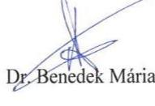

---

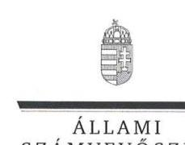

ELNÖK

Ikt.szám: V-0625-386/2016.

# Dr. Bendzsel Miklós úr 

elnök
Szellemi Tulajdon Nemzeti Hivatala

## Budapest

## Tisztelt Elnök Úr!

Köszönettel megkaptam a 2016. március 17. napján az Állami Számvevőszékhez érkezett " $A$ Szellemi Tulajdon Nemzeti Hivatala pénzügyi és vagyongazdálkodásának, a HIPAvilon NKF1vel fennálló szerzödéses kapcsolatai szabályszerüségének és a közös jogkezelö szervezetekkel kapcsolatos feladatellátásának ellenörzéséről" című számvevőszéki jelentéstervezetben foglalt megállapításokra tett észrevételeit.

Tájékoztatom Elnök urat, hogy a jelentésben az elfogadott észrevételek átvezetésre kerültek, az el nem fogadott és a részben elfogadott észrevételeket - az Állami Számvevőszékről szóló 2011. évi LXVI. törvény 29. § (3) bekezdése alapján - szerepeltetjük az elutasítás indokainak feltüntetésével együtt.

Az Állami Számvevőszék észrevételekre vonatkozó álláspontjáról a felügyeleti vezető által készített részletes tájékoztatást csatoltan megküldöm.

Budapest, 2016. év
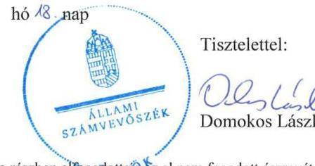

Melléklet: Tájékoztatás az elfogadott, a részben elfogadotvél az el nem fogadott észrevételekről, azok indokairól

---

# Tájékoztatás 

az elfogadott, a részben elfogadott és az el nem fogadott észrevételekről, azok indokairól

|  |  | Az észrevétel 2. oldalán „A jelentéstervezetben írtak cáfolatának részletes kifejtése" cím alatti 1. pont szerint (kifejtése az észrevétel 3. oldalának utolsó előtti bekezdésétől az 5. oldal második bekezdés végéig): |
| :--: | :--: | :--: |
|  | Észrevétel: | „A HIPAvilon Nonprofit Kft. az SZTNH nevében, vagy megbizásából semmilyen nemzetközi kapcsolattartást nem végzett az Szt. 115/L. §-a szerint, az SZTNH Szt. 115/L. §-a szerinti nemzetközi tevékenységébe a HIPAvilon Nkft.-t nem vonta be, kizárólag az Szt. 115/I. §-a szerinti állami dokumentációs és információs tevékenysége keretében müködtek a felek együtt a 2012. és 2013. évben tájékoztató szolgáltatásokkal összefüggésben. ..." |
|  | Válasz: | Az Állami Számvevőszék (ÁSZ) az észrevételt részben elfogadja. |
| 1. | Indoklás: | Az észrevétel részben megalapozott. Az ÁSZ az ellenőrzés rendelkezésére bocsátott dokumentumok és a jogi háttér felülvizsgálata alapján elfogadja, hogy a találmányok szabadalmi oltalmáról szóló 1995. évi XXXIII. törvény (Szt.) 115/L. § szerinti, a Szellemi Tulajdon Nemzeti Hivatala (Hivatal) által a szellemi tulajdon területén folyó nemzetközi illetve európai együttmüködésben ellátott feladata nem azonos a HIPAvilon Magyar Szellemi Tulajdon Ügynökség Nonprofit Kft. (HIPAvilon Nkft.) által a Hivatallal kötött megállapodás keretében végzett külföldi és nemzetközi társintézményekkel való kapcsolattartással. Az ÁSZ rendelkezésére bocsátott, a Hivatal és a HIPAvilon Nkft között 2012. május 16 -án és 2013. május 31 -én létrejött közszolgáltatási szerződések tartalma azonban nem egyértelmű a tekintetben, hogy az állami dokumentációs és információs tevékenységben való együttműködés keretében a HIPAvilon Nkft. a külföldi és nemzetközi társintézményekkel való kapcsolattartás keretében konkrétan milyen tevékenység végzésére kapott megbízást. Ezért az ÁSZ egyrészt módosítja a jelentéstervezet ellenőrzési megállapítását akként, hogy a megállapításból törlésre kerül az Szt. 115/L. §-ában foglalt feladat |

---

|  |  | HIPAvilon Nkft. általi ellátására vonatkozó megállapítás, azonban a közszolgáltatási szerződés tartalmára vonatkozó, a nem egyértelmű feladat meghatározásra irányuló megállapítást szerepelteti a jelentéstervezetben. |
| :--: | :--: | :--: |
|  | Észrevétel: | Az észrevétel ,, A jelentéstervezetben írtak cáfolatának részletes kifejtése" cím alatt az 5. oldalon a harmadik bekezdésben (2. sorszámmal kezdődő bekezdés) foglaltak szerint (kifejtése az észrevétel 5. oldala utolsó bekezdésétől a 11. oldal végéig):   „A HIPAvilon Nkft. részéről végzett „újdonságkutatási tevékenység" semmilyen szempontból nem tekinthető közhatalmi jogkörben gyakorolt hatósági tevékenységnek, sem az Szt., sem a Ket. alapján, hanem az egy külföldi hatósággal megkötött nemzetközi intézményközi magánjogi természetü - megállapodás alapján végzett szolgáltatás. Így annak teljesitésébe az SZTNH az Szt. 115/E. § (7) bekezdése, 115/I. § d) pontja és a 287/2010. (XII. 16.) Korm. rendelet szabályai alapján jogszerüen vonhatta és vonhatja be a HIPAvilon Nkft.-t." |
|  | Válasz: | Az ÁSZ az észrevételt részben elfogadja. |
| 2. | Indoklás: | Az észrevétel részben megalapozott. Az ÁSZ az ellenőrzés rendelkezésére bocsátott dokumentumok és az áttekintett jogi környezet figyelembe vételével elfogadja, hogy a HIPAvilon Nkft. által a Hivatallal kötött megállapodás keretében nemzetközi intézményközi magánjogi természetű megállapodás alapján végzett, úgynevezett szerződéses újdonságkutatás nem az Szt. 69. §-a és a 69/A. §-a szerinti hatósági eljárás keretében végzett feladathoz kapcsolódó tevékenység. Ugyanakkor megállapítja, hogy a Hivatal és a HIPAvilon Nkft. között létrejött megállapodásoknak tartalmaznia kellett volna azt a tényt, hogy az abban foglalt feladat nem minősül az Szt. 69. §-ában foglaltak szerinti újdonságkutatásnak, így arra nem vonatkoznak a hatósági eljárás szabályai. Ezért az ÁSZ módosítja a jelentéstervezetet akként, hogy a megállapításból törlésre kerül az Szt. 69. $\S$-ában és a 69/A. $\S$-ában foglalt újdonságkutatás, mint hatósági ügy részeként a HIPAvilon Nkft. általi ellátására vonatkozó megállapítás és javaslat. Ezzel együtt azonban az ÁSZ ellenőrzési megállapítást és javaslatot tesz a jelentéstervezetben arra, hogy a Hivatal 2013. április 1-jét követően az Szt. 115/E. § alapján nem vonhatta volna be a HIPAvilon Nkft.-t a magánjogi természetű megállapodás alapján végzett újdonságkutatási feladat elvégzésébe, mert az Szt. 115/E. §-ában hivatkozott Szt 115/I. és 115/K. §-okban foglalta feladatoknak ezen feladatok nem feleltethetők meg. Továbbá arra, hogy 2013. április 1-jét megelőzően a Hivatal és a |

---

|  |  | HIPAvilon Nkft. között létrejött megállapodás nem tartalmazta egyértelmüen, hogy a HIPAvilon Nkft. által elvégzendő úgynevezett szerződéses újdonságkutatás nem azonos az Szt. 115/L. §-ában foglalt hatósági feladat részeként végzett újdonságkutatással. |
| :--: | :--: | :--: |
|  | Észrevétel: | Az észrevétel ,,A jelentéstervezetben irtak cöfolatának részletes kifejtése" cím alatt a 12. oldal az első bekezdésében (a 3. ponttal kezdödő bekezdés) foglaltak szerint (ikifejtése az észrevétel 12. oldala második bekezdésétől a 13. oldal végéig):   „Az SZTNH semmilyen hatósági adatot nem adott át a HIPAvilon Nonprofit Kft. részére, hanem kizárólag kisegitő feladatok ellátásával, azaz bizonyos dokumentumok és ábrák digitalizálásával, szkenneléssel, leírásgyártással, tértivevények, határozatok, szerelölapok, akták, stb. helyszini irattári kezelésével bizta meg a társaságot.,, |
|  | Válasz: | Az ÁSZ az észrevételt részben fogadja el. |
| 3. | Indoklás: | Az észrevétel részben megalapozott. Az ÁSZ a rendelkezésre bocsátott dokumentumok és a jogi környezet felülvizsgálata alapján elfogadja, hogy a HIPAvilon Nkft. nem jutott hozzá olyan információkhoz és nem kezelt olyan adatokat, amelyekbe a szabadalmi bejelentés közzétételéig csak az Szt. 53. § (1) bekezdésében meghatározott jogosultak tekinthetnek be. A dokumentumok felülvizsgálata alapján az ÁSZ megállapította, hogy a HIPAvilon Nkft. által végzett adatrögzítési, digitalizálási feladatok nem hatósági eljárás részeként ellátott adminisztrációs feladatok, azokhoz nem kapcsolódott a közigazgatási hatósági eljárás és szolgáltatás általános szabályairól szóló 2004. évi CXL. törvény (Ket.) 12. § (2) bekezdése szerinti jog,-, és kötelezettség megállapítása. Az Szt. 54. § (1) bekezdése szerint a Hivatal a közzétett szabadalmi bejelentésekről és szabadalmakról lajstromot vezet, amelybe be kell jegyezni a szabadalmi jogokkal kapcsolatos tényeket és körülményeket. Az Szt. 54. § (3) bekezdése rögzíti, hogy a szabadalmi lajstrom a bejegyzett jogok és tények fennállását hitelesen tanúsítja. Az Szt. 54. § (5) bekezdése szerint a szabadalmi lajstromot bárki megtekintheti, ahhoz a Hivatal a honlapján elektronikus hozzáférést biztosít. Ezáltal a HIPAvilon Nkft. nem jutott hozzá jogosulatlanul adatokhoz, információhoz. A Ket. és az Szt. együttes értelmezése alapján tehát a dokumentációs és ügyirat-kezelési tevékenység nem hatósági tevékenység, így az a HIPAvilon Nkft. által is ellátható volt. Ennek figyelembe vételével az ÁSZ a jelentéstervezetben az erre vonatkozó megállapítást módosítja. Ugyanakkor |

---

|  |  | az ÁSZ megállapítást tesz arra vonatkozóan, hogy a Hi-   vatal és a HIPAvilon Nkft.-vel között létrejött szerző-   désekben nem volt egyértelműen meghatározva, hogy   az abban rögzített adatkezelési feladatok nem a Hivatal   hatósági feladataihoz kapcsolódtak. |
| :--: | :--: | :--: |
|  | Észrevétel: | Az észrevétel „A jelentéstervezetben irtak cáfolatának   részletes kifejtése" cím alatt a 14. oldalon az első be-   kezdésben (a 4. ponttal kezdődő bekezdés) foglaltak   szerint (kifejtése az észrevétel 14. oldala második be-   kezdésétől a 18. oldal harmadik bekezdés végéig):   „Az SZTNH és a HIPAvilon Nkft. is az SZTNH kor-   mánytisztviselöi tekintetében jogszerüen, valamennyi   jogszabályi elöirás betartásával jártak el akkor, amikor   az összeférhetetlenségi szabályok betartása mellett a   HIPAvilon Nkft. a hivatali érintett kormánytisztviselök-   kel is megbizási szerzödést kötött a nem hatósági fel-   adatnak minösülö újdonságkutatások saját szabadide-   jükben külön dijazás fejében történő elvégzésére." |
|  | Válasz: | Az ÁSZ az észrevételt részben fogadja el. |
| 4. | Indoklás: | Az észrevétel részben megalapozott. Az ÁSZ a rendel-   kezésre bocsátott dokumentumok és a jogi környezet   felülvizsgálata alapján részben elfogadja az észrevétel-   ben foglaltakat. Elfogadja, hogy az érintett, az állam-   háztartásról szóló 2011. évi CXCV. törvény végrehaj-   tásáról szóló 368/2011. (XII. 31.) Korm. rendelet (Ávr.)   51. § (2) bekezdésében foglalt előirás a HIPAvilon   Nkft. tekintetében nem alkalmazható. Ennek figye-   lembe vételével a HIPAvilon Nkft. kormánytisztvisel-   lökkel kötött szerződései szabálytalanságára vonatkozó   megállapítás és javaslat törlésre kerül a jelentésterve-   zetből. Azonban az ÁSZ megállapítja, hogy 2013. ápri-   lis 1-jétől a HIPAvilon Nkft. a megbízással érintett új-   donságkutatási feladatot az Szt. 115/E. §-ában foglaltak   alapján nem végezhette volna, így az általa e feladat el-   látására kötött szerződések nem voltak jogszerüek. |
|  | Észrevétel: | Az észrevétel „A jelentéstervezetben irtak cáfolatának   részletes kifejtése" cím alatt, a 18. oldalon a negyedik   bekezdésben (az 5. ponttal kezdődő bekezdés) foglaltak   szerint (kifejtése az észrevétel 18. oldala ötödik bekez-   désétől a 20. oldal második bekezdés végéig):   „A HIPAvilon Nkft. az alapító okirata szerinti tevékeny-   ségeket látta el üzletszerüen." |
|  | Válasz: | Az ÁSZ az észrevételt részben elfogadja. |
|  | Indoklás: | Az észrevétel részben megalapozott. Az ÁSZ a rendel-   kezésre bocsátott dokumentumok és jogi környezet fe-   lülvizsgálata alapján az észrevételt részben elfogadja. A   HIPAvilon Nkft. és a Hivatal között a feladatok ellátá- |

---

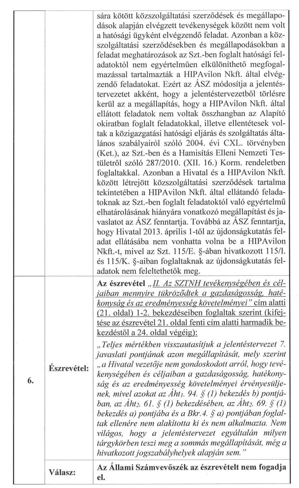
sára kötött közszolgáltatási szerződések és megállapodások alapján elvégzett tevékenységek között nem volt a hatósági ügyként elvégzendő feladat. Azonban a közszolgáltatási szerződésekben és megállapodásokban a feladat meghatározások az Szt.-ben foglalt hatósági feladatoktól nem egyértelműen elkülöníthető megfogalmazással tartalmazták a HIPAvilon Nkft. által elvégzendő feladatokat. Ezért az ÁSZ módosítja a jelentéstervezetet akként, hogy a jelentéstervezetből törlésre kerül az a megállapítás, hogy a HIPAvilon Nkft. által ellátott feladatok nem voltak összhangban az Alapító okiratban foglalt feladatokkal, illetve ellentétesek voltak a közigazgatási hatósági eljárás és szolgáltatás általános szabályairól szóló 2004. évi CXL. törvényben (Ket.), az Szt.-ben és a Hamisítás Elleni Nemzeti Testületről szóló 287/2010. (XII. 16.) Korm. rendeletben foglaltakkal. Azonban a Hivatal és a HIPAvilon Nkft. között létrejött közszolgáltatási szerződések tartalma tekintetében a HIPAvilon Nkft. által ellátandó feladatoknak az Szt.-ben foglalt feladatoktól való egyértelmü elhatárolásának hiányára vonatkozó megállapítást és javaslatot az ÁSZ fenntartja. Továbbá az ÁSZ fenntartja, hogy Hivatal 2013. április 1-től az újdonságkutatás feladat ellátásába nem vonhatta volna be a HIPAvilon Nkft.-t, mivel az Szt. 115/E. §-ában hivatkozott 115/L és 115/K. §-aiban foglaltaknak az újdonságkutatás feladatok nem feleltethetők meg.

---

|  | Indoklás: | Az észrevételt az ÁSZ nem fogadja el. Az ÁSZ a központi intézmények, így a Hivatal ellenőrzését is teljesítményellenőrzési modullal egészítette ki. A Hivatal tel-jesítmény-ellenőrzésének célja annak értékelése volt, hogy a gazdálkodás folyamatában a gazdaságossági, hatékonysági és eredményességi követelmények kialakítása megtörtént-e és azokat müködtették-e. A költségvetési szerv belső kontrollrendszerének minőségéről kiadott vezetői nyilatkozatban a költségvetési szerv tevékenységében a hatékonyság, eredményesség, gazdaságosság követelményeinek érvényesítése helytálló voltc. A teljesítmény-ellenőrzés a gazdálkodási feladatokra terjedt ki, a szakmai feladatellátást az ÁSZ nem értékelte. A gazdaságossági, hatékonysági és eredményességi követelmények kialakításának és müködtetésének értékelését a jelentéstervezet 3. számú függeléke tartalmazza. A Hivatal Gazdálkodási és Informatikai Főosztályának vezetője a helyszíni ellenőrzés során az ÁSZ részére 2014. november 18 -án nyilatkozott arról, hogy „az Intézményi teljesítménymutatók mérésére alkalmas egyes mutatók alkalmazásáról szóló szabályzatában szereplő́ eredményességi és hatékonysági mutatókat és azok értékelését tartalmazó iratok nem állnak rendelkezésre. A fentiekre tekintettel az ÁSZ fenntartja a jelentéstervezetben erre vonatkozó megállapítását és javaslatát." |
| :--: | :--: | :--: |
| 7. | Észrevétel: | Az észrevétel „III. A jelentéstervezet egyéb megállapításainak észrevételezése A. A részletes megállapításokban foglalt pozitív elemek rész, valamint a végrehajtott, vagy végrehajtási szakaszban lévő intézkedések.   „Kifejtését a 25. oldal első bekezdéstől a 30. oldal fi pontjának végéig, továbbá a 31. oldal hatodik, a 33. oldal első, a 35. oldal második, a 36. oldal harmadik, a 38. oldal ötödik, a 46. oldal harmadik, a 47. oldal harmadik és hetedik és a 48. oldal ötödik és hatodik bekezdései tartalmazzák." |
|  | Válasz: | Az ÁSZ az észrevételben foglaltakat nem tekinti észrevételnek. |
|  | Indoklás: | Az ÁSZ nem tekinti észrevételnek a Hivatal által megküldött észrevételnek a fent megjelölt részében megjelenített azon észrevételeket, amelyek valamely ÁSZ javaslat elismeréséről, elfogadásáról, a javaslatban foglaltakhoz kapcsolódó, már megtett intézkedésekről adnak tájékoztatást. Az Állami Számvevőszékről szóló 2011. évi LXVI. törvény (ÁSZ tv.) 33. § (1) bekezdésében foglalt előírás alapján az ellenőrzött szervezet vezetője köteles a jelentésben foglalt megállapításokhoz kapcsolódó intézkedési tervet összeállítani, és azt a je- |

---

|  |  | lentés kézhezvételétől számított napon belül az ÁSZ részére megküldeni. Az ÁSZ tv. 33. § (7) bekezdésében foglaltak alapján az intézkedési terv végrehajtását az ÁSZ utóellenőrzés keretében ellenőrizheti. |
| :--: | :--: | :--: |
|  | Észrevétel: | Az észrevétel „III. A jelentéstervezet egyéb megállapításainak észrevételezése A. A részletes megállapításokban foglalt pozitív elemek rész 30. oldalán az f) pont utáni bekezdés szerint:   „Észrevételezzük, hogy a részletező megállapítások pozitívumai - amelyböl csak a fenti felsorolásban több mint három tucat található - nem tükrözödnek vissza kellö mértékben az összegzö részben, amelynek következtében meg kell állapítanunk, hogy a jelentéstervezet objektivitása és kiegyensúlyozottsága sérült. Kérjük ennek arányos és megfelelö mértékü korrekcióját." |
|  | Válasz: | Az ÁSZ az észrevételben foglaltakat nem fogadja el. |
| 8. | Indoklás: | Az ÁSZ az észrevételben foglaltakat nem fogadja el. Az ÁSZ stratégiájában meghatározottaknak megfelelően a számvevőszéki jelentések igazodnak a felhasználói igényekhez. Pontosan, lényegre törően, közérthetően tartalmazzák az ellenőrzések eredményeit és egyértelmü üzeneteket közvetítenek. A minőségirányított müködés keretében pedig az ÁSZ biztosítja, hogy az ellenőrzés megállapításai a lehető legnagyobb mértékben megalapozottak, megbízhatóak, helytállóak és objektívek legyenek. Ennek megfelelően alakította ki az ÁSZ a jelentések szerkezetét. A jelentések összegző része tömören és közérthetően tartalmazza a megállapításokat. a fent leírtak figyelembe vételével a Hivatal ellenőrzéséről készült jelentéstervezet összegző megállapítások, javaslatok, következtetések része megfelelő súllyal és objektíven tartalmazza az ellenőrzés megállapításokat, ezért az ÁSZ fenntartja a jelentéstervezetben foglalt összegző megállapításait, javaslatait, következtetéseit. |
|  |  | Az észrevétel „III. A jelentéstervezet egyéb megállapításainak észrevételezése B. Az Összegzö megállapításokra, következtetésekre és a javaslatokra (1-8. pont) vonatkozó észrevételei" rész 31. oldalának hetedik bekezdésében foglaltak szerint (kifejtése az észrevétel 31. oldal hetedik bekezdésétől a 33. oldal második bekezdés végéig):   „Teljességgel érthetetlennek és elfogadhatatlannak tartjuk a 2. javaslati pontban foglalt azon megállapítást, amely szerint „a Hivatalnál a kontrollkörnyezet kialakításának keretében a 2009. évtöl nem határozták meg az Ámr 145/D. § c) pontjában, az Ámr 156. § (1) bekezdés c) pontjában, valamint a BKR.6. § (1) bekezdés c) pontjában elöirt - a szervezet minden szintjére |

---

|  |  | vonatkozó - etikai elvárásokat. Véleményünk szerint a jogszabályi elvárások maradéktalanul teljesültek. A jelentéstervezet 2. javaslati pontja ezáltal okafogyott, mivel annak végrehajtása megtörtént. Az intézkedési javaslat törlését kérjük." |
| :--: | :--: | :--: |
|  | Válasz: | Az Állami Számvevőszék az észrevételt nem fogadja el. |
|  | Indoklás: | Az ÁSZ az észrevételt nem fogadja el. Az észrevételben hivatkozott, a Magyar Szabadalmi Hivatal Szervezeti és Müködési Szabályzatáról szóló 3/2008. (HÉ.49) TNM utasítás 12-13. pontja a köztisztviselők és munkavállalók, valamint a hivatal dolgozóira vonatkozó általános követelményeket tartalmazzák, melyek között valóban megjelenik, hogy munkájukat kötelesek szakszerűen, pártatlanul és igazságosan ellátni, ez azonban nem tekinthető a jogszabályokban a kontrollkörnyezet részeként előírt, a szervezet minden szintjére kiterjedő etikai elvárások átfogó szabályozásának. Ezt a Hivatal Gazdálkodási és Informatikai Főosztály vezetőjének a helyszíni ellenőrzés során az ÁSZ részére 2014. november 18-án adott nyilatkozata is megerősíti, mely szerint ,...a Hivatal a 2008-2013. évek között a Magyar Köztisztviselöi Kar Hivatásetikai Kódexének elfogadásáig nem rendelkezett külön intézményi Etikai Kódex-szel". A fent leírtak figyelembe vételével az ÁSZ fenntartja a jelentéstervezetben erre vonatkozó megállapítását és javaslatát. |
|  |  | Az észrevétel ..III. A jelentéstervezet egyéb megállapításainak észrevételezése B. Az Összegzö megállapításokra, következtetésekre és a javaslatokra (1-8. pont) vonatkozó észrevételei rész 33. oldal harmadik bekezdésében foglaltak szerint (kifejtése az észrevétel 33. oldal negyedik bekezdésétől a 35. oldal negyedik bekezdés végéig):   „A 3. javaslati pont kapcsán elfogadjuk - de csak panasztételként - azt a számvevöi észrevételt, hogy nincs a mindenkori külső ellenőrzés munkáját megkönnyitő olyan, a teljesitési igazolók kapcsán minden releváns adatot és aláirás-képet egy helyen összesitő táblázat, ami a számvevöi vizsgálat folyamatát leegyszerüsitené, az azonban nem jelenthető ki, hogy a teljesitésigazolók kijelölése ne lenne a szabályoknak megfelelö. Emiatt a 3. pontban foglalt javaslatot visszautasitjuk. Ugyancsak visszautasitjuk a jelentéstervezet további, számos más szöveghelyen fellelhető, a megfelelöséget korlátozó kijelentését is, mivel azok abból a téves megállapításból táplálkoznak, hogy a teljesitésigazolók kijelölése ne lenne szabályos." |

---

|  | Válasz: | Az Állami Számvevőszék az észrevételt nem fogadja el. |
| :--: | :--: | :--: |
|  |  | Az észrevétel nem megalapozott. A 2008-2009. években ben hatályos, államháztartás müködési rendjéről szóló 217/1998. (XII.31) Korm. rendelet (Ámr1) elöírta, hogy a költségvetési szerv vezetőjének belső szabályzatban kell rendelkeznie a teljesítésigazolás módjáról, valamint az azt végző személyek kijelöléséről. Ennek az előírásnak a Hivatal csak részben tett eleget, mert - bár a teljesítésigazolás módjáról a 11/2006. és a 7/2012. Kötelezettségvállalási szabályzatban rendelkezett, a teljesítésigazolást végző személyek kijelölésről szóló dokumentum és az aláírás minta azonban nem állt rendelkezésre. A 2010.-2011. években hatályos államháztartás müködési rendjéről szóló 292/2009.(XII.19.) Korm. rendelet (Ámr2) 77. § (4), majd 2010. augusztus 15 -ét követően az (5) bekezdése, valamint 2012-től hatályos, az Ávr. 57. § (4) bekezdése szintén elöírta, hogy a teljesítést igazoló személyek kijelölésére a kötelezettségvállaló jogosult. A Hivatalnál az ellenőrzött időszakban a teljesítésigazoló jogosult általi kijelölésére nem került sor. Szabályos kijelölés hiányában a teljesítésigazolást nem jogszerűen gyakorolták. Az észrevételben azt az érvelést, hogy a munkaköri leírás munkáltatói joggyakorló részéről való aláírásával teljesül a kijelölések jogszabályi követelménye az ÁSZ nem fogadja el. A munkaköri leírás egy munkaszerződést kiegészítő munkajogi dokumentum, ami nem tekinthető szakmai teljesítésigazolásra történő kijelölésnek mert a munkáltatói joggyakorló nem feltétlenül azonos a kijelölésekre jogosult személyekkel. A helyszíni ellenőrzés megállapításai mellett a rendszeres személyi juttatások kifizetéseivel kapcsolatosan a gazdasági föigazgató 2014. november 14 -én nyilatkozott arról, hogy „A 2008. január 1. és 2013. december 31. közötti időszakban a Hivatal által teljesitett személyi kifizetések esetében a jelenléti ivek aláirói, vagyis a teljesités igazolói nem rendelkeztek külön teljesitésigazolásra vonatkozó kijelöléssel. A munkaköri leírások tartalmazzák beosztottak esetén a közvetlen irányítási és utasítási jogot gyakorló vezetőt a vezető munkaköri leírásában pedig szereplel, hogy az SZMSZ szerint mely szervezeti egység mely tekintetében rendelkezik beosztottakkal. " Az észrevételben szereplő, a 2011-2013. években a „work-flow" rendszerben kezelt tételek vonatkozásában a teljesítésigazolóknak az „igazolók táblájában" történő kijelölését az ellenőrzés nem kifogásolta, valamint a mintatételek ellenőrzése során a kötelezettségvállalás dokumentumában (szerzö- |

---

|  |  | dések, megállapodások) meghatározott teljesítésigazoló személyét minden esetben elfogadta szabályszerű kijelölésnek. A fent leírtak alapján az ÁSZ fenntartja a jelentéstervezetben a teljesítésigazolásra vonatkozó megállapítását és javaslatát. |
| :--: | :--: | :--: |
|  | Észrevétel: | Az észrevétel - „III. A jelentéstervezet egyéb megállapításainak észrevételezése B. Az Összegzö megállapításokra, következtetésekre és a javaslatokra (1-8. pont) vonatkozó észrevételei" rész - 35. oldalán az utolsó előtti bekezdésben és az utolsó bekezdés második mondatában foglaltak szerint (kifejtése az észrevétel 35. oldal utolsó bekezdésétől a 36. oldal harmadik bekezdés végéig):   „A 4. javaslati pontban foglalt megállapítás csak részben helytálló, az annak korrekciójára tett javaslat idöközben már megvalósult. A vizsgálati pont azon részkövetkeztetése, hogy „[...] a 2012. év második felében és a 2013. évben szabályzat hiányában nem tettek eleget a Bkr. 7. § (1) bekezdésében foglaltaknak", nem felel meg a valóságnak, hiszen a kockázatkezelési rendszert müködtetése két értelemben véve is megvalósult. A Bkr. idézett megfogalmazásából nem olvasható ki a hivatali integrált irányitási rendszer keretében kiadott információbiztonsági kockázatok kezelésére vonatkozó szabályzat szerinti kockázatkezelés nem megfelelősége, ezért következtetésük csak erős fenntartással, részben fogadható el." |
|  | Válasz: | Az Állami Számvevőszék az észrevételt nem fogadja el. |
|  | Indoklás: | Az észrevétel nem megalapozott. Az ellenőrzött szervezet által az ÁSZ rendelkezésére bocsátott, 2012. július 30 -áig hatályos Kockázatkezelési szabályzatok nem tartalmazták az egyes kockázatokkal kapcsolatos intézkedéseket, illetve 2012-től az intézkedések teljesítése folyamatos nyomon követésének módját. Továbbá a 2012. július 30 -át követő időszakra vonatkozó, az észrevételben hivatkozott integrált irányítási rendszer keretében kiadott információbiztonsági kockázatok kezelésére kiadott szabályzat nem terjedt ki a Hivatal minden tevékenységére. Ezt támasztja alá a Hivatal Gazdálkodási és Informatikai Főosztály vezetőjének a helyszíni ellenőrzés során az ÁSZ részére 2014. november 18-án adott nyilatkozata, mely szerint „a 2012. évtöl az SZTNH - az információbiztonsági kockázatkezelési eljárásrenden felül - nem rendelkezett teljes tevékenységét lefedö kockázatkezelési eljárásrenddel". A fent leírtak alapján az ÁSZ a fenntartja a jelentéstervezetben tett, a kockázatkezelési rendszer kialakítására és müködtetésére vonatkozó megállapítását és javaslatát. |

---

| 12. | Észrevétel: | Az észrevétel - „III. A jelentéstervezet egyéb megállapításainak észrevételezése" „B. Az Összegzö megállapításokra, következtetésekre és a javaslatokra (1-8. pont) vonatkozó észrevételei" rész - 36. oldalán a negyedik, a 37. negyedik, a 38. oldal hatodik és a 38. oldal utolsó bekezdésétől 39. oldal harmadik bekezdésben foglaltak szerint (kifejtése az észrevétel 36. oldal ötödik bekezdésétől a 43. oldal harmadik bekezdés végéig): „A Hivatal elnökéhez intézett javaslat 5. pontjában foglalt megállapítás helytelen, az itt leirtak nem fogadhatók el. Az SZTNH-nál (illetve az MSZH-nál) az érvényesitő és a pénzügyi ellenjegyzö irásos kijelölése megtörtént - igy az ennek ellenkezöjét állitó megállapítás téves. „A Hivatal elnökéhez intézett javaslat 6. pontjában foglalt javaslatot elutasitjuk, mivel az lényegében helytelen megállapításon alapul, és az itt ténymegállapításként feltüntetett megállapítás semmilyen mértékben nem befolyásolta hátrányosan a szabályos gazdálkodást. A korábban - a 3. javaslati és 5. javaslati pontnál - levezetett okfejtésböl következően mind a pénzügyi ellenjegyzö, mind a teljesités igazolók kijelölése megfelel a szabályos gazdálkodás követelményeinek. Ebből levezethetően az érvényesitőtől nem várható, hogy az általa - és a hivatal gazdasági vezetése által lényegében - szabályszerünek itélt müködésről szabálytalansági jelzést adjon. Tényszerüen hamis a megállapításnak az a része, hogy az érvényesitő a teljesitésigazolás szabályszerüségét nem ellenörizte, hiszen a gazdasági vezetés több tagja is pontosan látja az érvényesitő munkáját, és tudja, mennyire zárt rendben és fegyelmezetten követeli a teljesitésigazolások meglétét. Összegezve az érvényesitő igenis megvizsgálta (és megvizsgálja) a teljesitésigazolásokat, annak szabályszerüségét megfelelőnek találta. Az érvényesitő felelősségének felvetése, firtatása okság nélküli. A 8. javaslati pont azonos elméleti bázisra épülve, gyakorlatilag újra felhozza 3. és 5. pontban ismertetett téves érveket, arra a súlyosnak feltüntetett következtetésre jutva, hogy a teljesitésigazoló, az utalvány ellenjegyzö, az érvényesitő és a pénzügyi ellenjegyzö szabályszerü kijelölés hiányában jogosulatlanul látta el feladatát. A javaslati pont kapcsán ismétlödő jelleggel ismertetjuk észrevételeinket. A jelentéstervezet megállapítása egyszerüen hamis, következtetése aránytalanul tülzö." |
| :--: | :--: | :--: |
|  | Válasz: | Az Állami Számvevőszék az észrevételt nem fogadja el. |
|  | Indoklás: | Az ÁSZ az észrevételt nem fogadja el. Érvényesitésre, illetve az utalvány ellenjegyzésére az Ámr1.135. § (4) és 137. § (1) bekezdése, valamint az Ámr2 77. § (4) és |

---

|  |  | 79. § (1) bekezdése szerint a költségvetési szerv gazdasági vezetője, illetve az általa írásban kijelölt személy volt jogosult. Az Ávr. 55. § (2) bekezdés a) pontja és az 58. § (4) bekezdése előirása szerinti érvényesítésre és a kötelezettségvállalás pénzügyi ellenjegyzésére szintén a gazdasági vezető, vagy az általa írásban kijelölt személy volt jogosult. A Hivatal a 11/2006. és a 7/2012. Kötelezettségvállalási szabályzatban rendelkeztek ugyan arról, hogy az érvényesítést, az utalvány ellenjegyzését, illetve a pénzügyi ellenjegyzését mely munkakört ellátó személyek végezhetik, hivatkozással a munkaköri leírásokra. A kijelölésnek ez a módja azonban nem felelt meg a fenti jogszabályi előírásoknak, mivel a kötelezettségvállalási szabályzatokat és a munkaköri leírásokat nem a jogszabályban nevesített, kijelölésre jogosult gazdasági vezető írta alá. Továbbá a munkaköri leírás egy munkaszerződést kiegészítő munkajogi dokumentum, ami nem tekinthető az érvényesítésre, illetve pénzügyi ellenjegyzésre történő kijelölésnek. A Hivatal gazdasági föigazgatója - a helyszíni ellenőrzés megállapításai mellett - 2014. november 14én nyilatkozott is arról, hogy „A 2008. január 1. és 2013. december 31. között a Hivatal különböző kifizetéseivel összefüggésben az utalvány ellenjegyzöire, illetve az érvényesitöire vonatkozóan a Hivatal nem rendelkezet az Amr1. 137. § (1) bekezdése, az Amr2. 74. § (2) bekezdése, illetve az Avr. 58. § (4) bekezdése szerinti kijelöléssel. Az utalvány ellenjegyzöjét, illetve az érvényesitőt nem a Hivatal gazdasági vezetöje jelölte ki, azonban a belső elnöki utasítási szabályzat és a munkaköri leírás tartalmazza." Fentiek alapján az ÁSZ fenntartja a gazdálkodási jogkörök - ezen belül az érvényesítő és pénzügyi ellenjegyző - gyakorlására vonatkozó kijelölésekkel kapcsolatos megállapítását és javaslatát, továbbá az ezzel kapcsolatos, a felelősség kivizsgálására vonatkozó javaslatát. |
| :--: | :--: | :--: |
| 13. | Észrevétel: | Az észrevétel - ,IV. A közös jogkezelö szervezetekkel kapcsolatos feladatellátás tekintetében megfogalmazott megállapitásokra vonatkozó észrevételek" rész-44. oldalán a harmadik, a 45. oldal negyedik-heteelik bekezdéseiben foglaltak szerint (az észrevétel kifejtése az észrevétel 44. oldal második bekezdésétól a 45. oldal utolsó előtti bekezdés végéig):   „A megállapításhoz kapcsolódó 14. javaslati pont a Hi-   vatal közös jogkezelökkel kapcsolatos feladatellátásá-   nak ellenörzése tekintetében folytatott vizsgálatról   szóló részbe ágyazva megállapitja, hogy szükséges a   számviteli politika, a számlarend és az értékelési sza-   bályzat aktualizálása. Az elmaradás tényét nem vitatva |

---

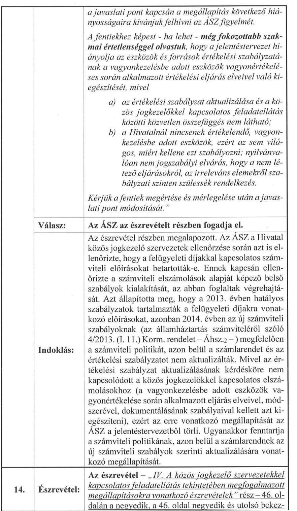

14. Észrevétel: Az észrevétel - „IV. A közös jogkezelö szervezetekkel kapcsolatos feladatellátás tekintetében megfogalmazott megállapításokra vonatkozó észrevételek" rész - 46. oldalán a negyedik, a 46. oldal negyedik és utolsó bekez-

---

|   |  | déseiben, valamint a 47. oldal elsőtől a hatodik bekezdéseiben foglaltak szerint (az észrevétel kifejtése az észrevétel 45. oldal utolsó bekezdésétől a 48. oldal harmadik bekezdés végéig):   „Ugyancsak a jelentéstervezet II.7.2.1. pontban szereplő kifogás, hogy „A hivatal nem biztositott hozzáférést egy szervezet esetében a közös jogkezelő szervezet által alkalmazott dijszabáshoz (REPROPRESS) és egy szervezet esetében a felosztási szabályzatához (RSZ Reprográfiai Szövetség-).   ...az RSZ maga közvetlenül nem oszt fel jogdijat a jogosultaknak, hanem a tagszervezet közös jogkezelő szervezetek javára juttatja el a reprográfiai felhasználások után beszedett jogdijak arányos részét, amelyet a tagszervezetek osztanak fel az általuk képviselt jogosultak között, saját felosztási szabályzatuk alapján. Az RSZnek erre való tekintettel nincsen felosztási szabályzata.   A REPROPRESS által közös jogkezelőként gyakorolt, a Hivatal nyilvántartásában ekként feltüntetett jogosultságok, az Szjt. 21. §-a szerinti reprográfiai dijigénnyel összefüggésben a következők:   - a jogdijak és a felhasználás egyéb feltételeinek megállapításában való részvétel,   - a közös jogkezeléssel érintett felhasználások adatainak kezelése,   - a közös jogkezeléssel érintett jogosultak, valamint müveik, illetve teljesítményeik adatainak kezelése,   - a jogdijak felosztása.   Ezek alapján a REPROPRESS nem rendelkezik jogosultsággal jogdij beszedésére és emiatt nincs is dijszabása, vagyis a nyilvántartás nem azért nem tartalmazza e dokumentumot, mert a Hivatal mulasztott volna. (Tájékoztatásul ismét utalunk arra, hogy a REPROPRESS az RSZ tagjaként e szervezettől kapja az RSZ által beszedett azon jogdijat, amely a REPROPRESS jogosultjainak jár.)" |
| :--: | :--: | :--: |
|  | Válasz: | Az ÁSZ az észrevételt elfogadja. |
|  | Indoklás: | Az észrevétel megalapozott. Az ÁSZ rendelkezésére bocsátott dokumentumok alapján az észrevételben foglaltakat elfogadja, a jelentéstervezetet ezzel összhangban módosítja. |
| 15. | Észrevétel: | „Az észrevétel - „IV. A közös jogkezelő szervezetekkel kapcsolatos feladatellátás tekintetében megfogalmazott |

---

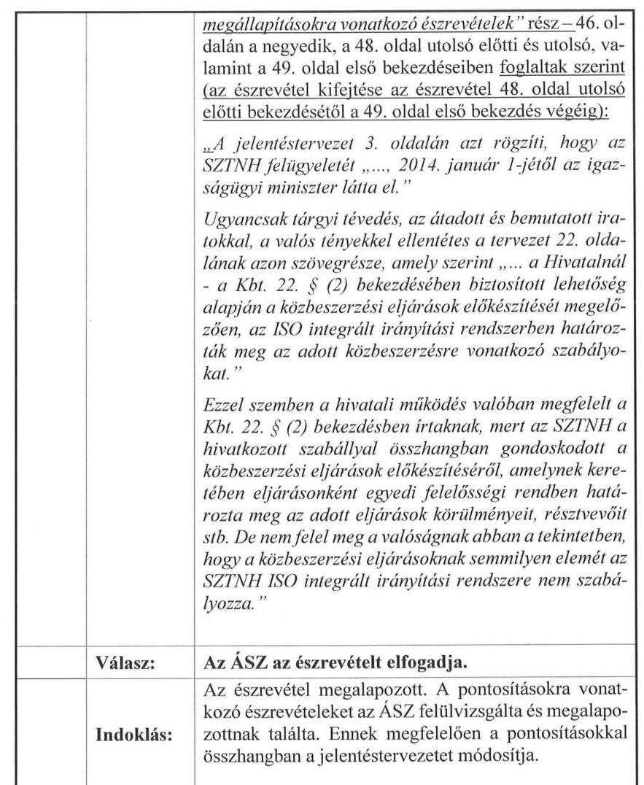

Budapest, 2016.
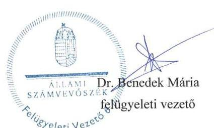

---

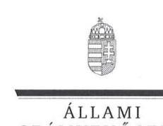

ELNÖK

Ikt.szám: V-0625-392/2016.

# Dr. Botos Viktor úr 

ügyvezető igazgató
HIPAvilon Magyar Szellemi Tulajdon Ügynökség Nonprofit Kft.

## Budapest

## Tisztelt Ügyvezető Igazgató Úr!

Köszönettel megkaptam a 2016. május 17. napján az Állami Számvevőszékhez érkezett " $A$ Szellemi Tulajdon Nemzeti Hivatala pénzügyi és vagyongazdálkodásának, a HIPAvilon Nkfivel fennálló szerzödéses kapcsolatai szabályszerüségének és a közös jogkezelö szervezetekkel kapcsolatos feladatellátásának ellenörzéséről" címủ számvevőszéki jelentéstervezetben foglalt megállapításokra tett észrevételeit.

Az Állami Számvevőszék észrevételekre vonatkozó álláspontjáról a felügyeleti vezető által készített részletes tájékoztatást csatoltan megküldőm.

Tájékoztatom Ügyvezető igazgató urat, hogy a részben elfogadott észrevételeket - az Állami Számvevőszékről szóló 2011. évi LXVI. törvény 29. § (3) bekezdése alapján - az indoklás feltüntetésével a jelentésben szerepeltetjük. Az elfogadott észrevételek a jelentéstervezetben átvezetésre kerültek.

Budapest, 2016. 466fues hó 20. nap
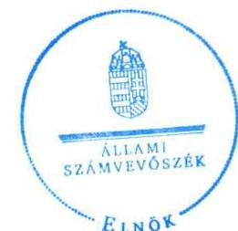

Tisztelettel:
D0, 68
Domokos László

Melléklet: Tájékoztatás az elfogadott és a részben elfogadott észrevételekről, azok indokairól

---

# Tájékoztatás 

az elfogadott és a részben elfogadott észrevételekről, azok indokairól

| 1. | Észrevétel: | Az észrevétel 1. oldalán „ 1 . ÁSZ jelentéstervezet 6.1.1 és 6.2.4 pontokban foglalt megállapításához kapcsolódóan " cím alatti negyedik bekezdés szerint (kifejtése az észrevétel 1. oldalának 1. pontjától a 2. oldal harmadik bekezdése végéig):   „A HIPAvilon Nkft. által végzett tevékenység semmilyen szempontból nem tekinthető a megállapításban hivatkozott jogszabályok szerinti közhatalmi jogkörben gyakorolt hatósági újdonságkutatási tevékenységnek, hanem az egy, a Hivatal külföldi társintézménnyel megkötött magánjogi megállapodása teljesitéséhez kapcsolódó szolgáltatás. A tevékenység teljesitésére a HIPAvilon Nkft. a találmányok szabadalmi oltalmáról szóló 1995. évi XXXIII. törvény (a továbbiakban: Szt.) 115/E. § (7) bekezdése, 115/I. § d) pontja és a 287/2010. (XII. 16.) Korm. rendelet (a továbbiakban: R.) felhatalmazó rendelkezései alapján kötött jogszerüen szerződést a Hivatallal.   Az Szt. 115/I. § d) pontja és az R. 6/A. § (2) bekezdés c) pontja kifejezetten és szövegszerüen tartalmazza egyebek mellett a szellemi tulajdon védelmével kapcsolatos tájékoztató szolgáltatások nyújtása lehetőséget ..." |
| :--: | :--: | :--: |
|  | Válasz: | Az Állami Számvevőszék (ÁSZ) az észrevételt részben elfogadja. |
|  | Indoklás: | Az észrevétel részben megalapozott. Az ÁSZ az ellenőrzés rendelkezésére bocsátott dokumentumok és az áttekintett jogi környezet figyelembe vételével elfogadja, hogy a HIPAvilon Nkft. által a Hivatallal kötött megállapodás keretében nemzetközi intézményközi magánjogi természetű megállapodás alapján végzett, úgynevezett szerződéses újdonságkutatás nem az Szt. 69. §-a és a 69/A. §-a szerinti hatósági eljárás keretében végzett tevékenység. Ugyanakkor megállapítja, hogy a Hivatal és a HIPAvilon Nkft. között létrejött megállapodásoknak tartalmaznia kellett volna azt a tényt, hogy az abban foglalt feladat nem minősül az Szt. 69. §-ában foglaltak szerinti újdonságkutatásnak, így arra nem vonatkoznak a hatósági eljárás szabályai. Ezért az ÁSZ módosítja a |

---

|  | jelentéstervezetet akként, hogy a megállapításból törlésre kerül az Szt. 69. §-ában és a 69/A. §-ában foglalt újdonságkutatás, mint hatósági ügynek a HIPAvilon Nkft. általi ellátására vonatkozó megállapítás és javaslat. Ezzel együtt azonban az ÁSZ ellenőrzési megállapítást és javaslatot tesz a jelentéstervezetben arra, hogy a Hivatal 2013. április 1-jét követően az Szt. 115/E. § alapján nem vonhatta volna be a HIPAvilon Nkft.-t a magánjogi természetủ megállapodás alapján végzett újdonságkutatási feladat elvégzésébe, mert az Szt. 115/E. $\S$-ában hivatkozott Szt. 115/I. és 115/K. §-okban foglalta feladatoknak ezen feladatok nem feleltethetők meg. Továbbá arra, hogy 2013. április 1-jét megelőzően a Hivatal és a HIPAvilon Nkft. között létrejött megállapodás nem tartalmazta egyértelműen, hogy a HIPAvilon Nkft. által elvégzendő úgynevezett szerződéses újdonságkutatás nem azonos az Szt. 115/L. §ában foglalt hatósági feladattal. |
| :--: | :--: | :--: |
| 2. | Észrevétel: | Az észrevétel 2. oldalán a „2. ÁSZ jelentéstervezet 6.1.1 és 6.1.2 pontokban foglalt megállapításhoz kapcsolódóan" cím alatti negyedik és ötödik bekezdése szerint (kifejtése az észrevétel 2. oldala 2. pontjától a 2. oldal utolsó bekezdése végéig):   „A HIPAvilon Nkft. a Hivatalnak végzett dokumentációs és ügykezelési tevékenységével összefüggésben sem látott el semmilyen hatósági és az adatkezelés szempontjából érzékeny feladatot, hanem kizárólag kisegitő irattári tevékenységet folytatott.   A jelentéstervezetben hivatkozott Szt. 53. § (1) bekezdés alapvetően az iratbetekintési jogot szabályozza, illetve, hogy a harmadik személyek milyen módon férhetnek hozzá információkhoz. A HIPAvilon Nkft. azonban nem az Szt. 53. § (1) bekezdéshez kapcsolódóan müködik közre dokumentációs tevékenységek ellátásában. A vizsgált tevékenység igy formailag sem ütközhet az Szt. rendelkezéseibe." |
|  | Válasz: | Az ÁSZ az észrevételt elfogadja. |
|  | Indoklás: | Az észrevétel megalapozott. Az ÁSZ a rendelkezésre bocsátott dokumentumok és a jogi környezet felülvizsgálata alapján elfogadja, hogy a HIPAvilon Nkft. nem jutott hozzá olyan információkhoz és nem kezelt olyan adatokat, amelyekbe a szabadalmi bejelentés közzétételéig csak az Szt. 53. § (1) bekezdésében meghatározott jogosultak tekinthetnek be. A dokumentumok felülvizsgálata alapján az ÁSZ megállapította, hogy a HIPAvilon Nkft. által végzett adatrögzítési, digitalizálási feladatok nem hatósági eljárás részeként ellátott adminisztrációs feladatok, azokhoz nem kapcsolódott a |

---

|  |  | közigazgatási hatósági eljárás és szolgáltatás általános szabályairól szóló 2004. évi CXL. törvény (Ket.) 12. § (2) bekezdése szerinti jog,- , és kötelezettség megállapítása. A Ket. és az Szt. együttes értelmezése alapján tehát a dokumentációs és ügyirat-kezelési tevékenység nem hatósági tevékenység, így az a HIPAvilon Nkft. által is ellátható volt. Ezáltal a HIPAvilon Nkft. nem jutott hozzá jogosulatlanul adatokhoz, információhoz. Ennek figyelembe vételével az ÁSZ a jelentéstervezetben az erre vonatkozó megállapítást módosítja. |
| :--: | :--: | :--: |
|  | Észrevétel: | Az észrevétel 3. oldalán a „3. ÁSZ jelentéstervezet 6.1.1. pontban foglalt megállapításhoz kapcsolódóan" cím alatti harmadik bekezdésben foglaltak szerint ((kifejtése az észrevétel 3. oldala 3. pontjától a 4. pont feletti bekezdés végéig):   „A HIPAvilon Nkft. a Hivatal megbizásából semmilyen az Szt. 115/L. §-a szerinti nemzetközi kapcsolattartást nem végzett. A vizsgált közszolgáltatási szerzödések kapcsolattartásra vonatkozó része az Szt. 115/L. §-a szerinti állami dokumentációs és információs tevékenység megvalósitásához szükséges - eseteként külföldi partnerrel való - kapcsolattartásra utal, és nem az Szt. 115/L. §-ában szereplő feladatokra vonatkozik. " |
|  | Válasz: | Az ÁSZ az észrevételt részben elfogadja. |
| 3. | Indoklás: | Az észrevétel részben megalapozott. Az ÁSZ az ellenőrzés rendelkezésére bocsátott dokumentumai és a jogi háttér felülvizsgálata alapján elfogadja, hogy a találmányok szabadalmi oltalmáról szóló 1995. évi XXXIII. törvény (Szt.) 115/L. § szerinti, a Szellemi Tulajdon Nemzeti Hivatala (Hivatal) által a szellemi tulajdon területén folyó nemzetközi illetve európai együttmüködésben ellátott feladata nem azonos a HIPAvilon Magyar Szellemi Tulajdon Ügynökség Nonprofit Kft. (HIPAvilon Nkft.) által a Hivatallal kötött megállapodás keretében végzett külföldi és nemzetközi társintézményekkel való kapcsolattartással. Az ÁSZ rendelkezésére bocsátott, a Hivatal és a HIPAvilon Nkft között 2012. május 16 -án és 2013. május 31 -én létrejött közszolgáltatási szerződések tartalma azonban nem egyértelmủ a tekintetben, hogy az állami dokumentációs és információs tevékenységben való együttmüködés keretében a HIPAvilon Nkft. a külföldi és nemzetközi társintézményekkel való kapcsolattartás keretében konkrétan milyen tevékenység végzésére kapott megbízást. Ezért az ÁSZ egyrészt módosítja a jelentéstervezet ellenőrzési megállapítását akként, hogy a megállapításból törlésre kerül az Szt. 115/L. §-ában foglalt feladat |

---

|  |  | HIPAvilon Nkft. általi ellátására vonatkozó megállapítás, azonban a közszolgáltatási szerződés tartalmára vonatkozó, a nem egyértelmű feladat meghatározásra irányuló megállapítást szerepelteti a jelentéstervezetben. |
| :--: | :--: | :--: |
|  | Észrevétel: | Az észrevétel 3. oldalán a „ 4. ÁSZ jelentéstervezet 6.1.3. pontban foglalt megállapításhoz kapcsolódóan" cím alatti harmadik bekezdésében foglaltak szerint (kifejtése az észrevétel 3. oldal 4. pontjától a 4. oldal első bekezdés végéig):   „A HIPAvilon Nkft. Alapitó Okiratában valamennyi rendszeresen végzett tevékenysége tételesen szerepelt a tevékenységi köröket TEÁOR számok szerint tartalmazó felsorolásban.   Így például az újdonságkutatási tevékenység a TEÁOR számok nomenklatúrájában a 74.90 M.n.s egyéb szakmai, tudományos, müszaki tevékenység besorolásnak felel meg (ennek KSH szerinti tartalma a: „Ebbe a szakágazatha az általában üzleti ügyfelek számára nyújtott szolgáltatások széles köre tartozik. Azok a tevékenységek tartoznak ide, amelyek gyakorlásához magas szintü szakmai, tudományos, illetve müszaki ismeretre van szükség, a folyó napi, általában rövid időtartamú szokványos üzleti tevékenység azonban nem tartozik ide"). Ugyancsak szerepel a 63.99 M.n.s. egyéb információs szolgáltatási kódszám is (ennek KSH szerinti tartalma: „Ebbe a szakágazatha tartoznak a máshová nem sorolt információs tevékenységek, mint például: ...az információkeresés dijazásos, vagy szerzödéses alapon...")" |
|  | Válasz: | Az ÁSZ az észrevételt részben elfogadja. |
|  | Indoklás: | Az észrevétel részben megalapozott. Az ÁSZ a rendelkezésre bocsátott dokumentumok és jogi környezet felülvizsgálata alapján az észrevételt részben elfogadja. A HIPAvilon Nkft. és a Hivatal között a feladatok ellátására kötött közszolgáltatási szerződések és megállapodások alapján elvégzett tevékenységek között nem volt a hatósági ügyként elvégzendő feladat. Azonban a közszolgáltatási szerződésekben és megállapodásokban a feladat meghatározások az Szt.-ben foglalt hatósági feladatoktól nem egyértelműen elkülöníthető megfogalmazással tartalmazták a HIPAvilon Nkft. által elvégzendő feladatokat. Ezért az ÁSZ módosítja a jelentéstervezetet akként, hogy a jelentéstervezetből törlésre kerül az a megállapítás, hogy a HIPAvilon Nkft. által ellátott feladatok nem voltak összhangban az Alapító okiratban foglalt feladatokkal, illetve ellentétesek voltak a közigazgatási hatósági eljárás és szolgáltatás általános szabályairól szóló 2004. évi CXL. törvényben (Ket.), az Szt.-ben és a Hamisítás Elleni Nemzeti Testületről szóló 287/2010. (XII. 16.) Korm. rendeletben |

---

|  |  | foglaltakkal. Azonban a Hivatal és a HIPAvilon Nkft. között létrejött közszolgáltatási szerződések tartalma tekintetében a HIPAvilon Nkft. által ellátandó feladatoknak az Szt.-ben foglalt feladatoktól való egyértelmú elhatárolásának hiányára vonatkozó megállapítást és javaslatot az ÁSZ fenntartja. Továbbá az ÁSZ fenntartja, hogy Hivatal 2013. április 1-tól az újdonságkutatás feladat ellátásába nem vonhatta volna be a HIPAvilon Nkft.-t, mivel az Szt. 115/E. §-ában hivatkozott 115/I. és 115/K. §-aiban foglaltaknak az újdonságkutatás feladatok nem feleltethetők meg. |
| :--: | :--: | :--: |
| 5. | Észrevétel: | Az észrevétel 4. oldalán az „5. ÁSZ jelentéstervezet 6.1.4. pontban foglalt megállapításhoz kapcsolódóan" cím alatti harmadik bekezdésben foglaltak szerint (kifejtése az észrevétel 4. oldala 5. pontjától az oldal utolsó bekezdéséig):   „Az Avr. 51. § (1) bekezdése egyértelmüen költségvetési szerv számára tiltja a saját állományába tartozó személy részére meghizási dij, vagy más szerzödés alapján dijazás kifizetését, a munkaköri leírása szerint számára elöirható feladat tekintetében. A HIPAvilon Nkft. nem költségvetési szerv, nem tartozik az Avr. 51. § (2) bekezdésének hatálya alá, igy azt meg sem sérthette. A HIPAvilon Nkft. mindenkor a szerzödéskötési szabadságának korlátját jelentő jogszabályi elöírások szerint járt el, ezekkel ellentétes tartalmú szerzödést vagy megállapodást - sem személyi, sem tárgyi értelemben - nem kötött. |
| :--: | :--: | :--: |
|  | Válasz: | Az ÁSZ az észrevételt részben elfogadja. |
|  | Indoklás: | Az észrevétel részben megalapozott. Az ÁSZ a rendelkezésre bocsátott dokumentumok és a jogi környezet felülvizsgálata alapján részben elfogadja az észrevéteiben foglaltakat. Elfogadja, hogy az érintett, az állambáztartásról szóló 2011. évi CXCV. törvény végrehajtásáról szóló 368/2011. (XII. 31.) Korm. rendelet (Ávr.) 51. § (2) bekezdésében foglalt előírás a HIPAvilon Nkft. tekintetében nem alkalmazható. Ennek figyelembe vételével a HIPAvilon Nkft. kormánytisztviselőkkel kötött szerződései szabálytalanságára vonatkozó megállapítás és javaslat törlésre kerül a jelentéstervezetből. Azonban az ÁSZ megállapítja, hogy 2013. április 1-jétől a HIPAvilon Nkft. a megbízással érintett újdonságkutatási feladatot az Szt. 115/E. §-ában foglaltak alapján nem végezhette volna, így az általa e feladat ellátására kötött szerződések nem voltak jogszerúek. |

Budapest, 2016. ^ooi hó 7.5 nap
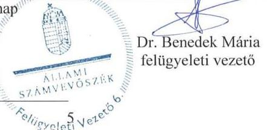

---

# RÖVIDÍTÉSJEGYZÉK 

| Törvények |  |
| :--: | :--: |
| Áht. 1 | Az államháztartásról szóló 1992. évi XXXVIII. törvény (hatálytalan: 2012. január 1-jétől) |
| Áht. 2 | Az államháztartásról 2011. évi CXCV. törvény (hatályos: 2012. január 1-jétől) |
| Art. | az adózás rendjéről szóló 2003. évi XCII. törvény (hatályos 2004. január1-jétől) |
| ÁSZ tv. ${ }_{1}$ | Az Állami Számvevőszékről szóló 1989. évi XVIII. törvény (hatályos: 2011. június 30-ig) |
| ÁSZ tv. 2 | Az Állami Számvevőszékről szóló 2011. évi LXVI. törvény (hatályos: 2011. július 1-jétől) |
| Einfo. tv. | Az elektronikus információszabadságról szóló 2005. évi XC. törvény (hatályos: 2010. december 31-ig) |
| Ket. | a közigazgatási hatósági eljárás és szolgáltatás általános szabályairól szóló 2004. évi CXL. törvény |
| Info. tv. | Az információs önrendelkezési jogról és az információszabadságról szóló 2011. évi CXII. törvény (hatályos: 2011. július 27-től) |
| Kbt. | A közbeszerzésekről szóló 2011. évi CVIII. törvény (hatályos: 2012. január 1-jétől) |
| Kktv. | A közokiratokról, a közlevéltárakról és a magánlevéltári anyag védelméről szóló 1995. évi LXVI. törvény (hatályos: 1996. január 1-jétől) |
| Ksztv. ${ }_{1}$ | A központi államigazgatási szervekről, valamint a Kormány tagjai és az államtitkárok jogállásáról szóló 2006. évi LVII. törvény (hatályos: 2010. május 28-ig) |
| Ksztv. ${ }_{2}$ | A központi államigazgatási szervek, valamint a Kormány tagjai és az államtitkárok jogállásáról szóló 2010. évi XLIII. törvény (hatályos: 2010. május 29-től) |
| Kt. | A költségvetési szervek jogállásáról és gazdálkodásáról szóló 2008. évi CV. törvény (hatályos: 2009. január 1jétől 2010. augusztus 14-ig) |
| Kttv. | a közszolgálati tisztviselőkről szóló 2011. évi CXCIX. törvény |
| Ktv. | A köztisztviselők jogállásáról szóló 1992. évi XXIII. törvény (hatályos: 1992. május 5-től 2012. február 28-ig) |
| Mt. | a munka törvénykönyvéről szóló 2012. évi I. törvény |
| Ptk. ${ }_{1}$ | a Polgári Törvénykönyvről szóló 1959. évi IV. törvény (hatályos 2014. március 14-éig) |
| Ptk. 2 | a Polgári Törvénykönyvről szóló 1959. évi IV. törvény (hatályos 2014. március 15-étől) |
| Számv. tv. | A számvitelről szóló 2000. évi C. törvény (hatályos: 2000. január 1-jétől) |

---

Szjt. tv.
Szt.

## Kormányrendeletek

Áhsz $_{1}$

Áhsz. 2
Ámr. 1

Ámr. 2
Ávr.

Ber.

Bkr.

Kormányrendelet

287/2010. (XII.16.)
Korm. rendelet

## Szórövidítések

alapító okirat $_{1}$
alapító okirat $_{2}$
alapító okirat $_{3}$
alapító okirat $_{4}$
alapító okirat $_{5}$

A szerzői jogról szóló 1999. évi LXXVI. tv. (hatályos: 1999. szeptember 1-jétől)
A találmányok szabadalmi oltalmáról szóló 1995. évi XXXIII. törvény (hatályos: 2006. január 1-jétől)

Az államháztartás szervezetei beszámolási és könyvvezetési kötelezettségének sajátosságairól szóló 249/2000. (XII. 24.) Korm. rendelet (hatálytalan: 2013. december 31-től)
az államháztartás számviteléről szóló 4/2013. (I. 11.) Korm. rendelet (hatályos 2014. január 1-jétől)
Az államháztartás múködési rendjéről szóló 217/1998. (XII. 30.) Korm. rendelet (hatálytalan: 2010. január 1-jétől)
Az államháztartás működési rendjéről szóló 292/2009. (XII. 19.) Korm. rendelet (hatályos: 2010. január 1-jétől 2011. december 31-éig)
Az államháztartásról szóló törvény végrehajtásáról szóló 368/2011. (XII. 31.) Korm. rendelet (hatályos: 2012. január 1-jétől)
A költségvetési szervek belső ellenőrzéséről szóló 193/2003. (XI. 26.) Korm. rendelet (hatálytalan: 2012. január 1-jétől)
A költségvetési szervek belső kontrollrendszeréről és belső ellenőrzésről szóló 370/2011. (XII. 31.) Korm. rendelet (hatályos: 2012. január 1-jétől)
a közös jogkezelő szervezetek nyilvántartására, felügyeletére, felügyeleti dijára, valamint e szervezetek nyilvántartásával, felügyeletével és díjszabásának jóváhagyásával kapcsolatos eljárásokban az elektronikus úton történő kapcsolattartásra vonatkozó részletes szabályokról szóló 307/2011. (XII. 23.) Korm. rendelet (hatályos 2012. január 1-jétől)
a Hamisítás Elleni Nemzeti Testületről szóló 287/2010. (XII. 16.) Korm. rendelet

Magyar Szabadalmi Hivatal Alapító Okiratra egységes szerkezetben, kelt: 2007. május 31.
Magyar Szabadalmi Hivatal Alapító Okiratra egységes szerkezetben, kelt: 2008. április 14.
Magyar Szabadalmi Hivatal Alapító Okiratra egységes szerkezetben, kelt: 2008. július 24.
Magyar Szabadalmi Hivatal Alapító Okiratra egységes szerkezetben, kelt: 2009. augusztus 31.
Magyar Szabadalmi Hivatal Alapító okirata egységes

---

alapító okirat $_{6}$
alapító okirat $_{7}$
alapító okirat $_{8}$
Alapító Okirat $_{1}$
Alapító Okirat $_{2}$
Alapító Okirat $_{3}$
ARTISJUS
ÁSZ
EJI
Értékelési szabályzat ${ }_{1}$
Értékelési szabályzat ${ }_{2}$
Ellenőrzési nyomvonal

FEUVE

FEUVE szabályzat

FEUVE kézikönyv

FILMJUS
HIPAvilon Nkft.
szerkezetben, Kelt 2010. október 11.
Szellemi Tulajdon Nemzeti Hivatala Alapító Okirat kelt: 2011. január 28.

Szellemi Tulajdon Nemzeti Hivatala Alapító Okirat kelt: 2012. július 19.

Szellemi Tulajdon Nemzeti Hivatala Alapító Okirat kelt: 2014. január 27.
a HIPAvilon Nonprofit Kft. 2012. április 20-án kelt Alapító Okirata (hatályos: 2013. augusztus 21-éig)
a HIPAvilon Nonprofit Kft. 2013. augusztus 22-én kelt Alapító Okirata (hatályos: 2013. augusztus 22-től)
a HIPAvilon Nonprofit Kft. egységes szerkezetbe foglalt 2014. május 26-án kelt Alapító Okirata

ARTISJUS Magyar Szerzői Jogvédő Iroda Egyesület
Állami Számvevőszék
Előadóművészi Jogvédő Iroda Egyesület
3/2007. utasítás Az eszközök és források értékelésének szabályairól (hatályos: 2007. június 1-jétől)
3/2012. utasítás Az eszközök és források értékelésének szabályairól (hatályos: 2012. augusztus 1-jétől)
A Magyar Szabadalmi Hivatal elnökének 5/2007. utasítása a folyamatba épített előzetes és utólagos vezetői ellenőrzés rendszeréről, az ellenőrzési nyomvonalról és a kockázatkezelés szabályozásáról (hatályos: 2007. május 1-jétől)
a) folyamatba épített, előzetes és utólagos vezetői ellenőrzés (2004. január 1-jétől 2008. december 31-éig: Áht. 1 121. §, Ámr. 1 2. § 62. pont)
b) folyamatba épített, előzetes, utólagos és vezetői ellenőrzés (2009. január 1-jétől: Áht. 1 121. §, Ámr. 1 2. § 62. pont; 2010. január 1-jétől 2010. december 31-ig Ámr. 2 155. § (1) bekezdés; 2011. január 1-jétől december 31-ig: az Áht. 1 121/A §; 2012. január 1-jétől: Bkr. 8. § (2) bekezdés)
A Magyar Szabadalmi Hivatal elnökének 5/2007. utasítása a folyamatba épített előzetes és utólagos vezetői ellenőrzés rendszeréről, az ellenőrzési nyomvonalról és a kockázatkezelés szabályozásáról (hatálytalan: 2012. augusztus 1-jétől)
A Szellemi Tulajdon Nemzeti Hivatala gazdasági vezetőjének 3/2013. (IX. 2.) gazdasági vezetői utasítása a Szellemi Tulajdon Nemzeti Hivatala pénzügyi - számviteligazdálkodási ellenőrzési nyomvonala kézikönyvéről (hatályos: 2013. szeptember 2-től)
FILMJUS Filmszerzők és Előállítók Szerzői Jogvédő Egyesülete
HIPAvilon Magyar Szellemi Tulajdon Ügynökség Nonpro-

---

|  | fit Kft. |
| :--: | :--: |
| HIPAvilon SZMSZ ${ }_{1}$ | A HIPAvilon Nonprofit Kft. Szervezeti és Múködési Szabályzatáról szóló 1/2012. (VIII.23.) ügyvezetői utasítás, hatályos: 2012. augusztus 23-tól-2014. január 20-ig. |
| HIPAvilon SZMSZ ${ }_{2}$ | A HIPAvilon Nonprofit Kft. Szervezeti és Müködési Szabályzatáról szóló 1/2014. (I.21.) ügyvezetői utasítás, hatályos:2014. január 21-től. |
| Hivatali Számlarend | A Hivatal ellenőrzési időszak alatt hatályos Számlarendje, a Számviteli Politika ${ }_{1-2}$ 2. sz. melléklete |
| HUNGART | HUNGART Vizuális Müvészek Közös Jogkezelő Társasága Egyesület |
| Informatikai Biztonsági szabályzat ${ }_{1}$ | A Magyar Szabadalmi Hivatal elnökének 13/2010. utasítása az Informatikai Biztonsági szabályzatról (hatályos: 2010. augusztus 11-től) |
| Informatikai Biztonsági szabályzat ${ }_{2}$ | Integrált Irányítási Kézikönyv 2 9. sz. melléklete (hatályos: 2013. augusztus 1-jétől) |
| Integrált Irányítási kézikönyv ${ }_{1}$ | A Magyar Szabadalmi Hivatal elnökének 8/2010. utasítása a Magyar Szabadalmi Hivatalban integrált minőség- és információbiztonság irányítási rendszer bevezetéséről annak szabályait tartalmazó kézikönyv közzététele (hatályos: 2010. augusztus 1-jétől) |
| Integrált Irányítási kézikönyv ${ }_{2}$ | Szellemi Tulajdon Nemzeti Hivatala Integrált minőség-, információbiztonság és IT szolgáltatásirányítási kézikönyv (hatályos: 2013. augusztus 1-jétől) |
| INTOSAI | A legfőbb ellenőrző intézmények nemzetközi szakmai szervezete |
| Iratkezelési szabályzat ${ }_{1}$ | A Magyar Szabadalmi Hivatal elnökének 2/2007. utasítása az iratkezelési szabályzatról (hatályos: 2007. január 1-jétől) |
| Iratkezelési szabályzat ${ }_{2}$ | A Magyar Szabadalmi Hivatal elnökének 1/2010. utasítása a Magyar Szabadalmi Hivatal iratkezelési szabályzatról (hatályos: 2010. január 1-jétől) |
| Iratkezelési szabályzat ${ }_{3}$ | A Szellemi Tulajdon Nemzeti Hivatala elnökének 3/2012. (IV. 5.) SZTNH utasítása a Szellemi Tulajdon Nemzeti Hivatalának egyedi iratkezelési szabályzatáról (hatályos: 2012. április 5-től) |
| ISO integrált irányítási rendszer | A Hivatal elnökének a Hivatal ISO Integrált minőség- és információbiztonság irányítási rendszer szabályait tartalmazó módosított Kézikönyv és Alkalmazhatósági Nyilatkozata kötelező alkalmazásáról szóló 5/2012. (VII.30.) Hivatal utasítása |
| Jogosultsági kézikönyv ${ }_{1}$ | A Magyar Szabadalmi Hivatal gazdasági vezetőjének 2/2004. utasítása az SAP R/3 informatikai rendszer jogosultságkezelési kézikönyvéről (hatályos: 2004. november 15 -től) |
| Jogosultsági kézikönyv ${ }_{2}$ | A Szellemi Tulajdon Nemzeti Hivatala gazdasági vezetőjének 6/2012. (VIII. 1.) gazdasági vezetői utasítása az SAP R/3 informatikai rendszer jogosultságkezelési kézi- |

---

Jogosultságkezelési eljárásrend
KIM
Kincstár
Kockázatkezelési szabályzat

Kormány
Közbeszerzési szabályzat

Közszolgálati szabály$\mathrm{zat}_{1}$

Közszolgálati szabály$\mathrm{zat}_{2}$

Közszolgálati szabály$\mathrm{zat}_{3}$

Kötelezettségvállalási szabályzat ${ }_{1}$

Kötelezettségvállalási szabályzat ${ }_{2}$

Leltározási és leltárkészítési szabályzat ${ }_{1}$

Leltározási és leltárkészítési szabályzat ${ }_{2}$

MAHASZ
MASZRE
MISZJE
Miniszter
könyvéről (hatályos: 2012. augusztus 1-jétől)
Integrált Irányítási kézikönyv melléklete (hatályos: 2010. augusztus 1-jétől)

Közigazgatási és Igazságügyi Minisztérium
Magyar Államkincstár
A Magyar Szabadalmi Hivatal elnökének 5/2007. utasítása a folyamatba épített előzetes és utólagos vezetői ellenőrzés rendszeréről, az ellenőrzési nyomvonalról és a kockázatkezelés szabályozásáról (hatályos: 2007. május 1-jétől 2012. július 30-ig)
Magyarország Kormánya
A Magyar Szabadalmi Hivatal elnökének 4/2007. utasítása a közbeszerzésekről (hatályos: 2007. április 15-től 2013. június 25 -ig)

A Magyar Szabadalmi Hivatal elnökének 7/2004. utasítása a közszolgálati szabályzatról (hatályos: 2004. november 16 -tól)
A Magyar Szabadalmi Hivatala elnökének 5/2009. utasítása a közszolgálati szabályzatról (hatályos: 2009. május 1-jétől)
A Szellemi Tulajdon Nemzeti Hivatala elnökének 9/2012. (X. 28.) SZTNH utasítás a közszolgálati szabályzatról (hatályos: 2012. október 28-tól)
A Magyar Szabadalmi Hivatala elnökének 11/2006. utasítása a kötelezettségvállalás, ellenjegyzés, utalványozás rendjéről (hatályos: 2007. január 1-jétől)
A Szellemi Tulajdon Nemzeti Hivatal elnökének 7/2012. (VIII. 24.) SZTNH utasítás a kötelezettségvállalás, ellenjegyzés, szakmai teljesítésigazolás, érvényesítés és utalványozás rendjéről (hatályos: 2012. augusztus 24-től)
Az SZTNH elnökének 12/2010. számú utasítása a leltározási és leltárkészítési szabályokról (hatályos: 2002. január 1-jétől)
Az SZTNH elnökének 3/2002. számú utasítása a leltározási és leltárkészítési szabályokról (hatályos: 2010. november 1-jétől)
Magyar Hangfelvétel-kiadók Szövetsége Közös Jogkezelő Egyesület
Magyar Szak- és Szépirodalmi Szerzők és Kiadók Reprográfiai Egyesülete
Magyar Irodalmi Szerzői Jogvédő és Jogkezelő Egyesület 2007.01.01-től 2008.05.14-ig a gazdasági és közlekedési miniszter; 2008.05.15-től 2009.04.15-ig a kutatásfejlesztésért felelős tárca nélküli miniszter; 2009.04.16-tól 2010.12.31-ig az igazságügyi és rendészeti miniszter; 2011.01.01-től 2013.12.31-ig a közigazgatási és igazságügyi miniszter, 2014.01.01-től az igazságügyi miniszter.

---

Minisztérium

MNV Zrt
NEFMI
NGM
NKA
Önköltség-számítási
szabályzat ${ }_{1}$
Önköltség-számítási szabályzat ${ }_{2}$
Pénzkezelési szabályzat ${ }_{1}$

Pénzkezelési szabályzat ${ }_{2}$

REPROPRESS
RSZ
Sajtó számára adott tájékoztatás szabályairól szóló utasítás ${ }_{1}$
Sajtó számára adható tájékoztatás szabályairól szóló utasítás ${ }_{2}$
SAP
Számlarend $_{1}$

Számlarend $_{2}$

Számlarend $_{3}$

Számviteli Politika ${ }_{1}$
Számviteli Politika ${ }_{2}$
szerződések
2007. 01. 01-től 2008. 05. 14-ig a Gazdasági és Közlekedési Minisztérium; 2008. 05. 15-től 2009. 04. 15-ig a Ku-tatás-fejlesztésért felelős tárca nélküli miniszter; 2009. 04. 16-tól 2010. 05. 29-ig az Igazságügyi és Rendészeti Minisztérium; 2010. 05. 30-tól 2014 06. 05-ig a Közigazgatási és Igazságügyi Minisztérium; 2014. 06. 06-től az Igazságügyi Minisztérium.
Magyar Nemzeti Vagyonkezelő Zrt.
Nemzeti Erőforrás Minisztérium
Nemzetgazdasági Minisztérium
Nemzeti Kulturális Alap
3/1996. utasítás az önköltségszámítás rendjéről (hatályos: 1996. szeptember 1-jétől)
2/2009. utasítás az Önköltség-számítási szabályzat közzétételéről (hatályos: 2009. november 15-től)
A Magyar Szabadalmi Hivatal Gazdasági Vezetőjének 4/2007. utasítás a Hivatal pénzkezeléséről (hatályos: 2007. július 1-jétől)

A Hivatal gazdasági vezetőjének 2/2012. (VIII. 1.) gazdasági vezetői utasítása a Hivatal pénzkezeléséről (hatályos: 2012. augusztus 1-jétől)
Reprogress Magyar Lapkiadók Reprográfiai Egyesülete Magyar Reprográfiai Szövetség
A Magyar Szabadalmi Hivatal elnökének 6/2002. utasítása a sajtó számára adott tájékoztatás szabályairól

Az SZTNH elnökének 5/2013. számú utasítása a sajtó számára adható tájékoztatás szabályairól, valamint a sajtófigyelésről (hatályos: 2013. december 21-től)
(Systeme, Anwendungen und Produkte in der Datenverarbeitung) integrált vállalatirányítási rendszer 4/2012.(VIII. 27.) számú Ügyvezetői utasítás a HIPAvilon Kft. Számviteli politikájának 5. számú melléklete (hatályos: 2012. augusztus 27-től 2013. április 28-ig.)
3/2013.(IV. 29.) számú Ügyvezetői utasítás a HIPAvilon Kft. Számviteli politikájának 5. számú melléklete (hatályos: 2013. április 29-től 2013. december 31-ig.)
6/2014.(II. 28.) számú Ügyvezetői utasítás a HIPAvilon Kft. Számviteli politikájának 5. számú melléklete (hatályos: 2014. január 1-jétől)
Magyar Szabadalmi Hivatal gazdasági vezetőjének 3/2008. utasítása a számviteli politikáról (hatályos: 2008. augusztus 1-jétől)

A Hivatal gazdasági vezetőjének 1/2012. (VIII. 1.) gazdasági vezetői utasítása a Számviteli Politikáról (hatályos: 2012. augusztus 1-jétől)

A HIPAvilon Kft által a megállapodások végrehajtása

---

|  | érdekében kötött vállalkozási és megbízási szerződések |
| :--: | :--: |
| SZMSZ | Szervezeti és Múködési Szabályzat |
| SZMSZ $_{1}$ | 28/2007. (MK 165.) GKM utasítás a Magyar Szabadalmi Hivatal Szervezeti és Múködési Szabályzatáról (hatályos: 2007. december 1-jétől) |
| SZMSZ $_{2}$ | 3/2008. (HÉ 49.) TNM utasítás a Magyar Szabadalmi Hivatal Szervezeti és Múködési Szabályzatáról (hatályos: 2009. január 1-jétől) |
| SZMSZ $_{3}$ | 43/2011. (V. 6.) KIM utasítás a Szellemi Tulajdon Nemzeti Hivatalának Szervezeti és Múködési Szabályzatáról (hatályos: 2011. május 6-tól) |
| Ügyrend $_{1}$ | 5/2005. utasítás a Magyar Szabadalmi Hivatal gazdasági szervezetének feladat és hatásköréről (ügyrend)(hatályos:2005. október 1-jétől) |
| Ügyrend $_{2}$ | 3/2009. utasítás a Magyar Szabadalmi Hivatal gazdasági szervezetének feladat és hatásköréről (ügyrend) Gazdasági szervezet ügyrendje (hatályos: 2009. október 15 -től) |

---

# ÉRTELMEZŐ SZÓTÁR 

a bevétel jogosultak érdekében történő felhasználása
a Hivatal hatósági feladatai
állami vagyon
állami vagyon hasznosítása

A közös jogkezelő szervezet az ismeretlen helyen tartózkodó jogosultat megillető és emiatt fel nem osztható jogdíjakból, tagdíjakból és a jogkezelésen kívüli tevékenységéből származó bevételét nem köteles teljes mértékben a jogosultak között felosztani, azt az alapszabályzatával és legfőbb szervének eseti döntéseivel összhangban használhatja fel a jogosultak érdekét szolgáló egyéb - különösen szociális és kulturális - célokra. (Forrás: Szjt 89. § (8) bekezdés)
A Hivatal azon feladatai, amelyeket az Szt. hatósági feladatként nevesít, illetve, amelyek esetében a Hivatal a Ket. rendelkezései alapján - hatóságként, hatósági ügyben jár el, vagyis ügyfelet érintő jogot vagy kötelességet állapít meg, adatot, tényt vagy jogosultságot igazol, hatósági nyilvántartást vezet, vagy hatósági ellenőrzést végez (Szt. 115/G. § g) pont; 115/H. § (1) bekezdés a)b) pont; 115/H. § (4) bekezdés a)-c) és e) pont; 115/H. § (5) bekezdés).

Állami vagyonnak minősül:
a) az állami tulajdonban lévő ingó dolog, valamint a dolog módjára hasznosítható természeti erő,
b) az állami tulajdonban lévő termőföldekből álló, külön törvényben szabályozott Nemzeti Földalap,
c) az állami tulajdonban lévő - a b) pont hatálya alá nem tartozó - ingatlan,
d) az állami tulajdonban lévő értékpapír,
e) az államot megillető társasági részesedés és más vagyoni értékú jog.
(Forrás: Vtv. 1. § (2) bekezdés, hatálytalan 2010. június 17-étől.)
Állami vagyonnak minősül:
a) az állam tulajdonában lévő dolog, valamint a dolog módjára hasznosítható természeti erő,
b) az a) pont hatálya alá nem tartozó mindazon vagyon, amely vonatkozásában törvény az állam kizárólagos tulajdonjogát nevesíti,
c) az állam tulajdonában lévő tagsági jogviszonyt megtestesítő értékpapír, illetve az államot megillető egyéb társasági részesedés,
d) az államot megillető olyan immateriális, vagyoni értékkel rendelkező jogosultság, amelyet jogszabály vagyoni értékú jogként nevesít.
(Forrás: Vtv. 1. § (2) bekezdés, hatályos 2010. június 17étől.)
Az állami vagyont az MNV Zrt. maga kezeli, vagy szerződés - így különösen bérlet, haszonbérlet, szerződésen ala-

---

puló haszonélvezet, vagyonkezelés, megbízás - alapján központi költségvetési szervnek, természetes vagy jogi személynek, vagy jogi személyiséggel nem rendelkező gazdálkodó szervezetnek hasznosításra átengedi.
(Forrás: Vtv. 2011. december 31-éig hatályos 23. § (1) bekezdése)
Az állami vagyont az MNV Zrt. maga kezeli, vagy szerződés - így különösen bérlet, haszonbérlet, megbízás alapján központi költségvetési szervnek, természetes vagy jogi személynek, vagy jogi személyiséggel nem rendelkező gazdálkodó szervezetnek hasznosításra átengedi.
(Forrás: Vtv. 2012. január 1-jétől hatályos 23. § (1) bekezdése)
Az állami vagyonnal a tulajdonosi joggyakorló maga gazdálkodik, vagy szerződés - így különösen bérlet, haszonbérlet, megbízás - alapján hasznosításra átengedi, illetőleg vagyonkezelésbe, haszonélvezetbe adja. (Forrás: Vtv. 2013. június 28 -ától hatályos 23. § (1) bekezdése)
árva mű
átalakítás
átlátható szervezet

Egy mú akkor tekinthető árva múnek, ha jogosultja ismeretlen vagy ismeretlen helyen tartózkodik.
(Forrás: Szj. tv. 41/A. § (1) bekezdés)
A költségvetési szerv átalakítása történhet egyesítéssel vagy szétválasztással. Az egyesítés lehet beolvadás vagy összeolvadás. A szétválasztás lehet különválás vagy kiválás.
(Forrás: Kt. 11. § (1) bekezdés, hatályos 2009. január 1jétől, hatálytalan 2010. augusztus 15-étől, Áht. 95. § (1) bekezdés, hatályos 2010. augusztus 15-étől.)
A költségvetési szerv általános jogutódlással történő megszüntetése átalakítással történhet. Az átalakítás lehet egyesítés vagy különválás. Az egyesítés lehet beolvadás vagy összeolvadás.
(Forrás: Áht. 11. § (2) bekezdés.)
Az állam, a költségvetési szerv, a köztestület, a helyi önkormányzat, a nemzetiségi önkormányzat, a társulás, az egyházi jogi személy, az olyan gazdálkodó szervezet, amelyben az állam vagy a helyi önkormányzat különkülön vagy együtt 100\%-os részesedéssel rendelkezik, a nemzetközi szervezet, a külföldi állam, a külföldi helyhatóság, a külföldi állami vagy helyhatósági szerv és az Európai Gazdasági Térségről szóló megállapodásban részes állam szabályozott piacára bevezetett nyilvánosan múködő részvénytársaság, továbbá az olyan belföldi vagy külföldi jogi személy, vagy jogi személyiséggel nem rendelkező gazdálkodó szervezet, civil szervezet és vízitársulat, amely megfelel az Nvtv.-ben foglalt feltételeknek.
(Forrás: Nvtv. 3. § (l) bekezdés l. pont.)

---

Design-hét
előirányzat-
átcsoportosítás
előirányzat-
marad-
vány/költségvetési
maradvány
előirányzat-
módosítás
előirányzat-változás
hatékonyság
integritás

A 2004-ben útjára indított rendezvénysorozat célja, hogy közremúködjön a design gazdasági és társadalmi szerepének tudatosításában, a design iránti bizalom növelésében és a terület szereplői közötti kommunikációban. A fesztivál a nagyközönség számára változatos programokon keresztül biztosítja azt, hogy a design témaköréből minél szélesebb körű ismereteket szerezzenek, a szakma számára pedig bemutatkozási, kapcsolatteremtési, továbbképzési és tapasztalatcsere-lehetőséget biztosít. (forrás: designhet.hu)
Az átcsoportosítást végrehajtó költségvetésének - az Országgyúlés vagy a Kormány intézkedése, és a fejezetet irányító szervek megállapodása esetén a központi költségvetés, a fejezetet irányító szerv intézkedése esetén a fejezet, az államháztartás önkormányzati alrendszerében a költségvetési rendelet, határozat összesített - kiadási előirányzatai főösszegének változatlansága mellett, a kiadási előirányzatok egyidejú csökkentésével és növelésével végrehajtott módosítás.
(Forrás: Áht. 2 . § (1) bekezdés e) pont.)
Az államháztartás központi alrendszerébe tartozó költségvetési szerveknél a módosított bevételi és kiadási előirányzatok és azok teljesítésének a Kormány rendeletében meghatározott tételekkel korrigált különbözete.
(Forrás: Áht. 2 2. § (1) bekezdés m) pont.)
A megállapított kiadási előirányzat növelése vagy csökkentése, a bevételi előirányzatok egyidejú növelése vagy csökkentése mellett.
(Forrás: Áht. 2 2. § (1) bekezdés f) pont.)
Az előirányzat-módosítás és az előirányzatátcsoportosítás együttvéve.
A hatékonyság követelménye azt jelenti, hogy az előállított termékek, nyújtott szolgáltatások, az ellátott feladat más eredményének értéke, vagy az azokból származó bevétel a lehető legnagyobb mértékben haladja meg a felhasznált erőforrásokhoz kapcsolódó kiadásokat vagy ráfordításokat.
(Forrás: Áht.: 91. § (1) bekezdés b) pont, Bkr. 2. § j) pont.)
Az integritás az elvek, értékek, cselekvések, módszerek, intézkedések konzisztenciáját jelenti, vagyis olyan magatartásmódot, amely meghatározott értékeknek megfelel.
(Forrás: Nemzetgazdasági Minisztérium: Magyarországi államháztartási belső kontroll standardok Útmutató 1.6.1. pont, 2012. december.)

Az államigazgatási szerv múködésére vonatkozó szabályoknak, valamint $a$ hivatali szervezet vezetője és az irányító szerv által meghatározott célkitúzéseknek, érté-

---

keknek és elveknek megfelelő múködés.
(Forrás: Integritásirányítási rendelet 2. § a) pont.)
integritási kockázat Az államigazgatási szerv integritása sérülésének lehetősége.
(Forrás: Integritásirányítási rendelet 2. § c) pont.)
kontrollkörnyezet A költségvetési szerv vezetője által kialakított olyan elvek, eljárások, belső szabályzatok összessége, amelyben világos a szervezeti struktúra, egyértelmúek a felelősségi, hatásköri viszonyok és feladatok, meghatározottak az etikai elvárások a szervezet minden szintjén, átlátható a humánerőforrás-kezelés. (Forrás: Bkr. 6. § (1) bekezdés)
közös jogkezelés
közös jogkezelés a felhasználás jellege, illetve körülményei miatt egyedileg nem gyakorolható szerzői jogok és a szerzői joghoz kapcsolódó ilyen jogok érvényesítése a jogosultak által erre létrehozott szervezet útján, függetlenül attól, hogy azt a törvény írja elő vagy az a jogosultak elhatározásán alapul. A közös jogkezelés körében e szervezet a felhasználás engedélyezése vagy a díjigény érvényesítése érdekében megállapítja a jogdíjakat és a felhasználás egyéb feltételeit, figyelemmel kíséri a múvek és a kapcsolódó jogi teljesítmények felhasználását, beszedi és felosztja vagy felosztás céljára másik közös jogkezelő szervezetnek átadja a jogdíjakat, valamint fellép a szerzői jog vagy a kapcsolódó jog megsértésével szemben. A közös jogkezelés nyilvántartásba vételhez kötött tevékenység.
(Forrás: Szjt. 85-86. §)
közös jogkezelő szervezetek

A közös jogkezelési tevékenység ellátására jogosult egyesületek:
ARTISJUS - ARTISJUS Magyar Szerzői Jogvédő Iroda Egyesület
EJI - Előadóművészi Jogvédő Iroda Egyesület
FILMJUS - FILMJUS Filmszerzők és Előállítók Szerzői Jogvédő Egyesülete
HUNGART - HUNGART Vizuális Múvészek Közös Jogkezelő Társasága Egyesület
MAHASZ - Magyar Hangfelvétel-kiadók Szövetsége Közös Jogkezelő́ Egyesület
MASZRE - Magyar Szak- és Szépirodalmi Szerzők és Kiadók Reprográfiai Egyesülete
MISZJE - Magyar Irodalmi Szerzői Jogvédő és Jogkezelő Egyesület
REPROPRESS - Reprogress Magyar Lapkiadók Reprográfiai Egyesülete
RSZ - Magyar Reprográfiai Szövetség
kincstári költségvetés A központi költségvetésről szóló törvény elfogadását követően a fejezetet irányító szerv az államháztartás köz-

---

korrupciós kockázat
közfeladat
közhatalmi bevétel
monitoring-rendszer
ponti alrendszerébe tartozó költségvetési szerv és a fejezeti kezelésű előirányzat kiemelt előirányzatait, valamint az elkülönített állami pénzalapok és a társadalombiztosítás pénzügyi alapjai jogszabályi előirás szerinti bevételeit és kiadásait kincstári költségvetés kiadásával állapítja meg.
(Forrás: Áht. ${ }_{1}$ 24. § (3) bekezdés, Áht. ${ }_{2}$ 28. § (2) bekezdés.)
A jogtalan előny nyújtásának vagy megszerzésének lehetősége.
(Forrás: Integritásirányítási rendelet 2. § d) pont.)
Az a feladat, amit az arra kötelezett közérdekből, jogszabályban meghatározott követelményeknek és feltételeknek megfelelve végez, ideértve a lakosság közszolgáltatásokkal való ellátását, továbbá az állam nemzetközi szerződésekben vállalt kötelezettségeiből adódó közérdekű feladatokat, valamint e feladatok ellátásához szükséges infrastruktúra biztosítását is.
(Forrás: Nvtv. 3. § (l) bekezdés 7. pont.)
A közhatalmi bevételek az igazgatási szolgáltatási díjból, a felügyeleti díjból, és a bírságbevételből származnak.
(Forrás: Ámr. ${ }_{2}$ 3/A. § (1) bekezdés bac) pont, hatályos 2011. január 1-jétől, 2011. december 31-ig, az Áht. ${ }_{2}$ 5. § a) pont és az Ávr. 2. § c) pont), hatályos 2012. január 1jétől.
A monitoring általánosságban a különböző_ szintű szervezeti célok megvalósításának folyamatát kíséri figyelemmel, melynek során a releváns eseményekről és tevékenységekről rendszeres jelleggel, strukturált, döntéstámogató információkhoz jutnak a szervezet vezetői.
(Forrás: NGM Útmutató a költségvetési szervek monitoring rendszeréhez 2011. november.)
A költségvetési szerv vezetője köteles olyan monitoring rendszert múködtetni, mely lehetővé teszi a szervezet tevékenységének, a célok megvalósításának nyomon követését.
(Forrás: Ámr. ${ }_{1}$ 145/G. §, hatályos: 2009. január 1-jétől, Ámr. ${ }_{2}$ 160. §, hatályos: 2010. január 1-jétől)
A költségvetési szerv monitoring rendszere az operatív tevékenységek keretében megvalósuló folyamatos és eseti nyomon követésből, valamint az operatív tevékenységektől függetlenül múködő belső ellenőrzésből áll. (Forrás: Ámr. ${ }_{2}$ 160. §, hatályos 2011. január 1-jétől.)
A költségvetési szerv vezetője köteles kialakítani a szervezet tevékenységének, a célok megvalósításának nyomon követését biztosító rendszert, mely az operatív tevékenységek keretében megvalósuló folyamatos és eseti nyomon követésből, valamint az operatív tevékenysé-

---

támogatási politika
teljesítményellenőrzés
újdonságkutatás
vagyonhasznosítási bevétel
vezetői nyilatkozat
"work-flow" rendszer
gektől függetlenül múködő belső ellenőrzésből áll. (Forrás: Bkr. 10. §, hatályos: 2012. január 1-jétől))
A közös jogkezelő szervezet kulturális célra az NKA számára történő átadással, a NKA-ról szóló törvénnyel összhangban a támogatási politika figyelembevételével használhatja fel a jogszabályban meghatározott bevételeit. (forrás: Szjt. 89. § (11) bekezdés)
A teljesítményellenőrzés célja annak megállapítása, hogy az adott szervezet által végzett tevékenységek, programok egy jól körülhatárolható területén a múködés, illetve a forrásfelhasználás gazdaságosan, hatékonyan és eredményesen valósul-e meg.
(Forrás: Ber. 2. § d) pont, Bkr. 21. § (3) bekezdés d) pont.)
Ha a szabadalmi bejelentés megfelel az Szt. 65. § alapján vizsgált feltételeknek, a Hivatal elvégzi az újdonságkutatást, és az igénypontok alapján - figyelemmel a szabadalmi leírásra és rajzra - újdonságkutatási jelentést készít. Az újdonságkutatási jelentésben meg kell jelölni azokat az iratokat, illetve adatokat, amelyek figyelembe vehetők a szabadalmi bejelentésben foglalt találmánnyal kapcsolatban az újdonság és a feltalálói tevékenység elbírálása során. A Hivatal a bejelentő kérelmére írásos véleménnyel kiegészített újdonságkutatási jelentést készít. Az írásos vélemény előzetes megállapítás arról, hogy az újdonságkutatási jelentésben megjelölt iratokra és adatokra figyelemmel a találmány kielégí-theti-e az újdonság, a feltalálói tevékenység és az ipari alkalmazhatóság követelményeit. (forrás: Szt. 69. és 69/A. §)
A bérleti és lízingdíj bevételek, valamint a tárgyi eszközök és immateriális javak értékesítéséből származó bevételek együttes összege, ÁFA-val.
A költségvetési szerv vezetője köteles nyilatkozatban értékelni a költségvetési szerv belső kontrollrendszerének minőségét és azt az éves költségvetési beszámolóval együtt megküldeni az irányító szervnek. Ha a költségvetési szervnél év közben változás történik a szerv vezetője személyében, vagy a költségvetési szerv átalakul, megszűnik, a távozó vezető, illetve az átalakuló, megszűnő költségvetési szerv vezetője köteles a nyilatkozatot az addig eltelt időszak vonatkozásában kitölteni, és az új vezetőnek, illetve a jogutód költségvetési szerv vezetőjének átadni, aki azt saját nyilatkozatához mellékeli.
(Forrás: Ámr. ${ }_{1}$ 149. § (2) bekezdés c) pont, (11) bekezdés, 23. számú melléklet; Ámr. ${ }_{2}$ 217. § c) pont, 226. § (3) bekezdés, 21. számú melléklet; Bkr. 11. § (1)-(2) és (4) bekezdés, 1. számú melléklet.)
Az ügyintézési-, irodai- és a gyártási munkafolyamatok irányítására és követésére szolgáló alkalmazásokat gyüj-

---

tőnéven „work-flow" rendszereknek nevezzük. Ott vetődik fel a „work-flow" rendszerek használatának igénye, ahol a munkafolyamatban részt vevő személyek és szervezetek között a munkavégzésben magas fokú, hatékony együttmúködésre van szükség. További felhasználási terület lehet, ahol a munkafolyamatban áramló dokumentumot, annak változásait, a jogosultságokat és az elosztást kell szigorúan követni, vagy a dokumentumhoz szabályozott hozzáférést biztosítani. A Hivatalnál a számla alapján, átutalással teljesített tételek kezelésére szolgált a rendszer.
(Forrás: work-flow.hu)

---

# A gazdaságossági, hatékonysági és eredményességi követelmények kialakítása és múködtetése a gazdálkodás folyamatában, valamint a vezetői nyilatkozat helytállósága 

A Hivatalnál a pénzügyi és vagyongazdálkodás folyamatában dokumentumokkal igazoltan - teljesítményméréssel kapcsolatos célokat nem tűztek ki, teljesítménymérésre alkalmas gazdaságossági, hatékonysági és eredményességi követelményeket nem határoztak meg.

Az évente kiadott vezetői nyilatkozat szerint a Hivatal elnöke gondoskodott a „költségvetési szerv tevékenységében a hatékonyság, eredményesség és a gazdaságosság követelményeinek az érvényesitéséről", ugyanakkor a gyakorlatban a hivatkozott teljesítménykövetelmények meghatározása, dokumentumokkal, számításokkal való alátámasztása nem történt meg, így a vezetői nyilatkozat helytállósága nem volt biztosított.

Az ellenőrzött időszakban a pénzügyi és vagyongazdálkodás folyamatában a Hivatal által tett (takarékossági) intézkedések nem támasztották alá a nyilatkozatban foglaltakat, mert azok egyedi döntések alapján születtek, és nem kimondottan - dokumentáltan és nevesítve - az eredményesség, gazdaságosság és hatékonyság követelményeinek javítására irányultak.