ÁLLAMI
SZÁMVEVŐSZÉK

# Jelentés 

## A központi alrendszer egyes intézményei pénzügyi és vagyongazdálkodásának ellenőrzése

Alsó-Tisza-vidéki Vízügyi Igazgatóság 2016.

---

# Jelentés 

## A központi alrendszer egyes intézményei pénzügyi és vagyongazdálkodásának ellenőrzése

Alsó-Tisza-vidéki Vízügyi Igazgatóság
2016. 06. hó 21. nap
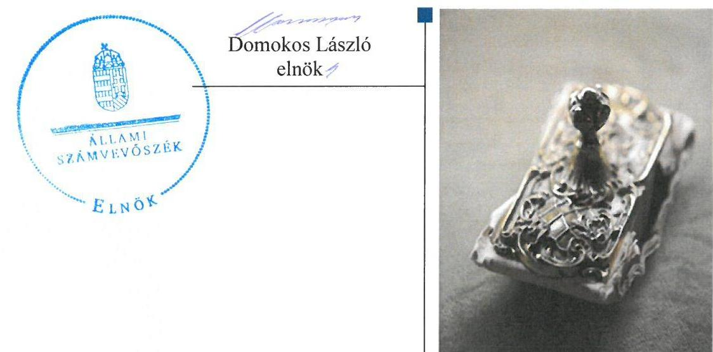

---

# AZ ELLENŐRZÉST FELÜGYELTE: 

PETŐ KRISZTINA felügyeleti vezető

## AZ ELLENŐRZÉST VEZETTE ÉS A VÉGREHAJTÁSÁÉRT FELELŐS:

BARTA JÓZSEF ellenőrzésvezető

## A PROGRAM ÖSSZEÁLLÍTÁSÁÉRT FELELŐS:

JANIK JÓZSEF LÁSZLÓ osztályvezető

IKTATÓSZÁM: V-0774-211/2016.
TÉMASZÁM: 1808

## ELLENŐRZÉS-AZONOSÍTÓ SZÁM: V067913

Jelentéseink az Országgyűlés számítógépes hálózatán és az Interneten a www.asz.hu címen is olvashatóak.

---

# TARTALOMJEGYZÉK 

■ ÖSSZEGZÉS ..... 5
■ AZ ELLENŐRZÉS CÉLJA ..... 6
■ AZ ELLENŐRZÉS TERÜLETE ..... 7
■ AZ ELLENŐRZÉS HÁTTERE, INDOKOLTSÁGA ..... 10
■ FÓKUSZKÉRDÉSEK ..... 12
■ ELLENŐRZÉS HATÓKÖRE ÉS MÓDSZEREI ..... 13
■ MEGÁLLAPÍTÁSOK ..... 17
■ JAVASLATOK ..... 36
■ MELLÉKLETEK ..... 39
I. Sz. melléklet: Értelmező szótár ..... 39
II. Sz. melléklet: Az integritás érvényesítése érdekében kialakított és működtetett kontrollrendszer ..... 43
III. Sz. melléklet: Teljesítmény-ellenőrzési kiegészítő modul megállapításai ..... 44
IV. Sz. melléklet: Az Intézmény vagyoni helyzetének elemzése 2011-2014. évben ..... 45
■ FÜGGELÉK: ÉSZREVÉTELEK ..... 47
■ RÖVIDÍTÉSEK JEGYZÉKE ..... 65

---

.

---

# ÖSSZEGZÉS 

Az Állami Számvevőszék az Alsó-Tisza-vidéki Vízügyi Igazgatóságnál 2011-2014 közötti időszak tekintetében elvégzett ellenőrzése megállapította, hogy az irányító szervek és a középirányító szerv feladatellátása szabályszerű volt. Az Intézmény ${ }^{1}$ belső kontrollrendszerének kialakítása és működtetése megfelelt a jogszabályi előírásoknak. Az Intézmény pénzügyi gazdálkodása és a vagyongazdálkodás szabályszerű volt, azonban a vagyonkezelési szerződést a módosítások után nem foglalták egységes szerkezetbe.

## Az ellenőrzés társadalmi indokoltsága

A közpénzek felhasználásában és az állami vagyonnal való gazdálkodásban a központi alrendszer egyes intézményei meghatározó súlyt képviselnek. E szervezetekkel szemben társadalmi igény, hogy tevékenységükről a döntéshozók és a nyilvánosság felé elszámoljanak. Ezzel a társadalmi igénnyel és az Állami Számvevőszék Stratégiájával összhangban, a közpénzügyek átláthatóságának előmozdítása, a közvagyon védelme érdekében került sor a ATIVIZIG ${ }^{2}$ pénzügyi és vagyongazdálkodásának ellenőrzésére.

## Főbb megállapítások, következtetések, javaslatok

Az irányító szervek és a középirányító szerv a jogszabályi előírásoknak megfelelően gyakorolták az Intézménnyel kapcsolatos irányítási jogaikat, a szabályszerű gazdálkodást számon kérték, a költségvetési gazdálkodásra vonatkozó szabályszerűségi ellenőrzéseket rendszeresen folytatták, azonban az erőforrásokkal való hatékony gazdálkodáshoz szükséges követelmények érvényesítése, számonkérése, ellenőrzése nem történt meg.

Az Intézmény belső kontrollrendszerének kialakítása és működtetése megfelelt a jogszabályi előírásoknak. Az Intézmény 2011. január 1-jétől 2012. október 19-ig nem rendelkezett Etikai kódexszel³, illetve 2011-ben ellenőrzési nyomvonallal. 2014-től a jogszabályban új egységes számlakeret került megállapításra, az Intézmény azonban nem készített ennek megfelelő új számlarendet.

Az Intézmény pénzügyi gazdálkodása szabályszerű volt, megfelelően szabályozták a költségvetés elkészítésének folyamatát és az előirányzat módosításával összefüggő feladatokat és hatásköröket. A közbeszerzési eljárások lefolytatása nem volt szabályszerű, mivel az igénybe vett távközlési szolgáltatás esetében az előírásokkal ellentétben nem folytatták le a közbeszerzési eljárást.

Az Intézmény az előirányzat felhasználásához kapcsolódóan a 2011. év márciusától elrendelt zárolás miatt takarékossági intézkedéseket hajtotta végre. A befizetési kötelezettségeket teljesítették, az előirányzat maradvány megállapítása nem volt szabályszerű, felhasználása az előírásoknak megfelelt. Az Intézmény likviditási terve nem tartalmazta a kiadások dekádonkénti ütemezését.

Az Intézmény vagyongazdálkodása szabályszerű volt. A vagyonkezelési szerződést a módosítások után azonban nem foglalták egységes szerkezetbe, ezért az Intézmény e tekintetben nem tett eleget az előírásokban foglaltaknak. Az Intézmény a jogszabály és a vagyonkezelési szerződés előírásai szerint teljesítette az értékmegőrzési, állagmegóvási kötelezettségeit, a vagyonelemek értékesítése, bérbeadása során betartotta a jogszabályokban és a belső szabályzatokban foglaltakat.

---

# AZ ELLENŐRZÉS CÉLJA

## Az Alsó-Tisza-vidéki Vízügyi Igazgatóság pénzügyi és vagyongazdálkodásának ellenőrzése

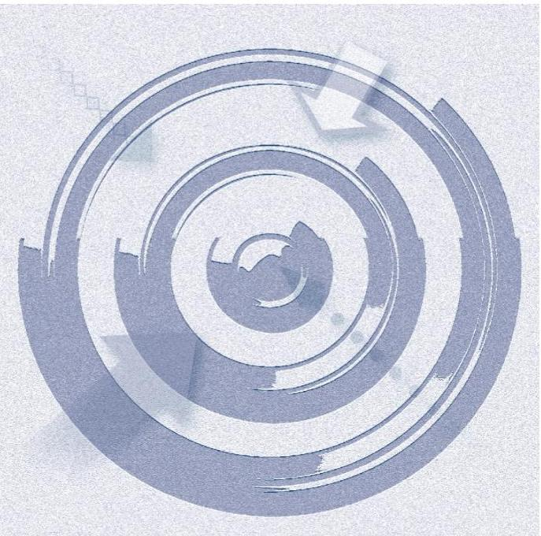

### A SZABÁLYSZERŰSÉGI ELLENŐRZÉS

célja annak megítélése volt, hogy az ellenőrzött Intézményre vonatkozó irányító szervi feladatellátás a jogszabályi előírások betartásával történt-e; az Intézménynél a belső kontrollrendszer kialakítása és működtetése szabályszerű volt-e; kialakították-e az erőforrásokkal való szabályszerű, gazdaságos, hatékony és eredményes gazdálkodáshoz szükséges követelményeket, megvalósították-e azok számon kérését, ellenőrzését; az Intézmény pénzügyi és vagyongazdálkodása megfelelt-e a jogszabályi előírásoknak és belső szabályzatainak; az Intézmény átalakításának vagy átszervezésének lebonyolítása szabályszerűen történt-e.

Az Intézmény korrupcióval szembeni veszélyeztetettségének csökkentése érdekében az ÁSZ felmérte az integritási szemlélet érvényesülését a gazdálkodási folyamatokban.

### A KIEGÉSZÍTŐ TELJESÍTMÉNY-ELLENŐRZÉSI MODUL

célja annak értékelése volt, hogy a gazdálkodás folyamatában a gazdaságossági, hatékonysági és eredményességi követelmények kialakítása megtörtént-e, azokat működtették-e, a célkitűzéseket elérték-e; a pénzügyi és vagyongazdálkodás folyamataira vonatkozóan a költségvetési szerv belső kontrollrendszerének minőségéről kiadott vezetői nyilatkozatban a költségvetési szerv tevékenységében a hatékonyság, eredményesség, gazdaságosság követelményeinek érvényesítésére vonatkozó nyilatkozat helytálló volt-e.

---

# Az Ellenőrzés Területe

## Alsó-Tisza-vidéki Vízügyi Igazgatóság

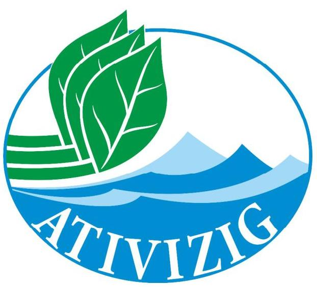

**Az intézmény** a Kormány által kijelölt vízügyi igazgatási szerv, amelyet az OVF4 létrehozásáról szóló 1060/1953. MT5 határozattal vízügyi területi feladatok, elsőfokú vízügyi hatósági jogkör ellátására 1953. október 1-jétől hoztak létre. Jogállását, közfeladatait, hatáskörét és területi illetékességét a vízgazdálkodásról szóló 1995. évi LVII. törvény, a vizek kártételei elleni védekezés szabályairól szóló Korm. rendelet 16, valamint a vízügyi, vízvédelmi hatósági feladatokat ellátó szervek kijelöléséről szóló Korm. rendeletek2-47 határozták meg.

Az Intézmény feladatstruktúrája az ellenőrzött időszakban három alkalommal változott. A Korm. rendelet2 41/A. és 41/B. §-ai alapján a 2012. január 1-jétől létrejött NeKI8-nek a területi hulladékgazdálkodással, a vízi közmű szakágazati és statisztikai adatgyűjtéssel, szennyvíz információs rendszerrel kapcsolatos feladatokat adtak át. A Korm. rendelet3 15. §-a alapján 2014. január 1-jétől a vízügyi hatósági feladatokat vették át az ATVKTVF9-től. A Korm. rendelet4 19. §-a alapján 2014. szeptember 10-én feladatátadás történt a KI10 részére, illetve ugyanezen időponttól feladatátvételre került sor vízügyi ágazati, valamint európai uniós forrásokból megvalósuló programokkal, az OKKP11-val kapcsolatos területi feladatok ellátásával összefüggésben a NeKI-től.

Az Intézmény önállóan működő és gazdálkodó központi költségvetési szerv. Az irányító szervi feladatokat 2011. december 31-ig a VM12-et vezető miniszter látta el, 2012. január 1-jétől a vízügyi igazgatási szervek irányításáért a BM13-et vezető miniszter volt felelős. A középirányító szervi feladatokat 2012. március 23-tól a BM utasítás14 alapján az OVF látta el. Az Intézményt 2011. december 31-ig a vidékfejlesztési miniszter által, ezt követően a belügyminiszter által kinevezett igazgató vezette. Az Intézmény alapfeladata a vizek kártételei elleni védelem, vízhiány kárelhárítás, vízminőségi kárelhárítás. Üzemelteti és fejleszti a vízrajzi észlelőhálózatot. Kezdeményezi a lehetséges víznyerő területek távlati ivóvízbázissá nyilvánítását. Ellátja a működési területén lévő vizek állapotértékelésével kapcsolatos feladatokat, a közműves vízellátással és szennyvízkezeléssel kapcsolatos nemzeti és regionális programok elkészítésével a feladatkörébe utalt feladatokat.

Az Intézmény az alapfeladat ellátásán túl az év során védekezési feladatokra és közfoglalkoztatásra kapott előirányzatot, amit hazai és uniós programokból származó pályázati bevételekkel egészített ki. A pályázatokból származó többletbevétel eredményeként az ellenőrzött időszakban a költségvetésben biztosított bevételi előirányzatok évente 422,5-675,9%-ra teljesültek, ez 2011-ben 3778,6 M Ft-tal, 2012-ben 4317,2 M Ft-tal, 2013-ban 6830,2 M Ft-tal, 2014-ben 5782,1 M Ft-tal magasabb bevételt jelentett az Intézmény számára.

---

A bevételek alakulását az 1. táblázat mutatja be.

1. táblázat

|  | A BEVÉTELEK ALAKULÁSA (M FT-BAN) |  |  |  |
| :-- | :--: | :--: | :--: | :--: |
|  |  | 2011-2014 |  |  |
| Megnevezés | 2011 | 2012 | 2013 | 2014 |
| előirányzat | 1171,7 | 903,4 | 1186,0 | 1186,0 |
| módosított előirányzat | 4920,5 | 5158,7 | 8629,2 | 6968,0 |
| teljesítés | 4950,3 | 5220,6 | 8016,2 | 6968,1 |

A 2011-2014. évekre jóváhagyott eredeti és a módosított bevételi és kiadási előirányzatok, valamint a teljesítések alakulását az 1. ábra szemlélteti.

1. ábra
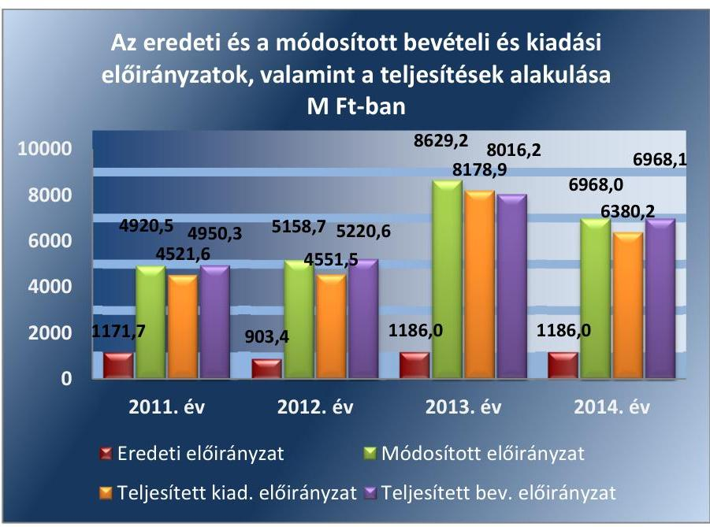

Forrás: az Intézmény 2011., 2012., 2013., 2014. évi beszámolói
A módosított kiadási előirányzatok és teljesítések az évközben beindított pályázati projektek, az ár-, és belvíz elleni védekezés beruházásai, valamint a közfoglalkoztatás következtében az ellenőrzött időszak minden évében jelentősen meghaladták az eredeti előirányzatokat.

---

Az Intézmény összes vagyona, valamint az egyes vagyonelemek összege az ellenőrzött időszak minden évében emelkedett, a változást a 2. ábra szemlélteti.
2. ábra
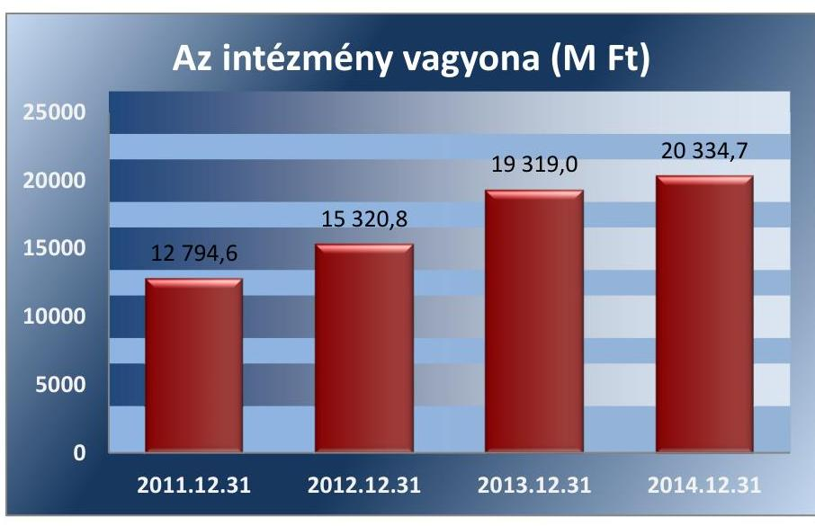

Forrás: az Intézmény 2011., 2012., 2013., 2014. évi beszámolói

Az Intézmény aktívan részt vesz az Országos Közfoglalkoztatási Programban, 2014-ben átlagosan 1324 fő volt az átlaglétszám és a különböző tanfolyamokon 511 fő közfoglalkoztatott vett részt.

Az Intézményt az ellenőrzött időszakban átalakítás nem érintette, vezetőjének (igazgató), gazdálkodása vezetőjének (gazdasági igazgató) személye nem változott, 2014-ben az engedélyezett létszámkerete 310 fő volt.

---

# AZ ELLENŐRZÉS HÁTTERE, INDOKOLTSÁGA 

Az Alaptörvény rendelkezése szerint a nemzeti vagyon megőrzésének, védelmének és a nemzeti vagyonnal való felelős gazdálkodásnak a követelményeit sarkalatos törvény, az Nvtv. ${ }^{15}$ rögzíti. A tulajdonosi joggyakorlás és vagyonkezelés általános és speciális szabályait, az állami vagyon nyilvántartására és elszámolására vonatkozó eljárásokat, a vagyonkezelési szerződés feltételrendszerét, valamint az éves beszámoló készítési és könyvvezetési kötelezettségeket kormányrendelet írja elő.

A központi alrendszer egyes intézményei közfeladat-ellátásának változásait, a közfeladatok átadásából és átvételéből adódó módosításait, előirányzat gazdálkodására ható tényezőit az Áht. ${ }^{16}$ 11. §-a és az Ávr. ${ }^{17}$ 14. §-a írja elő. A közfeladatok megszűnéséből, intézmény átszervezéséből, belső szerkezeti korszerűsítéséből, vagy más hasonló okból adódó módosításai miatt szerepeltetendő szerkezeti változásokat, valamint a szerkezeti változásként beépült közfeladatok szintre hozásként történő számításba vételét az Ávr. 15. § (2)-(3) bekezdései határozzák meg.

A társadalmi igénnyel összhangban az Áht. ${ }^{18}$ 2, az Ámr. ${ }^{19}$ és a Bkr. ${ }^{20}$ is előírja a költségvetési szerv részére, hogy olyan szabályozásokat, eljárásokat, folyamatokat alakítson ki, amelyek biztosítják a működés, gazdálkodás, az erőforrások felhasználása során a gazdaságosság, hatékonyság és eredményesség érvényesülését. Az Ámr. és a Bkr. alapján az intézményvezetőnek évente nyilatkoznia is kell arról, hogy gondoskodott-e az Intézmény tevékenységében a gazdaságosság, hatékonyság és eredményesség követelményeinek érvényesítéséről. A gazdaságos, hatékony és eredményes gazdálkodáshoz szükség van a teljesítménymérés feltételeinek kialakítására, úgymint az egyértelmű és mérhető célokra, mutatószámokra és az ezekhez rendelt követelményekre. Az ÁSZ jelen ellenőrzéssel győződik meg arról, hogy az Intézménynél a teljesítménycélokat, -mutatókat, -követelményeket kialakították-e, azokat működtették-e, a kitűzött cél(ok) teljesültek-e.

AZ ELLENŐRZÉS EREDMÉNYEKÉPPEN nemcsak az ellenőrzött intézmények gazdálkodása javulhat, hanem átfogó képet kaphatunk a központi alrendszerbe tartozó költségvetési szervek gazdálkodásának hiányosságairól, de a jó gyakorlatokról is. Ellenőrzéseivel, javaslataival és megállapításaival az ÁSZ elősegítheti a költségvetési szervek pénzügyi és vagyongazdálkodása szabályozásának javítását és hozzájárulhat a jó kormányzáshoz. Az ellenőrzés az ellenőrzött számára visszajelzést ad a pénzügyi és vagyongazdálkodásában feltárt hiányosságokról, javaslataival hozzájárul azok kiküszöböléséhez, amely csökkentheti a későbbi ellenőrzések gyakoriságát. Az ellenőrzés megállapításait és javaslatait más szervezetek is hasznosíthatják a rendezett gazdálkodási keretek kialakításához.

## A TELJESÍTMÉNY-ELLENŐRZÉSI KIEGÉSZÍTŐ

MODUL a törvényalkotás számára támogatást nyújt a nemzeti kulcsindikátorok rendszerének kialakításához. A döntéshozók, ellenőrzöttek, irányító szervek ${ }^{21,22}$, a társadalom számára az összehasonlítási, összemérési lehetőségek kihasználásával objektív visszajelzést ad a gazdálkodás területén végrehajtott szervezeti, szervezési, takarékossági és bürokráciacsökkentő intézkedések hatásairól, a közfeladat-ellátásnak keretet adó pénzügyi és vagyongazdálkodásban mérhető teljesítménykövetelmények kialakításáról, azok alkalmazásáról. Az ÁSZ értékteremtő elemzéseivel, tanácsadó szerepét
 erősítve támogatja a szervezetek önértékelő, alkalmazkodó (öntanuló) tevékenységét. Irányt mutat az ellenőrzött intézmények gazdálkodási és kapcsolódó adminisztratív folyamatainak optimalizációjához. Segíti a központi költségvetési szervek átláthatóságát, felügyelhetőségét, a „jó gyakorlatok" elterjesztésével támogatja a „jó kormányzást”.

A társadalom számára jelzi, hogy közpénz nem maradhat ellenőrizetlenül, az ÁSZ értékteremtő rend kialakításához és megőrzéséhez hozzájáruló tevékenysége pozitív hatással lesz a szervezetről kialakított összkép formálásában. A szervezeten belül lehetőség nyílik arra, hogy a megállapítások szintetizálásával az ÁSZ a hozzáadott értéket teremtő elemző tevékenységét és tanácsadó szerepét is erősítse.

---

# FÓKUSZKÉRDÉSEK 

1.     - Az irányító szerv ellenőrzött intézményre vonatkozó feladatellátása szabályszerű volt-e?
2.     - A belső kontrollrendszer kialakítása és működtetése megfelelt-e a jogszabályi előírásoknak?
3.     - Az intézmény pénzügyi gazdálkodása szabályszerű volt-e?
4.     - Az intézmény vagyongazdálkodása szabályszerű volt-e?
5.     - Szabályszerűen hajtották-e végre az ellenőrzött időszakban az intézményt érintő szervezeti, szerkezeti átalakításokat?
6.     - Az intézmény intézkedett-e az integritás szemlélet érvényesítése érdekében?

---

# ELLENŐRZÉS HATÓKÖRE ÉS MÓDSZEREI 

## Az ellenőrzés típusa

Szabályszerűségi ellenőrzés, amelyet teljesítmény-ellenőrzési modul egészített ki.

## Az ellenőrzött időszak

Az ellenőrzött időszak 2011. január 1-jétől 2014. december 31-ig terjedő időszak volt.

## Az ellenőrzés tárgya

Az ellenőrzött szervezetre vonatkozó irányító szervi feladatok ellátása. Az intézmény belső kontroll rendszerének kialakítása és működtetése, valamint pénzügyi és vagyongazdálkodása. Az erőforrásokkal való szabályszerű, gazdaságos, hatékony és eredményes gazdálkodáshoz szükséges követelmények kialakítása, a kialakított követelmények számonkérése, ellenőrzése. Az intézmény átalakítása, átszervezése lebonyolításának szabályszerűsége.

A hatékonyság, eredményesség, gazdaságosság követelményei érvényesítéséről kiadott vezetői nyilatkozat helytállósága a pénzügyi és vagyongazdálkodás folyamataira vonatkozóan.

Az ellenőrzés kiterjed minden olyan körülményre és adatra, amely az ÁSZ jogszabályban meghatározott feladatainak teljesítéséhez, valamint a program végrehajtása folyamán felmerült újabb összefüggések feltárásához voltak szükségesek.

## Az ellenőrzött szervezet

A központi alrendszer kockázat elemzés alapján kiválasztott intézménye: Alsó-Tisza-vidéki Vízügyi Igazgatóság

A kiválasztott intézmény irányító szerve: BM, FM ${ }^{23}$
A kiválasztott intézmény középirányító szerve ${ }^{24}$ : OVF
Az ellenőrzésre a központi alrendszer ellenőrzött intézményének és irányító szervének, illetve középirányító szervének székhelyén került sor.

## Az ellenőrzés jogalapja

Az ellenőrzés jogszabályi alapját az ÁSZ tv. ${ }^{25}$ 1. § (3) bekezdés, 5. § (2)-(7) bekezdései, valamint az Áht. 2 61. § (2) bekezdésének előírásai képezték.

---

# Az ellenőrzés módszerei 

Az ellenőrzést az ellenőrzési program szempontjai, az ellenőrzött időszakban hatályos jogszabályok, az ellenőrzés szakmai szabályai, az egyes ellenőrzési típusokhoz kapcsolódó ÁSZ módszertanok és nemzetközi standardok figyelembe vételével végeztük. A gazdálkodás hibáinak kijavítására, a közpénzekkel való felelős gazdálkodás segítésére irányuló javaslatok kidolgozásakor a hatályos jogszabályok voltak az irányadóak.

Az ellenőrzés ideje alatt az ellenőrzött szervezettel történő kapcsolattartást az ÁSZ SZMSZ ${ }^{\text {26 }}$-ének vonatkozó előírásai alapján biztosítottuk.

Az ellenőrzési kérdések megválaszolásához szükséges bizonyítékok megszerzése a következő ellenőrzési eljárások alkalmazásával történt: megfigyelés, szemle (szemrevételezés), kérdésfeltevés (információkérés), mintavételezés, valamint elemző eljárás. A minták kiválasztása során elsősorban reprezentativitást biztosító véletlen mintavételi eljárást alkalmaztunk.

Az ellenőrzési bizonyítékként felhasználható adatforrások közé tartoztak egyrészt a szakmai program részletes szempontjainál felsorolt adatforrások, másrészt adatforrás volt minden egyéb - az ellenőrzés folyamán feltárt, az ellenőrzés szempontjából releváns információt tartalmazó - dokumentum.

Az ellenőrzés lefolytatásához az intézmény a tanúsítványok elektronikus kitöltésével, valamint az ÁSZ által kért dokumentumok elektronikus megküldésével szolgáltatott adatokat. A rendelkezésre bocsátott adatok, információk kontrollja az ellenőrzés keretében történt.

Az ellenőrzési kérdésekre adott válaszok alapján értékeltük, hogy az ellenőrzött időszakban az irányító szerv ${ }_{1,2}$ és a középirányító szerv az ellenőrzött intézményre vonatkozó feladatainak szabályszerűen eleget tett-e, az intézmény pénzügyi és vagyongazdálkodása megfelelt-e az előírásoknak, az intézmény átalakításának vagy átszervezésének végrehajtása szabályszerű volt-e. Értékeltük, hogy az intézménynél kialakították-e az erőforrásokkal való szabályszerű és hatékony gazdálkodáshoz szükséges követelményeket, megvalósították-e azok számonkérését, ellenőrzését.

Az intézmény belső kontrollrendszere jogszabályi előírások szerinti kialakításának és működtetésének szabályszerűségét az erre irányuló ellenőrzési kérdésekre adott válaszok összesítése alapján, évente pillérenként (kontrollkörnyezet, kockázatkezelési rendszer, kontrolltevékenységek, információs és kommunikációs rendszer, monitoring rendszer) és összesítetten is minősítettük. Az intézmény belső kontrollrendszere egyes pilléreinek kialakítását és működtetését „szabályszerű”-nek minősítettük, amennyiben az értékelt területen az elért és elérhető pontok százalékban kifejezett, egész számra kerekített hányadosa meghaladta a 84%-ot, „részben szabályszerű”-nek minősítettük, ha a 84%-ot nem haladta meg, de 60%-nál nagyobb volt, „nem szabályszerű”-nek minősítettük, ha nem haladta meg a 60%-ot. Az intézmény belső kontrollrendszerének összesített értékelése megegyezik a pillérenként (kontrollterületenként) alkalmazott %-os értékelésekkel, a következő eltérésekkel. A kontrollrendszer egésze esetében a „szabályszerű” értékelésnek a %-os értéken felül további feltétele volt, hogy egyik kontrollterület sem kaphatott „nem szabályszerű” értékelést, a „részben szabályszerű” értékelés további feltétele volt, hogy legfeljebb egy

---

ellenőrzött kontrollterület lehetett „nem szabályszerű” értékelésű. Az összesített értékelés a %-os értéktől függetlenül „nem szabályszerű”-nek minősült, ha az ellenőrzött kontrollterületek közül több mint egy „nem szabályszerű” értékelést kapott.

A tárgyi eszközök nyilvántartásba vételének, a közbeszerzési eljárások lefolytatásának, a vagyonhasznosítási bevételi előirányzatok teljesítésének, az előirányzatok módosításának és az előirányzat-maradvány megállapításának szabályszerűségét, valamint a gazdálkodási jogkörök gyakorlásának szabályszerűségét mintavétellel ellenőriztük.

A jogszabályoknak és a belső előírásoknak megfelelőnek tekintettük a tárgyi eszközök nyilvántartásba vételét, a vagyonhasznosítási bevételi előirányzatok teljesítését, az előirányzatok módosítását és az előirányzat-maradvány megállapítását, amennyiben a minta ellenőrzésének eredménye alapján 95%-os bizonyossággal a teljes sokaságban a hibás tételek aránya kisebb volt, mint 10%, nem megfelelőnek értékeltük, ha a hibás tételek aránya a 10%-ot meghaladta. Kockázatot, illetve magas kockázatot jeleztünk, amennyiben egy adott terület vonatkozásában a minta alapján a teljes sokaságban nem volt egyértelműen biztosított a jogszabályoknak és a belső szabályzatoknak megfelelő működés.

A közbeszerzési eljárások esetében az ellenőrzött mintatételek értékelését végeztük el.

A 2011. évet érintően a szakmai teljesítésigazolás és az utalvány ellenjegyzése kulcskontrollok, a 2012-2014. éveket érintően a teljesítésigazolás és az érvényesítés kulcskontrollok működését értékeltük. Megfelelőnek értékeltük a gazdálkodási jogkörök gyakorlását, amennyiben 95%-os bizonyossággal a teljes sokaságban a hibás tételek aránya legfeljebb 10% volt, részben megfelelőnek, ha a hibás tételek arányának felső határa legfeljebb 30% volt, nem megfelelőnek, ha a hibás tételek sokaságbeli arányának felső határa meghaladta a 30%-ot.

Az integritás szemlélet érvényesülésének értékelése az intézmény által kitöltött tanúsítványa alapján történt.

Az alapprogram alapján ellenőriztük, hogy a költségvetési szerv vezetője megtette-e nyilatkozatát arról, hogy gondoskodott a költségvetési szerv tevékenységében a hatékonyság, eredményesség és a gazdaságosság követelményeinek érvényesítéséről. Ezt kiegészítve, a teljesítmény-ellenőrzési kiegészítő modul keretében - felhasználva az alapprogram szerinti ellenőrzés megállapításait - értékeltük, hogy a költségvetési szerv vezetője kialakította-e a gazdaságossági, hatékonysági és eredményességi követelményeket, és azokat működtette-e, a célkitűzéseket elérte-e.

A gazdálkodási feladatok értékelése az alábbi területekre terjedt ki:
pénzügyi gazdálkodási (nem szakmai, adminisztratív) feladatok: költségvetés-, beszámoló-készítés, könyvvezetés, adatszolgáltatások, előirányzat-gazdálkodás, kötelezettségvállalások nyilvántartása, kezelése, bevételkezelés, bér- és illetményszámfejtés;
vagyongazdálkodási (logisztikai) feladatok: közbeszerzések és közbeszerzési értékhatárt el nem érő beszerzések, készletgazdálkodás, nyomtatók, fénymásolók üzemeltetése, épület- és ingatlanüzemeltetés, karbantartás, hibabejelentés, gépjármű és flottamenedzsment.

---

Az ellenőrzés során minden olyan körülményt és adatot is ellenőriztünk, amely a program végrehajtása kapcsán felmerült újabb összefüggéseknek az ellenőrzés céljaival összhangban lévő feltárásához szükséges.

---

# 1. Az irányító szerv ellenőrzött intézményre vonatkozó feladatellátása szabályszerű volt-e? 

## Összegző megállapítás

### 1.1. számú megállapítás

Az irányító szervek és a középirányító szerv intézményre vonatkozó feladatellátása szabályszerű volt.

Az irányító szerveket megillető jogosultságok gyakorlása a jogszabályi előírásoknak megfelelően történt.

Az ellenőrzött időszakban egymást követően hat alapító okirat ${ }_{1-6}{ }^{27}$ volt hatályban. Az alapító okiratokat 2012. január 1-jéig a VM, majd - az irányító szervi struktúra 2011. évi átalakítását követően, a 300/2011. (XII. 22.) Korm. rendelet ${ }^{28}$ alapján - a BM adta ki. A módosító okiratokhoz rendelkezésre álltak az egységes szerkezetbe foglalt dokumentumok is. Az irányító szerv ${ }_{1,2}$ az Áht ${ }_{1,2}$-nek megfelelő alapító okiratokat adott ki, amelyek az intézmény közfeladatát, alaptevékenységét, továbbá ezek államháztartás szakfeladatrendje szerinti megjelölését, szakágazati besorolását, 2014. január 1-jétől pedig ezek kormányzati funkció szerinti megjelölését és főtevékenységének államháztartási szakágazati besorolását tartalmazták. Az alapító okirat ${ }_{1-6}$ kiadásához, módosításához kapcsolódó államháztartásért felelős miniszteri előzetes egyetértések rendelkezésre álltak. Az irányító szerv ${ }_{1,2}$ az alapító okiratokkal kapcsolatos változtatásokról a Kincstárnak ${ }^{29}$ a törzskönyvi nyilvántartás módosítása érdekében változás-bejelentési kérelmeket nyújtott be. Az alapító okirat ${ }_{5,6}$ esetében a nyilvántartás módosítása - az Áht. 2 105. § (5) bekezdésének megfelelően - visszamenőleges hatállyal valósultak meg, a módosítások Korm. rendelet ${ }_{3,4}$ alapján történtek. A 2014. február 5-én kiadott alapító okirat ${ }_{5}$ 2014. január 1-jén, a 2014. december 23-án kiadott alapító okirat ${ }_{6}$ pedig 2014. szeptember 10-én lépett hatályba.

Az irányító szerv ${ }_{2}$ az OVF-et középirányító szervként jelölte meg az Áht. 2 9. § (1) bekezdés f), g) és h) pontjaiban szereplő hatáskörökkel. Az alapító okirat ${ }_{4}$ - az OVF irányítási, ellenőrzési hatásköreire vonatkozó - módosítását követően SZMSZ${ }_{4}$ módosítás nem történt meg, ezért az intézmény SZMSZ${ }_{4}$-e nem felelt meg az Áht. 2 10. § (5), és az Ávr. 13. § (1) bekezdés c) pontjának, mivel az alaptevékenységet szabályozó jogszabályok között nem szerepelt az alapító okirat${ }_{6}$-ban feltüntetett Korm. rendelet${ }_{4}$.

---

### 1.2. számú megállapítás

Az irányító szerv ${ }_{1,2}$ részéről a közfeladatok ellátására vonatkozó, az erőforrásokkal való szabályszerű gazdálkodáshoz szükséges követelményeket érvényesítették, számon kérték és 2011. év kivételével ellenőrizték. Az irányító szerv ${ }_{1,2}$ és a középirányító szerv az erőforrásokkal való hatékony gazdálkodáshoz szükséges követelményeket nem érvényesítette, így nem volt biztosított a számon kérhetőség és az ellenőrizhetőség.

A közfeladatok ellátására, az erőforrásokkal való szabályszerű gazdálkodásra vonatkozó követelményeket az irányító szerv ${ }_{1}$ az Áht. ${ }_{1}$ előírásainak megfelelően 2011. évben az intézmény költségvetési gazdálkodása felügyeletén keresztül érvényesítette, az éves költségvetési beszámoló és szakmai beszámoló keretében számon kérte, azonban azok ellenőrzéséről nem gondoskodott.

Az erőforrásokkal való hatékony gazdálkodás követelményeinek érvényesítésére, továbbá számon kérésére, ellenőrzésére 2011. évben az Áht. ${ }_{1}$ 49. § (5) bekezdés f) pont előírásai ellenére az irányító szerv ${ }_{1}$ részéről nem került sor.

Az irányító szerv ${ }_{2}$ és a középirányító szerv a közfeladatok ellátására vonatkozó és az erőforrásokkal kapcsolatos szabályszerű gazdálkodás követelményeit 2012-2014. években a költségvetési gazdálkodás egyes szabályainak meghatározásával, valamint a költségvetési gazdálkodás felügyeletén keresztül érvényesítette, a követelményeket számon kérte, a költségvetési gazdálkodásra vonatkozó szabályszerűségi, utó-, pénzügyi- és rendszerellenőrzéseket folytatott.

Az irányító szerv ${ }_{2}$ a 2012-2013. években és a középirányító szerv - az alapító okiratában meghatározott hatáskörében - a 2013-2014. években az Áht. ${ }_{2}$ 9. § (1) bekezdés f) pontjában előírtak ellenére az erőforrásokkal való hatékony gazdálkodáshoz szükséges követelményeket nem érvényesítette, és így nem biztosította a
 számon kérhetőséget és az ellenőrizhetőséget.
1.3. számú megállapítás

Az irányító szervek és a középirányító szerv Intézménnyel kapcsolatos egyéb ellenőrzési, irányítási jogosultságok gyakorlása szabályszerű volt.

Az irányító szerv 1.2 - az Áht. 1.2 előírásainak megfelelően a bevételi és kiadási előirányzatokkal való gazdálkodást, a közfeladatok ellátását rendszeresen figyelemmel kísérte, amely a beszámolók, adatok bekérésével valósult meg.

Az Intézménynél a jóváhagyott bevételi és kiadási előirányzatok teljesülése, az előírt közfeladatok ellátása az ellenőrzött időszakban nem került veszélybe, az irányító szerv 1,2 részéről intézkedésre, az Intézmény döntéseinek előzetes vagy utólagos irányító szervi jóváhagyására, mulasztás miatti irányító szervi egyedi utasítás kiadására nem került sor.

Az irányítási jogkörök gyakorlásához szükséges közérdekű és közérdekből nyilvános, valamint személyes adatok kezeléséről az irányító szerv 2 adatvédelmi utasításban 30 rendelkezett.

Az ellenőrzött időszakban az igazgató, valamint a gazdasági igazgató személyében változás nem történt, felmentésre, megbízás visszavonására nem került sor.

---

Az irányító szerv 1,2 - az Áht. 1,2 előírásainak megfelelően - az igazgatót az éves szakmai feladatellátásról, gazdálkodásról szabályszerűen beszámoltatta. A beszámoltatások az éves szakmai feladatellátásról és gazdálkodásról szóló éves költségvetési beszámolók, azokhoz tartozó szöveges kiegészítések, mérlegjelentések bekérésével, a maradvány elszámolásra, az elismert tartozásállományra és a devizában történő várható kifizetésekre vonatkozó adatbekérésekkel történtek. Az irányító szerv 1,2 - az Áhsz. 3132-ben előírtaknak megfelelően - az éves beszámolókat a szükséges felülvizsgálatot követően jóváhagyta. A szakmai feladatellátásról történő beszámoltatás az éves költségvetési beszámolókhoz kapcsolódó szöveges beszámolókban valósult meg.

# 2. A belső kontrollrendszer kialakítása és működtetése megfelel-e a jogszabályi előírásoknak? 

## Összegző megállapítás Az Intézmény belső kontrollrendszerének kialakítása és működtetése megfelel a jogszabályi előírásoknak.

A belső kontrollrendszer évenkénti és összesített értékelését a 2. táblázat tartalmazza.
2. táblázat

AZ INTÉZMÉNY BELSŐ KONTROLLRENDSZERE KIALAKÍTÁSÁNAK ÉS MŰKÖDTETÉSÉNEK ÉRTÉKELÉSE A 2011-2014. KÖZÖTTI ÉVEKBEN

| Megnevezés | Kontrollkörnye-   zet | Kockázatkezelési   rendszer | Kontrolltevé-   kenység | Információs és   kommunikációs   rendszer | Monitoring   rendszer | A belső kontrol-   rendszer össze-   vont értékelése |
| :--: | :--: | :--: | :--: | :--: | :--: | :--: |
| 2011 | szabályszerű | szabályszerű | szabályszerű | szabályszerű | szabályszerű | szabályszerű |
| 2012 | szabályszerű | szabályszerű | szabályszerű | szabályszerű | szabályszerű | szabályszerű |
| 2013 | szabályszerű | szabályszerű | szabályszerű | szabályszerű | szabályszerű | szabályszerű |
| 2014 | szabályszerű | szabályszerű | szabályszerű | szabályszerű | szabályszerű | szabályszerű |

2.1. számú megállapítás

A kontrollkörnyezet kialakítása szabályszerű volt.
Az Intézmény működéséhez és gazdálkodásához szükséges az Áht. 1.2, a Számv. tv. 33 és a további jogszabályok (Kbt. 34, Munka tv. 1,235, Ámr., Ávr., Áhsz. 1,2, Bkr., Vtvr. 36) által előírt szabályzatok az ellenőrzött időszakban az alábbiakban leírt hiányosságoktól eltekintve rendelkezésre álltak, a szabályozó funkció betöltésére alkalmasak voltak.

Az ellenőrzött időszakban az Intézmény rendelkezett az irányító szerv 1,2 által jóváhagyott SZMSZ 1-437-gyel, amely a szervezeti egységek ellátandó feladatait, felelősségi és hatáskörökre vonatkozó előírásokat teljes körűen tartalmazta. Az SZMSZ 1-4-ben a nevesített munkakörökhöz tartozó feladat és hatásköröket, a hatáskörök gyakorlásának módját, a helyettesítés rendjét, valamint az ezekhez kapcsolódó felelősségi szabályokat részletesen meghatározták.

Az Ügyrend 1-438 az Ámr. és az Ávr. előírásainak megfelelően meghatározta az Intézmény pénzügyi és vagyongazdálkodásának szabályszerűségét biztosító folyamatokat, az adatgazdálkodással kapcsolatos feladatok munkafolyamatainak leírását.

---

Az Ámr. 156. § (1) bekezdés c) és a Bkr. 6. § (1) bekezdés c) pontjaiban előírtak ellenére az igazgató 2011. január 1-jétől 2012. október 18-ig nem határozta meg az etikai elvárásokat. Az Etikai Kódex elkészítésével 2012. október 19-étől az etikai elvárásokat a szervezet minden szintjére vonatkozóan meghatározták. Etikátlan magatartás kiszűrését és szankcionálását az SZMSZ 2-4 mellékletét képező szabálytalanságok kezelésének rendje és az Etikai kódex szabályozta.

Az Intézmény 2012-től rendelkezett a jogszabályi előírásoknak megfelelően kidolgozott, a gazdálkodási tevékenység folyamataira vonatkozó ellenőrzési nyomvonallal. Az Intézmény ellenőrzési nyomvonala a Bkr.-nek megfelelően tartalmazta a felelősségi és információs szinteket és kapcsolatokat, irányítási és ellenőrzési folyamatokat, részletesen tartalmazta az egyes tevékenységek végrehajtásának folyamatát (költségvetési tervezés, költségvetési előirányzatok megállapítása és módosítása, számviteli nyilvántartás és elszámolás, a költségvetés végrehajtásáról szóló beszámolás, operatív gazdálkodás), a tevékenységek azonosítását és meghatározásra kerültek a felelősök. Ellenőrzési nyomvonallal 2011. évben csak a Gazdasági osztály rendelkezett, azaz az ellenőrzési nyomvonalat nem dolgozták ki az Intézmény egészére, ezért a szervezet 2011-ben nem felelt meg az Ámr. 156. § (2) bekezdésében foglaltaknak.

Az Intézmény a Számv. tv.-nek megfelelően az ellenőrzött időszakban rendelkezett az igazgató által jóváhagyott Számviteli politika 1-539-tel, Leltározási és leltárkészítési szabályzat 1-540-tel, Eszközök és források értékelési szabályzat 1-541-tel, Pénzkezelési szabályzat 1-642-tal, valamint Önköltség-számítási szabályzat 1-543-tel. A Számviteli politika 1-5-ban a számviteli alapelvek érvényesítése érdekében szabályozták az eszközök és források értékelésének, minősítésének általános szabályait.

Az igazgató az Áhsz. 2 előírásai szerinti, aktualizált Számviteli politika 5-öt 2014. június 6-tól, az Önköltség-számítási szabályzat 5-öt 2014. december 1-jétől helyezte hatályba, ezzel megsértette a Számv. tv. 14. § (11) és az Áhsz. 2 50. § (1) bekezdéseit, mivel a jogszabályváltozásokat a hatálybalépéstől számított kilencven napon belül nem vezette át számviteli politikáján és a Számv. tv. 14. § (5) bekezdésében megjelölt szabályzatain.

Az Intézmény Számlarendje 1-444 a Számv. tv.-nek megfelelően tartalmazta minden alkalmazásra kijelölt számla számjelét és megnevezését, a számla tartalmát, a főkönyvi számla és az analitikus nyilvántartás kapcsolatát és a számlarendben foglaltakat alátámasztó bizonylati rendet. A 2014. évben a Számlarend 4 aktualizálása, megújítása nem történt meg, ezáltal az Intézmény igazgatója megsértette a Számv. tv. 161. § (5) bekezdésében, illetve az Áhsz. 2 51. § (2) bekezdésében foglaltakat, amely szerint, ha a Számv. tv. változik, azt 90 napon belül át kell vezetni a számlarenden, valamint azt, hogy az Áhsz. 2 16. sz mellékletében előírt új egységes számlakeret miatt új számlarendet kell készíteni.

A gazdálkodási jogkörök gyakorlásának szabályait az Áht. 1-2, az Ámr. és az Ávr. előírásainak megfelelően a Gazdálkodási szabályzat 1-545 és a Kötelezettségvállalási szabályzatokban 1-546 írták elő.

# 2.2. számú megállapítás 

## A kockázatkezelési rendszer kialakítása és működtetése szabályszerű volt.

Az igazgató az Ámr. és a Bkr. előírásainak megfelelően kialakította és működtette az Intézmény kockázatkezelési rendszerét. A kockázatkezelési

---

# 2.3. számú megállapítás 

2.4. számú megállapítás
rendszer az Ámr. és a Bkr. előírásainak megfelelően tartalmazta a kockázatok azonosításával, elemzésével, csoportosításával, valamint a kockázati kitettség csökkentésével kapcsolatos szabályokat. Az egyes kockázatokkal kapcsolatban a fenti jogszabályoknak megfelelően meghatározásra kerültek a szükséges intézkedések.

Az ellenőrzött időszak minden évében az Intézmény a tevékenységében és gazdálkodásában rejlő kockázatokat kockázatelemzés során felmérte. Az Intézmény SZMSZ 1-4-ben a Vnytv. 47 előírásainak megfelelően szerepeltek a vagyonnyilatkozat-tételre kötelezett személyek. A vagyonnyilatkozatok a fenti törvényben előírt határidőben leadásra kerültek.

## A kontrolltevékenység kialakítása és működtetése szabályszerű volt.

Az Intézménynél az Áht. 1,2-nek, illetve a Bkr.-nek megfelelően kialakították a kontrolltevékenységeket. Ennek részeként biztosították a folyamatba épített, előzetes, utólagos és vezetői ellenőrzést. Az Intézmény ellenőrzési nyomvonala tartalmazta az érintett szervezeti egység felelősségi és információs szintjeit, kapcsolatokat, irányítási és ellenőrzési folyamatokat, lehetővé téve azok nyomon követését és utólagos ellenőrzését. Szabályozták a gazdasági események elszámolásával kapcsolatos kontrollokat (a könyvelést, a feladást követő egyeztetéseket, ellenőrzéseket).

Az informatikai rendszerekhez való hozzáférés jogosultságokat az lkr.-nek 48 megfelelően Informatikai és biztonsági szabályzatban 49 részletesen meghatározták, rendelkeztek a hozzáférés szintjének rendjéről és az iratkezelési szoftver által kezelt adatok biztonságáról, az üzembiztonsági, adatvédelmi szabályok érvényre juttatásához szükséges eljárásról.

## Az információs és kommunikációs folyamatok kialakítása szabályszerű volt.

Az információs és kommunikációs rendszer kialakítása és működtetése az ellenőrzött időszakban megfelelt az Ámr. és a Bkr. követelményeinek. Az Intézmény az Avtv. 50 és az Info tv. 51 előírásainak megfelelően rendelkezett hatályos, az igazgató által aláírt Adatvédelmi és adatbiztonsági szabályzattal 52. Az Intézmény szabályozta a közérdekű adatok megismerésére irányuló igények teljesítésének rendjét, valamint a közérdekű adatok elektronikus közzétételének rendjét, továbbá az Ltv. 53 követelményének megfelelve az iratkezelés rendjét, valamint az azzal összefüggő tevékenységekre vonatkozó feladat- és hatásköröket.

A szervezeten belüli és a szervezeten kívülre történő információáramlás rendszere megfelelt az Ámr. és a Bkr. előírásainak, biztosította, hogy a dolgozók és a külső szervezetek részére a megfelelő információk a megfelelő időben eljussanak.

---

### 2.5. számú megállapítás

A monitoring rendszer működése, a rendelkezésre álló források gazdaságos, hatékony és eredményes felhasználását biztosító követelmények kialakítása és alkalmazása a jogszabályi előírásoknak és a belső szabályzatokban foglaltaknak megfelelt.

A monitoring rendszer működését az Áht. 1,2-nek, az Ámr.-nek és a Bkr.-nek és a belső szabályzatokban foglalt előírásoknak megfelelően alakították ki és alkalmazták.

A belső ellenőrzés megfelelt az előírásoknak, az Intézmény a belső ellenőrzési rendszer kialakítása és működtetése során betartotta az Áht. 1,2, az Ámr. és a Bkr. előírásait. A belső ellenőr - aki közvetlenül az igazgató irányítása alatt állt - szervezeti és funkcionális függetlensége biztosított volt. A belső ellenőr az Intézmény operatív működésével kapcsolatos feladat ellátásban nem vett részt, a belső ellenőrzési feladatot teljes munkaidőben látta el, a szakmai felkészültsége és gyakorlata a Ber. 54-ben és a Bkr.-ben előírt feltételeknek megfelelt. A belső ellenőr éves munkatervét az igazgató hagyta jóvá, az ellenőrzési tervet minden évben megküldték az irányító szervnek. A belső ellenőrzési tervek kockázatelemzésen alapultak. A belső ellenőr a 2011-2014. év között maradéktalanul végrehajtotta a tárgyévi ellenőrzési tervben foglalt ellenőrzéseket, a végrehajtott ellenőrzésekről jelentéseket készített. A belső és külső ellenőrzés által tett megállapításokra és javaslatokra készültek intézkedési tervek, azok realizálódását és hasznosulását az Intézménynél nyomon követték.

Az ellenőrzött években az Intézmény rendelkezett rendszeresen felülvizsgált, aktualizált Belső ellenőrzési kézikönyv 1.455-el, amelynek tartalmi elemei teljes körűen megfeleltek a Ber., illetve a Bkr. előírásainak.

Az Intézmény részéről a belső kontrollrendszer működéséről szóló vezetői nyilatkozatokat 2011-2014. években kiállították, a belső kontrollrendszer kialakításáért, működtetéséért és fejlesztéséért - belső szabályozás szerint - az Intézmény igazgatója felelt.

Az Intézmény vezetője az Áht. 1, illetve a Bkr. előírásainak megfelelően a szervezeten belül kiadta a szabályzatokat, kialakított és működtetett olyan folyamatokat, amelyek biztosították a rendelkezésre álló források szabályszerű, szabályozott, gazdaságos, hatékony és eredményes felhasználását, és hozzájárultak a belső kontrollok működéséről szóló, a Bkr. 11. § (1) és (4) bekezdés 1. melléklete szerinti vezetői nyilatkozat alátámasztásához.

A Belső Kontroll Kézikönyvben és a Belső Kontrollrendszer szabályzatban rögzítették az Intézmény sajátosságainak megfelelően a szabályozási kereteket. Az Intézmény az éves munkatervben, a
 Stratégiai Ellenőrzési tervben, éves költségvetésben meghatározta a szervezeti célokat, az indikátorokat (szakfeladatokhoz rendelt mutatókat, teljesítménymutatókat).

A nyomon követés a hivatkozott belső szabályzatokban előírt éves beszámoló, illetve a 2013. novemberében kiadott igazgatói körlevélben foglaltak szerint történt. A szervezeti egységek vezetői havi rendszerességgel rögzítették beszámolóikat egy erre a célra kialakított közös informatikai adatbázisban.

---

# 3. Az Intézmény pénzügyi gazdálkodása szabályszerű volt-e? 

## Összegző megállapítás

### 3.1. számú megállapítás

### 3.2. számú megállapítás

Az Intézmény pénzügyi gazdálkodása szabályszerű volt.
Az elemi költségvetés és az előirányzatok megállapítása során betartották a jogszabályi előírásokat és a belső szabályzatokban foglaltakat.

Az Intézmény az Áht. 1. 2., az Ámr. és a belső szabályzataiban - SZMSZ 1-4-ben, Ügyrend ${ }_{1-4}$-ben - foglaltaknak megfelelően szabályozta a költségvetés elkészítésének folyamatát és az előirányzat módosításával összefüggő feladatokat és hatásköröket. Az ellenőrzési nyomvonal az Áht. 1. 2. és az Ámr. vonatkozó szakaszainak megfelelő részletezettségben tartalmazta a költségvetés elkészítésének folyamatát.

Az Intézmény a költségvetési javaslat készítése során betartotta a költségvetési előirányzatok szabályszerű megállapítására vonatkozó előírásokat - az Áht. 1. 2., az Ámr., az Ávr., az 5/2012. (III. 1.) NGM rendelet ${ }^{56}$ és a 10/2013. (III. 13.) NGM rendelet ${ }^{57}$-, valamint az NGM ${ }^{58}$ és az irányító $\operatorname{szerv}_{1,2}$ által kiadott tervezési szempontokat. Az Intézmény teljesítette az éves költségvetési javaslathoz szükséges adatszolgáltatásokat.

Az Intézmény az éves elemi költségvetéseit az FM, BM által meghatározott keretszámok betartásával készítette el. Az Intézmény a költségvetési javaslat elkészítése során az előirányzatok megállapításakor az Intézményt érintő szervezeti változásokból, illetve (évközi) új feladatellátásból adódó szerkezeti változások és szintre hozások hatásait figyelembe vette.

A bevételi és kiadási előirányzatok módosítását a jogszabályi előírásoknak és a belső szabályzatokban foglaltaknak megfelelően hajtották végre.

Az Intézménynél az ellenőrzött időszakban országgyűlési, Kormány, irányító szervi és intézményi hatáskörben egyaránt történt előirányzat módosítás, összesen 21 229,1 M Ft összegben. Az előirányzat évközi módosításait évenkénti bontásban a 3. táblázat mutatja be.
3. táblázat

ELŐIRÁNYZATOK ÉVKÖZI MÓDOSÍTÁSAI (M FT-BAN)

| Évek | OGV ${ }^{59}$ | Kormány | Irányítószeru | Intézmény | Összesen |
| :--: | :--: | :--: | :--: | :--: | :--: |
| 2011. | $-176,9$ | 9,4 | 268,8 | 3647,5 | 3748,8 |
| 2012. | 0 | 197,5 | 418,4 | 3639,2 | 4255,1 |
| 2013. | 0 | 25,3 | 968,8 | 6449,1 | 7443,2 |
| 2014. | 0 | 576,3 | 223 | 4982,7 | 5782,0 |
| összesen | $-176,9$ | 808,5 | 1879 | 18718,5 | 21229,1 |

Nagyságrendjénél fogva meghatározó - összesen 18 718,5 M Ft - az Intézmény saját hatáskörben végzett előirányzat-módosítása volt.

Az intézményi hatáskörben végrehajtott előirányzat módosításokat szabályszerűen hajtották végre, az Intézmény a feltárt szabálytalanságokat önellenőrzés keretében rendezte. A Kincstárt időben tájékoztatták az előirányzat módosításokról. Az előirányzat-módosítások során betartották az Áht. 1. 2., Ámr., Ávr. és a belső szabályzatokban foglaltakat.

---

Az ellenőrzött időszakban 2011. évben került sor kiadási előirányzat felhasználásának korlátozására, felfüggesztésére. Az előirányzatok zárolására a 2011. évi CXIV. törvény ${ }^{80}$ alapján került sor a személyi juttatások és a munkaadói járulékok vonatkozásában, 417,8 M Ft összegben. A zárolás feloldását követően 176,9 M Ft elvonásra, 185,2 M Ft maradvány-tartási kötelezettségként került elszámolásra.

Az Intézmény által intézményi hatáskörben végrehajtott előirányzat módosítások az ellenőrzött időszakban az Ámr. előírásainak megfeleltek. Az előirányzat módosítások analitikus nyilvántartását a Számv. tv.-ben megfogalmazott követelményeknek megfelelően vezették. Az ellenőrzött időszakban az analitikus és a főkönyvi nyilvántartás egyezőséget mutatott egymással.

# 3.3. számú megállapítás 

A bevételi előirányzatok teljesítése, valamint a kiadási előirányzatok felhasználása során betartották a jogszabályi előírásokat. A gazdálkodási jogkörök gyakorlását végző személyek névsoráról és aláírás-mintájáról nem vezettek naprakész nyilvántartást.

A bevételeket és a kiadásokat a tervezett, illetve módosított előirányzatnak megfelelő összegben teljesítették. A bevételi előirányzatok teljesítése, valamint a kiadási előirányzatok felhasználása az Áht. 1. 2. Ámr. és Ávr. előírásai által meghatározott szabályszerűségi követelményeknek megfelelően történt.

A bevételek alulteljesítésére, illetve a kiadási előirányzat túllépésére nem került sor. Az előirányzat módosításra elsősorban a hazai (Országos Közfoglalkoztatási Program, mezőgazdasági vízszolgáltatás többletteljesítése) és az uniós pályázatokból származó bevételek többletbevételként való elszámolása miatt került sor, ez indokolja a nagy (385,9-689,6%) arányú és összegű eredeti előirányzattól való eltérést.

Az Intézmény a kiadási előirányzatait szabályszerűen használta fel, a kiadási előirányzatok felhasználására az Ámr. 79. § (2) bekezdése szerint a 2011. évi kifizetéseknél az utalvány ellenjegyzője az ellenjegyzés előtt ellenőrizte a szakmai teljesítésigazolást és az érvényesítés megtörténtét. Az Ávr. 58. § (1) bekezdése értelmében a 2012-2014. évi kifizetések esetén az érvényesítő a teljesítés igazolása alapján ellenőrizte az összegszerűséget, a fedezet meglétét.

A 2011. január 1-je és 2013. május 9-e közötti időszakban a Gazdálkodási szabályzat ${ }_{1}$ 4.6. pontja, a Gazdálkodási szabályzat ${ }_{2}$ 4.5. pontja, valamint a Gazdálkodási szabályzat ${ }_{3}$ 6.5. pontja tartalmazta, hogy a szabályzatok mellékletét képezte a gazdálkodási jogkörök gyakorlását végző személyek névsora és aláírás-mintája. A Gazdálkodási szabályzatok ${ }_{1-3}$-hoz a szabályzatokban nevesített melléklet nem kapcsolódott, azonban a kötelezettségvállaló által a teljesítés szakmai igazolására, illetve a gazdasági igazgató helyettes által az utalvány ellenjegyzésére, érvényesítésre adott egyedi megbízásokat készítettek. Az Intézménynél 2011. évben az Ámr. 80. § (3) bekezdésében, valamint 2012. január 1-je és 2013. május 10-e között az Ávr. 60. § (3) bekezdésében foglaltak ellenére - az eseti megbízásokon kívül - nem vezettek a belső szabályzatban rögzített formában és módon naprakész nyilvántartást a kötelezettségvállalásra, pénzügyi ellenjegyzésre, teljesítés igazolására, érvényesítésre, utalványozásra jogosult személyekről és aláírás-mintájukról.

---

Az Intézménynél 2013. május 10. és 2014. szeptember 14-e között a Kötelezettségvállalási szabályzat 2-3 8. és 10. számú mellékletében szabályozták a teljesítésigazolásra és érvényesítésre jogosultak aláírás-mintáiról vezetendő nyilvántartás tartalmát és formáját. A nyilvántartás vezetése megfelelt az Ávr. és a belső szabályzatok előírásainak.

A 2014. szeptember 15-től hatályba lépő rendelkezések szerint a teljesítést igazolókról és érvényesítőkről vezetendő nyilvántartás tartalmát és formáját a Kötelezettségvállalási szabályzatok 4-5 8. és 10. számú mellékleteiben írták elő. A nyilvántartás szabályozása és ennek alapján a vezetett nyilvántartás nem felelt meg az Ávr. 60. § (3) bekezdésében foglaltaknak, mivel nem tartalmazta a jogkörök gyakorlását végző személyek aláírásmintáját, csak a jogkörök gyakorlását végző személyek névsorát.

A személyi juttatások esetében a kiadásokat a tervezett, illetve módosított előirányzatnak megfelelő összegben teljesítették. A kiadási előirányzat túllépésére nem került sor. A személyi juttatások alakulását a 4. táblázat szemlélteti.
4. táblázat

# A SZEMÉLYI JUTTATÁSOK ÉS MEGBÍZÁSI DÍJAK KIADÁSI ELŐIRÁNYZATAI ÉS TELJESÍTÉSÜK (M FT-BAN) 

| Megnevezés | eredeti előirányzat | módosított előirányzat | teljesítés |
| :--: | :--: | :--: | :--: |
| 2011. évi rendszeres személyi juttatások | 636,3 | 932,9 | 932,9 |
| 2011. évi nem rendszeres személyi juttatások | 99,5 | 427,7 | 401,5 |
| 2011. évi megbízási díjak | 15,0 | 11,5 | 11,5 |
| 2011. évi személyi juttatások összesen | 750,8 | 1372,1 | 1345,9 |
| 2012. évi rendszeres személyi juttatások | 545,4 | 1838,3 | 1722,3 |
| 2012. évi nem rendszeres személyi juttatások | 14,9 | 142,3 | 141,4 |
| 2012. évi megbízási díjak | 10,8 | 14,5 | 14,5 |
| 2012. évi személyi juttatások összesen | 571,1 | 1995,1 | 1878,2 |
| 2013. évi rendszeres személyi juttatások | 628,7 | 1858,3 | 1768,1 |
| 2013. évi nem rendszeres személyi juttatások | 32,0 | 306,1 | 306,1 |
| 2013. évi megbízási díjak | 2,8 | 6,9 | 6,9 |
| 2013. évi személyi juttatások összesen | 663,5 | 2171,3 | 2081,2 |
| 2014. évi rendszeres személyi juttatások | 633,3 | 2064,0 | 2005,2 |
| 2014. évi nem rendszeres személyi juttatások | 30,2 | 140,7 | 140,3 |
| 2014. évi megbízási díjak | 0 | 6,9 | 6,9 |
| 2014. évi személyi juttatások összesen | 663,5 | 2211,6 | 2152,4 |

A 2011. évi személyi juttatások teljesítése 2014. évre 60%-kal (806,5 M Ft-tal) emelkedett. Az ellenőrzött években a személyi juttatások

---

előirányzatának módosítását az Országos Közfoglalkoztatási Program és a projekt tevékenységekhez kapcsolódó kiadások indokolták.

A személyi juttatások utáni járulékokat helyesen számolták ki, a személyi juttatások, járulékok és adó könyvelése az Áhsz. 1. 2.-ben előírtaknak megfelelően történt.

A rendszeres személyi juttatásokból az Intézménynél az alapilletmények, illetménykiegészítések, pótlékok kifizetése az Áht. 1. 2.-ben, az Ámr.-ben és az Ávr.-ben előírtaknak megfelelt. A kifizetett illetmény összege összhangban volt a besorolással, a megállapított illetménnyel. A munkaidő elszámolást jelenléti ívvel igazolták.

A dolgozók a nem rendszeres személyi juttatások közül a 249/2012. (VIII. 31.) Korm. rendeletben ${ }^{61}$ előírt mértékben üdülési és étkezési hozzájárulásban, valamint az üzemanyag költségtérítésben részesültek. A juttatások elszámolása szabályszerű volt. A megbízási szerződések szabályszerűek voltak, a szerződés szerint fizetendő összeg került számfejtésre, a kifizetésekhez kapcsolódóan a teljesítésigazolások megtörténtek. A megbízási szerződések főkönyvi elszámolása a Számv. tv. előírásainak megfelelt. A kifizetést igazoló dokumentumok rendelkezésre álltak, az utalvány-rendeletek az Ávr. előírásának megfelelőek voltak.

Dologi kiadások módosított előirányzatának túllépésére nem került sor. Az egyéb folyó kiadások a 2013. évtől az éves beszámolóban a dologi kiadások részét képezik. A dologi és dologi jellegű (egyéb folyó) kiadások előirányzatait és teljesítési adatait a 2011-2014. években az 5. táblázat tartalmazza.
5. táblázat

DOLOGI ÉS DOLOGI JELLEGŰ KIADÁSOK ELŐIRÁNYZATAI ÉS TELJESÍTÉSE A 2011-2014. ÉVEKBEN (M FT-BAN)

| Megnevezés | Eredeti | Módosított | Teljesítés |
| :-- | :--: | :--: | :--: |
| 2011. évi dologi és dologi jellegű kiadások | 199,8 | 1790,8 | 1710,2 |
| 2012. évi dologi és dologi jellegű kiadások | 161,6 | 1029,2 | 935,7 |
| 2013. évi dologi kiadások | 292,9 | 2020,3 | 1978,7 |
| 2014. évi dologi kiadások | 292,9 | 1953,1 | 1803,0 |
| Összesen: | 947,2 | 6793,4 | 6427,6 |

Forrás: az Intézmény 2011., 2012., 2013., 2014. évi beszámolói
Az Intézmény 2011. január 1-je és 2012. május 11-e között - a 2011. évben kettő, míg 2012. január hónapban egy esetben, a 2011. november havi telefonszámla kifizetésekor - hatályos szerződés nélkül, a korábban közbeszerzési eljárás eredményeként kötött, már lejárt szerződés feltételei szerint vett igénybe távközlési szolgáltatást összesen 12,1 M Ft + ÁFA ${ }^{62}$ értékben. Az Intézmény a hivatkozott beszerzésekkel megsértette a Kbt. 1240. § (1) bekezdésében előírt közbeszerzési eljárás lefolytatásának kötelezettségét.

A szakmai teljesítés igazolója a 2011. évi beszerzések esetében az Ámr. 76. § (1) bekezdésben, a teljesítés igazolója a 2012. évi beszerzés esetében

---

az Ávr. 57. § (1) bekezdésében foglaltakat nem tartotta be, mivel hatályos szerződés hiányában igazolta a kiadások teljesítésének jogosságát. A 2011. évi beszerzéseknél az utalvány ellenjegyző nem tett eleget az Ámr. 79. § (2) bekezdésében foglaltaknak. Az érvényesítő
 a 2012. évi beszerzés esetében az Ávr. 58. § (1) bekezdésében foglaltakat nem tartotta be, mivel nem ellenőrizte az Ávr. előírásainak betartását.

A gazdálkodási jogkörök gyakorlása 2011. január 1-je és 2013. május 9. között nem volt szabályszerű, mivel ebben az időszakban nem vezettek nyilvántartást az aláírás-mintákról, és ezzel megsértették az Ámr. 80. § (3) bekezdését és az Ávr. 60. § (3) bekezdését, illetve 2013. május 10-étől nem minden esetben az aláírás-minta szerint írták alá a bizonylatot.

A gazdálkodási jogkörök gyakorlása során több esetben az utalvány ellenjegyzője, a teljesítés igazolását végző személy és az érvényesítést végző személy jogosultsága nem volt összevethető az egyedi megbízásokon, illetve a 2013. május 10-e után vezetett nyilvántartásában szereplő aláírásmintával, mivel az aláírók az aláírásuk helyett csak szignálták a bizonylatokat, ezért ezek szabálytalanok voltak, nem feleltek meg az Ámr. 76. § (3), illetve az Ávr. 57. § (3) és (4) bekezdésében, továbbá az Ámr 79. § (1), a 74. § (2) bekezdésében, illetve az Ávr. 58. § (3) és (4) és az 55. § (2) bekezdésében foglaltaknak.

# AZ INTÉZMÉNY A BERUHÁZÁSI ÉS FELÚJÍTÁSI 

KIADÁSOK teljesítése során a módosított előirányzatokat nem lépte túl. A 2011. évben felújítási kiadásokra előirányzatot nem terveztek. A felújítási kiadások módosított előirányzata 13,2 M Ft, a teljesítés 3,6 M Ft volt. A beruházási kiadásokra tervezett eredeti előirányzat 17,3 M Ft, a módosított előirányzat 1007,1 M Ft, a teljesítés 769,6 M Ft. A központi beruházási kiadások módosított előirányzat és a teljesítése 24,7 M Ft-ot tett ki, eredeti előirányzatot nem terveztek.

A 2012. évben a beruházási kiadásokra tervezett eredeti előirányzat 15,9 M Ft, a módosított előirányzat 1505,4 M Ft, a teljesítés 1125,3 M Ft volt. Ebben az évben felújítási kiadásokra előirányzatot szintén nem terveztek. A felújítási kiadások módosított előirányzata és a teljesítés egyaránt 19,6 M Ft volt.

A 2013. évben a beruházási kiadások eredeti előirányzata 50,9 M Ft-ot, módosított előirányzata 3616,7 M Ft-ot tett ki, míg a teljesítés összege 3529,2 M Ft volt. A 2014. évben a beruházási kiadások eredeti előirányzata 50,9 M Ft, módosított előirányzata 2051,0 M Ft, míg a teljesítés 1720,1 M Ft volt.

A 2012-2014. évben a beruházási kiadások előirányzatainak módosítására 95%-ban az Európai Uniós 16 db pályázathoz kapcsolódó kiadások miatt került sor.

A PÉNZESZKÖZÁTADÁSSAL, támogatás értékű kiadással, kölcsönök nyújtásával, ellátottak juttatásaival kapcsolatos kifizetések elszámolása megfelelt az Áht. 1, 2, az Ámr. és az Ávr. előírásainak. Az átadott pénzeszközök összege: 2011-ben: 32,4 M Ft, 2012-ben: 240,7 M Ft, 2013-ban: 8,0 M Ft, 2014-ben: 261,5 M Ft volt. A pénzeszközátadás egyik évről a másikra történő növekedése az uniós pályázatok keretében elnyert társfinanszírozási támogatás projekt-partner részére történő továbutalásból

---

# 3.4. számú megállapítás 

származott. Érvényesültek a kötelezettségvállalásra, pénzügyi ellenjegyzésre, teljesítésigazolásra, érvényesítésre, utalványozásra vonatkozó belső kontrollok.

Az előirányzat felhasználáshoz kapcsolódó évközi korlátozó intézkedéseket végrehajtották. A befizetési kötelezettségeket teljesítették, az előirányzat maradvány megállapítása nem felelt meg a jogszabályi előírásoknak, a felhasználása szabályszerű volt.

Az előirányzat felhasználáshoz kapcsolódó évközi korlátozó intézkedéseket (zárolás, maradványtartás) az Intézmény végrehajtotta. Az Intézmény az előirányzat felhasználásához kapcsolódóan - 2011. év márciusától elrendelt zárolás miatt - takarékossági intézkedéseket hajtott végre. A 2011. évben a módosított bevételi és kiadási előirányzatokból azonban nem vezették át a zárolt bevételi és kiadási előirányzatok közé azokat a bevételi és kiadási előirányzatokat év közben, amelyek folyósítását, felhasználását a 1025/2011. (II. 11.) Korm. határozat ${ }^{63}$ zárolta. A fenti jogszabály alapján az átvezetés nem történt meg, ezért az Intézmény nem tartotta be az Áhsz. 1 9. számú melléklet 9/f) és 14/e) pontjában foglaltakat.

Az Intézmény a 2012. évi költségvetési törvényben meghatározott befizetési kötelezettségét teljesítette. Országgyűlési hatáskörben a 2011. évben 176,9 M Ft támogatás került elvonásra. Az Intézmény az Áht. 2 46. § (3) bekezdésében foglaltak szerint a vállalkozási tevékenységéből származó vállalkozási maradványnak a társasági adó általános mértékének megegyező hányadát (2013. évben 413 E Ft-ot, 2014. évben 1 684,0 E Ft-ot) befizette az irányító szerv ${ }_{2}$ költségvetésébe.

Az Intézmény tárgyévi előirányzat-maradvány megállapítása nem volt szabályszerű, az előző évi előirányzat-maradvány felhasználása során betartotta a jogszabályi előírásokat. Az előirányzat-maradványok összegének évenkénti alakulását a 6. táblázat mutatja be.
6. táblázat

## AZ ELŐIRÁNYZAT MARADVÁNYOK ÖSSZEGÉNEK ÉVENKÉNTI ALAKULÁSA (M FT-BAN)

| Megnevezés | 2011. év | 2012. év | 2013. év | 2014. év |
| :-- | :--: | :--: | :--: | :--: |
| Megállapított előirányzat marad-   vány alaptevékenységre | 381,8 | 619,3 | 443,0 | 587,9 |
| Kötelezettség vállalással   terhelt maradvány | 381,8 | 619,3 | 436,3 | 587,9 |
| Vállalkozási tevékenység mara-   ványa | 0 | 4,1 | 16,8 | 0 |
| Vállalkozási tevékenységet ter-   helő adó | 0 | 0,4 | 1,7 | 0 |

A tárgyévi kötelezettségvállalással terhelt maradványnál a dokumentumok alátámasztották a kötelezettségvállalást. Az előirányzat-maradvány 14970 Ft értékű 2012. évi kiadási tételéhez tartozó dokumentumokat (megrendelés, számla, teljesítésigazolás, utalványozás) az Intézmény nem tudott bemutatni, ezért az Intézmény ebben az esetben nem tartotta be a Számv. tv. 169. §-ának (1) bekezdésében foglaltakat, amely értelmében a beszámolót alátámasztó dokumentumokat olvasható formában legalább 8 évig köteles megőrizni.

---

### 3.5. számú megállapítás

Az Intézmény zavartalan feladatellátásához a fizetőképesség folyamatos fennállása, a likviditás javítása érdekében a szükséges intézkedéseket megtette.

Az Intézmény a folyamatos fizetőképességének biztosítása érdekében az Áht. 1, 2-nek, az Ámr.-nek és az Ávr.-nek megfelelően elkészítette az előirányzat-felhasználási, a 2012. évtől a likviditási tervét.

A 2012. évtől az Ávr. 122. § (1) bekezdésében foglaltak ellenére az Intézmény 2012., 2013., 2014. évi likviditási terve nem tartalmazta a kiadások dekádonkénti ütemezését. A havi likviditási terv szerint az Intézménynek az ellenőrzött időszakban fizetőképessége biztosított volt. Az egyes időszakokban a bevételek minden hónapban meghaladták a kiadások összegét. A likviditási terv tartalmazta a pályázatokból származó bevételeket, amelyek kedvezően hatottak a likviditás alakulására, de a keresztfinanszírozás tiltása miatt azok felhasználása nem volt lehetséges, ezért a likviditási terv a nem megfelelő részletezettség miatt nem a reális likviditási helyzetet mutatta.

A 2011. és a 2012. év végén nem volt 60 napon túli lejárt kötelezettsége az Intézménynek. 2011. év elején és 2014. év végén a 60 napon túl lejárt kötelezettségek aránya 71,6% és 79,5% volt.

Az Intézmény likviditása javítása érdekében intézkedéseket tett. A 2011. évi zárolási kötelezettség miatt a kiadásokkal kapcsolatban takarékossági intézkedéseket rendelt el, felfüggesztette a béren kívüli juttatásokat és a rendelkezésre állási pótlékok kifizetését.

Az Intézmény likviditási problémái miatt 2011. évben 118,0 M Ft, 2013. évben 104,6 M Ft keret-előrehozási kérelmet terjesztett elő, személyi juttatások, munkaadókat terhelő járulékok és dologi kiadások időbeli finanszírozása érdekében. Az Intézmény fizetőképességének fenntartása érdekében intézkedett (havi rendszerességgel folyószámla egyeztetés, fizetési felszólítás küldése az adósok számára a fennálló követeléseinek behajtására) a követelések behajtása érdekében.

A lejárt esedékességű tartozások megfizetése érdekében fizetési meghagyásos eljárást, végrehajtási eljárást kezdeményeztek.

### 3.6. számú megállapítás

Az eredményszemléletű számvitel bevezetésével kapcsolatos feladatokat szabályszerűen végrehajtották.

Az Intézmény elvégezte a rendező mérleg elkészítését megelőző, a 36/2013. (IX. 13.) NGM rendeletben ${ }^{64}$ előírt feladatokat. A rendező mérleg 2014. április 14-re készült el a fenti NGM rendelet 8. § (2) a) bekezdésében megadott - 2014. március 31. - határidőt követően.

A rendező mérleg megfelelt a 36/2013. (IX. 13.) NGM rendeletben előírt formátumnak, tartalomnak, az előírt átrendezéseket elvégezték. A 2014. évi nyitómérleg megfelelt a rendező mérlegnek. Az egyéb eszközök és források könyvviteli számláit a rendező mérleg alapján nyitották meg. Az előirányzatok nyilvántartására szolgáló nyilvántartási számlák megnyitása az Áhsz szerint, az elemi költségvetés elfogadását követően történt.

A 36/2013. (IX. 13.) NGM rendelet előírásának megfelelően a rendező mérleget aláírta az Intézmény igazgatója és az elkészítéséért felelős személy, a gazdasági igazgató, akinek a mérlegképes regisztrációs számát a rendező mérlegen feltüntették.

---

# 4. Az Intézmény vagyongazdálkodása szabályszerű volt-e? 

## Összegző megállapítás

### 4.1. számú megállapítás

## Az Intézmény vagyongazdálkodása szabályszerű volt.

A vagyonkezelési szerződés nem felelt meg a jogszabályi előírásoknak.

Az állami vagyon vagyonkezelésére vonatkozó szerződés tartalma nem felelt meg a Vtv. ${ }^{65}$, a Vtvr. és az Nvtv. előírásainak.

Az eredeti VKSZ ${ }^{66}$ 1998-ban a Kincstári Vagyoni Igazgatóság és az Intézmény között jött létre, a szerződést később többször módosították. A megkötött szerződés a Vtvr. 9. § (8) bekezdése tartalmi elemekre vonatkozó követelményeinek nem felelt meg, mivel a szerződésben és módosításaiban az egyes vagyonelemek nem kerültek felsorolásra, ezért védettségük, Natura 2000 területnek minősítésük sem került rögzítésre (például vízgazdálkodással kapcsolatban művelés alól kivett terület, leltári nyilvántartás: Földek-0142, HRSZ: 3986, műemlék és régészeti okok miatt védett terület).

## A VAGYONKEZELÉSI SZERZŐDÉS MÓDOSÍTÁSA

nem volt szabályszerű, az egyes ingatlanokra vonatkozó vagyonkezelési szerződés megszüntetése szabályszerű volt. Az 1998-ban kötött, majd 2001-ben és 2003-ban módosított VKSZ volt érvényben az ellenőrzött időszakban is. Az azóta bekövetkezett változásokról 2011-2014-ig mindössze szerződésmódosításokat készítettek, azokat nem foglalták egységes szerkezetbe. Ezzel megsértették a Vtvr. 8. § (2) bekezdésében előírtakat. Az ellenőrzött időszakban történtek levelezések az OVF, az MNV Zrt. ${ }^{67}$ és az Intézmény részéről a szerződésmódosítások egységes szerkezetbe foglalása ügyében, de arra nem került sor.

Az ingatlanok esetében a vagyonkezelői jog keletkezése, megszűnése, üzemeltetésbe adása megfelelt a Ptk. ${ }_{1}^{68}{ }_{12}{ }^{69}$, Nvtv., Vtv. előírásainak.

A vagyonkezelési szerződés nélkül, 2014-ben megállapodással vagyonkezelésbe került 227 db belvízcsatornánál és a hozzájuk tartozó eszközök átvételénél a vízgazdálkodásról szóló törvény ${ }^{70}$ szerint jártak el (Vízgazdálkodási Társulatoktól átvett vagyon). Az Intézmény gondoskodott a vagyonkezelői jog ingatlan-nyilvántartásba történő bejegyzéséről a megállapodás megkötésétől számított 30 napon belül. A jogerős bejegyző határozatot 2014-től a vagyonkezelő a kézhezvételt követően haladéktalanul megküldte az MNV Zrt. részére. A 2011-2013. években a középirányító szervtől fenntartási célra átvett vagyonelemek (védtöltések, folyószabályozási műtárgyak) térítésmentesen, átadás-átvételi bizonylattal kerültek az Intézmény vagyonkezelésébe. Szerződéssel 2013-ban az MNV Zrt.-től az Intézmény vagyonkezelésbe került ingatlanok átadása során betartották a Vtv., Vtvr., Nvtv., Ptk 1, 2 előírásait.

## 4.2. számú megállapítás

A mérlegben kimutatott eszközök és források nyilvántartása, értékelése, leltározása a jogszabályok és a belső szabályzatok előírásainak megfelelően történt.

A felhalmozási kiadások értékelése alapján a mérlegben kimutatott eszközök bekerülési értékének megállapítása, állományba vétele, nyilvántartása, év végi értékelése, az értékcsökkenés elszámolása a Számv. tv.-nek, az

---

Áhsz. 1, 2-nek, a Számviteli politika ${ }_{1-5}$-nek és a Számlarend ${ }_{1-4}$-nek megfelelően történt. A Forrás-SQL könyvelési rendszerrel az Intézmény folyamatosan követi a vagyonban bekövetkező, beszerzéssel, értékesítéssel, selejtezéssel, térítés nélküli átadás-átvétellel, követelések kivezetésével kapcsolatos változásokat. Az ellenőrzött időszakban vezetett vagyonkataszter megfelelt a Vtrv. 14. § (2) és a 262/2010. (XI. 17.) Korm. rendelet ${ }^{71}$
 50/C (1) bekezdéseiben előírtaknak.

Az Intézmény az éves költségvetési beszámoló elkészítéséhez, a mérleg tételeinek alátámasztásához az Számv. tv.-ben előírt leltárt összeállította. Az Áhsz 22. § (2) bekezdése szerint a 2014. évtől a leltározás végrehajtását a Számv. tv. 69 § (3) bekezdésében foglalt számviteli alapelveknek megfelelően háromévente hajtja végre. Az egyes mérlegsorokhoz kapcsolódóan elvégezték a szükséges értékeléseket a Számv. tv., Áhsz. 1, 2 előírásai, valamint az Eszközök és források értékelési szabályzata ${ }_{1-5}$ alapján.

A leltározás, selejtezés végrehajtása a Számv. tv., Áhsz. 1, 2 előírásainak megfelelt. A Leltározási és leltárkészítési szabályzat ${ }_{1-5}$ szerint elkészítették a leltározási utasítást és ütemtervet. Kijelölték a leltározási bizottság tagjait, az elnökét, akik írásban megbízást kaptak a feladataik elvégzésére. Az Intézménynél biztosítottak voltak a leltározási tevékenység személyi és tárgyi feltételei. A leltárak kiértékelésének módja megfelelt a Leltározási és leltárkészítési szabályzat ${ }_{1-5}$-nek, illetve a leltárazás végrehajtási utasításának. A leltározás és a könyvvitel adatainak egyeztetése megtörtént, az eltérések könyvviteli rendezését az Intézmény a mérlegkészítés időpontjáig végrehajtotta. A selejtezést a leltározást megelőzően az Áhsz ${ }_{1,2}$-nek, valamint a Selejtezési szabályzat ${ }_{1-5}$-nek ${ }^{72}$ megfelelően hajtották végre. A mennyiségi felvételt igénylő eszközök esetében a tárgyi eszközök, 0-ra leírt tárgyi eszközök, használt és használatban lévő kis értékű tárgyi eszközök, készletek leltározását a Leltározási és leltárkészítési szabályzat ${ }_{1-5}$-ben meghatározottak szerint végezték el. A követelések állományát rögzítő számlák vezetése, a negyedévenkénti összegző kimutatás elkészítése, főkönyvi feladása megfelelt a Számv. tv., Áhsz. 1, 2 előírásainak. A kötelezettségek, kötelezettségvállalások analitikus nyilvántartását a Számv. tv.-nek, Áhsz. ${ }_{1,2}$-nek megfelelően folyamatosan vezették. A kötelezettségek állományát rögzítő számlák vezetése, a negyedévenkénti összegző kimutatás elkészítése, főkönyvi feladása megfelelt a Számlarend ${ }_{1-4}$-ben előírtaknak. A mérleg tételek értékelése során az értékcsökkenést a Számv. tv., Áhsz. 1, 2 szerint számolták el.

Az Intézmény a 36/2013. (IX. 13.) NGM rendeletben előírt rendezőmérleg alátámasztásához szükséges leltárt - a rendeletnek megfelelően 2013. december 31-i fordulónappal elkészítette. Az Intézmény a Számv. tv.-ben, Áhsz. ${ }_{1,2}$-ben és a Leltározási és leltárkészítési szabályzat ${ }_{1-5}$-ben meghatározott módon és ütemezésben végezte el a leltározást, azt megfelelően dokumentálta, az eredményét összevetette a vezetett nyilvántartásokkal és a szükséges korrekciókat elvégezte.

Az Intézmény a jogszabály és a vagyonkezelési szerződés előírásai szerint teljesítette az értékmegőrzési, állagmegóvási kötelezettségeit.

A 2011-2014. évi mérlegadatokból megállapítható, hogy az Intézmény eleget tett az értékmegőrzési és állagmegóvási kötelezettségének, mivel az

---

összvagyon és az egyes vagyonrészek értéke növekedett az ellenőrzés időszakában. A saját tőke 44,1%-kal, 12 004,3 M Ft-ról 17 295,9 M Ft-ra emelkedett. Negatívumként értelmezhető a kötelezettségek és a saját tőke aránya mutató 3%-ról 4,9%-ra történt növekedése. A vagyoni helyzet elemzésének mutatószámait a 7. táblázat tartalmazza.
7. táblázat

# A VAGYONI HELYZET ELEMZÉSÉNEK MUTATÓI (%-BAN) 

| Vagyoni helyzet mutatói | 2011 | 2012 | 2013 | 2014 |
| :--: | :--: | :--: | :--: | :--: |
| Befektetett eszközök aránya (Befektetett eszközök/ Eszközök összesen)*100 | 95,9 | 95,0 | 93,1 | 92,0 |
| Ingatlanok aránya (Ingatlanok/Befektetett eszközök összesen)*100 | 84,0 | 84,8 | 72,5 | 87,7 |
| Forgóeszközök aránya (Forgóeszközök/Eszközök összesen)*100 | 4,1 | 5,0 | 6,9 | 80,2 |
| Saját tőke aránya mutató - Tőkeerősség (Saját tőke összesen/Források összesen)*100 | 93,8 | 91,0 | 92,9 | 85,1 |
| Kötelezettségek és a saját tőke aránya mutató (Kötelezettségek összesen/Saját tőke összesen)*100 | 3,0 | 5,0 | 0,7 | 4,9 |
| Használhatósági fok (\%)* = Tárgyi eszközök nettó értéke $\times 100$ / Tárgyi eszközök bruttó értéke | 57,8 | 60,1 | 60,0 | 64,2 |
| Elhasználódási szint (\%) = Tárgyi eszközök elszámolt értékcsökkenése $\times 100$ / Tárgyi eszközök záró bruttó értéke | 42,2 | 39,9 | 40,0 | 35,8 |

Forrás: az Intézmény 2011., 2012., 2013., 2014. évi beszámolói

Az eszközök és források összesen állománya a 2011. év végi 12 794,6 M Ft-ról, 58,9%-kal 2014. év végére 20 334,7 M Ft-ra növekedett. A tárgyi eszközök értéke szintén folyamatosan emelkedett 11 726,2 M Ft-ról (2011. év) 18 559,1 M Ft-ra (2014. év) 58,3%-kal. A tárgyi eszközöknél a legnagyobb mértékű, 25%-os emelkedés 2013-ban következett be a középirányító szervtől átvett Európai Uniós projektek (folyószabályozási művek, védtöltések, műtárgyak) térítésmentes átvételéből adódóan. A mérlegadatokból számolt Befektetett eszközök aránya mutató viszont 95,9%-ról 92%-ra csökkent, ami a forgóeszközök megemelkedését jelenti. A forgóeszközök aránya mutató 2011 és 2013 évek között emelkedett az összes eszközértéken belül 4,1%-ról 6,9%-ra. A 2014. évi 0,2%-ra történő visszaesés a mérlegsor tartalmának a szűkülésére vezethető vissza. (A 2014. évtől a Forgóeszközök összesen sorban már csak a készletek és értékpapírok tartoznak a Nemzeti vagyonba tartozó forgóeszközök közé.) Az ingatlanok aránya mutató a befektetett eszközökön belül 84%-ról 87,7%-ra növekedett. A saját tőke aránya mutató az összes forráson belül negatív tendenciát mutat, mert 93,8%-ról 85,1%-ra csökkent. Ez a saját tőke emelkedésénél nagyobb arányú összes forrás emelkedése miatt következett be. A használhatósági fok mutatójának 57,8%-ról 64,2%-ra történt emelkedése az eszközök jobb használhatóságát jelenti. Ennek megfelelően az eszköz elhasználódási szint 42,2%-ról 35,8%-ra csökkent, ami szintén az értékmegőrzési és állagmegóvási kötelezettségek teljesítését támasztja alá.

A beruházások, felújítások során az Intézmény betartotta a Vtv., Nvtv., Vtvr. előírásait és a szerződéseket a vonatkozó állami tulajdonú eszközök tekintetében. Az Intézménynél az ellenőrzött időszakban nem történt

---

olyan beruházás, felújítás, ami miatt kérni kellett volna a tulajdonosi joggyakorló írásbeli engedélyét a Vtvr. 9. § (6) bekezdés a) pontja, (7) bekezdése értelmében.

# 4.4. számú megállapítás 

A vagyonelemek elidegenítése, hasznosítása a jogszabályok és a belső szabályzatok előírásainak megfelelően történt.

Az Intézmény a vagyonelemek értékesítése, bérbeadása során betartotta az Áht. 1, 2-ben, az Info tv.-ben, az Nvtv.-ben, a Vtv.-ben, a Vtvr.-ben és a Selejtezési szabályzat ${ }_{1-5}$-ban foglaltakat.

A bevételek közül az eszközértékesítés és bérleti díj ellenőrzése alapján megállapítható, hogy a vagyonelemek bérbeadása és értékesítése során az Intézmény betartotta az Áht. 1, 2, az Info tv., a Nvtv., a Vtv., a Vtvr. és a belső szabályzatok rendelkezéseit. Az Intézmény az év végi zárójelentéseivel folyamatosan eleget tett a Vtvr. szerinti beszámolási kötelezettségnek.

A bérbeadás és értékesítés folyamatának szabályszerűsége megfelelő volt az ellenőrzött időszakban. Az Intézmény a bérbeadási folyamat során meggyőződött az átláthatóság követelményének érvényesüléséről.

Az Intézmény nyilatkozata szerint nem történt MNV Zrt., irányító szerv engedélyéhez kötött értékesítés.

A vagyonkezelői jog harmadik személyre történt átruházása esetén betartották az Nvtv. előírását. Vagyonkezelői jog harmadik személynek történő átruházása háromoldalú szerződéssel történt, amelyet az átadó Intézményen és az átvevőn kívül az MNV Zrt. is aláírt. A 2011. évben cölöpverő, szádlemez kihúzó és szádlemez verő gépeket adtak át térítésmentesen, átadás-átvételi bizonylattal az Észak-dunántúli Környezetvédelmi és Vízügyi Igazgatóság részére az árvízvédelmi képesség országos lefedettségének biztosítására. A 2012-ben hatályba lépett 300/2011. (XII. 22.) Korm. rendelet alapján megállapodással, térítésmentes átadással kerültek számítógépek, monitorok, egy nyomtató és egy személygépkocsi a NeKI-hez. A 2013. év során mindössze a Büdösszéki csatorna került vagyonkezelésre átadásra a Kiskunsági Nemzeti Park számára. A 2014-ben hatályba lépett Korm. rendelet4-nek megfelelően 62 db számítástechnikai eszköz, 44 db szoftver, 115 db egyéb gépberendezés került átadásra vagyonkezelésre a Csongrád Megyei Katasztrófavédelmi Igazgatóság részére összesen 16,1 M Ft értékben. Az átadások az Áht. 1, 2-nek, az Info tv.-nek, az Nvtv.-nek, a Vtv.-nek, a Vtvr.-nek megfelelően történtek.

---

# 5. Szabályszerűen hajtották-e végre az ellenőrzött időszakban az Intézményt érintő szervezeti, szerkezeti átalakításokat? 

## Összegző megállapítás

Az ellenőrzött időszakban az Intézménynél átalakítás, átszervezés nem történt. A jogszabályváltozásból adódó feladatátadásokra szabályszerűen került sor.

### 5.1. számú megállapítás

Az ellenőrzött időszakban a feladatátadásokhoz, feladatátvételekhez kapcsolódó irányító szervi döntések szabályszerűek voltak.

Az Intézményt az Áht. 1 95. §-ában, valamint az Áht. 2 11. §-ában meghatározott átalakítás (egyesítés, szétválás), megszüntetés nem érintette.

2012-ben és 2014-ben kormányrendeletek alapján - ágazati átszervezésként - feladatátadások, feladatátvételek történtek az Intézmény részéről. Az irányító szerv 1, 2 a feladatátadás-átvételekhez kapcsolódóan megállapodásokat, keretmegállapodásokat kötött.

A vízügyi igazgatási szervek irányításának átalakításával foglalkozó 300/2011. (XII. 22.) Korm. rendelet alapján 2012. január 1-jétől az addigi KÖVIZIG-ek ${ }^{73}$ feladatköre megosztásra került a vízügyi igazgatóságok és a NeKI között. Az igazgatóságok továbbá, mint önállóan működő és gazdálkodó központi költségvetési szervek a vidékfejlesztési miniszter irányítása alól a belügyminiszter irányítása alá kerültek. Ennek során az Intézmény részéről feladatok - és ahhoz kapcsolódóan személyi és vagyoni elemek, eszközök - átadása történt a NeKI részére.
2014. január 1-jével a Korm. rendelet ${ }_{3}$ alapján létrehozták az Alsó-Tiszavidéki Vízügyi Hatóságot, ami az Intézmény elkülönült, jogszabályban meghatározott önálló feladat- és hatáskörrel rendelkező szervezeti egysége volt 2014. szeptember 9-ig. A feladat ellátásához az ATVKTVF-től létszámot és eszközöket vettek át.

A hatósági feladatok a Korm. rendelet alapján 2014. szeptember 10-étől a megyei katasztrófavédelmi igazgatósághoz kerültek. A rendelet továbbá a NeKI átalakításáról is rendelkezett, amelynek következtében létszám és a feladatellátáshoz szükséges eszközök kerültek az Intézményhez.

### 5.2. számú megállapítás

Az Intézmény a feladatátadásokhoz, feladatátvételekhez kapcsolódó feladatait szabályszerűen látta el.

Az Intézménynél 2012-ben és 2014-ben kormányrendeletek alapján - ágazati átszervezésként - feladatátadások, feladatátvételek történtek, a feladatátadás-átvételekhez kapcsolódóan megállapodások, keretmegállapodások, szerződések készültek.

A feladatátadások, átvételek dokumentáltan, a vagyonelemekről, eszközökről és létszámról szóló tanúsítványokkal, átadás-átvételi jegyzőkönyvekkel, leltárakkal valósultak meg.

---

# 6. Az Intézmény intézkedett-e az integritás szemlélet érvényesítése érdekében? 

## Összegző megállapítás Az Intézménynél érvényesült az integritás szemlélet.

Az ÁSZ Integritás Projektjében az Intézmény az ellenőrzést megelőzően nem vett részt.

Az Intézmény saját helyzetértékelése alapján kitöltött integritás tanúsítvány alapján az Intézménynél az integritási szemlélet érvényesült. Az Intézménynél az integritás szemlélet érvényesülésének részletes bemutatását a jelentés II. számú melléklete tartalmazza.

---

# JAVASLATOK 

Az ÁSZ tv. 33. § (1) bekezdésében foglaltak értelmében az ellenőrzött szervezet vezetője köteles a jelentésben foglalt megállapításokhoz kapcsolódó intézkedési tervet összeállítani és azt a jelentés kézhezvételétől számított 30 napon belül az ÁSZ részére megküldeni. Amennyiben az intézkedési tervet határidőre nem küldi meg a szervezet, vagy amennyiben az nem elfogadható, az ÁSZ elnöke az ÁSZ tv. 33. § (3) bekezdés a)-b) pontjaiban foglaltakat érvényesítheti.

## a belügyminiszternek

1. Intézkedjen a hatékony gazdálkodásra irányuló ellenőrzések elvégzése érdekében.
(1.2. sz. megállapítás 4. bekezdése alapján)

## az Alsó-Tisza-vidéki Vízügyi Igazgatóság igazgatójának

1. A belső kontrollrendszer szabályszerű kialakítása és működtetése érdekében intézkedjen:
a) a számviteli politika aktualizálására a jogszabályokban előírt határidőben és esetekben;
(2.1. sz. megállapítás 7. bekezdése alapján)
b) a jogszabályi előírásoknak megfelelő számlarend elkészítésére.
(2.1. sz. megállapítás 8. bekezdés 2. mondata alapján)
2. A szabályszerű pénzügyi gazdálkodás érdekében intézkedjen:
a) a teljesítés igazolására és az érvényesítésre jogosult személyekről és aláírás mintájukról vezetett naprakész nyilvántartás jogszabályi előírásoknak megfelelő szabályozására és vezetésére;
(3.3. sz. megállapítás 6. bekezdése alapján)
b) a gazdálkodási jogkörök jogszabályi előírásoknak megfelelő gyakorlására;
(3.3. sz. megállapítás 16.
 bekezdése alapján)

---

c) a likviditási terv jogszabályi előírásoknak megfelelő elkészítésére.
(3.5. sz. megállapítás 2. bekezdés 1., 4. mondata alapján)
3. A vagyongazdálkodás szabályszerűsége érdekében kezdeményezze a vagyonkezelési szerződés módosítását a jogszabályi előírásoknak való megfelelés érdekében.
(4.1. sz. megállapítás 2. bekezdés 2. mondata alapján)
4. Tegyen intézkedéseket a feltárt hiányosságok és/vagy szabálytalanságok tekintetében a felelősség tisztázása érdekében, és szükség szerint intézkedjen a felelősség érvényesítéséről.
(3.3. sz. megállapítás 16. bekezdése alapján)

---

.

---

# MELLÉKLETEK 

- I. SZ. MELLÉKLET: ÉRTELMEZŐ SZÓTÁR
állami vagyon
állami vagyon értékesítése
állami vagyon használója
állami vagyon hasznosítása
állami vagyon hasznosítására kötött szerződés
állami vagyon kezelője /vagyonkezelő

Állami vagyonnak minősül:
a) az állam tulajdonában lévő dolog, valamint a dolog módjára hasznosítható természeti erő,
b) az a) pont hatálya alá nem tartozó mindazon vagyon, amely vonatkozásában törvény az állam kizárólagos tulajdonjogát nevesíti,
c) az állam tulajdonában lévő tagsági jogviszonyt megtestesítő értékpapír, illetve az államot megillető egyéb társasági részesedés,
d) az államot megillető olyan immateriális, vagyoni értékkel rendelkező jogosultság, amelyet jogszabály vagyoni értékű jogként nevesít
(Forrás: Vtv. 1. § (2) bekezdése)
Állami vagyon tulajdonjogának bármely jogcímen történő, visszterhes átruházása
(Forrás: Vtvr. 1. § (7) bekezdés d) pontja)
Az a természetes személy, jogi személy, illetve jogi személyiséggel nem rendelkező szervezet, amely, illetve aki törvény vagy szerződés alapján, bármely jogcímen (pl. bérlet, haszonbérlet, vagyonkezelési szerződés, használat stb.) állami vagyont birtokol, használ, szedi annak hasznait, hasznosít, ide nem értve a tulajdonosi jogok gyakorlóját.
(Forrás: Vtvr. 1. § (7) bekezdés a) pontja, hatályos 2011. január 1-jétől 2011. december 31-ig) Az a természetes vagy jogi személy, jogi személyiséggel nem rendelkező szervezet, aki, vagy amely törvény vagy szerződés alapján, bármely jogcímen (bérlet, haszonbérlet, használat stb.) állami vagyont birtokol, használ, szedi annak hasznait, hasznosít, ide nem értve a haszonélvezőt, a vagyonkezelőt és a tulajdonosi jogok gyakorlóját".
(Forrás: Vtvr. 1. § (7) bekezdés a) pontja)
Az állami vagyont az MNV Zrt. maga kezeli, vagy szerződés - így különösen bérlet, haszonbérlet, szerződésen alapuló haszonélvezet, vagyonkezelés, megbízás - alapján központi költségvetési szervnek, természetes vagy jogi személynek, vagy jogi személyiséggel nem rendelkező gazdálkodó szervezetnek hasznosításra átengedi.
(Forrás: Vtv. 23. § (1) bekezdése, hatályos 2011. december 31-éig)
Az állami vagyont az MNV Zrt. maga kezeli, vagy szerződés - így különösen bérlet, haszonbérlet, megbízás - alapján központi költségvetési szervnek, természetes vagy jogi személynek, vagy jogi személyiséggel nem rendelkező gazdálkodó szervezetnek hasznosításra átengedi.
(Forrás: Vtv. 23. § (1) bekezdése, hatályos 2012. január 1-jétől)
Az állami vagyonnal a tulajdonosi joggyakorló maga gazdálkodik, vagy szerződés - így különösen bérlet, haszonbérlet, megbízás - alapján hasznosításra átengedi, illetőleg vagyonkezelésbe, haszonélvezetbe adja.
(Forrás: Vtv. 23. § (1) bekezdése, hatályos 2013. június 28-ától)
Az állami vagyon hasznosítására kötött szerződések elsődleges célja az állami vagyon hatékony működtetése, állagának védelme, értékének megőrzése, illetve gyarapítása, az állami és közfeladatok ellátásának elősegítése.
(Forrás: Vtv. 23. § (2) bekezdése)
Az állami vagyont az MNV Zrt. maga kezeli, vagy szerződés - így különösen bérlet, haszonbérlet, szerződésen alapuló haszonélvezet, vagyonkezelés, megbízás - alapján központi költségvetési szervnek, természetes vagy jogi személynek, illetőleg jogi személyiséggel nem rendelkező gazdasági társaságnak hasznosításra átengedi (Forrás: Vtv. 23. § (1) bekezdése, hatályos 2010. január 01 - 2011. december 31-ig).

Az állami vagyont az MNV Zrt. maga kezeli, vagy szerződés - így különösen bérlet, haszonbérlet, megbízás - alapján központi költségvetési szervnek, természetes vagy jogi személynek,

---

| állami vagyon értékesítése | vagy jogi személyiséggel nem rendelkező gazdálkodó szervezetnek hasznosításra átengedi." Az állami vagyonra vonatkozóan az MNV Zrt. kizárólag az Nvtv-ben meghatározott személyekkel köthet vagyonkezelési szerződést.   (Forrás: Vtv. 27. § (1) bekezdése, hatályos 2012. január 1-jétől) |
| :--: | :--: |
| ÁSZ Integritás Projekt | Állami vagyon tulajdonjogának bármely jogcímen történő, visszterhes átruházása   (Forrás: Vtvr. 1. § (7) bekezdés d) pontja) |
|  | Az Állami Számvevőszék 2009-ben indította el a „Korrupciós kockázatok feltérképezése - Integritás alapú közigazgatási kultúra terjesztése" című, európai uniós forrásból megvalósított kiemelt projektjét (Integritás Projekt). Az Integritás Projekt célja, hogy felmérje a közszféra intézményei korrupciós kockázatoknak való kitettségét, illetőleg az azok mérséklésére hivatott kontrollok szintjét. Az Állami Számvevőszék a projekt révén az integritás szemlélet minél szélesebb körrel történő megismertetését, gyakorlatba ültetését kívánja elérni. Az integritás követelményeinek megfelelő szervezeti működést előnyben részesítő közigazgatási kultúra elterjesztését és a korrupció elleni fellépést az ÁSZ önmagára nézve is stratégiai jelentőségű célként fogalmazta meg. A projekt a felmérésben résztvevő intézmények számára helyzetükről egyfajta „tükörképet" mutat be, ami alapot teremt a jövőbeni pozitív irányú elmozduláshoz. (Forrás: a http://integritas.asz.hu honlapon közzétett, a 2013. évi Integritás felmérés eredményeiről készült összefoglaló tanulmány) |
| átalakítás | Az általános jogutódlással történő megszüntetés átalakítással történhet. Az átalakítás lehet egyesítés vagy különválás. Az egyesítés lehet beolvadás vagy összeolvadás.   (Forrás: Áht. 195. §-a, Áht. 111. §-a) |
| belső ellenőrzés | Független, tárgyilagos bizonyosságot adó és tanácsadó tevékenység, amelynek célja, hogy az ellenőrzött szervezet működését fejlessze és eredményességét növelje, az ellenőrzött szervezet céljai elérése érdekében rendszerszemléletű megközelítéssel és módszeresen értékeli, illetve fejleszti az ellenőrzött szervezet irányítási és belső kontrollrendszerének hatékonyságát. (Forrás: Bkr. 2. § b) pontja) |
| belső kontrollrendszer | A belső kontrollrendszer a kockázatok kezelése és tárgyilagos bizonyosság megszerzése érdekében kialakított folyamatrendszer, amely azt a célt szolgálja, hogy a működés és gazdálkodás során a tevékenységeket szabályszerűen, gazdaságosan, hatékonyan, eredményesen hajtsák végre, az elszámolási kötelezettségeket teljesítsék, megvédjék az erőforrásokat a veszteségektől, károktól és nem rendeltetésszerű használattól. (Forrás: Áht. 269. § (1) bekezdése) |
| belső kontrollrendszer területei | A kontrollkörnyezet, a kockázatkezelési rendszer, a kontrolltevékenységek, az információs és kommunikációs rendszer, valamint a nyomon követési (monitoring) rendszer. (Forrás: Bkr. 3. §-a) |
| cél | az intézmény/felettes szerve által megfogalmazott, elérni kívánt állapot. Mérhetőnek tekinthető egy cél, amennyiben konkrét mutatószámot, valamint célértéket rendelt hozzá az intézmény; |
| előirányzat-maradvány | Az államháztartás központi alrendszerébe tartozó költségvetési szerveknél a módosított bevételi és kiadási előirányzatok és azok teljesítésének a Kormány rendeletében meghatározott tételekkel korrigált különbözete az előirányzat-maradvány (Forrás: Áht. 22. § (1) bekezdés m) pontja). |
| előirányzat-módosítás | A megállapított kiadási előirányzat növelése vagy csökkentése, a bevételi előirányzatok egyidejű növelése vagy csökkentése mellett (Forrás: Áht. 22. § (1) bekezdés f) pontja). |
| felújítás | Az elhasználódott tárgyi eszköz eredeti állaga (kapacitása, pontossága) helyreállítását szolgáló időszakonként visszatérő olyan tevékenység, melynek során az eszköz élettartama megnövekszik, minősége, használata jelentősen javul, így a pótlólagos ráfordításból a jövőben gazdasági előnyök származnak. (Forrás: Számv. tv. 3. § (4) bekezdés 8. pontja) |
| használhatósági fok | A tárgyi eszközállomány állagának elemzéséhez használt mutató, amely megmutatja, hogy a le nem írt (nettó) érték milyen hányadát képezi az aktiválási (bekerülési) értéknek. Számításakor a tárgyi eszköz könyv szerinti nettó értékét viszonyítják a tárgyi eszköz bruttó (beszerzési/létesítési) értékéhez. |

---

hasznosítás

információs és kommunikációs rendszer
integritás
irányító szerv
kincstári biztos
kockázatkezelési rendszer
kommunikáció
kontrollkörnyezet
kontrolltevékenységek
korrupció
követelmény
középirányító szerv
közfeladat
likviditási terv

A nemzeti vagyon birtoklásának, használatának, hasznok szedése jogának bármely - a tulajdonjog átruházását nem eredményező - jogcímen történő átengedése, ide nem értve a vagyonkezelésbe adást, valamint a haszonélvezeti jog alapítását. (Forrás: Nvtv. 3. § (1) bekezdés 4. pontja)

A költségvetési szerv vezetője által kialakított és működtetett olyan rendszer, mely biztosítja, hogy a megfelelő információk a megfelelő időben eljutnak az illetékes szervezethez, szervezeti egységhez, illetve személyhez. (Forrás: Bkr. 9. § (1) bekezdés)
Az integritás az elvek, értékek, cselekvések, módszerek, intézkedések konzisztenciáját jelenti, vagyis olyan magatartásmódot, amely meghatározott értékeknek megfelel.
(Forrás: Nemzetgazdasági Minisztérium: Magyarországi államháztartási belső kontroll standardok Útmutató 1.6.1. pontja, 2012. december)
A költségvetési szerv tekintetében az e törvényben meghatározott irányítási hatáskört gyakorló szerv. (Forrás: Áht. 11. § 9. pontja)
A kincstári biztos kijelölését az államháztartásért felelős miniszternél a Kincstár kezdeményezi. A kincstári biztos köteles figyelemmel kísérni megbízatásának időpontjától kezdve a költségvetési szerv tervezését, gazdálkodását, beszámolását, a jogszabályokban előírt feladatainak ellátását, feltárni azokat az okokat, amelyek a tartós fizetésképtelenséghez vezettek, a szükséges intézkedések azonnali végrehajtására irányuló intézkedési tervet készíteni, azonnali intézkedéseket kezdeményezni és írásbeli utasításokat kiadni a tartozásállomány felszámolására, a gazdálkodás egyensúlyának biztosítására, a követelések behajtására. (Forrás: Ávr. 116-117. § hatályos 2013. augusztus 18-ig)

Olyan irányítási eszközök és módszerek összessége, melynek elemei a szervezeti célok elérését veszélyeztető tényezők (kockázatok) azonosítása, elemzése, csoportosítása, nyomon követése, valamint szükség esetén a kockázati kitettség mérséklése. (Forrás: Bkr. 2. § m) pontja) Az a tevékenység, melynek során információ továbbítása valósul meg. A kommunikációs folyamat résztvevői között tájékoztatás történik, mely során tényeket, ezek magyarázatát közlik. A költségvetési szerv vezetője által kialakított olyan elvek, eljárások, belső szabályzatok összessége, amelyben világos a szervezeti struktúra, egyértelműek a felelősségi, hatásköri viszonyok és feladatok, meghatározottak az etikai elvárások a szervezet minden szintjén, átlátható a humánerőforrás-kezelés. (Forrás: Bkr. 6. § (1) bekezdés)
A költségvetési szerv vezetője által a szervezeten belül kialakított (kontroll) tevékenységek, melyek biztosítják a kockázatok kezelését, hozzájárulnak a szervezet céljainak eléréséhez. (Forrás: Bkr. 8. § (1) bekezdés)
Azok a cselekmények, amelyek során a köz érdekében való eljárással megbízott és döntéshozatali felelősséggel felruházott személy a köz érdeke helyett önös vagy részérdekeket követve, mástól jogtalan vagy etikátlan előnyt elfogadva és őt jogtalan vagy etikátlan előnyhöz juttatva jár el, illetve amikor valaki a köz érdekében való eljárással megbízott és döntéshozatali felelősséggel felruházott személynek jogtalan vagy etikátlan előnyt nyújtva vagy felajánlva jogtalan vagy etikátlan előnyt kér. (Forrás: A Kormány korrupció megelőzési programja 2012-2014.) a mutatószámokhoz és/vagy célhoz rendelt célérték (naturális adat, számérték), amelyhez viszonyítva a tényszámokat megállapítható, hogy az adott cél teljesült-e.
A költségvetési szerv tekintetében törvény vagy kormányrendelet alapján meghatározott, átruházott irányítási hatásköröket gyakorló szerv. (Forrás: Áht. 9. § (4) bekezdés)
Jogszabályban meghatározott állami vagy önkormányzati feladat, amit az arra kötelezett közérdekből, a jogszabályban meghatározott követelményeknek és feltételeknek megfelelve végez, ideértve a lakosság közszolgáltatásokkal való ellátását, továbbá az állam nemzetközi szerződésekben vállalt kötelezettségeiből adódó közérdekű feladatokat, valamint e feladatok ellátásakor szükséges infrastruktúra biztosítását is.
(Forrás: Nvtv. 3. § (1) bekezdés 7. pontja)
A likviditási terv pontosan előremutatja a vállalkozás vezetése számára, hogy mikor és mely területeken várható átmeneti vagy tartós likviditási hiány, vagy éppen pénzeszközök felhalmozódása, és ezek hogyan kezelhetőek.

---

likviditási mutató

monitoring
monitoring-rendszer
mutatószám
pénzeszköz likviditási mutató
tulajdonosi joggyakorló
vagyongazdálkodás
vezetői nyilatkozat

Forgóeszközök összesen/Rövid lejáratú kötelezettségek összesen. A mutató azt fejezi ki, hogy az intézmény forgóeszközei, illetve pénzeszközei milyen mértékben képesek fedezni a rövid távú kötelezettségeket. A mutatók értéke akkor jó, ha 1-nél nagyobb értékűek, és akkor fejeznek ki pozitív tendenciát, ha az értékük évről évre növekszik
A monitoring általánosságban a különböző szintű szervezeti célok megvalósításának folyamatát kíséri figyelemmel, melynek során a releváns eseményekről és tevékenységekről (együtt: folyamatokról) rendszeres jelleggel,
 strukturált, döntéstámogató információkhoz jutnak a szervezet vezetői. (Forrás: NGM Útmutató a költségvetési szervek monitoring rendszeréhez 2011. november)

A költségvetési szerv vezetője köteles olyan monitoring rendszert működtetni, mely lehetővé teszi a szervezet tevékenységének, a célok megvalósításának nyomon követését. A költségvetési szerv monitoring rendszere az operatív tevékenységek keretében megvalósuló folyamatos és eseti nyomon követésből, valamint az operatív tevékenységektől függetlenül működő belső ellenőrzésből áll. (Forrás: Ámr. 160. §, Bkr. 10. §)
a cél elérésé érdekében tett intézkedések nyomon követésére alkalmazott olyan indikátor, amely alkalmas a cél elérésének megállapítására;
Pénzeszközök összesen/Rövid lejáratú kötelezettségek összesen. A mutató azt fejezi ki, hogy az intézmény forgóeszközei, illetve pénzeszközei milyen mértékben képesek fedezni a rövid távú kötelezettségeket. A mutatók értéke akkor jó, ha 1-nél nagyobb értékűek, és akkor fejeznek ki pozitív tendenciát, ha az értékük évről évre növekszik.
Aki a nemzeti vagyon felett az államot vagy a helyi önkormányzatot megillető tulajdonosi jogok és kötelezettségek összességének gyakorlására jogosult. (Forrás: Nvtv. 3. § (1) bekezdés 17. pontja)

A nemzeti vagyongazdálkodás feladata a nemzeti vagyon rendeltetésének megfelelő, az állam, az önkormányzat mindenkori teherbíró képességéhez igazodó, elsődlegesen a közfeladatok ellátásához és a mindenkori társadalmi szükségletek kielégítéséhez szükséges, egységes elveken alapuló, átlátható, hatékony és költségtakarékos működtetése, értékének megőrzése, állagának védelme, értéknövelő használata, hasznosítása, gyarapítása, továbbá az állam vagy a helyi önkormányzat feladatának ellátása szempontjából feleslegessé váló vagyontárgyak elidegenítése. (Forrás: Nvtv. 7. § (2) bekezdése)
a költségvetési szerv vezetője köteles - az előírt tartalmú - nyilatkozatban értékelni a költségvetési szerv belső kontrollrendszerének minőségét és azt az éves költségvetési beszámolóval együtt megküldeni az irányító szervnek. Ha a költségvetési szervnél év közben változás történik a szerv vezetője személyében, vagy a költségvetési szerv átalakul, megszűnik, a távozó vezető, illetve az átalakuló, megszűnő költségvetési szerv vezetője köteles az előírt tartalmú nyilatkozatot az addig eltelt időszak vonatkozásában kitölteni, és az új vezetőnek, illetve a jogutód költségvetési szerv vezetőjének átadni, aki azt saját nyilatkozatához mellékeli. Jelen ellenőrzés során vezetői nyilatkozaton a fentebb említett nyilatkozatokban tett következő résznyilatkozatot értjük, ennek helytállóságát értékeljük a pénzügyi és vagyongazdálkodási folyamatok tekintetében: „gondoskodtam... a költségvetési szerv tevékenységében a hatékonyság, eredményesség és a gazdaságosság követelményeinek érvényesítéséről, ...".
(Forrás: Ámr. 217. § c) pontja, 226. § (3) bek., 21. számú melléklete; Bkr. 11. § (1) és (4) bek., 1. számú melléklete)

---

# II. SZ. MELLÉKLET: AZ INTEGRITÁS ÉRVÉNYESÍTÉSE ÉRDEKÉBEN KIALAKÍTOTT ÉS MŰKÖDTETETT KONTROLLRENDSZER 

Az Intézmény az ellenőrzést megelőzően nem vett részt az ÁSZ integritás projektjében.
Az integritás szemlélet érvényesülésének értékelése az Intézmény által kitöltött tanúsítvány alapján történt. A beküldött tanúsítvány alapján az Intézménynél az integritás szemlélet érvényesülése állapítható meg. Az integritás kontrollrendszerének értékelését az alábbi táblázat szemlélteti.

| AZ INTEGRITÁS KONTROLLRENDSZERÉNEK ÉRTÉKELÉSE |  |  |
| :--: | :--: | :--: |
| Index neve | Intézmény által kitöltött tanúsítvány alapján számított indexértékek (\%ban) | Intézmény indexértékeinek szintje (alacsony, közepes, magas) |
| Eredendő Veszélyeztetettség Tényező (EVT) | 20,71 | Alacsony |
| Korrupciós Veszélyeztetettséget Növelő Tényező (KVNT) | 27,70 | Alacsony |
| Kockázatokat Mérséklő Kontrollok Tényező (KMKT) | 75,66 | Közepes |
| Összesítő értékelés | KIVÁLÓ |  |

Forrás: ÁSZ értékelés

Az eredendő veszélyeztetettség tényező alacsony, a korrupciós veszélyeztetettséget növelő tényező alacsony, a kockázatokat mérséklő kontrollok tényező közepes értékelési szintet ért el, ami az Intézménynél a kockázatok és kontrollok összevetése alapján az integritási szemlélet érvényesülésének kiváló szintjét mutatja.

---

# - III. SZ. MELLÉKLET: TELJESÍTMÉNY-ELLENŐRZÉSI KIEGÉSZÍTŐ MODUL MEGÁLLAPÍTÁSAI 

A gazdálkodás folyamatában a gazdaságossági, hatékonysági és eredményességi követelményeket az Intézmény nem alakította ki. A teljesítmény-ellenőrzési kiegészítő modul szerinti ellenőrzés a gazdaságossági, hatékonysági és eredményességi követelmények kialakításának hiányában nem volt lefolytatható.

---

IV. SZ. MELLÉKLET: AZ INTÉZMÉNY VAGYONI HELYZETÉNEK ELEMZÉSE 2011-2014. ÉVBEN

|  A VAGYONI HELYZET ELEMZÉSE A 2011-2014. ÉVBEN (MILLIÓ FORINT) |  |  |  |   |
| --- | --- | --- | --- | --- |
|  Megnevezés | 2011.12.31 | 2012.12.31 | 2013.12.31 | 2014.12.31  |
|  IMMATERIÁLIS JAVAK | 273,3 | 229,1 | 168,6 | 154,3  |
|  TÁRGYI ESZKÖZÖK | 11726,1 | 14056,8 | 17575,0 | 18559,0  |
|  BEFEKTETETT PÉNZÜGYI ESZKÖZÖK | 11,3 | 13,9 | 13,3 | 0  |
|  BEFEKTETETT ESZKÖZÖK ÖSSZESEN (2014.01.01-jétől csökkent tartalommal A) Nemzeti vagyonba tartozó befektetett eszközöknek felel meg) | 12268,8 | 14547,8 | 17994,3 | 18713,3  |
|  KÉSZLETEK | 11,1 | 10,9 | 2,7 | 44,7  |
|  KÖVETELÉSEK (2014.01.01-jétől teljesen újrastrukturált, összetétel nem összehasonlítható, a befektetett eszközök közül is kerültek át eszközök ide) | 71,4 | 77,1 | 81,7 | 167,8  |
|  PÉNZESZKÖZÖK (tartalma bővült, összetétele változott 2014.01.01-jétől) | 414,9 | 620,5 | 1233,6 | 1193,8  |
|  FORGÓESZKÖZÖK (2014.01.01-jétől tartalma szűkült, már csak a készletek és értékpapírok tartoznak a Nemzeti vagyonba tartozó forgóeszközök közé) | 525,8 | 773,0 | 1324,7 | 1193,8  |
|  ESZKÖZÖK ÖSSZESEN | 12794,6 | 15320,8 | 19319,0 | 19907,1  |
|  SAJÁT TŐKE (2014.01.01-jétől taralma bővült, idetartoznak a Tartalékok is, szerkezete változott) | 12004,3 | 13938,7 | 17954,5 | 17295,9  |
|  Tartós tőke 2013.12.31-ig | 11614,4 | 11614,4 | 11614,4 | -  |
|  Ebből: kezelésbe vett eszközök tartós tőkéje 2013.12.31-ig, 2014.01.01-jétől I. Nemzeti vagyon induláskori értéke mérlegsorba került át | 11614,4 | 11614,4 | 11614,4 | 27221,9  |
|  Tőkeváltozások 2013.12.31-ig, 2014.01.01-jétől IV. Felhalmozott eredmény mérlegsorba tartozik | 389,9 | 2324,3 | 6340,1 | -9899,9  |
|  Mérleg szerinti eredmény (2014.01.01-jétől) | - | - | - | -1598,7  |
|  TARTALÉKOK (2014.01.01-jétől a saját tőke része III. Egyéb eszközök induláskori értéke és változások mérlegsorba tartozik) | 430,2 | 625,8 | 463,1 | 1226,9  |
|  Költségvetési tartalékok 2013.12.31-ig | 417,2 | 616,7 | 442,9 | -  |
|  KÖTELEZETTSÉGEK (EGYÉB PASSZÍV PÜ-I ELSZ NÉLKÜL) | 355,4 | 703,6 | 130,9 | 853,8  |
|  Rövid lejáratú kötelezettségek 2013.12.31-i, 2014.01.01-jétől Költségvetési évben esedékes kötelezettségek | 355,4 | 703,6 | 130,9 | 87,5  |
|  Egyéb kötelezettségek | 312,5 | 537,1 | 31,1 | -  |
|  PASSZÍV IDŐBELI ELHATÁROLÁSOK (2014.01.01-jétől) | - | - | - | 2185,1  |
|  FORRÁSOK ÖSSZESEN | 12794,6 | 15320,8 | 19319,0 | 19907,1  |

---

.

---

# FÜGGELÉK: ÉSZREVÉTELEK 

A jelentéstervezetet a Számvevőszék 15 napos észrevételezésre megküldte az ellenőrzött szervezetek vezetőinek az ÁSZ tv. 29. § (1) bekezdése előírásának megfelelően.

Az Alsó-Tisza-vidéki Vízügyi Igazgatóság, a Belügyminisztérium, valamint az Országos Vízügyi Főigazgatóság részéről az ellenőrzött szervezet vezetője az ellenőrzés megállapításaira írásban észrevételt tett. A földművelésügyi miniszter az ÁSZ tv. 29. § (2) bekezdésében foglalt észrevételezési jogával nem élt, a törvényes határidőn belül észrevételt nem tett.

Az elfogadott észrevételek alapján a Számvevőszék módosította a jelentést.
A függelék tartalmazza az ellenőrzött szervezetek vezetőinek észrevételeit, illetve az el nem fogadott észrevételek elutasításának indoklását.

[^0]
[^0]:    * 29. § (1) Az Állami Számvevőszék az ellenőrzési megállapításait megküldi az ellenőrzött szervezet vezetőjének vagy az általa megbízott személynek, és annak, akinek személyes felelősségét állapította meg.
    (2) Az ellenőrzött szervezet vezetője és a felelősként megjelölt személy az ellenőrzés megállapításaira tizenöt napon belül írásban észrevételt tehet.
    (3) Az Állami Számvevőszék az észrevételre a beérkezésétől számított harminc napon belül írásban válaszol. A figyelembe nem vett észrevételeket köteles a jelentésben feltüntetni, és megindokolni, hogy azokat miért nem fogadta el.

---

# Alsó-Tisza-vidéki Vízügyi Igazgatóság 

## LOWER-TISZA DISTRICT WATER DIRECTORATE WASSERWIRTSCHAFTSDIREKTION NIEDER THEISS TAL

Ikt.szám: 0003-0019/2016.

Domokos László
elnök
Állami Számvevőszék
Budapest

Tisztelt Elnök Úr!

ÁLLAMI SZÁMVEVŐSZÉK
036-145/2016
Érkeze: 2016. ÁPR. 25.
Iktatószám: 1)-0774-19/2016
Melléklet:
Pek E. A a
D. 3

Az Alsó-Tisza-vidéki Vízügyi Igazgatóságnál 2011. január 01-2014. december 31-ig terjedő időszakra vonatkozó „A központi alrendszer egyes intézményei pénzügyi és vagyongazdálkodásának ellenőrzése" tárgyban készült jelentés tervezetre az alábbi észrevételt teszem:

## 2. Az Intézmény belső kontrollrendszerének kialakítása és működtetése tárgyban:

1. a tervezet 19. oldalán található 2. táblázat összefoglaló adatai között, tévesen a 2012. évre vonatkozó megállapítások és értékelésekhez is 2013. év van rögzítve.
2. a tervezet 20. oldalának első bekezdésében az Etikai Kódexre vonatkozó megállapításokkal kapcsolatosan

- a 2010. november 23. és 2011. március 8. között hatályban lévő Belső Kontroll Kézikönyv (BKK) 9-10. oldalán, majd a
- 2011. március 8-tól 2012. október 18-ig a 0295-0005/2011. számú igazgatói utasítással kiadott BKK 8-9. oldalán „Etikai értékek és integritás" fejezetekben foglaltak határozták meg Igazgatóságunkon az etikai elvárásokat,
- a 2012. október 19-én lépett hatályba a 2548-0001/2012. számú igazgatói utasítással kiadott önálló és részletes Etikai Kódex.

Mindhárom fenti belső utasításunk az Állami Számvevőszék részére megküldésre illetve átadásra került.
3.4. „az előirányzat maradvány megállapítása nem felel meg a jogszabályi előírásoknak" tárgyban:

A tervezet 28. oldalán található „az Intézmény tárgyévi előirányzat-maradvány megállapítása nem volt szabályszerű" szöveg általánosságot fogalmaz meg.

ATIVIZIG · H-6720 Szeged, Stefánia 4., Pf. 390 · www.ativizig.hu
Telefon: 62/ 599-500*, 599-599* · Fax: 62/ 599-555
E-mail: titkarsag@ativizig.hu

---

Az Igazgatóság Éves költségvetési beszámolójában ad számot a tárgyévi maradvány alakulásáról, mely szerint

2011-2013. években a 30 űrlapon a Vállalkozási maradvány
42 űrlapon az Előirányzat maradvány került levezetése
2014. évben 07/A űrlapon a Maradvány kimutatás-on került levezetésre.

Az ellenőrzés tervezet 28. oldalán az előirányzat maradványok összegének évenkénti alakulása be is van mutatva.
(A vállalkozási tevékenységet terhelő adó a jelentésben e Ft-ban van kimutatva, a táblázat viszont M Ft-ban tartalmazza a maradvány összegeit)

A tárgyévi kötelezettségvállalással terhelt maradványnál a feltöltött dokumentumok alátámasztják a kötelezettségvállalást.

Az Igazgatóság a kötelezettség-vállalással terhelt maradvány minta tétel kiválasztásánál 2012. évben egy 14 970,-Ft bruttó összegű kiadási tételhez tartozó dokumentumot nem tudott bemutatni, a jelentés ezen megállapításával egyetértek.

# 4.1. „A Vagyonkezelési szerződés nem felelt meg a jogszabályi előírásoknak" tárgyban: 

Az állami vagyonról szóló 2007. évi CVI törvény hatálybalépéskori (2007. IX. 25.) szövegállapotának 59. § (5) bekezdése kimondta, hogy: „a központi költségvetési szervekkel kötött, e törvény hatálybalépésekor hatályos vagyonkezelési szerződéseket - a (6) és (7) bekezdésben foglalt kivétellel - 2008. június 30-ig kell felülvizsgálni és e törvény előírásainak megfelelően - a 28. § (1) és (2) bekezdésében, valamint a 29. § (5) bekezdésében, valamint a külön törvényekben, így különösen a Hvt. 89. § (1) bekezdésében foglaltakat is figyelembe véve - módosítani.

Mivel a vízügyi igazgatóságok - a több éve tartó erőfeszítések, egyeztetések ellenére - sem tudtak vagyonkezelési szerződést kötni a Magyar Nemzeti Vagyonkezelő Zrt.-vel,
 a vagyongazdálkodási tevékenységet igazgatóságunk jelenleg, illetve a vagyonkezelési szerződés megkötéséig, az állami vagyonról szóló 2007. évi CVI. törvényben (a továbbiakban: Vtv.), az annak végrehajtására kiadott 254/2007. (X. 4.) Korm.rendeletben (a továbbiakban: Vhr.), a nemzeti vagyonról szóló 2011. évi CXCVI. törvényben (a továbbiakban: Nvtv.) - valamint egyéb gazdálkodásra vonatkozó jogszabályokban és közjogi szervezetszabályozó eszközökben, így különösen a 4/2015. (IV.10.) BM utasításban rögzített előírások mentén végzi.

Igazgatóságunk a Vtv. hivatkozott rendelkezése szerint felülvizsgált vagyonkezelési szerződéssel nem rendelkezik, továbbra is az MNV Zrt. jogelődjével, a Kincstári Vagyoni Igazgatósággal 1998. október 16-án kötött 290418/1998/0100. számú vagyonkezelési szerződés és annak 2002. február 4. napján kelt 290418/2001/0101 számú, valamint 2003. május 21. napján kelt, 290418/2003/0120 számú módosításai vannak hatályban.

Megállapítható, hogy a vagyonkezelési szerződés és annak módosításai már nincsenek összhangban a hatályos jogszabályokkal - amelyet az MNV Zrt. felé a középirányító szervünk és valamennyi igazgatóság is jelzett, és az évek óta tartó egyeztetések elakadtak így azok a Számvevőszék által hivatkozott Vtvr. 9.§-ban foglalt követelményeket sem tartalmazhatják, tekintve, hogy a fentebb hivatkozott jogszabályok kiadását megelőzően keletkeztek.

---

Az Országos Vízügyi Főigazgatóság a 07420-0018/2015. számú, 2015. szeptember 25-én kelt leiratában elrendelte a teljes vagyonkezelt vagyoni körre kiterjedő vagyonkezelési szerződés-módosítás (újraszabályozás) megkötését az MNV Zrt.-vel, egyben tájékoztatott arról, hogy ezen megállapodást az MNV Zrt. átmenetinek tekintené, és szorgalmazná az ágazati specifikumokat tartalmazó, átfogó szemléletű új vagyonkezelési szerződés megkötését.

A 1574-0009/2015. számú, 2015. október 21. napján kelt megkeresésünkben a tervezetet aláírás érdekében az MNV Zrt. részére az Igazgatóság megküldte, és egyben felkérést fogalmazott meg arra vonatkozóan, hogy a tervezetet a hiányzó adatokkal egészítsék ki és aláírás érdekében Igazgatóságunk részére - az Országos Vízügyi Főigazgatóság hivatkozott leiratára figyelemmel - lehetőség szerint soron kívül küldjék meg. A szerződés MNV Zrt. részéről történő aláírására és megküldésére a mai napig nem került sor, melyről az Országos Vízügyi Főigazgatóságot 2016. január 12. napján kelt levélben tájékoztattam.

# Tájékoztatás: 

## A jelentéstervezet 1. számú javaslatához:

A megállapítással egyetértünk, ugyanakkor meg kívánjuk jegyezni, hogy Igazgatóságunk 2015-ben a Számviteli politika című szabályzatát megfelelően aktualizálta és 2015. április 1-vel hatályba léptette. (A szabályzatot még abban az évben ismét módosítottuk, és 2015. december 1-vel hatályba léptettük).

2016-ban a tárgyi szabályzatot a jogszabályi előírásoknak megfelelően ismét aktualizáltuk és 2016. április 1-vel hatályba léptettük.

Igazgatóságunk 2015-ben már rendelkezett a jogszabályoknak megfelelően aktualizált Számlarend szabályzattal, melyet 2015. április 20-án léptettünk hatályba. A 2016. évi Számlarend szabályzatunk 2016. április 1-vel lépett hatályba.

## A jelentéstervezet 2. számú javaslatához:

Az államháztartásról szóló törvény végrehajtásáról szóló 368/2011. (XII. 31.) Korm. rendelet 60.§ (3) bekezdése szerint, „A kötelezettséget vállaló szerv a kötelezettségvállalásra, pénzügyi ellenjegyzésre, teljesítés igazolására, érvényesítésre, utalványozásra jogosult személyekről és aláírás-mintájukról a belső szabályzatában foglaltak szerint naprakész nyilvántartást vezet."

A fenti jogszabályhelyben előírt kötelezettségnek Igazgatóságunk akként tesz eleget, hogy a jelenleg hatályos, „a kötelezettségvállalás, pénzügyi ellenjegyzés, teljesítésigazolás, érvényesítés, utalványozás, valamint a jogi ellenjegyzés rendjéről és a gazdálkodási jogkörök gyakorlásáról" szóló szabályzatának megfelelően (hatályba lépett: 2016. március 16.), a jogosultak megbízásait aláírás mintával egészítette ki, mely megbízások az aláírásra jogosultak névsorával elválaszthatatlan egységet képeznek, és a Gazdasági

---

Osztályon együtt őrizendőek. A naprakész nyilvántartást a megbízások (melyeken az aláírás minták szerepelnek) és a névsor együtt képezi.

Likviditási tervet az Igazgatóság az 5/2016. számú „a kötelezettségvállalás, pénzügyi ellenjegyzés, teljesítésigazolás, érvényesítés, utalványozás, valamint a jogi ellenjegyzés rendjéről és a gazdálkodási jogkörök gyakorlásáról" szóló szabályzata XI. fejezetében leírtaknak megfelelően, 2015. február 5. óta folyamatosan a tárgyhónap 5. munkanapját megelőző munkanapig elkészíti és elektronikus formában a Kincstár eAdat rendszerébe feltölti.

Szeged, 2016. április 19.
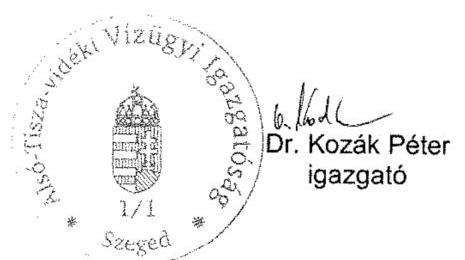

---

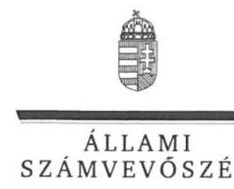

# Dr. Kozák Péter István úr 

igazgató
Alsó-Tisza-vidéki Vízügyi Igazgatóság

## Szeged

## Tisztelt Igazgató Úr!

..A központi alrendszer egyes intézményei pénzügyi és vagyongazdálkodásának ellenőrzése -Alsó-Tisza-vidéki Vízügyi Igazgatóság" címmel készített számvevőszéki jelentéstervezetre tett észrevételét köszönettel megkaptam.
Az Állami Számvevőszék észrevételre vonatkozó álláspontjáról a felügyeleti vezető által készített részletes tájékoztatást csatoltan megküldöm.
Tájékoztatom Igazgató urat, hogy a számvevőszéki jelentésben - az Állami Számvevőszékről szóló 2011. évi LXVI. törvény 29. § (3) bekezdése alapján - a figyelembe nem vett észrevételeket szerepeltetjük az elutasítás indokának feltüntetésével.
Budapest, 2016. április hó 11. nap
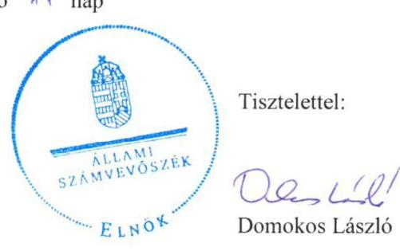

Melléklet: Tájékoztatás az elfogadott és az el nem fogadott észrevételekről

---

# Tájékoztatás az elfogadott és az el nem fogadott észrevételekről 

„A központi alrendszer egyes intézményei pénzügyi és vagyongazdálkodásának ellenőrzése -Alsó-Tisza-vidéki Vízügyi Igazgatóság 2016." címü jelentéstervezetre a 0003-0019/2016. iktatószámú levélben tett észrevételeit áttekintettük, annak kezeléséről az alábbi tájékoztatást adom.

Észrevétel a 2. Az Intézmény belső kontrollrendszerének kialakítása és működtetése tárgyban

1. A 19. oldalon található 2. táblázatra tett észrevételét az ismételt felülvizsgálatot követően elfogadtuk és a táblázatban az évszámot módosítjuk.
2. A jelentéstervezet 20. oldal első bekezdésére tett észrevételét - a dokumentumok ismételt áttekintését követően - nem fogadtuk el, mert 2011. január 1-je és 2012. október 18-ig az igazgató nem határozta meg az Ámr. 156. § (1) bekezdés c) és a Bkr. 6. § (1) bekezdés c) pontjaiban előírtak ellenére az etikai elvárásokat a szervezet minden szintjén, a kifogásolt megállapítás megalapozott, ezért annak módosítása nem indokolt.

Észrevétel a 3.4. „az előirányzat maradvány megállapítása nem felel meg a jogszabályi előírásoknak" tárgyban
A jelentéstervezet 3.4. számú megállapítás harmadik bekezdése első mondatára tett észrevételét nem fogadtuk el, mely szerint a tárgyévi előirányzat-maradvány megállapítása nem volt szabályszerű megfogalmazás általánosságot fogalmaz meg. Az előirányzat-maradvány megállapításának szabályszerűségét mintavétellel kiválasztott mintatételek alapján értékeltük, amelynek sokaságra történő kivetítését a számvevőszéki jelentés „Az ellenőrzés módszerei" című fejezete részletesen tartalmazza. A 28. oldal utolsó bekezdés második megállapítása tartalmazza, hogy az előirányzat-maradvány megállapítása szabályszerűségének ellenőrzése során mely jogszabályi rendelkezést nem tartotta be az ellenőrzött szervezet.
A 28. oldalon található 6. táblázatra tett észrevételét az ismételt felülvizsgálatot követően elfogadtuk és a táblázatban az összegeket módosítjuk.

Észrevétel a 4.1. „A Vagyonkezelési szerződés nem felelt meg a jogszabályi előírásoknak" tárgyban
Köszönettel vettem az Országos Vízügyi Főigazgatóság által elrendelt, a vagyonkezelési szerződések módosítására (újraszabályozására) vonatkozó kezdeményezésről szóló tájékoztatását. Észrevétele az ellenőrzött időszakban megállapított hiányosságot nem cáfolta, ezért a megállapítást nem módosítja.

---

Köszönettel vettem a jelentéstervezet 1. számú, 2. számú javaslatot - a számviteli politikát, a számlarendet, a gazdálkodási jogkörgyakorlók aláírás mintái naprakész nyilvántartásának vezetését -, valamint a likviditási tervet érintő tájékoztatását. Észrevétele az ellenőrzött időszakban megállapított hiányosságokat nem cáfolta, az az ellenőrzött időszakon túlmutat, ezért a megállapításokat nem módosítja.

Budapest, 2016. május hó 11. nap
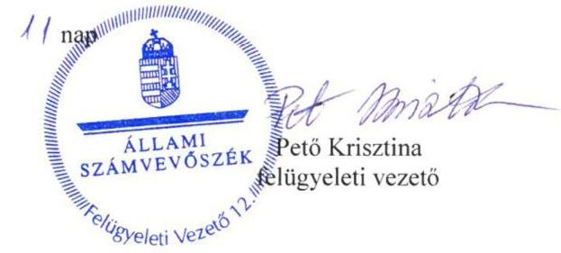

---

ÁLLAMI SZÁMVEVŐSZÉK
03506718016
Érkeze: 2016 MÁJ 02.
Iktatószám: 4-0774-194/2016
Melléklet: 34 Cmp

DR. PINTÉR SÁNDOR
miniszter

Domokos László úrnak
elnök

Állami Számvevőszék

Budapest

Iktatószám: BM/7134-6/2016.
Bélyegző

Tisztelt Elnök Úr!

Az Alsó-Tisza-vidéki Vízügyi Igazgatóság, az Észak-dunántúli Vízügyi Igazgatóság, a Felső-Tisza-vidéki Vízügyi Igazgatóság és a Közép-Tisza-vidéki Vízügyi Igazgatóság ellenőrzéséről készült számvevőszéki jelentéstervezetek 1.2. számú megállapítása hiányosságot fogalmaz meg az irányító szerv tevékenységével kapcsolatosan, amely szerint az irányító szerv és a középirányító szerv az erőforrásokkal való hatékony gazdálkodáshoz szükséges követelményeket nem érvényesített, így nem volt biztosított a számon kérhetőség és az ellenőrizhetőség.

A fenti megállapításra vonatkozóan a mellékelt feljegyzésben foglaltak szerint észrevételt teszek. A Belügyminisztérium részére meghatározott intézkedési kötelezettséget a hatékony gazdálkodásra irányuló ellenőrzések elvégzése érdekében nem tartom indokoltnak.

Budapest, 2016. április 7.

Üdvözlettel:

Dr. Pintér Sándor

---

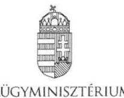

DR. HOFFMANN IMRE
közigazgatási és vízügyi helyettes államtitkár

Iktatószám: BM/7134-5/2016.

# Feljegyzés   Dr. Pintér Sándor belügyminiszter úr részére 

Miniszter úrnak jelentem, hogy az Állami Számvevőszék megküldte „A központi alrendszer egyes intézményei pénzügyi és vagyongazdálkodásának ellenőrzése" címú számvevőszéki jelentéstervezeteket az alábbi vízügyi igazgatóságok vonatkozásában:

- Alsó-Tisza-vidéki Vízügyi Igazgatóság,
- Észak-dunántúli Vízügyi Igazgatóság,
- Felső-Tisza-vidéki Vízügyi Igazgatóság és
- Közép-Tisza-vidéki Vízügyi Igazgatóság.

A jelentéstervezetek 1.2. számú megállapításával kapcsolatosan az Állami Számvevőszékről szóló 2011. évi LXVI. törvény (a továbbiakban: ÁSZ tv.) 29. § (2) bekezdése alapján az alábbi észrevételt teszem:

A megállapítások rögzítik, hogy az irányító szerv (BM) és a középirányító szerv (OVF) a 2012-2014. években az Áht. 9. § (1) bekezdés f) pontjában előírt az ellenőrzött intézmény által ellátandó közfeladatok ellátására vonatkozó, erőforrásokkal való hatékony gazdálkodáshoz szükséges követelményeket nem érvényesített, aminek hiányában számonkérés és ellenőrzés sem történt.

Az ellenőrzés során az ÁSZ részére átadott, az irányító szervi tevékenység értékeléséhez szükséges 1. számú tanúsítványok 5.1., 7.1., 7.2., 8.1. és 9.1. pontjai alapján az irányító szerv vezetője:

- írásban rögzítette az ellenőrzött intézménynél az erőforrásokkal való szabályszerű és hatékony gazdálkodáshoz szükséges követelményeket (a Belügyminisztérium fejezet költségvetési gazdálkodásának rendjéről szóló 18/2012. (IV. 27.) BM utasítás),
- beszámoltatta az ellenőrzött intézményt a szakmai feladatellátásról, éves gazdálkodásról (éves értékelő jelentés, zárszámadások, beszámoló szöveges indoklása),
- illetve ellenőrizte az intézménynél a gazdálkodás szabályszerűségét, hatékonyságát (ellenőrzési jelentés).

A Belügyminisztérium tekintetében rögzíteni szükséges továbbá, hogy a Belügyminisztérium fejezethez tartozó egyes költségvetési szervek középirányító szervként történő kijelöléséről, az irányítási jogok gyakorlásának módjáról szóló 13/2011. (V. 23.) BM utasításban az Országos Vízügyi Főigazgatóság részére feladatok kerültek

---

meghatározásra, többek között, hogy szervezik, irányítják és ellenőrzik a költségvetési szervek által ellátandó szakmai alapfeladatok végrehajtásához szükséges pénzügyi, anyagi feltételeket, amelynek keretében például a belső ellenőrzési tevékenység ellátása során szabályszerűségi, pénzügyi, rendszer- és teljesítmény-ellenőrzéseket, informatikai rendszerellenőrzéseket, valamint megbízhatósági ellenőrzéseket végeznek a jogszabályokban, illetve az irányító szerv által előírt belső szabályozásnak megfelelően.

Tényként rögzítendő továbbá az is, hogy a Belügyminisztérium Ellenőrzési Főosztálya a költségvetési szervek belső kontrollrendszeréről és belső ellenőrzéséről szóló 370/2011. (XII. 31.) Korm. rendelet alapján két olyan tárgyú ellenőrzést (belső kontrollrendszer ellenőrzése, központi ellátási tevékenység ellenőrzése) is lefolytatott, amely a teljes fejezetet érintette. Kiemelt feladatként kezelte valamennyi szerv tekintetében a belső kontrollrendszer kialakítását és működtetését, amelyben szakmai iránymutatást nyújtott. A középirányító szervek belső ellenőrzési szervezeteinek beszámoltattásával (éves ellenőrzési terv, éves ellenőrzési jelentés, végrehajtott ellenőrzésekről készített jelentések és intézkedési tervek bekérése) folyamatosan nyomon követi a szervezetek ellenőrzési tevékenységét, működését, többek között az Országos Vízügyi Főigazgatóság és a felügyelete alá tartozó igazgatóságok tevékenységét.

A fent megfogalmazottak alapján a Belügyminisztérium részére meghatározott intézkedési kötelezettséget az Alsó-Tisza-vidéki Vízügyi Igazgatóság, a Felső-Tisza-vidéki Vízügyi Igazgatóság és a Közép-Tisza-vidéki Vízügyi Igazgatóság hatékony gazdálkodásra irányuló ellenőrzések elvégzése érdekében nem tartom indokoltnak.

A fenti megállapításra vonatkozóan az ÁSZ tv. 29. § (2) bekezdése alapján a Gazdasági Helyettes Államtitkársággal egyeztetve a mellékelt választervezetet készítettük elő.

Kérem Tisztelt Miniszter urat, hogy egyetértése esetén a levéltervezetet aláírásával ellátni szíveskedjen.

Budapest, 2016. április 19.

# Dr. Hoffmann Imre 

## Egyetértek:

## Szőke Irma gazdasági helyettes államtitkár

Készült: 2 példány/1 oldal
Kapják: 1. sz. pld: Belügyminisztérium, dr. Pintér Sándor miniszter úr
2. sz. pld: Irattár

Melléklet: 2 pld.: BM/7134-6/2016. sz. levéltervezet

---

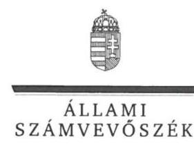

# Dr. Pintér Sándor úr 

miniszter
Belügyminisztérium

## Budapest

## Tisztelt Miniszter Úr!

„A központi alrendszer egyes intézményei pénzügyi és vagyongazdálkodásának ellenőrzése -Alsó-Tisza-vidéki Vízügyi Igazgatóság" címmel készített számvevőszéki jelentéstervezetre tett észrevételét köszönettel megkaptam.
Az Állami Számvevőszék észrevételre vonatkozó álláspontjáról a felügyeleti vezető által készített részletes tájékoztatást csatoltan
 megküldöm.
Tájékoztatom Miniszter urat, hogy a számvevőszéki jelentésben - az Állami Számvevőszékről szóló 2011. évi LXVI. törvény 29. § (3) bekezdése alapján - a figyelembe nem vett észrevételeket szerepeltetjük az elutasítás indokának feltüntetésével.
Budapest, 2016. augusztus 24. nap
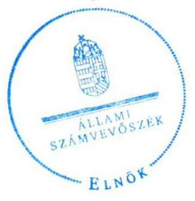

Tisztelettel:

## D6. 18

Domokos László

Melléklet: Tájékoztatás az el nem fogadott észrevételekről

---

# Tájékoztatás az el nem fogadott észrevételekről 

„A központi alrendszer egyes intézményei pénzügyi és vagyongazdálkodásának ellenőrzése -Alsó-Tisza-vidéki Vízügyi Igazgatóság 2016." című számvevőszéki jelentéstervezetre a BM/7134-6/2016. iktatószámú levelében tett észrevételeit áttekintettük, annak kezeléséről az alábbi tájékoztatást adom.

### 1.2. számú megállapításra tett észrevétel kapcsán

Köszönjük a Belügyminisztérium (továbbiakban: BM) fejezethez tartozó költségvetési szerveknél végzett, a belső kontrollrendszer vizsgálatáról, a belső kontrollrendszer utóvizsgálatáról, a Büntetés-végrehajtási Országos Parancsnokság és a felügyelet alá tartozó gazdasági társaságok központi ellátási kötelezettségének vizsgálatáról, valamint a büntetés végrehajtásához kapcsolódó gazdasági társaságok kapacitásainak kihasználását, a fogvatartottak foglalkoztatását célzó Kormány, illetve a Belügyminiszter rendelete hatásának vizsgálatáról szóló jelentéseiket. A hivatkozott jelentések a 2012-2013. évek tekintetében az ellenőrzött Alsó-Tisza-vidéki Vízügyi Igazgatóságra (továbbiakban: Intézmény) vonatkozóan, az államháztartásról szóló 2011. évi CXCV. törvény 9. § (1) bekezdés f) pontjában előírt - az erőforrásokkal való hatékony gazdálkodáshoz szükséges követelmények érvényesítésével, számonkérésével és ellenőrzésével kapcsolatos információkat nem tartalmaztak.
A jelentéstervezet 18. oldal 1.2. számú megállapításra tett észrevételét nem fogadtuk el, a megállapításban rögzített hiányosságok továbbra is megalapozottak, mert a hivatkozott BM utasításban részletesen meghatározott és szabályozott folyamatok, feladatok rendszere nem tartalmazza a közfeladatok ellátására vonatkozó, az erőforrásokkal való hatékony gazdálkodáshoz szükséges követelményeket, így azok érvényesítéséről, számonkéréséről és ellenőrzéséről sem rendelkezik. A dokumentumok ismételt áttekintését követően, az Intézmény által az irányító szerv részére megküldött költségvetési beszámolók és szöveges beszámolók sem tartalmaztak információkat a 2012-2013. években - az államháztartásról szóló 2011. évi CXCV. törvény 9. § (1) bekezdés f) pontjában előírt - az erőforrásokkal való hatékony gazdálkodáshoz szükséges követelmények érvényesítésével, számonkérésével és ellenőrzésével kapcsolatban. Ezért észrevételei a megállapítást nem módosítják.

Budapest, 2016. augusztus 24. nap
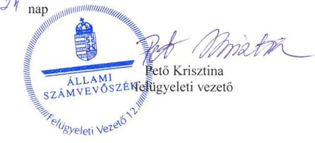

---

# ORSZÁGOS VÍZÜGYI FŐIGAZGATÓSÁG FŐIGAZGATÓ 

1012 Budapest, Márvány utca 1/d. 1253 Bp. Pf. 56
E-mail: somlysdy.balazs@ovf.hu

Úgyiratszám: 09529-0014/2016.
Előadó: Csíkós Attila

Tárgy:
Hiv.szám:

## Állami Számvevőszék

Domokos László elnök részére

## Budapest

Apáczai Csere János utca 10. 1052

## Tisztelt Elnök Úr!

Az Állami Számvevőszék V-0774-185/2016. iktatószámú levéllel megkapott, az Alsó-Tiszavidéki Vízügyi Igazgatóságnál lefolytatott pénzügyi és vagyongazdálkodásának ellenőrzési jelentéstervezetéhez az alábbi észrevételt tesszük.

Az Állami Számvevőszék jelentéstervezet 1.2 számú megállapítása rögzíti, hogy az irányító szerv (BM) és a középirányító szerv (OVF) a 2012-2014. években az Áht. 9. § (1) bekezdés f) pontjában előírt az ellenőrzött intézmény által ellátandó közfeladatok ellátására vonatkozó, erőforrásokkal való hatékony gazdálkodáshoz szükséges követelményeket nem érvényesített, aminek hiányában számonkérés és ellenőrzés sem történt.

Tekintettel arra, hogy a Belügyminisztérium Ellenőrzési Főosztálya a költségvetési szervek belső kontrollrendszeréről és belső ellenőrzéséről szóló 370/2011. (XII. 31.) Korm. rendelet alapján két olyan tárgyú ellenőrzést (belső kontrollrendszer ellenőrzése, központi ellátási tevékenység ellenőrzése) is lefolytatott, mely a teljes fejezetet érintette - beleértve a Közép-Tisza-vidéki Vízügyi Igazgatóságot is - az OVF-nek külön ellenőrzést erre vonatkozóan nem volt indokolt elvégeznie. Az irányító szerv kiemelt feladatként kezelte valamennyi szerv tekintetében a belső kontrollrendszer kialakítását és működtetését.

A vízügyi igazgatóságok működési területe vízgyűjtőkre lett meghatározva, amely a szakmai működésüket teljesen specifikussá, egyedivé teszi. Az egyedi jelleg (eltérő csapadék eloszlás, vízfolyások nagysága és jellege, eltérő domborzati viszonyok, a működési területen kiépült műtárgyak nagysága és azok fontossága) nem tette (és nem teszi) lehetővé a működés és annak pénzügyi feltételeit biztosító gazdálkodás egységes elvek, azonos mutatószámok szerinti mérését és értékelését.

Az Alsó-Tisza-vidéki Vízügyi Igazgatóság önállóan működő és gazdálkodó költségvetési intézmény, saját döntési és felelősségi hatáskörrel a szakmai tevékenységük és a gazdálkodásuk vonatkozásában. Az OVF, mint középirányító szerv a hatályos belső szabályzatai alapján gyakorolta a 13/2011. (V. 23.) BM utasításban meghatározott feladatokat.

---

Az OVF az ÁSZ tárgyi ellenőrzésének időszakában az alábbi szabályozók alapján látta el a középirányítói feladatait.

# A 47/2012. (IX.30) BM utasítás, SZMSZ 18. §-a szerint 

A Főigazgatóság a közgazdasági tevékenység területén:
a) ellátja a vízügyi költségvetési szervek költségvetési tervezésének végrehajtásával, finanszírozásának előkészítésével kapcsolatos feladatokat; javaslatot készít a finanszírozás területén felmerülő problémák megoldására,
b) részt vesz az ágazati célelőirányzatok felhasználására, a vízkár elhárítási munkák finanszírozására vonatkozó közgazdasági feladatokban, közreműködik a finanszírozási feladatok megoldásában,
c) részt vesz a vízügyi költségvetési szervek költségvetési támogatásával kapcsolatos feladatokban, ellátja ennek pénzügyi, számviteli feladatainak irányítását,
d) közreműködik a vízügyi költségvetési szervek gazdálkodását érintő előirányzat-módosításokkal összefüggő feladatok végrehajtásában,
e) ellátja a vízgazdálkodási kormányzati beruházások éves zárszámadásával kapcsolatos feladatokat,
f) felügyeli és koordinálja a beszámolási és könyvvezetési kötelezettségből eredő intézményi (vízügyi igazgatóságok) feladatok ellátását, ennek keretében az intézményi éves költségvetéseket és az intézményi beszámolókat összeállíttatja, továbbá végzi azok összesítését és ellenőrzését,
g) koordinálja és ellenőrzi a vízügyi igazgatóságok éves feladatterveinek összeállítását, felülvizsgálatát; a vízügyi igazgatóságokkal történő (jóváhagyást célzó) egyeztetést,
h) közreműködik az ágazati gazdaságpolitikai célok megvalósításában, irányításában és értékelésében,
i) koordinálja és felügyeli a vízügyi igazgatóságok gazdálkodását és pénzügyi tevékenységét,
j) végzi a vízügyi igazgatóságok számviteli munkájának irányítását, felügyeletét.

A fentiek alapján 2012-2014. években a Vízügyi Igazgatóság gazdálkodásának vonatkozásban az OVF:

1. a BM fejezet 17. Vízügyi Igazgatóságok cím tekintetében az egyedi elemi költségvetések leosztását tervtárgyalások után megtette;
2. az időszaki és az éves költségvetési beszámolók és jelentések pénzügyi és számviteli ellenőrzését elvégezte és a címszintű összesítéseket a fejezet felé benyújtotta;
3. tételes (bizonylati mélységű) műszaki és pénzügyi ellenőrzést folytatott az alábbi területeken:

- a BM fejezet 20/1/48, 49, és 50 fejezeti kezelésű sorok támogatási szerződései által biztosított források felhasználása tekintetében;
- az elemi költségvetés felhalmozási kiadások kiemelt előirányzatának felhasználása tekintetében;
- Kormánydöntés alapján megkapott többletforrások felhasználása tekintetében.

---

A támogatási szerződéssel megkapott többletforrásokhoz kapcsolódó kötelezettségvállalások kizárólag az OVF által végzett előzetes műszaki-szakmai engedély birtokában voltak megtehetők.

A fent megfogalmazottak alapján az OVF részére meghatározott intézkedési kötelezettséget a hatékony gazdálkodásra irányuló ellenőrzések elvégzése érdekében nem tartom indokoltnak.

Budapest, 2016. április 28.

Tisztelettel:

Somlyódy Balázs

---

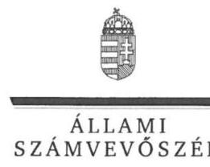

ELNÖK

# Somlyódy Balázs úr 

főigazgató
Országos Vízügyi Főigazgatóság

## Budapest

## Tisztelt Főigazgató Úr!

„A központi alrendszer egyes intézményei pénzügyi és vagyongazdálkodásának ellenőrzése -Alsó-Tisza-vidéki Vízügyi Igazgatóság" címmel készített számvevőszéki jelentéstervezetre tett észrevételét köszönettel megkaptam.
Az Állami Számvevőszék észrevételre vonatkozó álláspontjáról a felügyeleti vezető által készített részletes tájékoztatást csatoltan megküldöm.
Tájékoztatom Főigazgató urat, hogy a számvevőszéki jelentésben - az Állami Számvevőszékről szóló 2011. évi LXVI. törvény 29. § (3) bekezdése alapján - a figyelembe nem vett észrevételeket szerepeltetjük az elutasítás indokának feltüntetésével.

Budapest, 2016. augusztus 24. nap
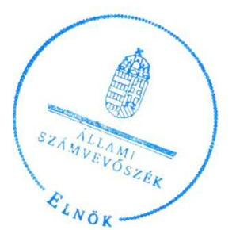

Tisztelettel:

Domokos László

Melléklet: Tájékoztatás az el nem fogadott észrevételekről

---

# Tájékoztatás az el nem fogadott észrevételekről 

„A központi alrendszer egyes intézményei pénzügyi és vagyongazdálkodásának ellenőrzése -Alsó-Tisza-vidéki Vízügyi Igazgatóság 2016." című számvevőszéki jelentéstervezetre a 09529/0014/2016. iktatószámú levelében tett észrevételeit áttekintettük, annak kezeléséről az alábbi tájékoztatást adom.

### 1.2. számú megállapításra tett észrevétel kapcsán

Köszönettel vettem tájékoztatását, hogy az ellenőrzött időszakban az Országos Vízügyi Főigazgatóság (továbbiakban: OVF) mely szabályozók alapján, továbbá az Alsó-Tisza-vidéki Vízügyi Igazgatóság gazdálkodása vonatkozásában mely feladatokat látta el. A levélben hivatkozott, a Belügyminisztérium fejezethez tartozó egyes költségvetési szervek középirányító szervként történő kijelöléséről, az irányítói jogok gyakorlásának módjáról szóló 13/2011. (V. 23.) BM utasítás nem tartalmazza a közfeladatok ellátására vonatkozó, az erőforrásokkal való hatékony gazdálkodáshoz szükséges követelményeket, így azok érvényesítéséről, számonkéréséről és ellenőrzéséről sem rendelkezik. Észrevétele sem tartalmazza a 2013-2014. években az OVF részéről - az államháztartásról szóló 2011. évi CXCV. törvény 9. § (1) bekezdés f) pontjában előírt - az erőforrásokkal való hatékony gazdálkodáshoz szükséges követelmények érvényesítésével, számonkérésével és ellenőrzésével kapcsolatos információkat, tényeket. Az észrevétele alapján a megállapítás módosítása nem indokolt.

Budapest, 2016. augusztus 24. nap
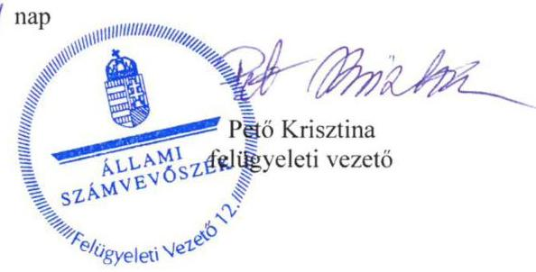

---

# RÖVIDÍTÉSEK JEGYZÉKE 

${ }^{1}$ Intézmény
${ }^{2}$ ATIVIZIG
${ }^{3}$ Etikai Kódex
${ }^{4}$ OVF
${ }^{5}$ MT
${ }^{6}$ Korm. rendelet ${ }_{1}$
${ }^{7}$ Korm.rendelet ${ }_{2-4}$
Korm.rendelet ${ }_{2}$

Korm.rendelet ${ }_{3}$

Korm.rendelet ${ }_{4}$
${ }^{8}$ NeKl
${ }^{9}$ ATVKTVF
${ }^{10}$ KI
${ }^{11}$ OKKP
${ }^{12}$ VM
${ }^{13}$ BM
${ }^{14}$ BM utasítás
${ }^{15}$ Nvtv.
${ }^{16}$ Áht. 2
${ }^{17}$ Ávr.
${ }^{18}$ Áht. 1
${ }^{19}$ Ámr.
${ }^{20}$ Bkr.
${ }^{21}$ irányító szerv $_{1}$
${ }^{22}$ irányító szerv $_{2}$
${ }^{23}$ FM
${ }^{24}$ középirányító szerv

Alsó-Tisza-vidéki Vízügyi Igazgatóság
Alsó-Tisza-vidéki Vízügyi Igazgatóság
A 2548-0001/2012. iktatószámú Alsó-Tisza-vidéki Vízügyi Igazgatóság Etikai Kódexe (hatályos 2012. október 19-től)
Országos Vízügyi Főigazgatóság
Minisztertanács
a vizek kártételei elleni védekezés szabályairól szóló 232/1996. (XII. 26.) Korm. rendelet (hatályos: 1997. január 1-jétől)
vízügyi, vízvédelmi hatósági feladatokat ellátó szervek kijelöléséről szóló kormányrendeletek
vízügyi, vízvédelmi hatósági feladatokat ellátó szervek kijelöléséről szóló kormányrendeletek 347/2006. (XII. 23.) Korm. rendelet (hatálytalan 2014. január 1-jétől)
vízügyi, vízvédelmi hatósági feladatokat ellátó szervek kijelöléséről szóló kormányrendeletek 482/2013. (XII. 17.) Korm. rendelet (hatályos: 2014. január 1-jétől 2014. szeptember 9-éig)
vízügyi, vízvédelmi hatósági feladatokat ellátó szervek kijelöléséről szóló kormányrendeletek 223/2014. (IX. 4.) Korm. rendelet (hatályos 2014. szeptember 10-étől)
Nemzeti Környezetügyi Intézet
Alsó-Tisza-vidéki Környezetvédelmi, Természetvédelmi és Vízügyi Felügyelőség
Katasztrófavédelmi Igazgatóság
Országos Környezeti Kármentesítési Program
Vidékfejlesztési Minisztérium
Belügyminisztérium
a BM fejezethez tartozó egyes költségvetési szervek középirányító szervként történő kijelöléséről, az irányítói jogok gyakorlásának módjáról szóló 13/2011. (V. 23.) BM utasítás (hatályos: 2011. május 24-től)
a nemzeti vagyonról szóló 2011. évi CXCVI. törvény (hatályos: 2011. december 31-től)
2011. évi CXCV. törvény az államháztartásról (hatályos: 2011. december 31-étől) 368/2011. (XII. 31.) Korm. rendelet az államháztartásról szóló törvény végrehajtásáról (hatályos: 2011. december 31-től)
1992. évi XXXVIII. törvény az államháztartásról (hatálytalan: 2012.január 1-jétől) 292/2009. (XII. 19.) Korm. rendelet az államháztartás működési rendjéről (hatálytalan: 2012. január 1-jétől)
370/2011. (XII. 31.) Korm. rendelet a költségvetési szervek belső kontrollrendszeréről és belső ellenőrzéséről (hatályos 2012. január 1-jétől)
2011. december 31-ig Vidékfejlesztési Minisztérium (jogelődként Földművelésügyi Minisztérium
2012. január 1-től Belügyminisztérium
Földművelésügyi Minisztérium
2012. március 24-tól BM utasítás alapján az Országos Vízügyi Főigazgatóság

---

${ }^{25}$ ÁSZ tv.
${ }^{26}$ ÁSZ SZMSZ
${ }^{27}$ alapító okirat1-6
${ }^{28}$ 300/2011. (XII. 22.) Korm. rendelet
${ }^{29}$ Kincstár
${ }^{30}$ 38/2011. (XII. 30.) BM utasítás
${ }^{31}$ Áhsz. 1
${ }^{32}$ Áhsz. 2
${ }^{33}$ Számv. tv.
${ }^{34}$ Kbt. 1
${ }^{35}$ Munka tv.1,2
${ }^{36}$ Vtvr.
${ }^{37}$ SZMSZ ${ }_{1-4}$
${ }^{38}$ Ügyrend $_{1-4}$
2011. évi LXVI. törvény az Állami Számvevőszékről (hatályos 2011. július 1-jétől) Állami Számvevőszék Szervezeti és Működési Szabályzata
az Alsó-Tisza-vidéki Vízügyi Igazgatóság 2010. november 22-én módosított (XX/1130/9/2010.) Alapító okirata ${ }_{1}$
az Alsó-Tisza-vidéki Vízügyi Igazgatóság 2011. december 23-án módosított (A-214/1/2011/M) Alapító okirata ${ }_{2}$
az Alsó-Tisza-vidéki Vízügyi Igazgatóság 2012. május 8-án módosított (A-214/1/2012/M) Alapító okirata ${ }_{3}$
az Alsó-Tisza-vidéki Vízügyi Igazgatóság 2013. december 12-én módosított (A-214/1/2013/M) Alapító okirata ${ }_{4}$
az Alsó-Tisza-vidéki Vízügyi Igazgatóság 2014. február 5-én módosított (A-214/1/2014/M) Alapító okirata ${ }_{5}$
az Alsó-Tisza-vidéki Vízügyi Igazgatóság 2014. december 23-án módosított (A-214/2/2014/M) Alapító okirata ${ }_{6}$
300/2011. (XII. 22.) Korm. rendelet a vízügyi igazgatási szervek irányításának átalakításával összefüggésben egyes kormányrendeletek módosításáról (hatályos: 2011. december 23-tól 2014. szeptember 5-től)

Magyar Államkincstár
a Belügyminisztérium Adatvédelmi, Adatbiztonsági és Közérdekű adat megismerésére vonatkozó Szabályzatának kiadásáról (hatályos:

 2012. január 1-jétől)
249/2000. (XII. 24.) Korm. rendelet az államháztartás szervezetei beszámolási és könyvvezetési kötelezettségének sajátosságairól (hatálytalan: 2014. január 1-jétől)
4/2013. (I. 11.) Korm. rendelet az államháztartás számviteléről (hatályos: 2014. január 1-jétől)
a számvitelről szóló 2000. évi C. törvény (hatályos: 2001. január 1-jétől)
a közbeszerzésekről szóló 2003. évi CXXIX. törvény (hatálytalan 2012. január 1-jétől)
1992. évi XXII. törvény a Munka Törvénykönyvéről (hatálytalan 2013. január 1-től)
2012. évi I. törvény a munka törvénykönyvéről (hatályos: 2012.07.01-től) 254/2007. (X. 4.) Korm. rendelet az állami vagyonnal való gazdálkodásról (hatályos 2007. október 4-étől)
az Alsó-Tisza vidéki Környezetvédelmi és Vízügyi Igazgatóság Szervezeti és Működési Szabályzata (hatályos 2011. július 27-ig)
az Alsó-Tisza vidéki Környezetvédelmi és Vízügyi Igazgatóság Szervezeti és Működési Szabályzata ${ }_{2}$ (kiadásra került 2011. február 16, a miniszteri jóváhagyás 2011. július 27. hatályos 2012. december 17-ig)
az Alsó-Tisza vidéki Vízügyi Igazgatóság Szervezeti és Működési Szabályzata ${ }_{3}$ (kiadásra került 2012. október 24, a miniszteri jóváhagyás 2012. december 17. hatályos 2013. december 31-ig)
az Alsó-Tisza vidéki Vízügyi Igazgatóság Szervezeti és Működési Szabályzata (miniszteri jóváhagyás 2014. január 1-jétől hatályos)
az Alsó-Tisza vidéki Környezetvédelmi és Vízügyi Igazgatóság Ügyrendi Szabályzata (hatályos 2011. augusztus 25-ig)
az Alsó-Tisza vidéki Vízügyi Igazgatóság Ügyrendi Szabályzata ${ }_{2}$ (2662/2011. számú Ügyrend kiadásra került 2011. augusztus 25. hatályos 2013. január 8-ig)

---

az Alsó-Tisza vidéki Vízügyi Igazgatóság Ügyrendi Szabályzata3 (kiadásra került 2013. január 8, hatályos 2014. február 24-ig)
az Alsó-Tisza vidéki Vízügyi Igazgatóság Ügyrendi Szabályzata4 (1198-0003/2014 iktató számú Ügyrendi Szabályzat, hatályos 2014. február 24-től)
az Alsó-Tisza-vidéki Környezetvédelmi és Vízügyi Igazgatóság ATI-I-00028/043/2007. iktatószámú számviteli politika1 (hatályos 2011. május 2-ig) az Alsó-Tisza-vidéki Környezetvédelmi és Vízügyi Igazgatóság 2034-0007/2011. iktatószámú számviteli politika2 (hatályos 2011. május 2-tól 2012. május 2-áig) az Alsó-Tisza-vidéki Vízügyi Igazgatóság 2076-0005/2012. iktatószámú számviteli politika3 (hatályos 2012. május 2-tól 2013. április 2-ig)
a 24. számú igazgatói utasítás Alsó-Tisza-vidéki Vízügyi Igazgatóság számviteli politikájáról (hatályos 2013. április 2-ától 2014. június 2-ig)
a 19. számú igazgatói utasítás Alsó-Tisza-vidéki Vízügyi Igazgatóság számviteli politikájáról (hatályos 2014. június 6-tól)
az Alsó-Tisza-vidéki Környezetvédelmi és Vízügyi Igazgatóság Leltározási Szabályzata ${ }_{1}$ (hatályos: 2011. 05.02-ig)
az Alsó-Tisza-vidéki Vízügyi Igazgatóság Leltározási Szabályzata ${ }_{2}$ (hatályos 2011. 05.02-tól 2012. 05.02-ig)
az Alsó-Tisza-vidéki Vízügyi Igazgatóság Leltározási Szabályzata3 (hatályos 2012. 05.02-tól 2013. 03. 29-ig)
az Alsó-Tisza-vidéki Vízügyi Igazgatóság Eszközök és források leltározási és leltárkészítési szabályzatáról4 (hatályos 2013. 03.29-től 2014. június 6-ig) az Alsó-Tisza-vidéki Vízügyi Igazgatóság Eszközök és források leltározási és leltárkészítési szabályzatáról5 (hatályos 2014. június 6-ától) az Alsó-Tisza Vidéki Környezetvédelmi és Vízügyi Igazgatóság Eszközeinek és Forrásainak Értékelési Szabályzata ${ }_{1}$ (2011. május 2-áig)
az Alsó-Tisza Vidéki Környezetvédelmi és Vízügyi Igazgatóság Eszközeinek és Forrásainak Értékelési Szabályzata (hatályos 2011. május 2-ától 2012. május 2-áig)
az Alsó-Tisza-Vidéki Vízügyi Igazgatóság Eszközeinek és Forrásainak Értékelési Szabályzata (hatályos 2012. május 2-ától 2013. április 2-áig)
az Alsó-Tisza-vidéki Vízügyi Igazgatóság Eszköz és Forrás értékelési Szabályzatáról (hatályos 2013. április 2-ától 2014. június 6-ig)
az Alsó-Tisza-vidéki Vízügyi Igazgatóság Eszköz és Forrás értékelési Szabályzatáról (hatályos 2014. június 6-tól)
az Alsó-Tisza-vidéki Környezetvédelmi és Vízügyi Igazgatóság Pénzkezelési Szabályzata (hatályos: 2012. május 2-áig)
az Alsó-Tisza-vidéki Vízügyi Igazgatóság Pénzkezelési Szabályzata2 (hatályos 2012. május 2-ától 2013. május 2-áig)
az Alsó-Tisza-vidéki Vízügyi Igazgatóság Pénzforgalmi és Pénztári kezelési Szabályzatáról3 (hatályos 2013. május 2-ától 2013. október 15-éig) az Alsó-Tisza-vidéki Vízügyi Igazgatóság Pénzforgalmi és Pénztári kezelési Szabályzatáról4 (hatályos 2013. október 15-étől 2014. június 6-ig) az Alsó-Tisza-vidéki Vízügyi Igazgatóság Pénzforgalmi és Pénztári kezelési Szabályzatáról5 (hatályos 2014. június 6-tól 2014. október 1-ig) az Alsó-Tisza-vidéki Vízügyi Igazgatóság Pénzforgalmi és Pénztári kezelési Szabályzatáról6 (hatályos 2014. október 1-jétől)
az Alsó-Tisza vidéki Környezetvédelmi és Vízügyi Igazgatóság Önköltség számítási szabályzata (hatályos: 2011. május 2-ig)

---

az Alsó-Tisza vidéki Környezetvédelmi és Vízügyi Igazgatóság Önköltség számítási szabályzata2 (hatályos 2011. május 2-től 2012. május 2-ig)
az Alsó-Tisza vidéki Vízügyi Igazgatóság Önköltség számítási szabályzata3 (hatályos 2012. május 2-től 2013. május 15-ig)
az Alsó-Tisza vidéki Vízügyi Igazgatóság Önköltségszámítási rendjéről4 (hatályos 2013. május 15-től 2014. december 1-ig)
az Alsó-Tisza vidéki Vízügyi Igazgatóság Önköltségszámítási rendjéről5 (hatályos 2014. december 1-jétől)
${ }^{44}$ Számlarend ${ }_{1-4}$
az Alsó-Tisza-vidéki Környezetvédelmi és Vízügyi Igazgatóság számlarendje1 (hatályos 2007. január 2-ától 2011. május 2-ig) és annak 2008. január 2-ától hatályos 2008. évi kiegészítése
az Alsó-Tisza-vidéki Környezetvédelmi és Vízügyi Igazgatóság számlarendje2 (hatályos 2011. május 2-ától 2012. május 2-ig)
az Alsó-Tisza-vidéki Vízügyi Igazgatóság számlarendje3 (hatályos 2012. május 2-ától 2013. április 2-ig)
1006/2013. iktatószámú 23-as számú Igazgatói Utasítás az Alsó-Tisza-vidéki Vízügyi Igazgatóság számlarendjéről4 (hatályos 2013. április 2-ától)
az Alsó-Tisza vidéki Környezetvédelmi és Vízügyi Igazgatóság Gazdálkodási Szabályzata1 (hatályos: 2011. május 2-áig)
az Alsó-Tisza vidéki Környezetvédelmi és Vízügyi Igazgatóság Gazdálkodási Szabályzata2 (hatályos 2011. május 2-től 2012. május 2-ig)
az Alsó-Tisza vidéki Környezetvédelmi és Vízügyi Igazgatóság Gazdálkodási Szabályzata3 (hatályos 2012. május 2-től 2013. május 10-ig)
a 33. számú Igazgatói Utasítás az Alsó-Tisza-vidéki Vízügyi Igazgatóság Gazdálkodási Szabályzatáról4 (hatályos 2013. május 10-től 2014. december 1-jéig)
a 42/2014. számú Igazgatói Utasítás az Alsó-Tisza-vidéki Vízügyi Igazgatóság Gazdálkodási Szabályzatáról5 (hatályos 2014. december 1-jétől)
A kötelezettségvállalási, érvényesítési, utalványozási jogkörök gyakorlásáról szóló ATI-I-00028-063/2007. iktatószámú Igazgatói Utasítás1 (hatályos: 2011. május 2-áig)
az Alsó-Tisza vidéki Vízügyi Igazgatóság a kötelezettségvállalás, pénzügyi ellenjegyzés, teljesítésigazolás, érvényesítés, utalványozás, valamint a jogi ellenjegyzés rendjéről, valamint a gazdálkodási jogkörök gyakorlásáról szóló szabályzat kiadásáról szóló 1006/2013. iktatószámú, 7. számú Igazgatói Utasítás2 (hatályos 2013. május 10-től 2013. október 15-ig)
az Alsó-Tisza vidéki Vízügyi Igazgatóság a kötelezettségvállalás, pénzügyi ellenjegyzés, teljesítésigazolás, érvényesítés, utalványozás, valamint a jogi ellenjegyzés rendjéről, valamint a gazdálkodási jogkörök gyakorlásáról szóló szabályzat kiadásáról szóló 1006/2013. iktatószámú, 49. számú Igazgatói Utasítás3 (hatályos 2013. október 15-től 2014. szeptember 15-ig)
az Alsó-Tisza vidéki Vízügyi Igazgatóság a kötelezettségvállalás, pénzügyi ellenjegyzés, teljesítésigazolás, érvényesítés, utalványozás, valamint a jogi ellenjegyzés rendjéről, valamint a gazdálkodási jogkörök gyakorlásáról szóló szabályzat kiadásáról szóló 027/2014. iktatószámú, 29. számú Igazgatói Utasítás4 (hatályos 2014. szeptember 15-től 2014. november 1-ig)

---

| 47 | Vnytv. |
| :--: | :--: |
| 48 | Ikr. |
| 49 | Informatikai Biztonsági Szabályzat |
| ${ }^{50}$ | Avtv. |
| ${ }^{51}$ | Info tv. |
| ${ }^{52}$ | Adatvédelmi és adatbiztonsági szabályzat |
| ${ }^{53}$ | Ltv. |
| ${ }^{54}$ | Ber. |
| ${ }^{55}$ | Belső ellenőrzési kézikönyv3-4 |
| ${ }^{56}$ | 5/2012. (III. 1.) NGM rendelet |
| ${ }^{57}$ | 10/2013. (III. 13.) NGM rendelet |
| ${ }^{58}$ | NGM |
| ${ }^{59}$ | OGY |
| ${ }^{60}$ | 2011. évi CXIV. törvény |
| ${ }^{61}$ | 249/2012. (VIII. 31.) Korm. rendelet |
| ${ }^{62}$ | ÁFA |
| ${ }^{63}$ | 1025/2011. (II. 11.) Korm. határozat |
| ${ }^{64}$ | 36/2013. (IX. 13.) NGM rendelet |
| ${ }^{65}$ | Vtv. |
| ${ }^{66}$ | VKSZ |

az Alsó-Tisza vidéki Vízügyi Igazgatóság a kötelezettségvállalás, pénzügyi ellenjegyzés, teljesítésigazolás, érvényesítés, utalványozás, valamint a jogi ellenjegyzés rendjéről, valamint a gazdálkodási jogkörök gyakorlásáról szóló szabályzat kiadásáról szóló 027/2014. iktatószámú, 36. számú Igazgatói Utasítás (hatályos 2014. november 1-től)
2007. évi CLII. törvény az egyes vagyonnyilatkozat-tételi kötelezettségekről (hatályos 2007. december 6-tól)
335/2005. (XII. 29.) Korm. rendelet a közfeladatot ellátó szervek iratkezelésének általános követelményeiről (hatályos 2005. december 29-től)
a 37/2014. számú igazgatói utasítás az Alsó-Tisza Vidéki Vízügyi Igazgatóság Informatikai Biztonsági Szabályzatáról (hatályos 2014. október 1-től)
1992. évi LXIII. törvény a személyes adatok védelméről és a közérdekű adatok nyilvánosságáról (hatálytalan: 2012. január 1-jétől)
az információs önrendelkezési jogról és az információszabadságról szóló 2011. évi CXII. törvény (hatályos 2011. július 26-tól)
a 43. számú igazgatói utasítás az Alsó-Tisza Vidéki Vízügyi Igazgatóság Adatvédelmi, adatbiztonsági és közérdekű adat megismerési szabályzata (hatályos 2013. augusztus 1-től)
1995. évi LXVI. törvény a köziratokról, a közlevéltárakról és a magánlevéltári anyag védelméről (hatályos 1995. június 30-tól)
193/2003. (XI. 26.) Korm. rendelet a költségvetési szervek belső ellenőrzéséről (hatálytalan 2012. január 1-től)
az Alsó-Tisza vidéki Környezetvédelmi és Vízügyi Igazgatóság Belső Kontroll Kézikönyve (2012. augusztus 1-ig)
az Alsó-Tisza vidéki Környezetvédelmi és Vízügyi Igazgatóság Belső Kontroll Kézikönyve (hatályos 2012. augusztus 1-től 2013. március 29-ig)
16. számú igazgatói utasítás az Alsó-Tisza-vidéki Vízügyi Igazgatóság Belső Ellenőrzési Kézikönyvéről (hatályos 2013. március 29-től 2014. január 1-ig) 1/2014. számú igazgatói utasítás az Alsó-Tisza-vidéki Vízügyi Igazgatóság Belső Ellenőrzési Kézikönyvéről (hatályos 2014. január 1-jétől)
5/2012. (III. 1.) NGM rendelet az elemi költségvetésről (hatálytalan 2012. március 3-tól)
10/2013. (III. 13.) NGM rendelet az elemi költségvetésről (hatálytalan 2013. december 31-től)
Nemzetgazdasági Minisztérium
Országgyűlés
2011. évi CXIV. törvény a Magyar Köztársaság 2011. évi költségvetéséről szóló 2010. évi CLXIX. törvény módosításáról (hatályos: 2011. július 30-tól 2012. június 27-ig)
249/2012. (VIII. 31.) Korm. rendelet a közszolgálati tisztviselők részére adható juttatásokról és egyes illetménypótlékokról (hatályos 2012. augusztus 31-től) általános forgalmi adó
1025/2011. (II. 11.) Korm. határozat az államháztartási egyensúly megőrzéséhez szükséges intézkedésekről (visszavonta a 1046/2015. (II. 11.) Korm. határozat) 36/2013. (IX. 13.) NGM rendelet az államháztartás számvitelének 2014. évi megváltozásával kapcsolatos feladatokról (hatályos: 2013. szeptember 14-től 2014. december 31-ig)
2007. évi CVI. törvény az állami vagyonról (hatályos 2007. szeptember 17-től) vagyonkezelői szerződés

---

${ }^{67}$ MNV Zrt.
${ }^{68} \mathrm{Ptk}_{1}$
${ }^{69} \mathrm{Ptk}_{2}$
${ }^{70}$ a vízgazdálkodásról szóló törvény
${ }^{71}$ 262/2010. (XI. 17.) Korm. rendelet
${ }^{72}$ Selejtezési szabályzat ${ }_{1-5}$
${ }^{73}$ KÖVIZIG-ek

Magyar Nemzeti Vagyonkezelő Zártkörűen Működő Részvénytársaság
1959. évi IV. törvény a Polgári Törvénykönyvről (hatálytalan 2014. március 15-től)
2013. évi V. törvény a Polgári Törvénykönyvről (hatályos 2013. február 26-tól)
1995. évi LVII. törvény a vízgazdálkodásról (hatályos: 1996. január 1-jétől)
262/2010. (XI. 17.) Korm. rendelet a Nemzeti Földalapba tartozó földrészletek hasznosításának részletes szabályairól (hatályos 2010. november 17-től)
ATI-I-00028-056/2007. Ikt. számú Alsó-Tisza-vidéki Vízügyi Igazgatóság Felesleges vagyontárgyak hasznosításának és selejtezésének szabályzata ${ }_{1}$ (hatályos: 2011. április 29-ig)
ATI-I-2034-0001/2011. Ikt. számú Alsó-Tisza-vidéki Vízügyi Igazgatóság Felesleges vagyontárgyak hasznosításának és selejtezésének szabályzata ${ }_{2}$ (hatályos 2011. április 29-től 2012. május 2-ig)
2076-0004/2012. Ikt. számú Alsó-Tisza-vidéki Vízügyi Igazgatóság Felesleges vagyontárgyak hasznosításának és selejtezésének szabályzata ${ }_{3}$ (hatályos 2012. május 2-től 2013. április 2-ig)
20. számú igazgatói utasítás az Alsó-Tisza-vidéki Vízügyi Igazgatóság Felesleges vagyontárgyak hasznosításának és selejtezésének szabályzatáról ${ }_{4}$ (hatályos 2013. április 2-től 2014. június 6-ig)
16/2014. számú igazgatói utasítás az Alsó-Tisza-vidéki Vízügyi Igazgatóság Felesleges vagyontárgyak hasznosításának és selejtezésének szabályzatáról5 (hatályos 2014. június 6-tól)
környezetvédelmi és vízügyi igazgatóságok

---

# ÁLLAMI SZÁMVEVŐSZÉK 

1052 Budapest, Apáczai Csere János utca 10.
Levélcím: 1364 Budapest 4. Pf. 54
Telefon: +36 14849100 Telefax: +36 14849200
www.asz.hu

