# Jelentés 

## A központi alrendszer egyes intézményei pénzügyi és vagyongazdálkodásának ellenőrzése

Felső-Tisza-vidéki Vízügyi Igazgatóság 2016.

---

# Jelentés 

## A központi alrendszer egyes intézményei pénzügyi és vagyongazdálkodásának ellenőrzése

Felső-Tisza-vidéki Vízügyi Igazgatóság
2016. 06. hó 21. nap
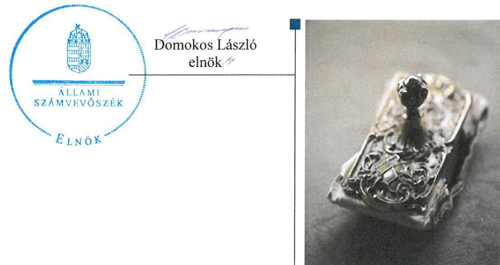

---

# AZ ELLENŐRZÉST FELÜGYELTE: 

PETŐ KRISZTINA felügyeleti vezető

## AZ ELLENŐRZÉST VEZETTE ÉS A VÉGREHAJTÁSÁÉRT FELELŐS:

SCHMIDT JÁNOS ellenőrzésvezető

## A PROGRAM ÖSSZEÁLLÍTÁSÁÉRT FELELŐS:

JANIK JÓZSEF LÁSZLÓ osztályvezető

IKTATÓSZÁM: V-0775-136/2016.
TÉMASZÁM: 1809

## ELLENŐRZÉS-AZONOSÍTÓ SZÁM: V067914

Jelentéseink az Országgyűlés számítógépes hálózatán és az Interneten a www.asz.hu címen is olvashatóak.

---

# TARTALOMJEGYZÉK 

■ ÖSSZEGZÉS ..... 5
■ AZ ELLENŐRZÉS CÉLJA ..... 7
■ AZ ELLENŐRZÉS TERÜLETE ..... 8
■ AZ ELLENŐRZÉS HÁTTERE, INDOKOLTSÁGA ..... 11
■ FÓKUSZKÉRDÉSEK ..... 13
■ ELLENŐRZÉS HATÓKÖRE ÉS MÓDSZEREI ..... 14
■ MEGÁLLAPÍTÁSOK ..... 18
■ JAVASLATOK ..... 37
■ MELLÉKLETEK ..... 41
I. Sz. melléklet: Értelmező szótár ..... 41
II. Sz. melléklet: Az integritás érvényesítése érdekében kialakított és működtetett kontrollrendszer ..... 44
III. Sz. melléklet: Teljesítmény-ellenőrzési kiegészítő modul megállapításai ..... 45
■ FÜGGELÉK: ÉSZREVÉTELEK ..... 47
■ RÖVIDÍTÉSEK JEGYZÉKE ..... 65

---

.

---

# ÖSSZEGZÉS 

Az Állami Számvevőszék a Felső-Tisza-vidéki Vízügyi Igazgatóság pénzügyi és vagyon-gazdálkodása szabályszerűségének ellenőrzését a 2011. január 1. és 2014. december 31. közötti időszakra végezte el. Az irányító szervek és a középirányító szerv feladatellátása szabályszerű volt. Az igazgatóság az integritás szemlélet érvényesülése érdekében erőfeszítéseket tett, amelyeket a belső kontrollrendszer szabályszerű kialakítása megerősített, azonban a működtetés, a gazdálkodási jogkörök gyakorlása során feltárt szabálytalanságok további intézkedések megtételét teszik szükségessé a korrupciós kockázatok mérséklése érdekében. Az ellenőrzés megállapította, hogy a pénzügyi gazdálkodás területén a bevételi és kiadási előirányzatok módosítása és az előirányzat-maradvány felhasználásának elszámolása nem a jogszabályi előírásoknak megfelelően történt. A vagyonhasznosítási szerződésekben az átláthatósági követelmények nem érvényesültek.

## Az ellenőrzés társadalmi indokoltsága

A közpénzek felhasználásában és az állami vagyonnal való gazdálkodásban a központi alrendszer egyes intézményei meghatározó súlyt képviselnek. E szervezetekkel szemben társadalmi igény, hogy tevékenységükről a döntéshozók és a nyilvánosság felé elszámoljanak. Ezzel a társadalmi igénnyel és az Állami Számvevőszék Stratégiájával összhangban, a közpénzügyek átláthatóságának előmozdítása, a közvagyon védelme érdekében került sor az Intézmény pénz-ügyi- és vagyongazdálkodásának ellenőrzésére.

## Főbb megállapítások, következtetések, javaslatok

Az irányító szervek és a középirányító szerv Intézményre vonatkozó feladatellátása szabályszerű volt. Az irányító szerveket megillető jogosultságok gyakorlása a jogszabályi előírásoknak megfelelően történt. Az irányító szervek és a középirányító szerv részéről a közfeladatok ellátására vonatkozó, az erőforrásokkal való szabályszerű gazdálkodáshoz szükséges követelményeket érvényesítették, számon kérték és a 2011. év kivételével ellenőrizték is. Az irányító szervek és a középirányító szerv az erőforrásokkal való hatékony gazdálkodáshoz szükséges követelményeket nem érvényesítette, így nem volt biztosított a számon kérhetőség és az ellenőrizhetőség. Az Intézménnyel kapcsolatos egyéb ellenőrzési, irányítási jogosultságok gyakorlása szabályszerű volt.

A belső kontrollrendszer kialakítása és működtetése megfelelt a jogszabályi előírásoknak. A kontrollkörnyezet és a kockázatkezelési rendszer kialakítása és működtetése szabályszerű volt. A kontrolltevékenység kialakítása és működtetése a gazdálkodási jogkörök működtetésében, a dokumentumokhoz és információkhoz való hozzáférés, továbbá az iratkezelési szoftverhez kapcsolódó adatvédelem szabályozásában, feltárt hiányosságok miatt csak részben volt szabályszerű. Az információs és kommunikációs folyamatok kialakítása megfelelt a jogszabályi előírásoknak. A monitoring rendszer működése megfelelt a jogszabályi előírásoknak és a belső szabályzatokban foglaltaknak. A rendelkezésre álló források gazdaságos, hatékony és eredményes felhasználását biztosító követelmények kialakítása az Intézmény részéről megfelelő volt.

Az Intézmény pénzügyi gazdálkodása részben volt szabályszerű. Az elemi költségvetés és az előirányzatok megállapítása során betartották a jogszabályi előírásokat és a belső szabályzatokban foglaltakat. A bevételi és kiadási előirányzatok módosítását nem a jogszabályi előírásoknak megfelelően hajtották végre, mert a saját hatáskörben végrehajtott előirányzat módosításokról az irányító szerveket nem az előírt határidőben tájékoztatták. A bevételi előirányzatok teljesítése, valamint a kiadási előirányzatok felhasználása során a jogszabályi előírásokat, a gazdálkodási jogkörök működtetésének hiányosságai miatt csak részben tartották be. Az előirányzat felhasználáshoz kapcsolódó évközi korlátozó intézkedéseket végrehajtották. Az előirányzat maradvány felhasználása a nyilvántartási hiányosságok

---

miatt kockázatos volt, megállapítása a határidőn túli adatszolgáltatás miatt csak részben volt szabályszerű. Az Intézmény zavartalan feladatellátásához a fizetőképesség folyamatos fennállása, a likviditás javítása érdekében intézkedtek. Az Intézmény az eredményszemléletű számvitel bevezetésével kapcsolatos feladatokat szabályszerűen hajtotta végre. Az Intézmény vagyongazdálkodása szabályszerű volt. A vagyonkezelési szerződés a vagyonkezelés területén bekövetkezett változásokat tükröző egységes szerkezetbe foglalásának elmaradása miatt csak részben felelt meg a jogszabályi előírásoknak. A mérlegben kimutatott eszközök és források nyilvántartása, értékelése, leltározása a jogszabályok és a belső szabályzatok előírásainak megfelelően történt. Az Intézmény az értékmegőrzési, állagmegóvási kötelezettségeit a jogszabály és a vagyonkezelési szerződés előírásai szerint teljesítette. A vagyonelemek elidegenítése a jogszabályok és a belső szabályzat előírásainak megfelelően történt, a hasznosítás azonban a vagyonhasznosítási szerződésekben az átláthatósági követelmények érvényesülése, valamint a jogszabály által előírt tartalmi követelmények hiánya miatt kockázatos volt.

Az ellenőrzött időszakban az Intézménynél átalakítás/átszervezés nem történt. A jogszabályváltozásból adódó feladatátadásra/átvételre szabályszerűen, dokumentáltan került sor.

Az ellenőrzött időszakban az Intézmény erőfeszítéseket tett az integritás szemlélet érvényesítése érdekében.

---

# AZ ELLENŐRZÉS CÉLJA 

## A Felső-Tisza-vidéki Vízügyi Igazgatóság pénzügyi és vagyongazdálkodásának ellenőrzése

## A SZABÁLYSZERŰSÉGI ELLENŐRZÉS

célja annak megítélése volt, hogy az ellenőrzött Intézmény ${ }^{1}$-re vonatkozó irányító szervi feladatellátás a jogszabályi előírások betartásával történt-e; az Intézménynél a belső kontrollrendszer kialakítása és működtetése szabályszerű volt-e; kialakították-e az erőforrásokkal való szabályszerű, gazdaságos, hatékony és eredményes gazdálkodáshoz szükséges követelményeket, megvalósították-e azok számon kérését, ellenőrzését; az Intézmény pénzügyi és vagyongazdálkodása megfelelt-e a jogszabályi előírásoknak és belső szabályzatainak; az Intézmény átalakításának vagy átszervezésének lebonyolítása szabályszerűen történt-e.

Az Intézmény korrupcióval szembeni veszélyeztetettségének csökkentése érdekében az ÁSZ² felmérte az integritási szemlélet érvényesülését a gazdálkodási folyamatokban.

A KIEGÉSZÍTŐ TELJESÍTMÉNY-ELLENŐRZÉSI MODUL célja annak értékelése volt, hogy a gazdálkodás folyamatában a gazdaságossági, hatékonysági és eredményességi követelmények kialakítása megtörtént-e, azokat működtették-e, a célkitűzéseket elérték-e; a pénzügyi és vagyongazdálkodás folyamataira vonatkozóan a költségvetési szerv belső kontrollrendszerének minőségéről kiadott vezetői nyilatkozatban a költségvetési szerv tevékenységében a hatékonyság, eredményesség, gazdaságosság követelményeinek érvényesítésére vonatkozó nyilatkozat helytálló volt-e.

---

# **AZ ELLENŐRZÉS TERÜLETE**

## **Felső-Tisza-vidéki Vízügyi Igazgatóság**

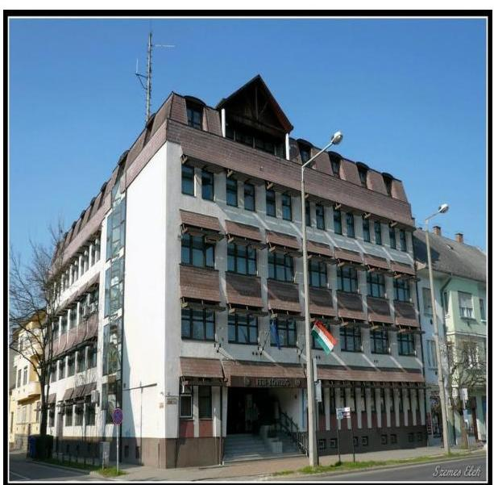

**AZ INTÉZMÉNY** a Kormány által kijelölt vízügyi igazgatási szerv, amelyet az 1060/1953. MT3 határozattal 1953. október 1-jétől a vízügyi területi feladatok ellátására hoztak létre. Jogállását, közfeladatait, hatáskörét és területi illetékességét a vízgazdálkodásról szóló 1995. évi LVII. törvény, a vizek kártételei elleni védekezés szabályairól szóló Korm. rendelet14, valamint a vízügyi, vízvédelmi hatósági feladatokat ellátó szervek kijelöléséről szóló Korm. rendeletek2-45 határozták meg.

Az Intézmény feladatstruktúrája az ellenőrzött időszakban három alkalommal változott. A Korm. rendelet2 41/A., B. §-ai alapján a 2012. január 1-jétől létrejött NEKI6-nek a területi hulladékgazdálkodással, a vízi közmű szakágazati és statisztikai adatgyűjtéssel, szennyvíz információs rendszerrel kapcsolatos feladatokat adtak át. A Korm. rendelet3 15. §-a alapján 2014. január 1-jétől a vízügyi hatósági feladatokat vették át az FTVKTVF7-től. A Korm. rendelet4 19. §-a alapján 2014. szeptember 10-én feladatátadás történt a KI8 részére, illetve ugyanezen időponttól feladatátvételre került sor vízügyi ágazati, valamint európai uniós forrásokból megvalósuló programokkal, az OKKP9-val kapcsolatos területi feladatok ellátásával összefüggésben a NEKI-től.

Az Intézmény önállóan működő és gazdálkodó központi költségvetési szerv. Az irányító szervi feladatokat 2011. december 31-ig a VM10-et vezető miniszter látta el, 2012. január 1-jétől a vízügyi igazgatási szervek irányításáért a BM11-et vezető miniszter volt felelős. A középirányító szervi feladatokat 2012. március 23-tól a BM utasítás112 alapján az OVF13 látta el. Az Intézményt 2011. december 31-ig a vidékfejlesztési miniszter által, ezt követően a belügyminiszter által kinevezett igazgató vezette. Az igazgató, illetve a gazdasági vezető személyében az ellenőrzött időszakban változás nem történt.

Az Intézmény a 2011-2014. évi éves költségvetési beszámolók alapján az ellenőrzött időszakban 31 227,9 M Ft összes bevételt teljesített, az összes kiadás 29 240,9 M Ft volt. Az Intézmény 2011. évi engedélyezett létszáma 349 fő volt, ami 2012. évre 322 főre, 2013. évre 328 főre, 2014. évre 346 főre módosult. Az ellenőrzött időszakban a közalkalmazottak mellett 1218-2058 fő közfoglalkoztatására is sor került. Az átlagos statisztikai állományi létszám az évről évre bekövetkezett közfoglalkoztatás következtében 2011. évben 1523 fő, 2012. évben 2356 fő, 2013. évben 1943 fő, 2014. évben 2398 fő volt.

---

Az Intézmény jóváhagyott éves költségvetési volumenének alakulását az 1. ábra szemlélteti.
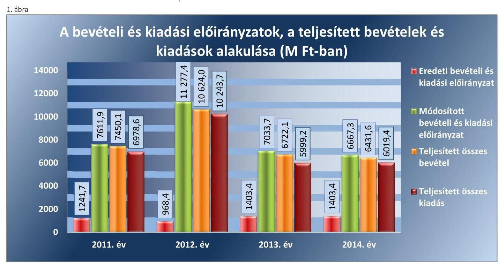

Forrás: 2011-2014. évi költségvetési beszámolók

A módosított kiadási és bevételi előirányzatok az évközben beindított pályázati projektek, az ár-, és belvíz elleni védekezés beruházásai, valamint a közfoglalkoztatás következtében, az ellenőrzött időszak minden évében jelentősen meghaladták az eredeti előirányzatokat.

Az Intézmény az ellenőrzött időszakban saját vagyonnal nem rendelkezett. A könyvviteli mérleg szerinti vagyona a 2011. év eleji 21 343,6 M Ftról 2013. év végére 33,4%-kal 28 463,6 M Ft-ra nőtt, 2014. év végén 28 895,0 M Ft volt.

Az ellenőrzött időszakban az Intézmény mérleg szerinti vagyonának alakulását a 2. ábra mutatja be.
2. ábra

A könyvviteli mérleg szerinti vagyon alakulása (M Ft)
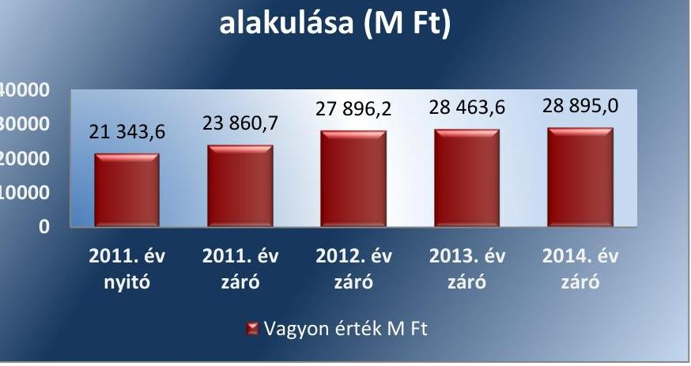

Forrás: 2011-2014. évi költségvetési beszámoló

---

A befektetett eszközök mérlegértéke a 2011. év eleji 20 587,3 M Ft-ról 31,1%-kal, 2013. évre 26 996,4 M Ft-ra nőtt. A 2014. évben a nemzeti vagyonba tartozó befektetett eszközök értéke 27 814,7 M Ft volt. A 2011. év eleji értékről 2014. év végére a kötelezettségek összege 345,3 M Ft-ról 249,1 M Ft-ra csökkent. A saját tőke a 2011. év elejei 20 566,3 M Ft-ról 2013. év végére 32,9%-kal 27334,1 M Ft-ra nőtt, 2014. év végén 27 954,4 M Ft volt. A mérlegben a tartalékok értéke a 2011. év eleji 432,0 M Ft-ról 2013. év végére több mint másfélszeresére 671,5 M Ft-ra nőtt. A 2014. évi államháztartási számviteli változás miatt a 2014. évi mérleg tartalékot nem tartalmazott. A mérleg „Egyéb eszközök induláskori értéke és változásai" sora feleltethető meg tartaléknak, amely az Intézménynek 2014. év végén 668,4 M Ft összegű volt.

---

# AZ ELLENŐRZÉS HÁTTERE, INDOKOLTSÁGA 

Az Alaptörvény ${ }^{14}$ rendelkezése szerint a nemzeti vagyon megőrzésének, védelmének és a nemzeti vagyonnal való felelős gazdálkodásnak a követelményeit sarkalatos törvény, az Nvtv. ${ }^{15}$ rögzíti. A tulajdonosi joggyakorlás és vagyonkezelés általános és speciális szabályait, az állami vagyon nyilvántartására és elszámolására vonatkozó eljárásokat, a vagyonkezelési szerződés feltételrendszerét, valamint az éves beszámoló készítési és könyvvezetési kötelezettségeket kormányrendelet írja elő.

A központi alrendszer egyes intézményei közfeladat-ellátásának változásait, a közfeladatok átadásából és átvételéből adódó módosításait, előirányzat gazdálkodására ható tényezőit az Áht. ${ }^{16}$ 11. § és az Ávr. ${ }^{17}$ 14. § írja elő. A közfeladatok megszűnéséből, intézmény átszervezéséből, belső szerkezeti korszerűsítéséből, vagy más hasonló okból adódó módosításai miatt szerepeltetendő szerkezeti változásokat, valamint a szerkezeti változásként beépült közfeladatok szintre hozásként történő számításba vételét az Ávr. 15. § (2)-(3) bekezdései határozzák meg.

A társadalmi igénnyel összhangban az Áht. ${ }^{18}$ az Ámr. ${
 }^{19}$ és a Bkr. ${ }^{20}$ is előírja a költségvetési szerv részére, hogy olyan követelményeket alakítson ki, amelyek biztosítják a működés, gazdálkodás, az erőforrások felhasználása során a gazdaságosság, hatékonyság és eredményesség érvényesülését. Az Ámr. és a Bkr. alapján az intézményvezetőnek évente nyilatkoznia is kell arról, hogy gondoskodott-e az intézmény tevékenységében a gazdaságosság, hatékonyság és eredményesség követelményeinek érvényesítéséről. A gazdaságos, hatékony és eredményes gazdálkodáshoz szükség van a teljesítménymérés feltételeinek kialakítására, úgymint az egyértelmű és mérhető célokra, mutatószámokra és az ezekhez rendelt követelményekre. Az ÁSZ jelen ellenőrzéssel győződik meg arról, hogy az intézménynél a teljesítménycélokat, -mutatókat, -követelményeket kialakították-e, azokat működtették-e, a kitűzött cél(ok) teljesültek-e.

AZ ELLENŐRZÉS EREDMÉNYEKÉPPEN nemcsak az ellenőrzött intézmények gazdálkodása javulhat, hanem átfogó képet kaphatunk a központi alrendszerbe tartozó költségvetési szervek gazdálkodásának hiányosságairól, de a jó gyakorlatokról is. Ellenőrzéseivel, javaslataival és megállapításaival az ÁSZ elősegítheti a költségvetési szervek pénzügyi és vagyongazdálkodása szabályozásának javítását és hozzájárulhat a jó kormányzáshoz. Az ellenőrzés az ellenőrzött számára visszajelzést ad a pénzügyi és vagyongazdálkodásában feltárt hiányosságokról, javaslataival hozzájárul azok kiküszöböléséhez, amely csökkentheti a későbbi ellenőrzések gyakoriságát. Az ellenőrzés megállapításait és javaslatait más szervezetek is hasznosíthatják a rendezett gazdálkodási keretek kialakításához.

## A TELJESÍTMÉNY-ELLENŐRZÉSI KIEGÉSZÍTŐ

MODUL alapján elvégzett ellenőrzés a törvényalkotás számára támogatást nyújt a nemzeti kulcsindikátorok rendszerének kialakításához. A döntéshozók, ellenőrzöttek, irányító szervek, a társadalom számára az összehasonlítási, összemérési lehetőségek kihasználásával objektív visszajelzést

---

ad a gazdálkodás területén végrehajtott szervezeti, szervezési, takarékossági és bürokráciacsökkentő intézkedések hatásairól, a közfeladat-ellátásnak keretet adó pénzügyi és vagyongazdálkodásban mérhető teljesítménykövetelmények kialakításáról, azok alkalmazásáról.

---

# FÓKUSZKÉRDÉSEK 

1. Az irányító szerv ellenőrzött intézményre vonatkozó feladatellátása szabályszerű volt-e?
2. A belső kontrollrendszer kialakítása és működtetése megfelelt-e a jogszabályi előírásoknak?
3. Az intézmény pénzügyi gazdálkodása szabályszerű volt-e?
4. Az intézmény vagyongazdálkodása szabályszerű volt-e?
5. Szabályszerűen hajtották-e végre az ellenőrzött időszakban az intézményt érintő szervezeti, szerkezeti átalakításokat?
6. Az intézmény intézkedett-e az integritás szemlélet érvényesítése érdekében?

---

# ELLENŐRZÉS HATÓKÖRE ÉS MÓDSZEREI 

## Az ellenőrzés típusa

Szabályszerűségi ellenőrzés, amelyet teljesítmény-ellenőrzési modul egészített ki.

## Az ellenőrzött időszak

Az ellenőrzött időszak 2011. január 1-jétől 2014. december 31-ig terjedő időszak volt.

## Az ellenőrzés tárgya

Az ellenőrzött szervezetre vonatkozó irányító szervi feladatok ellátása. Az Intézmény belső kontrollrendszerének kialakítása és működtetése, valamint pénzügyi és vagyongazdálkodása. Az erőforrásokkal való szabályszerű, gazdaságos, hatékony és eredményes gazdálkodáshoz szükséges követelmények kialakítása, a kialakított követelmények számonkérés, ellenőrzése. Az Intézmény átalakítása, átszervezése lebonyolításának szabályszerűsége.

A teljesítmény-ellenőrzési kiegészítő modul esetében az intézmény gazdálkodás folyamatában a gazdaságossági, hatékonysági és eredményességi követelmények kialakítása és működtetése, a célkitűzések teljesítésének értékelése. Az Intézmény tevékenységében a hatékonyság, eredményesség, gazdaságosság követelményei érvényesítéséről kiadott nyilatkozat helytállósága. A teljesítmény-ellenőrzés fókuszkérdéseire a III. számú melléklet ad választ.

Az ellenőrzés kiterjedt minden olyan körülményre és adatra, amely az ÁSZ jogszabályban meghatározott feladatainak teljesítéséhez, valamint a programok végrehajtása folyamán felmerült újabb összefüggések feltárásához voltak szükségesek.

## Az ellenőrzött szervezet

Felső-Tisza-vidéki Vízügyi Igazgatóság, a 2011. évi irányító szervi feladatok vonatkozásában a Földművelésügyi Minisztérium, a 2012-2014. évi irányító/középirányító szervi feladatok vonatkozásában a Belügyminisztérium és az Országos Vízügyi Főigazgatóság.

---

# Az ellenőrzés jogalapja 

Az ellenőrzés jogszabályi alapját az ÁSZ tv. ${ }^{21}$ 1. § (3) bekezdés, 5. § (2)-(7) bekezdései, valamint Áht. 2 61. § (2) bekezdésének előírásai képezték.

## Az ellenőrzés módszerei

Az ellenőrzést az ellenőrzési program szempontjai, az ellenőrzött időszakban hatályos jogszabályok, az ellenőrzés szakmai szabályai, az egyes ellenőrzési típusokhoz kapcsolódó ÁSZ módszertanok és nemzetközi standardok figyelembevételével végeztük. A gazdálkodás hibáinak kijavítására, a közpénzekkel való felelős gazdálkodás segítésére irányuló javaslatok kidolgozásakor a hatályos jogszabályok voltak az irányadóak.

Az ellenőrzés ideje alatt az ellenőrzött szervezettel történő kapcsolattartást az ÁSZ SZMSZ²-ének vonatkozó előírásai alapján biztosítottuk.

Az ellenőrzési kérdések megválaszolásához szükséges bizonyítékok megszerzése a következő ellenőrzési eljárások alkalmazásával történt: megfigyelés, szemle (szemrevételezés), kérdésfeltevés (információkérés), mintavételezés, valamint elemző eljárás. A minták kiválasztása során elsősorban reprezentativitást biztosító véletlen mintavételi eljárást alkalmaztunk.

Az ellenőrzési bizonyítékként felhasználható adatforrások közé tartoztak egyrészt a szakmai program részletes szempontjainál felsorolt adatforrások, másrészt adatforrás volt minden egyéb - az ellenőrzés folyamán feltárt, az ellenőrzés szempontjából releváns információt tartalmazó - dokumentum.

Az ellenőrzés lefolytatásához az intézmény a tanúsítványok elektronikus kitöltésével, valamint az ÁSZ által kért dokumentumok elektronikus megküldésével szolgáltatott adatokat. A rendelkezésre bocsátott adatok, információk kontrollja az ellenőrzés keretében történt.

Az ellenőrzési kérdésekre adott válaszok alapján értékeltük, hogy az ellenőrzött időszakban az irányító szerv ${ }^{23}{ }_{1,2}$ és a középirányító szerv ${ }^{24}$ az ellenőrzött intézményre vonatkozó feladatainak szabályszerűen eleget tette, az Intézmény pénzügyi és vagyongazdálkodása megfelelt-e az előírásoknak, az Intézmény átalakításának vagy átszervezésének végrehajtása szabályszerű volt-e. Értékeltük, hogy az Intézménynél kialakították-e az erőforrásokkal való szabályszerű és hatékony gazdálkodáshoz szükséges követelményeket, megvalósították-e azok számonkérését, ellenőrzését.

Az Intézmény belső kontrollrendszere jogszabályi előírások szerinti kialakításának és működtetésének szabályszerűségét az erre irányuló ellenőrzési kérdésekre adott válaszok összesítése alapján, évente pillérenként (kontrollkörnyezet, kockázatkezelési rendszer, kontrolltevékenységek, információs és kommunikációs rendszer, monitoring rendszer) és összesítetten is minősítettük. Az Intézmény belső kontrollrendszere egyes pilléreinek kialakítását és működtetését „szabályszerű"-nek minősítettük, amennyiben az értékelt területen az elért és elérhető pontok százalékban kifejezett, egész számra kerekített hányadosa meghaladta a 84%-ot, „részben szabályszerű"-nek minősítettük, ha a 84%-ot nem haladta meg, de 60%-nál nagyobb volt, „nem szabályszerű"-nek minősítettük, ha nem haladta meg

---

a 60%-ot. Az Intézmény belső kontrollrendszerének összesített értékelése megegyezik a pillérenként (kontrollterületenként) alkalmazott %-os értékelésekkel, a következő eltérésekkel. A kontrollrendszer egésze esetében a „szabályszerű" értékelésnek a %-os értéken felül további feltétele volt, hogy egyik kontrollterület sem kaphatott „nem szabályszerű" értékelést, a „részben szabályszerű" értékelés további feltétele volt, hogy legfeljebb egy ellenőrzött kontrollterület lehetett „nem szabályszerű" értékelésű. Az összesített értékelés a %-os értéktől függetlenül „nem szabályszerű"-nek minősült, ha az ellenőrzött kontrollterületek közül több mint egy „nem szabályszerű" értékelést kapott.

A tárgyi eszközök nyilvántartásba vételének, a közbeszerzési eljárások lefolytatásának, a vagyonhasznosítási bevételi előirányzatok teljesítésének, az előirányzatok módosításának és az előirányzat-maradvány megállapításának szabályszerűségét, valamint a gazdálkodási jogkörök gyakorlásának szabályszerűségét mintavétellel ellenőriztük.

A jogszabályoknak és a belső előírásoknak megfelelőnek tekintettük a tárgyi eszközök nyilvántartásba vételét, a vagyonhasznosítási bevételi előirányzatok teljesítését, az előirányzatok módosítását és az előirányzat-maradvány megállapítását, amennyiben a minta ellenőrzésének eredménye alapján 95%-os bizonyossággal a teljes sokaságban a hibás tételek aránya kisebb volt, mint 10%, nem megfelelőnek értékeltük, ha a hibás tételek aránya a 10%-ot meghaladta. Kockázatot, illetve magas kockázatot jeleztünk, amennyiben egy adott terület vonatkozásában a minta alapján a teljes sokaságban nem volt egyértelműen biztosított a jogszabályoknak és a belső szabályzatoknak megfelelő működés.

A közbeszerzési eljárások esetében az ellenőrzött mintatételek értékelését végeztük el.

A 2011. évet érintően a szakmai teljesítésigazolás és az utalvány ellenjegyzése kulcskontrollok, a 2012-2014. éveket érintően a teljesítésigazolás és az érvényesítés kulcskontrollok működését értékeltük. Megfelelőnek értékeltük a gazdálkodási jogkörök gyakorlását, amennyiben 95%-os bizonyossággal a teljes sokaságban a hibás tételek aránya legfeljebb 10% volt, részben megfelelőnek, ha a hibás tételek arányának felső határa legfeljebb 30% volt, nem megfelelőnek, ha a hibás tételek sokaságbeli arányának felső határa meghaladta a 30%-ot.

Az integritás szemlélet érvényesülésének értékelése az Intézmény által kitöltött tanúsítványa alapján történt.

Az alapprogram alapján ellenőriztük, hogy a költségvetési szerv vezetője megtette-e nyilatkozatát arról, hogy gondoskodott a költségvetési szerv tevékenységében a hatékonyság, eredményesség és a gazdaságosság követelményeinek érvényesítéséről. Ezt kiegészítve, a teljesítmény-ellenőrzési kiegészítő modul keretében - felhasználva az alapprogram szerinti ellenőrzés megállapításait - értékeltük, hogy a költségvetési szerv vezetője kialakította-e a gazdaságossági, hatékonysági és eredményességi követelményeket, és azokat működtette-e, a célkitűzéseket elérte-e.

A teljesítmény-ellenőrzési kiegészítő modul a gazdálkodási feladatokra terjedt ki, a szakmai feladatellátást nem értékelte.

A gazdálkodási feladatok értékelése az alábbi területekre terjedt ki:
pénzügyi gazdálkodási (nem szakmai, adminisztratív) feladatok: költségvetés-, beszámoló-készítés, könyvvezetés, adatszolgáltatások,

---

előirányzat-gazdálkodás, kötelezettségvállalások nyilvántartása, kezelése, bevételkezelés, bér- és illetményszámfejtés;
→ vagyongazdálkodási (logisztikai) feladatok: közbeszerzések és közbeszerzési értékhatárt el nem érő beszerzések, készletgazdálkodás, nyomtatók, fénymásolók üzemeltetése, épület- és ingatlanüzemeltetés, karbantartás, hibabejelentés, gépjármű és flottamenedzsment.
Az ellenőrzés során minden olyan körülményt és adatot is ellenőriztünk, amely a program végrehajtása kapcsán felmerült újabb összefüggéseknek az ellenőrzés céljaival összhangban lévő feltárásához szükséges. A teljesítmény-ellenőrzési kiegészítő programmodulban megfogalmazott ellenőrzési cél megválaszolásához az alapprogram végrehajtása során megfogalmazott megállapításokat is figyelembe vettük.

---

# 1. Az irányító szerv ellenőrzött intézményre vonatkozó feladatellátása szabályszerű volt-e? 

Összegző megállapítás

Az irányító szerv ${ }_{1,2}$ és középirányító szerv Intézményre vonatkozó feladatellátása szabályszerű volt.

### 1.1. számú megállapítás

Az irányító szerv ${ }_{1,2}$-öt megillető jogosultságok gyakorlása a jogszabályi előírásoknak megfelelően történt.

Az irányító szerv ${ }_{2}$ az Alapító okirat ${ }_{2}{ }^{25}$-ban, 2012 májusától jelölte meg az OVF-et középirányító szervként, és 2013 decemberétől az Alapító okirat4ben nevesítette először az Áht. 2 9. § (1) bekezdés f), g) és h) pontjait a középirányító szerv irányítási hatásköreként. Az irányító szerv ${ }_{2}$ a BM utasítás ${ }_{1}$ 2. § (1) bekezdésében 2012. március 23-i hatállyal részletesen meghatározta a középirányító szerv által az Intézménnyel kapcsolatban ellátandó feladatokat az Áht. 2 előírásainak megfelelően. A BM utasítás ${ }_{1}$ és az Alapító okirat44 meghatározta az egyes irányítói jogok gyakorlására jogosult szerveket az Ávr. rendelkezéseinek megfelelően.

Az Intézmény az ellenőrzött időszak egészében rendelkezett az irányító szerv ${ }_{1,2}$ által az államháztartásért felelős miniszter előzetes egyetértésével kiadott, az Áht.1,2, az Ámr. illetve az Ávr. által előírtaknak megfelelő tartalmú Alapító okirat ${ }_{1-6}$-tal.

Az irányító szerv ${ }_{2}$ az ellenőrzött időszakban az Intézmény Alapító okiratát összesen öt alkalommal módosította. Az Alapító okirat ${ }_{2-6}$-ot - az Ámr.ben, illetve az Ávr.-ben előírtaknak megfelelően - a módosításokkal egységes szerkezetbe foglalták.

Az Intézmény 2012. december 18-tól rendelkezett az Alapító okirattal összhangban lévő, az irányító szerv ${ }_{2}$ által jóváhagyott az Ávr.-ben előírt tartalmi követelményeknek megfelelő SZMSZ ${ }_{2,3}{ }^{26}$-mal. Az irányító szerv ${ }_{1}$ az Áht. 1 93. § (1) bekezdés (a) pont szerinti - az SZMSZ jóváhagyására irányuló - alapítói jogát a 2011. évben nem gyakorolta.

Az irányító szerv ${ }_{1,2}$ és a középirányító szerv részéről a közfeladatok ellátására vonatkozó, az erőforrásokkal való szabályszerű gazdálkodáshoz szükséges követelményeket érvényesítették, számon kérték és a 2011. év kivételével ellenőrizték is. Az irányító szerv ${ }_{1,2}$ és a középirányító szerv az erőforrásokkal való hatékony gazdálkodáshoz szükséges követelményeket nem érvényesítette, így nem volt biztosított a számonkérhetőség és az ellenőrizhetőség.

A közfeladatok ellátására, az erőforrásokkal való szabályszerű gazdálkodásra vonatkozó követelményeket az irányító szerv ${ }_{1}$ az Áht. ${ }_{1}$ előírásainak megfelelően 2011. évben az Intézmény költségvetési gazdálkodása felügyeletén keresztül érvényesítette, az éves költségvetési beszámoló és

---

szakmai beszámoló keretében számon kérte, azonban azok ellenőrzéséről nem gondoskodott.

Az erőforrásokkal való hatékony gazdálkodás követelményeinek érvényesítésére, továbbá számon kérésére, ellenőrzésére
 a 2011. évben az Áht. 149. § (5) bekezdés f) pont előírásai ellenére az irányító szerv részéről nem került sor.

Az irányító szerv ${ }_{2}$ és a középirányító szerv a közfeladatok ellátására vonatkozó és az erőforrásokkal kapcsolatos szabályszerű gazdálkodás követelményeit 2012-2014. években a költségvetési gazdálkodás egyes szabályainak meghatározásával, valamint a költségvetési gazdálkodás felügyeletén keresztül érvényesítette, a követelményeket számon kérte, a költségvetési gazdálkodásra vonatkozó szabályszerűségi ellenőrzéseket folytatott.

A gazdálkodás hatékonyságához szükséges követelmények érvényesítésével, számonkérésével és ellenőrzésével kapcsolatos irányító/középirányító szervi feladatellátás a 2012-2014. években - az Áht. 29. § (1) bekezdés f) pontjának előírásai ellenére - nem valósult meg.

### 1.3. számú megállapítás

Az irányító szerv ${ }_{1,2}$ és a középirányító szerv az Intézménnyel kapcsolatos egyéb ellenőrzési, irányítási jogosultságait szabályszerűen gyakorolta.

Az irányító szerv ${ }_{1,2}$/középirányító szerv az Áht. ${ }_{1,2}$-ben előírtaknak megfelelően rendszeresen figyelemmel kísérte az Intézménynek a bevételi és kiadási előirányzatokkal való gazdálkodását, a közfeladatok ellátását, és ellenőrizte a bevételi és kiadási előirányzatokkal való gazdálkodását.

Az irányító szerv ${ }_{1,2}$ - 2011. évben közvetlenül és 2012. évtől a középirányító szerven keresztül - az Áht. ${ }_{1,2}$-ben előírtak szerint beszámoltatta az Intézmény vezetőjét az éves szakmai feladatellátásról és az éves gazdálkodásról. Az Intézmény éves költségvetési beszámolóit, valamint a szakmai tevékenységről szóló jelentéseit az irányító szerv ${ }_{1,2}$ a 2011-2014. években elfogadta.

Az Intézmény igazgatójának és gazdasági igazgatóhelyettesének a vezetői megbízása, kinevezés módosítása, az irányító szerv ${ }_{1,2}$ részéről az Áht. ${ }_{1-2}$ előírásainak megfelelően történt.

Az Intézmény kezelésében levő közérdekű és közérdekből nyilvános adatok, valamint az irányítási jogkörök gyakorlásához szükséges személyes adatok kezelésének kialakítása az irányító szerv ${ }_{1,2}$-nél szabályszerű volt.

---

# 2. A belső kontrollrendszer kialakítása és működtetése megfelel-e a jogszabályi előírásoknak? 

## Összegző megállapítás

A belső kontrollrendszer kialakítása és működtetése összességében megfelelt a jogszabályi előírásoknak.

A belső kontrollrendszer kialakításának és működtetésének értékelését az 1. táblázat mutatja.

1. táblázat

## A BELSŐ KONTROLLRENDSZER KIALAKÍTÁSÁNAK ÉS MŰKÖDTETÉSÉNEK ÉRTÉKELÉSE

| Megnevezés | Kontrollkörnyezet | Kockázatkezelés | Kontrolltevékenységek | Információ és   kommunikáció | Monitoring | ÖSSZESÉN |
| :--: | :--: | :--: | :--: | :--: | :--: | :--: |
| 2011. | szabályszerű | szabályszerű | részben szabályszerű | szabályszerű | szabályszerű | szabályszerű |
| 2012. | szabályszerű | szabályszerű | részben szabályszerű | szabályszerű | szabályszerű | szabályszerű |
| 2013. | szabályszerű | szabályszerű | részben szabályszerű | szabályszerű | szabályszerű | szabályszerű |
| 2014. | szabályszerű | szabályszerű | részben szabályszerű | szabályszerű | szabályszerű | szabályszerű |

2.1. számú megállapítás

A kontrollkörnyezet kialakítása szabályszerű volt.

AZ INTÉZMÉNY KONTROLLKÖRNYEZETÉNEK KIALAKÍTÁSA a 2011-2014. években szabályszerű volt, megfelelt az Áht.1.2, az Ámr., a Bkr., a Kbt.1.2 ${ }^{27}$, a Munka tv.1.2 ${ }^{28}$, a Számv. tv. ${ }^{29}$, a Vtvr. ${ }^{30}$, és az Áhsz. ${ }_{1.2}^{31}$ előírásainak.

Az Intézmény rendelkezett SZMSZ${ }_{1-3}$-mal, gazdasági szervezet ügyrendje${ }_{1-3}$-mal, számviteli politika${ }_{1-5}$-tel és az annak keretében elkészített szabályzatokkal, valamint egyéb szabályzatokkal, amelyek meghatározták az Intézményen belüli feladat- és hatásköröket, felelősségi viszonyokat.

Az Intézmény SZMSZ${ }_{1-3}$-a összességében megfelelt a jogszabályi előírásoknak, kisebb hiányosság volt, hogy a 2012. december 17. napját megelőzően hatályban lévő SZMSZ${ }_{1}$ - az Ávr. 13. § (1) bekezdés e) pontjában foglaltak ellenére - nem tartalmazta a gazdasági szervezet megnevezését.

A gazdasági szervezet ügyrendje${ }_{1-3}^{32}$ az Ámr. 20. § (7) bekezdésében és az Ávr. 13. § (5) bekezdésében előírt tartalmi előírásoknak az alábbi eltérésekkel felelt meg. A gazdasági szervezet ügyrendje${ }_{1}$, az SZMSZ illetve az Intézmény egyéb szabályzatai sem tartalmazták az Ámr. 20. § (7) bekezdésében előírtak ellenére az alkalmazottak helyettesítési rendjét, a 2013-2014. években a gazdasági szervezet ügyrendje${ }_{2,3}$, valamint az SZMSZ, illetve az Intézmény egyéb szabályzatai az Ávr. 13. § (5) bekezdésében előírtak ellenére nem tartalmazták a gazdasági szervezet alkalmazottainak helyettesítési rendjét, feladat- és hatáskörének megnevezését, valamint a belső és külső kapcsolattartás szabályait.

Az Intézmény a 2011-2014. években a Számv. tv. és az Áhsz.1.2 előírásainak megfelelően alakította ki számviteli politika${ }_{1-5}$-öt${ }^{33}$, amelynek keretében elkészítette a leltározási és leltárkészítési szabályzat${ }_{1-5}$-öt${ }^{34}$, az eszközök és források értékelési szabályzat${ }_{1-5}$-öt${ }^{35}$, a pénzkezelési szabályzat${ }_{1-9}$-et${ }^{36}$ és az önköltség-számítási szabályzat${ }_{1-6}$-ot${ }^{37}$. A 2013. szeptember 1-jétől hatályos számlarendnek${ }^{38}$ a Számv. tv. 161. § (5) bekezdése szerinti

---

aktualizálása elmaradt, ezáltal az Intézmény a 2014. évben nem rendelkezett az Áhsz. 251. § (2) bekezdésében előírt, a hatályos egységes számlakereten alapuló számlarenddel.

Az Intézmény rendelkezett ellenőrzési nyomvonal${ }_{1-6}$-tal${ }^{39}$ az Ámr. és a Bkr. előírásainak megfelelően.

Kisebb hiányosság volt továbbá, hogy a 2012. évben hatályban lévő leltározási és leltárkészítési szabályzat${ }_{3}$ - az Áhsz. 137. § (6) bekezdésében foglaltak ellenére - nem tartalmazta a használt, de a mérlegben értékkel nem szereplő immateriális javak, tárgyi eszközök, készletek leltározási módját, a 2011. évben hatályban lévő pénzkezelési szabályzat${ }_{1,2}$ - a Számv. tv. 14. § (8) bekezdésében foglaltak ellenére - nem tartalmazta a pénzforgalom bankszámlán történő lebonyolításának rendjét, valamint a 2013. április 1. napját megelőzően hatályos gazdálkodási szabályzat${ }_{1-3}^{40}$-ban éltek a 100 ezer Ft alatti kifizetések esetében az előzetes írásbeli kötelezettségvállalás mellőzésének lehetőségével, azonban ennek rendjét, az előzetes írásbeli kötelezettségvállalást nem igénylő kifizetések részletes szabályait - az Ámr. 72. § (14) bekezdésében és az Ávr. 53. § (2) bekezdésében foglaltak ellenére - belső szabályzatban nem határozták meg.

Az Ámr. 156. § (1) bekezdés c) pontjában és a Bkr 6. §. (1) bekezdés c) pontjában foglaltak ellenére az etikai elvárásokat csak a 2012. október 26-ától hatályba helyezett Etikai Kódex${ }_{1}^{41}$-ben határozta meg az Intézmény, amely ettől az időponttól megfelelt az említett jogszabályi előírásoknak.

A Kbt.${ }_{1,2}$ hatálya alá nem tartozó beszerzések lebonyolításának rendjét - az Ámr. 20. § (3) bekezdés b) pontjában és az Ávr. 13. § (2) bekezdés b) pontjában foglaltak ellenére - csak 2012. március 9-től határozták meg belső szabályzatban.

# 2.2. számú megállapítás 

## A kockázatkezelési rendszer kialakítása és működtetése összességében szabályszerű volt.

A KOCKÁZATKEZELÉSI RENDSZER kialakítása és működtetése a 2011-2014. években összességében szabályszerű volt, megfelelt az Áht.${ }_{1,2}$, a Vnytv.${ }^{42}$, az Ámr. és a Bkr. előírásainak.

Az Intézmény kialakította és működtette a kockázatkezelési rendszerét${ }^{43}$, felmérte és meghatározta a szervezet tevékenységében, gazdálkodásában rejlő kockázatokat. Az egyes kockázatokkal kapcsolatban a 2012-2014. években meghatározta, a 2011. évben - az Ámr. 157. § (3) bekezdésében foglaltak ellenére - nem a kockázatok teljes körére határozta meg az egyes kockázatokkal kapcsolatban szükséges intézkedéseket. A 2012-2014. években - a Bkr. 7. § (2) bekezdésében foglaltak ellenére - nem határozta meg a kockázatok kezelése érdekében szükséges intézkedések teljesítésének folyamatos nyomon követési módját.

A vagyonnyilatkozat-tételre kötelezettek körét 2012. december 17-ig az SZMSZ${ }_{1}$ tartalmazta, azonban az ezt követően hatályba helyezett SZMSZ${ }_{2,3}$-ban a Vnytv. 4. § a) bekezdésében foglaltak ellenére nem rögzítették.

---

# 2.3. számú megállapítás 

## A kontrolltevékenység kialakítása és működtetése részben volt szabályszerű.

A KONTROLLTEVÉKENYSÉGEK kialakítása és működtetése a 2011-2014. években részben felelt meg az Áht.1,2, az Avtv.${ }^{44}$, az Info tv.${ }^{45}$, a Munka tv.${ }_{1,2}$, az Ámr., az Ávr., a Bkr. és az lkr.${ }^{46}$ előírásainak.

Az Intézmény rendelkezett gazdasági szervezettel. A gazdálkodási jogkörgyakorlásokra jogosultak kijelölése az Ámr. és az Ávr. előírásainak megfelelően történt.

Biztosították a folyamatba épített, előzetes, utólagos és vezetői ellenőrzést${ }^{47}$, illetve belső szabályzataikban felelősségi körök meghatározásával szabályozták az engedélyezési, jóváhagyási, beszámolási eljárásokat, valamint 2012-2014-ben a kontrolleljárásokat.

Az Intézmény a 2011-2014. években az Ámr. 158. § (2) bekezdés b), c) pontjaiban és a Bkr. 8. § (4) bekezdés b) pontjában foglaltak ellenére részben szabályozta a dokumentumokhoz és információkhoz való hozzáférést.

A gazdálkodási jogkörök esetében a szakmai teljesítés igazolása és az utalvány ellenjegyzése 2011-ben nem felelt meg a jogszabályi előírásoknak (Ámr. 76. §, 79. § (2) bekezdés). A teljesítésigazolás és az érvényesítés gyakorlata 2012-ben nem felelt meg, 2013. és 2014. években részben felelt meg a hatályos jogszabályoknak (Ávr. 57-58. §) és a belső előírásoknak. A feltárt hiányosságokat részletesen a 3.3. számú megállapítás tartalmazza.

A 2011-2014. években gondoskodtak az iratkezelési szoftver által kezelt adatok biztonságáról, azonban - az lkr. 8. § (1) bekezdésében foglaltak ellenére - nem alakították ki az üzembiztonsági, adatvédelmi szabályok érvényre juttatásához szükséges eljárási szabályokat.

Az informatikai rendszer szabályozása során 2012. december 1-jét megelőzően - az Avtv. 10. § (1) bekezdésében és az Info tv. 7. § (2) bekezdésében foglaltak ellenére - az adatok biztonságának, védelmének érvényre juttatásához szükséges részletes eljárási szabályokat nem alakították ki, ezt követően a szabályozás megfelelt a jogszabályi előírásoknak.

### 2.4. számú megállapítás

Az információs és kommunikációs folyamatok kialakítása megfelelt a jogszabályi előírásoknak.

## AZ INFORMÁCIÓS ÉS KOMMUNIKÁCIÓS RENDSZER kialakítása és működtetése a 2011-2014. években szabályszerű volt. Az Intézmény az Avtv., az Eitv.${ }^{48}$, az Info tv., az Ltv.${ }^{49}$, az Ámr., az Ávr., a Bkr. és az lkr. előírásainak megfelelően szabályozta az információs és kommunikációs folyamatokat.

Az Intézmény kialakította és működtette a szervezeten belüli információáramlás, illetve a szervezeten kívülre történő információátadás rendszerét, amely biztosította, hogy a megfelelő információk a megfelelő időben eljussanak az illetékes szervezethez, szervezeti egységhez és személyhez, valamint meghatározta a beszámolási szinteket, határidőket és módokat. Rendelkeztek adatvédelmi és adatbiztonsági szabályzat${ }_{1-3}$-mal${ }^{50}$, illetve meghatározták a kötelezően közzéteendő adatok nyilvánosságra hozatalának, valamint a közérdekű adatok megismerésére irányuló igények teljesítésének rendjét${ }^{51}$.

Az Intézmény az ellenőrzött időszakban rendelkezett szabályszerű iratkezelési szabályzat${ }_{1-3}$-mal${ }^{52}$, az iratok nyomon követését pedig informatikai

---

# 2.5. számú megállapítás 

rendszer támogatta. Azonban a 2012-2014. években hatályos iratkezelési szabályzat${ }_{2,3}$ - az Ltv. 10. § (1) bekezdés b) pontjában foglaltak ellenére - nem az illetékes szaklevéltárral egyetértésben került kiadásra.

A monitoring rendszer működése megfelelt a jogszabályi előírásoknak és a belső szabályzatokban foglaltaknak. A rendelkezésre álló források gazdaságos, hatékony és eredményes felhasználását biztosító követelmények kialakítása és alkalmazása megfelelt a jogszabályi előírásoknak és a belső előírásoknak.

## AZ INTÉZMÉNY MONITORING RENDSZERÉNEK KIALAKÍTÁSA ÉS MŰKÖDÉSE az ellenőrzött időszakban

megfelelt az Áht.1,2, az Ámr., a Ber. és a Bkr. és a belső szabályzatok előírásainak.

Az Intézmény a 2011. évben nem gondoskodott az Ámr. 160. § (2) bekezdésében előírtak ellenére az operatív tevékenységek keretében megvalósuló folyamatos
 és eseti nyomon követés rendszerének kialakításáról és működtetéséről, ezt a 2012. október 26-tól hatályba helyezett Belső Kontroll kézikönyv Monitoring stratégiájában ${ }^{53}$ alakította ki és eszerint működtette. Ennek keretében készültek a döntések előkészítéséhez a monitoring információk alapján jelentések, feljegyzések, jegyzőkönyvek, illetve a követelmények teljesítését értékelő beszámolók.

Az Intézmény igazgatója gondoskodott a gazdaságosság, hatékonyság és eredményesség követelményei megfelelő kialakításáról az Intézmény tevékenységeiben az Áht. 1 94. § (1) bekezdés b) pontjában, az Áht. 2 61. § (1) bekezdésben, az Áht. 2 69. § (1) bekezdés a) pontjában és a Bkr. 4. § a) pontjában előírtak szerint. Az Intézmény igazgatója által az Áht. 1 121. § (3) bekezdésében, illetve a Bkr. 11. § (1) bekezdésben előírtak alapján a 2011-2014. évek vonatkozásában évenként kiadott vezetői nyilatkozatok helytállóak voltak a hatékonyság, eredményesség és gazdaságosság követelményeinek az Intézmény tevékenységeiben történő érvényesítése vonatkozásában.

A 2011-2014. években a belső ellenőrzési tevékenység kialakítása és működtetése során betartották az Áht. 1, 2, a Ber. és a Bkr., valamint a belső ellenőrzési kézikönyv előírásait. A 2011-2014. évi belső ellenőrzési jelentésekben megfogalmazott javaslatok végrehajtása érdekében az ellenőrzött szervezeti egységek vezetői megfelelő tartalmú intézkedési tervet készítettek, több esetben azonban - a Ber. 29. § (1) és (2) bekezdésében, illetve a Bkr. 45. § (3) bekezdésében meghatározott - határidőn túl készítették el és küldték meg azokat az Intézmény igazgatója részére.

Az Intézmény igazgatója a 2012-2014. években - a Bkr. 45. § (4) bekezdésében foglaltak ellenére - az intézkedési tervek jóváhagyásáról néhány esetben nem, illetve nem az intézkedési terv kézhezvételétől számított 8 napon belül döntött.

A belső ellenőrzési vezető (2011. évben az Intézmény igazgatója) nyomon követte a belső és külső ellenőrzés által tett megállapításokra és javaslatokra készült intézkedési terveket.

---

# 3. Az intézmény pénzügyi gazdálkodása szabályszerű volt-e? 

## Összegző megállapítás

Az intézmény pénzügyi gazdálkodása részben szabályszerű volt.

### 3.1. számú megállapítás

Az elemi költségvetés és az előirányzatok megállapítása során betartották a jogszabályi előírásokat és a belső szabályzatokban foglaltakat.

Az Intézmény elemi költségvetése, az előirányzatok megállapítása megfelelő az Áht. 1, 2, az Ámr., az Ávr., az NGM rendelet ${ }^{1,2}{ }^{54}$, valamint a vonatkozó belső szabályozások előírásainak. A 2011-2014. évek mindegyikében fennállt az egyezőség a kincstári költségvetés és az elemi költségvetés kiemelt kiadási és bevételi előirányzat adatai között.

Az Intézmény a kiadási és bevételi előirányzatok tervezését a megalapozottság és a végrehajthatóság biztosítása érdekében számításokkal támasztotta alá, adatszolgáltatási kötelezettségének eleget tett.

## 3.2. számú megállapítás

A bevételi és kiadási előirányzatok módosítását nem a jogszabályi előírásoknak és a belső szabályzatokban foglaltaknak megfelelően hajtották végre.

Az Intézmény előirányzatait a 2011-2014. években az Országgyűlés, a Kormány, az irányító szerv 1, 2, valamint az Intézmény hatáskörében módosították. A módosított előirányzatok összege minden évben többszörösen meghaladta az eredeti előirányzatok összegét az évközben beindított pályázati projektek, az ár- és belvíz elleni védekezés beruházásai és a közfoglalkoztatás következtében.

Az Intézmény évenkénti előirányzat-módosításait hatásköri bontásban a 2. táblázat mutatja:
2. táblázat

AZ ELŐIRÁNYZAT-MÓDOSÍTÁSOK ALAKULÁSA (M FT)

| Évek | A 2011-2014. évi előirányzat-módosítások hatáskörönként |  |  |  |  |  |
| :--: | :--: | :--: | :--: | :--: | :--: | :--: |
|  | Eredeti előirányzat | Módosított előirányzat | Összes előirányzat módosítás | Előirányzat módosítások hatáskör szerint |  |  |
|  |  |  |  | Országgyűlés | Kormány | Irányító szerv 1, 2 |
| 2011. | 1241,7 | 7611,8 | 6370,1 | -196,2 | 20,2 | 762,0 |
| 2012. | 968,3 | 11277,3 | 10309,0 | 0 | 388,4 | 1203,0 |
| 2013. | 1403,4 | 7033,6 | 5630,2 | 0 | 50,2 | 484,9 |
| 2014. | 1403,4 | 6667,2 | 5263,8 | 0 | 311,1 | 412,3 |
| Összesen: |  |  | 27573,1 | -196,2 | 769,9 | 2872,2 |

AZ ELŐIRÁNYZAT-MÓDOSÍTÁSOK a 2011-2014. években nem feleltek meg a jogszabályi előírásoknak.

A többletbevételek, továbbá az előző évi maradvány előirányzatosítása során az Intézmény nem tett eleget az Ámr. 71. § (6), valamint az Ávr. 167. § (4) bekezdésében előírt - irányító szerv 1, 2 részére történő -

---

adatszolgáltatási kötelezettségének, mivel öt munkanap helyett - a középirányító szerv előírásának megfelelően - havonta teljesítette azt.

Az Intézmény az Ámr., az Ávr., az Áhsz. 1, 2, és az Áht. 1, 2 rendelkezései szerint járt el az előirányzat-módosításoknak a Kincstár részére történő bejelentése, az előirányzat-változtatások dokumentálása, könyvekben való szerepeltetése, továbbá az irányító szerv 1, 2 által engedélyezett többletbevétel előirányzatosítása és az egyéb intézményi hatáskörű előirányzat-változtatások során.

Az előirányzat-módosítások többletbevételhez, irányító szervi támogatáshoz, valamint előirányzat-maradvány előirányzatosításához kapcsolódtak. A kiadási (és bevételi) előirányzatok változása többek között az árvíz elleni védekezéshez, az ár- és belvízkárok helyreállítási feladataihoz, továbbá közfoglalkoztatási kiadásokhoz, az EU-s pályázatokhoz, kormányzati beruházásokhoz fűződött.

Az előirányzatosított maradvány összege megfelelt az irányító szerv 1, 2 által jóváhagyott maradvány összegének.

# 3.3. számú megállapítás 

A bevételi előirányzatok teljesítése, valamint a kiadási előirányzatok felhasználása során a jogszabályi előírásokat részben tartották be.

Az ellenőrzött időszakban egészében a kiadások a módosított kiadási előirányzaton belüli összegben teljesültek, a bevételek a módosított bevételi előirányzat alatti összegben realizálódtak. A kiadási és bevételi előirányzatok teljesülését a 3. táblázat mutatja be.
3. táblázat

## AZ INTÉZMÉNY BEVÉTELEINEK, KIADÁSAINAK TELJESÜLÉSI ADATAI ÉVENKÉNTI BONTÁSBAN (M FT-BAN)

| Megnevezés | Kiadási előirányzatok teljesítése |  |  |  |  |
| :--: | :--: | :--: | :--: | :--: | :--: |
|  | Eredeti előirányzat | Módosított előirányzat | Teljesítés | Módosított előirányzat / Eredeti előirányzat % | Teljesítés /   Módosított előirányzat % |
| 2011. | 1241,7 | 7611,9 | 6978,6 | 613,0 | 91,6 |
| 2012. | 968,3 | 11277,4 | 10243,7 | 1164,6 | 90,8 |
| 2013. | 1403,4 | 7033,7 | 5999,2 | 501,2 | 85,2 |
| 2014. | 1403,4 | 6667,3 | 6019,4 | 475,1 | 90,2 |
| Bevételi előirányzatok teljesítése |  |  |  |  |  |
| Megnevezés | Eredeti előirányzat | Módosított előirányzat | Teljesítés | Módosított előirányzat / Eredeti előirányzat % | Teljesítés /   Módosított előirányzat % |
| 2011. | 1241,7 | 7611,9 | 7450,1 | 613,0 | 97,8 |
| 2012. | 968,3 | 11277,4 | 10624,0 | 1164,6 | 94,2 |
| 2013. | 1403,4 | 7033,7 | 6722,1 | 501,2 | 95,5 |
| 2014. | 1403,4 | 6667,3 | 6431,6 | 475,1 | 96,4 |

Forrás: 2011-2014. évi elemi költségvetési beszámolók

Legnagyobb változás a 2012. évben történt, ekkor az eredeti előirányzat - az előző évben beindított 16 projekt (pályázat) megvalósítása, az ár-

---

és belvíz elleni védekezés beruházásai, valamint a közfoglalkoztatás következtében - több mint tizenegyszeresére növekedett, de a kiadási teljesítés 90,8 %, a bevételi teljesítés 94,2 % volt. A projektek megvalósítása több évet is érintett, ezért a kifizetések egy része kötelezettségvállalással terhelt elő-irányzat-maradványként áthúzódott a következő évre. A kiadási és bevételi előirányzatok közül a támogatásértékű működési (3715,6 M Ft), a támogatásértékű felhalmozási (4163,4 M Ft) előirányzatok emelkedtek legnagyobb mértékben. A 2012. évi bevételi elmaradás az előre pontosan nem tervezhető projekt (pályázati) elemeket érintette, működési zavart, finanszírozási nehézséget nem eredményezett.

Az Intézmény 2011., 2013. és 2014. évi gazdálkodását a 2012. évi fő folyamatokhoz hasonlók jellemezték, alapvetően az ár- és belvíz elleni védekezés, a projektek (pályázatok) bonyolítása, illetve a közfoglalkoztatás volt a meghatározó a gazdálkodásban.

Az Intézmény engedélyezett létszámának és a személyi juttatás előirányzatának változásait a 4. táblázat tartalmazza.
4. táblázat

# A LÉTSZÁM ÉS A SZEMÉLYI JUTTATÁS ELŐIRÁNYZAT VÁLTOZÁSAI, 2011-2014 

| Meg-   neve-   zés | Engedélyezett   állományi létszám (fő) | Közfoglalkoztatottak (fő) | Átlagos statisztikai állományi létszám (fő) | Eredeni előirányzat (M Ft) | Személyi juttatás |  |
| :--: | :--: | :--: | :--: | :--: | :--: | :--: |
|  |  |  |  |  | Módosított előirányzat (M Ft) | Teljesítés (M Ft) |
| 2011. | 349 | 1218 | 1523 | 832,5 | 2284,8 | 2175,5 |
| 2012. | 322 | 2037 | 2356 | 648,9 | 2752,6 | 2506,3 |
| 2013. | 328 | 1615 | 1943 | 695,5 | 2821,2 | 2644,9 |
| 2014. | 346 | 2058 | 2398 | 695,5 | 3070,7 | 2933,4 |

Forrás: 2011-2014. évi intézményi beszámolók

Az engedélyezett állományi létszám változása a 2012. és 2014. évi feladatváltozással volt összefüggésben. Az átlagos statisztikai állományi létszám az évente rendszeresen visszatérő közmunka program, közfoglalkoztatás hatására emelkedett meg. A közfoglalkoztatás finanszírozására kapott támogatás eredményezte alapvetően a személyi juttatások módosított előirányzatának növekedését.

Az Intézmény személyi juttatásai, dologi és felhalmozási kiadásai, valamint a pénzeszkózátadásai kiadási előirányzatainak felhasználásához kapcsolódó gazdálkodási jogkörök gyakorlása a 2011-2012. években nem felelt meg a jogszabályi előírásoknak, a 2013-2014. években részben megfelelő volt. Az ellenőrzés a gazdálkodási jogkörök gyakorlásával összefüggésben az alábbi hiányosságokat tárta fel:
— a teljesítésigazoló a 2013., 2014. években esetenként - az Ávr. 60. § (2) bekezdésében foglaltak ellenére - a személyi juttatások kifizetése előtt a teljesítés igazolására irányuló feladatot - a csoportos utalások esetében - a maga javára is ellátta;
— a teljesítésigazoló a 2011., 2012. években a dologi kiadások kifizetéseit megelőzően nem szabályszerűen látta el feladatát, mert az Ámr. 76. § (3) bekezdés, valamint az Ávr. 57. § (3) bekezdése, előírása ellenére a teljesítésigazolás esetenként nem tartalmazta teljesítésigazolás dátumát;

---

- a 2013., 2014. években a pénzeszközátadások kifizetésére teljesítésigazolás nélkül került sor, ezáltal nem történt meg az Ávr. 57. § (3) bekezdésben előírtak ellenére a kiadások teljesítése jogosságának, összegszerűség igazolásának ellenőrzése;
- a személyi juttatások 2011. évi kifizetéseinél az utalvány ellenjegyzése esetenként nem volt szabályszerű, mivel az utalványozás ellenjegyzője - az Ámr. 79. § (2) bekezdésében foglaltak ellenére - nem jelezte az utalványozónak, hogy az érvényesítés - az Ámr. 77. § (3) bekezdésében foglaltak ellenére - nem tartalmazta az érvényesítés dátumát;
- az utalvány ellenjegyzője a 2011. évben a rendszeres, nem rendszeres és külső személyi juttatások kiadások kifizetéseihez kapcsolódóan az Ámr. 79. § (2) bekezdésében előírt kötelezettségének nem tett eleget, mert nem jelezte az utalványozónak a gazdálkodásra vonatkozó szabályok megsértését, mivel a személyi juttatások esetében kötelezettségvállalási dokumentum hiányában a kötelezettségvállalás esetenként nem volt szabályszerű, továbbá a kötelezettségvállalás dokumentumán - az Ámr. 74. § (1) bekezdésében foglaltak ellenére - nem volt beazonosítható a kötelezettségvállalás kelte, a kötelezettségvállalás ellenjegyzése az Ámr. 74. § (1)
 bekezdésében foglaltak ellenére több esetben elmaradt, vagy a kötelezettségvállalást követően történt meg, vagy arra nem az ellenjegyzés dátumának és az ellenjegyzés tényére történő utalás megjelölésével került sor;
- az utalvány ellenjegyzője a 2011. évben a dologi kiadások kifizetését megelőzően esetenként nem tett eleget az Ámr. 79. § (2) bekezdésében előírt kötelezettségének, mert nem jelezte az utalványozónak, hogy az Ámr. 77. § (1) bekezdésben előírtak ellenére az érvényesítés nem teljesítésigazoláson alapult, mivel a teljesítésigazolásra az érvényesítést követően került sor;
- a rendszeres, nem rendszeres és külső személyi juttatások kifizetései során a 2012-2014. években az érvényesítő az Ávr. 58. § (1) és (2) bekezdéseiben foglaltak ellenére nem ellenőrizte, hogy a megelőző ügymenetben betartották-e az Áht. 2, az államháztartási számviteli kormányrendelet és az Ávr. előírásait, továbbá a belső szabályzatban foglaltakat, valamint nem jelezte az utalványozónak a jogszabályok és belső szabályzatok megsértését. Nem jelezte, hogy a kötelezettségvállalás ellenjegyzése az Áht. 2. 37. § (1) bekezdésében és az Ávr. 55. § (1) bekezdésében foglaltak ellenére esetenként elmaradt, vagy a kötelezettségvállalást követően történt meg, vagy arra nem az ellenjegyzés dátumának és az ellenjegyzés tényére történő utalás megjelölésével került sor;
- az érvényesítő a 2012. évben a dologi kiadások kifizetéseit megelőzően nem szabályszerűen látta el feladatát, mert esetenként az Ávr. 58. § (3) bekezdésében előírtak ellenére az érvényesítés nem tartalmazta az érvényesítés dátumát;
- az érvényesítő a 2013. évben a dologi kiadások kifizetését megelőzően nem végezte el az Ávr. 58. § (1)-(2) bekezdéseiben előírt feladatát, mert nem jelezte az utalványozónak, hogy a kiküldetési rendelvény alapján kifizetett költségtérítések az Ávr. 56. § (1) bekezdésben előírtak ellenére a kötelezettségvállalás nyilvántartásban nem szerepeltek;

---

$\longrightarrow$ az érvényesítő a 2014. évben a dologi kiadások kifizetését megelőzően esetenként nem tett eleget az Ávr. 58. § (2) bekezdésében előírt jelzési kötelezettségének, mert nem jelezte az utalványozónak, hogy a kisösszegű kifizetés kötelezettségvállalás dokumentumáról hiányzott a kifizetés engedélyezése;
$\longrightarrow$ a 2011. évben az utalvány ellenjegyzője, a 2012-2014. évben az érvényesítő a 2011-2014. évi pénzeszközátadásokhoz tartozó kifizetések esetében nem tett eleget az Ámr. 79. § (2) bekezdésében, és az Ávr. 58. § (2) bekezdésében foglaltak ellenére nem jelezte az utalványozónak, hogy a kiadásokat az Ámr. 75. § (1) és az Ávr. 56. § (1) bekezdés előírása ellenére nem vezették be a kötelezettségvállalási nyilvántartásba.
A dologi és felhalmozási kiadások ellenőrzött kifizetései vonatkozásában a közbeszerzési előírásokat betartották. A személyi juttatások, dologi és felhalmozási kiadások, valamint a pénzeszközátadások ellenőrzött tételei vonatkozásában a rendelkezésre bocsátott dokumentumok alapján az ellenőrzés szabálytalan közpénzfelhasználást nem állapított meg.

# 3.4. számú megállapítás 

Az előirányzat felhasználáshoz kapcsolódó évközi korlátozó intézkedéseket végrehajtották. Az előirányzat maradvány megállapítása, felhasználása kockázatos volt.

Az Intézmény az előirányzat felhasználáshoz kapcsolódó évközi korlátozó intézkedéseket, a zárolást, illetve maradványtartást végrehajtotta. A 2011. évben a Korm. határozat $_2$ alapján került sor 404,4 M Ft zárolásra a személyi juttatások, munkaadókat terhelő járulékok, dologi kiadások kiemelt előirányzatai vonatkozásában. A módosított bevételi és kiadási előirányzatokból a 404,4 M Ft-ot az Intézmény átvezette a zárolt bevételi és kiadási előirányzatok közé. A zárolás feloldása során 196,2 M Ft elvonásra, további 208,2 M Ft visszavezetésre került a zárolás előtti kiadási előirányzat jogcímei közé. A zárolt, elvont, visszahagyott előirányzatok könyvviteli elszámolása megfelelt az Áhsz. 1, 2 előírásainak. A Korm. határozat $_3$$^{55}$ a 2011. évi egyensúlyt megtartó intézkedések között maradványtartási kötelezettséget írt elő. Az irányító szerv 1 az Intézmény részére 30,0 M Ft maradványtartási kötelezettséget állapított meg. Az Intézmény a maradványtartási kötelezettségének eleget tett.

Az Intézmény a tárgyévi előirányzat-maradvány megállapítása és az előző évi előirányzat-maradvány felhasználása során részben betartotta az Ámr., az Ávr., és az Áhsz. 1, 2 előírásait, az előirányzat-maradvány felhasználása kockázatosnak minősült.

---

Az éves előirányzat-maradványok alakulását az 3. ábra mutatja.
3. ábra
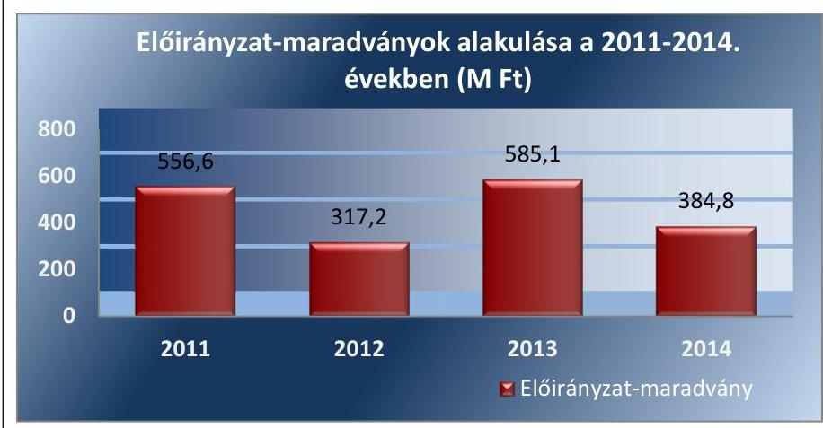

Forrás: 2011-2014. évi intézményi beszámolók
Az Intézmény a 2011. évben két esetben az Ámr. 75. § (1) bekezdésében előírtak ellenére nem vette nyilvántartásba a kötelezettségvállalást, de az év végi maradvány levezetése során kötelezettségvállalással terhelt maradványként számolt vele. A 2013. évi előirányzat-maradvány felhasználás során esetenként az előirányzat tételének kifizetése - az Ávr. 150. § b) bekezdésében előírtak ellenére - beazonosíthatóan nem az előző évi kötelezettségvállalással terhelt maradvány felhasználásához kapcsolódott.

Az Intézmény a 2011-2014. években az előirányzat-maradványáról az elemi költségvetés végrehajtásáról készített beszámoló benyújtásakor az adatszolgáltatási kötelezettségét az Áhsz 10. § (1) és az Áhsz 3. 32. § (1) bekezdéseiben előírása ellenére az előírt - tárgyévet követő február 28. — határidőre nem teljesítette. Az Intézmény a 2011. évi elemi költségvetési beszámolóját 2012. március 6., a 2012. évit 2013. május 16., a 2013. évit 2014. április 17., a 2014. évit 2015. május 13. dátummal nyújtotta be. Az előirányzat-maradványából a központi költségvetést megillető, elvonandó előirányzat-maradvány a 2011-2014. évek közötti időszakban nem volt.

# 3.5. számú megállapítás 

Az intézmény zavartalan feladatellátásához a fizetőképesség folyamatos fennállása, a likviditás javítása érdekében intézkedtek.

Az Intézmény az Áht. 1, 2 előírásainak megfelelően a folyamatos fizetőképesség biztosítása érdekében a 2011. évben az előirányzat felhasználási tervet, a 2012-2014. években a likviditási terveket készített, beépítve a korlátozó intézkedések hatásait is. Az ellenőrzött időszakban részben volt biztosított a szállítói számlák, egyéb kötelezettségek határidőre történő kiegyenlítése.

Az Intézmény esetében a fizetőképességet (likviditást) elsősorban az elemi költségvetés időarányos rendelkezésre állása, a közfoglalkoztatás, a projektek (pályázatok), valamint a védekezési kiadások finanszírozási rendszere befolyásolta a 2011-2014. években. Az Intézmény a 2011. és 2013. években kérte az előirányzat-felhasználási keret előrehozását. A 2011. és a 2013. évben az irányító szerv$_{1,2}$ négy alkalommal intézkedett keret-előrehozásról. A 2011. évben a zárolás következtében vált szükségessé három alkalommal a bérek finanszírozására a likviditás biztosításához az előirány-

---

zat-felhasználási keret előrehozására vonatkozó kérelem benyújtása, amelyet az irányító szerv 1 jóváhagyott, így a fizetőképesség helyreállt. A 2011. évben a keret előrehozás összesen 217,4 M Ft volt. A 2013. évben a dunai árvizi védekezés személyi juttatásai, és dologi kiadásai finanszírozására 104,0 M Ft keret előrehozást kellett kérni.

Az Intézmény a fizetőképessége fenntartása érdekében a fennálló követelések végrehajtására intézkedéseket tett. A követelések behajtására egyenlegközlő, felszólító levelet küldött ki az adósoknak, továbbá 11 esetben végrehajtási, kettő esetben felszámolási eljárást kezdeményezett.

# 3.6. számú megállapítás 

## Az Intézmény az eredményszemléletű számvitel bevezetésével kapcsolatos feladatokat szabályszerűen hajtotta végre.

Az Intézmény az NGM rendelet $_3$-nak $^{56}$ megfelelően végrehajtotta a rendező mérleg elkészítését megelőző feladatokat.

Az Intézmény a rendező mérleget az NGM rendelet $_3$ 8. § (2) bekezdésében előírt határidőt (2014. március 31.) követően készítette el, mert az OVF a rendező mérleg elkészítésének határidejét az NGM rendelet $_3$ előírásától eltérően először 2014. április 9-re, majd 2014. április 15-ére írta elő, oly módon, hogy a rendező mérlegben alkalmazott dátum csak 2014. március 31. lehetett. A határidő módosítás oka a FORRÁS SQL KGR $^{57}$ informatikai rendszer adatbeviteli lehetőségének a határidő utolsó napján történt megnyitása volt. A rendező mérleget az OVF által megadott 2014. április 15-i határidőre az Intézmény elkészítette.

A rendező mérleget az Intézmény az NGM rendelet $_3$-ban előírt formátumban, tartalommal - az előírt átrendezéseknek megfelelően - készítette el. A rendező mérleg elkészítéséig a könyvvezetés részben történt az NGM rendelet $_3$ 9. § előírásai szerint, mivel az Intézmény a követelések számláit a 2013. december 31-ei fordulónappal felvett leltár alapján csak 2014. február 10-én nyitotta meg. A megnyitott számlákon 2014. január 1-jétől a számlák nyitásáig bekövetkezett gazdasági eseményeket elszámolták, az előirányzatok nyilvántartására szolgáló nyilvántartási számlák megnyitása az Áhsz 2. szerint, az elemi költségvetés elfogadását követően történt. Az Intézmény az NGM rendelet $_3$ előírásainak megfelelően elvégezte az idegen pénzeszközök átvezetését és a B813. Maradvány igénybevétele rovat elszámolását.

## 4. Az intézmény vagyongazdálkodása szabályszerű volt-e?

## Összegző megállapítás

Az intézmény vagyongazdálkodása szabályszerű volt.

### 4.1. számú megállapítás

A vagyonkezelési szerződés részben felelt meg a jogszabályi előírásoknak.

Az állami vagyon kezelésére kötött szerződés tartalma jogszabályi előírásoknak részben felelt meg. Az Intézmény kezelésében lévő vagyoni elemekre kiterjedő tulajdonosi joggyakorlást, az állami vagyon kezelését a KVI-vel $^{58}$ 1998. szeptember 3-án kötött VSZ $^{59}$ szabályozta, mely a Vtvr. előírásainak megfelelően tartalmazta a tulajdonosi joggyakorlás és vagyongazdálkodási feladatok szabályozott és átlátható módon történő végrehaj-

---

tását, a vagyon használatának ellenőrzését, az érintett vagyonelem esetleges védettségét, a Natura 2000 területnek minősítését, rendeltetését, az érték-növelő beruházás, felújítás, valamint a létrehozott új eszköz értékével kapcsolatos adatszolgáltatás módját és gyakoriságát, rendjét és tartalmát, a tulajdonosi ellenőrzés eljárásrendjét, a vagyonkezelőnek a tulajdonosi jog-gyakorló vagyon-nyilvántartási szabályzatának megismerésére és kötelező érvényességének elismerésére vonatkozó kötelezettségét.

A döntően a kezelt vagyonnal kapcsolatos gazdasági események miatt több alkalommal módosított VSZ rendelkezésein 1998 óta nem vezették át sem a megváltozott jogszabályi háttért (az ágazati, államháztartási jogszabályokat), sem a 2010. szeptember 1-én hatályba lépett Nfatv. 1-2. §-ai által a tulajdonosi joggyakorlás területén hozott változásokat sem, amelyek alapján a Nemzeti Földalapba tartozó földterületek, erdők az NFA tulajdonosi joggyakorlása alá kerültek, és a tulajdonosi joggyakorlás vagyonelemtől függően megoszlik az MNV Zrt. $^{60}$ és az NFA között. A VSZ felülvizsgálatának az elmulasztásával az Intézmény nem teljesítette a Vtv. $^{61}$ 2011. január 1-ig hatályos 59. § (5) bekezdésében előírt feladatot. Továbbá a módosításokat is tartalmazó, egységes szerkezetű VSZ kiadására a Vtvr. 8. § (2) bekezdés előírása ellenére nem került sor. A fentiek miatt az ellenőrzött időszakban hatályos VSZ az elavult rendelkezései miatt korlátozottan volt alkalmas szabályozó funkció betöltésére.

Az Intézmény teljesítette a jogszabályban, illetve a VSZ-ben a kezelt vagyonnal kapcsolatban előírt kötelezettségeit. Kétszintű, a „Kincstári vagyon nyilvántartási szabályzat" dokumentumnak és a számviteli előírásoknak megfelelő kincstári vagyon nyilvántartási rendszert vezetett. Az ellenőrzött időszakban éves adatszolgáltatást, illetve negyedévente jelentést készített az MNV Zrt. felé a vagyonkezelésében lévő ingatlanokat érintő uniós és/vagy hazai támogatásból megvalósuló pályázatokhoz kiadott tulajdonosi hozzájárulásokról. Eleget tett a Vtv. alapján tulajdonosi joggyakorló felé teljesítendő közlési kötelezettségének, illetve a Vtvr.-ben meghatározottak alapján bejelentette a vagyontárgy állam tulajdonból történő kikerülését, vagy az ingatlan-nyilvántartási adatainak megváltoztatását. Az ellátandó állami feladatokhoz szükségtelenné vált ingatlanok esetében javaslatot tett a középirányító szerv felé. A Vtvr. és Nfatv. $^{62}$ alapján gondoskodott a módosításokkal érintett ingatlanok vagyonkezelői jogának ingat-lan-nyilvántartásba való bejegyeztetéséről, valamint betartotta a Korm. rendelet $^{63}$-ban előírt követelményeket.

A kezelt vagyonnal kapcsolatos nyilvántartási kötelezettségének az Intézmény a hatályos Számv. tv. 23. § (2) bekezdése előírásainak megfelelően eleget tett.

Vagyonkezelési szerződés nélkül az Intézmény vagyonkezelésébe került eszközök esetében betartották a Vtv. 2. § (2) bekezdésében és az Nvtv. 11.
 § (6) bekezdésében előírtakat.

Szerződés alapján, VSZ megkötése, illetve módosítása nélkül történő ingatlanszerzésre az ellenőrzött években nem került sor. A beruházásokhoz kisajátított, vagyonkezelésbe vett ingatlanoknál a Vtv.-ben előírt irányító szervi jóváhagyás rendelkezésre állt.

---

### 4.2. számú megállapítás

A mérlegben kimutatott eszközök és források nyilvántartása, értékelése, leltározása a jogszabályok és a belső szabályzatok előírásainak megfelelően történt.

A mérlegben kimutatott eszközök és források bekerülési értékének megállapítása, állományba vétele, nyilvántartása, év végi értékelése, az értékcsökkenés elszámolása a Számv. tv., Áhsz. 1, 2, Ámr., Ávr., Vtv. és a belső szabályzatok előírásainak megfelelt.

A vagyoni elemek bekerülési értékének megállapítása, mérlegben történő bemutatása szabályszerű volt. Az eszközök állományba vételét, üzembe helyezését dokumentálták, azok megtalálhatók voltak a tárgyévi leltárban, valamint a tárgyi eszközökről és a készletekről a FORRÁS SQL KGR informatikai rendszerben vezetett egyedi (analitikus) nyilvántartásban. Az analitikus nyilvántartás kapcsolódó könyvviteli és nyilvántartási számlákkal való év végi egyeztetését elvégezték.

A követelésekről, kötelezettségekről állományi számlákat vezettek, negyedévenként összegző kimutatást készítettek, főkönyvi feladásuk előírásszerű volt. A mérleg tételeket a mérleg-fordulónapon értékelték. Az eszközök után értékcsökkenést, a követeléseknél, kötelezettségeknél értékvesztést számoltak el. A behajthatatlannak minősített követeléseket leírták, a mérleg fordulónapokon ilyen állományt nem mutattak ki.

A könyvviteli mérlegben és a számviteli nyilvántartásokban kimutatott eszközök és források valódiságát - évente, az Áhsz. 1, 2 előírásainak megfelelően - leltárral támasztották alá. A leltárak az eszközöket mennyiségben és értékben, a forrásokat értékben, ellenőrizhető módon tartalmazták, az üzemeltetésre átadott eszközöket az üzemeltetést végző hitelesített leltárával támasztották alá. A leltárak kiértékelése, a leltározás és a könyvvitel adatai közötti eltérések könyvviteli rendezése a mérlegkészítés időpontjáig megtörtént.

A leltározás, selejtezés végrehajtása az előírásoknak megfelelően történt. A feleslegessé vagy használatra alkalmatlanná vált eszközök leselejtezéséhez, a leltározás lebonyolításához alkalmazott gyakorlat megfelelt a jogszabály és az ellenőrzött időszakban hatályos leltározási és leltárkészítési szabályzat 1-5 és selejtezési szabályzat 1-464 rendelkezéseinek. Az Intézmény december 31-ei fordulónappal készített mérlegében kimutatott vagyoni elemeket a 2012. és a 2013. évben teljes körűen leltározták, a 2011. évben a felügyeleti szerv engedélye, a 2014. évben jogszabály és belső szabályzat alapján csak egyeztetéssel leltároztak, mennyiségi felvétellel történő leltározásra nem került sor.
4.3. számú megállapítás

Az Intézmény az értékmegőrzési, állagmegóvási kötelezettségeit a jogszabály és a vagyonkezelési szerződés előírásai szerint teljesítette.

Az Intézmény a Vtv., valamint a Vtv. alapján előírt értékmegőrzési, állagmegóvási és a szükséges felújítási munkák elvégzési kötelezettségének eleget tett.

A 10/1997. (VII. 17.) KHVM rendelet65 alapján árvíz-védekezési, jeges árvíz elleni védekezési, lokalizációs, belvíz-védekezési, valamint a szomszédos államokkal kötött egyezmények alapján védekezési tervet, a védekezési felkészültség és a védművek évenkénti felülvizsgálata után a hiányosságok megszüntetését célzó intézkedési tervet készített. A vagyongazdálkodási feladatokat az üzemelésre, fenntartásra (karbantartásra), vízvagyon kezelésre készítették el. Az éves Munkatervekben szereplő célkitűzések a vagyonkezelésben lévő ingatlanok működtetésével, állagának megóvásával, karbantartásával kapcsolatos kötelezettségek teljesítését, feladatok elvégzését - megvalósítását a szakmai tevékenységet értékelő beszámolók tartalmazták.

Az Intézmény a vagyontárgyak állagának megóvása érdekében szabályszerű és tervezett karbantartási tevékenységet folytatott. A tárgyi eszközök értékének 95%-át kitevő vízkár-elhárítási célú védművek karbantartását a Korm. rendelet:66 alapján, a fenntartó- és egyéb gépeinek, azok épületgépészeti berendezéseinek karbantartását saját kivitelezésben vagy alvállalkozók bevonásával -, a fenntartási munkák legnagyobb részét a tartós és nagy létszámú közfoglalkoztatás keretében végezték el.

Az Intézmény a mérlegadatokból a vagyoni helyzetre vonatkozóan számított mutatók tendenciái alapján megítélve az ágazati jogszabályokban, az Nvtv., a Vtv., a Vtv. és a VSZ rendelkezéseiben előírt értékmegőrzési, állagmegóvási kötelezettségét az ellenőrzött években teljesítette.

A beszámoló adataiból számítható mutatók67 alakulását az 5. táblázat tartalmazza.
5. táblázat

| A VAGYONI HELYZET MUTATÓI A 2011-2014. ÉVEKBEN (\%-BAN) |  |  |  |  |
| :-- | --: | --: | --: | --: |
| Vagyoni helyzet mutatói | 2011. | 2012. | 2013. | 2014. |
| Befektetett eszközök aránya mutató | 95,5 | 95,8 | 94,8 | 96,2 |
| Forgóeszközök aránya mutató | 4,4 | 4,1 | 5,1 | 1,5 |
| Ingatlanok aránya mutató | 73,8 | 64,2 | 94,2 | 94,9 |
| Saját tőke aránya mutató | 92,0 | 95,4 | 96,0 | 96,7 |
| Használhatósági fok mutatója | 60,2 | 59,2 | 65,9 | 65,2 |
| Elhasználódási szint | 39,8 | 40,8 | 34,1 | 34,8 |
| Kötelezettségek és saját tőke aránya | 5,5 | 3,0 | 1,5 | 0,8 |

A 2011-2014. években a tevékenység befektetett eszköz-ellátottsága javult, az ingatlanok befektetett eszközökön belüli részaránya - a 2012. évi csökkenést leszámítva - évről évre nőtt. A 2014. évben az Intézmény összes eszközének 96%-át a tartósan befektetett eszközök tették ki. A mutatók szerint a saját tőke aránya az összes forráson belül évről évre növekedett, ez pozitív tendenciát fejezett ki. A kötelezettségek és a saját tőke aránya alapján megítélve az ellenőrzött időszakban az Intézmény képes volt kötelezettségeinek, a szállítóinak a kiegyenlítésére, működésének biztonsága biztosítva volt. A tevékenység eszközellátottsága javult. Az Intézmény eszközeinek átlagos elhasználtsága 2013. évig bezárólag csökkent, a használhatóságuk javult. A közfoglalkoztatásra épített, európai uniós projektek által biztosított rekonstrukciós munkákkal és fejlesztésekkel kiegészített fenntartás eredményeként javult a kezelésében lévő védőművek állapota.

Az Intézmény a vagyonkezelésében lévő állami tulajdonú eszközökön végzett beruházások lebonyolításánál betartotta az Nvtv., a Vtv. és a Vtv. előírásait.

Az Intézmény az MNV Zrt. meghatalmazása alapján tulajdonosi hozzájárulásokat adott ki az ingatlanokat érintő uniós és/vagy hazai támogatásból megvalósuló pályázatokhoz, a 2012. évben megkezdődött töltés-fejlesztési beruházásoknál az MNV Zrt. a VSZ módosításában és mellékletei alapján engedélyezte a beruházás megvalósulását. A vagyonkezelt ingatlanokon kötelező alapfeladatként végzett beruházásoknál figyelembe vették az Nvtv.-ben rögzített tilalmat, illetve annak feloldását.

A felhalmozási kiadások esetében a közbeszerzések tárgya becsült értékének meghatározásához az Intézménynek a kialakított csoportképzési gyakorlata megfelelt a hatályos jogszabályi előírásoknak. Az egybeszámítási szabályokat a kötelezettségvállalás nyilvántartás adatai alapján figyelembe vették. A lefolytatott közbeszerzési eljárásokat előírásszerűen dokumentálták. A szerződést a közbeszerzési eljárás nyertesével kötötték meg. A beszerzett eszközök állományba vétele, az üzembe helyezése megtörtént, a bekerülési érték meghatározása, az eszközök besorolása, az értékcsökkenés elszámolása szabályszerű volt.

# 4.4. számú megállapítás 

A vagyonelemek elidegenítése a jogszabályok és a belső szabályzat előírásainak megfelelően történt, a hasznosítása részben biztosította az átláthatóság követelményének érvényesülését.

A vagyonelemek értékesítése során betartották a jogszabályokban és a belső szabályzatokban foglaltakat, azok hasznosításánál azonban nem győződtek meg az Nvtv. szerinti átláthatóság követelményének érvényesüléséről. Az éves beszámolókban kimutatott felhalmozási bevételek megállapítása, előírása, teljesítése az Áht. 1, 2, Info tv., Nvtv., Vtv., Vtv. és a belső szabályozásban előírtaknak megfelelően történt.

Az elavult, feleslegesnek, rendeltetésszerű használatra alkalmatlannak nyilvánított, illetve leselejtezett vagyoni elemek értékesítésére szabályozott módon került sor. A Vtv. alapján az MNV Zrt. előzetes hozzájárulásához kötött vagyonértékesítésre, vagyonhasznosításra vagy vagyoni értékű jog átadására vonatkozó szerződést nem kötöttek, e tekintetben az Áht. 1, illetve az Info tv. 1. számú mellékletében szereplő közzétételi kötelezettség nem merült fel.

A vagyontárgyak magáncélú hasznosításából, a vagyoni elemek bérbeadás útján történő hasznosításából, a hatósági-, valamint vállalkozási tevékenységéből származó bevétel megállapítása, előírása, az Áfa tv.68 szabályai szerinti kiszámlázása, a befolyt bevételek elszámolása és nyilvántartása a jogszabályokban és a belső szabályozásban előírtaknak megfelelően történt.

A vagyonhasznosítási bevételek - néhány esetet leszámítva - az előírt határidőben, a megfelelő összegben realizálódtak, azokat nyilvántartásba vették, realizálódásuk elmaradása esetén intézkedést tettek a követelés behajtása és a bevétel teljesülése érdekében. A bérleti szerződések időtartamát 2011. december 31-től az Nvtv.-ben előírt határozatlan, legfeljebb 15 éves határozott időre állapították meg.

Az Intézmény a bérbeadási folyamatnál 2012. január 1-jétől nem tett eleget az Nvtv. 11. § (10)-(11) bekezdéseiben az átláthatóság követelményeinek érvényesüléséhez előírt feltételeknek, ezért a vagyonhasznosítás kockázatosnak minősült.

A 2012. január 1-jét követően létrejött vagyonhasznosítási célú szerződésekben a bérbeadó nem írta elő, így ezáltal a bérbevevő nem vállalta a beszámolási, nyilvántartási, adatszolgáltatási kötelezettségek teljesítését, továbbá hogy az átengedett nemzeti vagyont a szerződési előírásoknak és a tulajdonosi rendelkezéseknek, valamint a meghatározott hasznosítási célnak megfelelően használja, illetve azt sem, hogy a hasznosításban - a hasznosítóval közvetlen vagy közvetett módon jogviszonyban álló harmadik félként - kizárólag természetes személyek vagy átlátható szervezetek vehetnek részt. Mulasztásával az Intézmény megsértette az Nvtv. 11. § (11) bekezdés a)-c) pontjaiban előírtakat.

Az ellenőrzött időszakban a jogszabályban meghatározott értékhatárt elérő, MNV Zrt., illetve irányító szerv engedélyéhez kötött vagyoni elem értékesítésére nem került sor.

Az Nvtv. 11. § (8) bekezdés d) pont szerinti vagyonkezelői jog harmadik személyre történő átruházására az ellenőrzött években nem került sor.

# 5. Szabályszerűen hajtották-e végre az ellenőrzött időszakban az intézményt érintő szervezeti, szerkezeti átalakításokat? 

Összegző megállapítás

Az ellenőrzött időszakban az Intézménynél átalakítás/átszervezés nem történt.

Az irányító szerv az átszervezéshez, átalakításhoz kapcsolódó alapítói jogát nem gyakorolta, mert az Intézménynél az ellenőrzött időszakban átalakítás/átszervezés nem történt.

Az Intézményt az ellenőrzött időszakban az Áht. 1, 2-ben meghatározott átalakítás (egyesítés, szétválás), megszüntetés nem érintette. Az irányító szerv1,2-nek az Intézmény átalakulásával, átszervezésével kapcsolatos feladata nem volt.

Az Intézménynél átalakítás/átszervezés nem történt. Az Intézménynek átalakítással, átszervezéssel kapcsolatos feladata nem volt.

Az Intézménynél az ellenőrzött időszakban az Áht. 1, 2-ben meghatározott átalakítás/átszervezés nem volt, feladatstruktúrája az ellenőrzött időszakban három alkalommal változott. 2012-ben és 2014-ben feladatokat és létszámot adott át, valamint 2014-ben át is vett feladatokat és létszámot költségvetési szervektől. A feladatátadás-átvételekre jogszabályváltozások alapján került sor.

A feladatátadás-átvételekre átadás-átvételi jegyzőkönyvek és az azok mellékletét képező leltárak alapján, szabályszerűen került sor. Az átadás-átvételt az Alapító okirat 2-6 és az SZMSZ 2, 3 módosításokban követték.

---

# 6. Az intézmény intézkedett-e az integritás szemlélet érvényesítése érdekében? 

## Összegző megállapítás

Az ellenőrzött időszakban az Intézmény erőfeszítéseket tett az integritás szemlélet érvényesítése érdekében.

Az Intézmény az ÁSZ Integritás Projektjében az ellenőrzést megelőzően részt vett. Az integritás érvényesítése érdekében az Intézmény által kialakított és működtetett kontrollrendszer biztosította a megfelelő feltételeket a szervezet integritását veszélyeztető kockázatokkal szemben, a kontrollok szintje megfelelő volt.

Az Intézmény erőfeszítéseket tett a korrupcióval kapcsolatos kockázatok csökkentése, az integritás szemlélet érvényesülése érdekében.

Az integritás szemlélet érvényesülésének értékelését a II. számú melléklet tartalmazza.

---

# JAVASLATOK 

Az ÁSZ tv. 33. § (1) bekezdésében foglaltak értelmében az ellenőrzött szervezet vezetője köteles a jelentésben foglalt megállapításokhoz kapcsolódó intézkedési tervet összeállítani és azt a jelentés kézhezvételétől számított 30 napon belül az ÁSZ részére megküldeni. Amennyiben az intézkedési tervet határidőre nem küldi meg a szervezet, vagy amennyiben az nem elfogadható, az ÁSZ elnöke az ÁSZ tv. 33. § (3) bekezdés a)-b) pontjaiban foglaltakat érvényesítheti.

## a belügyminiszternek

1. Intézkedjen a hatékony gazdálkodásra irányuló ellenőrzések elvégzése érdekében.
(1.2. sz. megállapítás 4. bekezdése alapján)

## a Felső-Tisza-vidéki Vízügyi Igazgatóság igazgatójának

1. A belső kontrollrendszer szabályszerű kialakítása és működtetése érdekében intézkedjen:
a) a
 gazdasági szervezet jogszabályi előírásoknak megfelelő ügyrendjének elkészítésére;
(2.1. sz. megállapítás 4. bekezdés 2. mondata alapján)
b) a jogszabályi előírásoknak megfelelő számlarend elkészítésére;
(2.1. sz. megállapítás 5. bekezdés 2. mondata alapján)
c) az egyes kockázatokkal kapcsolatban szükséges intézkedések teljesítésének folyamatos nyomon követési módja meghatározásáról;
(2.2. sz. megállapítás 2. bekezdés 3. mondata alapján)
d) a vagyonnyilatkozat-tételre kötelezettek körének feltüntetésére a szervezeti és működési szabályzatban;
(2.2. sz. megállapítás 3. bekezdése alapján)

---

e) a dokumentumokhoz és információkhoz való hozzáférés szabályozására;
(2.3. sz. megállapítás 4. bekezdése alapján)
f) a gazdálkodási jogkörök jogszabályi előírásoknak megfelelő gyakorlására;
(2.3. sz. megállapítás 5. bekezdés 2. mondata, 3.3. sz. megállapítás 1., 3., 7., 10., 11. francia bekezdése alapján)
g) az üzembiztonsági, adatvédelmi szabályok érvényre juttatásához szükséges eljárási szabályok kialakítására;
(2.3. sz. megállapítás 6. bekezdése alapján)
h) az iratkezelési szabályzat jogszabályi előírásoknak megfelelő kiadására;
(2.4. sz. megállapítás 3. bekezdés 2. mondata alapján)
i) az Intézmény szervezeti egységeinek vezetői által készített intézkedési terv elkészítésére és megküldésére előírt határidő betartására;
(2.5. sz. megállapítás 4. bekezdés 2. mondata alapján)
j) a belső ellenőrzési jelentésekben megfogalmazott javaslatok hasznosítására készített intézkedési tervek jogszabályi előírásoknak megfelelő jóváhagyására.
(2.5. sz. megállapítás 5. bekezdése alapján)
2. A szabályszerű pénzügyi gazdálkodás érdekében intézkedjen:
a) az előirányzat módosítása esetén a jogszabályi előírások betartására;
(3.2. sz. megállapítás 4. bekezdése alapján)
b) a Kincstár által működtetett elektronikus adatszolgáltató rendszerbe az éves költségvetési beszámoló adatai feltöltésének jogszabályban előírt határideje betartására.
(3.4. sz. megállapítás 5. bekezdés 1. mondata alapján)

---

3. Intézkedjen a bérbeadási szerződések megkötése előtt az átláthatósági követelmények érvényesülésére, valamint a jogszabályban előírt követelmények rögzítésére a szerződésekben.
(4.4. sz. megállapítás 5., 6. bekezdése alapján)
4. Tegyen intézkedéseket a feltárt hiányosságok és/vagy szabálytalanságok tekintetében a felelősség tisztázása érdekében, és szükség szerint intézkedjen a felelősség érvényesítéséről.
(2.3. sz. megállapítás 5. bekezdés 2. mondata, 3.3. sz. megállapítás 1., 3., 7., 10., 11. francia bekezdése, 4.4. sz. megállapítás 5., 6. bekezdése alapján)

---

.

---

# MELLÉKLETEK 

- I. SZ. MELLÉKLET: ÉRTELMEZŐ SZÓTÁR
belső ellenőrzés
belső kontrollrendszer
belső kontrollrendszer területei
ellenőrzési nyomvonal
előirányzat-módosítás

FEUVE
információs és kommunikációs rendszer

Független, tárgyilagos bizonyosságot adó és tanácsadó tevékenység, amelynek célja, hogy az ellenőrzött szervezet működését fejlessze és eredményességét növelje, az ellenőrzött szervezet céljai elérése érdekében rendszerszemléletű megközelítéssel és módszeresen értékeli, illetve fejleszti az ellenőrzött szervezet irányítási és belső kontrollrendszerének hatékonyságát. (Forrás: Bkr. 2. § b) pontja)
A belső kontrollrendszer a költségvetési szerv által a kockázatok kezelésére és tárgyilagos bizonyosság megszerzése érdekében kialakított folyamatrendszer, amely azt a célt szolgálja, hogy a költségvetési szerv megvalósítsa a következő fő célokat: a tevékenységeket (műveleteket) szabályszerűen, valamint a megbízható gazdálkodás elveivel (gazdaságosság, hatékonyság és eredményesség) összhangban hajtsa végre; teljesítse az elszámolási kötelezettségeket; megvédje a szervezet erőforrásait a veszteségektől (károktól) és a nem rendeltetésszerű használattól. (Forrás: Áht.: 120/B. § (1) bekezdés, hatályos: 2011. december 31-ig)
A belső kontrollrendszer a kockázatok kezelése és tárgyilagos bizonyosság megszerzése érdekében kialakított folyamatrendszer, amely azt a célt szolgálja, hogy megvalósuljanak a következő célok: a működés és gazdálkodás során a tevékenységeket szabályszerűen, gazdaságosan, hatékonyan, eredményesen hajtsák végre, az elszámolási kötelezettségeket teljesítsék, és megvédjék az erőforrásokat a veszteségektől, károktól és nem rendeltetésszerű használattól. (Forrás: Áht. 2 69. § (1) bekezdés, hatályos: 2012. január 1-jétől)
A kontrollkörnyezet, a kockázatkezelési rendszer, a kontrolltevékenységek, az információs és kommunikációs rendszer, valamint a nyomon követési (monitoring) rendszer. (Forrás: Bkr. 3. §-a)
Az ellenőrzési nyomvonal a költségvetési szerv működési folyamatainak szöveges vagy táblázatba foglalt, vagy folyamatábrákkal szemléltetett leírása, amely tartalmazza különösen a felelősségi és információs szinteket és kapcsolatokat, továbbá irányítási és ellenőrzési folyamatokat, lehetővé téve azok nyomon követését és utólagos ellenőrzését. (Forrás: az NGM honlapjáról elérhető Belső Kontroll kézikönyv PM 2010. 35. oldal)

Az előirányzat-módosítás: a megállapított kiadási, bevételi, támogatási kiemelt előirányzat, létszám-előirányzat növelése vagy csökkentése. (Forrás Áht.: 2/A. § (3) bekezdés k) pont, hatályos: 2011. december 31-ig)
Előirányzat-módosítás: a megállapított kiadási előirányzat növelése vagy csökkentése, a bevételi előirányzatok egyidejű növelése vagy csökkentése mellett. (Forrás: Áht. 2 2. § (1) bekezdés f) pontja, hatályos: 2012. január 1-jétől).
Folyamatba épített, előzetes, utólagos és vezetői ellenőrzés. A FEUVE a szervezeten belül a gazdálkodásért felelős szervezeti egység által folytatott első szintű pénzügyi irányítási és ellenőrzési rendszer.
A folyamatba épített előzetes és utólagos vezetői ellenőrzésre vonatkozó szabályokat Áht.1,2, valamint az Ámr. határozza meg. Kidolgozására a pénzügyminisztérium költségvetési ellenőrzéssel kapcsolatban közzétett módszertani útmutatói, illetve ajánlásai figyelembevételével került sor. (Források: Ámr. 155. § (1) bekezdés, Bkr. 8. § (2) bekezdés)
A költségvetési szerv vezetője által kialakított és működtetett olyan rendszer, mely biztosítja, hogy a megfelelő információk a megfelelő időben eljutnak az illetékes szervezethez, szervezeti egységhez, illetve személyhez. (Forrás: Bkr. 9. § (1) bekezdés)

---

intézkedési terv
irányító szerv
kockázatkezelési rendszer
kontrollkörnyezet
kontrolltevékenységek
kommunikáció
kulcskontrollok
likviditási mutató
monitoring
monitoring-rendszer
pénzeszköz likviditási mutató
vezetői nyilatkozat

Az ellenőrzési javaslatok alapján az ellenőrzött szervezet, szervezeti egység által készített intézkedések végrehajtásának ütemezése a végrehajtásáért felelős személyek és a vonatkozó határidők megjelölésével. (Forrás: Bkr. 2. § (k) pontja, hatályos 2012. január 1-jétől)
A központi alrendszer egyes intézményével és annak gazdálkodásával kapcsolatos irányítási jogokkal felruházott szerv vagy személy.
Olyan irányítási eszközök és módszerek összessége, melynek elemei a szervezeti célok elérését veszélyeztető tényezők (kockázatok) azonosítása, elemzése, csoportosítása, nyomon követése, valamint szükség esetén a kockázati kitettség mérséklése. (Forrás: Bkr. 2. § m) pontja)
A költségvetési szerv vezetője által kialakított olyan elvek, eljárások, belső szabályzatok összessége, amelyben világos a szervezeti struktúra, egyértelműek a felelősségi, hatásköri viszonyok és feladatok, meghatározottak az etikai elvárások a szervezet minden szintjén, átlátható a humánerőforrás-kezelés. (Forrás: Bkr. 6. § (1) bekezdés) A költségvetési szerv vezetője által a szervezeten belül kialakított (kontroll) tevékenységek, melyek biztosítják a kockázatok kezelését, hozzájárulnak a szervezet céljainak eléréséhez. (Forrás: Bkr. 8. § (1) bekezdés)
Az a tevékenység, melynek során információ továbbítása valósul meg. A kommunikációs folyamat résztvevői között tájékoztatás történik, mely során tényeket, ezek magyarázatát közlik.
A gazdálkodási jogkörök gyakorlása közül a kiadások utalványozását megelőző kötelező kontrolltevékenységek. Az Ámr. a 2011. évben a szakmai teljesítésigazolást és az utalvány ellenjegyzését, az Ávr. a 2012-2013. években a teljesítésigazolást és az érvényesítést írta elő egyenrangú kulcskontrollként.
A mutató kifejezi, hogy a szervezet forgóeszközei milyen mértékben nyújtanak fedezetet a rövid lejáratú kötelezettségekre az éves könyvviteli mérleg adatai alapján. Számítása: Forgóeszközök összesen/ Rövid lejáratú kötelezettségek összesen.
A monitoring általánosságban a különböző szintű szervezeti célok megvalósításának folyamatát kíséri figyelemmel, melynek során a releváns eseményekről és tevékenységekről (együtt: folyamatokról) rendszeres jelleggel, strukturált, döntéstámogató információkhoz jutnak a szervezet vezetői. (Forrás: NGM Útmutató a költségvetési szervek monitoring rendszeréhez 2011. november)
A költségvetési szerv vezetője köteles olyan monitoring rendszert működtetni, mely lehetővé teszi a szervezet tevékenységének, a célok megvalósításának nyomon követését. A költségvetési szerv monitoring rendszere az operatív tevékenységek keretében megvalósuló folyamatos és eseti nyomon követésből, valamint az operatív tevékenységektől függetlenül működő belső ellenőrzésből áll. (Forrás: Ámr. 160. §, Bkr. 10. §)
A mutató kifejezi, hogy a szervezet pénzeszközei milyen mértékben nyújtanak fedezetet a rövid lejáratú kötelezettségekre az éves könyvviteli mérleg adatai alapján. Számítása: Pénzeszközök összesen/Rövid lejáratú kötelezettségek összesen.
A költségvetési szerv vezetője köteles - az előírt tartalmú - nyilatkozatban értékelni a költségvetési szerv belső kontrollrendszerének minőségét és azt az éves költségvetési beszámolóval együtt megküldeni az irányító szervnek. Ha a költségvetési szervnél év közben változás történik a szerv vezetője személyében, vagy a költségvetési szerv átalakul, megszűnik, a távozó vezető, illetve az átalakuló, megszűnő költségvetési szerv vezetője köteles az előírt tartalmú nyilatkozatot az addig eltelt időszak vonatkozásában kitölteni, és az új vezetőnek, illetve a jogutód költségvetési szerv vezetőjének átadni, aki azt saját nyilatkozatához mellékeli. Jelen ellenőrzés során vezetői nyilatkozaton a fentebb említett nyilatkozatokban tett következő résznyilatkozatot értjük, ennek helytállóságát értékeljük a pénzügyi és vagyongazdálkodási folyamatok

---

tekintetében: „gondoskodtam (...) a költségvetési szerv tevékenységében a hatékonyság, eredményesség és a gazdaságosság követelményeinek érvényesítéséről". (Forrás: Ámr. 217. § c) pontja, 226. § (3) bekezdés, 21. számú melléklet; Bkr. 11. § (1) és (4) bekezdés, 1. számú melléklet)

---

# II. SZ. MELLÉKLET: AZ INTEGRITÁS ÉRVÉNYESÍTÉSE ÉRDEKÉBEN KIALAKÍTOTT ÉS MŰKÖDTETETT KONTROLLRENDSZER 

Az Állami Számvevőszék a korrupció visszaszorítása érdekében egy nemzetközileg elismert módszertan adaptációjára épülő tevékenységgel kívánja növelni a korrupció-ellenes tevékenység tudatosulását a költségvetési intézmények körében. A közszféra szereplői 2014. évben is lehetőséget kaptak részvételre egy, az ÁSZ által szervezett kérdőíves kutatásban, amelynek során a kérdőívek kitöltése segíthet a hazai korrupció ellenes küzdelemben, és egyben visszajelzést is nyújt az egyes közintézményeknek arról, hogy milyen mértékű a korrupciós veszélyeztetettségük. A kérdőív kitöltése opcionális volt, a résztvevő intézmények listája nyilvános. Az Intézmény az ÁSZ Integritás Projekt keretében az ellenőrzést megelőzően kitöltötte a 2014. évi integritás kérdőívet.

Az Intézmény saját helyzetértékelése alapján kitöltött integritás tanúsítványnak az összesítő értékelése megfelelő volt. Az Intézmény által kialakított és működtetett integritás-kontrollrendszert az alábbi öt területen értékeltük:

Az összeférhetetlenség és etikai elvárások kontrollszintje megfelelő volt, mert az összeférhetetlenség kérdéskörét és a munkavégzésre vonatkozó etikai elvárásokat 2012. októbertől kezdődően szabályozták, továbbá az elmúlt három évben nem indult a munkatársak ellen kötelezettségszegés miatt etikai eljárás. Azonban a munkatársak nem nyilatkoztak kötelezően gazdasági érdekeltségeikről és egyéb, a szervezet szempontjából releváns összeférhetetlenségekről, valamint az ajándékok, meghívások, utaztatás elfogadásának feltételeit nem szabályozták.

A humánerőforrás gazdálkodás kontrollszintje megfelelő volt. Az Intézmény szabályozta a humánpolitikai tevékenységet, az új munkatársak kiválasztására szolgáló eljárást minden jelölt esetében alkalmazta, és a munkatársak rendelkeztek munkaköri leírással. Azonban álláspályázatot az új munkatársak kiválasztására nem írtak ki minden esetben, és a munkatársak kiválasztásakor nem alkalmaztak objektív megítélést lehetővé tevő, általánosan elfogadott módszert.

A szervezet vagyonának megvédésére tett intézkedések értékelési eredménye kiváló volt. Intézkedéseket tettek a munkáltató tulajdonában levő eszközök magáncélú használatának szabályozására, a dokumentumok, pénzeszközök, kulcsok biztonságos tárolása és az információ biztonsága érdekében, szabályozták a külső személyekkel történő kapcsolattartást, és alkalmazták a „négy szem elvét".

A nemkívánatos dolgozói magatartással szembeni intézkedések és azok érvényesülésére tett intézkedések kontrollszintje megfelelő értékelést kapott. Az Intézmény rendelkezett szabályozással a munkatársak nemkívánatos magatartásának, a szervezeten belülről és kívülről érkező közérdekű bejelentéseknek, a szervezeten kívülről érkező panaszoknak a kezelésére vonatkozóan, és a 2012-2014. években indított fegyelmi eljárást munkatárssal szemben. Az Intézmény nem rendelkezett szabályozással a munkatársak közül közérdekű bejelentést tevők megfelelő védelmének biztosítására.

Az integritás erősítése, annak tudatosítása, valamint a kockázatelemzések alkalmazásának értékelése megfelelő volt. Az Intézmény tett integritással kapcsolatos intézkedést a felmérés évében, következetesen tudatosította az alkalmazottakban az integritás fontosságát, rendszeresen végzett kockázatelemzést a belső ellenőrzési tervek megalapozásához. Ugyanakkor nem végeztek rendszeres korrupciós kockázatelemzést, és nem szabályozták, illetve nem hívták fel a korrupciós szempontból veszélyeztetett beosztásokban dolgozók figyelmét a jellemző kockázatokra és az azokat megelőző intézkedésekre.

---

# III. SZ. MELLÉKLET: TELJESÍTMÉNY-ELLENŐRZÉSI KIEGÉSZÍTŐ MODUL MEGÁLLAPÍTÁSAI 

A pénzügyi és vagyongazdálkodás folyamatában az Intézmény a
 gazdaságossági, hatékonysági és eredményességi követelmények közül teljesítménycélokat határozott meg, ezek mérésére mutatószámokat alakított ki, nyomon követte ezek alakulását a teljesítésig. A kialakított teljesítménycélokat teljesítették.

Az Intézmény kialakította és működtette a gazdálkodás folyamatában stratégiai és operatív célrendszerét, valamint a célok teljesítésének előrehaladását jelző indikátorrendszerét. A teljesítmény-követelmények kialakításában és érvényesítésében pozitív változások történtek az ellenőrzött időszakban.

Az Intézmény a 2011-2014 közötti időszakban évente megfogalmazta a szervezeti célokat, amelyeknek kialakítását 2012-től a stratégiai tervében részletesen előírta. Az Intézmény a 2012. évtől a Bkr. szabályzat ${ }_{2-6}{ }^{69}$ mellékleteként kidolgozta az intézmény indikátorrendszerét, amelyet belső szabályozó eszközökben foglalt mutatók egészítettek ki.

Az ellenőrzés megállapította, hogy a pénzügyi és vagyongazdálkodás folyamatain belül három részterületen (költségvetés-készítés; gépjármű és flottamenedzsment; egyéb vagyongazdálkodás) az Intézmény több teljesítménymutatót alakított ki számszerűsített célértékek meghatározásával, és ezeket a mutatókat alkalmazta, a célértékek megvalósulását nyomon követte. Ezek közül az eredményesség értékelésére alkalmas mutatószámot 3 esetben alakított ki az Intézmény: a költségvetés-tervezés, végrehajtás területén (Intézményi működési bevételek eredeti előirányzatának teljesítése), a gépjármű és flottamenedzsment területén (futásteljesítmény a célértékhez képest), valamint az egyéb vagyongazdálkodás területén (jóváhagyott keretösszeghez viszonyított tényleges kiadás).

Az Intézmény a pénzügyi és vagyongazdálkodás további négy területén (az épület- és ingatlanüzemeltetés, a karbantartás, a nyomtató- és fénymásoló üzemeltetés, az egyéb pénzügyi gazdálkodás területeken) kialakított teljesítménymutatószámot, de nem határozott meg ezekre célértéket. Ezeken a területeken eredményességi mutató nem volt. Az ellenőrzés megállapította, hogy a karbantartás és a nyomtató- és fénymásoló üzemeltetés területeken a kialakított mutatókat nem alkalmazták, a nyomon követési rendszert nem működtették.

Összességében az Intézmény a kialakított teljesítmény-mutatókat nem teljes körűen alkalmazta, a kialakított mutatókhoz kapcsolódó visszacsatolási rendszert kialakította és részben működtette.

Az Intézmény a költségvetés-készítés területén kitűzött célokat teljesítette, 2011-2014 között az intézményi saját bevételek esetében bevételi többletet ért el. A gépjármű és flottamenedzsment területén a túlfogyasztást kiszűrték, a megtakarításokat kimutatták. A telefonhasználat személyi keretösszeg feletti részét nyomon követték, a térítési számla összegét kimutatták.

---

.

---

# FÜGGELÉK: ÉSZREVÉTELEK 

A jelentéstervezetet a Számvevőszék 15 napos észrevételezésre megküldte az ellenőrzött szervezetek vezetőinek az ÁSZ tv. 29. § (1) bekezdése előírásának megfelelően.

A Felső-Tisza-vidéki Vízügyi Igazgatóság, a Belügyminisztérium, valamint az Országos Vízügyi Főigazgatóság részéről az ellenőrzött szervezet vezetője az ellenőrzés megállapításaira írásban észrevételt tett. A földművelésügyi miniszter az ÁSZ tv. 29. § (2) bekezdésében foglalt észrevételezési jogával nem élt, a törvényes határidőn belül észrevételt nem tett.

A függelék tartalmazza az ellenőrzött szervezetek vezetőinek észrevételeit, illetve az el nem fogadott észrevételek elutasításának indoklását.

[^0]
[^0]:    * 29. § (1) Az Állami Számvevőszék az ellenőrzési megállapításait megküldi az ellenőrzött szervezet vezetőjének vagy az általa megbízott személynek, és annak, akinek személyes felelősségét állapította meg.
    (2) Az ellenőrzött szervezet vezetője és a felelősként megjelölt személy az ellenőrzés megállapításaira tizenöt napon belül írásban észrevételt tehet.
    (3) Az Állami Számvevőszék az észrevételre a beérkezésétől számított harminc napon belül írásban válaszol. A figyelembe nem vett észrevételeket köteles a jelentésben feltüntetni, és megindokolni, hogy azokat miért nem fogadta el.

---

Felső-Tisza-vidéki Vízügyi Igazgatóság
4400 Nyíregyháza, Széchenyi út 19.
Telefon: (42)502-200 Fax: (42)502-202
E-mail: titkarsag@fetivizig.hu Web: www.fetivizig.hu
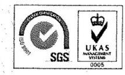

Ügyiratszám: I-0058-014-006/2016.
Tárgy: Jelentéstervezet véleményezése
Hiv.szám: V-0775-104/2016.

## Domokos László úr

elnök
Állami Számvevőszék

## Budapest

Tisztelt Elnök Úr!
ÁLLAMI SZÁMVEVŐSZÉK
0340571216
Érkeze: 2016 APR 28.
Tétalószám: V-0775-115/2016
Melléklet: 6
Pest: 1000000000

Köszönettel megkaptuk V-0775-104/2016. számú, „A központi alrendszer egyes intézményei pénzügyi és vagyongazdálkodásának ellenőrzése - Felső-Tisza-vidéki Vízügyi Igazgatóság" című ellenőrzéséről készített jelentéstervezetet.
A dokumentum tükrözi azt az alapos, részletes vizsgálatot, amelyet Igazgatóságunknál elvégeztek. Nagyon sok olyan megállapítás van a jelentéstervezetben, amelyet további munkánkban - a szabályszerű gazdálkodást segítve - jól tudunk hasznosítani.
Az összességében pozitív véleményünk mellett - a pontosság érdekében - néhány észrevételt teszünk a megállapításokhoz, illetve az ebből eredő intézkedési igényekhez.

## 1. Általánosságban

A jelentéstervezet az összegzésben azt rögzíti:
„Az ellenőrzés megállapította, hogy a pénzügyi gazdálkodás területén a bevételi és kiadási előirányzatok módosítása és az előirányzat-maradvány felhasználásának elszámolása nem a jogszabályi előírásoknak megfelelően történt. A vagyonhasznosítási szerződésekben az átláthatósági követelmények nem érvényesültek."

Álláspontunk szerint ezt az átfogó negatív megállapítást nem igazolja az egyes pontokban adott értékelés, és alpontokban részletezett kifejtés. A releváns 2., 4. és 6. pontokra megfelelő minősítést, a 3. pontra részben szabályszerű megítélést ad a tervezet. 6 alpontban található szabálytalanságra utalás, amelyből a következőkben 5 esetben észrevételezéssel élünk.
A megállapított hibák a jelentéstervezet szerint is „esetenként" előforduló hiányosságok, rendszer szintű szabálytalanság nem merült fel.

---

# 2. Konkrét észrevételek 

### 2.1. A 2.1. számú megállapítás 4. bekezdéséhez

Az Igazgatóság felsővezetőinek és egységvezetőinek a feladat- és hatáskörének megnevezését, valamint a helyettesítésének rendjét egyrészt az SZMSZ tartalmazza. Másrészt Az igazgatóság belső kontroll rendszeréről szóló igazgatói utasítás 8. sz. mellékletében meghatározott Munkaköri leírás minta alapján elkészített egyedi munkaköri leírások. Ezek az egyedi munkaköri leírások - a szabályzatban rögzített mintának megfelelően - tartalmazzák az alkalmazottak feladat- és hatáskörének megnevezését, az alkalmazottak helyettesítési rendjét, továbbá utalnak a belső és külső kapcsolattartásra. A belső és külső kapcsolattartást részletesen a 46/2013. A FETIVIZIG információs és kommunikációs rendszerének szabályzatáról szóló igazgatói utasítás és a 11/2013. sz. Az OVF és a vízügyi igazgatóságok tájékoztatással kapcsolatos feladatairól, a sajtóval való kapcsolattartás rendjéről szóló OVF utasítás szabályozzák. A fenti utasítások a korábbi adatszolgáltatások során megküldésre kerültek.
Véleményünk szerint ez a szabályozás megfelel az Ávr. 13.§(5) bekezdésében foglaltaknak

### 2.2. A 3.2. számú megállapításhoz

Az irányító szerv 13/2011. (V. 23.) BM utasításában rendelkezett a költségvetési szervek középirányító szerveinek (köztük az OVF) kijelöléséről, az irányítói jogok gyakorlásának módjáról. Nevezett utasítás 2.§ (1) bekezdés ce) pontja szerint az OVF nyilvántartja az irányítása alá tartozó költségvetési szervek saját hatáskörben végrehajtott előirányzat-módosításait, és tájékoztatja arról az irányító szervet.
A többletbevételek, valamint az előző évi maradvány előirányzatosítása során a 2011-2014. években adatszolgáltatási kötelezettségünknek az Ámr. 71.§ (6) bekezdésében és az Ávr. 167. § (4) bekezdésében foglalt „az intézkedés meghozatalát követő öt munkanap" helyett a középirányító szerv utasításának megfelelően havonta tettünk eleget.
A gyakorlatunk tehát nem saját elhatározásból alakult ki.

### 2.3. A 2.3. és 3.3. számú megállapításokhoz

A bizonylatok utóellenőrzése során megállapítottuk, hogy a vizsgált mintatételek között egy-két esetben fordultak elő a jelentésben szereplő hiányosságok. Ezért semmiképpen nem rendszerbeli problémáról beszélhetünk, hanem eseti jellegű hibáról. Mindezek alapján nem tartjuk helytállónak azt a megállapítást, hogy:
„A gazdálkodási jogkörök esetében a szakmai teljesítés igazolása és az utalvány ellenjegyzése 2011-ben nem felelt meg a jogszabályi előírásoknak (Ámr. 76.§, 79.§ (2) bekezdés). A teljesítésigazolás és az érvényesítés gyakorlata 2012-ben nem felelt meg, 2013. és 2014. években részben felelt meg a hatályos jogszabályoknak (Ávr. 57-58. §) és a belső előírásoknak. A feltárt hiányosságokat részletesen a 3.3. számú megállapítás tartalmazza."

---

A kötelezettségvállalások nyilvántartásba vételéhez (3.3., számú megállapítás 9. 10, 11. francia bekezdése), a helyszíni vizsgálat során feltöltött feljegyzéssel egyezően: A szállítói számlához kapcsolódó kifizetéseknél a Forrás SQL program egységesen (vízügyi igazgatóságoknál) úgy volt beállítva a 2011-2013-as években, hogy a pénzügyi teljesítésnél rendeződik a kötelezettségvállalás (proforma számla) és a szállítói számla is.

Proforma számla készítése szerződésből kézi rögzítéssel, vagy a kis összegű tételeknél a szállítói számlából generálással történt. A pénzügyi teljesítésnél a szállítói számlára való hivatkozással a számla rendezett állapotba került, a proforma számlára való hivatkozással a kötelezettségvállalás is rendezetté vált és kivezetésre került a szállítói, illetve a kötelezettségvállalás nyilvántartásából. A kivezetés csak a hivatkozások beírásával volt lehetséges.

Nem szállítói számlákhoz kapcsolódó kifizetéseknél a tételek pénzügyi teljesítésének rögzítésekor nem volt lehetőség a proforma számlára történő hivatkozásra (rendezetté válás érdekében), így felesleges (hibás) lett volna a proforma számlák kézi rögzítése, előírása. A generálással történő előírás a közvetlen banki és pénztári kifizetéseknél nem volt lehetséges.
Mindezek alapján azoknál a tételeknél, melyhez nem kapcsolódott szállítói számla, ott a kötelezettségvállalások nyilvántartására sem volt lehetőség.
Pl.: bér, kisajátítások, kiküldetés, átadott pénzeszközökhöz kapcsolódó kifizetések.

# 2.4. A 3.4. számú megállapításhoz 

Igazgatóságunk a költségvetési beszámolóját a vizsgált időszakban (2011-2014) valamennyi esetben határidőre elkészítette, a beszámolók végleges feladása viszont a KGR program hibái, illetve 2014-ben az NGM kérelem elbírálásának elhúzódása miatt az alábbiak szerint történt:

- 2011. évi költségvetési beszámoló feladása: 2012.03.05.
- 2012. évi költségvetési beszámoló feladása: 2013.05.16.
- 2013. évi költségvetési beszámoló feladása: 2014.04.01.
- 2014. évi költségvetési beszámoló feladása: 2015.05.13.

A KGR program esemény- és státusztörténete is ezt támasztja alá. A visszanyítások és újbóli feladások többször a Magyar Államkincstárnál érvénybe lépett új ellenőrzési szabályok miatti verziófrissítésekből eredően történtek. Gyakran előfordult, hogy csak visszanyitás és feladás történt javítás nélkül.
A végleges verziókat ezt követően lehetett a KGR rendszerben feladni és az aláírt beszámolókat papír alapon is megküldeni az Irányító szerv felé.
Az OVF írásos utasítása alapján a beszámoló határidőben történő elkészülte esetén sem lehetett a papír alapú példány aláírásának dátuma a feladáshoz, vagy jóváhagyáshoz képest utólagos.

---

A 2014. évi beszámoló csak mentett státuszú lehetett mindaddig, amíg az NGM kérelem elbírálásra került. (I-0018-002-028/2015.) Hibásan nem lehetett feladni a KGR rendszerben, megjegyzésben csak azok a hibák szerepeltek, amelyeket az NGM kérelem is tartalmazott. A kérelmek benyújtási határideje 2015. február 28-a volt, amit teljesítettünk. Az NGM kérelem jóváhagyása 2015. 04.15-re történt meg. Ekkor volt lehetőség az első feladásra. A végleges feladás időpontja 2015.05.13. A papír alapú aláírás dátuma ehhez az időponthoz igazodott.

# 2.5. A 4.1. számú megállapításhoz 

A vagyonkezelési szerződés felülvizsgálatában, egységes szerkezetű kiadásában Igazgatóságunknak csak arra volt lehetősége, hogy az MNV Zrt. tervezeteit - több alkalommal is - véleményezze. Ezt minden esetben megtettük, ezáltal javaslatot adtunk az új egységes szerkezetre.
Rajtunk kívül álló okból nem történt meg az aláírás.

### 2.6. A 4.4. számú megállapításhoz

A vizsgálat folyamán feljegyzésben tételesen indokoltuk, hogy az ellenőrzés alá vont vagyonhasznosítási szerződések esetében bár a dokumentumokban az Nvtv. hivatkozott rendelkezései nem szó szerint a jogszabályi szövegezéssel jelentek meg, ennek ellenére a bérlőre/használóra/pályázóra rótt, és általa elfogadott kötelezettségek a jogszabályi garanciák érvényesülését teljes körűen biztosították. Álláspontunk szerint tehát a vizsgált időszakban is jogszerűen jártunk el.

### 2.7. A II. számú melléklet 3. bekezdéséhez

Az összeférhetetlenséggel kapcsolatban a 2014. évben az I-0134-029/2014 számú levélben foglaltak alapján igazgatóságunk valamennyi közalkalmazottja nyilatkozott arra vonatkozóan, hogy közalkalmazotti jogviszonyán kívül van-e más egyéb munkavégzésre irányuló jogviszonya.
Az 1992. évi XXXIII. törvény alapján a munkavállalóknak kötelessége a 44. §. (1) alapján bejelenteni további jogviszony létesítését.
2012. október 8-án lépett hatályba a 25/2012. sz. igazgatói utasítás, mely szabályozza, hogy a közalkalmazott köteles munkáltatójának bejelenteni a munkavégzésre irányuló további jogviszony létesítését.

Kérjük, szíveskedjenek észrevételeinket figyelembe venni a végleges jelentés elkészítésénél.
Ismételten köszönjük a működésünket segítő javaslatokat, amelyeket az intézkedési terv összeállításánál, illetve a napi tevékenységünknél hasznosítani
 fogunk.

Nyíregyháza, 2016. április 26.
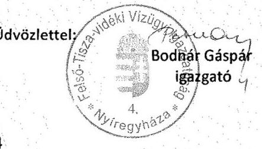

---

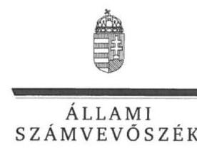

# Bodnár Gáspár úr 

igazgató
Felső-Tisza-vidéki Vízügyi Igazgatóság

## Nyíregyháza

## Tisztelt Igazgató Úr!

„A központi alrendszer egyes intézményei pénzügyi és vagyongazdálkodásának ellenőrzése -Felső-Tisza-vidéki Vízügyi Igazgatóság 2016." címmel készített számvevőszéki jelentéstervezetre tett észrevételét köszönettel megkaptam.
Az Állami Számvevőszék észrevételre vonatkozó álláspontjáról a felügyeleti vezető által készített részletes tájékoztatást csatoltan megküldöm.
Tájékoztatom Igazgató urat, hogy a számvevőszéki jelentésben - az Állami Számvevőszékről szóló 2011. évi LXVI. törvény 29. § (3) bekezdése alapján - a figyelembe nem vett észrevételeket szerepeltetjük az elutasítás indokának feltüntetésével.
Budapest, 2016. május 11. nap
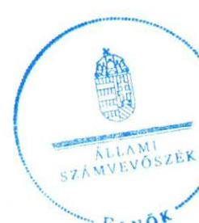

Tisztelettel:

Domokos László

Melléklet: Tájékoztatás az elfogadott és az el nem fogadott észrevételekről

---

# Tájékoztatás az elfogadott és az el nem fogadott észrevételekről 

„A központi alrendszer egyes intézményei pénzügyi és vagyongazdálkodásának ellenőrzése -Felső-Tisza-vidéki Vízügyi Igazgatóság" címü jelentéstervezetre az I-0058-014-0006/2016. iktatószámú levelében tett észrevételeit áttekintettük, annak kezeléséről az alábbi tájékoztatást adom.

## 1. Általánosságban tett észrevétel kapcsán

A jelentéstervezet „Összegzés" fejezetében az ellenőrzés által tett főbb megállapítások kerültek bemutatásra. A hivatkozott megállapítások nem a jelentéstervezet „Megállapítások" fejezet egyszámjegyű kérdésére adott összegző megállapításait tükrözik. Észrevétele a hivatkozott megállapításokban foglaltakat nem vitatja, ezért a megállapításokat nem módosítja.

## 2. Konkrét észrevételek kapcsán

## 2.1. észrevétel a 2.1. számú megállapítás 4. bekezdéséhez

A jelentéstervezet 20. oldal - 2.1. számú megállapítás 4. bekezdésére tett észrevételét a dokumentumok ismételt felülvizsgálatát követően nem fogadtuk el. Az észrevételében arról ad tájékoztatást, hogy a feltárt szabályozásbeli hiányosságokat - a gazdasági szervezet alkalmazottainak feladat-és hatáskörének megnevezését, az alkalmazottak helyettesítési rendjét, a belső és külső kapcsolattartásra történő utalást - az alkalmazottak munkaköri leírásai tartalmazzák. Ez azonban ellentmond a megállapításban hivatkozott jogszabályhely rendelkezésének, amely szerint ezen szabályokat - ha azokról a szervezeti és működési szabályzat vagy a költségvetési szerv más szabályzata nem rendelkezik - a szervezeti egységek ügyrendje tartalmazza. Észrevétele ezért a megállapítást nem módosítja.

## 2.2. észrevétel a 3.2. számú megállapításhoz

Köszönettel vettem tájékoztatását, amely a 2011-2014. években a saját hatáskörben végrehajtott előirányzat-módosítások adatszolgáltatási gyakorlatát mutatta be. Észrevétele a megállapított hiányosságot nem cáfolta, ezért a megállapítást nem módosítja.

## 2.3. észrevétel a 2.3. és 3.3. számú megállapításokhoz

A jelentéstervezet 22. oldal - 2.3. számú megállapítás ötödik bekezdésére tett észrevételét nem fogadtuk el. A gazdálkodási jogkörgyakorlás szabályszerűségét mintavétellel kiválasztott mintatételek alapján értékeltük, amelynek sokaságra történő kivetítését a számvevőszéki jelentés „Az ellenőrzés módszerei" címü fejezete részletesen tartalmazza. A gazdálkodási jogkörök gya-

---

korlására vonatkozó hiányosságokat a 3.3. számú megállapítás tartalmazza. Ezen megállapításokat az észrevétel nem kifogásolta. Az ellenőrzés során feltárt hiányosságok, szabálytalanságok következtében a gazdálkodási jogkörök gyakorlására tett minősítések megalapozottak. A megállapítások módosítása - a dokumentumok ismételt felülvizsgálatát követően - nem indokolt.
Köszönettel vettem tájékoztatását a kötelezettségvállalások teljes körű nyilvántartásba vételét akadályozó tényezőkről. Észrevétele a megállapítást nem módosítja.

# 2.4. észrevétel a 3.4. számú megállapításhoz 

Köszönettel vettem tájékoztatását a KGR program alkalmazásánál tapasztalt hiányosságokról, a folyamatos munkát akadályozó tényezőkről, az ellenőrzött időszakhoz kapcsolódó éves költségvetési beszámolók feladásának időpontjairól. Észrevétele az ellenőrzött időszakra tett megállapítást nem módosítja. Az Intézmény a 2011-2014. években az előirányzat-maradványáról az elemi költségvetés végrehajtásáról készített beszámoló benyújtásakor az adatszolgáltatási kötelezettségét a tárgyévet követő február 28-ai határidőre nem teljesítette.

## 2.5. észrevétel a 4.1. számú megállapításhoz

Köszönettel vettem tájékoztatását a vagyonkezelői szerződéssel kapcsolatban. Észrevétel a megállapításban foglaltakat nem módosítja.

## 2.6. észrevétel a 4.4. számú megállapításhoz

Észrevételében rögzíti, hogy az ellenőrzés alá vont vagyonhasznosítási szerződésekben a szerződéskötő által elfogadott kötelezettségek a jogszabályi garanciák érvényesülését teljes körűen biztosították, annak ellenére, hogy a kötelezettségek meghatározása nem az Nvtv. hivatkozott, szószerinti rendelkezései alapján történt. Észrevétele a jelentéstervezet megállapítását nem módosítja, mert az nem a garanciák érvényesülését teljes körűen biztosító kötelezettségek hiányát rögzíti, hanem az Nvtv. hivatkozott rendelkezéseiben meghatározottak vagyonhasznosítási célú szerződésekben történő előírása mulasztásával kapcsolatos hiányosságokat tárja fel.

## 2.7. észrevétel a II. számú melléklet 3. bekezdéséhez tett észrevétel kapcsán

Észrevételét nem fogadtuk el, mert a hivatkozott megállapítások az Intézmény vezetője által kitöltött és aláírt tanúsítvány kérdéseire adott válaszok kiértékelésén alapulnak.

Budapest, 2016. augusztus 11. nap
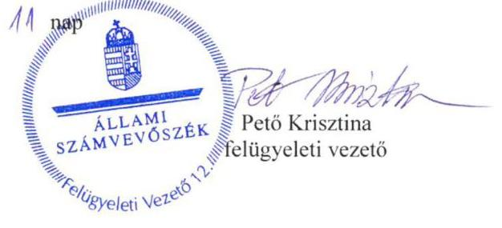

---

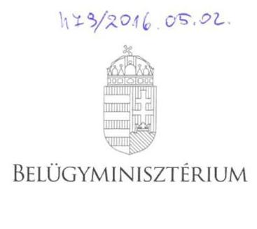

ÁLLAMI SZÁMVEVŐSZÉK
03506718016
Érkeze: 2016. MÁJUS 02.
Iktatószám: 4-0774-194/2016
Melléklet: 34 Cmp

DR. PINTÉR SÁNDOR
miniszter

Domokos László úrnak
elnök

Állami Számvevőszék

Budapest

Iktatószám: BM/7134-6/2016.
Példányozva

Tisztelt Elnök Úr!

Az Alsó-Tisza-vidéki Vízügyi Igazgatóság, az Észak-dunántúli Vízügyi Igazgatóság, a Felső-Tisza-vidéki Vízügyi Igazgatóság és a Közép-Tisza-vidéki Vízügyi Igazgatóság ellenőrzéséről készült számvevőszéki jelentéstervezetek 1.2. számú megállapítása hiányosságot fogalmaz meg az irányító szerv tevékenységével kapcsolatosan, amely szerint az irányító szerv és a középirányító szerv az erőforrásokkal való hatékony gazdálkodáshoz szükséges követelményeket nem érvényesített, így nem volt biztosított a számon kérhetőség és az ellenőrizhetőség.

A fenti megállapításra vonatkozóan a mellékelt feljegyzésben foglaltak szerint észrevételt teszek. A Belügyminisztérium részére meghatározott intézkedési kötelezettséget a hatékony gazdálkodásra irányuló ellenőrzések elvégzése érdekében nem tartom indokoltnak.

Budapest, 2016. április 27.

Üdvözlettel:

Dr. Pintér Sándor

---

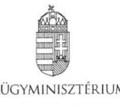

DR. HOFFMANN IMRE
közigazgatási és vízügyi helyettes államtitkár

Iktatószám: BM/7134-5/2016.

# Feljegyzés   Dr. Pintér Sándor belügyminiszter úr részére 

Miniszter úrnak jelentem, hogy az Állami Számvevőszék megküldte „A központi alrendszer egyes intézményei pénzügyi és vagyongazdálkodásának ellenőrzése" címú számvevőszéki jelentéstervezeteket az alábbi vízügyi igazgatóságok vonatkozásában:

- Alsó-Tisza-vidéki Vízügyi Igazgatóság,
- Észak-dunántúli Vízügyi Igazgatóság,
- Felső-Tisza-vidéki Vízügyi Igazgatóság és
- Közép-Tisza-vidéki Vízügyi Igazgatóság.

A jelentéstervezetek 1.2. számú megállapításával kapcsolatosan az Állami Számvevőszékről szóló 2011. évi LXVI. törvény (a továbbiakban: ÁSZ tv.) 29. § (2) bekezdése alapján az alábbi észrevételt teszem:

A megállapítások rögzítik, hogy az irányító szerv (BM) és a középirányító szerv (OVF) a 2012-2014. években az Áht. 9. § (1) bekezdés f) pontjában előírt az ellenőrzött intézmény által ellátandó közfeladatok ellátására vonatkozó, erőforrásokkal való hatékony gazdálkodáshoz szükséges követelményeket nem érvényesített, aminek hiányában számonkérés és ellenőrzés sem történt.

Az ellenőrzés során az ÁSZ részére átadott, az irányító szervi tevékenység értékeléséhez szükséges 1. számú tanúsítványok 5.1., 7.1., 7.2., 8.1. és 9.1. pontjai alapján az irányító szerv vezetője:

- írásban rögzítette az ellenőrzött intézménynél az erőforrásokkal való szabályszerű és hatékony gazdálkodáshoz szükséges követelményeket (a Belügyminisztérium fejezet költségvetési gazdálkodásának rendjéről szóló 18/2012. (IV. 27.) BM utasítás),
- beszámoltatta az ellenőrzött intézményt a szakmai feladatellátásról, éves gazdálkodásról (éves értékelő jelentés, zárszámadások, beszámoló szöveges indoklása),
- illetve ellenőrizte az intézménynél a gazdálkodás szabályszerűségét, hatékonyságát (ellenőrzési jelentés).

A Belügyminisztérium tekintetében rögzíteni szükséges továbbá, hogy a Belügyminisztérium fejezethez tartozó egyes költségvetési szervek középirányító szervként történő kijelöléséről, az irányítási jogok gyakorlásának módjáról szóló 13/2011. (V. 23.) BM utasításban az Országos Vízügyi Főigazgatóság részére feladatok kerültek

---

meghatározásra, többek között, hogy szervezik, irányítják és ellenőrzik a költségvetési szervek által ellátandó szakmai alapfeladatok végrehajtásához szükséges pénzügyi, anyagi feltételeket, amelynek keretében például a belső ellenőrzési tevékenység ellátása során szabályszerűségi, pénzügyi, rendszer- és teljesítmény-ellenőrzéseket, informatikai rendszerellenőrzéseket, valamint megbízhatósági ellenőrzéseket végeznek a jogszabályokban, illetve az irányító szerv által előírt belső szabályozásnak megfelelően.

Tényként rögzítendő továbbá az is, hogy a Belügyminisztérium Ellenőrzési Főosztálya a költségvetési szervek belső kontrollrendszeréről és belső ellenőrzéséről szóló 370/2011. (XII. 31.) Korm. rendelet alapján két olyan tárgyú ellenőrzést (belső kontrollrendszer ellenőrzése, központi ellátási tevékenység ellenőrzése) is lefolytatott, amely a teljes fejezetet érintette. Kiemelt feladatként kezelte valamennyi szerv tekintetében a belső kontrollrendszer kialakítását és működtetését, amelyben szakmai iránymutatást nyújtott. A középirányító szervek belső ellenőrzési szervezeteinek beszámoltásával (éves ellenőrzési terv, éves ellenőrzési jelentés, végrehajtott ellenőrzésekről készített jelentések és intézkedési tervek bekérése) folyamatosan nyomon követi a szervezetek ellenőrzési tevékenységét, működését, többek között az Országos Vízügyi Főigazgatóság és a felügyelete alá tartozó igazgatóságok tevékenységét.

A fent megfogalmazottak alapján a Belügyminisztérium részére meghatározott intézkedési kötelezettséget az Alsó-Tisza-vidéki Vízügyi Igazgatóság, a Felső-Tisza-vidéki Vízügyi Igazgatóság és a Közép-Tisza-vidéki Vízügyi Igazgatóság hatékony gazdálkodásra irányuló ellenőrzések elvégzése érdekében nem tartom indokoltnak.

A fenti megállapításra vonatkozóan az ÁSZ tv. 29. § (2) bekezdése alapján a Gazdasági Helyettes Államtitkársággal egyeztetve a mellékelt választervezetet készítettük elő.

Kérem Tisztelt Miniszter urat, hogy egyetértése esetén a levéltervezetet aláírásával ellátni szíveskedjen.

Budapest, 2016. április 19.

# Dr. Hoffmann Imre 

## Egyetértek:

## Szőke Irma gazdasági helyettes államtitkár

Készült: 2 példány/1 oldal
Kapják: 1. sz. pld: Belügyminisztérium, dr. Pintér Sándor miniszter úr
2. sz. pld: Irattár

Melléklet: 2 pld.: BM/7134-6/2016. sz. levéltervezet

---

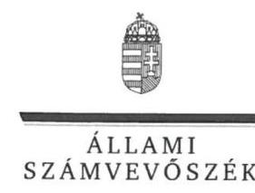

# Dr. Pintér Sándor úr 

miniszter
Belügyminisztérium

## Budapest

## Tisztelt Miniszter Úr!

„A központi alrendszer egyes intézményei pénzügyi és vagyongazdálkodásának ellenőrzése -Felső-Tisza-vidéki Vízügyi Igazgatóság" címmel készített számvevőszéki jelentéstervezetre tett észrevételét köszönettel megkaptam.
Az Állami Számvevőszék észrevételre vonatkozó álláspontjáról a felügyeleti vezető által készített részletes tájékoztatást csatoltan megküldöm.
Tájékoztatom Miniszter urat, hogy a számvevőszéki jelentésben - az Állami Számvevőszékről szóló 2011. évi LXVI. törvény 29. § (3) bekezdése alapján - a figyelembe nem vett észrevételeket szerepeltetjük az elutasítás indokának feltüntetésével.
Budapest, 2016. augusztus 24. nap
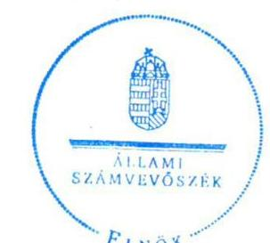

Tisztelettel:

Melléklet: Tájékoztatás az el nem fogadott észrevételekről

---

# Tájékoztatás az el nem fogadott észrevételekről 

„A központi alrendszer egyes intézményei pénzügyi és vagyongazdálkodásának ellenőrzése -Felső-Tisza-vidéki Vízügyi Igazgatóság 2016." címü számvevőszéki jelentéstervezetre a $\mathrm{BM} / 7134-6 / 2016$. iktatószámú levelében tett észrevételeit áttekintettük, annak kezeléséről az alábbi tájékoztatást adom.
Köszönjük a Belügyminisztérium (továbbiakban: BM) fejezethez tartozó költségvetési szerveknél végzett, a belső kontrollrendszer vizsgálatáról, a belső kontrollrendszer utóvizsgálatáról, a Büntetés-végrehajtási Országos Parancsnokság és a felügyelet alá tartozó gazdasági társaságok központi ellátási kötelezettségének vizsgálatáról, valamint a büntetés végrehajtásához kapcsolódó gazdasági társaságok kapacitásainak kihasználását, a fogvatartottak foglalkoztatását célzó Kormány, illetve a Belügyminiszter rendelete hatásának vizsgálatáról szóló jelentéseiket. A hivatkozott jelentések a 2012-2014. évek tekintetében az ellenőrzött Felső-Tisza-vidéki Vízügyi Igazgatóságra (továbbiakban: Intézmény) vonatkozóan, az államháztartásról szóló 2011. évi CXCV. törvény 9. § (1) bekezdés f) pontjában előírt, a gazdálkodás hatékonyságához szükséges követelmények érvényesítésével, számonkérésével és ellenőrzésével kapcsolatos és megvalósult irányítószervi feladatellátásról információkat nem tartalmaztak.
A jelentéstervezet 18. oldal 1.2. számú megállapításra tett észrevételét nem fogadtuk el, a megállapításban rögzített hiányosságok továbbra is megalapozottak, mert a hivatkozott BM utasításban részletesen meghatározott és szabályozott folyamatok, feladatok rendszere nem tartalmazza a közfeladatok ellátására vonatkozó, az erőforrásokkal való hatékony gazdálkodáshoz szükséges követelményeket, így azok érvényesítéséről, számonkéréséről és ellenőrzéséről sem rendelkezik. A dokumentumok ismételt áttekintését követően, az Intézmény által az irányító szerv részére megküldött költségvetési beszámolók és szöveges beszámolók sem tartalmaztak információkat a 2012-2014. években - az államháztartásról szóló 2011. évi CXCV. törvény 9. § (1) bekezdés f) pontjában előírt - a gazdálkodás hatékonyságához szükséges követelmények érvényesítésével, számonkérésével és ellenőrzésével kapcsolatos és megvalósult irányítószervi feladatellátásról. Ezért észrevételei a megállapítást nem módosítják.
Budapest, 2016. augusztus 31. nap
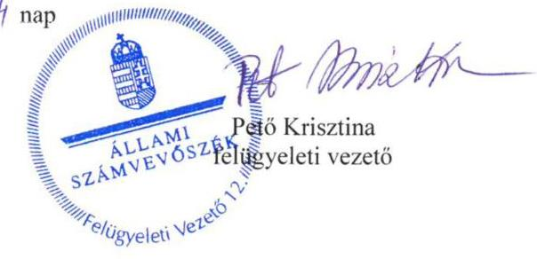

---

# ORSZÁGOS VÍZÜGYI FŐIGAZGATÓSÁG FŐIGAZGATÓ 

1012 Budapest, Márvány utca 1/d. 1253 Bp. Pf. 56
E-mail: sontiyody.balazs@ovf.hu

Ügyiratszám: 09529-0015/2016.
Előadó: Csikós Attila

Tárgy:
Hiv.szám:

## Állami Számvevőszék

Domokos László elnök részére

## Budapest

Apáczai Csere János utca 10. 1052

## Tisztelt Elnök Úr!

Az Állami Számvevőszék V-0775-107/2016. iktatószámú levéllel megkapott, a Felső-Tiszavidéki Vízügyi Igazgatóságnál lefolytatott pénzügyi és vagyongazdálkodásának ellenőrzési jelentéstervezetéhez az alábbi észrevételt tesszük.

Az Állami Számvevőszék jelentéstervezet 1.2. számú megállapítása rögzíti, hogy az irányító
 szerv (BM) és a középirányító szerv (OVF) a 2012-2014. években az Áht. 9. § (1) bekezdés f) pontjában előírt az ellenőrzött intézmény által ellátandó közfeladatok ellátására vonatkozó, erőforrásokkal való hatékony gazdálkodáshoz szükséges követelményeket nem érvényesített, aminek hiányában számonkérés és ellenőrzés sem történt.

Tekintettel arra, hogy a Belügyminisztérium Ellenőrzési Főosztálya a költségvetési szervek belső kontrollrendszeréről és belső ellenőrzéséről szóló 370/2011. (XII. 31.) Korm. rendelet alapján két olyan tárgyú ellenőrzést (belső kontrollrendszer ellenőrzése, központi ellátási tevékenység ellenőrzése) is lefolytatott, mely a teljes fejezetet érintette - beleértve a Közép-Tisza-vidéki Vízügyi Igazgatóságot is - az OVF-nek külön ellenőrzést erre vonatkozóan nem volt indokolt elvégeznie. Az irányító szerv kiemelt feladatként kezelte valamennyi szerv tekintetében a belső kontrollrendszer kialakítását és működtetését.

A vízügyi igazgatóságok működési területe vízgyűjtőkre lett meghatározva, amely a szakmai működésüket teljesen specifikussá, egyedivé teszi. Az egyedi jelleg (eltérő csapadék eloszlás, vízfolyások nagysága és jellege, eltérő domborzati viszonyok, a működési területen kiépült műtárgyak nagysága és azok fontossága) nem tette (és nem teszi) lehetővé a működés és annak pénzügyi feltételeit biztosító gazdálkodás egységes elvek, azonos mutatószámok szerinti mérését és értékelését.

A Felső-Tisza-vidéki Vízügyi Igazgatóság önállóan működő és gazdálkodó költségvetési intézmény, saját döntési és felelősségi hatáskörrel a szakmai tevékenységük és a gazdálkodásuk vonatkozásában. Az OVF, mint középirányító szerv a hatályos belső szabályzatai alapján gyakorolta a 13/2011. (V. 23.) BM utasításban meghatározott feladatokat.

---

Az OVF az ÁSZ tárgyi ellenőrzésének időszakában az alábbi szabályozók alapján látta el a középirányítói feladatait.

# A 47/2012. (IX.30) BM utasítás, SZMSZ 18. §-a szerint 

A Főigazgatóság a közgazdasági tevékenység területén:
a) ellátja a vízügyi költségvetési szervek költségvetési tervezésének végrehajtásával, finanszírozásának előkészítésével kapcsolatos feladatokat; javaslatot készít a finanszírozás területén felmerülő problémák megoldására,
b) részt vesz az ágazati célelőirányzatok felhasználására, a vízkár elhárítási munkák finanszírozására vonatkozó közgazdasági feladatokban, közreműködik a finanszírozási feladatok megoldásában,
c) részt vesz a vízügyi költségvetési szervek költségvetési támogatásával kapcsolatos feladatokban, ellátja ennek pénzügyi, számviteli feladatainak irányítását,
d) közreműködik a vízügyi költségvetési szervek gazdálkodását érintő előirányzat-módosításokkal összefüggő feladatok végrehajtásában,
e) ellátja a vízgazdálkodási kormányzati beruházások éves zárszámadásával kapcsolatos feladatokat,
f) felügyeli és koordinálja a beszámolási és könyvvezetési kötelezettségből eredő intézményi (vízügyi igazgatóságok) feladatok ellátását, ennek keretében az intézményi éves költségvetéseket és az intézményi beszámolókat összeállíttatja, továbbá végzi azok összesítését és ellenőrzését,
g) koordinálja és ellenőrzi a vízügyi igazgatóságok éves feladatterveinek összeállítását, felülvizsgálatát; a vízügyi igazgatóságokkal történő (jóváhagyást célzó) egyeztetést,
h) közreműködik az ágazati gazdaságpolitikai célok megvalósításában, irányításában és értékelésében,
i) koordinálja és felügyeli a vízügyi igazgatóságok gazdálkodását és pénzügyi tevékenységét,
j) végzi a vízügyi igazgatóságok számviteli munkájának irányítását, felügyeletét.

A fentiek alapján 2012-2014. években a Vízügyi Igazgatóság gazdálkodásának vonatkozásban az OVF:

1. a BM fejezet 17. Vízügyi Igazgatóságok cím tekintetében az egyedi elemi költségvetések leosztását tervtárgyalások után megtette;
2. az időszaki és az éves költségvetési beszámolók és jelentések pénzügyi és számviteli ellenőrzését elvégezte és a címszintű összesítéseket a fejezet felé benyújtotta;
3. tételes (bizonylati mélységű) műszaki és pénzügyi ellenőrzést folytatott az alábbi területeken:

- a BM fejezet 20/1/48, 49, és 50 fejezeti kezelésű sorok támogatási szerződései által biztosított források felhasználása tekintetében;
- az elemi költségvetés felhalmozási kiadások kiemelt előirányzatának felhasználása tekintetében;
- Kormánydöntés alapján megkapott többletforrások felhasználása tekintetében.

---

A támogatási szerződéssel megkapott többletforrásokhoz kapcsolódó kötelezettségvállalások kizárólag az OVF által végzett előzetes műszaki-szakmai engedély birtokában voltak megtehetők.

A fent megfogalmazottak alapján az OVF részére meghatározott intézkedési kötelezettséget a hatékony gazdálkodásra irányuló ellenőrzések elvégzése érdekében nem tartom indokoltnak.

Budapest, 2016. április 29.
Tisztelettel:

---

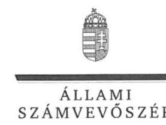

ELNÖK

# Somlyódy Balázs úr 

főigazgató
Országos Vízügyi Főigazgatóság

## Budapest

## Tisztelt Főigazgató Úr!

„A központi alrendszer egyes intézményei pénzügyi és vagyongazdálkodásának ellenőrzése -Felső-Tisza-vidéki Vízügyi Igazgatóság" címmel készített számvevőszéki jelentéstervezetre tett észrevételét köszönettel megkaptam.
Az Állami Számvevőszék észrevételre vonatkozó álláspontjáról a felügyeleti vezető által készített részletes tájékoztatást csatoltan megküldöm.
Tájékoztatom Főigazgató urat, hogy a számvevőszéki jelentésben - az Állami Számvevőszékről szóló 2011. évi LXVI. törvény 29. § (3) bekezdése alapján - a figyelembe nem vett észrevételeket szerepeltetjük az elutasítás indokának feltüntetésével.
Budapest, 2016. május hó 19. nap
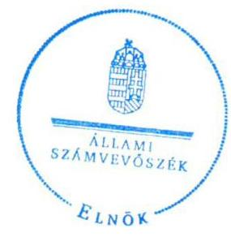

Tisztelettel:

## 02, 12

Domokos László

Melléklet: Tájékoztatás az el nem fogadott észrevételekről

---

# Tájékoztatás az el nem fogadott észrevételekről 

„A központi alrendszer egyes intézményei pénzügyi és vagyongazdálkodásának ellenőrzése -Felső-Tisza-vidéki Vízügyi Igazgatóság 2016." című számvevőszéki jelentéstervezetre a 09529/0015/2016. iktatószámú levelében tett észrevételeit áttekintettük, annak kezeléséről az alábbi tájékoztatást adom.

### 1.2. számú megállapításra tett észrevétel kapcsán

Köszönettel vettem tájékoztatását, hogy az ellenőrzött időszakban az Országos Vízügyi Főigazgatóság (továbbiakban: OVF) mely szabályozók alapján, továbbá a Felső-Tisza-vidéki Vízügyi Igazgatóság gazdálkodása vonatkozásában mely feladatokat látta el. A levélben hivatkozott, a Belügyminisztérium fejezethez tartozó egyes költségvetési szervek középirányító szervként történő kijelöléséről, az irányítói jogok gyakorlásának módjáról szóló 13/2011. (V. 23.) BM utasítás nem tartalmazza a közfeladatok ellátására vonatkozó, az erőforrásokkal való hatékony gazdálkodáshoz szükséges követelményeket, így azok érvényesítéséről, számonkéréséről és ellenőrzéséről sem rendelkezik. Észrevétele sem tartalmaz 2012-2014. években az OVF részéről - az államháztartásról szóló 2011. évi CXCV. törvény 9. § (1) bekezdés f) pontjában előírt - a gazdálkodás hatékonyságához szükséges követelmények érvényesítésével, számonkérésével és ellenőrzésével kapcsolatos és megvalósult középirányító szervi feladatellátásról szóló információkat, tényeket. Az észrevétele alapján a megállapítás módosítása nem indokolt.

Budapest, 2016. június hó 14. nap
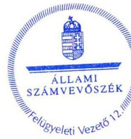

Pető Krisztina
felügyeleti vezető

---

# RÖVIDÍTÉSEK JEGYZÉKE 

${ }^{1}$ Intézmény
${ }^{2}$ ÁSZ
${ }^{3}$ MT
${ }^{4}$ Korm. rendelet ${ }_{1}$
${ }^{5}$ Korm.rendelet2-4
Korm.rendelet2

Korm.rendelet3

Korm.rendelet4
${ }^{6}$ NEKI
${ }^{7}$ FTVKTVF
${ }^{8} \mathrm{KI}$
${ }^{9}$ OKKP
${ }^{10}$ VM
${ }^{11}$ BM
${ }^{12}$ BM utasítás ${ }_{1}$
${ }^{13}$ OVF
${ }^{14}$ Alaptörvény
${ }^{15}$ Nvtv.
${ }^{16}$ Áht. 2
${ }^{17}$ Ávr.
${ }^{18}$ Áht. 1
${ }^{19}$ Ámr.
${ }^{20}$ Bkr.
${ }^{21}$ ÁSZ tv.
${ }^{22}$ ÁSZ SZMSZ
${ }^{23}$ irányító szerv1
irányító szerv2
${ }^{24}$ középirányító szerv
amely alatt 2011. december 31-ig a Felső-Tisza-vidéki Környezetvédelmi és Vízügyi Igazgatóság (a továbbiakban itt: FTVKVI), 2012. január 1-jétől a Felső-Tisza-vidéki Vízügyi Igazgatóság (a továbbiakban itt: FETIVIZIG) értendő
Állami Számvevőszék
Minisztertanács
a vizek kártételei elleni védekezés szabályairól szóló 232/1996. (XII. 26.) Korm. rendelet (hatályos 1997. január 1-jétől)
vízügyi, vízvédelmi hatósági feladatokat ellátó szervek kijelöléséről szóló kormányrendeletek
vízügyi, vízvédelmi hatósági feladatokat ellátó szervek kijelöléséről szóló kormányrendeletek 347/2006. (XII. 23.) Korm. rendelet (hatályos 2007. január 1-jétől, hatálytalan 2014. január 1-jétől)
vízügyi, vízvédelmi hatósági feladatokat ellátó szervek kijelöléséről szóló kormányrendeletek 482/2013. (XII. 17.) Korm. rendelet (hatályos 2013. december 18-tól, hatálytalan 2014. szeptember 10-től)
vízügyi, vízvédelmi hatósági feladatokat ellátó szervek kijelöléséről szóló kormányrendeletek 223/2014. (IX. 4.) Korm. rendelet (hatályos 2014. szeptember 5-től)
Nemzeti Környezetügyi Intézet
Felső-Tisza-vidéki Környezetvédelmi, Természetvédelmi és Vízügyi Felügyelőség
Katasztrófavédelmi Igazgatóság
Országos Környezeti Kármentesítési Program
Vidékfejlesztési Minisztérium
Belügyminisztérium
a BM fejezethez tartozó egyes költségvetési szervek középirányító szervként történő kijelöléséről, az irányítói jogok gyakorlásának módjáról szóló 13/2011. (V. 23.) BM utasítás (hatályos 2011. május 24-től, hatálytalan 2015. április 11-től)

Országos Vízügyi Főigazgatóság
Magyarország Alaptörvénye (2011. április 25.), hatályos 2012. január 1-jétől 2011. évi CXCVI. törvény a nemzeti vagyonról (hatályos 2011. december 31-től) 2011. évi CXCV. törvény az államháztartásról (hatályos: 2012. január 1-jétől) 368/2011. (XII. 31.) Korm. rendelet az államháztartásról szóló törvény végrehajtásáról (hatályos: 2012. január 1-jétől)
1992. évi XXXVIII. törvény az államháztartásról (hatálytalan: 2012.január 1-jétől) 292/2009. (XII. 19.) Korm. rendelet az államháztartás működési rendjéről (hatálytalan: 2012. január 1-jétől)
370/2011. (XII. 31.) Korm. rendelet a költségvetési szervek belső kontrollrendszeréről és belső ellenőrzéséről (hatályos 2012. január 1-jétől) 2011. évi LXVI. törvény az Állami Számvevőszékről (hatályos 2011. július 1-jétől) az Állami Számvevőszék Szervezeti és Működési Szabályzata
Vidékfejlesztési Minisztérium 2011. december 31-éig, jogutód szervezet a Földművelésügyi Minisztérium
Belügyminisztérium 2012. január 1-jétől
Országos Vízügyi Főigazgatóság (2012. január 1-jétől)

---

${ }^{25}$ Alapító okirat
Alapító okirat ${ }_{1}$
Alapító okirat ${ }_{2}$

Alapító okirat ${ }_{3}$

Alapító okirat ${ }_{4}$

Alapító okirat ${ }_{5}$

Alapító okirat ${ }_{6}$
${ }^{26}$ SZMSZ
SZMSZ ${ }_{1}$

SZMSZ ${ }_{2}$

SZMSZ ${ }_{3}$
${ }^{27} \mathrm{Kbt} .1$
Kbt. 2
${ }^{28}$ Munka tv. 1

Munka tv. 2
${ }^{29}$ Számv. tv.
${ }^{30}$ Vtvr.
${ }^{31}$ Áhsz. 1

Áhsz. 2
${ }^{32}$ gazdasági szervezet ügyrendje ${ }_{1}$
gazdasági szervezet ügyrendje ${ }_{2}$
gazdasági szervezet ügyrendje ${ }_{3}$
${ }^{33}$ számviteli politika ${ }_{1}$
számviteli politika ${ }_{2}$
számviteli politika ${ }_{3}$
számviteli politika ${ }_{4}$
számviteli politika ${ }_{5}$
a FETIVIZIG Alapító okirata
XX/1130/9/2010. VM, (hatálytalan 2012. január 1-jétől)
A-218/1/2011. BM, (hatályos: 2012. január 01-től, hatálytalan 2013. május 23-tól);
A-218/1/2012.BM, (hatályos: 2012. május 23-tól, hatálytalan 2013. december 13-tól)
A-218/1/2013. BM, (hatályos: 2013. december 13-tól, hatálytalan 2014. január 1-jétől);
A-218/1/2014.BM, (hatályos: 2014. január 01-jétől, hatálytalan 2014. szeptember 10-től);
A-218/2/2014.BM, (hatályos: 2014. szeptember 10-től)
a FETIVIZIG Szervezeti és Működési Szabályzata
11/2009. igazgatói utasítás, hatályos: 2009. december 01.-2012. december 17-ig hatálytalan 2012. december 18-tól;
2/2013. igazgatói utasítás, hatályos: 2012. december 18.-2013. december 31-ig hatálytalan 2014. január 1-jétől;
4/2014. igazgatói utasítás, hatályos: 2014. január 01-től;
2003. évi CXXIX. törvény a közbeszerzésekről (hatálytalan: 2012. január 1-jétől) 2011. évi CVIII. törvény a közbeszerzésekről (hatályos: 2011. augusztus 21-től, hatálytalan 2015. november 1-jétől)
1992. évi XXII. törvény a Munka Törvénykönyvéről (hatálytalan: 2013. január 1-jétől)
2012. évi I. törvény a munka törvénykönyvéről (hatályos: 2012. július 1-jétől)
2000. évi C. törvény a számvitelről (hatályos 2001. január 1-jétől)

254/2007. (X. 4.) Korm. rendelet az állami vagyonnal való gazdálkodásról
249/2000. (XII. 24.) Korm. rendelet az államháztartás szervezetei beszámolási és könyvvezetési kötelezettségének sajátosságairól (hatálytalan: 2014. január 1-jétől)
4/2013. (I. 11.) Korm. rendelet az államháztartás számviteléről (hatályos: 2014. január 1-jétől)

FTVKVI Szervezeti, Működési és Ügyrendi Szabályzata (hatályos: 2009. november 24-től)
A FETIVIZIG Ügyrendi szabályzata (hatályos: 2013. január 8-tól 2014. február 28-ig)
FETIVIZIG 5/2014. sz. igazgatói utasítás Az Igazgatóság ügyrendi szabályzatáról (hatályos: 2014. március 1-jétől)
Az FTVKVI vezetőjének 11/2004. számú (864/2004. üi. sz.) utasítása az Igazgatóság Számviteli politikájáról, III. rész: Eszközök, források leltározási és leltárkészítési szabályzata 2004. (hatálytalan: 2011. december 1-jétől)
Az FTVKVI vezetőjének 21/2011. sz. utasítása (501/2011. üi. sz.) az Igazgatóság Számviteli politikájáról, III. rész: Eszközök, források leltározási és leltárkészítési szabályzata 2011. (hatályos: 2011. december 1-jétől hatálytalan 2012. január 1-jétől)
A FETIVIZIG igazgatójának 10/2012. számú (471/2012. ügyiratszámú) utasítása az Igazgatóság Számviteli politikájáról, I. rész: Eszközök és források leltározási és leltárkészítési szabályzata 2012. (hatályos: 2012. január 1-jétől hatálytalan: 2013. április 1-jétől)
FETIVIZIG 29/2013. sz. igazgatói utasítás Eszközök és források leltározási és leltárkészítési szabályzata (hatályos: 2013. április 1-jétől hatálytalan: 2014.
 június 11-től)
leltározási és leltárkészítési szabályzat ${ }_{5} \quad$ FETIVIZIG 14/2014. sz. igazgatói utasítás Eszközök és források leltározási és leltárkészítési szabályzatáról (hatályos: 2014. június 11-től)
${ }^{35}$ eszközök és források értékelési szabályzata ${ }_{1}$ Az FTVKVI vezetőjének 11/2004. számú (864/2004. üi. sz.) utasítása az Igazgatóság Számviteli politikájáról, I. rész: Az eszközök és források értékelésének szabályai (hatálytalan: 2011. december 1-jétől)
eszközök és források értékelési szabályzata ${ }_{2} \quad$ Az FTVKVI vezetőjének 21/2011. sz. utasítása (501/2011. üi. sz.) az Igazgatóság Számviteli politikájáról, I. rész: Az eszközök és források értékelésének szabályai (hatályos: 2011. december 1-jétől hatálytalan: 2012. január 1-jétől)
eszközök és források értékelési szabályzata ${ }_{3}$ A FETIVIZIG igazgatójának 10/2012. számú (471/2012. ügyiratszámú) utasítása az Igazgatóság Számviteli politikájáról, III. rész: FETIVIZIG eszközeinek és forrásainak értékelési szabályzata. (hatályos: 2012. január 1-jétől hatálytalan: 2013. április 1-jétől)
eszközök és források értékelési szabályzata ${ }_{4}$ FETIVIZIG 28/2013. sz. igazgatói utasítás Eszközök és források értékelési szabályzatáról (hatályos: 2013. április 1-jétől hatálytalan: 2014. június 11-től)
eszközök és források értékelési szabályzata ${ }_{5}$ FETIVIZIG 11/2014. sz. igazgatói utasítás Eszközök és források értékelési szabályzatáról (hatályos: 2014. június 11-től)
${ }^{36}$ pénzkezelési szabályzat ${ }_{1} \quad$ Az FTVKVI vezetőjének 11/2004. számú (864/2004. üi. sz.) utasítása az Igazgatóság Számviteli politikájáról, IV. rész: Pénzkezelési szabályzat 2004. (hatálytalan: 2011. december 1-jétől)
pénzkezelési szabályzat ${ }_{2} \quad$ Az FTVKVI vezetőjének 21/2011. sz. utasítása (501/2011. üi. sz.) az Igazgatóság Számviteli politikájáról, IV. rész: Pénzkezelési szabályzat 2011. (hatályos: 2011. december 1-jétől hatálytalan: 2012. január 1-jétől)
pénzkezelési szabályzat ${ }_{3} \quad$ A FETIVIZIG igazgatójának 10/2012. számú (471/2012. ügyiratszámú) utasítása az Igazgatóság Számviteli politikájáról, IV. rész: FETIVIZIG Pénzkezelési szabályzata (hatályos: 2012. január 1-jétől hatálytalan: 2013. január 1-jétől)
pénzkezelési szabályzat ${ }_{4} \quad$ A FETIVIZIG igazgatójának 5/2013. számú (140/2013. ügyiratszámú) utasítása a Pénzkezelési szabályzatról (hatályos: 2013. január 1-jétől hatálytalan: 2013. április 1-jétől)
pénzkezelési szabályzat ${ }_{5} \quad$ FETIVIZIG 34/2013. sz. igazgatói utasítás a Pénzforgalmi és pénztári pénzkezelési szabályzat kiadásáról (hatályos: 2013. április 1-jétől hatálytalan: 2013. szeptember 1-jétől)
pénzkezelési szabályzat ${ }_{6} \quad$ FETIVIZIG 51/2013. sz. igazgatói utasítás a Pénzforgalmi és pénztári pénzkezelési szabályzat kiadásáról (hatályos: 2013. szeptember 1-jétől hatálytalan: 2013. november 25-től)

---

pénzkezelési szabályzat ${ }_{3}$
pénzkezelési szabályzat ${ }_{8}$
pénzkezelési szabályzat ${ }_{9}$
${ }^{37}$ önköltség-számítási szabályzat ${ }_{1}$
önköltség-számítási szabályzat ${ }_{4}$
önköltség-számítási szabályzat ${ }_{5}$
önköltség-számítási szabályzat ${ }_{6}$
${ }^{38}$ számlarend
${ }^{39}$ ellenőrzési nyomvonal ${ }_{1}$
ellenőrzési nyomvonal ${ }_{2}$
ellenőrzési nyomvonal ${ }_{3}$
ellenőrzési nyomvonal ${ }_{4}$
ellenőrzési nyomvonal ${ }_{5}$
ellenőrzési nyomvonal ${ }_{6}$
${ }^{40}$ gazdálkodási szabályzat ${ }_{1}$

FETIVIZIG 57/2013. sz. igazgatói utasítás a Pénzforgalmi és pénztári pénzkezelési szabályzat kiadásáról (hatályos: 2013. november 25-től hatálytalan 2014. május 6-tól)
FETIVIZIG 9/2014. sz. igazgatói utasítás a Pénzforgalmi és pénztári pénzkezelési szabályzat kiadásáról (hatályos: 2014. május 6-tól hatálytalan: 2014. november 28-tól)
FETIVIZIG 27/2014. sz. igazgatói utasítás a Pénzforgalmi és pénztári pénzkezelési szabályzat kiadásáról (hatályos: 2014. november 28-tól)
Az FTVKVI vezetőjének 11/2004. számú (864/2004. üi. sz.) utasítása az Igazgatóság Számviteli politikájáról, II. rész: Önköltségszámítási szabályzat 2004. (hatálytalan: 2011. december 1-jétől)

Az FTVKVI vezetőjének 21/2011. sz. utasítása (501/2011. üi. sz.) az Igazgatóság Számviteli politikájáról, II. rész: Önköltségszámítási szabályzat 2011. (hatályos: 2011. december 1-jétől hatálytalan: 2012. január 1-jétől)

A FETIVIZIG igazgatójának 10/2012. számú (471/2012. ügyiratszámú) utasítása az Igazgatóság Számviteli politikájáról, II. rész: FETIVIZIG önköltség számítási szabályzata. (hatályos: 2012. január 1-jétől hatálytalan: 2013. április 1-jétől)
FETIVIZIG 44/2013. sz. igazgatói utasítás az Önköltségszámítás rendjéről (hatályos: 2013. április 1-jétől hatálytalan: 2013. szeptember 1-jétől)

FETIVIZIG 53/2013. sz. igazgatói utasítás az Önköltségszámítás rendjéről (hatályos: 2013. szeptember 1-jétől hatálytalan: 2014. május 6-tól)

FETIVIZIG 8/2014. sz. igazgatói utasítás az Önköltségszámítás rendjéről (hatályos: 2014. május 6-tól)

FETIVIZIG 52/2013. sz. igazgatói utasítás a FETIVIZIG Számlarendjéről (hatályos: 2013. szeptember 1-jétől)

Felső-Tisza-vidéki Környezetvédelmi és Vízügyi Igazgatóság vezetőjének 4/2005. számú (580/2005. üi. sz.) utasítása Az Igazgatóság FEUVE kézikönyvéről, 4. Ellenőrzési nyomvonal, 6.3. A FETIKÖVIZIG ellenőrzési nyomvonala (hatálytalan: 2012. október 26-tól)
FETIVIZIG vezetőjének 56/2012. számú (547/2012. üi. sz.) utasítása az Igazgatóság Belső kontroll kézikönyvéről, 9. számú melléklet: Ellenőrzési nyomvonal (hatályos: 2012. október 26-tól hatálytalan: 2013. január 25-től)
FETIVIZIG igazgatójának 8/2013. számú (205/2013. ügyiratszámú) utasítása a Belső kontroll kézikönyvéről, 9. számú melléklet: Ellenőrzési nyomvonal (hatályos: 2013. január 25-től hatálytalan: 2013. augusztus 1-jétől)
FETIVIZIG 47/2013. sz. igazgatói utasítás A FETIVIZIG belső kontroll rendszeréről, Az ellenőrzési nyomvonal, 9. számú melléklet: Ellenőrzési nyomvonal (hatályos: 2013. augusztus 1-jétől hatálytalan: 2013. október 10-től)
FETIVIZIG 55/2013. sz. igazgatói utasítás A FETIVIZIG belső kontroll rendszeréről, Az ellenőrzési nyomvonal, 9. számú melléklet: Ellenőrzési nyomvonal (hatályos: 2013. október 10-től hatálytalan: 2014. szeptember 1-jétől)
FETIVIZIG 21/2014. sz. igazgatói utasítás Az igazgatóság belső kontroll rendszeréről, Az ellenőrzés nyomvonal, 9. számú melléklet: Ellenőrzési nyomvonal (hatályos: 2014. szeptember 1-jétől)
Felső-Tisza-vidéki Környezetvédelmi és Vízügyi Igazgatóság vezetőjének 8/2005. sz. utasítása (856/2005. üi. sz.) a kötelezettségvállalásról, a bizonylatok igazolásáról, utalványozásáról, ellenjegyzéséről és érvényesítéséről (hatálytalan: 2012. január 1-jétől)

---

gazdálkodási szabályzat ${ }_{2}$

## gazdálkodási szabályzat ${ }_{3}$

gazdálkodási szabályzat ${ }_{4}$
gazdálkodási szabályzat ${ }_{5}$
${ }^{41}$ Etikai Kódex ${ }_{1}$

Etikai Kódex ${ }_{2}$

Etikai Kódex ${ }_{3}$

Etikai Kódex ${ }_{4}$

Etikai Kódex ${ }_{5}$
${ }^{42}$ Vnytv.
${ }^{43}$ kockázatkezelési szabályzat ${ }_{1}$
kockázatkezelési szabályzat ${ }_{2}$
kockázatkezelési szabályzat ${ }_{3}$
kockázatkezelési szabályzat ${ }_{4}$
kockázatkezelési szabályzat ${ }_{5}$

FETIVIZIG vezetőjének 15/2012. sz. (476/2012. üi. sz.) utasítása A kötelezettségvállalásról, a pénzügyi ellenjegyzésről, a bizonylatok igazolásáról, az érvényesítéséről és utalványozásról (hatályos: 2012. január 1-jétől hatálytalan: 2012. november 19-től)

FETIVIZIG vezetőjének 57/2012. (548/2012. üi. sz.) utasítása A kötelezettségvállalásról, pénzügyi ellenjegyzésről, a bizonylatok igazolásáról, érvényesítéséről és az utalványozásról szóló 15/2012. számú igazgatói utasítás módosításáról (hatályos: 2012. november 19-2013. március 31)
37/2013. számú Igazgatói utasítás a kötelezettségvállalás, pénzügyi ellenjegyzés, teljesítésigazolás, érvényesítés, utalványozás, valamint a jogi ellenjegyzés rendjéről és a gazdálkodási jogkörök gyakorlásáról szóló szabályzat kiadásáról (hatályos: 2013. április 1-2014. június 30);
16/2014. sz. utasítás a kötelezettségvállalás, pénzügyi ellenjegyzés, teljesítésigazolás, érvényesítés, utalványozás, valamint a jogi ellenjegyzés rendjéről és a gazdálkodási jogkörök gyakorlásáról szóló szabályzat kiadásáról (hatályos: 2014. július 1-jétől)
FETIVIZIG vezetőjének 56/2012. számú (547/2012. üi. sz.) utasítása az Igazgatóság Belső kontroll kézikönyvéről, 13. számú melléklet: Etikai Kódex (hatályos: 2012. október 26-tól hatálytalan: 2013. január 25-től)
FETIVIZIG igazgatójának 8/2013. számú (205/2013. ügyiratszámú) utasítása a Belső kontroll kézikönyvéről, 13. számú melléklet: Etikai Kódex (hatályos: 2013. január 25-től hatálytalan: 2013. augusztus 1-jétől)
FETIVIZIG 47/2013. sz. igazgatói utasítás A FETIVIZIG belső kontroll rendszeréről, 14. számú melléklet: Etikai Kódex (hatályos: 2013. augusztus 1-jétől hatálytalan: 2013. október 10-től)

FETIVIZIG 55/2013. sz. igazgatói utasítás A FETIVIZIG belső kontroll rendszeréről, 14. számú melléklet: Etikai Kódex (hatályos: 2013. október 10-től hatálytalan: 2014. szeptember 1-jétől)

FETIVIZIG 21/2014. sz. igazgatói utasítás Az igazgatóság belső kontroll rendszeréről (hatályos: 2014. szeptember 1-jétől)
2007. évi CLII. törvény az egyes vagyonnyilatkozat-tételi kötelezettségekről (hatályos 2007. december 7-től)
Felső-Tisza-vidéki Környezetvédelmi és Vízügyi Igazgatóság vezetőjének 4/2005. számú (580/2005. üi. sz.) utasítása Az Igazgatóság FEUVE kézikönyvéről, 2. Kockázatkezelés kialakítása (hatálytalan: 2012. október 26-tól)
FETIVIZIG vezetőjének 56/2012. számú (547/2012. üi. sz.) utasítása az Igazgatóság Belső kontroll kézikönyvéről, 2. Kockázatkezelés, 13. számú melléklet: Igazgatóság kockázatkezelési stratégiája (módszer, felülvizsgálat, felelős személyek) (hatályos: 2012. október 26-tól hatálytalan 2013. január 25-től)

FETIVIZIG igazgatójának 8/2013. számú (205/2013. ügyiratszámú) utasítása a Belső kontroll kézikönyvéről, 2. Kockázatkezelés, 13. számú melléklet: Igazgatóság kockázatkezelési stratégiája (módszer, felülvizsgálat, felelős személyek) (hatályos: 2013. január 25-től hatálytalan: 2013. augusztus 1-jétől)

FETIVIZIG 47/2013. sz. igazgatói utasítás A FETIVIZIG belső kontroll rendszeréről, Kockázatkezelési szabályzat, 11. számú melléklet: Igazgatóság kockázatkezelési stratégiája (módszer, felülvizsgálat, felelős személyek) (hatályos: 2013. augusztus 1-jétől hatálytalan: 2013. október 10-től)
FETIVIZIG 55/2013. sz. igazgatói utasítás A FETIVIZIG belső kontroll rendszeréről, Kockázatkezelési szabályzat, 11. számú melléklet: Kockázatkezelési stratégia (hatályos: 2013. október 10-től hatálytalan: 2014. szeptember 1-jétől)

---

kockázatkezelési szabályzat ${ }_{6}$

44 Avtv.
${ }^{45}$ Info tv.
${ }^{46}$ Ikr.
${ }^{47}$ FEUVE szabályzat ${ }_{1}$

FEUVE szabályzat ${ }_{2}$

FEUVE szabályzat ${ }_{3}$

FEUVE szabályzat ${ }_{4}$

FEUVE szabályzat ${ }_{5}$

FEUVE szabályzat ${ }_{6}$
${ }^{48}$ Eitv.
${ }^{49}$ Ltv.
${ }^{50}$ adatvédelmi szabályzat ${ }_{1}$
adatvédelmi szabályzat ${ }_{2}$
adatvédelmi szabályzat ${ }_{3}$
${ }^{51}$ közzétételi szabályzat ${ }_{1}$
közzétételi szabályzat ${ }_{2}$

FETIVIZIG 21/2014. sz. igazgatói utasítás Az igazgatóság belső kontroll rendszeréről, Kockázatkezelési szabályzat, 11. számú melléklet: Kockázatkezelési stratégia (hatályos: 2014. szeptember 1-jétől)
1992. évi LXIII. törvény a személyes adatok védelméről és a közérdekű adatok nyilvánosságáról (hatálytalan: 2012. január 1-jétől)
2011. évi CXII. törvény az információs önrendelkezési jogról és az információszabadságról szóló 2011. évi CXII. törvény (hatályos 2011. július 27-től) 335/2005. (XII. 29.) Korm. rendelet a közfeladatot ellátó szervek iratkezelésének általános követelményeiről (hatályos 2006. január 1-jétől)
Felső-Tisza-vidéki Környezetvédelmi és Vízügyi Igazgatóság vezetőjének 4/2005. számú (580/2005. üi. sz.) utasítása Az Igazgatóság FEUVE kézikönyvéről, 1. Az előzetes és utólagos vezetői ellenőrzés (hatálytalan: 2012. október 26-tól)
FETIVIZIG vezetőjének 56/2012. számú (547/2012. üi. sz.) utasítása az Igazgatóság Belső kontroll kézikönyvéről, 3.1.5. A folyamatba épített előzetes, utólagos és vezetői ellenőrzés, 16. számú melléklet: A FEUVE folyamatok írásba foglalása (hatályos: 2012. október 26-tól hatálytalan: 2013. január 25-től)
FETIVIZIG igazgatójának 8/2013. számú (205/2013. ügyiratszámú) utasítása a Belső kontroll kézikönyvéről, 3.1.5. A folyamatba épített előzetes, utólagos és vezetői ellenőrzés (hatályos: 2013. január 25-től hatálytalan: 2013. augusztus 1-jétől)
FETIVIZIG 47/2013. sz. igazgatói utasítás A FETIVIZIG belső kontroll rendszeréről, Folyamatba épített előzetes, utólagos és vezetői ellenőrzés (FEUVE) rendszere (hatályos: 2013. augusztus 1-jétől hatálytalan: 2013. október 10-től)
FETIVIZIG 55/2013. sz. igazgatói utasítás A FETIVIZIG belső kontroll rendszeréről, Folyamatba épített előzetes, utólagos és vezetői ellenőrzés (FEUVE) rendszere (hatályos: 2013. október 10-től hatálytalan: 2014. szeptember 1-jétől)
FETIVIZIG 21/2014. sz. igazgatói utasítás Az igazgatóság belső kontroll rendszeréről, Folyamatba épített előzetes, utólagos és vezetői ellenőrzés (FEUVE) rendszere (hatályos: 2014. szeptember 1-jétől)
2005. évi XC. törvény az elektronikus információszabadságról (hatályos: 2011. december 31-ig)
1995. évi LXVI. törvény a köziratokról, a közlevéltárakról és a magánlevéltári anyag védelméről (hatályos 1996. január 1-jétől)
Felső-Tisza-vidéki Környezetvédelmi és Vízügyi Igazgatóság vezetőjének 9/2009. számú utasítása (415/2009. üi. sz.) A személyes adatok védelméről és a közérdekű adatok nyilvánosságának rendjéről (hatálytalan: 2011. január 14-től)
Felső-Tisza-vidéki Környezetvédelmi és Vízügyi Igazgatóság vezetőjének 2/2011. számú utasítása (518/2010. üi. sz.) A személyes adatok védelméről és a közérdekű adatok nyilvánosságának rendjéről (hatályos: 2011. január 14-től hatálytalan 2012. október 8-tól)
FETIVIZIG vezetőjének 48/2012. számú (519/2012. üi. sz.) utasítása A személyes adatok védelméről és a közérdekű adatok nyilvánosságának rendjéről (hatályos: 2012. október 8-tól)

Felső-Tisza-vidéki Környezetvédelmi és Vízügyi Igazgatóság vezetőjének 9/2009. számú utasítása (415/2009. üi. sz.) A személyes adatok védelméről és a közérdekű adatok nyilvánosságának rendjéről (hatálytalan: 2011. január 14-től)
Felső-Tisza-vidéki Környezetvédelmi és Vízügyi Igazgatóság vezetőjének 2/2011. számú utasítása (518/2010. üi. sz.) A személyes adatok védelméről és a közérdekű adatok nyilvánosságának rendjéről (hatályos: 2011. január 14-től hatálytalan 2012. október 8-tól)

---

közzétételi szabályzat ${ }_{3}$

${ }_{52}$ iratkezelési szabályzat ${ }_{1}$

iratkezelési szabályzat ${ }_{2}$

iratkezelési szabályzat ${ }_{3}$

${ }_{53}$ monitoring stratégia ${ }_{1}$

monitoring stratégia ${ }_{2}$

monitoring stratégia
 ${ }_{3}$

54 NGM rendelet ${ }_{1,2}$

55 Korm. határozat ${ }_{3}$

${ }^{56}$ NGM rendelet ${ }_{3}$

57 Forrás SQL KGR
${ }^{58} \mathrm{KVI}$
${ }^{59} \mathrm{VSZ}$
${ }^{60}$ MNV Zrt.
${ }^{61}$ Vtv.
${ }^{62}$ Nfatv.
${ }^{63}$ Korm. rendelet ${ }_{6}$

FETIVIZIG vezetőjének 48/2012. számú (519/2012. üi. sz.) utasítása A személyes adatok védelméről és a közérdekű adatok nyilvánosságának rendjéről (hatályos 2012. október 8-tól)

Felső-Tisza-vidéki Környezetvédelmi és Vízügyi Igazgatóság vezetőjének 2/2009. sz. (208/2009. üi. sz.) utasítása a FETIKÖVIZIG iratkezelési szabályzatáról (hatálytalan: 2011. május 26-tól)

Felső-Tisza-vidéki Környezetvédelmi és Vízügyi Igazgatóság vezetőjének 12/2011. sz. (353/2011. üi. sz.) utasítása a FETIKÖVIZIG iratkezelési szabályzatáról (hatályos: 2011. május 26-tól, hatálytalan: 2012. október 8-tól)

FETIVIZIG vezetőjének 17/2012. számú (482/2012. ügyiratszámú) utasítása az Igazgatóság Iratkezelési szabályzatáról (hatályos: 2012. október 8-tól)
FETIVIZIG vezetőjének 56/2012. számú (547/2012. üi. sz.) utasítása az Igazgatóság Belső kontroll kézikönyvéről, 5. Monitoring, 21. számú melléklet: Az Igazgatóság monitoring stratégiája (hatályos: 2012. október 26-tól, hatálytalan: 2013. január 25-től)
FETIVIZIG igazgatójának 8/2013. számú (205/2013. ügyiratszámú) utasítása a Belső kontroll kézikönyvéről, 5. Monitoring, 20. számú melléklet: Az Igazgatóság monitoring stratégiája (hatályos: 2013. január 25-től, hatálytalan: 2013. augusztus 1-jétől)
FETIVIZIG 47/2013. sz. igazgatói utasítás A FETIVIZIG belső kontroll rendszeréről, Monitoring, 21. számú melléklet: Az Igazgatóság monitoring stratégiája (hatályos: 2013. augusztus 1-jétől, hatálytalan: 2013. október 10-től)
FETIVIZIG 55/2013. sz. igazgatói utasítás A FETIVIZIG belső kontroll rendszeréről, Monitoring, 21. számú melléklet: Az Igazgatóság monitoring stratégiája (hatályos: 2013. október 10-től, hatálytalan: 2014. szeptember 1-jétől)
FETIVIZIG 21/2014. sz. igazgatói utasítás Az igazgatóság belső kontroll rendszeréről, Monitoring, 21. számú melléklet: Az Igazgatóság monitoring stratégiája (hatályos: 2014. szeptember 1-jétől)
az elemi költségvetésről szóló 5/2012. (III.1.) NGM rendelet (hatályos 2012. március 2-től 2013. március 14-ig) és a 10/2013. (III.13.) NGM rendelet (hatályos 2013. március 14-től 2013. december 31-ig)
a 2011. évi költségvetési egyensúlyt megtartó intézkedésekről szóló 1316/2011 (IX.19.) Korm. határozat (hatályos 2011. szeptember 20-tól, hatálytalan 2011. december 31-től)
az államháztartás számvitelének 2014. évi megváltozásával kapcsolatos feladatokról szóló 36/2013. (IX. 13.) NGM rendelet (hatályos 2011. szeptember 14-től, hatálytalan 2011. december 31-től)
Költségvetési Gazdálkodási Rendszer (integrált - pénzügyi, számviteli - ügyviteli rendszer)
Kincstári Vagyonkezelési Igazgatóság
a KVI-vel 1998. szeptember 3-án kötött Vagyonkezelési Szerződés
Magyar Nemzeti Vagyonkezelő Zrt.
2007. évi CVI. törvény az állami vagyonról (hatályos 2007. szeptember 25-től) 2010. évi LXXXVII. törvény a Nemzeti Földalapról (hatályos 2010. szeptember 1-jétől)
a Nemzeti Földalapba tartozó földrészletek hasznosításának részletes szabályairól szóló 262/2010. (XI. 17.) Korm. rendelet (hatályos 2010. október 2-tól)

---

${ }^{64}$ selejtezési szabályzat ${ }_{1}$

## selejtezési szabályzat ${ }_{2}$

## selejtezési szabályzat ${ }_{3}$

## selejtezési szabályzat ${ }_{4}$

${ }^{65}$ 10/1997. (VII. 17.) KHVM rendelet
${ }^{66}$ Korm. rendelet ${ }_{7}$
${ }^{67}$ mutatók
befektetett eszközök aránya

## forgóeszközök aránya

ingatlanok aránya
saját tőke aránya
használhatósági fok
elhasználódási szint
${ }^{68}$ Áfa tv.
${ }^{69}$ Bkr. szabályzat ${ }_{2}$

Bkr. szabályzat ${ }_{3}$
Bkr. szabályzat ${ }_{4}$
Bkr. szabályzat ${ }_{5}$
Bkr. szabályzat ${ }_{6}$

FETIVIZIG vezetőjének 10/2005. számú utasítása (831/2005.) a készletgazdálkodásról, 24. oldal Selejtezés (hatálytalan: 2012. január 1-jétől)
FETIVIZIG vezetőjének 13/2012. számú (474/2012. üi. sz.) utasítása a feleslegessé vált vagyontárgyak hasznosításának, selejtezésének szabályzatáról (hatályos: 2012. január 1-jétől, hatálytalan: 2013. április 1-jétől)
31/2013. sz. igazgatói utasítás (357/2013. ügyiratszámú) Feleslegessé vált vagyontárgyak hasznosításának, selejtezésének szabályzata (hatályos: 2013. április 1-jétől, hatálytalan: 2014. június 11-től)
12/2014. sz. igazgatói utasítás (436/2014. ügyiratszámú) Feleslegessé vált vagyontárgyak hasznosításának, selejtezésének szabályzata (hatályos: 2014. június 11-től)
10/1997. (VII. 17.) KHVM rendelet az árvíz- és belvízvédekezésről (hatályos 1997. július 25-től)
a vizek és a közcélú vízi létesítmények fenntartási feladatairól szóló 120/1999. (VIII. 6.) Korm. rendelet (hatályos 1999. augusztus 21-től)

Az indikátor megmutatja, hogy a vállalkozás/szervezet összes eszközéből mennyit tesznek ki, milyen arányt képviselnek a tartósan befektetett eszközök. Az arány évről évre történő növekedése azt jelzi, hogy az intézmény által végzett tevékenység eszközellátottsága javul. Számítása: Befektetett eszközök/Összes eszközök.
A mutató a forgóeszköz igényességre utal és a forgóeszközök összes eszközökön belüli arányát képviseli. Számítása: Forgóeszközök/Összes eszközök.
A mutató az ingatlanok befektetett eszközökön belüli arányát képviseli Számítása: Ingatlanok/Befektetett eszközök összesen.
A mutató kifejezi, hogy a saját tőke és a tartalékok milyen arányt képviselnek az összes forráson belül. A mutató növekedése a tőkeellátottság javuló tendenciáját fejezi ki. Minden évben az 1-et minél jobban megközelítő érték tekinthető kedvezőnek. Számítása: saját tőke összesen/Források összesen.
Számítása: tárgyi eszközök, immateriális javak nettó értéke/tárgyi eszközök, immateriális javak bruttó értéke. A mutató növekedése azt jelzi, hogy az intézmény eszközeinek átlagos elhasználtsága csökken, a használhatóságuk javul. Számítása: tárgyi eszközök, immateriális javak elszámolt értékcsökkenése/tárgyi eszközök, immateriális javak záró bruttó értéke.
2007. évi CXXVII. törvény az általános forgalmi adóról (hatályos 2008. január 1-jétől)
56/2012. sz. (547/2012. üi.sz.) utasítás az Igazgatóság Belső kontroll kézikönyvéről (hatályos: 2012. október 26-tól)
8/2013. számú (205/2013. ügyiratszámú) utasítás az igazgatóság belső kontroll kézikönyvéről (hatályos: 2013. január 25-től, hatálytalan 2013. augusztus 1-től)
47/2013. sz. igazgatói utasítás a FETIVIZIG belső kontroll rendszeréről (hatályos: 2013. augusztus 1-től, hatálytalan 2013. október 10-től)

55/2013. sz. igazgatói utasítás a FETIVIZIG belső kontroll rendszeréről (hatályos: 2013. október 10-től, hatálytalan 2014. szeptember 1-jétől)
21/2014. sz. igazgatói utasítás az Igazgatóság belső kontroll rendszeréről (hatályos: 2014. szeptember 1-jétől)

---

# ÁLLAMI SZÁMVEVŐSZÉK 

1052 Budapest, Apáczai Csere János utca 10.
Levélcím: 1364 Budapest 4. Pf. 54
Telefon: +36 14849100 Telefax: +36 14849200
www.asz.hu
