ÁLLAMI
SZÁMVEVŐSZÉK

# Jelentés 

## A központi alrendszer egyes intézményei pénzügyi és vagyongazdálkodásának ellenőrzése

Közép-Tisza-vidéki Vízügyi Igazgatóság 2016.

---

# A központi alrendszer egyes intézményei pénzügyi és vagyongazdálkodásának ellenőrzése 

Közép-Tisza-vidéki Vízügyi Igazgatóság
2016. 06 hó 21 nap
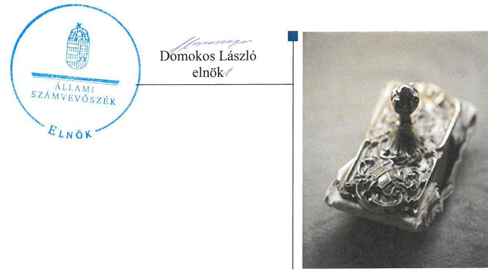

---

# AZ ELLENŐRZÉST FELÜGYELTE: 

PETŐ KRISZTINA felügyeleti vezető

## AZ ELLENŐRZÉST VEZETTE ÉS A VÉGREHAJTÁSÁÉRT FELELŐS:

BARTA JÓZSEF ellenőrzésvezető

## A PROGRAM ÖSSZEÁLLÍTÁSÁÉRT FELELŐS:

JANIK JÓZSEF LÁSZLÓ osztályvezető

IKTATÓSZÁM: V-0776-212/2016.
TÉMASZÁM: 1810

## ELLENŐRZÉS-AZONOSÍTÓ SZÁM: V067915

Jelentéseink az Országgyúlés számítógépes hálózatán és az Interneten a www.asz.hu címen is olvashatóak.

---

# TARTALOMJEGYZÉK 

■ ÖSSZEGZÉS ..... 5
■ AZ ELLENŐRZÉS CÉLJA ..... 7
■ AZ ELLENŐRZÉS TERÜLETE ..... 8
■ AZ ELLENŐRZÉS HÁTTERE, INDOKOLTSÁGA ..... 11
■ FÓKUSZKÉRDÉSEK ..... 13
■ ELLENŐRZÉS HATÓKÖRE ÉS MÓDSZEREI ..... 14
■ MEGÁLLAPÍTÁSOK ..... 18
■ JAVASLATOK ..... 40
■ MELLÉKLETEK ..... 43
I. Sz. melléklet: Értelmező szótár ..... 43
II. Sz. melléklet: Az integritás érvényesítése érdekében kialakított és müködtetett kontrollrendszer ..... 47
III. Sz. melléklet: Teljesítmény-ellenőrzési kiegészítő modul megállapításai ..... 48
IV. Sz. melléklet: Az Intézmény vagyoni helyzetének elemzése 2011-2014. évben ..... 49
■ FÜGGELÉK: ÉSZREVÉTELEK ..... 51
■ RÖVIDÍTÉSEK JEGYZÉKE ..... 85

---

.

---

# ÖSSZEGZÉS 

Az Állami Számvevőszék a Közép-Tisza-vidéki Vízügyi Igazgatóság pénzügyi és vagyongazdálkodása szabályszerűségének ellenőrzését a 2011. január 1. és 2014. december 31. közötti időszakra végezte el. Az irányító szervek és a középirányító szerv Intézményre vonatkozó feladatellátása szabályszerű volt. Az Intézmény belső kontrollrendszerének kialakítása és müködtetése során a kontrollkörnyezet kialakítása szabályszerű volt, a kockázatkezelési rendszer kialakítása és müködtetésekor azonban a kockázatokkal kapcsolatban szükséges intézkedéseket nem határozták meg. Az Intézmény pénzügyi gazdálkodása nem volt szabályszerű. Az Intézmény vagyongazdálkodása szabályszerű volt, azonban a vagyonkezelési szerződést a módosítások után nem foglalták egységes szerkezetbe.

## Az ellenőrzés társadalmi indokoltsága

A közpénzek felhasználásában és az állami vagyonnal való gazdálkodásban a központi alrendszer egyes intézményei meghatározó súlyt képviselnek. E szervezetekkel szemben társadalmi igény, hogy tevékenységükről a döntéshozók és a nyilvánosság felé elszámoljanak. Ezzel a társadalmi igénnyel és az Állami Számvevőszék Stratégiájával összhangban, a közpénzügyek átláthatóságának előmozdítása, a közvagyon védelme érdekében került sor a KÖTIVIZIG ${ }^{1}$ pénzügyi- és vagyongazdálkodásának ellenőrzésére.

## Főbb megállapítások, következtetések, javaslatok

Az irányító szervek a jogszabályi előírásoknak megfelelően látták el az alapítói joggyakorlással kapcsolatos feladataikat. Az ellenőrzött időszak alatt azonban az Intézmény hatályos alapító okiratai és szervezeti és múködési szabályzatai között nem volt meg folyamatosan az összhang, az alapító okiratok módosításait késve követte a szervezeti és múködési szabályzatok módosítása. A 2014. szeptember 10-én hatályba helyezett alapító okiratot sem követte szervezeti és múködési szabályzat módosítása, így abban nem jelentek meg az Intézmény alapfeladataiban történt változások.

Az irányító szervek részéről a közfeladatok ellátására vonatkozó, az erőforrásokkal való szabályszerű gazdálkodáshoz szükséges követelményeket érvényesítették, számon kérték és 2011. év kivételével ellenőrizték. Az irányító szervek és a középirányító szerv az erőforrásokkal való hatékony gazdálkodáshoz szükséges követelményeket nem érvényesítette, nem kérte számon és nem ellenőrizte.

A belső kontrollrendszeren belül a kontrollkörnyezet kialakítása során a jogszabályi előírások nem érvényesültek maradéktalanul, azonban a feltárt hiányosságok nem gyakoroltak lényeges hatást a kontrollok múködtetésére. Az Intézmény a kockázatelemzés során felmérte és meghatározta a tevékenységében, gazdálkodásában rejlő kockázatokat, az egyes kockázatokkal kapcsolatban a szükséges intézkedéseket, azonban az intézkedések teljesítésének folyamatos nyomon követési módját nem rögzítették. Az információs és kommunikációs folyamatok kialakítása és múködtetése szabályszerű volt. Az Intézmény 2011. évben nem rendelkezett rendszeresen felülvizsgált, aktualizált belső ellenőrzési kézikönyvvel. 2012-ben az intézkedési terveket az igazgató a belső ellenőrzési vezető véleményének kikérése nélkül hagyta jóvá.

Az Intézmény pénzügyi gazdálkodása nem volt szabályszerű. A 2011. év kivételével a teljesített bevétel elmaradt a módosított bevételi előirányzattól. A kiadási előirányzatok felhasználása során az Intézmény a kiadási előirányzatokat nem lépte túl. Az Intézmény a kiadási előirányzatait nem szabályszerűen használta fel, a kapcsolódó gazdálkodási jogkörök gyakorlása nem múködtek megfelelően. A 2011. évben a rendszeres, nem rendszeres és külső személyi juttatásoknál a kifizetések teljesítését megelőzően a szakmai teljesítés igazolására a jogszabályban foglaltak ellenére nem került sor, az utalványok nem tartalmazták az utalványozó és az utalvány ellenjegyzője aláírásának dátumát, a

---

kötelezettségvállalás nyilvántartási számát. A 2012-2014. években a rendszeres és külső személyi juttatások esetében a teljesítés igazolására nem került sor.

Az Intézmény az előirányzatok megállapítása során betartotta a jogszabályi előírásokat és a belső szabályzatokban foglaltakat, a bevételi és kiadási előirányzatok módosítását a jogszabályi előírásoknak és a belső szabályzatokban foglaltaknak megfelelően hajtotta végre. Az Intézménynél az előirányzat felhasználáshoz kapcsolódó évközi korlátozó intézkedéseket végrehajtották, a befizetési kötelezettségeket teljesítették, az előirányzat maradvány megállapítása, felhasználása szabályszerű volt.

Az Intézmény vagyongazdálkodása szabályszerű volt, azonban a vagyonkezelési szerződés módosítása után a vagyonkezelési szerződést nem foglalták egységes szerkezetbe. Az Intézmény eleget tett a vagyonkezelési szerződésben előírt értékmegőrzési, állagmegóvási kötelezettségének. A vagyonelemek elidegenítése, hasznosítása a jogszabályok és a belső szabályzatok előírásainak megfelelt.

Az irányító szervek és a középirányító szerv Intézményre vonatkozó feladatellátása szabályszerű volt.
Az Intézmény az ellenőrzést megelőzően erőfeszítéseket tett az integritás szemlélet érdekében.

---

# **AZ ELLENŐRZÉS CÉLJA**

## **A Közép-Tisza-vidéki Vízügyi Igazgatóság pénzügyi és vagyongazdálkodásának ellenőrzése**

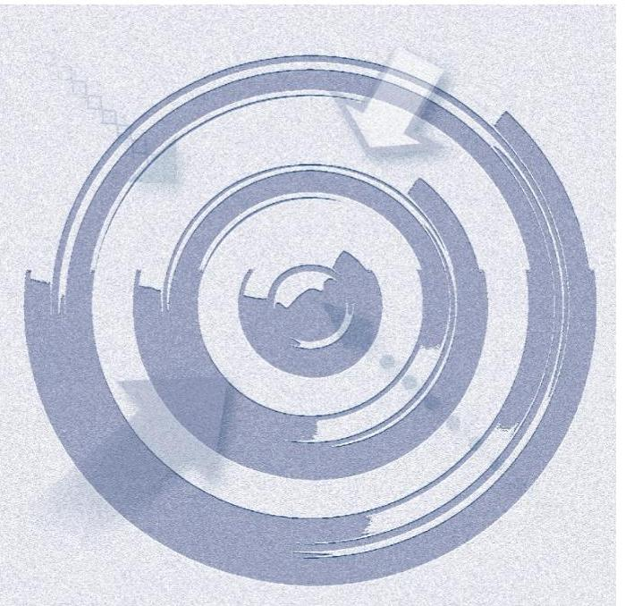

### **A SZABÁLYSZERŰSÉGI ELLENŐRZÉS**

célja annak megítélése volt, hogy az ellenőrzött Intézményre2 vonatkozó irányító szervi13,4 feladatellátás a jogszabályi előírások betartásával történt-e; az Intézménynél a belső kontrollrendszer kialakítása és működtetése szabályszerű volt-e; kialakították-e az erőforrásokkal való szabályszerű, gazdaságos, hatékony és eredményes gazdálkodáshoz szükséges követelményeket, megvalósították-e azok számon kérését, ellenőrzését; az Intézmény pénzügyi és vagyongazdálkodása megfelelt-e a jogszabályi előírásoknak és belső szabályzatainak; az Intézmény átalakításának vagy átszervezésének lebonyolítása szabályszerűen történt-e.

Az Intézmény korrupcióval szembeni veszélyeztetettségének csökkentése érdekében az ÁSZ5 felmérte az integritási szemlélet érvényesülését a gazdálkodási folyamatokban.

**A KIEGÉSZÍTŐ TELJESÍTMÉNY-ELLENŐRZÉSI MODUL** célja annak értékelése volt, hogy a gazdálkodás folyamatában a gazdaságossági, hatékonysági és eredményességi követelmények kialakítása megtörtént-e, azokat működtették-e, a célkitűzéseket elérték-e; a pénzügyi és vagyongazdálkodás folyamataira vonatkozóan a költségvetési szerv belső kontrollrendszerének minőségéről kiadott vezetői nyilatkozatban a költségvetési szerv tevékenységében a hatékonyság, eredményesség, gazdaságosság követelményeinek érvényesítésére vonatkozó nyilatkozat helytálló volt-e.

---

# AZ ELLENŐRZÉS TERÜLETE 

## Közép-Tisza-vidéki Vízügyi Igazgatóság

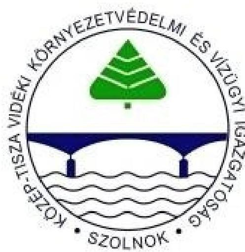

AZ INTÉZMÉNY a Kormány által kijelölt vízügyi igazgatási szerv, amelyet az OVF ${ }^{6}$ létrehozásáról szóló 1060/1953. $\mathrm{MT}^{7}$ határozattal vízügyi területi feladatok, elsőfokú vízügyi hatósági jogkör ellátására 1953. október 1-jétől hoztak létre. Jogállását, közfeladatait, hatáskörét és területi illetékességét a vízgazdálkodásról szóló 1995. évi LVII. törvény, a vizek kártételei elleni védekezés szabályairól szóló Korm. rendelet ${ }_{1}{ }^{8}$, valamint a vízügyi, vízvédelmi hatósági feladatokat ellátó szervek kijelöléséről szóló Korm. rendeletek ${ }_{2-4}{ }^{9}$ határozták meg.

Az Intézmény feladatstruktúrája az ellenőrzött időszakban három alkalommal változott. A Korm. rendelet ${ }_{2}$ 41/A. és 41/B. §-ai alapján a 2012. január 1-jétől létrejött NeKI ${ }^{10}$-nek a területi hulladékgazdálkodással, a vízi közmű szakágazati és statisztikai adatgyűjtéssel, szennyvíz információs rendszerrel kapcsolatos feladatokat adtak át. A Korm. rendelet ${ }_{3} 15 . \S$-a alapján 2014. január 1-jétől a vízügyi hatósági feladatokat vették át az KTVKTVF ${ }^{11}$-től. A Korm. rendelet ${ }_{4}$ 19. §-a alapján 2014. szeptember 10-én feladatátadás történt a $\mathrm{KI}^{12}$ részére, illetve ugyanezen időponttól feladatátvételre került sor vízügyi ágazati, valamint európai uniós forrásokból megvalósuló programokkal, az OKKP ${ }^{13}$-val kapcsolatos területi feladatok ellátásával összefüggésben a NeKI-től.

Az Intézmény önállóan működő és gazdálkodó központi költségvetési szerv. Az irányító szervi feladatokat 2011. december 31-ig a VM ${ }^{14}$-et vezető miniszter látta el, 2012. január 1-jétől a vízügyi igazgatási szervek irányításáért a $\mathrm{BM}^{15}$-et vezető miniszter volt felelős. A középirányító szervi ${ }^{16}$ feladatokat 2012. március 23 -tól a BM utasítás ${ }^{17}$ alapján az OVF látta el. Az Intézményt 2011. december 31-ig a vidékfejlesztési miniszter által, ezt követően a belügyminiszter által kinevezett igazgató vezette.

Az Intézmény alapfeladata a vizek kártételei elleni védelem, vízhiány kárelhárítás, vízminőségi kárelhárítás. Üzemelteti és fejleszti a vízrajzi észlelőhálózatot. Ellátja a működési területén lévő vizek állapotértékelésével kapcsolatos feladatokat, a közműves vízellátással és szennyvízkezeléssel kapcsolatos nemzeti és regionális programok elkészítésével a feladatkörébe utalt feladatokat. Ellátja a távlati ivóvízbázisok vízkészletének felhasználható állapotban tartásával kapcsolatos feladatokat. Ellátja a vízitársulatok szakmai felügyeletével kapcsolatos feladatokat.

Az Intézmény eredeti költségvetési előirányzata a 2011. évi 1670,4 M Ft-ról 2014. évre 1978,3 M Ft-ra - 18,4\%-kal - emelkedett. A 2011-2014. években országgyűlési, Kormány, fejezeti, és saját hatáskörben 5972,2 M Ft - 10 520,0 M Ft közötti előirányzat-módosítás történt. A módosított előirányzatok az évközben beindított pályázati projektek, az ár-, és belvíz elleni védekezés beruházásai, valamint a közfoglalkoztatás következtében, az ellenőrzött időszak minden évében jelentősen meghaladták az eredeti előirányzatokat.

---

A 2011-2014. évekre jóváhagyott eredeti és a módosított bevételi és kiadási előirányzatok, valamint a teljesítések alakulását az 1. ábra szemlélteti.

1. ábra

Az eredeti és a módosított bevételi és kiadási előirányzatok, valamint a teljesítések alakulása M Ft-ban
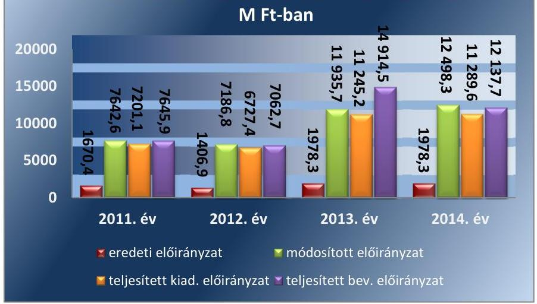

Forrás: az Intézmény 2011., 2012., 2013., 2014. évi beszámolói
Az Intézmény az alapfeladat ellátásán túl az év során védekezési feladatokra és közfoglalkoztatásra kapott előirányzatot, amit hazai és uniós programokból származó pályázati bevételekkel egészített ki. A bevételek alakulását az 1. táblázat tartalmazza.

1. táblázat

# A BEVÉTELEK ALAKULÁSA (M FT-BAN) 

| Megnevezés | 2011 | 2012 | 2013 | 2014 |
| :-- | :--: | :--: | :--: | :--: |
| elöirányzat | 1670,4 | 1406,9 | 1978,3 | 1978,3 |
| módosított előirányzat | 7642,6 | 7086,8 | 11935,7 | 12498,2 |
| teljesítés | 7645,9 | 7062,7 | 14914,5 | 12137,7 |

Forrás: az Intézmény 2011., 2012., 2013., 2014. évi beszámolói
AZ INTÉZMÉNY ÖSSZES VAGYONA, valamint az egyes vagyonelemek összege az ellenőrzött időszak minden évében emelkedett, a változást a 2. ábra szemlélteti.
2. ábra
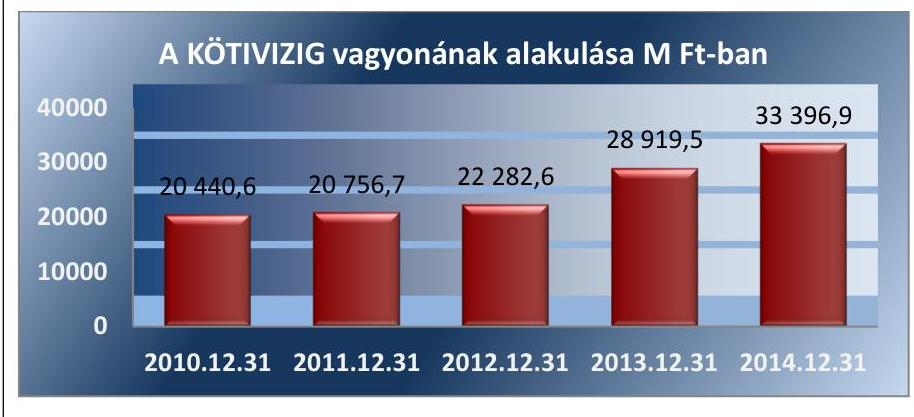

Forrás: az Intézmény 2011., 2012., 2013., 2014. évi beszámolói

---

A SAJÁT TÖKE 19 727,3 M Ft-ról, 25 135,9 M Ft-ra (27,4\%-kal), az összes eszköz és forrás 20 756,7 M Ft-ról 33 396,9 M Ft-ra (60,9\%-kal) növekedett. A tárgyi eszközök állománya, és összetevői közül a beruházások összege is minden évben emelkedtek, a tárgyi eszközök értéke a 2011. évi 19 658,3 M Ft-ról 2014. évre 28 973,8 M Ft-ra, 47,4\%-kal növekedett, a beruházások összege az 1555,3 M Ft-ról több mint hatszorosára, 9744,7 M Ft-ra emelkedett.

Az Intézményt az ellenőrzött időszakban átalakítás nem érintette, az igazgató, a gazdasági igazgató személye nem változott, 2011. évben engedélyezett létszámkerete 421 fő, 2014-ben 409 fő volt, az év végén munkavégzési jogviszonyban állók száma 2011-évben 421 fő, 2014-ben 405 fő volt.

Az Intézménynél az ellenőrzött időszakban belső ellenőrzés működött. A belső ellenőr 2011. február 15-től 2011. november 15-ig részmunkaidőben, ezt követően teljes munkaidőben látta el belső ellenőrzési feladatait.

---

# AZ ELLENŐRZÉS HÁTTERE, INDOKOLTSÁGA 

Az Alaptörvény rendelkezése szerint a nemzeti vagyon megőrzésének, védelmének és a nemzeti vagyonnal való felelős gazdálkodásnak a követelményeit sarkalatos törvény, az Nvtv. ${ }^{18}$ rögzíti. A tulajdonosi joggyakorlás és vagyonkezelés általános és speciális szabályait, az állami vagyon nyilvántartására és elszámolására vonatkozó eljárásokat, a vagyonkezelési szerződés feltételrendszerét, valamint az éves beszámoló készítési és könyvvezetési kötelezettségeket kormányrendelet írja elő.

A központi alrendszer egyes Intézményei közfeladat-ellátásának változásait, a közfeladatok átadásából és átvételéből adódó módosításait, előirányzat gazdálkodására ható tényezőit az Áht. ${ }^{19}$ 11. §-a és az Ávr. 14. §-a írja elő. A közfeladatok megszűnéséből, Intézmény átszervezéséből, belső szerkezeti korszerűsítéséből, vagy más hasonló okból adódó módosításai miatt szerepeltetendő szerkezeti változásokat, valamint a szerkezeti változásként beépült közfeladatok szintre hozásként történő számításba vételét az Ávr. 15. § (2)-(3) bekezdései határozzák meg.

A társadalmi igénnyel összhangban az Áht. ${ }^{20}{ }_{2}$, az Ámr. ${ }^{21}$ és a Bkr. ${ }^{22}$ is előírja a költségvetési szerv részére, hogy olyan szabályozásokat, eljárásokat, folyamatokat alakítson ki, amelyek biztosítják a múködés, gazdálkodás, az erőforrások felhasználása során a gazdaságosság, hatékonyság és eredményesség érvényesülését. Az Ámr. és a Bkr. alapján az intézményvezetőnek évente nyilatkoznia is kell arról, hogy gondoskodott-e az Intézmény tevékenységében a gazdaságosság, hatékonyság és eredményesség követelményeinek érvényesítéséről. A gazdaságos, hatékony és eredményes gazdálkodáshoz szükség van a teljesítménymérés feltételeinek kialakítására, úgymint az egyértelmú és mérhető célokra, mutatószámokra és az ezekhez rendelt követelményekre. Az ÁSZ jelen ellenőrzéssel győződik meg arról, hogy az Intézménynél a teljesítménycélokat, -mutatókat, -követelményeket kialakították-e, azokat múködtették-e, a kitűzött cél(ok) teljesültek-e.

AZ ELLENŐRZÉS EREDMÉNYEKÉPPEN nemcsak az ellenőrzött Intézmények gazdálkodása javulhat, hanem átfogó képet kaphatunk a központi alrendszerbe tartozó költségvetési szervek gazdálkodásának hiányosságairól, de a jó gyakorlatokról is. Ellenőrzéseivel, javaslataival és megállapításaival az ÁSZ elősegítheti a költségvetési szervek pénzügyi és vagyongazdálkodása szabályozásának javítását és hozzájárulhat a jó kormányzáshoz. Az ellenőrzés az ellenőrzött számára visszajelzést ad a pénzügyi és vagyongazdálkodásában feltárt hiányosságokról, javaslataival hozzájárul azok kiküszöböléséhez, amely csökkentheti a későbbi ellenőrzések gyakoriságát. Az ellenőrzés megállapításait és javaslatait más szervezetek is hasznosíthatják a rendezett gazdálkodási keretek kialakításához.

## A TELJESÍTMÉNY-ELLENŐRZÉSI KIEGÉSZÍTŐ

MODUL a törvényalkotás számára támogatást nyújt a nemzeti kulcsindikátorok rendszerének kialakításához. A döntéshozók, ellenőrzöttek, irányító szervek, a társadalom számára az összehasonlítási, összemérési lehetőségek kihasználásával objektív visszajelzést ad a gazdálkodás területén végrehajtott szervezeti, szervezési, takarékossági és bürokráciacsökkentő

---

intézkedések hatásairól, a közfeladat-ellátásnak keretet adó pénzügyi és vagyongazdálkodásban mérhető teljesítménykövetelmények kialakításáról, azok alkalmazásáról.

---

# FÓKUSZKÉRDÉSEK 

1. Az irányító szerv ellenőrzött Intézményre vonatkozó feladatellátása szabályszerű volt-e?
2. A belső kontrollrendszer kialakítása és múködtetése megfelelt-e a jogszabályi előírásoknak?
3. Az Intézmény pénzügyi gazdálkodása szabályszerű volt-e?
4. Az Intézmény vagyongazdálkodása szabályszerű volt-e?
5. Szabályszerüen hajtották-e végre az ellenőrzött időszakban az Intézményt érintő szervezeti, szerkezeti átalakításokat?
6. Az Intézmény intézkedett-e az integritás szemlélet érvényesítése érdekében?

---

# ELLENŐRZÉS HATÓKÖRE ÉS MÓDSZEREI 

## Az ellenőrzés típusa

Szabályszerűségi ellenőrzés, amelyet teljesítmény-ellenőrzési modul egészített ki.

## Az ellenőrzött időszak

Az ellenőrzött időszak 2011. január 1-jétől 2014. december 31-éig terjedő időszak volt.

## Az ellenőrzés tárgya

Az ellenőrzött szervezetre vonatkozó irányító szervi feladatok ellátása. Az Intézmény belső kontroll rendszerének kialakítása és müködtetése, valamint pénzügyi és vagyongazdálkodása. Az erőforrásokkal való szabályszerű, gazdaságos, hatékony és eredményes gazdálkodáshoz szükséges követelmények kialakítása, a kialakított követelmények számonkérése, ellenőrzése. Az Intézmény átalakítása, átszervezése lebonyolításának szabályszerűsége.

A hatékonyság, eredményesség, gazdaságosság követelményei érvényesítéséről kiadott vezetői nyilatkozat helytállósága a pénzügyi és vagyongazdálkodás folyamataira vonatkozóan.

Az ellenőrzés kiterjed minden olyan körülményre és adatra, amely az ÁSZ jogszabályban meghatározott feladatainak teljesítéséhez, valamint a program végrehajtása folyamán felmerült újabb összefüggések feltárásához voltak szükségesek.

## Az ellenőrzött szervezet

A központi alrendszer kockázat elemzés alapján kiválasztott Intézménye: Közép-Tisza-vidéki Vízügyi Igazgatóság

A kiválasztott Intézmény irányító szerve: BM, FM ${ }^{23}$
A kiválasztott Intézmény középirányító szerve: OVF
Az ellenőrzésre a központi alrendszer ellenőrzött Intézményének és irányító szervének, illetve középirányító szervének székhelyén került sor.

## Az ellenőrzés jogalapja

Az ellenőrzés jogszabályi alapját az ÁSZ tv. 1. § (3) bekezdés, 5. § (2)-(7) bekezdései, valamint az Áht. 2 61. § (2) bekezdésének előírásai képezik.

---

# Az ellenőrzés módszerei 

Az ellenőrzést az ellenőrzési program szempontjai, az ellenőrzött időszakban hatályos jogszabályok, az ellenőrzés szakmai szabályai, az egyes ellenőrzési típusokhoz kapcsolódó ÁSZ módszertanok és nemzetközi standardok figyelembe vételével végeztük. A gazdálkodás hibáinak kijavítására, a közpénzekkel való felelős gazdálkodás segítésére irányuló javaslatok kidolgozásakor a hatályos jogszabályok voltak az irányadóak.

Az ellenőrzés ideje alatt az ellenőrzött szervezettel történő kapcsolattartást az ÁSZ SZMSZ ${ }^{24}$-ének vonatkozó előírásai alapján biztosítottuk.

Az ellenőrzési kérdések megválaszolásához szükséges bizonyítékok megszerzése a következő ellenőrzési eljárások alkalmazásával történt: megfigyelés, szemle (szemrevételezés), kérdésfeltevés (információkérés), mintavételezés, valamint elemző eljárás. A minták kiválasztása során elsősorban reprezentativitást biztosító véletlen mintavételi eljárást alkalmaztunk.

Az ellenőrzési bizonyítékként felhasználható adatforrások közé tartoztak egyrészt a szakmai program részletes szempontjainál felsorolt adatforrások, másrészt adatforrás volt minden egyéb - az ellenőrzés folyamán feltárt, az ellenőrzés szempontjából releváns információt tartalmazó - dokumentum.

Az ellenőrzés lefolytatásához az intézmény a tanúsítványok elektronikus kitöltésével, valamint az ÁSZ által kért dokumentumok elektronikus megküldésével szolgáltatott adatokat. A rendelkezésre bocsátott adatok, információk kontrollja az ellenőrzés keretében történt.

Az ellenőrzési kérdésekre adott válaszok alapján értékeltük, hogy az ellenőrzött időszakban az irányító szerv ${ }_{1,2}$ és a középirányító szerv az ellenőrzött intézményre vonatkozó feladatainak szabályszerűen eleget tett-e, az Intézmény pénzügyi és vagyongazdálkodása megfelelt-e az előírásoknak, az Intézmény átalakításának vagy átszervezésének végrehajtása szabályszerű volt-e. Értékeltük, hogy az Intézménynél kialakították-e az erőforrásokkal való szabályszerű és hatékony gazdálkodáshoz szükséges követelményeket, megvalósították-e azok számonkérését, ellenőrzését.

Az Intézmény belső kontrollrendszere jogszabályi előírások szerinti kialakításának és működtetésének szabályszerűségét az erre irányuló ellenőrzési kérdésekre adott válaszok összesítése alapján, évente pillérenként (kontrollkörnyezet, kockázatkezelési rendszer, kontrolltevékenységek, információs és kommunikációs rendszer, monitoring rendszer) és összesítetten is minősítettük. Az Intézmény belső kontrollrendszere egyes pilléreinek kialakítását és működtetését „szabályszerü"-nek minősítettük, amennyiben az értékelt területen az elért és elérhető pontok százalékban kifejezett, egész számra kerekített hányadosa meghaladta a $84 \%$-ot, „részben sza-bályszerü"-nek minősítettük, ha a $84 \%$-ot nem haladta meg, de $60 \%$-nál nagyobb volt, „nem szabályszerű"-nek minősítettük, ha nem haladta meg a 60\%-ot. Az Intézmény belső kontrollrendszerének összesített értékelése megegyezik a pillérenként (kontrollterületenként) alkalmazott \%-os értékelésekkel, a következő eltérésekkel. A kontrollrendszer egésze esetében a „szabályszerű" értékelésnek a \%-os értéken felül további feltétele volt, hogy egyik kontrollterület sem kaphatott „nem szabályszerű" értékelést, a „részben szabályszerű" értékelés további feltétele volt, hogy legfeljebb egy

---

ellenőrzött kontrollterület lehetett „nem szabályszerű" értékelésű. Az öszszesített értékelés a \%-os értéktől függetlenül „nem szabályszerű"-nek minősült, ha az ellenőrzött kontrollterületek közül több mint egy „nem szabályszerű" értékelést kapott.

A tárgyi eszközök nyilvántartásba vételének, a közbeszerzési eljárások lefolytatásának, a vagyonhasznosítási bevételi előirányzatok teljesítésének, az előirányzatok módosításának és az előirányzat-maradvány megállapításának szabályszerűségét, valamint a gazdálkodási jogkörök gyakorlásának szabályszerűségét mintavétellel ellenőriztük.

A jogszabályoknak és a belső előírásoknak megfelelőnek tekintettük a tárgyi eszközök nyilvántartásba vételét, a vagyonhasznosítási bevételi előirányzatok teljesítését, az előirányzatok módosítását és az előirányzat-maradvány megállapítását, amennyiben a minta ellenőrzésének eredménye alapján 95\%-os bizonyossággal a teljes sokaságban a hibás tételek aránya kisebb volt, mint $10 \%$, nem megfelelőnek értékeltük, ha a hibás tételek aránya a 10\%-ot meghaladta. Kockázatot, illetve magas kockázatot jeleztünk, amennyiben egy adott terület vonatkozásában a minta alapján a teljes sokaságban nem volt egyértelmúen biztosított a jogszabályoknak és a belső szabályzatoknak megfelelő működés.

A közbeszerzési eljárások esetében az ellenőrzött mintatételek értékelését végeztük el.

A 2011. évet érintően a szakmai teljesítésigazolás és az utalvány ellenjegyzése kulcskontrollok, a 2012-2014. éveket érintően a teljesítésigazolás és az érvényesítés kulcskontrollok múködését értékeltük. Megfelelőnek értékeltük a gazdálkodási jogkörök gyakorlását, amennyiben 95\%-os bizonyossággal a teljes sokaságban a hibás tételek aránya legfeljebb 10\% volt, részben megfelelőnek, ha a hibás tételek arányának felső határa legfeljebb $30 \%$ volt, nem megfelelőnek, ha a hibás tételek sokaságbeli arányának felső határa meghaladta a 30\%-ot.

Az integritás szemlélet érvényesülésének értékelése az Intézmény által kitöltött tanúsítványa alapján történt.

Az alapprogram alapján ellenőriztük, hogy a költségvetési szerv vezetője megtette-e nyilatkozatát arról, hogy gondoskodott a költségvetési szerv tevékenységében a hatékonyság, eredményesség és a gazdaságosság követelményeinek érvényesítéséről. Ezt kiegészítve, a teljesítmény-ellenőrzési kiegészítő modul keretében - felhasználva az alapprogram szerinti ellenőrzés megállapításait - értékeltük, hogy a költségvetési szerv vezetője kialakította-e a gazdaságossági, hatékonysági és eredményességi követelményeket, és azokat múködtette-e, a célkitúzéseket elérte-e.

A gazdálkodási feladatok értékelése az alábbi területekre terjedt ki:
pénzügyi gazdálkodási (nem szakmai, adminisztratív) feladatok: költségvetés-, beszámoló-készítés, könyvvezetés, adatszolgáltatások, előirányzat-gazdálkodás, kötelezettségvállalások nyilvántartása, kezelése, bevételkezelés, bér- és illetményszámfejtés;
vagyongazdálkodási (logisztikai) feladatok: közbeszerzések és közbeszerzési értékhatárt el nem érő beszerzések, készletgazdálkodás, nyomtatók, fénymásolók üzemeltetése, épület- és ingatlanüzemeltetés, karbantartás, hibabejelentés, gépjármú és flottamenedzsment.

---

Az ellenőrzés során minden olyan körülményt és adatot is ellenőriztünk, amely a program végrehajtása kapcsán felmerült újabb összefüggéseknek az ellenőrzés céljaival összhangban lévő feltárásához szükséges.

---

# 1. Az irányító szerv ellenőrzött Intézményre vonatkozó feladatellátása szabályszerű volt-e? 

Összegző megállapítás

Az irányító szervek és a középirányító szerv Intézményre vonatkozó feladatellátása szabályszerű volt.
1.1. számú megállapítás

Az irányító szerveket megillető jogosultságok gyakorlása a jogszabályi előírásoknak megfelelően történt, azonban az SZMSZ-ek és az alapító okiratok közötti összhang biztosításáról rendszeresen késedelemmel gondoskodott.

AZ IRÁNYÍTÓ SZERVEK ÁLTAL KIADOTT ALAPÍTÓ OKIRATOK (az Intézmény a 2011-2014. években hat alapító okirattal rendelkezett (alapító okirat ${ }_{1-6}{ }^{25}$ ) megfeleltek az Áht. ${ }_{1}$, az Ámr., és az Áht. ${ }_{2}$ előírásainak. Az alapító okiratok módosításait az irányító szervek változásában és/vagy az Intézmény által ellátandó feladatokban bekövetkezett változások indokolták. Az Intézmény az államháztartásért felelős miniszter előzetes jóváhagyását minden esetben megszerezte és a változások bejegyzéséhez a módosított és egységes szerkezetű alapító okiratokat, valamint a változásbejegyzési kérelmeket benyújtotta a Kincstár ${ }^{26}$-nak. A Kincstár a bejegyzési kérelemnek megfelelő hatályosulási dátummal vette törzskönyvi nyilvántartásba a módosított alapító okiratokat az Áht. ${ }_{2}$ előírásának megfelelően.

Az irányító szerv ${ }_{2}$ az OVF-et középirányító szervként jelölte meg az Áht. ${ }_{2}$ 9. § (1) bekezdés f), g) és h) pontjaiban szereplő hatáskörökkel. Az ellenőrzött időszak alatt a hatályos az SZMSZ ${ }_{1-4}{ }^{27}$-ek és az egyidejűleg hatályos alapító okiratok között nem volt meg folyamatosan az összhang. Az alapító okiratok módosításait késve követte az SZMSZ módosítása az Ámr. 20. § (2) bekezdés b) és c) pontja, valamint az Ávr. 13. § (1) bekezdés b) c), pontja ellenére, amely előírja, hogy az SZMSZ-nek tartalmaznia kell a hatályos alapító okirat keltét, számát, az alaptevékenységet, a feladatokat, hatásköröket. A 2014. december 23-án aláírt és visszamenőlegesen 2014. szeptember 10-én hatályba helyezett alapító okiratot ${ }_{6}$-ot nem követte SZMSZ módosítás, így az SZMSZ-ben nem jelent meg az Intézmény közfeladatára vonatkozó új jogszabály (a Korm. rendelet ${ }_{4}$ ), illetve az alapfeladataiban történt változások, ezzel megsértették az Ávr. 13. § (1) bekezdés c) pontját.

---

### 1.2. számú megállapítás

Az irányító szerv1,2 részéről a közfeladatok ellátására vonatkozó, az erőforrásokkal való szabályszerű gazdálkodáshoz szükséges követelményeket érvényesítették, számon kérték és 2011. év kivételével ellenőrizték. Az irányító szerv1,2 és a középirányító szerv az erőforrásokkal való hatékony gazdálkodáshoz szükséges követelményeket nem érvényesítette, így nem volt biztosított a számon kérhetőség és az ellenőrizhetőség.

A KÖZFELADATOK ELLÁTÁSÁRA, az erőforrásokkal való szabályszerű gazdálkodásra vonatkozó követelményeket az irányító szerv1 az Áht. 1 előírásainak megfelelően 2011. évben az Intézmény költségvetési gazdálkodásának és az előirányzatok felügyeletén keresztül érvényesítette, az éves költségvetési beszámoló és szakmai beszámoló keretében számon kérte, azonban azok ellenőrzéséről nem gondoskodott.

Az erőforrásokkal való hatékony gazdálkodás követelményeinek érvényesítésére, továbbá számon kérésére, ellenőrzésére 2011. évben az Áht. 1 49. § (5) bekezdés f) pont előírásai ellenére az irányító szerv1 részéről nem került sor.

Az irányító szerv2 és a középirányító szerv a közfeladatok ellátására vonatkozó és az erőforrásokkal kapcsolatos szabályszerű gazdálkodás követelményeit 2012-2014. években a költségvetési gazdálkodás egyes szabályainak meghatározásával, valamint a költségvetési gazdálkodás felügyeletén keresztül érvényesítette, a követelményeket számon kérte, a költségvetési gazdálkodásra vonatkozó szabályszerűségi, utó-, pénzügyi- és rendszerellenőrzéseket folytatott.

Az irányító szerv2 a 2012-2013. években és a középirányító szerv - az alapító okiratában meghatározott hatáskörében - a 2013-2014. években az Áht. 2 9. § (1) bekezdés f) pontjában előírtak ellenére az erőforrásokkal való hatékony gazdálkodáshoz szükséges követelményeket nem érvényesítette, és így nem biztosította a számon kérhetőséget és az ellenőrizhetőséget.
1.3. számú megállapítás

Az irányító szervek és a középirányító szerv szabályszerűen gyakorolták az intézménnyel kapcsolatos egyéb ellenőrzési, irányítási jogosultságaikat.

Az Áht. 1,2 előírásainak megfelelően szabályszerűen történt a bevételi és kiadási előirányzatokkal való gazdálkodás, a közfeladatok ellátásával kapcsolatos ellenőrzési és irányítási jogosultságok gyakorlása.

Az irányító szerv $1,2_{2}$ figyelemmel kísérte az előirányzatokkal való gazdálkodást, rendszeresen tájékoztatót készített az elemi költségvetés készítéséhez, határidő megjelöléssel kérte be az adatszolgáltatásokat és a beszámolókat. Tájékoztatta az Intézményt az irányító szervi hatáskörű előirányzat módosításokról és a szükséges intézkedésekről. Előírta és figyelemmel kísérte az Intézmény kötelezettséggel nem terhelt maradványokkal való gazdálkodását.

Az irányító szerv $1,2_{2}$ az egyéb ellenőrzési, irányítási jogosultság gyakorlása körében - az Áht. 1 és az Áht. 2 előírásainak megfelelően - kialakította a közérdekú adatok kezelésének és a személyes adatok védelmének szabályozását.

---

Az irányító szerv ${ }_{1,2}$ és a középirányító szerv az Intézmény vezetőjét az Áht. 1 és az Áht. 2 rendelkezéseinek megfelelően a gazdálkodásról, és a 1995. évi LVII. tv. ${ }^{28}$ és a Korm. rendelet ${ }_{1}$ előírásának megfelelően a szakmai feladatellátásról - értékelési jelentések formájában - szabályszerűen beszámoltatta. A bekért beszámolókat a felülvizsgálat után az irányító szerv ${ }_{1,2}$ és a középirányító szerv jóváhagyta.

# 2. A belső kontrollrendszer kialakítása és múködtetése megfelel-e a jogszabályi előírásoknak? 

## Összegző megállapítás

A belső kontrollrendszer kialakítása és múködtetése az ellenőrzött időszak összesített értékelése alapján részben volt szabályszerű.

A belső kontrollrendszer évenkénti és összesített értékelését a 2. táblázat tartalmazza.
2. táblázat

AZ INTÉZMÉNY BELSŐ KONTROLLRENDSZERE KIALAKÍTÁSÁNAK ÉS MŰKÖDTETÉSÉNEK ÉRTÉKELÉSE A 2011-2014. KÖZÖTTI ÉVEKBEN

| Megnevezés | Kontrollkörnyezet | Kockázatkezelési rendszer | Kontrolltevékenység | Információs és kommunikációs rendszer | Monitoring rendszer | A belső kontrollrendszer összevont értékelése |
| :--: | :--: | :--: | :--: | :--: | :--: | :--: |
| 2011 | részben szabályszerű | szabályszerű | részben szabályszerű | szabályszerű | részben szabályszerű | részben szabályszerű |
| 2012 | szabályszerű | részben szabályszerű | részben szabályszerű | részben szabályszerű | részben szabályszerű | részben szabályszerű |
| 2013 | szabályszerű | részben szabályszerű | részben szabályszerű | szabályszerű | szabályszerű | szabályszerű |
| 2014 | szabályszerű | részben szabályszerű | részben szabályszerű | szabályszerű | szabályszerű | szabályszerű |

2.1. számú megállapítás

A kontrollkörnyezet kialakítása szabályszerű volt.
HATÁLYOS SZMSZ ${ }_{1-4}$-gyel az Intézmény az ellenőrzött időszakban az Áht. ${ }_{1}$, valamint az Áht. ${ }_{2}$ előírásainak megfelelően rendelkezett. A gazdasági szervezet Ügyrend ${ }_{1-4}{ }^{29}$-jei rendelkezésre álltak. Az Etikai kódex ${ }^{30}$ kiadására 2012. szeptember 25-én sor került. A gazdasági szervezet vezetője az Ámr.-ben, valamint az Ávr.-ben előírt végzettséggel, szakképesítéssel és a könyvviteli szolgáltatás körébe tartozó tevékenység ellátására jogosító engedéllyel rendelkezett. A munkavállalók munkaköri leírásai rendelkezésre álltak. Az Ámr.-ben és Bkr.-ben foglalt előírásoknak eleget téve a költségvetési szerv vezetője gondoskodott a kontrollkörnyezet kialakításáról. Az Intézmény rendelkezett Számviteli Politika ${ }_{1-4}{ }^{31}$-gyel, Számlarend ${ }_{1-3}{ }^{32}$-mal, Leltározási és leltárkészítési szabályzat ${ }_{1-4}{ }^{33}$-gyel, az Eszközök és források értékelési szabályzata ${ }_{1-4}{ }^{34}$-gyel, Pénzkezelési szabályzat ${ }_{1-4}{ }^{35}$-gyel, Önköltségszámítási szabályzat ${ }_{1-4}{ }^{36}$-gyel és Közbeszerzési szabályzat ${ }_{1-7}{ }^{37}$-tel. Érvényben volt a Bizonylati rend ${ }_{1-3}{ }^{38}$. a Gazdálkodási szabályzat ${ }^{39}$ és a Gazdálkodási jogkör szabályzat ${ }_{1,2}{ }^{40}$. Az Intézmény a folyamatok meghatározása és dokumentálása érdekében az Ámr. és a Bkr. előírásainak megfelelően az Ellenőrzési nyomvonal ${ }_{1-4}{ }^{41}$-et és a Szabálytalanságkezelési eljárásrend ${ }_{1}{ }^{42}$-et is elkészítette.

---

A KONTROLLKÖRNYEZET KIALAKÍTÁSA szabályszerű volt, a feltárt, alábbi hiányosságok nem gyakoroltak lényeges hatást a kontrollok múködtetésére. Az SZMSZ4-ben az Ávr. 13. § (1) bekezdés e) pontjában foglaltakat figyelmen kívül hagyva a szervezeti egységek engedélyezett létszámát nem rögzítették, a szervezeti egységek feladatait a jogszabályi előírást figyelmen kívül hagyva az Intézmény Úgyrend ${ }_{2,3}$-ban határozták meg.

Az Úgyrend ${ }_{1}$-nek 2012. évi aktualizálása a feladat átadások-átvételek ellenére nem került végrehajtásra. Az Intézmény alkalmazottai feladat- és hatáskörének, helyettesítési rendjének rögzítésére az Ámr. 20. § (7) bekezdésében, valamint az Ávr. 13. § (5) bekezdésében foglaltak ellenére az ellenőrzött időszakban az SZMSZ ${ }_{2,4}$ az Úgyrend ${ }_{2,4}$-ben, illetve más szabályzatban nem került sor. Az Intézmény a belső és külső kapcsolattartásának módját és szabályait a 2011-2013. években - az Ámr. 20. § (7) bekezdésében és az Ávr. 13. § (5) bekezdésében foglaltak ellenére - nem szabályozta, azonban a 2014. évben már a jogszabályban foglaltaknak megfelelően határozta meg.

A Számv. tv. ${ }^{43}$ 14. § (4) bekezdésében foglaltak ellenére a 2011. és 2012. években hatályos Számviteli Politika ${ }_{1,2}$ nem tartalmazta, hogy mit tekintenek a számviteli elszámolás, az értékelés szempontjából lényegesnek, nem lényegesnek, nem jelentősnek. A Számviteli Politika ${ }_{3,4}$-ben ezen elemek már rögzítésre kerültek.

A Számlarend ${ }_{1,2}$, illetve a 2014. évben is hatályban lévő Számlarend ${ }_{3}$ nem tartalmazta a Számv. tv. 161. § (2) bekezdése b) pontjában rögzített, a könyvviteli számla értéke növekedésének, csökkenésének jogcímeit. A Számlarend ${ }_{3}$-ban a Számv. tv. 161. § (2) bekezdése c) pontjában előírt, a főkönyvi számla és az analitikus nyilvántartások kapcsolatát nem rögzítették. A Számlarend ${ }_{3}$ Áhsz. ${ }_{2}$ szerinti aktualizálását a Számv. tv. 161. § (5) bekezdésében foglaltak ellenére a 2014. évben nem hajtották végre. A Számlarend ${ }_{3}$ a Számv. tv. 161. § (2) bekezdés a) pontjában előírtak ellenére nem tartalmazta minden alkalmazásra kijelölt számla számjelét és megnevezését (Számlatükör).

A 2011. évben a Számv. tv. 14. § (11) bekezdésében foglaltak ellenére Leltározási és leltárkészítési szabályzat ${ }_{1}$ aktualizálását nem hajtották végre. A Leltározási és leltárkészítési szabályzat ${ }_{1,2}$-ben a könyvviteli mérlegben értékkel nem szereplő, használt és használatban levő kis értékű immateriális javak, tárgyi eszközök leltározási módját az Áhsz. 1 37. § (6) bekezdésében foglalt előírás ellenére nem rögzítették. A Leltározási és leltárkészítési szabályzat ${ }_{3,4}$ ezen előírásokat már tartalmazta.

Az Eszközök és források értékelési szabályzata ${ }_{3}$ az Áhsz. ${ }_{1}{ }^{44}$ 8. § (17) bekezdés d) pontja, valamint az Eszközök és források értékelési szabályzata ${ }_{4}$ az Áhsz. 2 50. § (2) bekezdés b) pontjában foglaltak ellenére nem tartalmazta követeléstípusonként a kis összegű követelések - a behajthatatlan kisösszegű követelések kivételével - év végi meghatározásának elveit, dokumentálásának szabályait. Az Eszközök és források értékelési szabály-zata ${ }_{4}$-ben az Áhsz. 2 50. § (2) bekezdés c) pontja előírásait figyelmen kívül hagyva az egyszerűsített értékelési eljárás alá vont követelések besorolásának elveit, dokumentálásának szabályait sem rögzítették.

A Pénzkezelési szabályzat ${ }_{1,2}$-ben a pénzmozgások jogcímeit a Számv. tv. 14. § (8) bekezdésében foglaltak ellenére nem nevesítették. A Pénzkezelési szabályzat ${ }_{3,4}$ e szabályozási elemeket már tartalmazta.

---

A 2011-ben, 2012-ben hatályos Gazdálkodási szabályzatban az Ávr. 53. § (1) és (2) bekezdéseiben foglalt előírás ellenére a 100 ezer Ft alatti kifizetések előzetes írásbeli kötelezettségvállalás nélküli teljesítése gyakorlásának módjával, eljárási és dokumentációs részletszabályaival, valamint az ezeket végző személyek kijelölésének rendjével kapcsolatos belső előírásokat, feltételeket nem határozták meg. Az Ávr. 13. § (2) bekezdés a) pontjában foglaltakat figyelmen kívül hagyva a kötelezettségvállalások pénzügyi ellenjegyzésének eljárási és dokumentációs részletszabályait nem rögzítették, az ezt végző személyek kijelölésének rendjét nem szabályozták, a teljesítésigazolást végző személyek kijelölésének rendjével kapcsolatos belső előírásokat, feltételeket nem rögzítették. A 2013. és 2014. évben hatályos, Gazdálkodási jogkör szabályzat ${ }_{1,2}$ ezen előírásokat már tartalmazta.

A Közbeszerzési szabályzat ${ }_{1}$ az Ámr. 20. § (3) bekezdés b) pontjában rögzített előírás ellenére nem tartalmazta a Kbt. ${ }_{1}^{45}$ hatálya alá nem tartozó beszerzések lebonyolítási rendjét.

# 2.2. számú megállapítás 

## A kockázatkezelési rendszer kialakítása és múködtetése részben volt szabályszerű.

## KOCKÁZATKEZELÉSI RENDSZERT MÚKÖDTETTEK az Intézménynél az Ámr., valamint a Bkr. előírásainak megfelelően, a Kockázatkezelési szabályzat ${ }_{1,4}{ }^{46}$ rendelkezésre állt. A Kockázatkezelési szabályzat ${ }_{2,3}$ azonban a Bkr. 2. § m) pontjában és 7. §-ában foglaltak ellenére nem tartalmazta a kockázati kitettség csökkentésével kapcsolatos szabályokat. Az Intézmény az ellenőrzött időszakban a kockázatelemzés során felmérte és meghatározta a tevékenységében, gazdálkodásában rejlő kockázatokat, az egyes kockázatokkal kapcsolatban a szükséges intézkedéseket, azonban az Ámr. 157. § (3), valamint a Bkr. 7. § (2) bekezdései ellenére az egyes kockázatokkal kapcsolatban szükséges intézkedések teljesítésének folyamatos nyomon követési módját nem rögzítették. A vagyonnyilatkozat őrzéséért felelő személy az érintetteket a vagyonnyilatkozattételi kötelezettség fennállásáról és esedékességéről tájékoztatta. A va-gyonnyilatkozat-tételre kötelezettek vagyonnyilatkozatai a benyújtásra előírt határidőre minden esetben rendelkezésre álltak. Az őrzésért felelős személy a vagyonnyilatkozatokat nyilvántartásba vette és az egyéb iratoktól elkülönítetten kezelte. Azonban az SZMSZ ${ }_{3,4}$ a vagyonnyilatkozat-tételre kötelezettek körét nem tartalmazta, ezért az Intézmény 2012. október 25től nem felelt meg a Vnytv. ${ }^{47}$ 4. § d) pontjában foglaltaknak.

### 2.3. számú megállapítás

## A kontrolltevékenység kialakítása és múködtetése részben volt szabályszerű.

Az Ámr., valamint a Bkr. alapján az SZMSZ ${ }_{1-4}$-ben, valamint az Ügyrend ${ }_{1-3}$ ban az engedélyezési, jóváhagyási és kontrolleljárásokat a felelősségi körök meghatározásával szabályozták. Az SZMSZ ${ }_{1-6}$, illetve az Ügyrend ${ }_{1-3}$ tartalmazta a beszámolási eljárásokra vonatkozó előírásokat, a jogviszony megszűnése vagy a munkakör változása esetén a munkakör átadásának rendjét. A dokumentumokhoz való hozzáférést, a hozzáférés szintjeit az ellenőrzéssel érintett időszak éveiben Iratkezelési szabályzat ${ }_{1-2}{ }^{48}$-ben rögzítették. Az informatikai rendszerekhez való hozzáférés jogosultságait, a hozzáférés szintjeit IBSZ ${ }_{1-4}{ }^{49}$-ben és IÜSZ-ben ${ }^{50}$ szabályozták. Az informatikai rendszer szabályozása során Avtv.-ben ${ }^{51}$, valamint az Info. tv. ${ }^{52}$-ben előírt,

---

az adatok biztonságának, védelmének érvényre juttatásához szükséges eljárási szabályokat IBSZ1-4-ben határozták meg. Az Áht.2, valamint a Bkr. előírásainak megfelelően a kontrolltevékenység részeként a folyamatba épített, előzetes, utólagos és vezetői ellenőrzést biztosították. A gazdasági igazgató, valamint az igazgató az Ámr. és az Ávr. előírásait betartva adott felhatalmazást az érvényesítési, illetőleg utalványozási feladatokra.

Az ellenőrzött időszakban a kötelezettségvállaló a szakmai teljesítésigazolásra jogosultakat az Ámr. 76. § (5) bekezdésében, a teljesítésigazolásra jogosultakat az Ávr. 57. § (4) bekezdésében foglaltak ellenére nem mindig jelölte ki.

A gazdálkodási jogkörök gyakorlása - a megfelelőségi tesztek kiértékelése alapján - az ellenőrzött időszak egészében nem felelt meg az Ámr. 76. §, 78-80. §, az Ávr. 57. §, 58. §, 59. § (2) bekezdés és (3) bekezdés h) pontjában foglalt előírásoknak.

Az lkr. ${ }^{53}$ 8. § (1) bekezdésében rögzített előírásokat nem teljes mértékben érvényesítették, mivel az IBSZ ${ }_{1,2}$-ben az adatvédelemhez kapcsolódó eljárási szabályok meghatározása mellett az üzembiztonságra vonatkozó előírásokat nem rögzítették. Az lkr. 8. § (2) bekezdésében foglaltakkal ellentétben az Intézmény az adatbiztonság szabályozása során az ellenőrzött időszakban a feladatokat és hatásköröket nem határozta meg.

# 2.4. számú megállapítás 

Az információs és kommunikációs folyamatok kialakítása a jogszabályi előírásoknak megfelelő volt.

Az Intézmény Ámr., az Info tv., valamint az Ávr. előírásainak megfelelően, a kötelezően közzéteendő adatok nyilvánosságra hozatalának rendjét Igazgatói utasításban ${ }^{54}$ szabályozta. Teljesítette az Eisztv. ${ }^{55}$-ben, valamint az Info tv.-ben előírt elektronikus közzétételi kötelezettségeket. Meghatározta belső szabályzataiban a közérdekú adatok megismerésére irányuló igények teljesítésének rendjét összhangban az Avtv., az Info tv. és az Ávr. előírásaival.

Az lkr.-ben rögzített tartalmi elemekkel rendelkező Iratkezelési szabályzat ${ }_{1,2}$ rendelkezésre állt. Az iratok iktatásával, az iratforgalom dokumentálásával biztosították, hogy az ügyintézés folyamata, az iratok szervezeten belüli útja pontosan követhető és ellenőrizhető, az iratok holléte pedig naprakészen megállapítható legyen. Ügyiratforgalmuk lebonyolításához az ellenőrzött időszakban a Lotus Notes szoftvert használták. A rendszerben az ügyintézés nyomon követhetősége biztosított volt.

## AZ INFORMÁCIÓS ÉS KOMMUNIKÁCIÓS FOLYAMATOK kialakítása és múködtetése annak ellenére szabályszerű volt, hogy a Bkr. 9. § (1)-(2) bekezdéseiben rögzített előírásokat figyelmen kívül hagyva a 2012. évben a szervezeten belüli információáramlás rendszerét, a szervezeten kívülre történő információátadás rendjét, továbbá a beszámolási szinteket, módokat, határidőket nem szabályozták. A 2013. és 2014. években a hatályos Ügyrend ${ }_{2,3}$, valamint az Adatvédelmi szabályzat ${ }^{56}$ már tartalmazta az erre vonatkozó szabályokat.

Az Avtv. 31/A. § (3) bekezdése, valamint az Info tv. 24. § (3) bekezdése előírásai ellenére a 2011. és 2012. években nem rendelkeztek adatvédelmi és adatbiztonsági szabályzattal, annak kiadására a 2013. évben került sor.

---

Az Iratkezelési szabályzat ${ }_{1,2}$ nem felelt meg az Ltv. ${ }^{57}$ 9. § (4) bekezdése, 10. § (1) bekezdés b) pontjában előírtaknak, mivel azt nem az illetékes szaklevéltárral egyetértésben adták ki. A feltárt hiányosságok nem gyakoroltak lényeges hatást a kontrollok kialakítására és múködtetésére.
2.5. számú megállapítás

## A monitoring rendszer múködése megfelelt a jogszabályi előírások-

nak. A rendelkezésre álló források gazdaságos, hatékony és eredményes felhasználását biztosító követelmények kialakítása és alkalmazása a jogszabályi előírásoknak és a belső szabályzatokban foglaltaknak megfelelt.

Az operatív tevékenységek folyamatos és eseti nyomon követési rendszerének kialakítása és múködtetése megfelelt az Ámr.-ben, valamint a Bkr.ben foglalt előírásoknak. A monitoring tevékenységet az SZMSZ2,3-ban, az Ügyrend ${ }_{2,3}$-ban és a Belső kontrollrendszerről szóló szabályzat ${ }_{1,2}{ }^{58}$-ben határozták meg, az ellenőrzött időszakban a múködés egészét átfogó minőségirányítási rendszert múködtettek.

Az igazgató az ellenőrzött időszakban az Áht. 1-ben, az Áht. 2-ben, valamint a Bkr.-ben foglaltaknak megfelelően gondoskodott a belső ellenőrzés kialakításáról, a belső ellenőr szervezeti és funkcionális függetlensége biztosított volt, az összeférhetetlenségi előírások érvényesültek.

A BELSŐ ELLENŐR a Ber., valamint a Bkr. előírásaival összhangban elkészítette a tárgyévre vonatkozó éves ellenőrzési terveket, amelyeket az igazgató jóváhagyását követően a fejezetet irányító költségvetési szerv belső ellenőrzési vezetője részére megküldtek, a tárgyévi ellenőrzési tervekben foglalt ellenőrzéseket végrehajtották, az elvégzett ellenőrzésekről jelentéseket, a belső ellenőrzés javaslatainak hasznosulása érdekében intézkedési terveket készítettek. Az elvégzett belső ellenőrzésekről éves bontásban nyilvántartást vezettek, amellyel a belső ellenőrzési jelentések alapján megtett intézkedések nyomon követését biztosították, éves bontásban nyilvántartást vezettek továbbá a külső ellenőrzések javaslatai alapján készült intézkedési tervek végrehajtásáról is.

Az Intézménynél a belső ellenőrzési rendszer kialakítása és múködtetése szabályszerű volt. Az Intézmény 2011. évben a Ber. 5. § (1) és (3) bekezdéseiben foglalt előírásokat figyelmen kívül hagyva rendszeresen felülvizsgált, aktualizált belső ellenőrzési kézikönyvvel nem rendelkezett. 2012ben az intézkedési terveket az igazgató a belső ellenőrzési vezető véleményének kikérése nélkül hagyta jóvá, amivel megsértette a Bkr. 45. § (4) bekezdésében foglalt előírást.

Az Intézmény részéről a belső kontrollrendszer múködéséről szóló vezetői nyilatkozatokat 2011-2014. években kiállították, a belső kontrollrendszer kialakításáért, múködtetéséért és fejlesztéséért - az SZMSZ3,4 9. § (3) bekezdés c) pontja alapján - az Intézmény vezetője felelt. Az Intézmény vezetője az Áht. 1 , illetve a Bkr. előírásainak megfelelően a szervezeten belül kiadta a szabályzatokat, kialakított és múködtetett olyan folyamatokat, amelyek biztosították a rendelkezésre álló források szabályszerű, szabályozott, gazdaságos, hatékony és eredményes felhasználását, és hozzájárultak a belső kontrollok múködéséről szóló, a Bkr. 11. § (1) és (4) bekezdés 1. melléklete szerinti vezetői nyilatkozat alátámasztásához.

---

A Belső Kontrollrendszer szabályzat ${ }_{1,2}$-ben rögzítették az Intézmény sajátosságainak megfelelően a szabályozási kereteket. Az Intézmény az éves munkatervekben, feladattervekben meghatározta a szervezeti célokat, az indikátorokat, azok megvalósulását nyomon követték, az eltéréseket értékelték. A nyomon követés a Belső Kontrollrendszer szabályzat ${ }_{1,2}$-ben előírt éves beszámoló, illetve kéthetenkénti vezetői beszámoltatás során történt.

# 3. Az Intézmény pénzügyi gazdálkodása szabályszerű volt-e? 

## Összegző megállapítás

### 3.1. számú megállapítás

### 3.2. számú megállapítás

Az Intézmény pénzügyi gazdálkodása nem volt szabályszerű.
Az elemi költségvetés és az előirányzatok megállapítása során betartották a jogszabályi előírásokat és a belső szabályzatokban foglaltakat.

AZ INTÉZMÉNY ELEMI költségvetése, az előirányzatok megállapítása megfelelt az Ámr., az Ávr., és az Áht.1,2, valamint a belső szabályzatokban foglaltaknak, a költségvetés tervezésével és az előirányzat-módosítással kapcsolatos feladatokat belső szabályzatok, munkaköri leírások tartalmazták. A költségvetés összeállításával és az előirányzat módosításával kapcsolatos főbb munkaszakaszokat, folyamatokat ellenőrzési nyomvonalban meghatározták és 2012. évtől a Gazdálkodási szabályzatban is rögzítették.

A költségvetés tervezése során számításokkal megalapozták a bevételek és a kiadások előirányzatát. Az irányító szerv ${ }_{1,2}$ által meghatározott tervezési szempontok alapján az előző évi eredeti előirányzatot a feladatellátásban bekövetkezett szerkezeti változásokkal - beszámítva az előző évi zárolást és elvonást - korrigálták, figyelembe vették a szintre hozások hatásait. A 2011-2014. években az irányító szerv által véglegezett kincstári költségvetés és az intézményi elemi költségvetés egyezősége biztosított volt.

Az Intézmény a 2011-2014. években a tervezéshez az adatszolgáltatást, az elemi költségvetést az Ámr. és Ávr. által előírt határidőben, illetve az irányítószerv ${ }_{1,2}$ által meghatározott időpontig elkészítette és a Kincstár részére megküldte.

A bevételi és kiadási előirányzatok módosítását a jogszabályi előírásoknak és a belső szabályzatokban foglaltaknak megfelelően hajtották végre.

Az Intézmény a számviteli politikájában és az ellenőrzési nyomvonalban kialakította az előirányzat módosítás eljárásrendjét. Az érintett dolgozók munkaköri leírásai az előirányzat-módosítás feladatát tartalmazták. Az Intézménynél saját hatáskörű előirányzat módosítást a belső szabályozásnak megfelelően a gazdasági igazgató egyetértésével kezdeményeztek.

Az Intézmény eredeti előirányzatait országgyűlési, Kormány, irányítószervi és intézményi hatáskörben módosították az ellenőrzött időszak minden évében a védekezési, közfoglalkoztatási és EU-s projektekkel kapcso-

---

latos többlet feladatok miatt. A módosított előirányzat a 2011-2012 években közel ötszöröse, a 2013-2014. években több mint hatszorosa volt az eredeti előirányzatnak.

A 2011-2014 években végrehajtott előirányzat-módosítások összesen 32 230,8 M Ft-tal biztosítottak magasabb összeget. Az ellenőrzött időszakban az Országgyűlés 260,0 M Ft költségvetési támogatás elvonásról döntött, Kormány hatáskörben 785,1 M Ft, irányító szervi hatáskörben 2189,8 M Ft többlet-forrást biztosítottak a feladat ellátásához. Az Intézmény saját hatáskörben 29 514,7 M Ft összegű előirányzat-módosítást végzett.

Az Intézmény évenkénti előirányzat módosításait hatáskörönként a 3. táblázat mutatja be.
3. táblázat

ELŐIRÁNYZAT-MÓDOSÍTÁS HATÁSKÖRÖNKÉNT (M FT)

|  | Országgyilés | Kormány | irányítószerv | Intézmény |
| :--: | :--: | :--: | :--: | :--: |
| 2011.év | -260 | 13,7 | 407,8 | 5810,8 |
| 2012.év | 0 | 232,0 | 373,2 | 5174,7 |
| 2013.év | 0 | 53,3 | 1033,5 | 8870,6 |
| 2014.év | 0 | 486,1 | 375,3 | 9658,6 |

Forrás: az Intézmény 2011., 2012., 2013., 2014. évi beszámolói

Az előirányzat módosítások megfeleltek az Áht.1,2, Ámr., és Ávr. előírásainak.

Az országgyűlési hatáskörben végrehajtott előirányzat-módosítás működési költségvetési támogatás elvonás volt, a 2011. évi CXIV. törvény ${ }^{59}$ alapján. A Kormány hatáskörben végrehajtott előirányzat-módosítások bérkompenzációval, kormány határozaton alapuló átcsoportosítással, továbbá 2014. évben létszámnövekedéssel függött össze, amelyek dokumentáltak, számszakilag alátámasztottak voltak. Az irányító szerv ${ }_{1,2}$ hatáskörében végrehajtott előirányzat-módosítások közül a legjellemzőbb a vízelhárítási művek fenntartása támogatás, a vízkár elhárítási művek fejlesztése, továbbá 2012. évben a fenntartási feladatok alulfinanszírozása miatti többlettámogatás a 1155/2012. (V. 16) Kormány határozat ${ }^{60}$ alapján. A 2014. évi előirányzat-módosítás a vízügyi hatósági feladatok többletfeladat miatti létszámnövekedés támogatása volt.

Az intézményi hatáskörben végrehajtott előirányzat-módosítás volt gyakoriságát és összegszerűségét tekintve - a legjelentősebb, amely jellemzően meghatározott célhoz kötött támogatásértékű bevételekhez (Közfoglalkoztatás, EU-s projekt, védekezési tevékenység bevételei), kiemelt előirányzatokon belüli átcsoportosításhoz és az előző évi előirány-zat-maradvány felhasználásához kapcsolódott. A megvalósult előirányzatmódosításokról, átcsoportosításokról az intézkedést követően az Ámr. előírásának megfelelően tájékoztatták a Kincstárt és az irányító szerv ${ }_{1,2}$-t.

Az előirányzatok módosításának főkönyvi könyvelése az Áhsz.1,2 előírásának megfelelően megtörtént. Az irányító szerv ${ }_{1,2}$ által engedélyezett többletbevétel előirányzatosítása és az egyéb intézményi hatáskörű elő-irányzat-módosítás szabályszerű volt. Az előző évi maradvány előirányzatosítása megfelelt az irányító szerv által jóváhagyott maradvány összegének, az előirányzatok dokumentáltsága teljes körű volt.

---

# 3.3. számú megállapítás 

## A bevételi előirányzatok teljesítése és a kiadási előirányzatok felhasználása során a jogszabályi előírásokat nem tartották be.

Az Intézmény az ellenőrzött időszakban a jóváhagyott kiemelt kiadási előirányzatokat nem lépte túl. A bevételek 2011. év kivételével alulteljesültek. A kiadások teljesítése 2011. év (7201,1 M Ft) és 2014. év (11 289,6 M Ft) között 4088,5 M Ft-tal, 56,8\%-kal emelkedett. A bevételi előirányzatok teljesülésének emelkedése a kiadási előirányzatok teljesülésének emelkedésével összhangban alakult, a teljesített költségvetési bevétel 2011. évről (7650,3 M Ft) a 2014. év (12 137,7 M Ft) végére 4487,4 M Ft-tal, 58,7\%-kal növekedett.

A 2011-2014 évek feladat ellátásának bevételi forrása irányító szervi támogatásból, intézményi működési bevételből származott, valamint meghatározó volt a pályázatokhoz kapcsolódó támogatás értékű bevétel. A támogatás értékű felhalmozási bevétel az ellenőrzött időszakban több mint háromszorosára, a 2011. évi 1086,3 M Ft-ról a 2014. évben 4694,1 M Ft-ra növekedett. A támogatás értékű működési bevétel ugyanezen időszakban $9,6 \%$-kal nőtt.

Az ellenőrzött időszakban a kiadások teljesítése (36 463,2 M Ft) összességében 7,1\%-kal elmaradt a módosított előirányzattól (39 263,4 M Ft). A 2011. évben a teljesített kiadások 27,9\%-a, 2014. évben 25,7\%-a a személyi juttatások kiadásaiból származott. Az évközi előirányzat módosítások során a személyi juttatások eredeti előirányzata 2011-ben 71,4\%-kal, 20122014 között 224,8\%-kal, 244,8\%-kal és 222,8\%-kal növekedett. A nagymértékű növekedés elsősorban a közfoglalkoztatáshoz, valamint a védekezés többletfeladatához és a bérkompenzációhoz kapcsolódott. A személyi juttatások növekedésének arányában nőtt a munkaadókat terhelő járulékok összege.

A 2011. évben a teljesített kiadások 47,6\%-át jelentették a dologi kiadások és egyéb folyó kiadások, amelyek a 2014. év végére 27,7\%-ra csökkentek. A dologi kiadások eredeti előirányzata a 2012. év kivételével fedezetet biztosított az alapfeladat ellátására. A 2012-ben kormány-, és fejezeti hatáskörú előirányzat-módosítással biztosították a működéshez szükséges forrásokat. Az előirányzat módosítások során a dologi kiadások és egyéb folyó kiadások eredeti előirányzata 2011-ben közel tízszeresére, 2012-ben hétszeresére, 2013 és 2014. évben több mint négyszeresére növekedett. Az előirányzatok módosítását a védekezési-, közfoglalkoztatási és EU-s pályázaton elnyert projektek indokolták. A dologi kiadások és egyéb folyó kiadások teljesítése a 2011. évi 3424,4 M Ft-ról a 2014. év végére 8,8\%-kal, 3124,5 M Ft-ra csökkent. A teljesítésre alapvetően az egyes években eltérően jelentkező közfoglalkoztatási programok, rendkívüli védekezési feladatok és a projekt feladatok teljesítése volt hatással.

A 2011. évben a teljesített kiadások 31,6\%-át jelentették a felhalmozási kiadások, amelyek a 2014. év végére 41,5\%-ra nőttek. A felhalmozási kiadások teljesítése a 2011. évi 2126,8 M Ft-ról a 2014. év végére több mint duplájára 4684,2 M Ft-ra emelkedett. A felhalmozási kiadások módosított előirányzata a 2011-2014. években irányítószervi támogatásból és uniós pályázatokból növekedett.

A 2011. év kivételével a teljesített összes bevétel - kismértékben - elmaradt az összes módosított bevételi előirányzattól (97,4\%-99,5\% között alakult). A költségvetési bevételek tervezettől való elmaradása ellenére az

---

Áht. 2 30. § (3) bekezdését megsértve nem csökkentették az előirányzatokat. A 2014. évben a közhatalmi bevételek teljesítése 11,5\%-kal volt magasabb a módosított előirányzatnál. Ez annak következménye volt, hogy 2014. január 1. és 2014. szeptember 9. között az Intézmény látta el a vízügyi hatósági feladatokat, melyre a hatósági díjbevételek 57,9 M Ft módosított előirányzata biztosította a forrást. Az OVF 2014. decemberben a közhatalmi bevételek előirányzatát 15,7 M Ft-tal csökkentette, így év végén a módosított előirányzat 42,2 M Ft, a teljesítés 47,1 M Ft volt.

A 2011. ÉVBEN a rendszeres, nem rendszeres és külső személyi juttatások esetében a kifizetések teljesítését megelőzően a szakmai teljesítés igazolására az Ámr. 76. § (3) bekezdésében foglaltak ellenére nem került sor. Az utalványok az Ámr. 78. § (2) bekezdésében rögzítettek ellenére nem tartalmazták az utalványozó és az utalvány ellenjegyző́je aláírásának dátumát, a kötelezettségvállalás nyilvántartási számát. Az utalvány ellenjegyző az Ámr. 79. § (2) bekezdésében előírtak ellenére nem végezte el a szakmai teljesítés igazolás megtörténtének ellenőrzését, mivel nem észrevételezte annak hiányát. Az Ámr. 74. § (3) bekezdés c) pontjában előírt, a gazdálkodásra vonatkozó szabályok betartására vonatkozó ellenőrzési kötelezettségének szintén nem tett eleget, mert nem kifogásolta, hogy az Ámr. 74. § (1) bekezdésében foglaltakat figyelmen kívül hagyva a kötelezettségvállalások ellenjegyzését nem, illetve nem megfelelően hajtották végre.

A kinevezési okiratok ellenjegyzését nem hajtották végre, a nem rendszeres személyi juttatások kötelezettségvállalási dokumentumai nem tartalmazták az ellenjegyzés dátumát és az ellenjegyzés tényére történő utalást, megsértve ezzel az Ámr. 74. § (1) bekezdésében foglaltakat. Az utalvány ellenjegyző nem észrevételezte, hogy a Pénzkezelési szabályzat; 3. oldalán előírtak ellenére, a külső személyi juttatások kifizetéseinek érvényesítése során nem tüntették fel a könyvviteli elszámolásra utaló főkönyvi számlaszámokat, valamint az analitikus elszámolásra vonatkozó analitikus kódokat. A Pénzkezelési szabályzat;-ben foglaltak ellenére a Megbízási szerződés nem tartalmazta a teljesítést igazoló személy megnevezését. Az Ámr. 76. § (5) bekezdésében rögzített előírást figyelmen kívül hagyva a külső személyi juttatásokhoz kapcsolódóan a szakmai teljesítésigazolásra jogosult személyt a kötelezettségvállaló írásban nem jelölte ki. Az Ámr. 74. § (1) bekezdésében, valamint az SZMSZ2 29. pont 4. alpontjában foglaltak ellenére a kötelezettségvállalás (megbízási szerződés) ellenjegyzése nem történt meg, a megbízási szerződésben a feladatellátás részletes feltételeit a megbízó és a megbízott kötelezettségeit és jogait nem rögzítették, nem határozták meg továbbá a feladatellátás kapcsán elvárt követelményeket sem.

A 2012-2014. ÉVEKBEN a rendszeres és külső személyi juttatások esetében a teljesítés igazolására az Ávr. 57. § (1), (3) bekezdéseiben foglaltak ellenére teljes körűen nem került sor. A nem rendszeres személyi juttatások vonatkozásában a 2012. évben nem végezték el a teljesítésigazolást, a 2013. és a 2014. évben a teljesítésigazolást nem minden esetben végezték el. Az utalványokon az Ávr. 59. § (3) bekezdés g) pontjában foglalt előírás ellenére az utalványozó aláírása nem volt ellátva keltezéssel. A külső személyi juttatásokhoz kapcsolódó utalványokon a fizetés devizanemét és a kötelezettségvállalás nyilvántartási számát nem tüntették fel az Ávr. 59. §

---

(3) bekezdés d) és f) pontjaiban meghatározottak ellenére. Az érvényesítő az Ávr. 58. § (1) bekezdésében rögzített előírás ellenére a jogszabályok és belső szabályok betartásának ellenőrzését nem végezte el, mivel nem észrevételezte - az Ávr. 58. § (2) bekezdése alapján - a teljesítés igazolás hiányát, az utalvány tartalmi hiányosságait.

Az érvényesítő nem észrevételezte, hogy a kinevezési okiratok, a 2013. évi nem rendszeres személyi juttatások kötelezettségvállalási dokumentumai, valamint a megbízási szerződések pénzügyi ellenjegyzése az Áht. 2 37. § (1) bekezdésében, valamint az Ávr. 55. § (1) bekezdésében foglalt előírás ellenére nem történt meg. Az érvényesítő annak ellenére nem tett eleget az Ávr. 58. § (1) bekezdésében foglalt ellenőrzési kötelezettségeinek, hogy annak elvégzését aláírásával igazolta.

A DOLOGI KIADÁSOK szabályszerűségi ellenőrzése alapján a Kbt. ${ }_{1,2}{ }^{61}$ rendelkezéseit betartották. Az Intézmény a Közbeszerzési szabály-zat ${ }_{1-6}$, valamint a beszerzési szabályzat ${ }^{62}$ előírásai alapján a beszerzések tervezésekor a becsült értékeket meghatározta, a közbeszerzési terveket annak megfelelően állította össze. A védekezési munkálatoknál felmerülő beszerzési igény esetén összeghatártól függetlenül a közbeszerzés alól mentességet élveztek a Kbt. ${ }_{1,2}$ alapján. A közbeszerzési értékhatár elérésének figyelését, az egybeszámítási kötelezettséget a Közbeszerzési szabály-zat ${ }_{1-6}$, valamint a beszerzési szabályzat előírta, ennek megfelelően a leggyakrabban előforduló különféle kenőolaj beszerzési témában jelentéseket tettek évente a gazdasági igazgató felé, hogy javasolják vagy sem az adott tárgyú közbeszerzés kiírását.

Az Intézménynél az ellenőrzött időszakban a szakmai teljesítésigazolás követelményeit igazgatói utasításokban írták elő. A teljesítést igazolók vagy egyedi megbízásként vagy szakmai területenként csoportos kijelölés keretében kaptak felhatalmazást az igazgatótól. A kijelölések a nevek mellett az aláírás mintákat is tartalmazták, azonban az Ámr. 80. § (3) és az Ávr. 60. § (3) bekezdése ellenére belső szabályzatban nem rendelkeztek a napra kész nyilvántartás módjáról. A felhatalmazás szakterületre és összegszerűségre terjedt ki, érvényességi idő meghatározása nélkül, a naprakészséget úgy biztosították, hogy szükség szerint adtak ki felhatalmazást új személyeknek, visszavonó intézkedésre ugyanakkor nem került sor.

Az Intézménynél a teljesítést igazolók jogosultak voltak a feladatra, az aláírások beazonosíthatók voltak. Az Intézmény beszerzési szabályzatai (Közbeszerzési szabályzat ${ }_{1-6}$, beszerzési szabályzat) hangsúlyozták a hatékony és felelős gazdálkodást, mint alapelvet, ennek ellenére 2013-ban előfordult, hogy egy adott tárgyú anyagot nem a közbeszerzés nyertesétől vásároltak kedvezőbb áron.

Az üzemanyag vásárláshoz üzemanyag kártyát használtak, melynek átvételekor felelősségvállalási nyilatkozat írtak alá, de ezeket a nyilatkozatokat nem újították meg, amikor a nyilatkozatban hivatkozott gépjárművek hivatali használatának rendjéről szóló igazgatói utasítás ${ }_{1,2}$ módosult. Ezért az üzemanyag vásárlásokhoz kapcsolódó felelősségvállalási nyilatkozatok nem voltak összhangban a hatályos igazgatói utasításokkal.

AZ INTÉZMÉNY A FELHALMOZÁSI KIADÁSI felhasználása során a Kbt. ${ }_{1,2}$ rendelkezéseit betartotta.

---

A Közbeszerzési szabályzat ${ }_{1-6}$ előírásai alapján a beszerzések tervezésekor a becsült értékeket megállapították, a beszerzés, beruházás módját az összeg nagysága alapján határozták meg. Védekezési munkálatoknál öszszeghatártól függetlenül a közbeszerzés alól mentességet élveztek a vízügyi igazgatóságok a Kbt. 1 29. § (1) a) és a Kbt. 2 120. § h) pontja alapján. Három ajánlat kérésének a kötelezettségét a vonatkozó közbeszerzési szabályzat a 2011-2012. évben 1 M Ft felett, 2013-tól 500 E Ft felett írta elő, de az esetek egy részénél az Intézmény a kisebb összegű beszerzéseknél is több ajánlatot kért.

A beszerzett, beruházással, felújítással, helyreállítással létesített immateriális javak és tárgyi eszközök bekerülési értékének megállapítása, állományba vétele, év végi értékelése és az értékcsökkenés elszámolása szabályos volt, az eszközök állományba vétele, értékelése megfelelt az Áhsz. ${ }_{1}$ és az Áhsz. ${ }_{2}$ rendelkezéseiben valamint a Számviteli politikában ${ }_{1-4}$ meghatározott követelményeknek. Az év végi eszköz- és forrásállomány értékének megállapítása megfelelt az Intézmény Eszközök és források értékelési szabályzatában ${ }_{1-4}$ foglaltaknak.

A kiadási előirányzat felhasználása során a pénzeszközátadások esetében az Ámr. 76. § (3) bekezdésében, az Ávr. 57. § (3) bekezdésben foglaltak ellenére nem végezték el a kiadások jogosságának, összegszerűségének és a szerződések ellenszolgáltatásának teljesítés igazolását. A 2011-2014. években az utalványrendeleten az utalványozás dátumát az Ámr. 78. § (2) bekezdés a) pontja, az Ávr. 59. § (3) bekezdés g) pontja előírása ellenére nem tüntették fel. A 2011. évben az utalvány ellenjegyzője az Ámr. 79. § (2) bekezdésében előírtak ellenére nem észrevételezte a szakmai teljesítés igazolás hiányát.

Az ellenőrzött időszakban összesen 15,6 M Ft pénzeszközátadás történt, amelyből 8,2 M Ft működési célú, 7,4 M Ft felhalmozási célú volt. A 2013. évben téves főkönyvi számlakijelölése miatt szerepeltek tételek a pénzeszközátadások között, mivel az OEP ${ }^{63}$ határozat alapján a saját dolgozó balesetéből keletkezett egészségügyi költség megtérítést tévesen a 38124 számú Múködési célú pénzeszköz átadások között mutatták ki, az 56. számú Egyéb dologi kiadások főkönyvi számla helyett, ezzel nem tartották be az Áhsz. 1 9. számú melléklet és a számlarend előírását.
3.4. számú megállapítás

Az előirányzat felhasználáshoz kapcsolódó évközi korlátozó intézkedéseket végrehajtották. A befizetési kötelezettségeket teljesítették. Az előirányzat maradvány megállapítása, felhasználása szabályszerű volt.

AZ ELŐIRÁNYZAT FELHASZNÁLÁSHOZ kapcsolódó évközi korlátozó intézkedéseket (zárolás, maradványtartás) az Intézmény végrehajtotta. Az ellenőrzött időszakban egy alkalommal került sor zárolásra és elvonásra. Az Intézmény költségvetési támogatásának (havi 100,9 M Ft) 40\%-át (a zárolás alá eső hónapokban havi 60,9 M Ft-ot), öszszesen 547,8 M Ft-ot az irányító szerv 1 2011. március 20-ától zárolta.

A módosított bevételi és kiadási előirányzatokból az Áhsz. 1 9. sz. mell. 9/f) pont 2. bekezdés, 14/e) pont 2. bekezdés előírása ellenére év közben nem vezették át a zárolt bevételi és kiadási előirányzatok közé azokat az előirányzatokat, amelyek folyósítását irányító szervi döntés korlátozta. Az

---

Intézménynél a 2011. év végén nem volt zárolt előirányzat, mivel év közben a zárolt összegből 287,8 M Ft feloldásra, 260 M Ft elvonásra és befizetésre került. A 2012. évi költségvetési törvényben meghatározott befizetési kötelezettségek teljesítése szabályszerű volt.

Az Intézmény a tárgyévi előirányzat-maradvány megállapítása és az előző évi előirányzat-maradvány felhasználása során betartotta a jogszabályi előírásokat, a 2011-2014. években az előirányzat-maradvány levezetése, a kötelezettséggel terhelt maradvány megállapítása megfelelt az Ámr., és Ávr. előírásának.

A felhasználható összes előirányzat-maradvány a 2011-2014. években 2318,9 M Ft volt. A kötelezettségvállalással terhelt és a központi költségvetést megillető előirányzat-maradványt az Ámr. és az Ávr.-ben foglaltak alapján állapították meg. Az Intézmény az előirányzat-maradványról az irányító szerv ${ }_{1,2}$ felé az előírt határidőben és tartalommal teljesítette az adatszolgáltatási kötelezettségét.

# A KÖTELEZETTSÉGVÁLLALÁSSAL TERHELT ELŐ- 

IRÁNYZAT-MARADVÁNY analitikus nyilvántartása az Áhsz. 19. melléklet 15. pont előírása ellenére a 2012 és 2013. években nem egyezett meg a jóváhagyott előirányzat-maradvány összegével.
2012. évben az analitikus nyilvántartásban az alaptevékenység maradványa 380 ezer Ft-tal volt magasabb, amely összeget tévesen a kötelezettségvállalással terhelt és a szabad maradványban is kimutatták. A 2012. évi beszámoló a helyes összeget tartalmazta.

A 2013. évi analitikus nyilvántartás - a beszámolóval ellentétben - nem tartalmazott 15,3 M Ft támogatás értékű többletbevételt. A beszámolóban szereplő adat volt a valós.

Az Intézmény előirányzat-maradványából a központi költségvetést megillető, elvonandó előirányzat-maradvány megállapítása megfelelt az Ámr., illetve az Ávr.-ben foglaltaknak. A 2011. évben 25 ezer Ft, 2012. évben 38 ezer Ft volt az elvont és befizetett maradvány. A 2013. évi kötelezettségvállalással nem terhelt 6,3 M Ft összeg felhasználása a Kormány 1363/2014. (VI. 30) sz. határozata ${ }^{64}$ alapján a további intézkedésig korlátozásra került. A 2014. kötelezettséggel nem terhelt maradvány 15,5 M Ft volt. A Kormány 1519/2015. (VII. 27) sz. határozata ${ }^{65}$ alapján a 2013. és 2014. évi kötelezettséggel nem terhelt (6,3 M Ft és 15,5 M Ft) maradvány, összesen 21,9 M Ft elvonásra került. Az Intézmény az előirányzat-maradványáról az előírt határidőben és tartalommal teljesítette az irányító szerv2 felé előírt adatszolgáltatási kötelezettségét. Az Intézményt az irányító szerv ${ }_{2}$ értesítette az előirányzat-maradvány jóváhagyásáról.

A kötelezettségvállalással terhelt előirányzat-maradvány felhasználása az Ámr, Ávr, Áhsz. ${ }_{1,2}$ rendelkezésének megfelelő, szabályos volt, az Intézmény az irányító szerv ${ }_{2}$-ön keresztül tájékoztatta az NGM-et ${ }^{66}$ a tárgyévet követő év június 30 -áig pénzügyileg nem teljesült, továbbá meghiúsult kötelezettségvállalás miatt szabaddá váló előirányzat-maradványáról az Áht. ${ }_{1,2}$, illetve az Ávr. előírásának megfelelően.

A dologi és a felhalmozási kiadásokat, valamint a múködési és felhalmozási célra államháztartáson kívülre átadott pénzeszközöket terhelő, a tárgyévi előirányzat vagy az előző évek előirányzat-maradványa terhére

---

# 3.5. számú megállapítás 

vállalt, bruttó ötmillió forintot elérő összegű kötelezettségeket a kötelezettségvállalást követő öt munkanapon belül, de legkésőbb a kifizetést megelőző 10. munkanapig bejelentették a Kincstárhoz.

Az Intézmény intézkedett a zavartalan feladatellátás, a fizetőképesség folyamatos fenntartása, a likviditás javítása érdekében.

AZ INTÉZMÉNY FIZETŐKÉPESSÉGE az ellenőrzött időszakban biztosított volt, az Intézmény az előirányzat-felhasználási és 2012. évtől likviditási tervet készített, azokban figyelembe vette az évközi korlátozó intézkedéseket (zárolás, maradványtartás). A fizetőképességének biztosítása érdekében 2011. évben három alkalommal - március 23-án 85,1 M Ft, április 21-én 49,3 M Ft, és május 25-én 18,6 M Ft - keret előrehozási kérelemmel élt. Az ár-és belvízvédelmi költségek megelőlegezése miatt a 2013. évben egy alkalommal - 2013. május 3-án - kért 106,7 M Ft keret előrehozást. Az irányító szerv $1,2_{1}$ a kérelmeknek mindkét évben helyt adott.

AZ INTÉZMÉNY INTÉZKEDETT likviditásának javítása érdekében, 2011. évben intézkedési tervet dolgoztak ki, amelyben költségcsökkentő intézkedéseket hoztak, megtakarítási intézkedéseket vezettek be. Ennek keretében megszüntették a Cafetéria juttatását, az étkezési utalványt pedig a zárolás részbeni feloldása után biztosítottak, a hajós ügyelet díjazását 50\%-ról 40\%-ra csökkentették, megszüntették a gépjárművezetői pótlékot, a rendkívüli munkavégzéshez kapcsolódó túlmunka pótlék helyett szabadidő kiadását rendelték el, a hivatali gépjárműpark felét leállították, a futásteljesítményt korlátozták, egyes feladatokat (főmű és tározó őrző-védő ellátását) közfoglalkoztatottal látnak el. Az Intézmény megállapítása szerint az intézkedések 150,0 M Ft megtakarítást eredményeztek.

Az ellenőrzött időszakban 90 napot meghaladó szállítói kötelezettség nem volt. Az Intézmény fizetőképességének fenntartása érdekében intézkedett a fennálló követeléseinek behajtásáról.

Az ellenőrzött időszakban a 2011. évi 136,5 M Ft év végi követelés állomány jelentősen nem változott - a 2012. és 2013. években minimálisan, 10\%-kal csökkent - a 2014. évben 136,2 M Ft volt.

A kintlévőségek behajtásáról az Igazgatási és jogi osztály intézkedett, a felszólításra sem fizetőkkel szemben a követelést jogi útra terelték.

Az ellenőrzött időszakban a költségvetési egyensúlyt biztosító kormányzati intézkedéseket - előirányzat zárolás, maradványtartási kötelezettség - az Intézmény végrehajtotta, azok az adott év szakmai feladat ellátását nem veszélyeztették. Az egyensúlyjavító intézkedések keretében elrendelt egyes eszközcsoportokra vonatkozó beszerzési tilalmat betartották, egy alkalommal, 2013. évben kértek és kaptak beszerzési tilalom alól (1 db személygépkocsi beszerzésére) feloldást.

### 3.6. számú megállapítás

Az Intézmény az eredményszemléletű számvitel bevezetésével kapcsolatos feladatokat nem szabályszerűen hajtotta végre.

Az Intézmény a rendező mérleg elkészítését megelőző, a 36/2013. (IX. 13.) NGM rendelet ${ }^{67}$ 3. § és 4. §-ban meghatározott feladatokat elvégezte, azonban a 9. § és 10. §-ban a 2014. évi könyvvezetéshez kapcsolódó előírt határidőt nem minden esetben tartotta be. A 9. § (1) bekezdésben előírt

---

határidőt túllépve a 2013. december 31-ei fordulónappal felvett leltár alapján, a határidőt (2014. január 31.) követően nyitották meg (2014. február 5-én) a követelések, kötelezettségek, a más fizetési kötelezettségek és teljesítések nyilvántartási számláit, valamint a 01-04. számlacsoport nyilvántartási számláit. Az előirányzatok nyilvántartási számlák megnyitása az elemi költségvetés elfogadását követően megtörtént, a megnyitott számlákon a 2014. január 1-jétől a számlák nyitásáig bekövetkezett gazdasági eseményeket elszámolták.

A rendező mérleg elkészítésekor betartották a jogszabályi előírásokat, azonban a 2014. évi nyitást követően a könyvvezetés sajátos feladatait nem teljes körűen végezték el. A 36/2013.(IX. 13.) NGM rendelet 10. § (1) bekezdése ellenére a 2014. évi nyitást követően haladéktalanul nem vezették át az idegen pénzeszközök közül a költségvetési pénzeszközök közé azokat a pénzeszközöket, amelyek az Áht. 2 szerint idegen pénzeszközként nem tarthatók nyilván. Év végén az előírásoknak megfelelően a helyesbítés megtörtént.

A rendező mérleg fordulónapja 2014. január 1-je volt, a 2014. évi nyitómérleg megfelelt a rendező mérlegnek. A rendező mérleget határidőre elkészítették.

# 4. Az Intézmény vagyongazdálkodása szabályszerű volt-e? 

## Összegző megállapítás

### 4.1. számú megállapítás

## Az Intézmény vagyongazdálkodása szabályszerű volt.

A vagyonkezelési szerződés nem felelt meg a jogszabályi előírásoknak.

Az 1998. évi vagyonkezelési szerződés a 2011-2014. években megfelelt a Vtv. ${ }^{68}$ valamint három követelmény kivételével a Vtvr. ${ }^{69}$ előírásainak. A vagyonkezelési szerződésben a Vtvr. 9. § (8) bekezdés előírásai ellenére a Natura 2000 területnek minősítései nem szerepeltek, a természetvédelem alatt álló területek, értékek azonban az előírtaknak megfelelően, elkülönítve, minősítve voltak felsorolva a szerződés mellékletében.

Nem szerepelt a dokumentumban a Vtvr. 20. § (1) bekezdés szerint, hogy a tulajdonosi ellenőrzés eljárásrendjét, a felek a szerződés részének tekintik.

A vagyonkezelési szerződés az ellenőrzött időszakban nem felelt meg a Vtvr. 8. § (2) bekezdés előírásának, ugyanis az MNV Zrt. ${ }^{70}$ és az Intézmény a szerződésmódosítások után a vagyonkezelési szerződést nem foglalta egységes szerkezetbe.

Az Intézmény 1998-ban kötött vagyonkezelési szerződést a KVI ${ }^{71}$-vel. Nem rögzítették a dokumentumban, a Vtvr. 20. § (1) bekezdés szerint, hogy a tulajdonosi (MNV Zrt.) ellenőrzés eljárásrendjét a felek a szerződés részének tekintik. Ugyanakkor a természetvédelem alatt álló területek értéke az előírtaknak megfelelően, elkülönítve, minősítve voltak felsorolva a szerződés mellékletében.

Az Intézmény a tulajdonába (adásvételi szerződéssel) került eszközök esetében betartotta a Kbt. 1-2 és az Ámr. által előírtakat.

---

Az MNV Zrt. engedélyéhez kötött, átvett, átadott javak esetében az engedélyt az Intézmény beszerezte. A vagyonkezelői jog keletkezése, megszűnése, üzemeltetésbe adása, valamennyi vagyontárgy esetében szabályos volt.

A felhalmozási kiadások egy része olyan beruházást, eszköz, vagy szolgáltatásvásárlást tartalmazott, mely értéke az adott évben hatályos költségvetési törvényben meghatározott nemzeti értékhatár alatti összege, vagy tárgyuk miatt vagyonkezelési szerződés nélkül valósultak meg. A beszerzett eszközöket az Intézmény az Nvtv., valamint a Vtv. előírásainak megfelelően az állam javára szerezte meg, szabályosan eljárva annak vagyonkezelőjévé vált. A beszerzések folyamata, dokumentálása, a belső kontrolok múködése megfelelő volt.

A vagyonkezelő a Vtvr. 9. § (3) bekezdésében és a vagyonkezelési szerződésben előírt nyilvántartási kötelezettségét teljesítette. Az állami vagyon nyilvántartása a tulajdonosi joggyakorlóval egyeztetett módon történt, az adatszolgáltatás pontosságát és ellenőrizhetőségét biztosította. A vagyonnyilvántartás a Vtvr. 14. § (2) bekezdésében előírt elemeket tartalmazta.

# 4.2. számú megállapítás 

A mérlegben kimutatott eszközök és források nyilvántartása, értékelése, leltározása a jogszabályok és a belső szabályzatok előírásainak nem felelt meg.

A Számv. tv. előírásainak megfelelően történt a mérlegben kimutatott eszközök bekerülési értékének megállapítása, állományba vétele az értékcsökkenés elszámolása.

Az ellenőrzött időszakban több esetben nem volt szabályos az üzembe helyezés dokumentálása, amivel megsértették a Számviteli politika $1-41.1$ pontjának 13. bekezdését, valamint a Számv tv. 52. § (2) bekezdését.

Az Intézmény az éves költségvetési beszámoló elkészítéséhez, a mérleg tételeinek alátámasztásához az előírt leltárt összeállította, azonban 2013ban a rendezőmérleghez a 36/2013.(IX. 13.) NGM rendelet 2. § (1) bekezdésében előírtakkal ellentétben nem december 31-i fordulónappal valósította meg a teljes körű mennyiségi leltárt. A rendeletben foglalt december 31-i határidőtől eltérően, a leltárt október 31-i fordulónappal végezték el a rendező mérleg előkészítéséhez. Az egyeztetéssel történő leltározás a rendezőmérleghez 2013. december 31-ére megtörtént. A 2013. évi leltárral kapcsolatos a 36/2013.(IX. 13.) NGM rendeletben rögzített sajátos feladatokat az Intézmény elvégezte.

Az Intézménynél a Számv. tv. és az Áhsz.1,2 előírásai szerint a beszámolókban és a számviteli nyilvántartásokban kimutatott eszközök és források állományának valódiságát a mennyiségben és értékben kimutatott leltár alátámasztotta. Azonosították és pénzügyileg rendezték a függő és átfutó kiadásokat és bevételeket. A rendező mérleg előkészítését megelőzően a 36/2013.(IX. 13.) NGM rendelet 4. § (1) bekezdése, valamint a 6. § bekezdése szerint elszámolták a rendező és a technikai tételeket.

A selejtezés végrehajtása az előírásoknak megfelelően történt. A selejtezési ütemterv alapján a leltározás előtt lefolytatták a selejtezést, mely megfelelt a Leltározási szabályzat ${ }_{1-3}$, a Selejtezési szabályzat ${ }_{1-4}{ }^{72}$, a 36/2013.(IX. 13.) NGM rendelet és az Áhsz ${ }_{1}$, valamint az Áhsz ${ }_{2}$ előírásainak.

---

### 4.3. számú megállapítás

Az Intézmény az értékmegőrzési, állagmegóvási kötelezettségeit a jogszabály és a vagyonkezelési szerződés előírásai szerint teljesítette.

Az Intézmény eleget tett - a költségvetési támogatás által biztosított forrás mértékéig - a Vtv.-ben, az Nvtv.-ben, vagyonkezelési szerződésben előírt értékmegőrzési, állagmegóvási kötelezettségének.

Az összes vagyon, valamint az egyes vagyonelemek értéke minden évben emelkedett. A saját tőke 19 727,3 M Ft-ról, 25 135,9 M Ft-ra, az összes eszköz és forrás 20 756,7 M Ft-ról 33 396,9 M Ft-ra változott. A tárgyi eszközök és összetevői közül a beruházások is évente növekedtek. A tárgyi eszközök értéke a 2011. évi 19 658,3 M Ft-ról 28 973,8 M Ft-ra nőtt a 2014. évre. A beruházások értéke a 2011. évi 1555,3 M Ft-ról több mint hatszorosára, 9744,7 M Ft-ra nőtt a 2014. év végére. A vagyonállomány növekedésének indoka, hogy az EU tervezési időszak utolsó két évében a beruházásokkal kapcsolatos állományba vételek és a befejezetlen állománynak a növekedése a 2013. évben 8 projekt esetében 4052,9 M Ft, a 2014. évben 5 projekt révén 4446,2 M Ft volt.

Az Intézmény vagyongazdálkodási helyzetének változása a 2011-2014. években az éves költségvetési beszámolók, a főbb könyiviteli mérlegsorok értékei meghatározó - 20\%-ot meghaladó - változását két további folyamat magyarázta. A pénzeszközök állományának a 2012. évről a következő évre 664,4 M Ft-ról 3973,3 M Ft-ra emelkedése, amelyben jelentős szerepet kapott, hogy a középirányító szerv két EU pályázatot nyert, melyek előlegei az Intézmény költségvetési pénzforgalmi számláját gyarapították 2487,9 M Ft-tal.

A szállítók mérlegsor értékei magasak voltak és a 2012. évre 25\%-kal, a 2013. évre 27\%-kal emelkedtek 498,7 M Ft-ra. Ennek oka, hogy az EU támogatással megvalósuló beruházások szállítói finanszírozással valósultak meg.

A kötelezettségek és a saját tőke aránya, elsősorban a szállítói finanszírozás alkalmazása miatt volt növekvő, amely technikai jellegű, nem tükrözte a reálfolyamatokat és nem veszélyeztette a múködés biztonságát.

Az Intézmény vagyoni helyzetének elemzését az 4. táblázat tartalmazza.
4. táblázat

AZ INTÉZMÉNY VAGYONI HELYZETÉNEK ELEMZÉSE (\%-BAN)

|  | 2010 | 2011 | 2012 | 2013 | 2014 |
| :--: | :--: | :--: | :--: | :--: | :--: |
| Befektetett eszközök aránya (Befektetett eszközök/Eszközök összesen) | 96,1 | 95,4 | 85,4 | 87,2 | 90,7 |
| Ingatlanok aránya (Ingatlanok/Befektetett eszközök összesen) | 89,8 | 89,5 | 76,2 | 64,5 | 71,8 |
| Forgóeszközök aránya (Forgóeszközök/Eszközök összesen) | 3,9 | 10,0 | 14,6 | 0,3 | 7,1 |
| Saját tőke aránya mutató Tőkeerősség (Saját tőke öszszesen/Források összesen) | 95,0 | 93,8 | 83,5 | 75,3 | 79,2 |

---

|  | 2010 | 2011 | 2012 | 2013 | 2014 |
| :--: | :--: | :--: | :--: | :--: | :--: |
| Kötelezettségek és a saját tőke aránya mutató (Kötelezettségek összesen/Saját tőke összesen) | 2,6 | 3,11 | 3,4 | 16,2 | 616,2 |
| Használhatósági fok (\%)* = Tárgyi eszközök nettó értéke x 100 / Tárgyi eszközök bruttó értéke | 77,6 | 61,9 | 60,0 | 68,1 | 57,9 |
| Elhasználódási szint (\%) = Tárgyi eszközök elszámolt értékcsökkenése $\times 100$ / Tárgyi eszközök záró bruttó értéke | 22,4 | 38,1 | 40,0 | 31,9 | 42,1 |

A használhatósági fok mutatója csökkenő volt az ellenőrzött négy év alatt, amely az eszközök átlagos elhasználtsága növekedését jelezte, a használhatóságuk romlott. Az elhasználódási szint a 2011. év eleji 22,4\%ról, 2014. év végére 42,1\% mértékre nőtt, mivel a megfelelő eszközpótlás nem történt meg.

A vagyonkezelőre bízott állami tulajdonú eszközökön végzett beruházás, felújítás során betartották a Kbt ${ }_{1,2}$, az Ámr. valamint a vagyonkezelési szerződés által előírt szabályokat.

Az Intézmény ajánlatkérőként megfelelően dokumentálta a rábízott vagyonon végzett beruházás, felújítás érdekében lefolytatott közbeszerzési eljárásokat, ezzel eleget tett a Kbt. 1 valamint a Kbt. 2 előírásainak. Az Intézmény a Kbt. 1 és a Kbt. 2 előírásait betartva a szerződéseket a közbeszerzés nyertesével kötötték meg és a felek az ajánlatban szereplő tartalommal kötöttek szerződést. Az Intézmény a rábízott vagyonon végzett beruházás esetében kikérte az irányító szerv ${ }_{1-2}$ és az MNV Zrt. engedélyét. A beszerzések megfeleltek a hatályos Közbeszerzési szabályzat ${ }_{1-6}$ előírásainak. A beszerzett tárgyi eszközök szerepeltek a tárgyévi leltárban, a ráfordítás miatti értéknövekedés megjelent a nyilvántartásban és a leltári értékekben, értékük megállapítása, az értékcsökkenés elszámolása megfelelt a Számv. tv. előírásainak és a Leltározási szabályzat ${ }_{1-3}$ valamint az Eszközök és források értékelési szabályzat ${ }_{1-4}$ rendelkezéseinek.

# 4.4. számú megállapítás 

A vagyonelemek elidegenítése, hasznosítása a jogszabályok és a belső szabályzatok előírásainak megfelelt.

## AZ INTÉZMÉNY A KEZELT NEMZETI VAGYON ÉRTÉKESÍTÉSE, BÉRBEADÁSA során betartotta az Nvtv. valamint a Vtv. és a Vtvr. előírásait és a belső szabályzatokban foglaltakat.

Az Intézménynél a vagyonhasznosítási szerződések esetében a bevétel az Áht. 1 és az Áht. 2 előírásai szerinti megfelelő összegben realizálódott. A vagyonhasznosítási céllal tervezett bérbeadás esetén az Intézmény a közzétételi kötelezettségnek az Áht. 1 , az Áht. 2 és az Info tv. előírásainak eleget tett, a hirdetmények az Intézmény honlapján megjelentek a közérdekú hírek oldalán.

Abban az esetben, ha a bérleti díjbevétel, a bérlő egyéb kötelezettségéből származó követelés nem realizálódott az Intézmény intézkedett a beszedés, majd a behajtás érdekében.

---

Az Intézmény az ellenőrzött időszakban az Nvtv. előírását alapvetően érvényesítette, kivéve néhány esetet, amikor az Nvtv. 11. § (10)-(11) bekezdéseiben rögzített előírást figyelmen kívül hagyva négy irodahelyiség bérbeadásakor nem győződött meg a bérbeadási folyamat során az átláthatóság követelményének érvényesüléséről.

A vagyonkezelői jog harmadik személyre történt átruházása megfelelt az Nvtv., a Vtv., valamint a Vtvr. előírásainak.

TÉRÍTÉSMENTES VAGYONÁTADÁSRA két alkalommal, üzemeltetésre átadásra és vagyonkezelésbe adásra egy-egy alkalommal került sor. Az Nvtv. 11. § (9) bekezdése alapján térítésmentes vagyonátadás történt 2012. évben, mikor a Nemzeti Környezetügyi Intézet részére az Intézmény irodai berendezés eszközöket; járművet; irodaépületet; központi telepet; a hozzá tartozó telekkel Jászkisér településen vagyonkezelésbe átadott. Az eszközök átadását a Nemzeti Környezetügyi Intézet létrehozásának lépéseit tartalmazó 300/2011. (XII. 22.) Korm. rendelet ${ }^{73}$ 3. §-a rendelte el, részleteit a KP-145/-003/2012. számú átadás-átvételi bizonylatban rögzítették a felek. A kormányzati szerkezetátalakításról szóló 167/2014. (VII. 17.) Korm. rendelet ${ }^{74}$, és a 221/2014. (IX. 4.) Korm. rendelet $^{75}$, valamint a vízügyi igazgatási és Korm. rendelet ${ }_{4}$-ben foglaltak alapján minden vízügyi igazgatóságtól a katasztrófavédelmi igazgatóságokhoz kerültek a vízügyi hatósági ügyek a szükséges létszámmal, irodatechnikai eszközökkel, előirányzat módosítással. Az Intézmény a Jász-Nagykun-Szolnok Megyei Katasztrófavédelmi Igazgatóság részére a 2014. évben irodatechnikai eszközöket adott ( 17 db pc munkaállomás, bútorzattal; fénymásoló, nyomtató) át. Az eszközök vagyonkezelésbe átadása megfelelt az Nvtv., a Vtv. valamint a Vtvr. előírásainak.

Az Nvtv. 11. § (13) bekezdése alapján térítésmentes vagyonátadásra került sor a 2014. évben, melyben az Intézmény vagyonkezelésébe tartozó „tanmúhely udvar" belterületi ingatlan átadása történt Szolnok Megyei Jogú Város Önkormányzata részére térítésmentesen, mely már tulajdonosa volt a telken lévő közoktatási felépítménynek. A birtokbaadás a Nvtv. valamint a Vtv. jogszabályi előírásaiknak megfelelően dokumentáltan történt. Az ingatlant átvevő a törvényi előírásoknak megfelelően gondoskodott az átadás földhivatali bejegyzéséről. A vagyonátadásról az irányító szerv ${ }_{2}$ írásos jóváhagyást bocsátott ki.

A 2011. évben az Intézmény Heves Város Önkormányzata részére üzemeltetésre adott át a Vtv. 36. § (2) bekezdés c) pontja alapján az önkormányzat vízügyi feladatainak ellátása érdekében 7 db megfigyelő kutat, valamint egy mérőműszer-rendszer felszerelést. Az átadás-átvétel dokumentuma megfelelt a Vtv., valamint a Vtvr. rendelkezéseinek.

---

# 5. Szabályszerüen hajtották-e végre az ellenőrzött időszakban az Intézményt érintő szervezeti, szerkezeti átalakításokat? 

Összegző megállapítás

Az ellenőrzött időszakban az Intézménynél átalakítás, átszervezés nem történt. A jogszabályváltozásból adódó feladatátadásokra szabályszerűen került sor.

### 5.1. számú megállapítás

Az ellenőrzött időszakban a feladatátadásokhoz, feladatátvételekhez kapcsolódó irányító szervi döntések szabályszerűek voltak.

Az ellenőrzött időszak alatt az Intézményt érintően átalakítás, átszervezés nem történt, a 2012-es és a 2014-es években kormányrendeletek alapján - ágazati átszervezésként - feladatátadások, feladatátvételek történtek az Intézmény részéről. Az Áht. 11. § (2) bekezdése értelmében a feladatok átadása nem tekinthető a törvényben meghatározott átalakításnak, mert sem egyesítés, sem szétválás, sem megszüntetés nem történt. A feladatátadásokat, feladatátvételeket szabályszerűen hajtották végre.
$\longrightarrow$ A 300/2011. (XII. 22.) Korm. rendelet alapján a vízgazdálkodásról szóló 1995. évi LVII. tv. módosításának elfogadásával a Nemzeti Közfoglalkoztatási Programhoz leginkább kapcsolódó feladatkörök 2012. január 1-jétől a BM irányítása alá kerültek. A VM és a BM a minisztériumok közti létszámmozgások és a feladatok átadás-átvételéhez intézkedési terveket hozott létre.
$\longrightarrow$ A Korm. rendelet ${ }_{4}$-ben foglaltak alapján a kormány meghatározta, hogy 2014. szeptember 10-ig az Intézménytől (minden vízügyi igazgatóságtól) a katasztrófavédelmi igazgatóságokhoz kerüljenek át a vízügyi hatósági ügyek. A Korm. rendelet ${ }_{4}$ 1. §-10. §. rendelkezései alapján az OVF feladatai közül kikerültek az ezzel kapcsolatos feladatok. A NeKI-től az Intézményhez előirányzat módosítással, szükséges létszámmal átkerült vízügyi feladat- és hatáskörök a rendelet 19. § alapján történt.
5.2. számú megállapítás

Az Intézmény a feladat átadás-átvételhez kapcsolódó feladatait szabályszerűen látta el.

A feladatváltozás miatti feladatátadások, feladatátvételek - amelyek nem az Áht. 2 értelmében vett átalakítások voltak - a tervezett menetrend szerint lezajlottak.
$\longrightarrow$ Az Intézménytől 2012. január 1-jén feladatok kerültek át a 300/2011. (XII. 22.) Korm. rendelet és a Korm. rendelet2 módosítása alapján létrehozott NeKI-hez. Az új szervhez az Intézmény a feladattal 24 fő státuszt is átadott a hozzá tartozó előirányzatok átcsoportosításával. Megállapodás született a vagyon- (irodák, tárgyi eszközök) és üzemeltetési költségek megosztásáról.
$\longrightarrow$ A 2014. januárban az Országos Környezetvédelmi, Természetvédelmi és Vízügyi Felügyelőség, a NeKI, az OVF és az Intézmény a szervezetek között létrejött megállapodás alapján jártak el az Intézményhez kerülő hatósági feladatok átadás-átvétele és a hatósági feladatok ellátásához szükséges létszám, vagyon és tárgyi eszköz átadása tárgyában.

---

- Az 1553/2014. (X. 1.) ${ }^{76}$ és az 1645/2014. (XI. 14.) Korm. határozat ${ }^{77}$ azonnali határidővel elrendelte az előirányzatok átcsoportosítását és a címrendi módosítást a BM és FM között. A NeKI-től az Intézményhez kerülő feladatok ellátásával kapcsolatban megállapodott a két szervezet.

# 6. Az Intézmény intézkedett-e az integritás szemlélet érvényesítése érdekében? 

## Összegző megállapítás

Az Intézmény erőfeszítéseket tett az integritás szemlélet érdekében.

Az Intézmény 2014-ben csatlakozott az ÁSZ integritás projektjéhez. Az intézményi adatok kiértékelése alapján az Intézménynél az integritási szemlélet érvényesült.

Az Intézménynél az integritás szemlélet érvényesülésének részletes bemutatását a jelentés II. számú melléklet tartalmazza.

---

# JAVASLATOK 

Az ÁSZ tv. 33. § (1) bekezdésében foglaltak értelmében az ellenőrzött szervezet vezetője köteles a jelentésben foglalt megállapításokhoz kapcsolódó intézkedési tervet összeállítani és azt a jelentés kézhezvételétől számított 30 napon belül az ÁSZ részére megküldeni. Amennyiben az intézkedési tervet határidőre nem küldi meg a szervezet, vagy amennyiben az nem elfogadható, az ÁSZ elnöke az ÁSZ tv. 33. § (3) bekezdés a)-b) pontjaiban foglaltakat érvényesítheti.

## a belügyminiszternek

1. Intézkedjen a hatékony gazdálkodásra irányuló ellenőrzések elvégzése érdekében.
(1.2. sz. megállapítás 4. bekezdése alapján)

## a Közép-Tisza-vidéki Vízügyi Igazgatóság igazgatójának

1. Intézkedjen a szervezeti és múködési szabályzat jogszabályi előírásoknak megfelelő tartalmú módosítására és kezdeményezze annak jóváhagyását.
(1.1. sz. megállapítás 2. bekezdés 4. mondata alapján)
2. A belső kontrollrendszer szabályszerű kialakítása és múködtetése érdekében intézkedjen:
a) a szervezeti egységek alkalmazottai feladat- és hatáskörének, a helyettesítési rendjének szabályozására a jogszabályi előírásnak megfelelően;
(2.1. sz. megállapítás 3. bekezdés 2. mondata alapján)
b) a jogszabályi előírásoknak megfelelő számlarend, valamint eszközök és források értékelési szabályzata elkészítésére;
(2.1 sz. megállapítás 5. bekezdése, 7. bekezdése alapján)
c) a kockázatkezelés belső szabályozása jogszabálynak megfelelő kiegészítésére;
(2.2. sz. megállapítás 1. bekezdés 3. mondata alapján)

---

d) a vagyonnyilatkozat-tételre kötelezettek körének feltüntetésére a szervezeti és müködési szabályzatban;
(2.2. sz. megállapítás 1. bekezdés 7. mondata alapján)
e) a gazdálkodási jogkörök jogszabályi előírásoknak megfelelő gyakorlására;
(2.3. sz. megállapítás 3. bekezdése, 3.3. sz. megállapítás 9., 18. bekezdése alapján)
f) az üzemeltetés és az adatbiztonság jogszabályban elöírt szabályozására;
(2.3. sz. megállapítás 4. bekezdés 2. mondata alapján)
g) az iratkezelési szabályzat jogszabályi előírásoknak megfelelő kiadására;
(2.4. sz. megállapítás 5. bekezdés 1. mondata alapján)
3. Intézkedjen, hogy a teljesítésigazolás minden esetben a jogszabályi előírásoknak megfelelően történjen.
(2.3. sz. megállapítás 2. bekezdése alapján)
4. A szabályszerű pénzügyi gazdálkodás érdekében intézkedjen:
a) a költségvetési bevételek tervezettől történő elmaradása esetén a jogszabályban előírtak betartására.
(3.3. sz. megállapítás 6. bekezdés 2. mondata alapján)
b) a gazdálkodási jogkörök gyakorlására jogosult személyekről és aláírás mintájukról vezetett naprakész nyilvántartás jogszabályban elöírt belső szabályozására;
(3.3. sz. megállapítás 12. bekezdés 3. mondata alapján)
5. A vagyongazdálkodás szabályszerűsége érdekében intézkedjen:
a) vagyonkezelési szerződés módosítása kezdeményezésére a jogszabályi előírásoknak való megfelelés érdekében;
(4.1. sz. megállapítás 1. bekezdés 2. mondata, 2. bekezdése, 4. bekezdés 2. mondata alapján)

---

b) a tárgyi eszközök üzembe helyezése jogszabályi előírásoknak megfelelő dokumentálására;
(4.2. sz. megállapítás 2. bekezdése alapján)
c) a bérbeadási szerződések megkötése előtt az átláthatósági követelmények érvényesülésére a jogszabályi előírásoknak megfelelően.
(4.4. sz. megállapítás 4. bekezdése alapján)
6. Tegyen intézkedéseket a feltárt hiányosságok és/vagy szabálytalanságok tekintetében a felelősség tisztázása érdekében, és szükség szerint intézkedjen a felelősség érvényesítéséről.
(2.3. sz. megállapítás 3. bekezdése, 3.3. sz. megállapítás 9., 18. bekezdése alapján)

---

# MELLÉKLETEK 

- I. SZ. MELLÉKLET: ÉRTELMEZŐ SZÓTÁR
állami vagyon
állami vagyon értékesítése
állami vagyon használója
állami vagyon hasznosítása
állami vagyon hasznosítására kötött szerződés
állami vagyon kezelője /vagyonkezelő

Az állam tulajdonában lévő dolog, valamint a dolog módjára hasznosítható természeti erő; mindazon vagyon, amely vonatkozásában törvény az állam kizárólagos tulajdonjogát nevesíti; az állam tulajdonában lévő tagsági jogviszonyt megtestesítő értékpapír, az államot megillető olyan immateriális, vagyoni értékkel rendelkező jogosultság, amelyet jogszabály vagyoni értékű jogként nevesít. (Forrás: Vtv. 1. § (2) bekezdés 2010. június 17-től) Az állami vagyon fogalma kiegészült az állam tulajdonában lévő pénzügyi eszközökkel. (Forrás: Vtv. 1. § (2) bekezdés2012. november 10-étől)

Állami vagyon tulajdonjogának bármely jogcímen történő, visszterhes átruházása
(Forrás: Vtvr. 1. § (7) bekezdés d) pontja)
Az a természetes személy, jogi személy, illetve jogi személyiséggel nem rendelkező szervezet, amely, illetve aki törvény vagy szerződés alapján, bármely jogcímen (pl. bérlet, haszonbérlet, vagyonkezelési szerződés, használat stb.) állami vagyont birtokol, használ, szedi annak használt, hasznosít, ide nem értve a tulajdonosi jogok gyakorlóját.
(Forrás: Vtvr. 1. § (7) bekezdés a) pontja)
Az állami vagyont az MNV Zrt. maga kezeli, vagy szerződés - így különösen bérlet, haszonbérlet, szerződésen alapuló haszonélvezet, vagyonkezelés, megbízás - alapján központi költségvetési szervnek, természetes vagy jogi személynek, vagy jogi személyiséggel nem rendelkező gazdálkodó szervezetnek hasznosításra átengedi.
(Forrás: Vtv. 23. § (1) bekezdése, hatályos 2011. december 31-éig)
Az állami vagyont az MNV Zrt. maga kezeli, vagy szerződés - így különösen bérlet, haszonbérlet, megbízás - alapján központi költségvetési szervnek, természetes vagy jogi személynek, vagy jogi személyiséggel nem rendelkező gazdálkodó szervezetnek hasznosításra átengedi.
(Forrás: Vtv. 23. § (1) bekezdése, hatályos 2012. január 1-jétől)
Az állami vagyonnal a tulajdonosi joggyakorló maga gazdálkodik, vagy szerződés - így különösen bérlet, haszonbérlet, megbízás - alapján hasznosításra átengedi, illetőleg vagyonkezelésbe, haszonélvezetbe adja.
(Forrás: Vtv. 23. § (1) bekezdése, hatályos 2013. június 28-ától)
Az állami vagyon hasznosítására kötött szerződések elsődleges célja az állami vagyon hatékony működtetése, állagának védelme, értékének megőrzése, illetve gyarapítása, az állami és közfeladatok ellátásának elősegítése.
(Forrás: Vtv. 23. § (2) bekezdése)
Az állami vagyont az MNV Zrt. maga kezeli, vagy szerződés - így különösen bérlet, haszonbérlet, szerződésen alapuló haszonélvezet, vagyonkezelés, megbízás - alapján központi költségvetési szervnek, természetes vagy jogi személynek, illetőleg jogi személyiséggel nem rendelkező gazdasági társaságnak hasznosításra átengedi (Forrás: Vtv. 23. § (1) bekezdése, hatályos 2010. január 01 - 2011. december 31-ig).
Az állami vagyont az MNV Zrt. maga kezeli, vagy szerződés - így különösen bérlet, haszonbérlet, megbízás - alapján központi költségvetési szervnek, természetes vagy jogi személynek, vagy jogi személyiséggel nem rendelkező gazdálkodó szervezetnek hasznosításra átengedi." Az állami vagyonra vonatkozóan az MNV Zrt. kizárólag az Nvtv-ben meghatározott személyekkel köthet vagyonkezelési szerződést.
(Forrás: Vtv. 27. § (1) bekezdése, hatályos 2012. január 1-jétől)

---

ÁSZ Integritás Projekt
átalakítás
belső ellenőrzés
belső kontrollrendszer
belső kontrollrendszer területei
cél
előirányzat-maradvány
felújítás
használhatósági fok
hasznosítás
információs és kommunikációs rendszer

Az Állami Számvevőszék 2009-ben indította el a „Korrupciós kockázatok feltérképezése Integritás alapú közigazgatási kultúra terjesztése" című, európai uniós forrásból megvalósított kiemelt projektjét (Integritás Projekt). Az Integritás Projekt célja, hogy felmérje a közszféra Intézményei korrupciós kockázatoknak való kitettségét, illetőleg az azok mérséklésére hivatott kontrollok szintjét. Az Állami Számvevőszék a projekt révén az integritás szemlélet minél szélesebb körrel történő megismertetését, gyakorlatba ültetését kívánja elérni. Az integritás követelményeinek megfelelő szervezeti müködést előnyben részesítő közigazgatási kultúra elterjesztését és a korrupció elleni fellépést az ÁSZ önmagára nézve is stratégiai jelentőségű célként fogalmazta meg. A projekt a felmérésben résztvevő Intézmények számára helyzetükről egyfajta „tükörképet" mutat be, ami alapot teremt a jövőbeni pozitív irányú elmozduláshoz. (Forrás: a http://integritas.asz.hu honlapon közzétett, a 2013. évi Integritás felmérés eredményeiről készült összefoglaló tanulmány)
Az általános jogutódlással történő megszüntetés átalakítással történhet. Az átalakítás lehet egyesítés vagy különválás. Az egyesítés lehet beolvadás vagy összeolvadás.
(Forrás: Áht.: 95. §-a, Áht.: 11. §-a)
Független, tárgyilagos bizonyosságot adó és tanácsadó tevékenység, amelynek célja, hogy az ellenőrzött szervezet működését fejlessze és eredményességét növelje, az ellenőrzött szervezet céljai elérése érdekében rendszerszemléletű megközelítéssel és módszeresen értékeli, illetve fejleszti az ellenőrzött szervezet irányítási és belső kontrollrendszerének hatékonyságát. (Forrás: Bkr. 2. § b) pontja)
A belső kontrollrendszer a kockázatok kezelése és tárgyilagos bizonyosság megszerzése érdekében kialakított folyamatrendszer, amely azt a célt szolgálja, hogy a müködés és gazdálkodás során a tevékenységeket szabályszerűen, gazdaságosan, hatékonyan, eredményesen hajtsák végre, az elszámolási kötelezettségeket teljesítsék, megvédjék az erőforrásokat a veszteségektől, károktól és nem rendeltetésszerű használattól. (Forrás: Áht.: 69. § (1) bekezdése)
A kontrollkörnyezet, a kockázatkezelési rendszer, a kontrolltevékenységek, az információs és kommunikációs rendszer, valamint a nyomon követési (monitoring) rendszer. (Forrás: Bkr. 3. §-a)
az Intézmény/felettes szerve által megfogalmazott, elérni kívánt állapot. Mérhetőnek tekinthető egy cél, amennyiben konkrét mutatószámot, valamint célértéket rendelt hozzá az Intézmény;
Az államháztartás központi alrendszerébe tartozó költségvetési szerveknél a módosított bevételi és kiadási előirányzatok és azok teljesítésének a Kormány rendeletében meghatározott tételekkel korrigált különbözete az előirányzat-maradvány.
(Forrás: Áht.: 2. § (1) bekezdés m) pontja).
Az elhasználódott tárgyi eszköz eredeti állaga (kapacitása, pontossága) helyreállítását szolgáló időszakonként visszatérő olyan tevékenység, melynek során az eszköz élettartama megnövekszik, minősége, használata jelentősen javul, így a pótlólagos ráfordításból a jövőben gazdasági előnyök származnak. (Forrás: Számv. tv. 3. § (4) bekezdés 8. pontja)
A tárgyi eszközállomány állagának elemzéséhez használt mutató, amely megmutatja, hogy a le nem írt (nettó) érték milyen hányadát képezi az aktiválási (bekerülési) értéknek. Számításakor a tárgyi eszköz könyv szerinti nettó értékét viszonyítják a tárgyi eszköz bruttó (beszerzési/létesítési) értékéhez.
A nemzeti vagyon birtoklásának, használatának, hasznok szedése jogának bármely - a tulajdonjog átruházását nem eredményező - jogcímen történő átengedése, ide nem értve a vagyonkezelésbe adást, valamint a haszonélvezeti jog alapítását. (Forrás: Nvtv. 3. § (1) bekezdés 4. pontja)
A költségvetési szerv vezetője által kialakított és működtetett olyan rendszer, mely biztosítja, hogy a megfelelő információk a megfelelő időben eljutnak az illetékes szervezethez, szervezeti egységhez, illetve személyhez. (Forrás: Bkr. 9. § (1) bekezdés)

---

integritás

## irányító szerv szerv

kockázatkezelési rendszer
kontrollkörnyezet
kontrolltevékenységek
kommunikáció
korrupció
követelmény
középirányító szerv
közfeladat
monitoring
monitoring-rendszer
mutatószám

Az integritás az elvek, értékek, cselekvések, módszerek, intézkedések konzisztenciáját jelenti, vagyis olyan magatartásmódot, amely meghatározott értékeknek megfelel.
(Forrás: Nemzetgazdasági Minisztérium: Magyarországi államháztartási belső kontroll standardok Útmutató 1.6.1. pontja, 2012. december)
A költségvetési szerv tekintetében az e törvényben meghatározott irányítási hatáskört gyakorló szerv. (Forrás: Áht.: 1. § 9. pontja)
Olyan irányítási eszközök és módszerek összessége, melynek elemei a szervezeti célok elérését veszélyeztető tényezők (kockázatok) azonosítása, elemzése, csoportosítása, nyomon követése, valamint szükség esetén a kockázati kitettség mérséklése. (Forrás: Bkr. 2. § m) pontja)
A költségvetési szerv vezetője által kialakított olyan elvek, eljárások, belső szabályzatok öszszessége, amelyben világos a szervezeti struktúra, egyértelműek a felelősségi, hatásköri viszonyok és feladatok, meghatározottak az etikai elvárások a szervezet minden szintjén, átlátható a humánerőforrás-kezelés. (Forrás: Bkr. 6. § (1) bekezdés)
A költségvetési szerv vezetője által a szervezeten belül kialakított (kontroll) tevékenységek, melyek biztosítják a kockázatok kezelését, hozzájárulnak a szervezet céljainak eléréséhez. (Forrás: Bkr. 8. § (1) bekezdés)
Az a tevékenység, melynek során információ továbbítása valósul meg. A kommunikációs folyamat résztvevői között tájékoztatás történik, mely során tényeket, ezek magyarázatát közlik.
Azok a cselekmények, amelyek során a köz érdekében való eljárással megbízott és döntéshozatali felelősséggel felruházott személy a köz érdeke helyett önös vagy részérdekeket követve, mástól jogtalan vagy etikátlan előnyt elfogadva és őt jogtalan vagy etikátlan előnyhöz juttatva jár el, illetve amikor valaki a köz érdekében való eljárással megbízott és döntéshozatali felelősséggel felruházott személynek jogtalan vagy etikátlan előnyt nyújtva vagy felajánlva jogtalan vagy etikátlan előnyt kér. (Forrás: A Kormány korrupció megelőzési programja 2012-2014.)
a mutatószámokhoz és/vagy célhoz rendelt célérték (naturális adat, számérték), amelyhez viszonyítva a tényszámokat megállapítható, hogy az adott cél teljesült-e.
A költségvetési szerv tekintetében törvény vagy kormányrendelet alapján meghatározott, átruházott irányítási hatásköröket gyakorló szerv. (Forrás: Áht.: 9. § (4) bekezdés)
Jogszabályban meghatározott állami vagy önkormányzati feladat, amit az arra kötelezett közérdekből, a jogszabályban meghatározott követelményeknek és feltételeknek megfelelve végez, ideértve a lakosság közszolgáltatásokkal való ellátását, továbbá az állam nemzetközi szerződésekben vállalt kötelezettségeiből adódó közérdekű feladatokat, valamint e feladatok ellátásakor szükséges infrastruktúra biztosítását is.
(Forrás: Nvtv. 3. § (1) bekezdés 7. pontja)
A monitoring általánosságban a különböző szintű szervezeti célok megvalósításának folyamatát kíséri figyelemmel, melynek során a releváns eseményekről és tevékenységekről (együtt: folyamatokról) rendszeres jelleggel, strukturált, döntéstámogató információkhoz jutnak a szervezet vezetői. (Forrás: NGM Útmutató a költségvetési szervek monitoring rendszeréhez 2011. november)
A költségvetési szerv vezetője köteles olyan monitoring rendszert működtetni, mely lehetővé teszi a szervezet tevékenységének, a célok megvalósításának nyomon követését. A költségvetési szerv monitoring rendszere az operatív tevékenységek keretében megvalósuló folyamatos és eseti nyomon követésből, valamint az operatív tevékenységektől függetlenül működő belső ellenőrzésből áll. (Forrás: Ámr.: 160. §, Bkr. 10. §)
a cél elérése érdekében tett intézkedések nyomon követésére alkalmazott olyan indikátor, amely alkalmas a cél elérésének megállapítására;

---

Natura 2000
tulajdonosi joggyakorló
vagyongazdálkodás
vezetői nyilatkozat

Közösségi jelentőségű természetvédelmi terület A Natura 2000 területek lehatárolásának és fenntartásának célja az azokon található, az 1-3. számú mellékletben meghatározott fajok és a 4. számú mellékletben meghatározott élőhelytípusok kedvező természetvédelmi helyzetének megőrzése, fenntartása, helyreállítása, valamint a Natura 2000 területek lehatárolásának alapjául szolgáló természeti állapot, illetve a fenntartó gazdálkodás feltételeinek biztosítása. (Forrás: 275/2004. (X. 8.) Korm. rendelet 1. § és 4. § (1) bekezdés az európai közösségi jelentőségű természetvédelmi rendeltetésű területekről)
Aki a nemzeti vagyon felett az államot vagy a helyi önkormányzatot megillető tulajdonosi jogok és kötelezettségek összességének gyakorlására jogosult. (Forrás: Nvtv. 3. § (1) bekezdés 17. pontja)
A nemzeti vagyongazdálkodás feladata a nemzeti vagyon rendeltetésének megfelelő, az állam, az önkormányzat mindenkori teherbíró képességéhez igazodó, elsődlegesen a közfeladatok ellátásához és a mindenkori társadalmi szükségletek kielégítéséhez szükséges, egységes elveken alapuló, átlátható, hatékony és költségtakarékos működtetése, értékének megőrzése, állagának védelme, értéknövelő használata, hasznosítása, gyarapítása, továbbá az állam vagy a helyi önkormányzat feladatának ellátása szempontjából feleslegessé váló vagyontárgyak elidegenítése. (Forrás: Nvtv. 7. § (2) bekezdése)
a költségvetési szerv vezetője köteles - az előírt tartalmú - nyilatkozatban értékelni a költségvetési szerv belső kontrollrendszerének minőségét és azt az éves költségvetési beszámolóval együtt megküldeni az irányító szervnek. Ha a költségvetési szervnél év közben változás történik a szerv vezetője személyében, vagy a költségvetési szerv átalakul, megszűnik, a távozó vezető, illetve az átalakuló, megszűnő költségvetési szerv vezetője köteles az előírt tartalmú nyilatkozatot az addig eltelt időszak vonatkozásában kitölteni, és az új vezetőnek, illetve a jogutód költségvetési szerv vezetőjének átadni, aki azt saját nyilatkozatához mellékeli. Jelen ellenőrzés során vezetői nyilatkozaton a fentebb említett nyilatkozatokban tett következő résznyilatkozatot értjük, ennek helytállóságát értékeljük a pénzügyi és vagyongazdálkodási folyamatok tekintetében: „gondoskodtam... a költségvetési szerv tevékenységében a hatékonyság, eredményesség és a gazdaságosság követelményeinek érvényesítéséről, ...".
(Forrás: Ámr. 217. § c) pontja, 226. § (3) bek., 21. számú melléklete; Bkr. 11. § (1) és (4) bek., 1. számú melléklete)

---

# II. SZ. MELLÉKLET: AZ INTEGRITÁS ÉRVÉNYESÍTÉSE ÉRDEKÉBEN KIALAKÍTOTT ÉS MŰKÖDTETETT KONTROLLRENDSZER 

Az Intézmény erőfeszítéseket tett az integritás szemlélet érdekében, 2014. évben csatlakozott az ÁSZ integritás projektjéhez.

Az integritás szemlélet érvényesülésének értékelése az Intézmény által kitöltött tanúsítványa alapján történt, amely alapján az Intézménynél az integritás szemlélet érvényesülése állapítható meg. Az intézményi integritás szemlélet érvényesülésének értékelését az alábbi táblázat mutatja be.

## AZ INTÉZMÉNY INTEGRITÁS SZEMLÉLET ÉRVÉNYESÜLÉSÉNEK ÉRTÉKELÉSE

| Értékelt terület | Értékelés eredménye |
| :-- | :--: |
| Összeférhetetlenség és etika elvárások értékelése | kiváló |
| Humánerőforrás-gazdálkodás értékelése | megfelelő |
| Szervezet vagyonának megvédésére tett intézkedések értékelése | kiváló |
| A nemkívánatos dolgozói magatartással szembeni intézkedések és azok érvényesü- | fejlesztendő |
| lésének értékelése |  |
| Az integritás erősítésének, annak tudatosításának, valamint a kockázatelemzések | fejlesztendő |
| alkalmazásának értékelése |  |
| Összesítő értékelés | megfelelő |

Az Intézménynél az összeférhetetlenség és etikai elvárások kontrollszintje kiváló volt, mert az összeférhetetlenség kérdését szabályozták, az etikai kódexben meghatározásra kerültek az etikai elvárások. Az alkalmazottak - az előírásoknak megfelelően - rendelkeztek munkaköri leírással. Az új munkatársak kiválasztására nem készült eljárásrend és álláspályázat kiírására sem minden esetben került sor. Az Intézmény vagyonának védelme érdekében a munkáltató tulajdonában, kezelésében lévő eszközök használatának szabályai meghatározásra kerültek, az információ biztonsága érdekében az adatvédelmi szabályozás megtörtént, akárcsak a külső személyekkel való kapcsolattartás szabályozása. A szervezet a gazdálkodási jogkörök gyakorlása során alkalmazta a „négy szem elvét". Az Intézmény rendelkezett a dolgozói nemkívánatos magatartás kezelésére vonatkozó eljárásrenddel, azonban a szervezeten belülről érkező közérdekű bejelentések eljárásrendje és a bejelentést tevők megfelelő védelmének biztosítása nem lett kidolgozva. Az Intézmény 2014-ben a korrupciós szempontból veszélyeztetett beosztásokban dolgozó alkalmazottak figyelmét nem hívta fel a jellemző kockázatokra és korrupciós kockázatelemzésre nem került sor.

---

# - III. SZ. MELLÉKLET: TELJESÍTMÉNY-ELLENŐRZÉSI KIEGÉSZÍTŐ MODUL MEGÁLLAPÍTÁSAI 

A gazdálkodás folyamatában a gazdaságossági, hatékonysági és eredményességi követelményeket az Intézmény nem alakította ki. A teljesítmény-ellenőrzési kiegészítő modul szerinti ellenőrzés a gazdaságossági, hatékonysági és eredményességi követelmények kialakításának hiányában nem volt lefolytatható.

---

# A VAGYONI HELYZET ELEMZÉSE A 2011-2014. ÉVBEN (MILLIÓ FORINT)

|  Megnevezés | 2011.12 .31 | 2012.12 .31 | 2013.12 .31 | 2014.12 .31  |
| --- | --- | --- | --- | --- |
|  IMMATERIÁLIS JAVAK | 246,3 | 198,5 | 175,9 | 152,3  |
|  TÁRGYI ESZKÖZÖK | 19658,3 | 21015,4 | 24469,2 | 28973,8  |
|  BEFEKTETETT PÉNZÜGYI ESZKÖZÖK | 11,2 | 12,5 | 15,8 | 0  |
|  BEFEKTETETT ESZKÖZÖK ÖSSZESEN (2014.01.01-jétől csökkent tartalommal A) Nemzeti vagyonba tartozó befektetett eszközöknek felel meg) | 19954,3 | 21263,1 | 24695,7 | 29126,1  |
|  KÉSZLETEK | 134,2 | 143,7 | 126,7 | 91,4  |
|  KÖVETELÉSEK (2014.01.01-jétől teljesen újrastrukturált, összetétel nem összehasonlítható, a befektetett eszközök közül is kerültek át eszközök ide) | 136,5 | 119,9 | 115,6 | 136,1  |
|  PÉNZESZKÖZÖK (tartalma bővült, összetétele változott 2014.01.01-jétől) | 509,8 | 664,4 | 3973,3 | 4013,6  |
|  FORGÓESZKÖZÖK (2014.01.01-jétől tartalma szűkült, már csak a készletek és értékpapírok tartoznak a Nemzeti vagyonba tartozó forgóeszközök közé) | 802,4 | 1019,5 | 4223,9 | 91,4  |
|  ESZKÖZÖK ÖSSZESEN | 20756,7 | 22282,6 | 28919,5 | 33396,9  |
|  SAJÁT TŐKE (2014.01.01-jétől tarafıma bővült, idetartoznak a Tartalékok is, szerkezete változott) | 19727,3 | 20900,8 | 24137,3 | 25135,9  |
|  Tartós tőke 2013.12.31-ig | 17539,8 | 17539,8 | 17539,8 | -  |
|  Ebből: kezelésbe vett eszközök tartós tőkéje 2013.12.31-ig, 2014.01.01-jétől I. Nemzeti vagyon induláskori értéke mérlegsorba került át | 17539,8 | 17539,8 | 17539,8 | 37689,8  |
|  Tőkeváltozások 2013.12.31-ig, 2014.01.01-jétől IV. Felhalmozott eredmény mérlegsorba tartozik | 2187,5 | 3360,9 | 6597,5 | $-16166,1$  |
|  Mérleg szerinti eredmény (2014.01.01-jétől) | - | - | - | $-352,9$  |
|  TARTALÉKOK (2014.01.01-jétől a saját tőke része III. Egyéb eszközök induláskori értéke és változásai mérlegsorba tartozik) | 486,9 | 497,3 | 599,9 | 3951,4  |
|  Költségvetési tartalékok 2013.12.31-ig | 437,8 | 459,5 | 562,1 | -  |
|  KÖTELEZETTSÉGEK (EGYÉB PASSZÍV PÜ-I ELSZ NÉLKÜL) | 521,3 | 649,1 | 822,6 | 4092,9  |
|  Rövid lejáratú kötelezettségek 2013.12.31-I, 2014.01.01-jétől Költségvetési évben esedékes kötelezettségek | 521,3 | 649,1 | 822,6 | 285,5  |
|  Egyéb kötelezettségek | 21,1 | 235,4 | 3359,8 | -  |
|  PASSZÍV IDŐBELI ELHATÁROLÁSOK (2014.01.01-jétől) | - | - | - | 4168,1  |
|  FORRÁSOK ÖSSZESEN | 20756,7 | 22282,6 | 28919,5 | 33396,9  |

Fonrós: 2011-2014. évi beszámolók

---

.

---

# FÜGGELÉK: ÉSZREVÉTELEK 

A jelentéstervezetet a Számvevőszék 15 napos észrevételezésre megküldte az ellenőrzött szervezetek vezetőinek az ÁSZ tv. 29. §* (1) bekezdése előírásának megfelelően.

A Közép-Tisza-vidéki Vízügyi Igazgatóság, a Belügyminisztérium, valamint az Országos Vízügyi Főigazgatóság részéről az ellenőrzött szervezet vezetője az ellenőrzés megállapításaira írásban észrevételt tett. A földmüvelésügyi miniszter az ÁSZ tv. 29. § (2) bekezdésében foglalt észrevételezési jogával nem élt, a törvényes határidőn belül észrevételt nem tett.

Az elfogadott észrevételek alapján a Számvevőszék módosította a jelentést.
A függelék tartalmazza az ellenőrzött szervezetek vezetőinek észrevételeit, illetve az el nem fogadott észrevételek elutasításának indoklását.

[^0]
[^0]:    * 29. § (1) Az Állami Számvevőszék az ellenőrzési megállapításait megküldi az ellenőrzött szervezet vezetőjének vagy az általa megbízott személynek, és annak, akinek személyes felelősségét állapította meg.
    (2) Az ellenőrzött szervezet vezetője és a felelősként megjelölt személy az ellenőrzés megállapításaira tizenöt napon belül írásban észrevételt tehet.
    (3) Az Állami Számvevőszék az észrevételre a beérkezésétől számított harminc napon belül írásban válaszol. A figyelembe nem vett észrevételeket köteles a jelentésben feltüntetni, és megindokolni, hogy azokat miért nem fogadta el.

---

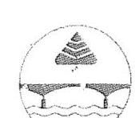

# Közép-Tisza-vidéki Vízügyi Igazgatóság 

5000 Szolnok, Boldog Sándor István krt. 4
Levelezési cim: 5002 Szolnok, Pf: 63
Tel.(56) 501-900 Fax: (56) 501-951 E-mail: trikarsag@kotivizig.hu

Iktatószám: KP-1404-003/2016. Hivatkozási szám: V-0776-184/2016. Tárgy: Észrevétel Jelentéstervezetre
Elöadó: Papp Judit 20-125 Melléklet:

## ÁLLAMI SZÁMVEVŐSZÉK

Budapest

## Domokos László Úr

elnök

## ÁLLAMI SZÁMVEVŐSZÉK

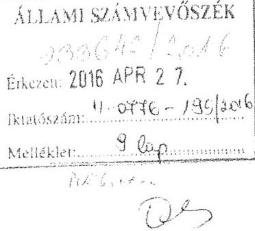

Tisztelt Elnök Úr!

A V-0776-184/2016. iktatószámú, „A központi alrendszer egyes intézményei pénzügyi és vagyongazdálkodásának ellenörzése - Közép-Tisza-vidéki Vízügyi Igazgatóság" címủ ellenőrzés számvevőszéki jelentéstervezetet köszönettel megkaptam.
A jelentéstervezet megállapításaira, javaslataira tett észrevételemet mellékelten megküldöm további szíves felhasználás céljából.

Szolnok, 2016. április 26.
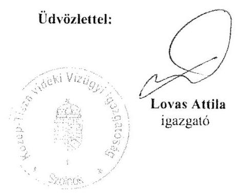

---

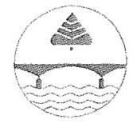

# Közép-Tisza-vidéki Vízügyi Igazgatóság 

5000 Szolnok, Boldog Sándor István krt. 4.
Levelezési cím: 5002 Szolnok. Pf.: 63
Tel:(56) 501-900 Fax: (56) 501-951 E-mail: titkarsag@kotikovizig.hu

Iktatószám: KP-1404-003/2016. Hivatkozási szám: V-0776-184/2016. Tárgy: Észrevétel jelentéstervezetre
Előadó: Papp Judit Melléklet: -

Domokos László úr
elnök

## ÁLLAMI SZÁMVEVÓSZÉK

## BUDAPEST

Apáczai Csere János utca 10.
1052

Tisztelt Elnök Úr!

A V-0776-184/2016. iktatószámú „A központi alrendszer egyes intézményei pénzügyi és vagyongazdálkodásának ellenörzése - Közép-Tisza-vidéki Vízügyi Igazgatóság" címủ ellenőrzés számvevőszéki jelentéstervezetre az alábbi megállapításokkal kapcsolatban kívánok észrevételt tenni:

## Észrevétel az Összegzésre

Az Összegzés (5. oldal) megállapította, hogy az igazgatóságunk pénzügyi gazdálkodása nem volt szabályszerű.
Igazgatóságunk ezzel a megállapítással nem ért egyet.
Az Igazgatóság pénzügyi gazdálkodása hat féle szempont alapján került vizsgálatra (3.1. - 3.6. számú megállapítások). A vizsgálat 3.1., a 3.2., 3.4. és a 3.5. számú megállapításai szerint az Igazgatóság szabályszerűen végezte a pénzügyi gazdálkodással kapcsolatos feladatait. A 3.3. és a 3.6. megállapítások tártak fel hiányosságot. Véleményem szerint és az észrevételek alapján a feltárt hibák aránya (1/3-a) és súlya (jogalap nélküli kifizetések nem történtek) nem indokolja „Az Intézmény pénzügyi gazdálkodása nem volt

---

szabályszerü" minősítést. Kérem, hogy az összegzésben „Az Intézmény pénzügyi gazdálkodása részben volt szabályszerű" szövegre szíveskedjék módosítani.

Ezen kívül az alábbi megállapításokra teszek észrevételt.

# Észrevétel a 2.1. megállapítás 

## Észrevétel a 3. bekezdés 2. mondatára

Megállapítás: „Az Intézmény alkalmazottai faladat- és hatáskörének, helyettesítési rendjének rögzítésére az az Ámr. 20.§ (7) bekezdésében, valamint az Ávr. 13.§ (5) bekezdésében foglaltak ellenére az ellenőrzött időszakban az SZMSZ ${ }_{2,4}$, az Ügyrend ${ }_{2,4}$-ben illetve más szabályzatban nem került sor."

Az Ávr. 13.§ (1) bekezdés g) pont a szervezeti és müködési szabályzatban nevesített munkakörökhöz tartozó feladat- és hatásköröket, a hatáskörök gyakorlásának módját, a helyettesítés rendjét, valamint az ezekhez kapcsolódó felelősségi szabályok rögzítését írja elő.

Ávr. 13.§ (1) bekezdés g) pontja alapján:
„a szervezeti és müködési szabályzatban nevesített munkakörökhöz tartozó feladat- és hatásköröket, a hatáskörök gyakorlásának módját, a helyettesítés rendjét (ideértve - a költségvetési szerv vezetöjének és gazdasági vezetöjének akadályoztatása esetén vagy ha a tisztség ideiglenesen nincs betöltve - az általános helyettesítés rendjét), az ezekhez kapcsolódó felelősségi szabályokat"

Ávr. 13.§ (5) bekezdése szerint:
„A költségvetési szerv szervezeti egységei által ellátott feladatok munkafolyamatainak leírását, a szervezeti egység vezetőinek és alkalmazottainak feladat- és hatáskörét, a helyettesítés rendjét, továbbá a szervezeti egység költségvetési szerven belüli belső és azon kívüli külső kapcsolattartásának módját, szabályait - ha azokról a szervezeti és müködési szabályzat vagy a költségvetési szerv más szabályzata nem rendelkezik - a szervezeti egységek ügyrendje tartalmazza.

Az Igazgatóság szervezeti és müködési szabályzatában nevesített munkakörök az igazgató, a műszaki igazgató-helyettes, a gazdasági igazgató-helyettes, az osztályvezető ,a Regionális Laboratórium vezetője, valamint a főépítésvezető, a szakaszmérnök és a Műszaki Biztonsági Szolgálat és a Kritikus Infrastruktúra Müszaki Szolgálat vezetője.

Az SZMSZ (2014. január 1-től hatályos) 2. pontja (2.1. - 2.6. pont) az Igazgatóság vezetőire vonatkozó szabályokat tartalmazza, melyben részletesen felsorolásra kerülnek a feladatkörökhöz kapcsolódó ellátandó feladatok (feladat-, hatáskörök) és amellett a helyettesítési rendek is, az alábbiak szerint:

## Igazgató

10.§ (1) „Az igazgatót akadályoztatása esetén a műszaki igazgatóhelyettes általános jogkörben - kivéve a kinevezési és a felmentési jogkör gyakorlását -, a gazdasági igazgatóhelyettes az Igazgatóság működésével összefüggő gazdálkodási és pénzügyi feladatok tekintetében helyettesíti.
(2) Az igazgató akadályoztatásának esetén külön írásbeli megbízás alapján meghatározott időtartamra rendelkezhet a közalkalmazottak esetében a kinevezési, a felmentési és a fegyelmi jogkör gyakorlásának a műszaki vagy a gazdasági igazgatóhelyettesre való átruházásáról."

---

# Múszaki igazgató-helyettes 

12.§ (3) „A múszaki igazgatóhelyettest távolléte, illetve akadályoztatása esetén a felügyelete alá tartozó szakterületek vonatkozásában - amennyiben nem az igazgatót helyettesitő jogkörében jár el - az általa kijelölt osztályvezető helyettesíti."

Gazdasági igazgató-helyettes
14.§ (3) „A gazdasági igazgatóhelyettest távolléte, illetve akadályoztatása esetén a felügyelete alá tartozó szakterületek vonatkozásában - amennyiben nem az igazgatót helyettesitő jogkörében jár el - az általa megbízott osztályvezető helyettesíti."

Az osztályvezető. a Regionális Laboratórium vezetője valamint a Főépitésvezető
15.§ (3) „Az egység vezetője távolléte vagy akadályoztatása esetén írásban kinevezett helyettese a napi munkavégzésben helyettesíti."

## A szakaszmérnők

16.§ (3) „A szakaszmérnökök tartós távolléte, illetve akadályoztatása esetén, szakaszmérnökségvezető-helyettes teljes jogkörrel, ennek hiányában pedig a vezető jóváhagyásával általa megbízott egység vezetője - meghatározott jogkörben - helyettesíti."

Müszaki Biztonsági Szolgálat és a Kritikus Infrastruktúra Müszaki Szolgálat vezetője
17.§ (3) „Az MBSZ illetve KIMSZ vezető tartós távolléte, illetve akadályoztatása esetén a múszaki igazgatóhelyettes által megbízott egység vezetője - a meghatározott jogkörben helyettesíti."

Véleményünk szerint az Igazgatóság szervezeti és müködési szabályzata az abban nevesitett munkakörökhöz - a jogszabály elöirása szerint - kapcsolódó ellátandó feladatokat (feladat, hatáskörök) és helyettesitési rendeket is tartalmazza. Ennek megfelelöen kérjük a megállapítások fentiek szerinti módosítását és a javaslatok 2. pontjának a szervezeti egységek alkalmazottai feladat- és hatáskörének, a helyettesitési rendjének szabályozására vonatkozó részt törölni.

## Észrevétel a 3. bekezdés 3. mondatára

Megállapítás: „Az Intézmény belső és külső kapcsolattartásának módja és szabályai sem kerültek meghatározásra."

1. Az Igazgatóság a közvélemény megfelelő és szakmailag megalapozott tájékoztatása érdekében a médiával való kapcsolattartás, valamint az egységes tájékoztatás rendjét a vízgazdálkodásról szóló 1995. évi LVII. törvény, a sajtószabadságról és a médiatartalmak alapvető szabályairól szóló 2010. évi CIV. törvény, a médiaszolgáltatásokról és a tömegkommunikációról szóló 2010. évi CLXXXV. törvény, az árvíz- és a belvízvédekezésről szóló 10/1997. (VII. 17.) KHVM rendelet, a vízkárelhárítás országos irányításának szervezeti és müködési szabályzatáról szóló 7/2012. (II. 10) BM utasítás, valamint az Országos Vízügyi Főigazgatóság vezetőjének 11/2013. számú OVF utasítása vonatkozó szabályaival összhangban 2013. április 1-tól léptette hatályba az „Igazgatóság tájékoztatással kapcsolatos feladatairól, a sajtóval való kapcsolattartás rendjéről" szóló 9/2013. számú Igazgatói Utasítását.

---

2. További, a külső-belső kommunikációval, kapcsolattartással kapcsolatos előírásokat tartalmaz az Ügyrend (2014. július 18-tól hatályos):

- 24. pont:

Az igazgatósági tájékoztatás és döntés-előkészítés fórumai:
a) A./ Vezetőségi értekezlet
b) B./ Egységvezetői értekezlet
c) C./ Munkacsoport

- 25. pont: Tájékoztató és munkaértekezletek
- 26. pont: A szervezeti egységek együttmüködése
- 27. pont: A szervezeti egységek beszámoltatási rendszere
- 28. pont: A munkaszervezeten belüli kommunikáció formái
- 29. pont: Együttmüködés külső szervekkel
- 32. pont: Az Igazgatóság képviselete, értekezleten, tárgyaláson való részvétel
- 33.pont: A nyilvánosság tájékoztatása

3. Az SZMSZ (2014. január 1-től hatályos) szerint:

Az Igazgató:
9.§ (4) „Az igazgató kapcsolattartás, együttmüködés érdekében az alábbi feladatokat látja el:
a) megfelelő kapcsolat kiépítése és folyamatos együttműködés a müködési területén;
b) együttműködés a Belügyminisztérium és az Országos Vízügyi Főigazgatóság által kapcsolattartásra kijelölt állami- és társadalmi szervekkel, egyesületekkel, valamint az érdekképviseleteknek az Igazgatóság területén müködő szerveivel;
c) biztosítja az Igazgatóság és a vízgazdálkodási társulatok, valamint a területi vízügyi szervezetek közötti együttműködést;
d) fejleszti és fenntartja a helyi jelentőségű közcélú vízrendezési és víz-kárelháritási, továbbá a vízellátási és csatornázási feladatok ellátásával kapcsolatosan az Igazgatóság és az önkormányzati szervek közötti együttműködést, az Igazgatóság részéről nyújtandó szakmai irányítás és támogatás és a szükséges koordinálás biztosításával;
e) a vezetési tevékenységével kapcsolatosan folyamatosan együttműködik a munkavállalói érdekvédelmi szervezetekkel, biztosítja a szakszervezeti jogok betartását.

# A Müszaki igazgató-helyettes: 

12.§ f) kapcsolatot tart a vízügyi szolgálat műszaki középirányító szerveivel, megszervezi a folyamatos adatközlésre is kiterjedő kapcsolatot a társigazgatóságokkal a müködési területek vízügyi feladatainak összehangolt megvalósítása érdekében;

További, a külső, belső kapcsolattartásra vonatkozó előírásokat tartalmaz az SZMSZ

- 5. pontja: Az ügyintézés általános és fő szabályai
- 6. pontja: Az ügyintézés színvonala, az ügyintézési határidők betartásáért való felelősség
- 7. pontja: A szervezeti egységek együttműködése az ügyintézésben
- 8. pontja: A vezetők és a dolgozók tájékoztatási kötelezettsége

Véleményem szerint a nevezett szabályzatokban az Igazgatóság belső és külső kapcsolattartásának módja és szabályai meghatározásra kerültek. A fentiek alapján kérem a vonatkozó megállapítás módosítását és a 2. javaslat a) pontjában a „szervezeti

---

egységek belsö és külső kapcsolattartásának módja és szabályai meghatározására" vonatkozó részt törölni szíveskedjék.

# Észrevétel a 4. bekezdés 3. mondatára 

Megállapítás: „A Számviteli Politika az Áhsz. ${ }^{54} 50 . \S$ (7) bekezdésben foglaltak ellenére az általános költségek szakfeladatokra történő felosztásának módját, a felosztáshoz alkalmazott mutatókat, vetítési alapokat nem tartalmazta."

Az Ahsz. ${ }^{54} 50 . \S$ (7) bekezdése alapján ,...a számviteli politikában rögzíteni kell az általános költségek szakfeladatokra és az általános kiadások tevékenységekre történő felosztásának módját, a felosztáshoz alkalmazott mutatókat, vetítési alapokat."

Az Igazgatóság 2014. május 6 -tól hatályos $6 / 2014$. sz. Önköltségszámítás rendje számviteli szabályzat 6. Önköltségszámítás tárgya fejezetben foglaltak szerint a költségviselő elszámolásban a költségeket jellemzően szakfeladatonként gyüjtik.
Továbbá ,,Az Igazgatóság az alaptevékenységek, a szabad kapacitás kihasználása, és a vállalkozási tevékenységek kalkulációs egységeinek azonositására egvaránt analitikus kódot (munkaszámot) használ.
Az analitikus kódok fökönyvi számlákhoz és szervezeti egységekhez rendelten kerültek meghatározásra, de logikai felépitésüknél fogva önmagukban is kifejezésre juttatják a tevékenység szakágazatonkénti, szakfeladatonkénti hovatartozását."

Az Igazgatóság a szabályzatnak ebben a részében kijelölte kalkulációs egységként a csoportokba foglalt tevékenységeket és szolgáltatásokat a vetítési alap és a felosztás módjának megjelölésével. (11-12. oldal)

Az előírásnak megfelelő mutatókat, vetítési alapot a Számviteli Politika számviteli szabályzat „Általános kiadások felosztása" fejezete (18. o.) helyett az önköltségszámítás rendjére vonatkozó belső szabályzat tartalmazza, mely a Sztv. 14.§ (5) c) bekezdése értelmében a számviteli politika része.

Véleményem szerint a fentiek alapján az Ahsz. 50.§ (7) bekezdésének az Igazgatóság eleget tett, mivel az Önköltségszámítás rendjén keresztül a számviteli politika közvetett módon tartalmazza a jogszabályi elöirást. Kérem, szíveskedjék a fentieket figyelembe vételét és ennek megfelelöen a megállapítást módosítani, valamint a javaslatok 2. javaslat b) pontjából a „az elöírásoknak megfelelő számviteli politika elkészitésére" vonatkozó javaslatot törölni.

## Észrevétel az 5. bekezdésre:

Megállapítás: „A Számlarend ${ }_{1,2}$, illetve a 2014. évben is hatályban lévő Számlarend ${ }_{3}$, nem tartalmazta a Számv. tv. 161.§ (2) bekezdése b) pontjában rögzített, a könyvviteli számla értéke növekedésének, csökkenésének jogcímeit. A Számlarend ${ }_{3}$-ban a Számv. tv. 161.§ (2) bekezdése c) pontjában elöírt, a fökönyvi számla és az analitikus nyilvántartások kapcsolatát nem rögzítették. A Számlarend ${ }_{3}$ Áhsz. ${ }_{2}$ szerinti aktualizálását a Számv. tv. 161.§ (5) bekezdésében foglaltak ellenére a 2014. évben nem hajtották végre. A Számlarend ${ }_{1.3}$ a Számv. tv. 161.§ (2) bekezdése a) pontjában elöírtak ellenére

---

nem tartalmazta minden alkalmazásra kijelölt számla számjelét és megnevezését (Számlatükör)."

# 1. A könyvviteli számla értéke növekedésének, csökkenésének jogcímeit a 

Számlarend felsorolásszerüen nem tartalmazza, azonban a rendelkező rész szövegkörnyezete magában foglalja.

## Pl.:

Immateriális javak:
„A vásárolt szellemi terméket beszerzési áron, a saját elöállitású szellemi termékeket tényleges közvetlen önkölnégen kell állományba venni" (Számlarend, 7. oldal)
„Az állománycsökkenést a vagyoni értékủ jog megszünése, értékvesztése, illetve a szellemi termék selejtezése, értékesítése, átadása jelenti..." (Számlarend, 8. oldal)

## Ingatlanok és kapcsolódó vagyoni értékủ jogok:

„a tárgyi eszközök állományba vételi bizonylatai, amelyet a tárgyi eszközök beszerzésekor, létesítésekor, átvételekor kell kiállítani" (Számlarend, 9. oldal)
„Az állománycsökkenést, úgymint: selejtezést, értékesítést, ajándékozást is megfelelő okmányok alapján lehet a nyilvántartásból, illetve a fókönyvből kivezetni." (Számlarend, 10. oldal)

## Gépek, berendezések:

Az állománycsökkenést: selejtezést jegyzőkönyv alapján, értékesítést számla alapján, átadást átadási jegyzőkönyv alapján lehet a nyilvántartásból, illetve a fókönyvből kivezetni" (Számlarend, 11. oldal)

Stb.

## 2. A fökönyvi számla és az analitikus nyilvántartások kapcsolatáról a Számlarend, a

különböző számlaosztályok esetébe rendelkezik. Pl.:
„Az immateriális javakról értékbeni egyedi analitikus - részletező - nyilvántartást kell vezetni.
Az egyedi analitikus nyilvántartás vezetése a FORRÁS SQL KGR számviteli rendszer eszköz alrendszerének alkalmazásával történik. Az analitikus nyilvántartást minden negyedévet követő hó 10 . napjáig kell a fökönyvi könyvelés állományi, értékcsökkenése, forgalmi számláival egyeztetni.

## Fökönvvi számlák és az analitikus nyilvántartás kapcsolata

A fókönyvi könyvelés alapja a részletező analitikus nyilvántartás.
Az állománycsökkenést a vagyoni értékủ jog megszünése, értékvesztése, illetve a szellemi termék selejtezése, értékesítése, átadása jelenti, melyet megfelelő okmányok alapján lehet a nyilvántartásban rögzíteni." (Számlarend, 7-8. oldal)

## Ingatlanok és kapcsolódó vagyoni értékủ jogok:   „Fökönyvi számlák és az analitikus nyilvántartás kapcsolata

A fókönyvi könyvelés alapja a részletező, bruttó értékkel számszerüen megegyező analitikus nyilvántartás, amit tételesen eszközönként kell felfektetni azokról az alapbizonylatokról, amelyek az ingatlanok és kapcsolódó vagyoni értékủ jogok meglétét igazolják." (Számlarend, 10. oldal)

## Gépek, berendezések:

„Fökönyvi számlák és az analitikus nyilvántartás kapcsolata
A fókönyvi könyvelés alapja a részletező, bruttó értékkel számszerüen megegyező analitikus nyilvántartás, amit tételesen eszközönként egyedileg kell felfektetni azokról a bizonylatokról, amelyek a gépek, berendezések és felszerelések adatait megbízhatóan igazolják.
Az állománycsökkenést: selejtezést jegyzőkönyv alapján, értékesítést számla alapján, átadást átadási jegyzőkönyv alapján lehet a nyilvántartásból, illetve a fókönyvból kivezetni" (Számlarend, 11. oldal)

Tartós részesedések, tartós hitelviszonyt megtestesítő értékpapírok és hosszú lejáratú betétek „Fökönyvi számlák és az analitikus nyilvántartás kapcsolata

---

A részvényekhez, részesedésekhez kapcsolódó analitikus nyilvántartást úgy kell kialakítani, hogy abból kitünjön, hogy az Igazgatóságnak milyen mértékủ érdekeltsége van a különbözö társaságokban." (Számlarend, 12. oldal)

Stb.
3. A Számlarend, Áhsz, 2 szerinti aktualizálása 2014. évben nem történt meg. Az OVF részéről egységes szabályzat kiadásának szándéka állt fenn, mely nem került realizálásra az adott időszakban (gazdasági föigazgató-helyettes váltás történt).
4. A Számlarend ${ }_{1-3}$ szabályzat mellékletét képező Számlatükrök a szabályzat készítésekor aktuális FORRÁS SQL integrált számviteli rendszerben rögzített számlák kerültek a programból kinyomtatásra és ezt lett a szabályzathoz csatolva számlatükörként. A Számlarend ${ }_{1-3}$-hoz csatolt Számlatükrök csak abban az esetben nem tartalmazhatták az alkalmazásra kijelölt számla számjelét, amennyiben a szabályzat kiadását követően módosult a program adatbázisa. /Konkrét számlát nem nevesít a jelentéstervezet./

Az Áhsz, (4/2013. (1. 11.) 2014. január 1-től lépett hatályba, a Számlarend 2014. évi aktualizálásának elmaradása magával vonta a 2014. január 1-tól hatályos jogszabályi módosítások átvezetésének hiányát a számlatükrön. A jelentős változásokból adódóan 2014. évben a számlatükör valóban nem tartalmazta minden alkalmazásra kijelölt számla számjelét és megnevezését.

Véleményem szerint a Számlarend, a Számv. tv. 161.§ (2) bekezdése c) pontjában elöirt, a fökönyvi számla és az analitikus nyilvántartások kapcsolatát, valamint a könyvviteli számla értéke növekedésének, csökkenésének jogcímeit tartalmazza. A Számlatükör 2011-2013. években ha nem is teljes körüen, de tartalmazta az alkalmazásra kijelölt számla számjelét és megnevezését.
Kérem, hogy a megállapításokat az észrevétel alapján a Számlarend, (Számlatükör) tekintetében módosítani szíveskedjék.

# Észrevétel a 7. bekezdésre: 

Megállapítás: „Az Eszközök és források értékelési szabályzata ${ }_{3}$ az Áhsz. ${ }_{1}{ }^{45} 8 . \S$ (17) bekezdés d) pontja, valamint az Eszközök és források értékelési szabályzata ${ }_{4}$ az Áhsz. 50 .§ (2) bekezdés b) pontjában foglaltak ellenére nem tartalmazta követeléstípusonként a kis összegủ követelések év végi meghatározásának elveit, dokumentálásnak szabályait. Az Eszközök és források értékelési szabályzata ${ }_{4}$-ben az Áhsz. 50 .§ (2) bekezdés b) pontja elöírásait figyelmen kívül hagyva az egyszerűsitett értékelési eljárás alá vont követelések besorolásának elveit, dokumentálásának szabályait sem rögzítette."

Az OVF utasítására mintaszabályzatok alapján történt szabályzatok egységesítésekor a 2013. április 1-tól hatályos Eszközök és források értékelési szabályzatából a kis összegủ követelések év végi meghatározásának elvei, dokumentálásnak szabályai részben kikerültek. A behajthatatlan követelések között (például) az Eszközök és források értékelési szabályzata ${ }_{4}$ (11. oldal) a behajthatatlannak minősülő kis összegủ követelésekre vonatkozóan tartalmazza az alábbi elöírásokat.

---

# „Behajthatatlannak minösül az a követelés: 

- a költségvetési törvényben meghatározott kis összegü követelés tekintetében, amelyet eredményesen nem lehet érvényesiteni, vagy amelynél a fizetési meghagyásos eljárással, vagy a végrehajtással kapcsolatos költségek nincsenek arányban a követelés várhatóan behajtható összegével,

Behajthatatlan követelés leírása esetén a behajthatatlanság tényét és mértékét bizonyítani kell. A behajthatatlan követelés leírása nem minösül követelés elengedésnek.
A behajtási kísérletek dokumentumait összegyüjtve, a behajthatatlanság tényének és mértékének bizonyítása esetén az Igazgatási és Jogi Osztály, ill. a Gazdasági Osztály javaslata alapján, a Gazdasági igazgató-helyettes egyetértése mellett a behajthatatlan követelések leírását az Igazgató hagyja jóvá."

A vizsgálat által tett megállapítás véleményem szerint részben helytálló, az „Eszközők és források értékelési szabályzata ${ }_{3}$ az Áhsz. ${ }^{45} 8 . \S$ (17) bekezdés d) pontja, valamint az Eszközök és források értékelési szabályzata ${ }_{4}$ az Áhsz. ${ }_{2} 50 . \S$ (2) bekezdés b) pontjában foglaltak ellenére nem tartalmazta követeléstípusonként a kis összegü követelések év végi meghatározásának elveit, dokumentálásnak szabályait" szövegrészben kérjük javítani a .nem tartalmazta" kifejezést „részben tartalmazta" szövegre.

## Észrevétel a 2.2. megállapításra

## Észrevétel az 1. bekezdés 3. mondatára

Megállapítás: „Az Intézmény az ellenőrzött időszakban a kockázatelemzés során felmérte és meghatározta a tevékenységben, gazdálkodásban rejlő kockázatokat, azonban az Ámr. 157.§ (3), valamint a Bkr. 7.§ (2) bekezdései ellenére az egyes kockázatokkal kapcsolatban a szükséges intézkedéseket nem határozták meg, az intézkedések teljesítésének folyamatos nyomon követési módját nem rögzítették."

Igazgatóságunk 2010. január 1-től hatályos Kockázatkezelési szabályzata tartalmazza az alábbi rendelkezéseket:
„Igazgatóságunk a minél hatékonyabb kockázatkezelés érdekében besorolja az egyes kockázati tényezőkölöz rendelhetö kockázati kategóriákat.

A kockázatok kezelését a Közép-Tisza vidéki Környezetvédelmi és Vízügyi Igazgatóság igazgatója végzi. A kockázatok újraértékelését minden évben el kell végezni.
A kockázati türéshatár a kockázati kitettségnek azt a szintjét jelenti, ami felett az Igazgatóság mindenképpen válaszintézkedést tesz a felmerülö kockázatokra. A kockázattörő képesség meghatározása a megfelelő kockázati stratégia kialakításával az igazgató feladata.
A kialakított kockázati türéshatár nem kötött, lehetőség van a pillanatnyi adott körülményektől függően a változtatásra.
folyamatosan figyelemmel kell kísérni, hogy a végrehajtás meghozta-e a várt eredményt, és szükség esetén javaslatokat kell tenni a korrekciós intézkedésekre

---

Fontos, hogy az egyes kockázatokra adott válaszlépések kidolgozásáért és végrehajtásáért felelős személyek rendelkezzenek a feladat ellátásához szükséges eszközökkel és a megfelelő szaktudással.

Fontos a feladatellátás folytonosságát veszélyeztető tényezők (humánerőforrás hiánya, technikai eszközök hiánya, új informatikai rendszerre való áttérés, jogszabályi változások stb. folytán elöálló fennakadások) megelőzése, illetve mielőbbi megszüntetése.

A szabályszerű és hatékony múködés érdekében a jogszabályoknak nem megfelelő múködés kiváltó okait meg kell szüntetni, illetve ki kell dolgozni intézkedéseket az előirányzatokkal, vagyonnal való gazdálkodás jogszabályokkal való összhangjának biztosítása érdekében.

A költségvetési év során folyamatosan nyomon kell követnie a folyamatokat, frissítenie a megállapításait, illetve ellenőrizni a megtett intézkedések hatásait a kockázatok folyamatos változásával.
A kockázatok felülvizsgálata során át kell tekinteni a költségvetési szerv kockázati profiljában bekövetkezett változásokat, illetve fel kell mérni, hogy a kockázatkezelési folyamat hatékonyan múködik-e.

Az értékelés során megállapított, adott kockázati szintekhez rendelt ellenőrzési gyakoriság szerint kell az egyes kockázatok felülvizsgálatát ütemezni."

A 2012. március 30-tól hatályos a Kockázatkezelési szabályzatról szóló KP-0995/005/2012. iktatószámú Igazgatói Utasítás szerint (11. oldal):
„A kockázatkezelésért felelős KÖTIVIZIG igazgatója a válaszintézkedések kiválasztásában támaszkodhat a belső ellenőrzés ajánlásaira, javaslataira.
A választott intézkedés, válaszreakció hatását is szükséges felmérni, a felmérés eredményét szükséges összevetni az adott művelettel, tevékenységgel kapcsolatos eredetileg tervezett végeredménnyel.
A kiemelten nagy kockázatú tevékenységek esetében az igazgató intézkedik a legmagasabb kockázatú terület/tevékenység ellenőrzéséről (preventív ellenőrzés), folyamatos jelentést, beszámolót kér vagy helyszíni vizsgálatot tart, vagy felkéri a belső ellenőrzést vizsgálat elvégzésére.
A hatékony folyamatba épített ellenőrzés a legjobb eszköz a kockázatok kezelésére. A folyamatba épített ellenőrzés hatékonyságát támogatja az ellenőrzési nyomvonal kialakítása. Az ellenőrzési nyomvonal kiépítése alapján lehet a megfelelő kockázatelemzési tevékenységet ellátni.
A kockázatkezelést az Igazgatóság vezetése végezheti, azonban átruházhatja az egyes szakmai területek vezetőire a területet érintő kockázatok kezelését."

A 2013. április 1-től hatályos, az Igazgatóság Belső Kontrollrendszeréről szóló 8/2013. sz. Igazgatói Utasítás 11-12. oldala tartalmazza:
„Elfogadható kockázati szint meghatározása
A feltárt kockázattal kapcsolatos reakciókat az igazgatóság által elviselhetőnek ítélt kockázati szint meghatározásával együtt kell eldönteni, melynek a meghatározásáért az igazgató felelős.

A kockázati szint azt jelenti, ami felett az igazgatóság mindenképpen válaszintézkedést tesz a felmerülő kockázatokra.
A kockázattűrő képesség meghatározása meglehetősen szubjektív, azonban a megfelelő kockázati stratégia kialakításának elengedhetetlen feltétele.

Az igazgatóságon az elfogadható kockázati szint a közepes tartomány felső határáig terjed.
A kockázatkezelési eseteket az igazgató elemzi és szükség esetén javaslatot tesz az egyes tevékenységek szabályozásának korszerűsítésére.

# Beépítés és felülvizsgálat 

Az igazgatóság céljai hierarchikus rendszert alkotnak. Az egyes szervezeti egységek, illetve személyek céljai szorosan kapcsolódnak az igazgatóság legfőbb célkitűzéseihez, abból levezethetők.

Minthogy a kockázati környezet állandóan változik, a kockázatkezelési folyamat fontos tulajdonsága a folyamatos és rendszeres felülvizsgálat; ezért meg kell győződni arról, hogy az igazgatóság kockázati környezete („profilja") változott-e vagy sem.

---

Az egységvezetők bármilyen jelentős kockázat felmerülése esetén, soron kívül, egyéb esetekben évente legalább egy alkalommal felülvizsgálják a felmerülő kockázatokat és javaslatot tesznek azok elkerülésére vonatkozó stratégia kialakítására és a szükséges döntések meghozatalára.

# A kockázatkezelés időtartama 

A kockázatkezelés tevékenységét a döntés előkészítésnél, a költségvetési tervezés első szakaszaiban kell megkezdeni.
A költségvetési év során folyamatosan nyomon kell követni a folyamatokat, frissíteni a megállapításokat, illetve ellenőrizni a megtett intézkedések hatásait a kockázatok folyamatos változásával."

A tevékenységben, gazdálkodásban rejlő kockázatok felmérését és meghatározását követően 2013. évtől az Igazgatóság vezetője - gazdasági igazgató-helyettes írásbeli javaslatára írásban dokumentáltan határozza meg a kockázati szintekhez kapcsoló faladatokat a kockázati szint elfogadható szintre csökkentése érdekében.
Az összesített kockázati értékek alapján az Igazgatóságnál az alábbi öt minősítési kategória került kialakításra:
I. 0,0-24,9: nem kockázatos
II. 25,0- 59,9: elhanyagolható kockázat
III. 60,0- 94,9: enyhén kockázatos
IV. 95,0-129,9: erősen kockázatos
V. 130-160: kiemelten kockázatos

Az egységvezetők részére megküldött igazgatói rendelkezés szerint:
„...a szervezeti egységek a kockázat-azonosításaik alapján az erősen kockázatosnak (95 129,9 pont között) ítélt folyamatok esetében készítsenek intézkedési tervet a kockázat csökkentése érdekében. Az intézkedési terv elkészítéséért felelős a szervezeti egység vezetője. Az intézkedési tervet jóváhagyásra 2013. december 31-ig a KÖTIVIZIG igazgatója részére szükséges megküldeni." (KP-0345-025/2013.)

A fentiek alapján az Igazgatóságon mind a szabályzatban, mind a gyakorlati folyamatban a vizsgált időszakban meghatározásra kerültek az egyes kockázatokkal kapcsolatban a szükséges intézkedések és az intézkedések teljesitésének folyamatos nyomon követési módja is.
Kérem a 2.2. megállapítás 1. bekezdés 3. mondatában „az egyes kockázatokkal kapcsolatban a szükséges intézkedéseket nem határozták meg, az intézkedések teljesitésének folyamatos nyomon követési módját nem rögzítették" megállapítást „az egyes kockázatokkal kapcsolatban a szükséges intézkedéseket meghatározták, az intézkedések teljesitésének folyamatos nyomon követési módját rögzítették"-re módosítani, és ezzel együtt a 2. javaslat c) pontját törölni szíveskedjék, tekintettel a fent leírtakra.

## Észrevétel a 2.3. megállapításra

## Észrevétel a 3. bekezdésre

Megállapítás: „A gazdálkodási jogkörök gyakorlása - a megfelelőségi tesztek kiértékelése alapján - az ellenőrzött időszak egészében nem felelt meg az Ámr. 76.§, 7880.§, az Ávr. 57.§, 58.§, 59.§ (2) bekezdés és (3) bekezdés b) pontjában foglalt előírásoknak."

---

Az utalvány rendeleteken, utalvány kiegészitéseken szereplő minden egyes aláírás a kifizetés jogosságának tartalmi ellenörzését jelenti és jelentette az ellenörzött időszakban is. A szakmai teljesítést igazoló, a teljesítést igazoló, vagy a sichtákon az „igazoló" minden egyes esetben aláírásával a kiadások teljesitésének jogosságát, összegszerűségét, ellenszolgáltatást is magában foglaló kötelezettségvállalás estében annak teljesitését igazolta. A szakmai teljesítést igazoló, a teljesítést igazoló, vagy a munkaidő nyilvántartási lapokon az „igazoló" minden egyes esetben eleget tett az Ámr 76.§ (1) bek., az Ávr 57.§ (1) bekezdésben meghatározott feladatoknak.

Az Igazgatóság a 2015. évben korrigálta azt a hiányosságot, hogy az utalványozó aláírása nem volt ellátva keltezéssel, 2015. március 13 -tól ez a hiányosság megszüntetésre került.

Az Igazgatóság 2015. március 13-án léptette hatályba a kötelezettségvállalás, pénzügyi ellenjegyzés, teljesitésigazolás, érvényesités, utalványozás, valamint a jogi ellenjegyzés rendjéröl és a gazdálkodási jogkörök gyakorlásáról szóló a 11/2015. számú számviteli szabályzatát, mely már az Avr. gazdálkodási jogkörökre vonatkozó hatályos elöírásit tartalmazza, ezért kérem, hogy jelentéstervezet 3. számú javaslatát törölni szíveskedjék.

# Észrevétel a 2.4. megállapításra 

## Észrevétel a 3. bekezdés 1. mondatára

Megállapítás: „...a Bkr. 9.§ (1)-(2) bekezdéseiben rögzített előírásokat figyelmen kívül hagyva a 2012. évben a szervezeten belüli információ áramlás rendszerét, a szervezeten kívülre történő információátadás rendjét, továbbá a beszámolási szinteket, módokat, határidőket nem szabályozták."

A számvevői jelentéstervezet 2.3. számú megállapítás 1. bekezdésének 2. mondata rögzíti, hogy az „SZMSZ ${ }_{1-4}$, illetve az Úgyrend ${ }_{1-3}$ tartalmazta a beszámolási eljárásokra vonatkozó eljárásokat".
Véleményem szerint is a 2011. szeptember 25-én hatályba léptetett SZMSZ II. pontja (15. oldal) meghatározza beszámolási szinteket, módokat, határidőket a vezetőségi, illetve az egységvezető értekezletek keretén belül, valamint tartalmazza a külső szervekkel való együttműködésre vonatkozó szabályokat is (16. oldal). A vezetők hatáskörében és feladatkörében is megtalálható a szervezeten kívülre történő információ átadás rendje és a külső szervekkel való kapcsolattartás rendje.

Kérem a jelentéstervezet 2.4. számú megállapítás 3. bekezdés 1. mondatát a 2.3. számú megállapítás vonatkozó részének megfelelően, azzal összhangban „nem szabályozták" helyett „szabályozták"-ra módosítani szíveskedjék.

## Észrevétel a 3. megállapításra

## Észrevétel az Összegzö megállapításra

Összegző megállapítás: ..Az Intézmény pénzügyi gazdálkodása nem volt szabályszerű"

---

Az Intézmény pénzügyi gazdálkodása hat féle szempont alapján került vizsgálatra (3.1. 3.6. számú megállapítások). A vizsgálat 3.1., a 3.2., 3.4. és a 3.5. számú megállapításai szerint az Igazgatóság szabályszerűen végezte a pénzügyi gazdálkodással kapcsolatos feladatait. A 3.3. (a bevételi elöirányzatok teljesitése és a kiadási elöirányzatok felhasználása során a jogszabályi elöirások betartása) és a 3.6. (az eredményszemléletü számvitel bevetésével kapcsolatos feladatok végrehajtása) megállapítások tártak fel - az alábbiakban észrevételezni kivánt - hiányosságot. Véleményem szerint és az észrevételek alapján a feltárt hibák aránya (az adott témakörben megfogalmazott megállapítások 1/3-a) és súlya (nem jogalap nélküli kifizetések történtek) nem indokolja „Az Intézmény pénzügyi gazdálkodása nem volt szabályszerű" minösitést. Kérem, hogy az összegzö megállapítást „Az Intézmény pénzügyi gazdálkodása részben volt szabályszerű" szövegre szíveskedjék módosítani.

# Észrevétel a 3.3. megállapításra 

## Észrevétel a 6. bekezdés 2.és 3. mondatára

Megállapítás: „A költségvetési bevételek tervezettől való elmaradása ellenére az Áht. 30.§ (3) bekezdését megsértve nem csökkentették az előirányzatokat."
„A 2014. évben a közhatalmi bevételek teljesítése $11.5 \%$-kal volt magasabb a módosított előirányzatnál."

## Bevételi előirányzatok teljesítése:

A bevételek módosított előirányzattól való elmaradását az alábbiak eredményczték:
Igazgatóságunk törekedett a kincstári és a költségvetési beszámoló egyezőségére, ezért az előirányzat-módosításokat a kincstár és az irányító szerv által meghatározott határidőkig végezte el, illetve kezdeményezte.

2013-ban és 2014-ben saját hatáskörben (a decemberi határidőt közvetlenül megelőzően) lett végrehajtva EU-s projektek szállítói finanszírozású számfáinak, valamint fordított ÁFÁ-inak a módosítása. Ezek EU-s támogatásból fizetendő, szerződés szerint teljesített, befogadott, tárgyévi fizetési határidejű számlák összegei voltak. A számlákat a projekt támogatásából, igazgatóságunk helyett fizetette ki a Közremüködő Szervezetek a szállítók részére.
Az előirányzat-módosításokat a szállítói kötelezettség, ill. a fizetési határidő miatt kellett végrehajtani, a Közremüködő Szervezet általi kifizetések áthúzódtak a következő évre.
2013-ban 150 MFt , 2014-ben 374,4 MFt bevételi elmaradás volt az EU-s projektek miatt.
2012-ben és 2013-ban a kötelezettségvállalással terhelt előirányzat-maradványnál mutatkozott elmaradás. Az előirányzatot a kötelezettségvállalással terhelt részre vonatkozóan végrehajtottuk. A maradvány igénybevételét a tényleges felhasználás alapján könyveltük a tényleges pénzforgalom nélküli bevételek közé. 2013-ban 16,8 MFt-tal, 2012-ben 38,5 MFttal maradt el a teljesítés az előirányzattól. Ebben szintén az EU-s projektek játszottak szerepet. A lemaradás legjelentősebb összege a projektekhez biztosított előlegek el nem számolt része volt.

---

A bevételi előirányzatok csökkentésére EU-s projektek esetén a határidők, valamint a szállítói kötelezettség miatt nem került sor, a maradvány elszámolásnál pedig a kötelezettségvállalással terhelt rész előirányzat-módosítása megengedett volt.
Számlázott bevételeink, a müködési és felhalmozási bevételek esetében az előirányzat túlteljesítése esetén növeltük az előirányzatot.

# A közhatalmi bevételek teljesítése: 

A 2014.01.01-2014.09.09 közötti időszakban végzett hatósági tevékenységhez az alábbi költségvetési bevételi adatok kapcsolódtak.

|  | Közhatalmi   bevételek eFt | Költségvetési   támogatás eFt | Összesen   eFt |
| :-- | --: | --: | --: |
| Eredeti elöirányzat | 0 | 0 | 0 |
| 2014.10.29-én megnyílt elöriányzat | 56539 | 0 | 56539 |
| 2014.12.31-i elöirányzat-módosítás | -14306 | -1422 | -15728 |
| Összesen: | 42233 | -1422 | 40811 |

Az előirányzat-módosítások fejezeti hatáskörben történtek.
A közhatalmi bevételek jogcímen a tényleges teljesítés 47074 eFt lett, az év végén jelentkező bevételi többlet: 4841 eFt volt.
A hatósági feladatok ellátását 2014. januárban éves szinten 85 millió forint költségvetéssel terveztük megvalósítani, amelyhez kapcsolódóan 70 millió forint közhatalmi bevételt terveztünk, 15 millió forintot költségvetési támogatás igényként jeleztünk irányító szervünk részére.
A hatóság tevékenységével kapcsolatos költségvetési adatokról rendszeres, valamint soron kívüli adatszolgáltatásokkal tájékoztattuk irányító szervünket. A 2014.09.09-i feladat átadáskor a még be nem azonosított bevételek soron kívüli rendezésére került sor. A feladat átadást követően beérkező bevételek tovább lettek utalva a feladatot átvevő JNSZ-megyei Katasztrófavédelmi Igazgatóság részére. A szeptemberi, októberi, ill a novemberi időközi költségvetési jelentéseinkben fökönyvi adatként 56,5 millió forint közhatalmi bevételt szerepeltettünk.
2014. december 23-án az Országos Vízügyi Főigazgatóság utasítására 10 millió forintot kellett átadni más szervezet részére, amely a közhatalmi bevételeket érintően valósult meg.
A fentiekben leírtak, valamint az év végi egyeztetések alapján állt elő az a helyzet, hogy a közhatalmi bevételeknél 4841 eFt bevételi többlet jelent meg.
2015. januárban a költségvetési előirányzatok és teljesítések korrekciójára rendelkezésre álló időszakban a többletbevételek alakulásáról rovati bontásban adtunk tájékoztatást az Országos Vízügyi Főigazgatóságra, de az előirányzatok rendezésére nem került sor. A többletbevétel kötelezettségvállalással nem terhelt maradványként szerepelt a 2014. évi beszámolóban, amit Igazgatóságunk felhalmozási kiadások teljesítésére kért jóváhagyni.
Az összeg a 2014. évi kötelezettségvállalással nem terhelt maradvánnyal végül elvonásra került, 2015 augusztusában a BM Igazgatás kincstári számlájára lett átutalva.

## Észrevétel a 7. bekezdés 1. mondatára

Megállapítás „A 2011. évben a rendszeres, nem rendszeres és külső személyi juttatások esetében a kifizetések teljesítését megelőzően a szakmai teljesités igazolására az Ámr. 76.§ (3) bekezdésében foglaltak ellenére nem került sor."

## Személyi juttatások teljesítése:

---

# A 2011. ÉVBEN 

A rendszeres személyi juttatások szakmai teljesitésének hiányával nem értünk egyet, tekintettel arra, hogy a számfejtés alapbizonylata a mindenkori havi jelenléti ív és munkaidőnyilvántartási lap. A jelenléti ívet a munkahelyi vezető, a munkaidő-nyilvántartási lapot a munkáltatói jogkör gyakorlója minden hónap vonatkozásában aláirásával ellátja, igazolja azt. A munkáltatói jogkör gyakorlója a Szervezeti és Müködési Szabályzat által, valamint a közalkalmazotti kinevezésben is meghatározott személy.
A nem rendszeres személyi juttatás szakmai teljesitésének hiányával nem értünk egyet a béren kívüli juttatások tekintetében. Álláspontunk szerint a Kollektív Szerződésnek, mint szabályozónak megfelelően, valamint a minden havi munkaidő-nyilvántartási lap alapján az utalvány átadásának írásban történő dokumentálásával a teljesítés igazolása megvalósult. Az utalványokra jogosult személyi kört - a béren kívüli juttatások megállapításáért, nyilvántartásáért felelős - humánpolitikai közalkalmazott munkatárs állítja össze, határozza meg és adja át a Pénzügyi szakágazat részére az utalványok megrendelése és átadása érdekében elvégzendő további ügyintézés céljából.
A nem rendszeres személyi juttatás szakmai teljesítésének hiányával nem értünk egyet a magán gépjármú használat tekintetében, tekintettel arra, hogy a kiküldetési rendelvényen ,,az igazoló, utalványozó aláírása" hely aláírással ellátott.
A külső személyi juttatások szakmai teljesítésének hiányával szintén nem értünk egyet. Ebben az esetben 1 fő, $15.000 \mathrm{Ft} /$ hó megbízási dijáról van szó. Tekintettel arra, hogy minden hónapot követően az illetékes szakaszmérnökség-vezető aláírásával beérkezett egy dokumentum, melyen feltüntetésre került a megbízott neve, a vonatkozási időszak, a feladat, a szakaszmérnök aláírásával, ez véleményünk szerint szakmai teljesítésigazolásnak felel meg annak ellenére is, hogy ,,a teljesítést igazoloni" szövegezés nem szerepel rajta. A megbízott részére takarítási feladatok ellátása céljából havonta $15.000 .-\mathrm{Ft}$ megbízási dij került kifizetésre.
A kinevezési okiratokon az ellenjegyzés hiányát részben vitatjuk, tekintettel arra, hogy a gazdasági igazgató-helyettes aláírása a dokumentum jobb alsó részében megtalálható.
A nem rendszeres személyi juttatások kötelezettségvállalásai dokumentumai nem tartalmazták az ellenjegyzés dátumát és az ellenjegyzés tényére történő utalást. A 2013. évtől kezdődően a magán gépjármú használat tekintetében az Országos Vízügyi Főigazgatóság által kiadott egységes szabályozás szerint járunk el, a nyomdai tömb alkalmazásával számoljuk el a költségeket.

## Észrevétel a 9. bekezdés 1., 2. mondatára

Megállapítás „A 2012-2014. években a rendszeres és külső személyi juttatások esetében a teljesítések igazolására az Ávr. 57.§ (1), (3) bekezdéseiben foglaltak ellenére teljes körűen nem került sor. A nem rendszeres személyi juttatások vonatkozásában a 2012. évben nem végezték el a teljesítésigazolást, a 2013. és a 2014. évben a teljesítésigazolást nem minden esetben végezték el."

## Személyi juttatások teljesítése:

## A 2012-2014. ÉVEKBEN

A rendszeres személyi juttatások esetében a teljesítés igazolására nem teljes körűen került sor. A számfejtés alapbizonylata a mindenkori havi jelenléti ív és munkaidő-nyilvántartási lap. A jelenléti ívet a munkahelyi vezető, a munkaidő-nyilvántartási lapot a munkáltatói jogkör

---

gyakorlója aláirásával ellátja, igazolja azt. A munkáltatói jogkör gyakorlója a Szervezeti és Müködési Szabályzat által, valamint a közalkalmazotti kinevezésben is meghatározott személy.
A külső személyi juttatások szakmai teljesitésének hiányával szintén nem ćrtünk cgyct. Ebben az esetben 1 fó, $15.000 \mathrm{Ft} /$ hó megbizási dijáról van szó. Tekintettel arra, hogy minden hónapot követöen az illetékes szakaszmérnökség-vezető aláírásával beérkezett cgy dokumentum, melyen feltüntetésre került a megbízott neve, a vonatkozási időszak, a feladat, a szakaszmérnők aláírásával, ez véleményünk szerint szakmai teljesitésigazolásnak felel meg annak ellenére is, hogy „a teljesítést igazolom" szövegezés nem szerepel rajta. A megbízott részére takarítási feladatok ellátása céljából havonta $15.000 .-\mathrm{Ft}$ megbízási dij került kifizetésre.
A vízkárelhárítási megbízási szerződéseken a teljesités igazolása minden szerződés esetében megtörtént, az illetékes szakaszvédelem-vezető azt elvégezte. Nevének meghatározása ugyan nem került feltüntetésre, ez azonban nem is elöirás, az aláiró személye minden esetben egyértelmúen visszakereshető aláírás minta alapján.
A nem rendszeres személyi juttatások vonatkozásában hiányzik a teljesités igazolás vagy nem minden esetben került végrehajtásra. A béren kívüli juttatások tekintetében álláspontunk szerint a Kollektív Szerződésnek, mint szabályozónak megfelelően, valamint a minden havi munkaidő-nyilvántartási lap alapján az utalvány átadásának írásban történő dokumentálásával a teljesités igazolása megvalósult. Az utalványokra jogosult személyi kört - a béren kívüli juttatások megállapításáért, nyilvántartásáért felelős - humánpolitikai közalkalmazott munkatárs állítja össze, határozza meg és adja át a Pénzügyi szakágazat részére az utalványok megrendelése és átadása érdekében elvégzendő további ügyintézés céljából.
A magán gépjármú használat tekintetében a teljesités igazolása részben megvalósult azzal, hogy a kiküldetési rendelvényen „az igazoló, utalványozó aláírása" hely aláírással ellátott. A folyószámla vezetéssel összefüggő 4.000 .-Ft/év összegủ költségtérítést, mint nem rendszeres személyi juttatást az OVF Föigazgatói levél alapján igazgatóságunk vezetőjének levelével a teljesítés igazolás megvalósult, melyhez csatolásra került a név szerinti dolgozói lista.

A 3.3. számú megállapításban foglalt a pénzügyi gazdálkodás vonatkozásában a gazdálkodási jogkörök nem jogszabályszerü gyakorlásának megállapítását vitatom, mert álláspontom szerint a nettó bér utalás közvetlen teljesités igazolását semmilyen jogszabályi hely sem írja elő., a nettó bér utalást megelőző bérszámfejtés alapbizonylatait (jelenléti ívek, távolmaradási jelentések, munkaidő-nyilvántartó lapok) pedig a kötelezettségvállalási szabályzatban felhatalmazott személy minden esetben aláirta.

Kérem, hogy az észrevételt figyelembe véve, szíveskedjék a jelentéstervezet 3.3. számú megállapítását módosítani, valamint a javaslatok 2.e) pontját törölni szíveskedjék.

# Észrevétel a 13. bekezdés 2. mondatára 

Megállapítás: „Az Intézmény beszerzési szabályzatai (Kö̉beszerzési szabályzat ${ }_{1-6}$ beszerzési szabályzat) hangsúlyozták a hatékony és felelős gazdálkodást, mint alapelvet, ennek ellenére 2013-ban elöfordult, hogy egy adott tárgyú beszerzést nem a közbeszerzés nyertesétől vásárolták kedvezőbb áron."

Közbeszerzéshez kapcsolódóan minden esetben a közbeszerzés nyertesétől vásároltunk, de elöfordult, hogy a közbeszerzési értékhatárt el nem érő terméket mástól vásároltuk meg az adott piaci áron.

---

# Észrevétel a 14. bekezdés 1. mondatára 

Megállapítás: „Az üzemanyag vásárláshoz üzemanyagkártyát használtak, melyeknek átvételekor felelősségvállalási nyilatkozat írtak alá,de ezeket a nyilatkozatokat nem újították meg, amikor a nyilatkozatban hivatkozott gépjármüvek hivatali használatának rendjéről szóló igazgatói utasítás1,2 módosult."

Az üzemanyag kártyák átvételéhez tartozó felelősségvállalási nyilatkozatok tartalmazzák a hatályos Igazgatói Utasítás számára történő hivatkozást. Ha a hivatkozott Igazgatói Utasítás módosításra kerül, de nem érintette a felelősségvállalási nyilatkozat tartalmi részét, nem állítottuk ki újra a már egyszer egy adott dátummal átvett és adott kártyára vonatkozó felelősségvállalási nyilatkozatot. A hatályos joggyakorlat szerint ettől még a nyilatkozat érvényes maradt, a felelősség egyértelműen megállapítható volt mindvégig.

## Észrevétel a 3.6. megállapításra

## Észrevétel a 1. bekezdés 1. mondatára

Megállapítás: „Az Intézmény a rendező mérleg elkészítését megelőző, a 36/2013. (IX. 13.) NGM rendelet ${ }^{68} 3 . \S$ és $4 . \S$-ban meghatározott feladatokat elvégezte, azonban a $9 . \S$ és $10 . \S$-ban a 2014. évi könyvvezetéshez kapcsolódó elóírt határidőt nem minden esetben tartotta be."
2013. év végi, a 2014. év elejei feladattorlódások, a kötelező egyezőségek vizsgálata és biztosítása miatt, a feszített tempójú munkavégzés, a sok túlórázások ellenére sem sikerült tartani a 2014. január 31-i határidőt a követelések, kötelezettségek, a más fizetési kötelezettségek, és teljesítések nyilvántartási számlái, valamint a 01-04. számlacsoport nyilvántartási számlái megnyitásához. Néhány napos (2014. február 5.) késéssel nyitottuk meg a felsorolt főkönyvi számlákat. A határidő betartása az emberi teljesítőképesség határát súroló leterhelés mellett sem volt tartható.

## Észrevétel a 4.2. megállapításra

## Észrevétel a 3. bekezdés 2. mondatára

Megállapítás: „A rendeletben foglalt december 31-i határidőtől eltérően, a leltárt október 31-i fordulónappal végezték el a rendező mérleg előkészítéséhez."

A leltározásról és leltárkészítésről szóló belső szabályzatunk szerint a mennyiségi felvétellel történő leltározás fordulónapja tárgyév október 31. 2013-ban a teljes körű mennyiségi leltározás a belső szabályzatunk szerint végrehajtásra került. Két hónap múlva (december 31.) a létszám más irányú leterheltsége miatt nem volt lehetőség megismételni a mennyiségi felvétellel történő leltározást, viszont a 2 hónap mennyiségi változásai dokumentálva lettek, és a leltározás befejezése után a FORRAS SQL program megfelelő moduljába rögzítésre kerültek.

---

Kérem észrevételeim tudomásul vételét és a V-0776-184/2016. iktatószámú „A központi alrendszer egyes intézményei pénzügyi és vagyongazdalkodásának ellenörzése - Közép-Tisza-vidéki Vizügyi Igazgatóság" tárgyban készült számvevöszéki ellenörzési jelentéstervezeten történő átvezetését.

Szolnok, 2016. április 26.
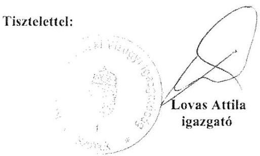

---

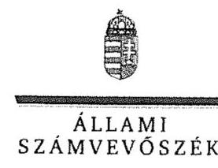

# Lovas Attila úr 

igazgató
Közép-Tisza-vidéki Vízügyi Igazgatóság

## Szolnok

## Tisztelt Igazgató Úr!

..A központi alrendszer egyes intézményei pénzügyi és vagyongazdálkodásának ellenörzése -Közép-Tisza-vidéki Vízügyi Igazgatóság" címmel készített számvevőszéki jelentéstervezetre tett észrevételét köszönettel megkaptam.
Az Állami Számvevőszék észrevételre vonatkozó álláspontjáról a felügyeleti vezető által készített részletes tájékoztatást csatoltan megküldöm.
Tájékoztatom Igazgató urat, hogy a számvevőszéki jelentésben - az Állami Számvevőszékről szóló 2011. évi LXVI. törvény 29. § (3) bekezdése alapján - a figyelembe nem vett észrevételeket szerepeltetjük az elutasítás indokának feltüntetésével.
Budapest, 2016. wazer hó 23 nap
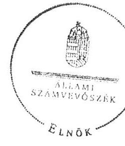

Tisztelettel:

## Domokos László

Melléklet: Tájékoztatás az elfogadott, a részben elfogadott és az el nem fogadott észrevételekről

---

# Tájékoztatás az elfogadott, a részben elfogadott és az el nem fogadott észrevételekröl 

..A központi alrendszer egyes intézményei pénzügyi és vagyongazdálkodásának ellenörzése -Közép-Tisza-vidéki Vizügyi Igazgatóság 2016." címü jelentéstervezetre az KP-1404-003/2016. iktatószámú levelében tett észrevételeit áttekintettük, annak kezeléséről az alábbi tájékoztatást adom.

## Észrevétel az Összegzésre

Nem fogadtuk el a jelentéstervezet 5. oldal 1. bekezdés 4. mondatára tett észrevételét, amelyben a pénzügyi gazdálkodás nem szabályszerű minősítésének módosítását kéri. Az Intézmény pénzügyi gazdálkodását az ellenőrzött időszakban az ellenőrzési kérdésekre adott válaszok alapján értékeltük, amelyet „Az ellenörzés módszerei" címủ fejezet részletesen tartalmaz. Az ellenőrzés típusát tekintve szabályszerűségi ellenőrzést végeztünk, amelynek keretében az Intézmény pénzügyi gazdálkodását a jogszabályi előírások alapján értékeltük. A jelentéstervezet 25 . oldal 3. fejezete tartalmazza, hogy mely jogszabályi rendelkezést nem tartotta be az ellenőrzött szervezet. Észrevétele a megállapításokat nem cáfolja, ezért azokat nem módosítja.

## Észrevétel a 2.1. számú megállapításra

## Észrevétel a 3. bekezdés 2. mondatára

Köszönettel vettem tájékoztatását az Intézmény vezetőire vonatkozó szabályokról. Észrevételében az Intézmény alkalmazottainak feladat- és hatásköre, helyettesítési rendje rögzítésének hiányosságát nem cáfolta, ezért a megállapítást nem módosítja.

## Észrevétel a 3. bekezdés 3. mondatára

A jelentéstervezet 21. oldal - 2.1. számú megállapítás 3. bekezdés 3. megállapítására tett észrevételét a dokumentumok ismételt áttekintését követően a 2014. év tekintetében elfogadtuk, azt a számvevőszéki jelentés készítésénél a megállapítás módosításával figyelembe vesszük.

## Észrevétel a 4. bekezdés 3. mondatára

A jelentéstervezet 21. oldal - 2.1. számú megállapítás 4. bekezdés 3. mondatára tett észrevételét a dokumentumok ismételt áttekintését követően elfogadtuk, azt a számvevőszéki jelentés készítésénél a megállapítás módosításával figyelembe vesszük.

---

# Észrevétel az 5. bekezdésre 

A jelentéstervezet 21. oldal - 2.1. számú megállapítás 5. bekezdésére tett észrevételét részben fogadtuk el. A Számlarend ${ }_{1,2}$-re vonatkozó észrevételét, amely a kijelölt számla számjelére és megnevezésére vonatkozik - a dokumentumok ismételt áttekintését követően - elfogadtuk, azt a számvevőszéki jelentés készítésénél a megállapítás módosításával figyelembe vesszük. Észrevételében ismertette, hogy a Számlarend aktualizálása a 2014. évben elmaradt, valamint annak elmaradása miatt a számlatükrön a 2014. január 1-jétől hatályos jogszabályi módosítások sem kerültek átvezetésre. Ebből következően a 2014. évben hatályos Számlarend a 2014. évben alkalmazott főkönyvi számla növekedésének és csökkenésének jogcímeit, valamint azoknak az analitikus nyilvántartásokkal való kapcsolatát sem tartalmazta. Észrevétele ezért a megállapítást nem módosítja a Számlarend tekintetében.

## Észrevétel a 7. bekezdésre

A jelentéstervezet 21. oldal - 2.1. számú megállapítás 7. bekezdés 1. megállapítására tett észrevételét a dokumentumok ismételt áttekintését követően elfogadtuk, azt a számvevőszéki jelentés készítésénél a megállapítás módosításával figyelembe vesszük.

## Észrevétel a 2.2. számú megállapításra   Észrevétel az 1. bekezdés 3. mondatára

Köszönettel vettem részletes tájékoztatását a kockázatkezelési rendszer szabályozását illetően. A dokumentumok ismételt áttekintését követően észrevételét részben fogadtuk el. Észrevételét a szükséges intézkedések meghatározása tekintetében elfogadtuk, azt a számvevőszéki jelentés készítésénél a megállapítás módosításával figyelembe vesszük. Továbbra is megalapozott az a megállapítás, hogy az Intézmény az ellenőrzött időszakban az Ámr. 157. § (3), valamint a Bkr. 7. § (2) bekezdései ellenére az egyes kockázatokkal kapcsolatban szükséges intézkedések teljesítésének folyamatos nyomon követési módját nem rögzítette, ezért észrevétele a megállapítás erre vonatkozó részét nem módosítja.

## Észrevétel a 2.3. számú megállapításra   Észrevétel a 3. bekezdésre

Köszönettel vettem tájékoztatását, hogy 2015. március 13-án léptette hatályba az Igazgatóság a kötelezettségvállalás, pénzügyi ellenjegyzés, teljesítésigazolás, érvényesítés, utalványozás, valamint a jogi ellenjegyzés rendjéről és a gazdálkodási jogkörök gyakorlásáról szóló 11/2015. számú számviteli szabályzatát, amely már az Ávr. gazdálkodási jogkörökre vonatkozó hatályos előírásait tartalmazza. Észrevétele az ellenőrzött időszakban megállapított hiányosságot nem cálolta, az az ellenőrzött időszakon túlmutat, ezért a megállapítást nem módosítja.

---

# Észrevétel a 2.4. számú megállapításra 

## Észrevétel a 3. bekezdés 1. mondatára

A jelentéstervezet 23. oldal - 2.4. számú megállapítás 3. bekezdés 1. mondatára tett észrevételét nem fogadtuk el. A 2011. szeptember 25 -én hatályba helyezett SZMSZ hivatkozott 15. oldal A és B pontja a vezetőségi értekezletet és az egységvezetői értekezletet mutatja be. Az SZMSZben rögzítésre kerültek a hivatkozott értekezletek feladatai, de azokban az információs rendszer keretében történő beszámolásról nem rendelkeztek, így a beszámolási szintek, módok és határidők sem kerültek szabályozásra. A 10. pontban rögzített, „Együtımüködés külső szervekkel" fejezet mindössze az együttmüködésben részt vevő partnereket, az együttmüködés területeit nevesíti. Észrevétele ezért a megállapítást nem módosítja.

## Észrevétel a 3. számú megállapításra

## Észrevétel az Összegzö megállapításra

Nem fogadtuk el a jelentéstervezet 25 . oldal 3. fejezet összegző megállapítására tett észrevételét, mert az Intézmény pénzügyi gazdálkodására vonatkozó megállapításunk megalapozott, az értékelés módosítása jelen tájékoztató ,,Észrevétel az Összegzésre" tett bekezdésben rögzítettek alapján nem indokolt.

## Észrevétel a 3.3. számú megállapításra

## Észrevétel a 6. bekezdés 2. és 3. mondatára

Köszönettel vettem részletes tájékoztatását a bevételi előirányzatok teljesülését befolyásoló tényezőkre vonatkozóan. Észrevétele az ellenőrzött időszakban megállapított hiányosságot nem cáfolta, ezért a megállapításokat nem módosítja.

## Észrevétel a 7. bekezdés 1. mondatára

Nem fogadtuk el a jelentéstervezet 28. oldal 2. bekezdés 1. mondatára tett észrevételét. Észrevétele megerősíti a hivatkozott megállapításban foglaltakat. A teljesítésigazolás 2011. évi bemutatott gyakorlata nem felelt a jogszabályban elöirt szakmai teljesítésigazolásnak, így az Ámr. 76. § (3) bekezdésében elöirt szakmai teljesítésigazolásra nem került sor. Észrevétele ezért a megállapítást nem módosítja.

## Észrevétel a 9. bekezdés 1., 2. mondatára

Nem fogadtuk el a jelentéstervezet 28. oldal utolsó bekezdés 1. és 2 . mondatára tett észrevételeit. A személyi juttatások tekintetében a gazdálkodási jogkörgyakorlás szabályszerűségét mintavétellel kiválasztott mintatételek alapján értékeltük, amelynek sokaságra történő kivetítését a számvevőszéki jelentés ,,Az ellenörzés módszerei" címủ fejezet részletesen tartalmazza. Az ellenőrzés típusát tekintve szabályszerűségi ellenőrzést végeztünk, amelynek keretében a gazdálkodási jogkörgyakorláson belül a teljesítésigazolást a jogszabályi előírások alapján értékeltük. A teljesítésigazolás jogszabályi előírásoknak való megfelelőségét az Önök által rendelkezésre bocsátott dokumentumok alapján ellenőriztük és ezen dokumentumokra alapozva állapítottuk meg, hogy

---

az Ávr.-ben elöirt teljesitésigazolást nem végezték el. Észrevétele ezért a megállapításokat nem módosítja.

# Észrevétel a 13. bekezdés 2. mondatára 

A jelentéstervezet 29. oldal 5. bekezdés 2. mondatára tett észrevételét nem fogadtuk el. A dokumentumok ismételt áttekintését követően megalapozott az a megállapítás, hogy 2013-ban az Intézmény egy adott tárgyú anyagot nem a közbeszerzés nyertesétől vásárolta meg kedvezőbb áron. Észrevétele ezért a megállapítást nem módosítja.

## Észrevétel a 14. bekezdés 1. mondatára

A jelentéstervezet 29. oldal 6. bekezdés 1. mondatára tett észrevételét nem fogadtuk el. Észrevétele megerősíti a megállapításban foglaltakat, hogy a felelősségvállalási nyilatkozatokat nem újították meg a megállapításban hivatkozott igazgatói utasítások megújításakor, ezért az üzemanyag vásárlásokhoz kapcsolódó felelősségvállalási nyilatkozatok nem voltak összhangban a hatályos igazgatói utasításokkal. Észrevétele ezért a megállapítást nem módosítja.

## Észrevétel a 3.6. számú megállapításra   Észrevétel az 1. bekezdés 1. mondatára

Köszönettel vettem tájékoztatását a könyvvezetéssel összefüggő határidőkkel kapcsolatban. Észrevétele a megállapításban foglaltakat nem módosítja.

## Észrevétel a 4.2. számú megállapításra   Észrevétel a 3. bekezdés 2. mondatára

A jelentéstervezet 34. oldal - 4.2. számú megállapítás 3. bekezdés 2. mondatára tett észrevételét nem fogadtuk el. Észrevétele megerősíti a megállapításban foglaltakat, hogy a rendező mérleg elkészítéséhez a december 31-ei forduló nap helyett a mennyiségi felvétellel történő leltározás forduló napja október 31-e volt. Észrevétele ezért a megállapítást nem módosítja.

Budapest, 2016.
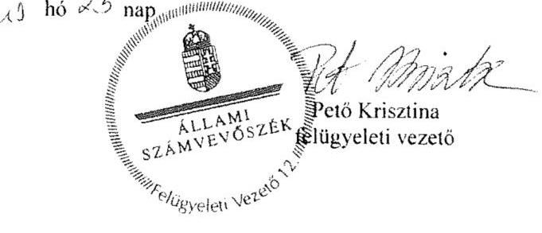

---

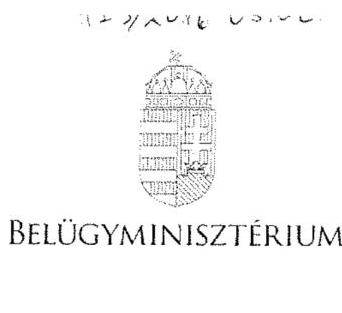

# Dl. Pintér SÁndor 

Domokos László úrnak
elnök

## Állami Számvevőszék

## Budapest

## Iktatószám: BM/7134-6/2016.

## 266 Eilustine

## Tisztelt Elnök Úr!

Az Alsó-Tisza-vidéki Vízügyi Igazgatóság, az Észak-dunántúli Vízügyi Igazgatóság, a Felsö-Tisza-vidéki Vízügyi Igazgatóság és a Közép-Tisza-vidéki Vízügyi Igazgatóság ellenőrzéséről készült számvevőszéki jelentéstervezetek 1.2. számú megállapítása hiányosságot fogalmaz meg az iránytó szerv tevékenységével kapcsolatosan, amely szerint az irányító szerv és a középirányító szerv az erőforrásokkal való hatékony gazdálkodáshoz szükséges követelményeket nem érvényesített, így nem volt biztosított a számon kérhetőség és az ellenőrizhetőség.

A fenti megállapításra vonatkozóan a mellékelt feljegyzésben foglaltak szerint észrevételt teszek. A Belügyminisztérium részére meghatározott intézkedési kötelezettséget a hatékony gazdálkodásra irányuló ellenőrzések elvégzése érdekében nem tartom indokoltnak.

Budapest, 2016. április ,"9."
Üdvözlettel:
Dr. Pinter Sándor

---

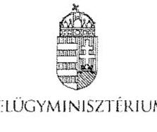

Iktatószám: BM/7134-5/2016.

# Feljegyzés 

## Dr. Pintér Sándor belügyminiszter úr részére

Miniszter úmak jelentem, hogy az Állami Számvevőszék megküldte „A központi alrendszer egyes intézményei pénzügyi és vagyongazdálkodásának ellenörzése" címú számvevőszéki jelentéstervezeteket az alábbi vízügyi igazgatóságok vonatkozásában:

- Alsó-Tisza-vidéki Vízügyi Igazgatóság,
- Észak-dunántúli Vízügyi Igazgatóság,
- Felső-Tisza-vidéki Vízügyi Igazgatóság és
- Közép-Tisza-vidéki Vízügyi Igazgatóság.

A jelentéstervezetek 1.2. számú megállapításával kapcsolatosan az Állami Számvevőszékről szóló 2011. évi LXVI. törvény (a továbbiakban: ÁSZ tv.) 29. § (2) bekezdése alapján az alábbi észrevételt teszem:

A megállapítások rögzítik, hogy az irányító szerv (BM) és a középirányító szerv (OVF) a 2012-2014. években az Áht. 9. § (1) bekezdés f) potjában előírt az ellenőrzött intézmény által ellátandó közfeladatok ellátására vonatkozó, erőforrásokkal való hatékony gazdálkodáshoz szükséges követelményeket nem érvényesített, aminek hiányában számonkérés és ellenőrzés sem történt.

Az ellenőrzés során az ÁSZ részére átadott, az irányító szervi tevékenység értékeléséhez szükséges 1. számú tanúsítványok 5.1., 7.1., 7.2., 8.1. és 9.1. pontjai alapján az irányító szerv vezetője:

- írásban rögzítette az ellenőrzött intézménynél az erőforrásokkal való szabályszerű és hatékony gazdálkodáshoz szükséges követelményeket (a Belügyminisztérium fejezet költségvetési gazdálkodásának rendjéről szóló 18/2012. (IV. 27.) BM utasítás),
- beszámoltatta az ellenőrzött intézményt a szakmai feladatellátásról, éves gazdálkodásról (éves értékelő jelentés, zárszámadások, beszámoló szöveges indoklása),
- illetve ellenőrizte az intézménynél a gazdálkodás szabályszerűségét, hatékonyságát (ellenőrzési jelentés).

A Belügyminisztérium tekintetében rögzíteni szükséges továbbá, hogy a Belügyminisztérium fejezethez tartozó egyes költségvetési szervek középirányító szervként történő kijelöléséről, az irányítási jogok gyakorlásának módjáról szóló 13/2011. (V. 23.) BM utasításban az Országos Vízügyi Főigazgatóság részére feladatok kerültek

---

meghatározásra, többek között, hogy szervezik, irányítják és ellenőrzik a költségvetési szervek által ellátandó szakmai alapfeladatok végrehajtásához szükséges pénzügyi, anyagi feltételeket, amelynek keretében például a belső ellenőrzési tevékenység ellátása során szabályszerűségi, pénzügyi, rendszer- és teljesítmény- ellenőrzéseket, informatikai rendszerellenőrzéseket, valamint megbízhatósági ellenőrzéseket végeznek a jogszabályokban, illetve az irányító szerv által előírt belső szabályozásnak megfelelően.

Tényként rögzítendő továbbá az is, hogy a Belügyminisztérium Ellenőrzési Főosztálya a költségvetési szervek belső kontrollrendszeréről és belső ellenőrzéséről szóló 370/2011. (XII. 31.) Korm. rendelet alapján két olyan tárgyú ellenőrzést (belső kontrollrendszer ellenőrzése, központi ellátási tevékenység ellenőrzése) is lefolytatott, amely a teljes fejezetet érintette. Kiemelt feladatként kezelte valamennyi szerv tekintetében a belső kontrollrendszer kialakítását és müködtetését, amelyben szakmai iránymutatást nyújtott. A középirányító szervek belső ellenőrzési szervezeteinek beszámoltatásával (éves ellenőrzési terv, éves ellenőrzési jelentés, végrehajtott ellenőrzésekről készített jelentések és intézkedési tervek bekérése) folyamatosan nyomon követi a szervezetek ellenőrzési tevékenységét, müködését, többek között az Országos Vízügyi Főigazgatóság és a felügyelete alá tartozó igazgatóságok tevékenységét.

A fent megfogalmazottak alapján a Belügyminisztérium részére meghatározott intézkedési kötelezettséget az Alsó-Tisza-vidéki Vízügyi Igazgatóság, a Felső-Tisza-vidéki Vízügyi Igazgatóság és a Közép-Tisza-vidéki Vízügyi Igazgatóság hatékony gazdálkodásra irányuló ellenőrzések elvégzése érdekében nem tartom indokoltnak.

A fenti megállapításra vonatkozóan az ÁSZ tv. 29. § (2) bekezdése alapján a Gazdasági Helyettes Államtitkársággal egyeztetve a mellékelt választervezetet készítettük elő.

Kérem Tisztelt Miniszter urat, hogy egyetértése esetén a levéltervezetet aláírásával ellátni szíveskedjen.

Budapest, 2016. április , 19."
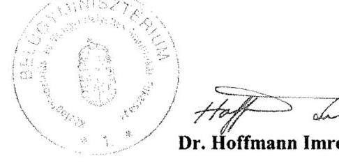

# Egyetértek: 

## Szöke Irma gazdasági helyettes államtitkár

Készült: 2 példány/1 oldal
Kapják: 1. sz. pld: Belügyminisztérium, dr. Pintér Sándor miniszter úr
2. sz. pld: Irattár

Melléklet: 2 pld.: BM/7134-6/2016. sz. levéltervezet

---

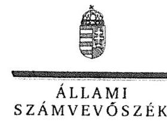

ELNÖK

Ikt.szám: V-0776-197/2016.

# Dr. Pintér Sándor úr 

miniszter
Belügyminisztérium

## Budapest

## Tisztelt Miniszter Úr!

..A központi alrendszer egyes intézményei pénzügyi és vagyongazdálkodásának ellenörzése -Közép-Tisza-vidéki Vízügyi Igazgatóság" címmel készített számvevőszéki jelentéstervezetre tett észrevételét köszönettel megkaptam.
Az Állami Számvevőszék észrevételre vonatkozó álláspontjáról a felügyeleti vezető által készített részletes tájékoztatást csatoltan megküldöm.
Tájékoztatom Miniszter urat, hogy a számvevőszéki jelentésben - az Állami Számvevőszékről szóló 2011. évi LXVI. törvény 29. § (3) bekezdése alapján - a figyelembe nem vett észrevételeket szerepeltetjük az elutasítás indokának feltüntetésével.

Budapest, 2016. 140 jus hó 25 nap
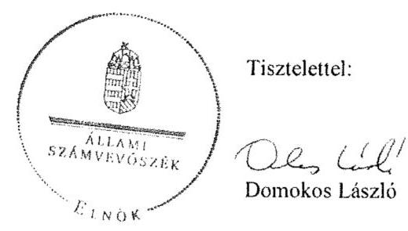

Melléklet: Tájékoztatás az el nem fogadott észrevételekről

---

# Tájékoztatás az el nem fogadott észrevételekról 

„A központi alrendszer egyes intézményei pénzügyi és vagyongazdálkodásának ellenörzése -Közép-Tisza-vidéki Vizügyi Igazgatóság 2016." címủ számvevőszéki jelentéstervezetre a BM/7134-6/2016. iktatószámú levelében tett észrevételeit áttekintettük, annak kezeléséről az alábbi tájékoztatást adom.

### 1.2. számú megállapításra tett észrevétel kapcsán

Köszönjük a Belügyminisztérium (továbbiakban: BM) fejezethez tartozó költségvetési szerveknél végzett, a belső kontrollrendszer vizsgálatáról, a belső kontrollrendszer utóvizsgálatáról, a Büntetés-végrehajtási Országos Parancsnokság és a felügyelet alá tartozó gazdasági társaságok központi ellátási kötelezettségének vizsgálatáról, valamint a büntetés végrehajtásához kapcsolódó gazdasági társaságok kapacitásainak kihasználását, a fogvatartottak foglalkoztatását célzó Kormány, illetve a Belügyminiszter rendelete hatásának vizsgálatáról szóló jelentéseiket. A hivatkozott jelentések 2012-2013. évek tekintetében az ellenőrzött Közép-Tisza-vidéki Vízügyi Igazgatóságra (továbbiakban: Intézmény) vonatkozóan, az államháztartásról szóló 2011. évi CXCV. törvény 9. § (1) bekezdés f) pontjában előirt - az erőforrásokkal való hatékony gazdálkodáshoz szükséges követelmények érvényesítésével, számonkérésével és ellenőrzésével kapcsolatos információkat nem tartalmaztak.
A jelentéstervezet 18. oldal 1.2. számú megállapításra tett észrevételét nem fogadtuk el, a megállapításban rögzített hiányosságok továbbra is megalapozottak, mert a hivatkozott BM utasításban részletesen meghatározott és szabályozott folyamatok, feladatok rendszere nem tartalmaz a közfeladatok ellátására vonatkozó, az erőforrásokkal való hatékony gazdálkodáshoz szükséges követelményeket, így azok érvényesítéséről, számonkéréséről és ellenőrzéséről sem rendelkezik. A dokumentumok ismételt áttekintését követően, az Intézmény által az irányító szerv részére megküldött költségvetési beszámolók és szöveges beszámolók sem tartalmaztak információkat a 2012-2013. években - az államháztartásról szóló 2011. évi CXCV. törvény 9. § (1) bekezdés f) pontjában előirt - az erőforrásokkal való hatékony gazdálkodáshoz szükséges követelmények érvényesítésével, számonkérésével és ellenőrzésével kapcsolatban. Ezért észrevételei a megállapítást nem módosítják.

Budapest, 2016.
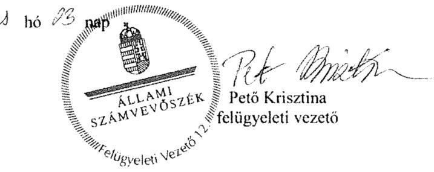

---

# ORSZÁGOS VÍZÜGYI FÖIGAZGATÓSÁG FÖIGAZGATÓ 

1012 Budapest, Marvány utca 1 d. 2253 Bp. PI 56 F-mail: sonnlyody.halazs@ovf.hu

Úgyiratszám: 09529-0008/2016.
Előadó: Csikós Attila

Tárgy:
Hiv.szám:

## Állami Számvevőszék

Domokos László elnök részére

## Budapest

Apáczai Csere János utca 10. 1052

## Tisztelt Elnök Úr!

Az Állami Számvevőszék V-0776-184/2016. iktatószámú levéllel megkapott, a Közép-Tiszavidéki Vízügyi Igazgatóságnál lefolytatott pénzügyi és vagyongazdálkodásának ellenőrzési jelentéstervezetéhez az alábbi észrevétel tesszük.

Az Állami Számvevőszék jelentéstervezet 1.2 számú megállapítása rögzíti, hogy az irányító szerv (BM) és a középirányító szerv (OVF) a 2012-2014. években az Ábt. 9. § (1) bekezdés f) pontjában előírt az ellenőrzött intézmény által ellátandó közfeladatok ellátására vonatkozó, erőforrásokkal való hatékony gazdálkodáshoz szükséges követelményeket nem érvényesített, aminek hiányában számonkérés és ellenőrzés sem történt.

Tekintettel arra, hogy a Belügyminisztérium Ellenőrzési Főosztálya a költségvetési szervek belső kontrollrendszeréről és belső ellenőrzéséről szóló 370/2011. (XII. 31.) Korm. rendelet alapján két olyan tárgyú ellenőrzést (belső kontrollrendszer ellenőrzése, központi ellátási tevékenység ellenőrzése) is lefolytatott, mely a teljes fejezetet érintette - beleértve a Közép-Tisza-vidéki Vízügyi Igazgatóságot is - az OVF-nek külön ellenőrzést erre vonatkozóan nem volt indokolt elvégeznie. Az irányító szerv kiemelt feladatként kezelte valamennyi szerv tekintetében a belső kontrollrendszer kialakítását és müködtetését.

A vízügyi igazgatóságok müködési területe vízgyűjtőkre lett meghatározva, amely a szakmai müködésüket teljesen specifikussá, egyedivé teszi. Az egyedi jelleg (eltérő csapadék eloszlás, vízfolyások nagysága és jellege, eltérő domborzati viszonyok, a müködési területen kiépült műtárgyak nagysága és azok fontossága) nem tette (és nem teszi) lehetővé a müködés és annak pénzügyi feltételeit biztosító gazdálkodás egységes elvek, azonos mutatószámok szerinti mérését és értékelését.

A Közép-Tisza-vidéki Vízügyi Igazgatóság önállóan müködő és gazdálkodó költségvetési intézmény, saját döntési és felelősségi hatáskörrel a szakmai tevékenységük és a gazdálkodásuk vonatkozásában. Az OVF, mint középirányító szerv a hatályos belső szabályzatai alapján gyakorolta a 13/2011. (V. 23.) BM utasításban meghatározott feladatokat.

---

Az OVF az ÁSZ tárgyi ellenőrzésének időszakában az alábbi szabályozók alapján látta el a középirányítói feladatait.

# A 47/2012. (IX.30) BM utasítás, SZMSZ 18. §-a szerint 

A Főigazgatóság a közgazdasági tevékenység területén:
a) ellátja a vízügyi költségvetési szervek költségvetési tervezésének végrehajtásával, finanszírozásának előkészítésével kapcsolatos feladatokat; javaslatot készít a finanszírozás területén felmerülő problémák megoldására,
b) részt vesz az ágazati célelóirányzatok felhasználására, a vízkár elhárítási munkák finanszírozására vonatkozó közgazdasági feladatokban, közremüködik a finanszírozási feladatok megoldásában,
c) részt vesz a vízügyi költségvetési szervek költségvetési támogatásával kapcsolatos feladatokban, ellátja ennek pénzügyi, számviteli feladatainak irányítását,
d) közremüködik a vízügyi költségvetési szervek gazdálkodását érintő előirányzat-módosításokkal összefüggő feladatok végrehajtásában,
e) ellátja a vízgazdálkodási kormányzati beruházások éves zárszámadásával kapcsolatos feladatokat,
f) felügyeli és koordinálja a beszámolási és könyvvezetési kötelezettségből eredő intézményi (vízügyi igazgatóságok) feladatok ellátását, ennek keretében az intézményi éves költségvetéseket és az intézményi beszámolókat összeállíttatja, továbbá végzi azok összesítését és ellenőrzését,
g) koordinálja és ellenőrzi a vízügyi igazgatóságok éves feladatterveinek összeállítását, felülvizsgálatát; a vízügyi igazgatóságokkal történő (jóváhagyást célzó) egyeztetést,
h) közremüködik az ágazati gazdaságpolitikai célok megvalósításában, irányításában és értékelésében,
i) koordinálja és felügyeli a vízügyi igazgatóságok gazdálkodását és pénzügyi tevékenységét,
j) végzi a vízügyi igazgatóságok számviteli munkájának irányítását, felügyeletét.

A fentiek alapján 2012-2014. években a Vízügyi Igazgatóság gazdálkodásának vonatkozásban az OVF:

1. a BM fejezet 17. Vízügyi Igazgatóságok cím tekintetében az egyedi elemi költségvetések leosztását tervtárgyalások után megtette;
2. az időszaki és az éves költségvetési beszámolók és jelentések pénzügyi és számviteli ellenőrzését elvégezte és a címszintủ összesítéseket a fejezet felé benyújtotta;
3. tételes (bizonylati mélységü) műszaki és pénzügyi ellenőrzést folytatott az alábbi területeken:

- a BM fejezet 20/1/48, 49, és 50 fejezeti kezelésű sorok támogatási szerződései által biztosított források felhasználása tekintetében;
- az elemi költségvetés felhalmozási kiadások kiemelt előirányzatának felhasználása tekintetében;
- Kormánydöntés alapján megkapott többletforrások felhasználása tekintetében.

---

A támogatási szerződéssel megkapott többletforrásokhoz kapcsolódó kötelezettségvállalások kizárólag az OVF által végzett elözetes müszaki-szakmai engedély birtokában voltak megtehetők.

A jelentéstervezet 3.3 számú, „A bevételi előirányzatok teljesitése és a kiadási előirányzatok felhasználásának" ellenőrzése során a dologi kiadások pontban tett „Az Intézmény beszerzési szabályzatai (Közbeszerzési szabályzat, beszerzési szabályzat) hangsúlyozták a hatékony és felelős gazdálkodást, mint alapelvet, ennek ellenére 2013-ban előfordult, hogy egy adott tárgyú beszerzést nem a közbeszerzés nyertesétől vásároltak kedvezőbb áron." megállapítás pontosítása és egyértelmúsitése szükséges az Állami Számvevőszék részéről.

A fent megfogalmazottak alapján az OVF részére meghatározott intézkedési kötelezettséget a hatékony gazdálkodásra irányuló ellenőrzések elvégzése érdekében nem tartom indokoltnak.

Budapest, 2016. április 28.
Tisztelettel:
Sombyơdy Balázs

---

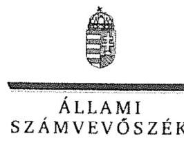

ELNÖK

Ikt.szám: V-0776-200/2016.

# Somlyódy Balázs úr 

főigazgató
Országos Vízügyi Főigazgatóság

## Budapest

## Tisztelt Föigazgató Úr!

„A központi alrendszer egyes intézményei pénzügyi és vagyongazdálkodásának ellenőrzése -Közép-Tisza-vidéki Vizügyi Igazgatóság" címmel készített számvevőszéki jelentéstervezetre tett észrevételét köszönettel megkaptam.
Az Állami Számvevőszék észrevételre vonatkozó álláspontjáról a felügyeleti vezető által készített részletes tájékoztatást csatoltan megküldöm.
Tájékoztatom Főigazgató urat, hogy a számvevőszéki jelentésben - az Állami Számvevőszékről szóló 2011. évi LXVI. törvény 29. § (3) bekezdése alapján - a figyelembe nem vett észrevételeket szerepeltetjük az elutasítás indokának feltüntetésével.

Budapest, 2016.
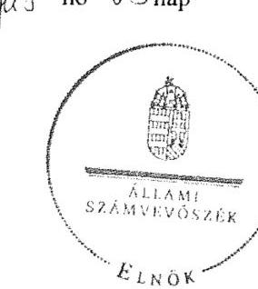

Tisztelettel:

Melléklet: Tájékoztatás az el nem fogadott észrevételekröl

---

# Tájékoztatás az el nem fogadott észrevételekröl 

„A központi alrendszer egyes intézményei pénzügyi és vagyongazdálkodásának ellenörzése -Közép-Tisza-vidéki Vizügyi Igazgatóság 2016." címü számvevőszéki jelentéstervezetre a 09529/0008/2016. iktatószámú levelében tett észrevételeit áttekintettük, annak kezeléséről az alábbi tájékoztatást adom.

## 1.2. számú megállapításra tett észrevétel kapcsán

Köszönettel vettem tájékoztatását, hogy az ellenőrzött időszakban az Országos Vízügyi Főigazgatóság (továbbiakban: OVF) mely szabályozók alapján, továbbá a Közép-Tisza-vidéki Vízügyi Igazgatóság gazdálkodása vonatkozásában mely feladatokat látta el. A levélben hivatkozott, a Belügyminisztérium fejezethez tartozó egyes költségvetési szervek középirányító szervként történő kijelöléséről, az irányítói jogok gyakorlásának módjáról szóló 13/2011. (V. 23.) BM utasítás nem tartalmaz a közfeladatok ellátására vonatkozó, az erőforrásokkal való hatékony gazdálkodáshoz szükséges követelményeket, így azok érvényesítéséről, számonkéréséről és ellenőrzéséről sem rendelkezik. Észrevétele sem tartalmaz a 2013-2014. években az OVF részéről - az államháztartásról szóló 2011. évi CXCV. törvény 9. § (1) bekezdés f) pontjában előírt - az erőforrásokkal való hatékony gazdálkodáshoz szükséges követelmények érvényesítésével, számonkérésével és ellenőrzésével kapcsolatos információkat, tényeket. Az észrevétele alapján a megállapítás módosítása nem indokolt.
A jelentéstervezet 29. oldal 5. bekezdés 2. mondatára tett észrevételét nem fogadtuk el. A közbeszerzések tekintetében a közbeszerzési eljárások szabályszerűségét mintavétellel kiválasztott mintatételek alapján értékeltük, amelynek sokaságra történő kivetítését a számvevőszéki jelentés „Az ellenörzés módszerei" című fejezet részletesen tartalmazza. A kivetített értékelés eredménye nem egy mintatételtől függ, így mintatétel nevesítése a jelentéstervezetben nem indokolt. Észrevétele alapján a megállapítás módosítása nem indokolt.
Budapest, 2016.

---

# RÖVIDÍTÉSEK JEGYZÉKE 

${ }^{1}$ KÖTIVIZIG
${ }^{2}$ Intézmény
${ }^{3}$ irányító szerv ${ }_{1}$
${ }^{4}$ irányító szerv $_{2}$
${ }^{5}$ ÁSZ
${ }^{6}$ OVF
${ }^{7}$ MT
${ }^{8}$ Korm. rendelet ${ }_{1}$
${ }^{9}$ Korm. rendelet ${ }_{2-4}$
Korm. rendelet ${ }_{2}$

Korm. rendelet ${ }_{3}$

Korm. rendelet ${ }_{4}$
${ }^{10} \mathrm{NeKI}$
${ }^{11}$ KTVKTVF
${ }^{12} \mathrm{KI}$
${ }^{13}$ OKKP
${ }^{14} \mathrm{VM}$
${ }^{15} \mathrm{BM}$
${ }^{16}$ középirányító szerv
${ }^{17}$ BM utasítás
${ }^{18}$ Nvtv.
${ }^{19}$ Áht. 2
${ }^{20}$ Áht. 1
${ }^{21}$ Ámr.
${ }^{22}$ Bkr.
${ }^{23}$ FM
${ }^{24}$ ÁSZ SZMSZ
${ }^{25}$ alapító okirat ${ }_{1-6}$

Közép-Tisza-vidéki Vízügyi Igazgatóság
Közép-Tisza-vidéki Vízügyi Igazgatóság
2011. december 31-éig a Vidékfejlesztési Minisztérium (jogelődként a Földművelésügyi Minisztérium)
2012. január 1-jétől a Belügyminisztérium
Állami Számvevőszék
Országos Vízügyi Főigazgatóság
Minisztertanács
a vizek kártételei elleni védekezés szabályairól szóló 232/1996. (XII. 26.) Korm. rendelet (hatályos 1997. január 1-jétől)
vízügyi, vízvédelmi hatósági feladatokat ellátó szervek kijelöléséről szóló kormányrendeletek
vízügyi, vízvédelmi hatósági feladatokat ellátó szervek kijelöléséről szóló kormányrendeletek 347/2006. (XII. 23.) Korm. rendelet (hatálytalan 2014. január 1-jétől)
vízügyi, vízvédelmi hatósági feladatokat ellátó szervek kijelöléséről szóló kormányrendeletek 482/2013. (XII. 17.) Korm. rendelet (hatályos 2014. január 1jétől 2014. szeptember 9-éig)
vízügyi, vízvédelmi hatósági feladatokat ellátó szervek kijelöléséről szóló kormányrendeletek 223/2014. (IX. 4.) Korm. rendelet (hatályos 2014. szeptember 10-étől)
Nemzeti Környezetügyi Intézet
Közép-Tisza-vidéki Környezetvédelmi, Természetvédelmi és Vízügyi Felügyelőség
Katasztrófavédelmi Igazgatóság
Országos Környezeti Kármentesítési Program
Vidékfejlesztési Minisztérium
Belügyminisztérium
Országos Vízügyi Főigazgatóság
a BM fejezethez tartozó egyes költségvetési szervek középirányító szervként történő kijelöléséről, az irányítói jogok gyakorlásának módjáról szóló 13/2011. (V. 23.) BM utasítás (hatályos 2011. május 24-től)
a nemzeti vagyonról szóló 2011. évi CXCVI. törvény (hatályos 2011. december 31től)
2011. évi CXCV. törvény az államháztartásról (hatályos 2011. december 31-étől)
1992. évi XXXVIII. törvény az államháztartásról (hatálytalan 2012.január 1-jétől)
292/2009. (XII. 19.) Korm. rendelet az államháztartás múködési rendjéről (hatálytalan 2012. január 1-jétől)
370/2011. (XII. 31.) Korm. rendelet a költségvetési szervek belső kontrollrendszeréről és belső ellenőrzéséről (hatályos 2012. január 1-jétől)
Földművelésügyi Minisztérium
Állami Számvevőszék Szervezeti és Működési Szabályzata
a KÖTI-KÖVIZIG (Közép-Tisza-vidéki Környezetvédelmi és Vízügyi Igazgatóság) 2010. november 22-i keltezésú alapító okirata ${ }_{1}$
a KÖTIVIZIG 2011. december 23-i keltezésú alapító okirata ${ }_{2}$

---

a KÖTIVIZIG 2012. május 8-i keltezésú alapító okirata3
a KÖTIVIZIG 2013. december 12-i keltezésú alapító okirata4
a KÖTIVIZIG 2014. február 5-i keltezésú alapító okirata5
a KÖTIVIZIG 2014. december 23-i keltezésú alapító okirata6
${ }^{26}$ Kincstár
${ }^{27}$ SZMSZ1-4
${ }^{28} 1995$. évi LVII. tv.
${ }^{29}$ Ügyrend $1-4$
${ }^{30}$ Etikai Kódex
${ }^{31}$ Számviteli politika $1-4$
${ }^{32}$ Számlarend $1-3$
${ }^{33}$ Leltározási és leltárkészítési szabályzat $1-4$
${ }^{34}$ Eszközök és források értékelési szabályzata1-4
a KÖTIVIZIG 2012. május 8-i keltezésú alapító okirata3
a KÖTIVIZIG 2013. december 12-i keltezésú alapító okirata4
a KÖTIVIZIG 2014. február 5-i keltezésú alapító okirata5
a KÖTIVIZIG 2014. december 23-i keltezésú alapító okirata6
Magyar Államkincstár
a KÖTI-KÖVIZIG Szervezeti és Múködési Szabályzata1 (hatályos 2009. október 13tól 2011. szeptember 25-ig)
a KÖTI-KÖVIZIG Szervezeti és Múködési Szabályzata2 (hatályos 2011. szeptember 26-tól 2012. december 16-ig)
a KÖTIVIZIG Szervezeti és Múködési Szabályzata3 (hatályos 2012. december 17-től 2013. december 31-ig)
a KÖTIVIZIG Szervezeti és Múködési Szabályzata4 (hatályos 2014. január 1-től)
a vízgazdálkodásról (hatályos 1996. január 1-jétől)
a KÖTI-KÖVIZIG Ügyrendi Szabályzata (hatályos 2008. szeptember 22-től 2013. január 8-ig)
a KÖTIVIZIG Ügyrendi Szabályzata (hatályos 2013. január 9-től 2014. február 19ig)
a KÖTIVIZIGÜgyrendi Szabályzata (hatályos 2014. február 20-tól 2014. július 17-ig)
a KÖTIVIZIG Ügyrendi Szabályzata (hatályos 2014. július 18-tól)
a KÖTIVIZIG 29/2012. számú Igazgatói Utasítása Etikai Kódex kiadásáról (hatályos 2012. október 1-től)
a KÖTI-KÖVIZIG Számviteli politikája (hatályos 2011. április 11-től 2012. március 29-ig)
a KÖTIVIZIG Számviteli politikája (hatályos 2012. március 30-tól 2013. március 28-ig)
a KÖTIVIZIG 26/2013. sz. Igazgatói utasítása a Számviteli politika tárgyában (hatályos 2013. március 29-től 2014. május 5-ig)
a KÖTIVIZIG 10/2014. sz. Számviteli szabályzata a Számviteli politika tárgyában (hatályos 2014. május 6-tól)
a KÖTI-KÖVIZIG Számlarendje (hatályos 2011. április 11-től 2012. március 29-ig)
a KÖTIVIZIG Számlarendje (hatályos 2012. március 30-tól 2013. augusztus 25-ig)
a KÖTIVIZIG 57/2013. sz. Igazgatói utasítása a Számlarend tárgyában (hatályos 2013. augusztus 26-tól)
a KÖTIVIZIG 5/2008. számú Igazgatói utasítása a leltározás szabályairól (hatályos 2008. február 25-től 2012. július 29-ig)
a KÖTIVIZIG 22/2012. számú Igazgatói utasítása a leltározás szabályairól (hatályos 2012. július 30-tól 2013. március 28-ig)
a KÖTIVIZIG 27/2013. számú Igazgatói utasítása az Eszközök és Források leltározási és leltárkészítési szabályzata tárgyában (hatályos 2013. március 29-től 2014. május 5-ig)
a KÖTIVIZIG 4/2014. számú számviteli szabályzata a leltározás szabályairól (hatályos 2014. május 6-tól)
1 a KÖTIVIZIG eszközök és források értékelésének szabályai szabályzata (hatályos 2011. április 11-től 2012. március 29-ig)
2 a KÖTIVIZIG KP-0995-002/2012. számú, az eszközök és források értékelésének szabályai szabályzata (hatályos 2012. március 30-tól 2013. március 28-ig)
3 a KÖTIVIZIG 28/2013. számú Igazgatói utasítása az Eszköz-Forrás értékelési szabályzat tárgyában (hatályos 2013. március 29-től 2014. május 5-ig)

---

${ }^{35}$ Pénzkezelési szabályzat ${ }_{1-4}$
${ }^{36}$ Önköltség számítási szabályzat ${ }_{1-4}$
${ }^{37}$ Közbeszerzési szabályzat ${ }_{1-7}$
${ }^{38}$ Bizonylati rend $_{1-3}$
${ }^{39}$ Gazdálkodási szabályzat
${ }^{40}$ Gazdálkodási jogkör szabályzat ${ }_{1-2}$
${ }^{41}$ Ellenőrzési nyomvonal ${ }_{1-4}$
${ }^{42}$ Szabálytalanságkezelési eljárásrend ${ }_{1-4}$
4 a KÖTIVIZIG 5/2014. számú Számviteli szabályzata az Eszköz-Forrás értékelési szabályzat tárgyában (hatályos 2014. május 6-tól)
1 a KÖTI-KÖVIZIG 10/2009. számú Igazgatói utasítása Pénzkezelési Szabályzat és 13/2011. számú Igazgatói utasítása Pénzkezelési Szabályzat kiegészítése (hatályos 2009. január 12-től 2012. július 29-ig)

2 a KÖTIVIZIG 24/2012. számú Igazgatói utasítása Pénzkezelési Szabályzat (hatályos 2012. július 30-tól 2013. március 28-ig)
3 a KÖTIVIZIG 35/2013. számú és 51/2013. számú Igazgatói utasítása Pénzkezelési szabályzat (hatályos 2013. március29-től 2014. május 5-ig)
4 a KÖTIVIZIG 3/2014. számú Számviteli szabályzata (hatályos 2014. május 6-tól)
1 a KÖTI-KÖVIZIG Önköltség számítási szabályzata (hatályos 2011. április 11-től 2012. március 29-ig)
2a KÖTIVIZIG KP-0995-003/2012. számú Önköltség számítási szabályzata (hatályos 2012. március 30-tól 2013. augusztus 25-ig)
3 a KÖTIVIZIG 52/2013. számú Igazgatói utasítása Önköltségszámítás Rendje (hatályos 2013. augusztus 26-tól 2014. május 5-ig)
4a KÖTIVIZIG 6/2014. számú Számviteli szabályzata (hatályos 2014. május 6-tól)
1 a KÖTI-KÖVIZIG 4/2010. számú Igazgatói utasítása a Közbeszerzési Szabályzatról (hatályos 2010. február 8-tól 2011. január 27-ig)
2 a KÖTIVIZIG 7/2011. számú, 10/2011. számú Igazgatói utasítása a Közbeszerzési Szabályzatról (hatályos 2011. január 28-tól 2012. január 31-ig)
3 a KÖTIVIZIG 5/2012. számú Igazgatói utasítása a Közbeszerzési Szabályzatról (hatályos 2012. február 1-től 2012. szeptember 24-ig)
4 a KÖTIVIZIG 28/2012. számú Igazgatói utasítása a Közbeszerzési Szabályzatról (hatályos 2012. szeptember 25-től 2013. március 28-ig)
5 a KÖTIVIZIG 11/2013. számú Igazgatói utasítása a Közbeszerzési és Beszerzési Szabályzatról (hatályos 2013. március 29-től 2013. október 10-ig)
6 a KÖTIVIZIG 59/2013. számú Igazgatói utasítása a Közbeszerzési és Beszerzési Szabályzatról (hatályos 2013. október 10-től 2014. január 19-ig)
7 a KÖTIVIZIG 3/2014. számú Igazgatói utasítása a Közbeszerzési és Beszerzési Szabályzatról (hatályos 2014. január 20-tól)
1 a KÖTIVIZIG KP-0995-009/2012. számú Bizonylati Szabályzata (hatályos 2012. szeptember 26-tól 2013. március 28-ig)
2 a KÖTIVIZIG KP-0311-041/2013. sz. Bizonylati Szabályzat és Bizonylati Albuma (hatályos 2013. március 29-től 2013. augusztus 25-ig)
3 a KÖTIVIZIG 55/2013. számú Igazgatói utasítása a Bizonylati Szabályzat és Bizonylati albuma tárgyában (hatályos 2013. augusztus 26-tól)
a KÖTIVIZIG KP-0995-008/2012. számú Gazdálkodási Szabályzata (hatályos 2012. szeptember 26-tól 2013. március 28-ig)
1 a KÖTIVIZIG 40/2013. számú Igazgatói utasítása (hatályos 2013. március 29-től 2014. október 30-ig)
2 a KÖTIVIZIG 13/2014. számú Számviteli szabályzata (hatályos 2014. október 31től)
1 a KÖTIVIZIG 2011. évi SZMSZ-ének 6. számú melléklete
2 a KÖTIVIZIG KP-0995-010/2012. számú Ellenőrzési nyomvonala
3 a KÖTIVIZIG 60/2013. számú Igazgatói utasítása, kelt 2013. szeptember 30.
4 a KÖTIVIZIG 21/2014., 24/2014., 29/2014. Belső kontroll szabályzatainak 5. számú mellékletei

1 a KÖTI-KÖVIZIG 2011. évi SZMSZ-ének 7. számú melléklete

---

${ }^{43}$ Számv. tv.
${ }^{44}$ Áhsz. 1
${ }^{45} \mathrm{Kbt} .1$
${ }^{46}$ Kockázatkezelési szabályzat ${ }_{1-4}$
${ }^{47}$ Vnytv.
${ }^{48}$ Iratkezelési szabályzat ${ }_{1-2}$
${ }^{49} \mathrm{IBSZ}_{1-4}$
${ }^{50}$ IÜSZ
${ }^{51}$ Avtv.
${ }^{52}$ Info tv.
${ }^{53}$ lkr.
${ }^{54}$ Igazgatói utasítás adatok közzétételéről
${ }^{55}$ Eisztv.
${ }^{56}$ Adatvédelmi, Adatbiztonsági és Közérdekű adat megismerésére vonatkozó szabályzat
${ }^{57}$ Ltv.
${ }^{2}$ a KÖTIVIZIG 36/2012. számú Igazgatói utasítása a szabálytalanságok kezelésének eljárásrendjéről (hatályos 2012. december 15-től 2013. október 17-ig)
${ }_{3}$ a KÖTIVIZIG 60/2013. számú Igazgatói utasítása a Belső Kontrollrendszerről (hatályos 2013. október 18-tól 2014. szeptember 14-ig)
4 a KÖTIVIZIG 24/2014. számú utasítása a Belső Kontrollrendszerről (hatályos 2014. szeptember 15-től)
2000. évi C. törvény a számvitelről (hatályos 2000. szeptember 21-től)

249/2000. (XII. 24.) Korm. rendelet az államháztartás szervezetei beszámolási és könyvvezetési kötelezettségének sajátosságairól (hatálytalan 2014. január 1-jétől)
2003. évi CXXIX. törvény a közbeszerzésekről (hatálytalan 2012. január 1-jétől)

1 a KÖTI-KÖVIZIG Kockázatkezelési Szabályzata (hatályos 2010. január 1-től 2012. március 29-ig)
2 a KÖTIVIZIG KP-0995-005/2012. számú Kockázatkezelési Szabályzata (hatályos 2012. március 30-tól 2013. október 17-ig)
3 a KÖTIVIZIG 60/2013. számú Igazgatói utasítása a Belső Kontrollrendszerről (hatályos 2013. október 18-tól 2014. szeptember 14-ig)
4a KÖTIVIZIG 24/2014. számú utasítása a Belső Kontrollrendszerről (hatályos 2014. szeptember 15-től)
2007. évi CLII. törvény az egyes vagyonnyilatkozat-tételi kötelezettségekről (hatályos 2007. december 6-tól)
1 a KÖTI-KÖVIZIG 5/2009. (kelt 2009. március 19.) és azt módosító 8/2011. számú Igazgatói utasítása Iratkezelési Szabályzat (hatályos 2009. március 19-től 2013. március 28 -ig)
2 a KÖTIVIZIG 20/2013. számú Igazgatói utasítása Iratkezelési Szabályzatról (hatályos 2013. március 29-től)
1 a KÖTI-KÖVIZIG 2011. évben hatályos Informatikai Biztonsági Szabályzata (hatályos 2007. március 21-től 2012. május 3-ig)
2 a KÖTIVIZIG KP-0995-007/2012. számú Informatikai Biztonsági Szabályzata (hatályos 2012. május 4-től 2013. március 28-ig)
3 a KÖTIVIZIG 21/2013. számú Igazgatói utasítása az Informatikai Biztonsági Szabályzatról (hatályos 2013. március 29-től 2014. július 6-ig)
4 a KÖTIVIZIG 19/2014. számú Igazgatói utasítása az Informatikai Biztonsági Szabályzatról (hatályos 2014. július 7-től)
a KÖTIVIZIG 22/2013. számú Igazgatói utasítása az Informatikai Üzemeltetési Szabályzatról (hatályos 2013. március 29-tól)
1992. évi LXIII. törvény a személyes adatok védelméről és a közérdekú adatok nyilvánosságáról (hatálytalan: 2012. január 1-jétől)
az információs önrendelkezési jogról és az információszabadságról szóló 2011. évi CXII. törvény (hatályos 2011. július 26-tól)
335/2005. (XII. 29.) Korm. rendelet a közfeladatot ellátó szervek iratkezelésének általános követelményeiről (hatályos 2005. december 29-től)
a KÖTIVIZIG 9/2009. sz. Igazgatói Utasítása a Közérdekú Adatok Közzétételi Szabályzatának kiadásáról (hatályos 2009. április 1-től)
2005. évi XC. törvény az elektronikus információszabadságról (hatálytalan: 2012. január 1-jétől)
A KÖTIVIZIG 7/2013. számú Igazgatói utasítása Adatvédelmi, Adatbiztonsági és közérdekú adat megismerésére vonatkozó Szabályzat (hatályos 2013. március 29-től)
1995. évi LXVI. törvény a köziratokról, a közlevéltárakról és a magánlevéltári anyag védelméről (hatályos 1995. június 30-tól)

---

${ }^{58}$ Belső kontrollrendszerről szóló szabályzat ${ }_{1-2}$
${ }^{59}$ 2011. évi CXIV. törvény
${ }^{60}$ 1155/2012.(VI.16) Korm. határozat
${ }^{61} \mathrm{Kbt}_{2}$
${ }^{62}$ beszerzési szabályzat
${ }^{63}$ OEP
${ }^{64}$ 1363/2014. (VI. 30) sz. Korm. határozat
${ }^{65}$ 1519/2015. (VII. 27) sz. Korm. határozat
${ }^{66}$ NGM
${ }^{67}$ NGM rendelet
${ }^{68}$ Vtv.
${ }^{69}$ Vtvr.
${ }^{70}$ MNV Zrt.
${ }^{71}$ KVI
${ }^{72}$ Selejtezési szabályzat ${ }_{1-4}$
${ }^{73}$ 300/2011. (XII. 22.) Korm. rendelet
${ }^{74}$ 167/2014. (VII. 17.) Korm. rendelet
${ }^{75}$ 221/2014. (IX. 4.) Korm. rendelet
${ }^{76}$ 1553/2014. (X. 1.) Kormányhatározat
${ }^{77}$ 1645/2014. (XI. 14.) Kormányhatározat
${ }_{1}$ a KÖTIVIZIG 60/2013. számú Igazgatói utasítása (hatályos 2013. október 18-tól 2014. november 29-ig)
2 a KÖTIVIZIG 29/2014. számú Igazgatói utasítása (hatályos 2014. november 30tól)
a Magyar Köztársaság 2011. évi költségvetéséről szóló 2010. évi CLXIX. törvény módosításáról (hatályos 2011. július 30-tól 2012. június 27-ig)
a rendkívüli kormányzati intézkedésekre szolgáló tartalékból történő előirányzatátcsoportosításról a vízügyi közfeladatok 2012. évi biztonságos ellátásának finanszírozása érdekében, valamint a vízitársulatok által ellátott közfeladatok felülvizsgálatának elrendeléséről (hatályos 2012. május 16-tól)
2011. évi CVIII. törvény a közbeszerzésekről (hatályos 2011. augusztus. 21-től)
a KÖTIVIZIG 32/2012. számú Igazgatói utasítása a Beszerzések lebonyolításáról (hatályos 2012. október 1-től)
Országos Egészségbiztosítási Pénztár
az államháztartás központi alrendszerébe tartozó költségvetési szervek és fejezeti kezelésű előirányzatok 2013. évi költségvetési maradványának felhasználásáról (hatályos 2014. június 30-tól)
az államháztartás központi alrendszerébe tartozó költségvetési szervek és fejezeti kezelésű előirányzatok 2014. évi költségvetési maradványának felhasználásáról Nemzetgazdasági Minisztérium
36/2013. (IX. 13.) NGM rendelet az államháztartás számvitelének 2014. évi megváltozásával kapcsolatos feladatokról (hatálytalan 2015. január 1-től)
2007. évi CVI. törvény az állami vagyonról (hatályos 2007. szeptember 17-től) 254/2007.(X. 4.) Korm. rendelet az állami vagyonnal való gazdálkodásról (hatályos 2007. október 4-től)

Magyar Nemzeti Vagyonkezelő Zártkörűen Működő Részvénytársaság
Kincstári Vagyoni Igazgatóság
${ }_{1}$ a KÖTIVIZIG 12/1996. számú Igazgatói utasítása A felesleges vagyontárgyak hasznosítása és selejtezése (hatályos 1996. november 1-től 2011. december 31-ig)
2 a KÖTIVIZIG 27/2012. számú Igazgatói utasítása A felesleges vagyontárgyak hasznosítási és selejtezése (hatályos 2012. január 1-től 2013. február 28-ig)
3 a KÖTIVIZIG 31/2013. számú Igazgatói utasítása Felesleges vagyontárgyak hasznosítási és selejtezésének Szabályzata (hatályos 2013. március 1-től 2014. május 5-ig)
4 a KÖTIVIZIG 7/2014. számú Igazgatói utasítása Felesleges vagyontárgyak hasznosítási és selejtezésének Szabályzata (hatályos 2014. május 6-tól)
300/2011. (XII. 22.) Korm. rendelet a vízügyi igazgatási szervek irányításának átalakításával összefüggésben egyes kormányrendeletek módosításáról (hatályos 2011. december 23-tól 2014. szeptember 4-ig)
a Kormány tagjainak feladat- és hatásköréről szóló 152/2014. (VI. 6.) Korm. rendelet és ahhoz kapcsolódóan más kormányrendeletek módosításáról (hatálytalan 2014. július 19-től)
egyes kormányrendeleteknek a kormányzati szerkezetátalakítással összefüggő módosításáról (hatályos 2014. szeptember 4-től)
Kormányhatározat a vízügyi ágazat irányításának átalakítása érdekében a vízgazdálkodásért
Kormányhatározat a vízügyi ágazat irányításának átalakítása érdekében a vízvédelmi feladatok ellátásához

---

# ÁLLAMI SZÁMVEVŐSZÉK 

1052 Budapest, Apáczai Csere János utca 10.
Levélcím: 1364 Budapest 4. Pf. 54
Telefon: +36 14849100 Telefax: +36 14849200
www.asz.hu