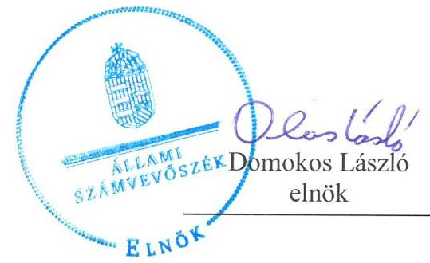
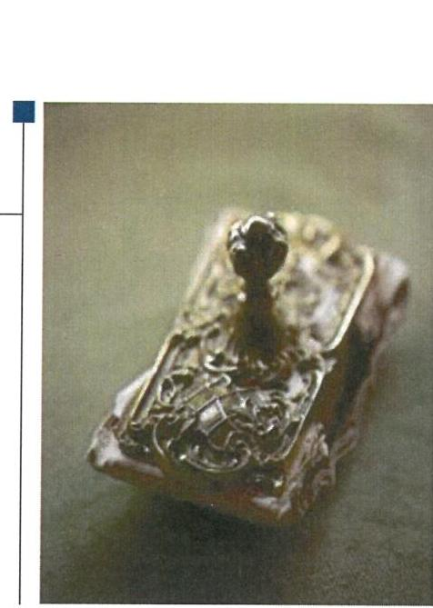

# Jelentés 

## Önkormányzatok pénzügyi és vagyongazdálkodása

Az önkormányzatok pénzügyi és vagyongazdálkodása megfelelőségének ellenőrzése - Bugac
2016.

---

# Jelentés 

## Önkormányzatok pénzügyi és vagyongazdálkodása

Az önkormányzatok pénzügyi és vagyongazdálkodása megfelelőségének ellenőrzése - Bugac
2016. 05. hó 30. nap

---

# AZ ELLENŐRZÉST FELÜGYELTE: 

RENKŐ ZSUZSANNA felügyeleti vezető

## AZ ELLENŐRZÉST VEZETTE ÉS A VÉGREHAJTÁSÁÉRT FELELŐS:

BALÁS ELEMÉR ATTILA ellenőrzésvezető

## A PROGRAM ÖSSZEÁLLÍTÁSÁÉRT FELELŐS:

LAJTERNÉ HUDÁK MAGDONA osztályvezető

## A TÉMÁHOZ KAPCSOLÓDÓ KORÁBBI SZÁMVEVŐSZÉKI JELENTÉSEK:

- címe: Jelentés az önkormányzati vagyongazdálkodás szabályszerűségi ellenőrzéséről - Bugac
- sorszáma: 13066

Jelentéseink az Országgyúlés számítógépes hálózatán és az Interneten a www.asz.hu címen is olvashatóak.

IKTATÓSZÁM: V-0902-150/2016.
TÉMASZÁM: 1936
ELLENŐRZÉS-AZONOSÍTÓ SZÁM: V071508

---

# TARTALOMJEGYZÉK 

■ ÖSSZEGZÉS ..... 5
■ AZ ELLENŐRZÉS CÉLJA ..... 7
■ AZ ELLENŐRZÉS TERÜLETE ..... 8
■ AZ ELLENŐRZÉS HÁTTERE, INDOKOLTSÁGA ..... 9
■ FÓKUSZKÉRDÉSEK ..... 10
■ ELLENŐRZÉS HATÓKÖRE ÉS MÓDSZEREI ..... 12
■ MEGÁLLAPÍTÁSOK ..... 15
■ JAVASLATOK ..... 35
■ MELLÉKLETEK ..... 39
I. Sz. melléklet: Értelmező szótár. ..... 39
II. Sz. melléklet: Az önkormányzat feladatellátásában részt vevők 2011-2014. évek között ..... 43
III. Sz. melléklet: Az eszközök és források alakulása kiemelt mérlegsoronként a 2011- 2013. években ..... 44
IV. Sz. melléklet: A pénzügyi egyensúlyi helyzet CLF módszer szerinti értékelése a 2011- 2014. években ..... 45
V. Sz. melléklet: Kimutatás a részesedések változásáról ..... 46
■ FÜGGELÉK: ÉSZREVÉTELEK ..... 47
■ RÖVIDÍTÉSEK JEGYZÉKE ..... 49

---

.

---

# ÖSSZEGZÉS 

Az Állami Számvevőszék Bugac Nagyközségi Önkormányzat pénzügyi és vagyongazdálkodását 2011. január 1. és 2014. december 31. közötti időszakra vonatkozóan ellenőrizte. A pénzgazdálkodás szabályszerű végrehajtását biztosító belső szabályozás nem felelt meg a jogszabályi követelményeknek. A Számviteli politika2 nem felelt meg a Számviteli törvényben foglaltaknak. A vagyongazdálkodás szabályozása nem felelt meg az előírásoknak. Az értékelés alapján a pénzügyi egyensúly a 2011-2012. években nem volt biztosított, a 2013-2014. években fennállt. A költségvetési beszámoló mérlegének alátámasztottsága nem felelt meg a jogszabályokban és a belső szabályzatokban előírt követelményeknek. A mérlegadatok jelentős öszszegü hibákat tartalmaztak, a beszámoló nem a valós képet mutatta.

## Az ellenőrzés társadalmi indokoltsága

Az Állami Számvevőszék stratégiájában hangsúlyos szerepet szán annak, hogy szilárd szakmai alapon álló, értékteremtő ellenőrzéseivel előmozdítsa a közpénzügyek átláthatóságát, rendezettségét és javaslataival a közpénzek és a közvagyon szabályos, gazdaságos, hatékony és eredményes felhasználását segítse. Az ÁSZ ${ }^{2}$ stratégiájában célul tűzte ki, hogy az önkormányzatok ellenőrzése során értékeli azok pénzügyi-gazdasági helyzetét, a kockázatokat feltárja, és az ellenőrzések helyszíneit kockázatelemzés alapján választja ki. Az ÁSZ szerepet vállal a korrupció és a csalás elleni küzdelemben. Közremúködik a korrupciós kockázatok és a korrupció elleni fellépés hatékony és eredményes eszközeinek beazonosításában, alkalmazásában, továbbá használatuk elterjesztésében, az integritás alapú közigazgatási kultúra kialakításában.

## Főbb megállapítások, következtetések, javaslatok

A pénzügyi és vagyongazdálkodás szabályozása a jogszabályi előírásoknak nem felelt meg. A Számviteli politika2 nem felelt meg a Számviteli törvényben foglaltaknak, mivel abban nem kerültek rögzítésre azok a gazdálkodóra jellemző szabályok, előírások, módszerek, amelyekkel meghatározták, hogy mit tekintenek a számviteli elszámolás, az értékelés szempontjából lényegesnek, jelentősnek, nem lényegesnek, nem jelentősnek. A vagyonrendeletekben foglaltak nem feleltek meg a jogszabályi előírásoknak.

A költségvetési tervezés, a bevételi és kiadási előirányzatok megállapítása és az előirányzat-módosítások megfeleltek az előírásoknak. Az előirányzat-módosítások 2014. évi analitikus nyilvántartásával nem rendelkeztek.

A gazdálkodási jogkörök gyakorlásának rendjét a Pénzgazdálkodással kapcsolatos hatásköri rendben megfelelően szabályozták, az összeférhetetlenségi szabályokat az ellenőrzött években betartották. Az Önkormányzat²nál a gazdálkodási jogkörök (pénzügyi ellenjegyzés és érvényesítés) gyakorlása nem volt megfelelő.

A pénzügyi egyensúly a 2011-2012. években nem, a 2013-2014. években biztosított volt, azonban a 2013. évről a 2014. évre a pénzügyi kapacitás jelentős mértékben csökkent. A pénzügyi egyensúlyi helyzet javítására tett bevételnövelő és kiadáscsökkentő intézkedések összhangban voltak a jogszabályi előírásokkal. A pénzügyi egyensúly hosszú távú fenntarthatóságát azonban veszélyezteti, hogy likviditási terveket a jogszabályi előírások ellenére nem készítettek.

A 2011-2013. években az előírásoknak megfelelően intézkedtek a követelések behajtására, fizetési felszólításokat küldtek ki az adósok részére. Az Önkormányzat - a 2011-2013. évekre vonatkozóan - követelést nem engedett el, az adósokkal szembeni követések esetében közel 60\%-os értékvesztést számolt el. A 2014. évben a követelések behajtására intézkedés nem történt.

---

A költségvetési kiadások fedezetéül szolgáló adósságot keletkeztető ügyletek vállalására az Önkormányzatnál az ellenőrzött időszakban nem került sor. A Magyar Állam 2012-ben az adósságkonszolidáció keretében 631,0 millió Ft összegű adósságállományt és annak járulékait vállalta át.

A költségvetési beszámoló mérlegének alátámasztottsága nem felelt meg a jogszabályokban és a vagyonrendeletben előírt követelményeknek. Az ellenőrzött időszakban nem volt minden mérlegtétel leltárral alátámasztva, továbbá a mérlegadatok jelentős összegű hibákat tartalmaztak. Az előbbiek miatt a beszámoló nem a valós képet mutatta.

A vagyonkezelői jog létesítése - a KLIK-kel és a Bácsvíz Zrt3.-vel kötött vagyonkezelési szerződések esetében - a közfeladat ellátásával összhangban, de nem szabályszerűen történt. A beruházások és felújítások, valamint az azokat megalapozó döntések nem voltak szabályszerűek. A közbeszerzési értékhatárt elérő beszerzéseknél az ellenőrzött tételek közül két esetben a közbeszerzési eljárást a Kbt. törvényi előírásai ellenére nem folytatták le.

Az Önkormányzat tartós részesedései esetében a felelős gazdálkodás nem érvényesült. A gazdasági társaságok tulajdonosi felügyelete, a részesedések nyilvántartása és az értékvesztés elszámolása nem felelt meg az előírásoknak.

Az Önkormányzat az erőforrásokkal való szabályszerű gazdálkodáshoz szükséges követelményeket - a gazdasági programon, illetve a közép- és hosszú távú vagyongazdálkodási terven túl - nem alakította ki. Az erőforrásokkal való hatékony gazdálkodáshoz szükséges követelményeket nem alakította ki, erre vonatkozó rendszert nem működtetett.

Az Önkormányzatnál az integritás szemlélet érvényesülése érdekében további intézkedések megtétele szükséges.

---

# **AZ ELLENŐRZÉS CÉLJA**

## **Bugac Nagyközségi Önkormányzat pénzügyi és vagyongazdálkodása megfelelőségének ellenőrzése**

Az ellenőrzés célja az Önkormányzat pénzügyi és vagyoni helyzetének, a gazdálkodás szabályosságának megítélése a költségvetési tervezés, a pénzügyi egyensúly megteremtése, az éves költségvetési beszámolás, a vagyongazdálkodás, a vagyon számbavétele, a gazdasági események elszámolása és a pénzgazdálkodás szabályszerűsége alapján; valamint annak értékelése, hogy kialakított-e az önkormányzat az erőforrásokkal való szabályszerű és hatékony gazdálkodáshoz szükséges követelményeket, megvalósította-e azok számon kérését, ellenőrzését.

---

# AZ ELLENŐRZÉS TERÜLETE 

## Bugac Nagyközségi Önkormányzat

Bugac Nagyközség Bács-Kiskun megyében fekszik, lakosainak száma 2014. december 31-én 2771 fő volt. A 2010. évi önkormányzati választást követően az Önkormányzat hét tagú Kép-viselő-testület ${ }^{4}$ ének munkáját két állandó bizottság segítette. Az Önkormányzat 1991. január 1-jétől az Ötv. 44. §-a szerint Bugacpusztaháza Községi Önkormányzattal Társult Képviselő-testület ${ }^{5}$ et alapított, közösen tartják fenn az önállóan működő és gazdálkodó Bugaci Közös Önkormányzati Hivatalt és a két önállóan működő intézményt. A polgármester ${ }^{6}$ 2006. évtől látja el feladatait. A jegyző személye az ellenőrzött időszakban egy alkalommal változott. Az 1999. március 6-tól 2013. március 31-ig hivatalban lévő jegyző 2013. április 1-jétől 2014. május 3-ig aljegyzőként látta el a jegyzői feladatokat. A helyszíni ellenőrzés időszakában a munkakört betöltő jegyző 2014. május 4-től végezte feladatait. Az Önkormányzat 2011. január 1jén három gazdasági társaságban rendelkezett tulajdoni hányaddal, a 2013. évben a részesedések állománya csökkent a Községgazdálkodási Kft. ${ }^{7}$ felszámolása miatt. A Polgármesteri Hivatal ${ }^{8}$ ban dolgozó köztisztviselők száma 2014. december 31-én 11 fő volt.

Az Önkormányzat a 2014. évi költségvetési beszámolója szerint 361,1 millió Ft költségvetési bevételt ért el és 328,5 millió Ft költségvetési kiadást teljesített, 2014. december 31-én a könyvviteli mérleg szerint 1680,8 millió Ft értékű vagyonnal rendelkezett.

---

# AZ ELLENŐRZÉS HÁTTERE, INDOKOLTSÁGA 

Az államháztartás önkormányzati alrendszerének közpénz felhasználása, az önkormányzatok által ellátott közfeladatok és önként vállalt feladatok sokrétüsége, valamint a feladat ellátásához rendelt vagyon nagyságrendje indokolja, hogy az ÁSZ ellenőrzéseket folytasson a pénzügyi és vagyongazdálkodás területén.

## Az ellenőrzés több szinten hasznosul

Az ÁSZ az önkormányzatok ellenőrzését a pénzügyi helyzet megítélésével indította el 2011-ben, és a nagy vagyonnal rendelkező, magas kockázatú önkormányzatok esetében a vagyongazdálkodás ellenőrzésével folytatta. Az elmúlt időszakban az önkormányzati gazdálkodás kockázatai beépítésre kerültek az ellenőrzött önkormányzatok kiválasztási rendszerébe. Az elmúlt négy év ellenőrzéseinek tapasztalatai megmutatták, hogy továbbra is indokolt az egyrészt elemző, értékelő, a pénzügyi helyzet kockázatát is minősítő, másrészt a pénzügyi és vagyongazdálkodási tevékenység szabályszerűségét értékelő ÁSZ ellenőrzések folytatása.

Ellenőrzéseink hozzájárulnak az önkormányzatok pénzügyi helyzetének pontosabb megítéléséhez azáltal, hogy a pénzügyi helyzetet a vagyoni helyzettel együtt értékeljük, amelyek együttesen határozzák meg az önkormányzatok fejlesztési képességét és gyakorolnak hatást a feladatellátásra. Feltárjuk az önkormányzati gazdálkodást meghatározó szabályozások összhangjának hiányosságait, a szabályozással nem érintett gazdálkodási területeket, valamint a pénzügyi és vagyongazdálkodás esetleges szabálytalanságait. Beazonosítjuk a pénzügyi egyensúlyi helyzet megbomlásakor a kiváltó okok mellett azok kialakulását is. Bemutatjuk az adósságkonszolidáció önkormányzat általi végrehajtásának szabályszerűségét, az adósságállomány újratermelődésének elkerülése érdekében hozott intézkedéseket. Az ellenőrzés kitér a gazdálkodáshoz kapcsolódó integritás kontrollok meglétének és működésének ellenőrzésére is.

A pénzügyi és vagyongazdálkodás szabályszerűségének ellenőrzése által a megállapításokkal összefüggő javaslatok hasznosítása esetén javul az önkormányzat gazdálkodásának szabályozottsága, valamint a „jó gyakorlatok" terjesztésén keresztül azok az önkormányzatok is átvehetik a pozitív példákat, ahol nem végez ellenőrzést az ÁSZ. Ellenőrzéseink eredményeképpen javaslatokat fogalmazhatunk meg az önkormányzatok pénzügyi egyensúlya fenntartásával kapcsolatos problémák rendszerszemléletű kezelésére, felszámolására.

---

# FÓKUSZKÉRDÉSEK 

1.     - A pénzügyi és vagyongazdálkodás szabályozása megfelelt-e az előírásoknak?
2.     - A költségvetési tervezés, az éves költségvetési beszámolás és a pénzgazdálkodás szabályszerü volt-e?
3.     - Biztositott volt-e a pénzügyi egyensúly, az adósságot keletkeztető ügyletek vállalására a jogszabályi előírásoknak megfelelően került-e sor?
4.     - A vagyonnyilvántartás, a költségvetési beszámoló mérlegének alátámasztottsága megfelelt-e a jogszabályokban és a belső szabályzatokban elöirt követelményeknek?
5.     - Szabályszerüek voltak-e a vagyon összetételének és nagyságának változását eredményező döntések és azok végrehajtása?
6.     - Felelősen gazdálkodott-e az önkormányzat a tartós részesedéseivel, élt-e tulajdonosi jogaival, teljesitette-e tulajdonosi kötelezettségeit?

---

7.     - Az önkormányzat az erőforrásokkal való szabályszerű gazdál- kodáshoz szükséges követelményeket kialakította-e, betartásu- kat számon kérte-e, ellenőrizte-e?
8.     - Az önkormányzat az erőforrásokkal való hatékony gazdálko- dáshoz szükséges követelményeket kialakította-e, betartásukat számon kérte-e, ellenőrizte-e?
9.     - Az Önkormányzat intézkedett-e az integritás szemlélet érvényesitése érdekében?

---

# ELLENŐRZÉS HATÓKÖRE ÉS MÓDSZEREI 

## Az ellenőrzés típusa

Megfelelőségi ellenőrzés.

## Az ellenőrzött időszak

A 2011. január 1-je és 2014. december 31-e közötti időszak. Az ellenőrzött időszakba beleértendő az ellenőrzött évekre vonatkozó tervezési feladatok, beszámolási kötelezettségek teljesítésének időszaka is. A vagyonnyilvántartások egyezőségét, a leltározás, selejtezés folyamatát a 2014. évre vonatkozóan értékeljük.

## Az ellenőrzés tárgya

Bugac Nagyközségi Önkormányzat pénzügyi és vagyongazdálkodása, a pénzügyi egyensúly megteremtése, a tulajdonosi és irányító szervi feladatok ellátása, az integritás szemlélet érvényesülése.

## Az ellenőrzött szervezet

Bugac Nagyközségi Önkormányzat

## Az ellenőrzés jogalapja

Az ellenőrzés jogszabályi alapját az Állami Számvevőszékről szóló 2011. évi LXVI. törvény 1. § (3) bekezdésének, az 5. § (2)-(6) bekezdéseinek, valamint az államháztartásról szóló 2011. évi CXCV. törvény 61. § (2) bekezdésének előírásai képezik.

## Az ellenőrzés módszerei

Az ellenőrzést a nemzetközi standardokat irányadónak tekintve az ellenőrzési program ellenőrzési kérdései, az ellenőrzött időszakban hatályos jogszabályok, az ellenőrzés szakmai szabályok és módszertanok figyelembe vételével végeztük.

A gazdálkodás hibáinak kijavítására, a közpénzekkel való felelős gazdálkodás segítésére irányuló javaslatok kidolgozásakor a hatályos jogszabályok az irányadóak.

---

Az ellenőrzés ideje alatt az ellenőrzött szervezettel történő kapcsolattartást az ÁSZ SZMSZ ${ }^{9}$-ének vonatkozó előírásai alapján biztosítottuk.

Az ellenőrzési kérdések megválaszolásához szükséges bizonyítékok megszerzése az ellenőrzött által rendelkezésre bocsátott dokumentumokra, adatokra alapozva megfigyelés, szemle (szemrevételezés), kérdésfeltevés (információkérés), mintavételezés, valamint elemző eljárással történt.

Az ellenőrzési bizonyítékként felhasználható adatforrások közé tartoznak egyrészt a szakmai program részletes szempontjainál felsorolt adatforrások, másrészt minden - az ellenőrzés folyamán feltárt, az ellenőrzés szempontjából releváns információt tartalmazó - dokumentum.

Az ellenőrzés lefolytatásához az önkormányzat a tanúsítványok elektronikus kitöltésével, valamint az ÁSZ által kért dokumentumok elektronikus megküldésével szolgáltatott adatokat. Az így rendelkezésre bocsátott adatok, információk, a tanúsítványok adatai valódiságának kontrollja az ellenőrzés keretében történt.

Az ellenőrzést az önkormányzat működésével kapcsolatos feladatokat ellátó polgármesteri hivatalban végeztük. Az önkormányzat az intézményei és gazdasági társaságai ellenőrzéssel érintett dokumentumait, tanúsítványait a polgármesteri hivatal útján bocsátotta az ellenőrzés rendelkezésére.

A pénzügyi és vagyongazdálkodás szabályozottságát az önkormányzat rendeletei, határozatai ${ }^{10}$, illetve a 2011. évben a polgármesteri hivatal, a 2012. évtől az önkormányzat (mint önálló éves költségvetési beszámolót készítő szerv) és a polgármesteri hivatal belső szabályozásai alapján értékeltük. A költségvetési tervezési, végrehajtási és beszámolási feladatok ellenőrzése, a pénzügyi egyensúly, a vagyonnyilvántartás, a mérleg alátámasztottságának megítélése az önkormányzat összevont adatai alapján történt. A leltározási, értékelési és selejtezési folyamat szabályszerűségére a polgármesteri hivatal által végzett 2014. évi leltározási folyamat ellenőrzése alapján tettünk megállapításokat.

Az önkormányzat vagyonváltozást eredményező döntéseinek és azok végrehajtásának ellenőrzésére irányított, valamint véletlen mintavételi eljárással és tételes ellenőrzéssel került sor. A pénzforgalmi tételek ellenőrzése véletlen mintavételi eljárással - 2011. évben a polgármesteri hivatal, 2012. évtől a polgármesteri hivatal és az önkormányzat (mint önálló éves költségvetési beszámolót készítő költségvetési szerv) főkönyvi állományából - kiválasztott minta alapján történt.

A beruházások és felújítások elszámolásának, valamint a kapcsolódó kifizetések esetében a gazdálkodási jogkörök gyakorolásának és a vagyon bérbeadással történő hasznosításának szabályszerűségét véletlen mintavétellel ellenőriztük. A vagyonértékesítések, a vagyonkezelési szerződések és a részesedések értékelését tételesen ellenőriztük.

A véletlen minta alapján a sokaságra vonatkozó hibaarányt becsültük. „Megfelelőnek" értékeltük az ellenőrzött területet, amennyiben 95\%-os bizonyossággal a teljes sokaságban a hibaarány legfeljebb 10\%, részben megfelelőnek" értékeltük, ha a hibaarány felső határa 10-30\% között volt, „nem megfelelőnek" pedig akkor, ha a mintavételi eredmények alapján a sokaságbeli hibaarány felső határa meghaladta a 30\%-ot.

---

Az ellenőrzési kérdésekre adott válaszok alapján értékeltük, hogy az önkormányzat pénzügyi gazdálkodása megfelelt-e a jogszabályokban és a belső szabályzatokban meghatározottaknak, biztosított volt-e a pénzügyi egyensúly. Értékeltük a vagyongazdálkodás szabályszerűségét, a vagyonváltozást eredményező döntések és a tulajdonosi jogok gyakorlása szabályszerűségét. Értékelést adtunk arról, hogy az önkormányzatnál kialakított-ták-e az erőforrásokkal való szabályszerű és hatékony gazdálkodáshoz szükséges követelményeket, megvalósították-e azok számon kérését, ellenőrzését. Az integritás szemlélet érvényesülésének értékelése az önkormányzat által önbevallással kitöltött tanúsítvány alapján történt.

---

# 1. A pénzügyi és vagyongazdálkodás szabályozása megfelelt-e az elöírásoknak? 

Összegző megállapítás

1.1. számú megállapítás

A pénzügyi és vagyongazdálkodás szabályozása nem felelt meg az előírásoknak.

A pénzgazdálkodás szabályszerű végrehajtását biztosító belső szabályozás összhangját nem biztosították, a jogszabályban előírt szabályzat kiadásáról nem gondoskodtak, a számviteli politika és a számlarend nem felelt meg a jogszabályi követelményeknek.

A Társult Önkormányzat ${ }^{11}$ nál külön SzMSz-szel rendelkezett a Képviselőtestület, a Társult Képviselő-testület és a Polgármesteri Hivatal. A Társult Önkormányzati $\mathrm{SzMSz}_{1,2}{ }^{12}$ és az Önkormányzati $\mathrm{SzMSz}_{1-3}{ }^{13}$ megfelelt az Ötv. és az Mötv. előírásainak. A Polgármesteri Hivatal részletes működési szabályait a Hivatali $\mathrm{SzMSz}_{1,2}{ }^{14}$ tartalmazta, amely megfelelt az Ámr.-ben és az Ávr. ${ }^{15}$-ben meghatározott tartalmi követelményeknek. Az ügyintézők munkaköréhez tartozó feladatokat és felelősségi szabályokat a munkaköri leírások tartalmazták. A munkaköri leírásokban szereplő munkakör megnevezések azonban nem minden esetben feleltek meg a Hivatali $\mathrm{SzMSz}_{1,2}$-ben alkalmazott megnevezéseknek.

A jegyző, ${ }^{16}$ a pénzügyi és gazdálkodási feladatokkal összefüggésben Ügyrend ${ }^{17}$ et készített, amelyben szabályozta a „pénzügyi és gazdálkodási csoport" az éves költségvetés tervezésével, az előirányzat módosításával, az üzemeltetéssel, fenntartással, működtetéssel, beruházással, a vagyon használattal, a munkaerő-gazdálkodással, a pénzkezeléssel, a pénzellátással, a könyvvezetéssel, a beszámolási kötelezettséggel és adatszolgáltatással kapcsolatos feladatait.

Az Önkormányzat az ellenőrzött években rendelkezett a pénzügyi gazdálkodás kereteit meghatározó - jogszabályokban kötelezően előírt - szabályzatokkal, azonban azok nem mindegyike felelt meg a jogszabályi előírásoknak.

A Polgármesteri Hivatal a 2011-2014. évekre vonatkozóan elkészítette a Számviteli politika ${ }_{1,2}{ }^{18}$-t. A Számviteli politika ${ }_{2}$ nem felelt meg a Számv. tv. ${ }^{19} 14 . \S$ (4) és az Áhsz. ${ }^{20} 50 . \S$ (1) bekezdéseiben foglaltaknak, mivel abban nem kerültek rögzítésre azok a gazdálkodóra jellemző szabályok, előírások, módszerek, amelyekkel meghatározták, hogy mit tekintenek a számviteli elszámolás, az értékelés szempontjából lényegesnek, jelentősnek, nem lényegesnek, nem jelentősnek.

A Számlarend ${ }^{21}$ a Számv. tv. 161. § (2) bekezdés c) pontja és (3) bekezdése, valamint az Áhsz. ${ }_{2} 51 . \S$ (2) bekezdés előírásai ellenére nem minden számlaosztály (5-9. számlaosztályok) esetében tartalmazta a főkönyvi számla és az analitikus nyilvántartás kapcsolatát, ezért teljes körűen nem volt biztosított a főkönyvi könyveléssel való egyeztetés lehetősége.

---

A jegyző ${ }_{1}$ elkészítette a Pénzkezelési szabályzat ${ }_{1,2}{ }^{22}$-ot, amely megfelelt a Számv. tv. 14. § (8) bekezdésében foglaltak előírásoknak.

Az Önkormányzat - összhangban az Ámr. 20. § (3) bekezdésének a) pontjában és az Ávr. 13. § (2) bekezdésének a) pontjában foglaltakkal - a Pénzgazdálkodással kapcsolatos hatásköri rend ${ }_{1-3}{ }^{23}$-ben rendezte a tervezéssel, gazdálkodással, különösen a kötelezettségvállalás, ellenjegyzés, a teljesítés igazolása, az érvényesítés, utalványozás gyakorlásának módjával, eljárási és dokumentációs részletszabályaival, valamint az ezeket végző személyek kijelölésének rendjével, és az ellenőrzési, adatszolgáltatási és beszámolási feladatok teljesítésével kapcsolatos belső előírásokat, feltételeket. A Pénzgazdálkodással kapcsolatos hatásköri rend ${ }_{1-3}$ mellékletei tartalmazták a kötelezettségvállalásra, ellenjegyzésére, a teljesítés igazolására, az érvényesítésre és az utalványozásra történő felhatalmazásokat és kijelöléseket és a kapcsolódó aláírás-mintákat.

A jegyző ${ }_{1}$ elkészítette a FEUVE szabályzat ${ }_{2}{ }^{24}$-ot, az azonban nem felelt meg az Áht ${ }^{25}{ }_{1} 121 /$ A. § (4) bekezdésében és a Bkr. ${ }^{26} 8$. § (2) bekezdésében foglaltaknak, mivel csak általános fogalom-meghatározásokat tartalmazott, konkrét tevékenységekre vonatkozó szabályozásra nem tért ki. A jegyző ${ }_{1}$ 2013-ban elkészítette a FEUVE szabályzat ${ }_{2}{ }^{27}$-ot, amely megfelelt a Bkr. 8. § (2) bekezdésében előírtaknak.

A 2011-2014. években az Önkormányzat - az Ámr. 20. § (3) bekezdés f) pontjában, és az Ávr. 13. § (2) bekezdés e) pontjában foglaltak ellenére belső szabályzatban nem rendezte a reprezentációs kiadások felosztását, azok teljesítésének és elszámolásának szabályait.

A BELSŐ SZABÁLYOZÁS ÖSSZHANGJA nem minden esetben volt biztosított. A Számviteli politika ${ }_{1}$ rendelkezése nem állt összhangban az Önkormányzat meglévő belső szabályozásával. A Számviteli politika ${ }_{1}$-ban foglaltak szerint a Polgármesteri Hivatal az önköltségszámítás rendjére vonatkozó belső szabályzatot nem készített, ennek ellenére rendelkezett Önköltségszámítási szabályzat ${ }^{28}$ tal. A munkaköri leírásokban szereplő megnevezések nem voltak teljes körűen összhangban a Hivatali SzMSz ${ }_{1,2}$-ben, az Ügyrendben, a Pénzgazdálkodással kapcsolatos hatásköri rend ${ }_{1-3}$-ben megjelölt munkaköri megnevezésekkel.

# 1.2. számú megállapítás 

## A vagyongazdálkodás szabályainak kialakítása nem felelt meg a jogszabályi követelményeknek.

Az Önkormányzat az ellenőrzött években rendelkezett a vagyongazdálkodásra vonatkozó - jogszabályokban kötelezően előírt - szabályzatokkal. A vagyonrendelet ${ }_{1,2,3}{ }^{29} 4$. § (1) bekezdése ellentétes az Nvtv. 5. § (3) bekezdésével, mert felhatalmazás nélkül bővíti a forgalomképtelen törzsvagyon körét. A vagyonrendelet ${ }_{1,2,3} 4$. § (3) bekezdése szerint az önkormányzatnál nemzetgazdasági szempontból kiemelt jelentőségű nemzeti vagyon körébe tartozó vagyoni kört nem határoztak meg. Így az Nvtv. 5. § (2) bekezdés a-b) pontjaiban foglaltak alapján az önkormányzatnál a forgalomképtelen törzsvagyon körébe az Nvtv. 5. § (3) bekezdésében meghatározott, a helyi önkormányzat kizárólagos tulajdonát képező nemzeti vagyonba tartozó elemek tartoznak. A vagyonrendelet 4. § (1) bekezdése azonban az Nvtv. 5. § (3) bekezdés a-d) pontjaitól eltérően határozza meg a forgalomképtelen törzsvagyont, a 4. § (1) bekezdés h) pontja további Képviselő-tes-

---

tületi döntés alapján történő besorolásra vonatkozó rendelkezést tartalmaz. A vagyonrendelet ${ }_{3} 1$. számú melléklete tartalmazza a forgalomképtelen törzsvagyonba tartozó vagyontárgyak felsorolását, köztük az Nvtv. 5. § (5) bekezdés b) pontja értelmében korlátozottan forgalomképesnek minősülő vagyonelemeket is, pl. általános iskola és konyha, óvoda épületek, intézmények. A jogszabályoknak megfelelően átdolgozott vagyonrendelet kiadására az ellenőrzött időszakban nem került sor.

A Leltározási szabályzat ${ }_{1,2}{ }^{30}$ és az Értékelési szabályzat ${ }^{31}$ tartalmazta a vagyon nyilvántartásával, számbavételével, értékének megállapításával kapcsolatos önkormányzati feladatokat. Az Értékelési szabályzatot a Számv. tv. 2014. évi változását követően nem aktualizálták, de az év végi értékelés során a jogszabály előírásait figyelembe vették.

Az Ámr. 20. § (3) bekezdés b) pontja, illetve az Ávr. 13. § (2) bekezdés b) pontja előírásai ellenére a 2011-2014. években belső szabályzatban nem rendezték a beszerzések lebonyolításával kapcsolatos eljárásrendet.

A jegyző ${ }_{1}$ 2012. január 1-jétől elkészítette a Közzétételi szabályzat ${ }_{1}{ }^{32}$-ot, aktualizálása azonban az Info tv. ${ }^{33}$ 1. számú mellékletének 2013. január 1jétől történő módosítását követően elmaradt, amelynek rendezése a 2014. január 1-jei hatállyal kiadott Közzétételi szabályzat ${ }_{2}{ }^{34}$ keretében került sor. A vagyonnal való gazdálkodással összefüggő szerződések tekintetében a nyilvánosság biztosításának eszközeit, módját és felelősét a 2011-2014. években a vagyonrendeletekben is meghatározták. A vagyonrendeletek azonban a közzétételi értékhatár és a közzétételért felelős személy tekintetében nem voltak összhangban a Közzétételi szabályzat ${ }_{1,2}$-tal. A Közzétételi szabályzat ${ }_{1,2}$ közzétételi listája az öt millió Ft-ot elérő, vagy azt meghaladó szerződések közzétételi kötelezettségét írta elő, ezzel szemben a vagyonrendeletek szigorúbb, nettó három millió Ft értékhatár feletti szerződések közzétételéről rendelkeztek. A Közzétételi szabályzat ${ }_{1,2}$ szerint a közzétételért a jegyző és a hatósági ügyintéző a felelős, a vagyonrendeletek szerint viszont a polgármester.

# 2. A költségvetési tervezés, az éves költségvetési beszámolás és a pénzgazdálkodás szabályszerű volt-e? 

Összegző megállapítás

## 2.1. számú megállapítás

A költségvetési tervezés és az éves költségvetési beszámolás szabályszerű, a pénzgazdálkodás nem volt szabályszerű.

A költségvetési tervezés, a bevételi és kiadási előirányzatok megállapítása megfelelt az előírásoknak.

A költségvetési tervezéssel kapcsolatos önkormányzati feladatokat a Polgármesteri Hivatal hatályos Ügyrendje, a „pénzügyi és gazdálkodási csoport" dolgozóinak munkaköri leírásai, a jegyző ${ }_{1}$ által kiadott Tervezési szabályzat ${ }^{35}$, valamint a 2013-ban hatályba helyezett FEUVE szabályzat ${ }_{2}$ függeléke megfelelő részletezettséggel tartalmazták.

A tervezés folyamata, a bevételi és kiadási előirányzatok megállapítása, valamint a költségvetési koncepció és költségvetési rendelettervezet előterjesztései megfeleltek az Áht. ${ }_{1} 65 . \S$, az Áht ${ }^{36} .{ }_{2} 26 . \S$, az Ámr. 35. §, valamint az Ávr. 26. § előírásainak. A költségvetési rendelettervezetet az

---

Áht. 1 69. § -ban és az Áht. 2 23. § (2) bekezdésében előírt szerkezetben és tartalommal készítették el.

Az Önkormányzat és az általa irányított költségvetési szervek elemi költségvetéseit az Ámr. 51. § (5) bekezdésében, illetve az Ávr. 33. § (1) bekezdésében előírt határidőre elkészítették és megküldték a Kincstár ${ }^{37}$ nak. Az elemi költségvetések - 2013-ban egy kiemelt előirányzat kivételével megegyeztek a költségvetési rendeletekkel. A költségvetésről szóló 4/2013. (II. 21.) önkormányzati rendeletben a „Dologi és egyéb folyó kiadások" összege 3,57 millió Ft-tal eltért az éves költségvetésben szereplő öszszegtől, mert a közművelődési feladatok normatív támogatását tartalmazó kincstári értesítés csak a rendelet hatályba helyezését követően érkezett meg az Önkormányzathoz.

# 2.2. számú megállapítás 

Az előirányzat-módosítások megfeleltek az előírásoknak, számviteli nyilvántartásuk nem felelt meg az előírásoknak.

Az ellenőrzött években a bevételi és kiadási előirányzatok átcsoportosítására és módosítására vonatkozó döntési hatásköröket és értékhatárokat betartották. A Társult Képviselő-testület évente több alkalommal módosította a költségvetési rendeleteit.

Az előirányzatok és módosításuk főkönyvi könyvelésbe történő feladásának szabályait a hatályos számlarendekben rögzítették. Az előirányzatok könyvelési feladatait és felelőseit a „pénzügyi és gazdálkodási csoport" dolgozóinak munkaköri leírásai és a FEUVE szabályzat ${ }_{2}$ függeléke tartalmazta.

Az előirányzat-módosítások részletező (analitikus) nyilvántartásával a 2014. évre vonatkozóan nem rendelkeztek, amivel megsértették az Áhsz. 2 14. sz. melléklet I.1-2. pontjainak előírásait.

A 2011-2013. években az éves elemi beszámolók 23. űrlapján szereplő előirányzat-módosítások az Önkormányzat zárszámadási rendeleteinek és év végi főkönyvi kimutatásainak vonatkozó adataival megegyeztek.

## 2.3. számú megállapítás

A pénzgazdálkodás során nem tartották be a jogszabályok és a belső szabályok előírásait.

A gazdálkodási jogkörök gyakorlásának rendjét a Pénzgazdálkodással kapcsolatos hatásköri rend ${ }_{1,2,3}$-ben megfelelően szabályozták. A jogköröket gyakorlók kijelölése során a gazdasági szervezettel nem rendelkező költségvetési szervekre előírt jogszabályi és önkormányzati előírásokat figyelembe vették. Az összeférhetetlenségi szabályokat az ellenőrzött években betartották.

A kötelezettségvállalások nyilvántartása csak 2014-ben felelt meg a jogszabályok és belső szabályok előírásainak. A Polgármesteri Hivatalban a kötelezettségvállalásokról 2011-2013. között nem vezettek nyilvántartást, megsértve ezzel az Ámr. 75. § (1) bekezdéseinek, illetve az Ávr. 56. § (1) bekezdéseinek előírásait.

Az ellenjegyzők és az érvényesítők 2011-2014. években nem tettek teljes körűen eleget folyamatba épített ellenőrzési kötelezettségüknek.

A kötelezettségvállalásokat a 2011-2013. években - az ellenőrzött tételek körében - egyetlen esetben sem ellenjegyezték, amellyel megsértették a 2011. évben az Ámr. 74. § (1) bekezdés, illetve 2012-2013. években az

---

Ávr. 55. § (1) bekezdés előírásait. Nem volt ellenőrizhető, hogy a 2014. évben az ellenjegyzés megelőzte-e a kötelezettségvállalást, mivel az ellenjegyzés dátumát a dokumentumon nem tüntették fel, megsértve ezzel az Ávr. 55. § (1) bekezdés előírásait.

Az érvényesítő a 2011-2013. években a fedezet meglétét nem ellenőrizte, az érvényesítési feladatait ennek ismerete nélkül végezte, megsértve ezzel az Ámr. 77. § (1), illetve az Ávr. 58. § (1) bekezdéseit, továbbá nem jelezte az utalványozónak a megelőző folyamatban tapasztalt hiányosságokat, megsértve ezzel az Ámr. 77. § (2), illetve az Ávr. 58. § (2) bekezdését.

# 2.4. számú megállapítás 

A beszámoló készítési kötelezettséget teljesítették, azonban a 2013. évi éves beszámoló jelentős összegű auditálási eltérést tartalmazott.

A polgármester az Áht. 1 79. § (1) bekezdésében, illetve az Áht. 2 87. § (1) bekezdésében előírtaknak megfelelően minden ellenőrzött évben tájékoztatta a képviselőket a gazdálkodás első féléves, illetve háromnegyed éves helyzetéről.

Az Önkormányzat és az általa irányított költségvetési szervek költségvetési beszámolóit az Áhsz. 1 11. § (1) és (4) bekezdéseiben, illetve az Áhsz. 2 6. § (2) bekezdésében meghatározott tartalommal készítették el, de minden évben néhány nappal az Áhsz. 1 10. § (5) bekezdésében, illetve az Áhsz. 2 32. § (4) bekezdésében rögzített határidőt követően nyújtották be a Kincstárnak. Az elemi költségvetések és költségvetési beszámolók adatainak összehasonlíthatóságát biztosították. Az Önkormányzat éves beszámolóit a 2011-2012. években a könyvvizsgáló elfogadó záradékkal látta el, 2013-ban a vagyonkimutatást csak „auditálási különbséggel" fogadta el. A költségvetési beszámolók mérlegadatai szerint, az Önkormányzat 2011. január 1-jei 1740,65 millió Ft vagyonával szemben 2013. december 31-én 2004,50 millió Ft értékű vagyonnal rendelkezett. A 2013. évi éves beszámoló 298,45 millió Ft auditálási eltérést tartalmazott a 2014. május 13-án készített független könyvvizsgálói jelentés és az Önkormányzat nyilatkozata szerint. Az auditálási eltérést az eredményezte, hogy az Önkormányzat 2013. évi mérleg 19. sorában, a Befektetett pénzügyi eszközökön belül, a Tartós hitelviszonyt megtestesítő értékpapírok 422,07 millió Ft-os öszszege tévesen tartalmazta a visszaváltott befektetések értékét is, amely helyesen pénzeszközként már kimutatásra került a mérlegben. Ezt a könyvelésben 2014. évben rendezték.

A 2014. évben nem végeztek könyvvizsgálatot.
A polgármester a jegyző ${ }_{1,2}$ által elkészített zárszámadási rendelettervezeteket - a 2014. évi kivételével - az Áht. 1 82. §, illetve az Áht 2 91. § (1) bekezdésében előírt határidőig terjesztette a Társult Képviselő-testület elé. A zárszámadási rendelettervezetekhez az Áht. 1 118. § (2) bekezdésében, illetve az Áht. 2 91. § (2) bekezdésében és az Áhsz. 1 44/A § -ban meghatározott mérlegeket és kimutatásokat teljes körűen csatolta. A jegyző ${ }_{1,2}$ a zárszámadási rendeleteket a jogszabályok szerinti tartalommal, az elfogadott költségvetésekkel összehasonlítható módon, az év utolsó napján érvényes szervezeti, besorolási rendnek megfelelően készítette el.

---

# 3. Biztosított volt-e a pénzügyi egyensúly, az adósságot keletkeztető ügyletek vállalására a jogszabályi előírásoknak megfelelően került-e sor? 

Összegző megállapítás

A pénzügyi egyensúly a 2011-2012. években nem, a 20132014. években biztosított volt, azonban a pénzügyi kapacitás a 2014. évre jelentős mértékben csökkent.

### 3.1. számú megállapítás

A jogszabályi előírásokat figyelmen kívül hagyva nem készítettek likviditási tervet.

A jegyző ${ }_{1,2}$ az Önkormányzat pénzállományának alakulásáról, a likviditás biztosítása érdekében a bevételek beérkezésének és a kiadások teljesítésének ütemezéséről, a 2011. évre vonatkozóan az Ámr. 201. §-ában, a 2012-2014. években pedig az Áht. ${ }_{2} 78 . \S$ (2) bekezdésében és az Ávr. 122. § (2) bekezdéseiben foglaltak ellenére likviditási tervet nem készített.

A likviditási mutató a 2011-2013. években 1-nél nagyobb értékű és növekvő tendenciájú volt, vagyis a forgóeszközök év végi állománya fedezetet nyújtott a rövid lejáratú kötelezettségek rendezésére. A 2013. évi mérleg az auditálási eltérés miatt 298,45 millió Ft értékű jelentős összegű hibát tartalmazott, ezért a 2013. évi likviditási mutató értéke nem a valós pénzügyi állapotot tükrözi.

A pénzeszköz likviditási mutató (likviditási gyorsráta) értéke a 20112013. évek között - az év végi adatokat figyelembe véve - növekvő tendenciát mutatott.

A 2014. évi mérleg adatok alapján, az Önkormányzatnak rövid lejáratú kötelezettsége nem volt, így a likviditási és a likviditási gyorsráta mutató nem értelmezhetőek.

## 3.2. számú megállapítás

A pénzügyi egyensúly a 2011-2012. években nem, a 2013-2014. években biztosított volt. A pénzügyi egyensúlyi helyzet javítására tett bevételnövelő és kiadáscsökkentő intézkedések összhangban voltak a jogszabályi előírásokkal. A központi feladatátvétel hatására a pénzügyi egyensúly javult.

Az Önkormányzat CLF módszer szerint számított mutatói alapján elemzett 2011-2014. évi önkormányzati költségvetési adatokat részleteiben a IV. számú melléklet, a főbb adatokat az 1. táblázat mutatja be.

---

1. táblázat

CLF MÓDSZER SZERINT SZÁMÍTOTT KÖLTSÉGVETÉSI ADATOK A 20112014. ÉVEKBEN (MILLIÓ FT)

| Megnevezés | 2011. év | 2012. év | Adósság-konszoli-dáció nélkül (2012. év) | 2013. év | 2014. év |
| :--: | :--: | :--: | :--: | :--: | :--: |
| Folyó bevételek | 408,56 | 410,62 | 410,62 | 342,62 | 354,32 |
| Folyó kiadások | 426,46 | 442,42 | 442,42 | 317,38 | 348,32 |
| Múködési jövedelem | $-17,90$ | $-31,79$ | $-31,79$ | 25,23 | 6,01 |
| Felhalmozási bevételek | 87,68 | 700,95 | 69,94 | 18,72 | 10,27 |
| Felhalmozási kiadások | 69,16 | 20,94 | 20,94 | 32,85 | 70,12 |
| Felhalmozás költségve-tés egyenlege | 18,52 | 680,01 | 49,0 | $-14,13$ | $-59,85$ |
| Értékpapír beváltás | 39,12 | 658,98 | 27,97 | 0,0 | 0,0 |
| Értékpapír értékesítés | 0,0 | 0,0 | 0,0 | 298,45 | 0,0 |
| Értékpapír vásárlás | 367,90 | 1,04 | 1,04 | 42,76 | 1,33 |
| Finanszírozási múveletek egyenlege | $-432,70$ | $-656,08$ | $-25,07$ | 248,64 | 5,32 |
| Nettó múködési jövedelem | $-57,02$ | $-690,78$ | $-59,77$ | 25,23 | 6,01 |

Forrás: 2011-2014. éves beszámolók
Az Önkormányzat folyó költségvetési egyenlege, múködési jövedelme a 2011-2012. években negatív, a 2013-2014. években pozitív volt. A 20132014. évi pozitív egyenleget a múködési kiadások csökkenése okozta. A felhalmozási költségvetés egyenlege az ellenőrzött időszak utolsó két évében negatív előjelű volt, ezáltal felhalmozási forráshiány keletkezett. A 2012. évi egyenleg magas értékét, az adósságkonszolidáció keretében folyósított költségvetési támogatások 631,01 millió Ft-os összege képezte.

Az Önkormányzat finanszírozási múveleteinek egyenlege az ellenőrzött időszakban 2011-ről 2012-re csökkenő értéket mutatott, 2013-ban növekedni kezdett, majd 2014-ben ismét lecsökkent. A 2011-2012. évi negatív egyenleget a 2011. évi értékpapír vásárlás, valamint a 2012. évi értékpapír beváltás okozta.

A tárgyévi pénzügyi pozíció az ellenőrzött időszakban - a 2013. évet kivéve - negatív értéket képviselt (2011-ben: -432,08 millió Ft, 2012-ben: - 7,86 millió Ft, 2013-ban: 259,75 millió Ft, 2014-ben: -48,52 millió Ft). A 2011-2012. években a folyó költségvetés negatív egyenlege a megnövekedett múködési kiadásokra, a 2013-2014. években a felhalmozási költségvetés negatív egyenlege a saját beruházási kiadás emelkedésére vezethető vissza. A felhalmozási költségvetés 2012. évi pozitív egyenlegét az adósságkonszolidáció során kapott 631,01 millió Ft értékű költségvetési támogatás okozta. A 2013. évi pénzügyi pozíció pozitív egyenlege az értékpapírok értékesítésével állt összefüggésben, amely során az életbiztosítással egybekötött tőkeképző befektetés ${ }^{38} 298,45$ millió Ft értékben visszaváltásra került. A 2014. évi tárgyévi pénzügyi pozíció negatív egyenlegét a felhalmozási költségvetés negatív egyenlege ( $-59,85 \mathrm{M} \mathrm{Ft}$ ) okozta, amelyre a múködési költségvetés pozitív egyenlege ( $6,01 \mathrm{M} \mathrm{Ft}$ ) nem nyújtott fedezetet. A 2014. évben a felhalmozási kiadások összege ( $70,12 \mathrm{M} \mathrm{Ft}$ ) közel hétszerese volt a felhalmozási bevételek ( $10,27 \mathrm{M} \mathrm{Ft}$ ) összegének.

---

# A NETTÓ MŰKÖDÉSI JÖVEDELEM (pénzügyi kapacitás) 

2011-2012. évi negatív értékét a kötvény beváltása okozta, emiatt a pénzügyi egyensúly nem volt biztosított. A nettó múködési jövedelem 20132014. évi értéke pozitív volt, de összegében jelentős csökkenés mutatkozott. A 2014. évi múködési (folyó) kiadások összege 30,94 M Ft-tal nagyobb, mint az előző évben volt. A növekedést alapvetően a kamatkiadások nélküli múködési kiadások növekedése (+43,93 M Ft), az államháztartáson belülre átadott pénzeszközök növekedése (+23,16 M Ft) és a transzferkiadások csökkenése ( $-33,68 \mathrm{MFt}$ ) együttesen idézték elő.

Az Önkormányzat által önként vállalt feladatok felsorolását az Önkormányzati SZMSZ3 2. számú melléklete tartalmazta. Az Önkormányzat az önként vállalt feladatainak körét - a KLIK ${ }^{99}$-nek történő iskolaátadáson kívül az ellenőrzött időszakban nem változtatta meg. A nemzeti köznevelésről szóló 2011. évi CXC. törvény 74-76. §-aiban foglaltak alapján, 2013. január 1-től a Magyar Állam átvállalta a köznevelési alapfeladatok ellátását. Az iskola átadása a pénzügyi helyzetet kedvező irányban befolyásolta.

Az ellenőrzött időszakban az Önkormányzat a 2011-ben megkötött életbiztosítással egybekötött tőkeképző befektetéssel - mint bevételnövelő intézkedéssel - a 2012. évben 8,69 millió Ft hozam bevételt ért el. A dologi kiadásokat érintő kiadáscsökkentő intézkedéseinek hatására, az Önkormányzatnak 63,52 millió Ft összegű megtakarítása keletkezett.

Határidőben megtörtént a fizetési kötelezettségek teljesítése.

Az Önkormányzat szállítókkal szembeni kötelezettségének a 2011-2013. években év végi állománya nem volt. A szállítói kötelezettségeken kívüli rövid lejáratú kötelezettségeket 2011-ben a kötvénykibocsátásból eredő tárgyévi törlesztő részlet, valamint a bevételekhez kapcsolódó helyi adó túlfizetés és a tárgyévi költségvetést terhelő egyéb rövid lejáratú kötelezettségek, 2012-ben a helyi adó túlfizetése, 2013-ban pedig a helyi adó túlfizetése mellett a tárgyévi költségvetést terhelő egyéb rövid lejáratú kötelezettségek tették ki. A kötvény tőketartozás törlesztése a 2011-2012. években a szerződésben meghatározott időpontokig megtörtént, az Önkormányzatnak fizetés elmaradása nem volt. A kötvény teljes összege 2012. decemberben konszolidálásra került, ezért a kiadásokhoz kapcsolódó hosszú lejáratú kötelezettségek tárgyévi törlesztő részlete 2013-ban már nem jelentkezett. A 2014. év végén az Önkormányzatnak szállítókkal szembeni kötelezettség és egyéb rövid lejáratú kötelezettség állománya nem volt. A 2014. évben a 10,8 millió Ft kötelezettség a költségvetési évet követően esedékes kötelezettségek és a kötelezettség jellegű sajátos elszámolások összegéből adódott.

Az Önkormányzat a 2011-2014. években munkabér-megelőlegezési hitelt, folyószámla-hitelt valamint egyéb likvid hitelt nem vett igénybe, peres eljárásból származó kötelezettsége az ellenőrzött időszakban nem volt.

## 3.4. számú megállapítás

A 2011-2013. években az előírásoknak megfelelően intézkedtek a követelések behajtására. A 2014. évben a követelések behajtására intézkedés nem történt.

Az Önkormányzat a jogszabályi előírásoknak megfelelően az ellenőrzött időszakban hatályos vagyonrendeleteiben határozta meg a követelésről való lemondás módját és eseteit.

---

Az Önkormányzatnak az ellenőrzött időszakban áruszállításból és szolgáltatásból eredő év végi követelés állománya nem volt. A követelésállomány a 2011-2013. években az adósokból, 2014-ben pedig az adósokon kívül az egyéb követelésekből tevődött össze.

A 2011-2013. években a követelések behajtása érdekében fizetési felszólításokat küldtek ki az adósok részére. Az Önkormányzat - az adós írásbeli kérelme esetén - részletfizetési kedvezményt biztosított. A követelés teljesítésének elmaradásakor, a tartozást munkabérből vagy nyugdíjból való letiltással vagy bírósági végrehajtással szedték be. Tartozás törlésére - méltányosság jogcímén - késedelmi kamat fizetési kötelezettség esetén került sor.

A 2014. évben az Önkormányzat nyilatkozata alapján a követelések részletező nyilvántartása nem készült, megsértve ezzel az Áhsz. 3 39. § (3) bekezdés és a 14. melléklet III. Követelések nyilvántartása fejezet 4. pontban foglalt követelményeket.

Az Értékelési szabályzat részletesen tartalmazta a követelések értéke-lési-, minősítési-, valamint az értékvesztés elszámolásának szabályait a Számv. tv. 55. § (1) bekezdésének, valamint az Áhsz. 31. § (2) bekezdésének megfelelően.

Az Önkormányzat - a 2011-2014. évekre vonatkozóan - követelést nem engedett el. Az adósokkal szembeni követelések esetében közel 60\%-os értékvesztést számolt el, és az így csökkentett összeget jelenítette meg a beszámolóiban. A 2014. évben a követelések behajtására intézkedés nem történt.

# 3.5. számú megállapítás 

A gazdálkodással összefüggő, pénzügyi egyensúlyt befolyásoló kockázatok mérséklésére megfelelően működtették a kockázatkezelési rendszert.

Az Önkormányzat az ellenőrzött időszakban rendelkezett kockázatkezelési szabályzattal és FEUVE szabályzat ${ }_{1,2}$-tal. A szabályozás tartalmazta: a belső kontrollrendszert, a belső ellenőrzést, a kockázatkezelést és a szabálytalanságokkal kapcsolatos eljárásrendet. Az ellenőrzési nyomvonalat a 2013. évtől hatályos FEUVE szabályzat ${ }_{2}$ tartalmazta.

Az Önkormányzat működési jövedelemtermelő képesség miatti kockázatát növelte, hogy a működési jövedelem értéke változó tendenciát mutatott. A 2014. évben a működési jövedelemtermelő képesség miatti kockázat növekedett, mivel a folyó kiadások növekedése meghaladta bevételek növekedését.

Az Önkormányzat bevételi kitettség miatti kockázatai az ellenőrzött időszakban nem növekedtek. Az Önkormányzat a 2011-2014. években az ÖNHIKI-re, illetve a működőképesség megőrzését szolgáló kiegészítő támogatásra pályázatot nem nyújtott be, támogatást nem kapott, ezért ez a pénzügyi helyzetét nem befolyásolta.

Az Önkormányzatnál a kivetett adók mértéke nem érte el a helyi adókról szóló 1990. évi C. törvény szerint kivethető maximális értéket. Az Önkormányzat a vagyoni típusú adók (építményadó, telekadó) kivetésének jogával 2003 óta nem élt, így bevételeit a helyi adók emelésével a 20112014. évek közötti időszakban nem növelte. A helyi iparűzési adóbevétel 75\%-a nem három adóalanytól származott, így az pénzügyi kockázatot nem jelentett.

---

A nemfizetési kockázatot jelentő tényezők az ellenőrzött időszakban nem növekedtek. Az Önkormányzat a 2011-2014. években a gazdasági társaságai részére garanciát nem nyújtott, és kezességet nem vállalt, ezek beváltása miatti fizetési kötelezettsége nem keletkezett, PPP konstrukció miatti kötelezettségvállalása valamint többségi tulajdonában lévő gazdasági társasága nem volt. Az Önkormányzat kölcsönt más szervezettől, gazdasági társaságától, államháztartáson kívülről nem vett igénybe. Az Önkormányzat a 2011-2014. években az intézményei és gazdasági társaságai részére tagi kölcsönt nem nyújtott. Az egyéb szervezetek részére a 2013-2014. években összesen 18,0 millió Ft értékben nyújtott kölcsönt, amelyből a 2014. december 31-én fennálló követelés összege 10,35 millió Ft volt.
3.6. számú megállapítás Az adósságkonszolidációval összefüggő önkormányzati feladatok végrehajtása nem a jogszabályi előírásoknak megfelelően történt.

A költségvetési kiadások fedezetéül szolgáló adósságot keletkeztető ügyletek vállalására az Önkormányzatnál az ellenőrzött időszakban nem került sor.

Az Önkormányzat 2012. december 12-én ténylegesen fennálló adósságállománya, és ezen adósságának járulékai összesen 631,01 millió Ft-ot tettek ki, amelyet a Magyar Állam 2012. december 28-án - az adósságkonszolidáció keretében -100\%-ban átvállalt. A tartozás átvállalás a 2008. évben kibocsátott „Infrastruktúrafejlesztési Alap Bugac" elnevezésű kötvény fizetési kötelezettségeire vonatkozott, 2609 389,2 svájci frank értékben, valamint ezen fizetési kötelezettség ügyleti kamataira, 8 253,8 svájci frank értékben. Az Önkormányzat a jogszabályi előírásoknak megfelelő határidőben - 2013. január 31-ig -, de nem a 2011. évi CLXXXVIII. törvény 76/C. § (4) bekezdés d) pontjában előírt tartalommal küldte meg a Kincstár részére a támogatás elszámolását igazoló dokumentumokat.

# 4. A vagyonnyilvántartás, a költségvetési beszámoló mérlegének alátámasztottsága megfelelt-e a jogszabályokban és a belső szabályzatokban előírt követelményeknek? 

Összegző megállapítás

## 4.1. számú megállapítás

A költségvetési beszámoló mérlegének alátámasztottsága nem felelt meg a jogszabályokban és a belső szabályzatokban előírt követelményeknek.

A vagyonkimutatás formailag megfelelt a jogszabályok és belső szabályzatok előírásainak.

Az Önkormányzat vagyonkimutatása a 2014. évben az Áhsz. 230 §-ban meghatározott szerkezetben készült. Az önkormányzati vagyonrende-let ${ }_{1,2,3}$-ban és a módosított vagyonrendelet ${ }_{2}{ }^{40}$-ben ezen túl követelményeket nem határozott meg.

---

### 4.2. számú megállapítás

## A költségvetési beszámoló mérlegét - a jogszabályi előírásoknak és belső szabályozásnak - nem megfelelően támasztották alá leltárral, ezért a beszámoló sem a valós képet mutatta.

Az Önkormányzat beszámolói a főkönyvi kivonattal egyeztek, az analitikákkal részben voltak alátámasztva. Az ellenőrzött időszakban nem minden mérlegtétel lett alátámasztva leltárral.

A 2011-2013. években az Önkormányzat nem rendelkezett az Áhsz. 19. számú melléklet 2. ca) pontjában előírtak ellenére a követelések közül a vevőkre, illetve az Áhsz. 19 . számú melléklet 4. db) pontjában előírtak ellenére a szállító állományra vonatkozó analitikus nyilvántartással, amely az egyeztetéssel történő leltározást ezekben a mérlegsorokban szereplő értékek esetében megalapozta volna. A részesedések részletező nyilvántartását 2014-ben nem az Áhsz. 14. melléklet VIII. fejezet 2-3. pontok előírásai szerint készítették el. A 2014. évben a követelések részletező nyilvántartását nem készítették el, megsértve ezzel az Áhsz. 2 45. § (3) bekezdés és a 14. melléklet III. Követelések nyilvántartása fejezet 1-6. pontban foglalt követelményeket. A hiányzó analitikus nyilvántartások miatt az Önkormányzat a Számv. tv. 69. § (1)-(2) bekezdéseiben előírt, a beszámoló készítési, illetve a mérlegtételek leltárral való alátámasztására vonatkozó kötelezettség teljesítése keretében a főkönyvi és részletező nyilvántartások egyeztetési feladatait teljes körűen nem végezte el.

A tartós hitelviszonyt megtestesítő értékpapírok nem voltak alátámasztva leltárral a teljes ellenőrzött időszakban. Az Önkormányzat ezzel megsértette az Áhsz. 1 37. § (1)-(2) bekezdésben és az Áhsz. 2 22. § (1) bekezdésben foglaltakat.

A beszámolók a nem megfelelő leltározásból következően a következő egyedi hibákat tartalmazták:

A beszámolókban a 2011-2013. években 0,56 millió Ft értékben vagyoni értékű jogként mutattak ki a valóságban a Magyar Államtól egy 2007-ben kötött vagyonkezelői megállapodás alapján térítésmentesen vagyonkezelésbe vett eszközt. Az Önkormányzat az Áhsz. 1 20. § (2) bekezdés előírásait megsértve az eszközt vagyonkezelésbe vett eszközként nem mutatta ki.

A 2013. évben az Önkormányzat 298,45 millió Ft értékű beváltott befektetésének ellenértéke szerepelt a pénzeszközei között, de az értékesített befektetést nem vezette ki a könyveiből, így az eszközök között kétszer szerepelt. Ezt az összeget az Önkormányzat könyvvizsgálója auditálási eltérésnek nevezte és ennyivel kisebb összegre auditálta a beszámolót. Ugyanez a hiba szerepelt a források között a saját tőkében is, így a számviteli hiba (a hiba és annak a saját tőkére gyakorolt hatása) 596,90 millió Ft, a mérlegfőösszeg 29,78\%-a. Ezzel az Önkormányzat megsértette az Számv. tv. 15. § (3) bekezdésében (valódiság elve) foglaltakat.

A 2013. évi beszámolóban szerepelt 50,01 millió Ft értékű üzemeltetésre, kezelésre átadott eszköz. Ez a KLIK-nek átadott iskola, amelyre 2013 januárjában vagyonkezelési szerződést kötöttek és így a vagyonkezelésbe adott eszközök között kellene szerepelnie. Ezzel az Önkormányzat megsértette az Áhsz. 1 20. § (1) bekezdésében és az 1. melléklet A. IV.3. pontjában előírtakat.

A KLIK számára a fenti vagyonkezelési szerződésben átadott eszközök, mivel eredetileg üzemeltetésre átadott eszközöknek lettek minősítve, így

---

szerepelnek az Önkormányzat 2014. évi mérlegében kimutatott eszközök között, ezzel az Önkormányzat megsértette az Áhsz. 10. § (2) bekezdésében foglaltakat. A hiba, a saját tőkére gyakorolt hatással együtt 100,02 millió Ft.

A víziközmű szolgáltatásról szóló 2011. évi CCIX. törvény 79. § (1) bekezdése alapján az Önkormányzat korábban a Bácsvíz Zrt. számára átadott vagyonának egy 25,93 millió Ft értékű része - amelyet a 2012. december 28-án kötött vagyonátháramlási szerződésben rögzítettek - 2013. január 1-től visszakerült az Önkormányzat tulajdonába. Ezekre az eszközökre 2012. december 28-án a Bácsvíz Zrt.-vel vagyonkezelési szerződést kötöttek, amely 2013. november 11-én lépett hatályba. A 25,93 millió Ft értékű vagyoni részt azonban az Önkormányzat a 2013. és 2014. évi mérlegében nem mutatta ki. A számviteli nyilvántartásaiba - a vagyonkezelési szerződés 2013. évben történő hatályba lépése ellenére - nem vezette be, a mérlegben nem szerepeltette. Ezért a 2013. és a 2014. évi beszámoló vagyonkezelésbe adott eszközei közül ez a tétel hiányzik. Ezzel az Önkormányzat megsértette az Számv. tv. 15. § (2) - (3) bekezdésében (teljesség és valódiság elve) és az Áhsz. 1 20. § (1) bekezdésében és az 1. melléklet A) IV.3. pontjában, továbbá az Áhsz. 11. § (11) bekezdésében és az 5. melléklet A) IV.1. pontjában előírtakat. A számviteli hiba a saját tőkére gyakorolt hatással együtt 51,86 millió Ft.

A víziközmű szolgáltatásról szóló 2011. évi CCIX. törvény 79. § (1) bekezdése végrehajtása következtében a Bácsvíz Zrt. alaptőkéje leszállításra került. A fenti vagyonátháramlási és vagyonkezelői szerződésben dokumentált változások következtében megváltozott az Önkormányzat Bácsvíz Zrt.-ben tulajdonolt részesedésének az értéke. A változásról a Bácsvíz Zrt. 2014. november 21-én kelt levelében értesítette az Önkormányzatot, amely szerint a részesedés névértéke 39,22 millió Ft-ról 26,28 millió Ft-ra csökkent. Az Önkormányzat azonban könyveiben nem vezette át a változást, így a 2014. évi beszámolójában a régi érték szerepelt. Ezzel az Önkormányzat megsértette az Számv. tv. 15. § (3) bekezdésében (valódiság elve) foglaltakat.

Az Önkormányzat könyvei egyes ingatlan elemek tekintetében - az épületek, építmények és a földterületek esetében - az egész ellenőrzött időszakban, a telkek esetében a 2011-2012. években tartalmazták a Társult Önkormányzat tulajdonában álló ingatlanokat is, ezzel az Önkormányzat megsértette az Számv. tv. 15. § (3) bekezdésében (valódiság elve) foglaltakat. Mivel a vagyonkimutatás tartalmazta, míg az ingatlanvagyon kataszter - helyesen - nem tartalmazta a társult Önkormányzat tulajdonában álló ingatlanokat, megsértették az Áhsz. 2 30. § (4) bekezdését, mert a vagyonkimutatásban szereplő ingatlanvagyon számviteli nyilvántartás szerinti bruttó értékének és az ingatlan vagyonkataszteri nyilvántartásban szereplő ingatlanvagyon bruttó értékének egyezősége nem volt biztosított.

# A MÉRLEG LELTÁRRAL VALÓ ALÁTÁMASZTÁSA 

NEM VOLT SZABÁLYSZERŰ, ezért a beszámoló nem a valós képet mutatta. A leltározás során nem tárták fel azokat a hibákat, amelyek hozzájárultak ahhoz, hogy a mérleg ne a valóságot tükrözze.

A mérlegben a feltárt hibákat és a saját tőkére gyakorolt hibahatásokat (együtt számviteli hibák) évente és mérlegsoronként a 2. táblázatban öszszesítettük. A hibák az Áhsz. 1 5. § 8. pontja, és az Áhsz. 2 1. § (1) bekezdés

---

1. pontja értelmében, az ellenőrzött időszak egészében jelentős összegűnek minősültek.
2. táblázat

A MÉRLEGBEN FELTÁRT HIBÁK ÉS HIBAHATÁSOK A 2011-2014 ÉVEKBEN (MILLIÓ FT)

| Megnevezés | Hibák és hibáhatások |  |  |  |  |  |  |  |
| :--: | :--: | :--: | :--: | :--: | :--: | :--: | :--: | :--: |
|  | 2011. |  | 2012. |  | 2013. |  | 2014. |  |
|  | hiba | számviteli   hiba | hiba | számviteli   hiba | hiba | számviteli   hiba | hiba | számviteli   hiba |
| Vagyoni értékú jogok | 0,56 | 0,56 | 0,56 | 0,56 | 0,56 | 0,56 | - | - |
| Ingatlanok | 133,33 | 266,66 | 132,75 | 265,50 | 105,45 | 210,90 | 154,86 | 309,72 |
| Részesedések | 24,34 | 48,68 | 24,34 | 48,68 | 21,34 | 42,68 | 34,28 | 68,56 |
| Értékpapírok | - | - | - | - | 298,50 | 597,00 | - | - |
| Vagyonkezelésbe adott eszköz | - | - | - | - | 75,94 | 101,86 | 25,93 | 51,86 |
| Hibák összesen | 158,23 | 315,90 | 157,65 | 314,74 | 501,74 | 952,9 | 215,63 | 430,7 |
| Hibák a mérlegfőösszeg százalékában | $9,0 \%$ | $17,9 \%$ | $9,1 \%$ | $18,2 \%$ | $25,03 \%$ | $47,54 \%$ | $12,83 \%$ | $25,62 \%$ |

Forrás: Önkormányzati adatszolgálitatás
Az Önkormányzat a vagyonrendelet ${ }_{1,2,3}$-ében és a módosított vagyonrendeletben lehetővé tette az intézmények esetében az eszközök kétévente történő leltározását, az Önkormányzat esetében azonban évenkénti leltározást írt elő. Azonban az ellenőrzött időszakban az Önkormányzatnál kétévente (2011-ben és 2013-ban) történt a leltározás, ezzel a Polgármesteri Hivatal megsértette vagyonrendelet ${ }_{1,2,3}$ előírását és az Áhsz. ${ }_{1} 37 . \S$ (1) bekezdésében foglaltakat.

A Polgármesteri Hivatal által az Önkormányzatnál és az intézményeknél végzett leltározási tevékenység, az Önkormányzatnál végzett leltározás gyakorisága kivételével, a Számv.tv. 69 § (1)-(2) bekezdésének és az Áhsz. 2 22. §-ának megfelelően történt.

A mérlegtételek év végi értékelését, az adótartozások kivételével nem végezték el. Ezzel az Önkormányzat megsértette az Áhsz. ${ }_{1} 32 . \S$ (1)-(2) bekezdéseiben, illetve a 33.-34. § és 36. §-ában és az Áhsz. 2 20. § (1) bekezdésében és a 21. § (1)-(3), illetve (7)-(10) bekezdéseiben előírtakat.

Megállapítottuk továbbá, hogy a könyvvizsgálói jelentések az ÁSZ ellenőrzése során feltárt hiányosságokat érintő megállapításokat nem tartalmaztak.

## AZ EREDMÉNYSZEMLÉLETŰ SZÁMVITEL BEVE-

ZETÉSÉHEZ az Önkormányzat elkészítette 2014. január 1-jei fordulónappal a rendező mérleget, azonban a 36/2013. (IX.13.) NGM rendelet 2. § (1) bekezdése ellenére a 2013. évi leltározás során nem leltározták a kötelezettségvállalásokat. Azonosították a függő, átfutó kiadásokat, bevételeket, és ahol a pénzügyi rendezés nem volt lehetséges, bevételként elszámolták, illetve a kötelezettségek közé felvették. Azokat a követeléseket és kötelezettségeket, amelyeket a 2013. évi szabályok szerint a főkönyvi könyvelésben a pénzforgalmi szemlélet miatt nem szerepeltettek, azonban az Áhsz. 13. §-a szerint a mérlegben kellett volna, nem szerepeltették, megsértve ezzel a 36/2013. (IX.13.) NGM rendelet 5. § (2) bekezdés utasításait.

---

# 5. Szabályszerúek voltak-e a vagyon összetételének és nagyságának változását eredményező döntések és azok végrehajtása? 

Összegző megállapítás

A vagyonkezelői jog létesítése nem szabályszerűen történt. A beruházások és felújítások, valamint a bérbeadás és vagyonértékesítés útján történő vagyonhasznosítás és az azokat megalapozó döntések nem voltak szabályszerűek.
5.1. számú megállapítás

A vagyonkezelői jog létesítése a közfeladat ellátásával összhangban, de nem szabályszerűen történt. Koncessziós jog létesítése, vagyon üzemeltetésre átadása és térítésmentes vagyonátadás nem volt az Önkormányzatnál.

Az Önkormányzatnál a 2013-2014. közötti években két vagyonkezelési szerződés volt érvényben, amelyek a közfeladat ellátásával összhangban voltak.

Az Nktv41, 74. § (1) bekezdése alapján, 2013. január 1-jétől az állam gondoskodik a köznevelési alapfeladatok ellátásáról. Az Nktv. 76. § (5) bekezdés a) pontja és a Köznevelési intézmények állami fenntartásba vételéről szóló tv. ${ }^{42}$ 8. § (1) bekezdés b) pontja alapján, az Önkormányzat tulajdonában lévő, és az intézmények feladatainak ellátását szolgáló ingatlan és ingó vagyon a KLIK ingyenes vagyonkezelésébe került. Ezek alapján az Önkormányzat és a KLIK 2013. január 15-én vagyonkezelési szerződést kötött a bugaci Rigó József Általános Iskola vagyonkezelésbe adásáról, és 2012. december 10-én megállapodást írt alá a köznevelési intézmények át-adás-átvételéről.

Az Önkormányzat és a Bácsvíz Zrt. 2012. decemberben határozatlan időre szóló vagyonkezelési szerződést írt alá, a kötelező önkormányzati feladatok ellátását szolgáló viziközmű vagyon vagyonkezelésbe adására. A szerződés a Magyar Energia Hivatal jóváhagyó határozata jogerőre emelkedésének napján lépett hatályba.

A vagyonkezelésbe adott eszközök könyvviteli rendezése nem szabályszerűen történt. Az Önkormányzat a KLIK-kel megkötött vagyonkezelési szerződés tárgyát képező eszközöket a 2013. évi éves beszámoló mérlegében az Üzemeltetésre, kezelésre átadott eszközök között szerepeltette, és nem a vagyonkezelésbe adott eszközöknél, megsértve ezzel az Áhsz. 1 20. § (1) bekezdés és az 1. sz. melléklet - A) IV.3. pontjának - előírásait. Az Önkormányzat nyilatkozata szerint a Bácsvíz Zrt. vagyonkezelési szerződésében megadott eszközök könyvviteli rendezése nem az Áhsz. 20. § (1) bekezdés előírásai szerint történt, mivel 2013-ban nem kerültek könyvelésre, ezáltal nem szerepeltek a 2013. évi mérlegben, és az Áhsz. 2 11. § (11) bekezdése ellenére a 2014. évi mérlegben sem, mint vagyonkezelésbe adott eszközök.

Az Önkormányzat nem tett eleget a vagyonkezelési szerződések esetében az Info tv. 37. § (1) bekezdése, valamint az 1. sz. melléklet III/4. pontjában meghatározott közzétételi kötelezettségének.

A vagyonkezelők beszámoltatása a vagyonnal való gazdálkodásról 2013-2014-ben a vagyonrendelet 13 . fejezet előírása ellenére elmaradt,

---

# 5.2. számú megállapítás 

ezáltal az Önkormányzat nem ellenőrizte, hogy a vagyonkezelők a Mötv. 109. § (6) előírásainak eleget tettek-e.

## A beruházások és felújítások, valamint az azokat megalapozó döntések nem voltak szabályszerűek.

Az Önkormányzatnál az ellenőrzött időszak alatt folyamatban lévő vagy megvalósított beruházások az önkormányzati feladatok ellátását szolgálták, valamint összhangban voltak a 2011-2014. évekre vonatkozó Gazdasági Programmal, és a 2013. évben elfogadott Vagyongazdálkodási tervvel.

A kiválasztott beruházási mintatételeknél a döntéseket az arra jogosultak - a Képviselő-testület és a polgármester - hozták meg, azonban egyes fejlesztésekhez nem készültek előzetes döntések.

A közbeszerzési értékhatárt elérő beszerzéseknél az ellenőrzött tételek közül két esetben a közbeszerzési eljárást a Kbt. ${ }^{43}$; és a Kbt. ${ }^{44}$; törvényi előírásai ellenére nem folytatták le. Az Önkormányzat 2011-ben vállalkozási szerződést kötött közbeszerzési eljárást követően. A 2011. december 8-i műszaki átadás-átvételt követően kiegészítő építési beruházásra került sor a 2012. február 2-án készült műszaki átadás-átvételi jegyzőkönyv szerint szerződésmódosítás vagy új szerződés megkötése nélkül, így a hivatkozott beszerzéssel az Önkormányzat megszegte a Kbt. 1240 . § (1) bekezdésében előírt közbeszerzési eljárás lefolytatásának kötelezettségét.

Az Önkormányzat a 2012. évben a szennyvízberuházás közbeszerzési eljárásainak lebonyolítására, közbeszerzési tanácsadásra megbízási szerződést írt alá, amelynek értéke nettó 8 millió Ft volt. A szerződéskötésre közbeszerzési eljárás mellőzésével, három ajánlat bekérését követően került sor. A hivatkozott beszerzéssel az Önkormányzat megsértette a Kbt. 2 5. §-ára tekintettel - a Kbt. 2 19. §-ában előírt közbeszerzési eljárás lefolytatásának kötelezettségét.

A beruházási szerződések nem minden esetben tartalmazták az Önkormányzat érdekeit védő garanciális elemeket. Az Önkormányzat 20112014. között nem tett eleget a közzétételi kötelezettségének a vagyonrendelet ${ }_{1,2} 18 . \S$-a és a vagyonrendelet ${ }_{3} 22$. §-a által előírt 3 millió Ft-ot elérő vagy meghaladó, és az Eisz.tv. ${ }^{45}$ 6. § (1) bekezdés, az Eisz.tv. mellékletének III/4. pontja és az Áht. ${ }_{1}$ 15/8. § (1) bekezdése, valamint az Info tv. 37. § (1) bekezdése és 1. sz. mellékletének III/4. pontjában meghatározott 5 millió Ft-ot elérő, vagy azt meghaladó beruházási szerződéseknél.

A beruházások aktiválásánál nem mindig állították ki az üzembe helyezés dokumentumát, amely nem felelt meg az Áhsz. 1 30. § (1), az Áhsz. 2 17. § (1), a Számv. tv. 52. § (2) és 165. § (1)-(2) bekezdésekben foglalt előírásoknak.

Az Önkormányzat 2011-2014. években befejezett beruházásainak a bekerülési értéke 141,30 millió Ft volt, és ezek finanszírozása 41,11\%-ban saját bevételből, 34,47\%-ban európai uniós támogatásból és 24,42\%-ban egyéb központi támogatásból történt.

Az Önkormányzat tárgyi eszközeinek használhatósági foka a 2011. január 1 - 2014. december 31. közötti időszakban 0,87\%-ról 0,80\%-ra változott, mivel a megvalósított eszközbeszerzések és az aktivált beruházások értéke elmaradt az elszámolt értékcsökkenéstől.

---

# 5.3. számú megállapítás 

A vagyonértékesítés és a bérbeadás útján történő vagyonhasznosítás nem szabályszerűen történt.

Az Önkormányzat 2013-ban egy termőföldet és egy gépjárművet értékesített. A döntést mind a kettő esetben az arra jogosult Társult Képviselő-testület hozta meg. A termőföld értékesítésénél betartották az Nvtv. 3. § (1) bekezdés 3. pontja szerinti forgalomképtelen és korlátozottan forgalomképes vagyon elidegenítésére vonatkozó korlátokat.

A járműeladásról szóló, Adásvételi szerződésben nem rögzítették az Önkormányzat érdekeit védő garanciális elemeket.

A termőföld értékesítésénél az eladási árat nem a vagyonrendelet 2 17. § (1) bekezdésében előírt, a jegyző által kiadott értékbecslés alapján határozták meg. Az értékesített vagyonelemeket szabályszerűen kivezették a számviteli és a vagyonkataszter nyilvántartásból.

Az ellenőrzött időszakban az Önkormányzat kiválasztott bérbeadás útján történő vagyonhasznosítás mintatételei egyrészt terem, garázs, üzlethelyiség és egyéb eszközök bérbeadása, másrészt sírhely bérleti díjak voltak, amelyeknél a döntést az arra jogosult Társult Képviselő-testület, vagy a Képviselő-testület hozta meg.

Az üzlethelyiségek bérbeadásánál a döntést megelőzően - a vagyonrendelet ${ }_{1,2}$ és a módosított vagyonrendelet ${ }_{2} 17 . \S$-a, valamint a vagyonrendelet ${ }_{3} 10 . \S$-a által - előírt, az ingatlan forgalmi értékét meghatározó értékbecslést nem végezték el. A bérlőket versenyeztetési eljárás nélkül választották ki, annak ellenére, hogy a vagyontárgyak értéke meghaladta a vagyonrendelet ${ }_{1,2}$ és a módosított vagyonrendelet ${ }_{2} 26$. §-a valamint a vagyonrendelet ${ }_{3} 28$. §-a által, az ingatlan vagyon esetén a versenyeztetés szabályainál meghatározott 1 millió Ft-ot.

A bérbeadási szerződésekben nem minden esetben rögzítették az Önkormányzat érdekeit védő garanciális elemeket. Az Nvtv. 11. § (10) bekezdésben meghatározottak szerint, a vagyon hasznosítására a szerződést természetes személlyel vagy átlátható szervezettel lehet megkötni, azonban az Önkormányzat nem győződött meg az átláthatóság követelményének érvényesüléséről.

Az Önkormányzatnak az ellenőrzött időszakban elengedett és behajthatatlan követelés leírása nem volt.

---

# 6. Felelősen gazdálkodott-e az önkormányzat a tartós részesedéseivel, élt-e tulajdonosi jogaival, teljesítette-e tulajdonosi kötelezettségeit? 

Összegző megállapítás

Az előírásoknak nem felelt meg az Önkormányzat gazdasági társaságok tulajdonosi felügyelete és a tulajdonosi részesedések nyilvántartása.

### 6.1. számú megállapítás

Az előírásoknak nem felelt meg az Önkormányzat gazdasági társaságok tulajdonosi felügyelete. A Községgazdálkodási Kft. veszteséges gazdálkodása esetén illetve annak elkerülése érdekében az Önkormányzat nem tette meg a szükséges intézkedéseket.

Az Önkormányzat a Taktv ${ }^{46}$. 4. §-ában meghatározottaknak megfelelően, - 2010-ben Bugacpusztaháza Nagyközségi Önkormányzattal közösen létrehozott Községgazdálkodási Kft.-nél, - a Társult Képviselő-testület 7/2011. sz. határozatával felügyelő bizottság létrehozásáról döntött. A felügyelő bizottság a Gt. ${ }^{47} 34$. § (4) bekezdésének előírása ellenére ügyrenddel nem rendelkezett.

Az ellenőrzött időszakban az Önkormányzat részben gondoskodott a Községgazdálkodási Kft. feladatainak meghatározásáról. Feladatellátásra vonatkozó szerződés nem volt érvényben, a Társult Képviselő-testület által elfogadott 2011. évi üzleti terv is csak részben tartalmazott feladat meghatározásokat.

Az ellenőrzött időszakban az Önkormányzat nem rendelkezett kizárólagos vagy többségi tulajdonban lévő gazdasági társasággal.

KÖZSÉGGAZDÁLKODÁSI KFT.: A Képviselő-testületnek nem került bemutatásra a Községgazdálkodási Kft. 2010. évi éves beszámolójára vonatkozó, 2011. április 30-án készült független könyvvizsgálói jelentése. A könyvvizsgáló a jelentésben felhívta a figyelmet, hogy a Községgazdálkodási Kft. a 2010. december 31-én meglévő kötelezettségeit nem tudta rendezni a beszámoló készítéséig, és a saját tőke kisebb, mint a jegyzett tőke. A Községgazdálkodási Kft. fizetésképtelenségét megállapító és a felszámolását elrendelő végzés 2011. novemberben emelkedett jogerőre. Az Önkormányzat nem tett eleget az Áht. L 104. § (3) bekezdése által megfogalmazott, a vagyonnal felelős módon történő gazdálkodás elvárásának.

Az önkormányzati tulajdoni részesedéssel működő gazdasági társaságok tulajdonosi szerkezetének felülvizsgálatára nem volt szükség, mivel azok az Nvtv. 3. § (1) bekezdés a) és a (19) bekezdés bd) pontjai szerint átlátható szervezetnek minősültek.

Az ellenőrzött időszakban az Önkormányzatnak részesedéssel érintett gazdasági társaságai miatt, kezesség és garanciavállalási kötelezettsége nem volt és részükre kölcsönt, tagi kölcsönt nem nyújtott.

---

### 6.2. számú megállapítás

A tulajdonosi részesedések nyilvántartása, és az értékvesztés elszámolása nem felelt meg az előírásoknak. Értékhelyesbítés elszámolására nem került sor.

Az Önkormányzat a 2011-2014 közötti években három társaságban rendelkezett tulajdonosi részesedéssel, amelynek értéke 2011. január 1jén40,8 millió Ft és 2014. december 31-én26,4 millió Ft volt.

Az Áhsz.1 40. § (9) bekezdésében foglaltak ellenére 2011-2013 között az éves beszámolókban szöveges értékeléssel nem mutatták be a Községgazdálkodási Kft.-t, amelyben az Önkormányzat 50\%-os részesedéssel rendelkezett. A részesedések részletező nyilvántartását 2014-ben nem az Áhsz. 2 14. melléklet VIII. fejezet 2-3. pontok előírásai szerint készítették el.

Az Önkormányzat mérlegében kerültek kimutatásra Bugacpusztaháza Községi Önkormányzat tulajdonosi részesedései is, amely nem felelt meg a Számv. tv. 15. § (3) bekezdésében meghatározott valódiság elvének.

A részesedések között feltüntetett Községgazdálkodási Kft. ellen 2011. november 4-én felszámolási eljárás indult, azonban az Önkormányzat nem számolt el értékvesztést a részesedéssel szemben, így az a 2011-2012. években teljes értéken szerepelt a könyveiben. Ezzel az Önkormányzat megsértette a Számv. tv. 54. § (1) bekezdését, az Értékelési Szabályzat 2.3.1. fejezetét, továbbá a Számv. tv. 15. § (8) bekezdésében foglalt alapelvét (óvatosság elve). A Községgazdálkodási Kft. 3 millió Ft-os részesedését az Önkormányzat 2013-ban kivezette a könyveiből, annak ellenére, hogy a gazdasági társaság törlésére csak 2014-ben került sor a felszámolási eljárás befejezésének közzétételével, megsértve ezzel a Számv. tv. 15. § (3) bekezdését (valódiság elve), és az Áhsz.1 15. § (2) bekezdését.

Értékhelyesbítés elszámolására nem került sor.

# 7. Az önkormányzat az erőforrásokkal való szabályszerű gazdálkodáshoz szükséges követelményeket kialakította-e, betartásukat számon kérte-e, ellenőrizte-e? 

Összegző megállapítás

Az Önkormányzat az erőforrásokkal való szabályszerű gazdálkodáshoz szükséges követelményeket - a gazdasági programon, és a közép- és hosszú távú vagyongazdálkodási terven túl - nem alakította ki.

Az Önkormányzat az Ötv.-ben, az Mötv.-ben előírtaknak megfelelően rendelkezett a 2011-2014. évekre vonatkozó képviselő-testületi határozattal jóváhagyott gazdasági programmal, és az Nvtv.-ben.-nek megfelelően rendelkezett közép-és hosszú távú vagyongazdálkodási tervvel.

Megállapítottuk ugyanakkor, hogy az Önkormányzat - a gazdasági programon, és a közép- és hosszú távú vagyongazdálkodási terven túlmenően - az erőforrásokkal való szabályszerű gazdálkodáshoz szükséges követelményeket nem alakította ki, erre vonatkozó rendszert nem működtetett. Az Önkormányzat ezzel nem tett eleget az Áht. 1 49. § (5) bekezdés f) pontja és (7) bekezdése és az Áht. 2 9. § f) pontjában előírtaknak.

---

# 8. Az önkormányzat az erőforrásokkal való hatékony gazdálkodáshoz szükséges követelményeket kialakította-e, betartásukat számon kérte-e, ellenőrizte-e? 

## Összegző megállapítás

Az Önkormányzat az erőforrásokkal való hatékony gazdálkodáshoz szükséges követelményeket nem alakította ki.

Az Önkormányzat az erőforrásokkal való hatékony gazdálkodáshoz szükséges követelményeket nem alakította ki, erre vonatkozó rendszert nem működtetett. Az Önkormányzat és intézményei költségvetései és egyéb dokumentumai nem tartalmaztak erre vonatkozóan olyan elemeket, amelyek egy ilyen követelmény rendszer bevezetésének kezdeti szakaszát jelentenék. Az Önkormányzat ezzel nem tett eleget az Áht. ${ }_{1} 49 . \S$ (5) bekezdés f) pontja és (7) bekezdése és az Áht. ${ }_{2} 9 . \S$ f) pontjában előírtaknak.

## 9. Az Önkormányzat intézkedett-e az integritás szemlélet érvényesítése érdekében?

## Összegző megállapítás

Az Önkormányzatnál az integritás szemlélet érvényesülése érdekében további intézkedések megtétele szükséges.

Az Önkormányzat az ellenőrzést megelőző években nem vett részt az ÁSZ integritás felmérésében. Az ÁSZ ellenőrzés során az Önkormányzat kitöltötte a bővített tartalmú integritási kérdőívet. Az önbevallással kitöltött kérdőív értékelése alapján, a szervezetnél jelenlévő eredendő korrupciós kockázatok és a kockázatokat növelő tényezők szintje nem haladta meg az azok kezelésére kiépült kontrollok szintjét, azonban az ellenőrzés során feltárt szabálytalanságok, hiányosságok nem támasztották alá a kérdőív kitöltése során kapott eredményeket.

Az Önkormányzat a szervezeti kultúra és szervezeti értékek tekintetében nem rendelkezett nyilvánosan közzétett stratégiával. A múködési jellemzők területén az Önkormányzat nem alkalmazott rendszerszerű kockázatelemzést. A belső szabályozottság területén nem szabályozták a külső szakértők alkalmazásának feltételeit, nem rendelkeztek adatkezelési, titokvédelmi (illetve a minősített adatok kezelésére vonatkozó) és az Önkormányzaton belüli közérdekú bejelentők védelmére vonatkozó szabályzattal. Nem rendelkeztek a közbeszerzési értékhatárt el nem érő beszerzések lebonyolítására vonatkozó beszerzési szabályzattal.

A munkatársak számára a gazdasági vagy - az Önkormányzat tevékenysége szempontjából releváns - egyéb érdekeltségeikről való beszámolást nem tették kötelezővé, valamint nem rendelkeztek az összeférhetetlenség kérdésköré vonatkozó belső szabályozással sem. A humánerőforrás-gazdálkodási jellemzők körében az Önkormányzatnál nem alkalmaztak teljesítményértékelési rendszert, valamint a fontos és bizalmas munkakörökre jelölt, illetve az ilyen munkakört betöltő személyek esetében nemzetbiztonsági szűrést. A speciális korrupcióellenes rendszerek és eljárások körében az Önkormányzat nem múködtetett külső panaszokat, valamint közérdekú bejelentéseket kezelő rendszert, az elmúlt 3 évben az Önkormányzat

---

munkatársai nem vettek részt korrupcióellenes képzésen, nem végeztek rendszeresen korrupciós kockázatelemzést, nem alkalmazták az ún. „négy szem elvét", és nem múködtettek munkahelyi rotációt.

Az elmúlt három évben külső ellenőrzést folytatott le az ÁSZ, a NAV ${ }^{48}$ és a Magyar Államkincstár. A szervezet tevékenységével kapcsolatban, a Bács-Kiskun Megyei Kormányhivatal az önkormányzati rendeletalkotást felügyeleti eljárás keretében ellenőrizte.

---

# JAVASLATOK 

Az ÁSZ tv. ${ }^{49}$ 33. § (1) bekezdésében foglaltak értelmében az ellenőrzött szervezet vezetője köteles a jelentésben foglalt megállapításokhoz kapcsolódó intézkedési tervet összeállítani és azt a jelentés kézhezvételétől számított 30 napon belül az ÁSZ részére megküldeni. Amennyiben az ellenőrzött szervezet vezetője nem küldi meg határidőben az intézkedési tervet, vagy továbbra sem elfogadható intézkedési tervet küld, az ÁSZ elnöke az ÁSZ tv. 33. § (3) bekezdés a)-b) pontjaiban foglaltakat érvényesítheti.

## a polgármesternek:

1. Az erőforrásokkal való szabályszerű és hatékony gazdálkodás érdekében intézkedjen a vagyongazdálkodással kapcsolatos, a jogszabályi előirásokkal összhangban lévő szabályok meghatározása érdekében a szükséges rendelet tervezet képviselő-testület elé terjesztéséről.
(1.2. sz. megállapítás 1. bekezdés alapján)
2. A pénzügyi egyensúly biztositása érdekében intézkedjen a pénzügyi egyensúly hosszú távú fenntarthatósága érdekében szükséges intézkedésekről szóló döntési javaslat képviselő-testület elé terjesztéséről.
(3.2. sz. megállapítás 5. bekezdés alapján)
3. A vagyongazdálkodás szabályszerüségének biztositása érdekében intézkedjen az önkormányzati vagyont érintő döntések előkészitése során a képviselő-testület által meghatározott szabályok betartásáról.
(5.3. sz. megállapítás 3. és 5. bekezdés alapján)
4. Intézkedjen az Állami Számvevőszék ellenőrzése során feltárt hiányosságok és/vagy szabálytalanságok tekintetében a munkajogi felelősség kivizsgálására irányuló eljárás megindításáról, és ennek eredménye ismeretében tegye meg a szükséges intézkedéseket.
(3.1. sz. megállapítás 1. bekezdés, 4.2. sz. megállapítás 2-3., 14. és 16. bekezdés, 5.1. sz. megállapítás 5. bekezdés alapján)

---

# a jegyzőnek: 

1. Az erőforrásokkal való szabályszerű és hatékony gazdálkodás érdekében intézkedjen:
a) a jogszabályi előírásoknak megfelelő tartalmú számviteli politika és számlarend kiadásáról;
(1.1. sz. megállapítás 4-5. bekezdések alapján)
b) a pénzügyi és vagyongazdálkodással kapcsolatosan a jogszabályban előírtak belső szabályzatokban történő rendezéséről;
(1.1. sz. megállapítás 9. bekezdés,
1.2. sz. megállapítás 3. bekezdés alapján)
c) a vagyongazdálkodásra vonatkozó szabályozások összhangjának megteremtéséről;
(1.2. sz. megállapítás 4. bekezdés alapján)
d) a vagyongazdálkodással kapcsolatos, a jogszabályi előírásokkal összhangban lévő szabályok meghatározása érdekében szükséges rendelet tervezet elkészítéséről.
(1.2. sz. megállapítás 1. bekezdés alapján)
2. A pénzügyi gazdálkodás szabályszerűsége és a pénzügyi egyensúly biztosítása érdekében intézkedjen:
a) az előirányzatok - ideértve azok módosításait is - jogszabályi előírásoknak megfelelő nyilvántartásáról;
(2.2. sz. megállapítás 3. bekezdés alapján)
b) a belső kontroll rendszer részét képező kontrolltevékenységek jogszabályi előírásoknak megfelelő müködtetéséről;
(2.3. sz. megállapítás 4-5. bekezdés alapján)
c) a likviditási terv jogszabályi előírásoknak megfelelő elkészítéséről, illetve annak felülvizsgálatáról;
(3.1. sz. megállapítás 1. bekezdés alapján)
d) a pénzügyi egyensúly hosszú távú fenntarthatósága érdekében szükséges intézkedésekről szóló döntési javaslat elkészítéséről.
(3.2. sz. megállapítás 5. bekezdés alapján)

---

3. A vagyongazdálkodás szabályszerűségének biztositása érdekében intézkedjen:
a) az eszközök és források számviteli (főkönyvi és részletező) nyilvántartásokban történő jogszabályi előírásoknak megfelelő kimutatásáról;
(4.2. sz. megállapítás 2., 5-11. bekezdés, 6.2. sz. megállapítás 3. bekezdés alapján)
b) az eszközök és források értékelésének jogszabályi előírásoknak és belső szabályzatnak megfelelő elvégzéséről;
(4.2. sz. megállapítás 16. bekezdés,
6.2. sz. megállapítás 4. bekezdés alapján)
c) az éves költségvetési beszámolók mérlegének a jogszabályi előírásoknak megfelelő alátámasztásáról, a leltározási feladatok belső szabályozásnak megfelelő teljesítéséről;
(4.2. sz. megállapítás 2-3. és 14. bekezdés alapján)
d) a közbeszerzési eljárások lefolytatásával kapcsolatosan a jogszabályi előírásoknak megfelelő eljárásról;
(5.2. sz. megállapítás 3-4. bekezdés alapján)
e) a közérdekü adatok jogszabályi előírásoknak, valamint a képviselő-testület által meghatározott szabályoknak megfelelő közzétételéről;
(5.1. sz. megállapítás 5. bekezdés,
5.2. sz. megállapítás 5. bekezdés alapján)
f) az ellenőrzés során feltárt jelentős összegű számviteli hibák jogszabályi előírásoknak megfelelő javításáról és kimutatásáról.
(4.2. sz. megállapítás 13. bekezdés és 2. táblázat alapján)
4. Intézkedjen az Állami Számvevőszék ellenőrzése során feltárt hiányosságok és/vagy szabálytalanságok tekintetében a munkajogi felelősség tisztázására irányuló eljárás megindításáról, és ennek eredménye ismeretében tegye meg a szükséges intézkedéseket.
(2.3. sz. megállapítás 4-5. bekezdés alapján)

---

.

---

# MELLÉKLETEK 

- I. SZ. MELLÉKLET: ÉRTELMEZŐ SZÓTÁR
átlátható szervezet
beruházás
bevételi kitettség
CLF módszer
fejlesztés
felújítás
garanciavállalás
használhatósági fok
hasznosítás
integritás

Államigazgatási, egyházi, köztestületi, önkormányzati, nemzetközi szervezet vagy gazdálkodó szervezet, amely a törvényben meghatározott feltételek szerinti tulajdonosi szerkezettel rendelkezik, illetve azon civil szervezet vagy vízi társulat, amelynek a törvényben meghatározott feltételek szerint vezető tisztségviselői megismerhetők. (Forrás: Nvtv. 3. § (1) bekezdés 1. pontja)
A tárgyi eszköz beszerzése, létesítése, saját vállalkozásban történő előállítása, a beszerzett tárgyi eszköz üzembe helyezése. A beruházás a meglévő tárgyi eszköz bővítését, rendeltetésének megváltoztatását, átalakítását, élettartamának, teljesítőképességének közvetlen növelését eredményező tevékenység. (Forrás: Számv. tv. 3. § (4) bekezdés 7. pontja)
Olyan függőségi viszony, ahol egy szervezet pénzügyi helyzetét meghatározó bevételek nagysága külső körülmények hatására azonnal és kedvezőtlen irányba változhat.
Az önkormányzatok költségvetése elemzésének módszere, amely a pénzügyi kapacitás (nettó múködési jövedelem) fogalmát helyezi a középpontba. A módszer következetesen elkülöníti a folyó és a felhalmozási költségvetés bevételeit és kiadásait, azok költségvetési egyenlegeit. Bizonyos mértékig a vállalati gazdálkodás logikai elemeit érvényesíti az önkormányzatok pénzügyi, jövedelmi helyzetének vizsgálata során.
Alapvetően felhalmozási kiadásokban megtestesülő tevékenység, amely új, vagy a korábbinál múszaki, technikai szempontból korszerűbb tárgyi eszköz létrehozására irányul, illetve meglévő tárgyi eszköz műszaki, technikai paramétereinek korszerűsítését valósítja meg. (Forrás: Ávr. 1. § b) pontja)
Az elhasználódott tárgyi eszköz eredeti állaga (kapacitása, pontossága) helyreállítását szolgáló időszakonként visszatérő olyan tevékenység, melynek során az eszköz élettartama megnövekszik, minősége, használata jelentősen javul, így a pótlólagos ráfordításból a jövőben gazdasági előnyök származnak. (Forrás: Számv. tv. 3. § (4) bekezdés 8. pontja)
Olyan kötelezettségvállalás, ahol a garanciát vállaló valamely jövőbeni esemény bekövetkezésekor, a szerződésben meghatározott feltételek beálltakor a garancia kedvezményezettje számára meghatározott összegig, meghatározott időpontig, felszólításra azonnal fizet.
A tárgyi eszközállomány állagának elemzéséhez használt mutató, amely megmutatja, hogy a le nem írt (nettó) érték milyen hányadát képezi az aktiválási (bekerülési) értéknek. Számításakor a tárgyi eszköz könyv szerinti nettó értékét viszonyítják a tárgyi eszköz bruttó (beszerzési/létesítési) értékéhez.
A nemzeti vagyon birtoklásának, használatának, hasznok szedése jogának bármely a tulajdonjog átruházását nem eredményező - jogcímen történő átengedése, ide nem értve a vagyonkezelésbe adást, valamint a haszonélvezeti jog alapítását. (Forrás: Nvtv. 3. § (1) bekezdés 4. pontja)
Az „integritás" - egyik gyakran használt jelentése szerint - az elvek, értékek, cselekvések, módszerek, intézkedések konzisztenciáját jelenti, vagyis olyan magatartásmódot, amely meghatározott értékeknek megfelel. Integritás-irányítási rendszer bevezetése a szervezetben a szervezethez rendelt közfeladatok integritás szempontú el-

---

kezességvállalás
kezességvállalás kockázata
koncesszió
koncessziós szerződés
kötelező közszolgáltatás (az önkormányzati feladatokat érintően)
kötvény
közfeladat
likviditási kockázat
működési kockázat
nettó múködési jövedelem

ÖNHIKI támogatás
önkormányzat
látását, az érték alapú múködéssel (integritással) összefüggő szervezeti követelmények következetes érvényesítését jelenti. (Forrás: „Magyarországi államháztartási belső kontroll standardok Útmutató", kiadta az NGM 2012. decemberben)
Szerződésben vállalt olyan kötelezettség, amelyben a kezes arra vállal kötelezettséget, hogy ha a szerződés kötelezettje nem teljesít a kezes maga fog helyette teljesíteni a jogosultnak. (Forrás: Ptk. 1 272. §, Ptk. 2 6:416.§).
Annak kockázata, hogy a szerződés kötelezettje a szerződésben vállalt kötelezettségeit nem teljesíti a jogosultnak azokért a kezes köteles helytállni. A kezes kötelezettsége nem válhat terhesebbé, mint amit a szerződés megkötésekor elvállalt. Nem köteles helytállni a kezes a kötelezettségért, amíg a teljesítés a kötelezettől vagy olyan kezesektől behajtható, akik őt megelőzően, reá tekintet nélkül vállaltak kezességet. A kezes, amennyiben teljesíteni köteles, mintegy az eredeti kötelezett helyébe lép, érvényesítheti azokat a kifogásokat, amelyeket a kötelezett érvényesíthet a jogosulttal szemben. Amennyiben teljesít, a kezességgel biztosított jogok (ideértve a kezességvállalást megelőzően keletkezett jogokat és a végrehajtási jogot is) átszállnak a kezesre.
Az állam, illetőleg az önkormányzat (önkormányzati társulás) kizárólagos tulajdonában lévő vagyontárgyak birtoklásának, használatának és hasznosításának, valamint a koncesszió-köteles tevékenységek gyakorlásának jogát, visszterhes szerződéssel, időlegesen úgy engedi át, hogy a jogosultnak részleges piaci monopóliumot biztosít.
A koncessziós szerződés olyan visszterhes szerződés, amelyben az állam vagy az önkormányzat a törvényben meghatározott tevékenységek gyakorlásának a jogát időlegesen úgy engedi át, hogy a jogosultnak részleges piaci monopóliumot biztosít.
Az önkormányzat kötelezően vállalt feladatkörébe tartozó egyes - közszolgáltatás útján megvalósuló - közfeladatok ellátása, amelyeket külön jogszabály (törvény, helyi önkormányzati rendelet) határoz meg.
Hosszabb lejáratra szóló, hitelviszonyt megtestesítő kamatozó értékpapír. A kötvényben a kibocsátó arra kötelezi magát, hogy a kötvényben megjelölt pénzösszegnek az előre meghatározott kamatát vagy egyéb jutalékait, továbbá az adott pénzösszeget a kötvény mindenkori tulajdonosának, illetve jogosultjának a megjelölt időben és módon megfizeti.
Jogszabályban meghatározott állami vagy önkormányzati feladat, amit az arra kötelezett közérdekből, a jogszabályban meghatározott követelményeknek és feltételeknek megfelelve végez, ideértve a lakosság közszolgáltatásokkal való ellátását, továbbá az állam nemzetközi szerződésekben vállalt kötelezettségeiből adódó közérdekű feladatokat, valamint e feladatok ellátásakor szükséges infrastruktúra biztosítását is.
(Forrás: Nvtv. 3. § (1) bekezdés 7. pontja)
Annak kockázata, hogy a kötelezett fél nem vagy csak késve tudja kiegyenlíteni tartozásait.
Annak kockázata, hogy nem megfelelő múködésből, emberi hibákból, rendszerhibákból vagy külső eseményekből adódik veszteség.
A nettó múködési jövedelem a jövedelemtermelő képességet méri. Megmutatja a múködési bevételekből a múködési kiadások és a hitelek tőketörlesztésének kifizetése után fennmaradó jövedelmet.
Az önkormányzatok múködőképességét szolgáló, önhibájukon kívül hátrányos helyzetben levő települési önkormányzatok támogatása.
A helyi önkormányzat jogi személy. Az önkormányzati feladatok ellátását a képviselőtestület és szervei biztosítják. A képviselőtestület szervei: a polgármester, a főpolgár-

---

önkormányzat felhalmozási bevétele
önkormányzat felhalmozási kiadásai
önkormányzat folyó bevétele
önkormányzat folyó kiadása önkormányzat folyó költségvetés egyenlege
önkormányzat gazdasági társasága miatti kockázatot jelentő tényezők
önkormányzat többségi tulajdonában lévő gazdasági társaságok
mester, a megyei közgyűlés elnöke, a képviselő-testület bizottságai, a részönkormányzat testülete, a polgármesteri hivatal, a megyei önkormányzati hivatal, a közös önkormányzati hivatal, a jegyző, továbbá a társulás. A képviselő-testület a feladatkörébe tartozó közszolgáltatások ellátására - jogszabályban meghatározottak szerint - költségvetési szervet, a Polgári perrendtartásról szóló 1952. évi III. törvény szerinti gazdálkodó szervezetet (a továbbiakban: gazdálkodó szervezet), nonprofit szervezetet és egyéb szervezetet (a továbbiakban együtt: intézmény) alapíthat, továbbá szerződést köthet természetes és jogi személlyel vagy jogi személyiséggel nem rendelkező szervezettel. (Forrás: Mötv. 41. § (1), (2), (6) bekezdései)
Az önkormányzatok tárgyévi felhalmozási célú költségvetési bevételei.
Az önkormányzatok tárgyévi felhalmozási célú költségvetési kiadásai.
Az önkormányzatok tárgyévi múködési célú költségvetési bevételei.
Az önkormányzatok tárgyévi múködési célú költségvetési kiadásai.
A folyó költségvetés egyenlege, azaz a múködési jövedelem megmutatja, hogy az Önkormányzat éves folyó bevétele fedezetet biztosít-e a kötelező és önként vállalt feladatellátáshoz kapcsolódó éves folyó kiadására. A múködési jövedelem negatív értéke pénzügyileg fenntarthatatlan helyzetet jelez. A mutató pozitív értéke megtakarítást mutat, amely forrásul szolgálhat az Önkormányzat fennálló kötelezettségei megfizetéséhez, valamint fejlesztéseihez.
Az önkormányzat gazdasági társaságának kedvezőtlen pénzügyi döntései következtében az önkormányzat pénzügyi egyensúlyi helyzetét veszélyeztető tényezők:
az önkormányzat az önként vállalt és/vagy a kötelező feladatot ellátó társaságának a tevékenység ellátásához pénzeszközt ad át;
az önkormányzat nem vizsgálja a feladatellátás választott szervezeti megoldásának hatékonyságát;
a kötelező feladatellátást biztosító gazdasági társaság tevékenységének ágazati szabályozása változik;
a kizárólagos vagy többségi tulajdonú társaságok pénzügyi helyzete nem stabil, amely az alapítóra kötelezettségeket háríthat;
az önkormányzat a társaságok tevékenységét nem kísérte figyelemmel, nem élt az alapítói (irányítói) jogok gyakorlásával, a társaságok gazdálkodásának önkormányzati szintű konszolidálása nem biztosított;
az önkormányzat garanciát, vagy kezességet vállal a gazdasági társaság kötelezettségeire;
a társaságoknak átadott pénzeszköz uniós elvárásoknak megfelelő kezelése.
Azok a gazdasági társaságok, amelyekben az önkormányzat a szavazatok több mint ötven százalékával vagy a Ptk. 685/B. § (2)-(3) bekezdéseiben rögzített meghatározó befolyással rendelkezik. A befolyással rendelkező akkor rendelkezik egy jogi személyben meghatározó befolyással, ha annak tagja, illetve részvényese, és jogosult e jogi személy vezető tisztségviselői vagy felügyelő-bizottsága tagjai többségének megválasztására, illetve visszahívására, vagy a jogi személy más tagjaival, illetve részvényeseivel kötött megállapodás alapján egyedül rendelkezik a szavazatok több mint ötven százalékával. A meghatározó befolyás akkor is fennáll, ha a befolyással rendelkező számára e jogosultságok közvetett módon (köztes vállalkozásain keresztül) biztosítottak.
[Forrás: Ptk. 1 685/B. § (2)-(4), Ptk. 2 8:2.§ (1)-(3) bekezdései]

---

pénzügyi kapacitás

pénzügyi kockázat

PPP (Public Private
Partnership)
tulajdonosi joggyakorló
üzemeltetésre átadott eszközök az önkormányzatnál
vagyongazdálkodás
vagyonkezelői jog

A pénzügyi kapacitás az adósok hitelfelvételi képességének azon mértéke, ahol még növelni tudják az adósságot anélkül, hogy a fizetőképtelenség elkerülése érdekében csökkenteniük kellene akár az aktuális, akár a jövőben esedékes kiadásaikat.
A pénzügyi kockázat magában foglalja mindazon kockázatokat, amelyek a szervezet pénzügyi helyzetére hatással vannak. PI.: az adósságszolgálat miatti kockázatot, árfolyamkockázatot, felhalmozási kockázatot, fizetőképességi kockázatot, jövőbeni kötelezettségek kifizethetőségének kockázatát, kamatkockázatot, kezességvállalás kockázatát, likviditási kockázatot, mérlegen kívüli tételek kockázatát, nemfizetési kockázatot stb.
A köz- és a magánszféra együttműködésén alapuló fejlesztési konstrukció. A PPP keretében a közcél a magánszféra jelentős mértékű közreműködésével valósul meg. Az állam (önkormányzat) a közszolgáltatások létrehozását a tradicionálisnál komplexebb módon bízza a magánszférára. Az együttmúködés hosszú távra szól. A magán partner felelőssége az infrastruktúra tervezésére, megépítésére, müködtetésére és legalább részben a projekt finanszírozására terjed ki. Az állam (önkormányzat) és/vagy a szolgáltatások igénybe vevője szolgáltatási díjat fizet.
Aki a nemzeti vagyon felett az államot vagy a helyi önkormányzatot megillető tulajdonosi jogok és kötelezettségek összességének gyakorlására jogosult. (Forrás: Nvtv. 3. § (1) bekezdés 17. pontja)
Az önkormányzat tulajdonában lévő azon eszközök, amelyeket nem saját maga, vagy felügyelete alatt álló költségvetési szervei üzemeltetnek, hanem az üzemeltetését, működtetését más szervekre bízta. Az önkormányzat számviteli nyilvántartásában elkülönítetten kell nyilvántartani ezen eszközök bruttó értékét és értékcsökkenését.
A nemzeti vagyongazdálkodás feladata a nemzeti vagyon rendeltetésének megfelelő, az állam, az önkormányzat mindenkori teherbíró képességéhez igazodó, elsődlegesen a közfeladatok ellátásához és a mindenkori társadalmi szükségletek kielégítéséhez szükséges, egységes elveken alapuló, átlátható, hatékony és költségtakarékos működtetése, értékének megőrzése, állagának védelme, értéknövelő használata, hasznosítása, gyarapítása, továbbá az állam vagy a helyi önkormányzat feladatának ellátása szempontjából feleslegessé váló vagyontárgyak elidegenítése. (Forrás: Nvtv. 7. § (2) bekezdése)
A vagyonkezelői szerződés alapján a vagyonkezelő jogosult meghatározott szervezeti tulajdonába tartozó dolog birtoklására és hasznai szedésére. A vagyonkezelő köteles a vagyontárgy értékét megőrizni, állagának megóvásáról, karbantartásáról, működtetéséről gondoskodni, továbbá díjat fizetni vagy a szerződésben előírt kötelezettséget teljesíteni.

---

### *Mellékletek*

### II. SZ. MELLÉKLET: AZ ÖNKORMÁNYZAT FELADATELLÁTÁSÁBAN RÉSZT VEVŐK 2011-2014. ÉVEK KÖZÖTT

|   | 2011. év | Változás időpontja | 2014. év  |
| --- | --- | --- | --- |
|  Igazgatás |  |  |   |
|   | Polgármesteri Hivatal |  | Polgármesteri Hivatal  |
|  Bölcsődei ellátás | Bölcsőde |  | Bölcsőde  |
|  Óvodai nevelés | Óvoda |  | Óvoda  |
|  Alapfokú oktatás | Iskola
Rigó József Általános Iskola | 2013. január 1. | Átadás a KLIK részére  |
|  Szociális és gyermekjóléti szolgáltatás | Szociális Szolgáltató Központ |  | Szociális Szolgáltató Központ  |
|  Közművelődési tevékenység | Könyvtár és Művelődési Ház |  | Könyvtár és Művelődési Ház  |

---

III. SZ. MELLÉKLET: AZ ESZKÖZÖK ÉS FORRÁSOK ALAKULÁSA KIEMELT MÉRLEGSORONKÉNT A 2011-2013. ÉVEKBEN

| Mérlegsor megnevezése | 2011.01.01. (ezer Ft) | 2011.12.31. (ezer Ft) | 2012.12.31. (ezer Ft) | 2013.12.31. (ezer Ft) | Változás (\%) 2011.12.31/ 2011.01.01. |
| :--: | :--: | :--: | :--: | :--: | :--: |
| Immateriális javak | 5749 | 4284 | 1482 | 953 | 16,6 |
| Tárgyi eszközök | 1179 | 1238 | 1254 | 1182 | 100,2 |
|  | 916 | 011 | 424 | 217 |  |
| ebből: Ingatlanok | 1129 | 1179 | 1242 | 1138 | 100,8 |
|  | 152 | 541 | 120 | 457 |  |
| Gépek, berendezések, felsz. | 20346 | 17819 | 9518 | 10460 | 51,4 |
| Beruházások, felújítások | 21840 | 35021 | 0 | 33014 | 151,2 |
| Beruházásra adott előlegek | 0,0 | 0,0 | 0,0 | 0,0 | - |
| Befektetett pénzügyi eszközök | 63689 | 431 | 443 | 485 | 762,5 |
|  |  | 589 | 001 | 631 |  |
| Üzemeltetésre átadott eszközök | 0 | 0 | 0 | 50011 | - |
| BEFEKTETETT ESZKÖZÖK | 1249 | 1673 | 1698 | 1718 | 137,6 |
|  | 354 | 884 | 907 | 812 |  |
| Készletek | 1250 | 1078 | 1224 | 0 | 0,0 |
| Követelések | 4272 | 5525 | 6731 | 6542 | 153,1 |
| ebből: Vevők | 0 | 0 | 0 | 0 | - |
| Adósok | 4272 | 5525 | 6731 | 6542 | 153,1 |
| Értékpapírok | 0 | 0 | 0 | 0 | - |
| Pénzeszközök | 457 | 25754 | 17260 | 277 | 60,5 |
|  | 799 |  |  | 056 |  |
| Egyéb aktív pénzügyi elszámolások | 27975 | 57175 | 4214 | 2090 | 7,5 |
| FORGŐESZKÖZÖK | 491296 | 89532 | 29429 | 283688 | 58,1 |
| ESZKÖZÖK ÖSSZESEN | 1740 | 1763 | 1728 | 2004 | 115,2 |
|  | 650 | 416 | 336 | 500 |  |
| SAJÁT TÖKE | 606723 | 978956 | 1704 | 1720 | 283,5 |
|  |  |  | 814 | 070 |  |
| TARTALÉKOK | 485646 | 79244 | 10776 | 277716 | 57,2 |
| Hosszú lejáratú köt. | 646663 | 660957 | 0 | 0 | 0,0 |
| ebből: Tartozások kötvénykibocsátásból | 646663 | 660957 | 0 | 0 | 0,0 |
| Rövid lejáratú köt. | 1490 | 40488 | 1863 | 5100 | 342,3 |
| ebből: Szállítók | 0 | 0 | 0 | 0 | - |
| Egyéb passzív pénzügyi elsz. | 128 | 3771 | 10883 | 1614 | 1260,9 |
| KÖTELEZETTSÉGEK | 648281 | 705216 | 12746 | 6714 | 1,0 |
| FORRÁSOK ÖSSZESEN | 1740 | 1763 | 1728 | 2004 | 115,2 |
|  | 650 | 416 | 336 | 500 |  |

---

### IV. SZ. MELLÉKLET: A PÉNZÜGYI EGYENSÜLYI HELYZET CLF MÓDSZER SZERINTI ÉRTÉKELÉSE A 2011-2014. ÉVEKBEN

|   |  |  |  |  |  |  |  |  |  |  |  |  |  |  |  |  |  |  |  |  |  |  |  |  |  |  |  |  |  |  |  |  |  |  |  |  |  |  |  |  |  |  |  |  |  |   |
| --- | --- | --- | --- | --- | --- | --- | --- | --- | --- | --- | --- | --- | --- | --- | --- | --- | --- | --- | --- | --- | --- | --- | --- | --- | --- | --- | --- | --- | --- | --- | --- | --- | --- | --- | --- | --- | --- | --- | --- | --- | --- | --- | --- | --- | --- | --- | --- | --- | --- | --- | --- |
|   |  |  |  |  |  |  |  |  |  |  |  |  |  |  |  |  |  |  |  |  |  |  |  |  |  |  |  |  |  |  |  |  |  |  |  |  |  |  |  |  |  |  |  |  |  |  |  |  |   |
|   |  |  |  |  |  |  |  |  |  |  |  |  |  |  |  |  |  |  |  |  |  |  |  |  |  |  |  |  |  |  |  |  |  |  |  |  |  |  |  |  |  |  |  |  |  |  |  |  |  |   |
|   |  |  |  |  |  |  |  |  |  |  |  |  |  |  |  |  |  |  |  |  |  |  |  |  |  |  |  |  |  |  |  |  |  |  |  |  |  |  |  |  |  |  |  |  |  |  |  |  |  |   |
|   |  |  |  |  |  |  |  |  |  |  |  |  |  |  |  |  |  |  |  |  |  |  |  |  |  |  |  |  |  |  |  |  |  |  |  |  |  |  |  |  |  |  |  |  |  |  |  |  |  |   |
|   |  |  |  |  |  |  |  |  |  |  |  |  |  |  |  |  |  |  |  |  |  |  |  |  |  |  |  |  |  |  |  |  |  |  |  |  |  |  |  |  |  |  |  |  |  |  |  |  |  |  |   |
|   |  |  |  |  |  |  |  |  |  |  |  |  |  |  |  |  |  |  |  |  |  |  |  |  |  |  |  |  |  |  |  |  |  |  |  |  |  |  |  |  |  |  |  |  |  |  |  |  |  |  |   |
|   |  |  |  |  |  |  |  |  |  |  |  |  |  |  |  |  |  |  |  |  |  |  |  |  |  |  |  |  |  |  |  |  |  |  |  |  |  |  |  |  |  |  |  |  |  |  |  |  |  |  |   |
|   |  |  |  |  |  |  |  |  |  |  |  |  |  |  |  |  |  |  |  |  |  |  |  |  |  |  |  |  |  |  |  |  |  |  |  |  |  |  |  |  |  |  |  |  |  |  |  |  |  |  |   |
|   |  |  |  |  |  |  |  |  |  |  |  |  |  |  |  |  |  |  |  |  |  |  |  |  |  |  |  |  |  |  |  |  |  |  |  |  |  |  |  |  |  |  |  |  |  |  |  |  |  |  |  |   |
|   |  |  |  |  |  |  |  |  |  |  |  |  |  |  |  |  |  |  |  |  |  |  |  |  |  |  |  |  |  |  |  |  |  |  |  |  |  |  |  |  |  |  |  |  |  |  |  |  |  |  |  |  |   |
|   |  |  |  |  |  |  |  |  |  |  |  |  |  |  |  |  |  |  |  |  |  |  |  |  |  |  |  |  |  |  |  |  |  |  |  |  |  |  |  |  |  |  |  |  |  |  |  |  |  |  |  |  |  |   |
|   |  |  |  |  |  |  |  |  |  |  |  |  |  |  |  |  |  |  |  |  |  |  |  |  |  |  |  |  |  |  |  |  |  |  |  |  |  |  |  |  |  |  |  |  |  |  |  |  |  |  |  |  |  |  |   |
|   |  |  |  |  |  |  |  |  |  |  |  |  |  |  |  |  |  |  |  |  |  |  |  |  |  |  |  |  |  |  |  |  |  |  |  |  |  |  |  |  |  |  |  |  |  |  |  |  |  |  |  |  |  |  |  |   |
|   |  |  |  |  |  |  |  |  |  |  |  |  |  |  |  |  |  |  |  |  |  |  |  |  |  |  |  |  |  |  |  |  |  |  |  |  |  |  |  |  |  |  |  |  |  |  |  |  |  |  |  |  |  |  |  |  |   |
|   |  |  |  |  |  |  |  |  |  |  |  |  |  |  |  |  |  |  |  |  |  |  |  |  |  |  |  |  |  |  |  |  |  |  |  |  |  |  |  |  |  |  |  |  |  |  |  |  |  |  |  |  |  |  |  |  |   |
|   |  |  |  |  |  |  |  |  |  |  |  |  |  |  |  |  |  |  |  |  |  |  |  |  |  |  |  |  |  |  |  |  |  |  |  |  |  |  |  |  |  |  |  |  |  |  |  |  |  |  |  |  |  |  |  |  |  |   |
|   |  |  |  |  |  |  |  |  |  |  |  |  |  |  |  |  |  |  |  |  |  |  |  |  |  |  |  |  |  |  |  |  |  |  |  |  |  |  |  |  |  |  |  |  |  |  |  |  |  |  |  |  |  |  |  |  |  |   |
|   |  |  |  |  |  |  |  |  |  |  |  |  |  |  |  |  |  |  |  |  |  |  |  |  |  |  |  |  |  |  |  |  |  |  |  |  |  |  |  |  |  |  |  |  |  |  |  |  |  |  |  |  |  |  |  |  |  |  |  |   |
|   |  |  |  |  |  |  |  |  |  |  |  |  |  |  |  |  |  |  |  |  |  |  |  |  |  |  |  |  |  |  |  |  |  |  |  |  |  |  |  |  |  |  |  |  |  |  |  |  |  |  |  |  |  |  |  |  |  |  |  |  |  |  |  |  |  |  |  |  |  |  |  |  |  |  |  |  |  |  |  |  |  |  |  |  |  |  |  |  |  |  |  |  |  |  |  |  |  |  |  | 

---

Mellékletek

- V. SZ. MELLÉKLET: KIMUTATÁS A RÉSZESEDÉSEK VÁLTOZÁSÁRÓL

|  A részesedés megnevezése/tevékenységi kör | Alapítás | 2011.01.01 |  | 2014.12.31 |   |
| --- | --- | --- | --- | --- | --- |
|   |  | tulajdoni
részarány
(\%) | részesedés
könyv szerinti
értéke (millió
Ft) | tulajdoni
részarány
(\%) | részesedés
könyv szerinti
értéke (millió
Ft)  |
|  Bácsvíz Zrt. / víziközmű | 2011. előtti | 0,8\% | 39,2 | 0,8\% | 26,3  |
|  Filantrop Nonprofit Kft. / kéményseprő-ipari, közszolgáltatás | 2011. előtti | 0,3\% | 0,1 | 0,3\% | 0,1  |
|  Községgazdálkodási Kft. / rendezvényszervezés | 2011. előtti | 50\% | 1,5 | 0\% | 0  |

---

# FÜGGELÉK: ÉSZREVÉTELEK 

A jelentéstervezetet a Számvevőszék 15 napos észrevételezésre megküldte az ellenőrzött szervezet vezetőjének az ÁSZ tv. 29. §* (1) bekezdése előírásának megfelelően.
A polgármester az ÁSZ tv. 29. § (2) bekezdésében foglalt észrevételezési jogával nem élt, a jelentéstervezetre észrevételt nem tett.

[^0]
[^0]:    * 29. § (1) Az Állami Számvevőszék az ellenőrzési megállapításait megküldi az ellenőrzött szervezet vezetőjének vagy az általa megbízott személynek, és annak, akinek személyes felelősségét állapította meg.
    (2) Az ellenőrzött szervezet vezetője és a felelősként megjelölt személy az ellenőrzés megállapításaira tizenöt napon belül írásban észrevételt tehet.
    (3) Az Állami Számvevőszék az észrevételre a beérkezésétől számított harminc napon belül írásban válaszol. A figyelembe nem vett észrevételeket köteles a jelentésben feltüntetni, és megindokolni, hogy azokat miért nem fogadta el.

---

.

---

# RÖVIDÍTÉSEK JEGYZÉKE 

${ }^{1}$ ÁsZ
${ }^{2}$ Önkormányzat
${ }^{3}$ Bácsvíz Zrt.
${ }^{4}$ Képviselő-testület
${ }^{5}$ Társult Képviselő-testület
${ }^{6}$ polgármester
${ }^{7}$ Községgazdálkodási Kft.
${ }^{8}$ Polgármesteri Hivatal
${ }^{9}$ ÁsZ SZMSZ
${ }^{10}$ Kt. határozat
${ }^{11}$ Társult Önkormányzat
${ }^{12}$ Társult önkormányzati $\mathrm{SzMSz}_{1-2}$
${ }^{13}$ Önkormányzati $\mathrm{SzMSz}_{1-3}$
${ }^{14}$ Hivatali $\mathrm{SzMSz}_{1-2}$
${ }^{15}$ Ávr.
${ }^{16}$ jegyző
${ }^{17}$ Ügyrend
${ }^{18}$ Számviteli politika $1-2$
${ }^{19}$ Számv. tv.

Állami Számvevőszék
Bugac Nagyközségi Önkormányzat
BÁCSVÍZ Víz- és Csatornaszolgáltató Zártkörűen Működő Részvénytársaság
Bugac Nagyközség Önkormányzatának Képviselő-testülete
Bugac Nagyközség és Bugacpusztaháza Község Önkormányzatának Társult Képviselő-testülete
Bugac Nagyközségi Önkormányzatának polgármestere
Bugaci Községgazdálkodási Korlátolt Felelősségű Társaság
Bugaci Közös Önkormányzati Hivatal
Állami Számvevőszék Szervezeti és Működési Szabályzata
Bugac Nagyközségi Önkormányzat Képviselő-testületének határozata
Bugac Nagyközség és Bugacpusztaháza Község Önkormányzata
Bugac Nagyközségi és Bugacpusztaháza Községi Önkormányzat Társult Képviselőtestületének 3/2007. (II.15.) számú rendelete a Társult Képviselő-testület és Szervezeti Müködési Szabályzatáról (hatályos: 2007. február 15-től)
Bugac Nagyközségi és Bugacpusztaháza Községi Önkormányzat Társult Képviselőtestületének 4/2011. (III.31.) számú rendelete a Társult Képviselő-testület és Szervezeti Müködési Szabályzatáról (hatályos: 2014. október 1-jétől)
Bugac Nagyközség Önkormányzat Képviselő-testületének 1/2007. (II.15.) számú rendelete az Önkormányzat Szervezeti és Müködési Szabályzatáról (hatályos: 2007. február 15-től)

Bugac Nagyközségi Önkormányzat Képviselő-testületének 1/2011. (III.31.) számú rendelete Bugac Önkormányzat Szervezeti és Müködési Szabályzatáról (hatályos: 2011. március 31-től)

Bugac Nagyközségi Önkormányzat Képviselő-testületének 4/2014. (X.23.) Önkormányzati rendelete Bugac Nagyközségi Önkormányzat Szervezeti és Müködési Szabályzatáról (hatályos: 2014. október 23-tól)
Bugaci Közös Önkormányzati Hivatal Szervezeti és Müködési Szabályzata (hatályos: 2009. december 17-től)
Bugaci Közös Önkormányzati Hivatal Szervezeti és Müködési Szabályzata (hatályos: 2014. október 1-jétől)
368/2011. (XII. 31.) Korm. rendelet az államháztartásról szóló törvény végrehajtásáról
Bugac és Bugacpusztaháza Községek Önkormányzatának jegyzője 1999. március 6-tól 2013. március 31-éig, jegyzői feladatait ellátó aljegyző 2013. április 1-jétől 2014. május 3 -áig

1. számú függelék Bugac és Bugacpusztaháza Községek Polgármesteri Hivatala Szervezeti és Müködési Szabályzatához Ügyrend Bugac és Bugacpusztaháza Polgármesteri Hivatal gazdasági szervezetének gazdálkodással összefüggő feladataira (hatályos: 2011. január 1-jétől)
Bugac és Bugacpusztaháza Községek Önkormányzatának számviteli politikája (hatályos: 2010. január 1-jétől)
Bugac és Bugacpusztaháza Községek Önkormányzatának számviteli politikája (hatályos: 2014. január 1-jétől)
2000. évi C. törvény a számvitelről

---

${ }^{20}$ Áhsz. 2
${ }^{21}$ Számlarend
${ }^{22}$ Pénzkezelési szabályzat ${ }_{1-2}$
${ }^{23}$ Pénzgazdálkodással kapcs hatásköri rend ${ }_{1-3}$
${ }^{24}$ FEUVE szabályzat ${ }_{1}$
${ }^{25}$ Áht. $_{1}$
${ }^{26} \mathrm{Bkr}$.
${ }^{27}$ FEUVE szabályzat ${ }_{2}$
${ }^{28}$ Önköltségszámítási szabályzat
${ }^{29}$ vagyonrendelet ${ }_{1-3}$
${ }^{30}$ Leltározási szabályzat ${ }_{1-2}$
${ }^{31}$ Értékelési szabályzat
${ }^{32}$ Közzétételi szabályzat ${ }_{1}$
${ }^{33}$ Info. tv.
${ }^{34}$ Közzétételi szabályzat ${ }_{2}$
${ }^{35}$ Tervezési szabályzat
${ }^{36}$ Áht. 2
4/2013. (I. 11.) Korm. rendelet az államháztartás számviteléről (hatályos: 2014. január 1-jétől)
Számlarend - Számlatükör (hatályos: 2014. január 1-jétől)
Bugac és Bugacpusztaháza Községek Társult Önkormányzatának és Intézményeinek Pénzkezelési szabályzata (hatályos: 2010. május 1-jétől)
Bugac és Bugacpusztaháza Községek Társult Önkormányzatának Pénzkezelési szabályzata (hatályos: 2014. április 25-től)
Bugac és Bugacpusztaháza Községek Társult Önkormányzatának pénzgazdálkodásával kapcsolatos kötelezettségvállalás, utalványozás, érvényesítés és ellenjegyzés hatásköri rendjéről (hatályos: 2010. május 1-jétől)
Bugac és Bugacpusztaháza Községek Társult Önkormányzatának pénzgazdálkodásával kapcsolatos kötelezettségvállalás, utalványozás, érvényesítés és ellenjegyzés hatásköri rendjéről (hatályos: 2012. január 4-től)
Bugac és Bugacpusztaháza Községek Társult Önkormányzatának pénzgazdálkodásával kapcsolatos kötelezettségvállalás, utalványozás, érvényesítés és ellenjegyzés hatásköri rendjéről (hatályos: 2014. május 12-től)
Folyamatba épített előzetes és utólagos vezetői ellenőrzés rendszerének szabályzata (hatályos: 2010. június 1-jétől)
1992. évi XXXVIII. törvény az államháztartásról (hatálytalan: 2012.január 1-jétől) 370/2011. (XII. 31.) Korm. rendelet a költségvetési szervek belső kontrollrendszeréről és belső ellenőrzéséről (hatályos 2012. január 1-jétől)
A folyamatba épített előzetes utólagos és vezetői ellenőrzés (FEUVE) szabályzata (hatályos: 2013. március 14-től)
Bugac és Bugacpusztaháza Községek Társult Önkormányzatának Önköltségszámítás rendjének szabályzata (hatályos: 2010. április 26-ától)
Bugac Nagyközségi Önkormányzat Képviselő-testületének 1/2009. (VII. 1.) rendelete az Önkormányzat vagyonáról, a vagyontárgyak feletti tulajdonosi jogok gyakorlásáról (hatályos: 2009. július 1-jétől)
Bugac Nagyközségi Önkormányzat Képviselő-testületének 4/2012. (XI. 29.) rendelete az Önkormányzat vagyonáról, a vagyontárgyak feletti tulajdonosi jogok gyakorlásáról (hatályos: 2012. november 29-étől)
Bugac Nagyközségi Önkormányzat Képviselő-testületének 3/2014. (X. 2.) rendelete az Önkormányzat vagyonáról, a vagyontárgyak feletti tulajdonosi jogok gyakorlásáról (hatályos: 2014. október 2-ától)
Bugac és Bugacpusztaháza Községek Társult Önkormányzatának Leltározási és leltárkészítési szabályzata (2010. május 1-jétől)
Bugac és Bugacpusztaháza Községek Társult Önkormányzatának Leltározási és leltárkészítési szabályzata (hatályos: 2013. március 25-től)
Eszközök és források értékelési szabályzata (hatályos: 2010. május 1-jétől)
Szabályzat a közérdekú adatok megismerésére irányuló kérelmek intézésének, továbbá a kötelezően közzéteendő adatok nyilvánosságra hozatalának rendjéről (hatályos: 2012. január 1-jétől)
2011. évi CXII. törvény az információs önrendelkezési jogról és az információszabadságról (hatályos 2012. január 1-jétől)
Szabályzat a közérdekú adatok megismerésére irányuló kérelmek intézésének, továbbá a kötelezően közzéteendő adatok nyilvánosságra hozatalának rendjéről (hatályos: 2014. január 1-jétől)
Bugac és Bugacpusztaháza községek Társult Polgármesteri Hivatalának költségvetési tervezési szabályzata (hatályos: 2010. május 5-től)
2011. évi CXCV. törvény az államháztartásról

---

${ }^{37}$ Kincstár
${ }^{38}$ életbiztosítással egybekötött tőkeképző befektetés
Az Önkormányzat a Brókernet Pénzügyi Tanácsadó Zrt. közremúködésével, az AVIVA életbiztosító Zrt.-vel 2011-ben megkötött UNIT-LINKED típusú életbiztosítással egybekötött tőkeképző befektetése
${ }^{39}$ KLIK
${ }^{40}$ módosított vagyonrendelet ${ }_{2}$
${ }^{41}$ Nktv.
${ }^{42}$ Köznevelési intézmények állami fenntartásba vételéről szóló tv.
2012. évi CLXXXVII. törvény a köznevelési feladatot ellátó egyes önkormányzati fenntartású intézmények állami fenntartásba vételéről
2003. évi CXXIX. törvény a közbeszerzésekről (hatálytalan 2012. január 1-jétől)
2011.évi CVII. törvény a közbeszerzésekről (hatályos 2011. augusztus 21-től, kivéve a 180. § (2) bekezdésében meghatározott paragrafusok egyes bekezdéseit és a mellékleteket, amelyek 2012. január 1-jétől léptek hatályba)
2005. évi XC. törvény az elektronikus információszabadságról (hatálytalan: 2012. január 1-jétől)
2009. évi CXXII. törvény a köztulajdonban álló gazdasági társaságok takarékosabb müködéséről
2006. évi IV. törvény a gazdasági társaságokról (hatálytalan: 2014. március 15től)
Nemzeti Adó - és Vámhivatal
2011. évi LXVI. törvény az Állami Számvevőszékről

---

ÁLLAMI SZÁMVEVŐSZÉK
1052 Budapest, Apáczai Csere János utca 10.
Levélcím: 1364 Budapest 4. Pf. 54
Telefon: +36 14849100 Telefax: +36 14849200
www.asz.hu