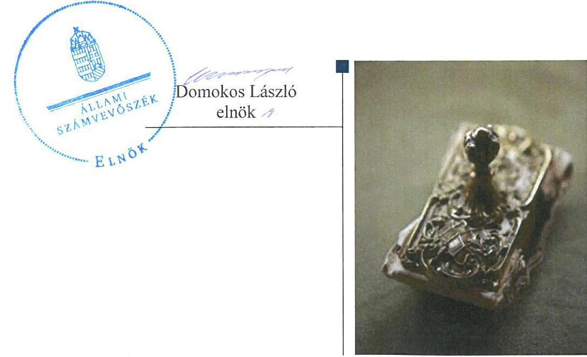
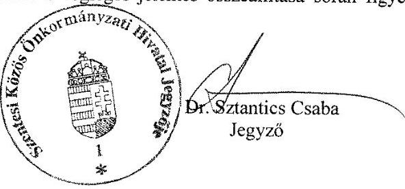
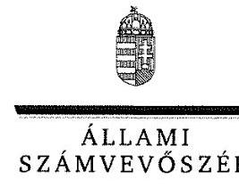
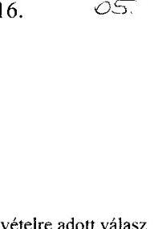
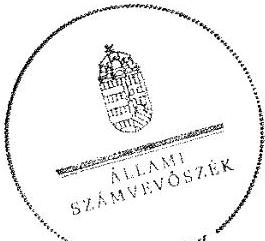
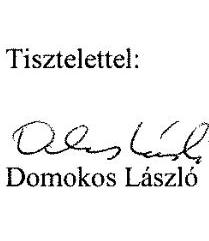
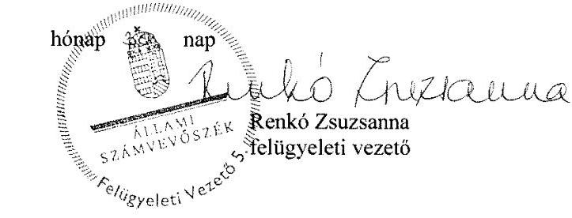

# Jelentés 

## A helyi nemzetiségi önkormányzatok gazdálkodása

A helyi nemzetiségi önkormányzatok gazdálkodása szabályszerűségének ellenőrzése - Szentesi Roma Nemzetiségi Önkormányzat 2016.

---

# A helyi nemzetiségi önkormányzatok gazdálkodása 

A helyi nemzetiségi önkormányzatok gazdálkodása szabályszerűségének ellenőrzése - Szentesi Roma
Nemzetiségi Önkormányzat
2016. 06. hó 15. nap

---

# AZ ELLENŐRZÉST FELÜGYELTE:

- RENKŐ ZSUZSANNA felügyeleti vezető
- AZ ELLENŐRZÉST VEZETTE ÉS A VÉGREHAJTÁSÁÉRT FELELŐS:
  - DR. TIMÁR BALÁZS ellenőrzésvezető
  - A PROGRAM ÖSSZEÁLLÍTÁSÁÉRT FELELŐS:
    - JANIK JÓZSEF LÁSZLÓ osztályvezető

- IKTATÓSZÁM: V-0866-102/2016
- TÉMASZÁM: 29
- ELLENŐRZÉS-AZONOSÍTÓ SZÁM: V0714

Jelentéseink az Országgyűlés számítógépes hálózatán és az Interneten a www.asz.hu címen is olvashatóak.

---

# TARTALOMJEGYZÉK 

■ ÖSSZEGZÉS ..... 5
■ AZ ELLENŐRZÉS CÉLJA ..... 6
■ AZ ELLENŐRZÉS TERÜLETE ..... 7
■ AZ ELLENŐRZÉS HÁTTERE, INDOKOLTSÁGA ..... 8
■ FÓKUSZKÉRDÉSEK ..... 9
■ ELLENŐRZÉS HATÓKÖRE ÉS MÓDSZEREI ..... 10
■ MEGÁLLAPÍTÁSOK ..... 12
■ JAVASLATOK ..... 19
■ MELLÉKLETEK ..... 21
I. Sz. melléklet: Értelmező szótár. ..... 21
II. Sz. melléklet: Gazdálkodási adatok ..... 23
■ FÜGGELÉK: ÉSZREVÉTELEK ..... 25
■ RÖVIDÍTÉSEK JEGYZÉKE ..... 29

---

.

---

# ÖSSZEGZÉS 

Az Állami Számvevőszék a Szentesi Roma Nemzetiségi Önkormányzat 2014. évi gazdálkodása szabályszerűségét ellenőrizte. Az ellenőrzési megállapítások alapján a gazdálkodási feladatok szabályozottsága, ezek végrehajtása, ellátása nem felelt meg az előírásoknak. A Települési Önkormányzattal kötött együttműködési megállapodással rendelkezett, ennek felülvizsgálatára azonban nem a jogszabályi előírásban foglaltak szerint került sor. A belső ellenőrzést biztosították, azonban a 2014. évben belső ellenőrzést nem végeztek. Az integritás szemlélet érvényesülése érdekében további intézkedések szükségesek.

## Az ellenőrzés társadalmi indokoltsága

Az Állami Számvevőszék középtávra szóló stratégiájában megfogalmazta, hogy az államháztartás komplex folyamatainak átláthatósága érdekében rendszerszemléletű/holisztikus megközelítésű, egymásra épülő, a szinergiahatást kihasználó, összefoglaló értékelésre lehetőséget adó ellenőrzéseket végez. Az államháztartás önkormányzati alrendszerébe tartozó helyi nemzetiségi önkormányzatok ellenőrzése során az ÁSZ ${ }^{1}$ feltárja a működésükben rejlő kockázatokat előmozdítva a közpénzügyek átláthatóságát, rendezettségét.

Az ÁSZ a stratégiai céljával összhangban - az ÁSZ tv. felhatalmazása alapján - végzi a közpénzekkel és a nemzeti vagyonnal való felelős gazdálkodás, valamint a helyi nemzetiségi önkormányzatok számviteli rendje betartásának és belső kontrollrendszere működésének ellenőrzését, továbbá segíti az integritás alapú, átlátható és elszámoltatható közpénzfelhasználás megteremtését.

## Főbb megállapítások, következtetések, javaslatok

A Nemzetiségi Önkormányzat² működési feltételeinek és a gazdálkodással összefüggő feladatoknak a szabályozása a jogszabályi előírásoknak nem felelt meg. A Települési Önkormányzattal ${ }^{3}$ történő együttműködésre a Nemzetiségi Önkormányzat rendelkezett együttműködési megállapodással ${ }^{4}$, ezt azonban az ellenőrzött év január 31-ig nem, csak az általános választást ${ }^{5}$ követően vizsgálták felül, melynek eredményeképpen új megállapodást ${ }^{6}$ kötöttek. Az együttműködési megállapodás és a megállapodás ${ }^{6}$ szerinti működési feltételeket a Nemzetiségi Önkormányzat SZMSZ ${ }^{7}$ -ében nem rögzítették. A jegyző ${ }^{8}$ - kisebb szabályozási hiányosságok ellenére - intézkedett a Nemzetiségi Önkormányzat működési feltételei kialakításával és gazdálkodásával összefüggő végrehajtási feladatok szabályozására a Hivatalnál ${ }^{9}$.

A gazdálkodási feladatok ellátása során a jegyző nem tartotta be a jogszabályi előírásokat. A gazdálkodás számviteli szabályozottsága nem volt megfelelő. A zárszámadási határozat tervezetét a megállapodás ${ }^{6}$ -ben foglalt határidőn túl készítette elő. A gazdálkodási jogkörök gyakorlása során a személyi jellegű kifizetéseknél a teljesítésigazolás és az érvényesítés, a dologi kiadások esetében az érvényesítés nem volt megfelelő. Az érvényesítő kijelölése tekintetében az együttműködési megállapodás, a megállapodás ${ }^{6}$ eltérően szabályozott a Gazdálkodási szabályzat ${ }^{10}$ rendelkezésétől.

Az együttműködési megállapodásnak és a megállapodás ${ }^{6}$-nak megfelelően biztosított volt a Nemzetiségi Önkormányzat gazdálkodásának belső ellenőrzése, a kockázatelemzés azonban nem tért ki a Nemzetiségi Önkormányzatra, ezért belső ellenőrzést nem terveztek és nem is végeztek.

Az integritás szemlélet érvényesítésének erősítése érdekében a Nemzetiségi Önkormányzat működési és gazdálkodási kereteinek kialakításánál és működésénél további intézkedések megtétele szükséges.

---

# AZ ELLENŐRZÉS CÉLJA 

## Szentesi Roma Nemzetiségi Önkormányzat

Az ellenőrzés célja annak megállapítása, hogy a helyi nemzetiségi önkormányzatok működési és gazdálkodási kereteinek kialakítása, a gazdálkodással kapcsolatos feladatok ellátása megfelelt-e a jogszabályoknak, továbbá a helyi nemzetiségi önkormányzat működési és gazdálkodási kereteinek kialakítása és működése erősítette-e az integritás szemlélet érvényesülését.

---

# AZ ELLENŐRZÉS TERÜLETE 

## Szentesi Roma Nemzetiségi Önkormányzat

Szentes Város a Dél-Alföldön, Csongrád megyében található. Népességszáma 2014. január 1-jén 28190 fő volt.

A Képviselő-testület ${ }^{11}$ 2014. év végén négy fővel látta el feladatait. A Nemzetiségi Önkormányzat elnöke személyében 2014. október 27-én, a települési nemzetiségi önkormányzati képviselőválasztást követően következett be változás.

A Nemzetiségi Önkormányzat gazdálkodási feladatait ellátó Hivatal átlaglétszáma a 2014.évben 84 fő volt. A Hivatal élén álló jegyző személye az ellenőrzött időszakban nem változott.

A Nemzetiségi Önkormányzat állandó bizottságot, költségvetési szervet nem tartott fenn.

Költségvetési beszámolója szerint a 2014. évet 1700 ezer Ft bevétellel, 1428 ezer Ft kiadással és 272 ezer Ft maradványnyal zárta. A könyvviteli mérleg szerinti eszközvagyon 301 ezer Ft volt. Az ellenőrzött évben a Nemzetiségi Önkormányzat feladatalapú támogatást nem kapott.

A gazdálkodás részletes adatait a II. Sz. melléklet mutatja be.

---

# AZ ELLENŐRZÉS HÁTTERE, INDOKOLTSÁGA 

A 2014. évben megtartott nemzetiségi önkormányzati választásokat követően 2143 települési, 60 területi és 13 országos nemzetiségi önkormányzat alakult meg. A nemzetiségek helyzete, támogatása mind hazai, mind Európai Uniós szinten kiemelt figyelmet kap napjainkban. A helyi nemzetiségi önkormányzatok ellenőrzéseit az ÁSZ önálló ellenőrzésként, vagy a települési önkormányzatoknál végzett ellenőrzéseihez kapcsolódóan, arra épülve folytatja le.

## Az ellenőrzés több szinten hasznosul

Az Alaptörvény Szabadság és felelősség rész, XXIX. cikk (1) bekezdése szerint a Magyarországon élő nemzetiségek államalkotó tényezők. Az országban élő nemzetiségek - Alaptörvényben biztosított - jogainak, valamint a helyi és országos önkormányzat létrehozási jogának általános intézményi kereteit sarkalatos törvényként a Nek tv. szabályozza. A nemzetiségi önkormányzatok jogi személyek és a Nek tv.-ben meghatározott önálló feladat- és hatáskörökkel rendelkeznek, az államháztartás részét, az önkormányzati alrendszer egyik elemét képezik. A Mötv. 13. § (1) bekezdés 16. pontja alapján a települési önkormányzatok által - a helyi közügyek, valamint a helyben biztosítható közfeladatok körében - ellátandó helyi önkormányzati feladat a nemzetiségi ügyek ellátása. A helyi nemzetiségi önkormányzatok gazdálkodási feladatait jogszabályi előírás alapján a székhely települési önkormányzat polgármesteri (önkormányzati/közös) hivatala látja el.

A „helyi nemzetiségi önkormányzatok" gyűjtőfogalom, magában foglalja mind a települési nemzetiségi önkormányzatok, mint pedig a területi nemzetiségi önkormányzatok teljes körét. A gazdálkodásukra és támogatási rendszerükre vonatkozó jogszabályok az utóbbi években jelentős változásokon mentek át.

Az ellenőrzés hasznosulása több szinten várható. Az ellenőrzött szervezet szintjén az ellenőrzés feltárja a nemzetiségi önkormányzat működésében, gazdálkodásában, belső kontrollrendszere működtetésében és a belső ellenőrzés biztosításában lévő hiányosságokat. Az ellenőrzés javaslataival ezen a területen is hozzájárul a közpénzek szabályos felhasználásához. Az ellenőrzött terület szintjén az ellenőrzés tájékoztatást nyújt a döntéshozóknak a hiányosságokról, ezzel lehetőséget biztosítva arra, hogy az ÁSZ ellenőrzési megállapításai, javaslatai a nem ellenőrzött szervezeteknek a működése során is hasznosuljanak. A társadalom számára jelzi, hogy a jelentős számú nemzetiségi önkormányzat gazdálkodása, illetve működéséhez felhasznált közpénz nem maradhat ellenőrizetlenül.

---

# FÓKUSZKÉRDÉSEK 

1. A helyi nemzetiségi önkormányzat működési feltételeinek és a gazdálkodással összefüggő feladatoknak a szabályozása megfelel-e a jogszabályi előírásoknak?
2. A jegyző és a helyi nemzetiségi önkormányzat betartotta-e a jogszabályi előírásokat a helyi nemzetiségi önkormányzat gazdálkodási feladatainak ellátása során?
3. Szabályszerűen biztosított volt-e a helyi nemzetiségi önkormányzat gazdálkodásának belső ellenőrzése?
4. A helyi nemzetiségi önkormányzat működési és gazdálkodási kereteinek kialakítása és működése erősítette-e az integritás szemlélet érvényesülését?

---

# ELLENŐRZÉS HATÓKÖRE ÉS MÓDSZEREI 

## Az ellenőrzés típusa

Szabályszerűségi ellenőrzés

## Az ellenőrzött időszak

A Nemzetiségi Önkormányzat működési feltételeinek kialakításával és a Hi-
vatal - Nemzetiségi Önkormányzat gazdálkodására vonatkozó - feladatellátásával kapcsolatos szabályozás megfelelőségét a 2014. évre vonatkozóan (a 2014. december 31-i állapotnak megfelelően) minősítettük. A
Nemzetiségi Önkormányzat gazdálkodása szabályszerűségét, a működési
feltételeknek, a pénzügyi folyamatokban kulcsszerepet betöltő teljesítésigazolás és érvényesítés belső kontrollok működésének megfelelőségét,
valamint a belső ellenőrzés biztosítását a 2014. január 1. - december 31-e
közötti időszakot figyelembe véve értékeltük.

## Az ellenőrzés tárgya

A Szentesi Roma Nemzetiségi Önkormányzat működési kereteinek kialakítása, a működésével, gazdálkodásával kapcsolatos feladatoknak a Hivatal, valamint a Nemzetiségi Önkormányzat által történő ellátása.

Az ellenőrzés kiterjedt minden olyan körülményre és adatra, amely az ÁSZ jogszabályban meghatározott feladataiban, valamint a program végrehajtása folyamán felmerült újabb összefüggések feltárásához szükséges.

## Az ellenőrzött szervezet

Szentesi Roma Nemzetiségi Önkormányzat, Szentesi Közös Önkormányzati Hivatal

## Az ellenőrzés jogalapja

Az ÁSZ tv. 1. § (3) bekezdésében foglaltak alapján az ÁSZ általános hatáskörrel végzi a közpénzekkel és az állami és önkormányzati vagyonnal való felelős gazdálkodás ellenőrzését, valamint az 5. § (2) bekezdése alapján a helyi nemzetiségi önkormányzatok gazdálkodásának és (6) bekezdése alapján a helyi nemzetiségi önkormányzatok számviteli rendje betartásának és belső kontrollrendszere működésének ellenőrzését.

---

# Az ellenőrzés módszerei 

Az ellenőrzést a nemzetközi standardokat irányadónak tekintve a program ellenőrzési kérdései, az ellenőrzött időszakban hatályos jogszabályok, az ellenőrzés szakmai szabályok és módszertanok figyelembe vételével végeztük el.

Az ellenőrzés ideje alatt az ellenőrzött szervezettel történő kapcsolattartást az ÁSZ Szervezeti és Működési Szabályzatának vonatkozó előírásai alapján biztosítottuk.

Az ellenőrzési kérdések megválaszolásához szükséges bizonyítékok megszerzése a következő ellenőrzési eljárások alkalmazásával történt: megfigyelés, szemle (szemrevételezés), kérdésfeltevés (információkérés), mintavételezés, valamint elemző eljárás.

A pénzügyi folyamatokban kulcsszerepet betöltő teljesítésigazolás és érvényesítés kontrollok működése megfelelőségének ellenőrzéséhez a személyi juttatásokat, dologi kiadásokat, az egyéb működési és felhalmozási célú kiadásokkal kapcsolatos kifizetéseket tételesen ellenőriztük. Beruházási, felújítási kiadásokkal és az ellátottak pénzbeli juttatásaival a Nemzetiségi Önkormányzat az ellenőrzött időszakban nem rendelkezett. „Megfelelőnek" értékeltük a gazdálkodási jogkörök gyakorlását, amennyiben a hibaarány legfeljebb 10\%, „részben megfelelőnek" értékeltük, ha a hibaarány 10-30\% között volt, „nem megfelelőnek" pedig akkor, ha az eredmények alapján a hibaarány meghaladta a 30\%-ot.

Az integritás szemlélet érvényesülésének értékelése a Hivatal által kitöltött tanúsítvány alapján történt.

Az ellenőrzési bizonyítékok alapvetően dokumentum jellegűek voltak. Az ellenőrzési bizonyítékként felhasználható adatforrások közé tartoztak egyrészt a szakmai program részletes szempontjainál felsorolt adatforrások, másrészt adatforrás lehetett még minden egyéb - az ellenőrzés folyamán feltárt, az ellenőrzés szempontjából releváns információt tartalmazó - dokumentum.

Az ellenőrzés lefolytatásához a Hivatal a tanúsítványok elektronikus kitöltésével, valamint az ÁSZ által kért dokumentumok elektronikus megküldésével szolgáltatott adatokat. A rendelkezésre bocsátott adatok, információk kontrollja az ellenőrzés keretében történt.

---

# MEGÁLLAPÍTÁSOK 

## 1. A helyi nemzetiségi önkormányzat működési feltételeinek és a gazdálkodással összefüggő feladatoknak a szabályozása megfelel-e a jogszabályi előírásoknak?

Összegző megállapítás

1.1. számú megállapítás

A Nemzetiségi Önkormányzat működési feltételeinek és a gazdálkodással összefüggő feladatoknak a szabályozása a jogszabályi előírásoknak nem felelt meg.

A Nemzetiségi Önkormányzat rendelkezett megállapodással a Települési Önkormányzattal történő együttműködésre. Az együttműködési megállapodást 2014. január 31-ig nem, csak a 2014. évi választásokat követően vizsgálta felül. Az együttműködési megállapodás szerinti működési feltételeket az SZMSZ-ben nem rögzítették.

A Nemzetiségi Önkormányzat az ellenőrzött időszakban rendelkezett a Települési Önkormányzattal kötött - a Képviselő-testület által jóváhagyott és az elnök által aláírt - együttműködési megállapodással.
 Az együttműködési megállapodás Nek. tv. ${ }^{12} 80$. § (2) bekezdésében előírt, minden év január 31-éig esedékes felülvizsgálata az ellenőrzött évben nem történt meg.

Az együttműködési megállapodás szerinti működési feltételeket annak megkötését követően - a Nek. tv. 80. § (2) bekezdésében foglaltak ellenére - a Nemzetiségi Önkormányzat nem rögzítette az SZMSZ-ében.

A Nemzetiségi Önkormányzat - eleget téve a Nek. tv. 80. § (2) bekezdésében előírt, általános választáshoz kapcsolódó felülvizsgálati kötelezettségének - 2014. december 1-jei hatállyal új megállapodás ${ }_{2}$t kötött a Települési Önkormányzattal. Az SZMSZ-ben a megállapodás ${ }_{2}$ szerinti működési feltételeket - a Nek. tv. 80. § (2) bekezdésének előírása ellenére annak megkötését követő 30 napon belül nem rögzítették.

A Kormányhivatal törvényességi felügyeleti eszközökkel a Nemzetiségi Önkormányzatot érintően az ellenőrzött időszakban nem élt.

Az együttműködési megállapodás és a megállapodás ${ }_{2}$ a Nek. tv. 80. § (1) bekezdésében foglaltaknak megfelelően tartalmazta a Nemzetiségi Önkormányzat működési feltételeit és az ezzel kapcsolatos végrehajtási feladatokat.

Az együttműködési megállapodás és a megállapodás ${ }_{2}$ a Nek. tv. 80. § (4) bekezdésének megfelelően tartalmazta a jegyző számára a Képviselőtestület ülésein részvételi, törvénysértés észlelése esetén az ülésen történő jelzési feladatát. A jegyző, a jelenléti ívek tanúsága szerint az ellenőrzött időszak valamennyi képviselő-testületi ülésén jelen volt.

---

1.2. számú megállapítás

A jegyző a Hivatal SZMSZ-ének tartalmi hiányosságai, továbbá a FEUVE Nemzetiségi Önkormányzatra történő kiterjesztésének elmaradása ellenére intézkedett a Nemzetiségi Önkormányzat működési feltételei kialakításával és gazdálkodásával összefüggő végrehajtási feladatok szabályozására a Hivatalnál.

A Hivatal SzMSz-ének ${ }^{13}$ II. fejezet 4. pontja rögzítette, hogy a jegyző ellátja a Nemzetiségi Önkormányzat működésével kapcsolatos igazgatási feladatokat.
2014. évben a Hivatal SzMSz-e a Nemzetiségi Önkormányzat gazdálkodásával kapcsolatos - a munkakörökhöz tartozó - feladat- és hatásköröket, a hatáskörök gyakorlásának módjára, a helyettesítés rendjére, az ezekhez tartozó felelősségi szabályokra vonatkozó előírásokat az Ávr. ${ }^{14}$ 13. § (1) bekezdés g) pontjában foglalt előírása ellenére nem tartalmazta. A Számviteli és Tervezési Iroda ügyrendjében meghatározták a gazdasági feladatot ellátó vezetők és a gazdasági feladatot ellátó alkalmazottak helyettesítésének rendjét. A Nemzetiségi Önkormányzat gazdálkodásával kapcsolatos feladatok és hatáskörök a feladatot ellátó köztisztviselők munkaköri leírásaiban szerepeltek.

Az ellenőrzött időszakban a Hivatalnak a Nemzetiségi Önkormányzatra is kiterjesztett Gazdálkodási szabályzatában, Számlarendjében ${ }^{15}$ rendezte az Ávr. 13. §(2) bekezdés a) pontja szerint a Nemzetiségi Önkormányzat működéséhez kapcsolódó, pénzügyi kihatással bíró, jogszabályban nem szabályozott - a tervezéssel, gazdálkodással, ellenőrzési, adatszolgáltatási és beszámolási feladatok teljesítésével összefüggő - kérdéseket.

A jegyző által 2014.évre kiadott FEUVE ${ }^{16}$ az ellenőrzési nyomvonalat és a szabálytalanságok kezelésének eljárásrendjét tartalmazta, a FEUVE hatályát azonban a Nemzetiségi Önkormányzatra nem terjesztette ki. Ezáltal a jegyző a FEUVE-t - a Bkr 8. § (2) - (4) bekezdéseiben előírtak ellenére nem biztosította, továbbá a Nemzetiségi Önkormányzat ellenőrzési nyomvonalát - a Bkr. ${ }^{17}$ 6. § (3) bekezdésében előírtak ellenére - nem készítette el, és a szabálytalanságok kezelésének eljárásrendjét - a Bkr. 6. § (4) bekezdésében előírtak ellenére - nem szabályozta.

# 2. A jegyző és a helyi nemzetiségi önkormányzat betartotta-e a jogszabályi előírásokat a helyi nemzetiségi önkormányzat gazdálkodási feladatainak ellátása során? 

Összegző megállapítás

A Nemzetiségi Önkormányzat gazdálkodási feladatainak ellátása során nem tartották be a jogszabályi előírásokat.

### 2.1. számú megállapítás

A Nemzetiségi Önkormányzat gazdálkodásának számviteli szabályozottsága - a számviteli politika keretében elkészített leltározási szabályzat jogszabályban előírt aktualizálásának elmaradása, továbbá az egységes számlakerettől való eltérés miatt - nem volt megfelelő.

A jegyző a jogszabályi előírásoknak megfelelően kialakította a Nemzetiségi Önkormányzatra is kiterjesztett - 2014. január 1-jétől hatályos - számviteli

---

politikát. A számviteli politika részeként készítették el az értékelési szabályzatot ${ }^{18}$, valamint a pénzkezelési szabályzatot ${ }^{19}$.

A 2007. június 1-jétől hatályos leltározási szabályzatot - a Számv. tv. 14. § (11) bekezdése előírása ellenére - nem aktualizálták, így abban a Nemzetiségi Önkormányzat részben önálló intézményként szerepelt, a szabályzat hatályon kívül helyezett jogszabályokra hivatkozott, valamint a törvényi változásokat sem vezették át.

A számlarendben foglalt szabályokat a jegyző 2014. február 4-én kiadott jegyzői utasításban a Nemzetiségi Önkormányzat gazdálkodása vonatkozásában is kötelezővé tette a szervezet sajátosságainak figyelembe vétele mellett.

A Nemzetiségi Önkormányzat tételes számlatükre szerint - az Áhsz. ${ }^{20}$ 51. § előírása ellenére - a kötelezően alkalmazandó egységes számlakerettől eltértek, mert a nyilvántartási számlák közül több számla nem felelt meg az Áhsz. 16. melléklete szerinti egységes számlakeretben rögzítetteknek.*

Az együttműködési megállapodás és a megállapodás ${ }_{2}$ tartalmazta a költségvetési gazdálkodás szabályait, a gazdálkodási jogkörök gyakorlásának rendjét, valamint utóbbi vonatkozásában az összeférhetetlenségi szabályokat. Az együttműködési megállapodásban és a megállapodás ${ }_{2}$ben rögzítették, hogy a Nemzetiségi Önkormányzat operatív gazdálkodásának rendjét, felelőseinek és a helyettesítés rendjének meghatározását a gazdálkodási szabályzat tartalmazza.

# 2.2. számú megállapítás 

## A jegyző a zárszámadási határozat tervezetét a megállapodás ${ }_{2}$ben foglalt határidőn túl készítette elő.

Az elnök ${ }^{21}$ a jogszabályi előírásoknak megfelelő határidőben benyújtotta a Képviselő-testület részére a jegyző által előkészített a 2014. évre vonatkozó költségvetési koncepciót.

A jegyző 2014. január 31-ei keltezéssel előkészítette a Nemzetiségi Önkormányzat 2014. évi költségvetési határozat-tervezetét, amelyet az elnök a jogszabályi előírások szerinti határidőben benyújtott a Képviselő-testületnek. A 2014. évi költségvetést a Képviselő-testület a 2/2014. (II. 05.) számú határozatával fogadta el.

A Nemzetiségi Önkormányzat 2014. évi jóváhagyott költségvetési határozata a jogszabályi előírásoknak megfelelően tartalmazta a költségvetési bevételeket és költségvetési kiadásokat előirányzat-csoportok, kiemelt előirányzatok, valamint kötelező feladatok, önként vállalt feladatok és állami feladatok szerinti bontásban.

A 2014. évi költségvetés előterjesztésekor a Képviselő-testület részére szöveges indokolással együtt mutatták be - közgazdasági tagolásban - a költségvetési mérleget és az előirányzat felhasználási tervet.

[^0]
[^0]:    * Az egységes számlakeret szerint a 091 számla a „működési célú támogatások államháztartáson belülről", a Nemzetiségi Önkormányzat számlatükrében ez a „befektetett eszközök nyilvántartási ellenszámlája". A 094 számla az egységes számlakeret szerint a „működési bevételek nyilvántartási számlája", a helyi nemzetiségi önkormányzat számlatükrében a „kötelezettségek nyilvántartási ellenszámla".

---

A jegyző által elkészített elemi költségvetés tartalma megegyezett az elfogadott költségvetési határozat tartalmával.

A jegyző nem gondoskodott a Nemzetiségi Önkormányzat 2014. évi zárszámadási határozat-tervezetének a megállapodás ${ }_{2} 5$. pontjában előírt határidőre történő előkészítéséről.

A jegyző által 2015. május 18-án előkészített zárszámadási határozattervezetet az elnök - a megállapodás ${ }_{2} 5$. pontjában előírt határidő ellenére - 2015. május 27-én terjesztette a Képviselő-testület elé, melyet az - az Áht. ${ }^{22}$ 91. § (1) bekezdésének megfelelő határidőn belül - elfogadott.

A zárszámadási határozat-tervezet előterjesztésekor a Nemzetiségi Önkormányzat Képviselő-testülete részére tájékoztatásul szöveges indoklással együtt mutatták be a jogszabályi előírásoknak megfelelő mérlegeket és kimutatásokat.

A 2014. évi elfogadott zárszámadási határozat és az elfogadott költségvetés összehasonlíthatósága az Áht. előírásainak megfelelően biztosított volt.

A jegyző a Nemzetiségi Önkormányzatra vonatkozó - az együttműködési megállapodás 3.2. pontjában meghatározott - államháztartási információs adatszolgáltatásokat - az I. negyedéves időközi költségvetési jelentés pár napos késedelmén kívül - az Ávr.-ben és az Áhsz.-ben foglaltaknak megfelelő határidőben teljesítette a Kincstár felé.
2.3. számú megállapítás

A gazdálkodási jogkörök gyakorlása során a személyi jellegű kifizetéseknél a teljesítésigazolás és az érvényesítés, a dologi kiadások esetében az érvényesítés nem volt megfelelő. Az érvényesítő kijelölését az együttműködési megállapodásban és a megállapodás ${ }_{2}$ben a Gazdálkodási szabályzat vonatkozó rendelkezésétől eltérően szabályozták.

A jegyző a Gazdálkodási szabályzatban szabályozta a Nemzetiségi Önkormányzatra vonatkozóan az operatív gazdálkodási jogkörök gyakorlásának módjával, eljárási és dokumentációs részletszabályaival, valamint a gazdálkodási jogköröket gyakorló személyek kijelölésének rendjével kapcsolatos előírásokat.

A Nemzetiségi Önkormányzat vonatkozásában a Gazdálkodási szabályzatban a kötelezettségvállalás, a kötelezettségvállalás pénzügyi ellenjegyzése és utalványozás jogkörök kialakítása megfelelt az előírásoknak. A Gazdálkodási szabályzat a teljesítés igazolását tekintve külön a Nemzetiségi Önkormányzatra vonatkozóan nem tartalmazott rendelkezést, az együttműködési megállapodásban és a megállapodás ${ }_{2}$ben azonban kellő részletességgel szabályozták a teljesítés-igazolásra jogosultak körét, gyakorlásának módját. Az együttműködési megállapodás és a megállapodás ${ }_{2}$ tartalmazta továbbá a költségvetési gazdálkodás szabályait és az összeférhetetlenségi szabályokat is.

A Hivatal - az Ávr. 8. § (1) bekezdésének c) pontja előírása ellenére - az ellenőrzött évben gazdasági szervezettel nem rendelkezett, a Nemzetiségi Önkormányzat kiadási előirányzata terhére vállalt kötelezettség pénzügyi ellenjegyzési és érvényesítési feladatra a jegyző jelölte ki - az együttműködési megállapodás és a megállapodás ${ }_{2}$ 6.4. pontja alapján - a köztisztviselőket. A kijelölt pénzügyi ellenjegyzők és az érvényesítők rendelkeztek a

---

jogszabályban előírt végzettséggel. A gazdálkodási szabályzat szerint - eltérően az együttműködési megállapodás és a megállapodás; rendelkezéseitől - az érvényesítési feladatok ellátására kizárólag a Számviteli és Tervezési Iroda vezetője adhatott megbízást.

A személyi juttatásokkal kapcsolatos kifizetések során a kontrollok nem működtek megfelelően. A teljesítés igazolása - jelenléti ív vagy a munkavállalóval kötött munkaszerződés vagy megbízás teljesítésének leigazolása - az ellenőrzés alá vont tételek esetében - az Ávr. 57. § (1) bekezdése ellenére - nem történt meg.

A személyi jellegű kifizetésekkel kapcsolatos tételek érvényesítése nem volt megfelelő, mivel az érvényesítő - az Ávr. 58. § (1) bekezdésének előírása ellenére - nem kifogásolta a teljesítésigazolás hiányát, továbbá nem ellenőrizte a fedezet meglétét és azt, hogy a megelőző ügymenetben az Áht., az Ávr. és az Áhsz. előírásait, továbbá a belső szabályzatokban foglaltakat megtartották-e.

A személyi jellegű kifizetések az elnök munkabérével kapcsolatban merültek fel, amelynek előirányzata a Nemzetiségi Önkormányzat 2014. évi költségvetésében szerepelt. A gyakorlatban a személyi jellegű kifizetésekkel kapcsolatos tételek pénzügyi teljesítése a Hivatal munkabér átvezetési számlájáról történt, amelynek során az elnök részére átutalt munkabért (személyi juttatást) a Hivatal a Nemzetiségi Önkormányzat részére nyújtott működési célú támogatásként könyvelte le. A Nemzetiségi Önkormányzat számviteli elszámolásában pénzforgalom nélküli tételként került könyvelésre a személyi juttatás, mint kiadás és a működési célra kapott támogatás, mint bevétel összege. A személyi jellegű kifizetések elszámolása során megsértették a Számv. tv. 15. § (3) - (4) bekezdésében foglalt valódiság és világosság számviteli alapelveit.

A dologi kiadások vonatkozásában a teljesítés igazolása valamennyi ellenőrzött esetben szabályosan megtörtént. A dologi kiadási tételek érvényesítése során - az Ávr. 58. § (4) bekezdésének előírását megsértve - az érvényesítő egy esetben - a Nemzetiségi Önkormányzat vonatkozásában a gazdálkodási jogkört gyakorlók nyilvántartását alapul véve - nem rendelkezett kijelöléssel. Az érvényesítés során a főkönyvi számla kijelölési szabályok betartásának ellenőrzését - az Ávr. 58. § (1) bekezdése ellenére, mely szerint az érvényesítőnek azt is ellenőriznie kell, hogy a megelőző ügymenetben az Áhsz. előírásait betartották-e - nem végezték el.

A Nemzetiségi Önkormányzat kiadási tételei között beruházási tételek, ellátottak pénzbeli juttatásai nem szerepeltek.

---

# 3. Szabályszerűen biztosított volt-e a helyi nemzetiségi önkormányzat gazdálkodásának belső ellenőrzése? 

Összegző megállapítás

Az együttműködési megállapodásnak és a megállapodás2-nek megfelelően biztosított
 volt a Nemzetiségi Önkormányzat gazdálkodásának belső ellenőrzése. Az ellenőrzési tervet megalapozó kockázatelemzés azonban nem tartalmazta a Nemzetiségi Önkormányzat gazdálkodásával kapcsolatos kockázatokat. A Nemzetiségi Önkormányzatnál a 2014. évben nem terveztek és nem is végeztek belső ellenőrzést.
3.1. számú megállapítás

Az együttműködési megállapodás és a megállapodás ${ }_{2}$ a Nemzetiségi Önkormányzat belső ellenőrzési feladatainak ellátását tartalmazta.

Az együttműködési megállapodás és a megállapodás ${ }_{2}$ - annak 9. pontjában - rögzítette, hogy a Nemzetiségi Önkormányzat belső ellenőrzését önkormányzati társulás keretében megbízott belső ellenőr (együttműködési megállapodás), illetve a Hivatal belső ellenőre (megállapodás ${ }_{2}$ ) végzi, továbbá „belső ellenőrzésre a kockázatelemzéssel alátámasztott éves belső ellenőrzési tervben meghatározottak szerint kerül sor".
3.2. számú megállapítás

Az éves ellenőrzési tervet megalapozó kockázatelemzés a Nemzetiségi Önkormányzat kockázatainak felmérésére nem terjedt ki.

A belső ellenőr a 2014. költségvetési évre elkészített kockázatelemzése során nem tért ki a Nemzetiségi Önkormányzat gazdálkodásában rejlő kockázatok - a Bkr. 29. § (1) bekezdésében foglaltak szerinti kockázatelemzés alapján történő - felmérésére, ennek következtében a jóváhagyott éves ellenőrzési terv nem tartalmazott belső ellenőrzési feladatokat a Nemzetiségi Önkormányzat gazdálkodására vonatkozóan.

## 4. A helyi nemzetiségi önkormányzat működési és gazdálkodási kereteinek kialakítása és működése erősítette-e az integritás szemlélet érvényesülését?

Összegző megállapítás

Az integritás szemlélet érvényesítésének erősítése érdekében a Nemzetiségi Önkormányzat működési és gazdálkodási kereteinek kialakításánál és működésénél további intézkedések megtétele szükséges.

Jelen ellenőrzés keretében a Hivatal által kitöltött tanúsítványi adatszolgáltatás alapján értékeltük az integritás szemlélet érvényesülését.

A Hivatal rendelkezett a jogszabályokban előírt szabályzatok többségével, azonban etikai szabályzatot nem alkottak, nem szabályozták a szervezeten belüli közérdekű bejelentők védelmét, illetve a különféle ajándékok,

---

meghívások, utazások elfogadásának feltételeit. Rendszeres kockázatelemzést, illetve rendszeres korrupciós kockázatelemzést nem végeztek, továbbá az elmúlt három évben korrupcióellenes képzést a Hivatal dolgozói részére nem tartottak.

Az ÁSZ ellenőrzés megállapította, hogy a Nemzetiségi Önkormányzat működési feltételeinek és a gazdálkodással összefüggő végrehajtási feladatoknak a szabályozása nem felelt meg a jogszabályi előírásoknak. Az operatív gazdálkodási jogkörök kialakításában, illetve a kulcsszerepet betöltő teljesítésigazolás és érvényesítés belső kontrollok működésében feltárt hiányosságok arra utalnak, hogy a Nemzetiségi Önkormányzat gazdálkodása szabályszerű működésénél még intézkedéseket kell tenni az integritás szemlélet érvényesítésében.

---

# JAVASLATOK 

Az ÁSZ tv. ${ }^{23}$ 33. § (1) bekezdésében foglaltak értelmében az ellenőrzött szervezet vezetője köteles a jelentésben foglalt megállapításokhoz kapcsolódó intézkedési tervet összeállítani és azt a jelentés kézhezvételétől számított 30 napon belül az ÁSZ részére megküldeni. Amennyiben az intézkedési tervet határidőre nem küldi meg a szervezet, vagy amennyiben az nem elfogadható, az ÁSZ elnöke az ÁSZ tv. 33. § (3) bekezdés a)-b) pontjaiban foglaltakat érvényesítheti.

## a jegyzőnek:

1. A Települési és a Nemzetiségi Önkormányzat együttműködésének szabályszerűsége érdekében intézkedjen:
a) a Hivatal szervezeti és működési szabályzata jogszabályi előírásoknak megfelelő tartalmú kiegészítéséről;
(1.2. sz. megállapítás 2. bekezdése alapján)
b) a megállapodás ${ }_{2}$ szerinti működési feltételek rögzítése céljából a Nemzetiségi Önkormányzat szervezeti és működési szabályzata módosítása elkészítéséről.
(1.1 sz. megállapítás 3. bekezdése alapján)
2. A Nemzetiségi Önkormányzat gazdálkodásának szabályszerűsége érdekében intézkedjen:
a) a számviteli előírásokkal kapcsolatos szabályok meghatározása érdekében a hatályos jogszabályi előírásoknak megfelelő, aktualizált szabályozások jóváhagyásáról;
(2.1. sz. megállapítás 2. és 4. bekezdései alapján)
b) a Nemzetiségi Önkormányzat gazdálkodási feladataira vonatkozó ellenőrzési nyomvonal elkészítéséről, a szabálytalanságok kezelésének eljárásrendje szabályozásáról és a FEUVE jogszabályi előírásoknak megfelelő biztosításáról;
(1.2. sz. megállapítás 4. bekezdése alapján)
c) a zárszámadási határozattervezet megállapodás ${ }_{2}$-ben foglaltaknak megfelelő határidőben történő előkészítéséről;
(2.2. megállapítás 6. bekezdése alapján)

---

d) az érvényesítésre jogosult személyek kijelölésére vonatkozó eltérő szabályok megszüntetéséről;
(2.3. sz. megállapítás 3. bekezdés alapján)
e) a pénzügyi folyamatokban kulcsszerepet betöltő teljesítés igazolás és érvényesítés belső kontrollok jogszabályi előírásoknak megfelelő működtetéséről.
(2.3. sz. megállapítás 4., 5., 7. bekezdései alapján)
3. Intézkedjen a Nemzetiségi Önkormányzat belső ellenőrzésének jogszabályi előírásoknak megfelelő működtetése érdekében a belső ellenőrzési tervet megalapozó kockázatelemzés elvégzéséről.
(3.2. sz. megállapítás 1. bekezdése alapján)

# a Nemzetiségi Önkormányzat elnökének: 

1. A Települési és a Nemzetiségi Önkormányzat együttműködésének szabályszerűsége érdekében intézkedjen a megállapodás ${ }_{2}$ szerinti működési feltételek rögzítése céljából a Nemzetiségi Önkormányzat szervezeti és működési szabályzata módosításának Képviselő-testület elé terjesztéséről.
(1.1 sz. megállapítás 3. bekezdése alapján)
2. A Nemzetiségi Önkormányzat gazdálkodásának szabályszerűsége érdekében intézkedjen a megállapodás ${ }_{2}$-nek megfelelő határidőben a zárszámadási határozattervezet Képviselő-testület elé terjesztéséről.
(2.2. sz. megállapítás 7. bekezdése alapján)

---

# MELLÉKLETEK 

- I. SZ. MELLÉKLET: ÉRTELMEZŐ SZÓTÁR
belső ellenőrzés
belső kontrollrendszer
együttműködési megállapodás
kockázat
költségvetési szerv vezetője
kontrolltevékenységek
kulcskontrollok
nemzetiség

Független, tárgyilagos bizonyosságot adó és tanácsadó tevékenység, amelynek célja, hogy az ellenőrzött szervezet működését fejlessze és eredményességét növelje, az ellenőrzött szervezet céljai elérése érdekében rendszerszemléletű megközelítéssel és módszeresen értékeli, illetve fejleszti az ellenőrzött szervezet irányítási és belső kontrollrendszerének hatékonyságát. (Forrás: Bkr. 2. § b) pontja)
A belső kontrollrendszer a kockázatok kezelése és tárgyilagos bizonyosság megszerzése érdekében kialakított folyamatrendszer, amely azt a célt szolgálja, hogy a működés és gazdálkodás során a tevékenységeket szabályszerűen, gazdaságosan, hatékonyan, eredményesen hajtsák végre, az elszámolási kötelezettségeket teljesítsék, megvédjék az erőforrásokat a veszteségektől, károktól és nem rendeltetésszerű használattól. (Forrás: Áht. 69. § (1) bekezdése)

Az Áht. 27. § (2) bekezdése és a Nek. tv. 80. § (1) bekezdése értelmében a helyi önkormányzat a helyi nemzetiségi önkormányzat részére - annak székhelyén - biztosítja az önkormányzati működés személyi és tárgyi feltételeit, továbbá gondoskodik a működéssel kapcsolatos végrehajtási feladatok ellátásáról. Az önkormányzati működés feltételei és az ezzel kapcsolatos végrehajtási feladatok. A Nek. tv. 80. § (2) bekezdés szerinti a fenti kötelezettségének teljesítése érdekében a helyi önkormányzat harminc napon belül biztosítja a rendeltetésszerű helyiséghasználatot, valamint a helyiséghasználatra, a további feltételek biztosítására és a feladatok ellátására vonatkozóan megállapodást köt a helyi nemzetiségi önkormányzattal. A megállapodást minden év január 31. napjáig, általános vagy időközi választás esetén az alakuló ülést követő harminc napon belül felül kell vizsgálni. A helyi önkormányzat és a nemzetiségi önkormányzat szervezeti és működési szabályzatában rögzíti a megállapodás szerinti működési feltételeket, a megállapodás megkötését, módosítását követő harminc napon belül. A Nek. tv. 80. § (3) bekezdés írja elő a megállapodásban rögzítendőket.
A kockázat annak a valószínűségét jelenti, hogy egy vagy több esemény vagy intézkedés nem kívánt módon befolyásolja a rendszer működését, céljainak megvalósulását. (Forrás: Javaslatok a korrupciós kockázatok kezelésére - Kockázatkezelési és ellenőrzési módszertan 35. oldal, ÁSZ)
A Bkr. 2. § nd) pont meghatározásában a települési/helyi önkormányzat, helyi nemzetiségi önkormányzat, illetve a fővárosi kerületi önkormányzat esetén a jegyző, körjegyző, főjegyző.
A kontrolltevékenységek azok a politikák és eljárások, amelyeket a kockázatok megoldására hoznak létre a szervezet céljainak teljesítése érdekében.
Az azonosított kockázatok mérséklése érdekében kialakított kontrollok közül azok, amelyek elégtelen működése esetén a szervezetet jelentős veszteség érheti, vagy a működésükben bekövetkező hiba/hiányosság más kontrollok eredményességét csökkenti. Ezek ellenőrzése, értékelése elegendő bizonyítékot szolgáltat adott területen a kontrollrendszer értékeléséhez. Az önkormányzatok kontrollrendszere kialakításának ellenőrzése során a pénzügyi folyamatokban kulcsszerepet betöltő belső kontrollok a teljesítésigazolás és az érvényesítés.
A Nek. tv. 1. § (1) bekezdése alapján nemzetiség minden olyan Magyarország területén legalább egy évszázada honos népcsoport, amely az állam lakossága körében számszerű kisebbségben van, tagjai magyar állampolgárok és a lakosság többi részétől saját nyelve és kultúrája, hagyományai különböztetik meg, egyben olyan összetartozás-tudatról tesz

---

nemzetiségi önkormányzat
operatív gazdálkodási jogkör
polgármesteri hivatal
szabályszerűségi ellenőrzés
bizonyságot, amely mindezek megőrzésére, történelmileg kialakult közösségeik érdekeinek kifejezésére és védelmére irányul.
Az Nek. tv. 2. § 2. pontja szerint törvényben meghatározott nemzetiségi közszolgáltatási feladatokat ellátó, testületi formában működő, jogi személyiséggel rendelkező, demokratikus választások útján e törvény alapján létrehozott szervezet, amely a nemzetiségi közösséget megillető jogosultságok érvényesítésére, a nemzetiségek érdekeinek védelmére és képviseletére, a feladat- és hatáskörébe tartozó nemzetiségi közügyek települési, területi vagy országos szinten történő önálló intézésére jön létre.
kötelezettségvállalás; pénzügyi ellenjegyzés; utalványozás; érvényesítés; teljesítésigazolás jogkör
A programban a polgármesteri hivatal megnevezés alatt értjük a polgármesteri hivatalt, a főpolgármesteri hivatalt (illetve 2013. január 1-jét követően a közös önkormányzati hivatalt).
A szabályszerűségi ellenőrzés a megfelelőségi ellenőrzés általánosan alkalmazott altípusa. A szabályszerűségi ellenőrzés az egyes kritériumok - jogszabályi előírások, egyéb szabályok és megállapodások - teljesülésének ellenőrzését foglalja magában, ide értve a költségvetéssel kapcsolatos jogszabályokban foglaltak teljesülésének ellenőrzését is.

---

# A SZENTESI ROMA NEMZETISÉGI ÖNKORMÁNYZAT 2014. ÉVI GAZDÁLKODÁSI ADATAI 

|  | Eredeti   előirányzat (ezer Ft) | Módosított   (ezer Ft) |  | Teljesítés   \% |
| :--: | :--: | :--: | :--: | :--: |
| BEVÉTELEK |  |  |  |  |
| Intézményi működési bevételek |  | 1,0 | 1,0 | 100,0 |
| Általános működési támogatás | 2 107,0 | 1 699,0 | 1 699,0 | 100,0 |
| Feladatalapú támogatás |  |  |  |  |
| Egyéb működési bevételek |  |  |  |  |
| Működési bevételek összesen | 2 107,0 | 1700 | 1700 | 100,0 |
| Felhalmozási bevétel |  |  |  |  |
| Költségvetési bevételek összesen | 2 107,0 | 1700 | 1700 | 100,0 |
| Előző évi pénzmaradvány felhasználása |  |  |  |  |
| Tárgyévi bevételek összesen | 2 107,0 | 1700 | 1700 | 100,0 |
| KIADÁSOK |  |  |  |  |
| Személyi juttatások | 1 176,0 | 976,0 | 976,0 | 100,0 |
| Munkaadókat terhelő járulékok és szociális hozzájárulási adó összesen | 318,0 | 246,0 | 246,0 | 100,0 |
| Dologi kiadások | 613,0 | 206,0 | 206,0 | 100,0 |
| Támogatásértékű működési kiadások |  |  |  |  |
| Működési célú pénzeszközátadások államháztartáson kívülre |  |  |  |  |
| Működési kiadások összesen | 2 107,0 | 1 428,0 | 1 428,0 | 100,0 |
| Felhalmozási kiadások |  |  |  |  |
| Költségvetési kiadások összesen | 2 107,0 | 1 428,0 | 1 428,0 | 100,0 |
| Finanszírozási kiadások |  |  |  |  |
| Tárgyévi kiadások összesen | 2 107,0 | 1 428,0 | 1 428,0 | 100,0 |

Forrás: Nemzetiségi Önkormányzati beszámoló

---

.

---

# FÜGGELÉK: ÉSZREVÉTELEK 

A jelentéstervezetet a Számvevőszék 15 napos észrevételezésre megküldte az ellenőrzött szervezetek vezetőinek az ÁSZ tv. 29. § ${ }^{+}$(1) bekezdése előírásának megfelelően.
A jegyző észrevételt tett, a Nemzetiségi Önkormányzat elnöke az ÁSZ tv. 29. § (2) bekezdésében foglalt észrevételezési jogával nem élt.
Az elfogadott észrevételek alapján az Állami Számvevőszék módosította a jelentést.
A függelék tartalmazza a jegyző észrevételeit és az elfogadott, illetve az el nem fogadott észrevételek indokairól szóló tájékoztatást.

[^0]
[^0]:    ${ }^{+}$29. § (1) Az Állami Számvevőszék az ellenőrzési megállapításait megküldi az ellenőrzött szervezet vezetőjének vagy az
 általa megbízott személynek, és annak, akinek személyes felelősségét állapította meg.
    (2) Az ellenőrzött szervezet vezetője és a felelősként megjelölt személy az ellenőrzés megállapításaira tizenöt napon belül írásban észrevételt tehet.
    (3) Az Állami Számvevőszék az észrevételre a beérkezésétől számított harminc napon belül írásban válaszol. A figyelembe nem vett észrevételeket köteles a jelentésben feltüntetni, és megindokolni, hogy azokat miért nem fogadta el.

---

Szentesi Közös Önkormányzati Hivatal Jegyzője 6600 Szentes, Kossuth tér 6.

U-2387-5/2016.

Állami Számvevőszék Elnökének 1052 Budapest
Apáczai Csere János u. 10.

Tisztelt Domokos László Úr!
A 2016. április 18-án kézhez vett „A helyi nemzetiségi önkormányzatok gazdálkodása szabályszerűségének ellenőrzése - Szentesi Roma Nemzetiségi Önkormányzat" című jelentéstervezetet áttanulmányoztam és a 2011. évi LXVI. tv. 29.§ (2) bekezdésében foglaltakat figyelembe véve az ellenőrzés megállapításaira az alábbi észrevételt teszem:

A jegyző és a helyi nemzetiségi önkormányzat betartotta-e a jogszabályi előírásokat a helyi nemzetiségi önkormányzat gazdálkodási feladatainak ellátása során?

- 2.2 számú megállapítás 10. bekezdésének 1. alpontjában foglaltakhoz: a Jegyző az adatszolgáltatási kötelezettségét teljesítette, mivel 2015. március 16-án 14:14:15 időpontban feladásra került az elemi költségvetés, a korábban feltöltött 2014kv_ig.pdf file-ban rögzített státusztörténet adatai szerint.
- 2.2 számú megállapítás 10. bekezdésének 2. alpontjában foglaltakhoz: a Jegyző a módosított adatszolgáltatási kötelezettségét határidőben teljesítette, mivel a mellékelt dokumentum szerint 2014. május 07-én végrehajtott verzióváltást követő két napon belül az I. negyedévi időközi költségvetési jelentést megküldte a Kincstár részére.
- 2.2 számú megállapítás 10. bekezdésének 2. alpontjában foglaltakhoz: a Jegyző az adatszolgáltatási kötelezettségét határidőben teljesítette, mivel 2014. július 18-án 09:14:31 időpontban feladásra került a II. negyedévi időközi költségvetési jelentés, a korábban feltöltött 2014_státusztörténet.pdf file-ban rögzített státusztörténet adatai szerint.
- 2.2 számú megállapítás 10. bekezdésének 3. alpontjában foglaltakhoz: a Jegyző az adatszolgáltatási kötelezettségét határidőben 2015. március 10-én 16:27:05 időpontban teljesítette (mellékelt dokumentum 3.sora), azonban a Kincstár által 2015. március 26-án visszautasított adatszolgáltatási hibaüzenet nem érintette a Nemzetiségi Önkormányzatot (mivel a garnitúra nem tartalmaz „11/A Központosított előirányzatok és egyéb kötött felhasználású támogatások elszámolása" űrlapot), így a végleges lezárás időpontja haladja meg a jogszabály által előírt határidőt az önkormányzatnak nem felróható okból.

Tisztelettel kérem, hogy a fentieket a végleges jelentés összeállítása során figyelembe venni szíveskedjenek.

Szentes, 2016. május 03.

---

ELNÖK

# Dr. Sztantics Csaba úr 

jegyző
Szentesi Közös Önkormányzati Hivatal

## Szentes

## Tisztelt Jegyző Úr!

Köszönettel megkaptam „A helyi nemzetiségi önkormányzatok gazdálkodása szabályszerűségének ellenőrzése - Szentesi Roma Nemzetiségi Önkormányzat" című jelentéstervezet megállapításaira tett észrevételét.

Az ellenőrzési megállapításokra vonatkozó észrevételét az Állami Számvevőszékről szóló 2011. évi LXVI. törvény 29. § (2) bekezdésében meghatározott tizenöt napos határidőn belül küldte meg. Az Állami Számvevőszék észrevétellel kapcsolatos álláspontját a mellékletként csatolt, a felügyeleti vezető által készített, a jelentéstervezetre tett észrevételre adott válasz tartalmazza.

Budapest, 2016.

hó 30. nap

Tisztelettel:

Tisztelettel:
Domokos László

---

# „A helyi nemzetiségi önkormányzatok gazdálkodása szabályszerűségének ellenőrzése Szentesi Roma Nemzetiségi Önkormányzat" című jelentéstervezetre tett észrevételre adott válasz 

| Észrevétel: | A 2.2 számú megállapítás 10. bekezdésének 1. alpontjában foglaltakhoz: Álláspontjuk szerint a jegyző az elemi költségvetéssel kapcsolatos adatszolgáltatási kötelezettségét 2015. március 16-án teljesítette. |
| :--: | :--: |
| Válasz: | Az Állami Számvevőszék az észrevételt elfogadja. |
| Indoklás: | A jegyző a 2014. évi elemi költségvetésről a költségvetési határozat-tervezet a Képviselő-testület elé terjesztésének határidejét követő harminc napon belül - az államháztartásról szóló 2011. évi CXCV. törvény végrehajtásáról szóló 368/2011. (XII. 31.) Korm.rendelet (továbbiakban Ávr.) 33. § (1) - (2) bekezdésében foglaltaknak megfelelően - adatot szolgáltatott a Kincstárnak. |
| Észrevétel: | A 2.2 számú megállapítás 10. bekezdésének 2. alpontjában foglaltakhoz:   Álláspontjuk szerint a jegyző az I. negyedévi időközi költségvetési jelentéssel kapcsolatos adatszolgáltatási kötelezettségét határidőben teljesítette, mivel a 2014. május 7-én végrehajtott verzióváltást követő két napon belül, míg a II. negyedévi időközi költségvetési jelentéssel kapcsolatos adatszolgáltatási kötelezettségét 2014. július 18-án teljesítette a Kincstár részére. |
| Válasz: | Az Állami Számvevőszék az észrevételt részben fogadja el. |
| Indoklás: | Az Ávr. 169. § (2) bekezdése alapján az időközi költségvetési jelentést a költségvetési év első három hónapjáról április 20-áig, azt követően havonta, a tárgyhót követő hónap 20-ig kell teljesíteni. A jegyző az I. negyedéves időközi költségvetési jelentést a jogszabályban meghatározott határidőt túllépve 2014. május 9-én, míg a II. negyedévi időközi költségvetési jelentést határidőben teljesítette. |
| Észrevétel: | A 2.2 számú megállapítás 10. bekezdésének 3. alpontjában foglaltakhoz: Álláspontjuk szerint a jegyző a beszámolóval kapcsolatos adatszolgáltatási kötelezettségét 2015. március 10-én teljesítette. A Kincstár által 2015. március 26-án visszautasított adatszolgáltatási hibaüzenet nem érintette a Nemzetiségi Önkormányzatot. |
| Válasz: | Az Állami Számvevőszék az észrevételt elfogadja. |
| Indoklás: | A jegyző az éves elemi költségvetési beszámolóval kapcsolatos adatszolgáltatást az államháztartás számviteléről szóló 4/2013. (I.11.) Korm.rendelet 32. § (4) bekezdésében foglalt határidőben teljesítette. |

Tájékoztatom Jegyző Úrhölgyet, hogy az Állami Számvevőszékről szóló 2011. évi LXVI. törvény 29. § (3) bekezdése alapján az Állami Számvevőszék a figyelembe nem vett észrevételeket köteles a jelentésben feltüntetni, és megindokolni, hogy azokat miért nem fogadta el.

Budapest, 2016.

---

# RÖVIDÍTÉSEK JEGYZÉKE 

${ }^{1}$ ÁSZ
${ }^{2}$ Nemzetiségi Önkormányzat
${ }^{3}$ Települési Önkormányzat
${ }^{4}$ együttműködési megállapodás
${ }^{5}$ általános választás
${ }^{6}$ megállapodás ${ }_{2}$
${ }^{7}$ SZMSZ
${ }^{8}$ jegyző
${ }^{9}$ Hivatal
${ }^{10}$ Gazdálkodási szabályzat
${ }^{11}$ Képviselő-testület
${ }^{12}$ Nek. tv.
${ }^{13}$ Hivatal SzMSz-e
${ }^{14}$ Ávr.
${ }^{15}$ Számlarend
${ }^{16}$ FEUVE
${ }^{17}$ Bkr.
${ }^{18}$ értékelési szabályzat
${ }^{19}$ pénzkezelési szabályzat
${ }^{20}$ Áhsz.
${ }^{21}$ elnök
${ }^{22}$ Áht.
${ }^{23}$ ÁSZ tv.

Állami Számvevőszék
Szentesi Roma Nemzetiségi Önkormányzat
Szentes Város Önkormányzata
Szentes Város Önkormányzata és a Szentesi Roma Nemzetiségi Önkormányzat Képviselő-testülete között 2012. július 1-jén létrejött, a 142/2012 (VI.22.) Kt. számú és a 16/2012. (VI.11.) RNÖ számú határozatokkal elfogadott együttműködési megállapodás (hatályos: 2014. december 1-ig)
a helyi nemzetiségi önkormányzati képviselők 2014. október 12-én tartott általános választása
Szentes Város Önkormányzata és a Szentesi Romák Nemzetiségi Önkormányzata Képviselő-testülete között 2014. december 15-én létrejött, a 162/2014 (XI.14.) Kt. számú és a 12/2014. (XII.15.) RNÖ számú határozatokkal elfogadott együttműködési megállapodás (hatályos: 2014. december 1-től)
Szentesi Roma Nemzetiségi Önkormányzat Képviselő testülete 2/2011 (I. 18.) CKÖ határozatával elfogadott, többször módosított Szervezeti és Működési Szabályzata
Szentes Város Önkormányzatának jegyzője
Szentesi Közös Önkormányzati Hivatal
Szentes Város Önkormányzata, Szentesi Közös Önkormányzati Hivatal, Szentesi Roma Nemzetiségi Önkormányzat, Szentesi Görög Nemzetiségi Önkormányzat, Szentes és Térsége Ivóvízminőség-javító Önkormányzati Társulás, Eperjes és Nagytőke Községek Önkormányzatai Gazdálkodási Szabályzat, hatályos 2014. január 02-től
Szentesi Roma Nemzetiségi Önkormányzat Képviselő-testülete
2011. évi CLXXIX. törvény a nemzetiségek jogairól
A Szentesi Közös Önkormányzati Hivatal Szervezeti és Működési Szabályzata 368/2011. (XII.31.) Korm. rendelet az államháztartásról szóló 2011. évi CXCV. törvény végrehajtásáról
Szentes Közös Önkormányzati Hivatal és az alárendelt költségvetési szervek számlarendje, hatályos 2014. február 02-től
Szentesi Közös Önkormányzati Hivatal folyamatba épített előzetes és utólagos vezetői ellenőrzés szabályzata 2014. év
370/2011. (XII.31.) Korm. rendelet a költségvetési szervek belső kontrollrendszeréről és belső ellenőrzéséről
Szentesi Közös Önkormányzati Hivatal Eszközök és Források értékelési szabályzata (hatályos: 2014. január 01-től, Nemzetiségi Önkormányzatra kiterjesztve a 2014. január 3-án kelt jegyzői utasítással)
Szentesi Közös Önkormányzati Hivatal Pénzkezelési szabályzata (érvényes 2014. január 8-tól, a szabályzat 1.1 pontja szerint a Nemzetiségi Önkormányzatra kiterjesztve)
4/2013. (I.11.) Korm. rendelet az államháztartás számviteléről
Szentesi Roma Nemzetiségi Önkormányzat elnöke
2011. évi CXCV. törvény az államháztartásról
2011. évi LXVI. törvény az Állami Számvevőszékről, hatályos 2011. július 1-jétől

---

# ÁLLAMI SZÁMVEVŐSZÉK 

1052 Budapest, Apáczai Csere János utca 10.
Levélcím: 1364 Budapest 4. Pf. 54
Telefon: +36 14849100 Telefax: +36 14849200
www.asz.hu
