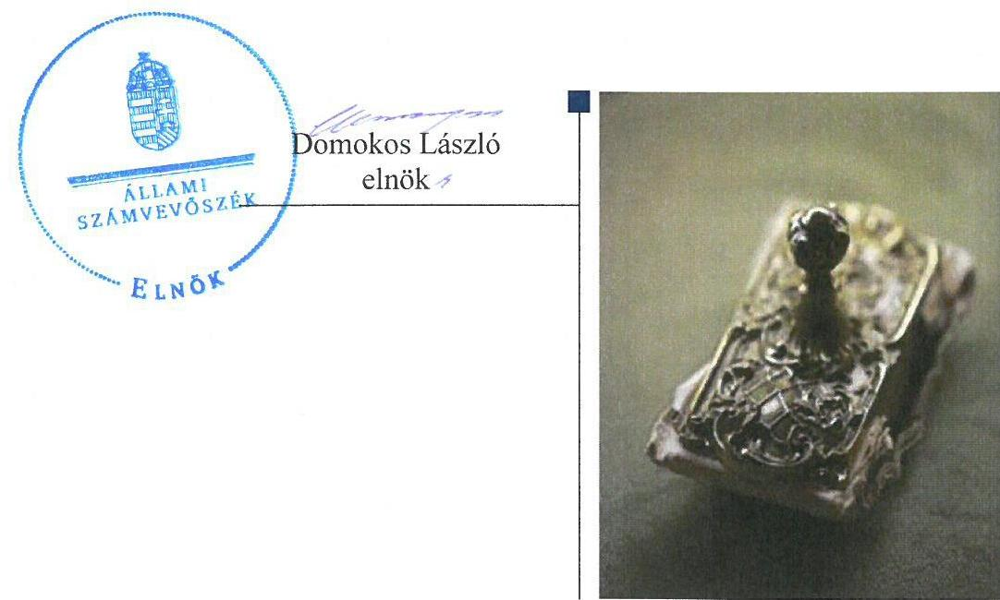
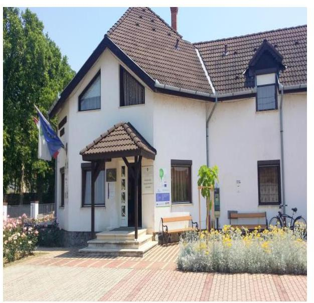
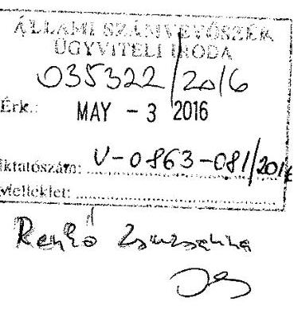
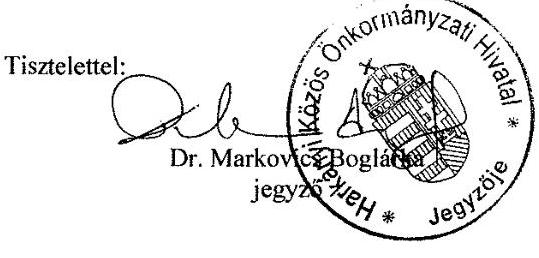
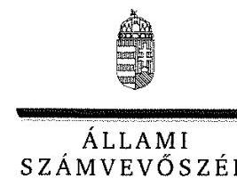
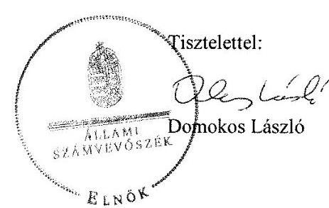
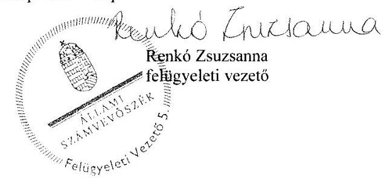

# Jelentés 

## A helyi nemzetiségi önkormányzatok gazdálkodása

A helyi nemzetiségi önkormányzatok gazdálkodása szabályszerűségének ellenőrzése - Harkányi Horvát Nemzetiségi Önkormányzat 2016.

---

# Jelentés 

## A helyi nemzetiségi önkormányzatok gazdálkodása

A helyi nemzetiségi önkormányzatok gazdálkodása szabályszerűségének ellenőrzése - Harkányi Horvát Nemzetiségi Önkormányzat
2016. 66. hó 15. nap

---

# AZ ELLENŐRZÉST FELÜGYELTE:

- RENKŐ ZSUZSANNA felügyeleti vezető
- AZ ELLENŐRZÉST VEZETTE ÉS A VÉGREHAJTÁSÁÉRT FELELŐS:
  - DR. TIMÁR BALÁZS ellenőrzésvezető
  - A PROGRAM ÖSSZEÁLLÍTÁSÁÉRT FELELŐS:
    - JANIK JÓZSEF LÁSZLÓ osztályvezető

- IKTATÓSZÁM: V-0863-088/2016
- TÉMASZÁM: 29
- ELLENŐRZÉS-AZONOSÍTÓ SZÁM: V0714

Jelentéseink az Országgyűlés számítógépes hálózatán és az Interneta a www.asz.hu címen is olvashatóak.

---

# TARTALOMJEGYZÉK 

■ ÖSSZEGZÉS ..... 5
■ AZ ELLENŐRZÉS CÉLJA ..... 6
■ AZ ELLENŐRZÉS TERÜLETE ..... 7
■ AZ ELLENŐRZÉS HÁTTERE, INDOKOLTSÁGA ..... 8
■ FÓKUSZKÉRDÉSEK ..... 9
■ ELLENŐRZÉS HATÓKÖRE ÉS MÓDSZEREI ..... 10
■ MEGÁLLAPÍTÁSOK ..... 12
■ JAVASLATOK ..... 19
■ MELLÉKLETEK ..... 21
I. Sz. melléklet: Értelmező szótár. ..... 21
II. Sz. melléklet: Gazdálkodási adatok ..... 23
■ FÜGGELÉK: ÉSZREVÉTELEK ..... 25
■ RÖVIDÍTÉSEK JEGYZÉKE ..... 29

---

.

---

# ÖSSZEGZÉS 

Az Állami Számvevőszék a Harkányi Horvát Nemzetiségi Önkormányzat 2014. évi gazdálkodása szabályszerűségét ellenőrizte. Az ellenőrzési megállapítások alapján a müködés és a gazdálkodás szabályozottsága, a gazdálkodási feladatok végrehajtása, ellátása nem felelt meg az előírásoknak. A Települési Önkormányzattal kötött együttmüködési megállapodással rendelkezett, tartalma azonban hiányos volt és felülvizsgálatára nem a jogszabályi előírásban foglaltak szerint került sor. A belső ellenőrzés nem volt biztosított. Az integritás szemlélet érvényesülése érdekében további intézkedések szükségesek.

## Az ellenőrzés társadalmi indokoltsága

Az Állami Számvevőszék középtávra szóló stratégiájában megfogalmazta, hogy az államháztartás komplex folyamatainak átláthatósága érdekében rendszerszemléletű/holisztikus megközelítésű, egymásra épülő, a szinergiahatást kihasználó, összefoglaló értékelésre lehetőséget adó ellenőrzéseket végez. Az államháztartás önkormányzati alrendszerébe tartozó helyi nemzetiségi önkormányzatok ellenőrzése során az ÁSZ ${ }^{1}$ feltárja a működésükben rejlő kockázatokat előmozdítva a közpénzügyek átláthatóságát, rendezettségét.

Az ÁSZ a stratégiai céljával összhangban - az ÁSZ tv. felhatalmazása alapján - végzi a közpénzekkel és a nemzeti vagyonnal való felelős gazdálkodás, valamint a helyi nemzetiségi önkormányzatok számviteli rendje betartásának és belső kontrollrendszere működésének ellenőrzését, továbbá segíti az integritás alapú, átlátható és elszámoltatható közpénzfelhasználás megteremtését.

## Főbb megállapítások, következtetések, javaslatok

A Nemzetiségi Önkormányzat² működési feltételeinek és a gazdálkodással összefüggő feladatoknak a szabályozása a jogszabályi előírásoknak nem felelt meg. A Nemzetiségi Önkormányzat rendelkezett megállapodással a Települési Önkormányzattal ${ }^{3}$ történő együttműködésre, tartalma azonban hiányos volt. Az együttműködési megállapodást ${ }^{4}$ 2014. január 31-ig nem, az általános választást ${ }^{5}$ követően felülvizsgálták. A jegyző ${ }^{6}$ a működési feltételek kialakításával és a gazdálkodással összefüggő végrehajtási feladatok szabályozására - az előzetes írásbeli kötelezettségvállalást nem igénylő kifizetések rendjének meghatározása kivételével - intézkedett.

A Nemzetiségi Önkormányzat gazdálkodási feladatainak ellátása során nem tartották be a jogszabályi előírásokat. A jegyző nem készítette el az ellenőrzési nyomvonalat, a szabálytalanság-kezelési eljárásrendet nem szabályozta, továbbá a FEUVE ${ }^{7}$-t nem biztosította a Nemzetiségi Önkormányzatra. A költségvetési határozattervezet jegyző általi előkészítése nem felelt meg az együttműködési megállapodásban és a jogszabályban foglaltaknak, annak Képviselőtestület ${ }^{8}$ elé terjesztésekor az elnök ${ }^{9}$ nem mutatta be a jogszabályban előírt mérleget és kimutatásokat. Az elnök a zárszámadási határozattervezet előterjesztésekor a jogszabály által előírt mérleget és kimutatásokat a Képviselő testület részére nem mutatta be. A jegyző az államháztartási információs adatszolgáltatásokat késedelmesen teljesítette. A gazdálkodási jogkörök gyakorlása során a dologi kiadások teljesítésének igazolása és érvényesítése nem felelt meg a jogszabályi előírásoknak.

A jogszabályi előírás ellenére az együttműködési megállapodásban nem rendezték a Nemzetiségi Önkormányzat belső ellenőrzésével kapcsolatos feladatokat.

Az integritás szemlélet érvényesítésének erősítése érdekében a Nemzetiségi Önkormányzat működési és gazdálkodási kereteinek kialakításánál és működésénél további intézkedések megtétele szükséges.

---

# **AZ ELLENŐRZÉS CÉLJA**

## **Harkányi Horvát Nemzetiségi Önkormányzat**

Az ellenőrzés célja annak megállapítása, hogy a helyi nemzetiségi önkormányzatok működési és gazdálkodási kereteinek kialakítása, a gazdálkodással kapcsolatos feladatok ellátása megfelelte a jogszabályoknak, továbbá a helyi nemzetiségi önkormányzat működési és gazdálkodási kereteinek kialakítása és működése erősítette-e az integritás szemlélet érvényesülését.

---

# **AZ ELLENŐRZÉS TERÜLETE**

## **Harkányi Horvát Nemzetiségi Önkormányzat**

Harkány város a Dél-dunántúli Régióban, Baranya megyében található. A város lakosainak száma 2014. január 1-jén 4124 fő volt.

A Képviselő-testület 2014. év elején négy fővel látta el feladatait. A Nemzetiségi Önkormányzat elnöki tisztét az ellenőrzött időszakban ugyanazon személy töltötte be, a Képviselő-testület létszáma 2014. október 27-én, a települési nemzetiségi önkormányzati képviselőválasztást követően három főre csökkent.

A Nemzetiségi Önkormányzat gazdálkodási feladatait ellátó Hivatal10 átlaglétszáma a 2014. évben 31 fő volt. A Hivatal élén álló jegyző személyében a 2014. évi önkormányzati választásokat követően változás következett be.

A Nemzetiségi Önkormányzat állandó bizottságot, költségvetési szervet nem tartott fenn.

Költségvetési beszámolója szerint a 2014. évet 3 507 ezer Ft bevétellel, 3 436 ezer Ft kiadással és 71 ezer Ft maradvánnyal zárta. A 2014. évi gazdálkodási adatokat részletesen a II. Sz. melléklet tartalmazza. A könyvviteli mérleg szerinti eszközvagyon 196 ezer Ft volt. A Nemzetiségi Önkormányzat az ellenőrzött évben 1 535,1 ezer Ft feladatalapú támogatás kapott.

---

# AZ ELLENŐRZÉS HÁTTERE, INDOKOLTSÁGA 

A 2014. évben megtartott nemzetiségi önkormányzati választásokat követően 2143 települési, 60 területi és 13 országos nemzetiségi önkormányzat alakult meg. A nemzetiségek helyzete, támogatása mind hazai, mind Európai Uniós szinten kiemelt figyelmet kap napjainkban. A helyi nemzetiségi önkormányzatok ellenőrzéseit az ÁSZ önálló ellenőrzésként, vagy a települési önkormányzatoknál végzett ellenőrzéseihez kapcsolódóan, arra épülve folytatja le.

## Az ellenőrzés több szinten hasznosul

Az Alaptörvény Szabadság és felelősség rész, XXIX. cikk (1) bekezdése szerint a Magyarországon élő nemzetiségek államalkotó tényezők. Az országban élő nemzetiségek - Alaptörvényben biztosított - jogainak, valamint a helyi és országos önkormányzat létrehozási jogának általános intézményi kereteit sarkalatos törvényként a Nek tv. szabályozza. A nemzetiségi önkormányzatok jogi személyek és a Nek tv.-ben meghatározott önálló fel-adat- és hatáskörökkel rendelkeznek, az államháztartás részét, az önkormányzati alrendszer egyik elemét képezik. A Mötv. 13. § (1) bekezdés 16. pontja alapján a települési önkormányzatok által - a helyi közügyek, valamint a helyben biztosítható közfeladatok körében - ellátandó helyi önkormányzati feladat a nemzetiségi ügyek ellátása. A helyi nemzetiségi önkormányzatok gazdálkodási feladatait jogszabályi előírás alapján a székhely települési önkormányzat polgármesteri (önkormányzati/közös) hivatala látja el.

A „helyi nemzetiségi önkormányzatok" gyűjtőfogalom, magában foglalja mind a települési nemzetiségi önkormányzatok, mint pedig a területi nemzetiségi önkormányzatok teljes körét. Gazdálkodásukra és támogatási rendszerükre vonatkozó jogszabályok az utóbbi években jelentős változásokon mentek át.

Az ellenőrzés hasznosulása több szinten várható. Az ellenőrzött szervezet szintjén az ellenőrzés feltárja a nemzetiségi önkormányzat müködésében, gazdálkodásában, belső kontrollrendszere működtetésében és a belső ellenőrzés biztosításában lévő hiányosságokat. Az ellenőrzés javaslataival ezen a területen is hozzájárul a közpénzek szabályos felhasználásához. Az ellenőrzött terület szintjén az ellenőrzés, tájékoztatást nyújt a döntéshozóknak a hiányosságokról, ezzel lehetőséget biztosítva arra, hogy az ÁSZ ellenőrzési megállapításai, javaslatai a nem ellenőrzött szervezeteknek a müködése során is hasznosuljanak. A társadalom számára jelzi, hogy a jelentős számú nemzetiségi önkormányzat gazdálkodása, illetve működéséhez felhasznált közpénz nem maradhat ellenőrizetlenül.

---

# FÓKUSZKÉRDÉSEK 

1. A helyi nemzetiségi önkormányzat müködési feltételeinek és a gazdálkodással összefüggő feladatoknak a szabályozása megfelel-e a jogszabályi elöírásoknak?
2. A jegyző és a helyi nemzetiségi önkormányzat betartotta-e a jogszabályi előírásokat a helyi nemzetiségi önkormányzat gazdálkodási feladatainak ellátása során?
3. Szabályszerüen biztositott volt-e a helyi nemzetiségi önkormányzat gazdálkodásának belső ellenőrzése?
4. A helyi nemzetiségi önkormányzat müködési és gazdálkodási kereteinek kialakítása és müködése erősítette-e az integritás szemlélet érvényesülését?

---

# ELLENŐRZÉS HATÓKÖRE ÉS MÓDSZEREI 

## Az ellenőrzés típusa

Szabályszerüségi ellenőrzés

## Az ellenőrzött időszak

A Nemzetiségi Önkormányzat müködési feltételeinek kialakításával és a Hi-
vatal - helyi nemzetiségi önkormányzat gazdálkodására vonatkozó - fel-
adatellátásával kapcsolatos szabályozás megfelelőségét a 2014. évre vo-
natkozóan (a 2014. december 31-i állapotnak megfelelően) minősítettük.
A Nemzetiségi Önkormányzat gazdálkodása szabályszerűségét, a müködési
feltételeknek, a pénzügyi folyamatokban kulcsszerepet betöltő teljesítés-
igazolás és érvényesítés belső kontrollok müködésének megfelelőségét,
valamint a belső ellenőrzés biztosítását a 2014. január 1. - december 31-e
közötti időszakot figyelembe véve értékeltük.

## Az ellenőrzés tárgya

A Harkányi Horvát Nemzetiségi Önkormányzat müködési kereteinek kiala-
kítása, a helyi nemzetiségi önkormányzat müködésével, gazdálkodásával
kapcsolatos feladatoknak a Hivatal, valamint a Nemzetiségi Önkormányzat
által történő ellátása.
Az ellenőrzés kiterjedt minden olyan körülményre és adatra, amely az
ÁSZ jogszabályban meghatározott feladataiban, valamint a program végre-
hajtása folyamán felmerült újabb összefüggések feltárásához szükséges.

## Az ellenőrzött szervezet

Harkányi Horvát Nemzetiségi Önkormányzat, Harkányi Közös Önkormányzati Hivatal

## Az ellenőrzés jogalapja

Az ÁSZ tv. 1. § (3) bekezdésében foglaltak alapján az ÁSZ általános hatáskörrel végzi a közpénzekkel és az állami és önkormányzati vagyonnal való felelős gazdálkodás ellenőrzését, valamint az 5. § (2) bekezdése alapján a helyi nemzetiségi önkormányzatok gazdálkodásának és (6) bekezdése alapján a helyi nemzetiségi önkormányzatok számviteli rendje betartásának és belső kontrollrendszere müködésének ellenőrzését.

---

# Az ellenőrzés módszerei 

Az ellenőrzést a nemzetközi standardokat irányadónak tekintve a program ellenőrzési kérdései, az ellenőrzött időszakban hatályos jogszabályok, az ellenőrzés szakmai szabályok és módszertanok figyelembe vételével végeztük el.

Az ellenőrzés ideje alatt az ellenőrzött szervezettel történő kapcsolattartást az ÁSZ Szervezeti és Múködési Szabályzatának vonatkozó előírásai alapján biztosítottuk.

Az ellenőrzési kérdések megválaszolásához szükséges bizonyítékok megszerzése a következő ellenőrzési eljárások alkalmazásával történt: megfigyelés, szemle (szemrevételezés), kérdésfeltevés (információkérés), mintavételezés, valamint elemző eljárás.

A pénzügyi folyamatokban kulcsszerepet betöltő teljesítésigazolás és érvényesítés kontrollok múködése megfelelőségének ellenőrzéséhez a beruházási, felújítási kiadásokkal, az egyéb múködési és felhalmozási célú kiadásokkal kapcsolatos kifizetéseket, dologi kiadásokat minta alapján ellenőriztük. Személyi juttatásokkal és az ellátottak pénzbeli juttatásaival kapcsolatos kifizetések a Nemzetiségi Önkormányzatnál az ellenőrzött időszakban nem történtek. „Megfelelőnek" értékeltük a gazdálkodási jogkörök gyakorlását, amennyiben a hibaarány legfeljebb 10\%, „részben megfelelőnek" értékeltük, ha a hibaarány 10-30\% között volt, „nem megfelelőnek" pedig akkor, ha az eredmények alapján a hibaarány meghaladta a $30 \%$-ot.

Az integritás szemlélet érvényesülésének értékelése a Hivatal által kitöltött tanúsítvány alapján történt.

Az ellenőrzési bizonyítékok alapvetően dokumentum jellegúek voltak. Az ellenőrzési bizonyítékként felhasználható adatforrások közé tartoztak egyrészt a szakmai program részletes szempontjainál felsorolt adatforrások, másrészt adatforrás lehetett még minden egyéb - az ellenőrzés folyamán feltárt, az ellenőrzés szempontjából releváns információt tartalmazó - dokumentum.

Az ellenőrzés lefolytatásához a Hivatal a tanúsítványok elektronikus kitöltésével, valamint az ÁSZ által kért dokumentumok elektronikus megküldésével szolgáltatott adatokat. A rendelkezésre bocsátott adatok, információk kontrollja az ellenőrzés keretében történt.

---

# 1. A helyi nemzetiségi önkormányzat müködési feltételeinek és a gazdálkodással összefüggő feladatoknak a szabályozása megfelel-e a jogszabályi előírásoknak? 

Összegző megállapítás

1.1. számú megállapítás

A Nemzetiségi Önkormányzat müködési feltételeinek és a gazdálkodással összefüggő feladatoknak a szabályozása a jogszabályi előírásoknak nem felelt meg.

A Nemzetiségi Önkormányzat rendelkezett megállapodással a Települési Önkormányzattal történő együttmüködésre. Az együttmüködési megállapodás tartalma a jogszabályban előírtakhoz képest hiányos volt. Az együttmüködési megállapodást 2014. január 31-ig nem, az általános választásokat követően felülvizsgálták.

A Nemzetiségi Önkormányzat 2014. évben hatályos együttműködési megállapodását 2012. évben terjesztették elő, és a Képviselő-testület 25/2012. (V.24.) HHNÖ számú határozatával jóváhagyta, és azt az elnök aláírta.

Az együttműködési megállapodás január 31. napjáig történő felülvizsgálata - a Nek tv. ${ }^{11} 80 . \S$ (2) bekezdésében foglaltak ellenére - a 2014. évben nem történt meg. A Nemzetiségi Önkormányzat - eleget téve a Nek. tv. 80. § (2) bekezdésében előírt, általános választáshoz kapcsolódó felülvizsgálati kötelezettségének - az együttműködés kereteit a 2014. évi általános nemzetiségi önkormányzati választásokat követően felülvizsgálta, melynek eredményeképpen a Képviselő-testület új megállapodás; $t^{12}$ fogadott el.

Az együttműködési megállapodás - a Nek. tv. 80. § (3) bekezdés a) pontja ellenére - nem tartalmazta a Nemzetiségi Önkormányzat törzskönyvi nyilvántartásba vételével kapcsolatos határidőket és együttmüködési kötelezettségeket, a felelősök konkrét kijelölésével.

A Nemzetiségi Önkormányzat kötelezettségvállalásaival kapcsolatosan a helyi önkormányzatot terhelő teljesítésigazolási feladatokat - a Nek. tv. 80. § (3) bekezdés b) pontjának előírásai ellenére - az együttműködési megállapodásban nem rögzítették, az együttműködési megállapodás csak a teljesítés igazolására jogosult felelősök kijelölését tartalmazta.

Az együttműködési megállapodás a Nek tv. 80. § (4) bekezdés előírásának megfelelően magában foglalta, hogy a jegyző vagy az aljegyző és a Hivatal témafelelősei, érintett osztályvezetői a Települési Önkormányzat megbízásából és képviseletében részt vesznek a Nemzetiségi Önkormányzat testületi ülésein.

A Nemzetiségi Önkormányzat a Nek. tv.-ben foglaltaknak megfelelően rendelkezett jóváhagyott SZMSZ ${ }^{13}$-szel. A Nemzetiségi Önkormányzat részéről az SZMSZ-t az együttműködési megállapodás megkötését követő 30

---

|  | napon belül fogadták el. Az SZMSZ-ben rögzítésre kerültek az együttműködési megállapodás szerinti működési feltételek. |
| :--: | :--: |
| 1.2. számú megállapítás | A jegyző a Nemzetiségi Önkormányzat múködési feltételei kialakításával és gazdálkodásával összefüggő végrehajtási feladatok szabályozására - az előzetes írásbeli kötelezettségvállalást nem igénylő kifizetések rendjének meghatározása kivételével - intézkedett. |
|  | A Nemzetiségi Önkormányzatnak a tervezéssel, a gazdálkodással, így különösen a kötelezettségvállalás, ellenjegyzés, az érvényesítés, utalványozás gyakorlásának módjával, eljárási és dokumentációs részletszabályaival, valamint az ezeket végző személyek kijelölésének rendjével, az ellenőrzési adatszolgáltatási feladatok teljesítésével kapcsolatos eljárásrendjét a Nemzetiségi Önkormányzatra is kiterjesztett Gazdálkodási Szabályzatban ${ }^{14}$, illetve az együttműködési megállapodásban szabályozták.

A kiadási előirányzatok terhére vállalt kötelezettség esetén pénzügyi ellenjegyzésre - az Ávr. 55. § (2) bekezdés g) pontjában foglaltaknak megfelelően - a Hivatal gazdasági vezetője volt jogosult, aki a jogszabályban előírt mérlegképes könyvelői végzettséggel rendelkezett, valamint érvényesítésre - a jogszabályban foglaltaknak megfelelően - a Hivatal köztisztviselőjét írásban kijelölte.

A teljesítés igazolásával kapcsolatos szabályozás a Nemzetiségi Önkormányzatra is kiterjesztett Gazdálkodási Szabályzatban jelent meg.

A Gazdálkodási Szabályzat az Ávr. ${ }^{15}$ 53. § (1) bekezdésének megfelelően tartalmazta, hogy nem szükséges írásbeli kötelezettségvállalás az olyan kifizetések teljesítéséhez, amelyek értéke a százezer forintot nem éri el, azonban a jegyző, az előzetes írásbeli kötelezettségvállalást nem igénylő kifizetések rendjét - az Ávr. 53. § (2) bekezdésében foglaltak ellenére belső szabályzatában nem határozta meg.

# 2. A jegyző és a helyi nemzetiségi önkormányzat betartotta-e a jogszabályi előírásokat a helyi nemzetiségi önkormányzat gazdálkodási feladatainak ellátása során? 

Összegző megállapítás

### 2.1. számú megállapítás

A Nemzetiségi Önkormányzat gazdálkodási feladatainak ellátása során nem tartották be a jogszabályi előírásokat.

A jegyző nem készítette el az ellenőrzési nyomvonalat, a szabályta-lanság-kezelési eljárásrendet nem szabályozta, továbbá a FEUVE-t nem biztosította a Nemzetiségi Önkormányzatra.

A NEMZETISÉGI ÖNKORMÁNYZAT gazdálkodásának szabályozása keretében a jegyző a Hivatal szabályzatai hatályának kiterjesztésével kialakította a számviteli politikát ${ }^{16}$, a számlarendet ${ }^{17}$, a leltározási szabályzatot ${ }^{18}$ és az értékelési szabályzatot ${ }^{19}$. Továbbá elkészítette a Nemzetiségi Önkormányzatra vonatkozó önálló pénzkezelési szabályzatot ${ }^{20}$.

Az ellenőrzött évben módosították a gazdálkodás keretét adó szabályzatrendszert, a pénzkezelési szabályzat 2014. augusztus 1-től változott.

---

A jegyző az ellenőrzési nyomvonalat sem a Hivatal, sem a Nemzetiségi Önkormányzat vonatkozásában az ellenőrzött évben - a Bkr. ${ }^{21}$ 6. § (3) bekezdésében előírtak ellenére - nem készítette el.

A jegyző - a Bkr. 8. § (2)-(4) bekezdése előírásai ellenére - FEUVE-t a Nemzetiségi Önkormányzat gazdálkodása tekintetében nem biztosította, továbbá szabálytalanságok kezelésének eljárásrendjét - a Bkr. 6. § (4) bekezdésében előírtak ellenére - nem szabályozta.

# 2.2. számú megállapítás 

A költségvetési határozattervezet jegyző általi előkészítése nem felelt meg az együttmúködési megállapodásban és a jogszabályban foglaltaknak, a Képviselő-testület elé terjesztésekor az elnök nem mutatta be a költségvetési mérleget közgazdasági tagolásban, az előirányzat-felhasználási tervet és a többéves kihatással járó döntések kimutatását.

A Nemzetiségi Önkormányzat elnöke a Képviselő-testület részére a jogszabályi előírásoknak megfelelő határidőben benyújtotta a 2014. évre vonatkozó költségvetési koncepciót és a költségvetési határozat tervezetet.

A jegyző az együttműködési megállapodás II.1. és II. 2 pontjában, valamint az Ávr. 26. § (1) bekezdésében és az Áht. ${ }^{22}$ 24. § (2) bekezdésében foglalt kötelezettsége ellenére nem gondoskodott a költségvetési koncepció és a határozattervezet megfelelő előkészítéséről.

A Nemzetiségi Önkormányzat által elfogadott költségvetési határozat nem felelt meg az Áht. és az Ávr. előírásainak, mert:
nem tartalmazta az Áht. 23. § (2) bekezdés a) pontja szerint a Nemzetiségi Önkormányzat költségvetési bevételeit és költségvetési kiadásait előirányzat-csoportok, kiemelt előirányzatok, és kötelező feladatok, önként vállalt feladatok, állami (államigazgatási) feladatok szerinti bontásban,
nem tartalmazta az Áht. 23. § (2) bekezdés c) pontja szerint a költségvetési egyenleg összegét múködési és felhalmozási cél szerinti bontásban,
nem tartalmazta az Áht. 23. § (2) bekezdés h) pontja szerint a költségvetés végrehajtásával kapcsolatos hatásköröket, így különösen a Mötv. ${ }^{23}$ 68. § (4) bekezdése szerinti értékhatárt, a finanszírozási bevételekkel és kiadásokkal kapcsolatos hatásköröket, valamint az Áht. 34. § (2) bekezdése szerinti esetleges felhatalmazást,
az Ávr. 33/A. § előírása ellenére nem egyezett meg a jegyző által elkészített elemi költségvetés tartalmával. Az előbbi a kiadásokat csak feladatonként, a tervezett összeg meghatározása nélkül tartalmazta, előirányzatonként nem. Az elemi költségvetésben azonban a dologi kiadások előirányzata - többek között - készletbeszerzés, szolgáltatási kiadás, ellátottak pénzbeli juttatásai előirányzatokat is tartalmazott.
Az elnök - az Áht. 24. § (4) bekezdés a) és b) pontjai rendelkezése ellenére - tájékoztatásul nem mutatta be a Képviselő-testületnek - szöveges indokolással együtt - a költségvetési mérleget közgazdasági tagolásban, az előirányzat felhasználási tervet, valamint a többéves kihatással járó döntések számszerűsítését évenkénti bontásban és összesítve, mivel a felsorolt dokumentumokat a költségvetési határozattervezet Képviselő-testület elé terjesztéséig nem készítették el.

---

# 2.3. számú megállapítás 

A jegyző az együttműködési megállapodás I. pontjában foglalt kötelezettsége ellenére nem vett részt a költségvetési koncepció és a költségvetési határozat elfogadásáról döntő ülésen, emiatt a Nemzetiségi Önkormányzat szabályszerű múködése nem volt biztosított.
Az elnök a zárszámadási határozattervezet előterjesztésekor a költségvetési mérleget közgazdasági tagolásban, a pénzeszközök változását és a vagyonkimutatást a Képviselő testület részére nem mutatta be.

Az elnök a zárszámadási határozattervezet előterjesztésekor - az Áht. 91. § (2) bekezdés a) és c) pontjai előírása ellenére - nem mutatta be a Képvi-selő-testületnek tájékoztatásul a költségvetési mérleget közgazdasági tagolásban, a pénzeszközök változását, valamint a vagyonkimutatást, mivel e dokumentumok a zárszámadási határozattervezet Képviselő-testület elé terjesztéséig nem készültek el. Az elnök a zárszámadási határozat-tervezetét az előírt határidőn belül a Képviselő-testület elé terjesztette, amely arról határozatot hozott.

A jegyző az együttműködési megállapodás I. pontjában foglalt kötelezettsége ellenére nem vett részt a zárszámadási határozat elfogadásáról döntő ülésen, emiatt a Nemzetiségi Önkormányzat szabályszerű múködése nem volt biztosított.

## 2.4. számú megállapítás

A jegyző a Kincstár felé rendszeresen késedelemmel szolgáltatott adatot.

A jegyző az együttműködési megállapodás II.4, illetve III. 1 pontjaiban meghatározott, a Nemzetiségi Önkormányzatra vonatkozó államháztartási információs adatszolgáltatásokat nem megfelelően teljesítette, mert
$\longrightarrow$ az elemi költségvetést az Ávr. 33. § (1) - (2) bekezdéseiben,
$\longrightarrow$ az időközi költségvetési jelentéseket az Ávr. 169. § (2) bekezdésében,
$\longrightarrow$ az időközi mérlegjelentéseket az Ávr. 170. § (5) bekezdésében,
$\longrightarrow$ az éves elemi költségvetési beszámolóval kapcsolatos adatszolgáltatást az Áhsz ${ }^{24}$. 32. § (4) bekezdésében foglalt határidőkhöz képest késedelmesen küldte meg a Kincstár felé.
Az évközi és év végi államháztartási információs adatszolgáltatások teljesítését az 1. táblázat mutatja be:

---

| 1. táblázat |  |  |  |  |
| :--: | :--: | :--: | :--: | :--: |
| ÁLLAMHÁZTARTÁSI ADATSZOLGÁLTATÁSOK 2014. ÉVBEN |  |  |  |  |
| Adatszolgáltatás megnevezése | Időszak | Jópszabályi határidő | Tényleges teljesítés | Késedelmes napok száma |
| 2014. évi elemi költségvetés |  | 2014.március 17. | 2014.március 20. | 3 |
| Időközi költségvetési jelentés | I. negyedév | 2014.április 20. | 2014.április 29. | 9 |
|  | IV. havi | 2014.május 20 | 2014.május 21. | 1 |
|  | V. havi | 2014.június 20 | 2014.június 23. | 3 |
|  | VI. havi | 2014.július 20. | 2014.július 22. | 2 |
|  | VII. havi | 2014.augusztus 20. | 2014.augusztus 19. | - |
|  | VIII. havi | 2014.szeptember 20. | 2014.szeptember 22. | 2 |
|  | IX. havi | 2014.október 20. | 2014.október 21. | 1 |
|  | X. havi | 2014.november 20. | 2014.november 20. | - |
|  | XI. havi | 2014.december 20. | 2014. december 21. | 1 |
|  | éves | 2015.február 5. | 2015. február 6. | 1 |
| Mérlegjelentés | I. negyedév | 2014.április 20. | 2014.május 3. | 13 |
|  | II. negyedév | 2014.július 20. | 2014.július 24. | 4 |
|  | III. negyedév | 2014.október 20. | 2014.október 23. | 3 |
|  | IV. negyedév | 2015.február 9. | 2015.február 6. | - |
|  | éves jelentés | 2015.március 10. | 2015. április 8. | 29 |
| 2014. évi költségvetési beszámoló |  | 2015.március 10. | 2015. április 8. | 29 |
|  |  |  |  |  |

A gazdálkodási jogkörök gyakorlása során a dologi kiadások teljesítésének igazolása és érvényesítése nem felelt meg a jogszabályi előírásoknak.

A Nemzetiségi Önkormányzat a 2014. évi költségvetésében személyi juttatásokra előirányzatot nem képzett, és a gazdálkodás során ilyen címen kifizetéseket nem is számolt el.

A dologi kiadások ellenőrzött tételeinél a teljesítésigazolás és az érvényesítés kontrolljai nem múködtek megfelelően.

A teljesítés igazolását az arra jogosult valamennyi kifizetés esetében aláírásával igazolta, azonban a százezer forintot el nem érő kiadások esetében ellenőrzési feladatainak nem tudott szabályszerűen eleget tenni, mert a jegyző az Ávr. 53. § (2) bekezdésben foglaltak ellenére belső szabályzatban nem rögzítette az előzetes írásbeli kötelezettségvállalást nem igénylő kifizetések rendjét. Ezen kiadásoknál nem állt rendelkezésre a kötelezettségvállalás dokumentuma, így a teljesítés igazolója az Ávr. 57. § (1) bekezdésének megfelelően nem végezhette el a kiadások teljesítésének jogosságával, összegszerűségével, és az ellenszolgáltatás teljesítésével kapcsolatos ellenőrzési feladatait.

Néhány esetben nem tettek eleget a Számv. tv. ${ }^{25}$ 166. § (3) bekezdésében foglaltaknak, mivel nem rendelkeztek magyar nyelvű számviteli bizonylattal. Ezt a szabálytalanságot az érvényesítő - az Ávr. 58. § (2) bekezdésében foglaltak ellenére - nem jelezte az utalványozónak.

---

Az érvényesítést az arra jogosult valamennyi ellenőrzött kifizetés esetében aláírásával igazolta, azonban ellenőrizhető okmányok hiányában szabályosan - az Ávr. 58. § (1) bekezdésével ellentétben - nem ellenőrizhette az összegszerűséget.

# 3. Szabályszerúen biztosított volt-e a helyi nemzetiségi önkormányzat gazdálkodásának belső ellenőrzése? 

Összegző megállapítás

A jogszabályi előírás ellenére az együttmúködési megállapodásban nem rendezték a Nemzetiségi Önkormányzat belső ellenőrzésével kapcsolatos feladatokat.
3.1. számú megállapítás

Az együttmúködési megállapodásban nem rendezték a Nemzetiségi Önkormányzat bevételeivel és kiadásaival kapcsolatban az ellenőrzési feladatok ellátásának részletes szabályait.

A Nemzetiségi Önkormányzat bevételeivel és kiadásaival kapcsolatos ellenőrzési feladatok ellátásának részletes szabályait az együttműködési megállapodásban az Áht. - 2014. december 31-ig hatályos - 27. § (2) bekezdésében foglaltak ellenére nem rendezték.*

A jegyző az ellenőrzött időszakban az Önkormányzat és intézményei belső ellenőrzési feladatait megbízási szerződés alapján külső szervezet látta el, a Nemzetiségi Önkormányzat belső ellenőrzési feladatai ellátására megbízási szerződést nem kötött.

## 4. A helyi nemzetiségi önkormányzat múködési és gazdálkodási kereteinek kialakítása és múködése erősítette-e az integritás szemlélet érvényesülését?

Összegző megállapítás

Az integritás szemlélet érvényesítésének erősítése érdekében a Nemzetiségi Önkormányzat múködési és gazdálkodási kereteinek kialakításánál és múködésénél további intézkedések megtétele szükséges.

Jelen ellenőrzés keretében a Hivatal által kitöltött tanúsítványi adatszolgáltatás alapján értékeltük az integritás szemlélet érvényesülését.

A Hivatal nem rendelkezett SZMSZ-szel, továbbá a vonatkozó jogszabályokkal összhangban álló adatvédelmi, titokvédelmi és informatikai szabályzatokkal, valamint etikai szabályzattal sem. Nem szabályozták a szervezeten belüli közérdekú bejelentők védelmét, illetve a különféle ajándékok, meghívások, utazások elfogadásának feltételeit. Rendszerú kockázatelemzést, illetve rendszeres korrupciós kockázatelemzést nem végeztek,

[^0]
[^0]:    * A 2015. január 1-től hatályos megállapodás; már tartalmazza, hogy a Hivatal ellátja a belső ellenőrzési feladatokat a Nemzetiségi Önkormányzat számára.

---

továbbá az elmúlt három évben korrupcióellenes képzést a Hivatal dolgozói részére nem tartottak.

Az ÁSZ ellenőrzés megállapította, hogy a Nemzetiségi Önkormányzat működési feltételeinek és a gazdálkodással összefüggő végrehajtási feladatoknak a szabályozása nem felelt meg a jogszabályi előírásoknak. Az operatív gazdálkodási jogkörök kialakításában, illetve a kulcsszerepet betöltő teljesítésigazolás és érvényesítés belső kontrollok működésében feltárt hiányosságok arra utalnak, hogy a Nemzetiségi Önkormányzat gazdálkodása szabályszerű működésénél még intézkedéseket kell tenni az integritás szemlélet érvényesítésében.

---

# JAVASLATOK 

Az ÁSZ tv. ${ }^{26}$ 33. § (1) bekezdésében foglaltak értelmében az ellenőrzött szervezet vezetője köteles a jelentésben foglalt megállapításokhoz kapcsolódó intézkedési tervet összeállítani és azt a jelentés kézhezvételétől számított 30 napon belül az ÁSZ részére megküldeni. Amennyiben az intézkedési tervet határidőre nem küldi meg a szervezet, vagy amennyiben az nem elfogadható, az ÁSZ elnöke az ÁSZ tv. 33. § (3) bekezdés a)-b) pontjaiban foglaltakat érvényesítheti.

## a jegyzőnek:

1. A Települési és a Nemzetiségi Önkormányzat együttmüködésének szabályszerűsége érdekében intézkedjen a jogszabályi előírásoknak megfelelő tartalmú együttmüködési megállapodás előkészítéséről, és a Települési Önkormányzat Képviselő-testülete elé terjesztésének kezdeményezéséről.
(1.1 sz. megállapítás 3-4. bekezdései alapján)
2. A Nemzetiségi Önkormányzat gazdálkodásának szabályszerűsége érdekében intézkedjen:
a) a Nemzetiségi Önkormányzat gazdálkodási feladataira vonatkozó ellenőrzési nyomvonal elkészítéséről, a szabálytalanságok kezelésének eljárásrendje szabályozásáról és a FEUVE jogszabályi előírásoknak megfelelő biztosításáról;
(2.1. sz. megállapítás 3-4. bekezdése alapján)
b) a költségvetési határozat-tervezet, valamint előterjesztésekor bemutatásra kerülő mérleg és kimutatások jogszabályi előírásoknak megfelelő elkészítéséről;
(2.2. sz. megállapítás 3. bekezdés 1-4. pontjai és 4. bekezdés alapján)
c) a zárszámadási határozat-tervezet előterjesztésekor tájékoztatásul bemutatásra kerülő mérleg és kimutatások jogszabályi előírásoknak megfelelő elkészítéséről;
(2.3. sz. megállapítás 1. bekezdése alapján)
d) jogszabályi előírásoknak megfelelő határidőben az évközi és az éves államháztartási információs adatszolgáltatások teljesítéséről;
(2.4. sz. megállapítás 1. bekezdés 1-4 pontjai alapján)

---

e) az előzetes írásbeli kötelezettségvállalást nem igénylő kifizetések rendjének meghatározásáról;
(1.2 sz. megállapítás 4. bekezdése alapján)
f) a pénzügyi folyamatokban kulcsszerepet betöltő teljesítésigazolás és érvényesités belső kontrollok jogszabályi előírásoknak megfelelő müködtetéséről.
(2.5 sz. megállapítás 3.-5. bekezdései alapján)

# a Nemzetiségi Önkormányzat elnökének: 

1. A Települési és a Nemzetiségi Önkormányzat együttmüködésének szabályszerűsége érdekében intézkedjen a jogszabályi előírásoknak megfelelő együttmüködési megállapodás Képviselő-testület elé terjesztéséről.
(1.1. sz. megállapítás 3- 4. bekezdései alapján)
2. A Nemzetiségi Önkormányzat gazdálkodásának szabályszerűsége érdekében intézkedjen:
a) a jogszabályi előírásnak megfelelő tartalmú költségvetési határo-zat-tervezet előterjesztéséről, valamint az előterjesztéssel együtt meghatározott mérleg és kimutatások Képviselő-testület részére történő bemutatásáról;
(2.2. sz. megállapítás 3. bekezdés 1-4 pontjai és a 4. bekezdés alapján)
b) a zárszámadási határozat-tervezet előterjesztésekor a jogszabályi előírásban meghatározott mérleg és kimutatások Képviselő-testület részére történő bemutatásáról.
(2.3. megállapítás 1. bekezdése alapján)

---

# MELLÉKLETEK 

- I. SZ. MELLÉKLET: ÉRTELMEZŐ SZÓTÁR
belső ellenőrzés
belső kontrollrendszer
együttműködési megállapodás
kockázat
költségvetési szerv vezetője
kontrolltevékenységek
kulcskontrollok
nemzetiség

Független, tárgyilagos bizonyosságot adó és tanácsadó tevékenység, amelynek célja, hogy az ellenőrzött szervezet működését fejlessze és eredményességét növelje, az ellenőrzött szervezet céljai elérése érdekében rendszerszemléletű megközelítéssel és módszeresen értékeli, illetve fejleszti az ellenőrzött szervezet irányítási és belső kontrollrendszerének hatékonyságát. (Forrás: Bkr. 2. § b) pontja)
A belső kontrollrendszer a kockázatok kezelése és tárgyilagos bizonyosság megszerzése érdekében kialakított folyamatrendszer, amely azt a célt szolgálja, hogy a müködés és gazdálkodás során a tevékenységeket szabályszerűen, gazdaságosan, hatékonyan, eredményesen hajtsák végre, az elszámolási kötelezettségeket teljesítsék, megvédjék az erőforrásokat a veszteségektől, károktól és nem rendeltetésszerű használattól. (Forrás: Áht. 69. § (1) bekezdése)

Az Áht. 27. § (2) bekezdése és a Nek. tv. 80. § (1) bekezdése értelmében a helyi önkormányzat a helyi nemzetiségi önkormányzat részére - annak székhelyén - biztosítja az önkormányzati müködés személyi és tárgyi feltételeit, továbbá gondoskodik a müködéssel kapcsolatos végrehajtási feladatok ellátásáról. Az önkormányzati müködés feltételei és az ezzel kapcsolatos végrehajtási feladatok. A Nek. tv. 80. § (2) bekezdés szerinti a fenti kötelezettségének teljesítése érdekében a helyi önkormányzat harminc napon belül biztosítja a rendeltetésszerű helyiséghasználatot, valamint a helyiséghasználatra, a további feltételek biztosítására és a feladatok ellátására vonatkozóan megállapodást köt a helyi nemzetiségi önkormányzattal. A megállapodást minden év január 31. napjáig, általános vagy időközi választás esetén az alakuló ülést követő harminc napon belül felül kell vizsgálni. A helyi önkormányzat és a nemzetiségi önkormányzat szervezeti és müködési szabályzatában rögzíti a megállapodás szerinti müködési feltételeket, a megállapodás megkötését, módosítását követő harminc napon belül. A Nek. tv. 80. § (3) bekezdés írja elő a megállapodásban rögzítendőket.
A kockázat annak a valószínűségét jelenti, hogy egy vagy több esemény vagy intézkedés nem kívánt módon befolyásolja a rendszer müködését, céljainak megvalósulását. (Forrás: Javaslatok a korrupciós kockázatok kezelésére - Kockázatkezelési és ellenőrzési módszertan 35. oldal, ÁSZ)
A Bkr. 2. § nd) pont meghatározásában a települési/helyi önkormányzat, helyi nemzetiségi önkormányzat, illetve a fővárosi kerületi önkormányzat esetén a jegyző, körjegyző, főjegyző.
A kontrolltevékenységek azok a politikák és eljárások, amelyeket a kockázatok megoldására hoznak létre a szervezet céljainak teljesítése érdekében.
Az azonosított kockázatok mérséklése érdekében kialakított kontrollok közül azok, amelyek elégtelen müködése esetén a szervezetet jelentős veszteség érheti, vagy a müködésükben bekövetkező hiba/hiányosság más kontrollok eredményességét csökkenti. Ezek ellenőrzése, értékelése elegendő bizonyítékot szolgáltat adott területen a kontrollrendszer értékeléséhez. Az önkormányzatok kontrollrendszere kialakításának ellenőrzése során a pénzügyi folyamatokban kulcsszerepet betöltő belső kontrollok a teljesítésigazolás és az érvényesítés.
A Nek. tv. 1. § (1) bekezdése alapján nemzetiség minden olyan Magyarország területén legalább egy évszázada honos népcsoport, amely az állam lakossága körében számszerű kisebbségben van, tagjai magyar állampolgárok és a lakosság többi részétől saját nyelve és kultúrája, hagyományai különböztetik meg, egyben olyan összetartozás-tudatról tesz

---

nemzetiségi önkormányzat
operatív gazdálkodási jogkör
polgármesteri hivatal
szabályszerúségi ellenőrzés
bizonyságot, amely mindezek megőrzésére, történelmileg kialakult közösségeik érdekeinek kifejezésére és védelmére irányul.
Az Nek. tv. 2. § 2. pontja szerint törvényben meghatározott nemzetiségi közszolgáltatási feladatokat ellátó, testületi formában múködő, jogi személyiséggel rendelkező, demokratikus választások útján e törvény alapján létrehozott szervezet, amely a nemzetiségi közösséget megillető jogosultságok érvényesítésére, a nemzetiségek érdekeinek védelmére és képviseletére, a feladat- és hatáskörébe tartozó nemzetiségi közügyek települési, területi vagy országos szinten történő önálló intézésére jön létre.
kötelezettségvállalás; pénzügyi ellenjegyzés; utalványozás; érvényesítés; teljesítésigazolás jogkör
A programban a polgármesteri hivatal megnevezés alatt értjük a polgármesteri hivatalt, a főpolgármesteri hivatalt (illetve 2013. január 1-jét követően a közös önkormányzati hivatalt).
A szabályszerűségi ellenőrzés a megfelelőségi ellenőrzés általánosan alkalmazott altípusa. A szabályszerűségi ellenőrzés az egyes kritériumok - jogszabályi előírások, egyéb szabályok és megállapodások - teljesülésének ellenőrzését foglalja magában, ide értve a költségvetéssel kapcsolatos jogszabályokban foglaltak teljesülésének ellenőrzését is.

---

# A HARKÁNYI HORVÁT NEMZETISÉGI ÖNKORMÁNYZAT 2014. ÉVI GAZDÁLKODÁSI ADATAI

|   | Eredeti
előirányzat (szer Ft) | Medositott
szer Ft | Teljesítés |   |
| --- | --- | --- | --- | --- |
|  BEVÉTELEK |  |  |  |   |
|  Intézményi múködési bevételek | - | - | - | -  |
|  Általános múködési támogatás | 271,0 | 1152,9 | 952,9 | 82,6  |
|  Feladatalapú támogatás | - | 1535,1 | 1535,1 | 100,0  |
|  Egyéb múködési bevételek | - | - | 3,0 | -  |
|  Múködési bevételek összesen | 271,0 | 2688,0 | 2691,0 | 100,1  |
|  Felhalmozási bevétel | - | - | - | -  |
|  Költségvetési bevételek összesen | 271,0 | 2688,0 | 2691,0 | 100,1  |
|  Előző évi pénzmaradvány felhasználása | 433,0 | 816,0 | 816,0 | 100,0  |
|  Tárgyévi bevételek összesen | 704,0 | 3504,0 | 3507,0 | 100,1  |
|  KIADÁSOK |  |  |  |   |
|  Személyi juttatások | - | - | - | -  |
|  Munkaadókat terhelő járulékok és szociális hozzájárulási adó összesen | - | - | - | -  |
|  Dologi kiadások | 654,0 | 2783,0 | 2715,0 | 97,6  |
|  Ellátottak pénzbeli juttatásai | 50,0 | - | - | -  |
|  Múködési célú pénzeszközátadások államháztartáson kívülre | - | 245,0 | 245,0 | 100,0  |
|  Múködési kiadások összesen | 704,0 | 3028,0 | 2960,0 | 97,8  |
|  Felhalmozási kiadások | - | 476,0 | 476,0 | 100,0  |
|  Költségvetési kiadások összesen | 704,0 | 3504,0 | 3436,0 | 98,1  |
|  Finanszírozási kiadások | - | - | - | -  |
|  Tárgyévi kiadások összesen | 704,0 | 3504,0 | 3436,0 | 98,1  |

---

.

---

# FÜGGELÉK: ÉSZREVÉTELEK 

A jelentéstervezetet a Számvevőszék 15 napos észrevételezésre megküldte az ellenőrzött szervezetek vezetőinek az ÁSZ tv. 29. § ${ }^{\dagger}$ (1) bekezdése előírásának megfelelően.
A jegyző észrevételt tett, a Nemzetiségi Önkormányzat elnöke az ÁSZ tv. 29. § (2) bekezdésében foglalt észrevételezési jogával nem élt.
Az elfogadott észrevétel alapján az Állami Számvevőszék módosította a jelentést.
A függelék tartalmazza a jegyző észrevételét és az elfogadott észrevétel indoklásáról szóló tájékoztatást.

[^0]
[^0]:    ${ }^{+} 29 . \S$ (1) Az Állami Számvevőszék az ellenőrzési megállapításait megküldi az ellenőrzött szervezet vezetőjének vagy az általa megbízott személynek, és annak, akinek személyes felelősségét állapította meg.
    (2) Az ellenőrzött szervezet vezetője és a felelősként megjelölt személy az ellenőrzés megállapításaira tizenöt napon belül írásban észrevételt tehet.
    (3) Az Állami Számvevőszék az észrevételre a beérkezésétől számított harminc napon belül írásban válaszol. A figyelembe nem vett észrevételeket köteles a jelentésben feltüntetni, és megindokolni, hogy azokat miért nem fogadta el.

---

# HARKÁNYI KÖZÖS   ÖNKORMÁNYZATI HIVATAL JEGYZÖJÉTŐL 

H A R K Á N Y Petőfi S. u. 2-4. 7815
(72) 480-100 (72) 480-202 Fax: (72) 480-518

E-mail: jegyzo@harkany.hu
Web: www.harkany.hu

Ikt.: 1555/2016.
Hiv.sz.: V-0863-077/2016.

## Állami Számvevőszék   Domokos László Elnök úr részére

Budapest 4,
Pf.: 54
1364
Tisztelt Elnök Úr!

A fenti hivatkozási számon részemre megküldött a Harkányi Horvát Nemzetiségi Önkormányzat, valamint a Harkányi Német Nemzetiségi Önkormányzat vonatkozásában készített jelentés tervezeteket áttekintettem, és az alábbi észrevételt teszem.

Mindkét jelentés tervezetben azok 7. oldalán az utolsó mondatként szerepel az alábbi szöveg:
„A nemzetiségi önkormányzat az ellenőrzött évben feladatalapú támogatást nem kapott."
A fentiekkel ellentétben mindkét nemzetiségi önkormányzat kapott a 2014-es évben feladatalapú támogatást. A megállapítás minden bizonnyal egy elírás csupán, és ez a tény a jelentéstervezetben foglalt megállapításokat és az előírt javaslatokat nem érinti, de a pontosság érdekében lehetőség szerint kérjük ezen megállapítások javítását, különös tekintettel arra, hogy azt részemre a Német Nemzetiségi Önkormányzat elnök asszonya is jelezte.
Amennyiben szükséges természetesen megküldjük a feladatalapú támogatások meglétére vonatkozó dokumentumokat.

Harkány, 2016. április 29.

---

ELNÖK

Ikt. szám: V-0863-082/2016.

# Dr. Markovics Boglárka úrhölgy 

jegyzó
Harkányi Közös Önkormányzati Hivatal

## Harkány

## Tisztelt Jegyző Úrhölgy!

Köszönettel megkaptam „A helyi nemzetiségi önkormányzatok gazdálkodása szabályszerűségének ellenőrzése - Harkányi Horvát Nemzetiségi Önkormányzat" és „A helyi nemzetiségi önkormányzatok gazdálkodása szabályszerűségének ellenőrzése - Harkányi Német Nemzetiségi Önkormányzat"címủ jelentéstervezetek megállapításaira tett észrevételét.

Az ellenőrzési megállapításokra vonatkozó észrevételét az Állami Számvevőszékről szóló 2011. évi LXVI. törvény 29. § (2) bekezdésében meghatározott tizenöt napos határidőn belül küldte meg. Az Állami Számvevőszék észrevétellel kapcsolatos álláspontját a mellékletként csatolt, a felügyeleti vezető által készített, a jelentéstervezetekre tett észrevételre adott válasz tartalmazza.

Budapest, 2016. 05 . hó 30 nap

Melléklet: Észrevételre adott válasz (2 db)

---

# „A helyi nemzetiségi önkormányzatok gazdálkodása szabályszerűségének ellenőrzése Harkányi Horvát Nemzetiségi Önkormányzat" címú jelentéstervezetre tett észrevételre adott válasz 

| Észrevétel: | A jelentéstervezet 7. oldal utolsó mondatára tett észrevétel: „A Nemzetiségi Önkormányzat az ellenőrzött évben feladatalapú támogatást nem kapott." Álláspontjuk szerint a nemzetiségi önkormányzat kapott a 2014-es évben feladatalapú támogatást. |
| :--: | :--: |
| Válasz: | Az Állami Számvevőszék az észrevételt elfogadja. |
| Indoklás: | A 2014. évi zárszámadásról szóló 1/HHNŐ/2015. (L.22) képviselő-testületi határozat szerint a Nemzetiségi Önkormányzat 1535079 Ft feladatalapú támogatást kapott a 2014. évben. Az észrevétel alapján a jelentéstervezet II. számú mellékletében is pontositásra került a feladatalapú támogatás összege. |

Budapest, 2016. OS hónap 30 nap

---

# RÖVIDÍTÉSEK JEGYZÉKE 

${ }^{1}$ ÁSZ
${ }^{2}$ Nemzetiségi Önkormányzat
${ }^{3}$ Települési Önkormányzat
${ }^{4}$ együttműködési megállapodás
${ }^{5}$ általános választás
${ }^{6}$ jegyző
${ }^{7}$ FEUVE
${ }^{8}$ Képviselő-testület
${ }^{9}$ elnök
${ }^{10}$ Hivatal
${ }^{11}$ Nek.tv.
${ }^{12}$ megállapodás ${ }_{2}$
${ }^{13}$ SZMSZ
${ }^{14}$ Gazdálkodási Szabályzat
${ }^{15}$ Ávr.
${ }^{16}$ számviteli politika
${ }^{17}$ számlarend
${ }^{18}$ leltározási szabályzat
${ }^{19}$ értékelési szabályzat
${ }^{20}$ pénzkezelési szabályzat
${ }^{21}$ Bkr.
${ }^{22}$ Áht.
${ }^{23}$ Mötv.
${ }^{24}$ Áhsz.
${ }^{25}$ Számv. tv.
${ }^{26}$ ÁSZ tv.

Állami Számvevőszék
Harkányi Horvát Nemzetiségi Önkormányzat
Harkány Város Önkormányzata
Harkány Város Önkormányzata és a Harkányi Horvát Nemzetiségi Önkormányzat Képviselő-testülete között 2012. május 23-án létrejött, a 93/2012 (VI.20.) Kt. számú és a 25/2012. (V.24.) HHNÖ számú határozatokkal elfogadott együttműködési megállapodás (hatályos: 2014. december 31-ig)
a helyi nemzetiségi önkormányzati képviselők 2014. október 12-én tartott általános választása
Harkány Város Önkormányzatának jegyzője
folyamatba épített előzetes és utólagos vezetői ellenőrzés
Harkányi Horvát Nemzetiségi Önkormányzat Képviselő-testülete
a harkányi Horvát Nemzetiségi Önkormányzat elnöke
Harkányi Közös Önkormányzati Hivatal
a nemzetiségek jogairól szóló 2011. évi CLXXIX. törvény
Harkány Város Önkormányzat Képviselő-testülete és a Harkányi Horvát
Nemzetiségi Önkormányzat Képviselő-testülete között 2014. december 08-án létrejött, a 136/2014 (XI.20.) Kt. számú és a 90/2014. (XII.05.) HHNÖ számú határozatokkal elfogadott együttműködési megállapodás (hatályos: 2015. január 1-től)
Harkányi Horvát Nemzetiségi Önkormányzat Képviselő-testülete 40/2012 (VI.28.) számú határozatával elfogadott Szervezeti és Müködési Szabályzata
Körjegyzőségként működő Harkányi Közös Önkormányzati Hivatal, a Hivatalhoz tartozó önkormányzatok és azok költségvetési szervei, továbbá az illetékességi területen működő nemzetiségi önkormányzatok Gazdálkodási Szabályzata (hatályos: 2013. július 1-től)
368/2011 (XII.31) Korm. rendelet az államháztartásról szóló törvény végrehajtásáról
Harkányi Közös Önkormányzati Hivatal Számviteli politika, érvényes 2014. január 1-től
Harkányi Közös Önkormányzati Hivatal Számlarend, érvényes 2014. január 1-től
Harkány Város Önkormányzata, Harkány Város Polgármesteri Hivatala és a Polgármesteri Hivatalhoz rendelt költségvetési szervek Leltározási és leltárkészítési szabályzat, hatályos 2012. január 1-től
Harkány Város Önkormányzata, Harkány Város Polgármesteri Hivatala és a Polgármesteri Hivatalhoz rendelt költségvetési szervek Eszközök és források értékelési szabályzata, hatályos 2012. január 1-től
Harkányi Horvát Nemzetiségi Önkormányzat és Harkányi Német Nemzetiségi Önkormányzat Pénzkezelési szabályzata, hatályos 2012. január 1-től 370/2011. (XII.31.) Korm. rendelet a költségvetési szervek belső kontrollrendszeréről és belső ellenőrzéséről
2011. évi CXCV. törvény az államháztartásról
2011. évi CLXXXIX. törvény Magyarország helyi önkormányzatairól
4/2013. (I. 11.) Korm.rendelet az államháztratás számviteléről
2000. évi C. törvény a számvitelről
2011. évi LXVI. törvény az Állami Számvevőszékről, hatályos 2011. július 1-jétől

---

# ÁLLAMI SZÁMVEVŐSZÉK 

1052 Budapest, Apáczai Csere János utca 10.
Levélcím: 1364 Budapest 4. Pf. 54
Telefon: +36 14849100 Telefax: +36 14849200
www.asz.hu