# Jelentés 

## A központi alrendszer egyes intézményei pénzügyi és vagyongazdálkodásának ellenőrzése

Nemzeti Adó- és Vámhivatal Képzési, Egészségügyi és Kulturális Intézete 2016.

---

# Jelentés 

## A központi alrendszer egyes intézményei pénzügyi és vagyongazdálkodásának ellenőrzése

Nemzeti Adó- és Vámhivatal Képzési, Egészségügyi és Kulturális Intézete 2016. június 10. nap
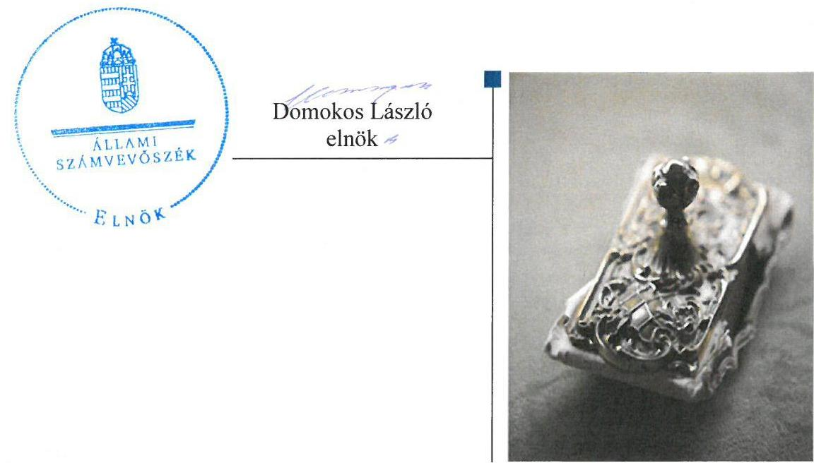

---

# AZ ELLENŐRZÉST FELÜGYELTE: 

PETŐ KRISZTINA felügyeleti vezető

## AZ ELLENŐRZÉST VEZETTE ÉS A VÉGREHAJTÁSÁÉRT FELELŐS:

ZAKAR LÁSZLÓ ellenőrzésvezető

## A PROGRAM ÖSSZEÁLLÍTÁSÁÉRT FELELŐS:

JANIK JÓZSEF LÁSZLÓ osztályvezető

IKTATÓSZÁM: V-0949-185/2016
TÉMASZÁM: 1983
ELLENŐRZÉS-AZONOSÍTÓ SZÁM: V071312

---

# TARTALOMJEGYZÉK 

■ ÖSSZEGZÉS ..... 5
■ AZ ELLENŐRZÉS CÉLJA ..... 7
■ AZ ELLENŐRZÉS TERÜLETE ..... 8
■ AZ ELLENŐRZÉS HÁTTERE, INDOKOLTSÁGA ..... 10
■ FÓKUSZKÉRDÉSEK ..... 12
■ ELLENŐRZÉS HATÓKÖRE ÉS MÓDSZEREI ..... 13
■ MEGÁLLAPÍTÁSOK ..... 17
■ JAVASLATOK ..... 32
■ MELLÉKLETEK ..... 33
I. Sz. melléklet: Értelmező szótár ..... 33
II. Sz. melléklet: Az integritás érvényesítése érdekében kialakított és működtetett kontrollrendszer ..... 38
III. Sz. melléklet: Teljesítmény-ellenőrzési kiegészítő modul megállapításai ..... 39
■ FÜGGELÉK: ÉSZREVÉTELEK ..... 41
■ RÖVIDÍTÉSEK JEGYZÉKE ..... 57

---

.

---

# ÖSSZEGZÉS 

Az Állami Számvevőszék a Nemzeti Adó- és Vámhivatal Képzési, Egészségügyi és Kulturális Intézete pénzügyi és vagyongazdálkodása szabályszerűségének ellenőrzését a 2011. január 1. és 2014. december 31. közötti időszakra végezte el. Az ellenőrzés megállapította, hogy az irányító szerv Intézményre vonatkozó feladatellátása szabályszerű volt. Az Intézmény belső kontrollrendszerének a kialakítása és a működtetése, valamint a pénzügyi gazdálkodása nem volt szabályszerű. Az Intézmény a közbeszerzési előírásokat nem tartotta be. Az Intézmény vagyongazdálkodása nem volt szabályszerű, mert a 2011-2014. évi éves költségvetési beszámolók mérlegeiben olyan eszközöket mutatott ki, amelyeket a vagyonkezelő mutathat ki, miközben az Intézmény az állami vagyon vagyonkezelésére vonatkozó szerződéssel nem rendelkezett. A pénzügyi és vagyongazdálkodás ellenőrzése során feltárt szabálytalanságok nem igazolták az Intézmény által az integritás szemlélet érvényesítése érdekében tett intézkedéseket.

## Az ellenőrzés társadalmi indokoltsága

A közpénzek felhasználásában és az állami vagyonnal való gazdálkodásban a központi alrendszer egyes intézményei meghatározó súlyt képviselnek. E szervezetekkel szemben társadalmi igény, hogy tevékenységükről a döntéshozók és a nyilvánosság felé elszámoljanak. Ezzel a társadalmi igénnyel és az Állami Számvevőszék Stratégiájával összhangban a közpénzügyek átláthatóságának előmozdítása, a közvagyon védelme érdekében került sor a Nemzeti Adó- és Vámhivatal Képzési, Egészségügyi és Kulturális Intézete pénzügyi és vagyongazdálkodásának ellenőrzésére.

## Főbb megállapítások, következtetések, javaslatok

Az irányító szerv Intézményre vonatkozó feladatellátása szabályszerű volt, mert irányítási és egyéb ellenőrzési jogosultságait a jogszabályoknak megfelelően gyakorolta. A 2011-2013. években hiányosság volt, hogy az irányító szerv a szabályszerűségi ellenőrzéseken kívül, a jogszabályi előírás ellenére az erőforrásokkal való hatékony gazdálkodáshoz szükséges követelményeket nem érvényesítette az Intézménynél.

Az Intézmény belső kontrollrendszerének a kialakítása és a működtetése nem volt szabályszerű. A nem szabályszerű minősítését a kontrollkörnyezet kialakításának és a kockázatkezelési rendszer kialakításának és működtetésének 2011-2012. évi hiányosságai okozták.

Az Intézmény pénzügyi gazdálkodása nem volt szabályszerű. Az Intézménynél az elemi költségvetés és az előirányzatok megállapítása, valamint a bevételi és kiadási előirányzatok módosítása során betartották a jogszabályi előírásokat és a belső szabályzatokban foglaltakat. A bevételi előirányzatok teljesítése a jogszabályi előírásoknak megfelelően történt. A kiadási előirányzatok felhasználása során a gazdálkodási jogkörök gyakorlása a 2011-2012. években részben, 2013-2014. évben megfelelően működtek. Az Intézmény a közbeszerzési előírásokat nem tartotta be. Az előirányzat felhasználásához kapcsolódó évközi korlátozó intézkedéseket az Intézmény végrehajtotta, a befizetési kötelezettséget teljesítette. Az előirányzat-maradvány megállapítása és felhasználása szabályszerű volt. Az Intézmény a zavartalan feladatellátásához a fizetőképesség folyamatos fennállása érdekében intézkedett. Az eredményszemléletű számvitel bevezetésével kapcsolatos feladatokat szabályszerűen végrehajtotta.

Az Intézmény vagyongazdálkodása nem volt szabályszerű. Az Intézmény a 2011-2014. évi éves költségvetési beszámolók mérlegeiben szabálytalanul kimutatott olyan eszközöket, amelyeket a jogszabályban foglaltak alapján a vagyonkezelő mutathat ki, miközben nem rendelkezett az állami vagyon vagyonkezelésére vonatkozó szerződéssel. A leltározás a 2011-2012. években nem volt szabályszerű, mert a mérlegtételek alátámasztásához a leltárt az Intézmény a 2011. évben nem állította össze, a 2012. évben a források leltározását nem végezte el. A vagyonelemek

---

hasznosítása kockázatos volt. Előfordult, hogy a helyiségek bérbeadási folyamata során a bérleti díjakat nem alapozta meg önköltségszámítás a belső szabályzatban előírtak ellenére. Továbbá a bérbeadási szerződések megkötése előtt az Intézmény rendszeresen nem győződött meg az átláthatóság követelményének az érvényesüléséről. A pénzügyi és vagyongazdálkodás ellenőrzése során feltárt szabálytalanságok nem igazolták az Intézmény által az integritás szemlélet érvényesítése érdekében tett intézkedéseket.

---

# AZ ELLENŐRZÉS CÉLJA 

## A Nemzeti Adó- és Vámhivatal Képzési, Egészségügyi és Kulturális Intézete pénzügyi és vagyongazdálkodásának ellenőrzése

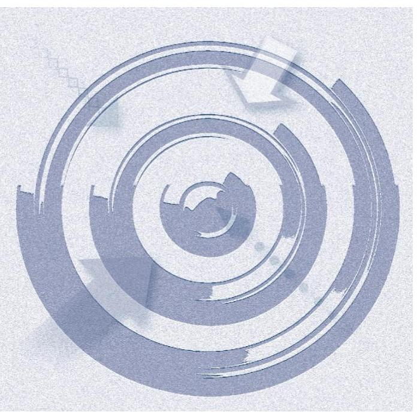

AZ ELLENŐRZÉS célja annak megítélése volt, hogy az ellenőrzött Intézményre vonatkozó irányító szervi feladatellátás a jogszabályi előírások betartásával történt-e; az Intézménynél a belső kontrollrendszer kialakítása és működtetése szabályszerű volt-e; kialakították-e az erőforrásokkal való szabályszerű, gazdaságos, hatékony és eredményes gazdálkodáshoz szükséges követelményeket, megvalósították-e azok számon kérését, ellenőrzését; az Intézmény pénzügyi és vagyongazdálkodása megfelelt-e a jogszabályi előírásoknak és belső szabályzatainak; az Intézmény átalakításának vagy átszervezésének lebonyolítása szabályszerűen történt-e.

Az Intézmény korrupcióval szembeni veszélyeztetettségének csökkentése érdekében az ÁSZ ${ }^{1}$ felmérte az integritási szemlélet érvényesülését a gazdálkodási folyamatokban.

A KIEGÉSZÍTŐ TELJESÍTMÉNY-ELLENŐRZÉSI MODUL célja annak értékelése volt, hogy a gazdálkodás folyamatában a gazdaságossági, hatékonysági és eredményességi követelmények kialakítása megtörtént-e, azokat működtették-e, a célkitűzéseket elérték-e; a pénzügyi és vagyongazdálkodás folyamataira vonatkozóan a költségvetési szerv belső kontrollrendszerének minőségéről kiadott vezetői nyilatkozatban a költségvetési szerv tevékenységében a hatékonyság, eredményesség, gazdaságosság követelményeinek érvényesítésére vonatkozó nyilatkozat helytálló volt-e.

---

# **AZ ELLENŐRZÉS TERÜLETE**

## **Nemzeti Adó- és Vámhivatal Képzési, Egészségügyi és Kulturális Intézete**

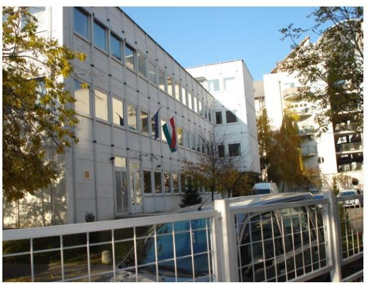

**AZ INTÉZMÉNY**2 az Országgyűlés által alapított költségvetési szerv, amelyet a Nemzeti Adó- és Vámhivatalról szóló 2010. évi CXXII. törvény alapján 2011. január 1-jével hoztak létre. Az Intézmény alapfeladata a NAV3 kormánytisztviselői, kormányzati ügykezelői, hivatásos állományú tagjai és munkavállalói részére egészség megőrzési, egészségügyi, szociális és kulturális feladatok ellátása, továbbá a munkavégzésükhöz szükséges képzés, továbbképzés megszervezése és lebonyolítása. Az Intézményt az ellenőrzött időszakban átalakítás nem érintette, feladatstruktúrája nem változott.

Az Intézmény önállóan működő és gazdálkodó költségvetési szerv, a NAV fejezetén belül önálló címet képzett. Az irányító szervi feladatokat az ellenőrzött időszakban a NAV látta el. Az Intézményt a NAV elnöke által kinevezett főigazgató vezette. A főigazgató illetve a gazdasági vezető (gazdasági főigazgató-helyettes) személyében az ellenőrzött időszakban egy-egy alkalommal történt változás. Az irányító szerv vezetője az Intézmény vezetőjét és gazdasági vezetőjét az Intézmény alapításakor, 2011. január 1-jén nevezte ki. A 2012. évben e két vezetői megbízás visszavonásra került és ezt követően augusztus 1-jével a főigazgató, illetve október 1-jével a gazdasági vezető kinevezésére került sor.

Az Intézményen belül a gazdálkodási feladatokat az SZMSZ1,24-ben foglaltak alapján a Pénzügyi és Számviteli Főosztály látta el.

Az Intézmény 2011. évi engedélyezett létszáma 369 fő volt, ami 2012-2014. évekre 357 főre módosult. Az átlagos statisztikai állományi létszám 2011-ben 336 főről, 2014-ben – 3,9%-kal – 349 főre emelkedett.

Az Intézmény az éves költségvetési beszámolók alapján az ellenőrzött időszakban 11 504,4 M Ft összes bevételt teljesített, az összes kiadása 10 919,6 M Ft volt. Az Intézmény 2011–2014. évekre jóváhagyott eredeti, módosított és teljesített bevételi és kiadási előirányzatok alakulását az 1. ábra mutatja be.

---

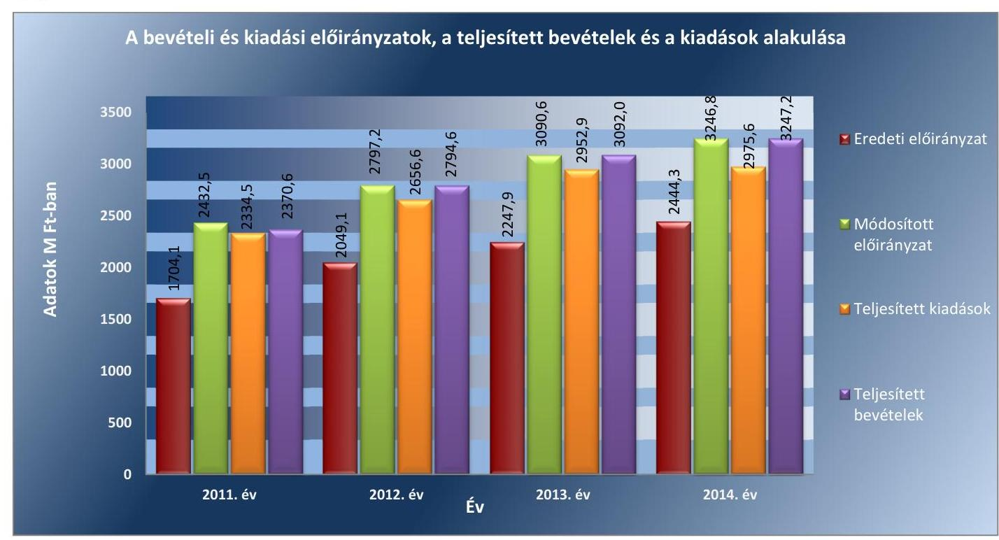

*Forrás: a 2011-2014. évi költségvetési beszámolók*

Az Intézmény könyvviteli mérleg szerinti vagyona a 2011. évi 1780,0 M Ft-ról 2014. év végére – 61,4%-kal – 2873,7 M Ft-ra nőtt.

Az ellenőrzött időszakban az Intézmény mérleg szerinti vagyonának alakulását a 2. ábra mutatja be.

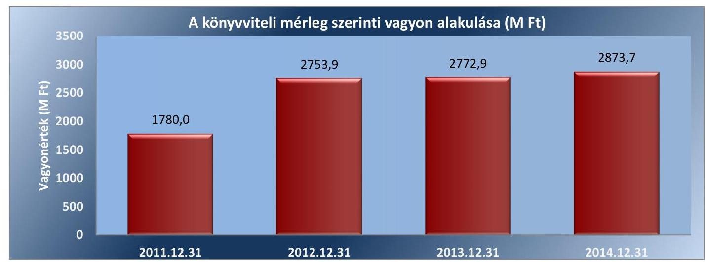

*Forrás: a 2011-2014. évi költségvetési beszámolók*

A befektetett eszközök állománya a 2011. év végi 1705,1 M Ft-ról 2014. év végére – 51,2%-kal – 2578,0 M Ft-ra nőtt. A kötelezettségek összege a 2011. évi 32,3 M Ft-ról 2014. év végére 130,5 M Ft-ra nőtt. A saját tőke a 2011. évi 1698,6 M Ft-ról 2014. év végére – 53,3%-kal – 2604,5 M Ft-ra nőtt.

---

# AZ ELLENŐRZÉS HÁTTERE, INDOKOLTSÁGA 

Az Alaptörvény rendelkezése szerint a nemzeti vagyon megőrzésének, védelmének és a nemzeti vagyonnal való felelős gazdálkodásnak a követelményeit sarkalatos törvény, az Nvtv ${ }^{5}$. rögzíti. A tulajdonosi joggyakorlás és vagyonkezelés általános és speciális szabályait, az állami vagyon nyilvántartására és elszámolására vonatkozó eljárásokat, a vagyonkezelési szerződés feltételrendszerét, valamint az éves beszámoló készítési és könyvviteli kötelezettségeket kormányrendelet írja elő.

A központi alrendszer egyes intézményei közfeladat-ellátásának változásait, a közfeladatok átadásából és átvételéből adódó módosításait, előirányzat gazdálkodására ható tényezőit az Áht., ${ }^{6} 11 . \S$-a és az Ávr. ${ }^{7} 14 . \S$-a írja elő. A közfeladatok megszűnéséből, intézmény átszervezéséből, belső szerkezeti korszerűsítéséből, vagy más hasonló okból adódó módosításai miatt szerepeltetendő szerkezeti változásokat, valamint a szerkezeti változásként beépült közfeladatok szintre hozásként történő számításba vételét az Ávr. 15. § (2)-(3) bekezdései határozzák meg.

A társadalmi igénnyel összhangban az Áht., ${ }^{8}$ „ az Ámr. ${ }^{9}$ és a Bkr. ${ }^{10}$ is előírja a költségvetési szerv részére, hogy olyan követelményeket alakítson ki, amelyek biztosítják a működés, gazdálkodás, az erőforrások felhasználása során a gazdaságosság, hatékonyság és eredményesség érvényesülését. Az Ámr. és a Bkr. alapján az Intézményvezetőnek évente nyilatkoznia is kell arról, hogy gondoskodott-e az Intézmény tevékenységében a gazdaságosság, hatékonyság és eredményesség követelményeinek érvényesítéséről. A gazdaságos, hatékony és eredményes gazdálkodáshoz szükség van a teljesítménymérés feltételeinek kialakítására, úgymint az egyértelmű és mérhető célokra, mutatószámokra és az ezekhez rendelt követelményekre. Az ÁSZ jelen ellenőrzéssel győződik meg arról, hogy az Intézménynél a teljesítménycélokat, -mutatókat, -követelményeket kialakították-e, azokat működtették-e, a kitűzött cél(ok) teljesültek-e.

AZ ELLENŐRZÉS EREDMÉNYEKÉPPEN nemcsak az ellenőrzött intézmények gazdálkodása javulhat, hanem átfogó képet kaphatunk a központi alrendszerbe tartozó költségvetési szervek gazdálkodásának hiányosságairól, de a jó gyakorlatokról is. Ellenőrzéseivel, javaslataival és megállapításaival az ÁSZ elősegítheti a költségvetési szervek pénzügyi és vagyongazdálkodása szabályozásának javítását és hozzájárulhat a jó kormányzáshoz. Az ellenőrzés az ellenőrzött számára visszajelzést ad a pénzügyi és vagyongazdálkodásában feltárt hiányosságokról, javaslataival hozzájárul azok kiküszöböléséhez, amely csökkentheti a későbbi ellenőrzések gyakoriságát. Az ellenőrzés megállapításait és javaslatait más szervezetek is hasznosíthatják a rendezett gazdálkodási keretek kialakításához.

## A TELJESÍTMÉNY-ELLENŐRZÉSI KIEGÉSZÍTŐ

MODUL alapján elvégzett ellenőrzés a törvényalkotás számára támogatást nyújt a nemzeti kulcsindikátorok rendszerének kialakításához. A döntéshozók, ellenőrzöttek, irányító szervek, a társadalom számára az összehasonlítási, összemérési lehetőségek kihasználásával objektív visszajelzést

---

ad a gazdálkodás területén végrehajtott szervezeti, szervezési, takarékossági és bürokráciacsökkentő intézkedések hatásairól, a közfeladat-ellátásnak keretet adó pénzügyi és vagyongazdálkodásban mérhető teljesítménykövetelmények kialakításáról, azok alkalmazásáról.

---

# FÓKUSZKÉRDÉSEK 

1.     - Az irányító szerv ellenőrzött intézményre vonatkozó feladatellátása szabályszerű volt-e?
2.     - A belső kontrollrendszer kialakítása és működtetése megfelelt-e a jogszabályi előírásoknak?
3.     - Az Intézmény pénzügyi gazdálkodása szabályszerű volt-e?
4.     - Az Intézmény vagyongazdálkodása szabályszerű volt-e?
5.     - Szabályszerűen hajtották-e végre az ellenőrzött

 időszakban az Intézményt érintő szervezeti, szerkezeti átalakításokat?
6.     - Az Intézmény intézkedett-e az integritás szemlélet érvényesítése érdekében?

---

# ELLENŐRZÉS HATÓKÖRE ÉS MÓDSZEREI 

## Az ellenőrzés típusa

Szabályszerűségi ellenőrzés, amelyet teljesítmény-ellenőrzési modul egészített ki.

## Az ellenőrzött időszak

Az ellenőrzött időszak 2011. január 1-jétől 2014. december 31-ig terjedő időszak volt.

## Az ellenőrzés tárgya

Az ellenőrzött szervezetre vonatkozó irányító szervi feladatok ellátása. Az Intézmény belső kontrollrendszerének kialakítása és működtetése, valamint pénzügyi és vagyongazdálkodása. Az erőforrásokkal való szabályszerű, gazdaságos, hatékony és eredményes gazdálkodáshoz szükséges követelmények kialakítása, a kialakított követelmények számonkérése, ellenőrzése. Az Intézmény átalakítása, átszervezése lebonyolításának szabályszerűsége.

A teljesítmény-ellenőrzési kiegészítő modul esetében az intézmény gazdálkodási folyamatában a gazdaságossági, hatékonysági és eredményességi követelmények kialakítása és működtetése, a célkitűzések teljesítésének értékelése. Az Intézmény tevékenységében a hatékonyság, eredményesség, gazdaságosság követelményei érvényesítéséről kiadott nyilatkozat helytállósága. A teljesítmény-ellenőrzés fókuszkérdéseire a III. számú melléklet ad választ.

Az ellenőrzés kiterjedt minden olyan körülményre és adatra, amely az ÁSZ jogszabályban meghatározott feladatainak teljesítéséhez, valamint a programok végrehajtása folyamán felmerült újabb összefüggések feltárásához voltak szükségesek.

## Az ellenőrzött szervezet

A Nemzeti Adó- és Vámhivatal Képzési, Egészségügyi és Kulturális Intézete, a 2011-2014. évi irányítószervi feladatok vonatkozásában a Nemzeti Adó- és Vámhivatal.

---

# Az ellenőrzés jogalapja 

Az ellenőrzés jogszabályi alapját az ÁSZ tv. 1. § (3) bekezdés, 5. § (2)-(6) bekezdései, valamint az Áht. 2 61. § (2) bekezdésének előírásai képezték.

## Az ellenőrzés módszerei

Az ellenőrzést az ellenőrzési program szempontjai, az ellenőrzött időszakban hatályos jogszabályok, az ellenőrzés szakmai szabályai, az egyes ellenőrzési típusokhoz kapcsolódó ÁSZ módszertanok és nemzetközi standardok figyelembevételével végeztük. A gazdálkodás hibáinak kijavítására, a közpénzekkel való felelős gazdálkodás segítésére irányuló javaslatok kidolgozásakor a hatályos jogszabályok voltak az irányadóak.

Az ellenőrzés ideje alatt az ellenőrzött szervezettel történő kapcsolattartást az ÁSZ SZMSZ ${ }^{11}$-ének vonatkozó előírásai alapján biztosítottuk.

Az ellenőrzési kérdések megválaszolásához szükséges bizonyítékok megszerzése a következő ellenőrzési eljárások alkalmazásával történt: megfigyelés, szemle (szemrevételezés), kérdésfeltevés (információkérés), mintavételezés, valamint elemző eljárás. A minták kiválasztása során elsősorban reprezentativitást biztosító véletlen mintavételi eljárást alkalmaztunk.

Az ellenőrzési bizonyítékként felhasználható adatforrások közé tartoztak egyrészt a szakmai program részletes szempontjainál felsorolt adatforrások, másrészt adatforrás volt minden egyéb - az ellenőrzés folyamán feltárt, az ellenőrzés szempontjából releváns információt tartalmazó - dokumentum.

Az ellenőrzés lefolytatásához az intézmény a tanúsítványok elektronikus kitöltésével, valamint az ÁSZ által kért dokumentumok elektronikus megküldésével szolgáltatott adatokat. A rendelkezésre bocsátott adatok, információk kontrollja az ellenőrzés keretében történt.

Az ellenőrzési kérdésekre adott válaszok alapján értékeltük, hogy az ellenőrzött időszakban az irányító szerv az ellenőrzött intézményre vonatkozó feladatainak szabályszerűen eleget tett-e, az Intézmény pénzügyi és vagyongazdálkodása megfelelt-e az előírásoknak, az Intézmény átalakításának vagy átszervezésének végrehajtása szabályszerű volt-e. Értékeltük, hogy az Intézménynél kialakították-e az erőforrásokkal való szabályszerű és hatékony gazdálkodáshoz szükséges követelményeket, megvalósították-e azok számonkérését, ellenőrzését.

Az Intézmény belső kontrollrendszere jogszabályi előírások szerinti kialakításának és működtetésének szabályszerűségét az erre irányuló ellenőrzési kérdésekre adott válaszok összesítése alapján, évente pillérenként (kontrollkörnyezet, kockázatkezelési rendszer, kontrolltevékenységek, információs és kommunikációs rendszer, monitoring rendszer) és összesítetten is minősítettük. Az Intézmény belső kontrollrendszere egyes pilléreinek kialakítását és működtetését „szabályszerű"-nek minősítettük, amennyiben az értékelt területen az elért és elérhető pontok százalékban kifejezett, egész számra kerekített hányadosa meghaladta a 84%-ot, „részben szabályszerű"-nek minősítettük, ha a 84%-ot nem haladta meg, de 60%-nál nagyobb volt, „nem szabályszerű"-nek minősítettük, ha nem haladta meg

---

a 60%-ot. Az Intézmény belső kontrollrendszerének összesített értékelése megegyezik a pillérenként (kontrollterületenként) alkalmazott %-os értékelésekkel, a következő eltérésekkel. A kontrollrendszer egésze esetében a „szabályszerű" értékelésnek a %-os értéken felül további feltétele volt, hogy egyik kontrollterület sem kaphatott „nem szabályszerű" értékelést, a „részben szabályszerű" értékelés további feltétele volt, hogy legfeljebb egy ellenőrzött kontrollterület lehetett „nem szabályszerű" értékelésű. Az összesített értékelés a %-os értéktől függetlenül „nem szabályszerű"-nek minősült, ha az ellenőrzött kontrollterületek közül több mint egy „nem szabályszerű" értékelést kapott.

A tárgyi eszközök nyilvántartásba vételének, a közbeszerzési eljárások lefolytatásának, a vagyonhasznosítási bevételi előirányzatok teljesítésének, az előirányzatok módosításának és az előirányzat-maradvány megállapításának szabályszerűségét, valamint a gazdálkodási jogkörök gyakorlásának szabályszerűségét mintavétellel ellenőriztük.

A jogszabályoknak és a belső előírásoknak megfelelőnek tekintettük a tárgyi eszközök nyilvántartásba vételét, a közbeszerzési eljárások lefolytatását, a vagyonhasznosítási bevételi előirányzatok teljesítését, az előirányzatok módosítását és az előirányzat-maradvány megállapítását, amennyiben a minta ellenőrzésének eredménye alapján 95%-os bizonyossággal a teljes sokaságban a hibás tételek aránya kisebb volt, mint 10%, nem megfelelőnek értékeltük, ha a hibás tételek aránya a 10%-ot meghaladta. Kockázatot, illetve magas kockázatot jeleztünk, amennyiben egy adott terület vonatkozásában a minta alapján a teljes sokaságban nem volt egyértelműen biztosított a jogszabályoknak és a belső szabályzatoknak megfelelő működés.

A közbeszerzési eljárások esetében az ellenőrzött mintatételek értékelését végeztük el.

A 2011. évet érintően a szakmai teljesítésigazolás és az utalvány ellenjegyzése kulcskontrollok, a 2012-2014. éveket érintően a teljesítésigazolás és az érvényesítés kulcskontrollok működését értékeltük. Megfelelőnek értékeltük a gazdálkodási jogkörök gyakorlását, amennyiben 95%-os bizonyossággal a teljes sokaságban a hibás tételek aránya legfeljebb 10% volt, részben megfelelőnek, ha a hibás tételek arányának felső határa legfeljebb 30% volt, nem megfelelőnek, ha a hibás tételek sokaságbeli arányának felső határa meghaladta a 30%-ot.

Az integritás szemlélet érvényesülésének értékelése az Intézmény által kitöltött tanúsítványa alapján történt.

Az alapprogram alapján ellenőriztük, hogy a költségvetési szerv vezetője megtette-e nyilatkozatát arról, hogy gondoskodott a költségvetési szerv tevékenységében a hatékonyság, eredményesség és a gazdaságosság követelményeinek érvényesítéséről. Ezt kiegészítve, a teljesítmény-ellenőrzési kiegészítő modul keretében - felhasználva az alapprogram szerinti ellenőrzés megállapításait - értékeltük, hogy a költségvetési szerv vezetője kialakította-e a gazdaságossági, hatékonysági és eredményességi követelményeket, és azokat működtette-e, a célkitűzéseket elérte-e.

A teljesítmény-ellenőrzési kiegészítő modul a gazdálkodási feladatokra terjedt ki, a szakmai feladatellátást nem értékelte.

---

A gazdálkodási feladatok értékelése az alábbi területekre terjedt ki:
pénzügyi gazdálkodási (nem szakmai, adminisztratív) feladatok: költségvetés-, beszámoló-készítés, könyvvezetés, adatszolgáltatások, előirányzat-gazdálkodás, kötelezettségvállalások nyilvántartása, kezelése, bevételkezelés, bér- és illetményszámfejtés;
$\longrightarrow$ vagyongazdálkodási (logisztikai) feladatok: közbeszerzések és közbeszerzési értékhatárt el nem érő beszerzések, készletgazdálkodás, nyomtatók, fénymásolók üzemeltetése, épület- és ingatlanüzemeltetés, karbantartás, hibabejelentés, gépjármű és flottamenedzsment.
Az ellenőrzés során minden olyan körülményt és adatot is ellenőriztünk, amely a program végrehajtása kapcsán felmerült újabb összefüggéseknek az ellenőrzés céljaival összhangban lévő feltárásához szükséges. A teljesítmény-ellenőrzési kiegészítő programmodulban megfogalmazott ellenőrzési cél megválaszolásához az alapprogram végrehajtása során megfogalmazott megállapításokat is figyelembe vettük.

---

# 1. Az irányító szerv ellenőrzött intézményre vonatkozó feladatellátása szabályszerű volt-e? 

## Összegző megállapítás

### 1.1. számú megállapítás

### 1.2. számú megállapítás

Az irányító szerv Intézményre vonatkozó feladatellátása szabályszerű volt.

Az irányító szervet megillető jogosultságok gyakorlása a jogszabályi előírásoknak megfelelően történt.

Az Intézmény a 2011-2014. években a Kormányrendelet ${ }^{12}$ 5. § (2) bekezdése alapján a NAV Központi Hivatal irányítása alatt állt.

Az Intézmény az ellenőrzött időszak egészében rendelkezett az irányító szerv által, az államháztartásért felelős miniszter előzetes egyetértésével kiadott, az Áht. ${ }_{1,2}$ az Ámr., illetve az Ávr. által előírtaknak megfelelő tartalmú alapító okirattal ${ }_{1-4}$ ${ }^{13}$.

Az irányító szerv az Intézmény alapító okiratát három alkalommal módosította az ellenőrzött időszakban. A módosítások a jogszabályi előírásoknak megfelelően történtek és az alapító okirat ${ }_{2-4}$-et az Ámr.-ben, illetve az Ávr.-ben előírtaknak megfelelően a módosításokkal egységes szerkezetbe foglalták.

Az Ávr. 180. § (2) bekezdésében szereplő 2014. február 28-ai határidő ellenére az irányító szerv az ellenőrzött időszak végéig nem gondoskodott az alaptevékenység kormányzati funkciók szerinti besorolására vonatkozó, a jogszabályban meghatározott adatok alapító okiratban történő módosításáról.

Az irányító szerv az Áht. ${ }_{1}$ 93. § (1) bekezdés a) pont és az az Áht. ${ }_{2}$ 9. § (1) bekezdés a) pont szerinti - az Intézmény SZMSZ-ének jóváhagyására irányuló - irányítási jogát gyakorolta. Az Intézmény SZMSZ ${ }_{2}$-je nem volt teljesen összhangban az alapító okirattal, mert az Ávr. 13. § (1) bekezdés b) pont előírása ellenére az SZMSZ ${ }_{2}$ nem tartalmazta a hatályos, egységes szerkezetbe foglalt alapító okirat keltét és számát.

Az irányító szerv megvalósította a közfeladatok ellátására vonatkozó, az erőforrásokkal való szabályszerű gazdálkodáshoz szükséges követelmények érvényesítését, számonkérését és ellenőrzését. A közfeladatok ellátására vonatkozó, az erőforrásokkal való hatékony gazdálkodáshoz szükséges követelményeket az irányító szerv 2011-2013. években nem érvényesítette, a 2014. évben alakított ki erre vonatkozó követelményt, melynek számonkérése megtörtént, ellenőrzése azonban elmaradt.

Az irányító szerv megvalósította a szabályszerű gazdálkodáshoz szükséges követelmények érvényesítését és számonkérését a költségvetés tervezési

---

rendjének meghatározásával, az Intézmény előirányzatainak jóváhagyásával, a költségvetési gazdálkodás felügyeletével, a rendszeres adatszolgáltatásokkal, valamint a költségvetés végrehajtásáról szóló beszámoltatással. Az irányító szerv az ellenőrzött időszak minden évében végzett az Intézmény gazdálkodásának szabályszerűségére irányuló ellenőrzést.

Az irányító szerv a 2011-2013. években nem tett eleget az Áht. 1 49. § (5) bekezdés f) pontjában, illetve az Áht. 2 9. § (1) bekezdés f) pontjában előírtaknak, mert az erőforrásokkal való hatékony gazdálkodáshoz szükséges követelményeket az Intézményre vonatkozóan nem érvényesített, amely hiányában számonkérés és ellenőrzés sem történt.

A 2014. évben az irányító szerv az Intézményre érvényesítette az erőforrásokkal való hatékony gazdálkodás érdekében követelményt ${ }^{14}$, amelyet negyedévi beszámoltatásokkal számon kért, azonban erre vonatkozóan ellenőrzést nem végzett.

# 1.3. számú megállapítás 

Az intézménnyel kapcsolatos egyéb ellenőrzési és irányítási jogosultságok gyakorlása szabályszerűen történt.

Az irányító szerv az Áht. 1,2-ben előírtaknak megfelelően irányítási jogkörében rendszeresen figyelemmel kísérte az Intézmény költségvetési előirányzatainak tervezését, a jóváhagyott előirányzatok alakulását, az ellátandó feladatok teljesülését és a beszámolást, továbbá ellenőrizte a bevételi és kiadási előirányzatokkal való gazdálkodást.

Az irányító szerv vezetője az Áht. 1,2 előírásának megfelelően gyakorolta irányítási jogát az Intézmény vezetőjének és gazdasági vezetőjének kinevezései és felmentései során.

Az irányító szerv az Áht. 1,2-ben előírtaknak megfelelően az ellenőrzött időszakban rendszeresen beszámoltatta az Intézmény vezetőjét a szakmai feladatellátásról, továbbá az éves gazdálkodásról. Az irányító szerv a 2011-2014. években elfogadta az Intézmény éves költségvetési beszámolóit, valamint a szakmai tevékenységről szóló jelentéseit.

## 2. A belső kontrollrendszer kialakítása és működtetése megfelel-e a jogszabályi előírásoknak?

## Összegző megállapítás

A belső kontrollrendszer kialakítása és működtetése nem felelt meg a jogszabályi előírásoknak.

A belső kontrollrendszer kialakításának és működtetésének értékelését az 1. táblázat mutatja be.

---

1. táblázat

# AZ INTÉZMÉNY BELSŐ KONTROLLRENDSZER KIALAKÍTÁSÁNAK ÉS MŰKÖDTETÉSÉNEK ÉRTÉKELÉSE A 2011-2014. KÖZÖTTI ÉVEKBEN 

| Megnevezés | Kontrollkörnyezet | Kockázatkezelési rendszer | Kontrolltevékenységek | Információ és kommunikáció | Monitoring | ÖSSZESEN |
| :--: | :--: | :--: | :--: | :--: | :--: | :--: |
| 2011. | nem szabályszerű | nem szabályszerű | részben   szabályszerű | szabályszerű | részben   szabályszerű | nem szabályszerű |
| 2012. | nem szabályszerű | nem szabályszerű | szabályszerű | szabályszerű | részben   szabályszerű | nem szabályszerű |
| 2013. | szabályszerű | szabályszerű | szabályszerű | szabályszerű | részben   szabályszerű | részben szabályszerű |

 szabályszerű | szabályszerű |
| 2014. | szabályszerű | szabályszerű | szabályszerű | szabályszerű | szabályszerű | szabályszerű |

A kontrollkörnyezet kialakítása a 2011-2012. években nem volt szabályszerű, a 2013-2014. években szabályszerű volt.

A NAV tv. 89. § előírása ellenére az Intézmény 2011. május 2-a helyett, 2011. szeptember 17-től rendelkezett a jogosult vezető által jóváhagyott SZMSZ1-gyel. Az SZMSZ1,2 a jogszabályi előírásoknak megfelelően tartalmazta az Intézmény szervezeti felépítését, működési rendjét, a szervezeti egységek - ezen belül a gazdasági szervezet - megnevezését, engedélyezett létszámát, a költségvetési szerv szervezeti ábráját.

Az Intézmény gazdasági szervezete által ellátott feladatokat az Ámr. 20. § (7) bekezdés és az Ávr. 13. § (5) bekezdés alapján a 2011-2014. években az Intézmény SZMSZ1,2 tartalmazta. A gazdasági szervezet vezetője rendelkezett az Ámr.-ben és az Ávr.-ben foglalt végzettséggel, szakmai képesítésekkel és a könyvviteli szolgáltatás körébe tartozó tevékenység ellátására jogosító engedéllyel. Az Intézményben dolgozó foglalkoztatottak munkakörének megnevezését, feladatait, képesítési követelményeiket, felelősségi szabályokat, valamint a képviseleti és aláírási jogosultság részleteit munkaköri leírások tartalmazták.

A Számv. tv. ${ }^{15}$ 14. § (11) bekezdésében foglaltak ellenére a 2011. január 1-jén újonnan alakuló Intézmény a számviteli politikát a megalakulás időpontjától számított 90 napon belül nem készítette el, amelyért az Áhsz. ${ }^{16}$ 8. § (12) bekezdése alapján az államháztartás szervezetének a vezetője felelős. A Számv. tv. 14. § (5) bekezdés a)-d) pontjában foglaltak ellenére a számviteli politika keretében elkészítendő eszközök és a források leltárkészítési és leltározási szabályzata, értékelési szabályzata, az önköltségszámítás rendjére vonatkozó belső szabályzat, valamint a pénzkezelési szabályzat nem készült el a megalakulás időpontjától számított 90 napon belül.

Az Intézmény a Számviteli politika és az annak keretében elkészítendő szabályzatai hatályba lépéséig az irányító szerv vezetője által kiadott Számviteli politika ${ }_{1,2}$-t ${ }^{17}$ alkalmazta. Az irányító szerv vezetője által kiadott Számviteli politika ${ }_{1,2}$ előírta az Intézmény részére azt a követelményt, hogy köteles elkészíteni saját szabályzatát a sajátosságok figyelembe vételével.

Az Intézmény Számviteli politikája ${ }^{18}$ 2012. december 26-án lépett hatályba. Az Intézmény 2011. május 12-től rendelkezett Önköltség számítási szabályzat ${ }_{1}$-gyel ${ }^{19}$ és 2012. augusztus 29-től Leltározási és leltárkészítési szabályzat ${ }_{1}$-gyel ${ }^{20}$. Az Intézmény 2011. november 23-től rendelkezik Pénzkezelési szabályzat ${ }_{1}$-gyel ${ }^{21}$. Az Intézmény eszközeinek és forrásainak értékelési szabályzata ${ }_{1}{ }^{22}$ 2013. október 6-án lépett hatályba.

---

A Számviteli politika ${ }_{3-5}{ }^{23}$ megfelelt a Számv. tv., Áhsz. ${ }_{1}$ és Áhsz. ${ }_{2}{ }^{24}$ előírásainak, a Bizonylati rend ${ }_{1-3}{ }^{25}$ és Pénzkezelési szabályzat ${ }_{1-3}{ }^{26}$ tartalmazták a Számv. tv. előírásait. Az értékelési szabályzat ${ }_{1,2}{ }^{27}$ az Áhsz. ${ }_{1}$-ben és az Áhsz. ${ }_{2}$-ben előírtaknak megfelelően tartalmazta a követelések értékelési elveit.

Az Intézmény rendelkezett az Áht.1, az Áht.2, az Ámr. és az Ávr. előírásai szerinti a gazdálkodás részletes rendjét meghatározó Kötelezettségvállalás, érvényesítés, utalványozás és ellenjegyzés szabályozása ${ }_{3-5}$-tel ${ }^{28}$, továbbá a Kbt. ${ }_{1}{ }^{29}$, és Kbt. ${ }_{2}{ }^{30}$ szerinti Közbeszerzési szabályzat ${ }_{1-4}{ }^{31}$-gyel.

Az Intézmény 2011-2012. években nem rendelkezett az Ámr. 156. § (2) bekezdés és a Bkr. 6. § (3) bekezdés szerinti ellenőrzési nyomvonallal. A 2013-2014. években hatályos ellenőrzési nyomvonal ${ }_{1,2}{ }^{32}$ a Bkr. szerinti tartalommal készült.

Az Intézmény rendelkezett a 2011. évben az Ámr. és a 2012-2014. években a Bkr. előírásainak megfelelően szabálytalanságok kezelésének eljárásrendjével és az etikai elvárásokra vonatkozó szabályzattal.

# 2.2. számú megállapítás 

A kockázatkezelési rendszer kialakítása és működtetése a 2011-2012. években nem volt szabályszerű, a 2013-2014. években szabályszerű volt.

AZ INTÉZMÉNY VEZETŐJE a 2011. évben az Ámr. 157. § (2) bekezdése, illetve a 2012. évben a Bkr. 7. § (2) bekezdése előírásai ellenére nem mérte fel és nem állapította meg a szervezet tevékenységében, gazdálkodásában rejlő kockázatokat.

A 2013-2014. években az Intézmény vezetője a Bkr. előírásainak megfelelően kialakította és működtette az Intézmény kockázatkezelési rendszerét, megállapította az Intézmény tevékenységében és gazdálkodásában rejlő kockázatokat és a kockázatokkal kapcsolatban szükséges intézkedéseket, valamint azok nyomon követési módját.

Az Intézmény a Vnytv. ${ }^{33}$-ben foglaltak szerint az SZMSZ ${ }_{1,2}$-ben rögzítette a vagyonnyilatkozat tételre kötelezettek körét. A vagyonnyilatkozat őrzéséért felelős személy a Vnytv.-ben előírtaknak megfelelően tájékoztatta az érintetteket a vagyonnyilatkozat tételi kötelezettség fennállásáról és esedékességéről. Továbbá az egyéb iratoktól elkülönítetten kezelte a benyújtott vagyonnyilatkozatokat.

## 2.3. számú megállapítás

A kontrolltevékenység kialakítása és működtetése szabályszerű volt.

A KONTROLLTEVÉKENYSÉG részeként az Intézmény a 2011. évben az Áht ${ }_{1}$, a 2012-2014. években a Bkr. előírásainak megfelelően biztosította a pénzügyi döntések dokumentumainak elkészítése, valamint a gazdasági események elszámolása (könyvvezetés és beszámolás) kontrollja vonatkozásában a folyamatba épített, előzetes, utólagos és vezetői ellenőrzést (FEUVE).

Az Intézmény vezetője a 2011. évben az Ámr. és a 2012-2014. években a Bkr. előírásainak eleget téve az Intézmény belső szabályzataiban a felelősségi körök meghatározásával szabályozta az engedélyezési, jóváhagyási

---

és kontroll eljárásokat, a dokumentumokhoz, az információkhoz való hozzáférés jogosultságait, a hozzáférés szintjeit, valamint a beszámolási eljárásokat.

A gazdálkodási jogkörök gyakorlása a 2011-2012. években részben felelt meg, a 2013-2014. években megfelelt a jogszabályi előírásoknak. A 2011-2012. évek gazdálkodási jogkör gyakorlására vonatkozó hiányosságokat részletesen a 3.3. számú megállapítás tartalmazza.

Az Intézménynél alkalmazott iratkezelési szoftver által kezelt adatok biztonsága érdekében - az Ikr. ${ }^{34}$-ben foglaltaknak eleget téve - és az üzembiztonsági, adatvédelmi szabályok érvényre juttatásához szükséges feladatokat, eljárási szabályokat és hatásköröket az Iratkezelési szabályzat ${ }_{1-4}$-ben ${ }^{35}$ és az Adatvédelmi és Adatbiztonsági Szabályzat ${ }_{1,2}$-ben ${ }^{36}$ alakították ki.
2.4. számú megállapítás Az információs és kommunikációs folyamatok kialakítása megfelelt a jogszabályi előírásoknak.

AZ INTÉZMÉNY az ellenőrzött időszakban az Ámr. és a Bkr. előírásainak megfelelően kialakította az Intézménnyel kapcsolatos információk vonatkozásában a szervezeten belüli, valamint a 2012-2014. években a szervezeten kívülre történő információátadás rendszerét, amely biztosította, hogy a külső felek (illetékes szervezetek) részére a megfelelő információk a megfelelő időben eljussanak. Ezek működését és megvalósulását a belső szabályzatok kiadása, vezetői értekezletek, vezetői utasítások, valamint az informatikai rendszerek biztosították. Az Intézmény vezetője a 2011. évben az Ámr. 159. § (1) bekezdése ellenére nem alakította ki olyan rendszert, amely biztosította volna, hogy az információk a szervezeten kívülre (az illetékes szervekhez) a megfelelő időben eljussanak.

Az intézmény rendelkezett - az Avtv. ${ }^{37}$ és az Info tv. ${ }^{38}$ szerinti kötelezettségének eleget téve - Adatvédelmi és adatbiztonsági szabályzat ${ }_{1,2}$-vel. Az Intézmény a 2011-2014. években eleget tett az elektronikus közzétételi kötelezettségnek az Eitv. ${ }^{39}$-ben és Info tv.-ben foglaltaknak megfelelően.
2.5. számú megállapítás

A monitoring rendszer működése részben volt szabályszerű. A rendelkezésre álló források gazdaságos, hatékony és eredményes felhasználását biztosító követelmények kialakítása a jogszabályi előírásoknak és a belső szabályzatokban foglaltaknak megfelelő volt.

Az Intézmény vezetője a 2011-2014. években az Ámr. és a Bkr. előírásainak megfelelően kialakította a belső szabályzatokban a szervezet tevékenységének, a célok megvalósításának nyomon követését biztosító rendszert. A szabályzatoknak megfelelően a célok megvalósításának nyomon követését lehetővé tevő beszámolók, kimutatások, feljegyzések az ellenőrzött időszak alatt készültek.

A 2011-2014. évekre vonatkozóan a belső kontrollrendszer működéséről kiadott (Bkr. 11. § (1) bekezdés szerinti) éves vezetői nyilatkozat a hatékonyság, eredményesség és gazdaságosság követelményeinek érvényesítése vonatkozásában megfelelő volt. Az Intézmény vezetője kialakított és alkalmazott olyan követelményeket, amelyek biztosították az Intézmény tevékenységében a rendelkezésre álló források szabályozott, gazdaságos, hatékony és eredményes felhasználását.

---

Az Áht ${ }_{1}$-ben foglaltaknak megfelelően az Intézmény vezetője gondoskodott a belső ellenőrzés kialakításáról, 2011. január 1-jétől egy fő belső ellenőrt foglalkoztatott, akinél az összeférhetetlenségi előírások érvényesültek. A belső ellenőrzés funkcionális függetlensége biztosított volt. Az Intézmény rendelkezett Belső Ellenőrzési Kézikönyvvel ${ }^{40}$ és a 2011. évre vonatkozó kockázatelemzésen alapuló a költségvetési szerv vezetője által jóváhagyott éves ellenőrzési tervvel.

A 2011. július 7-től 2012. június 30-ig az Intézmény vezetője az Áht. 1 121/B. § (4) bekezdésében és az Áht. 2 70. § (1) bekezdésében leírtaknak nem tett eleget, mert nem gondoskodott a belső ellenőrzés megfelelő működtetéséről. A 2011. évben a belső ellenőrzési vezető a Ber. ${ }^{41}$ 12. § b) és c) pontokban leírtaknak nem tett eleget, mert a jóváhagyott 2011. éves ellenőrzési tervben foglalt ellenőrzéseket nem hajtotta végre. Továbbá a belső ellenőrzési vezető nem állította össze a 2011. évben a tárgyévet követő évre vonatkozó éves ellenőrzési tervet a Ber. 21. § (1) bekezdésében foglaltak ellenére és nem küldte meg a fejezetet irányító költségvetési szerv belső ellenőrzési egységének vezetője részére a Ber. 22. § (1) bekezdésében előírt 2011. november 15-ei határidőig.

Az Intézményvezető 2012. július 1-jétől gondoskodott az Áht. 2 és a Bkr. előírásainak megfelelő belső ellenőrzés működtetéséről. A 2012. második félévében a belső ellenőrzési vezető a Bkr. 22. § (1) bekezdés c) pontjának megfelelően megszervezte a belső ellenőrzési tevékenységet a 2012. év második félévre készült ellenőrzési terv végrehajtása érdekében.

A belső ellenőrzési vezető a 2013-2014. évekre vonatkozó kockázatelemzésen alapuló éves ellenőrzési tervet jóváhagyásra megküldte a költségvetési szerv vezetőjének. A jóváhagyást követően a költségvetési szerv vezetője a 2012. évben a Bkr. 32. § (2) bekezdésben előírt november 15-ei határidő helyett késve, 2012. november 19-én küldte meg a 2013. évre vonatkozó éves ellenőrzési tervét a fejezetet irányító költségvetési szerv belső ellenőrzési vezetője részére.

A 2013-2014. években az Intézmény az éves ellenőrzési tervekben foglalt ellenőrzéseket végrehajtotta, az elvégzett ellenőrzések megállapításait, javaslatait a Bkr. szerinti jelentésekbe foglalta. A 2014. évben a belső ellenőrzés javaslatainak végrehajtása érdekében az ellenőrzött szervezeti egységek vezetői a Bkr. előírásainak megfelelően intézkedési tervet készítettek. A költségvetési szerv vezetője az intézkedési terv jóváhagyásáról a belső ellenőrzési vezető véleményének kikérésével - az intézkedési terv kézhezvételétől számított 8 napon belül döntött. A belső ellenőrzés a Bkr. előírásainak megfelelően nyilvántartotta és nyomon követte a belső ellenőrzési jelentések alapján megtett intézkedéseket.

---

# 3. Az Intézmény pénzügyi gazdálkodása szabályszerű volt-e? 

## Összegző megállapítás

### 3.1. számú megállapítás

Az intézmény pénzügyi gazdálkodása nem volt szabályszerű.

Az Intézmény az elemi költségvetés és az előirányzatok megállapítása során betartotta a jogszabályi előírásokat és a belső szabályzatokban foglaltakat.

Az Intézmény elemi költségvetése, az előirányzatok megállapítása megfelelő az Áht. ${ }_{1,2}$, az Ámr., az Ávr., az NGM rendelet ${ }_{1,2}{ }^{42}$, az NGM és az irányító szerv által kiadott tervezési szempontok, követelmények valamint a vonatkozó belső szabályozások (Gazdálkodási tevékenység ellenőrzési nyomvonala, a Költségvetési előirányzat tervezése ${ }^{43}$ ) előírásainak.

Az Intézmény kiadási és bevételi előirányzatainak tervezését a megalapozottság és a végrehajthatóság biztosítása érdekében számításokkal támasztotta alá. Az éves költségvetési javaslat elkészítése során az Intézmény figyelembe vette az előirányzatok megállapításakor az
 Intézményt érintő szerkezeti változások és a szintre hozások hatásait. Az Intézmény 2011. évi költségvetése a szervezeti struktúra, a szakfeladatok és a létszám kialakításával párhuzamosan készült. Az Intézmény a 2011. évi elemi költségvetését az alapító okirat szerinti alaptevékenységek által meghatározott feladatoknak megfelelően alakította ki.

Az Intézmény a költségvetési tervezés során az előírt adatszolgáltatási kötelezettségeit teljesítette. Az Intézmény éves költségvetési javaslatait tartalmazó elemi költségvetéseit az irányító szerv jóváhagyta és azokat a Kincstár ${ }^{44}$ részére megküldte.

A 2011-2014. évi elemi és a kincstári költségvetés az Ámr. és Ávr. előírásainak megfelelően kiemelt előirányzati szinten egyezőséget mutatott.
3.2. számú megállapítás

A bevételi és kiadási előirányzatok módosítását a jogszabályi előírásoknak és a belső szabályzatokban foglaltaknak megfelelően hajtották végre.

Az előirányzat-módosítások megfeleltek a 2011. évben az Áht. 1 és az Ámr., valamint a 2012-2014. években az Áht. 2 és az Ávr. előírásainak. Az Intézmény évenkénti előirányzat-módosításait - hatáskör szerinti bontásban - a 2. táblázat mutatja be.
2. táblázat

A 2011-2014. ÉVI ELŐIRÁNYZAT-MÓDOSÍTÁSOK ALAKULÁSA HATÁSKÖRÖNKÉNT (M FT)

| Évek | Eredeti   előirányzat | Módosított   előirányzat | Összes   előirányzat változás | Előirányzat módosítások hatáskör szerint |  |  |  |
| :--: | :--: | :--: | :--: | :--: | :--: | :--: | :--: |
|  |  |  |  | Országgyűlés | Kormány | Irányító szerv | Sigát |
| 2011. | 1704,1 | 2432,5 | 728,4 | $-140,8$ | 8,3 | 834,4 | 26,5 |
| 2012. | 2049,1 | 2797,2 | 748,1 | 0,0 | 3,5 | 725,3 | 19,3 |
| 2013. | 2247,9 | 3090,6 | 842,6 | 0,0 | 26,0 | 670,1 | 146,5 |
| 2014. | 2444,3 | 3246,8 | 802,5 | 0,0 | 23,4 | 647,1 | 132,0 |
| Összesen: | 8445,4 | 11567,1 | 3121,6 | $-140,8$ | 61,2 | 2876,9 | 324,3 |

Forrás: 2011-2014. évi költségvetési beszámolók, analitikus nyilvántartások

---

Az ellenőrzött időszakban az intézményi hatáskörben végrehajtott előirányzat-módosítások forrása az előző évi előirányzat-maradvány, a támogatásértékű bevétel előirányzatosítása, valamint az előirányzat átcsoportosítás volt. Az irányító szerv által engedélyezett előző évi maradvány előirányzatosítása megfelelt az irányító szerv által jóváhagyott maradvány összegének. Az előirányzatok módosításainak főkönyvi könyvelése a 2011-2013. években az Áhsz. ${ }_{1}$ és a 2014. évben az Áhsz. ${ }_{2}$ előírásainak megfelelően történt.

Az Intézmény - az intézkedést követően - határidőben tájékoztatta a Kincstárt és az irányító szervet - 2011. évben az Ámr. és 2012-2014. években az Ávr. előírásainak megfelelően - a megvalósult előirányzat módosításokról, átcsoportosításokról.

# 3.3. számú megállapítás 

A bevételi előirányzatok teljesítése során a jogszabályi előírásokat betartották, a kiadási előirányzatok felhasználása során a jogszabályi előírásokat részben tartották be.

A bevételi előirányzatok a módosított előirányzatokhoz képest az ellenőrzött időszak alatt 97,5% és 100,1% között teljesültek. A kiadási előirányzat túllépésére az ellenőrzött időszak alatt nem került sor, a módosított kiadási előirányzatok 91,6% és 94,9% között teljesültek.

Az Intézmény eredeti kiadási és bevételi előirányzata évente emelkedett, a 2011. évi 1704,1 M Ft-ról a 2014. évre - 43,4%-kal - 2444,3 M Ftra nőtt. Az évről évre növekvő előirányzat változását elsősorban a személyi juttatások (létszámnövekedés és bérkompenzáció), valamint a dologi kiadások kiemelt előirányzatok növekedése okozta.

A kiadási és bevételi előirányzatok 2011-2014. évek közötti teljesítését az alábbi 3. táblázat mutatja be.
3. táblázat

KIADÁSI ÉS BEVÉTELI ELŐIRÁNYZATOK TELJESÍTÉSE 2011-2014. (M FT)

| Kiadási előirányzatok teljesítése |  |  |  |  |
| :--: | :--: | :--: | :--: | :--: |
| Megnevezés | Eredeti előirányzat | Módosított előirányzat | Teljesítés | Teljesítés / Módosított előirányzat (%) |
| 2011. | 1704,1 | 2432,5 | 2334,5 | 95,9 |
| 2012. | 2049,1 | 2797,2 | 2656,6 | 94,9 |
| 2013. | 2247,9 | 3090,6 | 2952,9 | 95,5 |
| 2014. | 2444,3 | 3246,8 | 2975,6 | 91,6 |
| Bevételi előirányzatok teljesítése |  |  |  |  |
| Megnevezés | Eredeti előirányzat | Módosított előirányzat | Teljesítés | Teljesítés / Módosított előirányzat (%) |
| 2011. | 1704,1 | 2432,5 | 2370,6 | 97,5 |
| 2012. | 2049,1 | 2797,2 | 2794,6 | 99,9 |
| 2013. | 2247,9 | 3090,6 | 3092,0 | 100,1 |
| 2014. | 2444,3 | 3246,8 | 3247,2 | 100,0 |

---

Az Intézmény 2011-2014. évek közötti működési bevétele elsősorban üdülőhelyi szolgáltatásból, éttermi vendéglátásból, munkahelyi étkeztetésből, valamint képzésekből származott. A 2011. évi módosított előirányzat 80,8%-os teljesítése az üdülők kihasználtságának csökkenéséből, és a képzésekben résztvevők számának csökkenéséből adódott. A 2011-2014. években a működési bevétel alakulását az 4. táblázat mutatja.
4. táblázat

| MŰKÖDÉSI BEVÉTEL ALAKULÁSA 2011-2014. KÖZÖTT (M FT) |  |  |  |  |  |
| :--: | :--: | :--: | :--: | :--: | :--: |
| Megnevezés | Eredeti előirányzat | Módosított előirányzat | Teljesítés | Módosított előirányzat / Eredeti előirányzat (%) | Teljesítés / Módosított előirányzat % |
| 2011. | 295,9 | 322,4 | 260,5 | 108,9% | 80,8% |
| 2012. | 295,9 | 266,1 | 263,2 | 89,9% | 98,9% |
| 2013. | 250,9 | 275,4 | 277,2 | 109,7% | 100,6% |
| 2014. | 254,0 | 283,6 | 284,0 | 111,6% | 100,1% |

A 2011-2014. évi költségvetési beszámolók
Az engedélyezett állományi létszám a 2011. évi 369 főről 2014. évre 357 főre csökkent. A létszám és a személyi juttatás előirányzat alakulását az 5. táblázat mutatja.
5. táblázat

# A LÉTSZÁM ÉS A SZEMÉLYI JUTTATÁS ALAKULÁSA 2011-2014. 

| Év | Létszám és a személyi juttatás |  |  |  |  |
| :--: | :--: | :--: | :--: | :--: | :--: |
|  | Év | Létszám |  | Személyi juttatás |  |
|  |  |  | Átlagos statisztikai létszám (fő) | Módosított előirányzat (M Ft) | Teljesítés (M Ft) |
| 2011. |  | 369 | 336 | 878,3 | 1340,3 |
| 2012. |  | 357 | 344 | 1152,7 | 1545,3 |
| 2013. |  | 357 | 348 | 1264,6 | 1578,5 |
| 2014. |  | 357 | 349 | 1261,8 | 1707,3 |

A gazdálkodási jogkörök gyakorlása a 2011-2012. évben részben megfelelően, a 2013-2014. évben megfelelően működtek.

Az Intézmény a 2011-2012. évben a kiadási előirányzatok felhasználása során az alábbi jogszabályi előírásokat nem tartotta be:
$\longrightarrow$ a dologi kiadásoknál a 2011. évben néhány esetben előfordult, hogy az utalvány ellenjegyzője a gazdasági vezető által nem volt írásban kijelölve a feladatra, így nem volt jogosult az Ámr. 79. § (1) bekezdésében és a kötelezettségvállalási szabályzat ${ }_{1}$-ben foglaltak alapján az utalvány ellenjegyzésére. Néhány esetben előfordult, hogy az érvényesítő az Ámr. 77. § (1) bekezdésében foglaltak ellenére nem ellenőrizte, hogy a megelőző ügymenetben betartották-e az Áht. ${ }_{1}$, az Ámr. és a belső szabályzatokban foglaltakat. Nem jelezte továbbá, hogy 2011. évben néhány esetben a kötelezettségvállalás ellenjegyzése az Ámr. 74. § (1) bekezdésében foglaltak ellenére nem történt meg, vagy a kötelezettségvállalás dokumentumán az ellenjegyzés dátumát nem tüntették fel.
— a dologi kiadásoknál a 2012. évben néhány esetben előfordult, hogy a kiadás utalványozására az Ávr. 59. § (1) bekezdésének előírása ellenére az érvényesítést megelőzően történt meg. Továbbá néhány esetben előfordult, hogy az érvényesítő az Ávr. 58. § (1) bekezdésében foglaltak ellenére nem ellenőrizte, hogy a megelőző ügymenetben betartották-e az Áht. 2, az Ávr. és a belső szabályzatokban foglaltakat. Nem jelezte, hogy a kötelezettségvállalás dokumentumán az Ávr. 55. § (1) bekezdésében foglaltak ellenére hiányzott a pénzügyi ellenjegyzés dátuma;
— a személyi juttatások 2011. évi kifizetései esetében néhány esetben előfordult, hogy az utalvány ellenjegyzője a gazdasági vezető által nem volt írásban kijelölve, így nem volt jogosult az Ámr. 79. § (1) bekezdésében és a kötelezettségvállalási szabályzat ${ }_{1}$-ben foglaltak alapján a feladat végrehajtására;
— a 2011. évi pénzeszközátadás esetében a szakmai teljesítésigazolást végző nem rendelkezett az Ámr. 76. § (5) bekezdésében előírt kötelezettségvállaló által történő írásbeli kijelöléssel.
A közbeszerzési előírásokat az ellenőrzésre kiválasztott kiadási tételek esetében az Intézmény nem tartotta be. A 2011. évben ugyanazon a napon közbeszerzési eljárás lefolytatása nélkül az Intézmény két szerződést kötött egy szállítóval, amelyek együttes nettó beszerzési értéke meghaladta az árubeszerzésre vonatkozó közbeszerzési értékhatárt, amivel az Intézmény megsértette a Kbt. ${ }_{1}$ 40. § (1)-(2) bekezdésekben foglaltakat, továbbá a Kbt. ${ }_{1}$ 240. § (1) bekezdés előírásait. Egy 2011. évben lefolytatott közbeszerzési eljárás eredményeképpen megkötött szerződést az Intézmény a 2012. évben a Kbt. 1 303. § (1) bekezdésében foglaltak ellenére - a Kbt. 2 181. § (1) bekezdés alapján - a Kbt. 2 5. §-ában és 119. §-ában foglaltak ellenére közbeszerzési eljárás lefolytatása nélkül módosított. Ezt a vállalkozási szerződést az Intézmény 2014. évben újra meghosszabbította, ezzel megsértette a Kbt. 2 5. §-ának előírásait.

# 3.4. számú megállapítás 

Az előirányzat felhasználáshoz kapcsolódó évközi korlátozó intézkedéseket végrehajtották. A befizetési kötelezettségeket teljesítették. Az előirányzat maradvány megállapítása, felhasználása szabályszerű volt.

## AZ INTÉZMÉNY AZ ÉVKÖZI KORLÁTOZÓ INTÉZ-

KEDÉSEKET, zárolást az előirányzat felhasználásához kapcsolódóan végrehajtotta. A 2011. évben az országgyűlési hatáskörben végrehajtott előirányzat-módosítás az államháztartási egyensúly megőrzéséhez szükséges intézkedésekről szóló Kormányhatározat ${ }_{1}$ ${ }^{45}$ alapján történt, de a NAV az Intézmény működőképességének fenntartása érdekében a dologi kiadások előirányzatát az elvonás összegével (140,8 M Ft-tal) megemelte, emiatt a korlátozó intézkedés az előirányzat felhasználásra nem gyakorolt érdemi hatást. Az Intézménynél a 2012. évben a Kormányhatározat ${ }_{2}$ ${ }^{46}$ alapján 26,3 M Ft zárolása és annak elvonása történt, melyet az Intézmény az Áhsz. ${ }_{1}$ előírásainak megfelelően hajtotta végre. A Kormány a 2014. évben a Kormányhatározat ${ }_{3}$ ${ }^{47}$-ban a 2014. évi hiánycél tartásáról szükséges intézkedésekről döntött, amivel összefüggésben az Intézménynél 12,5 M Ft összeget zároltak. A Kormány a Kormányhatározat ${ }^{48}$-gyel visszavonta a 2014. évi hiánycél tartásához szükséges intézkedésekről szóló Kormányhatározat ${ }_{3}$-mal elrendelt előirányzat-zárolást, melynek feloldásáról a Kincstár intézkedett.

Az Intézménynek a 2011-2014. években nem volt a Kvtv. 1-4. ${ }^{49}$-ben előírt befizetési kötelezettsége.

A 2011. évben az Ámr.-ben, a 2012-2014. években az Ávr.-ben foglaltak alapján az Intézmény rendelkezett az irányító szerv értesítésével az előirányzat-maradvány jóváhagyásáról. Az éves előirányzat-maradványok alakulását a 3. ábra mutatja be.
3. ábra
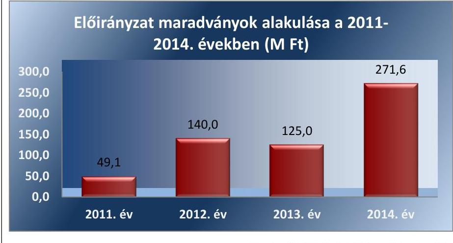

Forrás: a 2011-2014. évi költségvetési beszámolók

Az Intézmény a tárgyévi előirányzat-maradvány megállapítása és az előző évi maradvány felhasználása során betartotta a jogszabályi előírásokat. A 2011-2014.
 években a kötelezettséggel terhelt maradvány megállapítása és felhasználása megfelelt a 2011. évben az Ámr., illetve a 2012-2014. években az Ávr. előírásainak. Az ellenőrzött időszakban az Intézmény előirányzat-maradványából a központi költségvetést megillető, elvonandó előirányzat-maradvány megállapítása megfelelt a 2011. évben az Ámr., illetve a 2012-2014. években az Ávr. előírásainak.

Az Intézmény az irányító szerven keresztül tájékoztatta az NGM-et a tárgyévet követő év június 30-áig a pénzügyileg nem teljesült, továbbá meghiúsult kötelezettségvállalás miatt szabaddá váló előirányzat-maradványáról.

# 3.5. számú megállapítás 

Az Intézmény a zavartalan feladatellátásához a fizetőképesség folyamatos fennállása érdekében intézkedett.

Az Intézmény az Áht. 1,2 előírásainak megfelelően a folyamatos fizetőképességének biztosítása érdekében a 2011. évben előirányzat-felhasználási, a 2012. évtől likviditási tervet készített.

Az ellenőrzött időszakban biztosított volt a szállítói számlák határidőre történő kiegyenlítése. Az Intézménynél a rövid lejáratú kötelezettségeket a forgóeszközök, valamint a pénzeszközök is fedezték. Az Intézmény a lik-

---

viditás javítása érdekében előirányzat-keret előrehozást nem kért. Az Intézménynek 60 napon túli lejárt szállítói tartozása 2011. évben nem volt, a 2014. év végén 2,6 M Ft összegű volt.

Az Intézmény követelés állománya 2011. év végén 11,4 M Ft, a 2012. év végén 16,4 M Ft, a 2013. év végén 5,9 M Ft, a 2014. év végén 11,8 M Ft volt. Az Intézmény a követelések érvényesítésére a belső szabályzatban foglaltnak megfelelően intézkedett, egyenlegközlő leveleket, fizetési felszólításokat küldött ki az adósoknak, amennyiben az eredménytelen maradt, úgy végrehajtási eljárást kezdeményezett.
3.6. számú megállapítás Az Intézmény az eredményszemléletű számvitel bevezetésével kapcsolatos feladatokat szabályszerűen végrehajtotta.

Az Intézmény az NGM rendelet ${ }_{3}^{50}$ előírásainak megfelelően végrehajtotta a rendező mérleg elkészítését megelőző feladatokat. A rendező, technikai tételeket a 2013. évi főkönyvi (könyvviteli) számlákon számolta el, a záró egyenlegből kiindulva. Az NGM rendelet ${ }_{3}$ előírásainak megfelelően a rendező mérleg fordulónapja 2014. január 1-je volt.

A rendező mérleg elkészítéséig a könyvvezetés az NGM rendelet ${ }_{3}$ előírásai szerint történt. A megnyitott számlákon a 2014. január 1-jétől a számlák nyitásáig bekövetkezett gazdasági eseményeket elszámolták, az előirányzatok nyilvántartására szolgáló nyilvántartási számlák megnyitása az Áhsz. 2 szerint, az elemi költségvetés jóváhagyását követően történt.

Az Intézmény a rendezőmérleget formailag és tartalmilag a jogszabályban előírtaknak megfelelően, de az NGM rendelet ${ }_{3}$ 8. § (2) bekezdés a) pontja előírása szerinti 2014. március 31-ei határidőt túllépve 2014. május 19-ei dátummal készítette el.

Az Intézmény a 2014. évi nyitást követő rendezési feladatait az NGM rendelet ${ }_{3}$ 10. § előírásainak megfelelően végezte el.

# 4. Az Intézmény vagyongazdálkodása szabályszerű volt-e? 

## Összegző megállapítás

Az Intézmény vagyongazdálkodása nem volt szabályszerű.
4.1. számú megállapítás

Az Intézmény a 2011-2014. évi éves költségvetési beszámolók mérlegeiben olyan eszközöket mutatott ki, amelyeket a vagyonkezelő mutathat ki, miközben az Intézmény az állami vagyon vagyonkezelésére vonatkozó szerződéssel nem rendelkezett.

Az állami vagyon vagyonkezelésére vonatkozó, az MNV Zrt. ${ }^{51}$-vel kötött (a Vtv. ${ }^{52}$ 23. § (1) és az Nvtv. 11. § (1) bekezdéseiben foglalt) szerződéssel az Intézmény az ellenőrzött időszak alatt nem rendelkezett. Továbbá nem rendelkezett az Nvtv. 11. § (9) bekezdésében foglalt másik központi költségvetési szervvel vagyonkezelési szerződésben foglalt jogok és kötelezettségek - az ingatlanokra vonatkozó jogok és kötelezettségek kivételével - átruházására vonatkozó szerződéssel sem.

A mérlegben kimutatott eszközök és források nyilvántartása, értékelése nem felelt meg a jogszabályokban foglaltaknak. Az Intézmény a 2011-2014. évi éves költségvetési beszámolók mérlegeiben a

---

Számv. tv. 23. § (2) bekezdésében foglaltakat megsértve olyan eszközöket mutatott ki, amelyeket vagyonkezelő mutathat ki. Az Intézmény ezzel megsértette a Számv. tv. 15. § (3) bekezdésében foglalt valódiság elvét.

Az Intézmény a beszámoló elkészítéséhez, a mérleg tételeinek alátámasztásához a Számv. tv. 69. § (1)-(2) bekezdései és az Áhsz. 1 37. § (1)-(2) bekezdéseiben előírt leltárt a 2011. évre nem állította össze. A 2012. évben a leltár a Számv. tv. 69. § (1) bekezdésének és az Áhsz. 1 37. § (1) bekezdésében nem felelt meg, mert az Intézmény mérlegforduló napi forrásai leltározását - a rövidlejáratú kötelezettségek és az egyéb passzív pénzügyi elszámolások kivételével - nem végezte el.

Az Intézmény a Számv. tv.-ben előírt leltárt a 2013. és 2014. évekre teljes körűen összeállította, az Áhsz. 1-ben és Áhsz. 2-ben foglalt követelményeknek megfelelően. A főkönyvi könyvelés és az analitikus nyilvántartások adatai közötti egyeztetések a leltározási szabályzatban előírtak szerint megtörtént, a leltár eltérések rendezése szabályszerű volt. A rendezőmérleg elkészítéséhez a 2013. évi leltárfelvétel során az NGM rendeletben előírt teendőket elvégezték.

Az ellenőrzött időszak alatt a 2011. év kivételével minden évben történt selejtezés. A selejtezést a selejtezési és hasznosítási szabályzatban foglaltaknak megfelelően végezték, az belső szabályzatban előírt esetekben szakértői dokumentáció támasztotta alá a selejtté válás tényét. Az ellenőrzött időszakban összesen 63,1 M Ft bruttó értékű eszköz selejtezése történt meg, amelyből 62,4 M Ft (98,9%) volt a nullára leírt eszköz érték.

Az Intézmény vagyonkezelésébe - az Nvtv. 11. § (6) bekezdés alapján vagyonkezelési szerződés nélkül került eszközök esetében betartotta az Nvtv.-ben és Vtv.-ben előírtakat. Az adásvételi szerződéssel vásárolt eszközöket minden évben teljes körűen szerepeltették az MNV Zrt. számára megküldött éves adatszolgáltatásban.

# 4.2. számú megállapítás 

Az Intézmény az értékmegőrzési, állagmegóvási kötelezettségeinek teljesítése megfelelő volt.

Az elszámolt értékcsökkenésnek megfelelő összegű vagyon visszapótlási kötelezettséget az ellenőrzött időszakban a hatályos jogszabályok az Intézmény részére nem írtak elő.

Az Intézmény mérlegfőösszege a 2011. év végi 1780,0 M Ft-ról 2014. év végére - 1093,7 M Ft-tal (61,4%-kal) - 2873,7 M Ft-ra emelkedett. Az Intézmény vagyoni helyzetének növekedését legfőképpen a tárgyi eszközök és a pénzeszközök változása eredményezte. A tárgyi eszközök állománya a 2011. év végén 1701,9 M Ft volt, amely a 2014. év végére 2575,2 M Ft-ra emelkedett. Az 51,3%-os növekedésben meghatározó szerepük volt a fejezethez tartozó szervektől történt térítésmentes átvételeknek.

A pénzeszközök állománya a 2011. év végén 36,1 M Ft volt, amely a 2014. év végére - 231,0 M Ft-os növekedéssel - 267,1 M Ft-tal zárt. A több mint hatszorosára növekedett állományt az Intézmény többletforrásai eredményezték.

Befektetett pénzügyi eszközzel és a forgóeszközök között nyilvántartott értékpapírral az intézmény az ellenőrzött időszak alatt nem rendelkezett.

---

Az Intézménynél a saját tőke az ellenőrzött időszak egészében biztosította a fedezetet az immateriális javakra, a tárgyi eszközökre és a befektetett pénzügyi eszközökre.

A beruházások, felújítások összege a 2013-2014. években volt jelentősebb összegű az ellenőrzött időszak alatt. A 2013. évben a Pasaréti úti sportkomplexum éttermének modernizálása, a Teve utcai központi épületben klímatechnikai munkák megvalósítása, a 2014. évben a Harmat utcai épület gépjármű parkolójának burkolat cseréje és a balatonfüredi üdülő energetikai korszerűsítése történt meg. Az Intézmény beruházási, felújítási kiadásainak alakulását az ellenőrzött időszakban a 4. ábra szemlélteti.
4. ábra
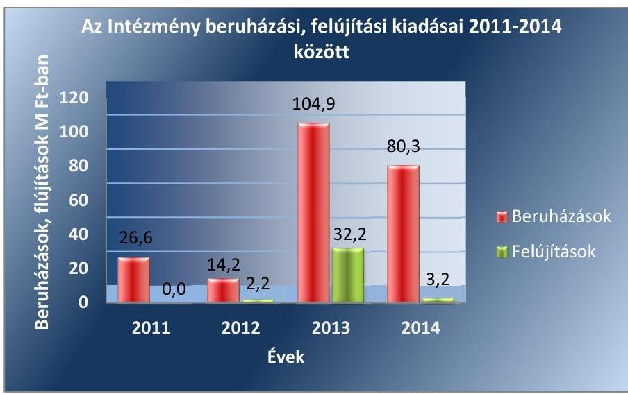

Forrás: a 2011-2014. évi költségvetési beszámolók
Az Intézmény az egyensúlyjavító intézkedések keretében elrendelt egyes eszközcsoportokra vonatkozó beszerzési tilalomra vonatkozó kormányhatározatok ${ }^{53}$, valamint az informatikai eszközök beszerzésének engedélyezésére vonatkozó Kormányrendelet ${ }^{54}$ előírásait betartotta.

Az Intézmény ingatlan nem vásárolt, betartotta a 2012. január 1-jén hatályba lépett Nvtv.-ben foglalt előírást, mely szerint központi költségvetési szerv ingatlan vásárlására adásvételi szerződést nem köthet.

# 4.3. számú megállapítás 

A vagyonelemek elidegenítése a jogszabályok és a belső szabályzatok előírásainak megfelelően történt. A vagyonelemek hasznosítása kockázatos volt.

A vagyonelemek értékesítése során az Intézmény betartotta a jogszabályokban és a belső szabályzatokban foglaltakat.

A vagyonelemek hasznosítása során az Intézmény a bérleti díjakat nem a belső szabályozás szerint állapította meg. Előfordult, hogy a helyiségek bérbeadási folyamat során az Intézmény nem határozta meg a belső szabályzatban foglaltak ellenére az önköltséget.

A bérbeadásból származó bevételeket az Intézmény minden ellenőrzött esetben a szerződésben foglaltak szerint kiszámlázta, figyelemmel az Áfa tv. ${ }^{55}$-ben, az Áht. ${ }_{1}$-ben és az Áht. ${ }_{2}$-ben foglaltakra. A bérbeadásból származó bevétel kapcsán - amikor az nem realizálódott határidőben - az In-

---

tézmény megtette a megfelelő intézkedéseket. A bérbeadásból befolyt bevételek számviteli nyilvántartásba vétele a Számv. tv.-ben foglaltak szerint minden ellenőrzött esetben megtörtént.

A bérbeadási szerződések megkötése előtt az Intézmény a 2012-2014. években az Nvtv. 11. § (10) bekezdésének előírása ellenére rendszeresen nem győződött meg - az Nvtv. 3. § (1) bekezdés 1. pontja szerinti - átláthatóság követelményének érvényesüléséről.

Az Intézmény az ellenőrzött időszakban a jogszabályban meghatározott értékhatárt elérő, MNV Zrt., illetve irányító szerv engedélyéhez kötött vagyoni elemet nem értékesített.

# 5. Szabályszerűen hajtották-e végre az ellenőrzött időszakban az Intézményt érintő szervezeti, szerkezeti átalakításokat? 

Összegző megállapítás Az ellenőrzött időszakban az Intézménynél átalakítás/átszervezés nem történt.

## 6. Az Intézmény intézkedett-e az integritás szemlélet érvényesítése érdekében?

## Összegző megállapítás Az Intézmény intézkedett az integritás szemlélet érvényesítése érdekében.

Az Intézmény 2014. évben részt vett az ÁSZ integritás projektjében. Az integritás szemlélet érvényesülésének értékelését a II. számú melléklet tartalmazza.

---

# JAVASLATOK 

Az ÁSZ tv. 33. § (1) bekezdésében foglaltak értelmében az ellenőrzött szervezet vezetője köteles a jelentésben foglalt megállapításokhoz kapcsolódó intézkedési tervet összeállítani és azt a jelentés kézhezvételétől számított 30 napon belül az ÁSZ részére megküldeni. Amennyiben az intézkedési tervet határidőre nem küldi meg a szervezet, vagy amennyiben az nem elfogadható, az ÁSZ elnöke az ÁSZ tv. 33. § (3) bekezdés a)-b) pontjaiban foglaltakat érvényesítheti.

## a NAV (mint a NAV KEKI általános és egyetemes jogutódja) vezetőjének

1. Intézkedjen közbeszerzési eljárás lefolytatására a jogszabályokban előírt esetekben.
(3.3. sz. megállapítás 8. bekezdés 3., 4. mondata alapján)
2. Intézkedjen a jogszabályi előírásoknak megfelelő éves költségvetési beszámoló készítésére.
(4.1. sz. megállapítás 2. bekezdés 2., 3. mondata alapján)
3. Intézkedjen a bérbeadási szerződések megkötése előtt az átláthatósági követelmények érvényesítésére a jogszabályi előírásoknak megfelelően.
(4.3. sz. megállapítás 4. bekezdése alapján)
4. Intézkedjen a feltárt hiányosságok és/vagy szabálytalanságok tekintetében a munkajogi felelősség tisztázására irányuló eljárás megindításáról, és ennek eredménye ismeretében tegye meg a szükséges intézkedéseket.
(4.1. sz. megállapítás 2. bekezdés 2., 3. mondata alapján)

---

# MELLÉKLETEK 

- I. SZ. MELLÉKLET: ÉRTELMEZŐ SZÓTÁR
állami vagyon
állami vagyonnak minősül:
a) az állam tulajdonában lévő dolog, valamint a dolog módjára hasznosítható természeti erő,
b) az a) pont hatálya alá nem tartozó mindazon vagyon, amely vonatkozásában törvény az állam kizárólagos tulajdonjogát nevesíti,
c) az állam tulajdonában lévő tagsági jogviszonyt megtestesítő értékpapír, illetve az államot megillető egyéb társasági részesedés,
d) az államot megillető olyan immateriális, vagyoni értékkel rendelkező jogosultság, amelyet jogszabály vagyoni értékű jogként nevesít.
(Forrás: Vtv. 1. § (2) bekezdése)
állami vagyon értékesítése
állami vagyon használója
állami vagyon hasznosítása
állami vagyon hasznosítása
állami vagyon használófa
a) az állam tulajdonában lévő dolog, valamint a dolog módjára hasznosítható természeti erő,
b) az a) pont hatálya alá nem tartozó mindazon vagyon, amely vonatkozásában törvény az állam kizárólagos tulajdonjogát nevesíti,
c) az állam tulajdonában lévő tagsági jogviszonyt megtestesítő értékpapír, illetve az államot megillető

 egyéb társasági részesedés,
d) az államot megillető olyan immateriális, vagyoni értékkel rendelkező jogosultság, amelyet jogszabály vagyoni értékű jogként nevesít.
(Forrás: Vtv. 1. § (2) bekezdése)
Állami vagyon tulajdonjogának bármely jogcímen történő, visszterhes átruházása (Forrás: Vtvr. 1. § (7) bekezdés d) pontja)
Az a természetes személy, jogi személy, illetve jogi személyiséggel nem rendelkező szervezet, amely, illetve aki törvény vagy szerződés alapján, bármely jogcímen (pl. bérlet, haszonbérlet, VSZ, használat stb.) állami vagyont birtokol, használ, szedi annak hasznait, hasznosít, ide nem értve a tulajdonosi jogok gyakorlóját. (Forrás: Vtvr. 1. § (7) bekezdés a) pontja, hatályos 2011. január 1-jétől 2011. december 31-ig)
Az a természetes vagy jogi személy, jogi személyiséggel nem rendelkező szervezet, aki, vagy amely törvény vagy szerződés alapján, bármely jogcímen (bérlet, haszonbérlet, használat stb.) állami vagyont birtokol, használ, szedi annak hasznait, hasznosít, ide nem értve a haszonélvezőt, a vagyonkezelőt és a tulajdonosi jogok gyakorlóját. (Forrás: Vtvr. 1. § (7) bekezdés a) pontja)
Az állami vagyont az MNV Zrt. maga kezeli, vagy szerződés - így különösen bérlet, haszonbérlet, szerződésen alapuló haszonélvezet, vagyonkezelés, megbízás - alapján központi költségvetési szervnek, természetes vagy jogi személynek, vagy jogi személyiséggel nem rendelkező gazdálkodó szervezetnek hasznosításra átengedi. (Forrás: Vtv. 23. § (1) bekezdése, hatályos 2011. december 31-éig)
Az állami vagyont az MNV Zrt. maga kezeli, vagy szerződés - így különösen bérlet, haszonbérlet, megbízás - alapján központi költségvetési szervnek, természetes vagy jogi személynek, vagy jogi személyiséggel nem rendelkező gazdálkodó szervezetnek hasznosításra átengedi. (Forrás: Vtv. 23. § (1) bekezdése, hatályos 2012. január 1-jétől)
Az állami vagyonnal a tulajdonosi joggyakorló maga gazdálkodik, vagy szerződés - így különösen bérlet, haszonbérlet, megbízás - alapján hasznosításra átengedi, illetőleg vagyonkezelésbe, haszonélvezetbe adja. (Forrás: Vtv. 23. § (1) bekezdése, hatályos 2013. június 28-ától)

Az állami vagyon hasznosítására kötött szerződések elsődleges célja az állami vagyon hatékony működtetése, állagának védelme, értékének megőrzése, illetve gyarapítása, az állami és közfeladatok ellátásának elősegítése. (Forrás: Vtv. 23. § (2) bekezdése)
Az állami vagyont az MNV Zrt. maga kezeli, vagy szerződés - így különösen bérlet, haszonbérlet, szerződésen alapuló haszonélvezet, vagyonkezelés, megbízás - alapján

---

ÁSZ Integritás Projekt
átalakítás
belső ellenőrzés
belső kontrollrendszer
belső kontrollrendszer területei
ellenőrzési nyomvonal
előirányzat-maradvány
központi költségvetési szervnek, természetes vagy jogi személynek, illetőleg jogi személyiséggel nem rendelkező gazdasági társaságnak hasznosításra átengedi (Forrás: Vtv. 23. § (1) bekezdése, hatályos 2010. január 01 - 2011. december 31-ig).
Az állami vagyont az MNV Zrt. maga kezeli, vagy szerződés - így különösen bérlet, haszonbérlet, megbízás - alapján központi költségvetési szervnek, természetes vagy jogi személynek, vagy jogi személyiséggel nem rendelkező gazdálkodó szervezetnek hasznosításra átengedi. Az állami vagyonra vonatkozóan az MNV Zrt. kizárólag az Nvtv-ben meghatározott személyekkel köthet VSZ-t. (Forrás: Vtv. 27. § (1) bekezdése, hatályos 2012. január 1-jétől)
Az Állami Számvevőszék 2009-ben indította el a „Korrupciós kockázatok feltérképezése - Integritás alapú közigazgatási kultúra terjesztése" című, európai uniós forrásból megvalósított kiemelt projektjét (Integritás Projekt). Az Integritás Projekt célja, hogy felmérje a közszféra intézményei korrupciós kockázatoknak való kitettségét, illetőleg az azok mérséklésére hivatott kontrollok szintjét. Az Állami Számvevőszék a projekt révén az integritás szemlélet minél szélesebb körrel történő megismertetését, gyakorlatba ültetését kívánja elérni. Az integritás követelményeinek megfelelő szervezeti működést előnyben részesítő közigazgatási kultúra elterjesztését és a korrupció elleni fellépést az ÁSZ önmagára nézve is stratégiai jelentőségű célként fogalmazta meg. A projekt a felmérésben résztvevő intézmények számára helyzetükről egyfajta „tükörképet" mutat be, ami alapot teremt a jövőbeni pozitív irányú elmozduláshoz. (Forrás: a http://integritas.asz.hu honlapon közzétett, a 2013. évi Integritás felmérés eredményeiről készült összefoglaló tanulmány)
Az általános jogutódlással történő megszüntetés átalakítással történhet. Az átalakítás lehet egyesítés vagy különválás. Az egyesítés lehet beolvadás vagy összeolvadás. (Forrás: Áht. 195. §-a, Áht. 211. §-a)
Független, tárgyilagos bizonyosságot adó és tanácsadó tevékenység, amelynek célja, hogy az ellenőrzött szervezet működését fejlessze és eredményességét növelje, az ellenőrzött szervezet céljai elérése érdekében rendszerszemléletű megközelítéssel és módszeresen értékeli, illetve fejleszti az ellenőrzött szervezet irányítási és belső kontrollrendszerének hatékonyságát. (Forrás: Bkr. 2. § b) pontja)
A belső kontrollrendszer a kockázatok kezelése és tárgyilagos bizonyosság megszerzése érdekében kialakított folyamatrendszer, amely azt a célt szolgálja, hogy a működés és gazdálkodás során a tevékenységeket szabályszerűen, gazdaságosan, hatékonyan, eredményesen hajtsák végre, az elszámolási kötelezettségeket teljesítsék, megvédjék az erőforrásokat a veszteségektől, károktól és nem rendeltetésszerű használattól. (Forrás: Áht. 269. § (1) bekezdése)
A kontrollkörnyezet, a kockázatkezelési rendszer, a kontrolltevékenységek, az információs és kommunikációs rendszer, valamint a nyomon követési (monitoring) rendszer. (Forrás: Bkr. 3. §-a)
Az ellenőrzési nyomvonal a költségvetési szerv működési folyamatainak szöveges vagy táblázatba foglalt, vagy folyamatábrákkal szemléltetett leírása, amely tartalmazza különösen a felelősségi és információs szinteket és kapcsolatokat, továbbá irányítási és ellenőrzési folyamatokat, lehetővé téve azok nyomon követését és utólagos ellenőrzését. (Forrás: az NGM honlapjáról elérhető Belső Kontroll kézikönyv PM 2010. 35. oldal)

Az államháztartás központi alrendszerébe tartozó költségvetési szerveknél a módosított bevételi és kiadási előirányzatok és azok teljesítésének a Kormány rendeletében meghatározott tételekkel korrigált különbözete az előirányzat-maradvány. (Forrás: Áht. 22. § (1) bekezdés m) pontja).

---

előirányzat-módosítás

FEUVE
felújítás
használhatósági fok
hasznosítás
információs és kommunikációs rendszer
integritás
irányító szerv/felügyeleti szerv
intézkedési terv
kincstári biztos
kockázat

A megállapított kiadási előirányzat növelése vagy csökkentése, a bevételi előirányzatok egyidejű növelése vagy csökkentése mellett (Forrás: Áht. 2. § (1) bekezdés f) pontja).
Folyamatba épített, előzetes, utólagos és vezetői ellenőrzés. A FEUVE a szervezeten belül a gazdálkodásért felelős szervezeti egység által folytatott első szintű pénzügyi irányítási és ellenőrzési rendszer.
A folyamatba épített előzetes és utólagos vezetői ellenőrzésre vonatkozó szabályokat Áht.1,2, valamint az Ámr. határozza meg. Kidolgozására a pénzügyminisztérium költségvetési ellenőrzéssel kapcsolatban közzétett módszertani útmutatói, illetve ajánlásai figyelembevételével került sor. (Források: 2010. I. 1.-jétől: Ámr. 155. § (1) bekezdés, 2012. I. 1.-jétől: Bkr. 8. § (2) bekezdés)
Az elhasználódott tárgyi eszköz eredeti állaga (kapacitása, pontossága) helyreállítását szolgáló időszakonként visszatérő olyan tevékenység, melynek során az eszköz élettartama megnövekszik, minősége, használata jelentősen javul, így a pótlólagos ráfordításból a jövőben gazdasági előnyök származnak. (Forrás: Számv. tv. 3. § (4) bekezdés 8. pontja)
A tárgyi eszközállomány állagának elemzéséhez használt mutató, amely megmutatja, hogy a le nem írt (nettó) érték milyen hányadát képezi az aktiválási (bekerülési) értéknek. Számításakor a tárgyi eszköz könyv szerinti nettó értékét viszonyítják a tárgyi eszköz bruttó (beszerzési/létesítési) értékéhez.
A nemzeti vagyon birtoklásának, használatának, hasznok szedése jogának bármely a tulajdonjog átruházását nem eredményező jogcímen történő átengedése, ide nem értve a vagyonkezelésbe adást, valamint a haszonélvezeti jog alapítását. (Forrás: Nvtv. 3. § (1) bekezdés 4. pontja)
A költségvetési szerv vezetője által kialakított és működtetett olyan rendszer, mely biztosítja, hogy a megfelelő információk a megfelelő időben eljutnak az illetékes szervezethez, szervezeti egységhez, illetve személyhez. (Forrás: Bkr. 9. § (1) bekezdés)
Az integritás az elvek, értékek, cselekvések, módszerek, intézkedések konzisztenciáját jelenti, vagyis olyan magatartásmódot, amely meghatározott értékeknek megfelel. (Forrás: Nemzetgazdasági Minisztérium: Magyarországi államháztartási belső kontroll standardok Útmutató 1.6.1. pontja, 2012. december)
A költségvetési szerv tekintetében az e törvényben meghatározott irányítási hatáskört gyakorló szerv. (Forrás: Áht. 21. § 9. pontja)
Az ellenőrzési javaslatok alapján az ellenőrzött szervezet, szervezeti egység által készített intézkedések végrehajtásának ütemezése a végrehajtásáért felelős személyek és a vonatkozó határidők megjelölésével. (Forrás: 370/2011. (XII. 31.) Korm. rendelet 2. § (k) pontja, hatályos 2012. január 1-jétől)

A kincstári biztos kijelölését az államháztartásért felelős miniszternél a Kincstár kezdeményezi. A kincstári biztos köteles figyelemmel kísérni megbízatásának időpontjától kezdve a költségvetési szerv tervezését, gazdálkodását, beszámolását, a jogszabályokban előírt feladatainak ellátását, feltárni azokat az okokat, amelyek a tartós fizetésképtelenséghez vezettek, a szükséges intézkedések azonnali végrehajtására irányuló intézkedési tervet készíteni, azonnali intézkedéseket kezdeményezni és írásbeli utasításokat kiadni a tartozásállomány felszámolására, a gazdálkodás egyensúlyának biztosítására, a követelések behajtására. (Forrás: Ávr. 116-117. § hatályos 2013. augusztus 18-ig).
A kockázat annak a valószínűségét jelenti, hogy egy vagy több esemény vagy intézkedés nem kívánt módon befolyásolja a rendszer működését, céljainak megvalósulását. (Forrás: Javaslatok a korrupciós kockázatok kezelésére - Kockázatkezelési és ellenőrzési módszertan 35. oldal, ÁSZ)

---

kockázatkezelési rendszer

kontrollkörnyezet
kontrolltevékenységek
kommunikáció
korrupció
középirányító szerv
közfeladat
kulcskontrollok/gazdálkodási jogkörök
monitoring
monitoring rendszer
tulajdonosi joggyakorló

Olyan irányítási eszközök és módszerek összessége, melynek elemei a szervezeti célok elérését veszélyeztető tényezők (kockázatok) azonosítása, elemzése, csoportosítása, nyomon követése, valamint szükség esetén a kockázati kitettség mérséklése. (Forrás: Bkr. 2. § m) pontja)
A költségvetési szerv vezetője által kialakított olyan elvek, eljárások, belső szabályzatok összessége, amelyben világos a szervezeti struktúra, egyértelműek a felelősségi, hatásköri viszonyok és feladatok, meghatározottak az etikai elvárások a szervezet minden szintjén, átlátható a humán-erőforráskezelés. (Forrás: Bkr. 6. § (1) bekezdés) A költségvetési szerv vezetője által a szervezeten belül kialakított (kontroll) tevékenységek, melyek biztosítják a kockázatok kezelését, hozzájárulnak a szervezet céljainak eléréséhez. (Forrás: Bkr. 8. § (1) bekezdés)
Az a tevékenység, melynek során információ továbbítása valósul meg. A kommunikációs folyamat résztvevői között tájékoztatás történik, mely során tényeket, ezek magyarázatát közlik.
Azok a cselekmények, amelyek során a köz érdekében való eljárással megbízott és döntéshozatali felelősséggel felruházott személy a köz érdeke helyett önös vagy részérdekeket követve, mástól jogtalan vagy etikátlan előnyt elfogadva és őt jogtalan vagy etikátlan előnyhöz juttatva jár el, illetve amikor valaki a köz érdekében való eljárással megbízott és döntéshozatali felelősséggel felruházott személynek jogtalan vagy etikátlan előnyt nyújtva vagy felajánlva jogtalan vagy etikátlan előnyt kér. (Forrás: A Kormány korrupció megelőzési programja 2012-2014.)
A költségvetési szerv tekintetében törvény vagy kormányrendelet alapján meghatározott, átruházott irányítási hatásköröket gyakorló szerv. (Forrás: Áht. 9. § (4) bekezdés)
Jogszabályban meghatározott állami vagy önkormányzati feladat, amit az arra kötelezett közérdekből, a jogszabályban meghatározott követelményeknek és feltételeknek megfelelve végez, ideértve a lakosság közszolgáltatásokkal való ellátását, továbbá az állam nemzetközi szerződésekben vállalt kötelezettségeiből adódó közérdekű feladatokat, valamint e feladatok ellátásakor szükséges infrastruktúra biztosítását is.
(Forrás: Nvtv. 3. § (1) bekezdés 7. pontja)
A gazdálkodási jogkörök gyakorlása közül a kiadások utalványozását megelőző kötelező kontrolltevékenységek. Az Ámr. a 2011. évben a szakmai teljesítésigazolást és az utalvány ellenjegyzését, az Ávr. a 2012-2013. években a teljesítésigazolást és az érvényesítést írta elő egyenrangú kulcskontrollként.
A monitoring általánosságban a különböző szintű szervezeti célok megvalósításának folyamatát kíséri figyelemmel, melynek során a releváns eseményekről és tevékenységekről (együtt: folyamatokról) rendszeres jelleggel, strukturált, döntéstámogató információkhoz jutnak a szervezet vezetői. (Forrás: NGM Útmutató a költségvetési szervek monitoring rendszeréhez 2011. november)
A költségvetési szerv vezetője köteles olyan monitoring rendszert működtetni, mely lehetővé teszi a szervezet tevékenységének, a célok megvalósításának nyomon követését. A költségvetési szerv monitoring rendszere az operatív tevékenységek keretében megvalósuló folyamatos és eseti nyomon követésből, valamint az operatív tevékenységektől függetlenül működő belső ellenőrzésből áll. (Forrás: Ámr 160. §, Bkr. 10. §)
Aki a nemzeti vagyon felett az államot vagy a helyi önkormányzatot megillető tulajdonosi
 jogok és kötelezettségek összességének gyakorlására jogosult. (Forrás: Nvtv. 3. § (1) bekezdés 17. pontja)

---

vagyongazdálkodás
vezetői nyilatkozat

A nemzeti vagyongazdálkodás feladata a nemzeti vagyon rendeltetésének megfelelő, az állam, az önkormányzat mindenkori teherbíró képességéhez igazodó, elsődlegesen a közfeladatok ellátásához és a mindenkori társadalmi szükségletek kielégítéséhez szükséges, egységes elveken alapuló, átlátható, hatékony és költségtakarékos működtetése, értékének megőrzése, állagának védelme, értéknövelő használata, hasznosítása, gyarapítása, továbbá az állam vagy a helyi önkormányzat feladatának ellátása szempontjából feleslegessé váló vagyontárgyak elidegenítése. (Forrás: Nvtv. 7. § (2) bekezdése)
A költségvetési szerv vezetője köteles - az előírt tartalmú - nyilatkozatban értékelni a költségvetési szerv belső kontrollrendszerének minőségét és azt az éves költségvetési beszámolóval együtt megküldeni az irányító szervnek. Ha a költségvetési szervnél év közben változás történik a szerv vezetője személyében, vagy a költségvetési szerv átalakul, megszűnik, a távozó vezető, illetve az átalakuló, megszűnő költségvetési szerv vezetője köteles az előírt tartalmú nyilatkozatot az addig eltelt időszak vonatkozásában kitölteni, és az új vezetőnek, illetve a jogutód költségvetési szerv vezetőjének átadni, aki azt saját nyilatkozatához mellékeli. Jelen ellenőrzés során vezetői nyilatkozat alatt a fentebb említett nyilatkozatokban tett következő résznyilatkozatot értjük, ennek helytállóságát értékeljük a pénzügyi és vagyongazdálkodási folyamatok tekintetében: „gondoskodtam... a költségvetési szerv tevékenységében a hatékonyság, eredményesség és a gazdaságosság követelményeinek érvényesítéséről, ...".
(Forrás: Ámr. 217. § c) pontja, 226. § (3) bek., 21. számú melléklete; Bkr. 11. § (1) és (4) bek., 1. számú melléklete)

---

# II. SZ. MELLÉKLET: AZ INTEGRITÁS ÉRVÉNYESÍTÉSE ÉRDEKÉBEN KIALAKÍTOTT ÉS MŰKÖDTETETT KONTROLLRENDSZER 

Az Intézmény által a saját helyzetértékelése alapján 2014. évben kitöltött integritás tanúsítvány értékelése kiváló volt. Az Intézmény által kialakított és működtetett integritás-kontrollrendszert az alábbi öt területen értékeltük:

Az összeférhetetlenség és etikai elvárások kontrollszintje kiváló volt, mert az összeférhetetlenség kérdését és a munkavégzésre vonatkozó etikai elvárásokat az ellenőrzött időszakban meghatározták, a munkatársak nyilatkoztak gazdasági érdekeltségeikről, vagy egyéb a szervezet szempontjából releváns összeférhetetlenségről.

A humánerőforrás gazdálkodás kontrollszintje megfelelő volt, mivel az Intézmény szabályozta humánpolitikai tevékenységét, azonban az új munkatársak kiválasztására nem minden esetben álláspályázat alapján került sor.

A szervezet vagyonának megvédésére tett intézkedések értékelése kiváló volt, mert tettek intézkedéseket a munkáltató tulajdonában levő eszközök magáncélú használatának szabályozása, a dokumentumok, pénzeszközök, kulcsok biztonságos tárolása, valamint az információ biztonsága érdekében, továbbá szabályozták a külső személyekkel történő kapcsolattartást, és alkalmazták a „négy szem elvét".

A nemkívánatos dolgozói magatartással szembeni intézkedések és azok érvényesülésére tett intézkedések kontrollszintje kiváló volt, mert rendelkeztek szabályzattal a nemkívánatos magatartás kezelésére, meghatározták a szervezeten belülről és kívülről érkező közérdekű bejelentések eljárásrendjét és rendelkeztek szabályozással a bejelentést tevők megfelelő védelmének biztosítására.

Az integritás erősítése, annak tudatosítása, valamint a kockázatelemzések alkalmazása kiváló volt, mert körlevélben tudatosították az alkalmazottakban az integritás fontosságát, felhívták a korrupciós szempontból veszélyeztetett beosztásban dolgozók figyelmét a jellemző kockázatokra, rendszeresen végeztek korrupciós kockázatelemzést.

---

# ■ III. SZ. MELLÉKLET: TELJESÍTMÉNY-ELLENŐRZÉSI KIEGÉSZÍTŐ MODUL MEGÁLLAPÍTÁSAI 

Az Intézmény pénzügyi és vagyongazdálkodási folyamatai tekintetében a hatékonyság, eredményesség és gazdaságosság követelményeinek érvényesítéséről kiadott vezetői nyilatkozat helytálló volt. Az Intézménynél a 2011-2014. években a gazdálkodás folyamatában a gazdaságossági, hatékonysági és eredményességi követelmények kialakítása megtörtént. Az Intézmény vezetője a 2011-2014. évekre vonatkozóan belső szabályzatokban, a 2013. és 2014. években ezeken kívül vezetői utasításban is rögzített teljesítmény-követelményeket a gépjármű- és flottamenedzsmentre, a mobiltelefon-használatra, valamint az irodaszerekre és tisztítószerekre vonatkozóan.

Az Intézmény a gépjárművek fogyasztására vonatkozóan állapított meg fajlagos fogyasztáshoz kapcsolódó célértéket, a telefonhasználatról szabályzatban rendelkeztek az egyes beosztáshoz kapcsolódó engedélyezett telefonkeretről. A 2013. évtől kezdődően az Intézménynél a tisztító és takarítószerekre is határoztak meg célértéket a tárgyévi feladatok figyelembe vétele mellett. Az Intézmény a mérhető célok hozzárendelésével kialakított teljesítménymutatók és keretszámok mellett számolt és a beszámolóiban szerepeltetett további teljesítménymutatókat - ilyenek voltak az üdültetés területén a vendégszám, vendégéjszakák száma, üdülő kihasználtsága - azonban azokhoz mérhető célt nem rendelt. Az ellenőrzött időszakban kiadásra került több konkrét és mérhető célt nem tartalmazó vezetői intézkedés, melyek a gazdaságosság, hatékonyság és eredményesség növelését célozták. Ezek között szerepelt a közművek fogyasztási adatainak rendszeres rögzítésére, a mért adatok jelentésére és kiértékelésére vonatkozó intézkedés, valamint az épület és ingatlanüzemeltetés területén több esetben végeztek, gazdaságosságot, hatékonyságot és eredményességet növelő felmérést.

Az Intézmény a gazdaságossági, hatékonysági és eredményességi célok teljesülését negyedéves és éves költségvetési beszámolók, energiafelhasználási jelentések, gépjárműhasználati kimutatások és havi mobiltelefonhasználati kimutatások alapján követte nyomon. A gépjárművek futásteljesítményéről és átlagos fogyasztásáról minden évben elkészítették a kimutatást, a mobiltelefon keretek felhasználását havi rendszerességgel vizsgálták és rögzítették, majd éves szinten összesítették a felhasználást. A tisztítószerek és irodaszerek felhasználásának nyomon követése, illetve az ahhoz kapcsolódó vezetői intézkedés nem történt meg.

Az ellenőrzött időszakban a kitűzött célok részben teljesültek. A közhatalmi és egyéb saját működési bevételek a 2011-2012. években a célkitűzés alatt, 2013-ban és 2014-ben a felett teljesültek. A gépjármű- és flottamenedzsment fogyasztási adatai kedvezően alakultak, nem érték el a szabályzatban előírt intézkedési határt, a mobiltelefon-használat költségei lényegesen a tervezett kereten belül maradtak.

---

.

---

# FÜGGELÉK: ÉSZREVÉTELEK 

A jelentéstervezetet a Számvevőszék 15 napos észrevételezésre megküldte az ellenőrzött szervezet általános és egyetemes jogutódja, valamint a 2011-2014. évi irányítószervi feladatok vonatkozásában a Nemzeti Adó- és Vámhivatal vezetőjének az ÁSZ tv. 29. § (1) bekezdése előírásának megfelelően.

A Nemzeti Adó- és Vámhivatal Képzési, Egészségügyi és Kulturális Intézete ellenőrzött szervezet általános és egyetemes jogutódja, továbbá a 2011-2014. évi irányítószervi feladatokat ellátó Nemzeti Adó- és Vámhivatal vezetője az ellenőrzés megállapításaira írásban észrevételt tett.
Az elfogadott észrevétel alapján a Számvevőszék módosította a jelentést.
A függelék tartalmazza az ellenőrzött szervezet vezetőjének észrevételeit, illetve az el nem fogadott észrevételek elutasításának indoklását.

[^0]
[^0]:    * 29. § (1) Az Állami Számvevőszék az ellenőrzési megállapításait megküldi az ellenőrzött szervezet vezetőjének vagy az általa megbízott személynek, és annak, akinek személyes felelősségét állapította meg.
    (2) Az ellenőrzött szervezet vezetője és a felelősként megjelölt személy az ellenőrzés megállapításaira tizenöt napon belül írásban észrevételt tehet.
    (3) Az Állami Számvevőszék az észrevételre a beérkezésétől számított harminc napon belül írásban válaszol. A figyelembe nem vett észrevételeket köteles a jelentésben feltüntetni, és megindokolni, hogy azokat miért nem fogadta el.

---

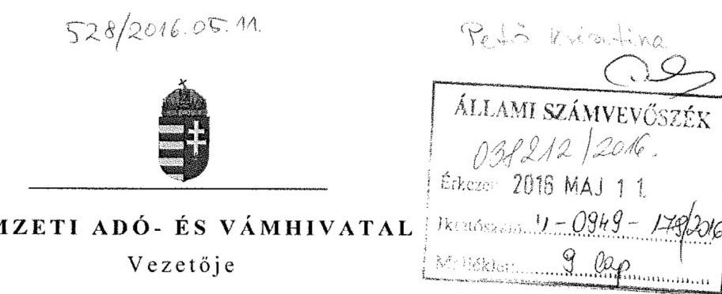

Iktatószám: IKTATÓSZÁM

# Domokos László úr 

elnök
részére
Állami Számvevőszék

## Budapest

## Tisztelt Elnök úr!

Köszönettel megkaptam „A központi alrendszer egyes intézményei pénzügyi és vagyongazdálkodásának ellenőrzése - NAV Képzési, Egészségügyi és Kulturális Intézete" témájában készített és részemre a V-0949-169/2016. számú levelével véleményezés céljából megküldött számvevőszéki jelentés tervezetét, melyet áttekintettem, azzal kapcsolatosan az alábbi észrevételeket szeretném megfogalmazni:

Mindenekelőtt jelzem, hogy a jelentéstervezet a számvevőszéki jelentések eddig megszokott formájától eltérően nem tartalmazza a megállapításokat alátámasztó részletes - konkrétan beazonosítható tényállásokat tartalmazó - indoklást, így az ellenőrzött időszak (4 éves gazdálkodás), és a több százas mintatétel figyelembe vételével ez a körülmény megnehezítette a korrekt véleményalkotást.

Az egyes megállapításokra vonatkozó észrevételeim a következők.
1.) A jelentéstervezet 5-6. oldala szerinti összegzés megfogalmazása alapján az a következtetés vonható le, mintha a KEKI gazdálkodása teljes egészében elfogadhatatlan lett volna, holott a jelentés alapján világos, hogy a főbb problémák 2011-2012-ben voltak, ami a NAV - mint új szervezet - és ezen belül a KEKI, mint új szervezet megalakulásával törvényszerűen együtt járó nehézségekkel magyarázható.
Egy új szerv az életciklusa elején ugyanis szükségszerűen küzd a szabályozási környezet változásából adódó nehézségekkel, a szakmai feladatok, követelmények, és a hozzá rendelt erőforrások összhangjának hiányával. A megalakulást követő 1-1,5 évben a szerv likviditási nehézségekkel küzdött, gazdálkodása csak a 2012. év végére stabilizálódott.
Az összegzés nem tér ki arra, hogy az Intézmény gazdálkodása az ellenőrzött pillérek figyelembevételével a 2013-2014. évekre már egyértelműen pozitív képet mutat.

Kérem ezért, hogy a jelentésben markánsabban jelenjen meg, hogy a feltárt hiányosságok döntő része a 2011-2012. években merült fel, és térjen ki a szerv vezetőjének a gazdálkodás szabályszerűsége érdekében tett intézkedéseinek kézzelfogható eredményére is.

---

2.) A Jelentéstervezet 3.3. számú megállapításának utolsó bekezdése (26. oldal közepe):
„A közbeszerzési előírásokat az ellenőrzésre kiválasztott kiadási tételek esetében az Intézmény nem tartotta be. A 2011. évben ugyanazon a napon közbeszerzési eljárás lefolytatása nélkül az Intézmény két szerződést kötött egy szállítóval, amelyek együttes nettó beszerzési értéke meghaladta az árubeszerzésre vonatkozó közbeszerzési értékhatárt, amivel az Intézmény megsértette a Kbt. 40. § (1)-(2) bekezdésében foglaltakat, továbbá a Kbt. 240. § (1) bekezdés előírásait."

A szerződés-nyilvántartás adatai alapján 2011. évben (2011. április 11-én) az Intézet és a „Z+D" Kft. között az alábbi két szerződés jött létre:

| Beszerzés tárgya | Szerződés hatálya | Szerződés nettó értéke   (Ft-ban) |
| :-- | :--: | :-- |
| szeszesital és dohányáru | 2011.12.31. | szeszesital: 3.305.900,-   dohányáru: 2.128.200,- |
| üdítő és szeszesital | 2012.12.31. | üdítő: 2.042.000,-   szeszesital: 6.620.134,- |

A szeszesitalok beszerzési összértéke meghaladta a nettó 8 millió Ft-t, azonban az egyik szerződés időbeli hatálya az aláírástól számítva 2011. december 31-ig tartott, a másiké pedig 2012. december 31-ig. A fentieken túl a szerződések teljesítési helye, és funkciója is eltérő volt - egyik esetben a NAV KEKI által üzemeltetett budapesti büfék, éttermek, a másik esetben a hévizi NAV Gyógyház volt.

Mindezeket figyelembe véve megítélésem szerint a KEKI eljárása elfogadható volt, ezért kérem a hivatkozott megállapítás elhagyását, vagy a fentiek szerinti pontosítását.
3.) A Jelentéstervezet 3.3. számú megállapításának utolsó bekezdése (26. oldal közepe):
„Egy 2011. évben lefolytatott közbeszerzési eljárás eredményeképpen megkötött szerződést az Intézmény a 2012. évben a Kbt. 303. § (1) bekezdésében foglaltak ellenére - a Kbt. 181. § (1) bekezdés alapján - és a 2014. évben a Kbt. 5. §-ában és a 119. §-ában foglaltak ellenére közbeszerzési eljárás lefolytatása nélkül módosított."

Az Intézet 2011-ben egy közbeszerzési eljárást indított élelmiszer beszerzésére 11 részteljesítésben, amelyből 10 részteljesítésben kötött szerződést 12 hónap időtartamra:

| Beszerzés tárgya   (részteljesítés) | Szállító | Szerződés   nettó értéke   (Ft-ban) | Szerződés   aláírása | Módosítás kelte |
| :-- | :-- | :--: | :--: | :--: |
| 1. hús- és   hentesáru | Alfa-Meat Kft. | 20.240.760,- | 2012.03.29. | 2012.11.09. |
| 2. fűszeráru és   nehézáru | UNIEXPORT   TRADE Kft -   „Gasztro Miskolc"   Kft. | 6.924.359,- | 2012.03.29. | 2013.01.23. |
| 3. tej és tejtermék | A-WALHALLA   Kft. | 4.398.835,- | 2012.04.10. | 2012.10.31. |

---

| Beszerzés tárgya (részteljesítés) | Szállító | Szerződés nettó értéke (Ft-ban) |

 Szerződés aláírása | Módosítás kelte |
| :--: | :--: | :--: | :--: | :--: |
| 4. mirelit áru | Jégtrade Kft. | 3.011.749,- | 2012.03.29. | 2012.10.31. |
| 5. - | eredménytelen |  |  |  |
| 6. kakaó, csokoládé, cukoráru | UNIEXPORT   TRADE Kft -   „Gasztro Miskolc"   Kft. | 360.269,- | 2012.03.29. | 2013.01.23. |
| 7. kávé és tea | UNIEXPORT   TRADE Kft -   „Gasztro Miskolc"   Kft. | 393.353,- | 2012.03.29. | 2013.01.23. |
| 8. száraztészta | UNIEXPORT   TRADE Kft -   „Gasztro Miskolc"   Kft. | 665.051,- | 2012.03.29. | 2013.01.23. |
| 9. zöldség és gyümölcs | Horváth László ev. | 5.559.107,- | 2012.03.29. | 2012.11.06. |
| 10. savanyúság | Horváth László ev. | 722.956,- | 2012.03.29. | 2012.11.06. |
| 11. sütemény | UNIEXPORT   TRADE Kft -   „Gasztro Miskolc"   Kft. | 426.244,- | 2012.03.29. | 2013.01.23. |

a) A Szerződés megkötését követően az Intézet feladata 2012. november 5. napjától kibővült a 1039 Budapest, Királyok útja 319. szám alatt található NAV Oktatási Központ büféjének és éttermének ellátásával, ezért a szerződés módosítása vált szükségessé. E szerződésmódosítás alapján kizárólag a szállítási helyek változtak, a beszerzés tárgya és mennyisége nem. A szerződésmódosításra a szerződéskötést követően - a szerződéskötéskor előre nem látható ok következtében - beállott körülmény miatt került sor.

A szerződésmódosításról szóló hirdetmény a KÉ-19399/2012. számon jelent meg a Közbeszerzési Értesítőben.
b) Az UNIEXPORT TRADE Kft - „Gasztro Miskolc" Kft. szállító kérésére az étolaj áremelése miatt a mezőgazdasági és élelmiszeripari termékek vonatkozásában a beszállítókkal szemben alkalmazott tisztességtelen forgalmazói magatartás tilalmáról szóló 2009. évi XCV. törvény 3. § (1) bekezdésére és a (2) bekezdés q) pontjára, valamint a megküldött gyártói nyilatkozatokra tekintettel a Kbt. 303. §-ában meghatározottak alapján került sor a szerződés módosítására 2012.11.30-án.

Az erről szóló hirdetmény a KÉ-19222/2012. számon jelent meg a Közbeszerzési Értesítőben.
c) A szerződések 2013. március 28-án, illetve 29-én meghosszabbításra kerültek azzal, hogy „a termékek szállítását Szállító a szerződés terhére rendelhető termékek mennyiségének erejéig továbbra is, de legkésőbb az e termékkör beszerzése tárgyban indított eljárás

---

eredményeként létrejött szerződés megkötésének napjáig (2013. május 31. napjáig) szállítja a megkötött szállítási szerződésben meghatározott feltételeknek megfelelően".
d) A szerződések - a jegyzőkönyvi meghosszabbítás alapján is - legfeljebb 2013. 05. 31-ig voltak hatályosak. Így a megállapításban foglaltakkal szemben 2014. évben közbeszerzési szerződés módosítására e tárgyban nem kerülhetett sor.

Mindezeket figyelembe véve megítélésem szerint a KEKI eljárása elfogadható volt, ezért kérem a hivatkozott megállapítás elhagyását, vagy a fentiek szerinti pontosítását.
4.) A Jelentéstervezet 3.3. számú megállapításának 8. bekezdéséhez kapcsolódóan a NAV (mint a NAV KEKI általános és egyetemes jogutódja) vezetőjének megfogalmazott javaslat (32. oldal):
„1. Intézkedjen közbeszerzési eljárás lefolytatására a jogszabályokban előírt esetekben."

A Nemzeti Adó- és Vámhivatalról szóló 2010. évi CXXII. törvény 86/C. § (1) alapján a NAV KEKI és a NAV Bűnügyi Főigazgatósága - a közfeladat eredményesebb ellátása céljából 2016. január 1-jével mint önálló költségvetési szerv megszűnt és beolvadt a NAV-ba.

A NAV átszervezése során a gazdasági szervezet kétszintű (irányító szervi és intézményi szintű) szervezetként került felállításra. A Hivatal a központi költségvetésben továbbra is önálló fejezetként jelenik meg, az intézményi költségvetés a NAV BF és a NAV KEKI megszünésével egy címen összpontosul.
A gazdálkodás központosított ellátása a beszerzésekkel kapcsolatos szabályozás új alapokra helyezését tette szükségessé.
Az előkészítés alatt álló új közbeszerzési szabályzatban célként fogalmazódik meg, hogy a beszerzési eljárások a korábbitól hatékonyabb munkaszervezetben kerüljenek lebonyolításra. Ennek érdekében az igénykezelés központosítása, valamint a NAV közbeszerzési eljárásaiban a felelősségi rend újraszabályozása vált szükségessé.

Az új szabályozás koncepcionális elemeit összefoglalva kijelenthető, hogy

- a vezetői felelősség egyértelmű megjelenítésével,
- a beszerzések átlátható és dokumentált előkészítésének koordinálásával, valamint
- a beszerzési igények és a rendelkezésre álló források folyamatos monitoringjával a korábbi gyakorlattól hatékonyabb és megalapozottabb beszerzési rendszer várható.

A NAV gazdálkodásának 2016. január 1-jét követő központosított ellátására tekintettel az 1. pontban megfogalmazott javaslat a vizsgálattal érintett NAV KEKI-re önmagában tehát nem értelmezhető, a fentiekben vázolt intézkedés a gazdasági szervezet egészére kiterjed. A közbeszerzési eljárások szabályszerű lefolytatására természetesen kiemelt figyelmet fogunk fordítani.
5.) A Jelentéstervezet 3.6. számú megállapításának utolsó bekezdése (28. oldal közepe):
,,Az intézmény a rendezőmérleget formailag és tartalmilag a jogszabályban előírtaknak megfelelően, de az NGM rendelet 8. (2) bekezdés a) pontja előírásai szerinti 2014. március 31-ei határidőt túllépve 2014. május 19-ei dátummal készítette el. "

---

A Magyar Államkincstár (továbbiakban: Kincstár) által üzemeltetett KGR K11 adatszolgáltatási felületen a 2014. évi rendező mérleg adatszolgáltatás 2014. március 31-én (22:35-kor) került publikálásra (1. számú melléklet).
A Nemzetgazdasági Minisztérium a rendező mérlegre vonatkozóan az adatszolgáltatás határidejét - a hivatkozott jogszabályi helytől eltérően - a 2014. első negyedéves mérlegjelentés leadási határidejével azonosan határozta meg. A NAV KEKI a KH Fejezeti Főosztály 5007/2014/FFO számú körlevele alapján a 2014. évi rendező mérleget elkészítette, amelyet 2014. április 7-én küldött meg az irányító szerv részére.

A Kincstár a KGR K11 rendszerben a 1051 szektorra vonatkozóan a 2014. évi rendező mérleg adatszolgáltatáson többször hajtott végre verzióváltást, így a feladott adatszolgáltatás központilag visszanyitásra került, a feladást újból el kellett végezni.
Ezen adatszolgáltatásra vonatkozó eseménytörténetet a csatolt 2. sz. melléklet tartalmazza.

# Kérem a fentiek alapján a megállapítás pontosítását. 

6.) A Jelentéstervezet 4.1. számú megállapításának első és második bekezdése (28. oldal) és intézkedési javaslat 2. és 4. pont (32. oldal):
,,AZ ÁLLAMI VAGYON vagyonkezelésére vonatkozó, az MNV Zrt.-vel kötött (Vtv. 23. § (1) és az Nvtv. 11. § (1) bekezdéseiben foglalt) szerződéssel az Intézmény az ellenőrzött időszak alatt nem rendelkezett. Továbbá nem rendelkezett az Nvtv. 11. § (9) bekezdésében foglalt másik központi költségvetési szervvel vagyonkezelési szerződésben foglalt jogok és kötelezettségek - az ingatlanokra vonatkozó jogok és kötelezettségek kivételével - átruházására vonatkozó szerződéssel sem.
,,A MÉRLEGBEN kimutatott eszközök és források nyilvántartása, értékelése nem felelt meg a jogszabályokban foglaltaknak. Az Intézmény a 2011-2014. évi éves költségvetési beszámolók mérlegeiben a Számv. tv. 23. § (2) bekezdésében foglaltakat megsértve olyan eszközöket mutatott ki, amelyeket vagyonkezelő mutathat ki. Az Intézmény ezzel megsértette a Számv. tv. 15. § (3) bekezdésében foglalt valódiság elvét."

A Nemzeti Adó- és Vámhivatalról szóló 2010. évi CXXII. törvény (a továbbiakban: NAV tv.) 87. § (1) bekezdése szerint a Nemzeti Adó- és Vámhivatal 2011. január 1-jével az Adó- és Pénzügyi Ellenőrzési Hivatal és a Vám- és Pénzügyőrség összeolvadásával jött létre, ezzel egyidejűleg az Adó- és Pénzügyi Ellenőrzési Hivatal és a Vám- és Pénzügyőrség megszűnt.

A NAV tv. 87. § (2) bekezdése alapján a Nemzeti Adó- és Vámhivatal az Adó- és Pénzügyi Ellenőrzési Hivatal és a Vám- és Pénzügyőrség általános jogutódja, ideértve a megszűnő szervek valamennyi közfeladatának jövőbeni ellátását, továbbá valamennyi jogát és kötelezettségét, valamint vagyonát, vagyoni jogait és előirányzatait is.

A NAV tv. 3. § (3) bekezdése szerint a bűnügyi főigazgatóság és a humánerőforrás-fejlesztési feladatokat ellátó intézet jogi személyiséggel rendelkező, a NAV fejezetén belül önállóan működő és gazdálkodó költségvetési szervek.

A Nemzeti Adó- és Vámhivatal Szervezeti és Működési Szabályzatáról szóló 23/2011. (VI. 30.) NGM utasítás (a továbbiakban: NAV SZMSZ) 4. § (1) bekezdése a NAV gazdálkodása vonatkozásában úgy rendelkezik, hogy a NAV gazdálkodási jogköre alapján önállóan működő és gazdálkodó központi költségvetési szerv, mely a központi költségvetésben önálló fejezetet képez. Ezen belül a NAV Igazgatás, a Bűnügyi Főigazgatóság, és a Képzési, Egészségügyi és Kulturális Intézet önálló címet képeznek.

---

A fentieket összegezve egyértelműen megállapítható, hogy a 2011. január 1-jével létrejött három önálló címből álló NAV a megszűnt APEH és VP, mint jogelődök általános jogutódja a jogelődök valamennyi joga és kötelezettsége, valamint vagyona, vagyoni jogai, azaz a jogelődök vagyonkezelési szerződéséből eredő jogai és kötelezettségei vonatkozásában egyaránt, hiszen a vagyongazdálkodás alapelvei is ebben a formában juthattak legerőteljesebb érvényesítésre (minden Cím a saját maga által használt vagyont kezeli).

A NAV SZMSZ 4. § (5) bekezdése alapján a magyar állam tulajdonában és a NAV kezelésében lévő vagyon vagyonkezelője a NAV. A NAV, mint vagyonkezelő képviseletében a NAV elnöke jár el.

A NAV elnökének a Nemzeti Adó- és Vámhivatal Képzési, Egészségügyi és Kulturális Intézete Szervezeti és Működési Szabályzatáról kiadott 3/2011. (IX.16.) NAV utasítása az Intézet gazdálkodása vonatkozásában egyértelműen úgy rendelkezik (5. § (3) bekezdés), hogy a Magyar Állam tulajdonában, és az Intézet kezelésében lévő vagyon vagyonkezelője az Intézet, melynek képviseletében az Intézet főigazgatója jár el.

A fentiek alapján megítélésem szerint egyértelműen megállapítható, hogy a saját vagyona tekintetében az Intézet a (megszünt) jogelőd szervek hatályos vagyonkezelői szerződései tekintetében jogutódnak tekinthető.

Az Nvtv. és így annak jelentéstervezetben hivatkozott rendelkezései az Intézet létrejöttekor még nem voltak hatályosak. A Vtv. jelentéstervezetben is hivatkozott 23. § (1) bekezdése az állami vagyonnal való gazdálkodás tekintetében két alapkonstrukciót ismer: a tulajdonosi joggyakorló általi gazdálkodást, illetve e jogok átengedését. Ez utóbbira a NAV jogelődeivel kötött vagyonkezelési szerződések keretében került sor. A NAV tv. már hivatkozott 3. § (3) bekezdése önállóan működő és gazdálkodó költségvetési szervként nevesítette az Intézetet is, azonban a feladatellátáshoz szükséges vagyon biztosításáról külön nem rendelkezett.
Az Intézet számára a jogalkotó által meghatározott közfeladat ellátásához, és az önálló gazdálkodáshoz előfeltételnek tekinthető, hogy létrejöttekor a működéséhez szükséges erőforrásokkal (elhelyezés, tárgyi feltételek, mint pl. bútorzat, gépjármű, informatikai eszközök), és e körben vagyonnal is rendelkezzen.
2011. január 1. napján e feltételeket kizárólag abban az esetben tekinthettük biztosítottnak, ha az Intézetet vagyoni szempontból is a megszűnt központi költségvetési szervek jogutódjának tekintjük, ami álláspontunk szerint a fentiek alapján egyértelműen alátámasztható.

A tulajdonosi joggyakorló (MNV Zrt.) a fentiekben felvázolt vagyonkezelési (vagyonelosztási) konstrukciót ugyancsak elismerte tekintettel arra, hogy 2011. május 9-én kelt MNV/01/15522/0/2011. számú vezérigazgató-helyettesi levelében (3. sz. melléklet) ezzel megegyező elveket vázolt fel és egyidejűleg az ingatlanok három Cím közötti felosztására vonatkozó adatszolgáltatást kért, amelyet a NAV 2011. május 19-én teljesített. Az MNV Zrt. ugyanezen levelében úgy tájékoztatta a NAV elnökét, hogy a három Cím vonatkozásában az új vagyonkezelési szerződések megkötéséhez a tényleges állapotokat tükröző, vagyon-nyilvántartási rendszerben szereplő aktualizált adatokat fogja alapul venni.

Az állami vagyon vagyonkezelőire, az állami vagyont használókra, és a társasági részesedések esetében az MNV Zrt. tulajdonosi joggyakorlását megbízottként ellátókra vonatkozó Vagyonnyilvántartási Szabályzatról szóló vezérigazgatói utasítás rendelkezései szerint az

---

MNV Zrt. a vagyonnyilvántartás és adatszolgáltatás megfelelő teljesítése érdekében kifejezetten erre a célra kifejlesztett szoftvert, vagy kitöltendő adattáblákat bocsát rendelkezésre, illetve az adatszolgáltatást támogató informatikai alkalmazáshoz hozzáférést biztosít, mely esetben az adatfeltöltés csak, és kizárólag
 ezen informatikai alkalmazás használatával, az abban rögzített, és beküldött jelentés alapján történhet.

Mindezeken túlmenően az állami vagyonnal való gazdálkodásról szóló 254/2007. (X.4) Korm. rendelet 14. § (1) bekezdése kimondja, hogy az állami vagyon kezelésére vonatkozó nyilvántartást a tulajdonosi joggyakorlóval egyeztetett módon kell kialakítani.

A NAV fejezet alá tartozó címek részéről a vizsgált időszakban az MNV Zrt. vagyonnyilvántartási szabályai szerinti kritériumoknak megfelelően teljesített negyedéves kataszteri jelentéseket a tulajdonosi joggyakorló rendre befogadta és az állami vagyon e formában, címenként történő nyilvántartása ellen kifogást nem emelt.

Az állami vagyonnal való gazdálkodásról szóló 254/2007. (X.4) Korm. rendelet 12. § (1) bekezdés d) pontja alapján a vagyonkezelői szerződés jogutód nélküli megszűnés esetén szűnik meg, ugyanakkor jelen esetben a fentiek alapján volt jogszabály alapján kijelölt jogutód, így a vagyonkezelői szerződés és a vagyonkezelői jog is folyamatos volt, nem szűnt meg.

A Számv. tv. jelentéstervezetben hivatkozott 23. § (2) bekezdése szerint „a vagyonkezelőnél a mérlegben eszközként kell kimutatni a törvényi rendelkezés, illetve felhatalmazás alapján kezelésbe vett, az állami vagy önkormányzati vagyon részét képező eszközöket is. Ezen eszközöket a kiegészítő mellékletben - legalább mérlegtételek szerinti megbontásban - külön be kell mutatni. "
A normaszöveg szerinti elvárás megsértésére tehát az Intézmény részéről a fentiekben írtak alapján nem került sor, hiszen az eszközök kezelésére a fent részletezettek szerint az arra jogosult által kiadott felhatalmazással rendelkezett.

A Számv. tv. 15. § (3) bekezdése a valódiság elvének vonatkozásában a következők szerint rendelkezik: „A könyvvitelben rögzített és a beszámolóban szereplő tételeknek a valóságban is megtalálhatóknak, bizonyíthatóknak, kívülállók által is megállapíthatóknak kell lenniük. Értékelésük meg kell, hogy feleljen az e törvényben előírt értékelési elveknek és az azokhoz kapcsolódó értékelési eljárásoknak (a valódiság elve)."

Az Intézet e vonatkozásban (az állami vagyontárgyak kezelésének jogcíme tekintetében) nem sértette meg a valódiság elvét, hiszen az előzőekben leírtak alapján az eszközök vonatkozásában rendelkezett - jogszabályon alapuló jogutódlás miatt - vagyonkezelői joggal, továbbá az állami vagyon általa kezelt és beszámolói mérlegeiben kimutatott eszközök:

- a valóságban is megtalálhatóak voltak
- bizonyíthatóak voltak
- kívülállók által is megállapíthatóak voltak
- értékelésük a törvényben előírt elveknek és eljárásoknak megfelelt.

A valódiság elve éppen abban az esetben sérült volna, ha a kezelt állami vagyon elemeit sem a tulajdonosi joggyakorló, sem a NAV valamely címe nem mutatta volna ki, vagy ezzel ellenkezőleg mind a tulajdonosi joggyakorló mind a NAV valamely címe, illetve több cím egyidejűleg saját vagyonként mutatta volna ki.

---

A jogelőd Adó- és Pénzügyi Ellenőrzési Hivatal és a Vám- és Pénzügyőrség integrációjával 2011. január 1-jével létrejött költségvetési szervek folyamatos működése, az általuk ellátandó állami (köz)feladatok megszakítás nélküli teljesítése a jogutódlás keretében volt biztosított. A jogutódlás tényét nem befolyásolta az a körülmény, hogy az egyes címek által kezelt vagyon a Vhr. 8. § (2) bekezdése szerinti egységes szerkezetben történő kimutatására szolgáló vagyonkezelési szerződést az Intézmény fennállásának időszaka alatt a tulajdonosi joggyakorló MNV Zrt. a folyamatos egyeztetések ellenére nem kötött.

Az Állami Számvevőszék „Az állami vagyon feletti tulajdonosi joggyakorlással kapcsolatos tevékenységének ellenőrzése" tárgyú vizsgálata során az MNV Zrt. 2014. évi tevékenységét is vizsgálta.

Az ÁSZ 15215/2015. számú, 2015. december 29-én jóváhagyott Jelentésének I. Összegző megállapítások, következtetések, javaslatok fejezetében az MNV Zrt. vezérigazgatója részére javasolt intézkedések 2. pontjában a vagyonkezelésbe adott ingatlanok elszámolása kapcsán tapasztalt hiányosságokra hívta fel a figyelmet.

Bár a NAV KEKI-nél, és a tulajdonosi joggyakorlóknál folytatott Számvevőszéki ellenőrzés párhuzamosan zajlott, az ÁSZ a Megállapításában érintett problémára a tulajdonosi joggyakorló MNV Zrt. aspektusából sajnálatos módon nem tért ki.

A NAV KEKI esetében a kifogásolt gyakorlat a fentiekben jelzett, bonyolult jogi helyzet - a NAV szervei tekintetében egységes - értelmezéséből adódott, így véleményem szerint nem tekinthető a számviteli előírások tudatos, vagy gondatlan megszegésének.

A fentiek tükrében különösen éles kontrasztot látok az MNV Zrt. vezérigazgatójának, illetve a NAV vezetőjének megfogalmazott intézkedési javaslat között.

Mindezekre tekintettel kérem, hogy mind a megállapítást, mind a NAV vezetője részére megfogalmazott 2. és 4. pont szerinti intézkedési javaslatot - különös tekintettel a munkajogi felelősség tisztázására vonatkozó részre - törölni szíveskedjék.
7.) A Jelentéstervezet 4.1. számú megállapításának harmadik bekezdése (29. oldal):
„Az Intézmény a beszámoló elkészítéséhez, a mérleg tételeinek alátámasztásához a Számv. tv. 69. § (1)-(2) bekezdései és az Áhsz. 37. (1)-(2) bekezdéseiben előírt leltárt a 2011. évre nem állította össze. A 2012. évben a leltár a Számv. tv. 69. § (1) bekezdésében nem felelt meg, mert az intézmény a mérlegforduló napi forrásai leltározását nem végezte el."

A NAV KEKI a 2012. évi költségvetési beszámolójának részét képező mérleg tételeinek alátámasztásához a 44-es és a 48-as számlacsoportra vonatkozóan tételes leltárt készített, mely az Irányító szervi feladatokat ellátó KH Fejezeti Főosztálya részére felterjesztésre került (4. és 5. sz. melléklet).

Kérem a fentiek szíves figyelembe vételét.

---

# 8.) A Jelentéstervezet 4.3. számú megállapításának utolsó előtti bekezdése (30. oldal): 

„A bérbeadási szerződések megkötése előtt az Intézmény a 2012-2014. években az Nvtv. 11. § (10) bekezdésének előírása ellenére rendszeresen nem győződött meg - az Nvtv. 3. § (1) bekezdés 1. pontja szerinti - átláthatóság követelményének érvényesüléséről."

Az Intézet a vizsgálattal érintett időszakban az alábbi szerződéses partnerekkel kötött bérleti szerződést:

| Sorszám | Szerződéses partner | Szerződés típusa | Szerződéskötés ideje | Szerződés hatálya | Átláthatósági nyilatkozat |
| :--: | :--: | :--: | :--: | :--: | :--: |
| 1 | Váci Egyházmegye | bérleti szerződés | 2012. augusztus 10. | 2012. augusztus 10. 2012. augusztus 18. | nincs |
| 2 | OLABOLA Kft. | bérleti szerződés | 2012. augusztus 24. | 2012. augusztus 25. 2014. május 31. | nincs |
| 3 | café+co   Ital- és Ételautomata Kft. | bérleti szerződés | 2012. október 19. | 2012. október 20. 2014. május 31. | nincs |
| 4 | Coca Cola HBC Magyarország Kft. | bérleti szerződés | 2013. április 30. | 2013. április 30. 2014. december 31. | van |
| 5 | Newart Entertainment   Kereskedelmi és   Szolgáltató Kft. | bérleti szerződés | 2013. június 28. | 2013. június 30. | van |
| 6 | Moviebar Films Kft. | bérleti szerződés | 2013. augusztus 15. | 2013. augusztus 22. | van |
| 7 | OLABOLA Kft. | bérleti szerződés | 2014. szeptember 08. | 2014. szeptember 08. 2016. július 30. | van |
| 8 | Tiszta szívvel Kft. | bérleti szerződés | 2014. szeptember 09. | 2014. szeptember 09. 2015. október 08. | van |
| 9 | Coca Cola HBC Magyarország Kft. | bérleti szerződés | 2014. december 16. | 2015. január 05. 2016. december 31. | van |

Az eseti bérleti szerződések kivételével a bérlők kiválasztása minden esetben pályáztatás útján történt. A pályáztatási eljárás során a legmagasabb ajánlati árat nyújtó pályázóval került sor a szerződés megkötésére.
A pályázati anyag kötelező része volt a közjegyző által hitelesített cégkivonat, mely átláthatósági nyilatkozat hiányában is tájékoztatást nyújtott a pályázók tulajdonosi szerkezetéről.
A 2014. évben indított pályázati eljárások során a Pályázati Felhívás 6.10. pontja tartalmazza az Nvtv. 3. § (1) bekezdés 1. pontja szerinti átláthatóságra vonatkozó nyilatkozat benyújtásának kötelezettségét.

Figyelemmel arra, hogy a kifogásolt gyakorlat a 2013. évtől megszüntetésre került, kérem a megállapításban ennek tényét rögzíteni.

Végül engedje meg, hogy ismét utaljak az észrevételem 1. pontjában már írtakra, vagyis arra, hogy egy új szerv az életciklusa elején szükségszerűen küzd a szabályozási környezet változásából adódó nehézségekkel, a szakmai feladatok, követelmények, és a hozzá rendelt erőforrások összhangjának hiányával. Ugyanakkor az Intézmény gazdálkodása az ellenőrzött pillérek figyelembevételével a 2013-2014. évekre már egyértelműen pozitív képet mutat.

Kérem, hogy a fenti észrevételeimet a jelentéstervezet véglegezése során figyelembe venni szíveskedjék.

Munkánkhoz nyújtott segítségét tisztelettel köszönöm.
Budapest, 2016. május „b".
Tisztelettel:
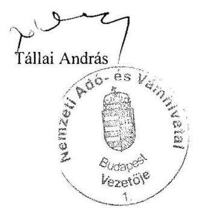

Melléklet: 5 db

---

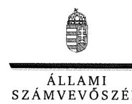

# Tállai András úr 

parlamenti és adóügyekért felelős államtitkár, a Nemzeti Adó- és Vámhivatal vezetője

Nemzeti Adó- és Vámhivatal

## Budapest

## Tisztelt Államtitkár Úr!

..A központi alrendszer egyes intézményei pénzügyi és vagyongazdálkodásának ellenőrzése Nemzeti Adó- és Vámhivatal Képzési, Egészségügyi és Kulturális Intézete" címmel készített számvevőszéki jelentéstervezetre tett észrevételét köszönettel megkaptam.
Az Állami Számvevőszék észrevételre vonatkozó álláspontjáról a felügyeleti vezető által készített részletes tájékoztatást csatoltan megküldöm.
Tájékoztatom Államtitkár Urat, hogy a számvevőszéki jelentésben - az Állami Számvevőszékről szóló 2011. évi LXVI. törvény 29. § (3) bekezdése alapján - a figyelembe nem vett észrevételeket szerepeltetjük az elutasítás indokának feltüntetésével együtt.

Budapest, 2016. május 26. nap
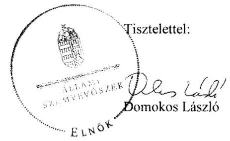

Melléklet: Tájékoztatás az elfogadott és az el nem fogadott észrevételekről

---

# Tájékoztatás az elfogadott és az el nem fogadott észrevételekről 

„A központi alrendszer egyes intézményei pénzügyi és vagyongazdálkodásának ellenőrzése Nemzeti Adó- és Vámhivatal Képzési, Egészségügyi és Kulturális Intézete" című számvevőszéki jelentéstervezetre az 5167658550 iktatószámú levelében tett észrevételeit áttekintettük, annak kezeléséről az alábbi tájékoztatást adom.

## 1. A jelentéstervezet 5-6. oldala szerinti összegzésre tett észrevétel kapcsán

Nem fogadtam el észrevételét, amelyben a jelentéstervezet 5-6. oldalán bemutatott megállapítások mellett javasolta annak megjelenítését, hogy a jelentés térjen ki a Nemzeti Adó- és Vámhivatal Képzési, Egészségügyi és Kulturális Intézete (továbbiakban: NAV KEKI) vezetőjének a gazdálkodás szabályszerűsége érdekében tett intézkedéseinek eredményére is. A jelentéstervezet 5-6. oldala - „Összegzés" és „Főbb megállapítások, következtetések, javaslatok" - fejezeteiben az ellenőrzés által tett főbb megállapítások kerültek bemutatásra a megállapítással érintett évek hozzárendelésével. Az ellenőrzés részletes megállapításait a jelentéstervezet „Megállapítások" fejezet kétszámjegyű megállapításai alatti bekezdések tartalmazzák. Észrevétele a megállapításokat nem cáfolta, ezért azokat nem módosítja.

## 2. A jelentéstervezet 3.3. számú megállapításának utolsó bekezdésére tett észrevétel kapcsán

Észrevételét a jelentéstervezet 24. oldal 3.3. számú megállapítás alatti nyolcadik bekezdés első és második megállapítására nem fogadom el. A dokumentumok ismételt áttekintését követően megalapozott az a megállapítás, hogy 2011. évben ugyanazon a napon közbeszerzési eljárás lefolytatása nélkül a NAV KEKI két szerződést kötött egy szállítóval, amelyek együttes nettó beszerzési értéke meghaladta az árubeszerzésre vonatkozó közbeszerzési értékhatárt, amivel megsértette a közbeszerzésről szóló 2003. évi CXXIX. törvény (továbbiakban: Kbt.) 40. § (1)-(2) bekezdésekben foglaltakat, továbbá a Kbt. 1240. § (1) bekezdés előírásait. A hévizi Gyógyház részére szeszes ital és egyéb italok szállítására kötött szerződés 2012. december 31-éig szólt ugyan, de a szállítás 2011. és 2012. évek közötti ütemezését a szerződés nem írta elő. A szállítási szerződés 6.1. pontjában mindössze annyit rögzítettek, hogy a szállítás kívánt időpontja előtt legalább egy munkanappal a megrendelő (NAV KEKI) megrendelést küld. Észrevétele ezért a megállapítást nem módosítja.

---

# 3. A jelentéstervezet 3.3. számú megállapításának utolsó bekezdésére tett észrevétel kapcsán 

A
 jelentéstervezet 24. oldal 3.3. számú megállapítás alatti nyolcadik bekezdés harmadik megállapítására tett észrevételét - a dokumentumok ismételt áttekintését követően - nem fogadom el, mert az észrevételében bemutatott információk élelmiszer beszerzésre kötött szerződésekre vonatkoznak, míg a jelentéstervezet hivatkozott megállapítása nem élelmiszer beszerzéssel kapcsolatos közbeszerzési eljárás eredményeképpen megkötött szerződésre vonatkozik. Észrevétele ezért a megállapítást nem módosítja.

## 4. A jelentéstervezet 3.3. számú megállapításának 8. bekezdéséhez kapcsolódóan tett észrevétel kapcsán

Köszönettel vettem tájékoztatását a Nemzeti Adó- és Vámhivatal (továbbiakban: NAV) átszervezésére és az új közbeszerzési szabályzat elkészítésére vonatkozóan. Észrevétele az ellenőrzött időszakban megállapított hiányosságot nem cáfolja, tájékoztatása az ellenőrzött időszakon túlmutat, ezért a megállapítást nem módosítja.

## 5. A jelentéstervezet 3.6. számú megállapításának utolsó bekezdéséhez tett észrevétel kapcsán

Köszönettel vettem tájékoztatását a rendező mérleg elkészítésével kapcsolatban. Észrevétele nem cáfolja meg a jelentéstervezet 28. oldal 3.6. számú megállapítása alatti harmadik bekezdés megállapítását, hogy a NAV KEKI a rendező mérleget az államháztartás számvitelének 2014. évi megváltozásával kapcsolatos feladatokról szóló 36/2013. (IX. 13.) NGM rendelet 8. § (2) bekezdés a) pontja előírása szerinti 2014. március 31-ei határidőt túllépve 2014. május 19-ei dátummal készítette el. Észrevétele ezért a megállapítást nem módosítja.

## 6. A jelentéstervezet 4.1. számú megállapításának első és második bekezdése és intézkedési javaslat 2. és 4. pont vonatkozásában tett észrevétel kapcsán

Köszönettel vettem tájékoztatását a jelentéstervezet 28. oldal 4.1. számú megállapítás alatti első és második bekezdésével összefüggésben a Nemzeti Adó- és Vámhivatallal (továbbiakban: NAV), mint általános jogutóddal kapcsolatos részletes információk tekintetében. Észrevétele megerősíti a jelentéstervezet vonatkozó megállapításaiban foglaltakat, amely szerint a Magyar Vagyonkezelő Zrt. (továbbiakban: MNV Zrt.) az MNV/01/15522/0/2011. számú általános vezérigazgató helyettesi levelében arról tájékoztatta a NAV elnökét, hogy az új vagyonkezelői szerződések megkötéséhez a tényleges állapotnak megfelelő adatokat fogja alapul venni. Az ellenőrzés részére átadott dokumentumok alapján megállapítható, hogy a NAV KEKI vagyonkezelési szerződéssel nem rendelkezett az ellenőrzött időszakban.
A nemzeti vagyonról szóló 2011. évi CXCVI. törvény (továbbiakban: Nvtv.) 11. § (1) bekezdése szerint „a vagyonkezelői jog az (5) bekezdésben meghatározottak kivételével vagyonkezelői szerződéssel jön létre.". Az Nvtv. 11. § (5) bekezdése szerint a vagyonkezelői jog kivételesen törvényben történő kijelöléssel is létrejöhet. Azonban a NAV KEKI törvényben történő vagyonkezelővé kijelölése nem történt meg.

---

Észrevétele nem cáfolta továbbá, hogy a NAV KEKI a 2011-2014. években nem rendelkezett az Nvtv. 11. § (9) bekezdésében foglalt másik központi költségvetési szervvel vagyonkezelési szerződésben foglalt jogok és kötelezettségek - az ingatlanokra vonatkozó jogok és kötelezettségek kivételével - átruházására vonatkozó szerződéssel sem. Észrevétele ezért a megállapításokat nem módosítja.

# 7. A jelentéstervezet 4.1. számú megállapításának harmadik bekezdéséhez tett észrevétel kapcsán 

A jelentéstervezet 29. oldal második bekezdésére tett észrevételét a dokumentumok ismételt áttekintését követően - a rövidlejáratú kötelezettségek és az egyéb passzív pénzügyi elszámolások tekintetében - elfogadtuk, azt a számvevőszéki jelentés készítésénél a megállapítás módosításával figyelembe vesszük.

## 8. A jelentéstervezet 4.3. számú megállapításának utolsó előtti bekezdéséhez tett észrevétel kapcsán

Köszönettel vettem tájékoztatását, hogy a kifogásolt gyakorlatot 2013. évtől megszüntették és a 2014. évben indított pályázati eljárások során a Pályázati felhívás 6.10. pontja tartalmazza az Nvtv. 3. § (1) bekezdés 1. pontja szerinti átláthatóságra vonatkozó nyilatkozat benyújtásának kötelezettségét. A vagyonhasznosítási bevételi előirányzatok teljesítésének szabályszerűségét mintavétellel kiválasztott mintatételek alapján értékeltük, amelynek sokaságra történő kivetítését a számvevőszéki jelentés „Az ellenőrzés módszerei" című fejezet részletesen tartalmazza. Az ellenőrzés típusát tekintve szabályszerűségi ellenőrzést végeztünk, amelynek keretében a bérbeadásból származó bevételeknél értékeltük, hogy a NAV KEKI meggyőződött-e a bérbeadási folyamat során az átláthatóság követelményének érvényesüléséről. A jogszabályi előírásoknak való megfelelőségét az Önök által rendelkezésre bocsátott dokumentumok alapján ellenőriztük és ezen dokumentumokra alapozva állapítottuk meg, hogy a bérbeadási szerződések megkötése előtt a NAV KEKI rendszeresen nem győződött meg az átláthatóság követelményének érvényesüléséről. Észrevétele ezért a megállapításokat nem módosítja.
Budapest, 2016. (május) hó 26.
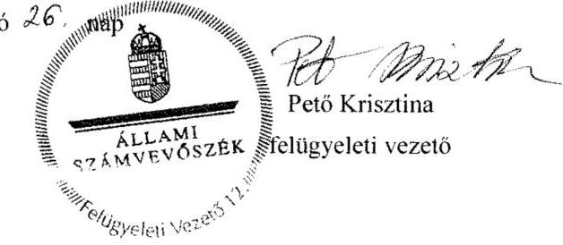

---

.

---

# RÖVIDÍTÉSEK JEGYZÉKE 

${ }^{1}$ ÁSZ
${ }^{2}$ Intézmény
${ }^{3}$ NAV
${ }^{4}$ SZMSZ ${ }_{1}$

SZMSZ ${ }_{2}$
${ }^{5}$ Nvtv.
${ }^{6}$ Áht. $2_{2}$
${ }^{7}$ Ávr.
${ }^{8}$ Áht. $1_{1}$
${ }^{9}$ Ámr.
${ }^{10}$ Bkr.
${ }^{11}$ ÁSZ SZMSZ
${ }^{12}$ Kormányrendelet ${ }_{1}$
${ }^{13}$ alapító okirat ${ }_{1-4}$
${ }^{14}$ szervezeti teljesítménymérési rendszerről kiadott szabályzat
${ }^{15}$ Számv. tv.
${ }^{16}$ Áhsz. 1
${ }^{17}$ Számviteli politika $_{1}$

Számviteli politika $_{2}$
${ }^{18}$ Számviteli politika $_{3}$

Állami Számvevőszék
Nemzeti Adó- és Vámhivatal Képzési, Egészségügyi és Kulturális Intézete Nemzeti Adó- és Vámhivatal
3/2011. (IX. 16.) NAV utasítás a Nemzeti Adó- és Vámhivatal Képzési, Egészségügyi és Kulturális Intézete Szervezeti és Működési Szabályzatáról (hatálytalan: 2014. január 1-jétől)
1/2014. (I. 31.) NAV utasítás a Nemzeti Adó- és Vámhivatal Képzési, Egészségügyi és Kulturális Intézete Szervezeti és Működési Szabályzatáról (hatályos: 2014. február 1-jétől)
2011. évi CXCVI. törvény a nemzeti vagyonról
2011. évi CXCV. törvény az államháztartásról (hatályos: 2012. január 1-jétől) 368/2011. (XII. 31.) Korm. rendelet az államháztartásról szóló törvény végrehajtásáról (hatályos: 2012. január 1-jétől)
1992. évi XXXVIII. törvény az államháztartásról (hatálytalan: 2012. január 1-jétől) 292/2009. (XII. 19.) Korm. rendelet az államháztartás működési rendjéről (hatálytalan: 2012. január 1-jétől)
370/2011. (XII. 31.) Korm. rendelet a költségvetési szervek belső kontrollrendszeréről és belső ellenőrzéséről (hatályos: 2012. január 1-jétől)
Állami Számvevőszék Szervezeti és Működési Szabályzata
273/2010. (XII. 9.) Korm. rendelet a Nemzeti Adó- és Vámhivatal szervezetéről és egyes szervek kijelöléséről
522849577/2011 Alapító Okirat (hatályos: 2011. február 2-től március 17-ig)
5228480027/2011 Alapító Okirat (hatályos: 2011. március 17-től 2012. április 24-ig)
2128755910/2012 Alapító Okirat (hatályos: 2012. április 24-től 2012. augusztus 6-ig)
3708965910/2012 Alapító Okirat (hatályos: 2012. augusztus 6-tól)
A Nemzeti Adó- és Vámhivatal elnöke által kiadott 2008/2014. szabályzat a Nemzeti Adó- és Vámhivatal 2014. évi szervezeti teljesítménymérési rendszeréről
2000. évi C. törvény a számvitelről
249/2000. (XII. 24.) Korm. rendelet az államháztartás szervezetei beszámolási és könyvvezetési kötelezettségének sajátosságairól (hatálytalan: 2014. január 1-jétől)
A Nemzeti Adó- és Vámhivatal elnöke által kiadott 16/2011. Szabályzat a Nemzeti Adó- és Vámhivatal 2011. évi számviteli politika szabályozásáról (hatályos: 2011. május 30-tól 2012. augusztus 27-ig),
A Nemzeti Adó- és Vámhivatal elnöke által kiadott 2123/2012. Szabályzat a Nemzeti Adó- és Vámhivatal számviteli politikájáról (hatályos: 2012. augusztus 27-től 2012. december 26-ig)
A Nemzeti Adó- és Vámhivatal Képzési, Egészségügyi és Kulturális Intézetének Főigazgatója által kiadott 2016/2012/65 számú szabályzat a Nemzeti Adó- és Vámhivatal Képzési, Egészségügyi és Kulturális Intézete számviteli politikájáról (hatályos: 2012. december 26-tól)

---

${ }^{19}$ Önköltségszámítási szabályzat ${ }_{1}$

20 Leltározási és leltárkészítési szabályzat ${ }_{1}$

21 Pénzkezelési szabályzat ${ }_{1}$

22 Értékelési szabályzat ${ }_{1}$

23 Számviteli politika ${ }_{3}$

Számviteli politika ${ }_{4}$

24 Áhsz. 2
${ }^{25}$ Bizonylati rend ${ }_{3}$

26 Pénzkezelési szabályzat ${ }_{1}$

Pénzkezelési szabályzat ${ }_{2}$

Pénzkezelési szabályzat ${ }_{3}$

27 Értékelési szabályzat ${ }_{2}$

28 Kötelezettségvállalás, érvényesítés, utalványozás és ellenjegyzés szabályzat ${ }_{1-5}$

A Nemzeti Adó- és Vámhivatal Képzési, Egészségügyi és Kulturális Intézete főigazgatója által kiadott 4/2011/65. szabályzat a Nemzeti Adó- és Vámhivatal Képzési, Egészségügyi és Kulturális Intézete önköltség számítási és térítési díjképzésének rendjéről (hatályos: 2011. május 12-től)
A Nemzeti Adó- és Vámhivatal Képzési, Egészségügyi és Kulturális Intézetének főigazgatója által kiadott 2009/2012/65. számú szabályzat a Nemzeti Adó- és Vámhivatal Képzési, Egészségügyi és Kulturális Intézetének leltározási és leltárkészítési kötelezettségéről (hatályos: 2012. augusztus 29-től)
A Nemzeti Adó- és Vámhivatal Képzési, Egészségügyi és Kulturális Intézete főigazgatója által kiadott 13/2011/65 szabályzat A pénzkezelés rendjéről (hatályos: 2011. november 23 -tól)
A Nemzeti Adó- és Vámhivatal Képzési, Egészségügyi és Kulturális Intézetének főigazgatója által kiadott 2017/2013/65. szabályzat a Nemzeti Adó- és Vámhivatal Képzési, Egészségügyi és Kulturális Intézete eszközeinek és forrásainak értékelési szabályairól (hatályos: 2013. október 6-tól 2014. május 31-ig)
A Nemzeti Adó- és Vámhivatal Képzési, Egészségügyi és Kulturális Intézetének Főigazgatója által kiadott 2016/2012/65 számú szabályzat a Nemzeti Adó- és Vámhivatal Képzési, Egészségügyi és Kulturális Intézete számviteli politikájáról (hatályos: 2012. december 26-tól 2013. november 17-ig)
A Nemzeti Adó- és Vámhivatal Képzési, Egészségügyi és Kulturális Intézetének Főigazgatója által kiadott 2020/2013/65. számú szabályzat a Nemzeti Adó- és Vámhivatal Képzési, Egészségügyi és Kulturális Intézete számviteli politikájáról (hatályos: 2013. november 17-től 2014. május 18-ig)
A Nemzeti Adó- és Vámhivatal Képzési, Egészségügyi és Kulturális Intézetének Főigazgatója által kiadott 2004/2014/65. szabályzat a Nemzeti Adó- és Vámhivatal Képzési, Egészségügyi és Kulturális Intézete számviteli politikájának egyes szabályairól (hatályos: 2014. május 18-tól)
4/2013. (I. 11.) Korm. rendelet az államháztartás számviteléről (hatályos: 2014. január 1-jétől)
A Nemzeti Adó- és Vámhivatal Képzési, Egészségügyi és Kulturális Intézete főigazgatója által kiadott 2008/2013/65. szabályzat a Nemzeti Adó- és Vámhivatal Képzési, Egészségügyi és Kulturális Intézete Bizonylati Szabályzatáról (hatályos: 2013. május 28-tól)
A Nemzeti Adó- és Vámhivatal Képzési, Egészségügyi és Kulturális Intézete főigazgatója által kiadott 13/2011/65 szabályzat A pénzkezelés rendjéről (hatályos: 2011. november 23-től 2013. november 11-ig)
A Nemzeti Adó- és Vámhivatal Képzési, Egészségügyi és Kulturális Intézete főigazgatója által kiadott 2019/2013/65. szabályzat A pénzkezelés rendjéről (hatályos: 2013. november 11-től 2014. június 11-ig)
A Nemzeti Adó- és Vámhivatal Képzési, Egészségügyi és Kulturális Intézete főigazgatója által kiadott 2009/2014/65. szabályzat a pénzkezelés rendjéről (hatályos: 2014. június 11-től)
A Nemzeti Adó- és Vámhivatal Képzési, Egészségügyi és Kulturális Intézetének Főigazgatója által kiadott 2007/2014/65. szabályzat az eszközök és források értékelési szabályairól (hatályos: 2014. május 31-től)
Kötelezettségvállalás, érvényesítés, utalványozás és ellenjegyzés szabályzat1: A Nemzeti Adó- és Vámhivatal Elnöke által kiadott 2/2011. szabályzat a Nemzeti Adó- és Vámhivatal Kötelezettségvállalás, érvényesítés, utalványozás és ellenjegyzés szabályozásáról (hatályos: 2011. január 3-tól 2011. július 20-ig)

---

Kötelezettségvállalás, érvényesítés, utalványozás és ellenjegyzés szabályzat2: A Nemzeti Adó- és Vámhivatal Elnöke által kiadott 22/2011. szabályzat a Nemzeti Adó- és Vámhivatal Kötelezettségvállalás, érvényesítés, utalványozás és ellenjegyzés szabályozásáról (hatályos: 2011. július 20-tól 2012. szeptember 3-ig)
Kötelezettségvállalás, érvényesítés, utalványozás és ellenjegyzés szabályzat3: A Nemzeti Adó- és Vámhivatal elnöke által kiadott 2125/2012. számú szabályzat a Nemzeti Adó- és Vámhivatal kötelezettségvállalásáról, pénzügyi ellenjegyzéséről, teljesítés igazolásáról, érvényesítéséről, utalványozásáról, utalványozás ellenjegyzéséről (hatályos: 2012. szeptember 3-tól 2013. február 23-ig)
Kötelezettségvállalás, érvényesítés, utalványozás és ellenjegyzés szabályzat4: A Nemzeti Adó- és Vámhivatal Képzési, Egészségügyi és Kulturális Intézete főigazgatója által kiadott 2005/2013/65. szabályzat a Nemzeti Adó- és Vámhivatal Képzési, Egészségügyi és Kulturális Intézete kötelezettségvállalásról, pénzügyi ellenjegyzésről, teljesítésigazolásról, érvényesítésről, utalványozásról, utalványozás ellenjegyzéséről (hatályos: 2013. február 23-tól 2014. szeptember 15-ig)
Kötelezettségvállalás, érvényesítés, utalványozás és ellenjegyzés szabályzat5: A Nemzeti Adó- és Vámhivatal Képzési, Egészségügyi és Kulturális Intézetének Főigazgatója által kiadott 2019/2014/65. szabályzat a kötelezettségvállalásról, pénzügyi ellenjegyzésről, teljesítésigazolásról, érvényesítésről és utalványozásról (hatályos: 2014. szeptember 15-től)
2003. évi CXXIX. törvény a közbeszerzésekről (hatálytalan: 2012. január 1-jétől) 2011. évi CVIII. törvény a közbeszerzésekről (hatályos: 2011. augusztus 21-től 2015. október 31-ig)

Nemzeti Adó- és Vámhivatal 10/ 2011. (IV. 7.) Közbeszerzési szabályzata (hatályos: 2011. április 7-től 2012. május 14-ig)
A Nemzeti Adó- és Vámhivatal elnöke által kiadott 2036/2012. számú szabályzat a közbeszerzésekről (hatályos: 2012. május 14-től 2013. március 24-ig)
Nemzeti Adó- és Vámhivatal Képzési, Egészségügyi
 és Kulturális Intézete beszerzési tevékenységéről szóló 2006/2013/65. számú szabályzat (hatályos: 2013. március 24-től 2014. január 15-ig)

A Nemzeti Adó- és Vámhivatal elnöke által kiadott 2003/2014. szabályzat a közbeszerzésekről (hatályos: 2014. január 15-től)
A Gazdálkodási tevékenység ellenőrzési nyomvonala (hatályos: 2013. március 27-től)
A Gazdálkodási tevékenység ellenőrzési nyomvonala (hatályos: 2014. december 8-tól)
2007. évi CLII. törvény az egyes vagyonnyilatkozat-tételi kötelezettségekről 335/2005. (XII. 29.) Korm. rendelet a közfeladatot ellátó szervek iratkezelésének általános követelményeiről
2/2011. (VIII. 19.) NAV utasítás a Nemzeti Adó- és Vámhivatal Ideiglenes Iratkezelési Szabályzatának kiadásáról (hatályos: 2011. augusztus 19-től 2011. november 15-ig)
A Nemzeti Adó- és Vámhivatal Képzési, Egészségügyi és Kulturális Intézete főigazgatójának az iratkezelés rendjéről szóló 3/2011. számú ideiglenes eljárási rendje (hatályos: 2011. november 15-től 2012. november 15-ig)
2/2012. (X. 31.) NAV utasítás a Nemzeti Adó- és Vámhivatal Iratkezelési Szabályzatának kiadásáról (hatályos: 2012. november 15-től 2014. május 24-ig)
A Nemzeti Adó- és Vámhivatal Képzési, Egészségügyi és Kulturális Intézete főigazgatója által kiadott 2006/2014/65. szabályzat az iratkezelésről (hatályos: 2014. május 24-től)

---

${ }^{36}$ Adatvédelmi szabályzat ${ }_{1}$

Adatvédelmi szabályzat ${ }_{2}$
${ }^{37}$ Avtv.
${ }^{38}$ Info tv.
${ }^{39}$ Eitv.
${ }^{40}$ Belső Ellenőrzési Kézikönyv ${ }_{1}$
${ }^{41}$ Ber.
${ }^{42}$ NGM rendelet ${ }_{1}$
NGM rendelet ${ }_{2}$
${ }^{43}$ a Költségvetési előirányzat tervezés
${ }^{44}$ Kincstár
${ }^{45}$ Kormányhatározat ${ }_{1}$
${ }^{46}$ Kormányhatározat ${ }_{2}$
${ }^{47}$ Kormányhatározat ${ }_{3}$
${ }^{48}$ Kormányhatározat ${ }_{4}$
${ }^{49}$ Kvtv. 1
Kvtv. 2
Kvtv. 3
Kvtv. 4
${ }^{50}$ NGM rendelet ${ }_{3}$
${ }^{51}$ MNV Zrt.
${ }^{52}$ Vtv.
${ }^{53}$ Kormányhatározatok:
Kormányhatározat ${ }_{5}$

Kormányhatározat ${ }_{6}$

Kormányhatározat ${ }_{7}$

21/2011. NAV elnöke által kiadott Szabályzat a Nemzeti Adó- és Vámhivatal Adatvédelmi és Adatbiztonsági Szabályzatáról (hatályos: 2011. június 22-től 2012. január 1-jéig)
111/2011. NAV elnöke által kiadott Szabályzat a Nemzeti Adó- és Vámhivatal Adatvédelmi és Adatbiztonsági Szabályzatáról (hatályos: 2012. január 1-jétől)
1992. évi LXIII. törvény a személyes adatok védelméről és a közérdekű adatok nyilvánosságáról (hatálytalan: 2012. január 1-jétől)
2011. évi CXII. törvény az információs önrendelkezési jogról és az információszabadságról
2005. évi XC. törvény az elektronikus információszabadságról (hatálytalan: 2012. január 1-jétől)
NAV elnöke által kiadott 48/2011. számú szabályzat A Nemzeti Adó- és Vámhivatal Belső Ellenőrzési Szabályzatáról
193/2003. (XI. 26.) Korm. rendelet a költségvetési szervek belső ellenőrzéséről 5/2012. (III. 1.) NGM rendelet az elemi költségvetésről;
10/2013. (III. 13.) NGM rendelet az elemi költségvetésről
A NAV elnöke által kiadott a 2087/2012., a 2006/2013., a 2138/2013. számú szabályzatokkal módosított 107/2011. szabályzat a költségvetési előirányzatok tervezésére, a kincstári és elemi költségvetés összeállítására hatályos 2011. december 15-től, és a NAV KEKI főigazgatója által kiadott 2011/2014/65. szabályzat a költségvetési előirányzatok tervezéséről, a kincstári és elemi költségvetés összeállításáról (hatályos: 2014. július 3-tól)
Magyar Államkincstár
1025/2011. (II. 11.) Korm. határozat az államháztartási egyensúly megőrzéséhez szükséges intézkedésekről (hatályos: 2011. február 11-től)
1635/2012. (XII. 18.) Korm. határozat az egyes kormányhatározatok módosításáról (hatályos: 2012. december 18-tól)
1381/2014. (VII. 17.) Korm. határozat a 2014. évi hiánycél tartásához szükséges intézkedésekről (hatályos: 2014. július 17-től 2014. december 18-ig)
1799/2014. (XII. 19.) Korm. határozat a 2014. évi hiánycél tartásához szükséges intézkedésekről szóló 1381/2014. (VII. 17.) Korm. határozat visszavonásáról 2010. évi CLXIX. törvény a Magyar Köztársaság 2011. évi költségvetéséről 2011. évi CLXXXVIII. törvény Magyarország 2012. évi központi költségvetéséről 2012. évi CCIV. törvény Magyarország 2013. évi központi költségvetéséről 2013. évi CCXXX. törvény Magyarország 2014. évi központi költségvetéséről 36/2013. (IX. 13.) NGM rendelet az államháztartás számvitelének 2014. évi megváltozásával kapcsolatos feladatokról
Magyar Nemzeti Vagyonkezelő Zrt.
2007. évi CVI. törvény az állami vagyonról
1316/2011. (IX. 19.) Korm. határozat a 2011. évi költségvetési egyensúlyt megtartó intézkedésekről (hatályos: 2011. szeptember 20-tól 2011. december 30-ig)
1036/2012. (II. 21.) Korm. határozat a 2012. és 2013. évi költségvetési hiánycél biztosításához szükséges további intézkedésekről (hatályos: 2012. február 22-től 2013. december 31-ig)
1982/2013. (XII. 29.) Korm. határozat a Kormány irányítása alá tartozó fejezetek költségvetési szerveinek eszközbeszerzéseiről (hatályos: 2014. január 1-jétől)

---

| Kormányhatározata | 1025/2014. (I. 30.) Korm. határozat a rendkívüli kormányzati intézkedésekre   szolgáló tartalékból történő előirányzat-átcsoportosításról és egyes   kormányhatározatok módosításáról (hatályos: 2014. január 30-tól) |
| :-- | :-- |
| ${ }^{54}$ Kormányrendelet | 46/2011. (III. 25.) Korm. rendelet a közbeszerzések központi ellenőrzéséről és   engedélyezéséről |
| ${ }^{55}$ Áfa tv. | 2007. évi CXXVII. törvény az általános forgalmi adóról |

---

# ÁLLAMI SZÁMVEVŐSZÉK 

1052 Budapest, Apáczai Csere János utca 10.
Levélcím: 1364 Budapest 4. Pf. 54
Telefon: +36 14849100 Telefax: +36 14849200
www.asz.hu
