# Jelentés 

## A központi alrendszer egyes intézményei pénzügyi és vagyongazdálkodásának ellenőrzése

Észak-magyarországi Vízügyi Igazgatóság
2016.

16079
www.asz.hc

---

# Jelentés 

## A központi alrendszer egyes intézményei pénzügyi és vagyongazdálkodásának ellenőrzése

Észak-magyarországi Vízügyi Igazgatóság
2016. 06 hó 27 nap
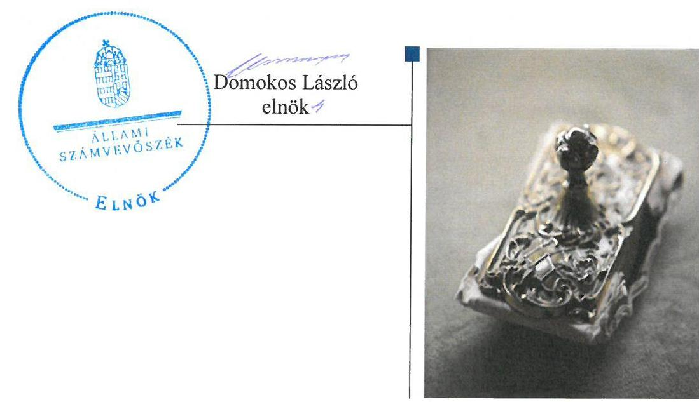

---

# AZ ELLENŐRZÉST FELÜGYELTE: 

PETŐ KRISZTINA felügyeleti vezető

## AZ ELLENŐRZÉST VEZETTE ÉS A VÉGREHAJTÁSÁÉRT FELELŐS:

SCHMIDT JÁNOS ellenőrzésvezető

## A PROGRAM ÖSSZEÁLLÍTÁSÁÉRT FELELŐS:

JANIK JÓZSEF LÁSZLÓ osztályvezető

IKTATÓSZÁM: V-0773-192/2016
TÉMASZÁM: 1807
ELLENŐRZÉS-AZONOSÍTÓ SZÁM: V067912

---

# TARTALOMJEGYZÉK 

■ ÖSSZEGZÉS ..... 5
■ AZ ELLENŐRZÉS CÉLJA ..... 7
■ AZ ELLENŐRZÉS TERÜLETE ..... 8
■ AZ ELLENŐRZÉS HÁTTERE, INDOKOLTSÁGA ..... 11
■ FÓKUSZKÉRDÉSEK ..... 13
■ ELLENŐRZÉS HATÓKÖRE ÉS MÓDSZEREI ..... 14
■ MEGÁLLAPÍTÁSOK ..... 18
■ JAVASLATOK ..... 35
■ MELLÉKLETEK ..... 39
I. Sz. melléklet: Értelmező szótár ..... 39
II. Sz. melléklet: Az integritás érvényesítése érdekében kialakított és müködtetett kontrollrendszer ..... 42
III. Sz. melléklet: Teljesítmény-ellenőrzési kiegészítő modul megállapításai ..... 43
■ FÜGGELÉK: ÉSZREVÉTELEK ..... 45
■ RÖVIDÍTÉSEK JEGYZÉKE ..... 61

---

.

---

# ÖSSZEGZÉS 

Az Állami Számvevőszék az Észak-magyarországi Vízügyi Igazgatóság pénzügyi és vagyongazdálkodása szabályszerűségének ellenőrzését a 2011. január 1. és 2014. december 31. közötti időszakra végezte el. Az irányító szervek és a középirányító szerv feladatellátása szabályszerű volt. Az igazgatóság az integritás szemlélet érvényesülése érdekében erőfeszítéseket tett, amelyeket a belső kontrollrendszer szabályszerű kialakítása megerősített, azonban a müködtetés, a gazdálkodási jogkörök gyakorlása során feltárt szabálytalanságok további intézkedések megtételét teszik szükségessé a korrupciós kockázatok mérséklése érdekében. Az ellenőrzés megállapította, hogy a pénzügyi gazdálkodás területén a bevételi és kiadási előirányzatok módosítása és az eredményszemléletü számvitel bevezetésével kapcsolatos feladatok végrehajtása nem a jogszabályi előírásoknak megfelelően történt. A vagyonhasznosítási szerződésekben az átláthatósági követelmények nem érvényesültek.

## Az ellenőrzés társadalmi indokoltsága

A közpénzek felhasználásában és az állami vagyonnal való gazdálkodásban a központi alrendszer egyes intézményei meghatározó súlyt képviselnek. E szervezetekkel szemben társadalmi igény, hogy tevékenységükről a döntéshozók és a nyilvánosság felé elszámoljanak. Ezzel a társadalmi igénnyel és az Állami Számvevőszék Stratégiájával összhangban, a közpénzügyek átláthatóságának előmozdítása, a közvagyon védelme érdekében került sor az Intézmény pénz-ügyi- és vagyongazdálkodásának ellenőrzésére.

## Főbb megállapítások, következtetések, javaslatok

Az irányító szervek és a középirányító szerv Intézményre vonatkozó feladatellátása szabályszerű volt. Az irányító szervek Intézménnyel kapcsolatos jogosultságait a jogszabályi előírásoknak megfelelően gyakorolta Az irányító szervek és a középirányító szerv részéről a közfeladatok ellátására vonatkozó, az erőforrásokkal való szabályszerű gazdálkodáshoz szükséges követelményeket érvényesítették, számon kérték és a 2011. év kivételével ellenőrizték is. Az irányító szervek és a középirányító szerv az erőforrásokkal való hatékony gazdálkodáshoz szükséges követelményeket nem érvényesítette, így nem volt biztosított a számon kérhetőség és az ellenőrizhetőség. Az Intézménnyel kapcsolatos egyéb ellenőrzési, irányítási jogosultságok gyakorlása szabályszerűen történt.

A belső kontrollrendszer kialakítása és működtetése megfelelt a jogszabályi előírásoknak. A kontrollkörnyezet kialakítása, valamint a kockázatkezelési rendszer kialakítása és működtetése szabályszerű volt. A kontrolltevékenység kialakítása és működtetése csak részben volt szabályszerű, mivel a gazdálkodási jogkörök működtetésében feltárt hiányosságok, továbbá a gazdálkodási jogkörgyakorlásra jogosultakról vezetendő naprakész nyilvántartás hiánya az elszámoltathatóságot veszélyezteti. Az információs és kommunikációs folyamatok kialakítása megfelelt a jogszabályi előírásoknak, azonban az ellenőrzés hiányosságként állapította meg, hogy az iratkezelési szabályzat nem az illetékes szaklevéltárral egyetértésben került kiadásra. A monitoring rendszer müködése megfelelt a jogszabályi előírásoknak és a belső szabályzatokban foglaltaknak. A rendelkezésre álló források gazdaságos, hatékony és eredményes felhasználását biztosító követelmények kialakítása az Intézmény részéről megfelelő volt.

Az Intézmény pénzügyi gazdálkodása részben volt szabályszerű. Az elemi költségvetés és az előirányzatok megállapítása során betartották a jogszabályi előírásokat és a belső szabályzatokban foglaltakat. Az intézményi hatáskörben végrehajtott előirányzat-módosítások gyakorlata nem felelt meg a jogszabályi előírásoknak és a belső szabályzatokban foglaltaknak, mivel az adatszolgáltatás az Intézmény részéről nem az előírt határidőben történt. A bevételi előirányzatok teljesítése, valamint a kiadási előirányzatok felhasználása során a gazdálkodási jogkörök működtetésének hiányosságai miatt a jogszabályi előírásokat csak részben tartották be. Az előirányzat felhasználáshoz kapcsolódó

---

évközi korlátozó intézkedéseket végrehajtották. A befizetési kötelezettségeket teljesítették. Az előirányzat maradvány megállapítása, felhasználása szabályszerű volt, azonban az ellenőrzés hiányosságként tárta fel, hogy az irányító szervek az ellenőrzött időszak egyik évében sem állapították meg az Intézmény éves előirányzat-maradványát, valamint az Intézmény egyes kötelezettségek kincstári bejelentésének határidejét a 2011-2014. években nem tartotta be. Az Intézmény zavartalan feladatellátásához a fizetőképesség folyamatos fennállása, a likviditás javítása érdekében intézkedett. Az eredményszemléletű számvitel bevezetésével kapcsolatos feladatokat a határidőkkel és a könyveléssel kapcsolatban feltárt hiányosságok miatt nem szabályszerűen hajtották végre.

Az Intézmény vagyongazdálkodása szabályszerű volt. A vagyonkezelési szerződés a vagyonkezelés területén bekövetkezett változásokat tükröző, egységes szerkezetbe foglalásának elmaradása miatt, csak részben felelt meg a jogszabályi előírásoknak. A mérlegben kimutatott eszközök és források nyilvántartása, értékelése, leltározása a jogszabályok és a belső szabályzatok előírásainak megfelelően történt. Az Intézmény az értékmegőrzési, állagmegóvási kötelezettségeit a jogszabály és a vagyonkezelési szerződés előírásai szerint teljesítette. A vagyonelemek elidegenítése, hasznosítása viszont az átláthatósági követelmények érvényesülésének esetenkénti elmaradása és a hasznosítási szerződések hiányossága miatt a jogszabályok és a belső szabályzatok előírásainak részben megfelelően történt.

Az ellenőrzött időszakban az Intézménynél átalakítás/átszervezés nem történt. A jogszabályváltozásból adódó feladatátadásra/átvételre szabályszerűen, dokumentáltan került sor. Az ellenőrzött időszakban az Intézmény erőfeszítéseket tett az integritás szemlélet érvényesítése érdekében.

---

# **AZ ELLENŐRZÉS CÉLJA**

## **Az Észak-magyarországi Vízügyi Igazgatóság pénzügyi és vagyongazdálkodásának ellenőrzése**

### **A SZABÁLYSZERŰSÉGI ELLENŐRZÉS**

célja annak megítélése volt, hogy az ellenőrzött Intézmény1-re vonatkozó irányító szervi feladatellátás a jogszabályi előírások betartásával történt-e; az Intézménynél a belső kontrollrendszer kialakítása és működtetése szabályszerű volt-e; kialakították-e az erőforrásokkal való szabályszerű, gazdaságos, hatékony és eredményes gazdálkodáshoz szükséges követelményeket, megvalósították-e azok számon kérését, ellenőrzését; az Intézmény pénzügyi és vagyongazdálkodása megfelelt-e a jogszabályi előírásoknak és belső szabályzatainak; az Intézmény átalakításának vagy átszervezésének lebonyolítása szabályszerűen történt-e.

Az Intézmény korrupcióval szembeni veszélyeztetettségének csökkentése érdekében az ÁSZ2 felmérte az integritási szemlélet érvényesülését a gazdálkodási folyamatokban.

**A KIEGÉSZÍTŐ TELJESÍTMÉNY-ELLENŐRZÉSI MODUL** célja annak értékelése volt, hogy a gazdálkodás folyamatában a gazdaságossági, hatékonysági és eredményességi követelmények kialakítása megtörtént-e, azokat működtették-e, a célkitűzéseket elérték-e; a pénzügyi és vagyongazdálkodás folyamataira vonatkozóan a költségvetési szerv belső kontrollrendszerének minőségéről kiadott vezetői nyilatkozatban a költségvetési szerv tevékenységében a hatékonyság, eredményesség, gazdaságosság követelményeinek érvényesítésére vonatkozó nyilatkozat helytálló volt-e.

---

# **AZ ELLENŐRZÉS TERÜLETE**

## **Észak-magyarországi Vízügyi Igazgatóság**

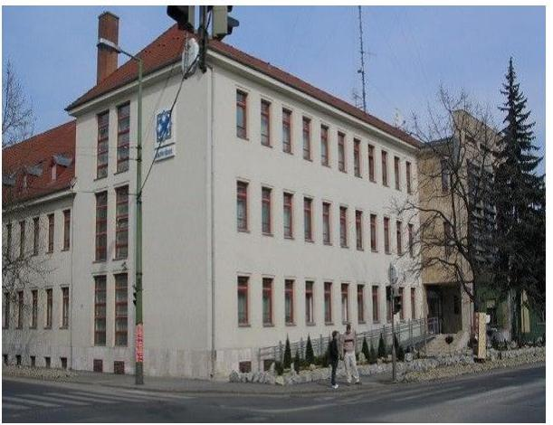

**AZ INTÉZMÉNY** a Kormány által kijelölt vízügyi igazgatási szerv, amelyet az 1060/1953. MT3 határozattal 1953. október 1-jétől a vízügyi területi feladatok ellátására hoztak létre. Jogállását, közfeladatait, hatáskörét és területi illetékességét a vízgazdálkodásról szóló 1995. évi LVII. törvény, a vizek kártételei elleni védekezés szabályairól szóló Korm. rendelet14, valamint a vízügyi, vízvédelmi hatósági feladatokat ellátó szervek kijelöléséről szóló Korm. rendeletek2-45 határozták meg.

Az Intézmény feladatstruktúrája az ellenőrzött időszakban három alkalommal változott. A Korm. rendelet2 41/A., B. §-ai alapján a 2012. január 1-jétől létrejött NEKI6 -nek a területi hulladékgazdálkodással, a vízi közmű szakágazati és statisztikai adatgyűjtéssel, szennyvíz információs rendszerrel kapcsolatos feladatokat adtak át. A Korm. rendelet3 15. §-a alapján 2014. január 1-jétől a vízügyi hatósági feladatokat vették át az ÉMKTVF7 -től. A Korm. rendelet4 19. §-a alapján 2014. szep-tember 10-én feladatátadás történt a KI8 részére, illetve ugyanezen időponttól feladatátvételre került sor vízügyi ágazati, valamint európai uniós forrásokból megvalósuló programokkal, az OKKP9 -vel kapcsolatos területi feladatok ellátásával összefüggésben a NEKI-től.

Az Intézmény önállóan működő és gazdálkodó központi költségvetési szerv. Az irányító szervi feladatokat 2011. december 31-ig a VM10-et vezető miniszter látta el. A Korm. rendelet511 4. § (1) bekezdése módosította a Korm. rendelet612 -ot ezért 2012. január 1-jétől a vízügyi igazgatási szervek irányításáért a BM13 -et vezető miniszter volt felelős. A középirányító szervi feladatokat 2012. március 23-tól a BM utasítás114 alapján az OVF15 látta el.

Az Intézmény szerkezetében, szervezeti felépítésében – az egy-egy osztályon a szakmai feladatmegosztást elősegítő módosításon túl – változás nem történt. Az Intézményt 2011. december 31-ig a vidékfejlesztési miniszter által, ezt követően a belügyminiszter által kinevezett igazgató vezette.

Az Intézmény az ellenőrzött időszakban – az éves költségvetési beszámolók alapján – 30 728,0 M Ft16 összes bevételt teljesített, az összes kiadás 27 771,1 M Ft volt. Az Intézmény 2011. évi engedélyezett létszáma 386 fő volt, ami 2012. évre 357 főre, 2013. évre 364 főre, 2014. évre 377 főre módosult. Az ellenőrzött időszakban a közalkalmazottak mellett 672 - 3058 fő közfoglalkoztatásra is sor került. Az Intézmény átlagos statisztikai állományi létszáma a közfoglalkoztatás következtében 2011. évben 1025 fő, 2012. évben 3398 fő, 2013. évben 2422 fő, 2014. évben 2143 fő volt.

---

Az Intézményi jóváhagyott éves költségvetés volumenének alakulását az 1. ábra szemlélteti.

1. ábra

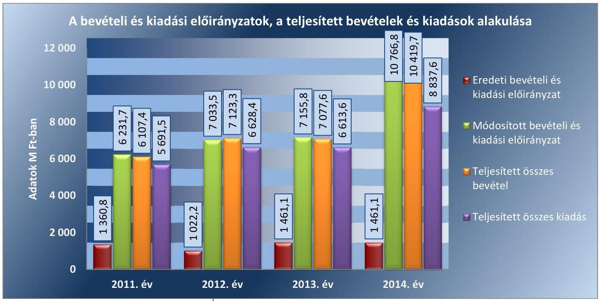

*Forrás: 2011-2014. évi intézményi beszámolók*

A módosított kiadási és bevételi előirányzatok az évközben beindított pályázati projektek, az ár-, és belvíz elleni védekezés beruházásai, valamint a közfoglalkoztatás következtében, az ellenőrzött időszak minden évében jelentősen meghaladták az eredeti előirányzatokat.

Az ellenőrzött időszakban az Intézmény nem rendelkezett saját vagyon-
nal. Az Intézmény könyvviteli mérleg szerinti vagyona a 2011. év eleji 30 396,9 M Ft-ról 2014. év végére 36 764,6 M Ft-ra növekedett.

Az ellenőrzött időszakban az Intézmény mérleg szerinti vagyonának ala-
kulását a 2. ábra mutatja be.

2. ábra

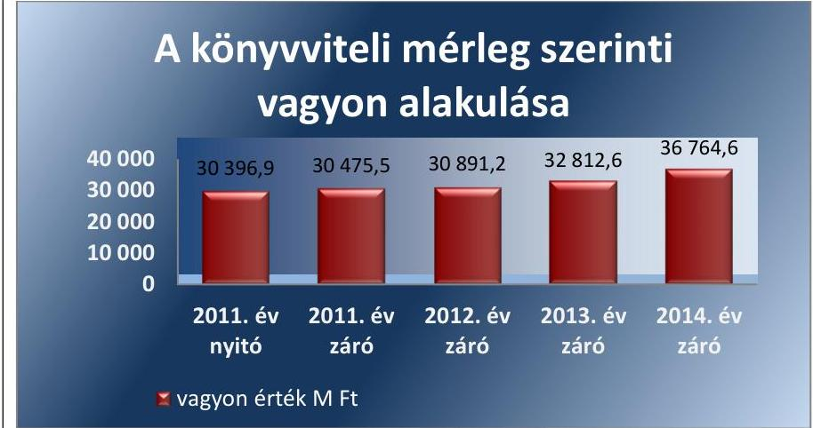

*Forrás: 2011-2014. évi intézményi beszámolók*

---

A befektetett eszközök mérlegértéke a 2011. év eleji 29 492,5 M Ft-ról 8,9\%-kal, 2013. évre 32 102,1 M Ft-ra nőtt. A 2014. évben a nemzeti vagyonba tartozó befektetett eszközök értéke 35041,0 M Ft volt. A kötelezettségek összege a 2011. év eleji 147,8 M Ft-ról 2013. év végére 326,5\%kal 630,4 M Ft-ra nőtt, 2014. év végére 1129,5 M Ft-ra emelkedett. A saját tőke a 2011. év elejei 29 433,6 M Ft-ról 2013. év végére 7,3\%-kal 31 588,2 M Ft-ra nőtt, 2014. év végén 31 521,8 M Ft volt. A mérlegben a tartalékok értéke a 2011. év eleji 815,5 M Ft-ról 2013. év végére 27,2\%-kal 594,0 M Ft-ra csökkent. A 2014. évi államháztartási számviteli változás miatt a 2014. évi mérleg tartalékot nem tartalmazott. A mérleg „Egyéb eszközök induláskori értéke és változásai" sor feleltethető meg tartaléknak, amely az Intézménynél 2014. év végén 569,4 M Ft összeget tett ki.

---

# AZ ELLENŐRZÉS HÁTTERE, INDOKOLTSÁGA 

Az Alaptörvény ${ }^{17}$ rendelkezése szerint a nemzeti vagyon megőrzésének, védelmének és a nemzeti vagyonnal való felelős gazdálkodásnak a követelményeit sarkalatos törvény, az Nvtv. ${ }^{18}$ rögzíti. A tulajdonosi joggyakorlás és vagyonkezelés általános és speciális szabályait, az állami vagyon nyilvántartására és elszámolására vonatkozó eljárásokat, a vagyonkezelési szerződés feltételrendszerét, valamint az éves beszámoló készítési és könyvvezetési kötelezettségeket kormányrendelet írja elő.

A központi alrendszer egyes intézményei közfeladat-ellátásának változásait, a közfeladatok átadásából és átvételéből adódó módosításait, előirányzat gazdálkodására ható tényezőit az Áht. ${ }_{19}{ }^{19} 11 . \S$-a és az Ávr ${ }^{20} .14 . \S$ a írja elő. A közfeladatok megszűnéséből, az intézmény átszervezéséből, belső szerkezeti korszerűsítéséből, vagy más hasonló okból adódó módosításai miatt szerepeltetendő szerkezeti változásokat, valamint a szerkezeti változásként beépült közfeladatok szintre hozásként történő számításba vételét az Ávr. 15. § (2)-(3) bekezdései határozzák meg.

A társadalmi igénnyel összhangban az Áht. ${ }_{1}{ }^{21}$. Áht. ${ }_{2}$, az Ámr. ${ }^{22}$ és a Bkr. ${ }^{23}$ is előírja a költségvetési szerv részére, hogy olyan követelményeket alakítson ki, amelyek biztosítják a múködés, gazdálkodás, az erőforrások felhasználása során a gazdaságosság, hatékonyság és eredményesség érvényesülését. Az Ámr. és a Bkr. alapján az Intézményvezetőnek évente nyilatkoznia is kell arról, hogy gondoskodott-e az Intézmény tevékenységében a gazdaságosság, hatékonyság és eredményesség követelményeinek érvényesítéséről. A gazdaságos, hatékony és eredményes gazdálkodáshoz szükség van a teljesítménymérés feltételeinek kialakítására, úgymint az egyértelmú és mérhető célokra, mutatószámokra és az ezekhez rendelt követelményekre. Az ÁSZ jelen ellenőrzéssel győződik meg arról, hogy az Intézménynél a teljesítménycélokat, -mutatókat, -követelményeket kialakították-e, azokat múködtették-e, a kitűzött cél(ok) teljesültek-e.

AZ ELLENŐRZÉS EREDMÉNYEKÉPPEN nemcsak az ellenőrzött intézmények gazdálkodása javulhat, hanem átfogó képet kaphatunk a központi alrendszerbe tartozó költségvetési szervek gazdálkodásának hiányosságairól, de a jó gyakorlatokról is. Ellenőrzéseivel, javaslataival és megállapításaival az ÁSZ elősegítheti a költségvetési szervek pénzügyi és vagyongazdálkodása szabályozásának javítását és hozzájárulhat a jó kormányzáshoz. Az ellenőrzés az ellenőrzött számára visszajelzést ad a pénzügyi és vagyongazdálkodásában feltárt hiányosságokról, javaslataival hozzájárul azok kiküszöböléséhez, amely csökkentheti a későbbi ellenőrzések gyakoriságát. Az ellenőrzés megállapításait és javaslatait más szervezetek is hasznosíthatják a rendezett gazdálkodási keretek kialakításához.

## A TELJESÍTMÉNY-ELLENŐRZÉSI KIEGÉSZÍTŐ

MODUL alapján elvégzett ellenőrzés a törvényalkotás számára támogatást nyújt a nemzeti kulcsindikátorok rendszerének kialakításához. A döntéshozók, ellenőrzöttek, irányító szervek, a társadalom számára az összehasonlítási, összemérési lehetőségek kihasználásával objektív visszajelzést

---

ad a gazdálkodás területén végrehajtott szervezeti, szervezési, takarékossági és bürokráciacsökkentő intézkedések hatásairól, a közfeladat-ellátásnak keretet adó pénzügyi és vagyongazdálkodásban mérhető teljesítménykövetelmények kialakításáról, azok alkalmazásáról.

---

# FÓKUSZKÉRDÉSEK 

1. Az irányító szerv ellenőrzött intézményre vonatkozó feladatellátása szabályszerű volt-e?
2. A belső kontrollrendszer kialakítása és múködtetése megfelelt-e a jogszabályi előírásoknak?
3. Az intézmény pénzügyi gazdálkodása szabályszerű volt-e?
4. Az intézmény vagyongazdálkodása szabályszerű volt-e?
5. Szabályszerüen hajtották-e végre az ellenőrzött időszakban az intézményt érintő szervezeti, szerkezeti átalakításokat?
6. Az intézmény intézkedett-e az integritás szemlélet érvényesítése érdekében?

---

# ELLENŐRZÉS HATÓKÖRE ÉS MÓDSZEREI 

## Az ellenőrzés típusa

Szabályszerűségi ellenőrzés, amelyet teljesítmény-ellenőrzési modul egészített ki.

## Az ellenőrzött időszak

Az ellenőrzött időszak 2011. január 1-jétől 2014. december 31-ig terjedő időszak volt.

## Az ellenőrzés tárgya

Az ellenőrzött szervezetre vonatkozó irányító szervi feladatok ellátása. Az Intézmény belső kontrollrendszerének kialakítása és müködtetése, valamint pénzügyi és vagyongazdálkodása. Az erőforrásokkal való szabályszerű, gazdaságos, hatékony és eredményes gazdálkodáshoz szükséges követelmények kialakítása, a kialakított követelmények számonkérése, ellenőrzése. Az Intézmény átalakítása, átszervezése lebonyolításának szabályszerűsége.

A teljesítmény-ellenőrzési kiegészítő modul esetében az intézmény gazdálkodás folyamatában a gazdaságossági, hatékonysági és eredményességi követelmények kialakítása és müködtetése, a célkitűzések teljesítésének értékelése. Az Intézmény tevékenységében a hatékonyság, eredményesség, gazdaságosság követelményei érvényesítéséről kiadott nyilatkozat helytállósága. A teljesítmény-ellenőrzés fókuszkérdéseire a III. számú melléklet ad választ.

Az ellenőrzés kiterjedt minden olyan körülményre és adatra, amely az ÁSZ jogszabályban meghatározott feladatainak teljesítéséhez, valamint a programok végrehajtása folyamán felmerült újabb összefüggések feltárásához voltak szükségesek.

## Az ellenőrzött szervezet

Észak-magyarországi Vízügyi Igazgatóság, a 2011. évi irányító szervi feladatok vonatkozásában a Földművelésügyi Minisztérium, a 2012-2014. évi irányító szervi/középirányító szervi feladatok vonatkozásában a Belügyminisztérium és az Országos Vízügyi Főigazgatóság.

---

# Az ellenőrzés jogalapja 

Az ellenőrzés jogszabályi alapját az ÁSZ tv. ${ }^{24} 1 . \S$ (3) bekezdés, 5. § (2)-(7) bekezdései, valamint az Áht. 2 61. § (2) bekezdésének előírásai képezték.

## Az ellenőrzés módszerei

Az ellenőrzést az ellenőrzési program szempontjai, az ellenőrzött időszakban hatályos jogszabályok, az ellenőrzés szakmai szabályai, az egyes ellenőrzési típusokhoz kapcsolódó ÁSZ módszertanok és nemzetközi standardok figyelembevételével végeztük. A gazdálkodás hibáinak kijavítására, a közpénzekkel való felelős gazdálkodás segítésére irányuló javaslatok kidolgozásakor a hatályos jogszabályok voltak az irányadóak.

Az ellenőrzés ideje alatt az ellenőrzött szervezettel történő kapcsolattartást az ÁSZ SZMSZ ${ }^{25}$-ének vonatkozó előírásai alapján biztosítottuk.

Az ellenőrzési kérdések megválaszolásához szükséges bizonyítékok megszerzése a következő ellenőrzési eljárások alkalmazásával történt: megfigyelés, szemle (szemrevételezés), kérdésfeltevés (információkérés), mintavételezés, valamint elemző eljárás. A minták kiválasztása során elsősorban reprezentativitást biztosító véletlen mintavételi eljárást alkalmaztunk.

Az ellenőrzési bizonyítékként felhasználható adatforrások közé tartoztak egyrészt a szakmai program részletes szempontjainál felsorolt adatforrások, másrészt adatforrás volt minden egyéb - az ellenőrzés folyamán feltárt, az ellenőrzés szempontjából releváns információt tartalmazó - dokumentum.

Az ellenőrzés lefolytatásához az intézmény a tanúsítványok elektronikus kitöltésével, valamint az ÁSZ által kért dokumentumok elektronikus megküldésével szolgáltatott adatokat. A rendelkezésre bocsátott adatok, információk kontrollja az ellenőrzés keretében történt.

Az ellenőrzési kérdésekre adott válaszok alapján értékeltük, hogy az ellenőrzött időszakban az irányító szerv ${ }^{26}{ }_{1,2}$ és a középirányító szerv ${ }^{27}$ az ellenőrzött intézményre vonatkozó feladatainak szabályszerűen eleget tette, az Intézmény pénzügyi és vagyongazdálkodása megfelelt-e az előírásoknak, az Intézmény átalakításának vagy átszervezésének végrehajtása szabályszerű volt-e. Értékeltük, hogy az Intézménynél kialakították-e az erőforrásokkal való szabályszerű és hatékony gazdálkodáshoz szükséges követelményeket, megvalósították-e azok számonkérését, ellenőrzését.

Az Intézmény belső kontrollrendszere jogszabályi előírások szerinti kialakításának és működtetésének szabályszerűségét az erre irányuló ellenőrzési kérdésekre adott válaszok összesítése alapján, évente pillérenként (kontrollkörnyezet, kockázatkezelési rendszer, kontrolltevékenységek, információs és kommunikációs rendszer, monitoring rendszer) és összesítetten is minősítettük. Az Intézmény belső kontrollrendszere egyes pilléreinek kialakítását és működtetését „szabályszerü"-nek minősítettük, amennyiben az értékelt területen az elért és elérhető pontok százalékban kifejezett, egész számra kerekített hányadosa meghaladta a $84 \%$-ot, „részben sza-bályszerü"-nek minősítettük, ha a $84 \%$-ot nem haladta meg, de $60 \%$-nál nagyobb volt, „nem szabályszerü"-nek minősítettük, ha nem haladta meg

---

a 60\%-ot. Az Intézmény belső kontrollrendszerének összesített értékelése megegyezik a pillérenként (kontrollterületenként) alkalmazott \%-os értékelésekkel, a következő eltérésekkel. A kontrollrendszer egésze esetében a „szabályszerü" értékelésnek a \%-os értéken felül további feltétele volt, hogy egyik kontrollterület sem kaphatott „nem szabályszerű" értékelést, a „részben szabályszerű" értékelés további feltétele volt, hogy legfeljebb egy ellenőrzött kontrollterület lehetett „nem szabályszerű" értékelésű. Az öszszesített értékelés a \%-os értéktől függetlenül „nem szabályszerű"-nek minősült, ha az ellenőrzött kontrollterületek közül több mint egy „nem szabályszerű" értékelést kapott.

A tárgyi eszközök nyilvántartásba vételének, a közbeszerzési eljárások lefolytatásának, a vagyonhasznosítási bevételi előirányzatok teljesítésének, az előirányzatok módosításának és az előirányzat-maradvány megállapításának szabályszerűségét, valamint a gazdálkodási jogkörök gyakorlásának szabályszerűségét mintavétellel ellenőriztük.

A jogszabályoknak és a belső előírásoknak megfelelőnek tekintettük a tárgyi eszközök nyilvántartásba vételét, a vagyonhasznosítási bevételi előirányzatok teljesítését, az előirányzatok módosítását és az előirányzat-maradvány megállapítását, amennyiben a minta ellenőrzésének eredménye alapján 95\%-os bizonyossággal a teljes sokaságban a hibás tételek aránya kisebb volt, mint 10\%, nem megfelelőnek értékeltük, ha a hibás tételek aránya a 10\%-ot meghaladta. Kockázatot, illetve magas kockázatot jeleztünk, amennyiben egy adott terület vonatkozásában a minta alapján a teljes sokaságban nem volt egyértelműen biztosított a jogszabályoknak és a belső szabályzatoknak megfelelő működés.

A közbeszerzési eljárások esetében az ellenőrzött mintatételek értékelését végeztük el.

A 2011. évet érintően a szakmai teljesítésigazolás és az utalvány ellenjegyzése kulcskontrollok, a 2012-2014. éveket érintően a teljesítésigazolás és az érvényesítés kulcskontrollok működését értékeltük. Megfelelőnek értékeltük a gazdálkodási jogkörök gyakorlását, amennyiben 95\%-os bizonyossággal a teljes sokaságban a hibás tételek aránya legfeljebb 10\% volt, részben megfelelőnek, ha a hibás tételek arányának felső határa legfeljebb $30 \%$ volt, nem megfelelőnek, ha a hibás tételek sokaságbeli arányának felső határa meghaladta a 30\%-ot.

Az integritás szemlélet érvényesülésének értékelése az Intézmény által kitöltött tanúsítványa alapján történt.

Az alapprogram alapján ellenőriztük, hogy a költségvetési szerv vezetője megtette-e nyilatkozatát arról, hogy gondoskodott a költségvetési szerv tevékenységében a hatékonyság, eredményesség és a gazdaságosság követelményeinek érvényesítéséről. Ezt kiegészítve, a teljesítmény-ellenőrzési kiegészítő modul keretében - felhasználva az alapprogram szerinti ellenőrzés megállapításait - értékeltük, hogy a költségvetési szerv vezetője kialakította-e a gazdaságossági, hatékonysági és eredményességi követelményeket, és azokat működtette-e, a célkitűzéseket elérte-e.

A teljesítmény-ellenőrzési kiegészítő modul a gazdálkodási feladatokra terjedt ki, a szakmai feladatellátást nem értékelte.

A gazdálkodási feladatok értékelése az alábbi területekre terjedt ki:
pénzügyi gazdálkodási (nem szakmai, adminisztratív) feladatok: költségvetés-, beszámoló-készítés, könyvvezetés, adatszolgáltatások,

---

előirányzat-gazdálkodás, kötelezettségvállalások nyilvántartása, kezelése, bevételkezelés, bér- és illetményszámfejtés;
$\longrightarrow$ vagyongazdálkodási (logisztikai) feladatok: közbeszerzések és közbeszerzési értékhatárt el nem érő beszerzések, készletgazdálkodás, nyomtatók, fénymásolók üzemeltetése, épület- és ingatlanüzemeltetés, karbantartás, hibabejelentés, gépjármú és flottamenedzsment.
Az ellenőrzés során minden olyan körülményt és adatot is ellenőriztünk, amely a program végrehajtása kapcsán felmerült újabb összefüggéseknek az ellenőrzés céljaival összhangban lévő feltárásához szükséges. A teljesít-mény-ellenőrzési kiegészítő programmodulban megfogalmazott ellenőrzési cél megválaszolásához az alapprogram végrehajtása során megfogalmazott megállapításokat is figyelembe vettük.

---

# 1. Az irányító szerv ellenőrzött intézményre vonatkozó feladatellátása szabályszerű volt-e? 

Összegző megállapítás

Az irányító szerv ${ }_{1,2}$ és a középirányító szerv Intézményre vonatkozó feladatellátása szabályszerű volt.

### 1.1. számú megállapítás

Az irányító szerv ${ }_{1,2}$-őt megillető jogosultságok gyakorlása a jogszabályi előírásoknak megfelelően történt.

A Korm. rendelet ${ }_{5}$ alapján, az irányító szerv ${ }_{2}$ a BM utasítás ${ }_{1} 2 . \S$ (1) bekezdésében 2012. március 23-i hatállyal részletesen meghatározta a középirányító szerv által az Intézménnyel kapcsolatban ellátandó feladatokat az Áht. ${ }_{2}$ előírásainak megfelelően. A középirányító szervi feladatokat a 2013. december 12. utáni időszakban hatályos Alapító okirat4.6 szintén nevesítette.

Az Intézmény az ellenőrzött időszak egészében rendelkezett összesen hat Alapító okirattal ${ }^{28}$, amelyeket az irányító szerv ${ }_{1,2}$ - az Áht. ${ }_{1,2}$-ben előírtak szerint - az államháztartásért felelős miniszter előzetes egyetértésével adott ki az Áht. ${ }_{1}$-ben, illetve az Ávr.-ben előírt tartalommal. Alapító okirat módosításokra az ellátott közfeladatok, illetve jogszabályváltozás miatt került sor. Az Alapító okirat ${ }_{1-6}$-ot - az Ámr.-ben, illetve az Ávr.-ben előírtaknak megfelelően - a módosításokkal egységes szerkezetbe foglalták. A BM utasítás ${ }_{1}$ és az Alapító okirat4.6 meghatározta az egyes irányítói jogok gyakorlására jogosult szerveket az Ávr. rendelkezéseinek megfelelően.

Az Intézmény az ellenőrzött időszak egészében rendelkezett SZMSZ ${ }_{1-3}{ }^{29}$-mal. Az Intézmény 2012. december 18-tól rendelkezett az Alapító okirat ${ }_{3-6}$-tal összhangban lévő, az irányító szerv ${ }_{2}$ által jóváhagyott SZMSZ ${ }_{2,3}$-mal.

Az irányító szerv ${ }_{1}$ az Áht. ${ }_{1} 93 . \S$ (1) bekezdése szerinti - az SZMSZ jóváhagyására irányuló - alapítói jogát a 2011. évben nem gyakorolta. A 2012. évi irányító szervi változást követően az irányító szerv ${ }_{2}$ élt az Áht. ${ }_{2} 9 . \S$ (1) bekezdés a) pontjában biztosított jogával és az Intézmény SZMSZ ${ }_{2,3}$-at jóváhagyta.
1.2. számú megállapítás

Az irányító szerv ${ }_{1,2}$ és a középirányító szerv részéről a közfeladatok ellátására vonatkozó, az erőforrásokkal való szabályszerű gazdálkodáshoz szükséges követelményeket érvényesítették, számon kérték és a 2011. év kivételével ellenőrizték is. Az irányító szerv ${ }_{1,2}$ és a középirányító szerv az erőforrásokkal való hatékony gazdálkodáshoz szükséges követelményeket nem érvényesítette, így nem volt biztosított a számon kérhetőség és az ellenőrizhetőség.

A közfeladatok ellátására, az erőforrásokkal való szabályszerű gazdálkodásra vonatkozó követelményeket az irányító szerv ${ }_{1}$ az Áht. ${ }_{1}$ előírásai-

---

#### Abstract

nak megfelelően 2011. évben az Intézmény költségvetési gazdálkodása felügyeletén keresztül érvényesítette, az éves költségvetési beszámoló és szakmai beszámoló keretében számon kérte, azonban azok ellenőrzéséről nem gondoskodott.

Az erőforrásokkal való hatékony gazdálkodás követelményeinek érvényesítésére, továbbá számon kérésére, ellenőrzésére a 2011. évben az Áht..1 49. § (5) bekezdés f) pont előírásai ellenére az irányító szerv1 részéről nem került sor.

Az irányító szerv ${ }_{2}$ és a középirányító szerv a közfeladatok ellátására vonatkozó és az erőforrásokkal kapcsolatos szabályszerű gazdálkodás követelményeit 2012-2014. években a költségvetési gazdálkodás egyes szabályainak meghatározásával, valamint a költségvetési gazdálkodás felügyeletén keresztül érvényesítette, a követelményeket számon kérte, a költségvetési gazdálkodásra vonatkozó szabályszerűségi ellenőrzéseket folytatott.

A gazdálkodás hatékonyságához szükséges követelmények érvényesítésével, számonkérésével és ellenőrzésével kapcsolatos irányító/középirányító szervi feladatellátás a 2012 - 2014. években- az Áht. 2 9. § (1) bekezdés f) pontjának előírásai ellenére - nem valósult meg.

1.3. számú megállapítás

Az irányító szerv ${ }_{1,2}$ és a középirányító szerv az Intézménnyel kapcsolatos egyéb ellenőrzési, irányítási jogosultságait szabályszerűen gyakorolta.

Az irányító szerv ${ }_{1,2} /$ középirányító szerv rendszeresen figyelemmel kísérte az Intézmény bevételi és kiadási előirányzatokkal való gazdálkodását, a közfeladatok ellátását, és ellenőrizte a bevételi és kiadási előirányzatokkal való gazdálkodást az Áht.1,2-ben előírtak szerint.

Az irányító szerv ${ }_{1,2}$ - 2011. évben közvetlenül és 2012. évtől a középirányító szerven keresztül - az Intézmény vezetőjét az éves gazdálkodásról és a szakmai feladatellátásról az Áht.1,2-ben előírtak szerint beszámoltatta. Az Intézmény éves költségvetési beszámolóit, valamint a szakmai tevékenységről szóló jelentéseit az irányító szerv ${ }_{1,2}$ a 2011-2014. években elfogadta.

Az Intézmény igazgatójának és gazdasági igazgatóhelyettesének a vezetői megbízása, kinevezés módosítása, az irányító szerv ${ }_{1,2}$ részéről az Áht.1-2 előírásainak megfelelően történt.

Az Intézmény kezelésében levő közérdekű és közérdekből nyilvános adatok, valamint az irányítási jogkörök gyakorlásához szükséges személyes adatok kezelésének kialakítása az irányító szerv ${ }_{1-2}$-nél szabályszerű volt.

# 2. A belső kontrollrendszer kialakítása és működtetése megfelel-e a jogszabályi előírásoknak? 

## Összegző megállapítás

A belső kontrollrendszer kialakítása és múködtetése megfelelt a jogszabályi előírásoknak.

A belső kontrollrendszer kialakításának és működtetésének értékelését az 1. táblázat mutatja.

---

| A BELSŐ KONTROLLRENSZER KIALAKÍTÁSÁNAK ÉS MŰKÖDTETÉSÉNEK ÉRTÉKELÉSE |  |  |  |  |  |  |
| :--: | :--: | :--: | :--: | :--: | :--: | :--: |
| Megnevezés | Kontrollkörnyezet | Ködözzetkezelés | Kontrolltevékenységek | Információ és kommunikáció | Monitoring | ÖSSZLSEN |
| 2011. | szabályszerű | szabályszerű | részben szabályszerű | szabályszerű | szabályszerű | szabályszerű |
| 2012. | szabályszerű | szabályszerű | részben szabályszerű | szabályszerű | szabályszerű | szabályszerű |
| 2013. | szabályszerű | szabályszerű | részben szabályszerű | szabályszerű | szabályszerű | szabályszerű |
| 2014. | szabályszerű | szabályszerű | részben szabályszerű | szabályszerű | szabályszerű | szabályszerű |

2.1. számú megállapítás

A kontrollkörnyezet kialakítása szabályszerű volt.

AZ INTÉZMÉNY KONTROLLKÖRNYEZETÉNEK KIALAKÍTÁSA a 2011-2014. években szabályszerű volt, megfelelt az Áht.1,2, az Ámr., a Bkr., a Kbt. ${ }_{1,2}{ }^{30}$, a Munka tv. ${ }_{1,2}{ }^{31}$, a Számv. tv. ${ }^{32}$, a Vtvr. ${ }^{33}$, az Áhsz. ${ }_{1,2}{ }^{34}$ előírásainak.

Az Intézmény igazgatója olyan kontrollkörnyezetet alakított ki, amelyben az Ámr. és a Bkr. követelményeinek megfelelően világos volt a szervezeti struktúra, egyértelműek voltak a felelősségi, hatásköri viszonyok és feladatok, továbbá átlátható volt a humánerőforrás-kezelés.

Az Intézmény az ellenőrzött időszak egészében rendelkezett az Áht.1,2ben előírt tartalmi elemeket magában foglaló SZMSZ1-3-mal. Az SZMSZ1-3ban a nevesített munkakörökhöz tartozó feladat és hatáskörök gyakorlásának módja és az ezekhez kapcsolódó felelősségi szabályok megfeleltek az Ámr., az Ávr. és a Bkr. előírásainak.

A 2011-2014. években az Intézmény gazdasági szervezetének ügyrendje megfelelt az Ámr. és az Ávr. előírásainak.

Az Intézmény rendelkezett számlarend ${ }_{1-5}{ }^{35}$-el, bizonylati rend ${ }_{1-6}{ }^{36}$-al, számviteli politikával ${ }^{37}$, és az annak keretében elkészített eszközök, források leltározási és leltárkészítési ${ }^{38}$, eszközök és források értékelési ${ }^{39}$, pénzkezelési ${ }^{40}$ - és önköltség-számítási ${ }^{41}$ szabályzatokkal, valamint ellenőrzési nyomvonallal és a szabálytalanságok kezelésére vonatkozó eljárásrenddel.

A gazdálkodás részletes rendjét 2013. március 1-jéig a gazdálkodási szabályzat ${ }_{1-3}{ }^{42}$.ban, ezt követően a kötelezettségvállalás, pénzügyi ellenjegyzés, teljesítésigazolás, érvényesítés, utalványozás, valamint a jogi ellenjegyzés rendjéről és a gazdálkodási jogkörök gyakorlásáról szóló kötelezettségvállalási szabályzat ${ }_{1-3}{ }^{43}$ ban írták elő.

Az ellenőrzött időszak egészében rendelkezett az Intézmény a Kbt.1,2 előírásainak megfelelő közbeszerzési szabályzat ${ }_{1-5}{ }^{44}$-el, amelyben az Ámr.ben és az Ávr.-ben előírtak szerint szabályozták a Kbt ${ }_{1,2}$ hatálya alá nem tartozó beszerzések lebonyolítását is.

Kisebb hiányosság volt, hogy a leltározási és leltárkészítési szabályzat ${ }_{1-5}$ - az Áhsz. ${ }_{1} 37 . \S$ (6) bekezdésében és az Áhsz. ${ }_{2} 22 . \S$ (2) bekezdés b) pontjában foglaltak ellenére - nem tartalmazta a használt, de a mérlegben értékkel nem szereplő immateriális javak, tárgyi eszközök, készletek leltározási módját.

Az Intézmény 2012. október 30-ig nem határozta meg az etikai elvárásokat a szervezet minden szintjén az Ámr. 156. § (1) bekezdés c) pontjában, a Bkr. 6. §. (1) bekezdés c) pontjában előírtak ellenére. Az etikai elvá-

---

# 2.2. számú megállapítás 

rásokat 2012. október 31. napjától határozták meg a Bkr.-ben rögzítetteknek megfelelően, amely ettől az időponttól megfelelt a jogszabályi előírásoknak.

## A kockázatkezelési rendszer kialakítása és múködtetése szabályszerű volt.

## AZ INTÉZMÉNY KOCKÁZATKEZELÉSI RENDSZERÉNEK KIALAKÍTÁSA ÉS MÚKÖDTETÉSE megfelelt az Áht.1,2, az Ámr., a Bkr. előírásainak.

Az Intézmény kialakította és múködtette a kockázatkezelési rendszerét, felmérte és meghatározta a szervezet tevékenységében, gazdálkodásában rejlő kockázatokat, meghatározta a kockázat fogalmát, a kockázatkezelés folyamatát, valamint a kockázatok nyilvántartásának szabályait, az egyes kockázatokkal kapcsolatban szükséges intézkedéseket, valamint azok teljesítésének folyamatos nyomon követésének módját.

A vagyonnyilatkozat-tételre kötelezettek körét 2012. december 17-ig az SZMSZ ${ }_{1}$ tartalmazta, azonban az ezt követően hatályba helyezett SZMSZ ${ }_{2,3^{-}}$ ban a Vnytv ${ }^{45}$. 4. § a) bekezdésében foglaltak ellenére nem rögzítették.

## A kontrolltevékenység kialakítása és múködtetése részben volt szabályszerű, amely az elszámoltathatóságot veszélyezteti.

## A KONTROLLTEVÉKENYSÉGEK KIALAKÍTÁSA ÉS

MÚKÖDTETÉSE részben felelt meg az Ámr., a Bkr., az Áht.1,2, az Avtv. ${ }^{46}$, az Info tv. ${ }^{47}$, a Munka tv.1,2, az Ávr. és az lkr. ${ }^{48}$ előírásainak. Az Intézmény belső szabályzataiban a felelősségi körök meghatározásával szabályozta a dokumentumokhoz és információkhoz való hozzáférést, a hozzáférés szintjeit, valamint a beszámolási eljárásokat. A gazdálkodási jogköröket gyakorló személyeket az arra jogosultak írásban kijelölték. Az iratkezelési szoftver által kezelt adatok biztonsága érdekében, továbbá az informatikai rendszer szabályozása során kialakították az üzembiztonsági, adatvédelmi eljárási szabályokat.

Az ellenőrzött időszakban az engedélyezési, jóváhagyási és kontroll eljárások szabályozása teljes körűen nem felelt meg az Ámr. 158. § (2) bekezdés a) pontjában és a Bkr. 8. § (4) bekezdés a) pontjában foglaltaknak, mert az Intézmény - az Ámr. 80. § (3) bekezdésében és az Ávr. 60. § (3) bekezdésében előírtak ellenére - nem vezetett teljes körű naprakész nyilvántartást a gazdálkodási jogkörök gyakorlására jogosult személyekről és aláírás-mintáikról. Ezzel veszélyeztette az elszámoltathatóságot.

A kontrolltevékenységek működtetése a 2011-2014. években nem felelt meg az Áht. 1 121/A. § (4) bekezdés c) pontjában és a Bkr. 8. § (2) bekezdés c) pontjában foglalt előírásoknak, tekintettel arra, hogy a költségvetési gazdálkodás során nem volt biztosított a folyamatba épített, előzetes, utólagos és vezetői ellenőrzés (FEUVE) a pénzügyi döntések szabályszerűségi szempontból történő jóváhagyása, illetve ellenjegyzése vonatkozásában.

A FEUVE keretében a pénzügyi kihatású döntések megalapozottsága a 2011-2014. években részben felelt meg az Áht. 1 121/A. § (4) bekezdés b) pontjában és a Bkr. 8. § (2) bekezdés b) pontjában foglalt követelményeknek.

---

A gazdálkodási jogkörök gyakorlása vonatkozásában szabálytalanságok jellemezték 2011. évben a szakmai teljesítés igazolását és az utalványozás ellenjegyzését, 2012-2014. években a teljesítésigazolást és az érvényesítést. A feltárt hiányosságokat részletesen a 3.3. számú megállapítás tartalmazza.

# 2.4. számú megállapítás 

Az információs és kommunikációs folyamatok kialakítása a jogszabályi előírásoknak megfelelt.

AZ INFORMÁCIÓS ÉS KOMMUNIKÁCIÓS RENDSZER kialakítása és múködtetése szabályszerű volt, mert megfelelt az Avtv., az Eitv. ${ }^{49}$, az Info tv., az Ltv. ${ }^{50}$, az Ámr., az Ávr., a Ber., a Bkr., valamint az lkr. és a belső szabályozások vonatkozó előírásainak.

Az Intézmény vezetője által kialakított és múködtetett információs és kommunikációs rendszer biztosította, hogy a megfelelő információk a megfelelő időben jussanak el az illetékes szervezethez, szervezeti egységhez, illetve személyhez.

Az Intézménynél kialakították a szervezeten belüli információáramlás rendszerét. Az Intézmény rendelkezett adatvédelmi szabályzattal ${ }^{51}$. Szabályozták a kötelezően közzéteendő adatok nyilvánosságra hozatalának, továbbá a megismerésére irányuló igények teljesítésének rendjét. Az Intézmény eleget tett az elektronikus közzétételi kötelezettségének.

Az Intézmény az ellenőrzött időszakban rendelkezett iratkezelési szabályzat ${ }_{1,2}{ }^{52}$-vel, amely tartalmazta az lkr.-ben előírt tartalmi elemeket, és az iratok nyomon követését informatikai rendszer támogatta. Azonban az iratkezelési szabályzat ${ }_{1,2}$ - az Ltv. 10. § (1) bekezdés b) pontjában foglaltak ellenére - nem az illetékes szaklevéltárral egyetértésben került kiadásra.
2.5. számú megállapítás

A monitoring rendszer múködése megfelelt a jogszabályi előírásoknak és a belső szabályzatokban foglaltaknak. A rendelkezésre álló források gazdaságos, hatékony és eredményes felhasználását biztosító követelmények kialakítása és alkalmazása megfelelt a jogszabályi előírásoknak és a belső előírásoknak.

Az Intézmény igazgatója kialakította a szervezet tevékenységének, a célok megvalósításának nyomon követését biztosító rendszert az Áht. 1.2, az Ámr., a Ber. és a Bkr. rendelkezéseinek és a belső szabályozások vonatkozó előírásainak megfelelően.

Az Intézmény igazgatója gondoskodott a gazdaságosság, hatékonyság és eredményesség követelményei megfelelő kialakításáról az Intézmény tevékenységeiben az Áht. 1 94. § (1) bekezdés b) pontjában, az Áht. 2 61. § (1) bekezdésben, az Áht. 2 69. § (1) bekezdés a) pontjában és a Bkr. 4. § a) pontjában előírtak szerint. Az Intézmény igazgatója által az Áht. 1 121. § (3) bekezdésében, illetve a Bkr. 11. § (1) bekezdésben előírtaknak megfelelően a 2011-2014. évek vonatkozásában kiadott éves vezetői nyilatkozatok helytállóak voltak a hatékonyság, eredményesség és gazdaságosság követelményeinek az Intézmény tevékenységeiben történő érvényesítése vonatkozásában.

A belső ellenőrzés rendszerének kialakítása és múködtetése során betartották az Áht. 1.2, a Ber. és a Bkr., valamint a belső ellenőrzési kézikönyv ${ }_{1}$. 4 előírásait. A belső ellenőrzés végrehajtotta a tárgyévi ellenőrzési tervben

---

foglalt ellenőrzéseket, amelyekről a Ber. és a Bkr. szerint jelentéseket készítettek.

A belső és külső ellenőrzés megállapításaira és javaslataira készült intézkedési terveket nyomon követték a jogszabályi előírások szerint.

A belső és külső ellenőrzések által a belső kontrollrendszer 2011., 2013. évi ellenőrzései keretében a leltározási szabályzattal és a kockázatkezeléssel, a szakaszmérnökségek 2012-2013. évi rendszerellenőrzésével, a gépjármú üzemeltetés 2012. évi, továbbá a házipénztárak 2012. évi ellenőrzésével összefüggésben tett megállapításokra és javaslatokra készült intézkedési tervek, azok megvalósulása és hasznosulása fejlesztette az irányítási és belső kontrollrendszer hatékonyságát.

# 3. Az intézmény pénzügyi gazdálkodása szabályszerű volt-e? 

## Összegző megállapítás

Az intézmény pénzügyi gazdálkodása részben volt szabályszerű.

### 3.1. számú megállapítás

Az elemi költségvetés és az előirányzatok megállapítása során betartották a jogszabályi előírásokat és a belső szabályzatokban foglaltakat.

Az Intézmény elemi költségvetése, az előirányzatok megállapítása megfelel az Ámr., az Áht. ${ }_{2}$, az NGM rendelet ${ }_{1,2}{ }^{53}$-ben foglalt előírásoknak és a belső szabályzatokban (SZMSZ ${ }_{1-3}$, Gazdálkodási szabályzat ${ }_{1-3}$, Kötelezettségvállalási szabályzat ${ }_{1-3}$, Gazdasági szervezet Ügyrendje ${ }^{54}$ ) foglaltaknak.

Az Intézmény a bevételek és a kiadások tervezése során az Ámr., az Áht. ${ }_{2}$, NGM rendelet ${ }_{1,2}$-ben foglaltak alapján az előirányzatok összegét számításokkal alátámasztotta.

Az Intézmény az Ámr.-ben és az Ávr.-ben foglaltak alapján teljesítette a tervezés során előírt adatszolgáltatási kötelezettségeit.

Az Intézmény a 2012. és 2014. évi költségvetési javaslat elkészítése során nem tudta figyelembe venni az Intézményt érintő feladat-átadásokból és feladat-átvételekből adódó szerkezeti változások és a szintre hozások hatásait, mert a változásokat tartalmazó Korm. rendelet ${ }_{3,5}$-öt nem hírdették még ki a tervezés során.

### 3.2. számú megállapítás

A bevételi és kiadási előirányzatok módosítását nem a jogszabályi előírásoknak és a belső szabályzatokban foglaltaknak megfelelően hajtották végre.

Az Intézmény előirányzatait a 2011-2014. években országgyűlési, kormány, irányító szervi, valamint intézményi hatáskörben módosították. A módosított előirányzatok összege minden évben többszörösen meghaladta az eredeti előirányzatok összegét az évközben beindított pályázati projektek, az ár- és belvíz elleni védekezés beruházásai és a közfoglalkoztatás következtében.

Az Intézmény évenkénti előirányzat-módosításait hatásköri bontásban a 2. táblázat mutatja:

---

| A 2011-2014. ÉVI ELŐIRÁNYZAT-MÓDOSÍTÁSOK HATÁSKÖRÖNKÉNT (M FT) |  |  |  |  |  |
| :--: | :--: | :--: | :--: | :--: | :--: |
| Megnevezés | Előirányzat-változás Országgyűlesi hatáskörben | Előirányzatváltozás Kormány hatáskörében | Előirányzatváltozás Irányító szervi hatáskörben | Előirányzat-változás intézményi hatáskörben | Előirányzatváltozás összesen |
| 2011. | $-261,4$ | 10,2 | 348,4 | 4773,7 | 4870,9 |
| 2012. | 0 | 317,8 | 240,0 | 5453,5 | 6011,3 |
| 2013. | 0 | 33,2 | 366,9 | 5294,6 | 5694,7 |
| 2014. | 0 | 302,2 | 181,2 | 8822,3 | 9305,7 |

A Z ELŐIRÁNYZAT-MÓDOSÍTÁSOK a 2011-2014. években nem feleltek meg a jogszabályi előírásoknak. A többletbevételek, továbbá az előző évi maradvány előirányzat-módosítása során az Intézmény nem tett eleget az Ámr. 71. § (6), valamint az Ávr. 167. § (4) bekezdésében előírt - irányító szerv $1,2_{1}$ részére történő - adatszolgáltatási kötelezettségének, mert az intézkedés meghozatalát követően nem öt munkanapon belül, hanem - az OVF előírásának megfelelően - havonta teljesítette azt. Az Intézmény az Ámr., az Ávr., az Áhsz.1,2, és az Áht.1,2 rendelkezései szerint járt el az előirányzat-módosítások Kincstár ${ }^{55}$ részére történő bejelentése, az elő-irányzat-változtatások dokumentálása, könyvekben való szerepeltetése, továbbá az irányító szerv $1,2_{1}$ által engedélyezett többletbevétel előirányzatosítása és az egyéb intézményi hatáskörű előirányzat-változtatások vonatkozásában.

Az Országgyűlés hatáskörében előirányzat-csökkentésre került sor 2011-ben. Az ellenőrzött időszakban a kormány, az irányító szervi és a saját hatáskörű előirányzat-módosítások előirányzat-növekedést eredményeztek. A Kormány hatáskörében történt előirányzat-változások alapvetően a bérkompenzációs kiegészítéshez, az irányító szervi hatáskörű előirányzatváltozások döntő részben az alapfeladathoz (vízkár-elhárítási művek fenntartása, preventív katasztrófa elhárítási feladatok, védekezési kiadások) kapcsolódtak. Az intézményi hatáskörű előirányzat-módosítások az elő-irányzat-maradványhoz, a közfoglalkoztatáshoz, az uniós programokhoz kapcsolódtak.

Az Intézmény a 2011. évben az Áhsz.1-ben foglaltak alapján a módosított bevételi és kiadási előirányzatokból év közben átvezette a zárolt bevételi és kiadási előirányzatok közé azokat a bevételi és kiadási előirányzatokat, amelyek folyósítását, felhasználását a Korm. határozat ${ }^{56}$ zárolta.

2011-ben az irányító szerv $_{1}$ az Áht. $124 /$ B. § (5) bekezdésében és az Ámr. 212. § (9) bekezdésében előírtak ellenére, 2012-2014. években az irányító szerv $_{2}$ az Áht. 2 86. § (1) bekezdésében és az Ávr. 153. § (4) bekezdésében előírtak ellenére az intézményi előirányzat-maradványokat nem állapította meg, ezért az intézményi előirányzat-maradvány megállapítását tartartalmazó irányító szervi dokumentum hiányában az Intézmény az elő-irányzat-maradvánnyal kapcsolatos saját hatáskörű előirányzat-módosítást szabályosan nem tudta végrehajtani.

---

# 3.3. számú megállapítás 

A bevételi előirányzatok teljesítése, valamint a kiadási előirányzatok felhasználása során a jogszabályi előírásokat részben tartották be.

A bevételi előirányzatok teljesülése, a kiadási előirányzatok felhasználása eltért a módosított előirányzattól. A részletes adatokat a 3. táblázat mutatja.
3. táblázat

AZ INTÉZMÉNY BEVÉTELEINEK, KIADÁSAINAK TELJESÜLÉSI ADATAI ÉVENKÉNTI BONTÁSBAN (M FT-BAN)

| Megnevezés | Eredeti előirányzat | Módosított előirányzat | Köttségvetési bevétel teljesítése | Üsszess bevétel teljesítése | Köttségvetési kiadás teljesítése | Üsszess kiadás teljesítése |
| :--: | :--: | :--: | :--: | :--: | :--: | :--: |
| 2011. | 1360,8 | 6231,7 | 6103,3 | 6107,4 | 5670,7 | 5691,5 |
| 2012. | 1022,2 | 7033,5 | 7086,6 | 7123,3 | 6628,4 | 6628,4 |
| 2013. | 1461,1 | 7155,8 | 5348,2 | 7077,6 | 6539,7 | 6613,6 |
| 2014. | 1461,1 | 10766,8 | 7581,1 | 10419,7 | 8837,6 | 8837,6 |
| összesen | 5305,2 | 31187,8 | 26119,2 | 30728,0 | 27676,4 | 27771,1 |
|  |  |  |  |  |  |  |

A 2011., 2013., 2014. években az Intézmény bevétele alulteljesült, a 2012. évben túlteljesült. Az ellenőrzött időszakban az Intézmény betartotta az Áht.1,2-ben foglaltakat, a kiadási előirányzatot meghaladó kiadást nem teljesített, a kiadási előirányzatok túllépésére nem került sor, mindegyik évben kiadási megtakarítása keletkezett.

Az Intézmény összességében szabályszerűen, ellátandó feladataihoz kapcsolódóan használta fel a kiadási előirányzatait.

Az Intézmény rendszeres, nem rendszeres és külső személyi juttatásai, dologi és felhalmozási kiadásai, valamint a pénzeszközátadásai kiadási előirányzatainak felhasználásával kapcsolatos gazdálkodási jogkörök gyakorlása az ellenőrzött időszak egészében nem volt megfelelő.

Az ellenőrzés a gazdálkodási jogkörök gyakorlásával összefüggésben az alábbi hiányosságokat tárta fel:
— az érvényesítés és az utalványozás a rendszeres, nem rendszeres személyi juttatások kifizetései során megelőzte 2011-ben a szakmai teljesítés igazolását, 2012-2014. években a rendszeres, nem rendszeres személyi juttatások és a dologi kiadások kifizetései során a teljesítésigazolást az Ámr. 77. § (1) bekezdés, 78. § (1) bekezdés és az Áht. 2 38. § (1) bekezdés rendelkezései ellenére;
— a dologi kiadások és a nem rendszeres személyi juttatások szakmai teljesítésének igazolását/teljesítésigazolását a 2011. évben az Ámr. 76. § (5), a 2012-2014. években az Ávr. 57. § (4) bekezdésében előírtak ellenére kijelölés hiányában esetenként nem az arra jogosult végezte;
— az Intézménynél a 2011. január 1-jétől 2013. március 31-éig terjedő időszakban a kisösszegű dologi kiadások teljesítéseinél éltek a 100 ezer Ft alatti kifizetések vonatkozásában az előzetes írásbeli kötelezettségvállalások mellőzésével, de az Ámr. 72. § (14), az Ávr. 53. § (2) bekezdésekben előírtak ellenére az előzetes írásbeli

---

# 3.4. számú megállapítás 

kötelezettségvállalást nem igénylő kifizetések rendjét belső szabályzatban nem rögzítették;
a dologi kiadások között elszámolt kiküldetési mintatételek esetében 2011. évben esetenként az Ámr. 76. § (3) bekezdés, valamint 20132014. években esetenként az Ávr. 57. § (3) bekezdésében előírt teljesítésigazolás nem történt meg;
a teljesítésigazoló a 2011. évben az Ámr. 76. § (1) bekezdésben foglaltak ellenére - összeget is tartalmazó megrendelés hiányában - a dologi kiadások összegszerűségét nem tudta ellenőrizni;
a dologi kiadások között elszámolt, a 2013-2014. években kiadási pénztárbizonylattal a házipénztárból kifizetett kiküldetési költségek kifizetésére öt esetben az Ávr. 57. § (1), (3) bekezdés szerinti teljesítésigazolás és az Ávr. 58. § (1)-(3) bekezdésben előírt érvényesítés nélkül került sor;
az utalvány ellenjegyzése a rendszeres, nem rendszeres és külső személyi juttatások 2011. évi kifizetéseinél nem volt szabályszerű, mivel az utalványozás ellenjegyzője - az Ámr. 79. § (2) bekezdésében foglaltak ellenére - nem jelezte az utalványozónak, hogy az érvényesítés - az Ámr. 77. § (3) bekezdésében foglaltak ellenére - nem tartalmazta az érvényesítésre utaló megjelölést;
az érvényesítő a 2012-2014. években a rendszeres, nem rendszeres és külső személyi juttatások kifizetéseit megelőzően nem szabályszerűen látta el feladatát, mert az Ávr. 58. § (3) bekezdésében előírtak ellenére az érvényesítés nem tartalmazta az érvényesítésre utaló megjelölést;
a személyi juttatások kifizetését megelőzően az utalvány ellenjegyzője a 2011. évben nem végezte el az Ámr. 79. § (2) bekezdésében, az érvényesítő pedig a 2012-2014. években az Ávr. 58. § 2) bekezdésében előírt feladatát, mert nem jelezte az utalványozónak, hogy a kötelezettségvállalás dokumentumain esetenként az ellenjegyzés/pénzügyi ellenjegyzés nem tartalmazta az ellenjegyzés/pénzügyi ellenjegyzés tényére történő utalás megjelölését az Ámr. 74. § (1) bekezdésében és az Ávr. 55. § (1) bekezdésében előírtak ellenére;
a felhalmozási kiadások kifizetése előtt a 2014. évben az Ávr. 58. § (1)-(3) bekezdéseiben előírt érvényesítés esetenként elmaradt.
A dologi és felhalmozási kiadások ellenőrzött kifizetései vonatkozásában a közbeszerzési előírásokat betartották. A személyi juttatások, dologi és felhalmozási kiadások, valamint a pénzeszközátadások ellenőrzött tételei vonatkozásában a rendelkezésre bocsátott dokumentumok alapján az ellenőrzés rendeltetésellenes, pazarló, szabálytalan közpénzfelhasználást nem állapított meg.

Az előirányzat felhasználáshoz kapcsolódó évközi korlátozó intézkedéseket végrehajtották. A befizetési kötelezettségeket teljesítették. Az előirányzat maradvány megállapítása, felhasználása szabályszerű volt.

Az Intézmény az előirányzat-felhasználáshoz kapcsolódó évközi korlátozó intézkedéseket végrehajtotta.

---

Az Intézménynek a 2011. évben volt 41,0 M Ft összegű maradványtartási kötelezettsége, amelyet szabályszerűen teljesített.

Az Intézményt a Korm. határozat ${ }_{1}$ alapján 529,5 M Ft zárolás, a Magyar Köztársaság 2011. évi költségvetéséről szóló 2010. évi CLXIX. törvény módosításáról szóló 2011. évi CXIV. törvény alapján 261,4 M Ft elvonás érintette. A Korm. határozat ${ }_{2}{ }^{57}$ alapján 268,1 M Ft összegű zárolás feloldásra került sor. Az Intézmény szabályosan könyvelte a 2011. évi márciusi zárolást és a 2011. évi augusztusi előirányzat elvonást.

Az Intézménynek a tárgyévi előirányzat-maradványhoz kapcsolódóan a 2012. évben 47,2 M Ft, a 2013. évben 46,6 M Ft, 2015. évben 22,2 M Ft befizetési kötelezettsége keletkezett. Az Intézményt ezen kívül a 2012. évi kötelezettségvállalás alól felszabadult 6,8 M Ft összegű befizetés terhelte. Az Intézménynek a 2013-2014. években a szociális hozzájárulási adóhoz kapcsolódóan is keletkezett - 16,9 M Ft, illetve 16,1 M Ft - befizetési kötelezettsége. Az Intézmény az ellenőrzött időszakban keletkezett összes befizetési kötelezettségét teljesítette. A 2011-2014. évi Kvtv. ${ }^{58}$ az Intézmény számára befizetési kötelezettséget nem írt elő.

Az Intézmény a tárgyévi előirányzat-maradvány megállapítása és az előző évi előirányzat-maradvány felhasználása során a jogszabályi előírásokat összességében betartotta.

Az Intézmény előirányzat-maradvány adatait a 4. táblázat mutatja:
4. táblázat

# AZ INTÉZMÉNY ELŐIRÁNYZAT-MARADVÁNY ADATAI A 2011-2014. ÉVEKBEN (M FT) 

| Mégnevezés | 2011. | 2012. | 2013. | 2014. |
| :--: | :--: | :--: | :--: | :--: |
| Keletkezett maradvány | 428,7 | 455,2 | 520,8 | 1582,2 |
| Előző évi áthúzódó fel nem használt maradvány | 0,0 | 8,5 | 71,2 | 0,0 |
| Felhasználható maradvány | 428,7 | 463,7 | 592,0 | 1582,2 |
| Ebből: kötelezettségvállalással terhelt maradvány | 381,5 | 417,1 | 592,0 | 1560,7 |
| Befizetési kötelezettség | 47,2 | 46,6 | 0,0 | 22,2 |

Az ellenőrzött időszakban az Intézmény kötelezettségvállalással terhelt maradvány megállapítása megfelelt az Ámr., és az Ávr. előírásainak.

Az Intézmény betartotta az Áhsz.1,2-ben előírtakat, a 2011-2013. éves beszámolók 42. űrlapján, a 2014. évi 07/A űrlapon és a kapcsolódó főkönyvi számlákon kimutatott előirányzat-maradvány összege megegyezett.

Az ellenőrzött időszakban az Intézmény előirányzat-maradványából a központi költségvetést megillető, elvonandó előirányzat-maradvány megállapítása megfelelt az Ámr.-ben, Ávr.-ben foglaltaknak.

Az irányító szerv ${ }_{1,2}$ az ellenőrzött időszak egyik évében sem állapította meg az Intézmény éves előirányzat-maradványát a 2011-ben hatályos Áht. ${ }_{1}$ 24/B. § (5) bekezdés és Ámr. 212. § (9) bekezdés, valamint a 20122014. években hatályos Áht. ${ }_{2}$ 86. § (1) bekezdés és Ávr. 153. § (4) bekezdés rendelkezései ellenére. Az ellenőrzött időszakban az Intézmény nem rendelkezett a tárgyévi előirányzat-maradvány megállapítását tartalmazó irányító szervi dokumentumával.

---

Az Intézmény az előző évi előirányzat-maradványok felhasználása során az Áhsz. 1-ben, az Ámr.-ben, és az Ávr.-ben foglaltak alapján az előirányzatmaradványról az előírt határidőben és tartalommal teljesítette az irányító szerv $1,2_{1}$ felé előírt adatszolgáltatási kötelezettségét. Az Intézmény az Áht.1ben, és az Ávr.-ben foglaltak alapján az irányító szerv $1,2-\mathrm{n}$ keresztül, tájékoztatta az NGM-et a tárgyévet követő év június 30-ig pénzügyileg nem teljesült, továbbá a meghiúsult kötelezettségvállalás miatt szabaddá váló előirányzat-maradványáról. Az Intézmény az Ámr. 235. § (1) bekezdésben, az Ávr. 7. sz. melléklet 16. pontjában meghatározott bruttó ötmillió forintot elérő dologi és felhalmozási kiadásokat, a müködési és felhalmozási célra államháztartáson kívülre átadott pénzeszközöket terhelő, az előző évek előirányzat-maradványa terhére vállalt kötelezettségek kincstári bejelentésének határidejét a 2011-2014. években nem tartották be.

# 3.5. számú megállapítás 

## A zavartalan feladatellátás, a fizetőképesség folyamatos fennállása és a likviditás javítása érdekében intézkedtek.

Az Intézmény az Áht. 1 100/C. § (1) bekezdésében előírt előirányzat-felhasználási tervet 2011. március hónapban, havi bontásban elkészítette, amelyben az évközi zárolást nem tudta figyelembe venni, mert a zárolási információval még nem rendelkezett.

Az Intézmény az Ávr. 122. § (1) bekezdésében előírtak ellenére a havi likviditási tervet a 2012., 2013. években, továbbá a 2014. év első nyolc hónapjában nem készítette el. Az OVF 2014. szeptemberi levele alapján az Intézmény a 2014. szeptember-december hónapokban elkészítette, és az OVF részére megküldte havi likviditási tervet.

Az ellenőrzött időszakban az Intézménynél részben volt biztosított a szállítói számlák, egyéb kötelezettségek határidőre történő kiegyenlítése, azonban a Kincstár részére benyújtott havi tartozásállományi jelentések alapján az Intézménynek az ellenőrzött időszakban nem volt átütemezett tartozása.

Az Intézmény 2011-2014 között, év végi mérlegeiben kimutatott rövid lejáratú kötelezettségállománya 2011-2013. években csekély összegű volt, a mérleg főösszeg 0,0-1,8\%-a közötti volt. (2011. évben 0,2\%, 2012. évben 0,0\%, 2013. évben 1,8\% volt.) A 2014. évi számviteli változásokra tekintettel a költségvetési évben esedékes kötelezettségek és a dologi kiadásokra a költségvetési évet követően esedékes kötelezettségek összege változatlanul kis összegű volt, a mérleg főösszeg 0,5\%-át tette ki.

Az Intézmény a 2011. évben három, a 2013. évben egy alkalommal kért előirányzat-felhasználási keret-előrehozást. A 2011. évi előirányzat-felhasználási keret-előrehozási kérelmek összefüggtek a 2011. év márciusában történt 529,5 M Ft összegű zárolással. Az Intézmény 2011 márciusában 21,3 M Ft, 2011 áprilisában 122,0 M Ft, 2011 májusában 41,0 M Ft, valamint 2013 májusában 161,0 M Ft összegű előirányzat-felhasználási ke-ret-előrehozást kért. Az irányító szerv $1,2_{1}$ mindegyik esetben intézkedett a Kincstár felé a költségvetési támogatás előrehozására.

Az Intézmény a gazdálkodási egyensúlya megtartására a 2011. és 2012. években intézkedési terveket készített. A 2013-2014. években a 2012. évi intézkedési terv hatályban maradt. Az intézkedési tervek kiterjedtek a kiadások csökkentésére, a bevételek gazdaságos növelésének lehetőségére. Az Intézmény a működtetéshez kapcsolódó költségcsökkentés érdekében 2011-2012. években racionalizálási intézkedéseket hozott.

---

Az Intézmény a fizetőképessége fenntartása érdekében a fennálló követeléseiről nyilvántartást vezetett, amelyben rögzítette a behajtási intézkedések időpontját, összegét, az év végén fennálló követelések összegét.
3.6. számú megállapítás

Az eredményszemléletú számvitel bevezetésével kapcsolatos feladatokat nem szabályszerűen hajtották végre.

Az Intézmény végrehajtotta a rendező mérleg elkészítését megelőző, az eredményszemléletű számvitelre való áttérés 2013. évi feladatait. Az Intézmény az NGM rendelet ${ }_{3}$-ban ${ }^{59}$ előírt elszámolási, könyvelési, kivezetési, átkönyvelési feladatokat elvégezte.

Az Intézmény nem szabályszerűen hajtotta végre az eredményszemléletű számvitelre való áttérés 2014. évi feladatait, mert az áttérés során az ellenőrzés az alábbi hiányosságokat tárta fel:
$\longrightarrow$ az Intézmény a követelések, a kötelezettségvállalások számláit nem nyitotta meg az NGM rendelet ${ }_{3} 9 . \S$ (1) bekezdésében előírt 2014. január 31-i határidőig;
$\longrightarrow$ az Intézmény a NGM rendelet ${ }_{4}{ }^{60}$ a VII. K.4. pontja szerint a pénzügyi számviteli könyvelést szabálytalanul végezte el, mert nem a 368-as főkönyvi számlára, hanem a 414-es főkönyvi számlára végezte el a könyvelést;
$\longrightarrow$ az Intézmény az NGM rendelet ${ }_{3} 10 . \S$ (3) előírása alapján a 2014. évi nyitás során a könyvelést teljes körűen elvégezte, viszont összegszerűségében 1001 Ft eltérést mutatott. Az Intézmény a tárgyévi könyvelés keretében a nyitáskori különbözetet rendezte;
$\longrightarrow$ az Intézmény nem készítette el a rendező mérleget az NGM rendelet ${ }_{3} 8 . \S$ (2) bekezdésében előírt 2014. március 31-i határidőre.

# 4. Az intézmény vagyongazdálkodása szabályszerű volt-e? 

## Összegző megállapítás

### 4.1. számú megállapítás

Az Intézmény vagyongazdálkodása szabályszerű volt.
A vagyonkezelési szerződés részben felelt meg a jogszabályi előírásoknak.

AZ ÁLLAMI VAGYON VAGYONKEZELÉSÉRE VO. NATKOZÓ SZERZŐDÉS megkötése, tartalmának meghatározása a jogszabályi előírásoknak részben megfelelően történt.

Az Intézmény az ellenőrzött időszakban a Kincstári Vagyoni Igazgatósággal 1998. évben kötött, hatályos VSZ ${ }^{61}$-el és a vagyongazdálkodásra vonatkozó belső szabályzatokkal rendelkezett.

A 2011-2014. években hatályos VSZ-ben nem rögzítették a Vtvr. 9. § (6) bekezdésében meghatározott vagyonkezelői kötelezettségeket az értéknövelő beruházás, felújítás, valamint a létrehozott új eszköz értékével kapcsolatos adatszolgáltatás módjáról és gyakoriságáról, illetve nem rögzítették annak rendjét és tartalmát.

Az Intézmény a Vtvr.-ben és a VSZ-ben előírt nyilvántartási kötelezettségét teljesítette, a vagyonnyilvántartása tartalmazta a Vtvr.-ben megha-

---

tározott adatokat, így az megfelelt a Számv. tv.-ben foglaltaknak. Az Intézmény az intézményi analitikus vagyonnyilvántartáson kívül a számviteli előírásoknak megfelelő kincstári vagyon-nyilvántartási rendszert vezetett.

Az ellenőrzött időszakban a VSZ-t több alkalommal módosították, azonban a Vtvr. 8. § (2) bekezdésében előírtak ellenére a VSZ-t a módosításokat követő hatvan napon belül nem foglalták a módosításokkal egységes szerkezetbe.

Az Intézmény az ellenőrzött időszakban - dokumentumokkal alátámasztottan - többször kezdeményezte a VSZ megújítását és a változásokkal egységes szerkezetbe foglalását, de az rajtuk kívül álló okok miatt az helyszíni ellenőrzés befejezéséig nem történt meg.

Az Intézmény vagyonkezelésébe VSZ nélkül került eszközök esetében betartották a vízgazdálkodási törvényben ${ }^{62}$ előírtakat.

A Vtvr. 7. § (1)-(2) bekezdéseiben előírtakat az ingatlanokra vonatkozó VSZ esetében részben tartották be, mert a vagyonkezelői jogot az ingatlannyilvántartásba a szerződés megkötésétől számított harminc napon belül nem minden alkalommal jegyeztették be, valamint a Vtvr. 7. § (2) bekezdésében előírtakkal ellentétben a jogerős bejegyző határozatot az Intézmény a kézhezvételt követően haladéktalanul nem küldte meg az MNV Zrt. ${ }^{63}$-nek.

A kezelt vagyontárgyak nyilvántartási adataiban bármely okból bekövetkezett változás esetében az Intézmény a negyedéves vagyonjelentés keretében eleget tett a Vtvr.-ben foglalt bejelentési kötelezettségének a tulajdonosi joggyakorló felé.

# 4.2. számú megállapítás 

A mérlegben kimutatott eszközök és források nyilvántartása, értékelése, leltározása a jogszabályok és a belső szabályzatok előírásainak megfelelően történt.

A mérlegben kimutatott eszközök és források bekerülési értékének megállapítása, állományba vétele, nyilvántartása, év végi értékelése, az értékcsökkenés elszámolása a Számv. tv., Áhsz.1,2, Ámr., Ávr., Vtvr. és a belső szabályzatok előírásainak megfelelt.

Az Intézménynél az eszközökre és a készletekre vonatkozó nyilvántartási kötelezettség teljesítése megfelelt a Vtvr.-ben, a számviteli jogszabályokban (Számv. tv., Áhsz.1,2) és a belső szabályzatokban, valamint a VSZben előírt kötelezettségeknek.

Az Intézmény elvégezte a mérlegben szereplő eszközök és források év végi értékelését az Áhsz.1,2-ben meghatározottak szerint. A mérlegben az Áhsz.1,2-ben előírtak szerint az immateriális javakat és tárgyi eszközöket az elszámolt terv szerinti és terven felüli értékcsökkenéssel csökkentett bekerülési értéken mutatták ki, és megtörtént a követelések után elszámolt értékvesztések elszámolása is.

A követelések nyilvántartása megfelelt az Áhsz.1,2-ben foglalt előírásoknak, és azok állományáról negyedévenként kimutatást készítettek a főkönyvi feladáshoz. A főkönyvi könyvelés, az analitikus nyilvántartások és a kapcsolódó könyvviteli és nyilvántartási számlák év végi egyeztetését elvégezték. A kötelezettségek nyilvántartása megfelelt az Áhsz.1,2-ben foglaltaknak, és ezzel összhangban a kötelezettségek állományáról negyedéven-

---

ként kimutatást készítettek a főkönyvi feladáshoz. A beszerzett immateriális javak és tárgyi eszközök bekerülési értékét az Áhsz.1,2-ben foglaltaknak megfelelően határozták meg.

Az éves költségvetési beszámoló elkészítéséhez, a mérleg tételeinek alátámasztásához az előírt leltárt összeállították. A leltározás, selejtezés végrehajtása az Áhsz.1,2 előírásoknak megfelelően történt. A december 31-i fordulónappal nyilvántartott eszközöket évente mennyiségi felvétellel, míg az immateriális javakat, követeléseket és az aktív pénzügyi elszámolásokat, továbbá a követeléseket, beruházási előlegeket, passzív pénzügyi elszámolásokat és a forrásokat egyeztetéssel leltározták. A feleslegessé vált, illetve használhatatlanná vált eszközöket minden éves leltározás előtt, illetve év közben is a selejtezési szabályzatok előírásai szerint leselejtezték, amelyről az előírásoknak megfelelő selejtezési jegyzőkönyveket készítettek. A leltározást követően elvégezték a leltárak kiértékelését, amelynek keretében megtörtént a leltározás eredményének egyeztetése a nyilvántartásokkal. A kiértékelést tartalmazó éves leltár összefoglalókban megállapították a leltár eltérések okát, ha megállapítható volt, akkor a felelősöket, és a feltárt hiányok és többletek elszámolása, könyvviteli rendezése a mérlegkészítés időpontjáig megtörtént.

A rendező mérleg elkészítéséhez 2013. december 31-i mérleg-fordulónappal az NGM rendelet ${ }_{3}$-ban meghatározott módon elvégezték a teljes körű leltározást, amelynek során a leltárfelvétellel kapcsolatban előírt teendőket a rendelet előírásai szerint hajtották végre.

A függő, átfutó kiadások és bevételekkel kapcsolatos előírt kötelezettségeket az NGM rendelet ${ }_{3}$ szerinti módon rendezték. A beszerzett immateriális javak és tárgyi eszközök bekerülési értékét az Áhsz.1,2-ben foglaltaknak megfelelően határozták meg.

### 4.3. számú megállapítás

Az Intézmény az értékmegőrzési, állagmegóvási kötelezettségeit a jogszabály és a VSZ előírásai szerint teljesítette.

Az Intézmény eleget tett a Vtvr.-ben és a VSZ-ben előírt értékmegőrzési, állagmegóvási kötelezettségének.

Az Intézmény a Vtvr.-ben előírtaknak megfelelően végezte a kezelésében levő állami vagyon állagának és értékének megóvását, gondoskodott a szükséges karbantartási, felújítási munkálatok és beruházások elvégzéséről.

Az Intézmény a kezelt vagyon nagyobbik hányadát kitevő árvízvédelmi célt szolgáló ingatlanok, műtárgyak és gépi berendezések állagának megőrzése érdekében a Korm. rendelet ${ }_{7}$-ben ${ }^{64}$ és a belső karbantartási szabályzataiban foglaltakkal összhangban levő tervszerű és szabályozott karbantartási tevékenységet végzett az OVF által jóváhagyott belső terveknek megfelelően. Elvégezte továbbá a KHVM rendeletben ${ }^{65}$ foglaltak alapján az árvíz-védekezési terv készítésére és a társszervekkel, más hatóságokkal történő egyeztetésére vonatkozó előírásokban foglaltakat. Kialakította a szakmai tevékenységekre, a vízvagyon kezelésre, a vagyongazdálkodási feladatokra, a közfoglalkoztatási feladatokra vonatkozó munkatervet, és az egyeztetések után annak végrehajtásáról rendszeresen beszámolt a középirányító szervnek.

---

Az Intézmény az eszközök használatáról és karbantartásáról szóló, a Vtv. ${ }^{66}$-ben foglaltakkal összhangban álló belső szabályozók hatályba léptetésével és betartatásával gondoskodott a kezelésében levő vagyontárgyak állagának megóvásáról, elvárható karbantartásáról és működtetéséről.

Az Intézmény a beruházási, felújítási munkák elvégzése során, a Vtvr. 9. § (6) bekezdés a) pontjában előírt esetekben nem kérte be egyedileg a tulajdonosi joggyakorló írásbeli engedélyét. A tulajdonosi joggyakorló által is elfogadott gyakorlat szerint az előzetes tájékoztatás és a jóváhagyás megszerzése az éves költségvetési-beruházási terv engedélyeztetése útján valósult meg.

Az Intézmény 2011-2014. évi mérlegadataiból a vagyoni helyzetre vonatkozóan kiszámított mutatószámok a hullámzó tendencia mellett jellemzően kismértékben csökkenő értékeket jelenítenek meg.

A beszámoló adataiból számítható mutatók ${ }^{67}$ alakulását az 5. táblázat tartalmazza.
5. táblázat

# A VAGYONI HELYZET ELEMZÉSÉNEK MUTATÓI (\%-BAN) 

| Megnevezés | 2011. | 2012. | 2013. | 2014. |
| :-- | --: | --: | --: | --: |
| Befektetett eszközök aránya mutató | 98,1 | 98,1 | 97,8 | 95,3 |
| Forgóeszközök aránya mutató | 1,9 | 1,9 | 2,2 | 0,1 |
| Ingatlanok aránya mutató | 94,0 | 94,3 | 91,8 | 80,6 |
| Saját tőke aránya mutató | 98,4 | 98,3 | 96,3 | 85,7 |
| Használhatósági fok mutatója | 72,9 | 70,9 | 71,5 | 72,7 |
| Elhasználódási szint | 27,1 | 29,1 | 28,5 | 27,3 |

A Befektetett eszközök aránya mutató stagnálása, illetve kisebb csökkenése jelzi, hogy az Intézmény által végzett tevékenység eszközellátottsága nem javult az ellenőrzött években.

A Forgóeszközök aránya mutató jelzi, hogy a forgóeszközök eleve kis arányt tettek ki az Intézmény által kezelt vagyonból, amelyek az ellenőrzött évek során (2013-ig) kismértékben növekedtek. A 2014. év adata a számviteli változások miatt nem összehasonlítható.

Az Ingatlanok aránya mutató szemlélteti, hogy az Intézmény vagyonában döntő hányadot tettek ki az ingatlanok - ezen belül is az árvízvédelmi védművek, földterületek, létesítmények -, de ezek aránya csökkenő tendenciát mutat az összes vagyonon belül.

A Saját tőke aránya mutató azt mutatja, hogy a forrásokat túlnyomórészt (majdnem 100\%-ot) a saját tőke teszi ki az idegen forrásokkal szemben, bár itt is jelentős változás következett be 2014. évben a kötelezettségek állományának megduplázódása folytán.

A Használhatósági fok mutatója kifejezi a tárgyi eszközök és az immateriális javak elvi használhatóságát, amely mutató ingadozása ezen eszközcsoportok összetétel változásaira utal.

Az Elhasználódási szint mutatója a tárgyi eszközök és az immateriális javak amortizáltságának arányát jelzi, ahol jelentős változás nem, de lassú csökkenés megfigyelhető e mutató értékének alakulásában az ellenőrzött időszak alatt.

Az Intézményre bízott állami tulajdonú eszközökön végzett beruházás, felújítás során betartották az Nvtv., a Vtv. és a Vtvr. által előírt szabályokat.

---

Az ellenőrzött időszakban megtörtént a Kbt. 1,2-ben szabályozott közbeszerzések tárgya és a becsült értékének meghatározása, illetve sor került közbeszerzési eljárások lefolytatására, melyeket a jogszabályi előírásoknak megfelelően dokumentálták. Az ellenőrzés a kiválasztott tételek esetében nem talált a közbeszerzési törvények előírásainak nem megfelelő kifizetést.

Az Intézmény figyelembe vette a vagyonkezelésbe vett ingatlanon történt beruházásra, felújításra vonatkozó - az Nvtv.-ben 2012. január 1-jétől elrendelt - tilalmat, illetve annak későbbi feloldását. Az Intézmény - a VSZben foglaltakkal összhangban - negyedévente jelentést készített az MNV Zrt. részére az beruházási tervekben is szereplő fejlesztések és beruházások megvalósításáról.

# 4.4. számú megállapítás 

## A vagyonelemek elidegenítése, hasznosítása a jogszabályok és a belső szabályzatok előírásainak részben megfelelően történt.

A vagyonelemek értékesítése, bérbeadása, magas kockázatú volt, mert az Intézmény a vállalkozásokkal kötött bérbeadási és más vagyonhasznosítási szerződéseknél több esetben nem győződött meg az Nvtv. 11. § (10)-(11) bekezdéseiben előírt átláthatóság követelményének érvényesüléséről a bérbeadási folyamat során. A szerződések nem tartalmazták továbbá az Nvtv. 11. § (11) bekezdés a) és c) pontjában foglaltak ellenére a hasznosításra vonatkozó szerződésben előírt beszámolási, nyilvántartási, adatszolgáltatási kötelezettségeket, valamint a hasznosításban - harmadik félként - kizárólag természetes személyek vagy átlátható szervezetek részvételére vonatkozó korlátozást. A vagyonhasznosítási bevételek kezelése és elszámolása vonatkozásában a belső kontrollok összességében megfelelően működtek, de a vállalkozásokkal hasznosításra, bérbeadásra kötött szerződések több esetben hiányosságokat tartalmaztak.

A bevételeket az Áfa tv. ${ }^{68}$-ben, előírtaknak megfelelően minden esetben kiszámlázták, az Áht. 1,2-ben és a Vtv.-ben leírtak szerint befolyt bevételek nyilvántartásba vétele megtörtént. Az előírt bevételek az ellenőrzés tapasztalatai szerint határidőben befolytak és a megfelelő összegben realizálódtak.

A bérbeadás, a bérleti díj megállapítása, előírása az Áht. 1,2-ben és a belső szabályozásban előírtaknak megfelelően történt, a bérleti szerződések időtartamát az Nvtv.-ben foglalt előírások figyelembe vételével állapították meg.

Az Intézménynek az MNV Zrt., irányító szerv engedélyéhez kötött értékesítési gyakorlata a jogszabályoknak megfelelt.

Az ellenőrzött időszakban három esetben került sor az MNV Zrt. engedélyéhez kötött vagyonelem értékesítésére, amelyek esetében rendelkezésre álltak a Vtvr.-ben kötelezően előírt MNV Zrt. engedélyek és elszámolásuk megfelelt az Áht. 1,2-ben, az Nvtv.-ben, a Vtv.-ben és a Vtvr.-ben foglalt előírásoknak és az Intézmény belső szabályozásának.

---

# 5. Szabályszerűen hajtották-e végre az ellenőrzött időszakban az intézményt érintő szervezeti, szerkezeti átalakításokat? 

Összegző megállapítás

Az irányító szerv ${ }_{1,2}$ az átszervezéshez, átalakításhoz kapcsolódó alapítói jogát nem gyakorolta, mert az Intézménynél az ellenőrzött időszakban átalakítás/átszervezés nem történt.

5.1. számú megállapítás

A vízügyi ágazat átalakítását jogszabályi változás - Korm. rendelet ${ }_{5}$ - támasztotta alá.

Az Intézményt az ellenőrzött időszakban az Áht. ${ }_{1}$ 95. §-ában, valamint az Áht. ${ }_{2}$ 11. §-ában meghatározott átalakítás (egyesítés, szétválás), megszüntetés nem érintette. Az Intézménynél történt feladatátadás/átvételeket a Korm. rendelet ${ }_{1-3}$ alapozta meg.
5.2. számú megállapítás

Az Intézménynél átalakítás/átszervezés nem történt. Az Intézménynek átalakítással, átszervezéssel kapcsolatos feladata nem volt.

Az Intézménynél az Áht. ${ }_{1}$ 95. §-ában, valamint az Áht. ${ }_{2}$ 11. §-ában meghatározott átalakítás/átszervezés nem volt.

Az Intézmény feladatstruktúrája az ellenőrzött időszakban három alkalommal változott. 2012-ben és 2014-ben feladatokat és létszámot adott át, valamint 2014-ben át is vett feladatokat és létszámot költségvetési szervektől.

Az átadás-átvételek szabályszerűek voltak, az intézkedési terv végrehajtásról jelentés készült.

## 6. Az intézmény intézkedett-e az integritás szemlélet érvényesítése érdekében?

## Összegző megállapítás

Az ellenőrzött időszakban az Intézmény erőfeszítéseket tett az integritás szemlélet érvényesítése érdekében.

Az Intézmény az ÁSZ Integritás Projektjében az ellenőrzést megelőzően résztvett. Az integritás érvényesítése érdekében az Intézmény által kialakított és múködtetett kontrollrendszer biztosította a megfelelő feltételeket a szervezet integritását veszélyeztető kockázatokkal szemben, a kontrollok szintje kiváló volt.

Az Intézmény erőfeszítéseket tett a korrupcióval kapcsolatos kockázatok csökkentése, az integritás szemlélet érvényesülése érdekében.

Az integritás szemlélet érvényesülésének értékelését a II. számú melléklet tartalmazza.

---

# JAVASLATOK 

Az ÁSZ tv. 33. § (1) bekezdésében foglaltak értelmében az ellenőrzött szervezet vezetője köteles a jelentésben foglalt megállapításokhoz kapcsolódó intézkedési tervet összeállítani és azt a jelentés kézhezvételétől számított 30 napon belül az ÁSZ részére megküldeni. Amennyiben az intézkedési tervet határidőre nem küldi meg a szervezet, vagy amennyiben az nem elfogadható, az ÁSZ elnöke az ÁSZ tv. 33. § (3) bekezdés a)-b) pontjaiban foglaltakat érvényesítheti.

## a belügyminiszternek

1. Intézkedjen a hatékony gazdálkodásra irányuló ellenőrzések elvégzése érdekében.
(1.2. sz. megállapítás 4. bekezdése alapján)
2. Intézkedjen az Intézmény költségvetési maradványa megállapítása érdekében.
(3.2. sz. megállapítás 6. bekezdése, 3.4. sz. megállapítás 10. bekezdése alapján)

## az Észak-magyarországi Vízügyi Igazgatóság igazgatójának

1. A belső kontrollrendszer szabályszerü kialakítása és müködtetése érdekében intézkedjen:
a) a mérlegben értékkel nem szereplő immateriális javak, tárgyi eszközök, készletek leltározási módjának meghatározására a leltározási és leltárkészittési szabályzatban;
(2.1. sz. megállapítás 8. bekezdése alapján)
b) a vagyonnyilatkozat-tételre kötelezettek körének feltüntetésére a szervezeti és müködési szabályzatban;
(2.2. sz. megállapítás 3. bekezdése alapján)

---

c) az engedélyezési, jóváhagyási és kontroll eljárások jogszabályi előírásoknak megfelelő szabályozására, ennek keretében naprakész nyilvántartás vezetésére a gazdálkodási jogkörök gyakorlására jogosult személyekről és aláírás-mintájukról;
(2.3. sz. megállapítás 2. bekezdése alapján)
d) a gazdálkodási jogkörök jogszabályi előírásoknak megfelelő gyakorlására;
(2.3. sz. megállapítás 5. bekezdése, 3.3. sz. megállapítás 1., 2., 4., 6., 8., 9. 10. francia bekezdései alapján)
e) az iratkezelési szabályzat jogszabályi előírásoknak megfelelő kiadására.
(2.4. sz. megállapítás 4. bekezdés 2. mondata alapján)
2. A szabályszerű pénzügyi gazdálkodás érdekében intézkedjen az előirányzat módosítása esetén a jogszabályi előírások betartására.
(3.2. sz. megállapítás 3. bekezdés 2. mondata alapján)
3. A vagyongazdálkodás szabályszerűsége érdekében intézkedjen:
a) a jogszabályban előírt határidő betartására a vagyonkezelői jog ingatlan-nyilvántartásba történő bejegyeztetése, valamint a jogerős bejegyző határozat tulajdonosi joggyakorlónak történő, a kézhezvételt követően haladéktalan megküldése vonatkozásában;
(4.1. sz. megállapítás 8. bekezdése alapján)
b) a tulajdonosi joggyakorló előzetes írásbeli engedélyének megkérésére beruházáshoz, felújításhoz a jogszabályban előírt esetekben;
(4.3. sz. megállapítás 5. bekezdés 1. mondata alapján)
c) a nemzeti vagyon hasznosítására vonatkozó szerződések megkötése előtt az átláthatósági követelmények érvényesülésére, valamint a jogszabályban előírt követelmények rögzítésére a szerződésekben.
(4.4. sz. megállapítás 1. bekezdés 1., 2. mondata alapján)

---

4. Tegyen intézkedéseket a feltárt hiányosságok és/vagy szabálytalanságok tekintetében a felelősség tisztázása érdekében, és szükség szerint intézkedjen a felelősség érvényesitéséről.
(2.3. sz. megállapítás 2., 5. bekezdése, 3.3. sz. megállapítás 1., 2., 4., 6., 8., 9. 10. francia bekezdései, 4.4. sz. megállapítás 1. bekezdés 1., 2. mondata alapján)

---

.

---

# MELLÉKLETEK 

- I. SZ. MELLÉKLET: ÉRTELMEZŐ SZÓTÁR
állami vagyon
állami vagyonnak minősül:
a) az állam tulajdonában lévő dolog, valamint a dolog módjára hasznosítható természeti erő,
b) az a) pont hatálya alá nem tartozó mindazon vagyon, amely vonatkozásában törvény az állam kizárólagos tulajdonjogát nevesíti,
c) az állam tulajdonában lévő tagsági jogviszonyt megtestesítő értékpapír, illetve az államot megillető egyéb társasági részesedés,
d) az államot megillető olyan immateriális, vagyoni értékkel rendelkező jogosultság, amelyet jogszabály vagyoni értékű jogként nevesít
(Forrás: Vtv. 1. § (2) bekezdése)
állami vagyon kezelője /vagyonkezelő

ÁSZ Integritás Projekt

ÁSZ Integritás Projekt
átalakítás
belső ellenőrzés
belső kontrollrendszer

Az állami vagyont az MNV Zrt. maga kezeli, vagy szerződés - így különösen bérlet, haszonbérlet, szerződésen alapuló haszonélvezet, vagyonkezelés, megbízás - alapján központi költségvetési szervnek, természetes vagy jogi személynek, illetőleg jogi személyiséggel nem rendelkező gazdasági társaságnak hasznosításra átengedi (Forrás: Vtv. 23. § (1) bekezdése, hatályos 2010. január 01 - 2011. december 31-ig).
Az állami vagyont az MNV Zrt. maga kezeli, vagy szerződés - így különösen bérlet, haszonbérlet, megbízás - alapján központi költségvetési szervnek, természetes vagy jogi személynek, vagy jogi személyiséggel nem rendelkező gazdálkodó szervezetnek hasznosításra átengedi." Az állami vagyonra vonatkozóan az MNV Zrt. kizárólag az Nvtv-ben meghatározott személyekkel köthet VSZ-t.
(Forrás: Vtv. 27. § (1) bekezdése, hatályos 2012. január 1-jétől)
Az Állami Számvevőszék 2009-ben indította el a „Korrupciós kockázatok feltérképezése - Integritás alapú közigazgatási kultúra terjesztése" című, európai uniós forrásból megvalósított kiemelt projektjét (Integritás Projekt). Az Integritás Projekt célja, hogy felmérje a közszféra intézményei korrupciós kockázatoknak való kitettségét, illetőleg az azok mérséklésére hivatott kontrollok szintjét. Az Állami Számvevőszék a projekt révén az integritás szemlélet minél szélesebb körrel történő megismertetését, gyakorlatba ültetését kívánja elérni. Az integritás követelményeinek megfelelő szervezeti múködést előnyben részesítő közigazgatási kultúra elterjesztését és a korrupció elleni fellépést az ÁSZ önmagára nézve is stratégiai jelentőségű célként fogalmazta meg. A projekt a felmérésben résztvevő intézmények számára helyzetükről egyfajta „tükörképet" mutat be, ami alapot teremt a jövőbeni pozitív irányú elmozduláshoz. (Forrás: a http://integritas.asz.hu honlapon közzétett, a 2013. évi Integritás felmérés eredményeiről készült összefoglaló tanulmány)
Az általános jogutódlással történő megszüntetés átalakítással történhet. Az átalakítás lehet egyesítés vagy különválás. Az egyesítés lehet beolvadás vagy összeolvadás. (Forrás: Áht. 1 95. §-a, Áht. 2 11. §-a)
Független, tárgyilagos bizonyosságot adó és tanácsadó tevékenység, amelynek célja, hogy az ellenőrzött szervezet múködését fejlessze és eredményességét növelje, az ellenőrzött szervezet céljai elérése érdekében rendszerszemléletű megközelítéssel és módszeresen értékeli, illetve fejleszti az ellenőrzött szervezet irányítási és belső kontrollrendszerének hatékonyságát. (Forrás: Bkr. 2. § b) pontja)
A belső kontrollrendszer a kockázatok kezelése és tárgyilagos bizonyosság megszerzése érdekében kialakított folyamatrendszer, amely azt a célt szolgálja, hogy a mű-

---

belső kontrollrendszer területei
előirányzat-maradvány
felújítás
használhatósági fok
hasznosítás
információs és kommunikációs rendszer
integritás
irányító szerv/felügyeleti szerv
kockázatkezelési rendszer
kontrollkörnyezet
kontrollkörnyezet
kontrolltevékenységek
kommunikáció
ködés és gazdálkodás során a tevékenységeket szabályszerűen, gazdaságosan, hatékonyan, eredményesen hajtsák végre, az elszámolási kötelezettségeket teljesítsék, megvédjék az erőforrásokat a veszteségektől, károktól és nem rendeltetésszerű használattól. (Forrás: Áht. 2 69. § (1) bekezdése)
A kontrollkörnyezet, a kockázatkezelési rendszer, a kontrolltevékenységek, az információs és kommunikációs rendszer, valamint a nyomon követési (monitoring) rendszer. (Forrás: Bkr. 3. §-a)
Az államháztartás központi alrendszerébe tartozó költségvetési szerveknél a módosított bevételi és kiadási előirányzatok és azok teljesítésének a Kormány rendeletében meghatározott tételekkel korrigált különbözete az előirányzat-maradvány.
(Forrás: Áht. 2 2. § (1) bekezdés m) pontja).
Az elhasználódott tárgyi eszköz eredeti állaga (kapacitása, pontossága) helyreállítását szolgáló időszakonként visszatérő olyan tevékenység, melynek során az eszköz élettartama megnövekszik, minősége, használata jelentősen javul, így a pótlólagos ráfordításból a jövőben gazdasági előnyök származnak. (Forrás: Számv. tv. 3. § (4) bekezdés 8. pontja)
A tárgyi eszközállomány állagának elemzéséhez használt mutató, amely megmutatja, hogy a le nem írt (nettó) érték milyen hányadát képezi az aktiválási (bekerülési) értéknek. Számításakor a tárgyi eszköz könyv szerinti nettó értékét viszonyítják a tárgyi eszköz bruttó (beszerzési/létesítési) értékéhez.
A nemzeti vagyon birtoklásának, használatának, hasznok szedése jogának bármely a tulajdonjog átruházását nem eredményező - jogcímen történő átengedése, ide nem értve a vagyonkezelésbe adást, valamint a haszonélvezeti jog alapítását. (Forrás: Nvtv. 3. § (1) bekezdés 4. pontja)
A költségvetési szerv vezetője által kialakított és működtetett olyan rendszer, mely biztosítja, hogy a megfelelő információk a megfelelő időben eljutnak az illetékes szervezethez, szervezeti egységhez, illetve személyhez. (Forrás: Bkr. 9. § (1) bekezdés)
Az integritás az elvek, értékek, cselekvések, módszerek, intézkedések konzisztenciáját jelenti, vagyis olyan magatartásmódot, amely meghatározott értékeknek megfelel.
(Forrás: Nemzetgazdasági Minisztérium: Magyarországi államháztartási belső kontroll standardok Útmutató 1.6.1. pontja, 2012. december)
A költségvetési szerv tekintetében az e törvényben meghatározott irányítási hatáskört gyakorló szerv. (Forrás: Áht. 1 1. § 9. pontja)
Olyan irányítási eszközök és módszerek összessége, melynek elemei a szervezeti célok elérését veszélyeztető tényezők (kockázatok) azonosítása, elemzése, csoportosítása, nyomon követése, valamint szükség esetén a kockázati kitettség mérséklése. (Forrás: Bkr. 2. § m) pontja)
A költségvetési szerv vezetője által kialakított olyan elvek, eljárások, belső szabályzatok összessége, amelyben világos a szervezeti struktúra, egyértelműek a felelősségi, hatásköri viszonyok és feladatok, meghatározottak az etikai elvárások a szervezet minden szintjén, átlátható a humán-erőforráskezelés. (Forrás: Bkr. 6. § (1) bekezdés)
A költségvetési szerv vezetője által a szervezeten belül kialakított (kontroll) tevékenységek, melyek biztosítják a kockázatok kezelését, hozzájárulnak a szervezet céljainak eléréséhez. (Forrás: Bkr. 8. § (1) bekezdés)
Az a tevékenység, melynek során információ továbbítása valósul meg. A kommunikációs folyamat résztvevői között tájékoztatás történik, mely során tényeket, ezek magyarázatát közlik.

---

korrupció
középirányító szerv
közfeladat
kulcskontrollok
monitoring
monitoring rendszer
tulajdonosi joggyakorló
vagyongazdálkodás

Azok a cselekmények, amelyek során a köz érdekében való eljárással megbízott és döntéshozatali felelősséggel felruházott személy a köz érdeke helyett önös vagy részérdekeket követve, mástól jogtalan vagy etikátlan előnyt elfogadva és őt jogtalan vagy etikátlan előnyhöz juttatva jár el, illetve amikor valaki a köz érdekében való eljárással megbízott és döntéshozatali felelősséggel felruházott személynek jogtalan vagy etikátlan előnyt nyújtva vagy felajánlva jogtalan vagy etikátlan előnyt kér. (Forrás: A Kormány korrupció megelőzési programja 2012-2014.)
A költségvetési szerv tekintetében törvény vagy kormányrendelet alapján meghatározott, átruházott irányítási hatásköröket gyakorló szerv. (Forrás: Áht. 9. § (4) bekezdés)
Jogszabályban meghatározott állami vagy önkormányzati feladat, amit az arra kötelezett közérdekből, a jogszabályban meghatározott követelményeknek és feltételeknek megfelelve végez, ideértve a lakosság közszolgáltatásokkal való ellátását, továbbá az állam nemzetközi szerződésekben vállalt kötelezettségeiből adódó közérdekű feladatokat, valamint e feladatok ellátásakor szükséges infrastruktúra biztosítását is.
(Forrás: Nvtv. 3. § (1) bekezdés 7. pontja)
A gazdálkodási jogkörök gyakorlása közül a kiadások utalványozását megelőző kötelező kontrolltevékenységek. Az Ámr. a 2011. évben a szakmai teljesítésigazolást és az utalvány ellenjegyzését, az Ávr. a 2012-2013. években a teljesítésigazolást és az érvényesítést írta elő egyenrangú kulcskontrollként.
A monitoring általánosságban a különböző szintű szervezeti célok megvalósításának folyamatát kíséri figyelemmel, melynek során a releváns eseményekről és tevékenységekről (együtt: folyamatokról) rendszeres jelleggel, strukturált, döntéstámogató információkhoz jutnak a szervezet vezetői. (Forrás: NGM Útmutató a költségvetési szervek monitoring rendszeréhez 2011. november)
A költségvetési szerv vezetője köteles olyan monitoring rendszert működtetni, mely lehetővé teszi a szervezet tevékenységének, a célok megvalósításának nyomon követését. A költségvetési szerv monitoring rendszere az operatív tevékenységek keretében megvalósuló folyamatos és eseti nyomon követésből, valamint az operatív tevékenységektől függetlenül működő belső ellenőrzésből áll. (Forrás: Ámr. 160. §, Bkr. 10. §)
Aki a nemzeti vagyon felett az államot vagy a helyi önkormányzatot megillető tulajdonosi jogok és kötelezettségek összességének gyakorlására jogosult. (Forrás: Nvtv. 3. § (1) bekezdés 17. pontja)
A nemzeti vagyongazdálkodás feladata a nemzeti vagyon rendeltetésének megfelelő, az állam, az önkormányzat mindenkori teherbíró képességéhez igazodó, elsődlegesen a közfeladatok ellátásához és a mindenkori társadalmi szükségletek kielégítéséhez szükséges, egységes elveken alapuló, átlátható, hatékony és költségtakarékos működtetése, értékének megőrzése, állagának védelme, értéknövelő használata, hasznosítása, gyarapítása, továbbá az állam vagy a helyi önkormányzat feladatának ellátása szempontjából feleslegessé váló vagyontárgyak elidegenítése. (Forrás: Nvtv. 7. § (2) bekezdése)

---

# II. SZ. MELLÉKLET: AZ INTEGRITÁS ÉRVÉNYESÍTÉSE ÉRDEKÉBEN KIALAKÍTOTT ÉS MŰKÖDTETETT KONTROLLRENDSZER 

Az Állami Számvevőszék a korrupció visszaszorítása érdekében egy nemzetközileg elismert módszertan adaptációjára épülő tevékenységgel kívánja növelni a korrupció-ellenes tevékenység tudatosulását a költségvetési intézmények körében. A közszféra szereplői 2014. évben is lehetőséget kaptak részvételre egy, az ÁSZ által szervezett kérdőíves kutatásban, amelynek során a kérdőívek kitöltése segíthet a hazai korrupció ellenes küzdelemben, és egyben visszajelzést is nyújt az egyes közintézményeknek arról, hogy milyen mértékű a korrupciós veszélyeztetettségük. A kérdőív kitöltése opcionális volt, a résztvevő intézmények listája nyilvános. Az Intézmény az ÁSZ Integritás Projekt keretében az ellenőrzést megelőzően kitöltötte a 2014. évi integritás kérdőívet.

Az Intézmény által a saját helyzetértékelése alapján kitöltött integritás tanúsítvány értékelése kiváló volt. Az Intézmény által kialakított és működtetett integritás-kontrollrendszert az alábbi öt területen értékeltük:

Az összeférhetetlenség és etikai elvárások kontrollszintje kiváló volt. A 2012. évtől kezdődően meghatározták a munkavégzésre vonatkozó etikai elvárásokat, a 2010. évtől kezdődően szabályozták az összeférhetetlenség kérdését, meghatározták az összeférhetetlenség fennállása esetén követendő eljárásokat, és az elmúlt három évben nem indult a munkatársak ellen kötelezettségszegés miatt eljárás.

A humánerőforrás gazdálkodás kontrollszintje kiváló volt. Az Intézmény szabályozta a humánpolitikai tevékenységét, az új munkatársak kiválasztására minden esetben álláspályázat alapján kerül sor.

A szervezet vagyonának megvédésére tett intézkedések értékelése kiváló volt, mert tettek intézkedéseket a munkáltató tulajdonában levő eszközök magáncélú használatának szabályozására, a dokumentumok, pénzeszközök, kulcsok biztonságos tárolása és az információ biztonsága vonatkozásában, szabályozták a külső személyekkel történő kapcsolattartást, valamint alkalmazták a „négy szem elvét".

A nemkívánatos dolgozói magatartással szembeni intézkedések és azok érvényesülésére tett intézkedések kontrollszintje megfelelő volt. Az Intézmény rendelkezett szabályozással a munkatársak nemkívánatos magatartásának, a szervezeten belülről és kívülről érkező közérdekű bejelentéseknek, a szervezeten kívülről érkező panaszoknak a kezelésére vonatkozóan, és a 2012-2014. években indított fegyelmi eljárást munkatárssal szemben. A munkatársak közül közérdekű bejelentést tevők megfelelő védelmének biztosítására az Intézmény nem rendelkezett szabályozással.

Az integritás erősítése, annak tudatosítása, valamint a kockázatelemzések alkalmazása kiváló volt. A korrupciós szempontból veszélyeztetett beosztásban dolgozók figyelmét felhívták a jellemző kockázatokra, továbbá a belső ellenőrzési terveket kockázatelemzéssel alátámasztották és rendszeresen végeztek korrupciós kockázatelemzést.

---

# - III. SZ. MELLÉKLET: TELJESÍTMÉNY-ELLENŐRZÉSI KIEGÉSZÍTŐ MODUL MEGÁLLAPÍTÁSAI 

A pénzügyi és vagyongazdálkodás folyamatában az Intézmény a gazdaságossági, hatékonysági és eredményességi követelmények közül teljesítmény célokat határozott meg, ezek mérésére mutatószámokat alakított ki, nyomon követte ezek alakulását a teljesítésig. A kialakított teljesítménycélokat teljesítették.
Az Intézmény nem alakított ki a gazdálkodás teljes folyamatában stratégiai és operatív célrendszert, valamint a célok teljesítésének előrehaladását jelző indikátorrendszert.

Az ellenőrzés megállapította, hogy az Intézmény a pénzügyi és vagyongazdálkodás tevékenységein belül a költségve-tés-készítés, a mobil telefonhasználat, és a gépjármú- és flottamenedzsment területek egyes folyamataira alakított ki teljesítménymutatókat. A mutatókra célértéket határoztak meg, és a mutatókat alkalmazták. A mutatók teljesülésének a nyomon követése megvalósult. Az előbbieken kívül a karbantartás területén alakított ki még teljesítménymutatót az Intézmény, de erre vonatkozó számszerűsített célt nem tűzött ki.

Az eredményesség értékelésére alkalmas mutatószámot alakított ki az Intézmény a költségvetés-tervezés, végrehajtás területén (Intézményi múködési bevételek eredeti előirányzatának teljesítése), a gépjármú és flottamenedzsment területén (futásteljesítmény a célértékhez képest), valamint a mobiltelefon használat területén (jóváhagyott keretösszeghez viszonyított tényleges kiadás). Az Intézmény alkalmazta a kialakított a teljesítmény-mutatókat, valamint múködtette a használt mutatókhoz kapcsolódó visszacsatolási rendszert. Az Intézmény a költségvetés-készítés területén kitűzött eredményességi célokat teljesítette, 2011-2014 között az intézményi saját bevételek esetében bevételi többletet ért el. A gépjármú üzemeltetés során a túlfogyasztásokat kiszűrték, a megtakarításokat kimutatták. A mobil telefonhasználat személyi keretösszeg feletti részét nyomon követték.

Az Intézmény a papírfelhasználással kapcsolatos adatokat nyomon követte, de ehhez kapcsolódó számszerűsített célt, illetve teljesítmény-mutatót nem alakított ki és nem alkalmazott. A 2011-2012. évi takarékossági intézkedésben meghatározott feladatokat - tintasugaras nyomtatók leállítása, elektronikus levelezés és archiválás előtérbe helyezése, kétoldalas nyomtatás - végrehajtották.

---

.

---

# FÜGGELÉK: ÉSZREVÉTELEK 

A jelentéstervezetet a Számvevőszék 15 napos észrevételezésre megküldte az ellenőrzött szervezetek vezetőinek az ÁSZ tv. 29. §* (1) bekezdése előírásának megfelelően.

Az Észak-magyarországi Vízügyi Igazgatóság, valamint az Országos Vízügyi Főigazgatóság részéről az ellenőrzött szervezet vezetője az ellenőrzés megállapításaira írásban észrevételt tett. A belügyminiszter és a földmüvelésügyi miniszter az ÁSZ tv. 29. § (2) bekezdésében foglalt észrevételezési jogával nem élt, a törvényes határidőn belül észrevételt nem tett.
Az elfogadott észrevételek alapján az Állami Számvevőszék módosította a jelentést.
A függelék tartalmazza az ellenőrzött szervezetek vezetőinek észrevételeit, illetve az el nem fogadott észrevételek elutasításának indoklását.

[^0]
[^0]:    * 29. § (1) Az Állami Számvevőszék az ellenőrzési megállapításait megküldi az ellenőrzött szervezet vezetőjének vagy az általa megbízott személynek, és annak, akinek személyes felelősségét állapította meg.
    (2) Az ellenőrzött szervezet vezetője és a felelősként megjelölt személy az ellenőrzés megállapításaira tizenöt napon belül írásban észrevételt tehet.
    (3) Az Állami Számvevőszék az észrevételre a beérkezésétől számított harminc napon belül írásban válaszol. A figyelembe nem vett észrevételeket köteles a jelentésben feltüntetni, és megindokolni, hogy azokat miért nem fogadta el.

---

# ÉSZAK-MAGYARORSZÁGI VÍZÜGYI IGAZGATÓSÁG 

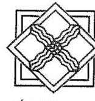

IGAZGATÓ
3530 Miskolc, Vörösmarty utca 77.
23301 Miskolc, Pf: 3. (46) 516-610 (46) 516-611
$\square$ raz.mik.lus@em-régig.bu uu ww. em-régig.bu
Válaszukban szfesskedjenek iktatüzámunkza és ügvistözönker bivatkazol
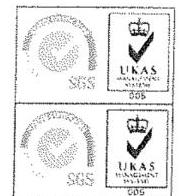

Ikt. számunk: E2016-1451-003/2016
Egység: Gazdasági Osztály
Úgyintézőnk: Laczikné Takács Orsolya Telefon:46-516-600/18-100

Ikt. számuk: V-0773-169/2016
Úgyintézőjük:
Melléklet:
Tárgy: Számvevőszéki jelentéstervezettel kapcsolatos észrevételek

Állami Számvevőszék
Domokos László Úr
elnök

Budapest
Apáczai Csere János utca 10
1052

## Tisztelt Elnök Úr!

Az Igazgatóságra 2016. május 04-én érkezett „A központi alrendszer egyes intézményei pénzügyi és ragyongazdálkodásának ellenörzése - Észak-magyarországi Vízügyi Igazgatóság" című ellenőrzésről készült számvevőszéki jelentéstervezet megállapításaival kapcsolatosan az ÉMVIZIG részéről az alábbi észrevételeket teszem:

## Jelentéstervezet megállapítások fejezetrészhez kapcsolódó észrevételek:

1) 2.1 számú megállapításhoz „A kontrollkörnyezet kialakítása szabályszerű volt" kapcsolódó észrevételek:
1.1 Az Igazgatóság „Leltározási és leltárkészittési szabályzata" nem tartalmazta a basznált, de mérlegben értékkel nem szereplő immateriális javak, tárgyi eszközök, készletck leltározási módját.

Az ÉMVIZIG 2016. április 01-től hatályos IX./2016.(IV.01.) számon kiadott „ESZKÖZÖK, FORRÁSOK LELTÁROZÁSI ÉS LELTÁRKÉSZÍTÉSI SZABÁLYZATA" a mérlegben értékkel nem szereplő immateriális javak, tárgyi eszközök, készletek leltározási módjával kiegészítésre került.
2) 2.2 számú megállapításhoz „A kockázatkezelési rendszer kialakítása és müködtetése szabályszerű volt" kapcsolódó észrevételek:
2.1 A ragyonnyilatkozat-tételee kötelezettek követ 2012.12.17-ig az SZMSZ tartalmazza, azonban az ezt követően hatályba helyezett SZMSZ-ben a jogszabályban foglaltak ellenére nem rögzítették.

---

Az Igazgatóság módosította Szervezeti és Müködési Szabályzatát, amelyet 2016. április 19. napján a középirányító szerv az Országos Vízügyi Főigazgatóság részére jóváhagyás céljából megküldött.

# 3) 2.3 számú megállapításhoz „, A kontrolltevékenység kialakítása és müködtetése 

részben volt szabályszertü, amely az elszámoltathatóságot veszélyezteti" kapcsolódó észrevételek:
3.1 Az ellenörzött időszakban az engedélyezési, jóváhagyási és kontroll eljárások szabályozása teljes körüen nem felett meg a batályos jogszabályoknak, nem vezetett teljes körü naprakész nyilvántartást a gazdálkodási jogkörök gyakorlására jogosult személyekröl és aláirás-mintákról. Ezzel veszélyeztette az elszámoltathatóságot.

A naprakész nyilvántartás vezetésének formáját a jogszabály külön nem határozza meg.
A gazdálkodási jogkörök gyakorlására jogosult személyek a kijelölésre jogosult vezető által aláírt megbízással és aláírás mintával rendelkeztek, melyek a szabályzatokhoz csatolásra kerültek. Az évközben történt változások esetében is a változások átvezetésre kerültek, és az érintett személyek rendelkeztek megbízással és aláírás mintával.

Mivel a megbízások, aláírás minták a szabályzatok részét képezik, ezért az Igazgatóság a naprakész nyilvántartást a hatályos belső szabályzataival, igazgatói útmutatóival, körleveleivel és ezekhez kapcsolódó mellékleteivel biztosította a gazdálkodási jogkörök gyakorlására jogosult személyek esetében.

## 4) 2.4 számú megállapításhoz „, Az információs és kommunikációs folyamatok kialakítása a jogszabályi előirásoknak megfelelő" kapcsolódó észrevételek:

4.1 Az iratkezelési szabályzat a jogszabályban foglaltak ellenére nem az illetékes levélátral egyetértésben kerïlt kiadásra.

Az Igazgatóság módosította Iratkezelési Szabályzatát, amelyet 2016. május 2. napján az illetékes Környezetvédelmi és Vízügyi Levéltár (1044 Budapest, Duna sor 15.) részére jóváhagyás céljából megküldött.
A módosított Iratkezelési Szabályzatot a Levéltár jóváhagyta.
5) 3.2 számú megállapításhoz „, A bevételi és kiadási előirányzatok módosítását nem a jogszabályi előirásoknak és a belső szabályzatokban foglaltaknak megfelelően hajtották végre" kapcsolódó észrevételek:
5.1 Az irányító szerv 13/2011. (V. 23.) BM utasításában rendelkezett a költségvetési szervek középirányító szerveinek (köztük az OVF) kijelöléséről, az irányítói jogok gyakorlásának módjáról. Az utasítás $2 . \frac{2}{3}$ (1) bekezdés ce) pontja szerint az OVF nyilvántartja az irányítása alá tartozó költségvetési szervek saját hatáskörben végrehajtott előirányzat-módosításait, és tájékoztatja arról az irányító szervet.

A többletbevételek, valamint az előző évi maradvány előirányzat módosításakor 2011-2014. években az ÉMVIZIG adatszolgáltatási kötelezettségét a középirányító szerv utasításának megfelelően havonta hajtotta végre.

---

6) 3.3 számú megállapításhoz „, A bevételi elöirányzatok teljesitése, valamint a kiadási elöirányzatok felhasználása során a jogszabályi elöírásokat részben tartották be" kapcsolódó észrevételek:
6.1 A rendszeres, nem rendszures személyi juttatások és a dologi kiadások kifizetései során az érvényesités és az utalványozás megelözte 2011-ben a szakmai teljesités igazolását, 2012-2014. években a teljesitésigazolását.

Az ÉMVIZIG költségvetési gazdálkodási folyamatai során a jogszabályok előírásai szerint jár el. A kiadási előirányzatok terhére kifizetést minden esetben csak utalványozás alapján teljesít.

A jelentéstervezet egyik évre vonatkozóan sem tartalmaz konkrétumokat, ezért a megállapított hibákra nem tudunk konkrét észrevételt tenni.
Véleményünk szerint a feltárt hiányosságok eseti jellegűek, a vizsgált időszakban nem rendszeres hibaként róható fel az Igazgatóságnak.

Az Állami Számvevőszék honlapjára feltöltött személyi és dologi mintákat az Igazgatóság az aláírás sörrendiségére szempontjából áttekintette, mellyel kapcsolatosan az alábbiakat észrevételezzük:

1. Dologi kiadási előirányzatok terhére történő kifizetések esetében az utalványozást a teljesítés igazolása megelőzte vagy azzal egy napon történt (ez utóbbi jellemzően készpénzes kifizetések esetében).

Az Igazgatóságnál a teljesítésigazolások az alábbiak szerint történtek:

- számlán teljesítés igazoló bélyegző, vagy kézzel történő dokumentálás, esetenként a számlához csatolt külön teljesítés igazoló lap alapján,
- belső bizonylat aláírásával (a megszerkesztett bizonylat tartalmazza a teljesítés igazoló aláírás helyét),
- kiküldetési rendelvény aláírásával (szigorú számadású nyomtatvány, a nyomtatvány tartalmazza az igazoló vagy teljesítés igazoló megnevezést),
- közfoglalkoztatási utalványlap aláírásával (a megszerkesztett bizonylat tartalmazza a teljesítés igazoló aláírás helyét).

A vizsgált időszak mintáinál néhány esetben fordult elő, hogy a számlán a teljesítés igazolása megtörtént, azonban dátum nem került feltüntetésre.

Az érvényesítésre minden esetben a teljesítésigazolást követően vagy azzal egy napon (jellemzően készpénzes kifizetések esetében) került sor.

2013-2014. években összesen 5 esetben a kiküldetési rendelvényhez nem készült utalványlap, így nem történt meg az érvényesítés.
2. A rendszeres és nem rendszeres személyi juttatások esetében az utalványozás és érvényesítés több esetben is hamarabb történt meg, mint a jelenléti ívek, munkaóra nyilvántartások teljesítésének igazolása. Ennek oka:

Az ÉMVIZIG a központi illetményszámfejtés rendszerébe tartozik. 2011-2014. években az illetmény számfejtése a KIR3 számfejtő programmal történt a MÁK által megküldött havi ütemtervben leírtak szerint.

[^0]
[^0]:    ÉSZAK-MAGYARORSZÁGI VÍZŰGYI IGAZGATÓSÁG 3530 Miskolc, Vörösmarty utca 77.
    3501 Miskolc, Pf.: 3. (46) 516-600 (46) 516-601 (1) em-vizig@em-vizig.hu (1) www.em-vizig.hu

---

A számfejtői munka zárása általában a tárgyhónap 20-26-a közötti időpontokban befejeződött. A zárást követő időszakra a bérek számfejtése megelőlegezéssel történt. Amennyiben ezen időszakban a dolgozónak távolléte volt, annak rendezése a következő hónapban történt.

A személyi juttatások kiadási előirányzatainak terhére kifizetést az Igazgatóság csak az utalványozást követően teljesített, mely a fent leírt okok miatt több esetben így megelőzte a teljesítésigazolást.
6.2 A dologi kiadások között elszámolt kiküldetési mintatételek esetében 2011. éreben esetenként, 20132014. években a teljesitésigazolás nem történt meg.

Az Igazgatóságnál a dologi kiadások között elszámolt kiküldetések esetében teljesítésigazolások az alábbiak szerint történtek:

- belső bizonylat aláírásával (a megszerkesztett bizonylat tartalmazza a teljesítés igazoló aláírás helyét),
- kiküldetési rendelvény aláírásával (szigorú számadású nyomtatvány, a nyomtatvány tartalmazza az igazoló vagy teljesítés igazoló megnevezést),
- közfoglalkoztatási utalványlap aláírásával (a megszerkesztett bizonylat tartalmazza a teljesítés igazoló aláírás helyét).

Az Állami Számvevőszék honlapjára feltöltött dologi minták közül a kiküldetéshez kapcsolódó tételeket az Igazgatóság a teljesítésigazolás szempontjából áttekintette, mellyel kapcsolatosan az alábbiakat észrevételezzük:
A kiküldetési rendelvényeken az „Igazolta" vagy „A teljesítést igazolom" minden esetben aláírásra került, a belső bizonylatokon a teljesítésigazolás szintén minden esetben megtörtént.

Véleményünk szerint a kiküldetéseknél a teljesítésigazolások minden évben megtörténtek.
6.3 A felhalmozási kiadások szakmai teljesitésigazolását 2011. éreben esetenként a jogszabályban elö̈rtek ellenére kijelöléssel, illetve jogosultsággal nem rendelkezo személy végezte. A felhalmozási kiadások utalvány ellenjegyzöje nem jelezze az utalványozónak, hogy a szakmai teljesitésigazolást kijelöléssel nem rendelkezo személy régezet.

Az Állami Számvevőszék honlapjára feltöltött felhalmozási mintákat az Igazgatóság a teljesítésigazolás szempontjából áttekintette.

A felhalmozási kiadások esetében a teljesítés igazolója 3 eset kivételével az igazgató volt. Ezen három esetben olyan személyek részéről történt teljesítésigazolás, akiknek a kijelölését a 2010. 12.03-án kelt „Útmutató a 0982-002/2010 iktatószámon kiadott Gazdálkodási szabályzat egyes rendelkezéseihez" 1. számú melléklete (teljesítésigazolásra jogosultak köre, beosztása) tartalmazta.

Véleményünk szerint a teljesítésigazolást kijelöléssel rendelkező személyek végezték, ezáltal az utalvány pénzügyi ellenjegyzőjének sem állt fenn tájékoztatási kötelezettsége az utalványozó felé.
6.4 Az utalvány ellenjegyzése a rendszeres, nem rendszeres és külső személyi juttatások 2011. éri kifizetésénél nem volt szabályszerü, mivel az utalványozás ellenjegyzöje nem jelezze az utalványozónak, hogy az érvényesités nem tartalmazza az érvényesitésre utaló megjelölést. Az érvényesitő 2012-2014. érekben a rendszeres, nem rendszeres és külső személyi juttatások kifizetéseit megelözöen nem szabályszerüen látta el feladatát, mert az érvényesités nem tartalmazza az érvényesitésre utaló megjelölést.

[^0]
[^0]:    ÉSZAK-MAGYARORSZÁGI VÍZÜGYI IGAZGATÓSÁG 3530 Miskolc, Vörösmarty utca 77.
    3501 Miskolc, Pf.: 3. (46) 516-600 (46) 516-601 em-vizig@em-vizig.hu www.em-vizig.hu

---

A hatályos jogszabályok az érvényesítés vonatkozásában az alábbiakat írták elő:
Ámr. 77. § (3) bekezdés: „Az érvényesítésnek tartalmaznia kell az érvényesítésre utaló megjelölést, a megállapított összeget, az érvényesítés dátumát és az érvényesítő aláírását."

Ávr. 58. § (3) bekezdés: „Az érvényesítés az 59. § (2) bekezdése szerinti okmány utalványozása előtt történik. Az érvényesítésnek tartalmaznia kell az érvényesítésre utaló megjelölést és az érvényesítő keltezéssel ellátott aláírását."

Az utalványlap a személyi juttatások érvényesítésénél az alábbiakat tartalmazta:
2011. évben: „A csatolt okmányt megvizsgáltam, és ...... Ft összegben helyesnek találtam." Dátum, aláírás helye, érvényesítő megnevezés
2012-2014. években: „A csatolt okmányt megvizsgáltam, és ...... Ft összegben helyesnek találtam. A kötelezettségvállaláshoz a pénzügyi fedezet rendelkezésre áll." Dátum, aláírás helye, érvényesítő megnevezés

Véleményünk szerint az Igazgatóság szabályszerűen járt el, mivel az érvényesítésre utaló megjelölést, a megállapított összeget, az érvényesítés dátumát és aláírását a kiadási utalványlapok tartalmazták.
6.5 A személyi juttatások kifizetését megelőzően az utalvány ellenjegyzöje 2011. évben nem végezte el, 2012-2014. években nem végezete el a jogszabály által elöért feladatát, mert nem jelezte az utalványozának, hogy a kötelezettségyállalás dokumentumain esetenként az ellenjegyzés/pénzügyi ellenjegyzés nem tartalmazza az ellenjegyzés/pénzügyi ellenjegyzés tényére történő utalás megjelölését.

A személyi juttatásokhoz kapcsolódó kötelezettségvállalásokat az Igazgatóságnál a pénzügyi ellenjegyző és a kötelezettségvállaló írja alá a munkáltató részéről. Az ÉMVIZIG személyi juttatásokhoz kapcsolódó kötelezettségvállalás dokumentumai a pénzügyi ellenjegyző részéről mindig aláírásra került.

A kötelezettségvállalás dokumentumai valamennyi vizsgált évre vonatkozóan tartalmazzák a pénzügyi ellenjegyzésre történő utalást az alábbi formákban:

- 2011-2013. években: „A bérkeret rendelkezésre áll."
- 2014. évben: „A bérkeret rendelkezésre áll."
vagy: „A pénzügyi fedezet biztosított."
A fenti utalások megfelelnek a jogszabályban előírtaknak, mely szerint a dokumentum ellenjegyzőjének a feladata a rendelkezésre álló pénzügyi fedezet vizsgálata.
Véleményünk szerint a személyi juttatások dokumentumainak elkészítése az igazgatóságon szabályosan történt.

A személyi juttatásokhoz kapcsolódó kinevezési okiratok, átsorolások, értesítések és munkaszerződések a MÁK által rendszeresített formában kerültek elkészítésre.
6.6 A felhalmazási kiadások kifizetése elött 2014. évben az érvényesités esetenként elmaradt.

Az Igazgatóság 2014. évtől elsősorban a Forrás SQL programból kigenerálható utalványlapokat (kivéve, ha több szervezeti egységet érint az adott kiadás, akkor a szabályzat szerinti utalványlap papíralapon kerül kitöltésére) alkalmazta a kiadások utalványozásánál.

[^0]
[^0]:    ÉSZAK-MAGYARORSZÁGI VÍZÜGYI IGAZGATÓSÁG 3530 Miskolc, Vörösmarty utca 77.
    3501 Miskolc, Pf.: 3. (46) 516-600 (46) 516-601 (1) em-vizig@em-vizig.hu (1) www.em-vizig.hu

---

2014.11.25-én az ÉMVIZIG-nél az OVF Ellenőrzési Önálló Osztálya a Kötelezettségvállalási szabályzathoz kapcsolódóan az utalványozás, érvényesítés és ellenjegyzés vonatkozásában ellenőrzést végzett. Az ellenőrzés során megállapítást nyert, hogy a jogszabály által kötelezően előírt érvényesítésre vonatkozóan az utalványlap csak a fejrészben tartalmaz hivatkozást, aláíróként ellenjegyzés szerepelt az utalvány lapon.

A problémát az Igazgatóság a Forrás SQL-t üzemeltető Griffsoft Zrt. Helpdesk felületén bejelentette. A hiba részükről 2014.12.01-én javításra került.

Az Igazgatóságnál az érvényesítők és ellenjegyzők köre 2014. évben megegyezett.

2014. évi utalványlap érvényesítés és ellenjegyzési jogkör problémáról az Igazgatóság az Állami Számvevőszék felé 2015. július 24-én nyilatkozott, mely az ÁSZ honlapjára feltöltésre került.

7) 4.4 számú megállapításhoz „A vagyonelemek elidegenítése, hasznosítása a jogszabályok és a belső szabályzatok előírásainak részben megfelelően történt” kapcsolódó észrevételek:

6.1 A vagyonelemek értékesítése, bérbeadásá, magas kockázatú volt, mert az Intézmény a vállalkozásokkal kötött bérbeadási és más vagyonhasznosítási szerződéseknél több esetben nem győződött meg a jogszabályban előírt átláthatóság követelményének érvényesüléséről a bérbeadási folyamat során. A szerződések nem tartalmazzák a jogszabályban foglaltak ellenére a hasznosításra vonatkozó szerződésekben előírt beszámolási, nyilvántartási, adatszolgáltatási kötelezettségeket, valamint a hasznosításban kizárólag természetes személjek vagy átlátható szervezetek részvételére vonatkozó korlátozást.

Az Nvtv. hatályba lépését követően az ingatlanhasznosítási szerződések a jogszabályhelyre utalással tartalmazták az előírásokat. Az ellenőrzés során tett észrevételekre tekintettel a 2015. augusztusától megkötött ingatlanhasznosítási szerződések szövegszerűen tartalmazzák a hivatkozott törvényi szabályokat.

Jelentéstervezet összegzés fejezetrészhez kapcsolódó észrevételek:

„Az ellenőrzés megállapította, hogy a pénzügyi gazdálkodás területén a bevételi és kiadási előirányzatok módosítása és az eredményszemléletű számvétel bevezetésével kapcsolatos feladatok végrehajtása nem a jogszabályi előírásoknak megfelelően történt. A vagyonhasznosítási szerződésekben az átláthatósági követelmények nem érvényesültek.”

Véleményünk szerint az Igazgatóság gazdálkodásáról készült összegző megállapítást nem igazolja egyes pontokban adott értékelés, és azok alpontokban kifejtett részletezése. A 2., 4. és 6. pontokra megfelelő minősítést, a 3. pontra részben szabályszerű megítélést ad a tervezet.

A megállapított hibák „esetenként” előforduló hiányosságok, nem rendszer szintű szabálytalanság merült fel.

Kérem, szíveskedjenek észrevételeinket figyelembe venni a végleges jelentés elkészítésénél.

Miskolc, 2016. május 17.

Tisztelettel:

Rácz Miklós
igazgató

ÉSZAK-MAGYARORSZÁGI VÍZÚGYI IGAZGÁTÓSÁG 3530 Miskolc, Vörösmarty utca 77.
3501 Miskolc, Pf.: 3. ☎ (46) 516-600 ☎ (46) 516-601 em-vizig@em-vizig.hu www.em-vizig.hu

---

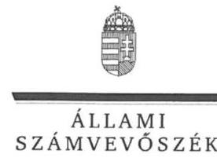

ELNÖK

Ikt.szám: V-0773-180/2016.

# Rácz Miklós úr 

igazgató
Észak-magyarországi Vízügyi Igazgatóság

## Miskolc

## Tisztelt Igazgató Úr!

..A központi alrendszer egyes intézményei pénzügyi és vagyongazdálkodásának ellenörzése Észak-magyarországi Vízügyi Igazgatóság" címmel készített számvevőszéki jelentéstervezetre tett észrevételét köszönettel megkaptam.
Az Állami Számvevőszék észrevételre vonatkozó álláspontjáról a felügyeleti vezető által készített részletes tájékoztatást csatoltan megküldőm.
Tájékoztatom Igazgató urat, hogy a számvevőszéki jelentésben - az Állami Számvevőszékről szóló 2011. évi LXVI. törvény 29. § (3) bekezdése alapján - a figyelembe nem vett észrevételeket szerepeltetjük az elutasítás indokának feltüntetésével.

Budapest, 2016. 140 hó 31 nap
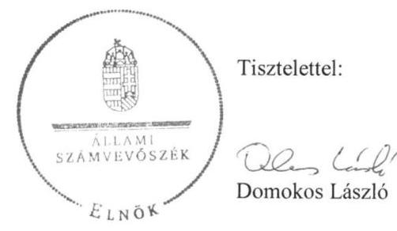

Melléklet: Tájékoztatás az elfogadott, a részben elfogadott és az el nem fogadott észrevételekről

---

# Tájékoztatás az elfogadott, a részben elfogadott és az el nem fogadott észrevételekról 

„A központi alrendszer egyes intézményei pénzügyi és vagyongazdálkodásának ellenörzése -Észak-magyarországi Vízügyi Igazgatóság 2016." címú jelentéstervezetre az É2016-1451003/2016 iktatószámú levelében tett észrevételeit áttekintettük, annak kezeléséről az alábbi tájékoztatást adom.

## A jelentéstervezet megállapítások fejezetrészhez kapcsolódó megállapításokra tett észrevételek kapesán

## 1. 2.1 számú megállapításoz „A kontrollkörnyezet kialakítása szabályszerü volt" kapcsolódó észrevétel

Köszönettel vettem tájékoztatását az Észak-magyarországi Vízügyi Igazgatóság (továbbiakban: ÉMVIZIG) 2016. április 1-jétől hatályos „Eszközök és források leltározási és leltárkészitési szabályzata" kiadásáról. Észrevétele a jelentéstervezet 20. oldal 2.1. számú megállapítás nyolcadik bekezdés megállapítását nem cáfolta, ezért a megállapítást nem módosítja.

## 2. 2.2 számú megállapításhoz „A kockázatkezelési rendszer kialakítása és müködtetése szabályszerü volt" kapcsolódó észrevétel

Köszönettel vettem tájékoztatását az ÉMVIZIG szervezeti és müködési szabályzatának módosítására és jóváhagyásra történő felterjesztésére vonatkozóan. Észrevétele a jelentéstervezet 21. oldal 2.2. számú megállapítás harmadik bekezdés megállapítását nem cáfolta, így annak módosítása nem indokolt.

## 3. 2.3 számú megállapításhoz „A kontrolltevékenység kialakítása és müködtetése részben volt szabályszerü, amely az elszámoltathatóságot veszélyezteti" kapcsolódó észrevétel

A dokumentumok ismételt felülvizsgálatát követően továbbra is fenntartjuk azt a megállapítást, hogy az ÉMVIZIG által a gazdálkodási jogkörök gyakorlására jogosult személyekről és aláírásmintáikról vezetett nyilvántartás nem volt naprakész. A naprakész nyilvántartás vezetése az elszámoltathatóságot erősíti, mert a gazdálkodási jogkörök gyakorlóinak aláírása a nyilvántartásban rögzített aláírás-mintákkal beazonosíthatónak kell lenni. Ezért a jelentéstervezet 21. oldal 2.3. számú megállapítás második bekezdés első megállapításában foglaltakra tett észrevételét nem fogadtuk el, észrevétele a megállapítást nem módosítja.

---

# 4. 2.4 számú megállapításhoz „Az információs és kommunikációs folyamatok kialakítása a jogszabályi elöirásoknak megfelelı" kapcsolódó észrevétel 

Köszönettel vettem tájékoztatását a szaklevéltár által jóváhagyott iratkezelési szabályzat tekintetében. Észrevétele a jelentéstervezet 22 . oldal 2.4 . számú megállapítás negyedik bekezdés második megállapítását nem cáfolta, ezért a megállapítást nem módosítja.

## 5. 3.2 számú megállapításhoz „A bevételi és kiadási elöirányzatok módosítását nem a jogszabályi elöirásoknak és a belső szabályzatokban foglaltaknak megfelelöen hajtották végre" kapcsolódó észrevétel

Köszönettel vettem tájékoztatását az Országos Vízügyi Föigazgatóság feladatáról és a többletbevételek, valamint az előző évi maradvány előirányzat módosításakor az ÉMVIZIG adatszolgáltatási kötelezettsége teljesítéséről, amelyet a középirányító szerv utasításának megfelelően hajtott végre. Észrevétele az ellenőrzött időszakban megállapított hiányosságot nem cáfolta, ezért a jelentéstervezet 24 . oldalán első bekezdés első és második megállapítását nem cáfolta, ezért a megállapításokat nem módosítja.

## 6. 3.3 számú megállapításhoz „A bevételi elöirányzatok teljesitése, valamint a kiadási elöirányzatok felhasználása során a jogszabályi elöirásokat részben tartották be" kapcsolódó észrevétel

A 6. pontban szerepeltetett észrevételeivel kapcsolatban a személyi juttatások, a dologi és dologi jellegű kiadások, a felhalmozási célú kiadások, valamint a pénzeszközátadások, támogatás értékủ kiadások, kölcsönök nyújtása és ellátottak juttatásai tekintetében a gazdálkodási jogkörgyakorlás szabályszerűségét mintavétellel kiválasztott mintatételek alapján értékeltük, amelynek sokaságra történő kivetítését a számvevőszéki jelentés „Az ellenörzés módszerei" című fejezet részletesen tartalmazza. Az ellenőrzés típusát tekintve szabályszerűségi ellenőrzést végeztünk, amelynek keretében a gazdálkodási jogkörök gyakorlását a jogszabályi előírások alapján értékeltük.
A jelentéstervezet 25 . oldal 1. francia bekezdése megállapítására tett észrevételét a dokumentumok ismételt áttekintését követően a 2011. évre a dologi kiadásokkal kapcsolatos teljesítésigazolás tekintetében elfogadtuk, a megállapítás módosításra került.
Észrevétele a rendszeres és nem rendszeres személyi juttatások teljesítésigazolásával kapcsolatban a megállapítást nem cáfolta. Ezért észrevétele a személyi juttatásokkal kapcsolatban a megállapítást nem módosítja.
Észrevételében a kiküldetési rendelvényeken történő teljesítésigazolás bemutatott gyakorlata közül az „Igazolta" nem felel meg a jogszabályban előírt teljesítésigazolásnak. A dokumentumok ismételt áttekintését követően észrevételét a jelentéstervezet 26 . oldal első francia bekezdése megállapítása tekintetében a 2013-2014. évre vonatkozóan elfogadtuk, a megállapítás módosításra kerül.
A jelentéstervezet 26. oldal negyedik és ötödik francia bekezdés megállapítására tett észrevételét a dokumentumok ismételt áttekintését követően elfogadtuk, azt a számvevőszéki jelentés készítésénél figyelembe vesszük.

---

Észrevétele megerősíti a 26. oldal hatodik és hetedik francia bekezdés megállapításait, hogy az érvényesítés nem tartalmazta az érvényesítésre utaló - érvényesitve - megjelölést. Észrevételét nem fogadtuk el, ezért a megállapítást nem módosítja.
Észrevételét a jelentéstervezet 26. oldal nyolcadik francia bekezdés megállapítására vonatkozóan nem fogadtuk el. A dokumentumok ismételt áttekintése megerősítette a megállapításban foglaltakat, hogy a kötelezettségvállalás dokumentumain esetenként az ellenjegyzés/pénzügyi ellenjegyzés nem tartalmazta az ellenjegyzés/pénzügyi ellenjegyzés tényére történő utalás megjelölését. Észrevétele ezért a megállapítást nem módosítja.
Köszönettel vettem tájékoztatását a Forrás SQL program hiányosságával és annak megszüntetésével kapcsolatban. Észrevétele a jelentéstervezet 26. oldal kilencedik francia bekezdés megállapítását nem cáfolta, ezért a megállapítást nem módosítja.

# 7. 4.4 számú megállapításhoz „A vagyonelemek elidegenitése, hasznosítása a jogszabályok és a belsö szabályzatok elöirásainak részben megfelelöen történt" kapcsolódó észrevétel 

Köszönettel vettem tájékoztatását, hogy a 2015 augusztusától megkötött ingatlanhasznosítási szerződések már szövegszerűen tartalmazzák a hivatkozott törvényi szabályokat. Észrevétele a jelentéstervezet 33. oldal 4.4. számú megállapítás első bekezdés első és második megállapítását nem cáfolta, ezért a megállapítást nem módosítja.

## Jelentéstervezet összegzés fejezetéhez kapcsolódó észrevétel

A jelentéstervezet „Összegzés" fejezetében az ellenőrzés által tett főbb megállapítások kerültek bemutatásra. A hivatkozott megállapítások nem a jelentéstervezet „Megállapitások" fejezet egyszámjegyű kérdésére adott összegző megállapításait tükrözik. Észrevétele a hivatkozott megállapításokban foglaltakat nem vitatja, ezért a megállapításokat nem módosítja.
Budapest, 2016. Adógy hó
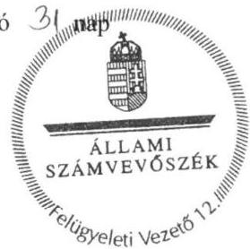

Pető Krisztina
felügyeleti vezető

---

# ORSZÁGOS VÍZÜGYI FÓIGAZGATÓSÁG FÓIGAZGATÓ 

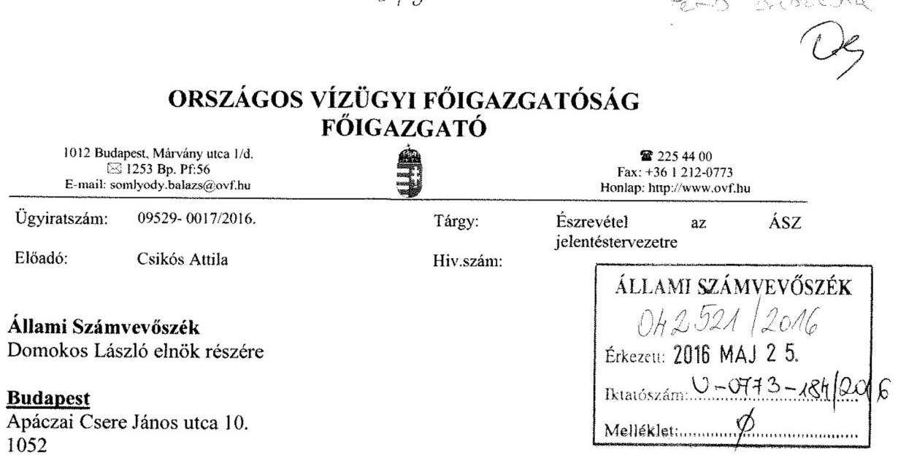

## Tisztelt Elnök Úr!

Az Állami Számvevőszék V-0773-172/2016. iktatószámú levéllel megkapott, az Északmagyarországi Vízügyi Igazgatóságnál lefolytatott pénzügyi és vagyongazdálkodásának ellenőrzési jelentéstervezetéhez az alábbi észrevétel tesszük.

Az Állami Számvevőszék jelentéstervezet 1.2 számú megállapítása rögzíti, hogy az irányító szerv (BM) és a középirányító szerv (OVF) a 2012-2014. években az Ábt. 9. § (1) bekezdés f) pontjában előírt az ellenőrzött intézmény által ellátandó közfeladatok ellátására vonatkozó, erőforrásokkal való hatékony gazdálkodáshoz szükséges követelményeket nem érvényesített, aminek hiányában számonkérés és ellenőrzés sem történt.

Tekintettel arra, hogy a Belügyminisztérium Ellenőrzési Főosztálya a költségvetési szervek belső kontrollrendszeréről és belső ellenőrzéséről szóló 370/2011. (XII. 31.) Korm. rendelet alapján két olyan tárgyú ellenőrzést (belső kontrollrendszer ellenőrzése, központi ellátási tevékenység ellenőrzése) is lefolytatott, mely a teljes fejezetet érintette - beleértve a Közép-Tisza-vidéki Vízügyi Igazgatóságot is - az OVF-nek külön ellenőrzést erre vonatkozóan nem volt indokolt elvégeznie. Az irányító szerv kiemelt feladatként kezelte valamennyi szerv tekintetében a belső kontrollrendszer kialakítását és müködtetését.

A vízügyi igazgatóságok működési területe vízgyűjtőkre lett meghatározva, amely a szakmai müködésüket teljesen specifikussá, egyedivé teszi. Az egyedi jelleg (eltérő csapadék eloszlás, vízfolyások nagysága és jellege, eltérő domborzati viszonyok, a müködési területen kiépült mütárgyak nagysága és azok fontossága) nem tette (és nem teszi) lehetővé a müködés és annak pénzügyi feltételeit biztosító gazdálkodás egységes elvek, azonos mutatószámok szerinti mérését és értékelését.

Az Észak-magyarországi Vízügyi Igazgatóság önállóan müködő és gazdálkodó költségvetési intézmény, saját döntési és felelősségi hatáskörrel a szakmai tevékenységük és a gazdálkodásuk vonatkozásában. Az OVF, mint középirányító szerv a hatályos belső szabályzatai alapján gyakorolta a 13/2011. (V. 23.) BM utasításban meghatározott feladatokat.

---

Az OVF az ÁSZ tárgyi ellenőrzésének időszakában az alábbi szabályozók alapján látta el a középirányítói feladatait.

# A 47/2012. (IX.30) BM utasítás, SZMSZ 18. §-a szerint 

A Főigazgatóság a közgazdasági tevékenység területén:
a) ellátja a vízügyi költségvetési szervek költségvetési tervezésének végrehajtásával, finanszírozásának előkészítésével kapcsolatos feladatokat; javaslatot készít a finanszírozás területén felmerülő problémák megoldására,
b) részt vesz az ágazati célelőirányzatok felhasználására, a vízkár elhárítási munkák finanszírozására vonatkozó közgazdasági feladatokban, közreműködik a finanszírozási feladatok megoldásában,
c) részt vesz a vízügyi költségvetési szervek költségvetési támogatásával kapcsolatos feladatokban, ellátja ennek pénzügyi, számviteli feladatainak irányítását,
d) közreműködik a vízügyi költségvetési szervek gazdálkodását érintő előirányzat-módosításokkal összefüggő feladatok végrehajtásában,
e) ellátja a vízgazdálkodási kormányzati beruházások éves zárszámadásával kapcsolatos feladatokat,
f) felügyeli és koordinálja a beszámolási és könyvvezetési kötelezettségből eredő intézményi (vízügyi igazgatóságok) feladatok ellátását, ennek keretében az intézményi éves költségvetéseket és az intézményi beszámolókat összeállíttatja, továbbá végzi azok összesítését és ellenőrzését,
g) koordinálja és ellenőrzi a vízügyi igazgatóságok éves feladatterveinek összeállítását, felülvizsgálatát; a vízügyi igazgatóságokkal történő (jóváhagyást célzó) egyeztetést,
h) közreműködik az ágazati gazdaságpolitikai célok megvalósításában, irányításában és értékelésében,
i) koordinálja és felügyeli a vízügyi igazgatóságok gazdálkodását és pénzügyi tevékenységét,
j) végzi a vízügyi igazgatóságok számviteli munkájának irányítását, felügyeletét.

A fentiek alapján 2012-2014. években a Vízügyi Igazgatóság gazdálkodásának vonatkozásban az OVF:

1. a BM fejezet 17. Vízügyi Igazgatóságok cím tekintetében az egyedi elemi költségvetések leosztását tervtárgyalások után megtette;
2. az időszaki és az éves költségvetési beszámolók és jelentések pénzügyi és számviteli ellenőrzését elvégezte és a címszintű összesítéseket a fejezet felé benyújtotta;
3. tételes (bizonylati mélységű) műszaki és pénzügyi ellenőrzést folytatott az alábbi területeken:

- a BM fejezet 20/1/48, 49, és 50 fejezeti kezelésű sorok támogatási szerződései által biztosított források felhasználása tekintetében;
- az elemi költségvetés felhalmozási kiadások kiemelt előirányzatának felhasználása tekintetében;
- Kormánydöntés alapján megkapott többletforrások felhasználása tekintetében.

---

A támogatási szerződéssel megkapott többletforrásokhoz kapcsolódó kötelezettségvállalások kizárólag az OVF által végzett előzetes múszaki-szakmai engedély birtokában voltak megtehetők.

A fent megfogalmazottak alapján az OVF részére meghatározott intézkedési kötelezettséget a hatékony gazdálkodásra irányuló ellenőrzések elvégzése érdekében nem tartom indokoltnak.

Budapest, 2016. május 19.
Tisztelettel:
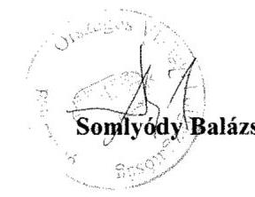

---

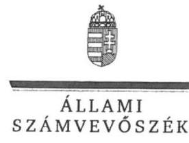

ELNÖK

# Somlyódy Balázs úr 

főigazgató
Országos Vízügyi Főigazgatóság

## Budapest

## Tisztelt Föigazgató Úr!

„A központi alrendszer egyes intézményei pénzügyi és vagyongazdálkodásának ellenőrzése -Észak-magyarországi Vízügyi Igazgatóság" címmel készített számvevőszéki jelentéstervezetre tett észrevételét köszönettel megkaptam.
Az Állami Számvevőszék észrevételre vonatkozó álláspontjáról a felügyeleti vezető által készített részletes tájékoztatást csatoltan megküldőm.
Tájékoztatom Főigazgató urat, hogy a számvevőszéki jelentésben - az Állami Számvevőszékről szóló 2011. évi LXVI. törvény 29. § (3) bekezdése alapján - a figyelembe nem vett észrevételeket szerepeltetjük az elutasítás indokának feltüntetésével.

Budapest, 2016. június hó 09. nap
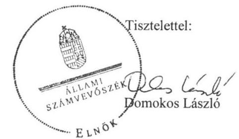

Melléklet: Tájékoztatás az el nem fogadott észrevételekről

---

# Tájékoztatás az el nem fogadott észrevételekről 

„A központi alrendszer egyes intézményei pénzügyi és vagyongazdálkodásának ellenőrzése Észak-magyarországi Vízügyi Igazgatóság" címủ számvevőszéki jelentéstervezetre a 09529/0017/2016. iktatószámú levelében tett észrevételeit áttekintettük, annak kezeléséről az alábbi tájékoztatást adom.

### 1.2. számú megállapításra tett észrevétel kapcsán

Köszönettel vettem tájékoztatását, hogy az ellenőrzött időszakban az Országos Vízügyi Főigazgatóság (továbbiakban: OVF) mely szabályozók alapján, továbbá az Észak-magyarországi Vízügyi Igazgatóság gazdálkodása vonatkozásában mely feladatokat látta el. A levélben hivatkozott, a Belügyminisztérium fejezethez tartozó egyes költségvetési szervek középirányító szervként történő kijelöléséről, az irányítói jogok gyakorlásának módjáról szóló 13/2011. (V. 23.) BM utasítás nem tartalmaz a közfeladatok ellátására vonatkozó, az erőforrásokkal való hatékony gazdálkodáshoz szükséges követelményeket, így azok érvényesítéséről, számonkéréséről és ellenőrzéséről sem rendelkezik.

Észrevétele sem tartalmaz a 2012-2014. években az OVF részéről - az államháztartásról szóló 2011. évi CXCV. törvény 9. § (1) bekezdés f) pontjában előírt - a gazdálkodás hatékonyságához szükséges követelmények érvényesítésével, számonkérésével és ellenőrzésével kapcsolatos és megvalósult középirányító szervi feladatellátásról szóló információkat, tényeket. Az észrevétele alapján a jelentéstervezet 19. oldal negyedik bekezdés megállapításának módosítása nem indokolt.

Budapest, 2016.
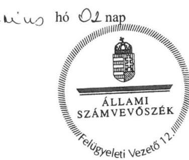

Pető Krisztina felügyeleti vezető

---

# RÖVIDÍTÉSEK JEGYZÉKE 

${ }^{1}$ Intézmény
${ }^{2}$ ÁSZ
${ }^{3}$ MT
${ }^{4}$ Korm. rendelet ${ }_{1}$
${ }^{5}$ Korm.rendelet ${ }_{2-4}$
Korm.rendelet ${ }_{2}$

Korm.rendelet ${ }_{3}$

Korm.rendelet ${ }_{4}$
${ }^{6}$ NEKI
${ }^{7}$ ÉMKTVF
${ }^{8}$ KI
${ }^{9}$ OKKP
${ }^{10} \mathrm{VM}$
${ }^{11}$ Korm. rendelet ${ }_{5}$
${ }^{12}$ Korm. rendelet ${ }_{6}$
${ }^{13}$ BM
${ }^{14}$ BM utasítás ${ }_{1}$
${ }^{15}$ OVF
${ }^{16} \mathrm{M} \mathrm{Ft}$
${ }^{17}$ Alaptörvény
${ }^{18}$ Nvtv.
${ }^{19}$ Áht. 2
${ }^{20}$ Ávr.
${ }^{21}$ Áht. 1
${ }^{22}$ Ámr.
amely alatt 2011. december 31-ig az Észak-magyarországi Környezetvédelmi és Vízügyi Igazgatóság (a továbbiakban itt: ÉMKVI), 2012. január 1-jétől az Északmagyarországi Vízügyi Igazgatóság (a továbbiakban itt: ÉMVIZIG) értendő
Állami Számvevőszék
Minisztertanács
a vizek kártételei elleni védekezés szabályairól szóló 232/1996. (XII. 26.) Korm. rendelet (hatályos 1997. január 1-jétől)
vízügyi, vízvédelmi hatósági feladatokat ellátó szervek kijelöléséről szóló kormányrendeletek
vízügyi, vízvédelmi hatósági feladatokat ellátó szervek kijelöléséről szóló kormányrendeletek 347/2006. (XII. 23.) Korm. rendelet (hatályos 2007. január 1jétől, hatálytalan 2014. január 1-jétől)
vízügyi, vízvédelmi hatósági feladatokat ellátó szervek kijelöléséről szóló kormányrendeletek 482/2013. (XII. 17.) Korm. rendelet (hatályos 2013. december 18-tól, hatálytalan 2014. szeptember 10-től)
vízügyi, vízvédelmi hatósági feladatokat ellátó szervek kijelöléséről szóló kormányrendeletek 223/2014. (IX. 4.) Korm. rendelet (hatályos 2014. szeptember 5-től)
Nemzeti Környezetügyi Intézet
Észak-magyarországi Környezetvédelmi és Természetvédelmi Felügyelőség
Katasztrófavédelmi Igazgatóság
Országos Környezeti Kármentesítési Program
Vidékfejlesztési Minisztérium
a vízügyi igazgatási szervek irányításának átalakításával összefüggésben egyes
kormányrendeletek módosításáról szóló 300/2011. (XII.22.) Korm. rendelet (hatályos 2011. december 23-tól, hatálytalan 2014. szeptember 5-től) az egyes miniszterek, valamint a Miniszterelnökséget vezető államtitkár feladités hatásköréről szóló 212/2010. (VII. 1.) Korm. rendelet (hatályos 2010. július 1től, hatálytalan 2014. június 6-tól)
Belügyminisztérium
a Belügyminisztérium fejezethez tartozó egyes költségvetési szervek középirányító szervként történő kijelöléséről, az irányítói jogok gyakorlásának módjáról szóló 13/2011. (V. 23.) BM utasítás (hatályos 2011. május 24-től, hatálytalan 2015. április 11-től)
Országos Vízügyi Főigazgatóság
millió forint
Magyarország Alaptörvénye (2011. április 25.), hatályos 2012. január 1-jétől 2011. évi CXCVI. törvény a nemzeti vagyonról, hatályos 2011. december 31-től 2011. évi CXCV. törvény az államháztartásról, hatályos: 2012. január 1-jétől 368/2011. (XII. 31.) Korm. rendelet az államháztartásról szóló törvény végrehajtásáról, hatályos: 2012. január 1-jétől
1992. évi XXXVIII. törvény az államháztartásról,(hatálytalan: 2012.január 1-jétől) 292/2009. (XII. 19.) Korm. rendelet az államháztartás múködési rendjéről, hatálytalan: 2012. január 1-jétől

---

${ }^{23}$ Bkr.
${ }^{24}$ ÁSZ tv.
${ }^{25}$ ÁSZ SZMSZ
${ }^{26}$ irányító szerv ${ }_{1}$
irányító szerv $_{2}$
${ }^{27}$ középirányító szerv
${ }^{28}$ Alapító okirat
Alapító okirat ${ }_{3}$
Alapító okirat ${ }_{2}$
Alapító okirat ${ }_{3}$
Alapító okirat ${ }_{4}$
Alapító okirat ${ }_{5}$
Alapító okirat ${ }_{6}$
${ }^{29}$ SZMSZ
SZMSZ ${ }_{1}$
SZMSZ ${ }_{2}$
SZMSZ ${ }_{3}$
${ }^{30} \mathrm{Kbt} .{ }_{1}$
Kbt. $_{2}$
${ }^{31}$ Munka tv. 1

Munka tv. 2
${ }^{32}$ Számv. tv.
${ }^{33}$ Vtvr.
${ }^{34}$ Áhsz. 1

Áhsz. 2
${ }^{35}$ számlarend $_{1}$
számlarend $_{2}$
számlarend $_{3}$
számlarend $_{4}$
számlarend $_{5}$
${ }^{36}$ bizonylati szabályzat ${ }_{1}$
bizonylati szabályzat ${ }_{2}$
bizonylati szabályzat ${ }_{3}$

370/2011. (XII. 31.) Korm. rendelet a költségvetési szervek belső
kontrollrendszeréről és belső ellenőrzéséről, (hatályos 2012. január 1-jétől)
2011. évi LXVI. törvény az Állami Számvevőszékről, (hatályos 2011. július 1-jétől)

Állami Számvevőszék Szervezeti és Működési Szabályzata
Vidékfejlesztési Minisztérium 2011. december 31-éig, jogutód szervezete a Földművelésügyi Minisztérium 2012. január 1-jétől
Belügyminisztérium 2012. január 1-jétől
Országos Vízügyi Főigazgatóság (2012. január 1-jétől)
az ÉMKVI és ÉMVIZIG Alapító okiratai
XX/1130/9/2010. VM, (hatálytalan 2012. január 1-jétől);
A-217/1/2011. BM, (hatályos: 2012. január 1- 2012. május 7-ig);
A-217/1/2012. BM, (hatályos: 2012. május 8- 2013. december 11-ig);
A-217/1/2013. BM, (hatályos: 2013. december 12- 2014. február 4-ig);
A-217/1/2014. BM, (hatályos: 2014. február 5- 2014. szeptember 9-ig);
A-217/2/2014. BM, (hatályos: 2014. szeptember 10-től)
az ÉMKVI és ÉMVIZIG Szervezeti és Múködési Szabályzatai
hatályos: 2012. december 16-ig;
hatályos: 2012. december 17- 2013. december 31-ig;
hatályos: 2014. január 1-jétől.
2003. évi CXXIX. törvény a közbeszerzésekről (hatálytalan: 2012. január 1-jétől)
2011. évi CVIII. törvény a közbeszerzésekről (hatályos: 2011. augusztus 21-től, hatálytalan 2015. november 1-jétől))
1992. évi XXII. törvény a Munka Törvénykönyvéről (hatálytalan: 2013. január 1jétől)
2012. évi I. törvény a munka törvénykönyvéről (hatályos: 2012. július 1-étől)
2000. évi C. törvény a számvitelről (hatályos 2001. január 1-jétől)

254/2007. (X. 4.) Korm. rendelet az állami vagyonnal való gazdálkodásról (hatályos 2007. október 4-től)
249/2000. (XII. 24.) Korm. rendelet az államháztartás szervezetei beszámolási és könyvvezetési kötelezettségének sajátosságairól (hatálytalan: 2014. január 1jétől)
4/2013. (I. 11.) Korm. rendelet az államháztartás számviteléről (hatályos: 2014. január 1-jétől)
Számlarend 2008. (hatálytalan: 2012. február 15-étől)
Számlarend 2012. (hatályos: 2012. február 15-étől, hatálytalan: 2013. március 29-étől)
ÉMVIZIG Számlarend (hatályos: 2013. március 29-étől, hatálytalan: 2013. augusztus 30-ától)
ÉMVIZIG Számlarend (hatályos: 2013. augusztus 30-ától, hatálytalan: 2014. november-17-étől)
Számlarend és Számlatükör (hatályos: 2014. november-17-étől)
Bizonylati Szabályzat (hatálytalan: 2012. február 15-étől)
Bizonylati Szabályzat 2012. (hatályos: 2012. február 15-étől, hatálytalan: 2013. április 1-jétől)
Bizonylati Szabályzat és Bizonylati Album (hatályos: 2013. április 1-jétől, hatálytalan: 2013. szeptember 1-jétől)

---

| bizonylati szabályzat ${ }^{4}$ | Bizonylati Szabályzat és Bizonylati Album (hatályos: 2013. szeptember 1-jétől, hatálytalan: 2014. július 1-jétől) |
| :--: | :--: |
| bizonylati szabályzat ${ }^{5}$ | Bizonylati Szabályzat és Bizonylati Album (hatályos: 2014. július 1-jétől, hatálytalan: 2014. november 15-étől) |
| bizonylati szabályzat ${ }^{6}$ | Bizonylati Szabályzat és Bizonylati Album (hatályos: 2014. november 15-étől) |
| ${ }^{37}$ Számviteli Politika ${ }^{1}$ | Az ÉMVIZIG Számviteli politikája (hatálytalan 2012. február 15-étől) |
| Számviteli Politika ${ }^{2}$ | Az ÉMVIZIG Számviteli politikája (hatályos: 2012. február 15-étől hatálytalan 2013. április 1-jétől) |
| Számviteli Politika ${ }^{3}$ | Az ÉMVIZIG Számviteli politikája (hatályos: 2013. április 1-jétől hatálytalan 2014. július 1-jétől) |
| Számviteli Politika ${ }^{4}$ | Az ÉMVIZIG Számviteli politikája (hatályos: 2014. július 1-jétől) |
| ${ }^{38}$ Leltározási és leltárkészítési szabályzat ${ }^{1}$ | Az ÉMVIZIG Leltározási és leltárkészítési szabályzata (hatálytalan 2012. február 15-étől) |
| Leltározási és leltárkészítési szabályzat ${ }^{2}$ | Az ÉMVIZIG Leltározási és leltárkészítési szabályzata (hatályos: 2012. február 15-étől hatálytalan 2012. október 5-tól) |
| Leltározási és leltárkészítési szabályzat ${ }^{3}$ | Az ÉMVIZIG Leltározási és leltárkészítési szabályzata (hatályos: 2012. október 8-tól. hatálytalan 2013. június 3-tól) |
| Leltározási és leltárkészítési szabályzat ${ }^{4}$ | Az ÉMVIZIG Leltározási és leltárkészítési szabályzata (hatályos: 2013. június 3-tól hatálytalan 2014. július 1-jétől) |
| Leltározási és leltárkészítési szabályzat ${ }^{5}$ | Az ÉMVIZIG Leltározási és leltárkészítési szabályzata (hatályos: 2014. július 1-jétől.) |
| ${ }^{39}$ Eszközök és források értékelési szabályzata ${ }^{1}$ | Az ÉMVIZIG Eszközök és források értékelési szabályzata (hatálytalan 2012. február 15-től) |
| Eszközök és források értékelési szabályzata ${ }^{2}$ | Az ÉMVIZIG Eszközök és források értékelési szabályzata (hatályos: 2012. február 15-től. hatálytalan 2013. április 1-jétől) |
| Eszközök és források értékelési szabályzata ${ }^{3}$ | Az ÉMVIZIG Eszközök és források értékelési szabályzata (hatályos: 2013. április 1-jétől. hatálytalan 2014. július 1-jétől) |
| Eszközök és források értékelési szabályzata ${ }^{4}$ | Az ÉMVIZIG Eszközök és források értékelési szabályzata (hatályos: 2014. július 1-jétől.) |
| ${ }^{40}$ Pénzkezelési szabályzat ${ }^{1}$ | Az ÉMVIZIG Pénzkezelési szabályzata (hatálytalan 2012. február 15-től) |
| Pénzkezelési szabályzat ${ }^{2}$ | Az ÉMVIZIG Pénzkezelési szabályzata (hatályos: 2012. február 15-től hatálytalan 2012. október 8-tól) |
| Pénzkezelési szabályzat ${ }^{3}$ | Az ÉMVIZIG Pénzkezelési szabályzata (hatályos: 2012. október 8-tól hatálytalan 2013. január 1-jétől) |
| Pénzkezelési szabályzat ${ }^{4}$ | Az ÉMVIZIG Pénzkezelési szabályzata (hatályos: 2013. január 1-jétől hatálytalan 2013. március 29-től) |
| Pénzkezelési szabályzat ${ }^{5}$ | Az ÉMVIZIG Pénzkezelési szabályzata (hatályos: 2013.március 29-től hatálytalan 2013. szeptember 1-jétől) |
| Pénzkezelési szabályzat ${ }^{6}$ | Az ÉMVIZIG Pénzforgalmi és pénztári pénzkezelési szabályzata (hatályos: 2013. szeptember 1-jétől hatálytalan 2014. június 1-jétől.) |
| Pénzkezelési szabályzat ${ }^{7}$ | Az ÉMVIZIG Pénzforgalmi és pénztári pénzkezelési szabályzata (hatályos: 2014. június 1-jétől) |
| ${ }^{41}$ Önköltségszámítás rendjéről szóló szabályzat ${ }^{1}$ | Az ÉMVIZIG Önköltségszámítási szabályzata (hatálytalan 2012. február 15-től) |
| Önköltségszámítás rendjéről szóló szabályzat ${ }^{2}$ | Az ÉMVIZIG Önköltségszámítási szabályzata (hatályos: 2012. február 15-től hatálytalan 2012. október 8-tól) |

---

Önköltségszámítás rendjéről szóló szabályzat ${ }_{3}$

Önköltségszámítás rendjéről szóló szabályzat ${ }_{4}$

Önköltségszámítás rendjéről szóló szabályzat ${ }_{5}$

Önköltségszámítás rendjéről szóló szabályzat ${ }_{6}$

Önköltségszámítás rendjéről szóló szabályzat ${ }_{7}$
${ }^{42}$ Gazdálkodási szabályzat ${ }_{1}$
Gazdálkodási szabályzat ${ }_{2}$

Gazdálkodási szabályzat ${ }_{3}$
${ }^{43}$ Kötelezettségvállalási szabályzat ${ }_{1-3}$
${ }^{44}$ közbeszerzési szabályzat ${ }_{1}$
közbeszerzési szabályzat ${ }_{2}$
közbeszerzési szabályzat ${ }_{3}$
közbeszerzési szabályzat ${ }_{4}$
közbeszerzési szabályzat ${ }_{5}$
${ }^{45}$ Vnytv.
${ }^{46}$ Avtv.
${ }^{47}$ Info tv.
${ }^{48} \mathrm{Ikr}$.
${ }^{49}$ Eitv.
${ }^{50}$ Ltv.
${ }^{51}$ Adatvédelmi szabályzat ${ }_{1}$
Adatvédelmi szabályzat ${ }_{2}$
${ }^{52}$ Iratkezelési szabályzat ${ }_{1}$

Az ÉMVIZIG Önköltségszámítási szabályzata (hatályos: 2012. október 8-tól hatálytalan 2013. április 1-jétől)

Az ÉMVIZIG Önköltségszámítási szabályzata (hatályos: 2013. április 1-jétől hatálytalan 2013. szeptember 1-jétől)

Az ÉMVIZIG Önköltségszámítási szabályzata (hatályos: 2013. szeptember 1-jétől hatálytalan 2014. április 1-jétől)

Az ÉMVIZIG Önköltségszámítás rendjéről szóló szabályzata (hatályos: 2014. április 1-jétől hatálytalan 2014. november 15-től)

Az ÉMVIZIG Önköltségszámítási rendje (hatályos: 2014. november 15-től)
A 0982-002/2010. ikt. számú (hatálytalan 2012. február15-től),
É2012-1899-003/2012.ikt. számú (hatályos 2012. február 15-től 2012. szeptember 24-ig)
É2012-1899-013/2012. ikt. számú (hatályos 2012. szeptember 24-től 2013. április 1-jéig)
Az ÉMVIZIG Kötelezettségvállalás, pénzügyi ellenjegyzés, teljesítés-igazolás, érvényesítés, utalványozás, valamint a jogi ellenjegyzés rendjéről és a gazdálkodási jogkörök gyakorlásáról szóló szabályzat: 1. sz.:27/2013. sz. Igazgatói utasítás (hatályos 2013.április 1-jétől 2014. június 30-ig), 2. sz.:a XI/2014. (VII.01.) sz. szabályzat (hatályos 2014. július 1-jétől 2014. október 31-ig), 3. sz.: a XIX/2014. (X.20.) sz. szabályzat (hatályos 2014. november 1-jétől)
Közbeszerzési Szabályzat (hatályos: 2009. augusztus 28-ától, hatálytalan 2012. április 14-étől)
Közbeszerzési Szabályzat (hatályos: 2012. április 14-étől, hatálytalan 2013. március 03-ától)
ÉMVIZIG Közbeszerzési és Beszerzési Szabályzat (hatályos: 2013. március 03-ától, hatálytalan 2014. július 01-étől)
ÉMVIZIG Közbeszerzési és Beszerzési Szabályzat (2014. július 01-étől), hatálytalan 2014.október 22-étől)
Közbeszerzési és Beszerzési Szabályzat (2014.október 22-étől)
2007. évi CLII. törvény az egyes vagyonnyilatkozat-tételi kötelezettségekről (hatályos 2007. december 7-től)
1992. évi LXIII. törvény a személyes adatok védelméről és a közérdekú adatok nyilvánosságáról (hatálytalan: 2012. január 1-jétől)
2011. évi CXII. törvény az információs önrendelkezési jogról és az információszabadságról szóló 2011. évi CXII. törvény (hatályos 2011. július 27-től) 335/2005. (XII. 29.) Korm. rendelet a közfeladatot ellátó szervek iratkezelésének általános követelményeiről (hatályos 2006. január 1-jétől)
2005. évi XC. törvény az elektronikus információszabadságról (hatályos: 2011. december 31-ig)
1995. évi LXVI. törvény a köziratokról, a közlevéltárakról és a magánlevéltári anyag védelméről (hatályos 1996. január 1-jétől)
Az ÉMVIZIG I-É-04-08/2007 iktatószámú adatvédelmi szabályzata (hatályos: 2007. június 6-ától, hatálytalan 2013. március 13-ától)

Az ÉMVIZIG 3/2013 (III.13) számú adatvédelmi szabályzata (hatályos: 2013. március 13-ától)
Az ÉMVIZIG I-É-05-14/2005. számú, egységes iratkezelési szabályzata (hatályos: 2005. szeptember 15-étől, hatálytalan 2013. március 13-ától)

---

Iratkezelési szabályzat ${ }_{2}$
${ }^{53}$ NGM rendelet ${ }_{1,2}$
${ }^{54}$ Gazdasági szervezet Úgyrendje
${ }^{55}$ Kincstár
${ }^{56}$ Korm. határozat ${ }_{1}$
${ }^{57}$ Korm. határozat ${ }_{2}$
${ }^{58} 2011-2014$. évi Kvtv.
${ }^{59}$ NGM rendelet ${ }_{3}$
${ }^{60}$ NGM rendelet ${ }_{4}$
${ }^{61}$ VSZ
${ }^{62}$ vízgazdálkodási törvény
${ }^{63}$ MNV Zrt.
${ }^{64}$ Korm. rendelet ${ }_{7}$
${ }^{65}$ KHVM rendelet
${ }^{66} \mathrm{Vtv}$.
${ }^{67}$ mutatók
befektetett eszközök aránya
forgóeszközök aránya
ingatlanok aránya
saját tőke aránya
használhatósági fok

Az ÉMVIZIG É2013-0131-004/2013 iktatószámú, egységes iratkezelési szabályzata (hatályos: 2013. március 13-ától)
5/2012. (III.1.) NGM rendelet az elemi költségvetésről (hatályos 2012. március 2től 2013. március 14-ig); 10/2013. (III. 13.) NGM rendelet az elemi költségvetésről (hatályos 2013. március 14-től 2013. december 31. 18 óráig) Gazdasági szervezet Úgyrendje (hatálytalan 2013. március 06-tól) Magyar Államkincstár
az államháztartási egyensúly megőrzéséhez szükséges intézkedésekről 1025/2011. (II.11.) Korm. határozat (hatályos 2011. február 11-től, hatálytalan 2015. február 12-től)
az egyes kormányhatározatok módosításáról szóló 1282/2011. (VIII.10.) Korm. határozat (hatályos 2011. augusztus 11-től, hatálytalan 2011. augusztus 12-től) a Magyar Köztársaság 2011. évi költségvetéséről szóló 2010. évi CLXIX. törvény (hatályos 2011. január 1-jétől, hatálytalan 2014 december 31-től) Magyarország 2012. évi központi költségvetéséről szóló 2011. évi CLXXXVIII. törvény (hatályos 2012. január 1-jétől, hatálytalan 2015 december 31-től) Magyarország 2013. évi központi költségvetéséről szóló 2012. évi CCIV. törvény, hatályos 2013. január 1-jétől
Magyarország 2014. évi központi költségvetéséről szóló 2013. évi CCXXX. törvény, hatályos 2013 december 22-től
36/2013. (IX.13.) NGM rendelet az államháztartásban számvitelének 2014. évi megváltozásával kapcsolatos feladatokról (hatályos 2013. szeptember 14-től 2014. december 31-ig)
az államháztartásban felmerülő egyes gyakoribb gazdasági események kötelező elszámolási módjáról szóló 38/2013. (IX. 19.) NGM rendelet (hatályos 2014. január 1-jétől)
Vagyonkezelői Szerződés
a vízgazdálkodásról szóló 1995. évi LVII. törvény (hatályos 1996. január 1-jétől)
Magyar Nemzeti Vagyonkezelő Zrt.
a vizek és a közcélú vízi létesítmények fenntartási feladatairól szóló 120/1999. (VIII. 6. ) Korm. rendelet (hatályos 1999. augusztus 21-től)

10/1997. (VII. 17.) KHVM rendelet az árvíz- és belvízvédekezésről (hatályos 1997. július 25-től)
2007. évi CVI. törvény az állami vagyonról (hatályos 2007. szeptember 25-től)

Az indikátor megmutatja, hogy a vállalkozás/szervezet összes eszközéből mennyit tesznek ki, milyen arányt képviselnek a tartósan befektetett eszközök. Az arány évről évre történő növekedése azt jelzi, hogy az intézmény által végzett tevékenység eszközellátottsága javul. Számítása: Befektetett eszközök/Összes eszközök.
A mutató a forgóeszköz igényességre utal és a forgóeszközök összes eszközökön belüli arányát képviseli. Számítása: Forgóeszközök/Összes eszközök.
A mutató az ingatlanok befektetett eszközökön belüli arányát képviseli Számítása: Ingatlanok/Befektetett eszközök összesen.
A mutató kifejezi, hogy a saját tőke és a tartalékok milyen arányt képviselnek az összes forráson belül. A mutató növekedése a tőkeellátottság javuló tendenciáját fejezi ki. Minden évben az 1-et minél jobban megközelítő érték tekinthető kedvezőnek. Számítása: saját tőke összesen/Források összesen.
Számítása: tárgyi eszközök, immateriális javak nettó értéke/tárgyi eszközök, immateriális javak bruttó értéke. A mutató növekedése azt jelzi, hogy az intézmény eszközeinek átlagos elhasználtsága csökken, a használhatóságuk javul.

---

| elhasználódási szint | Számítása: tárgyi eszközök, immateriális javak elszámolt értékcsökkenése/tárgyi eszközök, immateriális javak záró bruttó értéke. |
| :--: | :--: |
| ${ }^{68}$ Áfa tv. | 2007. évi CXXVII. törvény az általános forgalmi adóról, hatályos 2008. január 1jétől |

---

# ÁLLAMI SZÁMVEVŐSZÉK 

1052 Budapest, Apáczai Csere János utca 10.
Levélcím: 1364 Budapest 4. Pf. 54
Telefon: +36 14849100 Telefax: +36 14849200
www.asz.hu