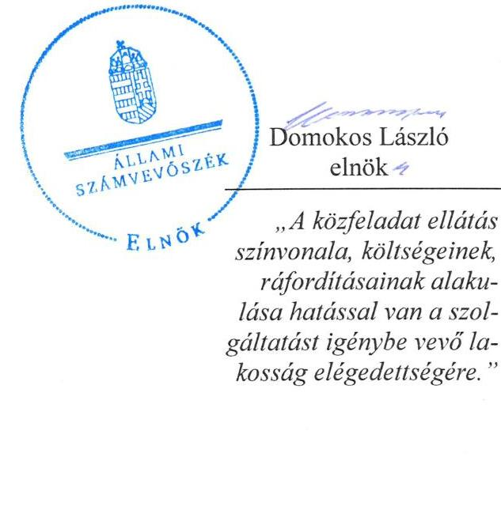
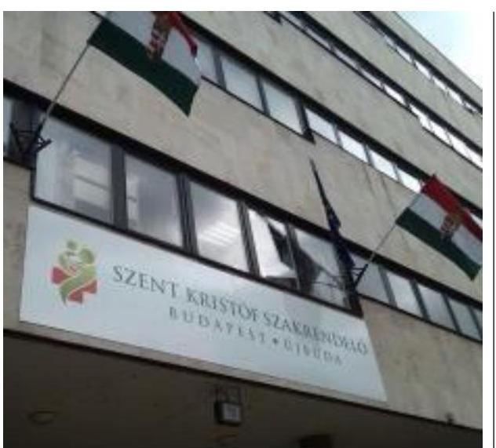
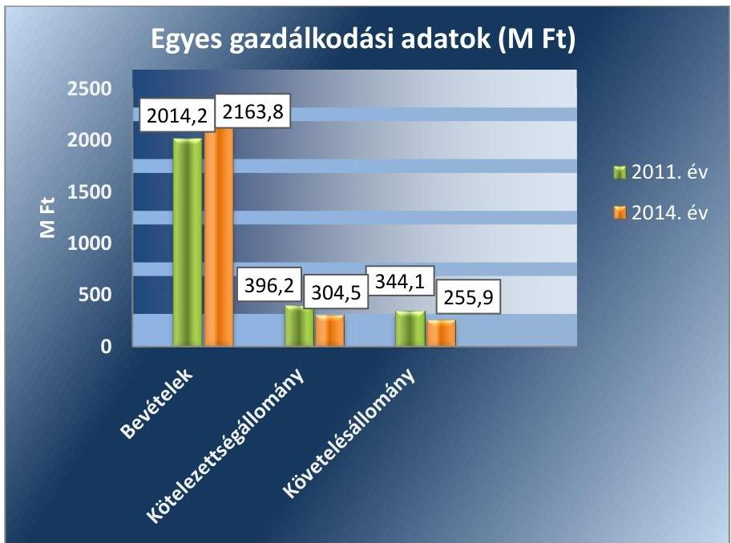
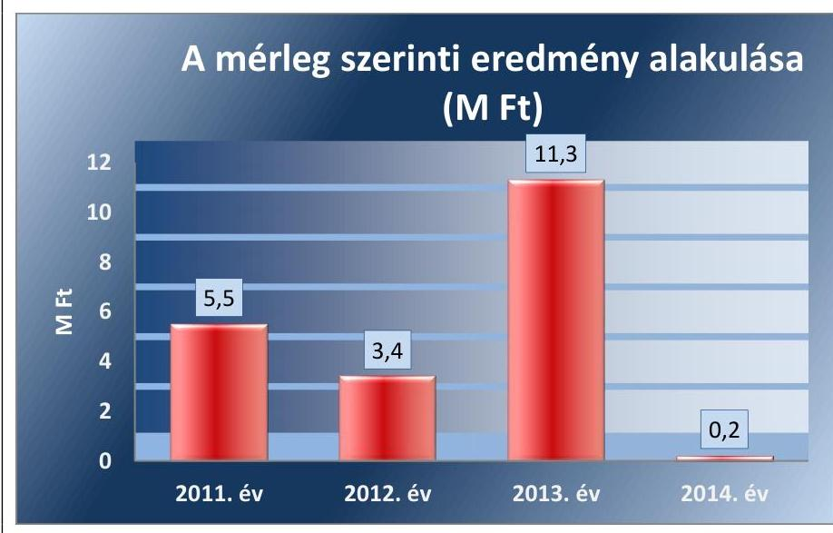

# Jelentés 

## Az önkormányzatok gazdasági társaságai

Az önkormányzatok többségi tulajdonában lévő gazdasági társaságok közfeladat ellátását érintő gazdálkodási tevékenysége szabályszerűségének ellenőrzése - Szent Kristóf Szakrendelő Újbudai Egészségügyi Szolgáltató Közhasznú NKft.

2016.
„A közfeladat ellátás szinvonala, költségeinek, ráfordításainak alakulása hatással van a szolgáltatást igénybe vevő lakosság elégedettségére."

---

# Jelentés 

## Az önkormányzatok gazdasági társaságai

Az önkormányzatok többségi tulajdonában lévő gazdasági társaságok közfeladat ellátását érintő gazdálkodási tevékenysége szabályszerűségének ellenőrzése - Szent Kristóf Szakrendelő Újbudai Egészségügyi Szolgáltató Közhasznú NKft.
2016. június hó 08. nap

---

# AZ ELLENŐRZÉST FELÜGYELTE:

- BÖRÖCZ IMRE felügyeleti vezető

- AZ ELLENŐRZÉST VEZETTE ÉS A VÉGREHAJTÁSÁÉRT FELELŐS:
  - SALAMIN VIKTOR ellenőrzésvezető
  - A PROGRAM ÖSSZEÁLLÍTÁSÁÉRT FELELŐS:
    - JANIK JÓZSEF LÁSZLÓ osztályvezető

- IKTATÓSZÁM: V-0926-149/2016
- TÉMASZÁM: 1704
- ELLENŐRZÉS-AZONOSÍTÓ SZÁM: V-070716

Jelentéseink az Országgyűlés számítógépes hálózatán és az Interneta a www.asz.hu címen is olvashatóak.

---

# TARTALOMJEGYZÉK 

■ ÖSSZEGZÉS ..... 5
■ AZ ELLENŐRZÉS CÉLJA ..... 7
■ AZ ELLENŐRZÉS TERÜLETE ..... 8
■ AZ ELLENŐRZÉS HÁTTERE, INDOKOLTSÁGA ..... 10
■ FÓKUSZKÉRDÉSEK ..... 12
■ ELLENŐRZÉS HATÓKÖRE ÉS MÓDSZEREI ..... 13
■ MEGÁLLAPÍTÁSOK ..... 15
■ JAVASLATOK ..... 28
■ MELLÉKLETEK ..... 31
I. Sz. melléklet: Értelmező szótár ..... 31
II. Sz. melléklet: Múködési adatok ..... 33
III. sz. melléklet: Mintavételi eljárások ellenőrzési területenként ..... 34
■ FÜGGELÉK: ÉSZREVÉTELEK ..... 35
■ RÖVIDÍTÉSEK JEGYZÉKE ..... 37

---

.

---

# ÖSSZEGZÉS 

Az Állami Számvevőszék ellenőrzése az egészségügyi alapellátás közfeladatának ellátását érintő gazdálkodási tevékenység szabályozottságát és szabályszerűségét értékelte a kizárólagos önkormányzati tulajdonú Szent Kristóf Szakrendelő Újbudai Egészségügyi Szolgáltató Közhasznú Nonprofit Kft.-nél a 2011-2014. évekre vonatkozóan. Budapest Főváros XI. Kerület Újbuda Önkormányzata a közfeladat ellátását biztositotta, tulajdonosi jogait szabályszerűen gyakorolta. A Társaság a vagyonával felelősen gazdálkodott, beszámolási kötelezettségét teljesítette. A Társaság kötelezettségállománya a közfeladat ellátására nem jelentett kockázatot. Az egészségügyi alapellátás bevételeinek és ráfordításainak elszámolása szabályos volt, a beruházások és felújítások elszámolását nem megfelelőnek értékeltük.

## Az ellenőrzés társadalmi indokoltsága

Az Állami Számvevőszék középtávra szóló stratégiájában megfogalmazta, hogy a helyi önkormányzatok gazdálkodásában rejlő pénzügyi kockázatok feltárásával, az államháztartáson kívülre nyújtott költségvetési támogatások és ingyenes vagyonjuttatások, valamint az államháztartáson kívül múködő közfeladat-ellátó rendszerek ellenőrzéseivel hozzájárul ahhoz, hogy a közpénzeket az államháztartáson kívül múködő szervezetek is átlátható, rendezett módon használják fel a közfeladatok szerződésben vállalt ellátása érdekében.

Magyarországon az intézmény-centrikus közfeladat-ellátás jellemző, de egyre jelentősebb a költségvetésen kívüli feladatellátás térnyerése. Ennek legfontosabb szereplői - a nonprofit szervezetek mellett - az önkormányzati tulajdonú gazdasági társaságok. Az önkormányzatok szervezetalakítási szabadságának következménye, hogy a korábban is vállalati formában múködő közszolgáltatások mellett, mind a kötelező, mind az önként vállalt feladatok ellátásában a gazdasági társaságok kiemelt fontosságú szerephez jutottak.

## Főbb megállapítások, következtetések, javaslatok

Az Önkormányzat az egészségügyi alapellátás közfeladatának megszervezéséről a jogszabályi előírásoknak megfelelően döntött, annak ellátásáról a kizárólagos tulajdonában lévő gazdasági társasága útján gondoskodott. Az Önkormányzat az Eütv.-ben előírt, alapellátási körzetek kialakításának kötelezettségét a háziorvosi és fogorvosi ellátás körzeteiről szóló rendelet megalkotásával teljesítette. Az egészségügyi közszolgáltatási feladatok ellátására az Önkormányzat és a Társaság közszolgáltatási szerződést kötött, amelyben meghatározták az ellátandó feladatokat, és a feladatellátás tárgyi, pénzügyi feltételeit. Az Önkormányzat a vagyongazdálkodási rendelet ${ }_{1,2}$-ben és azok előírásaival összhangban lévő Alapító Okiratban meghatározta a tulajdonosi joggyakorlás szabályait. Tulajdonosi jogaikat az arra jogosultak az Alapító Okirat előírásainak betartásával, szabályszerűen gyakorolták. Az anyagi ösztönzési rendszer szabályait a tulajdonosi joggyakorló a Takt. előírásai ellenére nem alakította ki. A Társaság ügyvezetője a gazdálkodásról az éves beszámolás keretében adott számot. A számviteli beszámolókról az FB írásbeli véleményt, a könyvvizsgáló jelentést készített. A Társaság mérleg szerinti eredménye az ellenőrzött években pozitív volt, osztalék kifizetésére nem került sor. Az Önkormányzat a Társaság feladatellátásához az ellenőrzött időszakban 573,9 M Ft múködési célú és 108,5 M Ft fejlesztési célú támogatás nyújtásával járult hozzá.

A Társaság a Számv. tv.-ben előírt gazdálkodási szabályzatokkal rendelkezett, azonban a számlarend bizonylati rendet nem tartalmazott. A Társaság saját vagyonával és az Önkormányzat által rendelkezésre bocsájtott ingatlannal felelősen gazdálkodott, kötelezettségállománya a közfeladat ellátását nem veszélyeztette. A 2012. és 2014. évi számviteli beszámolók letétbe helyezésére az előírt határidőt követően került sor. A Társaság az Eisztv.-ben és az Info tv.ben előírt kötelezettségének teljes körűen nem tett eleget, mivel gazdálkodási adatait a honlapján hiányosan tette közzé.

---

Az egészségügyi alapellátás értékesítésének nettó árbevétele és az anyagjellegú ráfordítások elszámolása során érvényesültek a jogszabályok és belső szabályok előírásai. A beruházások, felújítások kiadásainak elszámolása az eszközök nyilvántartásba vételének szabálytalansága miatt nem volt megfelelő. A Társaság részére az egészségügyi alapellátás ellenértékét az OEP finanszírozási szerződés alapján térítette meg. A közfeladat-ellátáshoz kapcsolódóan árképzési kötelezettsége nem volt a Társaságnak.

Az ellenőrzött időszakban a Társaságnak nem volt adósságot keletkeztető kötelezettségvállalása. A kormányzati szektor hiányára befolyást gyakorló ráfordítások és bevételek elszámolása megfelelt a jogszabályi előírásoknak. Osztalékfizetésre az Alapító Okirat előírásainak megfelelően nem került sor.

Az ÁSZ a gazdálkodás szabályszerűségének javítása és a megfelelő gazdálkodási gyakorlat érdekében a Társaság ügyvezetőjének, az Önkormányzat szabályszerű múködésének elősegítésére, továbbá az önkormányzati tulajdonosi joggyakorlás kontrolljainak erősítésére Budapest Főváros XI. Kerület Újbuda Önkormányzatának polgármesterének fogalmazott meg javaslatokat.

A jelentésben szereplő javaslatok alapján a Társaság ügyvezetője és Budapest Főváros XI. Kerület Újbuda Önkormányzatának polgármestere kötelesek intézkedési terveket összeállítani és azokat a jelentés kézhezvételétől számított 30 napon belül az ÁSZ részére megküldeni.

---

# AZ ELLENŐRZÉS CÉLJA 

## A Társaság közfeladat-ellátását érintő gazdálkodási tevékenysége szabályszerűségének értékelése

Az ellenőrzés célja annak értékelése, hogy az önkormányzat a jogszabályi előírások figyelembevételével döntött-e az ellenőrzésre kerülő közfeladat megszervezéséről; az önkormányzat/tulajdonosi joggyakorló szabályszerűen gyakorolta-e a tulajdonosi jogokat; a gazdasági társaság közfeladat-ellátása bevételeinek, ráfordításainak elszámolása, és vagyongazdálkodási tevékenysége megfelelt-e a jogszabályi, illetve a közszolgáltatási/vagyonkezelési szerződésben foglalt tulajdonosi előírásoknak, azok végrehajtása szabályszerű volt-e; a gazdasági társaság kötelezettségállománya jelent-e kockázatot a múködésre, illetve a közfeladat ellátására; a közfeladatok átláthatósága és elszámoltathatósága érdekében biztosítva volt-e a közszolgáltatás dijának megalapozottsága szabályszerű önköltségszámítással.

A kiegészítő modul esetében az ellenőrzés célja annak értékelése, hogy a gazdasági társaság gazdálkodásának a kormányzati szektor hiányára és az államadósságra befolyással bíró elemei a jogszabályi előírásoknak megfeleltek-e.

---

# **A Z ELLENŐRZÉS TERÜLETE**

## **Budapest Főváros XI. Kerület Újbuda Önkormányzata és a kizárólagos tulajdonában lévő Szent Kristóf Szakrendelő Újbudai Egészségügyi Szolgáltató Közhasznú Nonprofit Kft.**

### **Budapest Főváros XI. Kerület Újbuda Önkormányzata**1 a Gyógyír XI. Egészségügyi Szolgáltató Nonprofit Korlátolt Felelősségű Társaságot2 az ellenőrzött időszakot megelőzően, Alapító Okirattal3 hozta létre, amelynek elnevezése 2013. január 24-ével Szent Kristóf Szakrendelő Újbudai Egészségügyi Szolgáltató Közhasznú Nonprofit Korlátolt Felelősségű Társaságra változott. A Társaság kizárólagos önkormányzati tulajdonban volt az ellenőrzött időszakban.

Az Önkormányzat az ellenőrzött időszakban a működéshez szükséges tárgyi feltételeket közszolgáltatási, vagyonkezelési, illetve üzemeltetési szerződéssel bocsátotta a Társaság rendelkezésére. A Társaság fő tevékenysége a XI. kerületben élő lakosság alap- és szakorvosi járóbeteg-ellátása.

A XI. Kerület4 lakosainak száma 2014. január 1-jén 152 620 fő volt. A Társaságnál foglalkoztatott átlagos statisztikai állományi létszám a 2011. évben 401 fő, a 2014. évben 425 fő volt. Az ellenőrzött időszakban az ügyvezető személyében nem történt változás.

A Társaság gazdálkodásának egyes adatait a 2011., 2014. évek vonatkozásában az 1. ábra szemlélteti.

1. ábra

*Forrás: A Társaság 2011., 2014. évi beszámolói*

---

Az ellenőrzött időszakban a polgármester személye nem, a jegyző személye egy alkalommal változott. A polgármester ${ }^{5}$ a 2010. évi önkormányzati választások óta tölti be tisztségét, a helyszíni ellenőrzés időszakában munkakört betöltő jegyző ${ }^{6}$ 2011. július 15-e óta látja el feladatait.

Az ellenőrzés a kizárólagos tulajdonosi jogokat gyakorló önkormányzatra és az ellenőrzött közfeladatot ellátó gazdasági társaságra terjed ki.

---

# AZ ELLENŐRZÉS HÁTTERE, INDOKOLTSÁGA 

Objektív vélemény kialakítása Budapest Főváros XI. Kerület Újbuda Önkormányzata egészségügyi közfeladatának megszervezéséről, tulajdonosi jogai gyakorlásáról, valamint a többségi tulajdonban lévő Szent Kristóf Szakrendelő Újbudai Egészségügyi Szolgáltató Közhasznú Nonprofit Kft. közfeladat ellátását érintő gazdálkodási tevékenységének szabályszerűségéről.

## Az önkormányzatok közfeladat-ellátásában egyre jelentősebb a gazdasági társaságokon útján történő feladatellátás térnyerése

Az Áht. ${ }^{7}$ 1. § (3) bekezdése értelmében az államháztartáson kívüli szervezetek a közfeladatok ellátásában - jogszabályban meghatározott feltételekkel - közreműködhetnek. Az önkormányzati tulajdonú gazdasági társaságok teljes körű ellenőrzésének lehetőségét az Állami Számvevőszékről szóló 1989. évi XXXVIII. törvény 2011. január 1-jétől hatályos módosítása teremtette meg. A közfeladatot ellátó gazdasági társaságok ellenőrzése kiemelten fontos a vagyon megőrzése, megóvása érdekében, valamint a 479/2009/EK rendelet ${ }^{8}$ szerint, illetve az ESA 95 statisztikai módszertana alapján a "helyi kormányzat alszektorba besorolt társaságok és egyéb szervezetek" esetében is, amelyekkel szemben alapvető követelmény, hogy gazdálkodásuk, működésük szabályszerű, az általuk szolgáltatott adatok minél megbízhatóbbak legyenek. A közfeladat ellátás költségeinek, ráfordításainak alakulása, színvonala hatással van a lakosság elégedettségére.

A törvényalkotás számára - az észlelt problémák, szabálytalanságok, vagy egyéb nem kívánatos jelenségek felszínre kerülésével - az ellenőrzés megállapításai segítséget nyújthatnak az államháztartáson kívüli közfel-adat-ellátás értékeléséhez, jogszabályi keretei pontosításához, átláthatóságot biztosító szabályozásához. Meghatározhatóvá válnak a közfeladat ellátásban részt vevő államháztartáson kívüli szervezeteknek - az önkormányzat költségvetését, pénzügyi helyzetét is befolyásoló - kockázatai, lehetővé válik ezen kockázatok csökkentése. Ellenőrzéseink feltárhatják, hogy az önkormányzat közfeladat-ellátási kötelezettségének szabályszerűen tett-e eleget, a feladatellátáshoz rendelt közvagyon müködtetését a tulajdonostól elvárható gondossággal, szabályszerűen szervezte-e meg és a tulajdonosi felügyelete hozzájárult-e a közfeladat-ellátásához. Az ellenőrzés rávilágíthat arra, hogy a gazdasági társaság a közszolgáltatási szerződésben foglaltak betartásával, a közvagyon használatával biztosította-e a szolgáltatás folyatatásának feltételeit, a közfeladat ellátását. Ezzel az ellenőrzöttek és a helyi döntéshozók számára visszajelzést ad feladatszervezési, feladat-ellátási kockázataikról, alapot ad a meglévő hibák megszüntetéséhez, a jobb közfeladat-ellátás biztosításához. Fokozza a fegyelmet, igazolja, hogy lejárt a következmények nélküli ellenőrzések időszaka. Az ÁSZ ${ }^{9}$ értékteremtő rend kialakításához és megőrzéséhez hozzájáruló tevékenysége pozitív hatással van a szervezetről kialakított összkép formálására.

---

A KIEGÉSZÍTŐ MODUL esetében az ellenőrzés háttere, hogy a korábban is vállalati formában múködő közszolgáltatások mellett, mind a kötelező, mind az önként vállalt feladatok ellátásában a gazdasági társaságok kiemelt fontosságú szerephez jutottak.

A nemzeti számlák összeállításának módszertana 2014. október 1-jétől megváltozott, amely értelmében az ESA 2010 felváltotta az ESA 95 módszertant. A nemzeti számlák rendszerének legfontosabb jellemzői, alapvető vonásai változatlanok maradtak, ugyanakkor az ESA 2010 követi a gazdasági környezetben lezajlott változásokat, figyelembe veszi az új kutatási eredményeket és a felhasználók új igényeit.

Az ellenőrzés során feltárjuk, hogy az önkormányzati alszektorba sorolt többségi önkormányzati tulajdonban lévő gazdasági társaságok gazdálkodása milyen mértékben befolyásolja a költségvetési hiányt és az államadósságot. Az ellenőrzés rámutathat a többségi önkormányzati tulajdonú gazdasági társaságok gazdálkodási tevékenységével, valamint az államháztartásból származó források felhasználásával kapcsolatos jó gyakorlatokra és szabálytalanságokra. Felhívhatja a figyelmet a jogszabályi követelmények teljesítéséhez szükséges feltételek hiányosságaira, hozzájárulhat az államháztartáson kívüli, de (közvetlenül vagy közvetve) önkormányzati vagyont használó gazdasági társaságok tevékenységének átláthatóságához. Hozzájárulhat a közfeladat-ellátás minőségének javulásához.

---

# FÓKUSZKÉRDÉSEK 

1.     - Az önkormányzat közfeladat megszervezéséről szóló döntése, valamint tulajdonosi joggyakorlása szabályszerű volt-e?
2.     - A gazdasági társaság vagyongazdálkodása szabályszerű volt-e, kötelezettségállománya jelentett-e kockázatot a müködésre, illetve a közfeladat ellátására?
3.     - A gazdasági társaságnál az ellátott közfeladat bevételei és ráfordításai elszámolása, valamint az önköltségszámítás és árképzés szabályszerű volt-e?
4.     - A többségi önkormányzati tulajdonban lévő gazdasági társaságok gazdálkodásának a kormányzati szektor hiányára és az államadósságra befolyással bíró elemei megfeleltek-e a jogszabályi előírásoknak?

---

# ELLENŐRZÉS HATÓKÖRE ÉS MÓDSZEREI 

## Az ellenőrzés típusa

Megfelelőségi ellenőrzés

## Az ellenőrzött időszak

2011 - 2014. évek

## Az ellenőrzés tárgya

A közfeladatot gazdasági társaságokkal ellátó önkormányzatok tulajdonosi joggyakorlása, valamint gazdasági társaságok pénz- és vagyongazdálkodásának szabályozottsága és szabályszerűsége.

A kiegészítő modul esetében a kormányzati szektor önkormányzati alszektorába sorolt, többségi önkormányzati tulajdonban lévő gazdasági társaságok gazdálkodásának a kormányzati szektor hiányára és az államadósságra befolyással bíró elemei szabályszerűsége.

Az ellenőrzés kiterjed minden olyan körülményre és adatra, amely az ÁSZ jogszabályban meghatározott feladatainak teljesítéséhez, valamint a program végrehajtása folyamán felmerült újabb összefüggések feltárásához szükséges.

## Az ellenőrzött szervezet

Az ellenőrzött szervezetek:
Budapest Főváros XI. Kerület Újbuda Önkormányzata
Szent Kristóf Szakrendelő Újbudai Egészségügyi Szolgáltató Közhasznú Nonprofit Kft.

## Az ellenőrzés jogalapja

Az ellenőrzés jogszabályi alapját az ÁSZ tv. ${ }^{10}$ 5. § (3)-(4)-(5) bekezdései képezik. Ennek értelmében az ÁSZ ellenőrzi az államháztartásból nyújtott támogatás vagy az államháztartásból meghatározott célra ingyenesen juttatott vagyon felhasználását a gazdasági társaságoknál. Az önkormányzati vagyon kezelésének ellenőrzése keretében ellenőrzi a vagyon kezelését, a vagyonnal való gazdálkodást, a többségi önkormányzati tulajdonban lévő gazdasági társaságok vagyonérték-megőrző és vagyongyarapító tevékenységét, az államháztartás körébe tartozó vagyon elidegenítésére, illetve megterhelésére vonatkozó szabályok betartását; ellenőrizheti a többségi

---

önkormányzati tulajdonban lévő gazdasági társaságok vagyongazdálkodását.

# Az ellenőrzés módszerei 

Az ellenőrzést a nemzetközi standardokat irányadónak tekintve az ellenőrzési program ellenőrzési kérdései, az ellenőrzött időszakban hatályos jogszabályok, az ellenőrzés szakmai szabályok és módszertanok figyelembe vételével végezzük.

Az ellenőrzés ideje alatt az ellenőrzött szervezettel történő kapcsolattartást az ÁSZ Szervezeti és Múködési Szabályzatának vonatkozó előírásai alapján biztosítjuk.

Az ellenőrzés a kiválasztott, többségi tulajdonosi jogokat gyakorló önkormányzatra, illetve az ellenőrzésre kijelölt közfeladatot ellátó gazdasági társaság felett tulajdonosi jogokat gyakorló szervezetre és az ellenőrzött közfeladatot ellátó gazdasági társaságra terjed ki. Amennyiben a gazdasági társaságban több önkormányzat együttesen többségi tulajdonos, úgy az ellenőrzést a többségi tulajdonosi jogokat gyakorló önkormányzatnál kell lefolytatni. Az ellenőrzött gazdasági társaságnál, amennyiben az több közfeladatot is ellát, akkor az ellenőrzésre kiválasztott közfeladat-ellátást ellenőrizzük.

Az ellenőrzést a kérdésekre adott válaszok kiértékelésével, valamint a megjelölt adatforrások, a csatolt tanúsítványok felhasználásával, továbbá az adott időszakban hatályos jogszabályok figyelembe vételével kell lefolytatni. Az ellenőrzési kérdések megválaszolásához szükséges bizonyítékok megszerzése a következő ellenőrzési eljárások alkalmazásával történik: megfigyelés, kérdésfeltevés (információkérés), mintavétel, összehasonlítás, valamint elemző eljárás.

A bevételek és ráfordítások elszámolása, valamint a vagyonnyilvántartás terén a szabályszerű működést véletlen mintavétellel ellenőriztük. A kormányzati szektorba sorolt gazdálkodó szervezetek esetében a személyi jellegű ráfordítások elszámolása mellett az egyéb ráfordítások, pénzügyi műveletek ráfordításai, rendkívüli ráfordítások, illetve az egyéb bevételek, pénzügyi műveletek bevételei, rendkívüli bevételek elszámolásának szabályszerűségét szintén mintatételeken keresztül ellenőriztük. A mintavétellel ellenőrzött területek esetében minden egyes tétel vonatkozásában a szabályszerűségre vonatkozó kérdéseket tettünk fel, amelyek eredménye összesítésre került. A jogszabályoknak és a belső előírásoknak megfelelőnek tekintettük az adott területet, amennyiben a minta ellenőrzésének eredménye alapján 95\%-os bizonyossággal a teljes sokaságban a hibaarány kisebb volt, mint 10\%, nem megfelelőnek értékeltük, ha a hibaarány a 10\%ot meghaladta. Kockázatot, illetve magas kockázatot jeleztünk, amennyiben egy adott terület vonatkozásában a minta alapján a teljes sokaságban nem volt egyértelmúen biztosított a jogszabályoknak és a belső szabályzatoknak megfelelő működés. A ráfordítások elszámolására és a vagyonnyilvántartásra vonatkozó véletlen mintavételt kockázati alapú kiválasztással egészítettük ki, amelynek során évente a három legnagyobb összegű tételt választottuk ki.

---

# 1. Az önkormányzat közfeladat megszervezéséről szóló döntése, valamint tulajdonosi joggyakorlása szabályszerű volt-e? 

## Összegző megállapítás

### 1.1. számú megállapítás

Az önkormányzat kötelező és önként vállalt feladatai

## Kötelező feladat:   egészségügyi alapellátás

-Háziorvosi ellátás
-Házi gyermekorvosi ellátás
-Védőnői ellátás
-Fogorvosi alapellátás
-Iskolai egészségügyi ellátás
-Alapellátáshoz kapcsolódó
ügyeleti ellátás
Más önkormányzattól átvett feladat

- Járóbeteg szakellátás

Az Önkormányzat a jogszabályok és a helyi szabályozás betartásával szervezte meg az egészségügyi alapellátást, a tulajdonosi jogokat a jogszabályi előírásokon alapuló belső szabályozásban előírtaknak megfelelően érvényesítette.

A közfeladat-ellátást az Önkormányzat szabályszerűen szervezte meg, feladatellátásra vonatkozó rendeletalkotási kötelezettségének eleget tett.

Az Ötv. ${ }^{11}$ 91. § (6) bekezdése, 2013. január 1-jétől az Mötv. ${ }^{12}$ 116. § (3)-(4) bekezdései szerint az Önkormányzatnak a gazdasági programjában kell meghatároznia azokat a célkitűzéseket, amelyek az általa ellátott feladatok biztosítását, fejlesztését szolgálják. A Képviselő-testület ${ }^{13}$ által a 20112014. évekre elfogadott gazdasági program az alapellátó körzetek felülvizsgálatát, új körzetek kialakítását, a szakrendelések területeinek bővítését, a diagnosztikai képalkotó eljárások bővítési lehetőségeinek áttekintését tűzte ki célul.

Az ellenőrzött időszakot megelőzően készült el az Önkormányzat egészségügyi stratégiája ${ }^{14}$, amely alapján - a gazdasági programban foglaltakkal összhangban - az Önkormányzat átvette a Fővárosi Önkormányzattól a járóbeteg-szakellátási közfeladatokat, ezáltal biztosítva a teljes körű alapés szakellátást.

Az Ötv.63. §. (1) bekezdése és az Mötv. 13. § (1) bekezdésének 4.) pontja határozza meg kötelező önkormányzati feladatként az egészségügyi alapellátást. Az Önkormányzat kötelező és önként vállalt feladatairól rendeletet ${ }^{15}$ alkotott. A rendelet az ellátandó kötelező feladatok között az egészségügyi alapellátást, más önkormányzattól átvett feladatok között a járóbeteg-szakellátást rögzítette. Az egészségügyi alapellátás feladatai között az Eütv ${ }^{16} .152 . \S$ (1) bekezdésben rögzítettekkel összhangban a házior-vosi-, házi gyermekorvosi ellátást, a fogorvosi alapellátást, az alapellátáshoz kapcsolódó ügyeleti ellátást, a védőnői ellátást és az iskola-egészségügyi ellátást határozták meg. A feladatellátás módjaként mindkét ellátás vonatkozásában a Társasággal kötött szerződésen alapuló ellátást határozták meg. A Társaság az Alapító Okiratban meghatározottaknak megfelelően rendelkezett a feladatellátáshoz szükséges engedélyekkel.

AZ ALAPÍTÓ OKIRAT a Gt. ${ }^{17}$ 19. §-ában előírtakkal összhangban az Alapító ${ }^{18}$ kizárólagos hatáskörébe sorolta az éves költségvetés meghatározását, az éves beszámoló jóváhagyását, a mérleg szerinti nyereség felosztását, az $\mathrm{FB}^{19}$ tagjainak megválasztását, visszahívását, díjazásának megállapítását, az ügyvezető és a könyvvizsgáló megbízását és visszahívását,

---

valamint az olyan szerződések jóváhagyását, amelyet a Társaság a társadalmi közös szükséglet kielégítéséért felelős szervvel köt.

Az Alapító Okirat az ügyvezető kötelezettségei között előírta a Társaság képviseletét, a mérleg és vagyonkimutatás elkészítését és az Alapító felé való előterjesztését, a Társaság tevékenységének, működésének irányítását, továbbá a jogszabályoknak megfelelő működtetéséért való felelősségét.

# AZ EGÉSZSÉGŰGYI KÖZSZOLGÁLTATÁSI FEL- 

ADATOK ELLÁTÁSA érdekében az Önkormányzat és a Társaság - az ellenőrzött időszakot megelőzően - közszolgáltatási szerződést kötött. A szerződés tartalmazta az ellátandó feladatok meghatározását, valamint a feladatellátás tárgyi és pénzügyi feltételeit. A szolgáltatások ellátásához szükséges ingó tárgyakat a Társaság tulajdonába, az ingatlan vagyontárgyakat ingyenes használatába adta az Önkormányzat, valamint vállalta a feladatellátás pénzügyi támogatását. A Képviselő-testület döntése alapján az ingyenes használatba adott ingatlanokra - az Mötv. 109. § (1) bekezdésében rögzítettekkel összhangban - vagyonkezelői jogot létesített az Önkormányzat, a vagyonkezelői szerződés 2013. január 9-én lépett hatályba. A vagyonkezelői szerződésben előírták a vagyonkezelésbe adott vagyon elkülönített nyilvántartási kötelezettségét az eszközök bruttó és nettó értékének, valamint az elszámolt értékcsökkenés összegének vonatkozásában. Meghatározták a Társaság mérleg fordulónapra vonatkozó leltározási, és következő év február 15-i határidejű adatszolgáltatási kötelezettségét. Tartalmazta továbbá a vagyonkezelői szerződés az elszámolt értékcsökkenésnek megfelelő mértékű tartalék képzésének, annak felújításra, pótlólagos beruházásra való felhasználásának kötelezettségét az Mötv. 109. § (6) bekezdés előírásaival összhangban. A Képviselő-testület határozatban döntött a vagyonkezelői szerződés 2014. június 30. nappal történő felmondásáról, 2014. július 1-jétől üzemeltetési szerződés megkötéséről. Az üzemeltetési szerződésben foglaltak szerint a Társaságot nem terhelte üzemeltetési díj fizetési kötelezettség. Az ingatlanok alapvető állagmegóvását biztosító karbantartás végzésére - ettől az időponttól - az Önkormányzat volt kötelezett.

AZ FB FELADATÁT KÉPEZTE a Gt. 35. § (3) bekezdésében és Ptk. 3:120. § (2) bekezdésében ${ }^{20}$ előírtaknak megfelelően a számviteli beszámolóról szóló írásbeli jelentés készítése, melynek hiányában a tulajdonosi joggyakorló az éves számviteli beszámoló elfogadásáról és az adózott eredmény felhasználásáról nem határozhatott.

RENDELETBEN állapította meg és alakította ki az Önkormányzat az Eütv. 152. § (2) bekezdésében előírtaknak megfelelően az egészségügyi alapellátások körzeteit. A háziorvosi és fogorvosi ellátás körzeteiről szóló 13/2009. (III. 24.) számú önkormányzati rendelet az ellenőrzött időszakban többször módosult a háziorvosi és fogorvosi körzetek számának, kialakításának vonatkozásában.

---

### 1.2. számú megállapítás

A tulajdonosi joggyakorlás rendjét szabályosan alakították ki, a köz-feladat-ellátással kapcsolatos döntések esetében az arra jogosultak érvényesítették a tulajdonosi jogaikat. Az FB müködése szabályos volt. Az anyagi ösztönzési rendszer szabályait a tulajdonosi joggyakorló nem alakította ki.

A TULAJ DONOSI JOGOK gyakorlásának rendjét a vagyonrendelet ${ }_{1},{ }^{21}{ }^{22}$-ben írták elő, amely az Önkormányzat egyszemélyes gazdasági társaságaiban és nonprofit gazdasági társaságaiban a társaság tagját megillető jogokat a Gazdasági Bizottságra ${ }^{23}$ ruházza. Az ügyvezetőt és az FB tagjait a Képviselő-testület választotta meg. A munkaszerződéssel vagy munkavégzésre irányuló egyéb jogviszonnyal rendelkező ügyvezető tekintetében az egyéb munkáltatói jogkör gyakorlója a polgármester volt. A vagyonrendelet ${ }_{1,2}$ a gazdasági társaság alapításával, képviseletével, ügyvezető, FB tagjainak választásával kapcsolatos előírásai összhangban voltak az Alapító Okiratban foglaltakkal. A Társaság vonatkozásában a tulajdonosi jogokat a vagyonrendelet ${ }_{1,2}$ előírásaival összhangban lévő Alapító Okirat előírásai alapján az arra jogosultak gyakorolták.

A FELÜGYELŐ BIZOTTSÁG az Alapító Okiratban előírtak alapján - a Gt. 34. § (1) bekezdésével, valamint a Ptk. 3:121. § (1) bekezdésével összhangban - három tagból állt. A Gt. 34. § (4) bekezdésében előírtaknak eleget téve az FB elkészítette ügyrendjét, mely szerint évente legalább négy alkalommal volt köteles ülésezni, amelyek közül egynek az éves beszámoló és könyvvizsgálói jelentés elkészítése után, egynek az üzleti terv összeállításakor kellett történnie. Az FB feladatának eleget téve az ellenőrzött években határozatban fogadta el az éves beszámolót és az üzleti tervet.

Az ügyvezető az Alapító Okiratban foglaltaknak megfelelően az ellenőrzött időszak minden évére elkészítette az üzleti tervet, amely az előző évi számszaki adatokra épült. Az üzleti tervek célkitúzésként tartalmazták a gazdálkodáshoz kapcsolódó fejlődést és a fenntarthatóságot. Az üzleti terveket a Gazdasági Bizottság határozattal fogadta el.

ANYAGI ÖSZTÖNZÉSI RENDSZERT a Társaságnál nem alkalmaztak. A Képviselő-testület - mint a Társaság legfőbb szerve - a Takt. 5. § (3) bekezdésében ${ }^{24}$ foglaltak ellenére nem alkotott szabályzatot a vezető tisztségviselők, FB tagok, valamint az $\mathrm{Mt}^{25}$. 208. §-ának hatálya alá tartozó munkavállalók javadalmazásának, valamint a jogviszony megszűnése esetére biztosított juttatások módjának, mértékének elveiről, annak rendszeréről.

A Társaság által ellátott feladatokhoz kapcsolódóan - tekintettel a tevékenység jellegére -, az Önkormányzatnak nem volt díjrendelet alkotási kötelezettsége. Az egészségügyi alapellátás bevételének meghatározó része a járóbeteg-forgalom alapulvételével meghatározott OEP ${ }^{26}$ finanszírozásból származott. A Társaság az OEP által nem finanszírozott, térítésköteles egészségügyi ellátások térítési díját térítési szabályzatban határozta meg.

---

A BESZÁMOLTATÁSI RENDSZER keretein belül az ügyvezető a Társaság gazdálkodásáról, a végzett közszolgáltatási tevékenységről - az Alapító Okirat előírásának megfelelően - évente rendszeresen beszámolt. Az ügyvezető a Gt. 35. § (3) és a Ptk. 3:120. § (2) bekezdésének előírásait betartva, a tulajdonos részére beterjesztett beszámolókhoz csatolta az FB és a könyvvizsgáló írásbeli véleményét. A tulajdonos a beszámolókat az ellenőrzött években elfogadta.

A vagyonkezelési szerződésben előírt kötelezettsége alapján a Társaság köteles volt vagyonkezelési jelentést készíteni a 2013. év vonatkozásában, 2014. február 15-i határidővel. A vagyonkezelési jelentést a Társaság az előírt határidőt követően (2014. február 28-ai dátummal) elkészítette.

A TÁRSASÁG BELSŐ ELLENŐRZÉSÉT az Önkormányzat Polgármesteri Hivatalának Belső Ellenőrzési Irodája végezte, a Bkr. ${ }^{27}$ 22. § (1) bekezdés b) pontjában előírt, kockázatelemzésen alapuló, éves ellenőrzési terv alapján. Az éves ellenőrzési tervek közül a 2013. évi tartalmazott a Társaságra vonatkozó ellenőrzést, amelyet végrehajtottak.

A belső ellenőrzés célja annak megállapítása volt, hogy a tulajdonosi érdekek képviselete megfelelően biztosított-e, illetve a Társaság gazdaságosan, hatékonyan és eredményesen múködött-e. A belső ellenőrzésről készített jelentés hiányosságokat és azok megszüntetésére javaslatokat tartalmazott. A javaslatok a használt gépjármúvek üzemeltetésének szabályozásával, az adatok saját honlapon történő szerepeltetésével, a leltár realizálási jegyzőkönyv készítésével voltak kapcsolatosak. Intézkedési terv készítésére nem került sor, mivel az Önkormányzat jegyzője levélben tájékoztatta a Társaság igazgatóját, hogy annak készítésétől eltekint.

A polgármester a Bkr. 49. § (3a) bekezdésben előírtaknak megfelelően a Képviselő-testület elé terjesztette a belső ellenőrzési tevékenységről szóló beszámolót, amely tartalmazta a Társaságnál végzett ellenőrzés megállapításait, javaslatait. A Képviselő-testület a beszámolót a 105/2014. (IV. 24.) XI.ÖK számú határozatával jóváhagyta.

A TÁRSASÁGNÁL KÜLSŐ ELLENŐRZÉS az ellenőrzött időszakban kettő alkalommal történt a NAV ${ }^{28}$ (általános forgalmi adó) és a Budapest Főváros Önkormányzat Főpolgármesteri Hivatal Adó Főosztálya (helyi adó alapjának megállapítása) részéről. Az ellenőrzések témája nem kapcsolódott a közfeladat-ellátáshoz.

A 2011-2014. években a Társaság mérleg szerinti eredménye pozitív volt. Osztalék kifizetésre nem került sor, mivel az Alapító Okiratban rögzítettek alapján a Társaság tevékenységéből származó nyereség nem osztható fel, a keletkezett mérleg szerinti eredmény 50,0\%-át tartalékba kellett helyezni, 50,0\%-át a következő üzleti évben közhasznú fejlesztési célra kellett felhasználni. Az ellenőrzött időszakban a saját tőke összege (301,7 305,2 - 316,5 - 316,7 M Ft) mindegyik évben meghaladta a jegyzett tőke összegét (50,0 M Ft), ezért a Gt. 143. § (2) bekezdés a) pontja szerinti intézkedés megtétele nem vált szükségessé.

---

A 2011-2014. években a mérleg szerinti eredmény összegét a 2. ábra mutatja be.
2. ábra

Forrás: A Társaság 2011-2014. évi Beszámolói
Az ellenőrzött időszakban az Önkormányzatnak nem volt a Társaság kötelezettségvállalásához kapcsolódó garancia-, illetve kezességvállalása. A Társaság feladatellátásához az Önkormányzat a 2011-2014. években 573,9 M Ft működési célú és 108,5 M Ft fejlesztési célú támogatást nyújtott.

# 2. A gazdasági társaság vagyongazdálkodása szabályszerű volt-e, kötelezettségállománya jelentett-e kockázatot a múködésre, illetve a közfeladat ellátására? 

Összegző megállapítás

A Társaság a vagyonával - kisebb szabályozási hiányosságok mellett - felelősen gazdálkodott, kötelezettségállománya a múködésre, a közfeladat ellátásra nem jelentett kockázatot. A Társaság hiányosságokkal teljesítette az előírt beszámolási, adatszolgáltatási kötelezettségét.
2.1. számú megállapítás

A Társaság a jogszabályok által előírt szabályzatokkal rendelkezett, azonban a számlarend bizonylati rendet nem tartalmazott.

A Társaság az Alapító Okirat szerint kialakította szervezetét, múködési kereteit, amelyet az SZMSZ ${ }_{1}{ }^{29},{ }^{30}$-ben rögzített.

AZ ÜZLETI TERVEKET az ügyvezető az előző évi beszámolóval együtt jóváhagyásra beterjesztette a Gazdasági Bizottságnak. A Társaság az üzleti tervekben a bázis év tény adatait, valamint a tárgyévi tervadatokat szerepeltette a bevételekre, kiadásokra vonatkozóan, illetve tartalmazta az adott évre vonatkozó múködési és fejlesztési célú önkormányzati támoga-

---

tások összegét. Az üzleti tervben szereplő támogatásból finanszírozott fejlesztések összhangban voltak az Önkormányzat egészségügyi stratégiájával.

A Társaság az ellenőrzött időszakban rendelkezett a Számv. tv. ${ }^{31}$ 14. § (3) bekezdésében előírt számviteli politikával ${ }^{32}$, valamint a Számv. tv. 14. § (5) bekezdése előírásainak megfelelően az eszközök és források értékelési szabályzatával ${ }^{33}$, leltározási és leltárkészítési szabályzattal ${ }^{34}$, valamint pénzkezelési szabályzattal ${ }^{35}$. Elkészítették továbbá a Számv. tv. 161. § (1) bekezdésében előírt számlarendet ${ }^{36}$.

A SZÁMVITELI POLITIKA a Számv. tv. 14. § (4) bekezdése, valamint a 161/A. § előírásainak megfelelt. Az eszközök és források értékelési szabályzatában a Számv. tv. előírásaival összhangban meghatározták az eszközök értékelésének általános szabályait, az eszközök bekerülési értékének tartalmát, a mérlegben kimutatott eszközök és források értékelésének részletes szabályait. A leltározási és leltárkészítési szabályzat a tárgyi eszközök mennyiségi felvétellel történő leltározását kétévenkénti gyakorisággal írta elő, amely megfelelt a Számv. tv. 69. § (3) bekezdés előírásainak. A pénzkezelési szabályzatban a Számv. tv. 14. § (8) bekezdésében előírtaknak megfelelően - többek között - rendelkeztek a pénzforgalom lebonyolításának rendjéről, a készpénzben és a bankszámlán tartott pénzeszközök közötti forgalomról, a bankkártya használat rendjéről, a készpénzállomány ellenőrzésekor követendő eljárásról, az ellenőrzés gyakoriságáról.

A számlarend hiányossága volt, hogy nem tartalmazta a Számv.tv. 161. § (2) bekezdés d) pontjában előírt bizonylati rendet.

Önköltségszámítási szabályzat készítési kötelezettségének a Számv. tv. 14. § (7) bekezdésében előírtaknak megfelelően eleget tett a Társaság.

# 2.2. számú megállapítás 

A Társaság a tulajdonában lévő vagyonával a jogszabályi és belső rendelkezéseknek megfelelően, felelősen gazdálkodott.

Az analitikus és főkönyvi nyilvántartási rendszer biztosította a Társaság. vagyonának Számv. tv. és belső szabályozás szerinti nyilvántartását, a változások folyamatos nyomon követését.

A Társaság a Számv. tv. előírásainak megfelelően évente teljesítette a szabályzataiban előírt leltárkészítési és beszámolási kötelezettségét. A vagyonkezelésbe vett ingatlanok értékének elkülönített számviteli nyilvántartását biztosították, a vagyonkezelési szerződésben előírt leltározási és beszámolási kötelezettséget a 2013. év vonatkozásában teljesítették.

---

A Társaság főbb mérleg adatait az 1. táblázat szemlélteti:

1. táblázat

A TÁRSASÁG FŐBB MÉRLEG ADATAI (MILLIÓ FORINT)

| Megnevezés | $\begin{gathered} 2011 \\ (0,0) \end{gathered}$ | $\begin{gathered} 2012 \\ (2,3) \end{gathered}$ | $\begin{gathered} 2012 \\ (2,3) \end{gathered}$ | $\begin{gathered} 2013 \\ (2,3) \end{gathered}$ | $\begin{gathered} 2014 \\ (2,3) \end{gathered}$ |
| :--: | :--: | :--: | :--: | :--: | :--: |
| I. Befektetett eszközök | 206,9 | 206,2 | 322,7 | 2157,6 | 317,9 |
| - ebből: Tárgyi eszközök | 179,7 | 179,4 | 304,8 | 2154,6 | 317,1 |
| II. Forgóeszközök | 577,3 | 635,5 | 502,6 | 538,5 | 482,0 |
| - ebből: Követelések | 314,5 | 344,1 | 310,6 | 321,5 | 255,9 |
| III. Aktív időbeli elhatárolások | 9,1 | 5,3 | 4,7 | 5,7 | 11,4 |
| Eszközök összesen | 793,3 | 847,0 | 830,0 | 2701,8 | 811,3 |
| IV. Saját tőke | 296,3 | 301,7 | 305,2 | 316,5 | 316,7 |
| - ebből: Jegyzett tőke | 50,0 | 50,0 | 50,0 | 50,0 | 50,0 |
| - ebből Mérleg szerinti eredmény | 8,3 | 5,5 | 3,4 | 11,3 | 0,2 |
| V. Céltartalékok | 67,7 | 67,7 | 29,4 | 33,1 | 40,0 |
| VI. Kötelezettségek | 372,5 | 396,2 | 378,4 | 2249,1 | 304,5 |
| VII. Passzív időbeli elhatárolások | 56,8 | 81,4 | 117,0 | 103,1 | 150,1 |
| Források összesen | 793,3 | 847,0 | 830,0 | 2701,8 | 811,3 |

Az eszközérték 2011. január 1. és 2014. december 31. között 18,0 M Fttal emelkedett a befektetett eszköz állomány gyarapodásának és a forgóeszköz állomány csökkenésének együttes hatásaként. A tárgyi eszközök mérlegértéke az elszámolt amortizációt meghaladó mértékű fejlesztések hatására 76,5\%-kal (137,4 M Ft-tal) nőtt. A forgóeszközök fordulónapi értékének alakulását alapvetően az egyéb követelések között kimutatott OEP támogatás elszámolása, valamint az adó és járulék túlfizetések nagysága befolyásolta. A közfeladat ellátáshoz Önkormányzat által biztosított eszközöket a 2013. évi beszámolóban vagyonkezelt eszközként mutatta ki a Társaság, ami az eszközök (tárgyi eszközök) és források (kötelezettségek) mérlegértékének jelentős emelkedését eredményezte.

A vagyonkezelt ingatlanok elidegenítésére, megterhelésére a vagyonkezelési szerződés előírásainak megfelelően nem került sor. A vagyonkezelési szerződésben rögzítették, hogy amennyiben a Társaság a vagyonkezelésbe vett ingatlanokon engedélyköteles beruházásokat kíván megvalósítani, úgy a beruházás megkezdése előtt köteles az Önkormányzat írásbeli hozzájárulását beszerezni. A vagyonkezelt ingatlanokon az alapítótól kapott támogatásból történt fejlesztés.

A saját tőke értéke elsősorban a pozitív mérleg szerinti eredmények elszámolásának hatására a 2011. január 1-jei 296,3 M Ft-ról 2014. december 31-re 316,7 M Ft-ra emelkedett.

# 2.3. számú megállapítás 

## A kötelezettségek állománya a közfeladat ellátására, a Társaság múködésére nem jelentett kockázatot.

A Társaság kötelezettségeinek állománya a 2011. január 1-jei 372,5 M Ftról az ellenőrzött időszak végére 68,0 M Ft-tal (18,3\%-kal), 304,5 M Ft-ra csökkent. A kötelezettségek év végi állománya a 2. táblázatban foglaltak szerint alakult.

---

| A TÁRSASÁG KÖTELEZETTSÉGEI (MILLIÓ FORINT) |  |  |  |  |
| :-- | :--: | :--: | :--: | :--: |
| Megnevezés | $\mathbf{2 0 1 1 .}$ | $\mathbf{2 0 1 2 .}$ | $\mathbf{2 0 1 3 .}$ | $\mathbf{2 0 1 4 .}$ |
| Rövid lejáratú hitelek | 20,5 | 20,1 | 16,8 | 18,0 |
| Kötelezettségek áruszállításból és szolgáltatásból (Szállítók) | 136,0 | 139,2 | 110,7 | 106,8 |
| Vevőktől kapott előlegek | 0,3 | 0,2 | 0,2 | 0,2 |
| Egyéb rövid lejáratú kötelezettségek | 95,3 | 103,8 | 112,8 | 60,0 |
| Rövid lejáratú kötelezettségek összesen | 252,1 | 263,3 | 240,5 | 185,0 |
| Beruházási és fejlesztési hitelek | 144,1 | 113,7 | 98,9 | 90,6 |
| Egyéb hosszú lejáratú kötelezettségek | 0 | 1,4 | 1909,7 | 28,9 |
| Hosszú lejáratú kötelezettségek összesen | 144,1 | 115,1 | 2008,6 | 119,5 |
| Kötelezettségek összesen | 396,2 | 378,4 | 2249,1 | 304,5 |

A Társaság kötelezettségeinek döntő hányadát - a 2013. év kivételével - a szállítók felé fennálló tartozás, valamint az ellenőrzött időszakot megelőzően felvett beruházási és fejlesztési hitelek mérlegértéke alkotta. A 2013. évi mérlegben kimutatott kötelezettségállomány 84,9\%-át (1909,8 M Ft-ot) a vagyonkezelt eszközökhöz kapcsolódóan kimutatott, fizetési kötelezettséggel nem járó kötelezettségek képezték.

A Társaság eladósodottságát jelző mutatók értéke a 3. táblázatban foglaltak szerint alakult a 2011-2014. években.
3. táblázat

| A TÁRSASÁG PÉNZÜGYI MUTATÓSZÁMAI 2011-2014 |  |  |  |  |
| :--: | :--: | :--: | :--: | :--: |
| Megnevezés | $\begin{gathered} 2011 \\ \text { ev } \end{gathered}$ | $\begin{gathered} 2012 \\ \text { ev } \end{gathered}$ | $\begin{gathered} 2013 \\ \text { ev } \end{gathered}$ | $\begin{gathered} 2014 \\ \text { ev } \end{gathered}$ |
| Eladósodottsági mutató (idegen tőke/összes forrás) | 0,47 | 0,46 | 0,83 | 0,38 |
| Eladósodottság mértéke (kötelezettségek/saját tőke) | 1,31 | 1,24 | 1,07* | 0,96 |
| Nettó eladósodottság (kötelezettségek-követelések/saját tőke) | 0,17 | 0,22 | 0,06* | 0,15 |
| Adósságfedezeti mutató I.   (befektetett eszközök+forgóeszközök/idegen forrás) | 2,12 | 2,18 | 1,20 | 2,63 |
| *Megjegyzés: A definíció szerinti mutatószám félrevezető, mert a hosszú lejáratú kötelezettséghez nem kapcsolódik visszafizetési kötelezettség, ezért nem szerepel a mutatószámban. |  |  |  |  |

Forrás: A Társaság adatszolgáltatása
Az adósság alakulására, összetételére vonatkozó mutatószámok alapján megállapítható, hogy az adósságállomány nem jelentett kockázatot a közfeladat ellátására. Az eladósodottsági mutató értéke kedvezően változott, 2011. évi 0,47-ről, 0,38-ra csökkent a 2014. évre, mivel a kötelezettségek összes forráson belüli aránya csökkent. Az eladósodottság mértéke a 2011. évi 1,31-ről a 2014. évre 0,96-ra csökkent, a 2014. év végén a saját forrás a fennálló kötelezettségek teljes összegére fedezetet nyújtott. A nettó eladósodottsági mutató alacsony értéke kedvező, mivel a kötelezettségek meghatározó hányadának fedezetét a követelések biztosították. A kintlévőségekkel csökkentett kötelezettségek a saját tőke 6,0-22,0 \%-át kötötték le. Az adósságfedezeti mutató értéke - a 2013. év kivételével - meghaladta

---

a kedvezőnek értékelhető 2 értéket, mivel a befektetett eszközök és forgóeszközök mérlegértéke, több mint kétszerese volt a fordulónapon fennálló kötelezettségeknek.

A Társaság analitikus nyilvántartásai szerint tartozásainak pénzügyi rendezése az esedékesség szerint megtörtént.

# 2.4. számú megállapítás 

A Társaság beszámolási kötelezettségét teljesítette, azonban a számviteli beszámoló közzétételi kötelezettségének egyes években az előírt határidőn túl tett eleget. A gazdálkodási adatok elektronikus közzétételi kötelezettségét hiányosan teljesítette.

AZ ÉVES BESZÁMOLÓT a Társaság a Számv. tv. 19. § (1) bekezdésében előírt tartalommal elkészítette, azokat az ügyvezető a tulajdonos elé terjesztette. Az éves beszámolók elfogadásáról a tulajdonos a könyvvizsgáló jelentésének és az FB írásbeli jelentésének birtokában hozott határozatot. A könyvvizsgáló az éves beszámolókat hitelesítő záradékkal látta el.

A 2012. évi és 2014. évi éves beszámolók letétbe helyezése a Számv. tv. 153. § (1) bekezdésben előírt határidőhöz (a tárgyévet követő május 31.) képest késedelmesen történt meg, mivel a letétbe helyezésre a 2012. évi beszámoló esetében 2013. június 6-án, a 2014. évi beszámoló esetében 2015. június 30-án került sor.

A Társaság az OEP támogatásból származó bevételt az eredménykimutatásban a 2011-2012. években az értékesítés nettó árbevételeként, 2013-ban és 2014-ben egyéb bevételként mutatta ki. A 2013. évi beszámoló kiegészítő mellékletében - a Számv. tv. 19. § (3) bekezdésében foglaltak ellenére nem indokolták a támogatás - előző évitől - eltérő soron történő bemutatását.

Az FB és a könyvvizsgáló a közvagyon védelme, illetve más okból a Kép-viselő-testület összehívását nem kezdeményezte.

A Társaság 2011-ben az Eisztv ${ }^{37}$. 6. § (1) bekezdésében és az Eisztv. melléklete III. részének 1. pontjában előírt kötelezettségének részben tett eleget, valamint megsértette a Számv. tv. 154. § (1) bekezdését, mivel a 2011. évi beszámolóról szóló könyvvizsgálói jelentést nem tette közzé. A 2014. évben az Info. tv ${ }^{38}$. 37. § (1) bekezdésben előírt kötelezettségét nem teljesítette, mivel az Info. tv. 1. számú mellékletének III. Gazdálkodási adatok pontjában foglalt adatokat honlapján nem tette közzé. A 2012-2013. években a közzétételi kötelezettséget teljesítették.

---

# 3. A gazdasági társaságnál az ellátott közfeladat bevételei és ráfordításai elszámolása, valamint az önköltségszámítás és árképzés szabályszerű volt-e? 

Összegző megállapítás

Az egészségügyi alapellátás nettó árbevételeinek és anyagjellegú ráfordításainak elszámolása megfelelő volt, azonban az értékcsökkenés elszámolása nem volt szabályszerű. A közfeladat ellátáshoz kapcsolódóan árképzési és önköltség számítási kötelezettsége nem volt a Társaságnak.

A közfeladat bevételeinek és ráfordításainak elszámolása megfelelő volt, a beruházások és felújítások elszámolása azonban nem volt szabályszerű.

A Társaság a számlarendjének és számviteli politikának megfelelően biztosította a közfeladatok és a nem közfeladatok bevételeinek elkülönített főkönyvi számlákon történő elszámolását. Külön tartotta nyilván a közfeladat ellátására kapott bevételt (OEP támogatás), valamint a térítésköteles egészségügyi ellátás, a bérbeadás és a továbbszámlázott költségek bevételeit.

AZ ÉRTÉKESÍTÉS NETTÓ ÁRBEVÉTELÉNEK ELSZÁMOLÁSA megfelelő volt. A bevételek előírása és kiszámlázása a belső szabályozásnak megfelelően történt, a bevételeket a megfelelő számlacsoportban, közfeladatonként elkülönítve számolták el.

AZ ANYAGJELLEGŰ RÁFORDÍTÁSOK ELSZÁMOLÁSA megfelelő volt. A közfeladattal kapcsolatban elszámolt költségeket és ráfordításokat a megfelelő közfeladatra és költségnemre számolták el. A költségelszámolást megalapozó dokumentumok (szerződés, megrendelés) rendelkezésre álltak.

A BERUHÁZÁSOK, FELÚJÍTÁSOK ELSZÁMOLÁSA nem volt megfelelő.

A vagyonkezelésbe vett ingatlanok esetében a tárgyi eszközök analitikus nyilvántartásában és a főkönyvi könyvelésben nem különítették el a telek és a felépítmény értékét, ezzel megsértették a Számv.tv. 16. § (1) bekezdésben rögzített egyedi értékelés elvét. Az értékcsökkenést a telek és az ingatlan együttes bekerülési értéke után számolták el. Ez a gyakorlat ellentétes a Számv. tv. 52. § (5) bekezdésében foglaltakkal és a számviteli politika előírásaival, melyek szerint a telek után értékcsökkenés nem számolható el. A vagyonkezelési szerződés 2014. június 30-i időponttal megszűnt.

Az ellenőrzött időszakban a tárgyi eszközök terv szerinti értékcsökkenését a számviteli politika előírásának megfelelően negyedévente számolták el. A beruházások, élettartam növelő felújítások értéke 411,8 millió Ft volt, amely $20,8 \%$-kal haladta meg az elszámolt értékcsökkenés összegét (340,8 M Ft).

---

A tárgyi eszközök bruttó értéke 2011. január 1-jéről 2014. december 31-ére 98,4\%-kal (376,3 M Ft-ról 746,4 M Ft-ra), a nettó értéke 76,5\%-kal (179,7 M Ft-ról 317,1 M Ft-ra) nőtt. A tárgyi eszközök használhatósági foka az ellenőrzött időszakban kismértékben, 47,8\%-ról 42,5\%-ra csökkent.

A KÖVETELÉS ÁLLOMÁNY nagy részét az egyéb követelések tették ki, melyek aránya az ellenőrzött években közel azonos (93,9-92,5-94,1-93,3\%-os) volt. Az egyéb követelések állományának többségét az adóés járulék túlfizetések, valamint az OEP elszámolás késedelme miatti, még át nem utalt finanszírozási összegek tették ki. A vevői tartozásokat jellemzően az egészségügyi szolgáltatásokat nyújtó vállalkozó orvosok részére kiszámlázott rendelő bérleti díjak, továbbszámlázott közüzemi díjak, valamint az orvosi szolgáltatásokat megrendelő vevők tartozásai alkották. A Számv. tv. 55. §. (1) bekezdése, valamint az azzal összhangban lévő számviteli politika és értékelési szabályzat előírásai alapján a határidőn túli követelések utáni értékvesztést elszámolták. A Társaság a hátralékos követeléseket vevőnként, számlánként, lejárat szerint nyilvántartotta, a vevői követelések állományát, annak változását az éves beszámoló kiegészítő mellékletében bemutatta.

Az ellenőrzött időszakban a követelések alakulását a 4. táblázat mutatja be:
4. táblázat

A TÁRSASÁG KÖVETELÉSEI (MILLIÓ FT)

|  | 2011. | 2012. | 2013. | 2014. |
| :-- | :--: | :--: | :--: | :--: |
| Követelések áruszállításból és szolgálta-   tásból (vevők) | 21,1 | 23,4 | 19,0 | 17,1 |
| Egyéb követelések | 323,0 | 287,2 | 302,5 | 238,8 |
| Követelések összesen | 344,1 | 310,6 | 321,5 | 255,9 |

A követelések állománya 2011. december 31-éről 2014. december 31ére 25,6\%-kal, 88,2 M Ft-tal csökkent. A 2011-2014. években a követelések összege a mérleg eszközállományának 40,6-37,4-11,9-31,5\%-át alkotta. Az arány 2013. évi csökkenésének oka - a vevői állomány 2012. évhez viszonyított kismértékű növekedése mellett -, hogy a vagyonkezelt ingatlanok értékének 2013. évben történt állományba vétele miatt megnőtt a mérleg eszközeinek értéke.

A vevők értékvesztéssel korrigált állománya 2014. december 31-én 19,0\%-kal, azaz 4,0 M Ft-tal alacsonyabb volt a 2011. december 31-ei értékénél. A vevők után képzett értékvesztés összege 55,6\%-kal, 1,2 M Ft-tal nőtt, de még így sem képviselt jelentős tételt a Társaság 2011-2014. évi könyvviteli mérlegeiben.

A Társaság nem tett lépéseket a vállalkozó orvosok által meg nem fizetett bérleti díjak, továbbszámlázott közüzemi díjak behajtására. Az elévülési határidőig meg nem térülő követeléseket leírták.
3.2. számú megállapítás

Az egészségügyi alapellátáshoz kapcsolódóan árképzési és az árakat megalapozó önköltség számítási kötelezettsége nem volt a Társaságnak.

Az önköltség számítási kötelezettség az egészségügyi alapellátásra, mint közfeladatra - a tevékenység jellegéből adódóan - nem terjedt ki.

---

A Társaság részére a közszolgáltatási tevékenység ellenértékét az OEP a finanszírozási szerződés alapján térítette meg. Az OEP a Társaság által jelentett teljesítmények alapján - a teljesítmény volumen korlátot figyelembe véve - finanszírozta az egészségügyi alapellátást.

# 4. A többségi önkormányzati tulajdonban lévő gazdasági társaságok gazdálkodásának a kormányzati szektor hiányára és az államadósságra befolyással bíró elemei megfeleltek-e a jogszabályi előírásoknak? 

Összegző megállapítás

Az ellenőrzött időszakban a Társaságnak nem volt adósságot keletkeztető kötelezettségvállalása. A kormányzati szektor hiányára befolyást gyakorló bevételek és ráfordítások elszámolása megfelelt a jogszabályi előírásoknak, osztalékfizetésre nem került sor.
4.1. számú megállapítás

Az ellenőrzött időszakban a Társaságnak nem volt adósságot keletkeztető kötelezettségvállalása.

## ADÓSSÁGOT KELETKEZTETŐ KÖTELEZETTSÉGVÁLLALÁSA nem volt az ellenőrzött időszakban a Társaságnak.

A fennálló hosszúlejáratú kötelezettsége - devizában fennálló hitel - az ellenőrzött időszakot megelőzően keletkezett. A 2006. évben 890,6 ezer $\mathrm{CHF}^{39}$ összegű, beruházási-fejlesztési célú hitel felvételére került sor, amelynek állománya a tőketörlesztések következtében folyamatosan csökkent. Az ellenőrzött időszakban a CHF-ben fennálló kötelezettség év végi mérlegben való szerepeltetése megfelelt a Számv. tv. 60. § (2) bekezdésében szereplő előírásoknak.
4.2. számú megállapítás

A személyi jellegú ráfordítások, az egyéb,- pénzügyi- és rendkívüli ráfordítások és bevételek elszámolása megfelelt a jogszabályi előírásoknak. Osztalékot az Alapító Okiratban előírtaknak megfelelően nem fizettek.

A személyi jellegú ráfordítások elszámolása megfelelt a jogszabályi előírásoknak. A személyi jellegú ráfordítások tartalmát a Számv. tv. 79. § (1)-(4) bekezdéseiben előírtak figyelembe vételével határozták meg és számolták el. A személyi juttatások kifizetését alátámasztották munkaszerződésekkel és munkaidő elszámolással. A munkavállalót terhelő járulékok, adók levonása szabályosan történt.

Az egyéb ráfordítások, pénzügyi műveletek ráfordításai, rendkívüli ráfordítások elszámolása megfelelő volt. Az egyéb ráfordítások elszámolása a Számv. tv. 81. § (1)-(5) bekezdései, a pénzügyi műveletek ráfordításainak elszámolása a Számv. tv. 83. § (3) bekezdése, a rendkívüli ráfordítások elszámolása a Számv. tv. 86. § (6)-(9) bekezdései, továbbá a számviteli politika és számlarend alapján történt. A ráfordítások elszámolását megalapozó dokumentumok (határozatok, banki bizonylatok) rendelkezésre álltak.

---

Az egyéb bevételek, pénzügyi múveletek bevételei, rendkívüli bevételek elszámolása megfelelő volt. Az egyéb bevételek elszámolása a Számv. tv. 77. § (1)-(7) bekezdései, a pénzügyi műveletek bevételeinek elszámolása a Számv. tv. 83. § (2) bekezdése, a rendkívüli bevételek elszámolása a Számv. tv. 86. § (3)-(5) bekezdései előírásának megfelelően és a számviteli politikában meghatározottak alapján történt.

Az ellenőrzött időszakban, az Alapító Okiratban foglaltakat betartva, osztalék kifizetésére nem kerül sor.

---

# JAVASLATOK 

Az ÁSZ tv. 33. § (1) bekezdésében foglaltak értelmében az ellenőrzött szervezet vezetője köteles a jelentésben foglalt megállapításokhoz kapcsolódó intézkedési tervet összeállítani és azt a jelentés kézhezvételétől számított 30 napon belül az ÁSZ részére megküldeni. Amennyiben az intézkedési tervet határidőre nem küldi meg a szervezet, vagy amennyiben az nem elfogadható, az ÁSZ elnöke az ÁSZ tv. 33. § (3) bekezdés a)-b) pontjaiban foglaltakat érvényesítheti.

Javaslataink célja a Társaság gazdálkodása szabályszerűségének javítása annak érdekében, hogy a szabályozási környezet és a gazdálkodási gyakorlat megfelelően tudja támogatni az átlátható múködést.

## Szent Kristóf Szakrendelő Újbudai Egészségügyi Szolgáltató Közhasznú Nonprofit Kft. ügyvezetőjének

1. Készítsen bizonylati rendet a jogszabályi előírásnak megfelelően.
(2.1. sz. megállapítás 5. bekezdése alapján)
2. Tartsa be a számviteli beszámoló letétbe helyezésére vonatkozó, jogszabályban elöirt határidőt.
(2.4. sz. megállapítás 2. bekezdése alapján)
3. Intézkedjen az elektronikus közzétételi kötelezettség jogszabályi előírásoknak megfelelő, teljes körü teljesitésére.
(2.4. megállapítás 5. bekezdése alapján)

---

Javaslataink célja az Önkormányzat szabályszerű működésének elősegítése, továbbá az önkormányzati tulajdonosi joggyakorlás kontrolljainak erősítése.

# Budapest Főváros XI. Kerület Újbuda Önkormányzata polgármesterének 

1. Intézkedjen a Társaság vezető tisztségviselői, a felügyelőbizottsági tagok, továbbá az Mt. hatálya alá tartozó munkavállalók javadalmazásáról, valamint a jogviszony megszünése esetére biztosított juttatások módjáról, mértékének elveiről, annak rendszeréről szóló javadalmazási szabályzat elkészitésére a jogszabályi előirásoknak megfelelően.
(1.2. sz. megállapítás 4. bekezdése alapján)

---

.

---

# MELLÉKLETEK 

## I. SZ. MELLÉKLET: ÉRTELMEZŐ SZÓTÁR

adósságfedezeti mutató I.
eladósodottság mértéke
eladósodottsági mutató (tőkeáttétel)
garancia
gazdasági társaság
kezesség
közfeladat
(befektetett eszközök + forgó eszközök) / idegen forrás
Azt mutatja, hogy 1 Ft adósságra hány Ft vagyon jut. Általánosságban véve kedvező, ha értéke 2 körül van, de nagy eszközberuházás-igényű iparágakban értéke kisebb is lehet.
Kötelezettségek / saját tőke
Fontos szerepet játszik ez a mutató egy vállalat megítélésében. Azt mutatja, hogy a saját források a kötelezettségek hány százalékát fedezik. Törekedni kell, hogy a mutató tartósan (jelentősen) 1 alatti értéket érjen el.
idegen tőke / összes forrás
Egészségesnek mondható egy olyan mértékű áttétel, amelyet az üzleti tervek szerint és az elmúlt időszak tapasztalatai alapján a társaság megfelelő biztonsággal ki tud termelni. Nagy eszközberuházás-igényű iparágakban értéke magasabb, azaz magasabb eladósodottság is elfogadható, de 75-85 \%-ot meghaladó értéknél már itt is erős, sőt túlzott külső finanszírozottságról beszélhetünk. Általánosságban véve kedvező, ha értéke kisebb, mint 0.
A garancia olyan önálló, az önkormányzat nevében vállalt kötelezettség, amely alapján az önkormányzat az önkormányzati költségvetés terhére szerződésben meghatározott feltételek szerint, a kötelezett nem teljesítése esetén a jogosultnak fizetést teljesít az előzetesen rögzített összeghatárig.
Ptk. 3:88. § (1) A gazdasági társaságok üzletszerű közös gazdasági tevékenység folytatására, a tagok vagyoni hozzájárulásával létrehozott, jogi személyiséggel rendelkező vállalkozások, amelyekben a tagok a nyereségből közösen részesednek, és a veszteséget közösen viselik.
A kezességre vonatkozó előírásokat a Ptk. 6:416-430. §-ai tartalmazzák. Kezességi szerződéssel a kezes kötelezettséget vállal a jogosulttal szemben, hogyha a kötelezett nem teljesít, maga fog helyette a jogosultnak teljesíteni. Kezesség egy vagy több, fennálló vagy jövőbeli, feltétlen vagy feltételes, meghatározott vagy meghatározható összegű pénzkövetelés vagy pénzben kifejezhető értékkel rendelkező egyéb kötelezettség biztosítására vállalható. A Ptk. szerint kezességet csak írásban lehet vállalni. A kezes kötelezettsége ahhoz a kötelezettséghez igazodik, amelyért kezességet vállalt. A kezes kötelezettsége nem válhat terhesebbé, mint amilyen elvállalásakor volt, kiterjed azonban a kötelezett szerződésszegésének jogkövetkezményeire és a kezesség elvállalása után esedékessé váló mellékkövetelésekre is.
Jogszabályban meghatározott állami vagy önkormányzati feladat, amit az arra kötelezett közérdekből, jogszabályban meghatározott követelményeknek és feltételeknek megfelelve végez, ideértve a lakosság közszolgáltatásokkal való ellátását, továbbá az állam nemzetközi szerződésekben vállalt kötelezettségeiből adódó közérdekű feladatokat, valamint e feladatok ellátásához szükséges infrastruktúra biztosítását is (Nvtv. ${ }^{40}$ 3. § (1) bekezdés 7. pont).

---

közszolgáltatás

A közszolgáltatás: „közcélú, illetőleg közérdekű szolgáltatást jelent, amely egy nagyobb közösség (állam, település) minden tagjára nézve megközelítőleg azonos feltételek mellett vehető igénybe, ezért valamilyen mértékig közösségi megszervezést, illetve szabályozást, ellenőrzést igényel." Az Ebktv. 3. § d) pontja a következőképpen határozza meg a közszolgáltatást: „szerződéskötési kötelezettség alapján a lakosság alapvető szükségleteinek ellátására irányuló szolgáltatás, így különösen a villamos energia-, gáz-, hő-, víz-, szennyvíz- és hulladékkezelési, köztisztasági, postai és távközlési szolgáltatás, továbbá a menetrend alapján közlekedő járművekkel végzett közforgalmú személyszállítás" nemzeti vagyon nettó eladósodottság
többségi befolyás
tulajdonosi joggyakorló
A Ptk. 8:2. § (2) bekezdése szerint „A befolyással rendelkező akkor rendelkezik egy jogi személyben meghatározó befolyással, ha annak tagja vagy részvényese, és
a) jogosult e jogi személy vezető tisztségviselői vagy felügyelőbizottsága tagjai többségének megválasztására, illetve visszahívásra; vagy
b) a jogi személy más tagjai, illetve részvényesei a befolyással rendelkezővel kötött megállapodás alapján a befolyással rendelkezővel azonos tartalommal szavaznak, vagy a befolyással rendelkezőn keresztül gyakorolják szavazati jogukat, feltéve, hogy együtt a szavazatok több mint felével rendelkeznek."
Az Nvtv. 1. § (2) bekezdés c) pontja szerint „az állam vagy a helyi önkormányzatot tulajdonában lévő pénzügyi eszközök, továbbá az államot vagy a helyi önkormányzatot megillető társasági részesedések"
(kötelezettségek - követelések) / saját tőke
Azt mutatja, hogy a kintlévőségekkel csökkentett kötelezettségeket milyen mértékben fedezi saját forrás. Ez feltételezi, hogy a követelések pénzügyileg előbb realizálódnak, mint ahogy a kötelezettségeket teljesíteni kell. A mutató minél kisebb, csökkenő értéke kedvező.
A Ptk. 8:2. § (1) bekezdése szerint „többségi befolyás az olyan kapcsolat, amelynek révén természetes személy vagy jogi személy (befolyással rendelkező) egy jogi személyben a szavazatok több mint felével vagy meghatározó befolyással rendelkezik."
Aki a nemzeti vagyon felett az államot vagy a helyi önkormányzatot megillető tulajdonosi jogok és kötelezettségek összességének gyakorlására jogosult (Nvtv. 3. § (1) bekezdés 17. pont).

---

II. SZ. MELLÉKLET: MŰKÖDÉSI ADATOK

|  A TÁRSASÁG MÜKÖDÉSÉNEK FŐBB JELLEMZŐI (EZER FORINT / \%) |  |  |  |  |  |   |
| --- | --- | --- | --- | --- | --- | --- |
|  Sorszám | Megnevezés |  | 2011. | 2012. | 2013. | 2014.  |
|  1. | A Társaság tulajdonosi összetétele: |  |  |  |  |   |
|  2. | Önkormányzat megnevezése: |  | Budapest Főváros XI. Kerület Újbuda Önkormányzata |  |  |   |
|  3. | Önkormányzat tulajdoni részesedésének aránya | $\%$ | 100 | 100 | 100 | 100  |
|  4. | Önkormányzat tulajdoni részesedésének ösz-
szege | ezer Ft | 50000 | 50000 | 50000 | 50000  |
|  5. | A gazdasági társaság müködése a vizsgált évek során meg-
szűnt-e? (IGEN/NEM) |  |  | NEM |  |   |
|  6. | A tárgyévben a Társaság saját vagyona után el-
számolt értékcsökkenés összege | ezer Ft | 54978 | 75483 | 74624 | 73486  |
|  7. | A tárgyévben a Társaság vagyonkezelésében
lévő önkormányzati vagyon után elszámolt ér-
tékcsökkenés összege | ezer Ft | 0 | 0 | 37176 | 25038  |
|  8. | Tárgyévi beruházások értéke | ezer Ft | 47200 | 210063 | 45310 | 109237  |
|  9. | Értékesítés nettó árbevétele és egyéb bevételek | ezer Ft | 2014209 | 2233662 | 2189886 | 2163777  |

---

# III. SZ. MELLÉKLET: MINTAVÉTELI ELJÁRÁSOK ELLENŐRZÉSI TERÜLETENKÉNT

|  Ssz. | Mintavétellel ellen-
őrzendő területek | Főbb kérdés | Ellenőrzési kérdések | Adatforrások | Alapsokaság | Mintavételi eljárás  |
| --- | --- | --- | --- | --- | --- | --- |
|   | 1. | 2. | 3. | 4. | 5. | 6.  |
|  1. | Az ellátott közfeladat ráfordításainak elkülönített, szabályszerű elszámolása területén |  |  |  |  |   |
|  2. | Anyagjellegú ráfordítások | Az anyagjellegú ráfordítások elszámolása során betartották-e a belső szabályzatokban és a jogszabályokban foglaltakat és azokat a közfeladat-ellátással kapcsolatosan elkülönítették-e? | - a számlázott anyagjellegú ráfordításokra kötött szerződésnél betartották-e a Számv.tv. előírását, a költségelszámolást megalapozó dokumentum (szerződés, megrendelés) rendelkezésre áll?
- a beszerzett anyagok nyilvántartásba vétele megtörtént-e, azokat a közfeladat-ellátással kapcsolatosan elkülönítették-e a szabályozásnak megfelelően,? - a készlet bekerülési értékét a Számv.tv., a számviteli politika, illetve az értékelési szabályzat előírásai szerint vették-e számításba, azokat a közfeladat-ellátással kapcsolatosan elkülönítették-e?
- az anyagjellegú ráfordításokat a megfelelő költségnemre, illetve közfeladatra számolták-e el? | Az anyagjellegú ráfordítások közül az 51-53. főkönyi számlacsoportokból vett minta esetében - a költségelszámolást megalapozó dokumentumok (szerződések, megrendelések, stb.), költségelszámoláshoz benyújtott számlák, teljesítés megtörténtét alátámasztó egyéb dokumentumok,
- analitikus nyilvántartások, anyagok nyilvántartásba vételét igazoló dokumentumok, ha a számviteli politika szerint nyilvántartásba kell venni azokat. | Éves bontásban a főkönyvi adatbázisból az 51-53. Anyagjellegú ráfordítások számlacsoportba a tartozó ráfordítások, kivéve az ELÁBÉ és az eladott közvetített szolgáltatások értéke. | A mintavételt megelőzően a sokaságból ki kell emelni tételes ellenőrzésre - évente a 3-3 legnagyobb összegű tételt.
Véletlen mintavétel évenként elemszámmal arányos rétegzéssel.  |
|  3. | Beruházások, felújítások aktiválása és értékcsökkenési leírás | A közfeladatellátást szolgáló közvagyon állományba vételi, nyilvántartási és elszámolási kötelezettségének teljesítése kapcsán a felújítások, beruházások kiadások aktiválása és az értékcsökkenési leírás elszámolása megfelel-e az előírásoknak? | - A költségelszámolást megalapozó dokumentum (szerződés, megrendelés, stb.) megfelel-e az előírásoknak, továbbá be lett kérve a tulajdonosi jogok gyakorlójának előzetes, írásbeli engedélye - amennyiben előírták - az önkormányzati tulajdonban lévő eszközön elszámolt beruházáshoz/felújításhoz? - a beruházások, felújítások állományba vétele, besorolása, a bekerülési érték meghatározása, az üzembehelyezések (aktiválások) dokumentálása megfelel-e az Sztv., a számviteli politika, illetve az értékelési szabályzat előírásainak? - az ellenőrzésre kiválasztott immateriális javak és tárgyi eszközök szerepelnek a mérleget alátámasztó leltárban? - az értékcsökkenés elszámolása a jogszabályban és a számviteli politikában meghatározott szabályozásnak megfelel-e? | A kiválasztott beruházásra vagy felújításra: szerződések, számlák, a befejezetlen beruházások, felújítások analitikus nyilvántartása, immateriális javak, tárgyi eszközök analitikus nyilvántartása, a beszerzett eszköz üzembehelyezési okmánya, állományba vételi bizonylata, egyedi eszköznylvántartó kartonja - az értékcsökkenés elszámolása az egyedi eszköznylvántartó kartonja, illetve analitikus nyilvántartása | Éves bontásban az immateriális javak, a tárgyi eszközök állománynövekedési tételei, amelyek öszszegének meg kell egyeznie a kiegészítő mérlegben az immateriális javak, a tárgyi eszközök növekedéseként bemutatott értékkel kédelt, elemszámmal arányos rétegzéssel. Kiválasztott tételek eszközkartonjának tételes ellenőrzése, különös figyelemmel az értékcsökkenés elszámolására.  |
|  4. | Az ellátott közfeladat bevételeinek elkülönített, szabályszerű elszámolása területén |  |  |  |  |   |
|  5. | Értékesítés nettó árbevétel | Az értékesítés nettó árbevétele elszámolása során betartották-e a belső szabályzatokban és a jogszabályokban foglaltakat és azokat a közfeladat-ellátással kapcsolatosan elkülönítették-e? | - a bevétel kiszámla̋zása a belső szabályozásnak megfelelően történt-e?
- a befolyt bevétel nyilvántartásba vétele (analitika, főkönyv) megtörtént-e, azokat a közfeladat-ellátással kapcsolatosan elkülönítették-e?
- a bevételek beszedése, elszámolása során betartották-e a szabályozásban foglaltakat és a megfelelő számlacsoportba számolták el a bevételt?
- a tulajdonosi követelményeknek, belső szabályozásnak megfelelő árat alkalmazták-e? | A kiválasztott értékesítés nettó árbevétel jogcímen befolyt bevételre: - az egyes bevételek díjmegállapítása, - a kibocsátott számla, befolyt bevétel analitikus nyilvántartása, behajtásra tett intézkedések dokumentumai, - kapcsolódó főkönyvi számla tételes forgalma,
- bevétel beérkezését igazoló banki kivonat( rész). | Éves bontásban a főkönyvi adatbázisból a 91-94. számlacsoportok bevételei | Véletlen mintavétel évenkénti, elemszámmal arányos rétegzéssel.  |

---

# FÜGGELÉK: ÉSZREVÉTELEK 

A jelentéstervezetet a Számvevőszék 15 napos észrevételezésre megküldte az ellenőrzött szervezet vezetőjének az ÁSZ tv. 29. §* (1) bekezdése előírásának megfelelően.
Az elfogadott észrevételek alapján véglegesíti az ÁSZ a jelentését.

Az ellenőrzött szervezetek vezetői az ÁSZ tv. 29. § (2) bekezdésében foglalt észrevételezési jogukkal nem éltek, a jelentéstervezetre észrevételt nem tettek.

[^0]
[^0]:    * 29. § (1) Az Állami Számvevőszék az ellenőrzési megállapításait megküldi az ellenőrzött szervezet vezetőjének vagy az általa megbízott személynek, és annak, akinek személyes felelősségét állapította meg.
    (2) Az ellenőrzött szervezet vezetője és a felelősként megjelölt személy az ellenőrzés megállapításaira tizenöt napon belül írásban észrevételt tehet.
    (3) Az Állami Számvevőszék az észrevételre a beérkezésétől számított harminc napon belül írásban válaszol. A figyelembe nem vett észrevételeket köteles a jelentésben feltüntetni, és megindokolni, hogy azokat miért nem fogadta el.

---

.

---

# RÖVIDÍTÉSEK JEGYZÉKE 

${ }^{1}$ Önkormányzat
${ }^{2}$ Társaság
${ }^{3}$ Alapító Okirat
${ }^{4}$ XI. Kerület
${ }^{5}$ polgármester
${ }^{6}$ jegyző
${ }^{7}$ Áht.
${ }^{8} 479 / 2009 /$ EK rendelet
${ }^{9}$ ÁSZ
${ }^{10}$ ÁSZ tv.
${ }^{11}$ Ötv.
${ }^{12}$ Mötv.
${ }^{13}$ Képviselő-testület
${ }^{14}$ Egészségügyi stratégia
${ }^{15}$ rendelet az Önkormányzat feladatairól
${ }^{16}$ Eütv.
${ }^{17}$ Gt.
${ }^{18}$ Alapító
${ }^{19} \mathrm{FB}$
${ }^{20}$ Ptk.
${ }^{21}$ vagyonrendelet:
${ }^{22}$ vagyonrendelet:
${ }^{23}$ Gazdasági Bizottság
${ }^{24}$ Takt.
${ }^{25} \mathrm{Mt}$.
${ }^{26} \mathrm{OEP}$

Budapest Főváros XI. Kerület Újbuda Önkormányzata
Szent Kristóf Szakrendelő Újbudai Egészségügyi Szolgáltató Közhasznú Nonprofit Korlátolt Felelősség Társaság, melynek jogelődje a Gyógyír XI. Egészségügyi Szolgáltató Közhasznú Társaság
a Szent Kristóf Szakrendelő Újbudai Egészségügyi Szolgáltató Közhasznú Nonprofit Korlátolt Felelősség Társaság többször módosított Alapító Okirata Budapest Főváros XI. Kerülete
Budapest Főváros XI. Kerület Újbuda Önkormányzatának polgármestere
Budapest Főváros XI. Kerület Újbuda Önkormányzatának jegyzője az államháztartásról szóló 2011. évi CXCV. törvény (hatályos: 2011. december 31-étől)
Az Európai Közösséget létrehozó szerződéshez csatolt, a túlzott hiány esetén követendő eljárásról szóló jegyzőkönyv alkalmazásáról szóló 2009. május 25-i 479/2009/EK rendelet
Állami Számvevőszék
2011. évi. LXVI. törvény az Állami Számvevőszékről
a helyi önkormányzatokról szóló 1990. évi LXV. törvény (hatálytalan: 2014. október 12-étől)
Magyarország helyi önkormányzatairól szóló 2011. évi CLXXXIX. törvény (hatályos: 2012. január 1-jétől)
Budapest Főváros XI. Kerület Újbuda Önkormányzatának Képviselő-testülete
Budapest Főváros XI. Kerület Újbuda Önkormányzata Egészségügyi Bizottságának 4/EÜB/2006.(II.20.) számú határozata a XI. Kerület Egészségügyi stratégiai tervéről a 35/2011. (X. 26.) XI.ÖK és a 18/2012. (III. 28.) XI.ÖK rendelettel módosított 5/2007.(II.22.) XI.ÖK rendelet az Önkormányzat kötelező és önként vállalt feladatairól
az egészségügyről szóló 1997. évi CLIV. törvény
a gazdasági társaságokról szóló 2006. évi IV. törvény (hatálytalan: 2014. március 15-étől)
Budapest Főváros XI. Kerület Újbuda Önkormányzata
a Szent Kristóf Szakrendelő Újbudai Egészségügyi Szolgáltató Közhasznú Nonprofit Korlátolt Felelősség Társaság Felügyelő Bizottsága
a Polgári Törvénykönyvről szóló 2013. évi V. törvény (hatályos: 2014. március 15től
a Budapest Főváros XI. Kerület Újbuda Önkormányzata tulajdonában álló vagyonnal való rendelkezés szabályairól szóló 13/2003./V.20./ XI.ÖK számú rendelet (hatályos: 2003. május 20-ától)
a Budapest Főváros XI. Kerület Újbuda Önkormányzata tulajdonában álló vagyonnal való rendelkezés szabályairól szóló 33/2012. (VI. 6.) számú önkormányzati rendelet (hatályos: 2012. július 1-jétől)
Budapest Főváros XI. Kerület Újbuda Önkormányzatának Gazdasági Bizottsága a köztulajdonban álló gazdasági társaságok takarékosabb müködéséről szóló 2009. évi CXXII. törvény (hatályos: 2009. december 4-étől)
2012. évi I. törvény a munka törvénykönyvéről

Országos Egészségbiztosítási Pénztár

---

${ }^{27}$ Bkr.
${ }^{28} \mathrm{NAV}$
${ }^{29} \mathrm{SZMSZ}_{1}$
${ }^{30} \mathrm{SZMSZ}_{2}$
${ }^{31}$ Számv.tv.
${ }^{32}$ számviteli politika
${ }^{33}$ értékelési szabályzat
${ }^{34}$ leltározási szabályzat
${ }^{35}$ pénzkezelési szabályzat
${ }^{36}$ számlarend
${ }^{37}$ Eisztv.
${ }^{38}$ Info. tv.
${ }^{39} \mathrm{CHF}$
${ }^{40} \mathrm{Nvtv}$.
a költségvetési szervek belső kontrollrendszeréről és belső ellenőrzéséről szóló 370/2011. (XII. 31.) Korm. rendelet (hatályos: 2012. január 1-jétől)
Nemzeti Adó- és Vámhivatal
a Gyógyír XI. Egészségügyi Szolgáltató Nonprofit Kft. ideiglenes Szervezeti és Múködési Szabályzata (hatályos: 2010. március 1-jétől 2011. június 30-áig)
a Gyógyír XI. Egészségügyi Szolgáltató Nonprofit Kft. Szervezeti és Múködési Szabályzata (hatályos: 2011. július 1-jétől)
a számvitelről szóló 2000. évi C. törvény
a Szent Kristóf Szakrendelő Újbudai Egészségügyi Szolgáltató Közhasznú Nonprofit Korlátolt Felelősség Társaság többször módosított számviteli politikája (hatályos: 2014. január 1-jétől; korábban a Gyógyír XI. Egészségügyi Szolgáltató Nonprofit Kft. Számviteli Politikája (hatályos: 2010. január 1-jétől 2011. december 31-éig, 2012. január 1-jétől 2012. december 31-éig, valamint 2013. január 1-jétől 2013. december 31-éig))
a Szent Kristóf Szakrendelő Újbudai Egészségügyi Szolgáltató Közhasznú Nonprofit Korlátolt Felelősség Társaság Eszközök és Források értékelési Szabályzata (hatályos: 2014. január 1-jétől, korábban a Gyógyír XI. Egészségügyi Szolgáltató Nonprofit Kft. többször módosított Eszközök és Források értékelési Szabályzata (hatályos: 2010. január 1-jétől 2011. december 31-éig, 2012. január 1-jétől 2012. december 31-éig, valamint 2013. január 1-jétől 2013. december 31-éig)
a Szent Kristóf Szakrendelő Újbudai Egészségügyi Szolgáltató Közhasznú Nonprofit Korlátolt Felelősség Társaság Leltározási és Leltárkészítési Szabályzata (hatályos: 2014. január 1-jétől, korábban a Gyógyír XI. Egészségügyi Szolgáltató Kft. többször módosított Leltározási és Leltárkészítési Szabályzata (hatályos: 2009. október 15étől 2011. december 31-éig, 2012. január 1-jétől 2012. december 31-éig, valamint 2013. január 1-jétől 2013. december 31-éig))
a Szent Kristóf Szakrendelő Újbudai Egészségügyi Szolgáltató Közhasznú Nonprofit Korlátolt Felelősség Társaság Pénz- és Értékkezelési szabályzata (hatályos: 2014. január 1-jétől, korábban a Gyógyír XI. Egészségügyi Szolgáltató Nonprofit Kft. többször módosított Pénz- és Értékkezelési szabályzata, (hatályos 2010.február 1jétől 2011. december 31-éig, 2012.január 1-jétől 2012. december 31-éig, valamint 2013. január 1-jétől 2013. december 31-éig)
a Szent Kristóf Szakrendelő Újbudai Egészségügyi Szolgáltató Közhasznú Nonprofit Korlátolt Felelősség Társaság Számlarendje (hatályos: 2011. január 1-jétől)
az elektronikus információszabadságról szóló 2005. évi XC. törvény (hatályos: 2011. december 31-éig)
az információs önrendelkezési jogról és az információszabadságról szóló 2011. évi CXII. törvény (hatályos: 2011. július 27-étől)
svájci frank
a nemzeti vagyonról szóló 2011. évi CXCVI. törvény

---

ÁLLAMI SZÁMVEVŐSZÉK
1052 Budapest, Apáczai Csere János utca 10.
Levélcím: 1364 Budapest 4. Pf. 54
Telefon: +36 14849100 Telefax: +36 14849200
www.asz.hu