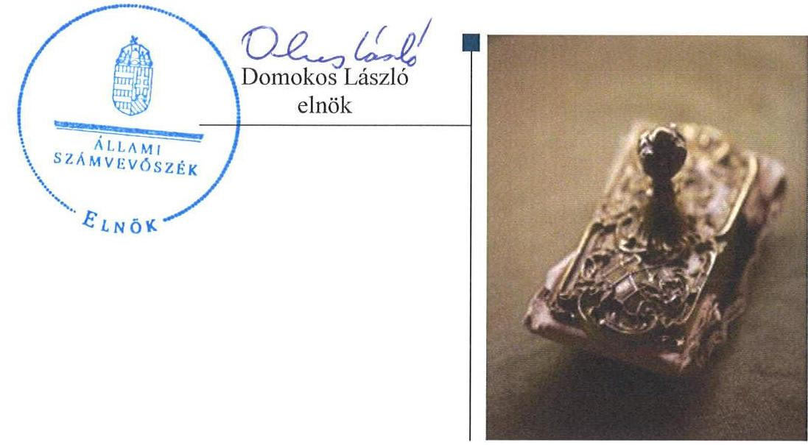
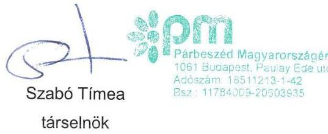
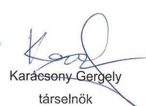
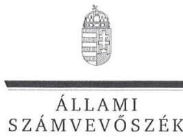
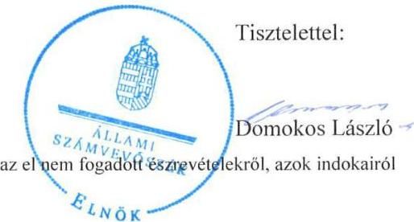
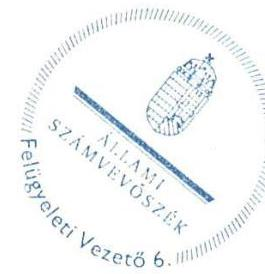

# Jelentés 

## Pártok gazdálkodása

A költségvetési támogatásban részesülő pártok 2013-2014. évi gazdálkodása törvényességének ellenőrzése a Párbeszéd Magyarországért Pártnál 2016.

---

# Jelentés 

## Pártok gazdálkodása

A költségvetési támogatásban részesülő pártok 2013-2014. évi gazdálkodása törvényességének ellenőrzése a Párbeszéd Magyarországért Pártnál 2016. 06. hó 30. nap

---

# AZ ELLENŐRZÉST FELÜGYELTE: 

DR. BENEDEK MÁRIA felügyeleti vezető

## AZ ELLENŐRZÉST VEZETTE ÉS A VÉGREHAJTÁSÁÉRT FELELŐS:

DR. LÁNG ÁGNES KRISZTINA ellenőrzésvezető

## A PROGRAM ÖSSZEÁLLÍTÁSÁÉRT FELELŐS:

JANIK JÓZSEF LÁSZLÓ osztályvezető

## A TÉMÁHOZ KAPCSOLÓDÓ KORÁBBI SZÁMVEVŐSZÉKI JELENTÉSEK:

- címe: A 2014. évi választásokra fordított pénzeszközök felhasználásának ellenőrzése - Az országgyűlési képviselők 2014. évi választására fordított pénzeszközök felhasználásának ellenőrzése
- sorszáma: 15127

IKTATÓSZÁM: V-1001-049/2016
TÉMASZÁM: 2035
ELLENŐRZÉS-AZONOSÍTÓ SZÁM: V-074607

---

# TARTALOMJEGYZÉK 

- ÖSSZEGZÉS ..... 5
- AZ ELLENŐRZÉS CÉLJA ..... 7
- AZ ELLENŐRZÉS TERÜLETE ..... 8
- AZ ELLENŐRZÉS HÁTTERE, INDOKOLTSÁGA ..... 9
- A JELENTÉS LÉNYEGES KÉRDÉSKÖREI ..... 10
- ELLENŐRZÉS HATÓKÖRE ÉS MÓDSZEREI ..... 11
- MEGÁLLAPÍTÁSOK ..... 14
- JAVASLATOK ..... 25
- MELLÉKLETEK ..... 29
I. Sz. melléklet: Értelmező szótár. ..... 29
II. Sz. melléklet: A PMP 2013. évi közzétett beszámolója. ..... 30
III. Sz. melléklet: A PMP 2014. évi közzétett pénzügyi kimutatása ..... 31
- FÜGGELÉK: ÉSZREVÉTELEK ..... 33
- RÖVIDÍTÉSEK JEGYZÉKE ..... 65

---

.

---

# ÖSSZEGZÉS 

Az ÁSZ ${ }^{1}$ a PMP ${ }^{2}$ gazdálkodásának törvényességét ellenőrizte a 2013. január 1-jétől 2014. december 31-ig terjedő időszakra vonatkozóan. Az ÁSZ megállapította, hogy a PMP 2013. évi beszámolója és a 2014. évi pénzügyi kimutatása megfelelt a törvényi előírásoknak. A PMP gazdálkodása és könyvvezetése nem volt szabályszerű. A PMP a müködéséhez a Párttörvény ${ }^{3}$ alapján igénybe vehető forrásokat használt fel.

## Az ellenőrzés társadalmi indokoltsága

A pártok az állampolgárok egyesülési szabadsága alapján létrehozott olyan szervezetek, amelyek szervezeti kereteket nyújtanak a népakarat kialakításához és kinyilvánításához, a politikai életben való állampolgári részvételhez. A pártoknak más társadalmi szervezetekhez képest különleges a viszonya a közhatalomhoz, ugyanis a pártok kifejezett célja és feladata, hogy képviselőik útján részt vállaljanak a közhatalomból, illetőleg politikai eszközökkel folyamatosan befolyásolják a közhatalom tevékenységét.

A politikai élet tisztasága érdekében törvény állapítja meg a pártok vagyonára és gazdálkodására vonatkozó szabályokat. Az egyesülési jog alapján létrejövő más szervezetekhez képest szűkebb körben határozza meg azt a gazdasági tevékenységet, amelyet a párt végezhet, biztosítja azonban a pártok részére azt a jogosultságot, hogy az állami költségvetésből támogatásban részesüljenek. A pártok gazdálkodását a politikai élet tisztasága érdekében rendszeresen indokolt ellenőrizni, ezért törvényi előírás alapján az ÁSZ a költségvetési támogatást kapott pártok gazdálkodását kétévente ellenőrzi.

Az ÁSZ tv. ${ }^{4}$ és a Párttörvény alapján a pártok gazdálkodása törvényességének ellenőrzésére az ÁSZ jogosult. Az ÁSZ kiemelt szerepet tölt be és felelősséget visel a pártok feletti társadalmi kontroll érvényesítése terén. A párttörvényben előírt kétévenkénti ellenőrzési kötelezettségen túlmenően az ellenőrzést az a garanciális követelmény indokolja, hogy a pártok gazdálkodásának törvényességi ellenőrzése biztosított legyen, a törvényi rendelkezések megsértését szankciók követhessék.

A pártok működésével és gazdálkodásával kapcsolatos speciális előírásokat tartalmazó Párttörvény az ellenőrzött időszakban módosult. A főbb változások érintették a párt által elfogadható vagyoni hozzájárulásokra, a pártok beszámolására, valamint megszűnésére, felszámolására vonatkozó szabályokat.

Az ÁSZ még nem ellenőrizte a PMP gazdálkodásának törvényességét, mivel a 2014. évi országgyűlési képviselő választáson elért eredménye alapján a 2014. évtől részesül rendszeres költségvetési juttatásban.

## Főbb megállapítások, következtetések, javaslatok

A PMP a Párttörvényben előírt tartalommal elkészítette a 2013. évi beszámolóját és a 2014. évi pénzügyi kimutatását, valamint gondoskodott azok határidőben történő közzétételéről. A beszámoló, illetve a pénzügyi kimutatás összeállítása során - kisebb, a lényegességi küszöb értékét el nem érő könyvelési hibák - kivételével érvényesültek a Számv. tv. ${ }^{5}$-ben rögzített számviteli alapelvek. A PMP számviteli rendszerének szabályozása - a számlarend ${ }^{6}$, a leltározási szabályzat ${ }^{7}$ és a pénzkezelési szabályzat ${ }^{8}$ hiányosságai miatt - nem felelt meg a jogszabályi előírásoknak. A könyvvezetés az ellenőrzött időszakban nem volt szabályszerű, mivel a2013. évi gazdasági eseményeket, valamint a 2014. évben a készpénzben befizetett tagdíjakat nem a Számv. tv.-ben előírt határidőben rögzítették. A leltározás folyamatát nem a leltározási szabályzatban előírtak szerint határozták meg. A 2014. évben a mérlegben a kötelezettségeket nem a Számv. tv. előírásainak megfelelően mutatták ki. A 2014. évben az ellenőrzött kiadások 23,9\%-ánál az arra

---

jogosultak a kötelezettségvállalási szabályzatban ${ }^{9}$ előírtak ellenére nem együttesen gyakorolták a kötelezettségvállalási jogukat. Az ellenőrzött években a könyvvezetés során a főkönyvi könyvelés, az analitikus nyilvántartások és a bizonylatok adatai közötti egyeztetés, ellenőrzés lehetőségét nem biztosították. A könyvviteli elszámolást alátámasztó bizonylatok a Számv. tv.-ben meghatározott követelményeknek nem feleltek meg. A gazdálkodással összefüggő egyéb jogszabályi előírásokat a PMP betartotta. A munkaszerződések, megbízási szerződések egy részének aláírásakor nem az Alapszabály ${ }_{1-5}{ }^{10}$-ben meghatározottak szerint gyakorolták a képviseleti jogokat, a munkaügyi szabályzatot ${ }^{11}$ és a kiküldetési szabályzatot ${ }^{12}$ az arra jogosult pártigazgató helyett a pénzügyi vezető hagyta jóvá. A PMP ellenőrzési rendszere az előírásoknak megfelelő módon működött, annak ellenére, hogy az Alapszabály ${ }_{3-5}$ a törvénynyel ellentétes rendelkezést tartalmaz, továbbá az elnökség és a pártigazgató a beszámolási kötelezettségének nem tett eleget. A PMP a pénzügyi-számviteli feladatait megbízási szerződés alapján külső szolgáltató látta el, a pénzügyiszámviteli informatikai rendszer működésére vonatkozó jogszabályi előírások betartásáról - a házipénztár forgalmának könyvelési szabálytalanságai mellett - gondoskodtak. A PMP működéséhez a források, különösen a támogatás, vagyoni hozzájárulás, adomány igénybevétele, valamint a vagyon használata szabályszerű volt. A PMP a 2014. évben a Párttörvény által tiltott szervezettől 10 ezer Ft összegű adományt fogadott el.

---

# AZ ELLENŐRZÉS CÉLJA 

Az ellenőrzés célja annak értékelése volt, hogy a közzétett 2013. évi beszámoló, illetve a 2014. évi pénzügyi kimutatás a törvényi előírásoknak megfelelt-e, a könyvvezetés és gazdálkodás során betartották-e a vonatkozó jogszabályi és belső előírásokat, továbbá a párt a müködéséhez szabályszerűen igénybe vehető forrásokat használt-e fel.

---

# AZ ELLENŐRZÉS TERÜLETE

## A PMP

A párt olyan egyesület, amely nyilvántartott tagsággal rendelkezik, és amely a nyilvántartásba vételét végző bíróság előtt kinyilvánítja, hogy a Párttörvény rendelkezéseit magára nézve kötelezőnek ismeri el a Párttörvény 1. §-a alapján.

Az ÁSZ tv. 5. § (11) bekezdés a) pontja alapján az ÁSZ – a Párttörvény rendelkezéseinek megfelelően – törvényességi szempontok szerint ellenőrzi a pártok gazdálkodását. A Párttörvény 10. § (1) bekezdése alapján a párt gazdálkodása törvényességének ellenőrzésére az ÁSZ jogosult. A Párttörvény 10. § (3) bekezdése alapján az ÁSZ kétévente ellenőrzi azoknak a pártoknak a gazdálkodását, amelyek rendszeres költségvetési támogatásban részesültek. Az ellenőrzés a 2014. év végén mandátummal rendelkező, 2014. évben költségvetési támogatásban részesült PMP-re terjedt ki.

A pártok működésével és gazdálkodásával kapcsolatos speciális előírásokat tartalmazó Párttörvény az ellenőrzött időszakban módosult. A főbb változások érintették a párt által elfogadható vagyoni hozzájárulásokra, a pártok beszámolására, valamint megszűnésére, felszámolására vonatkozó szabályokat. A Párttörvény 9. § (1) bekezdése értelmében a pártok kötelesek minden év április 30-ig az előző évi gazdálkodásukról szóló beszámolót (zárszámadást) – a 2014. május 6-tól hatályos szabályozás szerint minden év május 31-ig a melléklet szerinti pénzügyi kimutatást – a Magyar Közlönyben, valamint internetes honlapjukon közzétenni.

A PMP jogerős bírósági bejegyzésére 2013. augusztus 22-én került sor. Az alakuló ülésen a tagok jóváhagyták a PMP Alapszabályz-ét, megválasztották az elnökséget és meghatározták a tagdíj mértékét. A PMP induló vagyona a két társelnök összesen 100 ezer Ft értékű felajánlása volt. A PMP a 2013. évi Párttörvény szerinti beszámolójában 1390 ezer Ft bevételt, valamint 55 ezer Ft kiadást számolt el. A 2014. évi pénzügyi kimutatás szerint az összes bevétel 66 937 ezer Ft, a teljesített kiadások összege 114 537 ezer Ft volt. A fizetőképesség megőrzése érdekében a Párt 2014 szeptemberében 35 000 ezer Ft összegű folyószámlahitelt vett igénybe a számlavezető bankjától.

A PMP a politikai kultúra fejlesztése érdekében a tudományos, ismeretterjesztő, kutatási és oktatási tevékenységének elősegítésére megalapította a Megújuló Magyarországért Alapítványt.

---

# AZ ELLENŐRZÉS HÁTTERE, INDOKOLTSÁGA 

Az ÁSZ tv. és a Párttörvény alapján a pártok gazdálkodása törvényességének ellenőrzésére az ÁSZ jogosult. Az ÁSZ kiemelt szerepet tölt be és felelősséget visel a pártok feletti társadalmi kontroll érvényesítése terén. A párttörvényben előírt kétévenkénti ellenőrzési kötelezettségen túlmenően az ellenőrzést az a garanciális követelmény indokolja, hogy a pártok gazdálkodásának törvényességi ellenőrzése biztosított legyen, a törvényi rendelkezések megsértését szankciók követhessék.

Az ÁSZ még nem ellenőrizte a PMP gazdálkodásának törvényességét, mivel a 2014. évi országgyűlési képviselő választáson elért eredménye alapján a 2014. évtől részesül rendszeres költségvetési juttatásban.

A gazdálkodás szabályszerűségének, a felhasznált közpénzek nagyságának bemutatásával a társadalom objektív képet alkothat a pártok működéséről. Az ellenőrzés megállapításai a gazdálkodás megfelelőségének bemutatásával elősegíthetik, hogy a törvényalkotók konkrét lépéseket tegyenek a pártok finanszírozására vonatkozó szabályozások átláthatóbbá, ellenőrizhetőbbé tétele irányába. Az ellenőrzés rámutat a pártok gazdálkodásával, valamint az állami költségvetésből származó források felhasználásával kapcsolatos jó gyakorlatokra és szabálytalanságokra. A hiányosságok, szabálytalanságok feltárása, az ennek kapcsán megfogalmazott megállapítások elősegíthetik a törvényi rendelkezések megsértésének szankcionálását.

---

# A JELENTÉS LÉNYEGES KÉRDÉSKÖREI 

1.     - A PMP közzétett beszámolója, pénzügyi kimutatása megfelelt-e a törvényi előírásoknak?
2.     - A PMP könyvvezetése és gazdálkodása megfelelt-e az előírásoknak?
3.     - A PMP a müködéséhez szabályszerűen igénybe vehető forrásokat használt-e fel?

---

# ELLENŐRZÉS HATÓKÖRE ÉS MÓDSZEREI 

## Az ellenőrzés típusa

Szabályszerúségi ellenőrzés.

## Az ellenőrzött időszak

A 2013. augusztus 22-étől 2014. december 31-ig terjedő időszak.

## Az ellenőrzés tárgya

Az ellenőrzés tárgyát képezték a 2013. évi beszámoló és a 2014. évi pénzügyi kimutatás elkészítésére, közzétételére, a párt könyvvezetésére, gazdálkodására, ennek keretében a számviteli szabályozás kialakítására, a bizonylati rend, bizonylati fegyelem betartására, egyéb gazdálkodási, ellenőrzési és pénzügyi-számviteli informatikai feladatok ellátására irányuló tevékenységek. Az ellenőrzés tárgya volt továbbá az előírt források fogadása, illetve a vagyon előírt hasznosítása.

A 2014. évi országgyűlési képviselő-választási kampányra fordított pénzeszközök elszámolását az ÁSZ már ellenőrizte, a kampányra fordított bevételek és kiadások a jelen ellenőrzésnek nem képezték a részét.

Az ellenőrzés kiterjedt minden olyan körülményre és adatra, amely az ÁSZ jogszabályban meghatározott feladatainak teljesítéséhez, valamint a program végrehajtása folyamán felmerült újabb összefüggések feltárásához szükséges.

## Az ellenőrzött szervezet

A Párbeszéd Magyarországért Párt.

## Az ellenőrzés jogalapja

Az ellenőrzés jogszabályi alapját az ÁSZ tv. 5. § (11) bekezdés a) pontjá-ban és a Párttörvény 10. § (1) és (3) bekezdéseiben foglalt előírások képezték.

## Az ellenőrzés módszerei

Az ellenőrzést az ellenőrzési program szempontjai, az ellenőrzött időszakban hatályos jogszabályok, az ellenőrzés szakmai szabályai, a jelen ellenőr-

---

zésre irányadó ÁSZ módszertan (Módszertan a pártok gazdálkodása törvényességének ellenőrzéséhez) és a nemzetközi standardok figyelembe vételével végeztük. A gazdálkodás hibáinak kijavítására irányuló javaslatok kidolgozásakor a hatályos jogszabályokat tekintettük az irányadónak.

Az ÁSZ az ellenőrzés ideje alatt a PMP-vel történő kapcsolattartást az ÁSZ SZMSZ ${ }^{13}$-ének vonatkozó előírásai alapján biztosította.

Az ellenőrzési kérdések megválaszolásához szükséges bizonyítékok megszerzése a következő ellenőrzési eljárások alkalmazásával történt: tételes és mintavételen alapuló dokumentumellenőrzés, megerősítés, összehasonlító elemzés.

Az ellenőrzési bizonyítékként felhasználható adatforrások közé tartoztak egyrészt a szakmai program részletes szempontjainál felsorolt adatforrások, másrészt adatforrás lehetett minden egyéb - az ellenőrzés folyamán feltárt, az ellenőrzés szempontjából releváns információt tartalmazó - dokumentum.

Az ellenőrzés lefolytatásához a PMP a tanúsítványok elektronikus kitöltésével, valamint az ÁSZ által kért dokumentumok elektronikus megküldésével szolgáltatott adatokat. A rendelkezésre bocsátott adatok, információk kontrollja az ellenőrzés keretében történt.

Az ellenőrzésnél az átfogó lényegességi küszöb mértékét az ÁSZ a Párt által közzétett beszámoló, illetve pénzügyi kimutatás bevételi főösszegének 2\%-ában határozta meg.

Az ellenőrzés során figyelembe kellett venni azt, hogy
$\longrightarrow$ a Párttörvényben előírt beszámoló/pénzügyi kimutatás formájában és tartalmában nem felel meg a Számv. tv. szerinti mérleg, valamint az eredmény-kimutatás követelményeinek,
$\longrightarrow$ a Párttörvényben előírt éves beszámoló/pénzügyi kimutatás nem illeszkedik a Számv. tv.-ben meghatározott éves beszámoló elkészítésére vonatkozó tételes szabályokhoz,
$\longrightarrow$ a beszámoló/pénzügyi kimutatás elkészítéséhez nem készült a Párttörvény 1. számú melléklete szerinti beszámoló-soronként kitöltési útmutató, nincsenek fogalmi meghatározások, így az éves beszámoló/pénzügyi kimutatás elkészítése pártonként eltérő felfogások érvényesítésére ad lehetőséget,
$\longrightarrow$ a Párttörvény 2014. január 1-jei módosítása érintette a pártok felszámolási és végelszámolási eljárásra vonatkozó rendelkezéseit is,
$\longrightarrow$ 2014. január 1-jétől a módosított Párttörvény megtiltja, hogy a pártok jogi személyektől, jogi személyiséggel nem rendelkező szervezettől, külföldi szervezettől és nem magyar állampolgár természetes személytől vagyoni hozzájárulást fogadjanak el.
A jelentésben használt fogalmak magyarázatát az I. számú melléklet, a PMP 2013. évi beszámolóját a II. számú melléklet, a PMP 2014. évi pénzügyi kimutatását a III. számú melléklet tartalmazza.

Az ÁSZ a 2013. évi beszámoló illetve a 2014. évi pénzügyi kimutatás könyvviteli nyilvántartással való egyezőségének, a könyvvezetés és gazdálkodás szabályszerűségének ellenőrzéséhez tételes ellenőrzést és MUS mintavételi eljárást is alkalmazott. Teljes körűen ellenőrizte a központi költségvetésből származó támogatást, valamint a beszámolóban, illetve

---

pénzügyi kimutatásban a Párttörvény alapján nevesítésre kötelezett, értékhatárt meghaladó adományokat, hozzájárulásokat, továbbá az 1 millió Ft feletti kiadásokat. Mintavételi eljárás alapján ellenőriztük a tagdíjbevételeket, a nevesítésre nem kötelezett adományokat, hozzájárulásokat, az egyéb bevételeket, valamint az 1 millió Ft-ot el nem érő kiadásokat.

A beszámoló/pénzügyi kimutatás elkészítésének, a számviteli rendszer jogszabályi előírások szerinti kialakításának és működtetésének, valamint a források igénybevételének szabályszerűségét az erre irányuló ellenőrzési kérdésekre adott válaszok összesítése alapján, a lényegességi szempontok figyelembe vételével évenkénti bontásban minősítette az ÁSZ. Megfelelőnek értékelte az ellenőrzött területet, amennyiben a szabályozás, illetve végrehajtás során a jogszabályi követelményeket maradéktalanul, vagy kisebb hiányosságok mellett érvényesítették, nem megfelelőnek értékelte, amennyiben a szabályozás hiányosságai nem biztosították a szabályszerű működés feltételeit, illetve a gazdálkodás folyamatában, a könyvvezetés során jelentkező hibák lényegesek, nagyszámúak, vagy rendszerszerűek voltak.

---

# 1. A PMP közzétett beszámolója, pénzügyi kimutatása megfelelte a törvényi előírásoknak? 

Összegző megállapítás

1.1. számú megállapítás
1.2. számú megállapítás

A PMP közzétett beszámolója, pénzügyi kimutatása megfelelt a törvényi előírásoknak.

A beszámoló és a pénzügyi kimutatás elkészítése és közzététele megfelelte a jogszabályi előírásoknak.

A PMP AZ ELLENÖRZÖTT IDŐSZAKBAN HATÁRIDŐBEN ELKÉSZÍTETTE a 2013. évi gazdálkodásáról szóló beszámolót, illetve a 2014. évi pénzügyi kimutatást, és gondoskodott azoknak a Magyar Közlöny mellékletét képező Hivatalos Értesítőben, illetve a PMP honlapján történő közzétételéről.

A PMP 2013. évi beszámolója megfelelt, a 2014. évi pénzügyi kimutatás formailag nem, de adattartalmában megfelelt a Párttörvény előírásainak.

A beszámoló és a pénzügyi kimutatás egyezősége a könyvviteli nyilvántartás adataival nem volt biztosított, de a feltárt hibák nem minősültek lényegesnek.

A PMP BEVÉTELEINEK ÉS KIADÁSAINAK NYILVÁNTARTÁSA a számlarendben foglalt főkönyvi számlaszámokon történt. A PMP a 2013. évben központi költségvetési támogatásban nem részesült, bevételeit a tagok által fizetett tagdíjak, valamint természetes személyektől származó adományok képezték. A tagdíj összegét és a befizetés rendjét a PMP belső szabályzatban meghatározta. A 2013. évi beszámolóban a „Tagdij" és „Egyéb hozzájárulások, adományok" beszámolósorok tartalma - egy tétel kivételével - megegyezett a könyvviteli nyilvántartásokban szereplő adatokkal, azon csak az előírt jogcímű, bizonylatokkal alátámasztott összegek szerepeltek.

A 2013. évben a PMP kizárólag működési kiadásokat számolt el. A beszámolóban a „Müködési kiadások" beszámolósor tartalma - egy tétel kivételével - megegyezett a könyvviteli nyilvántartásokban szereplő adatokkal, azon csak az előírt jogcímű, bizonylatokkal alátámasztott összegek szerepeltek.

A 2013. évi, közzétett beszámoló ellenőrzése során megállapított, a főkönyvi nyilvántartás és a beszámolósorok közötti eltéréseket az 1. táblázat részletezi.

---

1. táblázat

A FŐKÖNYVI NYILVÁNTARTÁS ÉS A BESZÁMOLÓSOROK KÖZÖTTI ELTÉRÉSEK

| tétel megnevezése | tétel ösz-   szege ezer   Ft-ban | oz eltérés   összege ezer   Ft-ban | elterés mértéke a   bevételi föösszeg-   hez képest |
| :-- | :--: | :--: | :--: |
| Tagdíjak | 620 | 3 | $0,22 \%$ |
| Egyéb hozzájárulások, adományok | 770 | 3 | $0,22 \%$ |
| Összes bevétel a gazdasági évben | 1390 | 6 | $0,44 \%$ |
| Müködési kiadások | 55 | 5 | $0,36 \%$ |
| Összes kiadás a gazdasági évben | 55 | 5 | $0,36 \%$ |
|  |  |  | Forrás: ÁSZ |

A 2013. évi beszámoló bevételi, illetve kiadási oldalán feltárt hibákat az ellenőrzés nem minősítette lényegesnek, mert nem érték el a bevételi főösszegre vetített $2 \%$-os lényegességi küszöb mértékét.

A 2014. évben a PMP bevételeinek nyilvántartása a számlarendnek megfelelő főkönyvi számlaszámokon történt. A bevételekhez kapcsolódó beszámolósorok (Tagdíjak, Központi költségvetésből származó támogatás, Egyéb hozzájárulások, adományok, Egyéb bevétel) tartalma - három tétel kivételével - az előírásoknak megfelelően megegyezett a könyvviteli nyilvántartással, azon csak az előírt jogcímű, bizonylatokkal alátámasztott öszszegek szerepeltek.

A kiadások között a 2014. évben a „Támogatás egyéb szervezeteknek" beszámolósoron a PMP által alapítani kívánt Megújuló Magyarországért Alapítvány induló vagyonaként ügyvédi irodánál letétbe helyezett összeget szerepeltették.

A 2014. évben a „Müködési kiadások" és a „Politikai tevékenység kiadása" beszámolósorokon szereplő kiadások nyilvántartása a számlarendben meghatározott számlaosztályokon történt. A működési kiadások, illetve a politikai tevékenység kiadásai közé tartozó gazdasági eseményekről a PMP külön analitikus nyilvántartást vezetett. A nyilvántartásban szereplő tételek összege megegyezett a beszámolósorokon szereplő értékekkel.

A 2014. évben az „Eszközbeszerzés" és „Egyéb kiadások" beszámolósorokon szereplő kiadások nyilvántartása - egy-egy tétel kivételével - a számlarendben foglaltaknak megfelelő főkönyvi számlaszámon történt. A beszámolósorok tartalma megegyezett a könyvviteli nyilvántartással, azon csak az előírt jogcímű, bizonylattal (bankkivonattal) alátámasztott összegek szerepeltek.

A 2014. évi, közzétett pénzügyi kimutatás ellenőrzése során megállapított, a főkönyvi nyilvántartás és a pénzügyi kimutatás sorai közötti eltéréseket a 2. táblázat részletezi.

---

2. táblázat

# A FŐKÖNYVI NYILVÁNTARTÁS ÉS A PÉNZÜGYI KIMUTATÁS SORAI KÖZÖTTI ELTÉRÉSEK 

| tétel megnevezése | tétel ösz-   szege ezer   Ft-ban | az eltérés   összege   ezer Ft-ban | eltérés mértéke a   bevételi főösszeg-   hez képest |
| :-- | --: | --: | --: |
| Tagdíjak | 964 | 11 | $0,02 \%$ |
| Központi költségvetésböl származó támogatás | 62246 | 0 | $0,00 \%$ |
| Egyéb hozzájárulások, adományok | 3707 | 11 | $0,02 \%$ |
| Egyéb bevétel | 20 | 0 | $0,00 \%$ |
| Összes bevétel a gazdasági évben | 66937 | 22 | $0,03 \%$ |
| Támogatás egyéb szervezetek-   nek | 200 | 200 | $0,30 \%$ |
| Müködési kiadások | 51493 | 0 | $0,00 \%$ |
| Eszközbeszerzés | 249 | 0 | $0,00 \%$ |
| Politikai tevékenység kiadása | 62113 | 0 | $0,00 \%$ |
| Egyéb kiadások | 482 | 0 | $0,00 \%$ |
| Összes kiadás a gazdasági évben | 114537 | 200 | $0,30 \%$ |

A PMP 2014. évi pénzügyi kimutatása bevételi és kiadási oldalán feltárt hibákat az ellenőrzés nem minősítette lényegesnek, mert azok nem érték el a bevételi főösszegre vetített 2\%-os lényegességi küszöb mértékét.

A beszámoló és a pénzügyi kimutatás szabálytalanságait a 3. táblázat mutatja be.
3. táblázat

## A BESZÁMOLÓ ÉS A PÉNZÜGYI KIMUTATÁS SZABÁLYTALANSÁGAI

Sorszám
1. A PMP a Számv. tv. 16. § (3) bekezdésében foglaltak ellenére nem a gazdasági eseménynek megfelelően mutatta be a bevételeit, mivel a 2013. évben az adományként befizetett összeget tagdíjként, illetve a 2014. évben a tagdíjként befizetett összegeket adományként vette nyilvántartásba.
2. A 2014. évben a Megújuló Magyarországért Alapítvány induló vagyonaként ügyvédi irodánál letéti szerződéssel keletkezett letéti követelés összegét a Számv. tv. 29. § (1) bekezdésében meghatározottak ellenére nem egyéb követelésként - mint egyéb szerződésből jogszerűen eredő pénzértékben kifejezett fizetési igényt - mutatták ki, hanem azt költségként számolták el, emiatt nem érvényesült a Számv. tv. 15. § (3) bekezdésben foglalt valódiság elve.

---

# 2. A PMP könyvvezetése és gazdálkodása megfelelt-e az előírásoknak? 

Összegző megállapítás

2.1. számú megállapítás

A PMP gazdálkodása és könyvvezetése nem felelt meg a jogszabályi előírásoknak.

A PMP számviteli rendszerének szabályozása nem felelt meg a Számv. tv. előírásainak.

A PMP RENDELKEZETT A SZÁMV. TV.-BEN ELŐíRT BELSŐ SZABÁLYZATOKKAL, melyeket a megalakulását követően a Számv. tv. -ben meghatározott határidőn belül készítettek el. A számviteli politikát, valamint annak keretén belül a leltározási szabályzatot, az értékelési szabályzatot ${ }^{14}$ és a pénzkezelési szabályzatot a Számv. tv., továbbá az Alapszabály3 szerint az arra jogosult elnökségi tag - a társelnök - léptette hatályba 2013. szeptember 18-án.

Az ellenőrzött időszakban a számlarend nem felelt meg, a leltározási szabályzat és a pénzkezelési szabályzat kisebb hiányosságok mellett megfelelt a Számv. tv.-ben foglaltaknak. Az értékelési szabályzat és a számviteli politika ${ }^{15}$ megfelelt a Számv. tv. előírásainak.

A számviteli politikában rögzítették a könyvvezetés során érvényesítendő számviteli alapelveket, az amortizációs politika elemeit, továbbá szabályozták a könyvvezetés módját és az év végi zárlat időpontját. Meghatározták, hogy az értékelés szempontjából mit tekintenek nem lényegesnek, valamint mit tekintenek lényegesnek.

A számlarendet a Számv. tv. -ben előírtak alapján, az egységes számlakeret előírásainak figyelembevételével készítették el.

A pénzkezelési szabályzatban meghatározták a pénzforgalom készpénzben, illetve bankszámlán történő lebonyolításának általános rendjét, a pénzkezelés személyi és tárgyi feltételeit, valamint a napi készpénz záró állomány maximális mértékét.

Az értékelési szabályzat a számviteli politikával összhangban volt, az eszközök és források választott értékelési eljárásait a Számv. tv. előírása alapján rögzítették.

A számviteli rendszer szabályozásának hiányosságait a 4. táblázat mutatja be.
4. táblázat

## A SZÁMVITELI RENDSZER SZABÁLYOZÁSÁNAK HIÁNYOSSÁGAI

## Sorszám

1. A leltározási szabályzatban a Számv. tv. 69. § (3) bekezdésében foglalt előírás ellenére a mennyiségi felvétellel történő leltározás gyakoriságát nem határozták meg.
2 A pénzkezelési szabályzatban a Számv. tv. 14. § (8) bekezdése előírása ellenére nem rendelkeztek teljes körűen — a készpénzállományt érintő pénzmozgások - tagdíj- és adomány befizetések - jogcímeiről és eljárási rendjéről, valamint a pénzkezelés felelősségi szabályairól.

---

| Sorszám | Részmegállapítás | Megjegyzés |
| :--: | :--: | :--: |
| 3. | A Számv. tv. 161. § (2) bekezdés a) pontjában foglaltak ellenére a számlarendben nem határozták meg minden alkalmazott főkönyvi számla számát, megnevezését. A 2013. évi főkönyvi könyvelésben szereplő 535 „Postaköltség", a 8697 „Kerekítés", valamint a 2014. évben a 8696 „Adott támogatás" főkönyvi számlaszámokat a számlarend és a számlatúkör nem tartalmazta. |  |
| 4. | A Számv. tv. 161. § (2) bekezdés b) pontjában foglaltak ellenére a 869. „Különféle egyéb ráfordítások" főkönyvi számla értéke növekedésének számlarendben meghatározott jogcímei nem egyeztek meg a 2013-2014. évben könyvelt tételek tartalmával, mert nem szerepelt benne az „adott támogatás" jogcím. |  |
| 5. | A számlarend a Számv. tv. 161. § (2) bekezdés d) pontjában előírt, a számlarendet alátámasztó bizonylati rendet nem tartalmazta. |  |

A PMP könyvvezetése nem felelt meg a jogszabályokban és a belső szabályzatokban előírtaknak.

A PMP KÖNYVVITELI FELADATAIT 2014. február 18-tól megbízási szerződés alapján külső szolgáltató látta el. A szerződésben rögzítették a gazdálkodással összefüggő feladatok ellátási kötelezettségét és a felelősségi szabályokat. Az eszközök és források változásait a kettős könyvvitel rendszerében rögzítették.

A PMP a 2013. és 2014. évi mérleg tételeinek alátámasztásához összeállította a leltárát.

Az ellenőrzött időszakban a mintatételek ellenőrzése alapján az utalványozás rendje megfelelt a belső szabályzatok előírásainak. A banki kifizetések engedélyezése során az elektronikus utalásokat a bankszámla felett rendelkezésre jogosultak írták alá, a bankszámlaszerződésekben rögzített azonosítási követelmények betartásával. A kötelezettségvállalás gyakorlata az ellenőrzött években nem felelt meg a kötelezettség-vállalási szabályzatban előírtaknak.

A könyvvezetéssel és a kötelezettségvállalással kapcsolatos szabálytalanságokat az 5. táblázat mutatja be.
5. táblázat

# A KÖNYVVEZETÉSSEL ÉS A KÖTELEZETTSÉGVÁLLALÁSSAL KAPCSOLATOS SZABÁLYTALANSÁGOK 

Sorszám | Részmegállapítás | Megjegyzés |
| :-- | :-- | :-- |
| 1. | A 2013. évben a PMP a Számv. tv. 165. § (3) bekezdés a) és   b) pontjaiban előírtak ellenére nem biztosította a gazdasági   eseményeknek a törvényben előírt határidőn belüli nyilvánta   tartásba vételét, mert a főkönyvi könyvelést a megbízott   szolgáltató utólag végezte el a 2013. évre vonatkozóan. |
| 2. | A 2014. évben a Számv. tv. 165. § (3) bekezdés a) pontjában   előírtak ellenére a készpénzben történt befizetéseket (tagdij   befizetések) nem a pénzmozgással egyidejűleg rögzítették a   könyvekben. |

---

|  Sorszám | Részmegállapítás | Megjegyzés  |
| --- | --- | --- |
|  3. | A leltározási szabályzatban előírtak ellenére a pénzügyi vezető a 2013-2014. években a mérleg fordulónapját követően adta ki a leltározási ütemterveket, amelyek nem tartalmazták a leltározás módját, a leltározás elvégzéséért felelős megjelölését, valamint a leltározás értékelésével kapcsolatos munkafolyamatokat. |   |
|  4. | A Számv. tv. 42. § (3) bekezdésében előírtak ellenére a 2014. évben felvett hosszú lejáratú hitel kötelezettségből ( 35000 ezer Ft) a mérleg fordulónapját követő egy üzleti éven belül esedékes törlesztéseket ( 12720 ezer Ft) nem rövid lejáratú kötelezettségként mutatták ki a mérlegben, hanem a hitel teljes összege a hosszú lejáratú kötelezettségek között szerepelt. |   |
|  5. | A kötelezettség-vállalási szabályzatban előírtak ellenére a 2014. évben az ellenőrzött kiadások 23,9\%-ánál a pártigazgató és a pénzügyi vezető nem együttesen gyakorolták az 500 ezer Ft feletti kifizetésekre szóló kötelezettségvállalási jogkörüket. |   |
|  6 | A Számv. tv. 165. § (4) bekezdésében előírtak ellenére a főkönyvi könyvelés, az analitikus nyilvántartások és a bizonylatok adatai közötti egyeztetés és ellenőrzés lehetőségét logikailag zárt rendszerrel nem biztosították, amely hozzájárulhatott a 2013-2014. évek főkönyvi könyvelésében szereplő adatatok nem teljes körűen egyeztek meg az analitikus nyilvántartások és a bizonylatok adataival. |   |
|  7 | A pénzkezelési szabályzat IX. fejezetében foglaltak ellenére a 2013. évben három mintatételnél nem a pénz felvételére jogosult részére fizették ki a készpénzt és a kiadási pénztárbizonylatokhoz a pénz felvételére szóló meghatalmazást nem csatoltak. |   |
|  8 | A 2014. évben a Számv. tv. 167. § (1) bekezdés c) pontjában foglaltak ellenére az elrendelő személy aláírását (utalványozás) az ellenőrzött bankköltségek (kettő mintatétel 204,3 ezer Ft) esetében a bizonylatok nem tartalmazták, továbbá az ellenőrzött kiadások 14\%-a esetében a rendelkezés végrehajtását igazoló személyek aláírásait - a szerződésben meghatározott teljesítés igazolásokat - nem tartalmazták a bizonylatok. |   |
|  9. | A 2014. évben a Számv. tv. 167. § (1) bekezdés e) pontjában foglaltak ellenére a gazdasági múvelet tartalmának leírása vagy megjelölése az ellenőrzött kiadások 10\%-a esetében nem szerepelt a számlákon. |   |
|  10. | A Számv. tv. 167. § (1) bekezdés h) és i) pontjában foglaltak ellenére a könyvelés módjára, az érintett könyvviteli számlákra történő hivatkozás, valamint a könyvviteli nyilvántartásokban történt rögzítés időpontja, igazolása a 2013-2014. években az ellenőrzött mintatételeknél nem történt meg. |   |

---

# 2.3. számú megállapítás 

A PMP a gazdálkodással összefüggő, egyéb jogszabályokban meghatározott előírásokat nem tartotta be.

## A PMP-NÉL MUNKAVISZONY, MEGBÍZÁSI JOGVISZONY alapján foglalkoztatás, személyi jellegú kifizetés a 2013. évben nem történt. A feladatok ellátására hat fővel díjazás nélküli megbízási szerződést kötöttek. A 2014. évben 6 fővel munkaszerződést, 10 fővel - 25 alkalommal, esetenként havonta - megbízási szerződést kötöttek határozott, illetve határozatlan időre. A munkaszerződéseket és a megbízási szerződéseket néhány eset kivételével az aláírásra jogosultak írták alá.

A PMP munkaügyi szabályzattal 2014. április 16-ától, kiküldetési szabályzattal 2014. szeptember 1-jétől rendelkezett. E szabályzatokban rendelkeztek a munkavállalói foglalkoztatással kapcsolatos belső szabályokról.

A PMP-nek a 2013. évben az Art. ${ }^{16}$-ban előírt bejelentési kötelezettsége nem volt.

A 2014. évben a munkabérek, valamint a megbízási díjak számfejtése és kifizetése - kettő eset kivételével - a jogszabályokkal összhangban történt.

A saját gépkocsi használathoz kapcsolódó kiküldetési költségek kifizetésekor az Szja tv. ${ }^{17}$ 3. számú mellékletében előírtakat betartották, továbbá a saját tulajdonú gépjármú használatának költségeit kiküldetési rendelvény alapján az Szja tv.-ben meghatározott adómentes mértékú költséggel számolták el.

A könyvviteli szolgáltatásra kötött megbízási szerződés alapján a PMP bejelentési, adó- és járulék nyilvántartási, levonási, bevallási, befizetési, adatszolgáltatási kötelezettsége a megbízott szolgáltató feladatába tartozott. A 2014. évben az Art. 1. és 2. számú mellékletében előírtak szerint határidőre benyújtották az adóbevallásokat és - egy esetet kivéve - teljesítették az előleg és adófizetési kötelezettségeket.

A mintavétellel ellenőrzött 2014. május havi személyi juttatások kifizetései (1416,6 ezer Ft) a jogszabályi előírásoknak megfeleltek. Egy munkaszerződés és hat megbízási szerződés alapján számfejtett juttatások kifizetése, a főkönyvi könyvelésben történt rögzítése, továbbá a hozzájuk kapcsolódó bevallási és befizetési kötelezettségek teljesítése szabályszerű volt.

A foglalkoztatással összefüggő szabálytalanságokat a 6. táblázat mutatja be.

## A FOGLALKOZTATÁSSAL ÖSSZEFÜGGŐ SZABÁLYTALANSÁGOK

| Sorszám | Részmegállapítás | Megjegyzés |
| :--: | :--: | :--: |
| 1. | Az Alapszabály1-5 23. § (1) bekezdésében foglaltak ellenére   a 2013. évben egy, a 2014. évben három megbízási szerző-   dést nem a jognyilatkozat tételre jogosult társelnök írt alá. A   2014. évben a pártigazgató munkaszerződésének megköté-   sekor a Munka tv. ${ }^{18} 20 . \S$ (1) bekezdésében és az Alapsza-   bály1-5 23. § (2) bekezdésében előírtak ellenére a társelnö-   kök nem együttesen gyakorolták a munkáltatói jogkört. |  |
| 2. | A munkaügyi szabályzatot és a kiküldetési szabályzatot az   Alapszabály1-4 28. §-ában foglalt előírás ellenére a párigaz-   gató helyett a pénzügyi vezető hagyta jóvá. |  |

---

| Sorszám | Részmegállapítás | Megjegyzés |
| :--: | :--: | :--: |
| 3. | A 2014. évben az Art. 16. § (4) bekezdésében foglaltak ellenére egy munkavállaló heti munkaidejét, továbbá négy megbízási jogviszony kezdetét tévesen jelentették be az adóhatóságnak. A PMP a 2014. évben az Art. 16. § (4) bekezdés a) pontjában meghatározott határidőn túl tett eleget az adóhatósághoz teljesítendő bejelentési kötelezettségének egy munkaszerződés és valamennyi megbízási szerződés megkötését követően. |  |
| 4. | A bérjegyzék tanúsága szerint a 2014. július hónapra egy főnek a Munka tv. 42. § (1) bekezdésében és 44. §-ában előírt, írásba foglalt munkaszerződés hiányában fizettek ki 198 ezer Ft összegben munkabért. | A jogalap nélkül kifizetett munkabért a 2014. évben visszafizették a PMP-nek. |
| 5. | A 2014. évben egy tiszteletdíj esetében megsértették a Számv. tv. 15. § (2) bekezdésében meghatározott teljesség számviteli alapelvet, mert a kifizetett 198,9 ezer Ft tiszteletdíjat az 542. „Megbizási dij" főkönyvi számlán nem mutatták ki. Ennek következményeként az Art. 1. számú melléklete szerint 2014. év december hónapra benyújtott adóbevallás nem a tényleges kifizetésnek megfelelő adatokat tartalmazta. |  |

# 2.4. számú megállapítás 

## A PMP ellenőrzési rendszere az előírásoknak megfelelő módon múködött.

A PMP döntéshozó, irányító, ellenőrző szervei a taggyűlés, az elnökség, a pártigazgatóság, és az FB. Ezen szervek feladat- és hatásköreit az Alapszabály $_{1-5}$ rögzítette.

A PMP legfőbb döntéshozó szerve a taggyűlés. A taggyűlés kötelező alapfeladatai keretében elfogadta és módosította a PMP Alapszabály ${ }_{1-5}$-ét, elfogadta az éves költségvetést és az előző évi számviteli beszámolót, megválasztotta az elnökség tagjait, döntött a mandátumuk hosszáról, meghatározta a tagdíjak mértékét.

Az elnökség a PMP döntéshozó, ellenőrző, valamint jogorvoslati szerve. Az elnökség a PMP szervezetének irányítására pártigazgatót nevezett ki. A megbízási, majd munkaszerződés alapján foglalkoztatott pártigazgató kötelező feladatai keretében gyakorolta az alkalmazottak felett a munkáltatói jogokat, vezette a központi tagnyilvántartást, regisztrálta a PMP önkénteseit, megszervezte a taggyűlés ülését.

A PMP ellenőrző szerve az FB. Az FB-t 2014. november 8-án hozták létre. Az FB feladata, hogy ellenőrizze a PMP törvényeknek megfelelő működését, az Alapszabálys és a taggyűlési határozatok végrehajtását, betartását, továbbá ellenőrizze a PMP gazdálkodását, vagyonkezelését és pénzügyeit. Előzetesen megvizsgálja és írásban véleményezze a taggyűlés elé terjesztett éves költségvetést és a költségvetés végrehajtásáról szóló beszámolót, valamint az elnökségnek a költségvetés végrehajtása, és betartása érdekében hozott döntéseit.

A PMP a gazdálkodással, a költségvetés végrehajtásával összefüggő vezetői ellenőrzési feladatokat a kötelezettségvállalási szabályzatban és a pénzkezelési szabályzatban rögzítette. A kötelezettségvállalás és utalványozás megtételére jogosultak körét kijelölték. Az utalványozás a számviteli bizonylatokon megtörtént.

---

A pénzügyi feladatokat a pénzügyi vezető és a pénzügyi asszisztens látta el. A pénztárellenőrzést a hónap végi pénztárzárás alkalmával a pénzügyi vezető végezte a pénzkezelési szabályzatban foglaltaknak megfelelően.

A PMP nem élt független könyvvizsgáló megbízásának lehetőségével az éves beszámolók auditálására vagy egyéb ellenőrzési tevékenységére vonatkozóan.

Az ellenőrzési rendszer müködésével kapcsolatos szabálytalanságokat a 7. táblázat mutatja be.
7. táblázat

# AZ ELLENŐRZÉSI RENDSZER MŰKÖDÉSÉVEL KAPCSOLATOS SZABÁLYTALANSÁGOK 

## Sorszám

1. 

Az elnökség a 2014. évben az Alapszabály ${ }_{4}$ 22. § (1) bekezdés q) és t) pontjaiban foglalt feladatait nem látta el, mert a 2013. évi költségvetés végrehajtásáról és a 2013. évi tevékenységéről nem számolt be a taggyűlésnek.
2. Az Alapszabály ${ }_{3-5}$ 22. § (1) bekezdésének o) pontja értelmében az elnökség dönt a külföldi támogatás elfogadásáról. Az Alapszabály $_{3-5}$ rendelkezése ellenétes a Párttörvény 4. § (3) bekezdésében foglaltakkal, mert a pártok más államtól, külföldi szervezettől és nem magyar állampolgár természetes személytől vagyoni hozzájárulást nem fogadhatnak el.
3. A pártigazgató az Alapszabály ${ }_{4}$ 24. § (3) bekezdésének c) pontjában foglalt beszámolási kötelezettségének az ellenőrzött időszakban nem tett eleget, nem számolt be az elnökségnek az elvégzett feladatairól.

Forrás: ÁSZ

## 2.5. számú megállapítás

A pénzügyi-számviteli informatikai rendszer müködése megfelelt a jogszabályi előírásoknak.

A 2013-2014. években a PMP nem rendelkezett saját pénzügyi-számviteli informatikai szoftverrel, rendszerrel. A PMP pénzügyi és számviteli feladatait megbízási szerződés alapján külső szolgáltató látta el a Számv. tv.-ben és a belső szabályzatokban előírtakkal összhangban. A megbízási szerződésben a könyvviteli szolgáltató által ellátandó feladatokat és a felelősségi szabályokat rögzítették.

A szolgáltató a könyvelést ügyviteli szoftvercsomag alkalmazásával látta el. Az adatállományokról, adatbázisokról hetente automatikus biztonsági mentés történt, a mentések megőrzési lehetősége korlátlan idejű. Az alkalmazott informatikai rendszer biztosította a Számv. tv.-ben előírt megőrzési idő alatt a számviteli adatállományokból az adatok teljes körű előállíthatóságát.

A pénzügyi-számviteli informatikai rendszer müködésével kapcsolatos szabálytalanságot a 8. táblázat mutatja be.
8. táblázat

A PÉNZÜGYI-SZÁMVITELI INFORMATIKAI RENDSZER MŰKÖDÉSÉVEL KAPCSOLATOS SZABÁLYTALANSÁG

## Sorszám

1. 

A házipénztári ki- és befizetések könyvviteli nyilvántartásokba történő rögzítése a Számv. tv. 165. § (2) bekezdésében foglaltak ellenére számviteli bizonylat hiányában tör-

---

|  Sorszám | Részmegállapítás | Megjegyzés  |
| --- | --- | --- |
|   | tént, mert a pénztárbizonylatokat ugyan kiállították, azonban azokat nem, csak az azokról vezetett nyilvántartást bocsátották a könyvelési feladatokat ellátó szervezet rendelkezésére. |   |

# 3. A PMP a múködéséhez szabályszerűen igénybe vehető forrásokat használt-e fel?

|  Összegző megállapítás | A PMP a működéséhez a Párttörvényben meghatározott forrásokat használt fel.  |
| --- | --- |
|  3.1. számú megállapítás | A PMP működéséhez a források, különösen a támogatás, vagyoni hozzájárulás, adomány igénybevétele az ellenőrzött időszakban megfelelt a jogszabályi előírásoknak.  |

A PMP vagyona az ellenőrzött időszakban – egy 2014. évi, 10 ezer Ft öszszegű adomány kivételével – a Párttörvényben meghatározott forrásokból képződött, melyet a beszámoló, a pénzügyi kimutatás, a főkönyvi és analitikus nyilvántartások, a bevételi források nyilvántartásai és a tételes bizonylatok támasztottak alá.

A PMP a 2013. évben költségvetési támogatásban nem részesült, a 2014. évben a Párttörvény 5. § (2) bekezdése szerint, a 1321/2014. (V.30.) Korm. határozat^{19} alapján meghatározott összegű, 62 246 ezer Ft költségvetési támogatáshoz jutott, mely a bevételei 93%-át tette ki. A PMP a Párttörvényben előírtaknak megfelelően más államtól támogatást, illetve névtelen adományt nem fogadott el. A PMP által természetes személyektől elfogadott adományok, vagyoni hozzájárulások magyar állampolgároktól származtak.

A PMP az ellenőrzött években a Párttörvényben meghatározott, a beszámolóban, illetve a pénzügyi kimutatásban – a hozzájárulást adó megnevezésével és az összeg megjelölésével – külön nevesítésre kötelezett öszszegű hozzájárulásban nem részesült.

A PMP-nek a nem pénzbeli vagyoni hozzájárulás tekintetében értékelési kötelezettsége nem keletkezett, mivel a 2013-2014. években nem szerzett a Párttörvényben meghatározott nem pénzbeli vagyoni hozzájárulást.

A beszámoló, a főkönyvi kivonat, az analitikus nyilvántartás és az azokat alátámasztó bizonylatok összevetése alapján a PMP részére az ellenőrzött években költségvetési szerv, állami vállalat, állami részvétellel működő gazdasági társaság, közvetlen költségvetési támogatásban vagy költségvetési szervi támogatásban részesülő alapítvány vagyoni hozzájárulást nem adott.

A PMP működéséhez igénybe vett forrásokkal kapcsolatos szabálytalanságot a 9. táblázat mutatja be.

---

# A PÁRT MŰKÖDÉSÉHEZ IGÉNYBE VETT FORRÁSOKKAL KAPCSOLATOS SZABÁLYTALANSÁG 

## Sorszám

1. A PMP a Párttörvény 4. § (2) bekezdésében foglaltak ellenére 2014. március 27-én 10 ezer Ft összegben jogi személytől fogadott el adományt.

Forrás: ÁSZ

### 3.2. számú megállapítás

A PMP múködése során a vagyon használata megfelelt a törvényi előírásoknak.

A PMP a költségei fedezése, vagyonának gyarapítása érdekében nem élt a Párttörvényben biztosított gazdasági-vállalkozási tevékenység folytatásának, illetve egyszemélyes gazdasági társaság alapításának lehetőségével. A PMP a szabad pénzeszközeit nem fektette értékpapírokba, saját tulajdonú ingatlannal nem rendelkezett.

---

# JAVASLATOK 

Az ÁSZ tv. 33. § (1) bekezdésében foglaltak értelmében az ellenőrzött szervezet vezetője köteles a jelentésben foglalt megállapításokhoz kapcsolódó intézkedési tervet összeállítani és azt a jelentés kézhezvételétől számított 30 napon belül az ÁSZ részére megküldeni. Amennyiben az ellenőrzött szervezet vezetője nem küldi meg határidőben az intézkedési tervet, vagy továbbra sem elfogadható intézkedési tervet küld, az Állami Számvevőszék elnöke az ÁSZ tv. 33. § (3) bekezdése a) és b) pontjaiban foglaltakat érvényesítheti.

## A PMP képviseletre jogosultjának

1. Intézkedjen a PMP gazdálkodása során a Számv tv.-ben foglalt előírások betartására, a tekintetben, hogy
a) a könyvvezetés során érvényesüljenek a tartalom elsődlegessége a formával szemben, a valódiság és a teljesség számviteli alapelvek;
(3. számú táblázat 1-2. sorszámú és a 6. számú táblázat
2. sorszámú megállapításai alapján)
b) a leltározási szabályzat tartalmazza a mennyiségi felvétellel történő leltározás gyakoriságának meghatározását;
(4. számú táblázat 1. sorszámú megállapítása alapján)
c) a pénzkezelési szabályzat tartalmazza a készpénzállományt érintő pénzmozgások jogcímeit és eljárási rendjét, valamint a pénzkezelés felelősségi szabályait;
(4. számú táblázat 2. sorszámú megállapítása alapján)
d) a számlarend tartalmazza minden, a PMP müködési sajátosságaként alkalmazott számla számát, megnevezését, tartalmát, növekedésének jogcímeit, továbbá a számlarendet alátámasztó bizonylati rendet;
(4. számú táblázat 3-5. sorszámú megállapításai alapján)
e) az analitikus nyilvántartások és a fökönyvi könyvelés között az egyeztetés és ellenőrzés lehetősége érvényesülhessen;
(5. számú táblázat 6. sorszámú megállapítása alapján)

---

f) a mérlegben a kötelezettségek az előírások szerint kerüljenek kimutatásra;
(5. számú táblázat 4. sorszámú megállapításai alapján)
g) a bizonylati elv és a bizonylati fegyelem érvényesüljön;
(5. számú táblázat 1-2. és a 8. számú táblázat 1. sorszámú megállapításai alapján)
h) a számviteli bizonylatokra vonatkozó előírások érvényesüljenek.
(5. számú táblázat 8-10. sorszámú megállapításai alapján)
2. Intézkedjen a leltározási szabályzatban, illetve a kötelezettségvállalási szabályzatban foglaltak betartásáról.
(5. számú táblázat 3. és 5. sorszámú megállapításai alapján)
3. Intézkedjen a pénzkezelési szabályzatban foglaltak betartásáról.
(5. számú táblázat 7. sorszámú megállapítása alapján)
4. Intézkedjen, hogy a foglalkoztatási jogviszonyok létrehozásakor a munkáltatói jogokat a Munka tv.-ben és az Alapszabályban foglaltak szerint gyakorolják.
(6. számú táblázat 1. sorszámú megállapítása alapján)
5. Intézkedjen, hogy a munkaügyi szabályzat és a kiküldetési szabályzat jóváhagyása az Alapszabályban meghatározott eljárásrend szerint történjen.
(6. számú táblázat 2. sorszámú megállapítása alapján)
6. Intézkedjen, hogy a PMP az Art.-ban meghatározott bejelentési kötelezettségének határidőben, az elöirt adattartalommal tegyen eleget.
(6. számú táblázat 3. sorszámú megállapítása alapján)
7. Intézkedjen a Munka tv. előírásai érvényesülése érdekében, hogy munkabér kifizetésére csak írásba foglalt munkaszerzödés alapján kerüljön sor.
(6. számú táblázat 4. sorszámú megállapítása alapján)

---

8. Intézkedjen, hogy az elnökség és a pártigazgató a részükre az Alapszabályban elöirt beszámolási kötelezettségüket teljes körüen teljesitsék.
(7. számú táblázat 1. és 3. sorszámú megállapításai alapján)
9. Intézkedjen az Alapszabály módosításáról annak érdekében, hogy az a Párttörvény elöírásainak megfeleljen.
(7. számú táblázat 2. sorszámú megállapítása alapján)
10. Intézkedjen, hogy a PMP kizárólag a Párttörvényben meghatározott forrásokat fogadjon el.
(9. számú táblázat 1. sorszámú megállapítása alapján)

---

.

---

# MELLÉKLETEK 

- I. SZ. MELLÉKLET: ÉRTELMEZŐ SZÓTÁR
beszámoló
pénzügyi kimutatás
gazdálkodó tevékenység
költségvetési támogatás
nem pénzbeli támogatás

A Párttörvény 9. § (1) bekezdésében meghatározott, a párt előző évi gazdálkodásáról szóló beszámoló (zárszámadás) (hatálytalan 2014. május 6-ától), amelyet a pártok kötelesek minden év április 30-áig a Magyar Közlönyben, valamint saját honlappal rendelkező pártok a honlapjukon is - e törvény 1. számú mellékletében meghatározott minta szerint - közzétenni.)
A Párttörvény 9. § (1) bekezdésében meghatározott, az 1. számú melléklet szerinti pénzügyi kimutatás (hatályos 2014. május 6-ától), amelyet a pártok kötelesek minden év május 31-ig a Magyar Közlönyben, valamint saját honlappal rendelkező pártok a honlapjukon is közzétenni
A párt a költségeinek fedezése és vagyonának gyarapítása érdekében a következő gazdasági-vállalkozási tevékenységeket folytathatja:

- politikai céljainak és tevékenységének megismertetése érdekében kiadványokat jelentethet meg és terjeszthet, a pártot szimbolizáló jelvényeket és más ilyen célú tárgyakat árusíthat, és pártrendezvényeket szervezhet;
- a tulajdonában álló ingatlanokat és ingókat dí ellenében hasznosíthatja és elidegenítheti.
(Forrás: Párttörvény 6. §)
Az államháztartás alrendszerei terhére nyújtott pénzbeli vagy nem pénzbeli juttatás, amelyet a támogató nem elsősorban ellenszolgáltatás ellenében, de konkrét program megvalósítása vagy meghatározott időszakban a támogatott szervezet múködtetése érdekében nyújt.
(Forrás: Civil tv ${ }^{20}$. 2. § 15. pont)
vagyoni értékkel rendelkező forgalomképes dolog, szellemi alkotás, illetve vagyoni értékű jog részben vagy egészében, véglegesen vagy ideiglenesen, teljesen vagy részben ingyenesen történő átruházása vagy átengedése, illetve szolgáltatás biztosítása
(Forrás: Civil tv. 2. § 25. pont)

---

# A Párbeszéd Magyarországért Párt (1052 Budapest Párizsi u. 6. B ép. 6. em. 1. ajtó) 2013. évi beszámolója pártok müködéséről és gazdálkodásáról szóló törvény szerint 

A közzétett adatokat könyvvizsgáló nem ellenőrizte.

## BEVÉTELEK

| Sorszám | A tétel megnevezése | Adatok ezer forintban |
| :-- | :-- | :--: |
| 1. | Tagdíjak | 620 |
| 2. | Központi költségvetésből származó támogatás | 0 |
| 3. | A párt országgyűlési képviselőcsoportjának nyújtott állami támogatás | 0 |
| 4. | Egyéb hozzájárulások, adományok | 770 |
| 4.1. | - Jogi személyektől | 0 |
| 4.1.1. | - Belföldiektől (500 000 Ft feletti hozzájárulás nevesítve) | 0 |
| 4.1.2. | - Külföldiektől (100 000 Ft feletti hozzájárulás nevesítve) | 0 |
| 4.2. | - Jogi személynek nem minősülő gazdasági társaságtól | 0 |
| 4.2.1. | - Belföldiektől (500 000 Ft feletti hozzájárulás nevesítve) | 0 |
| 4.2.2. | - Külföldiektől (100 000 Ft feletti hozzájárulás nevesítve) | 0 |
| 4.3. | - Magánszemélyektől | 770 |
| 4.3.1. | - Belföldiektől (500 000 Ft feletti hozzájárulás nevesítve) | 770 |
| 4.3.2. | - Külföldiektől (100 000 Ft feletti hozzájárulás nevesítve) | 0 |
| 5. | A párt által alapított vállalat és korlátolt felelősségű társaság nyereségéből   származó bevétel | 0 |
| 6. | Egyéb bevétel | 0 |
| 7. | Összes bevétel a gazdasági évben | 1390 |

## KIADÁSOK

| Sorszám | A tétel megnevezése | Adatok ezer forintban |
| :-- | :-- | :--: |
| 1. | Támogatás a párt országgyűlési képviselőcsoportja számára | 0 |
| 2. | Támogatás egyéb szervezeteknek | 0 |
| 3. | Vállalkozások alapítására fordított összegek | 0 |
| 4. | Müködési kiadások | 55 |
| 5. | Eszközbeszerzés | 0 |
| 6. | Politikai tevékenység kiadása | 0 |
| 7. | Egyéb kiadások | 0 |
| 8. | Összes kiadás a gazdasági évben | 55 |

Budapest, 2014. március 17.

---

# A Párbeszéd Magyarországért Párt (1052 Budapest, Párizsi u. 6. B ép. 6. em. 1. ajtó) 2014. évi beszámolója a pártok müködéséről és gazdálkodásáról szóló törvény szerint 

A közzétett adatokat könyvvizsgáló nem ellenőrizte!
BEVÉTELEK

| Sorszám | A tétel megnevezése | Adatok ezer forintban |
| :-- | :-- | --: |
| 1. | Tagdíjak | 964 |
| 2. | Központi költségvetésből származó támogatás | 62246 |
| 3. | A párt országgyűlési képviselőcsoportjának nyújtott állami támogatás | 0 |
| 4. | Egyéb hozzájárulások, adományok | 3707 |
| 4.1. | - Jogi személyektől | 0 |
| 4.1.1. | - Belföldiektől (az 500 000 Ft feletti hozzájárulás nevesítve) | 0 |
| 4.1.2. | - Külföldiektől (a 100 000 Ft feletti hozzájárulás nevesítve) | 0 |
| 4.2. | - Jogi személynek nem minősülő gazdasági társaságtól | 0 |
| 4.2.1. | - Belföldiektől (az 500 000 Ft feletti hozzájárulás nevesítve) | 0 |
| 4.2.2. | - Külföldiektől (a 100 000 Ft feletti hozzájárulás nevesítve) | 0 |
| 4.3. | - Magánszemélyektől | 3707 |
| 4.3.1. | - Belföldiektől (az 500 000 Ft feletti hozzájárulás nevesítve) | 3707 |
| 4.3.2. | - Külföldiektől (a 100 000 Ft feletti hozzájárulás nevesítve) | 0 |
| 5. | A párt által alapított vállalat és korlátolt felelősségű társaság   nyereségéből származó bevétel | 0 |
| 6. | Egyéb bevétel | 20 |
| 7. | Összes bevétel a gazdasági évben | 66937 |

## KIADÁSOK

| Sorszám | A tétel megnevezése | Adatok ezer forintban |
| :-- | :-- | --: |
| 1. | Támogatás a párt országgyűlési képviselőcsoportja számára | 0 |
| 2. | Támogatás egyéb szervezeteknek | 200 |
| 3. | Vállalkozások alapítására fordított összegek | 0 |
| 4. | Müködési kiadások | 51493 |
| 5. | Eszközbeszerzés | 249 |
| 6. | Politikai tevékenység kiadása | 62113 |
| 7. | Egyéb kiadások | 482 |
| 8. | Összes kiadás a gazdasági évben | 114537 |

Budapest, 2015. május 26.

---

.

---

# FÜGGELÉK: ÉSZREVÉTELEK 

A jelentéstervezetet a Számvevőszék 15 napos észrevételezésre megküldte az ellenőrzött szervezet vezetőjének az ÁSZ tv. 29. §* (1) bekezdése előírásának megfelelően.
Az elfogadott észrevételek alapján a Számvevőszék módosította a jelentést.

A függelék tartalmazza az ellenőrzött észrevételeit, illetve az el nem fogadott észrevételek elutasításának indoklását.

[^0]
[^0]:    * 29. § (1) Az Állami Számvevőszék az ellenőrzési megállapításait megküldi az ellenőrzött szervezet vezetőjének vagy az általa megbízott személynek, és annak, akinek személyes felelősségét állapította meg.
    (2) Az ellenőrzött szervezet vezetője és a felelősként megjelölt személy az ellenőrzés megállapításaira tizenöt napon belül írásban észrevételt tehet.
    (3) Az Állami Számvevőszék az észrevételre a beérkezésétől számított harminc napon belül írásban válaszol. A figyelembe nem vett észrevételeket köteles a jelentésben feltüntetni, és megindokolni, hogy azokat miért nem fogadta el.

---

# Domonkos László 

## Elnök úr

Állami Számvevőszék
Budapest

## Tisztelt Elnök Úr!

A 2016. 05. 03-ai keltezésű, V-1001-044/2016 iktatószámú levelének mellékleteként részünkre megküldött „A költségvetési támogatásban részesülő pártok 2013-2014. évi gazdálkodása törvényességének ellenörzése a Párbeszéd Magyarországért Pártnál" címü ellenőrzésről készített számvevőszéki jelentéstervezetet 2016. 05. 06-án kaptunk kézhez.

Az ellenőrzés megállapításainak írásbeli észrevételezésre 15 nap állt rendelkezésünkre. Jelen levelünk mellékleteként küldjük az egyes megállapításokhoz hozzáfüzött megjegyzéseinket $A$ Párbeszéd Magyarországért párt megjegyzései a „A költségvetési támogatásban részesülő pártok 2013-2014. évi gazdálkodása törvényességének ellenörzése a Párbeszéd Magyarországért Pártnál" címü ellenőrzésről készített számvevőszéki jelentéstervezet részmegállapításaira címmel.

Megjegyzéseinket az alábbiakban röviden is összefoglaljuk:

Az ÁSZ összegzésében szereplő kijelentés alapján a "PMP gazdálkodása és könyvvezetése nem volt szabályszerü". A jelentés szerint megfelelőnek kell értékelni egy területet, amennyiben a szabályozás, illetve a végrehajtás során a jogszabályi követelményeket maradéktalanul, vagy kisebb hiányosságok mellett érvényesítették, nem megfelelőnek, amennyiben a szabályozás hiányosságai nem biztosították a szabályszerű működés feltételeit, illetve a gazdálkodás folyamatában, a könyvelés során jelentkező hibák lényegesek, nagyszabásúak, vagy rendszerszerűek voltak.

---

Észrevételeink arra vonatkoznak, hogy az ÁSZ megállapítások egy része félreértésből, a rendelkezésre álló iratok figyelmen kívül hagyásából vagy tárgyi tévedésből eredhet. A vizsgálat során az ÁSZ rávilágított több valós hiányosságra, és számos észrevétel jogos, mégis az észrevételeink figyelembe vétele mellett, szigorúnak és nem alaposnak véljük azt az állítást, amely szerint a "PMP gazdálkodása és könyvvezetése nem volt szabályszerű", hiszen a könyvelés során feltárt hibák nem minősülnek sem lényegesnek, sem nagyszabásúnak, sem rendszerszerűnek. Ezért kérjük a megállapítás átgondolását az ÁSZ részéről és - lehetőség szerint- a "nem szabályszerű" minősítés "megfelelőre" változtatását.

Budapest, 2016. 05. 20.

Tisztelettel,

Szekerő
Társelnők

---

Melléklet: A Párbeszéd Magyarországért Párt megjegyzései a „A költségvetési támogatásban részesülő pártok 2013-2014. évi gazdálkodása törvényességének ellenőrzése a Párbeszéd Magyarországért Pártnál" című ellenőrzésről készített számvevőszéki jelentéstervezet részmegállapításaira.

|   |  | Az Állami Számvevőszék részmegállapításai | A Párbeszéd Magyarországért Párt (PMP) megjegyzései  |
| --- | --- | --- | --- |
|  A Beszámoló és a pénzügyi kimutatás szabálytalanságai | 1. | A PMP a Számv. tv. 16. § (3) bekezdésében foglaltak ellenére nem a gazdasági eseménynek megfelelően mutatta be a bevételeit, mivel a 2013. évben az adományként befizetett összeget tagdíjként, illetve a 2014. évben a tagdíjként befizetett összegeket adományként vette nyilvántartásba. | A 2013-as könyvelésben 3000 forint adomány valóban tagdíjként került lekönyvelésre. Ez egy 2 ezrelékes mértékű hiba, amely az "összes bevétel a gazdasági évben" sorban kompenzálódott is, hisz ez a sor összegzi az adományokat és tagdíjakat. Amennyiben a 3000 forint a tagdíj sorban negatív előjellel szerepelne a jelentéstervezet táblázatában, úgy az összegző sorban már nem lehetne eltérés az eredeti beszámolótól. Ezért az összes bevétel sorban helyes adat szerepel, így alaptalan a 4 ezrelékes eltérésre vonatkozó megállapítás.
2014-ben 11000 forint tagdíj adományként lett elszámolva. Az adott év könyvelésében ez 1 ezrelék alatti eltérés. Az összegző sor ebben az évben is kompenzálja az eltérést, így a megállapítással ellentétben az eltérés a "Összes bevételek" soron 0 és nem 22000 forint. Összefoglalva az eltérések mértéke nem éri el azt a szintet, amely kiérdemelné a lényeges vagy jelentős hiba minősítést.  |
|   | 2. | A 2014. évben a Megújuló Magyarországért Alapítvány induló vagyonaként ügyvédi irodánál letéti szerződéssel keletkeztetett letéti követelés összegét a Számv. tv. 29. § (1) bekezdésében meghatározottak ellenére nem egyéb | A Megújuló Magyarországért Alapítvány létrehozására adott összeg nem forgalomképes, nem visszakövetelhető eszköz és nem is befektetés. Ezért azt az összeget indokolt eredményt rontó tételként kimutatni. Azáltal,  |

---

|   |  | követelésként – mint egyéb szerződésből jogszerűen eredő pénzértékben kifejezett fizetési igényt – mutatták ki, hanem azt költségként számolták el, emiatt nem érvényesült a Számv. tv. 15. § (3) bekezdésben foglalt valódiság elve. | hogy a PMP az Alapítvány induló vagyonát költségként számolta el és nem egyéb követelésként, éppenhogy a valódiság elvét tartotta szem előtt.  |
| --- | --- | --- | --- |
|   |  |  | Emellett az ÁSZ online rendszerébe 2016. 01. 26-án feltöltött és a helyszíni vizsgálat során papíralapon is rendelkezésre bocsátott Letéti Szerződésből egyértelműen kiderül, hogy a letétbe helyezett pénzt a letéteményes ügyvéd köteles az Alapítvány létrehozására fordítani, így az semmilyen esetben sem jár vissza a PMP-nek.  |
|  A számviteli rendszer szabályozásának hiányosságai | 1. | A Számv. tv. 14. § (4) bekezdésében előírtak ellenére nem határozták meg, hogy az értékelés szempontjából mit tekintenek nem lényegesnek, valamint – a befektetett eszközöket kivéve – mit tekintenek lényegesnek. | A PMP 2013. 09. 18-tól érvényes Számviteli politikája, amelyet az ÁSZ online rendszerébe 2015. 11. 24-én feltöltöttünk, majd a helyszíni ellenőrzés során papíralapon is rendelkezésre bocsátottunk, tartalmazza a lényegesség elvét: amely szerint "lényegesnek minősül a beszámoló szempontjából minden olyan információ, amelynek elhagyása vagy téves bemutatása befolyásolja a beszámoló adatait felhasználók döntéseit. A megbízható és valós képet lényegesen befolyásoló hiba minden olyan tétel, amely a saját tőke értékét 20%-kal megváltoztatja".  |
|   | 2. | A leltározási szabályzatban a Számv. tv. 69. § (3) bekezdésében foglalt előírás ellenére a mennyiségi felvétellel történő leltározás gyakoriságát nem határozták meg. | A PMP 2013. 09. 18-tól érvényes Számviteli politikája, amelyet az ÁSZ online rendszerébe 2015. 11. 24-én feltöltöttünk, majd a helyszíni ellenőrzés során papíralapon is rendelkezésre bocsátottunk, tartalmazza a Leltárkészítési és Leltározási Szabályzatot, amely a mérleg fordulónapjára írja elő a leltárkészítést.  |
|   |  |  | Mivel a 2011. évi CLXXV. tv. (Civil tv.) 28. § (2) bekezdése  |

---

|   |  |  | szerint a mérleg fordulónapja civil szervezetek esetében
– a megszűnést kivéve – december 31., így a
leltárkészítés időpontja a PMP esetében nem egyedi
meghatározás kérdése.  |
| --- | --- | --- | --- |
|   | 3. | A pénzkezelési szabályzatban a Számv. tv. 14. § (8)
bekezdése előírása ellenére nem rendelkeztek teljes körűen
– a készpénzállományt érintő pénzmozgások – tagdíj- és
adomány befizetések – jogcímeiről és eljárási rendjéről,
valamint a pénzkezelés felelősségi szabályairól. | A PMP 2013. 09. 18-től érvényes Számviteli politikája,
amelyet az ÁSZ online rendszerébe 2015. 11. 24-én
feltöltöttünk, majd a helyszíni ellenőrzés során
papíralapon is rendelkezésre bocsátottunk, tartalmazza
a Pénzkezelési Szabályzatot is, amelyben szerepelnek a
hiányként feltüntetett rendelkezések, kivéve a
jogcímeket.
A számviteli politika elfogadásakor ezek jövőbeni
gazdasági események, előre nem ismerhető minden
jogcím. A pénzkezelésért felelős személy leírásánál
szerepelnek a jogcímek. A gyakorlatban nem ismert
olyan szabályzat, amely az egyes gazdasági
eseménytípusokat (tagdíj, adomány) külön is
megnevezné. Az eljárási rendnek nem kell jogcímenként
megadottnak lennie.  |
|   | 4. | A Számv. tv. 161. § (2) bekezdés a) pontjában foglaltak
ellenére a számlarendben nem határozták meg minden
alkalmazott főkönyvi számla számát, megnevezését. A 2013.
évi főkönyvi könyvelésben szereplő 535 "Postaköltség", a
0697 "Kerekítés", valamint a 2014. évben a 0696 "Adott
támogatás" főkönyvi számlaszámokat a számlarend és a
számlatúkör nem tartalmazta. | A számlarendben valóban szerepeltetni kell minden
alkalmazásra kijelölt számla számát és megnevezését. Ez
azt jelenti, hogyha egy könyvelő egy új főkönyvi számot
alkalmaz, akkor azt a számlarendbe is fel kellene vennie.
Ez a rendelkezés bár igencsak elavult, mégis a PMP
Számviteli politikája erre vonatkozóan tartalmaz
áthidaló rendelkezést: "A számlarendet (vagy, ahogy
ebben a meghatározásában "számlatúkrót") minden
főkönyvi zárlat során el kell készíteni és az éves  |

---

|   |  |  | beszámolóval együtt kell megőrizni. A számlatúkór fenti módon való megőrzése a számviteli összefüggések alkalmazása megfelelően dokumentálja az egyéb szervezet számlarendjét."  |
| --- | --- | --- | --- |
|   |  |  | A számlatúkörben az 535, a 8697 és a 8696 szerepelt, így "a számlarendben és a számlatúkörben" megfogalmazás pontatlan. Annyit biztosan ki lehet jelenteni, hogy a kisebb részben valós kifogás nem befolyásolja a számviteli szabályzat megfelelőségét.  |
|   | 5. | A Számv. tv. 161. § (2) bekezdés b) pontjában foglaltak ellenére a 869. "Különféle egyéb ráfordítások" főkönyvi számla értéke növekedésének számlarendben meghatározott jogcímei nem egyeztek meg a 2013-2014. évben könyvelt tételek tartalmával, mert nem szerepelt benne az "adott támogatás" jogcím. | A számlarendben valóban szerepeltetni kell minden alkalmazásra kijelölt számlához tartozó jogcímeket. Ez azt jelenti, hogyha egy könyvelő egy főkönyvi számlán annak tartalma szerinti, de korábbiakhoz képest új jogcímet alkalmaz, akkor azt a számlarendbe is fel kellene vennie.  |
|   |  |  | Ez a kifogás azonban nem befolyásolja a számviteli szabályzat megfelelőségét.  |
|   | 6. | A számlarend a Számv. tv. 161. § (2) bekezdés d) pontjában előírt, a számlarendet alátámasztó bizonylati rendet nem tartalmazta. | A bizonylati rend tartalmáról sem a számviteli törvény, sem más jogszabály nem fogalmaz meg semmilyen tartalmi elemet. A gyakorlathan ismert bizonylati rendek kivétel nélkül a bizonylatok formájára, tartalmára, kiállításának módjára stb. tartalmazzák a jogszabályi szöveget. A számviteli politika ezeket már tartalmazza, így a bizonylati rend rendelkezésre állt.  |
|  A könyvvezetéssel és a kötelezettségvállalással | 1. | A 2013. évben a PMP a Számv. tv. 165. § (3) bekezdés a) és b) pontjaiban előírtak ellenére nem biztosította a gazdasági eseményeknek a törvényben előírt határidőn belüli | A megbízott szolgáltatónak már a párt megalakítását bejelentő 2013. január 27-ei nyilvános sajtótájékoztatónk után 4 nappal teljes körű  |

---

|  kapcsolatos
szabálytalanságok | nyilvántartásba vételét, mert a főkönyvi könyvelést a
meghízott szolgáltató utólag végezte el a 2013. évre
vonatkozóan. | meghatalmazása volt a PMP részéről, amelyet a NAV
2013. szeptemberben be is fogadott, mint állandó
meghatalmazást. Ezek szerint volt könyvelés már 2013
során is, csupán a szerződés írásba foglalása történt meg
2014.02.18-án.  |
| --- | --- | --- |
|   |  | A PMP a pénzforgalmat a pénzmozgással egyidejűleg
rögzítette a könyvekben, a szintetikában való rögzítés
későbbi is lehet, ami egyébként nem befolyásolná a
számviteli kimutatások valódiságát és a könyvelés
helyességét.  |
|  2. | A 2014. évben a Számv. tv. 165. § (3) bekezdés a) pontjában
előirtak ellenére a készpénzben történt befizetéseket (tagdíj
befizetések) nem a pénzmozgással egyidejűleg rögzítették a
könyvekben. | A PMP a pénzforgalmat a pénzmozgással egyidejűleg
rögzítette a könyvekben, a szintetikában való rögzítés
későbbi is lehet, ami egyébként nem befolyásolná a
számviteli kimutatások valódiságát és a könyvelés
helyességét.  |
|  3. | A leltározási szabályzatban előirtak ellenére a pénzügyi
vezető a 2013-2014. években a mérleg fordulónapját
követően adta ki a leltározási ütemterveket, amelyek nem
tartalmazták a leltározás módját, a leltározás elvégzéséért
felelős megjelölését, valamint a leltározás értékelésével
kapcsolatos munkafolyamatokat. | A PMP 2013. 09. 18-tól érvényes Számviteli politikája -
amelyet az ÁSZ online rendszerébe 2015. 11. 24-én
feltöltöttünk, majd a helyszíni ellenőrzés során
papíralapon is rendelkezésre bocsátottunk - írja elő a
leltározási ütemtervet és annak formáját és tartalmát is
meghatározza: "A leltározási ütemterv tartalmazza: a
leltározás előkészítésével, felvételével, értékelésével, és
ellenőrzésével kapcsolatos összes munkafolyamatot, a
leltározás megkezdésének és befejezésének időpontját,
valamint a munkafolyamatok elvégzéséért és
ellenőrzéséért felelős személyek nevét". Ebben a
meghatározásban nem szerepel az ÁSZ kifogásában
szereplő leltározás "módja".  |

---

|   |  |  | A 2013-ra és 2014-re vonatkozó leltározási  |
| --- | --- | --- | --- |
|   |  |  | ütemtervekben - amelyeket az ÁSZ online rendszerébe  |
|   |  |  | 2016. 01. 27-én feltöltöttünk és a helyszíni ellenőrzés  |
|   |  |  | során papíralapon is rendelkezésre bocsátottunk -  |
|   |  |  | szerepeltek a felelősök. Miután az ütemterv nem  |
|   |  |  | jogszabályi előírás, így annak tartalma nem  |
|   |  |  | kifogásolható.  |
|   | 4. | A Számv. tv. 42. § (3) bekezdésében előírtak ellenére a 2014. évben felvett hosszú lejáratú hitel kötelezettségből (35 000 ezer Ft) a mérleg fordulónapját követő egy üzleti even belül esedékes törlesztéseket (12 720 ezer Ft) nem rövid lejáratú kötelezettségként mutatták ki a mérlegben, hanem a hitel teljes összege a hosszú lejáratú kötelezettségek között szerepelt. | Ez a kifogás teljesen jogos. Ez azonban se nem jelentős, se nem lényeges, mert a mérlegsorok közti téves besorolás nem minősül egyik fajta hibának se.  |
|   | 5. | A Számv. tv. 29. § (6) bekezdésében foglaltak ellenére a 2014. évi mérlegben egyéb követelés helyett a rövid lejáratú kötelezettségek között szerepelt 105 ezer Ft szakképzési hozzájárulás visszaigénylés. | A PMP 2014. évi mérlegének 2014.12.31-es állapota szerint kötelezettségként jelentkezett 714 ezer Ft adókötelezettség. Ebből látszólag túlfizetéssel szerepel a szakképzési hozzájárulás egyenlege, amely a sajátságosan bonyolult adóbevallás-rögzítés okán tűnt túlfizetésnek, a 2015.01.28-as adófolyószámján már a rögzült és felkönyvelt bevallások okán ez a túlfizetés már el is tűnik.  |
|   |  |  | Még ha valós túlfizetés is állna fenn, akkor is tilos lenne feltüntetni egy adónemen szereplő túlfizetést, mint a hivatkozott törvényi szakasz - Számv. tv. 29. § (6) bekezdés - szerint "visszaigényelhető adót", hiszen az a többi kötelezettség okán a fordulónapon korántsem visszaigényelhető, hanem az a kötelezettségeket csökkentő tételként szerepeltetendő.  |

---

|   | 6. | A kötelezettség-vállalási szabályzatban előírtak ellenére a 2014. évben az ellenőrzött kiadások 23,9\%-ánál a pártigazgató és a pénzügyi vezető nem együttesen gyakorolták az 500 ezer Ft feletti kifizetésekre szóló kötelezettségvállalási jogkörüket. | Ez a kifogás jogos, néhány esetben valóban csak egy aláírás szerepel az iratokon, azonban ezek a kötelezettségvállalások elnökségi döntésre történtek és az elnökség jogosult volt ezekről az összegekről dönteni. Mindez azonban nem befolyásolja a számviteli kimutatásaink valódiságát és a könyvelésünk helyességét.  |
| --- | --- | --- | --- |
|   | 7. | A Számv. tv. 165. § (4) bekezdésében előírtak ellenére a főkönyvi könyvelés, az analitikus nyilvántartások és a bizonylatok adatai közötti egyeztetés és ellenőrzés lehetőségét logikailag zárt rendszerrel nem biztosították, amely hozzájárulhatott a 2013-2014. évek főkönyvi könyvelésében szereplő adatatok nem teljes körűen egyeztek meg az analitikus nyilvántartások és a bizonylatok adataival. | Az analitikus nyilvántartások és a bizonylatok adatai közti egyeztetés logikailag zárt rendszerben történt. A kifogás nem nevezi meg, hogy milyen eltérésekre céloz. Amennyiben ilyen eltérések valóban léteznek, akkor azokat be kell mutatni, és a hibahatást számszerűsíteni kell. Ha ezek az eltérések nem lényegesek és nem is jelentősek, akkor azokat nem lehet a könyvvezetés helyességével szemben kifogásként bemutatni.  |
|   | 8. | A pénzkezelési szabályzat IX. fejezetében foglaltak ellenére a 2013. évben három mintavételnél nem a pénz felvételére jogosult részére fizették ki a készpénzt és a kiadási pénztárbizonylatokhoz a pénz felvételére szóló meghatalmazást nem csatolták. | A kifogás jogos, ez azonban nem befolyásolja a számviteli kimutatások valódiságát és a könyvvezetés helyességét.  |
|   | 9. | A 2014. évben a Számv. tv. 167. § (1) bekezdés c) pontjában foglaltak ellenére az elrendelő személy aláírását (utalványozás) az ellenőrzött bankköltségek (kettő mintatétel 204,3 ezer Ft) esetében a bizonylatok nem tartalmazzák, továbbá az ellenőrzött kiadások 14\%-a esetében a rendelkezés végrehajtását igazoló személyek aláírásait - a szerződésben meghatározott teljesítés igazolásokat - nem tartalmazták a bizonylatok. | Külső, befogadott bizonylatokat a vezetőknek nem kell aláírnia! Erre vonatkozóan a számviteli törvény nem tartalmaz előírást (Szvt. 167.§ (1) f)).
A számviteli törvény nem teszi kötelezővé a szerződésben meghatározott teljesítési igazolások létezését, vagy azok csatolását. A hibahatást számszerűsítve az korántsem jelentős, vagy lényeges, így azt egyáltalán nem lehetne a könyvvezetés helyességével szemben kifogásként bemutatni.  |

---

|  10. | A 2014. évben a Számv. tv. 167. § (1) bekezdés e) pontjában foglaltak ellenére a gazdasági művelet tartalmának leírása vagy megjelölése az ellenőrzött kiadások 10\%-a esetében nem szerepelt a számlákon. | Külső bizonylat esetében nem kell szerepelnie a gazdasági művelet leírásának, vagy megjelölésének a bizonylatokon, hiszen azt a számlakibocsátó szerepelteti. A számlakibocsátó által kibocsátott bizonylat esetleges nem érdemi - hiányosságaiért a Párt nem tehető felelőssé. |
| :--: | :--: | :--: |
| 11. | A Számv. tv. 167. § (1) bekezdés h) és i) pontjában foglaltak ellenére a könyvelés módjára, az érintett könyvviteli számlákra történő hivatkozás, valamint a könyvviteli nyilvántartásokban történt rögzítés időpontja, igazolása a 2013-2014. években az ellenőrzött mintatételeknél nem történt meg. | Véleményünk szerint a megállapítás ellentétes a Számv. tv. 167. § (7) bekezdésben leírt és ide vonatkozó feloldó szakaszával, amelynek azonban a Párt könyvvitele maradéktalanul eleget tett: "A gazdálkodó az (1) bekezdés h) és i) pontjában, illetve a 166. § (4) bekezdésében foglalt kötelezettségnek olv módon is eleget tehet, hogy a megjelölt adatokat, információkat és igazolásokat az eredeti (elektronikus vagy papíralapú) bizonylathoz egyértelmü, az utólagos módosítás lehetőségét kizáró módon fizikailag vagy logikailag hozzárendeli. A logikai hozzárendelés elektronikus nyilvántartással is teljesithető." |
| A foglalkoztatással összefüggő szabálytalanságok | 1. | Az Alapszabály ${ }_{1-3}$ 23. § (1) bekezdésében foglaltak ellenére a 2013. évben egy, a 2014. évben három megbízási szerződést nem a jognyilatkozat tételre jogosult társelnök írt alá. A 2014. évben a pártigazgató munkaszerződésének megkötésekor a Munka tv. ${ }^{10}$ 20. § (1) bekezdésében és az Alapszabály ${ }_{1-3}$ 23. § (2) bekezdésében előírtak ellenére a társelnökök nem együttesen gyakorolták a munkáltatói jogkört. | A kifogás jogos, ez azonban nem befolyásolja a szabályszerű működésünket, mert a hiba nem tekinthető lényegesek vagy nagyszabásúak. |
|  | 2. | A munkaügyi szabályzatot és a kiküldetési szabályzatot az Alapszabály ${ }_{3-4}$ 28. §-ában foglalt előírás ellenére a pártigazgató helyett a pénzügyi vezető hagyta jóvá. | Az Alapszabály ${ }_{3-4}$ nem említi külön a munkaügyi vagy kiküldetési szabályzatot, így értelmezésünk szerint azokat a pénzügyi vezető is jóváhagyhatta. |

---

|  3. | A 2014. évben az Art. 16. § (4) bekezdésében foglaltak ellenére egy munkavállaló heti munkaidejét, továbbá négy megbízási jogviszony kezdetét tévesen jelentették be az adóhatóságnak. A PMP a 2014. évben az Art. 16. § (4) bekezdés a) pontjában meghatározott határidőn túl tett eleget az adóhatósághoz teljesítendő bejelentési kötelezettségének egy munkaszerződés és valamennyi megbízási szerződés megkötését követően. | A kifogás jogos, ez azonban nem befolyásolta az adózásunkat, mivel a PMP minden adót és járulékot maradéktalanul, határidőn belül megfizetett.  |
| --- | --- | --- |
|  4. | A bérjegyzék tanúsága szerint a 2014. július hónapra egy főnek a Munka tv. 42. § (1) bekezdésében és 44. §-ában előírt, írásba foglalt munkaszerződés hiányában fizettek ki 198 ezer Ft összegben munkabért. Az ÁSZ további megjegyzése: A jogalap nélkül kifizetett munkabért a 2014. évben visszafizették a PMP-nek. | Ahogy azt az ÁSZ már a jelentéstervezetében is feltünteti, a tévesen kifizetett 198 ezer Ft összegű munkabér még 2014-ben a párt részére visszautalásra került, tehát ez az összeg semmilyen formában sem befolyásolja a könyvvezetés helyességét.  |
|  5. | A 2014. évben egy tiszteletdíj esetében megsértették a Számv. tv. 15. § (2) bekezdésében meghatározott teljesség számviteli alapelvet, mert a kifizetett 198,9 ezer Ft tiszteletdíjat az 542. "Megbízási díj" főkönyvi számlán nem mutatták ki. Ennek következményeként az Art. 1. számú melléklete szerint 2014. év december hónapra benyújtott adóbevallás nem a tényleges kifizetésnek megfelelő adatokat tartalmazta. | Ez a kifogás jogos, de az észrevételezett hiányosságot a lehető leggyorsabban, önként korrigáltunk, és 2015. januárjában a kifizetéshez tartozó adókat megfizettük. A szabályszerű működésünket nem befolyásolja ez az eset, mert a hiba nem tekinthető lényegesek vagy nagyszabásúak.  |
|  Az ellenőrzési rendszer működésével kapcsolatos szabálytalanságok | 1. | Az elnökség a 2014. évben az Alapszabály 22. § (1) bekezdés q) és t) pontjaiban foglalt feladatait nem látta el, mert a 2013. évi költségvetés végrehajtásáról és a 2013. évi tevékenységéről nem számolt be a taggyűlésnek.  |

---

|  |   |   |   |
| --- | --- | --- | --- |
|  2. | Az Alapszabály ${ }_{1-3}$ 22. § (1) bekezdésének o) pontja értelmében az elnökség dönt a külföldi támogatás elfogadásáról. Az Alapszabály ${ }_{3-3}$ rendelkezése ellentétes a Párttörvény 4. § (3) bekezdésében foglaltakkal, mert a pártok más államtól, külföldi szervezettől és nem magyar állampolgár természetes személytől vagyoni hozzájárulást nem fogadhatnak el. | A PMP Alapszabály ${ }_{1}$ még a Párttörvény 2014. január 1-jei módosítása előtt született, így nem tartalmazhatta annak előírásait. bár az, hogy az elnökség dönt az esetleges külföldi adományok elfogadásáról, nem azt jelenti, hogy az elnökség ne utasítaná el azokat.
Ettől függetlenül az észrevétel alapján ellenőriztük a jelenleg hatályos Alapszabályunkat, amelyet a soron következő taggyűlésünkön, 2016. május 22-én módosítani fogunk, hogy az ÁSZ számára is teljes mértékben elfogadható legyen.
A PMP egyébként sem a Párttörvény 2014. január 1-jei változása előtt, sem utána nem fogadott el egyetlen külföldi adományt, sem, és a Párttörvény 2014. január 1-jei változása előtt szigorúbb szabályozásunk volt, mint az akkor hatályosan előírt. |   |
|   | 3. | A pártigazgató az Alapszabály ${ }_{4}$ 24. § (3) bekezdésének c) pontjában foglalt beszámolási kötelezettségének az ellenőrzött időszakban nem tett eleget, nem számolt be az elnökségnek az elvégzett feladatairól. | A pártigazgató hetente, minden elnökségi ülésen beszámol a párt elnökségének. A pártigazgatói beszámolókra vonatkozó jegyzőkönyveket az ÁSZ a helyszíni vizsgálata során nem ellenőrizte.  |
|  A pénzügyi-számviteli informatikai rendszer működésével | 1. | A házipénztári ki- és befizetések könyvviteli nyilvántartásokba történő rögzítése a Számv. tv. 165. § (2) bekezdésében foglaltak ellenére számviteli bizonylat | A pénztári tételek könyvekben való rögzítéséhez a bizonylat rendelkezésre állt, amit a kifogás nem említ. Az analitikus nyilvántartást vezetésével a Párt eleget tett a  |

---

|  kapcsolatos szabálytalanság | hiányában történt, mert a pénztárbizonylatokat ugyan kiállították, azonban azokat nem, csak az azokról vezetett nyilvántartást bocsátották a könyvelési feladatokat ellátó szervezet rendelkezésére. | Számv. tv. 165. § (2) bekezdésében foglalt "kizárólag bizonylat alapján szabad adatokat bejegyezni" előírásnak. Ha elfogadnánk a jelentéskészítők kifogását, akkor egyetlen gazdálkodó szervezet se rögzíthetne a szintetikájában olyan tételt (manuálisan, vagy elektronikus úton), amely a bizonylat felhasználásával készült nyilvántartáson alapul. Jelenleg azonban számos, köztük szinte mindegyik állami vállalat az analitikus nyilvántartásokból történő rögzítést követően az adatokat pusztán "átemeli" a szintetikus (főkönyvi) nyilvántartásaiba. Így a kifogás számunkra nem értelmezhető és nem tár fel jogszerütlenséget.  |
| --- | --- | --- |
|  A part működéséhez igénybe vett forrásokkal kapcsolatos szabálytalanság | 1. A PMP a Párttörvény 4. § (2) bekezdésében foglaltak ellenére 2014. március 27-én 10 ezer Ft összegben jogi személytől fogadott el adományt. | Valóban történt ilyen adomány a PMP részére, de ennek észlelésénél a szóban forgó 10 ezer Ft-ot a PMP a költségvetés részére már 2016. március 17.-én elutalta. Az utalást igazoló bizonylatot még jóval az ÁSZ erre vonatkozó részmegállapításának kézhezvétele előtt, szintén 2016. március 17.-én elektronikus levélben elküldtük az ÁSZ címére.  |

# A megjegyzéseink rövid összefoglalása:

Az ÁSZ összegzésében szereplő kijelentés alapján a "PMP gazdálkodása és könyavezetése nem volt szabályszerű". A jelentés szerint "megfelelőnek kell értékelni egy területet, amennyiben a szabályozás, illetve a végrehajtás során a jogszabályi követelményeket maradéktalanul, vagy kisebb hiányosságok mellett érvényesítették, nem megfelelőnek amennyiben a szabályozás hiányosságai nem biztosították a szabályszerű működés feltételeit, illetve a gazdálkodás folyamatában, a könyvelés során jelentkező hibák lényegesek, nagyszabásúak, vagy rendszerszerűek voltak. Észrevételeink arra vonatkoznak, hogy az ÁSZ megállapítások egy része félreértésből, a rendelkezésre álló iratok figyelmen kívül hagyásából vagy tárgyi tévedésből eredhet. A vizsgálat során az ÁSZ rávilágított több valós hiányosságra, és számos észrevétel jogos, mégis az észrevételeink figyelembe vétele

---

Függelék: Észrevételek

mellett, szigorúnak és nem alaposnak véljük azt az állítást, amely szerint a "PMP gazdálkodása és könyvezetése nem volt szabályszerű", hiszen a könyvelés
során feltárt hibák nem minősülnek sem lényegesnek, sem nagyszabásúnak, sem rendszerszerűnek. Ezért kérjük a megállapítás átgondolását az ÁSZ részéről
és - lehetőség szerint- a "nem szabályszerű" minősítés "megfelelőre" változtatását.

---

ELNÖK

Ikt.szám: V-1001-053/2016.

Szabó Tímea úrhölgy Karácsony Gergely úr társelnők Párbeszéd Magyarországért Párt

# Budapest 

## Tisztelt Társelnök Úrhölgy! Tisztelt Társelnök Úr!

Köszönettel megkaptam a 2016. május 25. napján az Állami Számvevőszékhez érkezett " $A$ költségvetési támogatásban részesülö pártok 2013-2014. évi gazdálkodása törvényességének ellenörzése a Párbeszéd Magyarországért Pártnál" címủ számvevőszéki jelentéstervezetben foglalt megállapításokra tett észrevételeit.

Tájékoztatom Társelnök úrhölgyet/urat, hogy az elfogadott észrevétel a jelentésben átvezetésre került. Az el nem fogadott észrevételeket - az Állami Számvevőszékről szóló 2011. évi LXVI. törvény 29. § (3) bekezdése alapján - a jelentésben szerepeltetjük az elutasítás indokainak feltüntetésével együtt.

Az Állami Számvevőszék észrevételekre vonatkozó álláspontjáról a felügyeleti vezető által készített részletes tájékoztatást csatoltan megküldöm.

Budapest, 2016. 06 hó 21 nap

Melléklet: Tájékoztatás az elfogadott és az el nem fogadott észrevételekröl, azok indokairól

---

# FELÜGYELETI VEZETŐ 

1. számú melléklet
a V-1001- 053/2016. ikt. számú levélhez

## Tájékoztatás

az elfogadott és az el nem fogadott észrevételekről, azok indokairól

| 1. | Észrevétel: | Az észrevétel 1. oldalán az 1. sorszámú megjegyzés szerint: „A 2013-as könyvelésben 3000 forint adomány valóban tagdijként került lekönyvelésre. Ez egy 2 ezrelékes mértékü hiba, amely az összes bevétel a gazdasági évben sorban kompenzálódott is, hisz ez a sor összegzi az adományokat és tagdijakat. Amennyiben a 3000 forint a tagdij sorban negatív elöjellel szerepelne a jelentéstervezet táblázatában, úgy az összegzö sorban már nem lehetne eltérés az eredeti beszámolótól. Ezért az összes bevétel sorban helyes adat szerepel, igy alaptalan a 4 ezrelékes eltérésre vonatkozó megállapitás"   2014-ben 11000 forint tagdij adományként lett elszámolva. Az adott év könyvelésében ez 1 ezrelék alatti eltérés. Az öszszegzö sor ebben az évben is kompenzálja az eltérést, igy a megállapitással ellentétben az eltérés a „Összes bevétele" soron 0 és nem 22000 forint. Összefoglalva az eltérések mértéke nem éri el azt a szintet, amely kiérdemelné a lényeges vagy jelentős hiba minösitést." |
| :--: | :--: | :--: |
|  | Válasz: | Az Állami Számvevőszék (ÁSZ) az észrevételt nem fogadja el. |
|  | Indokolás: | Az észrevétel nem megalapozott. A beszámoló és a pénzügyi kimutatás egyes sorai, valamint a számviteli nyilvántartás és az azt alátámasztó bizonylatok közötti eltérések elöjeltől függetlenül kerültek bemutatásra, mivel annak célja éppen az volt, hogy az egyes sorok eltérései legyenek láthatóak és függetlenül attól, hogy az érintett sorok eltérései pozitív, vagy negatív irányúak voltak, azok összeadódtak. Jelen esetben éppen ugyanakkora összeggel az egyik sor negatív irányú, a másik sor pozitív irányú eltérést mutatott, igy összes eltérésként - elöjeltől függetlenül - a két sor eltérésének együttes összegét vette figyelembe az ÁSZ. A Párbeszéd Magyarországért Párt (PMP) számviteli politikája is rögzíti, hogy ,, a feltárt hibák értékének együttes, elöjeltöl |

---

|  |  | független összege" a hiba meghatározásának az alapja. Ennek alapján állapította meg az ÁSZ és a jelentéstervezet több helyen (5. oldal, 15. és 16. oldalak) is rögziti, hogy a feltárt hibák a lényegességi kiuszób mértékét nem érték el, igy azok nem minősülnek lényegesnek. Ezt támasztja alá a beszámoló és a pénzügyi kimutatás megfelelő értékelése is. Ennek figyelembe vételével az ÁSZ fenntartja a jelentéstervezetben tett, erre vonatkozó megállapítását. |
| :--: | :--: | :--: |
|  | Észrevétel: | Az észrevétel 1-2. oldalán az 2. sorszámú megjegyzés szerint: „A Megújuló Magyarországért Alapítvány létrehozására adott összeg nem forgalomképes, nem visszakövetelhető eszköz és nem is befektetés. Ezért azt az összeget indokolt eredményt rontó tételként kimutatni. Azáltal, hogy a PMP az Alapitvány induló vagyonát költségként számolta el és nem egyéb követelésként épp a valódiság elvét tartotta szem elött.   Emellett az ÁSZ online rendszerébe 2016. 01.26-án feltöltött és a helyszini vizsgálat során papíralapon is rendelkezésre bocsátott Letéti Szerzödésböl egyértelmüen kiderül, hogy a letétbe helyezett pénzt a letéteményes ügyvéd köteles az Alapitvány létrehozására forditani, igy az semmilyen esetben sem jár vissza a PMP-nek." |
| 2. | Válasz: | Az ÁSZ az észrevételt nem fogadja el. |
|  | Indokolás: | Az észrevétel nem megalapozott. A Megújuló Magyarországért Alapítvány bejegyzése csak a 2015. évben történt meg, ezért a 2014. évben az ügyvédnél letétbe helyezett összeg letéti követelésnek minősül, és ennek megfelelően kellett volna rögzíteni a számviteli nyilvántartásokban. A pénzeszköz ügyvédi letétbe helyezését, mint egyéb szerződésből jogszerűen eredő pénzértékben kifejezett fizetési igényt a számvitelről szóló 2000. évi C. törvény (Számv. tv.) 29. §ának (1) bekezdése alapján a letevőnél a letét átadásakor pénzeszközcsökkenésként az egyéb követelésekkel szemben kell elszámolni. Ennek figyelembe vételével az ÁSZ fenntartja a jelentéstervezetben tett, erre vonatkozó megállapítását. |
| 3. | Észrevétel: | Az észrevétel 2. oldalán az 1. sorszámú megjegyzés szerint: „A PMP 2013. 09. 18-tól érvényes Számviteli politikája, amelyet az ÁSZ online rendszerébe 2015. 11. 24-én feltöltöttünk, majd a helyszini ellenörzés során papíralapon is rendelkezésre bocsátottunk, tartalmazza a lényegesség elvét: mely szerint „lényegesnek minösül a beszámoló szempontjából minden olyan információ, amelynek elhagyása vagy téves bemutatása befolyásolja a beszámoló adatait felhasználók döntéseit. A megbízható és valós képet lényegesen |

---

|  |  | befolyásoló hiba minden olyan tétel, amely a saját tőke értékét $20 \%$-kal megváltoztatja." |
| :--: | :--: | :--: |
|  | Válasz: | Az ÁSZ az észrevételt elfogadja. |
|  | Indokolás: | Az észrevétel megalapozott. Az észrevételben hivatkozott és az ellenőrzés során rendelkezésre bocsátott, 2013. szeptember 18-ától hatályos Számviteli politika felülvizsgálata alapján az ÁSZ megállapította, hogy annak V. és VI. részében a Számv. tv. 14. § (4) bekezdésében előírt kötelezettségnek megfelelően rögzítésre került, hogy a számviteli elszámolás és értékelés során a PMP mit tekint lényegesnek, jelentősnek. Ennek figyelembe vételével az ÁSZ a jelentéstervezetben foglalt, fentiekre vonatkozó megállapítását törölte. |
|  | Észrevétel: | Az észrevétel 2-3. oldalán az 2. sorszámú megjegyzés szerint: „A PMP 2013. 09. 18-tól érvényes Számviteli politikája, amelyet az ÁSZ online rendszerébe 2015.11.24-én feltöltöttünk, majd a helyszini ellenőrzés során papíralapon is rendelkezésre bocsátottunk, tartalmazza a Leltárkészítési és Leltározási Szabályzatot, amely a mérleg fordulónapjára írja elö a leltárkészitést.   Mivel a 2011. évi CLXXV. tv. (Civil tv.) 28. § () bekezdése szerint a mérleg fordulónapjára civil szervezetek esetében a megszünést kivéve - december 31, így a leltárkészités idöpontja a PMP esetében nem egyedi meghatározás kérdése." |
|  | Válasz: | Az ÁSZ az észrevételt nem fogadja el. |
| 4. | Indokolás: | Az észrevétel nem megalapozott. PMP által hivatkozott, az egyesülési jogról, a közhasznú jogállásról, valamint a civil szervezetek müködéséről és támogatásáról szóló 2011. évi CLXXV. törvény (Civil tv.) elöírása önmagában a jelentéstervezetben foglalt megállapítással kapcsolatban nem helytálló. A PMP, mint gazdálkodó szervezet a Számv. tv. hatálya alá tartozik, ezen kívül a pártok müködéséről és gazdálkodásáról szóló 1989. évi XXXIII. törvény (Párttörvény) 9. § (3) bekezdésében foglaltak alapján a párt gazdálkodására egyebekben az egyesületek gazdálkodására vonatkozó általános szabályokat kell alkalmazni. A fenti jogszabályokban foglaltakat figyelembe véve az ÁSZ a jelentéstervezetben nem az észrevételben jelzett, a mérleg fordulónapjára vonatkozó leltárkészítéssel kapcsolatos szabályozási hiányosságot, hanem a Számv. tv. 69. § (3) bekezdésében előírt, a leltározás gyakoriságára vonatkozó szabályozás hiányát állapította meg. A Számv. tv. ugyanis előírja, hogy a leltározási szabályzatban kell meghatározni a mennyiségi felvétellel történő leltározás gyakoriságát. Ennek figyelembe vételével az ÁSZ fenntartja a jelentéstervezetben tett, erre vonatkozó megállapítását. |

---

|  | Észrevétel: | Az észrevétel 3. oldalán az 3. sorszámú megjegyzés szerint: „A PMP 2013.09. 18-tól érvényes Számviteli politikája, amelyet az ÁSZ. online rendszerébe 2015.11.24-én feltöltöttünk, majd a helyszini ellenörzés során papíralapon is rendelkezésre bocsátottunk, tartalmazza a Pénzkezelési Szabályzatot is, amelyben szerepelnek a hiányként feltüntetett rendelkezések, kivéve a jogcímeket.   A számviteli politika elfogadásakor ezek jövőbeni gazdasági események, elöre nem ismerhet minden jogcím. A pénzkezelésért felelös személy leirásánál szerepelnek a jogcímek. A gyakorlatban nem ismert olyan szabályzat, amely az egyes gazdasági eseménytípusokat (tagdij, adomány) külön is megnevezné. Az eljárási rendnek nem kell; jogcímenként megadottnak lennie." |
| :--: | :--: | :--: |
| 5. | Válasz: | Az ÁSZ az észrevételt nem fogadja el.   Az észrevétel nem megalapozott. A Számv. tv. 14. § (8) bekezdése felsorolja, hogy a gazdálkodónak a pénzkezelési szabályzatban legalább milyen tárgykörökben kell rendelkezni. Így meghatározza azt is, hogy a szabályzatban rendelkezni kell a készpénzállományt érintő pénzmozgások jogcímeiről és eljárásrendjéről. Éppen a szabályozás hiánya miatt következhetett be az, hogy a tagdíjat a gyakorlatban a pénzügyi vezető részére fizették be, aki ugyan a beszedésekor a bevételi pénztárbizonylatokat kiállította, azonban azt napok elteltével fizette be a házipénztárba, és a Számv. tv. 165. § (3) bekezdés a) pontjában foglaltak ellenére e nappal került a fökönyvi könyvelésben is rögzítésre. Továbbá nem rendelkeztek a pénzkezelés felelősségi szabályairól sem teljes körüen, mert a pénzkezelést végző asszisztens felelőssége nevesítve nem került rögzítésre (feladatait, mint pénzkezelő nevesítik) a pénzkezelésért való felelősségét a szabályzat II. pontjában csupán a pénzügyi vezetőnek határoztak meg. Ennek figyelembe vételével az ÁSZ a jelentéstervezetben foglalt, fentiekre vonatkozó megállapítását fenntartja. |
| 6. | Észrevétel: | Az észrevétel 3-4. oldalán az 4. sorszámú megjegyzés szerint: "A számlarendben valóban szerepeltetni kell minden alkalmazásra kijelölt számla számát és megnevezését. Ez azt jelenti, hogyha egy könyvelö egy új fökönyvi számot alkalmaz, akkor azt a számlarendbe is fel kellene vennie. Ez a rendelkezés bár igencsak elavult, mégis a PMP Számviteli politikája erre vonatkozóan tartalmaz áthidaló rendelkezést: „A számlarendet (vagy, ahogy ebben a meghatározásában "számlatükröt") minden fökönyvi zárlat során el kell késziteni és az éves beszámolóval együtt kell meg örizni. A |

---

|  |  | számlatükör fenti módon való megőrzése a számviteli összefüggések alkalmazása megfelelően dokumentálja az egyéb szervezet számlarendjét.   A számlatükörben az 535, a 8697 és a 8696 szerepelt, igy "a számlarendben és q számlatükörben" megfogalmazás pontatlan. Annyit biztosan ki lehet jelenteni, hogy a kisebb részben valós kifogás nem befolyásolja a számviteli szabályzat megfelelöségét." |
| :--: | :--: | :--: |
|  | Válasz: | Az ÁSZ az észrevételt nem fogadja el. |
|  | Indokolás: | Az észrevétel nem megalapozott. A Számv. tv. 161. § (1) bekezdésében foglaltak szerinti az egységes számlakeret előírásainak figyelembe vételével olyan számlarendet köteles készíteni, amely szerinti könyvvezetés a beszámoló készítését maradéktalanul biztosítja. Továbbá a (2) bekezdésben foglaltak szerint a számlarendnek tartalmaznia kell többek között minden alkalmazásra kijelölt számla számjelét és megnevezését, ennek ellenére a számlarend nem tartalmazta a fökönyvi kivonatban szereplő postaköltség fökönyvi számlának a számjelét és megnevezését. Mindezek figyelembe vételével az ÁSZ a jelentéstervezetben foglalt, fentiekre vonatkozó megállapítását fenntartja. |
| 7. | Észrevétel: | Az észrevétel 4. oldalán az 5. sorszámú megjegyzés szerint: „A számlarendben valóban szerepeltetni kell minden alkalmazásra kijelölt számlához tartozó jogcímeket. Ez azt jelenti, hogyha egy könyvelö egy fökönyvi számlán annak tartalma szerinti, de korábbiakhoz képest új jogcímet alkalmaz, akkor azt a számlarendbe is felkellene vennie.   Ez a kifogás azonban nem befolyásolja a számviteli szabályzat megfelelöségét." |
|  | Válasz: | Az ÁSZ az észrevételt nem fogadja el. |
|  | Indokolás: | Az észrevétel nem megalapozott. A Számv. tv. 161. § (1) bekezdése egyértelműen előírja a számlarend készítésének kötelezettségét. Továbbá a (2) bekezdésben foglaltak szerint a számlarendnek tartalmaznia kell többek között a számla értéke növekedésének és csökkenésének jogcímeit. Ennek ellenére a számlarend nem tartalmazta a különféle egyéb ráfordítások (869.) számlák esetében a kerekítést és az adott támogatásokat, mint növekedési jogcímeket. Ennek figyelembe vételével az ÁSZ a jelentéstervezetben foglalt, fentiekre vonatkozó megállapítását fenntartja. |

---

|  |  | Az észrevétel 4. oldalán az 6. sorszámú megjegyzés sze-   rint: „A bizonylati rend tartalmáról sem a számviteli tör-   vény, sem más jogszabály nem fogalmat meg semmilyen   tartalmi elemet. A gyakorlatban ismert bizonylati rendek   kivétel nélkül a bizonylatok formájára, tartalmára, kiállitá-   sának módjára stb. tartalmazzák a jogszabályi szöveget. A   számviteli politika ezeket már tartalmazza, igy a bizonylati   rend rendelkezésre állt." |
| :--: | :--: | :--: |
| 8. |  | Az ÁSZ az észrevételt nem fogadja el. |
|  | Indokolás: | Az észrevétel nem megalapozott. A Számv. tv. 161. § (2)   bekezdés d) pontja „a számlarendben foglaltakat alátá-   masztó bizonylati rend" készitési kötelezettségét írja elő. A   PMP a törvényben hivatkozott bizonylati renddel nem ren-   delkezett, az észrevételben hivatkozott számviteli politika   sem tartalmaz a „bizonylatok formájára, tartalmára, kiálli-   tásának módjára stb." egyértelmü meghatározásokat.   Mindezek figyelembe vételével az ÁSZ a jelentéstervezet-   ben foglalt, fentiekre vonatkozó megállapítását fenntartja. |
|  |  | Az észrevétel 4. oldalán az 1. sorszámú és az 5. oldal 2.   sorszámú megjegyzések szerint: „A megbizott szolgálta-   tónak már a párt megalakítását bejelentő 2013. január 27-   ei nyilvános sajtótájékoztatónk után 4 nappal teljes körü   meghatalmazása volt a PMP részéről, amelyet a NAV 2013.   szeptemberben be is fogadott, mint állandó meghatalmazást.   Ezek szerint volt könyvelés már 2013 során is, csupán a   szerzödés írásba foglalása történt meg 2014.02.18-án.   A PMP a pénzforgalmat a pénzmozgással egyidejüleg rög-   zitette a könyvekben, a szintetikában való rögzités késöbbi   is lehet, ami egyébként nem befolyásolná a számviteli kimu-   tatások valódiságát és a könyvelés helyességét." |
| 9. |  |  |
|  | Válasz: | Az ÁSZ az észrevételt nem fogadja el. |
|  |  | Az észrevétel nem megalapozott. Az ÁSZ megállapítása   arra vonatkozott, hogy a 2013. évben a PMP a Számv. tv.   165. § (3) bekezdés a) és b) pontjaiban elöírtak ellenére nem   biztosította a gazdasági eseményeknek a törvényben elöirt   határidőn belüli nyilvántartásba vételét, mert a fökönyvi   könyvelést a megbízott szolgáltató utólag végezte el. Az   ÁSZ megállapítását alátámasztja, hogy a FairConto Zrt-vel   kötött szerződés 7. pontjában a jogok és kötelezettségek ke-   letkezési ideje 2014. február 18-a volt, ugyanakkor a 2013.   évre vonatkozó feladatokkal kapcsolatban semmilyen ren-   delkezést a szerződés nem tartalmazott. A PMP által az el-   lenőrzés rendelkezésére bocsátott könyvelési adatbázisban |

---

|  |  | szereplő rögzítési időpontok 2013. október 26. és 2014. március 17. közöttiek voltak. Ezért a jelentéstervezet 5. számú táblázat 1. sorszámú megállapítását fenntartja.   Az észrevétellel érintett, a jelentéstervezet 5. számú táblázatának 2. sorában szerepeltetett megállapításhoz kapcsolódóan az ÁSZ az ellenőrzés rendelkezésére bocsátott tagdíjbefizetési dokumentumokat és az észrevételben foglaltakat felülvizsgálta és megállapította, hogy a PMP nem bocsátott az ÁSZ rendelkezésére olyan dokumentumot, amely a 2014. június 14-15-én kiállított pénztárbizonylatokon bevételezett, készpénzben történt befizetések nyilvántartásba vételét igazolta volna azok kiállításának napján. Vagyis a PMP a pénzforgalmat a pénzmozgással egyidejüleg nem rögzítette a könyvekben. Erre tekintettel az ÁSZ a jelentéstervezetben foglalt vonatkozó megállapítását fenntartja. |
| :--: | :--: | :--: |
|  | Észrevétel: | Az észrevétel 5. oldalán az 3. sorszámú megjegyzés szerint: „A PMP 2013.09. 18-tól érvényes Számviteli politikája, amelyet az ÁSZ online rendszerébe 2015. 11. 24-én feltöltöttünk, majd a helyszini ellenörzés során papíralapon is rendelkezésre bocsátottunk - írja elő a leltározási ütemtervet és annak formáját és tartalmát is meghatározza: „A leltározási ütemterv tartalmazza: a leltározás elökészitésével, felvételével, értékelésével, és ellenörzésével kapcsolatos összes munkafolyamatot, a leltározás megkezdésének és befejezésének idöpontját, valamint a munkafolyamatok elvégzéséért és ellenörzéséért felelös személyek nevét" Ebben a meghatározásban nem szerepel az ÁSZ kifogásában szereplő leltározás módja.   2013-ra és 2014-re vonatkozó leltározási ütemtervekben amelyeket az ÁSZ online rendszerébe 2016. 07. 27-én feltöltöttünk a helyszini ellenörzés során papíralapon is rendelkezésre bocsátottunk - szerepeltek a felelösök. Miután az ütemterv nem jogszabályi elöirás, igy annak tartalma nem kifogásolható. " |
|  | Válasz: | Az ÁSZ az észrevételt nem fogadja el. |
|  | Indokolás: | Az észrevétel nem megalapozott. A PMP leltározási szabályzatának II. pontja tartalmazza a leltározási ütemterv tartalmára és elkészítésére vonatkozó szabályokat, mely szerint „A leltározási ütemterv az éves leltározás munkaprogramja", továbbá azt is, hogy ,,a leltározási ütemterv tartalmazza: a leltározás elökészitésével, felvételével, értékelésével és ellenörzésével kapcsolatos összes munkafolyamatot, a leltározás megkezdésének és befejezésének időpontját, a munkafolyamatok elvégzéséért és ellenörzéséért felelös személyek nevét." Az ellenőrzés rendelkezésére bocsátott ütemterv azonban nem tartalmazta a leltár felvételével (feltározás |

---

|  |  | módja), értékelésével kapcsolatos feladatokat, a leltározás elvégzéséért felelős személyeket. Továbbá a rendelkezésre bocsátott leltározási ütemtervet a pénzügyi vezető a 20132014. években a mérleg fordulónapját követően adta ki. Ennek figyelembe vételével az ÁSZ a jelentéstervezetben foglalt, fentiekre vonatkozó megállapítását fenntartja. |
| :--: | :--: | :--: |
|  | Észrevétel: | Az észrevétel 6. oldalán a 4. sorszámú, a 7. oldal 6. és 8. sorszámú, megjegyzések szerint: „Ez a kifogás teljesen jogos. Ez azonban se nem jelentős, se nem lényeges, mert a mérlegsorok közti téves   besorolás nem minösül egyik fajta hibának se. "   Ez a kifogás jogos, néhány esetben valóban csak egy aláírás szerepel az iratokon, azonban ezek a kötelezettségvállalások elnökségi döntésre történtek és az elnökség jogosult volt ezekröl az összegekröl dönteni. Mindez azonban nem befolyásolja a számviteli kimutatásaink valódiságát és a könyvelésünk helyességét.   A kifogás jogos, ez azonban nem befolyásolja a számviteli kimutatások valódiságát és a könyvvezetés helyességét. |
| 11. | Válasz: | Az ÁSZ az észrevételt nem fogadja el. |
|  | Indokolás: | Az észrevétel nem megalapozott. Az észrevételében a PMP is elismeri az érintett megállapítások jogosságát. A megállapításokban foglalt hibákat a jelentéstervezetben az ÁSZ nem értékelte lényegesnek, vagy jelentősnek. Azonban a megállapítások a feltárt hibák számát növelték, amelyek számossága (nagyszámú hiba) miatt a könyvvezetés nem volt megfelelő. Ennek figyelembe vételével a jelentéstervezetben foglalt, fentiekre vonatkozó megállapításait az ÁSZ fenntartja. |
|  | Észrevétel | Az észrevétel 8. oldalán az 1. sorszámú megjegyzés szerint: „A kifogás jogos, ez azonban nem befolyásolja a szabályszerü müködésünket, mert a hiba nem tekinthető lényegesek vagy nagyszabásúak." |
|  | Válasz | Az ÁSZ az észrevételt nem fogadja el. |
| 12. | Indokolás | Az észrevétel nem megalapozott. Az észrevételében a PMP is elismeri az érintett megállapítás jogosságát. Az ÁSZ a gazdálkodással összefüggő egyéb jogszabályban foglaltak betartását is értékelte, az értékelésnek része volt a megbízási és munkaszerződések jogszerüségének megfelelősége is. A megállapításban foglalt hiányosság növelte az e területen feltárt hibák számát (nagyszámú hiba), amely miatt a gazdálkodáshoz kapcsolódó egyéb jogszabályokban meghatározott előírásokat nem tartották be. A fentiek alapján az ÁSZ |

---

|  |  | fenntartja a jelentéstervezetben tett, vonatkozó megállapítását. |
| :--: | :--: | :--: |
| 13. | Észrevétel: | Az észrevétel 6. oldalán az 5. sorszámú megjegyzés szerint: „PMP 2014. évi mérlegének 2014. 12.31-es állapota szerint kötelezettségként jelentkezett 774 ezer Ft adókötelezettség. Ebből látszólag tülfizetéssel szerepel a szakképzési hozzájárulás egyenlege, amely a sajátságosan bonyolult adóbevallás rögzités okán tünt tülfizetésnek a 2015. 01.28as adófolyószámlán már a rögzült és felkönnyelt bevallások okán ez a tülfizetés már el is tünik.   Még ha valós tülfizetés is állna fenn, akkor is tilos lenne feltüntetni egy adónemen szereplő tülfizetést, mint a hivatkozott törvényi szakasz - Számv. tv. 29.§ (6) bekezdés - szerint "visszaigényelhető adót", hiszen az a többi kötelezettség okán a fordulónapon korántsem visszaigényelhető, hanem az a kötelezettségeket csökkentő tételként szerepeltetendő." |
|  | Válasz: | Az ÁSZ az észrevételt elfogadja. |
|  | Indokolás: | Az észrevétel megalapozott. Az ellenőrzés rendelkezésére bocsátott dokumentumok felülvizsgálata alapján az ÁSZ megállapította, hogy a jelentéstervezetben szereplő visszaigényelhető adóként szerepeltetett összeg - az észrevételben foglaltakat is figyelembe véve - nem visszaigényelhető, hanem a túlfizetés amiatt keletkezett, mert az adófolyószámlán a befizetéssel szemben a Nemzeti Adó és Vánhivatal részéről nem történt még meg a kötelezettség elóirása. Ennek figyelembe vételével az ÁSZ a megállapítást törölte a jelentéstervezetből. |
| 14. | Észrevétel: | Az észrevétel 7. oldalán az 7. sorszámú megjegyzés szerint: „Az analitikus nyilvántartások és a bizonylatok adatai közti egyeztetés logikailag zárt rendszerben történt. A kifogás nem nevezi meg, hogy milyen eltérésekre céloz. Amenynyiben ilyen eltérések valóban léteznek, akkor azokat be kell mutatni, és a hibahatást számszerüsiteni kell. Ha ezek az eltérések nem lényegesek és nem is jelentősek, akkor azokat nem lehet a könyvvezetés helyességével szemben ki bemutatni". |
|  | Válasz: | Az ÁSZ az észrevételt nem fogadja el. |
|  | Indokolás: | Az észrevétel nem megalapozott. Az ÁSZ az ellenőrzés rendelkezésére bocsátott dokumentumok alapján megállapította, hogy a 2013-2014. évek fökönyvi könyvelésében szereplő adatatok nem teljes körűen egyeztek meg az analitikus nyilvántartások és a bizonylatok adataival. Az eltérésekhez hozzájárulhatott, hogy a fökönyvi könyvelés, az analitikus nyilvántartások és a bizonylatok adatai közötti egyeztetés és ellenőrzés lehetőségét logikailag zárt rendszerrel nem bizto- |

---

|  |  | sitották. Ennek figyelembe vételével az ÁSZ a jelentéstervezetben foglalt, fentiekre vonatkozó megállapítását fenntartja. |
| :--: | :--: | :--: |
|  | Észrevétel: | Az észrevétel 6. oldalán az 5. sorszámú megjegyzés szerint: „Külső, befogadott bizonylatokat a vezetöknek nem kell aláirnia! Erre vonatkozóan a számviteli törvény nem tartalmaz elöirást (Szvt. 167.5 (1) f)).   A számviteli torvény nem teszi kötelezövé a szerzödésben meghatározott teljesitési igazolások létezését, vagy azok csatolását. A hibahatást számszerüsítve az korántsem jelentős, vagy lényeges, igy azt egyáltalán nem lehetne a könyvvezetés helyességével szemben kifogásként bemutatni." |
|  | Válasz: | Az ÁSZ az észrevételt nem fogadja el. |
| 15. | Indokolás: | Az észrevétel nem megalapozott. A PMP kötelezettségvállalási szabályzatában az egyes költségvetési sorok vonatkozásában meghatározták az utalványozásra jogosultakat. E szabályozás alapján a bankköltséget is utalványozni kell, amelynek a PMP nem tett eleget. A rendelkezés végrehajtását igazoló személy aláírásának hiányára vonatkozó megállapítást pedig az támasztja alá, hogy az egyes esetekben a szerződésekben elöírtak szerinti teljesitésigazolást az arra jogosult személyek nem végezték el. Mindezek figyelembe vételével az ÁSZ a jelentéstervezetben foglalt, fentiekre vonatkozó megállapítását fenntartja. |
|  | Észrevétel: | Az észrevétel 8. oldalán az 10. sorszámú megjegyzés szerint: „Külső bizonylat esetében nem kell szerepelnie a gazdasági müvelet leírásának, vagy megjelölésének a bizonylatokon, hiszen azt a számlakibocsátó szerepelteti. A számlakibocsátó által kibocsátott bizonylat esetleges - nem érdemi - hiányosságaiért a Párt nem tehető felelössé." |
|  | Válasz: | Az ÁSZ az észrevételt nem fogadja el. |
| 16. | Indokolás | Az észrevétel nem megalapozott. A könyvviteli elszámolást közvetlenül alátámasztó bizonylatok (külső is) általános alaki és tartalmi kellékeit a Számv. tv. 167. § (1) bekezdése írja elő, amelynek e) pontja tartalmazza, hogy a bizonylatnak tartalmaznia kell a gazdasági müvelet leírását vagy megjelölését is. Az észrevételnek azon része, hogy ,,A számlakibocsátó által kibocsátott bizonylat esetleges - nem érdemi - hiányosságáért a Párt nem tehető felelössé" nem megalapozott, mivel a Számv. tv. 165. § (2) bekezdése azt is rögzíti, hogy a számviteli nyilvántartásokba csak szabályszerűen kiállított bizonylat alapján szabad adatokat bejegyezni. Szabályszerú az a bizonylat megfelel a bizonylat alaki és tartalmi követelményeinek. Mindezek figyelembe |

---

|  |  | vételével az ÁSZ a jelentéstervezetben foglalt, fentiekre vonatkozó megállapítását fenntartja. |
| :--: | :--: | :--: |
| 17. | Észrevétel: | Az észrevétel 8. oldalán az 11. sorszámú megjegyzés szerint: „Véleményünk szerint a megállapítás ellentétes a Számv. tv. 167. § (7) bekezdésben leirt és ide vonatkozó feloldó szakaszával, amelynek azonban a Párt könyvvitele maradéktalanul eleget tett: A gazdálkodó az (1) bekezdés h) és i) pontjában, illetve a 166. § (4) bekezdésében foglalt kötelezettségnek oly módon is eleget tehet, hogy a megjelölt adatokat, információkat és igazolásokat az eredeti (elektronikus vagy papíralapú) bizonylathoz egyértelmü, az utólagos módosítás lehetőségét kizáró módon fizikailag vagy logikailag hozzá rendeli. A logikai hozzárendelés elektronikus nyilvántartással is teljesithető." |
|  | Válasz: | Az ÁSZ az észrevételt nem fogadja el. |
|  | Indokolás | Az észrevétel nem megalapozott. Az elektronikus könyvelésbe történt betekintés során és a rendelkezésre bocsátott dokumentumok alapján az ÁSZ megállapította, hogy a Számv. tv. 167. § (7) bekezdésében foglalt előirásnak a PMP-nél müködő könyvelési rendszer (FairConto Zrt.-vel kötött szerződés alapján) nem felelt meg teljes körüen, mivel az ellenőrzött dokumentumok esetében nem biztosították a megállapításban foglalt adatoknak (könyvelés módjára, az érintett könyvviteli számlákra történő hivatkozás, valamint a könyvviteli nyilvántartásokban történt rögzités időpontja, igazolása) az eredeti bizonylatokhoz való egyértelmü fizikai, vagy logikai hozzárendelését. Ezt támasztották alá a rendelkezésre bocsátott dokumentumok, bizonylatok ellenőrzése során feltárt könyvelési hibák. Mindezek figyelembe vételével az ÁSZ a jelentéstervezetben foglalt, fentiekre vonatkozó megállapítását fenntartja. |
| 18. | Észrevétel | Az észrevétel 8. oldalán az 2. sorszámú megjegyzés szerint: Az Alapszabálys. nem emliti külön a munkaügyi vagy kiküldetési szabályzatot, igy értelmezésünk szerint azokat a pénzügyi vezető is jóváhagyhatta. |
|  | Válasz: | Az ÁSZ az észrevételt nem fogadja el. |
|  | Indokolás | Az észrevétel nem megalapozott. Az Alapszabály 28. §-a pontosan meghatározza, hogy mely szabályzatok elfogadása tartozik a taggyülés, illetve az elnökség hatáskörébe. Az összes többi, a PMP müködésére vonatkozó szabályzat kiadása a pártigazgató hatáskörébe tartozik az Alapszabály értelmében. Ennek figyelembe vételével az ÁSZ a jelentéstervezetben foglalt, fentiekre vonatkozó megállapítását fenntartja. |
| 19. | Észrevétel: | Az észrevétel 9. oldalán az 3. sorszámú és az 5. sorszámú megjegyzések szerint: „A kifogás jogos, ez azonban nem |

---

|  |  | befolyásolta az adózásunkat mivel a PMP minden adót és járulékot maradéktalanul határidőn belül megfizetett"   Ez a kifogás jogos, de az észrevételezett hiányosságot lehet leggyorsabban, önként korrigáltunk és 2015. januárjában a kifizetéshez tartozó adókat megfizettük. A szabályszerü müködésünket nem befolyásolja ez az eset, mert a hiba nem tekinthető lényegesek vagy nagyszabásúak. |
| :--: | :--: | :--: |
|  | Válasz: | Az ÁSZ az észrevételt nem fogadja el. |
|  | Indokolás | Az észrevétel nem megalapozott. Észrevételében a PMP is elismeri a megállapítás jogosságát. A megállapításban foglalt szabálytalanságot az ÁSZ a jelentéstervezetben nem értékelte lényegesnek, vagy jelentősnek. Ennek figyelembe vételével az ÁSZ a jelentéstervezetben foglalt, fentiekre vonatkozó megállapítását fenntartja. |
|  | Észrevétel: | Az észrevétel 9. oldalán a 4. sorszámú megjegyzés szerint: „Ahogy azt az ÁSZ már a jelentéstervezetében is feltünteti, a tévesen kifizetett 198 ezer Ft összegü munkabér még 2014-ben a párt részére visszautalásra került, tehát ez az összeg semmilyen formában sem befolyásolja a könyvvezetés helyességét." |
|  | Válasz: | Az ÁSZ az észrevételt nem fogadja el. |
| 20. | Indokolás | Az észrevétel nem megalapozott. Az ÁSZ megállapítása arra vonatkozott, hogy az ellenőrzött bérjegyzék tanúsága szerint a 2014. július hónapra egy főnek a Munka tv. 42. § (1) bekezdésében és 44. §-ában előirt, írásba foglalt munkaszerződés hiányában fizettek ki 198 ezer Ft összegben munkabért. A megállapításhoz kapcsolódó megjegyzés azt is tartalmazza, hogy a tévesen kifizetett munkabér visszafizetésre került. Könyvelési hiányosságot ebben az esetben a megállapítás nem tartalmazott. Ennek figyelembe vételével az ÁSZ a jelentéstervezetben foglalt, fentiekre vonatkozó megállapítását fenntartja. |
|  | Észrevétel | Az észrevétel 9. oldalról a 10. oldalra áthúzódó 1. sorszámú megjegyzés szerint:   A PMP elnöksége a költségvetés végrehajtásával kapcsolatban a párt pénzügyi vezetöjén keresztül számolt be a taggyülésnek a 2014 június 14-15-én tartott taggyülés keretében. Az elnökség a 2013. évi tevékenységéről szintén a 2014. június 14-15 -én tartott taggyülés keretében számolt be 2014. június 15-én, a napirend címe a Leköszönő́ elnökség cikluszárása volt. Az erről a taggyülésről szóló jegyzőkönyvet Taggyülés jegyzőkönyv T E LJ E S 2014-06-14 címmel |

---

|  |  | 2015. december 7-én töltöttük fel az ÁSZ online rendszerébe, majd a helyszini ellenörzés során papíralapon is rendelkezésre bocsátottunk." |
| :--: | :--: | :--: |
|  | Válasz: | Az ÁSZ az észrevételt nem fogadja el.   Az észrevétel nem megalapozott. A pénzügyi vezető a PMP alkalmazottja, így az Alapszabály 21. § (3) bekezdés értelmében nem lehet az elnökség tagja. Így az elnökség a pénzügyi vezetőn keresztül nem láthatta el a 2013. évi költségvetés végrehajtásáról és a 2013. évi tevékenységéről a közgyűlésnek történő beszámolási feladatát. A 2014. június 14-15-én megtartott taggyűlés jegyzőkönyvének a „Leköszönő́ elnökség cikluszárása" című napirendi pontjához kapcsolódó részében leírtakból az Elnökség 2013. évi munkáját nem lehet megítélni, részletes beszámolót nem tartalmaz és annak elfogadásáról a taggyűlés nem döntött. Mindezek figyelembe vételével az ÁSZ a jelentéstervezetben foglalt, fentiekre vonatkozó megállapítását fenntartja. |
|  | Észrevétel: | Az észrevétel 10. oldalán az 2. sorszámú megjegyzés szerint: „PMP Alapszabály, még a Párttörvény 2014. január 1-jei módosítása előtt született, igy nem tartalmazhatta annak eljárásait. bár az, hogy az elnökség dönt az esetleges külföldi adományok elfogadásáról, nem azt jelenti, hogy az elnökség ne utasítaná el azokat.   Ettől függetlenül az észrevétel alapján ellenőriztük a jelenleg hatályos Alapszabályunkat, amelyet a soron következö taggyülésünkön, 2016. május 22 -én módosítani fogunk, hogy az ÁSZ számára is teljes mértékben elfogadható legyen.   A PMP egyébként sem a Párttörvény 2014. január 1-jei változása előtt, sem utána nem fogadott el egyetlen külföldi adományt, sem, és a Párttörvény 2014. január 1-jei változása előtt szigorúbb szabályozásunk volt, mint az akkor hatályosan elöirt." |
|  | Válasz: | Az ÁSZ az észrevételt nem fogadja el. |
|  | Indokolás | Az észrevétel nem megalapozott. Az észrevételben a PMP elismeri a megállapítás helytállóságát, hiszen az ÁSZ megállapításához kapcsolódóan az Alapszabály módosítását helyezi kilátásba. Az ÁSZ megállapítása az Alapszabály tartalmára vonatkozik, a gyakorlatra, ezzel tiltott adomány elfogadására nem utal. Az Alapszabály módosítására a 2014. évben is sor került, így lett volna alkalom a Párttörvény 2014. január 1-jei módosításának megfelelő szabályozás kialakítására. Ennek figyelembe vételével az ÁSZ a jelentéstervezetben foglalt, fentiekre vonatkozó megállapítását fenntartja. |

---

| 23. | Észrevétel: | Az észrevétel 10. oldalán az 3. sorszámú megjegyzés szerint: ,,A pártigazgató hetente, minden elnökségi ülésen beszámol a párt elnökségének A pártigazgatói beszámolókra vonatkozó jegyzőkönyveket az ÁSZ a helyszíni vizsgálata során nem ellenőrizte." |
| :--: | :--: | :--: |
|  | Válasz: | Az ÁSZ az észrevételt nem fogadja el. |
|  | Indokolás | Az észrevétel nem megalapozott. Az ellenőrzéshez az ÁSZ rendelkezésére bocsátott dokumentumok körét rögzítő, 2016. február 11-én kelt teljességi és hitelességi nyilatkozat nem tartalmazta a pártigazgató beszámolóiról szóló jegyzőkönyveket, azokat sem az ellenőrzés, sem jelen észrevételezés során a PMP nem bocsátotta az ÁSZ rendelkezésére. Ennek figyelembe vételével az ÁSZ a jelentéstervezetben foglalt, fentiekre vonatkozó megállapítását fenntartja. |
| 24. | Észrevétel: | Az észrevétel 10. oldalán az 1. sorszámú megjegyzés szerint: ,,A pénztári tételek könyvekben való rögzitéséhez a bizonylat rendelkezésre állt, amit a kifogás nem említ. Az analitikus nyilvántartást vezetésével a Párt eleget tett a Számv. tv. 165. § (2) bekezdésében foglalt „kizárólag bizonylat alapján szabad adatokat bejegyezni" előírásnak. Ha elfogadnánk a jelentéskészitők kifogását, akkor egyetlen gazdálkodó szervezet sem rögzíthetne a szintetikájában olyan tételt (manuálisan, vagy elektronikus úton), amely a bizonylat felhasználásával készült nyilvántartáson alapul. Jelenleg azonban számos, köztük szinte mindegyik állami vállalat az analitikus nyilvántartásokból történő rögzítést követően az adatokat pusztán "átemeli" a szintetikus (főkönyvi) nyilvántartásaiba. Így a kifogás számunkra nem értelmezhető és nem tárt fel jogszerütlenséget." |
|  | Válasz: | Az ÁSZ az észrevételt nem fogadja el. |
|  | Indokolás | Az észrevétel nem megalapozott. Az ÁSZ ellenőrzési megállapítása arra vonatkozott, hogy a házipénztári ki- és befizetések könyvviteli nyilvántartásokba történő rögzítése a Számv. tv. 165. § (2) bekezdésében foglaltak ellenére számviteli bizonylat hiányában történt. Az ÁSZ ellenőrzési megállapításába tényként rögzíti, hogy a pénztárbizonylatokat ugyan kiállították, azonban azokat nem, csak az azokról vezetett nyilvántartást bocsátották a könyvelési feladatokat ellátó szervezet rendelkezésére. Az ellenőrzés részére átadott, a könyvelés alapjául szolgáló, a pénztárbizonylatokról vezetett nyilvántartás azonban nem volt szabályszerű bizonylat, az nem felelt meg a bizonylat általános alakí és tartalmi követelményeinek. Ennek figyelembe vételével az ÁSZ a jelentéstervezetben foglalt, fentiekre vonatkozó megállapítását fenntartja. |

---

|  |  | Az észrevétel 11. oldalán az 1. sorszámú megjegyzés sze-   rint: „Valóban történt ilyen adomány a PMP részére, de en-   nek észlelésénél a szóban forgó 10 Ft-ot a PMP a költség-   vetés részére már 2016. március 17 -én elutalta. Az utalást   igazoló bizonylatot még jóval az ÁSZ erre vonatkozó rész-   megállapításának kézhezvétele elött, szintén 2016. március   17-én elektronikus levélben elküldtük az ÁSZ címére." |
| :--: | :--: | :--: |
| 25. | Válasz: | Az ÁSZ az észrevételt nem fogadja el. |
|  | Indokolás | Az észrevétel nem megalapozott. A Párttörvény 4. § (2) be-   kezdése szerinti tiltott adomány elfogadásának tényén annak   a költségvetés részére történő utólagos megfizetése nem vát-   toztat. Ennek figyelembe vételével az ÁSZ a jelentésterve-   zetben foglalt, fentiekre vonatkozó megállapítását fenn-   tartja. |

Budapest, 2016. június" 2.1".

Tisztelettel:

Dr. Benedek Mária

---

.

---

# RÖVIDÍTÉSEK JEGYZÉKE 

${ }^{1}$ ÁSZ
${ }^{2}$ PMP
${ }^{3}$ Párttörvény
${ }^{4}$ ÁSZ tv
${ }^{5}$ Számv. tv.
${ }^{6}$ számlarend
${ }^{7}$ leltározási szabályzat
${ }^{8}$ pénzkezelési szabályzat
${ }^{9}$ kötelezettség-vállalási szabályzat
${ }^{10}$ Alapszabály ${ }_{1}$
Alapszabály ${ }_{2}$
Alapszabály ${ }_{3}$
Alapszabály ${ }_{4}$
Alapszabály ${ }_{5}$
${ }^{11}$ munkaügyi szabályzat
${ }^{12}$ kiküldetési szabályzat
${ }^{13}$ ÁSZ SZMSZ
${ }^{14}$ értékelési szabályzat
${ }^{15}$ számviteli politika
${ }^{16}$ Art.
${ }^{17}$ Szia tv.
${ }^{18}$ Munka tv.
${ }^{19}$ 1321/2014. (V.30.) Korm. határozat
${ }^{20}$ Civil tv.

Állami Számvevőszék
Párbeszéd Magyarországért Párt
1989. évi XXXIII. törvény a pártok működéséről és gazdálkodásáról
2011. évi LXVI. törvény az Állami Számvevőszékről
a számvitelről szóló 2000. évi C. törvény
A Párbeszéd Magyarországért Párt számlarendje (hatályos: 2013. augusztus 22.töl)
A Párbeszéd Magyarországért Párt eszközök és források leltárkészítési és leltározási szabályzata (hatályos:2013. szeptember 18-tól)
A Párbeszéd Magyarországért Párt pénzkezelési szabályzata (hatályos: 2013. szeptember 18-tól)
a Párbeszéd Magyarországért Párt szabályzata a kötelezettségvállalásra, utalványozásra, és kifizetések teljesítésére (hatályos 2014. január 27-től)
a Párbeszéd Magyarországért Párt alakuló ülésén elfogadott Alapszabálya
a Párbeszéd Magyarországért Párt Alapszabálya a 2013. május 20-án kelt módosítással egységes szerkezetben
a Párbeszéd Magyarországért Párt Alapszabálya a 2013. július 9-én kelt módosítással egységes szerkezetben
a Párbeszéd Magyarországért Párt Alapszabálya a 2014. június 15-én kelt módosítással egységes szerkezetben
a Párbeszéd Magyarországért Párt Alapszabálya a 2014. november 8-9-én kelt módosítással egységes szerkezetben
a Párbeszéd Magyarországért Párt munkaügyi szabályzata (hatályos: 2014. április 16-tól)
a Párbeszéd Magyarországért Párt kiküldetési szabályzata (hatályos: 2014. szeptember 1-jétől)
Állami Számvevőszék Szervezeti és Működési Szabályzata.
Az Eszközök és források értékelési szabályzata a számviteli politika részeként 2013. szeptember 18-tól hatályos

A Párbeszéd Magyarországért Párt számviteli politikája (hatályos: 2013. szeptember 18-tól)
az adózás rendjéről szóló 2003. évi XCII. törvény
a személyi jövedelemadóról szóló 1995. évi CXVII. törvény
a munka törvénykönyvéről szóló 2012. évi I. törvény
a pártokat és a pártalapítványokat az országgyűlési képviselők 2014. évi általános választása eredményének megfelelően megillető támogatás mértékének meghatározásáról, valamint a támogatást szolgáló előirányzatok közötti átcsoportosításról szóló 1321/2014. (V.30.) Korm. határozat
az egyesülési jogról, a közhasznú jogállásról, valamint a civil szervezetek müködéséről és támogatásáról szóló 2011. évi CLXXV. törvény

---

# ÁLLAMI SZÁMVEVŐSZÉK 

1052 Budapest, Apáczai Csere János utca 10.
Levélcím: 1364 Budapest 4. Pf. 54
Telefon: +36 14849100 Telefax: +36 14849200
www.asz.hu