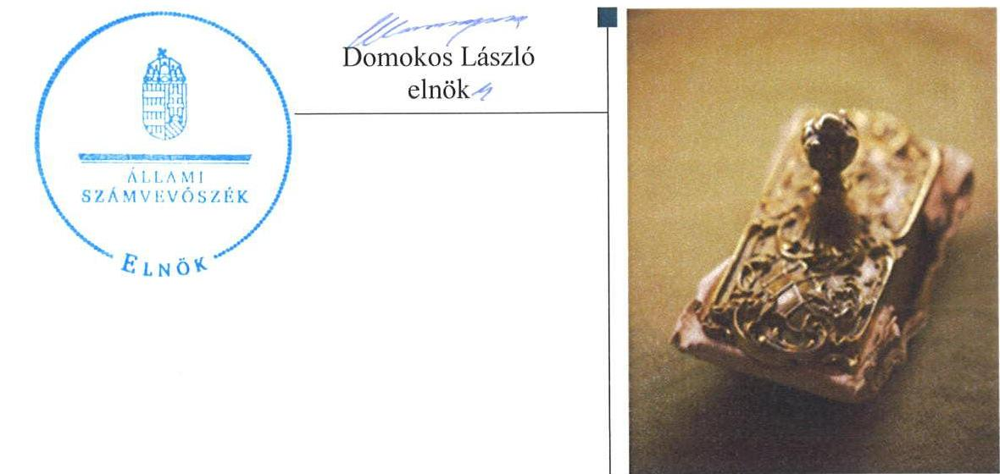
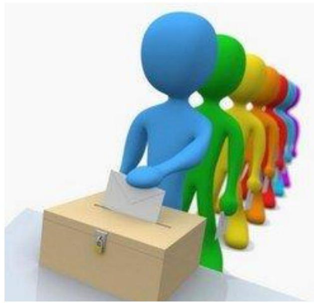
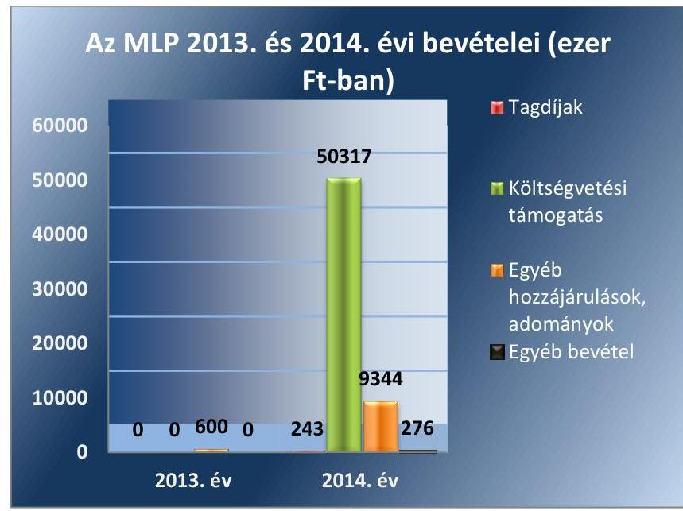
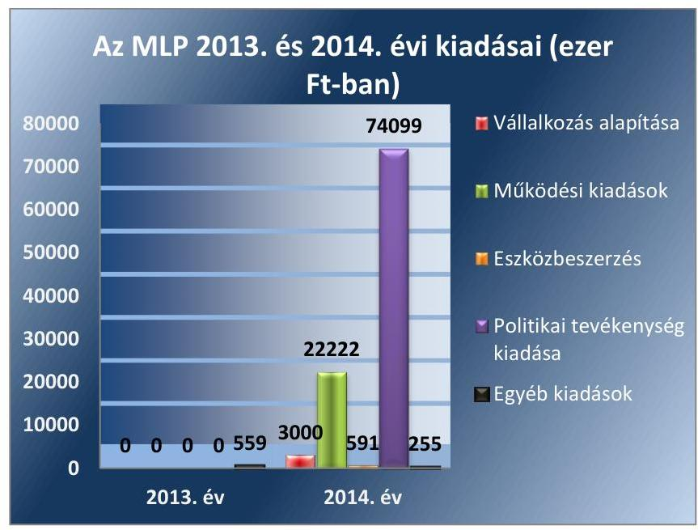

# Jelentés 

## Pártok gazdálkodása

A költségvetési támogatásban részesülő pártok 2013-2014. évi gazdálkodása törvényességének ellenőrzése a Magyar Liberális Pártnál
2016.

---

# Jelentés 

## Pártok gazdálkodása

A költségvetési támogatásban részesülő pártok 2013-2014. évi gazdálkodása törvényességének ellenőrzése a Magyar Liberális Pártnál
2016. 06. hó 28. nap

---

# AZ ELLENŐRZÉST FELÜGYELTE:

DR. BENEDEK MÁRIA felügyeleti vezető

# AZ ELLENŐRZÉST VEZETTE ÉS A VÉGREHAJTÁSÁÉRT FELELŐS:

DR. LÁNG ÁGNES KRISZTINA ellenőrzésvezető

# A PROGRAM ÖSSZEÁLLÍTÁSÁÉRT FELELŐS:

JANIK JÓZSEF LÁSZLÓ osztályvezető

# A TÉMÁHOZ KAPCSOLÓDÓ KORÁBBI SZÁMVEVŐSZÉKI JELENTÉSEK:

|  • címe: | A 2014. évi választásokra fordított pénzeszközök felhasználásának ellenőrzése - Az országgyűlési képviselők 2014. évi választására fordított pénzeszközök felhasználásának ellenőrzése  |
| --- | --- |
|  • sorszáma: | 15127  |

# IKTATÓSZÁM: V-1000-046/2016

# TÉMASZÁM: 2034

# ELLENŐRZÉS-AZONOSÍTÓ SZÁM: V-074606

Jelentéseink az Országgyűlés számítógépes hálózatán és az Interneten a www.asz.hu címen is olvashatóak.

---

# TARTALOMJEGYZÉK 

■ ÖSSZEGZÉS ..... 5
■ AZ ELLENŐRZÉS CÉLJA ..... 6
■ AZ ELLENŐRZÉS TERÜLETE ..... 7
■ AZ ELLENŐRZÉS HÁTTERE, INDOKOLTSÁGA ..... 8
■ A JELENTÉS LÉNYEGES KÉRDÉSKÖREI ..... 9
■ ELLENŐRZÉS HATÓKÖRE ÉS MÓDSZEREI ..... 10
■ MEGÁLLAPÍTÁSOK ..... 13
■ JAVASLATOK ..... 21
■ MELLÉKLETEK ..... 23
I. Sz. melléklet: Értelmező szótár. ..... 23
II. Sz. melléklet: Az MLP 2013. évi közzétett beszámolója ..... 24
III. Sz. melléklet: Az MLP 2014. évi közzétett pénzügyi kimutatása ..... 25
■ FÜGGELÉK: ÉSZREVÉTELEK ..... 27
■ RÖVIDÍTÉSEK JEGYZÉKE ..... 29

---

.

---

# ÖSSZEGZÉS 

Az ÁSZ ${ }^{1}$ az MLP ${ }^{2}$ gazdálkodásának törvényességét ellenőrizte a 2013. január 1-jétől 2014. december 31-ig terjedő időszakra vonatkozóan. Az ÁSZ megállapította, hogy az MLP 2013. évi beszámolója és a 2014. évi pénzügyi kimutatása megfelelt a törvényi előirásoknak. Gazdálkodása és könyvvezetése szabályszerű volt. Az MLP a müködéséhez a Párttörvény ${ }^{3}$ alapján igénybe vehető forrásokat használt fel.

## Az ellenőrzés társadalmi indokoltsága

A pártok az állampolgárok egyesülési szabadsága alapján létrehozott olyan szervezetek, amelyek szervezeti kereteket nyújtanak a népakarat kialakításához és kinyilvánításához, a politikai életben való állampolgári részvételhez. A pártoknak más társadalmi szervezetekhez képest különleges a viszonya a közhatalomhoz, ugyanis a pártok kifejezett célja és feladata, hogy képviselőik útján részt vállaljanak a közhatalomból, illetőleg politikai eszközökkel folyamatosan befolyásolják a közhatalom tevékenységét.

A politikai élet tisztasága érdekében törvény állapítja meg a pártok vagyonára és gazdálkodására vonatkozó szabályokat. Az egyesülési jog alapján létrejövő más szervezetekhez képest szűkebb körben határozza meg azt a gazdasági tevékenységet, amelyet a párt végezhet, biztosítja azonban a pártok részére azt a jogosultságot, hogy az állami költségvetésből támogatásban részesüljenek. A pártok gazdálkodását a politikai élet tisztasága érdekében rendszeresen indokolt ellenőrizni, ezért törvényi előírás alapján az ÁSZ a költségvetési támogatást kapott pártok gazdálkodását kétévente ellenőrzi.

Az ÁSZ tv. ${ }^{4}$ és a Párttörvény alapján a pártok gazdálkodása törvényességének ellenőrzésére az ÁSZ jogosult. Az ÁSZ kiemelt szerepet tölt be és felelősséget visel a pártok feletti társadalmi kontroll érvényesítése terén. A párttörvényben előírt kétévenkénti ellenőrzési kötelezettségen túlmenően az ellenőrzést az a garanciális követelmény indokolja, hogy a pártok gazdálkodásának törvényességi ellenőrzése biztosított legyen, a törvényi rendelkezések megsértését szankciók követhessék.

A pártok működésével és gazdálkodásával kapcsolatos speciális előírásokat tartalmazó Párttörvény az ellenőrzött időszakban módosult. A főbb változások érintették a párt által elfogadható vagyoni hozzájárulásokra, a pártok beszámolására, valamint megszűnésére, felszámolására vonatkozó szabályokat.

Az ÁSZ még nem ellenőrizte az MLP gazdálkodásának törvényességét, mivel a 2014. évi országgyűlési képviselő választáson elért eredménye alapján a 2014. évtől részesül rendszeres költségvetési juttatásban.

## Főbb megállapítások, következtetések, javaslatok

Az MLP a Párttörvényben előírt tartalommal elkészítette a 2013. évi beszámolóját és a 2014. évi pénzügyi kimutatását, azonban azok közzétételéről a Párttörvényben meghatározott határidőn túl gondoskodott. Az MLP beszámolója és pénzügyi kimutatása a jogszabályi előírásoknak megfelelően megegyezett a könyvviteli nyilvántartás adataival. Az MLP számviteli rendszerének szabályozása - a leltározási szabályzat ${ }^{5}$ és a számlarend ${ }^{6}$ kisebb hiányosságai ellenére megfelelt a jogszabályi előírásoknak. Az MLP könyvvezetése - a könyvviteli elszámolást alátámasztó bizonylatok kisebb hiányossága mellett - megfelelt a Számv. tv. ${ }^{7}$-ben meghatározott követelményeknek. A gazdálkodással összefüggő egyéb jogszabályi előírásokat az MLP betartotta. Az MLP ellenőrzési rendszere az előírásoknak megfelelő módon múködött. A pénzügyi-számviteli informatikai rendszer múködésére vonatkozó jogszabályi előírások betartásáról gondoskodtak. Az MLP múködéséhez a források, különösen a támogatás, vagyoni hozzájárulás, adomány igénybevétele, valamint a vagyon használata szabályszerű volt.

---

# AZ ELLENŐRZÉS CÉLJA 

Az ellenőrzés célja annak értékelése volt, hogy az MLP-nél a közzétett 2013. évi beszámoló, illetve a 2014. évi pénzügyi kimutatás a törvényi előírásoknak megfelelt-e, a könyvvezetés és gazdálkodás során betartották-e a vonatkozó jogszabályi és belső előírásokat, továbbá az MLP a működéséhez szabályszerűen igénybe vehető forrásokat használt-e fel.

---

# AZ ELLENŐRZÉS TERÜLETE 

## Az MLP

A párt olyan egyesület, amely nyilvántartott tagsággal rendelkezik, és amely a nyilvántartásba vételét végző bíróság előtt kinyilvánítja, hogy a Párttörvény rendelkezéseit magára nézve kötelezőnek ismeri el a Párttörvény 1. §-a alapján.

Az ÁSZ tv. 5. § (11) bekezdés a) pontja alapján az ÁSZ - a Párttörvény rendelkezéseinek megfelelően - törvényességi szempontok szerint ellenőrzi a pártok gazdálkodását. A Párttörvény 10. § (1) bekezdése alapján a párt gazdálkodása törvényességének ellenőrzésére az ÁSZ jogosult. A Párttörvény 10. § (3) bekezdése alapján az ÁSZ kétévente ellenőrzi azoknak a pártoknak a gazdálkodását, amelyek rendszeres költségvetési támogatásban részesültek. Az ellenőrzés, a 2014. év végén mandátummal rendelkező, 2014. évben költségvetési támogatásban részesült MLP-re terjedt ki.

A pártok múködésével és gazdálkodásával kapcsolatos speciális előírásokat tartalmazó Párttörvény az ellenőrzött időszakban módosult. A főbb változások érintették a párt által elfogadható vagyoni hozzájárulásokra, a pártok beszámolására, valamint megszűnésére, felszámolására vonatkozó szabályokat. A Párttörvény 9. § (1) bekezdése értelmében a pártok kötelesek minden év április 30-ig az előző évi gazdálkodásukról szóló beszámolót (zárszámadást) - a 2014. május 6-tól hatályos szabályozás szerint minden év május 31-ig a melléklet szerinti pénzügyi kimutatást - a Magyar Közlönyben, valamint internetes honlapjukon közzétenni.

Az MLP 2009. december 22-én alakult Demokratikus Centrum Unió néven. Az ellenőrzött időszakban a Közgyűlés ${ }^{8}$ 2013/1/1 KH. (02. 16.) számú határozata alapján a szervezet neve Magyar Liberális Pártra változott. A Küldöttgyűlés ${ }^{9}$ a 2013. december 17-én tartott ülésen tisztújítás keretében új pártelnököt, Ügyvivői Testületet ${ }^{10}$, pártigazgatót, valamint Pénzügyi Ellenőrző Bizottságot ${ }^{11}$ választott.

Az MLP 2013. január 1-jén nem rendelkezett pénzeszközökkel és egyéb vagyonnal, a tárgyévben elért bevétele 600 ezer Ft, a teljesített kiadásainak összege 559 ezer Ft volt. A 2014. évi összes bevétel 60180 ezer Ft, a teljesített kiadások összege 100167 ezer Ft volt. Az átmeneti forráshiány finanszírozása érdekében a Párt 2014. szeptember 24-én 30000 ezer Ft összegű, két éves futamidejű hitelkeret szerződést kötött a számlavezető bankjával.

Az MLP a politikai kultúra fejlesztése érdekében a tudományos, ismeretterjesztő, kutatási és oktatási tevékenységének elősegítésére megalapította a Liberális Magyarországért Alapítványt.

---

# AZ ELLENŐRZÉS HÁTTERE, INDOKOLTSÁGA 

Az ÁSZ tv. és a Párttörvény alapján a pártok gazdálkodása törvényességének ellenőrzésére az ÁSZ jogosult. Az ÁSZ kiemelt szerepet tölt be és felelősséget visel a pártok feletti társadalmi kontroll érvényesítése terén. A párttörvényben előírt kétévenkénti ellenőrzési kötelezettségen túlmenően az ellenőrzést az a garanciális követelmény indokolja, hogy a pártok gazdálkodásának törvényességi ellenőrzése biztosított legyen, a törvényi rendelkezések megsértését szankciók követhessék.

Az ÁSZ még nem ellenőrizte az MLP gazdálkodásának törvényességét, mivel a 2014. évi országgyűlési képviselő választáson elért eredménye alapján a 2014. évtől részesül rendszeres költségvetési juttatásban.

A gazdálkodás szabályszerűségének, a felhasznált közpénzek nagyságának bemutatásával a társadalom objektív képet alkothat a pártok működéséről. Az ellenőrzés megállapításai a gazdálkodás megfelelőségének bemutatásával elősegíthetik, hogy a törvényalkotók konkrét lépéseket tegyenek a pártok finanszírozására vonatkozó szabályozások átláthatóbbá, ellenőrizhetőbbé tétele irányába. Az ellenőrzés rámutat a pártok gazdálkodásával, valamint az állami költségvetésből származó források felhasználásával kapcsolatos jó gyakorlatokra és szabálytalanságokra. A hiányosságok, szabálytalanságok feltárása, az ennek kapcsán megfogalmazott megállapítások elősegíthetik a törvényi rendelkezések megsértésének szankcionálását.

---

# A JELENTÉS LÉNYEGES KÉRDÉSKÖREI 

1. Az MLP közzétett beszámolója, pénzügyi kimutatása megfelelte a törvényi előírásoknak?
2. Az MLP könyvvezetése és gazdálkodása megfelelt-e az előírásoknak?
3. Az MLP a müködéséhez szabályszerűen igénybe vehető forrásokat használt-e fel?

---

# ELLENŐRZÉS HATÓKÖRE ÉS MÓDSZEREI 

## Az ellenőrzés típusa

Szabályszerűségi ellenőrzés.

## Az ellenőrzött időszak

A 2013. január 1-jétől 2014. december 31-ig terjedő időszak.

## Az ellenőrzés tárgya

Az ellenőrzés tárgyát képezték a 2013. évi beszámoló és a 2014. évi pénzügyi kimutatás elkészítésére, közzétételére, az MLP könyvvezetésére, gazdálkodására, ennek keretében a számviteli szabályozás kialakítására, a bizonylati rend, bizonylati fegyelem betartására, egyéb gazdálkodási, ellenőrzési és pénzügyi-számviteli informatikai feladatok ellátására irányuló tevékenységek. Az ellenőrzés tárgya volt továbbá az előírt források fogadása, illetve a vagyon előírt hasznosítása.

A 2014. évi országgyűlési képviselő-választási kampányra fordított pénzeszközök elszámolását az ÁSZ már ellenőrizte, a kampányra fordított bevételek és kiadások a jelen ellenőrzésnek nem képezték a részét.

Az ellenőrzés kiterjedt minden olyan körülményre és adatra, amely az ÁSZ jogszabályban meghatározott feladatainak teljesítéséhez, valamint a program végrehajtása folyamán felmerült újabb összefüggések feltárásához szükséges.

## Az ellenőrzött szervezet

A Magyar Liberális Párt.

## Az ellenőrzés jogalapja

Az ellenőrzés jogszabályi alapját az ÁSZ tv. 5. § (11) bekezdés a) pontjá-ban és a Párttörvény 10. § (1) és (3) bekezdéseiben foglalt előírások képezték.

## Az ellenőrzés módszerei

Az ÁSZ az ellenőrzést az ellenőrzési program szempontjai, az ellenőrzött időszakban hatályos jogszabályok, az ellenőrzés szakmai szabályai, a jelen ellenőrzésre irányadó ÁSZ módszertan (Módszertan a pártok gazdálkodása

---

törvényességének ellenőrzéséhez) és a nemzetközi standardok figyelembe vételével végezte. A gazdálkodás hibáinak kijavítására irányuló javaslatok kidolgozásakor a hatályos jogszabályokat tekintette az irányadónak.

Az ellenőrzés ideje alatt a MLP-vel történő kapcsolattartást az ÁSZ SZMSZ ${ }^{12}$-ének vonatkozó előírásai alapján biztosította.

Az ellenőrzési kérdések megválaszolásához szükséges bizonyítékok megszerzése a következő ellenőrzési eljárások alkalmazásával történt: tételes és mintavételen alapuló dokumentumellenőrzés, megerősítés, összehasonlító elemzés.

Az ellenőrzési bizonyítékként felhasználható adatforrások közé tartoztak egyrészt a szakmai program részletes szempontjainál felsorolt adatforrások, másrészt adatforrás lehetett minden egyéb - az ellenőrzés folyamán feltárt, az ellenőrzés szempontjából releváns információt tartalmazó - dokumentum.

Az ellenőrzés lefolytatásához az MLP a tanúsítványok elektronikus kitöltésével, valamint az ÁSZ által kért dokumentumok elektronikus megküldésével szolgáltatott adatokat. A rendelkezésre bocsátott adatok, információk kontrollja az ellenőrzés keretében történt.

Az ellenőrzésnél az átfogó lényegességi küszöb mértékét az ÁSZ az MLP által közzétett beszámoló, illetve pénzügyi kimutatás bevételi főösszegének 2\%-ában határozta meg.

Az ellenőrzés során figyelembe kellett venni azt, hogy
$\longrightarrow$ a Párttörvényben előírt beszámoló/pénzügyi kimutatás formájában és tartalmában nem felel meg a Számv. tv. szerinti mérleg, valamint az eredmény-kimutatás követelményeinek,
$\longrightarrow$ a Párttörvényben előírt éves beszámoló/pénzügyi kimutatás nem illeszkedik a Számv. tv.-ben meghatározott éves beszámoló elkészítésére vonatkozó tételes szabályokhoz,
$\longrightarrow$ a beszámoló/pénzügyi kimutatás elkészítéséhez nem készült a Párttörvény 1. számú melléklete szerinti beszámoló-soronként kitöltési útmutató, nincsenek fogalmi meghatározások, így az éves beszámoló/pénzügyi kimutatás elkészítése pártonként eltérő felfogások érvényesítésére ad lehetőséget,
$\longrightarrow$ a Párttörvény 2014. január 1-jei módosítása érintette a pártok felszámolási és végelszámolási eljárásra vonatkozó rendelkezéseit is,
$\longrightarrow$ 2014. január 1-jétől a módosított Párttörvény megtiltja, hogy a pártok jogi személyektől, jogi személyiséggel nem rendelkező szervezettől, külföldi szervezettől és nem magyar állampolgár természetes személytől vagyoni hozzájárulást fogadjanak el.
A jelentésben használt fogalmak magyarázatát az I. számú melléklet, a MLP 2013. évi beszámolóját a II. számú melléklet, a MLP 2014. évi pénzügyi kimutatását a III. számú melléklet tartalmazza.

A 2013. évi beszámoló, illetve a 2014. évi pénzügyi kimutatás könyvviteli nyilvántartással való egyezőségének, a könyvvezetés és gazdálkodás szabályszerűségének ellenőrzéséhez az ÁSZ a tételes ellenőrzést és MUS mintavételi eljárást is alkalmazott. Teljes körűen ellenőrizte a központi költségvetésből származó támogatást, valamint a beszámolóban, illetve pénzügyi kimutatásban a Párttörvény alapján nevesítésre kötelezett, értékhatárt meghaladó adományokat, hozzájárulásokat, továbbá az 1 millió

---

Ft feletti kiadásokat. Mintavételi eljárás alapján ellenőrizte a tagdíjbevételeket, a nevesítésre nem kötelezett adományokat, hozzájárulásokat, az egyéb bevételeket, valamint az 1 millió Ft-ot el nem érő kiadásokat.

Az ÁSZ a beszámoló/pénzügyi kimutatás elkészítésének, a számviteli rendszer jogszabályi előírások szerinti kialakításának és működtetésének, valamint a források igénybevételének szabályszerűségét az erre irányuló ellenőrzési kérdésekre adott válaszok összesítése alapján, a lényegességi szempontok figyelembe vételével évenkénti bontásban minősítette. Megfelelőnek értékelte az ellenőrzött területet, amennyiben a szabályozás, illetve végrehajtás során a jogszabályi követelményeket maradéktalanul, vagy kisebb hiányosságok mellett érvényesítették, nem megfelelőnek értékelte, amennyiben a szabályozás hiányosságai nem biztosították a szabályszerű működés feltételeit, illetve a gazdálkodás folyamatában, a könyvvezetés során jelentkező hibák lényegesek, nagyszámúak vagy rendszerszerűek voltak.

---

# 1. Az MLP közzétett beszámolója, pénzügyi kimutatása megfelel-e a törvényi előírásoknak? 

## Összegző megállapítás

1.1. számú megállapítás

Az MLP közzétett beszámolója, pénzügyi kimutatása megfelelt a törvényi előírásoknak.

A beszámoló és a pénzügyi kimutatás elkészítése megfelelt a jogszabályi előírásoknak, közzétételük azonban nem a jogszabályban előírt határidőn belül történt meg.

AZ MLP AZ ELLENŐRZÖTT IDŐSZAKBAN ELKÉSZÍTETTE a gazdálkodásáról szóló 2013. évi beszámolót, illetve a 2014. évi pénzügyi kimutatást, és gondoskodott azoknak a Magyar Közlöny mellékletét képező Hivatalos Értesítőben, illetve a honlapján történő közzétételéről.

Az MLP 2013. évi beszámolója és 2014. évi pénzügyi kimutatása megfelel a Párttörvény előírásainak.

A 2013. évi beszámoló, illetve a 2014. évi pénzügyi kimutatás közzétételével kapcsolatos szabálytalanságot az 1. táblázat tartalmazza.

## A 2013. ÉVI BESZÁMOLÓ, ILLETVE A 2014. ÉVI PÉNZÜGYI KIMUTATÁS KÖZZÉTÉTELÉVEL KAPCSOLATOS SZABÁLYTALANSÁG

## Sorszám

1. 

A2 MLP a Párttörvény 9. § (1) bekezdésében előírt közzétételi kötelezettségének határidőn túl tett eleget. A 2013. évi beszámoló a határidőt követő 16 nappal, a 2014. évi pénzügyi kimutatás a határidőt követő egy nappal később jelent meg a Magyar Közlöny mellékletét képező Hivatalos Értesítőben.

Forrás: ÁSZ

### 1.2. számú megállapítás

A beszámoló és a pénzügyi kimutatás egyezősége a könyvviteli nyilvántartás adataival az előírásoknak megfelelően biztosított volt.

AZ MLP BEVÉTELEINEK ÉS KIADÁSAINAK NYILVÁNTARTÁSA a számlarendben foglalt főkönyvi számlaszámokon történt. A 2013. évben az MLP tagdíjat nem szedett, a 2014. évi tagdíj bevétele 243 ezer Ft volt. Az MLP a tagdíj fogalmát, a tagok által fizetendő tagdíj összegét és beszedésének rendjét a 2014. február 6-ától hatályos tagdíjfizetési szabályzatban ${ }^{13}$ meghatározta.

Az MLP a 2013. évben nem részesült központi költségvetési támogatásban. Az MLP a 2014. évben 9015 ezer Ft kampányfinanszírozási célú, továbbá 41302 ezer Ft pártok támogatása jogcímen folyósított költségvetési támogatásban részesült, amely megegyezett az 1321/2014. (V.30.) Korm.

---

határozat ${ }^{14} 1$. számú mellékletében megállapított összeggel. Az MLP országgyűlési képviselőcsoporthoz kapcsolódóan nem részesült állami támogatásban, a 2013. és 2014. években nem végzett közösen feladatot a Liberális Magyarországért Alapítvánnyal, továbbá vagyoni hozzájárulást közvetlen vagy közvetett formában nem fogadott el a pártalapítványtól.

A 2013. évben az MLP 600 ezer Ft-ot kitevő összes bevétele két természetes személy, egyenként 300 ezer Ft adomány célú befizetéséből származott. A 2014. évben az MLP egyéb hozzájárulásokból, adományokból származó bevétele 9344 ezer Ft volt. A pénzügyi kimutatás a Párttörvényben előírt részletezéssel tartalmazta az egyéb hozzájárulásokból, adományokból származó befizetéseket, az évi 500 ezer Ft-ot meghaladó adományokat nevesítették. Az MLP nem pénzbeli vagyoni hozzájárulást 20132014. években nem fogadott el.

Az MLP-nek vállalkozási nyereségből származó bevétele az ellenőrzött időszakban nem volt. Az egyéb bevételek összege 276 ezer Ft volt, amely banki kamatokból és költségtérítésből származott.

Az MLP beszámolójában és pénzügyi kimutatásában feltüntetett 20132014. évi bevételeit az 1. ábra mutatja be:

1. ábra

Az MLP 2013. évi beszámolója és 2014. évi pénzügyi kimutatása, ÁSZ szerkesztés
A beszámoló, illetve a pénzügyi kimutatás tagdíjak, központi költségvetési támogatások, egyéb hozzájárulások és adományok, valamint egyéb bevételek sorainak tartalma a Párttörvény és a Számv. tv. előírásainak megfelelően megegyezett a könyvviteli nyilvántartással, azon csak az előírt jogcímű, bevételi pénztárbizonylattal vagy banki kivonattal alátámasztott öszszegek szerepeltek.

Az MLP 2013. évi 559 ezer Ft összegű összes kiadása három - óriásplakátok és újsághirdetések díját tartalmazó - tételből állt. A 2014. évben teljesített kiadások közel háromnegyede a politikai tevékenységhez kapcsolódott, a többi kiadás a múködéssel, cégalapítással, eszközbeszerzéssel és egyéb tevékenységgel kapcsolatban merült fel.

---

Az MLP 2014 novemberében 3000 ezer Ft törzstőkével alapította meg az egyszemélyes LI-CO Kft. ${ }^{25}$-t. Múködési kiadásként és a politikai tevékenység kiadásaiként anyagköltségeket, bérleti díjakat, hirdetési, reklám és propaganda költségeket, képzési, tanácsadási díjakat, utazási, kiküldetési térítéseket, személyi jellegú kifizetéseket és járulékokat, valamint egyéb igénybevett szolgáltatási költségeket számolták el. Az MLP az eszközbeszerzések között a 2014. évben vásárolt, különböző technikai berendezéseknek a Számv. tv. alapján egy összegben elszámolt költségét, valamint az értékelési szabályzat ${ }^{16}$ szerint megállapított terv szerinti amortizációját szerepeltette. Az egyéb kiadások között a fizetési számla-hitelkerethez kapcsolódó kamat, továbbá egyéb adó, illeték és késedelmi pótlék szerepelt.

Az MLP beszámolójában és pénzügyi kimutatásában feltüntetett 20132014. évi kiadásait az 2. ábra mutatja be:
2. ábra

Az MLP 2013. évi beszámolója és 2014. évi pénzügyi kimutatása
A beszámoló és a pénzügyi kimutatás valamennyi kiadási sorának tartalma a Párttörvény és a Számv. tv. előírásainak megfelelően megegyezett a könyvviteli nyilvántartással, azokon csak az előírt jogcímú, számlával, szerződéssel, pénztári bizonylattal, banki kivonattal és egyéb számviteli bizonylattal alátámasztott összegek szerepeltek.

Az ellenőrzött időszakban az MLP nem támogatott országgyűlési képviselő csoportot és egyéb szervezetet, továbbá nem részesült ingatlanra vonatkozó kedvezményes bérleti díjban.

---

# 2. Az MLP könyvvezetése és gazdálkodása megfelelt-e az előírásoknak? 

Összegző megállapítás

### 2.1. számú megállapítás

Az MLP gazdálkodása és könyvvezetése szabályszerű volt.
Az MLP számviteli rendszerének szabályozása megfelelt a jogszabályi előírásoknak.

AZ MLP RENDELKEZETT A SZÁMV. TV.-BEN ELŐíRT BELSŐ SZABÁLYZATOKKAL, amelyek módosítását jogszabályváltozás nem indokolta. Az ellenőrzött időszak első évében az MLP 2010. január 15-én hatályba léptetett szabályzatai voltak érvényben, amelyeket az MLP elnökének az 1/2014.(II.6.) számú utasítása 2014. február 6-ával hatályon kívül helyezett. Ugyanezen nappal az Úgyvivői Testület az Alapszabály ${ }_{3-4}{ }^{17}$-ban előírt feladatköre alapján új, a gazdálkodásra és könyvvezetésre vonatkozó szabályzatokat fogadott el, melyeket az MLP elnöke a Számv. tv.-ben foglaltaknak megfelelően jóváhagyott.

Az ellenőrzött időszakban a számviteli politika ${ }^{18}$, a pénzkezelési szabályzat ${ }^{19}$, továbbá az értékelési szabályzat megfelelt a Számv. tv.-ben előírtaknak. A leltározási szabályzat és a számlarend a kisebb hiányosságok ellenére megfelelt a Számv. tv.-ben foglaltaknak.

A számviteli rendszer szabályozásának hiányosságait a 2. táblázat mutatja be.

## A SZÁMVITELI RENDSZER SZABÁLYOZÁSÁNAK HIÁNYOSSÁGAI

Sorszám
1. A leltározási szabályzat a Számv. tv. 69. § (3) bekezdésében
foglaltak ellenére nem tartalmazta a mennyiségi felvétellel történő leltározás gyakoriságának meghatározását.
2. A számlarend a Számv. tv. 161. § (2) bekezdés a) pontjában előírtak ellenére nem tartalmazta a MLP által alkalmazott valamennyi főkönyvi számla számjelét és megnevezését.

Forrás: ÁSZ
2.2. számú megállapítás

Az MLP könyvvezetése megfelelt a jogszabályokban és a belső szabályzatokban előírtaknak.

AZ MLP KÖNYVVITELI FELADATAIT 2013. június 1-jén kötött megbízási szerződés alapján külső szolgáltató látta el. Ezt megelőzően a 2012. december 14-én könyvviteli feladatok ellátására kötött megbízási szerződést 2013. május 31-én a felek közös megegyezéssel szüntették meg. Az átadás-átvételi dokumentumok szerint az átadás időpontjáig az MLP gazdasági tevékenységet nem végzett, bizonylatok nem keletkeztek.

Az MLP könyvvezetése összhangban állt a jogszabályokban és a belső szabályzataiban előírtakkal. A könyvvezetés során érvényesült a bizonylati elv és fegyelem, a bizonylati rend előírásait betartották. A gazdasági eseményeket bizonylatokkal alátámasztották, a kiállított vegyes bizonylatok megalapozottak voltak, a gazdasági műveletek időrendiségét betartották. A bizonylatok megőrzése szabályszerű volt.

---

A könyvvezetéssel megbízott vállalkozás által alkalmazott könyvelési programmal biztosította a főkönyvi könyvelés és az analitikus nyilvántartások adatai közötti egyeztetést, ellenőrzést, a logikailag zárt rendszer szerinti működést. Az év végi leltározási, könyvviteli zárlati feladatokat az éves pénzügyi kimutatás összeállítása előtt végrehajtották.

Az MLP által vezetett szigorú számadású bizonylatok nyilvántartása megfelelt a Számv. tv. szerinti előírásoknak.

A számviteli bizonylatokkal kapcsolatos szabálytalanságokat a 3. táblázat mutatja be.
3. táblázat

# A SZÁMVITELI BIZONYLATOKKAL KAPCSOLATOS SZABÁLYTALANSÁGOK 

| Sorszám | Bészmegállapítás | Megjegyzés |
| :--: | :--: | :--: |
| 1. | A 2013. évi három kiadási tételből kettőnél a Számv. tv. 167. § (1) bekezdés c) pontjában előírtakat nem tartották be, mert a bizonylatokon nem szerepelt az utalványozó aláírása. | A 2014. évben az utalványozó aláírta a bizonylatokat. |
| 2. | A Számv. tv. 167. § (1) bekezdés i) pontjában foglaltak ellenére az ellenőrzött bevételi és kiadási bizonylatok nem tartalmazták a könyvviteli nyilvántartásban történt rögzítés időpontját, igazolását. |  |

Forrás: ÁSZ
2.3. számú megállapítás

Az MLP betartotta a gazdálkodással összefüggő, egyéb jogszabályokban meghatározott előírásokat.

AZ MLP-NÉL MUNKAVISZONY KERETÉBEN, MEGBÍZÁSI SZERZŐDÉSSEL foglalkoztatás, személyi jellegú kifizetés 2013. évben nem történt. A 2014. évben a foglalkoztatás és a munkabérek elszámolása szabályszerű volt.

A 2014. évben az MLP három főt foglalkoztatott, munkaviszony keretében. A munkaszerződések és a munkavállalók számára átadott kapcsolódó tájékoztatók tartalma megfelelt a Munka tv. ${ }^{20}$-ben foglaltaknak, azokat az Alapszabály ${ }_{1-4}{ }^{21}$-ben rögzítetteknek megfelelően a Párt elnöke írta alá.

A munkabérek számfejtése, kifizetése a munkaszerződésekben foglaltaknak, valamint az Szja tv. ${ }^{22}$ és a Tbj. tv. ${ }^{23}$ vonatkozó előírásainak megfelelően, határidőben megtörtént.

Az MLP a számviteli nyilvántartásai, főkönyvi kivonatai, valamint a pártigazgató nyilatkozata szerint az ellenőrzött időszakban nem nyújtott a munkavállalók részére béren kívüli juttatást, nem fizetett költségtérítést.

Az MLP az Szja tv., a Tbj. tv., valamint az Art. ${ }^{24}$ vonatkozó előírásait betartotta, eleget tett a bejelentési, adó- és járulék nyilvántartási, levonási, bevallási, befizetési és adatszolgáltatási kötelezettségeinek, a bevallások és befizetések adatai egyeztek a főkönyvi nyilvántartás adataival.
2.4. számú megállapítás

Az MLP ellenőrzési rendszere az előírásoknak megfelelő módon múködött.

AZ MLP A DÖNTÉSHOZÓ, IRÁNYÍTÓ ÉS ELLENÖRZŐ SZERVEINEK feladat- és hatáskörét az Alapszabály ${ }_{1-4}$-ben határozta meg. A pénzügyi ellenőrzési feladatok ellátására az Alapszabály ${ }_{1}$.

---

4-ben foglaltaknak megfelelően megválasztották a Pénzügyi Ellenőrzési Bizottság tagjait. A Ptk. ${ }^{25}$ előírása alapján felügyelőbizottságot létrehozni nem kellett, mert a tagság létszáma a 100 főt nem haladta meg. Az MLP legfőbb operatív szerve 2013. december 17-ig az Elnökség, ezt követően az Ügyvivői Testület volt, melynek ülésein az Alapszabály ${ }_{1-4}$-nek megfelelően, a gazdasági döntések alkalmával tanácskozási jogkörrel részt vett a pártigazgató, valamint a Pénzügyi Ellenőrző Bizottság elnöke.

Az MLP gazdálkodását érintően a Küldöttgyűlés kizárólagos hatáskörébe tartozott az Ügyvivői Testület és a Pénzügyi Ellenőrző Bizottság beszámolóinak, továbbá az MLP éves költségvetésének az elfogadása, valamint mindazon kérdések, amelyet jogszabály a legfőbb szerv kizárólagos hatáskörébe utalt.

Az Ügyvivői Testület hatásköre volt az elnök, valamint a pártigazgató beszámolóinak elfogadásáról szóló döntés, az MLP működésével kapcsolatosan a Küldöttgyűlés hatáskörébe nem tartozó valamennyi kérdésben való döntés.

A Pénzügyi Ellenőrző Bizottság az MLP gazdálkodását, vagyonkezelését és pénzügyeit ellenőrző testület. Hatáskörébe tartozott az Ügyvivői Testület gazdálkodási tevékenységének ellenőrzése, valamint az Elnökség tájékoztatása a gazdálkodással kapcsolatos észrevételekről. A Pénzügyi Ellenőrző Bizottság feladatkörét képezte az MLP éves költségvetés tervezetének és az éves költségvetési beszámolónak a véleményezése, tevékenységéről beszámoló készítése a Küldöttgyűlésnek.

Az elnök hatáskörébe tartozott a munkáltatói jogok gyakorlása, valamint - az Alapszabály4 hatályba lépését követően - döntés a pártigazgatóval együttesen az MLP gazdálkodásával kapcsolatos valamennyi kérdésben. Az elnök az ellenőrzött években kettő esetben adott ki rendkívüli megbízást eseti ellenőrzési feladatok ellátására, továbbá az 1/2014. (II. 06.) számú utasításban határozta meg az ellenőrzés rendjével kapcsolatos szabályokat.

A pártigazgató feladatkörébe tartozott az MLP nyilvántartásainak naprakész és pontos vezetése, az Ügyvivői Testület döntései végrehajtásának megszervezése, továbbá - az Alapszabály4 hatályba lépését követően - az elnökkel együttes döntés az MLP gazdálkodásával kapcsolatos valamennyi kérdésben.

Az MLP testületei és tisztségviselői az ellenőrzési és beszámolási kötelezettségüknek a feladat- és hatáskörüknek megfelelő módon eleget tettek, melyeket beszámolókban, előterjesztésekben, valamint ellenőrzési jegyzőkönyvekben és naplókban rögzítettek.

Az ellenőrzési rendszer keretében a pártigazgató munkaköri leírásában rögzítették, hogy ellenőrzi a szervezet munkáját, különösen a pénzeszközök hatékony felhasználását, tevékenységéről beszámol a vezető testület és a tagság előtt.

Az MLP 2013. évi gazdálkodását a pénzügyi beszámoló elfogadása előtt a pártigazgató áttekintette, megállapításait jegyzőkönyvben rögzítette. A 2013. évi beszámolót a Pénzügyi Ellenőrző Bizottság, valamint az Ügyvivői Testület véleményének ismeretében az MLP Alapszabály ${ }_{1-4}$-ben előírt hatáskörrel rendelkezően tárgyalta és fogadta el a Küldöttgyűlés.

A pénzkezelési szabályzat alapján egyes pénzkezelési tevékenységeket a pártigazgató, valamint az elnök vagy a pártigazgató által ezzel megbízott

---

# 2.5. számú megállapítás 

személy végezhetett. A kötelezettségvállalás és utalványozás rendjét a Számv. tv. előírásaival összhangban szabályozták, a szabályozás a gyakorlatban érvényesült. Kötelezettségvállalásra és utalványozásra az elnök és a pártigazgató önállóan voltak jogosultak.

Az MLP külső vállalkozóval kötött megbízási szerződést a párt pénzkezelési, pénztárosi és pénztár-ellenőrzési feladatainak ellátására. Az 1/2014. (II. 06.) pártelnöki utasításának megfelelően az MLP pénzkezelésének szabályszerűségéről a pénztárellenőrnek havonta pénztár ellenőrzést kellett lefolytatnia. A pénzkezelési szabályzatban meghatározott gyakorisággal és eljárással lefolytatott pénztári ellenőrzéseket a pártigazgató felülvizsgálta és megállapításait az ellenőrzési naplóban rögzítette. A pártigazgató a végrehajtott ellenőrzési feladatairól rendszeresen beszámolt az Úgyvivői Testületnek, valamint a Küldöttgyűlésnek.

## A pénzügyi-számviteli informatikai rendszer múködése megfelelt a jogszabályi előírásoknak.

A 2013-2014. években az MLP nem rendelkezett saját pénzügyi-számviteli informatikai szoftverrel, rendszerrel. Az MLP pénzügyi és számviteli feladatait megbízási szerződés alapján külső vállalkozó látta el a Számv. tv.-ben és a belső szabályzatokban előírtakkal összhangban. A szerződésben meghatározásra kerültek a pénzügyi, számviteli adatállományok minimum havonkénti folyamatos mentései, azoknak a törvényben előírt időpontig történő megőrzése, a szoftverek jogszabályoknak megfelelő aktualizálása.

A pártigazgató gondoskodott a szerződésben foglaltak betartatásáról, ennek keretében ellenőrizte a pénzügyi, számviteli adatállományok minimum havonkénti folyamatos mentését, és azok dokumentumait, továbbá az alkalmazott pénzügyi és számviteli nyilvántartási rendszer megfelelőségét, így biztosított volt a törvényben előírt megőrzési idő alatt a számviteli adatállományokból az adatok teljes körű előállíthatósága, ezzel eleget tettek a Számv. tv. előírásainak.

A pártigazgató ellenőrizte a feladatellátáshoz alkalmazott informatikai rendszerrel szembeni követelmények betartását, melynek megfelelőségét a szerződéses partner igazolta, és azok betartásáért felelősséget vállalt. Végrehajtotta az informatikai rendszerek jogszabályi előírásoknak történő folyamatos megfeleltetését, aktualizálását, melyekről beszámolt és rendszeres tájékoztatást adott a pártigazgatónak.

## 3. Az MLP a múködéséhez szabályszerűen igénybe vehető forrásokat használt-e fel?

## Összegző megállapítás

### 3.1. számú megállapítás

Az MLP a múködéséhez a Párttörvényben meghatározott forrásokat használt fel.

Az MLP múködéséhez a források, különösen a támogatás, vagyoni hozzájárulás, adomány igénybevétele megfelelt a jogszabályi előírásoknak.

Az MLP vagyona az ellenőrzött időszakban a Párttörvényben meghatározott forrásokból képződött, melyet a beszámoló, a pénzügyi kimutatás, a

---

főkönyvi és analitikus nyilvántartások, a bevételi források nyilvántartásai és a tételes bizonylatok támasztottak alá.

A Párt a 2013. évben költségvetési támogatásban nem részesült, a 2014. évben a Párttörvény 5. § (2) bekezdése szerint, a 1321/2014. (V.30.) Korm. határozat alapján meghatározott összegű költségvetési támogatáshoz jutott. Az MLP a Párttörvényben előírtaknak megfelelően más államtól támogatást, illetve névtelen adományt nem fogadott el. A Párt által természetes személyektől elfogadott adományok, vagyoni hozzájárulások magyar állampolgároktól származtak.

Az MLP a 2013. évben a Párttörvényben meghatározott, a beszámolóban - a hozzájárulást adó megnevezésével és az összeg megjelölésével - külön feltüntetendő összegű hozzájárulásban nem részesült, a 2014. évben a nevesítésre kötelezett összegű hozzájárulásokat a pénzügyi kimutatásában az előírásoknak megfelelően szerepeltette.

Az MLP-nek a nem pénzbeli vagyoni hozzájárulás tekintetében értékelési kötelezettsége nem keletkezett, mivel a 2013-2014. években nem szerzett a Párttörvényben meghatározott nem pénzbeli vagyoni hozzájárulás.

A beszámoló, a főkönyvi kivonat, az analitikus nyilvántartás és az azokat alátámasztó bizonylatok összevetése alapján az MLP részére az ellenőrzött években költségvetési szerv, állami vállalat, állami részvétellel működő gazdasági társaság, közvetlen költségvetési támogatásban vagy költségvetési szervi támogatásban részesülő alapítvány vagyoni hozzájárulást nem adott.

# 3.2. számú megállapítás 

Az MLP múködése során a vagyon használata megfelelt a törvényi előírásoknak.

Az MLP az ellenőrzött években a Párttörvényben engedélyezett gazdálkodási tevékenységek közül kizárólag az egyszemélyes gazdasági társaság alapítására vonatkozó lehetőséggel élt. A 2014 novemberében alapított egyszemélyes LI-CO Kft. fő tevékenysége társadalomtudományi humán kutatás, fejlesztés volt. Az MLP a Párttörvényben foglalt előírásoknak eleget tett, nem szerzett részesedést más gazdasági társaságban.

Az MLP a szabad pénzeszközeit nem fektette értékpapírokba, saját tulajdonú ingatlannal nem rendelkezett.

---

# JAVASLATOK 

Az ÁSZ tv. 33. § (1) bekezdésében foglaltak értelmében az ellenőrzött szervezet vezetője köteles a jelentésben foglalt megállapításokhoz kapcsolódó intézkedési tervet összeállítani és azt a jelentés kézhezvételétől számított 30 napon belül az ÁSZ részére megküldeni. Amennyiben az ellenőrzött szervezet vezetője nem küldi meg határidőben az intézkedési tervet, vagy továbbra sem elfogadható intézkedési tervet küld, az Állami Számvevőszék elnöke az ÁSZ tv. 33. § (3) bekezdése a) és b) pontjaiban foglaltakat érvényesítheti.

## Az MLP elnökének

1. Intézkedjen az MLP gazdálkodása során a Számv tv.-ben foglalt előírások betartására, a tekintetben, hogy
a) a leltározási szabályzat tartalmazza a mennyiségi felvétellel történő leltározás gyakoriságának meghatározását;
(2. számú táblázat 1. sorszámú megállapítása alapján)
b) a számlarend tartalmazza az alkalmazott valamennyi fökönyvi számla számjelét és megnevezését;
(2. számú táblázat 2. sorszámú megállapítása alapján)
c) a bevételi és kiadási bizonylatok tartalmazzák a könyvviteli nyilvántartásokban történt rögzítés időpontját, igazolását.
(3. számú táblázat 2. sorszámú megállapítása alapján)
2. Intézkedjen a pénzügyi kimutatás jogszabályban elöirt határidőben történő közzétételéről.
(1 számú táblázat 1. sorszámú megállapítása alapján)

---

.

---

# MELLÉKLETEK 

- I. SZ. MELLÉKLET: ÉRTELMEZŐ SZÓTÁR
beszámoló
pénzügyi kimutatás
gazdálkodó tevékenység
költségvetési támogatás
nem pénzbeli támogatás

A Párttörvény 9. § (1) bekezdésében meghatározott, a párt előző évi gazdálkodásáról szóló beszámoló (zárszámadás) (hatálytalan 2014. május 6-ától), amelyet a pártok kötelesek minden év április 30-áig a Magyar Közlönyben, valamint saját honlappal rendelkező pártok a honlapjukon is - e törvény 1. számú mellékletében meghatározott minta szerint - közzétenni.)
A Párttörvény 9. § (1) bekezdésében meghatározott, az 1. számú melléklet szerinti pénzügyi kimutatás (hatályos 2014. május 6-ától), amelyet a pártok kötelesek minden év május 31-ig a Magyar Közlönyben, valamint saját honlappal rendelkező pártok a honlapjukon is közzétenni
A párt a költségeinek fedezése és vagyonának gyarapítása érdekében a következő gazdasági-vállalkozási tevékenységeket folytathatja:

- politikai céljainak és tevékenységének megismertetése érdekében kiadványokat jelentethet meg és terjeszthet, a pártot szimbolizáló jelvényeket és más ilyen célú tárgyakat árusíthat, és pártrendezvényeket szervezhet;
- a tulajdonában álló ingatlanokat és ingókat dí ellenében hasznosíthatja és elidegenítheti.
(Forrás: Párttörvény 6. §)
Az államháztartás alrendszerei terhére nyújtott pénzbeli vagy nem pénzbeli juttatás, amelyet a támogató nem elsősorban ellenszolgáltatás ellenében, de konkrét program megvalósítása vagy meghatározott időszakban a támogatott szervezet múködtetése érdekében nyújt.
(Forrás: Civil tv. ${ }^{26}$ 2. § 15. pont)
vagyoni értékkel rendelkező forgalomképes dolog, szellemi alkotás, illetve vagyoni értékű jog részben vagy egészében, véglegesen vagy ideiglenesen, teljesen vagy részben ingyenesen történő átruházása vagy átengedése, illetve szolgáltatás biztosítása
(Forrás: Civil tv. 2. § 25. pont)

---

# A Magyar Liberális Párt 2013. évi beszámolója a pártok müködéséről és gazdálkodásáról szóló törvény szerint

|  BEVÉTELEK |  |   |
| --- | --- | --- |
|  Sorszám | Tétel megnevezése | Adatok ezer forintban  |
|  1. | Tagdíjak | 0  |
|  2. | Központi költségvetésből származó támogatás | 0  |
|  3. | A párt országgyűlési képviselöcsoportjának nyújtott állami támogatás | 0  |
|  4. | Egyéb hozzájárulások, adományok, ebből: | 600  |
|  4.1. | 500000 forint alatti hozzájárulás | 600  |
|  4.2. | 500000 forint feletti hozzájárulás | 0  |
|  5. | A párt által alapított korlátolt felelősségű társaság nyereségéből származó
bevétel | 0  |
|  6. | Egyéb bevétel | 0  |
|  Összes bevétel a gazdasági évben | 600 |   |

|  KIADÁSOK |  |   |
| --- | --- | --- |
|  Sorszám | Tétel megnevezése | Adatok ezer forintban  |
|  1. | Támogatás a párt országgyűlési képviselöcsoportja számára | 0  |
|  2. | Támogatás egyéb szervezeteknek | 0  |
|  3. | Vállalkozások alapítására fordított összegek | 0  |
|  4. | Müködési kiadások | 0  |
|  5. | Eszközbeszerzés | 0  |
|  6. | Politikai tevékenység kiadása | 0  |
|  7. | Egyéb kiadások | 559  |
|  Összes kiadás a gazdasági évben | 559 |   |

Budapest, 2014. április 30.

---

# A Magyar Liberális Párt 2014. évi pénzügyi beszámolója a pártok müködéséről és gazdálkodásáról szóló törvény szerint

## BEVÉTELEK

|  Sorszám | Tétel megnevezése | Adatok ezer forintban  |
| --- | --- | --- |
|  1. | Tagdíjak | 243  |
|  2. | Központi költségvetésből származó támogatás | 50317  |
|  3. | A párt országgyúlési képviselöcsoportjának nyújtott állami támogatás | 0  |
|  4. | Egyéb hozzájárulások, adományok, ebből: | 9344  |
|  4.1. | 500000 forint alatti hozzájárulás | 6564  |
|  4.2. | 500000 forint feletti hozzájárulás, nevesítve: | 2780  |
|   | Bodnár Zoltán | 2000  |
|   | Dr. Fodor Gábor | 780  |
|  5. | A párt által alapított korlátolt felelősségű társaság nyereségéből származó
bevétel | 0  |
|  6. | Egyéb bevétel | 276  |
|  Összes bevétel a gazdasági évben | 60180 |   |

## KIADÁSOK

|  Sorszám | Tétel megnevezése | Adatok ezer forintban  |
| --- | --- | --- |
|  1. | Támogatás a párt országgyúlési képviselöcsoportja számára | 0  |
|  2. | Támogatás egyéb szervezeteknek | 0  |
|  3. | Vállalkozások alapítására fordított összegek | 3000  |
|  4. | Müködési kiadások | 22222  |
|  5. | Eszközbeszerzés | 591  |
|  6. | Politikai tevékenység kiadása | 74099  |
|  7. | Egyéb kiadások | 255  |
|  Összes kiadás a gazdasági évben | 100167 |   |

Budapest, 2015. május 28.

---

.

---

# FÜGGELÉK: ÉSZREVÉTELEK 

A jelentéstervezetet az ÁSZ 15 napos észrevételezésre megküldte az ellenőrzött szervezet vezetője részére az ÁSZ tv. 29. §* (1) bekezdése előírásának megfelelően.
Az elnök, mint az ellenőrzött szervezet vezetője az ÁSZ tv. 29. § (2) bekezdésében foglalt észrevételezési jogával nem élt, a jelentéstervezetre észrevételt nem tett.

[^0]
[^0]:    * 29. § (1) Az Állami Számvevőszék az ellenőrzési megállapításait megküldi az ellenőrzött szervezet vezetőjének vagy az általa megbízott személynek, és annak, akinek személyes felelősségét állapította meg.
    (2) Az ellenőrzött szervezet vezetője és a felelősként megjelölt személy az ellenőrzés megállapításaira tizenöt napon belül írásban észrevételt tehet.
    (3) Az Állami Számvevőszék az észrevételre a beérkezésétől számított harminc napon belül írásban válaszol. A figyelembe nem vett észrevételeket köteles a jelentésben feltüntetni, és megindokolni, hogy azokat miért nem fogadta el.

---

.

---

# RÖVIDÍTÉSEK JEGYZÉKE 

${ }^{1}$ ÁSZ
${ }^{2}$ MLP
${ }^{3}$ Párttörvény
${ }^{4}$ ÁSZ tv
${ }^{5}$ leltározási szabályzat
${ }^{6}$ számlarend
${ }^{7}$ Számv. tv.
${ }^{8}$ Közgyűlés
${ }^{9}$ Küldöttgyűlés
${ }^{10}$ Ügyvivői Testület
${ }^{11}$ Pénzügyi Ellenőrző Bizottság
${ }^{12}$ ÁSZ SZMSZ
${ }^{13}$ tagdijfizetési szabályzat
${ }^{14}$ 1321/2014. (V.30.) Korm. határozat
${ }^{15}$ LI-CO Kft.
${ }^{16}$ értékelési szabályzat
${ }^{17}$ Alapszabály ${ }_{3}$
Alapszabály4
${ }^{18}$ számviteli politika
${ }^{19}$ pénzkezelési szabályzat
${ }^{20}$ Munka tv.
${ }^{21}$ Alapszabály ${ }_{1}$
Alapszabály ${ }_{2}$
${ }^{22}$ Szja tv.
${ }^{23} \mathrm{Tbj} . \mathrm{tv}$.
${ }^{24}$ Art.
${ }^{25}$ Ptk.
${ }^{26}$ Civil tv.

Állami Számvevőszék
Magyar Liberális Párt
a pártok működéséről és gazdálkodásáról szóló 1989. évi XXXIII. törvény
az Állami Számvevőszékről szóló 2011. évi LXVI. törvény
a Magyar Liberális Párt 2014. február 6-tól hatályos Eszközök és források leltárkészítési és leltározási szabályzata
a Magyar Liberális Párt 2014. február 6-tól hatályos Számlarendje
a számvitelről szóló 2000. évi C. törvény
a Demokratikus Centrum Unió legfőbb döntéshozó szerve
a Magyar Liberális Párt legfőbb döntéshozó szerve
a Magyar Liberális Párt legfőbb operatív szerve, amelynek tagjai a párt elnöke, a pártigazgató, a fővárosi választmány elnöke, valamint a Küldöttgyűlés által választott két tag
az Alapszabály1-4 előírásai alapján működő, a Magyar Liberális Párt gazdálkodását, vagyonkezelését és pénzügyeit ellenőrző három főből álló testület
Állami Számvevőszék Szervezeti és Működési Szabályzata.
a Magyar Liberális Párt 2014. február 6-tól hatályos Tagdijfizetési szabályzata
a pártokat és a pártalapítványokat az országgyűlési képviselők 2014. évi általános választása eredményének megfelelően megillető támogatás mértékének meghatározásáról, valamint a támogatást szolgáló előirányzatok közötti átcsoportosításról szóló 1321/2014. (V.30.) Korm. határozat
LI-CO Tudományszervező, Tanácsadó, Kereskedelmi és Szolgáltató Korlátolt Felelősségű Társaság
a Magyar Liberális Párt 2014. február 6-tól hatályos Eszközök és Források Értékelési Szabályzata
a Magyar Liberális Párt Alapszabálya a 2013.12.17-én kelt 3. számú módosítással egységes szerkezetben
a Magyar Liberális Párt Alapszabálya a 2014.08.19-én kelt 4. számú módosítással egységes szerkezetben
a Magyar Liberális Párt 2014. február 6-tól hatályos Számviteli politikája
a Magyar Liberális Párt 2014. február 6-tól hatályos Pénzkezelési szabályzata
a munka törvénykönyvéről szóló 2012. évi I. törvény
a Magyar Liberális Párt Alapszabálya a 2013.02.16-án kelt 1. számú módosítással egységes szerkezetben
a Magyar Liberális Párt Alapszabálya a 2013.07.04-én kelt 2. számú módosítással egységes szerkezetben
a személyi jövedelemadóról szóló 1995. évi CXVII. törvény
a társadalombiztosítás ellátásaira és a magánnyugdíjra jogosultakról, valamint e szolgáltatások fedezetéről szóló 1997. évi LXXX. törvény
az adózás rendjéről szóló 2003. évi XCII. törvény
a Polgári Törvénykönyvről szóló 2013. évi V. törvény
az egyesülési jogról, a közhasznú jogállásról, valamint a civil szervezetek
müködéséről és támogatásáról szóló 2011. évi CLXXV. törvény

---

# ÁLLAMI SZÁMVEVŐSZÉK 

1052 Budapest, Apáczai Csere János utca 10.
Levélcím: 1364 Budapest 4. Pf. 54
Telefon: +36 14849100 Telefax: +36 14849200
www.asz.hu