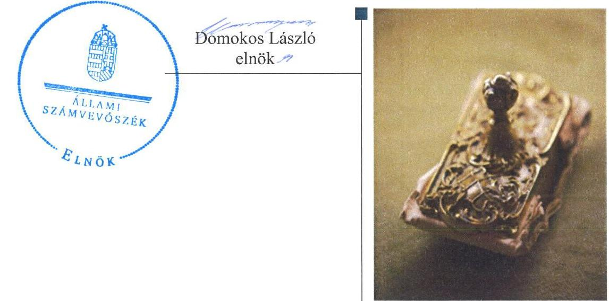
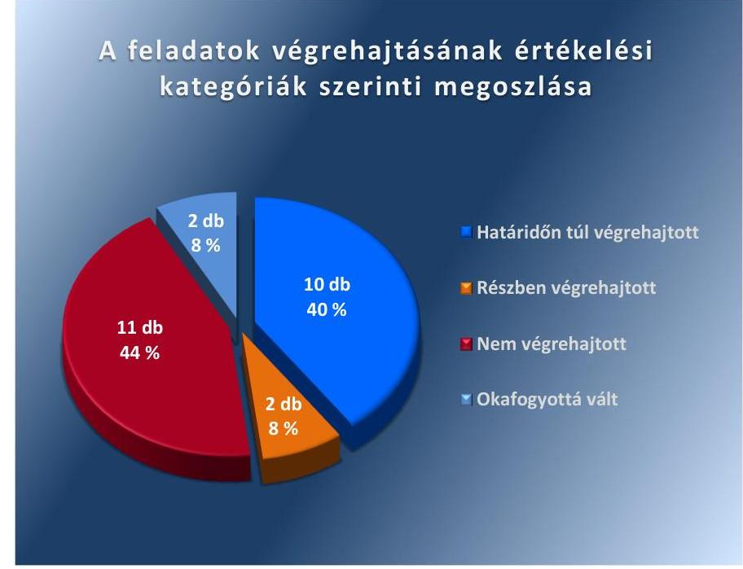

ÁLLAMI
SZÁMVEVŐSZÉK

# Jelentés 

## Utóellenőrzések

Tar Község Önkormányzata belső kontrollrendszere kialakításának, egyes kontrolltevékenységek és a belső ellenőrzés működésének utóellenőrzése 2016.

---

# Jelentés 

## Utóellenőrzések

Tar Község Önkormányzata belső
kontrollrendszere kialakításának, egyes
kontrolltevékenységek és a belső
ellenőrzés működésének utóellenőrzése
2016. 06. hó 22. nap

---

|   | AZ ELLENŐRZÉST FELÜGYELTE:  |
| --- | --- |
|   | DR. BENEDEK MÁRIA felügyeleti vezető  |
|   | AZ ELLENŐRZÉST VEZETTE ÉS A VÉGREHAJTÁSÁÉRT FELELŐS:  |
|   | KAKAS SÁNDOR ellenőrzésvezető  |
|   | A PROGRAM ÖSSZEÁLLÍTÁSÁÉRT FELELŐS:  |
|   | JANIK JÓZSEF osztályvezető  |
|   | A TÉMÁHOZ KAPCSOLÓDÓ KORÁBBI SZÁMVEVŐSZÉKI JELENTÉSEK:  |
|  Jelentéseink az Országgyúlés számítógépes hálózatán és az interneten a www.asz.hu címen is olvashatóak. | - címe: Jelentés Tar Község Önkormányzata belső kontrollrendszerének kialakítása, valamint egyes kontrolltevékenységek és a belső ellenőrzés működése ellenőrzéséről
- sorszáma: 13038  |
|   | IKTATÓSZÁM: V-1051-051/2016.  |
|   | TÉMASZÁM: 2085  |
|   | ELLENŐRZÉS-AZONOSÍTÓ SZÁM: V-071829  |

---

# TARTALOMJEGYZÉK 

■ ÖSSZEGZÉS ..... 5
■ AZ ELLENŐRZÉS CÉLJA ..... 6
■ AZ ELLENŐRZÉS TERÜLETE ..... 7
■ AZ ELLENŐRZÉS HÁTTERE, INDOKOLTSÁGA ..... 8
■ A JELENTÉS LÉNYEGES KÉRDÉSKÖREI ..... 9
■ ELLENŐRZÉS HATÓKÖRE ÉS MÓDSZEREI ..... 10
■ MEGÁLLAPÍTÁSOK ..... 13
■ MELLÉKLETEK ..... 17
I. SZ. MELLÉKLET: Az ÁSZ 13038 számú jelentéséhez kapcsolódó intézkedési terv végrehajtása ..... 17
■ FÜGGELÉK: ÉSZREVÉTELEK ..... 25
■ RÖVIDÍTÉSEK JEGYZÉKE ..... 27

---

.

---

# ÖSSZEGZÉS 

Az ÁSZ ${ }^{1}$ az Önkormányzat² ${ }^{2}$ belső kontrollrendszerének kialakítása, valamint egyes kontrolltevékenységek és a belső ellenőrzés működésének utóellenőrzését 2013. május 30. és 2016. január 29. közötti időszakra végezte el. Megállapította, hogy az intézkedési tervben foglalt feladatok jelentős részét az Önkormányzat nem hajtotta végre, így nem tett megfelelő lépéseket az ÁSZ által korábban feltárt, a belső kontrollrendszert érintő hiányosságok megszüntetésére, ami kockázatot hordoz az Önkormányzat szabályozásában, működtetésének szabályosságában és a felelős vezetői magatartásban.

## Az ellenőrzés társadalmi indokoltsága

Az ÁSZ stratégiájában célul tűzte ki a számvevőszéki munka hasznosulásának javítását. Ezzel összhangban ellenőrzi, hogy az ellenőrzött szervezetek megvalósították-e a korábbi ellenőrzései által feltárt hibák, hiányosságok és szabálytalanságok megszüntetése céljából elkészített intézkedési terveikben foglaltakat. A rendszeres utóellenőrzések hozzájárulnak a szükséges intézkedések tényleges végrehajtásához, ezáltal a közpénzügyek rendezettségének javulásához.

## Főbb megállapítások, következtetések

A polgármester ${ }^{3}$ az intézkedési tervet ${ }^{4}$ határidőn túl küldte meg az ÁSZ részére.
Az intézkedési tervben meghatározott 25 feladatból tízet határidőn túl, kettőt részben, 11-et nem hajtottak végre, valamint két feladat végrehajtása okafogyottá vált. Így az ÁSZ által korábban az Önkormányzat belső kontrollrendszerének kialakítása, valamint az egyes kontrolltevékenységek és a belső ellenőrzés működésének területén azonosított hiányosságok jelentős része továbbra is fennáll.

Az intézkedési tervben rögzített feladatok végrehajtásáról a Bkr. ${ }^{5}$ által előírt nyilvántartást nem vezették.

---

# AZ ELLENŐRZÉS CÉLJA 

Az ellenőrzés célja annak értékelése volt, hogy a számvevőszéki jelentésben ${ }^{6}$ foglalt intézkedést igénylő megállapításokkal és javaslatokkal összhangban készített intézkedési tervben meghatározott feladatokat az ellenőrzött szervezet végrehajtotta-e.

---

# AZ ELLENŐRZÉS TERÜLETE 

## Az Önkormányzat

Tar község Nógrád-megyében, a Pásztói járásban fekszik, állandó lakosainak száma a $\mathrm{KSH}^{7}$ által közzétett népességi adatok szerint 2015. január 1-jén 1839 fő volt. Az utóellenőrzés idején hivatalban lévő polgármester a 2014. évi önkormányzati választások óta tölti be tisztségét, a jegyző ${ }^{8}$ 2015. január 1-jétől látja el közszolgálati feladatait. A település 2015. január 1-jén csatlakozott a Szurdokpúspöki Közös Önkormányzati Hivatalhoz. A Hivatal ${ }^{9}$ a csatlakozás óta Tar községben kirendeltséget működtet.

Az Önkormányzat a 2014. évi éves költségvetési beszámoló szerint 252,9 millió Ft költségvetési bevételt ért el, valamint 204,0 millió Ft költségvetési kiadást teljesített. Az eszközvagyon értéke 2014. december 31-én 1052,5 millió Ft volt.

Az ÁSZ a 2013. évben ellenőrizte az Önkormányzat belső kontrollrendszerének kialakítását, valamint egyes kontrolltevékenységek és a belső ellenőrzés működését, az erről szóló 13038. számú jelentését 2013. május 30-án tette közzé. Az ellenőrzés célja annak értékelése volt, hogy az Önkormányzat a jogszabályi előírásoknak megfelelően alakította-e ki a belső kontrollrendszert, megfelelően működtette-e a gazdálkodás folyamatában kulcsszerepet betöltő szakmai teljesítésigazolás és utalvány ellenjegyzés kontrollokat, biztosította-e a belső ellenőrzés szabályos és eredményes működését.

Az utóellenőrzés - a 2013. május 30-tól a 2016. január 29-ig végrehajtott feladatokat figyelembe véve - a polgármester és a jegyző részére megfogalmazott javaslatok hasznosulása céljából készített intézkedési terv végrehajtásának ellenőrzésére, illetve értékelésére terjedt ki.

---

# AZ ELLENŐRZÉS HÁTTERE, INDOKOLTSÁGA 

Az ÁSZ tv. ${ }^{10}$ 33. § (1) bekezdése értelmében a számvevőszéki jelentések intézkedést igénylő megállapításaihoz és javaslataihoz kapcsolódóan az ellenőrzött szervezet vezetője intézkedési tervet köteles összeállítani, és az ÁSZ részére megküldeni. Az intézkedési tervben foglaltak megvalósítását az ÁSZ tv. 33. § (7) bekezdésében foglaltak alapján - az ÁSZ utóellenőrzés keretében - ellenőrizheti. Az intézkedések megvalósulásának értékelése során az ÁSZ figyelembe veszi az ellenőrzött szervezetek működési feltételeiben, valamint a jogszabályi előírásokban bekövetkezett változásokat.

Az intézkedési tervekben foglalt feladatok hiányos, illetve késedelmes végrehajtása, valamint megvalósításának elmaradása azt mutatja, hogy az ellenőrzések során feltárt hibák, hiányosságok és szabálytalanságok megszüntetése nem kapott kellő hangsúlyt. Ez a szabályszerű működés és a felelős vezetői magatartás vonatkozásában kockázatot hordoz. E kockázatok feltárásával az ÁSZ utóellenőrzési rendszere fokozza a fegyelmet, és igazolja, hogy a közpénzzel való szabályos gazdálkodás felelőssége elől nem lehet kitérni.

## AZ UTÓELLENŐRZÉS VÁRHATÓ HASZNOSULÁSA

Az utóellenőrzés négy szinten hasznosulhat:
$\longrightarrow$ A társadalom szintjén az utóellenőrzés jelzi, hogy a számvevőszéki ellenőrzés megállapításainak van következménye: a hiányosságok megszüntetésére az ellenőrzött szervezet által meghatározott intézkedések végrehajtását is számon kéri az ÁSZ.
$\longrightarrow$ Az ellenőrzött terület szintjén az utóellenőrzés tájékoztatást nyújt a terület döntéshozóinak a hiányosságok kiküszöbölésének jó gyakorlatairól, ezzel lehetőséget biztosítva arra, hogy az ÁSZ ellenőrzési megállapításai, javaslatai a terület nem ellenőrzött szervezeteinek a működése során is hasznosuljanak.
$\longrightarrow$ Az ellenőrzött szervezet szintjén az utóellenőrzés feltárja, hogy a szervezet az intézkedések végrehajtásával hasznosította-e a korábbi ellenőrzési jelentésben a hiányosságok megszüntetése, illetve a kockázatok kezelése érdekében megfogalmazott javaslatokat.
$\longrightarrow$ Az ÁSZ szintjén az utóellenőrzés visszacsatolást ad az ellenőrzési jelentések hasznosulásáról, az intézkedések elmaradása vagy részleges megvalósulása a további ellenőrzésekhez kockázati jelzésként szolgál.

---

# A JELENTÉS LÉNYEGES KÉRDÉSKÖREI 

Az Önkormányzat az intézkedési tervben foglaltakat az előírt határidőben végrehajtotta-e?

---

# ELLENŐRZÉS HATÓKÖRE ÉS MÓDSZEREI 

## Az ellenőrzés típusa

Megfelelőségi ellenőrzés

## Az ellenőrzött időszak

Az utóellenőrzés alapját képező ÁSZ jelentés közzétételének napjától (2013. május 30.) az ellenőrzésről szóló kiértesítő levél keltének napjáig (2016. január 29.) tartó időszak.

## Az ellenőrzés tárgya

Az ÁSZ tv. 2011. július 1-jei hatálybalépését követően a számvevőszéki jelentésben foglalt intézkedést igénylő megállapításokkal és javaslatokkal összhangban - az Önkormányzat által - készített intézkedési tervben foglaltak végrehajtásának ellenőrzése.

Az ellenőrzés kiterjedt minden olyan körülményre és adatra, amely az ÁSZ jogszabályban meghatározott feladatainak teljesítéséhez, valamint a program végrehajtása folyamán felmerült újabb összefüggések feltárásához szükséges.

## Az ellenőrzött szervezet

Tar Község Önkormányzata

## Az ellenőrzés jogalapja

Az ÁSZ törvényben meghatározott feladatkörében ellenőrzi a központi költségvetés végrehajtását, az államháztartás gazdálkodását, az államháztartásból származó források felhasználását és a nemzeti vagyon kezelését.

Az ÁSZ tv. 1. § (3) bekezdése szerint az ÁSZ általános hatáskörrel végzi a közpénzekkel és az állami és önkormányzati vagyonnal való felelős gazdálkodás ellenőrzését.

Az ÁSZ tv. 33. § (7) bekezdése alapján az ÁSZ tv. 33. § (1)-(2) bekezdése szerinti intézkedési tervben foglaltak megvalósítását az ÁSZ utóellenőrzés keretében ellenőrizheti.

---

# Az ellenőrzés módszerei 

Az ÁSZ az ellenőrzést a nemzetközi standardokat irányadónak tekintve az ellenőrzési program ellenőrzési kérdései, az ellenőrzött időszakban hatályos jogszabályok, az ellenőrzés szakmai szabályok és módszertanok figyelembevételével, önállóan vagy ellenőrzéshez kapcsolódóan végezte.

Az ÁSZ az ellenőrzés ideje alatt az Önkormányzattal történő kapcsolattartást az ÁSZ SZMSZ ${ }^{11}$-ének vonatkozó előírásai alapján biztosította.

Az utóellenőrzés megállapításait elsősorban az ÁSZ rendelkezésére álló, valamint az ellenőrzött szervezetektől elektronikusan bekért dokumentumok alapozták meg.

Az ellenőrzési bizonyítékként felhasználható adatforrások közé tartoznak egyrészt a szakmai programban felsorolt adatforrások, másrészt minden - az ellenőrzés folyamán feltárt, az ellenőrzés szempontjából információt tartalmazó - dokumentum.

A pénzügyi folyamatokban kulcsszerepet betöltő kontrollokra vonatkozóan az intézkedési tervben foglalt feladatok végrehajtását az államháztartáson kívülre teljesített működési célú pénzeszközátadásoknál, az állományba nem tartozók megbízási díjainál, továbbá a külső szolgáltatók által végzett karbantartási, kisjavítási munkákkal kapcsolatos kifizetéseknél 10 elemű véletlen mintavétellel kiválasztott tételek alapján értékelte az ÁSZ. A kiválasztott tételek esetében azt ellenőrizte, hogy az Önkormányzat az intézkedési tervben meghatározott feladatok végrehajtása érdekében biztosította-e a jogszabályok és a belső szabályzatok előírásainak megfelelő működtetést.

Az intézkedési tervekben előírt feladatok értékelését, azok végrehajthatósága, illetve végrehajtása szempontjából az alábbiak szerint végezte az ÁSZ:
"határidőben végrehajtott" a feladat, ha a teljesítés dokumentáltan, az intézkedési tervben előírt határidőben és tartalommal megtörtént;
"határidőn túl végrehajtott" a feladat, ha annak teljesítése az intézkedési tervben meghatározott módon, de az előírt határidőn túl történt meg;
"részben végrehajtott" a feladat, ha végrehajtása teljes körűen az intézkedési tervben előírt módon nem történt meg;
"nem végrehajtott" a feladat, ha a végrehajtás nem történt meg, vagy amennyiben a teljesítést nem dokumentálták;
"okafogyottá vált" a feladat, ha végrehajtására - meghatározott esemény bekövetkezése, továbbá külső körülmény, a működést érintő feltétel változása miatt - már nincs szükség, illetve lehetőség, és egyértelműen megállapítható, hogy az intézkedést szükségessé tevő körülmény a jövőben nem fordulhat elő;
"nem időszerű" az a feladat, amelynek ellenőrzési időszakon belüli végrehajtására azért nem került (kerülhetett) sor, mert az intézkedés alapjául szolgáló esemény nem következett be, de annak jövőbeni előfordulása lehetséges, a végrehajtása nem volt esedékes, vagy a végrehajtás határideje még nem járt le.

---

Az ellenőrzés lefolytatásához az ellenőrzött szervezet a tanúsítványok elektronikus kitöltésével, valamint az ÁSZ által kért dokumentumok elektronikus megküldésével szolgáltatott adatokat, amelyek valódiságát és teljes körűségét az ellenőrzött szervezet vezetője által tett teljességi és hitelességi nyilatkozat igazolta. Az így rendelkezésre bocsátott adatok, információk kontrollja az ellenőrzés keretében történt.

---

# MEGÁLLAPÍTÁSOK 

## Az Önkormányzat az intézkedési tervben foglaltakat az előírt határidőben végrehajtotta-e?

Összegző megállapítás

Az Önkormányzat az intézkedési tervben meghatározott 25 feladatból tízet határidőn túl, kettőt részben, 11-et pedig nem hajtott végre, valamint két feladat végrehajtása okafogyottá vált. Az intézkedési tervben rögzített feladatok végrehajtásáról a Bkr. által előírt nyilvántartást nem vezették.

Az intézkedési tervben meghatározott feladatokat, határidőket, az ÁSZ jelentés javaslatainak címzettjét és a feladatok végrehajtását az I. számú melléklet mutatja be.

Az ÁSZ a jelentésében a polgármester részére három, a jegyző részére 22 javaslatot fogalmazott meg. A polgármester által összeállított és az ÁSZ részére megküldött intézkedési tervben a hiányosságok, szabálytalanságok megszüntetésére 25 feladatot határoztak meg. A feladatok elvégzésének felelőseként három esetben a polgármestert, 22 esetben pedig a jegyzőt jelölték meg.

Az
 intézkedési tervben tervezett feladatok végrehajtásának értékelési kategóriák szerinti megoszlását az 1. ábra szemlélteti.

1. ábra

Forrás: ÁSZ

---

# HATÁRIDŐN TÚL VÉGREHAJTOTT feladatok: 

1. A jegyző az intézkedési tervben meghatározott 2013. szeptember 30-ai határidőn túl, 2015. március 2-án biztosította a Leltározási szabályzat ${ }^{12}$ és az Áhsz. ${ }^{13}$ összhangját.
2. A jegyző az Eszközök és források értékelési szabályzatát ${ }^{14}$ az intézkedési tervben előírt 2013. szeptember 30-ai határidőn túl, 2015. október 26-án, az Önkormányzat Bizonylati szabályzatának ${ }^{15}$ záró rendelkezésében előírtak szerinti Bizonylati albumot ${ }^{16}$ pedig 2016. január 20-án készítette el.
3. A jegyző az intézkedési tervben meghatározott 2013. augusztus 1-jei határidőn túl, 2015. március 19-én készítette el a Számv. tv. ${ }^{17}$ szerinti, a házipénztáron kívüli pénzkezelés szabályozását és elszámolási rendjét is tartalmazó új Pénzkezelési szabályzatot ${ }^{18}$.
4. A jegyző az intézkedési tervben meghatározott 2013. szeptember 30-ai határidőn túl, 2016. január 20-án mérte fel és állapította meg a Bkr. alapján a Hivatal tevékenységében, gazdálkodásában rejlő kockázatokat, és határozta meg a feltárt kockázatokkal kapcsolatban szükséges intézkedéseket és azok teljesítésének folyamatos nyomon követési módját a Belső kontrollrendszer szabályzatban ${ }^{19}$.
5. A jegyző az intézkedési tervben előírt 2013. augusztus 1-jei határidőn túl, 2015. február 19-én jelölt ki az Ávr. ${ }^{20}$ által előírt iskolai végzettséggel, illetve szakképesítéssel rendelkező pénzügyi ellenjegyzőt.
6. A jegyző az intézkedési tervben előírt 2013. augusztus 1-jei határidőn túl, 2015. február 10-én új Gazdálkodási szabályzatot ${ }^{21}$ készített, amellyel biztosította a gazdálkodási szabályzat naprakészségét. A Gazdálkodási szabályzat mellékletei tartalmazták az Ávr. előírásai szerint a kötelezettségvállalásra, a pénzügyi ellenjegyzésre, a teljesítés igazolására, az érvényesítésre és az utalványozásra jogosult személyek és aláírás-mintájuk naprakész nyilvántartását.
7. A jegyző az intézkedési tervben előírt 2013. augusztus 1-jei határidőn túl, 2015. február 10-én új Gazdálkodási szabályzatot készített, amely az Ávr. előírásai szerint tartalmazta az előzetes írásbeli kötelezettségvállalást nem igénylő kifizetések rendjét.
8. A jegyző az intézkedési tervben előírt 2013. augusztus 1-jei határidőn túl, 2015. december 9-én rendelkezett az Ávr. és az Info tv. ${ }^{22}$ alapján a közérdekű adatok közzétételi eljárásának, nyilvánosságra hozatala rendjének, valamint az Info tv. alapján a közérdekű adatok megismerésére irányuló igények teljesítése rendjének szabályozásáról.
9. A jegyző az intézkedési tervben előírt 2013. augusztus 1-jei határidőn túl, 2016. január 20-án biztosította az Info tv. szerinti adatbiztonság érvényesülését és rendelkezett a hozzáférési jogosultságok megállapításáról, betartásának ellenőrzéséről és nyilvántartásáról. A jegyző a szoftverváltozások ellenőrzésére, tesztelésére vonatkozó eljárásokat, a feldolgozott adatok mentési eljárásait a 2013. augusztus 1-jei határidőn túl, 2016. január 20-án szabályozta és jelölte ki a mentések elvégzésének felelőseit.

---

10. A jegyző az intézkedési tervben előírt 2013. augusztus 1-jei határidőn túl 2015. február 19-ét követően gondoskodott arról, hogy a külön írásbeli rendelkezésként kiállított utalványok tartalmazzák az Ávr. szerinti előírásokat, valamint az utalványok használata során a kötelező tartalmi elemek feltüntetésre kerüljenek.

# RÉSZBEN VÉGREHAJTOTT feladatok: 

11. A jegyző a Hivatal tevékenységének, a célok megvalósításának nyomon követését biztosító rendszert - amelynek része az operatív tevékenységek keretében megvalósuló folyamatos és eseti nyomonkövetés is - az intézkedési tervben foglalt 2013. augusztus 1-jei határidőn túl, 2016. január 20-án kialakította, azonban a kialakított rendszert nem működtette.
12. A jegyző az intézkedési tervben meghatározott 2013. szeptember 30-ai határidőn túl, 2015. január 15-én gondoskodott a belső ellenőrzési vezető személyének külső szolgáltatóval kötött megbízási szerződés keretében történő meghatározásáról, azonban a belső ellenőrzési vezető feladatkörébe tartozó tevékenységek ellátása módjának Bkr. szerint meghatározásáról nem.

## NEM VÉGREHAJTOTT feladatok:

13. A polgármester nem biztosította, hogy a kötelezettségvállalásra az Áht. ${ }^{23}$ szerint - kivéve az Ávr.-ben meghatározott eseteket - minden esetben a pénzügyi ellenjegyzés után, a pénzügyi teljesítés esedékességét megelőzően, írásban kerüljön sor.
14. A polgármester az ÁSZ jelentésben a szakmai teljesítésigazolás és az utalvány ellenjegyzés kontrollokkal kapcsolatban rögzített hiányosságok és szabálytalanságok tekintetében az esetleges munkajogi felelősséggel kapcsolatos körülményeket nem vizsgálta ki, munkajogi intézkedéseket nem tett.
15. A jegyző az intézkedési tervben meghatározott 2013. szeptember 30-ai határidőn túl, 2015. szeptember 26-án új Hivatali SZMSZ-t ${ }^{24}$ készített, amelyet a Képviselő-testület ${ }^{25}$ elfogadott. A Hivatali SZMSZ azonban nem tartalmazta az intézkedési terv tervezett tartalmi elemeit: a Hivatal szervezeti ábráját, továbbá - a jegyző és aljegyző ${ }^{26}$ kivételével - a nevesített munkakörökhöz tartozó feladat- és hatásköröket, azok gyakorlásának módját, a felelősségi szabályokat, valamint a pénzügyi-gazdasági folyamatok leírását, a vezető és a pénzügyi gazdasági feladatok ellátásáért felelősök feladat- és hatáskörét.
16. A jegyző a Hivatalban az egészséget nem veszélyeztető és biztonságos munkavégzés körülményei megvalósításának szabályozásáról az Mvtv. előírásai szerint nem gondoskodott.
17. A jegyző nem gondoskodott a Kttv. ${ }^{27}$ szerint a teljesítmények értékelésének alapjául szolgáló szabályok kialakításáról, az értékelés szempontjait, a minősítések szintjeit előzetesen nem határozta meg, a teljesítmény értékelés rendszerét nem alakította ki.
18. A jegyző az operatív gazdálkodás során a teljesítés igazolás vonatkozásában a működésbeli hibák megelőzése, feltárása és kijavítása érdekében az intézkedési tervben előírt feladatokat nem hajtotta

---

végre, mert a 2013-2014. években a kifizetést megelőzően nem történt meg az Ávr. szerinti teljesítésigazolás, továbbá a 2015. évben nem végezték el az Ávr. szerint a kifizetést megelőzően ellenőrizhető okmányok alapján a kiadások teljesítésének jogosságának, összegszerűségének, az ellenszolgáltatást is magában foglaló kötelezettségvállalás esetében a szerződés, megrendelés teljesítésének ellenőrzését.
19. A jegyző az operatív gazdálkodás során az érvényesítés vonatkozásában a működésbeli hibák megelőzése, feltárása és kijavítása érdekében az intézkedési tervben előírt feladatokat nem hajtotta végre, mert a 2013-2014. évben a kifizetéseket megelőzően az Ávr. szerint nem végezték el az összegszerűségnek, a fedezet meglétének és a megelőző ügymenetben az Áht., az Áhsz., az Ávr. előírásai és a belső szabályzatokban foglaltak betartásának ellenőrzését. A 2015. évi kifizetéseket megelőzően az összegszerűség ellenőrzését elvégezték, azonban a fedezet meglétének és a megelőző ügymenetben az Áht., az Áhsz., az Ávr. előírásai és a belső szabályzatokban foglaltak betartásának ellenőrzését nem.
20. A jegyző nem gondoskodott a kötelezettségvállalásokat követően azok Ávr. szerinti nyilvántartásba vételéről.
21. A jegyző a 2013-2015. években nem gondoskodott az Áht. előírása szerint a belső ellenőrzés megfelelő működtetéséről.
22. A jegyző nem intézkedett a Bkr.-ben foglaltaknak megfelelően a belső ellenőrzés működésének hiányában a tervezett ellenőrzések belső ellenőrzési vezető által jóváhagyott ellenőrzési programok alapján történő végrehajtásáról.
23. A jegyző a belső ellenőrzés működésének hiányában nem intézkedett a Bkr. szerinti nyilvántartások vezetéséről.

# OKAFOGYOTTÁ VÁLT feladatok: 

24. Az új jegyzőt 2015. január 1-jén nevezték ki. A jegyző kinevezési okiratát és munkaköri leírását Szurdokpüspöki község polgármestere írta alá. A Hivatal bővítéséről szóló megállapodás ${ }^{28}$ szerint Tar község csatlakozását követően a polgármester jegyző feletti munkáltatói jogkörének gyakorlására vonatkozó joga megszűnt, így a jegyzői munkaköri leírás elkészítése a polgármestert érintően okafogyottá vált.
25. Az intézkedési terv szerint az éves ellenőrzési tervet társult feladatellátás esetén a jegyző írásos véleményének figyelembevételével kellett volna összeállítani. Tekintettel arra, hogy az Önkormányzat 2013. április 1-jén a Mátraszőlősi Közös Önkormányzati Hivatal tagjaként került kijelölésre, valamint 2015. január 1-jén pedig csatlakozott a Szurdokpüspöki Közös Önkormányzati Hivatalhoz, ezért a társult feladatellátás megszűnése miatt a Bkr. önkormányzatok társulásaival kapcsolatos különös szabályai már nem vonatkoztak rá, így a feladat végrehajtása okafogyottá vált.

A jegyző az intézkedési tervben rögzített feladatok végrehajtásáról a Bkr. által előírt nyilvántartást nem vezette.

---

# MELLÉKLETEK

I. SZ. MELLÉKLET: AZ ÁSZ 13038 SZÁMÚ JELENTÉSÉHEZ KAPCSOLÓDÓ INTÉZKEDÉSI TERV VÉGREHAJTÁSA

|  1. | 2. | 3. | 4.  |
| --- | --- | --- | --- |
|  **Intézkedési terv alapján elvégzendő feladat** | **Az intézkedési tervben meghatározott határidő** | **Az ÁSZ 13038-as számú jelentős javaslatának címzettje** | **A feladat végrehajtása**  |
|  1. | 2. | 3. | 4.  |
|  **Határidőn túl végrehajtott feladat** |  |  |   |
|  1. | A jegyző az Áhsz. 1. számú melléklet szerinti "a könyvviteli mérleg előírt tagolása" részt hozza összhangba a leltározási szabályzattal. Amennyiben az Áhsz. 37. § (7) bekezdésében foglalt lehetőséggel élve kétévenkénti leltározást ír elő, készítsen előterjesztést, és kezdeményezze a polgármesternél a Képviselő-testület elé terjesztését annak érdekében, hogy rendeletben (határozatban) állapítsa meg a leltározási kötelezettség szabályait. | 2013. szeptember 30. | jegyző  |
|  2. | A jegyző készítse el – a Számv. tv. 14. § (5) bekezdés b) pontja előírásainak megfelelően – az eszközök és források értékelési szabályzatát, valamint az Önkormányzat bizonylati rendjének záró rendelkezésében előírtaknak megfelelően a bizonylati albumot. | 2013. szeptember 30. | jegyző  |
|  3. | A jegyző egészítse ki a pénzkezelési szabályzatot a Számv. tv. 14. § (8) bekezdésében foglaltaknak megfelelően a házipénztáron kívüli pénzkezelés szabályozásával és elszámolási rendjének meghatározásával. | 2013. augusztus 1. | jegyző  |

A jegyző az intézkedési tervben meghatározott 2013. szeptember 30-ai határidőn túl, 2015. március 2-án készítette el a Leltározási szabályzatot, amelyet az 1739/2015. számú Jegyzői-Polgármesteri együttes utasítás formájában adtak ki. A Leltározási szabályzat hatálya kiterjedt Tar Község Önkormányzatára. A szabályzat szerkezete a 2013. évi mérleg szerkezetét követte, azonban a hatálybalépésekor az már nem felelt meg a 2014. január 1-jén hatályba lépett új Áhsz. ${ }^{29}$ szerinti mérlegszerkezetnek. A Leltározási szabályzat a tárgyi eszközök, készletek tekintetében évenkénti mennyiségi felvétellel történő leltározást írta elő. Az új Áhsz. az évenkénti mennyiségi felvétellel történő leltározás feltételeként annak önkormányzati rendeletben (határozatban) való rögzítését nem írja elő, így az intézkedésnek ez a része okafogyottá vált.

A jegyző az Eszközök és források értékelési szabályzatát az intézkedési tervben előírt 2013. szeptember 30-ai határidőn túl, 2015. október 26-án, az Önkormányzat Bizonylati rendjének záró rendelkezésében előírtak szerinti Bizonylati albumot pedig 2016. január 20-án készítette el.

A jegyző az intézkedési tervben meghatározott 2013. augusztus 1-jei határidőn túl, 2015. március 19-én új Pénzkezelési szabályzatot készített, amely tartalmazta a Számv. tv. szerint a házipénztáron kívüli pénzkezelés szabályozását és elszámolási rendjét. A Pénzkezelési szabályzatot az 1737/2015. számú Jegyzői-Polgármesteri Együttes Utasítás formájában 2015. március 19-én léptették hatályba. A szabályzat hatálya kiterjedt Tar Község Önkormányzatára.

---

|  4. | A jegyző mérje fel és állapítsa meg – a Bkr. 7. §-a alapján - a Polgármesteri Hivatal ${ }^{30}$ tevékenységében, gazdálkodásában rejlő kockázatokat, és határozza meg a feltárt kockázatokkal kapcsolatban szükséges intézkedéseket és azok teljesítésének folyamatos nyomon követésének módját. | 2013. szeptember 30. | jegyző | A jegyző az intézkedési tervben meghatározott 2013. szeptember 30-ai határidőn túl, 2016. január 20-án mérte fel és állapította meg a Bkr. alapján a Hivatal tevékenységében, gazdálkodásában rejlő kockázatokat, és határozta

 meg a feltárt kockázatokkal kapcsolatban szükséges intézkedéseket és azok teljesítésének folyamatos nyomon követési módját a 247/2016. számú jegyzői utasítás keretében kiadott Belső kontrollrendszer szabályzatban.  |
| --- | --- | --- | --- | --- |
|  5. | A jegyző jelöljön ki az Ávr. 55. § (3) bekezdésében előírt iskolai végzettséggel, illetve szakképesítéssel rendelkező pénzügyi ellenjegyzőt. | 2013. augusztus 1. | jegyző | A jegyző az intézkedési tervben előírt 2013. augusztus 1-jei határidőn túl, 2015. február 19-én jelölt ki az Ávr. által előírt iskolai végzettséggel, illetve szakképesítéssel rendelkező pénzügyi ellenjegyzőt.  |
|  6. | A jegyző biztosítsa a gazdálkodási szabályzat naprakészségét, valamint az Ávr. 60. § (3) bekezdése szerint a kötelezettségvállalásra, a pénzügyi ellenjegyzésre, a teljesítés igazolására, az érvényesítésre és az utalványozásra jogosult személyek és aláírás-mintájuk naprakész nyilvántartását. | 2013. augusztus 1. | jegyző | A jegyző az intézkedési tervben előírt 2013. augusztus 1-jei határidőn túl, 2015. február 10-én új Gazdálkodási szabályzatot készített, amit az 1736/2015. sz. Jegyzői-Polgármesteri együttes utasítás keretében adott ki, amellyel biztosította a gazdálkodási szabályzat naprakészségét. A Gazdálkodási szabályzat mellékletei az Ávr. szerint tartalmazták a kötelezettségvállalásra, a pénzügyi ellenjegyzésre, a teljesítés igazolására, az érvényesítésre és az utalványozásra jogosult személyek és aláírás-mintájuk naprakész nyilvántartását.  |
|  7. | A jegyző módosítsa a gazdálkodási szabályzatot, hogy az Ávr. 53. § (2) bekezdésének megfelelően tartalmazza az előzetes írásbeli kötelezettségvállalást nem igénylő kifizetések rendjét. | 2013. augusztus 1. | jegyző | A jegyző az intézkedési tervben előírt 2013. augusztus 1-jei határidőn túl, 2015. február 10-én új Gazdálkodási szabályzatot készített, amit az 1736/2015. sz. Jegyzői-Polgármesteri együttes utasítás keretében adott ki. A szabályzat tartalmazta az Ávr. szerinti előzetes írásbeli kötelezettségvállalást nem igénylő kifizetések rendjét.  |
|  8. | A jegyző rendelkezzen az Ávr. 13. § (2) bekezdés h) pontja és az Info tv. 35. § (3) bekezdése alapján a közérdekű adatok közzétételi eljárásának, nyilvánosságra hozatala rendjének, valamint az Info tv. 30. § (6) bekezdése szerint a közérdekű adatok megismerésére irányuló igények teljesítése rendjének szabályozásáról. | 2013. augusztus 1. | jegyző | A jegyző az intézkedési tervben rögzített feladatot határidőn túl hajtotta végre, mert az intézkedési tervben előírt 2013. augusztus 1-jei határidőt követően, 2015. december 9-én rendelkezett az Ávr. és az Info tv. alapján a közérdekű adatok közzétételi eljárásának, nyilvánosságra hozatala rendjének, valamint az Info tv. alapján a közérdekű adatok megismerésére irányuló igények teljesítése rendjének szabályozásáról.  |
|  9. | A jegyző biztosítsa az Info tv. 7. § (2)-(3) bekezdésének megfelelően az adatbiztonság érvényesülését és rendelkezett a hozzáférési 3. | 2013. augusztus 1. | jegyző | A jegyző az intézkedési tervben foglalt feladatot határidőn túl hajtotta végre, mert az intézkedési tervben előírt 2013. augusztus 1-jei határidőn túl, 2016. január 20-án biztosította az Info tv. szerinti adatbiztonság érvényesülését és rendelkezett a hozzáférési  |

---

|  1. | Intézkedési terv alapján elvégzendő feladat | Az intézkedési tervben meghatározott határidő | Az ÁSZ 13038-as számú jelentés javaslatának címzettje | A feladat végrehajtása  |
| --- | --- | --- | --- | --- |
|   | 1. | 2. | 3. | 4.  |
|   | vényesülését, rendelkezzen a hozzáférési jogosultságok megállapításáról, betartásának ellenőrzéséről és nyilvántartásáról. Szabályozza a pénzügyi-számviteli szoftverváltozások ellenőrzésére, tesztelésére vonatkozó eljárásokat, a feldolgozott adatok mentési eljárásait, és jelölje ki a mentések elvégzésének felelőseit. |  |  | jogosultságok megállapításáról, betartásának ellenőrzéséről és nyilvántartásáról. A jegyző a szoftverváltozások ellenőrzésére, tesztelésére vonatkozó eljárásokat, a feldolgozott adatok mentési eljárásait a 2013. augusztus 1-jei határidőn túl, 2016. január 20-án szabályozta és jelölte ki a mentések elvégzésének felelőseit. A Hivatal Adatvédelmi és Számítástechnikai Védelmi Szabályzatát 2016. január 20-án 246/2016. iktatószámon léptették hatályba, a szabályzat hatálya kiterjedt Tar Község Önkormányzatára.  |
|  10. | A jegyző az operatív gazdálkodás során a működésbeli hibák megelőzése, feltárása és kijavítása érdekében gondoskodjon arról, hogy a külön írásbeli rendelkezésként kiállítandó utalvány tartalmazza az Ávr. 59. § (3) bekezdésében foglaltakat, illetve az utalvány használata során tüntessék fel a kötelező tartalmi elemeket. | 2013. augusztus 1. | jegyző | A jegyző az intézkedési tervben előírt 2013. augusztus 1-jei határidőn túl 2015. február 19-ét követően gondoskodott arról, hogy a külön írásbeli rendelkezésként kiállított utalványok tartalmazzák az Ávr. 59. § (3) bekezdésében foglaltakat, valamint az utalványok használata során a kötelező tartalmi elemek feltüntetésre kerüljenek. A 2013-2014. évben az utalványrendeletek az Ávr. 59. § (3) bekezdése szerint nem tartalmazták a költségvetési évet, a kötelezettségvállalás nyilvántartási számát, valamint az utalványozó keltezéssel ellátott aláírását. A 2015. évben alkalmazott utalványrendeletek az Ávr. 59. (3) bekezdésében foglaltakat tartalmazták, azokon a kötelező tartalmi elemeket feltüntették.  |
|   |  | Részben végrehajtott feladat |  |   |
|  11. | A jegyző alakítsa ki és működtesse a Bkr. 10. §-ában előírtak alapján a Polgármesteri Hivatal tevékenységének, a célok megvalósításának nyomon követését biztosító rendszert, amelynek része az operatív tevékenységek keretében megvalósuló folyamatos és eseti nyomon követés is. | 2013. augusztus 1. | jegyző | Határidőn túl végrehajtott feladat:
A jegyző a Hivatal tevékenységének, a célok megvalósításának nyomon követését biztosító rendszert - amelynek része az operatív tevékenységek keretében megvalósuló folyamatos és eseti nyomonkövetés is - az intézkedési tervben foglalt 2013. augusztus 1-jei határidőn túl, 2016. január 20-án a Belső kontrollrendszer szabályzatban kialakította. A szabályzat hatálya kiterjedt Tar Község Önkormányzatára.
Nem végrehajtott feladat:
A jegyző a kialakított nyomon követési rendszert nem működtetette.  |
|  12. | A jegyző gondoskodjon a belső ellenőrzési vezető személyének, illetve a feladatkörébe tartozó tevékenységek ellátása módjának a Bkr. 16. § (4) bekezdésében foglaltaknak megfelelő meghatározásáról. | 2013. szeptember 30. | jegyző | Határidőn túl végrehajtott feladat:
A jegyző az intézkedési tervben meghatározott 2013. szeptember 30-ai határidőn túl, 2015. január 15-én gondoskodott a belső ellenőrzési vezető személyének külső szolgáltatóval kötött megbízási szerződés keretében történő meghatározásáról.
Nem végrehajtott feladat:  |

---

|  1. | 2. | 3. | A feladat végrehajtása  |
| --- | --- | --- | --- |
|   | 1. | 2. | 3. | 4.  |
|   |  |  |  | A megbízási szerződésben a belső ellenőrzési vezető feladatkörébe tartozó tevékenységek ellátásának módját nem a Bkr. 16. § (4) bekezdésének megfelelően rögzítették, mert abban a Bkr. 22. § (1) - (2) bekezdésben rögzített előírások nem kerültek teljes körűen meghatározásra. Nem tartalmazta többek között a büntető-, szabálysértési, kártérítési, illetve fegyelmi eljárás megindítására okot adó cselekmény, mulasztás vagy hiányosság gyanújának felmerülése esetén ellátandó tevékenységek módját, illetve az államháztartásért felelős miniszter által közzétett módszertani útmutatók ellenőrzésben való érvényesítésének módjait.  |
|   |  |  | Nem végrehajtott feladat |   |
|  13. | Az új Áht. 37. § (1) bekezdésében foglaltaknak megfelelően - kötelezettségvállalásra - az Ávr. 53. §-ában meghatározott kivételeket figyelembe véve - 2013. augusztus 1-től minden esetben a pénzügyi ellenjegyzés után, a pénzügyi teljesítés esedékességét megelőzően, írásban kerül sor. | 2013. augusztus 1. | polgármester | A polgármester nem biztosította, hogy a kötelezettségvállalásra az Áht. 37. § (1) bekezdésében foglaltak szerint - kivéve az Ávr. 53. §-ában meghatározott eseteket - minden esetben a pénzügyi ellenjegyzés után, a pénzügyi teljesítés esedékességét megelőzően, írásban kerüljön sor.  |
|  14. | A szakmai teljesítésigazolás és az utalvány ellenjegyzés kontrollokkal összefüggésben a számvevőszéki jelentésben rögzített hiányosságok és szabálytalanságok tekintetében az esetleges munkajogi felelősséggel kapcsolatos körülmények kivizsgálását a Polgármester elrendelte, a vizsgálat eredményének függvényében teszi meg a szükséges munkajogi intézkedéseket. | 2013. szeptember 30. | polgármester | A polgármester az ÁSZ jelentésben a szakmai teljesítésigazolás és az utalvány ellenjegyzés kontrollokkal kapcsolatban rögzített hiányosságok és szabálytalanságok tekintetében az esetleges munkajogi felelősséggel kapcsolatos körülményeket nem vizsgálta ki, munkajogi intézkedéseket nem tett.  |
|  15. | A jegyző módosítsa a hivatali SZMSZ-t és kezdeményezze a polgármesternél a módosítás Képviselő-testület elé terjesztését annak érdekében, hogy a hivatali SZMSZ az Ávr. 13. § (1) bekezdés c), e) és g) pontjaiban foglaltaknak megfelelően tartalmazza az alaptevékenységeket szabályozó jogszabályok | 2013. szeptember 30. | jegyző | Az intézkedési tervben a Hivatal SZMSZ-ének módosítására tett javaslatot a jegyző nem hajtotta végre. A jegyző az intézkedési tervben meghatározott 2013. szeptember 30-ai határidőn túl, 2015. szeptember 26-án új Hivatali SZMSZ-t készített, amely tartalmazta a Tari Kirendeltségre vonatkozó szervezeti és működési szabályokat. A Hivatali SZMSZ-t a Képviselő-testület a 124/2015. (IX. 25.) számú határozatában elfogadta. A Hivatal SZMSZ-e továbbra sem tartalmazta az intézkedési tervben előírt tartalmi elemeket. Az  |

---

|  1. | 2. | 3. | A feladat végrehajtása  |
| --- | --- | --- | --- |
|  megjelölését, az SZMSZ-ben nevesített munkakörökhöz tartozó feladat- és hatásköröket, azok gyakorlásának módját, a felelősségi szabályokat, és a Polgármesteri Hivatal szervezeti ábráját, az Ávr. 13. § (5) bekezdésében foglaltaknak megfelelően a pénzügyi gazdasági feladatok munkafolyamatainak leírását, a vezető és a pénzügyi gazdasági feladatok ellátásáért felelősök feladat és hatáskörét. |  |  | SZMSZ-ben nem rögzítették az Ávr. 13. § (1) bekezdés e) pontjában előírtak szerint a Hivatal szervezeti ábráját, a 13. § (1) bekezdés g) pontjának szerint - a jegyző és aljegyző kivételével - a nevesített munkakörökhöz tartozó feladat- és hatásköröket, azok gyakorlásának módját, továbbá nem rögzítették az Ávr. 13. § (5) bekezdése által előírt pénzügyi-gazdasági folyamatok leírását, a vezető és pénzügyi gazdasági feladatok ellátásáért felelősök feladat- és hatáskörét. A 2013. évi ÁSZ ellenőrzés időpontjában hatályos Ávr. 13. § (1) bekezdés c) pontjában előírt „alaptevékenységet szabályozó jogszabályok" a Hivatal SZMSZ-ében való megjelölésére vonatkozó jogszabályi rendelkezés az Ávr. 2015. január 1-jei módosítását követően hatályon kívül került, így az a Hivatal SZMSZ-ének készítésekor már nem volt kötelező tartalmi elem.  |
|  16. | A jegyző gondoskodjon a Polgármesteri Hivatalban az egészséget nem veszélyeztető és biztonságos munkavégzés körülményei megvalósításának szabályozásáról az Mvtv. 2. § (3) bekezdése alapján. | 2013. augusztus 1. | jegyző  |
|  17.
 | A jegyző gondoskodjon a Kttv. 130. § (1)(6) bekezdéseiben előírtak szerint a teljesítményértékelésre vonatkozó szabályok kialakításáról és alkalmazásáról. | 2013. augusztus 1. | jegyző  |
|  18. | A jegyző gondoskodjon a szakmai teljesítés igazolására vonatkozásában feltárt hiányosságok megszüntetéséről, illetve az operatív gazdálkodás során a működésbeli hibák megelőzéséről, feltárásáról és kijavításáról érdekében arról, hogy az Ávr. 57. § (3) bekezdése szerinti teljesítésigazolást az Ávr. 57. § (4) bekezdése figyelembevételével kijelölt személyek végezzék el, és az Ávr. 57. § (1) bekezdésében foglaltaknak megfelelően ellenőrizhető okmányok alapján ellenőrizzék a kiadások teljesítésének jogosságát, | 2013. augusztus 1. | jegyző  |
|   |  | 2013. augusztus 1. | jegyző  |

A jegyző az operatív gazdálkodás során a teljesítés igazolására vonatkozásában a működésbeli hibák megelőzéséről, feltárásáról és kijavításáról érdekében az intézkedési tervben előírt feladatokat nem hajtotta végre. A 2013-2014. években a kifizetéseket megelőzően nem történt meg az Ávr. 57. § (3) bekezdése szerinti teljesítésigazolás. A 2015. évben a teljesítés igazolását az Ávr. 57. § (4) bekezdése figyelembevételével kijelölt személyek végezték el. A 2015. évi banki pénzforgalomban teljesített kifizetések esetében az Ávr. 57. § (1) bekezdésében foglaltak szerint az ellenőrizhető okmányok alapján ellenőrizték a kiadások teljesítésének jogosságát, összegszerűségét, az ellenszolgáltatást is magában foglaló kötelezettségvállalás esetében a szerződés, megrendelés teljesítését. A 2015. évi pénztári kifizetések esetében nem végezték el az Ávr. 57. § (1) bekezdés

---

|  1. | 2. | 3. | 4.  |
| --- | --- | --- | --- |
|  19. | a jegyző gondoskodjon az érvényesítés vonatkozásában feltárt hiányosságok megszüntetéséről, illetve az operatív gazdálkodás során a működésbeli hibák megelőzéséről, feltárásáról és kijavításáról érdekében arról, hogy a kifizetéseket megelőzően – az Ávr. 58. § (1) bekezdése szerint – a teljesítésigazolás alapján – az Ávr. 57. § (3) bekezdése szerinti esetben annak hiányában is – az összegszerűségnek, a fedezet meglétének és a megelőző ügymenetben az Áht., az Áhsz., az Ávr. előírásai és a belső szabályzatokban foglaltak betartásának az ellenőrzése megtörténjen. | 2013. augusztus 1. | jegyző  |
|  20. | a jegyző az operatív gazdálkodás során a működésbeli hibák megelőzéséről, feltárásáról és kijavításáról érdekében gondoskodjon arról, az Ávr. 56. § (1) bekezdésében foglaltak szerint a kötelezettségvállalást követően annak nyilvántartásba vétele megtörténjen. | 2013. augusztus 1. | jegyző  |
|  21. | a jegyző gondoskodjon az új Áht. 70. § (1) bekezdésének előírása szerint a belső ellenőrzés megfelelő működtetéséről. | 2013. szeptember 30. | jegyző  |
|  22. | a jegyző intézkedjen, hogy a tervezett ellenőrzéseket a Bkr. 33. § (2) bekezdésében foglaltaknak megfelelően, a belső ellenőrzési vezető által jóváhagyott ellenőrzési programok alapján hajtsák végre. | 2013. szeptember 30. | jegyző  |

|  Az intézkedési tervben meghatározott határidő | Az ÁSZ 13038-as számú jelentés javaslatának címzettje | A feladat végrehajtása  |
| --- | --- | --- |
|  2. | 3. | szerint a kifizetést megelőzően ellenőrizhető okmányok alapján a kiadások teljesítésének jogosságának, összegszerűségének, az ellenszolgáltatást is magában foglaló kötelezettségvállalás esetében a szerződés, megrendelés teljesítésének ellenőrzését.  |
|  2013. augusztus 1. | jegyző | Az intézkedési tervben az érvényesítés vonatkozásában feltárt hiányosságok megszüntetése illetve az operatív gazdálkodás során a működésbeli hibák megelőzése, feltárása és kijavítása érdekében előírt intézkedés végrehajtásáról a jegyző nem gondoskodott. A 2013-2014. évi kifizetéseket megelőzően az Ávr. 58. § (1) bekezdése szerinti nem végezték el az összegszerűségnek, a fedezet meglétének és a megelőző ügymenetben az Áht., az Áhsz., az Ávr. előírásai és a belső szabályzatokban foglaltak betartásának ellenőrzését. A 2015. évi kifizetéseket megelőzően a fedezet meglétének és a megelőző ügymenetben az Áht., az Áhsz., az Ávr. előírásai és a belső szabályzatokban foglaltak betartásának ellenőrzését nem végezték el.  |
|  2013. augusztus 1. | jegyző | A jegyző nem gondoskodott a kötelezettségvállalásokat követően azok Ávr. 56. § (1) bekezdésében foglaltak szerinti nyilvántartásba vételéről.  |
|  2013. szeptember 30. | jegyző | A jegyző a 2013-2015. években nem gondoskodott az Áht. 70. § (1) bekezdésének előírása szerint a belső ellenőrzés megfelelő működtetéséről.  |
|  2013. szeptember 30. | jegyző | A jegyző nem intézkedett a Bkr. 33. § (2) bekezdésében foglaltaknak megfelelően a belső ellenőrzés működésének hiányában a tervezett ellenőrzések belső ellenőrzési vezető által jóváhagyott ellenőrzési programok alapján történő végrehajtásáról.  |

---

|  22. | Intézkedési terv alapján elvégzendő feladat | Az intézkedési tervben meghatározott határidő | Az ÁSZ 13038-as számú jelentés javaslatainak címzettje | A feladat végrehajtása  |
| --- | --- | --- | --- | --- |
|   | 1. | 2. | 3. | 4.  |
|  23. | A jegyző intézkedjen arról, hogy a belső ellenőrzési vezető vezesse a Bkr. 21. § (2) bekezdés d) pontja alapján - a Bkr. 47. § szerinti nyilvántartást, és kövesse nyomon a belső ellenőrzési jelentésekben tett megállapításokat, javaslatokat, a vonatkozó intézkedési terveket és azok végrehajtását; továbbá a belső ellenőrzési vezető az elvégzett belső ellenőrzésekről vezesse a Bkr. 50. § szerinti nyilvántartást. | 2013. szeptember 30. | jegyző | A jegyző a belső ellenőrzés működésének hiányában nem intézkedett a Bkr. szerinti nyilvántartások vezetéséről.  |
|   |  |  |  | Okafogyottá vált feladat  |
|  24. | A jegyző kinevezési okmányához a munkaköri leírás a Kttv. 43. § (4) bekezdés előírásainak megfelelően az új jegyző kinevezésekor átadásra kerül. | Az új jegyző kinevezésének napja | polgármester | Az intézkedési terv szerint a polgármesternek kellett volna elkészítenie a jegyző kinevezési okmányához a munkaköri leírást. Az új jegyző kinevezésére 2015. január 1.-jén került sor, a munkaköri leírása 2015. január 8-án került átadásra. Mivel Tar Község Önkormányzata 2015. január 1.-jétől csatlakozott a Szurdokpúspöki Közös Önkormányzati Hivatalhoz, Tar község jegyzői feladatait is ellátó jegyző kinevezési okiratát és munkaköri leírását Szurdokpúspöki Közös Önkormányzati Hivatal polgármestere írta alá. Tekintettel arra, hogy a csatlakozást követően a polgármester jegyző feletti munkáltatói jogkörének gyakorlására vonatkozó joga megszűnt, a jegyzői munkaköri leírás elkészítése okafogyottá vált.  |
|  25. | A jegyző biztosítsa, hogy az éves ellenőrzési terv összeállítása a társult feladatellátásra tekintettel a Bkr. 56. § (2) bekezdésében foglaltaknak megfelelően, a jegyző írásos véleményének figyelembevételével történjen. | 2013. szeptember 30. | jegyző | Az intézkedési terv szerint az éves ellenőrzési tervet társult feladatellátás esetén a jegyző írásos véleményének figyelembevételével kellett volna összeállítani. Tekintettel arra, hogy az Önkormányzat 2013. április 1-jén a Mátraszőlősi Közös Önkormányzati Hivatal tagjaként került kijelölésre, valamint 2015. január 1-jén pedig csatlakozott a Szurdokpúspöki Közös Önkormányzati Hivatalhoz, ezért a társult feladatellátás megszűnése miatt a Bkr. önkormányzatok társulásaival kapcsolatos különös szabályai már nem vonatkoztak rá, így a feladat végrehajtása okafogyottá vált.  |

---

.

---

# FÜGGELÉK: ÉSZREVÉTELEK 

A jelentéstervezetet az ÁSZ 15 napos észrevételezésre megküldte az ellenőrzött szervezet vezetője részére az ÁSZ tv. 29. § (1) bekezdése előírásának megfelelően.
A polgármester, mint az ellenőrzött szervezet vezetője az ÁSZ tv. 29. § (2) bekezdésében foglalt észrevételezési jogával élt, a tett észrevétel szakmai tartalmánál fogva a jelentéstervezet egyes megállapításait nem érintette.

[^0]
[^0]:    * 29. § (1) Az Állami Számvevőszék az ellenőrzési megállapításait megküldi az ellenőrzött szervezet vezetőjének vagy az általa megbízott személynek, és annak, akinek személyes felelősségét állapította meg.
    (2) Az ellenőrzött szervezet vezetője és a felelősként megjelölt személy az ellenőrzés megállapításaira tizenöt napon belül írásban észrevételt tehet.
    (3) Az Állami Számvevőszék az észrevételre a beérkezésétől számított harminc napon belül írásban válaszol. A figyelembe nem vett észrevételeket köteles a jelentésben feltüntetni, és megindokolni, hogy azokat miért nem fogadta el.

---

.

---

# RÖVIDÍTÉSEK JEGYZÉKE 

${ }^{1}$ ÁSZ
${ }^{2}$ Önkormányzat
${ }^{3}$ polgármester
${ }^{4}$ intézkedési terv
${ }^{5}$ Bkr.
${ }^{6}$ számvevőszéki jelentés
${ }^{7}$ KSH
${ }^{8}$ jegyző
${ }^{9}$ Hivatal
${ }^{10}$ ÁSZ tv.
${ }^{11}$ SZMSZ
${ }^{12}$ Leltározási szabályzat
${ }^{13}$ Áhsz.
${ }^{14}$ Értékelési Szabályzat
${ }^{15}$ Bizonylati szabályzat
${ }^{16}$ Bizonylati album
${ }^{17}$ Számv. tv.
${ }^{18}$ Pénzkezelési szabályzat
${ }^{19}$ Belső kontrollrendszer szabályzat
${ }^{20}$ Ávr.
${ }^{21}$ Gazdálkodási szabályzat
${ }^{22}$ Info tv.
${ }^{23}$ Áht.
${ }^{24}$ Hivatali SZMSZ
${ }^{25}$ Képviselő-testület
${ }^{26}$ aljegyző
${ }^{27}$ Kttv.
${ }^{28}$ megállapodás

Állami Számvevőszék
Tar Község Önkormányzata
Tar Község Önkormányzatának polgármestere
Tar Község Önkormányzata Képviselő-testületének 61/2013. (VII.9.) határozatával elfogadott intézkedési terve
370/2011. (XII. 31.) Korm. rendelet a költségvetési szervek belső kontrollrendszeréről és belső ellenőrzéséről (hatályos 2012. január 1.-jétől) az ÁSZ 13038-as számú jelentése (Elérhető a www.asz.hu honlapon.) Központi Statisztikai Hivatal
Szurdokpüspöki Közös Önkormányzati Hivatal jegyzője
Szurdokpüspöki Közös Önkormányzati Hivatal
2011. évi LXVI. törvény az Állami Számvevőszékről (hatályos 2011. július 1.-jétől) Szervezeti és Működési Szabályzat
1739/2015. számú Jegyzői-Polgármesteri Együttes Utasítás a Szurdokpüspöki Közös Önkormányzati Hivatalban a Leltárkészítésről és a Leltározásról (az eszközök és források leltározási és leltárkészítési szabályzata)
249/2000. (XII. 24.) Korm. rendelet az államháztartás szervezetei beszámolási és könyvvezetési kötelezettségének sajátosságairól (hatálytalan 2014. január 1.jétől)
1738/2015. számú Jegyzői - Polgármesteri együttes utasítás a Szurdokpüspöki Közös Önkormányzati Hivatalban az eszközök és források értékeléséről
A Szurdokpüspöki Közös Önkormányzati Hivatal Bizonylati Szabályzata
A Szurdokpüspöki Közös Önkormányzati Hivatal Bizonylati Szabályzata 2. számú melléklete
2000. évi C. törvény a számvitelről (hatályos 2001. január 1.-jétől)
1735/2015. számú Jegyzői-Polgármesteri Együttes Utasítás Szurdokpüspöki Közös Önkormányzati Hivatal Pénzkezelési Szabályzata
247/2016. számú jegyzői utasítás a Belső kontrollrendszerről
368/2011. (XII. 31.) Korm. rendelet az államháztartásról szóló törvény végrehajtásáról (hatályos 2012. január 1.-jétől)
1736/2015. számú Jegyzői - Polgármesteri együttes utasítás a Szurdokpüspöki Közös Önkormányzati Hivatalban a kötelezettségvállalás, utalványozás és érvényesítés rendjéről
2011. évi CXII. törvény az információs önrendelkezési jogról és az információ szabadságról (hatályos 2011. január 1.-jétől)
2011. évi CXCV. törvény az államháztartásról (hatályos 2012. január 1.-jétől)

Tar Község Önkormányzatának 124/2015. (IX. 25.) számú határozatával jóváhagyott Szurdokpüspöki Közös Önkormányzati Hivatal Szervezeti és Működési Szabályzata
Tar Község Önkormányzatának Képviselő-testülete
Szurdokpüspöki Közös Önkormányzati Hivatal aljegyzője
2011. évi CXCIX. törvény a közszolgálati tisztviselőkről (hatályos 2012. március 1.jétől)
Megállapodás közös önkormányzati hivatal bővítéséről és fenntartásáról

---

${ }^{29}$ új Áhsz.
${ }^{30}$ Polgármesteri Hivatal
4/2013. (I. 11.) Korm. rendelet az államháztartás számviteléről (hatályos 2014. január 1.-jétől)

Tar Község Önkormányzatának Polgármesteri Hivatala

---

# ÁLLAMI SZÁMVEVŐSZÉK 

1052 Budapest, Apáczai Csere János utca 10.
Levélcím: 1364 Budapest 4. Pf. 54
Telefon: +36 14849100 Telefax: +36 14849200
www.asz.hu

