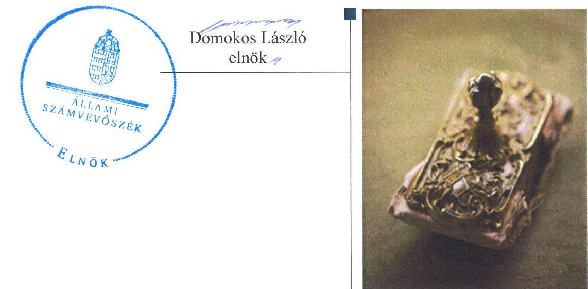
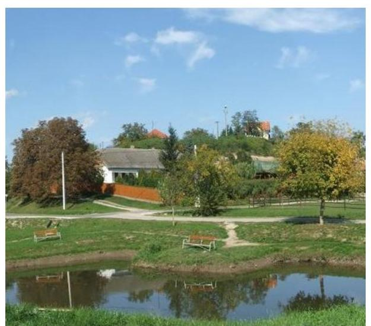
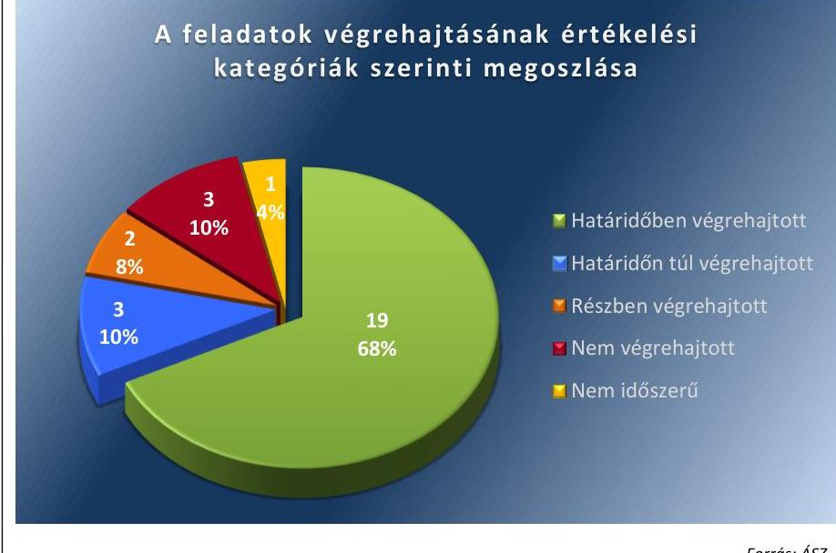

ÁLLAMI
SZÁMVEVŐSZÉK

# Jelentés 

## Utóellenőrzések

Kisapostag Község Önkormányzata belső kontrollrendszere kialakításának, egyes kontrolltevékenységek és a belső ellenőrzés működésének utóellenőrzése 2016.

---

# Jelentés 

## Utóellenőrzések

Kisapostag Község Önkormányzata belső kontrollrendszere kialakításának, egyes kontrolltevékenységek és a belső ellenőrzés működésének utóellenőrzése 2016. 06. hó 21. nap

---

|  J | AZ ELLENŐRZÉST FELÜGYELTE:  |
| --- | --- |
|   | DR. BENEDEK MÁRIA felügyeleti vezető  |
|   | AZ ELLENŐRZÉST VEZETTE ÉS A VÉGREHAJTÁSÁÉRT FELELŐS:  |
|   | KOZMA GÁBOR ellenőrzésvezető  |
|   | A PROGRAM ÖSSZEÁLLÍTÁSÁÉRT FELELŐS:  |
|   | JANIK JÓZSEF osztályvezető  |
|   | A TÉMÁHOZ KAPCSOLÓDÓ KORÁBBI SZÁMVEVŐSZÉKI JELENTÉSEK:  |
|   | - címe: Jelentés Kisapostag Község Önkormányzata belső kontrollrendszerének kialakítása, valamint egyes kontrolltevékenységek és a belső ellenőrzés működése ellenőrzéséről  |
|  Jelentéseink az Országgyűlés számítógépes hálózatán és az Interneten a www.asz.hu címen is olvashatóak. | - sorszáma: 13056  |
|   | IKTATÓSZÁM: V-1053-46/2016.  |
|   | TÉMASZÁM: 2087.  |
|   | ELLENŐRZÉS-AZONOSÍTÓ SZÁM: V-071828  |

---

# TARTALOMJEGYZÉK 

■ ÖSSZEGZÉS ..... 5
■ AZ ELLENŐRZÉS CÉLJA ..... 6
■ AZ ELLENŐRZÉS TERÜLETE ..... 7
■ AZ ELLENŐRZÉS HÁTTERE, INDOKOLTSÁGA ..... 8
■ A JELENTÉS LÉNYEGES KÉRDÉSKÖREI ..... 9
■ ELLENŐRZÉS HATÓKÖRE ÉS MÓDSZEREI ..... 10
■ MEGÁLLAPÍTÁSOK ..... 13
■ MELLÉKLETEK ..... 17
I. sz. melléklet: Az ÁSZ 13056 számú jelentéséhez kapcsolódó intézkedési terv végrehajtása ..... 17
■ FÜGGELÉK: ÉSZREVÉTELEK ..... 23
■ RÖVIDÍTÉSEK JEGYZÉKE ..... 25

---

.

---

# ÖSSZEGZÉS 

Az ÁSZ ${ }^{1}$ az Önkormányzat² ${ }^{2}$ belső kontrollrendszerének és belső ellenőrzésének utóellenőrzését 2013. július 10. és 2016. január 29. közötti időszakra végezte el. Megállapította, hogy az Önkormányzat az ÁSZ javaslatainak hasznosítására előírt intézkedéseket nem teljes körüen hajtotta végre, amely az Önkormányzat szabályozásában, müködtetésének szabályosságában és a felelős vezetői magatartásban kockázatokat hordoz.

## Az ellenőrzés társadalmi indokoltsága

Az ÁSZ stratégiájában célul tűzte ki a számvevőszéki munka hasznosulásának javítását. Ezzel összhangban ellenőrzi, hogy az ellenőrzött szervezetek megvalósították-e a korábbi ellenőrzései által feltárt hibák, hiányosságok és szabálytalanságok megszüntetése céljából elkészített intézkedési terveikben foglaltakat. A rendszeres utóellenőrzések hozzájárulnak a szükséges intézkedések tényleges végrehajtáshoz, ezáltal a közpénzügyek rendezettségének javulásához.

## Főbb megállapítások, következtetések

A polgármester az intézkedési tervet ${ }^{3}$ határidőben megküldte az ÁSZ részére. Az intézkedési tervben meghatározott 28 feladatból 19-et határidőben, kettőt részben, hármat határidőn túl teljesítettek, illetve hármat nem hajtottak végre, továbbá egy feladat végrehajtása nem volt időszerű.

Az intézkedési tervben rögzített feladatok végrehajtásáról a Bkr.-ben előírt nyilvántartást vezették.

---

# AZ ELLENŐRZÉS CÉLJA 

Az ellenőrzés célja annak értékelése volt, hogy a számvevőszéki jelentésben ${ }^{4}$ foglalt intézkedést igénylő megállapításokkal és javaslatokkal összhangban készített intézkedési tervben meghatározott feladatokat az Önkormányzat végrehajtotta-e.

---

# AZ ELLENŐRZÉS TERÜLETE 

## Az Önkormányzat

Kisapostag Község Önkormányzata a Duna jobb partján, a Mezőföldön található, Fejér megyében a Dunaújvárosi járás területén. Állandó lakosainak száma a $\mathrm{KSH}^{5}$ által közzétett népességi adatok szerint 2015. január 1-jén 1374 fő volt. Az Önkormányzat és Baracs Község Önkormányzata 2013. március 1jétől közös önkormányzati hivatalt (Hivatal ${ }^{6}$ ) hoztak létre. Az utóellenőrzés idején hivatalban lévő polgármester ${ }^{7}$ a 2013. év június 30 -ai önkormányzati időközi választás óta tölti be tisztségét, a jegyző ${ }^{8}$ 2013. március 1-jétől, a Hivatal megalakulásától látja el a jegyzői feladatokat. Az Önkormányzat 2014. évi éves költségvetési beszámolója szerint 193,0 millió Ft költségvetési bevételt ért el, valamint 164,9 millió Ft költségvetési kiadást teljesített. Az eszközvagyon értéke 2014. december 31én 838,1 millió Ft volt.

Az Önkormányzat belső kontrollrendszerének kialakítását, valamint az egyes kontrolltevékenységek és a belső ellenőrzés múködésének ellenőrzését az ÁSZ a 2009. január 1. és 2011. december 31. közötti időszakra végezte el, az erről szóló 13056. számú jelentését 2013. július 10én tette közzé. Az ellenőrzés célja annak értékelése volt, hogy az Önkormányzat a jogszabályi előírásoknak megfelelően alakította-e ki a belső kontrollrendszert, megfelelően múködtette-e a gazdálkodás folyamatában kulcsszerepet betöltő szakmai teljesítésigazolás és utalvány ellenjegyzés kontrollokat, biztosította-e a belső ellenőrzés szabályos és eredményes múködtetését.

Az utóellenőrzés - a 2013. július 10-étől 2016. január 29-ig végrehajtott intézkedéseket figyelembe véve - a számvevőszéki jelentésben a polgármester és a jegyző részére megfogalmazott intézkedést igénylő megállapításokra és javaslatokra készített, az ÁSZ részére megküldött intézkedési tervben foglalt feladatok megvalósításának ellenőrzésére, illetve értékelésére fókuszált.

---

# AZ ELLENŐRZÉS HÁTTERE, INDOKOLTSÁGA 

Az ÁSZ tv. ${ }^{9}$ 33. § (1) bekezdése értelmében a számvevőszéki jelentések intézkedést igénylő megállapításaihoz és javaslataihoz kapcsolódóan az ellenőrzött szervezet vezetője intézkedési tervet köteles összeállítani, és az ÁSZ részére megküldeni. Az intézkedési tervben foglaltak megvalósítását az ÁSZ tv. 33. § (7) bekezdésében foglaltak alapján - az ÁSZ utóellenőrzés keretében ellenőrizheti. Az intézkedések megvalósításának értékelése során az ÁSZ figyelembe veszi az ellenőrzött szervezetek működési feltételeiben, valamint a jogszabályi előírásokban bekövetkezett változásokat.

Az intézkedési tervekben foglalt feladatok hiányos, illetve késedelmes végrehajtása, valamint megvalósításának elmaradása azt mutatja, hogy az ellenőrzések során feltárt hibák, hiányosságok és szabálytalanságok megszüntetése nem kapott kellő hangsúlyt. Ez a szabályszerű működés és a felelős vezetői magatartás vonatkozásában kockázatot hordoz. E kockázatok feltárásával az ÁSZ utóellenőrzési rendszere fokozza a fegyelmet, és igazolja, hogy a közpénzzel való szabályos gazdálkodás felelőssége elől nem lehet kitérni.

## AZ UTÓELLENŐRZÉS VÁRHATÓ HASZNOSULÁSA

Az utóellenőrzés négy szinten hasznosulhat:

- A társadalom szintjén az utóellenőrzés jelzi, hogy a számvevőszéki ellenőrzés megállapításainak van következménye: a hiányosságok megszüntetésére az ellenőrzött szervezet által meghatározott intézkedések végrehajtását is számon kéri az ÁSZ.
- Az ellenőrzött terület szintjén az utóellenőrzés tájékoztatást nyújt a terület döntéshozóinak a hiányosságok kiküszöbölésének jó gyakorlatairól, ezzel lehetőséget biztosítva arra, hogy az ÁSZ ellenőrzési megállapításai, javaslatai a terület nem ellenőrzött szervezeteinek a működése során is hasznosuljanak.
- Az ellenőrzött szervezet szintjén az utóellenőrzés feltárja, hogy a szervezet az intézkedések végrehajtásával hasznosította-e a korábbi ellenőrzési jelentésben a hiányosságok megszüntetése, illetve a kockázatok kezelése érdekében megfogalmazott javaslatokat.
- Az ÁSZ szintjén az utóellenőrzés visszacsatolást ad az ellenőrzési jelentések hasznosulásáról, az intézkedések elmaradása vagy részleges megvalósulása a további ellenőrzésekhez kockázati jelzésként szolgál.

---

# A JELENTÉS LÉNYEGES KÉRDÉSKÖREI 

Az Önkormányzat az intézkedési tervben foglaltakat az elöirt határidőben végrehajtotta-e?

---

# ELLENŐRZÉS HATÓKÖRE ÉS MÓDSZEREI 

## Az ellenőrzés típusa

Megfelelőségi ellenőrzés

## Az ellenőrzött időszak

A számvevőszéki jelentés közzétételének napjától (2013. július 10.) az utóellenőrzés megkezdésének napjáig (2016. január 29.) tartó időszak

## Az ellenőrzés tárgya

Az ÁSZ tv. 2011. július 1-jei hatálybalépését követően az ÁSZ jelentésekben megfogalmazott intézkedést igénylő megállapításokkal, javaslatokkal összhangban - az Önkormányzat által - készített intézkedési tervben foglaltak végrehajtásának ellenőrzése. Az ellenőrzés kiterjedt minden olyan körülményre és adatra, amely az ÁSZ jogszabályban meghatározott feladatainak teljesítéséhez, valamint a program végrehajtása folyamán felmerült újabb összefüggések feltárásához szükséges volt.

## Az ellenőrzött szervezet

Kisapostag Község Önkormányzata

## Az ellenőrzés jogalapja

Az ÁSZ törvényben meghatározott feladatkörében ellenőrzi a központi költségvetés végrehajtását, az államháztartás gazdálkodását, az államháztartásból származó források felhasználását és a nemzeti vagyon kezelését.

Az ÁSZ tv. 1. § (3) bekezdése szerint az ÁSZ általános hatáskörrel végzi a közpénzekkel és az állami és önkormányzati vagyonnal való felelős gazdálkodás ellenőrzését.

A 33. § (7) bekezdése alapján az ÁSZ tv. 33. § (1)-(2) bekezdése szerinti intézkedési tervben foglaltak megvalósítását az ÁSZ utóellenőrzés keretében ellenőrizheti.

---

# Az ellenőrzés módszerei 

Az ÁSZ az ellenőrzést a nemzetközi standardokat irányadónak tekintve az ellenőrzési program ellenőrzési kérdései, az ellenőrzött időszakban hatályos jogszabályok, az ellenőrzés szakmai szabályok és módszertanok figyelembevételével, önállóan végezte.

Az ÁSZ az ellenőrzés ideje alatt az ellenőrzött szervezettel történő kapcsolattartást az ÁSZ SZMSZ-ének vonatkozó előírásai alapján biztosította.

Az utóellenőrzés megállapításait az ÁSZ rendelkezésére álló, valamint az Önkormányzattól elektronikusan bekért dokumentumok alapozták meg.

Az ellenőrzési bizonyítékként felhasználható adatforrások közé tartoztak egyrészt a szakmai programban felsorolt adatforrások, másrészt minden - az ellenőrzés folyamán feltárt, az ellenőrzés szempontjából információt tartalmazó - dokumentum.

A pénzügyi folyamatokban kulcsszerepet betöltő kontrollokra vonatkozóan az intézkedési tervben foglalt feladatok végrehajtását az államháztartáson kívülre teljesített működési célú pénzeszközátadásoknál, az állományba nem tartozók megbízási díjainál, továbbá a külső szolgáltatók által végzett karbantartási, kisjavítási munkákkal kapcsolatos kifizetéseknél 10 elemú véletlen mintavétellel kiválasztott tételek alapján értékelte az ÁSZ. A kiválasztott tételek esetében azt ellenőrizte, hogy az Önkormányzat az intézkedési tervben meghatározott feladatok végrehajtása érdekében biz-tosította-e a jogszabályok és a belső szabályzatok előírásainak megfelelő múködtetést.

Az intézkedési tervben előírt feladatokat azok végrehajthatósága, illetve végrehajtása szempontjából az alábbiak szerint értékelte az ÁSZ:
„határidőben végrehajtott" a feladat, ha a teljesítés dokumentáltan az intézkedési tervben előírt határidőben és tartalommal megtörtént;
„határidőn túl végrehajtott" a feladat, ha annak teljesítése az intézkedési tervben meghatározott módon, de az előírt határidőn túl történt meg;
„részben végrehajtott" a feladat, ha végrehajtása teljes körűen az intézkedési tervben előírt módon nem történt meg;
„nem végrehajtott" a feladat, ha végrehatás nem történt meg, vagy amennyiben a teljesítést nem dokumentálták;
„okafogyottá vált" a feladat, ha a végrehajtására - meghatározott esemény bekövetkezése, továbbá külső körülmény, a múködést érintő feltétel változása miatt - már nincs szükség, illetve lehetőség, és egyértelműen megállapítható, hogy az intézkedést szükségessé tevő körülmény a jövőben nem fordulhat elő;
„nem időszerü" az a feladat, amelynek ellenőrzési időszakon belüli végrehajtására azért nem került (kerülhetett) sor, mert az intézkedés alapjául szolgáló esemény nem következett be, de annak jövőbeni előfordulása lehetséges, a végrehatása nem volt szükséges, vagy a végrehajtás határideje még nem járt le.
Az ellenőrzés lefolytatásához az Önkormányzat tanúsítványok elektronikus kitöltésével, valamint az ÁSZ által kért dokumentumok elektronikus

---

megküldésével szolgáltatott adatokat, amelyek valódiságát és teljes körűségét a polgármester és a jegyző által tett teljességi és hitelességi nyilatkozat igazolta. A rendelkezésre bocsátott adatok, információk kontrollja az ellenőrzés keretében történt meg.

---

# MEGÁLLAPÍTÁSOK 

## Az Önkormányzat az intézkedési tervben foglaltakat az előírt határidőben végrehajtotta-e?

Összegző megállapítás

Az Önkormányzat az intézkedési tervben meghatározott 28 feladatból 19-et határidőben, kettőt részben, hármat határidőn túl, illetve hármat nem hajtott végre, továbbá egy feladat nem volt időszerű. Az intézkedési tervben rögzített feladatok végrehajtásáról a Bkr.-ben előírt nyilvántartást vezettek.

Az intézkedési tervben meghatározott feladatokat, határidőket, az ÁSZ jelentés javaslatainak címzettjét és a feladatok végrehajtását az I. számú melléklet mutatja be.

Az ÁSZ a jelentésében a polgármester részére három, a jegyző részére 25 javaslatot fogalmazott meg. A polgármester által összeállított és az ÁSZ részére megküldött, a Képviselő-testület által elfogadott intézkedési tervben a hiányosságok, szabálytalanságok megszüntetésére 28 feladatot határoztak meg. A feladatok elvégzésének felelőseként három esetben a polgármestert, 25 esetben a jegyzőt jelölték meg.

Az intézkedési tervben tervezett feladatok végrehajtásának értékelési kategóriák szerinti megoszlását az 1. ábra szemlélteti.

1. ábra

Forrás: ÁSZ

---

# HATÁRIDŐBEN VÉGREHAJTOTT feladat: 

1. A polgármester gondoskodott a jegyző munkaköri leírásának elkészítéséről, valamint a kinevezési okmányhoz történő csatolásáról.
2. A polgármester az Önkormányzat, a jegyző a Hivatal nevében tett kötelezettségvállalásai vonatkozásában folyamatosan gondoskodott a pénzügyi ellenjegyzésére vonatkozó szabályok betartásáról, az ellenőrzött tételek esetében kötelezettségvállalásra a pénzügyi ellenjegyzés után a pénzügyi teljesítést megelőzően, írásban került sor.
3. A jegyző elkészítette a Bizonylati rendet ${ }^{10}$, valamint kiegészítette a Pénzkezelési szabályzatot ${ }^{11}$ a házipénztáron kívüli pénzkezelés szabályozásának és az elszámolási rendjének meghatározásával.
4. A jegyző kiegészítette a Leltárkészítési és leltározási szabályzatot ${ }^{12}$ az üzemeltetésre átadott eszközök leltározási módjának meghatározásával.
5. A jegyző kiegészítette az Ellenőrzési nyomvonalat ${ }^{13}$, a Bkr.-ben előírt, a múködési folyamatok nyomon követésének és utólagos ellenőrzésének részletes szabályaival.
6. A jegyző a kockázatkezelési rendszert a Belső kontrollrendszer szabályzat ${ }^{14}$ keretében kialakította.
7. A jegyző a Belső kontrollrendszer szabályzatban meghatározta a Bkr. ${ }^{15}$ szerinti beszámolási eljárásokat.
8. A jegyző a könyvelési rendszer keretében gondoskodott a kötelezettségvállalás nyilvántartás kialakításáról és annak folyamatos vezetéséről.
9. A jegyző elkészítette az adatvédelmi és adatbiztonsági előírásokat tartalmazó szabályzatokat.
10. A jegyző Közérdekú adatok közzétételi szabályzatának ${ }^{16}$ elkészítésével kialakította a kötelezően közzéteendő adatok nyilvánosságra hozatali, valamint a közérdekú adatok megismerésére irányuló igények teljesítésének rendjét.
11. A jegyző meghatározta a hozzáférési jogosultságok megállapításának, ellenőrzésének és a nyilvántartásának előírásait. Szabályozta továbbá a pénzügyi-számviteli szoftver-változások ellenőrzésére vonatkozó eljárásokat, a feldolgozott adatok mentési eljárásait, valamint kijelölte a mentések felelőseit.
12. A jegyző kialakította a Hivatal tevékenységének, a célok megvalósításának nyomon követését biztosító monitoring rendszert, valamint annak múködését a belső ellenőrzés éves beszámolóiban nyomon követte.
13. A jegyző gondoskodott a kiadások teljesítésigazolásának szabályszerű elvégzéséről.
14. A jegyző gondoskodott a kiadások szabályos érvényesítésének elvégzéséről.

---

15. A jegyző az Önkormányzat közhatalmi, irányítási, ellenőrzési és felügyeleti, valamint ügyviteli feladatai ellátására kizárólag közszolgálati jogviszonyt létesített.
16. A jegyző elkészítette az Önkormányzat a 2014., 2015. és 2016. évi belső ellenőrzési terveit, amelyeket a Képviselő-testület a Bkr.-ben előírt határidőben fogadott el.
17. Az éves belső ellenőrzési tervek összeállítása a jegyző írásos véleményének figyelembe vételével történt.
18. A jegyző gondoskodott a belső ellenőrzési jelentések alapján megtett intézkedések nyilvántartásáról és nyomon követéséről.

# HATÁRIDŐN TÚL VÉGREHAJTOTT feladat: 

19. A jegyző elkészítette a hivatali SZMSZ-ét ${ }^{17}$, amelyben meghatározta a belső ellenőrzést végző szervezet jogállását és feladatait. A hivatali SZMSZ-t az intézkedési tervben foglalt 2013. október 31-i határidőt követően, 2014. február 11-én fogadta el a Képviselőtestület.
20. A jegyző a Tűzvédelmi szabályzatot ${ }^{18}$ az intézkedési tervben előírt 2013. október 31-i határidőn túl, 2015. november 1-én készítette el és léptette hatályba.
21. A jegyző a pénzügyi ellenjegyzői és érvényesítői feladatokra a megfelelő képesítéssel rendelkező személyt az intézkedési tervben előírt 2013. augusztus 31-i határidőt túllépve, a 2013. november 1jétől jelölte ki.

## RÉSZBEN VÉGREHAJTOTT feladat:

22. A polgármester a belső kontrollrendszer hiányosságainak feltárására soron kívüli ellenőrzést kezdeményezett. A megbízási szerződés alapján elvégzett ellenőrzés kiterjedt a szakmai teljesítésigazolás, valamint az utalvány ellenjegyzése szabályozására, illetve működtetésére. Azonban az intézkedési tervben tervezett, a belső ellenőrzés és a szerződések szabályszerűségének ellenőrzését nem végezték el.
23. A jegyző biztosította a vállalt kötelezettségekről az Ávr. ${ }^{19}$ szerinti nyilvántartás vezetését. Azonban az Ávr.-ben előírt kötelezettségvállalás nyilvántartásba vételének sorszámát nem tüntették fel a bizonylatokon.

## NEM VÉGREHAJTOTT feladat:

24. A jegyző a pénzügyi feladatok ellátásáért felelős dolgozók Ávr. szerinti helyettesítési rendjét nem készítette el.
25. A jegyző a köztisztviselői teljesítményértékelés alapját képező, a Kttv. ${ }^{20}$ szerinti teljesítménykövetelményeket nem dolgozta ki.
26. Az jegyző a gazdálkodási jogkörök ellátására jogosult személyekről és az aláírás mintájukról az Ávr-ben előírt folyamatos és naprakész nyilvántartás vezetését nem biztosította.

---

# NEM IDŐSZERŰ feladat: 

27. A belső ellenőrzés 2014., 2015. és 2016. évi ellenőrzési terveiben meghatározott feladatokat végrehajtották. Az éves ellenőrzési terv módosítása nem vált szükségessé, mert a tervben szereplő feladatok elhagyására nem került sor.

A JEGYZŐ a Bkr.-ben foglalt előírások alapján gondoskodott a Képvi-selő-testület által jóváhagyott intézkedési terv feladatai végrehajtásának nyomon követését tartalmazó nyilvántartás vezetéséről.

---

# MELLÉKLETEK

I. SZ. MELLÉKLET: AZ ÁSZ 13056 SZÁMÚ JELENTÉSÉHEZ KAPCSOLÓDÓ INTÉZKEDÉSI TERV VÉGREHAJTÁSA

|  Sorszám | Intézkedési terv alapján elvégzendő feladat | Az intézkedési tervben meghatározott határidő | Az ÁSZ
13056 számú jelentés javaslatának címzettje | A feladat végrehajtása  |
| --- | --- | --- | --- | --- |
|   | 1. | 2. | 3. | 4.  |
|  Határidőben végrehajtott feladat |  |  |  |   |
|  1. | A jegyző munkaköri leírásának elkészítése és a kinevezési okmányhoz történő csatolása. (Az intézkedési terv 1. számú tervezett intézkedési feladata, továbbiakban IT) | 2013. augusztus 15. | polgármester | A jegyző munkaköri leírását - a Hivatal létrehozásáról szóló 2013. február 22-én kelt, a Képviselő-testület által 44/2013. (II. 14.) számú határozatával jóváhagyott Megállapodás ${ }^{21}$ 9.3. pontja alapján - a munkáltatói jogokat gyakorló polgármester 2013. március 1 -jén elkészítette, valamint a jegyző kinevezési okmányához csatolta.  |
|  2. | Az Önkormányzat, valamint a Hivatal nevében történő kötelezettségvállalásra kizárólag a pénzügyi ellenjegyzés után, a pénzügyi teljesítést megelőzően, írásban kerüljön sor (IT 2 és IT 23) | folyamatos | polgármester
jegyző | A kötelezettségvállalásra - az Ávr. előírásának megfelelően - a pénzügyi ellenjegyzés után, a pénzügyi teljesítést megelőzően, írásban került sor.  |
|  3. | A Bizonylati rend kialakítása, valamint a Pénzkezelési szabályzat kiegészítése. (IT 5) | 2013. október 31. | jegyző | A számlarendet alátámasztó Bizonylati rend kialakítása a Számv. tv. 161. § (2) bekezdés d) pontjában foglaltaknak megfelelően határidőre, 2013. október 28-ára elkészült, 2013. november 1-én lépett hatályba.
A Pénzkezelési szabályzat kiegészítésre került a pénzkezelés személyi és tárgyi feltételei tekintetében - a Számv. tv. 14. § (8) bekezdés előírásának megfelelően - a házipénztáron kívüli pénzkezelés szabályozásának és elszámolási rendjének meghatározásával. A szabályzat 2013. október 28-ára elkészült, 2013. november 1-én lépett hatályba.  |
|  4. | A Leltározási szabályzat kiegészítése az üzemeltetésre átadott eszközök leltározási módjával. (IT 6) | 2013. október 31. | jegyző | A Leltárkészítési és leltározási szabályzat kiegészítése határidőben megtörtént, mely az Áhsz. ${ }^{22}$ 37. § (4) bekezdés előírásainak megfelelően tartalmazta az üzemeltetésre átadott eszközök leltározási módját. A szabályzat 2013. október 28-ára elkészült, 2013. november 1-én lépett hatályba.  |
|  5. | Az Ellenőrzési nyomvonal kiegészítése a Bkr. 6. § (3) bekezdése szerint. (IT 10) | 2013. december 31. | jegyző | A Belső kontrollrendszer szabályzat 1. számú mellékletében meghatározták a müködési folyamatokra az Ellenőrzési nyomvonalat, amely tartalmazta az Önkormányzat feladatainak szöveges, táblázatokkal szemléltetett leírását, a felelősségi és információs szinteket és kapcsolatokat, az irányítási eszközöket és ellenőrzési pontokat, lehetővé téve azok nyomon követését és utólagos ellenőrzését. A szabályzat 2013. október 1-jétől hatályos.  |

---

|  5
5
5
5 | Intézkedési terv alapján elvégzendő feladat | Az intézkedési tervben meghatározott határidő | $\begin{gathered} \text { Az ÁSZ } \ 13056 \text { számú je- } \ \text { lentés javaslata- } \ \text { nak címzettje } \end{gathered}$ | A feladat végrehajtása  |
| --- | --- | --- | --- | --- |
|   | 1. | 2. | 3. | 4.  |
|  6. | A Bkr. 3. § b) pontja és a 7. § bekezdés szerinti kockázatkezelési rendszer kialakítása. (IT 11) | 2013. október 31. | jegyző | A kockázatkezelési rendszer előírásait a Belső kontrollrendszer szabályzat II. „Kockázatkezelés" fejezetében határozták meg. A rendszer további, részletes szabályait és folyamatleírásait tartalmazta a 3. számú „Folyamatok kockázata és ellenőrzése" melléklet, valamint a nem számozott „Kockázatelemzés összesítése" melléklet, továbbá a 4. számú „Kockázatkezelés" melléklet. A szabályzat 2013. október 1-én készült el és lépett hatályba.  |
|  7. | A beszámolási eljárások szabályozása. (IT 13) | 2013. október 31. | jegyző | A jegyző a belső kontrollrendszer szabályzatban határozta meg a Bkr. 8. § (4) bekezdés c) pontja szerinti beszámolási eljárásokat. A szabályzat III. fejezet 1.3. pontja, valamint az 1. és az 5. számú mellékletek tartalmazták a beszámolási eljárásokat. A szabályzat 2013. október 1-én készült el és lépett hatályba.  |
|  8. | Az Ávr. 56. § (1) bekezdésben foglalt tartalmi követelményeknek megfelelő kötelezettségvállalási nyilvántartás vezetése. (IT 15) | folyamatos | jegyző | Az Önkormányzat a kötelezettségvállalásokról a könyvelés során az Ávr. 56. § (1) bekezdésben foglalt tartalmi követelményeknek megfelelő főkönyvi nyilvántartást vezetett.  |
|  9. | Az adatvédelmi és adatbiztonsági szabályzatok elkészítése. (IT 16) | 2013. október 31. | jegyző | A Informatikai biztonsági szabályzat ${ }^{23}$, valamint Közérdekú adatok közzétételi szabályzatának elkészítésével az előírt határidőn belül eleget tettek az adatvédelmi és adatbiztonsági szabályzat elkészítése kötelezettségének, az Info. tv. 24. § (3) bekezdése előírásának megfelelően. Az Informatikai biztonsági szabályzat 2013. október 1-től hatályos, a Közérdekú adatok közzétételi szabályzata 2013. október 28-ára elkészült, 2013. november 1-én lépett hatályba  |
|  10. | A kötelezően közzéteendő adatok nyilvánosságra hozatali rendjének kialakítása, valamint a közérdekú adatok megismerésére irányuló igények teljesítésének rendjét rögzítő szabályzat megalkotása. (IT 17) | 2013. október 31. | jegyző | A Közérdekú adatok közzétételi szabályzatának elkészítésével kialakították a kötelezően közzéteendő adatok nyilvánosságra hozatali rendjét, megfelelve ezzel az Info. tv. 33. §(1) és 35. § (3) bekezdése, valamint az Ávr. 13. § (2) bekezdés h) pontjában foglalt előírásoknak. A közérdekú adatok megismerésére irányuló igények teljesítésének rendjét szintén meghatározták a szabályzatban.  |
|  11. | A hozzáférési jogosultságok megállapításának, ellenőrzésének és nyilvántartásának szabályozása, valamint a szoftverváltozások ellenőrzésére irányuló eljárások, a feldolgozott adatok mentési eljárások és felelősök meghatározása. (IT 18) | 2013. október 31. | jegyző | A jegyző az Informatikai biztonsági szabályzatban az előírt határidőn belül biztosította az Info tv. 7. § (2)-(3) bekezdései alapján az adatbiztonsági előírások meghatározását. Az informatikai környezet szabályozása keretében rendelkezett a hozzáférési jogosultságok megállapításáról, ellenőrzéséről és nyilvántartásáról, másrészt meghatározta a pénzügyi-számviteli szoftver-változások ellenőrzésére vonatkozó eljárásokat, a feldolgozott adatok mentési eljárásait, továbbá kijelölte a mentések felelőseit.  |

---

|  1. | 2. | 3. | 4.  |
| --- | --- | --- | --- |
|  12. | A monitoring rendszer a Bkr. 3. § e) pontja és a Bkr. 10. §-ban előírtaknak megfelelő kialakítása és múködtetése. (IT 19) | folyamatos | jegyző  |
|  13. | A teljesítésigazolásra kijelölt személyek az Ávr. 57. § (1) bekezdésében foglaltaknak megfelelően, dokumentáltan végezzék feladatukat (IT 20). | folyamatos | jegyző  |
|  14. | Az érvényesítés során, a kifizetéseket megelőzően dokumentáltan ellenőrizzék az összegszerűséget, valamint a fedezet meglétét. (IT 21) | folyamatos | jegyző  |
|  15. | A közhatalmi, irányítási, ellenőrzési és felügyeleti hatáskörök gyakorlásával közvetlenül összefüggő, valamint ügyviteli feladatok közszolgálati jogviszony keretében történő ellátása. (IT 24) | 2013. augusztus 15. | jegyző  |
|  16. | Az ellenőrzési tervről szóló előterjesztés elkészítése, valamint a képviselő-testület jóváhagyásának határidőben történő kezdeményezése. (IT 25) | folyamatos | jegyző  |
|  17. | Az ellenőrzési terv összeállítása a Bkr. 56. § (2) bekezdés szerint a jegyző írásos véleményének figyelembe vételével történjen. (IT 26) | folyamatos | jegyző  |
|  18. | A belső ellenőrzési vezető tartsa nyilván és kövesse nyomon a belső ellenőrzési jelentések alapján megtett intézkedéseket. (IT 28) | 2013. október 31. | jegyző  |
|   |  | Határidőn túl végrehajtott feladat |   |
|  19. | A hivatali SZMSZ megalkotása, amelyben szerepel a belső ellenőrzést végző szervezet jogállása és feladata. (IT 4) | 2013. október 31. | jegyző  |

|  Az intézkedési tervben meghatározott határidő | Az ÁSZ 13056 számú jelentés javaslatának címzettje | A feladat végrehajtása  |
| --- | --- | --- |
|  2. | 3. | 4.  |
|  4. |  |   |
|  A jegyző a Belső kontrollrendszer szabályzat V. fejezetében kialakította a monitoring rendszer szabályait a Bkr. 3. § bekezdés e) pontja, valamint 10. § előírásainak megfelelően. A monitoring rendszer működtetése a belső ellenőrzés éves beszámolóiban folyamatosan nyomon követhető volt. |  |   |
|  folyamatos | jegyző | A kifizetések teljesítésigazolása során - az Ávr.-ben előírtaknak megfelelően - elvégezték a kifizetési tételek dokumentált ellenőrzését.  |
|  folyamatos | jegyző | Az érvényesítés során - az Ávr.-ben előírtaknak megfelelően - elvégezték az összegszerűség és a fedezet meglétének, illetve a kifizetési tételek szabályszerűségének dokumentált ellenőrzését.  |
|  2013. augusztus 15. |  | Az Önkormányzat által az ÁSZ rendelkezésére bocsátott dokumentumok alapján (köztisztviselők kinevezései, munkaköri leírásai) határidőben biztosították az intézkedés végrehajtását a Kttv 8. § (1)-(2) bekezdése előírásainak megfelelően.  |
|  folyamatos | jegyző | A jegyző az éves ellenőrzési tervről szóló előterjesztés elkészítéséről, valamint jóváhagyásának kezdeményezéséről az Mótv. ${ }^{24} 119$. § (5) bekezdésében és a Bkr. 32. § (4) bekezdésében előírt határidőn belül intézkedett.  |
|  folyamatos | jegyző | A jegyző az éves ellenőrzési terv összeállításához írásos véleményét a Bkr. 56. § (2) bekezdés előírása szerint elkészítette.  |
|  2013. október 31. |  | A belső ellenőrzési vezető a belső ellenőrzési jelentések alapján tett intézkedésekről a nyilvántartást határidőben kialakította, valamint azokat folyamatosan nyomon követte a Bkr. 21. § (2) bekezdés d) pontja és a Bkr. 47. § -ában foglalt előírásoknak megfelelően.  |
|  Határidőn túl végrehajtott feladat |  |   |
|  2013. október 31. |  | Az Önkormányzat a hivatal SZMSZ-ében meghatározta a belső ellenőrzést végző szervezet jogállását és feladatait az Áht. ${ }^{25} 70$. § (1) bekezdésében, valamint a Bkr. 15. § (2) bekezdésében foglalt előírásoknak megfelelően. A feladatot határidőn túl hajtották végre, mivel a hivatali SZMSZ módosításának elfogadásáról a Képviselő-testület a 2014. február 11-ei ülésén, a 46/2014. (II.11) számú határozatával döntött.  |

---

|  ㅅ | Intézkedési terv alapján elvégzendő feladat | Az intézkedési tervben meghatározott határidő | Az ÁSZ 13056 számú jelentés javaslatának címzettje | A feladat végrehajtása  |
| --- | --- | --- | --- | --- |
|  1. |  | 2. | 3. | 4.  |
|  20. | A Tűzvédelmi szabályzat elkészítése. (IT 7) | 2013. október 31. | jegyző | A Tűzvédelmi szabályzat Tvtv. ${ }^{26}$ 19. § (1) bekezdés előírása alapján, az intézkedési tervben előírt határidőn túl 2015. november 1-én készült el és lépett hatályba.  |
|  21. | A pénzügyi ellenjegyzői és érvényesítői feladatok ellátására az Ávr. 55. § (3) bekezdésében előírt képesítéssel rendelkező személy kinevezése. (IT 12) | 2013. augusztus 31. | jegyző | A jegyző a pénzügyi ellenjegyzői és érvényesítői feladatokra a jogszabályban meghatározott képesítésű személyeket 2013. november 1-jén jelölte ki.  |
|  22. | Vízsgálat elrendelése az Önkormányzat belső kontrollrendszere, belső ellenőrzése, valamint a szakmai teljesítésigazolás, illetve az utalvány ellenjegyzés hiányosságaival összefüggésben, valamint a szabálytalanul megkötött szerződések feltárása érdekében. (IT 3) | 2013. december 31. | polgármester | Nem végrehajtott feladatok:
A polgármester kezdeményezésére- a Képviselő-testület 137/2013. (VII. 24.) számú határozatában adott felhatalmazás alapján - a jegyző 2013. július 25-énszerződés kötött egy belső ellenőrzési feladatokat ellátó gazdasági társasággal. A megkötött szerződés, valamint a végrehajtott ellenőrzés nem terjedt ki
- a belső ellenőrzés működésének,
- valamint a szerződések szabályszerűségének ellenőrzésére.
Határidőben végrehajtott feladatok:
A megkötött szerződés, valamint a végrehajtott ellenőrzés keretében a belső kontrollrendszer működését, valamint a szakmai teljesítésigazolás és az utalvány ellenjegyzés kontrollok működését ellenőrizték. A munkafolyamatba épített ellenőrzések hiányosságait részletesen feltárták, javaslatokat fogalmaztak meg a kötelezettségvállalás analitikus nyilvántartásának, az utalványozás rendjének, az összeférhetetlenségi előírások betartásának szabályszerűségére vonatkozóan.  |
|  23. | Az Ávr. 56. § (1) bekezdésben foglalt tartalmi követelményeknek megfelelő kötelezettségvállalási nyilvántartás vezetése, valamint az utalványrendeleteken a kötelezettségvállalás sorszámának rögzítése. (IT 22) | folyamatos | jegyző | Nem végrehajtott feladat:
A 2015. szeptember 21-ei fúkasza javítás kifizetés teljesítése során a kötelezettségvállalás sorszámát - az Ávr. 59. § (3) bekezdés f) pontjának előírása ellenére - nem tüntették fel az utalványrendeleten.
Határidőben végrehajtott feladatok:
Az Önkormányzat a vállalt kötelezettségekről könyvelési rendszerében nyilvántartást vezetett.
Kilenc kifizetésnél a kötelezettségvállalás sorszámát - az Ávr. előírásának megfelelően az utalványrendeleteken rögzítették.  |

---

|  1. | Intézkedési terv alapján elvégzendő feladat | Az intézkedési tervben meghatározott határidő | $\begin{gathered} \text { Az ÁSZ } \ 13056 \text { számú je- } \ \text { lentés javaslata- } \ \text { nak címzettje } \end{gathered}$ | A feladat végrehajtása  |
| --- | --- | --- | --- | --- |
|  2. | 1. | 2. | 3. | 4.  |
|  Nem végrehajtott feladat |  |  |  |   |
|  24. | Az ügyrend pontosítása az Ávr. 13. § (5) bekezdése alapján a helyettesítési rend szabályozásával (IT 8). | 2013. október 31. | jegyző | A Hivatal szervezeti egységei részére nem készítettek ügyrendet. A pénzügyi-gazdasági feladatok ellátásáért felelős dolgozók helyettesítési rendjének részletes szabályozása más szabályzatokban - az Ávr. 13. § (5) bekezdésében előírtak ellenére - nem került kialakításra. A Megállapodás, a hivatali SZMSZ, a Gazdálkodási szabályzat ${ }^{27}$ nem tartalmazott erre vonatkozóan részletes eljárásrendet. A hivatali SZMSZ II. fejezet 3) bekezdés h) pontja szerint a gazdálkodási feladatokkal megbízottak munkaköri leírásai tartalmazzák a munkaköri feladatok közötti helyettesítési feladatok ellátásának feltételeit és módját. A munkaköri leírásokban a helyettesítésre vonatkozó részletes feltételeket, valamint a helyettesítés módját azonban nem határozták meg.  |
|  25. | A köztisztviselői teljesítményértékelés alapját képező teljesítménykövetelmények kidolgozása (IT 9) | folyamatos | jegyző | A jegyző - a Kttv. 130. § (1)-(3) bekezdéseiben előírtak ellenére - a teljesítményértékelés alapját képező teljesítménykövetelményeket nem dolgozta ki.  |
|  26. | A gazdálkodási jogköröket ellátók aláírás mintáiról vezetett nyilvántartás naprakészségének biztosítása (IT 14). | folyamatos | jegyző | A jegyző - az Ávr. 60. § (3) bekezdésében foglaltak ellenére - nem gondoskodott a gazdálkodási jogköröket ellátók aláírás nyilvántartásának folyamatos, naprakész vezetéséről. Az ÁSZ rendelkezésére bocsátott szabályzatok és dokumentációk nem tartalmazták az aláírás minták folyamatosan vezetett, hézagmentes nyilvántartását.  |
|  Nem időszerű feladat |  |  |  |   |
|  27. | A belső ellenőrzési tervben feltüntetett feladatok elhagyása csak a Bkr. 56. § (5) bekezdésében foglalt előírásoknak megfelelően a belső ellenőrzési terv módosítását követően kerüljön sor (IT 27). | 2013. szeptember 30. | jegyző | A belső ellenőrzés 2014., 2015. és 2016. évi ellenőrzési terveiben feltüntetett feladatokat végrehajtották. Az éves ellenőrzési terv a Bkr. 56. § (5) bekezdés előírása szerinti módosítása nem vált szükségessé, mert a tervben szereplő feladatok elhagyására nem került sor.  |

Forrás: ÁSZ által készített táblázat

---

.

---

# FÜGGELÉK: ÉSZREVÉTELEK 

A jelentéstervezetet az ÁSZ 15 napos észrevételezésre megküldte az ellenőrzött szervezet vezetője részére az ÁSZ tv. 29. §* (1) bekezdése előírásának megfelelően.
A polgármester, mint az ellenőrzött szervezet vezetője az ÁSZ tv. 29. § (2) bekezdésében foglalt észrevételezési jogával nem élt, a jelentéstervezetre észrevételt nem tett.

[^0]
[^0]:    * 29. § (1) Az Állami Számvevőszék az ellenőrzési megállapításait megküldi az ellenőrzött szervezet vezetőjének vagy az általa megbízott személynek, és annak, akinek személyes felelősségét állapította meg.
    (2) Az ellenőrzött szervezet vezetője és a felelősként megjelölt személy az ellenőrzés megállapításaira tizenöt napon belül írásban észrevételt tehet.
    (3) Az Állami Számvevőszék az észrevételre a beérkezésétől számított harminc napon belül írásban válaszol. A figyelembe nem vett észrevételeket köteles a jelentésben feltüntetni, és megindokolni, hogy azokat miért nem fogadta el.

---

.

---

# RÖVIDÍTÉSEK JEGYZÉKE 

${ }^{1}$ ÁSZ
${ }^{2}$ Önkormányzat
${ }^{3}$ intézkedési terv
${ }^{4}$ számvevőszéki jelentés
${ }^{5} \mathrm{KSH}$
${ }^{6}$ Hivatal
${ }^{7}$ polgármester
${ }^{8}$ jegyző
${ }^{9}$ ÁSZ tv.
${ }^{10}$ Bizonylati rend
${ }^{11}$ Pénzkezelési szabályzat
${ }^{12}$ Leltárkészítési és leltározási szabályzat
${ }^{13}$ Ellenőrzési nyomvonal
${ }^{14}$ Belső kontrollrendszer szabályzat
${ }^{15}$ Bkr.
${ }^{16}$ Közérdekú adatok közzétételi szabályzat
${ }^{17}$ hivatali SZMSZ
${ }^{18}$ Tűzvédelmi szabályzat
${ }^{19}$ Ávr.
${ }^{20}$ Kttv.
${ }^{21}$ Megállapodás
${ }^{22}$ Áhsz.
${ }^{23}$ Informatikai biztonsági szabályzat
${ }^{24}$ Mötv.
${ }^{25}$ Áht.
${ }^{26}$ Tvtv.
${ }^{27}$ Gazdálkodási szabályzat

Állami Számvevőszék
Kisapostag Község Önkormányzata
Kisapostag Község Önkormányzata Képviselő-testületének a 108/2013. (VI. 26.) számú határozatával elfogadott intézkedési terve
Az ÁSZ 13056 számú jelentése
Központi Statisztikai Hivatal
Baracsi Közös Önkormányzati Hivatal (2013. március 1-jétől)
Kisapostag Község Önkormányzatának polgármestere
Kisapostag Község Önkormányzatának jegyzője
2011. évi LXVI. törvény az Állami Számvevőszékről

A Hivatal bizonylati rendje (hatályos: 2013. november 1-jétől)
A Hivatal pénzkezelési szabályzata (hatályos: 2014. november 1-jétől)
A Hivatal leltárkészítési és leltározási szabályzata (hatályos: 2013. november 1jétől)
A Hivatal belső kontrollrendszer szabályzata 1. számú melléklete „a Hivatal müködési folyamatainak ellenőrzési nyomvonala" (hatályos: 2013. október 1-jétől)
A Hivatal belső kontrollrendszer szabályzata (hatályos 2013. október 1-jétől)
370/2011. (XII. 31.) Korm. rendelet az a költségvetési szervek belső kontrollrendszeréről és belső ellenőrzéséről
A Hivatal szabályzata a közérdekú adatok megismerésére irányuló kérelmek intézésének, továbbá a kötelezően közzéteendő adatok nyilvánosságra hozatalának rendjéről (hatályos 2013. november 1-jétől)
A Hivatal Szervezeti és Müködési Szabályzata (hatályos:2013. március 1-jétől)
A Hivatal tűzvédelmi szabályzata (hatályos 2015. november 1-jétől)
368/2011. (XII. 31.) Korm. rendelet az államháztartásról szóló törvény végrehajtásáról
2011. évi CXCIX. törvény a közszolgálati köztisztviselőkről
Baracs Község Önkormányzata Képviselő-testületének és Kisapostag Község Önkormányzata Képviselő-testületének a közös önkormányzati hivatal létrehozásáról és müködtetéséről szóló megállapodása (hatályos 2013. március 1jétől)
249/2000. (XII. 24.) Korm. rendelet az államháztartás szervezetei beszámolási és könyvvezetési kötelezettségének sajátosságairól (hatálytalan 2014. január 1-jétől)
A Hivatal informatikai biztonsági szabályzata (hatályos 2013. október 1-jétől)
2011. évi CLXXXIX. törvény Magyarország helyi önkormányzatairól
2011. évi CXCV. törvény az államháztartásról
1996. évi XXXI. törvény a tűz elleni védekezésről, a műszaki mentésről és a tűzoltóságról
A Hivatal gazdálkodási szabályzata (hatályos 2013. november 1-jétől, módosítva 2014. január 1-jétől, illetve 2015. február 1-jétől)

---

# ÁLLAMI SZÁMVEVŐSZÉK 

1052 Budapest, Apáczai Csere János utca 10.
Levélcím: 1364 Budapest 4. Pf. 54
Telefon: +36 14849100 Telefax: +36 14849200
www.asz.hu