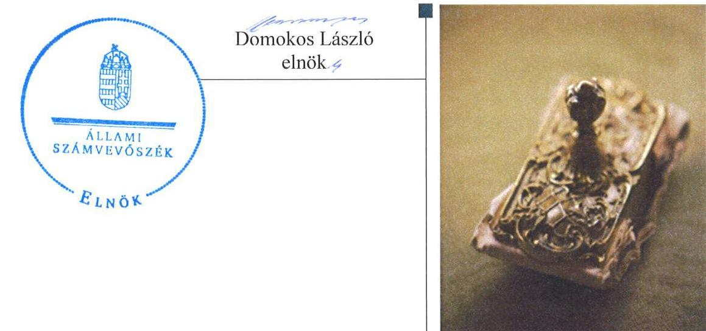
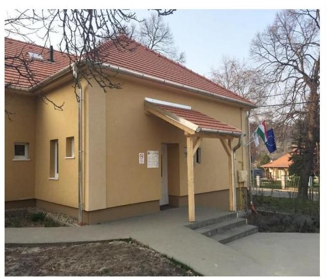
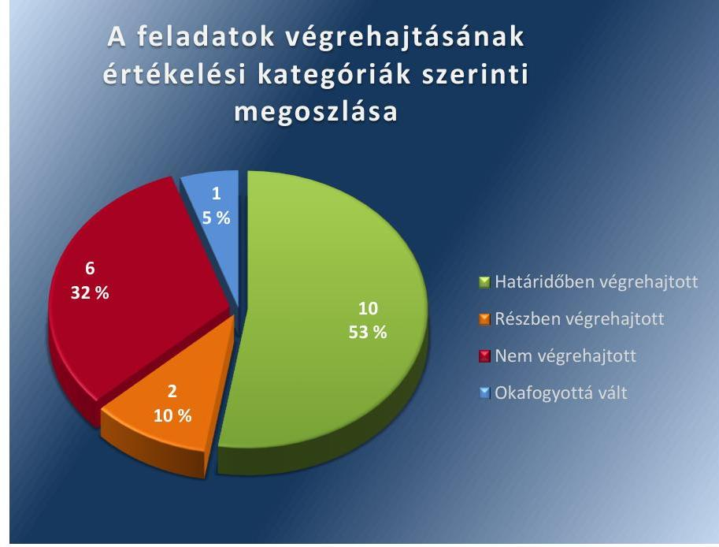
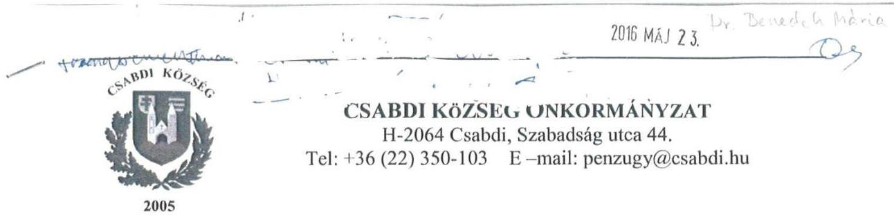
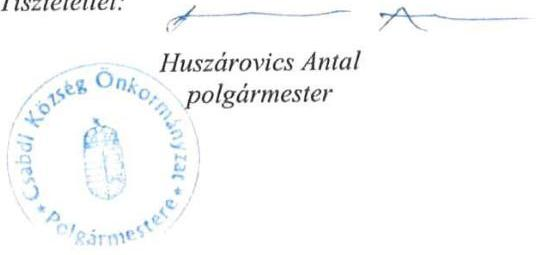
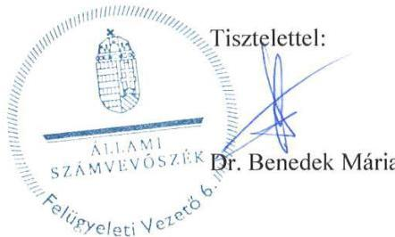

ÁLLAMI
SZÁMVEVŐSZÉK

# Jelentés 

## Utóellenőrzések

Csabdi Község Önkormányzat belső kontrollrendszere kialakításának, egyes kontrolltevékenységek és a belső ellenőrzés működésének utóellenőrzése 2016.

---

# Jelentés 

## Utóellenőrzések

Csabdi Község Önkormányzat belső
kontrollrendszere kialakításának, egyes
kontrolltevékenységek és a belső
ellenőrzés működésének utóellenőrzése
2016. OG. hó 22. nap

---

|  J | AZ ELLENŐRZÉST FELÜGYELTE:  |
| --- | --- |
|   | DR. BENEDEK MÁRIA felügyeleti vezető  |
|   | AZ ELLENŐRZÉST VEZETTE ÉS A VÉGREHAJTÁSÁÉRT FELELŐS:  |
|   | DR. PELLEI TAMÁS ellenőrzésvezető  |
|   | A PROGRAM ÖSSZEÁLLÍTÁSÁÉRT FELELŐS:  |
|   | JANIK JÓZSEF LÁSZLÓ osztályvezető  |
|   | A TÉMÁHOZ KAPCSOLÓDÓ KORÁBBI SZÁMVEVŐSZÉKI JELENTÉSEK:  |
|   | - címe: Jelentés Csabdi Község Önkormányzata belső kontrollrendszerének kialakítása, valamint egyes kontrolltevékenységek és a belső ellenőrzés működése ellenőrzéséről  |
|  Jelentéseink az Országgyűlés számítógépes hálózatán és az Interneten a www.asz.hu címen is olvashatóak. | - sorszáma: 13020  |
|   | IKTATÓSZÁM: V-1054-052/2016.  |
|   | TÉMASZÁM: 2088  |
|   | ELLENŐRZÉS-AZONOSÍTÓ SZÁM: V071823  |

---

# TARTALOMJEGYZÉK 

■ ÖSSZEGZÉS ..... 5
■ AZ ELLENŐRZÉS CÉLJA ..... 6
■ AZ ELLENŐRZÉS TERÜLETE ..... 7
■ AZ ELLENŐRZÉS HÁTTERE, INDOKOLTSÁGA ..... 8
■ A JELENTÉS LÉNYEGES KÉRDÉSKÖREI ..... 9
■ ELLENŐRZÉS HATÓKÖRE ÉS MÓDSZEREI ..... 10
■ MEGÁLLAPÍTÁSOK ..... 13
■ MELLÉKLETEK ..... 17
I. SZ. MELLÉKLET: Az ÁSZ 13020 számú jelentéséhez kapcsolódó intézkedési terv végrehajtása ..... 17
■ FÜGGELÉK: ÉSZREVÉTELEK ..... 23
■ RÖVIDÍTÉSEK JEGYZÉKE ..... 29

---

.

---

# ÖSSZEGZÉS 

Az ÁSZ ${ }^{1}$ elvégezte az Önkormányzat² belső kontrollrendszerének kialakítása, valamint az egyes kontrolltevékenységek és a belső ellenőrzés működésének utóellenőrzését 2013. március 11-től 2016. január 29-ig terjedő időszakra vonatkozóan. Megállapította, hogy az Önkormányzat a számvevőszéki javaslatok hasznosítására előírt intézkedéseket nem teljes körűen hajtotta végre, amely az Önkormányzat szabályozásában, működésének szabályosságában és a felelős vezetői magatartásban kockázatokat hordoz.

## Az ellenőrzés társadalmi indokoltsága

Az ÁSZ stratégiájában célul tűzte ki a számvevőszéki munka hasznosulásának javítását. Ezzel összhangban ellenőrzi, hogy az ellenőrzött szervezetek megvalósították-e a korábbi ellenőrzései által feltárt hibák, hiányosságok és szabálytalanságok megszüntetése céljából elkészített intézkedési terveikben foglaltakat. A rendszeres utóellenőrzések hozzájárulnak a szükséges intézkedések tényleges végrehajtáshoz, ezáltal a közpénzügyek rendezettségének javulásához.

## Főbb megállapítások, következtetések

A polgármester ${ }^{3}$ az intézkedési tervet határidőben megküldte az ÁSZ részére. Az intézkedési tervben meghatározott 19 feladatból tíz határidőben, kettő részben teljesült, hat feladat végrehajtása nem történt meg, további egy feladat végrehajtása - jogszabályi változások miatt - okafogyottá vált.

Az intézkedési tervben rögzített feladatok végrehajtásáról a Bkr. ${ }^{4}$-ben előírt nyilvántartást nem vezették.

---

# AZ ELLENŐRZÉS CÉLJA 

Az ellenőrzés célja annak értékelése volt, hogy a számvevőszéki jelentésben ${ }^{5}$ foglalt intézkedést igénylő megállapításokkal és javaslatokkal összhangban készített intézkedési tervben meghatározott feladatokat az ellenőrzött szervezet végrehajtotta-e.

---

# AZ ELLENŐRZÉS TERÜLETE 

## Az Önkormányzat

Csabdi község Fejér megyében, a Bicskei járás közigazgatási területén fekszik. 2013. március 1-jétől létrehozták Felcsút, Alcsútdoboz, Csabdi, Tabajd, Vértesacsa községek önkormányzatai részvételével a Felcsúti Közös Önkormányzati Hivatalt ${ }^{6}$. A polgármester a 2014. évi helyi önkormányzati választások óta tölti be tisztségét, a jegyző ${ }^{7}$ személye az ellenőrzött időszakban nem változott. A lakónépességének száma a KSH által közzétett népességi adatok ${ }^{8}$ szerint 2015. január 1-jén 1183 fő volt.

Az Önkormányzat a 2014. évi költségvetési beszámoló szerint 115,5 millió Ft költségvetési bevételt ért el, valamint 68,7 millió Ft költségvetési kiadást teljesített. Az eszközvagyon értéke 2014. december 31-én 794,0 millió Ft volt.

Az ÁSZ a 2013. évben ellenőrizte az Önkormányzat belső kontrollrendszerének kialakítását, valamint egyes kontrolltevékenységek és a belső ellenőrzés működését a 2009-2011.
közötti időszakra vonatkozóan, az erről szóló 13020. számú jelentését 2013. március 11-én tette közzé. Az ellenőrzés célja annak értékelése volt, hogy az Önkormányzat a jogszabályi előírásoknak megfelelően alakította-e ki a belső kontrollrendszert, megfelelően működtette-e a gazdálkodás folyamatában kulcsszerepet betöltő szakmai teljesítésigazolás és utalvány ellenjegyzés kontrollokat, biztosította-e a belső ellenőrzés szabályos és eredményes működését

Az utóellenőrzés - 2013. március 11-től - 2016. január 29-ig végre-hajtott intézkedéseket figyelembe véve - az ÁSZ jelentésben a polgármester és a jegyző részére megfogalmazott intézkedést igénylő megállapításokra és javaslatokra készített, az ÁSZ részére megküldött intézkedési tervben foglalt feladatok megvalósításának ellenőrzésére, illetve értékelésére fókuszált.

---

# AZ ELLENŐRZÉS HÁTTERE, INDOKOLTSÁGA 

Az ÁSZ tv. ${ }^{9}$ 33. § (1) bekezdése értelmében a számvevőszéki jelentések intézkedést igénylő megállapításaihoz és javaslataihoz kapcsolódóan az ellenőrzött szervezet vezetője intézkedési tervet köteles összeállítani, és az ÁSZ részére megküldeni. Az intézkedési tervben foglaltak megvalósítását az ÁSZ tv. 33. § (7) bekezdésében foglaltak alapján - az ÁSZ utóellenőrzés keretében ellenőrizheti. Az intézkedések megvalósulásának értékelése során az ÁSZ figyelembe veszi az ellenőrzött szervezetek működési feltételeiben, valamint a jogszabályi előírásokban bekövetkezett változásokat.

Az intézkedési tervekben foglalt feladatok hiányos, illetve késedelmes végrehajtása, valamint megvalósításának elmaradása azt mutatja, hogy az ellenőrzések során feltárt hibák, hiányosságok és szabálytalanságok megszüntetése nem kapott kellő hangsúlyt. Ez a szabályszerű működés és a felelős vezetői magatartás vonatkozásában kockázatot hordoz. E kockázatok feltárásával az ÁSZ utóellenőrzési rendszere fokozza a fegyelmet, és igazolja, hogy a közpénzzel való szabályos gazdálkodás felelőssége elől nem lehet kitérni.

## AZ UTÓELLENŐRZÉS VÁRHATÓ HASZNOSULÁSA

Az utóellenőrzés négy szinten hasznosulhat:
$\longrightarrow$ A társadalom szintjén az utóellenőrzés jelzi, hogy a számvevőszéki ellenőrzés megállapításainak van következménye: a hiányosságok megszüntetésére az ellenőrzött szervezet által meghatározott intézkedések végrehajtását is számon kéri az ÁSZ.
$\longrightarrow$ Az ellenőrzött terület szintjén az utóellenőrzés tájékoztatást nyújt a terület döntéshozóinak a hiányosságok kiküszöbölésének jó gyakorlatairól, ezzel lehetőséget biztosítva arra, hogy az ÁSZ ellenőrzési megállapításai, javaslatai a terület nem ellenőrzött szervezeteinek a működése során is hasznosuljanak.
$\longrightarrow$ Az ellenőrzött szervezet szintjén az utóellenőrzés feltárja, hogy a szervezet az intézkedések végrehajtásával hasznosította-e a korábbi ellenőrzési jelentésben a hiányosságok megszüntetése, illetve a kockázatok kezelése érdekében megfogalmazott javaslatokat.
$\longrightarrow$ Az ÁSZ szintjén az utóellenőrzés visszacsatolást ad az ellenőrzési jelentések hasznosulásáról, az intézkedések elmaradása vagy részleges megvalósulása a további ellenőrzésekhez kockázati jelzésként szolgál.

---

# A JELENTÉS LÉNYEGES KÉRDÉSKÖREI 

Az Önkormányzat az intézkedési tervben foglaltakat az előírt határidőben végrehajtotta-e?

---

# ELLENŐRZÉS HATÓKÖRE ÉS MÓDSZEREI 

## Az ellenőrzés típusa

Megfelelőségi ellenőrzés

## Az ellenőrzött időszak

Az utóellenőrzés alapját képező ÁSZ jelentés közzétételének napjától (2013. március 11.) az ellenőrzésről szóló kiértesítő levél keltének napjáig (2016. január 29.) tartó időszak.

## Az ellenőrzés tárgya

Az ÁSZ tv. 2011. július 1-jei hatálybalépését követően a számvevőszéki jelentésben foglalt intézkedést igénylő megállapításokkal és javaslatokkal összhangban - az Önkormányzat által - készített intézkedési tervben foglaltak végrehajtásának ellenőrzése.

Az ellenőrzés kiterjed minden olyan körülményre és adatra, amely az ÁSZ jogszabályban meghatározott feladatainak teljesítéséhez, valamint a program végrehajtása folyamán felmerült újabb összefüggések feltárásához szükséges.

## Az ellenőrzött szervezet

Csabdi Község Önkormányzat

## Az ellenőrzés jogalapja

Az ÁSZ törvényben meghatározott feladatkörében ellenőrzi a központi költségvetés végrehajtását, az államháztartás gazdálkodását, az államháztartásból származó források felhasználását és a nemzeti vagyon kezelését.

Az ÁSZ tv. 1. § (3) bekezdése szerint az ÁSZ általános hatáskörrel végzi a közpénzekkel és az állami és önkormányzati vagyonnal való felelős gazdálkodás ellenőrzését.

Az ÁSZ tv. 33. § (7) bekezdése alapján az ÁSZ tv. 33. § (1)-(2) bekezdése szerinti intézkedési tervben foglaltak megvalósítását az ÁSZ utóellenőrzés keretében ellenőrizheti.

---

# Az ellenőrzés módszerei 

Az ÁSZ az ellenőrzést a nemzetközi standardokat irányadónak tekintve az ellenőrzési program ellenőrzési kérdései, az ellenőrzött időszakban hatályos jogszabályok, az ellenőrzés szakmai szabályok és módszertanok figyelembevételével, önállóan vagy ellenőrzéshez kapcsolódóan végezte.

Az ÁSZ az ellenőrzés ideje alatt az Önkormányzattal történő kapcsolattartást az ÁSZ SZMSZ ${ }^{10}$-ének vonatkozó előírásai alapján biztosította.

Az utóellenőrzés megállapításait elsősorban az ÁSZ rendelkezésére álló, valamint az ellenőrzött szervezetektől elektronikusan bekért dokumentumok alapozták meg.

Az ellenőrzési bizonyítékként felhasználható adatforrások közé tartoznak egyrészt a szakmai programban felsorolt adatforrások, másrészt minden - az ellenőrzés folyamán feltárt, az ellenőrzés szempontjából információt tartalmazó - dokumentum.

A pénzügyi folyamatokban kulcsszerepet betöltő kontrollokra vonatkozóan az intézkedési tervben foglalt feladatok végrehajtását az államháztartáson kívülre teljesített működési célú pénzeszközátadásoknál, az állományba nem tartozók megbízási díjainál, továbbá a külső szolgáltatók által végzett karbantartási, kisjavítási munkákkal kapcsolatos kifizetéseknél 10 elemű véletlen mintavétellel kiválasztott tételek alapján értékelte az ÁSZ. A kiválasztott tételek esetében azt ellenőrizte, hogy az Önkormányzat az intézkedési tervben meghatározott feladatok végrehajtása érdekében biztosította-e a jogszabályok és a belső szabályzatok előírásainak megfelelő működtetést.

Az intézkedési tervekben előírt feladatoknak, azok végrehajthatósága, illetve végrehajtása szempontjából az alábbiak szerint értékelte az ÁSZ:
"határidőben végrehajtott" a feladat, ha a teljesítés dokumentáltan, az intézkedési tervben előírt határidőben és tartalommal megtörtént;
"határidőn túl végrehajtott" a feladat, ha annak teljesítése az intézkedési tervben meghatározott módon, de az előírt határidőn túl történt meg;
"részben végrehajtott" a feladat, ha végrehajtása teljes körűen az intézkedési tervben előírt módon nem történt meg;
"nem végrehajtott" a feladat, ha a végrehajtás nem történt meg, vagy amennyiben a teljesítést nem dokumentálták;
"okafogyottá vált" a feladat, ha végrehajtására - meghatározott esemény bekövetkezése, továbbá külső körülmény, a működést érintő feltétel változása miatt - már nincs szükség, illetve lehetőség, és egyértelműen megállapítható, hogy az intézkedést szükségessé tevő körülmény a jövőben nem fordulhat elő;
"nem időszerű" az a feladat, amelynek ellenőrzési időszakon belüli végrehajtására azért nem került (kerülhetett) sor, mert az intézkedés alapjául szolgáló esemény nem következett be, de annak jövőbeni előfordulása lehetséges, a végrehajtása nem volt esedékes, vagy a végrehajtás határideje még nem járt le.

---

Az ellenőrzés lefolytatásához az ellenőrzött szervezet a tanúsítványok elektronikus kitöltésével, valamint az ÁSZ által kért dokumentumok elektronikus megküldésével szolgáltatott adatokat, amelyek valódiságát és teljes körűségét az ellenőrzött szervezet vezetője által tett teljességi és hitelességi nyilatkozat igazolta. Az így rendelkezésre bocsátott adatok, információk kontrollja az ellenőrzés keretében történt.

---

# MEGÁLLAPÍTÁSOK 

## Az Önkormányzat az intézkedési tervben foglaltakat az előírt határidőben végrehajtotta-e?

Összegző megállapítás

Az Önkormányzat az intézkedési tervben meghatározott 19 feladatból tízet határidőben, kettőt részben és hatot nem hajtott végre, továbbá egy feladat okafogyottá vált. Az intézkedési tervben rögzített feladatok végrehajtásáról a Bkr.-ben előírt nyilvántartást nem vezették.

Az intézkedési tervben meghatározott feladatokat, határidőket, az ÁSZ jelentés javaslatainak címzettjét és a feladatok végrehajtását az I. számú melléklet mutatja be.

Az ÁSZ a jelentésben a polgármester részére egy, a jegyző részére tizenhét javaslatot fogalmazott meg. A polgármester által összeállított és az ÁSZ részére megküldött intézkedési tervben a hiányosságok, szabálytalanságok megszüntetésére tizenkilenc feladatot határoztak meg. A feladatok végrehajtásának felelőseként egy esetben a polgármestert, tizennyolc esetben a jegyzőt jelölték meg.

Az intézkedési tervben tervezett feladatok végrehajtásának értékelési kategóriák szerinti megoszlását az 1. ábra szemlélteti.

1. ábra

Forrás: ÁSZ

---

# HATÁRIDŐBEN VÉGREHAJTOTT feladat: 

1. A jegyző elkészítette a 2013. március 1-jétől létrehozott Hivatal SZMSZ-ét, amely tartalmazta a munkakörökhöz tartozó fel-adat- és hatásköröket, a szervezeti ábrát, a helyettesítés rendjét. A 2013. március 1-jétől hatályos SZMSZ-t a Képviselő-testület a 21/2013. (III. 7.) számú határozatával jóváhagyta.
2. A jegyző a Hivatal SZMSZ-ében szabályozta a belső ellenőr jogállását, feladatait.
3. A jegyző a Hivatal SZMSZ-ében rögzítette a foglalkoztatottak va-gyonnyilatkozat-tételi kötelezettségét.
4. A jegyző a 2013. március 1-jétől hatályos leltározási szabályzatban meghatározta az üzemeltetésre átadott eszközök leltározási rendjét.
5. A jegyző kialakította a Hivatalra vonatkozó beszámolási eljárásokat, amelyeket a 2013. március 1-jétől hatályos belső kontrollrendszer szabályzatban rögzített.
6. A jegyző - az ellenőrzés rendelkezésére bocsátott dokumentumok figyelembe vételével - a pénzügyi ellenjegyzésre a jogszabályban előírt iskolai végzettséggel, illetve szakképesítéssel rendelkező személyeket hatalmazott fel.
7. A jegyző gondoskodott a kötelezettségvállalásra, utalványozásra, ellenjegyzésre, teljesítésigazolásra, érvényesítésre jogosult személyekről és aláírás-mintájukról naprakész nyilvántartás vezetéséről.
8. A jegyző intézkedett a gazdasági események tényleges tartalmuknak megfelelő könyveléséről.
9. Az éves ellenőrzési tervekben a jegyző gondoskodott az ellenőrzések tárgyának meghatározásáról.
10. A belső ellenőrzésekről készült jelentésekben foglalt hiányosságok megszüntetése érdekében a jegyző elkészítette az intézkedési terveket.

## RÉSZBEN VÉGREHAJTOTT feladatok:

11. A jegyző a 98-5/2013. számú, 2013. március 25-én kelt jegyzői utasításban foglaltak alapján kijelölte a közérdekű adatközlésért felelős személyt. A jegyző az Info tv. előírásai szerinti hozzáférési jogosultságok megállapításáról, betartásának ellenőrzéséről, azok folyamatos aktualizálásról - az intézkedési tervben előírt határidőn túl - a 2015. július 6-ától hatályos informatikai biztonsági szabályzatban rendelkezett.
12. A jegyző gondoskodott a kötelezettségvállalás nyilvántartás vezetéséről, azonban az utalványrendeletek Ávr.-ben előírt tartalmi követelményeinek nem feleltek meg, mert a dokumentumokon nem tüntették fel a kötelezettségvállalás nyilvántartásba vételi sorszámát.

---

# NEM VÉGREHAJTOTT feladatok: 

13. A teljesítésigazolás jogszerűségének helyreállítása nem valósult meg, mert az Ávr. előírásait az operatív gazdálkodás során nem teljes körűen hajtották végre. A polgármester a szakmai teljesítésigazolás és az utalvány ellenjegyzés kontrollokkal kapcsolatban feltárt hiányosságok tekintetében a munkajogi felelősséggel kapcsolatos körülményeket nem vizsgálta ki, dokumentált módon nem igazolta a vizsgálat lefolytatásának tényét.
14. A jegyző nem gondoskodott vagyonhasznosítási tevékenység és az iratkezelési folyamatok folyamatba épített, előzetes, utólagos és vezetői ellenőrzéséről, mert dokumentált módon ezek végrehajtását nem igazolta.
15. A jegyző az Info tv. előírásainak megfelelően nem gondoskodott a pénzügyi-számviteli szoftverváltozások ellenőrzésére, tesztelésére vonatkozó eljárások kialakításáról, mert a Hivatal részéről a Magyar Közigazgatásfejlesztési Zrt.-vel 2014. április 1-jén megkötött szolgáltatói szerződés és annak mellékletei nem tartalmazták a pénzügyi-számviteli szoftverváltozások ellenőrzésére, tesztelésére vonatkozó kötelezettséget.
16. A jegyző nem gondoskodott teljesítésigazolás Ávr.-ben előírtak szerinti elvégzéséről, mivel a teljesítésigazolás körében nem valósult meg a kifizetés előtti ellenőrzés.
17. A jegyző nem intézkedett az érvényesítés Ávr. szerinti szabályszerű végrehajtásáról, mivel az érvényesítést teljesítésigazolás hiányában végezték.
18. A jegyző nem gondoskodott a Bkr.-ben előírt, a belső ellenőrzés által feltárt hiányosságok megszüntetésének nyomon követéséről, mert az elkészített nyilvántartás nem tartalmazta az ellenőrzésnek nyomon követéshez kapcsolódó adatokat, információkat.

## OKAFOGYOTTÁ VÁLT feladatok:

19. A 2014. évi belső ellenőrzési terv elkészítéséhez a jegyző írásos véleményének kikérése okafogyottá vált, mert az önkormányzati belső ellenőrzési feladatok ellátása 2013. január 1-től nem társulás formájában történik.

Az ÁSZ javaslatai alapján készített intézkedési tervben rögzített feladatok végrehajtásáról a Bkr. előírásainak megfelelő nyilvántartást nem vezettek.

---

.

---

# MELLÉKLETEK

I. SZ. MELLÉKLET: AZ ÁSZ 13020 SZÁMÚ JELENTÉSÉHEZ KAPCSOLÓDÓ INTÉZKEDÉSI TERV VÉGREHAJTÁSA

|  Sorszám | Az intézkedési terv alapján elvégzendő feladat
1. | Az intézkedési tervben meghatározott határidő/ megvalósított feladatok
2. | Az ÁSZ 13020. sz. jelentése javaslatának címzettje
3. | A feladat végrehajtása  |
| --- | --- | --- | --- | --- |
|  1. | Hivatali SZMSZ módosítása az Ávr. 13. § (1); (5) bekezdései szerint (munkakörökhöz tartozó feladat- és hatáskörök, szervezeti ábra, helyettesítés, ügyrend, pénz-ügyi-gazdasági feladatokat ellátók helyettesítése rendje). | A hiányosságot megszüntette Felcsúti Közös Önkormányzati Hivatal Csabdi Község Önkormányzat Képviselő-testülete 21/2013. (III. 7.) számú határozatával jóváhagyott szervezeti és működési szabályzata, mely folyamatos nyomon követéssel kerül aktualizálásra. A szabályzat az Ávr. 13. § (1); (5) bekezdéseinek megfelelően készült el. | jegyző | Az SZMSZ 2. számú melléklete tartalmazta a költségvetési szervezet ábráját, nevesítették a munkakörökhöz tartozó feladat- és hatásköröket, az Ávr. 13. § (5) bekezdésében foglaltak alapján rögzítették a helyettesítés rendjét. Az SZMSZ-ben foglaltak szerint a helyettesítéssel kapcsolatos konkrét feladatokat a munkaköri leírásokban rögzítették.  |
|  2. | A belső ellenőr jogállásának, feladatainak meghatározása a Bkr. 15. § (2) bekezdése szerint. | A hiányosságot megszüntette Felcsúti Közös Önkormányzati Hivatal Csabdi Község Önkormányzat Képviselő-testülete 21/2013. (III. 7.) számú határozatával jóváhagyott szervezeti és működési szabályzata, mely folyamatos nyomon követéssel kerül aktualizálásra. A szabályzat a Bkr. 15. § (2) bekezdése szerint készült el. | jegyző | Az SZMSZ tartalmazta a Bkr. 15. § (2) bekezdésének megfelelően a belső ellenőrzést végző jogállását, feladatait.  |
|  3. | A vagyonnyilatkozat-tételi kötelezettség meghatározása a hivatali SZMSZ-ben a Vtv. 4. § a) pontja szerint. | A hiányosságot megszüntette Felcsúti Közös Önkormányzati Hivatal Csabdi Község Önkormányzat Képviselő-testülete 21/2013. (III. 7.) számú határozatával jóváhagyott szervezeti és működési szabályzata, mely folyamatos nyomon követéssel kerül aktualizálásra. A szabályzat a Vtv. 4. § a) pontja szerint készült el. | jegyző | Az SZMSZ 4. számú mellékletében a Vtv. 4. § (a) pontjában előírtak alapján rögzítették a Hivatalban foglalkoztatottak vagyonnyilatkozattételi kötelezettségét.  |

---

|  4. | Az üzemeltetésre átadott eszközök leltározási rendjének meghatározása az Áhsz. 37. § (4) bekezdésének előírása szerint. | A hiányosságot megszüntette Felcsúti Közös Önkormányzati Hivatal Csabdi Község Önkormányzat Képviselő-testülete 35/2013. (III. 7.) számú határozatával jóváhagyott leltározási és leltárkészítési szabályzata, mely folyamatos nyomon követéssel kerül aktualizálásra. A szabályzat az Áhsz. 37. § (4) bekezdése szerint készült. | jegyző | A jegyző gondoskodott a leltározási szabályzat kiegészítéséről. A leltározási szabályzat 2.5. pontja az Áhsz. 37. § (4) bekezdésének előírása szerint tartalmazta az üzemeltetésre átadott eszközök leltározásának rendjét.  |
| --- | --- | --- | --- | --- |
|  5. | A beszámolási eljárások szabályozása a Hivatal vonatkozásában a Bkr. 8. § (4) bekezdés c) pontja szerint. | A hiányosságot megszüntette Felcsúti Közös Önkormányzati Hivatal Csabdi Község Önkormányzat Képviselő-testülete 23/2013. (III. 7.) számú határozatával jóváhagyott Belső kontrollrendszer szabályzata, mely folyamatos nyomon követéssel kerül aktualizálásra. A szabályzat a Bkr. 8. § (4) bekezdés c) pontja szerint készült. | jegyző | A jegyző kialakította a Hivatal tevékenységeire vonatkozó beszámolási eljárásokat. A belső kontrollrendszer szabályzatban a Bkr. 8. § (4) bekezdés c) pontjában előírt szabályozási kötelezettségnek megfelelően kialakították a III. fejezet 1.3. pontjában a Hivatal tevékenységeire vonatkozó beszámolási eljárásokat.  |
|  6. | A pénzügyi ellenjegyzésre felhatalmazott személyek megfelelő képesítésének biztosítása, melyre vonatkozó előírásokat az Ávr. 55. § (3) bekezdése tartalmaz. | A Felcsúti Közös Önkormányzati Hivatal alkalmazásában álló, ellenjegyzési feladatokat ellátó személyek az Ávr. 55. § (3) bekezdésének megfelelő képesítéssel rendelkeznek. | jegyző | A jegyző az aláírás-mintákról vezetett nyilvántartás, valamint a bemutatott oklevelek, bizonyítványok alapján, az Ávr. 55. § (3) bekezdésében foglaltaknak megfelelően biztosította, hogy pénzügyi ellenjegyzésre felhatalmazott személyek megfelelő iskolai végzettséggel, illetve szakképesítéssel rendelkezzenek.  |
|  7. | Naprakész nyilvántartás vezetése a kötelezettségvállalásra, utalványozásra, ellenjegyzésre, teljesítésigazolásra, érvényesítésre feljogosított személyekről az Ávr. 60. § (3) bekezdésére figyelemmel. | A Felcsúti Közös Önkormányzati Hivatal rendelkezik naprakész nyilvántartással, mely az Ávr. 60. § (3) bekezdésének megfelelő. Az ÁSZ vizsgálat helyszíni észrevételei alapján aktualizálásra került az egyes gazdálkodási jogkört gyakorló személyekről vezetett nyilvántartás, melynek felülvizsgálata folyamatos. | jegyző | A jegyző az Ávr. 60. § (3) bekezdése és a 2013. március 1-jétől hatályos gazdálkodási szabályzat 6. számú mellékletében foglaltak alapján gondoskodott a kötelezettségvállalásra, utalványozásra, ellenjegyzésre, teljesítésigazolásra, érvényesítésre jogosult személyekről és aláírás-mintájukról naprakész nyilvántartás vezetéséről.  |
|  8. | Gazdasági események tartalmuknak megfelelő könyvelése a Számv. tv. 16. § (3) és az Áhsz. 9. § (11) bekezdése szerint. | Azonnal, majd ezt követően folyamatos főkönyvi nyilvántartás vezetése a Számv. tv. 16. § (3) és az Áhsz. 9. § (11) bekezdése szerint. | jegyző | Az ÁSZ megállapította, hogy az intézkedést végrehajtották, mert az ellenőrzött gazdasági események főkönyvi számlakijelölése - a Számv. tv. 16. § (3) és az Áhsz. 9. § (11) bekezdése szerint - azok tényleges tartalmának megfelelően történt.  |

---

|  9. | Belső ellenőrzési tervben tervezett ellenőrzések tárgyának rögzítése a Bkr. 31. § (4) bekezdés b) pontja szerint. | Belső ellenőrzési tervben tervezett ellenőrzések tárgyának rögzítése folyamatos, s ennek megfelelően a 2013. évi ellenőrzési tervben már rögzítésre került a Bkr. 31. § (4) bekezdés b) pontja szerint. |  |   |
| --- | --- | --- | --- | --- |
|  10. | Belső ellenőrzési megállapításokra intézkedési terv készítése a Bkr. 45. § (1) bekezdése szerint. | Az ellenőrzések lefolytatását követően, a Felcsúti Közös Önkormányzati Hivatallal jogviszonyban álló belső ellenőr ellenőrzési ütemterve és a jegyzőkönyvben rögzítettek szerint az Intézkedési terv készítése folyamatosan biztosított a Bkr. 45. § (1) bekezdése szerint. |  |   |
|  11. | Közérdekű adatközlésért felelős személyek meghatározása, hozzáférési jogosultságok rögzítése az Ávr. 13. § (2) bekezdés h) pontja és az Info tv. 7. § (2)-(3) bekezdése szerint. | 98-5/2013. számú jegyzői utasításban meghatározásra került, az Ávr. 13. § (2) bekezdés h) pontjára és az Info tv. 7. § (2)-(3) bekezdéseire figyelemmel. A felelősök és a hozzáférési jogosultságok aktualizálása folyamatos. |  |   |
|  12. | A kötelezettségvállalás nyilvántartási száma kerüljön feltüntetésre az Ávr. 56. § (1) bekezdése szerint. | Azonnal, majd azt követően folyamatosan rögzítésre kerül az utalványrendeleten a kötelezettségvállalás sorszáma az Ávr. 56. § (1) bekezdése szerint. |  |   |

|  Az intézkedési terv alapján elvégzendő feladat | Az intézkedési tervben meghatározott határidő/ megvalósított feladatok  |
| --- | --- |
|  2. | 3.  |
|  3. |   |
|  4. |   |
|  4. |   |
|  4. |   |
|  4. |   |
|  4. |   |
|  4. |   |
|  4. |   |
|  4. |   | |   |
|  4. |   |
|  4. |   |
|  4. |   |
|  4. |   |
|  4. |   |
|  4. |   |
|  4. |   |
|  4. |   |
|  4. |   |
|  4. |   |
|  4. |   |
|  4. |   |
|  4. |   |
|  4. |   |
|  4. |   |
|  4. |   |
|  4. |   |
|  4. |   |
|  4. |   |
|  4. |   |
|  4. |   |
|  4. |   |
|  4. |   |

---

|  13. | Szakmai teljesítésigazolás és utalvány ellenjegyzés jogszerűségének helyreállítása az Ámr. ${ }^{20}$ 76. § (3) bekezdése és az Ámr. 79. § (2) bekezdésére figyelemmel. Az esetleges munkajogi felelősséggel kapcsolatos körülmények kivizsgálása. | A hiányosság kijavítása a Felcsút-Alcsútdoboz-Csabdi-Tabajd-Vértestarcsa Községek Körjegyzősége 2012. január 1. napjával történő megalakulását követően megtörtént az Ámr. 76. § (3) bekezdése és az Ámr. 79. § (2) bekezdése szerint. A munkajogi felelősségre vonást kizárja az a tény, hogy a vizsgálattal érintett időpontban foglalkoztatott jegyző és a gazdálkodási feladatokat ellátó személyek a Felcsúti Közös Önkormányzati Hivatallal, és Csabdi Község Önkormányzatával nem állnak jogviszonyban. | polgármester | A teljesítésigazolás jogszerűségének helyreállítása nem valósult meg, mert az Ávr. előírásait az operatív gazdálkodás során nem teljes körűen hajtották végre. Az ÁSZ által feltárt hiányosságok és szabálytalanságok tekintetében az esetleges munkajogi felelősséggel kapcsolatos körülmények dokumentált módon történő kivizsgálására nem került sor.  |
| --- | --- | --- | --- | --- |
|  14. | A vagyonhasznosítási folyamatok és az iratkezelési folyamatok FEUVE ${ }^{21}$ ellenőrzésének meghatározása a Bkr. 8. § (2) bekezdése szerint. | A hiányosságot megszüntette Felcsúti Közös Önkormányzati Hivatal Csabdi Község Önkormányzat Képviselő-testülete 23/2013. (III. 7.) számú határozatával jóváhagyott Belső kontrollrendszer szabályzata, mely folyamatos nyomon követéssel kerül aktualizálásra. A szabályzat a Bkr. 8. $\S$ (2) bekezdése szerint készült. | jegyző | A belső kontrollrendszer szabályzat, a belső kontrollrendszer kialakítása és működtetése fejezetében a Bkr. 8. § (2) bekezdésében foglaltaknak megfelelően rögzítették a folyamatba épített, előzetes, utólagos és vezetői ellenőrzés meghatározását a Hivatal belső kontrollrendszerének keretében minden tevékenységre vonatkozóan, azonban a vagyonhasznosítási folyamatok és az iratkezelési folyamatok FEUVE ellenőrzésének végrehajtása nem igazolt.  |
|  15. | Pénzügyi-számviteli szoftverváltozások ellenőrzése, tesztelése az Info tv. 7. § (2)(3) bekezdései szerint. | A szoftver külső beszállítójával a szoftverváltozások ellenőrzése és aktualizálása szerződés szerint, folyamatos rendszerfrissítéssel valósul meg. | jegyző | Az Info tv. 7. § (2)-(3) bekezdéseiben előírtaknak alapján a pénzügyi-számviteli szoftverváltozások az ellenőrzésre, tesztelésre vonatkozó kötelezettséget a szolgáltatói szerződés és annak mellékletei nem tartalmazták.  |
|  16. | A teljesítés igazolás körében valósuljon meg a kifizetés előtti ellenőrzés az Ávr. 57. § (1), (3) bekezdései szerint. | Azonnal, majd azt követően folyamatosan valósul meg a teljesítésigazolás jogkör gyakorlása az Ávr. 57. § (1), (3) bekezdései szerint. | jegyző | Az ÁSZ megállapította, hogy az intézkedést nem hajtották végre, mert az Ávr. 57. § (1), (3) bekezdései szerint a teljesítésigazolás körében dokumentáltan nem valósult meg a kifizetés előtti ellenőrzés.  |
|  17. | Az érvényesítő kifizetés előtt ellenőrizze a fedezet meglétét az Ávr. 58. § (1) bekezdése szerint. | Azonnal, majd azt követően folyamatosan valósul meg az érvényesítő jogkör gyakorlása az Ávr. 58. § (1) bekezdése szerint. | jegyző | Az ÁSZ megállapította, hogy az intézkedést nem hajtották végre, ugyanis az érvényesítés továbbra sem volt szabályszerű, mert az Ávr. 58. § (1) bekezdésében előírtak ellenére az érvényesítést teljesítésigazolás hiányában végezték.  |

---

|  18. | Belső ellenőrzésre tett intézkedések nyomon követése a Bkr. 21. § (2) bekezdés d) pontja szerint. | 2013-tól a belső ellenőrzési vezető megbízása alapján az intézkedések nyomon követéséről köteles gondoskodni, s ezáltal a javaslat hasznosítása folyamatosan biztosított a Bkr. 21. § (2) bekezdésének d) pontja szerint. | 3. | 4.  |
| --- | --- | --- | --- | --- |
|   |  |  | jegyző | A belső ellenőrzési jelentések alapján megtett intézkedések nyomon követését nem végezték el a Bkr. 21. § (2) bekezdés d) pontjában foglaltak ellenére.  |
|  19. | A belső ellenőrzési terv a jegyző írásos véleményének figyelembe vételével kerüljön kialakításra a Bkr. 56. § (2) bekezdése szerint. | 2013-tól a Jegyző bízza meg a Felcsúti Közös Önkormányzati Hivatal ellenőrzését végző belső ellenőrt, és a képviselő-testületek határozzák meg az ellenőrzési célterületeket a Jegyző javaslata alapján a Bkr. 56. § (2) bekezdése szerint. A kockázatelemzés alapján elkészített éves terv vonatkozásában a jegyzői véleményezésről a megbízott belső ellenőrzési vezető gondoskodik. Az első végrehajtás határideje a 2014. évi ellenőrzési vonatkozásában a Bkr. 32. § (4) bekezdése alapján 2013. december 31. | jegyző | Az intézkedés okafogyottá vált, mert az önkormányzati belső ellenőrzési feladatok ellátása 2013. január 1-től nem társulás formájában történik, ezért az Önkormányzatra nem vonatkozik a Bkr. 56. § (2) bekezdésében részletezett, a belső ellenőrzési feladatok társulás formájában történő ellátására vonatkozó különös szabálya. A 2013. március 1-jétől hatályba lépett SZMSZ; alapján a belső ellenőrzési tevékenység polgári jogi szerződés keretében foglalkoztatott belső ellenőrrel, gazdasági társasággal valósul meg.  |

---

.

---

# FÜGGELÉK: ÉSZREVÉTELEK 

A jelentéstervezetet az ÁSZ 15 napos észrevételezésre megküldte az ellenőrzött szervezet vezetője részére az ÁSZ tv. 29. §* (1) bekezdése előírásának megfelelően.
A polgármester, mint az ellenőrzött szervezet vezetője az ÁSZ tv. 29. § (2) bekezdésében foglalt észrevételezési jogával élt, az ellenőrzés megállapításaira észrevételt

tett.

A részben elfogadott észrevétel alapján az ÁSZ módosította a jelentést.
A függelék tartalmazza az Önkormányzat észrevételeit és az ÁSZ tv. 29. § (3) bekezdésében előírtaknak megfelelően a figyelembe nem vett észrevételeket és azok indokairól szóló tájékoztatást.

[^0]
[^0]:    * 29. § (1) Az Állami Számvevőszék az ellenőrzési megállapításait megküldi az ellenőrzött szervezet vezetőjének vagy az általa megbízott személynek, és annak, akinek személyes felelősségét állapította meg.
    (2) Az ellenőrzött szervezet vezetője és a felelősként megjelölt személy az ellenőrzés megállapításaira tizenöt napon belül írásban észrevételt tehet.
    (3) Az Állami Számvevőszék az észrevételre a beérkezésétől számított harminc napon belül írásban válaszol. A figyelembe nem vett észrevételeket köteles a jelentésben feltüntetni, és megindokolni, hogy azokat miért nem fogadta el.

---

Szám: CS/46-22/2016.
Ügyintéző: Magyar Judit

Állami Számvevőszék
Domokos László Elnök

Budapest 4.
Pf. 54
1364

ÁLLAMI SZÁMVEVŐSZÉK
040369/2016.
Érkezz: 2016. MAJ. 2. 0.
Iktatószám: 1 - Ksik - Gb/1/2016
Melléklet: _________________________

Tisztelt Elnök Úr!

Csabdi Község Önkormányzat a „Csabdi Község Önkormányzat belső kontrollrendszere
kialakításának, egyes kontrolltevékenységek és a belső ellenőrzés működésének
utóellenőrzése" című ellenőrzéséről készített – 2016. május 3. napján kézhez vett –
számvevőszéki jelentéstervezetre, az ott írt határidőben alábbi észrevételt teszem:

Mindenekelőtt köszönjük az utóellenőrzés során tanúsított segítő közreműködést, valamint a
hatékony működésünket elősegítő építő jellegű tanácsokat. Ennek megfelelően kizárólag
azokra a jelentéstervezetben vélelmezett hiányosságokra kívánunk reagálni, melyekkel
kapcsolatban a tervezetbe foglalt megállapításokat nem, vagy nem teljes mértékben tudjuk
elfogadni.

A jelentéstervezet számozásának megfelelően észrevételeink a következők:

ad 12.: A Felcsúti Közös Önkormányzati Hivatal által korábban használt könyvelő program
nem kezelte a jogszabályoknak megfelelően a kötelezettségvállalás nyilvántartást, és részben
ezért a Hivatal és a hozzá tartozó tagönkormányzatok új szoftvert vásároltak, amely már a
jogszabálynak megfelelően kezeli a kötelezettségvállalás nyilvántartást és így a program által
előállított utalványrendelet már tartalmazza a nyilvántartási számot.

ad 13.: A munkajogi felelősség kivizsgálásával kapcsolatos kötelezettség teljesítése
álláspontunk szerint utólagosan nem lehetséges, mivel – ahogy az ellenőrzés során becsatolt
dokumentumokból is egyértelműen látszik – az érintett személyek munkavégzésre irányuló
jogviszonya már az ellenőrzésről készült jelentés egyeztetése közben, de még a jelentés
elfogadását megelőzően megszűnt. Az érintett dolgozók bármilyen jellegű felelősségre vonása
így fogalmilag kizárt.

---

ad 14.: A jelentéstervezet állítása szerint a jegyző nem gondoskodott a vagyonhasznosítási tevékenység és az iratkezelési folyamatok ellenőrzéséről, ennek nyilvántartásáról, azonban ennek tartalmi megalapozottságát nem értjük, mivel az utóellenőrzés során, ebben a témában az iratkezelési szabályzaton kívül nem került más anyag becsatolásra. Kérdés számunkra, hogy ennek fényében mire alapozzák a mulasztást.
ad 17.: Az érvényesítés Ávr. szerinti végrehajtásának elmaradását nem tartjuk megalapozottnak, ugyanis az érvényesítő a bizonylatokat aláírásával látta el, ezzel ellenőrizte a fedezet meglétét és végrehajtotta feladatát. Álláspontunk szerint erre vonatkozó dokumentumot az ellenőrzés során nem csatoltunk, illetőleg az ellenőrzést végző szervezet sem kérte ennek pótlását.
ad 18.: A belső ellenőrzés által feltárt hiányosságok megszüntetésének nyomon követéséről táblázatos nyilvántartást készült, amely igazolja a nyomon követést, ezért nem értünk egyet azzal, hogy a jegyző nem gondoskodott a nyomon követésről. A nyilvántartás lehet, hogy nem tartalmaz minden megfelelő adatot, információt, azonban a nyilvántartás rendelkezésre áll és becsatolásra is került, vagyis semmiképpen sem a nem teljesült intézkedések körébe tartozik.

Kérem Tisztelt Elnök Urat, hogy észrevételeinket szíveskedjék figyelembe venni a jelentéstervezet véglegesítése során.

Csabdi, 2016. május 17.

Tisztelettel:

---

# FELÜGYELETI VEZETŐ 

1. számú melléklet
a V-1054-051/2016. ikt. számú levélhez

## Tájékoztatás

a részben elfogadott és az el nem fogadott észrevételekről és azok indokairól

| 1. | Észrevétel: | „ad 12.: A Felcsúti Közös Önkormányzati Hivatal által korábban használt könyvelő program nem kezelte a jogszabályoknak megfelelően a kötelezettségvállalás nyilvántartást, és részben ezért a Hivatal és a hozzá tartozó tagönkormányzatok új szoftvert vásároltak, amely már a jogszabályoknak megfelelően kezeli a kötelezettségvállalás nyilvántartást és így a program által előállított utalványrendelet már tartalmazza a nyilvántartási számot." |
| :--: | :--: | :--: |
|  | Válasz: | Az Állami Számvevőszék (ÁSZ) az észrevételt nem fogadja el. |
|  | Indoklás: | Az észrevétel nem megalapozott. Az ellenőrzés során az érintett megállapítást alátámasztó, az ÁSZ részére átadott utalványrendeletek nem minden esetben tartalmazták az állambáztartásról szóló törvény végrehajtásáról szóló 368/2011. (XII.31.) Korm. rendelet (a továbbiakban: Ávr.) 59. § (3) bekezdés f) pontjában foglaltaknak megfelelően a kötelezettségvállalás nyilvántartásba vételi sorszámát. Ennek figyelembe vételével az ÁSZ fenntartja a jelentéstervezetben tett, erre vonatkozó megállapítását. |
| 2. | Észrevétel: | „ad 13.: A munkajogi felelősség kivizsgálásával kapcsolatos kötelezettség teljesítése álláspontunk szerint utólagosan nem lehetséges, mivel - ahogy az ellenőrzés során becsatolt dokumentumokból is egyértelműen látszik - az érintett személyek munkavégzésre irányuló jogviszonya már az ellenőrzésről készült jelentés egyeztetése közben, de még a jelentés elfogadását megelőzően megszűnt. Az érintett dolgozók bármilyen jellegű felelősségre vonása így fogalmilag kizárt." |
|  | Válasz: | Az ÁSZ az észrevételt nem fogadja el. |
|  | Indoklás: | Az észrevétel nem megalapozott. A jelentéstervezetben rögzített megállapítás a szakmai teljesítésigazolás és az |

---

|  |  | utalvány ellenjegyzés kontrollokkal kapcsolatban feltárt hiányosságok tekintetében a munkajogi felelősséggel kapcsolatos körülmények kivizsgálásának elmaradására vonatkozik. Az, hogy a feltárt hiányosságok tekintetében felelősséggel tartozó személyek jogviszonya már korábban megszűnt csupán - az észrevételben foglaltakkal egyezően - az esetleges felelősségre vonás megvalósíthatóságát teszi kérdésessé, a munkajogi felelősséggel kapcsolatos körülmények kivizsgálásának végrehajtását azonban nem érinti. Ennek figyelembe vételével az ÁSZ a jelentéstervezetben foglalt, fentiekre vonatkozó megállapítását fenntartja. |
| :--: | :--: | :--: |
| 3. | Észrevétel: | ,,ad 14.: A jelentéstervezet állítása szerint a jegyző nem gondoskodott a vagyonhasznosítási tevékenység és az iratkezelési folyamatok ellenőrzéséről, ennek nyilvántartásáról, azonban ennek tartalmi megalapozottságát nem értjük, mivel az utóellenőrzés során ebben a témában az iratkezelési szabályzaton kívül nem került más anyag becsatolásra. Kérdés számunkra, hogy ennek fényében mire alapozzák a mulasztást." |
|  | Válasz: | Az ÁSZ az észrevételt nem fogadja el. |
|  | Indoklás: | Az észrevétel nem megalapozott. Sem az ellenőrzés során, sem az észrevételhez kapcsolódón az ÁSZ részére nem került átadásra olyan dokumentum, amely igazolja a vagyonhasznosítási tevékenység és az iratkezelési folyamatok folyamatba épített, előzetes, utólagos és vezetői ellenőrzés megtörténtét. A megállapítás ugyanis nem a szabályozás hiányára, hanem az érintett tevékenységek folyamatba épített, előzetes, utólagos és vezetői ellenőrzése dokumentált elvégzésének elmaradására vonatkozik. Ennek figyelembe vételével az ÁSZ a jelentéstervezetben foglalt, fentiekre vonatkozó megállapítását fenntartja. |
| 4. | Észrevétel: | ,,ad 17.: Az érvényesítés Ávr. szerinti végrehajtásának elmaradását nem tartjuk megalapozottnak, ugyanis az érvényesítő a bizonylatokat aláírásával látta el, ezzel ellenőrizte a fedezet meglétét és végrehajtotta feladatát. Álláspontunk szerint erre vonatkozó dokumentumot az ellenőrzés során nem csatoltunk, illetőleg az ellenőrzést végző szervezet sem kérte ennek pótlását." |
|  | Válasz: | Az ÁSZ az észrevételt részben elfogadja. |
|  | Indokolás: | Az észrevétel részben megalapozott. Az ÁSZ az észrevételben foglaltak és az ellenőrzés során rendelkezésre bocsátott dokumentumok (bizonylatok és kötelezettségvállalás |

---

|  |  | nyilvántartás) felülvizsgálata alapján elfogadja, hogy az érvényesítő a fedezet meglétét aláírásával igazolta, ezzel együtt azonban megállapítja, hogy az érvényesítés során az intézkedési tervben is szereplő, az Ávr. 58. § (1) bekezdésében foglaltak betartására nem került sor, mert az érvényesítést teljesítésigazolás hiányában végezték. Ennek figyelembe vételével az ÁSZ módosítja a jelentéstervezet erre vonatkozó megállapítását. A feladat végrehajtásának értékelési kategóriába történő sorolása (nem végrehajtott) a módosítással nem változik, mivel a fentiek miatt az érvényesítés továbbra sem volt szabályszerű. |
| :--: | :--: | :--: |
|  | Észrevétel: | ,ad 18.: A belső ellenőrzés által feltárt hiányosságok megszüntetésének nyomon követéséről táblázatos nyilvántartás készült, amely igazolja a nyomon követést, ezért nem értünk egyet azzal, hogy a jegyző nem gondoskodott a nyomon követésről. A nyilvántartás lehet, hogy nem tartalmaz minden megfelelő adatot, információt, azonban a nyilvántartás rendelkezésre áll és becsatolásra is került, vagyis semmiképpen sem a nem teljesült intézkedések körében tartozik." |
|  | Válasz: | Az ÁSZ az észrevételt nem fogadja el. |
| 5. | Indokolás: | Az észrevétel nem megalapozott. Az észrevételben foglaltakhoz kapcsolódó ÁSZ javaslat - az intézkedési tervben vállalt feladat szerint is - nem a nyilvántartás kialakítására, hanem a belső ellenőrzésre tett intézkedések nyomon követésére vonatkozott. Az ellenőrzés részére bemutatott nyilvántartásokban az elvégzett belső ellenőrzésekre tett intézkedések kerültek rögzítésre, azonban a belső ellenőrzési jelentések alapján megtett intézkedések nyomon követésére vonatkozóan adatot, információt nem tartalmaznak. Ennek figyelembe vételével az ÁSZ fenntartja a jelentéstervezetben tett megállapítását. |

Budapest, 2016. május " 34 . "

---

# RÖVIDÍTÉSEK JEGYZÉKE 

${ }^{1}$ ÁSZ
${ }^{2}$ Önkormányzat
${ }^{3}$ polgármester
${ }^{4}$ Bkr.
${ }^{5}$ jelentés
${ }^{6}$ Hivatal
${ }^{7}$ jegyző
${ }^{8}$ KSH által közzétett népességi adatok
${ }^{9}$ ÁSZ tv.
${ }^{10}$ ÁSZ SZMSZ
${ }^{11}$ SZMSZ ${ }_{1}$
${ }^{12}$ SZMSZ $_{2}$
${ }^{13}$ leltározási szabályzat
${ }^{14}$ belső kontrollrendszer szabályzat
${ }^{15}$ Info tv.
${ }^{16} \mathrm{Vtv}$.
${ }^{17}$ Áhsz.
${ }^{18}$ gazdálkodási szabályzat
${ }^{19}$ Számv. tv.
${ }^{20}$ Ámr.
${ }^{21}$ FELIVE

Állami Számvevőszék
Csabdi Község Önkormányzat
Csabdi Község Önkormányzat polgármestere
370/2011. (XII. 31.) Korm. rendelet a költségvetési szervek belső
kontrollrendszeréről és belső ellenőrzéséről (hatályos 2012. január 1-jétől)
Az ÁSZ 13020 számú jelentése - Jelentés Csabdi Község Önkormányzata belső
kontrollrendszerének kialakítása, valamint egyes kontrolltevékenységek és a belső ellenőrzés működése ellenőrzéséről
Felcsúti Közös Önkormányzati Hivatal
Felcsúti Közös Önkormányzati Hivatal jegyzője
Központi Statisztikai Hivatal, Magyarország Közigazgatási Helységnévkönyvének 2015. január 1-jei adatai
2011. évi LXVI. törvény az Állami Számvevőszékről (hatályos 2011. július 1.-jétől)

Az Állami Számvevőszék elnökének 3/2015. (XII.30.) ÁSZ utasítása az Állami
Számvevőszék Szervezeti és Működési Szabályzatáról (hatályos: 2016. január 1jétől)
Felcsúti Közös Önkormányzati Hivatal Szervezeti és Működési Szabályzata (hatályos 2013. március 1-jétől)
Felcsúti Közös Önkormányzati Hivatal Szervezeti és Működési Szabályzata (hatályos 2015. február 16-ától)
Felcsúti Közös Önkormányzati Hivatal leltárkészítési és leltározási szabályzata (hatályos: 2013. március 1-jétől)
Felcsúti Közös Önkormányzati Hivatal Belső kontrollrendszere (hatályos 2013. március 1-jétől)
Az információs önrendelkezési jogról és az információszabadságról szóló 2011. évi CXII. törvény (hatályos 2012. január 1-jétől)
2007. évi CLII. törvény egyes vagyonnyilatkozat-tételi kötelezettségekről (hatályos 2008. január 1-jétől)
249/2000. (XII. 24.) Korm. rendelet az államháztartás szervezetei beszámolási és könyvvezetési kötelezettségének sajátosságairól (hatálytalan 2014. január 1jétől)
Felcsúti Közös Önkormányzati Hivatal Gazdálkodási szabályzata (hatályos 2013. március 1-jétől)
a számvitelről szóló 2000. évi C. törvény (hatályos 2001. január 1-jétől)
292/2009. (XII. 19.) Korm. rendelet az államháztartás működési rendjéről (hatálytalan 2012. január 1-jétől)
Folyamatba épített, előzetes, utólagos és vezetői ellenőrzés

---

# ÁLLAMI SZÁMVEVŐSZÉK 

1052 Budapest, Apáczai Csere János utca 10.
Levélcím: 1364 Budapest 4. Pf. 54
Telefon: +36 14849100 Telefax: +36 14849200
www.asz.hu