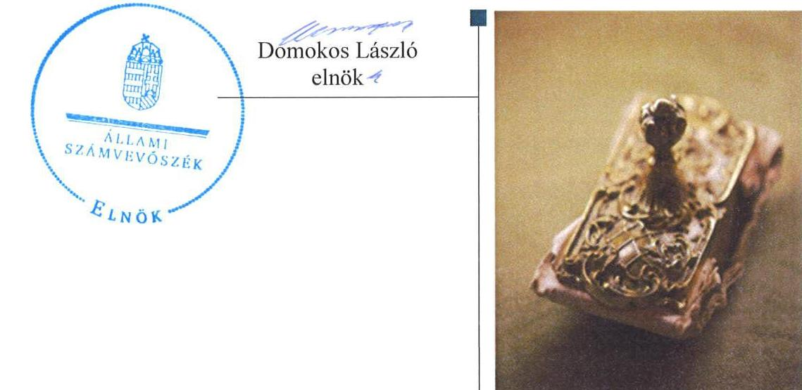
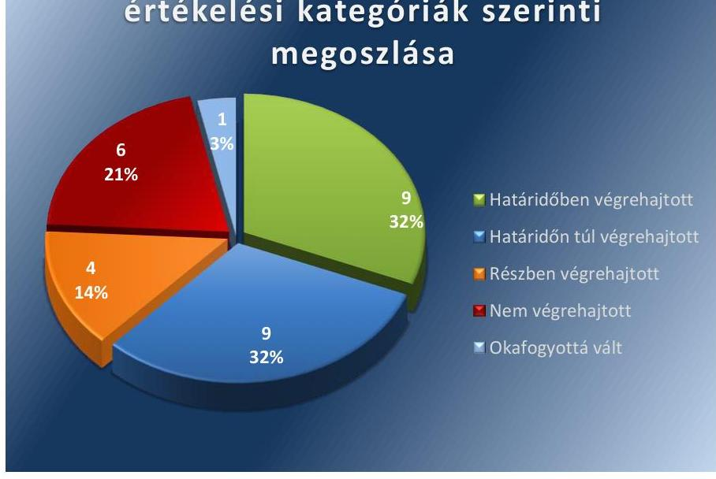

ÁLLAMI
SZÁMVEVŐSZÉK

# Jelentés 

## Utóellenőrzések

Szirák Község Önkormányzata belső kontrollrendszere kialakításának, egyes kontrolltevékenységek és a belső ellenőrzés működésének utóellenőrzése 2016.

---

# Jelentés 

## Utóellenőrzések

Szirák Község Önkormányzata belső
kontrollrendszere kialakításának, egyes
kontrolltevékenységek és a belső
ellenőrzés működésének utóellenőrzése
2016. OG hó 28. nap

---

|   | AZ ELLENŐRZÉST FELÜGYELTE:  |
| --- | --- |
|   | DR. BENEDEK MÁRIA felügyeleti vezető  |
|   | AZ ELLENŐRZÉST VEZETTE ÉS A VÉGREHAJTÁSÁÉRT FELELŐS:  |
|   | RÁCZKEVI KATALIN ellenőrzésvezető  |
|   | A PROGRAM ÖSSZEÁLLÍTÁSÁÉRT FELELŐS:  |
|   | JANIK JÓZSEF osztályvezető  |
|   | A TÉMÁHOZ KAPCSOLÓDÓ KORÁBBI SZÁMVEVŐSZÉKI JELENTÉSEK:  |
|  J | - címe: Jelentés Szirák Község Önkormányzata belső kontrollrendszerének kialakítása, valamint egyes kontrolltevékenységek és a belső ellenőrzés működése ellenőrzéséről  |
|  J | - sorszáma: 13037  |
|   | IKTATÓSZÁM: V-1077-053/2016.  |
|   | TÉMASZÁM: 2111.  |
|   | ELLENŐRZÉS-AZONOSÍTÓ SZÁM: V-071715  |

---

# TARTALOMJEGYZÉK 

■ ÖSSZEGZÉS ..... 5
■ AZ ELLENŐRZÉS CÉLJA ..... 6
■ AZ ELLENŐRZÉS TERÜLETE ..... 7
■ AZ ELLENŐRZÉS HÁTTERE, INDOKOLTSÁGA ..... 8
■ A JELENTÉS LÉNYEGES KÉRDÉSKÖREI ..... 9
■ ELLENŐRZÉS HATÓKÖRE ÉS MÓDSZEREI ..... 10
■ MEGÁLLAPÍTÁSOK ..... 13
■ MELLÉKLETEK ..... 17
I. SZ. MELLÉKLET: Az ÁSZ 13037. számú jelentéséhez kapcsolódó intézkedési terv végrehajtása ..... 17
■ FÜGGELÉK: ÉSZREVÉTELEK ..... 27
■ RÖVIDÍTÉSEK JEGYZÉKE ..... 29

---

.

---

# ÖSSZEGZÉS 

Az ÁSZ ${ }^{1}$ az Önkormányzat² ${ }^{2}$ belső kontrollrendszerének és belső ellenőrzésének utóellenőrzését 2013. május 28. és 2016. február 04. közötti időszakra végezte el. Megállapította, hogy az intézkedési tervben foglalt feladatok jelentős részét az Önkormányzat nem hajtotta végre, így nem tett megfelelő lépéseket az ÁSZ által korábban feltárt, a belső kontrollrendszert érintő hiányosságok megszüntetésére, ami kockázatot hordoz az Önkormányzat szabályozásában, müködtetésének szabályosságában és a felelős vezetői magatartásban.

## Az ellenőrzés társadalmi indokoltsága

Az ÁSZ stratégiájában célul tűzte ki a számvevőszéki munka hasznosulásának javítását. Ezzel összhangban ellenőrzi, hogy az ellenőrzött szervezetek megvalósították-e a korábbi ellenőrzései által feltárt hibák, hiányosságok és szabálytalanságok megszüntetése céljából elkészített intézkedési terveikben foglaltakat. A rendszeres utóellenőrzések hozzájárulnak a szükséges intézkedések tényleges végrehajtáshoz, ezáltal a közpénzügyek rendezettségének javulásához.

## Főbb megállapítások, következtetések

A polgármester ${ }^{3}$ az intézkedési tervet határidőben megküldte az ÁSZ részére. Az intézkedési tervben meghatározott 29 feladatból kilencet határidőben, kilencet határidőn túl, négyet részben hajtottak végre, hatot nem hajtottak végre, egy feladat végrehajtása - a jogszabályi változások miatt - okafogyottá vált. Így az ÁSZ által korábban az Önkormányzat belső kontrollrendszerének kialakítása, valamint az egyes kontrolltevékenységek és a belső ellenőrzés müködésének területén azonosított hiányosságok jelentős része továbbra is fennáll.

Az intézkedési tervben rögzített feladatok végrehajtásáról a Bkr. ${ }^{4}$-ben előírt nyilvántartást nem vezették.

---

# AZ ELLENŐRZÉS CÉLJA 

Az ellenőrzés célja annak értékelése volt, hogy a számvevőszéki jelentésben ${ }^{5}$ foglalt intézkedést igénylő megállapításokkal és javaslatokkal összhangban készített intézkedési tervben meghatározott feladatokat az Önkormányzat végrehajtotta-e.

---

# AZ ELLENŐRZÉS TERÜLETE 

## Az Önkormányzat

Szirák község Nógrád megyében a pásztói járásban fekszik, állandó lakosainak száma a KSH által közzétett népességi adatok szerint 2015. január 1-jén 1226 fő volt.

Az Önkormányzat, valamint Vanyarc Község Önkormányzata és Bér Község Önkormányzata 2012. szeptember 1-jétől közös önkormányzati hivatalt ${ }^{6}$ hoztak létre. Az utóellenőrzés idején hivatalban lévő polgármester a 2010. október 3-ai választások óta tölti be tisztségét, a jegyző ${ }^{7}$ 2012. szeptember 1jétől, a közös önkormányzati hivatal megalakulásától látja el a jegyzői feladatokat. Az Önkormányzat a 2014. évi éves költségvetési beszámoló szerint 249,7 millió Ft költségvetési bevételt ért el, valamint 234,9 millió Ft költségvetési kiadást teljesített.

Az Önkormányzat belső kontrollrendszerének kialakítását, valamint az egyes kontrolltevékenységek és a belső ellenőrzés működésének ellenőrzését az ÁSZ a 2009. január 1. és 2011. december 31. közötti időszakra végezte el, az erről szóló 13037. számú jelentését 2013. május 28-án tette közzé. Az ellenőrzés célja annak értékelése volt, hogy az Önkormányzat a jogszabályi előírásoknak megfelelően alakította-e ki a belső kontrollrendszert, megfelelően múköd-tette-e a gazdálkodás folyamatában kulcsszerepet betöltő szakmai teljesítésigazolás és utalvány ellenjegyzés kontrollokat, biztosította-e a belső ellenőrzés szabályos és eredményes múködését.

Az utóellenőrzés - 2013. május 28-tól 2016. február 4-ig végrehajtott feladatokat figyelembe véve - az ÁSZ jelentésben a polgármester és a jegyző részére megfogalmazott intézkedést igénylő megállapításokra és javaslatokra készített, az ÁSZ részére megküldött intézkedési tervben foglalt feladatok megvalósításának ellenőrzésére, illetve értékelésére fókuszált.

---

# AZ ELLENŐRZÉS HÁTTERE, INDOKOLTSÁGA 

Az ÁSZ tv. ${ }^{8}$ 33. § (1) bekezdése értelmében a számvevőszéki jelentések intézkedést igénylő megállapításaihoz és javaslataihoz kapcsolódóan az ellenőrzött szervezet vezetője intézkedési tervet köteles összeállítani, és az ÁSZ részére megküldeni. Az intézkedési tervben foglaltak megvalósítását az ÁSZ tv. 33. § (7) bekezdésében foglaltak alapján - az ÁSZ utóellenőrzés keretében ellenőrizheti. Az intézkedések megvalósulásának értékelése során az ÁSZ figyelembe veszi az ellenőrzött szervezetek működési feltételeiben, valamint a jogszabályi előírásokban bekövetkezett változásokat.

Az intézkedési tervekben foglalt feladatok hiányos, illetve késedelmes végrehajtása, valamint megvalósításának elmaradása azt mutatja, hogy az ellenőrzések során feltárt hibák, hiányosságok és szabálytalanságok megszüntetése nem kapott kellő hangsúlyt. Ez a szabályszerű működés és a felelős vezetői magatartás vonatkozásában kockázatot hordoz. E kockázatok feltárásával az ÁSZ utóellenőrzési rendszere fokozza a fegyelmet, és igazolja, hogy a közpénzzel való szabályos gazdálkodás felelőssége elől nem lehet kitérni.

## AZ UTÓELLENŐRZÉS VÁRHATÓ HASZNOSULÁSA

Az utóellenőrzés négy szinten hasznosulhat:

- A társadalom szintjén az utóellenőrzés jelzi, hogy a számvevőszéki ellenőrzés megállapításainak van következménye: a hiányosságok megszüntetésére az ellenőrzött szervezet által meghatározott intézkedések végrehajtását is számon kéri az ÁSZ.
- Az ellenőrzött terület szintjén az utóellenőrzés tájékoztatást nyújt a terület döntéshozóinak a hiányosságok kiküszöbölésének jó gyakorlatairól, ezzel lehetőséget biztosítva arra, hogy az ÁSZ ellenőrzési megállapításai, javaslatai a terület nem ellenőrzött szervezeteinek a működése során is hasznosuljanak.
- Az ellenőrzött szervezet szintjén az utóellenőrzés feltárja, hogy a szervezet az intézkedések végrehajtásával hasznosította-e a korábbi ellenőrzési jelentésben a hiányosságok megszüntetése, illetve a kockázatok kezelése érdekében megfogalmazott javaslatokat.
- Az ÁSZ szintjén az utóellenőrzés visszacsatolást ad az ellenőrzési jelentések hasznosulásáról, az intézkedések elmaradása vagy részleges megvalósulása a további ellenőrzésekhez kockázati jelzésként szolgál.

---

# A JELENTÉS LÉNYEGES KÉRDÉSKÖREI 

Az Önkormányzat az intézkedési tervben foglaltakat az elöirt határidőben végrehajtotta-e?

---

# ELLENŐRZÉS HATÓKÖRE ÉS MÓDSZEREI 

## Az ellenőrzés típusa

Megfelelőségi ellenőrzés

## Az ellenőrzött időszak

Az utóellenőrzés alapját képező ÁSZ jelentés közzétételének napjától (2013. május 28.) az ellenőrzésről szóló kiértesítő levél keltének napjáig (2016. február 4.) tartó időszak.

## Az ellenőrzés tárgya

Az ÁSZ tv. 2011. július 1-jei hatálybalépését követően a számvevőszéki jelentésben foglalt intézkedést igénylő megállapításokkal és javaslatokkal összhangban - Önkormányzat által - készített intézkedési tervben foglaltak végrehajtásának ellenőrzése.

Az ellenőrzés kiterjed minden olyan körülményre és adatra, amely az ÁSZ jogszabályban meghatározott feladatainak teljesítéséhez, valamint a program végrehajtása folyamán felmerült újabb összefüggések feltárásához szükséges.

## Az ellenőrzött szervezet

Szirák Község Önkormányzata

## Az ellenőrzés jogalapja

Az ÁSZ törvényben meghatározott feladatkörében ellenőrzi a központi költségvetés végrehajtását, az államháztartás gazdálkodását, az államháztartásból származó források felhasználását és a nemzeti vagyon kezelését.

Az ÁSZ tv. 1. § (3) bekezdése szerint az ÁSZ általános hatáskörrel végzi a közpénzekkel és az állami és önkormányzati vagyonnal való felelős gazdálkodás ellenőrzését.

Az ÁSZ tv. 33. § (7) bekezdése alapján az ÁSZ tv. 33. § (1)-(2) bekezdése szerinti intézkedési tervben foglaltak megvalósítását az ÁSZ utóellenőrzés keretében ellenőrizheti.

---

# Az ellenőrzés módszerei 

Az ÁSZ az ellenőrzést a nemzetközi standardokat irányadónak tekintve az ellenőrzési program ellenőrzési kérdései, az ellenőrzött időszakban hatályos jogszabályok, az ellenőrzés szakmai szabályok és módszertanok figyelembevételével, önállóan vagy ellenőrzéshez kapcsolódóan végezte.

Az ÁSZ az ellenőrzés ideje alatt az Önkormányzattal történő kapcsolattartást az ÁSZ SZMSZ²-ének vonatkozó előírásai alapján biztosította.

Az utóellenőrzés megállapításait elsősorban az ÁSZ rendelkezésére álló, valamint az ellenőrzött szervezetektől elektronikusan bekért dokumentumok alapozták meg.

Az ellenőrzési bizonyítékként felhasználható adatforrások közé tartoznak egyrészt a szakmai programban felsorolt adatforrások, másrészt minden - az ellenőrzés folyamán feltárt, az ellenőrzés szempontjából információt tartalmazó - dokumentum.

A pénzügyi folyamatokban kulcsszerepet betöltő kontrollokra vonatkozóan az intézkedési tervben foglalt feladatok végrehajtását az államháztartáson kívülre teljesített működési célú pénzeszközátadásoknál, az állományba nem tartozók megbízási díjainál, továbbá a külső szolgáltatók által végzett karbantartási, kisjavítási munkákkal kapcsolatos kifizetéseknél 10 elemú véletlen mintavétellel kiválasztott tételek alapján értékelte az ÁSZ. A kiválasztott tételek esetében azt ellenőrizte, hogy az Önkormányzat az intézkedési tervben meghatározott feladatok végrehajtása érdekében biz-tosította-e a jogszabályok és a belső szabályzatok előírásainak megfelelő múködtetést.

Az intézkedési tervben előírt feladatokat azok végrehajthatósága, illetve végrehajtása szempontjából az alábbiak szerint értékelte az ÁSZ:
"határidőben végrehajtott" a feladat, ha a teljesítés dokumentáltan, az intézkedési tervben előírt határidőben és tartalommal megtörtént;
"határidőn túl végrehajtott" a feladat, ha annak teljesítése az intézkedési tervben meghatározott módon, de az előírt határidőn túl történt meg;
"részben végrehajtott" a feladat, ha végrehajtása teljes körűen az intézkedési tervben előírt módon nem történt meg;
"nem végrehajtott" a feladat, ha a végrehajtás nem történt meg, vagy amennyiben a teljesítést nem dokumentálták;
"okafogyottá vált" a feladat, ha végrehajtására - meghatározott esemény bekövetkezése, továbbá külső körülmény, a múködést érintő feltétel változása miatt - már nincs szükség, illetve lehetőség, és egyértelmúen megállapítható, hogy az intézkedést szükségessé tevő körülmény a jövőben nem fordulhat elő;
"nem időszerü" az a feladat, amelynek ellenőrzési időszakon belüli végrehajtására azért nem került (kerülhetett) sor, mert az intézkedés alapjául szolgáló esemény nem következett be, de annak jövőbeni előfordulása lehetséges, a végrehajtása nem volt esedékes, vagy a végrehajtás határideje még nem járt le.
Az ellenőrzés lefolytatásához az Önkormányzat tanúsítványok elektronikus kitöltésével, valamint az ÁSZ által kért dokumentumok elektronikus

---

megküldésével szolgáltatott adatokat, amelyek valódiságát és teljes körűségét a polgármester és a jegyző által tett teljességi és hitelességi nyilatkozat igazolta. Az így rendelkezésre bocsátott adatok, információk kontrollja az ellenőrzés keretében történt.

---

# MEGÁLLAPÍTÁSOK 

## Az Önkormányzat az intézkedési tervben foglaltakat az előírt határidőben végrehajtotta-e?

Összegző megállapítás

Az Önkormányzat az intézkedési tervben meghatározott 29 intézkedésből kilencet határidőben, kilencet határidőn túl, négyet részben és hatot nem hajtott végre, továbbá egy feladat okafogyottá vált. Az intézkedési tervben rögzített feladatok végrehajtásáról a Bkr.-ben előírt nyilvántartást nem vezették.

Az intézkedési tervben meghatározott feladatokat, határidőket, az ÁSZ jelentés javaslatainak címzettjét és a feladatok végrehajtását az I. számú melléklet mutatja be.

Az ÁSZ a jelentésében a polgármester részére három, a jegyző részére huszonhat javaslatot fogalmazott meg. A polgármester által összeállított és az ÁSZ részére megküldött intézkedési tervben a hiányosságok, szabálytalanságok megszüntetésére huszonkilenc feladatot határoztak meg. A feladatok elvégzésének felelőseként három esetben a polgármestert, huszonhat esetben pedig a jegyzőt jelölték meg.

Az Önkormányzat intézkedési tervében tervezett feladatok végrehajtásának értékelési kategóriák szerinti megoszlását az 1. ábra szemlélteti.

1. ábra

## A feladatok végrehajtásának értékelési kategóriák szerinti megoszlása

---

# HATÁRIDŐBEN VÉGREHAJTOTT feladat: 

1. A jegyző előkészítette a gazdasági program ${ }^{10}$ tervezetét és kezdeményezte a polgármesternél annak Képviselő-testület ${ }^{11}$ elé terjesztését.
2. A polgármester a Képviselő-testület elé terjesztette a gazdasági program jegyző által előkészített tervezetét.
3. A jegyző elkészítette a Tűzvédelmi Szabályzatot ${ }^{12}$.
4. A jegyző a Közszolgálati Szabályzatban ${ }^{13}$ intézkedett a Hivatal ${ }^{14}$ köztisztviselőire vonatkozóan a teljesítményértékeléssel kapcsolatos szabályok kialakításáról és alkalmazásáról.
5. A jegyző elkészítette a Hivatalban ellátott feladatokra vonatkozóan az ellenőrzési nyomvonalat.
6. A jegyző gazdálkodási szabályzat ${ }_{7}{ }^{15}$ kiadásával gondoskodott az előzetes írásbeli kötelezettségvállaláshoz nem kötött kifizetések rendjének, eljárási részletszabályainak meghatározásáról.
7. A jegyző intézkedett az információs és kommunikációs rendszer kialakításáról a Hivatal Informatikai Biztonsági Szabályzatának ${ }^{16}$ elkészítésével. Az információs és kommunikációs rendszert működtették és fejlesztették.
8. A jegyző elkészítette az adatvédelmi és adatbiztonsági szabályzatot.
9. A jegyző rendelkezett az Önkormányzattal kapcsolatos információk esetében a közérdekú adatok közzétételi eljárásának, nyilvánosságra hozatala rendjének, a közérdekú adatok megismerésére irányuló kérelmek teljesítése rendjének szabályozásáról a Közérdekú Adatok Szabályzatában ${ }^{17}$. A közérdekú adatok közzétételének adatfelelősét és az adatközlő személyt kijelölték.

## HATÁRIDŐN TÚL VÉGREHAJTOTT feladatok:

10. A jegyző az intézkedési tervben meghatározott 2013. augusztus 31-ei határidőt túllépve 2014. január 1-jei hatállyal intézkedett a számviteli politika kialakításáról, az eszközök és források értékelési szabályzatának elkészítéséről, valamint a számlarend kialakításáról, továbbá 2014. január 6-ai hatállyal a bizonylati rend meghatározásáról.
11. A jegyző az intézkedési tervben meghatározott 2013. július 31-ei határidőt követően 2014. szeptember 8-án határozta meg az egészséget nem veszélyeztető és biztonságos munkavégzés követelményei megvalósításának módját a Munkabiztonsági Kockázatértékelésben ${ }^{18}$.
12. A jegyző az intézkedési tervben meghatározott 2013. augusztus 31-ei határidőt követően a 2014. február 3-án elkészített Ügyrendben ${ }^{19}$ és a munkaköri leírásokban alakította ki a hivatali tevékenységekre vonatkozó beszámolási eljárásokat.
13. A jegyző az intézkedési tervben előírt 2013. július 31-ei határidőt követően 2015. február 17-én gondoskodott az adatok biztonságáról, és intézkedett a hozzáférési jogosultságok megállapításáról,

---

módosításáról és nyilvántartásáról, és a betartásuk ellenőrzésére vonatkozó eljárásrend meghatározásáról.
14. A jegyző az intézkedési tervben előírt 2013. augusztus 31-ei határidőt követően 2014. augusztus 24-én készítette el Szabálytalanságok kezelésének eljárásrendjét ${ }^{20}$.
15. A jegyző az intézkedési tervben előírt 2013. augusztus 16-ai határidőt követően, 2014. január 1-től gondoskodott a kötelezettségvállalások nyilvántartásba vételéről, az utalványrendeleteken, illetve a pénztárbizonylatokon 2014. január 1-jét követően feltüntették a kedvezményezett nevét és a kötelezettségvállalás nyilvántartási számát.
16. A jegyző az intézkedési tervben meghatározott 2013. július 31-ei határidőt követően 2015. március 5-én intézkedett a hivatali SZMSZ ${ }^{21}$ módosításáról és kezdeményezte a polgármesternél a módosítás Képviselő-testület elé terjesztését. A módosított SZMSZ tartalmazta a belső ellenőrzést végzők jogállását és feladatait.
17. A jegyző az intézkedési tervben foglalt határidőn - 2013. november 30-át követően - 2014. január 8-án készítette elő az éves ellenőrzési tervről szóló előterjesztést, és kezdeményezte a polgármesternél a Képviselő-testület elé terjesztését a 2013. év december 31-ig történő jóváhagyás érdekében.
18. A jegyző a 2014. évi ellenőrzési terv tekintetében az intézkedési tervben előírt 2013. november 4-ei határidőt követően 2014. január 2-án intézkedett arról, hogy az éves ellenőrzési tervek tartalmazzák a Bkr.-ben előírt tartalmi követelményeket.

# RÉSZBEN VÉGREHAJTOTT feladatok: 

19. A jegyző az intézkedési tervben előírt 2013. szeptember 30-i határidőt követően 2014. február 3-án elkészítette a Bkr.-nek megfelelően a Kockázatkezelési Szabályzatot ${ }^{22}$, a kockázatkezelési rendszert kialakította, azonban nem működtette.
20. A jegyző gondoskodott a Bkr. alapján a vagyonhasznosítási tevékenység folyamatba épített, előzetes, utólagos és vezetői ellenőrzés feladatainak meghatározásáról a FEUVE szabályozásban ${ }^{23}$, a szabálytalanságkezelés és az iratkezelés kivételével.
21. A jegyző az intézkedési tervben meghatározott 2013. július 31-i határidőt követően 2015. január 1-jén készítette el az Iratkezelési Szabályzatot ${ }^{24}$ az Ltv ${ }^{25}$. előírásai szerint. 2015. január 1-jén nem a Magyar Nemzeti Levéltár és az illetékes kormányhivatal egyetértésével adták ki az Iratkezelési Szabályzatot.
22. A jegyző 2013. évre vonatkozóan intézkedett a Bkr. szerint a belső ellenőrzési jelentések alapján az intézkedési terv elkészítéséről, 2014. évben azonban nem intézkedett.

## NEM VÉGREHAJTOTT feladatok:

23. A jegyző a belső ellenőrzési jelentések alapján megtett intézkedések Bkr.-nek megfelelő nyomon követéséről nem intézkedett.

---

24. A jegyző nem alakította ki és nem működtette a Bkr.-ben előírtak alapján a Hivatal tevékenységének, a célok megvalósításának nyomon követését biztosító, az operatív tevékenységek keretében megvalósuló folyamatos és eseti nyomon követést is magában foglaló rendszert.
25. A polgármester nem biztosította, hogy az Önkormányzat nevében történő kötelezettségvállalásra az új Áht ${ }^{26}$, előírásaiban foglaltak szerint előírt esetekben írásban, az írásos kötelezettségvállalásokra pénzügyi ellenjegyzés után kerüljön sor, mivel pénzügyi ellenjegyzés nem történt.
26. A polgármester nem intézkedett a korábbi ellenőrzés során feltárt hiányosságok és szabálytalanságok tekintetében az esetleges munkajogi felelősséggel kapcsolatos körülmények kivizsgálásáról és nem került sor felelősségre vonás kezdeményezésére. A gazdálkodási szabályzat ${ }_{1,2}{ }^{27}$-ben az Ávr. ${ }^{28}$ figyelembe vétele nélkül történt meg a teljesítésigazolásra jogosultak kijelölése, így a polgármester nem intézkedett arra vonatkozóan, hogy az Önkormányzat kiadási előirányzata terhére vállalt kötelezettség esetében a teljesítésigazolásra jogosult személyeket a kötelezettségvállaló írásban jelölje ki, ezért az érvényesítő a teljesítésigazolás alapján nem tudta elvégezni az Ávr.-ben előírt ellenőrzési feladatait.
27. A jegyző nem gondoskodott arról, hogy a z Önkormányzat kiadási előirányzata terhére vállalt kötelezettség esetében a teljesítésigazolást az Ávr. figyelembevételével kijelölt személyek végezzék el, és a teljesítésigazolás során előírt ellenőrzési feladataiknak eleget tegyenek.
28. A jegyző nem gondoskodott arról, hogy a kifizetéseket megelőzően az Ávr. szerint a teljesítésigazolás alapján - az Ávr. szerinti esetben annak hiányában is - az összegszerűségnek, a fedezet meglétének és a megelőző ügymenetben az új Áht., az Áhsz. ${ }^{29}$, az új Áhsz. ${ }^{30}$ és az Ávr. előírásai és a belső szabályzatokban foglaltak betartásának az ellenőrzése megtörténjen. Az érvényesítő az összegszerűséget, a fedezet meglétét nem ellenőrizte, valamint nem jelezte az utalványozónak, hogy a teljesítésigazoló nem volt jogosult a teljesítésigazolásra.

# OKAFOGYOTTÁ VÁLT feladat: 

29. A 2014. évi belső ellenőrzési terv elkészítéséhez a jegyző írásos véleményének kikérése okafogyottá vált, mert a jogszabályi változások miatt az önkormányzati belső ellenőrzési feladatok ellátása 2013. január 1-től nem társulás formájában történt.

Az intézkedési tervben rögzített feladatok végrehajtásáról a Bkr.-ben előírt nyilvántartást nem vezették.

---

# MELLÉKLETEK

■ I. SZ. MELLÉKLET: AZ ÁSZ 13037. SZÁMÚ JELENTÉSÉHEZ KAPCSOLÓDÓ INTÉZKEDÉSI TERV VÉGREHAJTÁSA

|  Sorszám | Az intézkedési terv alapján elvégzendő feladat | Az intézkedési tervben meghatározott határidő | Az ÁSZ 13037. sz. jelentése javaslatának címzettje | A feladat végrehajtása  |
| --- | --- | --- | --- | --- |
|   | 1. | 2.
Határidőben végrehajtott feladatok | 3.
3. | 4.  |
|  1. | A jegyző készítse elő a Htv. 140. § (1) bekezdés a) pontjában foglaltak alapján a gazdasági program tervezetét a Mótv. ${ }^{31} 116 .$ § (3)(4) bekezdésében foglalt tartalommal, és kezdeményezze a polgármesternél a Képvi-selő-testület elé terjesztését. | 2013. június 30. | jegyző | A jegyző a Htv. 140. § (1) bekezdés a) pontjában foglaltak alapján az előírt határidőre, az Mótv. 116. § (3)-(4) bekezdésében foglalt tartalommal előkészítette a gazdasági program tervezetét és kezdeményezte a pol-gármesternél annak Képviselő-testület elé terjesztését, amely meg is történt. Szirák Község Önkormányzatának 2013-2015. évekre vonatkozó gazdasági programját a Képviselő-testület 152/2013. (VII. 17.) számú határozatával fogadta el.  |
|  2. | A polgármester terjessze a Képviselő-testület elé a gazdasági program jegyző által elkészített tervezetét a Mótv. 116. § (1) és (5) bekezdései alapján, a (3)-(4) bekezdésekben foglalt tartalommal. | 2013. július 31. | polgármester | A polgármester az Mótv. 116. §. (1) és (5) bekezdései alapján a 20132014. évi gazdasági programtervezetet 2013. július 17-én a Képviselőtestület elé terjesztette, mely a 152/2013. (VII. 17.) számú határozattal elfogadásra került. A jegyző által előkészített, a 2015-2019. évekre szóló gazdasági programtervezetet a polgármester 2015. április 20-án a Kép-viselő-testület elé terjesztette, melyet a testület 13/2015. (IV. 20.) számú határozatával fogadott el.  |
|  3. | A jegyző készítse el a tűzvédelmi szabályzatot a Tvtv. ${ }^{32} 19 .$ § (1) bekezdésében foglalt előírásnak megfelelően. | 2013. július 31. | jegyző | A jegyző 2013.03.1-én intézkedett Vanyarc Közös Önkormányzati Hivatal Tűzvédelmi Szabályzatának a Tvtv. 19. § (1) bekezdésében foglalt előírásnak megfelelően való elkészítéséről, mely szabályzat az aláírás napján hatályba lépett.  |
|  4. | Intézkedjen a Polgármesteri Hivatal köztisztviselőire vonatkozóan a Kttv. ${ }^{33} 130 .$ § (1)-(6) bekezdéseiben előírtak szerint a teljesítményértékeléssel kapcsolatos szabályok kialakításáról és alkalmazásáról. | 2013. augusztus 31. | jegyző | A jegyző az intézkedési tervben foglalt határidőben intézkedett Vanyarci Közös Önkormányzati Hivatal köztisztviselőire vonatkozóan a Kttv. 130. § (1)-(6) bekezdéseiben előírtak szerint a teljesítményértékeléssel kapcsolatos szabályok kialakításáról és alkalmazásáról. Elkészítette 2013. április 2-án a Vanyarc Közös Önkormányzati Hivatal Közszolgálati Sza-  |

---

|  4. | Az intézkedési terv alapján elvégzendő feladat | Az intézkedési tervben meghatározott határidő | Az ÁSZ 13037. sz. jelentése javaslatának címzettje | A feladat végrehajtása  |
| --- | --- | --- | --- | --- |
|   | 1. | 2. | 3. | 4.  |
|   |  |  |  | bályzatát, amely tartalmazta a teljesítményértékeléssel kapcsolatos szabályokat. A teljesítményértékelési szabályokat az ellenőrzött időszakban alkalmazták, az egyéni és a közös hivatali minősítési lapok tanúsága szerint a köztisztviselők teljesítményértékelését a 2013-2015. években elvégezték.  |
|  5. | A jegyző készítse el a Polgármesteri Hivatalban ellátott feladatokra vonatkozóan az ellenőrzési nyomvonalat a Bkr. 6. § (3) bekezdés előírásának megfelelően. | 2013. szeptember 30. | jegyző | A jegyző Vanyarci Közös Önkormányzati Hivatalban ellátott feladatokra vonatkozóan az ellenőrzési nyomvonalat a Bkr. 6. § (3) bekezdés előírásának megfelelően, a FEUVE 1. számú mellékleteként 2013. április 10-én, az intézkedési tervben vállalt határidő előtt elkészítette. A FEUVE mellékleteivel együtt 2013. május 1-én lépett hatályba.  |
|  6. | Gondoskodjon az Ávr. 53. § (2) bekezdésének megfelelően az előzetes írásbeli kötelezettségvállaláshoz nem kötött kifizetések rendjének, eljárási részletszabályainak meghatározásáról. | 2013. augusztus 31. | jegyző | A jegyző gondoskodott az Ávr. 53. § (2) bekezdésének megfelelően az előzetes írásbeli kötelezettségvállaláshoz nem kötött kifizetések rendjének, eljárási részletszabályainak meghatározásáról, a gazdálkodási szabályzat; elkészítésével. A gazdálkodási szabályzat; szintén tartalmazta az intézkedési tervben előírt feladat végrehajtását.  |
|  7. | A jegyző az információs és kommunikációs rendszerrel kapcsolatban intézkedjen a következőkről:
a) A jegyző intézkedjen az információs és kommunikációs rendszer kialakításáról, működtetéséről és fejlesztéséről a Bkr. 3. § d) pontjának megfelelően. | 2013. szeptember 30. | jegyző | A jegyző intézkedett az információs és kommunikációs rendszer kialakításáról, működtetéséről és fejlesztéséről a Bkr. 3. § d) pontjának megfelelően. A jegyző az intézkedési tervben foglalt határidőre elkészítette a Vanyarc Közös Önkormányzati Hivatal Informatikai Biztonsági Szabályzat – Adatvédelmi és Számítástechnikai Védelmi Szabályzatot, amely 2013. március 1-jétől volt hatályos. 2015. február 17-étől hatályos Vanyarci Közös Önkormányzati Hivatal Informatikai Biztonsági Szabályzata. Az információs és kommunikációs rendszer működtetését a könyvelés és a költségvetési beszámolás feladatainak teljesítése, valamint – az IBSZ34-re vonatkozó megbízási szerződéssel – az adatbiztonság és az elektronikus információs rendszer működtetése folyamatosságának biztosítása, fejlesztését notebookok és operációs rendszerek vásárlása tanúsítja.  |
|  8. | A jegyző az információs és kommunikációs rendszerrel kapcsolatban intézkedjen a következőkről:
c) Készítsen adatvédelmi és adatbiztonsági szabályzatot az Info tv. 24. § (3) bekezdése alapján. | 2013. július 31. | jegyző | A jegyző az intézkedési tervben foglalt határidőre elkészítette adatvédelmi és adatbiztonsági szabályzatot az Info tv. 24. § (3) bekezdése alapján. A Vanyarci Közös Önkormányzati Hivatal Informatikai Biztonsági Szabályzat - Adatvédelmi és Számítástechnikai Védelmi Szabályzat 2013. március 1-jétől volt hatályos, ezt követően 2015. február 17-én készült  |

---

|  8
sír
sí | Az intézkedési terv alapján elvégzendő feladat | Az intézkedési tervben meghatározott határidő | Az ÁSZ 13037. sz. jelentése javaslatának címzettje | A feladat végrehajtása  |
| --- | --- | --- | --- | --- |
|   | 1. | 2. | 3. | 4.  |
|  9. | A jegyző az információs és kommunikációs rendszerrel kapcsolatban intézkedjen a következőkről:
d) Rendelkezzen az Önkormányzattal kapcsolatos információk esetében az Info. tv. 35. § (3) bekezdése alapján a közérdekű adatok közzétételi eljárásának, nyilvánosságra hozatala rendjének, valamint az Ávr. 13. § (2) bekezdés h) pontja alapján a közérdekű adatok megismerésére irányuló kérelmek teljesítése rendjének szabályozásáról a közérdekű adatok megismerésére irányuló kérelmek intézésének és a kötelezően közzéteendő adatok nyilvánosságra hozatalának szabályzatának elkészítésével. A szabályzatban kijelölte a közérdekű adatok közzétételének adatfelelősét és az adatközlő személyt. | 2013. július 31. | jegyző | el a Vanyarc Közös Önkormányzati Hivatal Informatikai Biztonsági Szabályzat.
A jegyző rendelkezett az Önkormányzattal kapcsolatos információk esetében az Info tv. 35. § (3) bekezdése alapján a közérdekű adatok közzétételi eljárásának, nyilvánosságra hozatala rendjének, valamint az Ávr. 13. § (2) bekezdés h) pontja alapján a közérdekű adatok megismerésére irányuló kérelmek teljesítése rendjének szabályozásáról a közérdekű adatok megismerésére irányuló kérelmek intézésének és a kötelezően közzéteendő adatok nyilvánosságra hozatalának szabályzatának elkészítésével. A szabályzatban kijelölte a közérdekű adatok közzétételének adatfelelősét és az adatközlő személyt.  |
|   | Határidőn túl végrehajtott feladatok |  |  |   |
|  10. | A jegyző intézkedjen a Számv. tv. ${ }^{35}$ 14. § (3)(5) és a 161. § (1)-(2) bekezdéseiben foglalt számviteli politika kialakításáról, az eszközök és források értékelési szabályzatának elkészítéséről, a számlarend és a bizonylati rend meghatározásáról. | 2013. augusztus 31. | jegyző | A jegyző intézkedett a Számv. tv. 14. § (3)-(5) és a 161. § (1)-(2) bekezdéseiben foglalt számviteli politika kialakításáról, az eszközök és források értékelési szabályzatának elkészítéséről, a számlarend és a bizonylati rend meghatározásáról. Határidőn túl elkészült a 2014. január 1-jétől érvényes Vanyarci Közös Önkormányzati Hivatal számviteli politikája, a 2014. január 1-jétől hatályos eszközök és források minősítésének és értékelésének szabályzata, a 2014. január 1-jétől hatályos számlarendje és a 2014. január 6-tól hatályos bizonylati rendje.  |
|  11. | A jegyző határozza meg az egészséget nem veszélyeztető és biztonságos munkavégzés követelményei megvalósításának módját az Mvtv. ${ }^{36}$ 2. § (3) bekezdése alapján. | 2013. július 31. | jegyző | A jegyző határidőn túl meghatározta az egészséget nem veszélyeztető és biztonságos munkavégzés követelményei megvalósításának módját az Mvtv. 2. § (3) bekezdése alapján. A 2013. április 15-étől hatályos Közszolgálati szabályzat kizárólag egy részterületet, a képernyő előtti munkavégzés egészségügyi körülményeit szabályozta. A követelményeknek  |

---

|  1. | Az intézkedési terv alapján elvégzendő feladat | Az intézkedési tervben meghatározott határidő | Az 452.13037. sz. jelentése javaslatának címzettje | A feladat végrehajtása  |
| --- | --- | --- | --- | --- |
|   | 1. | 2. | 3. | 4.  |
|  12. | Alakítsa ki a Bkr. 8. § (4) bekezdés c) pontjának megfelelően a hivatali tevékenységekre vonatkozó beszámolási eljárásokat. | 2013. augusztus 31 | jegyző | megfelelő, teljes körű szabályozás, a Vanyarci Közös Önkormányzati Hivatal Intézményeire vonatkozó Munkabiztonsági Kockázatértékelés 2014. szeptember 8-án készült el.  |
|   |  |  |  | Az Ügyrend a Vanyarci Közös Önkormányzati Hivatal gazdálkodással öszszefüggő feladataira 2014. február 3-ától hatályos. Az Ügyrendben foglaltak szerint a Hivatal ellátja Szirák Község Önkormányzata gazdálkodási feladatait. Az Ügyrend 9. pontjában tartalmazta az adatszolgáltatáshoz, beszámoló készítéshez (időközi költségvetési jelentés, időközi mérlegjelentés, éves elemi beszámoló, zárszámadás) kapcsolatos feladatokat, felelősöket, valamint azt, hogy a jegyző a belső kontrollrendszer minőségét értékeli és nyilatkozatot tesz. A pénzügyi gazdálkodási ügyintézők munkaköri leírásai tartalmazták a beszámolási feladatokat.  |
|  13. | A jegyző az információs és kommunikációs rendszerrel kapcsolatban intézkedjen a következőkről: e) Gondoskodjon az Info tv ${ }^{37}$. 7. § (2)-(3) bekezdései alapján az adatok biztonságáról, és intézkedjen a hozzáférési jogosultságok megállapításáról, módosításáról és nyilvántartásáról, és a betartásuk ellenőrzésére vonatkozó eljárásrend meghatározásáról. | 2013. július 31 | jegyző | A jegyző határidőn túl gondoskodott az Info tv. 7. § (2)-(3) bekezdései alapján az adatok biztonságáról, és intézkedett a hozzáférési jogosultságok megállapításáról, módosításáról és nyilvántartásáról, és a betartásuk ellenőrzésére vonatkozó eljárásrend meghatározásáról. A 2015. évi szabályozás, Vanyarc Közös Önkormányzati Hivatal Informatikai Biztonsági Szabályzat (hatályos 2015. február 17-étől) tartalmazta az előírt követelményeket.  |
|  14. | A jegyző az információs és kommunikációs rendszerrel kapcsolatban intézkedjen a következőkről: f) Szabályozza a szabálytalanságok kezelésének eljárásrendjét a Bkr. 6. § (4) bekezdésében foglaltaknak megfelelően. | 2013. augusztus 31. | jegyző | A jegyző határidőn túl szabályozta a szabálytalanságok kezelésének eljárásrendjét a Bkr. 6. § (4) bekezdésében foglaltaknak megfelelően. Elkészítette Vanyarc Közös Önkormányzati Hivatal Szabálytalanságok kezelésének eljárásrendjét, amely 2014. szeptember 1-jétől hatályos.  |
|  15. | Gondoskodjon - a szakmai teljesítés igazolása, az érvényesítés és az utalvány ellenjegyzése vonatkozásában feltárt hiányosságok megszüntetése, illetve az operatív gaz- | azonnal, majd folyamatos | jegyző | A jegyző gondoskodott arról, hogy az Ávr. 56. § (1) bekezdésében előírt kötelezettségvállalások nyilvántartásba vétele megtörténjen, erre 2013. augusztus 16-i határidőt követően, 2014. január 1-jétől került sor.  |

---

|  1. | Az intézkedési terv alapján elvégzendő feladat | Az intézkedési tervben meghatározott határidő | Az ÁSZ 13037. sz. jelentése javaslatának címzettje | A feladat végrehajtása  |
| --- | --- | --- | --- | --- |
|   | 1. | 2. | 3. | 4.  |
|   | dálkodás során a müködésbeli hibák megelőzése, feltárása és kijavítása érdekében arról, hogy:
c) az Ávr 56. § (1) bekezdésében előírt kötelezettségvállalások nyilvántartásba vétele megtörténjen, és az utalványrendeleteken az Ávr. 59. § (3) bekezdés c) és f) pontjában foglaltaknak megfelelően tüntessék fel a kedvezményezett nevét és a kötelezettségvállalás nyilvántartási számát. |  |  | Az utalványrendeleteken, illetve a pénztárbizonylaton 2014. január 1jétől az Ávr. 59. § (3) bekezdés c) és f) pontjában foglaltak szerint feltüntették a kedvezményezett nevét, a kötelezettségvállalás nyilvántartásba vételi számát.  |
|  16. | A jegyző a belső ellenőrzés működésével kapcsolatban:
a) Módosítsa a hivatali SZMSZ-t, és kezdeményezze a polgármesternél a módosítás Képviselő-testület elé terjesztését annak érdekében, hogy a hatályos SZMSZ a Bkr. 15. § (2) bekezdésének megfelelően tartalmazza a belső ellenőrzést végzők jogállását és feladatait. | 2013. július 31. | jegyző | A jegyző határidőn túl módosította a hivatali SZMSZ-t és kezdeményezte a polgármesternél a módosítás Képviselő-testület elé terjesztését, annak érdekében, hogy az SZMSZ tartalmazza a Bkr. 15. § (2) bekezdésének megfelelően a belső ellenőrzést végzők jogállását és feladatait. A Képviselő-testület a 2015. október 6-tól hatályos SZMSZ-t a 2/2015. (III. 09.) számú rendelettel fogadta el. Az önkormányzat 2013. május 14-én megbízási szerződést kötött külső szolgáltatóval a belső ellenőrzési feladatok ellátására.  |
|  17. | A jegyző a belső ellenőrzés működésével kapcsolatban:
b) Készítse elő az éves ellenőrzési tervről szóló előterjesztést, és kezdeményezze a polgármesternél a Képviselő-testület elé terjesztését annak érdekében, hogy a Képviselő-testület azt a Mótv. 119. § (5) bekezdésében előírt határidőig jóváhagyhassa. | 2013. évi módosítás határideje: 2013. július 31.
2014. évi belső ellenőrzési terv határideje: 2013. november 30. | jegyző | A jegyző határidőn túl készítette elő az éves ellenőrzési tervről szóló előterjesztést, és kezdeményezte a polgármesternél a Képviselő-testület elé terjesztését annak érdekében, hogy a Képviselő-testület azt a Mótv. 119. § (5) bekezdésében előírt határidőig jóváhagyhassa. A Képviselőtestület 2014. évi ellenőrzési terv jóváhagyásáról az előírt 2013. december 31. helyett, csak 2014. január 8-án, 1/2014. (I.08) számú határozatával döntött. A 2015. évre vonatkozó belső ellenőrzési tervet a Képviselőtestület a 135/2014 (XI. 12.) számú határozatával - a törvény által meghatározott határidőn belül - hagyta jóvá.  |
|  18. | A jegyző a belső ellenőrzés működésével kapcsolatban: | 2013. november 4.,utána folyamatos | jegyző | A jegyző határidőn túl intézkedett arról, hogy az éves ellenőrzési tervek tartalmazzák a Bkr. 31. § (4) bekezdésében előírt tartalmi követelményeket. A 2014. és 2015. évi ellenőrzési tervek tartalmazták a Bkr. 31. § (4)  |

---

|  18
KÖREZ | Az intézkedési terv alapján elvégzendő feladat | Az intézkedési tervben meghatározott határidő | Az ÁSZ 13037. sz. jelentése javaslatának címzettje | A feladat végrehajtása  |
| --- | --- | --- | --- | --- |
|   | 1. | 2. | 3. | 4.  |
|   | d) Intézkedjen arról, hogy az éves ellenőrzési tervek tartalmazzák a Bkr. 31. § (4) bekezdésében előírt tartalmi követelményeket. |  |  | bekezdésében előírt tartalmi elemeket. A 2014. évi ellenőrzési terv tekintetében az elfogadott intézkedési tervben rögzített határidőn túl 2013. november 4-én történt az intézkedés.  |
|   |  |  | Részben végrehajtott feladatok |   |
|  19. | A jegyző alakítson ki és működtessen kockázatkezelési rendszert a Bkr. 7. §-nak megfelelően. | 2013. szeptember 30. | jegyző | A jegyző a feladatot részben hajtotta végre, kialakította kockázatkezelési rendszert a Bkr. 7. §-nak megfelelően, mert határidőn túl elkészítette Vanyarci Közös Önkormányzati Hivatal 2014. február 3-tól hatályos Kockázatkezelési Szabályzatát, azonban a kockázatkezelési rendszer működtetését nem dokumentálták.  |
|  20. | A jegyző gondoskodjon – a Bkr. 8. § (2) bekezdése alapján – a vagyonhasznosítási tevékenység, az iratkezelés és a szabálytalanságkezelés folyamatba épített, előzetes, utólagos és vezetői ellenőrzés feladatainak meghatározásáról. | 2013. szeptember 30. | jegyző | A jegyző Bkr. 8. § (2) bekezdése alapján határidőben, 2013. április 10-én kiadta a FEUVE szabályozást, amelyben azonban csak a vagyonhasznosítási tevékenységre vonatkozóan gondoskodott a folyamatba épített, előzetes, utólagos és vezetői ellenőrzés feladatainak meghatározásáról, a FEUVE 1. számú mellékletében 14. pontként a vagyongazdálkodással kapcsolatos ellenőrzési nyomvonal keretében. A Bkr. 8. § (2) bekezdésében foglaltak ellenére az iratkezelés és a szabálytalanságkezelés folyamatba épített, előzetes, utólagos és vezetői ellenőrzés feladatait nem tartalmazta a szabályozás. A szabálytalanságok kezelésének eljárásrendje és az iratkezelési Szabályzat sem tartalmazta az iratkezelés és a szabálytalanságkezelés folyamatba épített, előzetes, utólagos és vezetői ellenőrzés feladatait.  |
|  21. | A jegyző az információs és kommunikációs rendszerrel kapcsolatban intézkedjen a következőkről: b) Adja ki az egyedi iratkezelési szabályzatot az Ltv. 10. § (1) bekezdés c) pontja alapján. | 2013. július 31. | jegyző | A jegyző a feladatot részben hajtotta végre, elkészítette Vanyarc Közös Önkormányzati Hivatal Iratkezelési Szabályzatát, azonban azt Ltv. 10. § (1) bekezdés c) pontjában előírtak ellenére nem a Magyar Nemzeti Leváltárral és az illetékes megyei kormányhivatallal egyetértésben adta ki 2015. január 1-ei hatállyal.  |
|  22. | A jegyző a belső ellenőrzés működésével kapcsolatban: e) Intézkedjen – a belső ellenőrzésekről készült jelentésekben rögzített hiányosságok felszámolása érdekében – az intézkedési terv | a belső ellenőrzési jelentések átvételét követő 30 napon belül | Jegyző | A jegyző a 2013. évre vonatkozó belső ellenőrzésekről készült jelentésekben rögzített hiányosságok felszámolása érdekében az intézkedési terv elkészítéséről a Bkr. 45. § (1) bekezdésének megfelelően intézkedett. A szabályzatok ellenőrzéséről 2013. október 28-án készített belső  |

---

|  1. | Az intézkedési terv alapján elvégzendő feladat | Az intézkedési tervben meghatározott határidő | Az 452.13037. sz. jelentése javaslatának címzettje | A feladat végrehajtása  |
| --- | --- | --- | --- | --- |
|   | 1. | 2. | 3. | 4.  |
|   | elkészítéséről a Bkr. 45. § (1) bekezdésének megfelelően. |  |  | ellenőrzési jelentéshez kapcsolódóan a jegyző az átvételt követő 30 napon belül, 2014. július 10-én készített intézkedési tervet, melyet a képviselő testület 2014. július 17-én fogadott el. A 2014. évre vonatkozó intézkedés nem dokumentált. A 2015. évre vonatkozó intézkedés még nem vált esedékessé, mert a zárszámadási rendelettervezettel egy időben kerül beterjesztésre a Képviselő-testület elé.  |
|  23. | A jegyző a belső ellenőrzés működésével kapcsolatban:
f) Intézkedjen arról, hogy a belső ellenőrzés a belső ellenőrzési jelentések alapján megtett intézkedéseket - a Bkr. 21. § (2) bekezdés d) pontjának megfelelően - kövesse nyomon. | 2013. augusztus 01., majd folyamatos | jegyző | A Bkr. 21. § (2) bekezdés d) pontja szerint a belső ellenőrzés feladata nyilvántartani és nyomon követni a belső ellenőrzési jelentések alapján megtett intézkedéseket. A belső ellenőrzés által az intézkedések nyomon követését nem dokumentálták, a nyomon követés működtetése elmaradt.  |
|  24. | A jegyző: Alakítsa ki és működtesse a Bkr. 10. §-ában előírtak alapján a Polgármesteri Hivatal tevékenységének, a célok megvalósításának nyomon követését biztosító rendszerét, amelynek része az operatív tevékenységek keretében megvalósuló folyamatos és eseti nyomon követés is. | 2013. augusztus 31. | jegyző | A jegyző nem alakította ki és nem működtette a Bkr. 10. §-ában előírtak alapján a Hivatal tevékenységének, a célok megvalósításának nyomon követését biztosító rendszert, melynek része az operatív tevékenységek keretében megvalósuló folyamatos és eseti nyomon követés is.  |
|  25. | A polgármester biztosítsa, hogy az Önkormányzat nevében történő kötelezettségvállalásra az új Áht. 37. § (1) bekezdésében foglaltaknak megfelelően minden esetben írásban, pénzügyi ellenjegyzés után kerüljön sor. A sporttámogatások címén teljesített pénzeszkózátadás kifizetését megelőzően minden estben történjen írásos kötelezettségvállalás az Ámr. ${ }^{18} 74 . \S$ (1) bekezdésében foglalt előírás szerint. | azonnal, majd folyamatos | polgármester | Az Önkormányzat nevében történő kötelezettségvállalásra az új Áht. 37. § (1) bekezdésében foglaltak ellenére nem minden előírt esetben írásban került sor. Az írásos kötelezettségvállalásoknál pénzügyi ellenjegyzés nélkül került sor a bemutatott dokumentumok alapján. Az Önkormányzat 18/2013. (XI. 08.) számú rendeletében- összhangban az Ávr. 73. § (1) bekezdésében foglaltakkal - az államháztartáson kívülre nyújtott forrás átadásánál előírta a támogatottal támogatási megállapodás kötését, amely azonban a sporttámogatásra vonatkozóan bemutatott dokumentumok alapján nem történt meg.  |

---

|  1. | Az intézkedési terv alapján elvégzendő feladat | Az intézkedési tervben meghatározott határidő | Az 452.13037. sz. jelentése javaslatának címzettje | A feladat végrehajtása  |
| --- | --- | --- | --- | --- |
|  2. | 1. | 2. | 3. | 4.  |
|  26. | A polgármester intézkedjen a szakmai teljesítésigazolás és az utalvány ellenjegyzés kontrollokkal összefüggésben feltárt hiányosságok és szabálytalanságok tekintetében az esetleges munkajogi felelősséggel kapcsolatos körülmények kivizsgálásáról, és a vizsgálat eredményének függvényében tegye meg a szükséges munkajogi intézkedéseket.
A szakmai teljesítésigazolást az - Ámr. 76. § (5) bekezdésében foglaltak szerint jegyzői kijelöléssel rendelkező személy végezze. Az utalványok ellenjegyzője - az Ámr. 74. § (3) bekezdés c) pontjában foglaltak és a 79. § (2) bekezdése szerint - szabályszerűen elvégzett szakmai teljesítésigazolás után ellenjegyezze az utalványt. | azonnal, majd folyamatos | polgármester | Az Önkormányzat nem bocsátott az ellenőrzés rendelkezésére dokumentumot a polgármester intézkedéséről, amely bizonyítaná, hogy a szakmai teljesítésigazolás és az utalvány ellenjegyzés kontrollokkal öszszefüggésben feltárt hiányosságok és szabálytalanságok tekintetében az esetleges munkajogi felelősséggel kapcsolatos körülmények kivizsgálásáról intézkedett volna.
A gazdálkodási szabályzat ${ }_{1,2}$-ben az Ávr. 57. § (4) bekezdés figyelembe vétele nélkül történt meg a teljesítésigazolásra jogosultak kijelölése,, mert Szirák Község Önkormányzatára vonatkozóan a teljesítésigazolásra jogosult személyeket a jegyző jelölte ki, annak ellenére, hogy az Ávr. 57. § (4) bekezdésében foglalt előírás szerint "a teljesítés igazolására jogosult személyeket - az adott kötelezettségvállaláshoz, vagy a kötelezettségvállalások előre meghatározott csoportjaihoz kapcsolódóan - a kötelezettségvállaló írásban jelöli ki." Az érvényesítő a teljesítésigazolás alapján nem tudta elvégezni az Ávr. 58. § (1) bekezdésében előírt ellenőrzési feladatait.  |
|  27. | Gondoskodjon - a szakmai teljesítésigazolása, az érvényesítés és az utalvány ellenjegyzése vonatkozásában feltárt hiányosságok megszüntetése, illetve az operatív gazdálkodás során a müködésbeli hibák megelőzése, feltárása és kijavítása érdekében - arról, hogy:
a) az Ávr. 57. § (3) bekezdése szerinti teljesítésigazolást az Ávr. 57. § (4) bekezdése figyelembevételével kijelölt személyek végezzék el, és az Ávr. 57. § (1) bekezdésében foglaltaknak megfelelően a teljesítésigazolás során ellenőrizzék a kiadások teljesítésének jogosságát, összegszerűségét, valamint ellenszolgárási ajánlatot. | azonnal, majd folyamatos | Jegyző | A jegyző nem gondoskodott a feladat végrehajtásáról, mivel a gazdálkodási szabályzat ${ }_{1,2}$-ben az Ávr. 57. § (4) bekezdés figyelembe vétele nélkül történt meg a teljesítésigazolásra jogosultak kijelölése, mert a Szirák Önkormányzatára vonatkozóan a teljesítésigazolásra jogosult személyeket a jegyző jelölte ki, annak ellenére, hogy az Ávr 57. § (4) bekezdésében foglalt előírás szerint "a teljesítésigazolására jogosult személyeket - az adott kötelezettségvállaláshoz, vagy a kötelezettségvállalások előre meghatározott csoportjaihoz kapcsolódóan - a kötelezettségvállaló írásban jelöli ki."  |

---

|  1. | Az intézkedési terv alapján elvégzendő feladat | Az intézkedési tervben meghatározott határidő | Az ÁSZ 13037. sz. jelentése javaslatának címzettje | A feladat végrehajtása  |
| --- | --- | --- | --- | --- |
|   | 1. | 2. | 3. | 4.  |
|   | gáltatást is magában foglaló kötelezettségvállalás esetében a szerződés, megrendelés teljesítését. |  |  |   |
|  28. | Gondoskodjon - a szakmai teljesítésigazolása, az érvényesítés és az utalvány ellenjegyzése vonatkozásában feltárt hiányosságok megszüntetése, illetve az operatív gazdálkodás során a müködésbeli hibák megelőzése, feltárása és kijavítása érdekében - arról, hogy:
b) a kifizetéseket megelőzően az Ávr. 58. § (1) bekezdése szerint a teljesítésigazolás alapján - az Ávr. 57. § (3) bekezdése szerinti esetben annak hiányában is - az öszszegszerűségnek, a fedezet meglétének és a megelőző ügymenetben az új Áht., az Áhsz., az Ávr. előírásai és a belső szabályzatokban foglaltak betartásának az ellenőrzése megtörténjen. | azonnal, majd folyamatos | Jegyző | A kifizetéseket megelőzően az Ávr. 58. § (1) bekezdése szerint a teljesítésigazolás alapján - az Ávr. 57. § (3) bekezdése szerinti esetben annak hiányában is - az összegszerűségnek, a fedezet meglétének és a megelőző ügymenetben az új Áht., az Áhsz., az Ávr. előírásai és a belső szabályzatokban foglaltak betartásának az ellenőrzése nem történt meg. Az érvényesítő a bemutatott dokumentumok alapján az összegszerűséget, és a fedezet meglétét nem tudta ellenőrizni, valamint nem jelezte az utalványozónak, hogy a teljesítésigazoló nem volt jogosult a teljesítés igazolására.  |
|  29. | Intézkedjen arról, hogy az éves ellenőrzési tervet a belső ellenőrzési vezető a Bkr. 56. § (2) bekezdés előírásainak megfelelően a jegyző írásos véleményének figyelembevételével, a Bkr. 29. § (1) bekezdésében foglaltak szerint készítse el. | 2013. október 31. | jegyző | Az intézkedés okafogyottá vált, mert az önkormányzati belső ellenőrzési feladatok ellátása 2013. január 1-jétől nem társulás formájában történik, ezért az Önkormányzatra nem vonatkozik a Bkr. 56. § (2) bekezdésében részletezett, a belső ellenőrzési feladatok társulás formájában történő ellátására vonatkozó speciális szabálya.  |

Forrás: ÁSZ által készített táblázat

---

.

---

# FÜGGELÉK: ÉSZREVÉTELEK 

A jelentéstervezetet az ÁSZ 15 napos észrevételezésre megküldte az ellenőrzött szervezet vezetője részére az ÁSZ tv. 29. §* (1) bekezdése előírásának megfelelően.
A polgármester, mint az ellenőrzött szervezet vezetője az ÁSZ tv. 29. § (2) bekezdésében foglalt észrevételezési jogával nem élt, a jelentéstervezetre észrevételt nem tett.

[^0]
[^0]:    * 29. § (1) Az Állami Számvevőszék az ellenőrzési megállapításait megküldi az ellenőrzött szervezet vezetőjének vagy az általa megbízott személynek, és annak, akinek személyes felelősségét állapította meg.
    (2) Az ellenőrzött szervezet vezetője és a felelősként megjelölt személy az ellenőrzés megállapításaira tizenöt napon belül írásban észrevételt tehet.
    (3) Az Állami Számvevőszék az észrevételre a beérkezésétől számított harminc napon belül írásban válaszol. A figyelembe nem vett észrevételeket köteles a jelentésben feltüntetni, és megindokolni, hogy azokat miért nem fogadta el.

---

.

---

# RÖVIDÍTÉSEK JEGYZÉKE 

${ }^{1}$ ÁSZ
${ }^{2}$ Önkormányzat
${ }^{3}$ polgármester
${ }^{4}$ Bkr.
${ }^{5}$ jelentés
${ }^{6}$ közös önkormányzati hivatal
${ }^{7}$ jegyző
${ }^{8}$ ÁSZ tv.
${ }^{9}$ SZMSZ
${ }^{10}$ gazdasági program
${ }^{11}$ Képviselő-testület
${ }^{12}$ Tűzvédelmi Szabályzat
${ }^{13}$ Közszolgálati Szabályzat
${ }^{14}$ Hivatal
${ }^{15}$ gazdálkodási szabályzat ${ }_{1}$
${ }^{16}$ Informatikai Biztonsági Szabályzat
${ }^{17}$ Közérdekú Adatok Szabályzata
${ }^{18}$ Munkabiztonsági Kockázatértékelés
${ }^{19}$ Ügyrend
${ }^{20}$ Szabálytalanságok kezelésének eljárásrendje
${ }^{21}$ hivatali SZMSZ
${ }^{22}$ Kockázatkezelési Szabályzat
${ }^{23}$ FEUVE szabályozás
${ }^{24}$ Iratkezelési Szabályzat
${ }^{25}$ Ltv.

Állami Számvevőszék
Szirák Község Önkormányzat
Szirák Község Önkormányzat polgármestere
370/2011. (XII.31.) Korm. rendelet a költségvetési szervek belső
kontrollrendszeréről és belső ellenőrzéséről (hatályos 2012. január 1-jétől)
Az ÁSZ 13037 számú jelentése - Jelentés Szirák Község Önkormányzata belső
kontrollrendszerének kialakítása, valamint egyes kontrolltevékenységek és a belső ellenőrzés müködése ellenőrzéséről
Vanyarci Közös Önkormányzati Hivatal (Vanyarc Szirák Bér Község Önkormányzat)
Vanyarci Közös Önkormányzati Hivatal jegyzője
2011. évi LXVI. törvény az Állami Számvevőszékről (hatályos 2011. július 1.-jétől)

Az Állami Számvevőszék elnökének 3/2015. (XII.30.) ÁSZ utasítása az Állami
Számvevőszék Szervezeti és Müködési Szabályzatáról (hatályos: 2016. január 1jétől)
Szirák Község Önkormányzatának gazdasági programja (hatályos 2013. július 17től)
Szirák Község Önkormányzat Képviselő-testülete
Vanyarci Közös Önkormányzati Hivatal Tűzvédelmi Szabályzata
Vanyarci Közös Önkormányzati Hivatal Közszolgálati Szabályzata
Vanyarci Közös Önkormányzati Hivatal
Vanyarci Közös Önkormányzati Hivatal a kötelezettségvállalás, az utalványozás, a pénzügyi ellenjegyzés, a teljesítésigazolás és az érvényesítés szabályozásának rendje (2013. április 15. napján lép hatályba, de rendelkezéseit 2013. március 1. napjától kell alkalmazni)
Vanyarci Közös Önkormányzati Hivatal Informatikai Biztonsági SzabályzatAdatvédelmi és Számítástechnikai Védelmi Szabályzat
Vanyarci Közös Önkormányzati Hivatal Közérdekú adatok megismerésére irányuló kérelmek intézésének és a kötelezően közzéteendő adatok nyilvánosságra hozatalának szabályzata
Vanyarci Közös Önkormányzat intézményei Munkabiztonsági Kockázatértékelése
Vanyarci Közös Önkormányzati Hivatal Ügyrend Vanyarci Közös Önkormányzati Hivatal gazdálkodással összefüggő feladataira (hatályos 2014. február 3-tól)

Vanyarci Közös Önkormányzati Hivatal Szabálytalanságok kezelésének eljárásrendje (hatályos 2014. szeptember 01-től)
Vanyarci Közös Önkormányzati Hivatal Szervezeti és Müködési Szabályzata
Vanyarci Közös Önkormányzati Hivatal Kockázatkezelési Szabályzata
Vanyarci Közös Önkormányzati Hivatal folyamatba épített, előzetes, utólagos és vezetői ellenőrzési rendszere (hatályos 2013. május 1-től)
Vanyarci Közös Önkormányzati Hivatal Iratkezelési szabályzat (hatályos 2015. január 1-től)
a köziratokról, a közlevéltárakról és a magánlevéltári anyag védelméről szóló 1995. évi LXVI. tv.

---

${ }^{26}$ Áht.
${ }^{27}$ gazdálkodási szabályzat ${ }_{2}$
${ }^{28}$ Ávr.
${ }^{29}$ Áhsz.
${ }^{30}$ új Áhsz.
${ }^{31}$ Mötv.
${ }^{32}$ Tvtv.
${ }^{33} \mathrm{Kttv}$.
${ }^{34}$ IBSZ
${ }^{35}$ Szamv. tv.
${ }^{36}$ Mvtv.
${ }^{37}$ Info tv.
${ }^{38}$ Ámr.
2011. évi évi CXCV. törvény az államháztartásról (hatályos 2012. január 1-jétől) Vanyarci Közös Önkormányzati Hivatal a Vanyarci Közös Önkormányzati Hivatal Gazdálkodási Szabályzata (hatályos 2015. január 1-től)
368/2011. (XII. 31.) Korm. rendelet az államháztartásról szóló törvény végrehajtásáról (hatályos 2012. január 1-jétől)
249/2000. (XII. 24.) Korm. rendelet az államháztartás szervezetei beszámolási és könyvvezetési kötelezettségének sajátosságairól (hatálytalan 2014. január 1jétől)
4/2013. (I. 11.) Korm. rendelet az államháztartás számviteléről (hatályos 2014. január 1-től)
2011. évi CLXXXIX. törvény Magyarország helyi önkormányzatairól (hatályos 2012. január 1-jétől)
a tűz elleni védekezésről szóló 1996. évi XXXI. tv.
a közszolgálati tisztviselőkről szóló CXCIX. tv.
Vanyarci Közös Önkormányzati Hivatal Informatikai Biztonsági Szabályzata
a számvitelről szóló 2000. évi C .tv.
a munkavédelemről szóló 1993. évi XCIII. tv.
az információs önrendelkezési jogról és az információszabadságról szóló 2011. évi CXII. tv.
292/2009. (XII. 19.) Korm. rendelet az államháztartás működési rendjéről (hatálytalan 2012. január 1-jétől)

---

# ÁLLAMI SZÁMVEVŐSZÉK 

1052 Budapest, Apáczai Csere János utca 10.
Levélcím: 1364 Budapest 4. Pf. 54
Telefon: +36 14849100 Telefax: +36 14849200
www.asz.hu