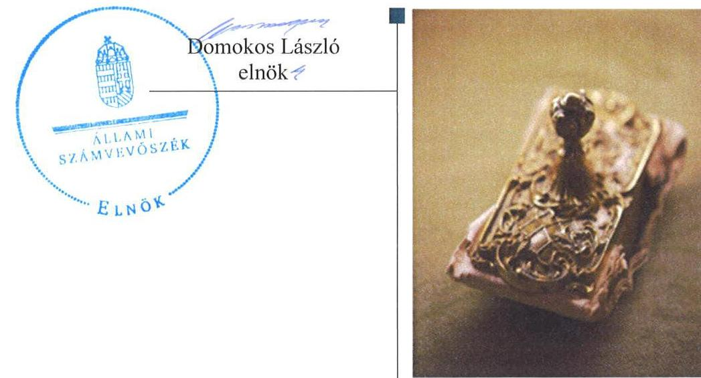
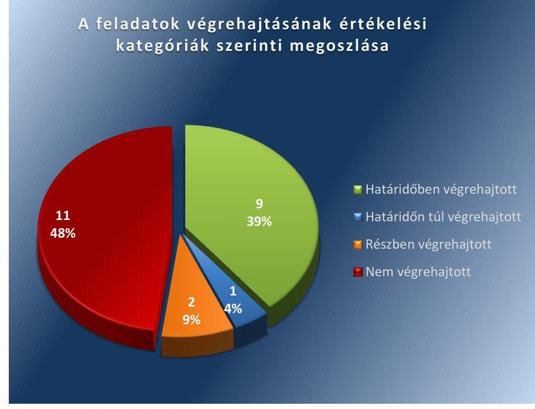

ÁLLAMI
SZÁMVEVŐSZÉK

# Jelentés 

## Utóellenőrzések

Villány Város Önkormányzata belső kontrollrendszerének kialakításának, egyes kontrolltevékenységek és a belső ellenőrzés működésének utóellenőrzése 2016.

---

# Jelentés 

## Utóellenőrzések

Villány Város Önkormányzata belső
kontrollrendszere kialakításának, egyes
kontrolltevékenységek és a belső
ellenőrzés működésének utóellenőrzése
2016.  október 29. nap

---

|   | AZ ELLENŐRZÉST FELÜGYELTE:  |
| --- | --- |
|   | DR. BENEDEK MÁRIA felügyeleti vezető  |
|   | AZ ELLENŐRZÉST VEZETTE ÉS A VÉGREHAJTÁSÁÉRT FELELŐS:  |
|   | RÁCZKEVI KATALIN ellenőrzésvezető  |
|   | A PROGRAM ÖSSZEÁLLÍTÁSÁÉRT FELELŐS:  |
|   | JANIK JÓZSEF osztályvezető  |
|   | A TÉMÁHOZ KAPCSOLÓDÓ KORÁBBI SZÁMVEVŐSZÉKI JELENTÉSEK:  |
|  J | - címe: Jelentés Villány Város Önkormányzata belső kontrollrendszerének kialakítása, valamint egyes kontrolltevékenységek és a belső ellenőrzés működése ellenőrzéséről  |
|  J | - sorszáma: 13091  |
|   | IKTATÓSZÁM: V-1078-064/2016.  |
|   | TÉMASZÁM: 2112.  |
|   | ELLENŐRZÉS-AZONOSÍTÓ SZÁM: V-071716  |

Jelentéseink az Országgyűlés számítógépes hálózatán és az Interneten a www.asz.hu címen is olvashatóak.

---

# TARTALOMJEGYZÉK 

■ ÖSSZEGZÉS ..... 5
■ AZ ELLENŐRZÉS CÉLJA ..... 6
■ AZ ELLENŐRZÉS TERÜLETE ..... 7
■ AZ ELLENŐRZÉS HÁTTERE, INDOKOLTSÁGA ..... 8
■ A JELENTÉS LÉNYEGES KÉRDÉSKÖREI ..... 9
■ ELLENŐRZÉS HATÓKÖRE ÉS MÓDSZEREI ..... 10
■ MEGÁLLAPÍTÁSOK ..... 13
■ MELLÉKLETEK ..... 17
I. SZ. MELLÉKLET: Az ÁSZ 13091. számú jelentéséhez kapcsolódó intézkedési terv végrehajtása ..... 17
■ FÜGGELÉK: ÉSZREVÉTELEK ..... 23
■ RÖVIDÍTÉSEK JEGYZÉKE ..... 25

---

.

---

# ÖSSZEGZÉS 

Az ÁSZ ${ }^{1}$ az Önkormányzat² ${ }^{2}$ belső kontrollrendszerének és belső ellenőrzésének utóellenőrzését 2013. szeptember 24. és 2016. február 04. közötti időszakra végezte el. Megállapította, hogy az intézkedési tervben foglalt feladatok jelentős részét az Önkormányzat nem hajtotta végre, így nem tett megfelelő lépéseket az ÁSZ által korábban feltárt, a belső kontrollrendszert érintő hiányosságok megszüntetésére, ami kockázatot hordoz az Önkormányzat szabályozásában, működésének szabályosságában és a felelős vezetői magatartásban.

## Az ellenőrzés társadalmi indokoltsága

Az ÁSZ stratégiájában célul tűzte ki a számvevőszéki munka hasznosulásának javítását. Ezzel összhangban ellenőrzi, hogy az ellenőrzött szervezetek megvalósították-e a korábbi ellenőrzései által feltárt hibák, hiányosságok és szabálytalanságok megszüntetése céljából elkészített intézkedési terveikben foglaltakat. A rendszeres utóellenőrzések hozzájárulnak a szükséges intézkedések tényleges végrehajtásához, ezáltal a közpénzügyek rendezettségének javulásához, igazolják.

## Főbb megállapítások, következtetések

A polgármester ${ }^{3}$ az intézkedési tervet határidőben megküldte az ÁSZ részére. Az intézkedési tervben meghatározott 23 feladatból kilencet határidőben, egyet határidőn túl, kettőt részben hajtottak végre, tizenegyet nem hajtottak végre. Így az ÁSZ által korábban az Önkormányzat belső kontrollrendszerének kialakítása, valamint az egyes kontrolltevékenységek és a belső ellenőrzés működésének területén azonosított hiányosságok jelentős része továbbra is fennáll.

Az intézkedési tervben rögzített feladatok végrehajtásáról a Bkr. ${ }^{4}$-ben előírt nyilvántartást nem vezették.

---

# AZ ELLENŐRZÉS CÉLJA 

Az ellenőrzés célja annak értékelése volt, hogy a számvevőszéki jelentésben ${ }^{5}$ foglalt intézkedést igénylő megállapításokkal és javaslatokkal összhangban készített intézkedési tervben meghatározott feladatokat az Önkormányzat végrehajtotta-e.

---

# AZ ELLENŐRZÉS TERÜLETE 

## Az Önkormányzat

Villány város Baranya megyében a siklósi járásban fekszik, állandó lakosainak száma a KSH által közzétett népességi adatok ${ }^{6}$ szerint 2015. január 1-jén 2539 fő volt.

Az Önkormányzat, valamint Villánykövesd Község Önkormányzata és Kisjakabfalva Község Önkormányzata 2013. január 1-jétől közös önkormányzati hivatalt ${ }^{7}$ hoztak létre. Az utóellenőrzés időszaka alatt a hivatalban lévő polgármester személye nem változott, a jegyző ${ }^{8}$ 2014. december 15-től látja el közszolgálati feladatait. Az Önkormányzat a 2014. évi éves költségvetési beszámoló szerint 908,6 millió Ft költségvetési bevételt ért el, valamint 794,9 millió Ft költségvetési kiadást teljesített.

Az Önkormányzat belső kontrollrendszerének kialakítását, valamint az egyes kontrolltevékenységek és a belső ellenőrzés működésének ellenőrzését az ÁSZ a 2009. január 1. és 2011. december 31. közötti időszakra végezte el, az erről szóló 13091. számú jelentését 2013. szeptember 24-én tette közzé. Az ellenőrzés célja annak értékelése volt, hogy az Önkormányzat a jogszabályi előírásoknak megfelelően alakította-e ki a belső kontrollrendszert, megfelelően működtette-e a gazdálkodás folyamatában kulcsszerepet betöltő szakmai teljesítésigazolás és utalvány ellenjegyzés kontrollokat, biztosította-e a belső ellenőrzés szabályos és eredményes működését.

Az utóellenőrzés - 2013. szeptember 24-től 2016. február 4-ig végrehajtott feladatokat figyelembe véve - az ÁSZ jelentésben a polgármester és a jegyző részére megfogalmazott intézkedést igénylő megállapításokra és javaslatokra készített, az ÁSZ részére megküldött intézkedési tervben foglalt feladatok megvalósításának ellenőrzésére, illetve értékelésére fókuszált.

---

# AZ ELLENŐRZÉS HÁTTERE, INDOKOLTSÁGA 

Az ÁSZ tv. ${ }^{9}$ 33. § (1) bekezdése értelmében a számvevőszéki jelentések intézkedést igénylő megállapításaihoz és javaslataihoz kapcsolódóan az ellenőrzött szervezet vezetője intézkedési tervet köteles összeállítani, és az ÁSZ részére megküldeni. Az intézkedési tervben foglaltak megvalósítását az ÁSZ tv. 33. § (7) bekezdésében foglaltak alapján - az ÁSZ utóellenőrzés keretében - ellenőrizheti. Az intézkedések megvalósulásának értékelése során az ÁSZ figyelembe veszi az ellenőrzött szervezetek működési feltételeiben, valamint a jogszabályi előírásokban bekövetkezett változásokat.

Az intézkedési tervekben foglalt feladatok hiányos, illetve késedelmes végrehajtása, valamint megvalósításának elmaradása azt mutatja, hogy az ellenőrzések során feltárt hibák, hiányosságok és szabálytalanságok megszüntetése nem kapott kellő hangsúlyt. Ez a szabályszerű működés és a felelős vezetői magatartás vonatkozásában kockázatot hordoz. E kockázatok feltárásával az ÁSZ utóellenőrzési rendszere fokozza a fegyelmet, és igazolja, hogy a közpénzzel való szabályos gazdálkodás felelőssége elől nem lehet kitérni.

## AZ UTÓELLENŐRZÉS VÁRHATÓ HASZNOSULÁSA

Az utóellenőrzés négy szinten hasznosulhat:

- A társadalom szintjén az utóellenőrzés jelzi, hogy a számvevőszéki ellenőrzés megállapításainak van következménye: a hiányosságok megszüntetésére az ellenőrzött szervezet által meghatározott intézkedések végrehajtását is számon kéri az ÁSZ.
- Az ellenőrzött terület szintjén az utóellenőrzés tájékoztatást nyújt a terület döntéshozóinak a hiányosságok kiküszöbölésének jó gyakorlatairól, ezzel lehetőséget biztosítva arra, hogy az ÁSZ ellenőrzési megállapításai, javaslatai a terület nem ellenőrzött szervezeteinek a működése során is hasznosuljanak.
- Az ellenőrzött szervezet szintjén az utóellenőrzés feltárja, hogy a szervezet az intézkedések végrehajtásával hasznosította-e a korábbi ellenőrzési jelentésben a hiányosságok megszüntetése, illetve a kockázatok kezelése érdekében megfogalmazott javaslatokat.
- Az ÁSZ szintjén az utóellenőrzés visszacsatolást ad az ellenőrzési jelentések hasznosulásáról, az intézkedések elmaradása vagy részleges megvalósulása a további ellenőrzésekhez kockázati jelzésként szolgál.

---

# A JELENTÉS LÉNYEGES KÉRDÉSKÖREI 

Az Önkormányzat az intézkedési tervben foglaltakat az előírt határidőben végrehajtotta-e?

---

# ELLENŐRZÉS HATÓKÖRE ÉS MÓDSZEREI 

## Az ellenőrzés típusa

Megfelelőségi ellenőrzés

## Az ellenőrzött időszak

Az utóellenőrzés alapját képező ÁSZ jelentés közzétételének napjától (2013. szeptember 24.) az ellenőrzésről szóló kiértesítő levél keltének napjáig (2016. február 4.) tartó időszak.

## Az ellenőrzés tárgya

Az ÁSZ tv. 2011. július 1-jei hatálybalépését követően a számvevőszéki jelentésben foglalt intézkedést igénylő megállapításokkal és javaslatokkal összhangban - Önkormányzat által - készített intézkedési tervben foglaltak végrehajtásának ellenőrzése.

Az ellenőrzés kiterjed minden olyan körülményre és adatra, amely az ÁSZ jogszabályban meghatározott feladatainak teljesítéséhez, valamint a program végrehajtása folyamán felmerült újabb összefüggések feltárásához szükséges.

## Az ellenőrzött szervezet

Villány Város Önkormányzata

## Az ellenőrzés jogalapja

Az ÁSZ törvényben meghatározott feladatkörében ellenőrzi a központi költségvetés végrehajtását, az államháztartás gazdálkodását, az államháztartásból származó források felhasználását és a nemzeti vagyon kezelését.

Az ÁSZ tv. 1. § (3) bekezdése szerint az ÁSZ általános hatáskörrel végzi a közpénzekkel és az állami és önkormányzati vagyonnal való felelős gazdálkodás ellenőrzését.

Az ÁSZ tv. 33. § (7) bekezdése alapján az ÁSZ tv. 33. § (1)-(2) bekezdése szerinti intézkedési tervben foglaltak megvalósítását az ÁSZ utóellenőrzés keretében ellenőrizheti.

---

# Az ellenőrzés módszerei 

Az ÁSZ az ellenőrzést a nemzetközi standardokat irányadónak tekintve az ellenőrzési program ellenőrzési kérdései, az ellenőrzött időszakban hatályos jogszabályok, az ellenőrzés szakmai szabályok és módszertanok figyelembevételével, önállóan vagy ellenőrzéshez kapcsolódóan végezte.

Az ÁSZ az ellenőrzés ideje alatt az Önkormányzattal történő kapcsolattartást az ÁSZ SZMSZ ${ }^{10}$-ének vonatkozó előírásai alapján biztosította.

Az utóellenőrzés megállapításait elsősorban az ÁSZ rendelkezésére álló, valamint az ellenőrzött szervezetektől elektronikusan bekért dokumentumok alapozták meg.

Az ellenőrzési bizonyítékként felhasználható adatforrások közé tartoznak egyrészt a szakmai programban felsorolt adatforrások, másrészt minden - az ellenőrzés folyamán feltárt, az ellenőrzés szempontjából információt tartalmazó - dokumentum.

A pénzügyi folyamatokban kulcsszerepet betöltő kontrollokra vonatkozóan az intézkedési tervben foglalt feladatok végrehajtását az államháztartáson kívülre teljesített működési célú pénzeszközátadásoknál, az állományba nem tartozók megbízási díjainál, továbbá a külső szolgáltatók által végzett karbantartási, kisjavítási munkákkal kapcsolatos kifizetéseknél 10 elemű véletlen mintavétellel kiválasztott tételek alapján értékelte az ÁSZ. A kiválasztott tételek esetében azt ellenőrizte, hogy az Önkormányzat az intézkedési tervben meghatározott feladatok végrehajtása érdekében biztosította-e a jogszabályok és a belső szabályzatok előírásainak megfelelő működtetést.

Az intézkedési tervben előírt feladatokat azok végrehajthatósága, illetve végrehajtása szempontjából az alábbiak szerint értékelte az ÁSZ:
"határidőben végrehajtott" a feladat, ha a teljesítés dokumentáltan, az intézkedési tervben előírt határidőben és tartalommal megtörtént;
"határidőn túl végrehajtott" a feladat, ha annak teljesítése az intézkedési tervben meghatározott módon, de az előírt határidőn túl történt meg;
"részben végrehajtott" a feladat, ha végrehajtása teljes körűen az intézkedési tervben előírt módon nem történt meg;
"nem végrehajtott" a feladat, ha a végrehajtás nem történt meg, vagy amennyiben a teljesítést nem dokumentálták;
"okafogyottá vált" a feladat, ha végrehajtására - meghatározott esemény bekövetkezése, továbbá külső körülmény, a működést érintő feltétel változása miatt - már nincs szükség, illetve lehetőség, és egyértelműen megállapítható, hogy az intézkedést szükségessé tevő körülmény a jövőben nem fordulhat elő;
"nem időszerű" az a feladat, amelynek ellenőrzési időszakon belüli végrehajtására azért nem került (kerülhetett) sor, mert az intézkedés alapjául szolgáló esemény nem következett be, de annak jövőbeni előfordulása lehetséges, a végrehajtása nem volt esedékes, vagy a végrehajtás határideje még nem járt le.
Az ellenőrzés lefolytatásához az Önkormányzat tanúsítványok elektronikus kitöltésével, valamint az ÁSZ által kért dokumentumok elektronikus

---

megküldésével szolgáltatott adatokat, amelyek valódiságát és teljes körűségét a polgármester és a jegyző által tett teljességi és hitelességi nyilatkozat igazolta. Az így rendelkezésre bocsátott adatok, információk kontrollja az ellenőrzés keretében történt.

---

# MEGÁLLAPÍTÁSOK 

## Az Önkormányzat az intézkedési tervben foglaltakat az előírt határidőben végrehajtotta-e?

Összegző megállapítás

Az Önkormányzat az intézkedési tervben meghatározott 23 intézkedésből kilencet határidőben, egyet határidőn túl, kettőt részben és tizenegyet nem hajtott végre. Az intézkedési tervben rögzített feladatok végrehajtásáról a Bkr.-ben előírt nyilvántartást nem vezették.

Az intézkedési tervben meghatározott feladatokat, határidőket, az ÁSZ jelentés javaslatainak címzettjét és a feladatok végrehajtását az I. számú melléklet mutatja be.

Az ÁSZ a jelentésében a polgármester részére három, a jegyző részére húsz javaslatot fogalmazott meg. A polgármester által összeállított és az ÁSZ részére megküldött intézkedési tervben a hiányosságok, szabálytalanságok megszüntetésére huszonhárom feladatot határoztak meg. A feladatok elvégzésének felelőseként három esetben a polgármestert, húsz esetben a jegyzőt jelölték meg.

Az Önkormányzat intézkedési tervében tervezett feladatok végrehajtásának értékelési kategóriák szerinti megoszlását az
 1. ábra szemlélteti.
1. ábra

---

# HATÁRIDŐBEN VÉGREHAJTOTT feladat: 

$\qquad$ 1. A jegyző biztosította, hogy az érvényesítésre írásban kijelölt személy rendelkezzen az előírt iskolai végzettséggel, szakmai képesítéssel.
$\qquad$ 2. A jegyző írásban kijelölte a teljesítésigazolásra jogosult személyeket.
3. A jegyző intézkedett a gazdasági ügyrend ${ }^{11}$ felülvizsgálatáról és módosításáról.
4. A jegyző intézkedett a kötelezettségvállalások naprakész nyilvántartásának vezetéséről, a kötelezettségvállalás nyilvántartási számát az utalványokon feltüntették.
5. A jegyző intézkedett a kötelezettségvállalói, pénzügyi ellenjegyzési, érvényesítési, utalványozási és teljesítésigazolói feladatok ellátásánál az összeférhetetlenségi szabályok betartásáról.
6. A jegyző intézkedett az elvégzett belső ellenőrzésekről a Bkr. előírásainak megfelelő nyilvántartás vezetéséről.
7. A jegyző intézkedett az előzetes írásbeli kötelezettségvállalást nem igénylő kifizetésekre vonatkozó teljesítésigazolás gyakorlásának dokumentációs részletszabályaival kapcsolatos belső előírások és feltételek szabályozásáról.
8. A jegyző az intézkedési tervben meghatározott 2013. október 31-ei határidőn túl intézkedett a 2014. évi ellenőrzési terv jegyzői írásos vélemény figyelembe vételével történő elkészítésére vonatkozóan. A kockázatelemzésen alapuló 2014. évi ellenőrzési terv 2013. november 30-án, a jegyző írásos véleménye 2013. december 5-én készült el.
9. A jegyző az intézkedési tervben meghatározott 2013. november 15-i határidőn túl 2013. november 30-án intézkedett a 2014. évi belső ellenőrzési terv Képviselő-testület elé terjesztése érdekében. A 2014. évi belső ellenőrzési tervet a Képviselő-testület 2013. december 12-én hagyta jóvá.

## HATÁRIDŐN TÚL VÉGREHAJTOTT feladat:

10. A jegyző az intézkedési tervben meghatározott 2013. december 15-ei határidőn túl, 2015. december 16-án intézkedett a közérdekű adatok megismerésére irányuló igények teljesítésének rendjéről szóló szabályzat elkészítéséről.

## RÉSZBEN VÉGREHAJTOTT feladat:

11. A jegyző intézkedett a hivatali SZMSZ ${ }^{12}$ módosításáról, azonban a 2016. február 1-jétől hatályos SZMSZ továbbra sem tartalmazza az Ávr.-nek megfelelően a hivatalhoz rendelt más költségvetési szervek felsorolását.
12. A jegyző intézkedett arról, hogy a 2014. és 2015. évi ellenőrzési tervek a Bkr.-nek megfelelő tartalmi elemeket tartalmazzák, azonban a Bkr.-nek megfelelő tartalmú 2014. és 2015. évi ellenőrzési programmal nem rendelkeztek.

---

# NEM VÉGREHAJTOTT feladat: 

13. A polgármester nem intézkedett arról, hogy az Önkormányzat nevében történő kötelezettségvállalásokra az új Áht. ${ }^{13}$ szerint - az Ávr. ${ }^{14}$-ben meghatározott esetek kivételével - kizárólag a pénzügyi ellenjegyzés után, a pénzügyi teljesítés esedékességét megelőzően, írásban kerüljön sor, mert írásos kötelezettségvállalás nem történt, és elmaradt a pénzügyi ellenjegyzés.
14. A jegyző nem intézkedett a teljesítésigazolás Ávr.-ben előírtak szerinti végrehajtásáról, mert a teljesítésigazolás elmaradt.
15. A jegyző nem intézkedett az érvényesítés Áht., az új Áhsz. ${ }^{15}$ és az Ávr. előírásainak megfelelő működtetéséről, mert hiányzott az érvényesítő aláírása, valamint az összegszerűséget és a fedezet meglétét nem ellenőrizték. A megelőző ügymenetben az Áht., az Áhsz. ${ }^{16}$, az új Áhsz. és az Ávr. előírásainak betartását dokumentáltan nem ellenőrizték.
16. A jegyző nem alakította ki és nem működtette a Bkr.-ben előírtaknak megfelelő, a Hivatal tevékenységének, a célok megvalósításának nyomon követési rendszerét.
17. A polgármester a Mötv. ${ }^{17}$ és a Bkr. előírásaiban foglaltaknak megfelelően nem terjesztette a zárszámadással egyidejűleg a Képviselő-testület elé a 2013. évi belső ellenőrzési jelentést.
18. A polgármester a Mötv. előírásainak megfelelő módon nem kísérte figyelemmel az Önkormányzat gazdálkodásának szabályszerűségét. A Mötv. előírásainak megfelelően a belső kontrollrendszer és a belső ellenőrzés működésével kapcsolatban rögzített hiányosságok tekintetében az esetleges munkajogi felelősség kivizsgálására az intézkedési tervben előírt bizottságot nem hozták létre.
19. A jegyző a Bkr.-ben foglaltak szerinti ellenőrzési nyomvonalat nem készíttette el.
20. A jegyző a Bkr.-ben foglaltak alapján a hivatal tevékenységében és gazdálkodásában rejlő kockázatok felmérését dokumentált módon nem készíttette el.
21. A jegyző nem biztosította a Bkr.-nek megfelelő, minden tevékenységre vonatkozóan a folyamatba épített, előzetes, utólagos és vezetői ellenőrzést.
22. A jegyző nem gondoskodott az Info tv. ${ }^{18}$ előírásainak megfelelően az adatok biztonságáról, nem alakította ki az adat- és titokvédelmi szabályok érvényre juttatásához szükséges eljárási szabályokat, továbbá nem biztosította az adatok védelmét.
23. A jegyző nem intézkedett a Bkr.-nek megfelelően a stratégiai ellenőrzési terv elkészítéséről.

Az intézkedési tervben rögzített feladatok végrehajtásáról a Bkr.-ben előírt nyilvántartást nem vezették.

---

.

---

# MELLÉKLETEK

I. SZ. MELLÉKLET: AZ ÁSZ 13091. SZÁMÚ JELENTÉSÉHEZ KAPCSOLÓDÓ INTÉZKEDÉSI TERV VÉGREHAJTÁSA

|  1. | Az intézkedési terv alapján elvégzendő feladat | Az intézkedési tervben meghatározott határidő | Az ÁSZ 13091. sz. jelentése javaslatának címzettje  |
| --- | --- | --- | --- |
|   | 1. | 2. | 3.  |
|  Határidőben végrehajtott feladatok |  |  |   |
|  1. | Korábban már intézkedtem, hogy az érvényesítésre kijelölt személy megfeleljen az Ávr. 55. § (3) és 58. § (4) bekezdéseiben foglalt követelményeknek. | 2013.05.01., majd folyamatos | Jegyző  |
|  2. | Korábban már intézkedtem, hogy a teljesítésigazolásokra kijelölt személyek kijelölése megfeleljen az Avr. 57. § (4) bekezdéseiben foglalt követelményeknek. | 2013.05.01., majd folyamatos | Jegyző  |
|  3. | Korábban már elrendeltem a gazdasági ügyrend felülvizsgálatát, amely keretében elkészült az új ügyrend, amely figyelembe veszi az érintett szabályzatok tartalmát, és azokkal összhangban van. | már elkészült | Jegyző  |
|  4. | Intézkedtem, hogy a kötelezettségvállalás után, az aláírt szerződések 1 példánya azonnal kerüljön a kötelezettség nyilvántartó személyhez, aki elvégzi a CT-ECOStat program felhasználása mellett a nyilvántartásba vételt. A program által a későbbi utalványozás előkészületével kinyomtatott utalványrendelet így már tartalmazza a kötelezettségvállalás nyilvántartási számát is, azt kézzel nem kell felvinni rá. | 2013.10.23 | Jegyző  |

A feladat végrehajtása

Az érvényesítésre írásban kijelölt személyek megfelelnek az Ávr. 55. § (3) és 58. § (4) bekezdéseiben foglalt követelményeknek, mert 2002-ben, illetve 2007-ben közgazdász képesítést szereztek. Az ellenőrzött időszakban új kijelölésre nem került sor. Az új gazdálkodási szabályzat 2013. május 1-jén történt hatálybalépésekor a teljesítésigazolók kijelölését a kötelezettségvállalók az Ávr. 57. § (4) bekezdésében foglaltaknak megfelelően elvégezték. A folyamatos alkalmazást az időközben történt kijelölések igazolják. A gazdasági ügyrend elkészült, 2013. január 1-jétől hatályos és tartalmazza, hogy az SZMSZ rendelkezéseivel összhangban készült, valamint 1.5. pontjában rögzíti, hogy mely szabályzatok tartalmaznak a gazdálkodási tevékenységgel kapcsolatos további részletszabályokat. Az Ávr. 10. §-ában - 2015. január 1-jétől a 9. §-ában - előírtaknak megfelelő megállapodás megkötésének tartalmi elemeit a szabályzat 8.6. pontja tartalmazza. Elkészült és 2013. május 1-jétől hatályos a gazdálkodási szabályzat, amelynek rendelkezései tartalmazzák a gazdálkodási feladatok ellátásának szabályait, azok részeként a kötelezettségvállalások nyilvántartásának előírásait. A bemutatott dokumentumok alapján az ÁSZ megállapította, hogy a nyilvántartást vezették.

---

|  5. | Az intézkedési terv alapján elvégzendő feladat | Az intézkedési tervben meghatározott határidő | Az ÁSZ 13091. sz. jelentése javaslatának címzettje | A feladat végrehajtása  |
| --- | --- | --- | --- | --- |
|   | 1. | 2. | 3. | 4.  |
|  5. | Intézkedtem, hogy a 2013. május 01-től hatályos gazdálkodási szabályzat megfelelően rendelkezzen az Avr 60 § (1)-(2) bekezdésében leírt összeférhetetlenségi szabályokról, így ennek megfelelő alkalmazása mellett lettek kijelölve az érvényesítői, kötelezettségvállalói, utalványozói és teljesítést igazolói jogkörrel felruházott személyek. Továbbá rendelkeztem a szabályzaton belül arra, hogy kötelezettségvállalási, pénzügyi ellenjegyzési, érvényesítési, utalványozási és teljesítés igazolására irányuló feladatot nem végezheti az a személy, aki ezt a tevékenységét a Polgári Törvénykönyv (a továbbiakban: Ptk.) szerinti közeli hozzátartozója, vagy maga javára látná el. | 2013.05.01., majd folyamatos | Jegyző | Elkészült és 2013. május 1-jétől hatályos a gazdálkodási szabályzat, amelynek rendelkezései tartalmazzák a gazdálkodási feladatok ellátásának szabályait. A bemutatott dokumentumok alapján az ÁSZ megállapította, hogy az összeférhetetlenségi szabályokat betartották.  |
|  6. | Intézkedtem a Belső ellenőrzési vezető felé, hogy a szükséges nyilvántartások vezetését tegye meg a Bkr. 22. § (2) bekezdésének b.) és e.) pontja, valamint az 50. §-a alapján. | 2012.12.05. | Jegyző | Az elvégzett belső ellenőrzésekről a Bkr.-ben előírtak szerinti nyilvántartást vezették.  |
|  7. | Korábban már intézkedtem egy új gazdálkodási szabályzat elkészítésére, amely tartalmazza az előzetes írásbeli kötelezettségvállalást nem igénylő kifizetésekre vonatkozó teljesítésigazolás gyakorlásának részletszabályait, feltételeit. | 2013. május 01., majd folyamatos | Polgármester, Jegyző, pénzügyi csoportvezető | A 2013. május 1-jétől hatályos gazdálkodási szabályzat valamennyi gazdálkodási feladat esetében külön rögzíti az előzetes írásba foglalást nem igénylő kötelezettségvállalás részletszabályait. A szabályzat alapján az írásbeliséget nem igénylő kötelezettségvállalás esetén „Feljegyzés" készítése kötelező, amelynek alapján a kötelezettségvállalási nyilvántartásba történő bejegyzés megtörténik, illetve ezen a dokumentumon végezhető pénzügyi ellenjegyzés és teljesítésigazolás.  |
|  8. | Intézkedtem a Belső ellenőrzés felé, hogy a 2014. évi belső ellenőrzési terv elkészítését kockázatelemzéssel támassza alá, illetve a kiválasztott ellenőrzési területeket időben írásban egyeztesse a Jegyzővel. | 2013.10.31. | Jegyző | A 2014. évi belső ellenőrzési terv 2013. november 30-ával készült el, a jegyzővel való egyeztetés dátuma 2013. december 5-e volt. A 2014. évi ellenőrzési tervhez a kockázatelemzés rendelkezésre állt.  |

---

|  8. | Az intézkedési terv alapján elvégzendő feladat | Az intézkedési tervben meghatározott határidő | Az ÁSZ 13091. sz. jelentése javaslatának címzettje | A feladat végrehajtása  |
| --- | --- | --- | --- | --- |
|  9. | 1. | 2. | 3. | 4.  |
|  9. | Intézkedtem a Jegyző felé, hogy a 2014. évi Belső ellenőrzés terv képviselő-testület felé történő beterjesztése úgy valósuljon meg, hogy a 370/2011. (XII. 31.) Korm. rendelet 32. § (4) bekezdés alapján a helyi önkormányzatok esetében az éves ellenőrzési tervet a képviselő-testület a tárgyévet megelőző év november 15-ig jóvá tudja hagyni. | 2013.11.15. | Jegyző | A 2014. évi belső ellenőrzési terv 2013. november 30-án készült el, a belső ellenőrzési tervet jóváhagyó képviselő-testületi ülés dátuma 2013. december 12-e volt.  |
|  8. | Intézkedtem a közérdekű adatok megismerését szabályozó szabályzat elkészítésére az Info tv. 30.§ (6) bekezdésnek és az Avr. 13. § (2) bekezdés h.) pontja alapján. | 2013.12.15. | Jegyző | 2015. december 16-án készült el és 2016. január 1-jétől hatályos a Villányi Közös Önkormányzat szabályzata a közérdekű adatok megismerésére irányuló kérelmek intézésének, továbbá a kötelezően közzéteendő adatok nyilvánosságra hozatalának rendjéről.  |
|  11. | Felhívtam a jegyzőt, az SZMSZ felülvizsgálatának előkészítésére annak érdekében, hogy az Ávr. 13. § (1) bekezdésének e) és i) pontjában foglaltak a szabályozásban megfelelő módon érvényesüljenek. | 2013. december 31. | Jegyző | A módosított hivatali SZMSZ 2016. február 1. napjától hatályos, amely az Ávr.13. §. (1) bekezdésének e) pontjának megfelelően a szervezeti egységek feladatait tartalmazza, azonban

 az i) pontban foglaltaknak megfelelően, a hivatalhoz rendelt más költségvetési szervek felsorolását továbbra sem.  |
|  12. | Intézkedtem a Belső ellenőrzési vezető felé, hogy az elkészítendő éves ellenőrzési terv tartalmazza a Bkr. 31. § (4) bekezdésében meghatározottakat, illetve a későbbiek során lefolytatandó ellenőrzésekhez elkészítendő programok tartalmazzák a Bkr. 33. § (2) bekezdésében előírt szükséges adatokat. | 2013. október 23. | Jegyző | A 2014. és 2015. évi ellenőrzési terv tartalmazza a Bkr. 31. § (4) bekezdésében meghatározott tartalmi elemeket, azonban a 2014. és 2015. évi ellenőrzési program nem állt rendelkezésre.  |
|  13. | Intézkedtem arról, hogy az önkormányzat nevében történő kötelezettségvállalásra az új Áht. 37. § (1) bekezdésében, az Ávr. 52. § (1) bekezdésében foglaltaknak megfelelően kerüljön sor. | 2013.05.01., majd folyamatos. | Polgármester | A bemutatott dokumentumok alapján az ÁSZ megállapította, hogy a feladatot nem hajtották végre, mert egy esetben írásos kötelezettségvállalás nem történt, három esetben a dokumentum nem tartalmazott pénzügyi ellenjegyzést.  |

---

|  1. | Az intézkedési terv alapján elvégzendő feladat | Az intézkedési tervben meghatározott határidő | Az ÁSZ 13091. sz. jelentése javaslatának címzettje | A feladat végrehajtása  |
| --- | --- | --- | --- | --- |
|   | 1. | 2. | 3. | 4.  |
|   | c) pontjában és a (6) bekezdésében foglaltaknak megfelelően - az Ávr. 53. §-ában meghatározott kivételeket figyelembe véve - az újonnan elkészített, megfelelő adattartalommal bíró, 2013. 05. 01-től hatályos gazdálkodási szabályzat rendelkezései szerint - kizárólag a pénzügyi ellenjegyzés után, a pénzügyi teljesítés esedékességét megelőzően írásban kerüljön sor. |  |  |   |
|  14. | Korábban már intézkedtem arra, hogy a teljesítés igazolása során az Avr. 57. § (1) bekezdésében előírtaknak megfelelően, ellenőrizhető okmányok alapján ellenőrizzék és igazolják a kiadások teljesítésének jogosságát, összegszerűségét, az ellenszolgáltatást is magában foglaló kötelezettségvállalás esetén a szerződés, megrendelés teljesítését, valamint az Avr. 57. § (3) bekezdése szerint a teljesítést az igazolás dátumának és a teljesítés tényleges történő utalásnak a megjelölésével az arra jogosult személy aláírásával igazolja. A 2013. május 01-től érvényes gazdálkodási szabályzatban megfelelően ki lettek jelölve a tevékenységi körök alapján jogosult teljesítés igazoló személyek, akik a fent hivatkozott Avr. szakaszai alapján végrehajtják a szükséges kontrollokat. A Pénzügyi csoportvezető folyamatosan felügyeli a kijelöléssel bíró személyek munkaviszonyában bekövetkező változásokat, hogy szükség esetén a kijelölést visszavonjuk, illetve új személyt kijelöljünk. A jegyző az újonnan kialakított folyamatba épített vezetői kontrollok alapján ellenőrzi, hogy a teljesítés igazoló személy megfelelően járt-e el a kifizetés előtt. A teljesítésre kijelölt személyek az új gazdálkodási szabályzatban foglalt folyamatleírásokat megismerték, kijelölésüket tudomásul vették. | 2013. május 01., majd folyamatos | jegyző | A bemutatott dokumentumok alapján az ÁSZ megállapította, hogy a feladatot nem hajtották végre, mert a teljesítésigazolás két pénzeszköz átadásnál és két megbízási díj kifizetésénél elmaradt.  |

---

|  1. | Az intézkedési terv alapján elvégzendő feladat | Az intézkedési tervben meghatározott határidő | Az ÁSZ 13091. sz. jelentése javaslatának címzettje | A feladat végrehajtása  |
| --- | --- | --- | --- | --- |
|   | 1. | 2. | 3. | 4.  |
|   |  |  |  |   |
|  15. | Korábban már intézkedtem az érvényesítő megfelelő kijelölésére, akinek ellenőriznie kell az összegszerűséget, a fedezet meglétét és azt, hogy a megelőző ügymenetben az Áht., az államháztartási számviteli kormányrendelet és e rendelet előírásait, továbbá hogy a belső szabályzatokban foglaltakat megtartották-e. | 2013. május 01., majd folyamatos | Jegyző | A bemutatott dokumentumok alapján az ÁSZ megállapította, hogy a feladatot nem hajtották végre, mert egy esetben hiányzik az érvényesítő aláírása, egy esetben az összegszerűséget, három esetben a fedezet meglétét nem ellenőrizték, hat esetben a megelőző ügymenetben az Áht., az Áhsz., az új Áhsz. és az Ávr. előírásainak betartását nem ellenőrizték.  |
|  16. | Intézkedtem a Bkr. 3. § e) pontjában és a 10. §-ában előírtak alapján a Hivatal tevékenységének, a célok megvalósításának nyomon követését biztosító rendszer kialakítására és működtetésére, amely biztosítja az operatív tevékenység keretében megvalósuló folyamatos és eseti nyomon követést is. | 2013. december 31. | Jegyző | A jegyző a Bkr. 3. § e) pontjában és a 10. §-ában előírtak alapján a Hivatal tevékenységének, a célok megvalósításának nyomon követési rendszerét nem alakította ki és nem működtette.  |
|  17. | Intézkedtem, hogy az Ötv. ${ }^{19}$ 92.§ (10) bekezdésében előírtak szerint a 2013. évi Belső ellenőrzési jelentést a zárszámadási rendelettervezettel egyidejűleg terjesszék a képviselő-testület elé. | 2014. április 30. | Polgármester | A polgármester a Mötv. 92.§ (10) bekezdésében foglaltak alapján nem terjesztette a zárszámadással egyidejűleg és azt követően sem a Képviselő-testület elé a 2013. évi belső ellenőrzési jelentést. A Képviselő-testület a 2013. évi belső ellenőrzési jelentést annak ellenére nem tárgyalta, hogy az 2014. február 12-én rendelkezésre állt.  |
|  18. | Intézkedtem a gazdálkodási szabályzatban szabályozott kötelezettségvállalási és utalványozási rend betartására, a kijelölés szerinti | a bizottság létrehozására: 2013.12.15
a gazdálkodási rend betartása érdekében:
folyamatos | Polgármester | A 2013. május 1-jétől hatályos gazdálkodási szabályzat a jogszabályi előírásoknak megfelelően tartalmazza a polgármester hatáskörébe tartozó gazdálkodási feladatok ellátásának szabályait.  |

---

|  1. | Az intézkedési terv alapján elvégzendő feladat | Az intézkedési tervben meghatározott határidő | Az ÁSZ 13091. sz. jelentése javaslatának címzettje | A feladat végrehajtása  |
| --- | --- | --- | --- | --- |
|   | 1. | 2. | 3. | 4.  |
|   | személyek feladatellátásának folyamatos és megfelelő kontrolljának biztosítására.
Az esetlegesen felmerült munkajogi felelősség megállapítása céljából bizottságot hozok létre, amely a feltárt hiányosságok és azok okainak vizsgálata alapján javaslatot tesz a szükséges intézkedések meghozatalára. |  |  | A szabályzatban foglaltak alkalmazása a mintatételek alapján nem volt teljes körű 2013-2014. években, azonban a 2015. évre bemutatott dokumentumok a szabályzat alkalmazását igazolják.
A munkajogi felelősség kivizsgálásához az ellenőrzéshez megküldött 104/2013. (XI. 26.) számú képviselő-testületi határozat a mulasztások körülményeinek kivizsgálása nélkül a jegyző és a polgármester számára megtiltotta a jutalom kifizetését a 2013. évre az ÁSZ ellenőrzésben foglalt hiányosságok miatt. Az intézkedési tervben előírt bizottság létrehozására nem került sor, az esetlegesen felmerült felelősség megállapítására irányuló eljárást a Képviselő-testület nem indította.  |
|  19. | Intézkedtem az ellenőrzési nyomvonal Bkr. 6. § (3) bekezdésében foglaltak szerinti elkészítésére. | 2013. december 31. | Jegyző | A jegyző a Bkr. 6. § (3) bekezdésében foglaltak szerinti ellenőrzési nyomvonalat nem készíttette el.  |
|  20. | Intézkedtem a Hivatal tevékenységében és gazdálkodásában rejlő kockázatok felmérésére a Bkr. 7. §-ában foglaltak alapján, és elrendeltem az új kockázatkezelési szabályzat elkészítését. | 2013. december 31. | Jegyző | A jegyző a Bkr. 7. §-ában foglaltak alapján a hivatal tevékenységében és gazdálkodásában rejlő kockázatok felmérését dokumentált módon nem készíttette el.
Új kockázatkezelési szabályzat az ellenőrzött időszakban nem készült.  |
|  21. | Intézkedtem a Bkr. 8.§ (2) bekezdésnek megfelelően a kontrolltevékenységek teljes körű kialakítására, amely tartalmazza a pénzügyi döntésekre vonatkozó FEUVE rendszert is. | 2013. december 31. | Jegyző | A Bkr. 8.§ (2) bekezdésnek megfelelő, a folyamatba épített, előzetes, utólagos és vezetői ellenőrzés szabályozásának kiegészítése az előírt határidőig, illetve azt követően, az ellenőrzési időszak végéig nem történt meg.  |
|  22. | Intézkedtem az Info tv. 7. § (2)-(3) bekezdésinek érvényre juttatásáról az adatbiztonság és adatvédelem területén, valamint az ehhez szükséges belső szabályozás elkészítéséről. | 2013. december 15. | Jegyző | A jegyző az adatbiztonsági és adatvédelmi szabályzatot nem készíttette el, így az Info tv. 24. § (2) bekezdésének érvényre juttatásáról nem gondoskodott.  |
|  23. | Intézkedtem a stratégiai ellenőrzési terv elkészítésére. | 2013. december 31. | Jegyző | A jegyző nem intézkedett a Bkr.-nek megfelelően a stratégiai ellenőrzési terv elkészítéséről.  |

Forrás: ÁSZ által készített táblázat

---

# FÜGGELÉK: ÉSZREVÉTELEK 

A jelentéstervezetet az ÁSZ 15 napos észrevételezésre megküldte az ellenőrzött szervezet vezetője részére az ÁSZ tv. 29. § (1) bekezdése előírásának megfelelően.
A polgármester, mint az ellenőrzött szervezet vezetője az ÁSZ tv. 29. § (2) bekezdésében foglalt észrevételezési jogával nem élt, a jelentéstervezetre észrevételt nem tett.

[^0]
[^0]:    * 29. § (1) Az Állami Számvevőszék az ellenőrzési megállapításait megküldi az ellenőrzött szervezet vezetőjének vagy az általa megbízott személynek, és annak, akinek személyes felelősségét állapította meg.
    (2) Az ellenőrzött szervezet vezetője és a felelősként megjelölt személy az ellenőrzés megállapításaira tizenöt napon belül írásban észrevételt tehet.
    (3) Az Állami Számvevőszék az észrevételre a beérkezésétől számított harminc napon belül írásban válaszol. A figyelembe nem vett észrevételeket köteles a jelentésben feltüntetni, és megindokolni, hogy azokat miért nem fogadta el.

---

.

---

# RÖVIDÍTÉSEK JEGYZÉKE 

${ }^{1}$ ÁSZ
${ }^{2}$ Önkormányzat
${ }^{3}$ polgármester
${ }^{4}$ Bkr.
${ }^{5}$ jelentés
${ }^{6}$ KSH által közzétett népességi adatok
${ }^{7}$ közös önkormányzati hivatal
${ }^{8}$ jegyző
${ }^{9}$ ÁSZ tv.
${ }^{10}$ SZMSZ
${ }^{11}$ gazdasági ügyrend
${ }^{12}$ hivatali SZMSZ
${ }^{13}$ új Áht.
${ }^{14}$ Ávr.
${ }^{15}$ új Áhsz.
${ }^{16}$ Áhsz.
${ }^{17}$ Mötv.
${ }^{18}$ Info tv.
${ }^{19}$ Ötv.

Állami Számvevőszék
Villány Város Önkormányzat
Villány Város Önkormányzat polgármestere
370/2011. (XII.31.) Korm. rendelet a költségvetési szervek belső
kontrollrendszeréről és belső ellenőrzéséről (hatályos 2012. január 1-jétől)
Az ÁSZ 13091. számú jelentése - Jelentés Villány Város Önkormányzata belső
kontrollrendszerének kialakítása, valamint egyes kontrolltevékenységek és a
belső ellenőrzés működése ellenőrzéséről
Központi Statisztikai Hivatal, Magyarország Közigazgatási Helységnévkönyvének 2015. január 1-jei adatai
Villányi Közös Önkormányzati Hivatal
Villány Város Önkormányzat jegyzője
2011. évi LXVI. törvény az Állami Számvevőszékről (hatályos 2011. július 1.-jétől)

Az Állami Számvevőszék elnökének 3/2015. (XII.30.) ÁSZ utasítása az Állami
Számvevőszék Szervezeti és Működési Szabályzatáról (hatályos: 2016. január 1-
jétől)
Villány Közös Önkormányzati Hivatal gazdasági ügyrendje (hatályos: 2013. január 1-jétől)
Villány Közös Önkormányzati Hivatal Szervezeti és Működési Szabályzat 2011. évi CXCV. törvény az államháztartásról (hatályos 2012. január 1-jétől) 368/2011. (XII. 31.) Korm. rendelet az államháztartásról szóló törvény végrehajtásáról (hatályos 2012. január 1-jétől)
4/2013. (I. 11.) Korm. rendelet az államháztartás számviteléről (hatályos 2014. január 1-től)
249/2000. (XII.24.) Korm. rendelet az államháztartás szervezetei beszámolási és könyvvezetési kötelezettségének sajátosságairól (hatálytalan 2014. január 1-től) 2011. évi CLXXXIX. törvény Magyarország helyi önkormányzatairól (hatályos 2012.
 január 1-jétől)
az információs önrendelkezési jogról és az információszabadságról szóló 2011. évi CXII. törvény
az önkormányzatokról szóló 1990. évi LXV. törvény

---

# ÁLLAMI SZÁMVEVŐSZÉK 

1052 Budapest, Apáczai Csere János utca 10.
Levélcím: 1364 Budapest Pf. 54
Telefon: +36 14849100 Telefax: +36 14849200
www.asz.hu
