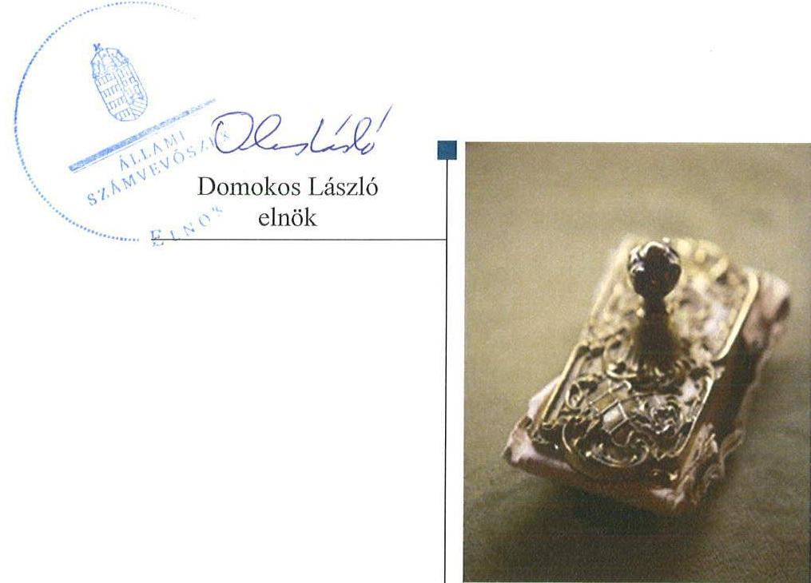
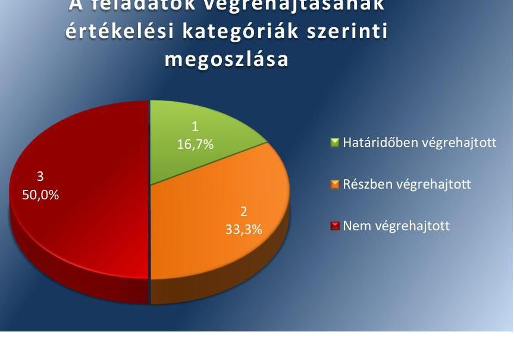

# Jelentés 

## Utóellenőrzések

Mágocs Város Önkormányzata vagyongazdálkodása
szabályszerűségének utóellenőrzése 2016. november hó 25 nap

---

# AZ ELLENŐRZÉST FELÜGYELTE: 

DR. NÉMETH ERZSÉBET felügyeleti vezető

## AZ ELLENŐRZÉST VEZETTE ÉS A VÉGREHAJTÁSÁÉRT FELELŐS:

DR. NAGY JUDIT ellenőrzésvezető

## A PROGRAM ÖSSZEÁLLÍTÁSÁÉRT FELELŐS:

JANIK JÓZSEF LÁSZLÓ osztályvezető

## A TÉMÁHOZ KAPCSOLÓDÓ KORÁBBI SZÁMVEVŐSZÉKI JELENTÉSEK:

- címe: Jelentés az önkormányzati vagyongazdálkodás szabályszerűségi ellenőrzéséről - Mágocs
- sorszáma: $\quad 13162$

Jelentéseink az országgyűlés számítógépes hálózatán és az Interneten a www.asz.hu címen is olvashatóak.

IKTATÓSZÁM: V-1163-051/2016.
TÉMASZÁM: 2197
ELLENŐRZÉS-AZONOSÍTÓ SZÁM: V075513

---

# TARTALOMJEGYZÉK 

■ ÖSSZEGZÉS ..... 5
■ AZ ELLENŐRZÉS CÉLJA ..... 6
■ AZ ELLENŐRZÉS TERÜLETE ..... 7
■ AZ ELLENŐRZÉS HÁTTERE, INDOKOLTSÁGA ..... 8
■ FÓKUSZKÉRDÉS ..... 9
■ ELLENŐRZÉS HATÓKÖRE ÉS MÓDSZEREI ..... 10
■ MEGÁLLAPÍTÁSOK ..... 12
■ MELLÉKLETEK ..... 15
I. sz. melléklet: Mágocs Város Önkormányzata intézkedési tervének végrehajtása ..... 15
■ FÜGGELÉK: ÉSZREVÉTELEK ..... 19
■ RÖVIDÍTÉSEK JEGYZÉKE ..... 21

---

.

---

# ÖSSZEGZÉS 

Az utóellenőrzés megállapította, hogy az intézkedési tervben foglalt feladatok jelentős részét Mágocs Város Önkormányzata nem, vagy csak részben hajtotta végre. Nem tett megfelelő lépéseket az Állami Számvevőszék által korábban feltárt, a vagyongazdálkodás szabályszerűségét érintő hiányosságok megszüntetésére, így a gazdálkodási jogkörök gyakorlása, illetve a vagyon számbavétele továbbra sem volt szabályszerű.

## Az ellenőrzés társadalmi indokoltsága

Az ÁSZ ${ }^{1}$ stratégiájában célul tűzte ki a számvevőszéki munka hasznosulásának javítását. Ezzel összhangban ellenőrzi, hogy az ellenőrzött szervezet megvalósította-e a korábbi ellenőrzései által feltárt hibák, hiányosságok és szabálytalanságok megszüntetése céljából elkészített intézkedési terveikben foglaltakat.

Az Állami Számvevőszék 2013-ban ellenőrizte Mágocs Város vagyongazdálkodása szabályszerűségét. Az utóellenőrzést a gazdálkodási jogkörök gyakorlása terén feltárt hiányosságok indokolták.

## Főbb megállapítások, következtetések

Az ÁSZ jelentésben foglalt javaslatok végrehajtása érdekében az Önkormányzat Képviselő-testülete ${ }^{3}$ intézkedési tervet fogadott el, amelyet a polgármester ${ }^{4}$ határidőben megküldött az ÁSZ részére. Az intézkedési tervben rögzített feladatok végrehajtásáról nem vezették a Bkr. ${ }^{5}$ előírásainak megfelelő nyilvántartást.

Az intézkedési tervekben meghatározott 6 feladat döntő részét az Önkormányzat nem, vagy csak részben hajtotta végre. A gazdálkodási jogkörök gyakorlása továbbra sem szabályszerű. Nem történt meg teljes körűen az önkormányzati vagyon számbavétele. A követelések-kötelezettségek nyilvántartása továbbra sem szabályszerű. Az intézkedési tervben vállaltak ellenére a belső ellenőrzési jelentések nem minden esetben kerültek a Képviselő-testület elé, és nem készültek a jelentések megállapításai alapján intézkedési tervek.

Bár a megtett intézkedések - a leltározás és az belső ellenőrzési éves ellenőrzési tervének képviselő-testület elé terjesztése - javították az Önkormányzat működésének szabályozottságát, az ÁSZ által korábban az Önkormányzat vagyongazdálkodásának szabályszerűsége területén azonosított hiányosságok jelentős része továbbra is fennáll. Mindezek alapján az önkormányzati vagyon átláthatósága és megőrzése nem biztosított.

---

# AZ ELLENŐRZÉS CÉLJA

Az ellenőrzés célja annak értékelése, hogy a számvevőszéki jelentésben foglalt, intézkedést igénylő megállapításokkal és javaslatokkal összhangban készített intézkedési tervekben meghatározott feladatokat az ellenőrzött szervezet végrehajtotta-e.

---

# AZ ELLENŐRZÉS TERÜLETE 

## Az Önkormányzat

Mágocs Város Baranya megyében, a Hegyháti járásban, 4254 hektár területen helyezkedik el. Városi címet 2009. július 1-én kapott, lakónépességének száma a KSH által közzétett népességi adatok ${ }^{6}$ szerint 2015. január 1-jén 2348 fő volt.

A település polgármestere, a 2006. évi önkormányzati választások óta tölti be tisztségét, illetve látja el feladatát. Az ellenőrzött időszakban a jegyző ${ }^{7}$ személyében történt változás, 2014. november 1-jétől a korábbi aljegyző váltotta a nyugdíjba vonuló jegyzőt. A Képviselő-testület 7 tagból áll, az Önkormányzat munkáját két bizottság segíti.

Az Önkormányzat a 2015. évi éves költségvetési beszámoló szerint 2015. december 31-én 1,2 Mrd Ft értékű vagyonnal rendelkezett, amelyből 1,0 Mrd Ft volt a nemzeti vagyonba tartozó befektetett eszközök állománya. Mágocs a mikro-térség gazdasági, oktatási, egészségügyi és közigazgatási központja.

Az Állami Számvevőszék 2013. évben ellenőrizte Mágocs Város önkormányzati vagyongazdálkodás szabályszerűségét a 2007. január 1. és 2011. december 31. közötti időszak vonatkozásában. Az erről szóló, 13162 sz. jelentését az ÁSZ 2013. december 5.-én tette közzé. Az ÁSZ jelentésben foglalt javaslatok végrehajtása érdekében az Önkormányzat Képviselő-testülete 158/2013.(XII.17.) számú határozattal intézkedési tervet fogadott el, amelyet 2014. március 20-án kiegészített. Az ÁSZ jelentés a polgármesternek 1, a jegyzőnek 5 javaslatot fogalmazott meg, amelyek alapján az intézkedési terv hat intézkedést tartalmaz.

Az utóellenőrzés az ÁSZ jelentésben a polgármester és a jegyző részére megfogalmazott intézkedést igénylő megállapításokra és javaslatokra készített intézkedési tervben foglalt feladatok végrehajtásának ellenőrzésére, illetve értékelésére terjedt ki.

---

# AZ ELLENŐRZÉS HÁTTERE, INDOKOLTSÁGA 

Az ÁSZ tv. 33. § (1) bekezdése értelmében a számvevőszéki jelentések intézkedést igénylő megállapításaihoz és javaslataihoz kapcsolódóan az ellenőrzött szervezet vezetője intézkedési tervet köteles összeállítani, és az Állami Számvevőszék részére megküldeni. Az intézkedési tervben foglaltak megvalósítását - az ÁSZ tv. 33. § (7) bekezdésében foglaltak alapján - az Állami Számvevőszék utóellenőrzés keretében ellenőrizheti. Az intézkedések megvalósulásának értékelése során az Állami Számvevőszék figyelembe veszi az ellenőrzött szervezet működési feltételeiben, valamint a jogszabályi előírásokban bekövetkezett változásokat.

Az intézkedési tervekben foglalt feladatok hiányos, illetve késedelmes végrehajtása, valamint megvalósításának elmaradása azt mutatja, hogy az ellenőrzés során feltárt hibák, hiányosságok és szabálytalanságok megszüntetése nem kapott kellő hangsúlyt. Ez a szabályszerű működés és a felelős vezetői magatartás vonatkozásában kockázatot hordoz. E kockázatok feltárásával az Állami Számvevőszék utóellenőrzési rendszere fokozza a fegyelmet, és igazolja, hogy a közpénzzel való szabályos gazdálkodás felelőssége elől nem lehet kitérni.

Az utóellenőrzés négy szinten hasznosulhat:
$\longrightarrow$ A társadalom szintjén az utóellenőrzés jelzi, hogy a számvevőszéki ellenőrzés megállapításainak van következménye: a hiányosságok megszüntetésére az ellenőrzött szervezet által meghatározott intézkedések végrehajtását is számon kéri az ÁSZ.
$\longrightarrow$ Az ellenőrzött terület szintjén az utóellenőrzés tájékoztatást nyújt a terület döntéshozóinak a hiányosságok kiküszöbölésének jó gyakorlatairól, ezzel lehetőséget biztosítva arra, hogy az ÁSZ ellenőrzési megállapításai, javaslatai a terület nem ellenőrzött szervezeteinek működése során is hasznosuljanak.
$\longrightarrow$ Az ellenőrzött szervezet szintjén az utóellenőrzés feltárja, hogy a szervezet az intézkedések végrehajtásával hasznosította-e a korábbi ellenőrzési jelentésben a hiányosságok megszüntetése, illetve a kockázatok kezelése érdekében megfogalmazott javaslatokat.
$\longrightarrow$ Az ÁSZ szintjén az utóellenőrzés visszacsatolást ad az ellenőrzési jelentések hasznosulásáról, az intézkedések elmaradása vagy részleges megvalósulása a további ellenőrzésekhez kockázati jelzésként szolgál.

---

# FÓKUSZKÉRDÉS 

Az Önkormányzat az intézkedési tervben foglaltakat az előírt határidőben végrehajtotta-e?

---

# ELLENŐRZÉS HATÓKÖRE ÉS MÓDSZEREI 

## Az ellenőrzés típusa

Megfelelőségi ellenőrzés

## Az ellenőrzött időszak

Az utóellenőrzés alapját képező ÁSZ jelentés közzétételének napjától (2013. december 5.) az ellenőrzésről szóló kiértesítő levél keltének napjáig (2016. június 13.) tartó időszak.

## Az ellenőrzés tárgya

Az ÁSZ tv. 2011. július 1-jei hatálybalépését követően a számvevőszéki jelentésben foglalt intézkedést igénylő megállapításokkal és javaslatokkal összhangban - Önkormányzat által - készített intézkedési tervben foglaltak végrehajtásának ellenőrzése.

Az ellenőrzés kiterjed minden olyan körülményre és adatra, amely az ÁSZ jogszabályban meghatározott feladatainak teljesítéséhez, valamint a program végrehajtása során felmerült újabb összefüggések feltárásához szükséges.

## Az ellenőrzött szervezet

Mágocs Város Önkormányzata

## Az ellenőrzés jogalapja

Az ÁSZ törvényben ${ }^{8}$ meghatározott feladatkörében ellenőrzi a központi költségvetés végrehajtását, az államháztartás gazdálkodását, az államháztartásból származó források felhasználását és a nemzeti vagyon kezelését.

Az ÁSZ tv. 1. § (3) bekezdése szerint az ÁSZ általános hatáskörrel végzi a közpénzekkel és az állami és önkormányzati vagyonnal való felelős gazdálkodás ellenőrzését.

Az ÁSZ tv. 33. § (7) bekezdése alapján az ÁSZ tv. 33. § (1)-(2) bekezdése szerinti intézkedési tervben foglaltak megvalósítását az ÁSZ utóellenőrzés keretében ellenőrizheti.

---

# Az ellenőrzés módszerei 

Az utóellenőrzést a nemzetközi standardokat irányadónak tekintve az ellenőrzési program ellenőrzési kérdései, az ellenőrzött időszakban hatályos jogszabályok, az ellenőrzés szakmai szabályok és módszertanok figyelembevételével, önálló ellenőrzés keretében, végeztük.

Az ÁSZ az ellenőrzés ideje alatt az Önkormányzattal történő kapcsolattartást az ÁSZ SZMSZ-ének vonatkozó előírásai alapján biztosította.

Az utóellenőrzés megállapításait az ÁSZ rendelkezésére álló, valamint az ellenőrzött szervezettől elektronikusan bekért dokumentumok alapozták meg.

Az ÁSZ az intézkedési tervben foglalt, a követelések és kötelezettségek nyilvántartását illetve, a gazdálkodási és ellenőrzési jogköröket érintő feladatok végrehajtását 10-10 elemű - felhalmozási kiadás és bevételi tartalmú -, véletlen mintavétellel kiválasztott minta alapján értékelte. Az ellenőrzött tételek esetében az ÁSZ azt ellenőrizte, hogy az Önkormányzat az intézkedési tervben meghatározott feladatokat végrehajtotta-e.

Az ellenőrzési bizonyítékként felhasználható adatforrások közé tartoztak egyrészt a szakmai programban felsorolt adatforrások, másrészt minden - az ellenőrzés folyamán feltárt, az ellenőrzés szempontjából információt tartalmazó - dokumentum.

Az intézkedési tervekben előírt feladatokat azok végrehajthatósága, illetve végrehajtása szempontjából az alábbiak szerint értékeltük:
"határidőben végrehajtott" a feladat, ha a teljesítés dokumentáltan, az intézkedési tervben előírt határidőben és tartalommal megtörtént;
"határidőn túl végrehajtott" a feladat, ha annak teljesítése az intézkedési tervben meghatározott módon, de az előírt határidőn túl történt meg;
"részben végrehajtott" a feladat, ha végrehajtása teljes körűen az intézkedési tervben előírt módon nem történt meg;
"nem végrehajtott" ha a végrehajtás nem történt meg, vagy amenynyiben a teljesítést nem dokumentálták;
"okafogyottá vált" a feladat, ha végrehajtására - meghatározott esemény bekövetkezése, továbbá külső körülmény, a működést érintő feltétel változása miatt - már nincs szükség, illetve lehetőség, és egyértelműen megállapítható, hogy az intézkedést szükségessé tevő körülmény a jövőben nem fordulhat elő;
"nem időszerű" az a feladat, amelynek ellenőrzési időszakon belüli végrehajtására azért nem került (kerülhetett) sor, mert az intézkedés alapjául szolgáló esemény nem következett be, de annak jövőbeni előfordulása lehetséges, így a végrehajtása nem volt esedékes, vagy a végrehajtás határideje még nem járt le.
Az ellenőrzés lefolytatásához az ellenőrzött szervezet a tanúsítványok elektronikus kitöltésével, valamint az ÁSZ által kért dokumentumok elektronikus megküldésével szolgáltatott adatokat, amelyek valódiságát és teljes körűségét az ellenőrzött szervezet vezetője által tett teljességi és hitelességi nyilatkozat igazolja. Az így rendelkezésre bocsátott adatok, információk kontrollja az ellenőrzés keretében megtörtént.

---

# MEGÁLLAPÍTÁSOK 

## Az Önkormányzat az intézkedési tervben foglaltakat az előírt határidőben végrehajtotta-e?

Összegző megállapítás

Az Önkormányzat az intézkedési tervben meghatározott hat feladatból egyet határidőben, kettőt részben és hármat nem hajtott végre. Az intézkedési tervben rögzített feladatok végrehajtásáról a Bkr.-ben előírt nyilvántartást nem vezették.

Az ÁSZ a jelentésében a polgármester részére egy, a jegyző részére öt javaslatot fogalmazott meg, amelyek hasznosítására a Képviselő-testület 6 feladatot határozott meg.

Az intézkedési tervben meghatározott feladatokat, határidőket, az intézkedési tervben meghatározott felelősöket és a feladatok végrehajtását az 1. sz. melléklet mutatja be.

A jegyző a Bkr. 14.§ (1) bekezdésében foglaltak ellenére nem gondoskodott az intézkedési tervben meghatározott feladatok végrehajtásáról szóló nyilvántartás vezetéséről.

Az Önkormányzat intézkedési tervében vállalt intézkedések végrehajtási kategóriánkénti megoszlását az 1. ábra szemlélteti.

1. ábra

A feladatok végrehajtásának értékelési kategóriák szerinti megoszlása

Forrás: ÁSZ

## HATÁRIDŐBEN VÉGREHAJTOTT FELADATOK:

1. Az Önkormányzat üzemeltetésre átadott eszközeinek 2013-2015. évekre vonatkozó, az üzemeltető által megküldött leltárral való alátámasztása megtörtént.

---

# RÉSZBEN VÉGREHAJTOTT FELADAT: 

2. A polgármester a leltározási kötelezettség ellátásáról az intézkedési tervben vállalt határidőben gondoskodott. A gazdálkodási jogkörök gyakorlása továbbra sem volt szabályszerű az ellenőrzött időszakban, ennek ellenére személyes felelősségre vonásra nem került
 sor.
3. A jegyző megbízási szerződést kötött a belső ellenőrzési feladatok ellátására, azonban nem intézkedett a belső ellenőr megállapításainak hasznosulásáról.

## NEM VÉGREHAJTOTT FELADAT:

4. A jegyző nem biztosította, hogy a zárszámadáshoz csatolt vagyonkimutatás felépítése és tartalma feleljen meg 2013. évben az Áhsz. ${ }_{1}{ }^{10}$-ben, 2014-2015. években az Áhsz. ${ }_{2}{ }^{11}$-ben foglalt előírásoknak.
5. A jegyző nem gondoskodott a kötelezettségek és követelések Ávr. ${ }^{12}$ illetve Áhsz. ${ }_{2}$ előírásainak megfelelő nyilvántartásba vételéről, és annak a jogszabályi előírásokban foglaltaknak megfelelő vezetéséről.
6. A jegyző nem gondoskodott az Áht. ${ }^{13}$ szerinti pénzügyi ellenjegyzés, az Ávr. szerinti érvényesítés és az utalványozás jogszabályi előírásainak megfelelő jogkörök gyakorlásáról.

---

.

---

# MELLÉKLETEK

## I. SZ. MELLÉKLET: MÁGOCS VÁROS ÖNKORMÁNYZATA INTÉZKEDÉSI TERVÉNEK VÉGREHAJTÁSA

|  1. | 2. | 3. | 4.  |
| --- | --- | --- | --- |
|  **Intézkedési terv alapján elvégzendő feladat** | **Az intézkedési tervben meghatározott határidő** | **Az intézkedési tervben meghatározott felelős** | **Az intézkedés végrehajtása**  |
|  1. | 2. | 3. | 4.  |
|  **Intézkedési terv alapján elvégzendő feladat** | **Ajtóval és díjjal** | **Ajtóval és díjjal** | **Ajtóval és díjjal**  |
|  1. | „A pénzügyi csoport az üzemeltetésre átadott eszközök / Mágocsvíz Kft, Vízmű/ esetében leltározást nem kérte be. Ezen mulasztás egy részét már 2013. évtől pótoltuk a vízmű vagyon átadásakor. A Mágocsvíz Kft-nél maradt eszközök felleltározása a jövő évtől folyamatosan történik. A Mágocsvíz Kft-nek üzemeltetésre átadott eszközöket 2013.02.28.-i fordulónappal üzemeltetésre átadta a MEZŐFÖLDVÍZ Kft-nek. Az átadott eszközökről – vagyonértékelés alapján – az üzemeltető által készített hiteles, 2013.12.31-i fordulónappal leltár készült, melynek 1 példánya az önkormányzati mérleg és vagyonkimutatás mellékletét képezi. Felhívja a pénzügyi csoportvezető figyelmét, hogy ez évtől kezdődően a szolgáltató részéről az adatokat kérje be, s azt a beszámolóhoz mellékelje.” | folyamatos, minden év december 31. | pénzügyi csoportvezető | A pénzügyi csoportvezető a mérlegtételek alátámasztásaként az eszközök és források leltározásáról intézkedett. Az Önkormányzat a Számv. tv.14 69. §-a, 2013. évtől kezdődően az Áhsz.; 37. §-a, 2014. évtől Áhsz.; 22. §-a előírásainak megfelelően -, leltározási kötelezettségének eleget tett. Az Önkormányzat üzemeltetésre átadott eszközeit 2013-2015. évekre vonatkozóan az üzemeltető által megküldött leltárral alátámasztotta.  |
|  **2.** | „Az évenkénti leltározási kötelezettség elmaradásának oka a hivatal pénzügyi csoportjánál végrehajtott létszám leépítés. A megszűnt álláshelyeket az önkormányzat zárolta, a megmaradt létszám (3 fő) a leltározási feladatokat folyamatos és minden év december 31. |  |   |

---

# Mellékletek 

előírás szerint ellátni nem tudta. Az elvégzett leltározások feldolgozása ugyanezen oknál fogva maradt el.
A gazdálkodási és ellenőrzési jogkörök gyakorlásával kapcsolatban tett észrevételek megszüntetése érdekében az intézkedések az ellenőrzés folyamán megtörténtek. 2013. évben a hivatal pénzügyi csoportja egy plusz létszámot kapott, így a jövő évtől kezdve a leltározásokat a szabályzatban előírtak szerint tudja végezni.
A polgármester a vizsgálati jelentés kézhezvételét követően megállapította, hogy a pénzügyi csoport 2007. és 2009. valamint 2011. évben leltározási kötelezettségének nem tett eleget, amely létszám okokra vezethető vissza. Elrendelte a csoport részére a teljes körű leltárak felvételét, amely 2013. december 31. napjáig elkészült. A pénzkezelési szabályzatban kijelölt dolgozók szóban figyelmeztetetve lettek, hogy a jövőben a mindenkor érvényes pénzügyi előírásoknak megfelelően történjen a gazdálkodási és ellenőrzési jogkörök gyakorlása. Amennyiben a szabálytalanságok a jövőben is előfordulnak, úgy személyi felelősségre vonást kezdeményez."
3 „A hivatal 2014 évtől a belső ellenőrzési feladatokat külső személlyel megbízási szerződés útján kívánja ellátni. / A Sásdi Többcélú Kistérségi Társulás ezt a feladatot a megállapodásból kivette./ Az ellenőrzéssel kapcsolatos eddigi hiányosságok a személyi változással várhatóan megszűnnek.
A belső ellenőrzést a feladat ellátásával megbízott a Többcélú Kistérségi Társulás nem látta el megfelelően. Az önkormányzat részéről egy évben nem készült intézkedési terv, illetve
folyamatos minden év
jegyző

Végre nem hajtott feladat:
Az ellenőrzött tételek esetében a gazdálkodási és ellenőrzési jogkörök gyakorlása egyik tétel esetében sem volt szabályszerű (nem felelt meg az Áht. illetve az Ávr. előírásainak), ennek ellenére az IT-ben vállalt, ezzel kapcsolatos személyes felelősségrevonást a polgármester nem kezdeményezett (részletezve a 6. pontnál).

## Végrehajtott:

A jegyző a Bkr. 15. § (7) bekezdés b) pontjában foglaltaknak megfelelően, 2013. december 17-én határozatlan időre szóló megbízási szerződést kötött a belső ellenőrzési feladatok ellátására. A belső ellenőr az összeállított éves ellenőrzési tervet a Bkr. 32. § (3) bekezdése szerint eljárva, megküldte a jegyző részére, melyet a jegyző a Képviselő testület elé terjesztett. A Képviselőtestület az éves ellenőrzési tervet a Bkr. 32. § (4) bekezdésében előírt határidőn belül elfogadta.

---

nem került testületi ülés elé az ellenőrzés anyaga. A korábbi években mind a munkaterv mind az ellenőrzés vizsgálati anyagát a testület megtárgyalta. A jegyző a belső ellenőrzés miatti mulasztása elkerülése érdekében külső vállalkozóval kötött megállapodást 2014 évtől. Ezen intézkedéssel a hiányosságok megszüntetésre kerülnek, fel lett hívva a jegyző figyelme, hogy a belső ellenőrzési munkatervet a testület elé határidőn belül nyújtsa be, illetve az ellenőrzés anyagát a testület elé vigye annak intézkedési tervével együtt." ${ }^{4}$

## Nem végrehajtott:

A jegyző nem intézkedett:

- a Bkr. 28. § c) pontjában előírtak ellenére a belső ellenőri jelentések hasznosulásához intézkedési tervek készítéséről a belső ellenőrzés által feltárt hiányosságok megszüntetésére,
- a Bkr. 47. § (2) pontjában foglaltak ellenére nyilvántartás vezetéséről a belső ellenőrzési jelentésekben szereplő javaslatokról, az elfogadott intézkedési tervekről, illetve azok végrehajtásáról,
- az IT13-ban vállaltak ellenére a belső ellenőrzés által készített 2014. évre vonatkozó jelentések Képviselő-testületi beterjesztéséről.

|   | Nem végrehajtott feladat |  |   |
| --- | --- | --- | --- |
|  4. „A hivatal pénzügyi csoportja 2014. évtől az Áhsz. 44/A § (2)-(3) bekezdéseiben előírt szempontok szerint készíti el a beszámolóhoz kapcsolódó vagyonkimutatást - eszközöket és források tekintetében is - és terjeszti a testület elé." | folyamatos és minden év december 31. | pénzügyi csoportvezető | Az Önkormányzati Hivatal pénzügyi csoportja által elkészített és az Áhsz. ${ }_{1}$ 44/A. §(1) bekezdése, illetve az Áhsz. ${ }_{2}$ 30. § (1) bekezdése szerint az Önkormányzat Képviselő-testülete részére a zárszámadáshoz csatolt vagyonkimutatás felépítése és tartalma nem felelt meg 2013. évben az Áhsz. ${ }_{1}$ 44/A. § (2)-(3) bekezdésében, 2014-2015. években az Áhsz. ${ }_{2}$ 30. § (2)-(3) bekezdésében foglalt előírásoknak, mivel felépítése nem a könyvviteli mérleg illetve a mérleg előírt tagolásán alapul.  |
|  5. „A hivatal 2002. évtől a kötelezettségvállalás analitikus nyilvántartását számítógépes program alapján végzi, mely a kiadásokat tartalmazza. 2014. évtől a kötelezettségvállalás analitikus nyilvántartása mind a kiadási és bevételi tételek esetében teljes körűen meg fog történni.
A kötelezettségvállalásról a Saldo-Creator integrált könyvelési rendszer modulja szolgál a teljes körű bevétel és kiadási tételek analitikus nyilvántartására. A nyilvántartás ez idáig csak a kiadási tételeket tartalmazta. Fel lett hívva az érintett dolgozó figyelme, hogy a bevételeket is tartsa nyilván, melyet 2014. évtől folyamatosan kell vezetni." | folyamatos minden év december 31. | pénzügyi munkatárs | A jegyző nem gondoskodott a kötelezettségek Ávr. 56. § (1) bekezdése szerint a kötelezettségvállalás, továbbá az IT-ben meghatározott bevételek nyilvántartásba vételéről. A kötelezettségek nyilvántartásának szabályait rögzítő, az Áhsz. ${ }_{2} 14$. mellékletének II. Kötelezettségvállalások, más fizetési kötelezettségek nyilvántartása 4. pontjában foglaltaknak az ellenőrzött tételek esetében a jegyző nem tett eleget, mivel a kimutatás nem tartalmazta a kötelezettségvállalási dokumentum megnevezését, sorszámát, a nyilvántartásba vétel dátumát, a kötelezettségvállalás tárgyát, összegét az egységes rovatrend szerint, a fizetési kötelezettség évek szerinti megoszlását.
A követelések nyilvántartásának szabályait rögzítő, az Áhsz. ${ }_{2}$. 14. mellékletének III. Követelések nyilvántartása 4. pontjában foglaltaknak az ellenőrzött tételek esetében nem tett eleget, mivel a készített kimutatás nem tartalmazta a követelés sorszámát, a nyilvántartásba vétel dátumát, a követelés tárgyát, összegét az egységes rovatrend szerint, a követelést tanúsító dokumentum megnevezését, a folyamatosan fennálló követelés esetén annak évek szerinti megoszlását, a költségvetési évben a teljesítési határidőket dátum szerint.  |
|  6. „Az önkormányzatnál a pénzügyi ellenjegyzés, az érvényesítő és az utalványozó a mindenkor hatályos jogszabályi előírások alapján fogja vé- | azonnal és folyamatos minden év december 31. | pénzügyi csoportvezető | A 10 ellenőrzött tétel esetében a jegyző az operatív gazdálkodás során nem gondoskodott a pénzügyi ellenjegyzés, az érvényesítés és utalványozási feladatok szabályszerű végrehajtásáról:  |

---

gezni ellenőrzési feladatait. Az érintett dolgozók az előírásoknak megfelelően tájékoztatva lettek."

- az Áht.. 37. § (1) bekezdésében foglaltak ellenére a pénzügyi ellenjegyzés nem előzte meg a kötelezettségvállalást és a pénzügyi teljesítés esedékességét 3 ellenőrzött tétel esetében,
- Ávr. 58. §. (3)-(5) bekezdésében az érvényesítésre előírtak ellenére, az utalványon az érvényesítő, és az utalványozó aláírása mellett nem kerültek feltüntetésre a keltezések, így nem állapítható meg, hogy az érvényesítés megelőzte-e az utalványozást, 3 ellenőrzött tétel esetében,
- Ávr. 58. §. (3) bekezdésében foglaltak ellenére az érvényesítés dokumentumán nem került feltüntetésre az érvényesítő keltezéssel ellátott aláírása az ellenőrzött tételek egyikében sem,
- Ávr. 59. §. (1) bekezdésében az utalványozásra előírtakkal nem egyezően, az utalványon a teljesítésigazoló, utalványozó aláírása mellett nem kerültek feltüntetésre a keltezések, így nem állapítható meg, hogy a teljesítési igazolást követően került-e sor az utalványozásra 3 ellenőrzött tétel esetében és az
- Ávr. 59. §. (3) bekezdés g) pontjában foglaltak ellenére az utalványozás dokumentumán nem került feltüntetésre az utalványozó aláírása mellett a keltezés az ellenőrzött tételek egyikében sem

---

# FÜGGELÉK: ÉSZREVÉTELEK 

A jelentéstervezetet a Számvevőszék 15 napos észrevételezésre megküldte az ellenőrzött szervezet vezetőjének az ÁSZ tv. 29. § (1) bekezdése előírásának megfelelően.
Az ellenőrzött szervezet vezetője az ÁSZ tv. 29. § (2) bekezdésében foglalt észrevételezési jogával nem élt, a jelentéstervezetre nem tett észrevételt.

[^0]
[^0]:    * 29. § (1) Az Állami Számvevőszék az ellenőrzési megállapításait megküldi az ellenőrzött szervezet vezetőjének vagy az általa megbízott személynek, és annak, akinek személyes felelősségét állapította meg.
    (2) Az ellenőrzött szervezet vezetője és a felelősként megjelölt személy az ellenőrzés megállapításaira tizenöt napon belül írásban észrevételt tehet.
    (3) Az Állami Számvevőszék az észrevételre a beérkezésétől számított harminc napon belül írásban válaszol. A figyelembe nem vett észrevételeket köteles a jelentésben feltüntetni, és megindokolni, hogy azokat miért nem fogadta el.

---

.

---

# RÖVIDÍTÉSEK JEGYZÉKE 

${ }^{1}$ ÁSZ
${ }^{2}$ Önkormányzat
${ }^{3}$ Képviselő-testület
${ }^{4}$ polgármester
${ }^{5}$ Bkr.
${ }^{6}$ KSH által közzétett népességi adatok
${ }^{7}$ jegyző
${ }^{8}$ ÁSZ tv.
${ }^{9}$ SZMSZ
${ }^{10}$ Áhsz. 1
${
 }^{11}$ Áhsz. 2
${ }^{12}$ Ávr.
${ }^{13}$ Áht.
${ }^{14}$ Számv.tv.
${ }^{15} \mathrm{IT}$

Állami Számvevőszék
Mágocs Város Önkormányzata
Mágocs Város Önkormányzatának Képviselő-testülete
Mágocs Város Önkormányzatának polgármestere
370/2011. (XII. 31.) Korm. rendelet a költségvetési szervek belső
kontrollrendszeréről és belső ellenőrzéséről (hatályos 2012. január 1-jétől)
Központi Statisztikai Hivatal Magyarország Közigazgatási Helységnévkönyvének 2015. január 1-jei adatai

Mágocs Közös Önkormányzati Hivatal jegyzője
2011. évi LXVI. törvény az Állami Számvevőszékről (hatályos 2011. július 1-jétől)

Az Állami Számvevőszék Szervezeti és működési szabályzatáról szóló 3/2015.
(XII. 30.) ÁSZ utasítás (hatályos 2016. január 1-jétől)
249/2000. (XII. 24.) Korm. rendelet az államháztartás szervezetei beszámolási és
könyvvezetési kötelezettségének sajátosságairól (hatálytalan 2014. január 1-től)
4/2013. (I. 11.) Korm. rendelet az államháztartás számviteléről
368/2011. (XII. 31.) Korm. rendelet az államháztartási törvény végrehajtásáról
2011. évi CXCV. törvény az államháztartásról (hatályos 2012. január 1-jétől)
2000. évi C. törvény a számvitelről

Mágocs Város Önkormányzatának intézkedési terve

---

# ÁLLAMI SZÁMVEVŐSZÉK 

1052 Budapest, Apáczai Csere János utca 10.
Levélcím: 1364 Budapest 4. Pf. 54
Telefon: +36 14849100 Telefax: +36 14849200
www.asz.hu
