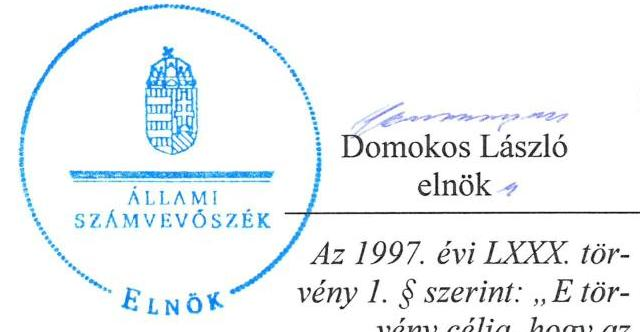
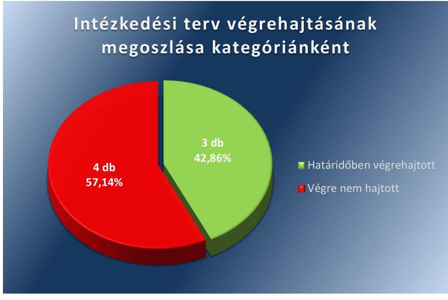
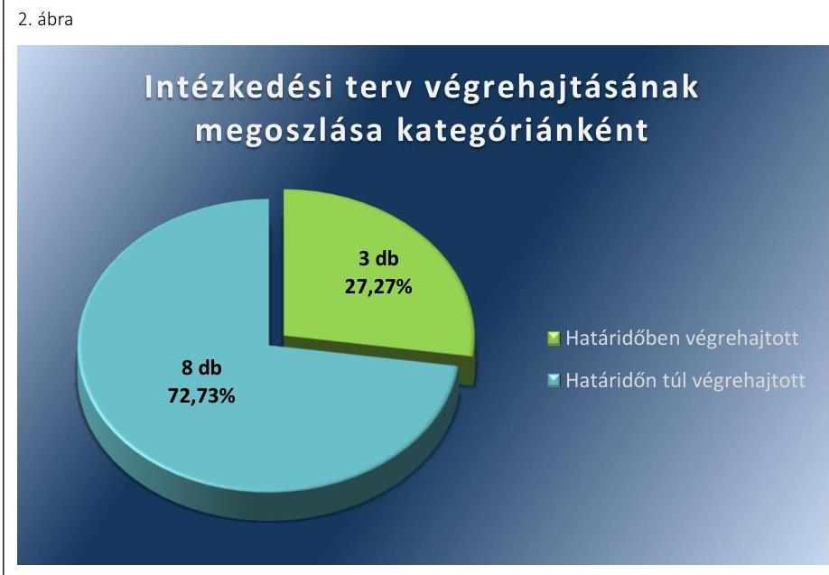
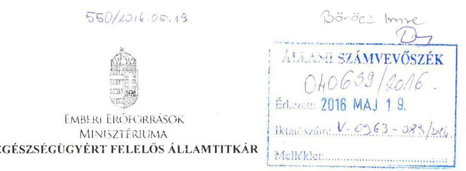
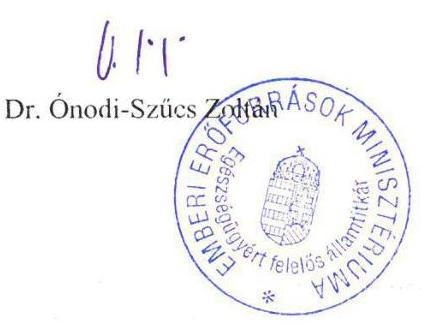
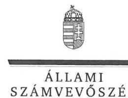
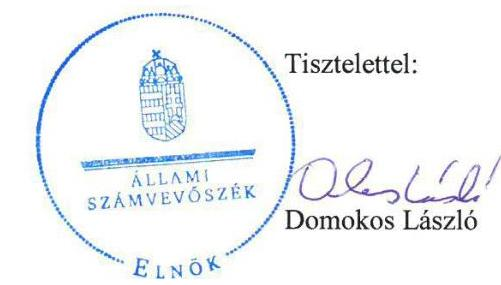
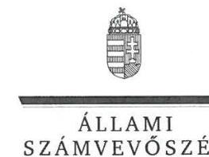

# Jelentés 

## Utóellenőrzések

A Társadalombiztosítási Alapokból nyújtott ellátások és szolgáltatások jogosultsági rendjében alkalmazott nyilvántartási rendszerek múködésének utóellenőrzése
2016.

Az 1997. évi LXXX. törvény 1. § szerint: „E törvény célja, hogy az egyéni felelősség és öngondoskodás követelményeinek és a társadalmi szolidaritás elveinek megfelelően szabályozza a társadalombiztosítás keretében létrejövő jogviszonyokat. "

---

# Jelentés 

## Utóellenőrzések

A Társadalombiztosítási Alapokból nyújtott ellátások és szolgáltatások jogosultsági rendjében alkalmazott nyilvántartási rendszerek múködésének utóellenőrzése
2016. 66 hó 16 nap

16089
www.asz.hu

---

|  AZ ELLENŐRZÉST FELÜGYELTE: | |
| --- | --- |
|  BÖRÖCZ IMRE felügyeleti vezető | |
|  AZ ELLENŐRZÉST VEZETTE ÉS A VÉGREHAJTÁSÁÉRT FELELŐS: | |
|  VIDA KATALIN ellenőrzésvezető | |
|  A PROGRAM ÖSSZEÁLLÍTÁSÁÉRT FELELŐS: | |
|  JANIK JÓZSEF osztályvezető | |
|  A TÉMÁHOZ KAPCSOLÓDÓ KORÁBBI SZÁMVEVŐSZÉKI JELENTÉSEK: | |
|   címe: | |
|  Jelentés a Társadalombiztosítási Alapokból nyújtott ellátások és szolgáltatások jogosultsági rendjében alkalmazott nyilvántartási rendszerek működésének ellenőrzéséről | |
|   sorszáma: | |
|  1285 | |
|  IKTATÓSZÁM: V-0963-099/2016. | |
|  TÉMASZÁM: 1997 | |
|  ELLENŐRZÉS-AZONOSÍTÓ SZÁM: V071714 | |

---

# TARTALOMJEGYZÉK 

■ ÖSSZEGZÉS ..... 5
■ AZ ELLENŐRZÉS CÉLJA ..... 6
■ AZ ELLENŐRZÉS TERÜLETE ..... 7
■ AZ ELLENŐRZÉS HÁTTERE, INDOKOLTSÁGA ..... 8
■ FÓKUSZKÉRDÉS ..... 9
■ ELLENŐRZÉS HATÓKÖRE ÉS MÓDSZEREI ..... 10
■ MEGÁLLAPÍTÁSOK ..... 12
■ MELLÉKLETEK ..... 17
I. sz. melléklet: Az ÁSZ 1285. számú jelentéséhez kapcsolódó, az NGM által készített intézkedési terv végrehajtása ..... 17
II. sz. melléklet: Az ÁSZ 1285. számú jelentéséhez kapcsolódó, az EMMI által készített intézkedési terv végrehajtása ..... 19
■ FÜGGELÉK: ÉSZREVÉTELEK ..... 21
■ RÖVIDÍTÉSEK JEGYZÉKE ..... 27

---

.

---

# ÖSSZEGZÉS 

Az Állami Számvevőszék elvégezte a Társadalombiztositási Alapokból nyújtott ellátások és szolgáltatások jogosultsági rendjében alkalmazott nyilvántartási rendszerek müködésének utóellenőrzését. A Nemzetgazdasági Minisztérium intézkedési tervében meghatározott feladatok közül három intézkedés határidőben teljesült, négy intézkedés végrehajtása nem történt meg. Az Emberi Eröforrások Minisztériuma három intézkedést határidőben, nyolc intézkedést határidőn túl hajtott végre.

## Az ellenőrzés társadalmi indokoltsága

Az ÁSZ stratégiájában célul tűzte ki a számvevőszéki munka hasznosulásának javítását. Ezzel összhangban ellenőrzi, hogy az ellenőrzött szervezetek megvalósították-e a korábbi ellenőrzései által feltárt hibák, hiányosságok és szabálytalanságok megszüntetése céljából kialakított intézkedési terveikben foglaltakat. A rendszeres utóellenőrzések hozzájárulnak a szükséges intézkedések tényleges végrehajtáshoz, ezáltal a közpénzügyek rendezettségének javulásához.

## Főbb megállapítások, következtetések

A nemzetgazdasági miniszter és az emberi erőforrások minisztere az elkészített intézkedési terveket határidőn túl küldte meg az ÁSZ részére.

Az ÁSZ jelentésben foglalt megállapításokhoz kapcsolódó intézkedési tervekben előírt feladatokat az NGM és az EMMI három-három esetben az előírt határidőre végrehajtotta. Az NGM négy intézkedést nem hajtott végre. Az EMMI nyolc intézkedést határidőn túl teljesített.

Az NGM nem vezetett nyilvántartást az intézkedési tervben meghatározott feladatok végrehajtásáról.

---

# AZ ELLENŐRZÉS CÉLJA 

## A Társadalombiztosítási Alapokból nyújtott ellátások és szolgáltatások jogosultsági rendjében alkalmazott nyilvántartási rendszerek múködésének utóellenőrzése

Az ellenőrzés célja annak értékelése, hogy a számvevőszéki jelentésben foglalt intézkedést igénylő megállapításokkal és javaslatokkal összhangban készített intézkedési tervben meghatározott feladatokat az ellenőrzött szervezet végrehajtotta-e.

---

# AZ ELLENŐRZÉS TERÜLETE 

## Nemzetgazdasági Minisztérium, Emberi Erőforrások Minisztériuma

Az NGM ${ }^{1}$ és az EMMI ${ }^{2}$ az Országgyűlés ${ }^{3}$ által alapított, a Kormány ${ }^{4}$ irányítása alatt álló önálló jogi személyiséggel rendelkező központi államigazgatási szervek.

Az NGM, mint a Kormány adópolitikáért, államháztartásért, egészségbiztosítási-, nyugdíj- és nyugdíjbiztosítási járulékfizetés szabályozásáért felelős, a nemzetgazdasági miniszter fel-adat- és hatáskörének ellátásához szükséges hivatali feladatokat látja el. Az ellenőrzött időszakban az NGM felügyelete alá tartozó NAV5 államigazgatási és fegyveres rendvédelmi feladatokat ellátó kormányhivatalként működött.

Az EMMI - feladatai között - ellátja a Kormány egészségügyi központi igazgatási és szabályozási, nyugdíj-, valamint egészségbiztosítási szolgáltatások központi igazgatási feladatait, jogszabályok keretei között irányítja a költségvetési szervként működő OEP ${ }^{6}$ szakmai tevékenységét.

Az utóellenőrzés a Társadalombiztosítási Alapokból nyújtott ellátások és szolgáltatások jogosultsági rendjében alkalmazott nyilvántartási rendszerek müködésének ellenőrzéséről szóló, 2012. május 31-én nyilvánosságra hozott, 1285. számú ÁSZ jelentés ${ }^{7}$ megállapításai, javaslatai hasznosítása érdekében az EMMI és az NGM által készített, az ÁSZ ${ }^{8}$ részére megküldött intézkedési tervek ${ }^{9}$ végrehajtására irányult. Az ÁSZ jelentés a nemzetgazdasági miniszternek, az emberi erőforrások miniszterének és az OEP Főigazgatójának két-két javaslatot tartalmazott. Az utóellenőrzés az OEP főigazgatójának címzett javaslatokra nem terjedt ki, mivel azok utóellenőrzését a 2012. évi zárszámadás ellenőrzése során, 2013. évben elvégezte az ÁSZ. Jelen utóellenőrzés - az NGM és az EMMI vonatkozásában - kiterjedt minden olyan körülményre és adatra, amely az ÁSZ jogszabályban meghatározott feladatainak teljesítéséhez, valamint az ellenőrzési program végrehajtása során felmerült újabb összefüggések feltárásához szükséges.

Az ÁSZ jelentésben foglalt javaslatokra az elkészített intézkedési terveket az ellenőrzött szervezetek határidőn túl küldték meg az ÁSZ részére.

---

# AZ ELLENŐRZÉS HÁTTERE, INDOKOLTSÁGA 

Az ÁSZ tv. ${ }^{10}$ 33. § (1) bekezdése értelmében a számvevőszéki jelentések intézkedést igénylő megállapításaihoz és javaslataihoz kapcsolódóan az ellenőrzött szervezet vezetője intézkedési tervet köteles összeállítani és az Állami Számvevőszék részére megküldeni. Az intézkedési tervben foglaltak megvalósítását - az ÁSZ tv. 33. § (7) bekezdésében foglaltak alapján - az Állami Számvevőszék utóellenőrzés keretében ellenőrizheti. Az intézkedések megvalósulásának értékelése során az Állami Számvevőszék figyelembe veszi az ellenőrzött szervezetek működési feltételeiben, valamint a jogszabályi előírásokban bekövetkezett változásokat.

Az intézkedési tervekben foglalt feladatok hiányos, illetve késedelmes végrehajtása, valamint megvalósításának elmaradása azt mutatja, hogy az ellenőrzések során feltárt hibák, hiányosságok és szabálytalanságok megszüntetése nem kapott kellő hangsúlyt. Ez a szabályszerű működés és a felelős vezetői magatartás vonatkozásában kockázatot hordoz. E kockázatok feltárásával az Állami Számvevőszék utóellenőrzési rendszere fokozza a fegyelmet és igazolja, hogy a közpénzzel való szabályos gazdálkodás felelőssége elől nem lehet kitérni.

## AZ UTÓELLENŐRZÉS NÉGY SZINTEN HASZNOSULHAT:

- A társadalom szintjén az utóellenőrzés jelzi, hogy a számvevőszéki ellenőrzés megállapításainak van következménye: a hiányosságok megszüntetésére az ellenőrzött szervezet által meghatározott intézkedések végrehajtását is számon kéri az ÁSZ.
- Az ellenőrzött terület szintjén az utóellenőrzés tájékoztatást nyújt a terület döntéshozóinak a hiányosságok kiküszöbölésének jó gyakorlatairól, ezzel lehetőséget biztosítva arra, hogy az ÁSZ ellenőrzési megállapításai, javaslatai a terület nem ellenőrzött szervezeteinek a működése során is hasznosuljanak.
- Az ellenőrzött szervezet szintjén az utóellenőrzés feltárja, hogy a szervezet az intézkedések végrehajtásával hasznosította-e a korábbi ellenőrzési jelentésben a hiányosságok megszüntetése, illetve a kockázatok kezelése érdekében megfogalmazott javaslatokat.
- Az ÁSZ szintjén az utóellenőrzés visszacsatolást ad az ellenőrzési jelentések hasznosulásáról, az intézkedések elmaradása vagy részleges megvalósulása a további ellenőrzésekhez kockázati jelzésként szolgál.

---

# FÓKUSZKÉRDÉS 

1. Az ellenőrzött szervezetek az intézkedési tervekben foglaltakat - az előirt határidőben - végrehajtották-e?

---

# ELLENŐRZÉS HATÓKÖRE ÉS MÓDSZEREI 

## Az ellenőrzés típusa

Szabályszerűségi ellenőrzés

## Az ellenőrzött időszak

A számvevőszéki jelentés közzétételének napjától (2012. május 31.) az utóellenőrzés megkezdésének napjáig (2015. november 11.) tartó időszak.

## Az ellenőrzés tárgya

Az ÁSZ tv. alapján az ÁSZ jelentésekben foglalt megállapításokhoz kapcsolódó javaslatokra az ellenőrzöttek által az ÁSZ részére megküldött intézkedési tervekben előírtak hasznosulása.

## Az ellenőrzött szervezet

Az NGM és az EMMI.

## Az ellenőrzés jogalapja

Az ellenőrzés végrehajtásának jogszabályi alapját az ÁSZ tv. 1. § (3) bekezdése, a 33. § (1)-(2), (7) bekezdései, valamint az Áht. ${ }^{11}$ 61. § (2) bekezdésének előírásai képezték.

## Az ellenőrzés módszerei

Az utóellenőrzést a nemzetközi standardokat irányadónak tekintve az ellenőrzési program ellenőrzési kérdései, az ellenőrzött időszakban hatályos jogszabályok, az ellenőrzés szakmai szabályok és módszertanok figyelembevételével, önálló ellenőrzésként végeztük.

Az utóellenőrzés megállapításait elsősorban az ÁSZ rendelkezésére álló, valamint az ellenőrzött szervezetektől elektronikusan bekért dokumentumok alapozták meg.

Az ellenőrzési bizonyítékként felhasználható adatforrások közé tartoztak egyrészt a szakmai programban felsorolt adatforrások, másrészt minden - az ellenőrzés folyamán feltárt, az ellenőrzés szempontjából releváns információt tartalmazó - dokumentum.

---

Az ellenőrzés során értékeltük, hogy az ÁSZ jelentésben foglalt megállapításokhoz kapcsolódó intézkedési terveket határidőben megküldték-e az ÁSZ részére, az intézkedési tervekben foglaltakat végrehajtották-e.

A megküldött intézkedési tervekben előírt feladatok végrehajtásának ellenőrzését értékelési kritériumok alapján végeztük. Figyelembe vettük az intézkedési tervek készítését követően hatályba lépett jogszabályi előírások változásából következő események, továbbá a feladat-ellátási és finanszírozási rendszer esetleges változásának hatásait. Az intézkedési tervekben előírt feladatokat azok végrehajthatósága, illetve végrehajtása szempontjából az alábbiak szerint értékeltük:
—okafogyottá vált az előírt feladat, ha végrehajtására - meghatározott esemény bekövetkezése, továbbá külső körülmény, a működést érintő feltétel változása miatt - már nincs szükség, illetve lehetőség, és egyértelműen megállapítható, hogy az intézkedést szükségessé tevő körülmény a jövőben nem fordulhat elő;
—nem időszerű az a feladat, amelynek ellenőrzési időszakon belüli végrehajtására azért nem került (kerülhetett) sor, mert az intézkedés alapjául szolgáló esemény nem következett be, de annak jövőbeni előfordulása lehetséges, a végrehajtása nem volt esedékes, vagy a végrehajtás határideje még nem járt le;
—határidőben végrehajtott a feladat, ha a teljesítés dokumentáltan az intézkedési tervben előírt határidőben és tartalommal megtörtént;
—határidőn túl végrehajtott a feladat, ha annak teljesítése az intézkedési tervben meghatározott módon, de az előírt határidőn túl történt meg;
—részben végrehajtott az a feladat, amelynek végrehajtása teljes körűen az intézkedési tervben előírt módon nem történt meg;
—nem végrehajtott a feladat, ha a végrehajtás nem történt meg, vagy amennyiben a végrehajtást nem dokumentálták.
Az ellenőrzés lefolytatásához az ellenőrzött szervezetek a tanúsítványok kitöltésével, valamint az ÁSZ által kért dokumentumok elektronikus megküldésével szolgáltatattak adatokat, amelyek valódiságát és teljes körűségét az ellenőrzött szervezetek vezetői által tett teljességi és hitelességi nyilatkozatok igazolták. Az így rendelkezésre bocsátott adatok, információk kontrollja az ellenőrzés keretében megtörtént.

---

# MEGÁLLAPÍTÁSOK

## 1. Az ellenőrzött szervezetek az intézkedési tervekben foglaltakat – az előírt határidőben – végrehajtották-e?

### Összegző megállapítás

Az NGM az intézkedési tervben foglalt feladatok közül hármat határidőben teljesített, négy feladatot nem hajtott végre, az EMMI három intézkedése határidőben, nyolc feladata határidőn túl teljesült.

**AZ NGM** részére az ÁSZ jelentés két javaslatot fogalmazott meg. A nemzetgazdasági miniszter által készített intézkedési terv összesen hét feladatot tartalmazott. Felelősként hat feladat esetében (1-6. számú intézkedések) az adóügyekért felelős helyettes államtitkárt jelölték meg 2012. december 31-ei határidővel. Egy feladat (7. számú intézkedés) felelőseként az NGM Társadalombiztosítási Főosztály vezetőjét jelölte meg az intézkedési terv, folyamatos határidővel.

Az intézkedési tervben meghatározott feladatokat, az ÁSZ jelentés javaslatainak címzettjét, az intézkedési tervben előírt határidőt és a feladatok végrehajtását az I. sz. melléklet, míg az intézkedési terv végrehajtásának kategóriánkénti megoszlását az 1. ábra szemlélteti.

1. ábra

*Forrás: ÁSZ által készített felmérés*

### HATÁRIDŐBEN VÉGREHAJTOTT feladatok:

1. A NAV és az ONYF12 elkülönülten kezelt adatállományai felépítésének eltérésére tekintettel az adatszolgáltatásra vonatkozó felülvizsgálatot 2012. december 31-éig lefolytatták, a szükséges változások költségvetési hatásainak számszerűsítését elvégezték.

---

2. A szükséges jogszabály-módosítási javaslatok 2012. december 31éig történő kidolgozásával biztosították, hogy az ONYF számára rendelkezésre álljanak a nyugdíjbiztosítási és egyéb ellátások megállapításához szükséges adatok. A 424/2012. Korm. rendelet ${ }^{13}$ 2013. január 1-jétől hatályos.
3. A NAV, OEP, ONYF bevonásával a jogszabályi környezet és a rendelkezésre álló informatikai rendszerek felülvizsgálata megtörtént.

# VÉGRE NEM HAJTOTT feladatok: 

4. Az NGM a foglalkoztatói törzsnyilvántartások összehangolási lehetőségeit - a NAV, OEP, ONYF bevonásával - dokumentumokkal nem tudta igazolni.
5. A foglalkoztatói törzsnyilvántartások összehangolásához szükséges változtatások költségvetési hatásait nem számszerűsítették.
6. A NAV foglalkoztatói adatbázis folyamatos és teljes körű átadásának biztosítása - a jogosultsági adatok korrekt és gyors ellenőrzésének biztosítása érdekében - dokumentáltan nem valósult meg.
7. A társadalombiztosítási ellátásokat szabályozó jogszabályok módosításának előkészítését dokumentumokkal nem tudták igazolni.

Az NGM az intézkedési terv végrehajtásáról a felelősök részére nem írt elő beszámolási kötelezettséget. Az NGM nem tett eleget az NGM SZMSZ ${ }^{14}$ 2. függelékében, illetve a Bkr. ${ }^{15}$ 14. § (1) bekezdésében meghatározott 47. § (2) bekezdése szerinti -, az intézkedési tervben meghatározott feladatok végrehajtásáról szóló nyilvántartási kötelezettségének.

AZ EMMI részére az ÁSZ jelentés két javaslatot tartalmazott, az emberi erőforrások minisztere által készített intézkedési terv - az utóellenőrzéshez kapcsolódóan - tizenegy intézkedést írt elő. A feladatok elvégzésének felelőseként az OEP-et jelölték meg.

Az utóellenőrzés megállapításai alapján az EMMI az intézkedési tervében előírt tizenegy feladatból hármat határidőben végrehajtott, nyolc feladat teljesítésére határidőn túl került sor.

Az intézkedési tervben meghatározott feladatokat, az ÁSZ jelentés javaslatainak címzettjét, az intézkedési tervben előírt határidőket és a feladatok végrehajtását az II. sz. melléklet, míg az intézkedési terv végrehajtásának kategóriánkénti megoszlását az 2. ábra szemlélteti.

---

Fonrás: ÁSZ által készített felmérés
HATÁRIDŐBEN VÉGREHAJTOTT feladatok:

1. A biztosítotti bejelentések kezelésének folyamatát 2012. december 31 -éig áttekintették, a NAV és OEP hatáskörei és kötelezettségei a 2012. december 19-én kelt NAV-OEP megállapodásban ${ }^{16}$ elhatárolásra kerültek.
2. A NAV-OEP megállapodásban meghatározták az adattovábbítás, illetve a hibás adatok kijavításának módját, az adatok újraküldésének eseteit és határidejét.
3. A NAV-OEP megállapodás tartalmazta a NAV bejelentett adatain, a NAV és az OEP által végzett ellenőrzések egyeztetett szempontok alapján történő eljárásrendjét. A két szervezet rögzítette a biztosítotti bejelentések előzetes ellenőrzésének szempontjait.

# HATÁRIDŐN TÚL VÉGREHAJTOTT feladatok: 

4. A nyilvántartási rendszerek informatikai fejlesztései eredményességének és hatékonyságának mérésére alkalmas mérőszámok meghatározása az ÁROP-1.A. 4 „A foglalkoztatói nyilvántartás és az ehhez kapcsolódó adatbázisok, alkalmazások - köztük a kiemelt jelentőséggel bíró jogviszony-nyilvántartás - adattisztítási és migrációs feladatainak ellátása" című pályázat keretében megtörtént, a keletkező eredmények a projektdokumentumokban bemutatásra kerültek. A projekt tényleges befejezése 2014. október 29-e volt, az intézkedési tervben meghatározott 2013. szeptember 30-a helyett.
5. Az OEP adatállományainak tisztítása, aktualizálása, a nyilvántartások adatkapcsolatának és a kölcsönös adatforgalom megteremtése az ÁROP projekt keretében megtörtént.
6. A név- és címadatokban bekövetkező változások, illetve a foglalkoztatók megszűnésére, felszámolására, végelszámolására vonatkozó adatok rendszerbe kerülésének javítása az ÁROP projekt keretében valósult meg.

---

7. A FOGLALK ${ }^{17}$ rendszer adatainak naprakésszé tétele, az adatbázisban előforduló redundancia ${ }^{18}$ felszámolása az ÁROP projekt keretében teljesült. Az adattisztítást követően a redundanciát növelő tételek aránya 100,0\%-ról 6,1\%-ra csökkent.
8. A jogviszony-nyilvántartás megbízhatóságának javítása, a közhitelesség kritériumainak való megfelelőség biztosítása az ÁROP projekt keretében megtörtént.
9. Az egészségügyi szolgáltatók által használt online jogviszony ellenőrző rendszer által szolgáltatott információk minőségének javítása az ÁROP projekt keretében teljesült. A jogosulti nyilvántartás tisztítása megtörtént, az OJOTE ${ }^{19}$ a TAJ-BSZJ ${ }^{20}$ adatain alapuló lekérdező rendszer az általa szolgáltatott információk minőségének javulását is eredményezte.
10. Az adatszolgáltatásokban közölt adatok minőségének javulása, az adatkérők megelégedettségének növekedése az ÁROP projekt keretében megvalósult. Az ellenőrzött időszakban az okirati bizonyításon alapuló jogviszony rendezési ügyek száma országosan csökkent, az elektronikus külső adatszolgáltatások száma emelkedett, mely közvetve mutatja az adatkérők megelégedettségét.
11. Az adatszolgáltatásból be nem töltött (tisztázatlan) tételek számának és arányának alakulását figyelemmel kísérték. Az ÁROP projekt megvalósulásának eredményeként csökkent a jogviszony rendezések időigénye, melynek ügyintézési határidejéről a Tbj. ${ }^{21}$ és a Ket. ${ }^{22}$ előírásai rendelkeznek.

Az EMMI az intézkedési tervben meghatározott feladatok végrehajtásáról beszámolási kötelezettséget nem írt elő, de az 1. feladat végrehajtását az OEP - Bkr. 14. § (2) bekezdése szerinti - beszámolója tartalmazta. Az intézkedési terv 2. feladatának végrehajtásával kapcsolatosan beszámolás az ellenőrzött időszakban nem történt. Az EMMI az intézkedési tervben rögzített feladatok végrehajtásáról a Bkr. 14. § (1) bekezdésében előírt 47. § (2) bekezdése szerinti - nyilvántartással rendelkezett, de a 2. számú feladat teljesítésére és a megtett intézkedés rövid leírására vonatkozó adatokat nem dokumentálták.

---

.

---

# MELLÉKLETEK

- I. SZ. MELLÉKLET: AZ ÁSZ 1285. SZÁMÚ JELENTÉSÉHEZ KAPCSOLÓDÓ, AZ NGM ÁLTAL KÉSZÍTETT INTÉZKEDÉSI TERV VÉGREHAJTÁSA

|  SZsZám | Az intézkedési terv alapján elvégzendő feladat | Az intézkedési tervben meghatározott határidő | Az intézkedési tervben megjelölt felelős | Az intézkedés végrehajtása  |
| --- | --- | --- | --- | --- |
|  1 | 2 | 3 | 4 | 5  |
|  Határidőben végrehajtott intézkedések |  |  |  |   |
|  1. | A NAV és az ONYF elkülönülten kezelt adatállományai felépítésének eltérésére tekintettel felmerülő problémák rendezési módjának meghatározása érdekében szükséges a NAV nyugdíjbiztosítási és egyéb ellátások megállapításához kapcsolódó adatszolgáltatására vonatkozó felülvizsgálat lefolytatása. A szükséges változások költségvetési hatásainak számszerűsítése. | 2012. december 31. | NGM Adóügyekért felelős helyettes államtitkára | A NAV és az ONYF elkülönülten kezelt adatállományai felépítésének eltérésére tekintettel az adatszolgáltatásra vonatkozó felülvizsgálatot 2012. december 31-éig lefolytatták. Az NGM kezdeményezésére munkacsoport alakult a 2013. évtől történő adatátadás-, a közösen kialakítandó jogsza-bály-módosítási javaslatok elkészítésére. A szükséges változások költségvetési hatásainak számszerűsítése megtörtént, a költségvetési hatást 0 Ft-ban határozták meg.  |
|  2. | A nemzetgazdasági miniszter - az emberi erőforrások minisztere közreműködésével - a szükséges jogszabály-módosítási javaslatok kidolgozásával biztosítja, hogy az ONYF számára rendelkezésre álljanak a nyugdíjbiztosítási és egyéb ellátások megállapításához szükséges adatok. | 2012. december 31. | NGM Adóügyekért felelős helyettes államtitkára | A szükséges jogszabály-módosítási javaslatok kidolgozásával biztosították az ONYF számára a nyugdíjbiztosítási és egyéb ellátások megállapításához szükséges adatok. Az NGM/25165/6/2012. számú előterjesztése tartalmazta az állami adóhatóság által teljesített adatátadás részletes szabályairól szóló Korm. rendelet tervezetet, valamint az előzetes és utólagos hatásvizsgálatról szóló 24/2011. (VIII. 9.) KIM rendelet alapján meghatározott hatásvizsgálati lapot. Az előterjesztés elfogadásra került, a 424/2012. (XII. 29.) Korm. rendelet 2013. január 1-jétől hatályos.  |
|  3. | A NAV, OEP, ONYF bevonásával a jogszabályi környezet és a rendelkezésre álló informatikai rendszerek felülvizsgálata. | 2012. december 31. | NGM Adóügyekért felelős helyettes államtitkára | Az NGM a NAV, az OEP, az ONYF bevonásával a jogszabályi környezet felülvizsgálatát elvégezte. Az elektronikus adatátadásra vonatkozóan a NAV és az ONYF 2013. február 27-én együttműködési megállapodást kötött. A NAV és az OEP 2012. december 19-én kelt együttműködési megállapodásban az adatok átadásának rendszeressége és az együttműködés formáinak szabályozása meghatározásra került.  |

---

|  1. | Az intézkedési terv alapján elvégzendő feladat | Az intézkedési tervben meghatározott határidő | Az intézkedési tervben megjelölt felelős | Az intézkedés végrehajtása  |
| --- | --- | --- | --- | --- |
|  1. | 2. | 3. | 4. | 5.  |
|  Híjos nem hajtott intézkedések |  |  |  |   |
|  4. | A foglalkoztatói törzsnyilvántartások összehangolási lehetőségeinek megvizsgálása a NAV, OEP, ONYF bevonásával. | 2012. december 31. | NGM Adóügyekért felelős helyettes államtitkára |   |
|  5. | A szükséges változtatások költségvetési hatásainak számszerűsítése. | 2012. december 31. | NGM Adóügyekért felelős helyettes államtitkára |   |
|  6. | A NAV foglalkoztatói adatbázis folyamatos és teljes körűen átadásának biztosítása a jogosultsági adatok korrekt és gyors ellenőrzésének biztosítása érdekében. | 2012. december 31. | NGM Adóügyekért felelős helyettes államtitkára | Az NGM a 4-7. intézkedések végrehajtását dokumentumokkal nem tudta igazolni.  |
|  7. | A javaslat végrehajtása érdekében szükséges, a társadalombiztosítási ellátásokat szabályozó megfelelő jogszabályok módosításának előkészítése. | folyamatos | NGM Társadalombiztosítási Főosztály vezetője |   |

---

#### II. SZ. MELLÉKLET: AZ ÁSZ 1285. SZÁMÚ JELENTÉSÉHEZ KAPCSOLÓDÓ, AZ EMMI ÁLTAL KÉSZÍTETT INTÉZKEDÉSI TERV VÉGREHAJTÁSA

|  Sorszám | Az intézkedési terv alapján elvégzendő feladat | Az intézkedési terv-ben meghatározott határidő | Az intézkedési terv-ben megjelölt felelős | Az intézkedés végrehajtása  |
| --- | --- | --- | --- | --- |
|  1 | 2 | 3 | 4 | 5  |
|   |  |  | **Határidőben végrehajtott intézkedések** |   |
|  1. | Át kell tekinteni a biztosítotti bejelentések kezelésének folyamatát. Ennek keretében különösen, el kell határolni a NAV és az OEP hatásköreit és a kötelezettségeit. | 2012. december 31. | OEP | A biztosítotti bejelentések kezelésének folyamatát, az OEP-NAV adatkapcsolatot, az OEP és NAV foglalkoztatókat tartalmazó nyilvántartásai közötti különbségeket, a nyilvántartás vezetésének mechanizmusát határidőben áttekintették. A NAV és az OEP 2012. december 19-én együttműködési megállapodást kötött, melyben meghatározták a NAV és az OEP kötelezettségeit.  |
|  2. | Kerüljön meghatározásra, hogy a NAV és az OEP közötti adatáramlásban mekkora arányú a még elfogadható, technikai okok miatti adatátadási hiba, illetve a hiba kijavítását a hiba mértékétől függően mennyi idő alatt kell elvégezni, és milyen esetben kell az adatküldés megismétlését kezdeményezni. | 2012. december 31. | OEP | A NAV-OEP megállapodásban rögzítették az adattovábbítás, illetve a hibás adatok kijavításának módját, az adatok újraküldésének eseteit és határidejét. A biztosítotti bejelentések fogadásának folyamatát a NAV-OEP megállapodás 1. számú melléklete, valamint a 016/2011. számú OEP szabályzat^{23} és a 7/2015. számú OEP szabályzat^{24} 6. pontja tartalmazza.  |
|  3. | Kössön megállapodást az OEP és a NAV arra vonatkozóan, hogy a két szervezet közötti adatküldést megelőzően az adatküldő milyen ellenőrzéseket köteles elvégezni. | 2012. december 31. | OEP | A NAV-OEP megállapodás I. számú függeléke tartalmazta a NAV bejelentett adatain a NAV és az OEP által végzett ellenőrzések egyeztetett szempontok alapján történő eljárásrendjét, meghatározták a biztosítotti bejelentések előzetes ellenőrzésének szempontjait.  |
|   |  |  | **Határidőn túl végrehajtott intézkedések** |   |
|  4. | A nyilvántartási rendszerek informatikai fejlesztései eredményességének és hatékonyságának mérésére alkalmas mérőszámokat kell bevezetni és figyelemmel kísérni. Ezek kialakítása során az OEP a 2012. augusztus 15-én beadásra került ÁROP 1.A.4. "Nyilvántartások adattisztítási és migrációs feladatainak ellátása" című pályázatának megvalósítása során keletkező eredményeket használja fel. A projekt keretében az alábbi célkitűzéseket kell teljesíteni (5-11. pontok): | 2013. szeptember 30. | OEP | Az OEP adattisztítási és migrációs feladatainak ellátására sikeres pályázatot nyújtott be az ÁROP – 1.A.4 program keretében. A projekt tényleges befejezése 2014. október 29-e volt, az intézkedési tervben meghatározott 2013. szeptember 30-ai határidő helyett. A nyilvántartási rendszerek informatikai fejlesztései eredményességének és hatékonyságának mérésére alkalmas mérőszámok meghatározása az ÁROP pályázat keretén belül megtörtént, a keletkező eredmények a projektdokumentumokban bemutatásra kerültek.  |
|  5. | - az OEP nyilvántartásai és adatbázisai adatállományának tisztítása, aktualizálása, ennek keretében a különböző nyilvántartások és adatbázisok egymás közötti adatkapcsolatának, kölcsönös adatforgalmának megteremtése; | 2013. szeptember 30. | OEP | Az OEP adatállományainak tisztítása, aktualizálása, a nyilvántartások adatkapcsolatának és a kölcsönös adatforgalom megteremtése (a FOGLALK, TAJ-BSZJ, JOBIR^{25} és KIFELL^{26} rendszerek törzsadatait vizsgálta) az ÁROP projekt keretében 2014. október 29-én megtörtént az intézkedési tervben előírt 2013. szeptember 30-a helyett.  |

---

|  5. |  |  |  |   |
| --- | --- | --- | --- | --- |
|  6. | - a név-, címadatokban bekövetkező változások, valamint a foglalkoztató felszámolására, végelszámolására, valamint megszűnésére vonatkozó adatok rendszerbe kerülésének javítása; | 2013. szeptember 30. | OEP | A név- és címadatokban bekövetkező változások, illetve a foglalkoztatók megszűnésére, felszámolására, végelszámolására vonatkozó adatok rendszerbe kerülésének javítása az ÁROP projekt keretében határidőn túl valósult meg.  |
|  7. | - a FOGLALK rendszer adatainak naprakésszé tétele, az adatbázisban előforduló redundancia felszámolása; | 2013. szeptember 30. | OEP | A NAV 2014. január 22-ei adatszolgáltatásával megvalósult a foglalkoztatói adatbázis egyszeri adattisztítása, a FOGLALK rendszer adatai naprakésszé váltak. A pályázat megvalósulási dokumentációja szerint a fennmaradó, redundanciát növelő, de le nem zárható tételek aránya 100,0\%-ról 6,1\%-ra csökkent, az előirányzott 10,0\% alatti mértékkel szemben.  |
|  8. | - a rendszerhez kapcsolódó jogviszony-nyilvántartás megbízhatóságának javítása, a közhitelesség kritériumainak való megfelelőség biztosítása; | 2013. szeptember 30. | OEP | A nyilvántartás megbízhatóságának javítása, a közhitelesség kritériumainak való megfelelőség biztosítása az ÁROP projekt keretében 2013. szeptember 30-a helyett, 2014. október 29-én megtörtént. A jogviszony nyilvántartás megfelel a közhitelesség kritériumainak, mivel az OEP egészségbiztosítási nyilvántartása a Tbj. 41. §-a szerint közhiteles. A TAI számon ${ }^{17}$ kívül valamennyi tárolt adat származtatott adat, mely a bejelentésre kötelezettől, illetve más hatóságtól ered.  |
|  9. | - az egészségügyi szolgáltatók által használt online jogviszony-ellenőrző rendszer által szolgáltatott információk minőségének javítása; | 2013. szeptember 30. | OEP | Az egészségügyi szolgáltatók által használt online jogviszony ellenőrző rendszer által szolgáltatott információk minőségének javítása az ÁROP projekt keretén belül határidőn túl valósult meg. Az OJOTE a TAI-BSZJ adatain alapuló lekérdező rendszer, ezért - a jogosulti nyilvántartás tisztításával - automatikusan az általa szolgáltatott információk minőségének javulása is bekövetkezett.  |
|  10. | - az adatszolgáltatásokban közölt adatok minőségének és megbízhatóságának javulása, az adatkérők megelégedettségének növekedése, a magánszemélyek jogviszony rendezési ügyei számának csökkentése; | 2013. szeptember 30. | OEP | Az adatszolgáltatásokban közölt adatok minőségének javulása, az adatkérők megelégedettségének növekedése az ÁROP projekt keretében 2014. október 29-én, határidőn túl teljesült. Az okirati bizonyításon alapuló jogviszony rendezési ügyek száma az ellenőrzött időszakban országosan a 2012. évi 21461 db-ról 2014. évre 13860 db-ra csökkent. Az elektronikus külső adatszolgáltatások száma az EKA ${ }^{28}$ statisztikája alapján a 2013. évi 14 305-ről 2015. évre 645 329-re emelkedett, mely közvetve mutatja az adatkérők megelégedettségét.  |
|  11. | - az adatszolgáltatásból be nem töltött (tisztázatlan) tételek száma és aránya alakulásának figyelemmel kísérése, a jogviszony rendezések időigényének meghatározása. | 2013. szeptember 30. | OEP | Az ÁROP projekt megvalósulásának eredményeként csökkent a jogviszony rendezések időigénye. A NAV-OEP megállapodásban meghatározták, hogy a NAV a bejelentett adatokat - ellenőrzést követően - naponta többször továbbítja az OEP részére „online vonali úton". Az adatok érkezését követően az OEP is végez ellenőrzést, melynek eredményéről nyugtát küld a NAV-nak. A jogviszony rendezések ügyintézési határidejét a Tbj. és a Ket. előírásai, valamint a 7/2015. számú OEP szabályzat 8. pontja részletesen tartalmazza.  |

Fonrás: ÁSZ által készített táblázat

---

# FÜGGELÉK: ÉSZREVÉTELEK 

A jelentéstervezetet az Állami Számvevőszék 15 napos észrevételezésre megküldte az ellenőrzött szervezet vezetőjének az ÁSZ tv. 29. §* (1) bekezdése előírásának megfelelően.
Az elfogadott észrevételek alapján véglegesíti az Állami Számvevőszék a jelentését.

A függelék tartalmazza az ellenőrzöttek észrevételeit, illetve az el nem fogadott észrevételek elutasításának indoklását.
Az ÁSZ tv. 29. § (2) bekezdésében foglalt észrevételezési jogával az emberi erőforrások minisztere élt, a jelentéstervezetre észrevételeket tett.
$\longrightarrow$ Az emberi erőforrások miniszterének írásban tett észrevétele.
$\longrightarrow$ Tájékoztatás az el nem fogadott észrevételekről az emberi erőforrások miniszterének.

[^0]
[^0]:    * 29. § (1) Az Állami Számvevőszék az ellenőrzési megállapításait megküldi az ellenőrzött szervezet vezetőjének vagy az általa megbízott személynek, és annak, akinek személyes felelősségét állapította meg.
    (2) Az ellenőrzött szervezet vezetője és a felelősként megjelölt személy az ellenőrzés megállapításaira tizenöt napon belül írásban észrevételt tehet.
    (3) Az Állami Számvevőszék az észrevételre a beérkezésétől számított harminc napon belül írásban válaszol. A figyelembe nem vett észrevételeket köteles a jelentésben feltüntetni, és megindokolni, hogy azokat miért nem fogadta el.

---

Iktatószám: 11825-1/2016/EGBF
Hiv. szám: V-0963-084/2016.
Úgyintéző: Domokos Ádám
Melléklet: -

# Domokos László részére 

elnök

## Állami Számvevöszék   Budapest   4. Pí 54.   1364

Tárgy: A Társadalombiztosítási Alapokból nyújtott ellátások és szolgáltatások jogosultsági rendjében alkalmazott nyilvántartási rendszerek müködésének utóellenörzése jelentéstervezet véleményezése

Tivonl Flin\% :i

Köszönettel megkaptuk V-0963-084/2016. iktatószámú levelét, melyben megküldte részünkre az „Utóellerörzések - A Társadalombiztosítási Alapokból nyújtott ellátások és szolgalatások jogosultsági rendjében alkalmazott nyilvántartási rendszerek müködésének utóellenörzése" cimen készitett számvevöszéki jelentéstervezetet.

Az Emberi Eröforrások Minisztériama Szervezeti és Müködési Szabályzatának 146. § (1) bekezdés b) ponijában foglali jogkörömben eljárva, a jelentéstervezetben foglaltakkal lapesolatban, az alábbi pontositó kiegészitéscket teszem:

A jelentésiervezet 15. oldalának utolsó bekezdése az EMMI áttal vezetett nyilvántartásra tesz megállapítást, miszerint „a 2. számú feladat teljesitésére és a megtett intézkedés rövid leírására vonotkozó adatokat nem dokumentálták". Álláspontom szerint helytálló ez a megállapítás, mert a 2. számú feladat teljesitésére vonatkozó információkat valóban nem tartalmazta az ellenőrzött időszakban a nyilvántartás. Ugyanakkor az Országos Egészségbiztosítási Pénztár az ellenőrzés ideje alatt (2015. december 9-én) beszámolt az EMMI felé a 2013. évi határidejú feladatok végrehajtásáról, ez a nyilvántartásban rögzítésre került, így indokoltnak tartjuk a megállapítás módosítását a következők szerint:
„a 2. számú feladat teljesitéséze és a megtett intézkedés rövid leírására vonatkozó adatokat az ellenőrzött idöszakban nem, csak az ellenőrzés idöszakában dokumentálták."

A jelentéstervezet ezen kivül megállapította, hogy az EMMI a tizenegy feladatból három intézkedést határidőben, nyolc intézkedést határidőn túl hajtott végre. Ezúton szeretnénk Önt

---

tájékoztatni arról, hogy ezek a feladatok szervesen kapcsolódtak az Új Széchenyi Terv Államreform Operatív Programjának ÁROP-1.A. 4 „Nyilvántartások adattisztitási és migrációs feladatainak ellátása" tárgyú pályázatához, (ÁROP-1.A.4-2012-2012-0009 azonosító számon regisztrált, „A foglalkoztatói nyilvántartás és az ehhez kapcsolódó adatbázisok, alkalmazások adattisztitási és migrációs feladatainak ellátása) melyben a (ámogatási szerződés aláírására, a Miniszterelnökség által 2013. február hónapban került sor, így csak ezt követöen lehetett a közbeszerzési eljárásokat elindítani, és a projektet megvalósítani.

Budspest, 2016. május ,, 13 ".
Üdvözlettel:

---

ELNÖK

Ikt.szám: V-0963-090/2016.

# Balog Zoltán úr 

emberi erőforrások minisztere
Emberi Erőforrások Minisztériuma

## Budapest

## Tisztelt Miniszter Úr!

Az „Utóellenőrzések - A Társadalombiztosítási Alapokból nyújtott ellátások és szolgáltatások jogosultsági rendjében alkalmazott nyilvántartási rendszerek müködésének utóellenőrzése" címmel készített számvevőszéki jelentéstervezetre tett észrevételét köszönettel megkaptam.
Az Állami Számvevőszék észrevételekre vonatkozó álláspontjáról a felügyeleti vezető által készített részletes tájékoztatást mellékelten megküldőm.

Budapest, 2016. 06 hó 01 nap

Melléklet: Tájékoztatás az el nem fogadott észrevételekről

---

# Tájékoztatás 

az el nem fogadott észrevételekről
Az „Utóellenörzések - A Társadalombiztositási Alapokból nyújtott ellátások és szolgáltatások jogosultsági rendjében alkalmazott nyilvántartási rendszerek müködésének utóellenörzése" címủ jelentéstervezetre 2016. május 19-én érkezett észrevételeit áttekintettük, azok kezelésével kapcsolatban a következő tájékoztatást adom.
Az észrevétel megerősíti, hogy az intézkedési tervben az EMMI által vezetett nyilvántartással kapcsolatban meghatározott feladat nem teljesült. Arra csak az ellenőrzés ideje alatt került sor azáltal, hogy az Országos Egészségbiztosítási Pénztár beszámolt az EMMI felé a 2013. évi határidejủ feladatok végrehajtásáról, ami a nyilvántartásban rögzítésre került. A számvevőszéki jelentéstervezet az ellenőrzött időszakra vonatkozó megállapításokat tartalmazza, ezért módosítása nem indokolt, az észrevételben kért szöveg-kiegészítési javaslatokat a fentiek miatt nem áll módunkban elfogadni.
Az észrevétel a határidőn túli (2012. december 31-ét követő) teljesítésre vonatkozó megállapításokat nem vitatja, hanem a határidőn túli teljesítések okáról való tájékoztatást tartalmazza, módosításra irányuló észrevétel nélkül. A határidőcsúszások okaként az Új Széchenyi Terv Államreform Operatív Programjának ÁROP-1.A. 4 „Nyilvántartások adattisztitási és migrációs feladatainak ellátása" tárgyú pályázatához (ÁROP-1.A.4-2012-2012-0009 azonosító számon regisztrált, „A foglalkoztatói nyilvántartás és az ehhez kapcsolódó adatbázisok, alkalmazások adattisztítási és migrációs feladatainak ellátása") kapcsolódó támogatási szerződés 2013. februári aláírását követően elindított közbeszerzési eljárásokat és projekt-megvalósítást jelöli meg. A korábbi ellenőrzés alapján az ellenőrzött szervezet jelölte ki az intézkedési terv konkrét feladatait és határidőit, az utóellenőrzés során ezek képezték az ellenőrzési kritériumokat. A jelentéstervezetben az érvényes kritériumhoz viszonyított megállapítás helytálló, ezért a módosítása nem indokolt.
Tájékoztatom, hogy a számvevőszéki jelentés függelékeként szerepeltetjük a jelentéstervezethez tett észrevételeit, valamint az azokra adott válaszunkat.

Budapest, 2016. 06 hó 01 .nap

Böröcz Imre
felügyeleti vezető

---

.

---

# RÖVIDÍTÉSEK JEGYZÉKE 

${ }^{1}$ NGM
${ }^{2}$ EMMI
${ }^{3}$ Országgyưlés
${ }^{4}$ Kormány
${ }^{5}$ NAV
${ }^{6}$ OEP
${ }^{7}$ ÁSZ jelentés
${ }^{8}$ ÁSZ
${ }^{9}$ Intézkedési tervek
${ }^{10}$ ÁSZ tv.
${ }^{11}$ Áht.
${ }^{12}$ ONYF
${ }^{13} 424 / 2012$. Korm. rendelet
${ }^{14}$ NGM SZMSZ
${ }^{15}$ Bkr.
${ }^{16}$ NAV-OEP megállapodás
${ }^{17}$ FOGLALK
${ }^{18}$ Redundancia
${ }^{19}$ OJOTE
${ }^{20}$ TAJ-BSZJ
${ }^{21} \mathrm{Tbj}$.
${ }^{22}$ Ket.
${ }^{23}$ 016/2011. számú OEP szabályzat
${ }^{24}$ 7/2015. számú OEP szabályzat

Nemzetgazdasági Minisztérium
Emberi Erőforrások Minisztériuma
Magyar Országgyúlés
Magyarország Kormánya
Nemzeti Adó- és Vámhivatal
Országos Egészségbiztosítási Pénztár
Az ÁSZ 1285. számú jelentése. Jelentés a Társadalombiztosítási Alapokból nyújtott ellátások és szolgáltatások jogosultsági rendjében alkalmazott nyilvántartási rendszerek múködésének ellenőrzéséről. Közzététel időpontja: 2012. május 31. Az elkészített jelentés az interneten a http://www.asz.hu/ címen olvasható.
Állami Számvevőszék
Az NGM 2012. június 28-án kelt, az ÁSZ által a V-2007-167/2011-2012. iktatószámon érkeztetett intézkedési terv (NGM/1321/26/2012.) és az EMMI 2012. július 6-án kelt, az ÁSZ által a V-2007-166/2011-2012. iktatószámon érkeztetett intézkedési terv (2791-16/2012/ELL). Az EMMI részéről megküldött végleges intézkedési terv 2012. december 13-án kelt és az ÁSZ által a V-2007-181/2011-2012. iktatószámon érkeztetett (2791-33/2012/ELL).
Állami Számvevőszékről szóló 2011. évi LXVI. törvény
Az államháztartásról szóló 2011. évi CXCV. törvény
Országos Nyugdíjbiztosítási Főigazgatóság
A Nyugdíjbiztosítási Alap kezeléséért felelős nyugdíjbiztosítási szerv, az egészségbiztosítási szerv, a rehabilitációs hatóság, az állami foglalkoztatási szerv és a munkaügyi hatóság részére az állami adóhatóság által teljesített adatátadás részletes szabályairól szóló 424/2012. (XII. 29.) Korm. rendelet
A Nemzetgazdasági Minisztérium Szervezeti és Múködési szabályzatáról szóló 4/2010. (X. 5.) NGM utasítás
A költségvetési szervek belső kontrollrendszeréről és belső ellenőrzéséről szóló 370/2011. (XII. 31.) Korm. rendelet
2012. december 19-én kötött és 2013. március 26-án módosított együttműködési megállapodás a NAV és az OEP között
Egészségbiztosítás foglalkoztatói adatokat tartalmazó nyilvántartás
A közlésben az egyértelmú megértéshez elegendő minimumon felüli, ezért fölösleges többlet
Online jogviszony és TAJ ellenőrző rendszer
Társadalombiztosítási Azonosító Jel és Bejelentett Személyek Jogviszonyadatainak nyilvántartása
A társadalombiztosítás ellátásaira és magánnyugdíjra jogosultakról, valamint e szolgáltatások fedezetéről szóló 1997. évi LXXX. törvény
A közigazgatási hatósági eljárás és szolgáltatás általános szabályairól szóló 2004. évi CXL. törvény
Az Országos Egészségbiztosítási Pénztár Főigazgatójának 016/2011. számú OEP Szabályzata a TAJ-rendszerrel és az egészségbiztosítási jogosulti nyilvántartással kapcsolatos ügyviteli eljárásról (hatályos 2015. február 18-áig)
Az Országos Egészségbiztosítási Pénztár Főigazgatójának 7/2015. számú OEP Szabályzata a TAJ-rendszerrel és az egészségbiztosítási jogosulti nyilvántartással kapcsolatos ügyviteli eljárásról (hatályos 2015. február 18-ától)

---

${ }^{25}$ JOBIR
${ }^{26}$ KIFELL
${ }^{27}$ TAJ szám
${ }^{28}$ EKA

Jogviszony rendezési eljárásokat támogató rendszer
Kifizetőhelyi ellátások elszámolását támogató rendszer
Társadalombiztosítási Azonosító Jel
Elektronikus külső adatszolgáltatás

---

ÁLLAMI SZÁMVEVŐSZÉK
1052 Budapest, Apáczai Csere János utca 10.
Levélcím: 1364 Budapest 4. Pf. 54
Telefon: +36 14849100 Telefax: +36 14849200
www.asz.hu