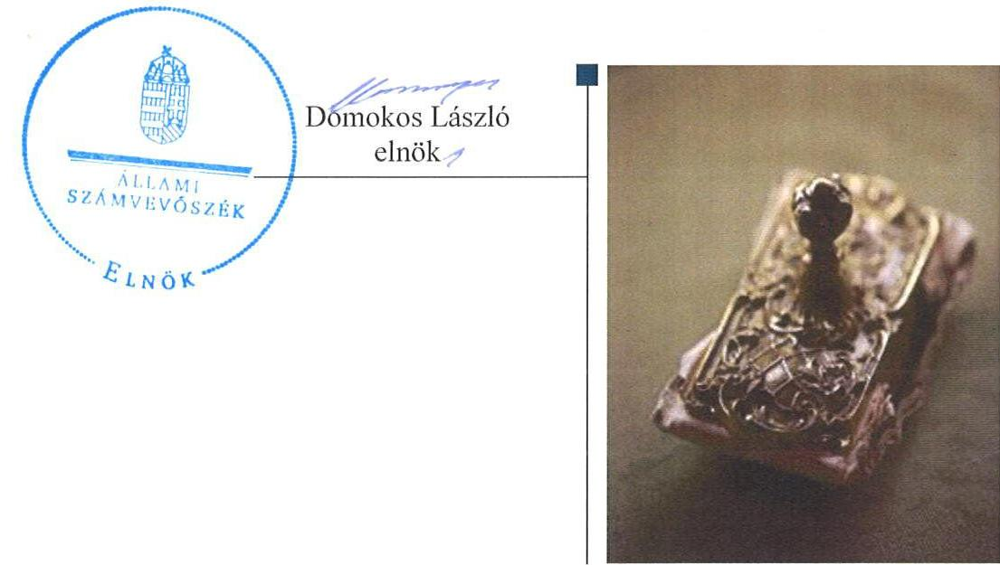
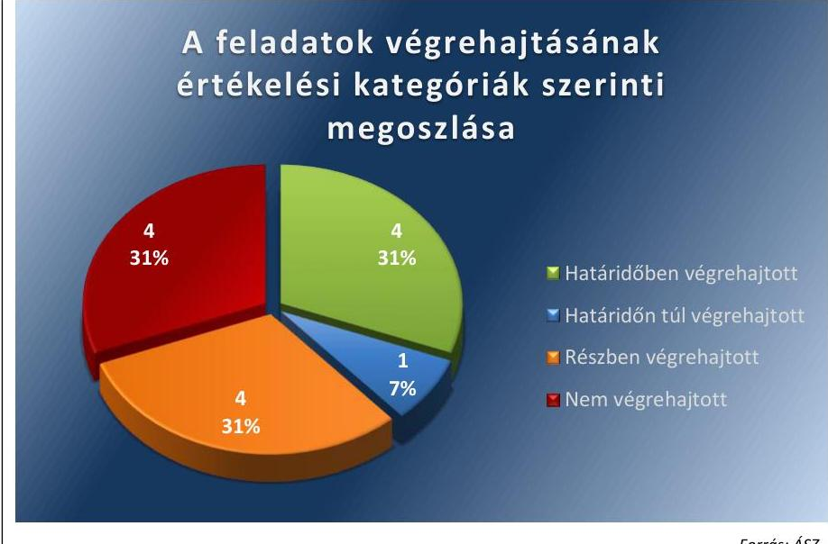
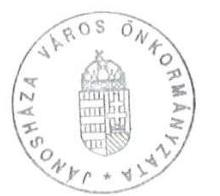
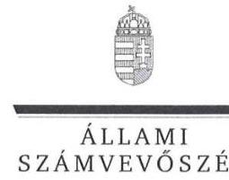
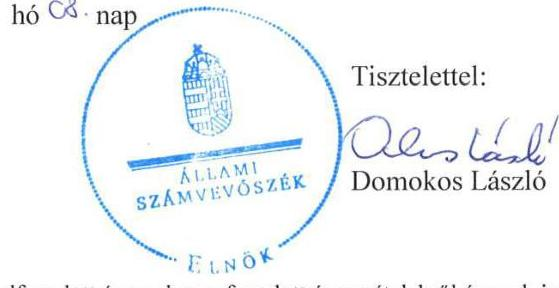
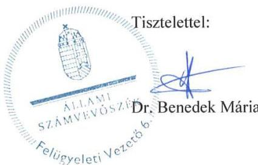

ÁLLAMI
SZÁMVEVŐSZÉK

# Jelentés 

## Utóellenőrzések

Jánosháza Város Önkormányzata belső kontrollrendszere kialakításának, egyes kontrolltevékenységek és a belső ellenőrzés működésének utóellenőrzése 2016.

---

# Jelentés 

## Utóellenőrzések

Jánosháza Város Önkormányzata belső kontrollrendszere kialakításának, egyes kontrolltevékenységek és a belső ellenőrzés múködésének utóellenőrzése 2016. OG hó 23. nap

---

# AZ ELLENŐRZÉST FELÜGYELTE: 

DR. BENEDEK MÁRIA felügyeleti vezető

## AZ ELLENŐRZÉST VEZETTE ÉS A VÉGREHAJTÁSÁÉRT FELELŐS:

DR. KOVÁCS DIÁNA ellenőrzésvezető

## A PROGRAM ÖSSZEÁLLÍTÁSÁÉRT FELELŐS:

JANIK JÓZSEF osztályvezető

## A TÉMÁHOZ KAPCSOLÓDÓ KORÁBBI SZÁMVEVŐSZÉKI JELENTÉSEK:

- címe: Jelentés Jánosháza Nagyközség Önkormányzata belső kontrollrendszerének kialakítása, valamint egyes kontrolltevékenységek és a belső ellenőrzés müködése ellenőrzéséről
- sorszáma: $\quad 13054$

IKTATÓSZÁM: V-1055-056/2016.
TÉMASZÁM: 2089
ELLENŐRZÉS-AZONOSÍTÓ SZÁM: V-071824

---

# TARTALOMJEGYZÉK 

■ ÖSSZEGZÉS ..... 5
■ AZ ELLENŐRZÉS CÉLJA ..... 6
■ AZ ELLENŐRZÉS TERÜLETE ..... 7
■ AZ ELLENŐRZÉS HÁTTERE, INDOKOLTSÁGA ..... 8
■ A JELENTÉS LÉNYEGES KÉRDÉSKÖREI ..... 9
■ ELLENŐRZÉS HATÓKÖRE ÉS MÓDSZEREI ..... 10
■ MEGÁLLAPÍTÁSOK ..... 13
■ MELLÉKLETEK ..... 17
I. Sz. melléklet: Az ÁSZ 13054. számú jelentéséhez kapcsolódó intézkedési terv végrehajtása ..... 17
■ FÜGGELÉK: ÉSZREVÉTELEK ..... 23
■ RÖVIDÍTÉSEK JEGYZÉKE ..... 35

---

.

---

# ÖSSZEGZÉS 

Az ÁSZ ${ }^{1}$ az Önkormányzat² ${ }^{2}$ belső kontrollrendszerének és belső ellenőrzésének utóellenőrzését 2013. július 10. és 2016. január 29. közötti időszakra végezte el. Megállapította, hogy az intézkedési tervben foglalt feladatok jelentős részét az Önkormányzat nem hajtotta végre, így nem tett megfelelő lépéseket az ÁSZ által korábban feltárt, a belső kontrollrendszert érintő hiányosságok megszüntetésére, ami kockázatot hordoz az Önkormányzat szabályozásában, müködtetésének szabályosságában és a felelős vezetői magatartásban.

## Az ellenőrzés társadalmi indokoltsága

Az ÁSZ stratégiájában célul tűzte ki a számvevőszéki munka hasznosulásának javítását. Ezzel összhangban ellenőrzi, hogy az ellenőrzött szervezetek megvalósították-e a korábbi ellenőrzései által feltárt hibák, hiányosságok és szabálytalanságok megszüntetése céljából elkészített intézkedési terveikben foglaltakat. A rendszeres utóellenőrzések hozzájárulnak a szükséges intézkedések tényleges végrehajtáshoz, ezáltal a közpénzügyek rendezettségének javulásához.

## Főbb megállapítások, következtetések, javaslatok

A polgármester ${ }^{3}$ a képviselő-testület ${ }^{4}$ által elfogadott intézkedési tervet ${ }^{5}$ határidőben megküldte az ÁSZ részére.
Az Önkormányzat az intézkedési tervben meghatározott 13 feladat közül négyet határidőben, egyet határidőn túl, négyet részben teljesített, illetve négyet nem hajtott végre. Így az ÁSZ által korábban az Önkormányzat belső kontrollrendszerének kialakítása, valamint az egyes kontrolltevékenységek és a belső ellenőrzés müködésének területén azonosított hiányosságok jelentős része továbbra is fennáll.

Az intézkedési tervben rögzített feladatok végrehajtásáról a Bkr. ${ }^{6}$ által előírt nyilvántartást nem vezették.

---

# AZ ELLENŐRZÉS CÉLJA 

Az ellenőrzés célja annak értékelése volt, hogy a számvevőszéki jelentésben foglalt intézkedést igénylő megállapításokkal és javaslatokkal összhangban készített intézkedési tervben meghatározott feladatokat az ellenőrzött szervezet végrehajtotta-e.

---

# AZ ELLENŐRZÉS TERÜLETE 

## Az Önkormányzat

Jánosháza Város Vas megyében, a Celldömölki járásban fekszik, állandó lakosainak száma a $\mathrm{KSH}^{7}$ által közzétett népességi adatok szerint 2015. január 1-én 2489 fő volt. Jánosháza 2013. július 15-én kapott városi címet. Az utóellenőrzés idején hivatalban lévő polgármester a 2014. évi önkormányzati választások óta tölti be tisztségét, a jegyző ${ }^{8}$ 2010. szeptember 1től látja el közszolgálati feladatait. Az Önkormányzat hét további település részvételével 2013. január 1-től megalapította a Jánosházi Közös Önkormányzati Hivatalt, amihez 2013. évben négy település csatlakozott.

Az Önkormányzat a 2014. évi éves költségvetési beszámoló szerint 515,2 millió Ft költségvetési bevételt ért el, valamint 449,1 millió Ft költségvetési kiadást teljesített. Az eszközvagyon értéke 2014. december 31-én 1622,5 millió Ft volt.

Az Önkormányzat belső kontrollrendszerének kialakítását, valamint egyes kontrolltevékenységek és a belső ellenőrzés működésének ellenőrzését az ÁSZ a 2009. január 1. és 2011.
december 31. közötti időszakra végezte el, az erről szóló 13054. számú jelentését 2013. július 10-én tette közzé. Az ellenőrzés célja annak értékelése volt, hogy az Önkormányzat a jogszabályi előírásoknak megfelelően alakította-e ki a belső kontrollrendszert, megfelelően működtette-e a gazdálkodás folyamatában kulcsszerepet betöltő szakmai teljesítésigazolás és utalvány ellenjegyzés kontrollokat, biztosította-e a belső ellenőrzés szabályos és eredményes müködését.

Az utóellenőrzés - a 2013. július 10-től a 2016. január 29-ig végrehajtott feladatokat figyelembe véve - a polgármester és a jegyző részére megfogalmazott javaslatok hasznosulása céljából készített intézkedési terv végrehajtásának ellenőrzésére terjedt ki.

---

# AZ ELLENŐRZÉS HÁTTERE, INDOKOLTSÁGA 

Az ÁSZ törvény ${ }^{9}$ 33. § (1) bekezdése értelmében a számvevőszéki jelentések intézkedést igénylő megállapításaihoz és javaslataihoz kapcsolódóan az ellenőrzött szervezet vezetője intézkedési tervet köteles összeállítani, és az ÁSZ részére megküldeni. Az intézkedési tervben foglaltak megvalósítását - az ÁSZ törvény 33. § (7) bekezdésében foglaltak alapján - az ÁSZ utóellenőrzés keretében ellenőrizheti. Az intézkedések megvalósulásának értékelése során az ÁSZ figyelembe veszi az ellenőrzött szervezetek működési feltételeiben, valamint a jogszabályi előírásokban bekövetkezett változásokat.

Az intézkedési tervekben foglalt feladatok hiányos, illetve késedelmes végrehajtása, valamint megvalósításának elmaradása azt mutatja, hogy az ellenőrzések során feltárt hibák, hiányosságok és szabálytalanságok megszüntetése nem kapott kellő hangsúlyt. Ez a szabályszerű működés és a felelős vezetői magatartás vonatkozásában kockázatot hordoz. E kockázatok feltárásával az ÁSZ utóellenőrzési rendszere fokozza a fegyelmet, és igazolja, hogy a közpénzzel való szabályos gazdálkodás felelőssége elől nem lehet kitérni.

## AZ UTÓELLENŐRZÉS VÁRHATÓ HASZNOSULÁSA

Az utóellenőrzés négy szinten hasznosulhat:

- A társadalom szintjén az utóellenőrzés jelzi, hogy a számvevőszéki ellenőrzés megállapításainak van következménye: a hiányosságok megszüntetésére az ellenőrzött szervezet által meghatározott intézkedések végrehajtását is számon kéri az ÁSZ.
- Az ellenőrzött terület szintjén az utóellenőrzés tájékoztatást nyújt a terület döntéshozóinak a hiányosságok kiküszöbölésének jó gyakorlatairól, ezzel lehetőséget biztosítva arra, hogy az ÁSZ ellenőrzési megállapításai, javaslatai a terület nem ellenőrzött szervezeteinek a működése során is hasznosuljanak.
- Az ellenőrzött szervezet szintjén az utóellenőrzés feltárja, hogy a szervezet az intézkedések végrehajtásával hasznosította-e a korábbi ellenőrzési jelentésben a hiányosságok megszüntetése, illetve a kockázatok kezelése érdekében megfogalmazott javaslatokat.
- Az ÁSZ szintjén az utóellenőrzés visszacsatolást ad az ellenőrzési jelentések hasznosulásáról, az intézkedések elmaradása vagy részleges megvalósulása a további ellenőrzésekhez kockázati jelzésként szolgál.

---

# A JELENTÉS LÉNYEGES KÉRDÉSKÖREI 

1. Az Önkormányzat az intézkedési tervben foglaltakat az elöirt határidőben végrehajtotta-e?

---

# ELLENŐRZÉS HATÓKÖRE ÉS MÓDSZEREI 

## Az ellenőrzés típusa

Megfelelőségi ellenőrzés.

## Az ellenőrzött időszak

Az utóellenőrzés alapját képező ÁSZ jelentés ${ }^{10}$ közzétételének napjától (2013. július 10.) az ellenőrzésről szóló kiértesítő levél keltének napjáig (2016. január 29.) tartó időszak.

## Az ellenőrzés tárgya

Az ÁSZ törvény alapján a számvevőszéki jelentésben foglalt intézkedést igénylő megállapításokkal és javaslatokkal összhangban - az Önkormányzat által - készített intézkedési tervben foglaltak végrehajtásának ellenőrzése.

## Az ellenőrzött szervezet

Jánosháza Város Önkormányzata.

## Az ellenőrzés jogalapja

Az ÁSZ az ÁSZ törvényben meghatározott feladatkörében ellenőrzi a központi költségvetés végrehajtását, az államháztartás gazdálkodását, az államháztartásból származó források felhasználását és a nemzeti vagyon kezelését.

Az ÁSZ törvény 1. § (3) bekezdése szerint az ÁSZ általános hatáskörrel végzi a közpénzekkel és az állami és önkormányzati vagyonnal való felelős gazdálkodás ellenőrzését.

Az ÁSZ törvény 33. § (7) bekezdése alapján az ÁSZ törvény 33. § (1)-(2) bekezdése szerinti intézkedési tervben foglaltak megvalósítását az ÁSZ utóellenőrzés keretében ellenőrizheti.

---

# Az ellenőrzés módszerei 

Az ÁSZ az ellenőrzést a nemzetközi standardokat irányadónak tekintve az ellenőrzési program ellenőrzési kérdései, az ellenőrzött időszakban hatályos jogszabályok, az ellenőrzés szakmai szabályok és módszertanok figyelembevételével végezte.

Az ÁSZ az ellenőrzés ideje alatt az Önkormányzattal történő kapcsolattartást az ÁSZ SZMSZ ${ }^{11}$-ének vonatkozó előírásai alapján biztosította.

Az utóellenőrzés megállapításait elsősorban az ÁSZ rendelkezésére álló, valamint az ellenőrzött szervezetektől elektronikusan bekért dokumentumok alapozták meg.

Az ellenőrzési bizonyítékként felhasználható adatforrások közé tartoznak egyrészt a szakmai programban felsorolt adatforrások, másrészt minden - az ellenőrzés folyamán feltárt, az ellenőrzés szempontjából információt tartalmazó - dokumentum.

A pénzügyi folyamatokban kulcsszerepet betöltő kontrollokra vonatkozóan az intézkedési tervben foglalt feladatok végrehajtását az államháztartáson kívülre teljesített működési célú pénzeszközátadásoknál, az állományba nem tartozók megbízási díjainál, továbbá a külső szolgáltatók által végzett karbantartási, kisjavítási munkákkal kapcsolatos kifizetéseknél 10 elemú véletlen mintavétellel kiválasztott tételek alapján értékelte az ÁSZ. A kiválasztott tételek esetében azt ellenőrizte, hogy az Önkormányzat az intézkedési tervben meghatározott feladatok végrehajtása érdekében biz-tosította-e a jogszabályok és a belső szabályzatok előírásainak megfelelő múködtetést.

Az intézkedési tervben előírt feladatokat azok végrehajthatósága, illetve végrehajtása szempontjából az alábbiak szerint értékelte az ÁSZ:
$\longrightarrow$ „határidőben végrehajtott" a feladat, ha a teljesítés dokumentáltan, az intézkedési tervben előírt határidőben és tartalommal megtörtént;
$\longrightarrow$ „határidőn túl végrehajtott" a feladat, ha annak teljesítése az intézkedési tervben meghatározott módon, de az előírt határidőn túl történt meg;
$\longrightarrow$ „részben végrehajtott" a feladat, ha végrehajtása teljes körűen az intézkedési tervben előírt módon nem történt meg;
$\longrightarrow$ „nem végrehajtott" a feladat, ha a végrehajtás nem történt meg, vagy amennyiben a teljesítést nem dokumentálták;
$\longrightarrow$ „okafogyottá vált" a feladat, ha végrehajtására - meghatározott esemény bekövetkezése, továbbá külső körülmény, a múködést érintő feltétel változása miatt - már nincs szükség, illetve lehetőség és egyértelműen megállapítható, hogy az intézkedést szükségessé tevő körülmény a jövőben nem fordulhat elő;
$\longrightarrow$ „nem időszerü" az a feladat, amelynek ellenőrzési időszakon belüli végrehajtására azért nem került (kerülhetett) sor, mert az intézkedés alapjául szolgáló esemény nem következett be, de annak jövőbeni előfordulása lehetséges, a végrehajtása nem volt esedékes, vagy a végrehajtás határideje még nem járt le.

---

Az ellenőrzés lefolytatásához az Önkormányzat a tanúsítványok kitöltésével, valamint az ÁSZ által kért dokumentumok elektronikus megküldésével szolgáltatott adatokat, amelyek valódiságát és teljes körűségét a polgármester által tett teljességi és hitelességi nyilatkozat igazolta. Az így rendelkezésre bocsátott adatok, információk kontrollja az ellenőrzés keretében történt.

---

# MEGÁLLAPÍTÁSOK 

## Az Önkormányzat az intézkedési tervben foglaltakat az előírt határidőben végrehajtotta-e?

Összegző megállapítás

Az Önkormányzat az intézkedési tervben meghatározott feladatok közül négyet határidőben, egyet határidőn túl, négyet részben, illetve négyet nem hajtott végre. Az intézkedési tervben rögzített feladatok végrehajtásáról a Bkr. által előírt nyilvántartást nem vezették.

Az intézkedési tervben meghatározott feladatokat, határidőket, az ÁSZ jelentés javaslatainak címzettjét és a feladatok végrehajtását az I. számú melléklet mutatja be.

Az ÁSZ jelentésben a polgármester részére kettő, a jegyző részére pedig hét pontban 11 javaslat került megfogalmazásra, amelynek hasznosítására a képviselő-testület 13 feladatot határozott meg. A feladatok elvégzésének felelőseként két esetben a polgármestert, 11 esetben pedig a jegyzőt jelölték meg.

Az intézkedési tervben tervezett feladatok végrehajtásának értékelési kategóriák szerinti megoszlását az 1. ábra szemlélteti.

1. ábra

HATÁRIDŐBEN VÉGREHAJTOTT feladat:

1. A jegyző kialakította a Hivatal ${ }^{12}$ kockázatkezelési rendszerét. A 2013. november 1-től hatályos Kockázatkezelési Szabályzatban meghatározta a Hivatal tevékenységében, gazdálkodásában rejlő

---

kockázatok megállapításának módját, a kockázatokkal kapcsolatban szükséges intézkedéseket, valamint azok teljesítése folyamatos nyomon követésének módját.
2. A jegyző működtette a Hivatalnál a szervezet tevékenységének, a célok megvalósításának nyomon követését biztosító monitoring rendszert. A jegyző az ellenőrzött években elkészítette nyilatkozatát a belső kontrollrendszer működéséről, amelyek alapján a monitoring rendszert az ellenőrzési nyomvonalak folyamatos felülvizsgálatával, a kockázati tényezők megszüntetésének, illetve az intézkedési tervek végrehajtásának nyomon követésével és a belső ellenőrzéssel biztosították. A 2014-2015. években ügyfél-elégedettségi felmérést végeztek a szolgáltatásokat igénybe vevők körében a Hivatal munkájának értékelése és javítása érdekében.
3. A jegyző gondoskodott a Hivatalnál a belső ellenőrzési jelentések alapján megtett intézkedések nyomon követéséről. Az Önkormányzatnál elvégzett ellenőrzésekről és a jelentések javaslatai alapján megtett intézkedésekről vezették az előírt nyilvántartásokat.
4. A jegyző a 2014. évi ellenőrzési terv megalapozását szolgáló kockázatelemzés elkészítéséről 2013. november 5-én gondoskodott. A 2015-2016. évi ellenőrzési terveket kockázatelemzéssel megalapozták.

# HATÁRIDŐN TÚL VÉGREHAJTOTT feladat: 

5. A jegyző az előzetes írásbeli kötelezettségvállalást nem igénylő kifizetések rendjét az intézkedési tervben előírt 2013. október 31-i határidőn túl, 2015. január 1-től rögzítette a gazdálkodási szabályzatban.

## RÉSZBEN VÉGREHAJTOTT feladat:

6. A polgármester megvizsgálta az ÁSZ jelentésben szereplő, a belső kontrollrendszer és a belső ellenőrzés működtetésére vonatkozó jogszabályi rendelkezések be nem tartása, valamint a szakmai teljesítésigazolás, illetve az utalvány ellenjegyzés kontrollokkal összefüggésben feltárt hiányosságok, szabálytalanságok tekintetében az esetleges munkajogi felelősséggel kapcsolatos körülményeket és nem tartott indokoltnak munkajogi felelősségre vonást. A polgármester az ellenőrzött időszakban - a továbbra is fennálló hiányosságok figyelembe vételével - a Mötv.-ben előírt kötelezettségének nem tett eleget, mert nem kísérte figyelemmel az Önkormányzat gazdálkodásának szabályszerűségét.
7. A jegyző elkészítette a hivatali SZMSZ ${ }_{1}{ }^{13}$-t, amelyben rögzítette a szakfeladatrend szerint szakfeladat számmal és megnevezéssel besorolt alaptevékenységeket, az alaptevékenységet szabályozó jogszabályok megjelölését, a nevesített munkakörökhöz tartozó feladat és hatásköröket, a hatáskörök gyakorlásának módját és ezekhez kapcsolódó felelősségi szabályokat, a Hivatalhoz rendelt költségvetési szervek felsorolását, továbbá a belső ellenőrzést végzők jogállását és feladatait. A jegyző gondoskodott arról, hogy a munkaköri leírásokban meghatározzák a köztisztviselők munkaköreihez

---

kapcsolódó jogokat, kötelezettségeket és felelősségi szabályokat. A jegyző kidolgozta a köztisztviselői munkakörök betöltéséhez szükséges elvárt tudást és képességeket, továbbá meghatározta a köztisztviselőkkel szemben támasztott etikus magatartással és integritással kapcsolatos elvárásokat. A jegyző kezdeményezte a hivatali SZMSZ ${ }_{1,2}$ jogszabályban előírt szerv (a hivatali SZMSZ ${ }_{1}$ esetében a Képviselő-testület, a hivatali SZMSZ ${ }_{2}$ esetében a polgármester) elé terjesztését annak jóváhagyása céljából, azonban nem dokumentálta a hivatali SZMSZ ${ }_{1}$-nek a Hivatal munkatársai általi megismerését. A 2015. március 1-től hatályos hivatali SZMSZ ${ }_{2}{ }^{14}$ megismerését dokumentálták megismerési nyilatkozattal.
8. A jegyző gondoskodott arról, hogy a szabálytalanságot bejelentő védelmére vonatkozó előírásokat a szabálytalanságok kezelésének eljárásrendjében szabályozzák. A jegyző a feldolgozott adatok mentési eljárásait az intézkedési tervben előírt 2013. október 31-i határidőn túl, a 2014. szeptember 1-től hatályos belső informatikai szabályzatban rögzítette. A jegyző nem gondoskodott a hozzáférési jogosultságok megállapításáról, betartásának ellenőrzéséről és nyilvántartásáról, nem szabályozta a pénzügyi számviteli szoftverváltozások ellenőrzésére vonatkozó eljárásokat, illetve nem jelölte ki a feldolgozott adatok mentését végző felelősöket. Az iratkezelési rendszer kialakítása során a jegyző nem szabályozta az ügyintézési határidők nyomon követésének dokumentálását, továbbá a késedelmes ügyintézés jelzéséért való felelősség rendjét.
9. A jegyző gondoskodott a 2013-2014. években az éves ellenőrzési tervben szereplő ellenőrzés elvégezéséről, azonban a 2013. évre vonatkozó ellenőrzési tervet nem terjesztette a képviselő-testület elé. A Bkr.-ben előírt határidőn túl készült, 2015. február 8-ai dátummal ellátott, a képviselő-testület által jóvá nem hagyott 2015. évi ellenőrzési tervben szereplő ellenőrzést lefolytatták.

# NEM VÉGREHAJTOTT feladat: 

10. A polgármester az Önkormányzat nevében történő kötelezettségvállalások során nem gondoskodott azok Ávr. ${ }^{15}$-ben előírtak szerinti szabályos végrehajtásáról, mert az ellenőrzött dokumentumok alapján a kötelezettségvállalást nem előzte meg pénzügyi ellenjegyzés, továbbá nem állt rendelkezésre a kötelezettségvállalás dokumentuma.
11. A jegyző nem gondoskodott a teljesítésigazolás Ávr.-ben előírtak szerinti szabályos végrehajtásáról, mert az ellenőrzött dokumentumok alapján a teljesítésigazolásra kijelölt személy aláírásával nem igazolta a kifizetés jogosságát, összegszerűségét, továbbá a teljesítésigazolásnál a teljesítés tényére történő utalás és a dátum feltüntetése elmaradt.
12. A jegyző az Önkormányzat kiadásai vonatkozásában nem gondoskodott az érvényesítés szabályos végrehajtásáról, mert az érvényesítő az Ávr.-ben előírtak szerinti szabályos kijelöléssel nem rendelkezett, továbbá az érvényesítő az Áht., az Áhsz. ${ }_{1,2}{ }^{16}$, az Ávr. előírásai és a belső szabályzatokban foglaltak betartását nem ellenőrizte.

---

13. A jegyző nem gondoskodott a pénzügyi ellenjegyzés Ávr.-ben előírtak szerinti szabályos végrehajtásáról, mert az Önkormányzat kiadásaiból kiválasztott ellenőrzött bizonylatok esetében a pénzügyi ellenjegyzés a kötelezettségvállalást követően történt, továbbá egy kifizetésénél nem állt rendelkezésre a kötelezettségvállalás dokumentuma.

A jegyző az intézkedési tervben rögzített feladatok végrehajtásáról a Bkr. által előírt nyilvántartást nem vezette.

---

# MELLÉKLETEK

|  I. SZ. MELLÉKLET: AZ ÁSZ 13054. SZÁMÚ JELENTÉSÉHEZ KAPCSOLÓDÓ INTÉZKEDÉSI TERV VÉGREHAITÁSA |  |  |  |   |
| --- | --- | --- | --- | --- |
|  1. | Intézkedési terv alapján elvégzendő feladat | Az intézkedési tervben meghatározott határidő | Az ÁSZ 13054 sz. jelentése javaslatának címzettje | A feladat végrehajtása  |
|   | 1. | 2. | 3. | 4.  |
|  Határidőben végrehajtott feladat |  |  |  |   |
|  1. | A kockázatelemzés, kockázatkezelés rendszerét ki kell alakítani a Bkr. 3. § b) pontja és a 7. §-a szerint. | 2013. december 31. | jegyző | A jegyző a Hivatal vonatkozásában a kockázatelemzés, kockázatkezelés rendszerét kialakította. A 2013. november 1-től hatályos Kockázatkezelési Szabályzatban meghatározta a költségvetési szerv tevékenységében, gazdálkodásában rejlő kockázatok megállapításának módját, a kockázatokkal kapcsolatban szükséges intézkedéseket, valamint azok teljesítésének folyamatos nyomon követésének módját. A Kockázatkezelési Szabályzat tartalmazta az Önkormányzatot érintő kiemelt kockázati csoportokat, illetve a Hivatal kiemelt kockázatú területeit.  |
|  2. | Működtetni kell a Bkr. 3. § e) pontjában és a 10. §-ában előírtak szerint a szervezet tevékenységének, a célok megvalósításának nyomon követését biztosító monitoring rendszert, amelynek része az operatív tevékenységek keretében megvalósuló folyamatos és eseti nyomon követés. A Belső Kontroll Kézikönyv 1.2.2. pontjának ajánlását a szervezeti célok teljesítésének nyomon követése érdekében a lakosság, illetve a szolgáltatásokat igénybe vevők körében az önkormányzati feladat ellátására irányuló elégedettségi felméréseket folyamatosan végezni és dokumentálni kell. | folyamatosan | jegyző | 2013. november 1-én lépett hatályba a jegyző utasítása a Hivatal Belső Kontrollrendszeréről, ami szabályozta a monitoring rendszert. Ezen túlmenően a jegyző kialakította a Hivatal tevékenységeire vonatkozó ellenőrzési nyomvonalakat, amelyek tartalmazták a folyamatba épített és az utólagos vezetői ellenőrzés feladatait is. A jegyző az ellenőrzött időszakban minden évben elkészítette nyilatkozatát a belső kontrollrendszer működéséről, amelyek alapján a monitoring rendszert az ellenőrzési nyomvonalak folyamatos felülvizsgálatával, a kockázati tényezők megszüntetésének, illetve az intézkedési tervek végrehajtásának nyomon követésével és a belső ellenőrzéssel biztosították. A 2014-2015. években ügyfél-elégedettségi felmérést végeztek a szolgáltatásokat igénybe vevők körében a Hivatal munkájának értékelése és javítása érdekében. Az önkormányzati feladatok ellátására irányuló elégedettségi felméréseket mindkét évben kiértékelték és erről jegyzőkönyvet vettek fel. A jegyzőkönyvekben meghatározták a fejlesztési irányokat.  |
|  3. | A belső ellenőrzés a Bkr. 21. § (2) bekezdés d) pontjában foglaltak szerint kövesse nyomon a belső ellenőrzési jelentések alapján megtett intézkedéseket, továbbá az Önkormányzatnál elvég- | végrehajtás 2013. október
31., majd azt követően folyamatos | jegyző | A Hivatalnál az ellenőrzött időszakban a belső ellenőrzés nyomon követte a belső ellenőrzési jelentések alapján megtett intézkedéseket. Az Önkormányzatnál elvégzett ellenőrzésekről és a jelentések javaslatai alapján megtett intézkedésekről a 2013-2015. évek vonatkozásában vezették a Bkr. 47. § és 50. §-aiban előírt tartalmú nyilvántartásokat. A 2013. évi ellenőrzésekről és a  |

---

|  5. | Intézkedési terv alapján elvégzendő feladat | Az intézkedési tervben meghatározott határidő | Az ÁSZ 1305d sz. jelentése javaslatának címzettje | A feladat végrehajtása  |
| --- | --- | --- | --- | --- |
|   | 1. | 2. | 3. | 4.  |
|   | zett ellenőrzésekről és a jelentések javaslatai alapján megtett intézkedésekről vezessen a Bkr. 47. § és 50. §-aiban előírt tartalmú nyilvántartást. |  |  | megtett intézkedésekről a nyilvántartást folyamatosan vezették, majd 2014. január 15-én lezárták.  |
|  4. | A belső ellenőrzés működésével kapcsolatban gondoskodni kell a költségvetési szervek belső ellenőrzésének megszervezéséről: az éves ellenőrzési tervet a Bkr. 29. § (1) bekezdése és a 31. § (2) bekezdésének megfelelően kockázatelemzéssel kell megalapozni. | végrehajtás 2013. október 31., majd azt követően folyamatos | jegyző | A Hivatal belső ellenőrzési feladatait megbízási szerződés alapján külső szolgáltató látta el az ellenőrzött időszakban. A jegyző a 2014. évi éves ellenőrzési terv megalapozására a kockázatelemzés elkészítéséről 2013. november 5-én, a 2013. október 31-i határidőn túl gondoskodott. A 2015-2016. évi belső ellenőrzési tervek összeállításához a kockázati tényezők felmérése megtörtént, a kockázatelemzések rendelkezésre álltak.  |
|   |  |  | Hátáridőn túl végrehajtott feladat |   |
|  5. | Belső szabályzatban rögzíteni kell az Ávr. 53. § (2) bekezdésének megfelelően az előzetes írásbeli kötelezettségvállalást nem igénylő kifizetések rendjét. Az Ámr. 72. § (14) bekezdésben foglaltakat figyelembe véve kell az előzetes írásbeli kötelezettségvállalást nem igénylő kifizetések rendjét meghatározni. | 2013. október 31. | jegyző | Az Önkormányzatnál a kötelezettségvállalásra vonatkozó előírásokat a Hivatal Gazdálkodási Szabályzata tartalmazta. A Gazdálkodási Szabályzatban a jegyző az előzetes írásbeli kötelezettségvállalást nem igénylő kifizetések rendjét 2013. október 31-ig nem szabályozta, erre a 2015. január 1-én kelt módosítás után került sor. A szabályozás módosítása értelmében az előzetes írásbeli kötelezettségvállalást nem igénylő kifizetések esetén a kötelezettségvállalás a számla kiegyenlítésekor, azzal egyidejűleg megtehető és a megrendelő nyomtatványt nem kell kiállítani.  |
|   |  |  | Részben végrehajtott feladat |   |
|  6. | A Mötv.17 115. § (1) bekezdésében foglaltak alapján az Önkormányzat gazdálkodásának szabályszerűségét figyelemmel kell kísérni. A Mötv. 67. § f) pontja alapján a belső kontrollrendszer és belső ellenőrzés működtetésére vonatkozó jogszabályi rendelkezések be nem tartása, valamint szakmai teljesítésigazolás, illetve az utalvány ellenjegyzés kontrollokkal öszszefüggésben feltárt hiányosságok, szabálytalanságok tekintetében meg kell vizsgálni az esetleges munkajogi felelősséggel kapcsolatos | 2013. december 31. | polgármester | A polgármester, a jegyző és a pénzügyi csoportvezető 2013. augusztus 8-án jegyzőkönyvet vett fel, melyben rögzítették, hogy az ÁSZ ellenőrzése által feltárt hibák eseti jelleggel merültek fel és az Önkormányzat eredményes és hatékony gazdálkodását nem érintették, az elkövetett szabálytalanságoknál és hiányosságoknál a szándékosság teljes egészében kizárható, továbbá nyugdíjazás miatt a pénzügyi csoportvezető személyében változás történt az ellenőrzött időszakot követően. Mindezek miatt a polgármester munkajogi felelősségre vonást nem tartott indokoltnak. A polgármester a belső kontrollrendszer működtetésében a mintatételek ellenőrzése során tapasztalt hiányosságok alapján nem kísérte figyelemmel az Önkormányzat gazdálkodásának szabályszerűségét.  |

---

|  7. |  |  |   |
| --- | --- | --- | --- |
|  |   |   |   |
|  |   |   |   |
|  |   |   |   |
|  |   |   |   |
|  |   |   |   |
|  |   |   |   |
|  |   |   |   |
|  |   |   |   |
|  |   |   |   |
|  |   |   |   |
|  |   |   |   |
|  |   |   |   |
|  |   |   |   |
|  |   |   |   |
|  |   |   |   |
|  |   |   |   |
|  |   |   |   |
|  |   |   |   |
|  |   |   |   |
|  |   |   |   |
|  |   |   |   |
|  |   |   |   |
|  |   |   |   |
|  |   |   |   |
|  |   |   |   |
|  |   |   |   |
|  |   |   |   |
|  |   |   |   |
|  |   |   |   |
|  |   |   |   |
|  |   |   |   |

---

|  8. | Az Info tv. ${ }^{19}$ 7. § (2)-(3) bekezdésének megfelelően az adatbiztonság érvényesülését biztosítani kell, a hozzáférési jogosultságok megállapításáról, betartásának ellenőrzéséről és nyilvántartásáról, szabályozni kell a pénzügyi számviteli szoftverváltozások ellenőrzésére vonatkozó eljárásokat, a feldolgozott adatok mentési eljárásait és ki kell jelölni a mentést végző felelősöket.
Az információs és kommunikációs rendszer kialakítása során az iktatási, iratkezelési rendszer kialakítása során a Belső Kontroll Kézikönyv 4.2.4. pontjában foglaltak szerint érvényesíteni kell az ügyintézési határidők nyomon követésének dokumentálását, a késedelmes ügyintézés jelzéséért való felelősség rendjét.
A Belső Kontroll Kézikönyv 4.3.3. pontjában foglaltaknak megfelelően rögzíteni kell a szabálytalanságot bejelentő védelmére vonatkozó előírásokat. | 2013. október 31. | jegyző | A 2013. november 1-től hatályos Szabálytalanságok kezelésének eljárásrendjében (IV/5. pont) a jegyző rögzítette a szabálytalanságot bejelentő védelmére vonatkozó előírásokat, miszerint amennyiben a bejelentő nevének elhallgatását kéri, akkor az eljárás folyamatában számára az adatainak zárt kezelését biztosítani kell, továbbá a jelentést tevő személlyel szemben nem alkalmazható semmiféle hátrányos elbánás, jelentéséért felelősségre nem vonható. A feldolgozott adatok mentési eljárásait a jegyző az intézkedési tervben előírt 2013. október 31-i határidőn túl, a 2014. szeptember 1-től hatályos Belső Informatikai Szabályzatban (23. oldal) rögzítette. A jegyző nem gondoskodott a hozzáférési jogosultságok megállapításáról, betartásának ellenőrzéséről és nyilvántartásáról, nem szabályozta a pénzügyi számviteli szoftverváltozások ellenőrzésére vonatkozó eljárásokat, illetve nem jelölte ki a feldolgozott adatok mentését végző felelősöket.
A jegyző az iktatási, iratkezelési rendszer kialakítása során nem szabályozta az ügyintézési határidők nyomon követésének dokumentálását, továbbá a késedelmes ügyintézés jelzéséért való felelősség rendjét.  |
| --- | --- | --- | --- |
|  9. | Gondoskodni kell a Képviselő-testület által elfogadott éves ellenőrzési tervben szereplő belső ellenőrzések elvégzéséről. A Bkr. 56. § (5) bekezdésében foglalt előírást betartva az éves el- | végrehajtás 2013. október
31., majd azt követően folyamatos | jegyző  |

---

|  5
Sorszám | Intézkedési terv alapján elvégzendő feladat | Az intézkedési tervben meghatározott határidő | Az ÁVZ 1305d sz. jelentése javaslatának címzettje | A feladat végrehajtása  |
| --- | --- | --- | --- | --- |
|   | 1. | 2. | 3. | 4.  |
|   | lenőrzési tervben foglaltakhoz viszonyítva ellenőrzés elhagyására az éves ellenőrzési terv módosítását követően kerülhet sor. |  |  | alapján elkészített rendező mérleg ellenőrzése szerepelt. A tervezett ellenőrzéseket lefolytatták. A 2015. évre vonatkozó belső ellenőrzési terv a Képviselő-testület 161/2014. (XII.16.) számú határozatával került elfogadásra, azonban az Önkormányzat által megküldött 2015. évi belső ellenőrzési terv 2015. február 8-án kelt, így az ellenőrzés nem tudott megbizonyosodni arról, hogy a Képviselő-testület által 2014. december 16-án elfogadott belső ellenőrzési tervben milyen ellenőrzések szerepeltek. A 2015. február 8-án kelt belső ellenőrzési tervben szereplő vagyongazdálkodási rend ellenőrzését lefolytatták.  |
|   |  |  | Nem végrehajtott feladat |   |
|  10. | Az Önkormányzat nevében történő kötelezettségvállalásra az Áht. 37. § (1) bekezdésében, az Ávr. 52. § (1) bekezdés c) pontjában és a (6)-(6a) bekezdésekben foglaltaknak megfelelően - az Ávr. 53. §-ában meghatározott kivételekkel - kizárólag pénzügyi ellenjegyzés után, a pénzügyi teljesítés esedékességét megelőzően, írásban, a kötelezettség vállalására jogosult személy által kerüljön sor. Kötelezettség vállaló: minden esetben a polgármester, akadályoztatás esetén az alpolgármester. | azonnal, majd azt követően folyamatos | polgármester | Az Önkormányzat által az ellenőrzött időszakban teljesített államháztartáson kívüli egyéb működési célú támogatásokból, állományba nem tartozók megbízási díjaiból, illetve külső szolgáltató által végzett karbantartási, kisjavítási munkákkal kapcsolatos kiadásaiból véletlenszerűen kiválasztott 10 mintatétel közül hét esetben a kötelezettségvállalást nem előzte meg pénzügyi ellenjegyzés, továbbá egy működési célú támogatás kifizetésénél nem állt rendelkezésre a kötelezettségvállalás dokumentuma, ami nem felelt meg az Áht. 37. § (1) bekezdésében foglaltaknak. A pénzügyi ellenjegyzésre az utalványrendeleten a pénzügyi teljesítés esedékességét megelőzően került sor. Az Önkormányzat nevében történő kötelezettségvállalást az arra jogosult polgármester végezte.  |
|  11. | A pénzügyi folyamatokban kulcsszerepet betöltő kontrollok működésével kapcsolatban a szakmai teljesítés igazolás és utalványozás ellenjegyzése vonatkozásában feltárt hiányosságok megszüntetése, illetve az operatív gazdálkodás során a működésbeli hibák megelőzése, feltárása és kijavítása érdekében az alábbi intézkedést hoztam: a teljesítésigazolásra az Ávr. 57. § (4) bekezdésében foglalt előírásnak meg. | azonnal, majd azt követően folyamatos | jegyző | A teljesítésigazoló személyét a polgármester az Ávr. előírásainak megfelelően kijelölte, azonban az Ávr. 57. § (1)(3) bekezdéseiben szereplő előírást figyelmen kívül hagyva két működési célú támogatási kiadás esetében a teljesítésigazolásra kijelölt személy aláírásával nem igazolta a kifizetés jogosságát, összegszerűségét, illetve két megbízási díj kifizetésekor a teljesítésigazolásnál a teljesítés tényére történő utalás és a dátum hiányzott.  |

---

|  1. | Intézkedési terv alapján elvégzendő feladat | Az intézkedési tervben meghatározott határidő | A: ÁSZ 1305d sz. jelentése javaslatának címzettje | A feladat végrehajtása  |
| --- | --- | --- | --- | --- |
|   | 1. | 2. | 3. | 4.  |
|   | felelően a kijelölt személyek az Ávr. 57. § (1) bekezdésben foglaltak szerint ellenőrizhető okmányok alapján ellenőrizzék a kiadások teljesítésének jogosságát, összegszerűségét, ellenszolgáltatást is magában foglaló kötelezettségvállalás esetén a szerződés, megrendelés teljesítését és azt az Ávr. 57. § (3) bekezdésében előírt módon igazolják. |  |  |   |
|  12. | A kifizetéseket megelőzően - az Ávr. 58. § (1) bekezdése szerint - a teljesítésigazolás alapján - az Ávr. 57. § (3) bekezdése szerinti esetben annak hiányában is - az összegszerűségnek, a fedezet meglétének és a megelőző ügymenetben az Áht., az Áhsz.1, az Ávr. előírásai és a belső szabályzatokban foglaltak betartásának ellenőrzése történjen meg. | azonnal, majd azt követően folyamatos | jegyző | Az Önkormányzat kiadásai vonatkozásában a polgármester jelölte ki a pénzügyi ügyintézőt, illetve 2014. október 20-tól a pénzügyi főmunkatársat és a pénzügyi főelőadót az érvényesítési jogkör gyakorlására, ami nem felelt meg az Ávr. 58. § (4) bekezdésében és az 55. § (2) bekezdés f) pontjában foglalt előírásnak, miszerint érvényesítésre az önkormányzati hivatal gazdasági vezetője vagy az általa írásban kijelölt személy jogosult. Az érvényesítő ezért valamennyi mintatétel esetében érvényes kijelölés nélkül látta el feladatát. Az érvényesítő az Ávr. 58. § (1) bekezdésében előírtak ellenére nyolc mintatételnél nem ellenőrizte, hogy az Áht., az Áhsz.1,2, az Ávr. előírásait és a belső szabályzatokban foglaltakat betartották-e, mert annak ellenére érvényesítette a bizonylatokat, hogy a kötelezettségvállalást nem előzte meg pénzügyi ellenjegyzés, vagy a teljesítésigazolás nem, illetve nem megfelelően történt.  |
|  13. | A kötelezettségvállalásra az Áht. 37. § (1) bekezdésében foglaltaknak megfelelően - az Ávr. 53. §-ában meghatározott kivételekkel - kizárólag pénzügyi ellenjegyzés után, a pénzügyi teljesítés esedékességét megelőzően, írásban kerüljön sor. | azonnal, majd azt követően folyamatos | jegyző | Az Önkormányzat kiadásaiból kiválasztott 10 mintatétel közül hét esetben a pénzügyi ellenjegyzés a kötelezettségvállalást követően történt, továbbá egy működési célú támogatás kifizetésénél nem állt rendelkezésre a kötelezettségvállalás dokumentuma, ami nem felelt meg az Áht. 37. § (1) bekezdésében foglaltaknak. A pénzügyi ellenjegyzésre az utalványrendeleten a pénzügyi teljesítés esedékességét megelőzően került sor.  |

Forrás: ÁSZ által készített táblázat

---

# FÜGGELÉK: ÉSZREVÉTELEK 

A jelentéstervezetet a Számvevőszék 15 napos észrevételezésre megküldte az ellenőrzött szervezet vezetőjének az ÁSZ tv. 29. §* (1) bekezdése előírásának megfelelően.
Az elfogadott észrevételek alapján a Számvevőszék módosította a jelentést.

A függelék tartalmazza az ellenőrzött észrevételeit, illetve az el nem fogadott észrevételek elutasításának indoklását.

[^0]
[^0]:    * 29. § (1) Az Állami Számvevőszék az ellenőrzési megállapításait megküldi az ellenőrzött szervezet vezetőjének vagy az általa megbízott személynek, és annak, akinek személyes felelősségét állapította meg.
    (2) Az ellenőrzött szervezet vezetője és a felelősként megjelölt személy az ellenőrzés megállapításaira tizenöt napon belül írásban észrevételt tehet.
    (3) Az Állami Számvevőszék az észrevételre a beérkezésétől számított harminc napon belül írásban válaszol. A figyelembe nem vett észrevételeket köteles a jelentésben feltüntetni, és megindokolni, hogy azokat miért nem fogadta el.

---

# Jánosháza Város Önkormányzata 

9545 Jánosháza
Batthyány u. 2.
Tel.: 95/551-211
e-mail: hivatal@janoshaza.hu

Szám: $A T A / 11 / 2016$.
Hiv.sz.: V-1055-052/2016.

Tárgy: Jelentéstervezettel kapcsolatos észrevétel. Melléklet: -

## Állami Számvevőszék

Domokos László Elnök Úr részére

## Budapest

PL 54
1364

Tisztelt Elnök Úr!
Az Állami Számvevőszék hivatkozott számon megküldött jelentéstervezetével kapcsolatban az Állami Számvevőszékről szóló 2011. évi LXVI. törvény 29. § (2) bekezdése alapján az alábbi észrevételeket teszem:

- A jelentéstervezet 6. pontja alapján „a polgármester nem kísérte figyelemmel az Önkormányzat gazdálkodásának szabályszerűségét". A megállapítással kapcsolatban az alábbi észrevételt kívánom tenni: A polgármesterként a napi munka során folyamatosan részt veszek a gazdálkodási folyamatok ellenőrzésében, így többek között a Hivatal által előkészített éves költségvetés, a féléves beszámoló (melyet jogszabályi előírás nélkül is fontosnak tartunk a képviselő-testület elé terjeszteni, éppen a gazdálkodás képviselők általi nyomonkövetése céljából) és a zárszámadás dokumentumok előkészítésében, melynek során módom van áttekinteni a müködés szabályszerűségét. A havonta benyújtásra kerülő PM info és negyedéves költségvetési mérlegjelentés szintén a bevonásommal készül, mivel a képviselő-testület előirányzat módosítási hatáskörrel ruházott fel. Lehetőségem van továbbá az utalványrendeleten történő utalványozás során is - dokumentumokkal alátámasztottan - az Önkormányzat gazdálkodásának szabályszerűségét kontrollálni. A vezetői értekezleteken, testületi üléseken, a belső ellenőrrel folytotott egyeztetések során az önkormányzat szabályszerű működésének kontrollálására kialakított operatív folyamatok részese vagyok. Véleményem szerint polgármesterként a 6. pontban megjelölt feladatot határidőben teljesen végrehajtottam, illetve ennek teljesítése továbbra is folyamatos.

---

Fentiek alapján kérem a 6. sorszámú feladat „Határidöben végrehajtott feladatok" közé történő áthelyezését. Amennyiben a polgármesterként a fentiek mellett további ellenőrzési feladataim is lennének, kérem tájékoztassák ezekről Önkormányzatunkat.

- A jelentéstervezet 7. pontja szerint „a jegyző nem kezdeményezte a hivatali SZMSZek jogszabályban előírt szerv elé terjesztését annak jóváhagyása céljából’. Ezzel kapcsolatban meg kívánjuk jegyezni, hogy a 2013. február 27 -én kelt, a közös önkormányzati hivatal létrehozásáról és fenntartásáról szóló megállapodás 24. pontja alapján „a Hivatal Szervezeti és Müködési Szabályzatát a (...) a Polgármesteri Értekezlet hagyja jóvá" (a megállapodás mellékelve). Ugyanez az elöirás szerepel a Hivatal létrehozásáról és fenntartásáról szóló 2015. február 26-án kelt - jelenleg hatályos - megállapodás 23. pontjában is, melynek törvényességi felügyeleti vizsgálata során a Vas Megyei Kormányhivatal a VAB/TORV/353-2/2015. számú ügyiratban megállapította, hogy a megállapodás nem jogszabálysértő (az ügyirat mellékelve). A Hivatalt létrehozó önkormányzatok képviselő-testületei - a Magyarország helyi önkormányzatairól szóló 2011. évi CLXXXIX. törvény 42. §-ára is tekintettel - jogszerűen ruházták át a Polgármesteri Értekezletre a Hivatal Szervezeti és Müködési Szabályzata jóváhagyásának hatáskörét. A Polgármesteri Értekezlet az SZMSZ ${ }_{1}$-et 6/2013. (X.21.) számú határozatával, az SZMSZ ${ }_{2}$-t pedig 1/2015. (II.5.) számú határozatával átruházott hatáskörben jóváhagyta. A jóváhagyó határozatok az Önök részére megküldött SZMSZ-ek záró rendelkezései között is feltüntetésre kerültek, így az SZMSZ-ek jóváhagyása dokumentáltan megtörtént.

A jelentéstervezetben tévesen szerepel, hogy az SZMSZ ${ }_{1}$ megismerésének dokumentálására nem készült megismerési nyilatkozat, mivel valójában az SZMSZ ${ }_{2}$ hőz nem került csatolásra a dokumentum. Mivel mindkét SZMSZ jóváhagyása szabályszerű volt, és a Hivatal munkatársai az elsőként elfogadott SZMSZ rendelkezéseit megismerték, kérjük a 6. sorszámú feladat „Határidőben végrehajtott feladatok" közé történő áthelyezését. (Időközben a később elfogadott, jelenleg hatályos $\mathrm{SZMSZ}_{2}$ megismertetését is dokumentáltan pótoltuk.)

- A jelentéstervezet 8. pontja alapján „a jegyző nem gondoskodott a hozzáférési jogosultságok megállapításáról, betartásának ellenőrzéséről és nyilvátartásáról". A 2016. február 15-én kelt nyilatkozatunkban nyilatkoztunk arról, hogy a hozzáférési jogosultságok kiosztása a Belső informatikai szabályzat alapján történt, s ennek megfelelve a Windows szerver naplófájlja (Security log) tárolja a belépéseket. A szerver konzolja Promixary kártyaolvasóóval zárt szekrénybe került elhelyezésre, a kártyaolvasó a hozzáféréseket idököddal ellátva logolja. A belépéseket a Windows eseménynaplója és log fájl rögzíti. A naplófájlokat rendszeresen ellenőrizzük. Fentiek alapján a hozzáférések nyilvántartása és betartásának ellenőrzése megtörtént és folyamatosan történik, így a 8. pontban meghatározott feladatoknak ezt a részét határidőben teljesítettük.

---

Ugyancsak a 8. pontban meghatározott feladatokkal kapcsolatban jegyezzük meg, hogy a pénzügyi szoftvert alkalmazás-szolgáltatás igénybevételével biztosítjuk, melyre a Magyar Közigazgatásfejlesztési Zrt-vel rendelkezünk szerződéssel. A szerződés alapján az adatok távoli mentését és a szoftvermódosításokat a Zrt. végzi, így a mentésért és a szoftverváltozásokért a szerződés alapján a Zrt. felelős. Fentiek alapján e vonatkozásban is határidőre teljesítettük a 8. sorszámú feladatot.

- A 10; a 11. és a 13. pontban meghatározott feladatok egymással szorosan összefüggenek. A megállapítások pontositása érdekében tájékoztatom a Tisztelt Számvevőszéket, hogy az Önkormányzatnál és a Hivatalnál a kötelezettségvállalást minden esetben megelözi a pénzügyi ellenjegyzés, melyről a kötelezettségvállalás dokumentuma rendelkezésre áll. A teljesítés igazolásra kijelölt személy minden esetben aláírásával igazolja a kifizetés jogosságát összegszerűségét, a teljesítés tényét és dátumát. E feladatok végrehajtása véleményünk szerint teljes egészében megtörtént, mert a pénzügyi ellenjegyzés, kötelezettségvállalás, teljesítés igazolás és utalványozás a jogszabályokban előírtak szerint történik. Sajnos ennek ellenére ritkán előfordulhat, hogy az ügyintézők - csekélyebb összegủ tételeknél - elmulasztják a pénzügyi ellenjegyzés, kötelezettségvállalás, teljesítés igazolás vagy utalványozás megtörténtének ellenőrzését, de ez alapján nem tartom indokoltnak azt a következtetést levonni, hogy a Hivatal nem ügyel a gazdálkodásra vonatkozó jogszabályok betartására, és a 10; 11. és 13. pontokban meghatározott fleadatokat nem hajtotta végre. Fentiek alapján véleményem szerint a jegyző a 10; 11. és 13. pontokban meghatározott feladatoknak határidőben eleget tett azzal, hogy - a hibák ellenére fokozott figyelmet fordít a gazdálkodási szabályok betartására.
A jelentéstervezettel kapcsolatban továbbá az alábbi két megjegyzést teszem.
Véleményem szerint a jelentéstervezet 13. oldalán található 1. ábra (A feladatok végrehajtásának értékelési kategóriák szerinti megoszlása) megtévesztő, mivel az egyes feladatok végrehajtásához szükséges ráfordítás eltérő mértékủ, az egyes feladatok végrehajtása különböző mennyiségủ munkát, figyelmet és időráfordítást igényel, ezért kérem annak tőrlését, vagy a feladatok teljesítettségének fentiek szerinti súlyozott arányosítását.

A jelentéstervezet 5. oldalán található azon megállapítás, mely szerint „az ÁSZ által korábban az Önkormányzat belső kontrollrendszerének kialakítása, valamint az egyes kontrolltevékenységek és a belső ellenőrzés müködésének területén azonositott hiányosságok jelentős része továbbra is fennáll"', véleményünk szerint nem felel meg a valóságnak.

Célszerűnek ítélném meg, ha a vizsgálat eredményéből kitűnne, hogy a Hivatal belső ellenőrzési tevékenysége a 2013. évi vizsgálat megállapításaihoz képest jelentősen javult. A 2013. évi vizsgálat során tett megállapításokat a Hivatal nagymértékben hasznosította a müködés során, a korábbinál nagyobb erőfeszítéseket tett a belső kontrollrendszerek megfelelő müködtetése érdekében nem csupán Jánosháza város, hanem a Hivatalt müködtető további 11 önkormányzat tekintetében is.

---

Saját és a Hivatal vezetésének közös véleménye szerint a Hivatal a 2013. évi vizsgálat során kitűzött feladatokat túlnyomó részt végrehajtotta. Elismerjük ugyanakkor, hogy a 2013-ban azonosított hiányosságok egy része továbbra is fennáll, melyeket a végleges jelentés megküldését követően még az idei évben pótolni fogunk!

Kérem fentiek áttekintését, és amennyiben azokkal a Tisztelt Számvevőszék egyetért, a jelentéstervezet fentieknek megfelelő módosítását!

Jánosháza, 2016. május 23.
Üdvözlettel:

Kiss András
polgármester

---

ELNÖK

Ikt.szám: V-1055-055/2016.

# Kiss András úr 

polgármester
Jánosháza Város Önkormányzata

Jánosháza

## Tisztelt Polgármester Úr!

Köszönettel megkaptam a 2016. május 25. napján az Állami Számvevőszékhez érkezett „Jánosháza Nagyközség Önkormányzat belső kontrollrendszere kialakításának, egyes kontrolltevékenységek és a belső ellenőrzés müködésének utóellenőrzése" című számvevőszéki jelentéstervezetben foglalt megállapításokra tett észrevételeit.

Tájékoztatom Polgármester urat, hogy a részben elfogadott és az el nem fogadott észrevételeket - az Állami Számvevőszékről szóló 2011. évi LXVI. törvény 29. § (3) bekezdése alapján - a jelentésben szerepeltetjük az elutasítás indokainak feltüntetésével együtt.

Az Állami Számvevőszék észrevételekre vonatkozó álláspontjáról a felügyeleti vezető által készített részletes tájékoztatást csatoltan megküldöm.

Budapest, 2016.

Melléklet: Tájékoztatás a részben elfogadott és az el nem fogadott észrevételekről és azok indokairól

---

# 1. számú melléklet 

a V-1055- 055/2016. ikt. számú levélhez

## Tájékoztatás

a részben elfogadott és az el nem fogadott észrevételekről és azok indokairól

| 1. | Észrevétel: | „A jelentéstervezet 6. pontja alapján „a polgármester nem kísérte figyelemmel az Önkormányzat gazdálkodásának szabályszerűségét." A megállapítással kapcsolatban az alábbi észrevételt kivánom tenni: A polgármesterként a napi munka során folyamatosan részt veszek a gazdálkodási folyamatok ellenőrzésében, így többek között a Hivatal által előkészitett éves költségvetés, a féléves beszámoló (melyet jogszabályi elöirás nélkül is fontosnak tartunk a képviselő-testület elé terjeszteni, éppen a gazdálkodás képviselők általi nyomon követése céljából) és a zárszámadás dokumentumok elökészitésében, melynek során módom van áttekinteni a müködés szabályszerűségét. A havonta benyújtásra kerülő PM info és negyedéves költségvetési mérlegjelentés szintén a bevonásommal készül, mivel a képviselö-testület elöirányzat-módosítási hatáskörrel ruházott fel. Lehetőségem van továbbá az utalványrendeleten történő utalványozás során is - dokumentumokkal alátámasztottan - az Önkormányzat gazdálkodásának szabályszerűségét kontrollálni. A vezetői értekezleteken, testületi üléseken, a belső ellenőrrel folytatott egyeztetések során az önkormányzat szabályszerű müködésének kontrollálására kialakított operatív folyamatok részese vagyok. Véleményem szerint polgármesterként a 6. pontban megjelölt feladatot határidőben teljesen végrehajtottam, illetve ennek teljesitése továbbra is folyamatos. Fentiek alapján kérem a 6. sorszámú feladat „Határidőben végrehajtott feladatok" közé történő áthelyezését. Amennyiben polgármesterként a fentiek mellett további ellenőrzési feladataim is lennének, kérem tájékoztassák ezekről Önkormányzatunkat." |
| :--: | :--: | :--: |
|  | Válasz: | Az Állami Számvevőszék (ÁSZ) az észrevételt nem fogadja el. |

---

|  | Indokolás: | Az észrevétel nem megalapozott. Az Önkormányzat gazdálkodásának folyamatos figyelemmel kísérését alátámasztó dokumentumokat sem a helyszíni ellenőrzés során, sem jelen észrevételhez kapcsolódóan nem bocsátottak az ÁSZ rendelkezésére. A gazdálkodás folyamatos figyelemmel kísérését a mintavételi eljárással elvégzett ellenőrzés sem támasztotta alá, mivel a pénzügyi kontrollok továbbra sem müködtek teljes körűen (a kötelezettségvállalást nem előzte meg a pénzügyi ellenjegyzés, a kötelezettségvállalás dokumentuma nem állt rendelkezésre). Ennek figyelembe vételével az ÁSZ fenntartja a jelentéstervezetben tett, erre vonatkozó megállapítását. |
| :--: | :--: | :--: |
|  | Észrevétel: | ,,A jelentéstervezet 7. pontja szerint ,, a jegyzö nem kezdeményezte a hivatali SZMSZ-ek jogszabályban elöirt szerv elé terjesztését annak jóváhagyása céljából". Ezzel kapcsolatban meg kivánjuk jegyezni, hogy a 2013. február 27-én kelt, a közös önkormányzati hivatal létrehozásáról és fenntartásáról szóló megállapodás 24. pontja alapján ,, a Hivatal Szervezeti és Müködési Szabályzatát a (...) a Polgármesteri Értekezlet hagyja jóvá." (a megállapodás mellékelve). Ugyanezen az elöirás szerepel a Hivatal létrehozásáról és fenntartásáról szóló 2015. február 26-án kelt - jelenleg hatályos - megállapodás 23. pontjában is, melynek törvényességi felügyeleti vizsgálata során a Vas Megyei Kormányhivatal a VAB/TORV/353-2/2015. számú ügyiratában megállapította, hogy a megállapodás nem jogszabálysértő (az ügyirat mellékelve). A Hivatalt létrehozó önkormányzatok képviselö-testületei - a Magyarország helyi önkormányzatairól szóló 2011. évi CLXXXIX. törvény 42. §-ára tekintettel - jogszerüen ruházták át a Polgármesteri Értekezletre a Hivatal Szervezeti és Müködési Szabályzata jóváhagyásának hatáskörét. A Polgármesteri Értekezlet az SZMSZ1-et 6/2013. (X.21.) számú határozatával, az SZMSZ2-t pedig 1/2015. (II.5.) számú határozatával átruházott hatáskörben jóváhagyta. A jóváhagyó határozatok az Önök részére megküldött SZMSZ-ek záró rendelkezései között is feltüntetésre kerültek, igy az SZMSZ-ek jóváhagyása dokumentáltan megtörtént.   A jelentéstervezetben tévesen szerepel, hogy az SZMSZ1 megismerésének dokumentálására nem készült megismerési nyilatkozat, mivel valójában az SZMSZ2-höz nem került csatolásra a dokumentum. Mivel mindkét SZMSZ jóváhagyása szabályszerü volt, és a Hivatal munkatársai |

---

|  | az elsőként elfogadott SZMSZ rendelkezéseit megismerték, kérjük a 6 sorszámú feladat „Határidőben végrehajtott feladatok" közé történő áthelyezését. (Idöközben a később elfogadott, jelenleg hatályos SZMSZ2 megismerését is dokumentáltan pótoltuk.) " |  |
| :--: | :--: | :--: |
|  | Válasz: | Az ÁSZ az észrevételt részben elfogadja. |
|  | Indokolás: | Az észrevétel részben megalapozott. Az SZMSZ jogszabályban elöírt szerv elé terjesztésére vonatkozó észrevételt - az észrevétellel egyidejüleg megküldött, a „Megállapodás a közös önkormányzati hivatalról" címü, 2013. február 27-én kelt dokumentum alapján - az ÁSZ elfogadja, mivel az alátámasztja a Magyarország helyi önkormányzatairól szóló 2011. évi CLXXXIX. törvény (Mötv.) 41. § (4) bekezdésében biztosított, jelen esetben az SZMSZ jóváhagyására vonatkozó hatáskör átruházását. Ennek figyelembe vételével az ÁSZ módosítja a jelentéstervezet erre vonatkozó megállapítását. Tekintettel arra, hogy a hivatali SZMSZ megismerését a hivatal munkatársai aláírásukkal ugyan igazolták, azonban a megismerési nyilatkozat nem tartalmazta, hogy az melyik hivatali SZMSZ-re vonatkozott, illetve dátum sem szerepelt rajta, így nem igazolható, hogy a megismerési nyilatkozat a 2013. október 21-tól hatályos szabályzatra vonatkozott. Ennek igazolására egyéb dokumentum továbbra sem került csatolásra, ezért az ÁSZ a megállapítás ezen részét továbbra is fenntartja. A feladat végrehajtásának értékelési kategóriába történő sorolása (részben végrehajtott) a módosítással nem változik. |
| 3. | Észrevétel: | „A jelentéstervezet 8. pontja alapján ,,a jegyző nem gondoskodott a hozzáférési jogosultságok megállapításáról, betartásának ellenőrzéséről és nyilvántartásáról". A 2016. február 15-én kelt nyilatkozatunkban nyilatkoztunk arról, hogy a hozzáférési jogosultságok kiosztása a Belső informatikai szabályzat alapján történt, s ennek megfelelve a Windows szerver naplófájlja (Security log) tárolja a belépéseket. A szerver konzolja Promixary kártyaolvasóval zárt szekrénybe került elhelyezésre, a kártyaolvasó a hozzáféréseket idököddal ellátva logolja. A belépéseket a Windows eseménynaplója és log fájl rögzíti. A naplófájlokat rendszeresen ellenőrizzük. Fentiek alapján a hozzáférések nyilvántartása és betartásának ellenőrzése megtörtént és folyamatosan történik, így a 8 |

---

|  |  | pontban meghatározott feladatoknak ezt a részét határidöben teljesitettük.   Ugyancsak a 8. pontban meghatározott feladatokkal kapcsolatosan jegyezzük meg, hogy a pénzügyi szoftvert alkalmazás-szolgáltatás igénybevételével biztositjuk, melyre a Magyar Közigazgatásfejlesztési Zrt-vel rendelkezünk szerzödéssel. A szerzödés alapján az adatok távoli mentését és a szoftvermódositásokat a Zrt. végzi, igy a mentésért és a szoftverváltozásokért a szerződés alapján a Zrt. felelős. Fentiek alapján e vonatkozásban is határidöre teljesitettük a 8. sorszámú feladatot." |
| :--: | :--: | :--: |
|  | Válasz: | Az ÁSZ az észrevételt nem fogadja el. |
|  | Indokolás: | Az észrevétel nem megalapozott. Sem az ellenőrzés során, sem az észrevételhez kapcsolódón az ÁSZ részére nem került átadásra olyan dokumentum, amely igazolja, hogy a hozzáférési jogosultságok megállapítására, betartásának ellenőrzésére és nyilvántartására, valamint a pénzügyi szoftverváltozások ellenőrzésére vonatkozó eljárás szabályozásra került a Hivatalnál. Továbbá az észrevételben szereplő nyilatkozat ellenére a hivatkozott Belső informatikai szabályzat nem tartalmazta a hozzáférési jogosultságok kiosztását. Ennek figyelembe vételével az ÁSZ a jelentéstervezetben foglalt, fentiekre vonatkozó megállapítását fenntartja. |
| 4. | Észrevétel: | ,,A 10., 11. és 13. pontban meghatározott feladatok egymással szorosan összefüggenek. A megállapítások pontositása érdekében tájékoztatom a Tisztelt Számvevöszéket, hogy az Önkormányzatnál és a Hivatalnál a kötelezettségvállalást minden esetben megelözi a pénzügyi ellenjegyzés, melyröl a kötelezettségvállalás dokumentuma rendelkezésre áll. A teljesités igazolásra kijelölt személy minden esetben aláirásával igazolja a kifizetés jogosságát, összegezerüségét, a teljesités tényét és dátumát. E feladatok végrehajtása véleményünk szerint teljes egészében megtörtént, mert a pénzügyi ellenjegyzés, kötelezettségvállalás, teljesités igazolás és utalványozás a jogszabályokban elöirtak szerint történik. Sajnos ennek ellenére ritkán elöfordulhat, hogy az ügyintézők - csekélyebb összegü tételeknél - elmulasztják a pénzügyi ellenjegyzés, kötelezettségvállalás, teljesités igazolás és utalványozás megtörténtének ellenörzését, de ez alapján nem tartom indokoltnak azt a következtetést levonni, hogy a Hivatal nem ügyel a gazdálkodásra vonatkozó jogszabályok betartására, és a 10. 11. és 13. pon- |

---

|  | tokban meghatározott feladatokat nem hajtotta végre. Fentiek alapján véleményem szerint a jegyző a 10. 11. és 13. pontokban meghatározott feladatoknak határidőben eleget tett azzal, hogy - a hibák ellenére - fokozott figyelmet fordít a gazdálkodási szabályok betartására. " |
| :--: | :--: |
| Válasz: | Az ÁSZ az észrevételt nem fogadja el. |
| Indokolás: | Az észrevétel nem megalapozott. Az ÁSZ által mintavétellel elvégzett ellenőrzés azt igazolta, hogy az Önkormányzat által az ellenőrzött időszakban teljesített államháztartáson kívüli egyéb müködési célú támogatásokból, állományba nem tartozók megbízási díjaiból, illetve külső szolgáltató által végzett karbantartási, kisjavítási munkákkal kapcsolatos kiadásaiból véletlenszerủen kiválasztott ellenőrzött dokumentumok alapján a kötelezettségvállalásokat nem előzte meg pénzügyi ellenjegyzés, továbbá a müködési célú támogatás kifizetésénél nem állt rendelkezésre a kötelezettségvállalás dokumentuma. Az ellenőrzött müködési célú támogatási kiadások esetében a teljesítésigazolásra kijelölt személy aláírásával nem igazolta a kifizetés jogosságát, összegszerűségét, illetve a megbízási díjak esetében a teljesítésigazolás nem tartalmazta a teljesítés tényére történő utalást és a dátumot. A fent leírtak alapján az ÁSZ fenntartja a jelentéstervezetben erre vonatkozóan tett megállapítását. |

Budapest, 2016. június " 8 ".

---

.

---

# RÖVIDÍTÉSEK JEGYZÉKE 

${ }^{1}$ ÁSZ
${ }^{2}$ Önkormányzat
${ }^{3}$ polgármester
${ }^{4}$ Képviselő-testület
${ }^{5}$ intézkedési terv
${ }^{6}$ Bkr.
${ }^{7}$ KSH
${ }^{8}$ jegyző
${ }^{9}$ ÁSZ törvény
${ }^{10}$ ÁSZ jelentés
${ }^{11}$ SZMSZ
${ }^{12}$ Hivatal
${ }^{13}$ hivatali SZMSZ ${ }_{1}$
${ }^{14}$ hivatali SZMSZ ${ }_{2}$
${ }^{15}$ Ávr.
${ }^{16}$ Áhsz. 1
Áhsz. 2
${ }^{17}$ Mötv.
${ }^{18}$ hivatali SZMSZ
${ }^{19}$ Info tv.

Állami Számvevőszék
Jánosháza Város Önkormányzata
Jánosháza Város Önkormányzatának polgármestere
Jánosháza Város Önkormányzatának Képviselő-testülete
az ÁSZ által V-0012-058-023-032/2013. iktatószámon elfogadott önkormányzati intézkedési terv
370/2011. (XII.31.) Korm. rendelet a költségvetési szervek belső kontrollrendszeréről és belső ellenőrzéséről (hatályos: 2012. január 1-től)
Központi Statisztikai Hivatal
Jánosháza Város Önkormányzatának jegyzője
2011. évi LXVI. törvény az Állami Számvevőszékről (hatályos 2011. július 1-től)
az Állami Számvevőszék 13054 számú jelentése Jánosháza Nagyközség Önkormányzata belső kontrollrendszere kialakításának, egyes
kontrolltevékenységek és a belső ellenőrzés müködésének ellenőrzéséről
Állami Számvevőszék Szervezeti és Müködési Szabályzata
Jánosházi Közös Önkormányzati Hivatal
Jánosházi Közös Önkormányzati Hivatal Szervezeti és Müködési Szabályzata (hatályos: 2013. október 21-től 2015. február 28-ig)
Jánosházi Közös Önkormányzati Hivatal Szervezeti és Müködési Szabályzata (hatályos: 2015. március 1-től)
368/2011. (XII. 31.) Korm. rendelet az állam-háztartásról szóló törvény végrehajtásáról (hatályos: 2012. január 1-től)
249/2000. (XII. 24.) Korm. rendelet az állam-háztartás szervezetei beszámolási és könyvvezetési kötelezettségének sajátosságairól (hatálytalan 2014. január 1-től)
4/2013. (I. 11.) Korm. rendelet az államháztartás számviteléről (hatályos 2014. január 1-től)
2011. évi CLXXXIX. törvény Magyarország helyi önkormányzatairól (hatályos 2012. január 1-től)

Jánosházi Közös Önkormányzati Hivatal Szervezeti és Müködési Szabályzata 2011. évi CXII. törvény az információs önrendelkezési jogról és az információszabadságról (hatályos 2012. január 1-től)

---

# ÁLLAMI SZÁMVEVŐSZÉK 

1052 Budapest, Apáczai Csere János utca 10.
Levélcím: 1364 Budapest 4. Pf. 54
Telefon: +36 14849100 Telefax: +36 14849200
www.asz.hu