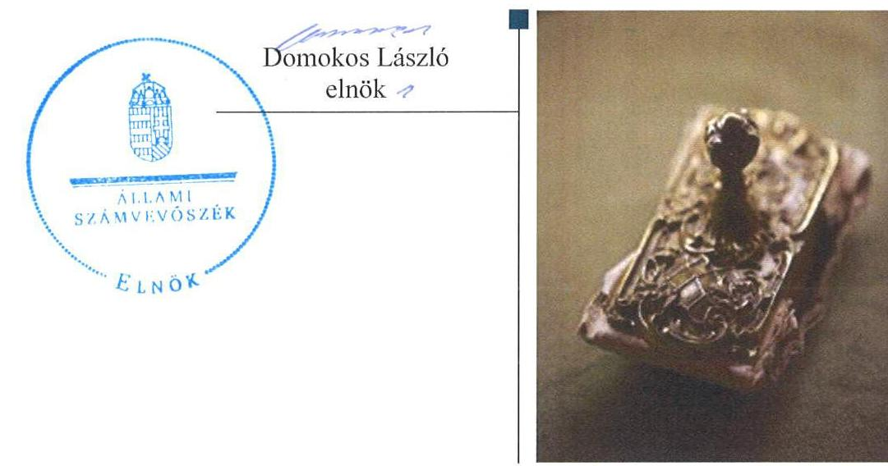
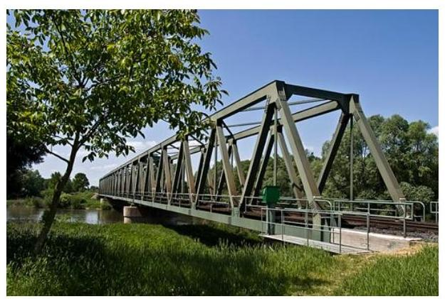
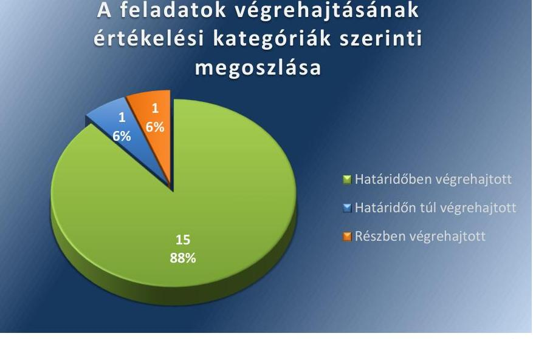
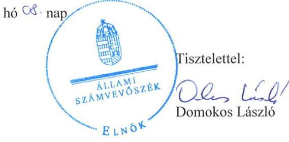
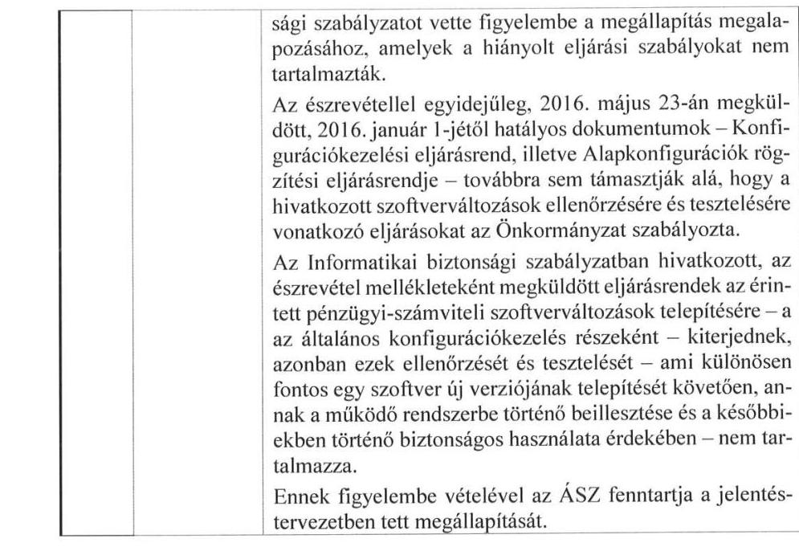
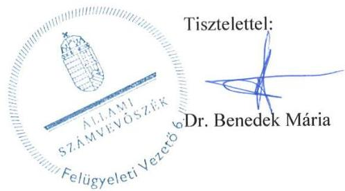

ÁLLAMI
SZÁMVEVŐSZÉK

# Jelentés 

## Utóellenőrzések

Murakeresztúr Község Önkormányzata belső kontrollrendszere kialakításának, egyes kontrolltevékenységek és a belső ellenőrzés működésének utóellenőrzése 2016.

---

# Jelentés 

## Utóellenőrzések

Murakeresztúr Község Önkormányzata belső kontrollrendszere kialakításának, egyes kontrolltevékenységek és a belső ellenőrzés működésének utóellenőrzése 2016. OG. hó 29. nap

---

# AZ ELLENŐRZÉST FELÜGYELTE: 

DR. BENEDEK MÁRIA felügyeleti vezető

## AZ ELLENŐRZÉST VEZETTE ÉS A VÉGREHAJTÁSÁÉRT FELELŐS:

DR. KOVÁCS DIÁNA ellenőrzésvezető

## A PROGRAM ÖSSZEÁLLÍTÁSÁÉRT FELELŐS:

JANIK JÓZSEF osztályvezető

## A TÉMÁHOZ KAPCSOLÓDÓ KORÁBBI SZÁMVEVŐSZÉKI JELENTÉSEK:

- címe: Jelentés Murakeresztúr Község Önkormányzata belső kontrollrendszerének kialakítása, valamint egyes kontrolltevékenységek és a belső ellenőrzés müködése ellenőrzéséről
- sorszáma: 13017

IKTATÓSZÁM: V-1056-052/2016.
TÉMASZÁM: 2090
ELLENŐRZÉS-AZONOSÍTÓ SZÁM: V-071825

---

# TARTALOMJEGYZÉK 

ÖSSZEGZÉS ..... 5
AZ ELLENŐRZÉS CÉLJA ..... 6
AZ ELLENŐRZÉS TERÜLETE ..... 7
AZ ELLENŐRZÉS HÁTTERE, INDOKOLTSÁGA ..... 8
A JELENTÉS LÉNYEGES KÉRDÉSKÖREI ..... 9
ELLENŐRZÉS HATÓKÖRE ÉS MÓDSZEREI ..... 10
MEGÁLLAPÍTÁSOK ..... 13
MELLÉKLETEK ..... 17
I. Sz. melléklet: Az ÁSZ 13017. számú jelentéséhez kapcsolódó intézkedési terv végrehajtása ..... 17
FÜGGELÉK: ÉSZREVÉTELEK ..... 23
RÖVIDÍTÉSEK JEGYZÉKE ..... 29

---

.

---

# ÖSSZEGZÉS 

Az ÁSZ ${ }^{1}$ az Önkormányzat² ${ }^{2}$ belső kontrollrendszerének és belső ellenőrzésének utóellenőrzését 2013. március 13. és 2016. január 29. közötti időszakra végezte el. Megállapította, hogy az Önkormányzat az ÁSZ javaslatainak hasznosítására előírt feladatokat nem teljes körüen hajtotta végre.

## Az ellenőrzés társadalmi indokoltsága

Az ÁSZ stratégiájában célul tűzte ki a számvevőszéki munka hasznosulásának javítását. Ezzel összhangban ellenőrzi, hogy az ellenőrzött szervezetek megvalósították-e a korábbi ellenőrzései által feltárt hibák, hiányosságok és szabálytalanságok megszüntetése céljából elkészített intézkedési terveikben foglaltakat. A rendszeres utóellenőrzések hozzájárulnak a szükséges intézkedések tényleges végrehajtáshoz, ezáltal a közpénzügyek rendezettségének javulásához.

## Főbb megállapítások, következtetések, javaslatok

A polgármester ${ }^{3}$ a képviselő-testület ${ }^{4}$ által elfogadott intézkedési tervet határidőben megküldte az ÁSZ részére.
Az intézkedési tervben meghatározott 17 feladatból 15-öt határidőben, egyet részben, illetve egyet határidőn túl hajtottak végre. Így az ÁSZ által korábban az Önkormányzat belső kontrollrendszerének kialakítása, valamint az egyes kontrolltevékenységek és a belső ellenőrzés múködésének területén azonosított hiányosságok egy rész továbbra is fennáll. Az intézkedési tervben rögzített feladatok végrehajtásáról a Bkr.-ben előírt nyilvántartást nem vezették.

---

# AZ ELLENŐRZÉS CÉLJA 

Az ellenőrzés célja annak értékelése volt, hogy a számvevőszéki jelentésben foglalt intézkedést igénylő megállapításokkal és javaslatokkal összhangban készített intézkedési tervben meghatározott feladatokat az ellenőrzött szervezet végrehajtotta-e.

---

# AZ ELLENŐRZÉS TERÜLETE 

## Az Önkormányzat

A Zala megyében, a Nagykanizsai járásban - a horvát-magyar határfolyóként folyó Mura mellett - található Murakeresztúr község állandó lakosainak száma a $\mathrm{KSH}^{5}$ által közzétett népességi adatok szerint 2015. január 1-én 1635 fő volt. Az Önkormányzat és Fityeház Község Önkormányzata 2013. január 1-én alapította a Murakeresztúri Közös Önkormányzati Hivatalt ${ }^{6}$. Az utóellenőrzés idején a hivatalban lévő polgármester az 1998. évi önkormányzati választások óta tölti be tisztségét, a jegyző ${ }^{7}$ 2002. január 1-től látja el közszolgálati feladatait.

Az Önkormányzat a 2014. évi éves költségvetési beszámoló szerint 223 millió Ft költségvetési bevételt ért el, valamint 158 millió Ft költségvetési kiadást teljesített. Az eszközvagyon értéke 2014. december 31-én 770 millió Ft volt.

Az Önkormányzat belső kontrollrendszerének kialakítását, valamint az egyes kontrolltevékenységek és a belső ellenőrzés múködésének ellenőrzését az ÁSZ a 2009. január 1. és 2011. december 31. közötti időszakra végezte el, az erről szóló 13017. számú jelentését 2013. március 13-án tette közzé. Az ellenőrzés célja annak értékelése volt, hogy az Önkormányzat a jogszabályi előírásoknak megfelelően alakította-e ki a belső kontrollrendszert, megfelelően múködtette-e a gazdálkodás folyamatában kulcsszerepet betöltő szakmai teljesítésigazolás és utalvány ellenjegyzés kontrollokat, biztosította-e a belső ellenőrzés szabályos és eredményes múködését. Az utóellenőrzés - a 2013. március 13-tól a 2016. január 29-ig végrehajtott feladatokat figyelembe véve - a polgármester és a jegyző részére megfogalmazott javaslatok hasznosulása céljából készített intézkedési terv végrehajtásának ellenőrzésére, illetve értékelésére terjedt ki.

---

# AZ ELLENŐRZÉS HÁTTERE, INDOKOLTSÁGA 

Az ÁSZ törvény ${ }^{8}$ 33. § (1) bekezdése értelmében a számvevőszéki jelentések intézkedést igénylő megállapításaihoz és javaslataihoz kapcsolódóan az ellenőrzött szervezet vezetője intézkedési tervet köteles összeállítani, és az ÁSZ részére megküldeni. Az intézkedési tervben foglaltak megvalósítását - az ÁSZ törvény 33. § (7) bekezdésében foglaltak alapján - az ÁSZ utóellenőrzés keretében ellenőrizheti. Az intézkedések megvalósulásának értékelése során az ÁSZ figyelembe veszi az ellenőrzött szervezetek működési feltételeiben, valamint a jogszabályi előírásokban bekövetkezett változásokat.

Az intézkedési tervekben foglalt feladatok hiányos, illetve késedelmes végrehajtása, valamint megvalósításának elmaradása azt mutatja, hogy az ellenőrzések során feltárt hibák, hiányosságok és szabálytalanságok megszüntetése nem kapott kellő hangsúlyt. Ez a szabályszerű működés és a felelős vezetői magatartás vonatkozásában kockázatot hordoz. E kockázatok feltárásával az ÁSZ utóellenőrzési rendszere fokozza a fegyelmet, és igazolja, hogy a közpénzzel való szabályos gazdálkodás felelőssége elől nem lehet kitérni.

## AZ UTÓELLENŐRZÉS VÁRHATÓ HASZNOSULÁSA

Az utóellenőrzés négy szinten hasznosulhat:

- A társadalom szintjén az utóellenőrzés jelzi, hogy a számvevőszéki ellenőrzés megállapításainak van következménye: a hiányosságok megszüntetésére az ellenőrzött szervezet által meghatározott intézkedések végrehajtását is számon kéri az ÁSZ.
- Az ellenőrzött terület szintjén az utóellenőrzés tájékoztatást nyújt a terület döntéshozóinak a hiányosságok kiküszöbölésének jó gyakorlatairól, ezzel lehetőséget biztosítva arra, hogy az ÁSZ ellenőrzési megállapításai, javaslatai a terület nem ellenőrzött szervezeteinek a működése során is hasznosuljanak.
- Az ellenőrzött szervezet szintjén az utóellenőrzés feltárja, hogy a szervezet az intézkedések végrehajtásával hasznosította-e a korábbi ellenőrzési jelentésben a hiányosságok megszüntetése, illetve a kockázatok kezelése érdekében megfogalmazott javaslatokat.
- Az ÁSZ szintjén az utóellenőrzés visszacsatolást ad az ellenőrzési jelentések hasznosulásáról, az intézkedések elmaradása vagy részleges megvalósulása a további ellenőrzésekhez kockázati jelzésként szolgál.

---

# A JELENTÉS LÉNYEGES KÉRDÉSKÖREI 

1. Az Önkormányzat az intézkedési tervben foglaltakat az elöirt határidőben végrehajtotta-e?

---

# ELLENŐRZÉS HATÓKÖRE ÉS MÓDSZEREI 

## Az ellenőrzés típusa

Megfelelőségi ellenőrzés.

## Az ellenőrzött időszak

Az utóellenőrzés alapját képező ÁSZ jelentés közzétételének napjától (2013. március 13.) az ellenőrzésről szóló kiértesítő levél keltének napjáig (2016. január 29.) tartó időszak.

## Az ellenőrzés tárgya

Az ÁSZ törvény 2011. július 1-i hatálybalépését követően a számvevőszéki jelentésben foglalt intézkedést igénylő megállapításokkal és javaslatokkal összhangban - az Önkormányzat által - készített intézkedési tervben foglaltak végrehajtásának ellenőrzése.

Az ellenőrzés kiterjedt minden olyan körülményre és adatra, amely az ÁSZ jogszabályban meghatározott feladatainak teljesítéséhez, valamint a program végrehajtása folyamán felmerült újabb összefüggések feltárásához szükséges.

## Az ellenőrzött szervezet

Murakeresztúr Község Önkormányzata

## Az ellenőrzés jogalapja

Az ÁSZ az ÁSZ törvényben meghatározott feladatkörében ellenőrzi a központi költségvetés végrehajtását, az államháztartás gazdálkodását, az államháztartásból származó források felhasználását és a nemzeti vagyon kezelését.

Az ÁSZ törvény 1. § (3) bekezdése szerint az ÁSZ általános hatáskörrel végzi a közpénzekkel és az állami és önkormányzati vagyonnal való felelős gazdálkodás ellenőrzését.

Az ÁSZ törvény 33. § (7) bekezdése alapján az ÁSZ jelentésben foglalt megállapításokhoz kapcsolódóan összeállított intézkedési tervben foglaltak megvalósítását az ÁSZ utóellenőrzés keretében ellenőrizheti.

---

# Az ellenőrzés módszerei 

Az ÁSZ az ellenőrzést a nemzetközi standardokat irányadónak tekintve az ellenőrzési program ellenőrzési kérdései, az ellenőrzött időszakban hatályos jogszabályok, az ellenőrzés szakmai szabályok és módszertanok figyelembevételével végezte.

Az ÁSZ az ellenőrzés ideje alatt az Önkormányzattal történő kapcsolattartást az ÁSZ SZMSZ²-ének vonatkozó előírásai alapján biztosította.

Az utóellenőrzés megállapításait elsősorban az ÁSZ rendelkezésére álló, valamint az Önkormányzattól elektronikusan bekért dokumentumok alapozták meg.

Az ellenőrzési bizonyítékként felhasználható adatforrások közé tartoznak egyrészt a szakmai programban felsorolt adatforrások, másrészt minden - az ellenőrzés folyamán feltárt, az ellenőrzés szempontjából információt tartalmazó - dokumentum.

A pénzügyi folyamatokban kulcsszerepet betöltő kontrollokra vonatkozóan az intézkedési tervben foglalt feladatok végrehajtását az államháztartáson kívülre teljesített működési célú pénzeszköz átadásoknál, az állományba nem tartozók megbízási díjainál, továbbá a külső szolgáltatók által végzett karbantartási és kisjavítási munkákkal kapcsolatos kifizetéseknél tízelemű véletlen mintavétellel kiválasztott tételekkel értékelte az ÁSZ. A kiválasztott tételek esetében az ÁSZ azt ellenőrizte, hogy az Önkormányzat az intézkedési tervben meghatározott feladatok végrehajtása érdekében biztosította-e a jogszabályok és a belső szabályok előírásainak megfelelő működést.

Az ÁSZ az intézkedési tervben előírt feladatokat azok végrehajthatósága, illetve végrehajtása szempontjából az alábbiak szerint értékelte:
"határidőben végrehajtott" a feladat, ha a teljesítés dokumentáltan, az intézkedési tervben előírt határidőben és tartalommal megtörtént;
"határidőn túl végrehajtott" a feladat, ha annak teljesítése az intézkedési tervben meghatározott módon, de az előírt határidőn túl történt meg;
"részben végrehajtott" a feladat, ha végrehajtása teljes körűen az intézkedési tervben előírt módon nem történt meg;
"nem végrehajtott" a feladat, ha a végrehajtás nem történt meg, vagy amennyiben a teljesítést nem dokumentálták;
"okafogyottá vált" a feladat, ha végrehajtására - meghatározott esemény bekövetkezése, továbbá külső körülmény, a működést érintő feltétel változása miatt - már nincs szükség, illetve lehetőség és egyértelműen megállapítható, hogy az intézkedést szükségessé tevő körülmény a jövőben nem fordulhat elő;
"nem időszerü" az a feladat, amelynek ellenőrzési időszakon belüli végrehajtására azért nem került (kerülhetett) sor, mert az intézkedés alapjául szolgáló esemény nem következett be, de annak jövőbeni előfordulása lehetséges, a végrehajtása nem volt esedékes, vagy a végrehajtás határideje még nem járt le.

---

Az ellenőrzés lefolytatásához az Önkormányzat a tanúsítványok kitöltésével, valamint az ÁSZ által kért dokumentumok elektronikus megküldésével szolgáltatott adatokat, amelyek valódiságát és teljes körűségét az polgármester és a jegyző által tett teljességi és hitelességi nyilatkozat igazolja. Az így rendelkezésre bocsátott adatok, információk kontrollja az ellenőrzés keretében történt.

---

# MEGÁLLAPÍTÁSOK 

## Az Önkormányzat az intézkedési tervben foglaltakat az előírt határidőben végrehajtotta-e?

Összegző megállapítás

Az Önkormányzat az intézkedési tervben meghatározott 17 feladatból 15-öt határidőben, egyet határidőn túl, egyet részben hajtott végre. Az intézkedési tervben rögzített feladatok végrehajtásáról a Bkr.-ben előírt nyilvántartást nem vezették.

Az intézkedési tervben meghatározott feladatokat, határidőket, az ÁSZ jelentés javaslatainak címzettjét és a feladatok végrehajtását az I. számú melléklet mutatja be.

Az ÁSZ a jelentésében a polgármester részére kettő, a jegyző részére 15 javaslatot fogalmazott meg. A polgármester által összeállított, a képviselőtestület által jóváhagyott és az ÁSZ részére megküldött intézkedési tervben a hiányosságok, szabálytalanságok megszüntetésére 17 feladatot határoztak meg. A feladatok elvégzésének felelőseként egy esetben a polgármestert, 16 esetben pedig a jegyzőt jelölték meg.

Az intézkedési tervben tervezett feladatok végrehajtásának értékelési kategóriák szerinti megoszlását az 1. ábra szemlélteti.
1. ábra

A feladatok végrehajtásának értékelési kategóriák szerinti megoszlása

Fornós: ÁSZ

## HATÁRIDŐBEN VÉGREHAJTOTT feladatok:

$\qquad$ 1. A polgármester gondoskodott arról, hogy Önkormányzat nevében történő kötelezettségvállalásra pénzügyi ellenjegyzést követően kerüljön sor.
$\qquad$ 2. A polgármester intézkedett a szakmai teljesítésigazolás és az utalvány ellenjegyzés kontrollokkal összefüggésben a számvevőszéki

---

jelentésben rögzített hiányosságok és szabálytalanságok tekintetében az esetleges munkajogi felelősséggel kapcsolatos körülmények kivizsgálásáról, amelyről a Hivatalnál 2013. március 20-án jegyzőkönyv készült. A jegyzőkönyvben rögzítették, hogy a feltárt hibák eseti jelleggel merültek fel, az elkövetett szabálytalanságoknál a szándékosság teljes egészében kizárható, ezért a vizsgálat eredményével kapcsolatban a polgármester munkajogi felelősségre vonást nem kezdeményezett.
3. A jegyző gondoskodott arról, hogy a hivatali SZMSZ ${ }^{10}$-ben részletezett főbb feladat- és hatáskörökben, valamint a hivatali SZMSZ 3. számú mellékletét képező munkaköri leírásokban meghatározásra kerüljenek a Hivatal tevékenységére vonatkozó beszámolási eljárások.
4. A jegyző gondoskodott arról, hogy az önkormányzati ${ }^{11}$, továbbá a hivatali ${ }^{12}$ gazdálkodási jogkörök szabályzatai módosításra kerüljenek annak érdekében, hogy azok az érvényesítés dátumát és az érvényesítő aláírását előíró szabályokat tartalmazzák.
5. A jegyző gondoskodott arról, hogy mind az önkormányzati, mind a hivatali gazdálkodási jogkörök szabályzata tartalmazza az előzetes írásbeli kötelezettségvállalást nem igénylő kifizetések rendjét és az eljárási részletszabályait.
6. A jegyző gondoskodott arról, hogy a hivatali SZMSZ-ben meghatározásra kerüljön az operatív tevékenységek keretében megvalósuló folyamatos és eseti nyomon követésből álló, az Önkormányzat tevékenységének, a célok megvalósításának nyomon követését biztosító rendszer és a jegyző gondoskodott a nyomon követési rendszer működtetéséről is.
7. A jegyző gondoskodott arról, hogy a teljesítésigazolást a jogszabályban rögzített összeférhetetlenségi szabályok figyelembevételével kijelölt személyek végezzék el, és a jogszabályi előírásokban foglaltaknak megfelelően a teljesítésigazolás során ellenőrizzék a kiadások teljesítésének jogosságát, összegszerűségét, valamint ellenszolgáltatást is magában foglaló kötelezettségvállalás esetében a szerződés, megrendelés teljesítését.
8. A jegyző gondoskodott arról, hogy az érvényesítő a kifizetéseket megelőzően a teljesítésigazolás alapján ellenőrizze az összegszerűséget és a megelőző ügymenetben a jogszabályok és a belső szabályzatok előírásainak betartását.
9. A jegyző gondoskodott arról, hogy az Önkormányzatnál a kötelezettségvállalások nyilvántartását vezessék, és az utalványrendeleteken feltüntetésre kerültek a kötelezettségvállalás nyilvántartási számok. A jegyző kezdeményezte az alkalmazott integrált számviteli szoftver módosítását a fejlesztőnél, amelynek eredményeként a kötelezettségvállalások nyilvántartása és azok dokumentálása kötelezettségvállalás-nyilvántartási szám rögzítése a bizonylatokon - megtörtént.
10. A jegyző gondoskodott arról, hogy az Önkormányzat nevében történő kötelezettségvállalásra pénzügyi ellenjegyzést követően kerüljön sor.

---

11. A jegyző gondoskodott arról, hogy a gazdasági események a tényleges tartalmuknak megfelelően kerüljenek könyvelésre.
12. A jegyző gondoskodott a polgármester előterjesztése útján a kép-viselő-testület által az Önkormányzat 2013. évi belső ellenőrzési tervének módosításáról.
13. A jegyző gondoskodott arról, hogy a módosított 2013. évi belső ellenőrzési tervet kockázatelemzéssel alapozzák meg.
14. A jegyző gondoskodott arról, hogy a belső ellenőrzési vezető a jogszabály szerint eleget tegyen a belső ellenőri jelentések alapján megtett intézkedések nyomon követésére vonatkozó kötelezettségének. A 2013. évben a belső ellenőrzésekről készült nyilvántartás részletesen tartalmazta a javaslatok végrehajtására megtett intézkedéseket. A 2014. és a 2015. évi belső ellenőrzési beszámoló jelentések nem fogalmaztak meg intézkedést igénylő megállapításokat, javaslatokat.
15. A jegyző gondoskodott arról, hogy a belső ellenőrzési vezető által az elvégzett ellenőrzésekről vezetett nyilvántartás a jogszabály szerint tartalmazza az ellenőrzések kezdetének és lezárásának időpontját, továbbá a jelentések jelentősebb megállapításait, javaslatait.

# HATÁRIDŐN TÚL VÉGREHAJTOTT feladat: 

16. A jegyző a hivatali SZMSZ módosítását elvégezte 2013 márciusában, azonban azt az intézkedési tervben meghatározott 2013. június 30-i határidőn túl, 2013. október 31-én terjesztett a polgármester a képviselő-testület elé jóváhagyásra, ami a 130/2013. (X.31.) számú önkormányzati határozattal megtörtént.

## RÉSZBEN VÉGREHAJTOTT feladat:

17. A jegyző gondoskodott arról, hogy az informatikai és biztonsági szabályzatban az intézkedési tervben meghatározott határidőn belül az adatbiztonság érvényesülése érdekben az Info tv. ${ }^{13}$ szerint meghatározzák a hozzáférési jogosultságok megállapítására és módosítására, betartásuk ellenőrzésére vonatkozó eljárásrendet, valamint a pénzügyi-számviteli rendszerben feldolgozott adatok mentési eljárásait, és a mentések felelőseit. Az intézkedési tervben foglaltak ellenére a pénzügyi-számviteli szoftverváltozások ellenőrzésére, tesztelésére vonatkozó eljárások szabályait nem rögzítették.

A jegyző a Bkr.-ben foglaltak ellenére nem gondoskodott a képviselőtestület által jóváhagyott intézkedési terv feladatai végrehajtásának nyomon követését tartalmazó nyilvántartás vezetéséről.

---

.

---

# MELLÉKLETEK

I. SZ. MELLÉKLET: AZ ÁSZ 13017. SZÁMÚ JELENTÉSÉHEZ KAPCSOLÓDÓ INTÉZKEDÉSI TERV VÉGREHAJTÁSA

|  1. | Intézkedési terv alapján elvégzendő feladat | Az intézkedési tervben meghatározott határidő | Az ÁSZ 13017
sz. jelentése
javalatának
címzettje | A feladat végrehajtása  |
| --- | --- | --- | --- | --- |
|   | 1. | 2. | 3. | 4.  |
|  Határidőben végrehajtott feladat |  |  |  |   |
|  1. | A vonatkozó jogszabályok és a helyi szabályozás alapján biztosítani kell, hogy az Önkormányzat nevében történő kötelezettségvállalásra, az Áht. 37. § (1) bekezdésében foglaltaknak megfelelően, pénzügyi ellenjegyzés után kerüljön sor. | Azonnal, és azt követően folyamatos | polgármester, a végrehajtásért: jegyző | A polgármester és a jegyző az előírt intézkedésnek határidőben eleget tett. Kötelezettségvállalásra, az Áht. 37. § (1) bekezdésében foglaltaknak megfelelően az ellenőrzött dokumentumok mindegyike esetén a pénzügyi ellenjegyzés után került sor. A kötelezettségvállalást az Ávr. ${ }^{14}$ 52. § (1) bekezdésében foglaltaknak megfelelően az Önkormányzat nevében a polgármester és az általa kijelölt alpolgármester, a Hivatal nevében a jegyző végezte el.  |
|  2. | 2013. március 31-ig a szakmai teljesítésigazolás és az utalvány ellenjegyzés kontrollokkal összefüggésben - a számvevőszéki jelentésben rögzített hiányosságok és szabálytalanságok tekintetében sor került az esetleges munkajogi felelősséggel kapcsolatos körülmények kivizsgálására. | 2013.03.30. | polgármester | A polgármester intézkedett a szakmai teljesítésigazolás és az utalvány ellenjegyzés kontrollokkal összefüggésben a számvevőszéki jelentésben rögzített hiányosságok és szabálytalanságok tekintetében az esetleges munkajogi felelősséggel kapcsolatos körülmények kivizsgálásáról, amelyről a Hivatalnál 2013. március 20-án jegyzőkönyv készült. A jegyzőkönyvben foglaltak szerint a feltárt hibák eseti jelleggel merültek fel, az Önkormányzat eredményes és hatékony gazdálkodását nem érintették. A polgármester megítélése szerint az elkövetett szabálytalanságoknál és a feltárt hiányosságoknál a szándékosság teljes egészében kizárható, a vizsgálat eredményével kapcsolatban semminemű munkajogi felelősségre vonást nem kezdeményezett. A jegyzőkönyvben fentieken túl rögzítésre került, hogy a - a belső ellenőrzés hatékonyságának javítása érdekében az Önkormányzat a feladat ellátására új belső ellenőrt bízott meg.  |
|  3. | Az Önkormányzati Hivatal SZMSZ-ét ki kell egészíteni a Bkr. 8. § (4) bekezdés c) pontja alapján az önkormányzati Hivatal tevékenységeire vonatkozó beszámolási eljárások szabályozásával. | 2013.06.30. | jegyző | A jegyző gondoskodott a hivatali SZMSZ kiegészítéséről, miszerint a hivatali SZMSZ 11-16. §-okban részletezett főbb feladat- és hatáskörök, valamint az SZMSZ 3. számú mellékletét képező munkaköri leírások tartalmazták a Hivatal tevékenységére vonatkozó beszámolási eljárásokat. A hivatali SZMSZ módosítására 2013. március 16-án - határidőn belül - került sor.  |
|  4. | Módosítani kell a gazdálkodási jogkörök szabályzatát, hogy az Ávr. 58. § (3) bekezdésében foglaltaknak megfelelően az érvényesítésre vonatkozó előírások az érvényesítő keltezéssel ellátott aláírását is tartalmazzák. | 2013.06.30. | jegyző | A jegyző gondoskodott a Murakeresztúr Község Önkormányzatnál 468-6/2013. számon, a Murakeresztúri Közös Önkormányzati Hivatalnál pedig 468-7/2013. számon az Operatív Gazdálkodási Jogkörök Gyakorlásáról szóló 2013. január 1-től hatályos szabályzatok elkészítéséről. Az intézkedési tervben meghatározott határidőben hatályos szabályzatok II. fejezetének az "Érvényesítés tartalma" c. bekezdése tartalmazta az Ávr. 58. § (3) bekezdésében foglaltakat.  |
|  5. | Módosítani kell a gazdálkodási jogkörök szabályzatát, hogy az Ávr. 53. § (2) bekezdésének | 2013.06.30. | jegyző | A jegyző gondoskodott arról, hogy mind az önkormányzati, mind pedig a hivatali gazdálkodási jogkörök szabályzata tartalmazza az Ávr. 53. § (2) bekezdésében foglaltakat. A szabályzatok II.  |

---

|  5. | Intézkedési terv alapján elvégzendő feladat | Az intézkedési tervben meghatározott határidő | Az ÁSZ 13017 sz. jelentése javaslatának címzettje | A feladat végrehajtása  |
| --- | --- | --- | --- | --- |
|   | 1. | 2. | 3. | 4.  |
|   | megfelelően tartalmazza az előzetes írásbeli kötelezettségvállalást nem igénylő kifizetések rendjét és részletes szabályait. |  |  | fejezetének "A kötelezettségvállalás tartalma" c. bekezdésében határozták meg, hogy mely kifizetések nem igényelnek előzetes írásbeli kötelezettségvállalást, illetve rögzítették a kifizetések rendjét és részletes szabályait is.  |
|  6. | 8., Az Önkormányzati Hivatal SZMSZ-ében meg kell határozni a Bkr. 10. §-ában előírtak alapján az operatív tevékenységek keretében megvalósuló folyamatos és eseti nyomon követésből álló, az önkormányzat tevékenységének, a célok megvalósításának nyomon követését biztosító rendszert. | 2013. június 30. | jegyző | A jegyző határidőben kialakította a Hivatalban a Bkr. 10. §-ában előírtak alapján az operatív tevékenységek keretében megvalósuló folyamatos és eseti nyomon követésből álló, az Önkormányzat tevékenységének, a célok megvalósításának nyomon követését biztosító rendszert. A 2013. július 1-től hatályos Hivatal SZMSZ VIII. fejezet 39. §-ában a belső kontrollrendszer bemutatásra került. A Hivatalban a 3/2013. (VI. 3.) számú jegyzői utasítás szabályozta a belső kontrollrendszerrel kapcsolatos feladatokat, eljárási szabályokat, többek között a szervezeti célok eléréséhez elengedhetetlen humánerőforrásra vonatkozóan. A jegyző működtette az operatív tevékenységek keretében megvalósuló folyamatos és eseti nyomon követésből álló, az Önkormányzat tevékenységének, a célok megvalósításának nyomon követését biztosító rendszert, a képviselő-testület megtárgyalta és elfogadta a Gazdasági Programot, a képviselő-testület előtt beszámolt a Muramenti Családsegítő Központ és Gyermekjóléti Szolgálat, illetve a védőnői tevékenység beszámolóját is elfogadta a képviselő-testület.  |
|  7. | Az operatív gazdálkodás során a működésbeli hibák megelőzése, feltárása és kijavítása érdekében biztosítani kell, hogy az Ávr. 57. § (3) bekezdése szerinti teljesítésigazolást az Ávr 60. § (2) bekezdésében rögzített összeférhetetlenségi szabályok figyelembevételével kijelölt személyek végezzék el, és az Ávr. 57. § (1) bekezdésében foglaltaknak megfelelően a teljesítés igazolás során ellenőrizték a kiadások teljesítésének jogosságát, összegszerűségét, valamint ellenszolgáltatást is magában foglaló kötelezettségvállalás esetében a szerződés, megrendelés teljesítését. | Azonnal, s azt követően folyamatos | jegyző | A jegyző biztosította, hogy az Ávr. 57. § (3) bekezdése szerinti teljesítésigazolást az Ávr. 60. § (2) bekezdésében rögzített összeférhetetlenségi szabályok figyelembevételével a kijelölt személyek végezzék el. Az Ávr. 57. § (1) bekezdésében foglaltaknak megfelelően a teljesítés igazolás során ellenőrizték a kiadások teljesítésének jogosságát, összegszerűségét, valamint az ellenszolgáltatást is magában foglaló kötelezettségvállalás esetében a szerződés, megrendelés teljesítését. Minden ellenőrzött dokumentum esetében a teljesítésigazolás megfelelt az Ávr. 57. § (1) és (3) bekezdésében foglaltaknak. A teljesítés igazolására jogosult személyeket az Ávr. 57. § (4) bekezdés előírásainak megfelelően a kötelezettségvállalók jelölték ki.  |
|  8. | Az operatív gazdálkodás során a működésbeli hibák megelőzése, feltárása és kijavítása érdekében biztosítani kell, hogy az érvényesítő az Ávr. 58. § (1) bekezdése szerint, a kifizetéseket | Azonnal, s azt követően folyamatos | jegyző | Az operatív gazdálkodás során a működésbeli hibák megelőzését, feltárását és kijavítását a jegyző az ellenőrzött dokumentumok esetében biztosította. Az érvényesítő az Ávr. 58. § (1) bekezdése szerint, a kifizetéseket megelőzően a teljesítés igazolás alapján ellenőrizte az összegszerűséget és azt, hogy a megelőző ügymenetben az Áht., az Áhsz.,, ${ }^{15}$, az Áhsz.,, ${ }^{16}$ az Ávr. előírásait  |

---

|  9. | Az operatív gazdálkodás során a működésbeli hibák megelőzése, feltárása és kijavítása érdekében biztosítani kell, hogy az Ávr. 56. § (1) bekezdésében előírt kötelezettségvállalások nyilvántartása megtörténjen, és az utalványrendeleteken az Ávr. 59 § (3) bekezdés f) pontjában foglaltaknak megfelelően feltüntetésre kerüljön a kötelezettségvállalás nyilvántartási száma. Az alkalmazott integrált számviteli szoftver módosítását kezdeményezni kell a fejlesztőnél, melynek eredményeként a kötelezettségvállalás nyilvántartási és annak dokumentálása (kötelezettségvállalás nyilvántartási szám rögzítése a bizonylatokon) biztosítható. | Azintézkedési tervben meghatározott határidő | A: 432 13017 sz. jelentése javaslatának címzettje | A feladat végrehajtása  |
| --- | --- | --- | --- | --- |
|   |  | 2. | 3. | 4.  |
|   | megelőzően a teljesítésigazolás alapján ellenőrizze az összegszerűséget és azt, hogy a megelőző ügymenetben az Áht, az Áhsz.1, az Ávr. előírásait és a belső szabályzatokban foglaltakat betartották-e. |  |  | és a belső szabályzatokban foglaltakat betartották. Az érvényesítő kijelölése megfelelt az Ávr. 58. § (4) bekezdésében és az Ávr. 55. § (2) bekezdés f) pontjában foglalt előírásoknak.  |
|  9. | Az operatív gazdálkodás során a működésbeli hibák megelőzése, feltárása és kijavítása érdekében biztosítani kell, hogy az Ávr 56. § (1) bekezdésében előírt kötelezettségvállalások nyilvántartása megtörténjen, és az utalványrendeleteken az Ávr. 59 § (3) bekezdés f) pontjában foglaltaknak megfelelően feltüntetésre kerüljön a kötelezettségvállalás nyilvántartási száma. Az alkalmazott integrált számviteli szoftver módosítását kezdeményezni kell a fejlesztőnél, melynek eredményeként a kötelezettségvállalás nyilvántartási és annak dokumentálása (kötelezettségvállalás nyilvántartási szám rögzítése a bizonylatokon) biztosítható. | Azonnal, s azt követően folyamatos az utalványok kitöltése tekintetében, s a szoftver módosítás vonatkozásában: 2013. június 30. | jegyző | A jegyző az operatív gazdálkodás során a működésbeli hibák megelőzése, feltárása és kijavítása érdekében biztosította, hogy az Ávr. 56. § (1) bekezdésében előírt kötelezettségvállalások nyilvántartása megtörténjen, és azt, hogy az utalványrendeleteken az ellenőrzött dokumentumok esetében az Ávr. 59. § (3) bekezdés f) pontjában foglaltaknak megfelelően feltüntetésre került a kötelezettségvállalás nyilvántartási szám. A jegyző az alkalmazott integrált számviteli szoftver módosítását 2013. január 7-én kezdeményezte a fejlesztőnél. Ennek eredményeként a kötelezettségvállalás nyilvántartás és annak dokumentálása (kötelezettségvállalás nyilvántartási szám rögzítése a bizonylatokon) biztosított volt.  |
|  10. | Az operatív gazdálkodás során a működésbeli hibák megelőzése, feltárása és kijavítása érdekében biztosítani kell, hogy az Önkormányzat nevében történő kötelezettségvállalásra az Áht. 37. § (1) bekezdésében foglaltaknak megfelelően, pénzügyi ellenjegyzés után kerüljön sor. | Azonnal, s azt követően folyamatos | jegyző | Az intézkedési tervben előírtakat a jegyző biztosította. Kötelezettségvállalásra, az Áht. 37. § (1) bekezdésében foglaltaknak megfelelően az ellenőrzött dokumentumok esetében a pénzügyi ellenjegyzés után került sor. A kötelezettségvállalást az Ávr. 52. § (1) bekezdésében foglaltaknak megfelelően az Önkormányzat nevében a polgármester és az általa kijelölt alpolgármester, a Hivatal nevében a jegyző végezte el.  |
|  11. | Az operatív gazdálkodás során a működésbeli hibák megelőzése, feltárása és kijavítása érdekében biztosítani kell, hogy a gazdasági események tényleges tartalmuknak megfelelően kerüljenek könyvelésre az Áhsz.1 9. § (11) bekezdésében, valamint 9. számú melléklete 9. c) pontjában foglaltak betartásával. | Azonnal, s azt követően folyamatos | jegyző | A jegyző biztosította, hogy a gazdasági események – az ellenőrzés során megvizsgált dokumentumok esetében – tényleges tartalmuknak megfelelően kerüljenek könyvelésre. A külső szolgáltatók által végzett karbantartási, kisjavítási szolgáltatások könyvelése a 2013. évben az Áhsz1. 9. § (11) bekezdésében, valamint 9. számú melléklete 9. c) pontjában, illetve 2014. január 1-től az Áhsz.2 15. számú melléklet; I. Egységes rovatrend a költségvetési és finanszírozási bevételekhez, kiadásokhoz; K3 Dologi kiadások; K334 Karbantartási, kisjavítási szolgáltatásokban foglaltak betartásával történt.  |

---

|  12. | Elő kell készíteni az éves ellenőrzési tervről szóló előterjesztést és kezdeményezni kell a polgármesternél a Képviselő-testület elé terjesztését annak érdekében, hogy a Képviselőtestület az éves ellenőrzési tervet a Mötv². 119. § (5) bekezdésében előírt határidőig jóváhagyhassa. Biztosítani kell, hogy annak módosítására kizárólag a Képviselő-testület jóváhagyásával kerüljön sor. | 2013.04.30. | jegyző | A jegyző gondoskodott arról, hogy a 2013. évi módosított éves ellenőrzési tervet a polgármester - az intézkedési tervben meghatározott határidőn belül - a Képviselő-testület elé terjessze, amely a 61/2013. (IV.25.). számú önkormányzati határozattal jóváhagyta azt.  |
| --- | --- | --- | --- |
|  13. | Biztosítani kell, hogy az éves ellenőrzési tervet a Bkr. 31. § (2) bekezdésének megfelelően kockázatelemzéssel alapozzák meg. | 2013.04.30. | jegyző  |
|  14. | Biztosítani kell, hogy a belső ellenőrzési vezető a Bkr. 21. § (2) bekezdés d) pontja szerint tegyen eleget a belső ellenőri jelentések alapján megtett intézkedések nyomon követésére vonatkozó kötelezettségének. | 2013.09.30, azt követően folyamatos | jegyző  |
|  15. | Biztosítani kell, hogy belső ellenőrzési vezető által az elvégzett ellenőrzésekről vezetett nyilvántartás a Bkr. 50. § (2) bekezdés d) pontja és a 47. § (1) bekezdés szerint tartalmazza az ellenőrzések kezdetének és lezárásának időpontját, valamint a jelentések jelentősebb megállapításait, javaslatait. | 2013.09.30, azt követően folyamatos | jegyző  |
|  16. | Az Önkormányzati Hivatal SZMSZ-e kiegészítését az Ávr. 13. § (1) bekezdés c) és g) pontjaiban foglaltaknak megfelelően el kell végezni. A felülvizsgálat SZMSZ-nek tartalmaznia kell az Önkormányzat ellátandó és a szakfeladat rend szerint besorolt alaptevékenységeit, az alaptevékenységet szabályozó jogszabályok megjelölését, az abban nevesített munkakörhöz tartozó feladat- és hatásköröket, azok gyakorlásának | 2013.06.30. | jegyző  |

|  Az intézkedési tervben meghatározott határidő | Az ÁSZ 13017 sz. jelentése javaslatának címzettje | A feladat végrehajtása  |
| --- | --- | --- |
|  1. | 2. | 3.  |
|  2013.04.30. | jegyző | A jegyző gondoskodott arról, hogy a 2013. évi módosított éves ellenőrzési tervet a polgármester - az intézkedési tervben meghatározott határidőn belül - a Képviselő-testület elé terjessze, amely a 61/2013. (IV.25.). számú önkormányzati határozattal jóváhagyta azt.  |
|  2013.04.30. | jegyző | A jegyző gondoskodott az Önkormányzat 2013. évi módosított belső ellenőrzési terve 2013.04.08-án – határidőn belüli – a Bkr. 31. § (2) bekezdésének megfelelő, kockázatelemzéssel való kiegészítéséről.  |
|  2013.09.30, azt követően folyamatos | jegyző | A 2013. évi belső ellenőrzési jelentések alapján megtett intézkedések nyomon követése a belső ellenőrzési nyilvántartás útján biztosított volt. 2014-2015. években a belső ellenőrzési jelentések nem fogalmaztak meg intézkedést igénylő javaslatot. A feladat végrehajtására az intézkedési tervben meghatározott kezdési határidőt figyelembe véve határidőben, majd ezt követően folyamatosan került sor.  |
|  2013.09.30, azt követően folyamatos | jegyző | Belső ellenőrzési vezető által az Önkormányzatnál elvégzett vizsgálatokról vezetett 2013-2015. évi nyilvántartások tartalmazták a Bkr. 50. § (2) bek. d) pontja szerint a vizsgálatok kezdetének és lezárásának időpontját, valamint a Bkr. 47. § (1) bekezdésében foglaltaknak megfelelően a jelentések javaslatait, 2014-2015. években intézkedést igénylő javaslatot nem tartalmaztak a belső ellenőrzési jelentések. A belső ellenőrzési nyilvántartások az intézkedési tervben meghatározott kezdő határnapot – 2013. 09.30-át – figyelembe véve minden esetben tartalmazták a felsorolt tartalmi elemeket.  |
|  2013.06.30. | jegyző | A hivatali SZMSZ kiegészítése az Ávr. 13. § (1) bekezdés c) és g) pontjaiban foglaltakat figyelembe véve 2013. év márciusában megtörtént. Az SZMSZ 2. §-a tartalmazta az önkormányzat ellátandó és a szakfeladatrend szerint besorolt alaptevékenységeit, az 5. sz. melléklet pedig ellátandó alaptevékenységet meghatározó jogszabályokat rögzítette. A hivatali SZMSZ-ben nevesített négy munkakörhöz tartozó feladat- és hatáskörök a 13-16. §-okban kerültek meghatározásra, a helyettesítés rendjének keretszabályai pedig a 30. §-ban kerültek rögzítésre, részletszabályait, illetve a feladat- és hatáskörök gyakorlásának módját a munkaköri leírások tartalmazták. A hivatali SZMSZ-t 2013. július 1-től alkalmazták. A hivatali SZMSZ-t az intézkedési tervben meghatározott  |

---

|  1. | Intézkedési terv alapján elvégzendő feladat | Az intézkedési tervben meghatározott határidő | Az ÁSZ 13017 sz. jelentése javaslatának címzettje | A feladat végrehajtása  |
| --- | --- | --- | --- | --- |
|   |  | 2. | 3. | 4.  |
|   | módját, a helyettesítés rendjét, valamint a felelősségi szabályokat. Gondoskodni kell róla, hogy a polgármester az Önkormányzati Hivatal SZMSZ-ét a megadott határidő teljesítését figyelembe véve terjessze a képviselő-testület elé. |  |  | határidőn túl 2013. október 31-én terjesztette a polgármester a képviselő-testület elé, amely a 130/2013. (X.31.) számú önkormányzati határozatában azt jóváhagyta.  |
|   |  |  | Részben végrehajtott feladat |   |
|  17. | Szabályzatba kell foglalni az Info tv. 7. § (2) bekezdése alapján az adatbiztonság érvényesülését, s ennek keretében meg kell határozni a hozzáférési jogosultságok megállapítására és módosítására, betartásuk ellenőrzésére vonatkozó eljárásrendet. Szabályozni szükséges továbbá a pénzügyi-,- számviteli szoftverváltozások ellenőrzésére, tesztelésére vonatkozó eljárásokat, valamint. a pénzügyi-számviteli rendszerben feldolgozott adatok mentési eljárásait, és a mentések felelőseit. | 2013. június 30. | jegyző | A jegyző intézkedésének hatására az Info tv. 7. § (2) bekezdésében foglalt adatbiztonság részben érvényesült. A 2013. március 30-ától hatályos Informatikai Biztonsági Szabályzat 8.2. és 12.4. pontjában meghatározták a hozzáférési jogosultságok megállapítására és módosítására, valamint betartásuk ellenőrzésére vonatkozó eljárásrendet. Szabályozták továbbá az Informatikai Biztonsági Szabályzat 12.2.9. pontjában a pénzügyi-számviteli rendszerben feldolgozott adatok mentési eljárásait. A jegyző az intézkedési terv előírása ellenére a pénzügyi-, számviteli szoftverváltozások ellenőrzésére, tesztelésére vonatkozó eljárásokat nem szabályozta. Az Informatikai Biztonsági Szabályzat 2016. január 4-én módosult, amelyet követően a pénzügyi-, számviteli szoftverváltozások ellenőrzésére, tesztelésére vonatkozó eljárások továbbra sem kerültek szabályozásra.  |

*Forrás: ÁSZ által készített táblázat*

---

.

---

# FÜGGELÉK: ÉSZREVÉTELEK 

A jelentéstervezetet a Számvevőszék 15 napos észrevételezésre megküldte az ellenőrzött szervezet vezetőjének az ÁSZ tv. 29. §* (1) bekezdése előírásának megfelelően.
A függelék tartalmazza az ellenőrzött észrevételeit, illetve az el nem fogadott észrevételek elutasításának indoklását.

[^0]
[^0]:    * 29. § (1) Az Állami Számvevőszék az ellenőrzési megállapításait megküldi az ellenőrzött szervezet vezetőjének vagy az általa megbízott személynek, és annak, akinek személyes felelősségét állapította meg.
    (2) Az ellenőrzött szervezet vezetője és a felelősként megjelölt személy az ellenőrzés megállapításaira tizenöt napon belül írásban észrevételt tehet.
    (3) Az Állami Számvevőszék az észrevételre a beérkezésétől számított harminc napon belül írásban válaszol. A figyelembe nem vett észrevételeket köteles a jelentésben feltüntetni, és megindokolni, hogy azokat miért nem fogadta el.

---

# 2016 MAJ 2322 

Murakeresztúr Község Önkormányzata 8834 Murakeresztúr, Honvéd u. 3. Tel: 93/369-001 Fax:93/369-575

Iktatószám: 179-23/2016.

Tárgy: utóellenőrzés 17. pontjának megállapítására észrevétel.
Melléklet: 1 db levél
2 db dokumentum

Állami Számvevőszék
Budapest
Apáczai Csere János u. 10.
1052

Tisztelt Cím!
A V-1056-048/2016. iktatószámú levelükhöz kapcsolódóan ezúton megküldöm az ellenőrzés 17. pontjának megállapításaira az információbiztonsági felelősünk által kezdeményezett észrevételünket.

Murakeresztúr, 2016. május 19.

Tisztelettel és üdvözlettel:

Pavlicz Lajos
polgármester

---

Tisztelt Jegyző Asszony, Kedves Edit!

Az ÁSZ által a 17. pontban jelzett részleges hiányosságra véleményünk szerint vonatkozik az IBSZ 5.3.1 pontjában foglalt nyilvántartási kötelezettség és az ott specifikált eljárásrendek kiterjednek a pénzügyi rendszerekre is.

Részletesebben megadva az IBSZ 5.3.1. pontja rögzíti, hogy "A Hivatal minden vagyonelemét leltárba kell venni, a Konfigurációkezelési eljárásrendben foglalt konfigurációs itemek részletezettségi szintjén. Tekintettel arra, hogy az informatikai célú leltározási eljárás különbözik a könyvelési és gazdasági célú leltározási eljárásoktól, biztosítani kell a két leltár közötti konzisztencia fennmaradását."

Az itt hivatkozott eljárásrendek (29 Konfigurációkezelési eljárásrend és az 30 AlapKonfigurációk rögzítési eljárásrendje)
előírásai kiterjednek a hardveres és a szoftveres eszközökre, így a pénzügyi alkalmazásokra is.

Az Intézkedési tervben leírtak a fentiek szerint teljesülnek. Az alkalmazásokat az információbiztonsági felelős
az információbiztonsági közremüködővel együttműködve tartja nyilván, a változásokat pedig havonta áttekintik és rögzítik.

Kérjük, hogy a lent csatolt szabályzatokat figyelembe venni szíveskedjenek.
Tisztelettel,
Erdősi Péter Máté, CISA
információbiztonsági felelős
$--$
Barth László

---

ELNÖK

Ikt.szám: V-1056-051/2016.

# Pavlicz Lajos József úr 

polgármester
Murakeresztúr Község Önkormányzata

## Murakeresztúr

## Tisztelt Polgármester Úr!

Köszönettel megkaptam a 2016. május 23. napján az Állami Számvevőszékhez érkezett "Murakeresztúr Község Önkormányzata belső kontrollrendszere kialakításának, egyes kontrolltevékenységek és a belső ellenőrzés müködésének utóellenőrzése" című számvevőszéki jelentéstervezetben foglalt megállapításokra tett észrevételét.

Tájékoztatom Polgármester urat, hogy az el nem fogadott észrevételt - az Állami Számvevőszékről szóló 2011. évi LXVI. törvény 29. § (3) bekezdése alapján - a jelentésben szerepeltetjük az elutasítás indokainak feltüntetésével együtt.

Az Állami Számvevőszék észrevételre vonatkozó álláspontjáról a felügyeleti vezető által készített részletes tájékoztatást csatoltan megküldöm.

Budapest, 2016.

Melléklet: Tájékoztatás az el nem fogadott észrevételről és annak indokairól

---

# 1. számú melléklet 

a V-1056-051/2016. ikt. számú levélhez

## Tájékoztatás

az el nem fogadott észrevételről és annak indokairól

| 1. | Észrevétel: | „Az ÁSZ által a 17. pontban jelzett részleges hiányosságra véleményünk szerint vonatkozik az IBSZ 5.3.1. pontjában foglalt nyilvántartási kötelezettség és az ott specifikált eljárásrendek kiterjednek a pénzügyi rendszerekre is. Részletesebben megadva az IBSZ 5.3.1. pontja rögziti, hogy „A hivatal minden vagyonelemét leltárba kell venni, a Konfigurációkezelési eljárásrendben foglalt konfigurációs itemek részletezettségi szintjén. Tekintettel arra, hogy az informatikai célú leltározási eljárás különbözik a könyvelési és gazdasági célú leltározási eljárásoktól, biztosítani kell a két leltár közötti konzisztencia fennmaradását. " Az itt hivatkozott eljárásrendek (29 Konfigurációkezelési eljárásrend és az 30 Alapkonfigurációk rögzitési eljárásrendje) elöírásai kiterjednek a hardveres és szoftveres eszközökre, igy a pénzügyi alkalmazásokra is. Az Intézkedési tervben leírtak a fentiek szerint teljesülnek. Az alkalmazásokat az információbiztonsági felelős az információbiztonsági közremüködővel együttmüködve tartja nyilván, a változásokat pedig havonta áttekintik és rögzitik." |
| :--: | :--: | :--: |
|  | Válasz: | Az Állami Számvevőszék (ÁSZ) az észrevételt nem fogadja el. |
|  | Indokolás: | Az észrevétel nem megalapozott. Az Önkormányzat a pénzügyi-számviteli szoftverváltozások ellenőrzésére, tesztelésére vonatkozó eljárások szabályainak rögzítésére vonatkozó dokumentumokat sem a helyszíni ellenőrzés során, sem jelen észrevételhez kapcsolódóan nem bocsátott az ÁSZ rendelkezésére.   Az ÁSZ az ellenőrzéskor a 2013. március 30-án hatályba lépett Informatikai biztonsági szabályzat előirásait, majd a 2016. január 4-én hatályba léptetett új Informatikai bizton- |

---

Budapest, 2016. június " 8 ".

---

# RÖVIDÍTÉSEK JEGYZÉKE 

${ }^{1}$ ÁSZ
${ }^{2}$ Önkormányzat
${ }^{3}$ polgármester
${ }^{4}$ képviselő-testület
${ }^{5} \mathrm{KSH}$
${ }^{6}$ Hivatal
${ }^{7}$ jegyző
${ }^{8}$ ÁSZ törvény
${ }^{9}$ SZMSZ
${ }^{10}$ hivatali SZMSZ
${ }^{11}$ önkormányzati gazdálkodási jogkörök szabályzata
${ }^{12}$ hivatali gazdálkodási jogkörök szabályzata
${ }^{13}$ Info tv.
${ }^{14}$ Ávr.
${ }^{15}$ Ahsz. 1
${ }^{16}$ Ahsz. 2
${ }^{17}$ Mötv.

Állami Számvevőszék
Murakeresztúr Község Önkormányzata
Murakeresztúr Község Önkormányzatának polgármestere
Murakeresztúr Község Önkormányzatának képviselő-testülete
Központi Statisztikai Hivatal
Murakeresztúri Közös Önkormányzati Hivatal
Murakeresztúr Község Önkormányzatának jegyzője
2011. évi LXVI. törvény az Állami Számvevőszékről, hatályos 2011. július 1-től
az Állami Számvevőszék Szervezeti és Működési Szabályzata
Murakeresztúri Közös Önkormányzati Hivatal Szervezeti és Müködési
Szabályzata, 2013. július 1-től
468-6/2013. számon kiadott a Murakeresztúr Község Önkormányzata Operatív
Gazdálkodási Jogkörök Gyakorlásáról Szóló Szabályzata, hatályos: 2013. január 1-
től.
468-7/2013. számon kiadott a Murakeresztúri Közös Önkormányzati Hivatal
Operatív Gazdálkodási Jogkörök Gyakorlásáról szóló Szabályzata, hatályos: 2013.
január 1-től
2011. évi CXII. törvény az információs önrendelkezési jogról és az
információszabadságról (hatályos 2012. január 1-től)
368/2011. (XII.31.) Korm. rendelet az államháztartásról szóló törvény
végrehajtásáról (hatályos 2012. január 1-től)
249/2000. (XII. 24.) Korm. rendelet az államháztartás szervezetei beszámolási és
könyvvezetési kötelezettségének sajátosságairól (hatálytalan 2014. január 1-től)
4/2013. (I. 11.) Korm. rendelet az államháztartás számviteléről (hatályos 2014.
január 1-től)
2011. évi CLXXXIX. törvény Magyarország helyi önkormányzatairól (hatályos
2012. január 1-től)

---

# ÁLLAMI SZÁMVEVŐSZÉK 

1052 Budapest, Apáczai Csere János utca 10.
Levélcím: 1364 Budapest 4. Pf. 54
Telefon: +36 14849100 Telefax: +36 14849200
www.asz.hu