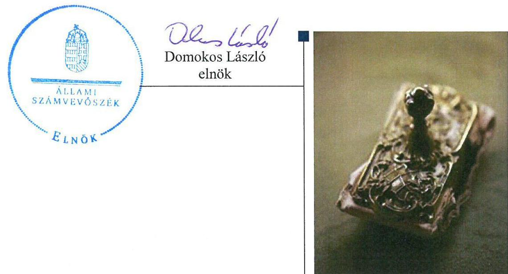
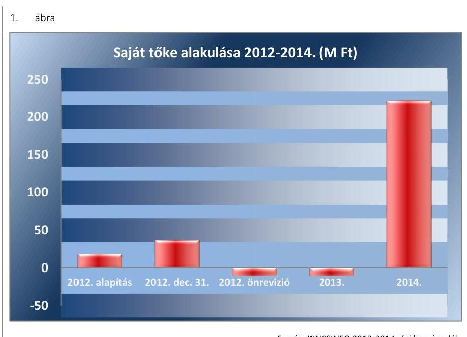
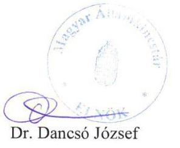
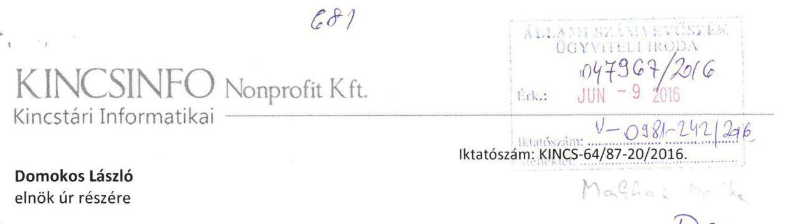
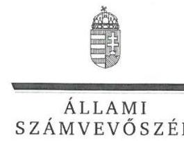
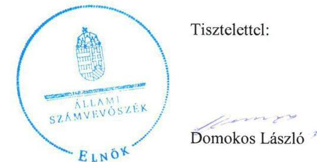

# Jelentés 

## KINCSINFO Kincstári Informatikai NKft.

Az állami tulajdonban (résztulajdonban) lévő gazdálkodó szervezetek vagyonmegőrzési és gazdálkodási tevékenységének ellenőrzése 2016.

16092
www.asz.hu

---

# Jelentés 

## KINCSINFO Kincstári Informatikai NKft.

Az állami tulajdonban (résztulajdonban) lévő gazdálkodó szervezetek vagyonmegőrzési és gazdálkodási tevékenységének ellenőrzése
2016. július hó 7. nap

---

# AZ ELLENŐRZÉST FELÜGYELTE:

## MAKKAI MÁRIA felügyeleti vezető

## AZ ELLENŐRZÉST VEZETTE ÉS A VÉGREHAJTÁSÁÉRT FELELŐS:

### DR. SCHREIBER JUDIT ZSUZSANNA ellenőrzésvezető

## A PROGRAM ÖSSZEÁLLÍTÁSÁÉRT FELELŐS:

### JANIK JÓZSEF LÁSZLÓ osztályvezető

---

**IKTATÓSZÁM:** V-0981-245/2016.

**TÉMASZÁM:** 2015.

**ELLENŐRZÉS-AZONOSÍTÓ SZÁM:** V070914

---

Jelentéseink az Országgyűlés számítógépes hálózatán és az Interneten a www.asz.hu címen is olvashatóak.

---

# TARTALOMJEGYZÉK 

■ ÖSSZEGZÉS ..... 5
■ AZ ELLENŐRZÉS CÉLJA ..... 7
■ AZ ELLENŐRZÉS TERÜLETE ..... 8
■ AZ ELLENŐRZÉS HÁTTERE, INDOKOLTSÁGA ..... 9
■ FÓKUSZKÉRDÉSEK ..... 10
■ ELLENŐRZÉS HATÓKÖRE ÉS MÓDSZEREI ..... 11
■ MEGÁLLAPÍTÁSOK ..... 13
■ JAVASLATOK ..... 28
■ MELLÉKLETEK ..... 29
I. Sz. melléklet: Értelmező szótár. ..... 29
II. Sz. melléklet: A KINCSINFO vagyonának megoszlása 2012-2014. években (adatok e Ft-ban) ..... 34
III. Sz. melléklet: A KINCSINFO eredményének alakulása 2012-2014. években (adatok e Ft-ban) ..... 35
■ FÜGGELÉK: ÉSZREVÉTELEK ..... 37
■ RÖVIDÍTÉSEK JEGYZÉKE ..... 47

---

.

---

# ÖSSZEGZÉS 

Az Állami Számvevőszék a KINCSINFO Kincstári Informatikai Nonprofit Kft. vagyonmegőrzési és gazdálkodási tevékenységét a 2012. április 12. - 2014. december 31. közötti időszakra vonatkozóan szabályszerűségi szempontból ellenőrizte. Az ellenőrzés hiányosságokat tárt fel a Kincstár tulajdonosi gyakorlásánál, a vagyonnal való gazdálkodás feltételeinek KINCSINFO általi kialakításánál, a projektköltségek elkülönítésénél, valamint a közbeszerzési eljárások lefolytatásának kötelezettségénél. Az ellenőrzött időszakban az éves beszámolók leltárral való alátámasztottsága nem volt biztosított, ezért a mérleg valódiság elve nem érvényesült.

## Az ellenőrzés társadalmi indokoltsága

Az állami tulajdonú gazdálkodó szervezetek a nemzeti vagyon részét képezik. Az állami vagyonnal való gazdálkodást illetően a tulajdonosi joggyakorlás és a vagyongazdálkodás feladata az állami vagyon átlátható, rendeltetésszerű és felelős felhasználásának biztosítása. Az állam meghatározza az ellátandó közszolgáltatásokkal kapcsolatos feladatokat, amelyhez a vagyonnal kapcsolatos döntéseknek igazodniuk kell.

## Főbb megállapítások, következtetések, javaslatok

A Kincstár a KINCSINFO felelős gazdálkodáshoz szükséges követelményeket kialakította, meghatározta az állami vagyon értékmegőrzésére, gyarapítására vonatkozó előírásokat, valamint a tulajdonos számára fenntartott jogokat. A vagyonváltozást eredményező döntések során a KINCSINFO 2014. évi törzstőke emelésről szóló döntés előtt nem kérték meg az MNV Zrt. előzetes hozzájárulását, amellyel nem tartották be az MNV Zrt.-vel kötött Megbízási Szerződés törzstőke emelésére vonatkozó rendelkezését. A Kincstár a KINCSINFO-val kötött Együttműködési Megállapodás${ }_{1}$-ban${ }^{1}$ foglaltak ellenére a 2012. évre vonatkozó rezsiköltségeket 2013-ban, utólagosan számlázta ki a KINCSINFO felé.

A KINCSINFO a vagyongazdálkodási tevékenységének szabályozását hiányosan alakította ki. A 2012-2014. években nem rendelkeztek Számlarenddel, 2014. március 30-áig nem készítették el az Önköltségszámítás rendjének szabályzatát.

A számviteli nyilvántartás során a bevételek és ráfordítások könyvviteli elszámolása összességében megfelelt a Számv. tv. előírásának, azonban az ellenőrzés a 2012. év tekintetében hiányosságokat tárt fel. A projektköltségek belső szabályzatban előírt elkülönített elszámolási kötelezettségének 2014. májusáig nem tettek eleget.

A KINCSINFO vagyongazdálkodása és a vagyonváltozást eredményező döntések során a 2013. évi eszközbeszerzéshez kapcsolódóan két szerződéskötésnél nem tartotta be a közbeszerzési eljárás lefolytatásának kötelezettségét.

A 2012-2014. években az éves beszámolók mérlegtételeinek leltárral való alátámasztottsága nem volt biztosított, ezért a mérleg valódiságának az elve nem érvényesült. A 2012. évben a leltározást nem folytatták le, a beszámolóban szereplő mérlegtételeket a Számv. tv. előírása ellenére leltárral nem támasztották alá. A 2013-2014. években a leltározást lefolytatták, azonban nem volt biztosított az analitikus nyilvántartás és a leltár egyezősége a leltár időpontja és a mérlegforduló nap között történő változások dokumentáltságának hiánya miatt. Az éves beszámolók keretében készített mérlegtételekhez kapcsolódóan a csak értékben kimutatott eszközöknél és kötelezettségeknél az analitikus nyilvántartások és a főkönyvi könyvelés adatainak egyeztetését a Számv. tv.-ben foglaltak ellenére dokumentált formában nem készítették el.

A 2012-2014. évek között az éves beszámoló készítési és letétbe helyezési kötelezettségnek eleget tettek, azonban a kiegészítő mellékletek egyik évben sem feleltek meg teljes körűen a jogszabályi előírásoknak.

---

Az információs rendszert kialakították, azonban a Kincstár által előírt adatszolgáltatási kötelezettségnek hiányosan tettek eleget.

Adósságot keletkeztető ügyletet nem kötöttek, a kormányzati szektor hiányára befolyást gyakorló bevételek és ráfordítások elszámolása megfelelő volt.

---

# AZ ELLENŐRZÉS CÉLJA 

## Az KINCSINFO Kincstári Informatikai Nonprofit Kft. vagyonmegőrzési és vagyongazdálkodási tevékenysége szabályszerűségének ellenőrzése

Az ellenőrzés célja annak értékelése volt, hogy a tulajdonosi jogok gyakorlása szabályszerű volt-e, a KINCSINFO által ellátott feladat bevételei, ráfordításai elszámolásának, és vagyongazdálkodási tevékenységének szabályozása megfelelt-e a jogszabályi és a tulajdonosi előírásoknak, azok végrehajtása szabályszerű volt-e. Biztosítva volt-e a szabályszerű önköltségszámítás. Az ellenőrzés kiterjedt továbbá arra, hogy a vagyonváltozást eredményező döntések esetében a tulajdonosi jogok gyakorlója és a KINCSINFO szabályszerűen járt-e el, továbbá, hogy a KINCSINFO kiépített-e és működtetett-e információs rendszert a szabályszerű vagyongazdálkodás érdekében. A KINCSINFO, mint kormányzati szektorba sorolt egyéb szervezet gazdálkodásának a kormányzati szektor hiányára és az államadósságra befolyással bíró elemei a jogszabályi előírásoknak megfeleltek-e.

---

# **AZ ELLENŐRZÉS TERÜLETE**

## **KINCSINFO Kincstári Informatikai Nonprofit Kft.**

A KINCSINFO Kincstári Informatikai Nonprofit Korlátolt Felelősségű Társaságot az MNV Zrt.2 Igazgatóságának meghatalmazása alapján a Magyar Állam nevében a Magyar Államkincstár alapította nem jövedelemszerzésre irányuló, egyszemélyes nonprofit korlátolt felelősségű társaságként. A KINCSINFO3 cégjegyzékbe történő bejegyzésére 2012. április 12-én került sor, a működést 2012. június 1-jén kezdte meg.

A KINCSINFO létrehozását a Kincstár4 informatikai szervezetének átvilágításáról, az informatikai működés felülvizsgálatáról szóló tanulmány alapozta meg. A KINCSINFO társasági részesedése feletti tulajdonosi jogokat a Kincstár gyakorolta az MNV Zrt.-vel kötött szerződés alapján.

A KINCSINFO a Kincstár informatikai infrastruktúrájának üzemeltetésében, a meglévő rendszerek és új rendszerek fejlesztésében működött közre, a Magyar Államkincstárról szóló 311/2006. (XII.23.) számú Korm. rendelet 6/B. § (I)-(2) bekezdésben foglalt jogszabályi kijelölés alapján. A KINCSINFO az ASP5, ÁROP6, KIRA7, OTR8 projektek megvalósításában, mint konzorciumi tag vett részt.

A KINCSINFO vagyona a 2014. évben 1082,2 M Ft volt, amiben meghatározó részt képviseltek a készletek között befejezetlen termelésként nyilvántartott EU-s és hazai költségvetési forrásból finanszírozott 702,6 M Ft összegű szoftver fejlesztési projektek. A KINCSINFO árbevétele a 2012. évben 100%-ban, a 2013. évben 94%-ban, a 2014. évben 98%-ban a Kincstártól származott.

A 2014. év végén a határozatlan idejű munkaviszonyban foglalkoztatottak létszáma 262 fő, a határozott idejű munkaviszonyban foglalkoztatottak száma 24 fő volt.

1. táblázat

|  KINCSINFO ÁTLAGLÉTSZÁMA (FŐ) |  |  |   |
| --- | --- | --- | --- |
|   | 2012. | 2013. | 2014.  |
|   | év | év | év  |
|  Átlag létszám | 153,6 | 284,0 | 286,0  |
|  Forrás: KINCSINFO 2012-2014. évi beszámoló |  |  |   |

---

# AZ ELLENŐRZÉS HÁTTERE, INDOKOLTSÁGA 

## A KINCSINFO a Magyar Államkincstár informatikai infrastruktúrájának üzemeltetésében, a meglévő rendszerek és új rendszerek fejlesztésében működik közre

Az ÁSZ stratégiájában meghatározott célokkal összhangban az ellenőrzésünkkel a szabályszerű vagyongazdálkodást értékeltük.

A törvényalkotás számára - az észlelt problémák, szabálytalanságok, vagy egyéb nem kívánatos jelenségek felszínre kerülésével - az ellenőrzés megállapításai segítséget nyújthatnak az államháztartáson kívüli feladatellátás és a közvagyonnal való gazdálkodás értékeléséhez, valamint a jogszabályi keretek pontosításához az átláthatóságot, a költségtakarékos működtetést, az értékmegőrzést, az állagvédelmet, az értéknövelő használatot és gyarapítását biztosító szabályozáshoz.

Az ellenőrzés rámutathat az állami tulajdonú gazdálkodó szervezetek gazdálkodási tevékenységével, valamint az államháztartásból származó források felhasználásával kapcsolatos jó gyakorlatokra és szabálytalanságokra. Felhívhatja a figyelmet a jogszabályi követelmények teljesítéséhez szükséges feltételek hiányosságaira, hozzájárulhat az államháztartáson kívüli, de (közvetlenül vagy közvetve) állami vagyont használó gazdálkodó szervezetek tevékenységének átláthatóságához.

Az ellenőrzés tapasztalatai segítik és erősítik az ÁSZ hozzáadott értéket teremtő elemző tevékenységét és tanácsadó szerepét, valamint pozitív hatással van a szervezetről kialakított összkép formálására is.

Az ellenőrzött számára visszajelzést ad a gazdálkodási tevékenységgel, az állami vagyon felhasználásával és az éves elszámolással kapcsolatos szabálytalanságokról és kockázatokról.

Az Áht. nevesíti a kormányzati szektorba sorolt egyéb szervezet fogalmát. E körbe tartoznak azok a szervezetek, amelyek nem részei az államháztartásnak, azonban az Európai Közösséget létrehozó szerződéshez csatolt, a túlzott hiány esetén követendő eljárásról szóló jegyzőkönyv alkalmazásáról szóló 2009. május 25-ei 479/2009/EK rendelet szerint a kormányzati szektorba tartoznak. A nemzeti számlák nemzetközi és hazai statisztikai módszertana és szabványai elveket határoznak meg a statisztikai értelemben vett kormányzati szektorba tartozó szervezetek körére és besorolásuk módjára. A kormányzati szektorba sorolt, költségvetési tervezésbe is bevont gazdálkodó szervezetek ellenőrzése fokozza a legfőbb ellenőrző szerv iránti figyelmet és közbizalmat.

A nemzetgazdasági miniszter közzététele alapján a KINCSINFO kormányzati szektorba tartozó egyéb szervezetnek minősül.

A KINCSINFO kormányzati szektoron kívüli féllel kötött adósságot keletkeztető ügylete, gazdálkodásának eredménye befolyásolja a kormányzati szektor konszolidált adósságmutatóját.

---

# FÓKUSZKÉRDÉSEK 

1.     - A Kincstár, mint a tulajdonosi jogok gyakorlója szabályszerűen alakította-e ki a KINCSINFO vagyonnal való gazdálkodásának feltételeit?
2.     - A KINCSINFO a vagyon megőrzését és gyarapítását biztosító vagyongazdálkodási tevékenységét szabályozta-e, illetve kialakította-e a vagyonnyilvántartást a jogszabályi és a tulajdonosi előírásoknak megfelelően?
3.     - A szabályszerű, illetve a tulajdonosi előírásoknak megfelelő volt-e a KINCSINFO által ellátott feladat bevételeinek és ráfordításainak elszámolása, valamint az önköltségszámítás?
4.     - A KINCSINFO vagyonnal való gazdálkodása, valamint a vagyonváltozást eredményező döntések jogszabályi és a tulajdonosi előírásoknak megfeleltek-e?
5.     - A KINCSINFO teljesítette-e a beszámolási, adatszolgáltatási kötelezettségét, kiépített-e, illetve működtetett-e információs rendszert?
6.     - A KINCSINFO, mint kormányzati szektorba sorolt egyéb szervezet gazdálkodásának a kormányzati szektor hiányára és az államadósságra befolyással bíró elemei a jogszabályi előírásoknak megfeleltek-e?

---

# ELLENŐRZÉS HATÓKÖRE ÉS MÓDSZEREI 

## Az ellenőrzés típusa

Szabályszerűségi ellenőrzés

## Az ellenőrzött időszak

2012. április 12. - 2014. december 31. közötti időszak

## Az ellenőrzés tárgya

Az állami tulajdonban (résztulajdonban) lévő gazdálkodó szervezetek vagyonmegőrzési és gazdálkodási tevékenysége.

## Az ellenőrzött szervezet

KINCSINFO Kincstári Informatikai Nonprofit Kft. és a Magyar Államkincstár, mint tulajdonosi joggyakorló.

## Az ellenőrzés jogalapja

Az ellenőrzés alapját az Állami Számvevőszékről szóló 2011. évi LXVI. törvény 5. § (3)-(5) bekezdései, valamint az állami vagyonról szóló 2007. évi CVI. törvény 3. § (4) bekezdése képezi.

## Az ellenőrzés módszerei

Az ellenőrzés az INTOSAI${ }^{9}$ által kiadott nemzetközi standardok figyelembe vételével, az ÁSZ ellenőrzés szakmai szabályait tartalmazó belső szabályzatokban foglaltak, valamint az ellenőrzési programokban foglalt értékelési szempontok szerint történik. A bevételek és ráfordítások elszámolását, valamint a vagyonnyilvántartás terén a szabályszerű működést mintavétellel ellenőriztük. A KINCSINFO-nál, mint a kormányzati szektorba sorolt szervezetek esetében a személyi jellegű ráfordítások elszámolása mellett az egyéb ráfordítások, pénzügyi műveletek ráfordításai, rendkívüli ráfordítások, illetve az egyéb bevételek, pénzügyi műveletek bevételei, rendkívüli bevételek elszámolásának szabályszerűségét szintén mintatételeken keresztül ellenőriztük. A véletlen mintavétellel

 (évenkénti elemszámmal arányos rétegezéssel) ellenőrzött területek esetében minden egyes tétel vonatkozásában a szabályszerűségre vonatkozó kérdéseket tettünk fel, amelyek eredménye összesítésre került. A jogszabályoknak és a belső előírásoknak megfelelőnek tekintettük az adott területet, amennyiben a minta ellenőrzésének eredménye alapján 95%-os bizonyossággal a teljes sokaságban a hibaarány kisebb volt, mint 10%, nem megfelelőnek értékeltük, ha a hibaarány a 10%-ot meghaladta. A ráfordítások elszámolásának értékelésére véletlen mintavételt alkalmaztunk évenkénti elemszámmal arányos rétegezéssel, a személyi jellegű ráfordítások ellenőrzését a munkavállalók listájából véletlen eljárással kiválasztott mintatételeken keresztül értékeltük.

---

# 1. A Kincstár, mint a tulajdonosi jogok gyakorlója szabályszerűen alakította-e ki a KINCSINFO vagyonnal való gazdálkodásának feltételeit? 

Összegző megállapítás

1.1. számú megállapítás

A Kincstár a vagyonnal való gazdálkodás feltételeit szabályszerűen alakította ki. A Kincstár tulajdonosi joggyakorlása a törzstőke emeléshez és a rezsiköltségek számlázásához kapcsolódóan nem felelt meg az előírásoknak.

A Kincstár meghatározta a vagyon értékmegőrzésére, gyarapítására vonatkozó, a felelős gazdálkodáshoz szükséges követelményeket, valamint a tulajdonos számára fenntartott jogokat.

A tulajdonosi joggyakorlás keretében a Kincstár az Alapító Okiratban ${ }^{10}$ rögzítette a vagyonnal való gazdálkodásra vonatkozó jogokat és a felelős gazdálkodáshoz szükséges követelményeket. Az Alapító Okirat a vagyonértékének megőrzése érdekében tartalmazta a nyereség felosztásának tilalmát, a felelős gazdálkodás biztosítása érdekében az FB${ }^{11}$ feladatait, hatáskörét, ezen belül a működés és a gazdálkodás ellenőrzésének feladatát, valamint a könyvvizsgálati feladatokat.

A tulajdonos számára fenntartott jogokat a Kincstár az Alapító Okiratban meghatározta, többek között az éves Üzleti terv ${ }^{12}$ és a Fejlesztési terv ${ }^{13}$, valamint a Közbeszerzési terv ${ }^{14}$ jóváhagyását, a vezető tisztségviselők és az FB tagok javadalmazására vonatkozó szabályzat elfogadását, az ügyvezető és az FB tagok, valamint a könyvvizsgáló választási jogát és az ügyvezető díjazásának meghatározását.

Az éves üzleti tervek, a beszerzési és közbeszerzési tervek készítési kötelezettségét az Alapító Okirat V.3. pontjában írták elő, amelyek elfogadását saját hatáskörbe rendelték.

A KINCSINFO feladatellátására kötött Együttműködési Megállapodás ${ }_{1,2}{ }^{15}$ szabályszerű volt, azonban az abban foglaltakat több esetben nem tartották be.

A Kincstár a 311/2006. (XII. 23.) Korm. rendelet 6/B. § (1) bekezdése alapján a feladatai ellátásához szükséges informatikai rendszerek üzemeltetésével, illetve fejlesztésével kapcsolatos feladatokat a KINCSINFO közreműködésével látta el. A feladatellátáshoz kapcsolódóan a 311/2006. (XII. 23.) Korm. rendelet 6/B. § (2) bekezdése előírta az Együttműködési Megállapodás megkötését, amelynek a felek eleget tettek.

---

Az ellenőrzött időszakban két Együttműködési Megállapodással rendelkeztek, amelyekben rögzítették, hogy:
a KINCSINFO részére térítésmentesen biztosítják - az MNV Zrt. hozzájárulásával - a székhelyként és telephelyként megjelölt ingatlant, valamint parkolóhelyek használatát azzal, hogy az ingatlan használatával kapcsolatos havi rezsiköltségeket a KINCSINFO viseli;
— az informatikai, távközlési hálózat használatát és az ahhoz kapcsolódó szolgáltatásokat a Kincstár a saját költségére biztosítja;
— a feladatok ellátásához szükséges eszközöket a Kincstár térítésmentesen adja a KINCSINFO használatába;
— a bérszámfejtéssel és a belső ellenőrzéssel kapcsolatos feladatokat a Kincstár látja el külön megállapodás alapján;
— a KINCSINFO által végzett alapszolgáltatások átalánydíjaként az éves Üzleti tervekben - havi bontásban - meghatározott díjat fizet a Kincstár a KINCSINFO által kiállított számlák alapján;
— a KINCSINFO a feladatait a Kincstár informatikai szervezeti egységei alá tartozó, informatikai feladatok ellátásához kapcsolódó munkakörben foglalkoztatott munkavállalók továbfoglalkoztatásával látja el.
Az Együttműködési Megállapodás ${ }_{1,2}$-ban meghatározták a felek jogait és kötelezettségeit, a pénzügyi feltételeket, a beszámolási és tájékoztatási kötelezettségeket, valamint a módosítás és megszüntetés eljárásrendjét.

Az üzemeltetési feladatok részletes szabályait a Szolgáltatási Szerződésben írták elő. A Szolgáltatási Szerződés tartalmazta a KINCSINFO által végzett szolgáltatások részletes minőségi és mennyiségi mutatóit.

Az Együttműködési Megállapodás ${ }_{2}$ II/3. pontjában foglalt a belső ellenőrzésre vonatkozó szerződéskötési kötelezettségnek nem tettek eleget, a bérszámfejtés feladatainak ellátását rögzítő szerződést 2013. június 4-én kötötték meg.

A Kincstár - az NGM ellenőrzése során feltártak alapján - a 2012. évben nem tett eleget az Együttműködési Megállapodás ${ }_{1}$ II. 1. pontjában foglaltaknak, mert a megállapodás 2. számú melléklete szerinti rezsiköltségeket nem számlázta ki a KINCSINFO felé. A 2013. évben a számlákat utólagosan kiállították, a kiszámlázott összeg 42,8 M Ft volt.

---

# 2. A KINCSINFO a vagyon megőrzését és gyarapítását biztosító vagyongazdálkodási tevékenységét szabályozta-e, illetve kialakította-e a vagyonnyilvántartást a jogszabályi és a tulajdonosi előírásoknak megfelelően? 

Összegző megállapítás

A KINCSINFO a vagyonmegőrzést és gyarapítást biztosító vagyongazdálkodási tevékenység szabályozását hiányosan alakította ki. A 2012-2014. évek között az éves beszámolók mérlegtételeinek leltárral való alátámasztottsága nem volt biztosított.
2.1. számú megállapítás

A 2012-2014. évi beszámolói
2. táblázat

A BESZÁMOLÓK ELŐTERJESZTÉSE

| ÖV | Számviteli   Politikában | Alapító   Okiratban | Előterjesztés   dátuma |
| :--: | :--: | :--: | :--: |
| 2012. | május 15. | április 30. | május 29. |
| 2013. | május 15. | április 30. | május 29. |
| 2014. | május 20. | május 20. | május 28. |

A KINCSINFO a vagyonmegőrzést és gyarapítást biztosító vagyongazdálkodási tevékenység szabályozását hiányosan alakította ki. A 2012-2014. évek között az éves beszámolók mérlegtételeinek leltárral való alátámasztottsága nem volt biztosított.

A vagyon értékének megőrzését, gyarapítását biztosító vagyongazdálkodás feltételeit hiányosan alakították ki.

A KINCSINFO adott évre vonatkozó gazdálkodásának kereteit az üzleti tervek tartalmazták. A Kincstár az üzleti terveket minden évben Alapítói határozatokkal elfogadta.

A szabályszerű vagyongazdálkodás feltételeinek kialakítása érdekében elkészítették a Leltározási Szabályzatot ${ }^{16}$, a Pénzkezelési Szabályzatot ${ }^{17}$, a Bizonylati Rendet ${ }^{18}$, valamint a Számviteli Politikát ${ }^{19}$, amelyeknek részét képezte az Eszközök és források értékelési szabályzata. A szabályzatokban meghatározták a vagyongazdálkodással kapcsolatos feladat- és hatásköröket, valamint a felelősségi viszonyokat.

A Számv. tv. ${ }^{20}$ 14. § (3) bekezdése alapján elkészített Számviteli Politika a beszámolók előterjesztésére vonatkozó határidők tekintetében 2014. május 19-éig nem volt összhangban az Alapító Okiratban foglaltakkal. A Számviteli Politika az előterjesztésre vonatkozóan későbbi időpontot határozott meg, mint az Alapító Okirat előírása. A 2014. május 20-ától módosított Számviteli Politika megfelelt az Alapító Okirat rendelkezéseinek.

A KINCSINFO a Számv. tv. 161. § (1) bekezdésében és a Számviteli Politika 1.6. pontjában foglaltak ellenére nem készítette el a Számlarendjét, így nem határozták meg a Számv. tv. 161. § (2) bekezdés b)-c) pontjában előírt, a számlák értéke növekedésének, csökkenésének jogcímeit, a számlákat érintő gazdasági eseményeket, azok más számlákkal való kapcsolatát, valamint a főkönyvi számla és az analitikus nyilvántartás kapcsolatát.

A Számv. tv. 14. § (5) bekezdés b) pontjában előírt, a Számviteli Politika részeként elkészített Eszközök és források értékelési szabályzatában előírták az értékelés és az értékcsökkenési leírás szabályait, amely összhangban volt a Számv. tv. rendelkezéseivel.

A Leltározási Szabályzat összhangban volt a Számv. tv. 69. § előírásaival. A szabályzatban meghatározták a leltározással szemben támasztott követelményeket, a személyi feltételeket, a leltározás menetét, speciális szabályait és értékelését, valamint a leltáreredmény megállapításának szabályait. A leltározás gyakorlati végrehajtására vonatkozó előírást a Leltározási Ütemterv és Utasítás ${ }^{21}$ tartalmazta.

---

# 2.2. számú megállapítás 

A Pénzkezelési Szabályzatot a Számv. tv. 14. § (5) bekezdés d) pontját betartva elkészítették, az tartalmazta a Számv. tv. 14. § (8) bekezdésében foglaltakat, többek között rendelkeztek a lebonyolítás rendjéről, a pénzkezelés személyi és tárgyi feltételeiről, a felelősség szabályairól.

A vagyonról vezetett számviteli nyilvántartás során a 2012-2014. évek között az éves beszámolók mérlegtételeinek leltárral való alátámasztottsága nem volt biztosított, a leltározást nem a belső szabályzatoknak megfelelően hajtották végre.

A KINCSINFO állami vagyont nem kezelt, így az állami vagyon és a saját vagyon elkülönítésére vonatkozó kötelezettsége nem keletkezett.

Részesedéssel nem rendelkeztek, a befektetett pénzügyi eszközök között a munkavállalók részére tartósan adott lakáskölcsönöket mutatták ki, amelyek értékelése megfelelt a Számv. tv. 57. § (1) bekezdésének. A kimutatott követelésekre a Számv. tv. 55-56. § előírásait figyelembe véve értékvesztés elszámolása nem történt.

A KINCSINFO a 2012. évben egyszerűsített éves beszámolót, a 2013. és 2014. években éves beszámolót készített.

A leltározási kötelezettség a 2012-2014. évek között nem volt szabályszerű.

A 2012. évben a - Leltározási Szabályzat alapján - a Leltározási Ütemtervet és Utasítást elkészítették, azonban azt nem az ügyvezető adta ki, ami nem felelt meg a Leltározási Szabályzat 2.1. pontjának.

A kiadott Leltározási Ütemterv és Utasítás ellenére a leltározást nem folytatták le, az év végi beszámolóban szereplő mérlegtételeket a Számv. tv. 69. § (1) bekezdésében és a Leltározási Szabályzat III. fejezetében előírtak ellenére leltárral nem támasztották alá.

A 2013. és 2014. évben a Leltározási Ütemterv és Utasítás kiadása megtörtént, kijelölésre kerültek a leltározási körzetek és leltározási körzetfelelősök, meghatározták a leltár lefolytatásának idejét és eljárásrendjét, azonban az utasítások nem tartalmazták a Leltározási Szabályzat 2.1.4. pontjában előírt, a leltározás során használatos bizonylatok formanyomtatványait.

A 2013. évben a Számv. tv. 69. § (5) bekezdése alapján szeptember 20-ai fordulónapra, a 2014. évben november 30-ai fordulónapra a tényleges mennyiségi leltárfelvétel megtörtént, azonban a Leltározási Utasítás 2.2. és 2.4. pontja ellenére dokumentált formában nem készítették el a leltárak kiértékelését, valamint a mérlegforduló napig történő változás követésének rögzítését tekintettel arra, hogy a leltározás nem a mérlegforduló napjára történt.

A Számv. tv. 69. § (2) bekezdésében foglalt előírás alapján az immateriális javak és tárgyi eszközök tekintetében a főkönyvi könyvelés és az analitikus nyilvántartások adatai közötti egyeztetést az üzleti év mérlegforduló napjára vonatkozóan elkészítették, azonban nem volt biztosított az analitikus nyilvántartás és a leltár egyezősége a leltár időpontja és a mérlegforduló nap között történő változások dokumentáltságának hiánya miatt.

A 2013. és 2014. években az éves beszámolók keretében készített mérlegtételekhez kapcsolódóan a csak értékben kimutatott eszközöknél és kö-

---

telezettségeknél az analitikus nyilvántartások és a főkönyvi könyvelés adatainak egyeztetését a Számv. tv. 69. § (2) bekezdésében és a Leltározási Szabályzat 2.3. pontjában foglaltak ellenére dokumentált formában nem készítették el. Mindezek alapján a 2013-2014. évi mérlegtételek leltárral való alátámasztottsága nem volt biztosított, amellyel megsértették a Leltározási Szabályzatban, valamint a Számv. tv. 69. § (1) bekezdésében foglaltakat, amely szerint a könyvek üzleti év végi zárásához, a beszámoló elkészítéséhez, a mérleg tételeinek alátámasztásához olyan leltárt kell összeállítani és megőrizni, amely tételesen, ellenőrizhető módon tartalmazza a mérleg fordulónapján meglévő eszközöket és forrásokat mennyiségben és értékben.

# 3. A szabályszerű, illetve a tulajdonosi előírásoknak megfelelő volt-e a KINCSINFO által ellátott feladat bevételeinek és ráfordításainak elszámolása, valamint az önköltségszámítás? 

Összegző megállapítás

A bevételek és ráfordítások könyvviteli elszámolása - a 2012. évet kivéve - a megfelelő főkönyvi számlára történt, azonban a projektköltségek elkülönítési kötelezettségének 2014. májusáig nem tettek eleget. A 2013. évre vonatkozóan az Önköltségszámítási szabályzatot ${ }^{22}$ nem készítették el.
3.1. számú megállapítás

A bevételek és ráfordítások könyvviteli elszámolása - a 2012. évet kivéve - a Számv. tv. által meghatározott főkönyvi számlákra történt, azonban a projektköltségek belső szabályzatban előírt elkülönített elszámolási kötelezettségének
 2014. májusig nem tettek eleget.

A KINCSINFO közfeladatot nem látott el, állami vagyon nem kezelt, ehhez kapcsolódó elkülönítési kötelezettsége nem keletkezett.

A KINCSINFO árbevétele a 2012. évben 100%-ban, a 2013. évben 94%-ban, a 2014. évben 98%-ban a Kincstártól származott.
3. táblázat

A KINCSINFO KINCSTÁRTÓL SZÁRMAZÓ ÁRBEVÉTELEI ARÁNYA (M Ft)

| Megnevezés | 2012. év | 2013. év | 2014. év |
| :--: | :--: | :--: | :--: |
| Értékesítés nettó árbevétele | 852,8 | 1803,6 | 1918,4 |
| ebből Kincstár származó bevétel | 852,8 | 1700,5 | 1878,7 |
| Kincstártól származó bevétel aránya | 100,0% | 94,28% | 97,93% |
|  | Forrás KINCSINFO 2012-2014. évi beszámolói |  |  |

A 2012. évben a bevételek és ráfordítások elszámolása nem az előírásoknak megfelelően történt, azonban a 2013. évben önellenőrzés keretében a hibás tételek módosításra kerültek. A téves könyvelési tételek és a Kincstár által utólag kiszámlázott rezsiköltségek összességében a 2012. évi eredményt 46,6 M Ft-tal csökkentették.

A 2012. évben az egyes projektekhez kapcsolódó bevételek, kiadások és ráfordítások számviteli elszámolása nem felelt meg a Számv. tv. 45. § (1) bekezdés előírásának, mert készletként nem számolták el a folyamatban

---

lévő szoftverfejlesztéseket. A hibás tételek könyvelése az önrevízió keretében javításra került.

A 2013. és 2014. években az alaptevékenységként végzett feladatokból és az egyéb tevékenységekből származó árbevételeket a számviteli nyilvántartásokban elkülönítetten mutatták ki. A fejlesztési projektekhez kapcsolódó bevételeket az egyéb rövid lejáratú kötelezettségek között projektenként elkülönítették. Az elszámolások a megfelelő főkönyvi számlákra történtek a Számv. tv.-ben foglaltakkal egyezően.

A költségek elkülönítésére vonatkozóan a 2014. május 19-éig hatályos Számviteli Politika 1.5. pontja előírta az uniós és egyéb pályázatok elszámolásához szükséges költségek külön számlaosztályban történő elkülönítési kötelezettségét, amelynek a 2012. évben eleget tettek.

A 2013. évtől 2014. május 19-éig a projektek és pályázatok költségeinek az elszámolásához szükséges elkülönített könyvelése nem történt meg, amellyel nem tartották be a Számviteli Politika 1.5. pontjában előírtakat.

A Számviteli Politikát 2014. május 20-ától módosították, amely már nem tartalmazta a külön számlaosztályba történő elkülönítési kötelezettséget.

A 2013. évtől a költségek számviteli elszámolása a megfelelő költséghelyekre történt, az EU finanszírozási forrásból megvalósuló projektekhez kapcsolódó költségeket a projekt befejezésének elszámolásáig a befejezetlen termelések között tartották nyilván, amely elszámolás megfelelt a Számv. tv. előírásának.

Az immateriális javak és tárgyi eszközök bekerülési értékének megállapítása megfelelt a Számv. tv.-ben és a Számviteli Politikában meghatározott előírásoknak.

A ráfordítások elszámolása során a 2012-2014. évek között nem került sor terven felüli értékcsökkenés elszámolására annak ellenére, hogy az a 2014-ben a Számv. tv. szerint indokolt lett volna. A 2014. évben egy 3,9 M Ft bruttó értékű feleslegessé vált ügyviteli rendszert nem a Számv. tv. 53. § (1) bekezdés b) pontja szerinti terven felüli értékcsökkenésként könyvelték, hanem értékesítéshez kapcsolódó ráfordításként vezették ki a számviteli nyilvántartásból. A téves könyvelés az eredményre nem gyakorolt hatást.

A 2012. évben az immateriális javak és műszaki eszközök esetében az értékcsökkenés nem a Számviteli Politikában meghatározott időponttól – június 1-jétől – számolták el, amelyet a 2013. évben végzett önrevízió keretében módosítottak.

AZ ESZKÖZÖK ÉRTÉKNÖVEKEDÉSE a 2012-2014. években összességében meghaladta az elszámolt értékcsökkenés összegét. Az értékcsökkenés elszámolása megfelelt a Számviteli Politikában rögzített előírásoknak. Az értékcsökkenésként képzett forrásokat az eszközök pótlására használták fel.

---

4. táblázat

BEFEKTETETT ESZKÖZÖKRE ÉVENKÉNT ELSZÁMOLT ÉRTÉKCSÖKKENÉS ÉS BRUTTÓ ÉRTÉK NÖVEKEDÉS (M Ft)

| Megnevezés | 2012. | 2013. | 2014. |
| :--: | :--: | :--: | :--: |
|  | év | év | év |
| Immateriális javakra elszámolt értékcsökkenés | 0,4 | 3,1 | 3,0 |
| Immateriális javak bruttó érték növekedése | 3,9 | 6,1 | 5,4 |
| Műszaki berendezésekre elszámolt értékcsökkenés | 8,3 | 10,1 | 20,8 |
| Műszaki berendezések bruttó érték növekedése | 24,3 | 22,8 | 44,5 |
| Egyéb berendezésekre elszámolt értékcsökkenés | 2,3 | 3,3 | 4,5 |
| Egyéb berendezések bruttó érték növekedése | 12,1 | 1,2 | 11,0 |
| Befektetett eszközök elszámolt értékcsökkenés összesen | 11,0 | 16,5 | 28,3 |
| Befektetett eszközök bruttó érték növekedése összesen | 40,3 | 30,1 | 60,9 |

A vagyoni értékű jogok használhatósága 89,7%-ról 57,4%-ra csökkent a 2012. évről a 2014. évre. Az átlagos életkor 0,2 és 0,9 év között változott a magas leírási kulcs és a végrehajtott új aktiválások következtében. A műszaki berendezések, gépek, járművek használhatósága 65%-ról 57,4%-ra csökkent. Az átlagos életkor 1,0 évről 1,3 évre változott 2014. év végére.

Az irodai felszerelések használhatósági foka 34,9%-ról 2014-re 0,6%-os szintre csökkent. A számított átlagos életkor 4,5 évről 6,9 évre növekedett 2014. év végére. Az irodai felszerelések visszapótlási üteme elmaradt a leírás mértékétől. Az egyéb járművek használhatósága a 2012. évi 98,9%-ról 2014. év végére 74,8%-ra csökkent.
5. táblázat

A FELADATELLÁTÁSRA LEGJELLEMZŐBB ESZKÖZCSOPORTOK JELLEMZŐI

| Mutató | 2012. év | 2013. év | 2014. év |
| :--: | :--: | :--: | :--: |
| Vagyoni értékű jogok |  |  |  |
| Használhatósági fok | 89,7% | 64,4% | 57,4% |
| Elhasználódási szint | 10,3% | 35,6% | 42,6% |
| Átlagos életkor (év) | 0,2 | 0,7 | 0,9 |
| Műszaki berendezések, gépek, járművek |  |  |  |
| Használhatósági fok | 65,0% | 61,2% | 57,4% |
| Elhasználódási szint | 33,7% | 38,8% | 42,6% |
| Átlagos életkor (év) | 1,0 | 1,2 | 1,3 |
| Egyéb berendezések, felszerelések |  |  |  |
| Használhatósági fok | 34,9% | 13,8% | 0,6% |
| Elhasználódási szint | 65,1% | 86,2% | 99,4% |
| Átlagos életkor (év) | 4,5 | 5,9 | 6,9 |
| Egyéb járművek |  |  |  |
| Használhatósági fok | 98,9% | 79,0% | 74,8% |
| Elhasználódási szint | 1,1% | 22,2% | 25,2% |
| Átlagos életkor (év) | 0,1 | 1,1 | 1,3 |

A járművek számított átlagos életkora 0,1 és 1,3 év közötti volt. Az egyéb járművek magas használhatósági fokát a 2014. évben történt járműbeszerzés miatti bruttó érték növekedés okozta.

Az eszközök elhasználódása megfelelt az adott eszközcsoportra jellemző fizikai elhasználódás, erkölcsi avulás mértékének.

---

A KINCSINFO követelésállománya a 2012. év végi 169,7 M Ft-ról a 2014. év végére 9,6 M Ft-ra csökkent. A vevőkövetelések a Kincstárral szembeni követelésekből álltak.
3.2. számú megállapítás Az Önköltségszámítási Szabályzatot 2014. március 30-áig nem készítették el.

A KINCSINFO a Számv. tv. 14. § (7) bekezdése alapján 2013. január 1-jétől Önköltségszámítási Szabályzat készítésére volt kötelezett, amelynek a Számv. tv. 14. § (5) bekezdés c) pontja ellenére 2014. március 30-áig nem tettek eleget.

A 2014. március 31-étől hatályos Önköltségszámítási Szabályzatban meghatározták a közvetlen és közvetett költségek elkülönítésének módját, a felosztandó költségek vetítési alapját, továbbá az önköltségszámítás kalkulációs egységeit.

Az alaptevékenységhez kapcsolódóan önköltségkalkulációt a KINCSINFO nem végzett, a költségeket a Kincstárral kötött Együttműködési Megállapodás¹², alapján átalánydíként számolták el, amely összhangban volt az Önköltségszámítási Szabályzatban előírtakkal. Az átalánydíj mértéke a KINCSINFO éves üzleti tervében szereplő bér, járulék és dologi keretösszeg alapján havi bontásban került meghatározásra.

A 2014. március 31-étől az Önköltségszámítási Szabályzat 1. számú mellékletében szereplő séma alapján az egyes projekt költségeket elkülönítetten gyűjtötték.

# 4. A KINCSINFO vagyonnal való gazdálkodása, valamint a vagyonváltozást eredményező döntések jogszabályi és a tulajdonosi előírásoknak megfeleltek-e? 

Összegző megállapítás

A 4.1. számú megállapítás

A KINCSINFO vagyongazdálkodási tevékenysége a közbeszerzésekhez kapcsolódóan feltárt hiányosságok miatt a 2013. évben nem volt szabályszerű. A Kincstár vagyonváltozást eredményező döntései a 2014. évi tőkeemeléshez és az utólagos számlázáshoz kapcsolódóan nem feleltek meg az előírásoknak.

A KINCSINFO vagyongazdálkodási tevékenysége a közbeszerzésekhez kapcsolódóan feltárt hiányosságok miatt a 2013. évben nem volt szabályszerű.

A VAGYONGAZDÁLKODÁS során a KINCSINFO vagyona az év végi beszámolók alapján a 2012. évről a 2014. évre 356,7 M Ft-ról 1082,2 M Ft-ra, 303,4%-al nőtt.

A 2014. évi eszközértéken belül meghatározó volt a forgóeszközök értéke, amelyek 856,4 M Ft-ot tettek ki.

A forgóeszközök összetételét a pénzeszközök 144,3 M Ft-os értéke, illetve a készletek között befejezetlen termelésként nyilvántartott EU-s és

---

hazai költségvetési forrásból finanszírozott szoftverfejlesztési projektek 702,6 M Ft-os értéke határozta meg.

Az eszközök 2014. évi növekedéséhez hozzájárultak a Kincstár által átadott 35,1 M Ft értékű számítástechnikai eszközök.

Az aktív időbeli elhatárolások értéke a 2014. év végére 146,5 M Ft-tal nőtt, amelynek oka az EU és hazai programokhoz kapcsolódó támogatási bevételek aktív időbeli elhatárolásának növekedése volt.
6. táblázat

BEFEJEZETLEN TERMELÉSKÉNT NYILVÁNTARTOTT EU-S ÉS HAZAI KÖLTSÉGVETÉSI FORRÁSBÓL FINANSZÍROZOTT PROJEKTEK (M Ft)

| Megnevezés | 2012 | 2013 | 2014 |
| :-- | :--: | :--: | :--: |
| KIRA | 34,9 | 160,2 | 375,9 |
| ASP | 11,9 | 126,9 | 243,6 |
| ÁROP | 2,1 | 16,3 | 30,8 |
| OTR | - | 13,7 | 36,4 |
| KSZR | 21,2 | 3,2 | 14,7 |
| Beflen.term. | 4,5 | - | - |
| Összesen: | 74,6 | 320,3 | 701,4 |

A KINCSINFO éves beszámolóiban a befejezetlen termelések között jelentek meg a feladatellátás során megvalósított projektekhez kapcsolódó bevételek és költségek.

A KIRA és ÁROP projekteket a KINCSINFO a Kincstárral, az OTR és az ASP projekteket a KIFܲ³-vel konzorciumban fejlesztette. A KSZR²⁴ projekt a 1509/2011 (XII.29) Korm. határozat alapján a Kincstár költségvetéséből került finanszírozásra. A projektek befejezését követően a létrejövő fejlesztések feletti rendelkezést a Magyar Állam javára a Kincstár és a KIFÜ szerzi meg.

A befektetett eszközök állományában a meghatározó részt a tárgyi eszközök képviselték, 2012-ben 81%-ot; 2013-ban 70%-ot; 2014-ben 86%-ot tettek ki. Az eszközbeszerzésekhez kapcsolatosan a 2013. évben nem tartották be a Kbt. előírását.

A KINCSINFO állami vagyont nem kezelt. Karbantartási tervkészítési kötelezettsége nem volt, a karbantartási költségeket a Kincstárral kötött Együttműködési Megállapodás¹² alapján fizetett átalánydíj tartalmazta. Ingatlanvagyonnal nem rendelkeztek, a tárgyi eszközök döntő hányadát számítástechnikai eszközök alkották, amelynek karbantartása folyamatosan történt.
7. táblázat

SAJÁT TŐKE, JEGYZETT TŐKE ALAKULÁSA (M Ft)

| Megnevezés | 2012. év | 2013. év | 2014. év |
| :-- | :--: | :--: | :--: |
| Saját tőke | -10,3 | -10,1 | 221,8 |
| Jegyzett tőke | 18,8 | 18,8 | 53,9 |

A KINCSINFO saját tőkéje két egymást követő évben nem érte el az adott társasági formára kötelezően előírt jegyzett tőke összegét, ezért a Kincstár a Ptk.²⁵ 3:133. § (2) bekezdésére tekintettel a jegyzett tőkét – nem pénzbeli vagyoni hozzájárulás szolgáltatásával – 35,1 M Ft-tal, 18,8 M Ft-ról,

 53,9 M Ft-ra felemelte.

---

*Forrás: KINCSINFO 2012-2014. évi beszámolói*

## 4.2. számú megállapítás

**A vagyonváltozást eredményező döntések során a 2013. évben nem tartották be a közbeszerzési eljárás lefolytatásának kötelezettségét.**

A KINCSINFO a vagyongazdálkodását a Kincstárral kötött Együttműködési Megállapodás1,2, a Konzorciumi Szerződés26 és a Szolgáltatási Szerződés keretében végezte.

A Kincstár az Alapítói Okiratban meghatározta az üzleti tervek, a beszerzési és közbeszerzési tervek, valamint az éves beszámolók jóváhagyásra történő beterjesztésének kötelezettségét.

A KINCSINFO az üzleti tervekben fogalmazta meg a vagyongazdálkodáshoz, a vagyon értékének megőrzéséhez, gyarapításához kapcsolódó feladatokat. Az üzleti terveket az Alapító Okirattal összhangban történt beterjesztést követően a Kincstár alapítói határozatokkal jóváhagyta.

A KINCSINFO a vagyonváltozást eredményező döntései megfeleltek a feladatellátásra a Kincstárral kötött szerződésekben foglaltaknak. Az Alapító Okiratban foglaltak szerint – a tulajdonosi döntést igénylő esetekben – a Kincstár előzetes engedélyét megkérték.

A KINCSINFO a 2013-2014. évekre vonatkozóan elkészítette a közbeszerzési tervét. A 2013. évben a számítástechnikai eszközbeszerzésekhez kapcsolódóan a közbeszerzési értékhatárt meghaladóan történt szerződéskötés közbeszerzési eljárás lefolytatása nélkül, amellyel megsértették a Kbt.27 5. §-ában, és a – Kbt. 18. § egybeszámítási kötelezettségre figyelemmel – a 119. §-ában foglalt kötelezettséget.

## 4.3. számú megállapítás

**A Kincstár vagyonváltozást eredményező döntései a 2014. évi tőkeemeléshez és a rezsiköltségek 2013. évi utólagos számlázásához kapcsolódóan nem feleltek meg az előírásoknak.**

A Kincstár az Alapítói határozatokon, a KINCSINFO üzleti terveinek, az üzleti beszámolóknak, valamint az éves beszámolóknak a jóváhagyásán keresztül

---

hozta vagyonváltozását eredményező döntéseit. Az Alapító Okiratban előírták az ügyvezető rendszeres beszámolási és előterjesztési kötelezettségét.

A Kincstár a KINCSINFO éves beszámolóját minden évben az Alapító Okirat előírásainak megfelelően, a Gt.28 35. § (3) bekezdése és a Ptk. 3:120 § (2) bekezdése szerinti FB vélemény birtokában, valamint a Gt. 40. § (1) bekezdése és a Ptk. 3:129 § (1) bekezdése szerinti könyvvizsgálói jelentés ismeretében fogadta el.

Az Alapító Okirat a KINCSINFO tőkeemelésének jogát a Kincstár jogosultságai között írta elő, azonban a tulajdonosi joggyakorlásról szóló SZT39116. számú, az MNV Zrt. és Kincstár között létrejött Megbízási Szerződés alapján a tőke emeléshez az MNV Zrt. előzetes hozzájárulásához volt szükség. A 2014. évben a KINCSINFO saját tőkéje két egymást követő évben nem érte el az adott társasági formára kötelezően előírt jegyzett tőke összegét, ezért szükségessé vált a törzstőke emelése. A Kincstár a 19/2014. (VII. 16.) számú Alapítói határozattal döntést hozott a törzstőke 35,1 M Ft apporttal 18,8 M Ft-ról 53,9 M Ft-ra történő emeléséről.

A törzstőke emelésről szóló döntés előtt nem kérték meg az MNV Zrt. előzetes hozzájárulását, amellyel megsértették a Megbízási Szerződés 4.5. d) pontját.

A KINCSINFO-nak más gazdálkodó szervezetben részesedése nem volt, állami vagyon tulajdonjogának átruházására, továbbá állami vagyon ingyenes átadására nem került sor.

# 5. A KINCSINFO teljesítette-e a beszámolási, adatszolgáltatási kötelezettségét, kiépített-e, illetve működtetett-e információs rendszert? 

Összegző megállapítás

Az éves beszámolókat elkészítették, azonban a kiegészítő mellékletek nem feleltek meg teljes körűen az előírásoknak. Az éves beszámolók leltárral való alátámasztottsága nem volt biztosított. Az információs rendszert kialakították, azonban az előírt adatszolgáltatási kötelezettségnek hiányosan tettek eleget.
5.1. számú megállapítás

Az éves beszámolókat elkészítették, azonban a kiegészítő mellékletek nem feleltek meg teljes körűen az előírásoknak. Az éves beszámolók leltárral való alátámasztottsága nem volt biztosított.

Az éves beszámolókat a KINCSINFO minden évben elkészítette, azonban a 2013. és 2014. évi éves beszámolókban a Kincstárral szembeni követelések és kötelezettség számviteli kimutatása nem a Számv. tv. előírásának megfelelően történt.

A 2013. évben 2,4 M Ft-ot, a 2014. évben 1,9 M Ft-ot kapcsolt vállalkozással szembeni követelésként tartottak nyilván, a 2014. évben a KINCSINFO Kincstár felé fennálló 84,0 M Ft összegű kötelezettségét pedig kapcsolt vállalkozással szembeni rövid lejáratú kötelezettségként szerepeltették. A Kincstárt a Számv. tv. 3. § (2) bekezdés 7. pontja szerinti kapcsolt

---

vállalkozásnak tekintették annak ellenére, hogy a Kincstár a 311/2006. Korm. rendelet 1. § (3) bekezdése szerint költségvetési szerv, a Számv. tv. 3. § (1) bekezdés 3. pontja szerinti államháztartási szervezet és nem a Számv. tv. 3. § (1) bekezdés 2. pontja szerinti vállalkozó. A téves könyvviteli elszámolás nem volt hatással az éves eredményre.

A KINCSINFO a 2012. évben elkészítette az egyszerűsített éves beszámolóját, azonban a feltárt hibák jelentős összegére tekintettel a 2013. évi beszámolóban - külön oszlopon - bemutatták a lezárt üzleti évre vonatkozó módosításokat.

Az elszámolási hibák a befejezetlen termelést, az egyéb rövid lejáratú kötelezettségeket, valamint a mérleg szerinti eredmény mérlegsorokat érintették. A feltárt jelentős összegű hibák hatását a 2013. évi kiegészítő mellékletben a Számv. tv. 88. § (5) bekezdésének megfelelően bemutatták.

A 2012-2014. éves beszámolókhoz kapcsolódó kiegészítő mellékletek nem feleltek meg a Számv. tv. előírásainak.

A 2012-2014. évi beszámolók kiegészítő melléklete nem tartalmazta a Számv. tv. 93. § (3) bekezdése szerinti, a támogatási program keretében végleges jelleggel kapott, folyósított, illetve elszámolt összegeket támogatásonként, valamint a kapott összegek felhasználását jogcímenkénti és évenkénti megbontásban.

A 2013. és 2014. évi kiegészítő melléklet a Számv. tv. 88. § (8) bekezdés b) pontjában előírtaktól eltérően nem tartalmazta az üzleti évre vonatkozó beszámoló könyvvizsgálatáért a könyvvizsgáló által felszámított díj összegét, valamint a Számv. tv. 89. § (4) bekezdés a) pontja előírásaitól eltérően nem mutatták be a vezető tisztségviselők járandóságait.

A 2013. évi kiegészítő melléklet nem tartalmazta a Számv. tv. 90. § (1) bekezdés a) és c) pontjában előírt, a bevételek aktív időbeli elhatárolásának 129,6 M Ft-os, valamint a költségek és ráfordítások passzív időbeli elhatárolásának 138,6 M Ft-os összegéből a jelentősebb összegek és azok időbeli alakulásának bemutatását, tekintettel arra, hogy mindkét tétel jelentős mértékű volt, mert meghaladta a mérlegfőösszeg (563,6 M Ft) 2%-át (11,3 MFt).

A 2014. évi kiegészítő mellékletben az Immateriális javak és Tárgyi eszközök értékének változása kimutatásban a Számv. tv. 15. § (6) bekezdés előírása ellenére az Egyéb berendezések, irodai felszerelések esetében a bruttó érték és az értékcsökkenés nyitó adata 0,4 M Ft-tal eltért a 2013. évi kiegészítő mellékletben szereplő adatoktól. A főkönyvi könyvelésben az eszközök 2013. évi záró és 2014. évi nyitó értékének egyezősége biztosított volt.

A kiegészítő melléklethez feltárt hiányosságok a KINCSINFO mérlegére és eredmény-kimutatására nem gyakoroltak hatást.

A 2012-2014. években a beszámolók mérlegtételeinek a Számv. tv. 69.§ (1) bekezdés szerinti leltárral való alátámasztottsága nem volt biztosított.

# A letétbe helyezési kötelezettséget a 

KINCSINFO a Számv. tv. 153. § (1) bekezdésében előírt határidőig teljesítette. Az éves beszámolók és a könyvvizsgálói jelentések közzététele során a 2013. évben közzétett kiegészítő melléklet hiányosan került be a közhiteles nyilvántartásba, mert az nem tartalmazta a 2013. évi cash-flow kimu-

---

tatást, az eszközökre, a tőkeelemekre, a likviditásra, a kötelezettségállományra, az eredményességre vonatkozó mutatószámokat annak ellenére, hogy azok az elfogadott beszámoló kiegészítő mellékletében megtalálhatóak voltak, a 2013. évi kiegészítő melléklet részét képezték.

A könyvvizsgáló a 2012-2014. években az Alapító Okiratban előírtak szerint ellenőrizte és véleményezte a KINCSINFO éves beszámolóját és a Gt. 40. § (1) bekezdésében, valamint a Ptk 3:129 (1) bekezdésében foglalt kötelezettségének eleget tett.

A 2013. évi beszámoló vizsgálatáról szóló könyvvizsgálói jelentéssel együtt egy figyelemfelhívást tartalmazó levelet is kiadott, melyben felhívta a figyelmet arra, hogy a 2012. évre vonatkozó önellenőrzés hatására a 2013. évi beszámolóban szereplő vagyonváltozás következtében a saját tőke a Gt. 51. § (1) bekezdésében és a Ptk. 3:189. §-ában meghatározott szint alá csökkent. A könyvvizsgáló a 2012. évi beszámoló auditálásakor nem észrevételezte, hogy a mérlegtételek a Számv. tv. 69. § (1) bekezdés szerinti leltárral nincsenek alátámasztva.

Az FB minden évben az Alapító Okirat előírásai szerint véleményezte a KINCSINFO éves beszámolóját, amihez a 2013-2014. évben további kiegészítő tájékoztatást kért a beszámolók elfogadása előtt.

Az FB a 6/2013. (VIII. 06.) számú határozatában kérte a KINCSINFO 2013. évi gazdálkodásának és könyvelésének tételes auditálását. Ezen FB határozat alapján a Kincstár felkért egy külső szervezetet a KINCSINFO 2013. évi 1-7. havi gazdálkodásának vizsgálatára.

A külső szakértő által készített szakértői véleményt a megállapításokban szereplő működési kockázatok kezelésére vonatkozó megoldási javaslattal együtt az ügyvezető az FB elé terjesztette. Az FB 2014. május 29-i ülésen megtárgyalta a 2013. évi gazdálkodáshoz kapcsolódó felülvizsgálatot, majd a 9/2014. (V. 29.) számú határozatával a 2013. évi beszámolót elfogadta.

A 2014. évben az FB élt jelzési kötelezettségével a KINCSINFO likviditási problémái miatt. Az 1/2014. (II. 11.) számú határozatában javasolta, hogy az utólagos projekt finanszírozásából eredő likviditási problémák miatt a Kincstár bocsásson rendelkezésére átmeneti pénzeszközt a KINCSINFO működéséhez, továbbá az FB a 20/2014. (XI. 26.) számú határozatában javasolta az ügyvezetőnek, hogy írásban jelezze a Kincstár felé a likviditási problémákat. Az FB felhívására az ügyvezető a 2014. december 15-ai adatszolgáltatásához mellékelte tájékoztató levelét a likviditási helyzetről, amely a KIRA projekt elszámolásának elfogadtatását követő támogatás utalásával rendeződött.

A Kincstár az éves beszámolókat a Gt. 35. § (3) bekezdése és a Ptk. 3:120 (2) bekezdése szerint az FB véleménye és a Gt. 40. § (1) bekezdése, valamint a Ptk. 3:129 (1) bekezdése szerint a könyvvizsgálói jelentés birtokában, a Számv. tv. 153. § (1) bekezdésében előírtaknak megfelelően a letétbe helyezés előírt határidejéig elfogadta.

A közérdekű adatok körében az Alapító Okirat, az SZMSZ29, a vezető tisztségviselők, a felügyelőbizottsági tagok, valamint a vezető állású munkavállalók adatai a Kincstár honlapján belül kerültek közzétételre.

---

A KINCSINFO által a Kincstárral kötött Szolgáltatási szerződés30 és Együttműködési Megállapodás1,2 rendelkezései rögzítették a személyes adatok feldolgozásával és az adatvédelmével kapcsolatos alapvető szabályokat, meghatározták azon Kincstári utasítások és szabályzatok listáját, melyek a KINCSINFO-ra nézve kötelező érvényűek voltak. A KINCSINFO ezen szabályzatok alapján tett eleget az adatvédelemhez és biztonsághoz kapcsolódó kötelezettségnek, kijelölésre került a biztonsági vezető, a biztonsági felelős és az adatvédelmi felelős.

Az iratkezelés eljárásrendjének szabályait a 2012. szeptember 7-én kiadott Ügyvezetői körlevél alapján a Kincstár 17/2008. számú Elnöki Utasításával kiadott Iratkezelési szabályzat31 tartalmazta.

# 5.2. számú megállapítás 

Az információs rendszert kialakították, azonban a Kincstár által előírt adatszolgáltatási kötelezettségnek hiányosan tettek eleget.

A Kincstár a KINCSINFO Alapító Okiratában, az Együttműködési Megállapodás1,2-ban, a Szolgáltatási Szerződésben, és az ügyvezető felé tett munkáltatói utasításban rögzítette az adatszolgáltatási és beszámolási kötelezettséget. Ezen túlmenően az Alapító Okirat rendelkezett az FB felé történő, a gazdálkodási tevékenységre vonatkozó negyedéves beszámolási kötelezettségről.

A KINCSINFO biztosította a Kincstár felé a szerződésszerű kapcsolattartást, azonban az FB felé előírt negyedéves beszámolási kötelezettségének 2012. és 2013. években nem tett eleget. A 2014. évben a második féléves gazdálkodásról nem készült tájékoztatás.

A KINCSINFO nem készítette el az Együttműködési Megállapodás1,2 II.6. pontja szerinti, a szoftvereken végzett fejlesztések költségeiről
 szoftverenkénti, a tárgynegyedévet követő hónap 10-áig történő adatszolgáltatást, továbbá a Szolgáltatási szerződés IV.1.7. pontjában foglalt, a szolgáltatásban részt vevő eszközökre vonatkozó negyedéves kimutatást.

A Kincstár a 2013. december 5-én kiadott utasításában előírta a KINCSINFO személyi változásaira vonatkozó tájékoztatási, továbbá az 1,0 M Ft-ot elérő összegű beszerzések kötelezettségvállalásának írásos jóváhagyás kérésének kötelezettségét, amelynek eleget tettek.

A KINCSINFO belső ellenőrzését az Együttműködési Megállapodás ${ }_{2} 17$. pontja alapján a Kincstár belső ellenőrzési szervezeti egysége látta el. A 2012. évben belső ellenőrzési vizsgálat nem történt, a 2013. és a 2014. évben egy-egy belső ellenőrzést folytattak le, azonban azok nem érintették a KINCSINFO vagyongazdálkodását. A belső ellenőrzés megállapításaira készített intézkedési terveket elkészítették, azokat a Kincstár jóváhagyta.

---

# 6. A KINCSINFO, mint kormányzati szektorba sorolt egyéb szervezet gazdálkodásának a kormányzati szektor hiányára és az államadósságra befolyással bíró elemei a jogszabályi előírásoknak megfeleltek-e? 

Összegző megállapítás
A KINCSINFO adósságot keletkeztető ügyletet nem kötött. A kormányzati szektor hiányára befolyást gyakorló bevételek és ráfordítások elszámolása megfelelő volt.
6.1. számú megállapítás
A KINCSINFO adósságot keletkeztető ügyletet nem kötött.
A Stabilitás tv. ${ }^{32}$ 3. § (1) bekezdése szerinti adósságot keletkeztető ügyletet nem kötött, nem volt a Stabilitás tv. 9. § (1) bekezdés és a 353/2011. Korm. rend. ${ }^{33}$ 11. § szerinti kérelem benyújtási kötelezettsége.
6.2. számú megállapítás
A kormányzati szektor hiányára befolyást gyakorló bevételek és ráfordítások elszámolása megfelelő volt. Osztalékfizetésre nem került sor.

A kormányzati szektor hiányára befolyást gyakorló bevételek és ráfordítások elszámolása megfelelő volt.

A mintatételek alapján a személyi ráfordítások elszámolásai szabályszerűen történtek. A kifizetett személyi juttatások megfelelő alapdokumentumokkal, munkaszerződésekkel, közfoglalkoztatási szerződésekkel, jelenléti ívekkel alátámasztottak voltak. Osztalékfizetésre nem került sor az Alapító Okiratban rögzített osztalékfizetési tilalomnak megfelelően.

---

# JAVASLATOK 

Az ÁSZ tv. 33. § (1) bekezdésében foglaltak értelmében az ellenőrzött szervezet vezetője köteles a jelentésben foglalt megállapításokhoz kapcsolódó intézkedési tervet összeállítani és azt a jelentés kézhezvételétől számított 30 napon belül az ÁSZ részére megküldeni. Amennyiben az intézkedési tervet az ellenőrzött szervezet vezetője nem küldi meg határidőben, vagy továbbra sem elfogadható intézkedési tervet küld, az ÁSZ elnöke az ÁSZ törvény 33. § (3) bekezdés a)-b) pontjaiban foglaltakat érvényesítheti.

## A Magyar Államkincstár elnökének

1. Intézkedjen a 2012-2014. évekre vonatkozó leltározással és az éves mérlegek leltárral való alátámasztásának hiányával kapcsolatban feltárt szabálytalanságok tekintetében az ügyvezető felelősségének tisztázása érdekében, és szükség szerint intézkedjen a felelősség érvényesítéséről.
(2.2. sz. megállapítás 6. és a 8-10. bekezdései alapján)

## A KINCSINFO Kincstári Informatika Nkft. ügyvezetőjének

1. Intézkedjen a szabályszerű vagyongazdálkodás feltételeinek biztosítása érdekében a Számv. tv.-ben előírtaknak megfelelően a Számlarend elkészítéséről.
(2.1. sz. megállapítás 4. bekezdése alapján)
2. Intézkedjen a 2012-2014. évekre vonatkozó leltározással és az éves mérlegek leltárral való alátámasztásának hiányával kapcsolatban feltárt szabálytalanságok tekintetében a felelősség tisztázása érdekében és szükség szerint intézkedjen a felelősség érvényesítéséről.
(2.2. sz. megállapítás 6. és a 8-10. bekezdései alapján)
3. Intézkedjen a 2013. évi számítástechnikai eszközbeszerzésekhez kapcsolódóan feltárt - a közbeszerzési értékhatárt meghaladóan, közbeszerzési eljárás lefolytatása nélkül történt szerződéskötéssel kapcsolatos - szabálytalanság tekintetében a felelősség tisztázása érdekében és szükség szerint intézkedjen a felelősség érvényesítéséről.
(4.2. sz. megállapítás 5. bekezdése alapján)
4. Intézkedjen, hogy az éves beszámoló kiegészítő melléklete teljes körűen feleljen meg a Számv. tv. előírásainak.
(5.1. sz. megállapítás 6-9. bekezdései alapján)

---

# MELLÉKLETEK 

I. SZ. MELLÉKLET: ÉRTELMEZŐ SZÓTÁR

| Adósságot keletkeztető ügylet | „Adósságot keletkeztető ügylet és annak értéke:   a) hitel, kölcsön felvétele, átvállalása a folyósítás, átvállalás napjától a végtörlesztés napjáig, és annak aktuális tőketartozása,   b) a számvitelről szóló törvény szerinti hitelviszonyt megtestesítő értékpapír forgalomba hozatala a forgalomba hozatal napjától a beváltás napjáig, kamatozó értékpapír esetén annak névértéke, egyéb értékpapír esetén annak vételára,   c) váltó kibocsátása a kibocsátás napjától a beváltás napjáig, és annak a váltóval kiváltott kötelezettséggel megegyező, kamatot nem tartalmazó értéke,   d) az Szt. szerint pénzügyi lízing lízingbevevői félként történő megkötése a lízing futamideje alatt, és a lízingszerződésben kikötött tőkerész hátralévő összege,   e) a visszavásárlási kötelezettség kikötésével megkötött adásvételi szerződés eladói félként történő megkötése - ideértve az Szt. szerinti valódi penziós és óvadéki repóügyleteket is - a visszavásárlásig, és a kikötött visszavásárlási ár,   f) a szerződésben kapott, legalább háromszázhatvanöt nap időtartamú halasztott fizetés, részletfizetés, és a még ki nem fizetett ellenérték,   g) hitelintézetek által, származékos műveletek különbözeteként az Államadósság Kezelő Központ Zrt.-nél (a továbbiakban: ÁKK Zrt.) elhelyezett fedezeti betétek, és azok összege.   Forrás: Stabilitási tv. 3. § (1) bekezdése |
| :--: | :--: |
| Állami vagyon | 2010. június 17-től   a) Az állam tulajdonában lévő dolog, valamint a dolog módjára hasznosítható természeti erő,   b) az a) pont hatálya alá nem tartozó mindazon vagyon, amely vonatkozásában törvény az állam kizárólagos tulajdonjogát nevesíti,   c) az állam tulajdonában lévő tagsági jogviszonyt megtestesítő értékpapír, illetve az államot megillető egyéb társasági részesedés,   d) az államot megillető olyan immateriális, vagyoni értékkel rendelkező jogosultság, amelyet jogszabály vagyoni értékű jogként nevesít.   Forrás: Vtv. 1. § (2) bekezdése   2012. november 10-től az állami vagyon fogalma kiegészül a következő ponttal:   e) az állam tulajdonában lévő pénzügyi eszközök   Forrás: Vtv. 1. § (2) bekezdése |
| Állami vagyon kezelője /vagyonkezelő | 2010. január 01 - 2011. december 31. között:   Az állami vagyont az MNV Zrt. maga kezeli, vagy szerződés - így különösen bérlet, haszonbérlet, szerződésen alapuló haszonélvezet, vagyonkezelés, megbízás - alapján központi költségvetési szervnek, természetes vagy jogi személynek, illetőleg jogi személyiséggel nem rendelkező gazdasági társaságnak hasznosításra átengedi.   Vtv. 23. § (1) bekezdése   2012. január 1-jétől:   Az állami vagyont az MNV Zrt. maga kezeli, vagy szerződés - így különösen bérlet, haszonbérlet, megbízás - alapján központi költségvetési szervnek, természetes |

---

|  | vagy jogi személynek, vagy jogi személyiséggel nem rendelkező gazdálkodó szervezetnek hasznosításra átengedi. Az állami vagyonra vonatkozóan az MNV Zrt. kizárólag az Nvtv-ben meghatározott személyekkel köthet vagyonkezelési szerződést. Forrás: Vtv. 23. § (1), 27. § (1)   2013. június 28-ától:   Az állami vagyonnal az MNV Zrt. maga gazdálkodik, vagy szerződés - így különösen bérlet, haszonbérlet, megbízás - alapján központi költségvetési szervnek, természetes vagy jogi személynek, vagy jogi személyiséggel nem rendelkező gazdálkodó szervezetnek hasznosításra átengedi, illetőleg vagyonkezelésbe, haszonélvezetbe adja. Az állami vagyonra vonatkozóan az MNV Zrt. kizárólag az Nvtv-ben meghatározott személyekkel köthet vagyonkezelési szerződést.   Forrás: Vtv. 23. § (1), 27. § (1) |
| :--: | :--: |
| Állami vagyon értékesítése | Állami vagyon tulajdonjogának bármely jogcímen történő, visszterhes átruházása. Forrás: Vhr. 1. § (7) d) pont) |
| Gazdálkodó szervezet | 2013. június 30-áig gazdálkodó szervezet:   Az állami vállalat, az egyéb állami gazdálkodó szerv, a szövetkezet, a lakásszövetkezet, az európai szövetkezet, a gazdasági társaság, az európai részvény-társaság, az egyesülés, az európai gazdasági egyesülés, az európai területi együttműködési csoportosulás, az egyes jogi személyek vállalata, a leányvállalat, a vízgazdálkodási társulat, az erdőbirtokossági társulat, a végrehajtói iroda, az egyéni cég, továbbá az egyéni vállalkozó.   Forrás: Ptk1. 685. § c) pontja   2013. július 1-jétől gazdálkodó szervezet:   Az állami vállalat, az egyéb állami gazdálkodó szerv, a szövetkezet, a lakásszövetkezet, az európai szövetkezet, a gazdasági társaság, az európai részvénytársaság, az egyesülés, az európai gazdasági egyesülés, az európai területi együttműködési csoportosulás, az egyes jogi személyek vállalata, a leányvállalat, a vízgazdálkodási társulat, az erdőbirtokossági társulat, a végrehajtói iroda, az egyéni cég, továbbá az egyéni vállalkozó. Az állam, a helyi önkormányzat, a költségvetési szerv, az egyesület, a köztestület, valamint az alapítvány gazdálkodó tevékenységével összefüggő polgári jogi kapcsolataira is a gazdálkodó szervezetre vonatkozó rendelkezéseket kell alkalmazni, kivéve, ha a törvény e jogi személyekre eltérő rendelkezést tartalmaz; a 292/A-292/B. §, 301/A-301/B. §, 405. § (1) bekezdés, valamint a 407/A. § (1) bekezdés tekintetében nem minősül gazdálkodó szervezetnek az, aki a közbeszerzésekről szóló törvény értelmében ajánlatkérő (szerződő hatóság).   Forrás: Ptk1. 685. § c) pontja   2014. március 15-től gazdálkodó szervezet:   A gazdasági társaság, az európai részvénytársaság, az egyesülés, az európai gazdasági egyesülés, az európai területi együttműködési csoportosulás, a szövetkezet, a lakásszövetkezet, az európai szövetkezet, a vízgazdálkodási társulat, az erdőbirtokossági társulat, az állami vállalat, az egyéb állami gazdálkodó szerv, az egyes jogi személyek vállalata, a közös vállalat, a végrehajtói iroda, a közjegyzői iroda, az ügyvédi iroda, a szabadalmi ügyvivői iroda, az önkéntes kölcsönös biztosító pénztár, a magánnyugdíjpénztár, az egyéni cég, továbbá az egyéni vállalkozó. Az állam, a helyi önkormányzat, a költségvetési szerv, az egyesület, a köztestület, valamint az alapítvány gazdálkodó tevékenységével összefüggő polgári jogi kapcsolataira is a gazdálkodó szervezetre vonatkozó rendelkezéseket kell alkalmazni.   Forrás: Ppt. 396. § |

---

| Kormányzati szektorba sorolt egyéb szervezet | Az a szervezet, amely az Áht. alapján nem része az államháztartásnak, azonban az Európai Közösséget létrehozó szerződéshez csatolt, a túlzott hiány esetén követendő eljárásról szóló jegyzőkönyv alkalmazásáról szóló 2009. május 25-i 479/2009/EK rendelet szerint a kormányzati szektorba tartozik. A nemzetgazdasági miniszter 2013. június 26-án megjelent Közleményben tette közé ezen szervezetek listáját. |
| :--: | :--: |
| Nemzeti vagyon | 2012. január 1-jétől nemzeti vagyon:   a) az állam vagy a helyi önkormányzat kizárólagos tulajdonában álló dolgok,   b) az a) pont hatálya alá nem tartozó, állam vagy a helyi önkormányzat tulajdonában lévő dolog,   c) az állam vagy a helyi önkormányzat tulajdonában lévő pénzügyi eszközök, továbbá az államot vagy a helyi önkormányzatot megillető társasági részesedések,   d) az államot vagy a helyi önkormányzatot megillető bármely vagyoni értékkel rendelkező jogosultság, amelyet jogszabály vagyoni értékű jogként nevesít,   e) Magyarország határa által körbezárt terület feletti légtér,   f) az üvegházhatású gázok kibocsátási egységeinek kereskedelméről szóló törvény szerint kibocsátási egység és légiközlekedési kibocsátási egység, valamint az ENSZ Éghajlatváltozási Keretegyezménye és annak Kiotói Jegyzőkönyv végrehajtási keretrendszeréről szóló törvény szerinti kiotói egység,   g) állami vagy helyi önkormányzati fenntartású közgyűjtemény (muzeális intézmény, levéltár, közgyűjteményként működő kép- és hangarchívum, valamint könyvtár) saját gyűjteményében nyilvántartott kulturális javak körébe tartozó dolog,   h) a régészeti lelet,   i) a nemzeti adatvagyon körébe tartozó állami nyilvántartások fokozottabb védelméről szóló törvény szerinti nemzeti adatvagyon.   Forrás: Nvtv. 1. § (2) |
| Tulajdonosi ellenőrzés | 2010. június 17-től:   Az MNV Zrt. „rendszeresen ellenőrzi a vele szerződéses jogviszonyban lévő személyek, szervezetek vagy más használók állami vagyonnal való gazdálkodását, megállapításairól az MNV Zrt. Felügyelő
 Bizottságát, az ellenőrzött szervet, szükség esetén a minisztert és az Állami Számvevőszéket tájékoztatja".   Forrás: Vtv. 17. § d.   A Vhr. alapján „a tulajdonosi ellenőrzés célja az állami vagyonnal való gazdálkodás vizsgálata, ennek keretében a rendeltetésellenes, jogszerűtlen, szerződésellenes, vagy a tulajdonos érdekeit sértő, illetve a központi költségvetést hátrányosan érintő vagyongazdálkodási intézkedések feltárása és a jogszerű állapot helyreállítása, továbbá a vagyonnyilvántartás hitelességének, teljességének és helyességének biztosítása". Forrás: Vhr. 20. § (2)   2011. december 31-ig   Az állami vagyon kezelőjét, használóját megillető jogok gyakorlását, annak szabályszerűségét, célszerűségét az MNV Zrt. - szükség szerint területi szervei útján - ellenőrzi.   Forrás: Vhr. 20. § (1)   2012. január 1-jétől:   Az állami vagyon kezelőjét, haszonélvezőjét, használóját megillető jogok gyakorlását, annak szabályszerűségét, célszerűségét az MNV Zrt. - szükség szerint területi szervei útján - ellenőrzi.   Forrás: Vhr. 20. § (1) |

---

| Tulajdonosi jogok gyakor-   lója | 2010. június 17-től:   Az állami vagyon felett a Magyar Államot megillető tulajdonosi jogok és kötelezettségek összességét - ha törvény eltérően nem rendelkezik - az állami vagyon felügye-   letéért felelős miniszter (a továbbiakban: miniszter) gyakorolja, aki e feladatát a Ma-   gyar Nemzeti Vagyonkezelő Zártkörűen Működő Részvénytársaság (a továbbiakban:   MNV Zrt.), a Magyar Fejlesztési Bank, illetve a tulajdonosi joggyakorló szervezet út-   ján látja el. A miniszter miniszteri rendeletben, a törvényben meghatározott állami   vagyoni kör tekintetében, meghatározott időtartamra, a joggyakorlás egyes szabá-   lyainak meghatározásával - az őt megillető tulajdonosi jogok és kötelezettségek ösz-   szességének, illetve azok meghatározott részének gyakorlóját az Áht. szerinti köz-   ponti költségvetési szervek, ezek intézménye, továbbá a 100%-ban állami tulajdon-   ban álló gazdasági társaságok közül kijelölheti.   Forrás: Vtv. 3. § (1) és (2)   2013. június 28-ától:   A rábízott állami vagyon felett az államot megillető tulajdonosi jogok és kötelezettségek összességét tulajdonosi joggyakorlóként:   a) ha törvény vagy miniszteri rendelet eltérően nem rendelkezik, a Magyar Nem-   zeti Vagyonkezelő Zártkörűen Működő Részvénytársaság (a továbbiakban: MNV   Zrt.),   b) törvényben kijelölt személy vagy   c) az állami vagyon felügyeletéért felelős miniszter (a továbbiakban: miniszter)   által rendeletben kijelölt személy gyakorolja.   [...] A miniszter e törvény felhatalmazása alapján - a meghatározott célok haté-   konyabb elérése érdekében, miniszteri rendeletben, az ott meghatározott állami   vagyoni kör tekintetében, meghatározott időtartamra - e törvény keretei között, a   joggyakorlás egyes szabályainak meghatározásával - az államot megillető tulajdonosi jogok és kötelezettségek összességének, illetve azok meghatározott részének   gyakorlóját az Áht. szerinti központi költségvetési szervek, ezek intézménye, to-   vábbá a 100%-ban állami tulajdonban álló gazdasági társaságok közül kijelölheti.   Forrás: Vtv. 3. § (1) és (2) |
| :--: | :--: |
| A tulajdonosi joggyakorlás   és a vagyongazdálkodás fel-   adata | 2010. június 17-től:   Az állami vagyon rendeltetésének megfelelő - az állami feladatok ellátásához, a tár-   sadalmi szükségletek kielégítéséhez, valamint a Kormány gazdaságpolitikája megva-   lósításának elősegítéséhez szükséges, egységes elveken alapuló, önálló ágazatként   megjelenő - hatékony, költségtakarékos, értékmegőrző értéknövelő felhasználásá-   nak biztosítása (közvetlen felhasználás), illetve közvetett hasznosítása (beleértve a   vagyoni kör változását eredményező értékesítést), valamint az állami vagyon gyara-   pítása (ideértve a vagyoni kör bővítését is).   Forrás: Vtv. 2. § (1) |
| Vagyonkezelői jog | 2011. december 31-áig:   A vagyonkezelési szerződés alapján a vagyonkezelő jogosult meghatározott állami   tulajdonba tartozó dolog birtoklására, használatára és hasznai szedésére. A vagyon-   kezelő köteles a vagyontárgy értékét megőrizni, állagának megóvásáról, jó karban   tartásáról, működtetéséről gondoskodni, továbbá - a központi költségvetési szer-   vek kivételével - díjat fizetni vagy a szerződésben előírt más kötelezettséget teljesí-   teni. A vagyonkezelői jog az erre irányuló szerződéssel - kivételesen törvény alapján   - jön létre.   Forrás: Vtv. 27. § (2) és (4) |

---

# 2012. január 1-jétől: 

A vagyonkezelő köteles a vagyontárgy értékét megőrizni, állagának megóvásáról, jó karban tartásáról, működtetéséről gondoskodni, továbbá - a központi költségvetési szervek kivételével - díjat fizetni vagy a szerződésben előírt más kötelezettséget teljesíteni.
Forrás: Vtv. 27. § (2)
2013. június 28-ától:

A vagyonkezelő köteles a vagyontárgy állagának megóvásáról, jó karbantartásáról, működtetéséről gondoskodni, továbbá - a központi költségvetési szervek kivételével - díjat fizetni, jogszabályban és szerződésben előírt más kötelezettségét teljesíteni, valamint a vagyontárgyat jogszabályban vagy szerződésben meghatározott célnak megfelelően használni. Amennyiben a vagyonkezelő ezen kötelezettségének nem tesz eleget, a tulajdonosi joggyakorló jogosult a szerződést azonnali hatállyal felmondani.
Forrás: Vtv. 27. § (2)

---

II. SZ. MELLÉKLET: A KINCSINFO VAGYONÁNAK MEGOSZLÁSA 2012-2014. ÉVEKBEN (ADATOK E FT-BAN)

|  1. | Megnevezés | 2012.12.31. | 2012. év módosításai (önrevíziós tetelek) | 2013.12.31. | 2014.12.31.  |
| --- | --- | --- | --- | --- | --- |
|   |  | 1. | 2. | 3. | 4.  |
|  1. | Befektetett eszközök | 32157 | -187 | 45751 | 78032  |
|  2. | Immateriális javak | 3469 | -5 | 6451 | 8818  |
|  3. | Tárgyi eszközök | 25988 | -182 | 36525 | 66789  |
|  4. | Befektetett pénzügyi eszközök | 2700 | 0 | 2775 | 2425  |
|  5. | Forgóeszközök | 323183 | 9811 | 387922 | 856444  |
|  6. | Készletek | 74645 | 9811 | 320364 | 702587  |
|  7. | Követelések | 169765 | 0 | 32922 | 9569  |
|  8. | Értékpapírok | 0 | 0 | 0 | 0  |
|  9. | Pénzeszközök | 78773 | 0 | 34636 | 144288  |
|  10. | Aktív időbeli elhatárolások | 1323 | 0 | 129939 | 147782  |
|  11. | Eszközök összesen | 356663 | 9624 | 563612 | 1082258  |
|  12. | Saját tőke | 36328 | -46589 | -10102 | 221808  |
|  13. | Jegyzett tőke | 18810 |  | 18810 | 53852  |
|  14. | Tőketartalék | 0 |  | 0 | 0  |
|  15. | Eredménytartalék | 0 |  | -29071 | -28912  |
|  16. | Mérleg szerinti eredmény | 17518 | -46589 | 159 | 196868  |
|  17. | Céltartalékok | 0 | 0 | 0 | 33460  |
|  18. | Kötelezettségek | 320314 | 13405 | 435186 | 812228  |
|  19. | Hosszú lejáratú kötelezettségek | 0 | 0 | 0 | 0  |
|  20. | Rövid lejáratú kötelezettségek | 320314 | 13405 | 435186 | 812228  |
|  21. | Passzív időbeli elhatárolások | 21 | 42808 | 138528 | 14762  |
|  22. | Források összesen | 356663 | 9624 | 563612 | 1082258  |

Forrás: KINCSINFO 2012-2014. évi beszámolói

---

III. SZ. MELLÉKLET: A KINCSINFO EREDMÉNYÉNEK ALAKULÁSA 2012-2014. ÉVEKBEN (ADATOK E FT-BAN)

|  1. | Megnevezés | 2012.12.31. | 2012. év   módosításai   (önrevíziós te-   telek) | 2013.12.31. | 2014.12.31.  |
| --- | --- | --- | --- | --- | --- |
|   |  | 1 | 2 | 3 | 4  |
|  1. | Értékesítés nettó árbevétele | 852767 | 0 | 1803612 | 1918408  |
|  2. | Aktivált saját teljesítmények értéke | 66172 | 5811 | 326032 | 418827  |
|  3. | Egyéb bevételek | 18360 | -18229 | 2081 | 11711  |
|  4. | Anyagjellegű ráfordítások | 22641 | 38200 | 307285 | 226555  |
|  5. | Személyi jellegű ráfordítások | 868368 | 608 | 1769416 | 1787484  |
|  6. | Értékcsökkenési leírás | 10717 | 269 | 16478 | 32610  |
|  7. | Egyéb ráfordítások | 19500 | -2960 | 37667 | 79974  |
|  8. | Üzemi (üzleti) tevékenység eredménye | 16073 | -48535 | 879 | 222323  |
|  9. | Pénzügyi műveletek bevételei | 0 | 0 | 0 | 620  |
|  10. | Pénzügyi műveletek ráfordításai | 0 | 0 | 0 | 0  |
|  11. | Pénzügyi műveletek eredménye | 0 | 0 | 0 | 620  |
|  12. | Szokásos vállalkozási eredmény | 16073 | -48535 | 879 | 222943  |
|  13. | Rendkívüli bevételek | 3500 |  | 0 | 0  |
|  14. | Rendkívüli ráfordítások | 109 |  | 0 | 0  |
|  15. | Rendkívüli eredmény | 3391 | 0 | 0 | 0  |
|  16. | Adózás előtti eredmény | 19464 | -48535 | 879 | 222943  |
|  17. | Adófizetési kötelezettség | 1946 | -1946 | 720 | 26075  |
|  18. | Adózott eredmény | 17518 | -46589 | 159 | 196868  |
|  19 | Eredménytartalék igénybevétel osztalékra | 0 |  | 0 | 0  |
|  20. | Jóváhagyott osztalék, részesedés | 0 |  | 0 | 0  |
|  21. | Mérleg szerinti eredmény | 17518 | -46589 | 159 | 196868  |

---

.

---

# FÜGGELÉK: ÉSZREVÉTELEK 

A jelentéstervezetet a Számvevőszék 15 napos észrevételezésre megküldte az ellenőrzött szervezet vezetőjének az ÁSZ tv. 29. § (1) bekezdése előírásának megfelelően.
Az elfogadott észrevételek alapján a Számvevőszék módosította a jelentést.

A függelék tartalmazza az ellenőrzött észrevételeit, illetve az el nem fogadott észrevételek elutasításának indoklását.

Az ÁSZ a jelentéstervezetet megküldte a Magyar Államkincstár elnökének és a KINCSINFO Kincstári Informatikai NKft. ügyvezetőjének észrevételezésre. A Magyar Államkincstár elnökének nemleges észrevételét, a KINCSINFO Kincstári Informatikai NKft. ügyvezetőjének észrevételét és az arra adott választ a függelék alább tartalmazza.

[^0]
[^0]:    * 29. § (1) Az Állami Számvevőszék az ellenőrzési megállapításait megküldi az ellenőrzött szervezet vezetőjének vagy az általa megbízott személynek, és annak, akinek személyes felelősségét állapította meg.
    (2) Az ellenőrzött szervezet vezetője és a felelősként megjelölt

 személy az ellenőrzés megállapításaira tizenöt napon belül írásban észrevételt tehet.
    (3) Az Állami Számvevőszék az észrevételre a beérkezésétől számított harminc napon belül írásban válaszol. A figyelembe nem vett észrevételeket köteles a jelentésben feltüntetni, és megindokolni, hogy azokat miért nem fogadta el.

---

# Magyar   Államkincstár 

ELNÖK

## Domokos László úr részére

elnök

## Állami Számvevőszék

Budapest

Tárgy: „Az állami tulajdonban (résztulajdonban) lévő gazdálkodó szervezetek vagyonmegőrzési és gazdálkodási tevékenységének ellenőrzése - KINCSINFO Kincstári Informatikai NKft." tárgyú jelentéstervezethez észrevételezése

## Tisztelt Elnök Úr!

„Az állami tulajdonban (résztulajdonban) lévő gazdálkodó szervezetek vagyonmegőrzési és gazdálkodási tevékenységének ellenőrzése - KINCSINFO Kincstári Informatikai NKft." tárgyú, V-0981-236/2016. hivatkozási számú jelentéstervezetet köszönettel megkaptuk és áttekintettük.

A megállapításokkal, valamint a javaslatokkal kapcsolatban észrevételeket nem fogalmaztunk meg, a jelentéstervezetben leírtakkal egyetértünk. Támogató együttműködésüket köszönjük.

Kérem tájékoztatásom szíves elfogadását.

Budapest, 2016. június 9.
Tisztelettel:

---

# Állami Számvevőszék 

Budapest
Apáczai Csere János utca 10.
1051

Tárgy: Észrevételek megküldése „Az állami tulajdonban (résztulajdonban) lévő gazdálkodó szervezetek vagyonmegőrzési és gazdálkodási tevékenységének ellenőrzése - KINCSINFO Kincstári Informatikai Nkft." című, V070914 ellenőrzés-azonosító számú jelentéstervezetre.

## Tisztelt Elnök Úr!

A 2016. május 20-án kelt és általunk 2016. május 25-én kézhez vett, V-0981-239/2016. iktatószámú levelükkel megküldött, V070914 ellenőrzés-azonosító számú, „Az állami tulajdonban (résztulajdonban) lévő gazdálkodó szervezetek vagyonmegőrzési és gazdálkodási tevékenységének ellenőrzése - KINCSINFO Kincstári Informatikai Nkft." című jelentéstervezetre, az alábbi
észrevételeket tesszük:
Főbb megállapítások, következtetések, javaslatok (5. oldal, első bekezdés, utolsó mondat)
Pontosító észrevétel aláhúzással jelölve:
„A Kincstár a KINCSINFO-val 2012. május 15-én megkötött I. Együttműködési Megállapodásban foglaltak ellenére a 2012. évre vonatkozó $\qquad$"

## INDOKLÁS:

A Magyar Államkincstár és a KINCSINFO Kincstári Informatikai Nonprofit Korlátolt Felelősségű Társaság (továbbiakban: KINCSINFO) az ellenőrzött időszakban (2012. április 12. - 2014. december 31.). több Együttműködési Megállapodást kötött - amelyek eltérő tartalommal szabályozták a szerződő felek jogait és kötelezettségeit - és azokat többször módosították.
A Magyar Államkincstár és a KINCSINFO között az alábbi Együttműködési Megállapodások kerültek megkötésre
I. 2012. május 15-én megkötött (első) I. Együttműködési Megállapodás.

Módosítások: 2012. augusztus 31. (1. számú módosítás).
2012. október 17. (2. számú módosítás).

Hatályos: 2012. május 15-től 2014. március 17-ig.
II. 2014. március 17-én megkötött (második) II. Együttműködési Megállapodás

Módosítások: 2014. június 11. (1. számú módosítás).
Hatályos: 2014. március 17-től 2015. január 1-ig.

---

III. 2014. december 15-én megkötött (harmadik) III. Együttműködési Megállapodás. Hatályos: 2015. január 1-től..

# 1.2. számú megállapítás 

A jelen megállapítást részben fogadjuk el, ahhoz alábbi pontosításokat javasoljuk:
A 13. oldal alján, a felsorolás előtti szövegrészhez kapcsolódó pontosító észrevétel aláhúzással jelölve:
„A 2012. május 15-én megkötött I. Együttműködési Megállapodásban rögzítették, hogy:...."

## INDOKLÁS:

A jelen megállapítást részben fogadjuk el, mivel a jelentéstervezet nem pontosította, hogy melyik időszakra vonatkozó, melyik Együttműködési Megállapodás pontjai nem kerültek maradéktalanul betartásra, miközben a megállapodások eltérően szabályozták a szerződő felek azon jogait illetve kötelezettségeit, amelyeket a jelentéstervezet kifogásol, lásd továbbá a „Főbb megállapítások, következtetések, javaslatok" részhez fűzött indoklásunkat.

## 14. oldal, utolsó előtti bekezdéshez kapcsolódó pontosító észrevétel:

A 2012. május 15. napján megkötött I. Együttműködési Megállapodás II.3. pontjában nem szerepel a belső ellenőrzésre vonatkozó rendelkezés. Az I. Együttműködési Megállapodás 2012. augusztus 31-én kelt 1. számú módosítását követően - annak 1.3. pontja alapján, az I. Együttműködési Megállapodás III. 17. ponttal történő kiegészítését követően, külön szerződés nélkül - a Kincstár belső ellenőrzési szervezeti egysége volt jogosult a KINCSINFO-t ellenőrizni az általa működtetett belső ellenőrzési rendszer alkalmazásával. Csak a 2014. március 17-én megkötött II. Együttműködési Megállapodás II.3. pontjában szerepel a belső ellenőrzésre vonatkozó rendelkezés azzal, hogy a „felsorolt tevékenységeket a Társaság részére a Kincstár végzi.".

## INDOKLÁS:

Lásd előző pontosító észrevételünkhöz fűzött indoklást.

## 2.2. számú megállapítás 6. és a 8.-10. bekezdése, és az 5.1 sz. megállapítás 11. bekezdése alapján

## A jelen megállapítást nem fogadjuk el.

## INDOKLÁS:

A KINCS-64/87-14/2016 iktatószámú levél mellékletét képezte a 2013., 2014. évi leltárösszesítő, amely dokumentáció az első adatbekérés során megküldött leltárívek 2013.-2014. évre vonatkozó összesítése és kiértékelése. A tárgyi eszköz fizikai leltárfelvételében 2014. évben a könyvvizsgáló 2 helyszínen részt vett, ezt követően az állományváltozás egyeztetése részéről is megtörtént.
A helyszíni ellenőrzés során a zárási dossziék nem kerültek vizsgálatra, ezek tartalmazták a (mellékletként becsatolt) nem fizikai leltár felvétellel, hanem egyeztetéssel történő mérlegsorok dokumentálását.
Ezen dokumentumok alapján az a megállapítás, hogy a 2013. évi és a 2014. évi beszámolók mérlegtételeinek a számviteli törvény 69. § (1), (2) és (5) bekezdése szerinti leltárral való alátámasztottsága nem volt biztosított, nem állja meg a helyét. Mindkét üzleti évre vonatkozó könyvvizsgálói vélemény elfogadó.

---

Ennek dokumentálására csatoljuk a 2013. évben a könyvvizsgáló által aláírt főkönyvi sorok dokumentációját (főkönyvelő aláírása nem szerepel rajta).
Vevő és szállító folyószámla egyenlegközlőkkel való alátámasztása nem történt meg 2013. évben.
A pénztár leltár és a bankszámlák másolata, egyéb követelések és kötelezettségek valamint aktív és passzív időbeli elhatárolások dokumentációja a dossziéban megtalálható volt, jelen levél mellékleteként küldjük.
2014. évben csatoljuk a könyvvizsgáló és a könyvelő által aláírt könyvviteli sorok dokumentációját. Vevő és szállító folyószámla egyenlegközlőkkel való alátámasztása megtörtént, melyek megküldésre kerültek.
A pénztár leltár és a bankszámlák másolata, egyéb rövid lejáratú követelések és kötelezettségek, aktív és passzív időbeli elhatárolások, valamint a céltartalék képzés dokumentációja a dossziéban megtalálható volt, jelen levél mellékleteként küldjük.

# 3.1. számú megállapítás 7. bekezdése alapján 

## A jelen megállapítást részben fogadjuk el.

## INDOKLÁS:

2013-ban a könyvelő program váltása miatt a 6-7-es számlaosztály megszűnt, helyette 2013.-2014. évben a projektek elkülönítésére munkaszámos (ÁROP, ASP, KIRA, OTR) nyilvántartást vezettünk be. Az általunk használt RLB könyvelőprogramból kinyert munkaszám törzs megküldésre került a KINCS-64/87-10/2015 iktatószámú levelünk mellékleteként.
A Társaság minden egyes projektje a befejezetlen termelések között is külön főkönyvi számot kapott. A kötelezettségek között kimutatott projekt előlegek is elkülönítve, külön főkönyvi számon szerepelnek, mely a beszámolót alátámasztó főkönyvi kivonatokból lekövethető.
A könyvvizsgáló által kibocsátott 2013. évi beszámolóhoz kapcsolódó figyelemfelhívó levél (mely megküldésre került) tartalmazza, hogy a 2013. üzleti év újrakönyvelése az RLB könyvelő programmal megtörtént, a visszaható számviteli szabályozottságot figyelembe véve a befejezetlen termelés önköltségének megállapítása, illetve a főkönyven munkaszámra történő elkülönítése megtörtént.

### 4.1. számú megállapítás

A 4.1. megállapítás - „A KINCSINFO vagyongazdálkodási tevékenysége a közbeszerzésekhez kapcsolódóan feltárt hiányosságok miatt a 2013. évben nem volt szabályszerű" - nincs összhangban a megállapításhoz fűzött szöveges indoklással.
A szöveges rész egy mondat erejéig, a 21. oldal 5. bekezdés utolsó mondatában - „Az eszközbeszerzésekhez kapcsolatosan a 2013. évben nem tartották be a Kbt. előírását." - általános megállapításként tesz említést a közbeszerzésekről. A Közbeszerzési Döntőbizottság csak a 2013. március 27-én létrejött szerződés megkötése vonatkozásában mondta ki a jogsértést, ami önmagában nem minősíti általánosságban a 2013. évi vagyongazdálkodási tevékenységet.

### 4.2. számú megállapítás utolsó bekezdés második mondata

A megállapítást ebben a formában részben tudjuk elfogadni.

## Pontosításra vonatkozó javaslat:

A 2013. évi számítástechnikai eszközök beszerzése során a 2013. március 27-én létrejött szerződés megkötését megelőzően közbeszerzési eljárást kellett volna lefolytatni, mivel ezt egybe kellett volna

---

számítani a 2013. február 13-án hasonló tárgyban kötött szerződéssel, melyek összértéke nettó 15.030.800.-Ft volt. A KINCSINFO ezzel megsértette a Kbt. 119. §-ára tekintettel a Kbt. 5. §-át.

# INDOKLÁS: 

A Közbeszerzési Döntőbizottság tárgyi ügyben meghozott D.100/7/2015. számú határozatának indoklása ezt tartalmazza.

### 5.1. számú megállapítás 6.-7. bekezdése

A megállapítást részben fogadjuk el.

## INDOKLÁS:

Az Európai Unió által finanszírozott projektek keretében kapott, a Társaság részére folyósított összegek nem végleges jelleggel kerültek a Társasághoz. A projektek keretében előállított eredménytermékeket, vagyoni értékű jogokat a Magyar Állam, illetve a fenntartási joggal rendelkező intézmények részére átadja a Társaság, ezért szerepel az ellenőrzés által megfelelőnek tartott befejezetlen termelésen.
A kiegészítő mellékletben nem kerültek feltüntetésre a 7. bekezdésben leírt összegek, azonban a vezető tisztségviselők járandóságait a Magyar Államkincstár honlapján naprakészen elérhetővé teszi a Társaság. A könyvvizsgálat díja a felügyelő bizottsági, illetve az alapítói határozatban is feltüntetésre kerül.
A 2015. évi kiegészítő melléklet már tartalmazta ezeket az adatokat.

### 5.2. számú megállapítás második bekezdés első mondat második fele, és második mondata

A megállapítást ebben a formában nem tudjuk elfogadni.

## INDOKLÁS:

A T. ÁLLAMI Számvevőszék részére a jelen vizsgálathoz korábban megküldött felügyelőbizottsági jegyzőkönyvekből és határozatokból egyértelműen megállapítható, hogy a Felügyelőbizottság folyamatos tájékoztatást kapott a KINCSINFO szakmai feladatairól, illetve működéséről, valamint gazdálkodásáról és pénzügyi helyzetéről.

### 5.2. számú megállapítás utolsó bekezdés 1. mondata

Pontosító észrevétel aláhúzással jelölve:
„A KINCSINFO belső ellenőrzését a 2012. május 15. napján kötött Együttműködési Megállapodás - 1. számú módosítását követően, annak - III. 17. pontja alapján a Kincstár belső ellenőrzési szervezeti egysége látta el."

## INDOKLÁS:

A 2012. május 15. napján megkötött I. Együttműködési Megállapodás 2012. augusztus 31-én kelt 1. számú módosítását követően - annak 1.3. pontja alapján, az I. Együttműködési Megállapodás III. 17. ponttal történő kiegészítését követően, külön szerződés nélkül - a Kincstár belső ellenőrzési szervezeti egysége látta el a KINCSINFO-nál a belső ellenőrzési feladatokat.

---

Tisztelt Elnök Úr kérem, hogy jelen levelemben leírt észrevételeket a végleges jelentés összeállításakor figyelembe venni szíveskedjenek.

Budapest, 2016. június 08.

KINCSINFO
Nonprofit Kft.
1054 Budapest, Hold u. 7.
Tisztelettel:
Adószám: 23930348-2-41
Cg.: 01-09-985107

# 201600000000000000000   KINCSINFO Nonprofit Kft.   Török Szilárd ügyvezető 

## Melléklet jegyzék:

1. számú melléklet: 2012. évi bankszámlakivonat
2. számú melléklet: 2013. évi pénztár leltár
3. számú melléklet:2013. évi bankszámlaegyenleg igazolás
4. számú melléklet:2013. évi leltáregyeztetés tábla (befejezetlen termelés, egyéb rövid lejáratú követelés, szállítók, egyéb rövid lejáratú kötelezettségek)
5. számú melléklet: 2013. évi 3923-as főkönyvi szám leltár
6. számú melléklet: 2013. évi 4812-es főkönyvi szám leltár
7. számú melléklet:2013. évi 4821-es főkönyvi szám leltár
8. számú melléklet:2013. évi 4822-es főkönyvi szám leltár
9. számú melléklet: 2014. évi pénztár leltár
10. számú melléklet:2014. évi bankkivonatok záró-nyitó
11. számú melléklet: 2014. évi befejezetlen termelés leltár
12. számú melléklet: 2014. évi egyéb követelés, egyéb kötelezettség leltár
13. számú melléklet: 2014. évi céltartalék leltár
14. számú melléklet: 2014. évi 3913-as főkönyvi szám leltár
15. számú melléklet: 2014. évi 4821-es főkönyvi szám leltár

---

# Török Szilárd úr 

ügyvezető
KINCSINFO Kincstári Informatikai
Nonprofit Korlátolt Felelősségű Társaság

## Budapest

## Tisztelt Ügyvezető Úr!

„Az állami tulajdonban (résztulajdonban) lévő gazdálkodó szervezetek vagyonmegőrzési és gazdálkodási tevékenységének ellenőrzése - KINCSINFO Kincstári Informatikai NKft. " címmel készített számvevőszéki jelentéstervezetre tett észrevételét köszönettel megkaptam.
Az Állami Számvevőszék észrevételre vonatkozó álláspontjáról a felügyeleti vezető által készített részletes tájékoztatást mellékelten megküldöm.
Tájékoztatom Ügyvezető urat, hogy a számvevőszéki jelentésben - az Állami Számvevőszékről szóló 2011. évi LXVI. törvény 29. § (3) bekezdése alapján - a figyelembe nem vett észrevételeket szerepeltetjük az elutasítás indokának feltüntetésével.

Budapest, 2016. 36. hó 2. nap

Melléklet: Tájékoztatás az elfogadott és el nem fogadott észrevételekről

---

# Tájékoztatás   az elfogadott és el nem fogadott észrevételekről 

„Az állami tulajdonban (résztulajdonban) lévő gazdálkodó szervezetek vagyonmegőrzési és gazdálkodási tevékenységének ellenőrzése - KINCSINFO Kincstári Informatikai NKft.." című jelentéstervezetre 2016. június 9 -én érkezett észrevételét áttekintettük, annak kezelésével kapcsolatban a következő tájékoztatást adom.

1.
 Főbb megállapítások, következtetések, javaslatok 1. bekezdés 3. mondat (5. oldal)

A dokumentumok ismételt áttekintését követően a jelentéstervezet rövidítések jegyzéke részben szerepeltetjük az együttműködési megállapodás ${ }_{1,2}$-t, valamint a vonatkozó részekben ezt a jelölést alkalmazzuk.
2. Megállapítások rész, 1.2. megállapítás 2. bekezdés felvezető mondat (13. oldal)

Az 1. pont válaszának megfelelően pontosítjuk a megállapítást az együttműködési megállapodás megjelölésével.
3. Megállapítások rész, 1.2. megállapítás 3. bekezdés (14. oldal)

Az 1. pont válaszának megfelelően pontosítjuk a megállapítást az együttműködési megállapodás megjelölésével.
4. Megállapítások rész, 2.2. megállapítás, 6. és a 8-10. bekezdés (16. oldal)

Az ellenőrzés során bekért, leltárt alátámasztó dokumentumok nem tartalmaztak leltáregyeztetéseket. A fizikai leltárfelvétel megtörténte még nem jelenti azt, hogy a beszámoló leltárral alátámasztott volt, mivel a Számviteli törvény 69. § (2) bekezdése előírja a leltározást követő egyeztetéseket. Az észrevételhez csatolt, utólag beküldött dokumentumok hitelességéről az ÁSZ ellenőrzésnek nem állt módjában meggyőződni, azokat nem értékeltük. Az ÁSZ megállapításai a rendelkezésre álló dokumentumok alapján helytállóak, azok módosítása nem indokolt.

## 5. Megállapítások rész, 3.1. megállapítás 7. bekezdés (18. oldal)

A 2014. május 19-éig érvényben lévő Számviteli politikájukban rögzítették az európai uniós projektek és pályázatok költségeinek az elszámolásához szükséges elkülönített könyvelést. A jelzett időszakban azonban nem történt meg a könyvelésben a Számviteli politikában előírt elkülönítés, amelyet az észrevétel is megerősít, mivel a munkaszámos elkülönítés nem felelt meg a külön számlaosztályba való elkülönítési kötelezettségnek. Ezek alapján megállapításunk helytálló, annak módosítása nem szükséges.
6. Megállapítások rész, 4.1. megállapítás összegző mondat és 8. bekezdés 2. mondata (20-21. oldal)

Az ÁSZ által tett, a közbeszerzéshez kapcsolódó, feltárt hiányosság helytálló, azt az észrevétel sem vitatja. A megállapítás részletesen a 4.2. pont utolsó bekezdésében található, módosítása nem indokolt. A vagyongazdálkodást nem lehet szabályszerűnek minősíteni, ha a közbeszerzési eljárásoknál szabálytalanság történt.

---

7. Megállapítások rész, 4.2. megállapítás utolsó bekezdés utolsó mondata (22. oldal)

A 6. ponthoz kapcsolódóan, a Kbt. előírásait nem tartották be, mivel az egybeszámítási kötelezettséget figyelmen kívül hagyták. A megállapításunk helytálló, annak módosítása nem szükséges.
8. Megállapítások rész, 5.1. megállapítás 7. bekezdés (24. oldal)

A megállapítás a 2013-2014. évi kiegészítő mellékletben nem szereplő európai uniós támogatásokkal, valamint a könyvvizsgáló által felszámított díjakkal kapcsolatos. Az észrevétel a megállapítás helyességét nem vitatta. A 2015. évi jelzett intézkedésük az ellenőrzött időszakon túli, így a megállapítás módosítása nem indokolt.

# 9. Megállapítások rész, 5.2. megállapítás 2. bekezdés (26. oldal) 

Az Alapító Okiratok üzleti évre és a nyereség felosztására vonatkozó fejezete tartalmazta, hogy a Társaság köteles tevékenységéről negyedévente a Felügyelőbizottság részére beszámolni. A jelentéstervezetben leírtak helytállóak, mivel az ellenőrzött időszakban a Társaság a negyedévenkénti, a tevékenységről szóló beszámolási kötelezettségének nem tett eleget, amelyet az ÁSZ rendelkezésére bocsátott FB határozatok és jegyzőkönyvek is alátámasztanak. A fentiek alapján a jelentéstervezetben leírtak módosítása nem indokolt.
10. Megállapítások rész, 5.2. megállapítás 5. bekezdés első mondata (26. oldal)

Az 1. pont válaszának megfelelően pontosítjuk a megállapítást az együttműködési megállapodás megjelölésével.

Budapest, 2016. 76. hó 25 nap

Makkai Mária
felügyeleti vezető

---

# RÖVIDÍTÉSEK JEGYZÉKE 

${ }^{1}$ Együttműködési Megállapodás ${ }_{1}$
${ }^{2}$ MNV Zrt.
${ }^{3}$ KINCSINFO
${ }^{4}$ Kincstár
${ }^{5}$ ASP
${ }^{6}$ ÁROP
${ }^{7}$ KIRA
${ }^{8}$ OTR
${ }^{9}$ INTOSAI
${ }^{10}$ Alapító Okirat
${ }^{11} \mathrm{FB}$
${ }^{12}$ Üzleti terv
${ }^{13}$ Fejlesztési terv
${ }^{14}$ Közbeszerzési Terv
${ }^{15}$ Együttműködési Megállapodás ${ }_{2}$
${ }^{16}$ Leltározási Szabályzat
${ }^{17}$ Pénzkezelési Szabályzat
${ }^{18}$ Bizonylati Rend
${ }^{19}$ Számviteli Politika
${ }^{20}$ Számv. tv.
${ }^{21}$ Leltározási Ütemterv és Utasítás
${ }^{22}$ Önköltségszámítási szabályzat
${ }^{23}$ KIFÜ
${ }^{24}$ KSZR
${ }^{25}$ Ptk.
a 2012. május 15-én kötött Együttműködési Megállapodás (hatályos 2012. május 15-étől 2014. március 16-áig)
Magyar Nemzeti Vagyonkezelő Zártkörű Részvénytársaság
KINCSINFO Kincstári Informatikai Nonprofit Korlátolt Felelősségű Társaság
Magyar Államkincstár
EKOP-3.1.6-2012-2012-0001 Önkormányzati ASP Központ felállítása EU projekt, KINCSINFO Kedvezményezett Konzorciumi tag
ÁROP-1.2.13-2012-2012-0001 Pénzügyi igazgatás folyamatainak és szabályozásának átalakítása EU projekt, Kedvezményezett a Kincstár EKOP-1.2.16-2012-2012-0001 Központosított Illetményszámfejtő Rendszer EU projekt, KINCSINFO Kedvezményezett konzorciumi tag
EKOP-1.2.11-2013-2013-0001 Országos Támogatás-ellenőrzési Rendszer EU projekt, KINCSINFO Kedvezményezett Konzorciumi tag
International Organization of Supreme Audit Institutions
KINCSINFO Kincstári Informatikai Nonprofit Korlátolt Felelősségű Társaság Alapító Okirata
KINCSINFO Kincstári Informatikai Nonprofit Korlátolt Felelősségű Társaság Felügyelő Bizottsága
KINCSINFO Kincstári Informatikai Nonprofit Korlátolt Felelősségű Társaság Üzleti terve
KINCSINFO Kincstári Informatikai Nonprofit Korlátolt Felelősségű Társaság Fejlesztési terve
KINCSINFO Kincstári Informatikai Nonprofit Korlátolt Felelősségű Társaság Közbeszerzési terve
a 2014. március 17-én kötött Együttműködési Megállapodás (hatályos 2014. március 17-étől)
KINCSINFO Kincstári Informatikai Nonprofit Korlátolt Felelősségű Társaság Leltározási Szabályzata
KINCSINFO Kincstári Informatikai Nonprofit Korlátolt Felelősségű Társaság Pénzkezelési Szabályzata
KINCSINFO Kincstári Informatikai Nonprofit Korlátolt Felelősségű Társaság Bizonylati Rendje
KINCSINFO Kincstári Informatikai Nonprofit Korlátolt Felelősségű Társaság Számviteli Politikája
A számvitelről szóló 2000. évi C. törvény
KINCSINFO Kincstári Informatikai Nonprofit Korlátolt Felelősségű Társaság Leltározási Ütemterv és Utasítás
KINCSINFO Kincstári Informatikai Nonprofit Korlátolt Felelősségű Társaság Önköltségszámítási szabályzata (hatályos 2014. március 31-étől)
Kormányzati Informatikai Fejlesztési Ügynökség
Kincstári Számlavezető Rendszer projekt
A Polgári Törvénykönyvről szóló 2013. évi V. törvény (hatályos 2014. március 15-étől)

---

${ }^{26}$ Konzorciumi Szerződés
${ }^{27}$ Kbt.
${ }^{28} \mathrm{Gt}$.
${ }^{29}$ SZMSZ
${ }^{30}$ Szolgáltatási Szerződés
${ }^{31}$ Iratkezelési Szabályzat
${ }^{32}$ Stabilitási tv.
${ }^{33}$ 353/2011.(XII.30) Korm. rendelet

Konzorciumi Együttműködési Megállapodás Támogatásból létesített projektek megvalósítására
A közbeszerzésekről szóló 2011. évi CVIII. törvény (hatálytalan: 2015.11.01-jétől) a gazdasági társaságokról szóló 2006. évi IV. törvény (hatályos 2014. március 14-éig)
KINCSINFO Kincstári Informatikai Nonprofit Korlátolt Felelősségű Társaság Szervezeti és Működési Szabályzata
KINCSINFO Kincstári Informatikai Nonprofit Korlátolt Felelősségű Társaság és a Magyar Államkincstár között létrejött Szolgáltatási Szerződés
A KINCSINFO Kincstári Informatikai Nonprofit Korlátolt Felelősségű Társaság Iratkezelési szabályzata (hatályos: 2012. szeptember 7-étől)
Magyarország gazdasági stabilitásáról szóló 2011. évi CXCIV. törvény
Az adósságot keletkeztető ügyletekhez történő hozzájárulás részletes szabályairól szóló 353/2011. (XII. 30.) Korm. rendelet

---

# ÁLLAMI SZÁMVEVŐSZÉK 

1052 Budapest, Apáczai Csere János utca 10.
Levélcím: 1364 Budapest 4. Pf. 54
Telefon: +36 14849100 Telefax: +36 14849200
www.asz.hu
