# Jelentés 

## Kiving Kft.

Az állami tulajdonban (résztulajdonban) lévő gazdálkodó szervezetek vagyonmegőrzési és gazdálkodási tevékenységének ellenőrzése 2016.

16093
www.asz.hu

---

# Jelentés 

## Kiving Kft.

Az állami tulajdonban (résztulajdonban) lévő gazdálkodó szervezetek vagyonmegőrzési és gazdálkodási tevékenységének ellenőrzése
2016. július hó 21. nap
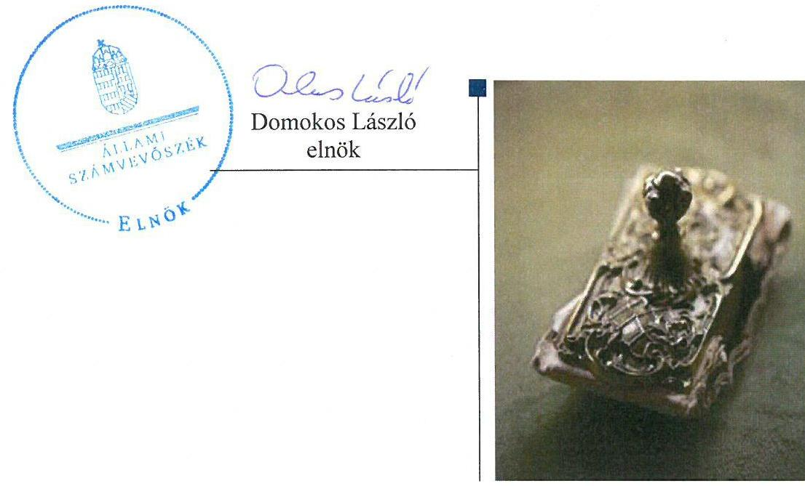

---

# AZ ELLENŐRZÉST FELÜGYELTE:

## MAKKAI MÁRIA felügyeleti vezető

## AZ ELLENŐRZÉST VEZETTE ÉS A VÉGREHAJTÁSÁÉRT FELELŐS:

### DR. SCHREIBER JUDIT ZSUZSANNA ellenőrzésvezető

## A PROGRAM ÖSSZEÁLLÍTÁSÁÉRT FELELŐS:

### JANIK JÓZSEF LÁSZLÓ osztályvezető

---

**IKTATÓSZÁM:** V-0982-348/2016.

**TÉMASZÁM:** 2016.

**ELLENŐRZÉS-AZONOSÍTÓ SZÁM:** V070915

---

Jelentéseink az Országgyűlés számítógépes hálózatán és az Interneten a www.asz.hu címen is olvashatóak.

---

# TARTALOMJEGYZÉK 

■ ÖSSZEGZÉS ..... 5
■ AZ ELLENŐRZÉS CÉLJA ..... 7
■ AZ ELLENŐRZÉS TERÜLETE ..... 8
■ AZ ELLENŐRZÉS HÁTTERE, INDOKOLTSÁGA ..... 9
■ A JELENTÉS LÉNYEGES KÉRDÉSKÖREI ..... 10
■ ELLENŐRZÉS HATÓKÖRE ÉS MÓDSZEREI ..... 11
■ MEGÁLLAPÍTÁSOK ..... 13
■ JAVASLATOK ..... 25
■ MELLÉKLETEK ..... 27
I. Sz. melléklet: Értelmező szótár ..... 27
II. Sz. melléklet: A Kiving Kft. vagyonának megoszlása 2011-2014. években (adatok E Ft-ban) ..... 31
III. Sz. melléklet: A Kiving Kft. eredményének alakulása 2011-2014. években (adatok E Ft-ban) ..... 32
■ FÜGGELÉK: ÉSZREVÉTELEK ..... 33
■ RÖVIDÍTÉSEK JEGYZÉKE ..... 53

---

.

---

# ÖSSZEGZÉS 

Az Állami Számvevőszék a Kiving Kft. vagyonmegőrzési és gazdálkodási tevékenységét a 2011-2014. évek közötti időszakra vonatkozóan szabályszerűségi szempontból ellenőrizte. A Kiving Kft. a szabályszerű vagyongazdálkodásának feltételeit - az önköltség-számítási szabályzat kivételével - kialakította. Az ellenőrzés hiányosságokat tárt fel a számviteli elszámolásoknál, a közbeszerzések lefolytatásánál, valamint a vagyonváltozást eredményező döntésekhez kapcsolódóan. Az ellenőrzött időszakban az éves beszámolók leltárral való alátámasztottsága nem volt biztosított. Az állami vagyon kezelésére kötött szerződések nem feleltek meg teljes körűen a jogszabályi előírásoknak, a szerződések 2013. évi megszünését követően az állami vagyonnal való elszámolás nem történt meg, a vagyonkezelt eszközöket a nyilvántartásból a Kiving Kft. nem vezette ki, így nem volt biztosított az állami vagyon védelme, a mérleg nem a valós állapotot tükrözte.

## Az ellenőrzés társadalmi indokoltsága

Az állami tulajdonú gazdálkodó szervezetek a nemzeti vagyon részét képezik. Az állami vagyonnal való gazdálkodást illetően a tulajdonosi joggyakorlás és a vagyongazdálkodás feladata az állami vagyon átlátható, rendeltetésszerű és felelős felhasználásának biztosítása. Az állam meghatározza az ellátandó közszolgáltatásokkal kapcsolatos feladatokat, amelyhez a vagyonnal kapcsolatos döntéseknek igazodniuk kell.

## Főbb megállapítások, következtetések, javaslatok

Az MNV Zrt. a Kiving Kft. vagyongazdálkodásához szükséges követelményeket, az állami vagyon értékmegőrzésére, gyarapítására vonatkozó előírásokat, valamint a tulajdonos számára fenntartott jogokat szabályozta. Az MNV Zrt. az állami ingatlanok Kiving Kft. általi vagyonkezelésére vonatkozó vagyonkezelési szerződések 2013 évi megszűnését követően nem intézkedett az ingatlanok használati jogcímének rendezésére, így nem volt biztosított az állami vagyon védelme.

A Kiving Kft. vagyonkezelésében lévő állami ingatlanokra vonatkozó szerződések nem voltak szabályszerűek, nem feleltek meg a hatályos jogszabályoknak, hatálytalan jogszabályokra hivatkoztak, aktualizálásuk nem történt meg, nem tartalmazták a jogszabályokban előírt kötelező elemeket, így nem volt biztosított a tulajdonosi joggyakorlás és a vagyongazdálkodási feladatok szabályozott és átlátható módon történő végrehajtása. A vagyonkezelési szerződések 2013. évi megszűnését követően az ingatlanokat a Kiving Kft. jogcím nélkül használta, a vagyonkezelési szerződésben előírt átadás-átvételi eljárás útján történő elszámolás az ellenőrzés befejezéséig nem történt meg annak ellenére, hogy ez a Kiving Kft., mint vagyonkezelő szerződéses kötelezettsége volt.

A Kiving Kft. a vagyongazdálkodáshoz kapcsolódó szabályzatokat - az önköltség-számítási szabályzat kivételével - elkészítette. A vagyonkezelt és a saját vagyonnal folytatott tevékenység bevételeinek és ráfordításainak elkülönítése megtörtént. A számviteli elszámolások során a bevételek és ráfordítások számviteli bizonylattal nem teljes körűen voltak alátámasztottak, a tárgyi eszközök és az immateriális javak üzembe helyezéséről és aktiválásáról nem állítottak ki üzembe helyezési bizonylatot. A vagyonkezelt ingatlanok után a vagyonkezelési szerződések megszűnését követően is elszámoltak értékcsökkenési leírást, amellyel megsértették a számviteli törvény szerinti valódiság elvét.

A Kiving Kft. vagyonváltozást eredményező döntései a közbeszerzéshez, valamint az üzleti tervek benyújtási kötelezettségéhez kapcsolódóan nem voltak szabályszerűek. A Kiving Kft. a 2013-2014. években épület felújításhoz és régészeti tevékenységhez kapcsolódó szerződéskötés esetén nem tartotta be a közbeszerzési eljárás lefolytatásának kötelezettségét.

---

Két közbeszerzési eljárás megindításához nem rendelkeztek az MNV Zrt. előzetes engedélyével. Az üzleti terveket a 2012-2013. években határidőn túl nyújtották be az MNV Zrt.-nek jóváhagyásra.

Az éves beszámolási kötelezettséget teljesítették, azonban a 2011-2013. években az éves beszámolók mérlegtételeinek leltárral való alátámasztottsága nem volt biztosított, a főkönyvi könyvelés és az analitikus nyilvántartások adatai közötti egyeztetést az üzleti év mérlegforduló napjára vonatkozóan dokumentáltan nem készítették el. A 2013-2014. években az éves beszámolókban annak ellenére mutatták ki a korábbi években vagyonkezelt eszközöket, hogy arra vagyonkezelési szerződéssel nem rendelkeztek, a vagyonkezelt eszközöket a nyilvántartásból a Kiving Kft. nem vezette ki, a mérleg nem a valós állapotot tükrözte. Az információs rendszert kialakították, azonban annak működtetése során az adatszolgáltatási kötelezettségnek hiányosan tettek eleget.

---

# AZ ELLENŐRZÉS CÉLJA 

szabályszerű vagyongazdálkodás érdekében.

Az ellenőrzés célja annak értékelése volt, hogy a tulajdonosi jogok gyakorlása szabályszerű volt-e, a Kiving Kft. által ellátott feladat bevételei, ráfordításai elszámolásának, és vagyongazdálkodási tevékenységének szabályozása megfelelt-e a jogszabályi és a tulajdonosi előírásoknak, azok végrehajtása szabályszerű volt-e. Biztosítva volt-e a szabályszerű önköltségszámítás. Az ellenőrzés kiterjedt továbbá arra, hogy a vagyonváltozást eredményező döntések esetében a tulajdonosi jogok gyakorlója és a Kiving Kft. szabályszerűen járt-e el, továbbá, hogy a Kiving Kft. kiépített-e és működtetett-e információs rendszert a sza-

---

# **AZ ELLENŐRZÉS TERÜLETE**

## **KIVING Ingatlangazdálkodó és Beruházás-szervező Kft.**

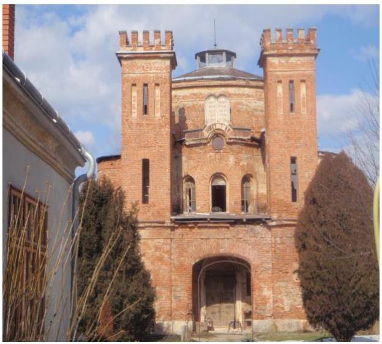

A Kiving Kft. egyszemélyes, 100%-os állami tulajdonú gazdasági társaság, amelyet a Magyar Állam 2001. június 12-én, határozatlan időre, 200 M Ft törzstőkével alapított. A tulajdonosi jogokat az állami vagyon felügyeletéért felelős miniszter az MNV Zrt.-n keresztül gyakorolta.

Az ellenőrzött időszakban a Kiving Kft. fő tevékenységként ingatlankezelést, üzemeltetést (gondnokolás, műszaki feladatok, beruházás szervezés) végzett.

A Kiving Kft.-t ügyvezető irányította, annak személye az ellenőrzött időszakban két alkalommal – a 2012. és a 2013. évben – változott. A Kiving Kft. szervezeti egységei a tevékenységi körök – műszaki, gondnokolási, üzemeltetési feladatok – szerint tagolódtak.

A Kiving Kft. árbevételének 0,1 %-a a vagyonkezelésében lévő ingatlanokhoz, 99,9 %-a az üzemeltetési, és egyéb tevékenységekhez kapcsolódott.

A Kiving Kft.-nél az ellenőrzött időszakban háromtagú FB és könyvvizsgáló működött. A Kiving Kft. közszolgáltatást, közfeladatot nem látott el, kapcsolt vállalkozással nem rendelkezett.

Az ellenőrzött időszakban a Kiving Kft. nem tartozott a kormányzati szektorba sorolt egyéb szervezetek közé.

A 2014. évi éves beszámoló szerint 97,6 M Ft mérleg szerinti eredményt értek el, a mérleg szerinti vagyon állománya 1707,8 M Ft-ot tett ki, a statisztikai létszáma 2014. december 31-én 164 fő volt.

1. ábra

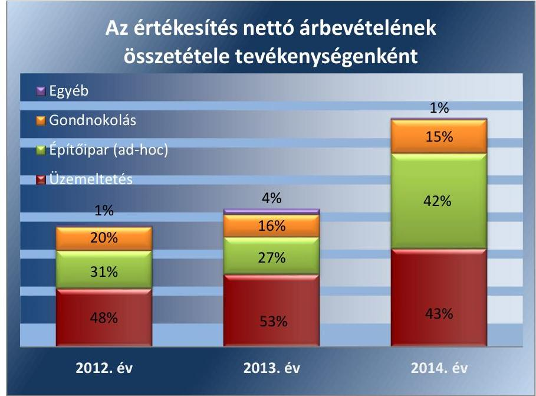

---

# AZ ELLENŐRZÉS HÁTTERE, INDOKOLTSÁGA 

Az ÁSZ stratégiájában meghatározott célokkal összhangban az ellenőrzésünkkel a szabályszerű vagyongazdálkodást értékeltük.

A törvényalkotás számára - az észlelt problémák, szabálytalanságok, vagy egyéb nem kívánatos jelenségek felszínre kerülésével - az ellenőrzés megállapításai segítséget nyújthatnak az államháztartáson kívüli feladatellátás és a vagyonnal való gazdálkodás értékeléséhez, valamint a jogszabályi keretek pontosításához az átláthatóságot, a költségtakarékos működtetést, az értékmegőrzést, az állagvédelmet, az értéknövelő használatot és gyarapítását biztosító szabályozáshoz.

Az ellenőrzés rámutathat az állami tulajdonú gazdálkodó szervezetek gazdálkodási tevékenységével, valamint az államháztartásból származó források felhasználásával kapcsolatos jó gyakorlatokra és szabálytalanságokra. Felhívhatja a figyelmet a jogszabályi követelmények teljesítéséhez szükséges feltételek hiányosságaira, hozzájárulhat az államháztartáson kívüli, de (közvetlenül vagy közvetve) állami vagyont használó gazdálkodó szervezetek tevékenységének átláthatóságához.

Az ellenőrzés tapasztalatai segítik és erősítik az ÁSZ hozzáadott értéket teremtő elemző tevékenységét és tanácsadó szerepét, valamint pozitív hatással van a szervezetről kialakított összkép formálására is.

Az ellenőrzött számára visszajelzést ad a gazdálkodási tevékenységgel, az állami vagyon felhasználásával és az éves elszámolással kapcsolatos szabálytalanságokról és kockázatokról.

---

# A JELENTÉS LÉNYEGES KÉRDÉSKÖREI 

1.     - Az MNV Zrt., mint a tulajdonosi jogok gyakorlója szabályszerűen alakította-e ki a Kiving Kft. tulajdonában és kezelésében lévő vagyonnal való gazdálkodás feltételeit?
2.     - A Kiving Kft. az állami vagyon megőrzését és gyarapítását biztosító vagyongazdálkodási tevékenységét szabályozta-e, illetve kialakította-e a vagyonnyilvántartást a jogszabályi és a tulajdonosi előírásoknak megfelelően?
3.     - Szabályszerű, illetve a tulajdonosi előírásoknak megfelelő volt-e a Kiving Kft. által ellátott feladat bevételeinek és ráfordításainak elszámolása, valamint az önköltségszámítás?
4.     - A vagyonváltozást eredményező döntések megfeleltek-e a jogszabályi és a tulajdonosi előírásoknak?
5.     - A Kiving Kft. teljesítette-e a beszámolási, adatszolgáltatási kötelezettségét, kiépített-e, illetve működtetett-e információs rendszert?

---

# ELLENŐRZÉS HATÓKÖRE ÉS MÓDSZEREI 

## Az ellenőrzés típusa

Szabályszerűségi ellenőrzés.

## Az ellenőrzött időszak

2011. január 1 - 2014. december 31. közötti időszak.

## Az ellenőrzés tárgya

Az állami tulajdonban (résztulajdonban) lévő gazdálkodó szervezetek vagyonmegőrzési és gazdálkodási tevékenységének ellenőrzése.

## Az ellenőrzött szervezet

KIVING Ingatlangazdálkodó és Beruházás-szervező Kft., MNV Zrt., mint tulajdonosi joggyakorló.

## Az ellenőrzés jogalapja

Az ellenőrzés alapját az Állami Számvevőszékről szóló 2011. évi LXVI. törvény 5. § (3)-(5) bekezdései, valamint az állami vagyonról szóló 2007. évi CVI. törvény 3. § (4) bekezdése képezi.

## Az ellenőrzés módszerei

Az ellenőrzés az INTOSAI által kiadott nemzetközi standardok figyelembe vételével, az ÁSZ ellenőrzés szakmai szabályait tartalmazó belső szabályzatokban foglaltak, valamint az ellenőrzési programokban foglalt értékelési szempontok szerint történik. A bevételek és ráfordítások elszámolása, valamint a vagyonnyilvántartás terén a szabályszerű működést mintavétellel ellenőriztük. A kormányzati szektorba sorolt gazdálkodó szervezetek esetében a személyi jellegű ráfordítások elszámolása mellett az egyéb ráfordítások, pénzügyi műveletek ráfordításai, rendkívüli ráfordítások, illetve az egyéb bevételek, pénzügyi műveletek bevételei, rendkívüli bevételek elszámolásának szabályszerűségét szintén mintatételeken keresztül ellenőriztük. A véletlen mintavétellel (évenkénti elemszámmal arányos rétegezéssel) ellenőrzött területek esetében minden egyes tétel vonatkozásában a szabályszerűségre vonatkozó kérdéseket tettünk fel, amelyek eredménye összesítésre került. A jogszabályoknak és a belső előírásoknak megfelelőnek tekintettük az adott területet, amennyiben a minta ellenőrzésének eredménye alapján 95%-os bizonyossággal a teljes sokaságban a hibaarány kisebb volt, mint 10%, nem megfelelőnek értékeltük, ha a hibaarány a 10%-ot meghaladta. Kockázatot, illetve magas kockázatot jeleztünk, amennyiben egy adott terület vonatkozásában a minta alapján a teljes sokaságban nem volt egyértelműen biztosított a jogszabályoknak és a belső szabályzatoknak megfelelő működés. A személyi jellegű ráfordítások esetében az ellenőrzött mintatételeket értékeltük. A ráfordítások elszámolására és a vagyon-nyilvántartásra vonatkozó véletlen mintavételt kockázati alapú kiválasztással egészítettük ki, amelynek során évente a három legnagyobb összegű tételt választottuk ki.

---

# 1. Az MNV Zrt., mint a tulajdonosi jogok gyakorlója szabályszerűen alakította-e ki a Kiving Kft. tulajdonában és kezelésében lévő vagyonnal való gazdálkodás feltételeit? 

Összegző megállapítás

Az 1.1. számú megállapítás
1.2. számú megállapítás

Az MNV Zrt. a Kiving Kft. saját vagyonával való gazdálkodás feltételeit szabályozta. Az állami ingatlanok vagyonkezelésére vonatkozó szerződések nem voltak szabályszerűek, a 2013. évi megszűnésüket követően nem volt biztosított az állami vagyon védelme.

Az MNV Zrt. a Kiving Kft. saját vagyonnal való gazdálkodásának követelményeit szabályozta.

A
 tulajdonosi jogokat a Kiving Kft. felett az állami vagyon felügyeletéért felelős miniszter gyakorolta a Vtv. ${ }^{4}$ 3. § (1) bekezdése alapján, aki e feladatát az MNV Zrt. útján látta el.

Az MNV Zrt. a számára fenntartott vagyongazdálkodásra vonatkozó jogokat a 2011. október 27-től hatályos Alapító Okiratban ${ }^{5}$ meghatározta. Az Alapító Okirat 10.2. pontjaiban előírták az MNV Zrt. kizárólagos hatáskörébe tartozó, az üzleti és közbeszerzési tervek ${ }^{6}$, az SZMSZ ${ }^{7}$, a Javadalmazási szabályzat ${ }^{8}$, a Befektetési szabályzat ${ }^{9}$ és az éves beszámolók jóváhagyását, valamint az FB ügyrendjének elfogadását, a munkavállalók részére a teljesítménykövetelmények és az ahhoz kapcsolódó juttatások elfogadására vonatkozó jogokat.

Az állami vagyon értékének megőrzése és gyarapítása érdekében az MNV Zrt. engedélyéhez kötötték az ingatlanok és társasági részesedések megszerzésére, átruházására, megterhelésére és elidegenítésére hozott döntéseket, a kölcsön és hitel felvétel engedélyezését és a közbeszerzési tervben nem szereplő eljárás megindításának jóváhagyását.

Az Alapító Okirat tartalmazta a saját vagyon értékének megőrzésére, gyarapítására vonatkozó előírásokat, meghatározták az FB, valamint a könyvvizsgáló jogait, feladatát és hatáskörét.

A Vtv. 30. § (1) bekezdés előírása alapján az Alapító Okirat 9. és 11. pontjában meghatározták az ügyvezető felelősségét.

A Vagyonkezelési szerződés¹,¹ nem volt szabályszerű, megszűnésüket követően az állami vagyonnal való felelős gazdálkodáshoz szükséges követelmények nem voltak biztosítottak.

A Kiving Kft. és a Kincstári Vagyoni Igazgatóság 2001. szeptember 3-án határozatlan időre, 2003. november 9-én határozott időre (10 év) vagyonkezelési szerződés ¹,¹-t kötött egy-egy budapesti ingatlan vagyonkezelésére. A

---

Vagyonkezelési szerződés ²-t 2007. december 28-án kiegészítették további három ingatlan vagyonkezelésbe adásával.

A Kiving Kft. vagyonkezelésében lévő állami vagyonnal történő szabályszerű vagyongazdálkodás feltételeit, a tulajdonosi joggyakorlás és a vagyongazdálkodási feladatok szabályozott és átlátható módon történő végrehajtását - a 2013. évi megszűnésig - a Vagyonkezelési szerződés ¹,¹-ek nem biztosították teljes körűen.

A Vagyonkezelési szerződés ¹,¹-ek nem feleltek meg a hatályos jogszabályoknak, a Vtv. és a Vhr. ${ }^{10}$ hatályba lépését követően azokat nem aktualizálták, így nem volt biztosított a Vhr. 3. § (1) bekezdésben előírt, a tulajdonosi joggyakorlás és vagyongazdálkodási feladatok szabályozott és átlátható módon történő végrehajtása. A Vagyonkezelési szerződések ¹,¹ hatálytalan jogszabályokra - Áht.¹¹-re, 183/1996. (XII.11.) Korm. rendeletre ${ }^{12}$ hivatkoztak.

A Vagyonkezelési szerződés ¹,¹-ben a Vhr. 14. § (3) bekezdésében előírtak ellenére nem rögzítették az MNV Zrt. vagyon-nyilvántartási szabályzatának megismerését, valamint annak kötelező érvényűségét. A Vhr. 20. § (1) bekezdés ellenére nem rögzítették, hogy a tulajdonosi ellenőrzés eljárásrendjét a felek a szerződés részének tekintik, továbbá a Vagyonkezelési szerződés ¹,¹ a Vhr. 9. § (9) bekezdés d) pontjában foglaltak ellenére nem tartalmazott az értékcsökkenés visszapótlásával kapcsolatos elszámolására és gyakoriságára vonatkozó előírást.

A Vagyonkezelési szerződés ² a módosítást követően nem került egységes szerkezetbe foglalásra, amellyel nem tettek eleget a Vhr. 8. § (2) bekezdésében előírt, a vagyontárgyak körének változása esetén hatvan napon belül történő egységes szerkezetbe foglalási kötelezettségnek.

A vagyonkezelési szerződés ¹ 2013. február 5-én közös megegyezéssel, a Vagyonkezelési szerződés ² 2013. november 25-én - a 10 év határozott idő elteltével - megszűnt. Az ingatlanok a szerződések megszűnését követően a Kiving Kft.-nél maradtak, azt jogcím nélkül tovább használták. A vagyonkezelt ingatlanokkal történő, a vagyonkezelési szerződésben előírt át-adás-átvételi eljárás útján történő elszámolás az ellenőrzés befejezéséig nem történt meg. Az MNV Zrt. nem intézkedett a jogellenes állapot megszüntetésére, az ingatlanok használati jogcímének rendezésére.

A Kiving Kft. a feladatellátásának meghatározó részét az MNV Zrt.-vel állami ingatlanokra vonatkozó - üzemeltetésre, gondnokolásra és egyéb beruházási és felújítási tevékenységre kötött - megbízási és vállalkozási szerződések keretében látta el.

A szerződésekben meghatározták az elvégzendő feladatokat, a szerződő felek jogait és kötelezettségeit, az elszámolás és ellenőrzés szabályait. A szerződések megfeleltek a szabályszerű vagyongazdálkodás feltételeinek.

# 1.3. számú megállapítás 

Az MNV Zrt. vagyon-nyilvántartási szabályzata megfelelt a Vhr. előírásainak.

Az MNV Zrt. a vagyon-nyilvántartási szabályzatát elkészítette a Vhr. 14. § (3) bekezdésében előírtaknak megfelelően.

A szabályzat a Vhr. mellékletében foglaltak szerint szabályszerűen meghatározta a vagyonnyilvántartás feladatait, a vagyonkezelt eszközökre vonatkozó adatszolgáltatás részletes tartalmát, formáját, határidejét.

---

# 2. A Kiving Kft. az állami vagyon megőrzését és gyarapítását biztosító vagyongazdálkodási tevékenységét szabályozta-e, illetve kialakította-e a vagyonnyilvántartást a jogszabályi és a tulajdonosi előírásoknak megfelelően? 

Összegző megállapítás

A Kiving Kft. a vagyonmegőrzést és gyarapítást biztosító vagyongazdálkodási tevékenység feltételeit kialakította. A Kiving Kft. kezelésben lévő ingatlanok nyilvántartása a vagyonkezelési szerződések megszűnését követően nem felelt meg a Számv. tv. előírásának. Az éves beszámolókat leltárral nem támasztották alá.
2.1. számú megállapítás

A vagyon értékének megőrzését, gyarapítását biztosító vagyongazdálkodás feltételeit a Kiving Kft. - az önköltség-számítási szabályzat kivételével - kialakította.

A vagyongazdálkodással kapcsolatos terveket a Kiving Kft. az üzleti tervekben rögzítette.

A szabályszerű vagyongazdálkodás követelményei megteremtésének körében elkészítették az SZMSZ-t, a Közbeszerzési szabályzatot ${ }^{13}$, a Javadalmazási szabályzatot. A szabályzatokat az MNV Zrt. Alapítói határozatokban jóváhagyta.

A Számv. tv. ${ }^{14}$ 14. § (3) bekezdésében foglaltakkal összhangban elkészítették a Számviteli politikát ${ }^{15}$, amelynek aktualizálása minden évben megtörtént.

A Számlarendet ${ }^{16}$ a Számv. tv. 161. § (1) bekezdésében előírtaknak megfelelően készítették el. Az elkészített Számlarendet aktualizálták, az összhangban volt a Számv. tv. 161. § (2) bekezdésével és a Számviteli Politikával.

Az Eszközök és források értékelési szabályzatát ${ }^{17}$ a Számv. tv. 14. § (5) bekezdés b) pontja alapján elkészítették, meghatározva benne az eszközök és források értékelésének módját, amely összhangban állt a Számv. tv. 57. § (1) bekezdésével.

A Pénzkezelési szabályzatot ${ }^{18}$ a Számv. tv. 14. § (5) bekezdés d) pontjában előírtaknak eleget téve készítették el, melyben rögzítették a házipénztár, a pénzkezelés és a pénzforgalom eljárási szabályait, valamint meghatározták az utalványozáshoz szükséges előírásokat, melyek biztosították a pénzkezelés szabályosságát. A szabályzat aktualizálása megtörtént.

A Leltározási szabályzatot ${ }^{19}$ a Számv. tv. 14. § (5) bekezdés a) pontja alapján készítették el, amely összhangban volt a Számv. tv. 69. §-ában előírt, a leltározásra vonatkozó rendelkezésekkel.

Az Önköltségszámítás rendjére vonatkozó szabályzatot a Kiving Kft. nem készített annak ellenére, hogy a Számv. tv. 14. § (7) bekezdése, és a Számviteli politikája ezt előírta.

A vagyongazdálkodással kapcsolatos feladat- és hatásköröket, felelősségi viszonyokat az SZMSZ-ben, a Pénzkezelési szabályzatban, a Selejtezési szabályzatban és a Leltározási szabályzatban szabályozták, meghatározták

---

### 2.2. számú megállapítás

1. táblázat

|  BEFEKTETETT | PÉNZÜGYI ESZKÖZÖK  |
| --- | --- |
|  Évek | M Ft  |
|  2011. | 10,8  |
|  2012. | 3,3  |
|  2013. | 3,3  |
|  2014. | 2,1  |

Fonrás: 2011-2014. évi beszámolók a gazdálkodással kapcsolatos feladatokat, a vezetők és a dolgozók felelősségét, illetve hatáskörét.

## A Kiving Kft. kezelésében lévő ingatlanok nyilvántartása a vagyonkezelési szerződések megszűnését követően nem felelt meg a Számv. tv. előírásának.

A Kiving Kft. a vagyonkezelt eszközöket a számviteli nyilvántartásában elkülönítetten tartotta nyilván. A Számv. tv. 42. § (5) bekezdésének és a Vhr. 9. § (9) bekezdés a) pontjának megfelelően a vagyonkezelésbe vett eszközöket a hosszú lejáratú kötelezettségek között mutatták ki.

A Vagyonkezelési szerződések ¹,¹ 2013. évi megszűnését követően a vagyonkezelt ingatlanokat a számviteli nyilvántartásban továbbra is vagyonkezelt ingatlanokként mutatták ki, amely nem felelt meg a Számv. tv. 23. § (2) bekezdésében foglaltaknak, mert az érintett ingatlanokhoz kapcsolódó vagyonkezelési szerződéssel nem rendelkeztek.

A Vhr. 9. § (3) bekezdésében, a vagyonkezelési szerződés ¹ 9.4 pontjában és a vagyonkezelési szerződés ² 8.5 pontjában előírtak ellenére a vagyonkezelési szerződés ¹,¹ megszűnését követően a vagyonkezelt ingatlanokkal az elszámolás nem történt meg.

A vagyonkezelt eszközök bruttó 135,9 M Ft-os nyilvántartott vagyoni értéke megegyezett az MNV Zrt.-nél nyilvántartott értékkel. Az MNV Zrt. által az állami vagyonról vezetett nyilvántartásban a Vagyonkezelési szerződés ¹,¹ megszűnését követően is a Kiving Kft. vagyonkezelésében lévő eszközként szerepeltek az ingatlanok.

A Kiving Kft. a Számv. tv. 46. §-ában és az 55. § (1) bekezdésében, valamint az Eszközök és források értékelési szabályzat 9.3 pontjában foglaltakat betartotta, a részesedések és egyéb befektetett pénzügyi eszközök értékelésénél.

A 2011-2013. évben az éves beszámolók mérlegtételeinek - a Számv. tv. 69. § (1) bekezdésében előírtak ellenére - leltárral való alátámasztottsága nem volt biztosított.

A 2011-2012. évi leltározást lezáró, valamint a 2013. évi leltárnyitó értekezletről a jegyzőkönyveket elkészítették, azonban az azok mellékletét képező leltárfelvételi ívek, a leltározást alátámasztó dokumentumok nem álltak rendelkezésre, amellyel megsértették a Számv. tv. 69. § (1) bekezdésében foglaltak előírást, amely szerint a beszámoló elkészítéséhez és a mérleg tételeinek alátámasztásához olyan leltárt kell összeállítani és megőrizni, amely tételesen, ellenőrizhető módon tartalmazza az eszközöket.

A vagyonkezelt eszközök leltározása egyik ellenőrzött évben sem történt meg, amellyel nem tettek eleget a Számv. tv. 69. § (3) bekezdésében előírt leltározási kötelezettségnek.

A 2011-2013. években a Számv. tv. 69. § (2) bekezdésében foglaltak ellenére a főkönyvi könyvelés és az analitikus nyilvántartások adatai közötti egyeztetést az üzleti év mérlegforduló napjára vonatkozóan dokumentáltan nem készítették el.

A 2014. évi leltározás megfelelt a Leltározási Szabályzatban és a Számv.tv.-ben foglaltaknak.

---

# 3. Szabályszerű, illetve a tulajdonosi előírásoknak megfelelő volt-e a Kiving Kft. által ellátott feladat bevételeinek és ráfordításainak elszámolása, valamint az önköltségszámítás? 

Összegző megállapítás

A számviteli elszámolások a 2011-2013. évek között a bevételek és a ráfordítások feltárt hiányosságai miatt nem voltak szabályszerűek. A Számv. tv.-ben előírt önköltség-számítási szabályzatot nem készítették el.

### 3.1. számú megállapítás

A bevételek és a ráfordítások elszámolása a 2011-2013. évek között nem volt szabályszerű.

A Kiving Kft. az állami vagyon hasznosításából származó - a vagyonkezelésben lévő ingatlanokhoz kapcsolódó - bevételeket, költségeket és ráfordításokat a Vagyonkezelési szerződés ¹ 9.2. pontja, valamint a Vagyonkezelési szerződés ² 8.1. pontja alapján elkülönítetten tartotta nyilván.

A vagyonkezelt ingatlanokhoz kapcsolódó elszámolások a 2013. évig megfelelőek voltak. A bevételek és ráfordítások könyvelése a Számv. tv.ben és a Számviteli politikában meghatározott főkönyvi számlákra történt. A költségek és ráfordítások elkülönítési kötelezettségének a munkaszámra történő könyveléssel tettek eleget.

A vagyonkezelési szerződés ¹,¹ megszűnéséig az értékcsökkenés elszámolása megfelelt a Számv. tv. és a belső szabályzat előírásainak. A vagyonkezelési szerződés ¹,¹ megszűnését követően is elszámoltak az ingatlanokra értékcsökkenési leírást, amely elszámolás nem felelt meg a Számv. tv. 15. § (3) bekezdése szerinti valódiság elvének, mert olyan költséget mutattak ki, amelyre vonatkozóan szerződéssel nem rendelkeztek.

A Kiving Kft. bevételeinek meghatározó része az MNV Zrt.-vel kötött szerződések keretében végzett feladatok teljesítéséből származtak.
2. táblázat

KIVING KFT. BELFÖLDI ÉRTÉKESÍTÉS ÁRBEVÉTELÉNEK ALAKULÁSA

| Év | Összes bevétel | MNV Zrt.-től származó bevétel   nft | Összes bevétel %-ban |
| :--
 | :--: | :--: | :--: |
| 2011. | 2173983 | 1782638 | 82,00 % |
| 2012. | 1629123 | 1454155 | 89,26 % |
| 2013. | 1855155 | 1686373 | 90,90 % |
| 2014. | 3080536 | 2974357 | 96,55 % |

A vállalkozási tevékenységekből származó bevételek elszámolása során a 2011-2013. évek között 1,4 M Ft könyvelési tétel a Számv. tv. 165. § (1) bekezdése ellenére számviteli bizonylattal nem volt alátámasztott. Az 1,4 M Ft-os összegből 1,36 M Ft ÁFA elszámoláshoz kapcsolódott, 0,64 M Ft összeg bizonylat nélküli elszámolása az üzemeltetett ingatlanok továbbszámlázott közüzemi díja címen történt. A könyvelési tételeket alátámasztó bizonylatok hiánya miatt a bevételek elszámolásának megfelelősége kockázatot hordozott.

---

A költségek elszámolása során a 2011-2012. évben összesen 0,1 M Ft összegű, egyéb költségként, postaköltségként és energiaköltségként elszámolt tételt a Számv. tv. 165. § (1) bekezdése ellenére számviteli bizonylattal nem támasztottak alá. Az anyagjellegű ráfordítások elszámolása megfelelő volt.

Az elszámolások során a 2012. évi értékvesztés visszaírás a Számv. tv.-ben meghatározott főkönyvi számlákra történt, azonban nem rendelkeztek az értékvesztés visszaírását megalapozó dokumentummal, így az elszámolások a Számv. tv. 165. § (1) bekezdése ellenére alátámasztó dokumentumok nélkül történtek.

A személyi ráfordítások elszámolása nem volt megfelelő, mert a kifizetett személyi juttatásokhoz kapcsolódóan a 2011. évben a bérlettérítések, a 2011-2014. években az étkezési utalványok átvétele a Számv. tv. 165. § (1) bekezdése ellenére bizonylattal nem voltak alátámasztva.

A tárgyi eszközökhöz és az immateriális javakhoz kapcsolódó értékcsökkenési leírás elszámolása a megfelelő főkönyvi számlákra történt. Az üzembe helyezéskor azonban a Számv. tv. 52. § (2) bekezdésében foglaltak ellenére az üzembe helyezést hitelt érdemlő módon nem dokumentálták.

A vagyonkezelt ingatlanokhoz és az üzembe helyezések elmaradásához kapcsolódó hiányosságok miatt a vagyonnyilvántartás megfelelősége magas kockázatot hordozott.

A Kiving Kft. beszámolói alapján az immateriális javak, az ingatlanok és a tárgyi eszközök értéke és az elszámolt értékcsökkenés az alábbiak szerint alakult.
3. táblázat

| IMMATERIÁLIS JAVAK (M FT) |  |  |  |  |
| :--: | :--: | :--: | :--: | :--: |
| Megnevezés | 2011. év | 2012. év | 2013. év | 2014. év |
| Bruttó értéke | 5,9 | 11,3 | 28,4 | 36,6 |
| Nettó értéke | 1,9 | 6,6 | 19,3 | 23,7 |
| Éves elszámolt értékcsökkenés | 4,0 | 4,7 | 9,1 | 12,9 |

4. táblázat

INGATLANOK (M FT)

| Megnevezés | 2011. év | 2012. év | 2013. év | 2014. év |
| :--: | :--: | :--: | :--: | :--: |
| Bruttó értéke | 377,7 | 377,7 | 377,7 | 377,7 |
| Nettó értéke | 351,6 | 347,7 | 344,6 | 341,9 |
| Éves elszámolt értékcsökkenés | 26,1 | 30,0 | 33,1 | 35,8 |

5. táblázat

| MNV ZRT.-VEL SZEMBENI |  |  |  |  |
| :--: | :--: | :--: | :--: | :--: |
| KÖVETELÉSEK (M FT) |  |  |  |  |
| Évek |  |  |  |  |
| 2011. | 416,8 |  |  |  |
| 2012. | 323,9 |  |  |  |
| 2013. | 458,9 |  |  |  |
| 2014. | 1040,4 |  |  |  |

A KÖVETELÉSÁLLOMÁNY 1027,8 M Ft-ról 1121,4 M Ft-ra változott a 2014. év végére, amelyet alapvetően az MNV Zrt.-vel szembeni követelés növekedése okozott.

---

Az MNV Zrt.-vel szembeni 2014. évi 1040,4 M Ft összegű kintlévőség oka volt, hogy a számlák kiegyenlítése a mérlegforduló napig nem történt meg.

A követelésállomány kezelésére vonatkozó belső előírás 2013. év május 30-ig nem volt. A 2013. június 1-jétől hatályos szabályzatban rögzítették a követelések behajtására vonatkozó intézkedéseket, a követelések érvényesítése érdekében fizetési felszólítások kiküldésének, fizetési meghagyás és végrehajtást kezdeményezésének szabályait.
7. táblázat

# A KÖVETELÉSEK VÁLTOZÁSA 2011-2014 ÉVEK KÖZÖTT (M FT) 

| Év | Vevőkövetelés | Vevőkövetelés változása (2011=100 %) | Egyéb követelések | Egyéb követelés változása (2011=100 %) | Összes követelés | Összes követelés változása (2011=100 %) |
| :--: | :--: | :--: | :--: | :--: | :--: | :--: |
| 2011 | 661,8 | 100,0 | 366,0 | 100,0 | 1027,8 | 100,0 |
| 2012 | 511,7 | 77,3 | 92,4 | 25,2 | 604,0 | 58,8 |
| 2013 | 580,5 | 87,7 | 364,0 | 99,5 | 773,4 | 75,2 |
| 2014 | 1071,9 | 162,0 | 49,5 | 13,5 | 1121,4 | 109,1 |

A 2011-2014. évek között 4,7 M Ft behajthatatlan követelés került leírásra, amely a Számv. tv. 65. § (7) bekezdés előírásával összhangban történt.
3.2. számú megállapítás

A Számv. tv. előírása ellenére az önköltség-számítási szabályzatot nem készítették el.

Az önköltségszámítás rendjére vonatkozó szabályzatot a Kiving Kft. nem készített annak ellenére, hogy a Számv. tv. 14. § (5) bekezdés c) pontja, és a Számviteli politikája ezt előírta.

A Kiving Kft. a 2010. évre vonatkozó beszámolója alapján a költségnemek szerinti költségek együttes összege meghaladta a Számv. tv. 14. § (7) bekezdésében előírt 500 M Ft-ot, ezért a 2011. évben a végzett szolgáltatások Számv. tv. 51. §-a szerinti önköltségét az önköltségszámítás rendjére vonatkozó belső szabályzat szerinti utókalkuláció módszerével kellett volna megállapítania, amelynek nem tettek eleget.

---

# 4. A vagyonváltozást eredményező döntések megfeleltek-e a jogszabályi és a tulajdonosi előírásoknak? 

## Összegző megállapítás

A Kiving Kft. vagyonváltozást eredményező döntései a közbeszerzéshez, valamint az üzleti tervek benyújtási kötelezettségéhez kapcsolódóan nem voltak szabályszerűek. A Kiving Kft. vagyonváltozását eredményező MNV Zrt. által hozott döntések a 2013. évtől a kezelt állami vagyonhoz kapcsolódóan nem voltak szabályszerűek.

## 4.1. számú megállapítás

A Kiving Kft. vagyona a 2014. év végére növekedett, a visszapótlási kötelezettségnek eleget tettek.

A Kiving Kft. vagyongazdálkodására vonatkozó terveket - az MNV Zrt. éves tervezési irányelvei alapján elkészített - éves üzleti tervek tartalmazták, melyeket minden évben alapítói határozatokkal az MNV Zrt. elfogadott.

A Kiving Kft. vagyona a 2014. év végére 1478,3 M Ft-ról 1707,8 M Ft-ra, összesen 229,5 M Ft-tal nőtt.

A tárgyi eszközök növekedésében meghatározó volt a beruházások és felújítások 125,5 M Ft értékű emelkedése.
8. táblázat

ESZKÖZÖK ALAKULÁSA (M FT)

| Megnevezés | 2011. év | 2014. év | Változás (M FT) | Változás (%) |
| :-- | --: | --: | --: | --: |
| Befektetett eszközök | 377,2 | 527,2 | 150,0 | 39,8 |
| Forgóeszközök | 1100,9 | 1177,1 | 76,2 | 6,9 |
| Aktív időbeli elhatárolások | 0,3 | 3,5 | 3,2 | 1066,7 |
| Eszközök összesen | 1478,3 | 1707,8 | 229,5 | 15,5 |

A forgóeszközökön belül a követelések növekedése összességében 9,1 %-os - 93,6 M Ft - volt 2011. évről 2014. évre.

A követelések között a vevőkövetelés 410,1 M Ft-tal növekedett, melyet az egyéb követelések csökkenése részben tudott ellensúlyozni.

A vevőköveteléseken belül meghatározó volt az MNV Zrt.-vel szembeni követelés összege, amely 2014. december 31-én 1040,4 M Ft-ot tett ki.

A források között növekedett a saját tőke, melynek változásában meghatározó volt az eredménytartalék 79,8 M Ft-os növekedése.
9. táblázat

FORRÁSOK ALAKULÁSA (M FT)

| Megnevezés | 2011. év | 2014. év | Változás M Ft | Változás % |
| :-- | --: | --: | --: | --: |
| Saját tőke | 567,5 | 654,4 | 86,9 | 15,3 |
| Céltartalékok | 74,6 | 0,0 | -74,6 | -100,0 |
| Kötelezettségek | 806,3 | 1024,5 | 218,2 | 27,1 |
| Passzív időbeli elhatárolások | 29,9 | 28,9 | -1,0 | -3,3 |
| Források összesen | 1478,3 | 1707,8 | 229,5 | 15,5 |

Forrás: 2011-2014. évi beszámolók

---

A saját tőke/jegyzett tőke aránya megfelelt a Gt. $^{20}$ 51. § (1) bekezdésében és a Ptk. $^{21}$ 3:133. § (2) bekezdésében előírt követelményeknek. A saját tőke és a jegyzett tőke arányának mértéke 2011. évi 2,8-ról a 2014. évre 3,3-ra nőtt.
10. táblázat

| SAJÁT TŐKE, JEGYZETT TŐKE ALAKULÁSA (M Ft) |  |  |  |  |
| :--: | :--: | :--: | :--: | :--: |
| Megnevezés | 2011. év | 2012. év | 2013. év | 2014. év |
| Saját tőke | 567,5 | 543,3 | 556,8 | 654,4 |
| Jegyzett tőke | 200 | 200,0 | 200,0 | 200,0 |
| Saját tőke/Jegyzett tőke | 2,8 | 2,7 | 2,8 | 3,3 |

A növekedés oka a pozitív éves mérleg szerinti eredmények eredménytartalék javára történő elszámolása volt.

A vagyonkezelt ingatlanokhoz kapcsolódó visszapótlási kötelezettség a Vhr. 9. § (6) bekezdése alapján a Vagyonkezelési szerződés$_{1,2}$ 2013. évi megszűnéséig állt fent. A vagyonkezelt ingatlanokhoz kapcsolódóan a 2013. évig - az összevont adatok alapján - a visszapótlási kötelezettségnek eleget tettek.

# 4.2. számú megállapítás 

A Kiving Kft. vagyonváltozást eredményező döntései a közbeszerzéshez, valamint az üzleti tervek benyújtási kötelezettségéhez kapcsolódóan nem voltak szabályszerűek.

A 2011. október 27-étől hatályos Alapító okirat 10.2 pontjában meghatározták az MNV Zrt. kizárólagos hatáskörébe tartozó ügyletek előterjesztési kötelezettségét, valamint az 50 M Ft-ot elérő vagy azt meghaladó szerződések megkötésének engedélyezését. A 2011. december 19-től hatályos Alapító Okiratban az engedélyköteles ügyletek összegét 80 M Ft-ra módosították.

A Kiving Kft. vagyongazdálkodására vonatkozó terveket - az MNV Zrt. éves Tervezési irányelvei alapján - az elkészített éves üzleti tervek tartalmazták.

Az üzleti tervek MNV Zrt. felé történő benyújtási kötelezettségét és időpontját az évenként kiadott Tervezési irányelvek határozták meg. A Kiving Kft. az üzleti terv jóváhagyásra történő benyújtásának kötelezettségét a 2011-2013. években határidőn túl teljesítette.

A 2011. évben az MNV Zrt. 255/2010 (XI. 29.) IG határozatában az FB által jóváhagyott üzleti terv előterjesztésére 2011. február 28-ai határidőt írt elő. A 2011. évi üzleti tervet az előírt határidőt követően, az FB 2011. május 12-ei elfogadását követően nyújtották be jóváhagyásra.

A 2012. évben az 513/2011.(XI. 07.) IG. határozat alapján a benyújtási határidőként 2012. január 20-a került előírásra, azonban a Kiving Kft. az üzleti tervét 2012. június 8-án készítette el, azt az FB 2012. július 5-én fogadta el. Az MNV Zrt. részére jóváhagyásra történő benyújtás az FB általi elfogadást követően történt.

A 2013. évben az 558/2012.(X. 24.) IG. határozat alapján benyújtási határidőként 2013. január 20-a került előírásra, azonban a Kiving Kft. az üzleti tervét az FB 2013. február 8-ai elfogadását követően terjesztette az MNV Zrt. elé jóváhagyásra.

---

A 2014. évi üzleti terv benyújtása és elfogadása a Tervezési irányelvek alapján, határidőben történt.
 megtörtént.

Az MNV Zrt. az üzleti terveket minden évben Alapítói határozatokkal elfogadta.

A 2013. évben a Kiving Kft. két (92 M Ft és 49 M Ft) összegben hirdetmény közzététele nélküli tárgyalásos közbeszerzési eljárás keretében kötött vállalkozási szerződéseket, amely szerződéseket az MNV Zrt. által elfogadott közbeszerzési tervben nem szerepeltették, ahhoz nem rendelkeztek az MNV Zrt. jóváhagyásával. Az Alapító Okirat 10.2.3. pontja alapján az MNV Zrt. kizárólagos hatáskörébe tartozott a közbeszerzési tervben nem szerepelő közbeszerzési eljárás megindításának jóváhagyása. A közbeszerzési eljárás megindítása előtt az Alapítói Okiratok 13.4.1. pontja az FB véleményezési kötelezettségét írta elő. A Kiving Kft. két közbeszerzési eljárás megindításához - az Alapító Okirat előírása ellenére - nem kérte meg az FB véleményét és az MNV Zrt. jóváhagyását.

A Kiving Kft. a 2013-2014. években épület felújításhoz és régészeti tevékenységhez kapcsolódó szerződéskötés esetén nem tartotta be a Kbt $^{22}$. 5. §-ára figyelemmel - a Kbt. 119. §-ban meghatározott közbeszerzési eljárás lefolytatásának kötelezettségét.

# 4.3. számú megállapítás 

A Kiving Kft. vagyonváltozását eredményező MNV Zrt. által hozott döntések a 2013. évtől a kezelt állami vagyonhoz kapcsolódóan nem voltak szabályszerűek.

Az MNV Zrt. a Kiving Kft. vagyonváltozását eredményező döntések előkészítésével kapcsolatos követelményeket a tervezési irányelvekben határozta meg.

Az MNV Zrt. a Kiving Kft. vagyonváltozását eredményező döntéseit Alapítói határozatokkal hozta meg. A döntések az üzleti tervek és közbeszerzési tervek elfogadására vonatkoztak.

Az MNV Zrt. alapítói döntéseit az Igazgatóság ${ }^{23}$ részére benyújtott előterjesztések alapozták meg.

Az állami vagyon kezelésbe adásához kapcsolódóan az MNV Zrt., mint az állami vagyon feletti tulajdonosi joggyakorló, a Vagyonkezelési szerződések ${ }_{1,2}$ megszűnését követően nem intézkedett a jogellenes állapot megszüntetéséről, a használati jogcím rendezéséről. A Kiving Kft.-t az állami vagyonról vezetett nyilvántartásában továbbra is vagyonkezelőként mutatta ki, a Kiving Kft. az ingatlanokat jogcím nélkül használta. Az állami vagyon hasznosítására kötött szerződések hiányában nem érvényesült a Vtv. 23. § (2) bekezdésében foglalt, az állami vagyon hatékony működtetése, állagának védelme, értékének megőrzése, illetve gyarapítására vonatkozó előírás.

---

# 5. A Kiving Kft. teljesítette-e a beszámolási, adatszolgáltatási kötelezettségét, kiépített-e, illetve működtetett-e információs rendszert? 

Összegző megállapítás

A Kiving Kft. az éves beszámolási kötelezettségét teljesítette, azonban az éves mérlegek a leltárral való alátámasztottság és a vagyonkezelt ingatlanok 2013-2014. évi kimutatása tekintetében nem voltak megfelelőek, nem a valós állapotot tükrözték. Az információs rendszert kialakították. Az előírt adatszolgáltatási kötelezettségnek hiányosan tettek eleget.

### 5.1. számú megállapítás

A Kiving Kft. éves mérlegeinek leltárral való alátámasztottsága nem volt biztosított, a 2013-2014. években a vagyonkezelt ingatlanok kimutatásához szerződéssel nem rendelkeztek, a mérleg nem a valós állapotot tükrözte.

Az MNV Zrt. a Kiving Kft. Alapító okiratában előírta az ügyvezető szóbeli és írásbeli beszámolási kötelezettségét a Kiving Kft. gazdálkodásáról és tevékenységéről.

A Kiving Kft. az éves beszámolókat elkészítette, azonban a 2013-2014. évi beszámolók nem feleltek meg a Számv. tv. 23. § (2) bekezdés előírásának, mert annak ellenére mutatták ki a korábbi években vagyonkezelt eszközöket, hogy arra vagyonkezelési szerződéssel nem rendelkeztek, így a mérleg nem a valós állapotot tükrözte. A vagyonkezeltként kimutatott ingatlanok nyilvántartási értéke 135,9 M Ft volt.

Az éves beszámolók mérlegtételeinek a Számv. tv. 69. § (1)-(3) bekezdésében foglalt leltárral való alátámasztottsága nem volt biztosított.

Az MNV Zrt. által választott könyvvizsgáló minden évben elvégezte a Számv. tv.-ben meghatározott éves beszámolók ellenőrzését.

A 2011. évi beszámolóról a könyvvizsgáló korlátozás nélküli véleményében figyelemfelhívást fogalmazott meg a Kiving Kft. és az MNV Zrt. között létrejött, a társasházi ingatlanok üzemeltetésére vonatkozó szerződések a 2011. évet megelőző időszakra szerinti elszámolási, számlázási gyakorlattal kapcsolatban.

A könyvvizsgáló a 2012-2014. évek éves beszámolóiról korlátozás nélküli véleményt adott ki. Nem észrevételezte, hogy a 2013-2014. évi beszámolókban a Kiving Kft. olyan vagyonkezelt eszközöket mutatott ki, amelyre vonatkozóan vagyonkezelési szerződéssel nem rendelkeztek.

Az FB az ügyrendje alapján látta el feladatait, amelyet az Alapító Okirat 13.9. pontja alapján az MNV Zrt. jóváhagyott. A feladatellátása körében az FB az Alapító Okirat 13.4. pontja alapján az éves beszámolókról írásbeli jelentést készített.

Az MNV Zrt. a Kiving Kft. éves beszámolóját minden évben a Gt. 35. § (3) bekezdés és a Ptk. 3:120. § (2) bekezdés szerinti FB vélemény, valamint a Gt. 40. § (1) bekezdés és a Ptk. 3:129. § (1) bekezdés szerinti könyvvizsgálói jelentés birtokában fogadta el.

Az MNV Zrt. a 2013-2014. évi beszámolókat annak ellenére elfogadta, hogy mint vagyonkezelésbe adó tudomással bírt arról, hogy a beszámolók

---

nem a valós képet mutatják a Kiving Kft. tárgyi eszközeiről, mert hatályos vagyonkezelési szerződéssel nem rendelkeztek.

Az éves beszámolók közzétételét a 2011-2014. években az előírt határidőben a Számv. tv. 153. § (1) és a 154/B. § (2) bekezdéseiben előírtakkal összhangban teljesítették.

A közérdekű adatok nyilvánosságra hozatala keretében a Tak. tv. ${ }^{24}$ 2. §-ában foglalt adatszolgáltatási kötelezettségnek eleget tettek.

# 5.2. számú megállapítás 

A Kiving Kft. a vagyongazdálkodást érintő információs rendszert kialakította, azonban annak működtetése során az adatszolgáltatási kötelezettséget hiányosan teljesítette.

Az MNV Zrt. a vagyongazdálkodást érintő információs rendszer kialakítására vonatkozó előírásokat a vagyonkezelt ingatlanokhoz kapcsolódóan a Vagyonkezelési szerződés ${ }_{1-2}$-ben határozta meg.

A Kiving Kft. a gazdálkodásához kapcsolódó információs rendszert az adatszolgáltatási naptárban határozta meg, ahol többek között előírták a teljesítendő adatszolgáltatások körét és határidejét.

A Kiving Kft. a vagyonkezelést érintő adatszolgáltatási kötelezettségének a 2011. év kivételével késve tett eleget.

Az MNV Zrt. vagyon-nyilvántartási szabályzatának 3.5.1. pontjában meghatározott, a tárgyévet követő május 31-e helyett a 2012. és 2013. évekre vonatkozóan 2014. július 8-án tettek eleget az adatszolgáltatási kötelezettségnek.

A 2013. évben a vagyonkezelési szerződések ${ }_{1,2}$ megszűnését követően a vagyon-nyilvántartási szabályzat ${ }^{25}$ 7.8.5. és 7.9. pontja szerint a Kiving Kft.-nek haladéktalanul teljesítenie kellett volna az adatszolgáltatási kötelezettségét a megszűnő vagyonkezelői jog miatt, aminek nem tettek eleget. Az adatszolgáltatás elmaradására - a Vhr. 14. § (8) bekezdésében foglaltak ellenére - az MNV Zrt. nem szólította fel a Kiving Kft.-t.

Az MNV Zrt. az adatszolgáltatási kötelezettségen, valamint az Alapítói határozatokban előírtak végrehajtásáról szóló beszámoltatáson keresztül ellenőrizte a Kiving Kft. gazdálkodását.

Az MNV Zrt. a vagyonkezelt ingatlanokhoz kapcsolódóan a Vtv. 17. § (1) bekezdés d) pontjában foglalt ellenőrzési jogával nem élt, a végzett ellenőrzések a munkajogi területre, az Alapítói Határozatok végrehajtására, illetve a felügyelő bizottság tevékenységére terjedtek ki.

---

# JAVASLATOK 

Az ÁSZ tv. 33. § (1) bekezdésében foglaltak értelmében az ellenőrzött szervezet vezetője köteles a jelentésben foglalt megállapításokhoz kapcsolódó intézkedési tervet összeállítani és azt a jelentés kézhezvételétől számított 30 napon belül az ÁSZ részére megküldeni. Amennyiben az ellenőrzött szervezet vezetője nem küldi meg határidőben az intézkedési tervet, vagy továbbra sem elfogadható intézkedési tervet küld, az Állami Számvevőszék elnöke az ÁSZ tv. 33. § (3) bekezdése a) és b) pontjaiban foglaltakat érvényesítheti.

## a Magyar Nemzeti Vagyonkezelő Zrt. vezérigazgatójának

1. Intézkedjen a vagyonkezelési szerződések megszünése miatt az állami vagyonnal való szabályszerű gazdálkodás érdekében a vagyonkezelésből kikerült ingatlanok vonatkozásában az elszámolás végrehajtásáról és az ingatlanok jövőbeli hasznosításáról.
(1.2 sz. megállapítás 6. bekezdése alapján)
2. Intézkedjen a vagyonkezelési szerződések megszünésével összefüggésben feltárt szabálytalanságok tekintetében a felelősség tisztázása érdekében, és szükség szerint intézkedjen a felelősség érvényesítéséről.
(1.2 sz. megállapítás 6. bekezdése alapján)

## A Kiving Kft. ügyvezetőjének

1. Intézkedjen a vagyonkezelési szerződések megszünése miatt a vagyonkezelt eszközöknek átadás-átvételi eljárás útján történő elszámolásáról, a vagyonkezelt eszközök számviteli nyilvántartásokból történő kivezetéséről, továbbá az elmaradt adatszolgáltatás teljesítéséről.
(1.2. sz. megállapítás 6. bekezdése, 2.2. sz. megállapítás 2. bekezdése, 5. 1. sz. megállapítás 2. bekezdése és 5.2. sz. megállapítás 5. bekezdése alapján)
2. Tegyen intézkedéseket a vagyonkezelési szerződések megszünésével összefüggésben feltárt szabálytalanságok tekintetében a felelősség tisztázása érdekében, és szükség szerint intézkedjen a felelősség érvényesítéséről.
(1.2. sz. megállapítás 6. bekezdése, 2.2. sz. megállapítás 2. bekezdése, 5. 1. sz. megállapítás 2. bekezdése és 5.2. sz. megállapítás 5. bekezdése alapján)

---

3. Intézkedjen a Számv. tv. előírásainak betartása érdekében az éves beszámolók mérlegének leltárral történő szabályszerű alátámasztásáról.
(2.2. sz. megállapítás 6. bekezdése alapján)
4. Intézkedjen a beszámolók leltárral történő alátámasztásának elmulasztásával, valamint a vagyonkezelt eszközök leltározásának elmaradásával kapcsolatosan feltárt szabálytalanságok tekintetében a felelősség tisztázása érdekében és szükség szerint intézkedjen a felelősség érvényesítéséről.
(2.2. sz. megállapítás 6. és 8. bekezdései alapján)
5. Intézkedjen a bizonylati elv és a bizonylati fegyelem Számv. tv. rendelkezéseinek megfelelő betartásáról.
(3.1. sz. megállapítás 5-9. bekezdései alapján)
6. Intézkedjen a Számv. tv.-ben és a Számviteli politikában előírt, az önköltségszámítás rendjére vonatkozó belső szabályzat elkészítéséről és az önköltség szabályszerű megállapításáról.
(3.2. sz. megállapítás 1-2. bekezdései alapján)
7. Intézkedjen a közbeszerzési eljárásokkal kapcsolatosan feltárt szabálytalanságok tekintetében a felelősség tisztázása érdekében és szükség szerint intézkedjen a felelősség érvényesítéséről.
(4.2. sz. megállapítás 9-10. bekezdései alapján)

---

# MELLÉKLETEK 

I. SZ. MELLÉKLET: ÉRTELMEZŐ SZÓTÁR

| Állami vagyon | 2010. június 17-től   a) Az állam tulajdonában lévő dolog, valamint a dolog módjára hasznosítható természeti erő,   b) az a) pont hatálya alá nem tartozó mindazon vagyon, amely vonatkozásában törvény az állam kizárólagos tulajdonjogát nevesíti,   c) az állam tulajdonában lévő tagsági jogviszonyt megtestesítő értékpapír, illetve az államot megillető egyéb társasági részesedés,   d) az államot megillető olyan immateriális, vagyoni értékkel rendelkező jogosultság, amelyet jogszabály vagyoni értékű jogként nevesít.   Forrás: Vtv. 1. § (2) bekezdése   2012. november 10-től az állami vagyon fogalma kiegészül a következő ponttal:   e) az állam tulajdonában lévő pénzügyi eszközök   Forrás: Vtv. 1. § (2) bekezdése |
| :--: | :--: |
| Állami vagyon kezelője /vagyonkezelő | 2010. január 01 - 2011. december 31. között:   Az állami vagyont az MNV Zrt. maga kezeli, vagy szerződés - így különösen bérlet, haszonbérlet, szerződésen alapuló haszonélvezet, vagyonkezelés, megbízás alapján központi költségvetési szervnek, természetes vagy jogi személynek, illetőleg jogi személyiséggel nem rendelkező gazdasági társaságnak hasznosításra átengedi.   Vtv. 23. § (1) bekezdése   2012. január 1-jétől:   Az állami vagyont az MNV Zrt. maga kezeli, vagy szerződés - így különösen bérlet, haszonbérlet, megbízás - alapján központi költségvetési szervnek, természetes vagy jogi személynek, vagy jogi személyiséggel nem rendelkező gazdálkodó szervezetnek hasznosításra átengedi. Az állami vagyonra vonatkozóan az MNV Zrt. kizárólag az Nvtv-ben meghatározott személyekkel köthet vagyonkezelési szerződést.   Forrás: Vtv. 23. § (1), 27. § (1)   2013. június 28-ától:   Az állami vagyonnal az MNV Zrt. maga gazdálkodik, vagy szerződés - így különösen bérlet, haszonbérlet, megbízás - alapján központi költségvetési szervnek, természetes vagy jogi személynek, vagy jogi személyiséggel nem rendelkező gazdálkodó szervezetnek hasznosításra átengedi, illetőleg vagyonkezelésbe, haszonélvezetbe adja. Az állami vagyonra vonatkozóan az MNV Zrt. kizárólag az Nvtv-ben meghatározott személyekkel köthet vagyonkezelési szerződést.  

 Forrás: Vtv. 23. § (1), 27. § (1) |
| Állami vagyon értékesítése | Állami vagyon tulajdonjogának bármely jogcímen történő, visszterhes átruházása. Forrás: Vhr. 1. § (7) d) pont |
| Kormányzati szektorba sorolt egyéb szervezet | Az a szervezet, amely az Áht. alapján nem része az államháztartásnak, azonban az Európai Közösséget létrehozó szerződéshez csatolt, a túlzott hiány esetén követendő eljárásról szóló jegyzőkönyv alkalmazásáról szóló 2009. május 25-i 479/2009/EK rendelet szerint a kormányzati szektorba tartozik. A nemzetgazdasági miniszter 2013. június 26-án megjelent Közleményben tette közé ezen szervezetek listáját. |

---

| Nemzeti vagyon | 2012. január 1-jétől nemzeti vagyon:   a) az állam vagy a helyi önkormányzat kizárólagos tulajdonában álló dolgok,   b) az a) pont hatálya alá nem tartozó, állam vagy a helyi önkormányzat tulajdonában   lévő dolog,   c) az állam vagy a helyi önkormányzat tulajdonában lévő pénzügyi eszközök, továbbá az államot vagy a helyi önkormányzatot megillető társasági részesedések,   d) az államot vagy a helyi önkormányzatot megillető bármely vagyoni értékkel rendelkező jogosultság, amelyet jogszabály vagyoni értékű jogként nevesít,   e) Magyarország határa által körbezárt terület feletti légtér,   f) az üvegházhatású gázok kibocsátási egységeinek kereskedelméről szóló törvény   szerint kibocsátási egység és légiközlekedési kibocsátási egység, valamint az ENSZ   Éghajlatváltozási Keretegyezménye és annak Kiotói Jegyzőkönyve végrehajtási keretrendszeréről szóló törvény szerinti kiotói egység,   g) állami vagy helyi önkormányzati fenntartású közgyűjtemény (muzeális intézmény, levéltár, közgyűjteményként működő kép- és hangarchívum, valamint   könyvtár) saját gyűjteményében nyilvántartott kulturális javak körébe tartozó dolog,   h) a régészeti lelet,   i) a nemzeti adatvagyon körébe tartozó állami nyilvántartások fokozottabb védelméről szóló törvény szerinti nemzeti adatvagyon.   Forrás: Nvtv. 1. § (2) |
| :--: | :--: |
| Nemzetközi standardok | ISSAI 100: A számvevőszéki ellenőrzés általános alapelvei; ISSAI 200: A pénzügyi   ellenőrzés alapelvei; ISSAI 300: A teljesítmény-ellenőrzés alapelvei; ISSAI 400: A   megfelelőségi ellenőrzés alapelvei. |
| Tulajdonosi ellenőrzés | 2010. június 17-től:   Az MNV Zrt. „rendszeresen ellenőrzi a vele szerződéses jogviszonyban lévő személyek, szervezetek vagy más használók állami vagyonnal való gazdálkodását, megállapításairól az MNV Zrt. Felügyelő Bizottságát, az ellenőrzött szervet, szükség esetén a minisztert és az Állami Számvevőszéket tájékoztatja".   Forrás: Vtv. 17. § d.   A Vhr. alapján „a tulajdonosi ellenőrzés célja az állami vagyonnal való gazdálkodás   vizsgálata, ennek keretében a rendeltetésellenes, jogszerűtlen, szerződésellenes,   vagy a tulajdonos érdekeit sértő, illetve a központi költségvetést hátrányosan   érintő vagyongazdálkodási intézkedések feltárása és a jogszerű állapot helyreállítása, továbbá a vagyonnyilvántartás hitelességének, teljességének és helyességének biztosítása". Forrás: Vhr. 20. § (2)   2011. december 31-ig   Az állami vagyon kezelőjét, használóját megillető jogok gyakorlását, annak szabályszerűségét, célszerűségét az MNV Zrt. - szükség szerint területi szervei útján - ellenőrzi.   Forrás: Vhr. 20. § (1)   2012. január 1-jétől:   Az állami vagyon kezelőjét, haszonélvezőjét, használóját megillető jogok gyakorlását, annak szabályszerűségét, célszerűségét az MNV Zrt. - szükség szerint területi   szervei útján - ellenőrzi.   Forrás: Vhr. 20. § (1) |

---

| Tulajdonosi jogok gyakorlója | 2010. június 17-től:   Az állami vagyon felett a Magyar Államot megillető tulajdonosi jogok és kötelezettségek összességét - ha törvény eltérően nem rendelkezik - az állami vagyon felügyeletéért felelős miniszter (a továbbiakban: miniszter) gyakorolja, aki e feladatát a Magyar Nemzeti Vagyonkezelő Zártkörűen Működő Részvénytársaság (a továbbiakban: MNV Zrt.), a Magyar Fejlesztési Bank, illetve a tulajdonosi joggyakorló szervezet útján látja el. A miniszter miniszteri rendeletben, a törvényben meghatározott állami vagyoni kör tekintetében, meghatározott időtartamra, a joggyakorlás egyes szabályainak meghatározásával - az őt megillető tulajdonosi jogok és kötelezettségek összességének, illetve azok meghatározott részének gyakorlóját az Áht. szerinti központi költségvetési szervek, ezek intézménye, továbbá a 100%-ban állami tulajdonban álló gazdasági társaságok közül kijelölheti. Forrás: Vtv. 3. § (1) és (2)   2013. június 28-ától:   A rábízott állami vagyon felett az államot megillető tulajdonosi jogok és kötelezettségek összességét tulajdonosi joggyakorlóként:   a) ha törvény vagy miniszteri rendelet eltérően nem rendelkezik, a Magyar Nemzeti Vagyonkezelő Zártkörűen Működő Részvénytársaság (a továbbiakban: MNV Zrt.),   b) törvényben kijelölt személy vagy   c) az állami vagyon felügyeletéért felelős miniszter (a továbbiakban: miniszter) által rendeletben kijelölt személy gyakorolja.   [...] A miniszter e törvény felhatalmazása alapján - a meghatározott célok hatékonyabb elérése érdekében, miniszteri rendeletben, az ott meghatározott állami vagyoni kör tekintetében, meghatározott időtartamra - e törvény keretei között, a joggyakorlás egyes szabályainak meghatározásával - az államot megillető tulajdonosi jogok és kötelezettségek összességének, illetve azok meghatározott részének gyakorlóját az Áht. szerinti központi költségvetési szervek, ezek intézménye, továbbá a 100%-ban állami tulajdonban álló gazdasági társaságok közül kijelölheti. Forrás: Vtv. 3. § (1) és (2) |
| :--: | :--: |
| A tulajdonosi joggyakorlás és a vagyongazdálkodás feladata | 2010. június 17-től:   Az állami vagyon rendeltetésének megfelelő - az állami feladatok ellátásához, a társadalmi szükségletek kielégítéséhez, valamint a Kormány gazdaságpolitikája megvalósításának elősegítéséhez szükséges, egységes elveken alapuló, önálló ágazatként megjelenő - hatékony, költségtakarékos, értékmegőrző, értéknövelő felhasználásának biztosítása (közvetlen felhasználás), illetve közvetett hasznosítása (beleértve a vagyoni kör változását eredményező értékesítést), valamint az állami vagyon gyarapítása (ideértve a vagyoni kör bővítését is).   Forrás: Vtv. 2. § (1) |
| Vagyonkezelői jog | 2011. december 31-ig:   A vagyonkezelési szerződés alapján a vagyonkezelő jogosult meghatározott állami tulajdonba tartozó dolog birtoklására, használatára és hasznai szedésére. A vagyonkezelő köteles a vagyontárgy értékét megőrizni, állagának megóvásáról, jó karban tartásáról, működtetéséről gondoskodni, továbbá - a központi költségvetési szervek kivételével - díjat fizetni vagy a szerződésben előírt más kötelezettséget teljesíteni. A vagyonkezelői jog az erre irányuló szerződéssel - kivételesen törvény alapján - jön létre.   Forrás: Vtv. 27. § (2) és (4) |

---

# 2012. január 1-jétől: 

A vagyonkezelő köteles a vagyontárgy értékét megőrizni, állagának megóvásáról, jó karban tartásáról, működtetéséről gondoskodni, továbbá - a központi költségvetési szervek kivételével - díjat fizetni vagy a szerződésben előírt más kötelezettséget teljesíteni.
Forrás: Vtv. 27. § (2)
2013. június 28-ától:

A vagyonkezelő köteles a vagyontárgy állagának megóvásáról, jó karbantartásáról, működtetéséről gondoskodni, továbbá - a központi költségvetési szervek kivételével - díjat fizetni, jogszabályban és szerződésben előírt más kötelezettségét teljesíteni, valamint a vagyontárgyat jogszabályban vagy szerződésben meghatározott célnak megfelelően használni. Amennyiben a vagyonkezelő ezen kötelezettségének nem tesz eleget, a tulajdonosi joggyakorló jogosult a szerződést azonnali hatállyal felmondani.
Forrás: Vtv. 27. § (2)

---

II. SZ. MELLÉKLET: A KIVING KFT. VAGYONÁNAK MEGOSZLÁSA 2011-2014. ÉVEKBEN (ADATOK E FT-BAN)

|  ㄷ | Megnevezés | 2011.12.31. | 2012.12.31. | 2013.12.31. | 2014.12.31.  |
| --- | --- | --- | --- | --- | --- |
|   |  | 1. | 2. | 3. | 4.  |
|  1. | Befektetett eszközök | 377168 | 373796 | 381676 | 527171  |
|  2. | Immateriális javak | 1863 | 6561 | 19313 | 23683  |
|  3. | Tárgyi eszközök | 364475 | 363916 | 359044 | 501339  |
|  4. | Befektetett pénzügyi eszközök | 10830 | 3319 | 3319 | 2149  |
|  5. | Forgóeszközök | 1100891 | 664745 | 798831 | 1177101  |
|  6. | Készletek | 7919 | 3092 | 116 | 23369  |
|  7. | Követelések | 1027791 | 604017 | 773429 | 1121907  |
|  8. | Értékpapírok | 0 | 0 | 0 | 0  |
|  9. | Pénzeszközök | 65181 | 57636 | 25286 | 32290  |
|  10. | Aktív időbeli elhatárolások | 279 | 13227 | 7043 | 3498  |
|  11. | Eszközök összesen | 1478338 | 1051768 | 1187550 | 1707770  |
|  12. | Saját tőke | 567463 | 543271 | 556761 | 654381  |
|  13. | Jegyzett tőke | 200000 | 200000 | 200000 | 200000  |
|  14. | Tőketartalék | 0 | 0 | 0 | 0  |
|  15. | Eredménytartalék | 276960 | 286495 | 343272 | 356761  |
|  16. | Mérleg szerinti eredmény | 90503 | 56776 | 13489 | 97620  |
|  17. | Céltartalékok | 74633 | 0 | 0 | 0  |
|  18. | Kötelezettségek | 806333 | 497259 | 607309 | 1024464  |
|  19. | Hosszú lejáratú kötelezettségek | 205433 | 186906 | 186906 | 186906  |
|  20. | Rövid lejáratú kötelezettségek | 600900 | 310353 | 420403 | 837558  |
|  21. | Passzív időbeli elhatárolások | 29909 | 11238 | 23480 | 28888  |
|  22. | Források összesen | 1478338 | 1051768 | 1187550 | 1707770  |

Forrás: 2011-2014. évi beszámolók

---

III. SZ. MELLÉKLET: A KIVING KFT. EREDMÉNYÉNEK ALAKULÁSA 2011-2014. ÉVEKBEN (ADATOK E FT-BAN)

|  ㄷ | Megnevezés | 2011.12.31. | 2012.12.31. | 2013.12.31. | 2014.12.31.  |
| --- | --- | --- | --- | --- | --- |
|   |  | 1 | 2 | 3 | 4  |
|  1. | Értékesítés nettó árbevétele | 2173983 | 1629123 | 1855155 | 3080536  |
|  2. | Aktivált saját teljesítmények értéke | 365 | 0 | 0 | 0  |
|  3. | Egyéb bevételek | 2296 | 108944 | 2955 | 1446  |
|  4. | Anyagjellegű ráfordítások | 1558434 | 1013499 | 1268416 | 2248153  |
|  5. | Személyi jellegű ráfordítások | 380046 | 512163 | 463922 | 551416  |
|  6. | Értékcsökkenési leírás | 16210 | 8625 | 19929 | 13988  |
|  7. | Egyéb ráfordítások | 122710 | 76266 | 88329 | 150885  |
|  8. | Üzemi (üzleti) tevékenység eredménye | 99244 | 127514 | 17524 | 117540  |
|  9. | Pénzügyi műveletek bevételei | 11687 | 3434 | 3020 | 431  |
|  10. | Pénzügyi műveletek ráfordításai |

 7 | 2515 | 5 | 187  |
|  11. | Pénzügyi műveletek eredménye | 11680 | 919 | 3015 | 244  |
|  12. | Szokásos vállalkozási eredmény | 110924 | 128433 | 20539 | 117784  |
|  13. | Rendkívüli bevételek | 0 | 0 | 217 | 0  |
|  14. | Rendkívüli ráfordítások | 0 | 62095 | 0 | 0  |
|  15. | Rendkívüli eredmény | 0 | $-62095$ | 217 | 0  |
|  16. | Adózás előtti eredmény | 110924 | 66338 | 20756 | 117784  |
|  17. | Adófizetési kötelezettség | 20421 | 9562 | 7267 | 20164  |
|  18. | Adózott eredmény | 90503 | 56776 | 13489 | 97620  |
|  19 | Eredménytartalék igénybevétel osztalékra | 0 | 0 | 0 | 0  |
|  20. | Jóváhagyott osztalék, részesedés | 0 | 0 | 0 | 0  |
|  21. | Mérleg szerinti eredmény | 90503 | 56776 | 13489 | 97620  |

---

# FÜGGELÉK: ÉSZREVÉTELEK 

A jelentéstervezetet a Számvevőszék 15 napos észrevételezésre megküldte az ellenőrzött szervezet vezetőjének az ÁSZ tv. 29. § (1) bekezdése előírásának megfelelően.
Az elfogadott észrevételek alapján a Számvevőszék módosította a jelentést.

A függelék tartalmazza az ellenőrzött észrevételeit, illetve az el nem fogadott észrevételek elutasításának indoklását.

Az ÁSZ a jelentéstervezetet megküldte a Kiving Ingatlangazdálkodó és Beruházás-szervező Kft. ügyvezetőjének és a Magyar Nemzeti Vagyonkezelő Zrt. vezérigazgatójának észrevételezésre. A Kiving Ingatlangazdálkodó és Beruházásszervező Kft. ügyvezetőjének és a Magyar Nemzeti Vagyonkezelő Zrt. vezérigazgatójának észrevételét és az arra adott választ a függelék alább tartalmazza.

[^0]
[^0]:    * 29. § (1) Az Állami Számvevőszék az ellenőrzési megállapításait megküldi az ellenőrzött szervezet vezetőjének vagy az általa megbízott személynek, és annak, akinek személyes felelősségét állapította meg.
    (2) Az ellenőrzött szervezet vezetője és a felelősként megjelölt személy az ellenőrzés megállapításaira tizenöt napon belül írásban észrevételt tehet.
    (3) Az Állami Számvevőszék az észrevételre a beérkezésétől számított harminc napon belül írásban válaszol. A figyelembe nem vett észrevételeket köteles a jelentésben feltüntetni, és megindokolni, hogy azokat miért nem fogadta el.

---

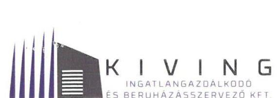

Állami Számvevőszék

Iktatószám: 2-016152423

Domokos László
Elnök

*részére*

Budapest
Apáczai Csere János u. 10.
1051

ÁLLAMI SZÁMVEVŐSZÉK
046067/66
Érkezel: 2016. JÚNIUS 03
Iktatószám: V-0322-345123
Melléklet:

Tárgy: Észrevételek a V-0982-339/2016. iktatószámú Állami Számvevőszéki jelentés-tervezethez

Tisztelt Elnök Úr!

A KIVING Kft. 2016. május 20-án kapta kézhez „Az állami tulajdonban (résztulajdonban) lévő gazdálkodó szervezetek vagyonmegőrzési és gazdálkodási tevékenységének ellenőrzése – Kiving Kft.” tárgyában kelt Jelentés-tervezetet, melyhez az alábbi észrevételeket tesszük:

- Főbb megállapítások, következtetések, javaslatok (5 – 6. oldal):
  - Megállapítás:

  „-1 *vagyonkezelési szerződések 2013. évi megszűnését követően az ingatlanokat a KIVING Kft. jogcím nélküli használta, a vagyonkezelési szerződésben előírt átadás-átvételi eljárás útján történő elszámolás az ellenőrzés befejezéséig nem történt meg annak ellenére, hogy ez a KIVING Kft., mint vagyonkezelő szerződéses kötelezettsége lett volna.”*

  Észrevétel:

  Helytálló annak megállapítása, hogy az átadás-átvételi eljárás útján történő elszámolás az ellenőrzés befejezéséig nem történt meg, azonban szeretnénk jelezni, hogy ez a hosszadalmas, több ingatlant is érintő folyamat (mely magába foglalja a jelzett vagyonkezelt ingatlanokon, a vagyonkezelő által, saját forrásból, több szakaszban történt beruházásokat is) a vagyonkezelési szerződés lejártát követően megkezdődött, és 2016. év folyamán lezárásra kerül.

  - Megállapítás:

    „-1 *vagyonkezelő ingatlanok után a vagyonkezelési szerződések megszűnését követően is elszámoltak értékcsökkenési leírást, amellyel megsértették a számviteli törvény szerinti valódiság elvét.”*

    „-1 *2013-2014. években az éves beszámolókban annak ellenére mutatták ki a korábbi években vagyonkezelt eszközöket, hogy arra vagyonkezelési szerződéssel nem rendelkeztek, a vagyonkezelt eszközöket a nyilvántartásból a KIVING Kft. nem vezette ki, a mérleg nem a valós állapotot tükrözte.”*

  Észrevétel:

  Számviteli szempontból a szóban forgó vagyonkezelt ingatlanok, illetve a hozzájuk kapcsolódó („vagyonkezelt ingatlanon történt”) beruházások KIVING Kft. nyilvántartásaiból történő kivezetése csak a birtokbaadást követően valósulhat meg.

WWW.KIVING.HU

34

---

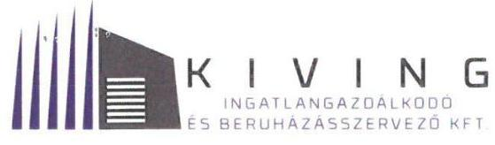

Álláspontunk szerint a KIVING Kft. szabályszerűen járt el akkor, amikor a birtokbaadás későbbi időpontjára tekintettel 2013. és 2014. években a nyilvántartásaiban ezeket a vagyonelemeket továbbra is szerepeltette, és mivel ezek az eszközök használatában voltak, utánuk értékcsökkenést számolt el.

Mindez a társaság könyvvizsgálója egyeztetve történt, aki ezzel kapcsolatosan nem tett észrevételt a Beszámolókhoz kiadott jelentéseiben.

Az állami vagyon védelme biztosított abban a tekintetben, hogy a teljes körű elszámolás során a KIVING Kft. a vagyonkezelési szerződés megszűnését követő időszak bevételeivel és felmerült ráfordításaival, így az értékcsökkenés elszámoláshoz kapcsolódó visszapótlási kötelezettséggel is köteles elszámolni az MNV Zrt. felé.

- **Megállapítás:**
  - *"Az információs rendszert kialakították, azonban annak működésére során az adatszolgáltatási kötelezettségnek bizonyítva a késedelmet."*
  - Fenti megállapítás az 5.2. számú megállapításban (24. oldal) van bővebben kifejtve: *"A KIVING Kft. a vagyonkezelési érintő adatszolgáltatási kötelezettségének 2011. év kivételével késve tett eleget. ... a 2012. évre vonatkozóan 2014. június 8-án; a 2013. évre vonatkozóan 2015. június 5-én ..."*

  **Észrevétel:**
  - A visszapótlási kötelezettség elszámolásához kapcsolódó adatszolgáltatási kötelezettségét a KIVING Kft. 2013. évre vonatkozóan 2014. június 27-én, 2014. évre vonatkozóan 2015. június 30-án teljesítette.
  - A megállapításban található félreértést feltételezhetően az okozta, hogy az adatszolgáltatásban (akárcsak a Beszámolóban) nemcsak a tárgyévet, hanem a bázisévet is fel kell tüntetni. Így a KIVING Kft. a 2013. illetve 2014. évi adatoknál feltüntette az előző évi adatokat is, mely természetesen nem jelentette azt, hogy az adott évi adatszolgáltatási kötelezettségét (korábban) nem teljesítette volna.

- **Megállapítás:**
  - *"A számviteli elszámolások során a bevételek és ráfordítások számviteli bizonylattal nem teljes körűen voltak alátámasztottak."*

  **Észrevétel:**
  - A KIVING Kft. pénzügyi és számviteli tevékenységét 2011. év óta külső szolgáltató végzi. A jelzett probléma 1,5 M Ft összeget tesz ki, mely 2011. és 2013. évek között merült fel. A tényszerűség kedvéért szeretnénk megjegyezni, hogy ezen időszak alatt a KIVING Kft. nettó árbevétele meghaladta az 5.658 M Ft-ot, az anyagjellegű ráfordításai pedig a 3.929 M Ft-ot. Mind a bevételhez, mind a ráfordításhoz közel tízezres nagyságrendű bizonylat kapcsolódott. Ez természetesen nem jelent mentséget arra, hogy a jelzett bizonylatok jelenleg nem állnak rendelkezésre.

- **Megállapítás:**
  - *"A KIVING Kft. vagyonváltazást eredményező döntései a közbeszerzéshez... kapcsolódóan nem voltak szabályszerűek." "Két közbeszerzési eljárás megindításához nem rendelkeztek az MNV Zrt. előzetes engedélyével."*

  **Észrevétel:**
  - 2013. évben a KIVING Kft. valóban úgy folytatta le a jelzett két hirdetmény közzététele nélküli tárgyalásos közbeszerzési eljárást, hogy ahhoz előzetesen nem állt a rendelkezésére az MNV Zrt. közbeszerzési jóváhagyása. Azonban ezek soron kívüli, sürgős ügyletek voltak, melynek céljával az MNV Zrt. egyetértett, annak fedezetét is az MNV Zrt. biztosította. A közbeszerzési eljárás és az azt

# www.kiving.hu

---

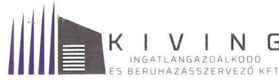

1117 Budapest, Fehérvári út 70.
Telefon: 06 1/209 0400 • Fax: 06 1/209 0404

követő kivitelezés elvártan gyors lebonyolítása miatt a KIVING Kft-nek nem állt elegendő idő rendelkezésre a jóváhagyási eljárás lefolytatására. A munkálatok megrendelésével, illetve a források biztosításával az MNV Zrt. tehát tudomásul vette a közbeszerzési eljárást.

Tájékoztatjuk a tisztelt Állami Számvevőszéket, hogy a jelzett időszakban a jogi-, illetve közbeszerzési feladatokat két különböző szolgáltató végezte a KIVING Kft. számára. A 2015. évben történt menedzsment-váltást követően ezek a feladatkörök egy szolgáltatóhoz kerültek, így meglátásunk és tapasztalatunk szerint a másik feltárt probléma (közbeszerzési eljárás lefolytatása kötelezettségének elmulasztása) elkerülhetővé vált.

## Megállapítás:

*… a 2011-2013. években az éves beszámolók mérlegtételei leltárral való alátámasztottsága nem volt biztosított, a főkönyvi könyvelés és az analitikus nyilvántartások adatai közötti egyeztetést az üzleti év mérlegforduló napjára vonatkozóan dokumentáltan nem készítették el.*"

## Észrevétel:

A KIVING Kft. a vizsgált időszakban az éves Beszámoló alátámasztásául minden évben elvégezte a leltározási feladatokat. Az adatbekéréssel kapcsolatos tájékoztatásunkban jeleztük, hogy leltárzáró jegyzőkönyvvel, valamint a leltárkimutatások főkönyvi számlák egyenlegével történő egyeztetéseinek igazoló dokumentumaival nem rendelkezünk. A mérlegsorokat alátámasztó belső analitikákat, folyószámlákat, leltáríveket, táblázatos kimutatásokat bemutattuk, igaz, nem minden esetben az a felelős vezető által aláírt formában.

A jelentés-tervezetben rögzített megállapítás azt a látszatot kelti, hogy az éves Beszámolók leltárral való alátámasztottsága, azaz tulajdonképpen maga a leltározás 2011-2013. évek folyamán nem történtek meg.

Ehelyett javasoljuk annak rögzítését, hogy a leltározások dokumentáltsága nem volt teljes körű.

## Észrevételek a jelentés-tervezetben megfogalmazott Javaslatokhoz:

1. A vagyonkezelt eszközök átadás-átvételi eljárás útján történő teljes körű elszámolása folyamatban van, az 2016. év folyamán lezárásra kerül.
2. Álláspontunk szerint a vagyonkezelési szerződések megszűnését követően szabálytalanság nem történt (hivatkozással a KIVING Kft. fent kifejtett észrevételére), ezért a felelősség kérdése, annak érvényesítése érdekében történő intézkedés nem indokolt.
3. Intézkedni fogunk annak érdekében, hogy a Beszámolókat alátámasztó leltározási tevékenység dokumentálása szabályszerű legyen.
4. Álláspontunk szerint szabálytalanság a Beszámolók alátámasztásául szolgáló leltározás folyamán nem, viszont annak dokumentálásában történt. A vizsgált időszakban a leltározást végző személyekkel szembeni felelősség érvényesítése nem indokolt, illetve munkaviszonyuk megszűnése miatt az nem lehetséges.
5. A KIVING Kft. intézkedni fog annak érdekében, hogy a külső pénzügyi-, és számviteli szolgáltató a bizonylati elvet, és a bizonylati fegyelmet a Számviteli törvény rendelkezésének megfelelően betartsa.

---

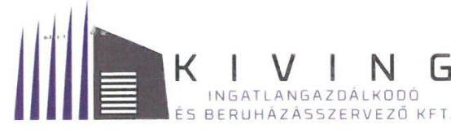

1117 Budapest, Fehérvári út 70.
Telefon: 06 1/209 0400 • Fax: 06 1/209 0404

6. A KIVING Kft. 2016. december 31-ig elkészíti az önköltségszámítási szabályzatot, és intézkedést
hoz az önköltség szabályszerű megállapításáról. Itt szeretnénk megjegyezni, hogy önköltségszámítás
a KIVING Kft-nél eddig is történt, azonban nem szabályozott formában.

7. A KIVING Kft. a közbeszerzési eljárásokkal kapcsolatosan feltárt szabálytalanságokkal
kapcsolatban tisztázni fogja a felelősség kérdését. Előzetesen lefolytatott vizsgálatunk
eredményeként azonban kénytelenek vagyunk a felmerült felelősség érvényesítésétől eltekinteni,
tekintettel arra, hogy a felelősséggel érintett személyekkel jelenleg már nem állunk
munkaviszonyban.

Kérnénk észrevételeink szíves elfogadását, és azoknak a Számvevőszéki jelentés-tervezeten történő
átvezetését.

Budapest, 2016. június 02.

Tisztelettel:

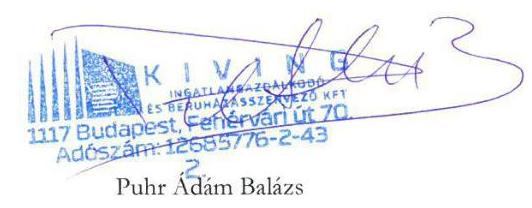

Puhr Ádám Balázs

ügyvezető

---

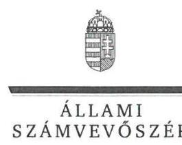

ELNÖK

Ikt.szám: V-0982-346/2016.

# Puhr Ádám Balázs úr 

ügyvezető

KIVING Ingatlangazdálkodó és
Beruházásszervező Kft.

## Budapest

## Tisztelt Ügyvezető Úr!

„Az állami tulajdonban (résztulajdonban) lévő gazdálkodó szervezetek vagyonmegőrzési és gazdálkodási tevékenységének ellenőrzése - Kiving Kft. " címmel készített számvevőszéki jelentéstervezetre tett észrevételét köszönettel megkaptam.
Az Állami Számvevőszék észrevételre vonatkozó álláspontjáról a felügyeleti vezető által készített részletes tájékoztatást mellékelten megküldöm.
Tájékoztatom Ügyvezető urat, hogy a számvevőszéki jelentésben - az Állami Számvevőszékről szóló 2011. évi LXVI. törvény 29. § (3) bekezdése alapján - a figyelembe nem vett észrevételeket szerepeltetjük az elutasítás indokának feltüntetésével.

Budapest, 2016. 06. 27.
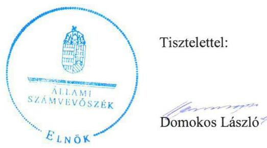

Melléklet: Tájékoztatás az elfogadott és el nem fogadott észrevételekről

---

# Tájékoztatás   az elfogadott és el nem fogadott észrevételekről 

„Az állami tulajdonban (résztulajdonban) lévő gazdálkodó szervezetek vagyonmegőrzési és gazdálkodási tevékenységének ellenőrzése - Kiving Kft. " című jelentéstervezetre

 2016. június 3-án érkezett észrevételét áttekintettük, annak kezelésével kapcsolatban a következő tájékoztatást adom.

## 1. Főbb megállapítások, következtetések, javaslatok 2. bekezdés 2. mondat (5. oldal)

Az észrevétel a jelentéstervezetnek azt a megállapítását, miszerint az átadás-átvétel útján történő elszámolás az ellenőrzés befejezéséig nem történt meg, helytállónak tartja, ezért annak módosítása nem indokolt.

## 2. Főbb megállapítások, következtetések, javaslatok 3. bekezdés 4. mondat és 6. bekezdés 2. mondat (5-6. oldal)

Az észrevétel nem vitatja a jelentéstervezetnek azt a megállapítását, hogy a vagyonkezelési szerződések 2013. évi megszünését követően a Kiving Kft. a korábban vagyonkezelt eszközöket a mérlegeiben kimutatta. A szerződések megszünését követően a Társaság már nem volt vagyonkezelő, az eszközöket jogcím nélkül használta, ezért a mérlegben való kimutatásuk nem felel meg a számvitelről szóló 2000. évi C. törvény (Számv. tv.) 23. § (2) bekezdésében foglaltaknak. A Társaság a korábban vagyonkezelésében lévő eszközök után a szerződések megszünését követően is elszámolta az értékcsökkenési leírást, ezáltal olyan költséget mutatott ki, amelyre vonatkozóan szerződéssel nem rendelkezett, ezért az elszámolás nem felelt meg a Számv. tv. 15. § (3) bekezdésében foglalt valódiság elvének. A jelentéstervezet azt is kifogásolta, hogy a könyvvizsgáló a beszámolók auditálása során nem észrevételezte, hogy a Társaság a 2013-2014. évi beszámolókban olyan vagyonkezelt eszközöket mutatott ki, amelyre vonatkozóan szerződéssel nem rendelkezett. Mindezek alapján megállapításaink helytállóak, azok módosítása nem indokolt.

## 3. Főbb megállapítások, következtetések, javaslatok 6. bekezdés 3. mondat (6. oldal), 5.2. számú megállapítás 4. bekezdés (24. oldal)

Az ellenőrzés rendelkezésére bocsátott 2012. és 2013. évi adatszolgáltatások az „Elküldés dátuma: 2014. 07. 08.” jelölést tartalmazzák, tehát a jelentéstervezet megállapítása az adatszolgáltatás késedelmes elküldésére vonatkozóan helytálló, mert az adatszolgáltatás elküldése mindkét esetben a tárgyévet követő május 31-e után történt.
Az egyértelműség érdekében a jelentéstervezet 5.2. számú megállapítás 4. bekezdését az alábbiak szerint pontosítjuk:

---

„Az MNV Zrt. vagyon-nyilvántartási szabályzatának 3.5.1. pontjában meghatározott, a tárgyévet követő május 31-e helyett a 2012. és 2013. évekre vonatkozóan 2014. július 8-án tettek eleget az adatszolgáltatási kötelezettségnek.”

# 4. Főbb megállapítások, következtetések, javaslatok 3. bekezdés 3. mondat (5. oldal) 

Az észrevétel nem vitatja a jelentéstervezet azon megállapításának helyességét, miszerint a számviteli elszámolások során a bevételek és ráfordítások számviteli bizonylattal nem voltak teljes körűen alátámasztottak, így annak módosítása nem szükséges.
5. Főbb megállapítások, következtetések, javaslatok 3. bekezdés 3. mondat (5. oldal)

Az Alapító Okirat 10.2.3. pontja alapján az MNV Zrt. kizárólagos hatáskörébe tartozott a közbeszerzési tervben nem szereplő közbeszerzések jóváhagyása. Az észrevétel nem vitatja, hogy a Kiving Kft. úgy folytatott le két közbeszerzési eljárást, hogy azokra az MNV Zrt. jóváhagyását nem kérték annak ellenére, hogy a közbeszerzési tervben nem szerepeltek. Ezért megállapításunk helytálló, módosítása nem indokolt.

## 6. Főbb megállapítások, következtetések, javaslatok 6. bekezdés 1. mondat (6. oldal)

Az ellenőrzés megállapította, hogy a Kiving Kft. a Számv. tv. 69. § (3) bekezdésében foglalt előírás ellenére a vagyonkezelt eszközöket az ellenőrzött időszak egyetlen évében sem leltározta, ezért a leltározás teljes körűen nem történt meg, továbbá a Számv. tv. 69. (2) bekezdésének előírása ellenére az analitikus nyilvántartások és a főkönyvi könyvelés egyeztetését dokumentáltan nem végezte el. Ezért megállapításunk helytálló, annak módosítása nem indokolt.

## 7. Észrevételek a jelentéstervezetben megfogalmazott javaslatokhoz:

7.1 A vagyonkezelt eszközök átadás-átvételi eljárására vonatkozó tájékoztatásukat köszönjük, az az ellenőrzött időszakot nem érinti, ezért a javaslat módosítása nem indokolt.
7.2 A 2. pontban adott indoklásunk alapján a javaslat módosítása, illetve törlése nem indokolt.
7.3 Tájékoztatásukat a leltározás dokumentációja szabályszerűségére vonatkozó intézkedésről köszönjük, az alapján a javaslat módosítása nem indokolt.
7.4 A 6. pontban adott tájékoztatásunk alapján a javaslat módosítása, illetve törlése nem indokolt.
7.5 Tájékoztatásukat a bizonylati elv, fegyelem betartatására vonatkozó intézkedésről köszönjük, abban megállapításunkat nem kifogásolják, ezért a javaslat módosítása nem indokolt.

---

7.6 Az önköltségszámításra vonatkozó tájékoztatásukat köszönjük, abban megállapításunkat nem kifogásolják, ezért a javaslat módosítása nem indokolt.
7.7 A közbeszerzési eljárásokkal kapcsolatos felelősség tisztázására vonatkozó tájékoztatásukat köszönjük, az alapján a javaslat módosítása, törlése nem indokolt.

Budapest, 2016. 06. hó 2. nap

Makkai Mária
felügyeleti vezető

---

# Állami Számvevőszék 

## Domokos László

elnök

1052 Budapest
Apáczai Cs. J. u. 10.

Ikt. sz.: MNV/01/2832/ 4 /2016.
Hiv. sz.: V-0982-339/2016.

Tisztelt Elnök Úr!
A 2016. május 20. napján „Az állami tulajdonban (résztulajdonban) lévő gazdálkodó szervezetek vagyonmegőrzési és gazdálkodási tevékenységének ellenőrzése - Kiving Kft.” tárgyában kézhez vett, V-0982-339/2016. ikt. sz. Jelentés-tervezetre az alábbi észrevételeket tesszük:

Összegzés / 5. old. Főbb megállapítások, következtetések, javaslatok 2-3. bekezdései, Megállapítások / 13-14. old. Összegző megállapítás, 1.2. számú megállapítás 1-6. bekezdései, Megállapítások / 22. old. 4.3. számú megállapítás 4. bekezdése:

Tekintettel arra, hogy a Jelentés-tervezet nem tartalmaz olyan megállapítást, amely szerint a megállapodás(ok) megkötésük időpontjában nem feleltek volna meg az akkor hatályos jogszabályi előírásoknak, vagy egyébként az MNV Zrt. - a megalakulását követően - az éppen hatályos, kötelező jellegű jogszabályi előírások tartalmától eltérően módosította volna az érintett megállapodásokat, kérjük törölni a Jelentés-tervezetből azon megállapításokat, miszerint - az egyébként már nem hatályos - vagyonkezelési szerződések nem voltak szabályszerűek.

Általános jelleggel tájékoztatni szeretném Elnök Urat, hogy a vagyonkezelési szerződések módosítására vonatkozó - a központi költségvetési szervnek nem minősülő vagyonkezelők esetében előírt - jogszabályi kötelezettség nem volt (erre a Jelentés-tervezet sem hivatkozik), és az általános polgári jogi elveknek megfelelően egy szerződéses jogviszony csak valamennyi érintett fél egybehangzó akaratnyilatkozata esetén módosítható.

A jogalkotó a nemzeti vagyonról szóló 2011. évi CXCVI. törvény (a továbbiakban: Nvtv.) megalkotása során kifejezetten rendelkezett arról, hogy: „E törvény hatálybalépését megelőzően jogszerűen és jóhiszeműen szerzett jogokat és kötelezettségeket e törvény rendelkezései nem érintik” [ld. Nvtv. 17. § (1) bekezdése], vagyis az Országgyűlés kifejezetten, elvi jelleggel megerősítette, hogy az érintett szerződések módosítás nélkül fenntarthatóak. Az észrevétel különös jelentőséggel bír, mivel a nem központi költségvetési szerv vagyonkezelők jelentős része tekintetében a vagyonkezelési szerződés(ek) az Nvtv. hatályba lépése óta gyakorlatilag érdemben nem is módosíthatóak, legfeljebb a szerződéses jogviszony megszüntetésére van elvi lehetőség.

A szerződéses jogviszonyokra az adott szerződésben meghatározott előírások érvényesek, amennyiben időközben olyan jogszabály-módosítás következik be, amely az adott jogviszonyra kötelező erővel kihat, úgy az új jogszabályi rendelkezés - az adott szerződés módosításának hiányában is - a szerződéses jogviszony részévé válik, illetve a felek ettől függetlenül a szerződésben is rendelkezhetnek úgy, hogy valamely kérdés tekintetében a „mindenkor hatályos” jogszabályi előírásokat kell alkalmazni.

---

A fent leírtakra tekintettel, a Jelentés-tervezetből kérjük törölni azon megállapításokat, amely szerint a vagyonkezelési szerződések nem feleltek meg a hatályos jogszabályoknak, hatálytalan jogszabályokra hivatkoztak és aktualizálásuk nem történt meg. Figyelemmel arra is, hogy a Jelentés-tervezet további körülményeket, jogszabályi előírásokat nem említ, olyan látszatot kelt, mintha ezeket a tényeket az MNV Zrt-re visszavezethető hiányosságnak kellene tekinteni. Az MNV Zrt. álláspontja szerint a Kiving Kft. vagyonkezelésében lévő állami vagyonnal történő szabályszerű vagyongazdálkodás feltételeit, a tulajdonosi joggyakorlás és a vagyongazdálkodási feladatok szabályozott módon történő végrehajtásának elvi lehetőségét - a jogviszony megszűnéséig - a vagyonkezelési szerződések szövege biztosította.

A fentiek alapján kérjük a Jelentés-tervezet érintett megállapításait mind az „Összegzés” című fejezetből, mind a „Megállapítások” elnevezésű fejezetből törölni.

Tényszerűen megállapítható, hogy az elszámolás befejezésére nem került sor, azonban - tekintettel arra is, hogy ennek hátterét az Állami Számvevőszék nem vizsgálta a Jelentés-tervezet alapján - az erre vonatkozó megállapítások kiegészítését kérjük, azzal hogy „ugyanakkor megállapítható, hogy az elszámolási eljárást az érintett felek megkezdték, az jelenleg is folyamatban van, továbbá az elszámolási eljárás során a Magyar Állam illetve a Kiving Kft. követelésről előzetesen nem mondott le”.

A fenti kiegészítést különösen indokoltnak tartjuk arra is figyelemmel, hogy az elszámolás kérdése - ahogy ezt a Kiving Kft. felé is jelezte az MNV Zrt. - a vagyonkezelési jogviszony megszűnése utáni időszak eseményeire (használat kérdése) is kiterjed.

Mint ismeretes, a vagyonkezelési jogviszony megszűnése esetén felmerülő elszámolási kérdések nemcsak számviteli, hanem az értéknövelő beruházásokhoz kapcsolódó műszaki-kivitelezési kérdéseket is érintenek. A Kiving Kft-vel történő elszámolási egyeztetésekhez ezért Társaságunknak el kellett, illetve kell végeznie - többek között - a vagyonkezelt ingatlanokon megvalósuló értéknövelő beruházások helyszíni szemléjét, az alapjául szolgáló számlák, bizonylatok, kivitelezési szerződések felülvizsgálatát, a vagyonkezelt ingatlanok nyitó és záró nettó, bruttó nyilvántartási értékének, visszapótlási kötelezettség mértékének megállapítását. Az említett részfeladatok elvégzése érdekében az MNV Zrt. írásban intézkedett, különös tekintettel arra, hogy mindez feltétele a Kiving Kft. által végzett értéknövelő beruházások elszámolásának, illetve rendezésének.
[2., 3. és 4. számú melléklet]
A felek között több alkalommal megtartott személyes egyeztetéseken és tájékoztató levél útján is jeleztük a Kiving Kft. képviselői részére, hogy a hatályos jogszabályok alapján - mivel a Kiving Kft. nem lát el jogszabályban nevesített közfeladatot sem alap-, sem főtevékenységként - a vagyonkezelési jogviszony megújítása esetén a vagyonkezelési díj mellett visszapótlási kötelezettség teljesítésére is köteles lenne. A felek erre is tekintettel nem újították meg a vagyonkezelői jogviszonyt és nem kötöttek később (már egységes szerkezetű) vagyonkezelési szerződést.

A Kiving Kft. részére Társaságunk jelezte azt is, hogy 2013. november 9. napjától az MNV Zrt-nek történő birtokbaadás napjáig az MNV Zrt. közvetlen kezelésébe kerülő ingatlanok tekintetében el kell számolnia az MNV Zrt-vel a hasznosítási bevételek és az üzemeltetési költségek beszámításával, vagyis igazolható módon intézkedett az MNV Zrt. a vagyonkezelési jogviszony időtartama utáni időszakra vonatkozó hasznosítási-elszámolási kérdések rendezése érdekében is.
[2. számú melléklet]
Ezt egyúttal kérjük figyelembe venni a Jelentés-tervezet 22. oldalán található „4.3 számú megállapítás” 4. bekezdésében foglaltak véglegesítése során is.

Megjegyzendő, hogy mivel a vagyonkezelt ingatlanok jelentős részben egyébként bérleti szerződés útján hasznosítottak, ezek esetében a „köztes időszak” kérdése még elvi szinten sem merül fel, hiszen a bérleti szerződésekbe - a vagyonkezelési jogviszony megszűnése esetén - az MNV Zrt. a Vhr. előírásai tekintetével automatikusan belép.

---

Az állami vagyon megőrzése és védelme érdekében az MNV Zrt. mindent megtesz annak tisztázása érdekében, hogy a Kiving Kft. pontos követelésének meghatározását követően az MNV Zrt. a vagyonkezelői jog átadásának és gyakorlásának ellenértékeként, értékcsökkenési leírásként mit tud beszámítani a Kiving Kft. követelésével szemben.

Az elszámolással kapcsolatos megállapításokat összefoglalva fontosnak tartjuk megjegyezni, hogy kétségtelenül megállapítható ugyan, hogy az elszámolás elhúzódik, azonban egyrészt az elszámoláshoz is a két fél megállapodása szükséges, másrészt a Magyar Államnak erősebb érdeke fűződik ahhoz, hogy az elszámolás szabályszerűen fejeződjön be, minthogy annak befejezésére egészen rövid időn belül sor kerüljön.

A Kiving Kft. által eddig benyújtott elszámolások alapján további kérdések tisztázása vált szükségessé, ezért 2015. július 9-i megkeresésünkben - a helyszíni szemlét követően - további kiegészítésre, pontosításra kértük fel a volt vagyonkezelőt.

Az elszámolás végleges rendezéséhez a Kiving Kft. egyértelmű nyilatkozata szükséges Társaságunk 2015. júliusi 9-i levelében foglaltakra - könyvvizsgáló és teljességi
 nyilatkozattal is alátámasztva -, továbbá az elszámolás rendezéséhez szükséges a Kiving Kft. pontos követelésének meghatározása, ezt követően annak tisztázása, hogy az MNV Zrt. a vagyonkezelői jog átadásának és gyakorlásának ellenértékeként, értékcsökkenési leírásként mit tud beszámítani a Kiving Kft. követelésével szemben. A Kiving Kft.-nek továbbá nyilatkoznia kell a beruházásaihoz igénybe vett források összetételéről is.

Továbbá általános jelleggel szükségesnek tartjuk megjegyezni, hogy az Állami Számvevőszék vizsgálata olyan vagyongazdálkodási kérdéseket is érintett, amelyek előzetes jelzésére nem került sor. Természetesen elvi és gyakorlati akadálya sincs annak, hogy az Állami Számvevőszék részére egy jogügylethez, jogviszonyhoz kapcsolódó egyéb körülmények (pl. elszámolás) is megvizsgálásra kerüljenek, célszerű azonban, hogy ilyen esetben az Állami Számvevőszék pótlólagos információt, adatszolgáltatást kérjen az MNV Zrt.-től, hiszen a kiterjesztett vizsgálat tárgyát képező kérdések kizárólag ezek ismeretében ítélhetők meg teljes körűen.

Álláspontunk szerint, az MNV Zrt. szempontjából nem értelmezhető az „átláthatóság" biztosításának elvárása. Az „átláthatóság" fogalmát az Nvtv. az átlátható szervezet meghatározása keretében használja, illetve rögzíti, amely feltételnek a Kiving Kft. mint szerződő partner megfelelt. Megjegyzendő, hogy az átláthatóság kritériumát a szerződéskötések időpontjában hatályos jogszabályi előírások nem is tartalmazták. Az „átláthatóság" hétköznapi értelemben vett jelentése tekintetében sem tér ki a Jelentés-tervezet arra, hogy miért nem átlátható a vagyonkezelési feladatok végrehajtását szabályozó jogviszony, ugyanakkor az átláthatóságot a Jelentés-tervezet nem a jogszabályi előírásokban rögzített jelentés figyelembevételével vizsgálja.

A fentiek értelmében, kérjük törölni a Jelentés-tervezet azon megállapításait, amely az „átláthatóság" biztosítására vonatkozik.

A vagyonkezelési szerződések aktualizálásának és az állami vagyonnal való gazdálkodásról szóló 254/2007. (X. 4.) Korm. rendelet új előírásai szerződésben való, szöveges rögzítésének elmaradásával kapcsolatban az előzőekben foglaltakat az alábbiak szerint kívánjuk kiegészíteni:

A Vagyon-nyilvántartási szabályzat és a Tulajdonosi Ellenőrzési szabályzat megismerésére, illetve annak kötelező alkalmazására vonatkozó szerződési feltételeket a jogelőd KVI által megkötött vagyonkezelési szerződések is tartalmazták. Ezt a tényt támasztja alá a Kiving Kft. részére minden tárgyévben megküldött „Adatszolgáltatás kérése az MNV Zrt. tárgyévi beszámolójának összeállításához" tárgyú felhívás, amely dokumentáció a hatályos jogszabályok alapján került kidolgozásra és ez alapján kértük a Kiving Kft.-t adatszolgáltatási kötelezettségének teljesítésére.
[1. számú melléklet a 2013. év vonatkozásában]

---

A Jelentés-tervezet 14. oldal 4. bekezdésében foglaltak tekintetében ugyanakkor valóban megállapítható, hogy a szerződések egységes szerkezetbe foglalására - amelyet a Vhr. akkor hatályos 8. § (2) bekezdése általános jelleggel előírt - nem került sor.

Mindez nem jelentheti azt, hogy nyilvánvaló ésszerűtlenség vagy a végrehajtás nehézsége (adott esetben lehetetlensége) esetén a jogalkotó akaratát a jogalkalmazásra köteles szervezetnek nem kell figyelembe venni, azonban az tényként állapítható meg, hogy az egységes szerkezetbe foglalás elmaradása a vagyongazdálkodási feladatok ellátását, valamint a jogviszony „átláthatóságát" (amennyiben a fogalmat e tekintetben használja a Jelentés-tervezet) nem befolyásolta hátrányosan.
A Kiving Kft.-vel fennálló vagyonkezelési jogviszony létesítésére irányuló megállapodások az MNV Zrt. Szerződéstárából folyamatosan, egységesen kereshető módon rendelkezésre álltak, áttekinthetőek voltak.

Fontosnak tartjuk megjegyezni, hogy a Vhr. 8. § (2) bekezdése szerinti egységes szerkezetbe foglalás követelménye - amely az Állami Számvevőszék korábbi években készített Jelentései esetében is problémaként merült fel - 2015. szeptember 9. napjával törlésre került a Vhr.-ből, arra a jogalkotói indokolásra való tekintettel, hogy az adott rendelkezés - a végrehajtási nehézségek mellett - érdemi vagyonpolitikai, vagyongazdálkodási célt nem szolgál, azaz jelenleg már a jogalkotó sem tartja elengedhetetlennek a vagyonkezelési szerződések folyamatos egységes szerkezetbe foglalását.

A Vhr. 8.§ (2) bekezdése alapján tehát korábban valóban nem történt meg az alapszerződés és módosításának egységes szerkezetbe foglalása az új vagyonelemek vagyonkezelésbe adásával, azonban álláspontunk szerint ez nem releváns kérdés, hiszen a vagyonkezelési szerződések megszűntek, a felek pedig - a konszenzus hiánya miatt nem újították meg a vagyonkezelői jogviszonyt.

# Megállapítások / 24. old., 5.2. számú megállapítás 5-7. bekezdései: 

A Jelentés-tervezet szerint az MNV Zrt.-nek is felróható, hogy a Kincstári Vagyonkataszterben szükséges, megfelelő adatszolgáltatásra külön nem hívta fel a Kiving Kft.-t. Kérjük törölni a Jelentés-tervezet ezen megállapítását, hiszen a vagyonkezelő kötelezettsége a szerződésben és a vagyon-nyilvántartási szabályzatban foglaltak szerint is az adatszolgáltatás, így a szükséges felhívás az MNV Zrt. részéről ezzel megtörtént.

Szükségesnek tartjuk megjegyezni azt is, hogy - többek között - az MNV/01/61494/2014 számú, a Kiving Kft. ügyvezetője felé is eljuttatott feljegyzésben a vagyonkezelő külön felkérésre került az ingatlanok nyilvántartásai rendezésére. A Kincstári Vagyonkatasztert a vagyonkezelők - és nem a tulajdonosi joggyakorló MNV Zrt. - vezetik, illetve a szükséges változásokat a vagyonkezelők tüntetik fel.

Fontos megemlíteni azonban azt is, hogy bár a vagyon-nyilvántartási szabályzat szerint a szerződés megszűnését követően valóban teljesíteni kell az adatszolgáltatási kötelezettséget, de egyéb vagyonkezelők esetében a vagyonelemek nyilvántartásokból való ki/bevezetés lehetősége ugyanakkor a birtokbaadás napjához kötődik, hiszen ennek időpontját szükséges figyelembe venni. Számviteli szempontból a teljesítés időpontja - főszabályként - a fizikai értelemben vett teljesítés megtörténtének időpontja, amelyre vonatkozóan a 6884. számú kérdés kapcsán a Számviteli levelekben is iránymutatás található.
A nyilvántartásainkban csak olyan ingatlant mutathatunk ki és számolhatunk el rá értékcsökkenést (költséget), ami ténylegesen a használatunkban van, ez pedig azt feltételezi, hogy megtörtént a birtokbaadás, tehát az MNV Zrt. már birtokon belül van. A 2016. március 30. napján felvett birtokbaadási jegyzőkönyv alapján a KIVING Kft. részére a vagyonnyilvántartás rendezésére irányuló felszólítás ismételten, írásban megküldésre került, mert a birtokbaadás napjával kerülnek be a vagyonelemek az MNV Zrt. SAP AA közvetlen kezelésű rábízott vagyont tartalmazó nyilvántartásába.

Megjegyzendő egyúttal, hogy a Jelentés-tervezetben említett vagyon-nyilvántartási szabályzat 7.8.5 és 7.9. pontjai - legalábbis az MNV Zrt. vagyon-nyilvántartási szabályzatában - nem szerepelnek, így kérjük az erre vonatkozó megállapítás Jelentés-tervezetből való törlését.

---

Az 5.2. számú megállapítás 7. bekezdésében az alábbi megállapítás szerepel:
„Az MNV Zrt. a vagyonkezelt ingatlanokhoz kapcsolódóan a Vtv. 17. § (1) bekezdés d) pontjában foglalt ellenőrzési jogával nem élt, a végzett ellenőrzések munkajogi területre terjedtek ki."

Az Állami Számvevőszék adatbekérése keretében készített 11. sz. tanúsítványban - mely a Kiving Kft.-nél a tulajdonos belső ellenőrző szervezete, vagy megbízott által végzett ellenőrzéseket tartalmazza és amelyet az Ellenőrzési Igazgatóság állított össze - összesen 12 ellenőrzés került feltüntetésre, amelyek közül 11 a vizsgált időszakban az Alapítói Határozatok végrehajtására, a Felügyelő Bizottság tevékenységének áttekintésére, valamint a belső ellenőrzési rendszer felmérésére vonatkozott és a Kiving Kft.-t is érintette, míg 1 vizsgálat pedig felújítási munkálattal kapcsolatos ellenőrzés volt. A Jelentés-tervezetben megjelölt munkajogi területre kiterjedő vizsgálatról az Ellenőrzési Igazgatóságnak nincs tudomása.

A fent leírtak alapján kérjük, hogy a Jelentés-tervezetben az idézett megállapítás kerüljön pontosításra az alábbiak szerint:
„Az MNV Zrt. a vagyonkezelt ingatlanokhoz kapcsolódóan a Vtv. 17. § (1) bekezdés d) pontjában foglalt ellenőrzési jogával nem élt, ugyanakkor a végzett ellenőrzések kiterjedtek a Társaság működésére és a Felügyelő Bizottság tevékenységére."

Javaslatok / 25. oldal a Magyar Nemzeti Vagyonkezelő Zrt. vezérigazgatójának 2. számú Javaslata:
Különösen fontosnak tartjuk megjegyezni, hogy az MNV Zrt. természetesen továbbra is törekedni fog az esetleges hiányosságok megszüntetésére, ugyanakkor a hivatkozott javaslatot kérjük, szíveskedjenek törölni.

Kérem Elnök Urat, hogy a Jelentés véglegesítése során jelen észrevételeinket szíveskedjenek figyelembe venni.
Budapest, 2016. június „",,

Üdvözlettel:
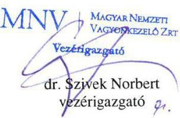

[^0]
[^0]:    Mellékletek:

    - 1. számú melléklet - MNV Zrt. 2014. június 12. napján kelt, MNV/01/36123/2014. ikt. sz. levele
    - 2. számú melléklet - MNV Zrt. 2014. november 14. napján kelt, MNV/01/61494/2014. ikt. sz. feljegyzése
    - 3. számú melléklet - MNV Zrt. 2013. szeptember 7. napján kelt, MNV/01/73185/0/2013. ikt. sz. feljegyzése
    - 4. számú melléklet - MNV Zrt. 2015. július 9. napján kelt elektronikus levele

---

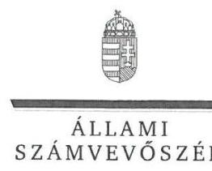

ELNÖK

Ikt.szám: V-0982-344/2016.

# Dr. Szívek Norbert úr 

vezérigazgató

Magyar Nemzeti Vagyonkezelő Zrt.

## Budapest

## Tisztelt Vezérigazgató Úr!

„Az állami tulajdonban (résztulajdonban) lévő gazdálkodó szervezetek vagyonmegőrzési és gazdálkodási tevékenységének ellenőrzése - Kiving Kft. " címmel készített számvevőszéki jelentéstervezetre tett észrevételét köszönettel megkaptam.
Az Állami Számvevőszék észrevételre vonatkozó álláspontjáról a felügyeleti vezető által készített részletes tájékoztatást mellékelten megküldöm.
Tájékoztatom Vezérigazgató urat, hogy a számvevőszéki jelentésben - az Állami Számvevőszékről szóló 2011. évi LXVI. törvény 29. § (3) bekezdése alapján - a figyelembe nem vett észrevételeket szerepeltetjük az elutasítás indokának feltüntetésével.

Budapest, 2016. 06 hó 6 nap
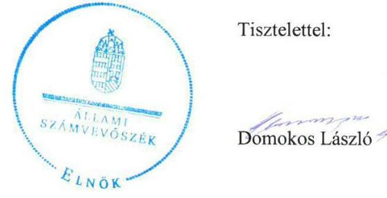

Melléklet: Tájékoztatás az elfogadott és el nem fogadott észrevételekről

---

# Tájékoztatás   az elfogadott és el nem fogadott észrevételekről 

„Az állami tulajdonban (résztulajdonban) lévő gazdálkodó szervezetek vagyonmegőrzési és gazdálkodási tevékenységének ellenőrzése - Kiving Kft. " című jelentéstervezetre 2016. június 6-án érkezett észrevételét áttekintettük, annak kezelésével kapcsolatban a következő tájékoztatást adom.

1. Észrevételek a jelentéstervezet 5. old. Főbb megállapítások, következtések, javaslatok fejezet 2-3. bekezdéseihez, 13-14. old. Összegző megállapításhoz, 1.2. számú megállapítás 1-6. bekezdéseihez, 22. old. 4.3. számú megállapítás 4. bekezdéséhez

Az Állami Számvevőszék az - ellenőrzött szervezeteknek megküldött - ellenőrzési programnak megfelelően a Kiving Kft. vagyonmegőrzési és gazdálkodási tevékenységét ellenőrizte. Az ellenőrzés a 2011. január 1. és 2014. december 31. közötti időszakra terjedt ki. Az Állami Számvevőszék az ellenőrzött időszaktól eltérő időpontban bekövetkezett eseményeket nem ellenőrzi, ebből következően a vagyonkezelési szerződések tekintetében a szerződéskötéskor (2001., illetve 2003. években) fennálló helyzetet sem értékelte.
A vagyonkezelési szerződések az ellenőrzött időszakban az MNV Zrt. felelősségi körébe tartoztak, mert az állami vagyonról szóló 2007. évi CVI. törvény 61. § (1) bekezdése alapján a KVI jogai és kötelezettségei - annak megszűnése miatt - 2007. december 31-ét követően az MNV Zrt.-re szálltak.

Az észrevételben leírtak megerősítik, hogy a vagyonkezelési szerződéseket nem aktualizálták annak érdekében, hogy azok a hatályos jogszabályi előírásoknak megfeleljenek.
A nemzeti vagyonról szóló 2011. évi CXCVI. törvény (Nvtv.) 17. § (1) bekezdése szerint a törvény hatályba lépését megelőzően jogszerűen és jóhiszeműen szerzett jogokat és kötelezettségeket a törvény rendelkezései nem érintik. Az Nvtv. arról nem rendelkezik, hogy a korábban létrejött vagyonkezelési szerződések nem módosíthatók.
A vagyonkezelési szerződések kötelező módosítását jogszabály valóban nem írta elő, valamint az irányadó jogszabályok a vagyonkezelési szerződésekre is érvényesek voltak, azonban az állami vagyonnal való gazdálkodásról szóló 254/2007. (X. 4.) Korm. rendelet (Vhr.) 3. § (1) bekezdése 2012. január 1-jétől előírta, hogy az állami vagyon vagyonkezelésére kötött szerződés tartalmát úgy kell meghatározni, hogy az biztosítsa a tulajdonosi joggyakorlás és vagyongazdálkodási feladatok szabályozott és átlátható módon történő végrehajtását, beleértve a vagyon használatának ellenőrzését.

A Kiving Kft. és a KVI között 2001-ben, illetve 2003-ban létrejött vagyonkezelési szerződések ugyan előírták, hogy a Társaságnak a tulajdonosi joggyakorló vagyon-nyilvántartási szabályzatában foglaltak szerint kell az adatszolgáltatási és nyilvántartási kötelezettségnek eleget tenni, azonban azt nem tartalmazták, hogy a Kiving Kft. a tulajdonosi joggyakorló vagyon-nyilvántartási szabályzatát megismerte és azt kötelező érvényűnek ismeri el.

---

A jelentéstervezetnek a szerződések egységes szerkezetbe foglalására vonatkozó megállapítását az észrevétel nem kifogásolja.
 Az ellenőrzött időszakban a - szerződések egységes szerkezetbe foglalásának kötelezettségét tartalmazó - Vhr. 8. § (2) bekezdés hatályban volt, a szerződéseket ennek ellenére nem foglalták egységes szerkezetbe, tehát a megállapítás helytálló.

A fentiek alapján tény, hogy az ellenőrzött időszakban a vagyonkezelési szerződések nem feleltek meg a hatályos jogszabályi előírásoknak, ezért a tulajdonosi joggyakorlás és a vagyonkezelés feladatai nem voltak egyértelműek, és nem volt számon kérhető a jogszabályoknak és a szerződéseknek is megfelelő vagyonkezelés. Ebből következően a szerződések nem biztosították a tulajdonosi joggyakorlás és a vagyongazdálkodás szabályozott és átlátható módon történő végrehajtását.

A jelentéstervezet tényszerűen tartalmazza, hogy az elszámolás az ellenőrzés befejezéséig nem történt meg. Köszönjük az elszámolási eljárásról adott tájékoztatásukat és a mellékelt dokumentumokat, azok a jelentéstervezet megállapítását támasztják alá. Ugyanis arról adnak tájékoztatást, hogy az elszámolás jelenleg is folyamatban van, a megküldött dokumentumok pedig az ezzel kapcsolatos, egy-egy kérdéskörrel összefüggő levelezést tartalmazzák. Az észrevétel nem vitatja a jelentéstervezet azon megállapításainak helytállóságát, miszerint a vagyonkezelési szerződésekben előírt átadás-átvételi eljárás útján történő elszámolás az ellenőrzött időszakban nem történt meg, a vagyonkezelési szerződések 2013. évi megszűnésétől az ingatlanokat a Társaság jogcím nélkül használta, a tulajdonosi joggyakorló nem intézkedett a jogellenes állapot megszüntetésére és a használati jogcím rendezésére, valamint az állami vagyonról vezetett nyilvántartásban a Kiving Kft.-t továbbra is vagyonkezelőként mutatta ki.

Az észrevétel 3. oldal 5. bekezdése azt tartalmazza, hogy az Állami Számvevőszék ellenőrzése olyan vagyongazdálkodási kérdéseket is érintett, amelyek előzetes jelzésére nem került sor, erre példaként az elszámolást jelölik meg. Az Állami Számvevőszék az ellenőrzései során - így ennél az ellenőrzésénél is - az ellenőrzési program szerint hajtja végre az ellenőrzést, kizárólag az ellenőrzési programban található kérdéseket értékeli. Az elszámolásokkal kapcsolatban a megküldött ellenőrzési program 4. számú melléklete 2.2.1. pontja a következőket tartalmazza: „Betartotta-e a gazdálkodó szervezet az állami vagyonra (apportált és kezelt) vonatkozó állományba vételi, nyilvántartási és elszámolási kötelezettségét, a saját vagyonra vonatkozó rendelkezéseket? Egyezett-e a nyilvántartás szerinti vagyon értéke a tulajdonosi jogok gyakorlójánál nyilvántartott értékkel? " Ez alapján az elszámolás ellenőrzése maradéktalanul megfelelt az ellenőrzési programnak, ezért külön jelzés megtétele nem volt indokolt.

Az előzőekben kifejtettek alapján a jelentéstervezetnek a vagyonkezelési szerződések megszűnésével és az elszámolással kapcsolatos megállapításai helytállóak, azok módosítása, kiegészítése nem indokolt.

---

# 2.1. Észrevételek a jelentéstervezet 24. oldal 5.2. megállapítás 5-6. bekezdéseivel kapcsolatban 

A jelentéstervezet megállapítása nem a Kincstári Vagyonkataszterhez kapcsolódó adatszolgáltatásra vonatkozik, így a hivatkozott feljegyzésben foglalt felkérés sem kapcsolódódik hozzá. Az észrevételükkel ellentétben az MNV Zrt. 266/2013. (VII. 29.) számú vezérigazgatói határozattal jóváhagyott Vagyonnyilvántartási Eljárásrendje 7.8.5. pontja a megszüntető adatszolgáltatás teljesítéséről, 7.9. pontja a vagyonelem vagyonkezelésből történő visszavételéről rendelkezik. A könnyebb beazonosítás érdekében a szabályzat pontos megnevezésével a jelentéstervezet végén található rövidítések jegyzékét kiegészítjük.
Az észrevételben leírtak nem cáfolják a jelentéstervezet azon megállapítását, hogy a Kiving Kft. nem teljesítette az eljárásrendben előírt adatszolgáltatási kötelezettségét a vagyonkezelési szerződések megszűnését követően, valamint hogy az adatszolgáltatási kötelezettség teljesítésére az MNV Zrt. a Vhr. 14. § (8) bekezdésének rendelkezése ellenére a Kiving Kft.-t nem szólította fel. Az észrevételben leírt, a vagyonelemek nyilvántartásokból való ki/bevezetésére vonatkozó tájékoztatást köszönjük, azonban a megállapítás az adatszolgáltatási kötelezettség teljesítésére és nem a vagyonelemek nyilvántartásokból történő ki/bevezetésétre vonatkozik. Mindezek alapján megállapításunk módosítása nem indokolt.

## 2.2. Észrevételek a jelentéstervezet 24. oldal 5.2. megállapítás 7. bekezdéseivel kapcsolatban

Az ellenőrzés rendelkezésére bocsátott dokumentumok alapján - az észrevételben leírtakkal ellentétben - az MNV Zrt. Humánpolitikai Igazgatósága az ellenőrzött időszak minden évében átvilágítást végzett a Kiving Kft.-nél a HR folyamatok, a munkaügy és a HR kontrolling tárgyában. Az MNV Zrt. Ellenőrzési Igazgatósága 2013. évben egy felújítás vonatkozásában végzett ellenőrzést a Kiving Kft.-nél, továbbá az Alapítói Határozatok végrehajtására és az MNV Zrt. közvetlen kezelésében álló gazdasági társaságok felügyelő bizottságainak tevékenységére vonatkozó ellenőrzései kiterjedtek a Kiving Kft.-re is, azonban a Kiving Kft.-t érintő javaslatok nem kerültek megfogalmazásra. A dokumentumok ismételt áttekintését követően a jelentéstervezet 5.2. számú megállapítás 7. bekezdését az alábbiak szerint pontosítjuk:
„Az MNV Zrt. a vagyonkezelt ingatlanokhoz kapcsolódóan a Vtv. 17. § (1) bekezdés d) pontjában foglalt ellenőrzési jogával nem élt, a végzett ellenőrzések a munkaügyi területre, az Alapítói Határozatok végrehajtására, illetve a felügyelő bizottság tevékenységére terjedtek ki."

---

# 3. Észrevételek a jelentéstervezet 25. oldal a Magyar Nemzeti Vagyonkezelő Zrt. vezérigazgatójának tett 2. számú javaslattal kapcsolatban 

A vagyonkezelési szerződésekkel, azok megszűnésével, valamint az elszámolásokkal kapcsolatban a jelentéstervezetben megfogalmazott megállapítások, valamint az észrevételekre az 1. pontban adott válaszunk alapján a javaslat törlése nem indokolt.

Budapest, 2016. C6. hó. 21. nap

Makkai Mária
felügyeleti vezető

---

.

---

# RÖVIDÍTÉSEK JEGYZÉKE 

${ }^{1}$ Kiving Kft.
${ }^{2}$ MNV Zrt.
${ }^{3} \mathrm{FB}$
${ }^{4}$ Vtv.
${ }^{5}$ Alapító Okirat
${ }^{6}$ Üzleti és közbeszerzési tervek
${ }^{7}$ SZMSZ
${ }^{8}$ Javadalmazási szabályzat
${ }^{9}$ Befektetési szabályzat
${ }^{10}$ Vhr.
${ }^{11}$ Áht. 1
${ }^{12}$ 183/1996. (XII.11.) Korm. rendelet
${ }^{13}$ Befektetési szabályzat
${ }^{14}$ Számv. tv.
${ }^{15}$ Számviteli politika
${ }^{16}$ Számlarend
${ }^{17}$ Eszközök és források értékelési szabályzata
${ }^{18}$ Pénzkezelési szabályzat
${ }^{19}$ Leltározási szabályzat
${ }^{20}$ Gt.
${ }^{21}$ Ptk.
${ }^{22}$ Kbt.
${ }^{23}$ Igazgatóság
${ }^{24}$ Tak. tv.
${ }^{25}$ vagyon-nyilvántartási szabályzat

Kiving Ingatlangazdálkodó és Beruházás-szervező Kft.
Magyar Nemzeti Vagyonkezelő Zrt., a Kiving Kft. feletti tulajdonosi jogok gyakorlója
A Kiving Kft. felügyelő bizottsága
Az állami vagyonról szóló 2007. évi CVI. törvény
Kiving Kft. Alapító Okirata
Kiving Kft. üzleti tervei és közbeszerzési tervei
Kiving Kft. Szervezeti és Működési Szabályzata (hatályos: 2011.12.19-2013.10.21)
Kiving Kft. Szervezeti és Működési Szabályzata (hatályos: 2013.10.22-től)
Kiving Kft. javadalmazási szabályzata
Kiving Kft. Befektetési szabályzata
Az állami vagyonnal való gazdálkodásról szóló 254/2007. (X. 4.) Korm. rendelet
1992. évi XXXVIII. törvény az államháztartásról, (hatályos 2011.01.01.2011.12.31)

183/1996. (XII. 11.) Korm. rendelet a kincstári vagyon kezeléséről, értékesítéséről és az e vagyonnal kapcsolatos egyéb kötelezettségekről (hatályos: 2005.04.18-ig) Kiving Kft. Közbeszerzési szabályzata
2000. évi C törvény a számvitelről

Kiving Kft. számviteli politikája
Kiving Kft. számlarendje
Kiving Kft. eszközök és források értékelési szabályzata

Kiving Kft. pénzkezelési szabályzata
Kiving Kft. leltározási és leltár készítési szabályzata
a gazdasági társaságokról szóló 2006. évi IV. törvény (hatálytalan 2014. március 15-étől)
2013. évi V. törvény a Polgári Törvénykönyvről (hatályos 2014. március 15-étől) a közbeszerzésekről szóló 2011. évi CVIII. törvény (hatályos 2012. január 1-jétől) MNV Zrt. igazgatósága
2009. évi CXXII. törvény a köztulajdonban álló gazdasági társaságok takarékosabb működéséről
az MNV Zrt. 266/2013. (VII. 29.) számú vezérigazgatói határozattal jóváhagyott Vagyonnyilvántartási Eljárásrendje

---

ÁLLAMI SZÁMVEVŐSZÉK
1052 Budapest, Apáczai Csere János utca 10.
Levélcím: 1364 Budapest 4. Pf. 54
Telefon: +36 14849100 Telefax: +36 14849200
www.asz.hu
