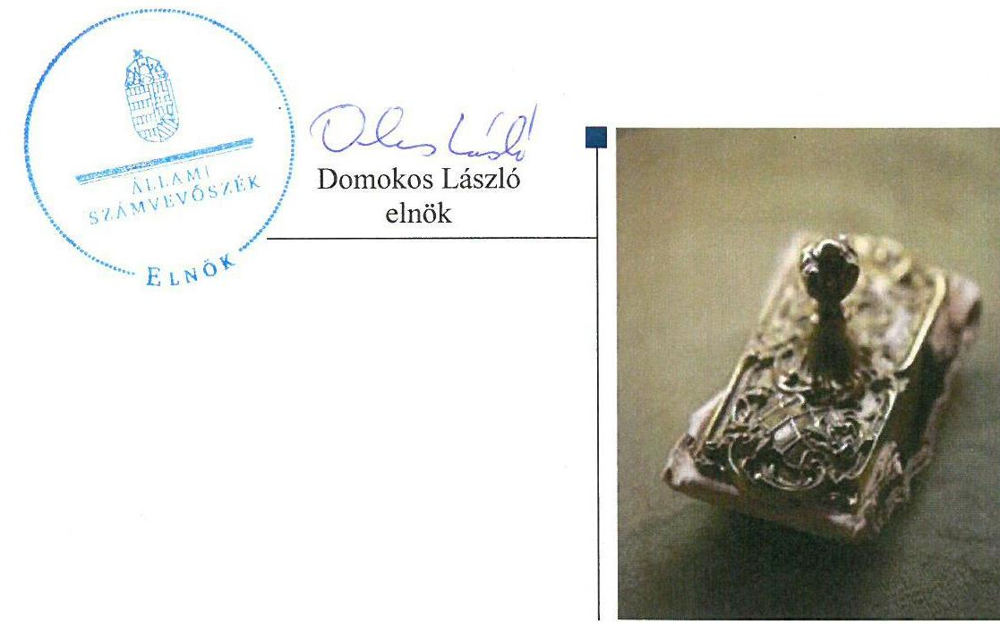
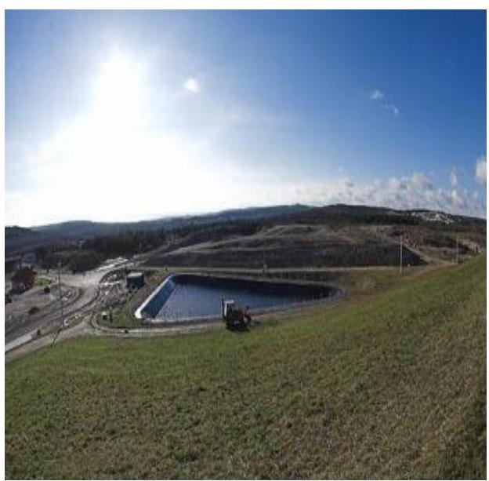
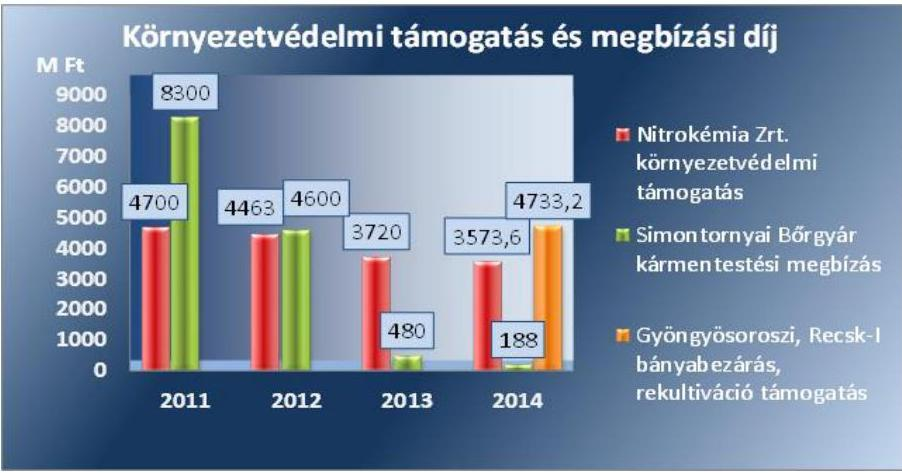
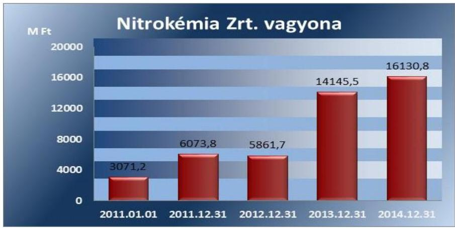
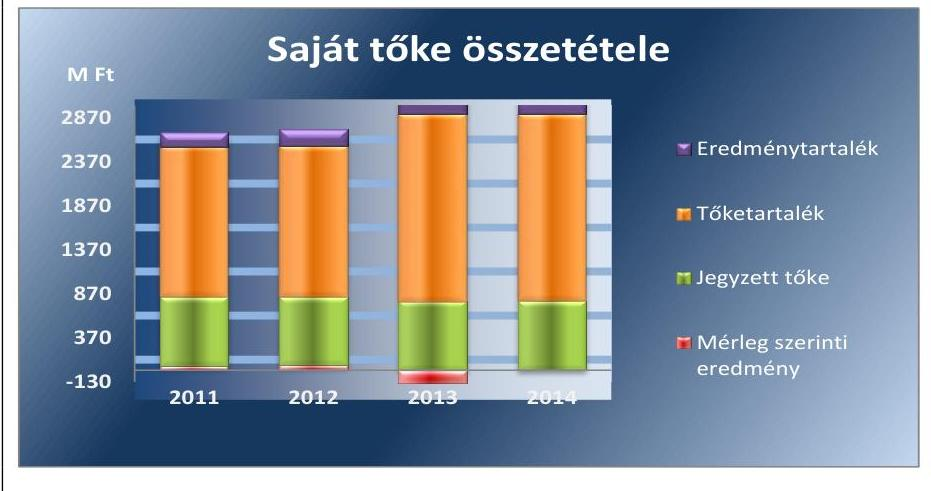
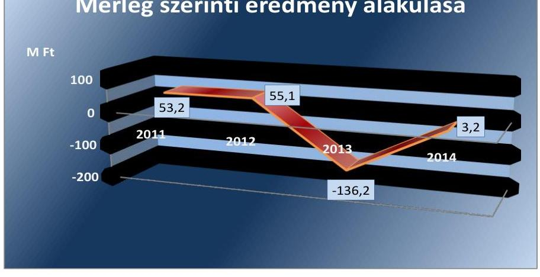
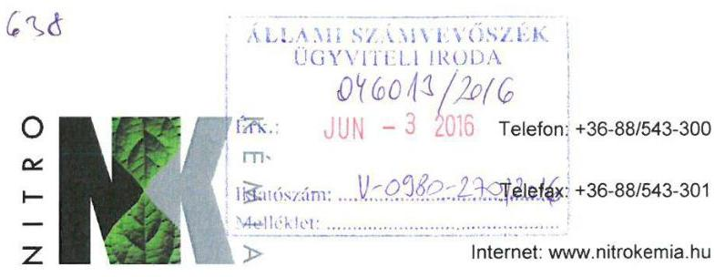
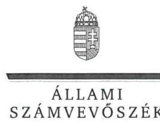
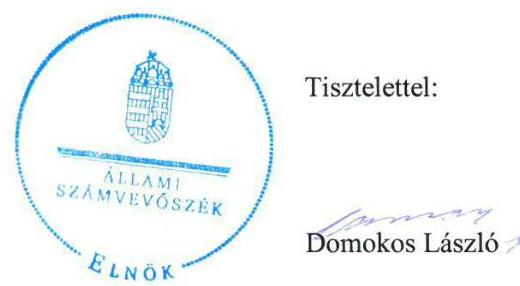
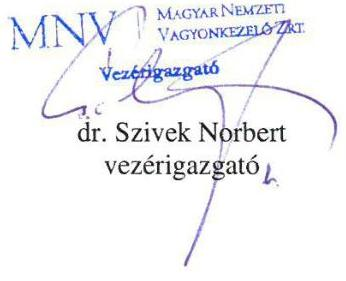

# Jelentés 

## Nitrokémia Zrt.

Az állami tulajdonban (résztulajdonban) lévő gazdálkodó szervezetek vagyonmegőrzési és gazdálkodási tevékenységének ellenőrzése 2016.

16094
www.asz.hu

---

# Jelentés 

## Nitrokémia Zrt.

Az állami tulajdonban (résztulajdonban) lévő gazdálkodó szervezetek vagyonmegőrzési és gazdálkodási tevékenységének ellenőrzése
2016. július hó 21. nap

---

# AZ ELLENŐRZÉST FELÜGYELTE:

## MAKKAI MÁRIA felügyeleti vezető

## AZ ELLENŐRZÉST VEZETTE ÉS A VÉGREHAJTÁSÁÉRT FELELŐS:

### DR. SCHREIBER JUDIT ZSUZSANNA ellenőrzésvezető

## A PROGRAM ÖSSZEÁLLÍTÁSÁÉRT FELELŐS:

### JANIK JÓZSEF LÁSZLÓ osztályvezető

---

**IKTATÓSZÁM:** V-0980-274/2016.

**TÉMASZÁM:** 2014.

**ELLENŐRZÉS-AZONOSÍTÓ SZÁM:** V070913

---

Jelentéseink az Országgyűlés számítógépes hálózatán és az Interneten a www.asz.hu címen is olvashatóak.

---

# TARTALOMJEGYZÉK 

■ ÖSSZEGZÉS ..... 5
■ AZ ELLENŐRZÉS CÉLJA ..... 6
■ AZ ELLENŐRZÉS TERÜLETE ..... 7
■ AZ ELLENŐRZÉS HÁTTERE, INDOKOLTSÁGA ..... 9
■ A JELENTÉS LÉNYEGES KÉRDÉSKÖREI ..... 10
■ ELLENŐRZÉS HATÓKÖRE ÉS MÓDSZEREI ..... 11
■ MEGÁLLAPÍTÁSOK ..... 13
■ JAVASLATOK ..... 24
■ MELLÉKLETEK ..... 25
I. Sz. melléklet: Értelmező szótár. ..... 25
II. Sz. melléklet: A Nitrokémia Zrt. vagyonának megoszlása 2011-2014. években (adatok ezer Ft-ban) ..... 29
III. Sz. melléklet: A Nitrokémia Zrt. eredményének alakulása 2011-2014. években (adatok ezer Ft-ban) ..... 30
■ FÜGGELÉK: ÉSZREVÉTELEK ..... 31
■ RÖVIDÍTÉSEK JEGYZÉKE ..... 37

---

.

---

# ÖSSZEGZÉS 

Az Állami Számvevőszék a Nitrokémia Zrt. vagyonmegőrzési és gazdálkodási tevékenységét 2011. január 1. és 2014. december 31. közötti időszakra vonatkozóan ellenőrizte. A tulajdonosi joggyakorlás szabályszerű, a vagyonnal való gazdálkodás feltételeinek kialakítása megfelelő volt. A vagyonnal való gazdálkodáshoz és a vagyonváltozást eredményező döntésekhez kapcsolódóan hiányosságokat tárt fel az ellenőrzés a közbeszerzések területén, valamint egy lízingügylet megkötése kapcsán. A vagyonnyilvántartás - a 2011. évet kivéve - megfelelt az előírásoknak. Az éves beszámolási és adatszolgáltatási kötelezettséget teljesítették, az információs rendszert kialakították és működtették.

## Az ellenőrzés társadalmi indokoltsága

Az állami tulajdonú gazdálkodó szervezetek a nemzeti vagyon részét képezik. Az állami vagyonnal való gazdálkodást illetően a tulajdonosi joggyakorlás és a vagyongazdálkodás feladata az állami vagyon átlátható, rendeltetésszerű és felelős felhasználásának biztosítása. Az állam meghatározza az ellátandó közszolgáltatásokkal kapcsolatos feladatokat, amelyhez a vagyonnal kapcsolatos döntéseknek igazodniuk kell.

## Főbb megállapítások, következtetések, javaslatok

Az MNV Zrt. a vagyon értékének megőrzéséhez, gyarapításához, a felelős gazdálkodáshoz szükséges követelményeket, valamint a tulajdonos számára fenntartott vagyongazdálkodási jogokat meghatározta. Az MNV Zrt. vagyonváltozást eredményező döntései megfeleltek a jogszabályi előírásoknak, hozzájárultak a vagyon értékének megőrzéséhez, gyarapodásához.

A Nitrokémia Zrt. a vagyon értékének megőrzését, gyarapítását biztosító vagyongazdálkodás feltételeit kialakította, a szabályzatok - a 2012. évtől hatályos Leltározási Szabályzat2, és a 2011. évi Önköltségszámítási Szabályzat kivételével - összhangban voltak a jogszabályi előírásokkal. A 2011. évben hatályos Önköltségszámítási Szabályzat nem volt összhangban a Nitrokémia Zrt. tevékenységével. A 2012. évtől módosított szabályzat illeszkedett a feladatellátáshoz, az önköltségszámítás - a 2011. évi hibás szabályozás ellenére - megfelelő volt.

A vagyonnal való gazdálkodáshoz és a vagyonváltozást eredményező döntésekhez kapcsolódóan hiányosságokat tártunk fel a közbeszerzések területén, valamint egy lízingügylet megkötéséhez kapcsolódóan. A Nitrokémia Zrt. a 2011. évben két azonos tárgyú beszerzéshez kapcsolódó szerződés megkötése előtt nem folytatott le közbeszerzési eljárást, valamint a 2013. évben egy államadósságot keletkeztető lízing ügyletet miniszteri engedély nélkül kötöttek.

A vagyonnyilvántartás, a bevételek, a költségek és ráfordítások elszámolása összességében megfelelt az előírásoknak.

Az éves beszámolási és adatszolgáltatási kötelezettséget teljesítették. Az információs rendszert kialakították és működtették.

A kormányzati szektor hiányára befolyást gyakorló elszámolások megfelelőek voltak, a 2013. évet kivéve kedvezően befolyásolták a kormányzati szektor hiányának alakulását.

---

# AZ ELLENŐRZÉS CÉLJA 

Az ellenőrzés célja annak értékelése volt, hogy a tulajdonosi jogok gyakorlása szabályszerű volt-e, a Nitrokémia Zrt. által ellátott feladatok bevételei, ráfordításai elszámolásának és a vagyongazdálkodási tevékenységének a szabályozása megfelelt-e a jogszabályi és a tulajdonosi előírásoknak, valamint azok végrehajtása szabályszerű volt-e. Biztosítva volt-e a közfeladatok átláthatósága és elszámoltathatósága érdekében a közszolgáltatás díjának megalapozottsága szabályszerű önköltségszámítással. Az ellenőrzés kiterjedt továbbá arra is, hogy a vagyonváltozást eredményező döntések esetében a tulajdonosi jogok gyakorlója és a Nitrokémia Zrt. szabályszerűen járt-e el, továbbá, hogy a Nitrokémia Zrt. kiépítette-e és működtetett-e információs rendszert a szabályszerű vagyongazdálkodás érdekében. A Nitrokémia Zrt.-nek, mint kormányzati szektorba sorolt egyéb szervezet gazdálkodásának a kormányzati szektor hiányára és az államadósságra befolyással bíró elemei a jogszabályi előírásoknak megfeleltek-e.

---

# **AZ ELLENŐRZÉS TERÜLETE**

## **Nitrokémia Környezetvédelmi Tanácsadó és Szolgáltató Zrt.**

A Nitrokémia Zrt.¹ az 1921-ben alapított Magyar Lőporgyárüzemi Rt. jogutódja, amely 1993. január 1-től Rt.²-ként, 2006. november 13-ától Zrt.³-ként működik. A Nitrokémia Zrt. 100%os állami tulajdonban van, a tulajdonosi jogokat az MNV Zrt.⁴ látja el.

Az MNV Zrt. feladatkörébe tartozó környezeti kármentesítési feladatok irányítására és lebonyolítására a 386/2013. (XI.7.) Korm. rendelet⁵ a Nitrokémia Zrt.-t jelölte ki. A Nitrokémia Zrt. fő tevékenységi területe a környezeti kárelhárítás, amelyet állami felelősségvállalással és az állam tulajdonosi irányításával végez.

A Nitrokémia Zrt. a környezeti kárelhárításon túl a Fűzfőgyártelepen és a Papkeszin működő gazdálkodó szervezetek ipari és kommunális szennyvízkezelését is ellátja, a beszállított ipari szennyvíz (folyékony hulladék) kezelésével.

A Mecsek-Öko Zrt. 2013. évi beolvadásával a Nitrokémia Zrt., mint bányatelek tulajdonosi felelősségi körébe tartozik a bányatelkek kármentesítési kötelezettségének teljesítése is.

A Nitrokémia Zrt. 2014. évi beszámolója alapján az összes eszközvagyon 16 130,8 M Ft, a saját tőkéje 3098,8 M Ft, a jegyzett tőke 780,0 M Ft volt. A Nitrokémia Zrt. összes bevétele a 2014. évben 6699,8 M Ft, ezen belül az értékesítés nettó árbevétele 460,7 M Ft volt.

A Nitrokémia Zrt.-nek a környezetvédelmi feladataira az MNV Zrt. környezetvédelmi támogatás és megbízási díj címen 34 757,8 M Ft-ot nyújtott 2011-2014. évek között.

1. ábra

*Forrás: A Nitrokémia 2011-2014. évi üzleti jelentése*

A Nitrokémia Zrt. vagyonkezelésében állami vagyon nem volt. A 2014. évben 3,2 M Ft nyereséget ért el, az átlagos statisztikai állományi létszám 74 fő volt.

---

A Nitrokémia Zrt. a 2012. évtől kormányzati szektorba sorolt egyéb szervezet, így gazdálkodása hatással van az államadósság alakulására. A Nitrokémia Zrt.-nek, mint kormányzati szektorba sorolt egyéb szervezetnek az adósságot keletkeztető ügylete, gazdálkodásának eredménye befolyásolta a kormányzati szektor konszolidált adósságmutatóját.

---

# AZ ELLENŐRZÉS HÁTTERE, INDOKOLTSÁGA 

Az ÁSZ stratégiájában meghatározott célokkal összhangban, az ellenőrzésünkkel a szabályszerű vagyongazdálkodást értékeltük.

A törvényalkotás számára - az észlelt problémák, szabálytalanságok, vagy egyéb nem kívánatos jelenségek felszínre kerülésével - az ellenőrzés megállapításai segítséget nyújthatnak az államháztartáson kívüli közfeladat-ellátás és a vagyonnal való gazdálkodás értékeléséhez, valamint a jogszabályi keretek pontosításához, az átláthatóságot, a költségtakarékos működtetést, az értékmegőrzést, az állagvédelmet, az értéknövelő használatot és gyarapítását biztosító szabályozásához kapcsolódóan.

Az ellenőrzés rámutathat az állami tulajdonú gazdálkodó szervezetek gazdálkodási tevékenységével, valamint az államháztartásból származó források felhasználásával kapcsolatos jó gyakorlatokra és szabálytalanságokra. Felhívhatja a figyelmet a jogszabályi követelmények teljesítéséhez szükséges feltételek hiányosságaira, hozzájárulhat az államháztartáson kívüli, de (közvetlenül vagy közvetve) állami vagyont használó gazdálkodó szervezetek tevékenységének átláthatóságához.

Az ellenőrzés tapasztalatai segítik és erősítik az ÁSZ hozzáadott értéket teremtő elemző tevékenységét és tanácsadó szerepét, valamint pozitív hatással van a szervezetről kialakított összkép formálására is.

Az ellenőrzött számára visszajelzést ad a gazdálkodási tevékenységgel, az állami vagyon felhasználásával és az éves elszámolással kapcsolatos szabálytalanságokról és kockázatokról.

Az Áht. nevesíti a kormányzati szektorba sorolt egyéb szervezet fogalmát. E körbe tartoznak azok a szervezetek, amelyek nem részei az államháztartásnak, azonban az Európai Közösséget létrehozó szerződéshez csatolt, a túlzott hiány esetén követendő eljárásról szóló jegyzőkönyv alkalmazásáról szóló 2009. május 25-i 479/2009/EK rendelet szerint a kormányzati szektorba tartoznak. A nemzeti számlák nemzetközi és hazai statisztikai módszertana és szabványai elveket határoznak meg a statisztikai értelemben vett kormányzati szektorba tartozó szervezetek körére és besorolásuk módjára. A kormányzati szektorba sorolt, költségvetési tervezésbe is bevont gazdálkodó szervezetek ellenőrzése fokozza a legfőbb ellenőrző szerv iránti figyelmet és közbizalmat.

---

# A JELENTÉS LÉNYEGES KÉRDÉSKÖREI 

1.     - Az MNV Zrt., mint a tulajdonosi jogok gyakorlója szabályszerűen alakította-e ki a Nitrokémia Zrt. vagyonnal való gazdálkodásának feltételeit?
2.     - A Nitrokémia Zrt. a vagyon értékmegőrzését és gyarapítását biztosító vagyongazdálkodási tevékenységet szabályozta-e, illetve kialakította-e a vagyonnyilvántartást az előírásoknak megfelelően?
3.     - Szabályszerű, illetve a tulajdonosi előírásoknak megfelelő volt-e a Nitrokémia Zrt. által ellátott feladatok bevételeinek és ráfordításainak elszámolása, valamint az önköltségszámítás?
4.     - A Nitrokémia Zrt. vagyonnal való gazdálkodása, valamint a vagyonváltozást eredményező döntések megfeleltek-e a jogszabályi és a tulajdonosi előírásoknak?
5.     - A Nitrokémia Zrt. teljesítette-e a beszámolási, adatszolgáltatási kötelezettséget, kiépített-e, illetve működtetett-e információs rendszert?
6.     - A Nitrokémia Zrt. gazdálkodásának a kormányzati szektor hiányára és az államadósságra befolyással bíró elemei a jogszabályi előírásoknak megfeleltek-e?

---

# ELLENŐRZÉS HATÓKÖRE ÉS MÓDSZEREI 

## Az ellenőrzés típusa

Szabályszerűségi ellenőrzés

## Az ellenőrzött időszak

2011. január 1. - 2014. december 31. közötti időszak

## Az ellenőrzés tárgya

Az állami tulajdonban (résztulajdonban) lévő gazdálkodó szervezetek vagyonmegőrzési és gazdálkodási tevékenységének ellenőrzése.

## Az ellenőrzött szervezet

Nitrokémia Környezetvédelmi Tanácsadó és Szolgáltató Zrt., Magyar Nemzeti Vagyonkezelő Zrt.

## Az ellenőrzés jogalapja

Az ellenőrzés alapját az Állami Számvevőszékről szóló 2011. évi LXVI. törvény 5. § (3)-(5) bekezdése, valamint az állami vagyonról szóló 2007. évi CVI. törvény 3. § (4) bekezdése képezi.

## Az ellenőrzés módszerei

Az ellenőrzés az INTOSAI ${ }^{6}$ által kiadott nemzetközi standardok figyelembevételével, az ÁSZ ellenőrzés szakmai szabályait tartalmazó belső szabályzatokban foglaltak, valamint az ellenőrzési programokban foglalt értékelési szempontok szerint történt. A bevételek és ráfordítások elszámolása, valamint a vagyonnyilvántartás terén a szabályszerű működést mintavétellel ellenőriztük. A Nitrokémia Zrt.-nél, mint a kormányzati szektorba sorolt gazdálkodó szervezetnél a személyi jellegű ráfordítások elszámolása mellett az egyéb ráfordítások, pénzügyi műveletek ráfordításai, rendkívüli ráfordítások, illetve az egyéb bevételek, pénzügyi műveletek bevételei, rendkívüli bevételek elszámolásának szabályszerűségét szintén mintatételeken keresztül ellenőriztük. A véletlen mintavétellel (évenkénti elemszámmal arányos rétegezéssel) ellenőrzött területek esetében minden egyes tétel vonatkozásában a szabályszerűségre vonatkozó kérdéseket tettünk fel,

---

amelyek eredményét összesítettük. A jogszabályoknak és a belső előírásoknak megfelelőnek tekintettük az adott területet, amennyiben a minta ellenőrzésének eredménye alapján 95%-os bizonyossággal a teljes sokaságban a hibaarány kisebb volt, mint 10%, nem megfelelőnek értékeltük, ha a hibaarány a 10%-ot meghaladta. A személyi jellegű ráfordítások esetében az ellenőrzött mintatételeket értékeltük. A ráfordítások elszámolására és a vagyonnyilvántartásra vonatkozó véletlen mintavételt kockázati alapú kiválasztással egészítettük ki, amelynek során évente a három legnagyobb összegű tételt választottuk ki.

---

# 1. Az MNV Zrt., mint a tulajdonosi jogok gyakorlója szabályszerűen alakította-e ki a Nitrokémia Zrt. vagyonnal való gazdálkodásának feltételeit? 

## Összegző megállapítás

1.1. számú megállapítás

Az MNV Zrt. a Nitrokémia Zrt. vagyongazdálkodásának feltételeit szabályszerűen alakította ki.

Az MNV Zrt. az állami vagyon értékének megőrzéséhez, gyarapításához, valamint a felelős gazdálkodáshoz szükséges követelményeket kialakította, a tulajdonos számára fenntartott vagyongazdálkodási jogokat meghatározta.

A Nitrokémia Zrt. feletti tulajdonosi jogokat gyakorló MNV Zrt. a fenntartott, vagyongazdálkodásra vonatkozó jogokat - a Gt. ${ }^{7}$-ben és a Ptk. ${ }^{8}$-ban
 előírásokkal összhangban - a Nitrokémia Zrt. Alapító Okiratában meghatározta.

A TULAJDONOSI JOGGYAKORLÁS keretében az MNV Zrt. a kizárólagos hatáskörébe tartotta az éves üzleti tervek, az éves beszámolók, a javadalmazási szabályzat elfogadását, továbbá az éves környezetvédelmi kármentesítési feladatterv, valamint a környezetvédelmi kárelhárítás keretében megkötendő szerződések előzetes jóváhagyását.

Az Alapító Okiratban meghatározták a vezérigazgató, az $\mathrm{FB}^{9}$ tagok és a könyvvizsgáló megválasztásának és visszahívásának jogát, továbbá 2013. májusától a középtávú stratégiai terv jóváhagyását.

Értékhatárhoz kötötten az MNV Zrt. hatáskörébe tartozott a vagyonértékű jogok elidegenítése, valamint a garancia és kezességvállalásról, a hitelfelvételről, a pénzügyi befektetésekről, részesedés megszerzéséről vagy elidegenítéséről szóló szerződések jóváhagyása.

A vagyonnal való felelős gazdálkodás érvényüléséhez szükséges követelményeket az Alapító Okirat tartalmazta. Meghatározták a taggyülés, az FB, a könyvvizsgáló és a vezérigazgató jogait, hatáskörét, feladatait, valamint a cégvezetés felelősségét. A közérdek érvényesülését biztosító vagyongazdálkodás feltételeit az Alapító Okirat 8-10. pontjaiban írták elő.
1.2. számú megállapítás

A Nitrokémia Zrt. feladatellátására kötött szerződések szabályszerűek voltak.

A Nitrokémia Zrt. vagyonkezelésében állami vagyon nem volt, a környezeti kárelhárítási tevékenységet az MNV Zrt.-vel 34 757,8 M Ft összegben kötött támogatási és megbízási szerződések alapján látta el.

---

A támogatási szerződések biztosították a szabályszerű feladatellátást. A támogatási szerződésekben meghatározták a szerződő felek jogait és kötelezettségeit, a támogatások célját, az elszámolások és kifizetések szabályait, valamint a felhasználás ellenőrzésének jogosultságát.

A megbízási szerződések a Simontornyai Bőrgyár ${ }^{10}$ kármentesítési feladataihoz, valamint a Peremartoni Vegyipari Vállalat területén lévő iszapkazetták rekultivációjához kapcsolódtak. A megbízási szerződésekben meghatározták az elvégzendő feladatokat, rögzítették az elszámolások szabályait és az ellenőrzési jogosultságokat.

# 2. A Nitrokémia Zrt. a vagyon értékmegőrzését és gyarapítását biztosító vagyongazdálkodási tevékenységet szabályozta-e, illetve kialakította-e a vagyonnyilvántartást az előírásoknak megfelelően? 

Összegző megállapítás

A Nitrokémia Zrt. a vagyongazdálkodás feltételeit kialakította. A Leltározási Szabályzat 2012. évtől nem volt összhangban a Számv. tv. rendelkezésével. A vagyonnyilvántartás megfelelt az előírásoknak.
2.1. számú megállapítás

A Nitrokémia Zrt. a vagyon értékének megőrzését, gyarapítását biztosító vagyongazdálkodás feltételeit kialakította. A Leltározási Szabályzat 2012. évtől nem volt összhangban a Számv. tv. rendelkezésével.

A Nitrokémia Zrt. az MNV Zrt. által megadott tervezési szempontok alapján a gazdálkodására vonatkozó stratégiai célokat az üzleti tervekben határozta meg. Az üzleti terv részét képezte a középtávú stratégia, a beruházási- és közbeszerzési terv, valamint az Alapító Okiratban foglaltakkal összhangban elkészített Javadalmazási Szabályzat ${ }_{1-3}{ }^{11}$. Az üzleti tervek minden évben alapítói határozattal elfogadásra kerültek.

A BELSŐ SZABÁLYZATOK körében, a vagyonával való szabályszerű gazdálkodás érdekében elkészítették a Számv. tv. ${ }^{12}$ 14. § (3) bekezdésében előírt Számviteli politikát ${ }_{1-4}{ }^{13}$, amelyet évente aktualizáltak.

A Számviteli politikában a Számv. tv. 14. § (4) bekezdéssel összhangban meghatározták a Nitrokémia Zrt.-re jellemző szabályokat, előírásokat, módszereket.

A Számlarendet ${ }_{1-4}{ }^{14}$ elkészítették, amely összhangban volt a Számv. tv. 161. § (2) bekezdésében és a Számviteli Politikában előírtakkal.

A számviteli politika keretében elkészítették a Leltározási Szabályzat${ }_{1-}$ et $^{15}$, amely megfelelt a jogszabályoknak. A 2012. február 9-től hatályos Leltározási Szabályzat ${ }_{2}{ }^{16}$ nem volt összhangban a Számv. tv. 69. § (4) bekezdésben előírtakkal.

A 2012. február 9-től hatályos Leltározási Szabályzat ${ }_{2}$ 1. pontjában azt rögzítették, hogy a Nitrokémia Zrt. folyamatos mennyiségi nyilvántartást nem vezet, a szabályzat 5. pontjában pedig a leltározás gyakoriságát két-

---

# 2.2. számú megállapítás 

évenként határozták meg. Ezen együttes előírások nem voltak összhangban a Számv. tv. 69. § (4) bekezdésében foglaltakkal, amely szerint, ha egy gazdálkodó szervezet mennyiségi nyilvántartást nem vezet, akkor évenkénti leltározási kötelezettsége van. A Nitrokémia Zrt. a Leltározási Szabályzatban foglaltaktól eltérően, a Számv. tv. előírásával összhangban vezetett mennyiségi nyilvántartást.

A Számv. tv. 14. § (5) bekezdés b) pontjában előírt Eszközök és források értékelési Szabályzatát ${ }_{1-2}{ }^{17}$ elkészítették. Az Értékelési Szabályzatban a Számv. tv. előírásával összhangban határozták meg az értékelés és az értékcsökkenési leírás szabályait.

A Pénzkezelési Szabályzat ${ }_{1-2}{ }^{18}$ a 2011. évben nem felelt meg a Számv. tv. 14. § (8) bekezdésében foglaltaknak, mert nem rendelkeztek a bankszámlán történő pénzforgalom lebonyolításának rendjéről, a bankszámlán tartott pénzeszközök közötti forgalomról. A szabályzatot a 2012. évben a Számv. tv. előírásával összhangban aktualizálták.

A vagyongazdálkodással kapcsolatos feladat- és hatásköröket, felelősségi viszonyokat az Alapító Okirattal összhangban az SZMSZ ${ }_{1-6}{ }^{19}$, a Kötelezettségvállalási Szabályzat ${ }_{1-9}{ }^{20}$, valamint a Közbeszerzési és beszerzési Szabályzat ${ }_{1-3}{ }^{21}$ határozta meg.

## A Nitrokémia Zrt. vagyonnyilvántartása megfelelt a Számv.tv. előírásainak és a belső szabályzatban foglaltaknak.

A Nitrokémia Zrt. vagyonkezelésébe állami vagyon nem volt, ezért a Vhr. 17. § (1) bekezdésében foglaltak szerinti elkülönített nyilvántartására vonatkozó szabályokat nem kellett alkalmaznia.

A 2011-2014. évek között a Nitrokémia Zrt. öt gazdasági társaságban rendelkezett részesedéssel.

1. táblázat

## NITROKÉMIA ZRT. RÉSZESEDÉSEI 2014. ÉV VÉGÉN (\%, M FT)

| Részesedések | Tulajdonhányad | Részesedés nettó értéke |
| :-- | --: | --: |
| Fűzfői Ipari Park Kft. | $20 \%$ | 0,5 |
| Hunest-Biorefinery Kft. | $50 \%$ | 58,7 |
| Ecolac Kft. | $50 \%$ | 6,9 |
| ÖKOPolisz Kft. | $14,3 \%$ | 0,4 |
| MTMG Zrt. | $25,1 \%$ | 21,6 |

A részesedések számviteli nyilvántartása összhangban volt a Számv. tv. 27. § (1) bekezdésében előírtakkal. A részesedések után a 2011-2014. években összesen 53,3 M Ft értékvesztést számoltak el, amely összhangban volt a Számv. tv. 54. § (1) bekezdésében foglaltakkal. Értékvesztés visszaírására nem került sor.

---

| 2. táblázat |  |  |  |  |
| :--: | :--: | :--: | :--: | :--: |
| BEFEKTETETT ESZKÖZÖK ÉS AZ ÉRTÉKCSÖKKENÉSI LEÍRÁS (M FT) |  |  |  |  |
|  | 2011. év | 2012. év | 2013. év | 2014. év |
| Immateriális javak | 44,7 | 44,7 | 54,0 | 59,0 |
| Immateriális javakra elszámolt écs | 42,9 | 40,9 | 43,9 | 48,2 |
| Nettó érték év végén | 1,8 | 3,8 | 10,1 | 10,8 |
| Tárgyi eszközök | 2556,6 | 3396,1 | 8883,4 | 9513,7 |
| Tárgyi eszközökre elszámolt écs | 385,1 | 943,7 | 1128,9 | 1388,1 |
| Nettó érték év végén | 2171,5 | 2452,4 | 7754,5 | 8125,6 |
| Beruházások | 124,9 | 121,2 | 136,6 | 8,5 |
| Befektetett pénzügyi eszközök | 123,9 | 125,5 | 74,1 | 97,5 |

A vagyon tekintetében a számviteli nyilvántartásban folyamatosan nyomon követhetőek voltak az immateriális javak, a tárgyi eszközök bruttó és nettó értékben, valamint az értékcsökkenési leírások.

A Nitrokémia Zrt. a 2011-2014. évi beszámolói - a Számv. tv. 69. § (1) bekezdésével összhangban - leltárral alátámasztottak voltak. A 2012-2014. években az immateriális javak és tárgyi eszközök mennyiségi felvétellel történő leltározását elvégezték. A csak értékben kimutatott eszközök és kötelezettségek tekintetében a 2011-2014. évek között a leltározást - a Számv. tv. előírásával összhangban - egyeztetéssel végezték. A selejtezést jegyzőkönyvekkel dokumentálták.

# 3. Szabályszerű, illetve a tulajdonosi előírásoknak megfelelő volt-e a Nitrokémia Zrt. által ellátott feladatok bevételeinek és ráfordításainak elszámolása, valamint az önköltségszámítás? 

Összegző megállapítás

A Nitrokémia Zrt. bevételeinek és ráfordításainak elszámolása összességében megfelelő volt. Az Önköltségszámítási Szabályzat a 2011. év végéig nem volt összhangban a feladatellátással. A 2012. évtől hatályos szabályzat, valamint az önköltségszámítás megfelelő volt.

### 3.1. számú megállapítás

A Nitrokémia Zrt. bevételeinek és ráfordításainak számviteli elszámolása összességében megfelelő volt.

A Nitrokémia Zrt. a környezetvédelmi, kármentesítési tevékenységet az MNV Zrt.-vel kötött támogatási szerződések alapján látta el. A támogatási szerződésekben az MNV Zrt. által biztosított támogatási összegek elkülönített nyilvántartási kötelezettségét írták elő. A feladatok ellátásához biztosított források nyújtására vonatkozó támogatási szerződésekben előírt elkülönítési kötelezettségnek eleget tettek. A passzív időbeli elhatárolások között mutatták ki a támogatásokat, a beruházásként elszámolt összegek halasztott bevételként elhatárolásra kerültek.

Az árbevételek számviteli elszámolása megfelelt a Számv. tv. 72. § előírásainak és a Számlarendben foglaltaknak. Az egyéb bevételek, a pénzügyi műveletek bevételei és a rendkívüli bevételek elszámolása összhangban volt a Számv. tv. előírásaival.

---

Az egyes tevékenységek költségeinek és ráfordításainak elkülönítését az Önköltségszámítási Szabályzatban határozták meg. A költségek elkülönítése költséghelyek használatával megtörtént. A költségek elszámolása a főkönyvi könyvelésben a megfelelő költséghelyre történtek.

Az anyagjellegű ráfordítások elszámolása a Számv. tv. 78. § előírásaival összhangban, a megfelelő számlaszámokra történt.

Az egyéb ráfordítások, a pénzügyi műveletek, valamint a rendkívüli ráfordítások elszámolása összességében megfelelő volt. Az elszámolások dokumentumokkal alátámasztottak voltak.

A beruházások, felújítások aktiválása - a szoftver licencek elszámolását kivéve - megfelelő volt. A 2011-2014. évek között 4,2 M Ft összegű, vagyoni értékű jognak minősülő szoftver licencet a Számv. tv. 25. § (6) bekezdése ellenére a szellemi termékek között mutatták ki. A téves elszámolás az eredménykimutatásra nem gyakorolt hatást.

A Nitrokémia Zrt. lejárt követelései a 2014. év végén 53,9 M Ft-ot tettek ki. A lejárt kintlévőség - a 2013. évi végi állományhoz viszonyított - a 2014. évi növekedését egy vevő 29,4 M Ft felhalmozott tartozása okozta.
3. táblázat

# NITROKÉMIA ZRT. VEVŐÁLLOMÁNYA ÉS A VEVŐKÖVETELÉSEKRE ELSZÁMOLT ÉRTÉKVESZTÉS (M FT) 

|  | 2011 | 2012 | 2013 | 2014 |
| :--: | :--: | :--: | :--: | :--: |
| Mérlegben kimutatott vevő követelés | 55,0 | 34,8 | 58,0 | 131,0 |
| ebből lejárt követelés | 34,0 | 24,2 | 23,7 | 53,9 |
| 1-60 nap | 9,7 | 8,3 | 6,2 | 37,1 |
| 61-180 nap | 11,9 | 1,4 | 2,1 | 1,3 |
| 181-360 nap | 0,8 | 2,1 | 1,1 | 1,6 |
| 361 napon túli | 11,6 | 12,4 | 14,3 | 13,9 |
| Elszámolt értékvesztés | 12,6 | 13,6 | 15,1 | 14,8 |

A Nitrokémia Zrt. a belső szabályzatban foglaltaknak megfelelően végezte a kintlévőségek kezelését, amelynek során a 30 napon túl lejárt követelések behajtása érdekében fizetési, illetve ügyvédi felszólításokat küldött, valamint fizetési meghagyás kibocsátását kezdeményezte.

A 2011-2014. években a vevő követelések év végi értékelése során az Értékelési Szabályzatában foglaltakkal és a Számv. tv. előírásaival összhangban került sor az értékvesztések elszámolására.

## 3.2. számú megállapítás

A Nitrokémia Zrt. Önköltségszámítási Szabályzata a 2011. év végéig nem volt összhangban a feladatellátással. A 2012. évtől hatályos szabályzat, valamint az önköltségszámítás megfelelő volt.

A 2011. évben a hatályos Önköltségszámítási Szabályzat ${ }_{1}{ }^{22}$ nem állt összhangban a végzett tevékenységekkel, mert abban termékek gyártásának önköltségszámítási módját határozták meg annak ellenére, hogy a Nitrokémia Zrt. 2011. évben termékgyártást nem végzett.

A 2012. évben a szabályzatot aktualizálták. Az Önköltségszámítási Szabályzat ${ }_{2}{ }^{23}$ megfelelően tartalmazta a költségek meghatározását, az önköltségszámítás módszerét, elkészítésének határidejét, a felosztandó költségek vetítési alapját,
 a költségfelosztás menetét.

---

A Nitrokémia Zrt. a tevékenységeinek önköltségszámítását a 2011-2014. években - a 2011. évi hibás szabályozás ellenére - elkészítette. Az önköltségszámítások az egyes tevékenységek eredményessége mérésének, illetve az éves eredményterv elkészítésének alapjául szolgált.

# 4. A Nitrokémia Zrt. vagyonnal való gazdálkodása, valamint a vagyonváltozást eredményező döntések megfeleltek-e a jogszabályi és a tulajdonosi előírásoknak? 

Összegző megállapítás

## 4.1. számú megállapítás

A Nitrokémia Zrt. vagyonnal való gazdálkodása, valamint a vagyonváltozást eredményező döntések - a közbeszerzésekhez kapcsolódóan feltárt hiányosságok kivételével - megfelelőek voltak.

A Nitrokémia Zrt. vagyongazdálkodási tevékenységét - a közbeszerzésekhez kapcsolódóan feltárt hiányosságok kivételével - az előírásoknak megfelelően végezte.

A Nitrokémia Zrt. a vagyon értékének megőrzéséről, gyarapításáról gondoskodott, vagyona a 2011. január 1-jei 3071,2 M Ft-ról 2014. év végére 16 130,8 M Ft-ra nőtt.
2. ábra

Forrás: Nitrokémia Zrt. 2011-2014. évi beszámolói
4. táblázat

KARBANTARTÁS (M FT)

|  | Kültségek |
| :--: | :--: |
| 2011 | 17,8 |
| 2012 | 12,4 |
| 2013 | 19,9 |
| 2014 | 25,4 |

A Nitrokémia Zrt. vagyonában a legjelentősebb (6796,7 M Ft) változást a MECSEK-ÖKO Zrt. 2013. évi beolvadása okozta. A beolvadással a Gyöngyösoroszi és Lahócai bányabezárással, a Recski üzemeltetéssel kapcsolatos bányakármentesítési tevékenységek, valamint azok ellátásához szükséges eszközök és munkavállalók a Nitrokémia Zrt.-hez kerültek.

A tárgyi eszközök rendszeres karbantartása, állagmegóvása érdekében a karbantartásokat, valamint a felújításokat végeztek el. A karbantartási, felújítási feladatokról az állapotfelmérések alapján éves terveket készítettek, amelyek az üzleti terv részét képezték. Az elvégzett munkákról az éves beszámolókban az MNV Zrt.-t minden évben tájékoztatták.

Az éves beszámolók kiegészítő mellékleteiben a Számv. tv. előírásainak megfelelően bemutatták az alkalmazott értékcsökkenési leírás módszerét,

---

az immateriális javak és tárgyi eszközök értékét, valamint az elszámolt értékcsökkenés mértékét.

Az elszámolt értékcsökkenésnek megfelelő mértékű eszközpótlási, felújítási kötelezettsége a Nitrokémia Zrt.-nek nem volt, azonban az immateriális javak és tárgyi eszközök pótlására fordított összeg a 2011-2014. évek között összességében meghaladta az eszközök után elszámolt értékcsökkenést.
5. táblázat

| ESZKÖZPÓTLÁS (M FT) |  |  |  |  |  |
| :-- | :--: | :--: | :--: | :--: | :--: |
|  | 2011 | 2012 | 2013 | 2014 | Összesen |
| Immateriális javak, tárgyi eszközök |  |  |  |  |  |
| növekedése és beruházások összege | 37,7 | 24,9 | 1725,1 | 1624,4 | 3412,1 |
| Elszámolt értékcsökkenés összege | 89,3 | 201,0 | 188,4 | 265,8 | 744,5 |
| Eszközpótlás | -51,6 | -176,1 | 1536,7 | 1358,6 | 2667,6 |

A Nitrokémia Zrt. eszközeinek átlagos használhatósági foka a 2011. év végi 77,0%-ról 73,8%-ra, az átlagos életkor 8,6 évről a 2014. évre 6,5 évre csökkent, amit a MECSEK-ÖKO Zrt. beolvadásával átvett 4944,5 M Ft értékű ingatlanállomány okozott.
3. ábra

A Nitrokémia Zrt. mérleg szerinti eredménye - a 2013. év kivételével - pozitív volt, aminek köszönhetően a saját tőke/jegyzett tőke aránya növekedett. A saját tőke a jegyzett tőke négyszerese volt a 2014. év végén.

# 4.2. számú megállapítás 

A Nitrokémia Zrt. vagyonváltozást eredményező döntései - a közbeszerzésekhez kapcsolódóan feltárt hiányosságokat kivéve - megfelelőek voltak.

Az MNV Zrt. a vagyongazdálkodáshoz kapcsolódó, vagyonváltozást eredményező döntésekre vonatkozó, a tulajdonos számára fenntartott jogokat, valamint a döntések előkészítésével kapcsolatos követelményeket a Nitrokémia Zrt. Alapító Okiratában határozta meg.

---

A Nitrokémia Zrt. az MNV Zrt. jóváhagyásához kötött döntések előterjesztéseit, az éves beszámolókat, az üzleti terveket, a kármentesítési feladatterveket előterjesztette, azokat az MNV Zrt. alapítói határozatokkal elfogadta.

A Nitrokémia Zrt. vagyonváltozását eredményező döntései összhangban voltak az MNV Zrt. által hozott döntésekkel, valamint a feladatellátásra kötött támogatási szerződésekben foglalt előírásokkal.

A Nitrokémia Zrt. a Kbt. ${ }_{1}^{24}$ 22. § (1) bekezdés és a 2012. évtől hatályos Kbt. ${ }_{2}^{25}$ 6. §-a szerint ajánlatkérőnek minősült. A közbeszerzési eljárások rendjét szabályozták, a Kbt. ${ }_{1,2}$ rendelkezéseinek megfelelően elkészítették az éves közbeszerzési terveket, amelyeket az MNV Zrt. elfogadott.

A Nitrokémia Zrt. a 2011. évben két azonos tárgyú beszerzéshez kapcsolódó szerződés megkötése előtt nem folytatott le közbeszerzési eljárást, amivel nem tartották be a Kbt. 12. § (1) bekezdésében és a 240. § (1) bekezdésében foglaltakat.

# 4.3. számú megállapítás 

Az MNV Zrt. vagyonváltozást eredményező döntései megfeleltek a jogszabályi előírásoknak.

Az MNV Zrt. a vagyonváltozást eredményező döntéseit a hatáskörébe tartozó beszámolók és szabályzatok elfogadásán túl a Nitrokémiai Zrt. kármentesítési és környezetvédelmi tevékenységéhez kapcsolódó támogatási szerződéseken keresztül hozta, amelyek összhangban voltak a belső előírásokkal.

A Nitrokémia Zrt. legjelentősebb vagyonváltozását a MECSEK-ÖKO Zrt. 2013. évi beolvadása okozta. Az MNV Zrt. a 320/2013. (VI. 28.) számú Alapítói határozatban döntött a beolvadásáról. A beolvadás a határozatban foglaltaknak megfelelően történt.

A Nitrokémiai Zrt. által előzetesen megküldött vélemények és javaslatok alapján írásbeli engedélyét, hozzájárulását a vagyonváltozást eredményező döntésekhez megadta. A MNV Zrt. 2013. évben a 235/2013. (V. 27.) számú határozatban egy ingatlan bérbeadását, valamint a 464-467/2014. (XII. 01.) számú határozatokban ingatlanok értékesítését engedélyezte.

## 5. A Nitrokémia Zrt. teljesítette-e a beszámolási, adatszolgáltatási kötelezettséget, kiépített-e, illetve működtetett-e információs rendszert?

Összegző megállapítás

A Nitrokémia Zrt. az éves beszámolási és adatszolgáltatási kötelezettséget teljesítette. Az információs rendszert kialakították és működtették.

### 5.1. számú megállapítás

A Nitrokémia Zrt. a beszámolási és adatszolgáltatási kötelezettségét teljesítette. Az FB és a könyvvizsgáló a feladatát a jogszabályok szerint látta el.

A Nitrokémia Zrt. a Számv. tv.-ben előírt éves beszámoló készítési kötelezettségének eleget tett. A 2011-2014. évek között az éves beszámolókat elkészítették.

---

A 2011. évi éves beszámolóhoz kapcsolódóan a könyvvizsgáló korlátozó záradékot adott ki, amelynek oka - az előző évek gazdálkodásának külső ellenőrzése során feltárt - a támogatásokból finanszírozott kármentesítési tevékenységhez beszerzett, több éven át használatos tárgyi eszközök, valamint egy ingatlan aktiválásának elmaradása volt.

A Nitrokémia Zrt. a feltárt, az előző éveket érintő, a tárgyi eszközök aktiválásához kapcsolódó hibákat korrekciós tételként - a Számv. tv. előírásával összhangban - a 2012. évi beszámolójában szerepeltette. A módosítások a mérleg szerinti eredményt 19,9 M Ft-tal csökkentették.

A 2012. évi beszámolóról a módosítások ellenére a könyvvizsgáló korlátozó záradékkal ellátott könyvvizsgálói jelentést adott ki, amely az ingatlan aktiválásának elmaradásához kapcsolódott.

A 2013-2014. évek éves beszámolói megfeleltek a Számv. tv. előírásainak, a könyvvizsgáló a beszámolókat hitelesítő záradékkal látta el.

Az éves beszámolókat és üzleti jelentéseket az FB megtárgyalta, azokat jóváhagyásra javasolta. Az FB a tevékenységéről az MNV Zrt.-nek évente beszámolt. Az MNV Zrt. az éves beszámolókat és üzleti jelentéseket elfogadta.

A Nitrokémia Zrt. a Számv. tv.-ben előírt letétbe helyezési és közzétételi kötelezettségének a mérleg fordulónapját követő ötödik hónap utolsó napjáig - május 31. - eleget tett.

A könyvvizsgáló a 2013. évi éves beszámolóhoz kapcsolódóan élt jelzési jogával, és felhívta a figyelmet egy, a Nitrokémia Zrt. 50%-os tulajdonában lévő társasági részesedés jelentős mértékű csökkenésére.

A Nitrokémia Zrt. a közérdekű adatok nyilvánosságra hozatalát a saját internetes oldalán biztosította. Az MNV Zrt. közzéteendő információk körére és módjára vonatkozó ajánlásában foglaltaknak eleget tettek.

Az adatok és információk védelméről az Adatvédelmi Szabályzatban ${ }^{26}$ rendelkeztek. A dokumentumok kezelésének, irattárolásának és selejtezésének szabályait a Dokumentumkezelési rend ${ }^{27}$ tartalmazta.

# 5.2. számú megállapítás 

## A Nitrokémia Zrt. az információs rendszert megfelelően kialakította és működtette.

Az MNV Zrt. előírta a Nitrokémia Zrt. részére a tevékenységéről, az elfogadott üzleti tervekben foglaltak megvalósulásáról szóló kontrolling adatszolgáltatást, továbbá 2014 szeptemberétől társaság-specifikus teljesítménymutatószámok adatszolgáltatását, amely adatszolgáltatásokat a Nitrokémia Zrt. teljesített.

Az MNV Zrt. további beszámolási kötelezettségeket írt elő a környezetvédelmi és kármentesítési tevékenységet finanszírozó támogatási szerződésekben. A környezetvédelmi beszámolókat a Nitrokémia Zrt. elkészítette, azokat az FB véleményének ismeretében az MNV Zrt. alapító határozatokban elfogadta.

Az MNV Zrt. a tulajdonosi ellenőrzési kötelezettségének az ellenőrzött időszakban eleget tett. Az Alapító határozatok végrehajtása érdekében tett intézkedésekről a Nitrokémia Zrt. vezérigazgatóját az FB-n keresztül félévente beszámoltatta.

A Nitrokémia Zrt. - a 2014. január 1-jétől a kormányzati szektorba tartozó szervezetekre is kiterjesztett - Bkr. ${ }^{28}$ 10. § előírása alapján 2014. évtől

---

a belső ellenőrzési rendszert kialakította és működtette. A belső ellenőr a Belső Ellenőrzési Kézikönyvben ${ }^{29}$ foglaltaknak alapján végezte a feladatát, az ellenőrzéseiről belső ellenőrzési jelentést készített.

# 6. A Nitrokémia Zrt. gazdálkodásának a kormányzati szektor hiányára és az államadósságra befolyással bíró elemei a jogszabályi előírásoknak megfeleltek-e? 

Összegző megállapítás

A kormányzati szektor hiányára befolyást gyakorló bevételek és ráfordítások elszámolása megfelelő volt. A 2013. évben egy államadósságot keletkeztető ügyletet miniszteri engedély nélkül kötöttek. Osztalékfizetés nem történt.

## 6.1. számú megállapítás

A Nitrokémia Zrt. a 2013. évben miniszteri engedély nélkül kötött egy államadósságot keletkeztető ügyletet.

A Nitrokémia Zrt., mint kormányzati szektorba sorolt egyéb szervezetet a költségvetés tervezéséhez előírt adatszolgáltatási kötelezettség terhelte, amelynek az MNV Zrt. útján tettek eleget.

A Nitrokémia Zrt. a 2013. évben egy 48 hónapos lejáratú lízingszerződést kötött személygépkocsi megvásárlására 3,15 M Ft összegben, amelyhez a Stabilitási tv. ${ }^{30}$ 9. § (1) bekezdésében előírtak ellenére nem rendelkezett az államháztartásért felelős miniszter előzetes hozzájárulásával.

## 6.2. számú megállapítás

A kormányzati szektor hiányára befolyást gyakorló elszámolások megfelelőek voltak. Osztalékfizetésre nem került sor.

A kormányzati szektor hiányára befolyást gyakorló bevételek és ráfordítások elszámolása megfelelő volt, a személyi jellegű ráfordítások elszámolása megfelelt az előírásoknak.

A 2011., 2012. és 2014. években a Nitrokémia Zrt. mérleg szerinti eredménye pozitív volt, azonban a 2013. évi 136,2 M Ft veszteség kedvezőtlenül befolyásolta a kormányzati hiány alakulását.
4. ábra

## Mérleg szerinti eredmény alakulása

---

A Nitrokémia Zrt.-nél osztalék kifizetése nem történt, az adózott eredmény az eredménytartalékba került elszámolásra.

---

# JAVASLATOK 

Az ÁSZ tv. 33. § (1) bekezdésében foglaltak értelmében az ellenőrzött szervezet vezetője köteles a jelentésben foglalt megállapításokhoz kapcsolódó intézkedési tervet összeállítani és azt a jelentés kézhezvételétől számított 30 napon belül az ÁSZ részére megküldeni. Amennyiben az intézkedési tervet az ellenőrzött szervezet vezetője nem küldi meg határidőben, vagy továbbra sem elfogadható intézkedési tervet küld, az ÁSZ elnöke az ÁSZ törvény 33. § (3) bekezdés a)-b) pontjaiban foglaltakat érvényesítheti.

## A Nitrokémia Zrt. vezérigazgatójának

1. Intézkedjen a Leltározási Szabályzat módosításáról és az abban foglaltak alkalmazásáról a Számv. tv. előírásainak érvényesülése érdekében.
(2.1. sz. megállapítás 5-6. bekezdése alapján)
2. Intézkedjen a közbeszerzési eljárások mellőzésével kötött szerződésekkel, valamint az államháztartásért felelős miniszter hozzájárulása nélkül kötött lízingszerződéssel kapcsolatos szabálytalanság tekintetében a felelősség tisztázása érdekében és szükség szerint intézkedjen a felelősség érvényesítéséről.
(4.2. sz. megállapítás 5. bekezdése és 6.1. sz. megállapítás 2. bekezdése alapján)

---

# MELLÉKLETEK 

I. SZ. MELLÉKLET: ÉRTELMEZŐ SZÓTÁR

| Állami vagyon | 2010. június 17-től   a) Az állam tulajdonában lévő dolog, valamint a dolog módjára hasznosítható természeti erő,   b) az a) pont hatálya alá nem tartozó mindazon vagyon, amely vonatkozásában törvény az állam kizárólagos tulajdonjogát nevesíti,

   c) az állam tulajdonában lévő tagsági jogviszonyt megtestesítő értékpapír, illetve az államot megillető egyéb társasági részesedés,   d) az államot megillető olyan immateriális, vagyoni értékkel rendelkező jogosultság, amelyet jogszabály vagyoni értékű jogként nevesít.   Forrás: Vtv. 1. § (2) bekezdése   2012. november 10-től az állami vagyon fogalma kiegészül a következő ponttal:   e) az állam tulajdonában lévő pénzügyi eszközök   Forrás: Vtv. 1. § (2) bekezdése |
| :--: | :--: |
| Állami vagyon kezelője /vagyonkezelő | 2010. január 01 - 2011. december 31. között:   Az állami vagyont az MNV Zrt. maga kezeli, vagy szerződés - így különösen bérlet, haszonbérlet, szerződésen alapuló haszonélvezet, vagyonkezelés, megbízás - alapján központi költségvetési szervnek, természetes vagy jogi személynek, illetőleg jogi személyiséggel nem rendelkező gazdasági társaságnak hasznosításra átengedi.   Vtv. 23. § (1) bekezdése   2012. január 1-jétől:   Az állami vagyont az MNV Zrt. maga kezeli, vagy szerződés - így különösen bérlet, haszonbérlet, megbízás - alapján központi költségvetési szervnek, természetes vagy jogi személynek, vagy jogi személyiséggel nem rendelkező gazdálkodó szervezetnek hasznosításra átengedi. Az állami vagyonra vonatkozóan az MNV Zrt. kizárólag az Nvtv-ben meghatározott személyekkel köthet vagyonkezelési szerződést.   Forrás: Vtv. 23. § (1), 27. § (1)   2013. június 28-ától:   Az állami vagyonnal az MNV Zrt. maga gazdálkodik, vagy szerződés - így különösen bérlet, haszonbérlet, megbízás - alapján központi költségvetési szervnek, természetes vagy jogi személynek, vagy jogi személyiséggel nem rendelkező gazdálkodó szervezetnek hasznosításra átengedi, illetőleg vagyonkezelésbe, haszonélvezetbe adja. Az állami vagyonra vonatkozóan az MNV Zrt. kizárólag az Nvtv-ben meghatározott személyekkel köthet vagyonkezelési szerződést.   Forrás: Vtv. 23. § (1), 27. § (1) |
|  | Állami vagyon értékesítése |
| Kormányzati szektorba sorolt egyéb szervezet | Állami vagyon tulajdonjogának bármely jogcímen történő, visszterhes átruházása.   Forrás: Vhr. 1. § (7) d) pont) |
|  | Az a szervezet, amely az Áht. alapján nem része az államháztartásnak, azonban az Európai Közösséget létrehozó szerződéshez csatolt, a túlzott hiány esetén követendő eljárásról szóló jegyzőkönyv alkalmazásáról szóló 2009. május 25-i |

---

|  | 479/2009/EK rendelet szerint a kormányzati szektorba tartozik. A nemzetgazdasági miniszter 2013. június 26-án megjelent Közleményben tette közé ezen szervezetek listáját. |
| :--: | :--: |
| Nemzeti vagyon | 2012. január 1-jétől nemzeti vagyon:   a) az állam vagy a helyi önkormányzat kizárólagos tulajdonában álló dolgok,   b) az a) pont hatálya alá nem tartozó, állam vagy a helyi önkormányzat tulajdonában lévő dolog,   c) az állam vagy a helyi önkormányzat tulajdonában lévő pénzügyi eszközök, továbbá az államot vagy a helyi önkormányzatot megillető társasági részesedések,   d) az államot vagy a helyi önkormányzatot megillető bármely vagyoni értékkel rendelkező jogosultság, amelyet jogszabály vagyoni értékű jogként nevesít,   e) Magyarország határa által körbezárt terület feletti légtér,   f) az üvegházhatású gázok kibocsátási egységeinek kereskedelméről szóló törvény szerint kibocsátási egység és légiközlekedési kibocsátási egység, valamint az ENSZ Éghajlatváltozási Keretegyezménye és annak Kiotói Jegyzőkönyve végrehajtási keretrendszeréről szóló törvény szerinti kiotói egység,   g) állami vagy helyi önkormányzati fenntartású közgyűjtemény (muzeális intézmény, levéltár, közgyűjteményként működő kép- és hangarchívum, valamint könyvtár) saját gyűjteményében nyilvántartott kulturális javak körébe tartozó dolog,   h) a régészeti lelet,   i) a nemzeti adatvagyon körébe tartozó állami nyilvántartások fokozottabb védelméről szóló törvény szerinti nemzeti adatvagyon.   Forrás: Nvtv. 1. § (2) |
| Nemzetközi standardok | ISSAI 100: A számvevőszéki ellenőrzés általános alapelvei; ISSAI 200: A pénzügyi ellenőrzés alapelvei; ISSAI 300: A teljesítmény-ellenőrzés alapelvei; ISSAI 400: A megfelelőségi ellenőrzés alapelvei. |
| Tulajdonosi ellenőrzés | 2010. június 17-től:   Az MNV Zrt. „rendszeresen ellenőrzi a vele szerződéses jogviszonyban lévő személyek, szervezetek vagy más használók állami vagyonnal való gazdálkodását, megállapításairól az MNV Zrt. Felügyelő Bizottságát, az ellenőrzött szervet, szükség esetén a minisztert és az Állami Számvevőszéket tájékoztatja".   Forrás: Vtv. 17. § d.   A Vhr. alapján „a tulajdonosi ellenőrzés célja az állami vagyonnal való gazdálkodás vizsgálata, ennek keretében a rendeltetésellenes, jogszerűtlen, szerződésellenes, vagy a tulajdonos érdekeit sértő, illetve a központi költségvetést hátrányosan érintő vagyongazdálkodási intézkedések feltárása és a jogszerű állapot helyreállítása, továbbá a vagyonnyilvántartás hitelességének, teljességének és helyességének biztosítása". Forrás: Vhr. 20. § (2)   2011. december 31-ig   Az állami vagyon kezelőjét, használóját megillető jogok gyakorlását, annak szabályszerűségét, célszerűségét az MNV Zrt. - szükség szerint területi szervei útján - ellenőrzi.   Forrás: Vhr. 20. § (1)   2012. január 1-jétől: |

---

|  | Az állami vagyon kezelőjét, haszonélvezőjét, használóját megillető jogok gyakorlását, annak szabályszerűségét, célszerűségét az MNV Zrt. - szükség szerint területi szervei útján - ellenőrzi.   Forrás: Vhr. 20. § (1) |
| :--: | :--: |
| Tulajdonosi jogok gyakorlója | 2010. június 17-től:   Az állami vagyon felett a Magyar Államot megillető tulajdonosi jogok és kötelezettségek összességét - ha törvény eltérően nem rendelkezik - az állami vagyon felügyeletéért felelős miniszter (a továbbiakban: miniszter) gyakorolja, aki e feladatát a Magyar Nemzeti Vagyonkezelő Zártkörűen Működő Részvénytársaság (a továbbiakban: MNV Zrt.), a Magyar Fejlesztési Bank, illetve a tulajdonosi joggyakorló szervezet útján látja el. A miniszter miniszteri rendeletben, a törvényben meghatározott állami vagyoni kör tekintetében, meghatározott időtartamra, a joggyakorlás egyes szabályainak meghatározásával - az őt megillető tulajdonosi jogok és kötelezettségek összességének, illetve azok meghatározott részének gyakorlóját az Áht. szerinti központi költségvetési szervek, ezek intézménye, továbbá a 100%-ban állami tulajdonban álló gazdasági társaságok közül kijelölheti.   Forrás: Vtv. 3. § (1) és (2)   2013. június 28-ától:   A rábízott állami vagyon felett az államot megillető tulajdonosi jogok és kötelezettségek összességét tulajdonosi joggyakorlóként:   a) ha törvény vagy miniszteri rendelet eltérően nem rendelkezik, a Magyar Nemzeti Vagyonkezelő Zártkörűen Működő Részvénytársaság (a továbbiakban: MNV Zrt.),   b) törvényben kijelölt személy vagy   c) az állami vagyon felügyeletéért felelős miniszter (a továbbiakban: miniszter) által rendeletben kijelölt személy gyakorolja.   [...] A miniszter e törvény felhatalmazása alapján - a meghatározott célok hatékonyabb elérése érdekében, miniszteri rendeletben, az ott meghatározott állami vagyoni kör tekintetében, meghatározott időtartamra - e törvény keretei között, a joggyakorlás egyes szabályainak meghatározásával - az államot megillető tulajdonosi jogok és kötelezettségek összességének, illetve azok meghatározott részének gyakorlóját az Áht. szerinti központi költségvetési szervek, ezek intézménye, továbbá a 100%-ban állami tulajdonban álló gazdasági társaságok közül kijelölheti.   Forrás: Vtv. 3. § (1) és (2) |
| A tulajdonosi joggyakorlás és a vagyongazdálkodás feladata | 2010. június 17-től:   Az állami vagyon rendeltetésének megfelelő - az állami feladatok ellátásához, a társadalmi szükségletek kielégítéséhez, valamint a Kormány gazdaságpolitikája megvalósításának elősegítéséhez szükséges, egységes elveken alapuló, önálló ágazatként megjelenő - hatékony, költségtakarékos, értékmegőrző értéknövelő felhasználásának biztosítása (közvetlen felhasználás), illetve közvetett hasznosítása (beleértve a vagyoni kör változását eredményező értékesítést), valamint az állami vagyon gyarapítása (ideértve a vagyoni kör bővítését is).   Forrás: Vtv. 2. § (1) |
| Vagyonkezelői jog | 2011. december 31-ig:   A vagyonkezelési szerződés alapján a vagyonkezelő jogosult meghatározott állami tulajdonba tartozó dolog birtoklására, használatára és hasznai szedésére. |

---

A vagyonkezelő köteles a vagyontárgy értékét megőrizni, állagának megóvásáról, jó karban tartásáról, működtetéséről gondoskodni, továbbá - a központi költségvetési szervek kivételével - díjat fizetni vagy a szerződésben előírt más kötelezettséget teljesíteni. A vagyonkezelői jog az erre irányuló szerződéssel kivételesen törvény alapján - jön létre.
Forrás: Vtv. 27. § (2) és (4)
2012. január 1-jétől:

A vagyonkezelő köteles a vagyontárgy értékét megőrizni, állagának megóvásáról, jó karban tartásáról, működtetéséről gondoskodni, továbbá - a központi költségvetési szervek kivételével - díjat fizetni vagy a szerződésben előírt más kötelezettséget teljesíteni.
Forrás: Vtv. 27. § (2)
2013. június 28-ától:

A vagyonkezelő köteles a vagyontárgy állagának megóvásáról, jó karbantartásáról, működtetéséről gondoskodni, továbbá - a központi költségvetési szervek kivételével - díjat fizetni, jogszabályban és szerződésben előírt más kötelezettségét teljesíteni, valamint a vagyontárgyat jogszabályban vagy szerződésben meghatározott célnak megfelelően használni. Amennyiben a vagyonkezelő ezen kötelezettségének nem tesz eleget, a tulajdonosi joggyakorló jogosult a szerződést azonnali hatállyal felmondani.
Forrás: Vtv. 27. § (2)

---

II. SZ. MELLÉKLET: A NITROKÉMIA ZRT. VAGYONÁNAK MEGOSZLÁSA 2011-2014. ÉVEKBEN (ADATOK EZER FT-BAN)

|  ㅇ | Megnevezés | 2011.12.31. | 2011. év módosítása | 2012.12.31. | 2013.12.31. | 2014.12.31.  |
| --- | --- | --- | --- | --- | --- | --- |
|  1. | Befektetett eszközök | 2442274 | 465827 | 2702875 | 7975340 | 8242345  |
|  2. | immateriális javak | 1789 | 0 | 3758 | 10114 | 10878  |
|  3. | tárgyi eszközök | 2296537 | 465827 | 2573658 | 7891155 | 8134079  |
|  4. | befektetett pénzügyi eszközök | 123948 | 0 | 125459 | 74071 | 97479  |
|  5. | Forgóeszközök | 3530349 | 0 | 3154002 | 6167563 | 7877152  |
|  6. | készletek | 11882 | 0 | 9940 | 10026 | 19312  |
|  7. | követelések | 1675459 | 0 | 990041 | 1576119 | 1350466  |
|  8. | értékpapírok | 0 | 0 | 0 | 0 | 0  |
|  9. | pénzeszközök | 1843008 | 0 | 2154021 | 4581418 | 6507374  |
|  10. | Aktív időbeli elhatárolások | 121149 | -1609 | 4863 | 2566 | 11311  |
|  11. | ESZKÖZÖK ÖSSZESEN | 6073772 | 464218 | 5861740 | 14145469 | 16130808  |
|  12. | Saját tőke | 2696312 | -19879 | 2731486 | 3095657 | 3098845  |
|  13. | jegyzett tőke | 780000 |  | 780000 | 780000 | 780000  |
|  14. | tőketartalék | 1709610 |  | 1709610 | 2128785 | 2128785  |
|  15. | eredménytartalék | 153480 |  | 186823 | 323100 | 186872  |
|  16. | lekötött tartalék | 0 |  | 0 | 0 | 0  |
|  17. | mérleg szerinti eredmény | 53222 | -19879 | -19879 | -136228 | 3188  |
|  18. | Céltartalékok | 400347 | -22000 | 408661 | 363924 | 360994  |
|  19. | Kötelezettségek | 1201135 | 29587 | 386886 | 3407013 | 3983141  |

  20. | hosszú lejáratú kötelezettségek | 0 |  | 0 | 2379 | 1768  |
|  21. | rövid lejáratú kötelezettségek | 1201135 | 29587 | 386886 | 3404634 | 3981373  |
|  22. | Passzív időbeli elhatárolások | 1775978 | 476510 | 2334707 | 7278875 | 8687828  |
|  23. | FORRÁSOK ÖSSZESEN | 6073772 | 464218 | 5861740 | 14145469 | 16130808  |

Forrás: Nitrokémia Zrt. 2011-2014. évi beszámolói

---

III. SZ. MELLÉKLET: A NITROKÉMIA ZRT. EREDMÉNYÉNEK ALAKULÁSA 2011-2014. ÉVEKBEN (ADATOK EZER FT-BAN)

|  ㅁ | Megnevezés | 2011.12.31. | 2011. év
módosításai | 2012.12.31. | 2013.12.31. | 2014.12.31.  |
| --- | --- | --- | --- | --- | --- | --- |
|  1. | Értékesítés nettó árbevétele | 7222123 | 56735 | 3903962 | 541510 | 460667  |
|  2. | Aktivált saját teljesítmények értéke | 0 |  | 0 | 0 | 0  |
|  3. | Egyéb bevételek | 4212394 | -454510 | 4347646 | 4336722 | 6211200  |
|  4. | Anyagjellegű ráfordítások | 10758700 | -828786 | 7682155 | 4306874 | 5740535  |
|  5. | Személyi jellegű ráfordítások | 178886 | 0 | 170448 | 249153 | 426158  |
|  6. | Értékcsökkenési leírás | 89302 | 362959 | 201041 | 188427 | 265793  |
|  7. | Egyéb ráfordítások | 451336 | 15509 | 166886 | 250553 | 262073  |
|  8. | Üzemi (üzleti) tevékenység eredménye | -43707 | 52543 | 31078 | -116775 | -22692  |
|  9. | Pénzügyi műveletek bevételei | 108821 | -72422 | 32377 | 26515 | 19566  |
|  10. | Pénzügyi műveletek ráfordításai | 14136 | 0 | 6071 | 50823 | 607  |
|  11. | Pénzügyi műveletek eredménye | 94685 | -72422 | 26306 | -24308 | 18959  |
|  12. | Szokásos vállalkozási eredmény | 50978 | -19879 | 57384 | -141083 | -3733  |
|  13. | Rendkívüli bevételek | 2244 |  | 4922 | 4855 | 8403  |
|  14. | Rendkívüli ráfordítások | 0 |  | 0 | 0 | 434  |
|  15. | Rendkívüli eredmény | 2244 | 0 | 4922 | 4855 | 7969  |
|  16. | Adózás előtti eredmény | 53222 | -19879 | 62306 | -136228 | 4236  |
|  17. | Adófizetési kötelezettség | 0 |  | 7253 | 0 | 1048  |
|  18. | Adózott eredmény | 53222 | -19879 | 55053 | -136228 | 3188  |
|  19 | Eredménytartalék igénybevétel osztalékra | 0 |  | 0 | 0 | 0  |
|  20. | Jóváhagyott osztalék, részesedés | 0 |  | 0 | 0 | 0  |
|  21. | Mérleg szerinti eredmény | 53222 | -19879 | 55053 | -136228 | 3188  |

---

# FÜGGELÉK: ÉSZREVÉTELEK 

A jelentéstervezetet a Számvevőszék 15 napos észrevételezésre megküldte az ellenőrzött szervezet vezetőjének az ÁSZ tv. 29. § (1) bekezdése előírásának megfelelően.
Az elfogadott észrevételek alapján a Számvevőszék módosította a jelentést.

A függelék tartalmazza az ellenőrzött észrevételeit, illetve az el nem fogadott észrevételek elutasításának indoklását.

Az ÁSZ a jelentéstervezetet észrevételezésre megküldte az MNV Zrt. és a Nitrokémia Zrt. vezérigazgatójának. A Nitrokémia Zrt. vezérigazgatójának észrevételét és az arra adott választ, valamint az MNV Zrt. vezérigazgatójának nemleges észrevételét a függelék alább tartalmazza.

[^0]
[^0]:    * 29. § (1) Az Állami Számvevőszék az ellenőrzési megállapításait megküldi az ellenőrzött szervezet vezetőjének vagy az általa megbízott személynek, és annak, akinek személyes felelősségét állapította meg.
    (2) Az ellenőrzött szervezet vezetője és a felelősként megjelölt személy az ellenőrzés megállapításaira tizenöt napon belül írásban észrevételt tehet.
    (3) Az Állami Számvevőszék az észrevételre a beérkezésétől számított harminc napon belül írásban válaszol. A figyelembe nem vett észrevételeket köteles a jelentésben feltüntetni, és megindokolni, hogy azokat miért nem fogadta el.

---

# NITROKÉMIA 

Környezetvédelmi
Tanácsadó és Szolgáltató Zrt.

Iktatószám: NK/2016/03672

## Állami Számvevőszék

## Budapest

Apáczai Csere János u. 10.

## Domokos László úr   elnök

## Tisztelt Elnök Úr!

Köszönöm az Állami Számvevőszék V-980-266/2016 iktatószámú „Az állami tulajdonban (résztulajdonban) lévő gazdálkodó szervezetek vagyonmegőrzési és gazdálkodási tevékenységének ellenőrzése - Nitrokémia Zrt. " részemre megküldött jelentéstervezetét, mellyel kapcsolatban az alábbi észrevételeket teszem.

- A Leltározási szabályzat Számviteli törvénnyel szembeni ellentmondását 2015. évben észleltük. A szabályzat - tekintettel arra, hogy a társaság a Számviteli törvény előírásainak megfelelő mennyiségi nyilvántartást vezet - a Nitrokémia Zrt. gyakorlatának megfelelően módosításra került.
- A lízingügylethez kapcsolódóan a finanszírozott összeg 3.150 ezer forint, ennek pontosítását kérjük.
- A jelentéstervezet szerint „a Nitrokémia Zrt. 2011. évben két azonos tárgyú beszerzéshez kapcsolódó szerződés megkötése előtt nem folytatott le közbeszerzési eljárást, amivel nem tartotta be a Kbt-ben foglaltakat". Tekintettel arra, hogy a hivatkozott szerződések konkrétan nem kerültek megjelölésre, észrevétel megtételére nincs módunk, - 2015. május 24-én az Állami Számvevőszék részére megküldött emaillel összhangban - amennyiben lehetőség van rá, kérjük ennek pontosítását.

Engedje meg, hogy ezúton is megköszönjem az Ön és Munkatársai munkáját, melynek során számos helyszíni egyeztetést lefolytatva és sok ezer dokumentumot feldolgozva készítették el a jelentéstervezetet. Az elkészült dokumentum, számunkra is átfogó képet nyújt a kinevezésem óta elért eredményekről és a még hátralévő feladatokról. Az ellenőrzés tapasztalatai alapján számos intézkedést tettünk, amit kollégáimmal már beillesztettük mindennapi munkánkba, ezáltal is emelve az általunk végzett munka minőségét és biztosítva a különböző előírásoknak való megfelelést.

Balatonfüzfő 2016. június 01.
Tisztelettel:
Udvardi Péter
vezérigazgató

Melléklet: hitelkérelem
pontosító email
NITROKÉMIA Zrt.
Balatonfüzfő, Munkás tér 2.
Levélcím: H-8184 Balatonfüzfő Pf.: 45.

---

# Udvardi Péter úr 

vezérigazgató

Nitrokémia Környezetvédelmi Tanácsadó és
Szolgáltató Zrt.

## Balatonfüzfő

## Tisztelt Vezérigazgató Úr!

A „Jelentéstervezet az állami tulajdonban (résztulajdonban) lévő gazdálkodó szervezetek vagyonmegőrzési és gazdálkodási tevékenységének ellenőrzése - Nitrokémia Zrt. " címmel készített számvevőszéki jelentéstervezetre tett észrevételeit köszönettel megkaptam.
Az Állami Számvevőszék észrevételekre vonatkozó álláspontjáról a felügyeleti vezető által készített részletes tájékoztatást mellékelten megküldöm.
Tájékoztatom vezérigazgató urat, hogy a számvevőszéki jelentésben - az Állami Számvevőszékről szóló 2011. évi LXVI. törvény 29. § (3) bekezdése alapján - a figyelembe nem vett észrevételeket szerepeltetjük az elutasítás indokának feltüntetésével.

Budapest, 2016. 06 hó 2 nap

Melléklet: Tájékoztatás az elfogadott és el nem fogadott észrevételekről

---

# Tájékoztatás   az elfogadott és az el nem fogadott észrevételekről 

A „Jelentéstervezet az állami tulajdonban (résztulajdonban) lévő gazdálkodó szervezetek vagyonmegőrzési és gazdálkodási tevékenységének ellenőrzése - Nitrokémia Zrt. " című jelentéstervezetre 2016. június 3-án érkezett észrevételeit áttekintettük, azok kezelésével kapcsolatban a következő tájékoztatást adom.

## 1. A jelentéstervezet 2.1. számú megállapításokra tett észrevétel

A Leltározási szabályzattal kapcsolatos észrevétel a megállapítás helytállóságát nem vitatja. A szabályzat aktualizálása a 2015. évben történt, amely az ellenőrzött időszakra (2011-2014. évek) vonatkozó megállapításunkat nem érinti, ezért annak módosítása nem szükséges.
2. A jelentéstervezet 6.1. számú megállapításra tett észrevétel

A dokumentumok ismételt áttekintését követően a jelentéstervezet 22. oldal 6.1. megállapítás második bekezdésében az 5,0 M Ft-ot 3,15 M Ft-ra pontosítjuk.

## 3. A jelentéstervezetben 4.2. számú megállapításra tett észrevétel

A jelentéstervezetben szereplő megállapítás helytálló, azt az észrevétel nem kifogásolja, így a módosítás nem indokolt. A megállapításokat az Önök által az ellenőrzés rendelkezésre bocsátott 67/2011. és 68/2011. számú vállalkozási szerződések támasztják alá, amelyek a csatornahálózat aknáinak tisztításával és dugulás elhárítással kapcsolatosak.

Budapest, 2016. 06. hó 20. nap

Makkai Mária
felügyeleti vezető

---

# 645   
<table id="tabular" data-type="subtable">
<tbody>
<tr style="border-top: none !important; border-bottom: none !important;">
<td style="text-align: left; border-left-style: solid !important; border-left-width: 1px !important; border-right-style: solid !important; border-right-width: 1px !important; border-bottom-style: solid !important; border-bottom-width: 1px !important; border-top: none !important; width: auto; vertical-align: middle; ">MNV</td>
<td style="text-align: left; border-bottom-style: solid !important; border-bottom-width: 1px !important; border-top: none !important; width: auto; vertical-align: middle; ">MAGYAR Nemzeti</td>
</tr>
</tbody>
</table>
<table-markdown style="display: none">| MNV | MAGYAR Nemzeti |
| :-- | :-- |</table-markdown>
 046315/2016

Érkeze: 2016 JUN 06.
Iktatószám: ..... V-0980-276/2016.
Melléklet:

Tisztelt Elnök Úr!
Szeretném tájékoztatni, hogy a 2016. május 20. napján „Az állami tulajdonban (résztulajdonban) lévő gazdálkodó szervezetek vagyonmegőrzési és gazdálkodási tevékenységének ellenőrzése - Nitrokémia Zrt." tárgyában kézhez vett, V-0980-267/2016. ikt. sz. Jelentés-tervezetre nem kívánunk észrevételt tenni.

Budapest, 2016. június 5.

Üdvözlettel:

---

.

---

# RÖVIDÍTÉSEK JEGYZÉKE 

${ }^{1}$ Nitrokémia Zrt.
${ }^{2}$ Rt.
${ }^{3}$ Zrt.
${ }^{4}$ MNV Zrt.
${ }^{5}$ 386/2013. (XI. 7.) Korm. rendelet
${ }^{6}$ INTOSAI
${ }^{7}$ Gt.
${ }^{8}$ Ptk.
${ }^{9}$ FB
${ }^{10}$ Simontornyai Bőrgyár
${ }^{11}$ Javadalmazási Szabályzat:

Javadalmazási Szabályzat:

Javadalmazási Szabályzat ${ }^{3}$

12 Számv. tv.
${ }^{13}$ Számviteli politika:
Számviteli politika:
Számviteli politika ${ }^{3}$
Számviteli politika ${ }^{4}$
${ }^{14}$ Számlarend:
Számlarend:
Számlarend ${ }^{3}$

Nitrokémia Környezetvédelmi Tanácsadó és Szolgáltató Zártkörűen Működő Részvénytársaság
részvénytársaság
zártkörűen működő részvénytársaság
Magyar Nemzeti Vagyonkezelő Zártkörűen Működő Részvénytársaság
a Magyar Nemzeti Vagyonkezelő Zártkörűen Működő Részvénytársaság feladatkörébe tartozó kármentesítési alprogramok keretében az állami felelősségi körébe tartozó kármentesítési feladatok lebonyolításáért felelős szervezetek kijelöléséről szóló 386/2013. (XI. 7.) Korm. rendelet
International Organization of Supreme Audit Institutions
a gazdasági társaságokról szóló 2006. évi IV. törvény (hatálytalan 2014. március 15-étől)
2013. évi V. törvény a Polgári Törvénykönyvről (hatályos 2014. március 15-étől)

Nitrokémia Környezetvédelmi Tanácsadó és Szolgáltató Zártkörűen Működő Részvénytársaság Felügyelő Bizottsága
Simontornyai Bőrgyár Rt. „FA"
Javadalmazási Szabályzat a Nitrokémia Környezetvédelmi Tanácsadó és Szolgáltató Zártkörűen Működő Részvénytársaság Mt. 188. § (1) bekezdése és 188/A. § (1) bekezdés hatálya alá tartozó munkavállalóira, tisztségviselőire és könyvvizsgálóira vonatkozó javadalmazási rendszerről (hatálytalan 2012. május 29-étől)

Javadalmazási Szabályzat a Nitrokémia Környezetvédelmi Tanácsadó és Szolgáltató Zártkörűen Működő Részvénytársaság Mt. 188. § (1) bekezdése és 188/A. § (1) bekezdés hatálya alá tartozó munkavállalóira, tisztségviselőire és könyvvizsgálóira vonatkozó javadalmazási rendszerről (hatálytalan 2013. május 23-ától)

Javadalmazási Szabályzat a Nitrokémia Környezetvédelmi Tanácsadó és Szolgáltató Zártkörűen Működő Részvénytársaság Mt. 208. § hatálya alá tartozó munkavállalóira, tisztségviselőire és könyvvizsgálóira vonatkozó javadalmazási rendszerről (hatályos 2013. május 23-ától)
a számvitelről szóló 2000. évi C. törvény
Számviteli politika Nitrokémia Rt. (hatálytalan 2012. február 9-étől)
Nitrokémia Környezetvédelmi Tanácsadó és Szolgáltató Zártkörűen Működő Részvénytársaság Számviteli politika (hatálytalan 2013. február 14-étől)

Nitrokémia Környezetvédelmi Tanácsadó és Szolgáltató Zártkörűen Működő Részvénytársaság Számviteli politika (hatálytalan 2014. február 7-étől)

Nitrokémia Környezetvédelmi Tanácsadó és Szolgáltató Zártkörűen Működő Részvénytársaság Számviteli politika (hatályos 2014. február 7-étől)

Nitrokémia Rt. Számlarend (hatálytalan 2011. január 13-ától)
Nitrokémia Környezetvédelmi Tanácsadó és Szolgáltató Zártkörűen Működő Részvénytársaság Számlarend (hatályos 2011. január 13-ától)

Nitrokémia Környezetvédelmi Tanácsadó és Szolgáltató Zártkörűen Működő Részvénytársaság Számlarend - a 2011. január 13-ától számlarend 1. számú mellékletének módosulása (hatályos 2012. február 9-étől)

---

| Számlarend | Nitrokémia Környezetvédelmi Tanácsadó és

 Szolgáltató Zártkörűen Működő Részvénytársaság Számlarend - a 2011. január 13-tól, 2012. február 09-ig módosított számlarendjének 1. számú mellékletének módosulása (hatályos 2013. október 1-jétől) |
| :--: | :--: |
| ${ }^{15}$ Leltározási Szabályzat ${ }_{1}$ | Leltározási Szabályzat Nitrokémia Rt. (hatályos 2012. február 8-áig) |
| ${ }^{16}$ Leltározási Szabályzat ${ }_{2}$ | Nitrokémia Környezetvédelmi Tanácsadó és Szolgáltató Zártkörűen Működő Részvénytársaság Leltározási Szabályzat (hatályos 2012. február 9-étől) |
| ${ }^{17}$ Értékelési Szabályzat ${ }_{1}$ | Értékelési Szabályzat Nitrokémia Rt. (hatálytalan 2012. február 9-étől) |
| ${ }^{18}$ Pénzkezelési Szabályzat ${ }_{1}$ | Nitrokémia Környezetvédelmi Tanácsadó és Szolgáltató Zártkörűen Működő Részvénytársaság Értékelési Szabályzat (hatályos 2012. február 9-étől) |
| ${ }^{19}$ SZMSZ $_{1}$ | Házipénztár kezelési Szabályzat Nitrokémia Rt. (hatályos 2012. február 8-áig) |
| SZMSZ $_{2}$ | Nitrokémia Környezetvédelmi Tanácsadó és Szolgáltató Zártkörűen Működő Részvénytársaság Pénzkezelési Szabályzata (hatályos 2012. február 9-től) |
| SZMSZ $_{3}$ | Nitrokémia Környezetvédelmi Tanácsadó és Szolgáltató Zártkörűen Működő Részvénytársaság Szervezeti és Működési Szabályzata (hatálytalan 2011. július 1-jétől) |
| SZMSZ $_{4}$ | Nitrokémia Környezetvédelmi Tanácsadó és Szolgáltató Zártkörűen Működő Részvénytársaság Szervezeti és Működési Szabályzata (hatálytalan 2013. február 1-jétől) |
| SZMSZ $_{5}$ | Nitrokémia Környezetvédelmi Tanácsadó és Szolgáltató Zártkörűen Működő Részvénytársaság Szervezeti és Működési Szabályzata (hatálytalan 2014. augusztus 1-jétől) |
| SZMSZ $_{6}$ | Nitrokémia Környezetvédelmi Tanácsadó és Szolgáltató Zártkörűen Működő Részvénytársaság Szervezeti és Működési Szabályzata (hatályos 2014. augusztus 1-jétől) |
| ${ }^{20}$ Kötelezettségvállalási Szabályzat ${ }_{1}$ | Kötelezettségvállalás szabályozása 1/2010. (XI.04.) sz. vezérigazgatói utasítás (hatálytalan 2011. augusztus 1-jétől) |
| Kötelezettségvállalási Szabályzat ${ }_{2}$ | Utalványozás szabályozása 2/2010. (XI.04.) sz. vezérigazgatói utasítása (hatálytalan 2011. augusztus 1-jétől) |
| Kötelezettségvállalási Szabályzat ${ }_{3}$ | Kötelezettségvállalás szabályozása 2/2011. (08.01.) vezérigazgatói utasítás (hatályos 2011. augusztus 1-jétől 2013. december 11-éig) |
| Kötelezettségvállalási Szabályzat ${ }_{4}$ | a Pécsi Gyöngyösoroszi, Recski fióktelepekhez kapcsolódó számlák teljesítés igazolási rendjéről 2/2013. (XI. 05) vezérigazgatói rendelkezés (hatályos 2013. október 5-étől 2014. szeptember 8-áig) |
| Kötelezettségvállalási Szabályzat ${ }_{5}$ | a számlák teljesítés igazolási rendjéről 8/2014.(IX.09.) sz. Vezérigazgatói rendelkezés (hatályos 2014. szeptember 9-étől) |
| Kötelezettségvállalási Szabályzat ${ }_{6}$ | A teljesítésigazolás új egységes nyomtatvány alkalmazásáról és a teljesítés igazolók feladatairól 6/2014 (08.29.) sz. Vezérigazgatói Rendelkezés (hatályos 2014. augusztus 29-étől) |
| Kötelezettségvállalási Szabályzat ${ }_{7}$ | Nitrokémia Környezetvédelmi Tanácsadó és Szolgáltató Zártkörűen Működő Részvénytársaság Kötelezettségvállalási és utalványozási Szabályzat (hatályos 2013. december 12-étől 2014. július 13-áig) |
| Kötelezettségvállalási Szabályzat ${ }_{8}$ | Nitrokémia Környezetvédelmi Tanácsadó és Szolgáltató Zártkörűen Működő Részvénytársaság Kötelezettségvállalási és utalványozási Szabályzat (hatályos 2014. július 14-étől 2014. október 14-éig) |

---

Kötelezettségvállalási Szabályzat ${ }_{9}$

Nitrokémia Környezetvédelmi Tanácsadó és Szolgáltató Zártkörűen Működő Részvénytársaság Kötelezettségvállalási és utalványozási Szabályzat (hatályos 2014. október 15-étől)
${ }^{21}$ Közbeszerzési és beszerzési Szabályzat ${ }_{1}$
A NITROKÉMIA Zrt. Közbeszerzési Szabályzata a közbeszerzésekről szóló 2003. évi CXXIX. törvény 6.§-a alapján (hatálytalan 2012. január 31-étől)
Közbeszerzési és beszerzési Szabályzat ${ }_{2}$
Nitrokémia Környezetvédelmi Tanácsadó és Szolgáltató Zártkörűen Működő Részvénytársaság Közbeszerzési Szabályzata a közbeszerzésekről szóló 2013. évi CVIII. törvény 22. §-a alapján (hatályos 2012. január 31-étől 2013. december 12-éig)
Közbeszerzési és beszerzési Szabályzat ${ }_{3}$
Nitrokémia Zrt. Közbeszerzési- és beszerzési Szabályzata (hatályos 2013. december 12-étől)
${ }^{22}$ Önköltségszámítási Szabályzat ${ }_{1}$
${ }^{23}$ Önköltségszámítási Szabályzat ${ }_{2}$
${ }^{24} \mathrm{Kbt} .{ }_{1}$
${ }^{25} \mathrm{Kbt} .{ }_{2}$
${ }^{26}$ Adatvédelmi Szabályzat
${ }^{27}$ Dokumentumkezelési rend
${ }^{28} \mathrm{Bkr}$.
${ }^{29}$ Belső Ellenőrzési Kézikönyv
${ }^{30}$ Stabilitási tv.

Önköltségszámítási Szabályzat Nitrokémia Rt. (hatályos 2012. február 8-áig)
Nitrokémia Környezetvédelmi Tanácsadó és Szolgáltató Zártkörűen Működő Részvénytársaság Önköltségszámítási Szabályzata (hatályos 2012. február 9-től) a közbeszerzésekről szóló 2003. évi CXXIX. törvény (hatálytalan 2012. január 1-jétől)
a közbeszerzésekről szóló 2011. évi CVIII. törvény (hatályos 2012. január 1-jétől)
Szabályzat az informatikai eszközök használatáról Nitrokémia Zrt.
A Nitrokémia Környezetvédelmi Tanácsadó és Szolgáltató Zártkörűen Működő Részvénytársaság dokumentumkezelési rend
a költségvetési szervek belső kontrollrendszeréről és belső ellenőrzéséről szóló 370/2011. (XII. 31.) Korm. rendelet
Szabályzat Belső Ellenőrzési Kézikönyv
Magyarország gazdasági stabilitásáról szóló 2011. CXCIV. törvény

---

ÁLLAMI SZÁMVEVŐSZÉK
1052 Budapest, Apáczai Csere János utca 10.
Levélcím: 1364 Budapest 4. Pf. 54
Telefon: +36 14849100 Telefax: +36 14849200
www.asz.hu
